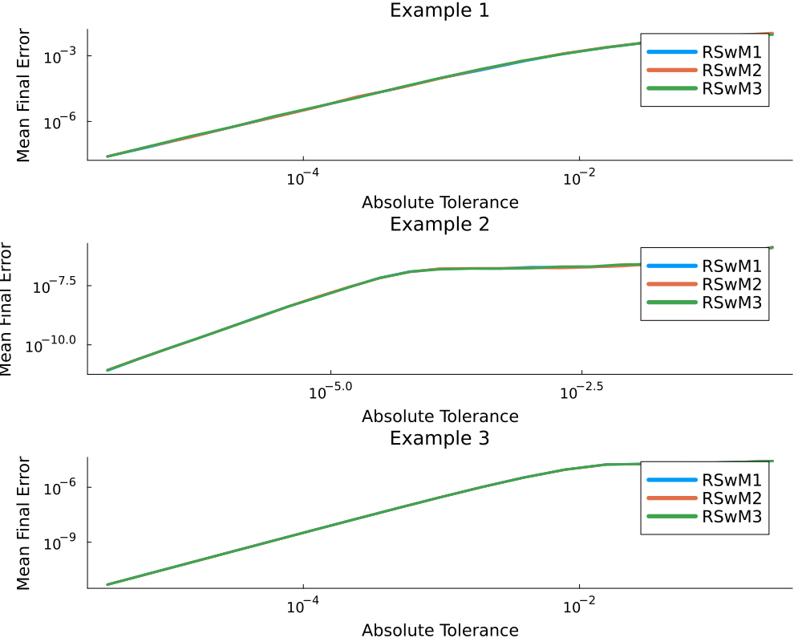
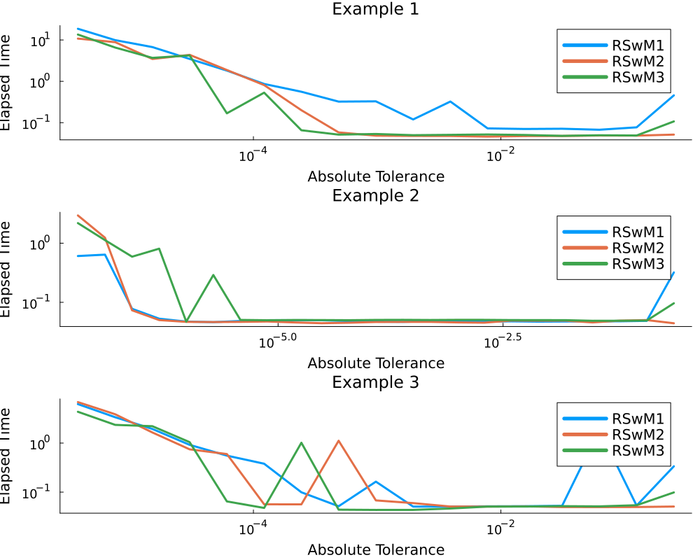
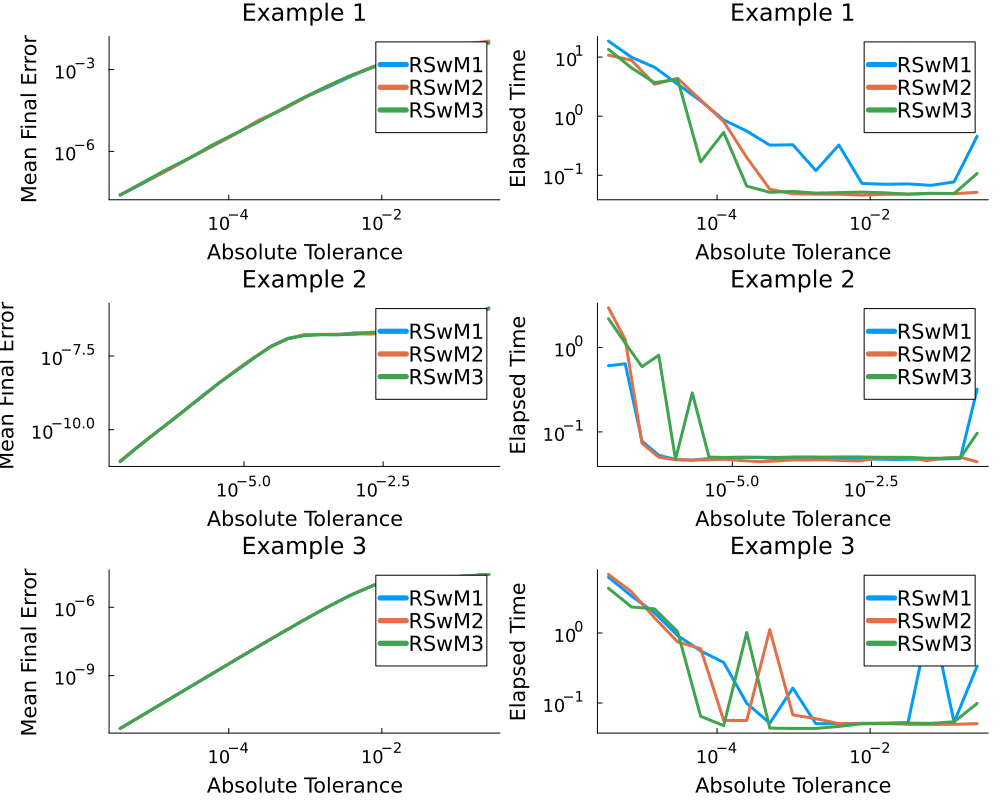

```julia
using StochasticDiffEq, SDEProblemLibrary, DiffEqNoiseProcess, DiffEqBase, Plots
import SDEProblemLibrary: prob_sde_additive,
                          prob_sde_linear, prob_sde_wave

p1 = Vector{Any}(undef, 3)
p2 = Vector{Any}(undef, 3)
p3 = Vector{Any}(undef, 3)

probs = Matrix{SDEProblem}(undef, 3, 3)
## Problem 1
prob = prob_sde_linear
probs[1, 1] = SDEProblem(prob.f, prob.g, prob.u0, prob.tspan, prob.p,
    noise = WienerProcess(0.0, 0.0, 0.0, rswm = RSWM(adaptivealg = :RSwM1)))
probs[1, 2] = SDEProblem(prob.f, prob.g, prob.u0, prob.tspan, prob.p,
    noise = WienerProcess(0.0, 0.0, 0.0, rswm = RSWM(adaptivealg = :RSwM2)))
probs[1, 3] = SDEProblem(prob.f, prob.g, prob.u0, prob.tspan, prob.p,
    noise = WienerProcess(0.0, 0.0, 0.0, rswm = RSWM(adaptivealg = :RSwM3)))
## Problem 2
prob = prob_sde_wave
probs[2, 1] = SDEProblem(prob.f, prob.g, prob.u0, prob.tspan, prob.p,
    noise = WienerProcess(0.0, 0.0, 0.0, rswm = RSWM(adaptivealg = :RSwM1)))
probs[2, 2] = SDEProblem(prob.f, prob.g, prob.u0, prob.tspan, prob.p,
    noise = WienerProcess(0.0, 0.0, 0.0, rswm = RSWM(adaptivealg = :RSwM2)))
probs[2, 3] = SDEProblem(prob.f, prob.g, prob.u0, prob.tspan, prob.p,
    noise = WienerProcess(0.0, 0.0, 0.0, rswm = RSWM(adaptivealg = :RSwM3)))
## Problem 3
prob = prob_sde_additive
probs[3, 1] = SDEProblem(prob.f, prob.g, prob.u0, prob.tspan, prob.p,
    noise = WienerProcess(0.0, 0.0, 0.0, rswm = RSWM(adaptivealg = :RSwM1)))
probs[3, 2] = SDEProblem(prob.f, prob.g, prob.u0, prob.tspan, prob.p,
    noise = WienerProcess(0.0, 0.0, 0.0, rswm = RSWM(adaptivealg = :RSwM2)))
probs[3, 3] = SDEProblem(prob.f, prob.g, prob.u0, prob.tspan, prob.p,
    noise = WienerProcess(0.0, 0.0, 0.0, rswm = RSWM(adaptivealg = :RSwM3)))

fullMeans = Vector{Array}(undef, 3)
fullMedians = Vector{Array}(undef, 3)
fullElapsed = Vector{Array}(undef, 3)
fullTols = Vector{Array}(undef, 3)
offset = 0

Ns = [17, 23,
    17]
```

```
3-element Vector{Int64}:
 17
 23
 17
```


The Monte Carlo runs use multithreaded ensembles (`EnsembleThreads()`), so start Julia
with multiple threads (e.g. `julia -t auto`) for parallel timing.

```julia
for k in 1:size(probs, 1)
    global probs, Ns, fullMeans, fullMedians, fullElapsed, fullTols
    println("Problem $k")
    ## Setup
    N = Ns[k]

    msims = Vector{Any}(undef, N)
    elapsed = Array{Float64}(undef, N, 3)
    medians = Array{Float64}(undef, N, 3)
    means = Array{Float64}(undef, N, 3)
    tols = Array{Float64}(undef, N, 3)

    #Compile
    prob = probs[k, 1]
    monte_prob = EnsembleProblem(prob)
    solve(monte_prob, SRIW1(), EnsembleThreads(), dt = 1/2^(4), adaptive = true,
        trajectories = 1000, abstol = 2.0^(-1), reltol = 0)

    println("RSwM1")
    for i in (1 + offset):(N + offset)
        tols[i - offset, 1] = 2.0^(-i-1)
        msims[i - offset] = DiffEqBase.calculate_ensemble_errors(solve(monte_prob, SRIW1(),
            EnsembleThreads(), trajectories = 1000, abstol = 2.0^(-i-1),
            reltol = 0, force_dtmin = true, maxiters = Int(1e7)))
        elapsed[i - offset, 1] = msims[i - offset].elapsedTime
        medians[i - offset, 1] = msims[i - offset].error_medians[:final]
        means[i - offset, 1] = msims[i - offset].error_means[:final]
    end

    println("RSwM2")
    prob = probs[k, 2]

    monte_prob = EnsembleProblem(prob)
    solve(monte_prob, SRIW1(), EnsembleThreads(), dt = 1/2^(4), adaptive = true,
        trajectories = 1000, abstol = 2.0^(-1), reltol = 0)

    for i in (1 + offset):(N + offset)
        tols[i - offset, 2] = 2.0^(-i-1)
        msims[i - offset] = DiffEqBase.calculate_ensemble_errors(solve(monte_prob, SRIW1(),
            EnsembleThreads(), trajectories = 1000, abstol = 2.0^(-i-1),
            reltol = 0, force_dtmin = true, maxiters = Int(1e7)))
        elapsed[i - offset, 2] = msims[i - offset].elapsedTime
        medians[i - offset, 2] = msims[i - offset].error_medians[:final]
        means[i - offset, 2] = msims[i - offset].error_means[:final]
    end

    println("RSwM3")
    prob = probs[k, 3]
    monte_prob = EnsembleProblem(prob)
    solve(monte_prob, SRIW1(), EnsembleThreads(), dt = 1/2^(4), adaptive = true,
        trajectories = 1000, abstol = 2.0^(-1), reltol = 0)

    for i in (1 + offset):(N + offset)
        tols[i - offset, 3] = 2.0^(-i-1)
        msims[i - offset] = DiffEqBase.calculate_ensemble_errors(solve(monte_prob, SRIW1(),
            EnsembleThreads(), adaptive = true, trajectories = 1000, abstol = 2.0^(-i-1),
            reltol = 0, force_dtmin = true, maxiters = Int(1e7)))
        elapsed[i - offset, 3] = msims[i - offset].elapsedTime
        medians[i - offset, 3] = msims[i - offset].error_medians[:final]
        means[i - offset, 3] = msims[i - offset].error_means[:final]
    end

    fullMeans[k] = means
    fullMedians[k] = medians
    fullElapsed[k] = elapsed
    fullTols[k] = tols
end
```

```
Problem 1
RSwM1
RSwM2
RSwM3
Problem 2
RSwM1
RSwM2
RSwM3
Problem 3
RSwM1
RSwM2
RSwM3
```


```julia
gr(fmt = :svg)
lw=3
leg=["RSwM1" "RSwM2" "RSwM3"]

titleFontSize = 16
guideFontSize = 14
legendFontSize = 14
tickFontSize = 12

for k in 1:size(probs, 1)
    global probs, Ns, fullMeans, fullMedians, fullElapsed, fullTols
    p1[k] = Plots.plot(fullTols[k], fullMeans[k], xscale = :log10, yscale = :log10,
        xguide = "Absolute Tolerance", yguide = "Mean Final Error",
        title = "Example $k", linewidth = lw, grid = false, lab = leg,
        titlefont = font(titleFontSize), legendfont = font(legendFontSize),
        tickfont = font(tickFontSize), guidefont = font(guideFontSize))
    p2[k] = Plots.plot(fullTols[k], fullMedians[k], xscale = :log10, yscale = :log10,
        xguide = "Absolute Tolerance", yguide = "Median Final Error",
        title = "Example $k", linewidth = lw, grid = false, lab = leg,
        titlefont = font(titleFontSize), legendfont = font(legendFontSize),
        tickfont = font(tickFontSize), guidefont = font(guideFontSize))
    p3[k] = Plots.plot(fullTols[k], fullElapsed[k], xscale = :log10, yscale = :log10,
        xguide = "Absolute Tolerance", yguide = "Elapsed Time",
        title = "Example $k", linewidth = lw, grid = false, lab = leg,
        titlefont = font(titleFontSize), legendfont = font(legendFontSize),
        tickfont = font(tickFontSize), guidefont = font(guideFontSize))
end

Plots.plot!(p1[1])
Plots.plot(p1[1], p1[2], p1[3], layout = (3, 1), size = (1000, 800))
```



```julia
#savefig("meanvstol.png")
#savefig("meanvstol.pdf")
```


```julia
plot(p3[1], p3[2], p3[3], layout = (3, 1), size = (1000, 800))
#savefig("timevstol.png")
#savefig("timevstol.pdf")
```



```julia
plot(p1[1], p3[1], p1[2], p3[2], p1[3], p3[3], layout = (3, 2), size = (1000, 800))
```



```julia

using SciMLBenchmarks
SciMLBenchmarks.bench_footer(WEAVE_ARGS[:folder], WEAVE_ARGS[:file])
```


## Appendix

These benchmarks are a part of the SciMLBenchmarks.jl repository, found at: [https://github.com/SciML/SciMLBenchmarks.jl](https://github.com/SciML/SciMLBenchmarks.jl). For more information on high-performance scientific machine learning, check out the SciML Open Source Software Organization [https://sciml.ai](https://sciml.ai).

To locally run this benchmark, do the following commands:
```
using SciMLBenchmarks
SciMLBenchmarks.weave_file("benchmarks/AdaptiveSDE","AdaptiveEfficiencyTests.jmd")
```

Computer Information:

```
Julia Version 1.12.7
Commit 6d172b025e4 (2026-08-15 08:05 UTC)
Build Info:
  Official https://julialang.org release
Platform Info:
  OS: Linux (x86_64-linux-gnu)
  CPU: 128 × AMD EPYC 7502 32-Core Processor
  WORD_SIZE: 64
  LLVM: libLLVM-18.1.7 (ORCJIT, znver2)
  GC: Built with stock GC
Threads: 128 default, 1 interactive, 128 GC (on 128 virtual cores)
Environment:
  JULIA_NUM_THREADS = auto

```

Package Information:

```
Status `~/github-runners/amdci3-1/_work/SciMLBenchmarks.jl/SciMLBenchmarks.jl/benchmarks/AdaptiveSDE/Project.toml`
⌃ [2b5f629d] DiffEqBase v7.6.0
⌃ [77a26b50] DiffEqNoiseProcess v5.34.0
⌃ [bbf590c4] OrdinaryDiffEqCore v4.5.0
⌃ [91a5bcdd] Plots v1.41.6
⌃ [c72e72a9] SDEProblemLibrary v1.2.1
⌃ [31c91b34] SciMLBenchmarks v0.1.3 [loaded: v0.2.1]
⌃ [a6db7da4] SciMLLogging v2.0.1
⌃ [789caeaf] StochasticDiffEq v7.1.1
  [9a3f8284] Random v1.11.0
Info Packages marked with ⌃ have new versions available and may be upgradable.
```

And the full manifest:

```
Status `~/github-runners/amdci3-1/_work/SciMLBenchmarks.jl/SciMLBenchmarks.jl/benchmarks/AdaptiveSDE/Manifest.toml`
⌃ [47edcb42] ADTypes v1.22.1
⌃ [14f7f29c] AMD v0.5.3
  [7d9f7c33] Accessors v0.1.45
  [79e6a3ab] Adapt v4.7.0
  [66dad0bd] AliasTables v1.1.3
  [ec485272] ArnoldiMethod v0.4.0
⌃ [4fba245c] ArrayInterface v7.27.0
⌃ [b2a6c25c] BinaryHeaps v1.0.1
  [d1d4a3ce] BitFlags v0.1.10
⌃ [70df07ce] BracketingNonlinearSolve v1.12.2
⌃ [944b1d66] CodecZlib v0.7.8
  [35d6a980] ColorSchemes v3.31.0
  [3da002f7] ColorTypes v0.12.1
  [c3611d14] ColorVectorSpace v0.11.0
  [5ae59095] Colors v0.13.1
⌃ [38540f10] CommonSolve v0.2.9
  [bbf7d656] CommonSubexpressions v0.3.1
  [34da2185] Compat v4.18.1
  [a33af91c] CompositionsBase v0.1.2
⌃ [2569d6c7] ConcreteStructs v0.2.5
⌃ [f0e56b4a] ConcurrentUtilities v2.5.1
  [8f4d0f93] Conda v1.10.3
  [187b0558] ConstructionBase v1.6.0
  [d38c429a] Contour v0.6.3
  [9a962f9c] DataAPI v1.16.0
⌃ [864edb3b] DataStructures v0.19.5
  [e2d170a0] DataValueInterfaces v1.0.0
  [8bb1440f] DelimitedFiles v1.9.1
⌃ [2b5f629d] DiffEqBase v7.6.0
⌃ [459566f4] DiffEqCallbacks v4.18.1
⌃ [77a26b50] DiffEqNoiseProcess v5.34.0
  [163ba53b] DiffResults v1.1.0
  [b552c78f] DiffRules v1.16.0
⌃ [a0c0ee7d] DifferentiationInterface v0.7.18
⌃ [31c24e10] Distributions v0.25.129
  [ffbed154] DocStringExtensions v0.9.5
  [4e289a0a] EnumX v1.0.7
⌃ [f151be2c] EnzymeCore v0.8.20
  [460bff9d] ExceptionUnwrapping v0.1.11
⌃ [e2ba6199] ExprTools v0.1.10
  [c87230d0] FFMPEG v0.4.5
⌃ [7034ab61] FastBroadcast v1.3.3
  [9aa1b823] FastClosures v0.3.2
⌃ [a4df4552] FastPower v1.3.3
⌃ [1a297f60] FillArrays v1.16.0
⌃ [6a86dc24] FiniteDiff v2.31.1
⌅ [53c48c17] FixedPointNumbers v0.8.6
  [1fa38f19] Format v1.3.7
⌃ [f6369f11] ForwardDiff v1.4.1
  [069b7b12] FunctionWrappers v1.1.3
⌃ [77dc65aa] FunctionWrappersWrappers v1.9.3
  [46192b85] GPUArraysCore v0.2.0
⌃ [28b8d3ca] GR v0.73.26
  [d7ba0133] Git v1.5.0
⌃ [86223c79] Graphs v1.14.0
  [42e2da0e] Grisu v1.0.2
⌅ [cd3eb016] HTTP v1.11.0
⌅ [eafb193a] Highlights v0.5.3
⌃ [34004b35] HypergeometricFunctions v0.3.28
  [7073ff75] IJulia v1.34.4
  [d25df0c9] Inflate v0.1.5
  [3587e190] InverseFunctions v0.1.17
  [92d709cd] IrrationalConstants v0.2.6
  [82899510] IteratorInterfaceExtensions v1.0.0
  [1019f520] JLFzf v0.1.11
  [692b3bcd] JLLWrappers v1.8.0
⌅ [682c06a0] JSON v0.21.4
⌃ [ccbc3e58] JumpProcesses v9.29.0
⌃ [ba0b0d4f] Krylov v0.10.6
⌃ [b964fa9f] LaTeXStrings v1.4.0
⌃ [23fbe1c1] Latexify v0.16.10
⌃ [87fe0de2] LineSearch v0.1.10
⌅ [7ed4a6bd] LinearSolve v3.87.0
  [2ab3a3ac] LogExpFunctions v1.0.1
  [e6f89c97] LoggingExtras v1.2.0
  [1914dd2f] MacroTools v0.5.16
⌃ [bb5d69b7] MaybeInplace v0.1.5
  [739be429] MbedTLS v1.1.10
  [442fdcdd] Measures v0.3.3
  [e1d29d7a] Missings v1.2.0
⌃ [46d2c3a1] MuladdMacro v0.2.6
  [ffc61752] Mustache v1.0.21
  [77ba4419] NaNMath v1.1.4
⌃ [8913a72c] NonlinearSolve v4.20.1
⌅ [be0214bd] NonlinearSolveBase v2.31.2
⌃ [5959db7a] NonlinearSolveFirstOrder v2.1.2
⌃ [9a2c21bd] NonlinearSolveQuasiNewton v1.13.2
⌃ [26075421] NonlinearSolveSpectralMethods v1.7.2
  [4d8831e6] OpenSSL v1.6.1
⌅ [bac558e1] OrderedCollections v1.8.2 [loaded: v2.0.1]
⌃ [bbf590c4] OrdinaryDiffEqCore v4.5.0
⌃ [4302a76b] OrdinaryDiffEqDifferentiation v3.2.1
⌃ [127b3ac7] OrdinaryDiffEqNonlinearSolve v2.0.1
⌃ [90014a1f] PDMats v0.11.40
⌅ [69de0a69] Parsers v2.8.6 [loaded: v2.8.8]
  [ccf2f8ad] PlotThemes v3.3.0
  [995b91a9] PlotUtils v1.4.4
⌃ [91a5bcdd] Plots v1.41.6
⌃ [e409e4f3] PoissonRandom v0.4.10
⌃ [d236fae5] PreallocationTools v1.2.1
  [aea7be01] PrecompileTools v1.3.4
  [21216c6a] Preferences v1.5.2
  [43287f4e] PtrArrays v1.4.0
⌃ [0c0d3e7f] PureKLU v1.0.2
  [1fd47b50] QuadGK v2.11.3
  [3cdcf5f2] RecipesBase v1.3.4
  [01d81517] RecipesPipeline v0.6.12
⌃ [731186ca] RecursiveArrayTools v4.3.2
  [189a3867] Reexport v1.2.2
  [05181044] RelocatableFolders v1.0.1
  [ae029012] Requires v1.3.1
⌃ [ae5879a3] ResettableStacks v1.2.1
  [79098fc4] Rmath v0.9.0
⌃ [f2b01f46] Roots v3.0.0
⌃ [7e49a35a] RuntimeGeneratedFunctions v0.5.21
⌃ [c72e72a9] SDEProblemLibrary v1.2.1
⌅ [0bca4576] SciMLBase v3.28.1
⌃ [31c91b34] SciMLBenchmarks v0.1.3 [loaded: v0.2.1]
⌃ [19f34311] SciMLJacobianOperators v0.1.14
⌃ [a6db7da4] SciMLLogging v2.0.1
⌃ [c0aeaf25] SciMLOperators v1.22.1
⌃ [431bcebd] SciMLPublic v1.2.1
⌃ [53ae85a6] SciMLStructures v1.10.1
  [6c6a2e73] Scratch v1.3.0
  [efcf1570] Setfield v1.1.2
⌃ [992d4aef] Showoff v1.0.3
  [777ac1f9] SimpleBufferStream v1.2.0
⌃ [727e6d20] SimpleNonlinearSolve v2.12.1
  [699a6c99] SimpleTraits v0.9.6
  [a2af1166] SortingAlgorithms v1.2.3
⌃ [a57abbd0] SparseColumnPivotedQR v2.1.2
⌃ [0a514795] SparseMatrixColorings v0.4.27
⌃ [276daf66] SpecialFunctions v2.8.0
  [860ef19b] StableRNGs v1.0.4
⌃ [90137ffa] StaticArrays v1.9.18
  [1e83bf80] StaticArraysCore v1.4.4
⌃ [10745b16] Statistics v1.11.1
  [82ae8749] StatsAPI v1.8.0
⌃ [2913bbd2] StatsBase v0.34.12
⌃ [4c63d2b9] StatsFuns v2.2.0
⌃ [789caeaf] StochasticDiffEq v7.1.1
⌃ [19c5a474] StochasticDiffEqCore v2.0.2
⌃ [0520c28c] StochasticDiffEqHighOrder v2.1.1
⌃ [ebf54054] StochasticDiffEqIIF v2.0.1
⌃ [5080b986] StochasticDiffEqImplicit v2.1.1
⌃ [aefaaa88] StochasticDiffEqLeaping v2.0.1
⌃ [90dbc90e] StochasticDiffEqLevyArea v2.0.1
⌃ [d15fe365] StochasticDiffEqLowOrder v2.0.1
⌃ [8c95a807] StochasticDiffEqMilstein v2.0.1
⌃ [db241ea8] StochasticDiffEqROCK v2.0.1
⌃ [49714585] StochasticDiffEqRODE v2.0.1
⌃ [af2a2fcd] StochasticDiffEqWeak v2.1.1
  [69024149] StringEncodings v0.3.7
⌃ [2efcf032] SymbolicIndexingInterface v0.3.49
  [3783bdb8] TableTraits v1.0.1
⌃ [bd369af6] Tables v1.13.0 [loaded: v1.14.0]
  [62fd8b95] TensorCore v0.1.1
⌅ [a759f4b9] TimerOutputs v0.5.29
  [3bb67fe8] TranscodingStreams v0.11.3
  [781d530d] TruncatedStacktraces v1.4.0
⌃ [5c2747f8] URIs v1.6.1
  [1cfade01] UnicodeFun v0.4.1
  [41fe7b60] Unzip v0.2.0
  [81def892] VersionParsing v1.3.0
  [44d3d7a6] Weave v0.10.12
  [ddb6d928] YAML v0.4.16
  [c2297ded] ZMQ v1.5.1
  [6e34b625] Bzip2_jll v1.0.9+0
  [83423d85] Cairo_jll v1.18.7+0
  [ee1fde0b] Dbus_jll v1.16.2+0
  [2702e6a9] EpollShim_jll v0.0.20230411+1
⌃ [2e619515] Expat_jll v2.8.1+0
⌅ [b22a6f82] FFMPEG_jll v8.1.2+0
  [a3f928ae] Fontconfig_jll v2.17.1+0
  [d7e528f0] FreeType2_jll v2.14.3+1
  [559328eb] FriBidi_jll v1.0.17+0
⌃ [0656b61e] GLFW_jll v3.4.1+1
⌅ [d2c73de3] GR_jll v0.73.26+0
⌅ [b0724c58] GettextRuntime_jll v0.22.4+0
  [61579ee1] Ghostscript_jll v9.55.1+0
  [020c3dae] Git_LFS_jll v3.7.1+0
⌃ [f8c6e375] Git_jll v2.54.0+0
⌃ [7746bdde] Glib_jll v2.86.3+0
  [3b182d85] Graphite2_jll v1.3.16+0
⌅ [2e76f6c2] HarfBuzz_jll v8.5.1+0
  [1d5cc7b8] IntelOpenMP_jll v2025.2.0+0
⌃ [aacddb02] JpegTurbo_jll v3.1.5+0
  [c1c5ebd0] LAME_jll v3.100.3+0
  [88015f11] LERC_jll v4.1.0+0
⌃ [1d63c593] LLVMOpenMP_jll v18.1.8+0
⌅ [e9f186c6] Libffi_jll v3.4.7+0
  [7e76a0d4] Libglvnd_jll v1.7.1+1
  [94ce4f54] Libiconv_jll v1.18.0+0
  [4b2f31a3] Libmount_jll v2.42.0+0
⌃ [89763e89] Libtiff_jll v4.7.2+0
  [38a345b3] Libuuid_jll v2.42.0+0
  [856f044c] MKL_jll v2025.2.0+0
  [c8ffd9c3] MbedTLS_jll v2.28.1010+0
  [e7412a2a] Ogg_jll v1.3.6+0
⌃ [9bd350c2] OpenSSH_jll v10.3.1+0
  [efe28fd5] OpenSpecFun_jll v0.5.6+0
  [91d4177d] Opus_jll v1.6.1+0
⌃ [36c8627f] Pango_jll v1.57.1+0
  [30392449] Pixman_jll v0.46.4+0
  [c0090381] Qt6Base_jll v6.10.2+2
  [629bc702] Qt6Declarative_jll v6.10.2+2
  [ce943373] Qt6ShaderTools_jll v6.10.2+1
  [6de9746b] Qt6Svg_jll v6.10.2+0
  [e99dba38] Qt6Wayland_jll v6.10.2+1
⌃ [f50d1b31] Rmath_jll v0.5.1+0
  [a44049a8] Vulkan_Loader_jll v1.3.243+0
  [a2964d1f] Wayland_jll v1.24.0+0
  [ffd25f8a] XZ_jll v5.8.3+0
  [f67eecfb] Xorg_libICE_jll v1.1.2+0
  [c834827a] Xorg_libSM_jll v1.2.6+0
  [4f6342f7] Xorg_libX11_jll v1.8.13+0
  [0c0b7dd1] Xorg_libXau_jll v1.0.13+0
  [935fb764] Xorg_libXcursor_jll v1.2.4+0
  [a3789734] Xorg_libXdmcp_jll v1.1.6+0
  [1082639a] Xorg_libXext_jll v1.3.8+0
  [d091e8ba] Xorg_libXfixes_jll v6.0.2+0
⌃ [a51aa0fd] Xorg_libXi_jll v1.8.3+0
  [d1454406] Xorg_libXinerama_jll v1.1.7+0
  [ec84b674] Xorg_libXrandr_jll v1.5.6+0
  [ea2f1a96] Xorg_libXrender_jll v0.9.12+0
  [a65dc6b1] Xorg_libpciaccess_jll v0.19.0+0
  [c7cfdc94] Xorg_libxcb_jll v1.17.1+0
  [cc61e674] Xorg_libxkbfile_jll v1.2.0+0
  [e920d4aa] Xorg_xcb_util_cursor_jll v0.1.6+0
  [12413925] Xorg_xcb_util_image_jll v0.4.1+0
  [2def613f] Xorg_xcb_util_jll v0.4.1+0
  [975044d2] Xorg_xcb_util_keysyms_jll v0.4.1+0
  [0d47668e] Xorg_xcb_util_renderutil_jll v0.3.10+0
  [c22f9ab0] Xorg_xcb_util_wm_jll v0.4.2+0
  [35661453] Xorg_xkbcomp_jll v1.4.7+0
⌃ [33bec58e] Xorg_xkeyboard_config_jll v2.47.0+1
  [c5fb5394] Xorg_xtrans_jll v1.6.0+0
  [8f1865be] ZeroMQ_jll v4.3.6+0
  [3161d3a3] Zstd_jll v1.5.7+1
  [35ca27e7] eudev_jll v3.2.14+0
⌅ [214eeab7] fzf_jll v0.61.1+0
⌃ [a4ae2306] libaom_jll v3.13.3+0
⌃ [0ac62f75] libass_jll v0.17.4+0
  [1183f4f0] libdecor_jll v0.2.2+0
⌃ [8e53e030] libdrm_jll v2.4.125+1
  [2db6ffa8] libevdev_jll v1.13.4+0
  [f638f0a6] libfdk_aac_jll v2.0.4+0
  [36db933b] libinput_jll v1.28.1+0
  [b53b4c65] libpng_jll v1.6.58+0
  [a9144af2] libsodium_jll v1.0.21+0
  [9a156e7d] libva_jll v2.23.0+0
  [f27f6e37] libvorbis_jll v1.3.8+0
  [009596ad] mtdev_jll v1.1.7+0
  [1317d2d5] oneTBB_jll v2022.3.0+0
⌅ [1270edf5] x264_jll v10164.0.1+0
  [dfaa095f] x265_jll v4.1.0+0
  [d8fb68d0] xkbcommon_jll v1.13.0+0
  [0dad84c5] ArgTools v1.1.2
  [56f22d72] Artifacts v1.11.0
  [2a0f44e3] Base64 v1.11.0
  [ade2ca70] Dates v1.11.0
  [8ba89e20] Distributed v1.11.0
  [f43a241f] Downloads v1.7.0
  [7b1f6079] FileWatching v1.11.0
  [9fa8497b] Future v1.11.0
  [b77e0a4c] InteractiveUtils v1.11.0
  [ac6e5ff7] JuliaSyntaxHighlighting v1.12.0
  [4af54fe1] LazyArtifacts v1.11.0
  [b27032c2] LibCURL v0.6.4
  [76f85450] LibGit2 v1.11.0
  [8f399da3] Libdl v1.11.0
  [37e2e46d] LinearAlgebra v1.12.0
  [56ddb016] Logging v1.11.0
  [d6f4376e] Markdown v1.11.0
  [a63ad114] Mmap v1.11.0
  [ca575930] NetworkOptions v1.3.0
  [44cfe95a] Pkg v1.12.1
  [de0858da] Printf v1.11.0
  [3fa0cd96] REPL v1.11.0
  [9a3f8284] Random v1.11.0
  [ea8e919c] SHA v0.7.0
  [9e88b42a] Serialization v1.11.0
  [6462fe0b] Sockets v1.11.0
  [2f01184e] SparseArrays v1.12.0
  [f489334b] StyledStrings v1.11.0
  [4607b0f0] SuiteSparse
  [fa267f1f] TOML v1.0.3
  [a4e569a6] Tar v1.10.0
  [8dfed614] Test v1.11.0
  [cf7118a7] UUIDs v1.11.0
  [4ec0a83e] Unicode v1.11.0
  [e66e0078] CompilerSupportLibraries_jll v1.3.0+1
  [deac9b47] LibCURL_jll v8.15.0+0
  [e37daf67] LibGit2_jll v1.9.0+0
  [29816b5a] LibSSH2_jll v1.11.3+1
  [14a3606d] MozillaCACerts_jll v2025.11.4
  [4536629a] OpenBLAS_jll v0.3.29+0
  [05823500] OpenLibm_jll v0.8.7+0
  [458c3c95] OpenSSL_jll v3.5.4+0
  [efcefdf7] PCRE2_jll v10.44.0+1
  [bea87d4a] SuiteSparse_jll v7.8.3+2
  [83775a58] Zlib_jll v1.3.1+2
  [8e850b90] libblastrampoline_jll v5.15.0+0
  [8e850ede] nghttp2_jll v1.64.0+1
  [3f19e933] p7zip_jll v17.7.0+0
Info Packages marked with ⌃ and ⌅ have new versions available. Those with ⌃ may be upgradable, but those with ⌅ are restricted by compatibility constraints from upgrading. To see why use `status --outdated -m`
```

