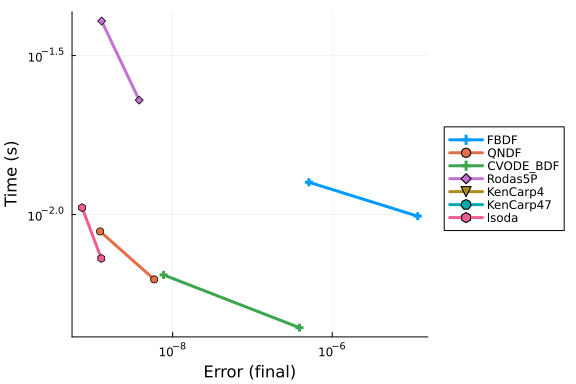

```julia
using Catalyst
using OrdinaryDiffEq
using Plots
using Symbolics
using DiffEqDevTools
using Sundials, ODEInterface, ODEInterfaceDiffEq, LSODA
using RecursiveFactorization
```


## Without Temperature Dynamics

```julia
# Some basic astrochemistry constants:
# u_vec = [H2 O C O⁺ OH⁺ H H2O⁺ H3O⁺ E H2O OH C⁺ CO CO⁺ H⁺ HCO⁺ T]
# println(u_vec)
# @species 
kboltzmann = 1.38064852e-16  # erg / K
pmass = 1.6726219e-24  # g
# dust2gas = 1e-2 # ratio
mu = 2.34
seconds_per_year = 3600 * 24 * 365
gamma_ad = 1.4
gnot = 1e1
# Simulation parameters:
number_density = 1e5
# dust2gas = 0.01
minimum_fractional_density = 1e-30 * number_density

# @register_symbolic get_heating(H, H2, E, tgas, ntot, dust2gas)
function get_heating(H, H2, E, tgas, ntot, dust2gas)
    """
       get_heating(x, tgas, cr_rate, gnot)

    Calculate the total heating rate based on various processes.

    ## Arguments
    - `x`: Dict{String, Float64} — A dictionary containing the abundances of different species:
        - `"H"`: Abundance of hydrogen
        - `"H2"`: Abundance of molecular hydrogen
        - `"E"`: Abundance of electrons
        - `"dust2gas"`: Dust-to-gas ratio
    - `tgas`: Float64 — Gas temperature
    - `cr_rate`: Float64 — Cosmic ray ionization rate
    - `gnot`: Float64 — Scaling factor for cosmic ray ionization rate

    ## Returns
    - Float64 — Total heating rate considering cosmic ray ionization and photoelectric heating processes.
    """

    rate_H2 = 5.68e-11 * gnot
    heats = [
        cosmic_ionisation_rate * (5.5e-12 * H + 2.5e-11 * H2),
        get_photoelectric_heating(H, E, tgas, gnot, ntot, dust2gas),
        6.4e-13 * rate_H2 * H2
    ]

    return sum(heats)
end

# @register_symbolic get_photoelectric_heating(H, E, tgas, gnot, ntot, dust2gas)
function get_photoelectric_heating(H, E, tgas, gnot, ntot, dust2gas)
    """
       get_photoelectric_heating(x, tgas, gnot)

    Calculate the photoelectric heating rate due to dust grains.

    ## Arguments
    - `x`: Dict{String, Float64} — A dictionary containing the abundances of different species:
        - `"H"`: Abundance of hydrogen
        - `"H2"`: Abundance of molecular hydrogen
        - `"E"`: Abundance of electrons
    - `tgas`: Float64 — Gas temperature
    - `gnot`: Float64 — Scaling factor for cosmic ray ionization rate

    ## Returns
    - Float64 — Photoelectric heating rate based on dust recombination and ionization processes.
    """
    # ntot = sum(x)
    bet = 0.735 * tgas^(-0.068)
    psi = (E>0) * gnot * sqrt(tgas) / E

    # grains recombination cooling
    recomb_cool = 4.65e-30 * tgas^0.94 * psi^bet * E * H

    eps = 4.9e-2 / (1 + 4e-3 * psi^0.73) + 3.7e-2 * (tgas * 1e-4)^0.7 / (1 + 2e-4 * psi)

    # net photoelectric heating
    return (1.3e-24 * eps * gnot * ntot - recomb_cool) * dust2gas
end

# @register_symbolic get_cooling(H, H2, O, E, tgas)
function get_cooling(H, H2, O, E, tgas)
    """
       get_cooling(x, tgas)

    Calculate the total cooling rate based on various processes.

    ## Arguments
    - `x`: Dict{String, Float64} — A dictionary containing the abundances of different species:
        - `"H"`: Abundance of hydrogen
        - `"E"`: Abundance of electrons
        - `"O"`: Abundance of oxygen
        - `"H2"`: Abundance of molecular hydrogen
    - `tgas`: Float64 — Gas temperature

    ## Returns
    - Float64 — Total cooling rate considering Lyman-alpha, OI 630nm, and H2 cooling processes.
    """

    cool = 7.3e-19 * H * E * exp(-118400.0 / tgas)  # Ly-alpha
    cool += 1.8e-24 * O * E * exp(-22800 / tgas)  # OI 630nm
    cool += cooling_H2(H, H2, tgas) # H2 cooling by dissacoiation and recombination
    return cool
end

@register_symbolic cooling_H2(H, H2, temp)
function cooling_H2(H, H2, temp)
    """
       cooling_H2(x, temp)

    Calculate the cooling rate for molecular hydrogen (H2) at a given temperature.

    ## Arguments
    - `x`: Dict{String, Float64} — A dictionary containing the abundances of different species:
        - `"H"`: Abundance of hydrogen
        - `"H2"`: Abundance of molecular hydrogen
    - `temp`: Float64 — Gas temperature

    ## Returns
    - Float64 — Cooling rate due to molecular hydrogen (H2) dissociation and recombination processes.
    """
    t3 = temp * 1e-3  # (T/1000)
    logt3 = log10(t3)

    logt32 = logt3 * logt3
    logt33 = logt32 * logt3
    logt34 = logt33 * logt3
    logt35 = logt34 * logt3
    logt36 = logt35 * logt3
    logt37 = logt36 * logt3
    logt38 = logt37 * logt3

    if temp < 2e3
        HDLR = (9.5e-22 * t3^3.76) / (1.0 + 0.12 * t3^2.1) * exp(-((0.13 / t3)^3)) +
               3.0e-24 * exp(-0.51 / t3)
        HDLV = 6.7e-19 * exp(-5.86 / t3) + 1.6e-18 * exp(-11.7 / t3)
        HDL = HDLR + HDLV
    elseif 2e3 <= temp <= 1e4
        HDL = 1e1^(
            -2.0584225e1
            +
            5.0194035 * logt3
            -
            1.5738805 * logt32
            -
            4.7155769 * logt33
            + 2.4714161 * logt34
            + 5.4710750 * logt35
            -
            3.9467356 * logt36
            -
            2.2148338 * logt37
            +
            1.8161874 * logt38
        )
    else
        HDL = 5.531333679406485e-19
    end

    if temp <= 1e2
        f = 1e1^(
            -16.818342e0
            + 3.7383713e1 * logt3
            + 5.8145166e1 * logt32
            + 4.8656103e1 * logt33
            + 2.0159831e1 * logt34
            + 3.8479610e0 * logt35
        )
    elseif 1e2 < temp <= 1e3
        f = 1e1^(
            -2.4311209e1
            +
            3.5692468e0 * logt3
            -
            1.1332860e1 * logt32
            -
            2.7850082e1 * logt33
            -
            2.1328264e1 * logt34
            -
            4.2519023e0 * logt35
        )
    elseif 1e3 < temp <= 6e3
        f = 1e1^(
            -2.4311209e1
            +
            4.6450521e0 * logt3
            -
            3.7209846e0 * logt32
            +
            5.9369081e0 * logt33
            -
            5.5108049e0 * logt34
            +
            1.5538288e0 * logt35
        )
    else
        f = 1.862314467912518e-22
    end

    LDL = f * H

    if LDL * HDL == 0.0
        return 0.0
    end

    cool = H2 / (1.0 / HDL + 1.0 / LDL)

    return cool
end

function get_heating_cooling(
        T, H2, O, C, O⁺, OH⁺, H, H2O⁺, H3O⁺, E, H2O, OH, C⁺, CO, CO⁺, H⁺, HCO⁺, dust2gas)
    ntot = get_ntot(H2, O, C, O⁺, OH⁺, H, H2O⁺, H3O⁺, E, H2O, OH, C⁺, CO, CO⁺, H⁺, HCO⁺)
    return (gamma_ad - 1e0) *
           (get_heating(H, H2, E, T, ntot, dust2gas) - get_cooling(H, H2, O, E, T)) /
           kboltzmann / ntot
end

function get_ntot(H2, O, C, O⁺, OH⁺, H, H2O⁺, H3O⁺, E, H2O, OH, C⁺, CO, CO⁺, H⁺, HCO⁺)
    return sum([H2 O C O⁺ OH⁺ H H2O⁺ H3O⁺ E H2O OH C⁺ CO CO⁺ H⁺ HCO⁺])
end

ka_reaction(Tgas, α = 1.0, β = 1.0, γ = 0.0) = α*(Tgas/300)^β*exp(−γ / Tgas)

# CONTINUE HERE
# Try this: https://docs.sciml.ai/Catalyst/stable/catalyst_functionality/constraint_equations/#Coupling-ODE-constraints-via-directly-building-a-ReactionSystem

@variables t T(t) = 100.0 # Define the variables before the species!
@species H2(t) O(t) C(t) O⁺(t) OH⁺(t) H(t) H2O⁺(t) H3O⁺(t) E(t) H2O(t) OH(t) C⁺(t) CO(t) CO⁺(t) H⁺(t) HCO⁺(t)
@parameters cosmic_ionisation_rate radiation_field dust2gas

D = Differential(t)
reaction_equations = [
    (@reaction 1.6e-9, $O⁺ + $H2 --> $OH⁺ + $H),
    (@reaction 1e-9, $OH⁺ + $H2 --> $H2O⁺ + $H),
    (@reaction 6.1e-10, $H2O⁺ + $H2 --> $H3O⁺ + $H),
    (@reaction ka_reaction(T, 1.1e-7, -1/2), $H3O⁺ + $E --> $H2O + $H),
    (@reaction ka_reaction(T, 8.6e-8, -1/2), $H2O⁺ + $E --> $OH + $H),
    (@reaction ka_reaction(T, 3.9e-8, -1/2), $H2O⁺ + $E --> $O + $H2),
    (@reaction ka_reaction(T, 6.3e-9, -0.48), $OH⁺ + $E --> $O + $H),
    (@reaction ka_reaction(T, 3.4e-12, -0.63), $O⁺ + $E --> $O),
    (@reaction 2.8 * cosmic_ionisation_rate, $O --> $O⁺ + $E),
    (@reaction 2.62 * cosmic_ionisation_rate, $C --> $C⁺ + $E),
    (@reaction 5.0 * cosmic_ionisation_rate, $CO --> $C + $O),
    (@reaction ka_reaction(T, 4.4e-12, -0.61), $C⁺ + $E --> $C),
    (@reaction ka_reaction(T, 1.15e-10, -0.339), $C⁺ + $OH --> CO + $H),
    (@reaction 9.15e-10 * (0.62 + 0.4767 * 5.5 * sqrt(300 / T)), $C⁺ + $OH --> $CO⁺ + $H),
    (@reaction 4e-10, $CO⁺ + $H --> $CO + $H⁺),
    (@reaction 7.28e-10, $CO⁺ + $H2 --> $HCO⁺ + $H),
    (@reaction ka_reaction(T, 2.8e-7, -0.69), $HCO⁺ + $E --> $CO + $H),
    (@reaction ka_reaction(T, 3.5e-12, -0.7), $H⁺ + $E --> $H),
    (@reaction 2.121e-17 * dust2gas / 1e-2, $H + $H --> $H2),
    (@reaction 1e-1 * cosmic_ionisation_rate, $H2 --> $H + $H),
    (@reaction 3.39e-10 * radiation_field, $C --> $C⁺ + $E),
    (@reaction 2.43e-10 * radiation_field, $CO --> $C + $O),
    (@reaction 7.72e-10 * radiation_field, $H2O --> $OH + $H)    # (D(T) ~ get_heating_cooling(T, H2, O, C, O⁺, OH⁺, H, H2O⁺, H3O⁺, E, H2O, OH, C⁺, CO, CO⁺, H⁺, HCO⁺, dust2gas)) 
]

@named system = ReactionSystem(reaction_equations, t)

u0 = [:H2 => number_density, :O => number_density*2e-4, :C => number_density*1e-4,
    :O⁺=>minimum_fractional_density, :OH⁺=>minimum_fractional_density,
    :H => minimum_fractional_density, :H2O⁺ => minimum_fractional_density,
    :H3O⁺=>minimum_fractional_density, :E=>minimum_fractional_density,
    :H2O=>minimum_fractional_density, :OH=>minimum_fractional_density,
    :C⁺=>minimum_fractional_density, :CO=>minimum_fractional_density,
    :CO⁺=>minimum_fractional_density, :H⁺=>minimum_fractional_density,
    :HCO⁺ => minimum_fractional_density, :T => 100.0]

odesys = convert(ODESystem, complete(system))

setdefaults!(system, u0)

tspan = (0.0, 1e6*seconds_per_year)

params = [dust2gas => 0.01, radiation_field => 1e-1, cosmic_ionisation_rate => 1e-17]

println("Attempting to solve the ODE...")

sys = convert(ODESystem, complete(system))
# oprob = ODEProblemExpr(sys, [], tspan, params)

ssys = structural_simplify(sys)
```

```
Attempting to solve the ODE...
Model system:
Equations (16):
  16 standard: see equations(system)
Unknowns (16): see unknowns(system)
  C(t) [defaults to 10.0]
  CO(t) [defaults to 1.0e-25]
  CO⁺(t) [defaults to 1.0e-25]
  C⁺(t) [defaults to 1.0e-25]
  ⋮
Parameters (4): see parameters(system)
  radiation_field
  cosmic_ionisation_rate
  T [defaults to 100.0]
  dust2gas
```


```julia
oprob = ODEProblem(ssys, [], tspan, params)
println("ODEProblem created successfully.")
sol = solve(oprob, Rodas5()) # Rodas5()) # Tsit5()

# Generate a solution using high precision arithmetic
bigprob = remake(oprob, u0 = big.(oprob.u0), tspan = big.(oprob.tspan))
refsol = solve(bigprob, Rodas5P(), abstol = 1e-18, reltol = 1e-18)
```

```
ODEProblem created successfully.
Error: StackOverflowError:
```


```julia
abstols = 1.0 ./ 10.0 .^ (7:13)
reltols = 1.0 ./ 10.0 .^ (4:10)

setups = [
    Dict(:alg=>FBDF()),
    Dict(:alg=>QNDF()),
    Dict(:alg=>Rodas4P()),
    Dict(:alg=>CVODE_BDF()),
    #Dict(:alg=>ddebdf()),
    Dict(:alg=>Rodas4()),
    Dict(:alg=>Rodas5P()),
    #Dict(:alg=>rodas()),
    #Dict(:alg=>radau()),
    Dict(:alg=>lsoda()),
    #Dict(:alg=>ImplicitEulerExtrapolation(min_order = 5, init_order = 3,threading = OrdinaryDiffEqCore.PolyesterThreads())),
    Dict(:alg=>ImplicitEulerExtrapolation(min_order = 5, init_order = 3, threading = false)),
    #Dict(:alg=>ImplicitEulerBarycentricExtrapolation(min_order = 5, threading = OrdinaryDiffEqCore.PolyesterThreads())),
    Dict(:alg=>ImplicitEulerBarycentricExtrapolation(min_order = 5, threading = false))
]
wp = WorkPrecisionSet(oprob, abstols, reltols, setups; verbose = false,
    save_everystep = false, appxsol = refsol, maxiters = Int(1e5), numruns = 10)
plot(wp)
```

```
Error: UndefVarError: `refsol` not defined
```


## With Temperature Dynamics

```julia
reaction_equations = [
    (@reaction 1.6e-9, $O⁺ + $H2 --> $OH⁺ + $H),
    (@reaction 1e-9, $OH⁺ + $H2 --> $H2O⁺ + $H),
    (@reaction 6.1e-10, $H2O⁺ + $H2 --> $H3O⁺ + $H),
    (@reaction ka_reaction(T, 1.1e-7, -1/2), $H3O⁺ + $E --> $H2O + $H),
    (@reaction ka_reaction(T, 8.6e-8, -1/2), $H2O⁺ + $E --> $OH + $H),
    (@reaction ka_reaction(T, 3.9e-8, -1/2), $H2O⁺ + $E --> $O + $H2),
    (@reaction ka_reaction(T, 6.3e-9, -0.48), $OH⁺ + $E --> $O + $H),
    (@reaction ka_reaction(T, 3.4e-12, -0.63), $O⁺ + $E --> $O),
    (@reaction 2.8 * cosmic_ionisation_rate, $O --> $O⁺ + $E),
    (@reaction 2.62 * cosmic_ionisation_rate, $C --> $C⁺ + $E),
    (@reaction 5.0 * cosmic_ionisation_rate, $CO --> $C + $O),
    (@reaction ka_reaction(T, 4.4e-12, -0.61), $C⁺ + $E --> $C),
    (@reaction ka_reaction(T, 1.15e-10, -0.339), $C⁺ + $OH --> CO + $H),
    (@reaction 9.15e-10 * (0.62 + 0.4767 * 5.5 * sqrt(300 / T)), $C⁺ + $OH --> $CO⁺ + $H),
    (@reaction 4e-10, $CO⁺ + $H --> $CO + $H⁺),
    (@reaction 7.28e-10, $CO⁺ + $H2 --> $HCO⁺ + $H),
    (@reaction ka_reaction(T, 2.8e-7, -0.69), $HCO⁺ + $E --> $CO + $H),
    (@reaction ka_reaction(T, 3.5e-12, -0.7), $H⁺ + $E --> $H),
    (@reaction 2.121e-17 * dust2gas / 1e-2, $H + $H --> $H2),
    (@reaction 1e-1 * cosmic_ionisation_rate, $H2 --> $H + $H),
    (@reaction 3.39e-10 * radiation_field, $C --> $C⁺ + $E),
    (@reaction 2.43e-10 * radiation_field, $CO --> $C + $O),
    (@reaction 7.72e-10 * radiation_field, $H2O --> $OH + $H),
    (D(T) ~ get_heating_cooling(
        T, H2, O, C, O⁺, OH⁺, H, H2O⁺, H3O⁺, E, H2O, OH, C⁺, CO, CO⁺, H⁺, HCO⁺, dust2gas))
]

@named system = ReactionSystem(reaction_equations, t)

u0 = [:H2 => number_density, :O => number_density*2e-4, :C => number_density*1e-4,
    :O⁺=>minimum_fractional_density, :OH⁺=>minimum_fractional_density,
    :H => minimum_fractional_density, :H2O⁺ => minimum_fractional_density,
    :H3O⁺=>minimum_fractional_density, :E=>minimum_fractional_density,
    :H2O=>minimum_fractional_density, :OH=>minimum_fractional_density,
    :C⁺=>minimum_fractional_density, :CO=>minimum_fractional_density,
    :CO⁺=>minimum_fractional_density, :H⁺=>minimum_fractional_density,
    :HCO⁺ => minimum_fractional_density, :T => 100.0]

odesys = convert(ODESystem, complete(system))

setdefaults!(system, u0)

tspan = (0.0, 1e6*seconds_per_year)

params = [dust2gas => 0.01, radiation_field => 1e-1, cosmic_ionisation_rate => 1e-17]

println("Attempting to solve the ODE...")

sys = convert(ODESystem, complete(system))
# oprob = ODEProblemExpr(sys, [], tspan, params)

ssys = structural_simplify(sys)

oprob = ODEProblem(ssys, [], tspan, params)
println("ODEProblem created successfully.")
refsol = solve(oprob, Rodas5P(), abstol = 1e-14, reltol = 1e-14)
```

```
Attempting to solve the ODE...
ODEProblem created successfully.
retcode: Success
Interpolation: specialized 4th (Rodas6P = 5th) order "free" stiffness-aware
 interpolation
t: 7554-element Vector{Float64}:
    0.0
    0.03306297961107439
    0.1261772586116176
    1.0180152212148625
    6.147322737933241
   26.664873468968217
   91.41554078940601
  259.3222543613981
  632.6332658708939
 1372.455816041403
    ⋮
    3.1504928444019055e13
    3.150909766857247e13
    3.1513266893125883e13
    3.1517436117679297e13
    3.152160534223271e13
    3.1525774566786125e13
    3.152994379133954e13
    3.1534113015892953e13
    3.1536e13
u: 7554-element Vector{Vector{Float64}}:
 [10.0, 1.0e-25, 1.0e-25, 1.0e-25, 1.0e-25, 1.0e-25, 100000.0, 1.0e-25, 1.0
e-25, 1.0e-25, 1.0e-25, 1.0e-25, 20.0, 1.0e-25, 1.0e-25, 1.0e-25, 100.0]
 [9.999999999988791, 9.999999999991965e-26, 9.999975930179811e-26, 1.120835
8750648621e-11, 1.1208377265917273e-11, 6.612595971288404e-15, 100000.0, 9.
999999999974476e-26, 1.000541025692682e-25, 1.0000020171151974e-25, 1.00000
2406982019e-25, 1.0e-25, 20.0, 1.0000000000025525e-25, 4.907345567696501e-2
3, 1.8515219708691766e-17, 100.00000003481105]
 [9.999999999957227, 9.999999999969339e-26, 9.999908143377615e-26, 4.277412
3727689e-11, 4.2774194386953917e-11, 2.523545243566907e-14, 100000.0, 9.999
999999902592e-26, 1.0300031504987409e-25, 1.0000077545545191e-25, 1.0000091
856622386e-25, 1.0e-25, 20.0, 1.0000000000097409e-25, 7.133395876525005e-22
, 7.065855167991752e-17, 100.00000013284838]
 [9.999999999654895, 9.999999999752622e-26, 9.999258912380855e-26, 3.451074
2670587304e-10, 3.451079967943943e-10, 2.036030906708299e-13, 100000.0, 9.9
99999999214093e-26, 1.6753794958269615e-24, 1.0003066769876685e-25, 1.00007
41087619145e-25, 1.0e-25, 19.999999999999996, 1.000000000078591e-25, 4.6424
70748200489e-20, 5.700420977974305e-16, 100.0000010718388]
 [9.999999997916058, 9.999999998506234e-26, 9.995525750290973e-26, 2.083944
0185408078e-9, 2.0839474610415352e-9, 1.229466240351674e-12, 100000.0, 9.99
999999525428e-26, 3.4683732218512225e-22, 1.32546178105592e-25, 1.000447424
9708991e-25, 1.0e-25, 19.999999999999993, 1.0000000004758977e-25, 1.6920714
558890387e-18, 3.440808315216875e-15, 100.00000647233837]
 [9.999999990960603, 9.999999993521142e-26, 9.98060680127022e-26, 9.0393990
88091655e-9, 9.039414020420744e-9, 5.333006530310544e-12, 99999.99999999999
, 9.999999979423836e-26, 2.8251899760723974e-20, 1.1593372841899073e-23, 1.
0019393198729066e-25, 1.0e-25, 19.999999999999982, 1.0000000040879187e-25, 
3.1779978757571856e-17, 1.4900520900771654e-14, 100.00002807467429]
 [9.99999996901011, 9.999999977794479e-26, 9.933670444414787e-26, 3.0989892
23046181e-8, 3.0989943423164664e-8, 1.8283481859560882e-11, 99999.999999999
97, 9.999999943752701e-26, 1.132484065377717e-18, 1.5811994881856052e-21, 1
.0066329555576778e-25, 1.0e-25, 19.999999999999943, 1.0000009639790891e-25,
 3.7143196834214017e-16, 5.0820136808860485e-14, 100.00009624877973]
 [9.999999912089692, 9.999999937053542e-26, 9.812984256547996e-26, 8.791031
178453344e-8, 8.791045700499591e-8, 5.186744805428927e-11, 99999.9999999999
4, 1.0000007175046489e-25, 2.550633703446367e-17, 1.0128962196885696e-19, 1
.0187015743383578e-25, 1.0e-25, 19.99999999999985, 1.0001738385755209e-25, 
2.9458654670232495e-15, 1.4224898934910324e-13, 100.00027303290372]
 [9.999999785537161, 9.999999846687511e-26, 9.54988766158825e-26, 2.1446284
058043476e-7, 2.144631948550641e-7, 1.2654435972646762e-10, 99999.999999999
91, 1.0001520250550322e-25, 3.5943730086739948e-16, 3.503079297119509e-18, 
1.0450112337997362e-25, 9.999999999999996e-26, 19.99999999999964, 1.0146504
778624169e-25, 1.6977168449326314e-14, 3.369345200585999e-13, 100.000666081
27442]
 [9.999999534737132, 9.999999668523457e-26, 9.049145284844524e-26, 4.652628
7039798463e-7, 4.652636389732403e-7, 2.7457330609435323e-10, 99999.99999999
985, 1.015212916001035e-25, 3.4601602754743237e-15, 7.403006651605077e-17, 
1.0950854713143095e-25, 9.999999999999977e-26, 19.999999999999226, 1.670326
746788844e-25, 7.500047532103659e-14, 6.900405913203166e-13, 100.0014450190
4845]
 ⋮
 [5.390606270705582, 2.29181477095959e-5, 7.388746032625586e-12, 4.60937081
0944099, 4.609969468972588, 6.4306043818741285, 99996.7846906669, 7.1335815
91278214e-6, 9.028364034215463e-12, 6.270087062843759e-10, 1.95262303384965
93e-10, 5.454269311815587e-10, 19.999969922713724, 2.4711093866211426e-8, 5
.597415946332276e-12, 3.500106590675013e-12, 3757.3873950602047]
 [5.390606298462853, 2.2918147707666952e-5, 7.38874602890436e-12, 4.6093707
8318683, 4.6099695204711555, 6.4314529332124515, 99996.78426639123, 7.13358
158945624e-6, 9.028364070212952e-12, 6.270086991196473e-10, 1.9526230027684
718e-10, 5.454989627657109e-10, 19.999969922713728, 2.4711094012943413e-8, 
5.59741597003906e-12, 3.5001066055255812e-12, 3757.2173938339824]
 [5.390606326220124, 2.291814770574e-5, 7.388746025183783e-12, 4.6093707554
29561, 4.609969571969722, 6.432301483582023, 99996.78384211604, 7.133581587
63129e-6, 9.028364106210399e-12, 6.270086919548927e-10, 1.952622971687475e-
10, 5.455709942660816e-10, 19.99996992271373, 2.4711094159677555e-8, 5.5974
15993745816e-12, 3.5001066203761333e-12, 3757.0474262792527]
 [5.390606353977394, 2.29181477038119e-5, 7.388746021460924e-12, 4.60937072
7672292, 4.609969623468288, 6.433150032982717, 99996.78341784133, 7.1335815
85807793e-6, 9.028364142207803e-12, 6.270086847901526e-10, 1.95262294060587
7e-10, 5.456430256825516e-10, 19.999969922713735, 2.4711094306404053e-8, 5.
597416017452546e-12, 3.5001066352266676e-12, 3756.877492384591]
 [5.390606381734663, 2.291814770188573e-5, 7.38874601773976e-12, 4.60937069
9915025, 4.609969674966854, 6.433998581414407, 99996.78299356712, 7.1335815
83981509e-6, 9.02836417820516e-12, 6.270086776253992e-10, 1.952622909524747
e-10, 5.45715057015216e-10, 19.99996992271374, 2.4711094453136202e-8, 5.597
416041159247e-12, 3.5001066500771857e-12, 3756.7075921383152]
 [5.390606409491933, 2.291814769995843e-5, 7.38874601401718e-12, 4.60937067
2157757, 4.609969726465422, 6.43484712887697, 99996.78256929338, 7.13358158
2157828e-6, 9.028364214202477e-12, 6.270086704606609e-10, 1.952622878443243
3e-10, 5.457870882639586e-10, 19.999969922713742, 2.4711094599863607e-8, 5.
5974160648659235e-12, 3.500106664927687e-12, 3756.5377255288677]
 [5.390606437249202, 2.2918147698030957e-5, 7.388746010296511e-12, 4.609370
64440049, 4.60996977796399, 6.435695675370276, 99996.78214502013, 7.1335815
803352364e-6, 9.028364250199754e-12, 6.270086632959217e-10, 1.9526228473622
565e-10, 5.458591194288018e-10, 19.999969922713746, 2.4711094746597397e-8, 
5.597416088572573e-12, 3.500106679778171e-12, 3756.367892544654]
 [5.3906064650064724, 2.2918147696104367e-5, 7.38874600657876e-12, 4.609370
616643223, 4.609969829462557, 6.436544220894199, 99996.78172074736, 7.13358
1578514656e-6, 9.028364286196987e-12, 6.270086561311867e-10, 1.952622816282
0526e-10, 5.459311505097713e-10, 19.99996992271375, 2.471109489334092e-8, 5
.5974161122791965e-12, 3.500106694628639e-12, 3756.198093174128]
 [5.390606477569365, 2.291814769523244e-5, 7.388746004891718e-12, 4.6093706
0408033, 4.609969852770724, 6.436928270870051, 99996.78152872238, 7.1335815
77686389e-6, 9.028364302489254e-12, 6.270086528883861e-10, 1.95262280221404
64e-10, 5.459637516297786e-10, 19.99996992271375, 2.471109495974211e-8, 5.5
97416123008762e-12, 3.5001067013499295e-12, 3756.1212533075245]
```


```julia
refsol = solve(oprob, Rodas5P(), abstol = 1e-13, reltol = 1e-13)

# Run Benchmark

abstols = 1.0 ./ 10.0 .^ (9:10)
reltols = 1.0 ./ 10.0 .^ (9:10)

setups = [
    Dict(:alg=>FBDF()),
    Dict(:alg=>QNDF()),
    Dict(:alg=>CVODE_BDF()),
    #Dict(:alg=>ddebdf()),
    Dict(:alg=>Rodas5P()),
    Dict(:alg=>KenCarp4()),
    Dict(:alg=>KenCarp47()),
    #Dict(:alg=>RadauIIA9()),
    #Dict(:alg=>rodas()),
    #Dict(:alg=>radau()),
    Dict(:alg=>lsoda())    #Dict(:alg=>ImplicitEulerExtrapolation(min_order = 5, init_order = 3,threading = OrdinaryDiffEqCore.PolyesterThreads())),
    #Dict(:alg=>ImplicitEulerExtrapolation(min_order = 5, init_order = 3,threading = false)),
    #Dict(:alg=>ImplicitEulerBarycentricExtrapolation(min_order = 5, threading = OrdinaryDiffEqCore.PolyesterThreads())),
    #Dict(:alg=>ImplicitEulerBarycentricExtrapolation(min_order = 5, threading = false)),
]
wp = WorkPrecisionSet(oprob, abstols, reltols, setups; verbose = false,
    save_everystep = false, appxsol = refsol, maxiters = Int(1e5), numruns = 10,
    print_names = true)
plot(wp)
```

```
FBDF
QNDF
CVODE_BDF
Rodas5P
KenCarp4
KenCarp47
lsoda
```



