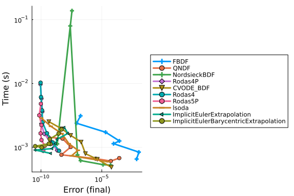
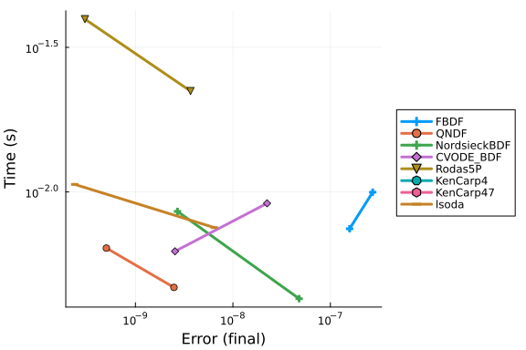

```julia
using Catalyst
using SciMLLogging
using OrdinaryDiffEq
using OrdinaryDiffEqBDF, OrdinaryDiffEqExtrapolation, OrdinaryDiffEqFIRK, OrdinaryDiffEqRosenbrock, OrdinaryDiffEqSDIRK
using Plots
using Symbolics
using DiffEqDevTools
using Sundials, ODEInterface, ODEInterfaceDiffEq, LSODA
using RecursiveFactorization
```


## Without Temperature Dynamics

```julia
# Some basic astrochemistry constants:
# u_vec = [H2 O C O⁺ OH⁺ H H2O⁺ H3O⁺ E H2O OH C⁺ CO CO⁺ H⁺ HCO⁺ T]
# println(u_vec)
# @species
kboltzmann = 1.38064852e-16  # erg / K
pmass = 1.6726219e-24  # g
# dust2gas = 1e-2 # ratio
mu = 2.34
seconds_per_year = 3600 * 24 * 365
gamma_ad = 1.4
gnot = 1e1
# Simulation parameters:
number_density = 1e5
# dust2gas = 0.01
minimum_fractional_density = 1e-30 * number_density

# @register_symbolic get_heating(H, H2, E, tgas, ntot, dust2gas)
function get_heating(H, H2, E, tgas, ntot, dust2gas)
    """
       get_heating(x, tgas, cr_rate, gnot)

    Calculate the total heating rate based on various processes.

    ## Arguments
    - `x`: Dict{String, Float64} — A dictionary containing the abundances of different species:
        - `"H"`: Abundance of hydrogen
        - `"H2"`: Abundance of molecular hydrogen
        - `"E"`: Abundance of electrons
        - `"dust2gas"`: Dust-to-gas ratio
    - `tgas`: Float64 — Gas temperature
    - `cr_rate`: Float64 — Cosmic ray ionization rate
    - `gnot`: Float64 — Scaling factor for cosmic ray ionization rate

    ## Returns
    - Float64 — Total heating rate considering cosmic ray ionization and photoelectric heating processes.
    """

    rate_H2 = 5.68e-11 * gnot
    heats = [
        cosmic_ionisation_rate * (5.5e-12 * H + 2.5e-11 * H2),
        get_photoelectric_heating(H, E, tgas, gnot, ntot, dust2gas),
        6.4e-13 * rate_H2 * H2
    ]

    return sum(heats)
end

# @register_symbolic get_photoelectric_heating(H, E, tgas, gnot, ntot, dust2gas)
function get_photoelectric_heating(H, E, tgas, gnot, ntot, dust2gas)
    """
       get_photoelectric_heating(x, tgas, gnot)

    Calculate the photoelectric heating rate due to dust grains.

    ## Arguments
    - `x`: Dict{String, Float64} — A dictionary containing the abundances of different species:
        - `"H"`: Abundance of hydrogen
        - `"H2"`: Abundance of molecular hydrogen
        - `"E"`: Abundance of electrons
    - `tgas`: Float64 — Gas temperature
    - `gnot`: Float64 — Scaling factor for cosmic ray ionization rate

    ## Returns
    - Float64 — Photoelectric heating rate based on dust recombination and ionization processes.
    """
    # ntot = sum(x)
    bet = 0.735 * tgas^(-0.068)
    psi = (E>0) * gnot * sqrt(tgas) / E

    # grains recombination cooling
    recomb_cool = 4.65e-30 * tgas^0.94 * psi^bet * E * H

    eps = 4.9e-2 / (1 + 4e-3 * psi^0.73) + 3.7e-2 * (tgas * 1e-4)^0.7 / (1 + 2e-4 * psi)

    # net photoelectric heating
    return (1.3e-24 * eps * gnot * ntot - recomb_cool) * dust2gas
end

# @register_symbolic get_cooling(H, H2, O, E, tgas)
function get_cooling(H, H2, O, E, tgas)
    """
       get_cooling(x, tgas)

    Calculate the total cooling rate based on various processes.

    ## Arguments
    - `x`: Dict{String, Float64} — A dictionary containing the abundances of different species:
        - `"H"`: Abundance of hydrogen
        - `"E"`: Abundance of electrons
        - `"O"`: Abundance of oxygen
        - `"H2"`: Abundance of molecular hydrogen
    - `tgas`: Float64 — Gas temperature

    ## Returns
    - Float64 — Total cooling rate considering Lyman-alpha, OI 630nm, and H2 cooling processes.
    """

    cool = 7.3e-19 * H * E * exp(-118400.0 / tgas)  # Ly-alpha
    cool += 1.8e-24 * O * E * exp(-22800 / tgas)  # OI 630nm
    cool += cooling_H2(H, H2, tgas) # H2 cooling by dissacoiation and recombination
    return cool
end

@register_symbolic cooling_H2(H, H2, temp)
function cooling_H2(H, H2, temp)
    """
       cooling_H2(x, temp)

    Calculate the cooling rate for molecular hydrogen (H2) at a given temperature.

    ## Arguments
    - `x`: Dict{String, Float64} — A dictionary containing the abundances of different species:
        - `"H"`: Abundance of hydrogen
        - `"H2"`: Abundance of molecular hydrogen
    - `temp`: Float64 — Gas temperature

    ## Returns
    - Float64 — Cooling rate due to molecular hydrogen (H2) dissociation and recombination processes.
    """
    t3 = temp * 1e-3  # (T/1000)
    logt3 = log10(t3)

    logt32 = logt3 * logt3
    logt33 = logt32 * logt3
    logt34 = logt33 * logt3
    logt35 = logt34 * logt3
    logt36 = logt35 * logt3
    logt37 = logt36 * logt3
    logt38 = logt37 * logt3

    if temp < 2e3
        HDLR = (9.5e-22 * t3^3.76) / (1.0 + 0.12 * t3^2.1) * exp(-((0.13 / t3)^3)) +
               3.0e-24 * exp(-0.51 / t3)
        HDLV = 6.7e-19 * exp(-5.86 / t3) + 1.6e-18 * exp(-11.7 / t3)
        HDL = HDLR + HDLV
    elseif 2e3 <= temp <= 1e4
        HDL = 1e1^(
            -2.0584225e1
            +
            5.0194035 * logt3
            -
            1.5738805 * logt32
            -
            4.7155769 * logt33
            + 2.4714161 * logt34
            + 5.4710750 * logt35
            -
            3.9467356 * logt36
            -
            2.2148338 * logt37
            +
            1.8161874 * logt38
        )
    else
        HDL = 5.531333679406485e-19
    end

    if temp <= 1e2
        f = 1e1^(
            -16.818342e0
            + 3.7383713e1 * logt3
            + 5.8145166e1 * logt32
            + 4.8656103e1 * logt33
            + 2.0159831e1 * logt34
            + 3.8479610e0 * logt35
        )
    elseif 1e2 < temp <= 1e3
        f = 1e1^(
            -2.4311209e1
            +
            3.5692468e0 * logt3
            -
            1.1332860e1 * logt32
            -
            2.7850082e1 * logt33
            -
            2.1328264e1 * logt34
            -
            4.2519023e0 * logt35
        )
    elseif 1e3 < temp <= 6e3
        f = 1e1^(
            -2.4311209e1
            +
            4.6450521e0 * logt3
            -
            3.7209846e0 * logt32
            +
            5.9369081e0 * logt33
            -
            5.5108049e0 * logt34
            +
            1.5538288e0 * logt35
        )
    else
        f = 1.862314467912518e-22
    end

    LDL = f * H

    if LDL * HDL == 0.0
        return 0.0
    end

    cool = H2 / (1.0 / HDL + 1.0 / LDL)

    return cool
end

function get_heating_cooling(
        T, H2, O, C, O⁺, OH⁺, H, H2O⁺, H3O⁺, E, H2O, OH, C⁺, CO, CO⁺, H⁺, HCO⁺, dust2gas)
    ntot = get_ntot(H2, O, C, O⁺, OH⁺, H, H2O⁺, H3O⁺, E, H2O, OH, C⁺, CO, CO⁺, H⁺, HCO⁺)
    return (gamma_ad - 1e0) *
           (get_heating(H, H2, E, T, ntot, dust2gas) - get_cooling(H, H2, O, E, T)) /
           kboltzmann / ntot
end

function get_ntot(H2, O, C, O⁺, OH⁺, H, H2O⁺, H3O⁺, E, H2O, OH, C⁺, CO, CO⁺, H⁺, HCO⁺)
    return sum([H2 O C O⁺ OH⁺ H H2O⁺ H3O⁺ E H2O OH C⁺ CO CO⁺ H⁺ HCO⁺])
end

ka_reaction(Tgas, α = 1.0, β = 1.0, γ = 0.0) = α*(Tgas/300)^β*exp(−γ / Tgas)

# CONTINUE HERE
# Try this: https://docs.sciml.ai/Catalyst/stable/catalyst_functionality/constraint_equations/#Coupling-ODE-constraints-via-directly-building-a-ReactionSystem

@independent_variables t
@variables T(t) = 100.0 # Define the variables before the species!
@species H2(t) O(t) C(t) O⁺(t) OH⁺(t) H(t) H2O⁺(t) H3O⁺(t) E(t) H2O(t) OH(t) C⁺(t) CO(t) CO⁺(t) H⁺(t) HCO⁺(t)
@parameters cosmic_ionisation_rate radiation_field dust2gas

D = Differential(t)
reaction_equations = [
    (@reaction 1.6e-9, $O⁺ + $H2 --> $OH⁺ + $H),
    (@reaction 1e-9, $OH⁺ + $H2 --> $H2O⁺ + $H),
    (@reaction 6.1e-10, $H2O⁺ + $H2 --> $H3O⁺ + $H),
    (@reaction ka_reaction(T, 1.1e-7, -1/2), $H3O⁺ + $E --> $H2O + $H),
    (@reaction ka_reaction(T, 8.6e-8, -1/2), $H2O⁺ + $E --> $OH + $H),
    (@reaction ka_reaction(T, 3.9e-8, -1/2), $H2O⁺ + $E --> $O + $H2),
    (@reaction ka_reaction(T, 6.3e-9, -0.48), $OH⁺ + $E --> $O + $H),
    (@reaction ka_reaction(T, 3.4e-12, -0.63), $O⁺ + $E --> $O),
    (@reaction 2.8 * cosmic_ionisation_rate, $O --> $O⁺ + $E),
    (@reaction 2.62 * cosmic_ionisation_rate, $C --> $C⁺ + $E),
    (@reaction 5.0 * cosmic_ionisation_rate, $CO --> $C + $O),
    (@reaction ka_reaction(T, 4.4e-12, -0.61), $C⁺ + $E --> $C),
    (@reaction ka_reaction(T, 1.15e-10, -0.339), $C⁺ + $OH --> CO + $H),
    (@reaction 9.15e-10 * (0.62 + 0.4767 * 5.5 * sqrt(300 / T)), $C⁺ + $OH --> $CO⁺ + $H),
    (@reaction 4e-10, $CO⁺ + $H --> $CO + $H⁺),
    (@reaction 7.28e-10, $CO⁺ + $H2 --> $HCO⁺ + $H),
    (@reaction ka_reaction(T, 2.8e-7, -0.69), $HCO⁺ + $E --> $CO + $H),
    (@reaction ka_reaction(T, 3.5e-12, -0.7), $H⁺ + $E --> $H),
    (@reaction 2.121e-17 * dust2gas / 1e-2, $H + $H --> $H2),
    (@reaction 1e-1 * cosmic_ionisation_rate, $H2 --> $H + $H),
    (@reaction 3.39e-10 * radiation_field, $C --> $C⁺ + $E),
    (@reaction 2.43e-10 * radiation_field, $CO --> $C + $O),
    (@reaction 7.72e-10 * radiation_field, $H2O --> $OH + $H)    # (D(T) ~ get_heating_cooling(T, H2, O, C, O⁺, OH⁺, H, H2O⁺, H3O⁺, E, H2O, OH, C⁺, CO, CO⁺, H⁺, HCO⁺, dust2gas))
]

@named system = ReactionSystem(reaction_equations, t)

u0 = [:H2 => number_density, :O => number_density*2e-4, :C => number_density*1e-4,
    :O⁺=>minimum_fractional_density, :OH⁺=>minimum_fractional_density,
    :H => minimum_fractional_density, :H2O⁺ => minimum_fractional_density,
    :H3O⁺=>minimum_fractional_density, :E=>minimum_fractional_density,
    :H2O=>minimum_fractional_density, :OH=>minimum_fractional_density,
    :C⁺=>minimum_fractional_density, :CO=>minimum_fractional_density,
    :CO⁺=>minimum_fractional_density, :H⁺=>minimum_fractional_density,
    :HCO⁺ => minimum_fractional_density, :T => 100.0]

tspan = (0.0, 1e6*seconds_per_year)

params = [dust2gas => 0.01, radiation_field => 1e-1, cosmic_ionisation_rate => 1e-17]

println("Attempting to solve the ODE...")

sys = ode_model(complete(system))
# oprob = ODEProblemExpr(sys, [], tspan, params)

ssys = structural_simplify(sys)
```

```
Attempting to solve the ODE...
Model system:
Equations (16):
  16 standard: see equations(system)
Unknowns (16): see unknowns(system)
  O⁺(t)
  H2(t)
  OH⁺(t)
  H(t)
  ⋮
Parameters (4): see parameters(system)
  T
  cosmic_ionisation_rate
  dust2gas
  radiation_field
```


```julia
oprob = ODEProblem(ssys, merge(Dict{Any, Any}(u0), Dict{Any, Any}(params)), tspan)
println("ODEProblem created successfully.")
sol = solve(oprob, Rodas5()) # Rodas5()) # Tsit5()

# Generate a tight-tolerance reference solution
refsol = solve(oprob, Rodas5P(), abstol = 1e-14, reltol = 1e-14)
```

```
ODEProblem created successfully.
retcode: Success
Interpolation: specialized 4th (Rodas6P = 5th) order "free" stiffness-aware
 interpolation
t: 970-element Vector{Float64}:
     0.0
     0.06082607907396814
     1.229171955447668
    12.912630719184667
   122.6468167297148
   898.9157153896226
  3214.104466100127
  6507.217634603039
 10641.300715959518
 16036.900868926028
     ⋮
     2.0135696243512074e13
     2.150473551181875e13
     2.291151689761454e13
     2.4340746663356438e13
     2.5799847758562594e13
     2.728446781347805e13
     2.8795807592590633e13
     3.0331440499547324e13
     3.1536e13
u: 970-element Vector{Vector{Float64}}:
 [1.0e-25, 100000.0, 1.0e-25, 1.0e-25, 1.0e-25, 1.0e-25, 1.0e-25, 1.0e-25,
1.0e-25, 20.0, 10.0, 1.0e-25, 1.0e-25, 1.0e-25, 1.0e-25, 1.0e-25]
 [3.4062438630386e-17, 100000.0, 1.6585069951163527e-22, 1.2165215980645034
e-14, 1.0033630285797331e-25, 1.0000037135125647e-25, 2.0620090805091148e-1
1, 9.999999999953043e-26, 1.0000000000046958e-25, 20.0, 9.99999999997938, 2
.062005674248678e-11, 9.99999999998522e-26, 9.999955718712477e-26, 1.0e-25,
 1.0000044281287524e-25]
 [6.882686128941345e-16, 100000.0, 6.767958348646245e-20, 2.458344587746652
e-13, 2.8730174327549605e-24, 1.0005947892198404e-25, 4.166903032674292e-10
, 9.999999999051079e-26, 1.0000000000948927e-25, 19.999999999999996, 9.9999
99999583311, 4.1668961493113254e-10, 9.999999999701312e-26, 9.9991052028519
19e-26, 1.0e-25, 1.0000894797148081e-25]
 [7.223608570186277e-15, 100000.0, 7.461420306318696e-18, 2.582533611682799
e-12, 3.2119181733692928e-21, 7.326734499751501e-25, 4.3773924270280184e-9,
 9.999999990031619e-26, 1.0000000010509517e-25, 19.999999999999993, 9.99999
9995622616, 4.377385195954844e-9, 9.999999996862394e-26, 9.99060402182374e-
26, 1.0e-25, 1.0009395978176092e-25]
 [6.801271144253272e-14, 99999.99999999999, 6.667727575960076e-16, 2.453003
559015065e-11, 2.7280563011545674e-18, 5.112610641878e-21, 4.15773716006233
65e-8, 9.999999990253721e-26, 1.000004159759221e-25, 19.999999999999936, 9.
999999958422698, 4.157730291840595e-8, 9.999999970212093e-26, 9.91111054108
735e-26, 1.0e-25, 1.0088889458897444e-25]
 [4.688670696664225e-13, 99999.99999999991, 3.350219807106241e-14, 1.798187
063811648e-10, 1.0094934752286102e-15, 1.4039405835193648e-17, 3.0473316178
2702e-7, 1.0012518578000845e-25, 1.0832837691084394e-25, 19.9999999999995,
9.999999695267343, 3.0473265838990135e-7, 9.999999782416538e-26, 9.36654247
7130789e-26, 9.999999999999992e-26, 1.0633457522022484e-25]
 [1.407192931108865e-12, 99999.99999999967, 3.522770831586242e-13, 6.432560
108292992e-10, 3.844493412975838e-14, 1.9835526093574357e-15, 1.08958399664
23412e-6, 3.277646647465657e-25, 4.2814818494811804e-24, 19.9999999999982,
9.999998910417805, 1.0895821967438376e-6, 9.999999230964617e-26, 7.91372257
9957852e-26, 9.999999999999875e-26, 1.2086277409014347e-25]
 [2.264336329389599e-12, 99999.99999999933, 1.1048442517437026e-12, 1.30312
5335386832e-9, 2.476196681684701e-13, 2.7241625847968896e-14, 2.20595188375
2828e-6, 1.3255495748427925e-23, 1.154239234956597e-22, 19.999999999996355,
 9.999997794051762, 2.2059482397109504e-6, 9.999998477135235e-26, 6.2267820
04051789e-26, 9.999999999999473e-26, 1.3773218057370973e-25]
 [2.862272911676639e-12, 99999.99999999891, 2.1481892403429963e-12, 2.13245
83134898403e-9, 7.960176886256966e-13, 1.5264855830670521e-13, 3.6074090391
9109e-6, 2.0413399117497253e-22, 1.0450759570567416e-21, 19.99999999999404,
 9.999996392596923, 3.607403080062675e-6, 9.999997677622162e-26, 4.60848412
37482916e-26, 9.99999999999858e-26, 1.5391518650700624e-25]
 [3.2310257916806207e-12, 99999.99999999836, 3.3133813706724024e-12, 3.2161
473182812564e-9, 1.8550088455135617e-12, 5.812484673113873e-13, 5.436521099
113368e-6, 1.8412128597461885e-21, 5.9080627305391734e-21, 19.9999999999910
15, 9.999994563487885, 5.43651211844888e-6, 9.999997887239649e-26, 3.111514
449375462e-26, 9.99999999999676e-26, 1.6888524420428603e-25]
 ⋮
 [3.500066038947495e-12, 99997.94325310395, 5.597351211250676e-12, 4.113479
494556424, 9.028265731263613e-12, 6.270282447750389e-10, 4.609829036165757,
 7.133586567921987e-6, 2.4710693749259147e-8, 19.99996992270195, 5.39053057
7425036, 4.6094465042195, 2.2918152970392914e-5, 7.388756194926049e-12, 3.4
87254839570822e-10, 1.9527078276000836e-10]
 [3.500070927164208e-12, 99997.80359537878, 5.597359014606284e-12, 4.392794
944894293, 9.02827758156495e-12, 6.270258919588851e-10, 4.609845946459663,
7.133585968486402e-6, 2.4710741929378558e-8, 19.999969922703137, 5.39053969
220481, 4.60943738944032, 2.2918152336731794e-5, 7.388754970080548e-12, 3.7
243729475627015e-10, 1.952697613628481e-10]
 [3.5000759488484045e-12, 99997.66012485632, 5.597367031021343e-12, 4.67973
5989744254, 9.028289755276247e-12, 6.270234742979469e-10, 4.609863322965953
, 7.133585352567284e-6, 2.4710791437857008e-8, 19.999969922704363, 5.390549
058239153, 4.609428023406632, 2.2918151685645838e-5, 7.388753711755533e-12,
 3.9679628066234677e-10, 1.9526871189486262e-10]
 [3.5000810492360074e-12, 99997.51440618315, 5.597375173072321e-12, 4.97117
3336085662, 9.02830211961733e-12, 6.270210180771349e-10, 4.609880976778515,
 7.133584726866232e-6, 2.4710841736476858e-8, 19.999969922705606, 5.3905585
73704153, 4.609418507942296, 2.2918151024219314e-5, 7.388752433668673e-12,
4.21536778173199e-10, 1.9526764577632557e-10]
 [3.500086254644854e-12, 99997.36568747861, 5.597383482771579e-12, 5.268610
745137842, 9.028314738368214e-12, 6.270185105409877e-10, 4.609898999586883,
 7.13358408813927e-6, 2.471089308648298e-8, 19.999969922706875, 5.390568288
018641, 4.609408793628526, 2.2918150349022928e-5, 7.388751129220032e-12, 4.
4678643316674696e-10, 1.9526655748120044e-10]
 [3.500091549359214e-12, 99997.21441776628, 5.597391935030783e-12, 5.571150
169769345, 9.028327573409962e-12, 6.270159591707368e-10, 4.609917337632025,
 7.133583438297923e-6, 2.4710945334714063e-8, 19.999969922708157, 5.3905781
72204075, 4.609398909443798, 2.2918149662077426e-5, 7.388749802342342e-12,
4.724689986535144e-10, 1.9526545026786736e-10]
 [3.5000969374660794e-12, 99997.06048030483, 5.597400536373824e-12, 5.87902
5092650318, 9.02834063462769e-12, 6.270133619042764e-10, 4.60993600574723,
7.1335827768230975e-6, 2.471099852343994e-8, 19.999969922709468, 5.39058823
4253345, 4.609388847395229, 2.2918148962833977e-5, 7.388748452005622e-12, 4
.986042842361854e-10, 1.952643232533065e-10]
 [3.5001024101091938e-12, 99996.90412813963, 5.597409272662526e-12, 6.19172
9423070045, 9.028353900529751e-12, 6.270107229132291e-10, 4.609954973960534
6, 7.13358210478369e-6, 2.4711052567272942e-8, 19.9999699227108, 5.39059845
8009445, 4.609378623639825, 2.2918148252422616e-5, 7.388747080423312e-12, 5
.251493175742628e-10, 1.952631782601388e-10]
 [3.5001067013498293e-12, 99996.78152871573, 5.5974161230086095e-12, 6.4369
28270871327, 9.028364302489367e-12, 6.270086528899724e-10, 4.60996985275905
2, 7.133581577682332e-6, 2.4711094959687405e-8, 19.999969922711845, 5.39060
64775631375, 4.609370604086674, 2.2918147695224804e-5, 7.388746004886021e-1
2, 5.459637516309964e-10, 1.9526228022173507e-10]
```


```julia
abstols = 1.0 ./ 10.0 .^ (7:13)
reltols = 1.0 ./ 10.0 .^ (4:10)

setups = [
    Dict(:alg=>FBDF()),
    Dict(:alg=>QNDF()),
    Dict(:alg=>NordsieckBDF()),
    Dict(:alg=>Rodas4P()),
    Dict(:alg=>CVODE_BDF()),
    #Dict(:alg=>ddebdf()),
    Dict(:alg=>Rodas4()),
    Dict(:alg=>Rodas5P()),
    #Dict(:alg=>rodas()),
    #Dict(:alg=>radau()),
    Dict(:alg=>lsoda()),
    #Dict(:alg=>ImplicitEulerExtrapolation(min_order = 5, init_order = 3,threading = OrdinaryDiffEqCore.PolyesterThreads())),
    Dict(:alg=>ImplicitEulerExtrapolation(min_order = 5, init_order = 3, threading = false)),
    #Dict(:alg=>ImplicitEulerBarycentricExtrapolation(min_order = 5, threading = OrdinaryDiffEqCore.PolyesterThreads())),
    Dict(:alg=>ImplicitEulerBarycentricExtrapolation(min_order = 5, threading = false))
]
wp = WorkPrecisionSet(oprob, abstols, reltols, setups; verbose = SciMLLogging.None(),
    save_everystep = false, appxsol = refsol, maxiters = Int(1e5), numruns = 10)
plot(wp)
```




## With Temperature Dynamics

```julia
@variables T(t) = 100.0
D = Differential(t)
# Interpolate T-dependent rates so @reaction does not also treat T as a parameter.
k_H3O_E = ka_reaction(T, 1.1e-7, -1/2)
k_H2O_E_OH = ka_reaction(T, 8.6e-8, -1/2)
k_H2O_E_O = ka_reaction(T, 3.9e-8, -1/2)
k_OH_E = ka_reaction(T, 6.3e-9, -0.48)
k_O_E = ka_reaction(T, 3.4e-12, -0.63)
k_Cp_E = ka_reaction(T, 4.4e-12, -0.61)
k_Cp_OH_CO = ka_reaction(T, 1.15e-10, -0.339)
k_Cp_OH_COp = 9.15e-10 * (0.62 + 0.4767 * 5.5 * sqrt(300 / T))
k_HCO_E = ka_reaction(T, 2.8e-7, -0.69)
k_Hp_E = ka_reaction(T, 3.5e-12, -0.7)
reaction_equations = [
    (@reaction 1.6e-9, $O⁺ + $H2 --> $OH⁺ + $H),
    (@reaction 1e-9, $OH⁺ + $H2 --> $H2O⁺ + $H),
    (@reaction 6.1e-10, $H2O⁺ + $H2 --> $H3O⁺ + $H),
    (@reaction $k_H3O_E, $H3O⁺ + $E --> $H2O + $H),
    (@reaction $k_H2O_E_OH, $H2O⁺ + $E --> $OH + $H),
    (@reaction $k_H2O_E_O, $H2O⁺ + $E --> $O + $H2),
    (@reaction $k_OH_E, $OH⁺ + $E --> $O + $H),
    (@reaction $k_O_E, $O⁺ + $E --> $O),
    (@reaction 2.8 * cosmic_ionisation_rate, $O --> $O⁺ + $E),
    (@reaction 2.62 * cosmic_ionisation_rate, $C --> $C⁺ + $E),
    (@reaction 5.0 * cosmic_ionisation_rate, $CO --> $C + $O),
    (@reaction $k_Cp_E, $C⁺ + $E --> $C),
    (@reaction $k_Cp_OH_CO, $C⁺ + $OH --> CO + $H),
    (@reaction $k_Cp_OH_COp, $C⁺ + $OH --> $CO⁺ + $H),
    (@reaction 4e-10, $CO⁺ + $H --> $CO + $H⁺),
    (@reaction 7.28e-10, $CO⁺ + $H2 --> $HCO⁺ + $H),
    (@reaction $k_HCO_E, $HCO⁺ + $E --> $CO + $H),
    (@reaction $k_Hp_E, $H⁺ + $E --> $H),
    (@reaction 2.121e-17 * dust2gas / 1e-2, $H + $H --> $H2),
    (@reaction 1e-1 * cosmic_ionisation_rate, $H2 --> $H + $H),
    (@reaction 3.39e-10 * radiation_field, $C --> $C⁺ + $E),
    (@reaction 2.43e-10 * radiation_field, $CO --> $C + $O),
    (@reaction 7.72e-10 * radiation_field, $H2O --> $OH + $H),
    (D(T) ~ get_heating_cooling(
        T, H2, O, C, O⁺, OH⁺, H, H2O⁺, H3O⁺, E, H2O, OH, C⁺, CO, CO⁺, H⁺, HCO⁺, dust2gas))
]

@named system = ReactionSystem(reaction_equations, t)

u0 = [:H2 => number_density, :O => number_density*2e-4, :C => number_density*1e-4,
    :O⁺=>minimum_fractional_density, :OH⁺=>minimum_fractional_density,
    :H => minimum_fractional_density, :H2O⁺ => minimum_fractional_density,
    :H3O⁺=>minimum_fractional_density, :E=>minimum_fractional_density,
    :H2O=>minimum_fractional_density, :OH=>minimum_fractional_density,
    :C⁺=>minimum_fractional_density, :CO=>minimum_fractional_density,
    :CO⁺=>minimum_fractional_density, :H⁺=>minimum_fractional_density,
    :HCO⁺ => minimum_fractional_density, :T => 100.0]

tspan = (0.0, 1e6*seconds_per_year)

params = [dust2gas => 0.01, radiation_field => 1e-1, cosmic_ionisation_rate => 1e-17]

println("Attempting to solve the ODE...")

sys = ode_model(complete(system))
# oprob = ODEProblemExpr(sys, [], tspan, params)

ssys = structural_simplify(sys)

oprob = ODEProblem(ssys, merge(Dict{Any, Any}(u0), Dict{Any, Any}(params)), tspan)
println("ODEProblem created successfully.")
refsol = solve(oprob, Rodas5P(), abstol = 1e-14, reltol = 1e-14)
```

```
Attempting to solve the ODE...
ODEProblem created successfully.
retcode: Success
Interpolation: specialized 4th (Rodas6P = 5th) order "free" stiffness-aware
 interpolation
t: 11488-element Vector{Float64}:
    0.0
    0.03306297961107439
    0.12617696833110145
    1.057316855531372
    6.261690323857861
   27.19826262604805
   93.06543891029484
  263.96956434356827
  643.1511578903481
 1389.9907038126917
    ⋮
    3.1507282511438223e13
    3.151124870923313e13
    3.1515214907028035e13
    3.151918110482294e13
    3.1523147302617848e13
    3.1527113500412754e13
    3.153107969820766e13
    3.1535045896002566e13
    3.1536e13
u: 11488-element Vector{Vector{Float64}}:
 [1.0e-25, 100000.0, 1.0e-25, 1.0e-25, 1.0e-25, 1.0e-25, 1.0e-25, 1.0e-25,
1.0e-25, 20.0, 10.0, 1.0e-25, 1.0e-25, 1.0e-25, 1.0e-25, 1.0e-25, 100.0]
 [1.851521970869178e-17, 100000.0, 4.907345567696503e-23, 6.61259597128843e
-15, 1.000541025692682e-25, 1.0000020171151974e-25, 1.120837726591731e-11,
9.999999999974476e-26, 1.0000000000025525e-25, 20.0, 9.999999999988791, 1.1
208358750648673e-11, 9.999999999991965e-26, 9.999975930179811e-26, 1.0e-25,
 1.000002406982019e-25, 100.00000003481105]
 [7.065838912611004e-17, 100000.0, 7.133363059488448e-22, 2.523539437956275
4e-14, 1.0300029434488718e-25, 1.0000077545362807e-25, 4.277409598162033e-1
1, 9.999999999902593e-26, 1.0000000000097408e-25, 20.0, 9.999999999957225,
4.277402532251791e-11, 9.999999999969339e-26, 9.999908143588938e-26, 1.0e-2
5, 1.0000091856411062e-25, 100.00000013284807]
 [5.920473592534142e-16, 100000.0, 5.007827915430374e-20, 2.114634211880853
e-13, 1.8649661945040495e-24, 1.0003490864197849e-25, 3.584312831331701e-10
, 9.999999999183754e-26, 1.0000000000816249e-25, 19.999999999999996, 9.9999
99999641568, 3.584306910357288e-10, 9.999999999743072e-26, 9.99923030295237
1e-26, 1.0e-25, 1.0000769697047627e-25, 100.00000111321835]
 [3.5047906152222807e-15, 100000.0, 1.7555998542952994e-18, 1.2523398211044
454e-12, 3.665488112520461e-22, 1.3503419740935583e-25, 2.1227181666719792e
-9, 9.999999995165989e-26, 1.0000000004848544e-25, 19.999999999999993, 9.99
9999997877287, 2.122714660125385e-9, 9.999999998478446e-26, 9.9954425282872
97e-26, 1.0e-25, 1.0004557471712661e-25, 100.0000065927527]
 [1.519793449337562e-14, 99999.99999999999, 3.306258491474883e-17, 5.439685
647791985e-12, 2.9980156108095707e-20, 1.2540528089642273e-23, 9.2202333829
51568e-9, 9.999999979013191e-26, 1.0000000043402723e-25, 19.999999999999982
, 9.999999990779786, 9.220218151924504e-9, 9.999999993391559e-26, 9.9802192
54540353e-26, 1.0e-25, 1.0019780745458901e-25, 100.00002863626433]
 [5.1730543897239773e-14, 99999.99999999997, 3.849054369511803e-16, 1.86134
750821057e-11, 1.194757682141766e-18, 1.698292106131742e-21, 3.154926024061
316e-8, 9.999999944099834e-26, 1.0000010535182336e-25, 19.999999999999943,
9.999999968450796, 3.154920812396739e-8, 9.999999977393868e-26, 9.932477357
250873e-26, 1.0e-25, 1.0067522642740382e-25, 100.00009798590979]
 [1.4474478290231673e-13, 99999.99999999994, 3.0511720691794615e-15, 5.2797
018151620906e-11, 2.6892345682184035e-17, 1.0871561925050848e-19, 8.9485898
8950671e-8, 1.0000007998731001e-25, 1.0001899229610249e-25, 19.999999999999
847, 9.999999910514253, 8.948575107211103e-8, 9.999999935926758e-26, 9.8096
64848376226e-26, 1.0e-25, 1.0190335151552857e-25, 100.00027792592209]
 [3.422530486136397e-13, 99999.99999999991, 1.7530512755434428e-14, 1.28648
5280043315e-10, 3.7734764366143605e-16, 3.739406248269918e-18, 2.1802876881
826152e-7, 1.0001677394059735e-25, 1.0158983328278125e-25, 19.9999999999996
38, 9.999999781971594, 2.180284086536134e-7, 9.999999844145873e-26, 9.54257
8087195534e-26, 9.999999999999996e-26, 1.0457421912375984e-25, 100.00067715
525888]
 [6.979131143109874e-13, 99999.99999999985, 7.681438941499765e-14, 2.780823
6753282137e-10, 3.5894903611241124e-15, 7.78000481432485e-17, 4.71207980063
051e-7, 1.0164009379515017e-25, 1.7134261429398365e-25, 19.999999999999222,
 9.999999528792802, 4.7120720166825675e-7, 9.999999664316237e-26, 9.0376010
6036272e-26, 9.999999999999977e-26, 1.0962398937571805e-25, 100.00146348102
491]
 ⋮
 [3.5001071443875615e-12, 99996.78388934555, 5.5993164521751974e-12, 6.4322
06828977051, 9.136068823212563e-12, 2.198726789104635e-9, 8.154083368258572
, 7.218684434679099e-6, 5.298987101401925e-8, 19.999969716853816, 1.8463366
05349445, 8.153640385397093, 2.3007898797307063e-5, 7.390102484886314e-12,
3.888564515522548e-9, 1.3479284258497488e-9, 3757.0673520010705]
 [3.5001071585136317e-12, 99996.78348569639, 5.599316460604633e-12, 6.43301
4127289349, 9.136068088366379e-12, 2.1986882773293516e-9, 8.154050053172876
, 7.218683824632743e-6, 5.2989460111281554e-8, 19.999969716855556, 1.846370
004090293, 8.153606986656927, 2.3007898150303267e-5, 7.390101473072581e-12,
 3.888953744660576e-9, 1.3478937191145451e-9, 3756.9056748096496]
 [3.500107172639687e-12, 99996.78308204768, 5.599316469035919e-12, 6.433821
4247235825, 9.136067353621687e-12, 2.1986497719577244e-9, 8.154016742571061
, 7.218683214666694e-6, 5.298904926887387e-8, 19.999969716857297, 1.8464033
983474912, 8.153573592400411, 2.3007897503384998e-5, 7.390100461432652e-12,
 3.889342965214433e-9, 1.3478590184038881e-9, 3756.744028076602]
 [3.5001071867657267e-12, 99996.78267839942, 5.599316477469056e-12, 6.43462
8721279644, 9.136066618978468e-12, 2.1986112729877865e-9, 8.153983436451917
, 7.218682604780932e-6, 5.298863848677878e-8, 19.999969716859034, 1.8464367
88122246, 8.153540202626337, 2.3007896856552225e-5, 7.390099449966456e-12,
3.8897321771852845e-9, 1.3478243237158788e-9, 3756.582411791897]
 [3.5001072008917517e-12, 99996.78227475159, 5.599316485904047e-12, 6.43543
6016957424, 9.13606588443669e-12, 2.1985727804175473e-9, 8.153950134814236,
 7.218681994975434e-6, 5.298822776497892e-8, 19.99996971686077, 1.846470173
415767, 8.153506817333499, 2.300789620980492e-5, 7.390098438673975e-12, 3.8
90121380574289e-9, 1.3477896350486075e-9, 3756.4208259454294]
 [3.500107215017762e-12, 99996.7818711042, 5.599316494340886e-12, 6.4362433
11756817, 9.136065149996328e-12, 2.198534294245089e-9, 8.153916837656812, 7
.218681385250182e-6, 5.2987817103457414e-8, 19.999969716862513, 1.846503554
229261, 8.153473436520688, 2.3007895563143065e-5, 7.390097427555118e-12, 3.
890510575382606e-9, 1.347754952400214e-9, 3756.2592705273432]
 [3.500107229143757e-12, 99996.78146745727, 5.599316502779575e-12, 6.437050
605677711, 9.136064415657353e-12, 2.198495814468476e-9, 8.153883544978438,
7.218680775605153e-6, 5.298740650219763e-8, 19.999969716864253, 1.846536930
563934, 8.153440060186698, 2.3007894916566638e-5, 7.390096416609865e-12, 3.
890899761611398e-9, 1.3477202757688374e-9, 3756.097745527729]
 [3.5001072432697368e-12, 99996.78106381078, 5.5993165112201145e-12, 6.4378
57898719998, 9.13606368141974e-12, 2.198457341085726e-9, 8.153850256777906,
 7.218680166040326e-6, 5.298699596118194e-8, 19.99996971686599, 1.846570302
4209923, 8.15340668833032, 2.3007894270075612e-5, 7.390095405838144e-12, 3.
891288939261824e-9, 1.3476856051525653e-9, 3755.936250936508]
 [3.5001072466678642e-12, 99996.78096671011, 5.599316513250837e-12, 6.43805
2100078216, 9.1360635048075e-12, 2.198448086926679e-9, 8.153842249674547, 7
.218680019416073e-6, 5.298689721089281e-8, 19.99996971686641, 1.84657832964
87046, 8.153398661102772, 2.3007894114569213e-5, 7.390095162713942e-12, 3.8
91382558111646e-9, 1.3476772657261574e-9, 3755.897406518886]
```


```julia
refsol = solve(oprob, Rodas5P(), abstol = 1e-13, reltol = 1e-13)

# Run Benchmark

abstols = 1.0 ./ 10.0 .^ (9:10)
reltols = 1.0 ./ 10.0 .^ (9:10)

setups = [
    Dict(:alg=>FBDF()),
    Dict(:alg=>QNDF()),
    Dict(:alg=>NordsieckBDF()),
    Dict(:alg=>CVODE_BDF()),
    #Dict(:alg=>ddebdf()),
    Dict(:alg=>Rodas5P()),
    Dict(:alg=>KenCarp4()),
    Dict(:alg=>KenCarp47()),
    #Dict(:alg=>RadauIIA9()),
    #Dict(:alg=>rodas()),
    #Dict(:alg=>radau()),
    Dict(:alg=>lsoda())
    #Dict(:alg=>ImplicitEulerExtrapolation(min_order = 5, init_order = 3,threading = OrdinaryDiffEqCore.PolyesterThreads())),
    #Dict(:alg=>ImplicitEulerExtrapolation(min_order = 5, init_order = 3,threading = false)),
    #Dict(:alg=>ImplicitEulerBarycentricExtrapolation(min_order = 5, threading = OrdinaryDiffEqCore.PolyesterThreads())),
    #Dict(:alg=>ImplicitEulerBarycentricExtrapolation(min_order = 5, threading = false)),
]
wp = WorkPrecisionSet(oprob, abstols, reltols, setups; verbose = SciMLLogging.None(),
    save_everystep = false, appxsol = refsol, maxiters = Int(1e5), numruns = 10,
    print_names = true)
plot(wp)
```

```
FBDF
QNDF
NordsieckBDF
CVODE_BDF
Rodas5P
KenCarp4
KenCarp47
lsoda
```



