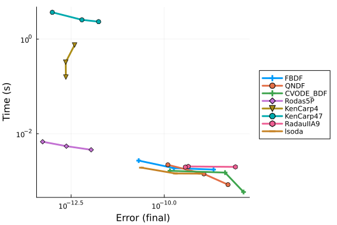
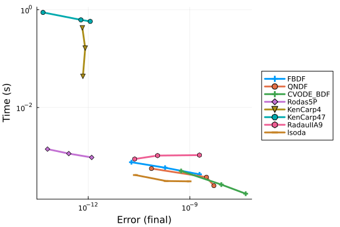

```julia
using OrdinaryDiffEq
using DiffEqDevTools, Plots
using Sundials, LSODA
using ODEInterface, ODEInterfaceDiffEq
using RecursiveFactorization
```


The ODE function defined below models the reduced carbon-oxygen 
chemistry network of Nelson & Langer (1999, ApJ, 524, 923).

This Julia ODE function was written by Nina De La Torre advised by Dr. Stella Offner.
The solution was compared with results derived by DESPOTIC, (Mark Krumholz, 2013) 
a code to Derive the Energetics and Spectra of Optically Thick Insterstellar Clouds. 
DESPOTIC has pre-defined networks, one of them coming from the Nelson & Langer paper, 
so the initial conditions and parameters were meant to mimic those from DESPOTIC.

Note: The composite hydrocarbon radical CHx represents both CH and CH2, 
the composite oxygen species OHx represents OH, H2O, O2 and their ions,
and M represents the low ionization potential metals Mg, Fe, Ca, and Na. 

    Parameter definitions:
    T = 10     --> Temperature (Kelvin)
    Av = 2     --> V-Band Extinction
    G₀ = 1.7   --> Go; "a factor that determines the flux of FUV radiation relative to the standard interstellar value (G₀ = 1) as reported by Habing (1968)."
    n_H = 611  --> Hydrogen Number Density
    shield = 1 --> "CO self-shielding factor of van Dishoeck & Black (1988), taken from Bergin et al. (1995)"

```julia
function Nelson!(du,u,p,t)
    T, Av, Go, n_H, shield = p

    # 1: H2
    du[1] = -1.2e-17 * u[1] + 
            n_H * (1.9e-6 * u[2] * u[3]) / (T^0.54) - 
            n_H * 4e-16 * u[1] * u[12] - 
            n_H * 7e-15 * u[1] * u[5] + 
            n_H * 1.7e-9 * u[10] * u[2] + 
            n_H * 2e-9 * u[2] * u[6] + 
            n_H * 2e-9 * u[2] * u[14] + 
            n_H * 8e-10 * u[2] * u[8] 

    # 2: H3+
    du[2] = 1.2e-17 * u[1] + 
            n_H * (-1.9e-6 * u[3] * u[2]) / (T^0.54) - 
            n_H * 1.7e-9 * u[10] * u[2] - 
            n_H * 2e-9 * u[2] * u[6] - 
            n_H * 2e-9 * u[2] * u[14] - 
            n_H * 8e-10 * u[2] * u[8]

    # 3: e
    du[3] = n_H * (-1.4e-10 * u[3] * u[12]) / (T^0.61) - 
            n_H * (3.8e-10 * u[13] * u[3]) / (T^0.65) - 
            n_H * (3.3e-5 * u[11] * u[3]) / T + 
            1.2e-17 * u[1] - 
            n_H * (1.9e-6 * u[3] * u[2]) / (T^0.54) + 
            6.8e-18 * u[4] - 
            n_H * (9e-11 * u[3] * u[5]) / (T^0.64) + 
            3e-10 * Go * exp(-3 * Av) * u[6] +
            n_H * 2e-9 * u[2] * u[13]
            + 2.0e-10 * Go * exp(-1.9 * Av) * u[14]

    # 4: He
    du[4] = n_H * (9e-11 * u[3] * u[5]) / (T^0.64) - 
            6.8e-18 * u[4] + 
            n_H * 7e-15 * u[1] * u[5] + 
            n_H * 1.6e-9 * u[10] * u[5]

    # 5: He+
    du[5] = 6.8e-18 * u[4] - 
            n_H * (9e-11 * u[3] * u[5]) / (T^0.64) - 
            n_H * 7e-15 * u[1] * u[5] - 
            n_H * 1.6e-9 * u[10] * u[5]

    # 6: C
    du[6] = n_H * (1.4e-10 * u[3] * u[12]) / (T^0.61) - 
            n_H * 2e-9 * u[2] * u[6] - 
            n_H * 5.8e-12 * (T^0.5) * u[9] * u[6] + 
            1e-9 * Go * exp(-1.5 * Av) * u[7] - 
            3e-10 * Go * exp(-3 * Av) * u[6] + 
            1e-10 * Go * exp(-3 * Av) * u[10] * shield

    # 7: CHx
    du[7] = n_H * (-2e-10) * u[7] * u[8] + 
            n_H * 4e-16 * u[1] * u[12] + 
            n_H * 2e-9 * u[2] * u[6] - 
            1e-9 * Go * u[7] * exp(-1.5 * Av)

    # 8: O
    du[8] = n_H * (-2e-10) * u[7] * u[8] + 
            n_H * 1.6e-9 * u[10] * u[5] - 
            n_H * 8e-10 * u[2] * u[8] + 
            5e-10 * Go * exp(-1.7 * Av) * u[9] + 
            1e-10 * Go * exp(-3 * Av) * u[10] * shield

    # 9: OHx
    du[9] = n_H * (-1e-9) * u[9] * u[12] + 
            n_H * 8e-10 * u[2] * u[8] - 
            n_H * 5.8e-12 * (T^0.5) * u[9] * u[6] - 
            5e-10 * Go * exp(-1.7 * Av) * u[9]

    # 10: CO
    du[10] = n_H * (3.3e-5 * u[11] * u[3]) / T + 
             n_H * 2e-10 * u[7] * u[8] - 
             n_H * 1.7e-9 * u[10] * u[2] - 
             n_H * 1.6e-9 * u[10] * u[5] + 
             n_H * 5.8e-12 * (T^0.5) * u[9] * u[6] - 
             1e-10 * Go * exp(-3 * Av) * u[10] + 
             1.5e-10 * Go * exp(-2.5 * Av) * u[11] * shield

    # 11: HCO+
    du[11] = n_H * (-3.3e-5 * u[11] * u[3]) / T + 
             n_H * 1e-9 * u[9] * u[12] + 
             n_H * 1.7e-9 * u[10] * u[2] - 
             1.5e-10 * Go * exp(-2.5 * Av) * u[11]

    # 12: C+
    du[12] = n_H * (-1.4e-10 * u[3] * u[12]) / (T^0.61) - 
             n_H * 4e-16 * u[1] * u[12] - 
             n_H * 1e-9 * u[9] * u[12] + 
             n_H * 1.6e-9 * u[10] * u[5] + 
             3e-10 * Go * exp(-3 * Av) * u[6]

    # 13: M+
    du[13] = n_H * (-3.8e-10 * u[13] * u[3]) / (T^0.65) + 
             n_H * 2e-9 * u[2] * u[14] +
             2.0e-10 * Go * exp(-1.9 * Av) * u[14]

    # 14: M
    du[14] = n_H * (3.8e-10 * u[13] * u[3]) / (T^0.65) - 
             n_H * 2e-9 * u[2] * u[14] -
             2.0e-10 * Go * exp(-1.9 * Av) * u[14]

end

# Set the Timespan, Parameters, and Initial Conditions
seconds_per_year = 3600 * 24 * 365
tspan = (0.0, 30000 * seconds_per_year) # ~30 thousand yrs

params = (10,  # T
          2,   # Av
          1.7, # Go
          611, # n_H
          1)   # shield

u0 = [0.5,      # 1:  H2
      9.059e-9, # 2:  H3+
      2.0e-4,   # 3:  e
      0.1,      # 4:  He
      7.866e-7, # 5:  He+
      0.0,      # 6:  C
      0.0,      # 7:  CHx
      0.0004,   # 8:  O
      0.0,      # 9:  OHx
      0.0,      # 10: CO
      0.0,      # 11: HCO+
      0.0002,   # 12: C+
      2.0e-7,   # 13: M+
      2.0e-7]   # 14: M

prob = ODEProblem(Nelson!, u0, tspan, params)
refsol = solve(prob, Vern9(), abstol=1e-14, reltol=1e-14)
sol1 = solve(prob, Rodas5P())
sol2 = solve(prob, FBDF())
sol3 = solve(prob, lsoda())
sol4 = solve(prob, lsoda(), saveat = 1e10)
```

```
retcode: Success
Interpolation: 1st order linear
t: 95-element Vector{Float64}:
 0.0
 1.0e10
 2.0e10
 3.0e10
 4.0e10
 5.0e10
 6.0e10
 7.0e10
 8.0e10
 9.0e10
 ⋮
 8.6e11
 8.7e11
 8.8e11
 8.9e11
 9.0e11
 9.1e11
 9.2e11
 9.3e11
 9.4608e11
u: 95-element Vector{Vector{Float64}}:
 [0.5, 9.059e-9, 0.0002, 0.1, 7.866e-7, 0.0, 0.0, 0.0004, 0.0, 0.0, 0.0, 0.
0002, 2.0e-7, 2.0e-7]
 [0.4999997535369704, 8.193154457455469e-11, 0.00019197303336682174, 0.1000
0002886487377, 7.577351262491076e-7, 8.042342992821525e-6, 1.49925186263626
43e-7, 0.0003999674879715404, 1.1067638304100775e-10, 3.240131896517983e-8,
 3.3451545560423566e-14, 0.00019177533041679414, 1.9528726921075105e-7, 2.0
471273078924893e-7]
 [0.4999995075210584, 9.090316158336153e-11, 0.00018461935387378958, 0.1000
000562601198, 7.30339880209255e-7, 1.5480572363863645e-5, 2.000300361171384
6e-7, 0.00039990233527387485, 1.4466321223018468e-10, 9.752001980587566e-8,
 4.373263586424432e-14, 0.00018422187752626965, 1.9189712227776098e-7, 2.08
102877722239e-7]
 [0.4999992706516111, 1.0268278666266992e-10, 0.00017788865255185306, 0.100
0000823101555, 7.042898445209926e-7, 2.232067746875479e-5, 2.06208656840273
3e-7, 0.0003998249793482805, 1.5825894683323741e-10, 1.7486234569318328e-7,
 4.7887781766364776e-14, 0.0001772982515858309, 1.8962171847126598e-7, 2.10
378281528734e-7]
 [0.4999990426328743, 1.1047944310386002e-10, 0.0001717521353885941, 0.1000
0010708540578, 6.795145942383737e-7, 2.8580379834976427e-5, 1.8605427132856
04e-7, 0.00039974177445524555, 1.6055330761123543e-10, 2.580649437390939e-7
, 4.863811929077203e-14, 0.0001709755011738776, 1.8836261411409688e-7, 2.11
6373858859031e-7]
 [0.4999988222961169, 1.1214512825014892e-10, 0.00016610214932054722, 0.100
00013079566746, 6.558043325632626e-7, 3.4346695009489656e-5, 1.726072821034
1615e-7, 0.00039966441024142784, 1.6471463276936157e-10, 3.3542499509755626
e-7, 4.985815571219808e-14, 0.00016514527304999023, 1.877725577159864e-7, 2
.122274422840136e-7]
 [0.4999986089645403, 1.1301312452696201e-10, 0.00016088117474842152, 0.100
00015350341433, 6.33096585679416e-7, 3.968155815686876e-5, 1.59196819816350
05e-7, 0.0003995901104830985, 1.6886141974491672e-10, 4.0972060551075024e-7
, 5.104610902246676e-14, 0.00015974952484161368, 1.8771391474671e-7, 2.1228
608525328997e-7]
 [0.4999984016924124, 1.1593684877979178e-10, 0.00015600611460040258, 0.100
00017532890296, 6.112710970559566e-7, 4.466487283056087e-5, 1.5126630795563
186e-7, 0.00039952045363073296, 1.7631004132599739e-10, 4.793700071205165e-
7, 5.32344989749965e-14, 0.00015470449133458915, 1.8796065523144963e-7, 2.1
203934476855036e-7]
 [0.4999982013001409, 1.184410067837422e-10, 0.00015154905427904665, 0.1000
0019616781267, 5.904321873416034e-7, 4.922732395495452e-5, 1.44093662278483
6e-7, 0.0003994540704033752, 1.8418359629049677e-10, 5.457453586602043e-7, 
5.5527630926796366e-14, 0.0001500828375344457, 1.887088566175661e-7, 2.1129
11433824339e-7]
 [0.499998007202718, 1.2074897464625312e-10, 0.0001474639659320232, 0.10000
021608152558, 5.705184744292179e-7, 5.341504816290257e-5, 1.377880132974742
2e-7, 0.0003993907296694579, 1.9240989134703122e-10, 6.090778639087468e-7, 
5.791432631570454e-14, 0.00014583808648206922, 1.8985069087087307e-7, 2.101
493091291269e-7]
 ⋮
 [0.4999886971720987, 1.9795827809365797e-10, 8.950887024276836e-5, 0.10000
06600683044, 1.2653169561225698e-7, 0.00011707676413720376, 7.3788674819905
76e-8, 0.0003970478736288078, 4.892836316442913e-10, 2.95163695291137e-6, 1
.356984339173129e-13, 7.989781065115055e-5, 2.478036176330643e-7, 1.5219638
236693576e-7]
 [0.4999885970930578, 1.9793342063952315e-10, 8.948878095668965e-5, 0.10000
066096407667, 1.2563592333740452e-7, 0.00011716555190079074, 7.361062500753
714e-8, 0.0003970280592975852, 4.894657459356276e-10, 2.971451102091994e-6,
 1.356323361880553e-13, 7.97893867859006e-5, 2.478492488443751e-7, 1.521507
5115562496e-7]
 [0.499988497598852, 1.9790312843518412e-10, 8.948922469966134e-5, 0.100000
66172200699, 1.248779930199431e-7, 0.00011723361162399289, 7.34931536035220
6e-8, 0.00039700853803854966, 4.896442888249596e-10, 2.990972182661835e-6, 
1.3555970845630174e-13, 7.970192345179951e-5, 2.4787704318692163e-7, 1.5212
295681307838e-7]
 [0.4999883985417573, 1.9786873370637517e-10, 8.950441943997605e-5, 0.10000
066237814624, 1.2422185377025064e-7, 0.00011728679340261952, 7.341876586220
847e-8, 0.0003969892554117757, 4.89818152837127e-10, 3.0102546356530083e-6,
 1.3548183833694274e-13, 7.962953360658224e-5, 2.478914365964178e-7, 1.5210
856340358222e-7]
 [0.4999882995806952, 1.9783239241493e-10, 8.952097076117053e-5, 0.10000066
30152744, 1.2358472561067712e-7, 0.00011733865006966625, 7.33459450918514e-
8, 0.00039697008547036724, 4.899803945020517e-10, 3.0294244149045423e-6, 1.
354006295667597e-13, 7.955857997969727e-5, 2.4790244681808276e-7, 1.5209755
318191728e-7]
 [0.499988200706938, 1.9779484463019838e-10, 8.953856892082615e-5, 0.100000
66363585038, 1.2296414963310046e-7, 0.00011738949448030751, 7.3274465121958
26e-8, 0.00039695102517837315, 4.90134101646506e-10, 3.048484553278859e-6, 
1.3531692685118297e-13, 7.948874690928101e-5, 2.4791049721110576e-7, 1.5208
950278889427e-7]
 [0.4999881019117582, 1.977568304215301e-10, 8.955690417652432e-5, 0.100000
66424233307, 1.2235766692939856e-7, 0.00011743963948971773, 7.3204099782036
4e-8, 0.0003969320714998423, 4.902823620972626e-10, 3.0674380836383798e-6, 
1.3523157489564286e-13, 7.941971873346985e-5, 2.479160111346761e-7, 1.52083
98886532392e-7]
 [0.49998800318642805, 1.977190898582749e-10, 8.957566678584644e-5, 0.10000
066483718141, 1.2176281859144934e-7, 0.00011748939795307132, 7.313462290159
326e-8, 0.0003969132213988236, 4.90428263681094e-10, 3.0862880388455274e-6,
 1.3514541840556976e-13, 7.935117979040018e-5, 2.479194119479832e-7, 1.5208
058805201686e-7]
 [0.4999878445605511, 1.976608431204695e-10, 8.960595204507145e-5, 0.100000
66577550308, 1.208244969246418e-7, 0.00011756938799503817, 7.30241966736305
7e-8, 0.00039688311996499643, 4.906657141307707e-10, 3.1163892353666996e-6,
 1.35007321965445e-13, 7.924119897589606e-5, 2.479215172415109e-7, 1.520784
8275848912e-7]
```


## Validation Plot

```julia
using Plots
colors = palette(:acton, 5)
p1 = plot(sol1, vars = (0,11), lc=colors[1], legend = false, titlefontsize = 12, lw = 3, title = "Rodas5")
p2 = plot(sol2, vars = (0,11), lc=colors[2], legend = false, titlefontsize = 12, lw = 3, title = "FBDF")
p3 = plot(sol3, vars = (0,11), lc=colors[3], legend = false, titlefontsize = 12, lw = 3, title = "lsoda")
p4 = plot(sol4, vars = (0,11), lc=colors[4], legend = false, titlefontsize = 12, lw = 3, title = "lsoda with saveat")

combined_plot = plot(p1, p2, p3, p4, layout=(4, 1), dpi = 600, pallete=:acton)
```




## Run Benchmark

```julia
abstols = 1.0 ./ 10.0 .^ (8:10)
reltols = 1.0 ./ 10.0 .^ (8:10)

setups = [
          Dict(:alg=>FBDF()),
          Dict(:alg=>QNDF()),
          #Dict(:alg=>Rodas4P()),
          Dict(:alg=>CVODE_BDF()),
          #Dict(:alg=>ddebdf()),
          #Dict(:alg=>Rodas4()),
          Dict(:alg=>Rodas5P()),
          Dict(:alg=>KenCarp4()),
          Dict(:alg=>KenCarp47()),
          Dict(:alg=>RadauIIA9()),
		  Dict(:alg=>lsoda()),
          #Dict(:alg=>rodas()),
          #Dict(:alg=>radau()),
          #Dict(:alg=>lsoda()),
          #Dict(:alg=>ImplicitEulerExtrapolation(min_order = 5, init_order = 3,threading = OrdinaryDiffEqCore.PolyesterThreads())),
          #Dict(:alg=>ImplicitEulerExtrapolation(min_order = 5, init_order = 3,threading = false)),
          #Dict(:alg=>ImplicitEulerBarycentricExtrapolation(min_order = 5, threading = OrdinaryDiffEqCore.PolyesterThreads())),
          #Dict(:alg=>ImplicitEulerBarycentricExtrapolation(min_order = 5, threading = false)),
          ]

wp = WorkPrecisionSet(prob,abstols,reltols,setups;appxsol=refsol,save_everystep=false, print_names = true)
plot(wp)
```

```
FBDF
QNDF
CVODE_BDF
Rodas5P
KenCarp4
KenCarp47
RadauIIA9
lsoda
```



