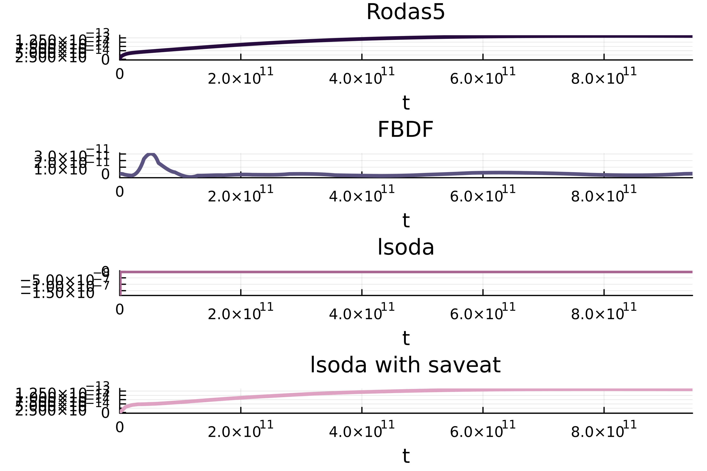
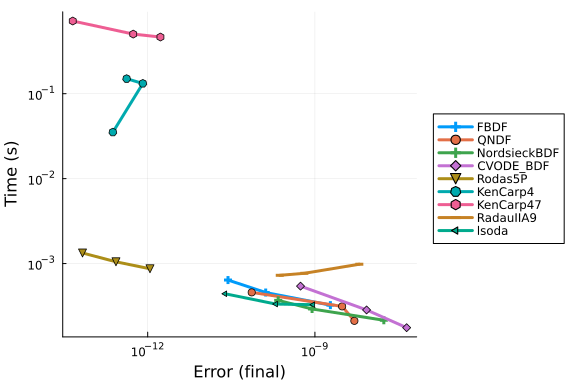

```julia
using OrdinaryDiffEq
using OrdinaryDiffEqBDF, OrdinaryDiffEqExtrapolation, OrdinaryDiffEqFIRK, OrdinaryDiffEqRosenbrock, OrdinaryDiffEqSDIRK
using DiffEqDevTools, Plots
using Sundials, LSODA
using ODEInterface, ODEInterfaceDiffEq
using RecursiveFactorization
```


The ODE function defined below models the reduced carbon-oxygen
chemistry network of Nelson & Langer (1999, ApJ, 524, 923).

This Julia ODE function was written by Nina De La Torre advised by Dr. Stella Offner.
The solution was compared with results derived by DESPOTIC, (Mark Krumholz, 2013)
a code to Derive the Energetics and Spectra of Optically Thick Insterstellar Clouds.
DESPOTIC has pre-defined networks, one of them coming from the Nelson & Langer paper,
so the initial conditions and parameters were meant to mimic those from DESPOTIC.

Note: The composite hydrocarbon radical CHx represents both CH and CH2,
the composite oxygen species OHx represents OH, H2O, O2 and their ions,
and M represents the low ionization potential metals Mg, Fe, Ca, and Na.

    Parameter definitions:
    T = 10     --> Temperature (Kelvin)
    Av = 2     --> V-Band Extinction
    G₀ = 1.7   --> Go; "a factor that determines the flux of FUV radiation relative to the standard interstellar value (G₀ = 1) as reported by Habing (1968)."
    n_H = 611  --> Hydrogen Number Density
    shield = 1 --> "CO self-shielding factor of van Dishoeck & Black (1988), taken from Bergin et al. (1995)"

```julia
function Nelson!(du, u, p, t)
    T, Av, Go, n_H, shield = p

    # 1: H2
    du[1] = -1.2e-17 * u[1] +
            n_H * (1.9e-6 * u[2] * u[3]) / (T^0.54) -
            n_H * 4e-16 * u[1] * u[12] -
            n_H * 7e-15 * u[1] * u[5] +
            n_H * 1.7e-9 * u[10] * u[2] +
            n_H * 2e-9 * u[2] * u[6] +
            n_H * 2e-9 * u[2] * u[14] +
            n_H * 8e-10 * u[2] * u[8]

    # 2: H3+
    du[2] = 1.2e-17 * u[1] +
            n_H * (-1.9e-6 * u[3] * u[2]) / (T^0.54) -
            n_H * 1.7e-9 * u[10] * u[2] -
            n_H * 2e-9 * u[2] * u[6] -
            n_H * 2e-9 * u[2] * u[14] -
            n_H * 8e-10 * u[2] * u[8]

    # 3: e
    du[3] = n_H * (-1.4e-10 * u[3] * u[12]) / (T^0.61) -
            n_H * (3.8e-10 * u[13] * u[3]) / (T^0.65) -
            n_H * (3.3e-5 * u[11] * u[3]) / T +
            1.2e-17 * u[1] -
            n_H * (1.9e-6 * u[3] * u[2]) / (T^0.54) +
            6.8e-18 * u[4] -
            n_H * (9e-11 * u[3] * u[5]) / (T^0.64) +
            3e-10 * Go * exp(-3 * Av) * u[6] +
            n_H * 2e-9 * u[2] * u[13]
    + 2.0e-10 * Go * exp(-1.9 * Av) * u[14]

    # 4: He
    du[4] = n_H * (9e-11 * u[3] * u[5]) / (T^0.64) -
            6.8e-18 * u[4] +
            n_H * 7e-15 * u[1] * u[5] +
            n_H * 1.6e-9 * u[10] * u[5]

    # 5: He+
    du[5] = 6.8e-18 * u[4] -
            n_H * (9e-11 * u[3] * u[5]) / (T^0.64) -
            n_H * 7e-15 * u[1] * u[5] -
            n_H * 1.6e-9 * u[10] * u[5]

    # 6: C
    du[6] = n_H * (1.4e-10 * u[3] * u[12]) / (T^0.61) -
            n_H * 2e-9 * u[2] * u[6] -
            n_H * 5.8e-12 * (T^0.5) * u[9] * u[6] +
            1e-9 * Go * exp(-1.5 * Av) * u[7] -
            3e-10 * Go * exp(-3 * Av) * u[6] +
            1e-10 * Go * exp(-3 * Av) * u[10] * shield

    # 7: CHx
    du[7] = n_H * (-2e-10) * u[7] * u[8] +
            n_H * 4e-16 * u[1] * u[12] +
            n_H * 2e-9 * u[2] * u[6] -
            1e-9 * Go * u[7] * exp(-1.5 * Av)

    # 8: O
    du[8] = n_H * (-2e-10) * u[7] * u[8] +
            n_H * 1.6e-9 * u[10] * u[5] -
            n_H * 8e-10 * u[2] * u[8] +
            5e-10 * Go * exp(-1.7 * Av) * u[9] +
            1e-10 * Go * exp(-3 * Av) * u[10] * shield

    # 9: OHx
    du[9] = n_H * (-1e-9) * u[9] * u[12] +
            n_H * 8e-10 * u[2] * u[8] -
            n_H * 5.8e-12 * (T^0.5) * u[9] * u[6] -
            5e-10 * Go * exp(-1.7 * Av) * u[9]

    # 10: CO
    du[10] = n_H * (3.3e-5 * u[11] * u[3]) / T +
             n_H * 2e-10 * u[7] * u[8] -
             n_H * 1.7e-9 * u[10] * u[2] -
             n_H * 1.6e-9 * u[10] * u[5] +
             n_H * 5.8e-12 * (T^0.5) * u[9] * u[6] -
             1e-10 * Go * exp(-3 * Av) * u[10] +
             1.5e-10 * Go * exp(-2.5 * Av) * u[11] * shield

    # 11: HCO+
    du[11] = n_H * (-3.3e-5 * u[11] * u[3]) / T +
             n_H * 1e-9 * u[9] * u[12] +
             n_H * 1.7e-9 * u[10] * u[2] -
             1.5e-10 * Go * exp(-2.5 * Av) * u[11]

    # 12: C+
    du[12] = n_H * (-1.4e-10 * u[3] * u[12]) / (T^0.61) -
             n_H * 4e-16 * u[1] * u[12] -
             n_H * 1e-9 * u[9] * u[12] +
             n_H * 1.6e-9 * u[10] * u[5] +
             3e-10 * Go * exp(-3 * Av) * u[6]

    # 13: M+
    du[13] = n_H * (-3.8e-10 * u[13] * u[3]) / (T^0.65) +
             n_H * 2e-9 * u[2] * u[14] +
             2.0e-10 * Go * exp(-1.9 * Av) * u[14]

    # 14: M
    du[14] = n_H * (3.8e-10 * u[13] * u[3]) / (T^0.65) -
             n_H * 2e-9 * u[2] * u[14] -
             2.0e-10 * Go * exp(-1.9 * Av) * u[14]
end

# Set the Timespan, Parameters, and Initial Conditions
seconds_per_year = 3600 * 24 * 365
tspan = (0.0, 30000 * seconds_per_year) # ~30 thousand yrs

params = (10,  # T
    2,   # Av
    1.7, # Go
    611, # n_H
    1)   # shield

u0 = [0.5,      # 1:  H2
    9.059e-9, # 2:  H3+
    2.0e-4,   # 3:  e
    0.1,      # 4:  He
    7.866e-7, # 5:  He+
    0.0,      # 6:  C
    0.0,      # 7:  CHx
    0.0004,   # 8:  O
    0.0,      # 9:  OHx
    0.0,      # 10: CO
    0.0,      # 11: HCO+
    0.0002,   # 12: C+
    2.0e-7,   # 13: M+
    2.0e-7]   # 14: M

prob = ODEProblem(Nelson!, u0, tspan, params)
refsol = solve(prob, Vern9(), abstol = 1e-14, reltol = 1e-14)
sol1 = solve(prob, Rodas5P())
sol2 = solve(prob, FBDF())
sol3 = solve(prob, lsoda())
sol4 = solve(prob, lsoda(), saveat = 1e10)
```

```
retcode: Success
Interpolation: 1st order linear
t: 95-element Vector{Float64}:
 0.0
 1.0e10
 2.0e10
 3.0e10
 4.0e10
 5.0e10
 6.0e10
 7.0e10
 8.0e10
 9.0e10
 ⋮
 8.6e11
 8.7e11
 8.8e11
 8.9e11
 9.0e11
 9.1e11
 9.2e11
 9.3e11
 9.4608e11
u: 95-element Vector{Vector{Float64}}:
 [0.5, 9.059e-9, 0.0002, 0.1, 7.866e-7, 0.0, 0.0, 0.0004, 0.0, 0.0, 0.0, 0.
0002, 2.0e-7, 2.0e-7]
 [0.4999997535369704, 8.193154457455469e-11, 0.00019197303336682174, 0.1000
0002886487377, 7.577351262491076e-7, 8.042342992821525e-6, 1.49925186263626
43e-7, 0.0003999674879715404, 1.1067638304100775e-10, 3.240131896517983e-8,
 3.3451545560423566e-14, 0.00019177533041679414, 1.9528726921075105e-7, 2.0
471273078924893e-7]
 [0.4999995075210584, 9.090316158336153e-11, 0.00018461935387378958, 0.1000
000562601198, 7.30339880209255e-7, 1.5480572363863645e-5, 2.000300361171384
6e-7, 0.00039990233527387485, 1.4466321223018468e-10, 9.752001980587566e-8,
 4.373263586424432e-14, 0.00018422187752626965, 1.9189712227776098e-7, 2.08
102877722239e-7]
 [0.4999992706516111, 1.0268278666266992e-10, 0.00017788865255185306, 0.100
0000823101555, 7.042898445209926e-7, 2.232067746875479e-5, 2.06208656840273
3e-7, 0.0003998249793482805, 1.5825894683323741e-10, 1.7486234569318328e-7,
 4.7887781766364776e-14, 0.0001772982515858309, 1.8962171847126598e-7, 2.10
378281528734e-7]
 [0.4999990426328743, 1.1047944310386002e-10, 0.0001717521353885941, 0.1000
0010708540578, 6.795145942383737e-7, 2.8580379834976427e-5, 1.8605427132856
04e-7, 0.00039974177445524555, 1.6055330761123543e-10, 2.580649437390939e-7
, 4.863811929077203e-14, 0.0001709755011738776, 1.8836261411409688e-7, 2.11
6373858859031e-7]
 [0.4999988222961169, 1.1214512825014892e-10, 0.00016610214932054722, 0.100
00013079566746, 6.558043325632626e-7, 3.4346695009489656e-5, 1.726072821034
1615e-7, 0.00039966441024142784, 1.6471463276936157e-10, 3.3542499509755626
e-7, 4.985815571219808e-14, 0.00016514527304999023, 1.877725577159864e-7, 2
.122274422840136e-7]
 [0.4999986089645403, 1.1301312452696201e-10, 0.00016088117474842152, 0.100
00015350341433, 6.33096585679416e-7, 3.968155815686876e-5, 1.59196819816350
05e-7, 0.0003995901104830985, 1.6886141974491672e-10, 4.0972060551075024e-7
, 5.104610902246676e-14, 0.00015974952484161368, 1.8771391474671e-7, 2.1228
608525328997e-7]
 [0.4999984016924124, 1.1593684877979178e-10, 0.00015600611460040258, 0.100
00017532890296, 6.112710970559566e-7, 4.466487283056087e-5, 1.5126630795563
186e-7, 0.00039952045363073296, 1.7631004132599739e-10, 4.793700071205165e-
7, 5.32344989749965e-14, 0.00015470449133458915, 1.8796065523144963e-7, 2.1
203934476855036e-7]
 [0.4999982013001409, 1.184410067837422e-10, 0.00015154905427904665, 0.1000
0019616781267, 5.904321873416034e-7, 4.922732395495452e-5, 1.44093662278483
6e-7, 0.0003994540704033752, 1.8418359629049677e-10, 5.457453586602043e-7, 
5.5527630926796366e-14, 0.0001500828375344457, 1.887088566175661e-7, 2.1129
11433824339e-7]
 [0.499998007202718, 1.2074897464625312e-10, 0.0001474639659320232, 0.10000
021608152558, 5.705184744292179e-7, 5.341504816290257e-5, 1.377880132974742
2e-7, 0.0003993907296694579, 1.9240989134703122e-10, 6.090778639087468e-7, 
5.791432631570454e-14, 0.00014583808648206922, 1.8985069087087307e-7, 2.101
493091291269e-7]
 ⋮
 [0.4999886971720987, 1.9795827809365797e-10, 8.950887024276836e-5, 0.10000
06600683044, 1.2653169561225698e-7, 0.00011707676413720376, 7.3788674819905
76e-8, 0.0003970478736288078, 4.892836316442913e-10, 2.95163695291137e-6, 1
.356984339173129e-13, 7.989781065115055e-5, 2.478036176330643e-7, 1.5219638
236693576e-7]
 [0.4999885970930578, 1.9793342063952315e-10, 8.948878095668965e-5, 0.10000
066096407667, 1.2563592333740452e-7, 0.00011716555190079074, 7.361062500753
714e-8, 0.0003970280592975852, 4.894657459356276e-10, 2.971451102091994e-6,
 1.356323361880553e-13, 7.97893867859006e-5, 2.478492488443751e-7, 1.521507
5115562496e-7]
 [0.4999884972140397, 1.9791929065652404e-10, 8.947430636422426e-5, 0.10000
066181954592, 1.2478045408581226e-7, 0.00011724870322575066, 7.345727745258
005e-8, 0.00039700840539103006, 4.896846004578493e-10, 2.9911047898569364e-
6, 1.3557309797706945e-13, 7.96867351188127e-5, 2.4788900714769123e-7, 1.52
1109928523088e-7]
 [0.4999883975359282, 1.979177458878945e-10, 8.946553362185228e-5, 0.100000
66263521029, 1.2396478970728907e-7, 0.00011732612905423649, 7.3330552042521
3e-8, 0.0003969889131988451, 4.899477157942837e-10, 3.0105967189810325e-6, 
1.3552250374409033e-13, 7.958994408510943e-5, 2.4792310665125997e-7, 1.5207
689334874006e-7]
 [0.49998829793856614, 1.9792446507578876e-10, 8.945767765481339e-5, 0.1000
0066343872818, 1.2316127181539434e-7, 0.00011740267214118327, 7.32118303907
7428e-8, 0.0003969695347916554, 4.902350223911299e-10, 3.029974838912789e-6
, 1.3547711665516858e-13, 7.949414159854762e-5, 2.479548615290058e-7, 1.520
451384709942e-7]
 [0.49998819842252995, 1.979412902637886e-10, 8.945081324018611e-5, 0.10000
066423066675, 1.2236933325100569e-7, 0.00011747825595953078, 7.310298020102
55e-8, 0.00039695027133410766, 4.905539707304883e-10, 3.0492379775533577e-6
, 1.3543870790373717e-13, 7.93994034906198e-5, 2.479844937658461e-7, 1.5201
55062341539e-7]
 [0.499988098988396, 1.9797006349547566e-10, 8.944501515504896e-5, 0.100000
66501159315, 1.2158840685500065e-7, 0.00011755280398221879, 7.3005869176961
49e-8, 0.0003969311239908482, 4.909120112944597e-10, 3.0683849628038885e-6,
 1.3540904868322912e-13, 7.930580559281851e-5, 2.4801222534669814e-7, 1.519
8777465330185e-7]
 [0.49998799963674095, 1.9801262681443172e-10, 8.94403581764805e-5, 0.10000
066578207453, 1.2081792546825682e-7, 0.00011762623968218706, 7.292236502226
876e-8, 0.00039691209392652354, 4.913165945651447e-10, 3.0874146225655315e-
6, 1.353899101870775e-13, 7.921342373663633e-5, 2.480382782564793e-7, 1.519
6172174352072e-7]
 [0.4999878400536776, 1.9811462937457688e-10, 8.943545103579628e-5, 0.10000
066700053743, 1.1959946257185592e-7, 0.00011774179894869144, 7.282133161703
036e-8, 0.00039688174243430677, 4.920835452521089e-10, 3.1177653478356363e-
6, 1.3538566225456173e-13, 7.90676147779716e-5, 2.4807721124352237e-7, 1.51
92278875647764e-7]
```


## Validation Plot

```julia
using Plots
colors = palette(:acton, 5)
p1 = plot(sol1, vars = (0, 11), lc = colors[1], legend = false,
    titlefontsize = 12, lw = 3, title = "Rodas5")
p2 = plot(sol2, vars = (0, 11), lc = colors[2], legend = false,
    titlefontsize = 12, lw = 3, title = "FBDF")
p3 = plot(sol3, vars = (0, 11), lc = colors[3], legend = false,
    titlefontsize = 12, lw = 3, title = "lsoda")
p4 = plot(sol4, vars = (0, 11), lc = colors[4], legend = false,
    titlefontsize = 12, lw = 3, title = "lsoda with saveat")

combined_plot = plot(p1, p2, p3, p4, layout = (4, 1), dpi = 600, palette = :acton)
```




## Run Benchmark

```julia
abstols = 1.0 ./ 10.0 .^ (8:10)
reltols = 1.0 ./ 10.0 .^ (8:10)

setups = [
    Dict(:alg=>FBDF()),
    Dict(:alg=>QNDF()),
    Dict(:alg=>NordsieckBDF()),
    #Dict(:alg=>Rodas4P()),
    Dict(:alg=>CVODE_BDF()),
    #Dict(:alg=>ddebdf()),
    #Dict(:alg=>Rodas4()),
    Dict(:alg=>Rodas5P()),
    Dict(:alg=>KenCarp4()),
    Dict(:alg=>KenCarp47()),
    Dict(:alg=>RadauIIA9()),
    Dict(:alg=>lsoda())
    #Dict(:alg=>rodas()),
    #Dict(:alg=>radau()),
    #Dict(:alg=>lsoda()),
    #Dict(:alg=>ImplicitEulerExtrapolation(min_order = 5, init_order = 3,threading = OrdinaryDiffEqCore.PolyesterThreads())),
    #Dict(:alg=>ImplicitEulerExtrapolation(min_order = 5, init_order = 3,threading = false)),
    #Dict(:alg=>ImplicitEulerBarycentricExtrapolation(min_order = 5, threading = OrdinaryDiffEqCore.PolyesterThreads())),
    #Dict(:alg=>ImplicitEulerBarycentricExtrapolation(min_order = 5, threading = false)),
]

wp = WorkPrecisionSet(prob, abstols, reltols, setups; appxsol = refsol,
    save_everystep = false, print_names = true)
plot(wp)
```

```
FBDF
QNDF
NordsieckBDF
CVODE_BDF
Rodas5P
KenCarp4
KenCarp47
RadauIIA9
lsoda
```





## Appendix

These benchmarks are a part of the SciMLBenchmarks.jl repository, found at: [https://github.com/SciML/SciMLBenchmarks.jl](https://github.com/SciML/SciMLBenchmarks.jl). For more information on high-performance scientific machine learning, check out the SciML Open Source Software Organization [https://sciml.ai](https://sciml.ai).

To locally run this benchmark, do the following commands:
```
using SciMLBenchmarks
SciMLBenchmarks.weave_file("benchmarks/AstroChem","nelson.jmd")
```

Computer Information:

```
Julia Version 1.12.7
Commit 6d172b025e4 (2026-08-15 08:05 UTC)
Build Info:
  Official https://julialang.org release
Platform Info:
  OS: Linux (x86_64-linux-gnu)
  CPU: 128 × AMD EPYC 7502 32-Core Processor
  WORD_SIZE: 64
  LLVM: libLLVM-18.1.7 (ORCJIT, znver2)
  GC: Built with stock GC
Threads: 128 default, 1 interactive, 128 GC (on 128 virtual cores)
Environment:
  JULIA_NUM_THREADS = auto

```

Package Information:

```
Status `/julia/github-runners/amdci1-1/_work/SciMLBenchmarks.jl/SciMLBenchmarks.jl/benchmarks/AstroChem/Project.toml`
  [6e4b80f9] BenchmarkTools v1.8.0
  [479239e8] Catalyst v16.4.3
  [f3b72e0c] DiffEqDevTools v3.6.3
  [7f56f5a3] LSODA v1.2.0
⌃ [7ed4a6bd] LinearSolve v5.17.3
  [77ba4419] NaNMath v1.1.4
  [54ca160b] ODEInterface v0.5.2
⌅ [09606e27] ODEInterfaceDiffEq v4.1.0
  [1dea7af3] OrdinaryDiffEq v7.8.1
⌃ [6ad6398a] OrdinaryDiffEqBDF v2.4.9
⌃ [bbf590c4] OrdinaryDiffEqCore v4.17.2
  [becaefa8] OrdinaryDiffEqExtrapolation v2.6.3
  [5960d6e9] OrdinaryDiffEqFIRK v2.8.7
  [43230ef6] OrdinaryDiffEqRosenbrock v2.7.3
⌃ [2d112036] OrdinaryDiffEqSDIRK v2.9.3
  [91a5bcdd] Plots v1.41.7
  [f2c3362d] RecursiveFactorization v0.2.30
  [31c91b34] SciMLBenchmarks v0.2.1 [loaded: `/julia/github-runners/amdci1-1/_work/SciMLBenchmarks.jl/SciMLBenchmarks.jl/src/SciMLBenchmarks.jl` (v0.2.1) expected `/home/crackauc/.julia/packages/SciMLBenchmarks/ceJyd/src/SciMLBenchmarks.jl` (v0.2.1)]
  [a6db7da4] SciMLLogging v2.1.0
  [c3572dad] Sundials v6.7.1
  [0c5d862f] Symbolics v7.39.2
Info Packages marked with ⌃ and ⌅ have new versions available. Those with ⌃ may be upgradable, but those with ⌅ are restricted by compatibility constraints from upgrading. To see why use `status --outdated`
```

And the full manifest:

```
Status `/julia/github-runners/amdci1-1/_work/SciMLBenchmarks.jl/SciMLBenchmarks.jl/benchmarks/AstroChem/Manifest.toml`
  [47edcb42] ADTypes v1.24.0
  [14f7f29c] AMD v0.5.4
  [6e696c72] AbstractPlutoDingetjes v1.4.1
  [1520ce14] AbstractTrees v0.4.5
  [7d9f7c33] Accessors v0.1.45
  [79e6a3ab] Adapt v4.7.0
  [66dad0bd] AliasTables v1.1.3
  [ec485272] ArnoldiMethod v0.4.0
⌃ [4fba245c] ArrayInterface v7.30.1
  [4c555306] ArrayLayouts v1.12.2
  [aae01518] BandedMatrices v1.12.0
  [6e4b80f9] BenchmarkTools v1.8.0
  [e2ed5e7c] Bijections v0.2.2
  [b2a6c25c] BinaryHeaps v1.1.0
  [caf10ac8] BipartiteGraphs v0.1.14
  [62783981] BitTwiddlingConvenienceFunctions v0.1.6
  [8e7c35d0] BlockArrays v1.10.0
  [70df07ce] BracketingNonlinearSolve v1.12.7
  [fa961155] CEnum v0.5.0
  [2a0fbf3d] CPUSummary v0.2.7
  [479239e8] Catalyst v16.4.3
  [fb6a15b2] CloseOpenIntervals v0.1.13
  [35d6a980] ColorSchemes v3.31.0
  [3da002f7] ColorTypes v0.12.1
  [c3611d14] ColorVectorSpace v0.11.0
  [5ae59095] Colors v0.13.1
⌅ [861a8166] Combinatorics v1.0.2
  [38540f10] CommonSolve v0.2.14
  [bbf7d656] CommonSubexpressions v0.3.1
  [f70d9fcc] CommonWorldInvalidations v1.2.2
  [34da2185] Compat v4.18.1
  [b152e2b5] CompositeTypes v0.1.4
  [a33af91c] CompositionsBase v0.1.2
  [2569d6c7] ConcreteStructs v0.2.8
  [187b0558] ConstructionBase v1.6.0
  [d38c429a] Contour v0.6.3
  [adafc99b] CpuId v0.3.1
  [a8cc5b0e] Crayons v4.2.0
  [9a962f9c] DataAPI v1.16.0
  [864edb3b] DataStructures v0.19.6
  [e2d170a0] DataValueInterfaces v1.0.0
  [8bb1440f] DelimitedFiles v1.9.1
  [2b5f629d] DiffEqBase v7.21.1
  [459566f4] DiffEqCallbacks v4.19.4
  [f3b72e0c] DiffEqDevTools v3.6.3
  [77a26b50] DiffEqNoiseProcess v5.36.3
  [163ba53b] DiffResults v1.1.0
  [b552c78f] DiffRules v1.16.0
  [a0c0ee7d] DifferentiationInterface v0.7.21
  [8d63f2c5] DispatchDoctor v0.4.28
  [31c24e10] Distributions v0.25.131
  [ffbed154] DocStringExtensions v0.9.5
  [5b8099bc] DomainSets v0.8.1
  [7c1d4256] DynamicPolynomials v0.6.8
  [06fc5a27] DynamicQuantities v1.13.0
  [4e289a0a] EnumX v1.0.7
  [f151be2c] EnzymeCore v0.8.21
  [e2ba6199] ExprTools v0.1.11
  [55351af7] ExproniconLite v0.10.14
  [c87230d0] FFMPEG v0.4.5
  [7034ab61] FastBroadcast v1.4.0
  [9aa1b823] FastClosures v0.3.2
  [442a2c76] FastGaussQuadrature v1.3.0
  [a4df4552] FastPower v1.5.0
  [1a297f60] FillArrays v1.17.0
  [64ca27bc] FindFirstFunctions v3.2.1
  [6a86dc24] FiniteDiff v2.33.0
⌅ [53c48c17] FixedPointNumbers v0.8.6
  [1fa38f19] Format v1.3.7
  [f6369f11] ForwardDiff v1.4.6
  [a85aefff] FunctionMaps v0.1.2
  [069b7b12] FunctionWrappers v1.1.3
  [77dc65aa] FunctionWrappersWrappers v1.13.0
  [46192b85] GPUArraysCore v0.2.0
  [28b8d3ca] GR v0.73.27
  [a0844989] Gamma v1.2.0
  [86223c79] Graphs v1.15.0
⌅ [eafb193a] Highlights v0.5.3
  [3e5b6fbb] HostCPUFeatures v0.1.18
  [34004b35] HypergeometricFunctions v0.3.30
  [615f187c] IfElse v0.1.1
  [3263718b] ImplicitDiscreteSolve v2.3.0
  [d25df0c9] Inflate v0.1.5
  [18e54dd8] IntegerMathUtils v0.1.4
  [8197267c] IntervalSets v0.7.14
  [3587e190] InverseFunctions v0.1.17
  [92d709cd] IrrationalConstants v0.2.6
  [82899510] IteratorInterfaceExtensions v1.0.0
  [1019f520] JLFzf v0.1.11
  [692b3bcd] JLLWrappers v1.8.0
⌅ [682c06a0] JSON v0.21.4
  [ae98c720] Jieko v0.2.1
⌃ [ccbc3e58] JumpProcesses v9.32.3
  [ba0b0d4f] Krylov v0.10.10
  [2faa5264] LHLFactorization v2.2.2
  [7f56f5a3] LSODA v1.2.0
  [b964fa9f] LaTeXStrings v1.4.1
  [23fbe1c1] Latexify v0.16.12
  [10f19ff3] LayoutPointers v0.1.17
  [87fe0de2] LineSearch v0.1.18
⌃ [7ed4a6bd] LinearSolve v5.17.3
  [2ab3a3ac] LogExpFunctions v1.0.1
  [e6f89c97] LoggingExtras v1.2.0
  [bdcacae8] LoopVectorization v0.12.174
  [1914dd2f] MacroTools v0.5.16
  [d125e4d3] ManualMemory v0.1.8
  [bb5d69b7] MaybeInplace v0.1.8
  [442fdcdd] Measures v0.3.3
  [e1d29d7a] Missings v1.2.0
⌃ [7771a370] ModelingToolkitBase v1.71.1
⌅ [2e0e35c7] Moshi v0.3.9
  [46d2c3a1] MuladdMacro v0.2.7
  [102ac46a] MultivariatePolynomials v0.5.19
  [ffc61752] Mustache v1.0.21
  [d8a4904e] MutableArithmetics v1.8.0
  [77ba4419] NaNMath v1.1.4
⌃ [8913a72c] NonlinearSolve v4.30.0
⌃ [be0214bd] NonlinearSolveBase v2.49.5
⌃ [5959db7a] NonlinearSolveFirstOrder v2.6.1
  [9a2c21bd] NonlinearSolveQuasiNewton v1.15.3
  [26075421] NonlinearSolveSpectralMethods v1.8.3
  [54ca160b] ODEInterface v0.5.2
⌅ [09606e27] ODEInterfaceDiffEq v4.1.0
  [6fe1bfb0] OffsetArrays v1.17.0
⌅ [bac558e1] OrderedCollections v1.8.2 [loaded: v2.0.1]
  [1dea7af3] OrdinaryDiffEq v7.8.1
⌃ [6ad6398a] OrdinaryDiffEqBDF v2.4.9
⌃ [bbf590c4] OrdinaryDiffEqCore v4.17.2
  [50262376] OrdinaryDiffEqDefault v2.6.2
⌃ [4302a76b] OrdinaryDiffEqDifferentiation v3.11.6
  [becaefa8] OrdinaryDiffEqExtrapolation v2.6.3
  [5960d6e9] OrdinaryDiffEqFIRK v2.8.7
⌃ [127b3ac7] OrdinaryDiffEqNonlinearSolve v2.9.7
  [43230ef6] OrdinaryDiffEqRosenbrock v2.7.3
  [b4bd8bb3] OrdinaryDiffEqRosenbrockTableaus v2.4.2
⌃ [2d112036] OrdinaryDiffEqSDIRK v2.9.3
  [b1df2697] OrdinaryDiffEqTsit5 v2.1.4
  [79d7bb75] OrdinaryDiffEqVerner v2.4.1
  [90014a1f] PDMats v0.11.41
⌅ [d96e819e] Parameters v0.12.3
⌅ [69de0a69] Parsers v2.8.8
  [ccf2f8ad] PlotThemes v3.3.0
  [995b91a9] PlotUtils v1.4.4
  [91a5bcdd] Plots v1.41.7
  [e409e4f3] PoissonRandom v0.4.13
  [f517fe37] Polyester v0.7.19
  [1d0040c9] PolyesterWeave v0.2.2
  [d236fae5] PreallocationTools v1.7.1
  [aea7be01] PrecompileTools v1.3.4
  [21216c6a] Preferences v1.6.0
  [08abe8d2] PrettyTables v3.4.8
  [27ebfcd6] Primes v0.5.7
  [43287f4e] PtrArrays v1.4.0
  [0c0d3e7f] PureKLU v1.5.0
  [1fd47b50] QuadGK v2.11.3
  [988b38a3] ReadOnlyArrays v0.2.0
  [795d4caa] ReadOnlyDicts v1.0.1
  [3cdcf5f2] RecipesBase v1.3.4
  [01d81517] RecipesPipeline v0.6.12
  [731186ca] RecursiveArrayTools v4.5.1
  [f2c3362d] RecursiveFactorization v0.2.30
  [189a3867] Reexport v1.2.2
  [05181044] RelocatableFolders v1.0.1
  [ae029012] Requires v1.3.1
  [ae5879a3] ResettableStacks v1.4.0
  [9fe22ead] RespecializeParams v1.3.0
  [79098fc4] Rmath v0.9.0
  [47965b36] RootedTrees v2.27.0
  [f2b01f46] Roots v3.0.8
  [7e49a35a] RuntimeGeneratedFunctions v0.5.26
  [9dfe8606] SCCNonlinearSolve v1.15.3
  [94e857df] SIMDTypes v0.1.0
  [476501e8] SLEEFPirates v0.6.46
  [0bca4576] SciMLBase v3.54.0
  [31c91b34] SciMLBenchmarks v0.2.1 [loaded: `/julia/github-runners/amdci1-1/_work/SciMLBenchmarks.jl/SciMLBenchmarks.jl/src/SciMLBenchmarks.jl` (v0.2.1) expected `/home/crackauc/.julia/packages/SciMLBenchmarks/ceJyd/src/SciMLBenchmarks.jl` (v0.2.1)]
  [19f34311] SciMLJacobianOperators v0.1.19
  [a6db7da4] SciMLLogging v2.1.0
⌃ [c0aeaf25] SciMLOperators v1.30.0
  [431bcebd] SciMLPublic v1.3.0
  [53ae85a6] SciMLStructures v1.10.5
  [6c6a2e73] Scratch v1.3.0
  [efcf1570] Setfield v1.1.2
  [992d4aef] Showoff v1.1.1
⌃ [727e6d20] SimpleNonlinearSolve v2.14.4
  [699a6c99] SimpleTraits v0.9.6
  [a2af1166] SortingAlgorithms v1.2.3
  [bd59d7e1] SparseBandedMatrices v1.4.0
  [a57abbd0] SparseColumnPivotedQR v2.1.8
  [0a514795] SparseMatrixColorings v0.4.28
  [276daf66] SpecialFunctions v2.9.0
  [860ef19b] StableRNGs v1.0.4
  [0c0c59c1] StarAlgebras v0.3.0
  [aedffcd0] Static v1.4.6
  [0d7ed370] StaticArrayInterface v1.10.0
  [90137ffa] StaticArrays v1.9.20
  [1e83bf80] StaticArraysCore v1.4.4
  [10745b16] Statistics v1.11.5
  [82ae8749] StatsAPI v1.8.0
  [2913bbd2] StatsBase v0.34.13
  [4c63d2b9] StatsFuns v2.2.1
  [7792a7ef] StrideArraysCore v0.5.9
  [69024149] StringEncodings v0.3.7
⌅ [892a3eda] StringManipulation v0.5.0
  [09ab397b] StructArrays v0.7.3
  [c3572dad] Sundials v6.7.1
  [2efcf032] SymbolicIndexingInterface v0.3.55
  [19f23fe9] SymbolicLimits v1.2.1
  [d1185830] SymbolicUtils v4.46.6
  [0c5d862f] Symbolics v7.39.2
  [3783bdb8] TableTraits v1.0.1
  [bd369af6] Tables v1.14.0
  [ed4db957] TaskLocalValues v0.1.3
  [62fd8b95] TensorCore v0.1.1
  [8ea1fca8] TermInterface v2.0.0
  [1c621080] TestItems v1.1.0
  [8290d209] ThreadingUtilities v0.5.6
  [a759f4b9] TimerOutputs v1.2.1
  [d5829a12] TriangularSolve v0.2.6
  [410a4b4d] Tricks v0.1.13
  [781d530d] TruncatedStacktraces v1.4.0
  [3a884ed6] UnPack v1.0.2
  [1cfade01] UnicodeFun v0.4.1
  [41fe7b60] Unzip v0.2.0
  [3d5dd08c] VectorizationBase v0.21.74
  [33b4df10] VectorizedRNG v0.2.26
  [d30d5f5c] WeakCacheSets v0.1.0
  [44d3d7a6] Weave v0.10.12
  [ddb6d928] YAML v0.4.16
  [6e34b625] Bzip2_jll v1.0.9+0
  [83423d85] Cairo_jll v1.18.7+0
  [ee1fde0b] Dbus_jll v1.16.2+0
  [2702e6a9] EpollShim_jll v0.0.20230411+1
  [2e619515] Expat_jll v2.8.4+0
⌅ [b22a6f82] FFMPEG_jll v8.1.2+0
  [a3f928ae] Fontconfig_jll v2.17.1+0
  [d7e528f0] FreeType2_jll v2.14.3+1
  [559328eb] FriBidi_jll v1.0.17+0
  [0656b61e] GLFW_jll v3.5.1+0
  [d2c73de3] GR_jll v0.73.27+0
⌅ [b0724c58] GettextRuntime_jll v0.22.4+0
  [61579ee1] Ghostscript_jll v9.55.1+0
  [7746bdde] Glib_jll v2.88.3+0
  [3b182d85] Graphite2_jll v1.3.16+0
  [2e76f6c2] HarfBuzz_jll v100.14004.0+0
  [1d5cc7b8] IntelOpenMP_jll v2025.2.0+0
  [aacddb02] JpegTurbo_jll v3.2.0+1
  [c1c5ebd0] LAME_jll v3.100.3+0
  [88015f11] LERC_jll v4.2.0+0
  [1d63c593] LLVMOpenMP_jll v23.1.1+0
  [aae0fff6] LSODA_jll v0.1.2+0
⌅ [e9f186c6] Libffi_jll v3.4.7+0
  [7e76a0d4] Libglvnd_jll v1.7.1+1
  [94ce4f54] Libiconv_jll v1.18.0+0
  [4b2f31a3] Libmount_jll v2.42.0+0
  [89763e89] Libtiff_jll v4.7.3+0
  [38a345b3] Libuuid_jll v2.42.0+0
  [856f044c] MKL_jll v2025.2.0+0
  [c771fb93] ODEInterface_jll v0.0.2+0
  [e7412a2a] Ogg_jll v1.3.6+0
  [656ef2d0] OpenBLAS32_jll v0.3.34+0
  [efe28fd5] OpenSpecFun_jll v0.5.6+0
  [91d4177d] Opus_jll v1.6.1+0
  [36c8627f] Pango_jll v1.58.2+0
  [30392449] Pixman_jll v0.46.4+0
  [c0090381] Qt6Base_jll v6.10.2+2
  [629bc702] Qt6Declarative_jll v6.10.2+2
  [ce943373] Qt6ShaderTools_jll v6.10.2+1
  [6de9746b] Qt6Svg_jll v6.10.2+0
  [e99dba38] Qt6Wayland_jll v6.10.2+1
  [f50d1b31] Rmath_jll v0.5.2+0
  [ca45d3f4] SuiteSparse32_jll v7.12.1+1
  [fb77eaff] Sundials_jll v7.5.0+0
  [a44049a8] Vulkan_Loader_jll v1.3.243+0
  [a2964d1f] Wayland_jll v1.24.0+0
  [ffd25f8a] XZ_jll v5.8.4+0
  [f67eecfb] Xorg_libICE_jll v1.1.2+0
  [c834827a] Xorg_libSM_jll v1.2.6+0
  [4f6342f7] Xorg_libX11_jll v1.8.13+0
  [0c0b7dd1] Xorg_libXau_jll v1.0.13+0
  [935fb764] Xorg_libXcursor_jll v1.2.4+0
  [a3789734] Xorg_libXdmcp_jll v1.1.6+0
  [1082639a] Xorg_libXext_jll v1.3.8+0
  [d091e8ba] Xorg_libXfixes_jll v6.0.2+0
  [a51aa0fd] Xorg_libXi_jll v1.8.4+0
  [d1454406] Xorg_libXinerama_jll v1.1.7+0
  [ec84b674] Xorg_libXrandr_jll v1.5.6+0
  [ea2f1a96] Xorg_libXrender_jll v0.9.12+0
  [a65dc6b1] Xorg_libpciaccess_jll v0.19.0+0
  [c7cfdc94] Xorg_libxcb_jll v1.17.1+0
  [cc61e674] Xorg_libxkbfile_jll v1.2.0+0
  [e920d4aa] Xorg_xcb_util_cursor_jll v0.1.6+0
  [12413925] Xorg_xcb_util_image_jll v0.4.1+0
  [2def613f] Xorg_xcb_util_jll v0.4.1+0
  [975044d2] Xorg_xcb_util_keysyms_jll v0.4.1+0
  [0d47668e] Xorg_xcb_util_renderutil_jll v0.3.10+0
  [c22f9ab0] Xorg_xcb_util_wm_jll v0.4.2+0
  [35661453] Xorg_xkbcomp_jll v1.4.7+0
  [33bec58e] Xorg_xkeyboard_config_jll v2.47.0+2
  [c5fb5394] Xorg_xtrans_jll v1.6.0+0
  [3161d3a3] Zstd_jll v1.5.7+1
  [35ca27e7] eudev_jll v3.2.14+0
⌅ [214eeab7] fzf_jll v0.61.1+0
  [a4ae2306] libaom_jll v3.14.1+0
  [0ac62f75] libass_jll v0.17.5+0
  [1183f4f0] libdecor_jll v0.2.2+0
  [8e53e030] libdrm_jll v2.4.134+0
  [2db6ffa8] libevdev_jll v1.13.4+0
  [f638f0a6] libfdk_aac_jll v2.0.4+0
  [36db933b] libinput_jll v1.28.1+0
  [b53b4c65] libpng_jll v1.6.58+0
  [9a156e7d] libva_jll v2.23.0+0
  [f27f6e37] libvorbis_jll v1.3.8+0
  [009596ad] mtdev_jll v1.1.7+0
  [1317d2d5] oneTBB_jll v2022.3.0+0
⌅ [1270edf5] x264_jll v10164.0.1+0
  [dfaa095f] x265_jll v4.1.0+0
  [d8fb68d0] xkbcommon_jll v1.13.0+0
  [0dad84c5] ArgTools v1.1.2
  [56f22d72] Artifacts v1.11.0
  [2a0f44e3] Base64 v1.11.0
  [ade2ca70] Dates v1.11.0
  [8ba89e20] Distributed v1.11.0
  [f43a241f] Downloads v1.7.0
  [7b1f6079] FileWatching v1.11.0
  [9fa8497b] Future v1.11.0
  [b77e0a4c] InteractiveUtils v1.11.0
  [ac6e5ff7] JuliaSyntaxHighlighting v1.12.0
  [4af54fe1] LazyArtifacts v1.11.0
  [b27032c2] LibCURL v0.6.4
  [76f85450] LibGit2 v1.11.0
  [8f399da3] Libdl v1.11.0
  [37e2e46d] LinearAlgebra v1.12.0
  [56ddb016] Logging v1.11.0
  [d6f4376e] Markdown v1.11.0
  [a63ad114] Mmap v1.11.0
  [ca575930] NetworkOptions v1.3.0
  [44cfe95a] Pkg v1.12.1
  [de0858da] Printf v1.11.0
  [9abbd945] Profile v1.11.0
  [3fa0cd96] REPL v1.11.0
  [9a3f8284] Random v1.11.0
  [ea8e919c] SHA v0.7.0
  [9e88b42a] Serialization v1.11.0
  [6462fe0b] Sockets v1.11.0
  [2f01184e] SparseArrays v1.12.0
  [f489334b] StyledStrings v1.11.0
  [4607b0f0] SuiteSparse
  [fa267f1f] TOML v1.0.3
  [a4e569a6] Tar v1.10.0
  [8dfed614] Test v1.11.0
  [cf7118a7] UUIDs v1.11.0
  [4ec0a83e] Unicode v1.11.0
  [e66e0078] CompilerSupportLibraries_jll v1.3.1+2
  [deac9b47] LibCURL_jll v8.15.0+0
  [e37daf67] LibGit2_jll v1.9.0+0
  [29816b5a] LibSSH2_jll v1.11.3+1
  [14a3606d] MozillaCACerts_jll v2025.11.4
  [4536629a] OpenBLAS_jll v0.3.29+0
  [05823500] OpenLibm_jll v0.8.7+0
  [458c3c95] OpenSSL_jll v3.5.6+0
  [efcefdf7] PCRE2_jll v10.44.0+1
  [bea87d4a] SuiteSparse_jll v7.8.3+2
  [83775a58] Zlib_jll v1.3.1+2
  [8e850b90] libblastrampoline_jll v5.15.0+0
  [8e850ede] nghttp2_jll v1.64.0+1
  [3f19e933] p7zip_jll v17.7.0+0
Info Packages marked with ⌃ and ⌅ have new versions available. Those with ⌃ may be upgradable, but those with ⌅ are restricted by compatibility constraints from upgrading. To see why use `status --outdated -m`
```

