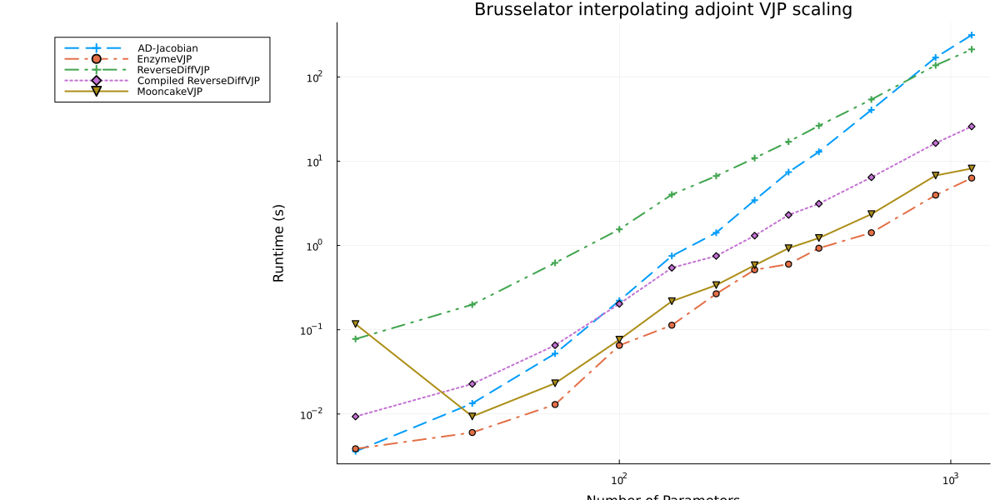

From the paper [A Comparison of Automatic Differentiation and Continuous Sensitivity Analysis for Derivatives of Differential Equation Solutions](https://ieeexplore.ieee.org/abstract/document/9622796)

```julia
using OrdinaryDiffEq, ReverseDiff, ForwardDiff, FiniteDiff, SciMLSensitivity
using LinearAlgebra, Tracker, Mooncake, Plots
```


```julia
function makebrusselator(N = 8)
    xyd_brusselator = range(0, stop = 1, length = N)
    function limit(a, N)
        if a == N+1
            return 1
        elseif a == 0
            return N
        else
            return a
        end
    end
    brusselator_f(x, y, t) = ifelse(
        (((x-0.3)^2 + (y-0.6)^2) <= 0.1^2) &&
        (t >= 1.1), 5.0, 0.0)
    brusselator_2d_loop = let N=N, xyd=xyd_brusselator, dx=step(xyd_brusselator)
        function brusselator_2d_loop(du, u, p, t)
            @inbounds begin
                ii1 = N^2
                ii2 = ii1+N^2
                ii3 = ii2+2(N^2)
                A = @view p[1:ii1]
                B = @view p[(ii1 + 1):ii2]
                α = @view p[(ii2 + 1):ii3]
                II = LinearIndices((N, N, 2))
                for I in CartesianIndices((N, N))
                    x = xyd[I[1]]
                    y = xyd[I[2]]
                    i = I[1]
                    j = I[2]
                    ip1 = limit(i+1, N);
                    im1 = limit(i-1, N)
                    jp1 = limit(j+1, N);
                    jm1 = limit(j-1, N)
                    du[II[i, j, 1]] = α[II[
                                          i, j, 1]]*(u[II[im1, j, 1]] + u[II[ip1, j, 1]] +
                                                     u[II[i, jp1, 1]] + u[II[i, jm1, 1]] -
                                                     4u[II[i, j, 1]])/dx^2 +
                                      B[II[i, j, 1]] + u[II[i, j, 1]]^2*u[II[i, j, 2]] -
                                      (A[II[i, j, 1]] + 1)*u[II[i, j, 1]] +
                                      brusselator_f(x, y, t)
                end
                for I in CartesianIndices((N, N))
                    i = I[1]
                    j = I[2]
                    ip1 = limit(i+1, N)
                    im1 = limit(i-1, N)
                    jp1 = limit(j+1, N)
                    jm1 = limit(j-1, N)
                    du[II[i, j, 2]] = α[II[
                        i, j, 2]]*(u[II[im1, j, 2]] + u[II[ip1, j, 2]] + u[II[i, jp1, 2]] +
                                   u[II[i, jm1, 2]] - 4u[II[i, j, 2]])/dx^2 +
                                      A[II[i, j, 1]]*u[II[i, j, 1]] -
                                      u[II[i, j, 1]]^2*u[II[i, j, 2]]
                end
                return nothing
            end
        end
    end
    function init_brusselator_2d(xyd)
        N = length(xyd)
        u = zeros(N, N, 2)
        for I in CartesianIndices((N, N))
            x = xyd[I[1]]
            y = xyd[I[2]]
            u[I, 1] = 22*(y*(1-y))^(3/2)
            u[I, 2] = 27*(x*(1-x))^(3/2)
        end
        vec(u)
    end
    dx = step(xyd_brusselator)
    e1 = ones(N-1)
    off = N-1
    e4 = ones(N-off)
    T = diagm(0=>-2ones(N), -1=>e1, 1=>e1, off=>e4, -off=>e4) ./ dx^2
    Ie = Matrix{Float64}(I, N, N)
    # A + df/du
    Op = kron(Ie, T) + kron(T, Ie)
    brusselator_jac = let N=N
        (J, a, p, t) -> begin
            ii1 = N^2
            ii2 = ii1+N^2
            ii3 = ii2+2(N^2)
            A = @view p[1:ii1]
            B = @view p[(ii1 + 1):ii2]
            α = @view p[(ii2 + 1):ii3]
            u = @view a[1:(end ÷ 2)]
            v = @view a[(end ÷ 2 + 1):end]
            N2 = length(a)÷2
            α1 = @view α[1:(end ÷ 2)]
            α2 = @view α[(end ÷ 2 + 1):end]
            fill!(J, 0)

            J[1:N2, 1:N2] .= α1 .* Op
            J[(N2 + 1):end, (N2 + 1):end] .= α2 .* Op

            J1 = @view J[1:N2, 1:N2]
            J2 = @view J[(N2 + 1):end, 1:N2]
            J3 = @view J[1:N2, (N2 + 1):end]
            J4 = @view J[(N2 + 1):end, (N2 + 1):end]
            J1[diagind(J1)] .+= @. 2u*v-(A+1)
            J2[diagind(J2)] .= @. A-2u*v
            J3[diagind(J3)] .= @. u^2
            J4[diagind(J4)] .+= @. -u^2
            nothing
        end
    end
    Jmat = zeros(2N*N, 2N*N)
    dp = zeros(2N*N, 4N*N)
    brusselator_comp = let N=N, xyd=xyd_brusselator, dx=step(xyd_brusselator), Jmat=Jmat,
        dp=dp, brusselator_jac=brusselator_jac

        function brusselator_comp(dus, us, p, t)
            @inbounds begin
                ii1 = N^2
                ii2 = ii1+N^2
                ii3 = ii2+2(N^2)
                @views u, s = us[1:ii2], us[(ii2 + 1):end]
                du = @view dus[1:ii2]
                ds = @view dus[(ii2 + 1):end]
                fill!(dp, 0)
                A = @view p[1:ii1]
                B = @view p[(ii1 + 1):ii2]
                α = @view p[(ii2 + 1):ii3]
                dfdα = @view dp[:, (ii2 + 1):ii3]
                diagind(dfdα)
                for i in 1:ii1
                    dp[i, ii1 + i] = 1
                end
                II = LinearIndices((N, N, 2))
                uu = @view u[1:(end ÷ 2)]
                for i in eachindex(uu)
                    dp[i, i] = -uu[i]
                    dp[i + ii1, i] = uu[i]
                end
                for I in CartesianIndices((N, N))
                    x = xyd[I[1]]
                    y = xyd[I[2]]
                    i = I[1]
                    j = I[2]
                    ip1 = limit(i+1, N);
                    im1 = limit(i-1, N)
                    jp1 = limit(j+1, N);
                    jm1 = limit(j-1, N)
                    au = dfdα[II[i, j, 1], II[i, j, 1]] = (u[II[im1, j, 1]] +
                                                           u[II[ip1, j, 1]] +
                                                           u[II[i, jp1, 1]] +
                                                           u[II[i, jm1, 1]] -
                                                           4u[II[i, j, 1]])/dx^2
                    du[II[i, j, 1]] = α[II[i, j, 1]]*(au) + B[II[i, j, 1]] +
                                      u[II[i, j, 1]]^2*u[II[i, j, 2]] -
                                      (A[II[i, j, 1]] + 1)*u[II[i, j, 1]] +
                                      brusselator_f(x, y, t)
                end
                for I in CartesianIndices((N, N))
                    i = I[1]
                    j = I[2]
                    ip1 = limit(i+1, N)
                    im1 = limit(i-1, N)
                    jp1 = limit(j+1, N)
                    jm1 = limit(j-1, N)
                    av = dfdα[II[i, j, 2], II[i, j, 2]] = (u[II[im1, j, 2]] +
                                                           u[II[ip1, j, 2]] +
                                                           u[II[i, jp1, 2]] +
                                                           u[II[i, jm1, 2]] -
                                                           4u[II[i, j, 2]])/dx^2
                    du[II[i, j, 2]] = α[II[i, j, 2]]*(av) + A[II[i, j, 1]]*u[II[i, j, 1]] -
                                      u[II[i, j, 1]]^2*u[II[i, j, 2]]
                end
                brusselator_jac(Jmat, u, p, t)
                BLAS.gemm!('N', 'N', 1.0, Jmat, reshape(s, 2N*N, 4N*N), 1.0, dp)
                copyto!(ds, vec(dp))
                return nothing
            end
        end
    end
    u0 = init_brusselator_2d(xyd_brusselator)
    p = [fill(3.4, N^2); fill(1.0, N^2); fill(10.0, 2*N^2)]
    brusselator_2d_loop, u0,
    p,
    brusselator_jac,
    ODEProblem(brusselator_comp, copy([u0; zeros((N^2*2)*(N^2*4))]), (0.0, 10.0), p)
end

Base.eps(::Type{Tracker.TrackedReal{T}}) where {T} = eps(T)
Base.vec(v::Adjoint{<:Real, <:AbstractVector}) = vec(v') # bad bad hack
```


## Setup AutoDiff

```julia
bt = 0:0.1:1
tspan = (0.0, 1.0)
forwarddiffn = vcat(2:10, 12, 15)
reversediffn = 2:10
numdiffn = vcat(2:10, 12)
csan = vcat(2:10, 12, 15, 17)
#csaseedn = 2:10
tols = (abstol = 1e-5, reltol = 1e-7)

@isdefined(PROBS) || (const PROBS = Dict{Int, Any}())
makebrusselator!(dict, n) = get!(()->makebrusselator(n), dict, n)

_adjoint_methods_iq = ntuple(2) do ii
    Alg = (InterpolatingAdjoint, QuadratureAdjoint)[ii]
    (
        user = Alg(autodiff = false, autojacvec = false), # user Jacobian
        adjc = Alg(autodiff = true, autojacvec = false), # AD Jacobian
        advj = Alg(autodiff = true, autojacvec = EnzymeVJP()) # AD vJ
    )
end |> NamedTuple{(:interp, :quad)}
# GaussAdjoint/GaussKronrodAdjoint do not support user-provided Jacobians (autodiff=false)
_adjoint_methods_g = ntuple(2) do ii
    Alg = (GaussAdjoint, GaussKronrodAdjoint)[ii]
    (
        adjc = Alg(autodiff = true, autojacvec = false), # AD Jacobian
        advj = Alg(autodiff = true, autojacvec = EnzymeVJP()) # AD vJ
    )
end |> NamedTuple{(:gauss, :gausskronrod)}
@isdefined(ADJOINT_METHODS_IQ) ||
    (const ADJOINT_METHODS_IQ = mapreduce(collect, vcat, _adjoint_methods_iq))
@isdefined(ADJOINT_METHODS_G) ||
    (const ADJOINT_METHODS_G = mapreduce(collect, vcat, _adjoint_methods_g))

function auto_sen_l2(
        f, u0, tspan, p, t, alg = Tsit5(); diffalg = ReverseDiff.gradient, kwargs...)
    test_f(p) = begin
        prob = ODEProblem{true, SciMLBase.FullSpecialize}(f, convert.(eltype(p), u0), tspan, p)
        sol = solve(prob, alg, saveat = t; kwargs...)
        sum(sol.u) do x
            sum(z->(1-z)^2/2, x)
        end
    end
    diffalg(test_f, p)
end
@inline function diffeq_sen_l2(df, u0, tspan, p, t, alg = Tsit5();
        abstol = 1e-5, reltol = 1e-7, iabstol = abstol, ireltol = reltol,
        sensalg = SensitivityAlg(), kwargs...)
    prob = ODEProblem{true, SciMLBase.FullSpecialize}(df, u0, tspan, p)
    saveat = tspan[1] != t[1] && tspan[end] != t[end] ? vcat(tspan[1], t, tspan[end]) : t
    sol = solve(prob, alg, abstol = abstol, reltol = reltol, saveat = saveat; kwargs...)
    dg(out, u, p, t, i) = (out.=u .- 1.0)
    adjoint_sensitivities(sol, alg; t, abstol = abstol, dgdu_discrete = dg,
        reltol = reltol, sensealg = sensalg)
end
```

```
diffeq_sen_l2 (generic function with 2 methods)
```


## AD Choice Benchmarks

```julia
forwarddiff = map(forwarddiffn) do n
    bfun, b_u0, b_p, brusselator_jac, brusselator_comp = makebrusselator!(PROBS, n)
    @elapsed auto_sen_l2(
        bfun, b_u0, tspan, b_p, bt, (Rodas5()); diffalg = (ForwardDiff.gradient), tols...)
    t = @elapsed auto_sen_l2(
        bfun, b_u0, tspan, b_p, bt, (Rodas5()); diffalg = (ForwardDiff.gradient), tols...)
    @show n, t
    t
end
```

```
(n, t) = (2, 0.001923897)
(n, t) = (3, 0.024120751)
(n, t) = (4, 0.103451418)
(n, t) = (5, 0.404126387)
(n, t) = (6, 1.254612015)
(n, t) = (7, 2.9456927)
(n, t) = (8, 10.386556234)
(n, t) = (9, 13.791977284)
(n, t) = (10, 27.34534496)
(n, t) = (12, 102.943376252)
(n, t) = (15, 825.529991201)
11-element Vector{Float64}:
   0.001923897
   0.024120751
   0.103451418
   0.404126387
   1.254612015
   2.9456927
  10.386556234
  13.791977284
  27.34534496
 102.943376252
 825.529991201
```


```julia
#=
reversediff = map(reversediffn) do n
  bfun, b_u0, b_p, brusselator_jac, brusselator_comp = makebrusselator!(PROBS, n)
  @elapsed auto_sen_l2(bfun, b_u0, tspan, b_p, bt, (Rodas5(autodiff=false)); diffalg=(ReverseDiff.gradient), tols...)
  t = @elapsed auto_sen_l2(bfun, b_u0, tspan, b_p, bt, (Rodas5(autodiff=false)); diffalg=(ReverseDiff.gradient), tols...)
  @show n,t
  t
end
=#
```


```julia
numdiff = map(numdiffn) do n
    bfun, b_u0, b_p, brusselator_jac, brusselator_comp = makebrusselator!(PROBS, n)
    @elapsed auto_sen_l2(bfun, b_u0, tspan, b_p, bt, (Rodas5());
        diffalg = (FiniteDiff.finite_difference_gradient), tols...)
    t = @elapsed auto_sen_l2(bfun, b_u0, tspan, b_p, bt, (Rodas5());
        diffalg = (FiniteDiff.finite_difference_gradient), tols...)
    @show n, t
    t
end
```

```
(n, t) = (2, 0.004501669)
(n, t) = (3, 0.041685999)
(n, t) = (4, 0.143068041)
(n, t) = (5, 0.442341951)
(n, t) = (6, 1.113300184)
(n, t) = (7, 2.40817055)
(n, t) = (8, 16.663675582)
(n, t) = (9, 36.079691215)
(n, t) = (10, 76.601050901)
(n, t) = (12, 216.339949217)
10-element Vector{Float64}:
   0.004501669
   0.041685999
   0.143068041
   0.442341951
   1.113300184
   2.40817055
  16.663675582
  36.079691215
  76.601050901
 216.339949217
```


```julia
csa_iq = map(csan) do n
    bfun, b_u0, b_p, brusselator_jac, brusselator_comp = makebrusselator!(PROBS, n)
    @time ts = map(ADJOINT_METHODS_IQ) do alg
        @info "Running $alg"
        f = SciMLSensitivity.alg_autodiff(alg) ? bfun :
            ODEFunction(bfun, jac = brusselator_jac)
        solver = Rodas5(autodiff = false)
        @time diffeq_sen_l2(f, b_u0, tspan, b_p, bt, solver; sensalg = alg, tols...)
        t = @elapsed diffeq_sen_l2(f, b_u0, tspan, b_p, bt, solver; sensalg = alg, tols...)
        return t
    end
    @show n, ts
    ts
end
```

```
15.633632 seconds (20.10 M allocations: 1.356 GiB, 3.28% gc time, 99.92% c
ompilation time)
 14.681204 seconds (10.57 M allocations: 736.663 MiB, 1.40% gc time, 99.94%
 compilation time)
 18.733664 seconds (10.16 M allocations: 695.374 MiB, 1.08% gc time, 99.95%
 compilation time)
 15.041733 seconds (16.11 M allocations: 1.078 GiB, 2.70% gc time, 99.95% c
ompilation time)
  7.527625 seconds (5.13 M allocations: 373.896 MiB, 1.48% gc time, 99.91% 
compilation time)
  6.667393 seconds (5.80 M allocations: 403.099 MiB, 1.45% gc time, 99.90% 
compilation time)
 79.273964 seconds (69.05 M allocations: 4.679 GiB, 1.94% gc time, 99.89% c
ompilation time)
(n, ts) = (2, [0.006087607, 0.003603356, 0.003293987, 0.002117755, 0.001518
62, 0.001925287])
  0.026288 seconds (18.72 k allocations: 2.246 MiB)
 19.669816 seconds (4.78 M allocations: 324.030 MiB, 0.78% gc time, 99.90% 
compilation time)
  0.006556 seconds (8.44 k allocations: 2.089 MiB)
  0.004869 seconds (6.74 k allocations: 832.594 KiB)
  7.568074 seconds (3.76 M allocations: 259.503 MiB, 0.99% gc time, 99.88% 
compilation time)
  0.003165 seconds (7.87 k allocations: 1.062 MiB)
 27.342520 seconds (8.64 M allocations: 598.789 MiB, 0.83% gc time, 99.51% 
compilation time)
(n, ts) = (3, [0.025932568, 0.013368436, 0.006374635, 0.004567268, 0.004178
921, 0.002997099])
  0.163741 seconds (30.31 k allocations: 5.617 MiB, 29.02% gc time)
 20.549425 seconds (4.79 M allocations: 327.042 MiB, 0.26% gc time, 99.72% 
compilation time)
  0.013426 seconds (13.09 k allocations: 4.943 MiB)
  0.011063 seconds (9.03 k allocations: 1.721 MiB)
  9.880090 seconds (3.76 M allocations: 260.303 MiB, 1.52% gc time, 99.83% 
compilation time)
  0.005543 seconds (9.71 k allocations: 1.804 MiB)
 30.836675 seconds (8.71 M allocations: 621.771 MiB, 0.81% gc time, 98.44% 
compilation time)
(n, ts) = (4, [0.115016995, 0.052133475, 0.013095679, 0.010936944, 0.011728
297, 0.005305993])
  0.496492 seconds (44.47 k allocations: 11.983 MiB)
 19.682521 seconds (4.20 M allocations: 294.168 MiB, 98.85% compilation tim
e)
  0.049724 seconds (18.81 k allocations: 10.367 MiB)
  0.025710 seconds (12.13 k allocations: 3.424 MiB)
  9.049234 seconds (3.76 M allocations: 261.147 MiB, 1.75% gc time, 99.51% 
compilation time)
  0.008876 seconds (12.20 k allocations: 3.155 MiB)
 30.069199 seconds (8.17 M allocations: 626.014 MiB, 0.53% gc time, 94.65% 
compilation time)
(n, ts) = (5, [0.406772964, 0.221712059, 0.048885137, 0.025374702, 0.039086
186, 0.00865727])
  1.133639 seconds (61.65 k allocations: 23.606 MiB)
 22.362366 seconds (4.21 M allocations: 303.657 MiB, 0.54% gc time, 97.31% 
compilation time)
  0.101625 seconds (25.70 k allocations: 19.800 MiB)
  0.052188 seconds (15.54 k allocations: 6.511 MiB)
 11.509120 seconds (3.76 M allocations: 263.409 MiB, 0.36% gc time, 99.00% 
compilation time)
  0.015669 seconds (14.93 k allocations: 5.270 MiB)
 37.336727 seconds (8.27 M allocations: 702.052 MiB, 0.86% gc time, 88.80% 
compilation time)
(n, ts) = (6, [1.127623942, 0.750573219, 0.102495093, 0.052309574, 0.105186
385, 0.014771066])
  2.810664 seconds (85.16 k allocations: 43.958 MiB)
 23.928314 seconds (3.62 M allocations: 283.377 MiB, 0.64% gc time, 94.06% 
compilation time)
  0.198954 seconds (35.11 k allocations: 37.172 MiB)
  0.107233 seconds (19.57 k allocations: 10.920 MiB)
  2.089568 seconds (297.39 k allocations: 26.692 MiB, 90.61% compilation ti
me)
  0.023032 seconds (18.16 k allocations: 8.466 MiB)
 34.199671 seconds (4.32 M allocations: 556.473 MiB, 1.18% gc time, 71.34% 
compilation time)
(n, ts) = (7, [2.972377487, 1.416722171, 0.319352206, 0.107119321, 0.194138
613, 0.02287841])
  6.211278 seconds (109.48 k allocations: 73.644 MiB)
  3.681287 seconds (87.69 k allocations: 62.066 MiB)
  0.552391 seconds (44.84 k allocations: 61.664 MiB, 20.51% gc time)
  0.242783 seconds (24.97 k allocations: 18.519 MiB)
  0.599185 seconds (15.90 k allocations: 13.675 MiB)
  0.082322 seconds (22.48 k allocations: 13.599 MiB)
 22.725764 seconds (612.15 k allocations: 486.575 MiB, 2.28% gc time)
(n, ts) = (8, [6.627175634, 3.447291917, 0.347489689, 0.243528267, 0.599068
099, 0.080361807])
 12.677060 seconds (142.00 k allocations: 119.495 MiB, 0.09% gc time)
  7.457036 seconds (121.67 k allocations: 104.006 MiB, 0.57% gc time)
  0.736749 seconds (61.84 k allocations: 103.097 MiB, 7.39% gc time)
  0.496477 seconds (30.42 k allocations: 29.385 MiB, 2.33% gc time)
  1.163949 seconds (19.17 k allocations: 21.647 MiB)
  0.129406 seconds (26.84 k allocations: 20.817 MiB)
 45.202753 seconds (805.30 k allocations: 797.138 MiB, 0.27% gc time)
(n, ts) = (9, [12.703138588, 7.42160061, 0.672165379, 0.436635036, 1.163532
852, 0.128493152])
 23.597947 seconds (173.85 k allocations: 177.456 MiB, 0.20% gc time)
 12.829795 seconds (139.19 k allocations: 148.371 MiB)
  1.040146 seconds (70.60 k allocations: 146.135 MiB, 14.08% gc time)
  0.743637 seconds (36.50 k allocations: 43.825 MiB)
  2.152209 seconds (22.82 k allocations: 32.313 MiB)
  0.221363 seconds (31.70 k allocations: 30.308 MiB)
 81.157007 seconds (950.73 k allocations: 1.130 GiB, 0.39% gc time)
(n, ts) = (10, [23.622882521, 12.931173803, 0.818545385, 0.749505898, 2.144
84132, 0.279482855])
 71.305274 seconds (256.54 k allocations: 370.194 MiB, 0.07% gc time)
 41.243890 seconds (205.34 k allocations: 309.939 MiB, 0.10% gc time)
  1.488713 seconds (103.68 k allocations: 303.808 MiB, 2.15% gc time)
  1.902054 seconds (50.59 k allocations: 88.514 MiB)
  6.408122 seconds (31.27 k allocations: 65.751 MiB, 0.49% gc time)
  0.415734 seconds (42.97 k allocations: 59.668 MiB)
245.232338 seconds (1.38 M allocations: 2.340 GiB, 0.14% gc time)
(n, ts) = (12, [71.644254209, 40.639611485, 1.412607627, 1.92962582, 6.3473
33583, 0.470857366])
264.251398 seconds (397.51 k allocations: 909.305 MiB, 0.50% gc time)
169.788812 seconds (350.79 k allocations: 799.431 MiB, 0.05% gc time)
  3.440083 seconds (170.98 k allocations: 767.125 MiB, 0.29% gc time)
  6.239672 seconds (76.52 k allocations: 218.971 MiB, 0.05% gc time)
 23.727244 seconds (46.83 k allocations: 161.755 MiB, 0.58% gc time)
  1.277842 seconds (63.71 k allocations: 143.222 MiB, 3.25% gc time)
935.772679 seconds (2.21 M allocations: 5.859 GiB, 0.20% gc time)
(n, ts) = (15, [262.53145318, 170.260969123, 3.387138746, 6.244915008, 23.5
63955537, 1.042949082])
572.136872 seconds (526.33 k allocations: 1.481 GiB, 0.33% gc time)
314.282393 seconds (393.25 k allocations: 1.192 GiB, 0.31% gc time)
  4.940307 seconds (197.65 k allocations: 1.160 GiB, 1.11% gc time)
 12.489504 seconds (97.00 k allocations: 357.023 MiB, 0.02% gc time)
 49.137099 seconds (59.12 k allocations: 267.234 MiB, 0.07% gc time)
  1.339501 seconds (80.10 k allocations: 234.333 MiB)
1906.760684 seconds (2.71 M allocations: 9.345 GiB, 0.18% gc time)
(n, ts) = (17, [570.641227786, 313.953902626, 4.893938846, 12.449923031, 49
.009687978, 1.469240042])
12-element Vector{Vector{Float64}}:
 [0.006087607, 0.003603356, 0.003293987, 0.002117755, 0.00151862, 0.0019252
87]
 [0.025932568, 0.013368436, 0.006374635, 0.004567268, 0.004178921, 0.002997
099]
 [0.115016995, 0.052133475, 0.013095679, 0.010936944, 0.011728297, 0.005305
993]
 [0.406772964, 0.221712059, 0.048885137, 0.025374702, 0.039086186, 0.008657
27]
 [1.127623942, 0.750573219, 0.102495093, 0.052309574, 0.105186385, 0.014771
066]
 [2.972377487, 1.416722171, 0.319352206, 0.107119321, 0.194138613, 0.022878
41]
 [6.627175634, 3.447291917, 0.347489689, 0.243528267, 0.599068099, 0.080361
807]
 [12.703138588, 7.42160061, 0.672165379, 0.436635036, 1.163532852, 0.128493
152]
 [23.622882521, 12.931173803, 0.818545385, 0.749505898, 2.14484132, 0.27948
2855]
 [71.644254209, 40.639611485, 1.412607627, 1.92962582, 6.347333583, 0.47085
7366]
 [262.53145318, 170.260969123, 3.387138746, 6.244915008, 23.563955537, 1.04
2949082]
 [570.641227786, 313.953902626, 4.893938846, 12.449923031, 49.009687978, 1.
469240042]
```


```julia
csa_g = map(csan) do n
    bfun, b_u0, b_p, brusselator_jac, brusselator_comp = makebrusselator!(PROBS, n)
    @time ts = map(ADJOINT_METHODS_G) do alg
        @info "Running $alg"
        solver = Rodas5(autodiff = false)
        @time diffeq_sen_l2(bfun, b_u0, tspan, b_p, bt, solver; sensalg = alg, tols...)
        t = @elapsed diffeq_sen_l2(bfun, b_u0, tspan, b_p, bt, solver; sensalg = alg, tols...)
        return t
    end
    @show n, ts
    ts
end
```

```
8.814449 seconds (6.72 M allocations: 468.482 MiB, 0.84% gc time, 99.91% 
compilation time)
  6.126772 seconds (5.17 M allocations: 364.371 MiB, 1.26% gc time, 99.87% 
compilation time)
  8.001447 seconds (5.65 M allocations: 397.848 MiB, 0.72% gc time, 99.91% 
compilation time)
  6.158420 seconds (5.39 M allocations: 380.008 MiB, 0.94% gc time, 99.87% 
compilation time)
 29.559849 seconds (23.44 M allocations: 1.610 GiB, 0.90% gc time, 99.85% c
ompilation time)
(n, ts) = (2, [0.001778998, 0.002029585, 0.002001156, 0.002362423])
  8.663917 seconds (4.76 M allocations: 326.996 MiB, 0.76% gc time, 99.87% 
compilation time)
  0.003936 seconds (6.14 k allocations: 1.098 MiB)
  8.378542 seconds (4.32 M allocations: 300.598 MiB, 1.29% gc time, 99.85% 
compilation time)
  0.004421 seconds (11.92 k allocations: 1.430 MiB)
 17.073371 seconds (9.14 M allocations: 634.721 MiB, 1.02% gc time, 99.68% 
compilation time)
(n, ts) = (3, [0.004737477, 0.003569944, 0.006267996, 0.00423254])
 11.577121 seconds (4.76 M allocations: 327.874 MiB, 0.68% gc time, 99.83% 
compilation time)
  0.006661 seconds (7.82 k allocations: 2.118 MiB)
 11.125084 seconds (4.33 M allocations: 301.671 MiB, 0.56% gc time, 99.77% 
compilation time)
  0.007847 seconds (16.74 k allocations: 2.660 MiB)
 22.766976 seconds (9.18 M allocations: 643.492 MiB, 0.62% gc time, 99.52% 
compilation time)
(n, ts) = (4, [0.012272063, 0.006674812, 0.020284216, 0.007682625])
  9.146041 seconds (3.58 M allocations: 250.544 MiB, 99.54% compilation tim
e)
  0.011285 seconds (9.95 k allocations: 4.073 MiB)
  9.557246 seconds (3.87 M allocations: 270.477 MiB, 0.68% gc time, 99.38% 
compilation time)
  0.013184 seconds (18.46 k allocations: 4.638 MiB)
 18.846802 seconds (7.55 M allocations: 546.823 MiB, 0.34% gc time, 98.70% 
compilation time)
(n, ts) = (5, [0.037179585, 0.011088381, 0.054393482, 0.012895628])
 12.234109 seconds (3.61 M allocations: 256.144 MiB, 1.05% gc time, 99.17% 
compilation time)
  0.018967 seconds (12.35 k allocations: 7.463 MiB)
 12.307129 seconds (3.89 M allocations: 274.576 MiB, 0.49% gc time, 98.83% 
compilation time)
  0.020754 seconds (23.93 k allocations: 8.291 MiB)
 24.859091 seconds (7.62 M allocations: 578.263 MiB, 0.76% gc time, 97.73% 
compilation time)
(n, ts) = (6, [0.095458681, 0.018708926, 0.139379277, 0.020555063])
 10.378300 seconds (3.52 M allocations: 255.135 MiB, 98.24% compilation tim
e)
  0.031166 seconds (15.13 k allocations: 12.913 MiB)
 10.610886 seconds (3.81 M allocations: 274.394 MiB, 0.54% gc time, 97.25% 
compilation time)
  0.033954 seconds (29.79 k allocations: 14.043 MiB)
 21.589939 seconds (7.49 M allocations: 611.685 MiB, 0.26% gc time, 95.02% 
compilation time)
(n, ts) = (7, [0.178928826, 0.032229071, 0.286371241, 0.034022048])
  0.689740 seconds (17.93 k allocations: 21.923 MiB)
  0.166627 seconds (18.38 k allocations: 21.279 MiB)
  0.890987 seconds (83.23 k allocations: 25.142 MiB)
  0.127911 seconds (36.93 k allocations: 22.856 MiB)
  3.913398 seconds (313.84 k allocations: 182.561 MiB, 4.04% gc time)
(n, ts) = (8, [0.76844411, 0.159733213, 0.97914792, 0.121844043])
  1.055103 seconds (21.51 k allocations: 34.909 MiB)
  0.186666 seconds (22.06 k allocations: 33.402 MiB)
  1.492187 seconds (117.99 k allocations: 39.784 MiB)
  0.192523 seconds (42.87 k allocations: 35.347 MiB)
  5.856049 seconds (409.73 k allocations: 287.045 MiB)
(n, ts) = (9, [1.063560469, 0.17429161, 1.495784272, 0.190805472])
  2.043552 seconds (26.60 k allocations: 53.342 MiB, 5.06% gc time)
  0.301205 seconds (27.94 k allocations: 51.018 MiB)
  2.791584 seconds (141.07 k allocations: 59.220 MiB)
  0.373108 seconds (49.70 k allocations: 53.246 MiB)
 11.171040 seconds (491.51 k allocations: 433.814 MiB, 1.35% gc time)
(n, ts) = (10, [1.956476312, 0.295534026, 3.024276142, 0.376900281])
  6.335265 seconds (37.58 k allocations: 110.775 MiB)
  0.736105 seconds (36.92 k allocations: 103.043 MiB)
  8.269178 seconds (246.95 k allocations: 121.791 MiB)
  0.682884 seconds (62.10 k allocations: 106.140 MiB, 7.49% gc time)
 31.683214 seconds (768.00 k allocations: 883.658 MiB, 0.68% gc time)
(n, ts) = (12, [6.009714044, 0.886515269, 8.094384261, 0.647889116])
 26.126217 seconds (65.76 k allocations: 284.738 MiB, 0.19% gc time)
  1.519566 seconds (56.98 k allocations: 256.956 MiB, 2.35% gc time)
 31.710889 seconds (418.12 k allocations: 303.745 MiB)
  1.660829 seconds (89.60 k allocations: 262.210 MiB, 2.25% gc time)
121.120323 seconds (1.26 M allocations: 2.164 GiB, 0.14% gc time)
(n, ts) = (15, [25.305568306, 1.406766885, 31.759074995, 1.622156148])
 41.862881 seconds (66.59 k allocations: 452.073 MiB, 0.06% gc time)
  2.445674 seconds (71.83 k allocations: 422.756 MiB, 0.25% gc time)
 53.854799 seconds (574.65 k allocations: 479.594 MiB, 0.07% gc time)
  2.477554 seconds (107.12 k allocations: 429.492 MiB, 0.70% gc time)
201.246073 seconds (1.64 M allocations: 3.484 GiB, 0.13% gc time)
(n, ts) = (17, [41.895329385, 2.151027338, 53.941273804, 2.606504752])
12-element Vector{Vector{Float64}}:
 [0.001778998, 0.002029585, 0.002001156, 0.002362423]
 [0.004737477, 0.003569944, 0.006267996, 0.00423254]
 [0.012272063, 0.006674812, 0.020284216, 0.007682625]
 [0.037179585, 0.011088381, 0.054393482, 0.012895628]
 [0.095458681, 0.018708926, 0.139379277, 0.020555063]
 [0.178928826, 0.032229071, 0.286371241, 0.034022048]
 [0.76844411, 0.159733213, 0.97914792, 0.121844043]
 [1.063560469, 0.17429161, 1.495784272, 0.190805472]
 [1.956476312, 0.295534026, 3.024276142, 0.376900281]
 [6.009714044, 0.886515269, 8.094384261, 0.647889116]
 [25.305568306, 1.406766885, 31.759074995, 1.622156148]
 [41.895329385, 2.151027338, 53.941273804, 2.606504752]
```


```julia
n_to_param(n) = 4n^2

lw = 2
ms = 0.5
plt1 = plot(title = "Sensitivity Scaling on Brusselator");
plot!(plt1, n_to_param.(forwarddiffn), forwarddiff, lab = "Forward-Mode DSAAD",
    lw = lw, marksize = ms, linestyle = :auto, marker = :auto);
#plot!(plt1, n_to_param.(reversediffn), reversediff, lab="Reverse-Mode DSAAD", lw=lw, marksize=ms, linestyle=:auto, marker=:auto);
csadata_iq = [[csa_iq[j][i] for j in eachindex(csa_iq)] for i in eachindex(csa_iq[1])]
csadata_g = [[csa_g[j][i] for j in eachindex(csa_g)] for i in eachindex(csa_g[1])]
plot!(plt1, n_to_param.(csan), csadata_iq[1], lab = "Interpolating CASA user-Jacobian",
    lw = lw, marksize = ms, linestyle = :auto, marker = :auto);
plot!(plt1, n_to_param.(csan), csadata_iq[2], lab = "Interpolating CASA AD-Jacobian",
    lw = lw, marksize = ms, linestyle = :auto, marker = :auto);
plot!(
    plt1, n_to_param.(csan), csadata_iq[3], lab = raw"Interpolating CASA AD-$v^{T}J$ seeding",
    lw = lw, marksize = ms, linestyle = :auto, marker = :auto);
plot!(plt1, n_to_param.(csan), csadata_iq[1 + 3], lab = "Quadrature CASA user-Jacobian",
    lw = lw, marksize = ms, linestyle = :auto, marker = :auto);
plot!(plt1, n_to_param.(csan), csadata_iq[2 + 3], lab = "Quadrature CASA AD-Jacobian",
    lw = lw, marksize = ms, linestyle = :auto, marker = :auto);
plot!(
    plt1, n_to_param.(csan), csadata_iq[3 + 3], lab = raw"Quadrature CASA AD-$v^{T}J$ seeding",
    lw = lw, marksize = ms, linestyle = :auto, marker = :auto);
plot!(plt1, n_to_param.(csan), csadata_g[1], lab = "Gauss CASA AD-Jacobian",
    lw = lw, marksize = ms, linestyle = :auto, marker = :auto);
plot!(
    plt1, n_to_param.(csan), csadata_g[2], lab = raw"Gauss CASA AD-$v^{T}J$ seeding",
    lw = lw, marksize = ms, linestyle = :auto, marker = :auto);
plot!(plt1, n_to_param.(csan), csadata_g[1 + 2], lab = "GaussKronrod CASA AD-Jacobian",
    lw = lw, marksize = ms, linestyle = :auto, marker = :auto);
plot!(
    plt1, n_to_param.(csan), csadata_g[2 + 2], lab = raw"GaussKronrod CASA AD-$v^{T}J$ seeding",
    lw = lw, marksize = ms, linestyle = :auto, marker = :auto);
plot!(plt1, n_to_param.(numdiffn), numdiff, lab = "Numerical Differentiation",
    lw = lw, marksize = ms, linestyle = :auto, marker = :auto);
xaxis!(plt1, "Number of Parameters", :log10);
yaxis!(plt1, "Runtime (s)", :log10);
plot!(plt1, legend = :outertopleft, size = (1200, 600))
```


## VJP Choice Benchmarks

```julia
bt = 0:0.1:1
tspan = (0.0, 1.0)
csan = vcat(2:10, 12, 15, 17)
tols = (abstol = 1e-5, reltol = 1e-7)

_adjoint_methods = ntuple(4) do ii
    Alg = (InterpolatingAdjoint, QuadratureAdjoint, GaussAdjoint, GaussKronrodAdjoint)[ii]
    (
        advj1 = Alg(autodiff = true, autojacvec = EnzymeVJP()), # AD vJ (Enzyme)
        advj2 = Alg(autodiff = true, autojacvec = ReverseDiffVJP(false)), # AD vJ (ReverseDiff)
        advj3 = Alg(autodiff = true, autojacvec = ReverseDiffVJP(true)), # AD vJ (Compiled ReverseDiff)
        advj4 = Alg(autodiff = true, autojacvec = SciMLSensitivity.MooncakeVJP()) # AD vJ (Mooncake)
    )
end |> NamedTuple{(:interp, :quad, :gauss, :gausskronrod)}
adjoint_methods = mapreduce(collect, vcat, _adjoint_methods)

csavjp = map(csan) do n
    bfun, b_u0, b_p, brusselator_jac, brusselator_comp = makebrusselator!(PROBS, n)
    @time ts = map(adjoint_methods) do alg
        @info "Running $alg"
        f = SciMLSensitivity.alg_autodiff(alg) ? bfun :
            ODEFunction(bfun, jac = brusselator_jac)
        solver = Rodas5(autodiff = false)
        @time diffeq_sen_l2(f, b_u0, tspan, b_p, bt, solver; sensalg = alg, tols...)
        t = @elapsed diffeq_sen_l2(f, b_u0, tspan, b_p, bt, solver; sensalg = alg, tols...)
        return t
    end
    @show n, ts
    ts
end
```

```
0.004719 seconds (6.28 k allocations: 976.312 KiB)
  7.809799 seconds (8.06 M allocations: 541.991 MiB, 3.40% gc time, 98.72% 
compilation time)
  6.358273 seconds (5.64 M allocations: 402.283 MiB, 2.81% gc time, 99.72% 
compilation time)
 51.593923 seconds (43.95 M allocations: 2.947 GiB, 4.37% gc time, 98.67% c
ompilation time)
  0.002697 seconds (6.78 k allocations: 668.469 KiB)
  6.216805 seconds (5.72 M allocations: 399.673 MiB, 2.78% gc time, 99.26% 
compilation time)
  6.291606 seconds (5.36 M allocations: 383.952 MiB, 1.98% gc time, 99.83% 
compilation time)
  7.252119 seconds (5.49 M allocations: 395.276 MiB, 1.52% gc time, 99.86% 
compilation time)
  0.002694 seconds (5.38 k allocations: 620.953 KiB)
  5.761878 seconds (5.51 M allocations: 378.488 MiB, 1.11% gc time, 99.22% 
compilation time)
  5.827523 seconds (5.16 M allocations: 363.892 MiB, 0.93% gc time, 99.80% 
compilation time)
  6.745847 seconds (5.29 M allocations: 372.846 MiB, 1.75% gc time, 99.85% 
compilation time)
  0.002826 seconds (7.51 k allocations: 738.438 KiB)
  5.959099 seconds (5.70 M allocations: 391.881 MiB, 2.68% gc time, 99.19% 
compilation time)
  5.895290 seconds (5.37 M allocations: 378.430 MiB, 0.95% gc time, 99.79% 
compilation time)
  6.792321 seconds (5.35 M allocations: 377.276 MiB, 1.54% gc time, 99.85% 
compilation time)
124.736445 seconds (110.25 M allocations: 7.443 GiB, 3.10% gc time, 98.88% 
compilation time)
(n, ts) = (2, [0.003864522, 0.077624929, 0.009331563, 0.116822571, 0.001693
308, 0.040405204, 0.005298043, 0.002990519, 0.002070365, 0.08314855, 0.0056
87, 0.003224227, 0.002215125, 0.09028311, 0.006307355, 0.003564515])
  0.006442 seconds (8.44 k allocations: 2.089 MiB)
  0.289446 seconds (2.10 M allocations: 96.852 MiB, 31.10% gc time)
  0.023152 seconds (5.88 k allocations: 1.507 MiB)
  0.009677 seconds (13.55 k allocations: 2.263 MiB)
  0.003197 seconds (7.87 k allocations: 1.062 MiB)
  0.157436 seconds (1.10 M allocations: 50.511 MiB, 25.84% gc time)
  0.013705 seconds (7.78 k allocations: 816.891 KiB)
  0.005064 seconds (9.21 k allocations: 1.163 MiB)
  0.003718 seconds (6.14 k allocations: 1.098 MiB)
  0.098948 seconds (1.03 M allocations: 47.528 MiB)
  0.013619 seconds (8.38 k allocations: 971.125 KiB)
  0.005776 seconds (9.00 k allocations: 1.255 MiB)
  0.004473 seconds (11.92 k allocations: 1.430 MiB)
  0.166368 seconds (1.04 M allocations: 47.701 MiB, 23.97% gc time)
  0.018328 seconds (13.00 k allocations: 1.122 MiB)
  0.007250 seconds (15.94 k allocations: 1.617 MiB)
  1.484463 seconds (10.76 M allocations: 518.549 MiB, 11.49% gc time)
(n, ts) = (3, [0.006029617, 0.198434593, 0.022754899, 0.009357823, 0.002888
819, 0.108247062, 0.013404025, 0.004769896, 0.003465065, 0.104768377, 0.012
929668, 0.005320422, 0.00417174, 0.124704406, 0.017898883, 0.007116139])
  0.013243 seconds (13.09 k allocations: 4.943 MiB)
  0.582836 seconds (6.24 M allocations: 271.949 MiB, 3.48% gc time)
  0.064728 seconds (9.02 k allocations: 3.970 MiB)
  0.023315 seconds (21.66 k allocations: 5.205 MiB)
  0.005437 seconds (9.71 k allocations: 1.804 MiB)
  0.284412 seconds (2.94 M allocations: 127.393 MiB)
  0.033299 seconds (12.18 k allocations: 1.523 MiB)
  0.010872 seconds (12.42 k allocations: 1.942 MiB)
  0.006925 seconds (7.82 k allocations: 2.118 MiB)
  0.282204 seconds (2.71 M allocations: 117.900 MiB, 7.52% gc time)
  0.031216 seconds (12.76 k allocations: 1.972 MiB)
  0.011657 seconds (11.91 k allocations: 2.308 MiB)
  0.007993 seconds (16.74 k allocations: 2.660 MiB)
  0.345468 seconds (2.72 M allocations: 118.195 MiB, 5.96% gc time)
  0.044991 seconds (19.88 k allocations: 2.267 MiB)
  0.015684 seconds (22.63 k allocations: 2.896 MiB)
  3.588113 seconds (29.56 M allocations: 1.307 GiB, 4.38% gc time)
(n, ts) = (4, [0.012958768, 0.621876499, 0.065408336, 0.023153086, 0.005107
494, 0.312101287, 0.032935256, 0.010724144, 0.006523683, 0.252646018, 0.030
89551, 0.011402129, 0.007735695, 0.353294814, 0.048541346, 0.015314661])
  0.065772 seconds (18.81 k allocations: 10.367 MiB)
  1.873721 seconds (14.53 M allocations: 674.711 MiB, 6.28% gc time)
  0.175489 seconds (13.06 k allocations: 8.941 MiB)
  0.077584 seconds (31.60 k allocations: 10.738 MiB)
  0.009981 seconds (12.20 k allocations: 3.155 MiB)
  0.639269 seconds (6.64 M allocations: 306.415 MiB, 3.10% gc time)
  0.072005 seconds (17.93 k allocations: 2.876 MiB)
  0.021981 seconds (16.71 k allocations: 3.340 MiB)
  0.012094 seconds (9.95 k allocations: 4.073 MiB)
  0.564619 seconds (5.91 M allocations: 274.181 MiB, 3.51% gc time)
  0.067021 seconds (18.47 k allocations: 3.973 MiB)
  0.022646 seconds (15.53 k allocations: 4.303 MiB)
  0.012920 seconds (18.46 k allocations: 4.638 MiB)
  0.668950 seconds (5.92 M allocations: 274.511 MiB, 2.96% gc time)
  0.085996 seconds (25.26 k allocations: 4.302 MiB)
  0.029565 seconds (25.74 k allocations: 4.911 MiB)
  8.619165 seconds (66.42 M allocations: 3.117 GiB, 5.76% gc time)
(n, ts) = (5, [0.065164217, 1.553045415, 0.202678453, 0.07621853, 0.0090926
45, 0.685819396, 0.070883607, 0.021605087, 0.011876205, 0.60196611, 0.06589
0663, 0.022133463, 0.012630981, 0.682743538, 0.090636798, 0.02821511])
  0.153409 seconds (25.70 k allocations: 19.800 MiB, 15.86% gc time)
  3.506757 seconds (29.31 M allocations: 1.275 GiB, 9.33% gc time)
  0.630012 seconds (17.89 k allocations: 17.802 MiB, 13.88% gc time)
  0.220380 seconds (43.63 k allocations: 20.309 MiB)
  0.023894 seconds (14.93 k allocations: 5.270 MiB)
  1.401706 seconds (12.89 M allocations: 570.523 MiB, 8.46% gc time)
  0.138743 seconds (24.79 k allocations: 4.982 MiB)
  0.038936 seconds (21.49 k allocations: 5.524 MiB)
  0.019622 seconds (12.35 k allocations: 7.463 MiB)
  1.101039 seconds (11.41 M allocations: 507.990 MiB, 4.73% gc time)
  0.131407 seconds (25.26 k allocations: 7.388 MiB)
  0.044502 seconds (19.70 k allocations: 7.754 MiB)
  0.022714 seconds (23.93 k allocations: 8.291 MiB)
  1.396098 seconds (11.42 M allocations: 508.497 MiB, 7.22% gc time)
  0.166019 seconds (34.50 k allocations: 7.896 MiB)
  0.052598 seconds (33.63 k allocations: 8.642 MiB)
 18.505495 seconds (130.67 M allocations: 5.887 GiB, 7.81% gc time)
(n, ts) = (6, [0.113184617, 4.01442299, 0.54299194, 0.217883745, 0.02291170
7, 1.311556069, 0.13680926, 0.038566026, 0.020530154, 1.173788396, 0.126529
523, 0.041416207, 0.022350622, 1.430141508, 0.163663379, 0.051577663])
  0.246743 seconds (35.11 k allocations: 37.172 MiB)
  6.884638 seconds (55.56 M allocations: 2.356 GiB, 10.81% gc time)
  0.785712 seconds (23.91 k allocations: 34.366 MiB, 10.98% gc time)
  0.335913 seconds (60.12 k allocations: 37.980 MiB)
  0.027992 seconds (18.16 k allocations: 8.466 MiB)
  2.649627 seconds (22.91 M allocations: 987.645 MiB, 13.32% gc time)
  0.242294 seconds (32.90 k allocations: 8.166 MiB)
  0.068827 seconds (27.18 k allocations: 9.023 MiB)
  0.036702 seconds (15.13 k allocations: 12.913 MiB)
  2.089815 seconds (20.15 M allocations: 874.306 MiB, 8.36% gc time)
  0.221683 seconds (33.27 k allocations: 12.873 MiB)
  0.080086 seconds (24.62 k allocations: 13.498 MiB)
  0.037595 seconds (29.79 k allocations: 14.043 MiB)
  2.461925 seconds (20.16 M allocations: 875.019 MiB, 7.55% gc time)
  0.287384 seconds (44.79 k allocations: 13.586 MiB)
  0.090508 seconds (41.51 k allocations: 14.655 MiB)
 32.773550 seconds (238.34 M allocations: 10.481 GiB, 9.06% gc time)
(n, ts) = (7, [0.267003027, 6.676909664, 0.750845006, 0.338326211, 0.025294
071, 2.601234875, 0.242398131, 0.069332488, 0.041876593, 2.057417701, 0.218
271152, 0.073563628, 0.056453049, 2.398849731, 0.28637342, 0.087023063])
  0.444952 seconds (44.84 k allocations: 61.664 MiB)
 10.870178 seconds (93.72 M allocations: 4.233 GiB, 8.75% gc time)
  1.794559 seconds (30.57 k allocations: 58.072 MiB, 3.57% gc time)
  0.588237 seconds (77.14 k allocations: 62.659 MiB)
  0.121498 seconds (22.48 k allocations: 13.599 MiB, 28.38% gc time)
  4.344741 seconds (39.30 M allocations: 1.763 GiB, 13.03% gc time)
  0.455650 seconds (42.43 k allocations: 13.287 MiB)
  0.156276 seconds (34.74 k allocations: 14.241 MiB)
  0.124310 seconds (18.38 k allocations: 21.279 MiB)
  3.730045 seconds (33.37 M allocations: 1.507 GiB, 12.76% gc time)
  0.440834 seconds (42.52 k allocations: 21.338 MiB)
  0.213958 seconds (30.30 k allocations: 21.929 MiB, 8.65% gc time)
  0.133029 seconds (36.93 k allocations: 22.856 MiB)
  4.127443 seconds (33.39 M allocations: 1.508 GiB, 8.54% gc time)
  0.553317 seconds (56.49 k allocations: 22.341 MiB)
  0.217613 seconds (51.88 k allocations: 23.548 MiB)
 56.165476 seconds (400.54 M allocations: 18.719 GiB, 8.81% gc time)
(n, ts) = (8, [0.514701961, 10.903371296, 1.307196033, 0.58255625, 0.081060
385, 4.185243078, 0.460368606, 0.155856315, 0.120935032, 3.635272879, 0.440
567207, 0.185694393, 0.134504217, 4.326154823, 0.568247652, 0.216437406])
  0.612397 seconds (61.84 k allocations: 103.097 MiB)
 16.878929 seconds (159.93 M allocations: 7.025 GiB, 9.03% gc time)
  2.093022 seconds (39.11 k allocations: 96.129 MiB)
  0.899039 seconds (103.39 k allocations: 102.338 MiB)
  0.132579 seconds (26.84 k allocations: 20.817 MiB)
  6.844017 seconds (61.72 M allocations: 2.693 GiB, 12.47% gc time)
  0.724656 seconds (53.08 k allocations: 20.475 MiB)
  0.255776 seconds (42.36 k allocations: 21.545 MiB)
  0.216710 seconds (22.06 k allocations: 33.402 MiB)
  5.839491 seconds (52.34 M allocations: 2.299 GiB, 12.36% gc time)
  0.813342 seconds (53.01 k allocations: 33.501 MiB, 16.20% gc time)
  0.312123 seconds (36.74 k allocations: 34.126 MiB)
  0.209478 seconds (42.87 k allocations: 35.347 MiB)
  6.699174 seconds (52.36 M allocations: 2.301 GiB, 10.51% gc time)
  0.837794 seconds (69.75 k allocations: 34.877 MiB)
  0.397946 seconds (62.02 k allocations: 36.198 MiB, 10.75% gc time)
 87.626451 seconds (653.95 M allocations: 29.754 GiB, 8.96% gc time)
(n, ts) = (9, [0.599971197, 17.035133855, 2.303030997, 0.928205181, 0.12867
0238, 6.707084305, 0.753375171, 0.251210109, 0.221357731, 5.821772773, 0.73
0694051, 0.298051107, 0.223888844, 6.616750522, 0.86793576, 0.340705206])
  0.791112 seconds (70.60 k allocations: 146.135 MiB)
 26.009345 seconds (233.97 M allocations: 10.076 GiB, 12.91% gc time)
  3.061017 seconds (47.14 k allocations: 140.334 MiB)
  1.227448 seconds (122.26 k allocations: 150.395 MiB)
  0.192148 seconds (31.70 k allocations: 30.308 MiB)
 10.607953 seconds (92.73 M allocations: 3.966 GiB, 13.55% gc time)
  1.066803 seconds (64.97 k allocations: 29.933 MiB)
  0.375639 seconds (50.87 k allocations: 31.166 MiB)
  0.315211 seconds (27.94 k allocations: 51.018 MiB)
  9.868543 seconds (84.33 M allocations: 3.630 GiB, 14.98% gc time)
  1.211446 seconds (65.20 k allocations: 50.985 MiB, 9.36% gc time)
  0.492253 seconds (46.98 k allocations: 51.889 MiB)
  0.334391 seconds (49.70 k allocations: 53.246 MiB)
 11.119815 seconds (84.34 M allocations: 3.631 GiB, 14.32% gc time)
  1.358281 seconds (83.35 k allocations: 52.678 MiB)
  0.532763 seconds (72.92 k allocations: 54.208 MiB)
137.318822 seconds (992.22 M allocations: 44.253 GiB, 11.41% gc time)
(n, ts) = (10, [0.928255762, 26.360538386, 3.13082558, 1.225579058, 0.19566
3674, 10.453496859, 1.074027932, 0.487361818, 0.322840213, 10.062571005, 1.
155789963, 0.486327606, 0.338579891, 10.614678217, 1.361099148, 0.523363936
])
  1.431101 seconds (103.68 k allocations: 303.808 MiB, 0.82% gc time)
 55.674573 seconds (498.86 M allocations: 22.545 GiB, 14.49% gc time)
  6.271410 seconds (67.78 k allocations: 295.208 MiB, 2.15% gc time)
  2.345280 seconds (180.09 k allocations: 305.946 MiB, 0.31% gc time)
  0.433666 seconds (42.97 k allocations: 59.668 MiB)
 22.442874 seconds (188.69 M allocations: 8.473 GiB, 16.83% gc time)
  2.548812 seconds (92.52 k allocations: 59.350 MiB)
  0.760209 seconds (70.59 k allocations: 60.750 MiB)
  0.745133 seconds (36.92 k allocations: 103.043 MiB, 6.61% gc time)
 19.679446 seconds (165.54 M allocations: 7.484 GiB, 15.89% gc time)
  2.319202 seconds (92.17 k allocations: 103.300 MiB, 3.87% gc time)
  0.972958 seconds (62.72 k allocations: 104.094 MiB)
  0.735776 seconds (62.10 k allocations: 106.140 MiB, 5.27% gc time)
 21.430537 seconds (165.57 M allocations: 7.486 GiB, 13.63% gc time)
  2.625536 seconds (114.83 k allocations: 105.987 MiB)
  1.038364 seconds (95.24 k allocations: 107.548 MiB)
280.687047 seconds (2.04 G allocations: 95.326 GiB, 11.96% gc time)
(n, ts) = (12, [1.416726766, 54.000835071, 6.443240093, 2.354242427, 0.4417
8526, 21.789185602, 2.246133685, 0.770367849, 0.69128824, 19.534488447, 2.3
48573152, 0.983383034, 0.679688795, 21.700128014, 2.749657396, 1.047508885]
)
  3.547911 seconds (170.98 k allocations: 767.125 MiB, 6.84% gc time)
132.769597 seconds (1.25 G allocations: 53.932 GiB, 9.59% gc time)
 16.796452 seconds (106.03 k allocations: 738.594 MiB, 0.40% gc time)
  6.151473 seconds (307.39 k allocations: 785.726 MiB, 0.73% gc time)
  0.868357 seconds (63.71 k allocations: 143.222 MiB, 0.46% gc time)
 55.430201 seconds (453.45 M allocations: 19.400 GiB, 17.09% gc time)
  5.578249 seconds (143.24 k allocations: 142.763 MiB, 4.97% gc time)
  1.736837 seconds (106.94 k allocations: 145.738 MiB)
  1.577074 seconds (56.98 k allocations: 256.956 MiB)
 47.540023 seconds (411.58 M allocations: 17.733 GiB, 15.37% gc time)
  5.405041 seconds (142.75 k allocations: 257.148 MiB, 0.25% gc time)
  2.700267 seconds (137.10 k allocations: 279.527 MiB)
  1.564521 seconds (89.60 k allocations: 262.210 MiB, 1.59% gc time)
 52.470025 seconds (411.61 M allocations: 17.737 GiB, 14.48% gc time)
  6.749035 seconds (170.19 k allocations: 261.721 MiB, 2.36% gc time)
  3.143017 seconds (176.05 k allocations: 284.995 MiB, 1.43% gc time)
691.071440 seconds (5.06 G allocations: 226.054 GiB, 11.19% gc time)
(n, ts) = (15, [3.957800444, 137.301120087, 16.399822582, 6.767042393, 0.92
8791628, 54.739404467, 5.556514539, 1.844691851, 1.496344635, 45.118699284,
 5.408592815, 2.719706967, 1.504201508, 53.661007273, 6.653809654, 2.945287
436])
  5.164044 seconds (197.65 k allocations: 1.160 GiB, 5.56% gc time)
214.566106 seconds (1.92 G allocations: 81.273 GiB, 12.55% gc time)
 25.087349 seconds (132.04 k allocations: 1.144 GiB, 0.30% gc time)
 11.141684 seconds (344.54 k allocations: 1.164 GiB, 15.30% gc time)
  1.290571 seconds (80.10 k allocations: 234.333 MiB)
 80.017794 seconds (743.41 M allocations: 31.181 GiB, 10.82% gc time)
  8.432118 seconds (183.31 k allocations: 233.763 MiB)
  2.745562 seconds (135.62 k allocations: 237.176 MiB, 0.26% gc time)
  2.312764 seconds (71.83 k allocations: 422.756 MiB, 0.33% gc time)
 77.231444 seconds (674.54 M allocations: 28.497 GiB, 14.58% gc time)
  9.643847 seconds (182.43 k allocations: 422.995 MiB, 0.23% gc time)
  3.858475 seconds (123.82 k allocations: 425.525 MiB, 2.47% gc time)
  2.184977 seconds (107.12 k allocations: 429.492 MiB, 0.16% gc time)
 87.864439 seconds (674.57 M allocations: 28.503 GiB, 17.46% gc time)
 10.274471 seconds (210.85 k allocations: 428.807 MiB, 0.26% gc time)
  3.809873 seconds (166.79 k allocations: 432.521 MiB, 0.14% gc time)
1079.822439 seconds (8.04 G allocations: 352.226 GiB, 10.99% gc time)
(n, ts) = (17, [6.308461798, 212.169906294, 25.810390907, 8.187667369, 1.31
663688, 83.031283589, 8.71667074, 2.753622342, 2.169593044, 72.835084279, 9
.011804579, 3.687220792, 2.173232494, 82.625481875, 9.584342505, 3.76010673
9])
12-element Vector{Vector{Float64}}:
 [0.003864522, 0.077624929, 0.009331563, 0.116822571, 0.001693308, 0.040405
204, 0.005298043, 0.002990519, 0.002070365, 0.08314855, 0.005687, 0.0032242
27, 0.002215125, 0.09028311, 0.006307355, 0.003564515]
 [0.006029617, 0.198434593, 0.022754899, 0.009357823, 0.002888819, 0.108247
062, 0.013404025, 0.004769896, 0.003465065, 0.104768377, 0.012929668, 0.005
320422, 0.00417174, 0.124704406, 0.017898883, 0.007116139]
 [0.012958768, 0.621876499, 0.065408336, 0.023153086, 0.005107494, 0.312101
287, 0.032935256, 0.010724144, 0.006523683, 0.252646018, 0.03089551, 0.0114
02129, 0.007735695, 0.353294814, 0.048541346, 0.015314661]
 [0.065164217, 1.553045415, 0.202678453, 0.07621853, 0.009092645, 0.6858193
96, 0.070883607, 0.021605087, 0.011876205, 0.60196611, 0.065890663, 0.02213
3463, 0.012630981, 0.682743538, 0.090636798, 0.02821511]
 [0.113184617, 4.01442299, 0.54299194, 0.217883745, 0.022911707, 1.31155606
9, 0.13680926, 0.038566026, 0.020530154, 1.173788396, 0.126529523, 0.041416
207, 0.022350622, 1.430141508, 0.163663379, 0.051577663]
 [0.267003027, 6.676909664, 0.750845006, 0.338326211, 0.025294071, 2.601234
875, 0.242398131, 0.069332488, 0.041876593, 2.057417701, 0.218271152, 0.073
563628, 0.056453049, 2.398849731, 0.28637342, 0.087023063]
 [0.514701961, 10.903371296, 1.307196033, 0.58255625, 0.081060385, 4.185243
078, 0.460368606, 0.155856315, 0.120935032, 3.635272879, 0.440567207, 0.185
694393, 0.134504217, 4.326154823, 0.568247652, 0.216437406]
 [0.599971197, 17.035133855, 2.303030997, 0.928205181, 0.128670238, 6.70708
4305, 0.753375171, 0.251210109, 0.221357731, 5.821772773, 0.730694051, 0.29
8051107, 0.223888844, 6.616750522, 0.86793576, 0.340705206]
 [0.928255762, 26.360538386, 3.13082558, 1.225579058, 0.195663674, 10.45349
6859, 1.074027932, 0.487361818, 0.322840213, 10.062571005, 1.155789963, 0.4
86327606, 0.338579891, 10.614678217, 1.361099148, 0.523363936]
 [1.416726766, 54.000835071, 6.443240093, 2.354242427, 0.44178526, 21.78918
5602, 2.246133685, 0.770367849, 0.69128824, 19.534488447, 2.348573152, 0.98
3383034, 0.679688795, 21.700128014, 2.749657396, 1.047508885]
 [3.957800444, 137.301120087, 16.399822582, 6.767042393, 0.928791628, 54.73
9404467, 5.556514539, 1.844691851, 1.496344635, 45.118699284, 5.408592815, 
2.719706967, 1.504201508, 53.661007273, 6.653809654, 2.945287436]
 [6.308461798, 212.169906294, 25.810390907, 8.187667369, 1.31663688, 83.031
283589, 8.71667074, 2.753622342, 2.169593044, 72.835084279, 9.011804579, 3.
687220792, 2.173232494, 82.625481875, 9.584342505, 3.760106739]
```


```julia
csacompare = [[csavjp[j][i] for j in eachindex(csavjp)] for i in eachindex(csavjp[1])]

plt_interp = plot(title = "Brusselator interpolating adjoint VJP scaling");
plot!(plt_interp, n_to_param.(csan), csadata_iq[2], lab = "AD-Jacobian",
    lw = lw, marksize = ms, linestyle = :auto, marker = :auto);
plot!(plt_interp, n_to_param.(csan), csacompare[1], lab = raw"EnzymeVJP",
    lw = lw, marksize = ms, linestyle = :auto, marker = :auto);
plot!(plt_interp, n_to_param.(csan), csacompare[2], lab = raw"ReverseDiffVJP",
    lw = lw, marksize = ms, linestyle = :auto, marker = :auto);
plot!(plt_interp, n_to_param.(csan), csacompare[3], lab = raw"Compiled ReverseDiffVJP",
    lw = lw, marksize = ms, linestyle = :auto, marker = :auto);
plot!(plt_interp, n_to_param.(csan), csacompare[4], lab = raw"MooncakeVJP",
    lw = lw, marksize = ms, linestyle = :auto, marker = :auto);
xaxis!(plt_interp, "Number of Parameters", :log10);
yaxis!(plt_interp, "Runtime (s)", :log10);
plot!(plt_interp, legend = :outertopleft, size = (1200, 600))
```



```julia
plt2 = plot(title = "Brusselator quadrature adjoint VJP scaling");
plot!(plt2, n_to_param.(csan), csadata_iq[2 + 3], lab = "AD-Jacobian",
    lw = lw, marksize = ms, linestyle = :auto, marker = :auto);
plot!(plt2, n_to_param.(csan), csacompare[1 + 4], lab = raw"EnzymeVJP",
    lw = lw, marksize = ms, linestyle = :auto, marker = :auto);
plot!(plt2, n_to_param.(csan), csacompare[2 + 4], lab = raw"ReverseDiffVJP",
    lw = lw, marksize = ms, linestyle = :auto, marker = :auto);
plot!(plt2, n_to_param.(csan), csacompare[3 + 4], lab = raw"Compiled ReverseDiffVJP",
    lw = lw, marksize = ms, linestyle = :auto, marker = :auto);
plot!(plt2, n_to_param.(csan), csacompare[4 + 4], lab = raw"MooncakeVJP",
    lw = lw, marksize = ms, linestyle = :auto, marker = :auto);
xaxis!(plt2, "Number of Parameters", :log10);
yaxis!(plt2, "Runtime (s)", :log10);
plot!(plt2, legend = :outertopleft, size = (1200, 600))
```


```julia
plt_gauss = plot(title = "Brusselator Gauss adjoint VJP scaling");
plot!(plt_gauss, n_to_param.(csan), csadata_g[1], lab = "AD-Jacobian",
    lw = lw, marksize = ms, linestyle = :auto, marker = :auto);
plot!(plt_gauss, n_to_param.(csan), csacompare[1 + 8], lab = raw"EnzymeVJP",
    lw = lw, marksize = ms, linestyle = :auto, marker = :auto);
plot!(plt_gauss, n_to_param.(csan), csacompare[2 + 8], lab = raw"ReverseDiffVJP",
    lw = lw, marksize = ms, linestyle = :auto, marker = :auto);
plot!(plt_gauss, n_to_param.(csan), csacompare[3 + 8], lab = raw"Compiled ReverseDiffVJP",
    lw = lw, marksize = ms, linestyle = :auto, marker = :auto);
plot!(plt_gauss, n_to_param.(csan), csacompare[4 + 8], lab = raw"MooncakeVJP",
    lw = lw, marksize = ms, linestyle = :auto, marker = :auto);
xaxis!(plt_gauss, "Number of Parameters", :log10);
yaxis!(plt_gauss, "Runtime (s)", :log10);
plot!(plt_gauss, legend = :outertopleft, size = (1200, 600))
```


```julia
plt_gk = plot(title = "Brusselator GaussKronrod adjoint VJP scaling");
plot!(plt_gk, n_to_param.(csan), csadata_g[1 + 2], lab = "AD-Jacobian",
    lw = lw, marksize = ms, linestyle = :auto, marker = :auto);
plot!(plt_gk, n_to_param.(csan), csacompare[1 + 12], lab = raw"EnzymeVJP",
    lw = lw, marksize = ms, linestyle = :auto, marker = :auto);
plot!(plt_gk, n_to_param.(csan), csacompare[2 + 12], lab = raw"ReverseDiffVJP",
    lw = lw, marksize = ms, linestyle = :auto, marker = :auto);
plot!(plt_gk, n_to_param.(csan), csacompare[3 + 12], lab = raw"Compiled ReverseDiffVJP",
    lw = lw, marksize = ms, linestyle = :auto, marker = :auto);
plot!(plt_gk, n_to_param.(csan), csacompare[4 + 12], lab = raw"MooncakeVJP",
    lw = lw, marksize = ms, linestyle = :auto, marker = :auto);
xaxis!(plt_gk, "Number of Parameters", :log10);
yaxis!(plt_gk, "Runtime (s)", :log10);
plot!(plt_gk, legend = :outertopleft, size = (1200, 600))
```


## Appendix


## Appendix

These benchmarks are a part of the SciMLBenchmarks.jl repository, found at: [https://github.com/SciML/SciMLBenchmarks.jl](https://github.com/SciML/SciMLBenchmarks.jl). For more information on high-performance scientific machine learning, check out the SciML Open Source Software Organization [https://sciml.ai](https://sciml.ai).

To locally run this benchmark, do the following commands:

```
using SciMLBenchmarks
SciMLBenchmarks.weave_file("benchmarks/AutomaticDifferentiation","BrussScaling.jmd")
```

Computer Information:

```
Julia Version 1.10.10
Commit 95f30e51f41 (2025-06-27 09:51 UTC)
Build Info:
  Official https://julialang.org/ release
Platform Info:
  OS: Linux (x86_64-linux-gnu)
  CPU: 128 × AMD EPYC 7502 32-Core Processor
  WORD_SIZE: 64
  LIBM: libopenlibm
  LLVM: libLLVM-15.0.7 (ORCJIT, znver2)
Threads: 1 default, 0 interactive, 1 GC (on 128 virtual cores)
Environment:
  JULIA_CPU_THREADS = 128
  JULIA_DEPOT_PATH = /cache/julia-buildkite-plugin/depots/5b300254-1738-4989-ae0a-f4d2d937f953:

```

Package Information:

```
Status `/cache/build/exclusive-amdci1-0/julialang/scimlbenchmarks-dot-jl/benchmarks/AutomaticDifferentiation/Project.toml`
  [6e4b80f9] BenchmarkTools v1.6.3
  [a93c6f00] DataFrames v1.8.1
  [1313f7d8] DataFramesMeta v0.15.6
  [a0c0ee7d] DifferentiationInterface v0.7.16
  [a82114a7] DifferentiationInterfaceTest v0.11.0
  [7da242da] Enzyme v0.13.129
  [6a86dc24] FiniteDiff v2.29.0
  [f6369f11] ForwardDiff v1.3.2
  [da2b9cff] Mooncake v0.5.6
  [1dea7af3] OrdinaryDiffEq v6.108.0
  [65888b18] ParameterizedFunctions v5.22.0
  [91a5bcdd] Plots v1.41.6
⌅ [08abe8d2] PrettyTables v2.4.0
  [37e2e3b7] ReverseDiff v1.16.2
  [31c91b34] SciMLBenchmarks v0.1.3
  [1ed8b502] SciMLSensitivity v7.96.0
  [90137ffa] StaticArrays v1.9.16
  [9f7883ad] Tracker v0.2.38
  [e88e6eb3] Zygote v0.7.10
  [37e2e46d] LinearAlgebra
  [d6f4376e] Markdown
  [de0858da] Printf
  [8dfed614] Test
Info Packages marked with ⌅ have new versions available but compatibility constraints restrict them from upgrading. To see why use `status --outdated`
```

And the full manifest:

```
Status `/cache/build/exclusive-amdci1-0/julialang/scimlbenchmarks-dot-jl/benchmarks/AutomaticDifferentiation/Manifest.toml`
  [47edcb42] ADTypes v1.21.0
  [621f4979] AbstractFFTs v1.5.0
  [6e696c72] AbstractPlutoDingetjes v1.3.2
  [1520ce14] AbstractTrees v0.4.5
  [7d9f7c33] Accessors v0.1.43
  [79e6a3ab] Adapt v4.4.0
  [66dad0bd] AliasTables v1.1.3
  [9b6a8646] AllocCheck v0.2.3
  [ec485272] ArnoldiMethod v0.4.0
  [4fba245c] ArrayInterface v7.22.0
  [4c555306] ArrayLayouts v1.12.2
  [a9b6321e] Atomix v1.1.2
  [6e4b80f9] BenchmarkTools v1.6.3
  [e2ed5e7c] Bijections v0.2.2
  [caf10ac8] BipartiteGraphs v0.1.7
  [d1d4a3ce] BitFlags v0.1.9
  [62783981] BitTwiddlingConvenienceFunctions v0.1.6
  [8e7c35d0] BlockArrays v1.9.3
  [70df07ce] BracketingNonlinearSolve v1.8.0
  [fa961155] CEnum v0.5.0
  [2a0fbf3d] CPUSummary v0.2.7
  [7057c7e9] Cassette v0.3.14
  [8be319e6] Chain v1.0.0
  [082447d4] ChainRules v1.73.0
  [d360d2e6] ChainRulesCore v1.26.0
  [fb6a15b2] CloseOpenIntervals v0.1.13
  [944b1d66] CodecZlib v0.7.8
  [35d6a980] ColorSchemes v3.31.0
  [3da002f7] ColorTypes v0.12.1
  [c3611d14] ColorVectorSpace v0.11.0
  [5ae59095] Colors v0.13.1
⌅ [861a8166] Combinatorics v1.0.2
  [38540f10] CommonSolve v0.2.6
  [bbf7d656] CommonSubexpressions v0.3.1
  [f70d9fcc] CommonWorldInvalidations v1.0.0
  [34da2185] Compat v4.18.1
  [b152e2b5] CompositeTypes v0.1.4
  [a33af91c] CompositionsBase v0.1.2
  [2569d6c7] ConcreteStructs v0.2.3
  [f0e56b4a] ConcurrentUtilities v2.5.1
  [8f4d0f93] Conda v1.10.3
  [187b0558] ConstructionBase v1.6.0
  [d38c429a] Contour v0.6.3
  [adafc99b] CpuId v0.3.1
  [a8cc5b0e] Crayons v4.1.1
  [9a962f9c] DataAPI v1.16.0
  [a93c6f00] DataFrames v1.8.1
  [1313f7d8] DataFramesMeta v0.15.6
  [864edb3b] DataStructures v0.19.3
  [e2d170a0] DataValueInterfaces v1.0.0
  [8bb1440f] DelimitedFiles v1.9.1
  [2b5f629d] DiffEqBase v6.205.1
  [459566f4] DiffEqCallbacks v4.12.0
  [77a26b50] DiffEqNoiseProcess v5.27.0
  [163ba53b] DiffResults v1.1.0
  [b552c78f] DiffRules v1.15.1
  [a0c0ee7d] DifferentiationInterface v0.7.16
  [a82114a7] DifferentiationInterfaceTest v0.11.0
  [8d63f2c5] DispatchDoctor v0.4.28
  [31c24e10] Distributions v0.25.123
  [ffbed154] DocStringExtensions v0.9.5
  [5b8099bc] DomainSets v0.7.16
  [7c1d4256] DynamicPolynomials v0.6.4
  [4e289a0a] EnumX v1.0.6
  [7da242da] Enzyme v0.13.129
  [f151be2c] EnzymeCore v0.8.18
  [460bff9d] ExceptionUnwrapping v0.1.11
  [d4d017d3] ExponentialUtilities v1.30.0
  [e2ba6199] ExprTools v0.1.10
  [55351af7] ExproniconLite v0.10.14
  [c87230d0] FFMPEG v0.4.5
  [7034ab61] FastBroadcast v0.3.5
  [9aa1b823] FastClosures v0.3.2
  [442a2c76] FastGaussQuadrature v1.1.0
  [a4df4552] FastPower v1.3.1
  [1a297f60] FillArrays v1.16.0
  [64ca27bc] FindFirstFunctions v1.8.0
  [6a86dc24] FiniteDiff v2.29.0
  [53c48c17] FixedPointNumbers v0.8.5
  [1fa38f19] Format v1.3.7
  [f6369f11] ForwardDiff v1.3.2
  [f62d2435] FunctionProperties v0.1.2
  [069b7b12] FunctionWrappers v1.1.3
  [77dc65aa] FunctionWrappersWrappers v0.1.3
  [d9f16b24] Functors v0.5.2
  [46192b85] GPUArraysCore v0.2.0
  [61eb1bfa] GPUCompiler v1.8.2
  [28b8d3ca] GR v0.73.22
  [c145ed77] GenericSchur v0.5.6
  [d7ba0133] Git v1.5.0
  [86223c79] Graphs v1.13.4
  [42e2da0e] Grisu v1.0.2
  [cd3eb016] HTTP v1.10.19
  [076d061b] HashArrayMappedTries v0.2.0
⌅ [eafb193a] Highlights v0.5.3
  [34004b35] HypergeometricFunctions v0.3.28
  [7073ff75] IJulia v1.34.3
  [7869d1d1] IRTools v0.4.15
  [615f187c] IfElse v0.1.1
  [3263718b] ImplicitDiscreteSolve v1.7.0
  [d25df0c9] Inflate v0.1.5
  [842dd82b] InlineStrings v1.4.5
  [18e54dd8] IntegerMathUtils v0.1.3
  [8197267c] IntervalSets v0.7.13
  [3587e190] InverseFunctions v0.1.17
  [41ab1584] InvertedIndices v1.3.1
  [92d709cd] IrrationalConstants v0.2.6
  [82899510] IteratorInterfaceExtensions v1.0.0
  [1019f520] JLFzf v0.1.11
  [692b3bcd] JLLWrappers v1.7.1
⌅ [682c06a0] JSON v0.21.4
  [ae98c720] Jieko v0.2.1
  [ccbc3e58] JumpProcesses v9.22.0
  [63c18a36] KernelAbstractions v0.9.40
  [ba0b0d4f] Krylov v0.10.5
  [929cbde3] LLVM v9.4.6
  [b964fa9f] LaTeXStrings v1.4.0
  [23fbe1c1] Latexify v0.16.10
  [10f19ff3] LayoutPointers v0.1.17
  [87fe0de2] LineSearch v0.1.6
  [d3d80556] LineSearches v7.6.0
⌃ [7ed4a6bd] LinearSolve v3.58.0
  [2ab3a3ac] LogExpFunctions v0.3.29
  [e6f89c97] LoggingExtras v1.2.0
  [1914dd2f] MacroTools v0.5.16
  [d125e4d3] ManualMemory v0.1.8
  [bb5d69b7] MaybeInplace v0.1.4
  [739be429] MbedTLS v1.1.9
  [442fdcdd] Measures v0.3.3
  [e1d29d7a] Missings v1.2.0
  [dbe65cb8] MistyClosures v2.1.0
⌃ [961ee093] ModelingToolkit v11.10.0
⌃ [7771a370] ModelingToolkitBase v1.13.1
  [6bb917b9] ModelingToolkitTearing v1.3.1
  [da2b9cff] Mooncake v0.5.6
  [2e0e35c7] Moshi v0.3.7
  [46d2c3a1] MuladdMacro v0.2.4
  [102ac46a] MultivariatePolynomials v0.5.13
  [ffc61752] Mustache v1.0.21
  [d8a4904e] MutableArithmetics v1.6.7
  [d41bc354] NLSolversBase v8.0.0
  [872c559c] NNlib v0.9.33
  [77ba4419] NaNMath v1.1.3
⌃ [8913a72c] NonlinearSolve v4.15.0
  [be0214bd] NonlinearSolveBase v2.12.0
⌅ [5959db7a] NonlinearSolveFirstOrder v1.11.1
  [9a2c21bd] NonlinearSolveQuasiNewton v1.12.0
  [26075421] NonlinearSolveSpectralMethods v1.6.0
  [d8793406] ObjectFile v0.5.0
  [6fe1bfb0] OffsetArrays v1.17.0
  [4d8831e6] OpenSSL v1.6.1
  [3bd65402] Optimisers v0.4.7
  [bac558e1] OrderedCollections v1.8.1
  [1dea7af3] OrdinaryDiffEq v6.108.0
  [89bda076] OrdinaryDiffEqAdamsBashforthMoulton v1.9.0
  [6ad6398a] OrdinaryDiffEqBDF v1.16.0
  [bbf590c4] OrdinaryDiffEqCore v3.5.2
  [50262376] OrdinaryDiffEqDefault v1.12.0
  [4302a76b] OrdinaryDiffEqDifferentiation v2.0.0
  [9286f039] OrdinaryDiffEqExplicitRK v1.9.0
  [e0540318] OrdinaryDiffEqExponentialRK v1.13.0
  [becaefa8] OrdinaryDiffEqExtrapolation v1.15.0
  [5960d6e9] OrdinaryDiffEqFIRK v1.22.0
  [101fe9f7] OrdinaryDiffEqFeagin v1.8.0
  [d3585ca7] OrdinaryDiffEqFunctionMap v1.9.0
  [d28bc4f8] OrdinaryDiffEqHighOrderRK v1.9.0
  [9f002381] OrdinaryDiffEqIMEXMultistep v1.12.0
  [521117fe] OrdinaryDiffEqLinear v1.10.0
  [1344f307] OrdinaryDiffEqLowOrderRK v1.10.0
  [b0944070] OrdinaryDiffEqLowStorageRK v1.12.0
  [127b3ac7] OrdinaryDiffEqNonlinearSolve v1.20.0
  [c9986a66] OrdinaryDiffEqNordsieck v1.9.0
  [5dd0a6cf] OrdinaryDiffEqPDIRK v1.11.0
  [5b33eab2] OrdinaryDiffEqPRK v1.8.0
  [04162be5] OrdinaryDiffEqQPRK v1.8.0
  [af6ede74] OrdinaryDiffEqRKN v1.9.0
  [43230ef6] OrdinaryDiffEqRosenbrock v1.23.0
  [2d112036] OrdinaryDiffEqSDIRK v1.12.0
  [669c94d9] OrdinaryDiffEqSSPRK v1.11.0
  [e3e12d00] OrdinaryDiffEqStabilizedIRK v1.11.0
  [358294b1] OrdinaryDiffEqStabilizedRK v1.8.0
  [fa646aed] OrdinaryDiffEqSymplecticRK v1.11.0
  [b1df2697] OrdinaryDiffEqTsit5 v1.9.0
  [79d7bb75] OrdinaryDiffEqVerner v1.11.0
  [90014a1f] PDMats v0.11.37
  [65888b18] ParameterizedFunctions v5.22.0
  [69de0a69] Parsers v2.8.3
  [ccf2f8ad] PlotThemes v3.3.0
  [995b91a9] PlotUtils v1.4.4
  [91a5bcdd] Plots v1.41.6
  [e409e4f3] PoissonRandom v0.4.7
  [f517fe37] Polyester v0.7.19
  [1d0040c9] PolyesterWeave v0.2.2
  [2dfb63ee] PooledArrays v1.4.3
  [d236fae5] PreallocationTools v1.1.2
⌅ [aea7be01] PrecompileTools v1.2.1
  [21216c6a] Preferences v1.5.1
⌅ [08abe8d2] PrettyTables v2.4.0
  [27ebfcd6] Primes v0.5.7
  [92933f4c] ProgressMeter v1.11.0
  [43287f4e] PtrArrays v1.3.0
  [1fd47b50] QuadGK v2.11.2
  [e6cf234a] RandomNumbers v1.6.0
  [988b38a3] ReadOnlyArrays v0.2.0
  [795d4caa] ReadOnlyDicts v1.0.1
  [c1ae055f] RealDot v0.1.0
  [3cdcf5f2] RecipesBase v1.3.4
  [01d81517] RecipesPipeline v0.6.12
  [731186ca] RecursiveArrayTools v3.48.0
  [189a3867] Reexport v1.2.2
  [05181044] RelocatableFolders v1.0.1
  [ae029012] Requires v1.3.1
  [ae5879a3] ResettableStacks v1.2.0
  [37e2e3b7] ReverseDiff v1.16.2
  [79098fc4] Rmath v0.9.0
  [7e49a35a] RuntimeGeneratedFunctions v0.5.17
  [9dfe8606] SCCNonlinearSolve v1.11.0
  [94e857df] SIMDTypes v0.1.0
  [0bca4576] SciMLBase v2.139.0
  [31c91b34] SciMLBenchmarks v0.1.3
  [19f34311] SciMLJacobianOperators v0.1.12
⌃ [a6db7da4] SciMLLogging v1.9.0
  [c0aeaf25] SciMLOperators v1.15.1
  [431bcebd] SciMLPublic v1.0.1
  [1ed8b502] SciMLSensitivity v7.96.0
  [53ae85a6] SciMLStructures v1.10.0
  [7e506255] ScopedValues v1.5.0
  [6c6a2e73] Scratch v1.3.0
  [91c51154] SentinelArrays v1.4.9
  [efcf1570] Setfield v1.1.2
  [992d4aef] Showoff v1.0.3
  [777ac1f9] SimpleBufferStream v1.2.0
  [727e6d20] SimpleNonlinearSolve v2.10.0
  [699a6c99] SimpleTraits v0.9.5
  [a2af1166] SortingAlgorithms v1.2.2
  [dc90abb0] SparseInverseSubset v0.1.2
  [0a514795] SparseMatrixColorings v0.4.23
  [276daf66] SpecialFunctions v2.7.1
  [860ef19b] StableRNGs v1.0.4
  [64909d44] StateSelection v1.3.0
  [aedffcd0] Static v1.3.1
  [0d7ed370] StaticArrayInterface v1.9.0
  [90137ffa] StaticArrays v1.9.16
  [1e83bf80] StaticArraysCore v1.4.4
  [82ae8749] StatsAPI v1.8.0
  [2913bbd2] StatsBase v0.34.10
  [4c63d2b9] StatsFuns v1.5.2
  [7792a7ef] StrideArraysCore v0.5.8
  [69024149] StringEncodings v0.3.7
  [892a3eda] StringManipulation v0.4.2
  [09ab397b] StructArrays v0.7.2
  [53d494c1] StructIO v0.3.1
  [3384d301] SymbolicCompilerPasses v0.1.2
⌃ [2efcf032] SymbolicIndexingInterface v0.3.44
  [19f23fe9] SymbolicLimits v1.1.0
  [d1185830] SymbolicUtils v4.18.2
  [0c5d862f] Symbolics v7.15.1
  [9ce81f87] TableMetadataTools v0.1.0
  [3783bdb8] TableTraits v1.0.1
  [bd369af6] Tables v1.12.1
  [ed4db957] TaskLocalValues v0.1.3
  [62fd8b95] TensorCore v0.1.1
  [8ea1fca8] TermInterface v2.0.0
  [8290d209] ThreadingUtilities v0.5.5
  [a759f4b9] TimerOutputs v0.5.29
  [9f7883ad] Tracker v0.2.38
  [e689c965] Tracy v0.1.6
  [3bb67fe8] TranscodingStreams v0.11.3
  [781d530d] TruncatedStacktraces v1.4.0
  [5c2747f8] URIs v1.6.1
  [3a884ed6] UnPack v1.0.2
  [1cfade01] UnicodeFun v0.4.1
  [1986cc42] Unitful v1.28.0
  [013be700] UnsafeAtomics v0.3.0
  [41fe7b60] Unzip v0.2.0
  [81def892] VersionParsing v1.3.0
  [d30d5f5c] WeakCacheSets v0.1.0
  [44d3d7a6] Weave v0.10.12
  [ddb6d928] YAML v0.4.16
  [c2297ded] ZMQ v1.5.1
  [e88e6eb3] Zygote v0.7.10
  [700de1a5] ZygoteRules v0.2.7
  [6e34b625] Bzip2_jll v1.0.9+0
  [83423d85] Cairo_jll v1.18.5+1
  [ee1fde0b] Dbus_jll v1.16.2+0
  [7cc45869] Enzyme_jll v0.0.249+0
  [2702e6a9] EpollShim_jll v0.0.20230411+1
  [2e619515] Expat_jll v2.7.3+0
  [b22a6f82] FFMPEG_jll v8.0.1+0
  [a3f928ae] Fontconfig_jll v2.17.1+0
  [d7e528f0] FreeType2_jll v2.13.4+0
  [559328eb] FriBidi_jll v1.0.17+0
  [0656b61e] GLFW_jll v3.4.1+0
  [d2c73de3] GR_jll v0.73.22+0
  [b0724c58] GettextRuntime_jll v0.22.4+0
  [61579ee1] Ghostscript_jll v9.55.1+0
  [020c3dae] Git_LFS_jll v3.7.0+0
  [f8c6e375] Git_jll v2.53.0+0
  [7746bdde] Glib_jll v2.86.3+0
  [3b182d85] Graphite2_jll v1.3.15+0
  [2e76f6c2] HarfBuzz_jll v8.5.1+0
  [1d5cc7b8] IntelOpenMP_jll v2025.2.0+0
  [aacddb02] JpegTurbo_jll v3.1.4+0
  [c1c5ebd0] LAME_jll v3.100.3+0
  [88015f11] LERC_jll v4.0.1+0
  [dad2f222] LLVMExtra_jll v0.0.38+0
  [1d63c593] LLVMOpenMP_jll v18.1.8+0
  [dd4b983a] LZO_jll v2.10.3+0
  [ad6e5548] LibTracyClient_jll v0.13.1+0
⌅ [e9f186c6] Libffi_jll v3.4.7+0
  [7e76a0d4] Libglvnd_jll v1.7.1+1
  [94ce4f54] Libiconv_jll v1.18.0+0
  [4b2f31a3] Libmount_jll v2.41.3+0
  [89763e89] Libtiff_jll v4.7.2+0
  [38a345b3] Libuuid_jll v2.41.3+0
  [856f044c] MKL_jll v2025.2.0+0
  [e7412a2a] Ogg_jll v1.3.6+0
  [9bd350c2] OpenSSH_jll v10.2.1+0
  [458c3c95] OpenSSL_jll v3.5.5+0
  [efe28fd5] OpenSpecFun_jll v0.5.6+0
  [91d4177d] Opus_jll v1.6.1+0
  [36c8627f] Pango_jll v1.57.0+0
⌅ [30392449] Pixman_jll v0.44.2+0
⌅ [c0090381] Qt6Base_jll v6.8.2+2
  [629bc702] Qt6Declarative_jll v6.8.2+1
  [ce943373] Qt6ShaderTools_jll v6.8.2+1
  [e99dba38] Qt6Wayland_jll v6.8.2+2
  [f50d1b31] Rmath_jll v0.5.1+0
  [a44049a8] Vulkan_Loader_jll v1.3.243+0
  [a2964d1f] Wayland_jll v1.24.0+0
  [ffd25f8a] XZ_jll v5.8.2+0
  [f67eecfb] Xorg_libICE_jll v1.1.2+0
  [c834827a] Xorg_libSM_jll v1.2.6+0
  [4f6342f7] Xorg_libX11_jll v1.8.13+0
  [0c0b7dd1] Xorg_libXau_jll v1.0.13+0
  [935fb764] Xorg_libXcursor_jll v1.2.4+0
  [a3789734] Xorg_libXdmcp_jll v1.1.6+0
  [1082639a] Xorg_libXext_jll v1.3.8+0
  [d091e8ba] Xorg_libXfixes_jll v6.0.2+0
  [a51aa0fd] Xorg_libXi_jll v1.8.3+0
  [d1454406] Xorg_libXinerama_jll v1.1.7+0
  [ec84b674] Xorg_libXrandr_jll v1.5.6+0
  [ea2f1a96] Xorg_libXrender_jll v0.9.12+0
  [c7cfdc94] Xorg_libxcb_jll v1.17.1+0
  [cc61e674] Xorg_libxkbfile_jll v1.2.0+0
  [e920d4aa] Xorg_xcb_util_cursor_jll v0.1.6+0
  [12413925] Xorg_xcb_util_image_jll v0.4.1+0
  [2def613f] Xorg_xcb_util_jll v0.4.1+0
  [975044d2] Xorg_xcb_util_keysyms_jll v0.4.1+0
  [0d47668e] Xorg_xcb_util_renderutil_jll v0.3.10+0
  [c22f9ab0] Xorg_xcb_util_wm_jll v0.4.2+0
  [35661453] Xorg_xkbcomp_jll v1.4.7+0
  [33bec58e] Xorg_xkeyboard_config_jll v2.44.0+0
  [c5fb5394] Xorg_xtrans_jll v1.6.0+0
  [8f1865be] ZeroMQ_jll v4.3.6+0
  [3161d3a3] Zstd_jll v1.5.7+1
  [35ca27e7] eudev_jll v3.2.14+0
  [214eeab7] fzf_jll v0.61.1+0
  [a4ae2306] libaom_jll v3.13.1+0
  [0ac62f75] libass_jll v0.17.4+0
  [1183f4f0] libdecor_jll v0.2.2+0
  [2db6ffa8] libevdev_jll v1.13.4+0
  [f638f0a6] libfdk_aac_jll v2.0.4+0
  [36db933b] libinput_jll v1.28.1+0
  [b53b4c65] libpng_jll v1.6.55+0
  [a9144af2] libsodium_jll v1.0.21+0
  [f27f6e37] libvorbis_jll v1.3.8+0
  [009596ad] mtdev_jll v1.1.7+0
  [1317d2d5] oneTBB_jll v2022.0.0+1
⌅ [1270edf5] x264_jll v10164.0.1+0
  [dfaa095f] x265_jll v4.1.0+0
  [d8fb68d0] xkbcommon_jll v1.13.0+0
  [0dad84c5] ArgTools v1.1.1
  [56f22d72] Artifacts
  [2a0f44e3] Base64
  [ade2ca70] Dates
  [8ba89e20] Distributed
  [f43a241f] Downloads v1.6.0
  [7b1f6079] FileWatching
  [9fa8497b] Future
  [b77e0a4c] InteractiveUtils
  [4af54fe1] LazyArtifacts
  [b27032c2] LibCURL v0.6.4
  [76f85450] LibGit2
  [8f399da3] Libdl
  [37e2e46d] LinearAlgebra
  [56ddb016] Logging
  [d6f4376e] Markdown
  [a63ad114] Mmap
  [ca575930] NetworkOptions v1.2.0
  [44cfe95a] Pkg v1.10.0
  [de0858da] Printf
  [9abbd945] Profile
  [3fa0cd96] REPL
  [9a3f8284] Random
  [ea8e919c] SHA v0.7.0
  [9e88b42a] Serialization
  [6462fe0b] Sockets
  [2f01184e] SparseArrays v1.10.0
  [10745b16] Statistics v1.10.0
  [4607b0f0] SuiteSparse
  [fa267f1f] TOML v1.0.3
  [a4e569a6] Tar v1.10.0
  [8dfed614] Test
  [cf7118a7] UUIDs
  [4ec0a83e] Unicode
  [e66e0078] CompilerSupportLibraries_jll v1.1.1+0
  [deac9b47] LibCURL_jll v8.4.0+0
  [e37daf67] LibGit2_jll v1.6.4+0
  [29816b5a] LibSSH2_jll v1.11.0+1
  [c8ffd9c3] MbedTLS_jll v2.28.2+1
  [14a3606d] MozillaCACerts_jll v2023.1.10
  [4536629a] OpenBLAS_jll v0.3.23+4
  [05823500] OpenLibm_jll v0.8.5+0
  [efcefdf7] PCRE2_jll v10.42.0+1
  [bea87d4a] SuiteSparse_jll v7.2.1+1
  [83775a58] Zlib_jll v1.2.13+1
  [8e850b90] libblastrampoline_jll v5.11.0+0
  [8e850ede] nghttp2_jll v1.52.0+1
  [3f19e933] p7zip_jll v17.4.0+2
Info Packages marked with ⌃ and ⌅ have new versions available. Those with ⌃ may be upgradable, but those with ⌅ are restricted by compatibility constraints from upgrading. To see why use `status --outdated -m`
```

