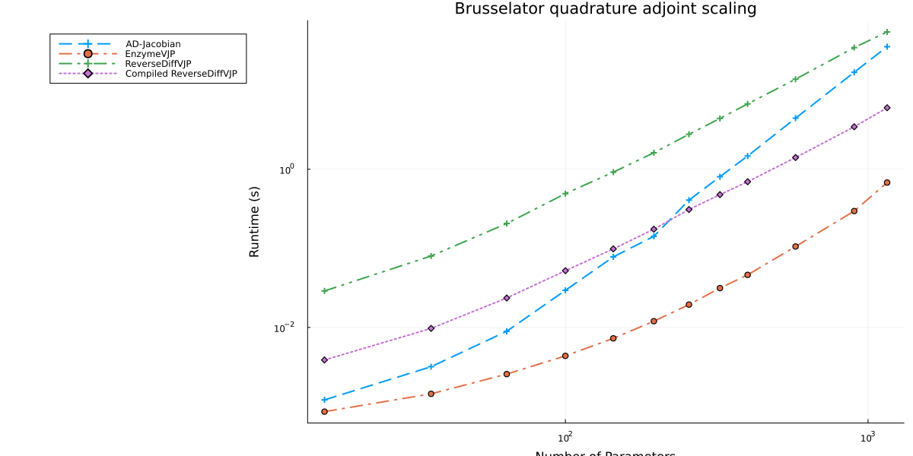
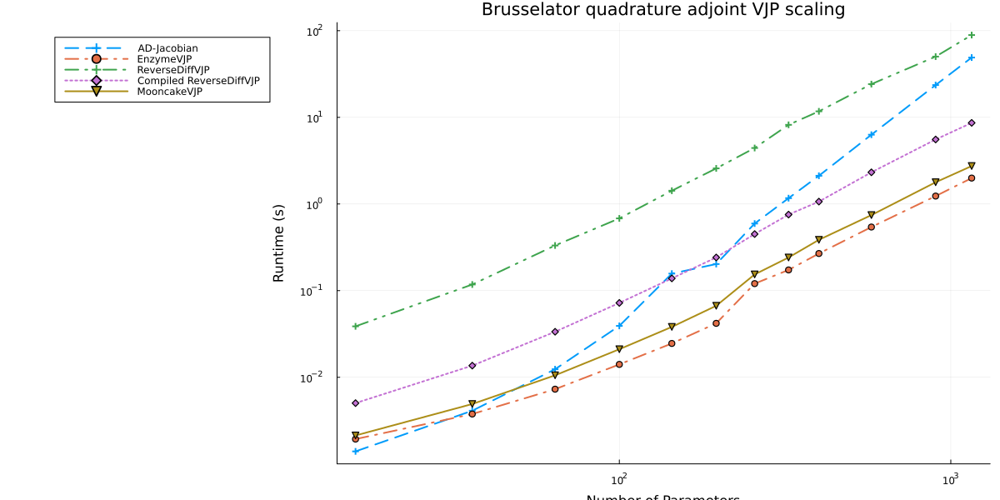
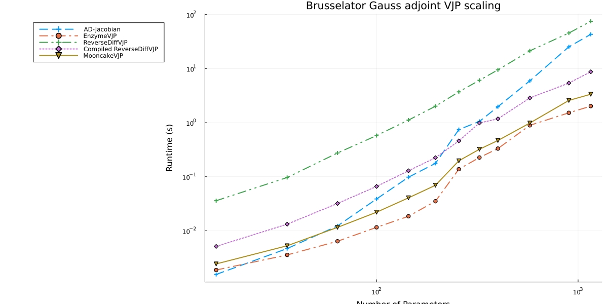
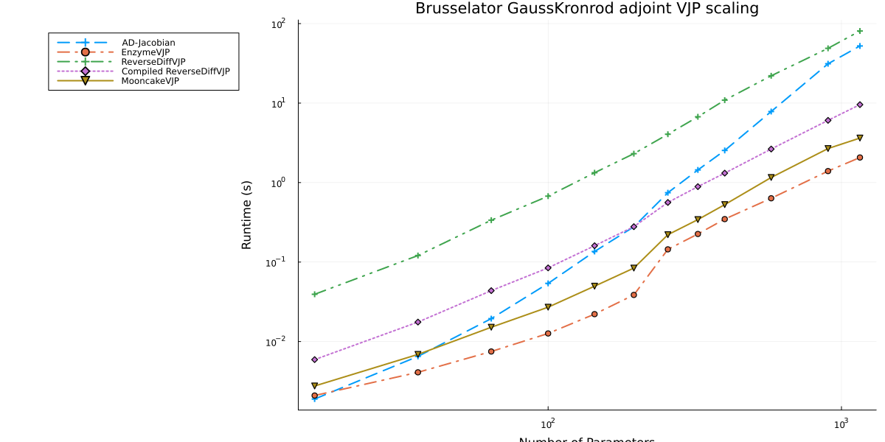
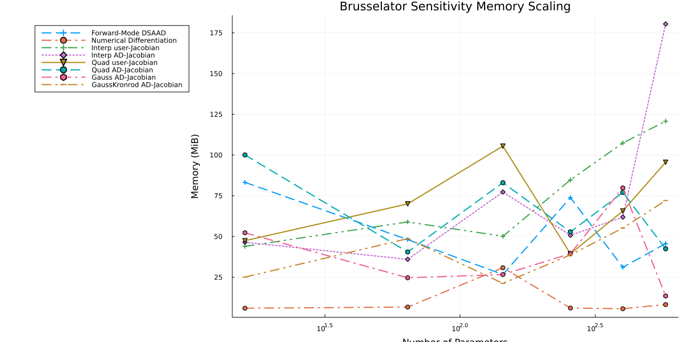

From the paper [A Comparison of Automatic Differentiation and Continuous Sensitivity Analysis for Derivatives of Differential Equation Solutions](https://ieeexplore.ieee.org/abstract/document/9622796)

```julia
using OrdinaryDiffEq, ReverseDiff, ForwardDiff, FiniteDiff, SciMLSensitivity
using LinearAlgebra, Tracker, Mooncake, Plots
```


```julia
function makebrusselator(N = 8)
    xyd_brusselator = range(0, stop = 1, length = N)
    function limit(a, N)
        if a == N+1
            return 1
        elseif a == 0
            return N
        else
            return a
        end
    end
    brusselator_f(x, y, t) = ifelse(
        (((x-0.3)^2 + (y-0.6)^2) <= 0.1^2) &&
        (t >= 1.1), 5.0, 0.0)
    brusselator_2d_loop = let N=N, xyd=xyd_brusselator, dx=step(xyd_brusselator)
        function brusselator_2d_loop(du, u, p, t)
            @inbounds begin
                ii1 = N^2
                ii2 = ii1+N^2
                ii3 = ii2+2(N^2)
                A = @view p[1:ii1]
                B = @view p[(ii1 + 1):ii2]
                α = @view p[(ii2 + 1):ii3]
                II = LinearIndices((N, N, 2))
                for I in CartesianIndices((N, N))
                    x = xyd[I[1]]
                    y = xyd[I[2]]
                    i = I[1]
                    j = I[2]
                    ip1 = limit(i+1, N);
                    im1 = limit(i-1, N)
                    jp1 = limit(j+1, N);
                    jm1 = limit(j-1, N)
                    du[II[i, j, 1]] = α[II[
                                          i, j, 1]]*(u[II[im1, j, 1]] + u[II[ip1, j, 1]] +
                                                     u[II[i, jp1, 1]] + u[II[i, jm1, 1]] -
                                                     4u[II[i, j, 1]])/dx^2 +
                                      B[II[i, j, 1]] + u[II[i, j, 1]]^2*u[II[i, j, 2]] -
                                      (A[II[i, j, 1]] + 1)*u[II[i, j, 1]] +
                                      brusselator_f(x, y, t)
                end
                for I in CartesianIndices((N, N))
                    i = I[1]
                    j = I[2]
                    ip1 = limit(i+1, N)
                    im1 = limit(i-1, N)
                    jp1 = limit(j+1, N)
                    jm1 = limit(j-1, N)
                    du[II[i, j, 2]] = α[II[
                        i, j, 2]]*(u[II[im1, j, 2]] + u[II[ip1, j, 2]] + u[II[i, jp1, 2]] +
                                   u[II[i, jm1, 2]] - 4u[II[i, j, 2]])/dx^2 +
                                      A[II[i, j, 1]]*u[II[i, j, 1]] -
                                      u[II[i, j, 1]]^2*u[II[i, j, 2]]
                end
                return nothing
            end
        end
    end
    function init_brusselator_2d(xyd)
        N = length(xyd)
        u = zeros(N, N, 2)
        for I in CartesianIndices((N, N))
            x = xyd[I[1]]
            y = xyd[I[2]]
            u[I, 1] = 22*(y*(1-y))^(3/2)
            u[I, 2] = 27*(x*(1-x))^(3/2)
        end
        vec(u)
    end
    dx = step(xyd_brusselator)
    e1 = ones(N-1)
    off = N-1
    e4 = ones(N-off)
    T = diagm(0=>-2ones(N), -1=>e1, 1=>e1, off=>e4, -off=>e4) ./ dx^2
    Ie = Matrix{Float64}(I, N, N)
    # A + df/du
    Op = kron(Ie, T) + kron(T, Ie)
    brusselator_jac = let N=N
        (J, a, p, t) -> begin
            ii1 = N^2
            ii2 = ii1+N^2
            ii3 = ii2+2(N^2)
            A = @view p[1:ii1]
            B = @view p[(ii1 + 1):ii2]
            α = @view p[(ii2 + 1):ii3]
            u = @view a[1:(end ÷ 2)]
            v = @view a[(end ÷ 2 + 1):end]
            N2 = length(a)÷2
            α1 = @view α[1:(end ÷ 2)]
            α2 = @view α[(end ÷ 2 + 1):end]
            fill!(J, 0)

            J[1:N2, 1:N2] .= α1 .* Op
            J[(N2 + 1):end, (N2 + 1):end] .= α2 .* Op

            J1 = @view J[1:N2, 1:N2]
            J2 = @view J[(N2 + 1):end, 1:N2]
            J3 = @view J[1:N2, (N2 + 1):end]
            J4 = @view J[(N2 + 1):end, (N2 + 1):end]
            J1[diagind(J1)] .+= @. 2u*v-(A+1)
            J2[diagind(J2)] .= @. A-2u*v
            J3[diagind(J3)] .= @. u^2
            J4[diagind(J4)] .+= @. -u^2
            nothing
        end
    end
    Jmat = zeros(2N*N, 2N*N)
    dp = zeros(2N*N, 4N*N)
    brusselator_comp = let N=N, xyd=xyd_brusselator, dx=step(xyd_brusselator), Jmat=Jmat,
        dp=dp, brusselator_jac=brusselator_jac

        function brusselator_comp(dus, us, p, t)
            @inbounds begin
                ii1 = N^2
                ii2 = ii1+N^2
                ii3 = ii2+2(N^2)
                @views u, s = us[1:ii2], us[(ii2 + 1):end]
                du = @view dus[1:ii2]
                ds = @view dus[(ii2 + 1):end]
                fill!(dp, 0)
                A = @view p[1:ii1]
                B = @view p[(ii1 + 1):ii2]
                α = @view p[(ii2 + 1):ii3]
                dfdα = @view dp[:, (ii2 + 1):ii3]
                diagind(dfdα)
                for i in 1:ii1
                    dp[i, ii1 + i] = 1
                end
                II = LinearIndices((N, N, 2))
                uu = @view u[1:(end ÷ 2)]
                for i in eachindex(uu)
                    dp[i, i] = -uu[i]
                    dp[i + ii1, i] = uu[i]
                end
                for I in CartesianIndices((N, N))
                    x = xyd[I[1]]
                    y = xyd[I[2]]
                    i = I[1]
                    j = I[2]
                    ip1 = limit(i+1, N);
                    im1 = limit(i-1, N)
                    jp1 = limit(j+1, N);
                    jm1 = limit(j-1, N)
                    au = dfdα[II[i, j, 1], II[i, j, 1]] = (u[II[im1, j, 1]] +
                                                           u[II[ip1, j, 1]] +
                                                           u[II[i, jp1, 1]] +
                                                           u[II[i, jm1, 1]] -
                                                           4u[II[i, j, 1]])/dx^2
                    du[II[i, j, 1]] = α[II[i, j, 1]]*(au) + B[II[i, j, 1]] +
                                      u[II[i, j, 1]]^2*u[II[i, j, 2]] -
                                      (A[II[i, j, 1]] + 1)*u[II[i, j, 1]] +
                                      brusselator_f(x, y, t)
                end
                for I in CartesianIndices((N, N))
                    i = I[1]
                    j = I[2]
                    ip1 = limit(i+1, N)
                    im1 = limit(i-1, N)
                    jp1 = limit(j+1, N)
                    jm1 = limit(j-1, N)
                    av = dfdα[II[i, j, 2], II[i, j, 2]] = (u[II[im1, j, 2]] +
                                                           u[II[ip1, j, 2]] +
                                                           u[II[i, jp1, 2]] +
                                                           u[II[i, jm1, 2]] -
                                                           4u[II[i, j, 2]])/dx^2
                    du[II[i, j, 2]] = α[II[i, j, 2]]*(av) + A[II[i, j, 1]]*u[II[i, j, 1]] -
                                      u[II[i, j, 1]]^2*u[II[i, j, 2]]
                end
                brusselator_jac(Jmat, u, p, t)
                BLAS.gemm!('N', 'N', 1.0, Jmat, reshape(s, 2N*N, 4N*N), 1.0, dp)
                copyto!(ds, vec(dp))
                return nothing
            end
        end
    end
    u0 = init_brusselator_2d(xyd_brusselator)
    p = [fill(3.4, N^2); fill(1.0, N^2); fill(10.0, 2*N^2)]
    brusselator_2d_loop, u0,
    p,
    brusselator_jac,
    ODEProblem(brusselator_comp, copy([u0; zeros((N^2*2)*(N^2*4))]), (0.0, 10.0), p)
end

Base.eps(::Type{Tracker.TrackedReal{T}}) where {T} = eps(T)
Base.vec(v::Adjoint{<:Real, <:AbstractVector}) = vec(v') # bad bad hack
```


## Setup AutoDiff

```julia
bt = 0:0.1:1
tspan = (0.0, 1.0)
forwarddiffn = vcat(2:10, 12, 15)
reversediffn = 2:10
numdiffn = vcat(2:10, 12)
csan = vcat(2:10, 12, 15, 17)
#csaseedn = 2:10
tols = (abstol = 1e-5, reltol = 1e-7)

@isdefined(PROBS) || (const PROBS = Dict{Int, Any}())
makebrusselator!(dict, n) = get!(()->makebrusselator(n), dict, n)

_adjoint_methods_iq = ntuple(2) do ii
    Alg = (InterpolatingAdjoint, QuadratureAdjoint)[ii]
    (
        user = Alg(autodiff = false, autojacvec = false), # user Jacobian
        adjc = Alg(autodiff = true, autojacvec = false), # AD Jacobian
        advj = Alg(autodiff = true, autojacvec = EnzymeVJP()) # AD vJ
    )
end |> NamedTuple{(:interp, :quad)}
# GaussAdjoint/GaussKronrodAdjoint do not support user-provided Jacobians (autodiff=false)
_adjoint_methods_g = ntuple(2) do ii
    Alg = (GaussAdjoint, GaussKronrodAdjoint)[ii]
    (
        adjc = Alg(autodiff = true, autojacvec = false), # AD Jacobian
        advj = Alg(autodiff = true, autojacvec = EnzymeVJP()) # AD vJ
    )
end |> NamedTuple{(:gauss, :gausskronrod)}
@isdefined(ADJOINT_METHODS_IQ) ||
    (const ADJOINT_METHODS_IQ = mapreduce(collect, vcat, _adjoint_methods_iq))
@isdefined(ADJOINT_METHODS_G) ||
    (const ADJOINT_METHODS_G = mapreduce(collect, vcat, _adjoint_methods_g))

function auto_sen_l2(
        f, u0, tspan, p, t, alg = Tsit5(); diffalg = ReverseDiff.gradient, kwargs...)
    test_f(p) = begin
        prob = ODEProblem{true, SciMLBase.FullSpecialize}(f, convert.(eltype(p), u0), tspan, p)
        sol = solve(prob, alg, saveat = t; kwargs...)
        sum(sol.u) do x
            sum(z->(1-z)^2/2, x)
        end
    end
    diffalg(test_f, p)
end
@inline function diffeq_sen_l2(df, u0, tspan, p, t, alg = Tsit5();
        abstol = 1e-5, reltol = 1e-7, iabstol = abstol, ireltol = reltol,
        sensalg = SensitivityAlg(), kwargs...)
    prob = ODEProblem{true, SciMLBase.FullSpecialize}(df, u0, tspan, p)
    saveat = tspan[1] != t[1] && tspan[end] != t[end] ? vcat(tspan[1], t, tspan[end]) : t
    sol = solve(prob, alg, abstol = abstol, reltol = reltol, saveat = saveat; kwargs...)
    dg(out, u, p, t, i) = (out.=u .- 1.0)
    adjoint_sensitivities(sol, alg; t, abstol = abstol, dgdu_discrete = dg,
        reltol = reltol, sensealg = sensalg)
end
```

```
diffeq_sen_l2 (generic function with 2 methods)
```


## AD Choice Benchmarks

```julia
forwarddiff = map(forwarddiffn) do n
    bfun, b_u0, b_p, brusselator_jac, brusselator_comp = makebrusselator!(PROBS, n)
    @elapsed auto_sen_l2(
        bfun, b_u0, tspan, b_p, bt, (Rodas5()); diffalg = (ForwardDiff.gradient), tols...)
    t = @elapsed auto_sen_l2(
        bfun, b_u0, tspan, b_p, bt, (Rodas5()); diffalg = (ForwardDiff.gradient), tols...)
    @show n, t
    t
end
```

```
(n, t) = (2, 0.002284991)
(n, t) = (3, 0.024383843)
(n, t) = (4, 0.103338404)
(n, t) = (5, 0.405584823)
(n, t) = (6, 1.127684624)
(n, t) = (7, 2.946013349)
(n, t) = (8, 11.072234929)
(n, t) = (9, 14.028927449)
(n, t) = (10, 27.963693391)
(n, t) = (12, 104.862310856)
(n, t) = (15, 830.120682374)
11-element Vector{Float64}:
   0.002284991
   0.024383843
   0.103338404
   0.405584823
   1.127684624
   2.946013349
  11.072234929
  14.028927449
  27.963693391
 104.862310856
 830.120682374
```


```julia
#=
reversediff = map(reversediffn) do n
  bfun, b_u0, b_p, brusselator_jac, brusselator_comp = makebrusselator!(PROBS, n)
  @elapsed auto_sen_l2(bfun, b_u0, tspan, b_p, bt, (Rodas5(autodiff=false)); diffalg=(ReverseDiff.gradient), tols...)
  t = @elapsed auto_sen_l2(bfun, b_u0, tspan, b_p, bt, (Rodas5(autodiff=false)); diffalg=(ReverseDiff.gradient), tols...)
  @show n,t
  t
end
=#
```


```julia
numdiff = map(numdiffn) do n
    bfun, b_u0, b_p, brusselator_jac, brusselator_comp = makebrusselator!(PROBS, n)
    @elapsed auto_sen_l2(bfun, b_u0, tspan, b_p, bt, (Rodas5());
        diffalg = (FiniteDiff.finite_difference_gradient), tols...)
    t = @elapsed auto_sen_l2(bfun, b_u0, tspan, b_p, bt, (Rodas5());
        diffalg = (FiniteDiff.finite_difference_gradient), tols...)
    @show n, t
    t
end
```

```
(n, t) = (2, 0.004319234)
(n, t) = (3, 0.039731495)
(n, t) = (4, 0.142660436)
(n, t) = (5, 0.451352074)
(n, t) = (6, 1.118478729)
(n, t) = (7, 2.408651523)
(n, t) = (8, 15.628652655)
(n, t) = (9, 33.122501295)
(n, t) = (10, 64.359714948)
(n, t) = (12, 197.936266945)
10-element Vector{Float64}:
   0.004319234
   0.039731495
   0.142660436
   0.451352074
   1.118478729
   2.408651523
  15.628652655
  33.122501295
  64.359714948
 197.936266945
```


Warmup: run each adjoint method once at the smallest size to ensure all compilation
is complete before we start timing.

```julia
let n = first(csan)
    bfun, b_u0, b_p, brusselator_jac, brusselator_comp = makebrusselator!(PROBS, n)
    solver = Rodas5(autodiff = false)
    for alg in ADJOINT_METHODS_IQ
        f = SciMLSensitivity.alg_autodiff(alg) ? bfun :
            ODEFunction(bfun, jac = brusselator_jac)
        diffeq_sen_l2(f, b_u0, tspan, b_p, bt, solver; sensalg = alg, tols...)
    end
    for alg in ADJOINT_METHODS_G
        diffeq_sen_l2(bfun, b_u0, tspan, b_p, bt, solver; sensalg = alg, tols...)
    end
end
```


```julia
csa_iq = map(csan) do n
    bfun, b_u0, b_p, brusselator_jac, brusselator_comp = makebrusselator!(PROBS, n)
    @time ts = map(ADJOINT_METHODS_IQ) do alg
        @info "Running $alg"
        f = SciMLSensitivity.alg_autodiff(alg) ? bfun :
            ODEFunction(bfun, jac = brusselator_jac)
        solver = Rodas5(autodiff = false)
        @time diffeq_sen_l2(f, b_u0, tspan, b_p, bt, solver; sensalg = alg, tols...)
        t = @elapsed diffeq_sen_l2(f, b_u0, tspan, b_p, bt, solver; sensalg = alg, tols...)
        return t
    end
    @show n, ts
    ts
end
```

```
0.006263 seconds (12.90 k allocations: 949.875 KiB)
  0.003784 seconds (10.97 k allocations: 838.047 KiB)
  0.003982 seconds (6.43 k allocations: 998.141 KiB)
  0.002267 seconds (5.36 k allocations: 389.203 KiB)
  0.001716 seconds (4.07 k allocations: 294.641 KiB)
  0.002465 seconds (6.78 k allocations: 668.469 KiB)
  0.836401 seconds (1.01 M allocations: 76.170 MiB, 94.07% compilation time
)
(n, ts) = (2, [0.006304978, 0.003440702, 0.003669839, 0.001962164, 0.001396
539, 0.002135132])
  0.026287 seconds (18.72 k allocations: 2.246 MiB)
 19.433348 seconds (4.75 M allocations: 321.891 MiB, 0.81% gc time, 99.90% 
compilation time)
  0.007688 seconds (8.44 k allocations: 2.089 MiB)
  0.004565 seconds (6.74 k allocations: 832.594 KiB)
  7.683959 seconds (3.76 M allocations: 259.459 MiB, 1.46% gc time, 99.88% 
compilation time)
  0.003885 seconds (7.87 k allocations: 1.062 MiB)
 27.224918 seconds (8.61 M allocations: 596.605 MiB, 0.99% gc time, 99.50% 
compilation time)
(n, ts) = (3, [0.025914727, 0.01327817, 0.007457519, 0.004402193, 0.0041140
56, 0.00370776])
  0.110677 seconds (30.31 k allocations: 5.617 MiB)
 20.556001 seconds (4.79 M allocations: 326.997 MiB, 0.29% gc time, 99.72% 
compilation time)
  0.018163 seconds (13.09 k allocations: 4.943 MiB)
  0.010823 seconds (9.03 k allocations: 1.721 MiB)
  9.893645 seconds (3.76 M allocations: 260.141 MiB, 1.11% gc time, 99.82% 
compilation time)
  0.007846 seconds (9.71 k allocations: 1.804 MiB)
 30.814303 seconds (8.71 M allocations: 621.562 MiB, 0.55% gc time, 98.57% 
compilation time)
(n, ts) = (4, [0.110317962, 0.052398009, 0.017838153, 0.010689922, 0.012385
718, 0.007600338])
  0.401667 seconds (44.47 k allocations: 11.983 MiB)
 19.575796 seconds (4.17 M allocations: 292.015 MiB, 0.29% gc time, 98.84% 
compilation time)
  0.121824 seconds (18.81 k allocations: 10.367 MiB, 49.04% gc time)
  0.024730 seconds (12.13 k allocations: 3.424 MiB)
  8.990812 seconds (3.76 M allocations: 261.167 MiB, 0.60% gc time, 99.50% 
compilation time)
  0.014225 seconds (12.20 k allocations: 3.155 MiB)
 29.898761 seconds (8.14 M allocations: 623.883 MiB, 0.57% gc time, 94.64% 
compilation time)
(n, ts) = (5, [0.400541614, 0.222838987, 0.060466372, 0.02435463, 0.0392155
17, 0.014000095])
  1.102918 seconds (61.65 k allocations: 23.606 MiB)
 21.656907 seconds (4.21 M allocations: 303.685 MiB, 0.49% gc time, 97.26% 
compilation time)
  0.124616 seconds (25.70 k allocations: 19.800 MiB)
  0.051086 seconds (15.54 k allocations: 6.511 MiB)
 11.401352 seconds (3.76 M allocations: 263.466 MiB, 0.43% gc time, 99.03% 
compilation time)
  0.024474 seconds (14.93 k allocations: 5.270 MiB)
 36.421035 seconds (8.27 M allocations: 702.137 MiB, 0.57% gc time, 88.83% 
compilation time)
(n, ts) = (6, [1.104058864, 0.586195134, 0.129399657, 0.050771023, 0.157207
898, 0.024246811])
  2.830126 seconds (85.16 k allocations: 43.958 MiB)
 23.154110 seconds (3.62 M allocations: 283.349 MiB, 0.23% gc time, 93.85% 
compilation time)
  0.261592 seconds (35.11 k allocations: 37.172 MiB)
  0.108461 seconds (19.57 k allocations: 10.920 MiB)
  1.953425 seconds (297.39 k allocations: 26.693 MiB, 89.44% compilation ti
me)
  0.041221 seconds (18.16 k allocations: 8.466 MiB)
 33.275702 seconds (4.32 M allocations: 556.445 MiB, 0.32% gc time, 70.55% 
compilation time)
(n, ts) = (7, [2.832989526, 1.476967129, 0.255052707, 0.10843462, 0.2027542
56, 0.041641669])
  6.237951 seconds (109.48 k allocations: 73.644 MiB, 1.43% gc time)
  3.364258 seconds (87.69 k allocations: 62.066 MiB)
  0.406323 seconds (44.84 k allocations: 61.664 MiB)
  0.269859 seconds (24.97 k allocations: 18.519 MiB)
  0.617435 seconds (15.90 k allocations: 13.675 MiB, 0.96% gc time)
  0.106876 seconds (22.48 k allocations: 13.599 MiB)
 21.868236 seconds (612.15 k allocations: 486.576 MiB, 0.51% gc time)
(n, ts) = (8, [6.099230896, 3.373548582, 0.413951196, 0.268912914, 0.594785
322, 0.1073532])
 12.636835 seconds (142.00 k allocations: 119.495 MiB)
  7.330758 seconds (121.67 k allocations: 104.006 MiB)
  0.709365 seconds (63.83 k allocations: 105.138 MiB)
  0.432402 seconds (30.42 k allocations: 29.385 MiB)
  1.167522 seconds (19.17 k allocations: 21.647 MiB)
  0.191660 seconds (26.84 k allocations: 20.817 MiB, 2.70% gc time)
 44.901214 seconds (809.28 k allocations: 801.218 MiB, 0.05% gc time)
(n, ts) = (9, [12.64248494, 7.305914957, 0.707322926, 0.431698064, 1.167109
001, 0.171050109])
 23.323176 seconds (173.85 k allocations: 177.456 MiB, 0.06% gc time)
 12.810385 seconds (139.19 k allocations: 148.371 MiB, 0.05% gc time)
  0.967629 seconds (70.60 k allocations: 146.135 MiB, 0.52% gc time)
  0.753232 seconds (36.50 k allocations: 43.825 MiB)
  2.116346 seconds (22.82 k allocations: 32.313 MiB)
  0.268900 seconds (31.70 k allocations: 30.308 MiB)
 80.666064 seconds (950.73 k allocations: 1.130 GiB, 0.05% gc time)
(n, ts) = (10, [23.421698077, 12.90865481, 0.918679671, 0.741134212, 2.1183
14248, 0.30835044])
 70.083871 seconds (256.54 k allocations: 370.194 MiB, 0.06% gc time)
 40.280961 seconds (205.34 k allocations: 309.939 MiB, 0.02% gc time)
  1.977092 seconds (103.68 k allocations: 303.808 MiB, 1.35% gc time)
  1.882039 seconds (50.59 k allocations: 88.514 MiB)
  6.315918 seconds (31.27 k allocations: 65.751 MiB)
  0.589809 seconds (42.97 k allocations: 59.668 MiB, 1.41% gc time)
242.160250 seconds (1.38 M allocations: 2.340 GiB, 0.06% gc time)
(n, ts) = (12, [70.15209369, 40.215158425, 1.860639271, 1.894694182, 6.3038
76609, 0.592142399])
262.618726 seconds (397.51 k allocations: 909.305 MiB, 0.20% gc time)
169.857593 seconds (350.79 k allocations: 799.431 MiB, 0.03% gc time)
  4.134181 seconds (165.53 k allocations: 752.566 MiB, 0.35% gc time)
  6.223929 seconds (76.52 k allocations: 218.971 MiB, 0.45% gc time)
 23.677104 seconds (46.83 k allocations: 161.755 MiB, 0.27% gc time)
  1.324726 seconds (63.71 k allocations: 143.222 MiB)
935.023134 seconds (2.20 M allocations: 5.831 GiB, 0.09% gc time)
(n, ts) = (15, [261.994476061, 169.8226062, 4.143155957, 6.250999687, 23.60
1406099, 1.36032227])
570.059552 seconds (526.33 k allocations: 1.481 GiB, 0.07% gc time)
313.218310 seconds (393.25 k allocations: 1.192 GiB, 0.11% gc time)
  6.089217 seconds (197.65 k allocations: 1.160 GiB, 0.19% gc time)
 12.240865 seconds (97.00 k allocations: 357.023 MiB)
 49.004055 seconds (59.12 k allocations: 267.234 MiB, 0.02% gc time)
  1.965384 seconds (80.10 k allocations: 234.333 MiB)
1905.033949 seconds (2.71 M allocations: 9.345 GiB, 0.05% gc time)
(n, ts) = (17, [569.967440345, 313.016789365, 6.105302345, 12.283069578, 49
.024321558, 2.047204416])
12-element Vector{Vector{Float64}}:
 [0.006304978, 0.003440702, 0.003669839, 0.001962164, 0.001396539, 0.002135
132]
 [0.025914727, 0.01327817, 0.007457519, 0.004402193, 0.004114056, 0.0037077
6]
 [0.110317962, 0.052398009, 0.017838153, 0.010689922, 0.012385718, 0.007600
338]
 [0.400541614, 0.222838987, 0.060466372, 0.02435463, 0.039215517, 0.0140000
95]
 [1.104058864, 0.586195134, 0.129399657, 0.050771023, 0.157207898, 0.024246
811]
 [2.832989526, 1.476967129, 0.255052707, 0.10843462, 0.202754256, 0.0416416
69]
 [6.099230896, 3.373548582, 0.413951196, 0.268912914, 0.594785322, 0.107353
2]
 [12.64248494, 7.305914957, 0.707322926, 0.431698064, 1.167109001, 0.171050
109]
 [23.421698077, 12.90865481, 0.918679671, 0.741134212, 2.118314248, 0.30835
044]
 [70.15209369, 40.215158425, 1.860639271, 1.894694182, 6.303876609, 0.59214
2399]
 [261.994476061, 169.8226062, 4.143155957, 6.250999687, 23.601406099, 1.360
32227]
 [569.967440345, 313.016789365, 6.105302345, 12.283069578, 49.024321558, 2.
047204416]
```


```julia
csa_g = map(csan) do n
    bfun, b_u0, b_p, brusselator_jac, brusselator_comp = makebrusselator!(PROBS, n)
    @time ts = map(ADJOINT_METHODS_G) do alg
        @info "Running $alg"
        solver = Rodas5(autodiff = false)
        @time diffeq_sen_l2(bfun, b_u0, tspan, b_p, bt, solver; sensalg = alg, tols...)
        t = @elapsed diffeq_sen_l2(bfun, b_u0, tspan, b_p, bt, solver; sensalg = alg, tols...)
        return t
    end
    @show n, ts
    ts
end
```

```
0.002273 seconds (4.94 k allocations: 356.469 KiB)
  0.002762 seconds (5.38 k allocations: 620.953 KiB)
  0.002426 seconds (7.46 k allocations: 440.953 KiB)
  0.003065 seconds (7.51 k allocations: 738.438 KiB)
  0.477451 seconds (542.59 k allocations: 40.850 MiB, 95.07% compilation ti
me)
(n, ts) = (2, [0.001514369, 0.002193374, 0.001819496, 0.002526101])
  8.767223 seconds (4.76 M allocations: 327.129 MiB, 0.84% gc time, 99.85% 
compilation time)
  0.004445 seconds (6.14 k allocations: 1.098 MiB)
  8.422749 seconds (4.32 M allocations: 300.373 MiB, 0.90% gc time, 99.86% 
compilation time)
  0.005289 seconds (11.92 k allocations: 1.430 MiB)
 17.224165 seconds (9.14 M allocations: 634.630 MiB, 0.87% gc time, 99.66% 
compilation time)
(n, ts) = (3, [0.004642775, 0.004259298, 0.006396611, 0.005024512])
 11.486309 seconds (4.77 M allocations: 328.024 MiB, 0.61% gc time, 99.84% 
compilation time)
  0.008670 seconds (7.82 k allocations: 2.118 MiB)
 10.990574 seconds (4.33 M allocations: 301.667 MiB, 99.77% compilation tim
e)
  0.010508 seconds (16.95 k allocations: 2.672 MiB)
 22.549880 seconds (9.18 M allocations: 643.662 MiB, 0.31% gc time, 99.48% 
compilation time)
(n, ts) = (4, [0.012306146, 0.008471966, 0.018989866, 0.010271012])
  9.259889 seconds (3.58 M allocations: 250.486 MiB, 0.77% gc time, 99.55% 
compilation time)
  0.015983 seconds (9.95 k allocations: 4.073 MiB)
  9.369537 seconds (3.85 M allocations: 268.635 MiB, 0.74% gc time, 99.39% 
compilation time)
  0.017789 seconds (18.46 k allocations: 4.638 MiB)
 18.790776 seconds (7.52 M allocations: 544.924 MiB, 0.74% gc time, 98.61% 
compilation time)
(n, ts) = (5, [0.037374647, 0.015713322, 0.05285855, 0.017545297])
 12.105756 seconds (3.61 M allocations: 256.182 MiB, 0.55% gc time, 99.17% 
compilation time)
  0.028010 seconds (12.35 k allocations: 7.463 MiB)
 12.197934 seconds (3.89 M allocations: 274.624 MiB, 98.85% compilation tim
e)
  0.030962 seconds (23.93 k allocations: 8.291 MiB)
 24.656178 seconds (7.62 M allocations: 578.348 MiB, 0.27% gc time, 97.59% 
compilation time)
(n, ts) = (6, [0.095534607, 0.02773522, 0.134944368, 0.030642328])
 10.480338 seconds (3.52 M allocations: 255.063 MiB, 0.59% gc time, 98.27% 
compilation time)
  0.047389 seconds (15.13 k allocations: 12.913 MiB)
 10.606260 seconds (3.81 M allocations: 274.401 MiB, 0.58% gc time, 97.35% 
compilation time)
  0.052154 seconds (30.61 k allocations: 14.104 MiB)
 21.743693 seconds (7.49 M allocations: 611.743 MiB, 0.57% gc time, 94.85% 
compilation time)
(n, ts) = (7, [0.176214215, 0.047205742, 0.277045032, 0.052062106])
  0.556757 seconds (17.93 k allocations: 21.923 MiB)
  0.153683 seconds (18.38 k allocations: 21.279 MiB)
  0.757464 seconds (83.23 k allocations: 25.142 MiB)
  0.159516 seconds (36.11 k allocations: 22.788 MiB)
  3.266979 seconds (312.20 k allocations: 182.426 MiB)
(n, ts) = (8, [0.553120712, 0.160006219, 0.750474147, 0.170328541])
  1.143393 seconds (21.51 k allocations: 34.909 MiB, 7.68% gc time)
  0.235373 seconds (22.06 k allocations: 33.402 MiB)
  1.451958 seconds (117.99 k allocations: 39.784 MiB)
  0.254357 seconds (43.07 k allocations: 35.365 MiB)
  6.076381 seconds (410.14 k allocations: 287.082 MiB, 1.45% gc time)
(n, ts) = (9, [1.047856037, 0.235970863, 1.457986313, 0.243904373])
  1.956994 seconds (26.60 k allocations: 53.342 MiB)
  0.448501 seconds (27.94 k allocations: 51.018 MiB, 15.51% gc time)
  2.560582 seconds (141.07 k allocations: 59.220 MiB)
  0.379693 seconds (49.90 k allocations: 53.266 MiB)
 10.643258 seconds (491.92 k allocations: 433.854 MiB, 0.65% gc time)
(n, ts) = (10, [1.965285463, 0.384283212, 2.558575421, 0.382641813])
  5.874587 seconds (37.58 k allocations: 110.775 MiB, 0.13% gc time)
  0.773300 seconds (36.92 k allocations: 103.043 MiB)
  7.696597 seconds (246.95 k allocations: 121.791 MiB, 0.07% gc time)
  0.784952 seconds (62.51 k allocations: 106.188 MiB)
 30.260378 seconds (768.83 k allocations: 883.755 MiB, 0.08% gc time)
(n, ts) = (12, [5.89881071, 0.750562919, 7.695003492, 0.781766744])
 25.086969 seconds (65.76 k allocations: 284.738 MiB)
  1.821099 seconds (58.87 k allocations: 258.725 MiB, 0.76% gc time)
 30.073182 seconds (418.12 k allocations: 303.745 MiB, 0.02% gc time)
  1.843382 seconds (92.17 k allocations: 264.090 MiB)
117.752658 seconds (1.27 M allocations: 2.171 GiB, 0.07% gc time)
(n, ts) = (15, [25.207215248, 1.758860805, 30.104271329, 1.849031099])
 41.490939 seconds (66.59 k allocations: 452.073 MiB, 0.04% gc time)
  2.766615 seconds (71.83 k allocations: 422.756 MiB, 0.18% gc time)
 50.910389 seconds (574.65 k allocations: 479.594 MiB, 0.06% gc time)
  2.677632 seconds (108.15 k allocations: 429.680 MiB, 0.39% gc time)
195.756486 seconds (1.64 M allocations: 3.485 GiB, 0.05% gc time)
(n, ts) = (17, [41.516862773, 2.706349244, 50.972577014, 2.706047466])
12-element Vector{Vector{Float64}}:
 [0.001514369, 0.002193374, 0.001819496, 0.002526101]
 [0.004642775, 0.004259298, 0.006396611, 0.005024512]
 [0.012306146, 0.008471966, 0.018989866, 0.010271012]
 [0.037374647, 0.015713322, 0.05285855, 0.017545297]
 [0.095534607, 0.02773522, 0.134944368, 0.030642328]
 [0.176214215, 0.047205742, 0.277045032, 0.052062106]
 [0.553120712, 0.160006219, 0.750474147, 0.170328541]
 [1.047856037, 0.235970863, 1.457986313, 0.243904373]
 [1.965285463, 0.384283212, 2.558575421, 0.382641813]
 [5.89881071, 0.750562919, 7.695003492, 0.781766744]
 [25.207215248, 1.758860805, 30.104271329, 1.849031099]
 [41.516862773, 2.706349244, 50.972577014, 2.706047466]
```


```julia
n_to_param(n) = 4n^2

lw = 2
ms = 0.5
plt1 = plot(title = "Sensitivity Scaling on Brusselator");
plot!(plt1, n_to_param.(forwarddiffn), forwarddiff, lab = "Forward-Mode DSAAD",
    lw = lw, marksize = ms, linestyle = :auto, marker = :auto);
#plot!(plt1, n_to_param.(reversediffn), reversediff, lab="Reverse-Mode DSAAD", lw=lw, marksize=ms, linestyle=:auto, marker=:auto);
csadata_iq = [[csa_iq[j][i] for j in eachindex(csa_iq)] for i in eachindex(csa_iq[1])]
csadata_g = [[csa_g[j][i] for j in eachindex(csa_g)] for i in eachindex(csa_g[1])]
plot!(plt1, n_to_param.(csan), csadata_iq[1], lab = "Interpolating CASA user-Jacobian",
    lw = lw, marksize = ms, linestyle = :auto, marker = :auto);
plot!(plt1, n_to_param.(csan), csadata_iq[2], lab = "Interpolating CASA AD-Jacobian",
    lw = lw, marksize = ms, linestyle = :auto, marker = :auto);
plot!(
    plt1, n_to_param.(csan), csadata_iq[3], lab = raw"Interpolating CASA AD-$v^{T}J$ seeding",
    lw = lw, marksize = ms, linestyle = :auto, marker = :auto);
plot!(plt1, n_to_param.(csan), csadata_iq[1 + 3], lab = "Quadrature CASA user-Jacobian",
    lw = lw, marksize = ms, linestyle = :auto, marker = :auto);
plot!(plt1, n_to_param.(csan), csadata_iq[2 + 3], lab = "Quadrature CASA AD-Jacobian",
    lw = lw, marksize = ms, linestyle = :auto, marker = :auto);
plot!(
    plt1, n_to_param.(csan), csadata_iq[3 + 3], lab = raw"Quadrature CASA AD-$v^{T}J$ seeding",
    lw = lw, marksize = ms, linestyle = :auto, marker = :auto);
plot!(plt1, n_to_param.(csan), csadata_g[1], lab = "Gauss CASA AD-Jacobian",
    lw = lw, marksize = ms, linestyle = :auto, marker = :auto);
plot!(
    plt1, n_to_param.(csan), csadata_g[2], lab = raw"Gauss CASA AD-$v^{T}J$ seeding",
    lw = lw, marksize = ms, linestyle = :auto, marker = :auto);
plot!(plt1, n_to_param.(csan), csadata_g[1 + 2], lab = "GaussKronrod CASA AD-Jacobian",
    lw = lw, marksize = ms, linestyle = :auto, marker = :auto);
plot!(
    plt1, n_to_param.(csan), csadata_g[2 + 2], lab = raw"GaussKronrod CASA AD-$v^{T}J$ seeding",
    lw = lw, marksize = ms, linestyle = :auto, marker = :auto);
plot!(plt1, n_to_param.(numdiffn), numdiff, lab = "Numerical Differentiation",
    lw = lw, marksize = ms, linestyle = :auto, marker = :auto);
xaxis!(plt1, "Number of Parameters", :log10);
yaxis!(plt1, "Runtime (s)", :log10);
plot!(plt1, legend = :outertopleft, size = (1200, 600))
```




## VJP Choice Benchmarks

```julia
bt = 0:0.1:1
tspan = (0.0, 1.0)
csan = vcat(2:10, 12, 15, 17)
tols = (abstol = 1e-5, reltol = 1e-7)

_adjoint_methods = ntuple(4) do ii
    Alg = (InterpolatingAdjoint, QuadratureAdjoint, GaussAdjoint, GaussKronrodAdjoint)[ii]
    (
        advj1 = Alg(autodiff = true, autojacvec = EnzymeVJP()), # AD vJ (Enzyme)
        advj2 = Alg(autodiff = true, autojacvec = ReverseDiffVJP(false)), # AD vJ (ReverseDiff)
        advj3 = Alg(autodiff = true, autojacvec = ReverseDiffVJP(true)), # AD vJ (Compiled ReverseDiff)
        advj4 = Alg(autodiff = true, autojacvec = SciMLSensitivity.MooncakeVJP()) # AD vJ (Mooncake)
    )
end |> NamedTuple{(:interp, :quad, :gauss, :gausskronrod)}
adjoint_methods = mapreduce(collect, vcat, _adjoint_methods)
```

```
16-element Vector{SciMLBase.AbstractAdjointSensitivityAlgorithm{0, true, Va
l{:central}}}:
 SciMLSensitivity.InterpolatingAdjoint{0, true, Val{:central}, SciMLSensiti
vity.EnzymeVJP{EnzymeCore.ReverseMode{false, false, false, EnzymeCore.FFIAB
I, false, false}}}(SciMLSensitivity.EnzymeVJP{EnzymeCore.ReverseMode{false,
 false, false, EnzymeCore.FFIABI, false, false}}(0, EnzymeCore.ReverseMode{
false, false, false, EnzymeCore.FFIABI, false, false}()), false, false)
 SciMLSensitivity.InterpolatingAdjoint{0, true, Val{:central}, SciMLSensiti
vity.ReverseDiffVJP{false}}(SciMLSensitivity.ReverseDiffVJP{false}(), false
, false)
 SciMLSensitivity.InterpolatingAdjoint{0, true, Val{:central}, SciMLSensiti
vity.ReverseDiffVJP{true}}(SciMLSensitivity.ReverseDiffVJP{true}(), false, 
false)
 SciMLSensitivity.InterpolatingAdjoint{0, true, Val{:central}, SciMLSensiti
vity.MooncakeVJP}(SciMLSensitivity.MooncakeVJP(), false, false)
 SciMLSensitivity.QuadratureAdjoint{0, true, Val{:central}, SciMLSensitivit
y.EnzymeVJP{EnzymeCore.ReverseMode{false, false, false, EnzymeCore.FFIABI, 
false, false}}}(SciMLSensitivity.EnzymeVJP{EnzymeCore.ReverseMode{false, fa
lse, false, EnzymeCore.FFIABI, false, false}}(0, EnzymeCore.ReverseMode{fal
se, false, false, EnzymeCore.FFIABI, false, false}()), 1.0e-6, 0.001)
 SciMLSensitivity.QuadratureAdjoint{0, true, Val{:central}, SciMLSensitivit
y.ReverseDiffVJP{false}}(SciMLSensitivity.ReverseDiffVJP{false}(), 1.0e-6, 
0.001)
 SciMLSensitivity.QuadratureAdjoint{0, true, Val{:central}, SciMLSensitivit
y.ReverseDiffVJP{true}}(SciMLSensitivity.ReverseDiffVJP{true}(), 1.0e-6, 0.
001)
 SciMLSensitivity.QuadratureAdjoint{0, true, Val{:central}, SciMLSensitivit
y.MooncakeVJP}(SciMLSensitivity.MooncakeVJP(), 1.0e-6, 0.001)
 SciMLSensitivity.GaussAdjoint{0, true, Val{:central}, SciMLSensitivity.Enz
ymeVJP{EnzymeCore.ReverseMode{false, false, false, EnzymeCore.FFIABI, false
, false}}}(SciMLSensitivity.EnzymeVJP{EnzymeCore.ReverseMode{false, false, 
false, EnzymeCore.FFIABI, false, false}}(0, EnzymeCore.ReverseMode{false, f
alse, false, EnzymeCore.FFIABI, false, false}()), false)
 SciMLSensitivity.GaussAdjoint{0, true, Val{:central}, SciMLSensitivity.Rev
erseDiffVJP{false}}(SciMLSensitivity.ReverseDiffVJP{false}(), false)
 SciMLSensitivity.GaussAdjoint{0, true, Val{:central}, SciMLSensitivity.Rev
erseDiffVJP{true}}(SciMLSensitivity.ReverseDiffVJP{true}(), false)
 SciMLSensitivity.GaussAdjoint{0, true, Val{:central}, SciMLSensitivity.Moo
ncakeVJP}(SciMLSensitivity.MooncakeVJP(), false)
 SciMLSensitivity.GaussKronrodAdjoint{0, true, Val{:central}, SciMLSensitiv
ity.EnzymeVJP{EnzymeCore.ReverseMode{false, false, false, EnzymeCore.FFIABI
, false, false}}}(SciMLSensitivity.EnzymeVJP{EnzymeCore.ReverseMode{false, 
false, false, EnzymeCore.FFIABI, false, false}}(0, EnzymeCore.ReverseMode{f
alse, false, false, EnzymeCore.FFIABI, false, false}()), false)
 SciMLSensitivity.GaussKronrodAdjoint{0, true, Val{:central}, SciMLSensitiv
ity.ReverseDiffVJP{false}}(SciMLSensitivity.ReverseDiffVJP{false}(), false)
 SciMLSensitivity.GaussKronrodAdjoint{0, true, Val{:central}, SciMLSensitiv
ity.ReverseDiffVJP{true}}(SciMLSensitivity.ReverseDiffVJP{true}(), false)
 SciMLSensitivity.GaussKronrodAdjoint{0, true, Val{:central}, SciMLSensitiv
ity.MooncakeVJP}(SciMLSensitivity.MooncakeVJP(), false)
```


Warmup: compile all VJP backends before benchmarking.

```julia
let n = first(csan)
    bfun, b_u0, b_p, brusselator_jac, brusselator_comp = makebrusselator!(PROBS, n)
    solver = Rodas5(autodiff = false)
    for alg in adjoint_methods
        f = SciMLSensitivity.alg_autodiff(alg) ? bfun :
            ODEFunction(bfun, jac = brusselator_jac)
        diffeq_sen_l2(f, b_u0, tspan, b_p, bt, solver; sensalg = alg, tols...)
    end
end
```


```julia
csavjp = map(csan) do n
    bfun, b_u0, b_p, brusselator_jac, brusselator_comp = makebrusselator!(PROBS, n)
    @time ts = map(adjoint_methods) do alg
        @info "Running $alg"
        f = SciMLSensitivity.alg_autodiff(alg) ? bfun :
            ODEFunction(bfun, jac = brusselator_jac)
        solver = Rodas5(autodiff = false)
        @time diffeq_sen_l2(f, b_u0, tspan, b_p, bt, solver; sensalg = alg, tols...)
        t = @elapsed diffeq_sen_l2(f, b_u0, tspan, b_p, bt, solver; sensalg = alg, tols...)
        return t
    end
    @show n, ts
    ts
end
```

```
0.003771 seconds (6.43 k allocations: 998.141 KiB)
  0.068213 seconds (721.33 k allocations: 31.414 MiB)
  0.008807 seconds (3.84 k allocations: 529.922 KiB)
  1.059908 seconds (1.80 M allocations: 103.593 MiB, 77.14% compilation tim
e)
  0.002272 seconds (6.78 k allocations: 668.469 KiB)
  0.039096 seconds (361.35 k allocations: 15.712 MiB)
  0.005525 seconds (4.61 k allocations: 363.953 KiB)
  0.002575 seconds (7.32 k allocations: 687.609 KiB)
  0.002479 seconds (5.38 k allocations: 620.953 KiB)
  0.037739 seconds (362.05 k allocations: 15.747 MiB)
  0.005637 seconds (5.32 k allocations: 401.359 KiB)
  0.002929 seconds (7.68 k allocations: 702.828 KiB)
  0.002729 seconds (7.51 k allocations: 738.438 KiB)
  0.041864 seconds (363.78 k allocations: 15.808 MiB)
  0.006492 seconds (7.05 k allocations: 463.156 KiB)
  0.003354 seconds (10.21 k allocations: 830.625 KiB)
  3.249986 seconds (7.18 M allocations: 395.277 MiB, 3.25% gc time, 75.82% 
compilation time)
(n, ts) = (2, [0.003437463, 0.068199787, 0.008303598, 0.00395775, 0.0019348
16, 0.038740708, 0.005033522, 0.002130344, 0.002061175, 0.090751406, 0.0050
93332, 0.002396812, 0.002312923, 0.041350049, 0.005917736, 0.002786149])
  0.007673 seconds (8.44 k allocations: 2.089 MiB)
  0.195968 seconds (2.10 M allocations: 96.852 MiB)
  0.023309 seconds (5.88 k allocations: 1.507 MiB)
  0.009309 seconds (13.55 k allocations: 2.263 MiB)
  0.003925 seconds (7.87 k allocations: 1.062 MiB)
  0.111497 seconds (1.10 M allocations: 50.511 MiB)
  0.013912 seconds (7.78 k allocations: 816.891 KiB)
  0.044378 seconds (9.21 k allocations: 1.163 MiB, 87.19% gc time)
  0.004402 seconds (6.14 k allocations: 1.098 MiB)
  0.101934 seconds (1.03 M allocations: 47.528 MiB)
  0.013378 seconds (8.38 k allocations: 971.125 KiB)
  0.005483 seconds (9.00 k allocations: 1.255 MiB)
  0.005153 seconds (11.92 k allocations: 1.430 MiB)
  0.133539 seconds (1.04 M allocations: 47.701 MiB)
  0.018185 seconds (13.00 k allocations: 1.122 MiB)
  0.007188 seconds (15.94 k allocations: 1.617 MiB)
  1.443395 seconds (10.76 M allocations: 518.548 MiB, 7.13% gc time)
(n, ts) = (3, [0.007334535, 0.236680888, 0.022909057, 0.009054882, 0.003767
321, 0.117736244, 0.013632277, 0.004915623, 0.004154539, 0.102026082, 0.013
112101, 0.005230961, 0.004964802, 0.132564512, 0.043546212, 0.006830649])
  0.017379 seconds (13.09 k allocations: 4.943 MiB)
  0.609191 seconds (6.24 M allocations: 271.949 MiB, 4.57% gc time)
  0.065076 seconds (9.02 k allocations: 3.970 MiB)
  0.023200 seconds (21.66 k allocations: 5.205 MiB)
  0.007469 seconds (9.71 k allocations: 1.804 MiB)
  0.314766 seconds (2.94 M allocations: 127.393 MiB, 7.71% gc time)
  0.033767 seconds (12.18 k allocations: 1.523 MiB)
  0.010824 seconds (12.42 k allocations: 1.942 MiB)
  0.008621 seconds (7.82 k allocations: 2.118 MiB)
  0.258170 seconds (2.71 M allocations: 117.900 MiB)
  0.031993 seconds (12.76 k allocations: 1.972 MiB)
  0.011652 seconds (11.91 k allocations: 2.308 MiB)
  0.010186 seconds (16.95 k allocations: 2.672 MiB)
  0.336441 seconds (2.72 M allocations: 118.195 MiB)
  0.044751 seconds (19.88 k allocations: 2.267 MiB)
  0.015415 seconds (22.63 k allocations: 2.896 MiB)
  3.697208 seconds (29.56 M allocations: 1.307 GiB, 4.55% gc time)
(n, ts) = (4, [0.017087922, 0.620103661, 0.065175819, 0.022876798, 0.007290
925, 0.332052819, 0.033533178, 0.01054366, 0.008428016, 0.294670851, 0.0316
88371, 0.011407044, 0.009946345, 0.359932989, 0.043969709, 0.015195115])
  0.063238 seconds (18.81 k allocations: 10.367 MiB)
  1.614387 seconds (14.53 M allocations: 674.711 MiB, 13.89% gc time)
  0.201120 seconds (13.06 k allocations: 8.941 MiB)
  0.077038 seconds (31.60 k allocations: 10.738 MiB)
  0.014449 seconds (12.20 k allocations: 3.155 MiB)
  0.709255 seconds (6.64 M allocations: 306.415 MiB, 8.90% gc time)
  0.072855 seconds (17.93 k allocations: 2.876 MiB)
  0.021373 seconds (16.71 k allocations: 3.340 MiB)
  0.015966 seconds (9.95 k allocations: 4.073 MiB)
  0.600262 seconds (5.91 M allocations: 274.181 MiB, 4.57% gc time)
  0.068836 seconds (18.47 k allocations: 3.973 MiB)
  0.022448 seconds (15.53 k allocations: 4.303 MiB)
  0.017659 seconds (18.46 k allocations: 4.638 MiB)
  0.689360 seconds (5.92 M allocations: 274.511 MiB, 3.19% gc time)
  0.085661 seconds (25.26 k allocations: 4.302 MiB)
  0.027527 seconds (25.74 k allocations: 4.911 MiB)
  8.675642 seconds (66.42 M allocations: 3.117 GiB, 8.66% gc time)
(n, ts) = (5, [0.060917502, 1.585359003, 0.191869116, 0.076360455, 0.014086
164, 0.682454022, 0.072189276, 0.021083062, 0.01604458, 0.647430445, 0.0684
02365, 0.021966365, 0.017429388, 0.769857384, 0.084562863, 0.027126946])
  0.122479 seconds (25.70 k allocations: 19.800 MiB)
  3.120097 seconds (29.31 M allocations: 1.275 GiB, 10.57% gc time)
  0.366647 seconds (17.89 k allocations: 17.802 MiB)
  0.154106 seconds (43.63 k allocations: 20.309 MiB)
  0.024317 seconds (14.93 k allocations: 5.270 MiB)
  1.376437 seconds (12.89 M allocations: 570.523 MiB, 9.92% gc time)
  0.138681 seconds (24.79 k allocations: 4.982 MiB)
  0.038449 seconds (21.49 k allocations: 5.524 MiB)
  0.028326 seconds (12.35 k allocations: 7.463 MiB)
  1.167563 seconds (11.41 M allocations: 507.990 MiB, 7.01% gc time)
  0.128523 seconds (25.26 k allocations: 7.388 MiB)
  0.040285 seconds (19.70 k allocations: 7.754 MiB)
  0.031339 seconds (23.93 k allocations: 8.291 MiB)
  1.371446 seconds (11.42 M allocations: 508.497 MiB, 5.54% gc time)
  0.164274 seconds (34.50 k allocations: 7.896 MiB)
  0.050143 seconds (33.63 k allocations: 8.642 MiB)
 17.099236 seconds (130.67 M allocations: 5.887 GiB, 9.50% gc time)
(n, ts) = (6, [0.122069241, 3.311632777, 0.369943305, 0.153320486, 0.024577
905, 1.422654949, 0.138489677, 0.038155913, 0.028753304, 1.266277468, 0.131
122303, 0.039893699, 0.031154805, 1.466667918, 0.16345131, 0.049511827])
  0.230703 seconds (35.11 k allocations: 37.172 MiB)
  6.226008 seconds (55.56 M allocations: 2.356 GiB, 14.19% gc time)
  0.703066 seconds (23.91 k allocations: 34.366 MiB)
  0.313909 seconds (60.12 k allocations: 37.980 MiB, 5.63% gc time)
  0.041122 seconds (18.16 k allocations: 8.466 MiB)
  2.434589 seconds (22.91 M allocations: 987.645 MiB, 9.74% gc time)
  0.249602 seconds (32.90 k allocations: 8.166 MiB)
  0.066854 seconds (27.18 k allocations: 9.023 MiB)
  0.048422 seconds (15.13 k allocations: 12.913 MiB)
  2.158321 seconds (20.15 M allocations: 874.306 MiB, 10.11% gc time)
  0.279895 seconds (33.27 k allocations: 12.873 MiB, 21.48% gc time)
  0.068956 seconds (24.62 k allocations: 13.498 MiB)
  0.052140 seconds (30.61 k allocations: 14.104 MiB)
  2.516144 seconds (20.16 M allocations: 875.019 MiB, 9.01% gc time)
  0.286896 seconds (44.79 k allocations: 13.586 MiB)
  0.084295 seconds (41.51 k allocations: 14.655 MiB)
 31.714816 seconds (238.34 M allocations: 10.481 GiB, 10.66% gc time)
(n, ts) = (7, [0.235052591, 6.194155562, 0.712997843, 0.295069608, 0.041939
305, 2.57598846, 0.241495502, 0.066882586, 0.048001299, 2.214746319, 0.2277
89365, 0.071435422, 0.054898876, 2.580255248, 0.290775491, 0.083794299])
  0.416740 seconds (44.84 k allocations: 61.664 MiB)
 10.429528 seconds (93.72 M allocations: 4.233 GiB, 11.98% gc time)
  1.218800 seconds (30.57 k allocations: 58.072 MiB)
  0.540651 seconds (77.14 k allocations: 62.659 MiB)
  0.119522 seconds (22.48 k allocations: 13.599 MiB)
  4.369768 seconds (39.30 M allocations: 1.763 GiB, 12.59% gc time)
  0.452778 seconds (42.43 k allocations: 13.287 MiB)
  0.233314 seconds (34.74 k allocations: 14.241 MiB, 33.95% gc time)
  0.147795 seconds (18.38 k allocations: 21.279 MiB)
  3.685911 seconds (33.37 M allocations: 1.507 GiB, 11.15% gc time)
  0.546619 seconds (42.52 k allocations: 21.338 MiB, 21.14% gc time)
  0.182590 seconds (30.30 k allocations: 21.929 MiB)
  0.156434 seconds (36.11 k allocations: 22.788 MiB)
  4.516776 seconds (33.39 M allocations: 1.508 GiB, 14.85% gc time)
  0.543427 seconds (56.49 k allocations: 22.341 MiB)
  0.208038 seconds (51.88 k allocations: 23.548 MiB)
 55.664804 seconds (400.54 M allocations: 18.719 GiB, 11.21% gc time)
(n, ts) = (8, [0.44375912, 10.544751992, 1.251882329, 0.559633628, 0.120509
973, 4.431084055, 0.449969574, 0.153937951, 0.1462259, 3.78626621, 0.456583
735, 0.183125343, 0.15407787, 4.433013246, 0.553509386, 0.207850046])
  0.702950 seconds (63.83 k allocations: 105.138 MiB)
 18.459853 seconds (159.93 M allocations: 7.025 GiB, 15.24% gc time)
  2.107980 seconds (39.11 k allocations: 96.129 MiB, 3.43% gc time)
  0.836374 seconds (103.39 k allocations: 102.338 MiB)
  0.173400 seconds (26.84 k allocations: 20.817 MiB)
  7.213954 seconds (61.72 M allocations: 2.693 GiB, 15.60% gc time)
  0.739751 seconds (53.08 k allocations: 20.475 MiB)
  0.240559 seconds (42.36 k allocations: 21.545 MiB)
  0.228793 seconds (22.06 k allocations: 33.402 MiB)
  6.243493 seconds (52.34 M allocations: 2.299 GiB, 16.14% gc time)
  0.676851 seconds (53.01 k allocations: 33.501 MiB)
  0.287303 seconds (36.74 k allocations: 34.126 MiB)
  0.240540 seconds (43.07 k allocations: 35.365 MiB)
  7.118447 seconds (52.36 M allocations: 2.301 GiB, 14.55% gc time)
  0.873421 seconds (69.75 k allocations: 34.877 MiB)
  0.335374 seconds (62.02 k allocations: 36.198 MiB)
 94.188170 seconds (653.96 M allocations: 29.758 GiB, 13.19% gc time)
(n, ts) = (9, [0.716115841, 18.595104428, 2.122491494, 0.839382116, 0.17334
9086, 8.201812372, 0.754829812, 0.241341405, 0.229255336, 6.180617618, 0.68
0131755, 0.30588205, 0.240890148, 7.20625897, 0.86845867, 0.331004601])
  0.951472 seconds (70.60 k allocations: 146.135 MiB, 1.25% gc time)
 28.415105 seconds (233.97 M allocations: 10.076 GiB, 18.59% gc time)
  2.977607 seconds (47.14 k allocations: 140.334 MiB)
  1.191653 seconds (122.26 k allocations: 150.395 MiB)
  0.264768 seconds (31.70 k allocations: 30.308 MiB)
 11.261799 seconds (92.73 M allocations: 3.966 GiB, 17.62% gc time)
  1.061417 seconds (64.97 k allocations: 29.933 MiB)
  0.373441 seconds (50.87 k allocations: 31.166 MiB)
  0.389758 seconds (27.94 k allocations: 51.018 MiB)
 10.640691 seconds (84.33 M allocations: 3.630 GiB, 19.40% gc time)
  1.090913 seconds (65.20 k allocations: 50.985 MiB)
  0.545810 seconds (46.98 k allocations: 51.889 MiB, 14.81% gc time)
  0.379791 seconds (49.90 k allocations: 53.266 MiB)
 11.885425 seconds (84.34 M allocations: 3.631 GiB, 18.32% gc time)
  1.302119 seconds (83.35 k allocations: 52.678 MiB)
  0.624122 seconds (72.92 k allocations: 54.208 MiB, 15.10% gc time)
148.137134 seconds (992.22 M allocations: 44.253 GiB, 16.36% gc time)
(n, ts) = (10, [0.939397546, 28.713755839, 2.984341569, 1.19993089, 0.26825
1124, 11.735246295, 1.065725171, 0.386012929, 0.402088698, 11.219423384, 1.
102132638, 0.469982568, 0.385042647, 12.060562719, 1.306893922, 0.517342244
])
  1.885680 seconds (103.68 k allocations: 303.808 MiB, 0.45% gc time)
 59.831394 seconds (498.86 M allocations: 22.545 GiB, 18.53% gc time)
  6.221733 seconds (67.78 k allocations: 295.208 MiB)
  2.286240 seconds (180.09 k allocations: 305.946 MiB, 0.23% gc time)
  0.540433 seconds (42.97 k allocations: 59.668 MiB)
 24.332845 seconds (188.69 M allocations: 8.473 GiB, 22.65% gc time)
  2.173041 seconds (92.52 k allocations: 59.350 MiB)
  0.748456 seconds (70.59 k allocations: 60.750 MiB)
  0.767973 seconds (36.92 k allocations: 103.043 MiB)
 21.968431 seconds (165.54 M allocations: 7.484 GiB, 22.71% gc time)
  2.182298 seconds (92.17 k allocations: 103.300 MiB)
  0.970466 seconds (62.72 k allocations: 104.094 MiB)
  0.801733 seconds (62.51 k allocations: 106.188 MiB, 1.69% gc time)
 23.690730 seconds (165.57 M allocations: 7.486 GiB, 20.23% gc time)
  2.646577 seconds (114.83 k allocations: 105.987 MiB)
  1.056038 seconds (95.24 k allocations: 107.548 MiB)
305.510829 seconds (2.04 G allocations: 95.326 GiB, 17.57% gc time)
(n, ts) = (12, [1.879261552, 60.205567397, 6.230701879, 2.290341288, 0.5421
24751, 24.192791953, 2.320802856, 0.744857201, 0.76491454, 21.695588683, 2.
452183005, 0.978041043, 0.766002454, 24.483448085, 2.768555028, 1.065402711
])
  4.629280 seconds (165.53 k allocations: 752.566 MiB, 5.30% gc time)
150.800487 seconds (1.25 G allocations: 53.932 GiB, 18.79% gc time)
 15.370560 seconds (106.03 k allocations: 738.594 MiB, 0.18% gc time)
  5.698291 seconds (307.39 k allocations: 785.726 MiB, 0.19% gc time)
  1.204758 seconds (63.71 k allocations: 143.222 MiB)
 60.540939 seconds (453.45 M allocations: 19.400 GiB, 24.69% gc time)
  5.307561 seconds (143.24 k allocations: 142.763 MiB, 0.43% gc time)
  1.823411 seconds (106.94 k allocations: 145.738 MiB, 0.35% gc time)
  1.804788 seconds (58.87 k allocations: 258.725 MiB, 0.63% gc time)
 49.558211 seconds (411.58 M allocations: 17.733 GiB, 18.43% gc time)
  5.445827 seconds (142.75 k allocations: 257.148 MiB, 1.96% gc time)
  2.653685 seconds (137.10 k allocations: 279.527 MiB)
  1.758069 seconds (92.17 k allocations: 264.090 MiB, 0.34% gc time)
 58.584234 seconds (411.61 M allocations: 17.737 GiB, 22.11% gc time)
  6.075723 seconds (170.19 k allocations: 261.721 MiB, 0.39% gc time)
  2.964600 seconds (176.05 k allocations: 284.995 MiB, 0.19% gc time)
745.646267 seconds (5.06 G allocations: 226.032 GiB, 17.31% gc time)
(n, ts) = (15, [4.45794992, 157.790755218, 15.646104832, 5.694429921, 1.234
524562, 50.27053162, 5.55353279, 1.782572273, 1.880355472, 52.12712193, 5.5
44873221, 2.685200879, 1.784651669, 55.769674504, 6.26090772, 2.915589314])
  6.318018 seconds (197.65 k allocations: 1.160 GiB, 0.35% gc time)
244.273024 seconds (1.92 G allocations: 81.273 GiB, 21.73% gc time)
 24.189204 seconds (132.04 k allocations: 1.144 GiB, 0.68% gc time)
  8.535542 seconds (344.54 k allocations: 1.164 GiB, 0.30% gc time)
  2.002923 seconds (80.10 k allocations: 234.333 MiB, 0.25% gc time)
 96.441711 seconds (743.41 M allocations: 31.181 GiB, 23.14% gc time)
  8.764255 seconds (183.31 k allocations: 233.763 MiB, 0.24% gc time)
  2.749040 seconds (135.62 k allocations: 237.176 MiB, 0.21% gc time)
  2.770451 seconds (71.83 k allocations: 422.756 MiB, 0.37% gc time)
 84.813179 seconds (674.54 M allocations: 28.497 GiB, 20.79% gc time)
  9.180412 seconds (182.43 k allocations: 422.995 MiB, 5.03% gc time)
  3.521253 seconds (123.82 k allocations: 425.525 MiB, 0.16% gc time)
  2.818462 seconds (108.15 k allocations: 429.680 MiB, 0.36% gc time)
 89.335013 seconds (674.57 M allocations: 28.503 GiB, 18.95% gc time)
 10.512041 seconds (210.85 k allocations: 428.807 MiB, 4.31% gc time)
  3.693142 seconds (166.79 k allocations: 432.521 MiB, 0.53% gc time)
1203.716248 seconds (8.04 G allocations: 352.227 GiB, 18.62% gc time)
(n, ts) = (17, [6.345898415, 244.360642127, 24.619699303, 8.591440223, 1.99
1558239, 89.067860567, 8.639342393, 2.743061309, 2.762714926, 90.432955444,
 8.764669787, 3.567338776, 2.811901443, 95.384355263, 9.906159319, 3.782759
758])
12-element Vector{Vector{Float64}}:
 [0.003437463, 0.068199787, 0.008303598, 0.00395775, 0.001934816, 0.0387407
08, 0.005033522, 0.002130344, 0.002061175, 0.090751406, 0.005093332, 0.0023
96812, 0.002312923, 0.041350049, 0.005917736, 0.002786149]
 [0.007334535, 0.236680888, 0.022909057, 0.009054882, 0.003767321, 0.117736
244, 0.013632277, 0.004915623, 0.004154539, 0.102026082, 0.013112101, 0.005
230961, 0.004964802, 0.132564512, 0.043546212, 0.006830649]
 [0.017087922, 0.620103661, 0.065175819, 0.022876798, 0.007290925, 0.332052
819, 0.033533178, 0.01054366, 0.008428016, 0.294670851, 0.031688371, 0.0114
07044, 0.009946345, 0.359932989, 0.043969709, 0.015195115]
 [0.060917502, 1.585359003, 0.191869116, 0.076360455, 0.014086164, 0.682454
022, 0.072189276, 0.021083062, 0.01604458, 0.647430445, 0.068402365, 0.0219
66365, 0.017429388, 0.769857384, 0.084562863, 0.027126946]
 [0.122069241, 3.311632777, 0.369943305, 0.153320486, 0.024577905, 1.422654
949, 0.138489677, 0.038155913, 0.028753304, 1.266277468, 0.131122303, 0.039
893699, 0.031154805, 1.466667918, 0.16345131, 0.049511827]
 [0.235052591, 6.194155562, 0.712997843, 0.295069608, 0.041939305, 2.575988
46, 0.241495502, 0.066882586, 0.048001299, 2.214746319, 0.227789365, 0.0714
35422, 0.054898876, 2.580255248, 0.290775491, 0.083794299]
 [0.44375912, 10.544751992, 1.251882329, 0.559633628, 0.120509973, 4.431084
055, 0.449969574, 0.153937951, 0.1462259, 3.78626621, 0.456583735, 0.183125
343, 0.15407787, 4.433013246, 0.553509386, 0.207850046]
 [0.716115841, 18.595104428, 2.122491494, 0.839382116, 0.173349086, 8.20181
2372, 0.754829812, 0.241341405, 0.229255336, 6.180617618, 0.680131755, 0.30
588205, 0.240890148, 7.20625897, 0.86845867, 0.331004601]
 [0.939397546, 28.713755839, 2.984341569, 1.19993089, 0.268251124, 11.73524
6295, 1.065725171, 0.386012929, 0.402088698, 11.219423384, 1.102132638, 0.4
69982568, 0.385042647, 12.060562719, 1.306893922, 0.517342244]
 [1.879261552, 60.205567397, 6.230701879, 2.290341288, 0.542124751, 24.1927
91953, 2.320802856, 0.744857201, 0.76491454, 21.695588683, 2.452183005, 0.9
78041043, 0.766002454, 24.483448085, 2.768555028, 1.065402711]
 [4.45794992, 157.790755218, 15.646104832, 5.694429921, 1.234524562, 50.270
53162, 5.55353279, 1.782572273, 1.880355472, 52.12712193, 5.544873221, 2.68
5200879, 1.784651669, 55.769674504, 6.26090772, 2.915589314]
 [6.345898415, 244.360642127, 24.619699303, 8.591440223, 1.991558239, 89.06
7860567, 8.639342393, 2.743061309, 2.762714926, 90.432955444, 8.764669787, 
3.567338776, 2.811901443, 95.384355263, 9.906159319, 3.782759758]
```


```julia
csacompare = [[csavjp[j][i] for j in eachindex(csavjp)] for i in eachindex(csavjp[1])]

plt_interp = plot(title = "Brusselator interpolating adjoint VJP scaling");
plot!(plt_interp, n_to_param.(csan), csadata_iq[2], lab = "AD-Jacobian",
    lw = lw, marksize = ms, linestyle = :auto, marker = :auto);
plot!(plt_interp, n_to_param.(csan), csacompare[1], lab = raw"EnzymeVJP",
    lw = lw, marksize = ms, linestyle = :auto, marker = :auto);
plot!(plt_interp, n_to_param.(csan), csacompare[2], lab = raw"ReverseDiffVJP",
    lw = lw, marksize = ms, linestyle = :auto, marker = :auto);
plot!(plt_interp, n_to_param.(csan), csacompare[3], lab = raw"Compiled ReverseDiffVJP",
    lw = lw, marksize = ms, linestyle = :auto, marker = :auto);
plot!(plt_interp, n_to_param.(csan), csacompare[4], lab = raw"MooncakeVJP",
    lw = lw, marksize = ms, linestyle = :auto, marker = :auto);
xaxis!(plt_interp, "Number of Parameters", :log10);
yaxis!(plt_interp, "Runtime (s)", :log10);
plot!(plt_interp, legend = :outertopleft, size = (1200, 600))
```


```julia
plt2 = plot(title = "Brusselator quadrature adjoint VJP scaling");
plot!(plt2, n_to_param.(csan), csadata_iq[2 + 3], lab = "AD-Jacobian",
    lw = lw, marksize = ms, linestyle = :auto, marker = :auto);
plot!(plt2, n_to_param.(csan), csacompare[1 + 4], lab = raw"EnzymeVJP",
    lw = lw, marksize = ms, linestyle = :auto, marker = :auto);
plot!(plt2, n_to_param.(csan), csacompare[2 + 4], lab = raw"ReverseDiffVJP",
    lw = lw, marksize = ms, linestyle = :auto, marker = :auto);
plot!(plt2, n_to_param.(csan), csacompare[3 + 4], lab = raw"Compiled ReverseDiffVJP",
    lw = lw, marksize = ms, linestyle = :auto, marker = :auto);
plot!(plt2, n_to_param.(csan), csacompare[4 + 4], lab = raw"MooncakeVJP",
    lw = lw, marksize = ms, linestyle = :auto, marker = :auto);
xaxis!(plt2, "Number of Parameters", :log10);
yaxis!(plt2, "Runtime (s)", :log10);
plot!(plt2, legend = :outertopleft, size = (1200, 600))
```



```julia
plt_gauss = plot(title = "Brusselator Gauss adjoint VJP scaling");
plot!(plt_gauss, n_to_param.(csan), csadata_g[1], lab = "AD-Jacobian",
    lw = lw, marksize = ms, linestyle = :auto, marker = :auto);
plot!(plt_gauss, n_to_param.(csan), csacompare[1 + 8], lab = raw"EnzymeVJP",
    lw = lw, marksize = ms, linestyle = :auto, marker = :auto);
plot!(plt_gauss, n_to_param.(csan), csacompare[2 + 8], lab = raw"ReverseDiffVJP",
    lw = lw, marksize = ms, linestyle = :auto, marker = :auto);
plot!(plt_gauss, n_to_param.(csan), csacompare[3 + 8], lab = raw"Compiled ReverseDiffVJP",
    lw = lw, marksize = ms, linestyle = :auto, marker = :auto);
plot!(plt_gauss, n_to_param.(csan), csacompare[4 + 8], lab = raw"MooncakeVJP",
    lw = lw, marksize = ms, linestyle = :auto, marker = :auto);
xaxis!(plt_gauss, "Number of Parameters", :log10);
yaxis!(plt_gauss, "Runtime (s)", :log10);
plot!(plt_gauss, legend = :outertopleft, size = (1200, 600))
```



```julia
plt_gk = plot(title = "Brusselator GaussKronrod adjoint VJP scaling");
plot!(plt_gk, n_to_param.(csan), csadata_g[1 + 2], lab = "AD-Jacobian",
    lw = lw, marksize = ms, linestyle = :auto, marker = :auto);
plot!(plt_gk, n_to_param.(csan), csacompare[1 + 12], lab = raw"EnzymeVJP",
    lw = lw, marksize = ms, linestyle = :auto, marker = :auto);
plot!(plt_gk, n_to_param.(csan), csacompare[2 + 12], lab = raw"ReverseDiffVJP",
    lw = lw, marksize = ms, linestyle = :auto, marker = :auto);
plot!(plt_gk, n_to_param.(csan), csacompare[3 + 12], lab = raw"Compiled ReverseDiffVJP",
    lw = lw, marksize = ms, linestyle = :auto, marker = :auto);
plot!(plt_gk, n_to_param.(csan), csacompare[4 + 12], lab = raw"MooncakeVJP",
    lw = lw, marksize = ms, linestyle = :auto, marker = :auto);
xaxis!(plt_gk, "Number of Parameters", :log10);
yaxis!(plt_gk, "Runtime (s)", :log10);
plot!(plt_gk, legend = :outertopleft, size = (1200, 600))
```




## Peak Memory Benchmarks

Measures the memory consumed by each sensitivity computation. Each configuration runs
in a separate subprocess. We measure current RSS (from `/proc/self/statm`) before and
after the computation to isolate the memory used by the sensitivity solve from the
large fixed cost of package loading.

```julia
const CHILD_PREAMBLE = raw"""
using OrdinaryDiffEq, ReverseDiff, ForwardDiff, FiniteDiff, SciMLSensitivity
using LinearAlgebra, Mooncake

function get_rss_mib()
    statm = read("/proc/self/statm", String)
    resident_pages = parse(Int, split(statm)[2])
    return resident_pages * 4096 / (1024^2)
end

function makebrusselator(N = 8)
    xyd_brusselator = range(0, stop = 1, length = N)
    function limit(a, N)
        if a == N+1
            return 1
        elseif a == 0
            return N
        else
            return a
        end
    end
    brusselator_f(x, y, t) = ifelse(
        (((x-0.3)^2 + (y-0.6)^2) <= 0.1^2) &&
        (t >= 1.1), 5.0, 0.0)
    brusselator_2d_loop = let N=N, xyd=xyd_brusselator, dx=step(xyd_brusselator)
        function brusselator_2d_loop(du, u, p, t)
            @inbounds begin
                ii1 = N^2
                ii2 = ii1+N^2
                ii3 = ii2+2(N^2)
                A = @view p[1:ii1]
                B = @view p[(ii1 + 1):ii2]
                α = @view p[(ii2 + 1):ii3]
                II = LinearIndices((N, N, 2))
                for I in CartesianIndices((N, N))
                    x = xyd[I[1]]
                    y = xyd[I[2]]
                    i = I[1]
                    j = I[2]
                    ip1 = limit(i+1, N);
                    im1 = limit(i-1, N)
                    jp1 = limit(j+1, N);
                    jm1 = limit(j-1, N)
                    du[II[i, j, 1]] = α[II[
                                          i, j, 1]]*(u[II[im1, j, 1]] + u[II[ip1, j, 1]] +
                                                     u[II[i, jp1, 1]] + u[II[i, jm1, 1]] -
                                                     4u[II[i, j, 1]])/dx^2 +
                                      B[II[i, j, 1]] + u[II[i, j, 1]]^2*u[II[i, j, 2]] -
                                      (A[II[i, j, 1]] + 1)*u[II[i, j, 1]] +
                                      brusselator_f(x, y, t)
                end
                for I in CartesianIndices((N, N))
                    i = I[1]
                    j = I[2]
                    ip1 = limit(i+1, N)
                    im1 = limit(i-1, N)
                    jp1 = limit(j+1, N)
                    jm1 = limit(j-1, N)
                    du[II[i, j, 2]] = α[II[
                        i, j, 2]]*(u[II[im1, j, 2]] + u[II[ip1, j, 2]] + u[II[i, jp1, 2]] +
                                   u[II[i, jm1, 2]] - 4u[II[i, j, 2]])/dx^2 +
                                      A[II[i, j, 1]]*u[II[i, j, 1]] -
                                      u[II[i, j, 1]]^2*u[II[i, j, 2]]
                end
                return nothing
            end
        end
    end
    function init_brusselator_2d(xyd)
        N = length(xyd)
        u = zeros(N, N, 2)
        for I in CartesianIndices((N, N))
            x = xyd[I[1]]
            y = xyd[I[2]]
            u[I, 1] = 22*(y*(1-y))^(3/2)
            u[I, 2] = 27*(x*(1-x))^(3/2)
        end
        vec(u)
    end
    dx = step(xyd_brusselator)
    e1 = ones(N-1)
    off = N-1
    e4 = ones(N-off)
    T = diagm(0=>-2ones(N), -1=>e1, 1=>e1, off=>e4, -off=>e4) ./ dx^2
    Ie = Matrix{Float64}(I, N, N)
    Op = kron(Ie, T) + kron(T, Ie)
    brusselator_jac = let N=N
        (J, a, p, t) -> begin
            ii1 = N^2
            ii2 = ii1+N^2
            ii3 = ii2+2(N^2)
            A = @view p[1:ii1]
            B = @view p[(ii1 + 1):ii2]
            α = @view p[(ii2 + 1):ii3]
            u = @view a[1:(end ÷ 2)]
            v = @view a[(end ÷ 2 + 1):end]
            N2 = length(a)÷2
            α1 = @view α[1:(end ÷ 2)]
            α2 = @view α[(end ÷ 2 + 1):end]
            fill!(J, 0)
            J[1:N2, 1:N2] .= α1 .* Op
            J[(N2 + 1):end, (N2 + 1):end] .= α2 .* Op
            J1 = @view J[1:N2, 1:N2]
            J2 = @view J[(N2 + 1):end, 1:N2]
            J3 = @view J[1:N2, (N2 + 1):end]
            J4 = @view J[(N2 + 1):end, (N2 + 1):end]
            J1[diagind(J1)] .+= @. 2u*v-(A+1)
            J2[diagind(J2)] .= @. A-2u*v
            J3[diagind(J3)] .= @. u^2
            J4[diagind(J4)] .+= @. -u^2
            nothing
        end
    end
    u0 = init_brusselator_2d(xyd_brusselator)
    p = [fill(3.4, N^2); fill(1.0, N^2); fill(10.0, 2*N^2)]
    brusselator_2d_loop, u0, p, brusselator_jac
end

Base.vec(v::Adjoint{<:Real, <:AbstractVector}) = vec(v')

bt = 0:0.1:1
tspan = (0.0, 1.0)
tols = (abstol = 1e-5, reltol = 1e-7)

function auto_sen_l2(
        f, u0, tspan, p, t, alg = Tsit5(); diffalg = ReverseDiff.gradient, kwargs...)
    test_f(p) = begin
        prob = ODEProblem{true, SciMLBase.FullSpecialize}(f, convert.(eltype(p), u0), tspan, p)
        sol = solve(prob, alg, saveat = t; kwargs...)
        sum(sol.u) do x
            sum(z->(1-z)^2/2, x)
        end
    end
    diffalg(test_f, p)
end

@inline function diffeq_sen_l2(df, u0, tspan, p, t, alg = Tsit5();
        abstol = 1e-5, reltol = 1e-7, iabstol = abstol, ireltol = reltol,
        sensalg = SensitivityAlg(), kwargs...)
    prob = ODEProblem{true, SciMLBase.FullSpecialize}(df, u0, tspan, p)
    saveat = tspan[1] != t[1] && tspan[end] != t[end] ? vcat(tspan[1], t, tspan[end]) : t
    sol = solve(prob, alg, abstol = abstol, reltol = reltol, saveat = saveat; kwargs...)
    dg(out, u, p, t, i) = (out.=u .- 1.0)
    adjoint_sensitivities(sol, alg; t, abstol = abstol, dgdu_discrete = dg,
        reltol = reltol, sensealg = sensalg)
end
"""

const PROJECT_DIR = @__DIR__

function run_memory_benchmark(n::Int, method_setup::String)
    child_script = CHILD_PREAMBLE * """

    n = $(n)
    bfun, b_u0, b_p, brusselator_jac = makebrusselator(n)

    GC.gc(); GC.gc()
    rss_before = get_rss_mib()

    """ * method_setup * """

    GC.gc(); GC.gc()
    rss_after = get_rss_mib()

    println("BRUSSMEM_TIMING:", t)
    println("BRUSSMEM_RSS_BEFORE:", rss_before)
    println("BRUSSMEM_RSS_AFTER:", rss_after)
    """

    try
        output = read(
            `$(Base.julia_cmd()) --project=$(PROJECT_DIR) -e $(child_script)`, String)
        time_m = match(r"BRUSSMEM_TIMING:([\d.eE+-]+)", output)
        before_m = match(r"BRUSSMEM_RSS_BEFORE:([\d.eE+-]+)", output)
        after_m = match(r"BRUSSMEM_RSS_AFTER:([\d.eE+-]+)", output)
        if time_m === nothing || before_m === nothing || after_m === nothing
            @warn "Failed to parse subprocess output" n output
            return (; rss_before = NaN, rss_after = NaN, delta_mib = NaN, timing = NaN)
        end
        timing = parse(Float64, time_m.captures[1])
        rss_before = parse(Float64, before_m.captures[1])
        rss_after = parse(Float64, after_m.captures[1])
        delta_mib = rss_after - rss_before
        return (; rss_before, rss_after, delta_mib, timing)
    catch e
        @warn "Subprocess failed" n exception = (e, catch_backtrace())
        return (; rss_before = NaN, rss_after = NaN, delta_mib = NaN, timing = NaN)
    end
end

mem_sizes = [2, 4, 6, 8, 10, 12]
```

```
6-element Vector{Int64}:
  2
  4
  6
  8
 10
 12
```


```julia
forwarddiff_mem = map(mem_sizes) do n
    result = run_memory_benchmark(n, """
    auto_sen_l2(bfun, b_u0, tspan, b_p, bt, Rodas5();
        diffalg = ForwardDiff.gradient, tols...)
    t = @elapsed auto_sen_l2(bfun, b_u0, tspan, b_p, bt, Rodas5();
        diffalg = ForwardDiff.gradient, tols...)
    """)
    @show n, result
    result
end
```

```
(n, result) = (2, (rss_before = 963.87890625, rss_after = 980.90234375, del
ta_mib = 17.0234375, timing = 0.002082275))
(n, result) = (4, (rss_before = 946.14453125, rss_after = 1004.7578125, del
ta_mib = 58.61328125, timing = 0.103504164))
(n, result) = (6, (rss_before = 945.1015625, rss_after = 985.3828125, delta
_mib = 40.28125, timing = 1.150880642))
(n, result) = (8, (rss_before = 972.953125, rss_after = 996.48046875, delta
_mib = 23.52734375, timing = 11.097936694))
(n, result) = (10, (rss_before = 945.640625, rss_after = 1011.7265625, delt
a_mib = 66.0859375, timing = 29.568491737))
(n, result) = (12, (rss_before = 939.63671875, rss_after = 1043.42578125, d
elta_mib = 103.7890625, timing = 108.319975252))
6-element Vector{@NamedTuple{rss_before::Float64, rss_after::Float64, delta
_mib::Float64, timing::Float64}}:
 (rss_before = 963.87890625, rss_after = 980.90234375, delta_mib = 17.02343
75, timing = 0.002082275)
 (rss_before = 946.14453125, rss_after = 1004.7578125, delta_mib = 58.61328
125, timing = 0.103504164)
 (rss_before = 945.1015625, rss_after = 985.3828125, delta_mib = 40.28125, 
timing = 1.150880642)
 (rss_before = 972.953125, rss_after = 996.48046875, delta_mib = 23.5273437
5, timing = 11.097936694)
 (rss_before = 945.640625, rss_after = 1011.7265625, delta_mib = 66.0859375
, timing = 29.568491737)
 (rss_before = 939.63671875, rss_after = 1043.42578125, delta_mib = 103.789
0625, timing = 108.319975252)
```


```julia
numdiff_mem = map(mem_sizes) do n
    result = run_memory_benchmark(n, """
    auto_sen_l2(bfun, b_u0, tspan, b_p, bt, Rodas5();
        diffalg = FiniteDiff.finite_difference_gradient, tols...)
    t = @elapsed auto_sen_l2(bfun, b_u0, tspan, b_p, bt, Rodas5();
        diffalg = FiniteDiff.finite_difference_gradient, tols...)
    """)
    @show n, result
    result
end
```

```
(n, result) = (2, (rss_before = 989.58203125, rss_after = 995.640625, delta
_mib = 6.05859375, timing = 0.004521838))
(n, result) = (4, (rss_before = 956.9765625, rss_after = 962.51171875, delt
a_mib = 5.53515625, timing = 0.158998912))
(n, result) = (6, (rss_before = 935.80859375, rss_after = 980.97265625, del
ta_mib = 45.1640625, timing = 1.100997611))
(n, result) = (8, (rss_before = 972.41796875, rss_after = 977.58203125, del
ta_mib = 5.1640625, timing = 27.039244531))
(n, result) = (10, (rss_before = 957.6953125, rss_after = 993.44921875, del
ta_mib = 35.75390625, timing = 90.696552416))
(n, result) = (12, (rss_before = 949.1015625, rss_after = 997.13671875, del
ta_mib = 48.03515625, timing = 228.304330337))
6-element Vector{@NamedTuple{rss_before::Float64, rss_after::Float64, delta
_mib::Float64, timing::Float64}}:
 (rss_before = 989.58203125, rss_after = 995.640625, delta_mib = 6.05859375
, timing = 0.004521838)
 (rss_before = 956.9765625, rss_after = 962.51171875, delta_mib = 5.5351562
5, timing = 0.158998912)
 (rss_before = 935.80859375, rss_after = 980.97265625, delta_mib = 45.16406
25, timing = 1.100997611)
 (rss_before = 972.41796875, rss_after = 977.58203125, delta_mib = 5.164062
5, timing = 27.039244531)
 (rss_before = 957.6953125, rss_after = 993.44921875, delta_mib = 35.753906
25, timing = 90.696552416)
 (rss_before = 949.1015625, rss_after = 997.13671875, delta_mib = 48.035156
25, timing = 228.304330337)
```


```julia
adjoint_ad_configs = [
    ("Interp user-Jacobian",
     "InterpolatingAdjoint(autodiff = false, autojacvec = false)", true),
    ("Interp AD-Jacobian",
     "InterpolatingAdjoint(autodiff = true, autojacvec = false)", false),
    ("Quad user-Jacobian",
     "QuadratureAdjoint(autodiff = false, autojacvec = false)", true),
    ("Quad AD-Jacobian",
     "QuadratureAdjoint(autodiff = true, autojacvec = false)", false),
    ("Gauss AD-Jacobian",
     "GaussAdjoint(autodiff = true, autojacvec = false)", false),
    ("GaussKronrod AD-Jacobian",
     "GaussKronrodAdjoint(autodiff = true, autojacvec = false)", false),
]

adjoint_ad_mem = map(adjoint_ad_configs) do (name, sensalg_str, needs_jac)
    results = map(mem_sizes) do n
        f_expr = needs_jac ? "ODEFunction(bfun, jac = brusselator_jac)" : "bfun"
        result = run_memory_benchmark(n, """
        sensalg = $(sensalg_str)
        f = $(f_expr)
        solver = Rodas5(autodiff = false)
        diffeq_sen_l2(f, b_u0, tspan, b_p, bt, solver; sensalg = sensalg, tols...)
        t = @elapsed diffeq_sen_l2(f, b_u0, tspan, b_p, bt, solver;
            sensalg = sensalg, tols...)
        """)
        @show name, n, result
        result
    end
    (name = name, results = results)
end
```

```
(name, n, result) = ("Interp user-Jacobian", 2, (rss_before = 964.3671875, 
rss_after = 1019.72265625, delta_mib = 55.35546875, timing = 0.006305265))
(name, n, result) = ("Interp user-Jacobian", 4, (rss_before = 977.2734375, 
rss_after = 999.89453125, delta_mib = 22.62109375, timing = 0.112352163))
(name, n, result) = ("Interp user-Jacobian", 6, (rss_before = 961.27734375,
 rss_after = 981.61328125, delta_mib = 20.3359375, timing = 1.82844948))
(name, n, result) = ("Interp user-Jacobian", 8, (rss_before = 974.0703125, 
rss_after = 1088.1796875, delta_mib = 114.109375, timing = 7.554390405))
(name, n, result) = ("Interp user-Jacobian", 10, (rss_before = 968.67578125
, rss_after = 1018.69140625, delta_mib = 50.015625, timing = 24.675418306))
(name, n, result) = ("Interp user-Jacobian", 12, (rss_before = 973.609375, 
rss_after = 999.87109375, delta_mib = 26.26171875, timing = 72.873696233))
(name, n, result) = ("Interp AD-Jacobian", 2, (rss_before = 944.9609375, rs
s_after = 985.3984375, delta_mib = 40.4375, timing = 0.003558795))
(name, n, result) = ("Interp AD-Jacobian", 4, (rss_before = 961.4296875, rs
s_after = 987.0078125, delta_mib = 25.578125, timing = 0.052449057))
(name, n, result) = ("Interp AD-Jacobian", 6, (rss_before = 945.59375, rss_
after = 994.45703125, delta_mib = 48.86328125, timing = 0.863684439))
(name, n, result) = ("Interp AD-Jacobian", 8, (rss_before = 942.61328125, r
ss_after = 1053.46875, delta_mib = 110.85546875, timing = 4.376881133))
(name, n, result) = ("Interp AD-Jacobian", 10, (rss_before = 962.0859375, r
ss_after = 1056.8046875, delta_mib = 94.71875, timing = 13.783774979))
(name, n, result) = ("Interp AD-Jacobian", 12, (rss_before = 936.0234375, r
ss_after = 999.375, delta_mib = 63.3515625, timing = 41.675673687))
(name, n, result) = ("Quad user-Jacobian", 2, (rss_before = 974.1875, rss_a
fter = 1050.64453125, delta_mib = 76.45703125, timing = 0.002312083))
(name, n, result) = ("Quad user-Jacobian", 4, (rss_before = 938.9140625, rs
s_after = 991.12109375, delta_mib = 52.20703125, timing = 0.011072161))
(name, n, result) = ("Quad user-Jacobian", 6, (rss_before = 966.453125, rss
_after = 1006.171875, delta_mib = 39.71875, timing = 0.051359572))
(name, n, result) = ("Quad user-Jacobian", 8, (rss_before = 967.140625, rss
_after = 991.2265625, delta_mib = 24.0859375, timing = 0.38550364))
(name, n, result) = ("Quad user-Jacobian", 10, (rss_before = 963.84765625, 
rss_after = 1046.02734375, delta_mib = 82.1796875, timing = 0.902982363))
(name, n, result) = ("Quad user-Jacobian", 12, (rss_before = 954.8125, rss_
after = 991.47265625, delta_mib = 36.66015625, timing = 2.189140127))
(name, n, result) = ("Quad AD-Jacobian", 2, (rss_before = 946.2109375, rss_
after = 987.8203125, delta_mib = 41.609375, timing = 0.001868086))
(name, n, result) = ("Quad AD-Jacobian", 4, (rss_before = 942.98828125, rss
_after = 1024.53515625, delta_mib = 81.546875, timing = 0.012286202))
(name, n, result) = ("Quad AD-Jacobian", 6, (rss_before = 946.25, rss_after
 = 1004.88671875, delta_mib = 58.63671875, timing = 0.140719691))
(name, n, result) = ("Quad AD-Jacobian", 8, (rss_before = 953.7890625, rss_
after = 1020.44140625, delta_mib = 66.65234375, timing = 0.908770435))
(name, n, result) = ("Quad AD-Jacobian", 10, (rss_before = 945.41015625, rs
s_after = 1013.36328125, delta_mib = 67.953125, timing = 2.9327416))
(name, n, result) = ("Quad AD-Jacobian", 12, (rss_before = 934.27734375, rs
s_after = 1038.77734375, delta_mib = 104.5, timing = 7.221904295))
(name, n, result) = ("Gauss AD-Jacobian", 2, (rss_before = 958.6953125, rss
_after = 970.765625, delta_mib = 12.0703125, timing = 0.001947327))
(name, n, result) = ("Gauss AD-Jacobian", 4, (rss_before = 931.68359375, rs
s_after = 980.89453125, delta_mib = 49.2109375, timing = 0.012367873))
(name, n, result) = ("Gauss AD-Jacobian", 6, (rss_before = 946.37109375, rs
s_after = 987.3203125, delta_mib = 40.94921875, timing = 0.096082262))
(name, n, result) = ("Gauss AD-Jacobian", 8, (rss_before = 967.02734375, rs
s_after = 990.8125, delta_mib = 23.78515625, timing = 0.81394279))
(name, n, result) = ("Gauss AD-Jacobian", 10, (rss_before = 944.00390625, r
ss_after = 977.77734375, delta_mib = 33.7734375, timing = 2.753483108))
(name, n, result) = ("Gauss AD-Jacobian", 12, (rss_before = 963.54296875, r
ss_after = 1032.328125, delta_mib = 68.78515625, timing = 6.969051157))
(name, n, result) = ("GaussKronrod AD-Jacobian", 2, (rss_before = 944.17578
125, rss_after = 975.4765625, delta_mib = 31.30078125, timing = 0.002195524
))
(name, n, result) = ("GaussKronrod AD-Jacobian", 4, (rss_before = 959.07031
25, rss_after = 975.4375, delta_mib = 16.3671875, timing = 0.018738018))
(name, n, result) = ("GaussKronrod AD-Jacobian", 6, (rss_before = 979.16796
875, rss_after = 1004.125, delta_mib = 24.95703125, timing = 0.138906247))
(name, n, result) = ("GaussKronrod AD-Jacobian", 8, (rss_before = 937.11718
75, rss_after = 986.40625, delta_mib = 49.2890625, timing = 1.221519496))
(name, n, result) = ("GaussKronrod AD-Jacobian", 10, (rss_before = 935.5898
4375, rss_after = 984.16796875, delta_mib = 48.578125, timing = 3.552567865
))
(name, n, result) = ("GaussKronrod AD-Jacobian", 12, (rss_before = 989.2773
4375, rss_after = 987.30859375, delta_mib = -1.96875, timing = 9.011033916)
)
6-element Vector{@NamedTuple{name::String, results::Vector{@NamedTuple{rss_
before::Float64, rss_after::Float64, delta_mib::Float64, timing::Float64}}}
}:
 (name = "Interp user-Jacobian", results = [(rss_before = 964.3671875, rss_
after = 1019.72265625, delta_mib = 55.35546875, timing = 0.006305265), (rss
_before = 977.2734375, rss_after = 999.89453125, delta_mib = 22.62109375, t
iming = 0.112352163), (rss_before = 961.27734375, rss_after = 981.61328125,
 delta_mib = 20.3359375, timing = 1.82844948), (rss_before = 974.0703125, r
ss_after = 1088.1796875, delta_mib = 114.109375, timing = 7.554390405), (rs
s_before = 968.67578125, rss_after = 1018.69140625, delta_mib = 50.015625, 
timing = 24.675418306), (rss_before = 973.609375, rss_after = 999.87109375,
 delta_mib = 26.26171875, timing = 72.873696233)])
 (name = "Interp AD-Jacobian", results = [(rss_before = 944.9609375, rss_af
ter = 985.3984375, delta_mib = 40.4375, timing = 0.003558795), (rss_before 
= 961.4296875, rss_after = 987.0078125, delta_mib = 25.578125, timing = 0.0
52449057), (rss_before = 945.59375, rss_after = 994.45703125, delta_mib = 4
8.86328125, timing = 0.863684439), (rss_before = 942.61328125, rss_after = 
1053.46875, delta_mib = 110.85546875, timing = 4.376881133), (rss_before = 
962.0859375, rss_after = 1056.8046875, delta_mib = 94.71875, timing = 13.78
3774979), (rss_before = 936.0234375, rss_after = 999.375, delta_mib = 63.35
15625, timing = 41.675673687)])
 (name = "Quad user-Jacobian", results = [(rss_before = 974.1875, rss_after
 = 1050.64453125, delta_mib = 76.45703125, timing = 0.002312083), (rss_befo
re = 938.9140625, rss_after = 991.12109375, delta_mib = 52.20703125, timing
 = 0.011072161), (rss_before = 966.453125, rss_after = 1006.171875, delta_m
ib = 39.71875, timing = 0.051359572), (rss_before = 967.140625, rss_after =
 991.2265625, delta_mib = 24.0859375, timing = 0.38550364), (rss_before = 9
63.84765625, rss_after = 1046.02734375, delta_mib = 82.1796875, timing = 0.
902982363), (rss_before = 954.8125, rss_after = 991.47265625, delta_mib = 3
6.66015625, timing = 2.189140127)])
 (name = "Quad AD-Jacobian", results = [(rss_before = 946.2109375, rss_afte
r = 987.8203125, delta_mib = 41.609375, timing = 0.001868086), (rss_before 
= 942.98828125, rss_after = 1024.53515625, delta_mib = 81.546875, timing = 
0.012286202), (rss_before = 946.25, rss_after = 1004.88671875, delta_mib = 
58.63671875, timing = 0.140719691), (rss_before = 953.7890625, rss_after = 
1020.44140625, delta_mib = 66.65234375, timing = 0.908770435), (rss_before 
= 945.41015625, rss_after = 1013.36328125, delta_mib = 67.953125, timing = 
2.9327416), (rss_before = 934.27734375, rss_after = 1038.77734375, delta_mi
b = 104.5, timing = 7.221904295)])
 (name = "Gauss AD-Jacobian", results = [(rss_before = 958.6953125, rss_aft
er = 970.765625, delta_mib = 12.0703125, timing = 0.001947327), (rss_before
 = 931.68359375, rss_after = 980.89453125, delta_mib = 49.2109375, timing =
 0.012367873), (rss_before = 946.37109375, rss_after = 987.3203125, delta_m
ib = 40.94921875, timing = 0.096082262), (rss_before = 967.02734375, rss_af
ter = 990.8125, delta_mib = 23.78515625, timing = 0.81394279), (rss_before 
= 944.00390625, rss_after = 977.77734375, delta_mib = 33.7734375, timing = 
2.753483108), (rss_before = 963.54296875, rss_after = 1032.328125, delta_mi
b = 68.78515625, timing = 6.969051157)])
 (name = "GaussKronrod AD-Jacobian", results = [(rss_before = 944.17578125,
 rss_after = 975.4765625, delta_mib = 31.30078125, timing = 0.002195524), (
rss_before = 959.0703125, rss_after = 975.4375, delta_mib = 16.3671875, tim
ing = 0.018738018), (rss_before = 979.16796875, rss_after = 1004.125, delta
_mib = 24.95703125, timing = 0.138906247), (rss_before = 937.1171875, rss_a
fter = 986.40625, delta_mib = 49.2890625, timing = 1.221519496), (rss_befor
e = 935.58984375, rss_after = 984.16796875, delta_mib = 48.578125, timing =
 3.552567865), (rss_before = 989.27734375, rss_after = 987.30859375, delta_
mib = -1.96875, timing = 9.011033916)])
```


```julia
mem_params = n_to_param.(mem_sizes)

plt_mem1 = plot(title = "Brusselator Sensitivity Memory Scaling");
plot!(plt_mem1, mem_params, [r.delta_mib for r in forwarddiff_mem],
    lab = "Forward-Mode DSAAD", lw = lw, marksize = ms,
    linestyle = :auto, marker = :auto);
plot!(plt_mem1, mem_params, [r.delta_mib for r in numdiff_mem],
    lab = "Numerical Differentiation", lw = lw, marksize = ms,
    linestyle = :auto, marker = :auto);
for entry in adjoint_ad_mem
    plot!(plt_mem1, mem_params, [r.delta_mib for r in entry.results],
        lab = entry.name, lw = lw, marksize = ms,
        linestyle = :auto, marker = :auto)
end
xaxis!(plt_mem1, "Number of Parameters", :log10);
yaxis!(plt_mem1, "Memory (MiB)");
plot!(plt_mem1, legend = :outertopleft, size = (1200, 600))
```




## Appendix


## Appendix

These benchmarks are a part of the SciMLBenchmarks.jl repository, found at: [https://github.com/SciML/SciMLBenchmarks.jl](https://github.com/SciML/SciMLBenchmarks.jl). For more information on high-performance scientific machine learning, check out the SciML Open Source Software Organization [https://sciml.ai](https://sciml.ai).

To locally run this benchmark, do the following commands:

```
using SciMLBenchmarks
SciMLBenchmarks.weave_file("benchmarks/AutomaticDifferentiation","BrussScaling.jmd")
```

Computer Information:

```
Julia Version 1.10.10
Commit 95f30e51f41 (2025-06-27 09:51 UTC)
Build Info:
  Official https://julialang.org/ release
Platform Info:
  OS: Linux (x86_64-linux-gnu)
  CPU: 128 × AMD EPYC 7502 32-Core Processor
  WORD_SIZE: 64
  LIBM: libopenlibm
  LLVM: libLLVM-15.0.7 (ORCJIT, znver2)
Threads: 128 default, 0 interactive, 64 GC (on 128 virtual cores)
Environment:
  JULIA_CPU_THREADS = 128
  JULIA_DEPOT_PATH = /cache/julia-buildkite-plugin/depots/5b300254-1738-4989-ae0a-f4d2d937f953:

```

Package Information:

```
Status `/cache/build/exclusive-amdci1-0/julialang/scimlbenchmarks-dot-jl/benchmarks/AutomaticDifferentiation/Project.toml`
  [6e4b80f9] BenchmarkTools v1.6.3
  [a93c6f00] DataFrames v1.8.1
  [1313f7d8] DataFramesMeta v0.15.6
  [a0c0ee7d] DifferentiationInterface v0.7.16
  [a82114a7] DifferentiationInterfaceTest v0.11.0
  [7da242da] Enzyme v0.13.129
  [6a86dc24] FiniteDiff v2.29.0
  [f6369f11] ForwardDiff v1.3.2
  [da2b9cff] Mooncake v0.5.6
  [1dea7af3] OrdinaryDiffEq v6.108.0
  [65888b18] ParameterizedFunctions v5.22.0
  [91a5bcdd] Plots v1.41.6
⌅ [08abe8d2] PrettyTables v2.4.0
  [37e2e3b7] ReverseDiff v1.16.2
  [31c91b34] SciMLBenchmarks v0.1.3
  [1ed8b502] SciMLSensitivity v7.96.0
⌃ [90137ffa] StaticArrays v1.9.16
  [9f7883ad] Tracker v0.2.38
  [e88e6eb3] Zygote v0.7.10
  [37e2e46d] LinearAlgebra
  [d6f4376e] Markdown
  [de0858da] Printf
  [8dfed614] Test
Info Packages marked with ⌃ and ⌅ have new versions available. Those with ⌃ may be upgradable, but those with ⌅ are restricted by compatibility constraints from upgrading. To see why use `status --outdated`
```

And the full manifest:

```
Status `/cache/build/exclusive-amdci1-0/julialang/scimlbenchmarks-dot-jl/benchmarks/AutomaticDifferentiation/Manifest.toml`
  [47edcb42] ADTypes v1.21.0
  [621f4979] AbstractFFTs v1.5.0
  [6e696c72] AbstractPlutoDingetjes v1.3.2
  [1520ce14] AbstractTrees v0.4.5
  [7d9f7c33] Accessors v0.1.43
  [79e6a3ab] Adapt v4.4.0
  [66dad0bd] AliasTables v1.1.3
  [9b6a8646] AllocCheck v0.2.3
  [ec485272] ArnoldiMethod v0.4.0
  [4fba245c] ArrayInterface v7.22.0
  [4c555306] ArrayLayouts v1.12.2
  [a9b6321e] Atomix v1.1.2
  [6e4b80f9] BenchmarkTools v1.6.3
  [e2ed5e7c] Bijections v0.2.2
  [caf10ac8] BipartiteGraphs v0.1.7
  [d1d4a3ce] BitFlags v0.1.9
  [62783981] BitTwiddlingConvenienceFunctions v0.1.6
  [8e7c35d0] BlockArrays v1.9.3
⌃ [70df07ce] BracketingNonlinearSolve v1.8.0
  [fa961155] CEnum v0.5.0
  [2a0fbf3d] CPUSummary v0.2.7
  [7057c7e9] Cassette v0.3.14
  [8be319e6] Chain v1.0.0
  [082447d4] ChainRules v1.73.0
  [d360d2e6] ChainRulesCore v1.26.0
  [fb6a15b2] CloseOpenIntervals v0.1.13
  [944b1d66] CodecZlib v0.7.8
  [35d6a980] ColorSchemes v3.31.0
  [3da002f7] ColorTypes v0.12.1
  [c3611d14] ColorVectorSpace v0.11.0
  [5ae59095] Colors v0.13.1
⌅ [861a8166] Combinatorics v1.0.2
  [38540f10] CommonSolve v0.2.6
  [bbf7d656] CommonSubexpressions v0.3.1
  [f70d9fcc] CommonWorldInvalidations v1.0.0
  [34da2185] Compat v4.18.1
  [b152e2b5] CompositeTypes v0.1.4
  [a33af91c] CompositionsBase v0.1.2
  [2569d6c7] ConcreteStructs v0.2.3
  [f0e56b4a] ConcurrentUtilities v2.5.1
  [8f4d0f93] Conda v1.10.3
  [187b0558] ConstructionBase v1.6.0
  [d38c429a] Contour v0.6.3
  [adafc99b] CpuId v0.3.1
  [a8cc5b0e] Crayons v4.1.1
  [9a962f9c] DataAPI v1.16.0
  [a93c6f00] DataFrames v1.8.1
  [1313f7d8] DataFramesMeta v0.15.6
  [864edb3b] DataStructures v0.19.3
  [e2d170a0] DataValueInterfaces v1.0.0
  [8bb1440f] DelimitedFiles v1.9.1
  [2b5f629d] DiffEqBase v6.205.1
  [459566f4] DiffEqCallbacks v4.12.0
  [77a26b50] DiffEqNoiseProcess v5.27.0
  [163ba53b] DiffResults v1.1.0
  [b552c78f] DiffRules v1.15.1
  [a0c0ee7d] DifferentiationInterface v0.7.16
  [a82114a7] DifferentiationInterfaceTest v0.11.0
  [8d63f2c5] DispatchDoctor v0.4.28
  [31c24e10] Distributions v0.25.123
  [ffbed154] DocStringExtensions v0.9.5
  [5b8099bc] DomainSets v0.7.16
  [7c1d4256] DynamicPolynomials v0.6.4
  [4e289a0a] EnumX v1.0.6
  [7da242da] Enzyme v0.13.129
  [f151be2c] EnzymeCore v0.8.18
  [460bff9d] ExceptionUnwrapping v0.1.11
  [d4d017d3] ExponentialUtilities v1.30.0
  [e2ba6199] ExprTools v0.1.10
  [55351af7] ExproniconLite v0.10.14
  [c87230d0] FFMPEG v0.4.5
  [7034ab61] FastBroadcast v0.3.5
  [9aa1b823] FastClosures v0.3.2
  [442a2c76] FastGaussQuadrature v1.1.0
  [a4df4552] FastPower v1.3.1
  [1a297f60] FillArrays v1.16.0
  [64ca27bc] FindFirstFunctions v1.8.0
  [6a86dc24] FiniteDiff v2.29.0
  [53c48c17] FixedPointNumbers v0.8.5
  [1fa38f19] Format v1.3.7
  [f6369f11] ForwardDiff v1.3.2
  [f62d2435] FunctionProperties v0.1.2
  [069b7b12] FunctionWrappers v1.1.3
  [77dc65aa] FunctionWrappersWrappers v0.1.3
  [d9f16b24] Functors v0.5.2
  [46192b85] GPUArraysCore v0.2.0
  [61eb1bfa] GPUCompiler v1.8.2
  [28b8d3ca] GR v0.73.22
  [c145ed77] GenericSchur v0.5.6
  [d7ba0133] Git v1.5.0
  [86223c79] Graphs v1.13.4
  [42e2da0e] Grisu v1.0.2
  [cd3eb016] HTTP v1.10.19
  [076d061b] HashArrayMappedTries v0.2.0
⌅ [eafb193a] Highlights v0.5.3
  [34004b35] HypergeometricFunctions v0.3.28
  [7073ff75] IJulia v1.34.3
  [7869d1d1] IRTools v0.4.15
  [615f187c] IfElse v0.1.1
  [3263718b] ImplicitDiscreteSolve v1.7.0
  [d25df0c9] Inflate v0.1.5
  [842dd82b] InlineStrings v1.4.5
  [18e54dd8] IntegerMathUtils v0.1.3
  [8197267c] IntervalSets v0.7.13
  [3587e190] InverseFunctions v0.1.17
  [41ab1584] InvertedIndices v1.3.1
  [92d709cd] IrrationalConstants v0.2.6
  [82899510] IteratorInterfaceExtensions v1.0.0
  [1019f520] JLFzf v0.1.11
  [692b3bcd] JLLWrappers v1.7.1
⌅ [682c06a0] JSON v0.21.4
  [ae98c720] Jieko v0.2.1
  [ccbc3e58] JumpProcesses v9.22.0
  [63c18a36] KernelAbstractions v0.9.40
  [ba0b0d4f] Krylov v0.10.5
  [929cbde3] LLVM v9.4.6
  [b964fa9f] LaTeXStrings v1.4.0
  [23fbe1c1] Latexify v0.16.10
  [10f19ff3] LayoutPointers v0.1.17
  [87fe0de2] LineSearch v0.1.6
  [d3d80556] LineSearches v7.6.0
⌃ [7ed4a6bd] LinearSolve v3.58.0
  [2ab3a3ac] LogExpFunctions v0.3.29
  [e6f89c97] LoggingExtras v1.2.0
  [1914dd2f] MacroTools v0.5.16
  [d125e4d3] ManualMemory v0.1.8
  [bb5d69b7] MaybeInplace v0.1.4
  [739be429] MbedTLS v1.1.9
  [442fdcdd] Measures v0.3.3
  [e1d29d7a] Missings v1.2.0
  [dbe65cb8] MistyClosures v2.1.0
⌃ [961ee093] ModelingToolkit v11.10.0
⌃ [7771a370] ModelingToolkitBase v1.13.1
  [6bb917b9] ModelingToolkitTearing v1.3.1
  [da2b9cff] Mooncake v0.5.6
  [2e0e35c7] Moshi v0.3.7
  [46d2c3a1] MuladdMacro v0.2.4
  [102ac46a] MultivariatePolynomials v0.5.13
  [ffc61752] Mustache v1.0.21
  [d8a4904e] MutableArithmetics v1.6.7
  [d41bc354] NLSolversBase v8.0.0
  [872c559c] NNlib v0.9.33
  [77ba4419] NaNMath v1.1.3
⌃ [8913a72c] NonlinearSolve v4.15.0
  [be0214bd] NonlinearSolveBase v2.12.0
⌅ [5959db7a] NonlinearSolveFirstOrder v1.11.1
  [9a2c21bd] NonlinearSolveQuasiNewton v1.12.0
  [26075421] NonlinearSolveSpectralMethods v1.6.0
  [d8793406] ObjectFile v0.5.0
  [6fe1bfb0] OffsetArrays v1.17.0
  [4d8831e6] OpenSSL v1.6.1
  [3bd65402] Optimisers v0.4.7
  [bac558e1] OrderedCollections v1.8.1
  [1dea7af3] OrdinaryDiffEq v6.108.0
  [89bda076] OrdinaryDiffEqAdamsBashforthMoulton v1.9.0
  [6ad6398a] OrdinaryDiffEqBDF v1.16.0
  [bbf590c4] OrdinaryDiffEqCore v3.5.2
  [50262376] OrdinaryDiffEqDefault v1.12.0
  [4302a76b] OrdinaryDiffEqDifferentiation v2.0.0
  [9286f039] OrdinaryDiffEqExplicitRK v1.9.0
  [e0540318] OrdinaryDiffEqExponentialRK v1.13.0
  [becaefa8] OrdinaryDiffEqExtrapolation v1.15.0
  [5960d6e9] OrdinaryDiffEqFIRK v1.22.0
  [101fe9f7] OrdinaryDiffEqFeagin v1.8.0
  [d3585ca7] OrdinaryDiffEqFunctionMap v1.9.0
  [d28bc4f8] OrdinaryDiffEqHighOrderRK v1.9.0
  [9f002381] OrdinaryDiffEqIMEXMultistep v1.12.0
  [521117fe] OrdinaryDiffEqLinear v1.10.0
  [1344f307] OrdinaryDiffEqLowOrderRK v1.10.0
  [b0944070] OrdinaryDiffEqLowStorageRK v1.12.0
  [127b3ac7] OrdinaryDiffEqNonlinearSolve v1.20.0
  [c9986a66] OrdinaryDiffEqNordsieck v1.9.0
  [5dd0a6cf] OrdinaryDiffEqPDIRK v1.11.0
  [5b33eab2] OrdinaryDiffEqPRK v1.8.0
  [04162be5] OrdinaryDiffEqQPRK v1.8.0
  [af6ede74] OrdinaryDiffEqRKN v1.9.0
  [43230ef6] OrdinaryDiffEqRosenbrock v1.23.0
  [2d112036] OrdinaryDiffEqSDIRK v1.12.0
  [669c94d9] OrdinaryDiffEqSSPRK v1.11.0
  [e3e12d00] OrdinaryDiffEqStabilizedIRK v1.11.0
  [358294b1] OrdinaryDiffEqStabilizedRK v1.8.0
  [fa646aed] OrdinaryDiffEqSymplecticRK v1.11.0
  [b1df2697] OrdinaryDiffEqTsit5 v1.9.0
  [79d7bb75] OrdinaryDiffEqVerner v1.11.0
  [90014a1f] PDMats v0.11.37
  [65888b18] ParameterizedFunctions v5.22.0
  [69de0a69] Parsers v2.8.3
  [ccf2f8ad] PlotThemes v3.3.0
  [995b91a9] PlotUtils v1.4.4
  [91a5bcdd] Plots v1.41.6
  [e409e4f3] PoissonRandom v0.4.7
  [f517fe37] Polyester v0.7.19
  [1d0040c9] PolyesterWeave v0.2.2
  [2dfb63ee] PooledArrays v1.4.3
  [d236fae5] PreallocationTools v1.1.2
⌅ [aea7be01] PrecompileTools v1.2.1
  [21216c6a] Preferences v1.5.1
⌅ [08abe8d2] PrettyTables v2.4.0
  [27ebfcd6] Primes v0.5.7
  [92933f4c] ProgressMeter v1.11.0
  [43287f4e] PtrArrays v1.3.0
  [1fd47b50] QuadGK v2.11.2
  [e6cf234a] RandomNumbers v1.6.0
  [988b38a3] ReadOnlyArrays v0.2.0
  [795d4caa] ReadOnlyDicts v1.0.1
  [c1ae055f] RealDot v0.1.0
  [3cdcf5f2] RecipesBase v1.3.4
  [01d81517] RecipesPipeline v0.6.12
  [731186ca] RecursiveArrayTools v3.48.0
  [189a3867] Reexport v1.2.2
  [05181044] RelocatableFolders v1.0.1
  [ae029012] Requires v1.3.1
  [ae5879a3] ResettableStacks v1.2.0
  [37e2e3b7] ReverseDiff v1.16.2
  [79098fc4] Rmath v0.9.0
  [7e49a35a] RuntimeGeneratedFunctions v0.5.17
  [9dfe8606] SCCNonlinearSolve v1.11.0
  [94e857df] SIMDTypes v0.1.0
⌃ [0bca4576] SciMLBase v2.139.0
  [31c91b34] SciMLBenchmarks v0.1.3
  [19f34311] SciMLJacobianOperators v0.1.12
⌃ [a6db7da4] SciMLLogging v1.9.0
  [c0aeaf25] SciMLOperators v1.15.1
  [431bcebd] SciMLPublic v1.0.1
  [1ed8b502] SciMLSensitivity v7.96.0
  [53ae85a6] SciMLStructures v1.10.0
  [7e506255] ScopedValues v1.5.0
  [6c6a2e73] Scratch v1.3.0
  [91c51154] SentinelArrays v1.4.9
  [efcf1570] Setfield v1.1.2
  [992d4aef] Showoff v1.0.3
  [777ac1f9] SimpleBufferStream v1.2.0
  [727e6d20] SimpleNonlinearSolve v2.10.0
  [699a6c99] SimpleTraits v0.9.5
  [a2af1166] SortingAlgorithms v1.2.2
  [dc90abb0] SparseInverseSubset v0.1.2
  [0a514795] SparseMatrixColorings v0.4.23
  [276daf66] SpecialFunctions v2.7.1
  [860ef19b] StableRNGs v1.0.4
  [64909d44] StateSelection v1.3.0
  [aedffcd0] Static v1.3.1
  [0d7ed370] StaticArrayInterface v1.9.0
⌃ [90137ffa] StaticArrays v1.9.16
  [1e83bf80] StaticArraysCore v1.4.4
  [82ae8749] StatsAPI v1.8.0
  [2913bbd2] StatsBase v0.34.10
  [4c63d2b9] StatsFuns v1.5.2
  [7792a7ef] StrideArraysCore v0.5.8
  [69024149] StringEncodings v0.3.7
  [892a3eda] StringManipulation v0.4.2
  [09ab397b] StructArrays v0.7.2
  [53d494c1] StructIO v0.3.1
  [3384d301] SymbolicCompilerPasses v0.1.2
⌃ [2efcf032] SymbolicIndexingInterface v0.3.44
  [19f23fe9] SymbolicLimits v1.1.0
⌃ [d1185830] SymbolicUtils v4.18.2
  [0c5d862f] Symbolics v7.15.1
  [9ce81f87] TableMetadataTools v0.1.0
  [3783bdb8] TableTraits v1.0.1
  [bd369af6] Tables v1.12.1
  [ed4db957] TaskLocalValues v0.1.3
  [62fd8b95] TensorCore v0.1.1
  [8ea1fca8] TermInterface v2.0.0
  [8290d209] ThreadingUtilities v0.5.5
  [a759f4b9] TimerOutputs v0.5.29
  [9f7883ad] Tracker v0.2.38
  [e689c965] Tracy v0.1.6
  [3bb67fe8] TranscodingStreams v0.11.3
  [781d530d] TruncatedStacktraces v1.4.0
  [5c2747f8] URIs v1.6.1
  [3a884ed6] UnPack v1.0.2
  [1cfade01] UnicodeFun v0.4.1
  [1986cc42] Unitful v1.28.0
  [013be700] UnsafeAtomics v0.3.0
  [41fe7b60] Unzip v0.2.0
  [81def892] VersionParsing v1.3.0
  [d30d5f5c] WeakCacheSets v0.1.0
  [44d3d7a6] Weave v0.10.12
  [ddb6d928] YAML v0.4.16
  [c2297ded] ZMQ v1.5.1
  [e88e6eb3] Zygote v0.7.10
  [700de1a5] ZygoteRules v0.2.7
  [6e34b625] Bzip2_jll v1.0.9+0
  [83423d85] Cairo_jll v1.18.5+1
  [ee1fde0b] Dbus_jll v1.16.2+0
  [7cc45869] Enzyme_jll v0.0.249+0
  [2702e6a9] EpollShim_jll v0.0.20230411+1
  [2e619515] Expat_jll v2.7.3+0
  [b22a6f82] FFMPEG_jll v8.0.1+0
  [a3f928ae] Fontconfig_jll v2.17.1+0
  [d7e528f0] FreeType2_jll v2.13.4+0
  [559328eb] FriBidi_jll v1.0.17+0
  [0656b61e] GLFW_jll v3.4.1+0
  [d2c73de3] GR_jll v0.73.22+0
  [b0724c58] GettextRuntime_jll v0.22.4+0
  [61579ee1] Ghostscript_jll v9.55.1+0
  [020c3dae] Git_LFS_jll v3.7.0+0
  [f8c6e375] Git_jll v2.53.0+0
  [7746bdde] Glib_jll v2.86.3+0
  [3b182d85] Graphite2_jll v1.3.15+0
  [2e76f6c2] HarfBuzz_jll v8.5.1+0
  [1d5cc7b8] IntelOpenMP_jll v2025.2.0+0
  [aacddb02] JpegTurbo_jll v3.1.4+0
  [c1c5ebd0] LAME_jll v3.100.3+0
  [88015f11] LERC_jll v4.0.1+0
  [dad2f222] LLVMExtra_jll v0.0.38+0
  [1d63c593] LLVMOpenMP_jll v18.1.8+0
  [dd4b983a] LZO_jll v2.10.3+0
  [ad6e5548] LibTracyClient_jll v0.13.1+0
⌅ [e9f186c6] Libffi_jll v3.4.7+0
  [7e76a0d4] Libglvnd_jll v1.7.1+1
  [94ce4f54] Libiconv_jll v1.18.0+0
  [4b2f31a3] Libmount_jll v2.41.3+0
  [89763e89] Libtiff_jll v4.7.2+0
  [38a345b3] Libuuid_jll v2.41.3+0
  [856f044c] MKL_jll v2025.2.0+0
  [e7412a2a] Ogg_jll v1.3.6+0
  [9bd350c2] OpenSSH_jll v10.2.1+0
  [458c3c95] OpenSSL_jll v3.5.5+0
  [efe28fd5] OpenSpecFun_jll v0.5.6+0
  [91d4177d] Opus_jll v1.6.1+0
  [36c8627f] Pango_jll v1.57.0+0
⌅ [30392449] Pixman_jll v0.44.2+0
⌅ [c0090381] Qt6Base_jll v6.8.2+2
  [629bc702] Qt6Declarative_jll v6.8.2+1
  [ce943373] Qt6ShaderTools_jll v6.8.2+1
  [e99dba38] Qt6Wayland_jll v6.8.2+2
  [f50d1b31] Rmath_jll v0.5.1+0
  [a44049a8] Vulkan_Loader_jll v1.3.243+0
  [a2964d1f] Wayland_jll v1.24.0+0
  [ffd25f8a] XZ_jll v5.8.2+0
  [f67eecfb] Xorg_libICE_jll v1.1.2+0
  [c834827a] Xorg_libSM_jll v1.2.6+0
  [4f6342f7] Xorg_libX11_jll v1.8.13+0
  [0c0b7dd1] Xorg_libXau_jll v1.0.13+0
  [935fb764] Xorg_libXcursor_jll v1.2.4+0
  [a3789734] Xorg_libXdmcp_jll v1.1.6+0
  [1082639a] Xorg_libXext_jll v1.3.8+0
  [d091e8ba] Xorg_libXfixes_jll v6.0.2+0
  [a51aa0fd] Xorg_libXi_jll v1.8.3+0
  [d1454406] Xorg_libXinerama_jll v1.1.7+0
  [ec84b674] Xorg_libXrandr_jll v1.5.6+0
  [ea2f1a96] Xorg_libXrender_jll v0.9.12+0
  [c7cfdc94] Xorg_libxcb_jll v1.17.1+0
  [cc61e674] Xorg_libxkbfile_jll v1.2.0+0
  [e920d4aa] Xorg_xcb_util_cursor_jll v0.1.6+0
  [12413925] Xorg_xcb_util_image_jll v0.4.1+0
  [2def613f] Xorg_xcb_util_jll v0.4.1+0
  [975044d2] Xorg_xcb_util_keysyms_jll v0.4.1+0
  [0d47668e] Xorg_xcb_util_renderutil_jll v0.3.10+0
  [c22f9ab0] Xorg_xcb_util_wm_jll v0.4.2+0
  [35661453] Xorg_xkbcomp_jll v1.4.7+0
  [33bec58e] Xorg_xkeyboard_config_jll v2.44.0+0
  [c5fb5394] Xorg_xtrans_jll v1.6.0+0
  [8f1865be] ZeroMQ_jll v4.3.6+0
  [3161d3a3] Zstd_jll v1.5.7+1
  [35ca27e7] eudev_jll v3.2.14+0
  [214eeab7] fzf_jll v0.61.1+0
  [a4ae2306] libaom_jll v3.13.1+0
  [0ac62f75] libass_jll v0.17.4+0
  [1183f4f0] libdecor_jll v0.2.2+0
  [2db6ffa8] libevdev_jll v1.13.4+0
  [f638f0a6] libfdk_aac_jll v2.0.4+0
  [36db933b] libinput_jll v1.28.1+0
  [b53b4c65] libpng_jll v1.6.55+0
  [a9144af2] libsodium_jll v1.0.21+0
  [f27f6e37] libvorbis_jll v1.3.8+0
  [009596ad] mtdev_jll v1.1.7+0
  [1317d2d5] oneTBB_jll v2022.0.0+1
⌅ [1270edf5] x264_jll v10164.0.1+0
  [dfaa095f] x265_jll v4.1.0+0
  [d8fb68d0] xkbcommon_jll v1.13.0+0
  [0dad84c5] ArgTools v1.1.1
  [56f22d72] Artifacts
  [2a0f44e3] Base64
  [ade2ca70] Dates
  [8ba89e20] Distributed
  [f43a241f] Downloads v1.6.0
  [7b1f6079] FileWatching
  [9fa8497b] Future
  [b77e0a4c] InteractiveUtils
  [4af54fe1] LazyArtifacts
  [b27032c2] LibCURL v0.6.4
  [76f85450] LibGit2
  [8f399da3] Libdl
  [37e2e46d] LinearAlgebra
  [56ddb016] Logging
  [d6f4376e] Markdown
  [a63ad114] Mmap
  [ca575930] NetworkOptions v1.2.0
  [44cfe95a] Pkg v1.10.0
  [de0858da] Printf
  [9abbd945] Profile
  [3fa0cd96] REPL
  [9a3f8284] Random
  [ea8e919c] SHA v0.7.0
  [9e88b42a] Serialization
  [6462fe0b] Sockets
  [2f01184e] SparseArrays v1.10.0
  [10745b16] Statistics v1.10.0
  [4607b0f0] SuiteSparse
  [fa267f1f] TOML v1.0.3
  [a4e569a6] Tar v1.10.0
  [8dfed614] Test
  [cf7118a7] UUIDs
  [4ec0a83e] Unicode
  [e66e0078] CompilerSupportLibraries_jll v1.1.1+0
  [deac9b47] LibCURL_jll v8.4.0+0
  [e37daf67] LibGit2_jll v1.6.4+0
  [29816b5a] LibSSH2_jll v1.11.0+1
  [c8ffd9c3] MbedTLS_jll v2.28.2+1
  [14a3606d] MozillaCACerts_jll v2023.1.10
  [4536629a] OpenBLAS_jll v0.3.23+4
  [05823500] OpenLibm_jll v0.8.5+0
  [efcefdf7] PCRE2_jll v10.42.0+1
  [bea87d4a] SuiteSparse_jll v7.2.1+1
  [83775a58] Zlib_jll v1.2.13+1
  [8e850b90] libblastrampoline_jll v5.11.0+0
  [8e850ede] nghttp2_jll v1.52.0+1
  [3f19e933] p7zip_jll v17.4.0+2
Info Packages marked with ⌃ and ⌅ have new versions available. Those with ⌃ may be upgradable, but those with ⌅ are restricted by compatibility constraints from upgrading. To see why use `status --outdated -m`
```

