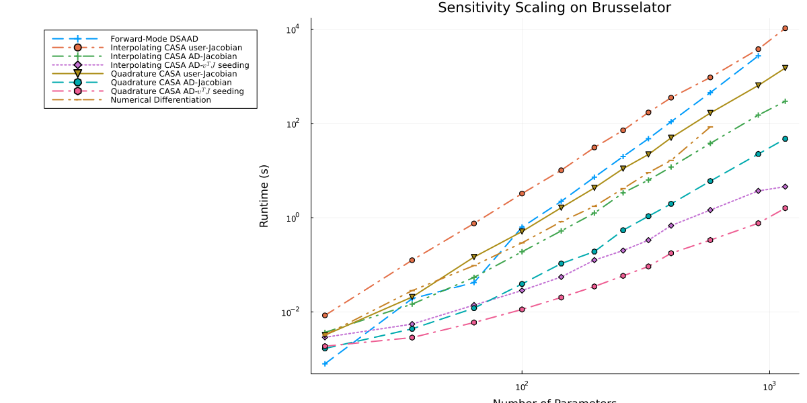

From the paper [A Comparison of Automatic Differentiation and Continuous Sensitivity Analysis for Derivatives of Differential Equation Solutions](https://ieeexplore.ieee.org/abstract/document/9622796)

```julia
using OrdinaryDiffEq, ReverseDiff, ForwardDiff, FiniteDiff, SciMLSensitivity
using LinearAlgebra, Tracker, Plots
```


```julia
function makebrusselator(N=8)
    xyd_brusselator = range(0,stop=1,length=N)
    function limit(a, N)
      if a == N+1
        return 1
      elseif a == 0
        return N
      else
        return a
      end
    end
    brusselator_f(x, y, t) = ifelse((((x-0.3)^2 + (y-0.6)^2) <= 0.1^2) &&
                                    (t >= 1.1), 5., 0.)
    brusselator_2d_loop = let N=N, xyd=xyd_brusselator, dx=step(xyd_brusselator)
      function brusselator_2d_loop(du, u, p, t)
          @inbounds begin
              ii1 = N^2
              ii2 = ii1+N^2
              ii3 = ii2+2(N^2)
              A = @view p[1:ii1]
              B = @view p[ii1+1:ii2]
              α = @view p[ii2+1:ii3]
              II = LinearIndices((N, N, 2))
              for I in CartesianIndices((N, N))
                  x = xyd[I[1]]
                  y = xyd[I[2]]
                  i = I[1]
                  j = I[2]
                  ip1 = limit(i+1, N); im1 = limit(i-1, N)
                  jp1 = limit(j+1, N); jm1 = limit(j-1, N)
                  du[II[i,j,1]] = α[II[i,j,1]]*(u[II[im1,j,1]] + u[II[ip1,j,1]] + u[II[i,jp1,1]] + u[II[i,jm1,1]] - 4u[II[i,j,1]])/dx^2 +
                      B[II[i,j,1]] + u[II[i,j,1]]^2*u[II[i,j,2]] - (A[II[i,j,1]] + 1)*u[II[i,j,1]] + brusselator_f(x, y, t)
              end
              for I in CartesianIndices((N, N))
                i = I[1]
                j = I[2]
                ip1 = limit(i+1, N)
                im1 = limit(i-1, N)
                jp1 = limit(j+1, N)
                jm1 = limit(j-1, N)
                du[II[i,j,2]] = α[II[i,j,2]]*(u[II[im1,j,2]] + u[II[ip1,j,2]] + u[II[i,jp1,2]] + u[II[i,jm1,2]] - 4u[II[i,j,2]])/dx^2 +
                    A[II[i,j,1]]*u[II[i,j,1]] - u[II[i,j,1]]^2*u[II[i,j,2]]
              end
              return nothing
          end
      end
    end
    function init_brusselator_2d(xyd)
        N = length(xyd)
        u = zeros(N, N, 2)
        for I in CartesianIndices((N, N))
            x = xyd[I[1]]
            y = xyd[I[2]]
            u[I,1] = 22*(y*(1-y))^(3/2)
            u[I,2] = 27*(x*(1-x))^(3/2)
        end
        vec(u)
    end
    dx = step(xyd_brusselator)
    e1 = ones(N-1)
    off = N-1
    e4 = ones(N-off)
    T = diagm(0=>-2ones(N), -1=>e1, 1=>e1, off=>e4, -off=>e4) ./ dx^2
    Ie = Matrix{Float64}(I, N, N)
    # A + df/du
    Op = kron(Ie, T) + kron(T, Ie)
    brusselator_jac = let N=N
      (J,a,p,t) -> begin
        ii1 = N^2
        ii2 = ii1+N^2
        ii3 = ii2+2(N^2)
        A = @view p[1:ii1]
        B = @view p[ii1+1:ii2]
        α = @view p[ii2+1:ii3]
        u = @view a[1:end÷2]
        v = @view a[end÷2+1:end]
        N2 = length(a)÷2
        α1 = @view α[1:end÷2]
        α2 = @view α[end÷2+1:end]
        fill!(J, 0)

        J[1:N2, 1:N2] .= α1.*Op
        J[N2+1:end, N2+1:end] .= α2.*Op

        J1 = @view J[1:N2,     1:N2]
        J2 = @view J[N2+1:end, 1:N2]
        J3 = @view J[1:N2,     N2+1:end]
        J4 = @view J[N2+1:end, N2+1:end]
        J1[diagind(J1)] .+= @. 2u*v-(A+1)
        J2[diagind(J2)] .= @. A-2u*v
        J3[diagind(J3)] .= @. u^2
        J4[diagind(J4)] .+= @. -u^2
        nothing
      end
    end
    Jmat = zeros(2N*N, 2N*N)
    dp = zeros(2N*N, 4N*N)
    brusselator_comp = let N=N, xyd=xyd_brusselator, dx=step(xyd_brusselator), Jmat=Jmat, dp=dp, brusselator_jac=brusselator_jac
      function brusselator_comp(dus, us, p, t)
          @inbounds begin
              ii1 = N^2
              ii2 = ii1+N^2
              ii3 = ii2+2(N^2)
              @views u, s = us[1:ii2], us[ii2+1:end]
              du = @view dus[1:ii2]
              ds = @view dus[ii2+1:end]
              fill!(dp, 0)
              A = @view p[1:ii1]
              B = @view p[ii1+1:ii2]
              α = @view p[ii2+1:ii3]
              dfdα = @view dp[:, ii2+1:ii3]
              diagind(dfdα)
              for i in 1:ii1
                dp[i, ii1+i] = 1
              end
              II = LinearIndices((N, N, 2))
              uu = @view u[1:end÷2]
              for i in eachindex(uu)
                dp[i, i] = -uu[i]
                dp[i+ii1, i] = uu[i]
              end
              for I in CartesianIndices((N, N))
                  x = xyd[I[1]]
                  y = xyd[I[2]]
                  i = I[1]
                  j = I[2]
                  ip1 = limit(i+1, N); im1 = limit(i-1, N)
                  jp1 = limit(j+1, N); jm1 = limit(j-1, N)
                  au = dfdα[II[i,j,1],II[i,j,1]] = (u[II[im1,j,1]] + u[II[ip1,j,1]] + u[II[i,jp1,1]] + u[II[i,jm1,1]] - 4u[II[i,j,1]])/dx^2
                  du[II[i,j,1]] = α[II[i,j,1]]*(au) + B[II[i,j,1]] + u[II[i,j,1]]^2*u[II[i,j,2]] - (A[II[i,j,1]] + 1)*u[II[i,j,1]] + brusselator_f(x, y, t)
              end
              for I in CartesianIndices((N, N))
                  i = I[1]
                  j = I[2]
                  ip1 = limit(i+1, N)
                  im1 = limit(i-1, N)
                  jp1 = limit(j+1, N)
                  jm1 = limit(j-1, N)
                  av = dfdα[II[i,j,2],II[i,j,2]] = (u[II[im1,j,2]] + u[II[ip1,j,2]] + u[II[i,jp1,2]] + u[II[i,jm1,2]] - 4u[II[i,j,2]])/dx^2
                  du[II[i,j,2]] = α[II[i,j,2]]*(av) + A[II[i,j,1]]*u[II[i,j,1]] - u[II[i,j,1]]^2*u[II[i,j,2]]
              end
              brusselator_jac(Jmat,u,p,t)
              BLAS.gemm!('N', 'N', 1., Jmat, reshape(s, 2N*N, 4N*N), 1., dp)
              copyto!(ds, vec(dp))
              return nothing
          end
      end
    end
    u0 = init_brusselator_2d(xyd_brusselator)
    p = [fill(3.4,N^2); fill(1.,N^2); fill(10.,2*N^2)]
    brusselator_2d_loop, u0, p, brusselator_jac, ODEProblem(brusselator_comp, copy([u0;zeros((N^2*2)*(N^2*4))]), (0.,10.), p)
end

Base.eps(::Type{Tracker.TrackedReal{T}}) where T = eps(T)
Base.vec(v::Adjoint{<:Real, <:AbstractVector}) = vec(v') # bad bad hack
```


## Setup AutoDiff

```julia
bt = 0:0.1:1
tspan = (0.0, 1.0)
forwarddiffn = vcat(2:10,12,15)
reversediffn = 2:10
numdiffn = vcat(2:10,12)
csan = vcat(2:10,12,15,17)
#csaseedn = 2:10
tols = (abstol=1e-5, reltol=1e-7)

@isdefined(PROBS) || (const PROBS = Dict{Int,Any}())
makebrusselator!(dict, n) = get!(()->makebrusselator(n), dict, n)

_adjoint_methods = ntuple(3) do ii
  Alg = (InterpolatingAdjoint, QuadratureAdjoint, BacksolveAdjoint)[ii]
  (
    user = Alg(autodiff=false,autojacvec=false), # user Jacobian
    adjc = Alg(autodiff=true,autojacvec=false), # AD Jacobian
    advj = Alg(autodiff=true,autojacvec=EnzymeVJP()), # AD vJ
  )
end |> NamedTuple{(:interp, :quad, :backsol)}
@isdefined(ADJOINT_METHODS) || (const ADJOINT_METHODS = mapreduce(collect, vcat, _adjoint_methods))

function auto_sen_l2(f, u0, tspan, p, t, alg=Tsit5(); diffalg=ReverseDiff.gradient, kwargs...)
  test_f(p) = begin
    prob = ODEProblem{true, SciMLBase.FullSpecialize}(f,convert.(eltype(p),u0),tspan,p)
    sol = solve(prob,alg,saveat=t; kwargs...)
    sum(sol.u) do x
      sum(z->(1-z)^2/2, x)
    end
  end
  diffalg(test_f, p)
end
@inline function diffeq_sen_l2(df, u0, tspan, p, t, alg=Tsit5();
                       abstol=1e-5, reltol=1e-7, iabstol=abstol, ireltol=reltol,
                       sensalg=SensitivityAlg(), kwargs...)
    prob = ODEProblem{true, SciMLBase.FullSpecialize}(df,u0,tspan,p)
    saveat = tspan[1] != t[1] && tspan[end] != t[end] ? vcat(tspan[1],t,tspan[end]) : t
    sol = solve(prob, alg, abstol=abstol, reltol=reltol, saveat=saveat; kwargs...)
    dg(out,u,p,t,i) = (out.=u.-1.0)
    adjoint_sensitivities(sol,alg;t,abstol=abstol,dgdu_discrete = dg,
                            reltol=reltol,sensealg=sensalg)
end
```

```
diffeq_sen_l2 (generic function with 2 methods)
```


## AD Choice Benchmarks

```julia
forwarddiff = map(forwarddiffn) do n
  bfun, b_u0, b_p, brusselator_jac, brusselator_comp = makebrusselator!(PROBS, n)
  @elapsed auto_sen_l2(bfun, b_u0, tspan, b_p, bt, (Rodas5()); diffalg=(ForwardDiff.gradient), tols...)
  t = @elapsed auto_sen_l2(bfun, b_u0, tspan, b_p, bt, (Rodas5()); diffalg=(ForwardDiff.gradient), tols...)
  @show n,t
  t
end
```

```
(n, t) = (2, 0.000721584)
(n, t) = (3, 0.019054512)
(n, t) = (4, 0.043652082)
(n, t) = (5, 0.636691231)
(n, t) = (6, 2.473460782)
(n, t) = (7, 7.406212456)
(n, t) = (8, 20.35610559)
(n, t) = (9, 48.7718328)
(n, t) = (10, 111.944675232)
(n, t) = (12, 462.939724242)
(n, t) = (15, 2808.746782949)
11-element Vector{Float64}:
    0.000721584
    0.019054512
    0.043652082
    0.636691231
    2.473460782
    7.406212456
   20.35610559
   48.7718328
  111.944675232
  462.939724242
 2808.746782949
```


```julia
#=
reversediff = map(reversediffn) do n
  bfun, b_u0, b_p, brusselator_jac, brusselator_comp = makebrusselator!(PROBS, n)
  @elapsed auto_sen_l2(bfun, b_u0, tspan, b_p, bt, (Rodas5(autodiff=false)); diffalg=(ReverseDiff.gradient), tols...)
  t = @elapsed auto_sen_l2(bfun, b_u0, tspan, b_p, bt, (Rodas5(autodiff=false)); diffalg=(ReverseDiff.gradient), tols...)
  @show n,t
  t
end
=#
```


```julia
numdiff = map(numdiffn) do n
  bfun, b_u0, b_p, brusselator_jac, brusselator_comp = makebrusselator!(PROBS, n)
  @elapsed auto_sen_l2(bfun, b_u0, tspan, b_p, bt, (Rodas5()); diffalg=(FiniteDiff.finite_difference_gradient), tols...)
  t = @elapsed auto_sen_l2(bfun, b_u0, tspan, b_p, bt, (Rodas5()); diffalg=(FiniteDiff.finite_difference_gradient), tols...)
  @show n,t
  t
end
```

```
(n, t) = (2, 0.003093435)
(n, t) = (3, 0.028039837)
(n, t) = (4, 0.095866429)
(n, t) = (5, 0.292379318)
(n, t) = (6, 0.793840648)
(n, t) = (7, 1.745662802)
(n, t) = (8, 4.14823644)
(n, t) = (9, 8.999801754)
(n, t) = (10, 16.37036899)
(n, t) = (12, 59.254653459)
10-element Vector{Float64}:
  0.003093435
  0.028039837
  0.095866429
  0.292379318
  0.793840648
  1.745662802
  4.14823644
  8.999801754
 16.37036899
 59.254653459
```


```julia
csa = map(csan) do n
  bfun, b_u0, b_p, brusselator_jac, brusselator_comp = makebrusselator!(PROBS, n)
  @time ts = map(ADJOINT_METHODS[1:2end÷3]) do alg
    @info "Running $alg"
    f = SciMLSensitivity.alg_autodiff(alg) ? bfun : ODEFunction(bfun, jac=brusselator_jac)
    solver = Rodas5(autodiff=false)
    @time diffeq_sen_l2(bfun, b_u0, tspan, b_p, bt, solver; sensalg=alg, tols...)
    t = @elapsed diffeq_sen_l2(bfun, b_u0, tspan, b_p, bt, solver; sensalg=alg, tols...)
    return t
  end
  @show n,ts
  ts
end
```

```
14.407097 seconds (21.37 M allocations: 1.407 GiB, 4.77% gc time, 99.91% c
ompilation time)
 10.159997 seconds (8.70 M allocations: 590.936 MiB, 6.46% gc time, 99.93% 
compilation time)
 45.185354 seconds (30.85 M allocations: 2.078 GiB, 1.92% gc time, 99.98% c
ompilation time)
 13.990700 seconds (16.18 M allocations: 1.043 GiB, 6.90% gc time, 99.95% c
ompilation time)
  7.038906 seconds (5.53 M allocations: 387.973 MiB, 1.77% gc time, 99.93% 
compilation time)
  7.344072 seconds (7.77 M allocations: 535.440 MiB, 2.67% gc time, 99.93% 
compilation time)
 98.957281 seconds (90.96 M allocations: 6.045 GiB, 3.59% gc time, 99.92% c
ompilation time)
(n, ts) = (2, [0.007650439, 0.003436603, 0.002336542, 0.003076315, 0.001534
198, 0.001414609])
  0.119820 seconds (71.65 k allocations: 6.203 MiB)
 14.186041 seconds (4.41 M allocations: 295.293 MiB, 1.18% gc time, 99.88% 
compilation time)
  0.004209 seconds (1.34 k allocations: 334.328 KiB)
  0.020514 seconds (10.46 k allocations: 527.250 KiB)
  6.664029 seconds (2.65 M allocations: 178.648 MiB, 1.00% gc time, 99.88% 
compilation time)
  0.002141 seconds (2.00 k allocations: 321.094 KiB)
 21.166389 seconds (7.24 M allocations: 490.258 MiB, 1.11% gc time, 98.38% 
compilation time)
(n, ts) = (3, [0.120093768, 0.014181427, 0.00381521, 0.020338139, 0.0044166
56, 0.001903805])
  0.738718 seconds (155.81 k allocations: 13.591 MiB)
 14.004208 seconds (4.28 M allocations: 286.459 MiB, 0.76% gc time, 99.59% 
compilation time)
  0.009273 seconds (1.35 k allocations: 642.984 KiB)
  0.142414 seconds (25.52 k allocations: 1.131 MiB)
  7.961971 seconds (2.65 M allocations: 178.967 MiB, 1.67% gc time, 99.80% 
compilation time)
  0.003846 seconds (2.00 k allocations: 472.828 KiB)
 23.827771 seconds (7.32 M allocations: 499.678 MiB, 1.00% gc time, 91.88% 
compilation time)
(n, ts) = (4, [0.741673151, 0.053278238, 0.0089058, 0.142389081, 0.01205669
5, 0.003584682])
  3.189546 seconds (285.04 k allocations: 25.051 MiB)
 14.016768 seconds (3.42 M allocations: 230.949 MiB, 0.36% gc time, 98.63% 
compilation time)
  0.095902 seconds (1.38 k allocations: 1.186 MiB, 81.07% gc time)
  0.505212 seconds (38.30 k allocations: 1.827 MiB)
  7.473225 seconds (2.65 M allocations: 179.099 MiB, 0.79% gc time, 99.41% 
compilation time)
  0.006115 seconds (2.01 k allocations: 709.859 KiB)
 29.226641 seconds (6.76 M allocations: 471.747 MiB, 0.64% gc time, 72.72% 
compilation time)
(n, ts) = (5, [3.177037235, 0.189640418, 0.017195024, 0.504969969, 0.039915
193, 0.005867323])
 10.118089 seconds (448.67 k allocations: 39.973 MiB)
 17.311380 seconds (3.34 M allocations: 226.192 MiB, 0.73% gc time, 96.95% 
compilation time)
  0.031872 seconds (1.39 k allocations: 2.124 MiB)
  1.618127 seconds (60.51 k allocations: 3.136 MiB)
  8.940281 seconds (2.65 M allocations: 179.816 MiB, 0.86% gc time, 98.77% 
compilation time)
  0.010530 seconds (2.01 k allocations: 1002.266 KiB)
 50.448609 seconds (7.07 M allocations: 505.184 MiB, 0.40% gc time, 50.77% 
compilation time)
(n, ts) = (6, [10.114656367, 0.522728279, 0.031874457, 1.626376817, 0.10635
2188, 0.009935151])
 30.770859 seconds (736.49 k allocations: 65.896 MiB)
 15.870902 seconds (2.26 M allocations: 157.059 MiB, 0.40% gc time, 92.13% 
compilation time)
  0.066260 seconds (1.39 k allocations: 3.628 MiB)
  4.357406 seconds (86.10 k allocations: 4.643 MiB)
  1.777273 seconds (467.34 k allocations: 31.889 MiB, 88.93% compilation ti
me)
  0.016520 seconds (2.01 k allocations: 1.344 MiB)
 89.611819 seconds (4.47 M allocations: 350.278 MiB, 0.19% gc time, 18.08% 
compilation time)
(n, ts) = (7, [30.908506084, 1.248809299, 0.065707031, 4.311288101, 0.19478
5908, 0.016272311])
 71.114366 seconds (1.01 M allocations: 91.394 MiB, 0.17% gc time)
  3.329543 seconds (96.60 k allocations: 11.623 MiB)
  0.114928 seconds (1.39 k allocations: 5.839 MiB)
 11.114204 seconds (130.45 k allocations: 7.147 MiB)
  0.645899 seconds (15.30 k allocations: 4.190 MiB, 15.76% gc time)
  0.026361 seconds (2.02 k allocations: 1.850 MiB)
172.517598 seconds (2.50 M allocations: 244.302 MiB, 0.13% gc time)
(n, ts) = (8, [71.055994897, 3.333547096, 0.114219987, 11.09019151, 0.54320
6657, 0.026017114])
170.713777 seconds (1.51 M allocations: 137.390 MiB)
  6.262299 seconds (113.13 k allocations: 16.670 MiB)
  0.258395 seconds (1.40 k allocations: 9.037 MiB)
 22.187814 seconds (161.98 k allocations: 9.805 MiB, 0.18% gc time)
  1.072842 seconds (18.57 k allocations: 6.090 MiB)
  0.042857 seconds (2.02 k allocations: 2.481 MiB)
400.471933 seconds (3.61 M allocations: 363.160 MiB, 0.02% gc time)
(n, ts) = (9, [170.229438562, 6.280912478, 0.255405885, 22.042868804, 1.073
177172, 0.042448565])
351.205628 seconds (2.03 M allocations: 187.363 MiB, 0.02% gc time)
 11.805334 seconds (138.61 k allocations: 23.825 MiB)
  0.390697 seconds (1.40 k allocations: 13.524 MiB)
 49.494011 seconds (238.50 k allocations: 14.728 MiB)
  1.980911 seconds (22.22 k allocations: 8.636 MiB)
  0.061219 seconds (2.02 k allocations: 3.277 MiB)
829.586707 seconds (4.87 M allocations: 502.920 MiB, 0.02% gc time)
(n, ts) = (10, [350.713474414, 11.952008703, 0.425608392, 49.515145961, 1.9
71193735, 0.060406254])
943.967734 seconds (2.68 M allocations: 259.927 MiB, 0.01% gc time)
 37.581868 seconds (204.75 k allocations: 45.190 MiB)
  0.733543 seconds (1.41 k allocations: 27.084 MiB)
165.934490 seconds (387.70 k allocations: 25.952 MiB, 0.02% gc time)
  5.911194 seconds (30.67 k allocations: 16.154 MiB)
  0.140284 seconds (2.02 k allocations: 5.384 MiB)
2308.229951 seconds (6.61 M allocations: 759.594 MiB, 0.01% gc time)
(n, ts) = (12, [943.828697371, 37.727501303, 0.800880063, 165.525630449, 5.
924728565, 0.139336815])
3763.911175 seconds (4.42 M allocations: 456.847 MiB, 0.01% gc time)
150.040008 seconds (328.40 k allocations: 102.016 MiB)
  1.886116 seconds (1.42 k allocations: 64.527 MiB, 1.20% gc time)
639.931339 seconds (617.28 k allocations: 51.291 MiB, 0.00% gc time)
 22.404637 seconds (46.22 k allocations: 36.236 MiB)
  0.426547 seconds (2.02 k allocations: 10.565 MiB, 7.44% gc time)
9159.433217 seconds (10.83 M allocations: 1.409 GiB, 0.01% gc time)
(n, ts) = (15, [3766.701730134, 149.989742744, 1.857356014, 639.479022114, 
22.400091159, 0.390846474])
10447.194705 seconds (7.45 M allocations: 766.085 MiB, 0.01% gc time)
294.602732 seconds (392.64 k allocations: 161.463 MiB, 0.02% gc time)
  2.809704 seconds (1.42 k allocations: 105.403 MiB)
1493.253331 seconds (872.69 k allocations: 80.013 MiB)
 47.032705 seconds (58.51 k allocations: 57.747 MiB, 0.06% gc time)
  0.938716 seconds (2.02 k allocations: 15.771 MiB)
24585.261053 seconds (17.56 M allocations: 2.318 GiB, 0.01% gc time)
(n, ts) = (17, [10452.719618551, 294.941225973, 2.986291398, 1500.645307825
, 47.104129313, 1.017901505])
12-element Vector{Vector{Float64}}:
 [0.007650439, 0.003436603, 0.002336542, 0.003076315, 0.001534198, 0.001414
609]
 [0.120093768, 0.014181427, 0.00381521, 0.020338139, 0.004416656, 0.0019038
05]
 [0.741673151, 0.053278238, 0.0089058, 0.142389081, 0.012056695, 0.00358468
2]
 [3.177037235, 0.189640418, 0.017195024, 0.504969969, 0.039915193, 0.005867
323]
 [10.114656367, 0.522728279, 0.031874457, 1.626376817, 0.106352188, 0.00993
5151]
 [30.908506084, 1.248809299, 0.065707031, 4.311288101, 0.194785908, 0.01627
2311]
 [71.055994897, 3.333547096, 0.114219987, 11.09019151, 0.543206657, 0.02601
7114]
 [170.229438562, 6.280912478, 0.255405885, 22.042868804, 1.073177172, 0.042
448565]
 [350.713474414, 11.952008703, 0.425608392, 49.515145961, 1.971193735, 0.06
0406254]
 [943.828697371, 37.727501303, 0.800880063, 165.525630449, 5.924728565, 0.1
39336815]
 [3766.701730134, 149.989742744, 1.857356014, 639.479022114, 22.400091159, 
0.390846474]
 [10452.719618551, 294.941225973, 2.986291398, 1500.645307825, 47.104129313
, 1.017901505]
```


```julia
n_to_param(n) = 4n^2

lw = 2
ms = 0.5
plt1 = plot(title="Sensitivity Scaling on Brusselator");
plot!(plt1, n_to_param.(forwarddiffn), forwarddiff, lab="Forward-Mode DSAAD", lw=lw, marksize=ms, linestyle=:auto, marker=:auto);
#plot!(plt1, n_to_param.(reversediffn), reversediff, lab="Reverse-Mode DSAAD", lw=lw, marksize=ms, linestyle=:auto, marker=:auto);
csadata = [[csa[j][i] for j in eachindex(csa)] for i in eachindex(csa[1])]
plot!(plt1, n_to_param.(csan), csadata[1], lab="Interpolating CASA user-Jacobian", lw=lw, marksize=ms, linestyle=:auto, marker=:auto);
plot!(plt1, n_to_param.(csan), csadata[2], lab="Interpolating CASA AD-Jacobian", lw=lw, marksize=ms, linestyle=:auto, marker=:auto);
plot!(plt1, n_to_param.(csan), csadata[3], lab=raw"Interpolating CASA AD-$v^{T}J$ seeding", lw=lw, marksize=ms, linestyle=:auto, marker=:auto);
plot!(plt1, n_to_param.(csan), csadata[1+3], lab="Quadrature CASA user-Jacobian", lw=lw, marksize=ms, linestyle=:auto, marker=:auto);
plot!(plt1, n_to_param.(csan), csadata[2+3], lab="Quadrature CASA AD-Jacobian", lw=lw, marksize=ms, linestyle=:auto, marker=:auto);
plot!(plt1, n_to_param.(csan), csadata[3+3], lab=raw"Quadrature CASA AD-$v^{T}J$ seeding", lw=lw, marksize=ms, linestyle=:auto, marker=:auto);
plot!(plt1, n_to_param.(numdiffn), numdiff, lab="Numerical Differentiation", lw=lw, marksize=ms, linestyle=:auto, marker=:auto);
xaxis!(plt1, "Number of Parameters", :log10);
yaxis!(plt1, "Runtime (s)", :log10);
plot!(plt1, legend=:outertopleft, size=(1200, 600))
```




## VJP Choice Benchmarks

```julia
bt = 0:0.1:1
tspan = (0.0, 1.0)
csan = vcat(2:10,12,15,17)
tols = (abstol=1e-5, reltol=1e-7)

_adjoint_methods = ntuple(2) do ii
  Alg = (InterpolatingAdjoint, QuadratureAdjoint)[ii]
  (
    advj1 = Alg(autodiff=true,autojacvec=EnzymeVJP()), # AD vJ
    advj2 = Alg(autodiff=true,autojacvec=ReverseDiffVJP(false)), # AD vJ
    advj3 = Alg(autodiff=true,autojacvec=ReverseDiffVJP(true)), # AD vJ
  )
end |> NamedTuple{(:interp, :quad)}
adjoint_methods = mapreduce(collect, vcat, _adjoint_methods)

csavjp = map(csan) do n
  bfun, b_u0, b_p, brusselator_jac, brusselator_comp = makebrusselator!(PROBS, n)
  @time ts = map(adjoint_methods) do alg
    @info "Running $alg"
    f = SciMLSensitivity.alg_autodiff(alg) ? bfun : ODEFunction(bfun, jac=brusselator_jac)
    solver = Rodas5(autodiff=false)
    @time diffeq_sen_l2(bfun, b_u0, tspan, b_p, bt, solver; sensalg=alg, tols...)
    t = @elapsed diffeq_sen_l2(bfun, b_u0, tspan, b_p, bt, solver; sensalg=alg, tols...)
    return t
  end
  @show n,ts
  ts
end
```

```
0.002257 seconds (1.29 k allocations: 189.812 KiB)
  7.183495 seconds (8.49 M allocations: 564.360 MiB, 1.41% gc time, 98.96% 
compilation time)
  6.141431 seconds (6.17 M allocations: 430.625 MiB, 3.19% gc time, 99.78% 
compilation time)
  0.002039 seconds (2.02 k allocations: 213.359 KiB)
  5.990792 seconds (6.29 M allocations: 428.779 MiB, 2.84% gc time, 99.32% 
compilation time)
  5.882997 seconds (5.93 M allocations: 412.452 MiB, 0.93% gc time, 99.85% 
compilation time)
 25.890375 seconds (28.15 M allocations: 1.854 GiB, 2.24% gc time, 98.70% c
ompilation time)
(n, ts) = (2, [0.001878545, 0.071923908, 0.008137654, 0.00116368, 0.0977001
89, 0.005315137])
  0.004472 seconds (1.34 k allocations: 334.328 KiB)
  0.289393 seconds (2.09 M allocations: 95.601 MiB, 32.57% gc time)
  0.021764 seconds (5.43 k allocations: 549.156 KiB)
  0.002235 seconds (2.00 k allocations: 321.094 KiB)
  0.162560 seconds (1.10 M allocations: 50.153 MiB, 25.75% gc time)
  0.014134 seconds (7.26 k allocations: 600.281 KiB)
  0.852146 seconds (6.41 M allocations: 295.252 MiB, 15.97% gc time)
(n, ts) = (3, [0.003845859, 0.206087143, 0.021652304, 0.001963454, 0.106339
709, 0.012947665])
  0.008691 seconds (1.35 k allocations: 642.984 KiB)
  0.592314 seconds (6.23 M allocations: 268.499 MiB, 3.64% gc time)
  0.060822 seconds (8.56 k allocations: 1018.078 KiB)
  0.003892 seconds (2.00 k allocations: 472.828 KiB)
  0.314373 seconds (2.94 M allocations: 126.580 MiB, 6.90% gc time)
  0.031623 seconds (11.66 k allocations: 956.938 KiB)
  2.012472 seconds (18.39 M allocations: 796.414 MiB, 3.23% gc time)
(n, ts) = (4, [0.008412182, 0.600423573, 0.061455033, 0.00365419, 0.2914162
43, 0.031439756])
  0.018084 seconds (1.38 k allocations: 1.186 MiB)
  1.428223 seconds (14.51 M allocations: 666.823 MiB, 6.00% gc time)
  0.142269 seconds (12.52 k allocations: 1.763 MiB)
  0.006285 seconds (2.01 k allocations: 709.859 KiB)
  0.644591 seconds (6.63 M allocations: 304.666 MiB, 3.10% gc time)
  0.068840 seconds (17.33 k allocations: 1.452 MiB)
  4.599599 seconds (42.35 M allocations: 1.908 GiB, 4.08% gc time)
(n, ts) = (5, [0.017009003, 1.399037674, 0.142612676, 0.005850803, 0.653635
983, 0.067621083])
  0.032682 seconds (1.39 k allocations: 2.124 MiB)
  2.823986 seconds (29.30 M allocations: 1.260 GiB, 4.45% gc time)
  0.289683 seconds (17.34 k allocations: 2.941 MiB)
  0.010348 seconds (2.01 k allocations: 1002.266 KiB)
  1.292911 seconds (12.88 M allocations: 567.153 MiB, 4.95% gc time)
  0.129783 seconds (24.20 k allocations: 2.051 MiB)
  9.125602 seconds (84.44 M allocations: 3.643 GiB, 3.96% gc time)
(n, ts) = (6, [0.032086291, 2.822986907, 0.286197095, 0.010080208, 1.262104
982, 0.128499811])
  0.066406 seconds (1.39 k allocations: 3.628 MiB)
  5.396942 seconds (55.53 M allocations: 2.326 GiB, 4.83% gc time)
  0.557222 seconds (23.34 k allocations: 4.747 MiB)
  0.016544 seconds (2.01 k allocations: 1.344 MiB)
  2.252926 seconds (22.90 M allocations: 981.690 MiB, 3.91% gc time)
  0.240608 seconds (32.31 k allocations: 2.785 MiB)
 17.035744 seconds (156.98 M allocations: 6.593 GiB, 4.19% gc time)
(n, ts) = (7, [0.066416413, 5.368595823, 0.558099027, 0.016040921, 2.256870
309, 0.232896357])
  0.113375 seconds (1.39 k allocations: 5.839 MiB)
  9.010716 seconds (93.69 M allocations: 4.182 GiB, 4.41% gc time)
  0.958235 seconds (30.00 k allocations: 7.323 MiB)
  0.027640 seconds (2.02 k allocations: 1.850 MiB)
  3.842534 seconds (39.29 M allocations: 1.753 GiB, 4.41% gc time)
  0.396816 seconds (41.82 k allocations: 3.789 MiB)
 28.727902 seconds (266.11 M allocations: 11.907 GiB, 3.98% gc time)
(n, ts) = (8, [0.113626021, 9.022185477, 0.968064103, 0.02600472, 3.8481485
16, 0.395073726])
  0.253946 seconds (1.40 k allocations: 9.037 MiB)
 16.023043 seconds (165.38 M allocations: 7.177 GiB, 4.50% gc time)
  1.707493 seconds (39.02 k allocations: 10.988 MiB, 1.34% gc time)
  0.041993 seconds (2.02 k allocations: 2.481 MiB)
  6.012983 seconds (61.70 M allocations: 2.677 GiB, 4.27% gc time)
  0.624920 seconds (52.47 k allocations: 4.905 MiB)
 49.553877 seconds (454.35 M allocations: 19.763 GiB, 4.06% gc time)
(n, ts) = (9, [0.253227633, 16.082857769, 1.81113609, 0.041094528, 6.073806
998, 0.619946709])
  0.351448 seconds (1.40 k allocations: 13.524 MiB)
 23.395678 seconds (233.92 M allocations: 9.952 GiB, 6.61% gc time)
  2.567682 seconds (46.55 k allocations: 15.842 MiB)
  0.064548 seconds (2.02 k allocations: 3.277 MiB)
  9.346648 seconds (92.71 M allocations: 3.942 GiB, 7.03% gc time)
  0.927713 seconds (64.36 k allocations: 6.243 MiB)
 73.625174 seconds (653.49 M allocations: 27.864 GiB, 6.12% gc time)
(n, ts) = (10, [0.378249323, 23.532909714, 2.678975655, 0.060550661, 9.3890
90568, 0.923242662])
  0.704271 seconds (1.41 k allocations: 27.084 MiB)
 50.405601 seconds (498.79 M allocations: 22.283 GiB, 7.12% gc time)
  5.181806 seconds (67.19 k allocations: 30.514 MiB)
  0.142313 seconds (2.02 k allocations: 5.384 MiB)
 19.300156 seconds (188.66 M allocations: 8.423 GiB, 7.96% gc time)
  1.880256 seconds (91.91 k allocations: 9.739 MiB)
155.460503 seconds (1.38 G allocations: 61.554 GiB, 6.54% gc time)
(n, ts) = (12, [0.778307522, 50.60657302, 5.17425829, 0.139865491, 19.14906
7021, 1.989103088])
  1.792917 seconds (1.42 k allocations: 64.527 MiB)
115.617515 seconds (1.25 G allocations: 53.273 GiB, 5.35% gc time)
 13.478726 seconds (105.42 k allocations: 69.894 MiB, 0.13% gc time)
  0.394963 seconds (2.02 k allocations: 10.565 MiB)
 43.383814 seconds (453.40 M allocations: 19.275 GiB, 6.72% gc time)
  4.730071 seconds (142.62 k allocations: 17.231 MiB)
358.953476 seconds (3.41 G allocations: 145.412 GiB, 4.66% gc time)
(n, ts) = (15, [2.21317305, 115.528282367, 13.733991952, 0.393391181, 42.95
5768538, 4.716318543])
  3.482891 seconds (1.42 k allocations: 105.403 MiB, 0.49% gc time)
190.037116 seconds (1.92 G allocations: 80.231 GiB, 6.74% gc time)
 20.264705 seconds (131.43 k allocations: 112.047 MiB, 0.08% gc time)
  0.818980 seconds (2.02 k allocations: 15.771 MiB)
 68.997060 seconds (743.36 M allocations: 30.973 GiB, 4.74% gc time)
  7.827787 seconds (182.68 k allocations: 24.262 MiB)
570.640147 seconds (5.34 G allocations: 222.910 GiB, 4.88% gc time)
(n, ts) = (17, [3.456203681, 175.868021536, 21.428244263, 0.840443366, 69.7
0964374, 7.894040105])
12-element Vector{Vector{Float64}}:
 [0.001878545, 0.071923908, 0.008137654, 0.00116368, 0.097700189, 0.0053151
37]
 [0.003845859, 0.206087143, 0.021652304, 0.001963454, 0.106339709, 0.012947
665]
 [0.008412182, 0.600423573, 0.061455033, 0.00365419, 0.291416243, 0.0314397
56]
 [0.017009003, 1.399037674, 0.142612676, 0.005850803, 0.653635983, 0.067621
083]
 [0.032086291, 2.822986907, 0.286197095, 0.010080208, 1.262104982, 0.128499
811]
 [0.066416413, 5.368595823, 0.558099027, 0.016040921, 2.256870309, 0.232896
357]
 [0.113626021, 9.022185477, 0.968064103, 0.02600472, 3.848148516, 0.3950737
26]
 [0.253227633, 16.082857769, 1.81113609, 0.041094528, 6.073806998, 0.619946
709]
 [0.378249323, 23.532909714, 2.678975655, 0.060550661, 9.389090568, 0.92324
2662]
 [0.778307522, 50.60657302, 5.17425829, 0.139865491, 19.149067021, 1.989103
088]
 [2.21317305, 115.528282367, 13.733991952, 0.393391181, 42.955768538, 4.716
318543]
 [3.456203681, 175.868021536, 21.428244263, 0.840443366, 69.70964374, 7.894
040105]
```


```julia
plt2 = plot(title="Brusselator quadrature adjoint scaling");
csacompare = [[csavjp[j][i] for j in eachindex(csavjp)] for i in eachindex(csavjp[1])]
plot!(plt2, n_to_param.(csan), csadata[2+3], lab="AD-Jacobian", lw=lw, marksize=ms, linestyle=:auto, marker=:auto);
plot!(plt2, n_to_param.(csan), csacompare[1+3], lab=raw"EnzymeVJP", lw=lw, marksize=ms, linestyle=:auto, marker=:auto);
plot!(plt2, n_to_param.(csan), csacompare[2+3], lab=raw"ReverseDiffVJP", lw=lw, marksize=ms, linestyle=:auto, marker=:auto);
plot!(plt2, n_to_param.(csan), csacompare[3+3], lab=raw"Compiled ReverseDiffVJP", lw=lw, marksize=ms, linestyle=:auto, marker=:auto);
xaxis!(plt2, "Number of Parameters", :log10);
yaxis!(plt2, "Runtime (s)", :log10);
plot!(plt2, legend=:outertopleft, size=(1200, 600))
```


## Appendix


## Appendix

These benchmarks are a part of the SciMLBenchmarks.jl repository, found at: [https://github.com/SciML/SciMLBenchmarks.jl](https://github.com/SciML/SciMLBenchmarks.jl). For more information on high-performance scientific machine learning, check out the SciML Open Source Software Organization [https://sciml.ai](https://sciml.ai).

To locally run this benchmark, do the following commands:

```
using SciMLBenchmarks
SciMLBenchmarks.weave_file("benchmarks/AutomaticDifferentiation","BrussScaling.jmd")
```

Computer Information:

```
Julia Version 1.10.2
Commit bd47eca2c8a (2024-03-01 10:14 UTC)
Build Info:
  Official https://julialang.org/ release
Platform Info:
  OS: Linux (x86_64-linux-gnu)
  CPU: 128 × AMD EPYC 7502 32-Core Processor
  WORD_SIZE: 64
  LIBM: libopenlibm
  LLVM: libLLVM-15.0.7 (ORCJIT, znver2)
Threads: 1 default, 0 interactive, 1 GC (on 128 virtual cores)
Environment:
  JULIA_CPU_THREADS = 128
  JULIA_DEPOT_PATH = /cache/julia-buildkite-plugin/depots/5b300254-1738-4989-ae0a-f4d2d937f953

```

Package Information:

```
Status `/cache/build/exclusive-amdci1-0/julialang/scimlbenchmarks-dot-jl/benchmarks/AutomaticDifferentiation/Project.toml`
  [6e4b80f9] BenchmarkTools v1.5.0
  [a93c6f00] DataFrames v1.6.1
  [1313f7d8] DataFramesMeta v0.15.2
  [a0c0ee7d] DifferentiationInterface v0.1.0 `https://github.com/gdalle/DifferentiationInterface.jl:DifferentiationInterface#main`
  [a82114a7] DifferentiationInterfaceTest v0.1.0 `https://github.com/gdalle/DifferentiationInterface.jl:DifferentiationInterfaceTest#main`
⌅ [7da242da] Enzyme v0.11.20
  [6a86dc24] FiniteDiff v2.23.0
  [f6369f11] ForwardDiff v0.10.36
  [1dea7af3] OrdinaryDiffEq v6.74.1
  [65888b18] ParameterizedFunctions v5.17.0
⌃ [91a5bcdd] Plots v1.40.3
  [08abe8d2] PrettyTables v2.3.1
  [37e2e3b7] ReverseDiff v1.15.1
  [31c91b34] SciMLBenchmarks v0.1.3
  [1ed8b502] SciMLSensitivity v7.56.2
  [90137ffa] StaticArrays v1.9.3
  [07d77754] Tapir v0.1.2
  [9f7883ad] Tracker v0.2.33
  [e88e6eb3] Zygote v0.6.69
  [37e2e46d] LinearAlgebra
  [d6f4376e] Markdown
  [de0858da] Printf
  [8dfed614] Test
Info Packages marked with ⌃ and ⌅ have new versions available. Those with ⌃ may be upgradable, but those with ⌅ are restricted by compatibility constraints from upgrading. To see why use `status --outdated`
Warning The project dependencies or compat requirements have changed since the manifest was last resolved. It is recommended to `Pkg.resolve()` or consider `Pkg.update()` if necessary.
```

And the full manifest:

```
Status `/cache/build/exclusive-amdci1-0/julialang/scimlbenchmarks-dot-jl/benchmarks/AutomaticDifferentiation/Manifest.toml`
  [47edcb42] ADTypes v0.2.7
  [621f4979] AbstractFFTs v1.5.0
  [1520ce14] AbstractTrees v0.4.5
  [7d9f7c33] Accessors v0.1.36
  [79e6a3ab] Adapt v4.0.4
  [ec485272] ArnoldiMethod v0.4.0
  [4fba245c] ArrayInterface v7.9.0
⌃ [4c555306] ArrayLayouts v1.9.1
  [a9b6321e] Atomix v0.1.0
  [6e4b80f9] BenchmarkTools v1.5.0
  [e2ed5e7c] Bijections v0.1.6
  [d1d4a3ce] BitFlags v0.1.8
  [62783981] BitTwiddlingConvenienceFunctions v0.1.5
  [fa961155] CEnum v0.5.0
  [2a0fbf3d] CPUSummary v0.2.4
  [00ebfdb7] CSTParser v3.4.2
  [49dc2e85] Calculus v0.5.1
  [7057c7e9] Cassette v0.3.13
  [8be319e6] Chain v0.6.0
  [082447d4] ChainRules v1.63.0
  [d360d2e6] ChainRulesCore v1.23.0
  [0ca39b1e] Chairmarks v1.2.1
  [fb6a15b2] CloseOpenIntervals v0.1.12
  [da1fd8a2] CodeTracking v1.3.5
  [944b1d66] CodecZlib v0.7.4
  [35d6a980] ColorSchemes v3.24.0
  [3da002f7] ColorTypes v0.11.5
  [c3611d14] ColorVectorSpace v0.10.0
  [5ae59095] Colors v0.12.10
  [861a8166] Combinatorics v1.0.2
  [a80b9123] CommonMark v0.8.12
  [38540f10] CommonSolve v0.2.4
  [bbf7d656] CommonSubexpressions v0.3.0
  [34da2185] Compat v4.14.0
  [b0b7db55] ComponentArrays v0.15.11
  [b152e2b5] CompositeTypes v0.1.4
  [a33af91c] CompositionsBase v0.1.2
  [2569d6c7] ConcreteStructs v0.2.3
  [f0e56b4a] ConcurrentUtilities v2.4.1
  [8f4d0f93] Conda v1.10.0
  [187b0558] ConstructionBase v1.5.5
  [d38c429a] Contour v0.6.3
  [adafc99b] CpuId v0.3.1
  [a8cc5b0e] Crayons v4.1.1
  [9a962f9c] DataAPI v1.16.0
  [a93c6f00] DataFrames v1.6.1
  [1313f7d8] DataFramesMeta v0.15.2
⌃ [864edb3b] DataStructures v0.18.18
  [e2d170a0] DataValueInterfaces v1.0.0
  [8bb1440f] DelimitedFiles v1.9.1
  [2b5f629d] DiffEqBase v6.149.0
⌃ [459566f4] DiffEqCallbacks v3.5.0
  [77a26b50] DiffEqNoiseProcess v5.21.0
  [163ba53b] DiffResults v1.1.0
  [b552c78f] DiffRules v1.15.1
  [de460e47] DiffTests v0.1.2
  [a0c0ee7d] DifferentiationInterface v0.1.0 `https://github.com/gdalle/DifferentiationInterface.jl:DifferentiationInterface#main`
  [a82114a7] DifferentiationInterfaceTest v0.1.0 `https://github.com/gdalle/DifferentiationInterface.jl:DifferentiationInterfaceTest#main`
  [b4f34e82] Distances v0.10.11
  [31c24e10] Distributions v0.25.107
  [ffbed154] DocStringExtensions v0.9.3
⌃ [5b8099bc] DomainSets v0.7.11
  [fa6b7ba4] DualNumbers v0.6.8
⌃ [7c1d4256] DynamicPolynomials v0.5.5
  [06fc5a27] DynamicQuantities v0.13.2
  [da5c29d0] EllipsisNotation v1.8.0
  [4e289a0a] EnumX v1.0.4
⌅ [7da242da] Enzyme v0.11.20
⌅ [f151be2c] EnzymeCore v0.6.6
  [460bff9d] ExceptionUnwrapping v0.1.10
  [d4d017d3] ExponentialUtilities v1.26.1
  [e2ba6199] ExprTools v0.1.10
  [c87230d0] FFMPEG v0.4.1
  [7034ab61] FastBroadcast v0.2.8
  [9aa1b823] FastClosures v0.3.2
  [29a986be] FastLapackInterface v2.0.2
  [1a297f60] FillArrays v1.10.0
  [64ca27bc] FindFirstFunctions v1.2.0
  [6a86dc24] FiniteDiff v2.23.0
  [53c48c17] FixedPointNumbers v0.8.4
  [1fa38f19] Format v1.3.7
  [f6369f11] ForwardDiff v0.10.36
  [f62d2435] FunctionProperties v0.1.2
  [069b7b12] FunctionWrappers v1.1.3
  [77dc65aa] FunctionWrappersWrappers v0.1.3
  [d9f16b24] Functors v0.4.10
  [0c68f7d7] GPUArrays v10.1.0
  [46192b85] GPUArraysCore v0.1.6
⌅ [61eb1bfa] GPUCompiler v0.25.0
  [28b8d3ca] GR v0.73.3
  [c145ed77] GenericSchur v0.5.4
  [d7ba0133] Git v1.3.1
  [c27321d9] Glob v1.3.1
  [86223c79] Graphs v1.10.0
  [42e2da0e] Grisu v1.0.2
  [cd3eb016] HTTP v1.10.5
  [eafb193a] Highlights v0.5.2
  [3e5b6fbb] HostCPUFeatures v0.1.16
  [34004b35] HypergeometricFunctions v0.3.23
  [7073ff75] IJulia v1.24.2
  [7869d1d1] IRTools v0.4.12
  [615f187c] IfElse v0.1.1
  [d25df0c9] Inflate v0.1.4
  [842dd82b] InlineStrings v1.4.0
  [8197267c] IntervalSets v0.7.10
  [3587e190] InverseFunctions v0.1.13
  [41ab1584] InvertedIndices v1.3.0
  [92d709cd] IrrationalConstants v0.2.2
  [82899510] IteratorInterfaceExtensions v1.0.0
⌃ [c3a54625] JET v0.8.22
  [27aeb0d3] JLArrays v0.1.4
  [1019f520] JLFzf v0.1.7
  [692b3bcd] JLLWrappers v1.5.0
  [682c06a0] JSON v0.21.4
⌃ [98e50ef6] JuliaFormatter v1.0.55
  [aa1ae85d] JuliaInterpreter v0.9.31
  [ccbc3e58] JumpProcesses v9.11.1
  [ef3ab10e] KLU v0.6.0
  [63c18a36] KernelAbstractions v0.9.18
  [ba0b0d4f] Krylov v0.9.5
  [929cbde3] LLVM v6.6.3
  [b964fa9f] LaTeXStrings v1.3.1
  [2ee39098] LabelledArrays v1.15.1
  [984bce1d] LambertW v0.4.6
  [23fbe1c1] Latexify v0.16.2
  [10f19ff3] LayoutPointers v0.1.15
  [5078a376] LazyArrays v1.9.1
  [2d8b4e74] LevyArea v1.0.0
  [d3d80556] LineSearches v7.2.0
  [7ed4a6bd] LinearSolve v2.28.0
  [2ab3a3ac] LogExpFunctions v0.3.27
  [e6f89c97] LoggingExtras v1.0.3
  [bdcacae8] LoopVectorization v0.12.169
  [6f1432cf] LoweredCodeUtils v2.4.5
  [d8e11817] MLStyle v0.4.17
  [1914dd2f] MacroTools v0.5.13
  [d125e4d3] ManualMemory v0.1.8
⌃ [a3b82374] MatrixFactorizations v2.1.1
  [bb5d69b7] MaybeInplace v0.1.2
  [739be429] MbedTLS v1.1.9
  [442fdcdd] Measures v0.3.2
  [e1d29d7a] Missings v1.2.0
⌃ [961ee093] ModelingToolkit v9.9.0
  [46d2c3a1] MuladdMacro v0.2.4
  [102ac46a] MultivariatePolynomials v0.5.4
  [ffc61752] Mustache v1.0.19
  [d8a4904e] MutableArithmetics v1.4.2
  [d41bc354] NLSolversBase v7.8.3
  [2774e3e8] NLsolve v4.5.1
  [872c559c] NNlib v0.9.13
  [77ba4419] NaNMath v1.0.2
  [8913a72c] NonlinearSolve v3.9.1
  [d8793406] ObjectFile v0.4.1
  [6fe1bfb0] OffsetArrays v1.13.0
  [4d8831e6] OpenSSL v1.4.2
  [429524aa] Optim v1.9.4
⌃ [3bd65402] Optimisers v0.3.2
  [bac558e1] OrderedCollections v1.6.3
  [1dea7af3] OrdinaryDiffEq v6.74.1
  [90014a1f] PDMats v0.11.31
  [65ce6f38] PackageExtensionCompat v1.0.2
  [65888b18] ParameterizedFunctions v5.17.0
  [d96e819e] Parameters v0.12.3
  [69de0a69] Parsers v2.8.1
  [b98c9c47] Pipe v1.3.0
  [ccf2f8ad] PlotThemes v3.1.0
  [995b91a9] PlotUtils v1.4.1
⌃ [91a5bcdd] Plots v1.40.3
  [e409e4f3] PoissonRandom v0.4.4
  [f517fe37] Polyester v0.7.12
  [1d0040c9] PolyesterWeave v0.2.1
  [2dfb63ee] PooledArrays v1.4.3
  [85a6dd25] PositiveFactorizations v0.2.4
  [d236fae5] PreallocationTools v0.4.20
  [aea7be01] PrecompileTools v1.2.1
  [21216c6a] Preferences v1.4.3
  [08abe8d2] PrettyTables v2.3.1
  [92933f4c] ProgressMeter v1.10.0
  [1fd47b50] QuadGK v2.9.4
  [74087812] Random123 v1.7.0
  [e6cf234a] RandomNumbers v1.5.3
  [c1ae055f] RealDot v0.1.0
  [3cdcf5f2] RecipesBase v1.3.4
  [01d81517] RecipesPipeline v0.6.12
  [731186ca] RecursiveArrayTools v3.13.0
⌃ [f2c3362d] RecursiveFactorization v0.2.21
  [189a3867] Reexport v1.2.2
  [05181044] RelocatableFolders v1.0.1
  [ae029012] Requires v1.3.0
  [ae5879a3] ResettableStacks v1.1.1
  [37e2e3b7] ReverseDiff v1.15.1
  [295af30f] Revise v3.5.14
  [79098fc4] Rmath v0.7.1
  [7e49a35a] RuntimeGeneratedFunctions v0.5.12
  [94e857df] SIMDTypes v0.1.0
  [476501e8] SLEEFPirates v0.6.42
⌃ [0bca4576] SciMLBase v2.31.0
  [31c91b34] SciMLBenchmarks v0.1.3
  [c0aeaf25] SciMLOperators v0.3.8
  [1ed8b502] SciMLSensitivity v7.56.2
  [53ae85a6] SciMLStructures v1.1.0
  [6c6a2e73] Scratch v1.2.1
  [91c51154] SentinelArrays v1.4.1
  [efcf1570] Setfield v1.1.1
  [992d4aef] Showoff v1.0.3
  [777ac1f9] SimpleBufferStream v1.1.0
  [727e6d20] SimpleNonlinearSolve v1.7.0
  [699a6c99] SimpleTraits v0.9.4
  [ce78b400] SimpleUnPack v1.1.0
  [b85f4697] SoftGlobalScope v1.1.0
  [a2af1166] SortingAlgorithms v1.2.1
  [47a9eef4] SparseDiffTools v2.17.0
  [dc90abb0] SparseInverseSubset v0.1.2
  [e56a9233] Sparspak v0.3.9
  [276daf66] SpecialFunctions v2.3.1
  [aedffcd0] Static v0.8.10
  [0d7ed370] StaticArrayInterface v1.5.0
  [90137ffa] StaticArrays v1.9.3
  [1e83bf80] StaticArraysCore v1.4.2
  [82ae8749] StatsAPI v1.7.0
  [2913bbd2] StatsBase v0.34.3
  [4c63d2b9] StatsFuns v1.3.1
  [789caeaf] StochasticDiffEq v6.65.1
⌃ [7792a7ef] StrideArraysCore v0.5.2
  [69024149] StringEncodings v0.3.7
  [892a3eda] StringManipulation v0.3.4
  [09ab397b] StructArrays v0.6.18
  [53d494c1] StructIO v0.3.0
⌃ [2efcf032] SymbolicIndexingInterface v0.3.15
  [19f23fe9] SymbolicLimits v0.2.0
  [d1185830] SymbolicUtils v1.5.1
⌃ [0c5d862f] Symbolics v5.27.1
  [9ce81f87] TableMetadataTools v0.1.0
  [3783bdb8] TableTraits v1.0.1
  [bd369af6] Tables v1.11.1
  [07d77754] Tapir v0.1.2
  [62fd8b95] TensorCore v0.1.1
  [8290d209] ThreadingUtilities v0.5.2
  [a759f4b9] TimerOutputs v0.5.23
  [0796e94c] Tokenize v0.5.28
  [9f7883ad] Tracker v0.2.33
  [3bb67fe8] TranscodingStreams v0.10.7
  [d5829a12] TriangularSolve v0.1.21
  [410a4b4d] Tricks v0.1.8
  [781d530d] TruncatedStacktraces v1.4.0
  [5c2747f8] URIs v1.5.1
  [3a884ed6] UnPack v1.0.2
  [1cfade01] UnicodeFun v0.4.1
  [1986cc42] Unitful v1.19.0
  [45397f5d] UnitfulLatexify v1.6.3
  [a7c27f48] Unityper v0.1.6
  [013be700] UnsafeAtomics v0.2.1
  [d80eeb9a] UnsafeAtomicsLLVM v0.1.3
  [41fe7b60] Unzip v0.2.0
  [3d5dd08c] VectorizationBase v0.21.65
  [81def892] VersionParsing v1.3.0
  [19fa3120] VertexSafeGraphs v0.2.0
  [44d3d7a6] Weave v0.10.12
  [ddb6d928] YAML v0.4.9
  [c2297ded] ZMQ v1.2.2
  [e88e6eb3] Zygote v0.6.69
  [700de1a5] ZygoteRules v0.2.5
  [6e34b625] Bzip2_jll v1.0.8+1
  [83423d85] Cairo_jll v1.18.0+1
⌅ [7cc45869] Enzyme_jll v0.0.102+0
  [2702e6a9] EpollShim_jll v0.0.20230411+0
  [2e619515] Expat_jll v2.5.0+0
⌅ [b22a6f82] FFMPEG_jll v4.4.4+1
  [a3f928ae] Fontconfig_jll v2.13.93+0
  [d7e528f0] FreeType2_jll v2.13.1+0
  [559328eb] FriBidi_jll v1.0.10+0
  [0656b61e] GLFW_jll v3.3.9+0
  [d2c73de3] GR_jll v0.73.3+0
  [78b55507] Gettext_jll v0.21.0+0
  [f8c6e375] Git_jll v2.44.0+2
  [7746bdde] Glib_jll v2.80.0+0
  [3b182d85] Graphite2_jll v1.3.14+0
  [2e76f6c2] HarfBuzz_jll v2.8.1+1
  [1d5cc7b8] IntelOpenMP_jll v2024.0.2+0
  [aacddb02] JpegTurbo_jll v3.0.2+0
  [c1c5ebd0] LAME_jll v3.100.1+0
  [88015f11] LERC_jll v3.0.0+1
  [dad2f222] LLVMExtra_jll v0.0.29+0
  [1d63c593] LLVMOpenMP_jll v15.0.7+0
  [dd4b983a] LZO_jll v2.10.1+0
⌅ [e9f186c6] Libffi_jll v3.2.2+1
  [d4300ac3] Libgcrypt_jll v1.8.7+0
  [7e76a0d4] Libglvnd_jll v1.6.0+0
  [7add5ba3] Libgpg_error_jll v1.42.0+0
  [94ce4f54] Libiconv_jll v1.17.0+0
  [4b2f31a3] Libmount_jll v2.39.3+0
⌅ [89763e89] Libtiff_jll v4.5.1+1
  [38a345b3] Libuuid_jll v2.39.3+1
  [856f044c] MKL_jll v2024.0.0+0
  [e7412a2a] Ogg_jll v1.3.5+1
  [458c3c95] OpenSSL_jll v3.0.13+1
  [efe28fd5] OpenSpecFun_jll v0.5.5+0
  [91d4177d] Opus_jll v1.3.2+0
  [30392449] Pixman_jll v0.42.2+0
  [c0090381] Qt6Base_jll v6.5.3+1
  [f50d1b31] Rmath_jll v0.4.0+0
  [a44049a8] Vulkan_Loader_jll v1.3.243+0
  [a2964d1f] Wayland_jll v1.21.0+1
  [2381bf8a] Wayland_protocols_jll v1.31.0+0
  [02c8fc9c] XML2_jll v2.12.6+0
  [aed1982a] XSLT_jll v1.1.34+0
  [ffd25f8a] XZ_jll v5.4.6+0
  [f67eecfb] Xorg_libICE_jll v1.0.10+1
  [c834827a] Xorg_libSM_jll v1.2.3+0
  [4f6342f7] Xorg_libX11_jll v1.8.6+0
  [0c0b7dd1] Xorg_libXau_jll v1.0.11+0
  [935fb764] Xorg_libXcursor_jll v1.2.0+4
  [a3789734] Xorg_libXdmcp_jll v1.1.4+0
  [1082639a] Xorg_libXext_jll v1.3.4+4
  [d091e8ba] Xorg_libXfixes_jll v5.0.3+4
  [a51aa0fd] Xorg_libXi_jll v1.7.10+4
  [d1454406] Xorg_libXinerama_jll v1.1.4+4
  [ec84b674] Xorg_libXrandr_jll v1.5.2+4
  [ea2f1a96] Xorg_libXrender_jll v0.9.10+4
  [14d82f49] Xorg_libpthread_stubs_jll v0.1.1+0
  [c7cfdc94] Xorg_libxcb_jll v1.15.0+0
  [cc61e674] Xorg_libxkbfile_jll v1.1.2+0
  [e920d4aa] Xorg_xcb_util_cursor_jll v0.1.4+0
  [12413925] Xorg_xcb_util_image_jll v0.4.0+1
  [2def613f] Xorg_xcb_util_jll v0.4.0+1
  [975044d2] Xorg_xcb_util_keysyms_jll v0.4.0+1
  [0d47668e] Xorg_xcb_util_renderutil_jll v0.3.9+1
  [c22f9ab0] Xorg_xcb_util_wm_jll v0.4.1+1
  [35661453] Xorg_xkbcomp_jll v1.4.6+0
  [33bec58e] Xorg_xkeyboard_config_jll v2.39.0+0
  [c5fb5394] Xorg_xtrans_jll v1.5.0+0
  [8f1865be] ZeroMQ_jll v4.3.5+0
  [3161d3a3] Zstd_jll v1.5.6+0
  [35ca27e7] eudev_jll v3.2.9+0
⌅ [214eeab7] fzf_jll v0.43.0+0
  [1a1c6b14] gperf_jll v3.1.1+0
  [a4ae2306] libaom_jll v3.4.0+0
  [0ac62f75] libass_jll v0.15.1+0
  [2db6ffa8] libevdev_jll v1.11.0+0
  [f638f0a6] libfdk_aac_jll v2.0.2+0
  [36db933b] libinput_jll v1.18.0+0
  [b53b4c65] libpng_jll v1.6.43+1
  [a9144af2] libsodium_jll v1.0.20+0
  [f27f6e37] libvorbis_jll v1.3.7+1
  [009596ad] mtdev_jll v1.1.6+0
  [1270edf5] x264_jll v2021.5.5+0
  [dfaa095f] x265_jll v3.5.0+0
  [d8fb68d0] xkbcommon_jll v1.4.1+1
  [0dad84c5] ArgTools v1.1.1
  [56f22d72] Artifacts
  [2a0f44e3] Base64
  [ade2ca70] Dates
  [8ba89e20] Distributed
  [f43a241f] Downloads v1.6.0
  [7b1f6079] FileWatching
  [9fa8497b] Future
  [b77e0a4c] InteractiveUtils
  [4af54fe1] LazyArtifacts
  [b27032c2] LibCURL v0.6.4
  [76f85450] LibGit2
  [8f399da3] Libdl
  [37e2e46d] LinearAlgebra
  [56ddb016] Logging
  [d6f4376e] Markdown
  [a63ad114] Mmap
  [ca575930] NetworkOptions v1.2.0
  [44cfe95a] Pkg v1.10.0
  [de0858da] Printf
  [9abbd945] Profile
  [3fa0cd96] REPL
  [9a3f8284] Random
  [ea8e919c] SHA v0.7.0
  [9e88b42a] Serialization
  [1a1011a3] SharedArrays
  [6462fe0b] Sockets
  [2f01184e] SparseArrays v1.10.0
  [10745b16] Statistics v1.10.0
  [4607b0f0] SuiteSparse
  [fa267f1f] TOML v1.0.3
  [a4e569a6] Tar v1.10.0
  [8dfed614] Test
  [cf7118a7] UUIDs
  [4ec0a83e] Unicode
  [e66e0078] CompilerSupportLibraries_jll v1.1.0+0
  [deac9b47] LibCURL_jll v8.4.0+0
  [e37daf67] LibGit2_jll v1.6.4+0
  [29816b5a] LibSSH2_jll v1.11.0+1
  [c8ffd9c3] MbedTLS_jll v2.28.2+1
  [14a3606d] MozillaCACerts_jll v2023.1.10
  [4536629a] OpenBLAS_jll v0.3.23+4
  [05823500] OpenLibm_jll v0.8.1+2
  [efcefdf7] PCRE2_jll v10.42.0+1
  [bea87d4a] SuiteSparse_jll v7.2.1+1
  [83775a58] Zlib_jll v1.2.13+1
  [8e850b90] libblastrampoline_jll v5.8.0+1
  [8e850ede] nghttp2_jll v1.52.0+1
  [3f19e933] p7zip_jll v17.4.0+2
Info Packages marked with ⌃ and ⌅ have new versions available. Those with ⌃ may be upgradable, but those with ⌅ are restricted by compatibility constraints from upgrading. To see why use `status --outdated -m`
Warning The project dependencies or compat requirements have changed since the manifest was last resolved. It is recommended to `Pkg.resolve()` or consider `Pkg.update()` if necessary.
```

