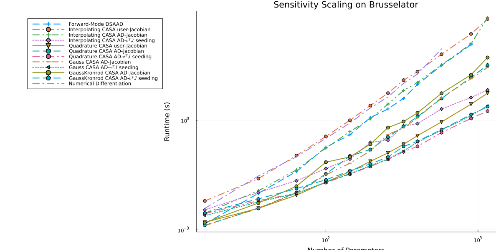
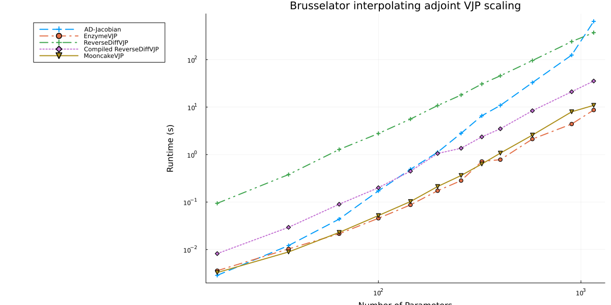
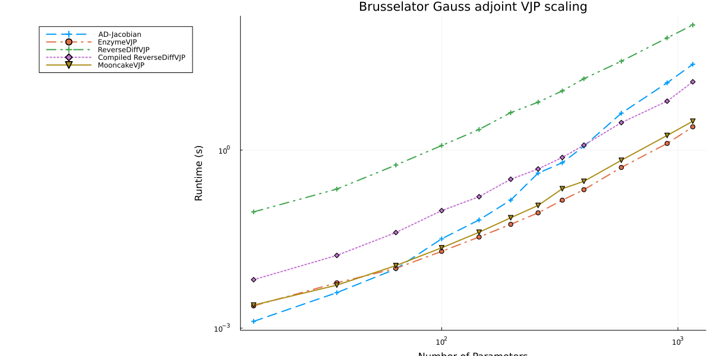
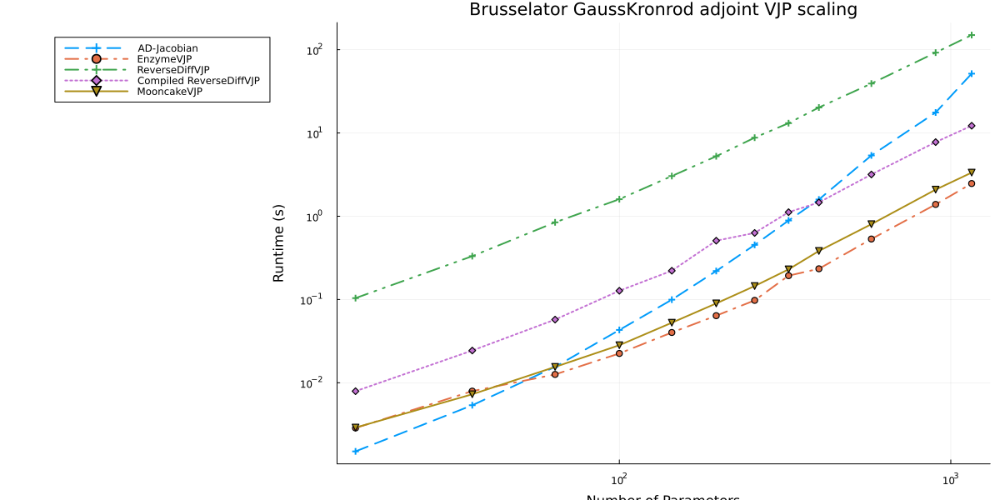
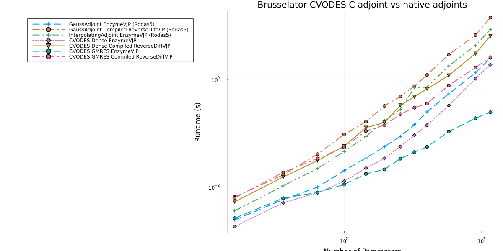
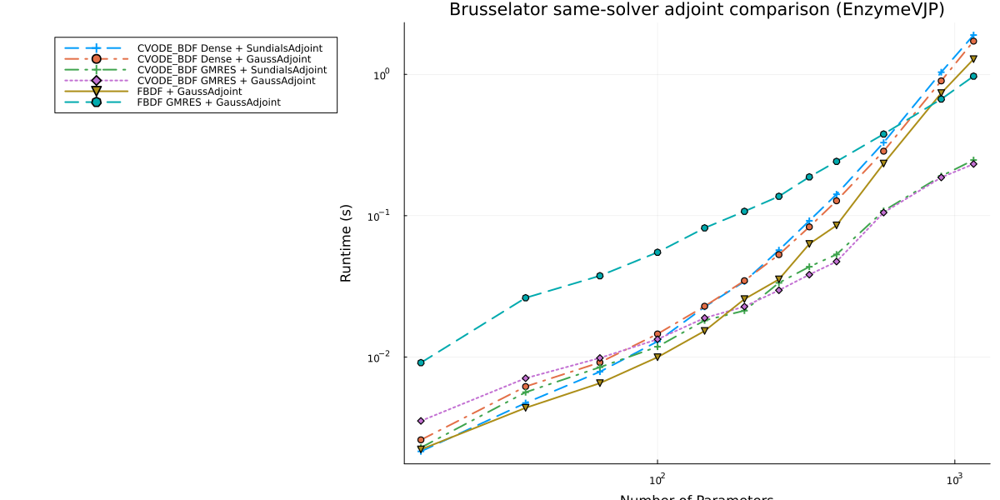
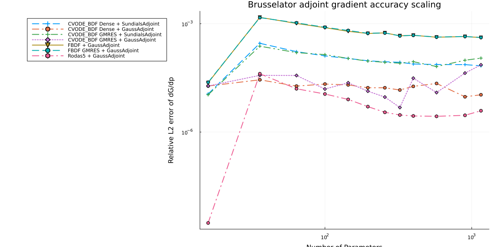
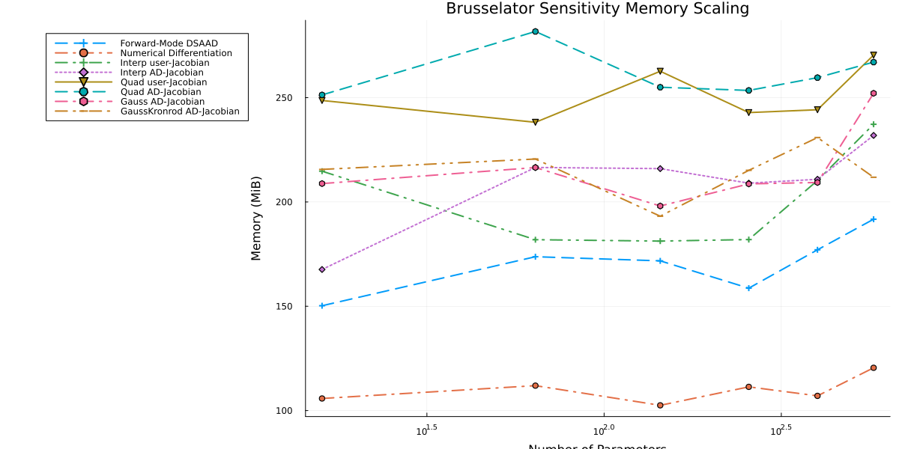

From the paper [A Comparison of Automatic Differentiation and Continuous Sensitivity Analysis for Derivatives of Differential Equation Solutions](https://ieeexplore.ieee.org/abstract/document/9622796)

```julia
using OrdinaryDiffEq, ReverseDiff, ForwardDiff, FiniteDiff, SciMLSensitivity
using OrdinaryDiffEqRosenbrock
using LinearAlgebra, Tracker, Mooncake, Plots
```


```julia
function makebrusselator(N = 8)
    xyd_brusselator = range(0, stop = 1, length = N)
    function limit(a, N)
        if a == N+1
            return 1
        elseif a == 0
            return N
        else
            return a
        end
    end
    brusselator_f(x, y, t) = ifelse(
        (((x-0.3)^2 + (y-0.6)^2) <= 0.1^2) &&
        (t >= 1.1), 5.0, 0.0)
    brusselator_2d_loop = let N=N, xyd=xyd_brusselator, dx=step(xyd_brusselator)
        function brusselator_2d_loop(du, u, p, t)
            @inbounds begin
                ii1 = N^2
                ii2 = ii1+N^2
                ii3 = ii2+2(N^2)
                A = @view p[1:ii1]
                B = @view p[(ii1 + 1):ii2]
                α = @view p[(ii2 + 1):ii3]
                II = LinearIndices((N, N, 2))
                for I in CartesianIndices((N, N))
                    x = xyd[I[1]]
                    y = xyd[I[2]]
                    i = I[1]
                    j = I[2]
                    ip1 = limit(i+1, N);
                    im1 = limit(i-1, N)
                    jp1 = limit(j+1, N);
                    jm1 = limit(j-1, N)
                    du[II[i, j, 1]] = α[II[
                                          i, j, 1]]*(u[II[im1, j, 1]] + u[II[ip1, j, 1]] +
                                                     u[II[i, jp1, 1]] + u[II[i, jm1, 1]] -
                                                     4u[II[i, j, 1]])/dx^2 +
                                      B[II[i, j, 1]] + u[II[i, j, 1]]^2*u[II[i, j, 2]] -
                                      (A[II[i, j, 1]] + 1)*u[II[i, j, 1]] +
                                      brusselator_f(x, y, t)
                end
                for I in CartesianIndices((N, N))
                    i = I[1]
                    j = I[2]
                    ip1 = limit(i+1, N)
                    im1 = limit(i-1, N)
                    jp1 = limit(j+1, N)
                    jm1 = limit(j-1, N)
                    du[II[i, j, 2]] = α[II[
                        i, j, 2]]*(u[II[im1, j, 2]] + u[II[ip1, j, 2]] + u[II[i, jp1, 2]] +
                                   u[II[i, jm1, 2]] - 4u[II[i, j, 2]])/dx^2 +
                                      A[II[i, j, 1]]*u[II[i, j, 1]] -
                                      u[II[i, j, 1]]^2*u[II[i, j, 2]]
                end
                return nothing
            end
        end
    end
    function init_brusselator_2d(xyd)
        N = length(xyd)
        u = zeros(N, N, 2)
        for I in CartesianIndices((N, N))
            x = xyd[I[1]]
            y = xyd[I[2]]
            u[I, 1] = 22*(y*(1-y))^(3/2)
            u[I, 2] = 27*(x*(1-x))^(3/2)
        end
        vec(u)
    end
    dx = step(xyd_brusselator)
    e1 = ones(N-1)
    off = N-1
    e4 = ones(N-off)
    T = diagm(0=>-2ones(N), -1=>e1, 1=>e1, off=>e4, -off=>e4) ./ dx^2
    Ie = Matrix{Float64}(I, N, N)
    # A + df/du
    Op = kron(Ie, T) + kron(T, Ie)
    brusselator_jac = let N=N
        (J, a, p, t) -> begin
            ii1 = N^2
            ii2 = ii1+N^2
            ii3 = ii2+2(N^2)
            A = @view p[1:ii1]
            B = @view p[(ii1 + 1):ii2]
            α = @view p[(ii2 + 1):ii3]
            u = @view a[1:(end ÷ 2)]
            v = @view a[(end ÷ 2 + 1):end]
            N2 = length(a)÷2
            α1 = @view α[1:(end ÷ 2)]
            α2 = @view α[(end ÷ 2 + 1):end]
            fill!(J, 0)

            J[1:N2, 1:N2] .= α1 .* Op
            J[(N2 + 1):end, (N2 + 1):end] .= α2 .* Op

            J1 = @view J[1:N2, 1:N2]
            J2 = @view J[(N2 + 1):end, 1:N2]
            J3 = @view J[1:N2, (N2 + 1):end]
            J4 = @view J[(N2 + 1):end, (N2 + 1):end]
            J1[diagind(J1)] .+= @. 2u*v-(A+1)
            J2[diagind(J2)] .= @. A-2u*v
            J3[diagind(J3)] .= @. u^2
            J4[diagind(J4)] .+= @. -u^2
            nothing
        end
    end
    Jmat = zeros(2N*N, 2N*N)
    dp = zeros(2N*N, 4N*N)
    brusselator_comp = let N=N, xyd=xyd_brusselator, dx=step(xyd_brusselator), Jmat=Jmat,
        dp=dp, brusselator_jac=brusselator_jac

        function brusselator_comp(dus, us, p, t)
            @inbounds begin
                ii1 = N^2
                ii2 = ii1+N^2
                ii3 = ii2+2(N^2)
                @views u, s = us[1:ii2], us[(ii2 + 1):end]
                du = @view dus[1:ii2]
                ds = @view dus[(ii2 + 1):end]
                fill!(dp, 0)
                A = @view p[1:ii1]
                B = @view p[(ii1 + 1):ii2]
                α = @view p[(ii2 + 1):ii3]
                dfdα = @view dp[:, (ii2 + 1):ii3]
                diagind(dfdα)
                for i in 1:ii1
                    dp[i, ii1 + i] = 1
                end
                II = LinearIndices((N, N, 2))
                uu = @view u[1:(end ÷ 2)]
                for i in eachindex(uu)
                    dp[i, i] = -uu[i]
                    dp[i + ii1, i] = uu[i]
                end
                for I in CartesianIndices((N, N))
                    x = xyd[I[1]]
                    y = xyd[I[2]]
                    i = I[1]
                    j = I[2]
                    ip1 = limit(i+1, N);
                    im1 = limit(i-1, N)
                    jp1 = limit(j+1, N);
                    jm1 = limit(j-1, N)
                    au = dfdα[II[i, j, 1], II[i, j, 1]] = (u[II[im1, j, 1]] +
                                                           u[II[ip1, j, 1]] +
                                                           u[II[i, jp1, 1]] +
                                                           u[II[i, jm1, 1]] -
                                                           4u[II[i, j, 1]])/dx^2
                    du[II[i, j, 1]] = α[II[i, j, 1]]*(au) + B[II[i, j, 1]] +
                                      u[II[i, j, 1]]^2*u[II[i, j, 2]] -
                                      (A[II[i, j, 1]] + 1)*u[II[i, j, 1]] +
                                      brusselator_f(x, y, t)
                end
                for I in CartesianIndices((N, N))
                    i = I[1]
                    j = I[2]
                    ip1 = limit(i+1, N)
                    im1 = limit(i-1, N)
                    jp1 = limit(j+1, N)
                    jm1 = limit(j-1, N)
                    av = dfdα[II[i, j, 2], II[i, j, 2]] = (u[II[im1, j, 2]] +
                                                           u[II[ip1, j, 2]] +
                                                           u[II[i, jp1, 2]] +
                                                           u[II[i, jm1, 2]] -
                                                           4u[II[i, j, 2]])/dx^2
                    du[II[i, j, 2]] = α[II[i, j, 2]]*(av) + A[II[i, j, 1]]*u[II[i, j, 1]] -
                                      u[II[i, j, 1]]^2*u[II[i, j, 2]]
                end
                brusselator_jac(Jmat, u, p, t)
                BLAS.gemm!('N', 'N', 1.0, Jmat, reshape(s, 2N*N, 4N*N), 1.0, dp)
                copyto!(ds, vec(dp))
                return nothing
            end
        end
    end
    u0 = init_brusselator_2d(xyd_brusselator)
    p = [fill(3.4, N^2); fill(1.0, N^2); fill(10.0, 2*N^2)]
    brusselator_2d_loop, u0,
    p,
    brusselator_jac,
    ODEProblem(brusselator_comp, copy([u0; zeros((N^2*2)*(N^2*4))]), (0.0, 10.0), p)
end

Base.eps(::Type{Tracker.TrackedReal{T}}) where {T} = eps(T)
Base.vec(v::Adjoint{<:Real, <:AbstractVector}) = vec(v') # bad bad hack
```


## Setup AutoDiff

```julia
bt = 0:0.1:1
tspan = (0.0, 1.0)
forwarddiffn = vcat(2:10, 12, 15)
reversediffn = 2:10
numdiffn = vcat(2:10, 12)
csan = vcat(2:10, 12, 15, 17)
#csaseedn = 2:10
tols = (abstol = 1e-5, reltol = 1e-7)

@isdefined(PROBS) || (const PROBS = Dict{Int, Any}())
makebrusselator!(dict, n) = get!(()->makebrusselator(n), dict, n)

_adjoint_methods_iq = ntuple(2) do ii
    Alg = (InterpolatingAdjoint, QuadratureAdjoint)[ii]
    (
        user = Alg(autodiff = false, autojacvec = false), # user Jacobian
        adjc = Alg(autodiff = true, autojacvec = false), # AD Jacobian
        advj = Alg(autodiff = true, autojacvec = EnzymeVJP()) # AD vJ
    )
end |> NamedTuple{(:interp, :quad)}
# GaussAdjoint/GaussKronrodAdjoint do not support user-provided Jacobians (autodiff=false)
_adjoint_methods_g = ntuple(2) do ii
    Alg = (GaussAdjoint, GaussKronrodAdjoint)[ii]
    (
        adjc = Alg(autodiff = true, autojacvec = false), # AD Jacobian
        advj = Alg(autodiff = true, autojacvec = EnzymeVJP()) # AD vJ
    )
end |> NamedTuple{(:gauss, :gausskronrod)}
@isdefined(ADJOINT_METHODS_IQ) ||
    (const ADJOINT_METHODS_IQ = mapreduce(collect, vcat, _adjoint_methods_iq))
@isdefined(ADJOINT_METHODS_G) ||
    (const ADJOINT_METHODS_G = mapreduce(collect, vcat, _adjoint_methods_g))

function auto_sen_l2(
        f, u0, tspan, p, t, alg = Tsit5(); diffalg = ReverseDiff.gradient, kwargs...)
    test_f(p) = begin
        prob = ODEProblem{true, SciMLBase.FullSpecialize}(f, convert.(eltype(p), u0), tspan, p)
        sol = solve(prob, alg, saveat = t; kwargs...)
        sum(sol.u) do x
            sum(z->(1-z)^2/2, x)
        end
    end
    diffalg(test_f, p)
end
@inline function diffeq_sen_l2(df, u0, tspan, p, t, alg = Tsit5();
        abstol = 1e-5, reltol = 1e-7, iabstol = abstol, ireltol = reltol,
        sensalg = SensitivityAlg(), kwargs...)
    prob = ODEProblem{true, SciMLBase.FullSpecialize}(df, u0, tspan, p)
    saveat = tspan[1] != t[1] && tspan[end] != t[end] ? vcat(tspan[1], t, tspan[end]) : t
    sol = solve(prob, alg, abstol = abstol, reltol = reltol, saveat = saveat; kwargs...)
    dg(out, u, p, t, i) = (out.=u .- 1.0)
    adjoint_sensitivities(sol, alg; t, abstol = abstol, dgdu_discrete = dg,
        reltol = reltol, sensealg = sensalg)
end
```

```
diffeq_sen_l2 (generic function with 2 methods)
```


## AD Choice Benchmarks

```julia
forwarddiff = map(forwarddiffn) do n
    bfun, b_u0, b_p, brusselator_jac, brusselator_comp = makebrusselator!(PROBS, n)
    @elapsed auto_sen_l2(
        bfun, b_u0, tspan, b_p, bt, (Rodas5()); diffalg = (ForwardDiff.gradient), tols...)
    t = @elapsed auto_sen_l2(
        bfun, b_u0, tspan, b_p, bt, (Rodas5()); diffalg = (ForwardDiff.gradient), tols...)
    @show n, t
    t
end
```

```
(n, t) = (2, 0.001459562)
(n, t) = (3, 0.009954915)
(n, t) = (4, 0.039400813)
(n, t) = (5, 0.181939321)
(n, t) = (6, 0.400181132)
(n, t) = (7, 1.172793899)
(n, t) = (8, 2.035467911)
(n, t) = (9, 3.969346768)
(n, t) = (10, 9.470611813)
(n, t) = (12, 31.640812253)
(n, t) = (15, 116.313197846)
11-element Vector{Float64}:
   0.001459562
   0.009954915
   0.039400813
   0.181939321
   0.400181132
   1.172793899
   2.035467911
   3.969346768
   9.470611813
  31.640812253
 116.313197846
```


```julia
#=
reversediff = map(reversediffn) do n
  bfun, b_u0, b_p, brusselator_jac, brusselator_comp = makebrusselator!(PROBS, n)
  @elapsed auto_sen_l2(bfun, b_u0, tspan, b_p, bt, (Rodas5(autodiff=AutoFiniteDiff())); diffalg=(ReverseDiff.gradient), tols...)
  t = @elapsed auto_sen_l2(bfun, b_u0, tspan, b_p, bt, (Rodas5(autodiff=AutoFiniteDiff())); diffalg=(ReverseDiff.gradient), tols...)
  @show n,t
  t
end
=#
```


```julia
numdiff = map(numdiffn) do n
    bfun, b_u0, b_p, brusselator_jac, brusselator_comp = makebrusselator!(PROBS, n)
    @elapsed auto_sen_l2(bfun, b_u0, tspan, b_p, bt, (Rodas5());
        diffalg = (FiniteDiff.finite_difference_gradient), tols...)
    t = @elapsed auto_sen_l2(bfun, b_u0, tspan, b_p, bt, (Rodas5());
        diffalg = (FiniteDiff.finite_difference_gradient), tols...)
    @show n, t
    t
end
```

```
(n, t) = (2, 0.003868278)
(n, t) = (3, 0.029838454)
(n, t) = (4, 0.099196068)
(n, t) = (5, 0.319011285)
(n, t) = (6, 0.839714196)
(n, t) = (7, 2.164495402)
(n, t) = (8, 4.333828015)
(n, t) = (9, 10.174363259)
(n, t) = (10, 18.35778455)
(n, t) = (12, 89.58415216)
10-element Vector{Float64}:
  0.003868278
  0.029838454
  0.099196068
  0.319011285
  0.839714196
  2.164495402
  4.333828015
 10.174363259
 18.35778455
 89.58415216
```


Warmup: run each adjoint method once at the smallest size to ensure all compilation
is complete before we start timing.

```julia
let n = first(csan)
    bfun, b_u0, b_p, brusselator_jac, brusselator_comp = makebrusselator!(PROBS, n)
    solver = Rodas5(autodiff = AutoFiniteDiff())
    for alg in ADJOINT_METHODS_IQ
        f = SciMLSensitivity.alg_autodiff(alg) ? bfun :
            ODEFunction(bfun, jac = brusselator_jac)
        diffeq_sen_l2(f, b_u0, tspan, b_p, bt, solver; sensalg = alg, tols...)
    end
    for alg in ADJOINT_METHODS_G
        diffeq_sen_l2(bfun, b_u0, tspan, b_p, bt, solver; sensalg = alg, tols...)
    end
end
```


```julia
csa_iq = map(csan) do n
    bfun, b_u0, b_p, brusselator_jac, brusselator_comp = makebrusselator!(PROBS, n)
    @time ts = map(ADJOINT_METHODS_IQ) do alg
        @info "Running $alg"
        f = SciMLSensitivity.alg_autodiff(alg) ? bfun :
            ODEFunction(bfun, jac = brusselator_jac)
        solver = Rodas5(autodiff = AutoFiniteDiff())
        @time diffeq_sen_l2(f, b_u0, tspan, b_p, bt, solver; sensalg = alg, tols...)
        t = @elapsed diffeq_sen_l2(f, b_u0, tspan, b_p, bt, solver; sensalg = alg, tols...)
        return t
    end
    @show n, ts
    ts
end
```

```
0.005960 seconds (9.61 k allocations: 1.117 MiB)
  0.003477 seconds (6.32 k allocations: 2.050 MiB)
  0.003669 seconds (7.34 k allocations: 569.445 KiB)
  0.001867 seconds (4.58 k allocations: 304.148 KiB)
  0.001644 seconds (2.30 k allocations: 230.867 KiB)
  0.002895 seconds (7.90 k allocations: 499.922 KiB)
  0.963717 seconds (1.20 M allocations: 69.093 MiB, 94.37% compilation time
: 6% of which was recompilation)
(n, ts) = (2, [0.006171065, 0.002836634, 0.003528211, 0.001600151, 0.001332
193, 0.002764545])
  0.025804 seconds (14.74 k allocations: 2.059 MiB)
 10.087194 seconds (8.09 M allocations: 388.772 MiB, 2.56% gc time, 99.85% 
compilation time)
  0.010339 seconds (10.96 k allocations: 994.891 KiB)
  0.004046 seconds (5.60 k allocations: 550.633 KiB)
 10.231215 seconds (6.85 M allocations: 326.929 MiB, 0.57% gc time, 99.94% 
compilation time)
  0.006048 seconds (9.10 k allocations: 695.078 KiB)
 20.437824 seconds (15.03 M allocations: 726.195 MiB, 1.55% gc time, 99.31%
 compilation time)
(n, ts) = (3, [0.02525832, 0.011758195, 0.010520651, 0.003880729, 0.0038506
39, 0.006290635])
  0.111492 seconds (22.87 k allocations: 4.004 MiB)
  9.872295 seconds (8.10 M allocations: 389.665 MiB, 0.95% gc time, 99.54% 
compilation time)
  0.022005 seconds (16.77 k allocations: 1.758 MiB)
  0.008869 seconds (7.44 k allocations: 1.057 MiB)
 10.330958 seconds (6.85 M allocations: 327.161 MiB, 0.89% gc time, 99.88% 
compilation time)
  0.010017 seconds (11.39 k allocations: 1005.797 KiB)
 20.569703 seconds (15.08 M allocations: 735.333 MiB, 0.90% gc time, 97.94%
 compilation time)
(n, ts) = (4, [0.107809398, 0.043582287, 0.022071127, 0.008899321, 0.010518
741, 0.010023664])
  0.360105 seconds (32.72 k allocations: 6.980 MiB)
  9.512170 seconds (7.12 M allocations: 343.415 MiB, 0.85% gc time, 98.16% 
compilation time)
  0.046810 seconds (23.80 k allocations: 3.015 MiB)
  0.020013 seconds (9.86 k allocations: 1.938 MiB)
 10.364029 seconds (6.84 M allocations: 327.658 MiB, 1.54% gc time, 99.65% 
compilation time)
  0.019518 seconds (14.40 k allocations: 1.447 MiB)
 20.988198 seconds (14.14 M allocations: 702.280 MiB, 1.15% gc time, 93.70%
 compilation time)
(n, ts) = (5, [0.361169763, 0.172788135, 0.047564305, 0.020227567, 0.033864
811, 0.01961637])
  0.994153 seconds (44.78 k allocations: 12.106 MiB)
  9.929286 seconds (7.13 M allocations: 345.993 MiB, 1.87% gc time, 95.05% 
compilation time)
  0.086210 seconds (32.42 k allocations: 5.000 MiB)
  0.039311 seconds (12.60 k allocations: 3.539 MiB)
 10.207443 seconds (6.84 M allocations: 327.941 MiB, 0.51% gc time, 99.31% 
compilation time)
  0.033539 seconds (17.82 k allocations: 2.003 MiB)
 23.050965 seconds (14.22 M allocations: 726.433 MiB, 1.19% gc time, 84.92%
 compilation time)
(n, ts) = (6, [0.996815545, 0.488680971, 0.086696966, 0.039261421, 0.104752
605, 0.033367834])
  2.529728 seconds (61.29 k allocations: 19.862 MiB)
  9.842722 seconds (6.05 M allocations: 297.285 MiB, 0.92% gc time, 88.88% 
compilation time)
  0.172945 seconds (44.24 k allocations: 7.965 MiB)
  0.075276 seconds (15.82 k allocations: 5.740 MiB)
  2.235917 seconds (789.87 k allocations: 41.042 MiB, 92.94% compilation ti
me)
  0.054366 seconds (21.85 k allocations: 2.693 MiB)
 19.077269 seconds (7.16 M allocations: 421.874 MiB, 0.83% gc time, 56.75% 
compilation time)
(n, ts) = (7, [2.530754208, 1.090251481, 0.24535913, 0.074840353, 0.1576308
69, 0.054149718])
  5.498522 seconds (78.33 k allocations: 30.015 MiB, 0.97% gc time)
  2.764278 seconds (24.18 k allocations: 11.810 MiB)
  0.287365 seconds (56.40 k allocations: 12.095 MiB)
  0.179019 seconds (20.61 k allocations: 9.053 MiB, 26.99% gc time)
  0.344099 seconds (7.27 k allocations: 4.423 MiB)
  0.086916 seconds (27.71 k allocations: 3.636 MiB)
 18.292580 seconds (431.11 k allocations: 142.930 MiB, 0.88% gc time)
(n, ts) = (8, [5.508283047, 2.76269396, 0.286064982, 0.127681997, 0.3461244
37, 0.084475698])
 12.549997 seconds (111.52 k allocations: 48.409 MiB, 0.58% gc time)
  6.535358 seconds (34.65 k allocations: 18.375 MiB, 0.44% gc time)
  0.845336 seconds (107.37 k allocations: 20.228 MiB, 18.03% gc time)
  0.385244 seconds (24.97 k allocations: 13.632 MiB, 43.23% gc time)
  0.683794 seconds (8.36 k allocations: 6.499 MiB)
  0.136613 seconds (33.16 k allocations: 4.793 MiB)
 41.875855 seconds (642.17 k allocations: 224.738 MiB, 1.08% gc time)
(n, ts) = (9, [12.491102848, 6.508444383, 0.690010995, 0.219140206, 0.68078
4867, 0.136480417])
 21.028911 seconds (123.39 k allocations: 67.505 MiB, 0.13% gc time)
 10.829744 seconds (37.06 k allocations: 26.776 MiB, 0.30% gc time)
  0.813356 seconds (88.59 k allocations: 25.620 MiB, 4.44% gc time)
  0.383398 seconds (29.83 k allocations: 20.837 MiB, 8.69% gc time)
  1.258185 seconds (9.58 k allocations: 9.225 MiB)
  0.192865 seconds (39.23 k allocations: 6.158 MiB)
 69.205073 seconds (657.47 k allocations: 313.107 MiB, 0.38% gc time)
(n, ts) = (10, [21.255836426, 10.797951878, 0.806370854, 0.377695749, 1.249
375577, 0.19322269])
 65.442142 seconds (181.92 k allocations: 130.713 MiB, 0.70% gc time)
 32.586795 seconds (54.28 k allocations: 53.241 MiB, 0.07% gc time)
  2.255074 seconds (130.62 k allocations: 48.696 MiB, 13.47% gc time)
  0.959829 seconds (41.39 k allocations: 40.368 MiB, 6.45% gc time)
  3.936722 seconds (12.68 k allocations: 17.459 MiB)
  0.424866 seconds (53.61 k allocations: 9.886 MiB)
209.515725 seconds (951.12 k allocations: 601.591 MiB, 0.59% gc time)
(n, ts) = (12, [63.872513055, 32.67609872, 2.030823259, 0.898381484, 3.9445
00053, 0.459260821])
229.391276 seconds (271.09 k allocations: 298.637 MiB, 0.19% gc time)
122.963619 seconds (82.50 k allocations: 125.349 MiB, 0.06% gc time)
  4.352613 seconds (207.92 k allocations: 109.802 MiB, 4.96% gc time)
  3.002017 seconds (62.13 k allocations: 96.879 MiB, 8.75% gc time)
 14.816399 seconds (17.87 k allocations: 39.433 MiB, 0.23% gc time)
  1.012913 seconds (79.53 k allocations: 18.622 MiB)
751.734557 seconds (1.44 M allocations: 1.346 GiB, 0.30% gc time)
(n, ts) = (15, [229.61943815, 123.700041422, 4.184588132, 2.751999032, 14.7
98665264, 1.119510035])
590.008927 seconds (475.80 k allocations: 479.804 MiB, 0.17% gc time)
646.649764 seconds (101.29 k allocations: 203.644 MiB, 0.08% gc time)
  7.032174 seconds (248.09 k allocations: 173.691 MiB, 3.92% gc time)
  5.703297 seconds (116.40 k allocations: 149.955 MiB, 4.53% gc time)
 32.259683 seconds (21.97 k allocations: 63.005 MiB, 0.04% gc time)
  1.954583 seconds (100.02 k allocations: 27.201 MiB, 5.40% gc time)
2563.290144 seconds (2.13 M allocations: 2.144 GiB, 0.16% gc time)
(n, ts) = (17, [587.996828594, 645.393233337, 6.780198853, 5.500113209, 32.
211955373, 1.77538201])
12-element Vector{Vector{Float64}}:
 [0.006171065, 0.002836634, 0.003528211, 0.001600151, 0.001332193, 0.002764
545]
 [0.02525832, 0.011758195, 0.010520651, 0.003880729, 0.003850639, 0.0062906
35]
 [0.107809398, 0.043582287, 0.022071127, 0.008899321, 0.010518741, 0.010023
664]
 [0.361169763, 0.172788135, 0.047564305, 0.020227567, 0.033864811, 0.019616
37]
 [0.996815545, 0.488680971, 0.086696966, 0.039261421, 0.104752605, 0.033367
834]
 [2.530754208, 1.090251481, 0.24535913, 0.074840353, 0.157630869, 0.0541497
18]
 [5.508283047, 2.76269396, 0.286064982, 0.127681997, 0.346124437, 0.0844756
98]
 [12.491102848, 6.508444383, 0.690010995, 0.219140206, 0.680784867, 0.13648
0417]
 [21.255836426, 10.797951878, 0.806370854, 0.377695749, 1.249375577, 0.1932
2269]
 [63.872513055, 32.67609872, 2.030823259, 0.898381484, 3.944500053, 0.45926
0821]
 [229.61943815, 123.700041422, 4.184588132, 2.751999032, 14.798665264, 1.11
9510035]
 [587.996828594, 645.393233337, 6.780198853, 5.500113209, 32.211955373, 1.7
7538201]
```


```julia
csa_g = map(csan) do n
    bfun, b_u0, b_p, brusselator_jac, brusselator_comp = makebrusselator!(PROBS, n)
    @time ts = map(ADJOINT_METHODS_G) do alg
        @info "Running $alg"
        solver = Rodas5(autodiff = AutoFiniteDiff())
        @time diffeq_sen_l2(bfun, b_u0, tspan, b_p, bt, solver; sensalg = alg, tols...)
        t = @elapsed diffeq_sen_l2(bfun, b_u0, tspan, b_p, bt, solver; sensalg = alg, tols...)
        return t
    end
    @show n, ts
    ts
end
```

```
0.001806 seconds (2.54 k allocations: 289.445 KiB)
  0.002849 seconds (6.17 k allocations: 488.875 KiB)
  0.002105 seconds (4.75 k allocations: 338.898 KiB)
  0.003188 seconds (8.92 k allocations: 575.453 KiB)
  0.470901 seconds (441.66 k allocations: 24.257 MiB, 94.39% compilation ti
me)
(n, ts) = (2, [0.001299582, 0.002450377, 0.001583211, 0.002916453])
  9.165433 seconds (7.52 M allocations: 372.279 MiB, 2.56% gc time, 99.93% 
compilation time)
  0.005951 seconds (7.19 k allocations: 682.125 KiB)
  9.270521 seconds (7.73 M allocations: 382.894 MiB, 1.06% gc time, 99.91% 
compilation time)
  0.007348 seconds (13.23 k allocations: 910.031 KiB)
 18.479189 seconds (15.31 M allocations: 759.973 MiB, 1.80% gc time, 99.68%
 compilation time)
(n, ts) = (3, [0.003959128, 0.005819448, 0.00540886, 0.007030011])
  9.093432 seconds (7.52 M allocations: 372.629 MiB, 1.02% gc time, 99.86% 
compilation time)
  0.010141 seconds (9.26 k allocations: 1.067 MiB)
  9.190527 seconds (7.74 M allocations: 383.313 MiB, 0.97% gc time, 99.80% 
compilation time)
  0.013337 seconds (18.10 k allocations: 1.426 MiB)
 18.362876 seconds (15.33 M allocations: 763.509 MiB, 0.99% gc time, 99.40%
 compilation time)
(n, ts) = (4, [0.009938495, 0.009941075, 0.015590993, 0.013444855])
  8.423085 seconds (5.83 M allocations: 279.143 MiB, 1.01% gc time, 99.60% 
compilation time)
  0.020250 seconds (11.74 k allocations: 1.742 MiB)
  8.737583 seconds (6.20 M allocations: 297.419 MiB, 1.57% gc time, 99.16% 
compilation time)
  0.023570 seconds (20.58 k allocations: 2.155 MiB)
 17.357630 seconds (12.10 M allocations: 588.358 MiB, 1.28% gc time, 98.25%
 compilation time)
(n, ts) = (5, [0.031967453, 0.020054849, 0.071021427, 0.02348135])
  8.676998 seconds (5.83 M allocations: 280.514 MiB, 2.29% gc time, 99.21% 
compilation time)
  0.035212 seconds (14.75 k allocations: 2.842 MiB)
  8.754428 seconds (6.20 M allocations: 298.816 MiB, 1.08% gc time, 98.84% 
compilation time)
  0.041764 seconds (27.09 k allocations: 3.487 MiB)
 17.757278 seconds (12.13 M allocations: 598.843 MiB, 1.65% gc time, 97.21%
 compilation time)
(n, ts) = (6, [0.066605202, 0.034677438, 0.09929653, 0.040888984])
  8.475536 seconds (5.64 M allocations: 273.301 MiB, 1.10% gc time, 98.29% 
compilation time)
  0.057168 seconds (18.22 k allocations: 4.432 MiB)
  8.768203 seconds (6.01 M allocations: 291.727 MiB, 1.18% gc time, 97.44% 
compilation time)
  0.064860 seconds (32.50 k allocations: 5.265 MiB)
 17.858263 seconds (11.78 M allocations: 595.182 MiB, 1.10% gc time, 94.49%
 compilation time)
(n, ts) = (7, [0.143510306, 0.056491407, 0.220610989, 0.063846087])
  0.310545 seconds (6.60 k allocations: 7.829 MiB)
  0.087917 seconds (22.29 k allocations: 6.766 MiB)
  0.454546 seconds (19.32 k allocations: 8.627 MiB)
  0.098933 seconds (40.35 k allocations: 7.927 MiB)
  2.184856 seconds (178.47 k allocations: 62.874 MiB, 12.50% gc time)
(n, ts) = (8, [0.409239615, 0.087388036, 0.629126559, 0.098297667])
  0.608577 seconds (7.51 k allocations: 12.114 MiB)
  0.176661 seconds (26.88 k allocations: 10.085 MiB, 17.82% gc time)
  0.886739 seconds (22.78 k allocations: 13.252 MiB)
  0.160880 seconds (47.70 k allocations: 11.604 MiB)
  3.708159 seconds (211.10 k allocations: 94.687 MiB, 2.46% gc time)
(n, ts) = (9, [0.611990584, 0.144533841, 0.916550719, 0.190512426])
  1.154813 seconds (8.77 k allocations: 17.895 MiB)
  0.217186 seconds (34.16 k allocations: 14.581 MiB)
  1.568501 seconds (23.96 k allocations: 19.216 MiB)
  0.234477 seconds (55.54 k allocations: 16.334 MiB)
  6.446957 seconds (246.20 k allocations: 136.628 MiB, 1.58% gc time)
(n, ts) = (10, [1.161188145, 0.249260181, 1.584077804, 0.265996047])
  4.156729 seconds (13.50 k allocations: 35.815 MiB, 0.45% gc time)
  0.498971 seconds (46.18 k allocations: 27.760 MiB, 2.15% gc time)
  5.400423 seconds (31.86 k allocations: 37.959 MiB, 0.29% gc time)
  0.693351 seconds (72.60 k allocations: 30.481 MiB, 24.09% gc time)
 21.493533 seconds (329.63 k allocations: 264.610 MiB, 1.93% gc time)
(n, ts) = (12, [4.17988877, 0.538733149, 5.462228645, 0.552399873])
 13.421478 seconds (16.55 k allocations: 84.682 MiB, 0.22% gc time)
  1.462577 seconds (73.53 k allocations: 63.578 MiB, 11.98% gc time)
 17.382767 seconds (40.63 k allocations: 88.781 MiB, 0.28% gc time)
  1.344119 seconds (104.84 k allocations: 68.044 MiB, 2.30% gc time)
 67.533788 seconds (472.47 k allocations: 610.750 MiB, 1.24% gc time)
(n, ts) = (15, [13.58970723, 1.328753451, 17.560043902, 1.432725345])
 27.700902 seconds (19.56 k allocations: 138.003 MiB, 0.48% gc time)
  2.515945 seconds (89.78 k allocations: 101.685 MiB, 6.42% gc time)
 51.880001 seconds (42.30 k allocations: 142.853 MiB, 0.24% gc time)
  2.581125 seconds (126.33 k allocations: 108.001 MiB, 9.77% gc time)
169.304522 seconds (557.30 k allocations: 981.664 MiB, 0.83% gc time)
(n, ts) = (17, [27.892838065, 2.495646676, 51.890351576, 2.332406881])
12-element Vector{Vector{Float64}}:
 [0.001299582, 0.002450377, 0.001583211, 0.002916453]
 [0.003959128, 0.005819448, 0.00540886, 0.007030011]
 [0.009938495, 0.009941075, 0.015590993, 0.013444855]
 [0.031967453, 0.020054849, 0.071021427, 0.02348135]
 [0.066605202, 0.034677438, 0.09929653, 0.040888984]
 [0.143510306, 0.056491407, 0.220610989, 0.063846087]
 [0.409239615, 0.087388036, 0.629126559, 0.098297667]
 [0.611990584, 0.144533841, 0.916550719, 0.190512426]
 [1.161188145, 0.249260181, 1.584077804, 0.265996047]
 [4.17988877, 0.538733149, 5.462228645, 0.552399873]
 [13.58970723, 1.328753451, 17.560043902, 1.432725345]
 [27.892838065, 2.495646676, 51.890351576, 2.332406881]
```


```julia
n_to_param(n) = 4n^2

lw = 2
ms = 0.5
plt1 = plot(title = "Sensitivity Scaling on Brusselator");
plot!(plt1, n_to_param.(forwarddiffn), forwarddiff, lab = "Forward-Mode DSAAD",
    lw = lw, marksize = ms, linestyle = :auto, marker = :auto);
#plot!(plt1, n_to_param.(reversediffn), reversediff, lab="Reverse-Mode DSAAD", lw=lw, marksize=ms, linestyle=:auto, marker=:auto);
csadata_iq = [[csa_iq[j][i] for j in eachindex(csa_iq)] for i in eachindex(csa_iq[1])]
csadata_g = [[csa_g[j][i] for j in eachindex(csa_g)] for i in eachindex(csa_g[1])]
plot!(plt1, n_to_param.(csan), csadata_iq[1], lab = "Interpolating CASA user-Jacobian",
    lw = lw, marksize = ms, linestyle = :auto, marker = :auto);
plot!(plt1, n_to_param.(csan), csadata_iq[2], lab = "Interpolating CASA AD-Jacobian",
    lw = lw, marksize = ms, linestyle = :auto, marker = :auto);
plot!(
    plt1, n_to_param.(csan), csadata_iq[3], lab = raw"Interpolating CASA AD-$v^{T}J$ seeding",
    lw = lw, marksize = ms, linestyle = :auto, marker = :auto);
plot!(plt1, n_to_param.(csan), csadata_iq[1 + 3], lab = "Quadrature CASA user-Jacobian",
    lw = lw, marksize = ms, linestyle = :auto, marker = :auto);
plot!(plt1, n_to_param.(csan), csadata_iq[2 + 3], lab = "Quadrature CASA AD-Jacobian",
    lw = lw, marksize = ms, linestyle = :auto, marker = :auto);
plot!(
    plt1, n_to_param.(csan), csadata_iq[3 + 3], lab = raw"Quadrature CASA AD-$v^{T}J$ seeding",
    lw = lw, marksize = ms, linestyle = :auto, marker = :auto);
plot!(plt1, n_to_param.(csan), csadata_g[1], lab = "Gauss CASA AD-Jacobian",
    lw = lw, marksize = ms, linestyle = :auto, marker = :auto);
plot!(
    plt1, n_to_param.(csan), csadata_g[2], lab = raw"Gauss CASA AD-$v^{T}J$ seeding",
    lw = lw, marksize = ms, linestyle = :auto, marker = :auto);
plot!(plt1, n_to_param.(csan), csadata_g[1 + 2], lab = "GaussKronrod CASA AD-Jacobian",
    lw = lw, marksize = ms, linestyle = :auto, marker = :auto);
plot!(
    plt1, n_to_param.(csan), csadata_g[2 + 2], lab = raw"GaussKronrod CASA AD-$v^{T}J$ seeding",
    lw = lw, marksize = ms, linestyle = :auto, marker = :auto);
plot!(plt1, n_to_param.(numdiffn), numdiff, lab = "Numerical Differentiation",
    lw = lw, marksize = ms, linestyle = :auto, marker = :auto);
xaxis!(plt1, "Number of Parameters", :log10);
yaxis!(plt1, "Runtime (s)", :log10);
plot!(plt1, legend = :outertopleft, size = (1200, 600))
```




## VJP Choice Benchmarks

```julia
bt = 0:0.1:1
tspan = (0.0, 1.0)
csan = vcat(2:10, 12, 15, 17)
tols = (abstol = 1e-5, reltol = 1e-7)

_adjoint_methods = ntuple(4) do ii
    Alg = (InterpolatingAdjoint, QuadratureAdjoint, GaussAdjoint, GaussKronrodAdjoint)[ii]
    (
        advj1 = Alg(autodiff = true, autojacvec = EnzymeVJP()), # AD vJ (Enzyme)
        advj2 = Alg(autodiff = true, autojacvec = ReverseDiffVJP(false)), # AD vJ (ReverseDiff)
        advj3 = Alg(autodiff = true, autojacvec = ReverseDiffVJP(true)), # AD vJ (Compiled ReverseDiff)
        advj4 = Alg(autodiff = true, autojacvec = SciMLSensitivity.MooncakeVJP()) # AD vJ (Mooncake)
    )
end |> NamedTuple{(:interp, :quad, :gauss, :gausskronrod)}
adjoint_methods = mapreduce(collect, vcat, _adjoint_methods)
```

```
16-element Vector{SciMLBase.AbstractAdjointSensitivityAlgorithm{0, true, Va
l{:central}}}:
 SciMLSensitivity.InterpolatingAdjoint{0, true, Val{:central}, SciMLSensiti
vity.EnzymeVJP{EnzymeCore.ReverseMode{false, false, false, EnzymeCore.FFIAB
I, false, false}}}(SciMLSensitivity.EnzymeVJP{EnzymeCore.ReverseMode{false,
 false, false, EnzymeCore.FFIABI, false, false}}(0, EnzymeCore.ReverseMode{
false, false, false, EnzymeCore.FFIABI, false, false}()), false, false)
 SciMLSensitivity.InterpolatingAdjoint{0, true, Val{:central}, SciMLSensiti
vity.ReverseDiffVJP{false}}(SciMLSensitivity.ReverseDiffVJP{false}(), false
, false)
 SciMLSensitivity.InterpolatingAdjoint{0, true, Val{:central}, SciMLSensiti
vity.ReverseDiffVJP{true}}(SciMLSensitivity.ReverseDiffVJP{true}(), false, 
false)
 SciMLSensitivity.InterpolatingAdjoint{0, true, Val{:central}, SciMLSensiti
vity.MooncakeVJP}(SciMLSensitivity.MooncakeVJP(), false, false)
 SciMLSensitivity.QuadratureAdjoint{0, true, Val{:central}, SciMLSensitivit
y.EnzymeVJP{EnzymeCore.ReverseMode{false, false, false, EnzymeCore.FFIABI, 
false, false}}, Val{true}}(SciMLSensitivity.EnzymeVJP{EnzymeCore.ReverseMod
e{false, false, false, EnzymeCore.FFIABI, false, false}}(0, EnzymeCore.Reve
rseMode{false, false, false, EnzymeCore.FFIABI, false, false}()), 1.0e-6, 0
.001, Val{true}())
 SciMLSensitivity.QuadratureAdjoint{0, true, Val{:central}, SciMLSensitivit
y.ReverseDiffVJP{false}, Val{true}}(SciMLSensitivity.ReverseDiffVJP{false}(
), 1.0e-6, 0.001, Val{true}())
 SciMLSensitivity.QuadratureAdjoint{0, true, Val{:central}, SciMLSensitivit
y.ReverseDiffVJP{true}, Val{true}}(SciMLSensitivity.ReverseDiffVJP{true}(),
 1.0e-6, 0.001, Val{true}())
 SciMLSensitivity.QuadratureAdjoint{0, true, Val{:central}, SciMLSensitivit
y.MooncakeVJP, Val{true}}(SciMLSensitivity.MooncakeVJP(), 1.0e-6, 0.001, Va
l{true}())
 SciMLSensitivity.GaussAdjoint{0, true, Val{:central}, SciMLSensitivity.Enz
ymeVJP{EnzymeCore.ReverseMode{false, false, false, EnzymeCore.FFIABI, false
, false}}, Val{true}}(SciMLSensitivity.EnzymeVJP{EnzymeCore.ReverseMode{fal
se, false, false, EnzymeCore.FFIABI, false, false}}(0, EnzymeCore.ReverseMo
de{false, false, false, EnzymeCore.FFIABI, false, false}()), false, Val{tru
e}())
 SciMLSensitivity.GaussAdjoint{0, true, Val{:central}, SciMLSensitivity.Rev
erseDiffVJP{false}, Val{true}}(SciMLSensitivity.ReverseDiffVJP{false}(), fa
lse, Val{true}())
 SciMLSensitivity.GaussAdjoint{0, true, Val{:central}, SciMLSensitivity.Rev
erseDiffVJP{true}, Val{true}}(SciMLSensitivity.ReverseDiffVJP{true}(), fals
e, Val{true}())
 SciMLSensitivity.GaussAdjoint{0, true, Val{:central}, SciMLSensitivity.Moo
ncakeVJP, Val{true}}(SciMLSensitivity.MooncakeVJP(), false, Val{true}())
 SciMLSensitivity.GaussKronrodAdjoint{0, true, Val{:central}, SciMLSensitiv
ity.EnzymeVJP{EnzymeCore.ReverseMode{false, false, false, EnzymeCore.FFIABI
, false, false}}}(SciMLSensitivity.EnzymeVJP{EnzymeCore.ReverseMode{false, 
false, false, EnzymeCore.FFIABI, false, false}}(0, EnzymeCore.ReverseMode{f
alse, false, false, EnzymeCore.FFIABI, false, false}()), false)
 SciMLSensitivity.GaussKronrodAdjoint{0, true, Val{:central}, SciMLSensitiv
ity.ReverseDiffVJP{false}}(SciMLSensitivity.ReverseDiffVJP{false}(), false)
 SciMLSensitivity.GaussKronrodAdjoint{0, true, Val{:central}, SciMLSensitiv
ity.ReverseDiffVJP{true}}(SciMLSensitivity.ReverseDiffVJP{true}(), false)
 SciMLSensitivity.GaussKronrodAdjoint{0, true, Val{:central}, SciMLSensitiv
ity.MooncakeVJP}(SciMLSensitivity.MooncakeVJP(), false)
```


Warmup: compile all VJP backends before benchmarking.

```julia
let n = first(csan)
    bfun, b_u0, b_p, brusselator_jac, brusselator_comp = makebrusselator!(PROBS, n)
    solver = Rodas5(autodiff = AutoFiniteDiff())
    for alg in adjoint_methods
        f = SciMLSensitivity.alg_autodiff(alg) ? bfun :
            ODEFunction(bfun, jac = brusselator_jac)
        diffeq_sen_l2(f, b_u0, tspan, b_p, bt, solver; sensalg = alg, tols...)
    end
end
```


```julia
csavjp = map(csan) do n
    bfun, b_u0, b_p, brusselator_jac, brusselator_comp = makebrusselator!(PROBS, n)
    @time ts = map(adjoint_methods) do alg
        @info "Running $alg"
        f = SciMLSensitivity.alg_autodiff(alg) ? bfun :
            ODEFunction(bfun, jac = brusselator_jac)
        solver = Rodas5(autodiff = AutoFiniteDiff())
        @time diffeq_sen_l2(f, b_u0, tspan, b_p, bt, solver; sensalg = alg, tols...)
        t = @elapsed diffeq_sen_l2(f, b_u0, tspan, b_p, bt, solver; sensalg = alg, tols...)
        return t
    end
    @show n, ts
    ts
end
```

```
0.003472 seconds (7.34 k allocations: 569.445 KiB)
  0.123174 seconds (567.59 k allocations: 23.797 MiB)
  0.008846 seconds (3.63 k allocations: 295.617 KiB)
  1.211385 seconds (2.71 M allocations: 124.079 MiB, 65.28% compilation tim
e: <1% of which was recompilation)
  0.002648 seconds (7.90 k allocations: 499.922 KiB)
  0.092986 seconds (450.86 k allocations: 18.901 MiB)
  0.062070 seconds (4.40 k allocations: 307.938 KiB, 88.58% gc time)
  0.002642 seconds (3.98 k allocations: 474.500 KiB)
  0.002573 seconds (6.17 k allocations: 488.875 KiB)
  0.081982 seconds (422.27 k allocations: 17.729 MiB)
  0.007201 seconds (4.74 k allocations: 343.312 KiB)
  0.002821 seconds (4.32 k allocations: 520.328 KiB)
  0.003300 seconds (8.92 k allocations: 575.453 KiB)
  0.087951 seconds (500.39 k allocations: 20.936 MiB)
  0.008077 seconds (6.82 k allocations: 386.578 KiB)
  0.003437 seconds (6.67 k allocations: 604.844 KiB)
  3.678478 seconds (7.97 M allocations: 363.135 MiB, 2.66% gc time, 62.33% 
compilation time: <1% of which was recompilation)
(n, ts) = (2, [0.00361374, 0.13941255, 0.008303054, 0.003268732, 0.00258191
5, 0.073138846, 0.006432454, 0.002191308, 0.002372366, 0.090886087, 0.00654
6363, 0.002448847, 0.003303522, 0.078120968, 0.007549068, 0.002921654])
  0.010715 seconds (10.96 k allocations: 994.922 KiB)
  0.456049 seconds (2.11 M allocations: 92.709 MiB, 13.44% gc time)
  0.029405 seconds (5.10 k allocations: 556.945 KiB)
  0.009134 seconds (6.10 k allocations: 993.820 KiB)
  0.005902 seconds (9.10 k allocations: 695.078 KiB)
  0.247037 seconds (1.29 M allocations: 56.838 MiB, 12.97% gc time)
  0.018209 seconds (7.19 k allocations: 556.734 KiB)
  0.005341 seconds (4.45 k allocations: 671.109 KiB)
  0.005861 seconds (7.19 k allocations: 682.125 KiB)
  0.238043 seconds (1.13 M allocations: 49.919 MiB, 14.32% gc time)
  0.017019 seconds (7.72 k allocations: 615.203 KiB)
  0.005471 seconds (4.83 k allocations: 716.219 KiB)
  0.007426 seconds (13.23 k allocations: 910.031 KiB)
  0.355085 seconds (1.62 M allocations: 71.162 MiB, 9.51% gc time)
  0.024421 seconds (11.85 k allocations: 717.047 KiB)
  0.007426 seconds (9.72 k allocations: 938.125 KiB)
  2.882323 seconds (12.51 M allocations: 561.240 MiB, 8.76% gc time)
(n, ts) = (3, [0.010507832, 0.456075969, 0.029429637, 0.009015331, 0.005827
037, 0.26410017, 0.017874291, 0.005028922, 0.005796197, 0.220319642, 0.0167
92477, 0.005299771, 0.007610037, 0.330758412, 0.024394034, 0.00721734])
  0.021730 seconds (16.77 k allocations: 1.758 MiB)
  1.252436 seconds (6.26 M allocations: 263.560 MiB, 7.86% gc time)
  0.084339 seconds (7.08 k allocations: 1.045 MiB)
  0.023253 seconds (8.47 k allocations: 1.764 MiB)
  0.009896 seconds (11.39 k allocations: 1005.797 KiB)
  0.669561 seconds (3.28 M allocations: 138.065 MiB, 4.99% gc time)
  0.045197 seconds (11.13 k allocations: 893.750 KiB)
  0.011199 seconds (5.44 k allocations: 1.003 MiB)
  0.010413 seconds (9.26 k allocations: 1.067 MiB)
  0.586237 seconds (2.90 M allocations: 122.115 MiB, 5.78% gc time)
  0.040587 seconds (11.68 k allocations: 1.042 MiB)
  0.011392 seconds (5.75 k allocations: 1.145 MiB)
  0.013009 seconds (18.10 k allocations: 1.426 MiB)
  0.845008 seconds (4.19 M allocations: 176.445 MiB, 8.09% gc time)
  0.057304 seconds (17.60 k allocations: 1.214 MiB)
  0.015790 seconds (12.84 k allocations: 1.495 MiB)
  7.360607 seconds (33.54 M allocations: 1.399 GiB, 6.77% gc time)
(n, ts) = (4, [0.022025398, 1.252281567, 0.083749416, 0.022984393, 0.010180
723, 0.646644736, 0.046507693, 0.011080109, 0.010152164, 0.559158369, 0.040
791524, 0.011312927, 0.013460266, 0.838309926, 0.056885436, 0.015582534])
  0.047044 seconds (23.80 k allocations: 3.015 MiB)
  2.883171 seconds (14.56 M allocations: 645.065 MiB, 7.99% gc time)
  0.199217 seconds (9.63 k allocations: 1.973 MiB)
  0.052936 seconds (11.29 k allocations: 3.000 MiB)
  0.019205 seconds (14.40 k allocations: 1.447 MiB)
  1.388445 seconds (7.16 M allocations: 317.339 MiB, 7.10% gc time)
  0.095613 seconds (16.21 k allocations: 1.387 MiB)
  0.022606 seconds (6.66 k allocations: 1.460 MiB)
  0.020205 seconds (11.74 k allocations: 1.742 MiB)
  1.242414 seconds (6.20 M allocations: 275.098 MiB, 8.34% gc time)
  0.094449 seconds (16.75 k allocations: 1.802 MiB)
  0.022852 seconds (6.74 k allocations: 1.815 MiB)
  0.023849 seconds (20.58 k allocations: 2.155 MiB)
  1.576231 seconds (8.21 M allocations: 364.008 MiB, 6.07% gc time)
  0.140551 seconds (22.67 k allocations: 2.027 MiB)
  0.028335 seconds (13.83 k allocations: 2.218 MiB)
 15.740935 seconds (72.62 M allocations: 3.177 GiB, 7.02% gc time)
(n, ts) = (5, [0.045819467, 2.909324098, 0.199773585, 0.052205821, 0.019497
272, 1.39468882, 0.095082294, 0.022423617, 0.019641702, 1.192356089, 0.0954
57303, 0.022573345, 0.023824158, 1.602353592, 0.136287997, 0.028805291])
  0.086944 seconds (32.42 k allocations: 5.000 MiB)
  5.580199 seconds (29.36 M allocations: 1.230 GiB, 6.56% gc time)
  0.400064 seconds (12.76 k allocations: 3.543 MiB)
  0.102726 seconds (14.84 k allocations: 5.060 MiB)
  0.033159 seconds (17.82 k allocations: 2.003 MiB)
  2.585226 seconds (13.65 M allocations: 585.186 MiB, 6.51% gc time)
  0.182559 seconds (22.39 k allocations: 1.996 MiB)
  0.041794 seconds (8.16 k allocations: 2.207 MiB)
  0.034340 seconds (14.75 k allocations: 2.842 MiB)
  2.267800 seconds (11.83 M allocations: 508.290 MiB, 7.23% gc time)
  0.168149 seconds (22.97 k allocations: 2.982 MiB)
  0.041322 seconds (8.11 k allocations: 3.107 MiB)
  0.040205 seconds (27.09 k allocations: 3.487 MiB)
  3.012420 seconds (15.96 M allocations: 685.153 MiB, 6.55% gc time)
  0.286655 seconds (31.13 k allocations: 3.359 MiB)
  0.052760 seconds (17.94 k allocations: 3.739 MiB)
 29.828166 seconds (142.04 M allocations: 6.014 GiB, 5.88% gc time)
(n, ts) = (6, [0.087048488, 5.581079745, 0.397664201, 0.103423198, 0.032759
969, 2.600944951, 0.181199178, 0.04161923, 0.03431266, 2.2231238, 0.1637631
05, 0.041262762, 0.03983651, 3.016810291, 0.288201676, 0.052403801])
  0.179635 seconds (44.24 k allocations: 7.964 MiB)
 10.625923 seconds (55.63 M allocations: 2.474 GiB, 6.83% gc time)
  0.784731 seconds (16.48 k allocations: 5.938 MiB)
  0.214418 seconds (19.60 k allocations: 7.989 MiB)
  0.052983 seconds (21.85 k allocations: 2.693 MiB)
  4.606611 seconds (23.94 M allocations: 1.064 GiB, 7.22% gc time)
  0.419871 seconds (29.70 k allocations: 2.794 MiB)
  0.071463 seconds (9.77 k allocations: 2.887 MiB)
  0.056625 seconds (18.22 k allocations: 4.432 MiB)
  3.933408 seconds (20.72 M allocations: 945.126 MiB, 6.78% gc time)
  0.332488 seconds (30.28 k allocations: 4.716 MiB)
  0.072627 seconds (9.50 k allocations: 4.688 MiB)
  0.064053 seconds (32.50 k allocations: 5.265 MiB)
  5.171406 seconds (27.37 M allocations: 1.218 GiB, 6.32% gc time)
  0.431902 seconds (39.80 k allocations: 5.243 MiB)
  0.089674 seconds (20.70 k allocations: 5.495 MiB)
 54.532379 seconds (255.93 M allocations: 11.479 GiB, 6.81% gc time)
(n, ts) = (7, [0.170317159, 10.585433809, 0.777226412, 0.216174304, 0.05269
0309, 4.59330884, 0.418179807, 0.071603244, 0.05608409, 4.272567993, 0.3225
71636, 0.07235445, 0.06335653, 5.196515183, 0.435314463, 0.089440925])
  0.279071 seconds (56.40 k allocations: 12.095 MiB)
 17.778492 seconds (93.83 M allocations: 4.048 GiB, 6.67% gc time)
  1.335491 seconds (20.71 k allocations: 9.473 MiB)
  0.359945 seconds (24.48 k allocations: 12.083 MiB)
  0.084253 seconds (27.71 k allocations: 3.636 MiB)
  7.735270 seconds (40.66 M allocations: 1.752 GiB, 6.40% gc time)
  0.609803 seconds (38.62 k allocations: 3.761 MiB)
  0.120301 seconds (12.41 k allocations: 3.817 MiB)
  0.087511 seconds (22.29 k allocations: 6.766 MiB)
  6.431936 seconds (34.12 M allocations: 1.474 GiB, 6.77% gc time)
  0.478763 seconds (38.73 k allocations: 7.160 MiB)
  0.117642 seconds (11.14 k allocations: 7.013 MiB)
  0.098242 seconds (40.35 k allocations: 7.927 MiB)
  8.501917 seconds (45.24 M allocations: 1.953 GiB, 6.73% gc time)
  0.619764 seconds (51.03 k allocations: 7.950 MiB)
  0.145261 seconds (24.90 k allocations: 8.106 MiB)
 89.780298 seconds (428.43 M allocations: 18.631 GiB, 6.04% gc time)
(n, ts) = (8, [0.278147102, 17.840925802, 1.333375775, 0.411650163, 0.08407
3865, 7.809434981, 0.592889691, 0.11934694, 0.087670476, 6.412567376, 0.480
473932, 0.116774134, 0.099939517, 8.532365066, 0.618991086, 0.146104162])
  0.668823 seconds (107.37 k allocations: 20.228 MiB)
 30.717385 seconds (160.08 M allocations: 6.759 GiB, 8.34% gc time)
  2.309240 seconds (25.49 k allocations: 14.548 MiB)
  0.656716 seconds (31.97 k allocations: 18.106 MiB, 5.68% gc time)
  0.136033 seconds (33.16 k allocations: 4.793 MiB)
 12.083068 seconds (63.44 M allocations: 2.676 GiB, 6.49% gc time)
  0.904192 seconds (48.17 k allocations: 4.988 MiB, 4.00% gc time)
  0.189321 seconds (14.59 k allocations: 4.984 MiB)
  0.143452 seconds (26.88 k allocations: 10.085 MiB)
 10.004703 seconds (53.29 M allocations: 2.254 GiB, 6.56% gc time)
  0.756772 seconds (48.28 k allocations: 10.603 MiB)
  0.189670 seconds (12.98 k allocations: 10.345 MiB)
  0.159825 seconds (47.70 k allocations: 11.604 MiB)
 13.293057 seconds (68.74 M allocations: 2.905 GiB, 9.85% gc time)
  1.201789 seconds (61.73 k allocations: 11.646 MiB)
  0.229088 seconds (29.22 k allocations: 11.814 MiB)
146.195951 seconds (692.06 M allocations: 29.450 GiB, 6.57% gc time)
(n, ts) = (9, [0.706431551, 30.16606051, 2.294413262, 0.618776356, 0.135549
89, 11.950760286, 0.904923691, 0.18977602, 0.143154308, 9.939428693, 0.7506
95665, 0.223405964, 0.161263537, 12.902374414, 1.203922575, 0.229141061])
  0.755396 seconds (88.59 k allocations: 25.620 MiB, 5.17% gc time)
 44.508793 seconds (234.14 M allocations: 9.730 GiB, 6.52% gc time)
  3.904849 seconds (30.84 k allocations: 21.377 MiB)
  0.984076 seconds (37.36 k allocations: 25.523 MiB, 4.10% gc time)
  0.193005 seconds (39.23 k allocations: 6.158 MiB)
 18.076197 seconds (94.85 M allocations: 3.937 GiB, 6.51% gc time)
  1.397158 seconds (58.85 k allocations: 6.430 MiB, 2.35% gc time)
  0.280856 seconds (17.02 k allocations: 6.333 MiB)
  0.215839 seconds (34.16 k allocations: 14.581 MiB)
 16.022582 seconds (85.57 M allocations: 3.561 GiB, 6.55% gc time)
  1.243664 seconds (58.97 k allocations: 15.100 MiB, 2.70% gc time)
  0.298666 seconds (15.90 k allocations: 14.821 MiB)
  0.232980 seconds (55.54 k allocations: 16.333 MiB)
 20.007104 seconds (104.93 M allocations: 4.364 GiB, 8.50% gc time)
  1.497438 seconds (72.68 k allocations: 16.351 MiB, 2.32% gc time)
  0.346367 seconds (32.59 k allocations: 16.521 MiB)
220.029876 seconds (1.04 G allocations: 43.549 GiB, 6.37% gc time)
(n, ts) = (10, [0.718035705, 45.007271432, 4.184487615, 0.986516006, 0.1925
43374, 17.877754083, 1.370441489, 0.280697685, 0.215208848, 15.965065824, 1
.209687548, 0.29770552, 0.266546783, 19.649636674, 1.460936135, 0.345842513
])
  1.810605 seconds (130.62 k allocations: 48.696 MiB, 1.89% gc time)
 95.713872 seconds (499.22 M allocations: 21.553 GiB, 7.00% gc time)
  8.169386 seconds (43.90 k allocations: 42.393 MiB)
  2.438446 seconds (54.66 k allocations: 48.844 MiB, 0.55% gc time)
  0.522102 seconds (53.61 k allocations: 9.886 MiB, 19.37% gc time)
 36.996231 seconds (191.77 M allocations: 8.270 GiB, 7.49% gc time)
  2.699760 seconds (83.88 k allocations: 10.438 MiB, 1.26% gc time)
  0.604649 seconds (23.09 k allocations: 10.766 MiB)
  0.481880 seconds (46.18 k allocations: 27.760 MiB)
 31.928776 seconds (167.31 M allocations: 7.234 GiB, 8.16% gc time)
  3.324429 seconds (84.47 k allocations: 28.740 MiB)
  0.677660 seconds (21.31 k allocations: 28.713 MiB, 5.03% gc time)
  0.511944 seconds (72.60 k allocations: 30.481 MiB)
 38.895637 seconds (204.15 M allocations: 8.823 GiB, 7.64% gc time)
  2.904504 seconds (102.30 k allocations: 30.938 MiB)
  0.750218 seconds (43.04 k allocations: 31.504 MiB)
454.100777 seconds (2.13 G allocations: 92.446 GiB, 6.47% gc time)
(n, ts) = (12, [1.783814185, 95.235942276, 8.173629281, 2.388099616, 0.4193
40934, 36.115468862, 2.713958114, 0.603202313, 0.509908561, 31.407736198, 2
.89952596, 0.673656871, 0.54436349, 38.417911535, 2.953413686, 0.79634494])
  4.436341 seconds (207.92 k allocations: 109.801 MiB, 6.23% gc time)
238.907946 seconds (1.25 G allocations: 52.110 GiB, 7.15% gc time)
 21.535459 seconds (66.69 k allocations: 99.539 MiB, 0.17% gc time)
  6.692668 seconds (104.65 k allocations: 112.650 MiB, 0.42% gc time)
  1.031336 seconds (79.53 k allocations: 18.622 MiB)
 88.015483 seconds (458.25 M allocations: 19.037 GiB, 7.48% gc time)
  6.647030 seconds (129.40 k allocations: 19.505 MiB)
  1.538462 seconds (33.47 k allocations: 19.487 MiB, 2.87% gc time)
  1.322483 seconds (73.53 k allocations: 63.577 MiB, 5.09% gc time)
 78.525239 seconds (414.43 M allocations: 17.262 GiB, 7.88% gc time)
  6.316001 seconds (130.02 k allocations: 64.799 MiB, 0.63% gc time)
  1.756263 seconds (31.34 k allocations: 64.371 MiB, 1.64% gc time)
  1.687656 seconds (104.84 k allocations: 68.044 MiB, 17.96% gc time)
 92.155068 seconds (484.08 M allocations: 20.156 GiB, 7.20% gc time)
  8.663405 seconds (151.47 k allocations: 68.739 MiB, 0.47% gc time)
  1.933720 seconds (58.26 k allocations: 69.166 MiB, 0.82% gc time)
1118.787890 seconds (5.22 G allocations: 218.650 GiB, 6.67% gc time)
(n, ts) = (15, [4.24788943, 239.356738771, 19.706477595, 7.0467489, 1.03581
9545, 87.516289708, 6.476677465, 1.49842556, 1.293256141, 77.71851507, 6.66
3641966, 1.763134963, 1.368057221, 91.763055259, 8.202273278, 1.920254193])
  8.611386 seconds (248.09 k allocations: 173.692 MiB, 3.18% gc time)
365.176599 seconds (1.92 G allocations: 83.774 GiB, 7.72% gc time)
 32.736689 seconds (84.69 k allocations: 161.743 MiB, 0.18% gc time)
  8.875047 seconds (101.67 k allocations: 173.513 MiB, 0.36% gc time)
  1.818401 seconds (100.02 k allocations: 27.201 MiB)
143.852181 seconds (749.62 M allocations: 32.584 GiB, 7.82% gc time)
 10.662632 seconds (165.37 k allocations: 28.552 MiB)
  2.560827 seconds (41.66 k allocations: 28.016 MiB)
  2.391044 seconds (89.78 k allocations: 101.685 MiB, 4.07% gc time)
129.604663 seconds (678.24 M allocations: 29.556 GiB, 7.51% gc time)
 11.501967 seconds (166.01 k allocations: 103.646 MiB, 0.33% gc time)
  3.250167 seconds (38.78 k allocations: 102.582 MiB, 5.80% gc time)
  2.480234 seconds (126.33 k allocations: 108.000 MiB, 3.28% gc time)
148.445979 seconds (772.63 M allocations: 33.660 GiB, 8.19% gc time)
 14.920421 seconds (188.60 k allocations: 108.863 MiB, 0.26% gc time)
  3.503452 seconds (66.17 k allocations: 108.531 MiB, 8.51% gc time)
1784.531866 seconds (8.25 G allocations: 361.545 GiB, 6.91% gc time)
(n, ts) = (17, [8.456774942, 366.187780845, 34.460836359, 9.089973576, 1.93
1337333, 145.807917744, 10.708935184, 2.674365185, 2.46675501, 128.26010347
4, 14.133592402, 3.064827466, 2.57251467, 147.914193369, 13.114946171, 3.24
462207])
12-element Vector{Vector{Float64}}:
 [0.00361374, 0.13941255, 0.008303054, 0.003268732, 0.002581915, 0.07313884
6, 0.006432454, 0.002191308, 0.002372366, 0.090886087, 0.006546363, 0.00244
8847, 0.003303522, 0.078120968, 0.007549068, 0.002921654]
 [0.010507832, 0.456075969, 0.029429637, 0.009015331, 0.005827037, 0.264100
17, 0.017874291, 0.005028922, 0.005796197, 0.220319642, 0.016792477, 0.0052
99771, 0.007610037, 0.330758412, 0.024394034, 0.00721734]
 [0.022025398, 1.252281567, 0.083749416, 0.022984393, 0.010180723, 0.646644
736, 0.046507693, 0.011080109, 0.010152164, 0.559158369, 0.040791524, 0.011
312927, 0.013460266, 0.838309926, 0.056885436, 0.015582534]
 [0.045819467, 2.909324098, 0.199773585, 0.052205821, 0.019497272, 1.394688
82, 0.095082294, 0.022423617, 0.019641702, 1.192356089, 0.095457303, 0.0225
73345, 0.023824158, 1.602353592, 0.136287997, 0.028805291]
 [0.087048488, 5.581079745, 0.397664201, 0.103423198, 0.032759969, 2.600944
951, 0.181199178, 0.04161923, 0.03431266, 2.2231238, 0.163763105, 0.0412627
62, 0.03983651, 3.016810291, 0.288201676, 0.052403801]
 [0.170317159, 10.585433809, 0.777226412, 0.216174304, 0.052690309, 4.59330
884, 0.418179807, 0.071603244, 0.05608409, 4.272567993, 0.322571636, 0.0723
5445, 0.06335653, 5.196515183, 0.435314463, 0.089440925]
 [0.278147102, 17.840925802, 1.333375775, 0.411650163, 0.084073865, 7.80943
4981, 0.592889691, 0.11934694, 0.087670476, 6.412567376, 0.480473932, 0.116
774134, 0.099939517, 8.532365066, 0.618991086, 0.146104162]
 [0.706431551, 30.16606051, 2.294413262, 0.618776356, 0.13554989, 11.950760
286, 0.904923691, 0.18977602, 0.143154308, 9.939428693, 0.750695665, 0.2234
05964, 0.161263537, 12.902374414, 1.203922575, 0.229141061]
 [0.718035705, 45.007271432, 4.184487615, 0.986516006, 0.192543374, 17.8777
54083, 1.370441489, 0.280697685, 0.215208848, 15.965065824, 1.209687548, 0.
29770552, 0.266546783, 19.649636674, 1.460936135, 0.345842513]
 [1.783814185, 95.235942276, 8.173629281, 2.388099616, 0.419340934, 36.1154
68862, 2.713958114, 0.603202313, 0.509908561, 31.407736198, 2.89952596, 0.6
73656871, 0.54436349, 38.417911535, 2.953413686, 0.79634494]
 [4.24788943, 239.356738771, 19.706477595, 7.0467489, 1.035819545, 87.51628
9708, 6.476677465, 1.49842556, 1.293256141, 77.71851507, 6.663641966, 1.763
134963, 1.368057221, 91.763055259, 8.202273278, 1.920254193]
 [8.456774942, 366.187780845, 34.460836359, 9.089973576, 1.931337333, 145.8
07917744, 10.708935184, 2.674365185, 2.46675501, 128.260103474, 14.13359240
2, 3.064827466, 2.57251467, 147.914193369, 13.114946171, 3.24462207]
```


```julia
csacompare = [[csavjp[j][i] for j in eachindex(csavjp)] for i in eachindex(csavjp[1])]

plt_interp = plot(title = "Brusselator interpolating adjoint VJP scaling");
plot!(plt_interp, n_to_param.(csan), csadata_iq[2], lab = "AD-Jacobian",
    lw = lw, marksize = ms, linestyle = :auto, marker = :auto);
plot!(plt_interp, n_to_param.(csan), csacompare[1], lab = raw"EnzymeVJP",
    lw = lw, marksize = ms, linestyle = :auto, marker = :auto);
plot!(plt_interp, n_to_param.(csan), csacompare[2], lab = raw"ReverseDiffVJP",
    lw = lw, marksize = ms, linestyle = :auto, marker = :auto);
plot!(plt_interp, n_to_param.(csan), csacompare[3], lab = raw"Compiled ReverseDiffVJP",
    lw = lw, marksize = ms, linestyle = :auto, marker = :auto);
plot!(plt_interp, n_to_param.(csan), csacompare[4], lab = raw"MooncakeVJP",
    lw = lw, marksize = ms, linestyle = :auto, marker = :auto);
xaxis!(plt_interp, "Number of Parameters", :log10);
yaxis!(plt_interp, "Runtime (s)", :log10);
plot!(plt_interp, legend = :outertopleft, size = (1200, 600))
```



```julia
plt2 = plot(title = "Brusselator quadrature adjoint VJP scaling");
plot!(plt2, n_to_param.(csan), csadata_iq[2 + 3], lab = "AD-Jacobian",
    lw = lw, marksize = ms, linestyle = :auto, marker = :auto);
plot!(plt2, n_to_param.(csan), csacompare[1 + 4], lab = raw"EnzymeVJP",
    lw = lw, marksize = ms, linestyle = :auto, marker = :auto);
plot!(plt2, n_to_param.(csan), csacompare[2 + 4], lab = raw"ReverseDiffVJP",
    lw = lw, marksize = ms, linestyle = :auto, marker = :auto);
plot!(plt2, n_to_param.(csan), csacompare[3 + 4], lab = raw"Compiled ReverseDiffVJP",
    lw = lw, marksize = ms, linestyle = :auto, marker = :auto);
plot!(plt2, n_to_param.(csan), csacompare[4 + 4], lab = raw"MooncakeVJP",
    lw = lw, marksize = ms, linestyle = :auto, marker = :auto);
xaxis!(plt2, "Number of Parameters", :log10);
yaxis!(plt2, "Runtime (s)", :log10);
plot!(plt2, legend = :outertopleft, size = (1200, 600))
```


```julia
plt_gauss = plot(title = "Brusselator Gauss adjoint VJP scaling");
plot!(plt_gauss, n_to_param.(csan), csadata_g[1], lab = "AD-Jacobian",
    lw = lw, marksize = ms, linestyle = :auto, marker = :auto);
plot!(plt_gauss, n_to_param.(csan), csacompare[1 + 8], lab = raw"EnzymeVJP",
    lw = lw, marksize = ms, linestyle = :auto, marker = :auto);
plot!(plt_gauss, n_to_param.(csan), csacompare[2 + 8], lab = raw"ReverseDiffVJP",
    lw = lw, marksize = ms, linestyle = :auto, marker = :auto);
plot!(plt_gauss, n_to_param.(csan), csacompare[3 + 8], lab = raw"Compiled ReverseDiffVJP",
    lw = lw, marksize = ms, linestyle = :auto, marker = :auto);
plot!(plt_gauss, n_to_param.(csan), csacompare[4 + 8], lab = raw"MooncakeVJP",
    lw = lw, marksize = ms, linestyle = :auto, marker = :auto);
xaxis!(plt_gauss, "Number of Parameters", :log10);
yaxis!(plt_gauss, "Runtime (s)", :log10);
plot!(plt_gauss, legend = :outertopleft, size = (1200, 600))
```



```julia
plt_gk = plot(title = "Brusselator GaussKronrod adjoint VJP scaling");
plot!(plt_gk, n_to_param.(csan), csadata_g[1 + 2], lab = "AD-Jacobian",
    lw = lw, marksize = ms, linestyle = :auto, marker = :auto);
plot!(plt_gk, n_to_param.(csan), csacompare[1 + 12], lab = raw"EnzymeVJP",
    lw = lw, marksize = ms, linestyle = :auto, marker = :auto);
plot!(plt_gk, n_to_param.(csan), csacompare[2 + 12], lab = raw"ReverseDiffVJP",
    lw = lw, marksize = ms, linestyle = :auto, marker = :auto);
plot!(plt_gk, n_to_param.(csan), csacompare[3 + 12], lab = raw"Compiled ReverseDiffVJP",
    lw = lw, marksize = ms, linestyle = :auto, marker = :auto);
plot!(plt_gk, n_to_param.(csan), csacompare[4 + 12], lab = raw"MooncakeVJP",
    lw = lw, marksize = ms, linestyle = :auto, marker = :auto);
xaxis!(plt_gk, "Number of Parameters", :log10);
yaxis!(plt_gk, "Runtime (s)", :log10);
plot!(plt_gk, legend = :outertopleft, size = (1200, 600))
```




## SUNDIALS CVODES C Adjoint Benchmarks

`SundialsAdjoint` uses the SUNDIALS CVODES C adjoint interface
(`CVodeAdjInit`/`CVodeF`/`CVodeB`): the forward pass is re-integrated by CVODES
with checkpointing, and both the backward (adjoint) pass and the
parameter-gradient quadrature are integrated by CVODES itself. The
vector-Jacobian products inside the backward pass use the same `autojacvec`
machinery as the native Julia adjoints, so comparing against `GaussAdjoint`
with the same vjp choice measures the difference of the surrounding
ODE-integration and checkpointing machinery (CVODES in C vs the native Julia
adjoints). Note that `SundialsAdjoint` requires `CVODE_BDF`/`CVODE_Adams` as
the solver, while the native adjoint rows above use `Rodas5`, so the forward
solver differs as well.

```julia
using Sundials

sundials_configs = [
    ("CVODES Dense EnzymeVJP", CVODE_BDF(),
        SundialsAdjoint(autojacvec = EnzymeVJP())),
    ("CVODES Dense Compiled ReverseDiffVJP", CVODE_BDF(),
        SundialsAdjoint(autojacvec = ReverseDiffVJP(true))),
    ("CVODES GMRES EnzymeVJP", CVODE_BDF(linear_solver = :GMRES),
        SundialsAdjoint(autojacvec = EnzymeVJP())),
    ("CVODES GMRES Compiled ReverseDiffVJP", CVODE_BDF(linear_solver = :GMRES),
        SundialsAdjoint(autojacvec = ReverseDiffVJP(true))),
]
```

```
4-element Vector{Tuple{String, Sundials.CVODE_BDF{:Newton, LinearSolver, No
thing, Nothing} where LinearSolver, SciMLSensitivity.SundialsAdjoint{0, tru
e, Val{:central}}}}:
 ("CVODES Dense EnzymeVJP", Sundials.CVODE_BDF{:Newton, :Dense, Nothing, No
thing}(0, 0, 0, false, 10, 5, 7, 3, 10, nothing, nothing, 0), SciMLSensitiv
ity.SundialsAdjoint{0, true, Val{:central}, SciMLSensitivity.EnzymeVJP{Enzy
meCore.ReverseMode{false, false, false, EnzymeCore.FFIABI, false, false}}}(
SciMLSensitivity.EnzymeVJP{EnzymeCore.ReverseMode{false, false, false, Enzy
meCore.FFIABI, false, false}}(0, EnzymeCore.ReverseMode{false, false, false
, EnzymeCore.FFIABI, false, false}()), 150, :hermite, true))
 ("CVODES Dense Compiled ReverseDiffVJP", Sundials.CVODE_BDF{:Newton, :Dens
e, Nothing, Nothing}(0, 0, 0, false, 10, 5, 7, 3, 10, nothing, nothing, 0),
 SciMLSensitivity.SundialsAdjoint{0, true, Val{:central}, SciMLSensitivity.
ReverseDiffVJP{true}}(SciMLSensitivity.ReverseDiffVJP{true}(), 150, :hermit
e, true))
 ("CVODES GMRES EnzymeVJP", Sundials.CVODE_BDF{:Newton, :GMRES, Nothing, No
thing}(0, 0, 0, false, 10, 5, 7, 3, 10, nothing, nothing, 0), SciMLSensitiv
ity.SundialsAdjoint{0, true, Val{:central}, SciMLSensitivity.EnzymeVJP{Enzy
meCore.ReverseMode{false, false, false, EnzymeCore.FFIABI, false, false}}}(
SciMLSensitivity.EnzymeVJP{EnzymeCore.ReverseMode{false, false, false, Enzy
meCore.FFIABI, false, false}}(0, EnzymeCore.ReverseMode{false, false, false
, EnzymeCore.FFIABI, false, false}()), 150, :hermite, true))
 ("CVODES GMRES Compiled ReverseDiffVJP", Sundials.CVODE_BDF{:Newton, :GMRE
S, Nothing, Nothing}(0, 0, 0, false, 10, 5, 7, 3, 10, nothing, nothing, 0),
 SciMLSensitivity.SundialsAdjoint{0, true, Val{:central}, SciMLSensitivity.
ReverseDiffVJP{true}}(SciMLSensitivity.ReverseDiffVJP{true}(), 150, :hermit
e, true))
```


Check that the CVODES C adjoint returns the same gradient as the native
`GaussAdjoint` before timing it:

```julia
let n = first(csan)
    bfun, b_u0, b_p, brusselator_jac, brusselator_comp = makebrusselator!(PROBS, n)
    solver = Rodas5(autodiff = AutoFiniteDiff())
    gauss = GaussAdjoint(autodiff = true, autojacvec = EnzymeVJP())
    du0_ref, dp_ref = diffeq_sen_l2(
        bfun, b_u0, tspan, b_p, bt, solver; sensalg = gauss, tols...)
    for (name, alg, sensealg) in sundials_configs
        du0, dp = diffeq_sen_l2(
            bfun, b_u0, tspan, b_p, bt, alg; sensalg = sensealg, tols...)
        err_du0 = norm(du0 - du0_ref) / norm(du0_ref)
        err_dp = norm(vec(dp) - vec(dp_ref)) / norm(vec(dp_ref))
        @show name, err_du0, err_dp
    end
end
```

```
(name, err_du0, err_dp) = ("CVODES Dense EnzymeVJP", 1.576392245414933e-6, 
1.1362910965483166e-5)
(name, err_du0, err_dp) = ("CVODES Dense Compiled ReverseDiffVJP", 1.576392
118216258e-6, 1.1362910575670025e-5)
(name, err_du0, err_dp) = ("CVODES GMRES EnzymeVJP", 1.4691746698600681e-6,
 1.08063323821113e-5)
(name, err_du0, err_dp) = ("CVODES GMRES Compiled ReverseDiffVJP", 1.469174
542203823e-6, 1.0806332171648812e-5)
```


```julia
csa_sundials = map(csan) do n
    bfun, b_u0, b_p, brusselator_jac, brusselator_comp = makebrusselator!(PROBS, n)
    @time ts = map(sundials_configs) do (name, alg, sensealg)
        @info "Running $name"
        @time diffeq_sen_l2(bfun, b_u0, tspan, b_p, bt, alg; sensalg = sensealg, tols...)
        t = @elapsed diffeq_sen_l2(
            bfun, b_u0, tspan, b_p, bt, alg; sensalg = sensealg, tols...)
        return t
    end
    @show n, ts
    ts
end
```

```
0.002254 seconds (7.28 k allocations: 319.281 KiB)
  0.005884 seconds (6.96 k allocations: 249.562 KiB)
  0.002911 seconds (9.43 k allocations: 405.531 KiB)
  0.006926 seconds (8.32 k allocations: 286.875 KiB)
  0.411032 seconds (510.40 k allocations: 25.015 MiB, 11.78% gc time, 91.19
% compilation time)
(n, ts) = (2, [0.00183678, 0.00532172, 0.002630326, 0.006280965])
  0.005005 seconds (11.21 k allocations: 475.281 KiB)
  0.015614 seconds (12.46 k allocations: 460.938 KiB)
  0.006127 seconds (15.21 k allocations: 618.844 KiB)
  0.018740 seconds (15.56 k allocations: 545.438 KiB)
  0.091486 seconds (109.43 k allocations: 4.146 MiB)
(n, ts) = (3, [0.005080591, 0.015367953, 0.006208965, 0.018711376])
  0.007546 seconds (13.55 k allocations: 577.594 KiB)
  0.031428 seconds (17.89 k allocations: 684.312 KiB)
  0.007529 seconds (16.26 k allocations: 667.219 KiB)
  0.034186 seconds (20.04 k allocations: 741.531 KiB)
  0.161573 seconds (136.03 k allocations: 5.259 MiB)
(n, ts) = (4, [0.007802367, 0.030955487, 0.007928925, 0.033798811])
  0.012927 seconds (15.82 k allocations: 673.938 KiB)
  0.056775 seconds (24.53 k allocations: 983.406 KiB)
  0.011046 seconds (18.01 k allocations: 728.906 KiB)
  0.057761 seconds (26.79 k allocations: 1.018 MiB)
  0.275518 seconds (170.84 k allocations: 6.739 MiB)
(n, ts) = (5, [0.012844889, 0.057778578, 0.011146358, 0.054837914])
  0.022197 seconds (19.61 k allocations: 842.422 KiB)
  0.103085 seconds (33.08 k allocations: 1.304 MiB)
  0.017572 seconds (21.76 k allocations: 869.609 KiB)
  0.117228 seconds (35.90 k allocations: 1.373 MiB)
  0.537792 seconds (221.26 k allocations: 8.742 MiB)
(n, ts) = (6, [0.022454845, 0.127030141, 0.017593611, 0.110177455])
  0.033584 seconds (22.45 k allocations: 964.359 KiB)
  0.161578 seconds (42.32 k allocations: 1.732 MiB)
  0.021244 seconds (22.60 k allocations: 906.984 KiB)
  0.133569 seconds (44.07 k allocations: 1.771 MiB)
  0.704647 seconds (263.45 k allocations: 10.704 MiB)
(n, ts) = (7, [0.03397384, 0.15768068, 0.021229632, 0.141042663])
  0.056076 seconds (28.34 k allocations: 1.193 MiB)
  0.324117 seconds (54.50 k allocations: 2.215 MiB)
  0.033555 seconds (35.38 k allocations: 1.257 MiB)
  0.232314 seconds (64.20 k allocations: 2.451 MiB)
  1.292829 seconds (365.40 k allocations: 14.276 MiB)
(n, ts) = (8, [0.056600525, 0.329599551, 0.033647932, 0.226354778])
  0.092781 seconds (34.60 k allocations: 1.442 MiB)
  0.490026 seconds (68.48 k allocations: 2.765 MiB)
  0.045023 seconds (36.66 k allocations: 1.325 MiB)
  0.304748 seconds (74.45 k allocations: 2.900 MiB)
  1.846602 seconds (428.93 k allocations: 16.909 MiB)
(n, ts) = (9, [0.091864218, 0.477933803, 0.04471587, 0.298878422])
  0.142494 seconds (39.46 k allocations: 1.668 MiB)
  0.655841 seconds (81.90 k allocations: 3.322 MiB)
  0.053916 seconds (32.61 k allocations: 1.296 MiB)
  0.366377 seconds (79.64 k allocations: 3.245 MiB)
  2.437129 seconds (467.79 k allocations: 19.104 MiB)
(n, ts) = (10, [0.141302711, 0.665727226, 0.05564256, 0.355051519])
  0.329276 seconds (53.48 k allocations: 2.260 MiB)
  1.196274 seconds (115.78 k allocations: 4.784 MiB)
  0.108298 seconds (50.52 k allocations: 1.957 MiB)
  0.769534 seconds (119.00 k allocations: 4.847 MiB)
  4.805530 seconds (678.09 k allocations: 27.741 MiB)
(n, ts) = (12, [0.328821866, 1.189259415, 0.107593889, 0.775427843])
  1.044998 seconds (78.77 k allocations: 3.339 MiB)
  3.041670 seconds (177.69 k allocations: 7.285 MiB)
  0.190320 seconds (61.42 k allocations: 2.427 MiB)
  1.470264 seconds (172.19 k allocations: 7.103 MiB)
 11.659864 seconds (980.72 k allocations: 40.351 MiB, 0.47% gc time)
(n, ts) = (15, [1.035520923, 3.021333253, 0.18992173, 1.664434614])
  1.893901 seconds (98.57 k allocations: 4.185 MiB)
  5.994477 seconds (226.44 k allocations: 9.461 MiB)
  0.247590 seconds (61.78 k allocations: 2.495 MiB)
  2.365282 seconds (207.07 k allocations: 8.895 MiB)
 21.661627 seconds (1.19 M allocations: 50.114 MiB)
(n, ts) = (17, [1.89093375, 6.437804369, 0.246023017, 2.583206237])
12-element Vector{Vector{Float64}}:
 [0.00183678, 0.00532172, 0.002630326, 0.006280965]
 [0.005080591, 0.015367953, 0.006208965, 0.018711376]
 [0.007802367, 0.030955487, 0.007928925, 0.033798811]
 [0.012844889, 0.057778578, 0.011146358, 0.054837914]
 [0.022454845, 0.127030141, 0.017593611, 0.110177455]
 [0.03397384, 0.15768068, 0.021229632, 0.141042663]
 [0.056600525, 0.329599551, 0.033647932, 0.226354778]
 [0.091864218, 0.477933803, 0.04471587, 0.298878422]
 [0.141302711, 0.665727226, 0.05564256, 0.355051519]
 [0.328821866, 1.189259415, 0.107593889, 0.775427843]
 [1.035520923, 3.021333253, 0.18992173, 1.664434614]
 [1.89093375, 6.437804369, 0.246023017, 2.583206237]
```


```julia
csadata_sundials = [[csa_sundials[j][i] for j in eachindex(csa_sundials)]
                    for i in eachindex(csa_sundials[1])]

plt_sundials = plot(title = "Brusselator CVODES C adjoint vs native adjoints");
plot!(plt_sundials, n_to_param.(csan), csadata_g[2],
    lab = raw"GaussAdjoint EnzymeVJP (Rodas5)",
    lw = lw, marksize = ms, linestyle = :auto, marker = :auto);
plot!(plt_sundials, n_to_param.(csan), csacompare[3 + 8],
    lab = raw"GaussAdjoint Compiled ReverseDiffVJP (Rodas5)",
    lw = lw, marksize = ms, linestyle = :auto, marker = :auto);
plot!(plt_sundials, n_to_param.(csan), csacompare[1],
    lab = raw"InterpolatingAdjoint EnzymeVJP (Rodas5)",
    lw = lw, marksize = ms, linestyle = :auto, marker = :auto);
for (i, (name, _, _)) in enumerate(sundials_configs)
    plot!(plt_sundials, n_to_param.(csan), csadata_sundials[i], lab = name,
        lw = lw, marksize = ms, linestyle = :auto, marker = :auto)
end
xaxis!(plt_sundials, "Number of Parameters", :log10);
yaxis!(plt_sundials, "Runtime (s)", :log10);
plot!(plt_sundials, legend = :outertopleft, size = (1200, 600))
```




### Same-solver adjoint comparison

The plot above conflates the forward solver choice with the adjoint method. To
isolate the adjoint machinery itself, compare the CVODES C adjoint against the
native `GaussAdjoint` with the **same** ODE solver: `CVODE_BDF` with dense and
GMRES linear solvers, using `EnzymeVJP` for both adjoints. `FBDF` (the native
Julia fixed-leading-coefficient BDF analogue of CVODE) with `GaussAdjoint` is
included as the all-Julia BDF counterpart, with dense LU and matrix-free
`KrylovJL_GMRES` linear solvers.

`GaussAdjoint` with a Sundials solver currently requires a dense forward
solution (with `saveat` the checkpointing path errors on the interpolation
type), so the `GaussAdjoint` rows use `dense = true` forward solves while the
`SundialsAdjoint` rows use the `saveat` forward solve plus the internal
checkpointed `CVodeF` re-integration; each method is measured in its natural
mode of use.

```julia
using LinearSolve

function diffeq_sen_l2_dense(df, u0, tspan, p, t, alg;
        abstol = 1e-5, reltol = 1e-7, sensalg, kwargs...)
    prob = ODEProblem{true, SciMLBase.FullSpecialize}(df, u0, tspan, p)
    sol = solve(prob, alg, abstol = abstol, reltol = reltol, dense = true; kwargs...)
    dg(out, u, p, t, i) = (out.=u .- 1.0)
    adjoint_sensitivities(sol, alg; t, abstol = abstol, dgdu_discrete = dg,
        reltol = reltol, sensealg = sensalg)
end

gauss_enz = GaussAdjoint(autodiff = true, autojacvec = EnzymeVJP())
sundials_enz = SundialsAdjoint(autojacvec = EnzymeVJP())

same_solver_configs = [
    ("CVODE_BDF Dense + SundialsAdjoint", CVODE_BDF(), sundials_enz, false),
    ("CVODE_BDF Dense + GaussAdjoint", CVODE_BDF(), gauss_enz, true),
    ("CVODE_BDF GMRES + SundialsAdjoint",
        CVODE_BDF(linear_solver = :GMRES), sundials_enz, false),
    ("CVODE_BDF GMRES + GaussAdjoint",
        CVODE_BDF(linear_solver = :GMRES), gauss_enz, true),
    ("FBDF + GaussAdjoint", FBDF(autodiff = AutoFiniteDiff()), gauss_enz, true),
    ("FBDF GMRES + GaussAdjoint",
        FBDF(linsolve = KrylovJL_GMRES(), autodiff = AutoFiniteDiff()), gauss_enz, true),
]

function run_same_solver(bfun, b_u0, b_p, alg, sensealg, dense_forward)
    return dense_forward ?
        diffeq_sen_l2_dense(bfun, b_u0, tspan, b_p, bt, alg; sensalg = sensealg, tols...) :
        diffeq_sen_l2(bfun, b_u0, tspan, b_p, bt, alg; sensalg = sensealg, tols...)
end
```

```
run_same_solver (generic function with 1 method)
```


```julia
let n = first(csan)
    bfun, b_u0, b_p, brusselator_jac, brusselator_comp = makebrusselator!(PROBS, n)
    solver = Rodas5(autodiff = AutoFiniteDiff())
    du0_ref, dp_ref = diffeq_sen_l2(
        bfun, b_u0, tspan, b_p, bt, solver; sensalg = gauss_enz, tols...)
    for (name, alg, sensealg, dense_forward) in same_solver_configs
        du0, dp = run_same_solver(bfun, b_u0, b_p, alg, sensealg, dense_forward)
        err_du0 = norm(du0 - du0_ref) / norm(du0_ref)
        err_dp = norm(vec(dp) - vec(dp_ref)) / norm(vec(dp_ref))
        @show name, err_du0, err_dp
    end
end
```

```
(name, err_du0, err_dp) = ("CVODE_BDF Dense + SundialsAdjoint", 1.576392245
414933e-6, 1.1362910965483166e-5)
(name, err_du0, err_dp) = ("CVODE_BDF Dense + GaussAdjoint", 1.572195778601
5652e-6, 1.8830159827863253e-5)
(name, err_du0, err_dp) = ("CVODE_BDF GMRES + SundialsAdjoint", 1.469174669
8600681e-6, 1.08063323821113e-5)
(name, err_du0, err_dp) = ("CVODE_BDF GMRES + GaussAdjoint", 1.578966610320
9478e-6, 1.8891961107264642e-5)
(name, err_du0, err_dp) = ("FBDF + GaussAdjoint", 4.1711912972772977e-7, 2.
3283254883689787e-5)
(name, err_du0, err_dp) = ("FBDF GMRES + GaussAdjoint", 9.621092548258918e-
7, 2.387569401387661e-5)
```


```julia
csa_same_solver = map(csan) do n
    bfun, b_u0, b_p, brusselator_jac, brusselator_comp = makebrusselator!(PROBS, n)
    @time ts = map(same_solver_configs) do (name, alg, sensealg, dense_forward)
        @info "Running $name"
        @time run_same_solver(bfun, b_u0, b_p, alg, sensealg, dense_forward)
        t = @elapsed run_same_solver(bfun, b_u0, b_p, alg, sensealg, dense_forward)
        return t
    end
    @show n, ts
    ts
end
```

```
0.002547 seconds (7.28 k allocations: 319.281 KiB)
  0.002890 seconds (7.56 k allocations: 426.625 KiB)
  0.002518 seconds (9.43 k allocations: 405.531 KiB)
  0.003746 seconds (9.22 k allocations: 495.453 KiB)
  0.002477 seconds (5.50 k allocations: 405.812 KiB)
  0.010041 seconds (36.68 k allocations: 1.940 MiB)
  0.477326 seconds (817.84 k allocations: 40.909 MiB, 10.34% gc time, 89.77
% compilation time)
(n, ts) = (2, [0.002149589, 0.002593146, 0.002285169, 0.003530381, 0.002218
059, 0.009112583])
  0.004972 seconds (11.21 k allocations: 475.281 KiB)
  0.007023 seconds (11.07 k allocations: 617.133 KiB)
  0.005761 seconds (15.21 k allocations: 618.844 KiB)
  0.007362 seconds (14.03 k allocations: 732.977 KiB)
  0.004679 seconds (7.43 k allocations: 609.484 KiB)
  0.025623 seconds (64.76 k allocations: 3.796 MiB)
  0.110450 seconds (248.24 k allocations: 13.620 MiB)
(n, ts) = (3, [0.004726295, 0.006178137, 0.005629141, 0.007078093, 0.004368
237, 0.026223994])
  0.007819 seconds (13.55 k allocations: 577.594 KiB)
  0.009107 seconds (12.57 k allocations: 714.039 KiB)
  0.008233 seconds (16.26 k allocations: 667.219 KiB)
  0.010012 seconds (14.58 k allocations: 793.398 KiB)
  0.006886 seconds (7.54 k allocations: 737.359 KiB)
  0.039299 seconds (80.79 k allocations: 5.176 MiB)
  0.161450 seconds (291.40 k allocations: 17.231 MiB)
(n, ts) = (4, [0.007866299, 0.009154472, 0.008465566, 0.009840299, 0.006530
396, 0.037552865])
  0.013356 seconds (15.82 k allocations: 673.938 KiB)
  0.014501 seconds (14.85 k allocations: 873.758 KiB)
  0.011877 seconds (18.01 k allocations: 728.906 KiB)
  0.013303 seconds (15.90 k allocations: 900.789 KiB)
  0.010408 seconds (7.63 k allocations: 942.953 KiB)
  0.055676 seconds (94.58 k allocations: 6.476 MiB)
  0.237505 seconds (334.40 k allocations: 21.064 MiB)
(n, ts) = (5, [0.012890114, 0.014559434, 0.011828959, 0.013354741, 0.009964
788, 0.055065725])
  0.022396 seconds (19.61 k allocations: 842.422 KiB)
  0.022855 seconds (17.33 k allocations: 1.009 MiB)
  0.017980 seconds (21.76 k allocations: 869.609 KiB)
  0.019229 seconds (18.18 k allocations: 1.051 MiB)
  0.015591 seconds (7.83 k allocations: 1.236 MiB)
  0.082358 seconds (114.08 k allocations: 7.992 MiB)
  0.360883 seconds (398.43 k allocations: 25.985 MiB)
(n, ts) = (6, [0.022620963, 0.022869871, 0.018150276, 0.018892301, 0.015290
761, 0.081875115])
  0.034017 seconds (22.45 k allocations: 964.359 KiB)
  0.034645 seconds (20.42 k allocations: 1.200 MiB)
  0.020978 seconds (22.60 k allocations: 906.984 KiB)
  0.022664 seconds (19.18 k allocations: 1.179 MiB)
  0.026596 seconds (8.25 k allocations: 1.701 MiB)
  0.104956 seconds (134.25 k allocations: 9.484 MiB)
  0.490595 seconds (455.14 k allocations: 30.847 MiB)
(n, ts) = (7, [0.034233252, 0.034665091, 0.02128273, 0.022735362, 0.0256957
97, 0.107307314])
  0.058325 seconds (28.34 k allocations: 1.193 MiB)
  0.052916 seconds (24.20 k allocations: 1.461 MiB)
  0.033499 seconds (35.38 k allocations: 1.257 MiB)
  0.029757 seconds (23.19 k allocations: 1.527 MiB)
  0.035642 seconds (8.07 k allocations: 2.166 MiB)
  0.201709 seconds (161.03 k allocations: 12.050 MiB, 26.03% gc time)
  0.758505 seconds (561.25 k allocations: 39.373 MiB, 6.92% gc time)
(n, ts) = (8, [0.057031195, 0.053012555, 0.033497076, 0.029668946, 0.035435
957, 0.1370588])
  0.092250 seconds (34.60 k allocations: 1.442 MiB)
  0.083211 seconds (29.31 k allocations: 1.761 MiB)
  0.043834 seconds (36.66 k allocations: 1.325 MiB)
  0.037919 seconds (24.50 k allocations: 1.751 MiB)
  0.062960 seconds (8.32 k allocations: 2.881 MiB)
  0.188368 seconds (182.26 k allocations: 14.536 MiB)
  1.017706 seconds (632.14 k allocations: 47.457 MiB)
(n, ts) = (9, [0.092080473, 0.083297899, 0.043524255, 0.038264382, 0.063091
293, 0.188000405])
  0.142457 seconds (39.46 k allocations: 1.668 MiB)
  0.128463 seconds (32.80 k allocations: 1.974 MiB)
  0.053363 seconds (32.61 k allocations: 1.296 MiB)
  0.047055 seconds (24.70 k allocations: 1.831 MiB)
  0.085461 seconds (8.44 k allocations: 3.785 MiB)
  0.309035 seconds (214.93 k allocations: 17.122 MiB, 20.14% gc time)
  1.463966 seconds (706.70 k allocations: 55.415 MiB, 4.25% gc time)
(n, ts) = (10, [0.141700506, 0.12747261, 0.053191495, 0.047351215, 0.085382
168, 0.242084426])
  0.326411 seconds (53.48 k allocations: 2.260 MiB)
  0.283427 seconds (43.99 k allocations: 2.706 MiB)
  0.108462 seconds (50.52 k allocations: 1.957 MiB)
  0.103280 seconds (38.95 k allocations: 2.892 MiB)
  0.236948 seconds (9.66 k allocations: 6.391 MiB)
  0.421256 seconds (265.69 k allocations: 22.871 MiB, 8.93% gc time)
  2.921088 seconds (925.42 k allocations: 78.218 MiB, 1.29% gc time)
(n, ts) = (12, [0.328917835, 0.285966748, 0.108171159, 0.105191944, 0.23379
9438, 0.377995432])
  1.054349 seconds (78.77 k allocations: 3.339 MiB)
  0.889923 seconds (63.86 k allocations: 4.027 MiB)
  0.192349 seconds (61.42 k allocations: 2.427 MiB)
  0.185581 seconds (48.43 k allocations: 4.218 MiB)
  0.678442 seconds (10.67 k allocations: 13.194 MiB)
  0.707350 seconds (385.68 k allocations: 36.270 MiB, 5.30% gc time)
  7.428039 seconds (1.30 M allocations: 127.019 MiB, 1.19% gc time)
(n, ts) = (15, [1.036059742, 0.8993121, 0.190723311, 0.186467903, 0.7371385
2, 0.668385507])
  1.907196 seconds (98.57 k allocations: 4.185 MiB)
  1.642142 seconds (79.31 k allocations: 4.983 MiB)
  0.248583 seconds (61.78 k allocations: 2.495 MiB)
  0.230912 seconds (48.09 k allocations: 4.928 MiB)
  1.238176 seconds (11.41 k allocations: 20.257 MiB)
  0.979468 seconds (446.16 k allocations: 46.480 MiB, 3.61% gc time)
 12.596462 seconds (1.49 M allocations: 166.723 MiB, 1.39% gc time)
(n, ts) = (17, [1.897472356, 1.718322554, 0.247664066, 0.232154447, 1.28148
4197, 0.970747668])
12-element Vector{Vector{Float64}}:
 [0.002149589, 0.002593146, 0.002285169, 0.003530381, 0.002218059, 0.009112
583]
 [0.004726295, 0.006178137, 0.005629141, 0.007078093, 0.004368237, 0.026223
994]
 [0.007866299, 0.009154472, 0.008465566, 0.009840299, 0.006530396, 0.037552
865]
 [0.012890114, 0.014559434, 0.011828959, 0.013354741, 0.009964788, 0.055065
725]
 [0.022620963, 0.022869871, 0.018150276, 0.018892301, 0.015290761, 0.081875
115]
 [0.034233252, 0.034665091, 0.02128273, 0.022735362, 0.025695797, 0.1073073
14]
 [0.057031195, 0.053012555, 0.033497076, 0.029668946, 0.035435957, 0.137058
8]
 [0.092080473, 0.083297899, 0.043524255, 0.038264382, 0.063091293, 0.188000
405]
 [0.141700506, 0.12747261, 0.053191495, 0.047351215, 0.085382168, 0.2420844
26]
 [0.328917835, 0.285966748, 0.108171159, 0.105191944, 0.233799438, 0.377995
432]
 [1.036059742, 0.8993121, 0.190723311, 0.186467903, 0.73713852, 0.668385507
]
 [1.897472356, 1.718322554, 0.247664066, 0.232154447, 1.281484197, 0.970747
668]
```


```julia
csadata_same_solver = [[csa_same_solver[j][i] for j in eachindex(csa_same_solver)]
                       for i in eachindex(csa_same_solver[1])]

plt_same = plot(title = "Brusselator same-solver adjoint comparison (EnzymeVJP)");
for (i, (name, _, _, _)) in enumerate(same_solver_configs)
    plot!(plt_same, n_to_param.(csan), csadata_same_solver[i], lab = name,
        lw = lw, marksize = ms, linestyle = :auto, marker = :auto)
end
xaxis!(plt_same, "Number of Parameters", :log10);
yaxis!(plt_same, "Runtime (s)", :log10);
plot!(plt_same, legend = :outertopleft, size = (1200, 600))
```




### Gradient accuracy scaling

The Brusselator's stiffness grows with the grid refinement (the diffusion rate
scales as `1/dx^2 ∝ N^2`), so sweeping the size also sweeps the stiffness. This
measures the gradient accuracy of each adjoint configuration at the benchmark
tolerances against a tight (`abstol = reltol = 1e-12`) reference. The reference
is cross-validated at the smallest size by computing it with two completely
independent implementations (the CVODES C adjoint and the native
`GaussAdjoint`), which agree to ~1e-10 at every size.

```julia
accuracy_configs = vcat(
    same_solver_configs,
    [("Rodas5 + GaussAdjoint", Rodas5(autodiff = AutoFiniteDiff()), gauss_enz, false)],
)

relerr(a, b) = norm(vec(a) .- vec(b)) / norm(vec(b))

csa_accuracy = map(csan) do n
    bfun, b_u0, b_p, brusselator_jac, brusselator_comp = makebrusselator!(PROBS, n)
    prob = ODEProblem{true, SciMLBase.FullSpecialize}(bfun, b_u0, tspan, b_p)
    dg(out, u, p, t, i) = (out .= u .- 1.0)

    ref_sol = solve(prob, CVODE_BDF(linear_solver = :GMRES),
        abstol = 1e-12, reltol = 1e-12, dense = true)
    du0_ref, dp_ref = adjoint_sensitivities(
        ref_sol, CVODE_BDF(linear_solver = :GMRES); t = collect(bt),
        dgdu_discrete = dg, abstol = 1e-12, reltol = 1e-12, sensealg = gauss_enz)

    ref_sol2 = solve(prob, CVODE_BDF(linear_solver = :GMRES),
        abstol = 1e-12, reltol = 1e-12, saveat = bt)
    du0_ref2, dp_ref2 = adjoint_sensitivities(
        ref_sol2, CVODE_BDF(linear_solver = :GMRES); t = collect(bt),
        dgdu_discrete = dg, abstol = 1e-12, reltol = 1e-12,
        sensealg = SundialsAdjoint(autojacvec = EnzymeVJP()))
    agreement = max(relerr(dp_ref2, dp_ref), relerr(du0_ref2, du0_ref))

    errs = map(accuracy_configs) do (name, alg, sensealg, dense_forward)
        du0, dp = run_same_solver(bfun, b_u0, b_p, alg, sensealg, dense_forward)
        relerr(dp, dp_ref)
    end
    @show n, agreement, errs
    errs
end
```

```
(n, agreement, errs) = (2, 2.1963974702304678e-11, [1.1360036542730342e-5, 
1.8833104332738728e-5, 1.0803476551076878e-5, 1.8894905218340053e-5, 2.3286
287656629697e-5, 2.3878725506819976e-5, 3.0394201713227987e-9])
(n, agreement, errs) = (3, 3.010588434012082e-10, [0.00028737837337994515, 
2.80086857116937e-5, 0.00023912428713242524, 3.714568563653246e-5, 0.001505
4829082979052, 0.0014766321747167997, 4.117603080409098e-5])
(n, agreement, errs) = (4, 1.947292936038399e-10, [0.0001687926610456094, 1
.874971527376774e-5, 0.00015883934120616695, 3.691915020869242e-5, 0.001018
0981813033077, 0.0010587913364942991, 1.581329703357047e-5])
(n, agreement, errs) = (5, 1.1458770290019084e-10, [0.00012861447619119944,
 2.1358797849169975e-5, 0.000139683208049175, 1.55745766292639e-5, 0.000778
2160218531484, 0.0007979527317029229, 1.132856087354418e-5])
(n, agreement, errs) = (6, 1.1084599668766109e-10, [0.00010956844524867612,
 2.0269472136113163e-5, 0.00010943230107359006, 2.3143298643346274e-5, 0.00
06166101072026013, 0.0006496243246276735, 8.017922704767997e-6])
(n, agreement, errs) = (7, 9.654055320116652e-11, [9.417453384377807e-5, 1.
6873080971675968e-5, 9.234561714067285e-5, 1.3570524356883525e-5, 0.0005370
742416252596, 0.0005447209207241839, 5.06464820260714e-6])
(n, agreement, errs) = (8, 9.794632556352656e-11, [8.831634072154492e-5, 1.
6851933957859684e-5, 8.557186511651593e-5, 9.322418419792044e-6, 0.00055794
43464255073, 0.0005556296118236512, 3.5306893395213555e-6])
(n, agreement, errs) = (9, 8.892003424263953e-11, [8.565053270513868e-5, 1.
462096461377351e-5, 8.083127239464406e-5, 4.795229093527008e-6, 0.000464146
1425833273, 0.0004611103756681643, 2.9710570433722095e-6])
(n, agreement, errs) = (10, 9.066173619606881e-11, [7.682476620291043e-5, 1
.8437614241217117e-5, 8.89644356071134e-5, 3.104678797113946e-5, 0.00047807
01676914919, 0.0004783628725488691, 2.794065437343273e-6])
(n, agreement, errs) = (12, 7.67140688387645e-11, [7.411141828954412e-5, 2.
2215058788081397e-5, 6.526502659179764e-5, 1.2430558885657634e-5, 0.0004238
766249800418, 0.00042744908731910143, 2.730558096856138e-6])
(n, agreement, errs) = (15, 6.721550805195372e-11, [7.380143188028393e-5, 9
.487618540479155e-6, 9.757134118760027e-5, 4.297504300599217e-5, 0.00044138
559604753525, 0.0004439295999529228, 2.9139178684502948e-6])
(n, agreement, errs) = (17, 7.560204822537469e-11, [6.830653284894397e-5, 1
.0787115927338272e-5, 0.0001115941045792728, 7.272612520132917e-5, 0.000414
3204376360607, 0.00041593354967809336, 3.89049367453392e-6])
12-element Vector{Vector{Float64}}:
 [1.1360036542730342e-5, 1.8833104332738728e-5, 1.0803476551076878e-5, 1.88
94905218340053e-5, 2.3286287656629697e-5, 2.3878725506819976e-5, 3.03942017
13227987e-9]
 [0.00028737837337994515, 2.80086857116937e-5, 0.00023912428713242524, 3.71
4568563653246e-5, 0.0015054829082979052, 0.0014766321747167997, 4.117603080
409098e-5]
 [0.0001687926610456094, 1.874971527376774e-5, 0.00015883934120616695, 3.69
1915020869242e-5, 0.0010180981813033077, 0.0010587913364942991, 1.581329703
357047e-5]
 [0.00012861447619119944, 2.1358797849169975e-5, 0.000139683208049175, 1.55
745766292639e-5, 0.0007782160218531484, 0.0007979527317029229, 1.1328560873
54418e-5]
 [0.00010956844524867612, 2.0269472136113163e-5, 0.00010943230107359006, 2.
3143298643346274e-5, 0.0006166101072026013, 0.0006496243246276735, 8.017922
704767997e-6]
 [9.417453384377807e-5, 1.6873080971675968e-5, 9.234561714067285e-5, 1.3570
524356883525e-5, 0.0005370742416252596, 0.0005447209207241839, 5.0646482026
0714e-6]
 [8.831634072154492e-5, 1.6851933957859684e-5, 8.557186511651593e-5, 9.3224
18419792044e-6, 0.0005579443464255073, 0.0005556296118236512, 3.53068933952
13555e-6]
 [8.565053270513868e-5, 1.462096461377351e-5, 8.083127239464406e-5, 4.79522
9093527008e-6, 0.0004641461425833273, 0.0004611103756681643, 2.971057043372
2095e-6]
 [7.682476620291043e-5, 1.8437614241217117e-5, 8.89644356071134e-5, 3.10467
8797113946e-5, 0.0004780701676914919, 0.0004783628725488691, 2.794065437343
273e-6]
 [7.411141828954412e-5, 2.2215058788081397e-5, 6.526502659179764e-5, 1.2430
558885657634e-5, 0.0004238766249800418, 0.00042744908731910143, 2.730558096
856138e-6]
 [7.380143188028393e-5, 9.487618540479155e-6, 9.757134118760027e-5, 4.29750
4300599217e-5, 0.00044138559604753525, 0.0004439295999529228, 2.91391786845
02948e-6]
 [6.830653284894397e-5, 1.0787115927338272e-5, 0.0001115941045792728, 7.272
612520132917e-5, 0.0004143204376360607, 0.00041593354967809336, 3.890493674
53392e-6]
```


```julia
csadata_accuracy = [[csa_accuracy[j][i] for j in eachindex(csa_accuracy)]
                    for i in eachindex(csa_accuracy[1])]

plt_acc = plot(title = "Brusselator adjoint gradient accuracy scaling");
for (i, (name, _, _, _)) in enumerate(accuracy_configs)
    plot!(plt_acc, n_to_param.(csan), csadata_accuracy[i], lab = name,
        lw = lw, marksize = ms, linestyle = :auto, marker = :auto)
end
xaxis!(plt_acc, "Number of Parameters", :log10);
yaxis!(plt_acc, "Relative L2 error of dG/dp", :log10);
plot!(plt_acc, legend = :outertopleft, size = (1200, 600))
```




## Peak Memory Benchmarks

Measures the memory consumed by each sensitivity computation. Each configuration runs
in a separate subprocess. We measure current RSS (from `/proc/self/statm`) before and
after the computation to isolate the memory used by the sensitivity solve from the
large fixed cost of package loading.

```julia
const CHILD_PREAMBLE = raw"""
using OrdinaryDiffEq, OrdinaryDiffEqRosenbrock, ReverseDiff, ForwardDiff, FiniteDiff,
      SciMLSensitivity
using LinearAlgebra, Mooncake

function get_rss_mib()
    statm = read("/proc/self/statm", String)
    resident_pages = parse(Int, split(statm)[2])
    return resident_pages * 4096 / (1024^2)
end

function makebrusselator(N = 8)
    xyd_brusselator = range(0, stop = 1, length = N)
    function limit(a, N)
        if a == N+1
            return 1
        elseif a == 0
            return N
        else
            return a
        end
    end
    brusselator_f(x, y, t) = ifelse(
        (((x-0.3)^2 + (y-0.6)^2) <= 0.1^2) &&
        (t >= 1.1), 5.0, 0.0)
    brusselator_2d_loop = let N=N, xyd=xyd_brusselator, dx=step(xyd_brusselator)
        function brusselator_2d_loop(du, u, p, t)
            @inbounds begin
                ii1 = N^2
                ii2 = ii1+N^2
                ii3 = ii2+2(N^2)
                A = @view p[1:ii1]
                B = @view p[(ii1 + 1):ii2]
                α = @view p[(ii2 + 1):ii3]
                II = LinearIndices((N, N, 2))
                for I in CartesianIndices((N, N))
                    x = xyd[I[1]]
                    y = xyd[I[2]]
                    i = I[1]
                    j = I[2]
                    ip1 = limit(i+1, N);
                    im1 = limit(i-1, N)
                    jp1 = limit(j+1, N);
                    jm1 = limit(j-1, N)
                    du[II[i, j, 1]] = α[II[
                                          i, j, 1]]*(u[II[im1, j, 1]] + u[II[ip1, j, 1]] +
                                                     u[II[i, jp1, 1]] + u[II[i, jm1, 1]] -
                                                     4u[II[i, j, 1]])/dx^2 +
                                      B[II[i, j, 1]] + u[II[i, j, 1]]^2*u[II[i, j, 2]] -
                                      (A[II[i, j, 1]] + 1)*u[II[i, j, 1]] +
                                      brusselator_f(x, y, t)
                end
                for I in CartesianIndices((N, N))
                    i = I[1]
                    j = I[2]
                    ip1 = limit(i+1, N)
                    im1 = limit(i-1, N)
                    jp1 = limit(j+1, N)
                    jm1 = limit(j-1, N)
                    du[II[i, j, 2]] = α[II[
                        i, j, 2]]*(u[II[im1, j, 2]] + u[II[ip1, j, 2]] + u[II[i, jp1, 2]] +
                                   u[II[i, jm1, 2]] - 4u[II[i, j, 2]])/dx^2 +
                                      A[II[i, j, 1]]*u[II[i, j, 1]] -
                                      u[II[i, j, 1]]^2*u[II[i, j, 2]]
                end
                return nothing
            end
        end
    end
    function init_brusselator_2d(xyd)
        N = length(xyd)
        u = zeros(N, N, 2)
        for I in CartesianIndices((N, N))
            x = xyd[I[1]]
            y = xyd[I[2]]
            u[I, 1] = 22*(y*(1-y))^(3/2)
            u[I, 2] = 27*(x*(1-x))^(3/2)
        end
        vec(u)
    end
    dx = step(xyd_brusselator)
    e1 = ones(N-1)
    off = N-1
    e4 = ones(N-off)
    T = diagm(0=>-2ones(N), -1=>e1, 1=>e1, off=>e4, -off=>e4) ./ dx^2
    Ie = Matrix{Float64}(I, N, N)
    Op = kron(Ie, T) + kron(T, Ie)
    brusselator_jac = let N=N
        (J, a, p, t) -> begin
            ii1 = N^2
            ii2 = ii1+N^2
            ii3 = ii2+2(N^2)
            A = @view p[1:ii1]
            B = @view p[(ii1 + 1):ii2]
            α = @view p[(ii2 + 1):ii3]
            u = @view a[1:(end ÷ 2)]
            v = @view a[(end ÷ 2 + 1):end]
            N2 = length(a)÷2
            α1 = @view α[1:(end ÷ 2)]
            α2 = @view α[(end ÷ 2 + 1):end]
            fill!(J, 0)
            J[1:N2, 1:N2] .= α1 .* Op
            J[(N2 + 1):end, (N2 + 1):end] .= α2 .* Op
            J1 = @view J[1:N2, 1:N2]
            J2 = @view J[(N2 + 1):end, 1:N2]
            J3 = @view J[1:N2, (N2 + 1):end]
            J4 = @view J[(N2 + 1):end, (N2 + 1):end]
            J1[diagind(J1)] .+= @. 2u*v-(A+1)
            J2[diagind(J2)] .= @. A-2u*v
            J3[diagind(J3)] .= @. u^2
            J4[diagind(J4)] .+= @. -u^2
            nothing
        end
    end
    u0 = init_brusselator_2d(xyd_brusselator)
    p = [fill(3.4, N^2); fill(1.0, N^2); fill(10.0, 2*N^2)]
    brusselator_2d_loop, u0, p, brusselator_jac
end

Base.vec(v::Adjoint{<:Real, <:AbstractVector}) = vec(v')

bt = 0:0.1:1
tspan = (0.0, 1.0)
tols = (abstol = 1e-5, reltol = 1e-7)

function auto_sen_l2(
        f, u0, tspan, p, t, alg = Tsit5(); diffalg = ReverseDiff.gradient, kwargs...)
    test_f(p) = begin
        prob = ODEProblem{true, SciMLBase.FullSpecialize}(f, convert.(eltype(p), u0), tspan, p)
        sol = solve(prob, alg, saveat = t; kwargs...)
        sum(sol.u) do x
            sum(z->(1-z)^2/2, x)
        end
    end
    diffalg(test_f, p)
end

@inline function diffeq_sen_l2(df, u0, tspan, p, t, alg = Tsit5();
        abstol = 1e-5, reltol = 1e-7, iabstol = abstol, ireltol = reltol,
        sensalg = SensitivityAlg(), kwargs...)
    prob = ODEProblem{true, SciMLBase.FullSpecialize}(df, u0, tspan, p)
    saveat = tspan[1] != t[1] && tspan[end] != t[end] ? vcat(tspan[1], t, tspan[end]) : t
    sol = solve(prob, alg, abstol = abstol, reltol = reltol, saveat = saveat; kwargs...)
    dg(out, u, p, t, i) = (out.=u .- 1.0)
    adjoint_sensitivities(sol, alg; t, abstol = abstol, dgdu_discrete = dg,
        reltol = reltol, sensealg = sensalg)
end
"""

const PROJECT_DIR = @__DIR__

function run_memory_benchmark(n::Int, method_setup::String)
    child_script = CHILD_PREAMBLE * """

    n = $(n)
    bfun, b_u0, b_p, brusselator_jac = makebrusselator(n)

    GC.gc(); GC.gc()
    rss_before = get_rss_mib()

    """ * method_setup * """

    GC.gc(); GC.gc()
    rss_after = get_rss_mib()

    println("BRUSSMEM_TIMING:", t)
    println("BRUSSMEM_RSS_BEFORE:", rss_before)
    println("BRUSSMEM_RSS_AFTER:", rss_after)
    """

    try
        output = read(
            `$(Base.julia_cmd()) --project=$(PROJECT_DIR) -e $(child_script)`, String)
        time_m = match(r"BRUSSMEM_TIMING:([\d.eE+-]+)", output)
        before_m = match(r"BRUSSMEM_RSS_BEFORE:([\d.eE+-]+)", output)
        after_m = match(r"BRUSSMEM_RSS_AFTER:([\d.eE+-]+)", output)
        if time_m === nothing || before_m === nothing || after_m === nothing
            @warn "Failed to parse subprocess output" n output
            return (; rss_before = NaN, rss_after = NaN, delta_mib = NaN, timing = NaN)
        end
        timing = parse(Float64, time_m.captures[1])
        rss_before = parse(Float64, before_m.captures[1])
        rss_after = parse(Float64, after_m.captures[1])
        delta_mib = rss_after - rss_before
        return (; rss_before, rss_after, delta_mib, timing)
    catch e
        @warn "Subprocess failed" n exception = (e, catch_backtrace())
        return (; rss_before = NaN, rss_after = NaN, delta_mib = NaN, timing = NaN)
    end
end

mem_sizes = [2, 4, 6, 8, 10, 12]
```

```
6-element Vector{Int64}:
  2
  4
  6
  8
 10
 12
```


```julia
forwarddiff_mem = map(mem_sizes) do n
    result = run_memory_benchmark(n, """
    auto_sen_l2(bfun, b_u0, tspan, b_p, bt, Rodas5();
        diffalg = ForwardDiff.gradient, tols...)
    t = @elapsed auto_sen_l2(bfun, b_u0, tspan, b_p, bt, Rodas5();
        diffalg = ForwardDiff.gradient, tols...)
    """)
    @show n, result
    result
end
```

```
(n, result) = (2, (rss_before = 1053.9375, rss_after = 1204.18359375, delta
_mib = 150.24609375, timing = 0.003111414))
(n, result) = (4, (rss_before = 1052.5859375, rss_after = 1226.33203125, de
lta_mib = 173.74609375, timing = 0.039805451))
(n, result) = (6, (rss_before = 1057.484375, rss_after = 1229.24609375, del
ta_mib = 171.76171875, timing = 0.448656414))
(n, result) = (8, (rss_before = 1073.2421875, rss_after = 1231.90625, delta
_mib = 158.6640625, timing = 2.326156929))
(n, result) = (10, (rss_before = 1056.43359375, rss_after = 1233.49609375, 
delta_mib = 177.0625, timing = 11.260277147))
(n, result) = (12, (rss_before = 1046.56640625, rss_after = 1238.30078125, 
delta_mib = 191.734375, timing = 31.386858693))
6-element Vector{@NamedTuple{rss_before::Float64, rss_after::Float64, delta
_mib::Float64, timing::Float64}}:
 (rss_before = 1053.9375, rss_after = 1204.18359375, delta_mib = 150.246093
75, timing = 0.003111414)
 (rss_before = 1052.5859375, rss_after = 1226.33203125, delta_mib = 173.746
09375, timing = 0.039805451)
 (rss_before = 1057.484375, rss_after = 1229.24609375, delta_mib = 171.7617
1875, timing = 0.448656414)
 (rss_before = 1073.2421875, rss_after = 1231.90625, delta_mib = 158.664062
5, timing = 2.326156929)
 (rss_before = 1056.43359375, rss_after = 1233.49609375, delta_mib = 177.06
25, timing = 11.260277147)
 (rss_before = 1046.56640625, rss_after = 1238.30078125, delta_mib = 191.73
4375, timing = 31.386858693)
```


```julia
numdiff_mem = map(mem_sizes) do n
    result = run_memory_benchmark(n, """
    auto_sen_l2(bfun, b_u0, tspan, b_p, bt, Rodas5();
        diffalg = FiniteDiff.finite_difference_gradient, tols...)
    t = @elapsed auto_sen_l2(bfun, b_u0, tspan, b_p, bt, Rodas5();
        diffalg = FiniteDiff.finite_difference_gradient, tols...)
    """)
    @show n, result
    result
end
```

```
(n, result) = (2, (rss_before = 1042.02734375, rss_after = 1147.80859375, d
elta_mib = 105.78125, timing = 0.004071329))
(n, result) = (4, (rss_before = 1043.4140625, rss_after = 1155.3515625, del
ta_mib = 111.9375, timing = 0.099820814))
(n, result) = (6, (rss_before = 1062.9765625, rss_after = 1165.4765625, del
ta_mib = 102.5, timing = 0.899974812))
(n, result) = (8, (rss_before = 1074.765625, rss_after = 1186.1171875, delt
a_mib = 111.3515625, timing = 4.436777599))
(n, result) = (10, (rss_before = 1057.4609375, rss_after = 1164.49609375, d
elta_mib = 107.03515625, timing = 18.467509641))
(n, result) = (12, (rss_before = 1057.69140625, rss_after = 1178.18359375, 
delta_mib = 120.4921875, timing = 88.274741172))
6-element Vector{@NamedTuple{rss_before::Float64, rss_after::Float64, delta
_mib::Float64, timing::Float64}}:
 (rss_before = 1042.02734375, rss_after = 1147.80859375, delta_mib = 105.78
125, timing = 0.004071329)
 (rss_before = 1043.4140625, rss_after = 1155.3515625, delta_mib = 111.9375
, timing = 0.099820814)
 (rss_before = 1062.9765625, rss_after = 1165.4765625, delta_mib = 102.5, t
iming = 0.899974812)
 (rss_before = 1074.765625, rss_after = 1186.1171875, delta_mib = 111.35156
25, timing = 4.436777599)
 (rss_before = 1057.4609375, rss_after = 1164.49609375, delta_mib = 107.035
15625, timing = 18.467509641)
 (rss_before = 1057.69140625, rss_after = 1178.18359375, delta_mib = 120.49
21875, timing = 88.274741172)
```


```julia
adjoint_ad_configs = [
    ("Interp user-Jacobian",
     "InterpolatingAdjoint(autodiff = false, autojacvec = false)", true),
    ("Interp AD-Jacobian",
     "InterpolatingAdjoint(autodiff = true, autojacvec = false)", false),
    ("Quad user-Jacobian",
     "QuadratureAdjoint(autodiff = false, autojacvec = false)", true),
    ("Quad AD-Jacobian",
     "QuadratureAdjoint(autodiff = true, autojacvec = false)", false),
    ("Gauss AD-Jacobian",
     "GaussAdjoint(autodiff = true, autojacvec = false)", false),
    ("GaussKronrod AD-Jacobian",
     "GaussKronrodAdjoint(autodiff = true, autojacvec = false)", false),
]

adjoint_ad_mem = map(adjoint_ad_configs) do (name, sensalg_str, needs_jac)
    results = map(mem_sizes) do n
        f_expr = needs_jac ? "ODEFunction(bfun, jac = brusselator_jac)" : "bfun"
        result = run_memory_benchmark(n, """
        sensalg = $(sensalg_str)
        f = $(f_expr)
        solver = Rodas5(autodiff = AutoFiniteDiff())
        diffeq_sen_l2(f, b_u0, tspan, b_p, bt, solver; sensalg = sensalg, tols...)
        t = @elapsed diffeq_sen_l2(f, b_u0, tspan, b_p, bt, solver;
            sensalg = sensalg, tols...)
        """)
        @show name, n, result
        result
    end
    (name = name, results = results)
end
```

```
(name, n, result) = ("Interp user-Jacobian", 2, (rss_before = 1054.25, rss_
after = 1269.0, delta_mib = 214.75, timing = 0.006790763))
(name, n, result) = ("Interp user-Jacobian", 4, (rss_before = 1058.74609375
, rss_after = 1240.6484375, delta_mib = 181.90234375, timing = 0.109615458)
)
(name, n, result) = ("Interp user-Jacobian", 6, (rss_before = 1062.1796875,
 rss_after = 1243.41796875, delta_mib = 181.23828125, timing = 0.992203019)
)
(name, n, result) = ("Interp user-Jacobian", 8, (rss_before = 1063.8515625,
 rss_after = 1245.82421875, delta_mib = 181.97265625, timing = 5.488170208)
)
(name, n, result) = ("Interp user-Jacobian", 10, (rss_before = 1049.984375,
 rss_after = 1260.26953125, delta_mib = 210.28515625, timing = 21.858526666
))
(name, n, result) = ("Interp user-Jacobian", 12, (rss_before = 1058.2226562
5, rss_after = 1295.46484375, delta_mib = 237.2421875, timing = 64.91960673
7))
(name, n, result) = ("Interp AD-Jacobian", 2, (rss_before = 1061.01953125, 
rss_after = 1228.64453125, delta_mib = 167.625, timing = 0.003785809))
(name, n, result) = ("Interp AD-Jacobian", 4, (rss_before = 1061.0625, rss_
after = 1277.60546875, delta_mib = 216.54296875, timing = 0.055551443))
(name, n, result) = ("Interp AD-Jacobian", 6, (rss_before = 1052.67578125, 
rss_after = 1268.65625, delta_mib = 215.98046875, timing = 0.402205139))
(name, n, result) = ("Interp AD-Jacobian", 8, (rss_before = 1052.28515625, 
rss_after = 1261.29296875, delta_mib = 209.0078125, timing = 2.255278622))
(name, n, result) = ("Interp AD-Jacobian", 10, (rss_before = 1053.1328125, 
rss_after = 1263.99609375, delta_mib = 210.86328125, timing = 9.046674812))
(name, n, result) = ("Interp AD-Jacobian", 12, (rss_before = 1057.3046875, 
rss_after = 1289.20703125, delta_mib = 231.90234375, timing = 29.726450905)
)
(name, n, result) = ("Quad user-Jacobian", 2, (rss_before = 1057.21875, rss
_after = 1305.8671875, delta_mib = 248.6484375, timing = 0.002723985))
(name, n, result) = ("Quad user-Jacobian", 4, (rss_before = 1060.97265625, 
rss_after = 1299.16015625, delta_mib = 238.1875, timing = 0.010001066))
(name, n, result) = ("Quad user-Jacobian", 6, (rss_before = 1069.65625, rss
_after = 1332.31640625, delta_mib = 262.66015625, timing = 0.040655362))
(name, n, result) = ("Quad user-Jacobian", 8, (rss_before = 1056.4296875, r
ss_after = 1299.27734375, delta_mib = 242.84765625, timing = 0.128827367))
(name, n, result) = ("Quad user-Jacobian", 10, (rss_before = 1057.3828125, 
rss_after = 1301.59375, delta_mib = 244.2109375, timing = 0.342561216))
(name, n, result) = ("Quad user-Jacobian", 12, (rss_before = 1058.96484375,
 rss_after = 1329.375, delta_mib = 270.41015625, timing = 0.877061737))
(name, n, result) = ("Quad AD-Jacobian", 2, (rss_before = 1072.125, rss_aft
er = 1323.4375, delta_mib = 251.3125, timing = 0.002383447))
(name, n, result) = ("Quad AD-Jacobian", 4, (rss_before = 1046.640625, rss_
after = 1328.3671875, delta_mib = 281.7265625, timing = 0.011314111))
(name, n, result) = ("Quad AD-Jacobian", 6, (rss_before = 1066.20703125, rs
s_after = 1321.20703125, delta_mib = 255.0, timing = 0.076300865))
(name, n, result) = ("Quad AD-Jacobian", 8, (rss_before = 1057.453125, rss_
after = 1310.921875, delta_mib = 253.46875, timing = 0.345494046))
(name, n, result) = ("Quad AD-Jacobian", 10, (rss_before = 1059.203125, rss
_after = 1318.80859375, delta_mib = 259.60546875, timing = 1.270096463))
(name, n, result) = ("Quad AD-Jacobian", 12, (rss_before = 1061.97265625, r
ss_after = 1329.015625, delta_mib = 267.04296875, timing = 3.939367725))
(name, n, result) = ("Gauss AD-Jacobian", 2, (rss_before = 1062.859375, rss
_after = 1271.6640625, delta_mib = 208.8046875, timing = 0.002463167))
(name, n, result) = ("Gauss AD-Jacobian", 4, (rss_before = 1055.6953125, rs
s_after = 1272.1953125, delta_mib = 216.5, timing = 0.012260795))
(name, n, result) = ("Gauss AD-Jacobian", 6, (rss_before = 1053.86328125, r
ss_after = 1251.92578125, delta_mib = 198.0625, timing = 0.079090919))
(name, n, result) = ("Gauss AD-Jacobian", 8, (rss_before = 1055.5390625, rs
s_after = 1264.19921875, delta_mib = 208.66015625, timing = 0.496952761))
(name, n, result) = ("Gauss AD-Jacobian", 10, (rss_before = 1052.53125, rss
_after = 1261.86328125, delta_mib = 209.33203125, timing = 1.400832268))
(name, n, result) = ("Gauss AD-Jacobian", 12, (rss_before = 1041.90234375, 
rss_after = 1294.0078125, delta_mib = 252.10546875, timing = 4.687952525))
(name, n, result) = ("GaussKronrod AD-Jacobian", 2, (rss_before = 1056.3359
375, rss_after = 1271.94140625, delta_mib = 215.60546875, timing = 0.003018
444))
(name, n, result) = ("GaussKronrod AD-Jacobian", 4, (rss_before = 1053.2226
5625, rss_after = 1273.80859375, delta_mib = 220.5859375, timing = 0.017698
026))
(name, n, result) = ("GaussKronrod AD-Jacobian", 6, (rss_before = 1061.5820
3125, rss_after = 1254.75390625, delta_mib = 193.171875, timing = 0.1139098
01))
(name, n, result) = ("GaussKronrod AD-Jacobian", 8, (rss_before = 1054.5156
25, rss_after = 1269.67578125, delta_mib = 215.16015625, timing = 0.6437434
75))
(name, n, result) = ("GaussKronrod AD-Jacobian", 10, (rss_before = 1057.890
625, rss_after = 1288.76953125, delta_mib = 230.87890625, timing = 1.851769
374))
(name, n, result) = ("GaussKronrod AD-Jacobian", 12, (rss_before = 1074.300
78125, rss_after = 1286.1328125, delta_mib = 211.83203125, timing = 5.89324
909))
6-element Vector{@NamedTuple{name::String, results::Vector{@NamedTuple{rss_
before::Float64, rss_after::Float64, delta_mib::Float64, timing::Float64}}}
}:
 (name = "Interp user-Jacobian", results = [(rss_before = 1054.25, rss_afte
r = 1269.0, delta_mib = 214.75, timing = 0.006790763), (rss_before = 1058.7
4609375, rss_after = 1240.6484375, delta_mib = 181.90234375, timing = 0.109
615458), (rss_before = 1062.1796875, rss_after = 1243.41796875, delta_mib =
 181.23828125, timing = 0.992203019), (rss_before = 1063.8515625, rss_after
 = 1245.82421875, delta_mib = 181.97265625, timing = 5.488170208), (rss_bef
ore = 1049.984375, rss_after = 1260.26953125, delta_mib = 210.28515625, tim
ing = 21.858526666), (rss_before = 1058.22265625, rss_after = 1295.46484375
, delta_mib = 237.2421875, timing = 64.919606737)])
 (name = "Interp AD-Jacobian", results = [(rss_before = 1061.01953125, rss_
after = 1228.64453125, delta_mib = 167.625, timing = 0.003785809), (rss_bef
ore = 1061.0625, rss_after = 1277.60546875, delta_mib = 216.54296875, timin
g = 0.055551443), (rss_before = 1052.67578125, rss_after = 1268.65625, delt
a_mib = 215.98046875, timing = 0.402205139), (rss_before = 1052.28515625, r
ss_after = 1261.29296875, delta_mib = 209.0078125, timing = 2.255278622), (
rss_before = 1053.1328125, rss_after = 1263.99609375, delta_mib = 210.86328
125, timing = 9.046674812), (rss_before = 1057.3046875, rss_after = 1289.20
703125, delta_mib = 231.90234375, timing = 29.726450905)])
 (name = "Quad user-Jacobian", results = [(rss_before = 1057.21875, rss_aft
er = 1305.8671875, delta_mib = 248.6484375, timing = 0.002723985), (rss_bef
ore = 1060.97265625, rss_after = 1299.16015625, delta_mib = 238.1875, timin
g = 0.010001066), (rss_before = 1069.65625, rss_after = 1332.31640625, delt
a_mib = 262.66015625, timing = 0.040655362), (rss_before = 1056.4296875, rs
s_after = 1299.27734375, delta_mib = 242.84765625, timing = 0.128827367), (
rss_before = 1057.3828125, rss_after = 1301.59375, delta_mib = 244.2109375,
 timing = 0.342561216), (rss_before = 1058.96484375, rss_after = 1329.375, 
delta_mib = 270.41015625, timing = 0.877061737)])
 (name = "Quad AD-Jacobian", results = [(rss_before = 1072.125, rss_after =
 1323.4375, delta_mib = 251.3125, timing = 0.002383447), (rss_before = 1046
.640625, rss_after = 1328.3671875, delta_mib = 281.7265625, timing = 0.0113
14111), (rss_before = 1066.20703125, rss_after = 1321.20703125, delta_mib =
 255.0, timing = 0.076300865), (rss_before = 1057.453125, rss_after = 1310.
921875, delta_mib = 253.46875, timing = 0.345494046), (rss_before = 1059.20
3125, rss_after = 1318.80859375, delta_mib = 259.60546875, timing = 1.27009
6463), (rss_before = 1061.97265625, rss_after = 1329.015625, delta_mib = 26
7.04296875, timing = 3.939367725)])
 (name = "Gauss AD-Jacobian", results = [(rss_before = 1062.859375, rss_aft
er = 1271.6640625, delta_mib = 208.8046875, timing = 0.002463167), (rss_bef
ore = 1055.6953125, rss_after = 1272.1953125, delta_mib = 216.5, timing = 0
.012260795), (rss_before = 1053.86328125, rss_after = 1251.92578125, delta_
mib = 198.0625, timing = 0.079090919), (rss_before = 1055.5390625, rss_afte
r = 1264.19921875, delta_mib = 208.66015625, timing = 0.496952761), (rss_be
fore = 1052.53125, rss_after = 1261.86328125, delta_mib = 209.33203125, tim
ing = 1.400832268), (rss_before = 1041.90234375, rss_after = 1294.0078125, 
delta_mib = 252.10546875, timing = 4.687952525)])
 (name = "GaussKronrod AD-Jacobian", results = [(rss_before = 1056.3359375,
 rss_after = 1271.94140625, delta_mib = 215.60546875, timing = 0.003018444)
, (rss_before = 1053.22265625, rss_after = 1273.80859375, delta_mib = 220.5
859375, timing = 0.017698026), (rss_before = 1061.58203125, rss_after = 125
4.75390625, delta_mib = 193.171875, timing = 0.113909801), (rss_before = 10
54.515625, rss_after = 1269.67578125, delta_mib = 215.16015625, timing = 0.
643743475), (rss_before = 1057.890625, rss_after = 1288.76953125, delta_mib
 = 230.87890625, timing = 1.851769374), (rss_before = 1074.30078125, rss_af
ter = 1286.1328125, delta_mib = 211.83203125, timing = 5.89324909)])
```


```julia
mem_params = n_to_param.(mem_sizes)

plt_mem1 = plot(title = "Brusselator Sensitivity Memory Scaling");
plot!(plt_mem1, mem_params, [r.delta_mib for r in forwarddiff_mem],
    lab = "Forward-Mode DSAAD", lw = lw, marksize = ms,
    linestyle = :auto, marker = :auto);
plot!(plt_mem1, mem_params, [r.delta_mib for r in numdiff_mem],
    lab = "Numerical Differentiation", lw = lw, marksize = ms,
    linestyle = :auto, marker = :auto);
for entry in adjoint_ad_mem
    plot!(plt_mem1, mem_params, [r.delta_mib for r in entry.results],
        lab = entry.name, lw = lw, marksize = ms,
        linestyle = :auto, marker = :auto)
end
xaxis!(plt_mem1, "Number of Parameters", :log10);
yaxis!(plt_mem1, "Memory (MiB)");
plot!(plt_mem1, legend = :outertopleft, size = (1200, 600))
```




## Appendix


## Appendix

These benchmarks are a part of the SciMLBenchmarks.jl repository, found at: [https://github.com/SciML/SciMLBenchmarks.jl](https://github.com/SciML/SciMLBenchmarks.jl). For more information on high-performance scientific machine learning, check out the SciML Open Source Software Organization [https://sciml.ai](https://sciml.ai).

To locally run this benchmark, do the following commands:
```
using SciMLBenchmarks
SciMLBenchmarks.weave_file("benchmarks/AutomaticDifferentiation","BrussScaling.jmd")
```

Computer Information:

```
Julia Version 1.12.7
Commit 6d172b025e4 (2026-08-15 08:05 UTC)
Build Info:
  Official https://julialang.org release
Platform Info:
  OS: Linux (x86_64-linux-gnu)
  CPU: 128 × AMD EPYC 7502 32-Core Processor
  WORD_SIZE: 64
  LLVM: libLLVM-18.1.7 (ORCJIT, znver2)
  GC: Built with stock GC
Threads: 128 default, 1 interactive, 128 GC (on 128 virtual cores)
Environment:
  JULIA_NUM_THREADS = auto

```

Package Information:

```
Status `~/github-runners/amdci3-1/_work/SciMLBenchmarks.jl/SciMLBenchmarks.jl/benchmarks/AutomaticDifferentiation/Project.toml`
  [6e4b80f9] BenchmarkTools v1.8.0
  [0ca39b1e] Chairmarks v1.3.1
  [a93c6f00] DataFrames v1.8.2
  [1313f7d8] DataFramesMeta v0.15.6
  [a0c0ee7d] DifferentiationInterface v0.7.21
  [a82114a7] DifferentiationInterfaceTest v0.11.0
⌃ [7da242da] Enzyme v0.13.203
  [6a86dc24] FiniteDiff v2.33.0
  [f6369f11] ForwardDiff v1.4.6
⌃ [7ed4a6bd] LinearSolve v5.17.3
⌃ [da2b9cff] Mooncake v0.5.56
  [1dea7af3] OrdinaryDiffEq v7.8.1
  [43230ef6] OrdinaryDiffEqRosenbrock v2.7.3
  [65888b18] ParameterizedFunctions v5.27.0
  [91a5bcdd] Plots v1.41.7
  [08abe8d2] PrettyTables v3.4.8
  [37e2e3b7] ReverseDiff v1.17.0
  [31c91b34] SciMLBenchmarks v0.2.1 [loaded: `/home/crackauc/github-runners/amdci3-1/_work/SciMLBenchmarks.jl/SciMLBenchmarks.jl/src/SciMLBenchmarks.jl` (v0.2.1) expected `/home/crackauc/.julia/packages/SciMLBenchmarks/ceJyd/src/SciMLBenchmarks.jl` (v0.2.1)]
⌃ [1ed8b502] SciMLSensitivity v7.119.7
  [90137ffa] StaticArrays v1.9.20
  [c3572dad] Sundials v6.7.1
  [9f7883ad] Tracker v0.2.39
  [e88e6eb3] Zygote v0.7.13
  [37e2e46d] LinearAlgebra v1.12.0
  [d6f4376e] Markdown v1.11.0
  [de0858da] Printf v1.11.0
  [8dfed614] Test v1.11.0
Info Packages marked with ⌃ have new versions available and may be upgradable.
```

And the full manifest:

```
Status `~/github-runners/amdci3-1/_work/SciMLBenchmarks.jl/SciMLBenchmarks.jl/benchmarks/AutomaticDifferentiation/Manifest.toml`
  [47edcb42] ADTypes v1.24.0
  [14f7f29c] AMD v0.5.4
  [621f4979] AbstractFFTs v1.5.0
  [6e696c72] AbstractPlutoDingetjes v1.4.1
  [1520ce14] AbstractTrees v0.4.5
  [7d9f7c33] Accessors v0.1.45
  [79e6a3ab] Adapt v4.7.0
  [66dad0bd] AliasTables v1.1.3
  [9b6a8646] AllocCheck v0.2.6
  [ec485272] ArnoldiMethod v0.4.0
⌃ [4fba245c] ArrayInterface v7.30.1
  [4c555306] ArrayLayouts v1.12.2
  [a9b6321e] Atomix v1.2.1
  [ab4f0b2a] BFloat16s v0.6.1
  [aae01518] BandedMatrices v1.12.0
  [6e4b80f9] BenchmarkTools v1.8.0
  [e2ed5e7c] Bijections v0.2.2
  [b2a6c25c] BinaryHeaps v1.1.0
  [caf10ac8] BipartiteGraphs v0.1.14
  [8e7c35d0] BlockArrays v1.10.0
  [70df07ce] BracketingNonlinearSolve v1.12.7
  [fa961155] CEnum v0.5.0
  [8be319e6] Chain v1.0.0
  [082447d4] ChainRules v1.73.0
  [d360d2e6] ChainRulesCore v1.26.1
  [0ca39b1e] Chairmarks v1.3.1
  [35d6a980] ColorSchemes v3.31.0
  [3da002f7] ColorTypes v0.12.1
  [c3611d14] ColorVectorSpace v0.11.0
  [5ae59095] Colors v0.13.1
⌅ [861a8166] Combinatorics v1.0.2
  [38540f10] CommonSolve v0.2.14
  [bbf7d656] CommonSubexpressions v0.3.1
  [f70d9fcc] CommonWorldInvalidations v1.2.2
  [34da2185] Compat v4.18.1
  [b152e2b5] CompositeTypes v0.1.4
  [a33af91c] CompositionsBase v0.1.2
  [2569d6c7] ConcreteStructs v0.2.8
  [187b0558] ConstructionBase v1.6.0
  [d38c429a] Contour v0.6.3
  [a8cc5b0e] Crayons v4.2.0
  [9a962f9c] DataAPI v1.16.0
  [a93c6f00] DataFrames v1.8.2
  [1313f7d8] DataFramesMeta v0.15.6
  [864edb3b] DataStructures v0.19.6
  [e2d170a0] DataValueInterfaces v1.0.0
  [8bb1440f] DelimitedFiles v1.9.1
  [2b5f629d] DiffEqBase v7.21.1
  [459566f4] DiffEqCallbacks v4.19.4
  [77a26b50] DiffEqNoiseProcess v5.36.3
  [163ba53b] DiffResults v1.1.0
  [b552c78f] DiffRules v1.16.0
  [a0c0ee7d] DifferentiationInterface v0.7.21
  [a82114a7] DifferentiationInterfaceTest v0.11.0
  [8d63f2c5] DispatchDoctor v0.4.28
  [31c24e10] Distributions v0.25.131
  [ffbed154] DocStringExtensions v0.9.5
  [5b8099bc] DomainSets v0.8.1
  [7c1d4256] DynamicPolynomials v0.6.8
  [4e289a0a] EnumX v1.0.7
⌃ [7da242da] Enzyme v0.13.203
  [f151be2c] EnzymeCore v0.8.21
  [e2ba6199] ExprTools v0.1.11
  [55351af7] ExproniconLite v0.10.14
  [c87230d0] FFMPEG v0.4.5
  [7034ab61] FastBroadcast v1.4.0
  [9aa1b823] FastClosures v0.3.2
  [a4df4552] FastPower v1.5.0
  [1a297f60] FillArrays v1.17.0
  [64ca27bc] FindFirstFunctions v3.2.1
  [6a86dc24] FiniteDiff v2.33.0
⌅ [53c48c17] FixedPointNumbers v0.8.6
  [1fa38f19] Format v1.3.7
  [f6369f11] ForwardDiff v1.4.6
  [a85aefff] FunctionMaps v0.1.2
  [f62d2435] FunctionProperties v1.2.0
  [069b7b12] FunctionWrappers v1.1.3
  [77dc65aa] FunctionWrappersWrappers v1.13.0
  [d9f16b24] Functors v0.5.3
  [46192b85] GPUArraysCore v0.2.0
⌅ [61eb1bfa] GPUCompiler v1.23.0
  [28b8d3ca] GR v0.73.27
  [a0844989] Gamma v1.2.0
  [86223c79] Graphs v1.15.0
  [076d061b] HashArrayMappedTries v0.2.0
⌅ [eafb193a] Highlights v0.5.3
  [34004b35] HypergeometricFunctions v0.3.30
  [7869d1d1] IRTools v0.4.20
  [3263718b] ImplicitDiscreteSolve v2.3.0
  [d25df0c9] Inflate v0.1.5
⌅ [842dd82b] InlineStrings v1.4.6
  [18e54dd8] IntegerMathUtils v0.1.4
  [8197267c] IntervalSets v0.7.14
  [3587e190] InverseFunctions v0.1.17
  [41ab1584] InvertedIndices v1.3.1
  [92d709cd] IrrationalConstants v0.2.6
  [82899510] IteratorInterfaceExtensions v1.0.0
  [1019f520] JLFzf v0.1.11
  [692b3bcd] JLLWrappers v1.8.0
⌅ [682c06a0] JSON v0.21.4
  [ae98c720] Jieko v0.2.1
⌃ [ccbc3e58] JumpProcesses v9.32.3
  [63c18a36] KernelAbstractions v0.9.42
  [ba0b0d4f] Krylov v0.10.10
  [2faa5264] LHLFactorization v2.2.2
  [929cbde3] LLVM v9.13.1
  [b964fa9f] LaTeXStrings v1.4.1
  [23fbe1c1] Latexify v0.16.12
  [87fe0de2] LineSearch v0.1.18
⌃ [7ed4a6bd] LinearSolve v5.17.3
  [2ab3a3ac] LogExpFunctions v1.0.1
  [e6f89c97] LoggingExtras v1.2.0
  [1914dd2f] MacroTools v0.5.16
  [bb5d69b7] MaybeInplace v0.1.8
  [442fdcdd] Measures v0.3.3
  [e1d29d7a] Missings v1.2.0
  [dbe65cb8] MistyClosures v2.1.0
  [961ee093] ModelingToolkit v11.43.1
⌃ [7771a370] ModelingToolkitBase v1.71.1
  [6bb917b9] ModelingToolkitTearing v1.20.6
⌃ [da2b9cff] Mooncake v0.5.56
⌅ [2e0e35c7] Moshi v0.3.9
  [46d2c3a1] MuladdMacro v0.2.7
  [102ac46a] MultivariatePolynomials v0.5.19
  [ffc61752] Mustache v1.0.21
  [d8a4904e] MutableArithmetics v1.8.0
  [872c559c] NNlib v0.9.45
  [77ba4419] NaNMath v1.1.4
⌃ [8913a72c] NonlinearSolve v4.30.0
⌃ [be0214bd] NonlinearSolveBase v2.49.5
⌃ [5959db7a] NonlinearSolveFirstOrder v2.6.1
  [9a2c21bd] NonlinearSolveQuasiNewton v1.15.3
  [26075421] NonlinearSolveSpectralMethods v1.8.3
  [d8793406] ObjectFile v0.5.1
  [6fe1bfb0] OffsetArrays v1.17.0
  [3bd65402] Optimisers v0.4.9
⌅ [bac558e1] OrderedCollections v1.8.2 [loaded: v2.0.1]
  [1dea7af3] OrdinaryDiffEq v7.8.1
⌃ [6ad6398a] OrdinaryDiffEqBDF v2.4.9
⌃ [bbf590c4] OrdinaryDiffEqCore v4.17.2
  [50262376] OrdinaryDiffEqDefault v2.6.2
⌃ [4302a76b] OrdinaryDiffEqDifferentiation v3.12.0
  [127b3ac7] OrdinaryDiffEqNonlinearSolve v2.9.8
  [43230ef6] OrdinaryDiffEqRosenbrock v2.7.3
  [b4bd8bb3] OrdinaryDiffEqRosenbrockTableaus v2.4.2
⌃ [2d112036] OrdinaryDiffEqSDIRK v2.9.3
  [b1df2697] OrdinaryDiffEqTsit5 v2.1.4
  [79d7bb75] OrdinaryDiffEqVerner v2.4.1
  [90014a1f] PDMats v0.11.41
  [65888b18] ParameterizedFunctions v5.27.0
⌅ [69de0a69] Parsers v2.8.8
  [ccf2f8ad] PlotThemes v3.3.0
  [995b91a9] PlotUtils v1.4.4
  [91a5bcdd] Plots v1.41.7
  [e409e4f3] PoissonRandom v0.4.13
  [2dfb63ee] PooledArrays v1.4.3
  [d236fae5] PreallocationTools v1.7.1
  [aea7be01] PrecompileTools v1.3.4
  [21216c6a] Preferences v1.6.0
  [08abe8d2] PrettyTables v3.4.8
  [27ebfcd6] Primes v0.5.7
  [92933f4c] ProgressMeter v1.11.0
  [43287f4e] PtrArrays v1.4.0
  [0c0d3e7f] PureKLU v1.5.0
  [1fd47b50] QuadGK v2.11.3
  [e6cf234a] RandomNumbers v1.6.0
  [988b38a3] ReadOnlyArrays v0.2.0
  [795d4caa] ReadOnlyDicts v1.0.1
  [c1ae055f] RealDot v0.1.0
  [3cdcf5f2] RecipesBase v1.3.4
  [01d81517] RecipesPipeline v0.6.12
  [731186ca] RecursiveArrayTools v4.5.1
  [189a3867] Reexport v1.2.2
  [05181044] RelocatableFolders v1.0.1
  [ae029012] Requires v1.3.1
  [ae5879a3] ResettableStacks v1.4.0
  [9fe22ead] RespecializeParams v1.3.0
  [37e2e3b7] ReverseDiff v1.17.0
  [79098fc4] Rmath v0.9.0
  [f2b01f46] Roots v3.0.8
  [7e49a35a] RuntimeGeneratedFunctions v0.5.26
  [9dfe8606] SCCNonlinearSolve v1.15.3
  [0bca4576] SciMLBase v3.54.0
  [31c91b34] SciMLBenchmarks v0.2.1 [loaded: `/home/crackauc/github-runners/amdci3-1/_work/SciMLBenchmarks.jl/SciMLBenchmarks.jl/src/SciMLBenchmarks.jl` (v0.2.1) expected `/home/crackauc/.julia/packages/SciMLBenchmarks/ceJyd/src/SciMLBenchmarks.jl` (v0.2.1)]
  [19f34311] SciMLJacobianOperators v0.1.19
  [a6db7da4] SciMLLogging v2.1.0
⌃ [c0aeaf25] SciMLOperators v1.30.0
  [431bcebd] SciMLPublic v1.3.0
⌃ [1ed8b502] SciMLSensitivity v7.119.7
  [53ae85a6] SciMLStructures v1.10.5
  [7e506255] ScopedValues v1.6.2
  [6c6a2e73] Scratch v1.3.0
  [91c51154] SentinelArrays v1.4.10
  [efcf1570] Setfield v1.1.2
  [992d4aef] Showoff v1.1.1
  [727e6d20] SimpleNonlinearSolve v2.14.5
  [699a6c99] SimpleTraits v0.9.6
  [a2af1166] SortingAlgorithms v1.2.3
  [a57abbd0] SparseColumnPivotedQR v2.1.8
  [dc90abb0] SparseInverseSubset v0.1.3
  [0a514795] SparseMatrixColorings v0.4.28
  [276daf66] SpecialFunctions v2.9.0
  [860ef19b] StableRNGs v1.0.4
  [0c0c59c1] StarAlgebras v0.3.0
  [64909d44] StateSelection v1.11.1
  [90137ffa] StaticArrays v1.9.20
  [1e83bf80] StaticArraysCore v1.4.4
  [10745b16] Statistics v1.11.5
  [82ae8749] StatsAPI v1.8.0
  [2913bbd2] StatsBase v0.34.13
  [4c63d2b9] StatsFuns v2.2.1
  [69024149] StringEncodings v0.3.7
⌅ [892a3eda] StringManipulation v0.5.0
  [09ab397b] StructArrays v0.7.3
  [53d494c1] StructIO v0.3.1
  [c3572dad] Sundials v6.7.1
  [2efcf032] SymbolicIndexingInterface v0.3.55
  [19f23fe9] SymbolicLimits v1.2.1
  [d1185830] SymbolicUtils v4.46.6
  [0c5d862f] Symbolics v7.39.2
  [9ce81f87] TableMetadataTools v0.1.0
  [3783bdb8] TableTraits v1.0.1
  [bd369af6] Tables v1.14.0
  [ed4db957] TaskLocalValues v0.1.3
  [62fd8b95] TensorCore v0.1.1
  [8ea1fca8] TermInterface v2.0.0
  [a759f4b9] TimerOutputs v1.2.1
  [9f7883ad] Tracker v0.2.39
  [e689c965] Tracy v0.1.6
  [781d530d] TruncatedStacktraces v1.4.0
  [3a884ed6] UnPack v1.0.2
  [1cfade01] UnicodeFun v0.4.1
  [1986cc42] Unitful v1.29.0
  [013be700] UnsafeAtomics v0.3.2
  [41fe7b60] Unzip v0.2.0
  [d30d5f5c] WeakCacheSets v0.1.0
  [44d3d7a6] Weave v0.10.12
  [ddb6d928] YAML v0.4.16
  [e88e6eb3] Zygote v0.7.13
  [700de1a5] ZygoteRules v0.2.8
  [6e34b625] Bzip2_jll v1.0.9+0
  [83423d85] Cairo_jll v1.18.7+0
  [ee1fde0b] Dbus_jll v1.16.2+0
  [7cc45869] Enzyme_jll v0.0.293+0
  [2702e6a9] EpollShim_jll v0.0.20230411+1
  [2e619515] Expat_jll v2.8.4+0
⌅ [b22a6f82] FFMPEG_jll v8.1.2+0
  [a3f928ae] Fontconfig_jll v2.17.1+0
  [d7e528f0] FreeType2_jll v2.14.3+1
  [559328eb] FriBidi_jll v1.0.17+0
  [0656b61e] GLFW_jll v3.5.1+0
  [d2c73de3] GR_jll v0.73.27+0
⌅ [b0724c58] GettextRuntime_jll v0.22.4+0
  [61579ee1] Ghostscript_jll v9.55.1+0
  [7746bdde] Glib_jll v2.88.3+0
  [3b182d85] Graphite2_jll v1.3.16+0
  [2e76f6c2] HarfBuzz_jll v100.14004.0+0
  [1d5cc7b8] IntelOpenMP_jll v2025.2.0+0
  [aacddb02] JpegTurbo_jll v3.2.0+1
  [c1c5ebd0] LAME_jll v3.100.3+0
  [88015f11] LERC_jll v4.2.0+0
  [dad2f222] LLVMExtra_jll v0.0.47+0
  [1d63c593] LLVMOpenMP_jll v23.1.1+0
  [ad6e5548] LibTracyClient_jll v0.13.1+0
⌅ [e9f186c6] Libffi_jll v3.4.7+0
  [7e76a0d4] Libglvnd_jll v1.7.1+1
  [94ce4f54] Libiconv_jll v1.18.0+0
  [4b2f31a3] Libmount_jll v2.42.0+0
  [89763e89] Libtiff_jll v4.7.3+0
  [38a345b3] Libuuid_jll v2.42.0+0
  [856f044c] MKL_jll v2025.2.0+0
  [e7412a2a] Ogg_jll v1.3.6+0
  [656ef2d0] OpenBLAS32_jll v0.3.34+0
  [efe28fd5] OpenSpecFun_jll v0.5.6+0
  [91d4177d] Opus_jll v1.6.1+0
  [36c8627f] Pango_jll v1.58.2+0
  [30392449] Pixman_jll v0.46.4+0
  [c0090381] Qt6Base_jll v6.10.2+2
  [629bc702] Qt6Declarative_jll v6.10.2+2
  [ce943373] Qt6ShaderTools_jll v6.10.2+1
  [6de9746b] Qt6Svg_jll v6.10.2+0
  [e99dba38] Qt6Wayland_jll v6.10.2+1
  [f50d1b31] Rmath_jll v0.5.2+0
  [ca45d3f4] SuiteSparse32_jll v7.12.1+1
  [fb77eaff] Sundials_jll v7.5.0+0
  [a44049a8] Vulkan_Loader_jll v1.3.243+0
  [a2964d1f] Wayland_jll v1.24.0+0
  [ffd25f8a] XZ_jll v5.8.4+0
  [f67eecfb] Xorg_libICE_jll v1.1.2+0
  [c834827a] Xorg_libSM_jll v1.2.6+0
  [4f6342f7] Xorg_libX11_jll v1.8.13+0
  [0c0b7dd1] Xorg_libXau_jll v1.0.13+0
  [935fb764] Xorg_libXcursor_jll v1.2.4+0
  [a3789734] Xorg_libXdmcp_jll v1.1.6+0
  [1082639a] Xorg_libXext_jll v1.3.8+0
  [d091e8ba] Xorg_libXfixes_jll v6.0.2+0
  [a51aa0fd] Xorg_libXi_jll v1.8.4+0
  [d1454406] Xorg_libXinerama_jll v1.1.7+0
  [ec84b674] Xorg_libXrandr_jll v1.5.6+0
  [ea2f1a96] Xorg_libXrender_jll v0.9.12+0
  [a65dc6b1] Xorg_libpciaccess_jll v0.19.0+0
  [c7cfdc94] Xorg_libxcb_jll v1.17.1+0
  [cc61e674] Xorg_libxkbfile_jll v1.2.0+0
  [e920d4aa] Xorg_xcb_util_cursor_jll v0.1.6+0
  [12413925] Xorg_xcb_util_image_jll v0.4.1+0
  [2def613f] Xorg_xcb_util_jll v0.4.1+0
  [975044d2] Xorg_xcb_util_keysyms_jll v0.4.1+0
  [0d47668e] Xorg_xcb_util_renderutil_jll v0.3.10+0
  [c22f9ab0] Xorg_xcb_util_wm_jll v0.4.2+0
  [35661453] Xorg_xkbcomp_jll v1.4.7+0
  [33bec58e] Xorg_xkeyboard_config_jll v2.47.0+2
  [c5fb5394] Xorg_xtrans_jll v1.6.0+0
  [3161d3a3] Zstd_jll v1.5.7+1
  [35ca27e7] eudev_jll v3.2.14+0
⌅ [214eeab7] fzf_jll v0.61.1+0
  [a4ae2306] libaom_jll v3.14.1+0
  [0ac62f75] libass_jll v0.17.5+0
  [1183f4f0] libdecor_jll v0.2.2+0
  [8e53e030] libdrm_jll v2.4.134+0
  [2db6ffa8] libevdev_jll v1.13.4+0
  [f638f0a6] libfdk_aac_jll v2.0.4+0
  [36db933b] libinput_jll v1.28.1+0
  [b53b4c65] libpng_jll v1.6.58+0
  [9a156e7d] libva_jll v2.23.0+0
  [f27f6e37] libvorbis_jll v1.3.8+0
  [009596ad] mtdev_jll v1.1.7+0
  [1317d2d5] oneTBB_jll v2022.3.0+0
⌅ [1270edf5] x264_jll v10164.0.1+0
  [dfaa095f] x265_jll v4.1.0+0
  [d8fb68d0] xkbcommon_jll v1.13.0+0
  [0dad84c5] ArgTools v1.1.2
  [56f22d72] Artifacts v1.11.0
  [2a0f44e3] Base64 v1.11.0
  [ade2ca70] Dates v1.11.0
  [8ba89e20] Distributed v1.11.0
  [f43a241f] Downloads v1.7.0
  [7b1f6079] FileWatching v1.11.0
  [9fa8497b] Future v1.11.0
  [b77e0a4c] InteractiveUtils v1.11.0
  [ac6e5ff7] JuliaSyntaxHighlighting v1.12.0
  [4af54fe1] LazyArtifacts v1.11.0
  [b27032c2] LibCURL v0.6.4
  [76f85450] LibGit2 v1.11.0
  [8f399da3] Libdl v1.11.0
  [37e2e46d] LinearAlgebra v1.12.0
  [56ddb016] Logging v1.11.0
  [d6f4376e] Markdown v1.11.0
  [a63ad114] Mmap v1.11.0
  [ca575930] NetworkOptions v1.3.0
  [44cfe95a] Pkg v1.12.1
  [de0858da] Printf v1.11.0
  [9abbd945] Profile v1.11.0
  [3fa0cd96] REPL v1.11.0
  [9a3f8284] Random v1.11.0
  [ea8e919c] SHA v0.7.0
  [9e88b42a] Serialization v1.11.0
  [6462fe0b] Sockets v1.11.0
  [2f01184e] SparseArrays v1.12.0
  [f489334b] StyledStrings v1.11.0
  [4607b0f0] SuiteSparse
  [fa267f1f] TOML v1.0.3
  [a4e569a6] Tar v1.10.0
  [8dfed614] Test v1.11.0
  [cf7118a7] UUIDs v1.11.0
  [4ec0a83e] Unicode v1.11.0
  [e66e0078] CompilerSupportLibraries_jll v1.3.1+2
  [deac9b47] LibCURL_jll v8.15.0+0
  [e37daf67] LibGit2_jll v1.9.0+0
  [29816b5a] LibSSH2_jll v1.11.3+1
  [14a3606d] MozillaCACerts_jll v2025.11.4
  [4536629a] OpenBLAS_jll v0.3.29+0
  [05823500] OpenLibm_jll v0.8.7+0
  [458c3c95] OpenSSL_jll v3.5.6+0
  [efcefdf7] PCRE2_jll v10.44.0+1
  [bea87d4a] SuiteSparse_jll v7.8.3+2
  [83775a58] Zlib_jll v1.3.1+2
  [8e850b90] libblastrampoline_jll v5.15.0+0
  [8e850ede] nghttp2_jll v1.64.0+1
  [3f19e933] p7zip_jll v17.7.0+0
Info Packages marked with ⌃ and ⌅ have new versions available. Those with ⌃ may be upgradable, but those with ⌅ are restricted by compatibility constraints from upgrading. To see why use `status --outdated -m`
```

