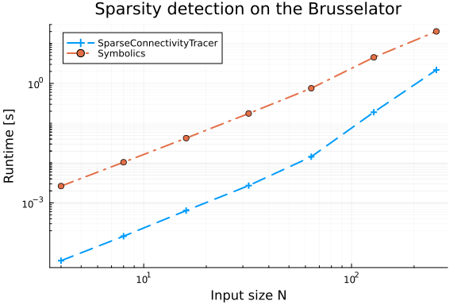
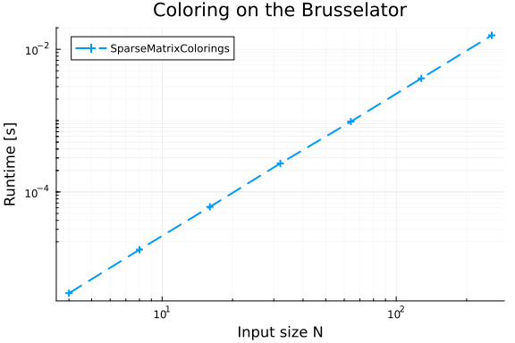
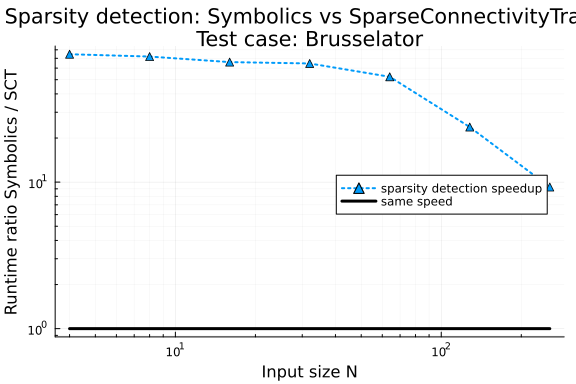

```julia
using ADTypes
using LinearAlgebra, SparseArrays
using BenchmarkTools
import DifferentiationInterface as DI
using Plots
using SparseConnectivityTracer: TracerSparsityDetector
using SparseMatrixColorings: GreedyColoringAlgorithm
using Symbolics: SymbolicsSparsityDetector
using Test
```


## Definitions

```julia
brusselator_f(x, y, t) = (((x - 0.3)^2 + (y - 0.6)^2) <= 0.1^2) * (t >= 1.1) * 5.0

limit(a, N) =
    if a == N + 1
        1
    elseif a == 0
        N
    else
        a
    end;

function brusselator_2d!(du, u)
    t = 0.0
    N = size(u, 1)
    xyd = range(0; stop = 1, length = N)
    p = (3.4, 1.0, 10.0, step(xyd))
    A, B, alpha, dx = p
    alpha = alpha / dx^2

    @inbounds for I in CartesianIndices((N, N))
        i, j = Tuple(I)
        x, y = xyd[I[1]], xyd[I[2]]
        ip1, im1, jp1,
        jm1 = limit(i + 1, N),
        limit(i - 1, N), limit(j + 1, N),
        limit(j - 1, N)
        du[i, j, 1] = alpha *
                      (u[im1, j, 1] + u[ip1, j, 1] + u[i, jp1, 1] + u[i, jm1, 1] -
                       4u[i, j, 1]) +
                      B +
                      u[i, j, 1]^2 * u[i, j, 2] - (A + 1) * u[i, j, 1] +
                      brusselator_f(x, y, t)
        du[i, j, 2] = alpha *
                      (u[im1, j, 2] + u[ip1, j, 2] + u[i, jp1, 2] + u[i, jm1, 2] -
                       4u[i, j, 2]) +
                      A * u[i, j, 1] - u[i, j, 1]^2 * u[i, j, 2]
    end
end;

function init_brusselator_2d(N::Integer)
    xyd = range(0; stop = 1, length = N)
    N = length(xyd)
    u = zeros(N, N, 2)
    for I in CartesianIndices((N, N))
        x = xyd[I[1]]
        y = xyd[I[2]]
        u[I, 1] = 22 * (y * (1 - y))^(3 / 2)
        u[I, 2] = 27 * (x * (1 - x))^(3 / 2)
    end
    return u
end;
```


## Correctness

```julia
x0_32 = init_brusselator_2d(32);
```


### Sparsity detection

```julia
S1 = ADTypes.jacobian_sparsity(
    brusselator_2d!, similar(x0_32), x0_32, TracerSparsityDetector()
)
S2 = ADTypes.jacobian_sparsity(
    brusselator_2d!, similar(x0_32), x0_32, SymbolicsSparsityDetector()
)
@test S1 == S2
```

```
Test Passed
```


### Coloring

```julia
c1 = ADTypes.column_coloring(S1, GreedyColoringAlgorithm())
@test length(unique(c1)) > 0
```

```
Test Passed
```


### Differentiation

```julia
backend = AutoSparse(
    AutoForwardDiff();
    sparsity_detector = TracerSparsityDetector(),
    coloring_algorithm = GreedyColoringAlgorithm()
);

prep = DI.prepare_jacobian(brusselator_2d!, similar(x0_32), backend, x0_32);
J1 = DI.jacobian!(
    brusselator_2d!, similar(x0_32), similar(S1, eltype(x0_32)), prep, backend, x0_32
)

@test nnz(J1) > 0
```

```
Error: MethodError: no method matching _prepare_pushforward_aux(::Val{true}
, ::DifferentiationInterface.PushforwardFast, ::typeof(Main.var"##WeaveSand
Box#225".brusselator_2d!), ::Array{Float64, 3}, ::ADTypes.AutoForwardDiff{n
othing, Nothing}, ::Array{Float64, 3}, ::Tuple{Array{Float64, 3}})

The autodiff backend you chose requires a package which may not be loaded. 
Please run the following command and try again:

	import ForwardDiff

Closest candidates are:
  _prepare_pushforward_aux(::Val, !Matched::DifferentiationInterface.Pushfo
rwardSlow, ::F, ::Any, ::ADTypes.AbstractADType, ::Any, ::Tuple{Vararg{T, N
}} where {N, T}, DifferentiationInterface.Context...) where {F, C}
   @ DifferentiationInterface /cache/julia-buildkite-plugin/depots/5b300254
-1738-4989-ae0a-f4d2d937f953/packages/DifferentiationInterface/afUhd/src/fi
rst_order/pushforward.jl:303
  _prepare_pushforward_aux(::Val, !Matched::DifferentiationInterface.Pushfo
rwardSlow, ::F, !Matched::ADTypes.AbstractADType, ::Any, !Matched::Tuple{Va
rarg{T, N}} where {N, T}, !Matched::DifferentiationInterface.Context...) wh
ere {F, C}
   @ DifferentiationInterface /cache/julia-buildkite-plugin/depots/5b300254
-1738-4989-ae0a-f4d2d937f953/packages/DifferentiationInterface/afUhd/src/fi
rst_order/pushforward.jl:283
```


## Benchmarks

```julia
N_values = 2 .^ (2:8)
```

```
7-element Vector{Int64}:
   4
   8
  16
  32
  64
 128
 256
```


### Sparsity detection

```julia
td1, td2 = zeros(length(N_values)), zeros(length(N_values))
for (i, N) in enumerate(N_values)
    @info "Benchmarking sparsity detection: N=$N"
    x0 = init_brusselator_2d(N)
    td1[i] = @belapsed ADTypes.jacobian_sparsity(
        $brusselator_2d!, $(similar(x0)), $x0, TracerSparsityDetector()
    )
    td2[i] = @belapsed ADTypes.jacobian_sparsity(
        $brusselator_2d!, $(similar(x0)), $x0, SymbolicsSparsityDetector()
    )
end

let
    pld = plot(;
        title = "Sparsity detection on the Brusselator",
        xlabel = "Input size N",
        ylabel = "Runtime [s]"
    )
    plot!(
        pld,
        N_values,
        td1;
        lw = 2,
        linestyle = :auto,
        markershape = :auto,
        label = "SparseConnectivityTracer"
    )
    plot!(pld, N_values, td2; lw = 2, linestyle = :auto,
        markershape = :auto, label = "Symbolics")
    plot!(pld; xscale = :log10, yscale = :log10, legend = :topleft, minorgrid = true)
    pld
end
```




### Coloring

```julia
tc1 = zeros(length(N_values))
for (i, N) in enumerate(N_values)
    @info "Benchmarking coloring: N=$N"
    x0 = init_brusselator_2d(N)
    S = ADTypes.jacobian_sparsity(
        brusselator_2d!, similar(x0), x0, TracerSparsityDetector()
    )
    tc1[i] = @belapsed ADTypes.column_coloring($S, GreedyColoringAlgorithm())
end

let
    plc = plot(;
        title = "Coloring on the Brusselator", xlabel = "Input size N", ylabel = "Runtime [s]"
    )
    plot!(
        plc,
        N_values,
        tc1;
        lw = 2,
        linestyle = :auto,
        markershape = :auto,
        label = "SparseMatrixColorings"
    )
    plot!(plc; xscale = :log10, yscale = :log10, legend = :topleft, minorgrid = true)
    plc
end
```




### Differentiation

```julia
tj1 = zeros(length(N_values))
for (i, N) in enumerate(N_values)
    @info "Benchmarking differentiation: N=$N"
    x0 = init_brusselator_2d(N)
    S = ADTypes.jacobian_sparsity(
        brusselator_2d!, similar(x0), x0, TracerSparsityDetector()
    )
    J = similar(S, eltype(x0))

    tj1[i] = @belapsed DI.jacobian!($brusselator_2d!, _y, _J, _prep, $backend, $x0) setup=(
        _y = similar($x0);
        _J = similar($J);
        _prep = DI.prepare_jacobian($brusselator_2d!, similar($x0), $backend, $x0)
    ) evals=1
end

let
    plj = plot(;
        title = "Sparse Jacobian on the Brusselator", xlabel = "Input size N", ylabel = "Runtime [s]"
    )
    plot!(
        plj,
        N_values,
        tj1;
        lw = 2,
        linestyle = :auto,
        markershape = :auto,
        label = "DifferentiationInterface"
    )
    plot!(plj; xscale = :log10, yscale = :log10, legend = :topleft, minorgrid = true)
    plj
end
```

```
Error: MethodError: no method matching _prepare_pushforward_aux(::Val{true}
, ::DifferentiationInterface.PushforwardFast, ::typeof(Main.var"##WeaveSand
Box#225".brusselator_2d!), ::Array{Float64, 3}, ::ADTypes.AutoForwardDiff{n
othing, Nothing}, ::Array{Float64, 3}, ::Tuple{Array{Float64, 3}})

The autodiff backend you chose requires a package which may not be loaded. 
Please run the following command and try again:

	import ForwardDiff

Closest candidates are:
  _prepare_pushforward_aux(::Val, !Matched::DifferentiationInterface.Pushfo
rwardSlow, ::F, ::Any, ::ADTypes.AbstractADType, ::Any, ::Tuple{Vararg{T, N
}} where {N, T}, DifferentiationInterface.Context...) where {F, C}
   @ DifferentiationInterface /cache/julia-buildkite-plugin/depots/5b300254
-1738-4989-ae0a-f4d2d937f953/packages/DifferentiationInterface/afUhd/src/fi
rst_order/pushforward.jl:303
  _prepare_pushforward_aux(::Val, !Matched::DifferentiationInterface.Pushfo
rwardSlow, ::F, !Matched::ADTypes.AbstractADType, ::Any, !Matched::Tuple{Va
rarg{T, N}} where {N, T}, !Matched::DifferentiationInterface.Context...) wh
ere {F, C}
   @ DifferentiationInterface /cache/julia-buildkite-plugin/depots/5b300254
-1738-4989-ae0a-f4d2d937f953/packages/DifferentiationInterface/afUhd/src/fi
rst_order/pushforward.jl:283
```


### Summary

```julia
let
    pl = plot(;
        title = "Sparsity detection: Symbolics vs SparseConnectivityTracer\nTest case: Brusselator",
        xlabel = "Input size N",
        ylabel = "Runtime ratio Symbolics / SCT"
    )
    plot!(
        pl,
        N_values,
        td2 ./ td1;
        lw = 2,
        linestyle = :dot,
        markershape = :utriangle,
        label = "sparsity detection speedup"
    )
    plot!(
        pl, N_values, ones(length(N_values)); lw = 3, color = :black, label = "same speed")
    plot!(pl; xscale = :log10, yscale = :log10, minorgrid = true, legend = :right)
    pl
end
```


