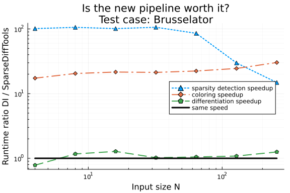

```julia
using ADTypes
using LinearAlgebra, SparseArrays
using BenchmarkTools, DataFrames
import DifferentiationInterface as DI
using Plots
import SparseDiffTools as SDT
using SparseConnectivityTracer: TracerSparsityDetector
using SparseMatrixColorings: GreedyColoringAlgorithm
using Symbolics: SymbolicsSparsityDetector
using Test
```


## Definitions

```julia
brusselator_f(x, y, t) = (((x - 0.3)^2 + (y - 0.6)^2) <= 0.1^2) * (t >= 1.1) * 5.0

limit(a, N) =
    if a == N + 1
        1
    elseif a == 0
        N
    else
        a
    end;

function brusselator_2d!(du, u)
    t = 0.0
    N = size(u, 1)
    xyd = range(0; stop=1, length=N)
    p = (3.4, 1.0, 10.0, step(xyd))
    A, B, alpha, dx = p
    alpha = alpha / dx^2

    @inbounds for I in CartesianIndices((N, N))
        i, j = Tuple(I)
        x, y = xyd[I[1]], xyd[I[2]]
        ip1, im1, jp1, jm1 = limit(i + 1, N),
        limit(i - 1, N), limit(j + 1, N),
        limit(j - 1, N)
        du[i, j, 1] =
            alpha *
            (u[im1, j, 1] + u[ip1, j, 1] + u[i, jp1, 1] + u[i, jm1, 1] - 4u[i, j, 1]) +
            B +
            u[i, j, 1]^2 * u[i, j, 2] - (A + 1) * u[i, j, 1] + brusselator_f(x, y, t)
        du[i, j, 2] =
            alpha *
            (u[im1, j, 2] + u[ip1, j, 2] + u[i, jp1, 2] + u[i, jm1, 2] - 4u[i, j, 2]) +
            A * u[i, j, 1] - u[i, j, 1]^2 * u[i, j, 2]
    end
end;

function init_brusselator_2d(N::Integer)
    xyd = range(0; stop=1, length=N)
    N = length(xyd)
    u = zeros(N, N, 2)
    for I in CartesianIndices((N, N))
        x = xyd[I[1]]
        y = xyd[I[2]]
        u[I, 1] = 22 * (y * (1 - y))^(3 / 2)
        u[I, 2] = 27 * (x * (1 - x))^(3 / 2)
    end
    return u
end;
```


## Correctness

```julia
x0_32 = init_brusselator_2d(32);
```


### Sparsity detection

```julia
S1 = ADTypes.jacobian_sparsity(
    brusselator_2d!, similar(x0_32), x0_32, TracerSparsityDetector()
)
S2 = ADTypes.jacobian_sparsity(
    brusselator_2d!, similar(x0_32), x0_32, SymbolicsSparsityDetector()
)
@test S1 == S2
```

```
Test Passed
```


### Coloring

```julia
c1 = ADTypes.column_coloring(S1, GreedyColoringAlgorithm())
c2 = SDT.matrix_colors(S1)
@test c1 == c2
```

```
Test Passed
```


### Differentiation

```julia
backend = AutoSparse(
    AutoForwardDiff();
    sparsity_detector=TracerSparsityDetector(),
    coloring_algorithm=GreedyColoringAlgorithm(),
);

extras = DI.prepare_jacobian(brusselator_2d!, similar(x0_32), backend, x0_32);
J1 = DI.jacobian!(
    brusselator_2d!, similar(x0_32), similar(S1, eltype(x0_32)), backend, x0_32, extras
)

cache = SDT.sparse_jacobian_cache(
    backend,
    SDT.JacPrototypeSparsityDetection(; jac_prototype=S1),
    brusselator_2d!,
    similar(x0_32),
    x0_32,
);
J2 = SDT.sparse_jacobian!(
    similar(S1, eltype(x0_32)), backend, cache, brusselator_2d!, similar(x0_32), x0_32
)

@test J1 == J2
```

```
Test Passed
```


## Benchmarks

```julia
N_values = 2 .^ (2:8)
```

```
7-element Vector{Int64}:
   4
   8
  16
  32
  64
 128
 256
```


### Sparsity detection

```julia
td1, td2 = zeros(length(N_values)), zeros(length(N_values))
for (i, N) in enumerate(N_values)
    @info "Benchmarking sparsity detection: N=$N"
    x0 = init_brusselator_2d(N)
    td1[i] = @belapsed ADTypes.jacobian_sparsity(
        $brusselator_2d!, $(similar(x0)), $x0, TracerSparsityDetector()
    )
    td2[i] = @belapsed ADTypes.jacobian_sparsity(
        $brusselator_2d!, $(similar(x0)), $x0, SymbolicsSparsityDetector()
    )
end

pld = plot(;
    title="Sparsity detection on the Brusselator",
    xlabel="Input size N",
    ylabel="Runtime [s]",
)
plot!(
    pld,
    N_values,
    td1;
    lw=2,
    linestyle=:auto,
    markershape=:auto,
    label="SparseConnectivityTracer",
)
plot!(pld, N_values, td2; lw=2, linestyle=:auto, markershape=:auto, label="Symbolics")
plot!(pld; xscale=:log10, yscale=:log10, legend=:topleft, minorgrid=true)
pld
```


### Coloring

```julia
tc1, tc2 = zeros(length(N_values)), zeros(length(N_values))
for (i, N) in enumerate(N_values)
    @info "Benchmarking coloring: N=$N"
    x0 = init_brusselator_2d(N)
    S = ADTypes.jacobian_sparsity(
        brusselator_2d!, similar(x0), x0, TracerSparsityDetector()
    )
    tc1[i] = @belapsed ADTypes.column_coloring($S, GreedyColoringAlgorithm())
    tc2[i] = @belapsed SDT.matrix_colors($S)
end

plc = plot(;
    title="Coloring on the Brusselator", xlabel="Input size N", ylabel="Runtime [s]"
)
plot!(
    plc,
    N_values,
    tc1;
    lw=2,
    linestyle=:auto,
    markershape=:auto,
    label="SparseMatrixColorings",
)
plot!(plc, N_values, tc2; lw=2, linestyle=:auto, markershape=:auto, label="SparseDiffTools")
plot!(plc; xscale=:log10, yscale=:log10, legend=:topleft, minorgrid=true)
plc
```


### Differentiation

```julia
tj1, tj2 = zeros(length(N_values)), zeros(length(N_values))
for (i, N) in enumerate(N_values)
    @info "Benchmarking differentiation: N=$N"
    x0 = init_brusselator_2d(N)
    S = ADTypes.jacobian_sparsity(
        brusselator_2d!, similar(x0), x0, TracerSparsityDetector()
    )
    J = similar(S, eltype(x0))

    tj1[i] = @belapsed DI.jacobian!($brusselator_2d!, _y, _J, $backend, $x0, _extras) setup = (
        _y = similar($x0);
        _J = similar($J);
        _extras = DI.prepare_jacobian($brusselator_2d!, similar($x0), $backend, $x0)
    ) evals = 1

    tj2[i] = @belapsed SDT.sparse_jacobian!(_J, $backend, _cache, $brusselator_2d!, _y, $x0) setup = (
        _y = similar($x0);
        _J = similar($J);
        _cache = SDT.sparse_jacobian_cache(
            $backend,
            SDT.JacPrototypeSparsityDetection(; jac_prototype=$S),
            $brusselator_2d!,
            similar($x0),
            $x0,
        )
    ) evals = 1
end

plj = plot(;
    title="Sparse Jacobian on the Brusselator", xlabel="Input size N", ylabel="Runtime [s]"
)
plot!(
    plj,
    N_values,
    tj1;
    lw=2,
    linestyle=:auto,
    markershape=:auto,
    label="DifferentiationInterface",
)
plot!(plj, N_values, tj2; lw=2, linestyle=:auto, markershape=:auto, label="SparseDiffTools")
plot!(plj; xscale=:log10, yscale=:log10, legend=:topleft, minorgrid=true)
plj
```


### Summary

```julia
pl = plot(;
    title="Is the new pipeline worth it?\nTest case: Brusselator",
    xlabel="Input size N",
    ylabel="Runtime ratio DI / SparseDiffTools",
)
plot!(
    pl,
    N_values,
    td2 ./ td1;
    lw=2,
    linestyle=:auto,
    markershape=:auto,
    label="sparsity detection speedup",
)
plot!(
    pl,
    N_values,
    tc2 ./ tc1;
    lw=2,
    linestyle=:auto,
    markershape=:auto,
    label="coloring speedup",
)
plot!(
    pl,
    N_values,
    tj2 ./ tj1;
    lw=2,
    linestyle=:auto,
    markershape=:auto,
    label="differentiation speedup",
)
plot!(pl, N_values, ones(length(N_values)); lw=3, color=:black, label="same speed")
plot!(pl; xscale=:log10, yscale=:log10, minorgrid=true, legend=:right)
pl
```


