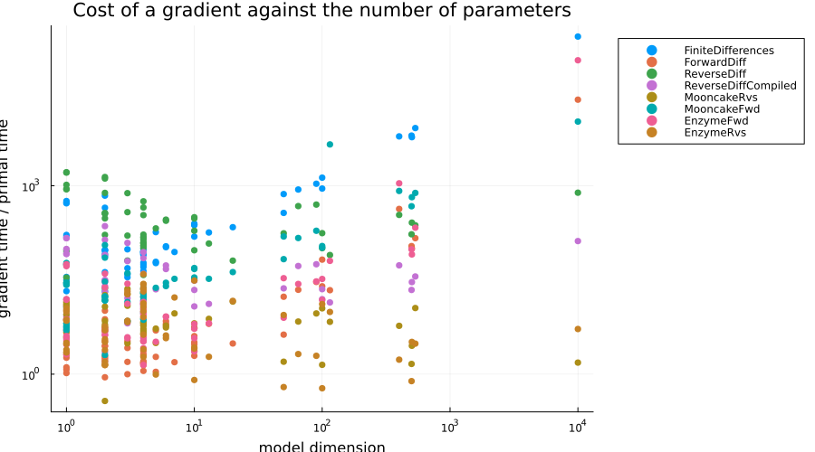
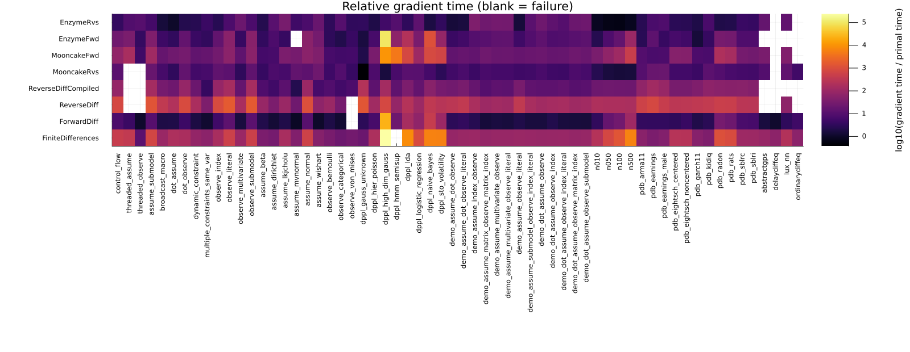

This benchmark differentiates the log density of a large collection of
[Turing.jl](https://turinglang.org/) probabilistic models with every AD backend
that Turing supports, and reports both whether each backend gets the right
answer and how much it costs relative to a single evaluation of the log density.

The models and the measurement methodology are taken from
[TuringLang/ADTests](https://github.com/TuringLang/ADTests), whose live results
are published at <https://turinglang.org/ADTests/>. The models are deliberately
diverse rather than uniformly large: they cover base Julia control flow and
threading, the corners of the `@model` DSL, individual distributions (including
constrained and matrix-variate ones), the models from the DynamicPPL arXiv
paper, a slice of [PosteriorDB](https://github.com/stan-dev/posteriordb), and
models that call out to ODE/DDE solvers, Lux neural networks, and Gaussian
processes. Between them they exercise most of the Julia language features that
an AD backend has to cope with, which is what makes this a useful stress test of
the AD ecosystem rather than only of Turing.

## What is measured

For each (model, backend) pair we call `DynamicPPL.TestUtils.AD.run_ad`, which

1. builds the `LogDensityFunction` for the model with all variables linked to
   unconstrained space,
2. checks the gradient against a reference backend (`FiniteDifferences`, except
   on `dppl_hmm_semisup` where finite differences itself fails and `ForwardDiff`
   is used instead), and
3. benchmarks the primal evaluation and the gradient evaluation with
   [Chairmarks.jl](https://github.com/LilithHafner/Chairmarks.jl).

The headline number is the **relative gradient time**, `gradient time / primal
time`. That ratio is the quantity of interest for a sampler: it is how much more
expensive one leapfrog step of NUTS is than one likelihood evaluation. Reporting
a ratio rather than an absolute time also makes the numbers comparable across
models of very different sizes. Absolute gradient times are reported separately
below.

A cell that is not a number is a failure, and failures are as much the point of
this benchmark as the timings:

| Status  | Meaning                                                                 |
|:--------|:------------------------------------------------------------------------|
| `wrong` | The backend returned a gradient that disagrees with the reference        |
| `NaN`   | The backend returned a gradient containing `NaN`                         |
| `error` | The backend threw an exception                                           |
| `crash` | The backend took the whole Julia process down (usually a segfault)       |

Because of that last row, each model is benchmarked in a separate worker
process; if the worker dies, the results already collected are kept and the
worker is restarted with the backends that have not run yet.

```julia
using DataFrames, Markdown, Plots, PrettyTables, Printf, Statistics

include("turing_ad_models.jl")

const WORKER_SCRIPT = joinpath(@__DIR__, "turing_ad_worker.jl")

struct Measurement
    status::String
    relative::Float64
    gradient::Float64
    primal::Float64
end

Measurement(status) = Measurement(status, NaN, NaN, NaN)

function worker_command(model_name, backends)
    # The threaded models are written to be run with 4 threads; everything else
    # is single threaded so that the timings are not at the mercy of how many
    # cores the benchmark machine happens to have.
    nthreads = startswith(model_name, "threaded_") ? 4 : 1
    return `$(Base.julia_cmd()) --project=$(Base.active_project()) --threads=$nthreads
            $WORKER_SCRIPT $model_name $backends`
end
```

```
worker_command (generic function with 1 method)
```


Driving the worker: read its records as they arrive, and restart it if it dies
partway through.

```julia
function benchmark_model(model_name)
    remaining = copy(BACKEND_NAMES)
    results = Dict{String, Measurement}()
    messages = Dict{String, String}()
    dimension = -1

    while !isempty(remaining)
        inflight = nothing
        try
            open(worker_command(model_name, remaining), "r") do io
                for line in eachline(io)
                    # Anything that is not a well-formed record is either the
                    # worker's own chatter or a line truncated by a crash.
                    fields = split(line, '\t')
                    if fields[1] == "META" && length(fields) == 3
                        dimension = parse(Int, fields[3])
                    elseif fields[1] == "BEGIN" && length(fields) == 2
                        inflight = fields[2]
                    elseif fields[1] == "MSG" && length(fields) == 3
                        messages[fields[2]] = fields[3]
                    elseif fields[1] == "RESULT" && length(fields) == 6
                        results[fields[2]] = Measurement(
                            fields[3], parse.(Float64, fields[4:6])...
                        )
                        inflight = nothing
                    end
                end
            end
        catch err
            err isa ProcessFailedException || rethrow()
        end

        if inflight !== nothing
            # Record the backend that killed the worker before restarting, so
            # that the restart does not walk straight back into the same crash.
            results[inflight] = Measurement("crash")
            messages[inflight] = "the worker process died while running this backend"
        end
        filter!(backend -> !haskey(results, backend), remaining)
        if inflight === nothing && !isempty(remaining)
            # The worker died without starting any of the backends it was given,
            # so it never got as far as building the model; restarting it would
            # only reproduce that.
            for backend in remaining
                results[backend] = Measurement("crash")
                messages[backend] = "the worker process died before building the model"
            end
            empty!(remaining)
        end
    end

    return (dimension = dimension, results = results, messages = messages)
end
```

```
benchmark_model (generic function with 1 method)
```


Now run every model. This is the expensive part: each model pays for a fresh
Julia process, and `FiniteDifferences` alone needs `4 * dimension + 1` log
density evaluations for every reference gradient.

```julia
runs = Dict{String, Any}()
for (i, model_name) in enumerate(MODEL_NAMES)
    @info "[$i/$(length(MODEL_NAMES))] benchmarking $model_name"
    # The workers write to the inherited file descriptor rather than through
    # Julia, so without this the progress log lags hours behind their output.
    flush(stderr)
    runs[model_name] = benchmark_model(model_name)
end
```


```julia
measurement(model_name, backend) = runs[model_name].results[backend]

df = DataFrame(
    [
        (
            category = CATEGORY_OF[model_name],
            model = model_name,
            dimension = runs[model_name].dimension,
            backend = backend,
            status = measurement(model_name, backend).status,
            relative = measurement(model_name, backend).relative,
            gradient = measurement(model_name, backend).gradient,
            primal = measurement(model_name, backend).primal,
        )
        for model_name in MODEL_NAMES, backend in BACKEND_NAMES
    ][:]
)
first(df, 10)
```

```
10×8 DataFrame
 Row │ category             model                          dimension  backe
nd  ⋯
     │ String               String                         Int64      Strin
g   ⋯
─────┼─────────────────────────────────────────────────────────────────────
─────
   1 │ Base Julia features  control_flow                           2  Finit
eDi ⋯
   2 │ Base Julia features  threaded_assume                       50  Finit
eDi
   3 │ Base Julia features  threaded_observe                       1  Finit
eDi
   4 │ Core Turing syntax   assume_submodel                        2  Finit
eDi
   5 │ Core Turing syntax   broadcast_macro                        2  Finit
eDi ⋯
   6 │ Core Turing syntax   dot_assume                             5  Finit
eDi
   7 │ Core Turing syntax   dot_observe                            1  Finit
eDi
   8 │ Core Turing syntax   dynamic_constraint                     2  Finit
eDi
   9 │ Core Turing syntax   multiple_constraints_same_var          4  Finit
eDi ⋯
  10 │ Core Turing syntax   observe_index                          1  Finit
eDi
                                                               5 columns om
itted
```


## Relative gradient time by model

Each cell is `gradient time / primal time`; lower is better. Non-numeric cells
are failures, as described above.

```julia
function cell(m)
    m.status == "ok" || return m.status
    return m.relative < 100 ? @sprintf("%.1f", m.relative) : @sprintf("%.0f", m.relative)
end

function category_table(category, model_names)
    table = DataFrame(
        "Model" => model_names,
        "Dim" => [runs[name].dimension for name in model_names],
    )
    for backend in BACKEND_NAMES
        table[!, backend] = [cell(measurement(name, backend)) for name in model_names]
    end
    return Markdown.parse(
        "### $category\n\n" * PrettyTables.pretty_table(
            String, table; backend = :markdown, column_labels = names(table)
        )
    )
end

for (category, model_names) in MODEL_CATEGORIES
    display(category_table(category, model_names))
end
```


### Base Julia features

|        **Model** | **Dim** | **FiniteDifferences** | **ForwardDiff** | **ReverseDiff** | **ReverseDiffCompiled** | **MooncakeRvs** | **MooncakeFwd** | **EnzymeFwd** | **EnzymeRvs** |
| ----------------:| -------:| ---------------------:| ---------------:| ---------------:| -----------------------:| ---------------:| ---------------:| -------------:| -------------:|
|     control_flow |       2 |                   446 |             7.5 |             770 |                    79.3 |            11.9 |            71.7 |          23.9 |           3.6 |
|  threaded_assume |      50 |                   369 |             4.3 |           error |                   error |           error |             156 |          33.7 |           8.8 |
| threaded_observe |       1 |                  11.7 |             1.0 |           error |                   error |           error |             5.0 |           3.6 |          10.3 |

### Core Turing syntax

|                     **Model** | **Dim** | **FiniteDifferences** | **ForwardDiff** | **ReverseDiff** | **ReverseDiffCompiled** | **MooncakeRvs** | **MooncakeFwd** | **EnzymeFwd** | **EnzymeRvs** |
| -----------------------------:| -------:| ---------------------:| ---------------:| ---------------:| -----------------------:| ---------------:| ---------------:| -------------:| -------------:|
|               assume_submodel |       2 |                   697 |            10.3 |            1303 |                     138 |            18.2 |             114 |          39.8 |           5.7 |
|               broadcast_macro |       2 |                  94.5 |             1.8 |             365 |                    29.4 |             6.2 |            16.7 |           4.7 |           1.4 |
|                    dot_assume |       5 |                   183 |             1.9 |             210 |                    22.5 |             3.1 |            23.7 |           3.3 |           1.0 |
|                   dot_observe |       1 |                   165 |             4.6 |             881 |                    81.7 |            15.4 |            28.7 |          15.6 |           2.2 |
|            dynamic_constraint |       2 |                  76.1 |             1.7 |             165 |                    20.4 |             5.6 |            14.9 |           4.2 |           2.4 |
| multiple_constraints_same_var |       4 |                  59.4 |             1.1 |            38.0 |                     3.7 |             6.5 |            16.8 |           3.3 |           4.3 |
|                 observe_index |       1 |                   155 |             5.1 |             883 |                    83.1 |            14.3 |            26.4 |          15.3 |           2.4 |
|               observe_literal |       1 |                   538 |            13.1 |            1642 |                     146 |            12.1 |            59.0 |          55.6 |           7.4 |
|          observe_multivariate |       3 |                  97.3 |             1.6 |             161 |                    16.2 |             3.1 |            14.1 |           3.9 |          20.8 |
|              observe_submodel |       1 |                   526 |            12.3 |            1619 |                     147 |            13.8 |            54.9 |          52.5 |           7.1 |

### Distributions

|           **Model** | **Dim** | **FiniteDifferences** | **ForwardDiff** | **ReverseDiff** | **ReverseDiffCompiled** | **MooncakeRvs** | **MooncakeFwd** | **EnzymeFwd** | **EnzymeRvs** |
| -------------------:| -------:| ---------------------:| ---------------:| ---------------:| -----------------------:| ---------------:| ---------------:| -------------:| -------------:|
|         assume_beta |       1 |                  35.3 |             2.0 |            88.9 |                     8.2 |             3.8 |             5.8 |           3.4 |           2.2 |
|    assume_dirichlet |       1 |                  28.3 |             1.3 |            34.5 |                     5.0 |             7.5 |             6.4 |           7.5 |          11.2 |
|     assume_lkjcholu |      10 |                   155 |             2.0 |            93.9 |                    12.0 |             6.4 |            34.6 |           3.7 |          31.0 |
|     assume_mvnormal |       2 |                  42.1 |             0.9 |            23.4 |                     2.2 |            15.2 |            29.7 |         error |           5.0 |
|       assume_normal |       1 |                   572 |            10.6 |            1034 |                    98.5 |            12.9 |            56.7 |          56.2 |           7.1 |
|      assume_wishart |       3 |                  48.6 |             1.0 |            64.4 |                     6.4 |            22.7 |            40.5 |          27.5 |          18.7 |
|   observe_bernoulli |       1 |                  31.5 |             1.8 |            94.5 |                     8.8 |             4.7 |             6.4 |           3.0 |           3.0 |
| observe_categorical |       1 |                  21.0 |             1.2 |            28.3 |                     5.5 |             8.9 |             5.4 |           2.1 |           9.9 |
|   observe_von_mises |       1 |                  26.9 |             NaN |             NaN |                     7.4 |             3.9 |             5.8 |           4.0 |           3.1 |

### DynamicPPL arXiv paper

|                **Model** | **Dim** | **FiniteDifferences** | **ForwardDiff** | **ReverseDiff** | **ReverseDiffCompiled** | **MooncakeRvs** | **MooncakeFwd** | **EnzymeFwd** | **EnzymeRvs** |
| ------------------------:| -------:| ---------------------:| ---------------:| ---------------:| -----------------------:| ---------------:| ---------------:| -------------:| -------------:|
|       dppl_gauss_unknown |       2 |                  20.9 |             2.8 |            1378 |                     228 |             0.4 |             2.0 |           1.6 |           3.3 |
|        dppl_hier_poisson |      13 |                   180 |             6.3 |             120 |                    13.2 |             7.6 |            33.0 |           6.5 |           1.9 |
|      dppl_high_dim_gauss |   10000 |                237560 |           23478 |             775 |                     132 |             1.5 |           10522 |         99631 |           5.2 |
|         dppl_hmm_semisup |     115 |                   NaN |            21.7 |            78.9 |                    13.9 |             6.8 |            4554 |          63.7 |           9.8 |
|                 dppl_lda |     535 |                  8293 |             146 |             235 |                    35.9 |            11.3 |             769 |           215 |           3.1 |
| dppl_logistic_regression |     100 |                   903 |            66.6 |             101 |                    15.6 |            11.2 |             103 |          32.8 |          13.0 |
|         dppl_naive_bayes |     400 |                  6113 |             427 |             343 |                    54.1 |             5.9 |             827 |          1094 |           1.7 |
|      dppl_sto_volatility |     503 |                  5937 |            99.9 |             259 |                    29.2 |             2.8 |             658 |          80.6 |           3.3 |

### DynamicPPL demo models

|                                  **Model** | **Dim** | **FiniteDifferences** | **ForwardDiff** | **ReverseDiff** | **ReverseDiffCompiled** | **MooncakeRvs** | **MooncakeFwd** | **EnzymeFwd** | **EnzymeRvs** |
| ------------------------------------------:| -------:| ---------------------:| ---------------:| ---------------:| -----------------------:| ---------------:| ---------------:| -------------:| -------------:|
|                    demo_assume_dot_observe |       2 |                  82.1 |             2.8 |             303 |                    25.2 |             5.3 |            14.9 |           4.2 |           1.4 |
|            demo_assume_dot_observe_literal |       2 |                  94.6 |             3.3 |             368 |                    31.4 |             7.0 |            17.2 |           5.4 |           1.6 |
|                  demo_assume_index_observe |       4 |                  99.2 |             2.3 |             167 |                    16.7 |             4.4 |            15.1 |           9.5 |          39.1 |
|    demo_assume_matrix_observe_matrix_index |       4 |                  80.7 |             1.4 |             103 |                     9.9 |             6.7 |            23.6 |          11.0 |          23.5 |
|           demo_assume_multivariate_observe |       4 |                  87.7 |             1.6 |             123 |                    13.2 |             6.0 |            19.4 |          13.8 |          27.4 |
|   demo_assume_multivariate_observe_literal |       4 |                  89.5 |             1.5 |             112 |                    12.7 |             5.9 |            20.0 |          14.1 |          26.9 |
|                demo_assume_observe_literal |       2 |                  93.2 |             1.9 |             358 |                    31.5 |             4.9 |            17.3 |           5.0 |           1.4 |
| demo_assume_submodel_observe_index_literal |       4 |                  90.6 |             1.5 |             153 |                    14.5 |             5.3 |            19.2 |           9.2 |          11.8 |
|                    demo_dot_assume_observe |       4 |                  84.7 |             1.5 |             122 |                    12.9 |             6.8 |            20.4 |          13.4 |          22.6 |
|              demo_dot_assume_observe_index |       4 |                  87.0 |             2.1 |             138 |                    12.9 |             4.9 |            17.2 |           8.2 |          13.4 |
|      demo_dot_assume_observe_index_literal |       4 |                  89.6 |             1.5 |             149 |                    14.7 |             4.6 |            17.6 |           8.8 |          10.1 |
|       demo_dot_assume_observe_matrix_index |       4 |                  79.7 |             1.5 |             111 |                    10.7 |             7.7 |            22.5 |          11.0 |          20.7 |
|           demo_dot_assume_observe_submodel |       4 |                  84.2 |             1.4 |             123 |                    11.7 |             6.4 |            19.2 |          12.5 |          22.6 |

### Effect of model size

| **Model** | **Dim** | **FiniteDifferences** | **ForwardDiff** | **ReverseDiff** | **ReverseDiffCompiled** | **MooncakeRvs** | **MooncakeFwd** | **EnzymeFwd** | **EnzymeRvs** |
| ---------:| -------:| ---------------------:| ---------------:| ---------------:| -----------------------:| ---------------:| ---------------:| -------------:| -------------:|
|      n010 |      10 |                   237 |             3.2 |             192 |                    21.9 |             2.3 |            33.2 |           2.3 |           0.8 |
|      n050 |      50 |                   737 |            17.1 |             175 |                    23.2 |             1.6 |            67.8 |           7.9 |           0.6 |
|      n100 |     100 |                  1346 |            25.1 |             176 |                    22.5 |             1.4 |             110 |          15.2 |           0.6 |
|      n500 |     500 |                  6291 |             109 |             169 |                    21.9 |             1.5 |             472 |          97.3 |           0.8 |

### PosteriorDB

|                **Model** | **Dim** | **FiniteDifferences** | **ForwardDiff** | **ReverseDiff** | **ReverseDiffCompiled** | **MooncakeRvs** | **MooncakeFwd** | **EnzymeFwd** | **EnzymeRvs** |
| ------------------------:| -------:| ---------------------:| ---------------:| ---------------:| -----------------------:| ---------------:| ---------------:| -------------:| -------------:|
|               pdb_arma11 |       4 |                  55.5 |             3.4 |             566 |                    70.5 |             9.9 |             9.4 |           2.6 |           2.5 |
|             pdb_earnings |       3 |                  34.9 |             3.4 |             763 |                     123 |            19.0 |             7.0 |          13.2 |           7.1 |
|        pdb_earnings_male |       4 |                  43.9 |             3.4 |             451 |                    87.9 |            19.6 |             7.3 |           3.9 |           8.1 |
|    pdb_eightsch_centered |      10 |                   249 |             3.0 |             301 |                    31.2 |             5.5 |            49.0 |           6.3 |           2.7 |
| pdb_eightsch_noncentered |      10 |                   240 |             4.0 |             315 |                    31.0 |             5.4 |            47.3 |           5.3 |           2.5 |
|              pdb_garch11 |       4 |                  51.0 |             2.0 |             341 |                    39.6 |             4.4 |             7.6 |           1.4 |           1.9 |
|                pdb_kidiq |       3 |                  39.0 |             2.6 |             380 |                    63.2 |            12.3 |             7.0 |           3.7 |           6.7 |
|                pdb_radon |      90 |                  1076 |            29.4 |             501 |                    56.2 |             9.3 |             192 |          30.0 |           2.0 |
|                 pdb_rats |      65 |                   871 |            22.1 |             475 |                    52.7 |             6.9 |             147 |          27.3 |           2.1 |
|                pdb_sblrc |       6 |                   109 |             7.0 |             289 |                    53.8 |             5.9 |            28.5 |           8.3 |           4.1 |
|                pdb_sblri |       6 |                   105 |             6.3 |             277 |                    47.2 |             5.5 |            25.2 |           8.2 |           3.7 |

### External libraries

|      **Model** | **Dim** | **FiniteDifferences** | **ForwardDiff** | **ReverseDiff** | **ReverseDiffCompiled** | **MooncakeRvs** | **MooncakeFwd** | **EnzymeFwd** | **EnzymeRvs** |
| --------------:| -------:| ---------------------:| ---------------:| ---------------:| -----------------------:| ---------------:| ---------------:| -------------:| -------------:|
|    abstractgps |       7 |                  88.2 |             1.6 |           error |                   error |             9.3 |            32.9 |         error |          16.6 |
|    delaydiffeq |       5 |                  61.5 |             1.1 |           error |                   error |           error |           error |         error |         error |
|         lux_nn |      20 |                   219 |             3.1 |            64.2 |                   wrong |            14.3 |            42.2 |         error |          14.7 |
| ordinarydiffeq |       5 |                  58.7 |             5.0 |           error |                   error |             5.3 |           error |         error |         error |


## Absolute gradient time by model

The same runs, reported as the wall time of a single gradient evaluation in
milliseconds. This is what matters when comparing models rather than backends.

```julia
function ms_cell(m)
    m.status == "ok" || return m.status
    return @sprintf("%.3g", 1000 * m.gradient)
end

# All backends time the same primal evaluation, so any spread across the row is
# measurement noise; take the fastest as the estimate.
function primal_time(model_name)
    times = [
        measurement(model_name, backend).primal
        for backend in BACKEND_NAMES if isfinite(measurement(model_name, backend).primal)
    ]
    return isempty(times) ? NaN : minimum(times)
end

function absolute_table(category, model_names)
    table = DataFrame(
        "Model" => model_names,
        "Primal (ms)" => [
            @sprintf("%.3g", 1000 * primal_time(name)) for name in model_names
        ],
    )
    for backend in BACKEND_NAMES
        table[!, backend] = [ms_cell(measurement(name, backend)) for name in model_names]
    end
    return Markdown.parse(
        "### $category\n\n" * PrettyTables.pretty_table(
            String, table; backend = :markdown, column_labels = names(table)
        )
    )
end

for (category, model_names) in MODEL_CATEGORIES
    display(absolute_table(category, model_names))
end
```


### Base Julia features

|        **Model** | **Primal (ms)** | **FiniteDifferences** | **ForwardDiff** | **ReverseDiff** | **ReverseDiffCompiled** | **MooncakeRvs** | **MooncakeFwd** | **EnzymeFwd** | **EnzymeRvs** |
| ----------------:| ---------------:| ---------------------:| ---------------:| ---------------:| -----------------------:| ---------------:| ---------------:| -------------:| -------------:|
|     control_flow |        1.29e-05 |               0.00575 |        9.93e-05 |          0.0103 |                 0.00114 |         0.00017 |         0.00101 |       0.00032 |      4.65e-05 |
|  threaded_assume |          0.0834 |                    31 |           0.355 |           error |                   error |           error |            13.1 |          2.92 |          1.03 |
| threaded_observe |          0.0743 |                 0.872 |          0.0776 |           error |                   error |           error |           0.374 |         0.283 |         0.867 |

### Core Turing syntax

|                     **Model** | **Primal (ms)** | **FiniteDifferences** | **ForwardDiff** | **ReverseDiff** | **ReverseDiffCompiled** | **MooncakeRvs** | **MooncakeFwd** | **EnzymeFwd** | **EnzymeRvs** |
| -----------------------------:| ---------------:| ---------------------:| ---------------:| ---------------:| -----------------------:| ---------------:| ---------------:| -------------:| -------------:|
|               assume_submodel |        7.78e-06 |               0.00543 |        8.29e-05 |          0.0105 |                 0.00116 |        0.000164 |        0.000988 |      0.000322 |      4.46e-05 |
|               broadcast_macro |        7.99e-05 |               0.00766 |        0.000148 |          0.0292 |                 0.00242 |        0.000507 |         0.00144 |      0.000389 |       0.00012 |
|                    dot_assume |        0.000115 |                 0.021 |        0.000239 |           0.024 |                 0.00261 |        0.000365 |         0.00294 |       0.00038 |      0.000123 |
|                   dot_observe |        1.89e-05 |               0.00311 |        9.73e-05 |          0.0174 |                 0.00186 |        0.000324 |        0.000592 |      0.000304 |      4.64e-05 |
|            dynamic_constraint |        0.000111 |                0.0085 |         0.00019 |          0.0185 |                 0.00229 |         0.00062 |         0.00169 |      0.000475 |       0.00027 |
| multiple_constraints_same_var |        0.000983 |                0.0594 |         0.00113 |          0.0373 |                 0.00368 |         0.00659 |          0.0174 |       0.00345 |       0.00447 |
|                 observe_index |        1.89e-05 |               0.00293 |        9.71e-05 |          0.0175 |                 0.00189 |        0.000316 |        0.000585 |      0.000299 |      4.62e-05 |
|               observe_literal |        5.39e-06 |               0.00292 |        7.05e-05 |            0.01 |                 0.00103 |         8.5e-05 |        0.000401 |        0.0003 |      4.05e-05 |
|          observe_multivariate |        0.000135 |                0.0133 |        0.000212 |          0.0238 |                  0.0023 |        0.000432 |         0.00196 |       0.00054 |       0.00284 |
|              observe_submodel |        5.46e-06 |               0.00287 |        6.94e-05 |          0.0101 |                 0.00104 |        9.78e-05 |        0.000373 |      0.000297 |      4.04e-05 |

### Distributions

|           **Model** | **Primal (ms)** | **FiniteDifferences** | **ForwardDiff** | **ReverseDiff** | **ReverseDiffCompiled** | **MooncakeRvs** | **MooncakeFwd** | **EnzymeFwd** | **EnzymeRvs** |
| -------------------:| ---------------:| ---------------------:| ---------------:| ---------------:| -----------------------:| ---------------:| ---------------:| -------------:| -------------:|
|         assume_beta |        0.000126 |                0.0045 |        0.000259 |          0.0112 |                 0.00103 |        0.000487 |        0.000754 |       0.00043 |      0.000286 |
|    assume_dirichlet |        0.000197 |                0.0056 |        0.000255 |         0.00685 |                 0.00101 |         0.00153 |         0.00131 |       0.00149 |       0.00221 |
|     assume_lkjcholu |        0.000751 |                 0.116 |         0.00149 |          0.0706 |                 0.00904 |         0.00486 |          0.0263 |       0.00288 |        0.0236 |
|     assume_mvnormal |        0.000349 |                0.0147 |        0.000312 |          0.0082 |                0.000784 |         0.00542 |          0.0105 |         error |       0.00176 |
|       assume_normal |        4.98e-06 |               0.00285 |         5.5e-05 |         0.00578 |                0.000644 |        8.42e-05 |        0.000356 |      0.000293 |      3.66e-05 |
|      assume_wishart |        0.000768 |                0.0377 |        0.000772 |          0.0495 |                 0.00501 |          0.0176 |          0.0314 |        0.0217 |        0.0149 |
|   observe_bernoulli |        0.000156 |                0.0049 |         0.00029 |          0.0149 |                 0.00141 |        0.000751 |         0.00102 |      0.000471 |      0.000488 |
| observe_categorical |        0.000398 |               0.00835 |        0.000476 |          0.0115 |                 0.00223 |         0.00364 |         0.00218 |      0.000832 |       0.00396 |
|   observe_von_mises |        0.000211 |               0.00573 |             NaN |             NaN |                 0.00159 |        0.000839 |         0.00124 |      0.000851 |       0.00068 |

### DynamicPPL arXiv paper

|                **Model** | **Primal (ms)** | **FiniteDifferences** | **ForwardDiff** | **ReverseDiff** | **ReverseDiffCompiled** | **MooncakeRvs** | **MooncakeFwd** | **EnzymeFwd** | **EnzymeRvs** |
| ------------------------:| ---------------:| ---------------------:| ---------------:| ---------------:| -----------------------:| ---------------:| ---------------:| -------------:| -------------:|
|       dppl_gauss_unknown |         0.00601 |                 0.134 |          0.0179 |             8.7 |                    1.37 |         0.00465 |          0.0174 |        0.0152 |        0.0307 |
|        dppl_hier_poisson |         0.00144 |                 0.259 |         0.00916 |           0.174 |                   0.019 |          0.0111 |           0.049 |       0.00952 |       0.00281 |
|      dppl_high_dim_gauss |           0.006 |              1.51e+03 |             147 |            4.65 |                     0.8 |          0.0192 |             133 |           947 |        0.0465 |
|         dppl_hmm_semisup |           0.197 |                   NaN |            4.29 |            15.6 |                    2.74 |            1.37 |             913 |          12.9 |          1.99 |
|                 dppl_lda |            0.07 |                   580 |            10.3 |            16.5 |                    2.53 |           0.877 |            61.6 |          15.8 |         0.232 |
| dppl_logistic_regression |           0.231 |                   296 |            15.5 |            23.4 |                    3.63 |            2.67 |              35 |          7.88 |          3.08 |
|         dppl_naive_bayes |           0.419 |              2.59e+03 |             181 |             145 |                    22.7 |            2.47 |             349 |           459 |         0.732 |
|      dppl_sto_volatility |          0.0202 |                   120 |            2.02 |            5.24 |                   0.591 |          0.0595 |            13.4 |          1.65 |        0.0667 |

### DynamicPPL demo models

|                                  **Model** | **Primal (ms)** | **FiniteDifferences** | **ForwardDiff** | **ReverseDiff** | **ReverseDiffCompiled** | **MooncakeRvs** | **MooncakeFwd** | **EnzymeFwd** | **EnzymeRvs** |
| ------------------------------------------:| ---------------:| ---------------------:| ---------------:| ---------------:| -----------------------:| ---------------:| ---------------:| -------------:| -------------:|
|                    demo_assume_dot_observe |        9.41e-05 |                0.0078 |        0.000264 |          0.0294 |                 0.00247 |        0.000516 |         0.00147 |      0.000405 |      0.000134 |
|            demo_assume_dot_observe_literal |        7.69e-05 |               0.00737 |        0.000257 |          0.0287 |                  0.0025 |         0.00056 |         0.00137 |       0.00042 |      0.000123 |
|                  demo_assume_index_observe |        0.000232 |                0.0233 |        0.000546 |          0.0387 |                 0.00394 |         0.00103 |         0.00364 |       0.00222 |       0.00926 |
|    demo_assume_matrix_observe_matrix_index |        0.000364 |                0.0294 |        0.000508 |          0.0378 |                 0.00362 |         0.00248 |         0.00882 |       0.00401 |       0.00863 |
|           demo_assume_multivariate_observe |         0.00028 |                0.0246 |        0.000457 |          0.0348 |                 0.00379 |         0.00171 |          0.0056 |       0.00391 |       0.00771 |
|   demo_assume_multivariate_observe_literal |        0.000283 |                0.0254 |        0.000455 |          0.0352 |                  0.0036 |         0.00169 |          0.0057 |       0.00402 |       0.00761 |
|                demo_assume_observe_literal |        7.95e-05 |               0.00741 |        0.000155 |           0.029 |                 0.00258 |        0.000402 |         0.00141 |      0.000406 |      0.000112 |
| demo_assume_submodel_observe_index_literal |        0.000269 |                0.0243 |         0.00044 |          0.0414 |                 0.00397 |         0.00142 |         0.00517 |       0.00257 |       0.00319 |
|                    demo_dot_assume_observe |         0.00031 |                0.0265 |        0.000483 |          0.0392 |                 0.00405 |         0.00211 |         0.00651 |       0.00422 |       0.00723 |
|              demo_dot_assume_observe_index |        0.000295 |                0.0257 |        0.000614 |          0.0411 |                 0.00401 |         0.00148 |         0.00515 |       0.00252 |       0.00399 |
|      demo_dot_assume_observe_index_literal |        0.000273 |                0.0245 |        0.000418 |          0.0406 |                 0.00401 |         0.00128 |         0.00486 |       0.00242 |       0.00276 |
|       demo_dot_assume_observe_matrix_index |         0.00036 |                0.0293 |        0.000533 |          0.0401 |                  0.0039 |         0.00276 |         0.00823 |       0.00405 |       0.00758 |
|           demo_dot_assume_observe_submodel |         0.00033 |                0.0278 |        0.000485 |          0.0407 |                 0.00392 |         0.00212 |         0.00642 |       0.00416 |       0.00752 |

### Effect of model size

| **Model** | **Primal (ms)** | **FiniteDifferences** | **ForwardDiff** | **ReverseDiff** | **ReverseDiffCompiled** | **MooncakeRvs** | **MooncakeFwd** | **EnzymeFwd** | **EnzymeRvs** |
| ---------:| ---------------:| ---------------------:| ---------------:| ---------------:| -----------------------:| ---------------:| ---------------:| -------------:| -------------:|
|      n010 |        0.000205 |                0.0523 |        0.000722 |          0.0424 |                 0.00486 |        0.000521 |          0.0068 |      0.000524 |      0.000181 |
|      n050 |         0.00092 |                 0.758 |          0.0177 |           0.181 |                  0.0238 |         0.00162 |          0.0624 |       0.00757 |      0.000659 |
|      n100 |         0.00181 |                  2.75 |          0.0454 |           0.359 |                  0.0459 |         0.00303 |           0.199 |        0.0319 |       0.00125 |
|      n500 |         0.00913 |                  65.3 |           0.999 |            1.76 |                   0.228 |          0.0159 |            4.31 |          0.93 |       0.00824 |

### PosteriorDB

|                **Model** | **Primal (ms)** | **FiniteDifferences** | **ForwardDiff** | **ReverseDiff** | **ReverseDiffCompiled** | **MooncakeRvs** | **MooncakeFwd** | **EnzymeFwd** | **EnzymeRvs** |
| ------------------------:| ---------------:| ---------------------:| ---------------:| ---------------:| -----------------------:| ---------------:| ---------------:| -------------:| -------------:|
|               pdb_arma11 |          0.0013 |                0.0733 |         0.00456 |           0.738 |                  0.0939 |          0.0131 |          0.0128 |       0.00349 |       0.00338 |
|             pdb_earnings |         0.00146 |                0.0581 |         0.00516 |            1.11 |                   0.193 |          0.0356 |          0.0134 |        0.0207 |        0.0117 |
|        pdb_earnings_male |         0.00244 |                 0.122 |         0.00869 |            1.16 |                   0.217 |           0.053 |          0.0249 |        0.0111 |        0.0198 |
|    pdb_eightsch_centered |        0.000202 |                0.0503 |        0.000608 |          0.0614 |                 0.00639 |         0.00113 |            0.01 |       0.00129 |      0.000544 |
| pdb_eightsch_noncentered |        0.000207 |                0.0508 |        0.000851 |          0.0654 |                 0.00662 |         0.00114 |            0.01 |       0.00114 |      0.000538 |
|              pdb_garch11 |         0.00421 |                 0.215 |         0.00834 |            1.44 |                   0.167 |          0.0185 |          0.0322 |       0.00592 |       0.00798 |
|                pdb_kidiq |         0.00113 |                0.0502 |         0.00334 |            0.43 |                  0.0731 |          0.0152 |         0.00976 |       0.00441 |       0.00799 |
|                pdb_radon |          0.0112 |                  12.1 |           0.329 |            5.84 |                   0.636 |           0.104 |            2.19 |          0.36 |        0.0223 |
|                 pdb_rats |         0.00162 |                  1.42 |          0.0358 |            0.77 |                  0.0857 |          0.0112 |            0.24 |        0.0451 |       0.00341 |
|                pdb_sblrc |        0.000403 |                0.0443 |         0.00285 |           0.121 |                  0.0217 |         0.00247 |          0.0118 |       0.00349 |       0.00168 |
|                pdb_sblri |        0.000437 |                0.0477 |         0.00276 |           0.121 |                  0.0211 |          0.0025 |          0.0112 |       0.00367 |       0.00166 |

### External libraries

|      **Model** | **Primal (ms)** | **FiniteDifferences** | **ForwardDiff** | **ReverseDiff** | **ReverseDiffCompiled** | **MooncakeRvs** | **MooncakeFwd** | **EnzymeFwd** | **EnzymeRvs** |
| --------------:| ---------------:| ---------------------:| ---------------:| ---------------:| -----------------------:| ---------------:| ---------------:| -------------:| -------------:|
|    abstractgps |          0.0022 |                 0.194 |         0.00342 |           error |                   error |          0.0208 |          0.0746 |         error |        0.0381 |
|    delaydiffeq |           0.416 |                  25.6 |           0.456 |           error |                   error |           error |           error |         error |         error |
|         lux_nn |          0.0429 |                   9.4 |           0.132 |            2.78 |                   wrong |           0.657 |            1.95 |         error |         0.807 |
| ordinarydiffeq |          0.0855 |                  5.02 |           0.425 |           error |                   error |           0.472 |           error |         error |         error |


## Summary

How often does each backend work at all, and how fast is it when it does?

```julia
statuses = ["ok", "wrong", "NaN", "error", "crash"]

summary = DataFrame(
    "Backend" => BACKEND_NAMES,
    [
        status => [count(
            name -> measurement(name, backend).status == status, MODEL_NAMES
        ) for backend in BACKEND_NAMES]
        for status in statuses
    ]...,
)
Markdown.parse(
    PrettyTables.pretty_table(
        String, summary; backend = :markdown, column_labels = names(summary)
    )
)
```


|         **Backend** | **ok** | **wrong** | **NaN** | **error** | **crash** |
| -------------------:| ------:| ---------:| -------:| ---------:| ---------:|
|   FiniteDifferences |     61 |         0 |       1 |         0 |         0 |
|         ForwardDiff |     61 |         0 |       1 |         0 |         0 |
|         ReverseDiff |     56 |         0 |       1 |         5 |         0 |
| ReverseDiffCompiled |     56 |         1 |       0 |         5 |         0 |
|         MooncakeRvs |     59 |         0 |       0 |         3 |         0 |
|         MooncakeFwd |     60 |         0 |       0 |         2 |         0 |
|           EnzymeFwd |     57 |         0 |       0 |         5 |         0 |
|           EnzymeRvs |     60 |         0 |       0 |         2 |         0 |


Aggregating the timings needs some care, because every backend fails on a
different subset of the models. The first three columns below summarise each
backend over the models *it* handles, so they are not directly comparable to one
another: a backend that only works on the easy models will look good. The last
two columns are the comparable ones — they compare each backend against
ForwardDiff over exactly the models that both of them get right.

```julia
geomean(xs) = isempty(xs) ? NaN : exp(mean(log, xs))
safe_median(xs) = isempty(xs) ? NaN : median(xs)
succeeded(backend) = [
    name for name in MODEL_NAMES if measurement(name, backend).status == "ok"
]
relative_times(backend) = [
    measurement(name, backend).relative for name in succeeded(backend)
]

function ratio_to_forwarddiff(backend)
    shared = intersect(succeeded(backend), succeeded("ForwardDiff"))
    ratios = [
        measurement(name, backend).relative / measurement(name, "ForwardDiff").relative
        for name in shared
    ]
    return length(shared), geomean(ratios)
end

comparison = DataFrame(
    "Backend" => BACKEND_NAMES,
    "Models OK" => [length(succeeded(b)) for b in BACKEND_NAMES],
    "Geometric mean" => [geomean(relative_times(b)) for b in BACKEND_NAMES],
    "Median" => [safe_median(relative_times(b)) for b in BACKEND_NAMES],
    "Shared with FD" => [first(ratio_to_forwarddiff(b)) for b in BACKEND_NAMES],
    "vs ForwardDiff" => [last(ratio_to_forwarddiff(b)) for b in BACKEND_NAMES],
)
Markdown.parse(
    PrettyTables.pretty_table(
        String, comparison;
        backend = :markdown, column_labels = names(comparison),
        formatters = [PrettyTables.fmt__printf("%.2f", [3, 4, 6])],
    )
)
```


|         **Backend** | **Models OK** | **Geometric mean** | **Median** | **Shared with FD** | **vs ForwardDiff** |
| -------------------:| -------------:| ------------------:| ----------:| ------------------:| ------------------:|
|   FiniteDifferences |            61 |             170.07 |      94.45 |                 60 |              36.13 |
|         ForwardDiff |            61 |               4.97 |       2.99 |                 61 |               1.00 |
|         ReverseDiff |            56 |             225.47 |     200.86 |                 56 |              41.90 |
| ReverseDiffCompiled |            56 |              25.98 |      22.90 |                 55 |               4.89 |
|         MooncakeRvs |            59 |               6.22 |       6.39 |                 58 |               1.19 |
|         MooncakeFwd |            60 |              34.83 |      24.48 |                 59 |               7.03 |
|           EnzymeFwd |            57 |              12.73 |       8.76 |                 56 |               2.39 |
|           EnzymeRvs |            60 |               5.00 |       4.63 |                 59 |               0.99 |


The scaling behaviour is the clearest signal in the whole benchmark: forward
mode costs a pass per parameter, so it climbs with the dimension of the model,
while reverse mode is bounded by a constant multiple of the primal.

```julia
scaling = plot(
    xscale = :log10, yscale = :log10,
    xlabel = "model dimension", ylabel = "gradient time / primal time",
    title = "Cost of a gradient against the number of parameters",
    legend = :outertopright, size = (900, 500),
)
for backend in BACKEND_NAMES
    names = succeeded(backend)
    isempty(names) && continue
    scatter!(
        scaling,
        [max(runs[name].dimension, 1) for name in names],
        [measurement(name, backend).relative for name in names];
        label = backend, markersize = 4, markerstrokewidth = 0,
    )
end
scaling
```



```julia
relatives = [
    measurement(name, backend).relative
    for backend in BACKEND_NAMES, name in MODEL_NAMES
]
heatmap(
    log10.(relatives);
    xticks = (1:length(MODEL_NAMES), MODEL_NAMES), xrotation = 90,
    yticks = (1:length(BACKEND_NAMES), BACKEND_NAMES),
    colorbar_title = "log10(gradient time / primal time)",
    title = "Relative gradient time (blank = failure)",
    size = (1600, 620), bottom_margin = 60Plots.mm, left_margin = 12Plots.mm,
)
```




## Failures

Every non-`ok` result, with the error it produced. Backends that a model's
maintainers already know to be unsupported show up here too, so this table is
long by design.

```julia
# `|` would be read as a column separator by the markdown table, and the longer
# Enzyme messages run to several hundred characters.
function readable(message)
    trimmed = length(message) > 120 ? first(message, 117) * "..." : message
    return replace(trimmed, '|' => '/')
end

failures = filter(:status => !=("ok"), df)[:, [:model, :backend, :status]]
failures.message = [
    readable(get(runs[row.model].messages, row.backend, "")) for row in eachrow(failures)
]
Markdown.parse(
    PrettyTables.pretty_table(
        String, failures; backend = :markdown, column_labels = names(failures)
    )
)
```


|         **model** |         **backend** | **status** |                                                                                                              **message** |
| -----------------:| -------------------:| ----------:| ------------------------------------------------------------------------------------------------------------------------:|
|  dppl_hmm_semisup |   FiniteDifferences |        NaN |                                                     ADIncorrectException: The AD backend returned an incorrect gradient. |
| observe_von_mises |         ForwardDiff |        NaN |                                                     ADIncorrectException: The AD backend returned an incorrect gradient. |
|   threaded_assume |         ReverseDiff |      error |                                                                                                      TaskFailedException |
|  threaded_observe |         ReverseDiff |      error |                                                                                                      TaskFailedException |
| observe_von_mises |         ReverseDiff |        NaN |                                                     ADIncorrectException: The AD backend returned an incorrect gradient. |
|       abstractgps |         ReverseDiff |      error | MethodError: -(::ReverseDiff.TrackedArray{Float64, Float64, 1, Vector{Float64}, Vector{Float64}}, ::FillArrays.Zeros{... |
|       delaydiffeq |         ReverseDiff |      error |   MethodError: no method matching arraydist(::Distributions.Poisson{ReverseDiff.TrackedReal{Float64, Float64, Nothing}}) |
|    ordinarydiffeq |         ReverseDiff |      error |                                                                         DimensionMismatch: inconsistent array dimensions |
|   threaded_assume | ReverseDiffCompiled |      error |                                                                                                      TaskFailedException |
|  threaded_observe | ReverseDiffCompiled |      error |                                                                                                      TaskFailedException |
|       abstractgps | ReverseDiffCompiled |      error | MethodError: -(::ReverseDiff.TrackedArray{Float64, Float64, 1, Vector{Float64}, Vector{Float64}}, ::FillArrays.Zeros{... |
|       delaydiffeq | ReverseDiffCompiled |      error |   MethodError: no method matching arraydist(::Distributions.Poisson{ReverseDiff.TrackedReal{Float64, Float64, Nothing}}) |
|            lux_nn | ReverseDiffCompiled |      wrong |                                           ADIncorrectException: The AD backend returned an incorrect value and gradient. |
|    ordinarydiffeq | ReverseDiffCompiled |      error |                                                                         DimensionMismatch: inconsistent array dimensions |
|   threaded_assume |         MooncakeRvs |      error |                                                                   Mooncake failed to differentiate the following method: |
|  threaded_observe |         MooncakeRvs |      error |                                                                   Mooncake failed to differentiate the following method: |
|       delaydiffeq |         MooncakeRvs |      error | MethodError: no method matching increment!!(::Mooncake.NoRData, ::Mooncake.RData{@NamedTuple{u::Mooncake.NoRData, u_a... |
|       delaydiffeq |         MooncakeFwd |      error | MethodError: no method matching frule!!(::Mooncake.Dual{typeof(getindex), Mooncake.NoTangent}, ::Mooncake.Dual{SciMLB... |
|    ordinarydiffeq |         MooncakeFwd |      error |                                                                          MethodError: Cannot `convert` an object of type |
|   assume_mvnormal |           EnzymeFwd |      error |                                                                                  EnzymeNoDerivativeError: Current scope: |
|       abstractgps |           EnzymeFwd |      error |                                                                                  EnzymeNoDerivativeError: Current scope: |
|       delaydiffeq |           EnzymeFwd |      error |                                                                                  EnzymeNoDerivativeError: Current scope: |
|            lux_nn |           EnzymeFwd |      error |                                                                         EnzymeRuntimeException: Enzyme execution failed. |
|    ordinarydiffeq |           EnzymeFwd |      error |                                                                                  EnzymeNoDerivativeError: Current scope: |
|       delaydiffeq |           EnzymeRvs |      error | MethodError: no method matching EnzymeCore.MixedDuplicated(::SciMLBase.ODESolution{Float64, 2, Vector{Vector{Float64}... |
|    ordinarydiffeq |           EnzymeRvs |      error |                                                              EnzymeNoShadowError: Enzyme could not find shadow for value |


## Appendix

These benchmarks are a part of the SciMLBenchmarks.jl repository, found at: [https://github.com/SciML/SciMLBenchmarks.jl](https://github.com/SciML/SciMLBenchmarks.jl). For more information on high-performance scientific machine learning, check out the SciML Open Source Software Organization [https://sciml.ai](https://sciml.ai).

To locally run this benchmark, do the following commands:
```
using SciMLBenchmarks
SciMLBenchmarks.weave_file("benchmarks/AutomaticDifferentiationTuring","TuringADTests.jmd")
```

Computer Information:

```
Julia Version 1.12.7
Commit 6d172b025e4 (2026-08-15 08:05 UTC)
Build Info:
  Official https://julialang.org release
Platform Info:
  OS: Linux (x86_64-linux-gnu)
  CPU: 128 × AMD EPYC 7502 32-Core Processor
  WORD_SIZE: 64
  LLVM: libLLVM-18.1.7 (ORCJIT, znver2)
  GC: Built with stock GC
Threads: 128 default, 1 interactive, 128 GC (on 128 virtual cores)
Environment:
  JULIA_DEPOT_PATH = /home/crackauc/github-runners/amdci8-1/.julia
  JULIA_NUM_THREADS = auto

```

Package Information:

```
Status `~/github-runners/amdci8-1/_work/SciMLBenchmarks.jl/SciMLBenchmarks.jl/benchmarks/AutomaticDifferentiationTuring/Project.toml`
  [47edcb42] ADTypes v1.24.0
  [99985d1d] AbstractGPs v0.5.24
  [0ca39b1e] Chairmarks v1.3.1
  [a93c6f00] DataFrames v1.8.2
⌅ [bcd4f6db] DelayDiffEq v5.74.1
  [8bb1440f] DelimitedFiles v1.9.1
  [a0c0ee7d] DifferentiationInterface v0.7.21
  [31c24e10] Distributions v0.25.131
⌅ [366bfd00] DynamicPPL v0.41.8
  [7da242da] Enzyme v0.13.199
  [1a297f60] FillArrays v1.17.0
  [26cc04aa] FiniteDifferences v0.12.34
  [f6369f11] ForwardDiff v1.4.5
  [d9f16b24] Functors v0.5.3
  [6fdf6af0] LogDensityProblems v2.2.0
⌅ [2ab3a3ac] LogExpFunctions v0.3.29
  [b2108857] Lux v1.31.4
⌃ [da2b9cff] Mooncake v0.5.48
⌃ [1dea7af3] OrdinaryDiffEq v6.111.0
⌅ [b1df2697] OrdinaryDiffEqTsit5 v1.12.0
  [91a5bcdd] Plots v1.41.7
⌅ [1c4bc282] PosteriorDB v0.5.3
  [08abe8d2] PrettyTables v3.4.8
  [37e2e3b7] ReverseDiff v1.17.0
⌃ [31c91b34] SciMLBenchmarks v0.1.3 [loaded: v0.2.0]
⌃ [1ed8b502] SciMLSensitivity v7.106.0
  [10745b16] Statistics v1.11.4
⌅ [4c63d2b9] StatsFuns v1.5.2
⌅ [fce5fe82] Turing v0.44.5
  [37e2e46d] LinearAlgebra v1.12.0
  [d6f4376e] Markdown v1.11.0
  [de0858da] Printf v1.11.0
  [9a3f8284] Random v1.11.0
Info Packages marked with ⌃ and ⌅ have new versions available. Those with ⌃ may be upgradable, but those with ⌅ are restricted by compatibility constraints from upgrading. To see why use `status --outdated`
```

And the full manifest:

```
Status `~/github-runners/amdci8-1/_work/SciMLBenchmarks.jl/SciMLBenchmarks.jl/benchmarks/AutomaticDifferentiationTuring/Manifest.toml`
  [47edcb42] ADTypes v1.24.0
  [14f7f29c] AMD v0.5.3
  [621f4979] AbstractFFTs v1.5.0
  [99985d1d] AbstractGPs v0.5.24
  [80f14c24] AbstractMCMC v5.16.0
⌅ [7a57a42e] AbstractPPL v0.14.2
  [1520ce14] AbstractTrees v0.4.5
  [7d9f7c33] Accessors v0.1.45
  [79e6a3ab] Adapt v4.7.0
  [0bf59076] AdvancedHMC v0.8.6
  [5b7e9947] AdvancedMH v0.8.10
⌅ [576499cb] AdvancedPS v0.7.2
⌅ [b5ca4192] AdvancedVI v0.6.2
  [66dad0bd] AliasTables v1.1.3
  [dce04be8] ArgCheck v2.5.0
  [4fba245c] ArrayInterface v7.30.0
  [4c555306] ArrayLayouts v1.12.2
  [a9b6321e] Atomix v1.1.3
  [13072b0f] AxisAlgorithms v1.1.0
  [39de3d68] AxisArrays v0.4.8
  [ab4f0b2a] BFloat16s v0.6.1
  [198e06fe] BangBang v0.4.9
⌅ [76274a88] Bijectors v0.15.24
  [62783981] BitTwiddlingConvenienceFunctions v0.1.6
⌃ [70df07ce] BracketingNonlinearSolve v1.12.1
  [fa961155] CEnum v0.5.0
  [2a0fbf3d] CPUSummary v0.2.7
  [082447d4] ChainRules v1.73.0
  [d360d2e6] ChainRulesCore v1.26.1
  [0ca39b1e] Chairmarks v1.3.1
  [9e997f8a] ChangesOfVariables v0.1.11
  [fb6a15b2] CloseOpenIntervals v0.1.13
  [35d6a980] ColorSchemes v3.31.0
  [3da002f7] ColorTypes v0.12.1
  [c3611d14] ColorVectorSpace v0.11.0
  [5ae59095] Colors v0.13.1
  [38540f10] CommonSolve v0.2.14
  [bbf7d656] CommonSubexpressions v0.3.1
  [f70d9fcc] CommonWorldInvalidations v1.2.0
  [34da2185] Compat v4.18.1
  [a33af91c] CompositionsBase v0.1.2
  [2569d6c7] ConcreteStructs v0.2.8
  [8f4d0f93] Conda v1.10.3
  [88cd18e8] ConsoleProgressMonitor v0.1.2
  [187b0558] ConstructionBase v1.6.0
  [d38c429a] Contour v0.6.3
  [adafc99b] CpuId v0.3.1
  [a8cc5b0e] Crayons v4.2.0
  [9a962f9c] DataAPI v1.16.0
  [a93c6f00] DataFrames v1.8.2
  [864edb3b] DataStructures v0.19.6
  [e2d170a0] DataValueInterfaces v1.0.0
⌅ [bcd4f6db] DelayDiffEq v5.74.1
  [8bb1440f] DelimitedFiles v1.9.1
  [b429d917] DensityInterface v0.4.0
⌅ [2b5f629d] DiffEqBase v6.218.0
⌃ [459566f4] DiffEqCallbacks v4.19.2
⌃ [77a26b50] DiffEqNoiseProcess v5.32.0
  [163ba53b] DiffResults v1.1.0
  [b552c78f] DiffRules v1.16.0
  [a0c0ee7d] DifferentiationInterface v0.7.21
  [8d63f2c5] DispatchDoctor v0.4.28
  [b4f34e82] Distances v0.10.12
  [31c24e10] Distributions v0.25.131
  [ffbed154] DocStringExtensions v0.9.5
⌅ [366bfd00] DynamicPPL v0.41.8
  [cad2338a] EllipticalSliceSampling v2.0.0
  [4e289a0a] EnumX v1.0.7
  [7da242da] Enzyme v0.13.199
  [f151be2c] EnzymeCore v0.8.21
⌃ [d4d017d3] ExponentialUtilities v1.31.0
  [e2ba6199] ExprTools v0.1.11
  [21656369] ExpressionExplorer v1.1.5
  [55351af7] ExproniconLite v0.10.14
  [c87230d0] FFMPEG v0.4.5
  [b86e33f2] FFTA v0.3.1
  [7034ab61] FastBroadcast v1.4.0
  [9aa1b823] FastClosures v0.3.2
  [442a2c76] FastGaussQuadrature v1.3.0
  [a4df4552] FastPower v1.5.0
  [1a297f60] FillArrays v1.17.0
  [6a86dc24] FiniteDiff v2.33.0
  [26cc04aa] FiniteDifferences v0.12.34
⌅ [53c48c17] FixedPointNumbers v0.8.6
  [1fa38f19] Format v1.3.7
  [f6369f11] ForwardDiff v1.4.5
⌅ [f62d2435] FunctionProperties v0.1.7
  [069b7b12] FunctionWrappers v1.1.3
  [77dc65aa] FunctionWrappersWrappers v1.13.0
  [d9f16b24] Functors v0.5.3
  [46192b85] GPUArraysCore v0.2.0
⌅ [61eb1bfa] GPUCompiler v1.23.0
  [28b8d3ca] GR v0.73.27
⌃ [a0844989] Gamma v1.1.0
  [c145ed77] GenericSchur v0.5.8
  [d7ba0133] Git v1.5.0
  [42e2da0e] Grisu v1.0.2
  [076d061b] HashArrayMappedTries v0.2.0
⌅ [eafb193a] Highlights v0.5.3
  [34004b35] HypergeometricFunctions v0.3.30
  [7073ff75] IJulia v1.34.4
  [7869d1d1] IRTools v0.4.20
  [615f187c] IfElse v0.1.1
  [22cec73e] InitialValues v0.3.1
  [842dd82b] InlineStrings v1.4.5
  [18e54dd8] IntegerMathUtils v0.1.4
  [a98d9a8b] Interpolations v0.16.3
  [8197267c] IntervalSets v0.7.14
  [3587e190] InverseFunctions v0.1.17
  [41ab1584] InvertedIndices v1.3.1
  [92d709cd] IrrationalConstants v0.2.6
  [c8e1da08] IterTools v1.10.0
  [82899510] IteratorInterfaceExtensions v1.0.0
  [1019f520] JLFzf v0.1.11
  [692b3bcd] JLLWrappers v1.8.0
⌅ [682c06a0] JSON v0.21.4
  [0f8b85d8] JSON3 v1.14.3
  [ae98c720] Jieko v0.2.1
  [63c18a36] KernelAbstractions v0.9.42
  [5ab0869b] KernelDensity v0.6.12
⌅ [ec8451be] KernelFunctions v0.10.67
  [ba0b0d4f] Krylov v0.10.9
  [929cbde3] LLVM v9.13.1
  [b964fa9f] LaTeXStrings v1.4.1
  [23fbe1c1] Latexify v0.16.12
  [10f19ff3] LayoutPointers v0.1.17
  [1d6d02ad] LeftChildRightSiblingTrees v0.3.0
  [6f1fad26] Libtask v0.9.18
⌃ [87fe0de2] LineSearch v0.1.14
  [d3d80556] LineSearches v7.7.1
⌅ [7ed4a6bd] LinearSolve v3.87.0
  [6fdf6af0] LogDensityProblems v2.2.0
  [996a588d] LogDensityProblemsAD v1.13.1
⌅ [2ab3a3ac] LogExpFunctions v0.3.29
  [e6f89c97] LoggingExtras v1.2.0
  [b2108857] Lux v1.31.4
  [bb33d45b] LuxCore v1.5.3
  [82251201] LuxLib v1.15.9
  [c7f686f2] MCMCChains v7.7.0
  [be115224] MCMCDiagnosticTools v0.3.19
  [7e8f7934] MLDataDevices v1.17.10
  [e80e1ace] MLJModelInterface v1.12.1
  [1914dd2f] MacroTools v0.5.16
  [d125e4d3] ManualMemory v0.1.8
  [dbb5928d] MappedArrays v0.4.3
  [a3b82374] MatrixFactorizations v3.1.3
  [bb5d69b7] MaybeInplace v0.1.8
  [442fdcdd] Measures v0.3.3
  [e1d29d7a] Missings v1.2.0
  [dbe65cb8] MistyClosures v2.1.0
⌃ [da2b9cff] Mooncake v0.5.48
  [2e0e35c7] Moshi v0.3.12
  [46d2c3a1] MuladdMacro v0.2.7
  [ffc61752] Mustache v1.0.21
  [d41bc354] NLSolversBase v8.0.1
  [872c559c] NNlib v0.9.45
  [77ba4419] NaNMath v1.1.4
  [c020b1a1] NaturalSort v1.0.0
⌃ [8913a72c] NonlinearSolve v4.19.1
⌅ [be0214bd] NonlinearSolveBase v2.30.3
⌃ [5959db7a] NonlinearSolveFirstOrder v2.1.1
⌃ [9a2c21bd] NonlinearSolveQuasiNewton v1.13.1
⌃ [26075421] NonlinearSolveSpectralMethods v1.7.1
  [d8793406] ObjectFile v0.5.1
  [6fe1bfb0] OffsetArrays v1.17.0
  [429524aa] Optim v2.2.2
  [3bd65402] Optimisers v0.4.9
⌃ [7f7a1694] Optimization v5.7.0
⌃ [bca83a33] OptimizationBase v5.3.0
⌃ [36348300] OptimizationOptimJL v0.4.18
⌅ [bac558e1] OrderedCollections v1.8.2 [loaded: v2.0.1]
⌃ [1dea7af3] OrdinaryDiffEq v6.111.0
⌅ [89bda076] OrdinaryDiffEqAdamsBashforthMoulton v1.11.0
⌅ [6ad6398a] OrdinaryDiffEqBDF v1.26.0
⌅ [bbf590c4] OrdinaryDiffEqCore v3.33.1
⌅ [50262376] OrdinaryDiffEqDefault v1.14.0
⌅ [4302a76b] OrdinaryDiffEqDifferentiation v2.9.0
⌅ [9286f039] OrdinaryDiffEqExplicitRK v1.12.0
⌅ [e0540318] OrdinaryDiffEqExponentialRK v1.15.0
⌅ [becaefa8] OrdinaryDiffEqExtrapolation v1.18.0
⌅ [5960d6e9] OrdinaryDiffEqFIRK v1.26.0
⌅ [101fe9f7] OrdinaryDiffEqFeagin v1.10.0
⌅ [d3585ca7] OrdinaryDiffEqFunctionMap v1.11.0
⌅ [d28bc4f8] OrdinaryDiffEqHighOrderRK v1.12.0
⌅ [9f002381] OrdinaryDiffEqIMEXMultistep v1.14.0
⌅ [521117fe] OrdinaryDiffEqLinear v1.12.0
⌅ [1344f307] OrdinaryDiffEqLowOrderRK v1.13.0
⌅ [b0944070] OrdinaryDiffEqLowStorageRK v1.15.0
⌅ [127b3ac7] OrdinaryDiffEqNonlinearSolve v1.28.0
⌅ [c9986a66] OrdinaryDiffEqNordsieck v1.11.0
⌅ [5dd0a6cf] OrdinaryDiffEqPDIRK v1.14.0
⌅ [5b33eab2] OrdinaryDiffEqPRK v1.10.0
⌅ [04162be5] OrdinaryDiffEqQPRK v1.10.0
⌅ [af6ede74] OrdinaryDiffEqRKN v1.12.0
⌅ [43230ef6] OrdinaryDiffEqRosenbrock v1.31.1
⌅ [2d112036] OrdinaryDiffEqSDIRK v1.14.0
⌅ [669c94d9] OrdinaryDiffEqSSPRK v1.14.0
⌅ [e3e12d00] OrdinaryDiffEqStabilizedIRK v1.14.0
⌅ [358294b1] OrdinaryDiffEqStabilizedRK v1.11.1
⌅ [fa646aed] OrdinaryDiffEqSymplecticRK v1.13.0
⌅ [b1df2697] OrdinaryDiffEqTsit5 v1.12.0
⌅ [79d7bb75] OrdinaryDiffEqVerner v1.14.0
  [90014a1f] PDMats v0.11.41
⌅ [69de0a69] Parsers v2.8.7
⌅ [569bd051] PartitionedDistributions v0.0.1
  [ccf2f8ad] PlotThemes v3.3.0
  [995b91a9] PlotUtils v1.4.4
  [91a5bcdd] Plots v1.41.7
  [e409e4f3] PoissonRandom v0.4.13
  [f517fe37] Polyester v0.7.19
  [1d0040c9] PolyesterWeave v0.2.2
  [2dfb63ee] PooledArrays v1.4.3
  [85a6dd25] PositiveFactorizations v0.2.4
⌅ [1c4bc282] PosteriorDB v0.5.3
  [d236fae5] PreallocationTools v1.7.1
  [aea7be01] PrecompileTools v1.3.4
  [21216c6a] Preferences v1.5.2
  [08abe8d2] PrettyTables v3.4.8
  [27ebfcd6] Primes v0.5.7
  [33c8b6b6] ProgressLogging v0.1.6
  [92933f4c] ProgressMeter v1.11.0
  [43287f4e] PtrArrays v1.4.0
  [0c0d3e7f] PureKLU v1.4.1
  [1fd47b50] QuadGK v2.11.3
  [74087812] Random123 v1.7.1
  [e6cf234a] RandomNumbers v1.6.0
  [b3c3ace0] RangeArrays v0.3.2
  [c84ed2f1] Ratios v0.4.5
  [a3311ec8] ReactantCore v0.1.21
  [c1ae055f] RealDot v0.1.0
  [3cdcf5f2] RecipesBase v1.3.4
  [01d81517] RecipesPipeline v0.6.12
⌅ [731186ca] RecursiveArrayTools v3.54.0
  [189a3867] Reexport v1.2.2
  [05181044] RelocatableFolders v1.0.1
  [ae029012] Requires v1.3.1
  [ae5879a3] ResettableStacks v1.4.0
  [37e2e3b7] ReverseDiff v1.17.0
  [708f8203] Richardson v1.4.3
  [79098fc4] Rmath v0.9.0
  [f2b01f46] Roots v3.0.7
  [7e49a35a] RuntimeGeneratedFunctions v0.5.25
  [94e857df] SIMDTypes v0.1.0
  [26aad666] SSMProblems v0.6.1
⌅ [0bca4576] SciMLBase v2.155.2
⌃ [31c91b34] SciMLBenchmarks v0.1.3 [loaded: v0.2.0]
⌃ [19f34311] SciMLJacobianOperators v0.1.17
⌅ [a6db7da4] SciMLLogging v1.10.1
  [c0aeaf25] SciMLOperators v1.30.0
  [431bcebd] SciMLPublic v1.3.0
⌃ [1ed8b502] SciMLSensitivity v7.106.0
  [53ae85a6] SciMLStructures v1.10.5
  [30f210dd] ScientificTypesBase v3.1.0
  [7e506255] ScopedValues v1.6.2
  [6c6a2e73] Scratch v1.3.0
  [91c51154] SentinelArrays v1.4.10
  [efcf1570] Setfield v1.1.2
  [992d4aef] Showoff v1.0.3
⌃ [727e6d20] SimpleNonlinearSolve v2.12.0
  [a2af1166] SortingAlgorithms v1.2.3
  [a57abbd0] SparseColumnPivotedQR v2.1.7
  [9f842d2f] SparseConnectivityTracer v1.2.3
  [dc90abb0] SparseInverseSubset v0.1.3
  [0a514795] SparseMatrixColorings v0.4.27
  [276daf66] SpecialFunctions v2.9.0
  [860ef19b] StableRNGs v1.0.4
  [aedffcd0] Static v1.4.6
  [0d7ed370] StaticArrayInterface v1.10.0
  [90137ffa] StaticArrays v1.9.19
  [1e83bf80] StaticArraysCore v1.4.4
  [64bff920] StatisticalTraits v3.5.0
  [10745b16] Statistics v1.11.4
  [82ae8749] StatsAPI v1.8.0
  [2913bbd2] StatsBase v0.34.13
⌅ [4c63d2b9] StatsFuns v1.5.2
  [7792a7ef] StrideArraysCore v0.5.9
  [69024149] StringEncodings v0.3.7
⌅ [892a3eda] StringManipulation v0.5.0
  [09ab397b] StructArrays v0.7.3
  [53d494c1] StructIO v0.3.1
  [856f2bd8] StructTypes v1.11.0
  [2efcf032] SymbolicIndexingInterface v0.3.55
  [3783bdb8] TableTraits v1.0.1
  [bd369af6] Tables v1.14.0
  [62fd8b95] TensorCore v0.1.1
  [5d786b92] TerminalLoggers v0.1.8
  [8290d209] ThreadingUtilities v0.5.6
⌅ [a759f4b9] TimerOutputs v0.5.29
  [9f7883ad] Tracker v0.2.38
  [e689c965] Tracy v0.1.6
  [781d530d] TruncatedStacktraces v1.4.0
⌅ [fce5fe82] Turing v0.44.5
  [1cfade01] UnicodeFun v0.4.1
  [013be700] UnsafeAtomics v0.3.2
  [41fe7b60] Unzip v0.2.0
  [81def892] VersionParsing v1.3.0
  [44d3d7a6] Weave v0.10.12
  [d49dbf32] WeightInitializers v1.3.4
  [efce3f68] WoodburyMatrices v1.1.0
  [ddb6d928] YAML v0.4.16
  [c2297ded] ZMQ v1.5.1
  [a5390f91] ZipFile v0.10.1
  [e88e6eb3] Zygote v0.7.12
  [700de1a5] ZygoteRules v0.2.8
  [6e34b625] Bzip2_jll v1.0.9+0
  [83423d85] Cairo_jll v1.18.7+0
  [ee1fde0b] Dbus_jll v1.16.2+0
⌅ [7cc45869] Enzyme_jll v0.0.290+0
  [2702e6a9] EpollShim_jll v0.0.20230411+1
  [2e619515] Expat_jll v2.8.3+0
⌅ [b22a6f82] FFMPEG_jll v8.1.2+0
  [a3f928ae] Fontconfig_jll v2.17.1+0
  [d7e528f0] FreeType2_jll v2.14.3+1
  [559328eb] FriBidi_jll v1.0.17+0
  [0656b61e] GLFW_jll v3.5.1+0
  [d2c73de3] GR_jll v0.73.27+0
⌅ [b0724c58] GettextRuntime_jll v0.22.4+0
  [61579ee1] Ghostscript_jll v9.55.1+0
  [020c3dae] Git_LFS_jll v3.7.1+0
  [f8c6e375] Git_jll v2.55.0+0
  [7746bdde] Glib_jll v2.88.3+0
  [3b182d85] Graphite2_jll v1.3.16+0
  [2e76f6c2] HarfBuzz_jll v100.14003.0+0
  [1d5cc7b8] IntelOpenMP_jll v2025.2.0+0
  [aacddb02] JpegTurbo_jll v3.2.0+1
  [c1c5ebd0] LAME_jll v3.100.3+0
  [88015f11] LERC_jll v4.1.0+0
  [dad2f222] LLVMExtra_jll v0.0.47+0
  [1d63c593] LLVMOpenMP_jll v22.1.7+0
  [ad6e5548] LibTracyClient_jll v0.13.1+0
⌅ [e9f186c6] Libffi_jll v3.4.7+0
  [7e76a0d4] Libglvnd_jll v1.7.1+1
  [94ce4f54] Libiconv_jll v1.18.0+0
  [4b2f31a3] Libmount_jll v2.42.0+0
  [89763e89] Libtiff_jll v4.7.3+0
  [38a345b3] Libuuid_jll v2.42.0+0
  [856f044c] MKL_jll v2025.2.0+0
  [e7412a2a] Ogg_jll v1.3.6+0
  [9bd350c2] OpenSSH_jll v10.5.1+0
  [efe28fd5] OpenSpecFun_jll v0.5.6+0
  [91d4177d] Opus_jll v1.6.1+0
  [36c8627f] Pango_jll v1.58.2+0
  [30392449] Pixman_jll v0.46.4+0
  [c0090381] Qt6Base_jll v6.10.2+2
  [629bc702] Qt6Declarative_jll v6.10.2+2
  [ce943373] Qt6ShaderTools_jll v6.10.2+1
  [6de9746b] Qt6Svg_jll v6.10.2+0
  [e99dba38] Qt6Wayland_jll v6.10.2+1
  [f50d1b31] Rmath_jll v0.5.2+0
  [a44049a8] Vulkan_Loader_jll v1.3.243+0
  [a2964d1f] Wayland_jll v1.24.0+0
  [ffd25f8a] XZ_jll v5.8.3+0
  [f67eecfb] Xorg_libICE_jll v1.1.2+0
  [c834827a] Xorg_libSM_jll v1.2.6+0
  [4f6342f7] Xorg_libX11_jll v1.8.13+0
  [0c0b7dd1] Xorg_libXau_jll v1.0.13+0
  [935fb764] Xorg_libXcursor_jll v1.2.4+0
  [a3789734] Xorg_libXdmcp_jll v1.1.6+0
  [1082639a] Xorg_libXext_jll v1.3.8+0
  [d091e8ba] Xorg_libXfixes_jll v6.0.2+0
  [a51aa0fd] Xorg_libXi_jll v1.8.4+0
  [d1454406] Xorg_libXinerama_jll v1.1.7+0
  [ec84b674] Xorg_libXrandr_jll v1.5.6+0
  [ea2f1a96] Xorg_libXrender_jll v0.9.12+0
  [a65dc6b1] Xorg_libpciaccess_jll v0.19.0+0
  [c7cfdc94] Xorg_libxcb_jll v1.17.1+0
  [cc61e674] Xorg_libxkbfile_jll v1.2.0+0
  [e920d4aa] Xorg_xcb_util_cursor_jll v0.1.6+0
  [12413925] Xorg_xcb_util_image_jll v0.4.1+0
  [2def613f] Xorg_xcb_util_jll v0.4.1+0
  [975044d2] Xorg_xcb_util_keysyms_jll v0.4.1+0
  [0d47668e] Xorg_xcb_util_renderutil_jll v0.3.10+0
  [c22f9ab0] Xorg_xcb_util_wm_jll v0.4.2+0
  [35661453] Xorg_xkbcomp_jll v1.4.7+0
  [33bec58e] Xorg_xkeyboard_config_jll v2.47.0+2
  [c5fb5394] Xorg_xtrans_jll v1.6.0+0
  [8f1865be] ZeroMQ_jll v4.3.6+0
  [3161d3a3] Zstd_jll v1.5.7+1
  [35ca27e7] eudev_jll v3.2.14+0
⌅ [214eeab7] fzf_jll v0.61.1+0
  [a4ae2306] libaom_jll v3.14.1+0
  [0ac62f75] libass_jll v0.17.5+0
  [1183f4f0] libdecor_jll v0.2.2+0
  [8e53e030] libdrm_jll v2.4.134+0
  [2db6ffa8] libevdev_jll v1.13.4+0
  [f638f0a6] libfdk_aac_jll v2.0.4+0
  [36db933b] libinput_jll v1.28.1+0
  [b53b4c65] libpng_jll v1.6.58+0
  [a9144af2] libsodium_jll v1.0.21+0
  [9a156e7d] libva_jll v2.23.0+0
  [f27f6e37] libvorbis_jll v1.3.8+0
  [009596ad] mtdev_jll v1.1.7+0
  [1317d2d5] oneTBB_jll v2022.3.0+0
⌅ [1270edf5] x264_jll v10164.0.1+0
  [dfaa095f] x265_jll v4.1.0+0
  [d8fb68d0] xkbcommon_jll v1.13.0+0
  [0dad84c5] ArgTools v1.1.2
  [56f22d72] Artifacts v1.11.0
  [2a0f44e3] Base64 v1.11.0
  [ade2ca70] Dates v1.11.0
  [8ba89e20] Distributed v1.11.0
  [f43a241f] Downloads v1.7.0
  [7b1f6079] FileWatching v1.11.0
  [9fa8497b] Future v1.11.0
  [b77e0a4c] InteractiveUtils v1.11.0
  [ac6e5ff7] JuliaSyntaxHighlighting v1.12.0
  [4af54fe1] LazyArtifacts v1.11.0
  [b27032c2] LibCURL v0.6.4
  [76f85450] LibGit2 v1.11.0
  [8f399da3] Libdl v1.11.0
  [37e2e46d] LinearAlgebra v1.12.0
  [56ddb016] Logging v1.11.0
  [d6f4376e] Markdown v1.11.0
  [a63ad114] Mmap v1.11.0
  [ca575930] NetworkOptions v1.3.0
  [44cfe95a] Pkg v1.12.1
  [de0858da] Printf v1.11.0
  [3fa0cd96] REPL v1.11.0
  [9a3f8284] Random v1.11.0
  [ea8e919c] SHA v0.7.0
  [9e88b42a] Serialization v1.11.0
  [1a1011a3] SharedArrays v1.11.0
  [6462fe0b] Sockets v1.11.0
  [2f01184e] SparseArrays v1.12.0
  [f489334b] StyledStrings v1.11.0
  [4607b0f0] SuiteSparse
  [fa267f1f] TOML v1.0.3
  [a4e569a6] Tar v1.10.0
  [8dfed614] Test v1.11.0
  [cf7118a7] UUIDs v1.11.0
  [4ec0a83e] Unicode v1.11.0
  [e66e0078] CompilerSupportLibraries_jll v1.3.1+2
  [deac9b47] LibCURL_jll v8.15.0+0
  [e37daf67] LibGit2_jll v1.9.0+0
  [29816b5a] LibSSH2_jll v1.11.3+1
  [14a3606d] MozillaCACerts_jll v2025.11.4
  [4536629a] OpenBLAS_jll v0.3.29+0
  [05823500] OpenLibm_jll v0.8.7+0
  [458c3c95] OpenSSL_jll v3.5.6+0
  [efcefdf7] PCRE2_jll v10.44.0+1
  [bea87d4a] SuiteSparse_jll v7.8.3+2
  [83775a58] Zlib_jll v1.3.1+2
  [8e850b90] libblastrampoline_jll v5.15.0+0
  [8e850ede] nghttp2_jll v1.64.0+1
  [3f19e933] p7zip_jll v17.7.0+0
Info Packages marked with ⌃ and ⌅ have new versions available. Those with ⌃ may be upgradable, but those with ⌅ are restricted by compatibility constraints from upgrading. To see why use `status --outdated -m`
```

