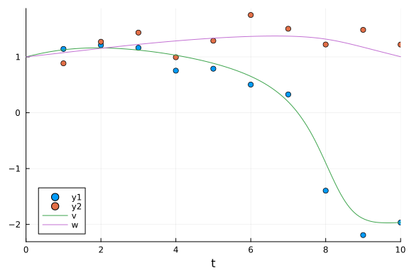

```julia
using DiffEqBayes, BenchmarkTools
```


```julia
using OrdinaryDiffEq, RecursiveArrayTools, Distributions, ParameterizedFunctions,
      StanSample, DynamicHMC
using Plots, StaticArrays, Turing, LinearAlgebra
```


```julia
"""Print elapsed sampling time and the Turing chain."""
function display_ess_per_sec(chain, elapsed)
    println("Elapsed time: $(round(elapsed; digits=2)) seconds")
    display(chain)
end

# Distributions requires a vector mean; sol[:, i] can be a scalar after ODE 7.
_mvn(u, σ) = MvNormal(
    let n = length(σ)
        μ = u isa AbstractVector ? collect(float.(u)) : [float(u)]
        length(μ) == n ? μ : fill(μ[1], n)
    end,
    Diagonal(σ .^ 2),
)

"""Extract and display Stan's internal timing from its CSV output files."""
function display_stan_timing(stan_result)
    sample_files = stan_result.model.sample_file
    for (chain_idx, f) in enumerate(sample_files)
        isfile(f) || continue
        lines = readlines(f)
        println("Chain $chain_idx timing (from Stan CSV):")
        for line in lines
            if startswith(line, "#") && occursin("Elapsed Time", line)
                println("  ", strip(line[2:end]))
            elseif startswith(line, "#") && occursin("seconds", line)
                println("  ", strip(line[2:end]))
            end
        end
    end
end
```

```
Main.var"##WeaveSandBox#277".display_stan_timing
```


```julia
gr(fmt = :png)
```

```
Plots.GRBackend()
```


### Defining the problem.

The [FitzHugh-Nagumo model](https://en.wikipedia.org/wiki/FitzHugh%E2%80%93Nagumo_model) is a simplified version of [Hodgkin-Huxley model](https://en.wikipedia.org/wiki/Hodgkin%E2%80%93Huxley_model) and is used to describe an excitable system (e.g. neuron).

```julia
fitz = @ode_def FitzhughNagumo begin
    dv = v - 0.33*v^3 - w + l
    dw = τinv*(v + a - b*w)
end a b τinv l
```

```
Main.var"##WeaveSandBox#277".FitzhughNagumo{Main.var"##WeaveSandBox#277".va
r"###ParameterizedDiffEqFunction#279", Main.var"##WeaveSandBox#277".var"###
ParameterizedTGradFunction#280", Main.var"##WeaveSandBox#277".var"###Parame
terizedJacobianFunction#281", Nothing, Nothing, ModelingToolkitBase.System}
(Main.var"##WeaveSandBox#277".var"##ParameterizedDiffEqFunction#279", Linea
rAlgebra.UniformScaling{Bool}(true), nothing, Main.var"##WeaveSandBox#277".
var"##ParameterizedTGradFunction#280", Main.var"##WeaveSandBox#277".var"##P
arameterizedJacobianFunction#281", nothing, nothing, nothing, nothing, noth
ing, nothing, nothing, [:v, :w], :t, nothing, Model ##Parameterized#278:
Equations (2):
  2 standard: see equations(##Parameterized#278)
Unknowns (2): see unknowns(##Parameterized#278)
  v(t)
  w(t)
Parameters (4): see parameters(##Parameterized#278)
  a
  b
  τinv
  l, nothing, nothing)
```


```julia
prob_ode_fitzhughnagumo = ODEProblem(fitz, [1.0, 1.0], (0.0, 10.0), [0.7, 0.8, 1/12.5, 0.5])
sol = solve(prob_ode_fitzhughnagumo, Tsit5())
```

```
retcode: Success
Interpolation: specialized 4th order "free" interpolation
t: 13-element Vector{Float64}:
  0.0
  0.1502916178003539
  0.6611860158920579
  1.4391493908273403
  2.589451591547814
  3.7602377960785525
  5.101014337183989
  6.709997524274457
  7.604553475030161
  8.336547696252527
  9.031279335406245
  9.556400185811816
 10.0
u: 13-element Vector{Vector{Float64}}:
 [1.0, 1.0]
 [1.0247192356111163, 1.0109189409610948]
 [1.0944137341238236, 1.049239334584406]
 [1.1525604472298032, 1.1092965960073389]
 [1.1446577625483758, 1.1952738138449215]
 [1.0557695077719014, 1.2718985818139574]
 [0.8659598744812583, 1.3388184800875969]
 [0.3675854021172527, 1.3735376018319738]
 [-0.3594427955481846, 1.3493319650351674]
 [-1.3772889489189293, 1.2781711184359077]
 [-1.905699839713037, 1.1680023987534751]
 [-1.9707492736430974, 1.0777291565175875]
 [-1.9650453438870346, 1.0031251492628281]
```


```julia
sprob_ode_fitzhughnagumo = ODEProblem{false, SciMLBase.FullSpecialize}(
    fitz, SA[1.0, 1.0], (0.0, 10.0), SA[0.7, 0.8, 1 / 12.5, 0.5])
sol = solve(sprob_ode_fitzhughnagumo, Tsit5())
```

```
retcode: Success
Interpolation: specialized 4th order "free" interpolation
t: 13-element Vector{Float64}:
  0.0
  0.1502916178003539
  0.6611860158920579
  1.4391493908273403
  2.589451591547814
  3.7602377960785525
  5.101014337183989
  6.709997524274457
  7.604553475030161
  8.336547696252527
  9.031279335406245
  9.556400185811816
 10.0
u: 13-element Vector{StaticArraysCore.SVector{2, Float64}}:
 [1.0, 1.0]
 [1.0247192356111163, 1.0109189409610948]
 [1.0944137341238236, 1.049239334584406]
 [1.1525604472298032, 1.1092965960073389]
 [1.1446577625483758, 1.1952738138449215]
 [1.0557695077719014, 1.2718985818139574]
 [0.8659598744812583, 1.3388184800875969]
 [0.3675854021172527, 1.3735376018319738]
 [-0.3594427955481846, 1.3493319650351674]
 [-1.3772889489189293, 1.2781711184359077]
 [-1.905699839713037, 1.1680023987534751]
 [-1.9707492736430974, 1.0777291565175875]
 [-1.9650453438870346, 1.0031251492628281]
```


Data is generated by adding noise to the solution obtained above.

```julia
t = collect(range(1, stop = 10, length = 10))
sig = 0.20
data = convert(Array, VectorOfArray([(sol(t[i]) + sig*randn(2)) for i in 1:length(t)]))
```

```
2×10 Matrix{Float64}:
 1.14221   1.21014  1.16264  0.753106  …  -1.39607  -2.19142  -1.96639
 0.884597  1.27066  1.4347   0.992987      1.22151   1.48364   1.22042
```


### Plot of the data and the solution.

```julia
scatter(t, data[1, :])
scatter!(t, data[2, :])
plot!(sol)
```




### Priors for the parameters which will be passed for the Bayesian Inference

```julia
priors = [truncated(Normal(1.0, 0.5), 0, 1.5), truncated(Normal(1.0, 0.5), 0, 1.5),
    truncated(Normal(0.0, 0.5), 0.0, 0.5), truncated(Normal(0.5, 0.5), 0, 1)]
```

```
4-element Vector{Distributions.Truncated{Distributions.Normal{Float64}, Dis
tributions.Continuous, Float64, Float64, Float64}}:
 Truncated(Distributions.Normal{Float64}(μ=1.0, σ=0.5); lower=0.0, upper=1.
5)
 Truncated(Distributions.Normal{Float64}(μ=1.0, σ=0.5); lower=0.0, upper=1.
5)
 Truncated(Distributions.Normal{Float64}(μ=0.0, σ=0.5); lower=0.0, upper=0.
5)
 Truncated(Distributions.Normal{Float64}(μ=0.5, σ=0.5); lower=0.0, upper=1.
0)
```


### Benchmarks

#### Stan.jl backend

We use `adapt_delta = 0.85` (Stan's default) consistently across all backends for a fair comparison.

```julia
bayesian_result_stan = @time stan_inference(
    prob_ode_fitzhughnagumo, :rk45, t, data, priors;
    print_summary = false,
    sample_kwargs = Dict(:delta => 0.85, :num_samples => 10_000),
    vars = (DiffEqBayes.StanODEData(), InverseGamma(2, 3)))
```

```
77.813261 seconds (4.89 M allocations: 239.380 MiB, 0.25% gc time, 4.85% c
ompilation time)
112.749641 seconds (34.54 M allocations: 1.705 GiB, 0.45% gc time, 14.56% c
ompilation time: 2% of which was recompilation)
10000×6 DataFrame
   Row │ sigma1.1  sigma1.2  theta_1   theta_2   theta_3    theta_4
       │ Float64   Float64   Float64   Float64   Float64    Float64
───────┼─────────────────────────────────────────────────────────────
     1 │ 0.365038  0.380852  1.29242   0.308144  0.034126   0.494373
     2 │ 0.86269   0.326737  1.04728   0.964062  0.0469634  0.421378
     3 │ 0.347589  0.293769  0.861474  0.371166  0.0608809  0.590995
     4 │ 0.416714  0.324897  0.332552  0.423464  0.0986979  0.58639
     5 │ 0.321029  0.384109  0.901959  0.732185  0.0506977  0.45285
     6 │ 0.349643  0.314845  1.39298   0.889437  0.0639647  0.584447
     7 │ 0.377891  0.393565  1.3832    0.973481  0.0932183  0.726972
     8 │ 0.39721   0.353124  0.509067  0.555115  0.0476631  0.411749
   ⋮   │    ⋮         ⋮         ⋮         ⋮          ⋮         ⋮
  9994 │ 0.264968  0.300227  0.969477  0.724397  0.0677749  0.535409
  9995 │ 0.454213  0.475924  0.795519  0.706114  0.0834425  0.592522
  9996 │ 0.418423  0.512727  0.933985  0.913035  0.0725448  0.473902
  9997 │ 0.426785  0.332422  0.846243  0.585637  0.060041   0.530267
  9998 │ 0.467653  0.321215  0.745938  0.73412   0.0715218  0.500027
  9999 │ 0.411892  0.258825  1.21189   0.663628  0.0661827  0.602318
 10000 │ 0.558332  0.359402  1.17441   1.21245   0.0746187  0.481378
                                                    9985 rows omitted
```


Stan's internal timing (excluding data serialization and CSV parsing):

```julia
display_stan_timing(bayesian_result_stan)
```

```
Chain 1 timing (from Stan CSV):
  Elapsed Time: 5.736 seconds (Warm-up)
  68.293 seconds (Sampling)
  74.029 seconds (Total)
```


### Direct Turing.jl

We use per-dimension noise parameters (matching Stan) with `InverseGamma(2, 3)` priors on each `σ`.

```julia
@model function fitfhn(data, prob)
    # Prior distributions.
    σ ~ filldist(InverseGamma(2, 3), 2)
    a ~ truncated(Normal(1.0, 0.5), 0, 1.5)
    b ~ truncated(Normal(1.0, 0.5), 0, 1.5)
    τinv ~ truncated(Normal(0.0, 0.5), 0.0, 0.5)
    l ~ truncated(Normal(0.5, 0.5), 0, 1)

    # Simulate FitzHugh-Nagumo model.
    p = SA[a, b, τinv, l]
    _prob = remake(prob, p = p)
    predicted = solve(_prob, Tsit5(); saveat = t)

    # Observations.
    for i in axes(data, 2)
        data[:, i] ~ _mvn(predicted(t[i]), σ)
    end

    return nothing
end

model = fitfhn(data, sprob_ode_fitzhughnagumo)

# Warmup run to compile all code paths before timing
sample(model, Turing.NUTS(0.85), 10; progress = false)

elapsed_turing_direct = @elapsed chain = sample(model, Turing.NUTS(0.85), 10_000; progress = false)
chain
```

```
╭─FlexiChain (10000 iterations, 1 chain) ──────────────────────────────────
────╮
│ ↓ iter  = 1001:11000                                                     
    │
│ → chain = 1:1                                                            
    │
│                                                                          
    │
│ Parameters (5) ── AbstractPPL.VarName                                    
    │
│  Vector{Float64}  σ (2,)                                                 
    │
│  Float64          a, b, τinv, l                                          
    │
│                                                                          
    │
│ Extras (14)                                                              
    │
│  Int64    n_steps, tree_depth                                            
    │
│  Bool     is_accept, numerical_error                                     
    │
│  Float64  acceptance_rate, log_density, hamiltonian_energy,              
    │
│           hamiltonian_energy_error, max_hamiltonian_energy_error, step_si
ze, │
│           nom_step_size, logprior, loglikelihood, logjoint               
    │
╰──────────────────────────────────────────────────────────────────────────
────╯
```


```julia
display_ess_per_sec(chain, elapsed_turing_direct)
```

```
Elapsed time: 101.39 seconds
╭─FlexiChain (10000 iterations, 1 chain) ──────────────────────────────────
────╮
│ ↓ iter  = 1001:11000                                                     
    │
│ → chain = 1:1                                                            
    │
│                                                                          
    │
│ Parameters (5) ── AbstractPPL.VarName                                    
    │
│  Vector{Float64}  σ (2,)                                                 
    │
│  Float64          a, b, τinv, l                                          
    │
│                                                                          
    │
│ Extras (14)                                                              
    │
│  Int64    n_steps, tree_depth                                            
    │
│  Bool     is_accept, numerical_error                                     
    │
│  Float64  acceptance_rate, log_density, hamiltonian_energy,              
    │
│           hamiltonian_energy_error, max_hamiltonian_energy_error, step_si
ze, │
│           nom_step_size, logprior, loglikelihood, logjoint               
    │
╰──────────────────────────────────────────────────────────────────────────
────╯
```


#### Turing.jl backend

```julia
@btime bayesian_result_turing = turing_inference(
    prob_ode_fitzhughnagumo, Tsit5(), t, data, priors;
    sample_args = (sampler = Turing.NUTS(0.85), num_samples = 10_000),
    likelihood = (u, p, t, σ) -> _mvn(u, σ),
    likelihood_dist_priors = [InverseGamma(2, 3), InverseGamma(2, 3)])
```

```
145.064 s (740383443 allocations: 44.52 GiB)
╭─FlexiChain (10000 iterations, 1 chain) ──────────────────────────────────
────╮
│ ↓ iter  = 1001:11000                                                     
    │
│ → chain = 1:1                                                            
    │
│                                                                          
    │
│ Parameters (5) ── AbstractPPL.VarName                                    
    │
│  Float64          theta[1], theta[2], theta[3], theta[4]                 
    │
│  Vector{Float64}  σ (2,)                                                 
    │
│                                                                          
    │
│ Extras (14)                                                              
    │
│  Int64    n_steps, tree_depth                                            
    │
│  Bool     is_accept, numerical_error                                     
    │
│  Float64  acceptance_rate, log_density, hamiltonian_energy,              
    │
│           hamiltonian_energy_error, max_hamiltonian_energy_error, step_si
ze, │
│           nom_step_size, logprior, loglikelihood, logjoint               
    │
╰──────────────────────────────────────────────────────────────────────────
────╯
```


# Conclusion

FitzHugh-Ngumo is a standard problem for parameter estimation studies. In the FitzHugh-Nagumo model the parameters to be estimated were `[0.7,0.8,0.08,0.5]`.
`dynamichmc_inference` has issues with the model and hence was excluded from this benchmark.


## Appendix

These benchmarks are a part of the SciMLBenchmarks.jl repository, found at: [https://github.com/SciML/SciMLBenchmarks.jl](https://github.com/SciML/SciMLBenchmarks.jl). For more information on high-performance scientific machine learning, check out the SciML Open Source Software Organization [https://sciml.ai](https://sciml.ai).

To locally run this benchmark, do the following commands:
```
using SciMLBenchmarks
SciMLBenchmarks.weave_file("benchmarks/BayesianInference","DiffEqBayesFitzHughNagumo.jmd")
```

Computer Information:

```
Julia Version 1.12.7
Commit 6d172b025e4 (2026-08-15 08:05 UTC)
Build Info:
  Official https://julialang.org release
Platform Info:
  OS: Linux (x86_64-linux-gnu)
  CPU: 128 × AMD EPYC 7502 32-Core Processor
  WORD_SIZE: 64
  LLVM: libLLVM-18.1.7 (ORCJIT, znver2)
  GC: Built with stock GC
Threads: 128 default, 1 interactive, 128 GC (on 128 virtual cores)
Environment:
  JULIA_NUM_THREADS = auto

```

Package Information:

```
Status `/julia/github-runners/amdci1-1/_work/SciMLBenchmarks.jl/SciMLBenchmarks.jl/benchmarks/BayesianInference/Project.toml`
  [6e4b80f9] BenchmarkTools v1.8.0
  [ebbdde9d] DiffEqBayes v3.16.1
  [459566f4] DiffEqCallbacks v4.19.3
  [31c24e10] Distributions v0.25.131
  [bbc10e6e] DynamicHMC v3.6.1
  [1dea7af3] OrdinaryDiffEq v7.8.1
  [65888b18] ParameterizedFunctions v5.27.0
  [91a5bcdd] Plots v1.41.7
  [731186ca] RecursiveArrayTools v4.5.1
  [31c91b34] SciMLBenchmarks v0.2.1 [loaded: `/julia/github-runners/amdci1-1/_work/SciMLBenchmarks.jl/SciMLBenchmarks.jl/src/SciMLBenchmarks.jl` (v0.2.1) expected `/home/crackauc/.julia/packages/SciMLBenchmarks/ceJyd/src/SciMLBenchmarks.jl` (v0.2.1)]
  [c1514b29] StanSample v7.10.3
  [90137ffa] StaticArrays v1.9.20
⌅ [fce5fe82] Turing v0.46.1
  [37e2e46d] LinearAlgebra v1.12.0
Info Packages marked with ⌅ have new versions available but compatibility constraints restrict them from upgrading. To see why use `status --outdated`
```

And the full manifest:

```
Status `/julia/github-runners/amdci1-1/_work/SciMLBenchmarks.jl/SciMLBenchmarks.jl/benchmarks/BayesianInference/Manifest.toml`
  [47edcb42] ADTypes v1.24.0
  [14f7f29c] AMD v0.5.4
  [621f4979] AbstractFFTs v1.5.0
  [80f14c24] AbstractMCMC v5.16.0
  [7a57a42e] AbstractPPL v0.15.5
  [6e696c72] AbstractPlutoDingetjes v1.4.1
  [1520ce14] AbstractTrees v0.4.5
  [7d9f7c33] Accessors v0.1.45
  [79e6a3ab] Adapt v4.7.0
  [0bf59076] AdvancedHMC v0.8.7
  [5b7e9947] AdvancedMH v0.8.10
⌅ [576499cb] AdvancedPS v0.7.2
  [b5ca4192] AdvancedVI v0.7.0
  [66dad0bd] AliasTables v1.1.3
  [dce04be8] ArgCheck v2.5.0
  [ec485272] ArnoldiMethod v0.4.0
  [4fba245c] ArrayInterface v7.30.1
  [4c555306] ArrayLayouts v1.12.2
  [aae01518] BandedMatrices v1.12.0
  [198e06fe] BangBang v0.4.9
  [6e4b80f9] BenchmarkTools v1.8.0
  [e2ed5e7c] Bijections v0.2.2
  [76274a88] Bijectors v0.16.3
  [b2a6c25c] BinaryHeaps v1.1.0
  [caf10ac8] BipartiteGraphs v0.1.14
  [8e7c35d0] BlockArrays v1.10.0
  [70df07ce] BracketingNonlinearSolve v1.12.7
  [336ed68f] CSV v0.10.17
  [d360d2e6] ChainRulesCore v1.26.1
  [0ca39b1e] Chairmarks v1.3.1
  [9e997f8a] ChangesOfVariables v0.1.11
  [944b1d66] CodecZlib v0.7.9
  [35d6a980] ColorSchemes v3.31.0
  [3da002f7] ColorTypes v0.12.1
  [c3611d14] ColorVectorSpace v0.11.0
  [5ae59095] Colors v0.13.1
⌅ [861a8166] Combinatorics v1.0.2
  [38540f10] CommonSolve v0.2.14
  [bbf7d656] CommonSubexpressions v0.3.1
  [f70d9fcc] CommonWorldInvalidations v1.2.2
  [34da2185] Compat v4.18.1
  [5224ae11] CompatHelperLocal v0.1.29
  [b152e2b5] CompositeTypes v0.1.4
  [a33af91c] CompositionsBase v0.1.2
  [2569d6c7] ConcreteStructs v0.2.8
  [88cd18e8] ConsoleProgressMonitor v0.1.2
  [187b0558] ConstructionBase v1.6.0
  [d38c429a] Contour v0.6.3
  [a8cc5b0e] Crayons v4.2.0
  [9a962f9c] DataAPI v1.16.0
  [a93c6f00] DataFrames v1.8.2
  [864edb3b] DataStructures v0.19.6
  [e2d170a0] DataValueInterfaces v1.0.0
  [8bb1440f] DelimitedFiles v1.9.1
  [b429d917] DensityInterface v0.4.0
  [2b5f629d] DiffEqBase v7.21.0
  [ebbdde9d] DiffEqBayes v3.16.1
  [459566f4] DiffEqCallbacks v4.19.3
  [163ba53b] DiffResults v1.1.0
  [b552c78f] DiffRules v1.16.0
  [a0c0ee7d] DifferentiationInterface v0.7.21
  [0703355e] DimensionalData v0.30.2
  [b4f34e82] Distances v0.10.12
  [31c24e10] Distributions v0.25.131
  [ffbed154] DocStringExtensions v0.9.5
  [5b8099bc] DomainSets v0.8.1
  [bbc10e6e] DynamicHMC v3.6.1
  [366bfd00] DynamicPPL v0.42.12
  [7c1d4256] DynamicPolynomials v0.6.8
  [cad2338a] EllipticalSliceSampling v2.0.0
  [4e289a0a] EnumX v1.0.7
  [f151be2c] EnzymeCore v0.8.21
  [e2ba6199] ExprTools v0.1.11
  [55351af7] ExproniconLite v0.10.14
  [411431e0] Extents v0.1.6
  [c87230d0] FFMPEG v0.4.5
  [7034ab61] FastBroadcast v1.4.0
  [9aa1b823] FastClosures v0.3.2
  [a4df4552] FastPower v1.5.0
  [48062228] FilePathsBase v0.9.24
  [1a297f60] FillArrays v1.17.0
  [64ca27bc] FindFirstFunctions v3.2.1
  [6a86dc24] FiniteDiff v2.33.0
⌅ [53c48c17] FixedPointNumbers v0.8.6
  [4a37a8b9] FlexiChains v0.6.38
  [1fa38f19] Format v1.3.7
⌃ [f6369f11] ForwardDiff v1.4.5
  [a85aefff] FunctionMaps v0.1.2
  [069b7b12] FunctionWrappers v1.1.3
  [77dc65aa] FunctionWrappersWrappers v1.13.0
  [d9f16b24] Functors v0.5.3
  [46192b85] GPUArraysCore v0.2.0
  [28b8d3ca] GR v0.73.27
⌃ [a0844989] Gamma v1.1.0
  [86223c79] Graphs v1.15.0
⌅ [eafb193a] Highlights v0.5.3
  [34004b35] HypergeometricFunctions v0.3.30
  [3263718b] ImplicitDiscreteSolve v2.3.0
  [d25df0c9] Inflate v0.1.5
  [22cec73e] InitialValues v0.3.1
⌅ [842dd82b] InlineStrings v1.4.6
  [18e54dd8] IntegerMathUtils v0.1.4
  [85a1e053] Interfaces v0.3.2
  [8197267c] IntervalSets v0.7.14
  [3587e190] InverseFunctions v0.1.17
  [41ab1584] InvertedIndices v1.3.1
  [92d709cd] IrrationalConstants v0.2.6
  [82899510] IteratorInterfaceExtensions v1.0.0
  [1019f520] JLFzf v0.1.11
  [692b3bcd] JLLWrappers v1.8.0
⌅ [682c06a0] JSON v0.21.4
  [ae98c720] Jieko v0.2.1
  [ccbc3e58] JumpProcesses v9.32.3
  [ba0b0d4f] Krylov v0.10.9
  [2faa5264] LHLFactorization v2.2.2
  [b964fa9f] LaTeXStrings v1.4.1
  [23fbe1c1] Latexify v0.16.12
  [1fad7336] LazyStack v0.1.3
  [1d6d02ad] LeftChildRightSiblingTrees v0.3.0
  [6f1fad26] Libtask v0.9.19
  [87fe0de2] LineSearch v0.1.17
  [d3d80556] LineSearches v7.8.1
⌃ [7ed4a6bd] LinearSolve v5.17.1
  [6fdf6af0] LogDensityProblems v2.2.0
  [996a588d] LogDensityProblemsAD v1.13.1
⌅ [2ab3a3ac] LogExpFunctions v0.3.29
  [e6f89c97] LoggingExtras v1.2.0
  [be115224] MCMCDiagnosticTools v0.3.19
  [e80e1ace] MLJModelInterface v1.12.1
  [1914dd2f] MacroTools v0.5.16
  [dbb5928d] MappedArrays v0.4.3
  [bb5d69b7] MaybeInplace v0.1.8
  [442fdcdd] Measures v0.3.3
  [e1d29d7a] Missings v1.2.0
  [dbe65cb8] MistyClosures v2.1.0
  [961ee093] ModelingToolkit v11.42.1
⌃ [7771a370] ModelingToolkitBase v1.69.1
  [6bb917b9] ModelingToolkitTearing v1.20.6
⌅ [2e0e35c7] Moshi v0.3.9
  [46d2c3a1] MuladdMacro v0.2.7
  [102ac46a] MultivariatePolynomials v0.5.19
  [ffc61752] Mustache v1.0.21
  [d8a4904e] MutableArithmetics v1.8.0
  [d41bc354] NLSolversBase v8.0.1
  [77ba4419] NaNMath v1.1.4
  [d9ec5142] NamedTupleTools v0.14.3
  [8913a72c] NonlinearSolve v4.30.0
  [be0214bd] NonlinearSolveBase v2.49.5
  [5959db7a] NonlinearSolveFirstOrder v2.6.1
  [9a2c21bd] NonlinearSolveQuasiNewton v1.15.3
  [26075421] NonlinearSolveSpectralMethods v1.8.3
  [6fe1bfb0] OffsetArrays v1.17.0
  [429524aa] Optim v2.3.1
  [3bd65402] Optimisers v0.4.9
  [7f7a1694] Optimization v5.9.0
  [bca83a33] OptimizationBase v5.5.3
  [36348300] OptimizationOptimJL v0.4.21
⌅ [bac558e1] OrderedCollections v1.8.2 [loaded: v2.0.1]
  [1dea7af3] OrdinaryDiffEq v7.8.1
⌃ [6ad6398a] OrdinaryDiffEqBDF v2.4.7
⌃ [bbf590c4] OrdinaryDiffEqCore v4.17.0
⌃ [50262376] OrdinaryDiffEqDefault v2.6.0
  [4302a76b] OrdinaryDiffEqDifferentiation v3.11.5
  [127b3ac7] OrdinaryDiffEqNonlinearSolve v2.9.6
⌃ [43230ef6] OrdinaryDiffEqRosenbrock v2.7.1
  [b4bd8bb3] OrdinaryDiffEqRosenbrockTableaus v2.4.2
  [2d112036] OrdinaryDiffEqSDIRK v2.9.2
  [b1df2697] OrdinaryDiffEqTsit5 v2.1.4
  [79d7bb75] OrdinaryDiffEqVerner v2.4.1
  [90014a1f] PDMats v0.11.41
  [65888b18] ParameterizedFunctions v5.27.0
⌅ [d96e819e] Parameters v0.12.3
⌅ [69de0a69] Parsers v2.8.8
  [569bd051] PartitionedDistributions v0.1.0
  [ccf2f8ad] PlotThemes v3.3.0
  [995b91a9] PlotUtils v1.4.4
  [91a5bcdd] Plots v1.41.7
  [e409e4f3] PoissonRandom v0.4.13
  [2dfb63ee] PooledArrays v1.4.3
  [85a6dd25] PositiveFactorizations v0.2.4
  [d236fae5] PreallocationTools v1.7.1
  [aea7be01] PrecompileTools v1.3.4
  [21216c6a] Preferences v1.5.2
  [08abe8d2] PrettyTables v3.4.8
  [27ebfcd6] Primes v0.5.7
  [33c8b6b6] ProgressLogging v0.1.6
  [92933f4c] ProgressMeter v1.11.0
  [43287f4e] PtrArrays v1.4.0
  [0c0d3e7f] PureKLU v1.4.2
  [1fd47b50] QuadGK v2.11.3
  [74087812] Random123 v1.7.1
  [e6cf234a] RandomNumbers v1.6.0
  [988b38a3] ReadOnlyArrays v0.2.0
  [795d4caa] ReadOnlyDicts v1.0.1
  [3cdcf5f2] RecipesBase v1.3.4
  [01d81517] RecipesPipeline v0.6.12
  [731186ca] RecursiveArrayTools v4.5.1
  [189a3867] Reexport v1.2.2
  [05181044] RelocatableFolders v1.0.1
  [ae029012] Requires v1.3.1
  [9fe22ead] RespecializeParams v1.3.0
  [79098fc4] Rmath v0.9.0
  [f2b01f46] Roots v3.0.8
  [7e49a35a] RuntimeGeneratedFunctions v0.5.26
  [9dfe8606] SCCNonlinearSolve v1.15.3
  [26aad666] SSMProblems v0.6.1
⌃ [0bca4576] SciMLBase v3.53.2
  [31c91b34] SciMLBenchmarks v0.2.1 [loaded: `/julia/github-runners/amdci1-1/_work/SciMLBenchmarks.jl/SciMLBenchmarks.jl/src/SciMLBenchmarks.jl` (v0.2.1) expected `/home/crackauc/.julia/packages/SciMLBenchmarks/ceJyd/src/SciMLBenchmarks.jl` (v0.2.1)]
  [19f34311] SciMLJacobianOperators v0.1.19
  [a6db7da4] SciMLLogging v2.1.0
  [c0aeaf25] SciMLOperators v1.30.0
  [431bcebd] SciMLPublic v1.3.0
  [53ae85a6] SciMLStructures v1.10.5
  [30f210dd] ScientificTypesBase v3.1.0
  [6c6a2e73] Scratch v1.3.0
  [91c51154] SentinelArrays v1.4.10
  [efcf1570] Setfield v1.1.2
  [992d4aef] Showoff v1.1.1
  [727e6d20] SimpleNonlinearSolve v2.14.3
  [699a6c99] SimpleTraits v0.9.6
  [a2af1166] SortingAlgorithms v1.2.3
  [a57abbd0] SparseColumnPivotedQR v2.1.8
  [9f842d2f] SparseConnectivityTracer v1.2.3
  [0a514795] SparseMatrixColorings v0.4.28
  [276daf66] SpecialFunctions v2.9.0
  [860ef19b] StableRNGs v1.0.4
  [d0ee94f6] StanBase v4.12.4
  [c1514b29] StanSample v7.10.3
  [0c0c59c1] StarAlgebras v0.3.0
  [64909d44] StateSelection v1.11.1
  [90137ffa] StaticArrays v1.9.20
  [1e83bf80] StaticArraysCore v1.4.4
  [64bff920] StatisticalTraits v3.5.0
  [10745b16] Statistics v1.11.5
  [82ae8749] StatsAPI v1.8.0
  [2913bbd2] StatsBase v0.34.13
⌅ [4c63d2b9] StatsFuns v1.5.3
  [5e0ebb24] Strided v2.6.4
  [4db3bf67] StridedViews v0.5.2
  [69024149] StringEncodings v0.3.7
⌅ [892a3eda] StringManipulation v0.5.0
  [2efcf032] SymbolicIndexingInterface v0.3.55
  [19f23fe9] SymbolicLimits v1.2.1
⌃ [d1185830] SymbolicUtils v4.46.4
  [0c5d862f] Symbolics v7.39.2
  [ab02a1b2] TableOperations v1.2.0
  [3783bdb8] TableTraits v1.0.1
  [bd369af6] Tables v1.14.0
  [ed4db957] TaskLocalValues v0.1.3
  [02d47bb6] TensorCast v0.4.9
  [62fd8b95] TensorCore v0.1.1
  [8ea1fca8] TermInterface v2.0.0
  [5d786b92] TerminalLoggers v0.1.8
  [a759f4b9] TimerOutputs v1.2.1
  [3bb67fe8] TranscodingStreams v0.11.3
  [84d833dd] TransformVariables v0.8.26
  [f9bc47f6] TransformedLogDensities v1.1.1
  [24ddb15e] TransmuteDims v0.1.17
  [781d530d] TruncatedStacktraces v1.4.0
  [9d95972d] TupleTools v1.6.0
⌅ [fce5fe82] Turing v0.46.1
  [3a884ed6] UnPack v1.0.2
  [1cfade01] UnicodeFun v0.4.1
  [41fe7b60] Unzip v0.2.0
  [d30d5f5c] WeakCacheSets v0.1.0
  [ea10d353] WeakRefStrings v1.4.3
  [44d3d7a6] Weave v0.10.12
  [76eceee3] WorkerUtilities v1.6.1
  [ddb6d928] YAML v0.4.16
  [6e34b625] Bzip2_jll v1.0.9+0
  [83423d85] Cairo_jll v1.18.7+0
  [ee1fde0b] Dbus_jll v1.16.2+0
  [2702e6a9] EpollShim_jll v0.0.20230411+1
  [2e619515] Expat_jll v2.8.4+0
⌅ [b22a6f82] FFMPEG_jll v8.1.2+0
  [a3f928ae] Fontconfig_jll v2.17.1+0
  [d7e528f0] FreeType2_jll v2.14.3+1
  [559328eb] FriBidi_jll v1.0.17+0
  [0656b61e] GLFW_jll v3.5.1+0
  [d2c73de3] GR_jll v0.73.27+0
⌅ [b0724c58] GettextRuntime_jll v0.22.4+0
  [61579ee1] Ghostscript_jll v9.55.1+0
  [7746bdde] Glib_jll v2.88.3+0
  [3b182d85] Graphite2_jll v1.3.16+0
  [2e76f6c2] HarfBuzz_jll v100.14004.0+0
  [1d5cc7b8] IntelOpenMP_jll v2025.2.0+0
  [aacddb02] JpegTurbo_jll v3.2.0+1
  [c1c5ebd0] LAME_jll v3.100.3+0
  [88015f11] LERC_jll v4.2.0+0
  [1d63c593] LLVMOpenMP_jll v23.1.1+0
⌅ [e9f186c6] Libffi_jll v3.4.7+0
  [7e76a0d4] Libglvnd_jll v1.7.1+1
  [94ce4f54] Libiconv_jll v1.18.0+0
  [4b2f31a3] Libmount_jll v2.42.0+0
  [89763e89] Libtiff_jll v4.7.3+0
  [38a345b3] Libuuid_jll v2.42.0+0
  [856f044c] MKL_jll v2025.2.0+0
  [e7412a2a] Ogg_jll v1.3.6+0
  [efe28fd5] OpenSpecFun_jll v0.5.6+0
  [91d4177d] Opus_jll v1.6.1+0
  [36c8627f] Pango_jll v1.58.2+0
  [30392449] Pixman_jll v0.46.4+0
  [c0090381] Qt6Base_jll v6.10.2+2
  [629bc702] Qt6Declarative_jll v6.10.2+2
  [ce943373] Qt6ShaderTools_jll v6.10.2+1
  [6de9746b] Qt6Svg_jll v6.10.2+0
  [e99dba38] Qt6Wayland_jll v6.10.2+1
  [f50d1b31] Rmath_jll v0.5.2+0
  [a44049a8] Vulkan_Loader_jll v1.3.243+0
  [a2964d1f] Wayland_jll v1.24.0+0
  [ffd25f8a] XZ_jll v5.8.4+0
  [f67eecfb] Xorg_libICE_jll v1.1.2+0
  [c834827a] Xorg_libSM_jll v1.2.6+0
  [4f6342f7] Xorg_libX11_jll v1.8.13+0
  [0c0b7dd1] Xorg_libXau_jll v1.0.13+0
  [935fb764] Xorg_libXcursor_jll v1.2.4+0
  [a3789734] Xorg_libXdmcp_jll v1.1.6+0
  [1082639a] Xorg_libXext_jll v1.3.8+0
  [d091e8ba] Xorg_libXfixes_jll v6.0.2+0
  [a51aa0fd] Xorg_libXi_jll v1.8.4+0
  [d1454406] Xorg_libXinerama_jll v1.1.7+0
  [ec84b674] Xorg_libXrandr_jll v1.5.6+0
  [ea2f1a96] Xorg_libXrender_jll v0.9.12+0
  [a65dc6b1] Xorg_libpciaccess_jll v0.19.0+0
  [c7cfdc94] Xorg_libxcb_jll v1.17.1+0
  [cc61e674] Xorg_libxkbfile_jll v1.2.0+0
  [e920d4aa] Xorg_xcb_util_cursor_jll v0.1.6+0
  [12413925] Xorg_xcb_util_image_jll v0.4.1+0
  [2def613f] Xorg_xcb_util_jll v0.4.1+0
  [975044d2] Xorg_xcb_util_keysyms_jll v0.4.1+0
  [0d47668e] Xorg_xcb_util_renderutil_jll v0.3.10+0
  [c22f9ab0] Xorg_xcb_util_wm_jll v0.4.2+0
  [35661453] Xorg_xkbcomp_jll v1.4.7+0
  [33bec58e] Xorg_xkeyboard_config_jll v2.47.0+2
  [c5fb5394] Xorg_xtrans_jll v1.6.0+0
  [3161d3a3] Zstd_jll v1.5.7+1
  [35ca27e7] eudev_jll v3.2.14+0
⌅ [214eeab7] fzf_jll v0.61.1+0
  [a4ae2306] libaom_jll v3.14.1+0
  [0ac62f75] libass_jll v0.17.5+0
  [1183f4f0] libdecor_jll v0.2.2+0
  [8e53e030] libdrm_jll v2.4.134+0
  [2db6ffa8] libevdev_jll v1.13.4+0
  [f638f0a6] libfdk_aac_jll v2.0.4+0
  [36db933b] libinput_jll v1.28.1+0
  [b53b4c65] libpng_jll v1.6.58+0
  [9a156e7d] libva_jll v2.23.0+0
  [f27f6e37] libvorbis_jll v1.3.8+0
  [009596ad] mtdev_jll v1.1.7+0
  [1317d2d5] oneTBB_jll v2022.3.0+0
⌅ [1270edf5] x264_jll v10164.0.1+0
  [dfaa095f] x265_jll v4.1.0+0
  [d8fb68d0] xkbcommon_jll v1.13.0+0
  [0dad84c5] ArgTools v1.1.2
  [56f22d72] Artifacts v1.11.0
  [2a0f44e3] Base64 v1.11.0
  [ade2ca70] Dates v1.11.0
  [8ba89e20] Distributed v1.11.0
  [f43a241f] Downloads v1.7.0
  [7b1f6079] FileWatching v1.11.0
  [9fa8497b] Future v1.11.0
  [b77e0a4c] InteractiveUtils v1.11.0
  [ac6e5ff7] JuliaSyntaxHighlighting v1.12.0
  [4af54fe1] LazyArtifacts v1.11.0
  [b27032c2] LibCURL v0.6.4
  [76f85450] LibGit2 v1.11.0
  [8f399da3] Libdl v1.11.0
  [37e2e46d] LinearAlgebra v1.12.0
  [56ddb016] Logging v1.11.0
  [d6f4376e] Markdown v1.11.0
  [a63ad114] Mmap v1.11.0
  [ca575930] NetworkOptions v1.3.0
  [44cfe95a] Pkg v1.12.1
  [de0858da] Printf v1.11.0
  [9abbd945] Profile v1.11.0
  [3fa0cd96] REPL v1.11.0
  [9a3f8284] Random v1.11.0
  [ea8e919c] SHA v0.7.0
  [9e88b42a] Serialization v1.11.0
  [6462fe0b] Sockets v1.11.0
  [2f01184e] SparseArrays v1.12.0
  [f489334b] StyledStrings v1.11.0
  [4607b0f0] SuiteSparse
  [fa267f1f] TOML v1.0.3
  [a4e569a6] Tar v1.10.0
  [8dfed614] Test v1.11.0
  [cf7118a7] UUIDs v1.11.0
  [4ec0a83e] Unicode v1.11.0
  [e66e0078] CompilerSupportLibraries_jll v1.3.1+2
  [deac9b47] LibCURL_jll v8.15.0+0
  [e37daf67] LibGit2_jll v1.9.0+0
  [29816b5a] LibSSH2_jll v1.11.3+1
  [14a3606d] MozillaCACerts_jll v2025.11.4
  [4536629a] OpenBLAS_jll v0.3.29+0
  [05823500] OpenLibm_jll v0.8.7+0
  [458c3c95] OpenSSL_jll v3.5.6+0
  [efcefdf7] PCRE2_jll v10.44.0+1
  [bea87d4a] SuiteSparse_jll v7.8.3+2
  [83775a58] Zlib_jll v1.3.1+2
  [8e850b90] libblastrampoline_jll v5.15.0+0
  [8e850ede] nghttp2_jll v1.64.0+1
  [3f19e933] p7zip_jll v17.7.0+0
Info Packages marked with ⌃ and ⌅ have new versions available. Those with ⌃ may be upgradable, but those with ⌅ are restricted by compatibility constraints from upgrading. To see why use `status --outdated -m`
```

