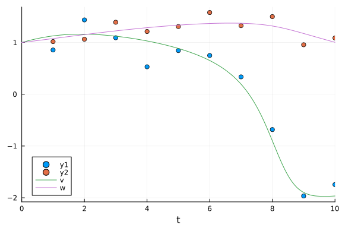

```julia
using DiffEqBayes, BenchmarkTools
```


```julia
using OrdinaryDiffEq, RecursiveArrayTools, Distributions, ParameterizedFunctions, StanSample, DynamicHMC
using Plots, StaticArrays, Turing, LinearAlgebra
```


```julia
gr(fmt=:png)
```

```
Plots.GRBackend()
```


### Defining the problem.

The [FitzHugh-Nagumo model](https://en.wikipedia.org/wiki/FitzHugh%E2%80%93Nagumo_model) is a simplified version of [Hodgkin-Huxley model](https://en.wikipedia.org/wiki/Hodgkin%E2%80%93Huxley_model) and is used to describe an excitable system (e.g. neuron).

```julia
fitz = @ode_def FitzhughNagumo begin
  dv = v - 0.33*v^3 -w + l
  dw = τinv*(v +  a - b*w)
end a b τinv l
```

```
(::Main.var"##WeaveSandBox#292".FitzhughNagumo{Main.var"##WeaveSandBox#292"
.var"###ParameterizedDiffEqFunction#294", Main.var"##WeaveSandBox#292".var"
###ParameterizedTGradFunction#295", Main.var"##WeaveSandBox#292".var"###Par
ameterizedJacobianFunction#296", Nothing, Nothing, ModelingToolkit.ODESyste
m}) (generic function with 1 method)
```


```julia
prob_ode_fitzhughnagumo = ODEProblem(fitz, [1.0,1.0], (0.0,10.0), [0.7,0.8,1/12.5,0.5])
sol = solve(prob_ode_fitzhughnagumo, Tsit5())
```

```
retcode: Success
Interpolation: specialized 4th order "free" interpolation
t: 13-element Vector{Float64}:
  0.0
  0.1502916178003539
  0.6611859977697417
  1.4391494636342572
  2.5894515498152293
  3.760237603808549
  5.101014094147208
  6.709997158618223
  7.604553280596642
  8.336547620442024
  9.03127910678863
  9.55639994619208
 10.0
u: 13-element Vector{Vector{Float64}}:
 [1.0, 1.0]
 [1.0247192356111163, 1.0109189409610948]
 [1.0944137320832108, 1.0492393331998289]
 [1.1525604499975908, 1.1092966016287371]
 [1.1446577644416096, 1.195273810878899]
 [1.0557695278493886, 1.2718985704582837]
 [0.8659599199568303, 1.3388184704641362]
 [0.36758559331262336, 1.3735376027635644]
 [-0.35944256314184636, 1.3493319765636336]
 [-1.3772888489033632, 1.278171128739828]
 [-1.905699772833817, 1.1680024379627076]
 [-1.9707492682163545, 1.0777291974859269]
 [-1.9650453437733617, 1.0031251493361757]
```


```julia
sprob_ode_fitzhughnagumo = ODEProblem{false,SciMLBase.FullSpecialize}(fitz, SA[1.0,1.0], (0.0,10.0), SA[0.7,0.8,1/12.5,0.5])
sol = solve(sprob_ode_fitzhughnagumo, Tsit5())
```

```
retcode: Success
Interpolation: specialized 4th order "free" interpolation
t: 13-element Vector{Float64}:
  0.0
  0.1502916178003539
  0.6611859977697417
  1.4391494636342572
  2.5894515498152293
  3.760237603808549
  5.101014094147208
  6.709997158618223
  7.604553280596642
  8.336547620442024
  9.03127910678863
  9.55639994619208
 10.0
u: 13-element Vector{StaticArraysCore.SVector{2, Float64}}:
 [1.0, 1.0]
 [1.0247192356111163, 1.0109189409610948]
 [1.0944137320832108, 1.0492393331998289]
 [1.1525604499975908, 1.1092966016287371]
 [1.1446577644416096, 1.195273810878899]
 [1.0557695278493886, 1.2718985704582837]
 [0.8659599199568303, 1.3388184704641362]
 [0.36758559331262336, 1.3735376027635644]
 [-0.35944256314184636, 1.3493319765636336]
 [-1.3772888489033632, 1.278171128739828]
 [-1.905699772833817, 1.1680024379627076]
 [-1.9707492682163545, 1.0777291974859269]
 [-1.9650453437733617, 1.0031251493361757]
```


Data is generated by adding noise to the solution obtained above.

```julia
t = collect(range(1,stop=10,length=10))
sig = 0.20
data = convert(Array, VectorOfArray([(sol(t[i]) + sig*randn(2)) for i in 1:length(t)]))
```

```
2×10 Matrix{Float64}:
 0.924809  1.31551  1.12286  0.889031  …  -1.22496  -2.05112  -1.88884
 0.888247  0.90536  1.50783  1.20442       1.13428   1.20704   1.00098
```


### Plot of the data and the solution.

```julia
scatter(t, data[1,:])
scatter!(t, data[2,:])
plot!(sol)
```




### Priors for the parameters which will be passed for the Bayesian Inference

```julia
priors = [truncated(Normal(1.0,0.5),0,1.5), truncated(Normal(1.0,0.5),0,1.5), truncated(Normal(0.0,0.5),0.0,0.5), truncated(Normal(0.5,0.5),0,1)]
```

```
4-element Vector{Distributions.Truncated{Distributions.Normal{Float64}, Dis
tributions.Continuous, Float64, Float64, Float64}}:
 Truncated(Distributions.Normal{Float64}(μ=1.0, σ=0.5); lower=0.0, upper=1.
5)
 Truncated(Distributions.Normal{Float64}(μ=1.0, σ=0.5); lower=0.0, upper=1.
5)
 Truncated(Distributions.Normal{Float64}(μ=0.0, σ=0.5); lower=0.0, upper=0.
5)
 Truncated(Distributions.Normal{Float64}(μ=0.5, σ=0.5); lower=0.0, upper=1.
0)
```


### Benchmarks

#### Stan.jl backend

```julia
@time bayesian_result_stan = stan_inference(prob_ode_fitzhughnagumo,t,data,priors; delta = 0.65, num_samples = 10_000, print_summary=false, vars=(DiffEqBayes.StanODEData(), InverseGamma(2, 3)))
```

```
37.135309 seconds (2.87 M allocations: 178.920 MiB, 0.35% gc time, 5.08% c
ompilation time)
 61.949866 seconds (9.74 M allocations: 629.079 MiB, 0.81% gc time, 10.43% 
compilation time: 2% of which was recompilation)
Chains MCMC chain (10000×6×1 Array{Float64, 3}):

Iterations        = 1:1:10000
Number of chains  = 1
Samples per chain = 10000
parameters        = sigma1.1, sigma1.2, theta_1, theta_2, theta_3, theta_4
internals         = 

Summary Statistics
  parameters      mean       std      mcse    ess_bulk    ess_tail      rha
t   ⋯
      Symbol   Float64   Float64   Float64     Float64     Float64   Float6
4   ⋯

    sigma1.1    0.3824    0.1145    0.0030    681.2661    189.7954    1.000
6   ⋯
    sigma1.2    0.3885    0.1120    0.0017   4663.4610   4173.7728    1.001
3   ⋯
     theta_1    0.9330    0.3136    0.0056   3338.6589   4151.9285    1.000
0   ⋯
     theta_2    0.9203    0.3105    0.0054   3377.2009   3909.8976    1.000
1   ⋯
     theta_3    0.0758    0.0437    0.0009   1954.8566   2493.6127    1.002
1   ⋯
     theta_4    0.4741    0.0923    0.0020   2059.0072   2541.5300    1.001
6   ⋯
                                                                1 column om
itted

Quantiles
  parameters      2.5%     25.0%     50.0%     75.0%     97.5%
      Symbol   Float64   Float64   Float64   Float64   Float64

    sigma1.1    0.2171    0.3042    0.3617    0.4399    0.6641
    sigma1.2    0.2292    0.3100    0.3695    0.4428    0.6661
     theta_1    0.2642    0.7253    0.9525    1.1716    1.4511
     theta_2    0.2395    0.7117    0.9466    1.1555    1.4323
     theta_3    0.0169    0.0444    0.0669    0.0982    0.1806
     theta_4    0.3296    0.4101    0.4624    0.5245    0.6894
```


### Direct Turing.jl

```julia
@model function fitlv(data, prob)

    # Prior distributions.
    σ ~ InverseGamma(2, 3)
    a ~ truncated(Normal(1.0,0.5),0,1.5)
    b ~ truncated(Normal(1.0,0.5),0,1.5)
    τinv ~ truncated(Normal(0.0,0.5),0.0,0.5)
    l ~ truncated(Normal(0.5,0.5),0,1)

    # Simulate Lotka-Volterra model. 
    p = SA[a,b,τinv,l]
    _prob = remake(prob, p = p)
    predicted = solve(_prob, Tsit5(); saveat=t)

    # Observations.
    for i in 1:length(predicted)
        data[:, i] ~ MvNormal(predicted[i], σ^2 * I)
    end

    return nothing
end

model = fitlv(data, sprob_ode_fitzhughnagumo)

@time chain = sample(model, Turing.NUTS(0.65), 10000; progress=false)
```

```
88.834930 seconds (263.68 M allocations: 43.024 GiB, 14.59% gc time, 42.80
% compilation time)
Chains MCMC chain (10000×17×1 Array{Float64, 3}):

Iterations        = 1001:1:11000
Number of chains  = 1
Samples per chain = 10000
Wall duration     = 68.72 seconds
Compute duration  = 68.72 seconds
parameters        = σ, a, b, τinv, l
internals         = lp, n_steps, is_accept, acceptance_rate, log_density, h
amiltonian_energy, hamiltonian_energy_error, max_hamiltonian_energy_error, 
tree_depth, numerical_error, step_size, nom_step_size

Summary Statistics
  parameters      mean       std      mcse    ess_bulk    ess_tail      rha
t   ⋯
      Symbol   Float64   Float64   Float64     Float64     Float64   Float6
4   ⋯

           σ    0.2822    0.0567    0.0010   2031.6548   1230.8589    0.999
9   ⋯
           a    0.9319    0.3226    0.0054   3406.2807   3085.8093    1.000
1   ⋯
           b    0.9111    0.3083    0.0049   3935.5716   4220.9469    0.999
9   ⋯
        τinv    0.0680    0.0333    0.0006   2847.7984   3560.9028    1.000
5   ⋯
           l    0.4573    0.0700    0.0012   3403.1951   3886.7863    0.999
9   ⋯
                                                                1 column om
itted

Quantiles
  parameters      2.5%     25.0%     50.0%     75.0%     97.5%
      Symbol   Float64   Float64   Float64   Float64   Float64

           σ    0.1955    0.2430    0.2745    0.3124    0.4151
           a    0.2347    0.7175    0.9542    1.1844    1.4504
           b    0.2530    0.7043    0.9356    1.1432    1.4270
        τinv    0.0182    0.0442    0.0632    0.0863    0.1467
           l    0.3387    0.4085    0.4494    0.4994    0.6159
```


#### Turing.jl backend

```julia
@time bayesian_result_turing = turing_inference(prob_ode_fitzhughnagumo,Tsit5(),t,data,priors;num_samples = 10_000)
```

```
56.389070 seconds (254.68 M allocations: 39.624 GiB, 17.29% gc time, 25.58
% compilation time)
Chains MCMC chain (10000×17×1 Array{Float64, 3}):

Iterations        = 1001:1:11000
Number of chains  = 1
Samples per chain = 10000
Wall duration     = 52.54 seconds
Compute duration  = 52.54 seconds
parameters        = theta[1], theta[2], theta[3], theta[4], σ[1]
internals         = lp, n_steps, is_accept, acceptance_rate, log_density, h
amiltonian_energy, hamiltonian_energy_error, max_hamiltonian_energy_error, 
tree_depth, numerical_error, step_size, nom_step_size

Summary Statistics
  parameters      mean       std      mcse    ess_bulk    ess_tail      rha
t   ⋯
      Symbol   Float64   Float64   Float64     Float64     Float64   Float6
4   ⋯

    theta[1]    0.9339    0.3222    0.0054   3343.1999   3088.4313    1.000
9   ⋯
    theta[2]    0.9125    0.3088    0.0047   4370.7300   4366.2523    1.001
1   ⋯
    theta[3]    0.0665    0.0320    0.0005   3280.0769   3281.7370    1.000
1   ⋯
    theta[4]    0.4542    0.0697    0.0012   3552.6454   3571.0862    1.000
0   ⋯
        σ[1]    0.2809    0.0581    0.0009   3977.3567   3520.5931    0.999
9   ⋯
                                                                1 column om
itted

Quantiles
  parameters      2.5%     25.0%     50.0%     75.0%     97.5%
      Symbol   Float64   Float64   Float64   Float64   Float64

    theta[1]    0.2425    0.7188    0.9582    1.1854    1.4589
    theta[2]    0.2547    0.7013    0.9385    1.1447    1.4357
    theta[3]    0.0171    0.0435    0.0626    0.0850    0.1382
    theta[4]    0.3333    0.4065    0.4479    0.4963    0.6083
        σ[1]    0.1957    0.2397    0.2719    0.3123    0.4150
```


# Conclusion

FitzHugh-Ngumo is a standard problem for parameter estimation studies. In the FitzHugh-Nagumo model the parameters to be estimated were `[0.7,0.8,0.08,0.5]`.
`dynamichmc_inference` has issues with the model and hence was excluded from this benchmark.


## Appendix

These benchmarks are a part of the SciMLBenchmarks.jl repository, found at: [https://github.com/SciML/SciMLBenchmarks.jl](https://github.com/SciML/SciMLBenchmarks.jl). For more information on high-performance scientific machine learning, check out the SciML Open Source Software Organization [https://sciml.ai](https://sciml.ai).

To locally run this benchmark, do the following commands:

```
using SciMLBenchmarks
SciMLBenchmarks.weave_file("benchmarks/BayesianInference","DiffEqBayesFitzHughNagumo.jmd")
```

Computer Information:

```
Julia Version 1.9.4
Commit 8e5136fa297 (2023-11-14 08:46 UTC)
Build Info:
  Official https://julialang.org/ release
Platform Info:
  OS: Linux (x86_64-linux-gnu)
  CPU: 128 × AMD EPYC 7502 32-Core Processor
  WORD_SIZE: 64
  LIBM: libopenlibm
  LLVM: libLLVM-14.0.6 (ORCJIT, znver2)
  Threads: 1 on 128 virtual cores
Environment:
  JULIA_CPU_THREADS = 128
  JULIA_DEPOT_PATH = /cache/julia-buildkite-plugin/depots/5b300254-1738-4989-ae0a-f4d2d937f953
  JULIA_IMAGE_THREADS = 1

```

Package Information:

```
Status `/cache/build/exclusive-amdci1-0/julialang/scimlbenchmarks-dot-jl/benchmarks/BayesianInference/Project.toml`
⌃ [6e4b80f9] BenchmarkTools v1.3.2
⌃ [ebbdde9d] DiffEqBayes v3.6.0
⌃ [459566f4] DiffEqCallbacks v2.29.1
⌃ [31c24e10] Distributions v0.25.100
⌃ [bbc10e6e] DynamicHMC v3.4.6
⌅ [1dea7af3] OrdinaryDiffEq v6.55.0
⌃ [65888b18] ParameterizedFunctions v5.15.0
  [91a5bcdd] Plots v1.39.0
⌅ [731186ca] RecursiveArrayTools v2.38.7
  [31c91b34] SciMLBenchmarks v0.1.3
⌃ [c1514b29] StanSample v7.4.2
⌃ [90137ffa] StaticArrays v1.6.2
⌅ [fce5fe82] Turing v0.28.3
  [37e2e46d] LinearAlgebra
Info Packages marked with ⌃ and ⌅ have new versions available. Those with ⌃ may be upgradable, but those with ⌅ are restricted by compatibility constraints from upgrading. To see why use `status --outdated`
Warning The project dependencies or compat requirements have changed since the manifest was last resolved. It is recommended to `Pkg.resolve()` or consider `Pkg.update()` if necessary.
```

And the full manifest:

```
Status `/cache/build/exclusive-amdci1-0/julialang/scimlbenchmarks-dot-jl/benchmarks/BayesianInference/Manifest.toml`
⌃ [47edcb42] ADTypes v0.2.1
  [a4c015fc] ANSIColoredPrinters v0.0.1
⌅ [c3fe647b] AbstractAlgebra v0.31.1
  [621f4979] AbstractFFTs v1.5.0
⌅ [80f14c24] AbstractMCMC v4.4.2
⌅ [7a57a42e] AbstractPPL v0.6.2
  [1520ce14] AbstractTrees v0.4.4
⌅ [79e6a3ab] Adapt v3.6.2
⌅ [0bf59076] AdvancedHMC v0.5.4
⌅ [5b7e9947] AdvancedMH v0.7.5
⌅ [576499cb] AdvancedPS v0.4.3
  [b5ca4192] AdvancedVI v0.2.4
  [dce04be8] ArgCheck v2.3.0
  [ec485272] ArnoldiMethod v0.2.0
⌃ [4fba245c] ArrayInterface v7.4.11
  [30b0a656] ArrayInterfaceCore v0.1.29
  [a9b6321e] Atomix v0.1.0
⌃ [13072b0f] AxisAlgorithms v1.0.1
  [39de3d68] AxisArrays v0.4.7
  [198e06fe] BangBang v0.3.39
  [9718e550] Baselet v0.1.1
⌃ [6e4b80f9] BenchmarkTools v1.3.2
⌃ [e2ed5e7c] Bijections v0.1.4
⌃ [76274a88] Bijectors v0.13.6
⌃ [d1d4a3ce] BitFlags v0.1.7
  [62783981] BitTwiddlingConvenienceFunctions v0.1.5
⌅ [fa961155] CEnum v0.4.2
⌃ [2a0fbf3d] CPUSummary v0.2.3
  [00ebfdb7] CSTParser v3.3.6
⌃ [336ed68f] CSV v0.10.11
  [49dc2e85] Calculus v0.5.1
⌃ [082447d4] ChainRules v1.53.0
⌃ [d360d2e6] ChainRulesCore v1.16.0
  [9e997f8a] ChangesOfVariables v0.1.8
  [fb6a15b2] CloseOpenIntervals v0.1.12
⌃ [944b1d66] CodecZlib v0.7.2
⌃ [35d6a980] ColorSchemes v3.23.0
  [3da002f7] ColorTypes v0.11.4
  [c3611d14] ColorVectorSpace v0.10.0
  [5ae59095] Colors v0.12.10
  [861a8166] Combinatorics v1.0.2
  [a80b9123] CommonMark v0.8.12
  [38540f10] CommonSolve v0.2.4
  [bbf7d656] CommonSubexpressions v0.3.0
⌃ [34da2185] Compat v4.9.0
  [5224ae11] CompatHelperLocal v0.1.25
  [b152e2b5] CompositeTypes v0.1.3
  [a33af91c] CompositionsBase v0.1.2
⌃ [f0e56b4a] ConcurrentUtilities v2.2.1
⌃ [8f4d0f93] Conda v1.9.1
  [88cd18e8] ConsoleProgressMonitor v0.1.2
⌃ [187b0558] ConstructionBase v1.5.3
  [d38c429a] Contour v0.6.2
  [adafc99b] CpuId v0.3.1
  [a8cc5b0e] Crayons v4.1.1
  [9a962f9c] DataAPI v1.15.0
  [a93c6f00] DataFrames v1.6.1
⌃ [864edb3b] DataStructures v0.18.15
  [e2d170a0] DataValueInterfaces v1.0.0
  [244e2a9f] DefineSingletons v0.1.2
  [8bb1440f] DelimitedFiles v1.9.1
  [b429d917] DensityInterface v0.4.0
⌃ [2b5f629d] DiffEqBase v6.128.2
⌃ [ebbdde9d] DiffEqBayes v3.6.0
⌃ [459566f4] DiffEqCallbacks v2.29.1
  [163ba53b] DiffResults v1.1.0
  [b552c78f] DiffRules v1.15.1
⌃ [b4f34e82] Distances v0.10.9
⌃ [31c24e10] Distributions v0.25.100
⌃ [ced4e74d] DistributionsAD v0.6.52
  [ffbed154] DocStringExtensions v0.9.3
⌅ [e30172f5] Documenter v0.27.25
⌅ [5b8099bc] DomainSets v0.6.7
  [fa6b7ba4] DualNumbers v0.6.8
⌃ [bbc10e6e] DynamicHMC v3.4.6
⌅ [366bfd00] DynamicPPL v0.23.14
⌃ [7c1d4256] DynamicPolynomials v0.5.2
⌅ [cad2338a] EllipticalSliceSampling v1.1.0
  [4e289a0a] EnumX v1.0.4
⌃ [460bff9d] ExceptionUnwrapping v0.1.9
⌃ [d4d017d3] ExponentialUtilities v1.24.0
  [e2ba6199] ExprTools v0.1.10
  [c87230d0] FFMPEG v0.4.1
⌃ [7a1cc6ca] FFTW v1.7.1
⌃ [7034ab61] FastBroadcast v0.2.6
  [9aa1b823] FastClosures v0.3.2
  [29a986be] FastLapackInterface v2.0.0
⌃ [48062228] FilePathsBase v0.9.20
⌃ [1a297f60] FillArrays v1.6.1
⌃ [6a86dc24] FiniteDiff v2.21.1
  [53c48c17] FixedPointNumbers v0.8.4
  [59287772] Formatting v0.4.2
  [f6369f11] ForwardDiff v0.10.36
  [069b7b12] FunctionWrappers v1.1.3
  [77dc65aa] FunctionWrappersWrappers v0.1.3
  [d9f16b24] Functors v0.4.5
⌃ [46192b85] GPUArraysCore v0.1.5
⌅ [28b8d3ca] GR v0.72.9
  [c145ed77] GenericSchur v0.5.3
  [d7ba0133] Git v1.3.0
  [c27321d9] Glob v1.3.1
⌃ [86223c79] Graphs v1.8.0
  [42e2da0e] Grisu v1.0.2
⌅ [0b43b601] Groebner v0.4.2
⌅ [d5909c97] GroupsCore v0.4.0
⌃ [cd3eb016] HTTP v1.9.14
  [eafb193a] Highlights v0.5.2
  [3e5b6fbb] HostCPUFeatures v0.1.16
  [34004b35] HypergeometricFunctions v0.3.23
  [7073ff75] IJulia v1.24.2
  [b5f81e59] IOCapture v0.2.3
  [615f187c] IfElse v0.1.1
⌃ [d25df0c9] Inflate v0.1.3
  [22cec73e] InitialValues v0.3.1
  [842dd82b] InlineStrings v1.4.0
  [505f98c9] InplaceOps v0.3.0
  [18e54dd8] IntegerMathUtils v0.1.2
⌅ [a98d9a8b] Interpolations v0.14.7
⌃ [8197267c] IntervalSets v0.7.7
  [3587e190] InverseFunctions v0.1.12
  [41ab1584] InvertedIndices v1.3.0
  [92d709cd] IrrationalConstants v0.2.2
⌃ [c8e1da08] IterTools v1.8.0
  [82899510] IteratorInterfaceExtensions v1.0.0
⌃ [1019f520] JLFzf v0.1.5
  [692b3bcd] JLLWrappers v1.5.0
  [682c06a0] JSON v0.21.4
⌃ [98e50ef6] JuliaFormatter v1.0.35
⌃ [ccbc3e58] JumpProcesses v9.7.2
⌃ [ef3ab10e] KLU v0.4.0
⌃ [63c18a36] KernelAbstractions v0.9.8
⌃ [5ab0869b] KernelDensity v0.6.7
⌃ [ba0b0d4f] Krylov v0.9.3
⌃ [929cbde3] LLVM v6.1.0
⌃ [8ac3fa9e] LRUCache v1.4.1
⌃ [b964fa9f] LaTeXStrings v1.3.0
⌃ [2ee39098] LabelledArrays v1.14.0
  [984bce1d] LambertW v0.4.6
⌅ [23fbe1c1] Latexify v0.15.21
⌃ [10f19ff3] LayoutPointers v0.1.14
  [50d2b5c4] Lazy v0.15.1
⌃ [1fad7336] LazyStack v0.1.1
  [1d6d02ad] LeftChildRightSiblingTrees v0.2.0
  [6f1fad26] Libtask v0.8.6
  [d3d80556] LineSearches v7.2.0
⌃ [7ed4a6bd] LinearSolve v2.5.1
  [6fdf6af0] LogDensityProblems v2.1.1
⌃ [996a588d] LogDensityProblemsAD v1.5.0
  [2ab3a3ac] LogExpFunctions v0.3.26
⌃ [e6f89c97] LoggingExtras v1.0.1
⌃ [bdcacae8] LoopVectorization v0.12.165
⌃ [c7f686f2] MCMCChains v6.0.3
⌃ [be115224] MCMCDiagnosticTools v0.3.5
⌃ [e80e1ace] MLJModelInterface v1.9.2
  [d8e11817] MLStyle v0.4.17
⌃ [1914dd2f] MacroTools v0.5.11
  [d125e4d3] ManualMemory v0.1.8
  [dbb5928d] MappedArrays v0.4.2
⌃ [739be429] MbedTLS v1.1.7
  [442fdcdd] Measures v0.3.2
  [128add7d] MicroCollections v0.1.4
  [e1d29d7a] Missings v1.1.0
⌃ [961ee093] ModelingToolkit v8.65.0
  [46d2c3a1] MuladdMacro v0.2.4
⌃ [102ac46a] MultivariatePolynomials v0.5.1
⌃ [ffc61752] Mustache v1.0.17
⌃ [d8a4904e] MutableArithmetics v1.3.1
  [d41bc354] NLSolversBase v7.8.3
  [2774e3e8] NLsolve v4.5.1
⌃ [872c559c] NNlib v0.9.4
  [77ba4419] NaNMath v1.0.2
  [86f7a689] NamedArrays v0.10.0
  [d9ec5142] NamedTupleTools v0.14.3
  [c020b1a1] NaturalSort v1.0.0
⌅ [8913a72c] NonlinearSolve v1.10.0
⌃ [6fe1bfb0] OffsetArrays v1.12.10
  [4d8831e6] OpenSSL v1.4.1
⌃ [429524aa] Optim v1.7.7
⌅ [3bd65402] Optimisers v0.2.20
⌃ [bac558e1] OrderedCollections v1.6.2
⌅ [1dea7af3] OrdinaryDiffEq v6.55.0
⌃ [90014a1f] PDMats v0.11.17
⌃ [65ce6f38] PackageExtensionCompat v1.0.1
⌃ [65888b18] ParameterizedFunctions v5.15.0
  [d96e819e] Parameters v0.12.3
⌃ [69de0a69] Parsers v2.7.2
  [b98c9c47] Pipe v1.3.0
  [ccf2f8ad] PlotThemes v3.1.0
⌃ [995b91a9] PlotUtils v1.3.5
  [91a5bcdd] Plots v1.39.0
  [e409e4f3] PoissonRandom v0.4.4
⌃ [f517fe37] Polyester v0.7.5
  [1d0040c9] PolyesterWeave v0.2.1
⌃ [2dfb63ee] PooledArrays v1.4.2
  [85a6dd25] PositiveFactorizations v0.2.4
⌅ [d236fae5] PreallocationTools v0.4.12
  [aea7be01] PrecompileTools v1.2.0
⌃ [21216c6a] Preferences v1.4.0
⌃ [08abe8d2] PrettyTables v2.2.7
⌃ [27ebfcd6] Primes v0.5.4
  [33c8b6b6] ProgressLogging v0.1.4
⌃ [92933f4c] ProgressMeter v1.8.0
⌃ [1fd47b50] QuadGK v2.8.2
⌃ [74087812] Random123 v1.6.1
⌃ [fb686558] RandomExtensions v0.4.3
  [e6cf234a] RandomNumbers v1.5.3
  [b3c3ace0] RangeArrays v0.3.2
  [c84ed2f1] Ratios v0.4.5
  [c1ae055f] RealDot v0.1.0
  [3cdcf5f2] RecipesBase v1.3.4
  [01d81517] RecipesPipeline v0.6.12
⌅ [731186ca] RecursiveArrayTools v2.38.7
⌃ [f2c3362d] RecursiveFactorization v0.2.20
  [189a3867] Reexport v1.2.2
⌃ [05181044] RelocatableFolders v1.0.0
  [ae029012] Requires v1.3.0
  [79098fc4] Rmath v0.7.1
⌃ [f2b01f46] Roots v2.0.19
  [7e49a35a] RuntimeGeneratedFunctions v0.5.12
⌃ [fdea26ae] SIMD v3.4.5
  [94e857df] SIMDTypes v0.1.0
⌃ [476501e8] SLEEFPirates v0.6.39
⌅ [0bca4576] SciMLBase v1.95.0
  [31c91b34] SciMLBenchmarks v0.1.3
⌃ [e9a6253c] SciMLNLSolve v0.1.8
⌃ [c0aeaf25] SciMLOperators v0.3.6
  [30f210dd] ScientificTypesBase v3.0.0
⌃ [6c6a2e73] Scratch v1.2.0
⌃ [91c51154] SentinelArrays v1.4.0
  [efcf1570] Setfield v1.1.1
  [992d4aef] Showoff v1.0.3
  [777ac1f9] SimpleBufferStream v1.1.0
⌅ [727e6d20] SimpleNonlinearSolve v0.1.19
  [699a6c99] SimpleTraits v0.9.4
  [ce78b400] SimpleUnPack v1.1.0
  [66db9d55] SnoopPrecompile v1.0.3
  [b85f4697] SoftGlobalScope v1.1.0
⌃ [a2af1166] SortingAlgorithms v1.1.1
⌃ [47a9eef4] SparseDiffTools v2.5.0
  [e56a9233] Sparspak v0.3.9
  [276daf66] SpecialFunctions v2.3.1
  [171d559e] SplittablesBase v0.1.15
⌃ [d0ee94f6] StanBase v4.8.1
⌃ [c1514b29] StanSample v7.4.2
  [aedffcd0] Static v0.8.8
⌃ [0d7ed370] StaticArrayInterface v1.4.1
⌃ [90137ffa] StaticArrays v1.6.2
  [1e83bf80] StaticArraysCore v1.4.2
  [64bff920] StatisticalTraits v3.2.0
⌃ [82ae8749] StatsAPI v1.6.0
⌃ [2913bbd2] StatsBase v0.34.0
  [4c63d2b9] StatsFuns v1.3.0
⌅ [7792a7ef] StrideArraysCore v0.4.17
⌅ [5e0ebb24] Strided v1.2.3
  [69024149] StringEncodings v0.3.7
⌃ [892a3eda] StringManipulation v0.3.0
⌃ [09ab397b] StructArrays v0.6.15
⌅ [2efcf032] SymbolicIndexingInterface v0.2.2
⌃ [d1185830] SymbolicUtils v1.2.0
⌅ [0c5d862f] Symbolics v5.5.1
  [ab02a1b2] TableOperations v1.2.0
  [3783bdb8] TableTraits v1.0.1
⌃ [bd369af6] Tables v1.10.1
  [02d47bb6] TensorCast v0.4.6
  [62fd8b95] TensorCore v0.1.1
  [5d786b92] TerminalLoggers v0.1.7
  [8290d209] ThreadingUtilities v0.5.2
  [a759f4b9] TimerOutputs v0.5.23
⌃ [0796e94c] Tokenize v0.5.25
⌃ [9f7883ad] Tracker v0.2.26
⌅ [3bb67fe8] TranscodingStreams v0.9.13
⌃ [28d57a85] Transducers v0.4.78
⌃ [84d833dd] TransformVariables v0.8.7
  [f9bc47f6] TransformedLogDensities v1.0.3
  [24ddb15e] TransmuteDims v0.1.15
  [a2a6695c] TreeViews v0.3.0
⌃ [d5829a12] TriangularSolve v0.1.19
⌃ [410a4b4d] Tricks v0.1.7
  [781d530d] TruncatedStacktraces v1.4.0
⌃ [9d95972d] TupleTools v1.3.0
⌅ [fce5fe82] Turing v0.28.3
⌃ [5c2747f8] URIs v1.5.0
  [3a884ed6] UnPack v1.0.2
  [1cfade01] UnicodeFun v0.4.1
⌃ [1986cc42] Unitful v1.17.0
  [45397f5d] UnitfulLatexify v1.6.3
⌃ [a7c27f48] Unityper v0.1.5
  [013be700] UnsafeAtomics v0.2.1
  [d80eeb9a] UnsafeAtomicsLLVM v0.1.3
  [41fe7b60] Unzip v0.2.0
⌃ [3d5dd08c] VectorizationBase v0.21.64
  [81def892] VersionParsing v1.3.0
  [19fa3120] VertexSafeGraphs v0.2.0
  [ea10d353] WeakRefStrings v1.4.2
  [44d3d7a6] Weave v0.10.12
⌅ [efce3f68] WoodburyMatrices v0.5.5
  [76eceee3] WorkerUtilities v1.6.1
  [ddb6d928] YAML v0.4.9
  [c2297ded] ZMQ v1.2.2
⌃ [700de1a5] ZygoteRules v0.2.3
  [6e34b625] Bzip2_jll v1.0.8+0
  [83423d85] Cairo_jll v1.16.1+1
  [2e619515] Expat_jll v2.5.0+0
⌃ [b22a6f82] FFMPEG_jll v4.4.2+2
  [f5851436] FFTW_jll v3.3.10+0
  [a3f928ae] Fontconfig_jll v2.13.93+0
  [d7e528f0] FreeType2_jll v2.13.1+0
  [559328eb] FriBidi_jll v1.0.10+0
⌃ [0656b61e] GLFW_jll v3.3.8+0
⌅ [d2c73de3] GR_jll v0.72.9+1
  [78b55507] Gettext_jll v0.21.0+0
⌃ [f8c6e375] Git_jll v2.36.1+2
⌃ [7746bdde] Glib_jll v2.74.0+2
  [3b182d85] Graphite2_jll v1.3.14+0
  [2e76f6c2] HarfBuzz_jll v2.8.1+1
⌅ [1d5cc7b8] IntelOpenMP_jll v2023.2.0+0
⌃ [aacddb02] JpegTurbo_jll v2.1.91+0
  [c1c5ebd0] LAME_jll v3.100.1+0
  [88015f11] LERC_jll v3.0.0+1
⌅ [dad2f222] LLVMExtra_jll v0.0.23+0
⌃ [1d63c593] LLVMOpenMP_jll v15.0.4+0
  [dd4b983a] LZO_jll v2.10.1+0
⌅ [e9f186c6] Libffi_jll v3.2.2+1
  [d4300ac3] Libgcrypt_jll v1.8.7+0
  [7e76a0d4] Libglvnd_jll v1.6.0+0
  [7add5ba3] Libgpg_error_jll v1.42.0+0
⌃ [94ce4f54] Libiconv_jll v1.16.1+2
  [4b2f31a3] Libmount_jll v2.35.0+0
⌅ [89763e89] Libtiff_jll v4.5.1+1
  [38a345b3] Libuuid_jll v2.36.0+0
⌅ [856f044c] MKL_jll v2023.2.0+0
  [e7412a2a] Ogg_jll v1.3.5+1
⌅ [458c3c95] OpenSSL_jll v1.1.22+0
  [efe28fd5] OpenSpecFun_jll v0.5.5+0
  [91d4177d] Opus_jll v1.3.2+0
  [30392449] Pixman_jll v0.42.2+0
⌅ [c0090381] Qt6Base_jll v6.4.2+3
  [f50d1b31] Rmath_jll v0.4.0+0
⌃ [a2964d1f] Wayland_jll v1.21.0+0
⌃ [2381bf8a] Wayland_protocols_jll v1.25.0+0
⌃ [02c8fc9c] XML2_jll v2.10.3+0
  [aed1982a] XSLT_jll v1.1.34+0
⌃ [ffd25f8a] XZ_jll v5.4.4+0
  [4f6342f7] Xorg_libX11_jll v1.8.6+0
  [0c0b7dd1] Xorg_libXau_jll v1.0.11+0
  [935fb764] Xorg_libXcursor_jll v1.2.0+4
  [a3789734] Xorg_libXdmcp_jll v1.1.4+0
  [1082639a] Xorg_libXext_jll v1.3.4+4
  [d091e8ba] Xorg_libXfixes_jll v5.0.3+4
  [a51aa0fd] Xorg_libXi_jll v1.7.10+4
  [d1454406] Xorg_libXinerama_jll v1.1.4+4
  [ec84b674] Xorg_libXrandr_jll v1.5.2+4
  [ea2f1a96] Xorg_libXrender_jll v0.9.10+4
  [14d82f49] Xorg_libpthread_stubs_jll v0.1.1+0
  [c7cfdc94] Xorg_libxcb_jll v1.15.0+0
  [cc61e674] Xorg_libxkbfile_jll v1.1.2+0
  [12413925] Xorg_xcb_util_image_jll v0.4.0+1
  [2def613f] Xorg_xcb_util_jll v0.4.0+1
  [975044d2] Xorg_xcb_util_keysyms_jll v0.4.0+1
  [0d47668e] Xorg_xcb_util_renderutil_jll v0.3.9+1
  [c22f9ab0] Xorg_xcb_util_wm_jll v0.4.1+1
  [35661453] Xorg_xkbcomp_jll v1.4.6+0
  [33bec58e] Xorg_xkeyboard_config_jll v2.39.0+0
  [c5fb5394] Xorg_xtrans_jll v1.5.0+0
  [8f1865be] ZeroMQ_jll v4.3.4+0
  [3161d3a3] Zstd_jll v1.5.5+0
⌅ [214eeab7] fzf_jll v0.29.0+0
  [a4ae2306] libaom_jll v3.4.0+0
  [0ac62f75] libass_jll v0.15.1+0
  [f638f0a6] libfdk_aac_jll v2.0.2+0
⌃ [b53b4c65] libpng_jll v1.6.38+0
  [a9144af2] libsodium_jll v1.0.20+0
  [f27f6e37] libvorbis_jll v1.3.7+1
  [1270edf5] x264_jll v2021.5.5+0
  [dfaa095f] x265_jll v3.5.0+0
⌃ [d8fb68d0] xkbcommon_jll v1.4.1+0
  [0dad84c5] ArgTools v1.1.1
  [56f22d72] Artifacts
  [2a0f44e3] Base64
  [ade2ca70] Dates
  [8ba89e20] Distributed
  [f43a241f] Downloads v1.6.0
  [7b1f6079] FileWatching
  [9fa8497b] Future
  [b77e0a4c] InteractiveUtils
  [4af54fe1] LazyArtifacts
  [b27032c2] LibCURL v0.6.3
  [76f85450] LibGit2
  [8f399da3] Libdl
  [37e2e46d] LinearAlgebra
  [56ddb016] Logging
  [d6f4376e] Markdown
  [a63ad114] Mmap
  [ca575930] NetworkOptions v1.2.0
  [44cfe95a] Pkg v1.9.0
  [de0858da] Printf
  [9abbd945] Profile
  [3fa0cd96] REPL
  [9a3f8284] Random
  [ea8e919c] SHA v0.7.0
  [9e88b42a] Serialization
  [1a1011a3] SharedArrays
  [6462fe0b] Sockets
  [2f01184e] SparseArrays
  [10745b16] Statistics v1.9.0
  [4607b0f0] SuiteSparse
  [fa267f1f] TOML v1.0.3
  [a4e569a6] Tar v1.10.0
  [8dfed614] Test
  [cf7118a7] UUIDs
  [4ec0a83e] Unicode
  [e66e0078] CompilerSupportLibraries_jll v1.0.2+0
  [deac9b47] LibCURL_jll v7.84.0+0
  [29816b5a] LibSSH2_jll v1.10.2+0
  [c8ffd9c3] MbedTLS_jll v2.28.2+0
  [14a3606d] MozillaCACerts_jll v2022.10.11
  [4536629a] OpenBLAS_jll v0.3.21+4
  [05823500] OpenLibm_jll v0.8.1+0
  [efcefdf7] PCRE2_jll v10.42.0+0
  [bea87d4a] SuiteSparse_jll v5.10.1+6
  [83775a58] Zlib_jll v1.2.13+0
  [8e850b90] libblastrampoline_jll v5.8.0+0
  [8e850ede] nghttp2_jll v1.48.0+0
  [3f19e933] p7zip_jll v17.4.0+0
Info Packages marked with ⌃ and ⌅ have new versions available. Those with ⌃ may be upgradable, but those with ⌅ are restricted by compatibility constraints from upgrading. To see why use `status --outdated -m`
Warning The project dependencies or compat requirements have changed since the manifest was last resolved. It is recommended to `Pkg.resolve()` or consider `Pkg.update()` if necessary.
```

