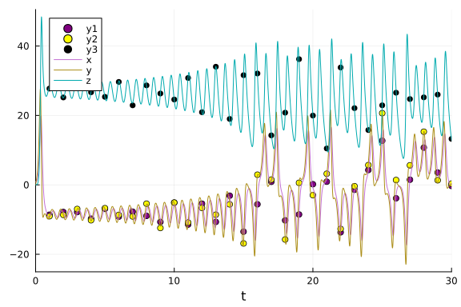
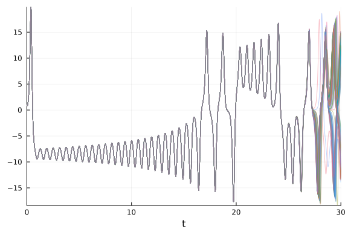
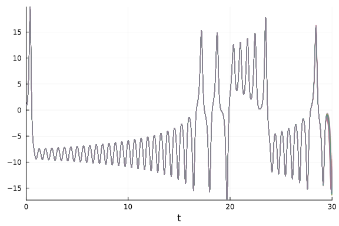
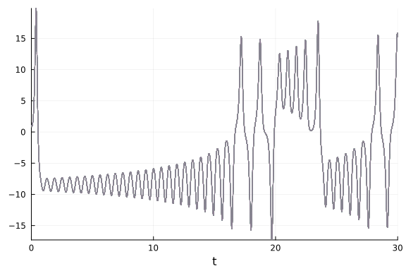

## Parameter estimation of Lorenz Equation using DiffEqBayes.jl

```julia
using DiffEqBayes
using DiffEqCallbacks, StaticArrays
using Distributions, StanSample, DynamicHMC, Turing
using OrdinaryDiffEq, RecursiveArrayTools, ParameterizedFunctions, DiffEqCallbacks
using Plots, LinearAlgebra
```


```julia
gr(fmt=:png)
```

```
Plots.GRBackend()
```


#### Initializing the problem

```julia
g1 = @ode_def LorenzExample begin
  dx = σ*(y-x)
  dy = x*(ρ-z) - y
  dz = x*y - β*z
end σ ρ β
```

```
(::Main.var"##WeaveSandBox#292".LorenzExample{Main.var"##WeaveSandBox#292".
var"###ParameterizedDiffEqFunction#294", Main.var"##WeaveSandBox#292".var"#
##ParameterizedTGradFunction#295", Main.var"##WeaveSandBox#292".var"###Para
meterizedJacobianFunction#296", Nothing, Nothing, ModelingToolkit.ODESystem
}) (generic function with 1 method)
```


```julia
r0 = [1.0; 0.0; 0.0]
tspan = (0.0, 30.0)
p = [10.0,28.0,2.66]
```

```
3-element Vector{Float64}:
 10.0
 28.0
  2.66
```


```julia
prob = ODEProblem(g1, r0, tspan, p)
sol = solve(prob,Tsit5())
```

```
retcode: Success
Interpolation: specialized 4th order "free" interpolation
t: 362-element Vector{Float64}:
  0.0
  3.5678604836301404e-5
  0.0003924646531993154
  0.0032623422047798056
  0.00905768704232478
  0.016955555290324203
  0.02768838157490834
  0.04185394254810964
  0.06023706929459432
  0.08368090418086754
  ⋮
 29.458011533857974
 29.540337322491876
 29.60852266181987
 29.6799878490824
 29.75517147616987
 29.82511904397534
 29.885820680730024
 29.942806967936278
 30.0
u: 362-element Vector{Vector{Float64}}:
 [1.0, 0.0, 0.0]
 [0.9996434557625105, 0.0009988049817849054, 1.7814349300524496e-8]
 [0.9961045497425811, 0.010965399721242273, 2.1469572398550234e-6]
 [0.9693597399881168, 0.08976883341704892, 0.00014379720463291655]
 [0.9242070114022924, 0.24227916339361602, 0.0010460977999503748]
 [0.8800496190914562, 0.4387143392377057, 0.0034240472081709093]
 [0.84833345707203, 0.6915265721541136, 0.008487272847904601]
 [0.8494996923231211, 1.0144878257055865, 0.018211861884682275]
 [0.9138892814330075, 1.4424793180152062, 0.036694607831848025]
 [1.0888203535352743, 2.0521984876534165, 0.07402929498872184]
 ⋮
 [13.37523333791337, 18.060381179266496, 27.881595463212278]
 [13.955616018381155, 9.968378021166673, 38.019750799076256]
 [9.495839034590919, 1.7259535630125686, 35.80175620177522]
 [4.603344839542985, -0.793002814198357, 29.675553569350267]
 [1.776592259424738, -0.5623195021537521, 24.139883212993965]
 [0.7417289005296333, -0.07479695797803172, 20.01660906268533]
 [0.45273432726039287, 0.24270813103202074, 17.034619521176904]
 [0.4255982102181717, 0.5161131130830211, 14.647156800033866]
 [0.5442412780662025, 0.8686754748547896, 12.597537036980794]
```


```julia
sr0 = SA[1.0; 0.0; 0.0]
tspan = (0.0, 30.0)
sp = SA[10.0,28.0,2.66]
sprob = ODEProblem{false,SciMLBase.FullSpecialize}(g1, sr0, tspan, sp)
sol = solve(sprob,Tsit5())
```

```
retcode: Success
Interpolation: specialized 4th order "free" interpolation
t: 362-element Vector{Float64}:
  0.0
  3.5678604836301404e-5
  0.0003924646531993154
  0.0032623422047798056
  0.00905768704232478
  0.016955555290324203
  0.02768838157490834
  0.04185394254810964
  0.06023706929459432
  0.08368090418086754
  ⋮
 29.458011533857974
 29.540337322491876
 29.60852266181987
 29.6799878490824
 29.75517147616987
 29.82511904397534
 29.885820680730024
 29.942806967936278
 30.0
u: 362-element Vector{StaticArraysCore.SVector{3, Float64}}:
 [1.0, 0.0, 0.0]
 [0.9996434557625105, 0.0009988049817849054, 1.7814349300524496e-8]
 [0.9961045497425811, 0.010965399721242273, 2.1469572398550234e-6]
 [0.9693597399881168, 0.08976883341704892, 0.00014379720463291655]
 [0.9242070114022924, 0.24227916339361602, 0.0010460977999503748]
 [0.8800496190914562, 0.4387143392377057, 0.0034240472081709093]
 [0.84833345707203, 0.6915265721541136, 0.008487272847904601]
 [0.8494996923231211, 1.0144878257055865, 0.018211861884682275]
 [0.9138892814330075, 1.4424793180152062, 0.036694607831848025]
 [1.0888203535352743, 2.0521984876534165, 0.07402929498872184]
 ⋮
 [13.37523333791337, 18.060381179266496, 27.881595463212278]
 [13.955616018381155, 9.968378021166673, 38.019750799076256]
 [9.495839034590919, 1.7259535630125686, 35.80175620177522]
 [4.603344839542985, -0.793002814198357, 29.675553569350267]
 [1.776592259424738, -0.5623195021537521, 24.139883212993965]
 [0.7417289005296333, -0.07479695797803172, 20.01660906268533]
 [0.45273432726039287, 0.24270813103202074, 17.034619521176904]
 [0.4255982102181717, 0.5161131130830211, 14.647156800033866]
 [0.5442412780662025, 0.8686754748547896, 12.597537036980794]
```


#### Generating data for bayesian estimation of parameters from the obtained solutions using the `Tsit5` algorithm by adding random noise to it.

```julia
t = collect(range(1, stop=30, length=30))
sig = 0.49
data = convert(Array, VectorOfArray([(sol(t[i]) + sig*randn(3)) for i in 1:length(t)]))
```

```
3×30 Matrix{Float64}:
 -8.85217  -8.08603  -8.39116  -9.72382  …  11.5624   2.98546   0.47296
 -8.20962  -7.99019  -6.67531  -9.98188     15.5606   1.08227   0.789943
 29.0078   25.0478   28.269    26.4865      25.0532  25.349    12.7473
```


#### Plots of the generated data and the actual data.

```julia
Plots.scatter(t, data[1,:],markersize=4,color=:purple)
Plots.scatter!(t, data[2,:],markersize=4,color=:yellow)
Plots.scatter!(t, data[3,:],markersize=4,color=:black)
plot!(sol)
```




#### Uncertainty Quantification plot is used to decide the tolerance for the differential equation.

```julia
cb = AdaptiveProbIntsUncertainty(5)
monte_prob = EnsembleProblem(prob)
sim = solve(monte_prob,Tsit5(),trajectories=100,callback=cb,reltol=1e-5,abstol=1e-5)
plot(sim,vars=(0,1),linealpha=0.4)
```



```julia
cb = AdaptiveProbIntsUncertainty(5)
monte_prob = EnsembleProblem(prob)
sim = solve(monte_prob,Tsit5(),trajectories=100,callback=cb,reltol=1e-6,abstol=1e-6)
plot(sim,vars=(0,1),linealpha=0.4)
```



```julia
cb = AdaptiveProbIntsUncertainty(5)
monte_prob = EnsembleProblem(prob)
sim = solve(monte_prob,Tsit5(),trajectories=100,callback=cb,reltol=1e-8,abstol=1e-8)
plot(sim,vars=(0,1),linealpha=0.4)
```



```julia
priors = [truncated(Normal(10,2),1,15),truncated(Normal(30,5),1,45),truncated(Normal(2.5,0.5),1,4)]
```

```
3-element Vector{Distributions.Truncated{Distributions.Normal{Float64}, Dis
tributions.Continuous, Float64, Float64, Float64}}:
 Truncated(Distributions.Normal{Float64}(μ=10.0, σ=2.0); lower=1.0, upper=1
5.0)
 Truncated(Distributions.Normal{Float64}(μ=30.0, σ=5.0); lower=1.0, upper=4
5.0)
 Truncated(Distributions.Normal{Float64}(μ=2.5, σ=0.5); lower=1.0, upper=4.
0)
```


## Using Stan.jl backend

Lorenz equation is a chaotic system hence requires very low tolerance to be estimated in a reasonable way, we use 1e-8 obtained from the uncertainty plots. Use of truncated priors is necessary to prevent Stan from stepping into negative and other improbable areas.

```julia
@time bayesian_result_stan = stan_inference(prob,t,data,priors; delta = 0.65, reltol=1e-8,abstol=1e-8, vars=(DiffEqBayes.StanODEData(), InverseGamma(2, 3)))
```

```
27435.345857 seconds (2.87 M allocations: 179.127 MiB, 0.00% gc time, 0.01%
 compilation time)
27458.325887 seconds (9.67 M allocations: 607.667 MiB, 0.00% gc time, 0.02%
 compilation time: 2% of which was recompilation)
Chains MCMC chain (1000×6×1 Array{Float64, 3}):

Iterations        = 1:1:1000
Number of chains  = 1
Samples per chain = 1000
parameters        = sigma1.1, sigma1.2, sigma1.3, theta_1, theta_2, theta_3
internals         = 

Summary Statistics
  parameters      mean       std      mcse   ess_bulk   ess_tail      rhat 
  e ⋯
      Symbol   Float64   Float64   Float64    Float64    Float64   Float64 
    ⋯

    sigma1.1    0.4307    0.0000    0.0000        NaN        NaN       NaN 
    ⋯
    sigma1.2    0.3746    0.0000    0.0000        NaN        NaN       NaN 
    ⋯
    sigma1.3    0.8635    0.0000    0.0000        NaN        NaN       NaN 
    ⋯
     theta_1    7.6330    0.0000    0.0000        NaN        NaN       NaN 
    ⋯
     theta_2   39.6308    0.0000    0.0000        NaN        NaN       NaN 
    ⋯
     theta_3    2.7601    0.0000    0.0000        NaN        NaN       NaN 
    ⋯
                                                                1 column om
itted

Quantiles
  parameters      2.5%     25.0%     50.0%     75.0%     97.5%
      Symbol   Float64   Float64   Float64   Float64   Float64

    sigma1.1    0.4307    0.4307    0.4307    0.4307    0.4307
    sigma1.2    0.3746    0.3746    0.3746    0.3746    0.3746
    sigma1.3    0.8635    0.8635    0.8635    0.8635    0.8635
     theta_1    7.6330    7.6330    7.6330    7.6330    7.6330
     theta_2   39.6308   39.6308   39.6308   39.6308   39.6308
     theta_3    2.7601    2.7601    2.7601    2.7601    2.7601
```


### Direct Turing.jl

```julia
@model function fitlv(data, prob)
    # Prior distributions.
    α ~ InverseGamma(2, 3)
    σ ~ truncated(Normal(10, 2), 1, 15)
    ρ ~ truncated(Normal(30, 5), 1, 45)
    β ~ truncated(Normal(2.5, 0.5), 1, 4)

    # Simulate Lotka-Volterra model. 
    p = SA[σ, ρ, β]
    _prob = remake(prob, p = p)
    predicted = solve(_prob, Vern9(); saveat=t)

    # Observations.
    for i in 1:length(predicted)
        data[:, i] ~ MvNormal(predicted[i], α^2 * I)
    end

    return nothing
end

model = fitlv(data, sprob)

@time chain = sample(model, Turing.NUTS(0.65), 10000; progress=false)
```

```
456.825342 seconds (987.43 M allocations: 185.818 GiB, 4.76% gc time, 8.09%
 compilation time)
Chains MCMC chain (10000×16×1 Array{Float64, 3}):

Iterations        = 1001:1:11000
Number of chains  = 1
Samples per chain = 10000
Wall duration     = 437.45 seconds
Compute duration  = 437.45 seconds
parameters        = α, σ, ρ, β
internals         = lp, n_steps, is_accept, acceptance_rate, log_density, h
amiltonian_energy, hamiltonian_energy_error, max_hamiltonian_energy_error, 
tree_depth, numerical_error, step_size, nom_step_size

Summary Statistics
  parameters      mean       std      mcse   ess_bulk   ess_tail      rhat 
  e ⋯
      Symbol   Float64   Float64   Float64    Float64    Float64   Float64 
    ⋯

           α    0.3226    0.0000    0.0000    23.5517    33.2178    1.3423 
    ⋯
           σ    6.1625    0.0000    0.0000        NaN        NaN       NaN 
    ⋯
           ρ   33.0272    0.0000    0.0000        NaN        NaN       NaN 
    ⋯
           β    2.1994    0.0000    0.0000   313.5952        NaN    1.0002 
    ⋯
                                                                1 column om
itted

Quantiles
  parameters      2.5%     25.0%     50.0%     75.0%     97.5%
      Symbol   Float64   Float64   Float64   Float64   Float64

           α    0.3226    0.3226    0.3226    0.3226    0.3226
           σ    6.1625    6.1625    6.1625    6.1625    6.1625
           ρ   33.0272   33.0272   33.0272   33.0272   33.0272
           β    2.1994    2.1994    2.1994    2.1994    2.1994
```


### Using Turing.jl backend

```julia
@time bayesian_result_turing = turing_inference(prob, Vern9(), t, data, priors; reltol=1e-8, abstol=1e-8, likelihood=(u, p, t, σ) -> MvNormal(u, Diagonal((σ) .^ 2 .* ones(length(u)))), likelihood_dist_priors=[InverseGamma(2, 3), InverseGamma(2, 3), InverseGamma(2, 3)])
```

```
236.756006 seconds (838.47 M allocations: 51.735 GiB, 3.03% gc time, 9.88% 
compilation time)
Chains MCMC chain (1000×18×1 Array{Float64, 3}):

Iterations        = 501:1:1500
Number of chains  = 1
Samples per chain = 1000
Wall duration     = 233.06 seconds
Compute duration  = 233.06 seconds
parameters        = theta[1], theta[2], theta[3], σ[1], σ[2], σ[3]
internals         = lp, n_steps, is_accept, acceptance_rate, log_density, h
amiltonian_energy, hamiltonian_energy_error, max_hamiltonian_energy_error, 
tree_depth, numerical_error, step_size, nom_step_size

Summary Statistics
  parameters      mean       std      mcse   ess_bulk   ess_tail      rhat 
  e ⋯
      Symbol   Float64   Float64   Float64    Float64    Float64   Float64 
    ⋯

    theta[1]   10.0210    1.0101    0.6967     2.5495    26.5890    2.1089 
    ⋯
    theta[2]   23.9578    0.1118    0.0766     2.6982    32.0121    1.9810 
    ⋯
    theta[3]    2.4202    0.0542    0.0371     2.5631    24.3631    2.1043 
    ⋯
        σ[1]    5.5870    0.1879    0.1018     2.6653    12.8395    2.0207 
    ⋯
        σ[2]    7.8030    1.7086    1.1628     2.5126    25.3117    2.0669 
    ⋯
        σ[3]    8.3781    0.7174    0.4832     2.5937    15.7215    2.1080 
    ⋯
                                                                1 column om
itted

Quantiles
  parameters      2.5%     25.0%     50.0%     75.0%     97.5%
      Symbol   Float64   Float64   Float64   Float64   Float64

    theta[1]    8.9197    8.9728   10.2091   11.1071   11.3399
    theta[2]   23.8287   23.8514   23.8970   24.0748   24.0888
    theta[3]    2.3609    2.3677    2.3840    2.4758    2.4843
        σ[1]    5.0721    5.5182    5.5968    5.6558    6.0222
        σ[2]    5.8025    6.3744    7.1622    9.5196    9.8533
        σ[3]    7.3876    7.7314    8.2818    8.8765    9.5153
```


### Using DynamicHMC.jl backend

```julia
@time bayesian_result_dynamichmc = dynamichmc_inference(prob,Tsit5(),t,data,priors;solve_kwargs = (reltol=1e-8,abstol=1e-8,))
```

```
630.036196 seconds (161.22 M allocations: 31.273 GiB, 0.77% gc time, 1.60% 
compilation time)
(posterior = NamedTuple{(:parameters, :σ), Tuple{Vector{Float64}, Vector{Fl
oat64}}}[(parameters = [5.892885119396755, 20.254768703211592, 1.3960370552
705414], σ = [4.581535285413694, 6.894597727232037, 8.761118444572379]), (p
arameters = [5.89092620006707, 20.25862449653875, 1.3958734427452093], σ = 
[4.582088450660769, 6.8935218679985395, 8.755013874553747]), (parameters = 
[5.890456309207671, 20.262430728225326, 1.3959562341772502], σ = [4.5863972
21935279, 6.882120988064264, 8.759272315133982]), (parameters = [5.88559846
8497951, 20.276157401537503, 1.396096240789092], σ = [4.595252289976552, 6.
869124767664774, 8.736386203216705]), (parameters = [5.8924087182984, 20.19
2225876848706, 1.3917876001443956], σ = [4.456696536426733, 6.8254680568652
18, 8.784355855584737]), (parameters = [5.960731555071015, 20.1140141921062
1, 1.3959931307806401], σ = [4.487290826773641, 7.108976604980974, 8.763470
726004385]), (parameters = [5.9585606201148735, 20.137490450408855, 1.39705
865917747], σ = [4.476362672504596, 7.081596483160127, 8.754855515434611]),
 (parameters = [5.853375160594397, 20.241676896127714, 1.389719314589237], 
σ = [4.907927942435779, 6.852682661394892, 8.902402444120282]), (parameters
 = [5.745634467388232, 20.44164343871836, 1.3885276352661746], σ = [4.84118
50536503485, 6.8262393003308075, 8.829827658525257]), (parameters = [5.7446
24133533806, 20.43960821639364, 1.3884749426463618], σ = [4.840081568176277
, 6.82605353173021, 8.830916741438054])  …  (parameters = [5.26603249435250
6, 21.59488292813381, 1.425097154420673], σ = [6.106160777109951, 6.4273573
15218294, 10.953836996449448]), (parameters = [5.268381320450744, 21.591747
361104996, 1.425323227875803], σ = [6.103026167056847, 6.425463730109816, 1
0.952548380196212]), (parameters = [5.270122259893227, 21.592426623456817, 
1.4252774390885616], σ = [6.1007421262145165, 6.425468673030976, 10.9508402
56968267]), (parameters = [5.263606823087966, 21.59768075243562, 1.42514559
6871239], σ = [6.105529956650002, 6.418774058708283, 10.947147053084539]), 
(parameters = [5.263538066083068, 21.597353784583383, 1.4251497656158438], 
σ = [6.105439117519761, 6.419080389757018, 10.94683264528125]), (parameters
 = [5.138992215979233, 21.653615353862225, 1.422861383934352], σ = [6.09734
6985729417, 6.503603917680418, 10.798013591750083]), (parameters = [5.14384
7694013023, 21.659359653923534, 1.42374594934479], σ = [6.133130057560993, 
6.716550966642757, 10.672791474460025]), (parameters = [5.144800780295417, 
21.604505582683714, 1.418026492790116], σ = [6.099501388516848, 6.624912996
000554, 10.46807913571942]), (parameters = [5.220231167223067, 21.514425543
413143, 1.414074409136081], σ = [6.077013678382942, 6.547159024684756, 10.4
13021423468583]), (parameters = [5.216308997293642, 21.52443183211594, 1.41
47581266001996], σ = [6.068710857615087, 6.482805816869188, 10.525228046165
209])], posterior_matrix = [1.773745711248102 1.7734132348880138 … 1.652541
6858226332 1.6517900631484048; 3.008390257345395 3.0085806039460756 … 3.068
723665651192 3.0691886542449076; … ; 1.9307381668648076 1.93058211088803 … 
1.8790312188668443 1.8691534130787106; 2.17032357311942 2.169626550494269 …
 2.343057082922823 2.3537750464277987], tree_statistics = DynamicHMC.TreeSt
atisticsNUTS[DynamicHMC.TreeStatisticsNUTS(-309.89921295788713, 7, turning 
at positions 11:18, 0.126189390396227, 135, DynamicHMC.Directions(0x5393308
a)), DynamicHMC.TreeStatisticsNUTS(-311.0295762920189, 6, turning at positi
ons -49:-64, 0.1984437999648175, 79, DynamicHMC.Directions(0xfce2d60f)), Dy
namicHMC.TreeStatisticsNUTS(-309.5930522922027, 5, divergence at position -
51, 0.96078431372549, 51, DynamicHMC.Directions(0x06bf3780)), DynamicHMC.Tr
eeStatisticsNUTS(-308.68367050853414, 7, turning at positions -135:-142, 0.
7628586387595354, 183, DynamicHMC.Directions(0xa7b3f029)), DynamicHMC.TreeS
tatisticsNUTS(-307.7359746950645, 10, reached maximum depth without diverge
nce or turning, 0.9998699075038789, 1023, DynamicHMC.Directions(0xce7f4831)
), DynamicHMC.TreeStatisticsNUTS(-309.27712732704964, 10, reached maximum d
epth without divergence or turning, 0.9997698354430756, 1023, DynamicHMC.Di
rections(0xb6e6b869)), DynamicHMC.TreeStatisticsNUTS(-308.1311656214998, 10
, reached maximum depth without divergence or turning, 0.9999977317533036, 
1023, DynamicHMC.Directions(0x58f05602)), DynamicHMC.TreeStatisticsNUTS(-31
2.7086072379815, 10, reached maximum depth without divergence or turning, 0
.9999018234722643, 1023, DynamicHMC.Directions(0xde76d195)), DynamicHMC.Tre
eStatisticsNUTS(-309.60125571570774, 10, reached maximum depth without dive
rgence or turning, 0.9993758889398268, 1023, DynamicHMC.Directions(0x7e0b98
a6)), DynamicHMC.TreeStatisticsNUTS(-312.1852357324753, 2, turning at posit
ions -4:-7, 0.5709669570231022, 7, DynamicHMC.Directions(0x7850e068))  …  D
ynamicHMC.TreeStatisticsNUTS(-311.488012740343, 4, turning at positions -3:
12, 0.46643496564107173, 15, DynamicHMC.Directions(0x95256afc)), DynamicHMC
.TreeStatisticsNUTS(-311.86984708201345, 4, turning at positions 18:21, 0.8
659252494102501, 23, DynamicHMC.Directions(0x873050bd)), DynamicHMC.TreeSta
tisticsNUTS(-313.5017302661109, 4, divergence at position -24, 0.3792359148
7147684, 29, DynamicHMC.Directions(0x25199ae5)), DynamicHMC.TreeStatisticsN
UTS(-314.72176642638846, 6, divergence at position -116, 0.2494163381042602
, 122, DynamicHMC.Directions(0x93ddb906)), DynamicHMC.TreeStatisticsNUTS(-3
08.84858256537996, 2, turning at positions -2:1, 0.354059725166937, 3, Dyna
micHMC.Directions(0x87e7bd35)), DynamicHMC.TreeStatisticsNUTS(-308.84642978
95002, 10, reached maximum depth without divergence or turning, 0.998914482
7961876, 1023, DynamicHMC.Directions(0x327babbb)), DynamicHMC.TreeStatistic
sNUTS(-313.13735241482846, 9, turning at positions -727:-758, 0.91149672936
85995, 799, DynamicHMC.Directions(0x12673029)), DynamicHMC.TreeStatisticsNU
TS(-310.9463077461589, 10, reached maximum depth without divergence or turn
ing, 0.9837860425660939, 1023, DynamicHMC.Directions(0xbff7d777)), DynamicH
MC.TreeStatisticsNUTS(-310.2654642444168, 10, reached maximum depth without
 divergence or turning, 0.999271197523369, 1023, DynamicHMC.Directions(0x4a
b7070d)), DynamicHMC.TreeStatisticsNUTS(-311.52630430601346, 9, turning at 
positions -504:-631, 0.914874341903769, 895, DynamicHMC.Directions(0x7301cd
08))], κ = Gaussian kinetic energy (Diagonal), √diag(M⁻¹): [0.0532750199058
3436, 0.02394947376390009, 0.012359315098273886, 0.08220281796805226, 0.071
02907592739113, 0.042736344355664], ϵ = 0.0007261671904163304)
```


## Conclusion

Due to the chaotic nature of Lorenz Equation, it is a very hard problem to estimate as it has the property of exponentially increasing errors.
Its uncertainty plot points to its chaotic behaviour and goes awry for different values of tolerance, we use 1e-8 as the tolerance as it makes its uncertainty small enough to be trusted in `(0,30)` time span.


## Appendix

These benchmarks are a part of the SciMLBenchmarks.jl repository, found at: [https://github.com/SciML/SciMLBenchmarks.jl](https://github.com/SciML/SciMLBenchmarks.jl). For more information on high-performance scientific machine learning, check out the SciML Open Source Software Organization [https://sciml.ai](https://sciml.ai).

To locally run this benchmark, do the following commands:

```
using SciMLBenchmarks
SciMLBenchmarks.weave_file("benchmarks/BayesianInference","DiffEqBayesLorenz.jmd")
```

Computer Information:

```
Julia Version 1.9.4
Commit 8e5136fa297 (2023-11-14 08:46 UTC)
Build Info:
  Official https://julialang.org/ release
Platform Info:
  OS: Linux (x86_64-linux-gnu)
  CPU: 128 × AMD EPYC 7502 32-Core Processor
  WORD_SIZE: 64
  LIBM: libopenlibm
  LLVM: libLLVM-14.0.6 (ORCJIT, znver2)
  Threads: 1 on 128 virtual cores
Environment:
  JULIA_CPU_THREADS = 128
  JULIA_DEPOT_PATH = /cache/julia-buildkite-plugin/depots/5b300254-1738-4989-ae0a-f4d2d937f953
  JULIA_IMAGE_THREADS = 1

```

Package Information:

```
Status `/cache/build/exclusive-amdci1-0/julialang/scimlbenchmarks-dot-jl/benchmarks/BayesianInference/Project.toml`
⌃ [6e4b80f9] BenchmarkTools v1.3.2
⌃ [ebbdde9d] DiffEqBayes v3.6.0
⌃ [459566f4] DiffEqCallbacks v2.29.1
⌃ [31c24e10] Distributions v0.25.100
⌃ [bbc10e6e] DynamicHMC v3.4.6
⌅ [1dea7af3] OrdinaryDiffEq v6.55.0
⌃ [65888b18] ParameterizedFunctions v5.15.0
  [91a5bcdd] Plots v1.39.0
⌅ [731186ca] RecursiveArrayTools v2.38.7
  [31c91b34] SciMLBenchmarks v0.1.3
⌃ [c1514b29] StanSample v7.4.2
⌃ [90137ffa] StaticArrays v1.6.2
⌅ [fce5fe82] Turing v0.28.3
  [37e2e46d] LinearAlgebra
Info Packages marked with ⌃ and ⌅ have new versions available. Those with ⌃ may be upgradable, but those with ⌅ are restricted by compatibility constraints from upgrading. To see why use `status --outdated`
Warning The project dependencies or compat requirements have changed since the manifest was last resolved. It is recommended to `Pkg.resolve()` or consider `Pkg.update()` if necessary.
```

And the full manifest:

```
Status `/cache/build/exclusive-amdci1-0/julialang/scimlbenchmarks-dot-jl/benchmarks/BayesianInference/Manifest.toml`
⌃ [47edcb42] ADTypes v0.2.1
  [a4c015fc] ANSIColoredPrinters v0.0.1
⌅ [c3fe647b] AbstractAlgebra v0.31.1
  [621f4979] AbstractFFTs v1.5.0
⌅ [80f14c24] AbstractMCMC v4.4.2
⌅ [7a57a42e] AbstractPPL v0.6.2
  [1520ce14] AbstractTrees v0.4.4
⌅ [79e6a3ab] Adapt v3.6.2
⌅ [0bf59076] AdvancedHMC v0.5.4
⌅ [5b7e9947] AdvancedMH v0.7.5
⌅ [576499cb] AdvancedPS v0.4.3
  [b5ca4192] AdvancedVI v0.2.4
  [dce04be8] ArgCheck v2.3.0
  [ec485272] ArnoldiMethod v0.2.0
⌃ [4fba245c] ArrayInterface v7.4.11
  [30b0a656] ArrayInterfaceCore v0.1.29
  [a9b6321e] Atomix v0.1.0
⌃ [13072b0f] AxisAlgorithms v1.0.1
  [39de3d68] AxisArrays v0.4.7
  [198e06fe] BangBang v0.3.39
  [9718e550] Baselet v0.1.1
⌃ [6e4b80f9] BenchmarkTools v1.3.2
⌃ [e2ed5e7c] Bijections v0.1.4
⌃ [76274a88] Bijectors v0.13.6
⌃ [d1d4a3ce] BitFlags v0.1.7
  [62783981] BitTwiddlingConvenienceFunctions v0.1.5
⌅ [fa961155] CEnum v0.4.2
⌃ [2a0fbf3d] CPUSummary v0.2.3
  [00ebfdb7] CSTParser v3.3.6
⌃ [336ed68f] CSV v0.10.11
  [49dc2e85] Calculus v0.5.1
⌃ [082447d4] ChainRules v1.53.0
⌃ [d360d2e6] ChainRulesCore v1.16.0
  [9e997f8a] ChangesOfVariables v0.1.8
  [fb6a15b2] CloseOpenIntervals v0.1.12
⌃ [944b1d66] CodecZlib v0.7.2
⌃ [35d6a980] ColorSchemes v3.23.0
  [3da002f7] ColorTypes v0.11.4
  [c3611d14] ColorVectorSpace v0.10.0
  [5ae59095] Colors v0.12.10
  [861a8166] Combinatorics v1.0.2
  [a80b9123] CommonMark v0.8.12
  [38540f10] CommonSolve v0.2.4
  [bbf7d656] CommonSubexpressions v0.3.0
⌃ [34da2185] Compat v4.9.0
  [5224ae11] CompatHelperLocal v0.1.25
  [b152e2b5] CompositeTypes v0.1.3
  [a33af91c] CompositionsBase v0.1.2
⌃ [f0e56b4a] ConcurrentUtilities v2.2.1
⌃ [8f4d0f93] Conda v1.9.1
  [88cd18e8] ConsoleProgressMonitor v0.1.2
⌃ [187b0558] ConstructionBase v1.5.3
  [d38c429a] Contour v0.6.2
  [adafc99b] CpuId v0.3.1
  [a8cc5b0e] Crayons v4.1.1
  [9a962f9c] DataAPI v1.15.0
  [a93c6f00] DataFrames v1.6.1
⌃ [864edb3b] DataStructures v0.18.15
  [e2d170a0] DataValueInterfaces v1.0.0
  [244e2a9f] DefineSingletons v0.1.2
  [8bb1440f] DelimitedFiles v1.9.1
  [b429d917] DensityInterface v0.4.0
⌃ [2b5f629d] DiffEqBase v6.128.2
⌃ [ebbdde9d] DiffEqBayes v3.6.0
⌃ [459566f4] DiffEqCallbacks v2.29.1
  [163ba53b] DiffResults v1.1.0
  [b552c78f] DiffRules v1.15.1
⌃ [b4f34e82] Distances v0.10.9
⌃ [31c24e10] Distributions v0.25.100
⌃ [ced4e74d] DistributionsAD v0.6.52
  [ffbed154] DocStringExtensions v0.9.3
⌅ [e30172f5] Documenter v0.27.25
⌅ [5b8099bc] DomainSets v0.6.7
  [fa6b7ba4] DualNumbers v0.6.8
⌃ [bbc10e6e] DynamicHMC v3.4.6
⌅ [366bfd00] DynamicPPL v0.23.14
⌃ [7c1d4256] DynamicPolynomials v0.5.2
⌅ [cad2338a] EllipticalSliceSampling v1.1.0
  [4e289a0a] EnumX v1.0.4
⌃ [460bff9d] ExceptionUnwrapping v0.1.9
⌃ [d4d017d3] ExponentialUtilities v1.24.0
  [e2ba6199] ExprTools v0.1.10
  [c87230d0] FFMPEG v0.4.1
⌃ [7a1cc6ca] FFTW v1.7.1
⌃ [7034ab61] FastBroadcast v0.2.6
  [9aa1b823] FastClosures v0.3.2
  [29a986be] FastLapackInterface v2.0.0
⌃ [48062228] FilePathsBase v0.9.20
⌃ [1a297f60] FillArrays v1.6.1
⌃ [6a86dc24] FiniteDiff v2.21.1
  [53c48c17] FixedPointNumbers v0.8.4
  [59287772] Formatting v0.4.2
  [f6369f11] ForwardDiff v0.10.36
  [069b7b12] FunctionWrappers v1.1.3
  [77dc65aa] FunctionWrappersWrappers v0.1.3
  [d9f16b24] Functors v0.4.5
⌃ [46192b85] GPUArraysCore v0.1.5
⌅ [28b8d3ca] GR v0.72.9
  [c145ed77] GenericSchur v0.5.3
  [d7ba0133] Git v1.3.0
  [c27321d9] Glob v1.3.1
⌃ [86223c79] Graphs v1.8.0
  [42e2da0e] Grisu v1.0.2
⌅ [0b43b601] Groebner v0.4.2
⌅ [d5909c97] GroupsCore v0.4.0
⌃ [cd3eb016] HTTP v1.9.14
  [eafb193a] Highlights v0.5.2
  [3e5b6fbb] HostCPUFeatures v0.1.16
  [34004b35] HypergeometricFunctions v0.3.23
  [7073ff75] IJulia v1.24.2
  [b5f81e59] IOCapture v0.2.3
  [615f187c] IfElse v0.1.1
⌃ [d25df0c9] Inflate v0.1.3
  [22cec73e] InitialValues v0.3.1
  [842dd82b] InlineStrings v1.4.0
  [505f98c9] InplaceOps v0.3.0
  [18e54dd8] IntegerMathUtils v0.1.2
⌅ [a98d9a8b] Interpolations v0.14.7
⌃ [8197267c] IntervalSets v0.7.7
  [3587e190] InverseFunctions v0.1.12
  [41ab1584] InvertedIndices v1.3.0
  [92d709cd] IrrationalConstants v0.2.2
⌃ [c8e1da08] IterTools v1.8.0
  [82899510] IteratorInterfaceExtensions v1.0.0
⌃ [1019f520] JLFzf v0.1.5
  [692b3bcd] JLLWrappers v1.5.0
  [682c06a0] JSON v0.21.4
⌃ [98e50ef6] JuliaFormatter v1.0.35
⌃ [ccbc3e58] JumpProcesses v9.7.2
⌃ [ef3ab10e] KLU v0.4.0
⌃ [63c18a36] KernelAbstractions v0.9.8
⌃ [5ab0869b] KernelDensity v0.6.7
⌃ [ba0b0d4f] Krylov v0.9.3
⌃ [929cbde3] LLVM v6.1.0
⌃ [8ac3fa9e] LRUCache v1.4.1
⌃ [b964fa9f] LaTeXStrings v1.3.0
⌃ [2ee39098] LabelledArrays v1.14.0
  [984bce1d] LambertW v0.4.6
⌅ [23fbe1c1] Latexify v0.15.21
⌃ [10f19ff3] LayoutPointers v0.1.14
  [50d2b5c4] Lazy v0.15.1
⌃ [1fad7336] LazyStack v0.1.1
  [1d6d02ad] LeftChildRightSiblingTrees v0.2.0
  [6f1fad26] Libtask v0.8.6
  [d3d80556] LineSearches v7.2.0
⌃ [7ed4a6bd] LinearSolve v2.5.1
  [6fdf6af0] LogDensityProblems v2.1.1
⌃ [996a588d] LogDensityProblemsAD v1.5.0
  [2ab3a3ac] LogExpFunctions v0.3.26
⌃ [e6f89c97] LoggingExtras v1.0.1
⌃ [bdcacae8] LoopVectorization v0.12.165
⌃ [c7f686f2] MCMCChains v6.0.3
⌃ [be115224] MCMCDiagnosticTools v0.3.5
⌃ [e80e1ace] MLJModelInterface v1.9.2
  [d8e11817] MLStyle v0.4.17
⌃ [1914dd2f] MacroTools v0.5.11
  [d125e4d3] ManualMemory v0.1.8
  [dbb5928d] MappedArrays v0.4.2
⌃ [739be429] MbedTLS v1.1.7
  [442fdcdd] Measures v0.3.2
  [128add7d] MicroCollections v0.1.4
  [e1d29d7a] Missings v1.1.0
⌃ [961ee093] ModelingToolkit v8.65.0
  [46d2c3a1] MuladdMacro v0.2.4
⌃ [102ac46a] MultivariatePolynomials v0.5.1
⌃ [ffc61752] Mustache v1.0.17
⌃ [d8a4904e] MutableArithmetics v1.3.1
  [d41bc354] NLSolversBase v7.8.3
  [2774e3e8] NLsolve v4.5.1
⌃ [872c559c] NNlib v0.9.4
  [77ba4419] NaNMath v1.0.2
  [86f7a689] NamedArrays v0.10.0
  [d9ec5142] NamedTupleTools v0.14.3
  [c020b1a1] NaturalSort v1.0.0
⌅ [8913a72c] NonlinearSolve v1.10.0
⌃ [6fe1bfb0] OffsetArrays v1.12.10
  [4d8831e6] OpenSSL v1.4.1
⌃ [429524aa] Optim v1.7.7
⌅ [3bd65402] Optimisers v0.2.20
⌃ [bac558e1] OrderedCollections v1.6.2
⌅ [1dea7af3] OrdinaryDiffEq v6.55.0
⌃ [90014a1f] PDMats v0.11.17
⌃ [65ce6f38] PackageExtensionCompat v1.0.1
⌃ [65888b18] ParameterizedFunctions v5.15.0
  [d96e819e] Parameters v0.12.3
⌃ [69de0a69] Parsers v2.7.2
  [b98c9c47] Pipe v1.3.0
  [ccf2f8ad] PlotThemes v3.1.0
⌃ [995b91a9] PlotUtils v1.3.5
  [91a5bcdd] Plots v1.39.0
  [e409e4f3] PoissonRandom v0.4.4
⌃ [f517fe37] Polyester v0.7.5
  [1d0040c9] PolyesterWeave v0.2.1
⌃ [2dfb63ee] PooledArrays v1.4.2
  [85a6dd25] PositiveFactorizations v0.2.4
⌅ [d236fae5] PreallocationTools v0.4.12
  [aea7be01] PrecompileTools v1.2.0
⌃ [21216c6a] Preferences v1.4.0
⌃ [08abe8d2] PrettyTables v2.2.7
⌃ [27ebfcd6] Primes v0.5.4
  [33c8b6b6] ProgressLogging v0.1.4
⌃ [92933f4c] ProgressMeter v1.8.0
⌃ [1fd47b50] QuadGK v2.8.2
⌃ [74087812] Random123 v1.6.1
⌃ [fb686558] RandomExtensions v0.4.3
  [e6cf234a] RandomNumbers v1.5.3
  [b3c3ace0] RangeArrays v0.3.2
  [c84ed2f1] Ratios v0.4.5
  [c1ae055f] RealDot v0.1.0
  [3cdcf5f2] RecipesBase v1.3.4
  [01d81517] RecipesPipeline v0.6.12
⌅ [731186ca] RecursiveArrayTools v2.38.7
⌃ [f2c3362d] RecursiveFactorization v0.2.20
  [189a3867] Reexport v1.2.2
⌃ [05181044] RelocatableFolders v1.0.0
  [ae029012] Requires v1.3.0
  [79098fc4] Rmath v0.7.1
⌃ [f2b01f46] Roots v2.0.19
  [7e49a35a] RuntimeGeneratedFunctions v0.5.12
⌃ [fdea26ae] SIMD v3.4.5
  [94e857df] SIMDTypes v0.1.0
⌃ [476501e8] SLEEFPirates v0.6.39
⌅ [0bca4576] SciMLBase v1.95.0
  [31c91b34] SciMLBenchmarks v0.1.3
⌃ [e9a6253c] SciMLNLSolve v0.1.8
⌃ [c0aeaf25] SciMLOperators v0.3.6
  [30f210dd] ScientificTypesBase v3.0.0
⌃ [6c6a2e73] Scratch v1.2.0
⌃ [91c51154] SentinelArrays v1.4.0
  [efcf1570] Setfield v1.1.1
  [992d4aef] Showoff v1.0.3
  [777ac1f9] SimpleBufferStream v1.1.0
⌅ [727e6d20] SimpleNonlinearSolve v0.1.19
  [699a6c99] SimpleTraits v0.9.4
  [ce78b400] SimpleUnPack v1.1.0
  [66db9d55] SnoopPrecompile v1.0.3
  [b85f4697] SoftGlobalScope v1.1.0
⌃ [a2af1166] SortingAlgorithms v1.1.1
⌃ [47a9eef4] SparseDiffTools v2.5.0
  [e56a9233] Sparspak v0.3.9
  [276daf66] SpecialFunctions v2.3.1
  [171d559e] SplittablesBase v0.1.15
⌃ [d0ee94f6] StanBase v4.8.1
⌃ [c1514b29] StanSample v7.4.2
  [aedffcd0] Static v0.8.8
⌃ [0d7ed370] StaticArrayInterface v1.4.1
⌃ [90137ffa] StaticArrays v1.6.2
  [1e83bf80] StaticArraysCore v1.4.2
  [64bff920] StatisticalTraits v3.2.0
⌃ [82ae8749] StatsAPI v1.6.0
⌃ [2913bbd2] StatsBase v0.34.0
  [4c63d2b9] StatsFuns v1.3.0
⌅ [7792a7ef] StrideArraysCore v0.4.17
⌅ [5e0ebb24] Strided v1.2.3
  [69024149] StringEncodings v0.3.7
⌃ [892a3eda] StringManipulation v0.3.0
⌃ [09ab397b] StructArrays v0.6.15
⌅ [2efcf032] SymbolicIndexingInterface v0.2.2
⌃ [d1185830] SymbolicUtils v1.2.0
⌅ [0c5d862f] Symbolics v5.5.1
  [ab02a1b2] TableOperations v1.2.0
  [3783bdb8] TableTraits v1.0.1
⌃ [bd369af6] Tables v1.10.1
  [02d47bb6] TensorCast v0.4.6
  [62fd8b95] TensorCore v0.1.1
  [5d786b92] TerminalLoggers v0.1.7
  [8290d209] ThreadingUtilities v0.5.2
  [a759f4b9] TimerOutputs v0.5.23
⌃ [0796e94c] Tokenize v0.5.25
⌃ [9f7883ad] Tracker v0.2.26
⌅ [3bb67fe8] TranscodingStreams v0.9.13
⌃ [28d57a85] Transducers v0.4.78
⌃ [84d833dd] TransformVariables v0.8.7
  [f9bc47f6] TransformedLogDensities v1.0.3
  [24ddb15e] TransmuteDims v0.1.15
  [a2a6695c] TreeViews v0.3.0
⌃ [d5829a12] TriangularSolve v0.1.19
⌃ [410a4b4d] Tricks v0.1.7
  [781d530d] TruncatedStacktraces v1.4.0
⌃ [9d95972d] TupleTools v1.3.0
⌅ [fce5fe82] Turing v0.28.3
⌃ [5c2747f8] URIs v1.5.0
  [3a884ed6] UnPack v1.0.2
  [1cfade01] UnicodeFun v0.4.1
⌃ [1986cc42] Unitful v1.17.0
  [45397f5d] UnitfulLatexify v1.6.3
⌃ [a7c27f48] Unityper v0.1.5
  [013be700] UnsafeAtomics v0.2.1
  [d80eeb9a] UnsafeAtomicsLLVM v0.1.3
  [41fe7b60] Unzip v0.2.0
⌃ [3d5dd08c] VectorizationBase v0.21.64
  [81def892] VersionParsing v1.3.0
  [19fa3120] VertexSafeGraphs v0.2.0
  [ea10d353] WeakRefStrings v1.4.2
  [44d3d7a6] Weave v0.10.12
⌅ [efce3f68] WoodburyMatrices v0.5.5
  [76eceee3] WorkerUtilities v1.6.1
  [ddb6d928] YAML v0.4.9
  [c2297ded] ZMQ v1.2.2
⌃ [700de1a5] ZygoteRules v0.2.3
  [6e34b625] Bzip2_jll v1.0.8+0
  [83423d85] Cairo_jll v1.16.1+1
  [2e619515] Expat_jll v2.5.0+0
⌃ [b22a6f82] FFMPEG_jll v4.4.2+2
  [f5851436] FFTW_jll v3.3.10+0
  [a3f928ae] Fontconfig_jll v2.13.93+0
  [d7e528f0] FreeType2_jll v2.13.1+0
  [559328eb] FriBidi_jll v1.0.10+0
⌃ [0656b61e] GLFW_jll v3.3.8+0
⌅ [d2c73de3] GR_jll v0.72.9+1
  [78b55507] Gettext_jll v0.21.0+0
⌃ [f8c6e375] Git_jll v2.36.1+2
⌃ [7746bdde] Glib_jll v2.74.0+2
  [3b182d85] Graphite2_jll v1.3.14+0
  [2e76f6c2] HarfBuzz_jll v2.8.1+1
⌅ [1d5cc7b8] IntelOpenMP_jll v2023.2.0+0
⌃ [aacddb02] JpegTurbo_jll v2.1.91+0
  [c1c5ebd0] LAME_jll v3.100.1+0
  [88015f11] LERC_jll v3.0.0+1
⌅ [dad2f222] LLVMExtra_jll v0.0.23+0
⌃ [1d63c593] LLVMOpenMP_jll v15.0.4+0
  [dd4b983a] LZO_jll v2.10.1+0
⌅ [e9f186c6] Libffi_jll v3.2.2+1
  [d4300ac3] Libgcrypt_jll v1.8.7+0
  [7e76a0d4] Libglvnd_jll v1.6.0+0
  [7add5ba3] Libgpg_error_jll v1.42.0+0
⌃ [94ce4f54] Libiconv_jll v1.16.1+2
  [4b2f31a3] Libmount_jll v2.35.0+0
⌅ [89763e89] Libtiff_jll v4.5.1+1
  [38a345b3] Libuuid_jll v2.36.0+0
⌅ [856f044c] MKL_jll v2023.2.0+0
  [e7412a2a] Ogg_jll v1.3.5+1
⌅ [458c3c95] OpenSSL_jll v1.1.22+0
  [efe28fd5] OpenSpecFun_jll v0.5.5+0
  [91d4177d] Opus_jll v1.3.2+0
  [30392449] Pixman_jll v0.42.2+0
⌅ [c0090381] Qt6Base_jll v6.4.2+3
  [f50d1b31] Rmath_jll v0.4.0+0
⌃ [a2964d1f] Wayland_jll v1.21.0+0
⌃ [2381bf8a] Wayland_protocols_jll v1.25.0+0
⌃ [02c8fc9c] XML2_jll v2.10.3+0
  [aed1982a] XSLT_jll v1.1.34+0
⌃ [ffd25f8a] XZ_jll v5.4.4+0
  [4f6342f7] Xorg_libX11_jll v1.8.6+0
  [0c0b7dd1] Xorg_libXau_jll v1.0.11+0
  [935fb764] Xorg_libXcursor_jll v1.2.0+4
  [a3789734] Xorg_libXdmcp_jll v1.1.4+0
  [1082639a] Xorg_libXext_jll v1.3.4+4
  [d091e8ba] Xorg_libXfixes_jll v5.0.3+4
  [a51aa0fd] Xorg_libXi_jll v1.7.10+4
  [d1454406] Xorg_libXinerama_jll v1.1.4+4
  [ec84b674] Xorg_libXrandr_jll v1.5.2+4
  [ea2f1a96] Xorg_libXrender_jll v0.9.10+4
  [14d82f49] Xorg_libpthread_stubs_jll v0.1.1+0
  [c7cfdc94] Xorg_libxcb_jll v1.15.0+0
  [cc61e674] Xorg_libxkbfile_jll v1.1.2+0
  [12413925] Xorg_xcb_util_image_jll v0.4.0+1
  [2def613f] Xorg_xcb_util_jll v0.4.0+1
  [975044d2] Xorg_xcb_util_keysyms_jll v0.4.0+1
  [0d47668e] Xorg_xcb_util_renderutil_jll v0.3.9+1
  [c22f9ab0] Xorg_xcb_util_wm_jll v0.4.1+1
  [35661453] Xorg_xkbcomp_jll v1.4.6+0
  [33bec58e] Xorg_xkeyboard_config_jll v2.39.0+0
  [c5fb5394] Xorg_xtrans_jll v1.5.0+0
  [8f1865be] ZeroMQ_jll v4.3.4+0
  [3161d3a3] Zstd_jll v1.5.5+0
⌅ [214eeab7] fzf_jll v0.29.0+0
  [a4ae2306] libaom_jll v3.4.0+0
  [0ac62f75] libass_jll v0.15.1+0
  [f638f0a6] libfdk_aac_jll v2.0.2+0
⌃ [b53b4c65] libpng_jll v1.6.38+0
  [a9144af2] libsodium_jll v1.0.20+0
  [f27f6e37] libvorbis_jll v1.3.7+1
  [1270edf5] x264_jll v2021.5.5+0
  [dfaa095f] x265_jll v3.5.0+0
⌃ [d8fb68d0] xkbcommon_jll v1.4.1+0
  [0dad84c5] ArgTools v1.1.1
  [56f22d72] Artifacts
  [2a0f44e3] Base64
  [ade2ca70] Dates
  [8ba89e20] Distributed
  [f43a241f] Downloads v1.6.0
  [7b1f6079] FileWatching
  [9fa8497b] Future
  [b77e0a4c] InteractiveUtils
  [4af54fe1] LazyArtifacts
  [b27032c2] LibCURL v0.6.3
  [76f85450] LibGit2
  [8f399da3] Libdl
  [37e2e46d] LinearAlgebra
  [56ddb016] Logging
  [d6f4376e] Markdown
  [a63ad114] Mmap
  [ca575930] NetworkOptions v1.2.0
  [44cfe95a] Pkg v1.9.0
  [de0858da] Printf
  [9abbd945] Profile
  [3fa0cd96] REPL
  [9a3f8284] Random
  [ea8e919c] SHA v0.7.0
  [9e88b42a] Serialization
  [1a1011a3] SharedArrays
  [6462fe0b] Sockets
  [2f01184e] SparseArrays
  [10745b16] Statistics v1.9.0
  [4607b0f0] SuiteSparse
  [fa267f1f] TOML v1.0.3
  [a4e569a6] Tar v1.10.0
  [8dfed614] Test
  [cf7118a7] UUIDs
  [4ec0a83e] Unicode
  [e66e0078] CompilerSupportLibraries_jll v1.0.2+0
  [deac9b47] LibCURL_jll v7.84.0+0
  [29816b5a] LibSSH2_jll v1.10.2+0
  [c8ffd9c3] MbedTLS_jll v2.28.2+0
  [14a3606d] MozillaCACerts_jll v2022.10.11
  [4536629a] OpenBLAS_jll v0.3.21+4
  [05823500] OpenLibm_jll v0.8.1+0
  [efcefdf7] PCRE2_jll v10.42.0+0
  [bea87d4a] SuiteSparse_jll v5.10.1+6
  [83775a58] Zlib_jll v1.2.13+0
  [8e850b90] libblastrampoline_jll v5.8.0+0
  [8e850ede] nghttp2_jll v1.48.0+0
  [3f19e933] p7zip_jll v17.4.0+0
Info Packages marked with ⌃ and ⌅ have new versions available. Those with ⌃ may be upgradable, but those with ⌅ are restricted by compatibility constraints from upgrading. To see why use `status --outdated -m`
Warning The project dependencies or compat requirements have changed since the manifest was last resolved. It is recommended to `Pkg.resolve()` or consider `Pkg.update()` if necessary.
```

