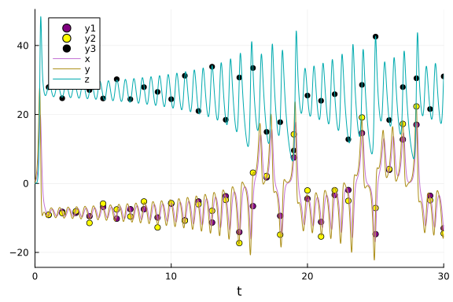
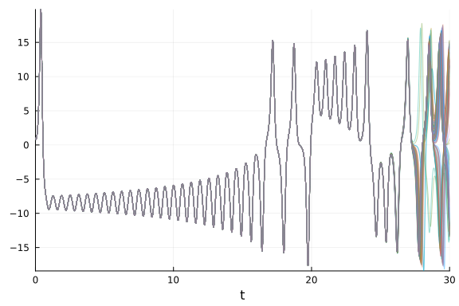
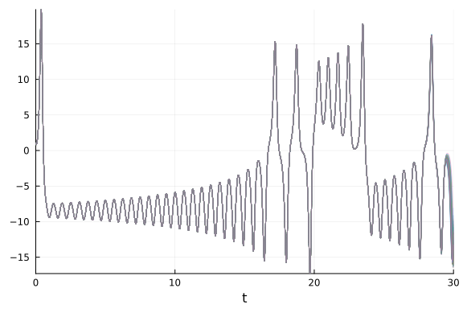
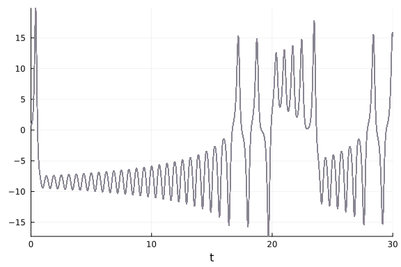

## Parameter estimation of Lorenz Equation using DiffEqBayes.jl

```julia
using DiffEqBayes
using DiffEqCallbacks, StaticArrays
using Distributions, StanSample, DynamicHMC, Turing
using OrdinaryDiffEq, RecursiveArrayTools, ParameterizedFunctions, DiffEqCallbacks
using Plots, LinearAlgebra
```


```julia
"""Display ESS/s (effective samples per second) from a Turing chain."""
function display_ess_per_sec(chain, elapsed)
    stats = summarystats(chain)
    ess_bulk = stats[:, :ess_bulk]
    println("Elapsed time: $(round(elapsed; digits=2)) seconds\n")
    println("ESS/s (effective samples per second, bulk):")
    for (i, param) in enumerate(stats[:, :parameters])
        println("  $param: $(round(ess_bulk[i] / elapsed; digits=1))")
    end
    println("\nMinimum ESS/s (bulk): $(round(minimum(ess_bulk) / elapsed; digits=1))")
end

"""Extract and display Stan's internal timing from its CSV output files."""
function display_stan_timing(stan_result)
    sample_files = stan_result.model.sample_file
    for (chain_idx, f) in enumerate(sample_files)
        isfile(f) || continue
        lines = readlines(f)
        println("Chain $chain_idx timing (from Stan CSV):")
        for line in lines
            if startswith(line, "#") && occursin("Elapsed Time", line)
                println("  ", strip(line[2:end]))
            elseif startswith(line, "#") && occursin("seconds", line)
                println("  ", strip(line[2:end]))
            end
        end
    end
end
```

```
Main.var"##WeaveSandBox#277".display_stan_timing
```


```julia
gr(fmt = :png)
```

```
Plots.GRBackend()
```


#### Initializing the problem

```julia
g1 = @ode_def LorenzExample begin
    dx = σ*(y-x)
    dy = x*(ρ-z) - y
    dz = x*y - β*z
end σ ρ β
```

```
Main.var"##WeaveSandBox#277".LorenzExample{Main.var"##WeaveSandBox#277".var
"###ParameterizedDiffEqFunction#279", Main.var"##WeaveSandBox#277".var"###P
arameterizedTGradFunction#280", Main.var"##WeaveSandBox#277".var"###Paramet
erizedJacobianFunction#281", Nothing, Nothing, ModelingToolkit.System}(Main
.var"##WeaveSandBox#277".var"##ParameterizedDiffEqFunction#279", LinearAlge
bra.UniformScaling{Bool}(true), nothing, Main.var"##WeaveSandBox#277".var"#
#ParameterizedTGradFunction#280", Main.var"##WeaveSandBox#277".var"##Parame
terizedJacobianFunction#281", nothing, nothing, nothing, nothing, nothing, 
nothing, nothing, [:x, :y, :z], :t, nothing, Model ##Parameterized#278:
Equations (3):
  3 standard: see equations(##Parameterized#278)
Unknowns (3): see unknowns(##Parameterized#278)
  x(t)
  y(t)
  z(t)
Parameters (3): see parameters(##Parameterized#278)
  σ
  ρ
  β, nothing, nothing)
```


```julia
r0 = [1.0; 0.0; 0.0]
tspan = (0.0, 30.0)
p = [10.0, 28.0, 2.66]
```

```
3-element Vector{Float64}:
 10.0
 28.0
  2.66
```


```julia
prob = ODEProblem(g1, r0, tspan, p)
sol = solve(prob, Tsit5())
```

```
retcode: Success
Interpolation: specialized 4th order "free" interpolation
t: 355-element Vector{Float64}:
  0.0
  3.5678604836301404e-5
  0.0012320942519312387
  0.00556932465348067
  0.012366524722957406
  0.021160814850103675
  0.033296251971569796
  0.04900115478366526
  0.06936892249678134
  0.09517047537763844
  ⋮
 29.383016799571845
 29.460494075076628
 29.540306930513268
 29.625471076888655
 29.723135438241798
 29.805484193360808
 29.910086909807717
 29.99928302640111
 30.0
u: 355-element Vector{Vector{Float64}}:
 [1.0, 0.0, 0.0]
 [0.9996434557625105, 0.0009988049817849054, 1.7814349300524496e-8]
 [0.9879653604576064, 0.03426824324278913, 2.0964175442932688e-5]
 [0.9500089426818266, 0.1514709435028955, 0.00040920017142123774]
 [0.9033877560315204, 0.32596836188271083, 0.001892216392693151]
 [0.8639680997970994, 0.5392700815038988, 0.005168731067070007]
 [0.8433235120785849, 0.8199540219704273, 0.0119181078390778]
 [0.8665761894886946, 1.178060982280894, 0.024523932292864075]
 [0.9699424017971061, 1.6684270372332624, 0.04902023715188545]
 [1.2120261198364632, 2.3949595105940595, 0.10071541720535906]
 ⋮
 [-11.953731623976742, -8.724911172152208, 34.75350663343156]
 [-8.414218124478245, -3.3997394618081014, 32.42494675534079]
 [-5.095020000229003, -2.072653537110552, 27.39746410268826]
 [-3.578767653386599, -2.916342234602008, 22.594599695010295]
 [-3.9132937007923942, -5.183232333060949, 18.662230583885023]
 [-5.62219113490472, -8.549611643866369, 17.379536103765123]
 [-9.796979599919887, -14.53093015590858, 21.494882238678578]
 [-13.15432518607142, -14.732570431860434, 31.42586687218547]
 [-13.165446107264613, -14.689326774867084, 31.504660801755886]
```


```julia
sr0 = SA[1.0; 0.0; 0.0]
tspan = (0.0, 30.0)
sp = SA[10.0, 28.0, 2.66]
sprob = ODEProblem{false, SciMLBase.FullSpecialize}(g1, sr0, tspan, sp)
sol = solve(sprob, Tsit5())
```

```
retcode: Success
Interpolation: specialized 4th order "free" interpolation
t: 355-element Vector{Float64}:
  0.0
  3.5678604836301404e-5
  0.0012320942519312387
  0.00556932465348067
  0.012366524722957406
  0.021160814850103675
  0.033296251971569796
  0.04900115478366526
  0.06936892249678134
  0.09517047537763844
  ⋮
 29.383016896164897
 29.460494173696
 29.540307024777988
 29.62547117109964
 29.72313561053084
 29.805484348246978
 29.91008712510907
 29.99928320804487
 30.0
u: 355-element Vector{StaticArraysCore.SVector{3, Float64}}:
 [1.0, 0.0, 0.0]
 [0.9996434557625105, 0.0009988049817849054, 1.7814349300524496e-8]
 [0.9879653604576064, 0.03426824324278913, 2.0964175442932688e-5]
 [0.9500089426818266, 0.1514709435028955, 0.00040920017142123774]
 [0.9033877560315204, 0.32596836188271083, 0.001892216392693151]
 [0.8639680997970994, 0.5392700815038988, 0.005168731067070007]
 [0.8433235120785849, 0.8199540219704273, 0.0119181078390778]
 [0.8665761894886946, 1.178060982280894, 0.024523932292864075]
 [0.9699424017971061, 1.6684270372332624, 0.04902023715188545]
 [1.2120261198364632, 2.3949595105940595, 0.10071541720535906]
 ⋮
 [-11.953728707099234, -8.724903559414773, 34.75350730511037]
 [-8.414213772728967, -3.399736204270524, 32.42494152319427]
 [-5.0950176680667125, -2.0726539133804285, 27.39745893707636]
 [-3.5787673480301443, -2.9163438983419585, 22.594595712232938]
 [-3.9132960668681473, -5.183237769500962, 18.66222616103544]
 [-5.622195731286272, -8.549619474241986, 17.379536947095986]
 [-9.796989656834683, -14.530940358320164, 21.4949007487875]
 [-13.154327787595237, -14.732559461298061, 31.42588636022459]
 [-13.165445843155602, -14.689326671922553, 31.50466026912453]
```


#### Generating data for bayesian estimation of parameters from the obtained solutions using the `Tsit5` algorithm by adding random noise to it.

```julia
t = collect(range(1, stop = 30, length = 30))
sig = 0.49
data = convert(Array, VectorOfArray([(sol(t[i]) + sig*randn(3)) for i in 1:length(t)]))
```

```
3×30 Matrix{Float64}:
 -9.93527  -8.67702  -8.04024   -8.6215  …  15.7979  -4.00063  -13.0561
 -8.90803  -8.67557  -6.79671  -10.3481     23.2883  -4.70514  -15.0132
 28.0059   25.0552   27.6012    26.1561     29.5471  20.9232    31.2951
```


#### Plots of the generated data and the actual data.

```julia
Plots.scatter(t, data[1, :], markersize = 4, color = :purple)
Plots.scatter!(t, data[2, :], markersize = 4, color = :yellow)
Plots.scatter!(t, data[3, :], markersize = 4, color = :black)
plot!(sol)
```




#### Uncertainty Quantification plot is used to decide the tolerance for the differential equation.

```julia
cb = AdaptiveProbIntsUncertainty(5)
monte_prob = EnsembleProblem(prob)
sim = solve(
    monte_prob, Tsit5(), trajectories = 100, callback = cb, reltol = 1e-5, abstol = 1e-5)
plot(sim, vars = (0, 1), linealpha = 0.4)
```



```julia
cb = AdaptiveProbIntsUncertainty(5)
monte_prob = EnsembleProblem(prob)
sim = solve(
    monte_prob, Tsit5(), trajectories = 100, callback = cb, reltol = 1e-6, abstol = 1e-6)
plot(sim, vars = (0, 1), linealpha = 0.4)
```



```julia
cb = AdaptiveProbIntsUncertainty(5)
monte_prob = EnsembleProblem(prob)
sim = solve(
    monte_prob, Tsit5(), trajectories = 100, callback = cb, reltol = 1e-8, abstol = 1e-8)
plot(sim, vars = (0, 1), linealpha = 0.4)
```



```julia
priors = [truncated(Normal(10, 2), 1, 15), truncated(Normal(30, 5), 1, 45),
    truncated(Normal(2.5, 0.5), 1, 4)]
```

```
3-element Vector{Distributions.Truncated{Distributions.Normal{Float64}, Dis
tributions.Continuous, Float64, Float64, Float64}}:
 Truncated(Distributions.Normal{Float64}(μ=10.0, σ=2.0); lower=1.0, upper=1
5.0)
 Truncated(Distributions.Normal{Float64}(μ=30.0, σ=5.0); lower=1.0, upper=4
5.0)
 Truncated(Distributions.Normal{Float64}(μ=2.5, σ=0.5); lower=1.0, upper=4.
0)
```


## Using Stan.jl backend

Lorenz equation is a chaotic system hence requires very low tolerance to be estimated in a reasonable way, we use 1e-8 obtained from the uncertainty plots. Use of truncated priors is necessary to prevent Stan from stepping into negative and other improbable areas.

We use `adapt_delta = 0.85` (Stan's default) consistently across all backends for a fair comparison.
Stan infers a separate noise parameter per data dimension (3 for the 3D Lorenz system).

```julia
@time bayesian_result_stan = stan_inference(
    prob, :rk45, t, data, priors;
    solve_kwargs = Dict(:reltol => 1e-8, :abstol => 1e-8),
    sample_kwargs = Dict(:delta => 0.85),
    vars = (DiffEqBayes.StanODEData(), InverseGamma(2, 3)))
```

```
29720.056207 seconds (4.85 M allocations: 237.477 MiB, 0.00% gc time, 0.01%
 compilation time)
29744.262861 seconds (15.97 M allocations: 790.756 MiB, 0.00% gc time, 0.04
% compilation time: <1% of which was recompilation)
Chains MCMC chain (1000×6×1 Array{Float64, 3}):

Iterations        = 1:1:1000
Number of chains  = 1
Samples per chain = 1000
parameters        = sigma1.1, sigma1.2, sigma1.3, theta_1, theta_2, theta_3
internals         = 

Summary Statistics
  parameters      mean       std      mcse   ess_bulk   ess_tail      rhat 
  e ⋯
      Symbol   Float64   Float64   Float64    Float64    Float64   Float64 
    ⋯

    sigma1.1    3.9941    0.0000    0.0000     2.7491     6.4611    1.7034 
    ⋯
    sigma1.2    0.5652    0.0000    0.0000     2.7453    10.0118    1.7206 
    ⋯
    sigma1.3    1.0002    0.0000    0.0000    49.8133        NaN    1.0285 
    ⋯
     theta_1    5.7287    0.0000    0.0000     6.6433    17.6814    1.2756 
    ⋯
     theta_2   39.5220    0.0000    0.0000    11.6979        NaN    1.1269 
    ⋯
     theta_3    1.3846    0.0000    0.0000        NaN        NaN       NaN 
    ⋯
                                                                1 column om
itted

Quantiles
  parameters      2.5%     25.0%     50.0%     75.0%     97.5%
      Symbol   Float64   Float64   Float64   Float64   Float64

    sigma1.1    3.9941    3.9941    3.9941    3.9941    3.9941
    sigma1.2    0.5652    0.5652    0.5652    0.5652    0.5652
    sigma1.3    1.0002    1.0002    1.0002    1.0002    1.0002
     theta_1    5.7287    5.7287    5.7287    5.7287    5.7287
     theta_2   39.5220   39.5220   39.5220   39.5220   39.5221
     theta_3    1.3846    1.3846    1.3846    1.3846    1.3846
```


Stan's internal timing (excluding data serialization and CSV parsing):

```julia
display_stan_timing(bayesian_result_stan)
```

```
Chain 1 timing (from Stan CSV):
  Elapsed Time: 14339.3 seconds (Warm-up)
  15376.2 seconds (Sampling)
  29715.5 seconds (Total)
```


### Direct Turing.jl

We use per-dimension noise parameters (matching Stan) with `InverseGamma(2, 3)` priors on each `σ`.

```julia
@model function fitlorenz(data, prob)
    # Prior distributions.
    σ ~ filldist(InverseGamma(2, 3), 3)
    σ_param ~ truncated(Normal(10, 2), 1, 15)
    ρ ~ truncated(Normal(30, 5), 1, 45)
    β ~ truncated(Normal(2.5, 0.5), 1, 4)

    # Simulate Lorenz model.
    p = SA[σ_param, ρ, β]
    _prob = remake(prob, p = p)
    predicted = solve(_prob, Vern9(); saveat = t)

    # Observations.
    for i in 1:length(predicted)
        data[:, i] ~ MvNormal(predicted[i], Diagonal(σ .^ 2))
    end

    return nothing
end

model = fitlorenz(data, sprob)

# Warmup run to compile all code paths before timing
sample(model, Turing.NUTS(0.85), 10; progress = false)

elapsed_turing_direct = @elapsed chain = sample(model, Turing.NUTS(0.85), 10_000; progress = false)
chain
```

```
Chains MCMC chain (10000×20×1 Array{Float64, 3}):

Iterations        = 1001:1:11000
Number of chains  = 1
Samples per chain = 10000
Wall duration     = 6195.95 seconds
Compute duration  = 6195.95 seconds
parameters        = σ[1], σ[2], σ[3], σ_param, ρ, β
internals         = n_steps, is_accept, acceptance_rate, log_density, hamil
tonian_energy, hamiltonian_energy_error, max_hamiltonian_energy_error, tree
_depth, numerical_error, step_size, nom_step_size, logprior, loglikelihood,
 logjoint

Summary Statistics
  parameters      mean       std      mcse   ess_bulk   ess_tail      rhat 
  e ⋯
      Symbol   Float64   Float64   Float64    Float64    Float64   Float64 
    ⋯

        σ[1]    0.3821    0.0000    0.0000    21.9965    30.5146    1.5109 
    ⋯
        σ[2]    0.6126    0.0000    0.0000    20.9415    34.3309    1.9951 
    ⋯
        σ[3]    0.3698    0.0000    0.0000    20.8387    30.6869    2.1021 
    ⋯
     σ_param   12.8795    0.0000    0.0000        NaN        NaN       NaN 
    ⋯
           ρ   34.3810    0.0000    0.0000        NaN        NaN       NaN 
    ⋯
           β    1.5667    0.0000    0.0000    22.7338        NaN    1.3273 
    ⋯
                                                                1 column om
itted

Quantiles
  parameters      2.5%     25.0%     50.0%     75.0%     97.5%
      Symbol   Float64   Float64   Float64   Float64   Float64

        σ[1]    0.3821    0.3821    0.3821    0.3821    0.3821
        σ[2]    0.6126    0.6126    0.6126    0.6126    0.6126
        σ[3]    0.3698    0.3698    0.3698    0.3698    0.3698
     σ_param   12.8795   12.8795   12.8795   12.8795   12.8795
           ρ   34.3810   34.3810   34.3810   34.3810   34.3810
           β    1.5667    1.5667    1.5667    1.5667    1.5667
```


```julia
display_ess_per_sec(chain, elapsed_turing_direct)
```

```
Elapsed time: 6196.35 seconds

ESS/s (effective samples per second, bulk):
  σ[1]: 0.0
  σ[2]: 0.0
  σ[3]: 0.0
  σ_param: NaN
  ρ: NaN
  β: 0.0

Minimum ESS/s (bulk): NaN
```


### Using Turing.jl backend

```julia
@time bayesian_result_turing = turing_inference(
    prob, Vern9(), t, data, priors;
    sample_args = (sampler = Turing.NUTS(0.85), num_samples = 10_000),
    solve_kwargs = Dict(:reltol => 1e-8, :abstol => 1e-8),
    likelihood = (u, p, t, σ) -> MvNormal(u, Diagonal((σ) .^ 2 .* ones(length(u)))),
    likelihood_dist_priors = [InverseGamma(2, 3), InverseGamma(2, 3), InverseGamma(2, 3)])
```

```
18529.567688 seconds (19.99 G allocations: 1.643 TiB, 8.29% gc time, 0.18% 
compilation time)
Chains MCMC chain (10000×20×1 Array{Float64, 3}):

Iterations        = 1001:1:11000
Number of chains  = 1
Samples per chain = 10000
Wall duration     = 18515.9 seconds
Compute duration  = 18515.9 seconds
parameters        = theta[1], theta[2], theta[3], σ[1], σ[2], σ[3]
internals         = n_steps, is_accept, acceptance_rate, log_density, hamil
tonian_energy, hamiltonian_energy_error, max_hamiltonian_energy_error, tree
_depth, numerical_error, step_size, nom_step_size, logprior, loglikelihood,
 logjoint

Summary Statistics
  parameters      mean       std      mcse   ess_bulk   ess_tail      rhat 
  e ⋯
      Symbol   Float64   Float64   Float64    Float64    Float64   Float64 
    ⋯

    theta[1]   10.1859    0.0000    0.0000        NaN        NaN       NaN 
    ⋯
    theta[2]   38.2072    0.0000    0.0000        NaN        NaN       NaN 
    ⋯
    theta[3]    2.7341    0.0000    0.0000        NaN        NaN       NaN 
    ⋯
        σ[1]    3.4307    0.0000    0.0000        NaN        NaN       NaN 
    ⋯
        σ[2]    0.7834    0.0000    0.0000    21.5739    24.5684    1.5942 
    ⋯
        σ[3]    1.2429    0.0000    0.0000    23.5517        NaN    1.1862 
    ⋯
                                                                1 column om
itted

Quantiles
  parameters      2.5%     25.0%     50.0%     75.0%     97.5%
      Symbol   Float64   Float64   Float64   Float64   Float64

    theta[1]   10.1859   10.1859   10.1859   10.1859   10.1859
    theta[2]   38.2072   38.2072   38.2072   38.2072   38.2072
    theta[3]    2.7341    2.7341    2.7341    2.7341    2.7341
        σ[1]    3.4307    3.4307    3.4307    3.4307    3.4307
        σ[2]    0.7834    0.7834    0.7834    0.7834    0.7834
        σ[3]    1.2429    1.2429    1.2429    1.2429    1.2429
```


### Using DynamicHMC.jl backend

```julia
@time bayesian_result_dynamichmc = dynamichmc_inference(
    prob, Tsit5(), t, data, priors; solve_kwargs = (reltol = 1e-8, abstol = 1e-8))
```

```
118.464064 seconds (111.72 M allocations: 9.652 GiB, 7.35% gc time, 7.24% c
ompilation time)
(posterior = [(parameters = [1.8760312729317854, 25.37896546752704, 1.68280
29896978622], σ = [10.66157578848245, 13.410745124891944, 7.647804791086839
]), (parameters = [1.2176112555886092, 26.321736968587377, 1.63823997682052
7], σ = [16.044193322076016, 13.997339133179825, 5.763035562689531]), (para
meters = [1.8470336401876193, 25.274599973369657, 1.785911077912919], σ = [
12.91936297632157, 10.313898132155376, 6.162203282108906]), (parameters = [
2.095700630853876, 25.173714837500505, 1.9051737396567519], σ = [12.9154649
64212807, 13.130968958505958, 6.814272905732188]), (parameters = [1.5418148
459044465, 25.93222739289616, 1.646418956122406], σ = [12.652102091335065, 
10.733178728737316, 6.792574875463415]), (parameters = [1.4599614131950025,
 26.203863959708027, 1.6870494008621635], σ = [13.392346874955017, 12.35819
144645353, 5.305854515657605]), (parameters = [1.4530588035139267, 25.09364
530863547, 1.6806582970456676], σ = [12.407663163171874, 13.211997231328375
, 5.452833557278067]), (parameters = [1.4767453116551985, 26.40666596558259
7, 1.5575657452139864], σ = [11.00558108655802, 10.59682323491853, 7.440246
99288743]), (parameters = [1.5505273428301227, 25.10858024672293, 1.7572750
475027112], σ = [12.29775639335089, 10.937482265410273, 5.959763697648363])
, (parameters = [1.9568484769734167, 26.178426339988416, 1.852182954682399]
, σ = [13.146684232025676, 13.716098114563875, 8.015340827193961])  …  (par
ameters = [4.338470033802378, 23.919258965435265, 1.8456270353301087], σ = 
[6.935949019458352, 10.601640613366557, 9.161025100642156]), (parameters = 
[4.338470033802378, 23.919258965435265, 1.8456270353301087], σ = [6.9359490
19458352, 10.601640613366557, 9.161025100642156]), (parameters = [4.3384700
33802378, 23.919258965435265, 1.8456270353301087], σ = [6.935949019458352, 
10.601640613366557, 9.161025100642156]), (parameters = [4.338470033802378, 
23.919258965435265, 1.8456270353301087], σ = [6.935949019458352, 10.6016406
13366557, 9.161025100642156]), (parameters = [4.338470033802378, 23.9192589
65435265, 1.8456270353301087], σ = [6.935949019458352, 10.601640613366557, 
9.161025100642156]), (parameters = [4.338470033802378, 23.919258965435265, 
1.8456270353301087], σ = [6.935949019458352, 10.601640613366557, 9.16102510
0642156]), (parameters = [4.279518978333829, 24.52414806855977, 1.846161004
4359422], σ = [6.880804453395815, 10.604176969632706, 8.952497966802962]), 
(parameters = [4.279518978333829, 24.52414806855977, 1.8461610044359422], σ
 = [6.880804453395815, 10.604176969632706, 8.952497966802962]), (parameters
 = [4.279518978333829, 24.52414806855977, 1.8461610044359422], σ = [6.88080
4453395815, 10.604176969632706, 8.952497966802962]), (parameters = [4.29183
7237968101, 24.306740884954337, 1.832521334744501], σ = [6.925785458327831,
 10.59184219681094, 8.96156362129023])], posterior_matrix = [0.629158520451
3721 0.19689095215993097 … 1.4538406150379144 1.456714901861154; 3.23392069
9734697 3.2703950985268326 … 3.1996582675824174 3.1907537145505134; … ; 2.5
960562606188167 2.638867249635477 … 2.3612479772381714 2.3600841007463353; 
2.034418651245377 1.7514643432995414 … 2.19193259578101 2.192944723066226],
 tree_statistics = DynamicHMC.TreeStatisticsNUTS[DynamicHMC.TreeStatisticsN
UTS(-364.6000131756984, 5, turning at positions -3:28, 0.9471286991929042, 
31, DynamicHMC.Directions(0x92fa531c)), DynamicHMC.TreeStatisticsNUTS(-366.
3005221587259, 5, turning at positions 28:59, 0.9815225557940406, 63, Dynam
icHMC.Directions(0x465c1a7b)), DynamicHMC.TreeStatisticsNUTS(-370.336323057
9123, 6, turning at positions -25:-56, 0.7346595056737527, 95, DynamicHMC.D
irections(0x449f9627)), DynamicHMC.TreeStatisticsNUTS(-371.59117806496437, 
5, turning at positions -18:-49, 0.9967708979863921, 63, DynamicHMC.Directi
ons(0x0c4fb3ce)), DynamicHMC.TreeStatisticsNUTS(-363.9875752302064, 6, turn
ing at positions -10:53, 0.9846960882134211, 63, DynamicHMC.Directions(0xb7
723c75)), DynamicHMC.TreeStatisticsNUTS(-365.950603518262, 5, turning at po
sitions -7:-22, 0.9578688006802725, 47, DynamicHMC.Directions(0x38fe5019)),
 DynamicHMC.TreeStatisticsNUTS(-365.6685521537958, 5, turning at positions 
-18:-49, 0.8496907916182462, 63, DynamicHMC.Directions(0x69290f8e)), Dynami
cHMC.TreeStatisticsNUTS(-367.7412737128681, 5, turning at positions 32:63, 
0.9879942338870209, 63, DynamicHMC.Directions(0xb50bfd3f)), DynamicHMC.Tree
StatisticsNUTS(-365.81739814867973, 5, turning at positions -27:4, 0.997495
2377869817, 31, DynamicHMC.Directions(0xcb5ab9a4)), DynamicHMC.TreeStatisti
csNUTS(-365.1182186540352, 6, turning at positions 48:111, 0.95685393756142
98, 127, DynamicHMC.Directions(0xe70f276f))  …  DynamicHMC.TreeStatisticsNU
TS(-334.7690565099726, 0, divergence at position -1, 0.0, 1, DynamicHMC.Dir
ections(0xf2b80278)), DynamicHMC.TreeStatisticsNUTS(-336.2469123474379, 1, 
divergence at position 3, 0.0488563116708394, 3, DynamicHMC.Directions(0xe8
5985f3)), DynamicHMC.TreeStatisticsNUTS(-335.7780919364989, 2, divergence a
t position 1, 3.0599441328414395e-5, 4, DynamicHMC.Directions(0xa7747a7c)),
 DynamicHMC.TreeStatisticsNUTS(-338.32404466693987, 0, divergence at positi
on 1, 0.0, 1, DynamicHMC.Directions(0x1111427f)), DynamicHMC.TreeStatistics
NUTS(-334.5594177292511, 1, turning at positions 0:1, 1.7867730820404535e-1
7, 1, DynamicHMC.Directions(0x9c79ec79)), DynamicHMC.TreeStatisticsNUTS(-33
7.92459744639683, 0, divergence at position -1, 0.0, 1, DynamicHMC.Directio
ns(0x6e6ec9c8)), DynamicHMC.TreeStatisticsNUTS(-335.1513242980172, 1, diver
gence at position 2, 0.5, 2, DynamicHMC.Directions(0xa8289c6f)), DynamicHMC
.TreeStatisticsNUTS(-336.2306311119405, 0, divergence at position -1, 0.0, 
1, DynamicHMC.Directions(0xda0c1f26)), DynamicHMC.TreeStatisticsNUTS(-336.3
1879822998553, 0, divergence at position 1, 0.0, 1, DynamicHMC.Directions(0
x66178eed)), DynamicHMC.TreeStatisticsNUTS(-334.331673651966, 2, turning at
 positions -3:0, 0.06871860032419076, 3, DynamicHMC.Directions(0x1a164234))
], logdensities = [-363.3551358261815, -364.9095175125483, -363.31266781562
42, -361.8165922996491, -362.0726794042541, -363.186479980284, -363.0250053
4314885, -363.99083807823223, -363.08523212573044, -362.76021281954485  …  
-332.9465002978295, -332.9465002978295, -332.9465002978295, -332.9465002978
295, -332.9465002978295, -332.9465002978295, -332.1949281704365, -332.19492
81704365, -332.1949281704365, -333.1068622868298], κ = Gaussian kinetic ene
rgy (Diagonal), √diag(M⁻¹): [0.29185408547381164, 1.1588620418539393, 0.275
05818957859696, 0.33152559856542224, 0.1456632503965011, 0.3955213864644185
], ϵ = 0.03753482599514242)
```


## Conclusion

Due to the chaotic nature of Lorenz Equation, it is a very hard problem to estimate as it has the property of exponentially increasing errors.
Its uncertainty plot demonstrates chaotic behavior and exhibits instability for different tolerance values. We use 1e-8 as the tolerance as it makes its uncertainty small enough to be trusted in the `(0,30)` time span.


## Appendix

These benchmarks are a part of the SciMLBenchmarks.jl repository, found at: [https://github.com/SciML/SciMLBenchmarks.jl](https://github.com/SciML/SciMLBenchmarks.jl). For more information on high-performance scientific machine learning, check out the SciML Open Source Software Organization [https://sciml.ai](https://sciml.ai).

To locally run this benchmark, do the following commands:
```
using SciMLBenchmarks
SciMLBenchmarks.weave_file("benchmarks/BayesianInference","DiffEqBayesLorenz.jmd")
```

Computer Information:

```
Julia Version 1.12.7
Commit 6d172b025e4 (2026-08-15 08:05 UTC)
Build Info:
  Official https://julialang.org release
Platform Info:
  OS: Linux (x86_64-linux-gnu)
  CPU: 128 × AMD EPYC 7502 32-Core Processor
  WORD_SIZE: 64
  LLVM: libLLVM-18.1.7 (ORCJIT, znver2)
  GC: Built with stock GC
Threads: 128 default, 1 interactive, 128 GC (on 128 virtual cores)
Environment:
  JULIA_NUM_THREADS = auto

```

Package Information:

```
Status `/julia/github-runners/amdci1-1/_work/SciMLBenchmarks.jl/SciMLBenchmarks.jl/benchmarks/BayesianInference/Project.toml`
  [6e4b80f9] BenchmarkTools v1.8.0
⌃ [ebbdde9d] DiffEqBayes v3.13.0
⌃ [459566f4] DiffEqCallbacks v4.19.2
⌃ [31c24e10] Distributions v0.25.127
  [bbc10e6e] DynamicHMC v3.6.1
⌅ [1dea7af3] OrdinaryDiffEq v6.111.0
⌃ [65888b18] ParameterizedFunctions v5.19.0
  [91a5bcdd] Plots v1.41.7
⌅ [731186ca] RecursiveArrayTools v3.54.0
⌃ [31c91b34] SciMLBenchmarks v0.1.3 [loaded: v0.2.0]
  [c1514b29] StanSample v7.10.3
  [90137ffa] StaticArrays v1.9.19
⌅ [fce5fe82] Turing v0.42.9
  [37e2e46d] LinearAlgebra v1.12.0
Info Packages marked with ⌃ and ⌅ have new versions available. Those with ⌃ may be upgradable, but those with ⌅ are restricted by compatibility constraints from upgrading. To see why use `status --outdated`
```

And the full manifest:

```
Status `/julia/github-runners/amdci1-1/_work/SciMLBenchmarks.jl/SciMLBenchmarks.jl/benchmarks/BayesianInference/Manifest.toml`
  [47edcb42] ADTypes v1.24.0
  [14f7f29c] AMD v0.5.3
  [621f4979] AbstractFFTs v1.5.0
  [80f14c24] AbstractMCMC v5.16.0
⌅ [7a57a42e] AbstractPPL v0.13.6
  [1520ce14] AbstractTrees v0.4.5
  [7d9f7c33] Accessors v0.1.45
  [79e6a3ab] Adapt v4.7.0
  [0bf59076] AdvancedHMC v0.8.6
  [5b7e9947] AdvancedMH v0.8.10
⌅ [576499cb] AdvancedPS v0.7.2
⌅ [b5ca4192] AdvancedVI v0.6.2
  [66dad0bd] AliasTables v1.1.3
  [dce04be8] ArgCheck v2.5.0
  [ec485272] ArnoldiMethod v0.4.0
  [4fba245c] ArrayInterface v7.30.0
  [4c555306] ArrayLayouts v1.12.2
  [13072b0f] AxisAlgorithms v1.1.0
  [39de3d68] AxisArrays v0.4.8
  [198e06fe] BangBang v0.4.9
  [6e4b80f9] BenchmarkTools v1.8.0
  [e2ed5e7c] Bijections v0.2.2
⌅ [76274a88] Bijectors v0.15.16
  [62783981] BitTwiddlingConvenienceFunctions v0.1.6
  [8e7c35d0] BlockArrays v1.10.0
⌃ [70df07ce] BracketingNonlinearSolve v1.12.1
  [2a0fbf3d] CPUSummary v0.2.7
  [336ed68f] CSV v0.10.17
  [082447d4] ChainRules v1.73.0
  [d360d2e6] ChainRulesCore v1.26.1
  [0ca39b1e] Chairmarks v1.3.1
  [9e997f8a] ChangesOfVariables v0.1.11
  [fb6a15b2] CloseOpenIntervals v0.1.13
  [944b1d66] CodecZlib v0.7.9
  [35d6a980] ColorSchemes v3.31.0
  [3da002f7] ColorTypes v0.12.1
  [c3611d14] ColorVectorSpace v0.11.0
  [5ae59095] Colors v0.13.1
⌅ [861a8166] Combinatorics v1.0.2
  [a80b9123] CommonMark v1.0.4
  [38540f10] CommonSolve v0.2.14
  [bbf7d656] CommonSubexpressions v0.3.1
  [f70d9fcc] CommonWorldInvalidations v1.2.0
  [34da2185] Compat v4.18.1
  [5224ae11] CompatHelperLocal v0.1.29
  [b152e2b5] CompositeTypes v0.1.4
  [a33af91c] CompositionsBase v0.1.2
  [2569d6c7] ConcreteStructs v0.2.8
  [8f4d0f93] Conda v1.10.3
  [88cd18e8] ConsoleProgressMonitor v0.1.2
  [187b0558] ConstructionBase v1.6.0
  [d38c429a] Contour v0.6.3
  [adafc99b] CpuId v0.3.1
  [a8cc5b0e] Crayons v4.2.0
  [9a962f9c] DataAPI v1.16.0
  [a93c6f00] DataFrames v1.8.2
  [864edb3b] DataStructures v0.19.6
  [e2d170a0] DataValueInterfaces v1.0.0
  [8bb1440f] DelimitedFiles v1.9.1
  [b429d917] DensityInterface v0.4.0
⌅ [2b5f629d] DiffEqBase v6.214.1
⌃ [ebbdde9d] DiffEqBayes v3.13.0
⌃ [459566f4] DiffEqCallbacks v4.19.2
⌃ [77a26b50] DiffEqNoiseProcess v5.32.0
  [163ba53b] DiffResults v1.1.0
  [b552c78f] DiffRules v1.16.0
  [a0c0ee7d] DifferentiationInterface v0.7.21
  [8d63f2c5] DispatchDoctor v0.4.28
  [b4f34e82] Distances v0.10.12
⌃ [31c24e10] Distributions v0.25.127
  [ced4e74d] DistributionsAD v0.6.58
  [ffbed154] DocStringExtensions v0.9.5
⌅ [5b8099bc] DomainSets v0.7.18
  [bbc10e6e] DynamicHMC v3.6.1
⌅ [366bfd00] DynamicPPL v0.39.15
  [7c1d4256] DynamicPolynomials v0.6.7
  [06fc5a27] DynamicQuantities v1.13.0
  [cad2338a] EllipticalSliceSampling v2.0.0
  [4e289a0a] EnumX v1.0.7
  [f151be2c] EnzymeCore v0.8.21
⌃ [d4d017d3] ExponentialUtilities v1.31.0
  [e2ba6199] ExprTools v0.1.11
  [55351af7] ExproniconLite v0.10.14
  [c87230d0] FFMPEG v0.4.5
  [b86e33f2] FFTA v0.3.1
  [7034ab61] FastBroadcast v1.4.0
  [9aa1b823] FastClosures v0.3.2
  [442a2c76] FastGaussQuadrature v1.3.0
  [a4df4552] FastPower v1.5.0
  [48062228] FilePathsBase v0.9.24
  [1a297f60] FillArrays v1.17.0
⌅ [64ca27bc] FindFirstFunctions v1.8.0
  [6a86dc24] FiniteDiff v2.33.0
⌅ [53c48c17] FixedPointNumbers v0.8.6
  [1fa38f19] Format v1.3.7
  [f6369f11] ForwardDiff v1.4.5
  [a85aefff] FunctionMaps v0.1.2
  [069b7b12] FunctionWrappers v1.1.3
⌅ [77dc65aa] FunctionWrappersWrappers v0.1.3
  [d9f16b24] Functors v0.5.3
  [46192b85] GPUArraysCore v0.2.0
  [28b8d3ca] GR v0.73.27
⌃ [a0844989] Gamma v1.1.0
  [c145ed77] GenericSchur v0.5.8
  [d7ba0133] Git v1.5.0
  [c27321d9] Glob v1.5.0
  [86223c79] Graphs v1.14.0
  [42e2da0e] Grisu v1.0.2
⌅ [eafb193a] Highlights v0.5.3
  [34004b35] HypergeometricFunctions v0.3.30
  [7073ff75] IJulia v1.34.4
  [615f187c] IfElse v0.1.1
⌅ [3263718b] ImplicitDiscreteSolve v1.10.0
  [d25df0c9] Inflate v0.1.5
  [22cec73e] InitialValues v0.3.1
  [842dd82b] InlineStrings v1.4.5
  [18e54dd8] IntegerMathUtils v0.1.4
  [a98d9a8b] Interpolations v0.16.3
  [8197267c] IntervalSets v0.7.14
  [3587e190] InverseFunctions v0.1.17
  [41ab1584] InvertedIndices v1.3.1
  [92d709cd] IrrationalConstants v0.2.6
  [c8e1da08] IterTools v1.10.0
  [82899510] IteratorInterfaceExtensions v1.0.0
  [1019f520] JLFzf v0.1.11
  [692b3bcd] JLLWrappers v1.8.0
⌅ [682c06a0] JSON v0.21.4
  [ae98c720] Jieko v0.2.1
  [98e50ef6] JuliaFormatter v2.13.0
  [70703baa] JuliaSyntax v1.0.2
⌃ [ccbc3e58] JumpProcesses v9.29.0
  [5ab0869b] KernelDensity v0.6.12
  [ba0b0d4f] Krylov v0.10.9
  [b964fa9f] LaTeXStrings v1.4.1
⌃ [2ee39098] LabelledArrays v1.19.0
  [23fbe1c1] Latexify v0.16.12
  [10f19ff3] LayoutPointers v0.1.17
  [1fad7336] LazyStack v0.1.3
  [1d6d02ad] LeftChildRightSiblingTrees v0.3.0
  [6f1fad26] Libtask v0.9.18
⌃ [87fe0de2] LineSearch v0.1.14
⌃ [d3d80556] LineSearches v7.5.1
⌅ [7ed4a6bd] LinearSolve v3.87.0
  [6fdf6af0] LogDensityProblems v2.2.0
  [996a588d] LogDensityProblemsAD v1.13.1
⌅ [2ab3a3ac] LogExpFunctions v0.3.29
  [e6f89c97] LoggingExtras v1.2.0
⌃ [c7f686f2] MCMCChains v6.0.7
  [be115224] MCMCDiagnosticTools v0.3.19
  [e80e1ace] MLJModelInterface v1.12.1
  [d8e11817] MLStyle v0.4.17
  [1914dd2f] MacroTools v0.5.16
  [d125e4d3] ManualMemory v0.1.8
  [dbb5928d] MappedArrays v0.4.3
  [a3b82374] MatrixFactorizations v3.1.3
  [bb5d69b7] MaybeInplace v0.1.8
  [442fdcdd] Measures v0.3.3
  [e1d29d7a] Missings v1.2.0
  [dbe65cb8] MistyClosures v2.1.0
⌅ [961ee093] ModelingToolkit v10.32.1
  [2e0e35c7] Moshi v0.3.12
  [46d2c3a1] MuladdMacro v0.2.7
  [102ac46a] MultivariatePolynomials v0.5.19
  [ffc61752] Mustache v1.0.21
  [d8a4904e] MutableArithmetics v1.8.0
⌅ [d41bc354] NLSolversBase v7.10.0
  [77ba4419] NaNMath v1.1.4
  [86f7a689] NamedArrays v0.10.5
  [d9ec5142] NamedTupleTools v0.14.3
  [c020b1a1] NaturalSort v1.0.0
⌃ [8913a72c] NonlinearSolve v4.16.0
⌃ [be0214bd] NonlinearSolveBase v2.11.2
⌃ [5959db7a] NonlinearSolveFirstOrder v2.0.0
⌃ [9a2c21bd] NonlinearSolveQuasiNewton v1.12.0
⌃ [26075421] NonlinearSolveSpectralMethods v1.6.0
  [6fe1bfb0] OffsetArrays v1.17.0
⌅ [429524aa] Optim v1.13.3
  [3bd65402] Optimisers v0.4.9
⌃ [7f7a1694] Optimization v5.4.0
⌅ [bca83a33] OptimizationBase v4.2.0
⌃ [36348300] OptimizationOptimJL v0.4.8
⌅ [bac558e1] OrderedCollections v1.8.2 [loaded: v2.0.1]
⌅ [1dea7af3] OrdinaryDiffEq v6.111.0
⌅ [89bda076] OrdinaryDiffEqAdamsBashforthMoulton v1.11.0
⌅ [6ad6398a] OrdinaryDiffEqBDF v1.26.0
⌅ [bbf590c4] OrdinaryDiffEqCore v3.28.0
⌅ [50262376] OrdinaryDiffEqDefault v1.14.0
⌅ [4302a76b] OrdinaryDiffEqDifferentiation v2.7.0
⌅ [9286f039] OrdinaryDiffEqExplicitRK v1.12.0
⌅ [e0540318] OrdinaryDiffEqExponentialRK v1.15.0
⌅ [becaefa8] OrdinaryDiffEqExtrapolation v1.18.0
⌅ [5960d6e9] OrdinaryDiffEqFIRK v1.26.0
⌅ [101fe9f7] OrdinaryDiffEqFeagin v1.10.0
⌅ [d3585ca7] OrdinaryDiffEqFunctionMap v1.11.0
⌅ [d28bc4f8] OrdinaryDiffEqHighOrderRK v1.12.0
⌅ [9f002381] OrdinaryDiffEqIMEXMultistep v1.14.0
⌅ [521117fe] OrdinaryDiffEqLinear v1.12.0
⌅ [1344f307] OrdinaryDiffEqLowOrderRK v1.13.0
⌅ [b0944070] OrdinaryDiffEqLowStorageRK v1.15.0
⌅ [127b3ac7] OrdinaryDiffEqNonlinearSolve v1.28.0
⌅ [c9986a66] OrdinaryDiffEqNordsieck v1.11.0
⌅ [5dd0a6cf] OrdinaryDiffEqPDIRK v1.14.0
⌅ [5b33eab2] OrdinaryDiffEqPRK v1.10.0
⌅ [04162be5] OrdinaryDiffEqQPRK v1.10.0
⌅ [af6ede74] OrdinaryDiffEqRKN v1.12.0
⌅ [43230ef6] OrdinaryDiffEqRosenbrock v1.29.0
⌅ [2d112036] OrdinaryDiffEqSDIRK v1.14.0
⌅ [669c94d9] OrdinaryDiffEqSSPRK v1.14.0
⌅ [e3e12d00] OrdinaryDiffEqStabilizedIRK v1.14.0
⌅ [358294b1] OrdinaryDiffEqStabilizedRK v1.11.1
⌅ [fa646aed] OrdinaryDiffEqSymplecticRK v1.13.0
⌅ [b1df2697] OrdinaryDiffEqTsit5 v1.12.0
⌅ [79d7bb75] OrdinaryDiffEqVerner v1.14.0
  [90014a1f] PDMats v0.11.41
⌃ [65888b18] ParameterizedFunctions v5.19.0
⌅ [d96e819e] Parameters v0.12.3
⌅ [69de0a69] Parsers v2.8.7
  [ccf2f8ad] PlotThemes v3.3.0
  [995b91a9] PlotUtils v1.4.4
  [91a5bcdd] Plots v1.41.7
  [e409e4f3] PoissonRandom v0.4.13
  [f517fe37] Polyester v0.7.19
  [1d0040c9] PolyesterWeave v0.2.2
  [2dfb63ee] PooledArrays v1.4.3
  [85a6dd25] PositiveFactorizations v0.2.4
⌃ [d236fae5] PreallocationTools v0.4.34
  [aea7be01] PrecompileTools v1.3.4
  [21216c6a] Preferences v1.5.2
⌅ [08abe8d2] PrettyTables v2.4.0
  [27ebfcd6] Primes v0.5.7
  [33c8b6b6] ProgressLogging v0.1.6
  [92933f4c] ProgressMeter v1.11.0
  [43287f4e] PtrArrays v1.4.0
  [0c0d3e7f] PureKLU v1.4.1
  [1fd47b50] QuadGK v2.11.3
  [74087812] Random123 v1.7.1
  [e6cf234a] RandomNumbers v1.6.0
  [b3c3ace0] RangeArrays v0.3.2
  [c84ed2f1] Ratios v0.4.5
  [c1ae055f] RealDot v0.1.0
  [3cdcf5f2] RecipesBase v1.3.4
  [01d81517] RecipesPipeline v0.6.12
⌅ [731186ca] RecursiveArrayTools v3.54.0
  [189a3867] Reexport v1.2.2
  [05181044] RelocatableFolders v1.0.1
  [ae029012] Requires v1.3.1
  [ae5879a3] ResettableStacks v1.4.0
  [79098fc4] Rmath v0.9.0
⌅ [f2b01f46] Roots v2.3.0
  [7e49a35a] RuntimeGeneratedFunctions v0.5.25
⌃ [9dfe8606] SCCNonlinearSolve v1.13.0
  [94e857df] SIMDTypes v0.1.0
  [26aad666] SSMProblems v0.6.1
⌅ [0bca4576] SciMLBase v2.153.1
⌃ [31c91b34] SciMLBenchmarks v0.1.3 [loaded: v0.2.0]
⌃ [19f34311] SciMLJacobianOperators v0.1.17
⌅ [a6db7da4] SciMLLogging v1.10.1
  [c0aeaf25] SciMLOperators v1.30.0
  [431bcebd] SciMLPublic v1.3.0
  [53ae85a6] SciMLStructures v1.10.5
  [30f210dd] ScientificTypesBase v3.1.0
  [6c6a2e73] Scratch v1.3.0
  [91c51154] SentinelArrays v1.4.10
  [efcf1570] Setfield v1.1.2
  [992d4aef] Showoff v1.0.3
⌃ [727e6d20] SimpleNonlinearSolve v2.11.0
  [699a6c99] SimpleTraits v0.9.6
  [a2af1166] SortingAlgorithms v1.2.3
  [a57abbd0] SparseColumnPivotedQR v2.1.7
  [9f842d2f] SparseConnectivityTracer v1.2.3
  [dc90abb0] SparseInverseSubset v0.1.3
  [0a514795] SparseMatrixColorings v0.4.27
  [276daf66] SpecialFunctions v2.9.0
  [860ef19b] StableRNGs v1.0.4
  [d0ee94f6] StanBase v4.12.4
  [c1514b29] StanSample v7.10.3
  [0c0c59c1] StarAlgebras v0.3.0
  [aedffcd0] Static v1.4.6
  [0d7ed370] StaticArrayInterface v1.10.0
  [90137ffa] StaticArrays v1.9.19
  [1e83bf80] StaticArraysCore v1.4.4
  [64bff920] StatisticalTraits v3.5.0
  [10745b16] Statistics v1.11.4
  [82ae8749] StatsAPI v1.8.0
  [2913bbd2] StatsBase v0.34.13
⌅ [4c63d2b9] StatsFuns v1.5.2
  [7792a7ef] StrideArraysCore v0.5.9
  [5e0ebb24] Strided v2.6.4
  [4db3bf67] StridedViews v0.5.2
  [69024149] StringEncodings v0.3.7
⌅ [892a3eda] StringManipulation v0.4.7
  [09ab397b] StructArrays v0.7.3
⌃ [2efcf032] SymbolicIndexingInterface v0.3.44
⌅ [19f23fe9] SymbolicLimits v0.2.3
⌅ [d1185830] SymbolicUtils v3.32.0
⌅ [0c5d862f] Symbolics v6.58.0
  [ab02a1b2] TableOperations v1.2.0
  [3783bdb8] TableTraits v1.0.1
  [bd369af6] Tables v1.14.0
  [ed4db957] TaskLocalValues v0.1.3
  [02d47bb6] TensorCast v0.4.9
  [62fd8b95] TensorCore v0.1.1
  [8ea1fca8] TermInterface v2.0.0
  [5d786b92] TerminalLoggers v0.1.8
  [1c621080] TestItems v1.1.0
  [8290d209] ThreadingUtilities v0.5.6
⌅ [a759f4b9] TimerOutputs v0.5.29
  [3bb67fe8] TranscodingStreams v0.11.3
  [84d833dd] TransformVariables v0.8.26
  [f9bc47f6] TransformedLogDensities v1.1.1
  [24ddb15e] TransmuteDims v0.1.17
  [410a4b4d] Tricks v0.1.13
  [781d530d] TruncatedStacktraces v1.4.0
  [9d95972d] TupleTools v1.6.0
⌅ [fce5fe82] Turing v0.42.9
  [5c2747f8] URIs v1.7.0
  [3a884ed6] UnPack v1.0.2
  [1cfade01] UnicodeFun v0.4.1
  [1986cc42] Unitful v1.28.0
  [a7c27f48] Unityper v0.1.6
  [41fe7b60] Unzip v0.2.0
  [81def892] VersionParsing v1.3.0
  [ea10d353] WeakRefStrings v1.4.3
  [44d3d7a6] Weave v0.10.12
  [efce3f68] WoodburyMatrices v1.1.0
  [76eceee3] WorkerUtilities v1.6.1
  [ddb6d928] YAML v0.4.16
  [c2297ded] ZMQ v1.5.1
  [700de1a5] ZygoteRules v0.2.8
  [6e34b625] Bzip2_jll v1.0.9+0
  [83423d85] Cairo_jll v1.18.7+0
  [ee1fde0b] Dbus_jll v1.16.2+0
  [2702e6a9] EpollShim_jll v0.0.20230411+1
  [2e619515] Expat_jll v2.8.3+0
⌅ [b22a6f82] FFMPEG_jll v8.1.2+0
  [a3f928ae] Fontconfig_jll v2.17.1+0
  [d7e528f0] FreeType2_jll v2.14.3+1
  [559328eb] FriBidi_jll v1.0.17+0
  [0656b61e] GLFW_jll v3.5.1+0
  [d2c73de3] GR_jll v0.73.27+0
⌅ [b0724c58] GettextRuntime_jll v0.22.4+0
  [61579ee1] Ghostscript_jll v9.55.1+0
  [020c3dae] Git_LFS_jll v3.7.1+0
  [f8c6e375] Git_jll v2.55.0+0
  [7746bdde] Glib_jll v2.88.3+0
  [3b182d85] Graphite2_jll v1.3.16+0
  [2e76f6c2] HarfBuzz_jll v100.14003.0+0
  [1d5cc7b8] IntelOpenMP_jll v2025.2.0+0
  [aacddb02] JpegTurbo_jll v3.2.0+1
  [c1c5ebd0] LAME_jll v3.100.3+0
  [88015f11] LERC_jll v4.1.0+0
  [1d63c593] LLVMOpenMP_jll v22.1.7+0
⌅ [e9f186c6] Libffi_jll v3.4.7+0
  [7e76a0d4] Libglvnd_jll v1.7.1+1
  [94ce4f54] Libiconv_jll v1.18.0+0
  [4b2f31a3] Libmount_jll v2.42.0+0
  [89763e89] Libtiff_jll v4.7.3+0
  [38a345b3] Libuuid_jll v2.42.0+0
  [856f044c] MKL_jll v2025.2.0+0
  [e7412a2a] Ogg_jll v1.3.6+0
  [9bd350c2] OpenSSH_jll v10.5.1+0
  [efe28fd5] OpenSpecFun_jll v0.5.6+0
  [91d4177d] Opus_jll v1.6.1+0
  [36c8627f] Pango_jll v1.58.2+0
  [30392449] Pixman_jll v0.46.4+0
  [c0090381] Qt6Base_jll v6.10.2+2
  [629bc702] Qt6Declarative_jll v6.10.2+2
  [ce943373] Qt6ShaderTools_jll v6.10.2+1
  [6de9746b] Qt6Svg_jll v6.10.2+0
  [e99dba38] Qt6Wayland_jll v6.10.2+1
  [f50d1b31] Rmath_jll v0.5.2+0
  [a44049a8] Vulkan_Loader_jll v1.3.243+0
  [a2964d1f] Wayland_jll v1.24.0+0
  [ffd25f8a] XZ_jll v5.8.3+0
  [f67eecfb] Xorg_libICE_jll v1.1.2+0
  [c834827a] Xorg_libSM_jll v1.2.6+0
  [4f6342f7] Xorg_libX11_jll v1.8.13+0
  [0c0b7dd1] Xorg_libXau_jll v1.0.13+0
  [935fb764] Xorg_libXcursor_jll v1.2.4+0
  [a3789734] Xorg_libXdmcp_jll v1.1.6+0
  [1082639a] Xorg_libXext_jll v1.3.8+0
  [d091e8ba] Xorg_libXfixes_jll v6.0.2+0
  [a51aa0fd] Xorg_libXi_jll v1.8.4+0
  [d1454406] Xorg_libXinerama_jll v1.1.7+0
  [ec84b674] Xorg_libXrandr_jll v1.5.6+0
  [ea2f1a96] Xorg_libXrender_jll v0.9.12+0
  [a65dc6b1] Xorg_libpciaccess_jll v0.19.0+0
  [c7cfdc94] Xorg_libxcb_jll v1.17.1+0
  [cc61e674] Xorg_libxkbfile_jll v1.2.0+0
  [e920d4aa] Xorg_xcb_util_cursor_jll v0.1.6+0
  [12413925] Xorg_xcb_util_image_jll v0.4.1+0
  [2def613f] Xorg_xcb_util_jll v0.4.1+0
  [975044d2] Xorg_xcb_util_keysyms_jll v0.4.1+0
  [0d47668e] Xorg_xcb_util_renderutil_jll v0.3.10+0
  [c22f9ab0] Xorg_xcb_util_wm_jll v0.4.2+0
  [35661453] Xorg_xkbcomp_jll v1.4.7+0
  [33bec58e] Xorg_xkeyboard_config_jll v2.47.0+2
  [c5fb5394] Xorg_xtrans_jll v1.6.0+0
  [8f1865be] ZeroMQ_jll v4.3.6+0
  [3161d3a3] Zstd_jll v1.5.7+1
  [35ca27e7] eudev_jll v3.2.14+0
⌅ [214eeab7] fzf_jll v0.61.1+0
  [a4ae2306] libaom_jll v3.14.1+0
  [0ac62f75] libass_jll v0.17.5+0
  [1183f4f0] libdecor_jll v0.2.2+0
  [8e53e030] libdrm_jll v2.4.134+0
  [2db6ffa8] libevdev_jll v1.13.4+0
  [f638f0a6] libfdk_aac_jll v2.0.4+0
  [36db933b] libinput_jll v1.28.1+0
  [b53b4c65] libpng_jll v1.6.58+0
  [a9144af2] libsodium_jll v1.0.21+0
  [9a156e7d] libva_jll v2.23.0+0
  [f27f6e37] libvorbis_jll v1.3.8+0
  [009596ad] mtdev_jll v1.1.7+0
  [1317d2d5] oneTBB_jll v2022.3.0+0
⌅ [1270edf5] x264_jll v10164.0.1+0
  [dfaa095f] x265_jll v4.1.0+0
  [d8fb68d0] xkbcommon_jll v1.13.0+0
  [0dad84c5] ArgTools v1.1.2
  [56f22d72] Artifacts v1.11.0
  [2a0f44e3] Base64 v1.11.0
  [ade2ca70] Dates v1.11.0
  [8ba89e20] Distributed v1.11.0
  [f43a241f] Downloads v1.7.0
  [7b1f6079] FileWatching v1.11.0
  [9fa8497b] Future v1.11.0
  [b77e0a4c] InteractiveUtils v1.11.0
  [ac6e5ff7] JuliaSyntaxHighlighting v1.12.0
  [4af54fe1] LazyArtifacts v1.11.0
  [b27032c2] LibCURL v0.6.4
  [76f85450] LibGit2 v1.11.0
  [8f399da3] Libdl v1.11.0
  [37e2e46d] LinearAlgebra v1.12.0
  [56ddb016] Logging v1.11.0
  [d6f4376e] Markdown v1.11.0
  [a63ad114] Mmap v1.11.0
  [ca575930] NetworkOptions v1.3.0
  [44cfe95a] Pkg v1.12.1
  [de0858da] Printf v1.11.0
  [9abbd945] Profile v1.11.0
  [3fa0cd96] REPL v1.11.0
  [9a3f8284] Random v1.11.0
  [ea8e919c] SHA v0.7.0
  [9e88b42a] Serialization v1.11.0
  [1a1011a3] SharedArrays v1.11.0
  [6462fe0b] Sockets v1.11.0
  [2f01184e] SparseArrays v1.12.0
  [f489334b] StyledStrings v1.11.0
  [4607b0f0] SuiteSparse
  [fa267f1f] TOML v1.0.3
  [a4e569a6] Tar v1.10.0
  [8dfed614] Test v1.11.0
  [cf7118a7] UUIDs v1.11.0
  [4ec0a83e] Unicode v1.11.0
  [e66e0078] CompilerSupportLibraries_jll v1.3.1+2
  [deac9b47] LibCURL_jll v8.15.0+0
  [e37daf67] LibGit2_jll v1.9.0+0
  [29816b5a] LibSSH2_jll v1.11.3+1
  [14a3606d] MozillaCACerts_jll v2025.11.4
  [4536629a] OpenBLAS_jll v0.3.29+0
  [05823500] OpenLibm_jll v0.8.7+0
  [458c3c95] OpenSSL_jll v3.5.6+0
  [efcefdf7] PCRE2_jll v10.44.0+1
  [bea87d4a] SuiteSparse_jll v7.8.3+2
  [83775a58] Zlib_jll v1.3.1+2
  [8e850b90] libblastrampoline_jll v5.15.0+0
  [8e850ede] nghttp2_jll v1.64.0+1
  [3f19e933] p7zip_jll v17.7.0+0
Info Packages marked with ⌃ and ⌅ have new versions available. Those with ⌃ may be upgradable, but those with ⌅ are restricted by compatibility constraints from upgrading. To see why use `status --outdated -m`
```

