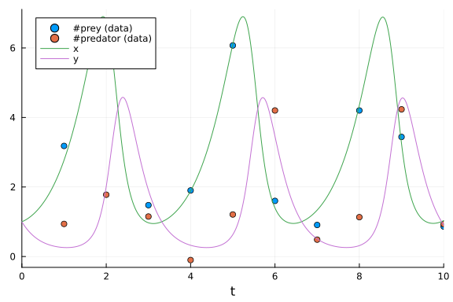

## Parameter Estimation of Lotka-Volterra Equation using DiffEqBayes.jl

```julia
using DiffEqBayes, StanSample, DynamicHMC, Turing
```


```julia
using Distributions, BenchmarkTools, StaticArrays
using OrdinaryDiffEq, RecursiveArrayTools, ParameterizedFunctions
using Plots, LinearAlgebra
```


```julia
gr(fmt=:png)
```

```
Plots.GRBackend()
```


#### Initializing the problem

```julia
f = @ode_def LotkaVolterraTest begin
    dx = a*x - b*x*y
    dy = -c*y + d*x*y
end a b c d
```

```
(::Main.var"##WeaveSandBox#7841".LotkaVolterraTest{Main.var"##WeaveSandBox#
7841".var"###ParameterizedDiffEqFunction#7843", Main.var"##WeaveSandBox#784
1".var"###ParameterizedTGradFunction#7844", Main.var"##WeaveSandBox#7841".v
ar"###ParameterizedJacobianFunction#7845", Nothing, Nothing, ModelingToolki
t.ODESystem}) (generic function with 1 method)
```


```julia
u0 = [1.0,1.0]
tspan = (0.0,10.0)
p = [1.5,1.0,3.0,1,0]
```

```
5-element Vector{Float64}:
 1.5
 1.0
 3.0
 1.0
 0.0
```


```julia
prob = ODEProblem(f, u0, tspan, p)
sol = solve(prob,Tsit5())
```

```
retcode: Success
Interpolation: specialized 4th order "free" interpolation
t: 34-element Vector{Float64}:
  0.0
  0.0776084743154256
  0.23264513699277584
  0.4291185174543143
  0.6790821987497083
  0.9444046158046306
  1.2674601546021105
  1.6192913303893046
  1.9869754428624007
  2.2640902393538296
  ⋮
  7.584863345264154
  7.978068981329682
  8.48316543760351
  8.719248247740158
  8.949206788834692
  9.200185054623292
  9.438029017301554
  9.711808134779586
 10.0
u: 34-element Vector{Vector{Float64}}:
 [1.0, 1.0]
 [1.0454942346944578, 0.8576684823217127]
 [1.1758715885138267, 0.639459570317544]
 [1.4196809607170826, 0.4569962601282084]
 [1.876719395008001, 0.32473342927911314]
 [2.5882500645533466, 0.26336255535952163]
 [3.8607089092207665, 0.2794458098285253]
 [5.750812667710396, 0.5220072537934558]
 [6.814978999130169, 1.9177826328390666]
 [4.3929992925714245, 4.194670792850584]
 ⋮
 [2.614253967788294, 0.26416945387525886]
 [4.241076127191749, 0.3051236762921916]
 [6.791123785297795, 1.1345287797146113]
 [6.265370675764892, 2.74169350754023]
 [3.7807651118880545, 4.431165685863461]
 [1.816420140681761, 4.064056625315978]
 [1.1465021407690728, 2.7911706616216976]
 [0.9557986135403302, 1.6235622951850799]
 [1.0337581256020607, 0.9063703842886133]
```


```julia
su0 = SA[1.0,1.0]
sp = SA[1.5,1.0,3.0,1,0]
sprob = ODEProblem{false,SciMLBase.FullSpecialize}(f, su0, tspan, sp)
sol = solve(sprob,Tsit5())
```

```
retcode: Success
Interpolation: specialized 4th order "free" interpolation
t: 34-element Vector{Float64}:
  0.0
  0.0776084743154256
  0.23264513699277584
  0.4291185174543143
  0.6790821987497083
  0.9444046158046306
  1.2674601546021105
  1.6192913303893046
  1.9869754428624007
  2.2640902393538296
  ⋮
  7.584863345264154
  7.978068981329682
  8.48316543760351
  8.719248247740158
  8.949206788834692
  9.200185054623292
  9.438029017301554
  9.711808134779586
 10.0
u: 34-element Vector{StaticArraysCore.SVector{2, Float64}}:
 [1.0, 1.0]
 [1.0454942346944578, 0.8576684823217127]
 [1.1758715885138267, 0.639459570317544]
 [1.4196809607170826, 0.4569962601282084]
 [1.876719395008001, 0.32473342927911314]
 [2.5882500645533466, 0.26336255535952163]
 [3.8607089092207665, 0.2794458098285253]
 [5.750812667710396, 0.5220072537934558]
 [6.814978999130169, 1.9177826328390666]
 [4.3929992925714245, 4.194670792850584]
 ⋮
 [2.614253967788294, 0.26416945387525886]
 [4.241076127191749, 0.3051236762921916]
 [6.791123785297795, 1.1345287797146113]
 [6.265370675764892, 2.74169350754023]
 [3.7807651118880545, 4.431165685863461]
 [1.816420140681761, 4.064056625315978]
 [1.1465021407690728, 2.7911706616216976]
 [0.9557986135403302, 1.6235622951850799]
 [1.0337581256020607, 0.9063703842886133]
```


#### We take the solution data obtained and add noise to it to obtain data for using in the Bayesian Inference of the parameters

```julia
t = collect(range(1,stop=10,length=10))
sig = 0.49
data = convert(Array, VectorOfArray([(sol(t[i]) + sig*randn(2)) for i in 1:length(t)]))
```

```
2×10 Matrix{Float64}:
 2.54448   7.18442  1.03283  2.35978   …   4.45834   3.22282  0.937586
 0.532118  1.67169  2.03469  0.649293     -0.538899  4.63124  0.802321
```


#### Plots of the actual data and generated data

```julia
scatter(t, data[1,:], lab="#prey (data)")
scatter!(t, data[2,:], lab="#predator (data)")
plot!(sol)
```



```julia
priors = [truncated(Normal(1.5,0.5),0.5,2.5),truncated(Normal(1.2,0.5),0,2),truncated(Normal(3.0,0.5),1,4),truncated(Normal(1.0,0.5),0,2)]
```

```
4-element Vector{Distributions.Truncated{Distributions.Normal{Float64}, Dis
tributions.Continuous, Float64, Float64, Float64}}:
 Truncated(Distributions.Normal{Float64}(μ=1.5, σ=0.5); lower=0.5, upper=2.
5)
 Truncated(Distributions.Normal{Float64}(μ=1.2, σ=0.5); lower=0.0, upper=2.
0)
 Truncated(Distributions.Normal{Float64}(μ=3.0, σ=0.5); lower=1.0, upper=4.
0)
 Truncated(Distributions.Normal{Float64}(μ=1.0, σ=0.5); lower=0.0, upper=2.
0)
```


### Stan.jl backend

The solution converges for tolerance values lower than 1e-3, lower tolerance leads to better accuracy in result but is accompanied by longer warmup and sampling time, truncated normal priors are used for preventing Stan from stepping into negative values.

```julia
@btime bayesian_result_stan = stan_inference(prob,t,data,priors,num_samples=10_000,print_summary=false,delta = 0.65, vars = (DiffEqBayes.StanODEData(), InverseGamma(2, 3)))
```

```
37.841607 seconds (628 allocations: 56.461 KiB)
 32.070376 seconds (628 allocations: 56.461 KiB)
 37.086055 seconds (628 allocations: 56.461 KiB)
 37.068867 seconds (628 allocations: 56.461 KiB)
  55.985 s (261062 allocations: 31.91 MiB)
Chains MCMC chain (10000×6×1 Array{Float64, 3}):

Iterations        = 1:1:10000
Number of chains  = 1
Samples per chain = 10000
parameters        = sigma1.1, sigma1.2, theta_1, theta_2, theta_3, theta_4
internals         = 

Summary Statistics
  parameters      mean       std      mcse    ess_bulk    ess_tail      rha
t   ⋯
      Symbol   Float64   Float64   Float64     Float64     Float64   Float6
4   ⋯

    sigma1.1    0.4562    0.1420    0.0024   2677.6827   1829.2263    1.000
0   ⋯
    sigma1.2    0.5449    0.1598    0.0030   3398.9665   3460.7405    1.001
1   ⋯
     theta_1    1.4444    0.0771    0.0016   2233.3683   2886.2328    0.999
9   ⋯
     theta_2    1.0390    0.1080    0.0026   2274.3065   2074.2754    1.000
0   ⋯
     theta_3    3.2387    0.2587    0.0053   2370.1179   2890.7170    0.999
9   ⋯
     theta_4    1.0617    0.0894    0.0019   2299.1029   3034.6195    1.000
0   ⋯
                                                                1 column om
itted

Quantiles
  parameters      2.5%     25.0%     50.0%     75.0%     97.5%
      Symbol   Float64   Float64   Float64   Float64   Float64

    sigma1.1    0.2633    0.3572    0.4287    0.5232    0.8041
    sigma1.2    0.3268    0.4340    0.5169    0.6220    0.9344
     theta_1    1.3114    1.3905    1.4377    1.4916    1.6135
     theta_2    0.8717    0.9699    1.0259    1.0910    1.2773
     theta_3    2.7392    3.0631    3.2341    3.4090    3.7607
     theta_4    0.8885    1.0011    1.0611    1.1211    1.2408
```


### Direct Turing.jl

```julia
@model function fitlv(data, prob)
    # Prior distributions.
    σ ~ InverseGamma(2, 3)
    α ~ truncated(Normal(1.5, 0.5), 0.5, 2.5)
    β ~ truncated(Normal(1.2, 0.5), 0, 2)
    γ ~ truncated(Normal(3.0, 0.5), 1, 4)
    δ ~ truncated(Normal(1.0, 0.5), 0, 2)

    # Simulate Lotka-Volterra model. 
    p = SA[α, β, γ, δ]
    _prob = remake(prob, p = p)
    predicted = solve(_prob, Tsit5(); saveat=t)

    # Observations.
    for i in 1:length(predicted)
        data[:, i] ~ MvNormal(predicted[i], σ^2 * I)
    end

    return nothing
end

model = fitlv(data, sprob)

@time chain = sample(model, NUTS(0.65), 10000; progress=false)
```

```
Error: UndefVarError: `NUTS` not defined
```


```julia
@time chain = sample(model, NUTS(0.65), 10000; progress=false)
```

```
Error: UndefVarError: `NUTS` not defined
```


### Turing.jl backend

```julia
@btime bayesian_result_turing = turing_inference(prob, Tsit5(), t, data, priors, num_samples=10_000)
```

```
30.552 s (217591792 allocations: 21.63 GiB)
Chains MCMC chain (10000×17×1 Array{Float64, 3}):

Iterations        = 1001:1:11000
Number of chains  = 1
Samples per chain = 10000
Wall duration     = 30.48 seconds
Compute duration  = 30.48 seconds
parameters        = theta[1], theta[2], theta[3], theta[4], σ[1]
internals         = lp, n_steps, is_accept, acceptance_rate, log_density, h
amiltonian_energy, hamiltonian_energy_error, max_hamiltonian_energy_error, 
tree_depth, numerical_error, step_size, nom_step_size

Summary Statistics
  parameters      mean       std      mcse    ess_bulk    ess_tail      rha
t   ⋯
      Symbol   Float64   Float64   Float64     Float64     Float64   Float6
4   ⋯

    theta[1]    1.4429    0.0651    0.0015   1943.1433   1946.1625    1.000
6   ⋯
    theta[2]    1.0229    0.0746    0.0014   3234.3178   3010.6864    1.000
2   ⋯
    theta[3]    3.2314    0.2201    0.0050   1979.7621   1848.4274    1.000
4   ⋯
    theta[4]    1.0606    0.0776    0.0017   2013.3644   2069.0506    1.000
5   ⋯
        σ[1]    0.4011    0.0815    0.0013   3568.7320   3751.8340    1.000
2   ⋯
                                                                1 column om
itted

Quantiles
  parameters      2.5%     25.0%     50.0%     75.0%     97.5%
      Symbol   Float64   Float64   Float64   Float64   Float64

    theta[1]    1.3227    1.3992    1.4393    1.4825    1.5826
    theta[2]    0.8964    0.9710    1.0176    1.0671    1.1876
    theta[3]    2.8104    3.0839    3.2252    3.3717    3.6889
    theta[4]    0.9123    1.0095    1.0592    1.1097    1.2219
        σ[1]    0.2780    0.3432    0.3893    0.4474    0.5891
```


### DynamicHMC.jl backend

```julia
@btime bayesian_result_dynamichmc = dynamichmc_inference(prob,Tsit5(),t,data,priors,num_samples=10_000)
```

```
20.292 s (73242016 allocations: 12.40 GiB)
(posterior = NamedTuple{(:parameters, :σ), Tuple{Vector{Float64}, Vector{Fl
oat64}}}[(parameters = [1.3725287374136854, 1.022821335491415, 3.5204304066
2305, 1.1587700552524371], σ = [0.26949876647167836, 0.5422601533527013]), 
(parameters = [1.3709952031718846, 1.0224505951973148, 3.5125964787336037, 
1.1335473717510223], σ = [0.297982751839929, 0.5679490421708565]), (paramet
ers = [1.4519475293763648, 0.9513913159157019, 3.0761771599243097, 1.034341
0795697656], σ = [0.3441776632568034, 0.3550194388944587]), (parameters = [
1.4725933773862963, 0.9497153631265637, 3.094664184923593, 1.03905723490361
02], σ = [0.3529150416055212, 0.34498479027098095]), (parameters = [1.47181
20272955488, 0.9481138382230746, 3.082126099494732, 1.044188006960892], σ =
 [0.3279348120971489, 0.3346081080603015]), (parameters = [1.35792047812655
61, 0.975185239858494, 3.6027186684135466, 1.1601681004277868], σ = [0.1978
1308294137848, 0.4757946998757568]), (parameters = [1.438574828830307, 0.98
62505137331739, 3.235139224177035, 1.0720895383180649], σ = [0.270740398634
8759, 0.3267703397994729]), (parameters = [1.4706242695294194, 1.0412801141
304493, 3.151446346917319, 1.0348367932866012], σ = [0.3463649983575413, 0.
4205065281429006]), (parameters = [1.4923981172783243, 1.0057835212432595, 
3.0354303662374984, 0.9766309587374977], σ = [0.3628353962947483, 0.2936677
5850226895]), (parameters = [1.4437614591993195, 1.0706697565427483, 3.2191
667287376613, 1.0679318516803267], σ = [0.3016778790648847, 0.4923521315679
881])  …  (parameters = [1.4215784466270218, 0.986674984561048, 3.387256379
9866064, 1.093510841522966], σ = [0.7472425262901934, 0.3960858608376986]),
 (parameters = [1.4042923656915602, 0.9543976840571612, 3.224870408990651, 
1.0995223601445254], σ = [0.5918647232377542, 0.32979105339800197]), (param
eters = [1.4285622932218773, 1.0905015512548386, 3.2988799365822135, 1.1007
60715072871], σ = [0.3881047758945856, 0.26952438659003763]), (parameters =
 [1.454504631910842, 0.9574264418338594, 3.2324074412737263, 1.040116552265
1248], σ = [0.21496893047420115, 0.46915850288217487]), (parameters = [1.39
64054957257659, 1.162878839403158, 3.420509637388066, 1.087905567347225], σ
 = [0.3917008536110344, 0.48470586739075927]), (parameters = [1.40649202370
36096, 1.1219147156581732, 3.3527535717705876, 1.0814292474726346], σ = [0.
29210330272445817, 0.43546303253902763]), (parameters = [1.4123128024090015
, 1.1118771875294278, 3.31621209733344, 1.0840593756373438], σ = [0.2883270
4734747167, 0.4624378586652688]), (parameters = [1.5095110770930054, 1.0284
8688920231, 3.0021847259624743, 0.9924747141141748], σ = [0.286374015727016
76, 0.33089803856745414]), (parameters = [1.5054236852065916, 1.06276182912
31715, 3.042400308511459, 0.9960574321220619], σ = [0.42797872356506395, 0.
3099154721582601]), (parameters = [1.436830713491231, 1.0883944290795813, 3
.2157214202712354, 1.0597727176495044], σ = [0.2077891249300711, 0.38172068
43724397])], posterior_matrix = [0.3166548321886798 0.31553690179352023 … 0
.40907437699166244 0.3624397946536078; 0.022564824103343963 0.0222022901120
46347 … 0.06087101886823164 0.08470360946437067; … ; -1.3111914657430839 -1
.2107196738836108 … -0.8486817959325673 -1.571231535997994; -0.612009404964
1449 -0.5657235787734998 … -1.1714556891415187 -0.96306613056966], tree_sta
tistics = DynamicHMC.TreeStatisticsNUTS[DynamicHMC.TreeStatisticsNUTS(-17.9
54696005173833, 5, turning at positions 7:38, 0.6907810770781968, 63, Dynam
icHMC.Directions(0x03a20c26)), DynamicHMC.TreeStatisticsNUTS(-14.4033228686
4625, 6, turning at positions -30:33, 0.904922681173538, 63, DynamicHMC.Dir
ections(0xd9df8121)), DynamicHMC.TreeStatisticsNUTS(-17.83916913552718, 5, 
turning at positions -43:-46, 0.5355797552017977, 47, DynamicHMC.Directions
(0x110bf7c1)), DynamicHMC.TreeStatisticsNUTS(-16.766404597370638, 2, turnin
g at positions -3:0, 0.869476733025428, 3, DynamicHMC.Directions(0x73e4ae64
)), DynamicHMC.TreeStatisticsNUTS(-15.273097261641942, 3, turning at positi
ons 0:7, 0.9947978465907089, 7, DynamicHMC.Directions(0xf108b63f)), Dynamic
HMC.TreeStatisticsNUTS(-15.034483650594769, 6, turning at positions -50:-81
, 0.9091900897603171, 95, DynamicHMC.Directions(0x53452d8e)), DynamicHMC.Tr
eeStatisticsNUTS(-12.65442897169475, 6, turning at positions -57:6, 0.99193
40262766886, 63, DynamicHMC.Directions(0x40f0b986)), DynamicHMC.TreeStatist
icsNUTS(-11.629950978162114, 5, turning at positions -29:2, 0.9994585574142
16, 31, DynamicHMC.Directions(0xc3a0cd02)), DynamicHMC.TreeStatisticsNUTS(-
13.825463686132286, 6, turning at positions -37:26, 0.9530676820657986, 63,
 DynamicHMC.Directions(0xff6740da)), DynamicHMC.TreeStatisticsNUTS(-14.1413
28214603636, 6, turning at positions -30:33, 0.9401352285150488, 63, Dynami
cHMC.Directions(0xd75e1721))  …  DynamicHMC.TreeStatisticsNUTS(-21.57220543
2994828, 6, turning at positions -57:6, 0.3851801932988715, 63, DynamicHMC.
Directions(0x6b325406)), DynamicHMC.TreeStatisticsNUTS(-19.095593472417587,
 5, turning at positions -36:-51, 0.71428567823056, 63, DynamicHMC.Directio
ns(0x638c15cc)), DynamicHMC.TreeStatisticsNUTS(-23.47836281404987, 5, turni
ng at positions -1:30, 0.9319238158375988, 31, DynamicHMC.Directions(0xc12d
f0fe)), DynamicHMC.TreeStatisticsNUTS(-18.142314945590968, 5, turning at po
sitions 0:31, 0.913305931383499, 31, DynamicHMC.Directions(0xd78e375f)), Dy
namicHMC.TreeStatisticsNUTS(-17.008159992471455, 5, turning at positions -9
:22, 0.991086551085221, 31, DynamicHMC.Directions(0xc54406b6)), DynamicHMC.
TreeStatisticsNUTS(-18.629578321797293, 4, turning at positions 14:29, 0.79
9813711734967, 31, DynamicHMC.Directions(0x4eefe99d)), DynamicHMC.TreeStati
sticsNUTS(-13.290624440285216, 3, turning at positions 0:7, 0.9999999999999
999, 7, DynamicHMC.Directions(0xd394bd67)), DynamicHMC.TreeStatisticsNUTS(-
14.015406423411658, 6, turning at positions -56:7, 0.9763598265645884, 63, 
DynamicHMC.Directions(0x6b2f5e07)), DynamicHMC.TreeStatisticsNUTS(-13.81228
4094149128, 5, turning at positions -24:7, 0.961958024978012, 31, DynamicHM
C.Directions(0xfc68a767)), DynamicHMC.TreeStatisticsNUTS(-17.53668833504927
, 6, turning at positions -53:10, 0.9935344191867377, 63, DynamicHMC.Direct
ions(0xd577458a))], κ = Gaussian kinetic energy (Diagonal), √diag(M⁻¹): [0.
04683565724020125, 0.07455625715481189, 0.07196316917841428, 0.075778450224
21405, 0.2860675937078286, 0.2645091767153883], ϵ = 0.06774533046296737)
```


## Conclusion

Lotka-Volterra Equation is a "predator-prey" model, it models population of two species in which one is the predator (wolf) and the other is the prey (rabbit).
It depicts a cyclic behaviour, which is also seen in its Uncertainity Quantification Plots. This behaviour makes it easy to estimate even at very high tolerance values (1e-3).


## Appendix

These benchmarks are a part of the SciMLBenchmarks.jl repository, found at: [https://github.com/SciML/SciMLBenchmarks.jl](https://github.com/SciML/SciMLBenchmarks.jl). For more information on high-performance scientific machine learning, check out the SciML Open Source Software Organization [https://sciml.ai](https://sciml.ai).

To locally run this benchmark, do the following commands:

```
using SciMLBenchmarks
SciMLBenchmarks.weave_file("benchmarks/BayesianInference","DiffEqBayesLotkaVolterra.jmd")
```

Computer Information:

```
Julia Version 1.9.2
Commit e4ee485e909 (2023-07-05 09:39 UTC)
Platform Info:
  OS: Linux (x86_64-linux-gnu)
  CPU: 128 × AMD EPYC 7502 32-Core Processor
  WORD_SIZE: 64
  LIBM: libopenlibm
  LLVM: libLLVM-14.0.6 (ORCJIT, znver2)
  Threads: 128 on 128 virtual cores
Environment:
  JULIA_CPU_THREADS = 128
  JULIA_DEPOT_PATH = /cache/julia-buildkite-plugin/depots/5b300254-1738-4989-ae0a-f4d2d937f953
  JULIA_IMAGE_THREADS = 1

```

Package Information:

```
Status `/cache/build/exclusive-amdci3-0/julialang/scimlbenchmarks-dot-jl/benchmarks/BayesianInference/Project.toml`
  [6e4b80f9] BenchmarkTools v1.3.2
⌃ [ebbdde9d] DiffEqBayes v3.5.0
  [459566f4] DiffEqCallbacks v2.27.0
  [31c24e10] Distributions v0.25.98
  [bbc10e6e] DynamicHMC v3.4.6
  [1dea7af3] OrdinaryDiffEq v6.53.4
  [65888b18] ParameterizedFunctions v5.15.0
  [91a5bcdd] Plots v1.38.17
  [731186ca] RecursiveArrayTools v2.38.7
  [31c91b34] SciMLBenchmarks v0.1.3
  [c1514b29] StanSample v7.4.2
  [90137ffa] StaticArrays v1.6.2
⌅ [fce5fe82] Turing v0.26.6
  [37e2e46d] LinearAlgebra
Info Packages marked with ⌃ and ⌅ have new versions available, but those with ⌅ are restricted by compatibility constraints from upgrading. To see why use `status --outdated`
```

And the full manifest:

```
Status `/cache/build/exclusive-amdci3-0/julialang/scimlbenchmarks-dot-jl/benchmarks/BayesianInference/Manifest.toml`
  [47edcb42] ADTypes v0.1.6
  [a4c015fc] ANSIColoredPrinters v0.0.1
  [c3fe647b] AbstractAlgebra v0.31.0
  [621f4979] AbstractFFTs v1.5.0
  [80f14c24] AbstractMCMC v4.4.2
⌅ [7a57a42e] AbstractPPL v0.5.4
  [1520ce14] AbstractTrees v0.4.4
  [79e6a3ab] Adapt v3.6.2
⌅ [0bf59076] AdvancedHMC v0.4.6
  [5b7e9947] AdvancedMH v0.7.5
  [576499cb] AdvancedPS v0.4.3
  [b5ca4192] AdvancedVI v0.2.4
  [dce04be8] ArgCheck v2.3.0
  [ec485272] ArnoldiMethod v0.2.0
  [4fba245c] ArrayInterface v7.4.11
  [30b0a656] ArrayInterfaceCore v0.1.29
  [a9b6321e] Atomix v0.1.0
  [13072b0f] AxisAlgorithms v1.0.1
  [39de3d68] AxisArrays v0.4.7
  [198e06fe] BangBang v0.3.39
  [9718e550] Baselet v0.1.1
  [6e4b80f9] BenchmarkTools v1.3.2
  [e2ed5e7c] Bijections v0.1.4
⌅ [76274a88] Bijectors v0.12.8
  [d1d4a3ce] BitFlags v0.1.7
  [62783981] BitTwiddlingConvenienceFunctions v0.1.5
  [fa961155] CEnum v0.4.2
  [2a0fbf3d] CPUSummary v0.2.3
  [00ebfdb7] CSTParser v3.3.6
  [336ed68f] CSV v0.10.11
  [49dc2e85] Calculus v0.5.1
  [082447d4] ChainRules v1.53.0
  [d360d2e6] ChainRulesCore v1.16.0
  [9e997f8a] ChangesOfVariables v0.1.8
  [fb6a15b2] CloseOpenIntervals v0.1.12
  [944b1d66] CodecZlib v0.7.2
  [35d6a980] ColorSchemes v3.22.0
  [3da002f7] ColorTypes v0.11.4
  [c3611d14] ColorVectorSpace v0.10.0
  [5ae59095] Colors v0.12.10
  [861a8166] Combinatorics v1.0.2
  [a80b9123] CommonMark v0.8.12
  [38540f10] CommonSolve v0.2.4
  [bbf7d656] CommonSubexpressions v0.3.0
  [34da2185] Compat v4.8.0
  [5224ae11] CompatHelperLocal v0.1.25
  [b152e2b5] CompositeTypes v0.1.3
  [a33af91c] CompositionsBase v0.1.2
  [f0e56b4a] ConcurrentUtilities v2.2.1
  [8f4d0f93] Conda v1.9.1
  [88cd18e8] ConsoleProgressMonitor v0.1.2
  [187b0558] ConstructionBase v1.5.3
  [d38c429a] Contour v0.6.2
  [adafc99b] CpuId v0.3.1
  [a8cc5b0e] Crayons v4.1.1
  [9a962f9c] DataAPI v1.15.0
  [a93c6f00] DataFrames v1.6.1
  [864edb3b] DataStructures v0.18.14
  [e2d170a0] DataValueInterfaces v1.0.0
  [244e2a9f] DefineSingletons v0.1.2
  [8bb1440f] DelimitedFiles v1.9.1
  [b429d917] DensityInterface v0.4.0
  [2b5f629d] DiffEqBase v6.127.0
⌃ [ebbdde9d] DiffEqBayes v3.5.0
  [459566f4] DiffEqCallbacks v2.27.0
  [163ba53b] DiffResults v1.1.0
  [b552c78f] DiffRules v1.15.1
  [b4f34e82] Distances v0.10.9
  [31c24e10] Distributions v0.25.98
  [ced4e74d] DistributionsAD v0.6.51
  [ffbed154] DocStringExtensions v0.9.3
  [e30172f5] Documenter v0.27.25
  [5b8099bc] DomainSets v0.6.7
  [fa6b7ba4] DualNumbers v0.6.8
  [bbc10e6e] DynamicHMC v3.4.6
⌃ [366bfd00] DynamicPPL v0.23.0
  [7c1d4256] DynamicPolynomials v0.5.2
  [cad2338a] EllipticalSliceSampling v1.1.0
  [4e289a0a] EnumX v1.0.4
  [460bff9d] ExceptionUnwrapping v0.1.9
  [d4d017d3] ExponentialUtilities v1.24.0
  [e2ba6199] ExprTools v0.1.10
  [c87230d0] FFMPEG v0.4.1
  [7a1cc6ca] FFTW v1.7.1
  [7034ab61] FastBroadcast v0.2.6
  [9aa1b823] FastClosures v0.3.2
  [29a986be] FastLapackInterface v2.0.0
  [48062228] FilePathsBase v0.9.20
  [1a297f60] FillArrays v1.5.0
  [6a86dc24] FiniteDiff v2.21.1
  [53c48c17] FixedPointNumbers v0.8.4
  [59287772] Formatting v0.4.2
  [f6369f11] ForwardDiff v0.10.35
  [069b7b12] FunctionWrappers v1.1.3
  [77dc65aa] FunctionWrappersWrappers v0.1.3
  [d9f16b24] Functors v0.4.5
  [46192b85] GPUArraysCore v0.1.5
  [28b8d3ca] GR v0.72.9
  [c145ed77] GenericSchur v0.5.3
  [d7ba0133] Git v1.3.0
  [c27321d9] Glob v1.3.1
  [86223c79] Graphs v1.8.0
  [42e2da0e] Grisu v1.0.2
  [0b43b601] Groebner v0.4.2
  [d5909c97] GroupsCore v0.4.0
  [cd3eb016] HTTP v1.9.14
  [eafb193a] Highlights v0.5.2
  [3e5b6fbb] HostCPUFeatures v0.1.15
  [34004b35] HypergeometricFunctions v0.3.23
  [7073ff75] IJulia v1.24.2
  [b5f81e59] IOCapture v0.2.3
  [615f187c] IfElse v0.1.1
  [d25df0c9] Inflate v0.1.3
  [22cec73e] InitialValues v0.3.1
  [842dd82b] InlineStrings v1.4.0
  [505f98c9] InplaceOps v0.3.0
  [18e54dd8] IntegerMathUtils v0.1.2
  [a98d9a8b] Interpolations v0.14.7
  [8197267c] IntervalSets v0.7.7
  [3587e190] InverseFunctions v0.1.12
  [41ab1584] InvertedIndices v1.3.0
  [92d709cd] IrrationalConstants v0.2.2
  [c8e1da08] IterTools v1.8.0
  [82899510] IteratorInterfaceExtensions v1.0.0
  [1019f520] JLFzf v0.1.5
  [692b3bcd] JLLWrappers v1.4.1
  [682c06a0] JSON v0.21.4
  [98e50ef6] JuliaFormatter v1.0.34
  [ccbc3e58] JumpProcesses v9.7.2
  [ef3ab10e] KLU v0.4.0
  [63c18a36] KernelAbstractions v0.9.8
  [5ab0869b] KernelDensity v0.6.7
  [ba0b0d4f] Krylov v0.9.2
  [929cbde3] LLVM v6.1.0
  [8ac3fa9e] LRUCache v1.4.1
  [b964fa9f] LaTeXStrings v1.3.0
  [2ee39098] LabelledArrays v1.14.0
  [984bce1d] LambertW v0.4.6
⌅ [23fbe1c1] Latexify v0.15.21
  [10f19ff3] LayoutPointers v0.1.14
  [50d2b5c4] Lazy v0.15.1
  [1fad7336] LazyStack v0.1.1
  [1d6d02ad] LeftChildRightSiblingTrees v0.2.0
  [6f1fad26] Libtask v0.8.6
  [d3d80556] LineSearches v7.2.0
  [7ed4a6bd] LinearSolve v2.4.2
  [6fdf6af0] LogDensityProblems v2.1.1
  [996a588d] LogDensityProblemsAD v1.6.1
  [2ab3a3ac] LogExpFunctions v0.3.24
  [e6f89c97] LoggingExtras v1.0.0
  [bdcacae8] LoopVectorization v0.12.165
  [c7f686f2] MCMCChains v6.0.3
  [be115224] MCMCDiagnosticTools v0.3.4
  [e80e1ace] MLJModelInterface v1.8.0
  [d8e11817] MLStyle v0.4.17
  [1914dd2f] MacroTools v0.5.10
  [d125e4d3] ManualMemory v0.1.8
  [dbb5928d] MappedArrays v0.4.2
  [739be429] MbedTLS v1.1.7
  [442fdcdd] Measures v0.3.2
  [128add7d] MicroCollections v0.1.4
  [e1d29d7a] Missings v1.1.0
  [961ee093] ModelingToolkit v8.64.0
  [46d2c3a1] MuladdMacro v0.2.4
  [102ac46a] MultivariatePolynomials v0.5.1
  [ffc61752] Mustache v1.0.17
  [d8a4904e] MutableArithmetics v1.3.0
  [d41bc354] NLSolversBase v7.8.3
  [2774e3e8] NLsolve v4.5.1
  [872c559c] NNlib v0.9.4
  [77ba4419] NaNMath v1.0.2
  [86f7a689] NamedArrays v0.9.8
  [d9ec5142] NamedTupleTools v0.14.3
  [c020b1a1] NaturalSort v1.0.0
  [8913a72c] NonlinearSolve v1.9.0
  [6fe1bfb0] OffsetArrays v1.12.10
  [4d8831e6] OpenSSL v1.4.1
  [429524aa] Optim v1.7.6
  [3bd65402] Optimisers v0.2.19
  [bac558e1] OrderedCollections v1.6.2
  [1dea7af3] OrdinaryDiffEq v6.53.4
  [90014a1f] PDMats v0.11.17
  [65ce6f38] PackageExtensionCompat v1.0.0
  [65888b18] ParameterizedFunctions v5.15.0
  [d96e819e] Parameters v0.12.3
  [69de0a69] Parsers v2.7.2
  [b98c9c47] Pipe v1.3.0
  [ccf2f8ad] PlotThemes v3.1.0
  [995b91a9] PlotUtils v1.3.5
  [91a5bcdd] Plots v1.38.17
  [e409e4f3] PoissonRandom v0.4.4
  [f517fe37] Polyester v0.7.5
  [1d0040c9] PolyesterWeave v0.2.1
  [2dfb63ee] PooledArrays v1.4.2
  [85a6dd25] PositiveFactorizations v0.2.4
  [d236fae5] PreallocationTools v0.4.12
  [aea7be01] PrecompileTools v1.1.2
  [21216c6a] Preferences v1.4.0
  [08abe8d2] PrettyTables v2.2.7
  [27ebfcd6] Primes v0.5.4
  [33c8b6b6] ProgressLogging v0.1.4
  [92933f4c] ProgressMeter v1.7.2
  [1fd47b50] QuadGK v2.8.2
  [74087812] Random123 v1.6.1
  [fb686558] RandomExtensions v0.4.3
  [e6cf234a] RandomNumbers v1.5.3
  [b3c3ace0] RangeArrays v0.3.2
  [c84ed2f1] Ratios v0.4.5
  [c1ae055f] RealDot v0.1.0
  [3cdcf5f2] RecipesBase v1.3.4
  [01d81517] RecipesPipeline v0.6.12
  [731186ca] RecursiveArrayTools v2.38.7
  [f2c3362d] RecursiveFactorization v0.2.18
  [189a3867] Reexport v1.2.2
  [05181044] RelocatableFolders v1.0.0
  [ae029012] Requires v1.3.0
  [79098fc4] Rmath v0.7.1
  [f2b01f46] Roots v2.0.17
  [7e49a35a] RuntimeGeneratedFunctions v0.5.11
  [fdea26ae] SIMD v3.4.5
  [94e857df] SIMDTypes v0.1.0
  [476501e8] SLEEFPirates v0.6.39
  [0bca4576] SciMLBase v1.94.0
  [31c91b34] SciMLBenchmarks v0.1.3
  [e9a6253c] SciMLNLSolve v0.1.8
  [c0aeaf25] SciMLOperators v0.3.6
  [30f210dd] ScientificTypesBase v3.0.0
  [6c6a2e73] Scratch v1.2.0
  [91c51154] SentinelArrays v1.4.0
  [efcf1570] Setfield v1.1.1
  [992d4aef] Showoff v1.0.3
  [777ac1f9] SimpleBufferStream v1.1.0
  [727e6d20] SimpleNonlinearSolve v0.1.19
  [699a6c99] SimpleTraits v0.9.4
  [ce78b400] SimpleUnPack v1.1.0
  [66db9d55] SnoopPrecompile v1.0.3
  [b85f4697] SoftGlobalScope v1.1.0
  [a2af1166] SortingAlgorithms v1.1.1
  [47a9eef4] SparseDiffTools v2.4.1
  [e56a9233] Sparspak v0.3.9
  [276daf66] SpecialFunctions v2.3.0
  [171d559e] SplittablesBase v0.1.15
  [d0ee94f6] StanBase v4.8.1
  [c1514b29] StanSample v7.4.2
  [aedffcd0] Static v0.8.8
  [0d7ed370] StaticArrayInterface v1.4.0
  [90137ffa] StaticArrays v1.6.2
  [1e83bf80] StaticArraysCore v1.4.2
  [64bff920] StatisticalTraits v3.2.0
  [82ae8749] StatsAPI v1.6.0
  [2913bbd2] StatsBase v0.34.0
  [4c63d2b9] StatsFuns v1.3.0
  [7792a7ef] StrideArraysCore v0.4.17
⌅ [5e0ebb24] Strided v1.2.3
  [69024149] StringEncodings v0.3.7
  [892a3eda] StringManipulation v0.3.0
  [09ab397b] StructArrays v0.6.15
  [2efcf032] SymbolicIndexingInterface v0.2.2
  [d1185830] SymbolicUtils v1.2.0
  [0c5d862f] Symbolics v5.5.1
  [ab02a1b2] TableOperations v1.2.0
  [3783bdb8] TableTraits v1.0.1
  [bd369af6] Tables v1.10.1
  [02d47bb6] TensorCast v0.4.6
  [62fd8b95] TensorCore v0.1.1
  [5d786b92] TerminalLoggers v0.1.7
  [8290d209] ThreadingUtilities v0.5.2
  [a759f4b9] TimerOutputs v0.5.23
  [0796e94c] Tokenize v0.5.25
  [9f7883ad] Tracker v0.2.26
  [3bb67fe8] TranscodingStreams v0.9.13
  [28d57a85] Transducers v0.4.78
  [84d833dd] TransformVariables v0.8.7
  [f9bc47f6] TransformedLogDensities v1.0.3
  [24ddb15e] TransmuteDims v0.1.15
  [a2a6695c] TreeViews v0.3.0
  [d5829a12] TriangularSolve v0.1.19
  [410a4b4d] Tricks v0.1.7
  [781d530d] TruncatedStacktraces v1.4.0
  [9d95972d] TupleTools v1.3.0
⌅ [fce5fe82] Turing v0.26.6
  [5c2747f8] URIs v1.4.2
  [3a884ed6] UnPack v1.0.2
  [1cfade01] UnicodeFun v0.4.1
  [1986cc42] Unitful v1.16.0
  [45397f5d] UnitfulLatexify v1.6.3
  [a7c27f48] Unityper v0.1.5
  [013be700] UnsafeAtomics v0.2.1
  [d80eeb9a] UnsafeAtomicsLLVM v0.1.3
  [41fe7b60] Unzip v0.2.0
  [3d5dd08c] VectorizationBase v0.21.64
  [81def892] VersionParsing v1.3.0
  [19fa3120] VertexSafeGraphs v0.2.0
  [ea10d353] WeakRefStrings v1.4.2
  [44d3d7a6] Weave v0.10.12
  [efce3f68] WoodburyMatrices v0.5.5
  [76eceee3] WorkerUtilities v1.6.1
  [ddb6d928] YAML v0.4.9
  [c2297ded] ZMQ v1.2.2
  [700de1a5] ZygoteRules v0.2.3
  [6e34b625] Bzip2_jll v1.0.8+0
  [83423d85] Cairo_jll v1.16.1+1
  [2e619515] Expat_jll v2.5.0+0
⌃ [b22a6f82] FFMPEG_jll v4.4.2+2
  [f5851436] FFTW_jll v3.3.10+0
  [a3f928ae] Fontconfig_jll v2.13.93+0
  [d7e528f0] FreeType2_jll v2.13.1+0
  [559328eb] FriBidi_jll v1.0.10+0
  [0656b61e] GLFW_jll v3.3.8+0
  [d2c73de3] GR_jll v0.72.9+0
  [78b55507] Gettext_jll v0.21.0+0
  [f8c6e375] Git_jll v2.36.1+2
  [7746bdde] Glib_jll v2.74.0+2
  [3b182d85] Graphite2_jll v1.3.14+0
  [2e76f6c2] HarfBuzz_jll v2.8.1+1
  [1d5cc7b8] IntelOpenMP_jll v2023.1.0+0
  [aacddb02] JpegTurbo_jll v2.1.91+0
  [c1c5ebd0] LAME_jll v3.100.1+0
  [88015f11] LERC_jll v3.0.0+1
  [dad2f222] LLVMExtra_jll v0.0.23+0
  [1d63c593] LLVMOpenMP_jll v15.0.4+0
  [dd4b983a] LZO_jll v2.10.1+0
⌅ [e9f186c6] Libffi_jll v3.2.2+1
  [d4300ac3] Libgcrypt_jll v1.8.7+0
  [7e76a0d4] Libglvnd_jll v1.6.0+0
  [7add5ba3] Libgpg_error_jll v1.42.0+0
  [94ce4f54] Libiconv_jll v1.16.1+2
  [4b2f31a3] Libmount_jll v2.35.0+0
  [89763e89] Libtiff_jll v4.5.1+1
  [38a345b3] Libuuid_jll v2.36.0+0
  [856f044c] MKL_jll v2023.1.0+0
  [e7412a2a] Ogg_jll v1.3.5+1
⌅ [458c3c95] OpenSSL_jll v1.1.21+0
  [efe28fd5] OpenSpecFun_jll v0.5.5+0
  [91d4177d] Opus_jll v1.3.2+0
  [30392449] Pixman_jll v0.42.2+0
  [c0090381] Qt6Base_jll v6.4.2+3
  [f50d1b31] Rmath_jll v0.4.0+0
  [a2964d1f] Wayland_jll v1.21.0+0
  [2381bf8a] Wayland_protocols_jll v1.25.0+0
  [02c8fc9c] XML2_jll v2.10.3+0
  [aed1982a] XSLT_jll v1.1.34+0
  [ffd25f8a] XZ_jll v5.4.3+1
  [4f6342f7] Xorg_libX11_jll v1.8.6+0
  [0c0b7dd1] Xorg_libXau_jll v1.0.11+0
  [935fb764] Xorg_libXcursor_jll v1.2.0+4
  [a3789734] Xorg_libXdmcp_jll v1.1.4+0
  [1082639a] Xorg_libXext_jll v1.3.4+4
  [d091e8ba] Xorg_libXfixes_jll v5.0.3+4
  [a51aa0fd] Xorg_libXi_jll v1.7.10+4
  [d1454406] Xorg_libXinerama_jll v1.1.4+4
  [ec84b674] Xorg_libXrandr_jll v1.5.2+4
  [ea2f1a96] Xorg_libXrender_jll v0.9.10+4
  [14d82f49] Xorg_libpthread_stubs_jll v0.1.1+0
  [c7cfdc94] Xorg_libxcb_jll v1.15.0+0
  [cc61e674] Xorg_libxkbfile_jll v1.1.2+0
  [12413925] Xorg_xcb_util_image_jll v0.4.0+1
  [2def613f] Xorg_xcb_util_jll v0.4.0+1
  [975044d2] Xorg_xcb_util_keysyms_jll v0.4.0+1
  [0d47668e] Xorg_xcb_util_renderutil_jll v0.3.9+1
  [c22f9ab0] Xorg_xcb_util_wm_jll v0.4.1+1
  [35661453] Xorg_xkbcomp_jll v1.4.6+0
  [33bec58e] Xorg_xkeyboard_config_jll v2.39.0+0
  [c5fb5394] Xorg_xtrans_jll v1.5.0+0
  [8f1865be] ZeroMQ_jll v4.3.4+0
  [3161d3a3] Zstd_jll v1.5.5+0
⌅ [214eeab7] fzf_jll v0.29.0+0
  [a4ae2306] libaom_jll v3.4.0+0
  [0ac62f75] libass_jll v0.15.1+0
  [f638f0a6] libfdk_aac_jll v2.0.2+0
  [b53b4c65] libpng_jll v1.6.38+0
  [a9144af2] libsodium_jll v1.0.20+0
  [f27f6e37] libvorbis_jll v1.3.7+1
  [1270edf5] x264_jll v2021.5.5+0
  [dfaa095f] x265_jll v3.5.0+0
  [d8fb68d0] xkbcommon_jll v1.4.1+0
  [0dad84c5] ArgTools v1.1.1
  [56f22d72] Artifacts
  [2a0f44e3] Base64
  [ade2ca70] Dates
  [8ba89e20] Distributed
  [f43a241f] Downloads v1.6.0
  [7b1f6079] FileWatching
  [9fa8497b] Future
  [b77e0a4c] InteractiveUtils
  [4af54fe1] LazyArtifacts
  [b27032c2] LibCURL v0.6.3
  [76f85450] LibGit2
  [8f399da3] Libdl
  [37e2e46d] LinearAlgebra
  [56ddb016] Logging
  [d6f4376e] Markdown
  [a63ad114] Mmap
  [ca575930] NetworkOptions v1.2.0
  [44cfe95a] Pkg v1.9.0
  [de0858da] Printf
  [9abbd945] Profile
  [3fa0cd96] REPL
  [9a3f8284] Random
  [ea8e919c] SHA v0.7.0
  [9e88b42a] Serialization
  [1a1011a3] SharedArrays
  [6462fe0b] Sockets
  [2f01184e] SparseArrays
  [10745b16] Statistics v1.9.0
  [4607b0f0] SuiteSparse
  [fa267f1f] TOML v1.0.3
  [a4e569a6] Tar v1.10.0
  [8dfed614] Test
  [cf7118a7] UUIDs
  [4ec0a83e] Unicode
  [e66e0078] CompilerSupportLibraries_jll v1.0.2+0
  [deac9b47] LibCURL_jll v7.84.0+0
  [29816b5a] LibSSH2_jll v1.10.2+0
  [c8ffd9c3] MbedTLS_jll v2.28.2+0
  [14a3606d] MozillaCACerts_jll v2022.10.11
  [4536629a] OpenBLAS_jll v0.3.21+4
  [05823500] OpenLibm_jll v0.8.1+0
  [efcefdf7] PCRE2_jll v10.42.0+0
  [bea87d4a] SuiteSparse_jll v5.10.1+6
  [83775a58] Zlib_jll v1.2.13+0
  [8e850b90] libblastrampoline_jll v5.8.0+0
  [8e850ede] nghttp2_jll v1.48.0+0
  [3f19e933] p7zip_jll v17.4.0+0
Info Packages marked with ⌃ and ⌅ have new versions available, but those with ⌅ are restricted by compatibility constraints from upgrading. To see why use `status --outdated -m`
```

