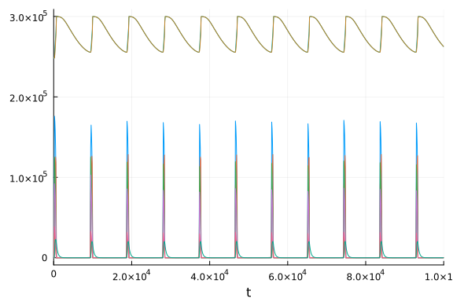
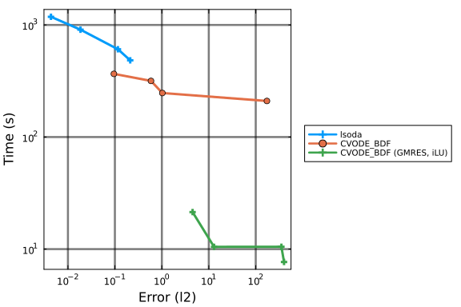
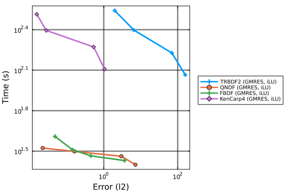
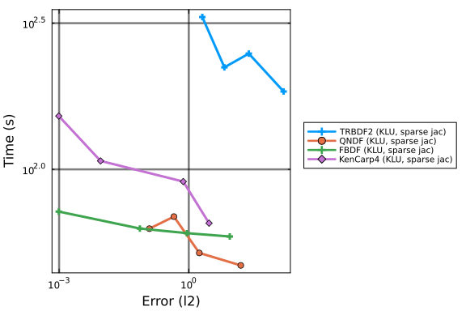
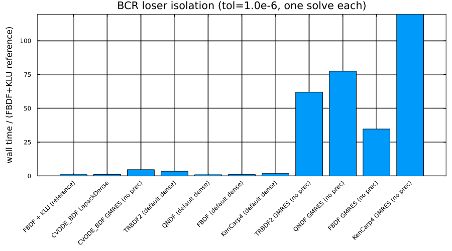

The following benchmark is of 1122 ODEs with 24388 terms that describe a stiff
chemical reaction network modeling the BCR signaling network from [Barua et
al.](https://doi.org/10.4049/jimmunol.1102003). We use
[`ReactionNetworkImporters`](https://github.com/isaacsas/ReactionNetworkImporters.jl)
to load the BioNetGen model files as a
[Catalyst](https://github.com/SciML/Catalyst.jl) model, and then use
[ModelingToolkit](https://github.com/SciML/ModelingToolkit.jl) to convert the
Catalyst network model to ODEs.

```julia
using DiffEqBase, OrdinaryDiffEq, Catalyst, ReactionNetworkImporters,
      Sundials, Plots, DiffEqDevTools, ODEInterface, ODEInterfaceDiffEq,
      LSODA, TimerOutputs, LinearAlgebra, ModelingToolkit, BenchmarkTools,
      LinearSolve, RecursiveFactorization
using OrdinaryDiffEqBDF, OrdinaryDiffEqSDIRK

gr()
datadir = joinpath(dirname(pathof(ReactionNetworkImporters)), "../data/bcr")
const to = TimerOutput()
tf = 100000.0

# generate ModelingToolkit ODEs
@timeit to "Parse Network" prnbng = loadrxnetwork(BNGNetwork(), joinpath(datadir, "bcr.net"))
show(to)
rn = complete(prnbng)
obs = [eq.lhs for eq in observed(rn)]

@timeit to "Create ODESys" osys = complete(Catalyst.ode_model(rn))
show(to)

tspan = (0.0, tf)
@timeit to "ODEProb No Jac" oprob = ODEProblem{true, SciMLBase.FullSpecialize}(
    osys, Float64[], tspan, Float64[])
show(to)
oprob_sparse = ODEProblem{true, SciMLBase.FullSpecialize}(
    osys, Float64[], tspan, Float64[]; sparse = true);
```

```
Scanning blocks...done
Parsing parameters...done
Creating parameters...done
Parsing species...done
Creating variables...done
Setting up expression bindings...done
Parsing groups...done
Parsing functions...done
Parsing and adding reactions...done
──────────────────────────────────────────────────────────────────────────
                                 Time                    Allocations      
                        ───────────────────────   ────────────────────────
   Tot / % measured:         5.17s /  99.6%            526MiB / 100.0%    

Section         ncalls     time    %tot     avg     alloc    %tot      avg
──────────────────────────────────────────────────────────────────────────
Parse Network        1    5.15s  100.0%   5.15s    526MiB  100.0%   526MiB
───────────────────────────────────────────────────────────────────────────
─────────────────────────────────────────────────────────────────────────
                                 Time                    Allocations      
                        ───────────────────────   ────────────────────────
   Tot / % measured:         17.9s /  83.8%           2.15GiB /  77.2%    

Section         ncalls     time    %tot     avg     alloc    %tot      avg
──────────────────────────────────────────────────────────────────────────
Create ODESys        1    9.83s   65.6%   9.83s   1.15GiB   69.1%  1.15GiB
Parse Network        1    5.15s   34.4%   5.15s    526MiB   30.9%   526MiB
───────────────────────────────────────────────────────────────────────────
──────────────────────────────────────────────────────────────────────────
                                  Time                    Allocations      
                         ───────────────────────   ────────────────────────
    Tot / % measured:         49.9s /  94.2%           4.59GiB /  89.3%    

Section          ncalls     time    %tot     avg     alloc    %tot      avg
───────────────────────────────────────────────────────────────────────────
ODEProb No Jac        1    32.0s   68.1%   32.0s   2.44GiB   59.5%  2.44GiB
Create ODESys         1    9.83s   20.9%   9.83s   1.15GiB   28.0%  1.15GiB
Parse Network         1    5.15s   11.0%   5.15s    526MiB   12.5%   526MiB
───────────────────────────────────────────────────────────────────────────
```


```julia
@timeit to "ODEProb SparseJac" sparsejacprob = ODEProblem{true, SciMLBase.FullSpecialize}(
    osys, Float64[], tspan, Float64[], jac = true, sparse = true)
show(to)
```

```
───────────────────────────────────────────────────────────────────────────
───
                                     Time                    Allocations   
   
                            ───────────────────────   ─────────────────────
───
     Tot / % measured:            111s /  91.7%           11.9GiB /  88.0% 
   

Section             ncalls     time    %tot     avg     alloc    %tot      
avg
───────────────────────────────────────────────────────────────────────────
───
ODEProb SparseJac        1    54.4s   53.6%   54.4s   6.35GiB   60.8%  6.35
GiB
ODEProb No Jac           1    32.0s   31.6%   32.0s   2.44GiB   23.3%  2.44
GiB
Create ODESys            1    9.83s    9.7%   9.83s   1.15GiB   11.0%  1.15
GiB
Parse Network            1    5.15s    5.1%   5.15s    526MiB    4.9%   526
MiB
───────────────────────────────────────────────────────────────────────────
───
```


```julia
@show numspecies(rn) # Number of ODEs
@show numreactions(rn) # Approx. number of terms in the ODE
@show length(parameters(rn)); # Number of Parameters
```

```
numspecies(rn) = 1122
numreactions(rn) = 24388
length(parameters(rn)) = 128
```


## Time ODE derivative function compilation

As compiling the ODE derivative functions has in the past taken longer than
running a simulation, we first force compilation by evaluating these functions
one time.

```julia
u = oprob.u0
du = copy(u)
p = oprob.p
@timeit to "ODE rhs Eval1" oprob.f(du, u, p, 0.0)
@timeit to "ODE rhs spjac Eval1" sparsejacprob.f(du, u, p, 0.0)
show(to)
```

```
───────────────────────────────────────────────────────────────────────────
─────
                                       Time                    Allocations 
     
                              ───────────────────────   ───────────────────
─────
      Tot / % measured:             189s /  95.1%           13.5GiB /  89.5
%    

Section               ncalls     time    %tot     avg     alloc    %tot    
  avg
───────────────────────────────────────────────────────────────────────────
─────
ODE rhs Eval1              1    78.5s   43.6%   78.5s   1.64GiB   13.5%  1.
64GiB
ODEProb SparseJac          1    54.4s   30.2%   54.4s   6.35GiB   52.5%  6.
35GiB
ODEProb No Jac             1    32.0s   17.8%   32.0s   2.44GiB   20.2%  2.
44GiB
Create ODESys              1    9.83s    5.5%   9.83s   1.15GiB    9.5%  1.
15GiB
Parse Network              1    5.15s    2.9%   5.15s    526MiB    4.3%   5
26MiB
ODE rhs spjac Eval1        1   9.28ms    0.0%  9.28ms    123KiB    0.0%   1
23KiB
───────────────────────────────────────────────────────────────────────────
─────
```


We also time the ODE rhs function with BenchmarkTools as it is more accurate
given how fast evaluating `f` is:

```julia
@btime oprob.f($du, $u, $p, 0.0)
```

```
41.809 μs (2 allocations: 336 bytes)
1122-element Vector{Float64}:
 -61.028082045662714
   5.941959152600332e-5
  -0.00017585525801146217
   1.0927353287115693e-5
  -2.375821949685643e-10
   0.0
  -0.021580601559854376
  -1.674730187857901e-11
  -2.0210128871802965e-9
  -0.021503434567899174
   ⋮
  -1.3438399696192487e-31
  -1.821222651639453e-23
  -2.0469554560482396e-23
  -1.5706899341477363e-14
  -3.706198991389375e-21
  -3.422528102939304e-13
  -7.529912023768182e-13
  -5.53409527730824e-23
  -1.6608734902441886e-17
```


```julia
Js = similar(sparsejacprob.f.jac_prototype)
@timeit to "SparseJac Eval1" sparsejacprob.f.jac(Js, u, p, 0.0)
@timeit to "SparseJac Eval2" sparsejacprob.f.jac(Js, u, p, 0.0)
show(to)
```

```
───────────────────────────────────────────────────────────────────────────
─────
                                       Time                    Allocations 
     
                              ───────────────────────   ───────────────────
─────
      Tot / % measured:             284s /  94.1%           14.2GiB /  89.5
%    

Section               ncalls     time    %tot     avg     alloc    %tot    
  avg
───────────────────────────────────────────────────────────────────────────
─────
SparseJac Eval1            1    87.2s   32.7%   87.2s    675MiB    5.2%   6
75MiB
ODE rhs Eval1              1    78.5s   29.4%   78.5s   1.64GiB   12.8%  1.
64GiB
ODEProb SparseJac          1    54.4s   20.3%   54.4s   6.35GiB   49.8%  6.
35GiB
ODEProb No Jac             1    32.0s   12.0%   32.0s   2.44GiB   19.1%  2.
44GiB
Create ODESys              1    9.83s    3.7%   9.83s   1.15GiB    9.0%  1.
15GiB
Parse Network              1    5.15s    1.9%   5.15s    526MiB    4.0%   5
26MiB
ODE rhs spjac Eval1        1   9.28ms    0.0%  9.28ms    123KiB    0.0%   1
23KiB
SparseJac Eval2            1    101μs    0.0%   101μs      912B    0.0%    
 912B
───────────────────────────────────────────────────────────────────────────
─────
```


## Picture of the solution

```julia
sol = solve(oprob, CVODE_BDF(), saveat = tf/1000.0, reltol = 1e-5, abstol = 1e-5)
plot(sol; idxs = obs, legend = false, fmt = :png)
```




## Generate Test Solution

```julia
@time sol = solve(oprob, CVODE_BDF(), abstol = 1/10^12, reltol = 1/10^12)
test_sol = TestSolution(sol);
```

```
644.026586 seconds (6.71 M allocations: 2.130 GiB, 0.21% gc time, 0.08% com
pilation time)
```


## Setups

#### Sets plotting defaults

```julia
default(legendfontsize = 7, framestyle = :box, gridalpha = 0.3, gridlinewidth = 2.5)
```


#### Declare pre-conditioners

```julia
using IncompleteLU, LinearAlgebra
const τ = 1e2
const τ2 = 1e2

jaccache = sparsejacprob.f.jac(oprob.u0, oprob.p, 0.0)
W = I - 1.0*jaccache
prectmp = ilu(W, τ = τ)

preccache = Ref(prectmp)

function psetupilu(p, t, u, du, jok, jcurPtr, gamma)
    if !jok
        sparsejacprob.f.jac(jaccache, u, p, t)
        jcurPtr[] = true

        # W = I - gamma*J
        @. W = -gamma*jaccache
        idxs = diagind(W)
        @. @view(W[idxs]) = @view(W[idxs]) + 1

        # Build preconditioner on W
        preccache[] = ilu(W, τ = τ)
    end
end
function precilu(z, r, p, t, y, fy, gamma, delta, lr)
    ldiv!(z, preccache[], r)
end

function incompletelu(A, p)
    Pl = ilu(convert(AbstractMatrix, A); τ = τ2)
    return Pl, I
end;
```


#### Sets tolerances

```julia
abstols = 1.0 ./ 10.0 .^ (5:8)
reltols = 1.0 ./ 10.0 .^ (5:8);
```


## Failures

CVODE with KLU diverges on this problem and is omitted from all suites:

```julia
try
    solve(sparsejacprob, CVODE_BDF(linear_solver = :KLU), abstol = 1e-8, reltol = 1e-8);
catch e
    println("CVODE_BDF with KLU failed: $e")
end
```

```
retcode: Success
Interpolation: 3rd order Hermite
t: 21250-element Vector{Float64}:
      0.0
      8.530416743262687e-10
      8.531269784937014e-6
      9.38354372175639e-5
      0.0001791396046501908
      0.00026444377208281766
      0.0003938430786133609
      0.0006069752274633084
      0.0009765102032046184
      0.001694692142730532
      ⋮
  99583.52272160228
  99647.50156318981
  99711.48040477735
  99775.45924636489
  99839.43808795243
  99903.41692953996
  99947.33141266952
  99991.24589579907
 100000.0
u: 21250-element Vector{Vector{Float64}}:
 [299717.8348854, 47149.15480798, 46979.01102231, 290771.2428252, 299980.73
96749, 300000.0, 141.3151575495, 0.1256496403614, 0.4048783555301, 140.8052
338618  …  5.279974499715e-11, 1.005585387399e-24, 6.724953378237e-17, 3.39
5560698281e-16, 1.787990228838e-5, 8.761844379939e-13, 0.0002517949074779, 
0.0005539124513976, 2.281251822741e-14, 1.78232055967e-8]
 [299717.834885348, 47149.15480798, 46979.01102231, 290771.2428252, 299980.
7396749, 300000.0, 141.31515754948157, 0.1256496403614, 0.4048783555301, 14
0.80523386178166  …  5.279974499715e-11, 1.0055853873989998e-24, 6.72495337
8236999e-17, 3.395560698281e-16, 1.787990228838e-5, 8.761844379939e-13, 0.0
002517949074779, 0.0005539124513976, 2.281251822741e-14, 1.78232055967e-8]
 [299717.8343647574, 47149.154807977386, 46979.011022305385, 290771.2428252
0014, 299980.7396749, 300000.0, 141.31515736537588, 0.12564964037709234, 0.
4048783555457002, 140.8052336783343  …  5.279974499714919e-11, 1.0055853873
97986e-24, 6.724953378223368e-17, 3.3955606982794407e-16, 1.787990228837986
5e-5, 8.761844379938684e-13, 0.0002517949074778971, 0.0005539124513975936, 
2.281251822740953e-14, 1.7823205596699857e-8]
 [299717.8291591478, 47149.154807742954, 46979.01102205176, 290771.24282520
113, 299980.7396749, 300000.0, 141.3151555233761, 0.1256496415779975, 0.404
8783567406875, 140.8052318429211  …  5.279974499713703e-11, 1.0055853874449
137e-24, 6.724953378866749e-17, 3.395560698361107e-16, 1.7879902288378527e-
5, 8.76184437993553e-13, 0.00025179490747786787, 0.0005539124513975294, 2.2
812518227404943e-14, 1.7823205596698444e-8]
 [299717.8239539325, 47149.15480723098, 46979.01102152158, 290771.242825202
35, 299980.7396749, 300000.0, 141.31515368011995, 0.12564964416810973, 0.40
48783593182312, 140.80523000625607  …  5.279974499711518e-11, 1.00558538762
9334e-24, 6.724953381328821e-17, 3.395560698691282e-16, 1.787990228837719e-
5, 8.761844379932404e-13, 0.00025179490747783865, 0.0005539124513974652, 2.
2812518227400507e-14, 1.7823205596697038e-8]
 [299717.8187491442, 47149.15480641848, 46979.01102069197, 290771.242825203
87, 299980.7396749, 300000.0, 141.31515183550403, 0.12564964825951233, 0.40
48783633898745, 140.80522816823617  …  5.279974499707761e-11, 1.00558538804
15089e-24, 6.724953386690722e-17, 3.395560699459465e-16, 1.787990228837585e
-5, 8.761844379929337e-13, 0.00025179490747780943, 0.0005539124513974011, 2
.2812518227396247e-14, 1.7823205596695638e-8]
 [299717.81085475476, 47149.154804595026, 46979.01101884468, 290771.2428252
0724, 299980.7396749, 300000.0, 141.31514903470352, 0.12564965740882778, 0.
40487837249511016, 140.8052253774509  …  5.279974499697496e-11, 1.005585389
3523886e-24, 6.724953402949404e-17, 3.395560702084003e-16, 1.78799022883738
17e-5, 8.761844379924924e-13, 0.00025179490747776514, 0.0005539124513973036
, 2.2812518227390185e-14, 1.7823205596693524e-8]
 [299717.7978542127, 47149.1548000324, 46979.01101424841, 290771.2428252169
6, 299980.7396749, 300000.0, 141.3151444144936, 0.12564968020861525, 0.4048
783951852038, 140.80522077376244  …  5.279974499663173e-11, 1.0055853942300
045e-24, 6.724953457910726e-17, 3.395560713038397e-16, 1.787990228837047e-5
, 8.761844379918893e-13, 0.0002517949074776922, 0.0005539124513971431, 2.28
1251822738162e-14, 1.7823205596690066e-8]
 [299717.77532002697, 47149.15478752479, 46979.01100169908, 290771.24282525
317, 299980.7396749, 300000.0, 141.3151363831068, 0.12564974235602455, 0.40
487845703373515, 140.80521277109582  …  5.2799744995230104e-11, 1.005585415
7481682e-24, 6.724953657444628e-17, 3.3955607688536943e-16, 1.7879902288364
666e-5, 8.761844379915419e-13, 0.0002517949074775657, 0.0005539124513968649
, 2.28125182273733e-14, 1.7823205596684167e-8]
 [299717.73154913925, 47149.15474659125, 46979.01096074444, 290771.24282544
18, 299980.7396749, 300000.0, 141.31512069959203, 0.125649943756259, 0.4048
786574651034, 140.8051971436676  …  5.279974498722369e-11, 1.00558554597776
5e-24, 6.724954488272694e-17, 3.3955611488601857e-16, 1.7879902288353377e-5
, 8.761844379954986e-13, 0.0002517949074773199, 0.0005539124513963241, 2.28
12518227400765e-14, 1.7823205596673804e-8]
 ⋮
 [299236.0711115895, 31889.671343996622, 31876.268404812912, 293709.1970390
155, 299991.67502435925, 299999.98818346777, 95.42526687349138, 0.061840551
26890152, 0.20031358171738686, 95.38517516066044  …  1.726228716591724e-11,
 1.5416188996903398e-25, 1.5379757749932625e-17, 7.689862191069444e-17, 7.9
0798917712598e-6, 2.0999297629659862e-13, 8.974762066336252e-5, 0.000197471
8002550009, 7.547519052897215e-15, 7.882930186784442e-9]
 [299209.0173798892, 32207.879732096193, 32193.803218901656, 293647.2686357
9976, 299991.4633868998, 299999.98731367174, 96.36873991309878, 0.063269746
81871092, 0.2049191447934562, 96.32663678108017  …  1.784733263130918e-11, 
1.6411539273196837e-25, 1.6128307009171743e-17, 8.066691112882368e-17, 8.11
6975919063984e-6, 2.198478630264357e-13, 9.25774982383043e-5, 0.00020369761
74563864, 7.842095369822894e-15, 8.091254032223849e-9]
 [299180.9481031405, 32520.596707240988, 32505.830275226373, 293586.4217323
898, 299991.2504318672, 299999.98637714016, 97.29528062688217, 0.0647076085
2502785, 0.2095515488442691, 97.25111769177289  …  1.8439960263029123e-11, 
1.745559535652652e-25, 1.689948742966098e-17, 8.454942410660936e-17, 8.3274
02267649003e-6, 2.2999115186858966e-13, 9.54392884090376e-5, 0.000209993636
16654566, 8.143398055755366e-15, 8.301012917220005e-9]
 [299151.81072933465, 32827.754825437485, 32812.28229241744, 293526.6683646
697, 299991.03615555476, 299999.9853680903, 98.20466508882096, 0.0661546008
6970062, 0.21421226532103993, 98.15839449621943  …  1.9040127252890522e-11,
 1.8547760072530703e-25, 1.769381883330514e-17, 8.854905583228802e-17, 8.53
930024702033e-6, 2.4042831914758424e-13, 9.833291534353214e-5, 0.0002163596
9360909958, 8.451648374982772e-15, 8.512238765794525e-9]
 [299121.54862957424, 33129.286527115815, 33113.09187931506, 293468.0205684
097, 299990.8205415798, 299999.9842801303, 99.09666743372642, 0.06761131709
288777, 0.21890317785259872, 99.04824187911856  …  1.964780042853867e-11, 1
.9693720596347586e-25, 1.8511992619509786e-17, 9.266884595606554e-17, 8.752
728175871516e-6, 2.5117008931775376e-13, 0.00010125845258781694, 0.00022279
595235052046, 8.76714784778018e-15, 8.724989711824656e-9]
 [299090.10088257096, 33425.12391678114, 33408.19131437574, 293410.49042531
41, 299990.6035595923, 299999.98310619063, 99.97105911954824, 0.06907849201
190523, 0.22362662520912363, 99.92043186810739  …  2.026302569761747e-11, 2
.0891694820178087e-25, 1.9354724675235003e-17, 9.691288347237995e-17, 8.967
752184657056e-6, 2.622236503292033e-13, 0.00010421624381431969, 0.000229303
17521116048, 9.09020216928592e-15, 8.939331677829754e-9]
 [299067.7950824667, 33624.85267964066, 33607.40447583356, 293371.655456330
9, 299990.4538104585, 299999.98224660783, 100.56092032672545, 0.07009205920
358892, 0.2268890468449905, 100.50875510309757  …  2.068969528470828e-11, 2
.1749468420349216e-25, 1.9947875442181352e-17, 9.989983840291085e-17, 9.116
320979335805e-6, 2.6999953076392097e-13, 0.0001062653622599832, 0.000233811
2936353443, 9.316542778964537e-15, 9.087429222620088e-9]
 [299044.87666216394, 33821.84370452127, 33803.87257706908, 293333.35681800
25, 299990.3033761697, 299999.9813400584, 101.14229781145866, 0.07111131056
627912, 0.23016920919429326, 101.0885730604748  …  2.1119990247765404e-11, 
2.2634285179981566e-25, 2.055333973943741e-17, 1.029490032598298e-16, 9.265
72425691998e-6, 2.7793237627473547e-13, 0.00010833016914623058, 0.000238353
9338528632, 9.54677481305634e-15, 9.236358605941255e-9]
 [299040.23269128136, 33860.783486343746, 33842.70724685365, 293325.7866684
999, 299990.27330405347, 299999.98115347227, 101.2571711499382, 0.071315204
42199141, 0.23082531491385966, 101.20313295631865  …  2.1206206945998523e-1
1, 2.2813761965340057e-25, 2.0675538670841577e-17, 1.0356447531804287e-16, 
9.295609333382565e-6, 2.795326862488973e-13, 0.000108743683975941, 0.000239
26368043850882, 9.593145146811155e-15, 9.266148889701998e-9]
```


## Work-Precision Diagrams (competitive solvers)

Main suites: methods that remain competitive on this large sparse stiff system.
Everything else is timed once, in isolation, in the loser section below.

`lsoda` and the default dense `CVODE_BDF` used to be swept across this whole
tolerance grid. Measured on CI (2026-07-27 build, per point): `lsoda` 500-1200 s
and `CVODE_BDF` 210-370 s, against 9-22 s for `CVODE_BDF` with GMRES +
incomplete LU. That one panel alone cost 2 h 44 min of the document's 7 h 57 min,
so both were moved to the isolation section. `TRBDF2` (880 s / 975 s summed over
the grid for the GMRES+iLU and KLU variants) and `KenCarp4` with GMRES+iLU
(870 s) were removed from the Julia panels for the same reason - roughly 7x
`QNDF`/`FBDF` in the same configuration.

#### GMRES + incomplete LU

```julia
setups = [
    Dict(
        :alg=>CVODE_BDF(linear_solver = :GMRES, prec = precilu, psetup = psetupilu, prec_side = 1),
        :prob_choice => 2),
    Dict(:alg=>QNDF(linsolve = KrylovJL_GMRES(; precs = incompletelu), autodiff = AutoFiniteDiff(), concrete_jac = true),
        :prob_choice => 3),
    Dict(:alg=>FBDF(linsolve = KrylovJL_GMRES(; precs = incompletelu), autodiff = AutoFiniteDiff(), concrete_jac = true),
        :prob_choice => 3),
    Dict(:alg=>NordsieckBDF(linsolve = KrylovJL_GMRES(; precs = incompletelu), autodiff = AutoFiniteDiff(), concrete_jac = true),
        :prob_choice => 3)
];
```


```julia
wp = WorkPrecisionSet(
    [oprob, oprob_sparse, sparsejacprob], abstols, reltols, setups; error_estimate = :l2,
    saveat = tf/1000.0, appxsol = [test_sol, test_sol, test_sol], maxiters = Int(1e6), numruns = 1)

names = ["CVODE_BDF (GMRES, iLU)" "QNDF (GMRES, iLU)" "FBDF (GMRES, iLU)" "NordsieckBDF (GMRES, iLU)"]
plot(wp; label = names)
```




#### Sparse Jacobian + KLU

```julia
setups = [
    Dict(:alg=>QNDF(linsolve = KLUFactorization(), autodiff = AutoFiniteDiff())),
    Dict(:alg=>FBDF(linsolve = KLUFactorization(), autodiff = AutoFiniteDiff())),
    Dict(:alg=>NordsieckBDF(linsolve = KLUFactorization(), autodiff = AutoFiniteDiff())),
    Dict(:alg=>KenCarp4(linsolve = KLUFactorization(), autodiff = AutoFiniteDiff()))
];
```


```julia
wp = WorkPrecisionSet(sparsejacprob, abstols, reltols, setups; error_estimate = :l2,
    saveat = tf/1000.0, appxsol = test_sol, maxiters = Int(1e6), numruns = 1)

names = ["QNDF (KLU, sparse jac)" "FBDF (KLU, sparse jac)" "NordsieckBDF (KLU, sparse jac)" "KenCarp4 (KLU, sparse jac)"]
plot(wp; label = names)
```




## Loser methods (large cost in isolation)

On this ~1122-ODE sparse chemistry system the following are not competitive:
`lsoda`, dense direct CVODE (default and Lapack), default dense Julia
Newton/linear solves, GMRES without a preconditioner, and `TRBDF2`/`KenCarp4`
even with the good linear solvers. We do **not** fold them into the main
work-precision suites. Instead each is timed **once**, in isolation, at a fixed
tolerance, next to a competitive sparse reference so the wall-time gap is
obvious.

Each isolated solve is capped by wall clock. In the 2026-07-27 CI build the
uncapped versions of the four unpreconditioned-GMRES entries alone measured
2110 s, 3763 s, 4707 s and 7267 s - about 4.9 h for four data points, i.e. this
"cheap isolation" section had itself become one of the most expensive parts of
the document. A solve that hits the cap is reported as a lower bound (`>cap`),
which is all the diagram needs in order to show the gap.

```julia
const _loser_tol = 1e-6
const _loser_maxiters = Int(1e6)
const _loser_cap = 180.0   # seconds of wall clock per isolated solve

loser_labels = String[]
loser_elapsed = Float64[]

# LSODA.jl does not support callbacks, so `lsoda` is the one entry that has to
# run to completion; everything else is stopped by the wall-clock callback.
function _time_loser!(label, prob, alg; cap = true)
    println("--- $label ---")
    tstart = time()
    kw = if cap
        capcb = DiscreteCallback(
            (u, t, integrator) -> time() - tstart > _loser_cap,
            integrator -> terminate!(integrator); save_positions = (false, false))
        (; callback = capcb)
    else
        (;)
    end
    t = @elapsed sol = solve(prob, alg; abstol = _loser_tol, reltol = _loser_tol,
        maxiters = _loser_maxiters, save_everystep = false, kw...)
    hit_cap = cap && t >= _loser_cap
    @show sol.retcode
    println("elapsed = ", t, " s", hit_cap ? " (hit the $(_loser_cap) s cap)" : "")
    push!(loser_labels, hit_cap ? label * " (>cap)" : label)
    push!(loser_elapsed, t)
    return sol
end

# Competitive reference (sparse KLU)
_time_loser!("FBDF + KLU (reference)", sparsejacprob,
    FBDF(linsolve = KLUFactorization(), autodiff = AutoFiniteDiff()))

# Multistep dense direct solvers
_time_loser!("lsoda", oprob, lsoda(); cap = false)
_time_loser!("CVODE_BDF (dense)", oprob, CVODE_BDF())
_time_loser!("CVODE_BDF LapackDense", oprob, CVODE_BDF(linear_solver = :LapackDense))

# Bare CVODE GMRES (no preconditioner)
_time_loser!("CVODE_BDF GMRES (no prec)", oprob, CVODE_BDF(linear_solver = :GMRES))

# Default dense Julia factorizations on the non-sparse problem
_time_loser!("TRBDF2 (default dense)", oprob, TRBDF2(autodiff = AutoFiniteDiff()))
_time_loser!("QNDF (default dense)", oprob, QNDF(autodiff = AutoFiniteDiff()))
_time_loser!("FBDF (default dense)", oprob, FBDF(autodiff = AutoFiniteDiff()))
_time_loser!("KenCarp4 (default dense)", oprob, KenCarp4(autodiff = AutoFiniteDiff()))

# Unpreconditioned GMRES on the dense residual problem
_time_loser!("TRBDF2 GMRES (no prec)", oprob,
    TRBDF2(linsolve = KrylovJL_GMRES(), autodiff = AutoFiniteDiff()))
_time_loser!("QNDF GMRES (no prec)", oprob,
    QNDF(linsolve = KrylovJL_GMRES(), autodiff = AutoFiniteDiff()))
_time_loser!("FBDF GMRES (no prec)", oprob,
    FBDF(linsolve = KrylovJL_GMRES(), autodiff = AutoFiniteDiff()))
_time_loser!("KenCarp4 GMRES (no prec)", oprob,
    KenCarp4(linsolve = KrylovJL_GMRES(), autodiff = AutoFiniteDiff()))

# Slow methods with the *good* linear solvers, dropped from the panels above
_time_loser!("TRBDF2 (GMRES, iLU)", sparsejacprob,
    TRBDF2(linsolve = KrylovJL_GMRES(; precs = incompletelu), autodiff = AutoFiniteDiff(),
        concrete_jac = true))
_time_loser!("KenCarp4 (GMRES, iLU)", sparsejacprob,
    KenCarp4(linsolve = KrylovJL_GMRES(; precs = incompletelu), autodiff = AutoFiniteDiff(),
        concrete_jac = true))
_time_loser!("TRBDF2 (KLU, sparse jac)", sparsejacprob,
    TRBDF2(linsolve = KLUFactorization(), autodiff = AutoFiniteDiff()))
```

```
--- FBDF + KLU (reference) ---
sol.retcode = SciMLBase.ReturnCode.Success
elapsed = 43.452247207 s
--- lsoda ---
sol.retcode = SciMLBase.ReturnCode.Success
elapsed = 462.428260729 s
--- CVODE_BDF (dense) ---
sol.retcode = SciMLBase.ReturnCode.Terminated
elapsed = 180.102267702 s (hit the 180.0 s cap)
--- CVODE_BDF LapackDense ---
sol.retcode = SciMLBase.ReturnCode.Success
elapsed = 53.977438961 s
--- CVODE_BDF GMRES (no prec) ---
sol.retcode = SciMLBase.ReturnCode.Terminated
elapsed = 180.000910067 s (hit the 180.0 s cap)
--- TRBDF2 (default dense) ---
sol.retcode = SciMLBase.ReturnCode.Terminated
elapsed = 180.049865299 s (hit the 180.0 s cap)
--- QNDF (default dense) ---
sol.retcode = SciMLBase.ReturnCode.Success
elapsed = 52.323393584 s
--- FBDF (default dense) ---
sol.retcode = SciMLBase.ReturnCode.Success
elapsed = 59.384246679 s
--- KenCarp4 (default dense) ---
sol.retcode = SciMLBase.ReturnCode.Success
elapsed = 102.0161986 s
--- TRBDF2 GMRES (no prec) ---
sol.retcode = SciMLBase.ReturnCode.Terminated
elapsed = 180.063492753 s (hit the 180.0 s cap)
--- QNDF GMRES (no prec) ---
sol.retcode = SciMLBase.ReturnCode.Terminated
elapsed = 180.077020435 s (hit the 180.0 s cap)
--- FBDF GMRES (no prec) ---
sol.retcode = SciMLBase.ReturnCode.Terminated
elapsed = 180.089576363 s (hit the 180.0 s cap)
--- KenCarp4 GMRES (no prec) ---
sol.retcode = SciMLBase.ReturnCode.Terminated
elapsed = 180.081259852 s (hit the 180.0 s cap)
--- TRBDF2 (GMRES, iLU) ---
sol.retcode = SciMLBase.ReturnCode.Success
elapsed = 106.450117348 s
--- KenCarp4 (GMRES, iLU) ---
sol.retcode = SciMLBase.ReturnCode.Success
elapsed = 120.748551354 s
--- TRBDF2 (KLU, sparse jac) ---
sol.retcode = SciMLBase.ReturnCode.Success
elapsed = 164.961048787 s
retcode: Success
Interpolation: 1st order linear
t: 2-element Vector{Float64}:
      0.0
 100000.0
u: 2-element Vector{Vector{Float64}}:
 [299717.8348854, 47149.15480798, 46979.01102231, 290771.2428252, 299980.73
96749, 300000.0, 141.3151575495, 0.1256496403614, 0.4048783555301, 140.8052
338618  …  5.279974499715e-11, 1.005585387399e-24, 6.724953378237e-17, 3.39
5560698281e-16, 1.787990228838e-5, 8.761844379939e-13, 0.0002517949074779, 
0.0005539124513976, 2.281251822741e-14, 1.78232055967e-8]
 [299039.3062572856, 33868.50451906513, 33850.40723686918, 293324.285672657
13, 299990.2673224451, 299999.9811161308, 101.27994607619478, 0.07135574111
323977, 0.23095575406697177, 101.22584513401051  …  2.1223353536647e-11, 2.
2849535915288554e-25, 2.0699877406374123e-17, 1.0368706018926925e-16, 9.301
550533388903e-6, 2.798514071916266e-13, 0.0001088259192251399, 0.0002394445
9972244708, 9.602376872063093e-15, 9.272071244812228e-9]
```


```julia
# Relative cost vs the sparse KLU reference (first entry)
ref_t = loser_elapsed[1]
bar(loser_labels, loser_elapsed ./ ref_t; xrotation = 45, legend = false,
    ylabel = "wall time / (FBDF+KLU reference)",
    title = "BCR loser isolation (tol=$_loser_tol, one capped solve each)",
    size = (900, 500), left_margin = 5Plots.mm, bottom_margin = 15Plots.mm)
```




## Summary of results

Finally, we compute a single diagram comparing the various solvers used.

#### Declare solvers

We designate the solvers we wish to compare.

```julia
setups = [
    Dict(
        :alg=>CVODE_BDF(linear_solver = :GMRES, prec = precilu, psetup = psetupilu, prec_side = 1),
        :prob_choice => 2),
    Dict(
        :alg=>QNDF(linsolve = KrylovJL_GMRES(; precs = incompletelu), autodiff = AutoFiniteDiff(), concrete_jac = true),
        :prob_choice => 3),
    Dict(
        :alg=>FBDF(linsolve = KrylovJL_GMRES(; precs = incompletelu), autodiff = AutoFiniteDiff(), concrete_jac = true),
        :prob_choice => 3),
    Dict(
        :alg=>NordsieckBDF(linsolve = KrylovJL_GMRES(; precs = incompletelu), autodiff = AutoFiniteDiff(), concrete_jac = true),
        :prob_choice => 3),
    Dict(:alg=>QNDF(linsolve = KLUFactorization(), autodiff = AutoFiniteDiff()), :prob_choice => 3),
    Dict(:alg=>FBDF(linsolve = KLUFactorization(), autodiff = AutoFiniteDiff()), :prob_choice => 3),
    Dict(:alg=>NordsieckBDF(linsolve = KLUFactorization(), autodiff = AutoFiniteDiff()), :prob_choice => 3),
    Dict(:alg=>KenCarp4(linsolve = KLUFactorization(), autodiff = AutoFiniteDiff()), :prob_choice => 3)
];
```


#### Plot Work-Precision Diagram

For these, we generate a work-precision diagram for the selection of solvers.

```julia
wp = WorkPrecisionSet(
    [oprob, oprob_sparse, sparsejacprob], abstols, reltols, setups; error_estimate = :l2,
    saveat = tf/1000.0, appxsol = [test_sol, test_sol, test_sol], maxiters = Int(1e9), numruns = 200)

names = ["CVODE_BDF (GMRES, iLU)" "QNDF (GMRES, iLU)" "FBDF (GMRES, iLU)" "NordsieckBDF (GMRES, iLU)" "QNDF (KLU, sparse jac)" "FBDF (KLU, sparse jac)" "NordsieckBDF (KLU, sparse jac)" "KenCarp4 (KLU, sparse jac)"]
colors = [:green :deepskyblue1 :dodgerblue2 :mediumorchid :royalblue2 :slateblue3 :orchid :lightskyblue]
markershapes = [:octagon :hexagon :rtriangle :diamond :pentagon :ltriangle :dtriangle :star5]
plot(wp; label = names, left_margin = 10Plots.mm, right_margin = 10Plots.mm,
    xticks = [1e-3, 1e-2, 1e-1, 1e0, 1e1, 1e2, 1e3], yticks = [1e0, 1e1, 1e2, 1e3],
    color = colors, markershape = markershapes, legendfontsize = 15,
    tickfontsize = 15, guidefontsize = 15, legend = :topright, lw = 20,
    la = 0.8, markersize = 20, markerstrokealpha = 1.0, markerstrokewidth = 1.5,
    gridalpha = 0.3, gridlinewidth = 7.5, size = (1100, 1000))
```




## Appendix

These benchmarks are a part of the SciMLBenchmarks.jl repository, found at: [https://github.com/SciML/SciMLBenchmarks.jl](https://github.com/SciML/SciMLBenchmarks.jl). For more information on high-performance scientific machine learning, check out the SciML Open Source Software Organization [https://sciml.ai](https://sciml.ai).

To locally run this benchmark, do the following commands:
```
using SciMLBenchmarks
SciMLBenchmarks.weave_file("benchmarks/Bio","BCR.jmd")
```

Computer Information:

```
Julia Version 1.10.12
Commit d93beab124c (2026-08-15 10:29 UTC)
Build Info:
  Official https://julialang.org/ release
Platform Info:
  OS: Linux (x86_64-linux-gnu)
  CPU: 128 × AMD EPYC 7502 32-Core Processor
  WORD_SIZE: 64
  LIBM: libopenlibm
  LLVM: libLLVM-15.0.7 (ORCJIT, znver2)
Threads: 128 default, 0 interactive, 64 GC (on 128 virtual cores)
Environment:
  JULIA_DEPOT_PATH = /home/crackauc/github-runners/amdci8-1/.julia
  JULIA_NUM_THREADS = auto

```

Package Information:

```
Status `~/github-runners/amdci8-1/_work/SciMLBenchmarks.jl/SciMLBenchmarks.jl/benchmarks/Bio/Project.toml`
  [47edcb42] ADTypes v1.24.0
  [6e4b80f9] BenchmarkTools v1.8.0
⌃ [479239e8] Catalyst v16.3.0
  [d360d2e6] ChainRulesCore v1.26.1
⌃ [2b5f629d] DiffEqBase v7.18.2
⌃ [f3b72e0c] DiffEqDevTools v3.4.0
  [40713840] IncompleteLU v0.2.1
  [033835bb] JLD2 v0.6.6
⌃ [7f56f5a3] LSODA v1.1.0
⌃ [7ed4a6bd] LinearSolve v5.13.0
⌃ [961ee093] ModelingToolkit v11.39.1
  [54ca160b] ODEInterface v0.5.2
⌅ [09606e27] ODEInterfaceDiffEq v4.1.0
⌃ [1dea7af3] OrdinaryDiffEq v7.7.0
  [89bda076] OrdinaryDiffEqAdamsBashforthMoulton v2.2.0
⌃ [6ad6398a] OrdinaryDiffEqBDF v2.4.4
⌃ [bbf590c4] OrdinaryDiffEqCore v4.15.0
⌃ [becaefa8] OrdinaryDiffEqExtrapolation v2.5.0
⌃ [1344f307] OrdinaryDiffEqLowOrderRK v2.2.3
⌃ [43230ef6] OrdinaryDiffEqRosenbrock v2.7.0
⌃ [2d112036] OrdinaryDiffEqSDIRK v2.9.0
  [358294b1] OrdinaryDiffEqStabilizedRK v2.6.0
⌃ [79d7bb75] OrdinaryDiffEqVerner v2.4.0
  [91a5bcdd] Plots v1.41.7
  [b4db0fb7] ReactionNetworkImporters v1.5.0
  [f2c3362d] RecursiveFactorization v0.2.30
⌃ [31c91b34] SciMLBenchmarks v0.1.3
  [c3572dad] Sundials v6.6.0
⌅ [a759f4b9] TimerOutputs v0.5.29
Info Packages marked with ⌃ and ⌅ have new versions available. Those with ⌃ may be upgradable, but those with ⌅ are restricted by compatibility constraints from upgrading. To see why use `status --outdated`
```

And the full manifest:

```
Status `~/github-runners/amdci8-1/_work/SciMLBenchmarks.jl/SciMLBenchmarks.jl/benchmarks/Bio/Manifest.toml`
  [47edcb42] ADTypes v1.24.0
  [14f7f29c] AMD v0.5.3
  [6e696c72] AbstractPlutoDingetjes v1.4.0
  [1520ce14] AbstractTrees v0.4.5
  [7d9f7c33] Accessors v0.1.45
  [79e6a3ab] Adapt v4.7.0
  [66dad0bd] AliasTables v1.1.3
  [ec485272] ArnoldiMethod v0.4.0
  [4fba245c] ArrayInterface v7.30.0
  [4c555306] ArrayLayouts v1.12.2
⌃ [aae01518] BandedMatrices v1.11.0
  [6e4b80f9] BenchmarkTools v1.8.0
  [e2ed5e7c] Bijections v0.2.2
  [b2a6c25c] BinaryHeaps v1.1.0
⌃ [caf10ac8] BipartiteGraphs v0.1.11
  [d1d4a3ce] BitFlags v0.1.10
  [62783981] BitTwiddlingConvenienceFunctions v0.1.6
  [8e7c35d0] BlockArrays v1.10.0
⌃ [70df07ce] BracketingNonlinearSolve v1.12.5
  [fa961155] CEnum v0.5.0
  [2a0fbf3d] CPUSummary v0.2.7
⌃ [479239e8] Catalyst v16.3.0
  [d360d2e6] ChainRulesCore v1.26.1
  [0b6fb165] ChunkCodecCore v1.0.2
  [4c0bbee4] ChunkCodecLibZlib v1.1.0
  [55437552] ChunkCodecLibZstd v1.0.0
  [fb6a15b2] CloseOpenIntervals v0.1.13
  [944b1d66] CodecZlib v0.7.9
  [35d6a980] ColorSchemes v3.31.0
  [3da002f7] ColorTypes v0.12.1
  [c3611d14] ColorVectorSpace v0.11.0
  [5ae59095] Colors v0.13.1
⌅ [861a8166] Combinatorics v1.0.2
  [38540f10] CommonSolve v0.2.14
  [bbf7d656] CommonSubexpressions v0.3.1
  [f70d9fcc] CommonWorldInvalidations v1.2.0
  [34da2185] Compat v4.18.1
  [b152e2b5] CompositeTypes v0.1.4
  [a33af91c] CompositionsBase v0.1.2
  [2569d6c7] ConcreteStructs v0.2.8
  [f0e56b4a] ConcurrentUtilities v2.6.0
  [8f4d0f93] Conda v1.10.3
  [187b0558] ConstructionBase v1.6.0
  [d38c429a] Contour v0.6.3
  [adafc99b] CpuId v0.3.1
  [9a962f9c] DataAPI v1.16.0
  [864edb3b] DataStructures v0.19.6
  [e2d170a0] DataValueInterfaces v1.0.0
  [8bb1440f] DelimitedFiles v1.9.1
⌃ [2b5f629d] DiffEqBase v7.18.2
⌃ [459566f4] DiffEqCallbacks v4.19.2
⌃ [f3b72e0c] DiffEqDevTools v3.4.0
⌃ [77a26b50] DiffEqNoiseProcess v5.36.0
  [163ba53b] DiffResults v1.1.0
  [b552c78f] DiffRules v1.16.0
  [a0c0ee7d] DifferentiationInterface v0.7.21
  [8d63f2c5] DispatchDoctor v0.4.28
  [31c24e10] Distributions v0.25.131
  [ffbed154] DocStringExtensions v0.9.5
  [5b8099bc] DomainSets v0.8.1
⌃ [7c1d4256] DynamicPolynomials v0.6.6
  [06fc5a27] DynamicQuantities v1.13.0
  [4e289a0a] EnumX v1.0.7
  [f151be2c] EnzymeCore v0.8.21
  [460bff9d] ExceptionUnwrapping v0.1.11
  [e2ba6199] ExprTools v0.1.11
  [55351af7] ExproniconLite v0.10.14
  [c87230d0] FFMPEG v0.4.5
  [7034ab61] FastBroadcast v1.4.0
  [9aa1b823] FastClosures v0.3.2
  [a4df4552] FastPower v1.5.0
  [5789e2e9] FileIO v1.20.0
  [1a297f60] FillArrays v1.17.0
  [64ca27bc] FindFirstFunctions v3.2.1
  [6a86dc24] FiniteDiff v2.33.0
⌅ [53c48c17] FixedPointNumbers v0.8.6
  [1fa38f19] Format v1.3.7
  [f6369f11] ForwardDiff v1.4.5
  [a85aefff] FunctionMaps v0.1.2
  [069b7b12] FunctionWrappers v1.1.3
  [77dc65aa] FunctionWrappersWrappers v1.13.0
  [46192b85] GPUArraysCore v0.2.0
⌃ [28b8d3ca] GR v0.73.26
  [a0844989] Gamma v1.2.0
  [d7ba0133] Git v1.5.0
  [86223c79] Graphs v1.14.0
  [42e2da0e] Grisu v1.0.2
⌅ [cd3eb016] HTTP v1.11.0
  [076d061b] HashArrayMappedTries v0.2.0
⌅ [eafb193a] Highlights v0.5.3
  [3e5b6fbb] HostCPUFeatures v0.1.18
  [34004b35] HypergeometricFunctions v0.3.30
  [7073ff75] IJulia v1.34.4
  [615f187c] IfElse v0.1.1
  [3263718b] ImplicitDiscreteSolve v2.2.0
  [40713840] IncompleteLU v0.2.1
  [d25df0c9] Inflate v0.1.5
  [18e54dd8] IntegerMathUtils v0.1.4
  [8197267c] IntervalSets v0.7.14
  [3587e190] InverseFunctions v0.1.17
  [92d709cd] IrrationalConstants v0.2.6
  [82899510] IteratorInterfaceExtensions v1.0.0
  [033835bb] JLD2 v0.6.6
  [1019f520] JLFzf v0.1.11
  [692b3bcd] JLLWrappers v1.8.0
⌅ [682c06a0] JSON v0.21.4
  [ae98c720] Jieko v0.2.1
⌃ [ccbc3e58] JumpProcesses v9.29.3
  [ba0b0d4f] Krylov v0.10.9
⌃ [2faa5264] LHLFactorization v2.2.0
⌃ [7f56f5a3] LSODA v1.1.0
  [b964fa9f] LaTeXStrings v1.4.1
  [23fbe1c1] Latexify v0.16.12
  [10f19ff3] LayoutPointers v0.1.17
  [87fe0de2] LineSearch v0.1.16
⌃ [7ed4a6bd] LinearSolve v5.13.0
  [2ab3a3ac] LogExpFunctions v1.0.1
  [e6f89c97] LoggingExtras v1.2.0
  [bdcacae8] LoopVectorization v0.12.174
  [1914dd2f] MacroTools v0.5.16
  [d125e4d3] ManualMemory v0.1.8
  [bb5d69b7] MaybeInplace v0.1.8
  [739be429] MbedTLS v1.1.10
  [442fdcdd] Measures v0.3.3
  [e1d29d7a] Missings v1.2.0
⌃ [961ee093] ModelingToolkit v11.39.1
⌃ [7771a370] ModelingToolkitBase v1.68.0
⌃ [6bb917b9] ModelingToolkitTearing v1.20.5
  [2e0e35c7] Moshi v0.3.12
  [46d2c3a1] MuladdMacro v0.2.7
  [102ac46a] MultivariatePolynomials v0.5.19
  [ffc61752] Mustache v1.0.21
  [d8a4904e] MutableArithmetics v1.8.0
  [77ba4419] NaNMath v1.1.4
⌃ [8913a72c] NonlinearSolve v4.28.0
⌃ [be0214bd] NonlinearSolveBase v2.47.0
⌃ [5959db7a] NonlinearSolveFirstOrder v2.4.0
⌃ [9a2c21bd] NonlinearSolveQuasiNewton v1.15.1
⌃ [26075421] NonlinearSolveSpectralMethods v1.8.0
  [54ca160b] ODEInterface v0.5.2
⌅ [09606e27] ODEInterfaceDiffEq v4.1.0
  [6fe1bfb0] OffsetArrays v1.17.0
  [4d8831e6] OpenSSL v1.6.1
⌅ [bac558e1] OrderedCollections v1.8.2
⌃ [1dea7af3] OrdinaryDiffEq v7.7.0
  [89bda076] OrdinaryDiffEqAdamsBashforthMoulton v2.2.0
⌃ [6ad6398a] OrdinaryDiffEqBDF v2.4.4
⌃ [bbf590c4] OrdinaryDiffEqCore v4.15.0
⌃ [50262376] OrdinaryDiffEqDefault v2.5.0
⌃ [4302a76b] OrdinaryDiffEqDifferentiation v3.10.0
⌃ [becaefa8] OrdinaryDiffEqExtrapolation v2.5.0
⌃ [1344f307] OrdinaryDiffEqLowOrderRK v2.2.3
⌃ [127b3ac7] OrdinaryDiffEqNonlinearSolve v2.9.0
⌃ [43230ef6] OrdinaryDiffEqRosenbrock v2.7.0
⌃ [b4bd8bb3] OrdinaryDiffEqRosenbrockTableaus v2.4.1
⌃ [2d112036] OrdinaryDiffEqSDIRK v2.9.0
  [358294b1] OrdinaryDiffEqStabilizedRK v2.6.0
⌃ [b1df2697] OrdinaryDiffEqTsit5 v2.1.3
⌃ [79d7bb75] OrdinaryDiffEqVerner v2.4.0
  [90014a1f] PDMats v0.11.41
⌅ [d96e819e] Parameters v0.12.3
⌅ [69de0a69] Parsers v2.8.7
  [ccf2f8ad] PlotThemes v3.3.0
  [995b91a9] PlotUtils v1.4.4
  [91a5bcdd] Plots v1.41.7
  [e409e4f3] PoissonRandom v0.4.13
  [f517fe37] Polyester v0.7.19
  [1d0040c9] PolyesterWeave v0.2.2
⌃ [d236fae5] PreallocationTools v1.6.0
⌅ [aea7be01] PrecompileTools v1.2.1
  [21216c6a] Preferences v1.5.2
  [27ebfcd6] Primes v0.5.7
  [43287f4e] PtrArrays v1.4.0
  [0c0d3e7f] PureKLU v1.4.1
  [1fd47b50] QuadGK v2.11.3
  [b4db0fb7] ReactionNetworkImporters v1.5.0
  [988b38a3] ReadOnlyArrays v0.2.0
  [795d4caa] ReadOnlyDicts v1.0.1
  [3cdcf5f2] RecipesBase v1.3.4
  [01d81517] RecipesPipeline v0.6.12
⌃ [731186ca] RecursiveArrayTools v4.5.0
  [f2c3362d] RecursiveFactorization v0.2.30
  [189a3867] Reexport v1.2.2
  [05181044] RelocatableFolders v1.0.1
  [ae029012] Requires v1.3.1
  [ae5879a3] ResettableStacks v1.4.0
  [9fe22ead] RespecializeParams v1.3.0
  [79098fc4] Rmath v0.9.0
  [47965b36] RootedTrees v2.27.0
  [f2b01f46] Roots v3.0.7
  [7e49a35a] RuntimeGeneratedFunctions v0.5.25
⌃ [9dfe8606] SCCNonlinearSolve v1.15.0
  [94e857df] SIMDTypes v0.1.0
  [476501e8] SLEEFPirates v0.6.46
⌃ [0bca4576] SciMLBase v3.49.2
⌃ [31c91b34] SciMLBenchmarks v0.1.3
⌃ [19f34311] SciMLJacobianOperators v0.1.17
  [a6db7da4] SciMLLogging v2.1.0
⌃ [c0aeaf25] SciMLOperators v1.29.0
  [431bcebd] SciMLPublic v1.3.0
⌃ [53ae85a6] SciMLStructures v1.10.4
  [7e506255] ScopedValues v1.6.2
  [6c6a2e73] Scratch v1.3.0
  [efcf1570] Setfield v1.1.2
  [992d4aef] Showoff v1.0.3
  [777ac1f9] SimpleBufferStream v1.2.0
⌃ [727e6d20] SimpleNonlinearSolve v2.14.0
  [699a6c99] SimpleTraits v0.9.6
  [a2af1166] SortingAlgorithms v1.2.3
  [bd59d7e1] SparseBandedMatrices v1.4.0
  [a57abbd0] SparseColumnPivotedQR v2.1.7
  [0a514795] SparseMatrixColorings v0.4.27
  [276daf66] SpecialFunctions v2.9.0
  [860ef19b] StableRNGs v1.0.4
  [0c0c59c1] StarAlgebras v0.3.0
⌃ [64909d44] StateSelection v1.11.0
  [aedffcd0] Static v1.4.6
  [0d7ed370] StaticArrayInterface v1.10.0
  [90137ffa] StaticArrays v1.9.19
  [1e83bf80] StaticArraysCore v1.4.4
  [82ae8749] StatsAPI v1.8.0
  [2913bbd2] StatsBase v0.34.13
  [4c63d2b9] StatsFuns v2.2.1
  [7792a7ef] StrideArraysCore v0.5.9
  [69024149] StringEncodings v0.3.7
  [09ab397b] StructArrays v0.7.3
  [c3572dad] Sundials v6.6.0
  [2efcf032] SymbolicIndexingInterface v0.3.55
  [19f23fe9] SymbolicLimits v1.2.0
⌅ [d1185830] SymbolicUtils v4.45.0
⌃ [0c5d862f] Symbolics v7.36.0
  [3783bdb8] TableTraits v1.0.1
  [bd369af6] Tables v1.14.0
  [ed4db957] TaskLocalValues v0.1.3
  [62fd8b95] TensorCore v0.1.1
  [8ea1fca8] TermInterface v2.0.0
  [1c621080] TestItems v1.1.0
  [8290d209] ThreadingUtilities v0.5.6
⌅ [a759f4b9] TimerOutputs v0.5.29
  [3bb67fe8] TranscodingStreams v0.11.3
  [d5829a12] TriangularSolve v0.2.6
  [410a4b4d] Tricks v0.1.13
  [781d530d] TruncatedStacktraces v1.4.0
  [5c2747f8] URIs v1.7.0
  [3a884ed6] UnPack v1.0.2
  [1cfade01] UnicodeFun v0.4.1
  [41fe7b60] Unzip v0.2.0
  [3d5dd08c] VectorizationBase v0.21.74
  [33b4df10] VectorizedRNG v0.2.26
  [81def892] VersionParsing v1.3.0
  [d30d5f5c] WeakCacheSets v0.1.0
  [44d3d7a6] Weave v0.10.12
  [ddb6d928] YAML v0.4.16
  [c2297ded] ZMQ v1.5.1
  [6e34b625] Bzip2_jll v1.0.9+0
  [83423d85] Cairo_jll v1.18.7+0
  [ee1fde0b] Dbus_jll v1.16.2+0
  [2702e6a9] EpollShim_jll v0.0.20230411+1
  [2e619515] Expat_jll v2.8.3+0
⌅ [b22a6f82] FFMPEG_jll v8.1.2+0
  [a3f928ae] Fontconfig_jll v2.17.1+0
  [d7e528f0] FreeType2_jll v2.14.3+1
  [559328eb] FriBidi_jll v1.0.17+0
⌃ [0656b61e] GLFW_jll v3.4.1+1
⌅ [d2c73de3] GR_jll v0.73.26+0
⌅ [b0724c58] GettextRuntime_jll v0.22.4+0
  [61579ee1] Ghostscript_jll v9.55.1+0
  [020c3dae] Git_LFS_jll v3.7.1+0
  [f8c6e375] Git_jll v2.55.0+0
  [7746bdde] Glib_jll v2.88.3+0
  [3b182d85] Graphite2_jll v1.3.16+0
⌅ [2e76f6c2] HarfBuzz_jll v8.5.1+0
  [1d5cc7b8] IntelOpenMP_jll v2025.2.0+0
  [aacddb02] JpegTurbo_jll v3.2.0+1
  [c1c5ebd0] LAME_jll v3.100.3+0
  [88015f11] LERC_jll v4.1.0+0
  [1d63c593] LLVMOpenMP_jll v22.1.7+0
  [aae0fff6] LSODA_jll v0.1.2+0
⌅ [e9f186c6] Libffi_jll v3.4.7+0
  [7e76a0d4] Libglvnd_jll v1.7.1+1
  [94ce4f54] Libiconv_jll v1.18.0+0
  [4b2f31a3] Libmount_jll v2.42.0+0
  [89763e89] Libtiff_jll v4.7.3+0
  [38a345b3] Libuuid_jll v2.42.0+0
  [856f044c] MKL_jll v2025.2.0+0
  [c771fb93] ODEInterface_jll v0.0.2+0
  [e7412a2a] Ogg_jll v1.3.6+0
⌅ [656ef2d0] OpenBLAS32_jll v0.3.24+0
  [9bd350c2] OpenSSH_jll v10.5.1+0
⌃ [458c3c95] OpenSSL_jll v3.5.7+0
  [efe28fd5] OpenSpecFun_jll v0.5.6+0
  [91d4177d] Opus_jll v1.6.1+0
⌃ [36c8627f] Pango_jll v1.58.0+0
  [30392449] Pixman_jll v0.46.4+0
  [c0090381] Qt6Base_jll v6.10.2+2
  [629bc702] Qt6Declarative_jll v6.10.2+2
  [ce943373] Qt6ShaderTools_jll v6.10.2+1
  [6de9746b] Qt6Svg_jll v6.10.2+0
  [e99dba38] Qt6Wayland_jll v6.10.2+1
  [f50d1b31] Rmath_jll v0.5.2+0
⌅ [ca45d3f4] SuiteSparse32_jll v5.10.1+0
  [fb77eaff] Sundials_jll v7.5.0+0
  [a44049a8] Vulkan_Loader_jll v1.3.243+0
  [a2964d1f] Wayland_jll v1.24.0+0
  [ffd25f8a] XZ_jll v5.8.3+0
  [f67eecfb] Xorg_libICE_jll v1.1.2+0
  [c834827a] Xorg_libSM_jll v1.2.6+0
  [4f6342f7] Xorg_libX11_jll v1.8.13+0
  [0c0b7dd1] Xorg_libXau_jll v1.0.13+0
  [935fb764] Xorg_libXcursor_jll v1.2.4+0
  [a3789734] Xorg_libXdmcp_jll v1.1.6+0
  [1082639a] Xorg_libXext_jll v1.3.8+0
  [d091e8ba] Xorg_libXfixes_jll v6.0.2+0
  [a51aa0fd] Xorg_libXi_jll v1.8.4+0
  [d1454406] Xorg_libXinerama_jll v1.1.7+0
  [ec84b674] Xorg_libXrandr_jll v1.5.6+0
  [ea2f1a96] Xorg_libXrender_jll v0.9.12+0
  [a65dc6b1] Xorg_libpciaccess_jll v0.19.0+0
  [c7cfdc94] Xorg_libxcb_jll v1.17.1+0
  [cc61e674] Xorg_libxkbfile_jll v1.2.0+0
  [e920d4aa] Xorg_xcb_util_cursor_jll v0.1.6+0
  [12413925] Xorg_xcb_util_image_jll v0.4.1+0
  [2def613f] Xorg_xcb_util_jll v0.4.1+0
  [975044d2] Xorg_xcb_util_keysyms_jll v0.4.1+0
  [0d47668e] Xorg_xcb_util_renderutil_jll v0.3.10+0
  [c22f9ab0] Xorg_xcb_util_wm_jll v0.4.2+0
  [35661453] Xorg_xkbcomp_jll v1.4.7+0
  [33bec58e] Xorg_xkeyboard_config_jll v2.47.0+2
  [c5fb5394] Xorg_xtrans_jll v1.6.0+0
  [8f1865be] ZeroMQ_jll v4.3.6+0
  [3161d3a3] Zstd_jll v1.5.7+1
  [35ca27e7] eudev_jll v3.2.14+0
⌅ [214eeab7] fzf_jll v0.61.1+0
  [a4ae2306] libaom_jll v3.14.1+0
⌃ [0ac62f75] libass_jll v0.17.4+0
  [1183f4f0] libdecor_jll v0.2.2+0
  [8e53e030] libdrm_jll v2.4.134+0
  [2db6ffa8] libevdev_jll v1.13.4+0
  [f638f0a6] libfdk_aac_jll v2.0.4+0
  [36db933b] libinput_jll v1.28.1+0
  [b53b4c65] libpng_jll v1.6.58+0
  [a9144af2] libsodium_jll v1.0.21+0
  [9a156e7d] libva_jll v2.23.0+0
  [f27f6e37] libvorbis_jll v1.3.8+0
  [009596ad] mtdev_jll v1.1.7+0
  [1317d2d5] oneTBB_jll v2022.3.0+0
⌅ [1270edf5] x264_jll v10164.0.1+0
  [dfaa095f] x265_jll v4.1.0+0
  [d8fb68d0] xkbcommon_jll v1.13.0+0
  [0dad84c5] ArgTools v1.1.1
  [56f22d72] Artifacts
  [2a0f44e3] Base64
  [ade2ca70] Dates
  [8ba89e20] Distributed
  [f43a241f] Downloads v1.6.0
  [7b1f6079] FileWatching
  [9fa8497b] Future
  [b77e0a4c] InteractiveUtils
  [4af54fe1] LazyArtifacts
  [b27032c2] LibCURL v0.6.4
  [76f85450] LibGit2
  [8f399da3] Libdl
  [37e2e46d] LinearAlgebra
  [56ddb016] Logging
  [d6f4376e] Markdown
  [a63ad114] Mmap
  [ca575930] NetworkOptions v1.2.0
  [44cfe95a] Pkg v1.10.0
  [de0858da] Printf
  [9abbd945] Profile
  [3fa0cd96] REPL
  [9a3f8284] Random
  [ea8e919c] SHA v0.7.0
  [9e88b42a] Serialization
  [6462fe0b] Sockets
  [2f01184e] SparseArrays v1.10.0
  [10745b16] Statistics v1.10.0
  [4607b0f0] SuiteSparse
  [fa267f1f] TOML v1.0.3
  [a4e569a6] Tar v1.10.0
  [8dfed614] Test
  [cf7118a7] UUIDs
  [4ec0a83e] Unicode
  [e66e0078] CompilerSupportLibraries_jll v1.1.1+0
  [deac9b47] LibCURL_jll v8.4.0+0
  [e37daf67] LibGit2_jll v1.6.4+0
  [29816b5a] LibSSH2_jll v1.11.0+1
  [c8ffd9c3] MbedTLS_jll v2.28.1010+0
  [14a3606d] MozillaCACerts_jll v2025.12.2
  [4536629a] OpenBLAS_jll v0.3.23+5
  [05823500] OpenLibm_jll v0.8.5+0
  [efcefdf7] PCRE2_jll v10.42.0+1
  [bea87d4a] SuiteSparse_jll v7.2.1+1
  [83775a58] Zlib_jll v1.2.13+1
  [8e850b90] libblastrampoline_jll v5.11.0+0
  [8e850ede] nghttp2_jll v1.52.0+1
  [3f19e933] p7zip_jll v17.6.1+0
Info Packages marked with ⌃ and ⌅ have new versions available. Those with ⌃ may be upgradable, but those with ⌅ are restricted by compatibility constraints from upgrading. To see why use `status --outdated -m`
```

