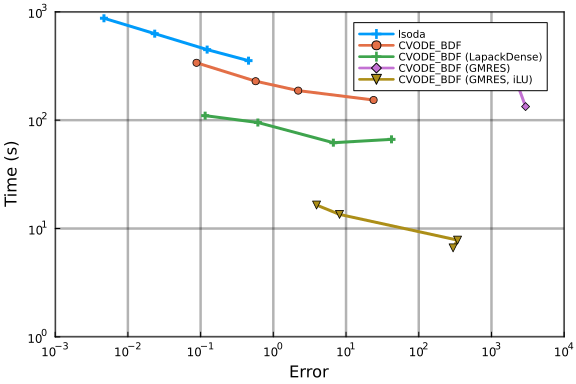
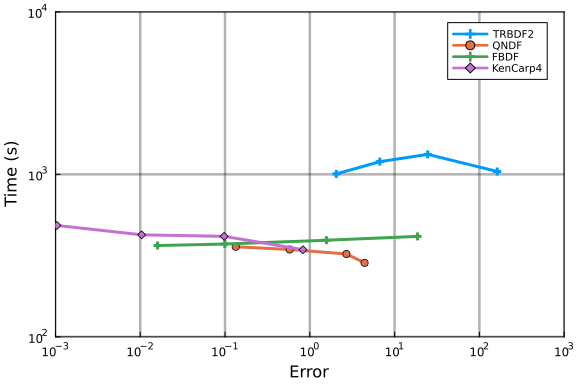
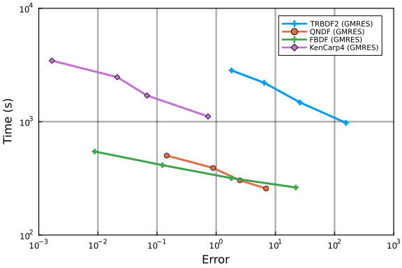
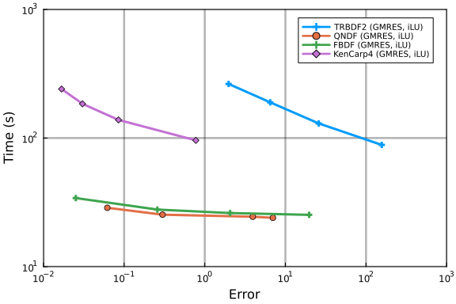
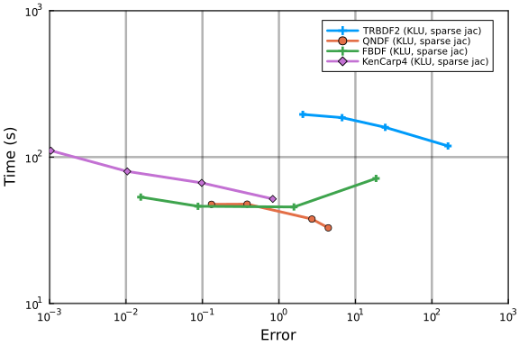

The following benchmark is of 1122 ODEs with 24388 terms that describe a stiff
chemical reaction network modeling the BCR signaling network from [Barua et
al.](https://doi.org/10.4049/jimmunol.1102003). We use
[`ReactionNetworkImporters`](https://github.com/isaacsas/ReactionNetworkImporters.jl)
to load the BioNetGen model files as a
[Catalyst](https://github.com/SciML/Catalyst.jl) model, and then use
[ModelingToolkit](https://github.com/SciML/ModelingToolkit.jl) to convert the
Catalyst network model to ODEs.


```julia
using DiffEqBase, OrdinaryDiffEq, Catalyst, ReactionNetworkImporters,
    Sundials, Plots, DiffEqDevTools, ODEInterface, ODEInterfaceDiffEq,
    LSODA, TimerOutputs, LinearAlgebra, ModelingToolkit, BenchmarkTools,
    LinearSolve

gr()
datadir  = joinpath(dirname(pathof(ReactionNetworkImporters)),"../data/bcr")
const to = TimerOutput()
tf       = 100000.0

# generate ModelingToolkit ODEs
@timeit to "Parse Network" prnbng = loadrxnetwork(BNGNetwork(), joinpath(datadir, "bcr.net"))
show(to)
rn    = prnbng.rn
obs = [eq.lhs for eq in observed(rn)]

@timeit to "Create ODESys" osys = convert(ODESystem, rn)
show(to)

tspan = (0.,tf)
@timeit to "ODEProb No Jac" oprob = ODEProblem{true, SciMLBase.FullSpecialize}(osys, Float64[], tspan, Float64[])
show(to)
oprob_sparse = ODEProblem{true, SciMLBase.FullSpecialize}(osys, Float64[], tspan, Float64[]; sparse=true);
```

```
Parsing parameters...done
Creating parameters...done
Parsing species...done
Creating species...done
Creating species and parameters for evaluating expressions...done
Parsing and adding reactions...done
Parsing groups...done
 ──────────────────────────────────────────────────────────────────────────
                                  Time                    Allocations      
                         ───────────────────────   ────────────────────────
    Tot / % measured:         17.5s /  98.1%           1.19GiB /  97.3%    

 Section         ncalls     time    %tot     avg     alloc    %tot      avg
 ──────────────────────────────────────────────────────────────────────────
 Parse Network        1    17.2s  100.0%   17.2s   1.16GiB  100.0%  1.16GiB
 ──────────────────────────────────────────────────────────────────────────
 ──────────────────────────────────────────────────────────────────────────
                                  Time                    Allocations      
                         ───────────────────────   ────────────────────────
    Tot / % measured:         31.0s /  97.8%           3.99GiB /  98.3%    

 Section         ncalls     time    %tot     avg     alloc    %tot      avg
 ──────────────────────────────────────────────────────────────────────────
 Parse Network        1    17.2s   56.6%   17.2s   1.16GiB   29.4%  1.16GiB
 Create ODESys        1    13.2s   43.4%   13.2s   2.77GiB   70.6%  2.77GiB
 ──────────────────────────────────────────────────────────────────────────
 ──────────────────────────────────────────────────────────────────────────
─
                                   Time                    Allocations     
 
                          ───────────────────────   ───────────────────────
─
     Tot / % measured:         51.3s /  98.7%           7.52GiB /  99.1%   
 

 Section          ncalls     time    %tot     avg     alloc    %tot      av
g
 ──────────────────────────────────────────────────────────────────────────
─
 ODEProb No Jac        1    20.3s   40.0%   20.3s   3.53GiB   47.3%  3.53Gi
B
 Parse Network         1    17.2s   33.9%   17.2s   1.16GiB   15.5%  1.16Gi
B
 Create ODESys         1    13.2s   26.0%   13.2s   2.77GiB   37.2%  2.77Gi
B
 ──────────────────────────────────────────────────────────────────────────
─
```


```julia
@timeit to "ODEProb SparseJac" sparsejacprob = ODEProblem{true, SciMLBase.FullSpecialize}(osys, Float64[], tspan, Float64[], jac=true, sparse=true)
show(to)
```

```
──────────────────────────────────────────────────────────────────────────
────
                                      Time                    Allocations  
    
                             ───────────────────────   ────────────────────
────
      Tot / % measured:            456s /  98.1%            255GiB /  99.2%
    

 Section             ncalls     time    %tot     avg     alloc    %tot     
 avg
 ──────────────────────────────────────────────────────────────────────────
────
 ODEProb SparseJac        1     397s   88.7%    397s    246GiB   97.1%   24
6GiB
 ODEProb No Jac           1    20.3s    4.5%   20.3s   3.53GiB    1.4%  3.5
3GiB
 Parse Network            1    17.2s    3.8%   17.2s   1.16GiB    0.5%  1.1
6GiB
 Create ODESys            1    13.2s    2.9%   13.2s   2.77GiB    1.1%  2.7
7GiB
 ──────────────────────────────────────────────────────────────────────────
────
```


```julia
@show numspecies(rn) # Number of ODEs
@show numreactions(rn) # Apprx. number of terms in the ODE
@show length(parameters(rn)); # Number of Parameters
```

```
numspecies(rn) = 1122
numreactions(rn) = 24388
length(parameters(rn)) = 128
```


## Time ODE derivative function compilation
As compiling the ODE derivative functions has in the past taken longer than
running a simulation, we first force compilation by evaluating these functions
one time.
```julia
u  = ModelingToolkit.varmap_to_vars(nothing, species(rn); defaults=ModelingToolkit.defaults(rn))
du = copy(u)
p  = ModelingToolkit.varmap_to_vars(nothing, parameters(rn); defaults=ModelingToolkit.defaults(rn))
@timeit to "ODE rhs Eval1" oprob.f(du,u,p,0.)
@timeit to "ODE rhs Eval2" oprob.f(du,u,p,0.)
sparsejacprob.f(du,u,p,0.)
```


We also time the ODE rhs function with BenchmarkTools as it is more accurate
given how fast evaluating `f` is:
```julia
@btime oprob.f($du,$u,$p,0.)
```

```
37.930 μs (2 allocations: 1.31 KiB)
```


```julia
Js = similar(sparsejacprob.f.jac_prototype)
@timeit to "SparseJac Eval1" sparsejacprob.f.jac(Js,u,p,0.)
@timeit to "SparseJac Eval2" sparsejacprob.f.jac(Js,u,p,0.)
show(to)
```

```
──────────────────────────────────────────────────────────────────────────
────
                                      Time                    Allocations  
    
                             ───────────────────────   ────────────────────
────
      Tot / % measured:           1.26h /  99.4%            262GiB /  99.1%
    

 Section             ncalls     time    %tot     avg     alloc    %tot     
 avg
 ──────────────────────────────────────────────────────────────────────────
────
 SparseJac Eval1          1    1.10h   88.0%   1.10h   3.63GiB    1.4%  3.6
3GiB
 ODEProb SparseJac        1     397s    8.8%    397s    246GiB   94.7%   24
6GiB
 ODE rhs Eval1            1    94.0s    2.1%   94.0s   2.65GiB    1.0%  2.6
5GiB
 ODEProb No Jac           1    20.3s    0.4%   20.3s   3.53GiB    1.4%  3.5
3GiB
 Parse Network            1    17.2s    0.4%   17.2s   1.16GiB    0.4%  1.1
6GiB
 Create ODESys            1    13.2s    0.3%   13.2s   2.77GiB    1.1%  2.7
7GiB
 SparseJac Eval2          1    105μs    0.0%   105μs   1.66KiB    0.0%  1.6
6KiB
 ODE rhs Eval2            1   80.2μs    0.0%  80.2μs   1.53KiB    0.0%  1.5
3KiB
 ──────────────────────────────────────────────────────────────────────────
────
```


## Picture of the solution

```julia
sol = solve(oprob, CVODE_BDF(), saveat=tf/1000., reltol=1e-5, abstol=1e-5)
plot(sol; idxs=obs, legend=false, fmt=:png)
```


## Generate Test Solution

```julia
@time sol = solve(oprob, CVODE_BDF(), abstol=1/10^12, reltol=1/10^12)
test_sol  = TestSolution(sol);
```

```
620.478139 seconds (7.08 M allocations: 2.134 GiB, 0.09% gc time, 0.11% com
pilation time)
```


## Setups

#### Sets plotting defaults

```julia
default(legendfontsize=7,framestyle=:box,gridalpha=0.3,gridlinewidth=2.5)
```


#### Declares a plotting helper function

```julia
function plot_settings(wp)
    times = vcat(map(wp -> wp.times, wp.wps)...)
    errors = vcat(map(wp -> wp.errors, wp.wps)...)
    xlimit = 10 .^ (floor(log10(minimum(errors))), ceil(log10(maximum(errors))))
    ylimit = 10 .^ (floor(log10(minimum(times))), ceil(log10(maximum(times))))
    return xlimit,ylimit
end
```

```
plot_settings (generic function with 1 method)
```


#### Declare pre-conditioners
```julia
using IncompleteLU, LinearAlgebra
const τ = 1e2
const τ2 = 1e2

jaccache = sparsejacprob.f.jac(oprob.u0,oprob.p,0.0)
W = I - 1.0*jaccache
prectmp = ilu(W, τ = τ)

preccache = Ref(prectmp)

function psetupilu(p, t, u, du, jok, jcurPtr, gamma)
    if !jok
        sparsejacprob.f.jac(jaccache,u,p,t)
        jcurPtr[] = true

        # W = I - gamma*J
        @. W = -gamma*jaccache
        idxs = diagind(W)
        @. @view(W[idxs]) = @view(W[idxs]) + 1

        # Build preconditioner on W
        preccache[] = ilu(W, τ = τ)
    end
end
function precilu(z,r,p,t,y,fy,gamma,delta,lr)
    ldiv!(z,preccache[],r)
end

function incompletelu(W,du,u,p,t,newW,Plprev,Prprev,solverdata)
    if newW === nothing || newW
        Pl = ilu(convert(AbstractMatrix,W), τ = τ2)
    else
        Pl = Plprev
    end
    Pl,nothing
end;
```


#### Sets tolerances

```julia
abstols = 1.0 ./ 10.0 .^ (5:8)
reltols = 1.0 ./ 10.0 .^ (5:8);
```


## Failures

Before proceding to the results, we note the notable omissions. CVODE with KLU diverges in the solution, and
thus it is omitted from the results:

```julia
solve(sparsejacprob,CVODE_BDF(linear_solver=:KLU), abstol=1e-8, reltol=1e-8);
```


## Work-Precision Diagrams (CVODE and lsoda solvers)

#### Declare solvers.

```julia
setups = [
        Dict(:alg=>lsoda(), :prob_choice => 1),
        Dict(:alg=>CVODE_BDF(), :prob_choice => 1),
        Dict(:alg=>CVODE_BDF(linear_solver=:LapackDense), :prob_choice => 1),
        Dict(:alg=>CVODE_BDF(linear_solver=:GMRES), :prob_choice => 1),
        Dict(:alg=>CVODE_BDF(linear_solver=:GMRES,prec=precilu,psetup=psetupilu,prec_side=1), :prob_choice => 2),
        ];
```


#### Plot Work-Precision Diagram.

```julia
wp = WorkPrecisionSet([oprob,oprob_sparse,sparsejacprob],abstols,reltols,setups;error_estimate=:l2,
                    saveat=tf/10000.,appxsol=[test_sol,test_sol,test_sol],maxiters=Int(1e6),numruns=1)

names = ["lsoda" "CVODE_BDF" "CVODE_BDF (LapackDense)" "CVODE_BDF (GMRES)" "CVODE_BDF (GMRES, iLU)" "CVODE_BDF (KLU, sparse jac)"]
xlimit,ylimit = plot_settings(wp)
plot(wp;label=names,xlimit=xlimit,ylimit=ylimit)
```




## Work-Precision Diagrams (various Julia solvers)

#### Declare solvers (using default linear solver).

```julia
setups = [
        Dict(:alg=>TRBDF2(autodiff=false)),
        Dict(:alg=>QNDF(autodiff=false)),
        Dict(:alg=>FBDF(autodiff=false)),
        Dict(:alg=>KenCarp4(autodiff=false))
        ];
```


#### Plot Work-Precision Diagram (using default linear solver).

```julia
wp = WorkPrecisionSet(oprob,abstols,reltols,setups;error_estimate=:l2,
                    saveat=tf/10000.,appxsol=test_sol,maxiters=Int(1e6),numruns=1)

names = ["TRBDF2" "QNDF" "FBDF" "KenCarp4"]
xlimit,ylimit = plot_settings(wp)
plot(wp;label=names,xlimit=xlimit,ylimit=ylimit)
```




#### Declare solvers (using GMRES linear solver).

```julia
setups = [
        Dict(:alg=>TRBDF2(linsolve=KrylovJL_GMRES(),autodiff=false)),
        Dict(:alg=>QNDF(linsolve=KrylovJL_GMRES(),autodiff=false)),
        Dict(:alg=>FBDF(linsolve=KrylovJL_GMRES(),autodiff=false)),
        Dict(:alg=>KenCarp4(linsolve=KrylovJL_GMRES(),autodiff=false))
        ];
```


#### Plot Work-Precision Diagram (using GMRES linear solver).

```julia
wp = WorkPrecisionSet(oprob,abstols,reltols,setups;error_estimate=:l2,
                    saveat=tf/10000.,appxsol=test_sol,maxiters=Int(1e6),numruns=1)

names = ["TRBDF2 (GMRES)" "QNDF (GMRES)" "FBDF (GMRES)" "KenCarp4 (GMRES)"]
xlimit,ylimit = plot_settings(wp)
plot(wp;label=names,xlimit=xlimit,ylimit=ylimit)
```




#### Declare solvers (using GMRES linear solver, with pre-conditioner).

```julia
setups = [
        Dict(:alg=>TRBDF2(linsolve=KrylovJL_GMRES(),autodiff=false,precs=incompletelu,concrete_jac=true)),
        Dict(:alg=>QNDF(linsolve=KrylovJL_GMRES(),autodiff=false,precs=incompletelu,concrete_jac=true)),
        Dict(:alg=>FBDF(linsolve=KrylovJL_GMRES(),autodiff=false,precs=incompletelu,concrete_jac=true)),
        Dict(:alg=>KenCarp4(linsolve=KrylovJL_GMRES(),autodiff=false,precs=incompletelu,concrete_jac=true))
        ];
```


#### Plot Work-Precision Diagram (using GMRES linear solver, with pre-conditioner).

```julia
wp = WorkPrecisionSet(sparsejacprob,abstols,reltols,setups;error_estimate=:l2,
                    saveat=tf/10000.,appxsol=test_sol,maxiters=Int(1e6),numruns=1)

names = ["TRBDF2 (GMRES, iLU)" "QNDF (GMRES, iLU)" "FBDF (GMRES, iLU)" "KenCarp4 (GMRES, iLU)"]
xlimit,ylimit = plot_settings(wp)
plot(wp;label=names,xlimit=xlimit,ylimit=ylimit)
```




#### Declare solvers (using sparse jacobian)

We designate the solvers we wish to use.
```julia
setups = [
        Dict(:alg=>TRBDF2(linsolve=KLUFactorization(),autodiff=false)),
        Dict(:alg=>QNDF(linsolve=KLUFactorization(),autodiff=false)),
        Dict(:alg=>FBDF(linsolve=KLUFactorization(),autodiff=false)),
        Dict(:alg=>KenCarp4(linsolve=KLUFactorization(),autodiff=false))
        ];
```


#### Plot Work-Precision Diagram (using sparse jacobian)

Finally, we generate a work-precision diagram for the selection of solvers.
```julia
wp = WorkPrecisionSet(sparsejacprob,abstols,reltols,setups;error_estimate=:l2,
                    saveat=tf/10000.,appxsol=test_sol,maxiters=Int(1e6),numruns=1)

names = ["TRBDF2 (KLU, sparse jac)" "QNDF (KLU, sparse jac)" "FBDF (KLU, sparse jac)" "KenCarp4 (KLU, sparse jac)"]
xlimit,ylimit = plot_settings(wp)
plot(wp;label=names,xlimit=xlimit,ylimit=ylimit)
```




## Summary of results
Finally, we compute a single diagram comparing the various solvers used.

#### Declare solvers
We designate the solvers we wish to compare.
```julia
setups = [
        Dict(:alg=>CVODE_BDF(linear_solver=:GMRES,prec=precilu,psetup=psetupilu,prec_side=1), :prob_choice => 2),
        Dict(:alg=>QNDF(linsolve=KrylovJL_GMRES(),autodiff=false,precs=incompletelu,concrete_jac=true), :prob_choice => 3),
        Dict(:alg=>FBDF(linsolve=KrylovJL_GMRES(),autodiff=false,precs=incompletelu,concrete_jac=true), :prob_choice => 3),
        Dict(:alg=>QNDF(linsolve=KLUFactorization(),autodiff=false), :prob_choice => 3),
        Dict(:alg=>FBDF(linsolve=KLUFactorization(),autodiff=false), :prob_choice => 3),
        Dict(:alg=>KenCarp4(linsolve=KLUFactorization(),autodiff=false), :prob_choice => 3)
        ];
```


#### Plot Work-Precision Diagram

For these, we generate a work-precision diagram for the selection of solvers.
```julia
wp = WorkPrecisionSet([oprob,oprob_sparse,sparsejacprob],abstols,reltols,setups;error_estimate=:l2,
                      saveat=tf/10000.,appxsol=[test_sol,test_sol,test_sol],maxiters=Int(1e9),numruns=200)

names = ["CVODE_BDF (GMRES, iLU)" "QNDF (GMRES, iLU)" "FBDF (GMRES, iLU)" "QNDF (KLU, sparse jac)" "FBDF (KLU, sparse jac)" "KenCarp4 (KLU, sparse jac)"]
colors = [:green :deepskyblue1 :dodgerblue2 :royalblue2 :slateblue3 :lightskyblue]
markershapes = [:octagon :hexagon :rtriangle :pentagon :ltriangle :star5]
xlimit,ylimit = plot_settings(wp)
xlimit = xlimit .* [0.95,1/0.95]; ylimit = ylimit .* [0.95,1/0.95]; 
plot(wp;label=names,left_margin=10Plots.mm,right_margin=10Plots.mm,xlimit=xlimit,ylimit=ylimit,xticks=[1e-3,1e-2,1e-1,1e0,1e1,1e2,1e3],yticks=[1e0,1e1,1e2,1e3],color=colors,markershape=markershapes,legendfontsize=15,tickfontsize=15,guidefontsize=15, legend=:topright, lw=20, la=0.8, markersize=20,markerstrokealpha=1.0, markerstrokewidth=1.5, gridalpha=0.3, gridlinewidth=7.5,size=(1100,1000))
```


## Appendix

These benchmarks are a part of the SciMLBenchmarks.jl repository, found at: [https://github.com/SciML/SciMLBenchmarks.jl](https://github.com/SciML/SciMLBenchmarks.jl). For more information on high-performance scientific machine learning, check out the SciML Open Source Software Organization [https://sciml.ai](https://sciml.ai).

To locally run this benchmark, do the following commands:

```
using SciMLBenchmarks
SciMLBenchmarks.weave_file("benchmarks/Bio","BCR.jmd")
```

Computer Information:

```
Julia Version 1.9.3
Commit bed2cd540a1 (2023-08-24 14:43 UTC)
Build Info:
  Official https://julialang.org/ release
Platform Info:
  OS: Linux (x86_64-linux-gnu)
  CPU: 128 × AMD EPYC 7502 32-Core Processor
  WORD_SIZE: 64
  LIBM: libopenlibm
  LLVM: libLLVM-14.0.6 (ORCJIT, znver2)
  Threads: 128 on 128 virtual cores
Environment:
  JULIA_CPU_THREADS = 128
  JULIA_DEPOT_PATH = /cache/julia-buildkite-plugin/depots/5b300254-1738-4989-ae0a-f4d2d937f953
  JULIA_IMAGE_THREADS = 1

```

Package Information:

```
Status `/cache/build/exclusive-amdci1-0/julialang/scimlbenchmarks-dot-jl/benchmarks/Bio/Project.toml`
  [6e4b80f9] BenchmarkTools v1.3.2
  [479239e8] Catalyst v13.3.0
  [2b5f629d] DiffEqBase v6.128.2
  [f3b72e0c] DiffEqDevTools v2.35.0
  [40713840] IncompleteLU v0.2.1
  [033835bb] JLD2 v0.4.33
  [7f56f5a3] LSODA v0.7.4
  [7ed4a6bd] LinearSolve v2.5.1
  [961ee093] ModelingToolkit v8.65.0
  [54ca160b] ODEInterface v0.5.0
  [09606e27] ODEInterfaceDiffEq v3.13.2
  [1dea7af3] OrdinaryDiffEq v6.55.0
  [91a5bcdd] Plots v1.39.0
  [b4db0fb7] ReactionNetworkImporters v0.14.0
  [31c91b34] SciMLBenchmarks v0.1.3
  [c3572dad] Sundials v4.19.3
  [a759f4b9] TimerOutputs v0.5.23
```

And the full manifest:

```
Status `/cache/build/exclusive-amdci1-0/julialang/scimlbenchmarks-dot-jl/benchmarks/Bio/Manifest.toml`
  [47edcb42] ADTypes v0.2.1
  [c3fe647b] AbstractAlgebra v0.31.1
  [1520ce14] AbstractTrees v0.4.4
  [79e6a3ab] Adapt v3.6.2
  [ec485272] ArnoldiMethod v0.2.0
  [4fba245c] ArrayInterface v7.4.11
  [30b0a656] ArrayInterfaceCore v0.1.29
  [6e4b80f9] BenchmarkTools v1.3.2
  [e2ed5e7c] Bijections v0.1.4
  [d1d4a3ce] BitFlags v0.1.7
  [62783981] BitTwiddlingConvenienceFunctions v0.1.5
  [fa961155] CEnum v0.4.2
  [2a0fbf3d] CPUSummary v0.2.3
  [00ebfdb7] CSTParser v3.3.6
  [49dc2e85] Calculus v0.5.1
  [479239e8] Catalyst v13.3.0
  [d360d2e6] ChainRulesCore v1.16.0
  [fb6a15b2] CloseOpenIntervals v0.1.12
  [944b1d66] CodecZlib v0.7.2
  [35d6a980] ColorSchemes v3.23.0
  [3da002f7] ColorTypes v0.11.4
  [c3611d14] ColorVectorSpace v0.10.0
  [5ae59095] Colors v0.12.10
  [861a8166] Combinatorics v1.0.2
  [a80b9123] CommonMark v0.8.12
  [38540f10] CommonSolve v0.2.4
  [bbf7d656] CommonSubexpressions v0.3.0
  [34da2185] Compat v4.9.0
  [b152e2b5] CompositeTypes v0.1.3
  [f0e56b4a] ConcurrentUtilities v2.2.1
  [8f4d0f93] Conda v1.9.1
  [187b0558] ConstructionBase v1.5.3
  [d38c429a] Contour v0.6.2
  [adafc99b] CpuId v0.3.1
  [a8cc5b0e] Crayons v4.1.1
  [9a962f9c] DataAPI v1.15.0
  [864edb3b] DataStructures v0.18.15
  [e2d170a0] DataValueInterfaces v1.0.0
  [8bb1440f] DelimitedFiles v1.9.1
  [2b5f629d] DiffEqBase v6.128.2
  [459566f4] DiffEqCallbacks v2.29.1
  [f3b72e0c] DiffEqDevTools v2.35.0
  [77a26b50] DiffEqNoiseProcess v5.18.0
  [163ba53b] DiffResults v1.1.0
  [b552c78f] DiffRules v1.15.1
  [b4f34e82] Distances v0.10.9
  [31c24e10] Distributions v0.25.100
  [ffbed154] DocStringExtensions v0.9.3
  [5b8099bc] DomainSets v0.6.7
  [fa6b7ba4] DualNumbers v0.6.8
  [7c1d4256] DynamicPolynomials v0.5.2
  [4e289a0a] EnumX v1.0.4
  [460bff9d] ExceptionUnwrapping v0.1.9
  [d4d017d3] ExponentialUtilities v1.24.0
  [e2ba6199] ExprTools v0.1.10
  [c87230d0] FFMPEG v0.4.1
  [7034ab61] FastBroadcast v0.2.6
  [9aa1b823] FastClosures v0.3.2
  [29a986be] FastLapackInterface v2.0.0
  [5789e2e9] FileIO v1.16.1
  [1a297f60] FillArrays v1.6.1
  [6a86dc24] FiniteDiff v2.21.1
  [53c48c17] FixedPointNumbers v0.8.4
  [59287772] Formatting v0.4.2
  [f6369f11] ForwardDiff v0.10.36
  [069b7b12] FunctionWrappers v1.1.3
  [77dc65aa] FunctionWrappersWrappers v0.1.3
  [46192b85] GPUArraysCore v0.1.5
  [28b8d3ca] GR v0.72.9
  [c145ed77] GenericSchur v0.5.3
  [d7ba0133] Git v1.3.0
  [c27321d9] Glob v1.3.1
  [86223c79] Graphs v1.8.0
  [42e2da0e] Grisu v1.0.2
  [0b43b601] Groebner v0.4.2
  [d5909c97] GroupsCore v0.4.0
  [cd3eb016] HTTP v1.9.14
  [eafb193a] Highlights v0.5.2
  [3e5b6fbb] HostCPUFeatures v0.1.16
  [34004b35] HypergeometricFunctions v0.3.23
  [7073ff75] IJulia v1.24.2
  [615f187c] IfElse v0.1.1
  [40713840] IncompleteLU v0.2.1
  [d25df0c9] Inflate v0.1.3
  [18e54dd8] IntegerMathUtils v0.1.2
  [8197267c] IntervalSets v0.7.7
  [92d709cd] IrrationalConstants v0.2.2
  [82899510] IteratorInterfaceExtensions v1.0.0
  [033835bb] JLD2 v0.4.33
  [1019f520] JLFzf v0.1.5
  [692b3bcd] JLLWrappers v1.5.0
  [682c06a0] JSON v0.21.4
  [98e50ef6] JuliaFormatter v1.0.35
  [ccbc3e58] JumpProcesses v9.7.2
  [ef3ab10e] KLU v0.4.0
  [ba0b0d4f] Krylov v0.9.3
  [7f56f5a3] LSODA v0.7.4
  [b964fa9f] LaTeXStrings v1.3.0
  [2ee39098] LabelledArrays v1.14.0
  [984bce1d] LambertW v0.4.6
  [23fbe1c1] Latexify v0.16.1
  [10f19ff3] LayoutPointers v0.1.14
  [50d2b5c4] Lazy v0.15.1
  [d3d80556] LineSearches v7.2.0
  [7ed4a6bd] LinearSolve v2.5.1
  [2ab3a3ac] LogExpFunctions v0.3.26
  [e6f89c97] LoggingExtras v1.0.1
  [bdcacae8] LoopVectorization v0.12.165
  [d8e11817] MLStyle v0.4.17
  [1914dd2f] MacroTools v0.5.11
  [d125e4d3] ManualMemory v0.1.8
  [739be429] MbedTLS v1.1.7
  [442fdcdd] Measures v0.3.2
  [e1d29d7a] Missings v1.1.0
  [961ee093] ModelingToolkit v8.65.0
  [46d2c3a1] MuladdMacro v0.2.4
  [102ac46a] MultivariatePolynomials v0.5.1
  [ffc61752] Mustache v1.0.17
  [d8a4904e] MutableArithmetics v1.3.1
  [d41bc354] NLSolversBase v7.8.3
  [2774e3e8] NLsolve v4.5.1
  [77ba4419] NaNMath v1.0.2
  [8913a72c] NonlinearSolve v1.10.0
  [54ca160b] ODEInterface v0.5.0
  [09606e27] ODEInterfaceDiffEq v3.13.2
  [6fe1bfb0] OffsetArrays v1.12.10
  [4d8831e6] OpenSSL v1.4.1
  [429524aa] Optim v1.7.7
  [bac558e1] OrderedCollections v1.6.2
  [1dea7af3] OrdinaryDiffEq v6.55.0
  [90014a1f] PDMats v0.11.17
  [65ce6f38] PackageExtensionCompat v1.0.1
  [d96e819e] Parameters v0.12.3
  [69de0a69] Parsers v2.7.2
  [b98c9c47] Pipe v1.3.0
  [ccf2f8ad] PlotThemes v3.1.0
  [995b91a9] PlotUtils v1.3.5
  [91a5bcdd] Plots v1.39.0
  [e409e4f3] PoissonRandom v0.4.4
  [f517fe37] Polyester v0.7.5
  [1d0040c9] PolyesterWeave v0.2.1
  [85a6dd25] PositiveFactorizations v0.2.4
  [d236fae5] PreallocationTools v0.4.12
  [aea7be01] PrecompileTools v1.2.0
  [21216c6a] Preferences v1.4.0
  [27ebfcd6] Primes v0.5.4
  [1fd47b50] QuadGK v2.8.2
  [74087812] Random123 v1.6.1
  [fb686558] RandomExtensions v0.4.3
  [e6cf234a] RandomNumbers v1.5.3
  [b4db0fb7] ReactionNetworkImporters v0.14.0
  [3cdcf5f2] RecipesBase v1.3.4
  [01d81517] RecipesPipeline v0.6.12
  [731186ca] RecursiveArrayTools v2.38.7
  [f2c3362d] RecursiveFactorization v0.2.20
  [189a3867] Reexport v1.2.2
  [05181044] RelocatableFolders v1.0.0
  [ae029012] Requires v1.3.0
  [ae5879a3] ResettableStacks v1.1.1
  [79098fc4] Rmath v0.7.1
  [47965b36] RootedTrees v2.19.2
  [7e49a35a] RuntimeGeneratedFunctions v0.5.12
  [fdea26ae] SIMD v3.4.5
  [94e857df] SIMDTypes v0.1.0
  [476501e8] SLEEFPirates v0.6.39
  [0bca4576] SciMLBase v1.95.0
  [31c91b34] SciMLBenchmarks v0.1.3
  [e9a6253c] SciMLNLSolve v0.1.8
  [c0aeaf25] SciMLOperators v0.3.6
  [6c6a2e73] Scratch v1.2.0
  [efcf1570] Setfield v1.1.1
  [992d4aef] Showoff v1.0.3
  [777ac1f9] SimpleBufferStream v1.1.0
  [727e6d20] SimpleNonlinearSolve v0.1.19
  [699a6c99] SimpleTraits v0.9.4
  [ce78b400] SimpleUnPack v1.1.0
  [66db9d55] SnoopPrecompile v1.0.3
  [b85f4697] SoftGlobalScope v1.1.0
  [a2af1166] SortingAlgorithms v1.1.1
  [47a9eef4] SparseDiffTools v2.5.0
  [e56a9233] Sparspak v0.3.9
  [276daf66] SpecialFunctions v2.3.1
  [aedffcd0] Static v0.8.8
  [0d7ed370] StaticArrayInterface v1.4.1
  [90137ffa] StaticArrays v1.6.2
  [1e83bf80] StaticArraysCore v1.4.2
  [82ae8749] StatsAPI v1.6.0
  [2913bbd2] StatsBase v0.34.0
  [4c63d2b9] StatsFuns v1.3.0
  [7792a7ef] StrideArraysCore v0.4.17
  [69024149] StringEncodings v0.3.7
  [c3572dad] Sundials v4.19.3
  [2efcf032] SymbolicIndexingInterface v0.2.2
  [d1185830] SymbolicUtils v1.2.0
  [0c5d862f] Symbolics v5.5.1
  [3783bdb8] TableTraits v1.0.1
  [bd369af6] Tables v1.10.1
  [62fd8b95] TensorCore v0.1.1
  [8290d209] ThreadingUtilities v0.5.2
  [a759f4b9] TimerOutputs v0.5.23
  [0796e94c] Tokenize v0.5.25
  [3bb67fe8] TranscodingStreams v0.9.13
  [a2a6695c] TreeViews v0.3.0
  [d5829a12] TriangularSolve v0.1.19
  [410a4b4d] Tricks v0.1.7
  [781d530d] TruncatedStacktraces v1.4.0
  [5c2747f8] URIs v1.5.0
  [3a884ed6] UnPack v1.0.2
  [1cfade01] UnicodeFun v0.4.1
  [1986cc42] Unitful v1.17.0
  [45397f5d] UnitfulLatexify v1.6.3
  [a7c27f48] Unityper v0.1.5
  [41fe7b60] Unzip v0.2.0
  [3d5dd08c] VectorizationBase v0.21.64
  [81def892] VersionParsing v1.3.0
  [19fa3120] VertexSafeGraphs v0.2.0
  [44d3d7a6] Weave v0.10.12
  [ddb6d928] YAML v0.4.9
  [c2297ded] ZMQ v1.2.2
  [700de1a5] ZygoteRules v0.2.3
  [6e34b625] Bzip2_jll v1.0.8+0
  [83423d85] Cairo_jll v1.16.1+1
  [2e619515] Expat_jll v2.5.0+0
⌃ [b22a6f82] FFMPEG_jll v4.4.2+2
  [a3f928ae] Fontconfig_jll v2.13.93+0
  [d7e528f0] FreeType2_jll v2.13.1+0
  [559328eb] FriBidi_jll v1.0.10+0
  [0656b61e] GLFW_jll v3.3.8+0
  [d2c73de3] GR_jll v0.72.9+1
  [78b55507] Gettext_jll v0.21.0+0
  [f8c6e375] Git_jll v2.36.1+2
  [7746bdde] Glib_jll v2.74.0+2
  [3b182d85] Graphite2_jll v1.3.14+0
  [2e76f6c2] HarfBuzz_jll v2.8.1+1
  [aacddb02] JpegTurbo_jll v2.1.91+0
  [c1c5ebd0] LAME_jll v3.100.1+0
  [88015f11] LERC_jll v3.0.0+1
  [1d63c593] LLVMOpenMP_jll v15.0.4+0
  [aae0fff6] LSODA_jll v0.1.2+0
  [dd4b983a] LZO_jll v2.10.1+0
⌅ [e9f186c6] Libffi_jll v3.2.2+1
  [d4300ac3] Libgcrypt_jll v1.8.7+0
  [7e76a0d4] Libglvnd_jll v1.6.0+0
  [7add5ba3] Libgpg_error_jll v1.42.0+0
  [94ce4f54] Libiconv_jll v1.16.1+2
  [4b2f31a3] Libmount_jll v2.35.0+0
  [89763e89] Libtiff_jll v4.5.1+1
  [38a345b3] Libuuid_jll v2.36.0+0
  [c771fb93] ODEInterface_jll v0.0.1+0
  [e7412a2a] Ogg_jll v1.3.5+1
⌅ [458c3c95] OpenSSL_jll v1.1.22+0
  [efe28fd5] OpenSpecFun_jll v0.5.5+0
  [91d4177d] Opus_jll v1.3.2+0
  [30392449] Pixman_jll v0.42.2+0
  [c0090381] Qt6Base_jll v6.4.2+3
  [f50d1b31] Rmath_jll v0.4.0+0
⌅ [fb77eaff] Sundials_jll v5.2.1+0
  [a2964d1f] Wayland_jll v1.21.0+0
  [2381bf8a] Wayland_protocols_jll v1.25.0+0
  [02c8fc9c] XML2_jll v2.10.3+0
  [aed1982a] XSLT_jll v1.1.34+0
  [ffd25f8a] XZ_jll v5.4.4+0
  [4f6342f7] Xorg_libX11_jll v1.8.6+0
  [0c0b7dd1] Xorg_libXau_jll v1.0.11+0
  [935fb764] Xorg_libXcursor_jll v1.2.0+4
  [a3789734] Xorg_libXdmcp_jll v1.1.4+0
  [1082639a] Xorg_libXext_jll v1.3.4+4
  [d091e8ba] Xorg_libXfixes_jll v5.0.3+4
  [a51aa0fd] Xorg_libXi_jll v1.7.10+4
  [d1454406] Xorg_libXinerama_jll v1.1.4+4
  [ec84b674] Xorg_libXrandr_jll v1.5.2+4
  [ea2f1a96] Xorg_libXrender_jll v0.9.10+4
  [14d82f49] Xorg_libpthread_stubs_jll v0.1.1+0
  [c7cfdc94] Xorg_libxcb_jll v1.15.0+0
  [cc61e674] Xorg_libxkbfile_jll v1.1.2+0
  [12413925] Xorg_xcb_util_image_jll v0.4.0+1
  [2def613f] Xorg_xcb_util_jll v0.4.0+1
  [975044d2] Xorg_xcb_util_keysyms_jll v0.4.0+1
  [0d47668e] Xorg_xcb_util_renderutil_jll v0.3.9+1
  [c22f9ab0] Xorg_xcb_util_wm_jll v0.4.1+1
  [35661453] Xorg_xkbcomp_jll v1.4.6+0
  [33bec58e] Xorg_xkeyboard_config_jll v2.39.0+0
  [c5fb5394] Xorg_xtrans_jll v1.5.0+0
  [8f1865be] ZeroMQ_jll v4.3.4+0
  [3161d3a3] Zstd_jll v1.5.5+0
⌅ [214eeab7] fzf_jll v0.29.0+0
  [a4ae2306] libaom_jll v3.4.0+0
  [0ac62f75] libass_jll v0.15.1+0
  [f638f0a6] libfdk_aac_jll v2.0.2+0
  [b53b4c65] libpng_jll v1.6.38+0
  [a9144af2] libsodium_jll v1.0.20+0
  [f27f6e37] libvorbis_jll v1.3.7+1
  [1270edf5] x264_jll v2021.5.5+0
  [dfaa095f] x265_jll v3.5.0+0
  [d8fb68d0] xkbcommon_jll v1.4.1+0
  [0dad84c5] ArgTools v1.1.1
  [56f22d72] Artifacts
  [2a0f44e3] Base64
  [ade2ca70] Dates
  [8ba89e20] Distributed
  [f43a241f] Downloads v1.6.0
  [7b1f6079] FileWatching
  [9fa8497b] Future
  [b77e0a4c] InteractiveUtils
  [b27032c2] LibCURL v0.6.3
  [76f85450] LibGit2
  [8f399da3] Libdl
  [37e2e46d] LinearAlgebra
  [56ddb016] Logging
  [d6f4376e] Markdown
  [a63ad114] Mmap
  [ca575930] NetworkOptions v1.2.0
  [44cfe95a] Pkg v1.9.0
  [de0858da] Printf
  [9abbd945] Profile
  [3fa0cd96] REPL
  [9a3f8284] Random
  [ea8e919c] SHA v0.7.0
  [9e88b42a] Serialization
  [1a1011a3] SharedArrays
  [6462fe0b] Sockets
  [2f01184e] SparseArrays
  [10745b16] Statistics v1.9.0
  [4607b0f0] SuiteSparse
  [fa267f1f] TOML v1.0.3
  [a4e569a6] Tar v1.10.0
  [8dfed614] Test
  [cf7118a7] UUIDs
  [4ec0a83e] Unicode
  [e66e0078] CompilerSupportLibraries_jll v1.0.2+0
  [deac9b47] LibCURL_jll v7.84.0+0
  [29816b5a] LibSSH2_jll v1.10.2+0
  [c8ffd9c3] MbedTLS_jll v2.28.2+0
  [14a3606d] MozillaCACerts_jll v2022.10.11
  [4536629a] OpenBLAS_jll v0.3.21+4
  [05823500] OpenLibm_jll v0.8.1+0
  [efcefdf7] PCRE2_jll v10.42.0+0
  [bea87d4a] SuiteSparse_jll v5.10.1+6
  [83775a58] Zlib_jll v1.2.13+0
  [8e850b90] libblastrampoline_jll v5.8.0+0
  [8e850ede] nghttp2_jll v1.48.0+0
  [3f19e933] p7zip_jll v17.4.0+0
Info Packages marked with ⌃ and ⌅ have new versions available, but those with ⌅ are restricted by compatibility constraints from upgrading. To see why use `status --outdated -m`
```

