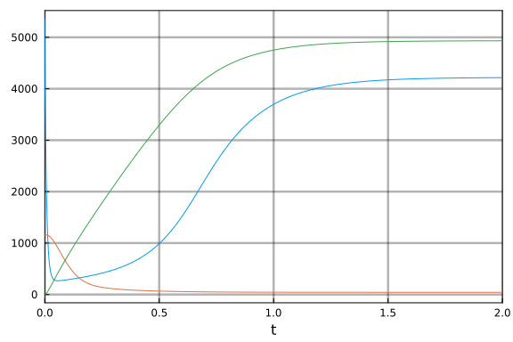
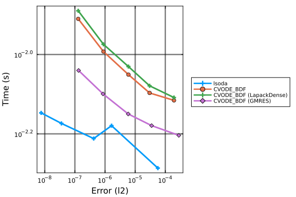
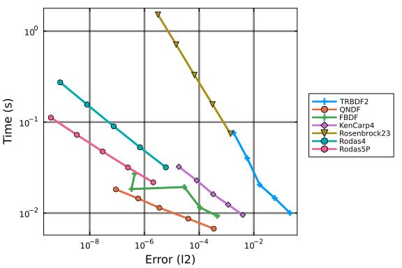
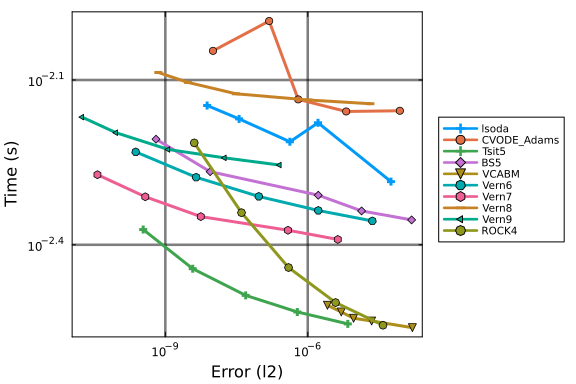
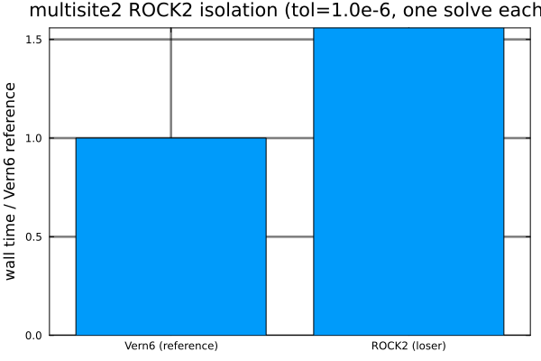
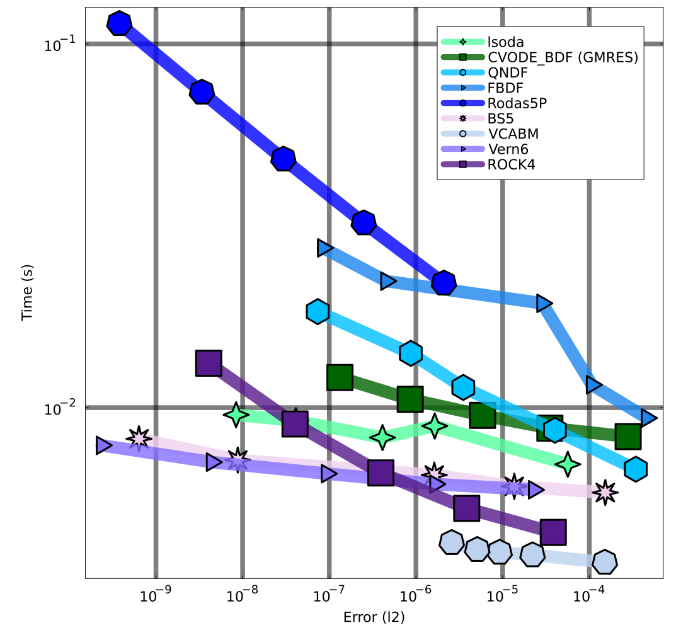

The following benchmark is of 66 ODEs with 288 terms that describe a
chemical reaction network. This multisite2 model was used as a benchmark model in [Gupta et
al.](https://www.ncbi.nlm.nih.gov/pmc/articles/PMC6013266/). We use
[`ReactionNetworkImporters`](https://github.com/isaacsas/ReactionNetworkImporters.jl)
to load the BioNetGen model files as a
[Catalyst](https://github.com/SciML/Catalyst.jl) model, and then use
[ModelingToolkit](https://github.com/SciML/ModelingToolkit.jl) to convert the
Catalyst network model to ODEs.

```julia
using DiffEqBase, OrdinaryDiffEq, Catalyst, ReactionNetworkImporters,
      Sundials, Plots, DiffEqDevTools, ODEInterface, ODEInterfaceDiffEq,
      LSODA, TimerOutputs, LinearAlgebra, ModelingToolkit, BenchmarkTools,
      LinearSolve, RecursiveFactorization
using OrdinaryDiffEqAdamsBashforthMoulton, OrdinaryDiffEqBDF, OrdinaryDiffEqRosenbrock, OrdinaryDiffEqSDIRK, OrdinaryDiffEqStabilizedRK, OrdinaryDiffEqVerner, OrdinaryDiffEqLowOrderRK

gr()
const to = TimerOutput()
tf = 2.0

# generate ModelingToolkit ODEs
@timeit to "Parse Network" prnbng = loadrxnetwork(BNGNetwork(), joinpath(@__DIR__, "Models/multisite2.net"))
show(to)
rn = complete(prnbng)
obs = [eq.lhs for eq in observed(rn)]

@timeit to "Create ODESys" osys = complete(Catalyst.ode_model(rn))
show(to)

tspan = (0.0, tf)
@timeit to "ODEProb No Jac" oprob = ODEProblem{true, SciMLBase.FullSpecialize}(
    osys, Float64[], tspan, Float64[])
show(to);
```

```
Scanning blocks...done
Parsing parameters...done
Creating parameters...done
Parsing species...done
Creating variables...done
Setting up expression evaluation module...done
Parsing groups...done
Parsing functions...done
Parsing and adding reactions...done
──────────────────────────────────────────────────────────────────────────
                                 Time                    Allocations      
                        ───────────────────────   ────────────────────────
   Tot / % measured:         7.34s /  97.8%            421MiB /  99.2%    

Section         ncalls     time    %tot     avg     alloc    %tot      avg
──────────────────────────────────────────────────────────────────────────
Parse Network        1    7.18s  100.0%   7.18s    418MiB  100.0%   418MiB
───────────────────────────────────────────────────────────────────────────
─────────────────────────────────────────────────────────────────────────
                                 Time                    Allocations      
                        ───────────────────────   ────────────────────────
   Tot / % measured:         19.9s /  86.9%           1.37GiB /  74.6%    

Section         ncalls     time    %tot     avg     alloc    %tot      avg
──────────────────────────────────────────────────────────────────────────
Create ODESys        1    10.1s   58.4%   10.1s    627MiB   60.0%   627MiB
Parse Network        1    7.18s   41.6%   7.18s    418MiB   40.0%   418MiB
───────────────────────────────────────────────────────────────────────────
──────────────────────────────────────────────────────────────────────────
                                  Time                    Allocations      
                         ───────────────────────   ────────────────────────
    Tot / % measured:         53.2s /  95.1%           2.87GiB /  87.9%    

Section          ncalls     time    %tot     avg     alloc    %tot      avg
───────────────────────────────────────────────────────────────────────────
ODEProb No Jac        1    33.4s   65.9%   33.4s   1.51GiB   59.6%  1.51GiB
Create ODESys         1    10.1s   19.9%   10.1s    627MiB   24.2%   627MiB
Parse Network         1    7.18s   14.2%   7.18s    418MiB   16.1%   418MiB
───────────────────────────────────────────────────────────────────────────
```


```julia
@timeit to "ODEProb SparseJac" sparsejacprob = ODEProblem{true, SciMLBase.FullSpecialize}(
    osys, Float64[], tspan, Float64[], jac = true, sparse = true)
show(to)
```

```
───────────────────────────────────────────────────────────────────────────
───
                                     Time                    Allocations   
   
                            ───────────────────────   ─────────────────────
───
     Tot / % measured:           61.3s /  95.4%           3.36GiB /  89.3% 
   

Section             ncalls     time    %tot     avg     alloc    %tot      
avg
───────────────────────────────────────────────────────────────────────────
───
ODEProb No Jac           1    33.4s   57.0%   33.4s   1.51GiB   50.2%  1.51
GiB
Create ODESys            1    10.1s   17.3%   10.1s    627MiB   20.4%   627
MiB
ODEProb SparseJac        1    7.85s   13.4%   7.85s    487MiB   15.8%   487
MiB
Parse Network            1    7.18s   12.3%   7.18s    418MiB   13.6%   418
MiB
───────────────────────────────────────────────────────────────────────────
───
```


```julia
@show numspecies(rn) # Number of ODEs
@show numreactions(rn) # Approx. number of terms in the ODE
@show length(parameters(rn)); # Number of Parameters
```

```
numspecies(rn) = 66
numreactions(rn) = 288
length(parameters(rn)) = 9
```


## Time ODE derivative function compilation

As compiling the ODE derivative functions has in the past taken longer than
running a simulation, we first force compilation by evaluating these functions
one time.

```julia
u = oprob.u0
du = copy(u)
p = oprob.p
@timeit to "ODE rhs Eval1" oprob.f(du, u, p, 0.0)
@timeit to "ODE rhs Eval2" oprob.f(du, u, p, 0.0)
sparsejacprob.f(du, u, p, 0.0)
```

```
66-element Vector{Float64}:
 -861888.0
       0.0
 -861888.0
  287296.0
  287296.0
  287296.0
       0.0
       0.0
       0.0
       0.0
       ⋮
       0.0
       0.0
       0.0
       0.0
       0.0
       0.0
       0.0
       0.0
       0.0
```


We also time the ODE rhs function with BenchmarkTools as it is more accurate
given how fast evaluating `f` is:

```julia
@btime oprob.f($du, $u, $p, 0.0)
```

```
510.365 ns (2 allocations: 368 bytes)
66-element Vector{Float64}:
 -861888.0
       0.0
 -861888.0
  287296.0
  287296.0
  287296.0
       0.0
       0.0
       0.0
       0.0
       ⋮
       0.0
       0.0
       0.0
       0.0
       0.0
       0.0
       0.0
       0.0
       0.0
```


## Picture of the solution

```julia
sol = solve(oprob, CVODE_BDF(), saveat = tf/1000.0, reltol = 1e-5, abstol = 1e-5)
plot(sol; idxs = obs, legend = false, fmt = :png)
```




For these benchmarks we will be using the time-series error with these saving
points.

## Generate Test Solution

```julia
@time sol = solve(oprob, CVODE_BDF(), reltol = 1e-15, abstol = 1e-15)
test_sol = TestSolution(sol);
```

```
1.248577 seconds (774.34 k allocations: 62.171 MiB, 4.70% gc time, 94.62%
 compilation time)
```


## Setups

#### Sets plotting defaults

```julia
default(legendfontsize = 7, framestyle = :box, gridalpha = 0.3, gridlinewidth = 2.5)
```


#### Sets tolerances

```julia
abstols = 1.0 ./ 10.0 .^ (6:10)
reltols = 1.0 ./ 10.0 .^ (6:10);
```


## Work-Precision Diagram

We start by trying lsoda and CVODE solvers.

#### Declare solvers

We designate the solvers (and options) we wish to use.

```julia
setups = [
    Dict(:alg=>lsoda()),
    Dict(:alg=>CVODE_BDF()),
    Dict(:alg=>CVODE_BDF(linear_solver = :LapackDense)),
    Dict(:alg=>CVODE_BDF(linear_solver = :GMRES))
];
```


#### Plot Work-Precision Diagram

Finally, we generate a work-precision diagram for the selection of solvers.

```julia
wp = WorkPrecisionSet(oprob, abstols, reltols, setups; error_estimate = :l2,
    saveat = tf/10000.0, appxsol = test_sol, maxiters = Int(1e9), numruns = 200)

names = ["lsoda" "CVODE_BDF" "CVODE_BDF (LapackDense)" "CVODE_BDF (GMRES)"]
plot(wp; label = names)
```




## Implicit Work-Precision Diagram

Next, we try a couple of implicit Julia solvers.

#### Declare solvers

We designate the solvers we wish to use.

```julia
setups = [
    Dict(:alg=>TRBDF2()),
    Dict(:alg=>QNDF()),
    Dict(:alg=>FBDF()),
    Dict(:alg=>KenCarp4()),
    Dict(:alg=>Rosenbrock23()),
    Dict(:alg=>Rodas4()),
    Dict(:alg=>Rodas5P())
];
```


#### Plot Work-Precision Diagram

Finally, we generate a work-precision diagram for the selection of solvers.

```julia
wp = WorkPrecisionSet(oprob, abstols, reltols, setups; error_estimate = :l2,
    saveat = tf/10000.0, appxsol = test_sol, maxiters = Int(1e12), dtmin = 1e-18, numruns = 200)

names = ["TRBDF2" "QNDF" "FBDF" "KenCarp4" "Rosenbrock23" "Rodas4" "Rodas5P"]
plot(wp; label = names)
```




Implicit methods doing poorly suggests it's non-stiff.

## Explicit Work-Precision Diagram

Benchmarks for explicit solvers.

#### Declare solvers

We designate the solvers we wish to use, this also includes lsoda and CVODE.

```julia
setups = [
    Dict(:alg=>lsoda()),
    Dict(:alg=>CVODE_Adams()),
    Dict(:alg=>Tsit5()),
    Dict(:alg=>BS5()),
    Dict(:alg=>VCABM()),
    Dict(:alg=>Vern6()),
    Dict(:alg=>Vern7()),
    Dict(:alg=>Vern8()),
    Dict(:alg=>Vern9()),
    Dict(:alg=>ROCK4())
];
```


#### Plot Work-Precision Diagram

```julia
wp = WorkPrecisionSet(oprob, abstols, reltols, setups; error_estimate = :l2,
    saveat = tf/10000.0, appxsol = test_sol, maxiters = Int(1e9), numruns = 200)

names = ["lsoda" "CVODE_Adams" "Tsit5" "BS5" "VCABM" "Vern6" "Vern7" "Vern8" "Vern9" "ROCK4"]
plot(wp; label = names)
```




## Loser methods (large cost in isolation)

`ROCK2` is not competitive with the explicit set above. It is **not** folded into
the multi-tolerance / multi-run work-precision suites; a single-tolerance isolation
timing against a competitive explicit (`Vern6`) shows the wall-time gap.

```julia
const _loser_tol = 1e-6
const _loser_maxiters = Int(1e7)
_solve_kwargs = (; abstol = _loser_tol, reltol = _loser_tol, maxiters = _loser_maxiters,
    save_everystep = false)

loser_labels = String[]
loser_elapsed = Float64[]

function _time_loser!(label, alg)
    println("--- $label ---")
    t = @elapsed sol = solve(oprob, alg; _solve_kwargs...)
    @show sol.retcode
    println("elapsed = ", t, " s")
    push!(loser_labels, label)
    push!(loser_elapsed, t)
    return sol
end

_time_loser!("Vern6 (reference)", Vern6())
_time_loser!("ROCK2 (loser)", ROCK2())
```

```
--- Vern6 (reference) ---
sol.retcode = SciMLBase.ReturnCode.Success
elapsed = 2.383274702 s
--- ROCK2 (loser) ---
sol.retcode = SciMLBase.ReturnCode.Success
elapsed = 3.714590588 s
retcode: Success
Interpolation: 1st order linear
t: 2-element Vector{Float64}:
 0.0
 2.0
u: 2-element Vector{Vector{Float64}}:
 [5360.0, 1160.0, 5360.0, 0.0, 0.0, 0.0, 0.0, 0.0, 0.0, 0.0  …  0.0, 0.0, 0
.0, 0.0, 0.0, 0.0, 0.0, 0.0, 0.0, 0.0]
 [4215.871511401822, 42.47805424201353, 0.003382198089485298, 0.02805711714
8964424, 0.028057117148964427, 0.02805711714896443, 0.23274858743409044, 0.
2327485874340904, 0.3354810115895528, 0.2327485874340905  …  1.842016757260
674, 269.62621454342565, 269.62621454342565, 1.842016757260674, 269.6262145
4342565, 1.8420167572606743, 22.02512978559272, 22.02512978559272, 22.02512
978559272, 1.7991809250279778]
```


```julia
ref_t = loser_elapsed[1]
bar(loser_labels, loser_elapsed ./ ref_t; legend = false,
    ylabel = "wall time / Vern6 reference",
    title = "multisite2 ROCK2 isolation (tol=$_loser_tol, one solve each)",
    size = (600, 400))
```




## Summary of results

Finally, we compute a single diagram comparing the various solvers used.

#### Declare solvers

We designate the solvers we wish to compare.

```julia
setups = [
    Dict(:alg=>lsoda()),
    Dict(:alg=>CVODE_BDF(linear_solver = :GMRES)),
    Dict(:alg=>QNDF()),
    Dict(:alg=>FBDF()),
    Dict(:alg=>Rodas5P()),
    Dict(:alg=>BS5()),
    Dict(:alg=>VCABM()),
    Dict(:alg=>Vern6()),
    Dict(:alg=>ROCK4())
];
```


#### Plot Work-Precision Diagram

For these, we generate a work-precision diagram for the selection of solvers.

```julia
wp = WorkPrecisionSet(oprob, abstols, reltols, setups; error_estimate = :l2,
    saveat = tf/10000.0, appxsol = test_sol, maxiters = Int(1e9), numruns = 200)

names = ["lsoda" "CVODE_BDF (GMRES)" "QNDF" "FBDF" "Rodas5P" "BS5" "VCABM" "Vern6" "ROCK4"]
colors = [:seagreen1 :darkgreen :deepskyblue1 :dodgerblue2 :blue :thistle2 :lightsteelblue2 :lightslateblue :purple4]
markershapes = [:star4 :rect :hexagon :rtriangle :heptagon :star8 :heptagon :rtriangle :square]
plot(wp; label = names, left_margin = 10Plots.mm, right_margin = 10Plots.mm,
    xticks = [1e-10, 1e-9, 1e-8, 1e-7, 1e-6, 1e-5, 1e-4, 1e-3],
    yticks = [1e-3, 1e-2, 1e-1], color = colors, markershape = markershapes,
    legendfontsize = 15, tickfontsize = 15, guidefontsize = 15,
    legend = :topright, lw = 20, la = 0.8, markersize = 20, markerstrokealpha = 1.0,
    markerstrokewidth = 1.5, gridalpha = 0.3, gridlinewidth = 7.5, size = (1100, 1000))
```




## Appendix

These benchmarks are a part of the SciMLBenchmarks.jl repository, found at: [https://github.com/SciML/SciMLBenchmarks.jl](https://github.com/SciML/SciMLBenchmarks.jl). For more information on high-performance scientific machine learning, check out the SciML Open Source Software Organization [https://sciml.ai](https://sciml.ai).

To locally run this benchmark, do the following commands:

```
using SciMLBenchmarks
SciMLBenchmarks.weave_file("benchmarks/Bio","multisite2.jmd")
```

Computer Information:

```
Julia Version 1.10.11
Commit a2b11907d7b (2026-03-09 14:59 UTC)
Build Info:
  Official https://julialang.org/ release
Platform Info:
  OS: Linux (x86_64-linux-gnu)
  CPU: 128 × AMD EPYC 7502 32-Core Processor
  WORD_SIZE: 64
  LIBM: libopenlibm
  LLVM: libLLVM-15.0.7 (ORCJIT, znver2)
Threads: 128 default, 0 interactive, 64 GC (on 128 virtual cores)
Environment:
  JULIA_NUM_THREADS = auto

```

Package Information:

```
Status `/julia/github-runners/amdci1-1/_work/SciMLBenchmarks.jl/SciMLBenchmarks.jl/benchmarks/Bio/Project.toml`
⌃ [47edcb42] ADTypes v1.22.1
  [6e4b80f9] BenchmarkTools v1.8.0
⌃ [479239e8] Catalyst v16.2.0
  [d360d2e6] ChainRulesCore v1.26.1
⌃ [2b5f629d] DiffEqBase v7.6.0
⌃ [f3b72e0c] DiffEqDevTools v3.1.1
  [40713840] IncompleteLU v0.2.1
⌃ [033835bb] JLD2 v0.6.4
  [7f56f5a3] LSODA v1.1.0
⌅ [7ed4a6bd] LinearSolve v3.87.0
⌃ [961ee093] ModelingToolkit v11.30.1
  [54ca160b] ODEInterface v0.5.1
⌅ [09606e27] ODEInterfaceDiffEq v4.1.0
⌃ [1dea7af3] OrdinaryDiffEq v7.1.1
⌃ [89bda076] OrdinaryDiffEqAdamsBashforthMoulton v2.0.1
⌃ [6ad6398a] OrdinaryDiffEqBDF v2.2.2
⌃ [bbf590c4] OrdinaryDiffEqCore v4.5.0
⌃ [becaefa8] OrdinaryDiffEqExtrapolation v2.2.1
⌃ [1344f307] OrdinaryDiffEqLowOrderRK v2.1.1
⌃ [43230ef6] OrdinaryDiffEqRosenbrock v2.3.1
⌃ [2d112036] OrdinaryDiffEqSDIRK v2.7.1
⌃ [358294b1] OrdinaryDiffEqStabilizedRK v2.3.0
⌃ [79d7bb75] OrdinaryDiffEqVerner v2.1.1
  [91a5bcdd] Plots v1.41.6
⌃ [b4db0fb7] ReactionNetworkImporters v1.3.1
  [f2c3362d] RecursiveFactorization v0.2.26
⌃ [31c91b34] SciMLBenchmarks v0.1.3
⌃ [c3572dad] Sundials v6.2.2
⌅ [a759f4b9] TimerOutputs v0.5.29
Info Packages marked with ⌃ and ⌅ have new versions available. Those with ⌃ may be upgradable, but those with ⌅ are restricted by compatibility constraints from upgrading. To see why use `status --outdated`
```

And the full manifest:

```
Status `/julia/github-runners/amdci1-1/_work/SciMLBenchmarks.jl/SciMLBenchmarks.jl/benchmarks/Bio/Manifest.toml`
⌃ [47edcb42] ADTypes v1.22.1
  [14f7f29c] AMD v0.5.3
  [6e696c72] AbstractPlutoDingetjes v1.4.0
  [1520ce14] AbstractTrees v0.4.5
  [7d9f7c33] Accessors v0.1.45
  [79e6a3ab] Adapt v4.7.0
  [66dad0bd] AliasTables v1.1.3
  [ec485272] ArnoldiMethod v0.4.0
⌃ [4fba245c] ArrayInterface v7.27.0
  [4c555306] ArrayLayouts v1.12.2
  [aae01518] BandedMatrices v1.11.0
  [6e4b80f9] BenchmarkTools v1.8.0
  [e2ed5e7c] Bijections v0.2.2
⌃ [b2a6c25c] BinaryHeaps v1.0.1
⌃ [caf10ac8] BipartiteGraphs v0.1.8
  [d1d4a3ce] BitFlags v0.1.10
  [62783981] BitTwiddlingConvenienceFunctions v0.1.6
⌃ [8e7c35d0] BlockArrays v1.9.5
⌃ [70df07ce] BracketingNonlinearSolve v1.12.2
  [fa961155] CEnum v0.5.0
  [2a0fbf3d] CPUSummary v0.2.7
⌃ [479239e8] Catalyst v16.2.0
  [d360d2e6] ChainRulesCore v1.26.1
  [0b6fb165] ChunkCodecCore v1.0.1
⌃ [4c0bbee4] ChunkCodecLibZlib v1.0.0
  [55437552] ChunkCodecLibZstd v1.0.0
  [fb6a15b2] CloseOpenIntervals v0.1.13
  [944b1d66] CodecZlib v0.7.8
  [35d6a980] ColorSchemes v3.31.0
  [3da002f7] ColorTypes v0.12.1
  [c3611d14] ColorVectorSpace v0.11.0
  [5ae59095] Colors v0.13.1
⌅ [861a8166] Combinatorics v1.0.2
⌃ [38540f10] CommonSolve v0.2.9
  [bbf7d656] CommonSubexpressions v0.3.1
⌃ [f70d9fcc] CommonWorldInvalidations v1.1.0
  [34da2185] Compat v4.18.1
  [b152e2b5] CompositeTypes v0.1.4
  [a33af91c] CompositionsBase v0.1.2
⌃ [2569d6c7] ConcreteStructs v0.2.5
  [f0e56b4a] ConcurrentUtilities v2.5.1
  [8f4d0f93] Conda v1.10.3
  [187b0558] ConstructionBase v1.6.0
  [d38c429a] Contour v0.6.3
  [adafc99b] CpuId v0.3.1
  [9a962f9c] DataAPI v1.16.0
⌃ [864edb3b] DataStructures v0.19.5
  [e2d170a0] DataValueInterfaces v1.0.0
  [8bb1440f] DelimitedFiles v1.9.1
⌃ [2b5f629d] DiffEqBase v7.6.0
⌃ [459566f4] DiffEqCallbacks v4.18.1
⌃ [f3b72e0c] DiffEqDevTools v3.1.1
⌃ [77a26b50] DiffEqNoiseProcess v5.33.0
  [163ba53b] DiffResults v1.1.0
  [b552c78f] DiffRules v1.16.0
⌃ [a0c0ee7d] DifferentiationInterface v0.7.18
  [8d63f2c5] DispatchDoctor v0.4.28
  [b4f34e82] Distances v0.10.12
  [31c24e10] Distributions v0.25.129
  [ffbed154] DocStringExtensions v0.9.5
  [5b8099bc] DomainSets v0.8.1
  [7c1d4256] DynamicPolynomials v0.6.6
  [06fc5a27] DynamicQuantities v1.13.0
  [4e289a0a] EnumX v1.0.7
  [f151be2c] EnzymeCore v0.8.21
  [460bff9d] ExceptionUnwrapping v0.1.11
⌃ [e2ba6199] ExprTools v0.1.10
  [55351af7] ExproniconLite v0.10.14
  [c87230d0] FFMPEG v0.4.5
⌃ [7034ab61] FastBroadcast v1.3.3
  [9aa1b823] FastClosures v0.3.2
⌃ [a4df4552] FastPower v1.3.3
⌃ [5789e2e9] FileIO v1.19.0
⌃ [1a297f60] FillArrays v1.16.0
⌅ [64ca27bc] FindFirstFunctions v2.1.0
⌃ [6a86dc24] FiniteDiff v2.31.1
⌅ [53c48c17] FixedPointNumbers v0.8.6
  [1fa38f19] Format v1.3.7
  [f6369f11] ForwardDiff v1.4.1
  [a85aefff] FunctionMaps v0.1.2
  [069b7b12] FunctionWrappers v1.1.3
⌃ [77dc65aa] FunctionWrappersWrappers v1.9.3
  [46192b85] GPUArraysCore v0.2.0
  [28b8d3ca] GR v0.73.26
  [d7ba0133] Git v1.5.0
  [86223c79] Graphs v1.14.0
  [42e2da0e] Grisu v1.0.2
⌅ [cd3eb016] HTTP v1.11.0
  [076d061b] HashArrayMappedTries v0.2.0
⌅ [eafb193a] Highlights v0.5.3
  [3e5b6fbb] HostCPUFeatures v0.1.18
⌃ [34004b35] HypergeometricFunctions v0.3.28
  [7073ff75] IJulia v1.34.4
  [615f187c] IfElse v0.1.1
⌃ [3263718b] ImplicitDiscreteSolve v2.1.2
  [40713840] IncompleteLU v0.2.1
  [d25df0c9] Inflate v0.1.5
⌃ [18e54dd8] IntegerMathUtils v0.1.3
  [8197267c] IntervalSets v0.7.14
  [3587e190] InverseFunctions v0.1.17
  [92d709cd] IrrationalConstants v0.2.6
  [82899510] IteratorInterfaceExtensions v1.0.0
⌃ [033835bb] JLD2 v0.6.4
  [1019f520] JLFzf v0.1.11
  [692b3bcd] JLLWrappers v1.8.0
⌅ [682c06a0] JSON v0.21.4
  [ae98c720] Jieko v0.2.1
⌃ [ccbc3e58] JumpProcesses v9.29.0
  [ba0b0d4f] Krylov v0.10.8
  [7f56f5a3] LSODA v1.1.0
  [b964fa9f] LaTeXStrings v1.4.0
⌃ [23fbe1c1] Latexify v0.16.10
  [10f19ff3] LayoutPointers v0.1.17
⌃ [87fe0de2] LineSearch v0.1.10
⌃ [d3d80556] LineSearches v7.5.1
⌅ [7ed4a6bd] LinearSolve v3.87.0
  [2ab3a3ac] LogExpFunctions v1.0.1
  [e6f89c97] LoggingExtras v1.2.0
  [bdcacae8] LoopVectorization v0.12.174
  [1914dd2f] MacroTools v0.5.16
  [d125e4d3] ManualMemory v0.1.8
⌃ [bb5d69b7] MaybeInplace v0.1.5
  [739be429] MbedTLS v1.1.10
  [442fdcdd] Measures v0.3.3
  [e1d29d7a] Missings v1.2.0
⌃ [961ee093] ModelingToolkit v11.30.1
⌃ [7771a370] ModelingToolkitBase v1.50.0
⌃ [6bb917b9] ModelingToolkitTearing v1.17.2
⌃ [2e0e35c7] Moshi v0.3.8
  [46d2c3a1] MuladdMacro v0.2.6
  [102ac46a] MultivariatePolynomials v0.5.19
  [ffc61752] Mustache v1.0.21
  [d8a4904e] MutableArithmetics v1.8.0
⌅ [d41bc354] NLSolversBase v7.10.0
  [2774e3e8] NLsolve v4.5.1
  [77ba4419] NaNMath v1.1.4
⌃ [8913a72c] NonlinearSolve v4.20.1
⌅ [be0214bd] NonlinearSolveBase v2.31.3
⌃ [5959db7a] NonlinearSolveFirstOrder v2.1.2
⌃ [9a2c21bd] NonlinearSolveQuasiNewton v1.13.2
⌃ [26075421] NonlinearSolveSpectralMethods v1.7.2
  [54ca160b] ODEInterface v0.5.1
⌅ [09606e27] ODEInterfaceDiffEq v4.1.0
  [6fe1bfb0] OffsetArrays v1.17.0
  [4d8831e6] OpenSSL v1.6.1
⌅ [bac558e1] OrderedCollections v1.8.2
⌃ [1dea7af3] OrdinaryDiffEq v7.1.1
⌃ [89bda076] OrdinaryDiffEqAdamsBashforthMoulton v2.0.1
⌃ [6ad6398a] OrdinaryDiffEqBDF v2.2.2
⌃ [bbf590c4] OrdinaryDiffEqCore v4.5.0
⌃ [50262376] OrdinaryDiffEqDefault v2.2.1
⌅ [4302a76b] OrdinaryDiffEqDifferentiation v3.2.1
⌃ [becaefa8] OrdinaryDiffEqExtrapolation v2.2.1
⌃ [1344f307] OrdinaryDiffEqLowOrderRK v2.1.1
⌃ [127b3ac7] OrdinaryDiffEqNonlinearSolve v2.0.1
⌃ [43230ef6] OrdinaryDiffEqRosenbrock v2.3.1
⌃ [b4bd8bb3] OrdinaryDiffEqRosenbrockTableaus v2.1.1
⌃ [2d112036] OrdinaryDiffEqSDIRK v2.7.1
⌃ [358294b1] OrdinaryDiffEqStabilizedRK v2.3.0
⌃ [b1df2697] OrdinaryDiffEqTsit5 v2.0.2
⌃ [79d7bb75] OrdinaryDiffEqVerner v2.1.1
  [90014a1f] PDMats v0.11.40
⌅ [d96e819e] Parameters v0.12.3
  [69de0a69] Parsers v2.8.6
  [ccf2f8ad] PlotThemes v3.3.0
  [995b91a9] PlotUtils v1.4.4
  [91a5bcdd] Plots v1.41.6
⌃ [e409e4f3] PoissonRandom v0.4.10
  [f517fe37] Polyester v0.7.19
  [1d0040c9] PolyesterWeave v0.2.2
⌃ [d236fae5] PreallocationTools v1.2.1
⌅ [aea7be01] PrecompileTools v1.2.1
  [21216c6a] Preferences v1.5.2
  [27ebfcd6] Primes v0.5.7
  [43287f4e] PtrArrays v1.4.0
⌃ [0c0d3e7f] PureKLU v1.1.0
  [1fd47b50] QuadGK v2.11.3
⌃ [b4db0fb7] ReactionNetworkImporters v1.3.1
  [988b38a3] ReadOnlyArrays v0.2.0
  [795d4caa] ReadOnlyDicts v1.0.1
  [3cdcf5f2] RecipesBase v1.3.4
  [01d81517] RecipesPipeline v0.6.12
⌃ [731186ca] RecursiveArrayTools v4.3.2
  [f2c3362d] RecursiveFactorization v0.2.26
  [189a3867] Reexport v1.2.2
  [05181044] RelocatableFolders v1.0.1
  [ae029012] Requires v1.3.1
⌃ [ae5879a3] ResettableStacks v1.2.1
  [79098fc4] Rmath v0.9.0
⌃ [47965b36] RootedTrees v2.25.1
⌃ [f2b01f46] Roots v3.0.0
⌃ [7e49a35a] RuntimeGeneratedFunctions v0.5.21
⌃ [9dfe8606] SCCNonlinearSolve v1.13.2
  [94e857df] SIMDTypes v0.1.0
  [476501e8] SLEEFPirates v0.6.46
⌃ [0bca4576] SciMLBase v3.30.1
⌃ [31c91b34] SciMLBenchmarks v0.1.3
⌃ [19f34311] SciMLJacobianOperators v0.1.14
⌃ [a6db7da4] SciMLLogging v2.0.1
⌃ [c0aeaf25] SciMLOperators v1.22.1
⌃ [431bcebd] SciMLPublic v1.2.1
⌃ [53ae85a6] SciMLStructures v1.10.1
  [7e506255] ScopedValues v1.6.2
  [6c6a2e73] Scratch v1.3.0
  [efcf1570] Setfield v1.1.2
  [992d4aef] Showoff v1.0.3
  [777ac1f9] SimpleBufferStream v1.2.0
⌃ [727e6d20] SimpleNonlinearSolve v2.12.1
  [699a6c99] SimpleTraits v0.9.6
  [a2af1166] SortingAlgorithms v1.2.3
⌃ [bd59d7e1] SparseBandedMatrices v1.3.2
⌃ [a57abbd0] SparseColumnPivotedQR v2.1.2
  [0a514795] SparseMatrixColorings v0.4.27
  [276daf66] SpecialFunctions v2.8.0
  [860ef19b] StableRNGs v1.0.4
  [0c0c59c1] StarAlgebras v0.3.0
⌃ [64909d44] StateSelection v1.10.1
⌃ [aedffcd0] Static v1.4.2
  [0d7ed370] StaticArrayInterface v1.10.0
  [90137ffa] StaticArrays v1.9.18
  [1e83bf80] StaticArraysCore v1.4.4
  [82ae8749] StatsAPI v1.8.0
  [2913bbd2] StatsBase v0.34.12
  [4c63d2b9] StatsFuns v2.2.0
  [7792a7ef] StrideArraysCore v0.5.9
  [69024149] StringEncodings v0.3.7
  [09ab397b] StructArrays v0.7.3
⌃ [c3572dad] Sundials v6.2.2
⌃ [2efcf032] SymbolicIndexingInterface v0.3.49
⌃ [19f23fe9] SymbolicLimits v1.1.1
⌃ [d1185830] SymbolicUtils v4.38.1
⌃ [0c5d862f] Symbolics v7.29.0
  [3783bdb8] TableTraits v1.0.1
  [bd369af6] Tables v1.13.0
  [ed4db957] TaskLocalValues v0.1.3
  [62fd8b95] TensorCore v0.1.1
  [8ea1fca8] TermInterface v2.0.0
  [1c621080] TestItems v1.0.0
  [8290d209] ThreadingUtilities v0.5.6
⌅ [a759f4b9] TimerOutputs v0.5.29
  [3bb67fe8] TranscodingStreams v0.11.3
  [d5829a12] TriangularSolve v0.2.1
  [410a4b4d] Tricks v0.1.13
  [781d530d] TruncatedStacktraces v1.4.0
  [5c2747f8] URIs v1.6.1
  [3a884ed6] UnPack v1.0.2
  [1cfade01] UnicodeFun v0.4.1
  [41fe7b60] Unzip v0.2.0
  [3d5dd08c] VectorizationBase v0.21.74
  [33b4df10] VectorizedRNG v0.2.26
  [81def892] VersionParsing v1.3.0
  [d30d5f5c] WeakCacheSets v0.1.0
  [44d3d7a6] Weave v0.10.12
  [ddb6d928] YAML v0.4.16
  [c2297ded] ZMQ v1.5.1
  [6e34b625] Bzip2_jll v1.0.9+0
  [83423d85] Cairo_jll v1.18.7+0
  [ee1fde0b] Dbus_jll v1.16.2+0
  [2702e6a9] EpollShim_jll v0.0.20230411+1
⌃ [2e619515] Expat_jll v2.8.1+0
  [b22a6f82] FFMPEG_jll v8.1.2+0
  [a3f928ae] Fontconfig_jll v2.17.1+0
  [d7e528f0] FreeType2_jll v2.14.3+1
  [559328eb] FriBidi_jll v1.0.17+0
  [0656b61e] GLFW_jll v3.4.1+1
  [d2c73de3] GR_jll v0.73.26+0
⌅ [b0724c58] GettextRuntime_jll v0.22.4+0
  [61579ee1] Ghostscript_jll v9.55.1+0
  [020c3dae] Git_LFS_jll v3.7.1+0
  [f8c6e375] Git_jll v2.54.0+0
  [7746bdde] Glib_jll v2.86.3+0
  [3b182d85] Graphite2_jll v1.3.16+0
⌅ [2e76f6c2] HarfBuzz_jll v8.5.1+0
  [1d5cc7b8] IntelOpenMP_jll v2025.2.0+0
⌃ [aacddb02] JpegTurbo_jll v3.1.5+0
  [c1c5ebd0] LAME_jll v3.100.3+0
  [88015f11] LERC_jll v4.1.0+0
⌃ [1d63c593] LLVMOpenMP_jll v18.1.8+0
  [aae0fff6] LSODA_jll v0.1.2+0
⌅ [e9f186c6] Libffi_jll v3.4.7+0
  [7e76a0d4] Libglvnd_jll v1.7.1+1
  [94ce4f54] Libiconv_jll v1.18.0+0
  [4b2f31a3] Libmount_jll v2.42.0+0
⌃ [89763e89] Libtiff_jll v4.7.2+0
  [38a345b3] Libuuid_jll v2.42.0+0
  [856f044c] MKL_jll v2025.2.0+0
  [c771fb93] ODEInterface_jll v0.0.2+0
  [e7412a2a] Ogg_jll v1.3.6+0
⌅ [656ef2d0] OpenBLAS32_jll v0.3.24+0
⌃ [9bd350c2] OpenSSH_jll v10.3.1+0
  [458c3c95] OpenSSL_jll v3.5.7+0
  [efe28fd5] OpenSpecFun_jll v0.5.6+0
  [91d4177d] Opus_jll v1.6.1+0
  [36c8627f] Pango_jll v1.57.1+0
  [30392449] Pixman_jll v0.46.4+0
  [c0090381] Qt6Base_jll v6.10.2+2
  [629bc702] Qt6Declarative_jll v6.10.2+2
  [ce943373] Qt6ShaderTools_jll v6.10.2+1
  [6de9746b] Qt6Svg_jll v6.10.2+0
  [e99dba38] Qt6Wayland_jll v6.10.2+1
  [f50d1b31] Rmath_jll v0.5.1+0
⌅ [ca45d3f4] SuiteSparse32_jll v5.10.1+0
  [fb77eaff] Sundials_jll v7.5.0+0
  [a44049a8] Vulkan_Loader_jll v1.3.243+0
  [a2964d1f] Wayland_jll v1.24.0+0
  [ffd25f8a] XZ_jll v5.8.3+0
  [f67eecfb] Xorg_libICE_jll v1.1.2+0
  [c834827a] Xorg_libSM_jll v1.2.6+0
  [4f6342f7] Xorg_libX11_jll v1.8.13+0
  [0c0b7dd1] Xorg_libXau_jll v1.0.13+0
  [935fb764] Xorg_libXcursor_jll v1.2.4+0
  [a3789734] Xorg_libXdmcp_jll v1.1.6+0
  [1082639a] Xorg_libXext_jll v1.3.8+0
  [d091e8ba] Xorg_libXfixes_jll v6.0.2+0
  [a51aa0fd] Xorg_libXi_jll v1.8.3+0
  [d1454406] Xorg_libXinerama_jll v1.1.7+0
  [ec84b674] Xorg_libXrandr_jll v1.5.6+0
  [ea2f1a96] Xorg_libXrender_jll v0.9.12+0
  [a65dc6b1] Xorg_libpciaccess_jll v0.19.0+0
  [c7cfdc94] Xorg_libxcb_jll v1.17.1+0
  [cc61e674] Xorg_libxkbfile_jll v1.2.0+0
  [e920d4aa] Xorg_xcb_util_cursor_jll v0.1.6+0
  [12413925] Xorg_xcb_util_image_jll v0.4.1+0
  [2def613f] Xorg_xcb_util_jll v0.4.1+0
  [975044d2] Xorg_xcb_util_keysyms_jll v0.4.1+0
  [0d47668e] Xorg_xcb_util_renderutil_jll v0.3.10+0
  [c22f9ab0] Xorg_xcb_util_wm_jll v0.4.2+0
  [35661453] Xorg_xkbcomp_jll v1.4.7+0
⌃ [33bec58e] Xorg_xkeyboard_config_jll v2.47.0+1
  [c5fb5394] Xorg_xtrans_jll v1.6.0+0
  [8f1865be] ZeroMQ_jll v4.3.6+0
  [3161d3a3] Zstd_jll v1.5.7+1
  [35ca27e7] eudev_jll v3.2.14+0
  [214eeab7] fzf_jll v0.61.1+0
  [a4ae2306] libaom_jll v3.13.3+0
  [0ac62f75] libass_jll v0.17.4+0
  [1183f4f0] libdecor_jll v0.2.2+0
⌃ [8e53e030] libdrm_jll v2.4.125+1
  [2db6ffa8] libevdev_jll v1.13.4+0
  [f638f0a6] libfdk_aac_jll v2.0.4+0
  [36db933b] libinput_jll v1.28.1+0
  [b53b4c65] libpng_jll v1.6.58+0
  [a9144af2] libsodium_jll v1.0.21+0
  [9a156e7d] libva_jll v2.23.0+0
  [f27f6e37] libvorbis_jll v1.3.8+0
  [009596ad] mtdev_jll v1.1.7+0
  [1317d2d5] oneTBB_jll v2022.3.0+0
⌅ [1270edf5] x264_jll v10164.0.1+0
  [dfaa095f] x265_jll v4.1.0+0
  [d8fb68d0] xkbcommon_jll v1.13.0+0
  [0dad84c5] ArgTools v1.1.1
  [56f22d72] Artifacts
  [2a0f44e3] Base64
  [ade2ca70] Dates
  [8ba89e20] Distributed
  [f43a241f] Downloads v1.6.0
  [7b1f6079] FileWatching
  [9fa8497b] Future
  [b77e0a4c] InteractiveUtils
  [4af54fe1] LazyArtifacts
  [b27032c2] LibCURL v0.6.4
  [76f85450] LibGit2
  [8f399da3] Libdl
  [37e2e46d] LinearAlgebra
  [56ddb016] Logging
  [d6f4376e] Markdown
  [a63ad114] Mmap
  [ca575930] NetworkOptions v1.2.0
  [44cfe95a] Pkg v1.10.0
  [de0858da] Printf
  [9abbd945] Profile
  [3fa0cd96] REPL
  [9a3f8284] Random
  [ea8e919c] SHA v0.7.0
  [9e88b42a] Serialization
  [6462fe0b] Sockets
  [2f01184e] SparseArrays v1.10.0
  [10745b16] Statistics v1.10.0
  [4607b0f0] SuiteSparse
  [fa267f1f] TOML v1.0.3
  [a4e569a6] Tar v1.10.0
  [8dfed614] Test
  [cf7118a7] UUIDs
  [4ec0a83e] Unicode
  [e66e0078] CompilerSupportLibraries_jll v1.1.1+0
  [deac9b47] LibCURL_jll v8.4.0+0
  [e37daf67] LibGit2_jll v1.6.4+0
  [29816b5a] LibSSH2_jll v1.11.0+1
  [c8ffd9c3] MbedTLS_jll v2.28.1010+0
  [14a3606d] MozillaCACerts_jll v2025.12.2
  [4536629a] OpenBLAS_jll v0.3.23+5
  [05823500] OpenLibm_jll v0.8.5+0
  [efcefdf7] PCRE2_jll v10.42.0+1
  [bea87d4a] SuiteSparse_jll v7.2.1+1
  [83775a58] Zlib_jll v1.2.13+1
  [8e850b90] libblastrampoline_jll v5.11.0+0
  [8e850ede] nghttp2_jll v1.52.0+1
  [3f19e933] p7zip_jll v17.6.1+0
Info Packages marked with ⌃ and ⌅ have new versions available. Those with ⌃ may be upgradable, but those with ⌅ are restricted by compatibility constraints from upgrading. To see why use `status --outdated -m`
```

