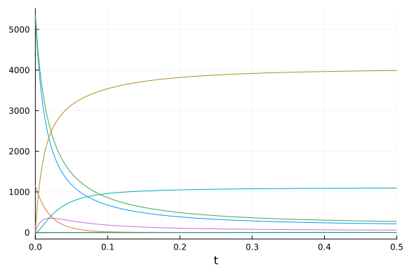
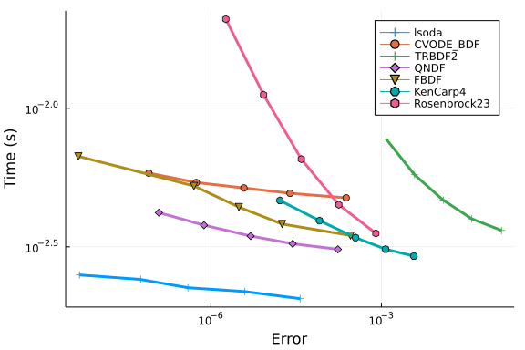

The following benchmark is of 9 ODEs with 18 terms that describe a stiff
chemical reaction network. This multistate model was used as a benchmark model in [Gupta et
al.](https://www.ncbi.nlm.nih.gov/pmc/articles/PMC6013266/). We use
[`ReactionNetworkImporters`](https://github.com/isaacsas/ReactionNetworkImporters.jl)
to load the BioNetGen model files as a
[Catalyst](https://github.com/SciML/Catalyst.jl) model, and then use
[ModelingToolkit](https://github.com/SciML/ModelingToolkit.jl) to convert the
Catalyst network model to ODEs.


```julia
using DiffEqBase, OrdinaryDiffEq, Catalyst, ReactionNetworkImporters,
      Sundials, Plots, DiffEqDevTools, ODEInterface, ODEInterfaceDiffEq,
      LSODA, TimerOutputs, LinearAlgebra, ModelingToolkit, BenchmarkTools

gr()
const to = TimerOutput()
tf       = 20.0

# generate ModelingToolkit ODEs
@timeit to "Parse Network" prnbng = loadrxnetwork(BNGNetwork(), joinpath(@__DIR__, "Models/multistate.net"))
rn    = prnbng.rn
@timeit to "Create ODESys" osys = convert(ODESystem, rn)

tspan = (0.,tf)
@timeit to "ODEProb No Jac" oprob = ODEProblem(osys, Float64[], tspan, Float64[])
```

```
Parsing parameters...done
Creating parameters...done
Parsing species...done
Creating species...done
Creating species and parameters for evaluating expressions...done
Parsing and adding reactions...done
Parsing groups...done
ODEProblem with uType Vector{Float64} and tType Float64. In-place: true
timespan: (0.0, 20.0)
u0: 9-element Vector{Float64}:
 5360.0
 1160.0
 5360.0
    0.0
    0.0
    0.0
    0.0
    0.0
    0.0
```


```julia
@timeit to "ODEProb SparseJac" sparsejacprob = ODEProblem(osys, Float64[], tspan, Float64[], jac=true, sparse=true)
show(to)
```

```
──────────────────────────────────────────────────────────────────────────
────
                                      Time                    Allocations  
    
                             ───────────────────────   ────────────────────
────
      Tot / % measured:           93.1s /  97.0%           17.1GiB /  97.9%
    

 Section             ncalls     time    %tot     avg     alloc    %tot     
 avg
 ──────────────────────────────────────────────────────────────────────────
────
 ODEProb No Jac           1    44.1s   48.8%   44.1s   8.17GiB   48.8%  8.1
7GiB
 Create ODESys            1    25.8s   28.6%   25.8s   5.42GiB   32.4%  5.4
2GiB
 Parse Network            1    11.1s   12.3%   11.1s   2.04GiB   12.2%  2.0
4GiB
 ODEProb SparseJac        1    9.35s   10.4%   9.35s   1.11GiB    6.6%  1.1
1GiB
 ──────────────────────────────────────────────────────────────────────────
────
```


```julia
@show numspecies(rn) # Number of ODEs
@show numreactions(rn) # Apprx. number of terms in the ODE
@show length(parameters(rn)) # Number of Parameters
```

```
numspecies(rn) = 9
numreactions(rn) = 18
length(parameters(rn)) = 9
9
```


## Time ODE derivative function compilation
As compiling the ODE derivative functions has in the past taken longer than
running a simulation, we first force compilation by evaluating these functions
one time.
```julia
u  = ModelingToolkit.varmap_to_vars(nothing, species(rn); defaults=ModelingToolkit.defaults(rn))
du = copy(u)
p  = ModelingToolkit.varmap_to_vars(nothing, parameters(rn); defaults=ModelingToolkit.defaults(rn))
@timeit to "ODE rhs Eval1" oprob.f(du,u,p,0.)
@timeit to "ODE rhs Eval2" oprob.f(du,u,p,0.)
sparsejacprob.f(du,u,p,0.)
```


We also time the ODE rhs function with BenchmarkTools as it is more accurate
given how fast evaluating `f` is:
```julia
@btime oprob.f($du,$u,$p,0.)
```

```
182.833 ns (3 allocations: 1.00 KiB)
```


## Picture of the solution

```julia
sol = solve(oprob, CVODE_BDF(), saveat=tf/1000., reltol=1e-5, abstol=1e-5)
plot(sol, legend=false, fmt=:png)
```




For these benchmarks we will be using the time-series error with these saving
points.

## Generate Test Solution

```julia
@time sol = solve(oprob, CVODE_BDF(), reltol=1e-15, abstol=1e-15)
test_sol  = TestSolution(sol)
```

```
0.878724 seconds (1.33 M allocations: 72.277 MiB, 4.41% gc time, 97.86% c
ompilation time)
retcode: Success
Interpolation: 3rd order Hermite
t: nothing
u: nothing
```


## Setups

```julia
abstols = 1.0 ./ 10.0 .^ (6:10)
reltols = 1.0 ./ 10.0 .^ (6:10);
setups = [
          Dict(:alg=>lsoda()),
          Dict(:alg=>CVODE_BDF()),
          Dict(:alg=>TRBDF2()),
          Dict(:alg=>QNDF()),
          Dict(:alg=>FBDF()),
          Dict(:alg=>KenCarp4()),
          Dict(:alg=>Rosenbrock23()),
          ];
```


## Work-Precision Diagram

Finally, we generate a work-precision diagram for the selection of solvers.
```julia
wp = WorkPrecisionSet(oprob,abstols,reltols,setups;error_estimate=:l2,
                      saveat=tf/10000.,appxsol=test_sol,maxiters=Int(1e5),numruns=200)
plot(wp)
```




Multithreading benchmarks with Parallel Extrapolation Methods

```julia
#Setting BLAS to one thread to measure gains
LinearAlgebra.BLAS.set_num_threads(1)

abstols = 1.0 ./ 10.0 .^ (10:14)
reltols = 1.0 ./ 10.0 .^ (7:11)

setups = [
            Dict(:alg=>CVODE_BDF()),
            Dict(:alg=>KenCarp4()),
            Dict(:alg=>Rodas4()),
            Dict(:alg=>Rodas5()),
            #Dict(:alg=>QNDF()),
            Dict(:alg=>lsoda()),
            Dict(:alg=>radau()),
            Dict(:alg=>seulex()),
            Dict(:alg=>ImplicitEulerExtrapolation(threading = OrdinaryDiffEq.PolyesterThreads())),
            Dict(:alg=>ImplicitEulerExtrapolation(threading = false)),
            Dict(:alg=>ImplicitEulerBarycentricExtrapolation(threading = OrdinaryDiffEq.PolyesterThreads())),
            Dict(:alg=>ImplicitEulerBarycentricExtrapolation(threading = false)),
            Dict(:alg=>ImplicitHairerWannerExtrapolation(threading = OrdinaryDiffEq.PolyesterThreads())),
            Dict(:alg=>ImplicitHairerWannerExtrapolation(threading = false)),
            ]


solnames = ["CVODE_BDF","KenCarp4","Rodas4","Rodas5","lsoda","radau","seulex","ImplEulerExtpl (threaded)", "ImplEulerExtpl (non-threaded)",
            "ImplEulerBaryExtpl (threaded)","ImplEulerBaryExtpl (non-threaded)","ImplHWExtpl (threaded)","ImplHWExtpl (non-threaded)"]

plot(wp, title = "Implicit Methods",legend=:outertopleft,size = (1000,500),
     xticks = 10.0 .^ (-15:1:1),
     yticks = 10.0 .^ (-6:0.3:5),
     bottom_margin= 5Plots.mm)
```


## Appendix

These benchmarks are a part of the SciMLBenchmarks.jl repository, found at: [https://github.com/SciML/SciMLBenchmarks.jl](https://github.com/SciML/SciMLBenchmarks.jl). For more information on high-performance scientific machine learning, check out the SciML Open Source Software Organization [https://sciml.ai](https://sciml.ai).

To locally run this benchmark, do the following commands:

```
using SciMLBenchmarks
SciMLBenchmarks.weave_file("benchmarks/Bio","multistate.jmd")
```

Computer Information:

```
Julia Version 1.7.3
Commit 742b9abb4d (2022-05-06 12:58 UTC)
Platform Info:
  OS: Linux (x86_64-pc-linux-gnu)
  CPU: AMD EPYC 7502 32-Core Processor
  WORD_SIZE: 64
  LIBM: libopenlibm
  LLVM: libLLVM-12.0.1 (ORCJIT, znver2)
Environment:
  JULIA_CPU_THREADS = 128
  BUILDKITE_PLUGIN_JULIA_CACHE_DIR = /cache/julia-buildkite-plugin
  JULIA_DEPOT_PATH = /cache/julia-buildkite-plugin/depots/5b300254-1738-4989-ae0a-f4d2d937f953

```

Package Information:

```
      Status `/cache/build/exclusive-amdci1-0/julialang/scimlbenchmarks-dot-jl/benchmarks/Bio/Project.toml`
  [6e4b80f9] BenchmarkTools v1.3.1
  [479239e8] Catalyst v12.2.1
  [2b5f629d] DiffEqBase v6.100.1
  [f3b72e0c] DiffEqDevTools v2.31.2
  [033835bb] JLD2 v0.4.22
  [7f56f5a3] LSODA v0.7.0
  [961ee093] ModelingToolkit v8.21.0
  [54ca160b] ODEInterface v0.5.0
  [09606e27] ODEInterfaceDiffEq v3.11.0
  [1dea7af3] OrdinaryDiffEq v6.26.2
  [91a5bcdd] Plots v1.32.0
  [b4db0fb7] ReactionNetworkImporters v0.13.4
  [31c91b34] SciMLBenchmarks v0.1.1
  [c3572dad] Sundials v4.10.1
  [a759f4b9] TimerOutputs v0.5.21
```

And the full manifest:

```
      Status `/cache/build/exclusive-amdci1-0/julialang/scimlbenchmarks-dot-jl/benchmarks/Bio/Manifest.toml`
  [c3fe647b] AbstractAlgebra v0.27.4
  [1520ce14] AbstractTrees v0.4.2
  [79e6a3ab] Adapt v3.4.0
  [dce04be8] ArgCheck v2.3.0
  [ec485272] ArnoldiMethod v0.2.0
  [4fba245c] ArrayInterface v6.0.23
  [30b0a656] ArrayInterfaceCore v0.1.20
  [6ba088a2] ArrayInterfaceGPUArrays v0.2.1
  [015c0d05] ArrayInterfaceOffsetArrays v0.1.6
  [b0d46f97] ArrayInterfaceStaticArrays v0.1.4
  [dd5226c6] ArrayInterfaceStaticArraysCore v0.1.0
  [15f4f7f2] AutoHashEquals v0.2.0
  [198e06fe] BangBang v0.3.36
  [9718e550] Baselet v0.1.1
  [6e4b80f9] BenchmarkTools v1.3.1
  [e2ed5e7c] Bijections v0.1.4
  [9e28174c] BinDeps v1.0.2
  [62783981] BitTwiddlingConvenienceFunctions v0.1.4
  [fa961155] CEnum v0.4.2
  [2a0fbf3d] CPUSummary v0.1.25
  [00ebfdb7] CSTParser v3.3.6
  [49dc2e85] Calculus v0.5.1
  [479239e8] Catalyst v12.2.1
  [d360d2e6] ChainRulesCore v1.15.4
  [9e997f8a] ChangesOfVariables v0.1.4
  [fb6a15b2] CloseOpenIntervals v0.1.10
  [944b1d66] CodecZlib v0.7.0
  [35d6a980] ColorSchemes v3.19.0
  [3da002f7] ColorTypes v0.11.4
  [c3611d14] ColorVectorSpace v0.9.9
  [5ae59095] Colors v0.12.8
  [861a8166] Combinatorics v1.0.2
  [a80b9123] CommonMark v0.8.6
  [38540f10] CommonSolve v0.2.1
  [bbf7d656] CommonSubexpressions v0.3.0
  [34da2185] Compat v3.46.0
  [b152e2b5] CompositeTypes v0.1.2
  [a33af91c] CompositionsBase v0.1.1
  [8f4d0f93] Conda v1.7.0
  [187b0558] ConstructionBase v1.4.1
  [d38c429a] Contour v0.6.2
  [adafc99b] CpuId v0.3.1
  [a8cc5b0e] Crayons v4.1.1
  [9a962f9c] DataAPI v1.10.0
  [864edb3b] DataStructures v0.18.13
  [e2d170a0] DataValueInterfaces v1.0.0
  [244e2a9f] DefineSingletons v0.1.2
  [b429d917] DensityInterface v0.4.0
  [2b5f629d] DiffEqBase v6.100.1
  [459566f4] DiffEqCallbacks v2.24.1
  [f3b72e0c] DiffEqDevTools v2.31.2
  [77a26b50] DiffEqNoiseProcess v5.12.3
  [163ba53b] DiffResults v1.0.3
  [b552c78f] DiffRules v1.11.1
  [b4f34e82] Distances v0.10.7
  [31c24e10] Distributions v0.25.70
  [ffbed154] DocStringExtensions v0.8.6
  [5b8099bc] DomainSets v0.5.13
  [fa6b7ba4] DualNumbers v0.6.8
  [7c1d4256] DynamicPolynomials v0.4.5
  [d4d017d3] ExponentialUtilities v1.18.0
  [e2ba6199] ExprTools v0.1.8
  [411431e0] Extents v0.1.1
  [c87230d0] FFMPEG v0.4.1
  [7034ab61] FastBroadcast v0.2.1
  [9aa1b823] FastClosures v0.3.2
  [29a986be] FastLapackInterface v1.2.6
  [5789e2e9] FileIO v1.15.0
  [1a297f60] FillArrays v0.13.4
  [6a86dc24] FiniteDiff v2.15.0
  [53c48c17] FixedPointNumbers v0.8.4
  [59287772] Formatting v0.4.2
  [f6369f11] ForwardDiff v0.10.32
  [069b7b12] FunctionWrappers v1.1.2
  [77dc65aa] FunctionWrappersWrappers v0.1.1
  [46192b85] GPUArraysCore v0.1.2
  [28b8d3ca] GR v0.66.2
  [c145ed77] GenericSchur v0.5.3
  [cf35fbd7] GeoInterface v1.0.1
  [5c1252a2] GeometryBasics v0.4.3
  [d7ba0133] Git v1.2.1
  [86223c79] Graphs v1.7.2
  [42e2da0e] Grisu v1.0.2
  [0b43b601] Groebner v0.2.10
  [d5909c97] GroupsCore v0.4.0
  [cd3eb016] HTTP v1.3.3
  [eafb193a] Highlights v0.4.5
  [3e5b6fbb] HostCPUFeatures v0.1.8
  [34004b35] HypergeometricFunctions v0.3.11
  [7073ff75] IJulia v1.23.3
  [615f187c] IfElse v0.1.1
  [d25df0c9] Inflate v0.1.3
  [83e8ac13] IniFile v0.5.1
  [22cec73e] InitialValues v0.3.1
  [18e54dd8] IntegerMathUtils v0.1.0
  [8197267c] IntervalSets v0.7.2
  [3587e190] InverseFunctions v0.1.7
  [92d709cd] IrrationalConstants v0.1.1
  [c8e1da08] IterTools v1.4.0
  [42fd0dbc] IterativeSolvers v0.9.2
  [82899510] IteratorInterfaceExtensions v1.0.0
  [033835bb] JLD2 v0.4.22
  [692b3bcd] JLLWrappers v1.4.1
  [682c06a0] JSON v0.21.3
  [98e50ef6] JuliaFormatter v1.0.9
  [ccbc3e58] JumpProcesses v9.2.0
  [ef3ab10e] KLU v0.3.0
  [ba0b0d4f] Krylov v0.8.3
  [0b1a1467] KrylovKit v0.5.4
  [7f56f5a3] LSODA v0.7.0
  [b964fa9f] LaTeXStrings v1.3.0
  [2ee39098] LabelledArrays v1.12.0
  [23fbe1c1] Latexify v0.15.16
  [10f19ff3] LayoutPointers v0.1.10
  [d3d80556] LineSearches v7.2.0
  [7ed4a6bd] LinearSolve v1.26.0
  [2ab3a3ac] LogExpFunctions v0.3.18
  [e6f89c97] LoggingExtras v0.4.9
  [bdcacae8] LoopVectorization v0.12.125
  [1914dd2f] MacroTools v0.5.9
  [d125e4d3] ManualMemory v0.1.8
  [739be429] MbedTLS v1.1.5
  [442fdcdd] Measures v0.3.1
  [e9d8d322] Metatheory v1.3.4
  [128add7d] MicroCollections v0.1.2
  [e1d29d7a] Missings v1.0.2
  [961ee093] ModelingToolkit v8.21.0
  [46d2c3a1] MuladdMacro v0.2.2
  [102ac46a] MultivariatePolynomials v0.4.6
  [ffc61752] Mustache v1.0.14
  [d8a4904e] MutableArithmetics v1.0.4
  [d41bc354] NLSolversBase v7.8.2
  [2774e3e8] NLsolve v4.5.1
  [77ba4419] NaNMath v1.0.1
  [8913a72c] NonlinearSolve v0.3.22
  [54ca160b] ODEInterface v0.5.0
  [09606e27] ODEInterfaceDiffEq v3.11.0
  [6fe1bfb0] OffsetArrays v1.12.7
  [429524aa] Optim v1.7.2
  [bac558e1] OrderedCollections v1.4.1
  [1dea7af3] OrdinaryDiffEq v6.26.2
  [90014a1f] PDMats v0.11.16
  [d96e819e] Parameters v0.12.3
  [69de0a69] Parsers v2.4.0
  [ccf2f8ad] PlotThemes v3.0.0
  [995b91a9] PlotUtils v1.3.0
  [91a5bcdd] Plots v1.32.0
  [e409e4f3] PoissonRandom v0.4.1
  [f517fe37] Polyester v0.6.15
  [1d0040c9] PolyesterWeave v0.1.9
  [85a6dd25] PositiveFactorizations v0.2.4
  [d236fae5] PreallocationTools v0.4.2
  [21216c6a] Preferences v1.3.0
  [27ebfcd6] Primes v0.5.3
  [1fd47b50] QuadGK v2.5.0
  [74087812] Random123 v1.6.0
  [fb686558] RandomExtensions v0.4.3
  [e6cf234a] RandomNumbers v1.5.3
  [b4db0fb7] ReactionNetworkImporters v0.13.4
  [3cdcf5f2] RecipesBase v1.2.1
  [01d81517] RecipesPipeline v0.6.3
  [731186ca] RecursiveArrayTools v2.32.0
  [f2c3362d] RecursiveFactorization v0.2.12
  [189a3867] Reexport v1.2.2
  [42d2dcc6] Referenceables v0.1.2
  [05181044] RelocatableFolders v0.1.3
  [ae029012] Requires v1.3.0
  [ae5879a3] ResettableStacks v1.1.1
  [37e2e3b7] ReverseDiff v1.14.1
  [79098fc4] Rmath v0.7.0
  [47965b36] RootedTrees v2.13.0
  [7e49a35a] RuntimeGeneratedFunctions v0.5.3
  [3cdde19b] SIMDDualNumbers v0.1.1
  [94e857df] SIMDTypes v0.1.0
  [476501e8] SLEEFPirates v0.6.35
  [0bca4576] SciMLBase v1.53.2
  [31c91b34] SciMLBenchmarks v0.1.1
  [6c6a2e73] Scratch v1.1.1
  [efcf1570] Setfield v0.8.2
  [992d4aef] Showoff v1.0.3
  [777ac1f9] SimpleBufferStream v1.1.0
  [699a6c99] SimpleTraits v0.9.4
  [66db9d55] SnoopPrecompile v1.0.1
  [b85f4697] SoftGlobalScope v1.1.0
  [a2af1166] SortingAlgorithms v1.0.1
  [47a9eef4] SparseDiffTools v1.26.2
  [276daf66] SpecialFunctions v2.1.7
  [171d559e] SplittablesBase v0.1.14
  [aedffcd0] Static v0.7.6
  [90137ffa] StaticArrays v1.5.6
  [1e83bf80] StaticArraysCore v1.3.0
  [82ae8749] StatsAPI v1.5.0
  [2913bbd2] StatsBase v0.33.21
  [4c63d2b9] StatsFuns v1.0.1
  [7792a7ef] StrideArraysCore v0.3.15
  [69024149] StringEncodings v0.3.5
  [09ab397b] StructArrays v0.6.12
  [c3572dad] Sundials v4.10.1
  [d1185830] SymbolicUtils v0.19.11
  [0c5d862f] Symbolics v4.10.4
  [3783bdb8] TableTraits v1.0.1
  [bd369af6] Tables v1.7.0
  [62fd8b95] TensorCore v0.1.1
  [8ea1fca8] TermInterface v0.2.3
  [8290d209] ThreadingUtilities v0.5.0
  [ac1d9e8a] ThreadsX v0.1.10
  [a759f4b9] TimerOutputs v0.5.21
  [0796e94c] Tokenize v0.5.24
  [3bb67fe8] TranscodingStreams v0.9.9
  [28d57a85] Transducers v0.4.73
  [a2a6695c] TreeViews v0.3.0
  [d5829a12] TriangularSolve v0.1.13
  [410a4b4d] Tricks v0.1.6
  [30578b45] URIParser v0.4.1
  [5c2747f8] URIs v1.4.0
  [3a884ed6] UnPack v1.0.2
  [1cfade01] UnicodeFun v0.4.1
  [1986cc42] Unitful v1.11.0
  [41fe7b60] Unzip v0.2.0
  [3d5dd08c] VectorizationBase v0.21.47
  [81def892] VersionParsing v1.3.0
  [19fa3120] VertexSafeGraphs v0.2.0
  [44d3d7a6] Weave v0.10.10
  [ddb6d928] YAML v0.4.7
  [c2297ded] ZMQ v1.2.1
  [700de1a5] ZygoteRules v0.2.2
  [6e34b625] Bzip2_jll v1.0.8+0
  [83423d85] Cairo_jll v1.16.1+1
  [5ae413db] EarCut_jll v2.2.3+0
  [2e619515] Expat_jll v2.4.8+0
  [b22a6f82] FFMPEG_jll v4.4.2+0
  [a3f928ae] Fontconfig_jll v2.13.93+0
  [d7e528f0] FreeType2_jll v2.10.4+0
  [559328eb] FriBidi_jll v1.0.10+0
  [0656b61e] GLFW_jll v3.3.8+0
  [d2c73de3] GR_jll v0.66.2+0
  [78b55507] Gettext_jll v0.21.0+0
  [f8c6e375] Git_jll v2.34.1+0
  [7746bdde] Glib_jll v2.68.3+2
  [3b182d85] Graphite2_jll v1.3.14+0
  [2e76f6c2] HarfBuzz_jll v2.8.1+1
  [aacddb02] JpegTurbo_jll v2.1.2+0
  [c1c5ebd0] LAME_jll v3.100.1+0
  [88015f11] LERC_jll v3.0.0+1
  [aae0fff6] LSODA_jll v0.1.1+0
  [dd4b983a] LZO_jll v2.10.1+0
  [e9f186c6] Libffi_jll v3.2.2+1
  [d4300ac3] Libgcrypt_jll v1.8.7+0
  [7e76a0d4] Libglvnd_jll v1.3.0+3
  [7add5ba3] Libgpg_error_jll v1.42.0+0
  [94ce4f54] Libiconv_jll v1.16.1+1
  [4b2f31a3] Libmount_jll v2.35.0+0
  [89763e89] Libtiff_jll v4.4.0+0
  [38a345b3] Libuuid_jll v2.36.0+0
  [c771fb93] ODEInterface_jll v0.0.1+0
  [e7412a2a] Ogg_jll v1.3.5+1
  [458c3c95] OpenSSL_jll v1.1.17+0
  [efe28fd5] OpenSpecFun_jll v0.5.5+0
  [91d4177d] Opus_jll v1.3.2+0
  [2f80f16e] PCRE_jll v8.44.0+0
  [30392449] Pixman_jll v0.40.1+0
  [ea2cea3b] Qt5Base_jll v5.15.3+1
  [f50d1b31] Rmath_jll v0.3.0+0
  [fb77eaff] Sundials_jll v5.2.1+0
  [a2964d1f] Wayland_jll v1.19.0+0
  [2381bf8a] Wayland_protocols_jll v1.25.0+0
  [02c8fc9c] XML2_jll v2.9.14+0
  [aed1982a] XSLT_jll v1.1.34+0
  [4f6342f7] Xorg_libX11_jll v1.6.9+4
  [0c0b7dd1] Xorg_libXau_jll v1.0.9+4
  [935fb764] Xorg_libXcursor_jll v1.2.0+4
  [a3789734] Xorg_libXdmcp_jll v1.1.3+4
  [1082639a] Xorg_libXext_jll v1.3.4+4
  [d091e8ba] Xorg_libXfixes_jll v5.0.3+4
  [a51aa0fd] Xorg_libXi_jll v1.7.10+4
  [d1454406] Xorg_libXinerama_jll v1.1.4+4
  [ec84b674] Xorg_libXrandr_jll v1.5.2+4
  [ea2f1a96] Xorg_libXrender_jll v0.9.10+4
  [14d82f49] Xorg_libpthread_stubs_jll v0.1.0+3
  [c7cfdc94] Xorg_libxcb_jll v1.13.0+3
  [cc61e674] Xorg_libxkbfile_jll v1.1.0+4
  [12413925] Xorg_xcb_util_image_jll v0.4.0+1
  [2def613f] Xorg_xcb_util_jll v0.4.0+1
  [975044d2] Xorg_xcb_util_keysyms_jll v0.4.0+1
  [0d47668e] Xorg_xcb_util_renderutil_jll v0.3.9+1
  [c22f9ab0] Xorg_xcb_util_wm_jll v0.4.1+1
  [35661453] Xorg_xkbcomp_jll v1.4.2+4
  [33bec58e] Xorg_xkeyboard_config_jll v2.27.0+4
  [c5fb5394] Xorg_xtrans_jll v1.4.0+3
  [8f1865be] ZeroMQ_jll v4.3.4+0
  [3161d3a3] Zstd_jll v1.5.2+0
  [a4ae2306] libaom_jll v3.4.0+0
  [0ac62f75] libass_jll v0.15.1+0
  [f638f0a6] libfdk_aac_jll v2.0.2+0
  [b53b4c65] libpng_jll v1.6.38+0
  [a9144af2] libsodium_jll v1.0.20+0
  [f27f6e37] libvorbis_jll v1.3.7+1
  [1270edf5] x264_jll v2021.5.5+0
  [dfaa095f] x265_jll v3.5.0+0
  [d8fb68d0] xkbcommon_jll v1.4.1+0
  [0dad84c5] ArgTools v1.1.1
  [56f22d72] Artifacts
  [2a0f44e3] Base64
  [ade2ca70] Dates
  [8bb1440f] DelimitedFiles
  [8ba89e20] Distributed
  [f43a241f] Downloads v1.6.0
  [7b1f6079] FileWatching
  [9fa8497b] Future
  [b77e0a4c] InteractiveUtils
  [b27032c2] LibCURL v0.6.3
  [76f85450] LibGit2
  [8f399da3] Libdl
  [37e2e46d] LinearAlgebra
  [56ddb016] Logging
  [d6f4376e] Markdown
  [a63ad114] Mmap
  [ca575930] NetworkOptions v1.2.0
  [44cfe95a] Pkg v1.8.0
  [de0858da] Printf
  [9abbd945] Profile
  [3fa0cd96] REPL
  [9a3f8284] Random
  [ea8e919c] SHA v0.7.0
  [9e88b42a] Serialization
  [1a1011a3] SharedArrays
  [6462fe0b] Sockets
  [2f01184e] SparseArrays
  [10745b16] Statistics
  [4607b0f0] SuiteSparse
  [fa267f1f] TOML v1.0.0
  [a4e569a6] Tar v1.10.0
  [8dfed614] Test
  [cf7118a7] UUIDs
  [4ec0a83e] Unicode
  [e66e0078] CompilerSupportLibraries_jll v0.5.2+0
  [deac9b47] LibCURL_jll v7.84.0+0
  [29816b5a] LibSSH2_jll v1.10.2+0
  [c8ffd9c3] MbedTLS_jll v2.28.0+0
  [14a3606d] MozillaCACerts_jll v2022.2.1
  [4536629a] OpenBLAS_jll v0.3.20+0
  [05823500] OpenLibm_jll v0.8.1+0
  [efcefdf7] PCRE2_jll v10.40.0+0
  [bea87d4a] SuiteSparse_jll v5.10.1+0
  [83775a58] Zlib_jll v1.2.12+3
  [8e850b90] libblastrampoline_jll v5.1.1+0
  [8e850ede] nghttp2_jll v1.48.0+0
  [3f19e933] p7zip_jll v17.4.0+0
```

