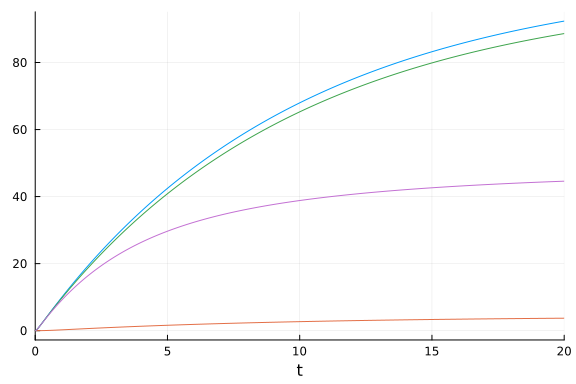
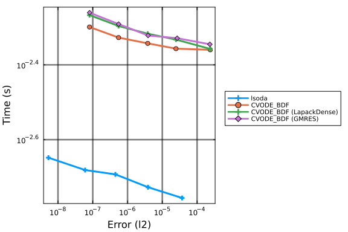
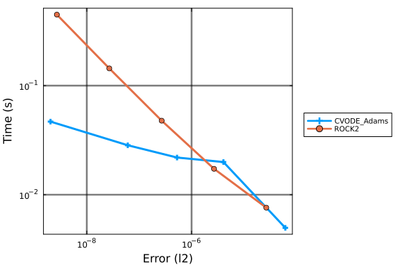

The following benchmark is of 9 ODEs with 18 terms that describe a
chemical reaction network. This multistate model was used as a benchmark model in [Gupta et
al.](https://www.ncbi.nlm.nih.gov/pmc/articles/PMC6013266/). We use
[`ReactionNetworkImporters`](https://github.com/isaacsas/ReactionNetworkImporters.jl)
to load the BioNetGen model files as a
[Catalyst](https://github.com/SciML/Catalyst.jl) model, and then use
[ModelingToolkit](https://github.com/SciML/ModelingToolkit.jl) to convert the
Catalyst network model to ODEs.

```julia
using DiffEqBase, OrdinaryDiffEq, Catalyst, ReactionNetworkImporters,
      Sundials, Plots, DiffEqDevTools, ODEInterface, ODEInterfaceDiffEq,
      LSODA, TimerOutputs, LinearAlgebra, ModelingToolkit, BenchmarkTools,
      RecursiveFactorization

gr()
const to = TimerOutput()
tf = 20.0

# generate ModelingToolkit ODEs
@timeit to "Parse Network" prnbng = loadrxnetwork(BNGNetwork(), joinpath(@__DIR__, "Models/multistate.net"))
show(to)
rn = complete(prnbng.rn)
obs = [eq.lhs for eq in observed(rn)]

@timeit to "Create ODESys" osys = complete(convert(ODESystem, rn))
show(to)

tspan = (0.0, tf)
@timeit to "ODEProb No Jac" oprob = ODEProblem{true, SciMLBase.FullSpecialize}(
    osys, Float64[], tspan, Float64[])
show(to);
```

```
Parsing parameters...done
Creating parameters...done
Parsing species...done
Creating species...done
Creating species and parameters for evaluating expressions...done
Parsing and adding reactions...done
Parsing groups...done
──────────────────────────────────────────────────────────────────────────
                                 Time                    Allocations      
                        ───────────────────────   ────────────────────────
   Tot / % measured:         4.32s /  94.6%            363MiB /  96.8%    

Section         ncalls     time    %tot     avg     alloc    %tot      avg
──────────────────────────────────────────────────────────────────────────
Parse Network        1    4.08s  100.0%   4.08s    351MiB  100.0%   351MiB
───────────────────────────────────────────────────────────────────────────
─────────────────────────────────────────────────────────────────────────
                                 Time                    Allocations      
                        ───────────────────────   ────────────────────────
   Tot / % measured:         8.79s /  83.5%            811MiB /  75.5%    

Section         ncalls     time    %tot     avg     alloc    %tot      avg
──────────────────────────────────────────────────────────────────────────
Parse Network        1    4.08s   55.6%   4.08s    351MiB   57.3%   351MiB
Create ODESys        1    3.26s   44.4%   3.26s    261MiB   42.7%   261MiB
───────────────────────────────────────────────────────────────────────────
──────────────────────────────────────────────────────────────────────────
                                  Time                    Allocations      
                         ───────────────────────   ────────────────────────
    Tot / % measured:         12.5s /  88.4%           1.24GiB /  84.4%    

Section          ncalls     time    %tot     avg     alloc    %tot      avg
───────────────────────────────────────────────────────────────────────────
Parse Network         1    4.08s   37.0%   4.08s    351MiB   32.7%   351MiB
ODEProb No Jac        1    3.70s   33.5%   3.70s    461MiB   42.9%   461MiB
Create ODESys         1    3.26s   29.5%   3.26s    261MiB   24.4%   261MiB
───────────────────────────────────────────────────────────────────────────
```


```julia
@timeit to "ODEProb SparseJac" sparsejacprob = ODEProblem{true, SciMLBase.FullSpecialize}(
    osys, Float64[], tspan, Float64[], jac = true, sparse = true)
show(to)
```

```
───────────────────────────────────────────────────────────────────────────
───
                                     Time                    Allocations   
   
                            ───────────────────────   ─────────────────────
───
     Tot / % measured:           15.1s /  89.6%           1.44GiB /  85.5% 
   

Section             ncalls     time    %tot     avg     alloc    %tot      
avg
───────────────────────────────────────────────────────────────────────────
───
Parse Network            1    4.08s   30.2%   4.08s    351MiB   27.9%   351
MiB
ODEProb No Jac           1    3.70s   27.3%   3.70s    461MiB   36.6%   461
MiB
Create ODESys            1    3.26s   24.1%   3.26s    261MiB   20.7%   261
MiB
ODEProb SparseJac        1    2.49s   18.4%   2.49s    187MiB   14.8%   187
MiB
───────────────────────────────────────────────────────────────────────────
───
```


```julia
@show numspecies(rn) # Number of ODEs
@show numreactions(rn) # Apprx. number of terms in the ODE
@show length(parameters(rn)); # Number of Parameters
```

```
numspecies(rn) = 9
numreactions(rn) = 18
length(parameters(rn)) = 9
```


## Time ODE derivative function compilation

As compiling the ODE derivative functions has in the past taken longer than
running a simulation, we first force compilation by evaluating these functions
one time.

```julia
u = oprob.u0
du = copy(u)
p = oprob.p
@timeit to "ODE rhs Eval1" oprob.f(du, u, p, 0.0)
@timeit to "ODE rhs Eval2" oprob.f(du, u, p, 0.0)
sparsejacprob.f(du, u, p, 0.0)
```


We also time the ODE rhs function with BenchmarkTools as it is more accurate
given how fast evaluating `f` is:

```julia
@btime oprob.f($du, $u, $p, 0.0)
```

```
246.517 ns (2 allocations: 832 bytes)
```


## Picture of the solution

```julia
sol = solve(oprob, CVODE_BDF(), saveat = tf/1000.0, reltol = 1e-5, abstol = 1e-5)
plot(sol; idxs = obs, legend = false, fmt = :png)
```




For these benchmarks we will be using the time-series error with these saving
points.

## Generate Test Solution

```julia
@time sol = solve(oprob, CVODE_BDF(), reltol = 1e-15, abstol = 1e-15)
test_sol = TestSolution(sol);
```

```
0.644855 seconds (442.45 k allocations: 30.784 MiB, 3.16% gc time, 94.74%
 compilation time)
```


## Setups

#### Sets plotting defaults

```julia
default(legendfontsize = 7, framestyle = :box, gridalpha = 0.3, gridlinewidth = 2.5)
```


#### Sets tolerances

```julia
abstols = 1.0 ./ 10.0 .^ (6:10)
reltols = 1.0 ./ 10.0 .^ (6:10);
```


## Work-Precision Diagram

We start by trying lsoda and CVODE solvers.

#### Declare solvers

We designate the solvers (and options) we wish to use.

```julia
setups = [
    Dict(:alg=>lsoda()),
    Dict(:alg=>CVODE_BDF()),
    Dict(:alg=>CVODE_BDF(linear_solver = :LapackDense)),
    Dict(:alg=>CVODE_BDF(linear_solver = :GMRES))
];
```


#### Plot Work-Precision Diagram

Finally, we generate a work-precision diagram for the selection of solvers.

```julia
wp = WorkPrecisionSet(oprob, abstols, reltols, setups; error_estimate = :l2,
    saveat = tf/10000.0, appxsol = test_sol, maxiters = Int(1e9), numruns = 200)

names = ["lsoda" "CVODE_BDF" "CVODE_BDF (LapackDense)" "CVODE_BDF (GMRES)"]
plot(wp; label = names)
```




## Implicit Work-Precision Diagram

Next, we try a couple of implicit Julia solvers.

#### Declare solvers

We designate the solvers we wish to use.

```julia
setups = [
    Dict(:alg=>TRBDF2()),
    Dict(:alg=>QNDF()),
    Dict(:alg=>FBDF()),
    Dict(:alg=>KenCarp4()),
    Dict(:alg=>Rosenbrock23()),
    Dict(:alg=>Rodas4()),
    Dict(:alg=>Rodas5P())
];
```


#### Plot Work-Precision Diagram

Finally, we generate a work-precision diagram for the selection of solvers.

```julia
wp = WorkPrecisionSet(oprob, abstols, reltols, setups; error_estimate = :l2,
    saveat = tf/10000.0, appxsol = test_sol, maxiters = Int(1e12), dtmin = 1e-18, numruns = 200)

names = ["TRBDF2" "QNDF" "FBDF" "KenCarp4" "Rosenbrock23" "Rodas4" "Rodas5P"]
plot(wp; label = names)
```


Implicit methods doing poorly suggests it's non-stiff.

## Explicit Work-Precision Diagram

Benchmarks for explicit solvers.

#### Declare solvers

We designate the solvers we wish to use, this also includes lsoda and CVODE.

```julia
setups = [
    Dict(:alg=>lsoda()),
    Dict(:alg=>Tsit5()),
    Dict(:alg=>BS5()),
    Dict(:alg=>VCABM()),
    Dict(:alg=>Vern6()),
    Dict(:alg=>Vern7()),
    Dict(:alg=>Vern8()),
    Dict(:alg=>Vern9()),
    Dict(:alg=>ROCK4())
];
```


#### Plot Work-Precision Diagram

```julia
wp = WorkPrecisionSet(oprob, abstols, reltols, setups; error_estimate = :l2,
    saveat = tf/10000.0, appxsol = test_sol, maxiters = Int(1e9), numruns = 200)

names = ["lsoda" "Tsit5" "BS5" "VCABM" "Vern6" "Vern7" "Vern8" "Vern9" "ROCK4"]
plot(wp; label = names)
```


#### Additional explicit solvers

Two additional explicit solvers, `CVODE_Adams` and `ROCK2`, perform noticeably worse as compared to the other ones.

```julia
setups = [Dict(:alg=>CVODE_Adams()), Dict(:alg=>ROCK2())];
wp = WorkPrecisionSet(oprob, abstols, reltols, setups; error_estimate = :l2,
    saveat = tf/10000.0, appxsol = test_sol, maxiters = Int(1e9), numruns = 200)
names = ["CVODE_Adams" "ROCK2"]
plot(wp; label = names)
```




## Summary of results

Finally, we compute a single diagram comparing the various solvers used.

#### Declare solvers

We designate the solvers we wish to compare.

```julia
setups = [
    Dict(:alg=>lsoda()),
    Dict(:alg=>CVODE_BDF()),
    Dict(:alg=>QNDF()),
    Dict(:alg=>KenCarp4()),
    Dict(:alg=>Rodas5P()),
    Dict(:alg=>Tsit5()),
    Dict(:alg=>BS5()),
    Dict(:alg=>VCABM()),
    Dict(:alg=>Vern7())
];
```


#### Plot Work-Precision Diagram

For these, we generate a work-precision diagram for the selection of solvers.

```julia
wp = WorkPrecisionSet(oprob, abstols, reltols, setups; error_estimate = :l2,
    saveat = tf/10000.0, appxsol = test_sol, maxiters = Int(1e9), numruns = 200)

names = ["lsoda" "CVODE_BDF" "QNDF" "KenCarp4" "Rodas5P" "Tsit5" "BS5" "VCABM" "Vern7"]
colors = [:seagreen1 :chartreuse1 :deepskyblue1 :lightskyblue :blue :orchid2 :thistle2 :lightsteelblue2 :mediumpurple1]
markershapes = [:star4 :circle :hexagon :star5 :heptagon :ltriangle :star8 :heptagon :star6]
plot(wp; label = names, left_margin = 10Plots.mm, right_margin = 10Plots.mm,
    xticks = [1e-12, 1e-11, 1e-10, 1e-9, 1e-8, 1e-7, 1e-6, 1e-5, 1e-4, 1e-3, 1e-2],
    yticks = [1e-3, 1e-2], color = colors, markershape = markershapes,
    legendfontsize = 15, tickfontsize = 15, guidefontsize = 15, legend = :topright,
    lw = 20, la = 0.8, markersize = 20, markerstrokealpha = 1.0,
    markerstrokewidth = 1.5, gridalpha = 0.3, gridlinewidth = 7.5, size = (1100, 1000))
```


## Appendix

These benchmarks are a part of the SciMLBenchmarks.jl repository, found at: [https://github.com/SciML/SciMLBenchmarks.jl](https://github.com/SciML/SciMLBenchmarks.jl). For more information on high-performance scientific machine learning, check out the SciML Open Source Software Organization [https://sciml.ai](https://sciml.ai).

To locally run this benchmark, do the following commands:

```
using SciMLBenchmarks
SciMLBenchmarks.weave_file("benchmarks/Bio","multistate.jmd")
```

Computer Information:

```
Julia Version 1.10.10
Commit 95f30e51f41 (2025-06-27 09:51 UTC)
Build Info:
  Official https://julialang.org/ release
Platform Info:
  OS: Linux (x86_64-linux-gnu)
  CPU: 128 × AMD EPYC 7502 32-Core Processor
  WORD_SIZE: 64
  LIBM: libopenlibm
  LLVM: libLLVM-15.0.7 (ORCJIT, znver2)
Threads: 1 default, 0 interactive, 1 GC (on 128 virtual cores)
Environment:
  JULIA_CPU_THREADS = 128
  JULIA_DEPOT_PATH = /cache/julia-buildkite-plugin/depots/5b300254-1738-4989-ae0a-f4d2d937f953

```

Package Information:

```
Status `/cache/build/exclusive-amdci1-0/julialang/scimlbenchmarks-dot-jl/benchmarks/Bio/Project.toml`
⌃ [6e4b80f9] BenchmarkTools v1.5.0
⌅ [479239e8] Catalyst v14.4.1
⌃ [2b5f629d] DiffEqBase v6.160.0
⌃ [f3b72e0c] DiffEqDevTools v2.45.1
  [40713840] IncompleteLU v0.2.1
⌃ [033835bb] JLD2 v0.5.8
  [7f56f5a3] LSODA v0.7.5
⌅ [7ed4a6bd] LinearSolve v2.37.0
⌅ [961ee093] ModelingToolkit v9.50.0
  [54ca160b] ODEInterface v0.5.0
  [09606e27] ODEInterfaceDiffEq v3.13.4
⌃ [1dea7af3] OrdinaryDiffEq v6.90.1
⌃ [91a5bcdd] Plots v1.40.9
⌅ [b4db0fb7] ReactionNetworkImporters v0.15.1
  [f2c3362d] RecursiveFactorization v0.2.23
  [31c91b34] SciMLBenchmarks v0.1.3
⌃ [c3572dad] Sundials v4.26.1
⌃ [a759f4b9] TimerOutputs v0.5.25
Info Packages marked with ⌃ and ⌅ have new versions available. Those with ⌃ may be upgradable, but those with ⌅ are restricted by compatibility constraints from upgrading. To see why use `status --outdated`
Warning The project dependencies or compat requirements have changed since the manifest was last resolved. It is recommended to `Pkg.resolve()` or consider `Pkg.update()` if necessary.
```

And the full manifest:

```
Status `/cache/build/exclusive-amdci1-0/julialang/scimlbenchmarks-dot-jl/benchmarks/Bio/Manifest.toml`
⌃ [47edcb42] ADTypes v1.10.0
  [1520ce14] AbstractTrees v0.4.5
⌃ [7d9f7c33] Accessors v0.1.38
⌃ [79e6a3ab] Adapt v4.1.1
  [66dad0bd] AliasTables v1.1.3
  [ec485272] ArnoldiMethod v0.4.0
⌃ [4fba245c] ArrayInterface v7.17.0
⌃ [4c555306] ArrayLayouts v1.10.4
⌃ [6e4b80f9] BenchmarkTools v1.5.0
⌅ [e2ed5e7c] Bijections v0.1.9
  [d1d4a3ce] BitFlags v0.1.9
  [62783981] BitTwiddlingConvenienceFunctions v0.1.6
⌃ [8e7c35d0] BlockArrays v1.1.1
⌃ [70df07ce] BracketingNonlinearSolve v1.1.0
  [fa961155] CEnum v0.5.0
⌃ [2a0fbf3d] CPUSummary v0.2.6
  [00ebfdb7] CSTParser v3.4.3
  [7057c7e9] Cassette v0.3.14
⌅ [479239e8] Catalyst v14.4.1
⌃ [d360d2e6] ChainRulesCore v1.25.0
  [fb6a15b2] CloseOpenIntervals v0.1.13
⌃ [944b1d66] CodecZlib v0.7.6
⌃ [35d6a980] ColorSchemes v3.27.1
⌃ [3da002f7] ColorTypes v0.12.0
  [c3611d14] ColorVectorSpace v0.11.0
⌃ [5ae59095] Colors v0.13.0
⌃ [861a8166] Combinatorics v1.0.2
⌅ [a80b9123] CommonMark v0.8.15
  [38540f10] CommonSolve v0.2.4
  [bbf7d656] CommonSubexpressions v0.3.1
  [f70d9fcc] CommonWorldInvalidations v1.0.0
⌃ [34da2185] Compat v4.16.0
  [b152e2b5] CompositeTypes v0.1.4
  [a33af91c] CompositionsBase v0.1.2
  [2569d6c7] ConcreteStructs v0.2.3
⌃ [f0e56b4a] ConcurrentUtilities v2.4.2
  [8f4d0f93] Conda v1.10.2
⌃ [187b0558] ConstructionBase v1.5.8
  [d38c429a] Contour v0.6.3
  [adafc99b] CpuId v0.3.1
  [a8cc5b0e] Crayons v4.1.1
  [9a962f9c] DataAPI v1.16.0
⌅ [864edb3b] DataStructures v0.18.20
  [e2d170a0] DataValueInterfaces v1.0.0
  [8bb1440f] DelimitedFiles v1.9.1
⌃ [2b5f629d] DiffEqBase v6.160.0
⌃ [459566f4] DiffEqCallbacks v4.2.0
⌃ [f3b72e0c] DiffEqDevTools v2.45.1
⌃ [77a26b50] DiffEqNoiseProcess v5.23.0
  [163ba53b] DiffResults v1.1.0
  [b552c78f] DiffRules v1.15.1
⌅ [a0c0ee7d] DifferentiationInterface v0.6.22
⌃ [8d63f2c5] DispatchDoctor v0.4.17
  [b4f34e82] Distances v0.10.12
⌃ [31c24e10] Distributions v0.25.113
⌃ [ffbed154] DocStringExtensions v0.9.3
⌃ [5b8099bc] DomainSets v0.7.14
⌃ [7c1d4256] DynamicPolynomials v0.6.0
⌃ [06fc5a27] DynamicQuantities v1.3.0
⌃ [4e289a0a] EnumX v1.0.4
⌃ [f151be2c] EnzymeCore v0.8.6
⌃ [460bff9d] ExceptionUnwrapping v0.1.10
⌃ [d4d017d3] ExponentialUtilities v1.26.1
  [e2ba6199] ExprTools v0.1.10
⌅ [6b7a57c9] Expronicon v0.8.5
⌃ [c87230d0] FFMPEG v0.4.2
  [7034ab61] FastBroadcast v0.3.5
  [9aa1b823] FastClosures v0.3.2
  [29a986be] FastLapackInterface v2.0.4
⌃ [a4df4552] FastPower v1.1.1
⌃ [5789e2e9] FileIO v1.16.5
⌃ [1a297f60] FillArrays v1.13.0
⌃ [64ca27bc] FindFirstFunctions v1.4.1
⌃ [6a86dc24] FiniteDiff v2.26.0
  [53c48c17] FixedPointNumbers v0.8.5
  [1fa38f19] Format v1.3.7
⌅ [f6369f11] ForwardDiff v0.10.38
  [f62d2435] FunctionProperties v0.1.2
  [069b7b12] FunctionWrappers v1.1.3
  [77dc65aa] FunctionWrappersWrappers v0.1.3
⌃ [d9f16b24] Functors v0.5.1
⌅ [46192b85] GPUArraysCore v0.1.6
⌃ [28b8d3ca] GR v0.73.8
⌃ [14197337] GenericLinearAlgebra v0.3.14
⌃ [c145ed77] GenericSchur v0.5.4
⌃ [d7ba0133] Git v1.3.1
  [c27321d9] Glob v1.3.1
⌃ [86223c79] Graphs v1.12.0
  [42e2da0e] Grisu v1.0.2
⌃ [cd3eb016] HTTP v1.10.10
  [eafb193a] Highlights v0.5.3
  [3e5b6fbb] HostCPUFeatures v0.1.17
⌃ [34004b35] HypergeometricFunctions v0.3.25
⌃ [7073ff75] IJulia v1.26.0
  [615f187c] IfElse v0.1.1
  [40713840] IncompleteLU v0.2.1
  [d25df0c9] Inflate v0.1.5
⌃ [18e54dd8] IntegerMathUtils v0.1.2
⌃ [8197267c] IntervalSets v0.7.10
  [3587e190] InverseFunctions v0.1.17
⌃ [92d709cd] IrrationalConstants v0.2.2
  [82899510] IteratorInterfaceExtensions v1.0.0
⌃ [033835bb] JLD2 v0.5.8
⌃ [1019f520] JLFzf v0.1.8
⌃ [692b3bcd] JLLWrappers v1.6.1
  [682c06a0] JSON v0.21.4
⌅ [98e50ef6] JuliaFormatter v1.0.62
⌃ [ccbc3e58] JumpProcesses v9.14.0
  [ef3ab10e] KLU v0.6.0
⌅ [ba0b0d4f] Krylov v0.9.8
  [7f56f5a3] LSODA v0.7.5
  [b964fa9f] LaTeXStrings v1.4.0
⌃ [23fbe1c1] Latexify v0.16.5
  [10f19ff3] LayoutPointers v0.1.17
⌃ [5078a376] LazyArrays v2.2.2
  [87fe0de2] LineSearch v0.1.4
⌃ [d3d80556] LineSearches v7.3.0
⌅ [7ed4a6bd] LinearSolve v2.37.0
⌃ [2ab3a3ac] LogExpFunctions v0.3.28
  [e6f89c97] LoggingExtras v1.1.0
⌃ [bdcacae8] LoopVectorization v0.12.171
  [d8e11817] MLStyle v0.4.17
⌃ [1914dd2f] MacroTools v0.5.13
  [d125e4d3] ManualMemory v0.1.8
  [bb5d69b7] MaybeInplace v0.1.4
  [739be429] MbedTLS v1.1.9
  [442fdcdd] Measures v0.3.2
  [e1d29d7a] Missings v1.2.0
⌅ [961ee093] ModelingToolkit v9.50.0
  [46d2c3a1] MuladdMacro v0.2.4
⌃ [102ac46a] MultivariatePolynomials v0.5.7
⌃ [ffc61752] Mustache v1.0.20
⌃ [d8a4904e] MutableArithmetics v1.5.2
⌃ [d41bc354] NLSolversBase v7.8.3
  [2774e3e8] NLsolve v4.5.1
⌃ [77ba4419] NaNMath v1.0.2
⌃ [8913a72c] NonlinearSolve v4.1.0
⌃ [be0214bd] NonlinearSolveBase v1.3.3
⌃ [5959db7a] NonlinearSolveFirstOrder v1.0.0
⌃ [9a2c21bd] NonlinearSolveQuasiNewton v1.0.0
⌃ [26075421] NonlinearSolveSpectralMethods v1.0.0
  [54ca160b] ODEInterface v0.5.0
  [09606e27] ODEInterfaceDiffEq v3.13.4
⌃ [6fe1bfb0] OffsetArrays v1.14.1
⌃ [4d8831e6] OpenSSL v1.4.3
⌃ [429524aa] Optim v1.10.0
⌃ [bac558e1] OrderedCollections v1.6.3
⌃ [1dea7af3] OrdinaryDiffEq v6.90.1
⌃ [89bda076] OrdinaryDiffEqAdamsBashforthMoulton v1.1.0
⌃ [6ad6398a] OrdinaryDiffEqBDF v1.1.2
⌃ [bbf590c4] OrdinaryDiffEqCore v1.10.2
⌃ [50262376] OrdinaryDiffEqDefault v1.1.0
⌃ [4302a76b] OrdinaryDiffEqDifferentiation v1.2.0
⌃ [9286f039] OrdinaryDiffEqExplicitRK v1.1.0
⌃ [e0540318] OrdinaryDiffEqExponentialRK v1.1.0
⌃ [becaefa8] OrdinaryDiffEqExtrapolation v1.2.1
⌃ [5960d6e9] OrdinaryDiffEqFIRK v1.3.0
⌃ [101fe9f7] OrdinaryDiffEqFeagin v1.1.0
⌃ [d3585ca7] OrdinaryDiffEqFunctionMap v1.1.1
⌃ [d28bc4f8] OrdinaryDiffEqHighOrderRK v1.1.0
⌃ [9f002381] OrdinaryDiffEqIMEXMultistep v1.1.0
⌃ [521117fe] OrdinaryDiffEqLinear v1.1.0
⌃ [1344f307] OrdinaryDiffEqLowOrderRK v1.2.0
⌃ [b0944070] OrdinaryDiffEqLowStorageRK v1.2.1
⌃ [127b3ac7] OrdinaryDiffEqNonlinearSolve v1.2.4
⌃ [c9986a66] OrdinaryDiffEqNordsieck v1.1.0
⌃ [5dd0a6cf] OrdinaryDiffEqPDIRK v1.1.0
⌃ [5b33eab2] OrdinaryDiffEqPRK v1.1.0
⌃ [04162be5] OrdinaryDiffEqQPRK v1.1.0
⌃ [af6ede74] OrdinaryDiffEqRKN v1.1.0
⌃ [43230ef6] OrdinaryDiffEqRosenbrock v1.3.1
⌃ [2d112036] OrdinaryDiffEqSDIRK v1.1.0
⌃ [669c94d9] OrdinaryDiffEqSSPRK v1.2.0
⌃ [e3e12d00] OrdinaryDiffEqStabilizedIRK v1.1.0
⌃ [358294b1] OrdinaryDiffEqStabilizedRK v1.1.0
⌃ [fa646aed] OrdinaryDiffEqSymplecticRK v1.1.0
⌃ [b1df2697] OrdinaryDiffEqTsit5 v1.1.0
⌃ [79d7bb75] OrdinaryDiffEqVerner v1.1.1
⌃ [90014a1f] PDMats v0.11.31
  [65ce6f38] PackageExtensionCompat v1.0.2
  [d96e819e] Parameters v0.12.3
⌃ [69de0a69] Parsers v2.8.1
  [b98c9c47] Pipe v1.3.0
  [ccf2f8ad] PlotThemes v3.3.0
  [995b91a9] PlotUtils v1.4.3
⌃ [91a5bcdd] Plots v1.40.9
⌃ [e409e4f3] PoissonRandom v0.4.4
⌃ [f517fe37] Polyester v0.7.16
  [1d0040c9] PolyesterWeave v0.2.2
⌃ [f27b6e38] Polynomials v4.0.12
  [85a6dd25] PositiveFactorizations v0.2.4
⌃ [d236fae5] PreallocationTools v0.4.24
⌅ [aea7be01] PrecompileTools v1.2.1
⌃ [21216c6a] Preferences v1.4.3
⌃ [27ebfcd6] Primes v0.5.6
⌃ [43287f4e] PtrArrays v1.2.1
⌃ [1fd47b50] QuadGK v2.11.1
⌃ [74087812] Random123 v1.7.0
  [e6cf234a] RandomNumbers v1.6.0
⌅ [b4db0fb7] ReactionNetworkImporters v0.15.1
  [3cdcf5f2] RecipesBase v1.3.4
  [01d81517] RecipesPipeline v0.6.12
⌃ [731186ca] RecursiveArrayTools v3.27.3
  [f2c3362d] RecursiveFactorization v0.2.23
  [189a3867] Reexport v1.2.2
  [05181044] RelocatableFolders v1.0.1
⌃ [ae029012] Requires v1.3.0
  [ae5879a3] ResettableStacks v1.1.1
  [79098fc4] Rmath v0.8.0
  [47965b36] RootedTrees v2.23.1
⌃ [7e49a35a] RuntimeGeneratedFunctions v0.5.13
  [94e857df] SIMDTypes v0.1.0
  [476501e8] SLEEFPirates v0.6.43
⌅ [0bca4576] SciMLBase v2.61.0
  [31c91b34] SciMLBenchmarks v0.1.3
⌃ [19f34311] SciMLJacobianOperators v0.1.1
⌅ [c0aeaf25] SciMLOperators v0.3.12
⌃ [53ae85a6] SciMLStructures v1.5.0
⌃ [6c6a2e73] Scratch v1.2.1
⌃ [efcf1570] Setfield v1.1.1
  [992d4aef] Showoff v1.0.3
  [777ac1f9] SimpleBufferStream v1.2.0
⌃ [727e6d20] SimpleNonlinearSolve v2.0.0
⌃ [699a6c99] SimpleTraits v0.9.4
  [ce78b400] SimpleUnPack v1.1.0
  [b85f4697] SoftGlobalScope v1.1.0
⌃ [a2af1166] SortingAlgorithms v1.2.1
⌃ [47a9eef4] SparseDiffTools v2.23.0
⌃ [0a514795] SparseMatrixColorings v0.4.10
⌃ [e56a9233] Sparspak v0.3.9
⌃ [276daf66] SpecialFunctions v2.4.0
⌃ [860ef19b] StableRNGs v1.0.2
⌃ [aedffcd0] Static v1.1.1
  [0d7ed370] StaticArrayInterface v1.8.0
⌃ [90137ffa] StaticArrays v1.9.8
  [1e83bf80] StaticArraysCore v1.4.3
⌃ [82ae8749] StatsAPI v1.7.0
⌃ [2913bbd2] StatsBase v0.34.3
⌃ [4c63d2b9] StatsFuns v1.3.2
⌃ [7792a7ef] StrideArraysCore v0.5.7
  [69024149] StringEncodings v0.3.7
⌅ [09ab397b] StructArrays v0.6.18
⌃ [c3572dad] Sundials v4.26.1
⌃ [2efcf032] SymbolicIndexingInterface v0.3.35
⌃ [19f23fe9] SymbolicLimits v0.2.2
⌃ [d1185830] SymbolicUtils v3.7.2
⌃ [0c5d862f] Symbolics v6.21.0
  [3783bdb8] TableTraits v1.0.1
⌃ [bd369af6] Tables v1.12.0
  [62fd8b95] TensorCore v0.1.1
  [8ea1fca8] TermInterface v2.0.0
  [1c621080] TestItems v1.0.0
⌃ [8290d209] ThreadingUtilities v0.5.2
⌃ [a759f4b9] TimerOutputs v0.5.25
  [0796e94c] Tokenize v0.5.29
  [3bb67fe8] TranscodingStreams v0.11.3
  [d5829a12] TriangularSolve v0.2.1
⌃ [410a4b4d] Tricks v0.1.9
  [781d530d] TruncatedStacktraces v1.4.0
⌃ [5c2747f8] URIs v1.5.1
  [3a884ed6] UnPack v1.0.2
  [1cfade01] UnicodeFun v0.4.1
⌅ [1986cc42] Unitful v1.21.0
⌃ [45397f5d] UnitfulLatexify v1.6.4
  [a7c27f48] Unityper v0.1.6
  [41fe7b60] Unzip v0.2.0
⌃ [3d5dd08c] VectorizationBase v0.21.71
  [81def892] VersionParsing v1.3.0
  [19fa3120] VertexSafeGraphs v0.2.0
  [44d3d7a6] Weave v0.10.12
⌃ [ddb6d928] YAML v0.4.12
⌃ [c2297ded] ZMQ v1.3.0
⌃ [6e34b625] Bzip2_jll v1.0.8+2
⌃ [83423d85] Cairo_jll v1.18.2+1
⌃ [ee1fde0b] Dbus_jll v1.14.10+0
⌃ [2702e6a9] EpollShim_jll v0.0.20230411+0
⌃ [2e619515] Expat_jll v2.6.4+0
⌅ [b22a6f82] FFMPEG_jll v4.4.4+1
⌃ [a3f928ae] Fontconfig_jll v2.13.96+0
⌃ [d7e528f0] FreeType2_jll v2.13.2+0
⌃ [559328eb] FriBidi_jll v1.0.14+0
⌃ [0656b61e] GLFW_jll v3.4.0+1
⌅ [d2c73de3] GR_jll v0.73.8+0
  [78b55507] Gettext_jll v0.21.0+0
⌃ [f8c6e375] Git_jll v2.46.2+0
⌃ [7746bdde] Glib_jll v2.80.5+0
⌃ [3b182d85] Graphite2_jll v1.3.14+0
⌃ [2e76f6c2] HarfBuzz_jll v8.3.1+0
⌅ [1d5cc7b8] IntelOpenMP_jll v2024.2.1+0
⌃ [aacddb02] JpegTurbo_jll v3.0.4+0
⌃ [c1c5ebd0] LAME_jll v3.100.2+0
⌃ [88015f11] LERC_jll v4.0.0+0
⌃ [1d63c593] LLVMOpenMP_jll v18.1.7+0
  [aae0fff6] LSODA_jll v0.1.2+0
⌃ [dd4b983a] LZO_jll v2.10.2+1
⌅ [e9f186c6] Libffi_jll v3.2.2+1
⌃ [d4300ac3] Libgcrypt_jll v1.11.0+0
⌃ [7e76a0d4] Libglvnd_jll v1.6.0+0
⌃ [7add5ba3] Libgpg_error_jll v1.50.0+0
⌃ [94ce4f54] Libiconv_jll v1.17.0+1
⌃ [4b2f31a3] Libmount_jll v2.40.1+0
⌃ [89763e89] Libtiff_jll v4.7.0+0
⌃ [38a345b3] Libuuid_jll v2.40.1+0
⌃ [856f044c] MKL_jll v2024.2.0+0
⌃ [c771fb93] ODEInterface_jll v0.0.1+0
⌃ [e7412a2a] Ogg_jll v1.3.5+1
⌃ [458c3c95] OpenSSL_jll v3.0.15+1
⌃ [efe28fd5] OpenSpecFun_jll v0.5.5+0
⌃ [91d4177d] Opus_jll v1.3.3+0
⌃ [36c8627f] Pango_jll v1.54.1+0
⌅ [30392449] Pixman_jll v0.43.4+0
⌅ [c0090381] Qt6Base_jll v6.7.1+1
⌅ [629bc702] Qt6Declarative_jll v6.7.1+2
⌅ [ce943373] Qt6ShaderTools_jll v6.7.1+1
⌃ [e99dba38] Qt6Wayland_jll v6.7.1+1
  [f50d1b31] Rmath_jll v0.5.1+0
⌅ [fb77eaff] Sundials_jll v5.2.2+0
  [a44049a8] Vulkan_Loader_jll v1.3.243+0
⌃ [a2964d1f] Wayland_jll v1.21.0+1
⌃ [2381bf8a] Wayland_protocols_jll v1.31.0+0
⌅ [02c8fc9c] XML2_jll v2.13.5+0
⌃ [aed1982a] XSLT_jll v1.1.41+0
⌃ [ffd25f8a] XZ_jll v5.6.3+0
⌃ [f67eecfb] Xorg_libICE_jll v1.1.1+0
⌃ [c834827a] Xorg_libSM_jll v1.2.4+0
⌃ [4f6342f7] Xorg_libX11_jll v1.8.6+0
⌃ [0c0b7dd1] Xorg_libXau_jll v1.0.11+0
⌃ [935fb764] Xorg_libXcursor_jll v1.2.0+4
⌃ [a3789734] Xorg_libXdmcp_jll v1.1.4+0
⌃ [1082639a] Xorg_libXext_jll v1.3.6+0
⌃ [d091e8ba] Xorg_libXfixes_jll v5.0.3+4
⌃ [a51aa0fd] Xorg_libXi_jll v1.7.10+4
⌃ [d1454406] Xorg_libXinerama_jll v1.1.4+4
⌃ [ec84b674] Xorg_libXrandr_jll v1.5.2+4
⌃ [ea2f1a96] Xorg_libXrender_jll v0.9.11+0
⌃ [14d82f49] Xorg_libpthread_stubs_jll v0.1.1+0
⌃ [c7cfdc94] Xorg_libxcb_jll v1.17.0+0
⌃ [cc61e674] Xorg_libxkbfile_jll v1.1.2+0
⌃ [e920d4aa] Xorg_xcb_util_cursor_jll v0.1.4+0
⌃ [12413925] Xorg_xcb_util_image_jll v0.4.0+1
⌃ [2def613f] Xorg_xcb_util_jll v0.4.0+1
⌃ [975044d2] Xorg_xcb_util_keysyms_jll v0.4.0+1
⌃ [0d47668e] Xorg_xcb_util_renderutil_jll v0.3.9+1
⌃ [c22f9ab0] Xorg_xcb_util_wm_jll v0.4.1+1
⌃ [35661453] Xorg_xkbcomp_jll v1.4.6+0
⌃ [33bec58e] Xorg_xkeyboard_config_jll v2.39.0+0
⌃ [c5fb5394] Xorg_xtrans_jll v1.5.0+0
⌃ [8f1865be] ZeroMQ_jll v4.3.5+1
⌃ [3161d3a3] Zstd_jll v1.5.6+1
⌃ [35ca27e7] eudev_jll v3.2.9+0
⌅ [214eeab7] fzf_jll v0.53.0+0
⌃ [1a1c6b14] gperf_jll v3.1.1+0
⌃ [a4ae2306] libaom_jll v3.9.0+0
⌅ [0ac62f75] libass_jll v0.15.2+0
  [1183f4f0] libdecor_jll v0.2.2+0
⌃ [2db6ffa8] libevdev_jll v1.11.0+0
⌃ [f638f0a6] libfdk_aac_jll v2.0.3+0
⌃ [36db933b] libinput_jll v1.18.0+0
⌃ [b53b4c65] libpng_jll v1.6.44+0
⌃ [a9144af2] libsodium_jll v1.0.20+1
⌃ [f27f6e37] libvorbis_jll v1.3.7+2
⌃ [009596ad] mtdev_jll v1.1.6+0
⌃ [1317d2d5] oneTBB_jll v2021.12.0+0
⌅ [1270edf5] x264_jll v2021.5.5+0
⌅ [dfaa095f] x265_jll v3.5.0+0
⌃ [d8fb68d0] xkbcommon_jll v1.4.1+1
  [0dad84c5] ArgTools v1.1.1
  [56f22d72] Artifacts
  [2a0f44e3] Base64
  [ade2ca70] Dates
  [8ba89e20] Distributed
  [f43a241f] Downloads v1.6.0
  [7b1f6079] FileWatching
  [9fa8497b] Future
  [b77e0a4c] InteractiveUtils
  [4af54fe1] LazyArtifacts
  [b27032c2] LibCURL v0.6.4
  [76f85450] LibGit2
  [8f399da3] Libdl
  [37e2e46d] LinearAlgebra
  [56ddb016] Logging
  [d6f4376e] Markdown
  [a63ad114] Mmap
  [ca575930] NetworkOptions v1.2.0
  [44cfe95a] Pkg v1.10.0
  [de0858da] Printf
  [9abbd945] Profile
  [3fa0cd96] REPL
  [9a3f8284] Random
  [ea8e919c] SHA v0.7.0
  [9e88b42a] Serialization
  [1a1011a3] SharedArrays
  [6462fe0b] Sockets
  [2f01184e] SparseArrays v1.10.0
  [10745b16] Statistics v1.10.0
  [4607b0f0] SuiteSparse
  [fa267f1f] TOML v1.0.3
  [a4e569a6] Tar v1.10.0
  [8dfed614] Test
  [cf7118a7] UUIDs
  [4ec0a83e] Unicode
  [e66e0078] CompilerSupportLibraries_jll v1.1.1+0
  [deac9b47] LibCURL_jll v8.4.0+0
  [e37daf67] LibGit2_jll v1.6.4+0
  [29816b5a] LibSSH2_jll v1.11.0+1
  [c8ffd9c3] MbedTLS_jll v2.28.2+1
  [14a3606d] MozillaCACerts_jll v2023.1.10
  [4536629a] OpenBLAS_jll v0.3.23+4
  [05823500] OpenLibm_jll v0.8.1+2
  [efcefdf7] PCRE2_jll v10.42.0+1
  [bea87d4a] SuiteSparse_jll v7.2.1+1
  [83775a58] Zlib_jll v1.2.13+1
  [8e850b90] libblastrampoline_jll v5.11.0+0
  [8e850ede] nghttp2_jll v1.52.0+1
  [3f19e933] p7zip_jll v17.4.0+2
Info Packages marked with ⌃ and ⌅ have new versions available. Those with ⌃ may be upgradable, but those with ⌅ are restricted by compatibility constraints from upgrading. To see why use `status --outdated -m`
Warning The project dependencies or compat requirements have changed since the manifest was last resolved. It is recommended to `Pkg.resolve()` or consider `Pkg.update()` if necessary.
```

