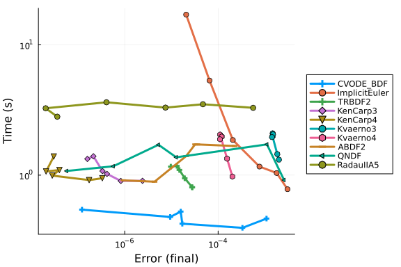
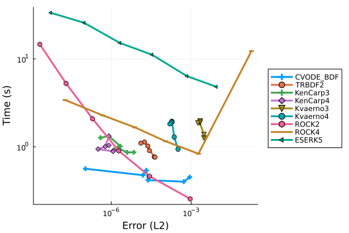
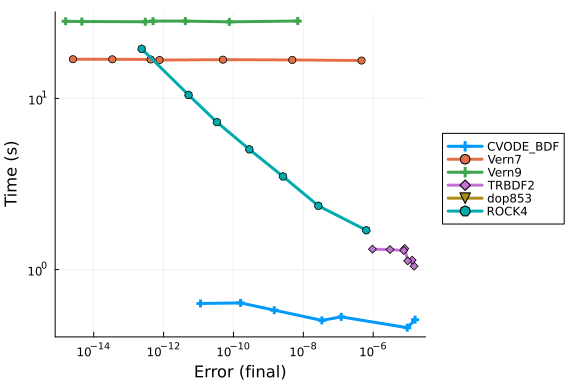

# Filament Benchmark

In this notebook we will benchmark a real-world biological model from a paper entitled [Magnetic dipole with a flexible tail as a self-propelling microdevice](https://doi.org/10.1103/PhysRevE.85.041502). This is a system of PDEs representing a Kirchhoff model of an elastic rod, where the equations of motion are given by the Rouse approximation with free boundary conditions.

## Model Implementation

First we will show the full model implementation. It is not necessary to understand the full model specification in order to understand the benchmark results, but it's all contained here for completeness. The model is highly optimized, with all internal vectors pre-cached, loops unrolled for efficiency (along with `@simd` annotations), a pre-defined Jacobian, matrix multiplications are all in-place, etc. Thus this model is a good stand-in for other optimized PDE solving cases.

The model is thus defined as follows:

```julia
using OrdinaryDiffEq, ODEInterfaceDiffEq, Sundials, DiffEqDevTools, LSODA, LinearSolve
using LinearAlgebra
using Plots
gr()
```

```
Plots.GRBackend()
```


```julia
const T = Float64
abstract type AbstractFilamentCache end
abstract type AbstractMagneticForce end
abstract type AbstractInextensibilityCache end
abstract type AbstractSolver end
abstract type AbstractSolverCache end
```


```julia
struct FerromagneticContinuous <: AbstractMagneticForce
    ω :: T
    F :: Vector{T}
end

mutable struct FilamentCache{
        MagneticForce        <: AbstractMagneticForce,
        InextensibilityCache <: AbstractInextensibilityCache,
        SolverCache          <: AbstractSolverCache
            } <: AbstractFilamentCache
    N  :: Int
    μ  :: T
    Cm :: T
    x  :: SubArray{T,1,Vector{T},Tuple{StepRange{Int,Int}},true}
    y  :: SubArray{T,1,Vector{T},Tuple{StepRange{Int,Int}},true}
    z  :: SubArray{T,1,Vector{T},Tuple{StepRange{Int,Int}},true}
    A  :: Matrix{T}
    P  :: InextensibilityCache
    F  :: MagneticForce
    Sc :: SolverCache
end
```


```julia
struct NoHydroProjectionCache <: AbstractInextensibilityCache
    J         :: Matrix{T}
    P         :: Matrix{T}
    J_JT      :: Matrix{T}
    J_JT_LDLT :: LinearAlgebra.LDLt{T, SymTridiagonal{T}}
    P0        :: Matrix{T}

    NoHydroProjectionCache(N::Int) = new(
        zeros(N, 3*(N+1)),          # J
        zeros(3*(N+1), 3*(N+1)),    # P
        zeros(N,N),                 # J_JT
        LinearAlgebra.LDLt{T,SymTridiagonal{T}}(SymTridiagonal(zeros(N), zeros(N-1))),
        zeros(N, 3*(N+1))
    )
end
```


```julia
struct DiffEqSolverCache <: AbstractSolverCache
    S1 :: Vector{T}
    S2 :: Vector{T}

    DiffEqSolverCache(N::Integer) = new(zeros(T,3*(N+1)), zeros(T,3*(N+1)))
end
```


```julia
function FilamentCache(N=20; Cm=32, ω=200, Solver=SolverDiffEq)
    InextensibilityCache = NoHydroProjectionCache
    SolverCache = DiffEqSolverCache
    tmp = zeros(3*(N+1))
    FilamentCache{FerromagneticContinuous, InextensibilityCache, SolverCache}(
        N, N+1, Cm, view(tmp,1:3:3*(N+1)), view(tmp,2:3:3*(N+1)), view(tmp,3:3:3*(N+1)),
        zeros(3*(N+1), 3*(N+1)), # A
        InextensibilityCache(N), # P
        FerromagneticContinuous(ω, zeros(3*(N+1))),
        SolverCache(N)
    )
end
```

```
Main.var"##WeaveSandBox#292".FilamentCache
```


```julia
function stiffness_matrix!(f::AbstractFilamentCache)
    N, μ, A = f.N, f.μ, f.A
    @inbounds for j in axes(A, 2), i in axes(A, 1)
      A[i, j] = j == i ? 1 : 0
    end
    @inbounds for i in 1 : 3
        A[i,i] =    1
        A[i,3+i] = -2
        A[i,6+i] =  1

        A[3+i,i]   = -2
        A[3+i,3+i] =  5
        A[3+i,6+i] = -4
        A[3+i,9+i] =  1

        A[3*(N-1)+i,3*(N-3)+i] =  1
        A[3*(N-1)+i,3*(N-2)+i] = -4
        A[3*(N-1)+i,3*(N-1)+i] =  5
        A[3*(N-1)+i,3*N+i]     = -2

        A[3*N+i,3*(N-2)+i]     =  1
        A[3*N+i,3*(N-1)+i]     = -2
        A[3*N+i,3*N+i]         =  1

        for j in 2 : N-2
            A[3*j+i,3*j+i]     =  6
            A[3*j+i,3*(j-1)+i] = -4
            A[3*j+i,3*(j+1)+i] = -4
            A[3*j+i,3*(j-2)+i] =  1
            A[3*j+i,3*(j+2)+i] =  1
        end
    end
    rmul!(A, -μ^4)
    nothing
end
```

```
stiffness_matrix! (generic function with 1 method)
```


```julia
function update_separate_coordinates!(f::AbstractFilamentCache, r)
    N, x, y, z = f.N, f.x, f.y, f.z
    @inbounds for i in 1 : length(x)
        x[i] = r[3*i-2]
        y[i] = r[3*i-1]
        z[i] = r[3*i]
    end
    nothing
end

function update_united_coordinates!(f::AbstractFilamentCache, r)
    N, x, y, z = f.N, f.x, f.y, f.z
    @inbounds for i in 1 : length(x)
        r[3*i-2] = x[i]
        r[3*i-1] = y[i]
        r[3*i]   = z[i]
    end
    nothing
end

function update_united_coordinates(f::AbstractFilamentCache)
    r = zeros(T, 3*length(f.x))
    update_united_coordinates!(f, r)
    r
end
```

```
update_united_coordinates (generic function with 1 method)
```


```julia
function initialize!(initial_conf_type::Symbol, f::AbstractFilamentCache)
    N, x, y, z = f.N, f.x, f.y, f.z
    if initial_conf_type == :StraightX
        x .= range(0, stop=1, length=N+1)
        y .= 0
        z .= 0
    else
        error("Unknown initial configuration requested.")
    end
    update_united_coordinates(f)
end
```

```
initialize! (generic function with 1 method)
```


```julia
function magnetic_force!(::FerromagneticContinuous, f::AbstractFilamentCache, t)
    # TODO: generalize this for different magnetic fields as well
    N, μ, Cm, ω, F = f.N, f.μ, f.Cm, f.F.ω, f.F.F
    F[1]         = -μ * Cm * cos(ω*t)
    F[2]         = -μ * Cm * sin(ω*t)
    F[3*(N+1)-2] =  μ * Cm * cos(ω*t)
    F[3*(N+1)-1] =  μ * Cm * sin(ω*t)
    nothing
end
```

```
magnetic_force! (generic function with 1 method)
```


```julia
struct SolverDiffEq <: AbstractSolver end

function (f::FilamentCache)(dr, r, p, t)
    @views f.x, f.y, f.z = r[1:3:end], r[2:3:end], r[3:3:end]
    jacobian!(f)
    projection!(f)
    magnetic_force!(f.F, f, t)
    A, P, F, S1, S2 = f.A, f.P.P, f.F.F, f.Sc.S1, f.Sc.S2

    # implement dr = P * (A*r + F) in an optimized way to avoid temporaries
    mul!(S1, A, r)
    S1 .+= F
    mul!(S2, P, S1)
    copyto!(dr, S2)
    return dr
end
```


```julia
function jacobian!(f::FilamentCache)
    N, x, y, z, J = f.N, f.x, f.y, f.z, f.P.J
    @inbounds for i in 1 : N
        J[i, 3*i-2]     = -2 * (x[i+1]-x[i])
        J[i, 3*i-1]     = -2 * (y[i+1]-y[i])
        J[i, 3*i]       = -2 * (z[i+1]-z[i])
        J[i, 3*(i+1)-2] =  2 * (x[i+1]-x[i])
        J[i, 3*(i+1)-1] =  2 * (y[i+1]-y[i])
        J[i, 3*(i+1)]   =  2 * (z[i+1]-z[i])
    end
    nothing
end
```

```
jacobian! (generic function with 1 method)
```


```julia
function projection!(f::FilamentCache)
    # implement P[:] = I - J'/(J*J')*J in an optimized way to avoid temporaries
    J, P, J_JT, J_JT_LDLT, P0 = f.P.J, f.P.P, f.P.J_JT, f.P.J_JT_LDLT, f.P.P0
    mul!(J_JT, J, J')
    LDLt_inplace!(J_JT_LDLT, J_JT)
    ldiv!(P0, J_JT_LDLT, J)
    mul!(P, P0', J)
    subtract_from_identity!(P)
    nothing
end
```

```
projection! (generic function with 1 method)
```


```julia
function subtract_from_identity!(A)
    lmul!(-1, A)
    @inbounds for i in 1 : size(A,1)
        A[i,i] += 1
    end
    nothing
end
```

```
subtract_from_identity! (generic function with 1 method)
```


```julia
function LDLt_inplace!(L::LinearAlgebra.LDLt{T,SymTridiagonal{T}}, A::Matrix{T}) where {T<:Real}
    n = size(A,1)
    dv, ev = L.data.dv, L.data.ev
    @inbounds for (i,d) in enumerate(diagind(A))
        dv[i] = A[d]
    end
    @inbounds for (i,d) in enumerate(diagind(A,-1))
        ev[i] = A[d]
    end
    @inbounds @simd for i in 1 : n-1
        ev[i]   /= dv[i]
        dv[i+1] -= abs2(ev[i]) * dv[i]
    end
    L
end
```

```
LDLt_inplace! (generic function with 1 method)
```


# Investigating the model

Let's take a look at what results of the model look like:

```julia
function run(::SolverDiffEq; N=20, Cm=32, ω=200, time_end=1., solver=TRBDF2(autodiff=false), reltol=1e-6, abstol=1e-6)
    f = FilamentCache(N, Solver=SolverDiffEq, Cm=Cm, ω=ω)
    r0 = initialize!(:StraightX, f)
    stiffness_matrix!(f)
    prob = ODEProblem(ODEFunction(f, jac=(J, u, p, t)->(mul!(J, f.P.P, f.A); nothing)), r0, (0., time_end))
    sol = solve(prob, solver, dense=false, reltol=reltol, abstol=abstol)
end
```

```
run (generic function with 1 method)
```


This method runs the model with the `TRBDF2` method and the default parameters.

```julia
sol = run(SolverDiffEq())
plot(sol,vars = (0,25))
```


The model quickly falls into a highly oscillatory mode which then dominates throughout the rest of the solution.

# Work-Precision Diagrams

Now let's build the problem and solve it once at high accuracy to get a reference solution:

```julia
N=20
f = FilamentCache(N, Solver=SolverDiffEq)
r0 = initialize!(:StraightX, f)
stiffness_matrix!(f)
prob = ODEProblem(f, r0, (0., 0.01))

sol = solve(prob, Vern9(), reltol=1e-14, abstol=1e-14)
test_sol = TestSolution(sol);
```


## Omissions

```julia
abstols=1 ./10 .^(3:8)
reltols=1 ./10 .^(3:8)
setups = [
    Dict(:alg => CVODE_BDF()),
    Dict(:alg => Rosenbrock23(autodiff=false)),
    Dict(:alg => Rodas4(autodiff=false)),
    Dict(:alg => radau()),
    Dict(:alg=>Exprb43(autodiff=false)),
    Dict(:alg=>Exprb32(autodiff=false)),
    Dict(:alg=>ImplicitEulerExtrapolation(autodiff=false)),
    Dict(:alg=>ImplicitDeuflhardExtrapolation(autodiff=false)),
    Dict(:alg=>ImplicitHairerWannerExtrapolation(autodiff=false)),
    ];

wp = WorkPrecisionSet(prob, abstols, reltols, setups; appxsol=test_sol,
                      maxiters=Int(1e6), verbose = false)
plot(wp)
```


Rosenbrock23, Rodas4, Exprb32, Exprb43, extrapolation methods, and Rodas5 do
not perform well at all and are thus dropped from future tests. For reference,
they are in the 10^(2.5) range in for their most accurate run (with
ImplicitEulerExtrapolation takes over a day to run, and had to be prematurely
stopped), so about 500x slower than CVODE_BDF and
thus make the benchmarks take forever. It looks like `radau` fails on this
problem with high tolerance so its values should be ignored since it exits
early. It is thus removed from the next sections.

The EPIRK methods currently do not work on this problem

```julia
sol = solve(prob, EPIRK4s3B(autodiff=false), dt=2^-3)
```

```
Error: First call to automatic differentiation for the Jacobian
failed. This means that the user `f` function is not compatible
with automatic differentiation. Methods to fix this include:

1. Turn off automatic differentiation (e.g. Rosenbrock23() becomes
   Rosenbrock23(autodiff=false)). More details can befound at
   https://docs.sciml.ai/DiffEqDocs/stable/features/performance_overloads/
2. Improving the compatibility of `f` with ForwardDiff.jl automatic 
   differentiation (using tools like PreallocationTools.jl). More details
   can be found at https://docs.sciml.ai/DiffEqDocs/stable/basics/faq/#Auto
differentiation-and-Dual-Numbers
3. Defining analytical Jacobians. More details can be
   found at https://docs.sciml.ai/DiffEqDocs/stable/types/ode_types/#SciMLB
ase.ODEFunction

Note: turning off automatic differentiation tends to have a very minimal
performance impact (for this use case, because it's forward mode for a
square Jacobian. This is different from optimization gradient scenarios).
However, one should be careful as some methods are more sensitive to
accurate gradients than others. Specifically, Rodas methods like `Rodas4`
and `Rodas5P` require accurate Jacobians in order to have good convergence,
while many other methods like BDF (`QNDF`, `FBDF`), SDIRK (`KenCarp4`),
and Rosenbrock-W (`Rosenbrock23`) do not. Thus if using an algorithm which
is sensitive to autodiff and solving at a low tolerance, please change the
algorithm as well.

MethodError: Cannot `convert` an object of type 
  SubArray{ForwardDiff.Dual{ForwardDiff.Tag{DiffEqBase.OrdinaryDiffEqTag, F
loat64}, Float64, 1},1,Array{ForwardDiff.Dual{ForwardDiff.Tag{DiffEqBase.Or
dinaryDiffEqTag, Float64}, Float64, 1},1},Tuple{StepRange{Int64{},Int64{}}}
,true} to an object of type 
  SubArray{Float64,1,Array{Float64,1},Tuple{StepRange{Int64{},Int64{}}},tru
e}

Closest candidates are:
  convert(::Type{T}, !Matched::LinearAlgebra.Factorization) where T<:Abstra
ctArray
   @ LinearAlgebra /cache/julia-buildkite-plugin/julia_installs/bin/linux/x
64/1.9/julia-1.9-latest-linux-x86_64/share/julia/stdlib/v1.9/LinearAlgebra/
src/factorization.jl:59
  convert(::Type{T}, !Matched::T) where T<:AbstractArray
   @ Base abstractarray.jl:16
  convert(::Type{T}, !Matched::T) where T
   @ Base Base.jl:64
  ...
```


but would be called like:

```julia
abstols=1 ./10 .^(3:5)
reltols=1 ./10 .^(3:5)
setups = [
    Dict(:alg => CVODE_BDF()),
    Dict(:alg => HochOst4(),:dts=>2.0.^(-3:-1:-5)),
    Dict(:alg => EPIRK4s3B(),:dts=>2.0.^(-3:-1:-5)),
    Dict(:alg => EXPRB53s3(),:dts=>2.0.^(-3:-1:-5)),
    ];

wp = WorkPrecisionSet(prob, abstols, reltols, setups; appxsol=test_sol,
                      maxiters=Int(1e6), verbose = false)
plot(wp)
```


## High Tolerance (Low Accuracy)

### Endpoint Error

```julia
abstols=1 ./10 .^(3:8)
reltols=1 ./10 .^(3:8)
setups = [
    Dict(:alg => CVODE_BDF()),
    Dict(:alg => BS3()),
    Dict(:alg => Tsit5()),
    Dict(:alg => ImplicitEuler(autodiff=false)),
    Dict(:alg => Trapezoid(autodiff=false)),
    Dict(:alg => TRBDF2(autodiff=false)),
    Dict(:alg => rodas()),
    Dict(:alg => dop853()),
    Dict(:alg => lsoda()),
    Dict(:alg => ROCK2()),
    Dict(:alg => ROCK4()),
    Dict(:alg => ESERK5())
    ];

wp = WorkPrecisionSet(prob, abstols, reltols, setups; appxsol=test_sol,
                      maxiters=Int(1e6), verbose = false)
plot(wp)
```


```julia
abstols=1 ./10 .^(3:8)
reltols=1 ./10 .^(3:8)
setups = [
    Dict(:alg => CVODE_BDF()),
    Dict(:alg => ImplicitEuler(autodiff=false)),
    Dict(:alg => TRBDF2(autodiff=false)),
    Dict(:alg => KenCarp3(autodiff=false)),
    Dict(:alg => KenCarp4(autodiff=false)),
    Dict(:alg => Kvaerno3(autodiff=false)),
    Dict(:alg => Kvaerno4(autodiff=false)),
    Dict(:alg => ABDF2(autodiff=false)),
    Dict(:alg => QNDF(autodiff=false)),
    Dict(:alg => RadauIIA5(autodiff=false)),
];

wp = WorkPrecisionSet(prob, abstols, reltols, setups; appxsol=test_sol,
                      maxiters=Int(1e6), verbose = false)
plot(wp)
```



```julia
abstols=1 ./10 .^(3:8)
reltols=1 ./10 .^(3:8)
setups = [
    Dict(:alg => CVODE_BDF()),
    Dict(:alg => CVODE_BDF(linear_solver=:GMRES)),
    Dict(:alg => TRBDF2(autodiff=false)),
    Dict(:alg => TRBDF2(autodiff=false,linsolve=KrylovJL_GMRES())),
    Dict(:alg => KenCarp4(autodiff=false)),
    Dict(:alg => KenCarp4(autodiff=false,linsolve=KrylovJL_GMRES())),
];

names = [
    "CVODE-BDF",
    "CVODE-BDF (GMRES)",
    "TRBDF2",
    "TRBDF2 (GMRES)",
    "KenCarp4",
    "KenCarp4 (GMRES)",
];

wp = WorkPrecisionSet(prob, abstols, reltols, setups; names=names, appxsol=test_sol,
                      maxiters=Int(1e6), verbose = false)
plot(wp)
```


### Timeseries Error

```julia
abstols=1 ./10 .^(3:8)
reltols=1 ./10 .^(3:8)
setups = [
    Dict(:alg => CVODE_BDF()),
    Dict(:alg => Trapezoid(autodiff=false)),
    Dict(:alg => TRBDF2(autodiff=false)),
    Dict(:alg => rodas()),
    Dict(:alg => lsoda()),
    Dict(:alg => KenCarp3(autodiff=false)),
    Dict(:alg => KenCarp4(autodiff=false)),
    Dict(:alg => Kvaerno3(autodiff=false)),
    Dict(:alg => Kvaerno4(autodiff=false)),
    Dict(:alg => ROCK2()),
    Dict(:alg => ROCK4()),
    Dict(:alg => ESERK5())
];

wp = WorkPrecisionSet(prob, abstols, reltols, setups; appxsol=test_sol,
                      maxiters=Int(1e6), verbose = false)
plot(wp)
```


Timeseries errors seem to match final point errors very closely in this problem,
so these are turned off in future benchmarks.

(Confirmed in the other cases)

### Dense Error

```julia
abstols=1 ./10 .^(3:8)
reltols=1 ./10 .^(3:8)
setups = [
    Dict(:alg => CVODE_BDF()),
    Dict(:alg => TRBDF2(autodiff=false)),
    Dict(:alg => KenCarp3(autodiff=false)),
    Dict(:alg => KenCarp4(autodiff=false)),
    Dict(:alg => Kvaerno3(autodiff=false)),
    Dict(:alg => Kvaerno4(autodiff=false)),
    Dict(:alg => ROCK2()),
    Dict(:alg => ROCK4()),
    Dict(:alg => ESERK5())
];

wp = WorkPrecisionSet(prob, abstols, reltols, setups; appxsol=test_sol,
                      maxiters=Int(1e6), verbose = false, dense_errors = true, error_estimate=:L2)
plot(wp)
```




Dense errors seem to match timeseries errors very closely in this problem, so
these are turned off in future benchmarks.

(Confirmed in the other cases)

## Low Tolerance (High Accuracy)

```julia
abstols=1 ./10 .^(6:12)
reltols=1 ./10 .^(6:12)
setups = [
    Dict(:alg => CVODE_BDF()),
    Dict(:alg => Vern7()),
    Dict(:alg => Vern9()),
    Dict(:alg => TRBDF2(autodiff=false)),
    Dict(:alg => dop853()),
    Dict(:alg => ROCK4())
];

wp = WorkPrecisionSet(prob, abstols, reltols, setups; appxsol=test_sol,
                      maxiters=Int(1e6), verbose = false)
plot(wp)
```



```julia
abstols=1 ./10 .^(6:12)
reltols=1 ./10 .^(6:12)
setups = [
    Dict(:alg => CVODE_BDF()),
    Dict(:alg => radau()),
    Dict(:alg => RadauIIA5(autodiff=false)),
    Dict(:alg => TRBDF2(autodiff=false)),
    Dict(:alg => Kvaerno3(autodiff=false)),
    Dict(:alg => KenCarp3(autodiff=false)),
    Dict(:alg => Kvaerno4(autodiff=false)),
    Dict(:alg => KenCarp4(autodiff=false)),
    Dict(:alg => Kvaerno5(autodiff=false)),
    Dict(:alg => KenCarp5(autodiff=false)),
    Dict(:alg => lsoda()),
];

wp = WorkPrecisionSet(prob, abstols, reltols, setups; appxsol=test_sol,
                                    maxiters=Int(1e6), verbose = false)
plot(wp)
```


### Timeseries Error

```julia
abstols=1 ./10 .^(6:12)
reltols=1 ./10 .^(6:12)
setups = [
    Dict(:alg => CVODE_BDF()),
    Dict(:alg => radau()),
    Dict(:alg => RadauIIA5(autodiff=false)),
    Dict(:alg => TRBDF2(autodiff=false)),
    Dict(:alg => Kvaerno3(autodiff=false)),
    Dict(:alg => KenCarp3(autodiff=false)),
    Dict(:alg => Kvaerno4(autodiff=false)),
    Dict(:alg => KenCarp4(autodiff=false)),
    Dict(:alg => Kvaerno5(autodiff=false)),
    Dict(:alg => KenCarp5(autodiff=false)),
    Dict(:alg => lsoda()),
];

wp = WorkPrecisionSet(prob, abstols, reltols, setups; appxsol=test_sol,
                      maxiters=Int(1e6), verbose = false, error_estimate = :l2)
plot(wp)
```


### Dense Error

```julia
abstols=1 ./10 .^(6:12)
reltols=1 ./10 .^(6:12)
setups = [
    Dict(:alg => CVODE_BDF()),
    Dict(:alg => radau()),
    Dict(:alg => RadauIIA5(autodiff=false)),
    Dict(:alg => TRBDF2(autodiff=false)),
    Dict(:alg => Kvaerno3(autodiff=false)),
    Dict(:alg => KenCarp3(autodiff=false)),
    Dict(:alg => Kvaerno4(autodiff=false)),
    Dict(:alg => KenCarp4(autodiff=false)),
    Dict(:alg => Kvaerno5(autodiff=false)),
    Dict(:alg => KenCarp5(autodiff=false)),
    Dict(:alg => lsoda()),
];

wp = WorkPrecisionSet(prob, abstols, reltols, setups; appxsol=test_sol,
                      maxiters=Int(1e6), verbose = false, dense_errors=true, error_estimate = :L2)
plot(wp)
```


# No Jacobian Work-Precision Diagrams

In the previous cases the analytical Jacobian is given and is used by the solvers. Now we will solve the same problem without the analytical Jacobian.

Note that the pre-caching means that the model is not compatible with autodifferentiation by ForwardDiff. Thus all of the native Julia solvers are set to `autodiff=false` to use DiffEqDiffTools.jl's numerical differentiation backend. We'll only benchmark the methods that did well before.

```julia
N=20
f = FilamentCache(N, Solver=SolverDiffEq)
r0 = initialize!(:StraightX, f)
stiffness_matrix!(f)
prob = ODEProblem(ODEFunction(f, jac=nothing), r0, (0., 0.01))

sol = solve(prob, Vern9(), reltol=1e-14, abstol=1e-14)
test_sol = TestSolution(sol.t, sol.u);
```


## High Tolerance (Low Accuracy)

```julia
abstols=1 ./10 .^(3:8)
reltols=1 ./10 .^(3:8)
setups = [
    Dict(:alg => CVODE_BDF()),
    Dict(:alg => BS3()),
    Dict(:alg => Tsit5()),
    Dict(:alg => ImplicitEuler(autodiff=false)),
    Dict(:alg => Trapezoid(autodiff=false)),
    Dict(:alg => TRBDF2(autodiff=false)),
    Dict(:alg => rodas()),
    Dict(:alg => dop853()),
    Dict(:alg => lsoda())
    ];

wp = WorkPrecisionSet(prob, abstols, reltols, setups; appxsol=test_sol,
                      maxiters=Int(1e6), verbose = false)
plot(wp)
```


```julia
abstols=1 ./10 .^(3:8)
reltols=1 ./10 .^(3:8)
setups = [
    Dict(:alg => CVODE_BDF()),
    Dict(:alg => BS3()),
    Dict(:alg => Tsit5()),
    Dict(:alg => ImplicitEuler(autodiff=false)),
    Dict(:alg => Trapezoid(autodiff=false)),
    Dict(:alg => TRBDF2(autodiff=false)),
    Dict(:alg => rodas()),
    Dict(:alg => dop853()),
    Dict(:alg => lsoda()),
    Dict(:alg => ROCK2()),
    Dict(:alg => ROCK4()),
    Dict(:alg => ESERK5())
    ];

wp = WorkPrecisionSet(prob, abstols, reltols, setups; appxsol=test_sol,
                      maxiters=Int(1e6), verbose = false)
plot(wp)
```


```julia
abstols=1 ./10 .^(3:8)
reltols=1 ./10 .^(3:8)
setups = [
    Dict(:alg => CVODE_BDF()),
    Dict(:alg => CVODE_BDF(linear_solver=:GMRES)),
    Dict(:alg => TRBDF2(autodiff=false)),
    Dict(:alg => TRBDF2(autodiff=false,linsolve=KrylovJL_GMRES())),
    Dict(:alg => KenCarp4(autodiff=false)),
    Dict(:alg => KenCarp4(autodiff=false,linsolve=KrylovJL_GMRES())),
];

names = [
    "CVODE-BDF",
    "CVODE-BDF (GMRES)",
    "TRBDF2",
    "TRBDF2 (GMRES)",
    "KenCarp4",
    "KenCarp4 (GMRES)",
];

wp = WorkPrecisionSet(prob, abstols, reltols, setups; names=names, appxsol=test_sol,
                      maxiters=Int(1e6), verbose = false)
plot(wp)
```


## Low Tolerance (High Accuracy)

```julia
abstols=1 ./10 .^(6:12)
reltols=1 ./10 .^(6:12)
setups = [
    Dict(:alg => CVODE_BDF()),
    Dict(:alg => radau()),
    Dict(:alg => RadauIIA5(autodiff=false)),
    Dict(:alg => TRBDF2(autodiff=false)),
    Dict(:alg => Kvaerno3(autodiff=false)),
    Dict(:alg => KenCarp3(autodiff=false)),
    Dict(:alg => Kvaerno4(autodiff=false)),
    Dict(:alg => KenCarp4(autodiff=false)),
    Dict(:alg => Kvaerno5(autodiff=false)),
    Dict(:alg => KenCarp5(autodiff=false)),
    Dict(:alg => lsoda()),
];
wp = WorkPrecisionSet(prob, abstols, reltols, setups; appxsol=test_sol,
                                    maxiters=Int(1e6), verbose = false)
plot(wp)
```


## Conclusion

Sundials' `CVODE_BDF` does the best in this test. When the Jacobian is given, the ESDIRK methods `TRBDF2` and `KenCarp3` are able to do almost as well as it until `<1e-6` error is needed. When Jacobians are not given, Sundials is the fastest without competition.

```
Error: ArgumentError: Package SciMLBenchmarks not found in current path, ma
ybe you meant `import/using ..SciMLBenchmarks`.
- Otherwise, run `import Pkg; Pkg.add("SciMLBenchmarks")` to install the Sc
iMLBenchmarks package.
```


