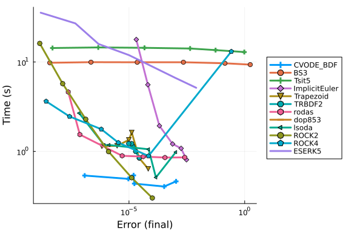
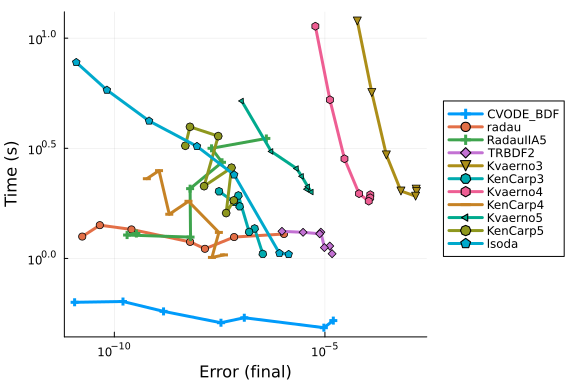
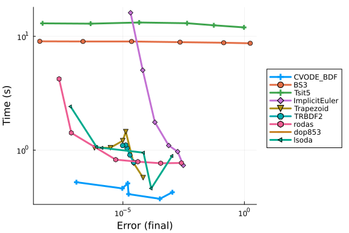
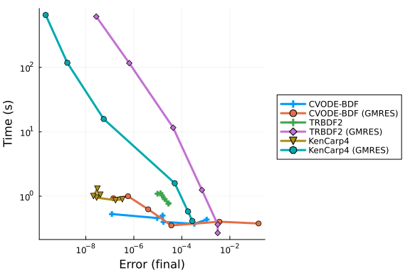
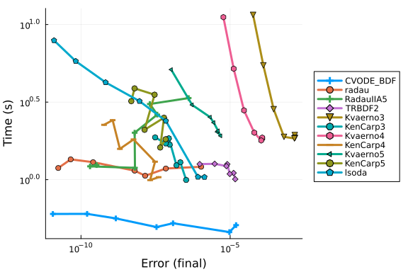

# Filament Benchmark

In this notebook we will benchmark a real-world biological model from a paper entitled [Magnetic dipole with a flexible tail as a self-propelling microdevice](https://doi.org/10.1103/PhysRevE.85.041502). This is a system of PDEs representing a Kirchhoff model of an elastic rod, where the equations of motion are given by the Rouse approximation with free boundary conditions.

## Model Implementation

First we will show the full model implementation. It is not necessary to understand the full model specification in order to understand the benchmark results, but it's all contained here for completeness. The model is highly optimized, with all internal vectors pre-cached, loops unrolled for efficiency (along with `@simd` annotations), a pre-defined Jacobian, matrix multiplications are all in-place, etc. Thus this model is a good stand-in for other optimized PDE solving cases.

The model is thus defined as follows:

```julia
using OrdinaryDiffEq, ODEInterfaceDiffEq, Sundials, DiffEqDevTools, LSODA, LinearSolve
using LinearAlgebra
using Plots
gr()
```

```
Plots.GRBackend()
```


```julia
const T = Float64
abstract type AbstractFilamentCache end
abstract type AbstractMagneticForce end
abstract type AbstractInextensibilityCache end
abstract type AbstractSolver end
abstract type AbstractSolverCache end
```


```julia
struct FerromagneticContinuous <: AbstractMagneticForce
    ω :: T
    F :: Vector{T}
end

mutable struct FilamentCache{
        MagneticForce        <: AbstractMagneticForce,
        InextensibilityCache <: AbstractInextensibilityCache,
        SolverCache          <: AbstractSolverCache
            } <: AbstractFilamentCache
    N  :: Int
    μ  :: T
    Cm :: T
    x  :: SubArray{T,1,Vector{T},Tuple{StepRange{Int,Int}},true}
    y  :: SubArray{T,1,Vector{T},Tuple{StepRange{Int,Int}},true}
    z  :: SubArray{T,1,Vector{T},Tuple{StepRange{Int,Int}},true}
    A  :: Matrix{T}
    P  :: InextensibilityCache
    F  :: MagneticForce
    Sc :: SolverCache
end
```


```julia
struct NoHydroProjectionCache <: AbstractInextensibilityCache
    J         :: Matrix{T}
    P         :: Matrix{T}
    J_JT      :: Matrix{T}
    J_JT_LDLT :: LinearAlgebra.LDLt{T, SymTridiagonal{T}}
    P0        :: Matrix{T}

    NoHydroProjectionCache(N::Int) = new(
        zeros(N, 3*(N+1)),          # J
        zeros(3*(N+1), 3*(N+1)),    # P
        zeros(N,N),                 # J_JT
        LinearAlgebra.LDLt{T,SymTridiagonal{T}}(SymTridiagonal(zeros(N), zeros(N-1))),
        zeros(N, 3*(N+1))
    )
end
```


```julia
struct DiffEqSolverCache <: AbstractSolverCache
    S1 :: Vector{T}
    S2 :: Vector{T}

    DiffEqSolverCache(N::Integer) = new(zeros(T,3*(N+1)), zeros(T,3*(N+1)))
end
```


```julia
function FilamentCache(N=20; Cm=32, ω=200, Solver=SolverDiffEq)
    InextensibilityCache = NoHydroProjectionCache
    SolverCache = DiffEqSolverCache
    tmp = zeros(3*(N+1))
    FilamentCache{FerromagneticContinuous, InextensibilityCache, SolverCache}(
        N, N+1, Cm, view(tmp,1:3:3*(N+1)), view(tmp,2:3:3*(N+1)), view(tmp,3:3:3*(N+1)),
        zeros(3*(N+1), 3*(N+1)), # A
        InextensibilityCache(N), # P
        FerromagneticContinuous(ω, zeros(3*(N+1))),
        SolverCache(N)
    )
end
```

```
Main.var"##WeaveSandBox#225".FilamentCache
```


```julia
function stiffness_matrix!(f::AbstractFilamentCache)
    N, μ, A = f.N, f.μ, f.A
    @inbounds for j in axes(A, 2), i in axes(A, 1)
      A[i, j] = j == i ? 1 : 0
    end
    @inbounds for i in 1 : 3
        A[i,i] =    1
        A[i,3+i] = -2
        A[i,6+i] =  1

        A[3+i,i]   = -2
        A[3+i,3+i] =  5
        A[3+i,6+i] = -4
        A[3+i,9+i] =  1

        A[3*(N-1)+i,3*(N-3)+i] =  1
        A[3*(N-1)+i,3*(N-2)+i] = -4
        A[3*(N-1)+i,3*(N-1)+i] =  5
        A[3*(N-1)+i,3*N+i]     = -2

        A[3*N+i,3*(N-2)+i]     =  1
        A[3*N+i,3*(N-1)+i]     = -2
        A[3*N+i,3*N+i]         =  1

        for j in 2 : N-2
            A[3*j+i,3*j+i]     =  6
            A[3*j+i,3*(j-1)+i] = -4
            A[3*j+i,3*(j+1)+i] = -4
            A[3*j+i,3*(j-2)+i] =  1
            A[3*j+i,3*(j+2)+i] =  1
        end
    end
    rmul!(A, -μ^4)
    nothing
end
```

```
stiffness_matrix! (generic function with 1 method)
```


```julia
function update_separate_coordinates!(f::AbstractFilamentCache, r)
    N, x, y, z = f.N, f.x, f.y, f.z
    @inbounds for i in 1 : length(x)
        x[i] = r[3*i-2]
        y[i] = r[3*i-1]
        z[i] = r[3*i]
    end
    nothing
end

function update_united_coordinates!(f::AbstractFilamentCache, r)
    N, x, y, z = f.N, f.x, f.y, f.z
    @inbounds for i in 1 : length(x)
        r[3*i-2] = x[i]
        r[3*i-1] = y[i]
        r[3*i]   = z[i]
    end
    nothing
end

function update_united_coordinates(f::AbstractFilamentCache)
    r = zeros(T, 3*length(f.x))
    update_united_coordinates!(f, r)
    r
end
```

```
update_united_coordinates (generic function with 1 method)
```


```julia
function initialize!(initial_conf_type::Symbol, f::AbstractFilamentCache)
    N, x, y, z = f.N, f.x, f.y, f.z
    if initial_conf_type == :StraightX
        x .= range(0, stop=1, length=N+1)
        y .= 0
        z .= 0
    else
        error("Unknown initial configuration requested.")
    end
    update_united_coordinates(f)
end
```

```
initialize! (generic function with 1 method)
```


```julia
function magnetic_force!(::FerromagneticContinuous, f::AbstractFilamentCache, t)
    # TODO: generalize this for different magnetic fields as well
    N, μ, Cm, ω, F = f.N, f.μ, f.Cm, f.F.ω, f.F.F
    F[1]         = -μ * Cm * cos(ω*t)
    F[2]         = -μ * Cm * sin(ω*t)
    F[3*(N+1)-2] =  μ * Cm * cos(ω*t)
    F[3*(N+1)-1] =  μ * Cm * sin(ω*t)
    nothing
end
```

```
magnetic_force! (generic function with 1 method)
```


```julia
struct SolverDiffEq <: AbstractSolver end

function (f::FilamentCache)(dr, r, p, t)
    @views f.x, f.y, f.z = r[1:3:end], r[2:3:end], r[3:3:end]
    jacobian!(f)
    projection!(f)
    magnetic_force!(f.F, f, t)
    A, P, F, S1, S2 = f.A, f.P.P, f.F.F, f.Sc.S1, f.Sc.S2

    # implement dr = P * (A*r + F) in an optimized way to avoid temporaries
    mul!(S1, A, r)
    S1 .+= F
    mul!(S2, P, S1)
    copyto!(dr, S2)
    return dr
end
```


```julia
function jacobian!(f::FilamentCache)
    N, x, y, z, J = f.N, f.x, f.y, f.z, f.P.J
    @inbounds for i in 1 : N
        J[i, 3*i-2]     = -2 * (x[i+1]-x[i])
        J[i, 3*i-1]     = -2 * (y[i+1]-y[i])
        J[i, 3*i]       = -2 * (z[i+1]-z[i])
        J[i, 3*(i+1)-2] =  2 * (x[i+1]-x[i])
        J[i, 3*(i+1)-1] =  2 * (y[i+1]-y[i])
        J[i, 3*(i+1)]   =  2 * (z[i+1]-z[i])
    end
    nothing
end
```

```
jacobian! (generic function with 1 method)
```


```julia
function projection!(f::FilamentCache)
    # implement P[:] = I - J'/(J*J')*J in an optimized way to avoid temporaries
    J, P, J_JT, J_JT_LDLT, P0 = f.P.J, f.P.P, f.P.J_JT, f.P.J_JT_LDLT, f.P.P0
    mul!(J_JT, J, J')
    LDLt_inplace!(J_JT_LDLT, J_JT)
    ldiv!(P0, J_JT_LDLT, J)
    mul!(P, P0', J)
    subtract_from_identity!(P)
    nothing
end
```

```
projection! (generic function with 1 method)
```


```julia
function subtract_from_identity!(A)
    lmul!(-1, A)
    @inbounds for i in 1 : size(A,1)
        A[i,i] += 1
    end
    nothing
end
```

```
subtract_from_identity! (generic function with 1 method)
```


```julia
function LDLt_inplace!(L::LinearAlgebra.LDLt{T,SymTridiagonal{T}}, A::Matrix{T}) where {T<:Real}
    n = size(A,1)
    dv, ev = L.data.dv, L.data.ev
    @inbounds for (i,d) in enumerate(diagind(A))
        dv[i] = A[d]
    end
    @inbounds for (i,d) in enumerate(diagind(A,-1))
        ev[i] = A[d]
    end
    @inbounds @simd for i in 1 : n-1
        ev[i]   /= dv[i]
        dv[i+1] -= abs2(ev[i]) * dv[i]
    end
    L
end
```

```
LDLt_inplace! (generic function with 1 method)
```


# Investigating the model

Let's take a look at what results of the model look like:

```julia
function run(::SolverDiffEq; N=20, Cm=32, ω=200, time_end=1., solver=TRBDF2(autodiff=false), reltol=1e-6, abstol=1e-6)
    f = FilamentCache(N, Solver=SolverDiffEq, Cm=Cm, ω=ω)
    r0 = initialize!(:StraightX, f)
    stiffness_matrix!(f)
    prob = ODEProblem(ODEFunction(f, jac=(J, u, p, t)->(mul!(J, f.P.P, f.A); nothing)), r0, (0., time_end))
    sol = solve(prob, solver, dense=false, reltol=reltol, abstol=abstol)
end
```

```
run (generic function with 1 method)
```


This method runs the model with the `TRBDF2` method and the default parameters.

```julia
sol = run(SolverDiffEq())
plot(sol,vars = (0,25))
```


The model quickly falls into a highly oscillatory mode which then dominates throughout the rest of the solution.

# Work-Precision Diagrams

Now let's build the problem and solve it once at high accuracy to get a reference solution:

```julia
N=20
f = FilamentCache(N, Solver=SolverDiffEq)
r0 = initialize!(:StraightX, f)
stiffness_matrix!(f)
prob = ODEProblem(f, r0, (0., 0.01))

sol = solve(prob, Vern9(), reltol=1e-14, abstol=1e-14)
test_sol = TestSolution(sol);
```


## Omissions

```julia
abstols=1 ./10 .^(3:8)
reltols=1 ./10 .^(3:8)
setups = [
    Dict(:alg => CVODE_BDF()),
    Dict(:alg => Rosenbrock23(autodiff=false)),
    Dict(:alg => Rodas4(autodiff=false)),
    Dict(:alg => radau()),
    Dict(:alg=>Exprb43(autodiff=false)),
    Dict(:alg=>Exprb32(autodiff=false)),
    Dict(:alg=>ImplicitEulerExtrapolation(autodiff=false)),
    Dict(:alg=>ImplicitDeuflhardExtrapolation(autodiff=false)),
    Dict(:alg=>ImplicitHairerWannerExtrapolation(autodiff=false)),
    ];

wp = WorkPrecisionSet(prob, abstols, reltols, setups; appxsol=test_sol,
                      maxiters=Int(1e6), verbose = false)
plot(wp)
```


Rosenbrock23, Rodas4, Exprb32, Exprb43, extrapolation methods, and Rodas5 do
not perform well at all and are thus dropped from future tests. For reference,
they are in the 10^(2.5) range in for their most accurate run (with
ImplicitEulerExtrapolation takes over a day to run, and had to be prematurely
stopped), so about 500x slower than CVODE_BDF and
thus make the benchmarks take forever. It looks like `radau` fails on this
problem with high tolerance so its values should be ignored since it exits
early. It is thus removed from the next sections.

The EPIRK methods currently do not work on this problem

```julia
sol = solve(prob, EPIRK4s3B(autodiff=false), dt=2^-3)
```

```
retcode: Success
Interpolation: 3rd order Hermite
t: 2-element Vector{Float64}:
 0.0
 0.01
u: 2-element Vector{Vector{Float64}}:
 [0.0, 0.0, 0.0, 0.05, 0.0, 0.0, 0.1, 0.0, 0.0, 0.15  …  0.0, 0.9, 0.0, 0.0
, 0.95, 0.0, 0.0, 1.0, 0.0, 0.0]
 [-1.0564023729860616e-12, 3.10219488065998, 0.0, 0.04999999999894986, 0.0,
 0.0, 0.09999999999894613, 0.0, 0.0, 0.14999999999894725  …  0.0, 0.8999999
99998957, 0.0, 0.0, 0.9499999999989591, 0.0, 0.0, 0.9999999999989587, -3.10
21948806599795, 0.0]
```


but would be called like:

```julia
abstols=1 ./10 .^(3:5)
reltols=1 ./10 .^(3:5)
setups = [
    Dict(:alg => CVODE_BDF()),
    Dict(:alg => HochOst4(),:dts=>2.0.^(-3:-1:-5)),
    Dict(:alg => EPIRK4s3B(),:dts=>2.0.^(-3:-1:-5)),
    Dict(:alg => EXPRB53s3(),:dts=>2.0.^(-3:-1:-5)),
    ];

wp = WorkPrecisionSet(prob, abstols, reltols, setups; appxsol=test_sol,
                      maxiters=Int(1e6), verbose = false)
plot(wp)
```


## High Tolerance (Low Accuracy)

### Endpoint Error

```julia
abstols=1 ./10 .^(3:8)
reltols=1 ./10 .^(3:8)
setups = [
    Dict(:alg => CVODE_BDF()),
    Dict(:alg => BS3()),
    Dict(:alg => Tsit5()),
    Dict(:alg => ImplicitEuler(autodiff=false)),
    Dict(:alg => Trapezoid(autodiff=false)),
    Dict(:alg => TRBDF2(autodiff=false)),
    Dict(:alg => rodas()),
    Dict(:alg => dop853()),
    Dict(:alg => lsoda()),
    Dict(:alg => ROCK2()),
    Dict(:alg => ROCK4()),
    Dict(:alg => ESERK5())
    ];

wp = WorkPrecisionSet(prob, abstols, reltols, setups; appxsol=test_sol,
                      maxiters=Int(1e6), verbose = false)
plot(wp)
```



```julia
abstols=1 ./10 .^(3:8)
reltols=1 ./10 .^(3:8)
setups = [
    Dict(:alg => CVODE_BDF()),
    Dict(:alg => ImplicitEuler(autodiff=false)),
    Dict(:alg => TRBDF2(autodiff=false)),
    Dict(:alg => KenCarp3(autodiff=false)),
    Dict(:alg => KenCarp4(autodiff=false)),
    Dict(:alg => Kvaerno3(autodiff=false)),
    Dict(:alg => Kvaerno4(autodiff=false)),
    Dict(:alg => ABDF2(autodiff=false)),
    Dict(:alg => QNDF(autodiff=false)),
    Dict(:alg => RadauIIA5(autodiff=false)),
];

wp = WorkPrecisionSet(prob, abstols, reltols, setups; appxsol=test_sol,
                      maxiters=Int(1e6), verbose = false)
plot(wp)
```


```julia
abstols=1 ./10 .^(3:8)
reltols=1 ./10 .^(3:8)
setups = [
    Dict(:alg => CVODE_BDF()),
    Dict(:alg => CVODE_BDF(linear_solver=:GMRES)),
    Dict(:alg => TRBDF2(autodiff=false)),
    Dict(:alg => TRBDF2(autodiff=false,linsolve=KrylovJL_GMRES())),
    Dict(:alg => KenCarp4(autodiff=false)),
    Dict(:alg => KenCarp4(autodiff=false,linsolve=KrylovJL_GMRES())),
];

names = [
    "CVODE-BDF",
    "CVODE-BDF (GMRES)",
    "TRBDF2",
    "TRBDF2 (GMRES)",
    "KenCarp4",
    "KenCarp4 (GMRES)",
];

wp = WorkPrecisionSet(prob, abstols, reltols, setups; names=names, appxsol=test_sol,
                      maxiters=Int(1e6), verbose = false)
plot(wp)
```


### Timeseries Error

```julia
abstols=1 ./10 .^(3:8)
reltols=1 ./10 .^(3:8)
setups = [
    Dict(:alg => CVODE_BDF()),
    Dict(:alg => Trapezoid(autodiff=false)),
    Dict(:alg => TRBDF2(autodiff=false)),
    Dict(:alg => rodas()),
    Dict(:alg => lsoda()),
    Dict(:alg => KenCarp3(autodiff=false)),
    Dict(:alg => KenCarp4(autodiff=false)),
    Dict(:alg => Kvaerno3(autodiff=false)),
    Dict(:alg => Kvaerno4(autodiff=false)),
    Dict(:alg => ROCK2()),
    Dict(:alg => ROCK4()),
    Dict(:alg => ESERK5())
];

wp = WorkPrecisionSet(prob, abstols, reltols, setups; appxsol=test_sol,
                      maxiters=Int(1e6), verbose = false)
plot(wp)
```


Timeseries errors seem to match final point errors very closely in this problem,
so these are turned off in future benchmarks.

(Confirmed in the other cases)

### Dense Error

```julia
abstols=1 ./10 .^(3:8)
reltols=1 ./10 .^(3:8)
setups = [
    Dict(:alg => CVODE_BDF()),
    Dict(:alg => TRBDF2(autodiff=false)),
    Dict(:alg => KenCarp3(autodiff=false)),
    Dict(:alg => KenCarp4(autodiff=false)),
    Dict(:alg => Kvaerno3(autodiff=false)),
    Dict(:alg => Kvaerno4(autodiff=false)),
    Dict(:alg => ROCK2()),
    Dict(:alg => ROCK4()),
    Dict(:alg => ESERK5())
];

wp = WorkPrecisionSet(prob, abstols, reltols, setups; appxsol=test_sol,
                      maxiters=Int(1e6), verbose = false, dense_errors = true, error_estimate=:L2)
plot(wp)
```


Dense errors seem to match timeseries errors very closely in this problem, so
these are turned off in future benchmarks.

(Confirmed in the other cases)

## Low Tolerance (High Accuracy)

```julia
abstols=1 ./10 .^(6:12)
reltols=1 ./10 .^(6:12)
setups = [
    Dict(:alg => CVODE_BDF()),
    Dict(:alg => Vern7()),
    Dict(:alg => Vern9()),
    Dict(:alg => TRBDF2(autodiff=false)),
    Dict(:alg => dop853()),
    Dict(:alg => ROCK4())
];

wp = WorkPrecisionSet(prob, abstols, reltols, setups; appxsol=test_sol,
                      maxiters=Int(1e6), verbose = false)
plot(wp)
```


```julia
abstols=1 ./10 .^(6:12)
reltols=1 ./10 .^(6:12)
setups = [
    Dict(:alg => CVODE_BDF()),
    Dict(:alg => radau()),
    Dict(:alg => RadauIIA5(autodiff=false)),
    Dict(:alg => TRBDF2(autodiff=false)),
    Dict(:alg => Kvaerno3(autodiff=false)),
    Dict(:alg => KenCarp3(autodiff=false)),
    Dict(:alg => Kvaerno4(autodiff=false)),
    Dict(:alg => KenCarp4(autodiff=false)),
    Dict(:alg => Kvaerno5(autodiff=false)),
    Dict(:alg => KenCarp5(autodiff=false)),
    Dict(:alg => lsoda()),
];

wp = WorkPrecisionSet(prob, abstols, reltols, setups; appxsol=test_sol,
                                    maxiters=Int(1e6), verbose = false)
plot(wp)
```




### Timeseries Error

```julia
abstols=1 ./10 .^(6:12)
reltols=1 ./10 .^(6:12)
setups = [
    Dict(:alg => CVODE_BDF()),
    Dict(:alg => radau()),
    Dict(:alg => RadauIIA5(autodiff=false)),
    Dict(:alg => TRBDF2(autodiff=false)),
    Dict(:alg => Kvaerno3(autodiff=false)),
    Dict(:alg => KenCarp3(autodiff=false)),
    Dict(:alg => Kvaerno4(autodiff=false)),
    Dict(:alg => KenCarp4(autodiff=false)),
    Dict(:alg => Kvaerno5(autodiff=false)),
    Dict(:alg => KenCarp5(autodiff=false)),
    Dict(:alg => lsoda()),
];

wp = WorkPrecisionSet(prob, abstols, reltols, setups; appxsol=test_sol,
                      maxiters=Int(1e6), verbose = false, error_estimate = :l2)
plot(wp)
```


### Dense Error

```julia
abstols=1 ./10 .^(6:12)
reltols=1 ./10 .^(6:12)
setups = [
    Dict(:alg => CVODE_BDF()),
    Dict(:alg => radau()),
    Dict(:alg => RadauIIA5(autodiff=false)),
    Dict(:alg => TRBDF2(autodiff=false)),
    Dict(:alg => Kvaerno3(autodiff=false)),
    Dict(:alg => KenCarp3(autodiff=false)),
    Dict(:alg => Kvaerno4(autodiff=false)),
    Dict(:alg => KenCarp4(autodiff=false)),
    Dict(:alg => Kvaerno5(autodiff=false)),
    Dict(:alg => KenCarp5(autodiff=false)),
    Dict(:alg => lsoda()),
];

wp = WorkPrecisionSet(prob, abstols, reltols, setups; appxsol=test_sol,
                      maxiters=Int(1e6), verbose = false, dense_errors=true, error_estimate = :L2)
plot(wp)
```


# No Jacobian Work-Precision Diagrams

In the previous cases the analytical Jacobian is given and is used by the solvers. Now we will solve the same problem without the analytical Jacobian.

Note that the pre-caching means that the model is not compatible with autodifferentiation by ForwardDiff. Thus all of the native Julia solvers are set to `autodiff=false` to use DiffEqDiffTools.jl's numerical differentiation backend. We'll only benchmark the methods that did well before.

```julia
N=20
f = FilamentCache(N, Solver=SolverDiffEq)
r0 = initialize!(:StraightX, f)
stiffness_matrix!(f)
prob = ODEProblem(ODEFunction(f, jac=nothing), r0, (0., 0.01))

sol = solve(prob, Vern9(), reltol=1e-14, abstol=1e-14)
test_sol = TestSolution(sol.t, sol.u);
```


## High Tolerance (Low Accuracy)

```julia
abstols=1 ./10 .^(3:8)
reltols=1 ./10 .^(3:8)
setups = [
    Dict(:alg => CVODE_BDF()),
    Dict(:alg => BS3()),
    Dict(:alg => Tsit5()),
    Dict(:alg => ImplicitEuler(autodiff=false)),
    Dict(:alg => Trapezoid(autodiff=false)),
    Dict(:alg => TRBDF2(autodiff=false)),
    Dict(:alg => rodas()),
    Dict(:alg => dop853()),
    Dict(:alg => lsoda())
    ];

wp = WorkPrecisionSet(prob, abstols, reltols, setups; appxsol=test_sol,
                      maxiters=Int(1e6), verbose = false)
plot(wp)
```



```julia
abstols=1 ./10 .^(3:8)
reltols=1 ./10 .^(3:8)
setups = [
    Dict(:alg => CVODE_BDF()),
    Dict(:alg => BS3()),
    Dict(:alg => Tsit5()),
    Dict(:alg => ImplicitEuler(autodiff=false)),
    Dict(:alg => Trapezoid(autodiff=false)),
    Dict(:alg => TRBDF2(autodiff=false)),
    Dict(:alg => rodas()),
    Dict(:alg => dop853()),
    Dict(:alg => lsoda()),
    Dict(:alg => ROCK2()),
    Dict(:alg => ROCK4()),
    Dict(:alg => ESERK5())
    ];

wp = WorkPrecisionSet(prob, abstols, reltols, setups; appxsol=test_sol,
                      maxiters=Int(1e6), verbose = false)
plot(wp)
```


```julia
abstols=1 ./10 .^(3:8)
reltols=1 ./10 .^(3:8)
setups = [
    Dict(:alg => CVODE_BDF()),
    Dict(:alg => CVODE_BDF(linear_solver=:GMRES)),
    Dict(:alg => TRBDF2(autodiff=false)),
    Dict(:alg => TRBDF2(autodiff=false,linsolve=KrylovJL_GMRES())),
    Dict(:alg => KenCarp4(autodiff=false)),
    Dict(:alg => KenCarp4(autodiff=false,linsolve=KrylovJL_GMRES())),
];

names = [
    "CVODE-BDF",
    "CVODE-BDF (GMRES)",
    "TRBDF2",
    "TRBDF2 (GMRES)",
    "KenCarp4",
    "KenCarp4 (GMRES)",
];

wp = WorkPrecisionSet(prob, abstols, reltols, setups; names=names, appxsol=test_sol,
                      maxiters=Int(1e6), verbose = false)
plot(wp)
```




## Low Tolerance (High Accuracy)

```julia
abstols=1 ./10 .^(6:12)
reltols=1 ./10 .^(6:12)
setups = [
    Dict(:alg => CVODE_BDF()),
    Dict(:alg => radau()),
    Dict(:alg => RadauIIA5(autodiff=false)),
    Dict(:alg => TRBDF2(autodiff=false)),
    Dict(:alg => Kvaerno3(autodiff=false)),
    Dict(:alg => KenCarp3(autodiff=false)),
    Dict(:alg => Kvaerno4(autodiff=false)),
    Dict(:alg => KenCarp4(autodiff=false)),
    Dict(:alg => Kvaerno5(autodiff=false)),
    Dict(:alg => KenCarp5(autodiff=false)),
    Dict(:alg => lsoda()),
];
wp = WorkPrecisionSet(prob, abstols, reltols, setups; appxsol=test_sol,
                                    maxiters=Int(1e6), verbose = false)
plot(wp)
```




## Conclusion

Sundials' `CVODE_BDF` does the best in this test. When the Jacobian is given, the ESDIRK methods `TRBDF2` and `KenCarp3` are able to do almost as well as it until `<1e-6` error is needed. When Jacobians are not given, Sundials is the fastest without competition.


## Appendix

These benchmarks are a part of the SciMLBenchmarks.jl repository, found at: [https://github.com/SciML/SciMLBenchmarks.jl](https://github.com/SciML/SciMLBenchmarks.jl). For more information on high-performance scientific machine learning, check out the SciML Open Source Software Organization [https://sciml.ai](https://sciml.ai).

To locally run this benchmark, do the following commands:

```
using SciMLBenchmarks
SciMLBenchmarks.weave_file("benchmarks/ComplicatedPDE","Filament.jmd")
```

Computer Information:

```
Julia Version 1.10.7
Commit 4976d05258e (2024-11-26 15:57 UTC)
Build Info:
  Official https://julialang.org/ release
Platform Info:
  OS: Linux (x86_64-linux-gnu)
  CPU: 128 × AMD EPYC 7502 32-Core Processor
  WORD_SIZE: 64
  LIBM: libopenlibm
  LLVM: libLLVM-15.0.7 (ORCJIT, znver2)
Threads: 1 default, 0 interactive, 1 GC (on 128 virtual cores)
Environment:
  JULIA_CPU_THREADS = 128
  JULIA_DEPOT_PATH = /cache/julia-buildkite-plugin/depots/5b300254-1738-4989-ae0a-f4d2d937f953

```

Package Information:

```
Status `/cache/build/exclusive-amdci1-0/julialang/scimlbenchmarks-dot-jl/benchmarks/ComplicatedPDE/Project.toml`
  [f3b72e0c] DiffEqDevTools v2.45.1
  [e4b2fa32] GaussianRandomFields v2.2.5
  [7073ff75] IJulia v1.26.0
  [7f56f5a3] LSODA v0.7.5
  [7ed4a6bd] LinearSolve v2.38.0
⌃ [961ee093] ModelingToolkit v9.59.0
  [8913a72c] NonlinearSolve v4.3.0
  [09606e27] ODEInterfaceDiffEq v3.13.4
  [1dea7af3] OrdinaryDiffEq v6.90.1
  [91a5bcdd] Plots v1.40.9
  [31c91b34] SciMLBenchmarks v0.1.3
  [860ef19b] StableRNGs v1.0.2
  [c3572dad] Sundials v4.26.1
  [0c5d862f] Symbolics v6.22.1
  [2f01184e] SparseArrays v1.10.0
Info Packages marked with ⌃ have new versions available and may be upgradable.
Warning The project dependencies or compat requirements have changed since the manifest was last resolved. It is recommended to `Pkg.resolve()` or consider `Pkg.update()` if necessary.
```

And the full manifest:

```
Status `/cache/build/exclusive-amdci1-0/julialang/scimlbenchmarks-dot-jl/benchmarks/ComplicatedPDE/Manifest.toml`
  [47edcb42] ADTypes v1.11.0
  [621f4979] AbstractFFTs v1.5.0
  [1520ce14] AbstractTrees v0.4.5
  [7d9f7c33] Accessors v0.1.39
  [79e6a3ab] Adapt v4.1.1
  [66dad0bd] AliasTables v1.1.3
  [ec485272] ArnoldiMethod v0.4.0
  [7d9fca2a] Arpack v0.5.4
  [4fba245c] ArrayInterface v7.18.0
  [4c555306] ArrayLayouts v1.11.0
  [e2ed5e7c] Bijections v0.1.9
  [d1d4a3ce] BitFlags v0.1.9
  [62783981] BitTwiddlingConvenienceFunctions v0.1.6
  [8e7c35d0] BlockArrays v1.3.0
  [70df07ce] BracketingNonlinearSolve v1.1.0
  [fa961155] CEnum v0.5.0
  [2a0fbf3d] CPUSummary v0.2.6
  [00ebfdb7] CSTParser v3.4.3
  [d360d2e6] ChainRulesCore v1.25.1
  [fb6a15b2] CloseOpenIntervals v0.1.13
  [944b1d66] CodecZlib v0.7.6
  [35d6a980] ColorSchemes v3.27.1
  [3da002f7] ColorTypes v0.12.0
  [c3611d14] ColorVectorSpace v0.11.0
  [5ae59095] Colors v0.13.0
  [861a8166] Combinatorics v1.0.2
  [a80b9123] CommonMark v0.8.15
  [38540f10] CommonSolve v0.2.4
  [bbf7d656] CommonSubexpressions v0.3.1
  [f70d9fcc] CommonWorldInvalidations v1.0.0
  [34da2185] Compat v4.16.0
  [b152e2b5] CompositeTypes v0.1.4
  [a33af91c] CompositionsBase v0.1.2
  [2569d6c7] ConcreteStructs v0.2.3
  [f0e56b4a] ConcurrentUtilities v2.4.3
  [8f4d0f93] Conda v1.10.2
  [187b0558] ConstructionBase v1.5.8
  [d38c429a] Contour v0.6.3
  [adafc99b] CpuId v0.3.1
  [a8cc5b0e] Crayons v4.1.1
  [9a962f9c] DataAPI v1.16.0
  [864edb3b] DataStructures v0.18.20
  [e2d170a0] DataValueInterfaces v1.0.0
  [8bb1440f] DelimitedFiles v1.9.1
  [2b5f629d] DiffEqBase v6.161.0
  [459566f4] DiffEqCallbacks v4.2.2
  [f3b72e0c] DiffEqDevTools v2.45.1
  [77a26b50] DiffEqNoiseProcess v5.24.0
  [163ba53b] DiffResults v1.1.0
  [b552c78f] DiffRules v1.15.1
  [a0c0ee7d] DifferentiationInterface v0.6.28
  [8d63f2c5] DispatchDoctor v0.4.19
  [b4f34e82] Distances v0.10.12
  [31c24e10] Distributions v0.25.115
  [ffbed154] DocStringExtensions v0.9.3
  [5b8099bc] DomainSets v0.7.14
  [7c1d4256] DynamicPolynomials v0.6.1
  [06fc5a27] DynamicQuantities v1.4.0
  [4e289a0a] EnumX v1.0.4
  [f151be2c] EnzymeCore v0.8.8
  [460bff9d] ExceptionUnwrapping v0.1.11
  [d4d017d3] ExponentialUtilities v1.27.0
  [e2ba6199] ExprTools v0.1.10
⌅ [6b7a57c9] Expronicon v0.8.5
  [c87230d0] FFMPEG v0.4.2
  [7a1cc6ca] FFTW v1.8.0
  [7034ab61] FastBroadcast v0.3.5
  [9aa1b823] FastClosures v0.3.2
  [442a2c76] FastGaussQuadrature v1.0.2
  [29a986be] FastLapackInterface v2.0.4
  [a4df4552] FastPower v1.1.1
  [1a297f60] FillArrays v1.13.0
  [64ca27bc] FindFirstFunctions v1.4.1
  [6a86dc24] FiniteDiff v2.26.2
  [53c48c17] FixedPointNumbers v0.8.5
  [1fa38f19] Format v1.3.7
  [f6369f11] ForwardDiff v0.10.38
  [069b7b12] FunctionWrappers v1.1.3
  [77dc65aa] FunctionWrappersWrappers v0.1.3
  [d9f16b24] Functors v0.5.2
  [46192b85] GPUArraysCore v0.2.0
  [28b8d3ca] GR v0.73.10
  [e4b2fa32] GaussianRandomFields v2.2.5
  [c145ed77] GenericSchur v0.5.4
  [d7ba0133] Git v1.3.1
  [c27321d9] Glob v1.3.1
  [86223c79] Graphs v1.12.0
  [42e2da0e] Grisu v1.0.2
  [cd3eb016] HTTP v1.10.15
  [eafb193a] Highlights v0.5.3
  [3e5b6fbb] HostCPUFeatures v0.1.17
  [34004b35] HypergeometricFunctions v0.3.25
  [7073ff75] IJulia v1.26.0
  [615f187c] IfElse v0.1.1
  [d25df0c9] Inflate v0.1.5
  [18e54dd8] IntegerMathUtils v0.1.2
  [8197267c] IntervalSets v0.7.10
  [3587e190] InverseFunctions v0.1.17
  [92d709cd] IrrationalConstants v0.2.2
  [82899510] IteratorInterfaceExtensions v1.0.0
  [1019f520] JLFzf v0.1.9
  [692b3bcd] JLLWrappers v1.7.0
  [682c06a0] JSON v0.21.4
  [98e50ef6] JuliaFormatter v1.0.62
  [ccbc3e58] JumpProcesses v9.14.0
  [ef3ab10e] KLU v0.6.0
  [ba0b0d4f] Krylov v0.9.8
  [7f56f5a3] LSODA v0.7.5
  [b964fa9f] LaTeXStrings v1.4.0
  [23fbe1c1] Latexify v0.16.5
  [10f19ff3] LayoutPointers v0.1.17
  [5078a376] LazyArrays v2.3.1
  [87fe0de2] LineSearch v0.1.4
  [d3d80556] LineSearches v7.3.0
  [7ed4a6bd] LinearSolve v2.38.0
  [2ab3a3ac] LogExpFunctions v0.3.29
  [e6f89c97] LoggingExtras v1.1.0
  [bdcacae8] LoopVectorization v0.12.171
  [d8e11817] MLStyle v0.4.17
⌃ [1914dd2f] MacroTools v0.5.13
  [d125e4d3] ManualMemory v0.1.8
  [bb5d69b7] MaybeInplace v0.1.4
  [739be429] MbedTLS v1.1.9
  [442fdcdd] Measures v0.3.2
  [e1d29d7a] Missings v1.2.0
⌃ [961ee093] ModelingToolkit v9.59.0
  [46d2c3a1] MuladdMacro v0.2.4
  [102ac46a] MultivariatePolynomials v0.5.7
  [ffc61752] Mustache v1.0.20
  [d8a4904e] MutableArithmetics v1.6.0
  [d41bc354] NLSolversBase v7.8.3
  [2774e3e8] NLsolve v4.5.1
  [77ba4419] NaNMath v1.0.2
  [8913a72c] NonlinearSolve v4.3.0
  [be0214bd] NonlinearSolveBase v1.4.0
  [5959db7a] NonlinearSolveFirstOrder v1.2.0
  [9a2c21bd] NonlinearSolveQuasiNewton v1.1.0
  [26075421] NonlinearSolveSpectralMethods v1.1.0
  [54ca160b] ODEInterface v0.5.0
  [09606e27] ODEInterfaceDiffEq v3.13.4
  [6fe1bfb0] OffsetArrays v1.15.0
  [4d8831e6] OpenSSL v1.4.3
  [429524aa] Optim v1.10.0
  [bac558e1] OrderedCollections v1.7.0
  [1dea7af3] OrdinaryDiffEq v6.90.1
  [89bda076] OrdinaryDiffEqAdamsBashforthMoulton v1.1.0
  [6ad6398a] OrdinaryDiffEqBDF v1.2.0
  [bbf590c4] OrdinaryDiffEqCore v1.14.1
  [50262376] OrdinaryDiffEqDefault v1.2.0
  [4302a76b] OrdinaryDiffEqDifferentiation v1.3.0
  [9286f039] OrdinaryDiffEqExplicitRK v1.1.0
  [e0540318] OrdinaryDiffEqExponentialRK v1.2.0
  [becaefa8] OrdinaryDiffEqExtrapolation v1.3.0
  [5960d6e9] OrdinaryDiffEqFIRK v1.6.0
  [101fe9f7] OrdinaryDiffEqFeagin v1.1.0
  [d3585ca7] OrdinaryDiffEqFunctionMap v1.1.1
  [d28bc4f8] OrdinaryDiffEqHighOrderRK v1.1.0
  [9f002381] OrdinaryDiffEqIMEXMultistep v1.2.0
  [521117fe] OrdinaryDiffEqLinear v1.1.0
  [1344f307] OrdinaryDiffEqLowOrderRK v1.2.0
  [b0944070] OrdinaryDiffEqLowStorageRK v1.2.1
  [127b3ac7] OrdinaryDiffEqNonlinearSolve v1.3.0
  [c9986a66] OrdinaryDiffEqNordsieck v1.1.0
  [5dd0a6cf] OrdinaryDiffEqPDIRK v1.2.0
  [5b33eab2] OrdinaryDiffEqPRK v1.1.0
  [04162be5] OrdinaryDiffEqQPRK v1.1.0
  [af6ede74] OrdinaryDiffEqRKN v1.1.0
  [43230ef6] OrdinaryDiffEqRosenbrock v1.4.0
  [2d112036] OrdinaryDiffEqSDIRK v1.2.0
  [669c94d9] OrdinaryDiffEqSSPRK v1.2.0
  [e3e12d00] OrdinaryDiffEqStabilizedIRK v1.2.0
  [358294b1] OrdinaryDiffEqStabilizedRK v1.1.0
  [fa646aed] OrdinaryDiffEqSymplecticRK v1.1.0
  [b1df2697] OrdinaryDiffEqTsit5 v1.1.0
  [79d7bb75] OrdinaryDiffEqVerner v1.1.1
  [90014a1f] PDMats v0.11.31
  [65ce6f38] PackageExtensionCompat v1.0.2
  [d96e819e] Parameters v0.12.3
  [69de0a69] Parsers v2.8.1
  [b98c9c47] Pipe v1.3.0
  [ccf2f8ad] PlotThemes v3.3.0
  [995b91a9] PlotUtils v1.4.3
  [91a5bcdd] Plots v1.40.9
  [e409e4f3] PoissonRandom v0.4.4
  [f517fe37] Polyester v0.7.16
  [1d0040c9] PolyesterWeave v0.2.2
  [85a6dd25] PositiveFactorizations v0.2.4
  [d236fae5] PreallocationTools v0.4.24
  [aea7be01] PrecompileTools v1.2.1
  [21216c6a] Preferences v1.4.3
  [27ebfcd6] Primes v0.5.6
  [43287f4e] PtrArrays v1.2.1
  [1fd47b50] QuadGK v2.11.1
  [74087812] Random123 v1.7.0
  [e6cf234a] RandomNumbers v1.6.0
  [3cdcf5f2] RecipesBase v1.3.4
  [01d81517] RecipesPipeline v0.6.12
  [731186ca] RecursiveArrayTools v3.27.4
  [f2c3362d] RecursiveFactorization v0.2.23
  [189a3867] Reexport v1.2.2
  [05181044] RelocatableFolders v1.0.1
  [ae029012] Requires v1.3.0
  [ae5879a3] ResettableStacks v1.1.1
  [79098fc4] Rmath v0.8.0
  [47965b36] RootedTrees v2.23.1
  [7e49a35a] RuntimeGeneratedFunctions v0.5.13
  [9dfe8606] SCCNonlinearSolve v1.0.0
  [94e857df] SIMDTypes v0.1.0
  [476501e8] SLEEFPirates v0.6.43
  [0bca4576] SciMLBase v2.70.0
  [31c91b34] SciMLBenchmarks v0.1.3
  [19f34311] SciMLJacobianOperators v0.1.1
  [c0aeaf25] SciMLOperators v0.3.12
  [53ae85a6] SciMLStructures v1.6.1
  [6c6a2e73] Scratch v1.2.1
  [efcf1570] Setfield v1.1.1
  [992d4aef] Showoff v1.0.3
  [777ac1f9] SimpleBufferStream v1.2.0
  [727e6d20] SimpleNonlinearSolve v2.1.0
  [699a6c99] SimpleTraits v0.9.4
  [ce78b400] SimpleUnPack v1.1.0
  [b85f4697] SoftGlobalScope v1.1.0
  [a2af1166] SortingAlgorithms v1.2.1
  [47a9eef4] SparseDiffTools v2.23.1
  [0a514795] SparseMatrixColorings v0.4.10
  [e56a9233] Sparspak v0.3.9
  [276daf66] SpecialFunctions v2.5.0
  [860ef19b] StableRNGs v1.0.2
  [aedffcd0] Static v1.1.1
  [0d7ed370] StaticArrayInterface v1.8.0
  [90137ffa] StaticArrays v1.9.10
  [1e83bf80] StaticArraysCore v1.4.3
  [82ae8749] StatsAPI v1.7.0
  [2913bbd2] StatsBase v0.34.4
  [4c63d2b9] StatsFuns v1.3.2
  [7792a7ef] StrideArraysCore v0.5.7
  [69024149] StringEncodings v0.3.7
⌅ [09ab397b] StructArrays v0.6.21
  [c3572dad] Sundials v4.26.1
⌃ [2efcf032] SymbolicIndexingInterface v0.3.36
  [19f23fe9] SymbolicLimits v0.2.2
  [d1185830] SymbolicUtils v3.7.2
  [0c5d862f] Symbolics v6.22.1
  [3783bdb8] TableTraits v1.0.1
  [bd369af6] Tables v1.12.0
  [62fd8b95] TensorCore v0.1.1
  [8ea1fca8] TermInterface v2.0.0
  [1c621080] TestItems v1.0.0
  [8290d209] ThreadingUtilities v0.5.2
  [a759f4b9] TimerOutputs v0.5.26
  [0796e94c] Tokenize v0.5.29
  [3bb67fe8] TranscodingStreams v0.11.3
  [d5829a12] TriangularSolve v0.2.1
  [410a4b4d] Tricks v0.1.9
  [781d530d] TruncatedStacktraces v1.4.0
  [5c2747f8] URIs v1.5.1
  [3a884ed6] UnPack v1.0.2
  [1cfade01] UnicodeFun v0.4.1
  [1986cc42] Unitful v1.22.0
  [45397f5d] UnitfulLatexify v1.6.4
  [a7c27f48] Unityper v0.1.6
  [41fe7b60] Unzip v0.2.0
  [3d5dd08c] VectorizationBase v0.21.71
  [81def892] VersionParsing v1.3.0
  [19fa3120] VertexSafeGraphs v0.2.0
  [44d3d7a6] Weave v0.10.12
  [ddb6d928] YAML v0.4.12
  [c2297ded] ZMQ v1.4.0
⌅ [68821587] Arpack_jll v3.5.1+1
  [6e34b625] Bzip2_jll v1.0.8+4
  [83423d85] Cairo_jll v1.18.2+1
  [ee1fde0b] Dbus_jll v1.14.10+0
  [2702e6a9] EpollShim_jll v0.0.20230411+1
  [2e619515] Expat_jll v2.6.4+3
⌅ [b22a6f82] FFMPEG_jll v4.4.4+1
  [f5851436] FFTW_jll v3.3.10+3
  [a3f928ae] Fontconfig_jll v2.15.0+0
  [d7e528f0] FreeType2_jll v2.13.3+1
  [559328eb] FriBidi_jll v1.0.16+0
  [0656b61e] GLFW_jll v3.4.0+2
  [d2c73de3] GR_jll v0.73.10+0
  [78b55507] Gettext_jll v0.21.0+0
  [f8c6e375] Git_jll v2.47.1+0
  [7746bdde] Glib_jll v2.82.4+0
  [3b182d85] Graphite2_jll v1.3.14+1
  [2e76f6c2] HarfBuzz_jll v8.5.0+0
  [1d5cc7b8] IntelOpenMP_jll v2024.2.1+0
  [aacddb02] JpegTurbo_jll v3.1.1+0
  [c1c5ebd0] LAME_jll v3.100.2+0
  [88015f11] LERC_jll v4.0.1+0
  [1d63c593] LLVMOpenMP_jll v18.1.7+0
  [aae0fff6] LSODA_jll v0.1.2+0
  [dd4b983a] LZO_jll v2.10.2+3
⌅ [e9f186c6] Libffi_jll v3.2.2+2
  [d4300ac3] Libgcrypt_jll v1.11.0+0
  [7e76a0d4] Libglvnd_jll v1.7.0+0
  [7add5ba3] Libgpg_error_jll v1.51.1+0
  [94ce4f54] Libiconv_jll v1.17.0+1
  [4b2f31a3] Libmount_jll v2.40.2+2
  [89763e89] Libtiff_jll v4.7.1+0
  [38a345b3] Libuuid_jll v2.40.2+2
  [856f044c] MKL_jll v2024.2.0+0
  [c771fb93] ODEInterface_jll v0.0.1+0
  [e7412a2a] Ogg_jll v1.3.5+1
  [458c3c95] OpenSSL_jll v3.0.15+3
  [efe28fd5] OpenSpecFun_jll v0.5.6+0
  [91d4177d] Opus_jll v1.3.3+0
  [36c8627f] Pango_jll v1.55.5+0
⌅ [30392449] Pixman_jll v0.43.4+0
⌅ [c0090381] Qt6Base_jll v6.7.1+1
  [629bc702] Qt6Declarative_jll v6.7.1+2
  [ce943373] Qt6ShaderTools_jll v6.7.1+1
  [e99dba38] Qt6Wayland_jll v6.7.1+1
  [f50d1b31] Rmath_jll v0.5.1+0
⌅ [fb77eaff] Sundials_jll v5.2.2+0
  [a44049a8] Vulkan_Loader_jll v1.3.243+0
  [a2964d1f] Wayland_jll v1.21.0+2
  [2381bf8a] Wayland_protocols_jll v1.36.0+0
  [02c8fc9c] XML2_jll v2.13.5+0
  [aed1982a] XSLT_jll v1.1.42+0
  [ffd25f8a] XZ_jll v5.6.4+0
  [f67eecfb] Xorg_libICE_jll v1.1.1+0
  [c834827a] Xorg_libSM_jll v1.2.4+0
  [4f6342f7] Xorg_libX11_jll v1.8.6+3
  [0c0b7dd1] Xorg_libXau_jll v1.0.11+3
  [935fb764] Xorg_libXcursor_jll v1.2.3+0
  [a3789734] Xorg_libXdmcp_jll v1.1.4+3
  [1082639a] Xorg_libXext_jll v1.3.6+3
  [d091e8ba] Xorg_libXfixes_jll v6.0.0+0
  [a51aa0fd] Xorg_libXi_jll v1.8.2+0
  [d1454406] Xorg_libXinerama_jll v1.1.5+0
  [ec84b674] Xorg_libXrandr_jll v1.5.4+0
  [ea2f1a96] Xorg_libXrender_jll v0.9.11+1
  [14d82f49] Xorg_libpthread_stubs_jll v0.1.1+3
  [c7cfdc94] Xorg_libxcb_jll v1.17.0+3
  [cc61e674] Xorg_libxkbfile_jll v1.1.2+1
  [e920d4aa] Xorg_xcb_util_cursor_jll v0.1.4+0
  [12413925] Xorg_xcb_util_image_jll v0.4.0+1
  [2def613f] Xorg_xcb_util_jll v0.4.0+1
  [975044d2] Xorg_xcb_util_keysyms_jll v0.4.0+1
  [0d47668e] Xorg_xcb_util_renderutil_jll v0.3.9+1
  [c22f9ab0] Xorg_xcb_util_wm_jll v0.4.1+1
  [35661453] Xorg_xkbcomp_jll v1.4.6+1
  [33bec58e] Xorg_xkeyboard_config_jll v2.39.0+0
  [c5fb5394] Xorg_xtrans_jll v1.5.0+3
  [8f1865be] ZeroMQ_jll v4.3.5+3
  [3161d3a3] Zstd_jll v1.5.7+0
  [35ca27e7] eudev_jll v3.2.9+0
  [214eeab7] fzf_jll v0.56.3+0
  [1a1c6b14] gperf_jll v3.1.1+1
  [a4ae2306] libaom_jll v3.11.0+0
  [0ac62f75] libass_jll v0.15.2+0
  [1183f4f0] libdecor_jll v0.2.2+0
  [2db6ffa8] libevdev_jll v1.11.0+0
  [f638f0a6] libfdk_aac_jll v2.0.3+0
  [36db933b] libinput_jll v1.18.0+0
  [b53b4c65] libpng_jll v1.6.45+0
  [a9144af2] libsodium_jll v1.0.20+3
  [f27f6e37] libvorbis_jll v1.3.7+2
  [009596ad] mtdev_jll v1.1.6+0
  [1317d2d5] oneTBB_jll v2021.12.0+0
⌅ [1270edf5] x264_jll v2021.5.5+0
⌅ [dfaa095f] x265_jll v3.5.0+0
  [d8fb68d0] xkbcommon_jll v1.4.1+2
  [0dad84c5] ArgTools v1.1.1
  [56f22d72] Artifacts
  [2a0f44e3] Base64
  [ade2ca70] Dates
  [8ba89e20] Distributed
  [f43a241f] Downloads v1.6.0
  [7b1f6079] FileWatching
  [9fa8497b] Future
  [b77e0a4c] InteractiveUtils
  [4af54fe1] LazyArtifacts
  [b27032c2] LibCURL v0.6.4
  [76f85450] LibGit2
  [8f399da3] Libdl
  [37e2e46d] LinearAlgebra
  [56ddb016] Logging
  [d6f4376e] Markdown
  [a63ad114] Mmap
  [ca575930] NetworkOptions v1.2.0
  [44cfe95a] Pkg v1.10.0
  [de0858da] Printf
  [3fa0cd96] REPL
  [9a3f8284] Random
  [ea8e919c] SHA v0.7.0
  [9e88b42a] Serialization
  [1a1011a3] SharedArrays
  [6462fe0b] Sockets
  [2f01184e] SparseArrays v1.10.0
  [10745b16] Statistics v1.10.0
  [4607b0f0] SuiteSparse
  [fa267f1f] TOML v1.0.3
  [a4e569a6] Tar v1.10.0
  [8dfed614] Test
  [cf7118a7] UUIDs
  [4ec0a83e] Unicode
  [e66e0078] CompilerSupportLibraries_jll v1.1.1+0
  [deac9b47] LibCURL_jll v8.4.0+0
  [e37daf67] LibGit2_jll v1.6.4+0
  [29816b5a] LibSSH2_jll v1.11.0+1
  [c8ffd9c3] MbedTLS_jll v2.28.2+1
  [14a3606d] MozillaCACerts_jll v2023.1.10
  [4536629a] OpenBLAS_jll v0.3.23+4
  [05823500] OpenLibm_jll v0.8.1+2
  [efcefdf7] PCRE2_jll v10.42.0+1
  [bea87d4a] SuiteSparse_jll v7.2.1+1
  [83775a58] Zlib_jll v1.2.13+1
  [8e850b90] libblastrampoline_jll v5.11.0+0
  [8e850ede] nghttp2_jll v1.52.0+1
  [3f19e933] p7zip_jll v17.4.0+2
Info Packages marked with ⌃ and ⌅ have new versions available. Those with ⌃ may be upgradable, but those with ⌅ are restricted by compatibility constraints from upgrading. To see why use `status --outdated -m`
Warning The project dependencies or compat requirements have changed since the manifest was last resolved. It is recommended to `Pkg.resolve()` or consider `Pkg.update()` if necessary.
```

