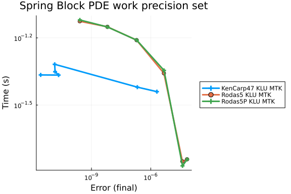

see https://discourse.julialang.org/t/boundserror-on-odeproblem-accelerated-with-modelingtoolkit-jl

```julia
using OrdinaryDiffEq, Symbolics, ModelingToolkit, Sundials, LinearSolve, SparseArrays
using OrdinaryDiffEqRosenbrock, OrdinaryDiffEqSDIRK
using NonlinearSolve
using GaussianRandomFields
using StableRNGs
using DiffEqDevTools, RecursiveFactorization
using Plots;
gr()

rng = StableRNG(3); #make the example reproducible
#Function which defines the spatial distribution of Parameters
function get_parameterDistribution(xmin, xmax; l = 6, p = 3)
    #parameters vary from 'xmin' at the center to 'xmax' at the boundaries, over a number of blocks l, with p defining the order of the transition-curve
    x = xmin .* ones(Ny, Nx);
    [x[(l - i + 1):(Ny - (l - i)), (l - i + 1):(Nx - (l - i))] .= (xmax-xmin)*(i-1)^p/(l-1)^p+xmin
     for i in l:-1:1]
    return x
end
#Helper function to convert from vectorized form back to matrix implementation
function vec2matrix(uvec)
    m = zeros(Ny, Nx)
    i = 1
    for x in 1:Nx
        for y in 1:Ny
            m[y, x] = uvec[i]
            i += 1
        end
    end
    return m
end
#Helper function to convert initial conditions from vectorized form back to matrix implementation
function convU0(uvec)
    m = zeros(Ny, Nx, 3)
    m[:, :, 1] = vec2matrix(uvec[1:(Nx * Ny)])
    m[:, :, 2] = vec2matrix(uvec[(Nx * Ny + 1):(2 * Nx * Ny)])
    m[:, :, 3] = vec2matrix(uvec[(2Nx * Ny + 1):(3 * Nx * Ny)])
    return m
end

#Model Parameters---------------------------------------------------------------------------------------------------------------------
#Model size
const Nx = 66;
const Ny = 18;
#block density
const m = 2.5;
#driving speed
const v = 34*1e-3/(365*24*60*60);
#stiffness
const kp = 8.0;
const kc = 44.0;
#resistance (rate and state type)
const v0 = 1e-3;
const σn = [1.8y+46 for y in 1:Ny, x in 1:Nx];
const τ0 = 0.4;
const Dc = get_parameterDistribution(0.004, 1e2*0.004);
const a = 0.015;
const b = get_parameterDistribution(0.02, 0.01);

function f0(du, u, p, t)
    #du+dθ-----------------------------------------------------------------------
    @inbounds for i in 1:Nx, j in 1:Ny

        du[j, i, 1] = @. u[j, i, 2] - v
        du[j, i, 3] = @. 1.0 - u[j, i, 2]*u[j, i, 3]/Dc[j, i]
    end
    #dv--------------------------------------------------------------------------
    #inner blocks
    @inbounds for i in 2:(Nx - 1), j in 2:(Ny - 1)

        du[j, i, 2] = @. 1/m*kc*(u[j, i + 1, 1]+u[j, i - 1, 1]+u[j + 1, i, 1]+u[j - 1, i, 1]-4*u[j, i, 1]) -
                         1/m*kp*u[j, i, 1] -
                         1/m*σn[j, i]*a*asinh(u[j, i, 2]/2/v0*exp((τ0+b[j, i]*log(v0*abs(u[j, i, 3])/Dc[j, i]))/a))
    end
    #left right blocks
    @inbounds for j in 2:(Ny - 1)
        #first col
        du[j, 1, 2] = @. 1/m*kc*(u[j, 2, 1]+u[j + 1, 1, 1]+u[j - 1, 1, 1]-3*u[j, 1, 1]) -
                         1/m*kp*u[j, 1, 1] -
                         1/m*σn[j, 1]*a*asinh(u[j, 1, 2]/2/v0*exp((τ0+b[j, 1]*log(v0*abs(u[j, 1, 3])/Dc[j, 1]))/a))
        #right (last col)
        du[j, Nx, 2] = @. 1/m*kc*(u[j, Nx - 1, 1]+u[j + 1, Nx, 1]+u[j - 1, Nx, 1]-3*u[j, Nx, 1]) -
                          1/m*kp*u[j, Nx, 1] -
                          1/m*σn[j, Nx]*a*asinh(u[j, Nx, 2]/2/v0*exp((τ0+b[j, Nx]*log(v0*abs(u[j, Nx, 3])/Dc[j, Nx]))/a))
    end
    #top bottom blocks
    @inbounds for i in 2:(Nx - 1)
        #top (first row)
        du[1, i, 2] = @. 1/m*kc*(u[1, i + 1, 1]+u[1, i - 1, 1]+u[2, i, 1]-3*u[1, i, 1]) -
                         1/m*kp*u[1, i, 1] -
                         1/m*σn[1, i]*a*asinh(u[1, i, 2]/2/v0*exp((τ0+b[1, i]*log(v0*abs(u[1, i, 3])/Dc[1, i]))/a))
        #botoom (last row)
        du[Ny, i, 2] = @. 1/m*kc*(u[Ny, i + 1, 1]+u[Ny, i - 1, 1]+u[Ny - 1, i, 1]-3*u[Ny, i, 1]) -
                          1/m*kp*u[Ny, i, 1] -
                          1/m*σn[Ny, i]*a*asinh(u[Ny, i, 2]/2/v0*exp((τ0+b[Ny, i]*log(v0*abs(u[Ny, i, 3])/Dc[Ny, i]))/a))
    end
    #Corner Blocks (closed loop)
    @inbounds begin
        du[1, 1, 2] = @. 1/m*kc*(u[1, 2, 1]+u[2, 1, 1]-2*u[1, 1, 1]) - 1/m*kp*u[1, 1, 1] -
                         1/m*σn[1, 1]*a*asinh(u[1, 1, 2]/2/v0*exp((τ0+b[1, 1]*log(v0*abs(u[1, 1, 3])/Dc[1, 1]))/a))
        du[1, Nx, 2] = @. 1/m*kc*(u[1, Nx - 1, 1]+u[2, Nx, 1]-2*u[1, Nx, 1]) -
                          1/m*kp*u[1, Nx, 1] -
                          1/m*σn[1, Nx]*a*asinh(u[1, Nx, 2]/2/v0*exp((τ0+b[1, Nx]*log(v0*abs(u[1, Nx, 3])/Dc[1, Nx]))/a))
        du[Ny, 1, 2] = @. 1/m*kc*(u[Ny, 2, 1]+u[Ny - 1, 1, 1]-2*u[Ny, 1, 1]) -
                          1/m*kp*u[Ny, 1, 1] -
                          1/m*σn[Ny, 1]*a*asinh(u[Ny, 1, 2]/2/v0*exp((τ0+b[Ny, 1]*log(v0*abs(u[Ny, 1, 3])/Dc[Ny, 1]))/a))
        du[Ny, Nx, 2] = @. 1/m*kc*(u[Ny, Nx - 1, 1]+u[Ny - 1, Nx, 1]-2*u[Ny, Nx, 1]) -
                           1/m*kp*u[Ny, Nx, 1] -
                           1/m*σn[Ny, Nx]*a*asinh(u[
            Ny, Nx, 2]/2/v0*exp((τ0+b[Ny, Nx]*log(v0*abs(u[Ny, Nx, 3])/Dc[Ny, Nx]))/a))
    end
end

function get_IC()
    #derives initial conditions from equilibrium + perturbation of the initial position using GaussianRandomFields
    probN = NonlinearProblem(f, input, nothing);
    u0 = solve(probN, NewtonRaphson(), reltol = 1e-8, abstol = 1e-12).u;
    #smooth spatial perturbation (see GaussianRandomFields docs)
    cov = CovarianceFunction(2, Matern(20, 2))
    pts = range(1, stop = 66, step = 1/1)
    grf = GaussianRandomField(cov, CirculantEmbedding(), pts, pts, minpadding = 256)
    rn = randn(rng, Int(1e7))
    s = GaussianRandomFields.sample(grf, xi = rn[1:randdim(grf)])
    u0[:, :, 1] = (1.0 .+ 0.001 .- 1e-7 .* s[1:Ny, 1:Nx]) .* u0[:, :, 1] #makes sure only forward acceleration takes place when launching the simulation
    return u0
end

input = rand(Ny, Nx, 3);
output = similar(input);
sparsity_pattern = Symbolics.jacobian_sparsity(f0, output, input, nothing, 0.0);
jac_sparsity = Float64.(sparse(sparsity_pattern));
f = ODEFunction{true, SciMLBase.FullSpecialize}(f0; jac_prototype = jac_sparsity);
#Solver Setup-------------------------------------------------------------------------------------------------------------------
solver = KenCarp47(linsolve = KLUFactorization());
abstol = 1e-12;
reltol = 1e-8;

u0 = get_IC();
tspan = (0.0, 1e9);
prob1 = ODEProblem(f, u0, tspan, nothing);
@named uncompiled_sys = modelingtoolkitize(prob1)
sys = mtkcompile(uncompiled_sys)
prob_mtk1 = ODEProblem(sys, [], tspan, jac = true, sparse = true);
state_indices1 = Dict(state => i for (i, state) in pairs(unknowns(sys)))
original_state_indices1 = [state_indices1[state] for state in unknowns(uncompiled_sys)]
velocity_indices1 = original_state_indices1[(Ny * Nx + 1):(2 * Ny * Nx)]
is_start(u, t, integrator) = sum(abs, @view(integrator.u[velocity_indices1])) > 0.01
cb1 = DiscreteCallback(is_start, terminate!, save_positions = (false, false))
global sol, tcpu,
bytes,
gctime,
memallocs = @timed solve(
    prob_mtk1, solver, reltol = reltol, abstol = abstol, maxiters = Int(1e12),
    save_everystep = false, dtmin = 1e-20, callback = cb1); #about 55 sec
@assert SciMLBase.successful_retcode(sol) "Phase 1 reference solve failed: $(sol.retcode)"
u1 = sol.u[end][original_state_indices1];
t1 = sol.t[end];
test_sol1 = TestSolution(sol)
#code (2): high cumulative velocity (>0.01) following phase (1)
tspan = (0.0, 1e4);
prob2 = ODEProblem(f, convU0(u1), tspan, nothing);
@named uncompiled_sys2 = modelingtoolkitize(prob2)
sys2 = mtkcompile(uncompiled_sys2)
prob_mtk2 = ODEProblem(sys2, [], tspan, jac = true, sparse = true);
state_indices2 = Dict(state => i for (i, state) in pairs(unknowns(sys2)))
original_state_indices2 = [state_indices2[state] for state in unknowns(uncompiled_sys2)]
velocity_indices2 = original_state_indices2[(Ny * Nx + 1):(2 * Ny * Nx)]
is_end(u, t, integrator) = sum(abs, @view(integrator.u[velocity_indices2])) < 0.01
cb2 = DiscreteCallback(is_end, terminate!, save_positions = (false, false))
global sol, tcpu,
bytes,
gctime,
memallocs = @timed solve(
    prob_mtk2, solver, reltol = reltol, abstol = abstol, maxiters = Int(1e12),
    save_everystep = false, dtmin = 1e-20, callback = cb2); #about 175 sec
@assert SciMLBase.successful_retcode(sol) "Phase 2 reference solve failed: $(sol.retcode)"
u2 = sol.u[end];
t2 = t1 + sol.t[end];

test_sol2 = TestSolution(sol)
```

```
retcode: Success
Interpolation: 1st order linear
t: nothing
u: nothing
```


The WP diagram setup:

```julia
abstols = 1.0 ./ 10.0 .^ (6:11)
reltols = 1.0 ./ 10.0 .^ (2:7)
setups = [
    Dict(:alg=>KenCarp47(linsolve = KLUFactorization()), :prob_choice=>1),
    Dict(:alg=>Rodas5(), :prob_choice=>1),
    Dict(:alg=>Rodas5P(), :prob_choice=>1)
];
names = ["KenCarp47 KLU MTK", "Rodas5 KLU MTK", "Rodas5P KLU MTK"]

probs = [prob_mtk1, prob_mtk2]
test_sols = [test_sol1, test_sol2]
wp = WorkPrecisionSet(
    probs, abstols, reltols, setups; names = names,
    save_everystep = false, maxiters = Int(1.0e5),
    numruns = 10, appxsol = test_sols, callback = cb1, dtmin = 1.0e-20
)
@assert all(w -> all(error -> isfinite(error[:final]) && error[:final] > 0, w.errors), wp.wps) "A solver produced an invalid work-precision point"

plot(wp, label = reduce(hcat, names), markershape = :auto, title = "Spring Block PDE work precision set")
```




## Appendix

These benchmarks are a part of the SciMLBenchmarks.jl repository, found at: [https://github.com/SciML/SciMLBenchmarks.jl](https://github.com/SciML/SciMLBenchmarks.jl). For more information on high-performance scientific machine learning, check out the SciML Open Source Software Organization [https://sciml.ai](https://sciml.ai).

To locally run this benchmark, do the following commands:
```
using SciMLBenchmarks
SciMLBenchmarks.weave_file("benchmarks/ComplicatedPDE","SpringBlockNonLinearResistance.jmd")
```

Computer Information:

```
Julia Version 1.11.9
Commit 53a02c0720c (2026-02-06 00:27 UTC)
Build Info:
  Official https://julialang.org/ release
Platform Info:
  OS: Linux (x86_64-linux-gnu)
  CPU: 128 × AMD EPYC 7502 32-Core Processor
  WORD_SIZE: 64
  LLVM: libLLVM-16.0.6 (ORCJIT, znver2)
Threads: 128 default, 0 interactive, 64 GC (on 128 virtual cores)
Environment:
  JULIA_NUM_THREADS = auto

```

Package Information:

```
Status `/julia/github-runners/amdci1-1/_work/SciMLBenchmarks.jl/SciMLBenchmarks.jl/benchmarks/ComplicatedPDE/Project.toml`
  [47edcb42] ADTypes v1.24.0
  [f3b72e0c] DiffEqDevTools v3.6.3
  [e4b2fa32] GaussianRandomFields v2.2.7
  [7073ff75] IJulia v1.34.4
  [7f56f5a3] LSODA v1.2.0
⌃ [7ed4a6bd] LinearSolve v5.17.3
  [961ee093] ModelingToolkit v11.43.1
⌃ [8913a72c] NonlinearSolve v4.30.0
⌅ [09606e27] ODEInterfaceDiffEq v4.1.0
  [1dea7af3] OrdinaryDiffEq v7.8.1
⌃ [6ad6398a] OrdinaryDiffEqBDF v2.4.9
  [e0540318] OrdinaryDiffEqExponentialRK v2.4.0
  [becaefa8] OrdinaryDiffEqExtrapolation v2.6.3
  [5960d6e9] OrdinaryDiffEqFIRK v2.8.7
  [1344f307] OrdinaryDiffEqLowOrderRK v2.2.5
⌃ [43230ef6] OrdinaryDiffEqRosenbrock v2.7.3
⌃ [2d112036] OrdinaryDiffEqSDIRK v2.9.3
  [358294b1] OrdinaryDiffEqStabilizedRK v2.7.0
  [91a5bcdd] Plots v1.41.7
  [f2c3362d] RecursiveFactorization v0.2.30
  [31c91b34] SciMLBenchmarks v0.2.1
  [a6db7da4] SciMLLogging v2.1.0
  [860ef19b] StableRNGs v1.0.4
  [c3572dad] Sundials v6.7.1
  [0c5d862f] Symbolics v7.39.2
  [2f01184e] SparseArrays v1.11.0
Info Packages marked with ⌃ and ⌅ have new versions available. Those with ⌃ may be upgradable, but those with ⌅ are restricted by compatibility constraints from upgrading. To see why use `status --outdated`
```

And the full manifest:

```
Status `/julia/github-runners/amdci1-1/_work/SciMLBenchmarks.jl/SciMLBenchmarks.jl/benchmarks/ComplicatedPDE/Manifest.toml`
  [47edcb42] ADTypes v1.24.0
  [14f7f29c] AMD v0.5.4
  [621f4979] AbstractFFTs v1.5.0
  [6e696c72] AbstractPlutoDingetjes v1.4.1
  [1520ce14] AbstractTrees v0.4.5
  [7d9f7c33] Accessors v0.1.45
  [79e6a3ab] Adapt v4.7.0
  [66dad0bd] AliasTables v1.1.3
  [ec485272] ArnoldiMethod v0.4.0
  [7d9fca2a] Arpack v0.5.4
⌃ [4fba245c] ArrayInterface v7.30.1
  [4c555306] ArrayLayouts v1.12.2
  [aae01518] BandedMatrices v1.12.0
  [e2ed5e7c] Bijections v0.2.2
  [b2a6c25c] BinaryHeaps v1.1.0
  [caf10ac8] BipartiteGraphs v0.1.14
  [62783981] BitTwiddlingConvenienceFunctions v0.1.6
  [8e7c35d0] BlockArrays v1.10.0
  [70df07ce] BracketingNonlinearSolve v1.12.7
  [fa961155] CEnum v0.5.0
  [2a0fbf3d] CPUSummary v0.2.7
  [fb6a15b2] CloseOpenIntervals v0.1.13
  [35d6a980] ColorSchemes v3.31.0
  [3da002f7] ColorTypes v0.12.1
  [c3611d14] ColorVectorSpace v0.11.0
  [5ae59095] Colors v0.13.1
⌅ [861a8166] Combinatorics v1.0.2
  [38540f10] CommonSolve v0.2.14
  [bbf7d656] CommonSubexpressions v0.3.1
  [f70d9fcc] CommonWorldInvalidations v1.2.2
  [34da2185] Compat v4.18.1
  [b152e2b5] CompositeTypes v0.1.4
  [a33af91c] CompositionsBase v0.1.2
  [2569d6c7] ConcreteStructs v0.2.8
  [8f4d0f93] Conda v1.10.3
  [187b0558] ConstructionBase v1.6.0
  [d38c429a] Contour v0.6.3
  [adafc99b] CpuId v0.3.1
  [a8cc5b0e] Crayons v4.2.0
  [9a962f9c] DataAPI v1.16.0
  [864edb3b] DataStructures v0.19.6
  [e2d170a0] DataValueInterfaces v1.0.0
  [8bb1440f] DelimitedFiles v1.9.1
  [2b5f629d] DiffEqBase v7.21.1
  [459566f4] DiffEqCallbacks v4.19.4
  [f3b72e0c] DiffEqDevTools v3.6.3
  [77a26b50] DiffEqNoiseProcess v5.36.3
  [163ba53b] DiffResults v1.1.0
  [b552c78f] DiffRules v1.16.0
  [a0c0ee7d] DifferentiationInterface v0.7.21
  [31c24e10] Distributions v0.25.131
  [ffbed154] DocStringExtensions v0.9.5
  [5b8099bc] DomainSets v0.8.1
  [7c1d4256] DynamicPolynomials v0.6.8
  [4e289a0a] EnumX v1.0.7
  [f151be2c] EnzymeCore v0.8.21
  [d4d017d3] ExponentialUtilities v1.35.3
  [e2ba6199] ExprTools v0.1.11
  [55351af7] ExproniconLite v0.10.14
  [c87230d0] FFMPEG v0.4.5
  [7a1cc6ca] FFTW v1.10.0
  [7034ab61] FastBroadcast v1.4.0
  [9aa1b823] FastClosures v0.3.2
  [442a2c76] FastGaussQuadrature v1.3.0
  [a4df4552] FastPower v1.5.0
  [1a297f60] FillArrays v1.17.0
  [64ca27bc] FindFirstFunctions v3.2.1
  [6a86dc24] FiniteDiff v2.33.0
⌅ [53c48c17] FixedPointNumbers v0.8.6
  [1fa38f19] Format v1.3.7
  [f6369f11] ForwardDiff v1.4.6
  [a85aefff] FunctionMaps v0.1.2
  [069b7b12] FunctionWrappers v1.1.3
  [77dc65aa] FunctionWrappersWrappers v1.13.0
  [46192b85] GPUArraysCore v0.2.0
  [28b8d3ca] GR v0.73.27
  [a0844989] Gamma v1.2.0
  [e4b2fa32] GaussianRandomFields v2.2.7
  [c145ed77] GenericSchur v0.5.8
  [86223c79] Graphs v1.15.0
⌅ [eafb193a] Highlights v0.5.3
  [3e5b6fbb] HostCPUFeatures v0.1.18
  [34004b35] HypergeometricFunctions v0.3.30
  [7073ff75] IJulia v1.34.4
  [615f187c] IfElse v0.1.1
  [3263718b] ImplicitDiscreteSolve v2.3.0
  [d25df0c9] Inflate v0.1.5
  [18e54dd8] IntegerMathUtils v0.1.4
  [8197267c] IntervalSets v0.7.14
  [3587e190] InverseFunctions v0.1.17
  [92d709cd] IrrationalConstants v0.2.6
  [82899510] IteratorInterfaceExtensions v1.0.0
  [1019f520] JLFzf v0.1.11
  [692b3bcd] JLLWrappers v1.8.0
⌅ [682c06a0] JSON v0.21.4
  [ae98c720] Jieko v0.2.1
⌃ [ccbc3e58] JumpProcesses v9.32.3
  [ba0b0d4f] Krylov v0.10.10
  [2faa5264] LHLFactorization v2.2.2
  [7f56f5a3] LSODA v1.2.0
  [b964fa9f] LaTeXStrings v1.4.1
  [23fbe1c1] Latexify v0.16.12
  [10f19ff3] LayoutPointers v0.1.17
  [87fe0de2] LineSearch v0.1.18
⌃ [7ed4a6bd] LinearSolve v5.17.3
  [2ab3a3ac] LogExpFunctions v1.0.1
  [e6f89c97] LoggingExtras v1.2.0
  [bdcacae8] LoopVectorization v0.12.174
  [1914dd2f] MacroTools v0.5.16
  [d125e4d3] ManualMemory v0.1.8
  [a3b82374] MatrixFactorizations v3.1.3
  [bb5d69b7] MaybeInplace v0.1.8
  [442fdcdd] Measures v0.3.3
  [e1d29d7a] Missings v1.2.0
  [961ee093] ModelingToolkit v11.43.1
⌃ [7771a370] ModelingToolkitBase v1.71.1
  [6bb917b9] ModelingToolkitTearing v1.20.6
⌅ [2e0e35c7] Moshi v0.3.9
  [46d2c3a1] MuladdMacro v0.2.7
  [102ac46a] MultivariatePolynomials v0.5.19
  [ffc61752] Mustache v1.0.21
  [d8a4904e] MutableArithmetics v1.8.0
  [77ba4419] NaNMath v1.1.4
⌃ [8913a72c] NonlinearSolve v4.30.0
⌃ [be0214bd] NonlinearSolveBase v2.49.5
⌃ [5959db7a] NonlinearSolveFirstOrder v2.6.1
  [9a2c21bd] NonlinearSolveQuasiNewton v1.15.3
  [26075421] NonlinearSolveSpectralMethods v1.8.3
  [54ca160b] ODEInterface v0.5.2
⌅ [09606e27] ODEInterfaceDiffEq v4.1.0
  [6fe1bfb0] OffsetArrays v1.17.0
⌅ [bac558e1] OrderedCollections v1.8.2
  [1dea7af3] OrdinaryDiffEq v7.8.1
⌃ [6ad6398a] OrdinaryDiffEqBDF v2.4.9
⌃ [bbf590c4] OrdinaryDiffEqCore v4.17.2
  [50262376] OrdinaryDiffEqDefault v2.6.2
⌃ [4302a76b] OrdinaryDiffEqDifferentiation v3.12.0
  [e0540318] OrdinaryDiffEqExponentialRK v2.4.0
  [becaefa8] OrdinaryDiffEqExtrapolation v2.6.3
  [5960d6e9] OrdinaryDiffEqFIRK v2.8.7
  [1344f307] OrdinaryDiffEqLowOrderRK v2.2.5
  [127b3ac7] OrdinaryDiffEqNonlinearSolve v2.9.8
⌃ [43230ef6] OrdinaryDiffEqRosenbrock v2.7.3
  [b4bd8bb3] OrdinaryDiffEqRosenbrockTableaus v2.4.2
⌃ [2d112036] OrdinaryDiffEqSDIRK v2.9.3
  [358294b1] OrdinaryDiffEqStabilizedRK v2.7.0
  [b1df2697] OrdinaryDiffEqTsit5 v2.1.4
  [79d7bb75] OrdinaryDiffEqVerner v2.4.1
  [90014a1f] PDMats v0.11.41
⌅ [d96e819e] Parameters v0.12.3
⌅ [69de0a69] Parsers v2.8.8
  [ccf2f8ad] PlotThemes v3.3.0
  [995b91a9] PlotUtils v1.4.4
  [91a5bcdd] Plots v1.41.7
  [e409e4f3] PoissonRandom v0.4.13
  [f517fe37] Polyester v0.7.19
  [1d0040c9] PolyesterWeave v0.2.2
  [d236fae5] PreallocationTools v1.7.1
⌅ [aea7be01] PrecompileTools v1.2.1
  [21216c6a] Preferences v1.6.0
  [08abe8d2] PrettyTables v3.4.8
  [27ebfcd6] Primes v0.5.7
  [43287f4e] PtrArrays v1.4.0
  [78ab2635] PureGebal v1.1.0
  [0c0d3e7f] PureKLU v1.5.0
  [1fd47b50] QuadGK v2.11.3
  [988b38a3] ReadOnlyArrays v0.2.0
  [795d4caa] ReadOnlyDicts v1.0.1
  [3cdcf5f2] RecipesBase v1.3.4
  [01d81517] RecipesPipeline v0.6.12
  [731186ca] RecursiveArrayTools v4.5.1
  [f2c3362d] RecursiveFactorization v0.2.30
  [189a3867] Reexport v1.2.2
  [05181044] RelocatableFolders v1.0.1
  [ae029012] Requires v1.3.1
  [ae5879a3] ResettableStacks v1.4.0
  [9fe22ead] RespecializeParams v1.3.0
  [79098fc4] Rmath v0.9.0
  [47965b36] RootedTrees v2.27.0
  [f2b01f46] Roots v3.0.8
  [7e49a35a] RuntimeGeneratedFunctions v0.5.26
  [9dfe8606] SCCNonlinearSolve v1.15.3
  [94e857df] SIMDTypes v0.1.0
  [476501e8] SLEEFPirates v0.6.46
⌃ [0bca4576] SciMLBase v3.54.0
  [31c91b34] SciMLBenchmarks v0.2.1
  [19f34311] SciMLJacobianOperators v0.1.19
  [a6db7da4] SciMLLogging v2.1.0
⌃ [c0aeaf25] SciMLOperators v1.30.0
  [431bcebd] SciMLPublic v1.3.0
  [53ae85a6] SciMLStructures v1.10.5
  [6c6a2e73] Scratch v1.3.0
  [efcf1570] Setfield v1.1.2
  [992d4aef] Showoff v1.1.1
  [727e6d20] SimpleNonlinearSolve v2.14.5
  [699a6c99] SimpleTraits v0.9.6
  [a2af1166] SortingAlgorithms v1.2.3
  [bd59d7e1] SparseBandedMatrices v1.4.0
  [a57abbd0] SparseColumnPivotedQR v2.1.8
  [0a514795] SparseMatrixColorings v0.4.28
  [276daf66] SpecialFunctions v2.9.0
  [860ef19b] StableRNGs v1.0.4
  [0c0c59c1] StarAlgebras v0.3.0
  [64909d44] StateSelection v1.11.1
  [aedffcd0] Static v1.4.6
  [0d7ed370] StaticArrayInterface v1.10.0
  [90137ffa] StaticArrays v1.9.20
  [1e83bf80] StaticArraysCore v1.4.4
  [10745b16] Statistics v1.11.5
  [82ae8749] StatsAPI v1.8.0
  [2913bbd2] StatsBase v0.34.13
  [4c63d2b9] StatsFuns v2.2.1
  [7792a7ef] StrideArraysCore v0.5.9
  [69024149] StringEncodings v0.3.7
⌅ [892a3eda] StringManipulation v0.5.0
  [09ab397b] StructArrays v0.7.3
  [c3572dad] Sundials v6.7.1
  [2efcf032] SymbolicIndexingInterface v0.3.55
  [19f23fe9] SymbolicLimits v1.2.1
  [d1185830] SymbolicUtils v4.46.6
  [0c5d862f] Symbolics v7.39.2
  [3783bdb8] TableTraits v1.0.1
  [bd369af6] Tables v1.14.0
  [ed4db957] TaskLocalValues v0.1.3
  [62fd8b95] TensorCore v0.1.1
  [8ea1fca8] TermInterface v2.0.0
  [8290d209] ThreadingUtilities v0.5.6
  [a759f4b9] TimerOutputs v1.2.1
  [d5829a12] TriangularSolve v0.2.6
  [781d530d] TruncatedStacktraces v1.4.0
  [3a884ed6] UnPack v1.0.2
  [1cfade01] UnicodeFun v0.4.1
  [41fe7b60] Unzip v0.2.0
  [3d5dd08c] VectorizationBase v0.21.74
  [33b4df10] VectorizedRNG v0.2.26
  [81def892] VersionParsing v1.3.0
  [d30d5f5c] WeakCacheSets v0.1.0
  [44d3d7a6] Weave v0.10.12
  [ddb6d928] YAML v0.4.16
  [c2297ded] ZMQ v1.5.1
⌅ [68821587] Arpack_jll v3.5.2+0
  [6e34b625] Bzip2_jll v1.0.9+0
  [83423d85] Cairo_jll v1.18.7+0
  [ee1fde0b] Dbus_jll v1.16.2+0
  [2702e6a9] EpollShim_jll v0.0.20230411+1
  [2e619515] Expat_jll v2.8.4+0
⌅ [b22a6f82] FFMPEG_jll v8.1.2+0
  [f5851436] FFTW_jll v3.3.12+0
  [a3f928ae] Fontconfig_jll v2.17.1+0
  [d7e528f0] FreeType2_jll v2.14.3+1
  [559328eb] FriBidi_jll v1.0.17+0
  [0656b61e] GLFW_jll v3.5.1+0
  [d2c73de3] GR_jll v0.73.27+0
⌅ [b0724c58] GettextRuntime_jll v0.22.4+0
  [61579ee1] Ghostscript_jll v9.55.1+0
  [7746bdde] Glib_jll v2.88.3+0
  [3b182d85] Graphite2_jll v1.3.16+0
  [2e76f6c2] HarfBuzz_jll v100.14004.0+0
  [1d5cc7b8] IntelOpenMP_jll v2025.2.0+0
  [aacddb02] JpegTurbo_jll v3.2.0+1
  [c1c5ebd0] LAME_jll v3.100.3+0
  [88015f11] LERC_jll v4.2.0+0
  [1d63c593] LLVMOpenMP_jll v23.1.1+0
  [aae0fff6] LSODA_jll v0.1.2+0
⌅ [e9f186c6] Libffi_jll v3.4.7+0
  [7e76a0d4] Libglvnd_jll v1.7.1+1
  [94ce4f54] Libiconv_jll v1.18.0+0
  [4b2f31a3] Libmount_jll v2.42.0+0
  [89763e89] Libtiff_jll v4.7.3+0
  [38a345b3] Libuuid_jll v2.42.0+0
  [856f044c] MKL_jll v2025.2.0+0
  [c771fb93] ODEInterface_jll v0.0.2+0
  [e7412a2a] Ogg_jll v1.3.6+0
  [656ef2d0] OpenBLAS32_jll v0.3.34+0
  [458c3c95] OpenSSL_jll v3.5.8+0
  [efe28fd5] OpenSpecFun_jll v0.5.6+0
  [91d4177d] Opus_jll v1.6.1+0
  [36c8627f] Pango_jll v1.58.2+0
  [30392449] Pixman_jll v0.46.4+0
  [c0090381] Qt6Base_jll v6.10.2+2
  [629bc702] Qt6Declarative_jll v6.10.2+2
  [ce943373] Qt6ShaderTools_jll v6.10.2+1
  [6de9746b] Qt6Svg_jll v6.10.2+0
  [e99dba38] Qt6Wayland_jll v6.10.2+1
  [f50d1b31] Rmath_jll v0.5.2+0
  [ca45d3f4] SuiteSparse32_jll v7.12.1+1
  [fb77eaff] Sundials_jll v7.5.0+0
  [a44049a8] Vulkan_Loader_jll v1.3.243+0
  [a2964d1f] Wayland_jll v1.24.0+0
  [ffd25f8a] XZ_jll v5.8.4+0
  [f67eecfb] Xorg_libICE_jll v1.1.2+0
  [c834827a] Xorg_libSM_jll v1.2.6+0
  [4f6342f7] Xorg_libX11_jll v1.8.13+0
  [0c0b7dd1] Xorg_libXau_jll v1.0.13+0
  [935fb764] Xorg_libXcursor_jll v1.2.4+0
  [a3789734] Xorg_libXdmcp_jll v1.1.6+0
  [1082639a] Xorg_libXext_jll v1.3.8+0
  [d091e8ba] Xorg_libXfixes_jll v6.0.2+0
  [a51aa0fd] Xorg_libXi_jll v1.8.4+0
  [d1454406] Xorg_libXinerama_jll v1.1.7+0
  [ec84b674] Xorg_libXrandr_jll v1.5.6+0
  [ea2f1a96] Xorg_libXrender_jll v0.9.12+0
  [a65dc6b1] Xorg_libpciaccess_jll v0.19.0+0
  [c7cfdc94] Xorg_libxcb_jll v1.17.1+0
  [cc61e674] Xorg_libxkbfile_jll v1.2.0+0
  [e920d4aa] Xorg_xcb_util_cursor_jll v0.1.6+0
  [12413925] Xorg_xcb_util_image_jll v0.4.1+0
  [2def613f] Xorg_xcb_util_jll v0.4.1+0
  [975044d2] Xorg_xcb_util_keysyms_jll v0.4.1+0
  [0d47668e] Xorg_xcb_util_renderutil_jll v0.3.10+0
  [c22f9ab0] Xorg_xcb_util_wm_jll v0.4.2+0
  [35661453] Xorg_xkbcomp_jll v1.4.7+0
  [33bec58e] Xorg_xkeyboard_config_jll v2.47.0+2
  [c5fb5394] Xorg_xtrans_jll v1.6.0+0
  [8f1865be] ZeroMQ_jll v4.3.6+0
  [3161d3a3] Zstd_jll v1.5.7+1
  [35ca27e7] eudev_jll v3.2.14+0
⌅ [214eeab7] fzf_jll v0.61.1+0
  [a4ae2306] libaom_jll v3.14.1+0
  [0ac62f75] libass_jll v0.17.5+0
  [1183f4f0] libdecor_jll v0.2.2+0
  [8e53e030] libdrm_jll v2.4.134+0
  [2db6ffa8] libevdev_jll v1.13.4+0
  [f638f0a6] libfdk_aac_jll v2.0.4+0
  [36db933b] libinput_jll v1.28.1+0
  [b53b4c65] libpng_jll v1.6.58+0
  [a9144af2] libsodium_jll v1.0.21+0
  [9a156e7d] libva_jll v2.23.0+0
  [f27f6e37] libvorbis_jll v1.3.8+0
  [009596ad] mtdev_jll v1.1.7+0
  [1317d2d5] oneTBB_jll v2022.3.0+0
⌅ [1270edf5] x264_jll v10164.0.1+0
  [dfaa095f] x265_jll v4.1.0+0
  [d8fb68d0] xkbcommon_jll v1.13.0+0
  [0dad84c5] ArgTools v1.1.2
  [56f22d72] Artifacts v1.11.0
  [2a0f44e3] Base64 v1.11.0
  [ade2ca70] Dates v1.11.0
  [8ba89e20] Distributed v1.11.0
  [f43a241f] Downloads v1.6.0
  [7b1f6079] FileWatching v1.11.0
  [9fa8497b] Future v1.11.0
  [b77e0a4c] InteractiveUtils v1.11.0
  [4af54fe1] LazyArtifacts v1.11.0
  [b27032c2] LibCURL v0.6.4
  [76f85450] LibGit2 v1.11.0
  [8f399da3] Libdl v1.11.0
  [37e2e46d] LinearAlgebra v1.11.0
  [56ddb016] Logging v1.11.0
  [d6f4376e] Markdown v1.11.0
  [a63ad114] Mmap v1.11.0
  [ca575930] NetworkOptions v1.2.0
  [44cfe95a] Pkg v1.11.0
  [de0858da] Printf v1.11.0
  [3fa0cd96] REPL v1.11.0
  [9a3f8284] Random v1.11.0
  [ea8e919c] SHA v0.7.0
  [9e88b42a] Serialization v1.11.0
  [6462fe0b] Sockets v1.11.0
  [2f01184e] SparseArrays v1.11.0
  [f489334b] StyledStrings v1.11.0
  [4607b0f0] SuiteSparse
  [fa267f1f] TOML v1.0.3
  [a4e569a6] Tar v1.10.0
  [8dfed614] Test v1.11.0
  [cf7118a7] UUIDs v1.11.0
  [4ec0a83e] Unicode v1.11.0
  [e66e0078] CompilerSupportLibraries_jll v1.1.1+0
  [deac9b47] LibCURL_jll v8.6.0+0
  [e37daf67] LibGit2_jll v1.7.2+0
  [29816b5a] LibSSH2_jll v1.11.0+1
  [c8ffd9c3] MbedTLS_jll v2.28.6+0
  [14a3606d] MozillaCACerts_jll v2023.12.12
  [4536629a] OpenBLAS_jll v0.3.27+1
  [05823500] OpenLibm_jll v0.8.5+0
  [efcefdf7] PCRE2_jll v10.42.0+1
  [bea87d4a] SuiteSparse_jll v7.7.0+0
  [83775a58] Zlib_jll v1.2.13+1
  [8e850b90] libblastrampoline_jll v5.11.0+0
  [8e850ede] nghttp2_jll v1.59.0+0
  [3f19e933] p7zip_jll v17.4.0+2
Info Packages marked with ⌃ and ⌅ have new versions available. Those with ⌃ may be upgradable, but those with ⌅ are restricted by compatibility constraints from upgrading. To see why use `status --outdated -m`
```

