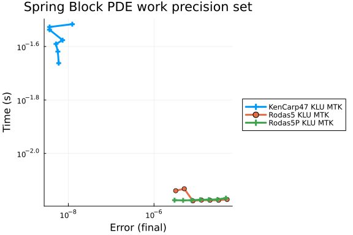

see https://discourse.julialang.org/t/boundserror-on-odeproblem-accelerated-with-modelingtoolkit-jl
```julia
using OrdinaryDiffEq, Symbolics, ModelingToolkit, Sundials, LinearSolve, SparseArrays
using NonlinearSolve
using GaussianRandomFields
using StableRNGs
using DiffEqDevTools
using Plots; gr()


rng = StableRNG(3); #make the example reproducible
#Function which defines the spatial distribution of Parameters
function get_parameterDistribution(xmin,xmax;l = 6,p = 3)
    #parameters vary from 'xmin' at the center to 'xmax' at the boundaries, over a number of blocks l, with p defining the order of the transition-curve
    x = xmin .* ones(Ny,Nx);
    [x[l-i+1:Ny-(l-i),l-i+1:Nx-(l-i)] .= (xmax-xmin)*(i-1)^p/(l-1)^p+xmin for i = l:-1:1]
    return x
end
#Helper function to convert from vectorized form back to matrix implementation
function vec2matrix(uvec)
    m = zeros(Ny,Nx)
    i = 1
    for x = 1:Nx
        for y = 1:Ny
            m[y,x] = uvec[i]
            i += 1
        end
    end
    return m
end
#Helper function to convert initial conditions from vectorized form back to matrix implementation
function convU0(uvec)
    m = zeros(Ny,Nx,3)
    m[:,:,1]  = vec2matrix(uvec[1:Nx*Ny])
    m[:,:,2]  = vec2matrix(uvec[Nx*Ny+1:2*Nx*Ny])
    m[:,:,3]  = vec2matrix(uvec[2Nx*Ny+1:3*Nx*Ny])
    return m
end
#Model Parameters---------------------------------------------------------------------------------------------------------------------
#Model size
const Nx = 66;
const Ny = 18;
#block density
const m = 2.5;
#driving speed
const v = 34*1e-3/(365*24*60*60);
#stiffness
const kp = 8.0;
const kc =  44.0;
#resistance (rate and state type)
const v0 = 1e-3;
const σn = [1.8y+46 for y in 1:Ny,x = 1:Nx];
const τ0 = 0.4;
const Dc =  get_parameterDistribution(0.004,1e2*0.004);
const a = 0.015;
const b =  get_parameterDistribution(0.02,0.01);
#ODE----------------------------------------------------------------------------------------------------------------------------------
function f0(du,u,p,t)
    #du+dθ-----------------------------------------------------------------------
    @inbounds for i in 1:Nx, j in 1:Ny
        du[j,i,1] = @. u[j,i,2] - v
        du[j,i,3] = @. 1.0 - u[j,i,2]*u[j,i,3]/Dc[j,i]
    end
    #dv--------------------------------------------------------------------------
     #inner blocks
     @inbounds for i in 2:Nx-1, j in 2:Ny-1
          du[j,i,2] = @. 1/m*kc*(u[j,i+1,1]+u[j,i-1,1]+u[j+1,i,1]+u[j-1,i,1]-4*u[j,i,1]) - 1/m*kp*u[j,i,1] - 1/m*σn[j,i]*a*asinh(u[j,i,2]/2/v0*exp((τ0+b[j,i]*log(v0*abs(u[j,i,3])/Dc[j,i]))/a))
     end
     #left right blocks
     @inbounds for j in 2:Ny-1
         #first col
         du[j,1,2] = @. 1/m*kc*(u[j,2,1]+u[j+1,1,1]+u[j-1,1,1]-3*u[j,1,1]) - 1/m*kp*u[j,1,1]  - 1/m*σn[j,1]*a*asinh(u[j,1,2]/2/v0*exp((τ0+b[j,1]*log(v0*abs(u[j,1,3])/Dc[j,1]))/a))
         #right (last col)
         du[j,Nx,2] = @. 1/m*kc*(u[j,Nx-1,1]+u[j+1,Nx,1]+u[j-1,Nx,1]-3*u[j,Nx,1])  - 1/m*kp*u[j,Nx,1]  - 1/m*σn[j,Nx]*a*asinh(u[j,Nx,2]/2/v0*exp((τ0+b[j,Nx]*log(v0*abs(u[j,Nx,3])/Dc[j,Nx]))/a))
     end
     #top bottom blocks
     @inbounds for i in 2:Nx-1
         #top (first row)
         du[1,i,2] = @. 1/m*kc*(u[1,i+1,1]+u[1,i-1,1]+u[2,i,1]-3*u[1,i,1]) - 1/m*kp*u[1,i,1] - 1/m*σn[1,i]*a*asinh(u[1,i,2]/2/v0*exp((τ0+b[1,i]*log(v0*abs(u[1,i,3])/Dc[1,i]))/a))
         #botoom (last row)
         du[Ny,i,2] = @. 1/m*kc*(u[Ny,i+1,1]+u[Ny,i-1,1]+u[Ny-1,i,1]-3*u[Ny,i,1]) - 1/m*kp*u[Ny,i,1] - 1/m*σn[Ny,i]*a*asinh(u[Ny,i,2]/2/v0*exp((τ0+b[Ny,i]*log(v0*abs(u[Ny,i,3])/Dc[Ny,i]))/a))
     end
     #Corner Blocks (closed loop)
     @inbounds begin
          du[1,1,2] = @. 1/m*kc*(u[1,2,1]+u[2,1,1]-2*u[1,1,1]) - 1/m*kp*u[1,1,1] - 1/m*σn[1,1]*a*asinh(u[1,1,2]/2/v0*exp((τ0+b[1,1]*log(v0*abs(u[1,1,3])/Dc[1,1]))/a))
          du[1,Nx,2] = @. 1/m*kc*(u[1,Nx-1,1]+u[2,Nx,1]-2*u[1,Nx,1]) - 1/m*kp*u[1,Nx,1] - 1/m*σn[1,Nx]*a*asinh(u[1,Nx,2]/2/v0*exp((τ0+b[1,Nx]*log(v0*abs(u[1,Nx,3])/Dc[1,Nx]))/a))
          du[Ny,1,2] = @. 1/m*kc*(u[Ny,2,1]+u[Ny-1,1,1]-2*u[Ny,1,1]) - 1/m*kp*u[Ny,1,1] - 1/m*σn[Ny,1]*a*asinh(u[Ny,1,2]/2/v0*exp((τ0+b[Ny,1]*log(v0*abs(u[Ny,1,3])/Dc[Ny,1]))/a))
          du[Ny,Nx,2] = @. 1/m*kc*(u[Ny,Nx-1,1]+u[Ny-1,Nx,1]-2*u[Ny,Nx,1]) - 1/m*kp*u[Ny,Nx,1] - 1/m*σn[Ny,Nx]*a*asinh(u[Ny,Nx,2]/2/v0*exp((τ0+b[Ny,Nx]*log(v0*abs(u[Ny,Nx,3])/Dc[Ny,Nx]))/a))
      end
end
#Initial Conditions---------------------------------------------------------------------------------------------------------------------------
function get_IC()
    #derives initial conditions from equilibrium + perturbation of the initial position using GaussianRandomFields
    probN = NonlinearProblem(f,input, nothing);
    u0 = solve(probN, NewtonRaphson(), reltol = 1e-8,abstol = 1e-12).u;
    #smooth spatial perturbation (see GaussianRandomFields docs)
    cov = CovarianceFunction(2, Matern(20, 2))
    pts = range(1, stop=66, step=1/1)
    grf = GaussianRandomField(cov, CirculantEmbedding(), pts, pts, minpadding=256)
    rn = randn(rng,Int(1e7))
    s = GaussianRandomFields.sample(grf,xi = rn[1:randdim(grf)])
    u0[:,:,1] =  (1.0.+0.001.-1e-7.*s[1:Ny,1:Nx]).*u0[:,:,1] #makes sure only forward acceleration takes place when launching the simulation
    return u0
end
#ODE Speed-up----------------------------------------------------------------------------------------------------------------
#copy of https://docs.sciml.ai/SciMLBenchmarksOutput/stable/StiffODE/Bruss/
input = rand(Ny,Nx,3);
output = similar(input);
sparsity_pattern = Symbolics.jacobian_sparsity(f0,output,input,nothing,0.0);
jac_sparsity = Float64.(sparse(sparsity_pattern));
f = ODEFunction{true, SciMLBase.FullSpecialize}(f0;jac_prototype=jac_sparsity);
#Callbacks--------------------------------------------------------------------------------------------------------------------
is_start(u,t,integrator) = sum(abs.(integrator.u[Ny*Nx+1:2*Ny*Nx]))>0.01 #detects onset of high cumulative velocity phase
is_end(u,t,integrator) = sum(abs.(integrator.u[Ny*Nx+1:2*Ny*Nx]))<0.01 #detects end of high cumulative velocity phase
affect!(integrator) = terminate!(integrator)
cb1 =  DiscreteCallback(is_start,terminate!,save_positions=(false,false))
cb2 =  DiscreteCallback(is_end,terminate!,save_positions=(false,false))
#Solver Setup-------------------------------------------------------------------------------------------------------------------
solver = KenCarp47(linsolve=KLUFactorization());
abstol = 1e-12;
reltol = 1e-8;
#--------------------------------------------------------------------------------------------------------------------------------
#Solve the ODE in 2 parts: (1) low cumulative velocity (<0.01) phase, (2) high cumulative velocity (>0.01) phase. When interested in multiple stick (1) and slip (2) phases, the code of (1) and (2) would typically run within a `while`-loop
#for Work-Precision Diagram, use either (1)+(2); or just (2)
#code (1): From u0 to onset of high cumulative velocity (>0.01)
u0 = get_IC();
tspan = (0.0,1e9); 
prob1 = ODEProblem(f,u0,tspan,nothing);
sys = modelingtoolkitize(prob1);
prob_mtk1 = ODEProblem(modelingtoolkitize(prob1),[],tspan,jac=true,sparse=true);
global sol,tcpu, bytes, gctime, memallocs = @timed solve(prob_mtk1,solver,reltol = reltol,abstol = abstol,maxiters = Int(1e12),save_everystep = false,dtmin = 1e-20,callback = cb1); #about 55 sec
u1 = sol.u[end];
t1 = sol.t[end];
test_sol1 = TestSolution(sol)
#code (2): high cumulative velocity (>0.01) following phase (1)
tspan = (0.0,1e4);
prob2 = ODEProblem(f,convU0(u1),tspan,nothing);
prob_mtk2 = ODEProblem(modelingtoolkitize(prob2),[],tspan,jac=true,sparse=true);
global sol,tcpu, bytes, gctime, memallocs = @timed solve(prob_mtk2,solver,reltol = reltol,abstol = abstol,maxiters = Int(1e12),save_everystep = false,dtmin = 1e-20,callback = cb2); #about 175 sec
u2 = sol.u[end];
t2 = t1 + sol.t[end];

test_sol2 = TestSolution(sol)
```

```
retcode: Success
Interpolation: 1st order linear
t: nothing
u: nothing
```


The WP diagram setup:
```julia
abstols = 1.0 ./ 10.0 .^ (6:12)
reltols = 1.0 ./ 10.0 .^ (2:8)
setups = [
    Dict(:alg=>KenCarp47(linsolve=KLUFactorization()), :prob_choice=>1),
    Dict(:alg=>Rodas5(), :prob_choice=>1),
    Dict(:alg=>Rodas5P(), :prob_choice=>1),
];
names = ["KenCarp47 KLU MTK","Rodas5 KLU MTK","Rodas5P KLU MTK"]

probs = [prob_mtk1, prob_mtk2]
test_sols = [test_sol1, test_sol2]
wp = WorkPrecisionSet(probs, abstols, reltols, setups; names=names,
                    save_everystep=false, maxiters=Int(1e5),
                    numruns=10, appxsol=test_sols, callback = cb2, dtmin=1e-20)

plot(wp, label = reduce(hcat, names), markershape=:auto, title="Spring Block PDE work precision set")
```


