# Linear DAE Benchmarks

This benchmark suite tests linear Differential-Algebraic Equations (DAEs) of different index levels derived from the ARCH-COMP 2018 benchmarks and the [DAEV repository](https://github.com/verivital/daev). All systems are implemented in the standard linear DAE form:

**E * dx/dt = A * x + B * u**
**y = C * x**

## References

The benchmark systems are sourced from:

 1. **ARCH-COMP 2018**: Frehse, G., et al. (2018). "ARCH-COMP18 Category Report: Continuous and Hybrid Systems with Linear Continuous Dynamics." *ARCH@ CPSWeek*, pp. 23-52. [Paper PDF](http://ceur-ws.org/Vol-2124/paper_2_archcomp18.pdf)

 2. **DAEV Repository**: Verivital Lab. "Differential-Algebraic Equation Verification (DAEV) Benchmarks." GitHub repository: [https://github.com/verivital/daev](https://github.com/verivital/daev)

## Benchmark Systems

The suite includes:

  - **Index-1 DAEs**: RLC Circuit
  - **Index-2 DAEs**: Two Interconnected Rotating Masses, RL Network
  - **Index-3 DAEs**: Cart Pendulum, Electric Generator, Damped Mass-Spring System

Each DAE is defined using both ModelingToolkit symbolic form and static array mass matrix form with physically meaningful time-dependent input functions.

```julia
using OrdinaryDiffEq, DiffEqDevTools, Sundials, ModelingToolkit, ODEInterfaceDiffEq,
      Plots, DASSL, DASKR, StaticArrays
using LinearAlgebra, SparseArrays
using ModelingToolkit: t_nounits as t, D_nounits as D
const SA = StaticArrays.SA

# Common tolerances for reference solutions
abstol_ref = 1e-12
reltol_ref = 1e-12
```

```
1.0e-12
```


## Index-1 DAE: RLC Circuit

**System**: E*dx/dt = A*x + B*u, where x = [i_L, v_C, i_R, i_C]

```julia
# RLC Circuit Parameters
L_rlc, C_rlc, R_rlc = 1e-3, 1e-6, 1e3

# System matrices from DAEV repository
E_rlc = [L_rlc 0 0 0
         0 0 1 0
         0 0 0 0
         0 0 0 0]

A_rlc = [0 1 0 0
         1/C_rlc 0 0 0
         -R_rlc 0 0 1
         0 1 1 1]

B_rlc = [0; 0; 0; -1]
C_rlc = [1 0 0 0; 0 0 1 0]

# ModelingToolkit formulation using E*Dx = A*x + B*u
@variables i_L(t)=0.0 v_C(t)=0.0 i_R(t)=0.0 i_C(t)=0.0

# State vector x and its derivative Dx
x = [i_L, v_C, i_R, i_C]
Dx = D.(x)

# Input function: constant voltage source
u(t) = 1.0

# E*Dx = A*x + B*u
rlc_eqs = E_rlc * Dx ~ A_rlc * x + B_rlc .* u(t)

@mtkbuild rlc_sys = ODESystem(rlc_eqs, t)

# Problems using constant voltage input
rlc_prob = ODEProblem(rlc_sys, [i_R => 0.0, v_C => 0.0], (0.0, 1e-3))
rlc_static_prob = ODEProblem{false}(rlc_sys, SA[i_R => 0.0, v_C => 0.0], (0.0, 1e-3))
```

```
ODEProblem with uType StaticArraysCore.SVector{2, Float64} and tType Float6
4. In-place: false
Initialization status: FULLY_DETERMINED
Non-trivial mass matrix: false
timespan: (0.0, 0.001)
u0: 2-element StaticArraysCore.SVector{2, Float64} with indices SOneTo(2):
 0.001
 0.0
```


## Index-2 DAE: Two Interconnected Rotating Masses

**System**: E*dx/dt = A*x + B*u, where x = [θ1, θ2, ω1, ω2]

```julia
# Two Masses Parameters  
J1_masses, J2_masses = 1.0, 1.0

# System matrices from DAEV repository
E_masses = [J1_masses 0 0 0
            0 J2_masses 0 0
            0 0 0 0
            0 0 0 0]

A_masses = [0 0 1 0
            0 0 0 1
            0 0 -1 -1
            -1 1 0 0]

B_masses = [1 0; 0 1; 0 0; 0 0]
C_masses = [1 0 0 0; 0 0 1 0]

# ModelingToolkit formulation using E*Dx = A*x + B*u
@variables θ1(t)=0.0 θ2(t)=0.0 ω1(t)=0.0 ω2(t)=0.0

# State vector x and its derivative Dx
x = [θ1, θ2, ω1, ω2]
Dx = D.(x)

# Input functions: torque on first mass, sine wave on second
u1(t) = 1.0  # Constant torque on first mass
u2(t) = 0.5*sin(2π*t)  # Sinusoidal torque on second mass
u(t) = [u1(t), u2(t)]

# E*Dx = A*x + B*u
masses_eqs = E_masses * Dx ~ A_masses * x + B_masses * u(t)

@mtkbuild masses_sys = ODESystem(masses_eqs, t)

# Problems using torque inputs
masses_prob = ODEProblem(masses_sys, [], (0.0, 1.0))
masses_static_prob = ODEProblem{false}(masses_sys, SA[], (0.0, 1.0))
```

```
ODEProblem with uType StaticArraysCore.SVector{2, Float64} and tType Float6
4. In-place: false
Initialization status: FULLY_DETERMINED
Non-trivial mass matrix: true
timespan: (0.0, 1.0)
u0: 2-element StaticArraysCore.SVector{2, Float64} with indices SOneTo(2):
 -0.0
 -0.0
```


## Index-2 DAE: RL Network

**System**: E*dx/dt = A*x + B*u, where x = [i1, i2, v_L]

```julia
# RL Network Parameters
R_rl, L_rl = 1.0, 1.0

# System matrices from DAEV repository  
E_rl = [0 0 0
        0 0 0
        0 0 L_rl]

A_rl = [-R_rl R_rl 0
        R_rl -R_rl -1
        0 1 0]

B_rl = [1; 0; 0]
C_rl = [1 0 0]

# ModelingToolkit formulation using E*Dx = A*x + B*u
@variables i1(t)=0.0 i2(t)=0.0 v_L(t)=0.0

# State vector x and its derivative Dx
x = [i1, i2, v_L]
Dx = D.(x)

# Input function: step current source
u(t) = 1.0

# E*Dx = A*x + B*u
rl_eqs = E_rl * Dx ~ A_rl * x + B_rl .* u(t)

@mtkbuild rl_sys = ODESystem(rl_eqs, t)

# Problems using current source input
rl_prob = ODEProblem(rl_sys, [v_L => 1.0], (0.0, 1.0))
rl_static_prob = ODEProblem{false}(rl_sys, SA[v_L => 1.0], (0.0, 1.0))
```

```
ODEProblem with uType StaticArraysCore.SVector{2, Float64} and tType Float6
4. In-place: false
Initialization status: FULLY_DETERMINED
Non-trivial mass matrix: true
timespan: (0.0, 1.0)
u0: 2-element StaticArraysCore.SVector{2, Float64} with indices SOneTo(2):
 1.0
 0.0
```


## Index-3 DAE: Cart Pendulum

**System**: E*dx/dt = A*x + B*u, where x = [x, y, φ, dx, dy, dφ, λ]

```julia
# Cart Pendulum Parameters
m1_cart, m2_cart, L_cart, g_cart = 1.0, 1.0, 1.0, 9.81

# System matrices (linearized around equilibrium)
E_cart = [1.0 0 0 0 0 0 0
          0 1.0 0 0 0 0 0
          0 0 1.0 0 0 0 0
          0 0 0 m1_cart 0 0 0
          0 0 0 0 m2_cart 0 0
          0 0 0 0 0 0 0
          0 0 0 0 0 0 0]

A_cart = [0 0 0 1 0 0 0
          0 0 0 0 1 0 0
          0 0 0 0 0 1 0
          0 0 0 0 0 0 1
          0 0 0 0 0 0 1
          0 0 -g_cart/L_cart 0 0 0 0
          1 0 -L_cart 0 0 0 0]

B_cart = [0; 0; 0; 1; 0; 0; 0]
C_cart = [1 0 0 0 0 0 0; 0 0 1 0 0 0 0]

# ModelingToolkit formulation using E*Dx = A*x + B*u  
@variables x_cart(t)=0.0 y_cart(t)=0.0 φ_cart(t)=0.1
@variables dx_cart(t)=0.0 dy_cart(t)=0.0 dφ_cart(t)=0.0 λ_cart(t)=0.0

# State vector x and its derivative Dx
x = [x_cart, y_cart, φ_cart, dx_cart, dy_cart, dφ_cart, λ_cart]
Dx = D.(x)

# Input function: step force input to stabilize the cart
u(t) = 1.0 * exp(-t)  # Decaying force input

# E*Dx = A*x + B*u
cart_eqs = E_cart * Dx ~ A_cart * x + B_cart .* u(t)

@mtkbuild cart_sys = ODESystem(cart_eqs, t)

# Problems using force input
cart_prob = ODEProblem(cart_sys, [dy_cart => 0.0, y_cart => 0.0], (0.0, 1.0))
cart_static_prob = ODEProblem{false}(cart_sys, SA[dy_cart => 0.0, y_cart => 0.0], (
    0.0, 1.0))
```

```
ODEProblem with uType StaticArraysCore.SVector{2, Float64} and tType Float6
4. In-place: false
Initialization status: FULLY_DETERMINED
Non-trivial mass matrix: false
timespan: (0.0, 1.0)
u0: 2-element StaticArraysCore.SVector{2, Float64} with indices SOneTo(2):
 0.0
 0.0
```


## Index-3 DAE: Electric Generator

**System**: E*dx/dt = A*x + B*u, where x = [ω, i1, i2, i3, φ1, φ2, φ3, v1, v2]

```julia
# Electric Generator Parameters
J_gen, L_gen, R1_gen, R2_gen, k_gen = 1.0, 1.0, 1.0, 1.0, 1.0

# System matrices (simplified 4x4 version)
E_gen = [J_gen 0 0 0
         0 0 0 0
         0 0 0 0
         0 0 0 0]

A_gen = [0 0 0 0
         0 0 0 1
         0 0 0 -R2_gen
         0 -k_gen 1 0]

B_gen = [1; 0; 0; 0]
C_gen = [1 0 0 0; 0 0 0 1]

# ModelingToolkit formulation using E*Dx = A*x + B*u
@variables ω_gen(t)=1.0 i_gen(t)=0.0 v1_gen(t)=0.0 v2_gen(t)=0.0

# State vector x and its derivative Dx
x = [ω_gen, i_gen, v1_gen, v2_gen]
Dx = D.(x)

# Input function: variable torque input
u(t) = 1.0 + 0.5*cos(2π*t)  # Oscillating torque

# E*Dx = A*x + B*u
gen_eqs = E_gen * Dx ~ A_gen * x + B_gen .* u(t)

@mtkbuild gen_sys = ODESystem(gen_eqs, t)

# Problems using torque input
gen_prob = ODEProblem(gen_sys, [ω_gen => 1.0], (0.0, 1.0))
gen_static_prob = ODEProblem{false}(gen_sys, SA[ω_gen => 1.0], (0.0, 1.0))
```

```
ODEProblem with uType StaticArraysCore.SVector{1, Float64} and tType Float6
4. In-place: false
Initialization status: FULLY_DETERMINED
Non-trivial mass matrix: false
timespan: (0.0, 1.0)
u0: 1-element StaticArraysCore.SVector{1, Float64} with indices SOneTo(1):
 1.0
```


## Index-3 DAE: Damped Mass-Spring System

**System**: E*dx/dt = A*x + B*u, where x = [x1, x2, x3, v1, v2, v3, λ]

```julia
# Mass-Spring Parameters (3 masses)
m_spring, k_spring, d_spring = 100.0, 2.0, 5.0

# System matrices
E_spring = [m_spring 0 0 0 0 0 0
            0 m_spring 0 0 0 0 0
            0 0 m_spring 0 0 0 0
            0 0 0 0 0 0 0
            0 0 0 0 0 0 0
            0 0 0 0 0 0 0
            0 0 0 0 0 0 0]

A_spring = [0 0 0 1 0 0 0
            0 0 0 0 1 0 0
            0 0 0 0 0 1 0
            -k_spring k_spring 0 -d_spring d_spring 0 1
            k_spring -2*k_spring k_spring d_spring -2*d_spring d_spring 0
            0 k_spring -k_spring 0 d_spring -d_spring 1
            1 0 -1 0 0 0 0]

B_spring = [0; 0; 0; 1; 0; 0; 0]
C_spring = [1 0 0 0 0 0 0; 0 0 1 0 0 0 0]

# Simplified 5x5 system matrices (2 masses + constraint)
E_spring_5 = [1.0 0 0 0 0
              0 1.0 0 0 0
              0 0 m_spring 0 0
              0 0 0 m_spring 0
              0 0 0 0 0]

A_spring_5 = [0 0 1 0 0
              0 0 0 1 0
              -k_spring 0 -d_spring 0 1
              k_spring -k_spring d_spring -d_spring -1
              1 -1 0 0 0]

B_spring_5 = [0; 0; 1; 0; 0]
C_spring_5 = [1 0 0 0 0; 0 1 0 0 0]

# ModelingToolkit formulation using E*Dx = A*x + B*u
@variables x1_spring(t)=0.0 x2_spring(t)=0.0 v1_spring(t)=0.0 v2_spring(t)=0.0 λ_spring(t)=0.0

# State vector x and its derivative Dx
x = [x1_spring, x2_spring, v1_spring, v2_spring, λ_spring]
Dx = D.(x)

# Input function: impulse force followed by decay
u(t) = ifelse((t < 0.1), 10.0, 0.1*exp(-5*t))  # Initial impulse then decay

# E*Dx = A*x + B*u
spring_eqs = E_spring_5 * Dx ~ A_spring_5 * x + B_spring_5 .* u(t)

@mtkbuild spring_sys = ODESystem(spring_eqs, t)

# Problems using force input
spring_prob = ODEProblem(spring_sys, [λ_spring => 0.0, v1_spring => 1.0], (0.0, 20.0))
spring_static_prob = ODEProblem{false}(spring_sys, SA[λ_spring => 0.0, v1_spring => 1.0], (
    0.0, 20.0))
```

```
ODEProblem with uType StaticArraysCore.SVector{3, Float64} and tType Float6
4. In-place: false
Initialization status: FULLY_DETERMINED
Non-trivial mass matrix: true
timespan: (0.0, 20.0)
u0: 3-element StaticArraysCore.SVector{3, Float64} with indices SOneTo(3):
 2.5
 1.0
 0.0
```


## Generate Reference Solutions

```julia
# Generate reference solutions for all systems using robust methods
rlc_ref = solve(rlc_prob, Rodas5P(), abstol = abstol_ref, reltol = reltol_ref)
rlc_static_ref = solve(rlc_static_prob, Rodas5P(), abstol = abstol_ref, reltol = reltol_ref)

masses_ref = solve(masses_prob, Rodas5P(), abstol = abstol_ref, reltol = reltol_ref)
masses_static_ref = solve(masses_static_prob, Rodas5P(), abstol = abstol_ref, reltol = reltol_ref)

rl_ref = solve(rl_prob, Rodas5P(), abstol = abstol_ref, reltol = reltol_ref)
rl_static_ref = solve(rl_static_prob, Rodas5P(), abstol = abstol_ref, reltol = reltol_ref)

cart_ref = solve(cart_prob, Rodas5P(), abstol = abstol_ref, reltol = reltol_ref)
cart_static_ref = solve(cart_static_prob, Rodas5P(), abstol = abstol_ref, reltol = reltol_ref)

gen_ref = solve(gen_prob, Rodas5P(), abstol = abstol_ref, reltol = reltol_ref)
gen_static_ref = solve(gen_static_prob, Rodas5P(), abstol = abstol_ref, reltol = reltol_ref)

spring_ref = solve(spring_prob, Rodas5P(), abstol = abstol_ref, reltol = reltol_ref)
spring_static_ref = solve(spring_static_prob, Rodas5P(), abstol = abstol_ref, reltol = reltol_ref)

# Problem and reference solution arrays
all_probs = [
    # Index-1: RLC Circuit
    [rlc_prob, rlc_static_prob],
    # Index-2: Two Masses and RL Network
    [masses_prob, masses_static_prob],
    [rl_prob, rl_static_prob],
    # Index-3: Cart, Generator, Spring
    [cart_prob, cart_static_prob],
    [gen_prob, gen_static_prob],
    [spring_prob, spring_static_prob]
]

all_refs = [
    [rlc_ref, rlc_static_ref],
    [masses_ref, masses_static_ref],
    [rl_ref, rl_static_ref],
    [cart_ref, cart_static_ref],
    [gen_ref, gen_static_ref],
    [spring_ref, spring_static_ref]
]

system_names = ["RLC Circuit (Index-1)", "Two Masses (Index-2)", "RL Network (Index-2)",
    "Cart Pendulum (Index-3)", "Electric Generator (Index-3)", "Mass-Spring (Index-3)"]
```

```
6-element Vector{String}:
 "RLC Circuit (Index-1)"
 "Two Masses (Index-2)"
 "RL Network (Index-2)"
 "Cart Pendulum (Index-3)"
 "Electric Generator (Index-3)"
 "Mass-Spring (Index-3)"
```


## Visualize Solutions

```julia
# Plot solutions for each system
p1 = plot(rlc_ref, title = "RLC Circuit", legend = :topright)
p2 = plot(masses_ref, title = "Two Masses", legend = :topright)
p3 = plot(rl_ref, title = "RL Network", legend = :topright)
plot(p1, p2, p3, layout = (1, 3), size = (1200, 400))
```

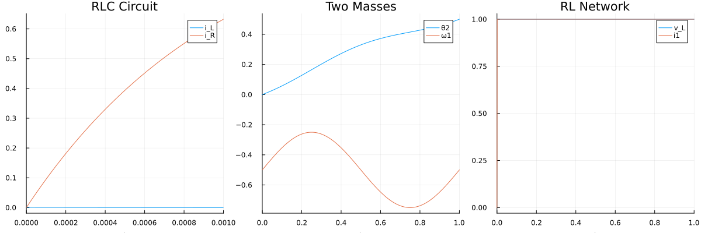

```julia
p4 = plot(cart_ref, title = "Cart Pendulum", legend = :topright)
p5 = plot(gen_ref, title = "Electric Generator", legend = :topright)
p6 = plot(spring_ref, title = "Mass-Spring", legend = :topright)
plot(p4, p5, p6, layout = (1, 3), size = (1200, 400))
```

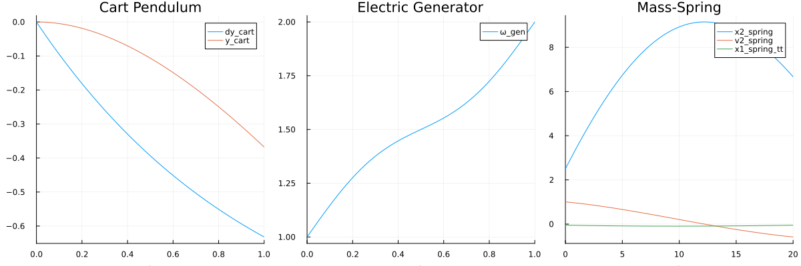


## Work-Precision Benchmarks

### Index-1 DAE: RLC Circuit

```julia
abstols = 1.0 ./ 10.0 .^ (5:8)
reltols = 1.0 ./ 10.0 .^ (1:4)

# RLC Circuit Work-Precision
setups_rlc = [
    Dict(:prob_choice => 1, :alg=>Rosenbrock23()),
    Dict(:prob_choice => 1, :alg=>Rodas5P()),
    Dict(:prob_choice => 1, :alg=>CVODE_BDF()),
    Dict(:prob_choice => 1, :alg=>FBDF()),
    Dict(:prob_choice => 1, :alg=>QNDF()),
    Dict(:prob_choice => 2, :alg=>Rodas4()),
    Dict(:prob_choice => 2, :alg=>Rodas5P())
]

wp_rlc = WorkPrecisionSet(all_probs[1], abstols, reltols, setups_rlc;
    save_everystep = false, appxsol = all_refs[1], maxiters = Int(1e5), numruns = 10)
plot(wp_rlc, title = "RLC Circuit (Index-1) Work-Precision")
```

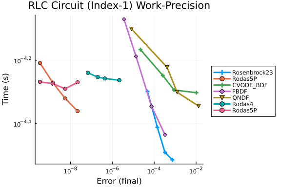


### Index-2 DAE: Two Interconnected Masses

```julia
setups_masses = [
    #Dict(:prob_choice => 2, :alg=>Rosenbrock23()),
    Dict(:prob_choice => 1, :alg=>Rodas5P()),
    #Dict(:prob_choice => 1, :alg=>CVODE_BDF()),
    Dict(:prob_choice => 1, :alg=>FBDF()),
    Dict(:prob_choice => 1, :alg=>QNDF()),
    Dict(:prob_choice => 2, :alg=>Rodas4()),
    Dict(:prob_choice => 2, :alg=>Rodas5P())
]

wp_masses = WorkPrecisionSet(all_probs[2], abstols, reltols, setups_masses;
    save_everystep = false, appxsol = all_refs[2], maxiters = Int(1e5), numruns = 10)
plot(wp_masses, title = "Two Masses (Index-2) Work-Precision")
```

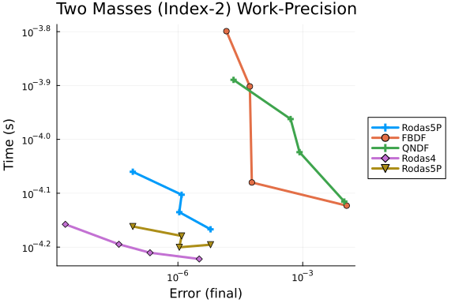


### Index-2 DAE: RL Network

```julia
#=
setups_rl = [
    Dict(:prob_choice => 1, :alg=>Rosenbrock23()),
    Dict(:prob_choice => 1, :alg=>Rodas5P()),
    #Dict(:prob_choice => 1, :alg=>CVODE_BDF()),
    Dict(:prob_choice => 1, :alg=>FBDF()),
    Dict(:prob_choice => 1, :alg=>QNDF()),
    Dict(:prob_choice => 2, :alg=>Rodas4()),
    Dict(:prob_choice => 2, :alg=>Rodas5P()),
]

wp_rl = WorkPrecisionSet(all_probs[3], abstols, reltols, setups_rl;
                        save_everystep=false, appxsol=all_refs[3], maxiters=Int(1e5), numruns=10)
plot(wp_rl, title="RL Network (Index-2) Work-Precision")
=#
```


### Index-3 DAE: Cart Pendulum

```julia
setups_cart = [
    Dict(:prob_choice => 1, :alg=>Rosenbrock23()),
    Dict(:prob_choice => 1, :alg=>Rodas5P()),
    #Dict(:prob_choice => 1, :alg=>CVODE_BDF()),
    Dict(:prob_choice => 1, :alg=>FBDF()),
    Dict(:prob_choice => 1, :alg=>QNDF()),
    Dict(:prob_choice => 2, :alg=>Rodas4()),
    Dict(:prob_choice => 2, :alg=>Rodas5P())
]

wp_cart = WorkPrecisionSet(all_probs[4], abstols, reltols, setups_cart;
    save_everystep = false, appxsol = all_refs[4], maxiters = Int(1e5), numruns = 10)
plot(wp_cart, title = "Cart Pendulum (Index-3) Work-Precision")
```

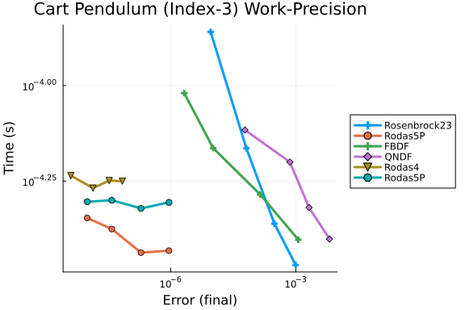


### Index-3 DAE: Electric Generator

```julia
setups_gen = [
    Dict(:prob_choice => 1, :alg=>Rosenbrock23()),
    Dict(:prob_choice => 1, :alg=>Rodas5P()),
    Dict(:prob_choice => 1, :alg=>CVODE_BDF()),
    Dict(:prob_choice => 1, :alg=>FBDF()),
    Dict(:prob_choice => 1, :alg=>QNDF()),
    Dict(:prob_choice => 2, :alg=>Rodas4()),
    Dict(:prob_choice => 2, :alg=>Rodas5P())
]

wp_gen = WorkPrecisionSet(all_probs[5], abstols, reltols, setups_gen;
    save_everystep = false, appxsol = all_refs[5], maxiters = Int(1e5), numruns = 10)
plot(wp_gen, title = "Electric Generator (Index-3) Work-Precision")
```


### Index-3 DAE: Damped Mass-Spring System

```julia
setups_spring = [
    Dict(:prob_choice => 1, :alg=>Rosenbrock23()),
    Dict(:prob_choice => 1, :alg=>Rodas5P()),
    #Dict(:prob_choice => 1, :alg=>CVODE_BDF()),
    Dict(:prob_choice => 1, :alg=>FBDF()),
    Dict(:prob_choice => 1, :alg=>QNDF()),
    Dict(:prob_choice => 2, :alg=>Rodas4()),
    Dict(:prob_choice => 2, :alg=>Rodas5P())
]

wp_spring = WorkPrecisionSet(all_probs[6], abstols, reltols, setups_spring;
    save_everystep = false, appxsol = all_refs[6], maxiters = Int(1e5), numruns = 10)
plot(wp_spring, title = "Mass-Spring (Index-3) Work-Precision")
```

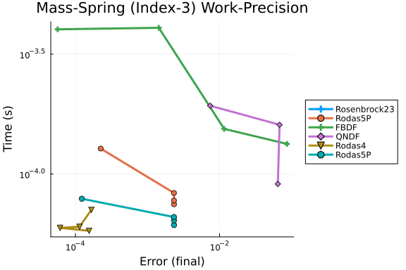


## Low Tolerances Analysis

```julia
abstols_low = 1.0 ./ 10.0 .^ (7:12)
reltols_low = 1.0 ./ 10.0 .^ (4:9)

all_setups = [
    Dict(:prob_choice => 1, :alg=>Rosenbrock23()),
    Dict(:prob_choice => 1, :alg=>Rodas4()),
    Dict(:prob_choice => 1, :alg=>Rodas5P()),
    #Dict(:prob_choice => 1, :alg=>CVODE_BDF()),
    Dict(:prob_choice => 1, :alg=>FBDF()),
    Dict(:prob_choice => 1, :alg=>QNDF()),
    Dict(:prob_choice => 2, :alg=>Rodas5P())
]

# Generate work-precision plots for all systems at low tolerances
for (i, (probs, refs, name)) in enumerate(zip(all_probs, all_refs, system_names))
    wp = WorkPrecisionSet(probs, abstols_low, reltols_low, all_setups;
        save_everystep = false, appxsol = refs, maxiters = Int(1e5), numruns = 10)
    p = plot(wp, title = "$name - Low Tolerances")
    display(p)
end
```

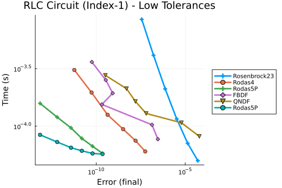
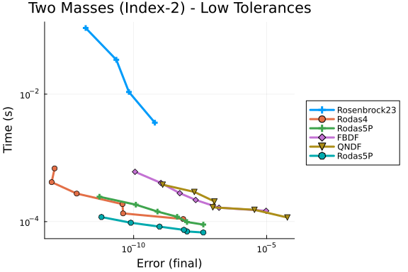
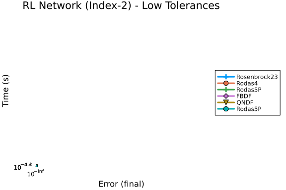
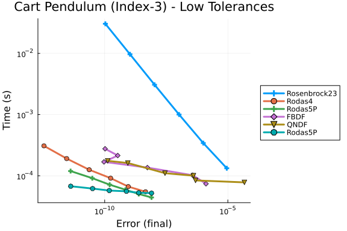
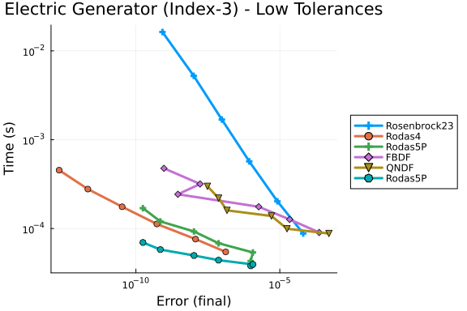
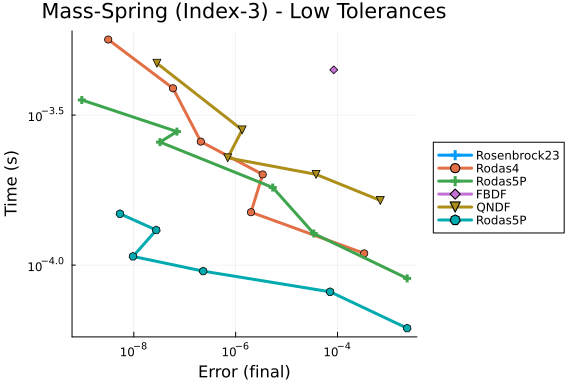


## High Tolerances Analysis

This measures performance when just needing a reasonable answer quickly.

```julia
abstols_high = 1.0 ./ 10.0 .^ (3:6)
reltols_high = 1.0 ./ 10.0 .^ (1:4)

# High tolerance setups - focus on speed
high_setups = [
    Dict(:prob_choice => 1, :alg=>Rosenbrock23()),
    Dict(:prob_choice => 1, :alg=>Rodas5P()),
    #Dict(:prob_choice => 1, :alg=>CVODE_BDF()),
    Dict(:prob_choice => 1, :alg=>FBDF()),
    Dict(:prob_choice => 1, :alg=>QNDF()),
    Dict(:prob_choice => 2, :alg=>Rodas5P())
]

for (i, (probs, refs, name)) in enumerate(zip(all_probs, all_refs, system_names))
    wp = WorkPrecisionSet(probs, abstols_high, reltols_high, high_setups;
        save_everystep = false, appxsol = refs, maxiters = Int(1e5), numruns = 10)
    p = plot(wp, title = "$name - High Tolerances")
    display(p)
end
```

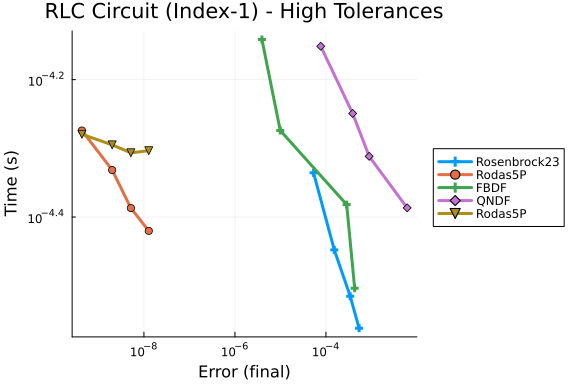
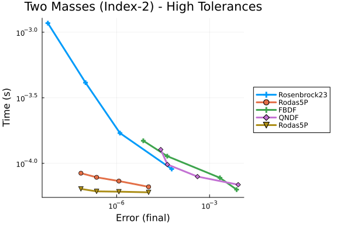
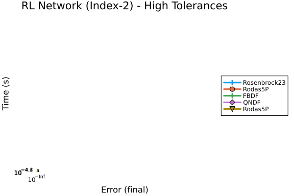
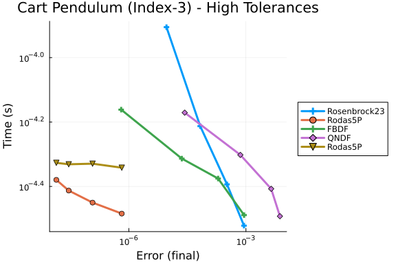
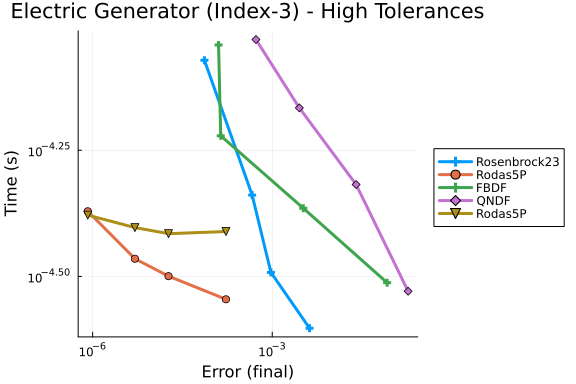
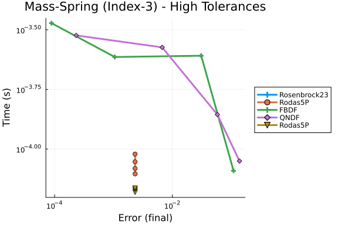


## Summary Comparison

```julia
# Create summary comparison of all DAE types
plot_array = []
for (i, (probs, refs, name)) in enumerate(zip(all_probs, all_refs, system_names))
    wp = WorkPrecisionSet(probs, abstols, reltols, all_setups;
        save_everystep = false, appxsol = refs, maxiters = Int(1e5), numruns = 10)
    p = plot(wp, title = name, legend = false, titlefont = font(10))
    push!(plot_array, p)
end

plot(plot_array..., layout = (2, 3), size = (1500, 800))
```

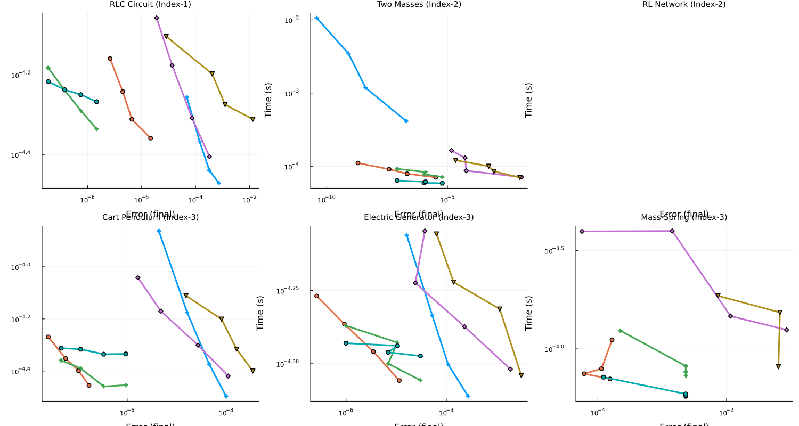


## Timeseries Error Analysis

```julia
# Analyze L2 timeseries errors
abstols_ts = 1.0 ./ 10.0 .^ (5:8)
reltols_ts = 1.0 ./ 10.0 .^ (2:5)

for (i, (probs, refs, name)) in enumerate(zip(all_probs, all_refs, system_names))
    wp = WorkPrecisionSet(probs, abstols_ts, reltols_ts, all_setups;
        error_estimate = :l2, save_everystep = false, appxsol = refs,
        maxiters = Int(1e5), numruns = 10)
    p = plot(wp, title = "$name - L2 Timeseries Error")
    display(p)
end
```

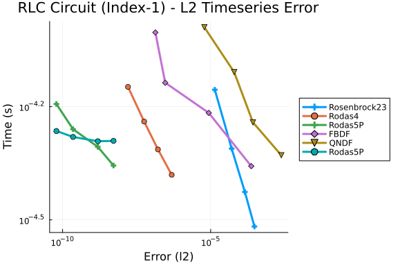
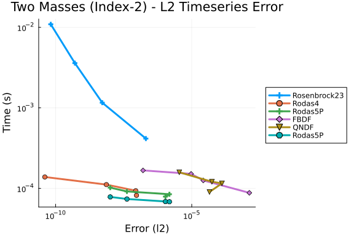
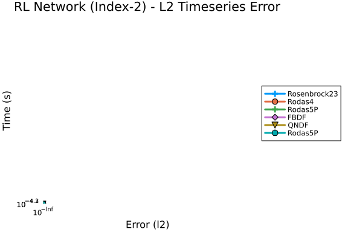
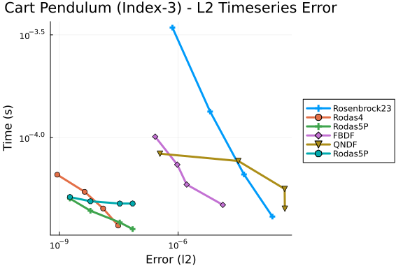
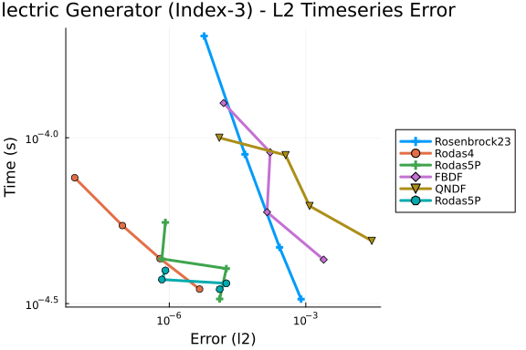
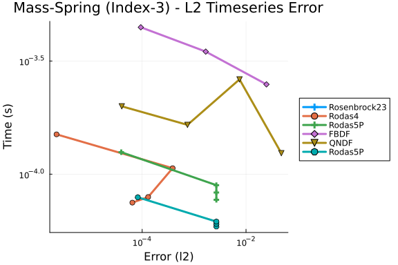


## Appendix

These benchmarks are a part of the SciMLBenchmarks.jl repository, found at: [https://github.com/SciML/SciMLBenchmarks.jl](https://github.com/SciML/SciMLBenchmarks.jl). For more information on high-performance scientific machine learning, check out the SciML Open Source Software Organization [https://sciml.ai](https://sciml.ai).

To locally run this benchmark, do the following commands:

```
using SciMLBenchmarks
SciMLBenchmarks.weave_file("benchmarks/DAE","LinearDAE.jmd")
```

Computer Information:

```
Julia Version 1.10.10
Commit 95f30e51f41 (2025-06-27 09:51 UTC)
Build Info:
  Official https://julialang.org/ release
Platform Info:
  OS: Linux (x86_64-linux-gnu)
  CPU: 128 × AMD EPYC 7502 32-Core Processor
  WORD_SIZE: 64
  LIBM: libopenlibm
  LLVM: libLLVM-15.0.7 (ORCJIT, znver2)
Threads: 1 default, 0 interactive, 1 GC (on 128 virtual cores)
Environment:
  JULIA_CPU_THREADS = 128
  JULIA_DEPOT_PATH = /cache/julia-buildkite-plugin/depots/5b300254-1738-4989-ae0a-f4d2d937f953:

```

Package Information:

```
Status `/cache/build/exclusive-amdci3-0/julialang/scimlbenchmarks-dot-jl/benchmarks/DAE/Project.toml`
  [165a45c3] DASKR v2.9.1
  [e993076c] DASSL v2.8.0
  [f3b72e0c] DiffEqDevTools v2.49.0
⌅ [961ee093] ModelingToolkit v9.84.0
  [09606e27] ODEInterfaceDiffEq v3.15.0
  [1dea7af3] OrdinaryDiffEq v6.108.0
  [91a5bcdd] Plots v1.41.6
  [31c91b34] SciMLBenchmarks v0.1.3
  [90137ffa] StaticArrays v1.9.17
⌅ [c3572dad] Sundials v4.28.0
  [10745b16] Statistics v1.10.0
Info Packages marked with ⌅ have new versions available but compatibility constraints restrict them from upgrading. To see why use `status --outdated`
```

And the full manifest:

```
Status `/cache/build/exclusive-amdci3-0/julialang/scimlbenchmarks-dot-jl/benchmarks/DAE/Manifest.toml`
  [47edcb42] ADTypes v1.21.0
  [1520ce14] AbstractTrees v0.4.5
  [7d9f7c33] Accessors v0.1.43
  [79e6a3ab] Adapt v4.4.0
  [66dad0bd] AliasTables v1.1.3
  [ec485272] ArnoldiMethod v0.4.0
  [4fba245c] ArrayInterface v7.22.0
  [4c555306] ArrayLayouts v1.12.2
  [e2ed5e7c] Bijections v0.2.2
  [d1d4a3ce] BitFlags v0.1.9
  [62783981] BitTwiddlingConvenienceFunctions v0.1.6
  [8e7c35d0] BlockArrays v1.9.3
  [70df07ce] BracketingNonlinearSolve v1.10.0
  [fa961155] CEnum v0.5.0
  [2a0fbf3d] CPUSummary v0.2.7
  [d360d2e6] ChainRulesCore v1.26.0
  [fb6a15b2] CloseOpenIntervals v0.1.13
  [944b1d66] CodecZlib v0.7.8
  [35d6a980] ColorSchemes v3.31.0
  [3da002f7] ColorTypes v0.12.1
  [c3611d14] ColorVectorSpace v0.11.0
  [5ae59095] Colors v0.13.1
⌅ [861a8166] Combinatorics v1.0.2
⌅ [a80b9123] CommonMark v0.10.3
  [38540f10] CommonSolve v0.2.6
  [bbf7d656] CommonSubexpressions v0.3.1
  [f70d9fcc] CommonWorldInvalidations v1.0.0
  [34da2185] Compat v4.18.1
  [b152e2b5] CompositeTypes v0.1.4
  [a33af91c] CompositionsBase v0.1.2
  [2569d6c7] ConcreteStructs v0.2.3
  [f0e56b4a] ConcurrentUtilities v2.5.1
  [8f4d0f93] Conda v1.10.3
  [187b0558] ConstructionBase v1.6.0
  [d38c429a] Contour v0.6.3
  [adafc99b] CpuId v0.3.1
  [165a45c3] DASKR v2.9.1
  [e993076c] DASSL v2.8.0
  [9a962f9c] DataAPI v1.16.0
⌅ [864edb3b] DataStructures v0.18.22
  [e2d170a0] DataValueInterfaces v1.0.0
  [8bb1440f] DelimitedFiles v1.9.1
  [2b5f629d] DiffEqBase v6.205.1
  [459566f4] DiffEqCallbacks v4.12.0
  [f3b72e0c] DiffEqDevTools v2.49.0
  [77a26b50] DiffEqNoiseProcess v5.27.0
  [163ba53b] DiffResults v1.1.0
  [b552c78f] DiffRules v1.15.1
  [a0c0ee7d] DifferentiationInterface v0.7.16
  [8d63f2c5] DispatchDoctor v0.4.28
  [b4f34e82] Distances v0.10.12
  [31c24e10] Distributions v0.25.123
  [ffbed154] DocStringExtensions v0.9.5
  [5b8099bc] DomainSets v0.7.16
⌃ [7c1d4256] DynamicPolynomials v0.6.3
  [06fc5a27] DynamicQuantities v1.11.0
  [4e289a0a] EnumX v1.0.6
  [f151be2c] EnzymeCore v0.8.18
  [460bff9d] ExceptionUnwrapping v0.1.11
  [d4d017d3] ExponentialUtilities v1.30.0
  [e2ba6199] ExprTools v0.1.10
  [55351af7] ExproniconLite v0.10.14
  [c87230d0] FFMPEG v0.4.5
  [7034ab61] FastBroadcast v0.3.5
  [9aa1b823] FastClosures v0.3.2
  [442a2c76] FastGaussQuadrature v1.1.0
  [a4df4552] FastPower v1.3.1
  [1a297f60] FillArrays v1.16.0
  [64ca27bc] FindFirstFunctions v1.8.0
  [6a86dc24] FiniteDiff v2.29.0
  [53c48c17] FixedPointNumbers v0.8.5
  [1fa38f19] Format v1.3.7
  [f6369f11] ForwardDiff v1.3.2
  [069b7b12] FunctionWrappers v1.1.3
  [77dc65aa] FunctionWrappersWrappers v0.1.3
  [46192b85] GPUArraysCore v0.2.0
  [28b8d3ca] GR v0.73.22
  [c145ed77] GenericSchur v0.5.6
  [d7ba0133] Git v1.5.0
  [c27321d9] Glob v1.4.0
⌃ [86223c79] Graphs v1.13.1
  [42e2da0e] Grisu v1.0.2
  [cd3eb016] HTTP v1.10.19
⌅ [eafb193a] Highlights v0.5.3
  [34004b35] HypergeometricFunctions v0.3.28
  [7073ff75] IJulia v1.34.3
  [615f187c] IfElse v0.1.1
  [d25df0c9] Inflate v0.1.5
  [18e54dd8] IntegerMathUtils v0.1.3
  [8197267c] IntervalSets v0.7.13
  [3587e190] InverseFunctions v0.1.17
  [92d709cd] IrrationalConstants v0.2.6
  [82899510] IteratorInterfaceExtensions v1.0.0
  [1019f520] JLFzf v0.1.11
  [692b3bcd] JLLWrappers v1.7.1
⌅ [682c06a0] JSON v0.21.4
  [ae98c720] Jieko v0.2.1
  [98e50ef6] JuliaFormatter v2.3.0
⌅ [70703baa] JuliaSyntax v0.4.10
  [ccbc3e58] JumpProcesses v9.22.0
  [ba0b0d4f] Krylov v0.10.5
  [b964fa9f] LaTeXStrings v1.4.0
  [23fbe1c1] Latexify v0.16.10
  [10f19ff3] LayoutPointers v0.1.17
  [87fe0de2] LineSearch v0.1.6
⌃ [d3d80556] LineSearches v7.5.1
  [7ed4a6bd] LinearSolve v3.59.1
  [2ab3a3ac] LogExpFunctions v0.3.29
  [e6f89c97] LoggingExtras v1.2.0
  [d8e11817] MLStyle v0.4.17
  [1914dd2f] MacroTools v0.5.16
  [d125e4d3] ManualMemory v0.1.8
  [bb5d69b7] MaybeInplace v0.1.4
  [739be429] MbedTLS v1.1.9
  [442fdcdd] Measures v0.3.3
  [e1d29d7a] Missings v1.2.0
⌅ [961ee093] ModelingToolkit v9.84.0
  [2e0e35c7] Moshi v0.3.7
  [46d2c3a1] MuladdMacro v0.2.4
⌃ [102ac46a] MultivariatePolynomials v0.5.9
  [ffc61752] Mustache v1.0.21
  [d8a4904e] MutableArithmetics v1.6.7
⌅ [d41bc354] NLSolversBase v7.10.0
  [2774e3e8] NLsolve v4.5.1
  [77ba4419] NaNMath v1.1.3
  [8913a72c] NonlinearSolve v4.16.0
⌃ [be0214bd] NonlinearSolveBase v2.11.2
  [5959db7a] NonlinearSolveFirstOrder v2.0.0
  [9a2c21bd] NonlinearSolveQuasiNewton v1.12.0
  [26075421] NonlinearSolveSpectralMethods v1.6.0
  [54ca160b] ODEInterface v0.5.0
  [09606e27] ODEInterfaceDiffEq v3.15.0
  [6fe1bfb0] OffsetArrays v1.17.0
  [4d8831e6] OpenSSL v1.6.1
  [bac558e1] OrderedCollections v1.8.1
  [1dea7af3] OrdinaryDiffEq v6.108.0
  [89bda076] OrdinaryDiffEqAdamsBashforthMoulton v1.9.0
⌃ [6ad6398a] OrdinaryDiffEqBDF v1.15.0
⌃ [bbf590c4] OrdinaryDiffEqCore v3.1.0
  [50262376] OrdinaryDiffEqDefault v1.12.0
  [4302a76b] OrdinaryDiffEqDifferentiation v2.0.0
  [9286f039] OrdinaryDiffEqExplicitRK v1.9.0
  [e0540318] OrdinaryDiffEqExponentialRK v1.13.0
⌃ [becaefa8] OrdinaryDiffEqExtrapolation v1.14.0
⌃ [5960d6e9] OrdinaryDiffEqFIRK v1.21.0
  [101fe9f7] OrdinaryDiffEqFeagin v1.8.0
  [d3585ca7] OrdinaryDiffEqFunctionMap v1.9.0
  [d28bc4f8] OrdinaryDiffEqHighOrderRK v1.9.0
  [9f002381] OrdinaryDiffEqIMEXMultistep v1.12.0
  [521117fe] OrdinaryDiffEqLinear v1.10.0
  [1344f307] OrdinaryDiffEqLowOrderRK v1.10.0
⌃ [b0944070] OrdinaryDiffEqLowStorageRK v1.11.0
  [127b3ac7] OrdinaryDiffEqNonlinearSolve v1.20.0
⌃ [c9986a66] OrdinaryDiffEqNordsieck v1.8.0
  [5dd0a6cf] OrdinaryDiffEqPDIRK v1.11.0
  [5b33eab2] OrdinaryDiffEqPRK v1.8.0
  [04162be5] OrdinaryDiffEqQPRK v1.8.0
  [af6ede74] OrdinaryDiffEqRKN v1.9.0
  [43230ef6] OrdinaryDiffEqRosenbrock v1.23.0
  [2d112036] OrdinaryDiffEqSDIRK v1.12.0
  [669c94d9] OrdinaryDiffEqSSPRK v1.11.0
  [e3e12d00] OrdinaryDiffEqStabilizedIRK v1.11.0
  [358294b1] OrdinaryDiffEqStabilizedRK v1.8.0
  [fa646aed] OrdinaryDiffEqSymplecticRK v1.11.0
  [b1df2697] OrdinaryDiffEqTsit5 v1.9.0
  [79d7bb75] OrdinaryDiffEqVerner v1.11.0
  [90014a1f] PDMats v0.11.37
  [69de0a69] Parsers v2.8.3
  [ccf2f8ad] PlotThemes v3.3.0
  [995b91a9] PlotUtils v1.4.4
  [91a5bcdd] Plots v1.41.6
  [e409e4f3] PoissonRandom v0.4.7
  [f517fe37] Polyester v0.7.19
  [1d0040c9] PolyesterWeave v0.2.2
⌃ [d236fae5] PreallocationTools v0.4.34
⌅ [aea7be01] PrecompileTools v1.2.1
  [21216c6a] Preferences v1.5.1
  [27ebfcd6] Primes v0.5.7
  [43287f4e] PtrArrays v1.3.0
  [1fd47b50] QuadGK v2.11.2
  [3cdcf5f2] RecipesBase v1.3.4
  [01d81517] RecipesPipeline v0.6.12
  [731186ca] RecursiveArrayTools v3.48.0
  [189a3867] Reexport v1.2.2
  [05181044] RelocatableFolders v1.0.1
  [ae029012] Requires v1.3.1
  [ae5879a3] ResettableStacks v1.2.0
  [79098fc4] Rmath v0.9.0
  [47965b36] RootedTrees v2.25.0
  [7e49a35a] RuntimeGeneratedFunctions v0.5.17
  [9dfe8606] SCCNonlinearSolve v1.11.0
  [94e857df] SIMDTypes v0.1.0
  [0bca4576] SciMLBase v2.140.0
  [31c91b34] SciMLBenchmarks v0.1.3
  [19f34311] SciMLJacobianOperators v0.1.12
  [a6db7da4] SciMLLogging v1.9.1
  [c0aeaf25] SciMLOperators v1.15.1
  [431bcebd] SciMLPublic v1.0.1
  [53ae85a6] SciMLStructures v1.10.0
  [6c6a2e73] Scratch v1.3.0
  [efcf1570] Setfield v1.1.2
  [992d4aef] Showoff v1.0.3
  [777ac1f9] SimpleBufferStream v1.2.0
  [727e6d20] SimpleNonlinearSolve v2.11.0
  [699a6c99] SimpleTraits v0.9.5
  [a2af1166] SortingAlgorithms v1.2.2
  [0a514795] SparseMatrixColorings v0.4.23
  [276daf66] SpecialFunctions v2.7.1
  [860ef19b] StableRNGs v1.0.4
  [aedffcd0] Static v1.3.1
  [0d7ed370] StaticArrayInterface v1.9.0
  [90137ffa] StaticArrays v1.9.17
  [1e83bf80] StaticArraysCore v1.4.4
  [82ae8749] StatsAPI v1.8.0
  [2913bbd2] StatsBase v0.34.10
  [4c63d2b9] StatsFuns v1.5.2
  [7792a7ef] StrideArraysCore v0.5.8
  [69024149] StringEncodings v0.3.7
  [09ab397b] StructArrays v0.7.2
⌅ [c3572dad] Sundials v4.28.0
  [2efcf032] SymbolicIndexingInterface v0.3.46
⌅ [19f23fe9] SymbolicLimits v0.2.3
⌅ [d1185830] SymbolicUtils v3.32.0
⌅ [0c5d862f] Symbolics v6.58.0
  [3783bdb8] TableTraits v1.0.1
  [bd369af6] Tables v1.12.1
  [ed4db957] TaskLocalValues v0.1.3
  [62fd8b95] TensorCore v0.1.1
  [8ea1fca8] TermInterface v2.0.0
  [1c621080] TestItems v1.0.0
  [8290d209] ThreadingUtilities v0.5.5
  [a759f4b9] TimerOutputs v0.5.29
  [3bb67fe8] TranscodingStreams v0.11.3
  [410a4b4d] Tricks v0.1.13
  [781d530d] TruncatedStacktraces v1.4.0
  [5c2747f8] URIs v1.6.1
  [3a884ed6] UnPack v1.0.2
  [1cfade01] UnicodeFun v0.4.1
  [1986cc42] Unitful v1.28.0
  [a7c27f48] Unityper v0.1.6
  [41fe7b60] Unzip v0.2.0
  [81def892] VersionParsing v1.3.0
  [44d3d7a6] Weave v0.10.12
  [ddb6d928] YAML v0.4.16
  [c2297ded] ZMQ v1.5.1
  [6e34b625] Bzip2_jll v1.0.9+0
  [83423d85] Cairo_jll v1.18.5+1
  [655fdf9c] DASKR_jll v1.0.1+0
  [ee1fde0b] Dbus_jll v1.16.2+0
  [2702e6a9] EpollShim_jll v0.0.20230411+1
  [2e619515] Expat_jll v2.7.3+0
  [b22a6f82] FFMPEG_jll v8.0.1+0
  [a3f928ae] Fontconfig_jll v2.17.1+0
  [d7e528f0] FreeType2_jll v2.13.4+0
  [559328eb] FriBidi_jll v1.0.17+0
  [0656b61e] GLFW_jll v3.4.1+0
  [d2c73de3] GR_jll v0.73.22+0
  [b0724c58] GettextRuntime_jll v0.22.4+0
  [61579ee1] Ghostscript_jll v9.55.1+0
  [020c3dae] Git_LFS_jll v3.7.0+0
  [f8c6e375] Git_jll v2.53.0+0
  [7746bdde] Glib_jll v2.86.3+0
  [3b182d85] Graphite2_jll v1.3.15+0
  [2e76f6c2] HarfBuzz_jll v8.5.1+0
  [1d5cc7b8] IntelOpenMP_jll v2025.2.0+0
  [aacddb02] JpegTurbo_jll v3.1.4+0
  [c1c5ebd0] LAME_jll v3.100.3+0
  [88015f11] LERC_jll v4.0.1+0
  [1d63c593] LLVMOpenMP_jll v18.1.8+0
  [dd4b983a] LZO_jll v2.10.3+0
⌅ [e9f186c6] Libffi_jll v3.4.7+0
  [7e76a0d4] Libglvnd_jll v1.7.1+1
  [94ce4f54] Libiconv_jll v1.18.0+0
  [4b2f31a3] Libmount_jll v2.41.3+0
  [89763e89] Libtiff_jll v4.7.2+0
  [38a345b3] Libuuid_jll v2.41.3+0
  [856f044c] MKL_jll v2025.2.0+0
  [c771fb93] ODEInterface_jll v0.0.2+0
  [e7412a2a] Ogg_jll v1.3.6+0
  [9bd350c2] OpenSSH_jll v10.2.1+0
  [458c3c95] OpenSSL_jll v3.5.5+0
  [efe28fd5] OpenSpecFun_jll v0.5.6+0
  [91d4177d] Opus_jll v1.6.1+0
  [36c8627f] Pango_jll v1.57.0+0
⌅ [30392449] Pixman_jll v0.44.2+0
⌅ [c0090381] Qt6Base_jll v6.8.2+2
  [629bc702] Qt6Declarative_jll v6.8.2+1
  [ce943373] Qt6ShaderTools_jll v6.8.2+1
  [e99dba38] Qt6Wayland_jll v6.8.2+2
  [f50d1b31] Rmath_jll v0.5.1+0
⌅ [fb77eaff] Sundials_jll v5.2.2+0
  [a44049a8] Vulkan_Loader_jll v1.3.243+0
  [a2964d1f] Wayland_jll v1.24.0+0
  [ffd25f8a] XZ_jll v5.8.2+0
  [f67eecfb] Xorg_libICE_jll v1.1.2+0
  [c834827a] Xorg_libSM_jll v1.2.6+0
  [4f6342f7] Xorg_libX11_jll v1.8.13+0
  [0c0b7dd1] Xorg_libXau_jll v1.0.13+0
  [935fb764] Xorg_libXcursor_jll v1.2.4+0
  [a3789734] Xorg_libXdmcp_jll v1.1.6+0
  [1082639a] Xorg_libXext_jll v1.3.8+0
  [d091e8ba] Xorg_libXfixes_jll v6.0.2+0
  [a51aa0fd] Xorg_libXi_jll v1.8.3+0
  [d1454406] Xorg_libXinerama_jll v1.1.7+0
  [ec84b674] Xorg_libXrandr_jll v1.5.6+0
  [ea2f1a96] Xorg_libXrender_jll v0.9.12+0
  [c7cfdc94] Xorg_libxcb_jll v1.17.1+0
  [cc61e674] Xorg_libxkbfile_jll v1.2.0+0
  [e920d4aa] Xorg_xcb_util_cursor_jll v0.1.6+0
  [12413925] Xorg_xcb_util_image_jll v0.4.1+0
  [2def613f] Xorg_xcb_util_jll v0.4.1+0
  [975044d2] Xorg_xcb_util_keysyms_jll v0.4.1+0
  [0d47668e] Xorg_xcb_util_renderutil_jll v0.3.10+0
  [c22f9ab0] Xorg_xcb_util_wm_jll v0.4.2+0
  [35661453] Xorg_xkbcomp_jll v1.4.7+0
  [33bec58e] Xorg_xkeyboard_config_jll v2.44.0+0
  [c5fb5394] Xorg_xtrans_jll v1.6.0+0
  [8f1865be] ZeroMQ_jll v4.3.6+0
  [3161d3a3] Zstd_jll v1.5.7+1
  [35ca27e7] eudev_jll v3.2.14+0
  [214eeab7] fzf_jll v0.61.1+0
  [a4ae2306] libaom_jll v3.13.1+0
  [0ac62f75] libass_jll v0.17.4+0
  [1183f4f0] libdecor_jll v0.2.2+0
  [2db6ffa8] libevdev_jll v1.13.4+0
  [f638f0a6] libfdk_aac_jll v2.0.4+0
  [36db933b] libinput_jll v1.28.1+0
  [b53b4c65] libpng_jll v1.6.55+0
  [a9144af2] libsodium_jll v1.0.21+0
  [f27f6e37] libvorbis_jll v1.3.8+0
  [009596ad] mtdev_jll v1.1.7+0
  [1317d2d5] oneTBB_jll v2022.0.0+1
⌅ [1270edf5] x264_jll v10164.0.1+0
  [dfaa095f] x265_jll v4.1.0+0
  [d8fb68d0] xkbcommon_jll v1.13.0+0
  [0dad84c5] ArgTools v1.1.1
  [56f22d72] Artifacts
  [2a0f44e3] Base64
  [ade2ca70] Dates
  [8ba89e20] Distributed
  [f43a241f] Downloads v1.6.0
  [7b1f6079] FileWatching
  [9fa8497b] Future
  [b77e0a4c] InteractiveUtils
  [4af54fe1] LazyArtifacts
  [b27032c2] LibCURL v0.6.4
  [76f85450] LibGit2
  [8f399da3] Libdl
  [37e2e46d] LinearAlgebra
  [56ddb016] Logging
  [d6f4376e] Markdown
  [a63ad114] Mmap
  [ca575930] NetworkOptions v1.2.0
  [44cfe95a] Pkg v1.10.0
  [de0858da] Printf
  [3fa0cd96] REPL
  [9a3f8284] Random
  [ea8e919c] SHA v0.7.0
  [9e88b42a] Serialization
  [1a1011a3] SharedArrays
  [6462fe0b] Sockets
  [2f01184e] SparseArrays v1.10.0
  [10745b16] Statistics v1.10.0
  [4607b0f0] SuiteSparse
  [fa267f1f] TOML v1.0.3
  [a4e569a6] Tar v1.10.0
  [8dfed614] Test
  [cf7118a7] UUIDs
  [4ec0a83e] Unicode
  [e66e0078] CompilerSupportLibraries_jll v1.1.1+0
  [deac9b47] LibCURL_jll v8.4.0+0
  [e37daf67] LibGit2_jll v1.6.4+0
  [29816b5a] LibSSH2_jll v1.11.0+1
  [c8ffd9c3] MbedTLS_jll v2.28.2+1
  [14a3606d] MozillaCACerts_jll v2023.1.10
  [4536629a] OpenBLAS_jll v0.3.23+4
  [05823500] OpenLibm_jll v0.8.5+0
  [efcefdf7] PCRE2_jll v10.42.0+1
  [bea87d4a] SuiteSparse_jll v7.2.1+1
  [83775a58] Zlib_jll v1.2.13+1
  [8e850b90] libblastrampoline_jll v5.11.0+0
  [8e850ede] nghttp2_jll v1.52.0+1
  [3f19e933] p7zip_jll v17.4.0+2
Info Packages marked with ⌃ and ⌅ have new versions available. Those with ⌃ may be upgradable, but those with ⌅ are restricted by compatibility constraints from upgrading. To see why use `status --outdated -m`
```

