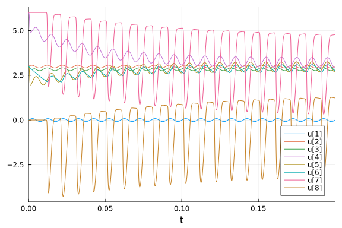
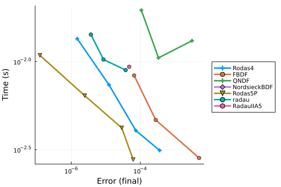
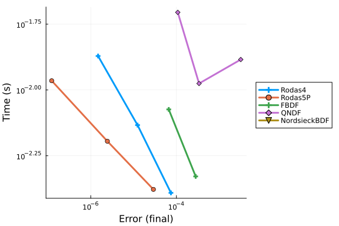
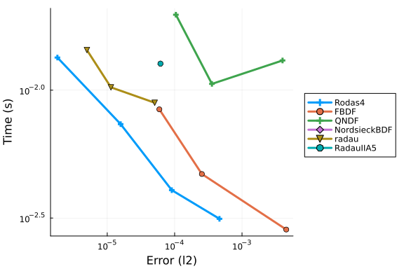
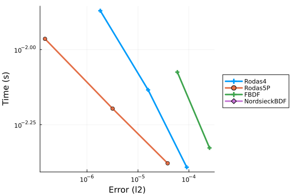
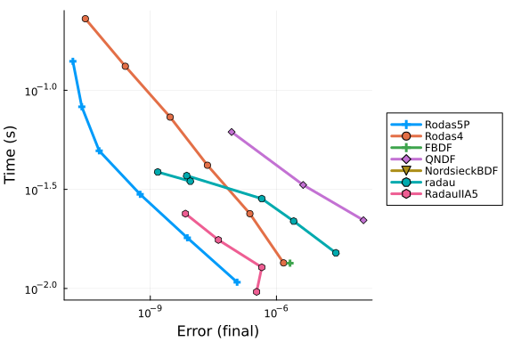

```julia
using DiffEqDevTools, ODEInterfaceDiffEq, Plots
using OrdinaryDiffEq
using OrdinaryDiffEqBDF, OrdinaryDiffEqFIRK, OrdinaryDiffEqRosenbrock
using LinearAlgebra

# MTK structural simplify on this circuit leaves singular SCCs and an unstable
# reduced system (y₇ˍt / y₄ˍt / y₁ˍt blow up). Benchmark the hand mass-matrix
# form only, which matches the IVP Test Set residual structure.

const Ub = 6.0
const UF = 0.026
const α = 0.99
const β = 1e-6
const R₀ = 1e3
const R₁ = 9e3
const R₂ = 9e3
const R₃ = 9e3
const R₄ = 9e3
const R₅ = 9e3
const R₆ = 9e3
const R₇ = 9e3
const R₈ = 9e3
const R₉ = 9e3
const C₁ = 1e-6
const C₂ = 2e-6
const C₃ = 3e-6
const C₄ = 4e-6
const C₅ = 5e-6

tspan = (0.0, 0.2)

function transamp(du, u, p, t)
    y₁, y₂, y₃, y₄, y₅, y₆, y₇, y₈ = u
    Uₑ = 0.1 * sin(200π * t)
    g(x) = β * (exp(x / UF) - 1)

    du[1] = -Uₑ / R₀ + y₁ / R₀
    du[2] = -Ub / R₂ + y₂ * (1 / R₁ + 1 / R₂) - (α - 1) * g(y₂ - y₃)
    du[3] = -g(y₂ - y₃) + y₃ / R₃
    du[4] = -Ub / R₄ + y₄ / R₄ + α * g(y₂ - y₃)
    du[5] = -Ub / R₆ + y₅ * (1 / R₅ + 1 / R₆) - (α - 1) * g(y₅ - y₆)
    du[6] = -g(y₅ - y₆) + y₆ / R₇
    du[7] = -Ub / R₈ + y₇ / R₈ + α * g(y₅ - y₆)
    du[8] = y₈ / R₉
    nothing
end

dirMassMatrix = [-C₁ C₁ 0 0 0 0 0 0
                 C₁ -C₁ 0 0 0 0 0 0
                 0 0 -C₂ 0 0 0 0 0
                 0 0 0 -C₃ C₃ 0 0 0
                 0 0 0 C₃ -C₃ 0 0 0
                 0 0 0 0 0 -C₄ 0 0
                 0 0 0 0 0 0 -C₅ C₅
                 0 0 0 0 0 0 C₅ -C₅]
mmf = ODEFunction(transamp, mass_matrix = dirMassMatrix)
mmprob = ODEProblem(mmf, [0.0, 3.0, 3.0, 6.0, 3.0, 3.0, 6.0, 0.0], tspan)
mm_refsol = solve(mmprob, Rodas5(), reltol = 1e-12, abstol = 1e-12)

probs = [mmprob]
refs = [mm_refsol]
```

```
1-element Vector{SciMLBase.ODESolution{Float64, 2, Vector{Vector{Float64}},
 Nothing, Nothing, Vector{Float64}, Vector{Vector{Vector{Float64}}}, Nothin
g, SciMLBase.ODEProblem{Vector{Float64}, Tuple{Float64, Float64}, true, Sci
MLBase.NullParameters, SciMLBase.ODEFunction{true, SciMLBase.AutoSpecialize
, FunctionWrappersWrappers.FunctionWrappersWrapper{Tuple{FunctionWrappers.F
unctionWrapper{Nothing, Tuple{Vector{Float64}, Vector{Float64}, SciMLBase.N
ullParameters, Float64}}, FunctionWrappers.FunctionWrapper{Nothing, Tuple{V
ector{ForwardDiff.Dual{ForwardDiff.Tag{DiffEqBase.OrdinaryDiffEqTag, Float6
4}, Float64, 1}}, Vector{ForwardDiff.Dual{ForwardDiff.Tag{DiffEqBase.Ordina
ryDiffEqTag, Float64}, Float64, 1}}, SciMLBase.NullParameters, Float64}}, F
unctionWrappers.FunctionWrapper{Nothing, Tuple{Vector{ForwardDiff.Dual{Forw
ardDiff.Tag{DiffEqBase.OrdinaryDiffEqTag, Float64}, Float64, 1}}, Vector{Fl
oat64}, SciMLBase.NullParameters, ForwardDiff.Dual{ForwardDiff.Tag{DiffEqBa
se.OrdinaryDiffEqTag, Float64}, Float64, 1}}}, FunctionWrappers.FunctionWra
pper{Nothing, Tuple{Vector{ForwardDiff.Dual{ForwardDiff.Tag{DiffEqBase.Ordi
naryDiffEqTag, Float64}, Float64, 1}}, Vector{ForwardDiff.Dual{ForwardDiff.
Tag{DiffEqBase.OrdinaryDiffEqTag, Float64}, Float64, 1}}, SciMLBase.NullPar
ameters, ForwardDiff.Dual{ForwardDiff.Tag{DiffEqBase.OrdinaryDiffEqTag, Flo
at64}, Float64, 1}}}}, FunctionWrappersWrappers.AllowNonIsBits, FunctionWra
ppersWrappers.SingleCacheStorage}, Matrix{Float64}, Nothing, Nothing, Nothi
ng, Nothing, Nothing, Nothing, Nothing, Nothing, Nothing, Nothing, Nothing,
 Nothing, typeof(SciMLBase.DEFAULT_OBSERVED), Nothing, Nothing, Nothing, No
thing}, Base.Pairs{Symbol, Union{}, Tuple{}, @NamedTuple{}}, SciMLBase.Stan
dardODEProblem}, OrdinaryDiffEqRosenbrock.Rodas5{ADTypes.AutoForwardDiff{1,
 ForwardDiff.Tag{DiffEqBase.OrdinaryDiffEqTag, Float64}}, Nothing, typeof(O
rdinaryDiffEqCore.trivial_limiter!), typeof(OrdinaryDiffEqCore.trivial_limi
ter!), Nothing}, OrdinaryDiffEqCore.InterpolationData{SciMLBase.ODEFunction
{true, SciMLBase.AutoSpecialize, FunctionWrappersWrappers.FunctionWrappersW
rapper{Tuple{FunctionWrappers.FunctionWrapper{Nothing, Tuple{Vector{Float64
}, Vector{Float64}, SciMLBase.NullParameters, Float64}}, FunctionWrappers.F
unctionWrapper{Nothing, Tuple{Vector{ForwardDiff.Dual{ForwardDiff.Tag{DiffE
qBase.OrdinaryDiffEqTag, Float64}, Float64, 1}}, Vector{ForwardDiff.Dual{Fo
rwardDiff.Tag{DiffEqBase.OrdinaryDiffEqTag, Float64}, Float64, 1}}, SciMLBa
se.NullParameters, Float64}}, FunctionWrappers.FunctionWrapper{Nothing, Tup
le{Vector{ForwardDiff.Dual{ForwardDiff.Tag{DiffEqBase.OrdinaryDiffEqTag, Fl
oat64}, Float64, 1}}, Vector{Float64}, SciMLBase.NullParameters, ForwardDif
f.Dual{ForwardDiff.Tag{DiffEqBase.OrdinaryDiffEqTag, Float64}, Float64, 1}}
}, FunctionWrappers.FunctionWrapper{Nothing, Tuple{Vector{ForwardDiff.Dual{
ForwardDiff.Tag{DiffEqBase.OrdinaryDiffEqTag, Float64}, Float64, 1}}, Vecto
r{ForwardDiff.Dual{ForwardDiff.Tag{DiffEqBase.OrdinaryDiffEqTag, Float64},
Float64, 1}}, SciMLBase.NullParameters, ForwardDiff.Dual{ForwardDiff.Tag{Di
ffEqBase.OrdinaryDiffEqTag, Float64}, Float64, 1}}}}, FunctionWrappersWrapp
ers.AllowNonIsBits, FunctionWrappersWrappers.SingleCacheStorage}, Matrix{Fl
oat64}, Nothing, Nothing, Nothing, Nothing, Nothing, Nothing, Nothing, Noth
ing, Nothing, Nothing, Nothing, Nothing, typeof(SciMLBase.DEFAULT_OBSERVED)
, Nothing, Nothing, Nothing, Nothing}, Vector{Vector{Float64}}, Vector{Floa
t64}, Vector{Vector{Vector{Float64}}}, Nothing, OrdinaryDiffEqRosenbrock.Ro
senbrockCache{Vector{Float64}, Vector{Float64}, Float64, Vector{Float64}, M
atrix{Float64}, Matrix{Float64}, OrdinaryDiffEqRosenbrockTableaus.RodasTabl
eau{Float64, Float64, Vector{Float64}}, SciMLBase.TimeGradientWrapper{true,
 SciMLBase.ODEFunction{true, SciMLBase.AutoSpecialize, FunctionWrappersWrap
pers.FunctionWrappersWrapper{Tuple{FunctionWrappers.FunctionWrapper{Nothing
, Tuple{Vector{Float64}, Vector{Float64}, SciMLBase.NullParameters, Float64
}}, FunctionWrappers.FunctionWrapper{Nothing, Tuple{Vector{ForwardDiff.Dual
{ForwardDiff.Tag{DiffEqBase.OrdinaryDiffEqTag, Float64}, Float64, 1}}, Vect
or{ForwardDiff.Dual{ForwardDiff.Tag{DiffEqBase.OrdinaryDiffEqTag, Float64},
 Float64, 1}}, SciMLBase.NullParameters, Float64}}, FunctionWrappers.Functi
onWrapper{Nothing, Tuple{Vector{ForwardDiff.Dual{ForwardDiff.Tag{DiffEqBase
.OrdinaryDiffEqTag, Float64}, Float64, 1}}, Vector{Float64}, SciMLBase.Null
Parameters, ForwardDiff.Dual{ForwardDiff.Tag{DiffEqBase.OrdinaryDiffEqTag,
Float64}, Float64, 1}}}, FunctionWrappers.FunctionWrapper{Nothing, Tuple{Ve
ctor{ForwardDiff.Dual{ForwardDiff.Tag{DiffEqBase.OrdinaryDiffEqTag, Float64
}, Float64, 1}}, Vector{ForwardDiff.Dual{ForwardDiff.Tag{DiffEqBase.Ordinar
yDiffEqTag, Float64}, Float64, 1}}, SciMLBase.NullParameters, ForwardDiff.D
ual{ForwardDiff.Tag{DiffEqBase.OrdinaryDiffEqTag, Float64}, Float64, 1}}}},
 FunctionWrappersWrappers.AllowNonIsBits, FunctionWrappersWrappers.SingleCa
cheStorage}, Matrix{Float64}, Nothing, Nothing, Nothing, Nothing, Nothing,
Nothing, Nothing, Nothing, Nothing, Nothing, Nothing, Nothing, typeof(SciML
Base.DEFAULT_OBSERVED), Nothing, Nothing, Nothing, Nothing}, Vector{Float64
}, SciMLBase.NullParameters}, SciMLBase.UJacobianWrapper{true, SciMLBase.OD
EFunction{true, SciMLBase.AutoSpecialize, FunctionWrappersWrappers.Function
WrappersWrapper{Tuple{FunctionWrappers.FunctionWrapper{Nothing, Tuple{Vecto
r{Float64}, Vector{Float64}, SciMLBase.NullParameters, Float64}}, FunctionW
rappers.FunctionWrapper{Nothing, Tuple{Vector{ForwardDiff.Dual{ForwardDiff.
Tag{DiffEqBase.OrdinaryDiffEqTag, Float64}, Float64, 1}}, Vector{ForwardDif
f.Dual{ForwardDiff.Tag{DiffEqBase.OrdinaryDiffEqTag, Float64}, Float64, 1}}
, SciMLBase.NullParameters, Float64}}, FunctionWrappers.FunctionWrapper{Not
hing, Tuple{Vector{ForwardDiff.Dual{ForwardDiff.Tag{DiffEqBase.OrdinaryDiff
EqTag, Float64}, Float64, 1}}, Vector{Float64}, SciMLBase.NullParameters, F
orwardDiff.Dual{ForwardDiff.Tag{DiffEqBase.OrdinaryDiffEqTag, Float64}, Flo
at64, 1}}}, FunctionWrappers.FunctionWrapper{Nothing, Tuple{Vector{ForwardD
iff.Dual{ForwardDiff.Tag{DiffEqBase.OrdinaryDiffEqTag, Float64}, Float64, 1
}}, Vector{ForwardDiff.Dual{ForwardDiff.Tag{DiffEqBase.OrdinaryDiffEqTag, F
loat64}, Float64, 1}}, SciMLBase.NullParameters, ForwardDiff.Dual{ForwardDi
ff.Tag{DiffEqBase.OrdinaryDiffEqTag, Float64}, Float64, 1}}}}, FunctionWrap
persWrappers.AllowNonIsBits, FunctionWrappersWrappers.SingleCacheStorage},
Matrix{Float64}, Nothing, Nothing, Nothing, Nothing, Nothing, Nothing, Noth
ing, Nothing, Nothing, Nothing, Nothing, Nothing, typeof(SciMLBase.DEFAULT_
OBSERVED), Nothing, Nothing, Nothing, Nothing}, Float64, SciMLBase.NullPara
meters}, LinearSolve.LinearCache{Matrix{Float64}, Vector{Float64}, Vector{F
loat64}, Tuple{Nothing, Vector{Float64}, SciMLBase.NullParameters, Float64}
, LinearSolve.DefaultLinearSolver, LinearSolve.DefaultLinearSolverInit{Line
arAlgebra.LU{Float64, Matrix{Float64}, Vector{Int64}}, LinearAlgebra.QRComp
actWY{Float64, Matrix{Float64}, Matrix{Float64}}, Nothing, Nothing, Nothing
, Nothing, Nothing, Nothing, LinearSolve._GenericLUFactorizationCache{Linea
rAlgebra.LU{Float64, Matrix{Float64}, Vector{Int64}}, Vector{Int64}, Vector
{Float64}}, Tuple{LinearAlgebra.LU{Float64, Matrix{Float64}, Vector{Int64}}
, Vector{Int64}}, Nothing, Nothing, Nothing, LinearAlgebra.SVD{Float64, Flo
at64, Matrix{Float64}, Vector{Float64}}, LinearAlgebra.Cholesky{Float64, Ma
trix{Float64}}, LinearAlgebra.Cholesky{Float64, Matrix{Float64}}, LinearSol
ve.AppleAccelerateLUCache{Matrix{Float64}, Vector{Int32}, Base.RefValue{Int
32}}, Tuple{LinearAlgebra.LU{Float64, Matrix{Float64}, Vector{Int64}}, Base
.RefValue{Int64}}, LinearAlgebra.QRPivoted{Float64, Matrix{Float64}, Vector
{Float64}, Vector{Int64}}, Nothing, Nothing, Nothing, Nothing, Nothing, Not
hing, Matrix{Float64}, Vector{Float64}, Nothing}, SciMLOperators.IdentityOp
erator, SciMLOperators.IdentityOperator, Float64, LinearSolve.LinearVerbosi
ty{true}, Bool, LinearSolve.LinearSolveAdjoint{Missing}, Nothing}, Tuple{Di
fferentiationInterfaceForwardDiffExt.ForwardDiffTwoArgJacobianPrep{Nothing,
 ForwardDiff.JacobianConfig{ForwardDiff.Tag{DiffEqBase.OrdinaryDiffEqTag, F
loat64}, Float64, 1, Tuple{Vector{ForwardDiff.Dual{ForwardDiff.Tag{DiffEqBa
se.OrdinaryDiffEqTag, Float64}, Float64, 1}}, Vector{ForwardDiff.Dual{Forwa
rdDiff.Tag{DiffEqBase.OrdinaryDiffEqTag, Float64}, Float64, 1}}}}, Tuple{}}
, DifferentiationInterfaceForwardDiffExt.ForwardDiffTwoArgJacobianPrep{Noth
ing, ForwardDiff.JacobianConfig{ForwardDiff.Tag{DiffEqBase.OrdinaryDiffEqTa
g, Float64}, Float64, 1, Tuple{Vector{ForwardDiff.Dual{ForwardDiff.Tag{Diff
EqBase.OrdinaryDiffEqTag, Float64}, Float64, 1}}, Vector{ForwardDiff.Dual{F
orwardDiff.Tag{DiffEqBase.OrdinaryDiffEqTag, Float64}, Float64, 1}}}}, Tupl
e{}}}, Tuple{DifferentiationInterfaceForwardDiffExt.ForwardDiffTwoArgDeriva
tivePrep{Tuple{SciMLBase.TimeGradientWrapper{true, SciMLBase.ODEFunction{tr
ue, SciMLBase.AutoSpecialize, FunctionWrappersWrappers.FunctionWrappersWrap
per{Tuple{FunctionWrappers.FunctionWrapper{Nothing, Tuple{Vector{Float64},
Vector{Float64}, SciMLBase.NullParameters, Float64}}, FunctionWrappers.Func
tionWrapper{Nothing, Tuple{Vector{ForwardDiff.Dual{ForwardDiff.Tag{DiffEqBa
se.OrdinaryDiffEqTag, Float64}, Float64, 1}}, Vector{ForwardDiff.Dual{Forwa
rdDiff.Tag{DiffEqBase.OrdinaryDiffEqTag, Float64}, Float64, 1}}, SciMLBase.
NullParameters, Float64}}, FunctionWrappers.FunctionWrapper{Nothing, Tuple{
Vector{ForwardDiff.Dual{ForwardDiff.Tag{DiffEqBase.OrdinaryDiffEqTag, Float
64}, Float64, 1}}, Vector{Float64}, SciMLBase.NullParameters, ForwardDiff.D
ual{ForwardDiff.Tag{DiffEqBase.OrdinaryDiffEqTag, Float64}, Float64, 1}}},
FunctionWrappers.FunctionWrapper{Nothing, Tuple{Vector{ForwardDiff.Dual{For
wardDiff.Tag{DiffEqBase.OrdinaryDiffEqTag, Float64}, Float64, 1}}, Vector{F
orwardDiff.Dual{ForwardDiff.Tag{DiffEqBase.OrdinaryDiffEqTag, Float64}, Flo
at64, 1}}, SciMLBase.NullParameters, ForwardDiff.Dual{ForwardDiff.Tag{DiffE
qBase.OrdinaryDiffEqTag, Float64}, Float64, 1}}}}, FunctionWrappersWrappers
.AllowNonIsBits, FunctionWrappersWrappers.SingleCacheStorage}, Matrix{Float
64}, Nothing, Nothing, Nothing, Nothing, Nothing, Nothing, Nothing, Nothing
, Nothing, Nothing, Nothing, Nothing, typeof(SciMLBase.DEFAULT_OBSERVED), N
othing, Nothing, Nothing, Nothing}, Vector{Float64}, SciMLBase.NullParamete
rs}, Vector{Float64}, ADTypes.AutoForwardDiff{1, ForwardDiff.Tag{DiffEqBase
.OrdinaryDiffEqTag, Float64}}, Float64, Tuple{}}, Float64, ForwardDiff.Deri
vativeConfig{ForwardDiff.Tag{DiffEqBase.OrdinaryDiffEqTag, Float64}, Vector
{ForwardDiff.Dual{ForwardDiff.Tag{DiffEqBase.OrdinaryDiffEqTag, Float64}, F
loat64, 1}}}, Tuple{}}, DifferentiationInterfaceForwardDiffExt.ForwardDiffT
woArgDerivativePrep{Tuple{SciMLBase.TimeGradientWrapper{true, SciMLBase.ODE
Function{true, SciMLBase.AutoSpecialize, FunctionWrappersWrappers.FunctionW
rappersWrapper{Tuple{FunctionWrappers.FunctionWrapper{Nothing, Tuple{Vector
{Float64}, Vector{Float64}, SciMLBase.NullParameters, Float64}}, FunctionWr
appers.FunctionWrapper{Nothing, Tuple{Vector{ForwardDiff.Dual{ForwardDiff.T
ag{DiffEqBase.OrdinaryDiffEqTag, Float64}, Float64, 1}}, Vector{ForwardDiff
.Dual{ForwardDiff.Tag{DiffEqBase.OrdinaryDiffEqTag, Float64}, Float64, 1}},
 SciMLBase.NullParameters, Float64}}, FunctionWrappers.FunctionWrapper{Noth
ing, Tuple{Vector{ForwardDiff.Dual{ForwardDiff.Tag{DiffEqBase.OrdinaryDiffE
qTag, Float64}, Float64, 1}}, Vector{Float64}, SciMLBase.NullParameters, Fo
rwardDiff.Dual{ForwardDiff.Tag{DiffEqBase.OrdinaryDiffEqTag, Float64}, Floa
t64, 1}}}, FunctionWrappers.FunctionWrapper{Nothing, Tuple{Vector{ForwardDi
ff.Dual{ForwardDiff.Tag{DiffEqBase.OrdinaryDiffEqTag, Float64}, Float64, 1}
}, Vector{ForwardDiff.Dual{ForwardDiff.Tag{DiffEqBase.OrdinaryDiffEqTag, Fl
oat64}, Float64, 1}}, SciMLBase.NullParameters, ForwardDiff.Dual{ForwardDif
f.Tag{DiffEqBase.OrdinaryDiffEqTag, Float64}, Float64, 1}}}}, FunctionWrapp
ersWrappers.AllowNonIsBits, FunctionWrappersWrappers.SingleCacheStorage}, M
atrix{Float64}, Nothing, Nothing, Nothing, Nothing, Nothing, Nothing, Nothi
ng, Nothing, Nothing, Nothing, Nothing, Nothing, typeof(SciMLBase.DEFAULT_O
BSERVED), Nothing, Nothing, Nothing, Nothing}, Vector{Float64}, SciMLBase.N
ullParameters}, Vector{Float64}, ADTypes.AutoForwardDiff{1, ForwardDiff.Tag
{DiffEqBase.OrdinaryDiffEqTag, Float64}}, Float64, Tuple{}}, Float64, Forwa
rdDiff.DerivativeConfig{ForwardDiff.Tag{DiffEqBase.OrdinaryDiffEqTag, Float
64}, Vector{ForwardDiff.Dual{ForwardDiff.Tag{DiffEqBase.OrdinaryDiffEqTag,
Float64}, Float64, 1}}}, Tuple{}}}, Float64, OrdinaryDiffEqRosenbrock.Rodas
5{ADTypes.AutoForwardDiff{1, ForwardDiff.Tag{DiffEqBase.OrdinaryDiffEqTag,
Float64}}, Nothing, typeof(OrdinaryDiffEqCore.trivial_limiter!), typeof(Ord
inaryDiffEqCore.trivial_limiter!), Nothing}, typeof(OrdinaryDiffEqCore.triv
ial_limiter!), typeof(OrdinaryDiffEqCore.trivial_limiter!), OrdinaryDiffEqR
osenbrock.JacReuseState{Float64, Matrix{Float64}, Vector{Float64}, Matrix{F
loat64}}}, OrdinaryDiffEqCore.DifferentialVarsUndefined}, SciMLBase.DEStats
, Nothing, Nothing, Nothing, Nothing}}:
 [0.0 5.1340033168300436e-5 … -0.005580387182419081 -0.005562145012265309;
3.0 3.0000513342871336 … 3.006506162883856 3.0065224719030654; … ; 6.0 5.99
9990006369713 … 4.770923531000766 4.770927631616881; 0.0 -9.993519222579537
e-6 … 1.237001324458261 1.2369958680914062]
```


```julia
plot(mm_refsol)
```




## Omissions

The ModelingToolkit formulation is omitted: after `@mtkcompile` the system has
singular SCCs and is unstable under Rosenbrock methods. DAE residual solvers
(`IDA`, `DASKR`, `DASSL`) are omitted for the same singular mass-matrix structure
on this problem. `rodas()` is too slow at low tolerances.

## High Tolerances

```julia
abstols = 1.0 ./ 10.0 .^ (5:8)
reltols = 1.0 ./ 10.0 .^ (1:4);
# Rosenbrock23 requires a diagonal mass matrix; this M is non-diagonal.
setups = [Dict(:alg => Rodas4()),
    Dict(:alg => FBDF()),
    Dict(:alg => QNDF()),
    Dict(:alg => NordsieckBDF()),
    Dict(:alg => Rodas5P()),
    Dict(:alg => radau()),
    Dict(:alg => RadauIIA5()),
]

wp = WorkPrecisionSet(probs, abstols, reltols, setups;
    save_everystep = false, appxsol = refs, maxiters = Int(1e5), numruns = 10)
plot(wp)
```



```julia
abstols = 1.0 ./ 10.0 .^ (6:8)
reltols = 1.0 ./ 10.0 .^ (2:4);
setups = [Dict(:alg => Rodas4()),
    Dict(:alg => Rodas5P()),
    Dict(:alg => FBDF()),
    Dict(:alg => QNDF()),
    Dict(:alg => NordsieckBDF()),
]
wp = WorkPrecisionSet(probs, abstols, reltols, setups;
    save_everystep = false, appxsol = refs, maxiters = Int(1e5), numruns = 10)
plot(wp)
```




### Timeseries Errors

```julia
abstols = 1.0 ./ 10.0 .^ (5:8)
reltols = 1.0 ./ 10.0 .^ (1:4);
setups = [Dict(:alg => Rodas4()),
    Dict(:alg => FBDF()),
    Dict(:alg => QNDF()),
    Dict(:alg => NordsieckBDF()),
    Dict(:alg => radau()),
    Dict(:alg => RadauIIA5()),
]
wp = WorkPrecisionSet(probs, abstols, reltols, setups; error_estimate = :l2,
    save_everystep = false, appxsol = refs, maxiters = Int(1e5), numruns = 10)
plot(wp)
```



```julia
abstols = 1.0 ./ 10.0 .^ (6:8)
reltols = 1.0 ./ 10.0 .^ (2:4);
setups = [Dict(:alg => Rodas4()),
    Dict(:alg => Rodas5P()),
    Dict(:alg => FBDF()),
    Dict(:alg => NordsieckBDF()),
]
wp = WorkPrecisionSet(probs, abstols, reltols, setups; error_estimate = :l2,
    save_everystep = false, appxsol = refs, maxiters = Int(1e5), numruns = 10)
plot(wp)
```




### Low Tolerances

This is the speed at lower tolerances, measuring what's good when accuracy is needed.

```julia
abstols = 1.0 ./ 10.0 .^ (7:12)
reltols = 1.0 ./ 10.0 .^ (4:9)

setups = [Dict(:alg => Rodas5P()),
    Dict(:alg => Rodas4()),
    Dict(:alg => FBDF()),
    Dict(:alg => QNDF()),
    Dict(:alg => NordsieckBDF()),
    Dict(:alg => radau()),
    Dict(:alg => RadauIIA5()),
]

wp = WorkPrecisionSet(probs, abstols, reltols, setups;
    save_everystep = false, appxsol = refs, maxiters = Int(1e5), numruns = 10)
plot(wp)
```



```julia
wp = WorkPrecisionSet(probs, abstols, reltols, setups; error_estimate = :l2,
    save_everystep = false, appxsol = refs, maxiters = Int(1e5), numruns = 10)
plot(wp)
```


### Conclusion


## Appendix

These benchmarks are a part of the SciMLBenchmarks.jl repository, found at: [https://github.com/SciML/SciMLBenchmarks.jl](https://github.com/SciML/SciMLBenchmarks.jl). For more information on high-performance scientific machine learning, check out the SciML Open Source Software Organization [https://sciml.ai](https://sciml.ai).

To locally run this benchmark, do the following commands:

```
using SciMLBenchmarks
SciMLBenchmarks.weave_file("benchmarks/DAE","TransistorAmplifier.jmd")
```

Computer Information:

```
Julia Version 1.11.9
Commit 53a02c0720c (2026-02-06 00:27 UTC)
Build Info:
  Official https://julialang.org/ release
Platform Info:
  OS: Linux (x86_64-linux-gnu)
  CPU: 128 × AMD EPYC 7502 32-Core Processor
  WORD_SIZE: 64
  LLVM: libLLVM-16.0.6 (ORCJIT, znver2)
Threads: 128 default, 0 interactive, 64 GC (on 128 virtual cores)
Environment:
  JULIA_PKG_PRECOMPILE_AUTO = 0
  JULIA_NUM_THREADS = auto

```

Package Information:

```
Status `~/sandbox/tmp_20260825_180339_53321/dae-pr1670-validate/benchmarks/DAE/Project.toml`
⌃ [165a45c3] DASKR v3.1.5
⌃ [e993076c] DASSL v3.1.0
⌃ [f3b72e0c] DiffEqDevTools v3.2.0
⌃ [961ee093] ModelingToolkit v11.39.0
⌅ [09606e27] ODEInterfaceDiffEq v4.1.0
⌃ [1dea7af3] OrdinaryDiffEq v7.6.0
⌃ [6ad6398a] OrdinaryDiffEqBDF v2.4.2
⌃ [5960d6e9] OrdinaryDiffEqFIRK v2.6.0
⌃ [43230ef6] OrdinaryDiffEqRosenbrock v2.6.5
⌃ [2d112036] OrdinaryDiffEqSDIRK v2.8.2
⌃ [91a5bcdd] Plots v1.41.6
⌃ [31c91b34] SciMLBenchmarks v0.1.3
⌃ [90137ffa] StaticArrays v1.9.18
⌃ [10745b16] Statistics v1.11.1
⌃ [c3572dad] Sundials v6.5.1
⌃ [0c5d862f] Symbolics v7.36.0
Info Packages marked with ⌃ and ⌅ have new versions available. Those with ⌃ may be upgradable, but those with ⌅ are restricted by compatibility constraints from upgrading. To see why use `status --outdated`
```

And the full manifest:

```
Status `~/sandbox/tmp_20260825_180339_53321/dae-pr1670-validate/benchmarks/DAE/Manifest.toml`
⌃ [47edcb42] ADTypes v1.23.0
  [14f7f29c] AMD v0.5.3
  [6e696c72] AbstractPlutoDingetjes v1.4.0
  [1520ce14] AbstractTrees v0.4.5
  [7d9f7c33] Accessors v0.1.45
  [79e6a3ab] Adapt v4.7.0
  [66dad0bd] AliasTables v1.1.3
  [ec485272] ArnoldiMethod v0.4.0
⌃ [4fba245c] ArrayInterface v7.28.1
  [4c555306] ArrayLayouts v1.12.2
⌃ [aae01518] BandedMatrices v1.11.0
  [e2ed5e7c] Bijections v0.2.2
⌃ [b2a6c25c] BinaryHeaps v1.0.4
⌃ [caf10ac8] BipartiteGraphs v0.1.11
  [d1d4a3ce] BitFlags v0.1.10
  [62783981] BitTwiddlingConvenienceFunctions v0.1.6
  [8e7c35d0] BlockArrays v1.10.0
⌃ [70df07ce] BracketingNonlinearSolve v1.12.5
  [fa961155] CEnum v0.5.0
  [2a0fbf3d] CPUSummary v0.2.7
  [fb6a15b2] CloseOpenIntervals v0.1.13
⌃ [944b1d66] CodecZlib v0.7.8
  [35d6a980] ColorSchemes v3.31.0
  [3da002f7] ColorTypes v0.12.1
  [c3611d14] ColorVectorSpace v0.11.0
  [5ae59095] Colors v0.13.1
⌅ [861a8166] Combinatorics v1.0.2
⌃ [38540f10] CommonSolve v0.2.13
  [bbf7d656] CommonSubexpressions v0.3.1
⌃ [f70d9fcc] CommonWorldInvalidations v1.1.2
  [34da2185] Compat v4.18.1
  [b152e2b5] CompositeTypes v0.1.4
  [a33af91c] CompositionsBase v0.1.2
⌃ [2569d6c7] ConcreteStructs v0.2.7
  [f0e56b4a] ConcurrentUtilities v2.6.0
  [8f4d0f93] Conda v1.10.3
  [187b0558] ConstructionBase v1.6.0
  [d38c429a] Contour v0.6.3
  [adafc99b] CpuId v0.3.1
  [a8cc5b0e] Crayons v4.2.0
⌃ [165a45c3] DASKR v3.1.5
⌃ [e993076c] DASSL v3.1.0
  [9a962f9c] DataAPI v1.16.0
  [864edb3b] DataStructures v0.19.6
  [e2d170a0] DataValueInterfaces v1.0.0
  [8bb1440f] DelimitedFiles v1.9.1
⌃ [2b5f629d] DiffEqBase v7.14.0
⌃ [459566f4] DiffEqCallbacks v4.19.2
⌃ [f3b72e0c] DiffEqDevTools v3.2.0
⌃ [77a26b50] DiffEqNoiseProcess v5.34.1
  [163ba53b] DiffResults v1.1.0
  [b552c78f] DiffRules v1.16.0
⌃ [a0c0ee7d] DifferentiationInterface v0.7.20
⌃ [31c24e10] Distributions v0.25.130
  [ffbed154] DocStringExtensions v0.9.5
  [5b8099bc] DomainSets v0.8.1
⌃ [7c1d4256] DynamicPolynomials v0.6.6
  [4e289a0a] EnumX v1.0.7
  [f151be2c] EnzymeCore v0.8.21
  [460bff9d] ExceptionUnwrapping v0.1.11
  [e2ba6199] ExprTools v0.1.11
  [55351af7] ExproniconLite v0.10.14
  [c87230d0] FFMPEG v0.4.5
⌃ [7034ab61] FastBroadcast v1.3.6
  [9aa1b823] FastClosures v0.3.2
  [442a2c76] FastGaussQuadrature v1.3.0
⌃ [a4df4552] FastPower v1.4.1
  [1a297f60] FillArrays v1.17.0
  [64ca27bc] FindFirstFunctions v3.2.1
  [6a86dc24] FiniteDiff v2.33.0
⌅ [53c48c17] FixedPointNumbers v0.8.6
  [1fa38f19] Format v1.3.7
  [f6369f11] ForwardDiff v1.4.5
  [a85aefff] FunctionMaps v0.1.2
  [069b7b12] FunctionWrappers v1.1.3
⌃ [77dc65aa] FunctionWrappersWrappers v1.12.1
  [46192b85] GPUArraysCore v0.2.0
⌃ [28b8d3ca] GR v0.73.26
  [a0844989] Gamma v1.2.0
  [d7ba0133] Git v1.5.0
  [86223c79] Graphs v1.14.0
  [42e2da0e] Grisu v1.0.2
⌅ [cd3eb016] HTTP v1.11.0
⌅ [eafb193a] Highlights v0.5.3
  [34004b35] HypergeometricFunctions v0.3.30
  [7073ff75] IJulia v1.34.4
  [615f187c] IfElse v0.1.1
⌃ [3263718b] ImplicitDiscreteSolve v2.1.5
  [d25df0c9] Inflate v0.1.5
  [18e54dd8] IntegerMathUtils v0.1.4
  [8197267c] IntervalSets v0.7.14
  [3587e190] InverseFunctions v0.1.17
  [92d709cd] IrrationalConstants v0.2.6
  [82899510] IteratorInterfaceExtensions v1.0.0
  [1019f520] JLFzf v0.1.11
  [692b3bcd] JLLWrappers v1.8.0
⌅ [682c06a0] JSON v0.21.4
  [ae98c720] Jieko v0.2.1
⌃ [ccbc3e58] JumpProcesses v9.29.2
  [ba0b0d4f] Krylov v0.10.9
⌃ [b964fa9f] LaTeXStrings v1.4.0
⌃ [23fbe1c1] Latexify v0.16.11
  [10f19ff3] LayoutPointers v0.1.17
⌃ [87fe0de2] LineSearch v0.1.14
⌃ [7ed4a6bd] LinearSolve v5.10.0
  [2ab3a3ac] LogExpFunctions v1.0.1
  [e6f89c97] LoggingExtras v1.2.0
  [1914dd2f] MacroTools v0.5.16
  [d125e4d3] ManualMemory v0.1.8
⌃ [bb5d69b7] MaybeInplace v0.1.7
  [739be429] MbedTLS v1.1.10
  [442fdcdd] Measures v0.3.3
  [e1d29d7a] Missings v1.2.0
⌃ [961ee093] ModelingToolkit v11.39.0
⌃ [7771a370] ModelingToolkitBase v1.65.0
⌃ [6bb917b9] ModelingToolkitTearing v1.20.5
  [2e0e35c7] Moshi v0.3.12
  [46d2c3a1] MuladdMacro v0.2.7
  [102ac46a] MultivariatePolynomials v0.5.19
  [ffc61752] Mustache v1.0.21
  [d8a4904e] MutableArithmetics v1.8.0
  [77ba4419] NaNMath v1.1.4
⌃ [8913a72c] NonlinearSolve v4.26.1
⌃ [be0214bd] NonlinearSolveBase v2.43.0
⌃ [5959db7a] NonlinearSolveFirstOrder v2.3.2
⌃ [9a2c21bd] NonlinearSolveQuasiNewton v1.15.1
⌃ [26075421] NonlinearSolveSpectralMethods v1.8.0
  [54ca160b] ODEInterface v0.5.2
⌅ [09606e27] ODEInterfaceDiffEq v4.1.0
  [6fe1bfb0] OffsetArrays v1.17.0
  [4d8831e6] OpenSSL v1.6.1
⌅ [bac558e1] OrderedCollections v1.8.2
⌃ [1dea7af3] OrdinaryDiffEq v7.6.0
⌃ [6ad6398a] OrdinaryDiffEqBDF v2.4.2
⌃ [bbf590c4] OrdinaryDiffEqCore v4.14.3
⌃ [50262376] OrdinaryDiffEqDefault v2.4.4
⌃ [4302a76b] OrdinaryDiffEqDifferentiation v3.9.0
⌃ [5960d6e9] OrdinaryDiffEqFIRK v2.6.0
⌃ [127b3ac7] OrdinaryDiffEqNonlinearSolve v2.8.0
⌃ [43230ef6] OrdinaryDiffEqRosenbrock v2.6.5
⌃ [b4bd8bb3] OrdinaryDiffEqRosenbrockTableaus v2.4.1
⌃ [2d112036] OrdinaryDiffEqSDIRK v2.8.2
⌃ [b1df2697] OrdinaryDiffEqTsit5 v2.1.3
⌃ [79d7bb75] OrdinaryDiffEqVerner v2.2.2
  [90014a1f] PDMats v0.11.41
⌅ [69de0a69] Parsers v2.8.7
  [ccf2f8ad] PlotThemes v3.3.0
  [995b91a9] PlotUtils v1.4.4
⌃ [91a5bcdd] Plots v1.41.6
  [e409e4f3] PoissonRandom v0.4.13
  [f517fe37] Polyester v0.7.19
  [1d0040c9] PolyesterWeave v0.2.2
⌃ [d236fae5] PreallocationTools v1.5.0
⌅ [aea7be01] PrecompileTools v1.2.1
  [21216c6a] Preferences v1.5.2
⌃ [08abe8d2] PrettyTables v3.4.6
  [27ebfcd6] Primes v0.5.7
  [43287f4e] PtrArrays v1.4.0
  [0c0d3e7f] PureKLU v1.4.1
  [1fd47b50] QuadGK v2.11.3
  [988b38a3] ReadOnlyArrays v0.2.0
  [795d4caa] ReadOnlyDicts v1.0.1
  [3cdcf5f2] RecipesBase v1.3.4
  [01d81517] RecipesPipeline v0.6.12
⌃ [731186ca] RecursiveArrayTools v4.4.0
  [189a3867] Reexport v1.2.2
  [05181044] RelocatableFolders v1.0.1
  [ae029012] Requires v1.3.1
⌃ [ae5879a3] ResettableStacks v1.3.0
⌃ [9fe22ead] RespecializeParams v1.2.0
  [79098fc4] Rmath v0.9.0
⌃ [47965b36] RootedTrees v2.25.4
⌃ [f2b01f46] Roots v3.0.6
⌃ [7e49a35a] RuntimeGeneratedFunctions v0.5.24
⌃ [9dfe8606] SCCNonlinearSolve v1.14.1
  [94e857df] SIMDTypes v0.1.0
⌅ [0bca4576] SciMLBase v3.46.1
⌃ [31c91b34] SciMLBenchmarks v0.1.3
⌃ [19f34311] SciMLJacobianOperators v0.1.17
⌃ [a6db7da4] SciMLLogging v2.0.4
⌃ [c0aeaf25] SciMLOperators v1.26.1
⌃ [431bcebd] SciMLPublic v1.2.4
⌃ [53ae85a6] SciMLStructures v1.10.4
  [6c6a2e73] Scratch v1.3.0
  [efcf1570] Setfield v1.1.2
  [992d4aef] Showoff v1.0.3
  [777ac1f9] SimpleBufferStream v1.2.0
⌃ [727e6d20] SimpleNonlinearSolve v2.14.0
  [699a6c99] SimpleTraits v0.9.6
  [a2af1166] SortingAlgorithms v1.2.3
⌃ [a57abbd0] SparseColumnPivotedQR v2.1.6
  [0a514795] SparseMatrixColorings v0.4.27
⌃ [276daf66] SpecialFunctions v2.8.3
  [860ef19b] StableRNGs v1.0.4
  [0c0c59c1] StarAlgebras v0.3.0
⌃ [64909d44] StateSelection v1.11.0
  [aedffcd0] Static v1.4.6
  [0d7ed370] StaticArrayInterface v1.10.0
⌃ [90137ffa] StaticArrays v1.9.18
  [1e83bf80] StaticArraysCore v1.4.4
⌃ [10745b16] Statistics v1.11.1
  [82ae8749] StatsAPI v1.8.0
⌃ [2913bbd2] StatsBase v0.34.12
  [4c63d2b9] StatsFuns v2.2.1
  [7792a7ef] StrideArraysCore v0.5.9
  [69024149] StringEncodings v0.3.7
⌅ [892a3eda] StringManipulation v0.4.7
  [09ab397b] StructArrays v0.7.3
⌃ [c3572dad] Sundials v6.5.1
⌃ [2efcf032] SymbolicIndexingInterface v0.3.54
⌃ [19f23fe9] SymbolicLimits v1.1.5
⌅ [d1185830] SymbolicUtils v4.45.0
⌃ [0c5d862f] Symbolics v7.36.0
  [3783bdb8] TableTraits v1.0.1
⌃ [bd369af6] Tables v1.13.0
  [ed4db957] TaskLocalValues v0.1.3
  [62fd8b95] TensorCore v0.1.1
  [8ea1fca8] TermInterface v2.0.0
  [8290d209] ThreadingUtilities v0.5.6
  [a759f4b9] TimerOutputs v1.2.0
  [3bb67fe8] TranscodingStreams v0.11.3
  [781d530d] TruncatedStacktraces v1.4.0
⌃ [5c2747f8] URIs v1.6.3
  [3a884ed6] UnPack v1.0.2
  [1cfade01] UnicodeFun v0.4.1
  [41fe7b60] Unzip v0.2.0
  [81def892] VersionParsing v1.3.0
  [d30d5f5c] WeakCacheSets v0.1.0
  [44d3d7a6] Weave v0.10.12
  [ddb6d928] YAML v0.4.16
  [c2297ded] ZMQ v1.5.1
  [6e34b625] Bzip2_jll v1.0.9+0
  [83423d85] Cairo_jll v1.18.7+0
  [655fdf9c] DASKR_jll v1.0.1+0
  [ee1fde0b] Dbus_jll v1.16.2+0
  [2702e6a9] EpollShim_jll v0.0.20230411+1
⌃ [2e619515] Expat_jll v2.8.2+0
⌅ [b22a6f82] FFMPEG_jll v8.1.2+0
  [a3f928ae] Fontconfig_jll v2.17.1+0
  [d7e528f0] FreeType2_jll v2.14.3+1
  [559328eb] FriBidi_jll v1.0.17+0
⌃ [0656b61e] GLFW_jll v3.4.1+1
⌅ [d2c73de3] GR_jll v0.73.26+0
⌅ [b0724c58] GettextRuntime_jll v0.22.4+0
  [61579ee1] Ghostscript_jll v9.55.1+0
  [020c3dae] Git_LFS_jll v3.7.1+0
  [f8c6e375] Git_jll v2.55.0+0
  [7746bdde] Glib_jll v2.88.3+0
  [3b182d85] Graphite2_jll v1.3.16+0
⌅ [2e76f6c2] HarfBuzz_jll v8.5.1+0
  [1d5cc7b8] IntelOpenMP_jll v2025.2.0+0
  [aacddb02] JpegTurbo_jll v3.2.0+1
  [c1c5ebd0] LAME_jll v3.100.3+0
  [88015f11] LERC_jll v4.1.0+0
  [1d63c593] LLVMOpenMP_jll v22.1.7+0
⌅ [e9f186c6] Libffi_jll v3.4.7+0
  [7e76a0d4] Libglvnd_jll v1.7.1+1
  [94ce4f54] Libiconv_jll v1.18.0+0
  [4b2f31a3] Libmount_jll v2.42.0+0
  [89763e89] Libtiff_jll v4.7.3+0
  [38a345b3] Libuuid_jll v2.42.0+0
  [856f044c] MKL_jll v2025.2.0+0
  [c771fb93] ODEInterface_jll v0.0.2+0
  [e7412a2a] Ogg_jll v1.3.6+0
  [656ef2d0] OpenBLAS32_jll v0.3.34+0
⌃ [9bd350c2] OpenSSH_jll v10.4.1+0
⌃ [458c3c95] OpenSSL_jll v3.5.7+0
  [efe28fd5] OpenSpecFun_jll v0.5.6+0
  [91d4177d] Opus_jll v1.6.1+0
⌃ [36c8627f] Pango_jll v1.58.0+0
  [30392449] Pixman_jll v0.46.4+0
  [c0090381] Qt6Base_jll v6.10.2+2
  [629bc702] Qt6Declarative_jll v6.10.2+2
  [ce943373] Qt6ShaderTools_jll v6.10.2+1
  [6de9746b] Qt6Svg_jll v6.10.2+0
  [e99dba38] Qt6Wayland_jll v6.10.2+1
  [f50d1b31] Rmath_jll v0.5.2+0
  [ca45d3f4] SuiteSparse32_jll v7.12.1+0
  [fb77eaff] Sundials_jll v7.5.0+0
  [a44049a8] Vulkan_Loader_jll v1.3.243+0
  [a2964d1f] Wayland_jll v1.24.0+0
  [ffd25f8a] XZ_jll v5.8.3+0
  [f67eecfb] Xorg_libICE_jll v1.1.2+0
  [c834827a] Xorg_libSM_jll v1.2.6+0
  [4f6342f7] Xorg_libX11_jll v1.8.13+0
  [0c0b7dd1] Xorg_libXau_jll v1.0.13+0
  [935fb764] Xorg_libXcursor_jll v1.2.4+0
  [a3789734] Xorg_libXdmcp_jll v1.1.6+0
  [1082639a] Xorg_libXext_jll v1.3.8+0
  [d091e8ba] Xorg_libXfixes_jll v6.0.2+0
  [a51aa0fd] Xorg_libXi_jll v1.8.4+0
  [d1454406] Xorg_libXinerama_jll v1.1.7+0
  [ec84b674] Xorg_libXrandr_jll v1.5.6+0
  [ea2f1a96] Xorg_libXrender_jll v0.9.12+0
  [a65dc6b1] Xorg_libpciaccess_jll v0.19.0+0
  [c7cfdc94] Xorg_libxcb_jll v1.17.1+0
  [cc61e674] Xorg_libxkbfile_jll v1.2.0+0
  [e920d4aa] Xorg_xcb_util_cursor_jll v0.1.6+0
  [12413925] Xorg_xcb_util_image_jll v0.4.1+0
  [2def613f] Xorg_xcb_util_jll v0.4.1+0
  [975044d2] Xorg_xcb_util_keysyms_jll v0.4.1+0
  [0d47668e] Xorg_xcb_util_renderutil_jll v0.3.10+0
  [c22f9ab0] Xorg_xcb_util_wm_jll v0.4.2+0
  [35661453] Xorg_xkbcomp_jll v1.4.7+0
  [33bec58e] Xorg_xkeyboard_config_jll v2.47.0+2
  [c5fb5394] Xorg_xtrans_jll v1.6.0+0
  [8f1865be] ZeroMQ_jll v4.3.6+0
  [3161d3a3] Zstd_jll v1.5.7+1
  [35ca27e7] eudev_jll v3.2.14+0
⌅ [214eeab7] fzf_jll v0.61.1+0
  [a4ae2306] libaom_jll v3.14.1+0
⌃ [0ac62f75] libass_jll v0.17.4+0
  [1183f4f0] libdecor_jll v0.2.2+0
  [8e53e030] libdrm_jll v2.4.134+0
  [2db6ffa8] libevdev_jll v1.13.4+0
  [f638f0a6] libfdk_aac_jll v2.0.4+0
  [36db933b] libinput_jll v1.28.1+0
  [b53b4c65] libpng_jll v1.6.58+0
  [a9144af2] libsodium_jll v1.0.21+0
  [9a156e7d] libva_jll v2.23.0+0
  [f27f6e37] libvorbis_jll v1.3.8+0
  [009596ad] mtdev_jll v1.1.7+0
  [1317d2d5] oneTBB_jll v2022.3.0+0
⌅ [1270edf5] x264_jll v10164.0.1+0
  [dfaa095f] x265_jll v4.1.0+0
  [d8fb68d0] xkbcommon_jll v1.13.0+0
  [0dad84c5] ArgTools v1.1.2
  [56f22d72] Artifacts v1.11.0
  [2a0f44e3] Base64 v1.11.0
  [ade2ca70] Dates v1.11.0
  [8ba89e20] Distributed v1.11.0
  [f43a241f] Downloads v1.6.0
  [7b1f6079] FileWatching v1.11.0
  [9fa8497b] Future v1.11.0
  [b77e0a4c] InteractiveUtils v1.11.0
  [4af54fe1] LazyArtifacts v1.11.0
  [b27032c2] LibCURL v0.6.4
  [76f85450] LibGit2 v1.11.0
  [8f399da3] Libdl v1.11.0
  [37e2e46d] LinearAlgebra v1.11.0
  [56ddb016] Logging v1.11.0
  [d6f4376e] Markdown v1.11.0
  [a63ad114] Mmap v1.11.0
  [ca575930] NetworkOptions v1.2.0
  [44cfe95a] Pkg v1.11.0
  [de0858da] Printf v1.11.0
  [3fa0cd96] REPL v1.11.0
  [9a3f8284] Random v1.11.0
  [ea8e919c] SHA v0.7.0
  [9e88b42a] Serialization v1.11.0
  [6462fe0b] Sockets v1.11.0
  [2f01184e] SparseArrays v1.11.0
  [f489334b] StyledStrings v1.11.0
  [4607b0f0] SuiteSparse
  [fa267f1f] TOML v1.0.3
  [a4e569a6] Tar v1.10.0
  [8dfed614] Test v1.11.0
  [cf7118a7] UUIDs v1.11.0
  [4ec0a83e] Unicode v1.11.0
  [e66e0078] CompilerSupportLibraries_jll v1.1.1+0
  [deac9b47] LibCURL_jll v8.6.0+0
  [e37daf67] LibGit2_jll v1.7.2+0
  [29816b5a] LibSSH2_jll v1.11.0+1
  [c8ffd9c3] MbedTLS_jll v2.28.6+0
  [14a3606d] MozillaCACerts_jll v2023.12.12
  [4536629a] OpenBLAS_jll v0.3.27+1
  [05823500] OpenLibm_jll v0.8.5+0
  [efcefdf7] PCRE2_jll v10.42.0+1
  [bea87d4a] SuiteSparse_jll v7.7.0+0
  [83775a58] Zlib_jll v1.2.13+1
  [8e850b90] libblastrampoline_jll v5.11.0+0
  [8e850ede] nghttp2_jll v1.59.0+0
  [3f19e933] p7zip_jll v17.4.0+2
Info Packages marked with ⌃ and ⌅ have new versions available. Those with ⌃ may be upgradable, but those with ⌅ are restricted by compatibility constraints from upgrading. To see why use `status --outdated -m`
```

