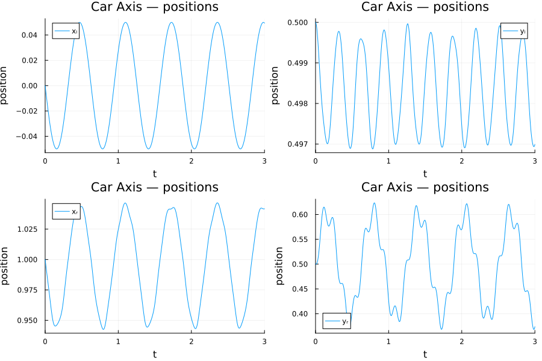
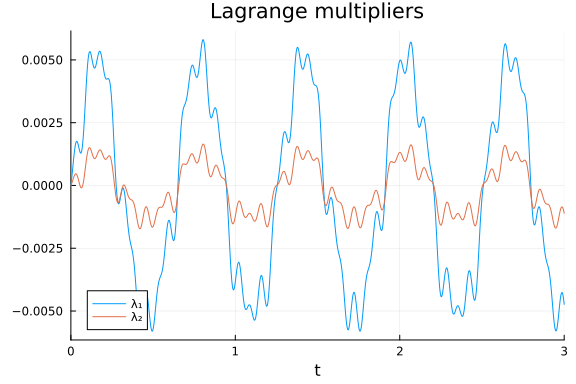
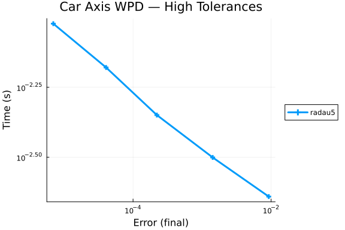
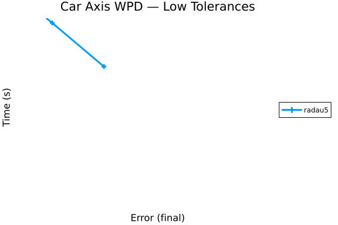
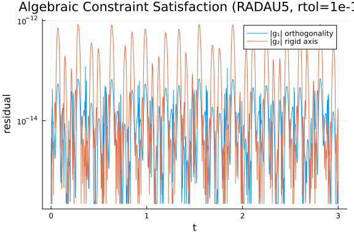

# The Car Axis Problem

The **Car Axis Problem** is a stiff Differential-Algebraic Equation (DAE) of index 3, consisting of 8 differential and 2 algebraic equations. It models a rather simple multibody system: a car axis on a bumpy road.

## Mathematical Description

The problem is of the form:
$$
\begin{aligned}
p' &= q \\
K q' &= f(t, p, \lambda) \\
0 &= \phi(t, p)
\end{aligned}
$$
where $p, q \in \mathbb{R}^4$, $\lambda \in \mathbb{R}^2$, and $0 \le t \le 3$.
The matrix $K = \frac{\epsilon^2 M}{2} I_4$.

The function $f(t, p, \lambda)$ is given by:
$$
f(t, p, \lambda) = \begin{pmatrix}
\frac{L_0 - L_l}{L_l} x_l + \lambda_1 x_b + 2\lambda_2(x_l - x_r) \\
\frac{L_0 - L_l}{L_l} y_l + \lambda_1 y_b + 2\lambda_2(y_l - y_r) - \frac{\epsilon^2 M}{2} g \\
\frac{L_0 - L_r}{L_r} (x_r - x_b) - 2\lambda_2(x_l - x_r) \\
\frac{L_0 - L_r}{L_r} (y_r - y_b) - 2\lambda_2(y_l - y_r) - \frac{\epsilon^2 M}{2} g
\end{pmatrix}
$$
where $p = (x_l, y_l, x_r, y_r)^T$.

The lengths $L_l$ and $L_r$ are:
$$
L_l = \sqrt{x_l^2 + y_l^2}, \quad L_r = \sqrt{(x_r - x_b)^2 + (y_r - y_b)^2}
$$

The road profile is defined by:
$$
x_b(t) = \sqrt{L^2 - y_b^2(t)}, \quad y_b(t) = r \sin(\omega t)
$$

The constraint function $\phi(t, p)$ is:
$$
\phi(t, p) = \begin{pmatrix}
x_l x_b + y_l y_b \\
(x_l - x_r)^2 + (y_l - y_r)^2 - L^2
\end{pmatrix}
$$

### Parameters
* $L = 1$
* $L_0 = 0.5$
* $\epsilon = 10^{-2}$
* $M = 10$
* $r = 0.1$
* $\omega = 10$
* $g = 1$
* $k = \frac{M \epsilon^2}{2} = 5 \times 10^{-4}$

### Initial Conditions
Consistent initial values at $t=0$:
$$
p_0 = (0, 0.5, 1, 0.5)^T, \quad q_0 = (-0.5, 0, -0.5, 0)^T, \quad \lambda_0 = (0, 0)^T
$$

```julia
using OrdinaryDiffEq, DiffEqDevTools, Sundials, ModelingToolkit, ODEInterfaceDiffEq,
      Plots, DASSL, DASKR
using OrdinaryDiffEqBDF, OrdinaryDiffEqFIRK, OrdinaryDiffEqRosenbrock
using LinearAlgebra
using ModelingToolkit: t_nounits as t, D_nounits as D

# Constants
const M_ca    = 10.0
const eps_ca  = 1e-2
const L_ca    = 1.0
const L0_ca   = 0.5
const r_ca    = 0.1
const omega_ca = 10.0
const g_ca    = 1.0
const k_ca    = M_ca * eps_ca^2 / 2.0

# Shared initial conditions for all 10-variable formulations
u0_mm  = [0.0, 0.5, 1.0, 0.5, -0.5, 0.0, -0.5, 0.0, 0.0, 0.0]
```

```
10-element Vector{Float64}:
  0.0
  0.5
  1.0
  0.5
 -0.5
  0.0
 -0.5
  0.0
  0.0
  0.0
```


---

## 1 · ModelingToolkit Symbolic Form

`@mtkbuild` calls `structural_simplify` (Pantelides) to reduce index 3 → 0/1.
The algorithm introduces a dummy second-derivative variable (`ylˍtt`) and reduces
the system from 10 unknowns to **8**.  The initialization system is overdetermined
(6 equations, 0 unknowns); `ylˍtt(0)` is left as `NaN` and must be patched
analytically via `fix_nanics` (at $t=0$: $D(dyl)(0)=-g$ from the force equation).

```julia
@variables xl(t)=0.0    yl(t)=0.5   xr(t)=1.0    yr(t)=0.5
@variables dxl(t)=-0.5  dyl(t)=0.0  dxr(t)=-0.5  dyr(t)=0.0
@variables lam1(t)=0.0  lam2(t)=0.0

yb_s = r_ca * sin(omega_ca * t)
xb_s = sqrt(L_ca^2 - yb_s^2)
Ll_s = sqrt(xl^2 + yl^2)
Lr_s = sqrt((xr - xb_s)^2 + (yr - yb_s)^2)

eqs = [
    D(xl)  ~ dxl,
    D(yl)  ~ dyl,
    D(xr)  ~ dxr,
    D(yr)  ~ dyr,
    k_ca * D(dxl) ~ (L0_ca - Ll_s)*xl/Ll_s + lam1*xb_s + 2.0*lam2*(xl - xr),
    k_ca * D(dyl) ~ (L0_ca - Ll_s)*yl/Ll_s + lam1*yb_s + 2.0*lam2*(yl - yr) - k_ca*g_ca,
    k_ca * D(dxr) ~ (L0_ca - Lr_s)*(xr - xb_s)/Lr_s    - 2.0*lam2*(xl - xr),
    k_ca * D(dyr) ~ (L0_ca - Lr_s)*(yr - yb_s)/Lr_s    - 2.0*lam2*(yl - yr) - k_ca*g_ca,
    0 ~ xb_s*xl + yb_s*yl,
    0 ~ (xl - xr)^2 + (yl - yr)^2 - L_ca^2,
]

@mtkbuild sys = ODESystem(eqs, t)
tspan = (0.0, 3.0)

mtkprob  = ODEProblem(sys, [], tspan)                             # prob_choice = 1

function fix_nanics(prob)
    u0f = [isnan(v) ? -g_ca : v for v in prob.u0]
    remake(prob; u0 = u0f)
end
mtkprob  = fix_nanics(mtkprob)
```

```
ODEProblem with uType Vector{Float64} and tType Float64. In-place: true
Initialization status: OVERDETERMINED
Non-trivial mass matrix: true
timespan: (0.0, 3.0)
u0: 8-element Vector{Float64}:
  0.5
  0.5
  1.0
  0.0
  0.0
  0.0
  0.0
 -0.0
```


---

## 2 · Residual DAE Form

The implicit residual form $F(\dot{u}, u, t) = 0$ is the classic interface
used by IDA, DASSL, and DASKR.  This formulation preserves the full index-3
structure without any mass-matrix factoring.

```julia
function caraxis_residual!(res, du, u, p, t)
    xl_,yl_,xr_,yr_     = u[1],u[2],u[3],u[4]
    dxl_,dyl_,dxr_,dyr_ = u[5],u[6],u[7],u[8]
    lam1_,lam2_          = u[9],u[10]
    yb_ = r_ca*sin(omega_ca*t);  xb_ = sqrt(L_ca^2 - yb_^2)
    Ll_ = sqrt(xl_^2 + yl_^2)
    Lr_ = sqrt((xr_-xb_)^2 + (yr_-yb_)^2)
    res[1] = du[1] - dxl_
    res[2] = du[2] - dyl_
    res[3] = du[3] - dxr_
    res[4] = du[4] - dyr_
    res[5] = k_ca*du[5] - ((L0_ca-Ll_)*xl_/Ll_ + lam1_*xb_ + 2.0*lam2_*(xl_-xr_))
    res[6] = k_ca*du[6] - ((L0_ca-Ll_)*yl_/Ll_ + lam1_*yb_ + 2.0*lam2_*(yl_-yr_) - k_ca*g_ca)
    res[7] = k_ca*du[7] - ((L0_ca-Lr_)*(xr_-xb_)/Lr_ - 2.0*lam2_*(xl_-xr_))
    res[8] = k_ca*du[8] - ((L0_ca-Lr_)*(yr_-yb_)/Lr_ - 2.0*lam2_*(yl_-yr_) - k_ca*g_ca)
    res[9]  = xb_*xl_ + yb_*yl_
    res[10] = (xl_-xr_)^2 + (yl_-yr_)^2 - L_ca^2
    nothing
end

du0_dae   = [-0.5, 0.0, -0.5, 0.0, 0.0, -g_ca, 0.0, -g_ca, 0.0, 0.0]
diff_vars = [true,true,true,true,true,true,true,true,false,false]
daeprob   = DAEProblem(caraxis_residual!, du0_dae, u0_mm, tspan;
                       differential_vars = diff_vars)              # prob_choice = 2
```

```
DAEProblem with uType Vector{Float64} and tType Float64. In-place: true
timespan: (0.0, 3.0)
u0: 10-element Vector{Float64}:
  0.0
  0.5
  1.0
  0.5
 -0.5
  0.0
 -0.5
  0.0
  0.0
  0.0
du0: 10-element Vector{Float64}:
 -0.5
  0.0
 -0.5
  0.0
  0.0
 -1.0
  0.0
 -1.0
  0.0
  0.0
```


---

## 3 · Manual Mass-Matrix ODE Form (Raw Index-3)

$M=\operatorname{diag}(1,1,1,1,k,k,k,k,0,0)$. Algebraic rows 9–10 hold
**position-level constraints** with no $\lambda$ dependence ($\partial\phi/\partial\lambda=0$),
making this a genuine index-3 DAE.

```julia
function caraxis_mm!(du, u, p, t)
    xl_,yl_,xr_,yr_     = u[1],u[2],u[3],u[4]
    dxl_,dyl_,dxr_,dyr_ = u[5],u[6],u[7],u[8]
    lam1_,lam2_          = u[9],u[10]
    yb_ = r_ca*sin(omega_ca*t);  xb_ = sqrt(L_ca^2 - yb_^2)
    Ll_ = sqrt(xl_^2 + yl_^2)
    Lr_ = sqrt((xr_-xb_)^2 + (yr_-yb_)^2)
    du[1]=dxl_; du[2]=dyl_; du[3]=dxr_; du[4]=dyr_
    du[5] = (L0_ca-Ll_)*xl_/Ll_ + lam1_*xb_ + 2.0*lam2_*(xl_-xr_)
    du[6] = (L0_ca-Ll_)*yl_/Ll_ + lam1_*yb_ + 2.0*lam2_*(yl_-yr_) - k_ca*g_ca
    du[7] = (L0_ca-Lr_)*(xr_-xb_)/Lr_         - 2.0*lam2_*(xl_-xr_)
    du[8] = (L0_ca-Lr_)*(yr_-yb_)/Lr_         - 2.0*lam2_*(yl_-yr_) - k_ca*g_ca
    du[9]  = xb_*xl_ + yb_*yl_
    du[10] = (xl_-xr_)^2 + (yl_-yr_)^2 - L_ca^2
    nothing
end

M_mat  = Matrix(Diagonal([1.0,1.0,1.0,1.0, k_ca,k_ca,k_ca,k_ca, 0.0,0.0]))
mmf    = ODEFunction(caraxis_mm!, mass_matrix=M_mat)
mmprob = ODEProblem(mmf, u0_mm, tspan)                            # prob_choice = 3
```

```
ODEProblem with uType Vector{Float64} and tType Float64. In-place: true
Non-trivial mass matrix: true
timespan: (0.0, 3.0)
u0: 10-element Vector{Float64}:
  0.0
  0.5
  1.0
  0.5
 -0.5
  0.0
 -0.5
  0.0
  0.0
  0.0
```


---

## 4 · Rescaled Mass-Matrix Form

The Fortran RADAU5 (Hairer & Wanner) supports index-3 DAEs in Hessenberg form
through `DIMOFIND1VAR`, `DIMOFIND2VAR`, `DIMOFIND3VAR`.  To use this we
**rescale** the dynamics rows by $1/k$ so the mass matrix becomes
$M = \operatorname{diag}(I_8, 0_2)$ (standard semi-explicit form).

```julia
function caraxis_rescaled!(du, u, p, t)
    xl_,yl_,xr_,yr_     = u[1],u[2],u[3],u[4]
    dxl_,dyl_,dxr_,dyr_ = u[5],u[6],u[7],u[8]
    lam1_,lam2_          = u[9],u[10]
    yb_ = r_ca*sin(omega_ca*t);  xb_ = sqrt(L_ca^2 - yb_^2)
    Ll_ = sqrt(xl_^2 + yl_^2)
    Lr_ = sqrt((xr_-xb_)^2 + (yr_-yb_)^2)
    du[1]=dxl_; du[2]=dyl_; du[3]=dxr_; du[4]=dyr_
    du[5] = ((L0_ca-Ll_)*xl_/Ll_ + lam1_*xb_ + 2.0*lam2_*(xl_-xr_)) / k_ca
    du[6] = ((L0_ca-Ll_)*yl_/Ll_ + lam1_*yb_ + 2.0*lam2_*(yl_-yr_) - k_ca*g_ca) / k_ca
    du[7] = ((L0_ca-Lr_)*(xr_-xb_)/Lr_ - 2.0*lam2_*(xl_-xr_)) / k_ca
    du[8] = ((L0_ca-Lr_)*(yr_-yb_)/Lr_ - 2.0*lam2_*(yl_-yr_) - k_ca*g_ca) / k_ca
    du[9]  = xb_*xl_ + yb_*yl_
    du[10] = (xl_-xr_)^2 + (yl_-yr_)^2 - L_ca^2
    nothing
end

M_rsc    = Matrix(Diagonal([1.0,1.0,1.0,1.0, 1.0,1.0,1.0,1.0, 0.0,0.0]))
f_rsc    = ODEFunction(caraxis_rescaled!, mass_matrix = M_rsc)
rscprob  = ODEProblem(f_rsc, u0_mm, tspan)                        # prob_choice = 4
```

```
ODEProblem with uType Vector{Float64} and tType Float64. In-place: true
Non-trivial mass matrix: true
timespan: (0.0, 3.0)
u0: 10-element Vector{Float64}:
  0.0
  0.5
  1.0
  0.5
 -0.5
  0.0
 -0.5
  0.0
  0.0
  0.0
```


---

## Reference Solution

High-accuracy reference computed using RADAU5 with tight tolerances and
Hessenberg index hints `(4,4,2)`.

```julia
const radau5_alg = radau5(DIMOFIND1VAR=4, DIMOFIND2VAR=4, DIMOFIND3VAR=2)

ref_sol = solve(rscprob, radau5_alg; abstol=1e-12, reltol=1e-12)
println("Reference retcode: ", ref_sol.retcode)
println("NaN in reference? ", any(isnan, ref_sol.u[end]))
```

```
Reference retcode: Success
NaN in reference? false
```


## Problem Collection

```julia
probs = [mtkprob, daeprob, mmprob, rscprob]
refs  = [ref_sol, ref_sol, ref_sol, ref_sol];
```


## Solution Trajectories

```julia
plot(ref_sol; idxs=[1,2,3,4],
     label=["xₗ" "yₗ" "xᵣ" "yᵣ"], title="Car Axis — positions",
     xlabel="t", ylabel="position", layout=(2,2), size=(900,600))
```



```julia
plot(ref_sol; idxs=[9,10],
     label=["λ₁" "λ₂"], title="Lagrange multipliers", xlabel="t")
```




---

## Work-Precision Diagrams

### High Tolerances

```julia
abstols = 1.0 ./ 10.0 .^ (4:8)
reltols = 1.0 ./ 10.0 .^ (4:8)

setups = [Dict(:prob_choice => 4, :alg => radau5_alg)]

wp = WorkPrecisionSet(probs, abstols, reltols, setups;
    save_everystep = false, appxsol = refs, maxiters = Int(1e5), numruns = 3)
plot(wp; title = "Car Axis WPD — High Tolerances")
```




### Low Tolerances

```julia
abstols = 1.0 ./ 10.0 .^ (7:12)
reltols = 1.0 ./ 10.0 .^ (7:12)

setups = [Dict(:prob_choice => 4, :alg => radau5_alg)]

wp = WorkPrecisionSet(probs, abstols, reltols, setups;
    save_everystep = false, appxsol = refs, maxiters = Int(1e5), numruns = 3)
plot(wp; title = "Car Axis WPD — Low Tolerances")
```




---

## Index-3 Solver Limitations

This section documents why most solver–formulation combinations fail on this
problem.  The Car Axis index-3 structure ($\partial\phi/\partial\lambda \equiv 0$)
is the root cause.

### Standard Julia solvers on the raw mass-matrix form

```julia
println("Standard Julia solvers on the raw mass-matrix form:")
for (name, alg) in [("Rodas4", Rodas4()), ("Rodas5P", Rodas5P()),
                     ("RadauIIA5", RadauIIA5()), ("FBDF", FBDF()), ("QNDF", QNDF()), ("NordsieckBDF", NordsieckBDF())]
    sol = solve(mmprob, alg; reltol=1e-5, abstol=1e-5, maxiters=Int(1e3))
    println("  ", rpad(name, 12), " → ", sol.retcode)
end
```

```
Standard Julia solvers on the raw mass-matrix form:
  Rodas4       → Unstable
  Rodas5P      → Unstable
  RadauIIA5    → Unstable
  FBDF         → Unstable
  QNDF         → Unstable
  NordsieckBDF → Unstable
```


### Standard solvers on the Pantelides-reduced system (MTK)

```julia
println("Standard Julia solvers on the MTK Pantelides-reduced system:")
for (name, alg) in [("Rodas5P", Rodas5P()), ("RadauIIA5", RadauIIA5()),
                     ("FBDF", FBDF()), ("QNDF", QNDF()), ("NordsieckBDF", NordsieckBDF())]
    sol = solve(mtkprob, alg; reltol=1e-8, abstol=1e-8, maxiters=Int(1e3))
    println("  ", rpad(name, 12), " → ", sol.retcode)
end
```

```
Standard Julia solvers on the MTK Pantelides-reduced system:
  Rodas5P      → InitialFailure
  RadauIIA5    → InitialFailure
  FBDF         → InitialFailure
  QNDF         → InitialFailure
  NordsieckBDF → InitialFailure
```


### DAE solvers on the residual form

```julia
println("DAE solvers on the residual form:")
for (name, alg) in [("IDA", IDA()), ("DASSL", DASSL.dassl()), ("DASKR", DASKR.daskr())]
    try
        sol = solve(daeprob, alg; reltol=1e-5, abstol=1e-5, maxiters=Int(1e3))
        println("  ", rpad(name, 12), " → ", sol.retcode)
    catch e
        println("  ", rpad(name, 12), " → threw ", nameof(typeof(e)))
    end
end
```

```
DAE solvers on the residual form:
  IDA          → Unstable
  DASSL        → threw ErrorException
  DASKR        → Failure
```


---

## Algebraic Constraint Satisfaction

```julia
g1_err = Float64[]
g2_err = Float64[]
for i in eachindex(ref_sol.t)
    u  = ref_sol.u[i]
    tc = ref_sol.t[i]
    xb = sqrt(L_ca^2 - (r_ca*sin(omega_ca*tc))^2)
    yb = r_ca*sin(omega_ca*tc)
    push!(g1_err, abs(xb*u[1] + yb*u[2]))
    push!(g2_err, abs((u[1]-u[3])^2 + (u[2]-u[4])^2 - L_ca^2))
end

g1_plot = max.(g1_err, eps())
g2_plot = max.(g2_err, eps())

plot(ref_sol.t, [g1_plot g2_plot]; yscale=:log10,
     label=["|g₁| orthogonality" "|g₂| rigid axis"],
     xlabel="t", ylabel="residual",
     title="Algebraic Constraint Satisfaction (RADAU5, rtol=1e-12)")
```




---

## Conclusion


## Appendix

These benchmarks are a part of the SciMLBenchmarks.jl repository, found at: [https://github.com/SciML/SciMLBenchmarks.jl](https://github.com/SciML/SciMLBenchmarks.jl). For more information on high-performance scientific machine learning, check out the SciML Open Source Software Organization [https://sciml.ai](https://sciml.ai).

To locally run this benchmark, do the following commands:

```
using SciMLBenchmarks
SciMLBenchmarks.weave_file("benchmarks/DAE","caraxis.jmd")
```

Computer Information:

```
Julia Version 1.11.9
Commit 53a02c0720c (2026-02-06 00:27 UTC)
Build Info:
  Official https://julialang.org/ release
Platform Info:
  OS: Linux (x86_64-linux-gnu)
  CPU: 128 × AMD EPYC 7502 32-Core Processor
  WORD_SIZE: 64
  LLVM: libLLVM-16.0.6 (ORCJIT, znver2)
Threads: 128 default, 0 interactive, 64 GC (on 128 virtual cores)
Environment:
  JULIA_PKG_PRECOMPILE_AUTO = 0
  JULIA_NUM_THREADS = auto

```

Package Information:

```
Status `~/sandbox/tmp_20260825_180339_53321/dae-pr1670-validate/benchmarks/DAE/Project.toml`
⌃ [165a45c3] DASKR v3.1.5
⌃ [e993076c] DASSL v3.1.0
⌃ [f3b72e0c] DiffEqDevTools v3.2.0
⌃ [961ee093] ModelingToolkit v11.39.0
⌅ [09606e27] ODEInterfaceDiffEq v4.1.0
⌃ [1dea7af3] OrdinaryDiffEq v7.6.0
⌃ [6ad6398a] OrdinaryDiffEqBDF v2.4.2
⌃ [5960d6e9] OrdinaryDiffEqFIRK v2.6.0
⌃ [43230ef6] OrdinaryDiffEqRosenbrock v2.6.5
⌃ [2d112036] OrdinaryDiffEqSDIRK v2.8.2
⌃ [91a5bcdd] Plots v1.41.6
⌃ [31c91b34] SciMLBenchmarks v0.1.3
⌃ [90137ffa] StaticArrays v1.9.18
⌃ [10745b16] Statistics v1.11.1
⌃ [c3572dad] Sundials v6.5.1
⌃ [0c5d862f] Symbolics v7.36.0
Info Packages marked with ⌃ and ⌅ have new versions available. Those with ⌃ may be upgradable, but those with ⌅ are restricted by compatibility constraints from upgrading. To see why use `status --outdated`
```

And the full manifest:

```
Status `~/sandbox/tmp_20260825_180339_53321/dae-pr1670-validate/benchmarks/DAE/Manifest.toml`
⌃ [47edcb42] ADTypes v1.23.0
  [14f7f29c] AMD v0.5.3
  [6e696c72] AbstractPlutoDingetjes v1.4.0
  [1520ce14] AbstractTrees v0.4.5
  [7d9f7c33] Accessors v0.1.45
  [79e6a3ab] Adapt v4.7.0
  [66dad0bd] AliasTables v1.1.3
  [ec485272] ArnoldiMethod v0.4.0
⌃ [4fba245c] ArrayInterface v7.28.1
  [4c555306] ArrayLayouts v1.12.2
⌃ [aae01518] BandedMatrices v1.11.0
  [e2ed5e7c] Bijections v0.2.2
⌃ [b2a6c25c] BinaryHeaps v1.0.4
⌃ [caf10ac8] BipartiteGraphs v0.1.11
  [d1d4a3ce] BitFlags v0.1.10
  [62783981] BitTwiddlingConvenienceFunctions v0.1.6
  [8e7c35d0] BlockArrays v1.10.0
⌃ [70df07ce] BracketingNonlinearSolve v1.12.5
  [fa961155] CEnum v0.5.0
  [2a0fbf3d] CPUSummary v0.2.7
  [fb6a15b2] CloseOpenIntervals v0.1.13
⌃ [944b1d66] CodecZlib v0.7.8
  [35d6a980] ColorSchemes v3.31.0
  [3da002f7] ColorTypes v0.12.1
  [c3611d14] ColorVectorSpace v0.11.0
  [5ae59095] Colors v0.13.1
⌅ [861a8166] Combinatorics v1.0.2
⌃ [38540f10] CommonSolve v0.2.13
  [bbf7d656] CommonSubexpressions v0.3.1
⌃ [f70d9fcc] CommonWorldInvalidations v1.1.2
  [34da2185] Compat v4.18.1
  [b152e2b5] CompositeTypes v0.1.4
  [a33af91c] CompositionsBase v0.1.2
⌃ [2569d6c7] ConcreteStructs v0.2.7
  [f0e56b4a] ConcurrentUtilities v2.6.0
  [8f4d0f93] Conda v1.10.3
  [187b0558] ConstructionBase v1.6.0
  [d38c429a] Contour v0.6.3
  [adafc99b] CpuId v0.3.1
  [a8cc5b0e] Crayons v4.2.0
⌃ [165a45c3] DASKR v3.1.5
⌃ [e993076c] DASSL v3.1.0
  [9a962f9c] DataAPI v1.16.0
  [864edb3b] DataStructures v0.19.6
  [e2d170a0] DataValueInterfaces v1.0.0
  [8bb1440f] DelimitedFiles v1.9.1
⌃ [2b5f629d] DiffEqBase v7.14.0
⌃ [459566f4] DiffEqCallbacks v4.19.2
⌃ [f3b72e0c] DiffEqDevTools v3.2.0
⌃ [77a26b50] DiffEqNoiseProcess v5.34.1
  [163ba53b] DiffResults v1.1.0
  [b552c78f] DiffRules v1.16.0
⌃ [a0c0ee7d] DifferentiationInterface v0.7.20
⌃ [31c24e10] Distributions v0.25.130
  [ffbed154] DocStringExtensions v0.9.5
  [5b8099bc] DomainSets v0.8.1
⌃ [7c1d4256] DynamicPolynomials v0.6.6
  [4e289a0a] EnumX v1.0.7
  [f151be2c] EnzymeCore v0.8.21
  [460bff9d] ExceptionUnwrapping v0.1.11
  [e2ba6199] ExprTools v0.1.11
  [55351af7] ExproniconLite v0.10.14
  [c87230d0] FFMPEG v0.4.5
⌃ [7034ab61] FastBroadcast v1.3.6
  [9aa1b823] FastClosures v0.3.2
  [442a2c76] FastGaussQuadrature v1.3.0
⌃ [a4df4552] FastPower v1.4.1
  [1a297f60] FillArrays v1.17.0
  [64ca27bc] FindFirstFunctions v3.2.1
  [6a86dc24] FiniteDiff v2.33.0
⌅ [53c48c17] FixedPointNumbers v0.8.6
  [1fa38f19] Format v1.3.7
  [f6369f11] ForwardDiff v1.4.5
  [a85aefff] FunctionMaps v0.1.2
  [069b7b12] FunctionWrappers v1.1.3
⌃ [77dc65aa] FunctionWrappersWrappers v1.12.1
  [46192b85] GPUArraysCore v0.2.0
⌃ [28b8d3ca] GR v0.73.26
  [a0844989] Gamma v1.2.0
  [d7ba0133] Git v1.5.0
  [86223c79] Graphs v1.14.0
  [42e2da0e] Grisu v1.0.2
⌅ [cd3eb016] HTTP v1.11.0
⌅ [eafb193a] Highlights v0.5.3
  [34004b35] HypergeometricFunctions v0.3.30
  [7073ff75] IJulia v1.34.4
  [615f187c] IfElse v0.1.1
⌃ [3263718b] ImplicitDiscreteSolve v2.1.5
  [d25df0c9] Inflate v0.1.5
  [18e54dd8] IntegerMathUtils v0.1.4
  [8197267c] IntervalSets v0.7.14
  [3587e190] InverseFunctions v0.1.17
  [92d709cd] IrrationalConstants v0.2.6
  [82899510] IteratorInterfaceExtensions v1.0.0
  [1019f520] JLFzf v0.1.11
  [692b3bcd] JLLWrappers v1.8.0
⌅ [682c06a0] JSON v0.21.4
  [ae98c720] Jieko v0.2.1
⌃ [ccbc3e58] JumpProcesses v9.29.2
  [ba0b0d4f] Krylov v0.10.9
⌃ [b964fa9f] LaTeXStrings v1.4.0
⌃ [23fbe1c1] Latexify v0.16.11
  [10f19ff3] LayoutPointers v0.1.17
⌃ [87fe0de2] LineSearch v0.1.14
⌃ [7ed4a6bd] LinearSolve v5.10.0
  [2ab3a3ac] LogExpFunctions v1.0.1
  [e6f89c97] LoggingExtras v1.2.0
  [1914dd2f] MacroTools v0.5.16
  [d125e4d3] ManualMemory v0.1.8
⌃ [bb5d69b7] MaybeInplace v0.1.7
  [739be429] MbedTLS v1.1.10
  [442fdcdd] Measures v0.3.3
  [e1d29d7a] Missings v1.2.0
⌃ [961ee093] ModelingToolkit v11.39.0
⌃ [7771a370] ModelingToolkitBase v1.65.0
⌃ [6bb917b9] ModelingToolkitTearing v1.20.5
  [2e0e35c7] Moshi v0.3.12
  [46d2c3a1] MuladdMacro v0.2.7
  [102ac46a] MultivariatePolynomials v0.5.19
  [ffc61752] Mustache v1.0.21
  [d8a4904e] MutableArithmetics v1.8.0
  [77ba4419] NaNMath v1.1.4
⌃ [8913a72c] NonlinearSolve v4.26.1
⌃ [be0214bd] NonlinearSolveBase v2.43.0
⌃ [5959db7a] NonlinearSolveFirstOrder v2.3.2
⌃ [9a2c21bd] NonlinearSolveQuasiNewton v1.15.1
⌃ [26075421] NonlinearSolveSpectralMethods v1.8.0
  [54ca160b] ODEInterface v0.5.2
⌅ [09606e27] ODEInterfaceDiffEq v4.1.0
  [6fe1bfb0] OffsetArrays v1.17.0
  [4d8831e6] OpenSSL v1.6.1
⌅ [bac558e1] OrderedCollections v1.8.2
⌃ [1dea7af3] OrdinaryDiffEq v7.6.0
⌃ [6ad6398a] OrdinaryDiffEqBDF v2.4.2
⌃ [bbf590c4] OrdinaryDiffEqCore v4.14.3
⌃ [50262376] OrdinaryDiffEqDefault v2.4.4
⌃ [4302a76b] OrdinaryDiffEqDifferentiation v3.9.0
⌃ [5960d6e9] OrdinaryDiffEqFIRK v2.6.0
⌃ [127b3ac7] OrdinaryDiffEqNonlinearSolve v2.8.0
⌃ [43230ef6] OrdinaryDiffEqRosenbrock v2.6.5
⌃ [b4bd8bb3] OrdinaryDiffEqRosenbrockTableaus v2.4.1
⌃ [2d112036] OrdinaryDiffEqSDIRK v2.8.2
⌃ [b1df2697] OrdinaryDiffEqTsit5 v2.1.3
⌃ [79d7bb75] OrdinaryDiffEqVerner v2.2.2
  [90014a1f] PDMats v0.11.41
⌅ [69de0a69] Parsers v2.8.7
  [ccf2f8ad] PlotThemes v3.3.0
  [995b91a9] PlotUtils v1.4.4
⌃ [91a5bcdd] Plots v1.41.6
  [e409e4f3] PoissonRandom v0.4.13
  [f517fe37] Polyester v0.7.19
  [1d0040c9] PolyesterWeave v0.2.2
⌃ [d236fae5] PreallocationTools v1.5.0
⌅ [aea7be01] PrecompileTools v1.2.1
  [21216c6a] Preferences v1.5.2
⌃ [08abe8d2] PrettyTables v3.4.6
  [27ebfcd6] Primes v0.5.7
  [43287f4e] PtrArrays v1.4.0
  [0c0d3e7f] PureKLU v1.4.1
  [1fd47b50] QuadGK v2.11.3
  [988b38a3] ReadOnlyArrays v0.2.0
  [795d4caa] ReadOnlyDicts v1.0.1
  [3cdcf5f2] RecipesBase v1.3.4
  [01d81517] RecipesPipeline v0.6.12
⌃ [731186ca] RecursiveArrayTools v4.4.0
  [189a3867] Reexport v1.2.2
  [05181044] RelocatableFolders v1.0.1
  [ae029012] Requires v1.3.1
⌃ [ae5879a3] ResettableStacks v1.3.0
⌃ [9fe22ead] RespecializeParams v1.2.0
  [79098fc4] Rmath v0.9.0
⌃ [47965b36] RootedTrees v2.25.4
⌃ [f2b01f46] Roots v3.0.6
⌃ [7e49a35a] RuntimeGeneratedFunctions v0.5.24
⌃ [9dfe8606] SCCNonlinearSolve v1.14.1
  [94e857df] SIMDTypes v0.1.0
⌅ [0bca4576] SciMLBase v3.46.1
⌃ [31c91b34] SciMLBenchmarks v0.1.3
⌃ [19f34311] SciMLJacobianOperators v0.1.17
⌃ [a6db7da4] SciMLLogging v2.0.4
⌃ [c0aeaf25] SciMLOperators v1.26.1
⌃ [431bcebd] SciMLPublic v1.2.4
⌃ [53ae85a6] SciMLStructures v1.10.4
  [6c6a2e73] Scratch v1.3.0
  [efcf1570] Setfield v1.1.2
  [992d4aef] Showoff v1.0.3
  [777ac1f9] SimpleBufferStream v1.2.0
⌃ [727e6d20] SimpleNonlinearSolve v2.14.0
  [699a6c99] SimpleTraits v0.9.6
  [a2af1166] SortingAlgorithms v1.2.3
⌃ [a57abbd0] SparseColumnPivotedQR v2.1.6
  [0a514795] SparseMatrixColorings v0.4.27
⌃ [276daf66] SpecialFunctions v2.8.3
  [860ef19b] StableRNGs v1.0.4
  [0c0c59c1] StarAlgebras v0.3.0
⌃ [64909d44] StateSelection v1.11.0
  [aedffcd0] Static v1.4.6
  [0d7ed370] StaticArrayInterface v1.10.0
⌃ [90137ffa] StaticArrays v1.9.18
  [1e83bf80] StaticArraysCore v1.4.4
⌃ [10745b16] Statistics v1.11.1
  [82ae8749] StatsAPI v1.8.0
⌃ [2913bbd2] StatsBase v0.34.12
  [4c63d2b9] StatsFuns v2.2.1
  [7792a7ef] StrideArraysCore v0.5.9
  [69024149] StringEncodings v0.3.7
⌅ [892a3eda] StringManipulation v0.4.7
  [09ab397b] StructArrays v0.7.3
⌃ [c3572dad] Sundials v6.5.1
⌃ [2efcf032] SymbolicIndexingInterface v0.3.54
⌃ [19f23fe9] SymbolicLimits v1.1.5
⌅ [d1185830] SymbolicUtils v4.45.0
⌃ [0c5d862f] Symbolics v7.36.0
  [3783bdb8] TableTraits v1.0.1
⌃ [bd369af6] Tables v1.13.0
  [ed4db957] TaskLocalValues v0.1.3
  [62fd8b95] TensorCore v0.1.1
  [8ea1fca8] TermInterface v2.0.0
  [8290d209] ThreadingUtilities v0.5.6
  [a759f4b9] TimerOutputs v1.2.0
  [3bb67fe8] TranscodingStreams v0.11.3
  [781d530d] TruncatedStacktraces v1.4.0
⌃ [5c2747f8] URIs v1.6.3
  [3a884ed6] UnPack v1.0.2
  [1cfade01] UnicodeFun v0.4.1
  [41fe7b60] Unzip v0.2.0
  [81def892] VersionParsing v1.3.0
  [d30d5f5c] WeakCacheSets v0.1.0
  [44d3d7a6] Weave v0.10.12
  [ddb6d928] YAML v0.4.16
  [c2297ded] ZMQ v1.5.1
  [6e34b625] Bzip2_jll v1.0.9+0
  [83423d85] Cairo_jll v1.18.7+0
  [655fdf9c] DASKR_jll v1.0.1+0
  [ee1fde0b] Dbus_jll v1.16.2+0
  [2702e6a9] EpollShim_jll v0.0.20230411+1
⌃ [2e619515] Expat_jll v2.8.2+0
⌅ [b22a6f82] FFMPEG_jll v8.1.2+0
  [a3f928ae] Fontconfig_jll v2.17.1+0
  [d7e528f0] FreeType2_jll v2.14.3+1
  [559328eb] FriBidi_jll v1.0.17+0
⌃ [0656b61e] GLFW_jll v3.4.1+1
⌅ [d2c73de3] GR_jll v0.73.26+0
⌅ [b0724c58] GettextRuntime_jll v0.22.4+0
  [61579ee1] Ghostscript_jll v9.55.1+0
  [020c3dae] Git_LFS_jll v3.7.1+0
  [f8c6e375] Git_jll v2.55.0+0
  [7746bdde] Glib_jll v2.88.3+0
  [3b182d85] Graphite2_jll v1.3.16+0
⌅ [2e76f6c2] HarfBuzz_jll v8.5.1+0
  [1d5cc7b8] IntelOpenMP_jll v2025.2.0+0
  [aacddb02] JpegTurbo_jll v3.2.0+1
  [c1c5ebd0] LAME_jll v3.100.3+0
  [88015f11] LERC_jll v4.1.0+0
  [1d63c593] LLVMOpenMP_jll v22.1.7+0
⌅ [e9f186c6] Libffi_jll v3.4.7+0
  [7e76a0d4] Libglvnd_jll v1.7.1+1
  [94ce4f54] Libiconv_jll v1.18.0+0
  [4b2f31a3] Libmount_jll v2.42.0+0
  [89763e89] Libtiff_jll v4.7.3+0
  [38a345b3] Libuuid_jll v2.42.0+0
  [856f044c] MKL_jll v2025.2.0+0
  [c771fb93] ODEInterface_jll v0.0.2+0
  [e7412a2a] Ogg_jll v1.3.6+0
  [656ef2d0] OpenBLAS32_jll v0.3.34+0
⌃ [9bd350c2] OpenSSH_jll v10.4.1+0
⌃ [458c3c95] OpenSSL_jll v3.5.7+0
  [efe28fd5] OpenSpecFun_jll v0.5.6+0
  [91d4177d] Opus_jll v1.6.1+0
⌃ [36c8627f] Pango_jll v1.58.0+0
  [30392449] Pixman_jll v0.46.4+0
  [c0090381] Qt6Base_jll v6.10.2+2
  [629bc702] Qt6Declarative_jll v6.10.2+2
  [ce943373] Qt6ShaderTools_jll v6.10.2+1
  [6de9746b] Qt6Svg_jll v6.10.2+0
  [e99dba38] Qt6Wayland_jll v6.10.2+1
  [f50d1b31] Rmath_jll v0.5.2+0
  [ca45d3f4] SuiteSparse32_jll v7.12.1+0
  [fb77eaff] Sundials_jll v7.5.0+0
  [a44049a8] Vulkan_Loader_jll v1.3.243+0
  [a2964d1f] Wayland_jll v1.24.0+0
  [ffd25f8a] XZ_jll v5.8.3+0
  [f67eecfb] Xorg_libICE_jll v1.1.2+0
  [c834827a] Xorg_libSM_jll v1.2.6+0
  [4f6342f7] Xorg_libX11_jll v1.8.13+0
  [0c0b7dd1] Xorg_libXau_jll v1.0.13+0
  [935fb764] Xorg_libXcursor_jll v1.2.4+0
  [a3789734] Xorg_libXdmcp_jll v1.1.6+0
  [1082639a] Xorg_libXext_jll v1.3.8+0
  [d091e8ba] Xorg_libXfixes_jll v6.0.2+0
  [a51aa0fd] Xorg_libXi_jll v1.8.4+0
  [d1454406] Xorg_libXinerama_jll v1.1.7+0
  [ec84b674] Xorg_libXrandr_jll v1.5.6+0
  [ea2f1a96] Xorg_libXrender_jll v0.9.12+0
  [a65dc6b1] Xorg_libpciaccess_jll v0.19.0+0
  [c7cfdc94] Xorg_libxcb_jll v1.17.1+0
  [cc61e674] Xorg_libxkbfile_jll v1.2.0+0
  [e920d4aa] Xorg_xcb_util_cursor_jll v0.1.6+0
  [12413925] Xorg_xcb_util_image_jll v0.4.1+0
  [2def613f] Xorg_xcb_util_jll v0.4.1+0
  [975044d2] Xorg_xcb_util_keysyms_jll v0.4.1+0
  [0d47668e] Xorg_xcb_util_renderutil_jll v0.3.10+0
  [c22f9ab0] Xorg_xcb_util_wm_jll v0.4.2+0
  [35661453] Xorg_xkbcomp_jll v1.4.7+0
  [33bec58e] Xorg_xkeyboard_config_jll v2.47.0+2
  [c5fb5394] Xorg_xtrans_jll v1.6.0+0
  [8f1865be] ZeroMQ_jll v4.3.6+0
  [3161d3a3] Zstd_jll v1.5.7+1
  [35ca27e7] eudev_jll v3.2.14+0
⌅ [214eeab7] fzf_jll v0.61.1+0
  [a4ae2306] libaom_jll v3.14.1+0
⌃ [0ac62f75] libass_jll v0.17.4+0
  [1183f4f0] libdecor_jll v0.2.2+0
  [8e53e030] libdrm_jll v2.4.134+0
  [2db6ffa8] libevdev_jll v1.13.4+0
  [f638f0a6] libfdk_aac_jll v2.0.4+0
  [36db933b] libinput_jll v1.28.1+0
  [b53b4c65] libpng_jll v1.6.58+0
  [a9144af2] libsodium_jll v1.0.21+0
  [9a156e7d] libva_jll v2.23.0+0
  [f27f6e37] libvorbis_jll v1.3.8+0
  [009596ad] mtdev_jll v1.1.7+0
  [1317d2d5] oneTBB_jll v2022.3.0+0
⌅ [1270edf5] x264_jll v10164.0.1+0
  [dfaa095f] x265_jll v4.1.0+0
  [d8fb68d0] xkbcommon_jll v1.13.0+0
  [0dad84c5] ArgTools v1.1.2
  [56f22d72] Artifacts v1.11.0
  [2a0f44e3] Base64 v1.11.0
  [ade2ca70] Dates v1.11.0
  [8ba89e20] Distributed v1.11.0
  [f43a241f] Downloads v1.6.0
  [7b1f6079] FileWatching v1.11.0
  [9fa8497b] Future v1.11.0
  [b77e0a4c] InteractiveUtils v1.11.0
  [4af54fe1] LazyArtifacts v1.11.0
  [b27032c2] LibCURL v0.6.4
  [76f85450] LibGit2 v1.11.0
  [8f399da3] Libdl v1.11.0
  [37e2e46d] LinearAlgebra v1.11.0
  [56ddb016] Logging v1.11.0
  [d6f4376e] Markdown v1.11.0
  [a63ad114] Mmap v1.11.0
  [ca575930] NetworkOptions v1.2.0
  [44cfe95a] Pkg v1.11.0
  [de0858da] Printf v1.11.0
  [3fa0cd96] REPL v1.11.0
  [9a3f8284] Random v1.11.0
  [ea8e919c] SHA v0.7.0
  [9e88b42a] Serialization v1.11.0
  [6462fe0b] Sockets v1.11.0
  [2f01184e] SparseArrays v1.11.0
  [f489334b] StyledStrings v1.11.0
  [4607b0f0] SuiteSparse
  [fa267f1f] TOML v1.0.3
  [a4e569a6] Tar v1.10.0
  [8dfed614] Test v1.11.0
  [cf7118a7] UUIDs v1.11.0
  [4ec0a83e] Unicode v1.11.0
  [e66e0078] CompilerSupportLibraries_jll v1.1.1+0
  [deac9b47] LibCURL_jll v8.6.0+0
  [e37daf67] LibGit2_jll v1.7.2+0
  [29816b5a] LibSSH2_jll v1.11.0+1
  [c8ffd9c3] MbedTLS_jll v2.28.6+0
  [14a3606d] MozillaCACerts_jll v2023.12.12
  [4536629a] OpenBLAS_jll v0.3.27+1
  [05823500] OpenLibm_jll v0.8.5+0
  [efcefdf7] PCRE2_jll v10.42.0+1
  [bea87d4a] SuiteSparse_jll v7.7.0+0
  [83775a58] Zlib_jll v1.2.13+1
  [8e850b90] libblastrampoline_jll v5.11.0+0
  [8e850ede] nghttp2_jll v1.59.0+0
  [3f19e933] p7zip_jll v17.4.0+2
Info Packages marked with ⌃ and ⌅ have new versions available. Those with ⌃ may be upgradable, but those with ⌅ are restricted by compatibility constraints from upgrading. To see why use `status --outdated -m`
```

