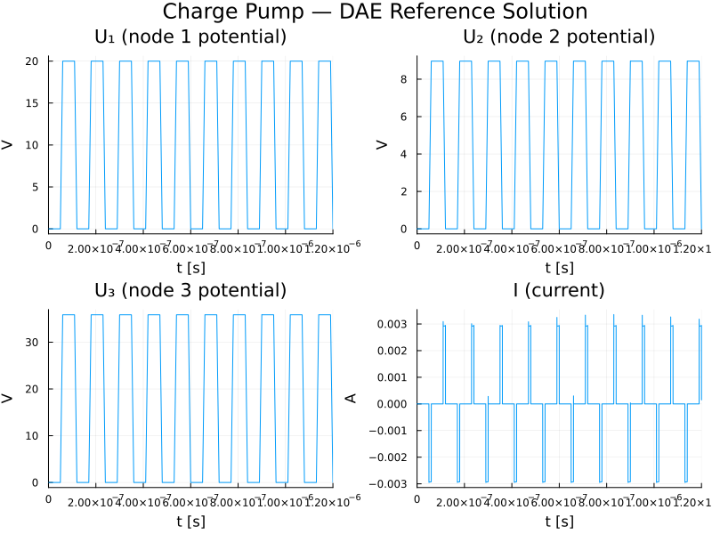
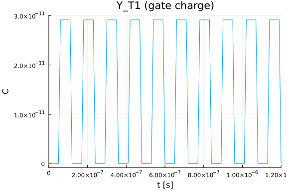
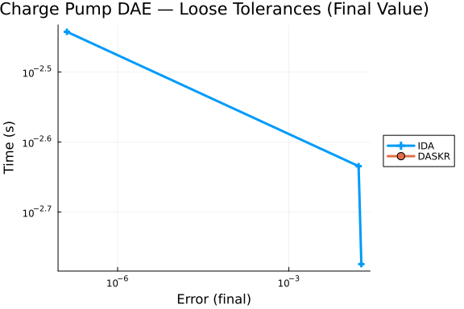
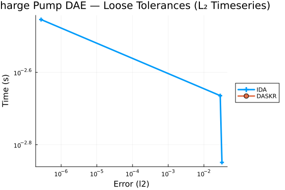

This benchmark is for the Charge Pump problem, a stiff **index-2** DAE of dimension 9 from the
[IVP Test Set](http://www.dm.uniba.it/~testset/) (problem "pump"). The circuit consists of two
capacitors and an n-channel MOS transistor. The formulation uses charge-oriented MOS transistor
modelling where the charge functions $Q_G$, $Q_S$, $Q_D$ (gate, source, drain) depend nonlinearly
on the node voltages.

**Reference:** Michael Günther, Georg Denk, Uwe Feldmann: *How models for MOS transistors reflect
charge distribution effects.* Preprint 1745, May 1995, Technische Hochschule Darmstadt.

The system is:

$$M \frac{dy}{dt} = f(t, y), \quad y(0) = y_0, \quad 0 \le t \le 1.2 \times 10^{-6}$$

where $y \in \mathbb{R}^9$ and the mass matrix $M$ is singular (rows 4–9 are zero).

The state vector is:
$y = (Y_{T1},\; Y_S,\; Y_{T2},\; Y_D,\; Y_{T3},\; U_1,\; U_2,\; U_3,\; I)^T$

where $Y_{T1}, Y_{T2}, Y_{T3}$ are transistor charges, $Y_S, Y_D$ are capacitor charges,
$U_1, U_2, U_3$ are node potentials, and $I$ is the current through the voltage source.

The first 8 variables have index 1, while $y_9$ (current $I$) has **index 2**. This makes the
problem particularly challenging — in the original IVP Test Set benchmarks, many specialised
Fortran solvers (RADAU, RADAU5, MEBDFDAE, MEBDFI) fail at all tolerances. Only BIMD, DASSL, GAMD,
and PSIDE-1 succeed, and even those only at loose tolerances.

**ModelingToolkit Index Reduction:** This is an index-2 DAE. ModelingToolkit's Pantelides
algorithm successfully reduces it to index-1, collapsing 9 unknowns to 4 (node potentials
$U_2$, $U_3$ and their dummy derivatives). However, the index-reduced system introduces
explicit derivatives of the piecewise charge functions $Q_G$, $Q_S$, $Q_D$, which have
discontinuous first-order partial derivatives at the MOS operating-region boundaries.
Standard implicit ODE solvers (Rodas5P, FBDF, etc.) fail on the reduced system because
they cannot resolve the resulting non-smooth algebraic constraints. The MTK formulation is
included below to demonstrate the structural analysis; the WPD benchmarks use the direct
DAE residual form with IDA and DASKR.

```julia
using OrdinaryDiffEq, DiffEqDevTools, Sundials,
      Plots, DASSL, DASKR
using ModelingToolkit
using ModelingToolkit: t_nounits as t, D_nounits as D
using LinearAlgebra
import ModelingToolkit: Symbolics, ForwardDiff
```


## MOS Transistor Charge Functions

The charge functions $Q_G$, $Q_S$, $Q_D$ model the n-channel MOS transistor with parameters
$V_{T0} = 0.2$, $\gamma = 0.035$, $\phi = 1.01$, $C_{ox} = 4 \times 10^{-12}$.

Each function has three branches (accumulation, depletion, inversion) depending on terminal
voltages. The `max` guards prevent `DomainError` from `sqrt` when the solver explores
unphysical states during Newton iterations. The type parameter `T <: Real` ensures
compatibility with ForwardDiff dual numbers for the MTK derivative registration.

```julia
const VT0 = 0.20
const GAMMA_MOS = 0.035
const PHI = 1.01
const COX = 4.0e-12
const CAPD = 0.40e-12
const CAPS = 1.60e-12
const VHIGH = 20.0
const DELTAT_PULSE = 120.0e-9
const T1_PULSE = 50.0e-9
const T2_PULSE = 60.0e-9
const T3_PULSE = 110.0e-9

function qgate(vgb::T, vgs::T, vgd::T) where T <: Real
    if (vgs - vgd) <= 0
        ugs = vgd; ugd = vgs
    else
        ugs = vgs; ugd = vgd
    end
    ugb = vgb
    ubs = ugs - ugb
    vfb = VT0 - GAMMA_MOS * sqrt(PHI) - PHI
    phi_ubs = max(PHI - ubs, zero(T))
    vte = VT0 + GAMMA_MOS * (sqrt(phi_ubs) - sqrt(PHI))

    if ugb <= vfb
        # Accumulation region
        return COX * (ugb - vfb)
    elseif ugb > vfb && ugs <= vte
        # Depletion region
        return COX * GAMMA_MOS * (sqrt(max((GAMMA_MOS / 2)^2 + ugb - vfb, zero(T))) - GAMMA_MOS / 2)
    else
        # Inversion region
        ugst = ugs - vte
        ugdt = ugd > vte ? ugd - vte : zero(T)
        denom = ugdt + ugst
        denom = abs(denom) < 1e-30 ? T(1e-30) : denom
        return COX * ((2 / 3) * (ugdt + ugst - (ugdt * ugst) / denom) +
                       GAMMA_MOS * sqrt(phi_ubs))
    end
end
qgate(a, b, c) = qgate(promote(float(a), float(b), float(c))...)

function qsrc(vgb::T, vgs::T, vgd::T) where T <: Real
    if (vgs - vgd) <= 0
        ugs = vgd; ugd = vgs
    else
        ugs = vgs; ugd = vgd
    end
    ugb = vgb
    ubs = ugs - ugb
    vfb = VT0 - GAMMA_MOS * sqrt(PHI) - PHI
    phi_ubs = max(PHI - ubs, zero(T))
    vte = VT0 + GAMMA_MOS * (sqrt(phi_ubs) - sqrt(PHI))

    if ugb <= vfb || (ugb > vfb && ugs <= vte)
        return zero(T)
    else
        ugst = ugs - vte
        ugdt = ugd >= vte ? ugd - vte : zero(T)
        denom = ugdt + ugst
        denom = abs(denom) < 1e-30 ? T(1e-30) : denom
        return -COX * (1 / 3) * (ugdt + ugst - (ugdt * ugst) / denom)
    end
end
qsrc(a, b, c) = qsrc(promote(float(a), float(b), float(c))...)

function qdrain(vgb::T, vgs::T, vgd::T) where T <: Real
    if (vgs - vgd) <= 0
        ugs = vgd; ugd = vgs
    else
        ugs = vgs; ugd = vgd
    end
    ugb = vgb
    ubs = ugs - ugb
    vfb = VT0 - GAMMA_MOS * sqrt(PHI) - PHI
    phi_ubs = max(PHI - ubs, zero(T))
    vte = VT0 + GAMMA_MOS * (sqrt(phi_ubs) - sqrt(PHI))

    if ugb <= vfb || (ugb > vfb && ugs <= vte)
        return zero(T)
    else
        ugst = ugs - vte
        ugdt = ugd >= vte ? ugd - vte : zero(T)
        denom = ugdt + ugst
        denom = abs(denom) < 1e-30 ? T(1e-30) : denom
        return -COX * (1 / 3) * (ugdt + ugst - (ugdt * ugst) / denom)
    end
end
qdrain(a, b, c) = qdrain(promote(float(a), float(b), float(c))...)
```

```
qdrain (generic function with 2 methods)
```


## Input Voltage Function

The pulsed input $V_{in}(t)$ is a periodic trapezoidal waveform with period $120\,\text{ns}$,
rise/fall times of $10\,\text{ns}$, and amplitude $20\,\text{V}$.

```julia
function vin(t)
    dummy = mod(t, DELTAT_PULSE)
    if dummy < T1_PULSE
        return 0.0
    elseif dummy < T2_PULSE
        return (dummy - T1_PULSE) * 0.10e9 * VHIGH
    elseif dummy < T3_PULSE
        return VHIGH
    else
        return (DELTAT_PULSE - dummy) * 0.10e9 * VHIGH
    end
end
```

```
vin (generic function with 1 method)
```


## Discontinuity Points

The input voltage has derivative discontinuities at $\tau = 50, 60, 110, 120\,\text{ns}$ within
each period. We compute all discontinuity times across the integration interval
$[0, 1.2\,\mu\text{s}]$. These are passed to the solver via `tstops` so that it restarts at
each derivative jump — this is critical for convergence on this problem.

```julia
tspan = (0.0, 1200.0e-9)

disc_times = Float64[]
base_disc = [50.0e-9, 60.0e-9, 110.0e-9, 120.0e-9]
for k in 0:9
    for td in base_disc
        push!(disc_times, td + k * 120.0e-9)
    end
end
disc_times = sort(unique(filter(t -> 0.0 < t < tspan[2], disc_times)))
```

```
40-element Vector{Float64}:
 5.0e-8
 6.0e-8
 1.1e-7
 1.2e-7
 1.7e-7
 1.7999999999999997e-7
 2.3e-7
 2.4e-7
 2.9e-7
 3.0e-7
 ⋮
 9.6e-7
 1.0099999999999999e-6
 1.02e-6
 1.07e-6
 1.0799999999999998e-6
 1.1299999999999998e-6
 1.1399999999999999e-6
 1.1899999999999998e-6
 1.1999999999999997e-6
```


## ModelingToolkit Index Reduction

Since this is an index-2 DAE, we use ModelingToolkit's Pantelides algorithm for structural
index reduction. The charge functions must be registered as opaque symbolic functions, and
their partial derivatives (computed via ForwardDiff) must be provided so that MTK can
differentiate the algebraic constraints during index reduction. We also register the input
voltage derivative $V'_{in}(t)$.

```julia
function dvin(t_val)
    dummy = mod(t_val, DELTAT_PULSE)
    dummy < T1_PULSE ? 0.0 : dummy < T2_PULSE ? 0.10e9 * VHIGH :
    dummy < T3_PULSE ? 0.0 : -0.10e9 * VHIGH
end

@register_symbolic qgate(vgb, vgs, vgd)
@register_symbolic qsrc(vgb, vgs, vgd)
@register_symbolic qdrain(vgb, vgs, vgd)
@register_symbolic vin(t_val)
@register_symbolic dvin(t_val)

# ForwardDiff-based partial derivatives for Pantelides index reduction
for (fn, dfn_prefix) in [(qgate, :dqgate), (qsrc, :dqsrc), (qdrain, :dqdrain)]
    for i in 1:3
        dfn_name = Symbol(dfn_prefix, "_", i)
        @eval begin
            $dfn_name(vgb, vgs, vgd) = ForwardDiff.derivative(
                x -> $fn(ntuple(j -> j == $i ? x : [vgb, vgs, vgd][j], 3)...),
                Float64([vgb, vgs, vgd][$i]))
            @register_symbolic $dfn_name(vgb, vgs, vgd)
            Symbolics.derivative(::typeof($fn), args::NTuple{3, Any}, ::Val{$i}) =
                $dfn_name(args...)
        end
    end
end
Symbolics.derivative(::typeof(vin), args::NTuple{1, Any}, ::Val{1}) = dvin(args...)
```


The MTK system is defined with all 9 original variables and 9 equations (3 differential,
6 algebraic). `@mtkbuild` applies Pantelides' algorithm to reduce the index.

```julia
@variables begin
    YT1(t) = qgate(0.0, 0.0, 0.0)
    YS(t)  = 0.0
    YT2(t) = qsrc(0.0, 0.0, 0.0)
    YD(t)  = 0.0
    YT3(t) = qdrain(0.0, 0.0, 0.0)
    U1(t)  = 0.0
    U2(t)  = 0.0
    U3(t)  = 0.0
    II(t)  = 0.0
end

eqs = [
    D(YT1) ~ -II,                                              # row 1 (differential)
    D(YS) + D(YT2) ~ 0,                                       # row 2 (differential)
    D(YD) + D(YT3) ~ 0,                                       # row 3 (differential)
    0 ~ -U1 + vin(t),                                          # row 4 (algebraic)
    0 ~ YT1 - qgate(U1, U1 - U2, U1 - U3),                   # row 5 (algebraic)
    0 ~ YS  - CAPS * U2,                                       # row 6 (algebraic)
    0 ~ YT2 - qsrc(U1, U1 - U2, U1 - U3),                    # row 7 (algebraic)
    0 ~ YD  - CAPD * U3,                                       # row 8 (algebraic)
    0 ~ YT3 - qdrain(U1, U1 - U2, U1 - U3),                  # row 9 (algebraic)
]

@mtkbuild sys = ODESystem(eqs, t)
```

```
Model sys:
Equations (4):
  4 standard: see equations(sys)
Unknowns (4): see unknowns(sys)
  U3(t) [defaults to 0.0]
  U2(t) [defaults to 0.0]
  U2ˍt(t)
  U3ˍt(t)
Observed (13): see observed(sys)
```


Pantelides reduces the 9-variable index-2 system to a 4-variable index-1 system with
unknowns $(U_3, U_2, \dot{U}_2, \dot{U}_3)$. The remaining 5 variables become observed
(algebraic) functions.

```julia
println("MTK index reduction: $(9) original → $(length(unknowns(sys))) unknowns")
println("States: ", unknowns(sys))
```

```
MTK index reduction: 9 original → 4 unknowns
States: SymbolicUtils.BasicSymbolic{Real}[U3(t), U2(t), U2ˍt(t), U3ˍt(t)]
```


The index-reduced ODEProblem is an index-1 DAE in mass-matrix form (2 differential + 2
algebraic equations). However, all tested ODE solvers fail on this reduced system
because the RHS involves the partial derivatives `dqgate_i`, `dqsrc_i`, `dqdrain_i`,
which are discontinuous at the MOS operating-region boundaries ($V_{gb} = V_{fb}$,
$V_{gs} = V_{te}$). The solvers' step size collapses to zero at the transistor threshold
crossing points (e.g., when $V_{in}(t)$ crosses $V_{T0} = 0.2\,$V).

```julia
mtkprob = ODEProblem(sys, [], tspan)
mtk_test = solve(mtkprob, Rodas5P(autodiff = false), abstol = 1e-4, reltol = 1e-4,
                 tstops = disc_times, maxiters = Int(1e6), dt = 1e-15)
println("Rodas5P on MTK-reduced system: retcode = $(mtk_test.retcode), ",
        "steps = $(length(mtk_test.t)), final t = $(mtk_test.t[end])")
```

```
Rodas5P on MTK-reduced system: retcode = Unstable, steps = 40, final t = 5.
009999999999999e-8
```


## Mass-Matrix ODE Form

The mass matrix has the banded structure from the Fortran `meval` subroutine (stored in banded
format with `mlmas=0, mumas=2`). In full $9 \times 9$ form:

$$M = \begin{pmatrix}
1 & 0 & 0 & 0 & 0 & 0 & 0 & 0 & 0 \\
0 & 1 & 1 & 0 & 0 & 0 & 0 & 0 & 0 \\
0 & 0 & 0 & 1 & 1 & 0 & 0 & 0 & 0 \\
0 & 0 & 0 & 0 & 0 & 0 & 0 & 0 & 0 \\
0 & 0 & 0 & 0 & 0 & 0 & 0 & 0 & 0 \\
0 & 0 & 0 & 0 & 0 & 0 & 0 & 0 & 0 \\
0 & 0 & 0 & 0 & 0 & 0 & 0 & 0 & 0 \\
0 & 0 & 0 & 0 & 0 & 0 & 0 & 0 & 0 \\
0 & 0 & 0 & 0 & 0 & 0 & 0 & 0 & 0
\end{pmatrix}$$

**Note:** Standard mass-matrix ODE solvers (Rodas4, Rodas5P, FBDF, QNDF, RadauIIA5)
return `Unstable` on this index-2 problem. The mass-matrix form is included for documentation
but the work-precision benchmarks use only the DAE residual form.

```julia
function charge_pump_rhs!(du, u, p, t)
    y1, y2, y3, y4, y5, y6, y7, y8, y9 = u
    v = vin(t)

    du[1] = -y9
    du[2] = 0.0
    du[3] = 0.0
    du[4] = -y6 + v
    du[5] = y1 - qgate(y6, y6 - y7, y6 - y8)
    du[6] = y2 - CAPS * y7
    du[7] = y3 - qsrc(y6, y6 - y7, y6 - y8)
    du[8] = y4 - CAPD * y8
    du[9] = y5 - qdrain(y6, y6 - y7, y6 - y8)
    nothing
end

M = zeros(9, 9)
M[1, 1] = 1.0
M[2, 2] = 1.0
M[2, 3] = 1.0
M[3, 4] = 1.0
M[3, 5] = 1.0

# Consistent initial conditions from Fortran init subroutine
y0 = zeros(9)
y0[1] = qgate(0.0, 0.0, 0.0)
y0[3] = qsrc(0.0, 0.0, 0.0)
y0[5] = qdrain(0.0, 0.0, 0.0)

mmf = ODEFunction(charge_pump_rhs!, mass_matrix = M)
mmprob = ODEProblem(mmf, y0, tspan)
```

```
ODEProblem with uType Vector{Float64} and tType Float64. In-place: true
Non-trivial mass matrix: true
timespan: (0.0, 1.2e-6)
u0: 9-element Vector{Float64}:
 1.2628004298767594e-13
 0.0
 0.0
 0.0
 0.0
 0.0
 0.0
 0.0
 0.0
```


## DAE Residual Form

The residual form $F(\dot{y}, y, t) = M\dot{y} - f(t, y) = 0$ for use with IDA and DASKR.

Variables 1–5 are differential ($\dot{y}$ appears in the equations); variables 6–9 are algebraic.

```julia
function charge_pump_dae!(out, du, u, p, t)
    y1, y2, y3, y4, y5, y6, y7, y8, y9 = u
    dy1, dy2, dy3, dy4, dy5, dy6, dy7, dy8, dy9 = du
    v = vin(t)

    # Differential equations (rows 1–3)
    out[1] = dy1 + y9                                          # Y'_T1 = -I
    out[2] = dy2 + dy3                                         # Y'_S + Y'_T2 = 0
    out[3] = dy4 + dy5                                         # Y'_D + Y'_T3 = 0

    # Algebraic constraints (rows 4–9)
    out[4] = y6 - v                                            # U_1 = V_in(t)
    out[5] = -(y1 - qgate(y6, y6 - y7, y6 - y8))             # Y_T1 = Q_G(U_1, U_1-U_2, U_1-U_3)
    out[6] = -(y2 - CAPS * y7)                                 # Y_S = C_S · U_2
    out[7] = -(y3 - qsrc(y6, y6 - y7, y6 - y8))              # Y_T2 = Q_S(U_1, U_1-U_2, U_1-U_3)
    out[8] = -(y4 - CAPD * y8)                                 # Y_D = C_D · U_3
    out[9] = -(y5 - qdrain(y6, y6 - y7, y6 - y8))            # Y_T3 = Q_D(U_1, U_1-U_2, U_1-U_3)
    nothing
end

du0 = zeros(9)
differential_vars = [true, true, true, true, true, false, false, false, false]
daeprob = DAEProblem(charge_pump_dae!, du0, y0, tspan,
                     differential_vars = differential_vars)
```

```
DAEProblem with uType Vector{Float64} and tType Float64. In-place: true
timespan: (0.0, 1.2e-6)
u0: 9-element Vector{Float64}:
 1.2628004298767594e-13
 0.0
 0.0
 0.0
 0.0
 0.0
 0.0
 0.0
 0.0
du0: 9-element Vector{Float64}:
 0.0
 0.0
 0.0
 0.0
 0.0
 0.0
 0.0
 0.0
 0.0
```


## Reference Solution

We use IDA (Sundials) as the canonical reference solver for both problem forms.
IDA requires `tstops` at each derivative discontinuity and a small initial step `dt`
to handle the dormant initial phase (nothing happens until $V_{in}$ starts rising at $t = 50\,\text{ns}$).

The IVP Test Set provides a quadruple-precision GAMD reference at $t = 1.2 \times 10^{-6}$:

$$y_1^{\mathrm{ref}} = 0.126280 \times 10^{-12},\quad y_2 \!=\! \cdots \!=\! y_8 = 0,\quad y_9^{\mathrm{ref}} = 0.152256 \times 10^{-3}$$

**Note:** IDA fails at tolerances tighter than $5 \times 10^{-4}$ on this index-2 problem
(see Omissions below). The reference uses the tightest stable tolerance.

```julia
ref_sol = solve(daeprob, IDA(), abstol = 5e-4, reltol = 5e-4,
                dt = 1e-15, tstops = disc_times, maxiters = Int(1e7), dense = true)
@assert ref_sol.retcode == ReturnCode.Success "Reference solve failed: $(ref_sol.retcode)"

probs = [daeprob]
refs  = [ref_sol]
```

```
1-element Vector{SciMLBase.DAESolution{Float64, 2, Vector{Vector{Float64}},
 Vector{Vector{Float64}}, Nothing, Nothing, Vector{Float64}, SciMLBase.DAEP
roblem{Vector{Float64}, Vector{Float64}, Tuple{Float64, Float64}, true, Sci
MLBase.NullParameters, SciMLBase.DAEFunction{true, SciMLBase.FullSpecialize
, typeof(Main.var"##WeaveSandBox#225".charge_pump_dae!), Nothing, Nothing, 
Nothing, Nothing, Nothing, Nothing, Nothing, Nothing, Nothing, Nothing, typ
eof(SciMLBase.DEFAULT_OBSERVED), Nothing, Nothing, Nothing}, Base.Pairs{Sym
bol, Union{}, Tuple{}, @NamedTuple{}}, Vector{Bool}}, Sundials.IDA{:Dense, 
Nothing, Nothing}, SciMLBase.HermiteInterpolation{Vector{Float64}, Vector{V
ector{Float64}}, Vector{Vector{Float64}}}, SciMLBase.DEStats, Nothing, Noth
ing}}:
 SciMLBase.DAESolution{Float64, 2, Vector{Vector{Float64}}, Vector{Vector{F
loat64}}, Nothing, Nothing, Vector{Float64}, SciMLBase.DAEProblem{Vector{Fl
oat64}, Vector{Float64}, Tuple{Float64, Float64}, true, SciMLBase.NullParam
eters, SciMLBase.DAEFunction{true, SciMLBase.FullSpecialize, typeof(Main.va
r"##WeaveSandBox#225".charge_pump_dae!), Nothing, Nothing, Nothing, Nothing
, Nothing, Nothing, Nothing, Nothing, Nothing, Nothing, typeof(SciMLBase.DE
FAULT_OBSERVED), Nothing, Nothing, Nothing}, Base.Pairs{Symbol, Union{}, Tu
ple{}, @NamedTuple{}}, Vector{Bool}}, Sundials.IDA{:Dense, Nothing, Nothing
}, SciMLBase.HermiteInterpolation{Vector{Float64}, Vector{Vector{Float64}},
 Vector{Vector{Float64}}}, SciMLBase.DEStats, Nothing, Nothing}([[1.2628004
298767594e-13, 0.0, 0.0, 0.0, 0.0, 0.0, 0.0, 0.0, 0.0], [1.2628004298767594
e-13, 0.0, 0.0, 0.0, 0.0, 0.0, 0.0, 0.0, 0.0], [1.2628004298767594e-13, 0.0
, 0.0, 0.0, 0.0, 0.0, 0.0, 0.0, 0.0], [1.2628004298767594e-13, 0.0, 0.0, 0.
0, 0.0, 0.0, 0.0, 0.0, 0.0], [1.2628004298767594e-13, 0.0, 0.0, 0.0, 0.0, 0
.0, 0.0, 0.0, 0.0], [1.2628004298767594e-13, 0.0, 0.0, 0.0, 0.0, 0.0, 0.0, 
0.0, 0.0], [1.2628004298767594e-13, 0.0, 0.0, 0.0, 0.0, 0.0, 0.0, 0.0, 0.0]
, [1.2628004298767594e-13, 0.0, 0.0, 0.0, 0.0, 0.0, 0.0, 0.0, 0.0], [1.2628
004298767594e-13, 0.0, 0.0, 0.0, 0.0, 0.0, 0.0, 0.0, 0.0], [1.2628004298767
594e-13, 0.0, 0.0, 0.0, 0.0, 0.0, 0.0, 0.0, 0.0]  …  [1.400674012699209e-13
, 2.814808032100996e-16, -2.814808032100995e-16, 2.814808032100996e-16, -2.
814808032100995e-16, 0.18284616396878975, 0.00017592550200631229, 0.0007037
020080252488, -0.00010172199521165957], [1.3924009485943487e-13, 3.69942837
94439546e-17, -3.699428379443935e-17, 3.6994283794439546e-17, -3.6994283794
43935e-17, 0.17776679057729639, 2.3121427371524696e-5, 9.248570948609878e-5
, 0.00027127024275844377], [1.3885128419904236e-13, 1.232595164407831e-31, 
0.0, 1.232595164407831e-31, 0.0, 0.1731953545249819, 8.131516293641283e-20,
 3.2526065174565133e-19, 0.00017010438555296572], [1.3853387414762482e-13, 
1.1709654061874394e-31, 0.0, 1.1709654061874394e-31, 0.0, 0.168623918472674
13, 7.115076756936123e-20, 2.981555974335137e-19, 0.00013886667024564536], 
[1.378969004874096e-13, 1.1709654061874394e-31, 0.0, 1.1709654061874394e-31
, 0.0, 0.15948104636805865, 7.318533788671496e-20, 2.9274135154685985e-19, 
0.0001393377601516324], [1.3661420060502134e-13, 1.1709654061874394e-31, 0.
0, 1.1709654061874394e-31, 0.0, 0.14119530215840417, 7.318533788671496e-20,
 2.9274135154685985e-19, 0.00014029507004916671], [1.3401263487454528e-13, 
1.1709654061874394e-31, 0.0, 1.1709654061874394e-31, 0.0, 0.104623813739518
75, 7.318533788671496e-20, 2.9274135154685985e-19, 0.00014227289306173755],
 [1.2865472291597604e-13, 1.1709654061874394e-31, 0.0, 1.1709654061874394e-
31, 0.0, 0.03148083690132435, 7.318533788671496e-20, 2.9274135154685985e-19
, 0.00014650516536751835], [1.2628004298770012e-13, 1.1709654061874394e-31,
 0.0, 1.1709654061874394e-31, 0.0, 3.176348073452573e-13, 7.318533788671496
e-20, 2.9274135154685985e-19, 0.0001508651079222072], [1.2628004298766816e-
13, 1.1709654061874394e-31, 0.0, 1.1709654061874394e-31, 0.0, -1.0588166628
189324e-13, 7.318533788671496e-20, 2.9274135154685985e-19, 0.00015086510792
226585]], [[0.0, 0.0, 0.0, 0.0, 0.0, 0.0, 0.0, 0.0, 0.0], [0.0, 0.0, 0.0, 0
.0, 0.0, 0.0, 0.0, 0.0, 0.0], [0.0, 0.0, 0.0, 0.0, 0.0, 0.0, 0.0, 0.0, 0.0]
, [0.0, 0.0, 0.0, 0.0, 0.0, 0.0, 0.0, 0.0, 0.0], [0.0, 0.0, 0.0, 0.0, 0.0, 
0.0, 0.0, 0.0, 0.0], [0.0, 0.0, 0.0, 0.0, 0.0, 0.0, 0.0, 0.0, 0.0], [0.0, 0
.0, 0.0, 0.0, 0.0, 0.0, 0.0, 0.0, 0.0], [0.0, 0.0, 0.0, 0.0, 0.0, 0.0, 0.0,
 0.0, 0.0], [0.0, 0.0, 0.0, 0.0, 0.0, 0.0, 0.0, 0.0, 0.0], [0.0, 0.0, 0.0, 
0.0, 0.0, 0.0, 0.0, 0.0, 0.0]  …  [0.00016510582171335765, 0.00015554888545
659854, -0.00015554888545659854, 0.00015554888545659854, -0.000155548885456
59854, -1.9999999999378743e9, 9.72180534103741e7, 3.888722136414963e8, 9.05
7084623722783e7], [-0.00032575136605029944, -9.6266409483941e-5, 9.62664094
83941e-5, -9.6266409483941e-5, 9.6266409483941e-5, -1.9999999999837008e9, -
6.016650592746313e7, -2.4066602370985228e8, 1.4686545336152223e8], [-0.0001
7010438555296572, -1.618497267403262e-5, 1.618497267403262e-5, -1.618497267
403262e-5, 1.618497267403262e-5, -1.9999999999707808e9, -1.0115607921270385
e7, -4.046243168508157e7, -4.425999009776372e7], [-0.00013886667024564536, 
0.0, 0.0, 0.0, 0.0, -1.9999999999678302e9, -5.587935447692871e-9, -1.490116
1193847656e-8, -1.366647808232969e7], [-0.0001393377601516324, 0.0, 0.0, 0.
0, 0.0, -1.999999999967818e9, 4.4506152859644997e-10, -1.184364349542538e-9
, 103050.74829640426], [-0.00014029507004916671, 0.0, 0.0, 0.0, 0.0, -2.000
0000000141437e9, -5.686866711302065e-25, -3.7223127564886245e-24, 104705.59
869645842], [-0.00014227289306173755, 0.0, 0.0, 0.0, 0.0, -1.99999999999098
16e9, 1.7238160482756729e-25, 2.2018975376450138e-24, 108162.01899732203], 
[-0.00014650516536751835, 0.0, 0.0, 0.0, 0.0, -2.0000000000025623e9, -2.018
048422447826e-25, -7.915940389337857e-25, 115726.00648039709], [-0.00015086
51079222072, 0.0, 0.0, 0.0, 0.0, -2.0000000000000017e9, 6.675847078935393e-
25, 2.685964161619502e-24, 276990.2571776556], [-0.0001508651079222072, 0.0
, 0.0, 0.0, 0.0, -2.0000000000000017e9, 6.675847078935393e-25, 2.6859641616
19502e-24, 276990.2571776556]], nothing, nothing, [0.0, 1.0e-15, 2.0e-15, 4
.0e-15, 8.0e-15, 1.6e-14, 3.2e-14, 6.4e-14, 1.28e-13, 2.56e-13  …  1.199908
5769180155e-6, 1.1999111166047112e-6, 1.1999134023227374e-6, 1.199915688040
7636e-6, 1.1999202594768159e-6, 1.1999294023489207e-6, 1.1999476880931301e-
6, 1.1999842595815492e-6, 1.1999999999999997e-6, 1.2e-6], nothing, SciMLBas
e.DAEProblem{Vector{Float64}, Vector{Float64}, Tuple{Float64, Float64}, tru
e, SciMLBase.NullParameters, SciMLBase.DAEFunction{true, SciMLBase.FullSpec
ialize, typeof(Main.var"##WeaveSandBox#225".charge_pump_dae!), Nothing, Not
hing, Nothing, Nothing, Nothing, Nothing, Nothing, Nothing, Nothing, Nothin
g, typeof(SciMLBase.DEFAULT_OBSERVED), Nothing, Nothing, Nothing}, Base.Pai
rs{Symbol, Union{}, Tuple{}, @NamedTuple{}}, Vector{Bool}}(SciMLBase.DAEFun
ction{true, SciMLBase.FullSpecialize, typeof(Main.var"##WeaveSandBox#225".c
harge_pump_dae!), Nothing, Nothing, Nothing, Nothing, Nothing, Nothing, Not
hing, Nothing, Nothing, Nothing, typeof(SciMLBase.DEFAULT_OBSERVED), Nothin
g, Nothing, Nothing}(Main.var"##WeaveSandBox#225".charge_pump_dae!, nothing
, nothing, nothing, nothing, nothing, nothing, nothing, nothing, nothing, n
othing, SciMLBase.DEFAULT_OBSERVED, nothing, nothing, nothing), [0.0, 0.0, 
0.0, 0.0, 0.0, 0.0, 0.0, 0.0, 0.0], [1.2628004298767594e-13, 0.0, 0.0, 0.0,
 0.0, 0.0, 0.0, 0.0, 0.0], (0.0, 1.2e-6), SciMLBase.NullParameters(), Base.
Pairs{Symbol, Union{}, Tuple{}, @NamedTuple{}}(), Bool[1, 1, 1, 1, 1, 0, 0,
 0, 0]), Sundials.IDA{:Dense, Nothing, Nothing}(0, 0, 0, 5, 7, 0.33, 3, 10,
 0.0033, 5, 4, 10, 100, true, false, nothing, nothing), SciMLBase.HermiteIn
terpolation{Vector{Float64}, Vector{Vector{Float64}}, Vector{Vector{Float64
}}}([0.0, 1.0e-15, 2.0e-15, 4.0e-15, 8.0e-15, 1.6e-14, 3.2e-14, 6.4e-14, 1.
28e-13, 2.56e-13  …  1.1999085769180155e-6, 1.1999111166047112e-6, 1.199913
4023227374e-6, 1.1999156880407636e-6, 1.1999202594768159e-6, 1.199929402348
9207e-6, 1.1999476880931301e-6, 1.1999842595815492e-6, 1.1999999999999997e-
6, 1.2e-6], [[1.2628004298767594e-13, 0.0, 0.0, 0.0, 0.0, 0.0, 0.0, 0.0, 0.
0], [1.2628004298767594e-13, 0.0, 0.0, 0.0, 0.0, 0.0, 0.0, 0.0, 0.0], [1.26
28004298767594e-13, 0.0, 0.0, 0.0, 0.0, 0.0, 0.0, 0.0, 0.0], [1.26280042987
67594e-13, 0.0, 0.0, 0.0, 0.0, 0.0, 0.0, 0.0, 0.0], [1.2628004298767594e-13
, 0.0, 0.0, 0.0, 0.0, 0.0, 0.0, 0.0, 0.0], [1.2628004298767594e-13, 0.0, 0.
0, 0.0, 0.0, 0.0, 0.0, 0.0, 0.0], [1.2628004298767594e-13, 0.0, 0.0, 0.0, 0
.0, 0.0, 0.0, 0.0, 0.0], [1.2628004298767594e-13, 0.0, 0.0, 0.0, 0.0, 0.0, 
0.0, 0.0, 0.0], [1.2628004298767594e-13, 0.0, 0.0, 0.0, 0.0, 0.0, 0.0, 0.0,
 0.0], [1.2628004298767594e-13, 0.0, 0.0, 0.0, 0.0, 0.0, 0.0, 0.0, 0.0]  … 
 [1.400674012699209e-13, 2.814808032100996e-16, -2.814808032100995e-16, 2.8
14808032100996e-16, -2.814808032100995e-16, 0.18284616396878975, 0.00017592
550200631229, 0.0007037020080252488, -0.00010172199521165957], [1.392400948
5943487e-13, 3.6994283794439546e-17, -3.699428379443935e-17, 3.699428379443
9546e-17, -3.699428379443935e-17, 0.17776679057729639, 2.3121427371524696e-
5, 9.248570948609878e-5, 0.00027127024275844377], [1.3885128419904236e-13, 
1.232595164407831e-31, 0.0, 1.232595164407831e-31, 0.0, 0.1731953545249819,
 8.131516293641283e-20, 3.2526065174565133e-19, 0.00017010438555296572], [1
.3853387414762482e-13, 1.1709654061874394e-31, 0.0, 1.1709654061874394e-31,
 0.0, 0.16862391847267413, 7.115076756936123e-20, 2.981555974335137e-19, 0.
00013886667024564536], [1.378969004874096e-13, 1.1709654061874394e-31, 0.0,
 1.1709654061874394e-31, 0.0, 0.15948104636805865, 7.318533788671496e-20, 2
.9274135154685985e-19, 0.0001393377601516324], [1.3661420060502134e-13, 1.1
709654061874394e-31, 0.0, 1.1709654061874394e-31, 0.0, 0.14119530215840417,
 7.318533788671496e-20, 2.9274135154685985e-19, 0.00014029507004916671], [1
.3401263487454528e-13, 1.1709654061874394e-31, 0.0, 1.1709654061874394e-31,
 0.0, 0.10462381373951875, 7.318533788671496e-20, 2.9274135154685985e-19, 0
.00014227289306173755], [1.2865472291597604e-13, 1.1709654061874394e-31, 0.
0, 1.1709654061874394e-31, 0.0, 0.03148083690132435, 7.318533788671496e-20,
 2.9274135154685985e-19, 0.00014650516536751835], [1.2628004298770012e-13, 
1.1709654061874394e-31, 0.0, 1.1709654061874394e-31, 0.0, 3.176348073452573
e-13, 7.318533788671496e-20, 2.9274135154685985e-19, 0.0001508651079222072]
, [1.2628004298766816e-13, 1.1709654061874394e-31, 0.0, 1.1709654061874394e
-31, 0.0, -1.0588166628189324e-13, 7.318533788671496e-20, 2.927413515468598
5e-19, 0.00015086510792226585]], [[0.0, 0.0, 0.0, 0.0, 0.0, 0.0, 0.0, 0.0, 
0.0], [0.0, 0.0, 0.0, 0.0, 0.0, 0.0, 0.0, 0.0, 0.0], [0.0, 0.0, 0.0, 0.0, 0
.0, 0.0, 0.0, 0.0, 0.0], [0.0, 0.0, 0.0, 0.0, 0.0, 0.0, 0.0, 0.0, 0.0], [0.
0, 0.0, 0.0, 0.0, 0.0, 0.0, 0.0, 0.0, 0.0], [0.0, 0.0, 0.0, 0.0, 0.0, 0.0, 
0.0, 0.0, 0.0], [0.0, 0.0, 0.0, 0.0, 0.0, 0.0, 0.0, 0.0, 0.0], [0.0, 0.0, 0
.0, 0.0, 0.0, 0.0, 0.0, 0.0, 0.0], [0.0, 0.0, 0.0, 0.0, 0.0, 0.0, 0.0, 0.0,
 0.0], [0.0, 0.0, 0.0, 0.0, 0.0, 0.0, 0.0, 0.0, 0.0]  …  [0.000165105821713
35765, 0.00015554888545659854, -0.00015554888545659854, 0.00015554888545659
854, -0.00015554888545659854, -1.9999999999378743e9, 9.72180534103741e7, 3.
888722136414963e8, 9.057084623722783e7], [-0.00032575136605029944, -9.62664
09483941e-5, 9.6266409483941e-5, -9.6266409483941e-5, 9.6266409483941e-5, -
1.9999999999837008e9, -6.016650592746313e7, -2.4066602370985228e8, 1.468654
5336152223e8], [-0.00017010438555296572, -1.618497267403262e-5, 1.618497267
403262e-5, -1.618497267403262e-5, 1.618497267403262e-5, -1.9999999999707808
e9, -1.0115607921270385e7, -4.046243168508157e7, -4.425999009776372e7], [-0
.00013886667024564536, 0.0, 0.0, 0.0, 0.0, -1.9999999999678302e9, -5.587935
447692871e-9, -1.4901161193847656e-8, -1.366647808232969e7], [-0.0001393377
601516324, 0.0, 0.0, 0.0, 0.0, -1.999999999967818e9, 4.4506152859644997e-10
, -1.184364349542538e-9, 103050.74829640426], [-0.00014029507004916671, 0.0
, 0.0, 0.0, 0.0, -2.0000000000141437e9, -5.686866711302065e-25, -3.72231275
64886245e-24, 104705.59869645842], [-0.00014227289306173755, 0.0, 0.0, 0.0,
 0.0, -1.9999999999909816e9, 1.7238160482756729e-25, 2.2018975376450138e-24
, 108162.01899732203], [-0.00014650516536751835, 0.0, 0.0, 0.0, 0.0, -2.000
0000000025623e9, -2.018048422447826e-25, -7.915940389337857e-25, 115726.006
48039709], [-0.0001508651079222072, 0.0, 0.0, 0.0, 0.0, -2.0000000000000017
e9, 6.675847078935393e-25, 2.685964161619502e-24, 276990.2571776556], [-0.0
001508651079222072, 0.0, 0.0, 0.0, 0.0, -2.0000000000000017e9, 6.6758470789
35393e-25, 2.685964161619502e-24, 276990.2571776556]], false), true, 0, Sci
MLBase.DEStats(1726, 0, 842, 0, 842, 1726, 120, 0, 0, 0, 705, 118, 0.0), Sc
iMLBase.ReturnCode.Success, nothing)
```


## Reference Solution Verification

```julia
y_ref = zeros(9)
y_ref[1] = 0.126280042987675933170893e-12
y_ref[9] = 0.152255686815577679043511e-3

println("=== Reference Solution Verification (IDA, tol = 5e-4) ===")
for i in [1, 9]
    computed = ref_sol.u[end][i]
    ref_val  = y_ref[i]
    rel_err  = abs(ref_val) > 0 ? abs(computed - ref_val) / abs(ref_val) : abs(computed)
    println("  y[$i]: computed = $computed,  GAMD ref = $ref_val,  rel_error = $rel_err")
end
```

```
=== Reference Solution Verification (IDA, tol = 5e-4) ===
  y[1]: computed = 1.2628004298766816e-13,  GAMD ref = 1.2628004298767594e-
13,  rel_error = 6.156961066775279e-14
  y[9]: computed = 0.00015086510792226585,  GAMD ref = 0.000152255686815577
68,  rel_error = 0.009133181967752627
```


## Solution Plots

```julia
p1 = plot(ref_sol, idxs = [6], title = "U₁ (node 1 potential)",
          xlabel = "t [s]", ylabel = "V", legend = false)
p2 = plot(ref_sol, idxs = [7], title = "U₂ (node 2 potential)",
          xlabel = "t [s]", ylabel = "V", legend = false)
p3 = plot(ref_sol, idxs = [8], title = "U₃ (node 3 potential)",
          xlabel = "t [s]", ylabel = "V", legend = false)
p4 = plot(ref_sol, idxs = [9], title = "I (current)",
          xlabel = "t [s]", ylabel = "A", legend = false)
plot(p1, p2, p3, p4, layout = (2, 2), size = (800, 600),
     plot_title = "Charge Pump — DAE Reference Solution")
```



```julia
plot(ref_sol, idxs = [1],
     title = "Y_T1 (gate charge)",
     xlabel = "t [s]", ylabel = "C", legend = false)
```




## Omissions

This is one of the hardest problems in the IVP Test Set. The following solver classes
are **not** included in the WPD because they fail on this index-2 system:

- **Mass-matrix ODE solvers** (Rodas4, Rodas5P, FBDF, QNDF, RadauIIA5): all return `Unstable`
- **DASSL.dassl()**: returns without progressing (2 steps, initial conditions unchanged)
- **DFBDF**: returns `Unstable`
- **IDA without `tstops`**: returns `MaxIters` (cannot pass the first discontinuity at $t = 50\,\text{ns}$)
- **DASKR at tolerances below $10^{-3}$**: `ConvergenceFailure`
- **IDA at tolerances below $10^{-4}$**: `ConvergenceFailure` or `Unstable`

## Work-Precision Benchmarks

Only the DAE residual form is benchmarked. The usable tolerance range is approximately
$10^{-1}$ to $10^{-3}$ for DASKR, and $2 \times 10^{-3}$ to $2 \times 10^{-4}$ for IDA.

### Loose Tolerances (Final-Value Error)

```julia
abstols = 1.0 ./ 10.0 .^ (1:3)
reltols = 1.0 ./ 10.0 .^ (1:3)

setups = [
    Dict(:prob_choice => 1, :alg => IDA()),
    Dict(:prob_choice => 1, :alg => DASKR.daskr()),
]

wp = WorkPrecisionSet(probs, abstols, reltols, setups;
    save_everystep = false, appxsol = refs, maxiters = Int(1e5), numruns = 1,
    names = ["IDA", "DASKR"], dt = 1e-15, tstops = disc_times)
plot(wp, title = "Charge Pump DAE — Loose Tolerances (Final Value)")
```

```
DASKR--  AT T (=R1) AND STEPSIZE H (=R2) THE                              
      
      In above,  R1 =  0.1010147443211D-05   R2 =  0.5239114223067D-16
 DASKR--  NONLINEAR SOLVER FAILED TO CONVERGE                              
      
 DASKR--  REPEATEDLY OR WITH ABS(H)=HMIN                                   
      
 DASKR--  AT CURRENT T (=R1)  500 STEPS                                    
      
      In above message,  R1 =  0.9606348979076D-06
 DASKR--  TAKEN ON THIS CALL BEFORE REACHING TOUT                          
      
 DASKR--  AT CURRENT T (=R1)  500 STEPS                                    
      
      In above message,  R1 =  0.6000050643872D-06
 DASKR--  TAKEN ON THIS CALL BEFORE REACHING TOUT
```





### Loose Tolerances (L₂ Timeseries Error)

```julia
abstols = 1.0 ./ 10.0 .^ (1:3)
reltols = 1.0 ./ 10.0 .^ (1:3)

setups = [
    Dict(:prob_choice => 1, :alg => IDA()),
    Dict(:prob_choice => 1, :alg => DASKR.daskr()),
]

wp = WorkPrecisionSet(probs, abstols, reltols, setups; error_estimate = :l2,
    save_everystep = false, appxsol = refs, maxiters = Int(1e5), numruns = 1,
    names = ["IDA", "DASKR"], dt = 1e-15, tstops = disc_times)
plot(wp, title = "Charge Pump DAE — Loose Tolerances (L₂ Timeseries)")
```

```
DASKR--  AT T (=R1) AND STEPSIZE H (=R2) THE                              
      
      In above,  R1 =  0.1010147443211D-05   R2 =  0.5239114223067D-16
 DASKR--  NONLINEAR SOLVER FAILED TO CONVERGE                              
      
 DASKR--  REPEATEDLY OR WITH ABS(H)=HMIN                                   
      
 DASKR--  AT CURRENT T (=R1)  500 STEPS                                    
      
      In above message,  R1 =  0.9606348979076D-06
 DASKR--  TAKEN ON THIS CALL BEFORE REACHING TOUT                          
      
 DASKR--  AT CURRENT T (=R1)  500 STEPS                                    
      
      In above message,  R1 =  0.6000050643872D-06
 DASKR--  TAKEN ON THIS CALL BEFORE REACHING TOUT
```





### Conclusion


## Appendix

These benchmarks are a part of the SciMLBenchmarks.jl repository, found at: [https://github.com/SciML/SciMLBenchmarks.jl](https://github.com/SciML/SciMLBenchmarks.jl). For more information on high-performance scientific machine learning, check out the SciML Open Source Software Organization [https://sciml.ai](https://sciml.ai).

To locally run this benchmark, do the following commands:

```
using SciMLBenchmarks
SciMLBenchmarks.weave_file("benchmarks/DAE","charge_pump.jmd")
```

Computer Information:

```
Julia Version 1.10.10
Commit 95f30e51f41 (2025-06-27 09:51 UTC)
Build Info:
  Official https://julialang.org/ release
Platform Info:
  OS: Linux (x86_64-linux-gnu)
  CPU: 128 × AMD EPYC 7502 32-Core Processor
  WORD_SIZE: 64
  LIBM: libopenlibm
  LLVM: libLLVM-15.0.7 (ORCJIT, znver2)
Threads: 128 default, 0 interactive, 64 GC (on 128 virtual cores)
Environment:
  JULIA_CPU_THREADS = 128
  JULIA_DEPOT_PATH = /cache/julia-buildkite-plugin/depots/5b300254-1738-4989-ae0a-f4d2d937f953:

```

Package Information:

```
Status `/cache/build/exclusive-amdci1-0/julialang/scimlbenchmarks-dot-jl/benchmarks/DAE/Project.toml`
  [165a45c3] DASKR v2.9.1
  [e993076c] DASSL v2.8.0
  [f3b72e0c] DiffEqDevTools v2.49.0
⌅ [961ee093] ModelingToolkit v9.84.0
  [09606e27] ODEInterfaceDiffEq v3.15.0
  [1dea7af3] OrdinaryDiffEq v6.108.0
  [91a5bcdd] Plots v1.41.6
  [31c91b34] SciMLBenchmarks v0.1.3
  [90137ffa] StaticArrays v1.9.17
⌅ [c3572dad] Sundials v4.28.0
  [10745b16] Statistics v1.10.0
Info Packages marked with ⌅ have new versions available but compatibility constraints restrict them from upgrading. To see why use `status --outdated`
```

And the full manifest:

```
Status `/cache/build/exclusive-amdci1-0/julialang/scimlbenchmarks-dot-jl/benchmarks/DAE/Manifest.toml`
  [47edcb42] ADTypes v1.21.0
  [1520ce14] AbstractTrees v0.4.5
  [7d9f7c33] Accessors v0.1.43
⌃ [79e6a3ab] Adapt v4.4.0
  [66dad0bd] AliasTables v1.1.3
  [ec485272] ArnoldiMethod v0.4.0
⌃ [4fba245c] ArrayInterface v7.22.0
  [4c555306] ArrayLayouts v1.12.2
  [e2ed5e7c] Bijections v0.2.2
  [d1d4a3ce] BitFlags v0.1.9
  [62783981] BitTwiddlingConvenienceFunctions v0.1.6
  [8e7c35d0] BlockArrays v1.9.3
⌃ [70df07ce] BracketingNonlinearSolve v1.10.0
  [fa961155] CEnum v0.5.0
  [2a0fbf3d] CPUSummary v0.2.7
  [d360d2e6] ChainRulesCore v1.26.0
  [fb6a15b2] CloseOpenIntervals v0.1.13
  [944b1d66] CodecZlib v0.7.8
  [35d6a980] ColorSchemes v3.31.0
  [3da002f7] ColorTypes v0.12.1
  [c3611d14] ColorVectorSpace v0.11.0
  [5ae59095] Colors v0.13.1
⌅ [861a8166] Combinatorics v1.0.2
⌅ [a80b9123] CommonMark v0.10.3
  [38540f10] CommonSolve v0.2.6
  [bbf7d656] CommonSubexpressions v0.3.1
  [f70d9fcc] CommonWorldInvalidations v1.0.0
  [34da2185] Compat v4.18.1
  [b152e2b5] CompositeTypes v0.1.4
  [a33af91c] CompositionsBase v0.1.2
  [2569d6c7] ConcreteStructs v0.2.3
  [f0e56b4a] ConcurrentUtilities v2.5.1
  [8f4d0f93] Conda v1.10.3
  [187b0558] ConstructionBase v1.6.0
  [d38c429a] Contour v0.6.3
  [adafc99b] CpuId v0.3.1
  [165a45c3] DASKR v2.9.1
  [e993076c] DASSL v2.8.0
  [9a962f9c] DataAPI v1.16.0
⌅ [864edb3b] DataStructures v0.18.22
  [e2d170a0] DataValueInterfaces v1.0.0
  [8bb1440f] DelimitedFiles v1.9.1
⌃ [2b5f629d] DiffEqBase v6.205.1
  [459566f4] DiffEqCallbacks v4.12.0
  [f3b72e0c] DiffEqDevTools v2.49.0
  [77a26b50] DiffEqNoiseProcess v5.27.0
  [163ba53b] DiffResults v1.1.0
  [b552c78f] DiffRules v1.15.1
  [a0c0ee7d] DifferentiationInterface v0.7.16
  [8d63f2c5] DispatchDoctor v0.4.28
  [b4f34e82] Distances v0.10.12
  [31c24e10] Distributions v0.25.123
  [ffbed154] DocStringExtensions v0.9.5
  [5b8099bc] DomainSets v0.7.16
⌃ [7c1d4256] DynamicPolynomials v0.6.3
  [06fc5a27] DynamicQuantities v1.11.0
⌃ [4e289a0a] EnumX v1.0.6
  [f151be2c] EnzymeCore v0.8.18
  [460bff9d] ExceptionUnwrapping v0.1.11
  [d4d017d3] ExponentialUtilities v1.30.0
  [e2ba6199] ExprTools v0.1.10
  [55351af7] ExproniconLite v0.10.14
  [c87230d0] FFMPEG v0.4.5
  [7034ab61] FastBroadcast v0.3.5
  [9aa1b823] FastClosures v0.3.2
  [442a2c76] FastGaussQuadrature v1.1.0
  [a4df4552] FastPower v1.3.1
  [1a297f60] FillArrays v1.16.0
  [64ca27bc] FindFirstFunctions v1.8.0
  [6a86dc24] FiniteDiff v2.29.0
  [53c48c17] FixedPointNumbers v0.8.5
  [1fa38f19] Format v1.3.7
  [f6369f11] ForwardDiff v1.3.2
  [069b7b12] FunctionWrappers v1.1.3
  [77dc65aa] FunctionWrappersWrappers v0.1.3
  [46192b85] GPUArraysCore v0.2.0
⌃ [28b8d3ca] GR v0.73.22
  [c145ed77] GenericSchur v0.5.6
  [d7ba0133] Git v1.5.0
  [c27321d9] Glob v1.4.0
⌃ [86223c79] Graphs v1.13.1
  [42e2da0e] Grisu v1.0.2
  [cd3eb016] HTTP v1.10.19
⌅ [eafb193a] Highlights v0.5.3
  [34004b35] HypergeometricFunctions v0.3.28
⌃ [7073ff75] IJulia v1.34.3
  [615f187c] IfElse v0.1.1
  [d25df0c9] Inflate v0.1.5
  [18e54dd8] IntegerMathUtils v0.1.3
  [8197267c] IntervalSets v0.7.13
  [3587e190] InverseFunctions v0.1.17
  [92d709cd] IrrationalConstants v0.2.6
  [82899510] IteratorInterfaceExtensions v1.0.0
  [1019f520] JLFzf v0.1.11
  [692b3bcd] JLLWrappers v1.7.1
⌅ [682c06a0] JSON v0.21.4
  [ae98c720] Jieko v0.2.1
  [98e50ef6] JuliaFormatter v2.3.0
⌅ [70703baa] JuliaSyntax v0.4.10
⌃ [ccbc3e58] JumpProcesses v9.22.0
  [ba0b0d4f] Krylov v0.10.5
  [b964fa9f] LaTeXStrings v1.4.0
  [23fbe1c1] Latexify v0.16.10
  [10f19ff3] LayoutPointers v0.1.17
  [87fe0de2] LineSearch v0.1.6
⌃ [d3d80556] LineSearches v7.5.1
⌃ [7ed4a6bd] LinearSolve v3.59.1
  [2ab3a3ac] LogExpFunctions v0.3.29
  [e6f89c97] LoggingExtras v1.2.0
  [d8e11817] MLStyle v0.4.17
  [1914dd2f] MacroTools v0.5.16
  [d125e4d3] ManualMemory v0.1.8
  [bb5d69b7] MaybeInplace v0.1.4
⌃ [739be429] MbedTLS v1.1.9
  [442fdcdd] Measures v0.3.3
  [e1d29d7a] Missings v1.2.0
⌅ [961ee093] ModelingToolkit v9.84.0
  [2e0e35c7] Moshi v0.3.7
  [46d2c3a1] MuladdMacro v0.2.4
⌃ [102ac46a] MultivariatePolynomials v0.5.9
  [ffc61752] Mustache v1.0.21
  [d8a4904e] MutableArithmetics v1.6.7
⌅ [d41bc354] NLSolversBase v7.10.0
  [2774e3e8] NLsolve v4.5.1
  [77ba4419] NaNMath v1.1.3
  [8913a72c] NonlinearSolve v4.16.0
⌃ [be0214bd] NonlinearSolveBase v2.11.2
  [5959db7a] NonlinearSolveFirstOrder v2.0.0
  [9a2c21bd] NonlinearSolveQuasiNewton v1.12.0
  [26075421] NonlinearSolveSpectralMethods v1.6.0
  [54ca160b] ODEInterface v0.5.0
  [09606e27] ODEInterfaceDiffEq v3.15.0
  [6fe1bfb0] OffsetArrays v1.17.0
  [4d8831e6] OpenSSL v1.6.1
  [bac558e1] OrderedCollections v1.8.1
  [1dea7af3] OrdinaryDiffEq v6.108.0
  [89bda076] OrdinaryDiffEqAdamsBashforthMoulton v1.9.0
⌃ [6ad6398a] OrdinaryDiffEqBDF v1.15.0
⌃ [bbf590c4] OrdinaryDiffEqCore v3.1.0
⌃ [50262376] OrdinaryDiffEqDefault v1.12.0
⌃ [4302a76b] OrdinaryDiffEqDifferentiation v2.0.0
  [9286f039] OrdinaryDiffEqExplicitRK v1.9.0
  [e0540318] OrdinaryDiffEqExponentialRK v1.13.0
⌃ [becaefa8] OrdinaryDiffEqExtrapolation v1.14.0
⌃ [5960d6e9] OrdinaryDiffEqFIRK v1.21.0
  [101fe9f7] OrdinaryDiffEqFeagin v1.8.0
  [d3585ca7] OrdinaryDiffEqFunctionMap v1.9.0
  [d28bc4f8] OrdinaryDiffEqHighOrderRK v1.9.0
  [9f002381] OrdinaryDiffEqIMEXMultistep v1.12.0
  [521117fe] OrdinaryDiffEqLinear v1.10.0
  [1344f307] OrdinaryDiffEqLowOrderRK v1.10.0
⌃ [b0944070] OrdinaryDiffEqLowStorageRK v1.11.0
⌃ [127b3ac7] OrdinaryDiffEqNonlinearSolve v1.20.0
⌃ [c9986a66] OrdinaryDiffEqNordsieck v1.8.0
  [5dd0a6cf] OrdinaryDiffEqPDIRK v1.11.0
  [5b33eab2] OrdinaryDiffEqPRK v1.8.0
  [04162be5] OrdinaryDiffEqQPRK v1.8.0
⌃ [af6ede74] OrdinaryDiffEqRKN v1.9.0
⌃ [43230ef6] OrdinaryDiffEqRosenbrock v1.23.0
  [2d112036] OrdinaryDiffEqSDIRK v1.12.0
  [669c94d9] OrdinaryDiffEqSSPRK v1.11.0
  [e3e12d00] OrdinaryDiffEqStabilizedIRK v1.11.0
  [358294b1] OrdinaryDiffEqStabilizedRK v1.8.0
  [fa646aed] OrdinaryDiffEqSymplecticRK v1.11.0
  [b1df2697] OrdinaryDiffEqTsit5 v1.9.0
  [79d7bb75] OrdinaryDiffEqVerner v1.11.0
  [90014a1f] PDMats v0.11.37
  [69de0a69] Parsers v2.8.3
  [ccf2f8ad] PlotThemes v3.3.0
  [995b91a9] PlotUtils v1.4.4
  [91a5bcdd] Plots v1.41.6
  [e409e4f3] PoissonRandom v0.4.7
  [f517fe37] Polyester v0.7.19
  [1d0040c9] PolyesterWeave v0.2.2
⌃ [d236fae5] PreallocationTools v0.4.34
⌅ [aea7be01] PrecompileTools v1.2.1
⌃ [21216c6a] Preferences v1.5.1
  [27ebfcd6] Primes v0.5.7
⌃ [43287f4e] PtrArrays v1.3.0
  [1fd47b50] QuadGK v2.11.2
  [3cdcf5f2] RecipesBase v1.3.4
  [01d81517] RecipesPipeline v0.6.12
  [731186ca] RecursiveArrayTools v3.48.0
  [189a3867] Reexport v1.2.2
  [05181044] RelocatableFolders v1.0.1
  [ae029012] Requires v1.3.1
  [ae5879a3] ResettableStacks v1.2.0
  [79098fc4] Rmath v0.9.0
  [47965b36] RootedTrees v2.25.0
  [7e49a35a] RuntimeGeneratedFunctions v0.5.17
  [9dfe8606] SCCNonlinearSolve v1.11.0
  [94e857df] SIMDTypes v0.1.0
⌃ [0bca4576] SciMLBase v2.140.0
  [31c91b34] SciMLBenchmarks v0.1.3
  [19f34311] SciMLJacobianOperators v0.1.12
  [a6db7da4] SciMLLogging v1.9.1
  [c0aeaf25] SciMLOperators v1.15.1
  [431bcebd] SciMLPublic v1.0.1
  [53ae85a6] SciMLStructures v1.10.0
  [6c6a2e73] Scratch v1.3.0
  [efcf1570] Setfield v1.1.2
  [992d4aef] Showoff v1.0.3
  [777ac1f9] SimpleBufferStream v1.2.0
  [727e6d20] SimpleNonlinearSolve v2.11.0
  [699a6c99] SimpleTraits v0.9.5
  [a2af1166] SortingAlgorithms v1.2.2
⌃ [0a514795] SparseMatrixColorings v0.4.23
  [276daf66] SpecialFunctions v2.7.1
  [860ef19b] StableRNGs v1.0.4
  [aedffcd0] Static v1.3.1
  [0d7ed370] StaticArrayInterface v1.9.0
  [90137ffa] StaticArrays v1.9.17
  [1e83bf80] StaticArraysCore v1.4.4
  [82ae8749] StatsAPI v1.8.0
  [2913bbd2] StatsBase v0.34.10
  [4c63d2b9] StatsFuns v1.5.2
  [7792a7ef] StrideArraysCore v0.5.8
  [69024149] StringEncodings v0.3.7
  [09ab397b] StructArrays v0.7.2
⌅ [c3572dad] Sundials v4.28.0
  [2efcf032] SymbolicIndexingInterface v0.3.46
⌅ [19f23fe9] SymbolicLimits v0.2.3
⌅ [d1185830] SymbolicUtils v3.32.0
⌅ [0c5d862f] Symbolics v6.58.0
  [3783bdb8] TableTraits v1.0.1
  [bd369af6] Tables v1.12.1
  [ed4db957] TaskLocalValues v0.1.3
  [62fd8b95] TensorCore v0.1.1
  [8ea1fca8] TermInterface v2.0.0
  [1c621080] TestItems v1.0.0
  [8290d209] ThreadingUtilities v0.5.5
  [a759f4b9] TimerOutputs v0.5.29
  [3bb67fe8] TranscodingStreams v0.11.3
  [410a4b4d] Tricks v0.1.13
  [781d530d] TruncatedStacktraces v1.4.0
  [5c2747f8] URIs v1.6.1
  [3a884ed6] UnPack v1.0.2
  [1cfade01] UnicodeFun v0.4.1
  [1986cc42] Unitful v1.28.0
  [a7c27f48] Unityper v0.1.6
  [41fe7b60] Unzip v0.2.0
  [81def892] VersionParsing v1.3.0
  [44d3d7a6] Weave v0.10.12
  [ddb6d928] YAML v0.4.16
  [c2297ded] ZMQ v1.5.1
  [6e34b625] Bzip2_jll v1.0.9+0
  [83423d85] Cairo_jll v1.18.5+1
  [655fdf9c] DASKR_jll v1.0.1+0
  [ee1fde0b] Dbus_jll v1.16.2+0
  [2702e6a9] EpollShim_jll v0.0.20230411+1
  [2e619515] Expat_jll v2.7.3+0
  [b22a6f82] FFMPEG_jll v8.0.1+0
  [a3f928ae] Fontconfig_jll v2.17.1+0
  [d7e528f0] FreeType2_jll v2.13.4+0
  [559328eb] FriBidi_jll v1.0.17+0
  [0656b61e] GLFW_jll v3.4.1+0
⌅ [d2c73de3] GR_jll v0.73.22+0
  [b0724c58] GettextRuntime_jll v0.22.4+0
  [61579ee1] Ghostscript_jll v9.55.1+0
  [020c3dae] Git_LFS_jll v3.7.0+0
  [f8c6e375] Git_jll v2.53.0+0
  [7746bdde] Glib_jll v2.86.3+0
  [3b182d85] Graphite2_jll v1.3.15+0
  [2e76f6c2] HarfBuzz_jll v8.5.1+0
  [1d5cc7b8] IntelOpenMP_jll v2025.2.0+0
  [aacddb02] JpegTurbo_jll v3.1.4+0
  [c1c5ebd0] LAME_jll v3.100.3+0
  [88015f11] LERC_jll v4.0.1+0
  [1d63c593] LLVMOpenMP_jll v18.1.8+0
  [dd4b983a] LZO_jll v2.10.3+0
⌅ [e9f186c6] Libffi_jll v3.4.7+0
  [7e76a0d4] Libglvnd_jll v1.7.1+1
  [94ce4f54] Libiconv_jll v1.18.0+0
  [4b2f31a3] Libmount_jll v2.41.3+0
  [89763e89] Libtiff_jll v4.7.2+0
  [38a345b3] Libuuid_jll v2.41.3+0
  [856f044c] MKL_jll v2025.2.0+0
  [c771fb93] ODEInterface_jll v0.0.2+0
  [e7412a2a] Ogg_jll v1.3.6+0
  [9bd350c2] OpenSSH_jll v10.2.1+0
  [458c3c95] OpenSSL_jll v3.5.5+0
  [efe28fd5] OpenSpecFun_jll v0.5.6+0
  [91d4177d] Opus_jll v1.6.1+0
  [36c8627f] Pango_jll v1.57.0+0
⌅ [30392449] Pixman_jll v0.44.2+0
⌅ [c0090381] Qt6Base_jll v6.8.2+2
⌅ [629bc702] Qt6Declarative_jll v6.8.2+1
⌅ [ce943373] Qt6ShaderTools_jll v6.8.2+1
⌃ [e99dba38] Qt6Wayland_jll v6.8.2+2
  [f50d1b31] Rmath_jll v0.5.1+0
⌅ [fb77eaff] Sundials_jll v5.2.2+0
  [a44049a8] Vulkan_Loader_jll v1.3.243+0
  [a2964d1f] Wayland_jll v1.24.0+0
  [ffd25f8a] XZ_jll v5.8.2+0
  [f67eecfb] Xorg_libICE_jll v1.1.2+0
  [c834827a] Xorg_libSM_jll v1.2.6+0
  [4f6342f7] Xorg_libX11_jll v1.8.13+0
  [0c0b7dd1] Xorg_libXau_jll v1.0.13+0
  [935fb764] Xorg_libXcursor_jll v1.2.4+0
  [a3789734] Xorg_libXdmcp_jll v1.1.6+0
  [1082639a] Xorg_libXext_jll v1.3.8+0
  [d091e8ba] Xorg_libXfixes_jll v6.0.2+0
  [a51aa0fd] Xorg_libXi_jll v1.8.3+0
  [d1454406] Xorg_libXinerama_jll v1.1.7+0
  [ec84b674] Xorg_libXrandr_jll v1.5.6+0
  [ea2f1a96] Xorg_libXrender_jll v0.9.12+0
  [c7cfdc94] Xorg_libxcb_jll v1.17.1+0
  [cc61e674] Xorg_libxkbfile_jll v1.2.0+0
  [e920d4aa] Xorg_xcb_util_cursor_jll v0.1.6+0
  [12413925] Xorg_xcb_util_image_jll v0.4.1+0
  [2def613f] Xorg_xcb_util_jll v0.4.1+0
  [975044d2] Xorg_xcb_util_keysyms_jll v0.4.1+0
  [0d47668e] Xorg_xcb_util_renderutil_jll v0.3.10+0
  [c22f9ab0] Xorg_xcb_util_wm_jll v0.4.2+0
  [35661453] Xorg_xkbcomp_jll v1.4.7+0
  [33bec58e] Xorg_xkeyboard_config_jll v2.44.0+0
  [c5fb5394] Xorg_xtrans_jll v1.6.0+0
  [8f1865be] ZeroMQ_jll v4.3.6+0
  [3161d3a3] Zstd_jll v1.5.7+1
  [35ca27e7] eudev_jll v3.2.14+0
  [214eeab7] fzf_jll v0.61.1+0
  [a4ae2306] libaom_jll v3.13.1+0
  [0ac62f75] libass_jll v0.17.4+0
  [1183f4f0] libdecor_jll v0.2.2+0
  [2db6ffa8] libevdev_jll v1.13.4+0
  [f638f0a6] libfdk_aac_jll v2.0.4+0
  [36db933b] libinput_jll v1.28.1+0
  [b53b4c65] libpng_jll v1.6.55+0
  [a9144af2] libsodium_jll v1.0.21+0
  [f27f6e37] libvorbis_jll v1.3.8+0
  [009596ad] mtdev_jll v1.1.7+0
  [1317d2d5] oneTBB_jll v2022.0.0+1
⌅ [1270edf5] x264_jll v10164.0.1+0
  [dfaa095f] x265_jll v4.1.0+0
  [d8fb68d0] xkbcommon_jll v1.13.0+0
  [0dad84c5] ArgTools v1.1.1
  [56f22d72] Artifacts
  [2a0f44e3] Base64
  [ade2ca70] Dates
  [8ba89e20] Distributed
  [f43a241f] Downloads v1.6.0
  [7b1f6079] FileWatching
  [9fa8497b] Future
  [b77e0a4c] InteractiveUtils
  [4af54fe1] LazyArtifacts
  [b27032c2] LibCURL v0.6.4
  [76f85450] LibGit2
  [8f399da3] Libdl
  [37e2e46d] LinearAlgebra
  [56ddb016] Logging
  [d6f4376e] Markdown
  [a63ad114] Mmap
  [ca575930] NetworkOptions v1.2.0
  [44cfe95a] Pkg v1.10.0
  [de0858da] Printf
  [3fa0cd96] REPL
  [9a3f8284] Random
  [ea8e919c] SHA v0.7.0
  [9e88b42a] Serialization
  [1a1011a3] SharedArrays
  [6462fe0b] Sockets
  [2f01184e] SparseArrays v1.10.0
  [10745b16] Statistics v1.10.0
  [4607b0f0] SuiteSparse
  [fa267f1f] TOML v1.0.3
  [a4e569a6] Tar v1.10.0
  [8dfed614] Test
  [cf7118a7] UUIDs
  [4ec0a83e] Unicode
  [e66e0078] CompilerSupportLibraries_jll v1.1.1+0
  [deac9b47] LibCURL_jll v8.4.0+0
  [e37daf67] LibGit2_jll v1.6.4+0
  [29816b5a] LibSSH2_jll v1.11.0+1
  [c8ffd9c3] MbedTLS_jll v2.28.2+1
  [14a3606d] MozillaCACerts_jll v2023.1.10
  [4536629a] OpenBLAS_jll v0.3.23+4
  [05823500] OpenLibm_jll v0.8.5+0
  [efcefdf7] PCRE2_jll v10.42.0+1
  [bea87d4a] SuiteSparse_jll v7.2.1+1
  [83775a58] Zlib_jll v1.2.13+1
  [8e850b90] libblastrampoline_jll v5.11.0+0
  [8e850ede] nghttp2_jll v1.52.0+1
  [3f19e933] p7zip_jll v17.4.0+2
Info Packages marked with ⌃ and ⌅ have new versions available. Those with ⌃ may be upgradable, but those with ⌅ are restricted by compatibility constraints from upgrading. To see why use `status --outdated -m`
```

