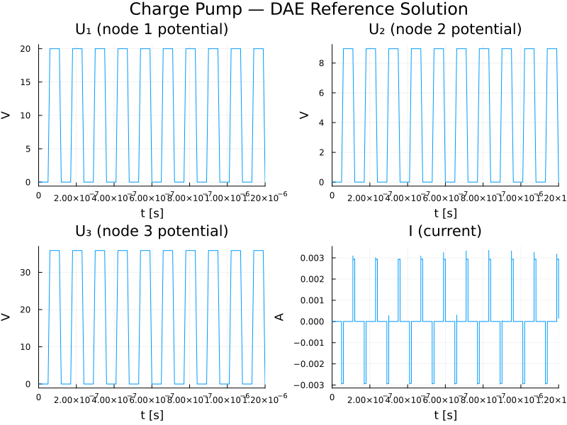
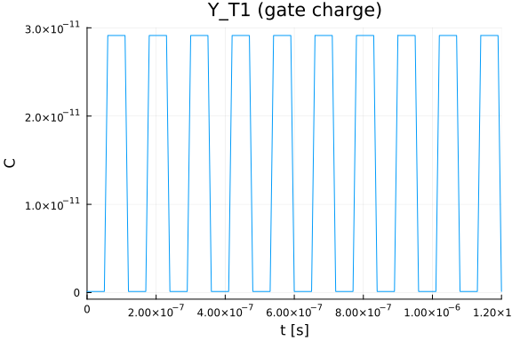
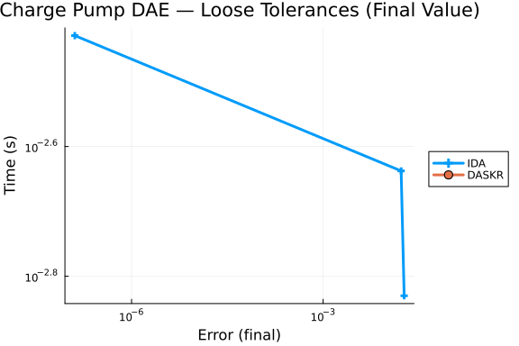
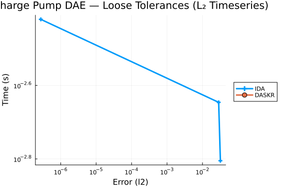

This benchmark is for the Charge Pump problem, a stiff **index-2** DAE of dimension 9 from the
[IVP Test Set](http://www.dm.uniba.it/~testset/) (problem "pump"). The circuit consists of two
capacitors and an n-channel MOS transistor. The formulation uses charge-oriented MOS transistor
modelling where the charge functions $Q_G$, $Q_S$, $Q_D$ (gate, source, drain) depend nonlinearly
on the node voltages.

**Reference:** Michael Günther, Georg Denk, Uwe Feldmann: *How models for MOS transistors reflect
charge distribution effects.* Preprint 1745, May 1995, Technische Hochschule Darmstadt.

The system is:

$$M \frac{dy}{dt} = f(t, y), \quad y(0) = y_0, \quad 0 \le t \le 1.2 \times 10^{-6}$$

where $y \in \mathbb{R}^9$ and the mass matrix $M$ is singular (rows 4–9 are zero).

The state vector is:
$y = (Y_{T1},\; Y_S,\; Y_{T2},\; Y_D,\; Y_{T3},\; U_1,\; U_2,\; U_3,\; I)^T$

where $Y_{T1}, Y_{T2}, Y_{T3}$ are transistor charges, $Y_S, Y_D$ are capacitor charges,
$U_1, U_2, U_3$ are node potentials, and $I$ is the current through the voltage source.

The first 8 variables have index 1, while $y_9$ (current $I$) has **index 2**. This makes the
problem particularly challenging — in the original IVP Test Set benchmarks, many specialised
Fortran solvers (RADAU, RADAU5, MEBDFDAE, MEBDFI) fail at all tolerances. Only BIMD, DASSL, GAMD,
and PSIDE-1 succeed, and even those only at loose tolerances.

**ModelingToolkit Index Reduction:** This is an index-2 DAE. ModelingToolkit's Pantelides
algorithm successfully reduces it to index-1, collapsing 9 unknowns to 4 (node potentials
$U_2$, $U_3$ and their dummy derivatives). However, the index-reduced system introduces
explicit derivatives of the piecewise charge functions $Q_G$, $Q_S$, $Q_D$, which have
discontinuous first-order partial derivatives at the MOS operating-region boundaries.
Standard implicit ODE solvers (Rodas5P, FBDF, etc.) fail on the reduced system because
they cannot resolve the resulting non-smooth algebraic constraints. The MTK formulation is
included below to demonstrate the structural analysis; the WPD benchmarks use the direct
DAE residual form with IDA and DASKR.

```julia
using OrdinaryDiffEq, DiffEqDevTools, Sundials,
      Plots, DASSL, DASKR
using ModelingToolkit
using ModelingToolkit: t_nounits as t, D_nounits as D
using LinearAlgebra
import ModelingToolkit: Symbolics, ForwardDiff
```


## MOS Transistor Charge Functions

The charge functions $Q_G$, $Q_S$, $Q_D$ model the n-channel MOS transistor with parameters
$V_{T0} = 0.2$, $\gamma = 0.035$, $\phi = 1.01$, $C_{ox} = 4 \times 10^{-12}$.

Each function has three branches (accumulation, depletion, inversion) depending on terminal
voltages. The `max` guards prevent `DomainError` from `sqrt` when the solver explores
unphysical states during Newton iterations. The type parameter `T <: Real` ensures
compatibility with ForwardDiff dual numbers for the MTK derivative registration.

```julia
const VT0 = 0.20
const GAMMA_MOS = 0.035
const PHI = 1.01
const COX = 4.0e-12
const CAPD = 0.40e-12
const CAPS = 1.60e-12
const VHIGH = 20.0
const DELTAT_PULSE = 120.0e-9
const T1_PULSE = 50.0e-9
const T2_PULSE = 60.0e-9
const T3_PULSE = 110.0e-9

function qgate(vgb::T, vgs::T, vgd::T) where T <: Real
    if (vgs - vgd) <= 0
        ugs = vgd; ugd = vgs
    else
        ugs = vgs; ugd = vgd
    end
    ugb = vgb
    ubs = ugs - ugb
    vfb = VT0 - GAMMA_MOS * sqrt(PHI) - PHI
    phi_ubs = max(PHI - ubs, zero(T))
    vte = VT0 + GAMMA_MOS * (sqrt(phi_ubs) - sqrt(PHI))

    if ugb <= vfb
        # Accumulation region
        return COX * (ugb - vfb)
    elseif ugb > vfb && ugs <= vte
        # Depletion region
        return COX * GAMMA_MOS * (sqrt(max((GAMMA_MOS / 2)^2 + ugb - vfb, zero(T))) - GAMMA_MOS / 2)
    else
        # Inversion region
        ugst = ugs - vte
        ugdt = ugd > vte ? ugd - vte : zero(T)
        denom = ugdt + ugst
        denom = abs(denom) < 1e-30 ? T(1e-30) : denom
        return COX * ((2 / 3) * (ugdt + ugst - (ugdt * ugst) / denom) +
                       GAMMA_MOS * sqrt(phi_ubs))
    end
end
qgate(a, b, c) = qgate(promote(float(a), float(b), float(c))...)

function qsrc(vgb::T, vgs::T, vgd::T) where T <: Real
    if (vgs - vgd) <= 0
        ugs = vgd; ugd = vgs
    else
        ugs = vgs; ugd = vgd
    end
    ugb = vgb
    ubs = ugs - ugb
    vfb = VT0 - GAMMA_MOS * sqrt(PHI) - PHI
    phi_ubs = max(PHI - ubs, zero(T))
    vte = VT0 + GAMMA_MOS * (sqrt(phi_ubs) - sqrt(PHI))

    if ugb <= vfb || (ugb > vfb && ugs <= vte)
        return zero(T)
    else
        ugst = ugs - vte
        ugdt = ugd >= vte ? ugd - vte : zero(T)
        denom = ugdt + ugst
        denom = abs(denom) < 1e-30 ? T(1e-30) : denom
        return -COX * (1 / 3) * (ugdt + ugst - (ugdt * ugst) / denom)
    end
end
qsrc(a, b, c) = qsrc(promote(float(a), float(b), float(c))...)

function qdrain(vgb::T, vgs::T, vgd::T) where T <: Real
    if (vgs - vgd) <= 0
        ugs = vgd; ugd = vgs
    else
        ugs = vgs; ugd = vgd
    end
    ugb = vgb
    ubs = ugs - ugb
    vfb = VT0 - GAMMA_MOS * sqrt(PHI) - PHI
    phi_ubs = max(PHI - ubs, zero(T))
    vte = VT0 + GAMMA_MOS * (sqrt(phi_ubs) - sqrt(PHI))

    if ugb <= vfb || (ugb > vfb && ugs <= vte)
        return zero(T)
    else
        ugst = ugs - vte
        ugdt = ugd >= vte ? ugd - vte : zero(T)
        denom = ugdt + ugst
        denom = abs(denom) < 1e-30 ? T(1e-30) : denom
        return -COX * (1 / 3) * (ugdt + ugst - (ugdt * ugst) / denom)
    end
end
qdrain(a, b, c) = qdrain(promote(float(a), float(b), float(c))...)
```

```
qdrain (generic function with 2 methods)
```


## Input Voltage Function

The pulsed input $V_{in}(t)$ is a periodic trapezoidal waveform with period $120\,\text{ns}$,
rise/fall times of $10\,\text{ns}$, and amplitude $20\,\text{V}$.

```julia
function vin(t)
    dummy = mod(t, DELTAT_PULSE)
    if dummy < T1_PULSE
        return 0.0
    elseif dummy < T2_PULSE
        return (dummy - T1_PULSE) * 0.10e9 * VHIGH
    elseif dummy < T3_PULSE
        return VHIGH
    else
        return (DELTAT_PULSE - dummy) * 0.10e9 * VHIGH
    end
end
```

```
vin (generic function with 1 method)
```


## Discontinuity Points

The input voltage has derivative discontinuities at $\tau = 50, 60, 110, 120\,\text{ns}$ within
each period. We compute all discontinuity times across the integration interval
$[0, 1.2\,\mu\text{s}]$. These are passed to the solver via `tstops` so that it restarts at
each derivative jump — this is critical for convergence on this problem.

```julia
tspan = (0.0, 1200.0e-9)

disc_times = Float64[]
base_disc = [50.0e-9, 60.0e-9, 110.0e-9, 120.0e-9]
for k in 0:9
    for td in base_disc
        push!(disc_times, td + k * 120.0e-9)
    end
end
disc_times = sort(unique(filter(t -> 0.0 < t < tspan[2], disc_times)))
```

```
40-element Vector{Float64}:
 5.0e-8
 6.0e-8
 1.1e-7
 1.2e-7
 1.7e-7
 1.7999999999999997e-7
 2.3e-7
 2.4e-7
 2.9e-7
 3.0e-7
 ⋮
 9.6e-7
 1.0099999999999999e-6
 1.02e-6
 1.07e-6
 1.0799999999999998e-6
 1.1299999999999998e-6
 1.1399999999999999e-6
 1.1899999999999998e-6
 1.1999999999999997e-6
```


## ModelingToolkit Index Reduction

Since this is an index-2 DAE, we use ModelingToolkit's Pantelides algorithm for structural
index reduction. The charge functions must be registered as opaque symbolic functions, and
their partial derivatives (computed via ForwardDiff) must be provided so that MTK can
differentiate the algebraic constraints during index reduction. We also register the input
voltage derivative $V'_{in}(t)$.

```julia
function dvin(t_val)
    dummy = mod(t_val, DELTAT_PULSE)
    dummy < T1_PULSE ? 0.0 : dummy < T2_PULSE ? 0.10e9 * VHIGH :
    dummy < T3_PULSE ? 0.0 : -0.10e9 * VHIGH
end

@register_symbolic qgate(vgb, vgs, vgd)
@register_symbolic qsrc(vgb, vgs, vgd)
@register_symbolic qdrain(vgb, vgs, vgd)
@register_symbolic vin(t_val)
@register_symbolic dvin(t_val)

# ForwardDiff-based partial derivatives for Pantelides index reduction
for (fn, dfn_prefix) in [(qgate, :dqgate), (qsrc, :dqsrc), (qdrain, :dqdrain)]
    for i in 1:3
        dfn_name = Symbol(dfn_prefix, "_", i)
        @eval begin
            $dfn_name(vgb, vgs, vgd) = ForwardDiff.derivative(
                x -> $fn(ntuple(j -> j == $i ? x : [vgb, vgs, vgd][j], 3)...),
                Float64([vgb, vgs, vgd][$i]))
            @register_symbolic $dfn_name(vgb, vgs, vgd)
            @register_derivative $fn(vgb, vgs, vgd) $i $(Expr(:call, dfn_name, :vgb, :vgs, :vgd))
        end
    end
end
@register_derivative vin(t_val) 1 dvin(t_val)
```


The MTK system is defined with all 9 original variables and 9 equations (3 differential,
6 algebraic). `@mtkbuild` applies Pantelides' algorithm to reduce the index.

```julia
@variables begin
    YT1(t) = qgate(0.0, 0.0, 0.0)
    YS(t)  = 0.0
    YT2(t) = qsrc(0.0, 0.0, 0.0)
    YD(t)  = 0.0
    YT3(t) = qdrain(0.0, 0.0, 0.0)
    U1(t)  = 0.0
    U2(t)  = 0.0
    U3(t)  = 0.0
    II(t)  = 0.0
end

eqs = [
    D(YT1) ~ -II,                                              # row 1 (differential)
    D(YS) + D(YT2) ~ 0,                                       # row 2 (differential)
    D(YD) + D(YT3) ~ 0,                                       # row 3 (differential)
    0 ~ -U1 + vin(t),                                          # row 4 (algebraic)
    0 ~ YT1 - qgate(U1, U1 - U2, U1 - U3),                   # row 5 (algebraic)
    0 ~ YS  - CAPS * U2,                                       # row 6 (algebraic)
    0 ~ YT2 - qsrc(U1, U1 - U2, U1 - U3),                    # row 7 (algebraic)
    0 ~ YD  - CAPD * U3,                                       # row 8 (algebraic)
    0 ~ YT3 - qdrain(U1, U1 - U2, U1 - U3),                  # row 9 (algebraic)
]

@mtkbuild sys = ODESystem(eqs, t)
```

```
Model sys:
Equations (6):
  6 standard: see equations(sys)
Unknowns (6): see unknowns(sys)
  YT3(t)
  YT2(t)
  U2(t)
  U3(t)
  ⋮
Observed (9): see observed(sys)
```


Pantelides reduces the 9-variable index-2 system to a 4-variable index-1 system with
unknowns $(U_3, U_2, \dot{U}_2, \dot{U}_3)$. The remaining 5 variables become observed
(algebraic) functions.

```julia
println("MTK index reduction: $(9) original → $(length(unknowns(sys))) unknowns")
println("States: ", unknowns(sys))
```

```
MTK index reduction: 9 original → 6 unknowns
States: SymbolicUtils.BasicSymbolicImpl.var"typeof(BasicSymbolicImpl)"{Symb
olicUtils.SymReal}[YT3(t), YT2(t), U2(t), U3(t), U2ˍt(t), U3ˍt(t)]
```


The index-reduced ODEProblem is an index-1 DAE in mass-matrix form (2 differential + 2
algebraic equations). However, all tested ODE solvers fail on this reduced system
because the RHS involves the partial derivatives `dqgate_i`, `dqsrc_i`, `dqdrain_i`,
which are discontinuous at the MOS operating-region boundaries ($V_{gb} = V_{fb}$,
$V_{gs} = V_{te}$). The solvers' step size collapses to zero at the transistor threshold
crossing points (e.g., when $V_{in}(t)$ crosses $V_{T0} = 0.2\,$V).

```julia
mtkprob = ODEProblem(sys, [], tspan)
mtk_test = solve(mtkprob, Rodas5P(autodiff = AutoFiniteDiff()), abstol = 1e-4, reltol = 1e-4,
                 tstops = disc_times, maxiters = Int(1e6), dt = 1e-15)
println("Rodas5P on MTK-reduced system: retcode = $(mtk_test.retcode), ",
        "steps = $(length(mtk_test.t)), final t = $(mtk_test.t[end])")
```

```
Rodas5P on MTK-reduced system: retcode = Unstable, steps = 8, final t = 6.0
e-8
```


## Mass-Matrix ODE Form

The mass matrix has the banded structure from the Fortran `meval` subroutine (stored in banded
format with `mlmas=0, mumas=2`). In full $9 \times 9$ form:

$$M = \begin{pmatrix}
1 & 0 & 0 & 0 & 0 & 0 & 0 & 0 & 0 \\
0 & 1 & 1 & 0 & 0 & 0 & 0 & 0 & 0 \\
0 & 0 & 0 & 1 & 1 & 0 & 0 & 0 & 0 \\
0 & 0 & 0 & 0 & 0 & 0 & 0 & 0 & 0 \\
0 & 0 & 0 & 0 & 0 & 0 & 0 & 0 & 0 \\
0 & 0 & 0 & 0 & 0 & 0 & 0 & 0 & 0 \\
0 & 0 & 0 & 0 & 0 & 0 & 0 & 0 & 0 \\
0 & 0 & 0 & 0 & 0 & 0 & 0 & 0 & 0 \\
0 & 0 & 0 & 0 & 0 & 0 & 0 & 0 & 0
\end{pmatrix}$$

**Note:** Standard mass-matrix ODE solvers (Rodas4, Rodas5P, FBDF, QNDF, RadauIIA5)
return `Unstable` on this index-2 problem. The mass-matrix form is included for documentation
but the work-precision benchmarks use only the DAE residual form.

```julia
function charge_pump_rhs!(du, u, p, t)
    y1, y2, y3, y4, y5, y6, y7, y8, y9 = u
    v = vin(t)

    du[1] = -y9
    du[2] = 0.0
    du[3] = 0.0
    du[4] = -y6 + v
    du[5] = y1 - qgate(y6, y6 - y7, y6 - y8)
    du[6] = y2 - CAPS * y7
    du[7] = y3 - qsrc(y6, y6 - y7, y6 - y8)
    du[8] = y4 - CAPD * y8
    du[9] = y5 - qdrain(y6, y6 - y7, y6 - y8)
    nothing
end

M = zeros(9, 9)
M[1, 1] = 1.0
M[2, 2] = 1.0
M[2, 3] = 1.0
M[3, 4] = 1.0
M[3, 5] = 1.0

# Consistent initial conditions from Fortran init subroutine
y0 = zeros(9)
y0[1] = qgate(0.0, 0.0, 0.0)
y0[3] = qsrc(0.0, 0.0, 0.0)
y0[5] = qdrain(0.0, 0.0, 0.0)

mmf = ODEFunction(charge_pump_rhs!, mass_matrix = M)
mmprob = ODEProblem(mmf, y0, tspan)
```

```
ODEProblem with uType Vector{Float64} and tType Float64. In-place: true
Non-trivial mass matrix: true
timespan: (0.0, 1.2e-6)
u0: 9-element Vector{Float64}:
 1.2628004298767594e-13
 0.0
 0.0
 0.0
 0.0
 0.0
 0.0
 0.0
 0.0
```


## DAE Residual Form

The residual form $F(\dot{y}, y, t) = M\dot{y} - f(t, y) = 0$ for use with IDA and DASKR.

Variables 1–5 are differential ($\dot{y}$ appears in the equations); variables 6–9 are algebraic.

```julia
function charge_pump_dae!(out, du, u, p, t)
    y1, y2, y3, y4, y5, y6, y7, y8, y9 = u
    dy1, dy2, dy3, dy4, dy5, dy6, dy7, dy8, dy9 = du
    v = vin(t)

    # Differential equations (rows 1–3)
    out[1] = dy1 + y9                                          # Y'_T1 = -I
    out[2] = dy2 + dy3                                         # Y'_S + Y'_T2 = 0
    out[3] = dy4 + dy5                                         # Y'_D + Y'_T3 = 0

    # Algebraic constraints (rows 4–9)
    out[4] = y6 - v                                            # U_1 = V_in(t)
    out[5] = -(y1 - qgate(y6, y6 - y7, y6 - y8))             # Y_T1 = Q_G(U_1, U_1-U_2, U_1-U_3)
    out[6] = -(y2 - CAPS * y7)                                 # Y_S = C_S · U_2
    out[7] = -(y3 - qsrc(y6, y6 - y7, y6 - y8))              # Y_T2 = Q_S(U_1, U_1-U_2, U_1-U_3)
    out[8] = -(y4 - CAPD * y8)                                 # Y_D = C_D · U_3
    out[9] = -(y5 - qdrain(y6, y6 - y7, y6 - y8))            # Y_T3 = Q_D(U_1, U_1-U_2, U_1-U_3)
    nothing
end

du0 = zeros(9)
differential_vars = [true, true, true, true, true, false, false, false, false]
daeprob = DAEProblem(charge_pump_dae!, du0, y0, tspan,
                     differential_vars = differential_vars)
```

```
DAEProblem with uType Vector{Float64} and tType Float64. In-place: true
timespan: (0.0, 1.2e-6)
u0: 9-element Vector{Float64}:
 1.2628004298767594e-13
 0.0
 0.0
 0.0
 0.0
 0.0
 0.0
 0.0
 0.0
du0: 9-element Vector{Float64}:
 0.0
 0.0
 0.0
 0.0
 0.0
 0.0
 0.0
 0.0
 0.0
```


## Reference Solution

We use IDA (Sundials) as the canonical reference solver for both problem forms.
IDA requires `tstops` at each derivative discontinuity and a small initial step `dt`
to handle the dormant initial phase (nothing happens until $V_{in}$ starts rising at $t = 50\,\text{ns}$).

The IVP Test Set provides a quadruple-precision GAMD reference at $t = 1.2 \times 10^{-6}$:

$$y_1^{\mathrm{ref}} = 0.126280 \times 10^{-12},\quad y_2 \!=\! \cdots \!=\! y_8 = 0,\quad y_9^{\mathrm{ref}} = 0.152256 \times 10^{-3}$$

**Note:** IDA fails at tolerances tighter than $5 \times 10^{-4}$ on this index-2 problem
(see Omissions below). The reference uses the tightest stable tolerance.

```julia
ref_sol = solve(daeprob, IDA(), abstol = 5e-4, reltol = 5e-4,
                dt = 1e-15, tstops = disc_times, maxiters = Int(1e7), dense = true)
@assert ref_sol.retcode == ReturnCode.Success "Reference solve failed: $(ref_sol.retcode)"

probs = [daeprob]
refs  = [ref_sol]
```

```
1-element Vector{SciMLBase.DAESolution{Float64, 2, Vector{Vector{Float64}},
 Vector{Vector{Float64}}, Nothing, Nothing, Vector{Float64}, SciMLBase.DAEP
roblem{Vector{Float64}, Vector{Float64}, Tuple{Float64, Float64}, true, Sci
MLBase.NullParameters, SciMLBase.DAEFunction{true, SciMLBase.AutoSpecialize
, typeof(Main.var"##WeaveSandBox#232".charge_pump_dae!), Nothing, Nothing,
Nothing, Nothing, Nothing, Nothing, Nothing, Nothing, Nothing, Nothing, Not
hing, Nothing, typeof(SciMLBase.DEFAULT_OBSERVED), Nothing, Nothing, Nothin
g, Nothing}, Base.Pairs{Symbol, Union{}, Tuple{}, @NamedTuple{}}, Vector{Bo
ol}}, Sundials.IDA{:Dense, Nothing, Nothing}, SciMLBase.BasicInterpolation{
Vector{Float64}, Vector{Vector{Float64}}, Vector{Vector{Float64}}}, SciMLBa
se.DEStats, Nothing, Nothing}}:
 [1.2628004298767594e-13 1.2628004298767594e-13 … 1.2628004298770012e-13 1.
2628004298766816e-13; 0.0 0.0 … 1.1709654061874394e-31 1.1709654061874394e-
31; … ; 0.0 0.0 … 2.9274135154685985e-19 2.9274135154685985e-19; 0.0 0.0 …
0.0001508651079222072 0.00015086510792226585]
```


## Reference Solution Verification

```julia
y_ref = zeros(9)
y_ref[1] = 0.126280042987675933170893e-12
y_ref[9] = 0.152255686815577679043511e-3

println("=== Reference Solution Verification (IDA, tol = 5e-4) ===")
for i in [1, 9]
    computed = ref_sol.u[end][i]
    ref_val  = y_ref[i]
    rel_err  = abs(ref_val) > 0 ? abs(computed - ref_val) / abs(ref_val) : abs(computed)
    println("  y[$i]: computed = $computed,  GAMD ref = $ref_val,  rel_error = $rel_err")
end
```

```
=== Reference Solution Verification (IDA, tol = 5e-4) ===
  y[1]: computed = 1.2628004298766816e-13,  GAMD ref = 1.2628004298767594e-
13,  rel_error = 6.156961066775279e-14
  y[9]: computed = 0.00015086510792226585,  GAMD ref = 0.000152255686815577
68,  rel_error = 0.009133181967752627
```


## Solution Plots

```julia
p1 = plot(ref_sol, idxs = [6], title = "U₁ (node 1 potential)",
          xlabel = "t [s]", ylabel = "V", legend = false)
p2 = plot(ref_sol, idxs = [7], title = "U₂ (node 2 potential)",
          xlabel = "t [s]", ylabel = "V", legend = false)
p3 = plot(ref_sol, idxs = [8], title = "U₃ (node 3 potential)",
          xlabel = "t [s]", ylabel = "V", legend = false)
p4 = plot(ref_sol, idxs = [9], title = "I (current)",
          xlabel = "t [s]", ylabel = "A", legend = false)
plot(p1, p2, p3, p4, layout = (2, 2), size = (800, 600),
     plot_title = "Charge Pump — DAE Reference Solution")
```



```julia
plot(ref_sol, idxs = [1],
     title = "Y_T1 (gate charge)",
     xlabel = "t [s]", ylabel = "C", legend = false)
```




## Omissions

This is one of the hardest problems in the IVP Test Set. The following solver classes
are **not** included in the WPD because they fail on this index-2 system:

- **Mass-matrix ODE solvers** (Rodas4, Rodas5P, FBDF, QNDF, RadauIIA5): all return `Unstable`
- **DASSL.dassl()**: returns without progressing (2 steps, initial conditions unchanged)
- **DFBDF**: returns `Unstable`
- **IDA without `tstops`**: returns `MaxIters` (cannot pass the first discontinuity at $t = 50\,\text{ns}$)
- **DASKR at tolerances below $10^{-3}$**: `ConvergenceFailure`
- **IDA at tolerances below $10^{-4}$**: `ConvergenceFailure` or `Unstable`

## Work-Precision Benchmarks

Only the DAE residual form is benchmarked. The usable tolerance range is approximately
$10^{-1}$ to $10^{-3}$ for DASKR, and $2 \times 10^{-3}$ to $2 \times 10^{-4}$ for IDA.

### Loose Tolerances (Final-Value Error)

```julia
abstols = 1.0 ./ 10.0 .^ (1:3)
reltols = 1.0 ./ 10.0 .^ (1:3)

setups = [
    Dict(:prob_choice => 1, :alg => IDA()),
    Dict(:prob_choice => 1, :alg => DASKR.daskr()),
]

wp = WorkPrecisionSet(probs, abstols, reltols, setups;
    save_everystep = false, appxsol = refs, maxiters = Int(1e5), numruns = 1,
    names = ["IDA", "DASKR"], dt = 1e-15, tstops = disc_times)
plot(wp, title = "Charge Pump DAE — Loose Tolerances (Final Value)")
```




### Loose Tolerances (L₂ Timeseries Error)

```julia
abstols = 1.0 ./ 10.0 .^ (1:3)
reltols = 1.0 ./ 10.0 .^ (1:3)

setups = [
    Dict(:prob_choice => 1, :alg => IDA()),
    Dict(:prob_choice => 1, :alg => DASKR.daskr()),
]

wp = WorkPrecisionSet(probs, abstols, reltols, setups; error_estimate = :l2,
    save_everystep = false, appxsol = refs, maxiters = Int(1e5), numruns = 1,
    names = ["IDA", "DASKR"], dt = 1e-15, tstops = disc_times)
plot(wp, title = "Charge Pump DAE — Loose Tolerances (L₂ Timeseries)")
```




### Conclusion


## Appendix

These benchmarks are a part of the SciMLBenchmarks.jl repository, found at: [https://github.com/SciML/SciMLBenchmarks.jl](https://github.com/SciML/SciMLBenchmarks.jl). For more information on high-performance scientific machine learning, check out the SciML Open Source Software Organization [https://sciml.ai](https://sciml.ai).

To locally run this benchmark, do the following commands:

```
using SciMLBenchmarks
SciMLBenchmarks.weave_file("benchmarks/DAE","charge_pump.jmd")
```

Computer Information:

```
Julia Version 1.11.9
Commit 53a02c0720c (2026-02-06 00:27 UTC)
Build Info:
  Official https://julialang.org/ release
Platform Info:
  OS: Linux (x86_64-linux-gnu)
  CPU: 128 × AMD EPYC 7502 32-Core Processor
  WORD_SIZE: 64
  LLVM: libLLVM-16.0.6 (ORCJIT, znver2)
Threads: 128 default, 0 interactive, 64 GC (on 128 virtual cores)
Environment:
  JULIA_PKG_PRECOMPILE_AUTO = 0
  JULIA_NUM_THREADS = auto

```

Package Information:

```
Status `~/sandbox/tmp_20260825_180339_53321/dae-pr1670-validate/benchmarks/DAE/Project.toml`
⌃ [165a45c3] DASKR v3.1.5
⌃ [e993076c] DASSL v3.1.0
⌃ [f3b72e0c] DiffEqDevTools v3.2.0
⌃ [961ee093] ModelingToolkit v11.39.0
⌅ [09606e27] ODEInterfaceDiffEq v4.1.0
⌃ [1dea7af3] OrdinaryDiffEq v7.6.0
⌃ [6ad6398a] OrdinaryDiffEqBDF v2.4.2
⌃ [5960d6e9] OrdinaryDiffEqFIRK v2.6.0
⌃ [43230ef6] OrdinaryDiffEqRosenbrock v2.6.5
⌃ [2d112036] OrdinaryDiffEqSDIRK v2.8.2
⌃ [91a5bcdd] Plots v1.41.6
⌃ [31c91b34] SciMLBenchmarks v0.1.3
⌃ [90137ffa] StaticArrays v1.9.18
⌃ [10745b16] Statistics v1.11.1
⌃ [c3572dad] Sundials v6.5.1
⌃ [0c5d862f] Symbolics v7.36.0
Info Packages marked with ⌃ and ⌅ have new versions available. Those with ⌃ may be upgradable, but those with ⌅ are restricted by compatibility constraints from upgrading. To see why use `status --outdated`
```

And the full manifest:

```
Status `~/sandbox/tmp_20260825_180339_53321/dae-pr1670-validate/benchmarks/DAE/Manifest.toml`
⌃ [47edcb42] ADTypes v1.23.0
  [14f7f29c] AMD v0.5.3
  [6e696c72] AbstractPlutoDingetjes v1.4.0
  [1520ce14] AbstractTrees v0.4.5
  [7d9f7c33] Accessors v0.1.45
  [79e6a3ab] Adapt v4.7.0
  [66dad0bd] AliasTables v1.1.3
  [ec485272] ArnoldiMethod v0.4.0
⌃ [4fba245c] ArrayInterface v7.28.1
  [4c555306] ArrayLayouts v1.12.2
⌃ [aae01518] BandedMatrices v1.11.0
  [e2ed5e7c] Bijections v0.2.2
⌃ [b2a6c25c] BinaryHeaps v1.0.4
⌃ [caf10ac8] BipartiteGraphs v0.1.11
  [d1d4a3ce] BitFlags v0.1.10
  [62783981] BitTwiddlingConvenienceFunctions v0.1.6
  [8e7c35d0] BlockArrays v1.10.0
⌃ [70df07ce] BracketingNonlinearSolve v1.12.5
  [fa961155] CEnum v0.5.0
  [2a0fbf3d] CPUSummary v0.2.7
  [fb6a15b2] CloseOpenIntervals v0.1.13
⌃ [944b1d66] CodecZlib v0.7.8
  [35d6a980] ColorSchemes v3.31.0
  [3da002f7] ColorTypes v0.12.1
  [c3611d14] ColorVectorSpace v0.11.0
  [5ae59095] Colors v0.13.1
⌅ [861a8166] Combinatorics v1.0.2
⌃ [38540f10] CommonSolve v0.2.13
  [bbf7d656] CommonSubexpressions v0.3.1
⌃ [f70d9fcc] CommonWorldInvalidations v1.1.2
  [34da2185] Compat v4.18.1
  [b152e2b5] CompositeTypes v0.1.4
  [a33af91c] CompositionsBase v0.1.2
⌃ [2569d6c7] ConcreteStructs v0.2.7
  [f0e56b4a] ConcurrentUtilities v2.6.0
  [8f4d0f93] Conda v1.10.3
  [187b0558] ConstructionBase v1.6.0
  [d38c429a] Contour v0.6.3
  [adafc99b] CpuId v0.3.1
  [a8cc5b0e] Crayons v4.2.0
⌃ [165a45c3] DASKR v3.1.5
⌃ [e993076c] DASSL v3.1.0
  [9a962f9c] DataAPI v1.16.0
  [864edb3b] DataStructures v0.19.6
  [e2d170a0] DataValueInterfaces v1.0.0
  [8bb1440f] DelimitedFiles v1.9.1
⌃ [2b5f629d] DiffEqBase v7.14.0
⌃ [459566f4] DiffEqCallbacks v4.19.2
⌃ [f3b72e0c] DiffEqDevTools v3.2.0
⌃ [77a26b50] DiffEqNoiseProcess v5.34.1
  [163ba53b] DiffResults v1.1.0
  [b552c78f] DiffRules v1.16.0
⌃ [a0c0ee7d] DifferentiationInterface v0.7.20
⌃ [31c24e10] Distributions v0.25.130
  [ffbed154] DocStringExtensions v0.9.5
  [5b8099bc] DomainSets v0.8.1
⌃ [7c1d4256] DynamicPolynomials v0.6.6
  [4e289a0a] EnumX v1.0.7
  [f151be2c] EnzymeCore v0.8.21
  [460bff9d] ExceptionUnwrapping v0.1.11
  [e2ba6199] ExprTools v0.1.11
  [55351af7] ExproniconLite v0.10.14
  [c87230d0] FFMPEG v0.4.5
⌃ [7034ab61] FastBroadcast v1.3.6
  [9aa1b823] FastClosures v0.3.2
  [442a2c76] FastGaussQuadrature v1.3.0
⌃ [a4df4552] FastPower v1.4.1
  [1a297f60] FillArrays v1.17.0
  [64ca27bc] FindFirstFunctions v3.2.1
  [6a86dc24] FiniteDiff v2.33.0
⌅ [53c48c17] FixedPointNumbers v0.8.6
  [1fa38f19] Format v1.3.7
  [f6369f11] ForwardDiff v1.4.5
  [a85aefff] FunctionMaps v0.1.2
  [069b7b12] FunctionWrappers v1.1.3
⌃ [77dc65aa] FunctionWrappersWrappers v1.12.1
  [46192b85] GPUArraysCore v0.2.0
⌃ [28b8d3ca] GR v0.73.26
  [a0844989] Gamma v1.2.0
  [d7ba0133] Git v1.5.0
  [86223c79] Graphs v1.14.0
  [42e2da0e] Grisu v1.0.2
⌅ [cd3eb016] HTTP v1.11.0
⌅ [eafb193a] Highlights v0.5.3
  [34004b35] HypergeometricFunctions v0.3.30
  [7073ff75] IJulia v1.34.4
  [615f187c] IfElse v0.1.1
⌃ [3263718b] ImplicitDiscreteSolve v2.1.5
  [d25df0c9] Inflate v0.1.5
  [18e54dd8] IntegerMathUtils v0.1.4
  [8197267c] IntervalSets v0.7.14
  [3587e190] InverseFunctions v0.1.17
  [92d709cd] IrrationalConstants v0.2.6
  [82899510] IteratorInterfaceExtensions v1.0.0
  [1019f520] JLFzf v0.1.11
  [692b3bcd] JLLWrappers v1.8.0
⌅ [682c06a0] JSON v0.21.4
  [ae98c720] Jieko v0.2.1
⌃ [ccbc3e58] JumpProcesses v9.29.2
  [ba0b0d4f] Krylov v0.10.9
⌃ [b964fa9f] LaTeXStrings v1.4.0
⌃ [23fbe1c1] Latexify v0.16.11
  [10f19ff3] LayoutPointers v0.1.17
⌃ [87fe0de2] LineSearch v0.1.14
⌃ [7ed4a6bd] LinearSolve v5.10.0
  [2ab3a3ac] LogExpFunctions v1.0.1
  [e6f89c97] LoggingExtras v1.2.0
  [1914dd2f] MacroTools v0.5.16
  [d125e4d3] ManualMemory v0.1.8
⌃ [bb5d69b7] MaybeInplace v0.1.7
  [739be429] MbedTLS v1.1.10
  [442fdcdd] Measures v0.3.3
  [e1d29d7a] Missings v1.2.0
⌃ [961ee093] ModelingToolkit v11.39.0
⌃ [7771a370] ModelingToolkitBase v1.65.0
⌃ [6bb917b9] ModelingToolkitTearing v1.20.5
  [2e0e35c7] Moshi v0.3.12
  [46d2c3a1] MuladdMacro v0.2.7
  [102ac46a] MultivariatePolynomials v0.5.19
  [ffc61752] Mustache v1.0.21
  [d8a4904e] MutableArithmetics v1.8.0
  [77ba4419] NaNMath v1.1.4
⌃ [8913a72c] NonlinearSolve v4.26.1
⌃ [be0214bd] NonlinearSolveBase v2.43.0
⌃ [5959db7a] NonlinearSolveFirstOrder v2.3.2
⌃ [9a2c21bd] NonlinearSolveQuasiNewton v1.15.1
⌃ [26075421] NonlinearSolveSpectralMethods v1.8.0
  [54ca160b] ODEInterface v0.5.2
⌅ [09606e27] ODEInterfaceDiffEq v4.1.0
  [6fe1bfb0] OffsetArrays v1.17.0
  [4d8831e6] OpenSSL v1.6.1
⌅ [bac558e1] OrderedCollections v1.8.2
⌃ [1dea7af3] OrdinaryDiffEq v7.6.0
⌃ [6ad6398a] OrdinaryDiffEqBDF v2.4.2
⌃ [bbf590c4] OrdinaryDiffEqCore v4.14.3
⌃ [50262376] OrdinaryDiffEqDefault v2.4.4
⌃ [4302a76b] OrdinaryDiffEqDifferentiation v3.9.0
⌃ [5960d6e9] OrdinaryDiffEqFIRK v2.6.0
⌃ [127b3ac7] OrdinaryDiffEqNonlinearSolve v2.8.0
⌃ [43230ef6] OrdinaryDiffEqRosenbrock v2.6.5
⌃ [b4bd8bb3] OrdinaryDiffEqRosenbrockTableaus v2.4.1
⌃ [2d112036] OrdinaryDiffEqSDIRK v2.8.2
⌃ [b1df2697] OrdinaryDiffEqTsit5 v2.1.3
⌃ [79d7bb75] OrdinaryDiffEqVerner v2.2.2
  [90014a1f] PDMats v0.11.41
⌅ [69de0a69] Parsers v2.8.7
  [ccf2f8ad] PlotThemes v3.3.0
  [995b91a9] PlotUtils v1.4.4
⌃ [91a5bcdd] Plots v1.41.6
  [e409e4f3] PoissonRandom v0.4.13
  [f517fe37] Polyester v0.7.19
  [1d0040c9] PolyesterWeave v0.2.2
⌃ [d236fae5] PreallocationTools v1.5.0
⌅ [aea7be01] PrecompileTools v1.2.1
  [21216c6a] Preferences v1.5.2
⌃ [08abe8d2] PrettyTables v3.4.6
  [27ebfcd6] Primes v0.5.7
  [43287f4e] PtrArrays v1.4.0
  [0c0d3e7f] PureKLU v1.4.1
  [1fd47b50] QuadGK v2.11.3
  [988b38a3] ReadOnlyArrays v0.2.0
  [795d4caa] ReadOnlyDicts v1.0.1
  [3cdcf5f2] RecipesBase v1.3.4
  [01d81517] RecipesPipeline v0.6.12
⌃ [731186ca] RecursiveArrayTools v4.4.0
  [189a3867] Reexport v1.2.2
  [05181044] RelocatableFolders v1.0.1
  [ae029012] Requires v1.3.1
⌃ [ae5879a3] ResettableStacks v1.3.0
⌃ [9fe22ead] RespecializeParams v1.2.0
  [79098fc4] Rmath v0.9.0
⌃ [47965b36] RootedTrees v2.25.4
⌃ [f2b01f46] Roots v3.0.6
⌃ [7e49a35a] RuntimeGeneratedFunctions v0.5.24
⌃ [9dfe8606] SCCNonlinearSolve v1.14.1
  [94e857df] SIMDTypes v0.1.0
⌅ [0bca4576] SciMLBase v3.46.1
⌃ [31c91b34] SciMLBenchmarks v0.1.3
⌃ [19f34311] SciMLJacobianOperators v0.1.17
⌃ [a6db7da4] SciMLLogging v2.0.4
⌃ [c0aeaf25] SciMLOperators v1.26.1
⌃ [431bcebd] SciMLPublic v1.2.4
⌃ [53ae85a6] SciMLStructures v1.10.4
  [6c6a2e73] Scratch v1.3.0
  [efcf1570] Setfield v1.1.2
  [992d4aef] Showoff v1.0.3
  [777ac1f9] SimpleBufferStream v1.2.0
⌃ [727e6d20] SimpleNonlinearSolve v2.14.0
  [699a6c99] SimpleTraits v0.9.6
  [a2af1166] SortingAlgorithms v1.2.3
⌃ [a57abbd0] SparseColumnPivotedQR v2.1.6
  [0a514795] SparseMatrixColorings v0.4.27
⌃ [276daf66] SpecialFunctions v2.8.3
  [860ef19b] StableRNGs v1.0.4
  [0c0c59c1] StarAlgebras v0.3.0
⌃ [64909d44] StateSelection v1.11.0
  [aedffcd0] Static v1.4.6
  [0d7ed370] StaticArrayInterface v1.10.0
⌃ [90137ffa] StaticArrays v1.9.18
  [1e83bf80] StaticArraysCore v1.4.4
⌃ [10745b16] Statistics v1.11.1
  [82ae8749] StatsAPI v1.8.0
⌃ [2913bbd2] StatsBase v0.34.12
  [4c63d2b9] StatsFuns v2.2.1
  [7792a7ef] StrideArraysCore v0.5.9
  [69024149] StringEncodings v0.3.7
⌅ [892a3eda] StringManipulation v0.4.7
  [09ab397b] StructArrays v0.7.3
⌃ [c3572dad] Sundials v6.5.1
⌃ [2efcf032] SymbolicIndexingInterface v0.3.54
⌃ [19f23fe9] SymbolicLimits v1.1.5
⌅ [d1185830] SymbolicUtils v4.45.0
⌃ [0c5d862f] Symbolics v7.36.0
  [3783bdb8] TableTraits v1.0.1
⌃ [bd369af6] Tables v1.13.0
  [ed4db957] TaskLocalValues v0.1.3
  [62fd8b95] TensorCore v0.1.1
  [8ea1fca8] TermInterface v2.0.0
  [8290d209] ThreadingUtilities v0.5.6
  [a759f4b9] TimerOutputs v1.2.0
  [3bb67fe8] TranscodingStreams v0.11.3
  [781d530d] TruncatedStacktraces v1.4.0
⌃ [5c2747f8] URIs v1.6.3
  [3a884ed6] UnPack v1.0.2
  [1cfade01] UnicodeFun v0.4.1
  [41fe7b60] Unzip v0.2.0
  [81def892] VersionParsing v1.3.0
  [d30d5f5c] WeakCacheSets v0.1.0
  [44d3d7a6] Weave v0.10.12
  [ddb6d928] YAML v0.4.16
  [c2297ded] ZMQ v1.5.1
  [6e34b625] Bzip2_jll v1.0.9+0
  [83423d85] Cairo_jll v1.18.7+0
  [655fdf9c] DASKR_jll v1.0.1+0
  [ee1fde0b] Dbus_jll v1.16.2+0
  [2702e6a9] EpollShim_jll v0.0.20230411+1
⌃ [2e619515] Expat_jll v2.8.2+0
⌅ [b22a6f82] FFMPEG_jll v8.1.2+0
  [a3f928ae] Fontconfig_jll v2.17.1+0
  [d7e528f0] FreeType2_jll v2.14.3+1
  [559328eb] FriBidi_jll v1.0.17+0
⌃ [0656b61e] GLFW_jll v3.4.1+1
⌅ [d2c73de3] GR_jll v0.73.26+0
⌅ [b0724c58] GettextRuntime_jll v0.22.4+0
  [61579ee1] Ghostscript_jll v9.55.1+0
  [020c3dae] Git_LFS_jll v3.7.1+0
  [f8c6e375] Git_jll v2.55.0+0
  [7746bdde] Glib_jll v2.88.3+0
  [3b182d85] Graphite2_jll v1.3.16+0
⌅ [2e76f6c2] HarfBuzz_jll v8.5.1+0
  [1d5cc7b8] IntelOpenMP_jll v2025.2.0+0
  [aacddb02] JpegTurbo_jll v3.2.0+1
  [c1c5ebd0] LAME_jll v3.100.3+0
  [88015f11] LERC_jll v4.1.0+0
  [1d63c593] LLVMOpenMP_jll v22.1.7+0
⌅ [e9f186c6] Libffi_jll v3.4.7+0
  [7e76a0d4] Libglvnd_jll v1.7.1+1
  [94ce4f54] Libiconv_jll v1.18.0+0
  [4b2f31a3] Libmount_jll v2.42.0+0
  [89763e89] Libtiff_jll v4.7.3+0
  [38a345b3] Libuuid_jll v2.42.0+0
  [856f044c] MKL_jll v2025.2.0+0
  [c771fb93] ODEInterface_jll v0.0.2+0
  [e7412a2a] Ogg_jll v1.3.6+0
  [656ef2d0] OpenBLAS32_jll v0.3.34+0
⌃ [9bd350c2] OpenSSH_jll v10.4.1+0
⌃ [458c3c95] OpenSSL_jll v3.5.7+0
  [efe28fd5] OpenSpecFun_jll v0.5.6+0
  [91d4177d] Opus_jll v1.6.1+0
⌃ [36c8627f] Pango_jll v1.58.0+0
  [30392449] Pixman_jll v0.46.4+0
  [c0090381] Qt6Base_jll v6.10.2+2
  [629bc702] Qt6Declarative_jll v6.10.2+2
  [ce943373] Qt6ShaderTools_jll v6.10.2+1
  [6de9746b] Qt6Svg_jll v6.10.2+0
  [e99dba38] Qt6Wayland_jll v6.10.2+1
  [f50d1b31] Rmath_jll v0.5.2+0
  [ca45d3f4] SuiteSparse32_jll v7.12.1+0
  [fb77eaff] Sundials_jll v7.5.0+0
  [a44049a8] Vulkan_Loader_jll v1.3.243+0
  [a2964d1f] Wayland_jll v1.24.0+0
  [ffd25f8a] XZ_jll v5.8.3+0
  [f67eecfb] Xorg_libICE_jll v1.1.2+0
  [c834827a] Xorg_libSM_jll v1.2.6+0
  [4f6342f7] Xorg_libX11_jll v1.8.13+0
  [0c0b7dd1] Xorg_libXau_jll v1.0.13+0
  [935fb764] Xorg_libXcursor_jll v1.2.4+0
  [a3789734] Xorg_libXdmcp_jll v1.1.6+0
  [1082639a] Xorg_libXext_jll v1.3.8+0
  [d091e8ba] Xorg_libXfixes_jll v6.0.2+0
  [a51aa0fd] Xorg_libXi_jll v1.8.4+0
  [d1454406] Xorg_libXinerama_jll v1.1.7+0
  [ec84b674] Xorg_libXrandr_jll v1.5.6+0
  [ea2f1a96] Xorg_libXrender_jll v0.9.12+0
  [a65dc6b1] Xorg_libpciaccess_jll v0.19.0+0
  [c7cfdc94] Xorg_libxcb_jll v1.17.1+0
  [cc61e674] Xorg_libxkbfile_jll v1.2.0+0
  [e920d4aa] Xorg_xcb_util_cursor_jll v0.1.6+0
  [12413925] Xorg_xcb_util_image_jll v0.4.1+0
  [2def613f] Xorg_xcb_util_jll v0.4.1+0
  [975044d2] Xorg_xcb_util_keysyms_jll v0.4.1+0
  [0d47668e] Xorg_xcb_util_renderutil_jll v0.3.10+0
  [c22f9ab0] Xorg_xcb_util_wm_jll v0.4.2+0
  [35661453] Xorg_xkbcomp_jll v1.4.7+0
  [33bec58e] Xorg_xkeyboard_config_jll v2.47.0+2
  [c5fb5394] Xorg_xtrans_jll v1.6.0+0
  [8f1865be] ZeroMQ_jll v4.3.6+0
  [3161d3a3] Zstd_jll v1.5.7+1
  [35ca27e7] eudev_jll v3.2.14+0
⌅ [214eeab7] fzf_jll v0.61.1+0
  [a4ae2306] libaom_jll v3.14.1+0
⌃ [0ac62f75] libass_jll v0.17.4+0
  [1183f4f0] libdecor_jll v0.2.2+0
  [8e53e030] libdrm_jll v2.4.134+0
  [2db6ffa8] libevdev_jll v1.13.4+0
  [f638f0a6] libfdk_aac_jll v2.0.4+0
  [36db933b] libinput_jll v1.28.1+0
  [b53b4c65] libpng_jll v1.6.58+0
  [a9144af2] libsodium_jll v1.0.21+0
  [9a156e7d] libva_jll v2.23.0+0
  [f27f6e37] libvorbis_jll v1.3.8+0
  [009596ad] mtdev_jll v1.1.7+0
  [1317d2d5] oneTBB_jll v2022.3.0+0
⌅ [1270edf5] x264_jll v10164.0.1+0
  [dfaa095f] x265_jll v4.1.0+0
  [d8fb68d0] xkbcommon_jll v1.13.0+0
  [0dad84c5] ArgTools v1.1.2
  [56f22d72] Artifacts v1.11.0
  [2a0f44e3] Base64 v1.11.0
  [ade2ca70] Dates v1.11.0
  [8ba89e20] Distributed v1.11.0
  [f43a241f] Downloads v1.6.0
  [7b1f6079] FileWatching v1.11.0
  [9fa8497b] Future v1.11.0
  [b77e0a4c] InteractiveUtils v1.11.0
  [4af54fe1] LazyArtifacts v1.11.0
  [b27032c2] LibCURL v0.6.4
  [76f85450] LibGit2 v1.11.0
  [8f399da3] Libdl v1.11.0
  [37e2e46d] LinearAlgebra v1.11.0
  [56ddb016] Logging v1.11.0
  [d6f4376e] Markdown v1.11.0
  [a63ad114] Mmap v1.11.0
  [ca575930] NetworkOptions v1.2.0
  [44cfe95a] Pkg v1.11.0
  [de0858da] Printf v1.11.0
  [3fa0cd96] REPL v1.11.0
  [9a3f8284] Random v1.11.0
  [ea8e919c] SHA v0.7.0
  [9e88b42a] Serialization v1.11.0
  [6462fe0b] Sockets v1.11.0
  [2f01184e] SparseArrays v1.11.0
  [f489334b] StyledStrings v1.11.0
  [4607b0f0] SuiteSparse
  [fa267f1f] TOML v1.0.3
  [a4e569a6] Tar v1.10.0
  [8dfed614] Test v1.11.0
  [cf7118a7] UUIDs v1.11.0
  [4ec0a83e] Unicode v1.11.0
  [e66e0078] CompilerSupportLibraries_jll v1.1.1+0
  [deac9b47] LibCURL_jll v8.6.0+0
  [e37daf67] LibGit2_jll v1.7.2+0
  [29816b5a] LibSSH2_jll v1.11.0+1
  [c8ffd9c3] MbedTLS_jll v2.28.6+0
  [14a3606d] MozillaCACerts_jll v2023.12.12
  [4536629a] OpenBLAS_jll v0.3.27+1
  [05823500] OpenLibm_jll v0.8.5+0
  [efcefdf7] PCRE2_jll v10.42.0+1
  [bea87d4a] SuiteSparse_jll v7.7.0+0
  [83775a58] Zlib_jll v1.2.13+1
  [8e850b90] libblastrampoline_jll v5.11.0+0
  [8e850ede] nghttp2_jll v1.59.0+0
  [3f19e933] p7zip_jll v17.4.0+2
Info Packages marked with ⌃ and ⌅ have new versions available. Those with ⌃ may be upgradable, but those with ⌅ are restricted by compatibility constraints from upgrading. To see why use `status --outdated -m`
```

