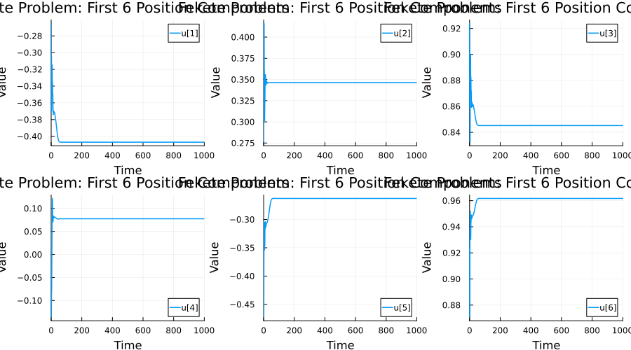
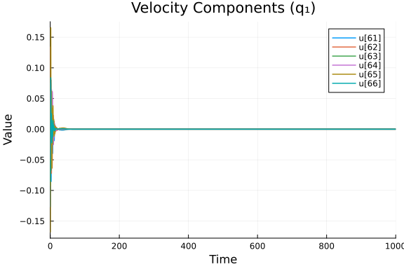
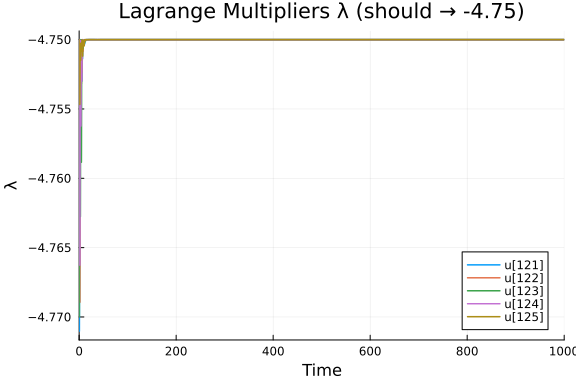
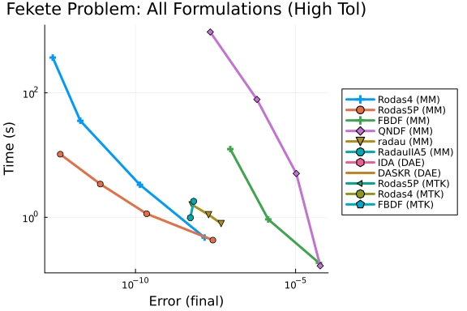
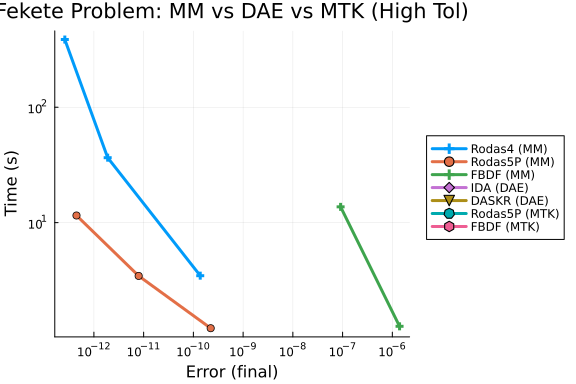
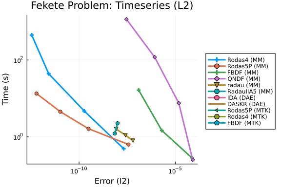
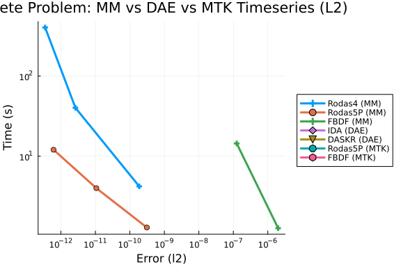
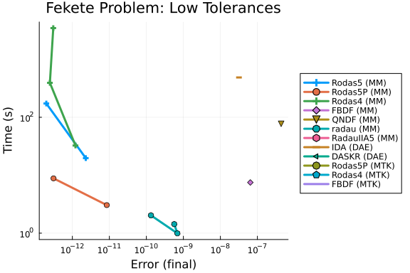
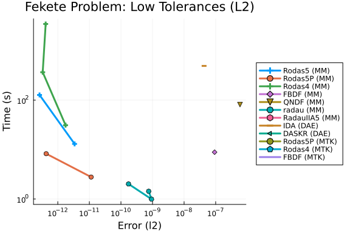

This is a benchmark of the Fekete problem, an index-3 DAE describing
$N=20$ charged particles on the unit sphere, from the
[IVP Test Set](http://www.dm.uniba.it/~testset/).

The problem computes **elliptic Fekete points**: $N=20$ particles on the unit
sphere $S^2$ that maximize the product of mutual distances
$V(x) = \prod_{i<j} \|x_i - x_j\|_2$. By mechanical analogy, the particles
are subject to a repulsive Coulomb-like force and an adhesion damping force
$A_i = -\alpha q_i$ ($\alpha = 0.5$). The particles are constrained to the
unit sphere via Lagrange multipliers $\lambda_i$.

The **original index-3 system** has the physics:
$$\ddot{p}_i = -\alpha \dot{p}_i + 2\lambda_i p_i + \sum_{j \neq i} \frac{p_i - p_j}{\|p_i - p_j\|^2}$$
$$0 = \|p_i\|^2 - 1$$

The **stabilized index-2 formulation** (from the Fortran test set) introduces
velocity variables $q_i = \dot{p}_i$ and Baumgarte stabilization multipliers
$\mu_i$, giving 160 = 8N state variables with mass matrix
$M = \text{diag}(I_{6N}, 0_{2N})$:
$$\dot{p}_i = q_i + 2\mu_i p_i, \quad
\dot{q}_i = -\alpha q_i + 2\lambda_i p_i + \sum_{j\neq i}\frac{p_i - p_j}{\|p_i - p_j\|^2}$$
$$0 = \|p_i\|^2 - 1, \quad 0 = 2p_i \cdot q_i$$

We benchmark three formulations:

1. **Mass-Matrix ODE Form:** The stabilized index-2 system as `M·du/dt = f(u, t)`,
   solved with Rosenbrock-W and BDF methods.
2. **DAE Residual Form:** Same system as `F(du, u, t) = M·du − f(u, t) = 0`,
   solved with IDA and DASKR.
3. **MTK Automatic Index Reduction:** The original index-3 system is given
   directly to ModelingToolkit, which uses `structural_simplify` to
   automatically perform index reduction and generate an index-1 DAE.
   This benchmarks MTK's symbolic transformation pipeline on a large-scale
   constrained mechanical system.

Reference: Bendtsen, C., Thomsen, P.G.: Numerical solution of differential
algebraic equations. IMM-DTU, Tech. Report (1999). Available at the
[IVP Test Set](http://www.dm.uniba.it/~testset/problems/fekete.php).

```julia
using OrdinaryDiffEq, DiffEqDevTools, Sundials, ModelingToolkit,
      ODEInterfaceDiffEq, Plots, DASKR
using ModelingToolkit: t_nounits as t, D_nounits as D
using LinearAlgebra, Statistics
```


## Problem Definition

We translate the Fortran reference implementation (`fekete.f`) into Julia.
The problem has $N = 20$ particles with $8N = 160$ state variables.

### Initial Conditions

The initial positions place the 20 particles in four latitude rings on the
sphere (3 + 7 + 6 + 4 particles), with initial velocities $q(0) = 0$ and
multipliers $\mu(0)$ computed for consistency.

```julia
const N_ART = 20
const NEQN = 8 * N_ART  # 160
const ALPHA_DAMP = 0.5

function fekete_init()
    y = zeros(NEQN)

    # Ring 1: 3 particles at beta = 3π/8
    for i in 1:3
        α = 2π * i / 3 + π / 13
        β = 3π / 8
        y[3*(i-1)+1] = cos(α) * cos(β)
        y[3*(i-1)+2] = sin(α) * cos(β)
        y[3*(i-1)+3] = sin(β)
    end
    # Ring 2: 7 particles at beta = π/8
    for i in 4:10
        α = 2π * (i - 3) / 7 + π / 29
        β = π / 8
        y[3*(i-1)+1] = cos(α) * cos(β)
        y[3*(i-1)+2] = sin(α) * cos(β)
        y[3*(i-1)+3] = sin(β)
    end
    # Ring 3: 6 particles at beta = -2π/15
    for i in 11:16
        α = 2π * (i - 10) / 6 + π / 7
        β = -2π / 15
        y[3*(i-1)+1] = cos(α) * cos(β)
        y[3*(i-1)+2] = sin(α) * cos(β)
        y[3*(i-1)+3] = sin(β)
    end
    # Ring 4: 4 particles at beta = -3π/10
    for i in 17:20
        α = 2π * (i - 17) / 4 + π / 17
        β = -3π / 10
        y[3*(i-1)+1] = cos(α) * cos(β)
        y[3*(i-1)+2] = sin(α) * cos(β)
        y[3*(i-1)+3] = sin(β)
    end

    # q(0) = 0  (indices 3N+1 : 6N already zero)
    # μ(0) = 0  initially, then compute consistent values

    # Compute consistent μ via one feval pass (from Fortran init)
    yprime = similar(y)
    fekete_rhs!(yprime, y, nothing, 0.0)
    for i in 1:N_ART
        s = 0.0
        for j in 1:3
            s += y[3*(i-1)+j] * yprime[3*N_ART + 3*(i-1)+j]
        end
        y[6*N_ART+i] = -s / 2.0
    end

    return y
end
```

```
fekete_init (generic function with 1 method)
```


### Right-Hand Side

The RHS encodes the equations of motion: repulsive Coulomb forces between
particles on the sphere, damping, and the algebraic constraints.

```julia
function fekete_rhs!(dy, y, p, t)
    nart = N_ART
    T = eltype(dy)

    # Unpack state: positions p, velocities q, multipliers λ, μ
    # p_i = y[3(i-1)+1 : 3(i-1)+3],  i = 1..N
    # q_i = y[3N+3(i-1)+1 : 3N+3(i-1)+3]
    # λ_i = y[6N+i]
    # μ_i = y[7N+i]

    # Compute pairwise repulsive forces f(i,j,k) = (p_i - p_j) / |p_i - p_j|²
    # and accumulate into velocity derivatives

    @inbounds for i in 1:nart
        lam_i = y[6*nart+i]
        mu_i  = y[7*nart+i]

        # dp_i/dt = q_i + 2*μ_i*p_i
        for k in 1:3
            pk = y[3*(i-1)+k]
            qk = y[3*nart+3*(i-1)+k]
            dy[3*(i-1)+k] = qk + 2*mu_i*pk
        end

        # dq_i/dt = -α*q_i + 2*λ_i*p_i + Σ_{j≠i} (p_i - p_j)/|p_i - p_j|²
        for k in 1:3
            pk = y[3*(i-1)+k]
            qk = y[3*nart+3*(i-1)+k]
            force_k = -ALPHA_DAMP * qk + 2*lam_i * pk
            for j in 1:nart
                if j != i
                    rn = zero(T)
                    for m in 1:3
                        rn += (y[3*(i-1)+m] - y[3*(j-1)+m])^2
                    end
                    force_k += (pk - y[3*(j-1)+k]) / rn
                end
            end
            dy[3*nart+3*(i-1)+k] = force_k
        end

        # Algebraic equations
        # φ_i = |p_i|² - 1 = 0  (sphere constraint)
        phi_i = -one(T)
        for k in 1:3
            phi_i += y[3*(i-1)+k]^2
        end
        dy[6*nart+i] = phi_i

        # g_i = 2*p_i·q_i = 0  (differentiated constraint)
        gpq_i = zero(T)
        for k in 1:3
            gpq_i += 2*y[3*(i-1)+k] * y[3*nart+3*(i-1)+k]
        end
        dy[7*nart+i] = gpq_i
    end
    nothing
end
```

```
fekete_rhs! (generic function with 1 method)
```


### Analytical Jacobian

The Jacobian is dense due to the pairwise Coulomb interactions. We provide
the analytical Jacobian translated from the Fortran `jeval` subroutine.

```julia
function fekete_jac!(J, y, p, t)
    nart = N_ART
    neqn = NEQN
    T = eltype(J)
    fill!(J, zero(T))

    # Extract state
    pp = zeros(T, nart, 3)
    qq = zeros(T, nart, 3)
    lam = zeros(T, nart)
    mu  = zeros(T, nart)
    for i in 1:nart
        for k in 1:3
            pp[i,k] = y[3*(i-1)+k]
            qq[i,k] = y[3*nart+3*(i-1)+k]
        end
        lam[i] = y[6*nart+i]
        mu[i]  = y[7*nart+i]
    end

    # Precompute |p_i - p_j|²
    rn = zeros(T, nart, nart)
    for j in 1:nart, i in 1:nart
        for k in 1:3
            rn[i,j] += (pp[i,k] - pp[j,k])^2
        end
    end

    # J_pp: ∂(dp_i/dt)/∂p_i = 2μ_i * I₃
    for i in 1:nart, k in 1:3
        J[3*(i-1)+k, 3*(i-1)+k] = 2*mu[i]
    end

    # J_pq: ∂(dp_i/dt)/∂q_i = I₃
    for i in 1:nart, k in 1:3
        J[3*(i-1)+k, 3*nart+3*(i-1)+k] = one(T)
    end

    # J_pμ: ∂(dp_i/dt)/∂μ_i = 2p_i
    for i in 1:nart, k in 1:3
        J[3*(i-1)+k, 7*nart+i] = 2*pp[i,k]
    end

    # J_qp (same i, same k): diagonal + force derivatives
    for i in 1:nart, k in 1:3
        val = 2*lam[i]
        for j in 1:nart
            if j != i
                val += (rn[i,j] - 2*(pp[i,k] - pp[j,k])^2) / rn[i,j]^2
            end
        end
        J[3*nart+3*(i-1)+k, 3*(i-1)+k] = val
    end

    # J_qp (same i, different k,m): off-diagonal spatial components
    for i in 1:nart, k in 1:3, m in 1:3
        if m != k
            val = zero(T)
            for j in 1:nart
                if j != i
                    val -= 2*(pp[i,k] - pp[j,k])*(pp[i,m] - pp[j,m]) / rn[i,j]^2
                end
            end
            J[3*nart+3*(i-1)+k, 3*(i-1)+m] += val
        end
    end

    # J_qp (different i,l, same k): inter-particle force derivatives
    for i in 1:nart, l in 1:nart
        if l != i
            for k in 1:3
                J[3*nart+3*(i-1)+k, 3*(l-1)+k] =
                    (-rn[i,l] + 2*(pp[i,k] - pp[l,k])^2) / rn[i,l]^2
            end
        end
    end

    # J_qp (different i,l, different k,m): cross terms
    for i in 1:nart, l in 1:nart
        if l != i
            for k in 1:3, m in 1:3
                if m != k
                    J[3*nart+3*(i-1)+k, 3*(l-1)+m] +=
                        2*(pp[i,k] - pp[l,k])*(pp[i,m] - pp[l,m]) / rn[i,l]^2
                end
            end
        end
    end

    # J_qq: ∂(dq_i/dt)/∂q_i = -α I₃
    for i in 1:nart, k in 1:3
        J[3*nart+3*(i-1)+k, 3*nart+3*(i-1)+k] = -ALPHA_DAMP
    end

    # J_qλ: ∂(dq_i/dt)/∂λ_i = 2p_i
    for i in 1:nart, k in 1:3
        J[3*nart+3*(i-1)+k, 6*nart+i] = 2*pp[i,k]
    end

    # J_λp: ∂φ_i/∂p_i = 2p_i
    for i in 1:nart, k in 1:3
        J[6*nart+i, 3*(i-1)+k] = 2*pp[i,k]
    end

    # J_μp: ∂g_i/∂p_i = 2q_i
    for i in 1:nart, k in 1:3
        J[7*nart+i, 3*(i-1)+k] = 2*qq[i,k]
    end

    # J_μq: ∂g_i/∂q_i = 2p_i
    for i in 1:nart, k in 1:3
        J[7*nart+i, 3*nart+3*(i-1)+k] = 2*pp[i,k]
    end

    nothing
end
```

```
fekete_jac! (generic function with 1 method)
```


### Mass-Matrix ODE Formulation

```julia
y0 = fekete_init()

# Mass matrix: M = diag(I_{6N}, 0_{2N})
M = zeros(NEQN, NEQN)
for i in 1:6*N_ART
    M[i,i] = 1.0
end

mmf = ODEFunction(fekete_rhs!, mass_matrix = M, jac = fekete_jac!)
tspan = (0.0, 1000.0)
mmprob = ODEProblem(mmf, y0, tspan)
```

```
ODEProblem with uType Vector{Float64} and tType Float64. In-place: true
Non-trivial mass matrix: true
timespan: (0.0, 1000.0)
u0: 160-element Vector{Float64}:
 -0.2650941332839412
  0.2759922279796341
  0.9238795325112867
 -0.10646921403545888
 -0.367574367807928
  0.9238795325112867
  0.37156334731940005
  0.09158213982829398
  0.9238795325112867
  0.4945564328017459
  ⋮
  0.0
  0.0
  0.0
  0.0
  0.0
  0.0
  0.0
  0.0
  0.0
```


### DAE Residual Formulation

```julia
function fekete_dae!(res, du, u, p, t)
    f = similar(u)
    fekete_rhs!(f, u, p, t)
    # Residual: M*du - f(u) = 0
    for i in 1:6*N_ART
        res[i] = du[i] - f[i]
    end
    for i in 6*N_ART+1:NEQN
        res[i] = -f[i]  # algebraic: 0 = f_alg(u)
    end
    nothing
end

du0 = zeros(NEQN)
fekete_rhs!(du0, y0, nothing, 0.0)
# For differential variables, du0 = f(y0); for algebraic, du0 = 0
du0_dae = copy(du0)
du0_dae[6*N_ART+1:end] .= 0.0

differential_vars = vcat(trues(6*N_ART), falses(2*N_ART))
daeprob = DAEProblem(fekete_dae!, du0_dae, y0, tspan,
                     differential_vars = differential_vars)
```

```
DAEProblem with uType Vector{Float64} and tType Float64. In-place: true
timespan: (0.0, 1000.0)
u0: 160-element Vector{Float64}:
 -0.2650941332839412
  0.2759922279796341
  0.9238795325112867
 -0.10646921403545888
 -0.367574367807928
  0.9238795325112867
  0.37156334731940005
  0.09158213982829398
  0.9238795325112867
  0.4945564328017459
  ⋮
  0.0
  0.0
  0.0
  0.0
  0.0
  0.0
  0.0
  0.0
  0.0
du0: 160-element Vector{Float64}:
 0.0
 0.0
 0.0
 0.0
 0.0
 0.0
 0.0
 0.0
 0.0
 0.0
 ⋮
 0.0
 0.0
 0.0
 0.0
 0.0
 0.0
 0.0
 0.0
 0.0
```


### MTK Automatic Index Reduction

We give ModelingToolkit the **original index-3 system** directly and let
`structural_simplify` automatically perform index reduction. This benchmarks
MTK's symbolic transformation pipeline — no manual constraint differentiation
or variable elimination is performed.

```julia
ps_mtk = Vector{Num}(undef, 3*N_ART)
qs_mtk = Vector{Num}(undef, 3*N_ART)
λs_mtk = Vector{Num}(undef, N_ART)

for i in 1:N_ART
    for k in 1:3
        idx = 3*(i-1) + k
        ps_mtk[idx] = only(@variables $(Symbol("p$(i)_$(k)"))(t) = y0[idx])
        qs_mtk[idx] = only(@variables $(Symbol("q$(i)_$(k)"))(t) = 0.0)
    end
    λs_mtk[i] = only(@variables $(Symbol("lam$(i)"))(t) = 0.0)
end

eqs_mtk = Equation[]

# Kinematics: dp/dt = q  (60 equations)
for idx in 1:3*N_ART
    push!(eqs_mtk, D(ps_mtk[idx]) ~ qs_mtk[idx])
end

# Dynamics: dq/dt = -αq + 2λp + Coulomb  (60 equations)
for i in 1:N_ART
    for k in 1:3
        idx = 3*(i-1) + k
        coulomb = sum(
            (ps_mtk[idx] - ps_mtk[3*(j-1)+k]) /
            sum((ps_mtk[3*(i-1)+m] - ps_mtk[3*(j-1)+m])^2 for m in 1:3)
            for j in 1:N_ART if j != i
        )
        push!(eqs_mtk, D(qs_mtk[idx]) ~ -ALPHA_DAMP*qs_mtk[idx] +
              2*λs_mtk[i]*ps_mtk[idx] + coulomb)
    end
end

# Position-level constraint: |p_i|² = 1  (20 index-3 constraints)
for i in 1:N_ART
    push!(eqs_mtk, sum(ps_mtk[3*(i-1)+k]^2 for k in 1:3) ~ 1)
end

# Explicit automatic index reduction
@named sys_raw = ODESystem(eqs_mtk, t)
sys_mtk = structural_simplify(sys_raw)

mtkprob = ODEProblem(sys_mtk, [], tspan)
println("MTK automatic reduction → $(length(unknowns(sys_mtk))) states")
```

```
MTK automatic reduction → 160 states
```


## Reference Solution

The Fortran test set provides a high-accuracy reference solution at $t = 1000$,
computed with RADAU5 at `rtol = atol = 1e-12`. We use this as our ground truth
and also compute a high-accuracy Julia reference for timeseries comparison.

```julia
# Reference values from Fortran solut() subroutine (RADAU5, tol=1e-12)
const REFSOL = zeros(NEQN)
REFSOL[  1] =  -0.4070263380333202
REFSOL[  2] =   0.3463758772791802
REFSOL[  3] =   0.8451942450030429
REFSOL[  4] =   0.7752934752521549e-01
REFSOL[  5] =  -0.2628662719972299
REFSOL[  6] =   0.9617122871829146
REFSOL[  7] =   0.7100577833343567
REFSOL[  8] =   0.1212948055586120
REFSOL[  9] =   0.6936177005172217
REFSOL[ 10] =   0.2348267744557627
REFSOL[ 11] =   0.7449277976923311
REFSOL[ 12] =   0.6244509285956391
REFSOL[ 13] =  -0.4341114738782885
REFSOL[ 14] =   0.8785430442262876
REFSOL[ 15] =   0.1992720444237660
REFSOL[ 16] =  -0.9515059600312596
REFSOL[ 17] =   0.2203508762787005
REFSOL[ 18] =   0.2146669498274008
REFSOL[ 19] =  -0.6385191643609878
REFSOL[ 20] =  -0.4310833259390688
REFSOL[ 21] =   0.6375425027722121
REFSOL[ 22] =  -0.1464175087914336
REFSOL[ 23] =  -0.9380871635228862
REFSOL[ 24] =   0.3139337298744690
REFSOL[ 25] =   0.5666974065069942
REFSOL[ 26] =  -0.6739221885076542
REFSOL[ 27] =   0.4740073135462156
REFSOL[ 28] =   0.9843259538440293
REFSOL[ 29] =  -0.1696995357819996
REFSOL[ 30] =  -0.4800504290609090e-01
REFSOL[ 31] =   0.1464175087914331
REFSOL[ 32] =   0.9380871635228875
REFSOL[ 33] =  -0.3139337298744656
REFSOL[ 34] =  -0.7092757549979014
REFSOL[ 35] =   0.5264062637139616
REFSOL[ 36] =  -0.4688542938854929
REFSOL[ 37] =  -0.8665731819284478
REFSOL[ 38] =  -0.4813878059756024
REFSOL[ 39] =  -0.1315929352982178
REFSOL[ 40] =  -0.2347897778700538
REFSOL[ 41] =  -0.8594340408013130
REFSOL[ 42] =  -0.4541441287957579
REFSOL[ 43] =   0.5530976940074118
REFSOL[ 44] =  -0.7674370265615124
REFSOL[ 45] =  -0.3242273140037833
REFSOL[ 46] =   0.7711050969896927
REFSOL[ 47] =   0.6357041816577034
REFSOL[ 48] =   0.3573685519777001e-01
REFSOL[ 49] =   0.7103951209379591
REFSOL[ 50] =   0.2403570431280519
REFSOL[ 51] =  -0.6614886725910596
REFSOL[ 52] =  -0.3038208738735660e-01
REFSOL[ 53] =   0.4501923293640461
REFSOL[ 54] =  -0.8924145871442046
REFSOL[ 55] =  -0.5772996158107093
REFSOL[ 56] =  -0.1766763414971813
REFSOL[ 57] =  -0.7971892020969544
REFSOL[ 58] =   0.2414481766969039
REFSOL[ 59] =  -0.3416456818373135
REFSOL[ 60] =  -0.9082846503446250
# Velocities q at t=1000 (near-zero at stationary state)
REFSOL[ 61] =   0.2409619682166627e-15
REFSOL[ 62] =  -0.1139818460497816e-15
REFSOL[ 63] =   0.1627536276556335e-15
REFSOL[ 64] =   0.1745651819597609e-15
REFSOL[ 65] =  -0.1914278710633076e-15
REFSOL[ 66] =  -0.6639600671806291e-16
REFSOL[ 67] =   0.1708576733899083e-15
REFSOL[ 68] =  -0.2277602521390053e-15
REFSOL[ 69] =  -0.1350782790950654e-15
REFSOL[ 70] =   0.2411941341109454e-15
REFSOL[ 71] =  -0.1438238671800488e-15
REFSOL[ 72] =   0.8087033550666644e-16
REFSOL[ 73] =   0.1618239105233347e-15
REFSOL[ 74] =   0.1837556152070701e-16
REFSOL[ 75] =   0.2715177369929503e-15
REFSOL[ 76] =   0.7930078658689191e-16
REFSOL[ 77] =   0.7482020588342764e-16
REFSOL[ 78] =   0.2746974939098084e-15
REFSOL[ 79] =   0.8849338913035911e-16
REFSOL[ 80] =  -0.5940734725324115e-16
REFSOL[ 81] =   0.4845984056889910e-16
REFSOL[ 82] =  -0.3728835248155620e-16
REFSOL[ 83] =  -0.4600332954062859e-16
REFSOL[ 84] =  -0.1548568884846698e-15
REFSOL[ 85] =   0.2507541692375411e-16
REFSOL[ 86] =  -0.1560155223230823e-15
REFSOL[ 87] =  -0.2517946296860555e-15
REFSOL[ 88] =  -0.3739779361502470e-16
REFSOL[ 89] =  -0.1381663620885020e-15
REFSOL[ 90] =  -0.2784051540342329e-15
REFSOL[ 91] =   0.6624397102887671e-16
REFSOL[ 92] =   0.4226207488883120e-16
REFSOL[ 93] =   0.1571821772296610e-15
REFSOL[ 94] =  -0.4112243677286995e-16
REFSOL[ 95] =   0.1939960344265876e-15
REFSOL[ 96] =   0.2800184977692136e-15
REFSOL[ 97] =  -0.9189023375328813e-16
REFSOL[ 98] =   0.1392943179389155e-15
REFSOL[ 99] =   0.9556003995587458e-16
REFSOL[100] =  -0.2234188557495892e-15
REFSOL[101] =   0.1276804778190781e-15
REFSOL[102] =  -0.1261196211463950e-15
REFSOL[103] =  -0.1887754149742397e-15
REFSOL[104] =  -0.2140788698695373e-16
REFSOL[105] =  -0.2713591291421657e-15
REFSOL[106] =   0.1107887633060814e-15
REFSOL[107] =  -0.1318443715631340e-15
REFSOL[108] =  -0.4521275683078691e-16
REFSOL[109] =  -0.1277688851278605e-15
REFSOL[110] =   0.4850914012115388e-16
REFSOL[111] =  -0.1195891666741192e-15
REFSOL[112] =  -0.1569641653843750e-15
REFSOL[113] =   0.1856239009452638e-15
REFSOL[114] =   0.9898466095646496e-16
REFSOL[115] =  -0.2068030800303723e-15
REFSOL[116] =   0.2451470336752085e-15
REFSOL[117] =   0.9542986459336358e-16
REFSOL[118] =  -0.2456074075580993e-15
REFSOL[119] =   0.1532475480661800e-15
REFSOL[120] =  -0.1229326332276474e-15
# λ multipliers at t=1000
REFSOL[121] =  -0.4750000000000000e+01
REFSOL[122] =  -0.4750000000000001e+01
REFSOL[123] =  -0.4750000000000000e+01
REFSOL[124] =  -0.4750000000000000e+01
REFSOL[125] =  -0.4750000000000000e+01
REFSOL[126] =  -0.4750000000000000e+01
REFSOL[127] =  -0.4750000000000000e+01
REFSOL[128] =  -0.4750000000000000e+01
REFSOL[129] =  -0.4750000000000000e+01
REFSOL[130] =  -0.4750000000000000e+01
REFSOL[131] =  -0.4750000000000001e+01
REFSOL[132] =  -0.4750000000000001e+01
REFSOL[133] =  -0.4750000000000000e+01
REFSOL[134] =  -0.4750000000000000e+01
REFSOL[135] =  -0.4750000000000000e+01
REFSOL[136] =  -0.4750000000000000e+01
REFSOL[137] =  -0.4749999999999999e+01
REFSOL[138] =  -0.4750000000000000e+01
REFSOL[139] =  -0.4750000000000000e+01
REFSOL[140] =  -0.4750000000000000e+01
# μ multipliers at t=1000 (near-zero)
REFSOL[141] =  -0.3537526598492654e-19
REFSOL[142] =   0.2338193888161182e-18
REFSOL[143] =  -0.3267771993164953e-18
REFSOL[144] =   0.2915679914072042e-18
REFSOL[145] =   0.1965183195887647e-18
REFSOL[146] =  -0.6224992924096233e-19
REFSOL[147] =  -0.1715878416756298e-18
REFSOL[148] =  -0.2704741705248803e-18
REFSOL[149] =   0.3008700893194513e-18
REFSOL[150] =  -0.2703121624910402e-18
REFSOL[151] =   0.4243755291982164e-18
REFSOL[152] =   0.2862063003949612e-18
REFSOL[153] =   0.1222125408406218e-19
REFSOL[154] =  -0.4958862706817728e-18
REFSOL[155] =  -0.7070673036251212e-18
REFSOL[156] =  -0.4454983024194383e-18
REFSOL[157] =  -0.1125384872521777e-18
REFSOL[158] =   0.1512898724592511e-18
REFSOL[159] =  -0.6163704221424137e-19
REFSOL[160] =   0.6255426995473074e-19
```

```
6.255426995473074e-20
```


```julia
# Compute high-accuracy reference solutions
println("Computing mass-matrix reference solution with Rodas5P...")
ref_sol = solve(mmprob, Rodas5P(), reltol = 1e-8, abstol = 1e-8,
                maxiters = 10_000_000)
println("  retcode = $(ref_sol.retcode), npoints = $(length(ref_sol.t)), ",
        "t_final = $(ref_sol.t[end])")

println("Computing MTK reference solution with Rodas5P...")
mtk_ref = solve(mtkprob, Rodas5P(), reltol = 1e-8, abstol = 1e-8,
                maxiters = 10_000_000)
println("  retcode = $(mtk_ref.retcode), npoints = $(length(mtk_ref.t))")

# We use separate references: the canonical mass-matrix reference for
# mass-matrix and DAE forms, and an MTK reference for the MTK form
# (structural_simplify may change the state layout).
```

```
Computing mass-matrix reference solution with Rodas5P...
  retcode = Success, npoints = 9597, t_final = 1000.0
Computing MTK reference solution with Rodas5P...
  retcode = InitialFailure, npoints = 1
```


## Verification against Fortran Reference

We compare our solution at $t = 1000$ with the Fortran RADAU5 reference
to verify correctness. The first 6 position components (output components
from the test set) are checked.

```julia
sol_final = ref_sol.u[end]
println("=== Verification at t = 1000 ===")
println("Component | Fortran Reference     | Julia Solution        | Rel Error")
println("-"^75)
for idx in 1:6
    ref_val = REFSOL[idx]
    our_val = sol_final[idx]
    relerr = abs(ref_val) > 0 ? abs((our_val - ref_val) / ref_val) : abs(our_val)
    status = relerr < 1e-3 ? "✓" : (relerr < 1e-1 ? "~" : "✗")
    println("y($(lpad(idx,3))) | $(lpad(string(ref_val), 22)) | $(lpad(string(round(our_val, sigdigits=12)), 22)) | $(relerr) $status")
end

# Check λ multipliers (should all be ≈ -4.75)
lam_vals = sol_final[6*N_ART+1:7*N_ART]
println("\nλ multipliers: mean = $(round(mean(lam_vals), sigdigits=6)), ",
        "std = $(round(std(lam_vals), sigdigits=3))")

# Check sphere constraints: |p_i|² should equal 1
max_constraint = 0.0
for i in 1:N_ART
    c = sum(sol_final[3*(i-1)+k]^2 for k in 1:3) - 1.0
    global max_constraint = max(max_constraint, abs(c))
end
println("Max sphere constraint violation: $(max_constraint)")
```

```
=== Verification at t = 1000 ===
Component | Fortran Reference     | Julia Solution        | Rel Error
---------------------------------------------------------------------------
y(  1) |    -0.4070263380333202 |        -0.407026338034 | 1.43201319783019
1e-12 ✓
y(  2) |     0.3463758772791802 |         0.346375877283 | 9.6901270215809e
-12 ✓
y(  3) |     0.8451942450030429 |         0.845194245001 | 1.95958587972856
56e-12 ✓
y(  4) |     0.0775293475252155 |        0.0775293475243 | 1.21424952742819
7e-11 ✓
y(  5) |    -0.2628662719972299 |        -0.262866271994 | 1.36536097065157
02e-11 ✓
y(  6) |     0.9617122871829146 |         0.961712287184 | 1.09889549216051
82e-12 ✓

λ multipliers: mean = -4.75, std = 4.99e-16
Max sphere constraint violation: 2.220446049250313e-16
```


## Solution Plots

The solution shows the 20 particles settling into a near-optimal configuration
on the unit sphere. The velocities $q_i$ decay to zero due to damping, while
the Lagrange multipliers converge to $\lambda_i = -4.75$.

```julia
plot(ref_sol, idxs = [1, 2, 3, 4, 5, 6],
     title = "Fekete Problem: First 6 Position Components",
     xlabel = "Time", ylabel = "Value", lw = 1.5,
     layout = (2, 3), size = (900, 500))
```



```julia
# Velocity components (should decay to zero)
plot(ref_sol, idxs = [61, 62, 63, 64, 65, 66],
     title = "Velocity Components (q₁)",
     xlabel = "Time", ylabel = "Value", lw = 1.5)
```



```julia
# Lagrange multipliers (should converge to -4.75)
plot(ref_sol, idxs = [121, 122, 123, 124, 125],
     title = "Lagrange Multipliers λ (should → -4.75)",
     xlabel = "Time", ylabel = "λ", lw = 1.5)
```




## Problem Setup for Benchmarks

We set up the problem array and reference array for `WorkPrecisionSet`.
The three formulations are: (1) mass-matrix ODE, (2) DAE residual,
(3) MTK index-reduced.

```julia
probs = [mmprob, daeprob, mtkprob]
refs  = [ref_sol, ref_sol, mtk_ref]
```

```
3-element Vector{SciMLBase.ODESolution{Float64, 2, Vector{Vector{Float64}},
 Nothing, Nothing, Vector{Float64}, Vector{Vector{Vector{Float64}}}, Nothin
g, P, OrdinaryDiffEqRosenbrock.Rodas5P{0, ADTypes.AutoForwardDiff{nothing, 
ForwardDiff.Tag{DiffEqBase.OrdinaryDiffEqTag, Float64}}, Nothing, typeof(Or
dinaryDiffEqCore.DEFAULT_PRECS), Val{:forward}(), true, nothing, typeof(Ord
inaryDiffEqCore.trivial_limiter!), typeof(OrdinaryDiffEqCore.trivial_limite
r!)}, IType, SciMLBase.DEStats, Nothing, Nothing, Nothing, Nothing} where {
P, IType}}:
 SciMLBase.ODESolution{Float64, 2, Vector{Vector{Float64}}, Nothing, Nothin
g, Vector{Float64}, Vector{Vector{Vector{Float64}}}, Nothing, SciMLBase.ODE
Problem{Vector{Float64}, Tuple{Float64, Float64}, true, SciMLBase.NullParam
eters, SciMLBase.ODEFunction{true, SciMLBase.FullSpecialize, typeof(Main.va
r"##WeaveSandBox#225".fekete_rhs!), Matrix{Float64}, Nothing, Nothing, type
of(Main.var"##WeaveSandBox#225".fekete_jac!), Nothing, Nothing, Nothing, No
thing, Nothing, Nothing, Nothing, Nothing, typeof(SciMLBase.DEFAULT_OBSERVE
D), Nothing, Nothing, Nothing, Nothing}, Base.Pairs{Symbol, Union{}, Tuple{
}, @NamedTuple{}}, SciMLBase.StandardODEProblem}, OrdinaryDiffEqRosenbrock.
Rodas5P{0, ADTypes.AutoForwardDiff{nothing, ForwardDiff.Tag{DiffEqBase.Ordi
naryDiffEqTag, Float64}}, Nothing, typeof(OrdinaryDiffEqCore.DEFAULT_PRECS)
, Val{:forward}(), true, nothing, typeof(OrdinaryDiffEqCore.trivial_limiter
!), typeof(OrdinaryDiffEqCore.trivial_limiter!)}, OrdinaryDiffEqCore.Interp
olationData{SciMLBase.ODEFunction{true, SciMLBase.FullSpecialize, typeof(Ma
in.var"##WeaveSandBox#225".fekete_rhs!), Matrix{Float64}, Nothing, Nothing,
 typeof(Main.var"##WeaveSandBox#225".fekete_jac!), Nothing, Nothing, Nothin
g, Nothing, Nothing, Nothing, Nothing, Nothing, typeof(SciMLBase.DEFAULT_OB
SERVED), Nothing, Nothing, Nothing, Nothing}, Vector{Vector{Float64}}, Vect
or{Float64}, Vector{Vector{Vector{Float64}}}, Nothing, OrdinaryDiffEqRosenb
rock.RosenbrockCache{Vector{Float64}, Vector{Float64}, Float64, Vector{Floa
t64}, Matrix{Float64}, Matrix{Float64}, OrdinaryDiffEqRosenbrock.RodasTable
au{Float64, Float64}, SciMLBase.TimeGradientWrapper{true, SciMLBase.ODEFunc
tion{true, SciMLBase.FullSpecialize, typeof(Main.var"##WeaveSandBox#225".fe
kete_rhs!), Matrix{Float64}, Nothing, Nothing, typeof(Main.var"##WeaveSandB
ox#225".fekete_jac!), Nothing, Nothing, Nothing, Nothing, Nothing, Nothing,
 Nothing, Nothing, typeof(SciMLBase.DEFAULT_OBSERVED), Nothing, Nothing, No
thing, Nothing}, Vector{Float64}, SciMLBase.NullParameters}, SciMLBase.UJac
obianWrapper{true, SciMLBase.ODEFunction{true, SciMLBase.FullSpecialize, ty
peof(Main.var"##WeaveSandBox#225".fekete_rhs!), Matrix{Float64}, Nothing, N
othing, typeof(Main.var"##WeaveSandBox#225".fekete_jac!), Nothing, Nothing,
 Nothing, Nothing, Nothing, Nothing, Nothing, Nothing, typeof(SciMLBase.DEF
AULT_OBSERVED), Nothing, Nothing, Nothing, Nothing}, Float64, SciMLBase.Nul
lParameters}, LinearSolve.LinearCache{Matrix{Float64}, Vector{Float64}, Vec
tor{Float64}, SciMLBase.NullParameters, LinearSolve.DefaultLinearSolver, Li
nearSolve.DefaultLinearSolverInit{LinearAlgebra.LU{Float64, Matrix{Float64}
, Vector{Int64}}, LinearAlgebra.QRCompactWY{Float64, Matrix{Float64}, Matri
x{Float64}}, Nothing, Nothing, Nothing, Nothing, Nothing, Nothing, Tuple{Li
nearAlgebra.LU{Float64, Matrix{Float64}, Vector{Int64}}, Vector{Int64}}, Tu
ple{LinearAlgebra.LU{Float64, Matrix{Float64}, Vector{Int64}}, Vector{Int64
}}, Nothing, Nothing, Nothing, LinearAlgebra.SVD{Float64, Float64, Matrix{F
loat64}, Vector{Float64}}, LinearAlgebra.Cholesky{Float64, Matrix{Float64}}
, LinearAlgebra.Cholesky{Float64, Matrix{Float64}}, Tuple{LinearAlgebra.LU{
Float64, Matrix{Float64}, Vector{Int32}}, Base.RefValue{Int32}}, Tuple{Line
arAlgebra.LU{Float64, Matrix{Float64}, Vector{Int64}}, Base.RefValue{Int64}
}, LinearAlgebra.QRPivoted{Float64, Matrix{Float64}, Vector{Float64}, Vecto
r{Int64}}, Nothing, Nothing, Nothing, Nothing, Nothing, Matrix{Float64}}, L
inearSolve.InvPreconditioner{LinearAlgebra.Diagonal{Float64, Vector{Float64
}}}, LinearAlgebra.Diagonal{Float64, Vector{Float64}}, Float64, LinearSolve
.LinearVerbosity{SciMLLogging.Silent, SciMLLogging.Silent, SciMLLogging.Sil
ent, SciMLLogging.Silent, SciMLLogging.Silent, SciMLLogging.Silent, SciMLLo
gging.Silent, SciMLLogging.Silent, SciMLLogging.WarnLevel, SciMLLogging.War
nLevel, SciMLLogging.Silent, SciMLLogging.Silent, SciMLLogging.Silent, SciM
LLogging.Silent, SciMLLogging.Silent, SciMLLogging.Silent}, Bool, LinearSol
ve.LinearSolveAdjoint{Missing}}, Tuple{Nothing, Nothing}, Tuple{Differentia
tionInterfaceForwardDiffExt.ForwardDiffTwoArgDerivativePrep{Tuple{SciMLBase
.TimeGradientWrapper{true, SciMLBase.ODEFunction{true, SciMLBase.FullSpecia
lize, typeof(Main.var"##WeaveSandBox#225".fekete_rhs!), Matrix{Float64}, No
thing, Nothing, typeof(Main.var"##WeaveSandBox#225".fekete_jac!), Nothing, 
Nothing, Nothing, Nothing, Nothing, Nothing, Nothing, Nothing, typeof(SciML
Base.DEFAULT_OBSERVED), Nothing, Nothing, Nothing, Nothing}, Vector{Float64
}, SciMLBase.NullParameters}, Vector{Float64}, ADTypes.AutoForwardDiff{noth
ing, ForwardDiff.Tag{DiffEqBase.OrdinaryDiffEqTag, Float64}}, Float64, Tupl
e{}}, Float64, ForwardDiff.DerivativeConfig{ForwardDiff.Tag{DiffEqBase.Ordi
naryDiffEqTag, Float64}, Vector{ForwardDiff.Dual{ForwardDiff.Tag{DiffEqBase
.OrdinaryDiffEqTag, Float64}, Float64, 1}}}, Tuple{}}, DifferentiationInter
faceForwardDiffExt.ForwardDiffTwoArgDerivativePrep{Tuple{SciMLBase.TimeGrad
ientWrapper{true, SciMLBase.ODEFunction{true, SciMLBase.FullSpecialize, typ
eof(Main.var"##WeaveSandBox#225".fekete_rhs!), Matrix{Float64}, Nothing, No
thing, typeof(Main.var"##WeaveSandBox#225".fekete_jac!), Nothing, Nothing, 
Nothing, Nothing, Nothing, Nothing, Nothing, Nothing, typeof(SciMLBase.DEFA
ULT_OBSERVED), Nothing, Nothing, Nothing, Nothing}, Vector{Float64}, SciMLB
ase.NullParameters}, Vector{Float64}, ADTypes.AutoForwardDiff{nothing, Forw
ardDiff.Tag{DiffEqBase.OrdinaryDiffEqTag, Float64}}, Float64, Tuple{}}, Flo
at64, ForwardDiff.DerivativeConfig{ForwardDiff.Tag{DiffEqBase.OrdinaryDiffE
qTag, Float64}, Vector{ForwardDiff.Dual{ForwardDiff.Tag{DiffEqBase.Ordinary
DiffEqTag, Float64}, Float64, 1}}}, Tuple{}}}, Float64, OrdinaryDiffEqRosen
brock.Rodas5P{0, ADTypes.AutoForwardDiff{nothing, ForwardDiff.Tag{DiffEqBas
e.OrdinaryDiffEqTag, Float64}}, Nothing, typeof(OrdinaryDiffEqCore.DEFAULT_
PRECS), Val{:forward}(), true, nothing, typeof(OrdinaryDiffEqCore.trivial_l
imiter!), typeof(OrdinaryDiffEqCore.trivial_limiter!)}, typeof(OrdinaryDiff
EqCore.trivial_limiter!), typeof(OrdinaryDiffEqCore.trivial_limiter!)}, Bit
Vector}, SciMLBase.DEStats, Nothing, Nothing, Nothing, Nothing}([[-0.265094
1332839412, 0.2759922279796341, 0.9238795325112867, -0.10646921403545888, -
0.367574367807928, 0.9238795325112867, 0.37156334731940005, 0.0915821398282
9398, 0.9238795325112867, 0.4945564328017459  …  0.0, 0.0, 0.0, 0.0, 0.0, 0
.0, 0.0, 0.0, 0.0, 0.0], [-0.2650941332841742, 0.2759922279798762, 0.923879
5325111475, -0.10646921403555346, -0.3675743678082478, 0.9238795325111486, 
0.37156334731972307, 0.09158213982837514, 0.9238795325111487, 0.49455643280
17384  …  -2.9381980376366813e-9, 4.86158636660428e-9, -1.2869567280894642e
-9, -3.2198125918363613e-9, -6.800682075927034e-10, -2.0613020551547345e-9,
 1.395353671803122e-9, -5.950468450941714e-9, -3.1091445411164066e-9, -1.17
94920129632018e-9], [-0.26509413328457315, 0.275992227980291, 0.92387953251
09092, -0.10646921403571546, -0.3675743678087956, 0.9238795325109119, 0.371
56334732027646, 0.09158213982851418, 0.9238795325109125, 0.4945564328017254
  …  3.773980583547631e-9, 2.9180823857587613e-9, 6.262879513645702e-9, 3.9
07556772321569e-10, -9.50897966840413e-9, 2.9618965045870536e-9, 5.98590696
2402134e-9, -9.907983177907806e-9, 4.857183359386243e-9, -1.037724609437882
7e-9], [-0.2650941332851672, 0.2759922279809085, 0.9238795325105542, -0.106
4692140359567, -0.3675743678096114, 0.9238795325105595, 0.3715633473211003,
 0.0915821398287212, 0.9238795325105607, 0.49455643280170614  …  2.51578610
839588e-11, 3.110473938978998e-9, -2.7489828242557556e-10, 6.73825034498841
1e-9, 5.447683730400059e-9, 1.2408042216050644e-9, 4.738472372329455e-9, -3
.816383768998203e-9, 5.243285297956977e-9, -1.0814401231430751e-8], [-0.265
0941332860057, 0.2759922279817802, 0.9238795325100533, -0.10646921403629718
, -0.3675743678107627, 0.9238795325100623, 0.37156334732226315, 0.091582139
8290134, 0.9238795325100639, 0.4945564328016791  …  -1.4930375118523534e-9,
 -1.0677206569701569e-8, 1.2123400367883947e-9, -9.630793742110146e-10, -4.
964615506365783e-10, -4.371563998672631e-9, -1.4449718034149703e-9, -1.5707
855905313584e-9, 1.6860645000515239e-9, 3.766706411702783e-9], [-0.26509413
32871582, 0.2759922279829783, 0.9238795325093646, -0.10646921403676515, -0.
3675743678123452, 0.9238795325093787, 0.37156334732386154, 0.09158213982941
507, 0.9238795325093813, 0.4945564328016418  …  -2.829457295085245e-9, 2.30
678914896376e-9, 4.019045677623573e-9, -3.0870113868925387e-9, -9.402362716
664351e-10, 5.341789967056231e-10, -2.8827792190756617e-9, -9.3600068590591
29e-9, -2.5753422404871796e-9, 3.264240878693443e-9], [-0.2650941332886537,
 0.275992227984533, 0.923879532508471, -0.10646921403737239, -0.36757436781
43986, 0.9238795325084919, 0.3715633473259356, 0.09158213982993625, 0.92387
95325084955, 0.4945564328015934  …  1.3163880292736783e-9, -7.5209643056310
57e-9, 9.434997922878726e-10, -1.916103204104861e-9, 1.646175760775223e-9, 
-2.297769321134328e-9, -4.630660131508884e-9, -5.46221286212423e-9, -1.9269
349778233163e-9, -5.1301181570586886e-9], [-0.2650941332905436, 0.275992227
9864977, 0.9238795325073419, -0.10646921403813973, -0.3675743678169936, 0.9
23879532507371, 0.3715633473285565, 0.09158213983059485, 0.9238795325073761
, 0.4945564328015323  …  -1.8698349995330668e-9, -2.7464017247324886e-9, -8
.827596628252208e-10, 1.8128003092538084e-9, 7.164037967350772e-9, 3.100919
913020742e-9, 8.036908245127148e-10, -5.923162444730369e-9, -4.023843536328
8964e-9, 2.764308117529542e-9], [-0.26509413329288956, 0.2759922279889366, 
0.9238795325059401, -0.10646921403909228, -0.36757436782021485, 0.923879532
5059795, 0.37156334733181, 0.09158213983141243, 0.9238795325059865, 0.49455
64328014564  …  3.950627054635561e-9, 1.771468244135932e-9, 2.1010100749223
71e-9, 1.5672871413690205e-9, 8.320401732162137e-10, 5.104570071681936e-10,
 -3.450993958468019e-9, 2.128621167396301e-10, 3.873601566936303e-9, 9.2423
01486958966e-10], [-0.26509413329585574, 0.27599222799202006, 0.92387953250
4168, -0.10646921404029665, -0.3675743678242877, 0.9238795325042204, 0.3715
6334733592344, 0.0915821398324461, 0.9238795325042298, 0.49455643280136047 
 …  -2.3171051265390624e-9, 8.027530206632113e-10, -4.287360150284864e-9, 1
.32569536898589e-9, 3.3766392808190897e-9, 4.965416267302419e-9, 5.35249200
6491146e-10, -1.4576853573447413e-10, -1.0253611519609038e-9, 5.49317428294
1085e-9]  …  [-0.40702629538697305, 0.3463758774581013, 0.845194265467228, 
0.0775293349555316, -0.26286635564642724, 0.9617122653322662, 0.71005768493
19006, 0.12129485192767821, 0.6936177931433077, 0.23482678332007131  …  6.4
5195633876406e-16, 5.07580972346805e-16, 4.1269969664277186e-16, 8.00397654
9593222e-16, -5.098071221153372e-16, 4.1493581733728216e-16, 4.991997837855
795e-17, 2.812127590431388e-16, -3.2792098322469923e-16, 4.986480541842396e
-16], [-0.4070263264532298, 0.3463758773698235, 0.8451942505426039, 0.07752
934406298198, -0.26286629470298095, 0.9617122812558283, 0.71005775657401, 0
.12129481821517442, 0.693617725698552, 0.2348267768556548  …  5.46081741471
2736e-16, 7.944599995175238e-16, 2.994717110861975e-16, -7.71874540637152e-
16, 9.238612467296446e-17, -1.6084641081674373e-17, -6.843868519741059e-17,
 -5.824772084963076e-16, -4.149216585893152e-16, 1.4944995287594123e-15], [
-0.4070263376170111, 0.3463758772665546, 0.845194245208702, 0.0775293473911
6238, -0.262866272834908, 0.9617122869647575, 0.7100577823210024, 0.1212948
0600474604, 0.6936177014765779, 0.23482677452588221  …  -3.001685519005525e
-16, -4.927879823606554e-16, -7.672731763005923e-16, -3.618510822795282e-16
, 4.4407681458549273e-16, -4.3837837487325375e-16, -2.096697281370121e-16, 
-1.62820072767635e-16, -3.2578697248948327e-16, -4.41406222100141e-16], [-0
.40702633814491695, 0.3463758772875023, 0.8451942449458898, 0.0775293475583
2482, -0.26286627176995647, 0.9617122872423663, 0.7100577836014212, 0.12129
480544675361, 0.6936177002633882, 0.2348267744343191  …  2.047744004585689e
-16, 3.087767656201961e-16, -6.629439363779967e-17, 1.3815133735597564e-16,
 1.4459832646234013e-16, 1.8232152689521258e-16, 1.7402127852320578e-16, -2
.5751693857519957e-17, 2.3280192043677322e-17, 1.4033036960087473e-16], [-0
.40702633803512056, 0.3463758772808107, 0.8451942450015076, 0.0775293475244
1541, -0.2628662719946926, 0.9617122871836725, 0.7100577833323328, 0.121294
80555908226, 0.6936177005192113, 0.23482677445571434  …  -1.058213477738663
9e-16, -8.913087083349813e-17, 1.6810697580463989e-16, -5.443965972723508e-
18, -5.616852684998393e-17, 1.2399789163774917e-16, -4.184150768197455e-16,
 -3.282372768911615e-16, 9.995597575218945e-17, -1.612845826147695e-16], [-
0.40702633803316884, 0.3463758772822533, 0.8451942450018565, 0.077529347524
3368, -0.26286627199424384, 0.9617122871838016, 0.7100577833339337, 0.12129
48055607276, 0.6936177005172849, 0.23482677445551656  …  2.591575719341713e
-17, -4.1091983191362936e-17, 2.0626833259059077e-17, -1.4463509678397755e-
16, 2.0395831854526762e-16, -5.3764055880827863e-17, 1.4117565395739659e-16
, 8.780245483649738e-17, -1.6145292380536665e-17, -1.6940053860035896e-16],
 [-0.4070263380337265, 0.3463758772823128, 0.8451942450015635, 0.0775293475
244781, -0.2628662719939629, 0.9617122871838669, 0.710057783333957, 0.12129
480556064282, 0.6936177005172758, 0.23482677445575265  …  2.763606366535312
4e-17, 4.187014471734201e-17, -3.461270503955795e-17, -6.938151434523581e-1
7, -7.775876497440629e-18, -3.8009136090821534e-17, 9.940124500639636e-18, 
-6.162808727301765e-17, 1.0065655084765698e-17, -8.961491141050544e-17], [-
0.4070263380336457, 0.34637587728226366, 0.8451942450016224, 0.077529347524
56066, -0.26286627199395185, 0.9617122871838634, 0.7100577833340136, 0.1212
9480556070482, 0.693617700517207, 0.23482677445572508  …  -6.29937931475202
3e-18, 2.0987276361306345e-17, -1.3126982051883809e-17, -1.7195057781935976
e-17, 9.469632593821262e-18, 1.460032492868734e-17, -1.913154654592902e-18,
 -3.123724743156313e-17, 6.573780646091978e-18, -1.4598073761116197e-17], [
-0.4070263380339401, 0.34637587728254415, 0.8451942450013658, 0.07752934752
430495, -0.2628662719935718, 0.9617122871839879, 0.7100577833337978, 0.1212
9480556104519, 0.6936177005173684, 0.2348267744554594  …  -9.88903790622945
1e-18, 2.622047247919259e-18, -7.695124067665101e-18, -8.410583286614547e-1
8, -2.1939331562369414e-18, 7.425433525461884e-18, -5.171447457153027e-18, 
-4.534073097546996e-18, 2.6749451214653878e-18, 6.515653074300628e-18], [-0
.4070263380339031, 0.3463758772825366, 0.8451942450013866, 0.07752934752427
41, -0.2628662719936408, 0.9617122871839714, 0.7100577833338019, 0.12129480
556093584, 0.6936177005173834, 0.23482677445553068  …  1.368813726986877e-1
7, 2.682280828342363e-17, -2.0017019873396992e-17, 9.958428173144642e-18, 1
.2050515717680968e-17, 7.566959212233535e-19, 2.3335861812346315e-18, -7.50
2037621165297e-18, -4.947746613447729e-18, 1.0568347471689677e-17]], nothin
g, nothing, [0.0, 1.0e-6, 1.6470967226369328e-6, 2.294193445273866e-6, 2.97
7135712855477e-6, 3.716381987606801e-6, 4.4980143822595655e-6, 5.3240741453
86284e-6, 6.198222174157507e-6, 7.15209167956576e-6  …  90.62924935784741, 
96.41118414229268, 103.9199220781456, 114.87191298257301, 129.7006082275205
, 156.73991527506118, 210.0365689126049, 349.1963120885956, 790.29074288031
62, 1000.0], [[[-0.2650941332839412, 0.2759922279796341, 0.9238795325112867
, -0.10646921403545888, -0.367574367807928, 0.9238795325112867, 0.371563347
31940005, 0.09158213982829398, 0.9238795325112867, 0.4945564328017459  …  0
.0, 0.0, 0.0, 0.0, 0.0, 0.0, 0.0, 0.0, 0.0, 0.0]], [[2.329008649075334e-13,
 -2.421182921470352e-13, 1.392337786488739e-13, 9.456938766104243e-14, 3.19
80540766111873e-13, 1.3819540581026445e-13, -3.231896226475528e-13, -8.1213
54050034028e-14, 1.3753604973773283e-13, 7.543874621631315e-15  …  4.796576
089744114e-9, 1.2449916467794524e-8, 7.352986900688885e-9, -2.8473577000225
21e-10, 6.488027516350089e-10, 6.191836107638364e-9, 1.2595141940986863e-9,
 -2.1818996272074328e-9, 6.993748092029256e-10, -5.353042587201492e-9], [1.
440012318091964e-16, -1.499212226662331e-16, -5.020171629429785e-16, 2.8843
59011772305e-17, 9.95807392983381e-17, -2.5044814080883225e-16, 1.914607426
6787502e-16, 4.719109377910017e-17, 4.759037198430588e-16, -1.6000425989246
234e-15  …  -1.850194439057543e-8, -8.318397442548508e-8, -3.17304315196644
2e-8, 1.02384226522217e-8, -3.1816862108305355e-9, -2.3983453904048587e-8, 
-8.993251884802461e-9, 3.0337849983070626e-8, 1.336949349263279e-8, 3.17657
8401899016e-8], [-7.732734830149989e-16, 8.050629743102257e-16, 2.694935323
2425875e-15, -2.7274505903753265e-16, -9.416251782826912e-16, 2.36672713166
4605e-15, -1.6397805685371173e-17, -4.041696104452426e-18, -4.0772582810287
49e-17, 4.4643891251022475e-15  …  4.7264059915089154e-8, 4.951206389730138
e-8, 4.383505373859753e-8, 1.9295159901805925e-8, 1.1261171229405317e-8, 4.
1910090315600974e-8, -3.660038551685818e-9, 1.9617038108300056e-8, 6.285867
177962603e-9, -2.2777150340423118e-8]], [[9.754979130068976e-14, -1.0141052
188443501e-13, 5.821031128700952e-14, 3.9701797227940206e-14, 1.34266851872
00294e-13, 5.697871024818001e-14, -1.3496713794529226e-13, -3.3917314019086
205e-14, 5.849445106379199e-14, 2.990644083176309e-15  …  5.926562684644460
6e-8, -7.832313072890503e-8, 3.1164509245773836e-8, 5.779936067827917e-8, 1
.426099985827693e-8, 4.36083381193851e-8, -1.3887694928855505e-8, 1.0831249
72501413e-7, 4.698868781773118e-8, 1.8265461663822877e-8], [-2.705174941346
661e-16, 2.8163852860986083e-16, 9.4273754195843e-16, -4.1941627641377793e-
16, -1.447992660612928e-15, 3.639413577084834e-15, -6.09293552306679e-16, -
1.5017730254056623e-16, -1.5150300452406667e-15, -9.198583962499328e-16  … 
 -2.336163051005942e-7, 2.532976981793691e-7, -1.499458726887147e-7, -1.943
049202746782e-7, -2.0756960042608595e-8, -1.7336444495451728e-7, 8.02769220
357683e-9, -3.27956881176238e-7, -1.5946545625321983e-7, -6.058699086792987
e-8], [7.486636484253026e-16, -7.794414224862124e-16, -2.609167592608553e-1
5, 6.536348856861068e-16, 2.2566094064126707e-15, -5.671873302714578e-15, -
2.475630971060778e-16, -6.101882313477801e-17, -6.155571589512593e-16, 5.13
9662639650202e-15  …  1.8439514261520042e-7, -2.4251146291223773e-7, 9.8184
05222981733e-8, 1.5834153955715792e-7, 9.469826250139925e-8, 1.353697789864
804e-7, -4.135193304281459e-8, 3.4719767986132704e-7, 8.619103616619875e-8,
 6.40041585418059e-8]], [[9.751637745405484e-14, -1.0137573443355503e-13, 5
.832663304484553e-14, 3.947513024825673e-14, 1.3348430758381691e-13, 5.8945
46800230214e-14, -1.356038822274023e-13, -3.40742571784527e-14, 5.691108071
257476e-14, 2.791229180839814e-15  …  -6.325539171917654e-8, -4.88050739459
3051e-8, -1.0365191747649828e-7, -1.8515106314101747e-9, 1.6588690992391823
e-7, -4.649669387786208e-8, -1.0167120236641661e-7, 1.5719886742734678e-7, 
-8.96572976044383e-8, 2.3587370549753437e-8], [6.395861771510233e-16, -6.65
8797616997117e-16, -2.229064655814921e-15, 5.875631190520464e-16, 2.0285035
08102131e-15, -5.098583238496837e-15, 1.7800455714617074e-15, 4.38741898759
4553e-16, 4.4259798214603884e-15, 2.041025455912056e-15  …  2.0867929993457
815e-7, 1.5456532677845713e-7, 3.4046620139628094e-7, -1.9963286847540608e-
8, -5.850907196208615e-7, 1.5383145128622714e-7, 3.1957077053963356e-7, -5.
020317717437487e-7, 2.902816446565118e-7, -4.748576213572997e-8], [-1.60912
60747489834e-15, 1.6752777021532967e-15, 5.607965092395657e-15, -4.55410711
1206343e-16, -1.572260166838109e-15, 3.951796194423215e-15, -1.821487903986
573e-15, -4.489564461245197e-16, -4.5290672653305025e-15, -4.14875578423914
2e-15  …  -1.748846962424005e-7, -1.5758958660959831e-7, -2.795595125292649
e-7, -3.468123662477296e-8, 4.61017644343763e-7, -1.453587096721015e-7, -3.
036135284038251e-7, 4.497042991024484e-7, -2.873088629913372e-7, 1.24645193
98981618e-7]], [[1.0839768617006801e-13, -1.1268734736393124e-13, 6.5739875
95081845e-14, 4.404009164136394e-14, 1.4892562260572978e-13, 6.504557319812
252e-14, -1.5101333714935568e-13, -3.7946456458778966e-14, 6.34653927322992
2e-14, 3.925947470755268e-15  …  -8.595227384630061e-9, -5.726044812465624e
-8, 5.2139465233569954e-9, -1.128714049123894e-7, -9.465264679776487e-8, -2
.315855626384194e-8, -8.548201711512563e-8, 5.009005631016199e-8, -8.959333
215215087e-8, 1.8371520848551096e-7], [-6.234525541710712e-17, 6.4908267450
38539e-17, 2.1722895639343803e-16, 6.406306061477108e-16, 2.211713780302446
e-15, -5.559080435907259e-15, 1.9598322618055832e-15, 4.830553503304733e-16
, 4.873005804284966e-15, -1.5916820188247105e-15  …  4.883103844556398e-8, 
2.3949817316907025e-7, -2.5447814235325887e-8, 3.787314117408559e-7, 3.3000
198561650194e-7, 9.69873474816644e-8, 3.05428180255544e-7, -1.3641497937033
323e-7, 2.9235224927931854e-7, -6.313412423448591e-7], [2.1237718656089867e
-15, -2.2110807268400787e-15, -7.401557077265298e-15, -1.0481819791848935e-
15, -3.61874398954762e-15, 9.095529498203491e-15, -3.2381620530127223e-15, 
-7.981352629982038e-16, -8.0515789982781e-15, 2.285321632573246e-15  …  -3.
73362523336997e-8, -1.3022724913041303e-7, 1.6235298822792315e-8, -3.111764
680408918e-7, -2.8593831079235797e-7, -5.205515092084365e-8, -2.57965948797
68665e-7, 1.1298669019901063e-7, -2.581397687600546e-7, 5.099666784398826e-
7]], [[1.2729448724344892e-13, -1.323323991600466e-13, 7.602693238800627e-1
4, 5.1572112887736226e-14, 1.7439379803018807e-13, 7.646371867050377e-14, -
1.7657421310138227e-13, -4.437111879304546e-14, 7.527026953290118e-14, 4.09
2492880846493e-15  …  2.708465783958937e-8, 1.7979795482002204e-7, -1.33203
87484673045e-8, 2.054793260891e-8, 4.057983366336542e-9, 7.546548480527036e
-8, 3.104574030948411e-8, 3.81346864578176e-8, -2.882305549659228e-8, -5.58
4697359142505e-8], [2.638880158529443e-16, -2.7473655074998015e-16, -9.1974
01238450057e-16, 1.5045457294348675e-16, 5.19429893136504e-16, -1.305624126
3329086e-15, -5.052145259216151e-16, -1.2452409208662128e-16, -1.2562619814
669258e-15, 4.007311296203613e-16  …  -8.896237180928246e-8, -6.05732415928
6673e-7, 1.0586961422866874e-8, -5.853112130814183e-8, 1.3858239459528202e-
9, -2.603256851418992e-7, -1.0566874507851492e-7, -1.1335610559049476e-7, 1
.0841435120697062e-7, 1.6147802107859376e-7], [-2.4976193613110903e-16, 2.6
00297197934356e-16, 8.704452937459741e-16, 3.022307818234314e-16, 1.0434217
023844295e-15, -2.622587533143813e-15, 1.6526534129402926e-15, 4.0734248157
34727e-16, 4.109266087352282e-15, 1.827199551266764e-16  …  1.0420450726374
415e-7, 4.918236438138313e-7, -2.3415390218230095e-8, 7.110833497267321e-8,
 -2.834931427158748e-9, 2.202981479023184e-7, 1.1831003033601045e-7, 1.7538
470636806527e-7, -7.422671382036709e-8, -1.5419804266225507e-7]], [[1.42276
2638805878e-13, -1.4790705483399017e-13, 8.511366027086067e-14, 5.769857712
27579e-14, 1.9511380151610318e-13, 8.511061108186739e-14, -1.97280687772617
8e-13, -4.957501240019919e-14, 8.445355187240521e-14, 4.359777825354722e-15
  …  4.3195185655811064e-8, -3.9591370610748844e-8, -6.13610283310654e-8, 5
.6153591324896904e-8, 1.0672180508708337e-8, -9.678924282846366e-9, 4.65595
1456810997e-8, 1.4969572013438282e-7, 4.2487382734636815e-8, -6.27605998150
9176e-8], [9.334953707266905e-16, -9.71871657612951e-16, -3.253400295961360
2e-15, 4.444616150929372e-16, 1.5344600346218998e-15, -3.856862460138401e-1
5, 7.358014285514888e-16, 1.8135888743718156e-16, 1.8294701306437145e-15, 3
.3041091760539187e-15  …  -1.436178675825074e-7, 1.6445401098217013e-7, 1.8
968601816427323e-7, -1.9208952757044508e-7, -3.3482270084384905e-8, 4.53385
0408325731e-8, -1.4062877539827099e-7, -4.722830234150871e-7, -1.3437667127
606745e-7, 2.436015038074281e-7], [-2.1728999252173405e-15, 2.2622284548424
424e-15, 7.572773271623023e-15, -9.494996523929977e-16, -3.2780530750503742
e-15, 8.239220161749195e-15, -1.4801059018605977e-15, -3.6481333977395476e-
16, -3.6802326138136255e-15, -6.580601980931413e-15  …  1.0915963162014489e
-7, -8.652446101016447e-8, -1.5957251287991334e-7, 1.8564536396420094e-7, 1
.2572472814549783e-8, -2.6497560555960854e-8, 1.5656727575589675e-7, 4.3776
63825053099e-7, 1.2696055039281198e-7, -1.7932857102211075e-7]], [[1.585938
399945353e-13, -1.6486993854754912e-13, 9.616461627076922e-14, 6.4622557833
79616e-14, 2.1854060802424987e-13, 9.351171336452808e-14, -2.20813821377995
75e-13, -5.5486435886299764e-14, 9.315998069398061e-14, 4.8055300477197784e
-15  …  -1.8684750883661257e-8, 1.3231566076164336e-7, -1.4936501627409943e
-8, 3.769597617883149e-8, -3.0184556534333754e-8, 3.60522270052365e-8, 7.16
1157783450963e-8, 1.041204609902183e-7, 2.7426020088309984e-8, 8.6871922325
59616e-8], [-4.827620827360258e-16, 5.026085346418363e-16, 1.68238473085423
84e-15, -1.3766571423375286e-16, -4.752765527941903e-16, 1.1944950020365179
e-15, 3.0180416346548625e-16, 7.438819126896862e-17, 7.503372849066862e-16,
 2.5356941081489186e-15  …  6.883222835664354e-8, -4.43409531670426e-7, 5.0
32158927471288e-8, -1.3471704152783413e-7, 7.542726595036981e-8, -1.2725406
328956245e-7, -2.3455927502737803e-7, -3.4413861318984783e-7, -6.0723890356
86047e-8, -3.06885466310957e-7], [3.4192875899679825e-15, -3.55985546859507
5e-15, -1.1916558773831407e-14, -2.1859394460238923e-16, -7.546738433750318
e-16, 1.8968344340158358e-15, 1.1002239083641315e-15, 2.7118083779085923e-1
6, 2.735669051956788e-15, -6.374783393319567e-15  …  -4.555827264169388e-8,
 4.024619011588676e-7, -3.385391040668277e-8, 9.827007992115115e-8, -1.1566
75412418732e-7, 8.125489561197523e-8, 1.888395669056863e-7, 3.4313229266449
584e-7, 6.800682579913679e-8, 2.441670886611288e-7]], [[1.7796445979724733e
-13, -1.8500768605817688e-13, 1.0640257226120706e-13, 7.236732685989553e-14
, 2.4473200871836764e-13, 1.046992673718445e-13, -2.4644313294995637e-13, -
6.193058519340643e-14, 1.0638042045758794e-13, 6.163696760080131e-15  …  3.
3780601318791793e-8, 4.9503961062009e-8, 1.1675654957606491e-8, -3.22587879
0530421e-8, -1.206443580389259e-7, -5.9048786413259235e-8, -2.1531555271241
58e-8, 1.1220571394750231e-7, 6.903814810675059e-8, -4.581121381806065e-8],
 [-3.61659197283323e-16, 3.7652706883945866e-16, 1.2603125483334366e-15, -1
.5873827915561096e-16, -5.480273696033283e-16, 1.3773341150699797e-15, -2.2
165885888488917e-15, -5.463398456220692e-16, -5.511576370067021e-15, -1.629
298909981826e-15  …  -1.3048691985765746e-7, -1.759310100922822e-7, -3.8056
62608374827e-8, 1.0958840580946393e-7, 3.9694330312467925e-7, 2.04275887468
5138e-7, 9.463206483094778e-8, -3.9687550674669813e-7, -2.478148934742221e-
7, 1.5281098262873571e-7], [8.552397660947118e-16, -8.90398914061666e-16, -
2.980596007487704e-15, -4.777059403008738e-16, -1.6492322276190324e-15, 4.1
452615651762445e-15, 3.7300246520205676e-15, 9.193685053315784e-16, 9.27457
8498787597e-15, 1.828104212570456e-15  …  8.166076065848301e-8, 1.376242982
4176198e-7, 1.0364055331895934e-8, -1.1034073340598144e-7, -3.3825982494749
514e-7, -1.7992445705739276e-7, -5.8674853884516865e-8, 3.457218453203237e-
7, 1.825412127471602e-7, -1.3875734299391357e-7]], [[2.1197102143875668e-13
, -2.203602127817541e-13, 1.2646476855319824e-13, 8.602142679416823e-14, 2.
908970705363114e-13, 1.2594623217188484e-13, -2.9369534818361214e-13, -7.38
0374293061008e-14, 1.2604252795278236e-13, 6.98411004663418e-15  …  -6.9318
51346922082e-8, -3.2474901240550226e-8, -4.3138419306593306e-8, -2.35926024
79793284e-8, -1.05663552457729e-8, -1.0639627943850269e-8, 6.01648546291688
2e-8, -2.6685407436206117e-9, -6.983934204991137e-8, -2.028090872208354e-8]
, [8.503315477476635e-16, -8.852889696292707e-16, -2.9636279454724476e-15, 
-3.7541791895890775e-16, -1.2960920433412533e-15, 3.25752533962168e-15, -7.
969795949658837e-16, -1.9643760271205906e-16, -1.981798613055377e-15, 1.188
5112144295883e-15  …  2.4874960221148326e-7, 1.0720393556749396e-7, 1.74141
3591097744e-7, 6.559712438032968e-8, 1.640227898726473e-8, 2.49311111291852
9e-8, -1.9860016570375251e-7, 1.3533156426073232e-8, 2.5225066546808844e-7,
 5.239308528158099e-8], [-3.045070210097913e-15, 3.1702539064694722e-15, 1.
0612373827654362e-14, 1.0463997636023383e-15, 3.6125910668831605e-15, -9.08
0064439887226e-15, 1.4987803965041519e-15, 3.6941618934811344e-16, 3.726666
105839993e-15, -5.935006195322133e-15  …  -2.0013819497033924e-7, -9.739689
301024906e-8, -1.234452159536106e-7, -5.851628559007729e-8, -3.420069645183
793e-8, -6.319784762333243e-8, 1.5743192954956912e-7, -1.6275873051407166e-
8, -2.1816638700822127e-7, -8.529168370640278e-8]]  …  [[5.51535463328252e-
8, 2.5298357423514227e-10, 2.645701424356799e-8, -1.4796560143579518e-8, -1
.0841056580469145e-7, -2.8439197666066205e-8, -1.2452886751938582e-7, 5.894
535347097569e-8, 1.1717246316326798e-7, 1.2904444838401166e-8  …  -8.977788
920421383e-15, -6.378741894477836e-14, -6.628764306889425e-14, -5.214390618
1074024e-14, -2.710207668315526e-13, -4.7608442199371664e-14, -3.0100583188
03638e-13, -3.214927219338173e-14, -1.7057826143056558e-13, -3.183731860435
9804e-13], [-4.0065538990987965e-8, 7.757166922682e-11, -1.932644341518057e
-8, 1.2135618062729246e-8, 9.100159141723237e-8, 2.3895285196194683e-8, 1.0
295848520693135e-7, -4.5855927854266903e-8, -9.737981312264309e-8, -9.75130
042208869e-9  …  2.73794507881753e-14, 2.1053241060733812e-13, 2.1732471056
478844e-13, 1.705935403152266e-13, 9.05266448069153e-13, 1.5729491069844153
e-13, 1.0061704270448708e-12, 1.0731819742791523e-13, 5.682052986999642e-13
, 1.0598841040934532e-12], [8.300725850311214e-9, -7.812900762716138e-10, 4
.317626772593719e-9, -3.307217221700434e-9, -2.676297893558466e-8, -7.04854
6197929573e-9, -3.0217671186657075e-8, 1.0689990455360105e-8, 2.90644869899
21712e-8, 1.5225372823725106e-9  …  -2.77458141007138e-14, -1.8120382225343
958e-13, -1.8580125708668884e-13, -1.5023092252285896e-13, -7.6228091758537
18e-13, -1.3597476812627765e-13, -8.538891230354988e-13, -9.390198394730395
e-14, -4.781630523362777e-13, -9.013495554464785e-13]], [[-7.84731018088183
3e-9, 5.046308555354986e-10, -3.98589406014806e-9, 1.7042261831035332e-9, 1
.6040041865234114e-8, 4.246863967066101e-9, 1.8128107444952276e-8, -7.29129
7735283094e-9, -1.7282715330828767e-8, -1.5424535866965716e-9  …  -1.184387
7612961741e-14, -9.673393826988868e-15, -7.334157376942064e-15, -1.33387228
82176574e-14, 9.163919184723731e-15, -6.301252802813563e-15, -1.17895356060
34063e-16, -5.7832390709215535e-15, 5.4276245723495895e-15, -8.289116274474
452e-15], [-9.849908950416627e-9, -2.4784729759712434e-9, -3.72776449407679
2e-9, 2.478945294928955e-9, 1.6547461808441204e-8, 4.3231056703559444e-9, 1
.8616658390841894e-8, -1.4084898918945651e-8, -1.6594845518847085e-8, -4.09
9657386330258e-9  …  3.9806864859458105e-14, 3.1753621820667065e-14, 2.3910
731754973855e-14, 4.842572154225618e-14, -3.0477507140843334e-14, 2.0913981
306467292e-14, 1.9953133356645383e-15, 2.382421838664448e-14, -1.4355337845
18781e-14, 2.5553347842113872e-14], [5.413721359086831e-9, 2.17249401814697
23e-9, 1.7167988417342573e-9, -9.807456695598002e-10, -9.625592113825881e-9
, -2.5519218340482865e-9, -9.509462806529436e-9, 8.847732075631004e-9, 8.18
761915767055e-9, 3.2527632136062447e-9  …  -3.915161138877712e-14, -3.44065
13843916743e-14, -2.2664249234384516e-14, -3.65599107759377e-14, 2.37668458
95757953e-14, -1.8048402427138352e-14, -3.2194618625986255e-15, -1.75995240
59118394e-14, 1.25330016002009e-14, -3.6486657852125814e-14]], [[-1.3831053
438822826e-8, -6.667322038270775e-10, -6.387481953961449e-9, 4.372356873993
9724e-9, 2.748728048017563e-8, 7.1606582996407065e-9, 3.2108703111476776e-8
, -1.614751310833006e-8, -3.0045977767303575e-8, -3.2571919933494404e-9  … 
 -9.407337439667638e-15, -1.2465368488725297e-14, -4.808769660278581e-15, 1
.2936723979245683e-14, -1.0273168266446189e-15, -5.149318298839142e-16, 1.6
293647206464396e-15, 1.0528946330326586e-14, 6.83664369523337e-15, -2.56550
8340006948e-14], [6.531516660317306e-9, 1.955232578824657e-9, 2.34413511993
20363e-9, -2.2283320474027436e-9, -1.3901659374643311e-8, -3.62012026806793
67e-9, -1.4460486482166e-8, 1.0305920007395699e-8, 1.300100257859321e-8, 3.
1890891427798386e-9  …  3.2823734777347975e-14, 4.130538390859647e-14, 1.90
95722562372605e-14, -4.186739709914049e-14, 2.1681145068487015e-15, 5.35873
0174633708e-15, -5.488340364032948e-15, -3.5933063699383065e-14, -2.1557297
377508467e-14, 8.77373758296362e-14], [-9.555032793322404e-10, -1.389297500
0496682e-9, 1.0922370315386465e-10, 3.481071032511515e-10, 3.09978840940122
9e-9, 8.192041593965448e-10, 1.7995785363559177e-9, -3.448978877428886e-9, 
-1.2391140139936228e-9, -1.7748338562240365e-9  …  -2.5753550734273973e-14,
 -2.988235730237544e-14, -1.0881323819629762e-14, 3.8005120741339686e-14, -
6.073682341178346e-15, -2.8457027821781656e-15, 6.3963023418314784e-15, 3.2
374202654479125e-14, 2.0578955631103133e-14, -7.122690811938235e-14]], [[-3
.258322007191662e-9, 2.5042988314488213e-10, -1.6717635746471654e-9, 1.0090
69454962688e-9, 6.355385875114917e-9, 1.655781453776282e-9, 7.7740306582282
65e-9, -3.116952879015037e-9, -7.413219934826355e-9, -4.455435933001594e-10
  …  5.033493529685319e-15, 8.300823337119941e-15, 1.259278295404757e-14, 6
.760656740888077e-15, -7.41401175247845e-15, 7.404195500398103e-15, 3.84583
5779225105e-15, 2.714845436842629e-15, 5.419892826101074e-15, 7.53653015365
344e-15], [4.310697941679785e-9, -8.220228644931229e-10, 2.4128074797241378
e-9, -1.3585288186916658e-9, -7.919915675795873e-9, -2.0552432000497336e-9,
 -1.0248562374246265e-8, 3.065318376950429e-9, 9.955423855400764e-9, 9.8212
2929959969e-11  …  -1.783652814989498e-14, -2.873035162373235e-14, -4.10686
90926460964e-14, -2.4382595402197393e-14, 2.469871808661591e-14, -2.6033719
922043402e-14, -1.3881363689945104e-14, -8.654403682860375e-15, -1.88148829
0800784e-14, -2.5835756400653708e-14], [-1.903216150241802e-9, 6.2424533941
21373e-10, -1.1723617979316167e-9, 6.319615562435287e-10, 3.061932268932638
8e-9, 7.859658921083793e-10, 4.356629633411863e-9, -7.281771412407089e-10, 
-4.33253050647912e-9, 3.0979565029614556e-10  …  1.3982679250849675e-14, 2.
181683338958378e-14, 3.4665585801879286e-14, 2.0457389676290317e-14, -2.249
7636096858057e-14, 2.135416578741862e-14, 1.0671632728187625e-14, 7.1091687
42494543e-15, 1.6444125669957137e-14, 2.0886834930818327e-14]], [[2.0634076
93446566e-10, -1.0266028712447267e-10, 1.414419398794513e-10, -9.6010644600
8933e-11, -4.71037743401947e-10, -1.2100852632992778e-10, -6.27311468290762
4e-10, 1.0304806356528356e-10, 6.241608380617505e-10, -2.8944461671247033e-
11  …  -3.553940696458567e-15, -4.9948496578047645e-15, 1.3942790262524406e
-15, -2.6923547421297998e-15, -2.2938948561575944e-15, -3.3215318122261034e
-15, -2.8657372968532883e-15, 4.852301052112967e-17, -3.846135223051176e-16
, -2.4128619826791767e-15], [-2.915615467472206e-11, 3.539319851477426e-10,
 -1.5909373018872918e-10, 1.4468752358909952e-10, 2.1419010335490528e-10, 4
.6878801451958565e-11, 4.980018166543765e-10, 3.9096188060815085e-10, -5.78
1665682679509e-10, 2.884124791911236e-10  …  1.265318521928865e-14, 1.70300
1672001214e-14, -5.643397351588013e-15, 9.800572945282922e-15, 7.8135716567
4732e-15, 1.0869973003130937e-14, 1.1113517639553915e-14, 1.613375330940439
6e-15, 7.849312552667725e-16, 8.588484248107566e-15], [-5.333954361684344e-
11, -2.893938853590727e-10, 9.291924308092591e-11, -1.0036579038188222e-10,
 4.914242094968298e-11, 2.1521846844062638e-11, -1.380211213016478e-10, -4.
3206946020554674e-10, 2.168205073549167e-10, -2.8904692445863707e-10  …  -1
.0213295861475515e-14, -1.3921041537632033e-14, 3.7099841830430945e-15, -8.
74287293130287e-15, -6.2883764956735465e-15, -1.0188279275039997e-14, -6.33
11327390935376e-15, 9.345855611133692e-16, -1.3014090651584569e-15, -6.0014
55380566052e-15]], [[3.187057901298734e-11, 2.7784049321474786e-11, 3.96177
04397931674e-12, -3.643037344126362e-13, -1.4444894021019183e-11, -3.917952
009007272e-12, -6.706128974627692e-12, 4.366876286868699e-11, -7.7151845138
40081e-13, 7.789396192611014e-12  …  1.5912057831061998e-15, 1.198670807219
0756e-15, -2.8507880189902035e-15, 4.130949416557639e-17, 9.167082580192201
e-16, -2.2213305330203224e-15, 6.96854726169571e-15, 5.529518993951503e-15,
 -1.529131668460274e-15, 2.509771382373756e-15], [-9.949204930095428e-11, -
9.761520079064891e-11, -7.913380268025569e-12, -4.2422792762702234e-13, 5.1
38658761213154e-11, 1.4079500867079288e-11, 3.27169974170371e-11, -1.533139
5725452176e-10, -6.6790068660453894e-12, -3.124507842813276e-11  …  -5.2567
86852761264e-15, -3.2810560335607304e-15, 9.654644501296788e-15, 4.71264947
8759212e-16, -3.536180795105845e-15, 7.896727822552986e-15, -2.391518060735
1758e-14, -1.902342632185367e-14, 4.811951550921873e-15, -7.465412354418053
e-15], [7.329449288912294e-11, 8.513945845980207e-11, 4.1576505524256745e-1
3, 3.7665819273019885e-12, -3.739449778144473e-11, -1.0530763575684135e-11,
 -2.6092794499587177e-11, 1.2969730261135162e-10, 4.021309785900992e-12, 3.
101040145033783e-11  …  4.285957329842194e-15, 2.775255766755853e-15, -8.51
4814318283155e-15, 5.846121736328203e-16, 1.2169115155986543e-15, -6.504245
309721925e-15, 1.9369035609873702e-14, 1.568355125080646e-14, -3.7018413803
58503e-15, 7.435591573188728e-15]], [[-6.451956818619737e-12, -5.0409503642
37987e-13, -2.901726756225562e-12, 2.749931187252945e-12, 2.704855002249843
e-12, 5.171391294340436e-13, 4.2343396710152786e-13, -1.9605480839679924e-1
2, -9.213173414071606e-14, 4.529773472931291e-12  …  -3.6333494504974964e-1
6, 7.038161241399107e-16, -4.1337572548832995e-16, 2.4262405138275977e-15, 
-3.4304175382807537e-15, 8.780302000751896e-16, -2.3038261612462674e-15, -1
.6610758525073056e-15, 2.632277179064434e-16, 2.837665076405279e-15], [2.01
0052138142345e-11, 2.2811675495202767e-12, 8.743941177814185e-12, -8.515718
498053142e-12, -7.694064756413545e-12, -1.4079386050668685e-12, -2.05234106
89912031e-13, 6.410261341077864e-12, -9.108668707912626e-13, -1.52309675103
55724e-11  …  9.430373958351987e-16, -2.5053658135141985e-15, 1.62870479266
0604e-15, -7.83073647267954e-15, 1.1691230307769293e-14, -2.745589495025749
e-15, 7.554950888491016e-15, 6.2193937694349125e-15, -9.456213785333777e-16
, -9.198387008608645e-15], [-1.5732239636044977e-11, -2.666918284485848e-12
, -6.473935101911236e-12, 6.885926998597844e-12, 5.625163654807202e-12, 9.6
29923744193548e-13, -1.2358655208847674e-13, -5.6064271128303794e-12, 1.118
4438384874366e-12, 1.2952374484143767e-11  …  -8.66618229827804e-16, 1.7960
34473075556e-15, -1.1984660066123004e-15, 7.140201265467048e-15, -1.0045019
730826691e-14, 2.565399456254601e-15, -6.420300329191185e-15, -5.1201302630
76452e-15, 7.715839162798855e-16, 8.480382497708802e-15]], [[6.535320246000
965e-13, -5.609298798096617e-13, 5.422285458105238e-13, -3.1785363448686955
e-13, -3.0422210458041287e-13, -5.750999739247001e-14, 2.816705844851628e-1
3, -4.354328569949381e-13, -2.123168444379802e-13, -2.0447883467683809e-13 
 …  -4.687255275339247e-16, -6.848928541611897e-16, 5.65447511610256e-16, 1
.150806590211932e-15, 1.0651674825977799e-16, 6.556894523772381e-16, -1.661
535765159114e-16, 1.0764754426186549e-15, -2.4139744767627507e-16, 1.549081
2921750338e-15], [-2.2646468913081407e-12, 2.0256646120257007e-12, -1.91503
0377367744e-12, 3.523227970776411e-13, 5.554160138039692e-13, 1.23577933122
03274e-13, -1.3267343333817147e-12, 5.53960973563552e-13, 1.259019848599148
4e-12, 1.1774872876200815e-12  …  1.6062626105360942e-15, 2.182827178877512
e-15, -1.7927651519745636e-15, -3.758939498708203e-15, -3.233443059374628e-
16, -2.2495574134835785e-15, 5.823568177597848e-16, -3.5348953710348592e-15
, 9.05405315853721e-16, -5.2294925585321334e-15], [1.8330299466327443e-12, 
-1.789720215392315e-12, 1.6164663351249926e-12, -1.8776571604741736e-13, -2
.7325350409261974e-13, -5.987027229549397e-14, 1.3320738156571497e-12, -2.5
98875426723857e-13, -1.3122760691518136e-12, -1.2268732878796368e-12  …  -1
.3278459311373455e-15, -1.9905340326387966e-15, 1.5741814007164681e-15, 3.3
014719727053445e-15, 1.6429003922311208e-16, 1.7783847215431755e-15, -4.946
562328331962e-16, 3.2456946594335096e-15, -8.785328769324825e-16, 4.6170757
56863966e-15]], [[-2.883938385363519e-13, -5.161878768529796e-15, -1.355672
6855828818e-13, -1.6712688434259562e-13, 3.108697992228e-14, 2.184665982495
1694e-14, -1.6663648796283563e-13, 4.093365969677104e-14, 1.645133829925178
4e-13, -1.989538094008615e-13  …  9.486126036351531e-17, -3.620620055747176
e-16, 2.3209602301823506e-16, 3.012545189634977e-16, -1.688992230857175e-16
, -2.3415050967304144e-16, 3.136801118766208e-17, 5.275165341153587e-16, -1
.25511594037549e-16, 2.5733412455562867e-16], [3.4708213565145687e-12, -3.3
491792830308648e-12, 3.036845987548322e-12, 2.6656693632510335e-12, -4.6288
35095479685e-12, -1.4785129797997628e-12, 2.3454494837718287e-12, -4.103733
675895282e-12, -1.688960394761347e-12, 3.049722066951961e-12  …  -2.7092429
071049565e-16, 1.2258461700165453e-15, -7.762531004862413e-16, -9.955882679
619536e-16, 5.860511536168085e-16, 7.437958217164689e-16, -7.65085406929348
9e-17, -1.7542901322300003e-15, 4.1853684323491226e-16, -9.141011347438608e
-16], [-3.58307091064375e-12, 3.539586326791464e-12, -3.164334139065474e-12
, -2.7321294060229307e-12, 5.05787492257267e-12, 1.597709126357863e-12, -2.
219226055533449e-12, 4.3302679941327675e-12, 1.5231506399262542e-12, -3.106
8806586597592e-12  …  3.0085945818914664e-16, -1.078599298820714e-15, 7.338
668856856621e-16, 9.1638401551051e-16, -4.860098076057416e-16, -6.820867215
382207e-16, 9.341274306792213e-17, 1.5255789929974405e-15, -3.7238246763464
82e-16, 7.44943015540426e-16]], [[9.386062205023244e-15, -4.884233560647730
5e-14, 2.4783640494181075e-14, -9.134217824700765e-14, -1.2532753935369067e
-13, -2.905600068212301e-14, -1.0607297407315322e-13, -2.8104874292852464e-
14, 1.1263429339764584e-13, -6.289312850636147e-14  …  1.5351457380984269e-
16, -1.5210716715968303e-17, 1.4707132667510832e-16, 1.5261911405250162e-16
, 5.14983556302751e-17, -1.1459053746662135e-16, 9.827163035211398e-17, 1.0
283040918437123e-16, -5.232313552412591e-17, -1.36483141000052e-16], [-1.86
92466230777779e-13, 9.15469059594766e-13, -4.60594660530642e-13, 4.17461792
45593343e-13, 1.4944934269377257e-12, 3.785606323061935e-13, 3.830764793541
696e-13, 9.397197933933457e-13, -5.548437209094282e-13, 4.028057421035095e-
14  …  -5.439681208882951e-16, -9.218645762417292e-17, -4.451240145265388e-
16, -5.6275134663729045e-16, -2.5356481198161243e-16, 3.8724013312396145e-1
6, -3.5168591933052875e-16, -3.611009240577747e-16, 1.78856862282501e-16, 4
.482995952563703e-16], [3.9012459418257586e-13, -8.343492067859798e-13, 5.1
67106523695732e-13, -3.6629315161340336e-13, -1.517012437366762e-12, -3.811
557765514476e-13, -2.9997585540220074e-13, -9.40392775349287e-13, 4.7493824
57606865e-13, 8.171012041420787e-14  …  3.444608842721769e-16, -1.007782604
1643763e-16, 5.412744014614547e-16, 4.0915815269803087e-16, 1.5459577095311
98e-16, -3.4526222401182245e-16, 2.85007359937849e-16, 3.877310898354694e-1
6, -9.449776717427846e-17, -4.696434373674202e-16]]], nothing, SciMLBase.OD
EProblem{Vector{Float64}, Tuple{Float64, Float64}, true, SciMLBase.NullPara
meters, SciMLBase.ODEFunction{true, SciMLBase.FullSpecialize, typeof(Main.v
ar"##WeaveSandBox#225".fekete_rhs!), Matrix{Float64}, Nothing, Nothing, typ
eof(Main.var"##WeaveSandBox#225".fekete_jac!), Nothing, Nothing, Nothing, N
othing, Nothing, Nothing, Nothing, Nothing, typeof(SciMLBase.DEFAULT_OBSERV
ED), Nothing, Nothing, Nothing, Nothing}, Base.Pairs{Symbol, Union{}, Tuple
{}, @NamedTuple{}}, SciMLBase.StandardODEProblem}(SciMLBase.ODEFunction{tru
e, SciMLBase.FullSpecialize, typeof(Main.var"##WeaveSandBox#225".fekete_rhs
!), Matrix{Float64}, Nothing, Nothing, typeof(Main.var"##WeaveSandBox#225".
fekete_jac!), Nothing, Nothing, Nothing, Nothing, Nothing, Nothing, Nothing
, Nothing, typeof(SciMLBase.DEFAULT_OBSERVED), Nothing, Nothing, Nothing, N
othing}(Main.var"##WeaveSandBox#225".fekete_rhs!, [1.0 0.0 … 0.0 0.0; 0.0 1
.0 … 0.0 0.0; … ; 0.0 0.0 … 0.0 0.0; 0.0 0.0 … 0.0 0.0], nothing, nothing, 
Main.var"##WeaveSandBox#225".fekete_jac!, nothing, nothing, nothing, nothin
g, nothing, nothing, nothing, nothing, SciMLBase.DEFAULT_OBSERVED, nothing,
 nothing, nothing, nothing), [-0.2650941332839412, 0.2759922279796341, 0.92
38795325112867, -0.10646921403545888, -0.367574367807928, 0.923879532511286
7, 0.37156334731940005, 0.09158213982829398, 0.9238795325112867, 0.49455643
28017459  …  0.0, 0.0, 0.0, 0.0, 0.0, 0.0, 0.0, 0.0, 0.0, 0.0], (0.0, 1000.
0), SciMLBase.NullParameters(), Base.Pairs{Symbol, Union{}, Tuple{}, @Named
Tuple{}}(), SciMLBase.StandardODEProblem()), OrdinaryDiffEqRosenbrock.Rodas
5P{0, ADTypes.AutoForwardDiff{nothing, ForwardDiff.Tag{DiffEqBase.OrdinaryD
iffEqTag, Float64}}, Nothing, typeof(OrdinaryDiffEqCore.DEFAULT_PRECS), Val
{:forward}(), true, nothing, typeof(OrdinaryDiffEqCore.trivial_limiter!), t
ypeof(OrdinaryDiffEqCore.trivial_limiter!)}(nothing, OrdinaryDiffEqCore.DEF
AULT_PRECS, OrdinaryDiffEqCore.trivial_limiter!, OrdinaryDiffEqCore.trivial
_limiter!, ADTypes.AutoForwardDiff(tag=ForwardDiff.Tag{DiffEqBase.OrdinaryD
iffEqTag, Float64}())), OrdinaryDiffEqCore.InterpolationData{SciMLBase.ODEF
unction{true, SciMLBase.FullSpecialize, typeof(Main.var"##WeaveSandBox#225"
.fekete_rhs!), Matrix{Float64}, Nothing, Nothing, typeof(Main.var"##WeaveSa
ndBox#225".fekete_jac!), Nothing, Nothing, Nothing, Nothing, Nothing, Nothi
ng, Nothing, Nothing, typeof(SciMLBase.DEFAULT_OBSERVED), Nothing, Nothing,
 Nothing, Nothing}, Vector{Vector{Float64}}, Vector{Float64}, Vector{Vector
{Vector{Float64}}}, Nothing, OrdinaryDiffEqRosenbrock.RosenbrockCache{Vecto
r{Float64}, Vector{Float64}, Float64, Vector{Float64}, Matrix{Float64}, Mat
rix{Float64}, OrdinaryDiffEqRosenbrock.RodasTableau{Float64, Float64}, SciM
LBase.TimeGradientWrapper{true, SciMLBase.ODEFunction{true, SciMLBase.FullS
pecialize, typeof(Main.var"##WeaveSandBox#225".fekete_rhs!), Matrix{Float64
}, Nothing, Nothing, typeof(Main.var"##WeaveSandBox#225".fekete_jac!), Noth
ing, Nothing, Nothing, Nothing, Nothing, Nothing, Nothing, Nothing, typeof(
SciMLBase.DEFAULT_OBSERVED), Nothing, Nothing, Nothing, Nothing}, Vector{Fl
oat64}, SciMLBase.NullParameters}, SciMLBase.UJacobianWrapper{true, SciMLBa
se.ODEFunction{true, SciMLBase.FullSpecialize, typeof(Main.var"##WeaveSandB
ox#225".fekete_rhs!), Matrix{Float64}, Nothing, Nothing, typeof(Main.var"##
WeaveSandBox#225".fekete_jac!), Nothing, Nothing, Nothing, Nothing, Nothing
, Nothing, Nothing, Nothing, typeof(SciMLBase.DEFAULT_OBSERVED), Nothing, N
othing, Nothing, Nothing}, Float64, SciMLBase.NullParameters}, LinearSolve.
LinearCache{Matrix{Float64}, Vector{Float64}, Vector{Float64}, SciMLBase.Nu
llParameters, LinearSolve.DefaultLinearSolver, LinearSolve.DefaultLinearSol
verInit{LinearAlgebra.LU{Float64, Matrix{Float64}, Vector{Int64}}, LinearAl
gebra.QRCompactWY{Float64, Matrix{Float64}, Matrix{Float64}}, Nothing, Noth
ing, Nothing, Nothing, Nothing, Nothing, Tuple{LinearAlgebra.LU{Float64, Ma
trix{Float64}, Vector{Int64}}, Vector{Int64}}, Tuple{LinearAlgebra.LU{Float
64, Matrix{Float64}, Vector{Int64}}, Vector{Int64}}, Nothing, Nothing, Noth
ing, LinearAlgebra.SVD{Float64, Float64, Matrix{Float64}, Vector{Float64}},
 LinearAlgebra.Cholesky{Float64, Matrix{Float64}}, LinearAlgebra.Cholesky{F
loat64, Matrix{Float64}}, Tuple{LinearAlgebra.LU{Float64, Matrix{Float64}, 
Vector{Int32}}, Base.RefValue{Int32}}, Tuple{LinearAlgebra.LU{Float64, Matr
ix{Float64}, Vector{Int64}}, Base.RefValue{Int64}}, LinearAlgebra.QRPivoted
{Float64, Matrix{Float64}, Vector{Float64}, Vector{Int64}}, Nothing, Nothin
g, Nothing, Nothing, Nothing, Matrix{Float64}}, LinearSolve.InvPrecondition
er{LinearAlgebra.Diagonal{Float64, Vector{Float64}}}, LinearAlgebra.Diagona
l{Float64, Vector{Float64}}, Float64, LinearSolve.LinearVerbosity{SciMLLogg
ing.Silent, SciMLLogging.Silent, SciMLLogging.Silent, SciMLLogging.Silent, 
SciMLLogging.Silent, SciMLLogging.Silent, SciMLLogging.Silent, SciMLLogging
.Silent, SciMLLogging.WarnLevel, SciMLLogging.WarnLevel, SciMLLogging.Silen
t, SciMLLogging.Silent, SciMLLogging.Silent, SciMLLogging.Silent, SciMLLogg
ing.Silent, SciMLLogging.Silent}, Bool, LinearSolve.LinearSolveAdjoint{Miss
ing}}, Tuple{Nothing, Nothing}, Tuple{DifferentiationInterfaceForwardDiffEx
t.ForwardDiffTwoArgDerivativePrep{Tuple{SciMLBase.TimeGradientWrapper{true,
 SciMLBase.ODEFunction{true, SciMLBase.FullSpecialize, typeof(Main.var"##We
aveSandBox#225".fekete_rhs!), Matrix{Float64}, Nothing, Nothing, typeof(Mai
n.var"##WeaveSandBox#225".fekete_jac!), Nothing, Nothing, Nothing, Nothing,
 Nothing, Nothing, Nothing, Nothing, typeof(SciMLBase.DEFAULT_OBSERVED), No
thing, Nothing, Nothing, Nothing}, Vector{Float64}, SciMLBase.NullParameter
s}, Vector{Float64}, ADTypes.AutoForwardDiff{nothing, ForwardDiff.Tag{DiffE
qBase.OrdinaryDiffEqTag, Float64}}, Float64, Tuple{}}, Float64, ForwardDiff
.DerivativeConfig{ForwardDiff.Tag{DiffEqBase.OrdinaryDiffEqTag, Float64}, V
ector{ForwardDiff.Dual{ForwardDiff.Tag{DiffEqBase.OrdinaryDiffEqTag, Float6
4}, Float64, 1}}}, Tuple{}}, DifferentiationInterfaceForwardDiffExt.Forward
DiffTwoArgDerivativePrep{Tuple{SciMLBase.TimeGradientWrapper{true, SciMLBas
e.ODEFunction{true, SciMLBase.FullSpecialize, typeof(Main.var"##WeaveSandBo
x#225".fekete_rhs!), Matrix{Float64}, Nothing, Nothing, typeof(Main.var"##W
eaveSandBox#225".fekete_jac!), Nothing, Nothing, Nothing, Nothing, Nothing,
 Nothing, Nothing, Nothing, typeof(SciMLBase.DEFAULT_OBSERVED), Nothing, No
thing, Nothing, Nothing}, Vector{Float64}, SciMLBase.NullParameters}, Vecto
r{Float64}, ADTypes.AutoForwardDiff{nothing, ForwardDiff.Tag{DiffEqBase.Ord
inaryDiffEqTag, Float64}}, Float64, Tuple{}}, Float64, ForwardDiff.Derivati
veConfig{ForwardDiff.Tag{DiffEqBase.OrdinaryDiffEqTag, Float64}, Vector{For
wardDiff.Dual{ForwardDiff.Tag{DiffEqBase.OrdinaryDiffEqTag, Float64}, Float
64, 1}}}, Tuple{}}}, Float64, OrdinaryDiffEqRosenbrock.Rodas5P{0, ADTypes.A
utoForwardDiff{nothing, ForwardDiff.Tag{DiffEqBase.OrdinaryDiffEqTag, Float
64}}, Nothing, typeof(OrdinaryDiffEqCore.DEFAULT_PRECS), Val{:forward}(), t
rue, nothing, typeof(OrdinaryDiffEqCore.trivial_limiter!), typeof(OrdinaryD
iffEqCore.trivial_limiter!)}, typeof(OrdinaryDiffEqCore.trivial_limiter!), 
typeof(OrdinaryDiffEqCore.trivial_limiter!)}, BitVector}(SciMLBase.ODEFunct
ion{true, SciMLBase.FullSpecialize, typeof(Main.var"##WeaveSandBox#225".fek
ete_rhs!), Matrix{Float64}, Nothing, Nothing, typeof(Main.var"##WeaveSandBo
x#225".fekete_jac!), Nothing, Nothing, Nothing, Nothing, Nothing, Nothing, 
Nothing, Nothing, typeof(SciMLBase.DEFAULT_OBSERVED), Nothing, Nothing, Not
hing, Nothing}(Main.var"##WeaveSandBox#225".fekete_rhs!, [1.0 0.0 … 0.0 0.0
; 0.0 1.0 … 0.0 0.0; … ; 0.0 0.0 … 0.0 0.0; 0.0 0.0 … 0.0 0.0], nothing, no
thing, Main.var"##WeaveSandBox#225".fekete_jac!, nothing, nothing, nothing,
 nothing, nothing, nothing, nothing, nothing, SciMLBase.DEFAULT_OBSERVED, n
othing, nothing, nothing, nothing), [[-0.2650941332839412, 0.27599222797963
41, 0.9238795325112867, -0.10646921403545888, -0.367574367807928, 0.9238795
325112867, 0.37156334731940005, 0.09158213982829398, 0.9238795325112867, 0.
4945564328017459  …  0.0, 0.0, 0.0, 0.0, 0.0, 0.0, 0.0, 0.0, 0.0, 0.0], [-0
.2650941332841742, 0.2759922279798762, 0.9238795325111475, -0.1064692140355
5346, -0.3675743678082478, 0.9238795325111486, 0.37156334731972307, 0.09158
213982837514, 0.9238795325111487, 0.4945564328017384  …  -2.938198037636681
3e-9, 4.86158636660428e-9, -1.2869567280894642e-9, -3.2198125918363613e-9, 
-6.800682075927034e-10, -2.0613020551547345e-9, 1.395353671803122e-9, -5.95
0468450941714e-9, -3.1091445411164066e-9, -1.1794920129632018e-9], [-0.2650
9413328457315, 0.275992227980291, 0.9238795325109092, -0.10646921403571546,
 -0.3675743678087956, 0.9238795325109119, 0.37156334732027646, 0.0915821398
2851418, 0.9238795325109125, 0.4945564328017254  …  3.773980583547631e-9, 2
.9180823857587613e-9, 6.262879513645702e-9, 3.907556772321569e-10, -9.50897
966840413e-9, 2.9618965045870536e-9, 5.985906962402134e-9, -9.9079831779078
06e-9, 4.857183359386243e-9, -1.0377246094378827e-9], [-0.2650941332851672,
 0.2759922279809085, 0.9238795325105542, -0.1064692140359567, -0.3675743678
096114, 0.9238795325105595, 0.3715633473211003, 0.0915821398287212, 0.92387
95325105607, 0.49455643280170614  …  2.51578610839588e-11, 3.11047393897899
8e-9, -2.7489828242557556e-10, 6.738250344988411e-9, 5.447683730400059e-9, 
1.2408042216050644e-9, 4.738472372329455e-9, -3.816383768998203e-9, 5.24328
5297956977e-9, -1.0814401231430751e-8], [-0.2650941332860057, 0.27599222798
17802, 0.9238795325100533, -0.10646921403629718, -0.3675743678107627, 0.923
8795325100623, 0.37156334732226315, 0.0915821398290134, 0.9238795325100639,
 0.4945564328016791  …  -1.4930375118523534e-9, -1.0677206569701569e-8, 1.2
123400367883947e-9, -9.630793742110146e-10, -4.964615506365783e-10, -4.3715
63998672631e-9, -1.4449718034149703e-9, -1.5707855905313584e-9, 1.686064500
0515239e-9, 3.766706411702783e-9], [-0.2650941332871582, 0.2759922279829783
, 0.9238795325093646, -0.10646921403676515, -0.3675743678123452, 0.92387953
25093787, 0.37156334732386154, 0.09158213982941507, 0.9238795325093813, 0.4
945564328016418  …  -2.829457295085245e-9, 2.30678914896376e-9, 4.019045677
623573e-9, -3.0870113868925387e-9, -9.402362716664351e-10, 5.34178996705623
1e-10, -2.8827792190756617e-9, -9.360006859059129e-9, -2.5753422404871796e-
9, 3.264240878693443e-9], [-0.2650941332886537, 0.275992227984533, 0.923879
532508471, -0.10646921403737239, -0.3675743678143986, 0.9238795325084919, 0
.3715633473259356, 0.09158213982993625, 0.9238795325084955, 0.4945564328015
934  …  1.3163880292736783e-9, -7.520964305631057e-9, 9.434997922878726e-10
, -1.916103204104861e-9, 1.646175760775223e-9, -2.297769321134328e-9, -4.63
0660131508884e-9, -5.46221286212423e-9, -1.9269349778233163e-9, -5.13011815
70586886e-9], [-0.2650941332905436, 0.2759922279864977, 0.9238795325073419,
 -0.10646921403813973, -0.3675743678169936, 0.923879532507371, 0.3715633473
285565, 0.09158213983059485, 0.9238795325073761, 0.4945564328015323  …  -1.
8698349995330668e-9, -2.7464017247324886e-9, -8.827596628252208e-10, 1.8128
003092538084e-9, 7.164037967350772e-9, 3.100919913020742e-9, 8.036908245127
148e-10, -5.923162444730369e-9, -4.0238435363288964e-9, 2.764308117529542e-
9], [-0.26509413329288956, 0.2759922279889366, 0.9238795325059401, -0.10646
921403909228, -0.36757436782021485, 0.9238795325059795, 0.37156334733181, 0
.09158213983141243, 0.9238795325059865, 0.4945564328014564  …  3.9506270546
35561e-9, 1.771468244135932e-9, 2.101010074922371e-9, 1.5672871413690205e-9
, 8.320401732162137e-10, 5.104570071681936e-10, -3.450993958468019e-9, 2.12
8621167396301e-10, 3.873601566936303e-9, 9.242301486958966e-10], [-0.265094
13329585574, 0.27599222799202006, 0.923879532504168, -0.10646921404029665, 
-0.3675743678242877, 0.9238795325042204, 0.37156334733592344, 0.09158213983
24461, 0.9238795325042298, 0.49455643280136047  …  -2.3171051265390624e-9, 
8.027530206632113e-10, -4.287360150284864e-9, 1.32569536898589e-9, 3.376639
2808190897e-9, 4.965416267302419e-9, 5.352492006491146e-10, -1.457685357344
7413e-10, -1.0253611519609038e-9, 5.493174282941085e-9]  …  [-0.40702629538
697305, 0.3463758774581013, 0.845194265467228, 0.0775293349555316, -0.26286
635564642724, 0.9617122653322662, 0.7100576849319006, 0.12129485192767821, 
0.6936177931433077, 0.23482678332007131  …  6.45195633876406e-16, 5.0758097
2346805e-16, 4.1269969664277186e-16, 8.003976549593222e-16, -5.098071221153
372e-16, 4.1493581733728216e-16, 4.991997837855795e-17, 2.812127590431388e-
16, -3.2792098322469923e-16, 4.986480541842396e-16], [-0.4070263264532298, 
0.3463758773698235, 0.8451942505426039, 0.07752934406298198, -0.26286629470
298095, 0.9617122812558283, 0.71005775657401, 0.12129481821517442, 0.693617
725698552, 0.2348267768556548  …  5.460817414712736e-16, 7.944599995175238e
-16, 2.994717110861975e-16, -7.71874540637152e-16, 9.238612467296446e-17, -
1.6084641081674373e-17, -6.843868519741059e-17, -5.824772084963076e-16, -4.
149216585893152e-16, 1.4944995287594123e-15], [-0.4070263376170111, 0.34637
58772665546, 0.845194245208702, 0.07752934739116238, -0.262866272834908, 0.
9617122869647575, 0.7100577823210024, 0.12129480600474604, 0.69361770147657
79, 0.23482677452588221  …  -3.001685519005525e-16, -4.927879823606554e-16,
 -7.672731763005923e-16, -3.618510822795282e-16, 4.4407681458549273e-16, -4
.3837837487325375e-16, -2.096697281370121e-16, -1.62820072767635e-16, -3.25
78697248948327e-16, -4.41406222100141e-16], [-0.40702633814491695, 0.346375
8772875023, 0.8451942449458898, 0.07752934755832482, -0.26286627176995647, 
0.9617122872423663, 0.7100577836014212, 0.12129480544675361, 0.693617700263
3882, 0.2348267744343191  …  2.047744004585689e-16, 3.087767656201961e-16, 
-6.629439363779967e-17, 1.3815133735597564e-16, 1.4459832646234013e-16, 1.8
232152689521258e-16, 1.7402127852320578e-16, -2.5751693857519957e-17, 2.328
0192043677322e-17, 1.4033036960087473e-16], [-0.40702633803512056, 0.346375
8772808107, 0.8451942450015076, 0.07752934752441541, -0.2628662719946926, 0
.9617122871836725, 0.7100577833323328, 0.12129480555908226, 0.6936177005192
113, 0.23482677445571434  …  -1.0582134777386639e-16, -8.913087083349813e-1
7, 1.6810697580463989e-16, -5.443965972723508e-18, -5.616852684998393e-17, 
1.2399789163774917e-16, -4.184150768197455e-16, -3.282372768911615e-16, 9.9
95597575218945e-17, -1.612845826147695e-16], [-0.40702633803316884, 0.34637
58772822533, 0.8451942450018565, 0.0775293475243368, -0.26286627199424384, 
0.9617122871838016, 0.7100577833339337, 0.1212948055607276, 0.6936177005172
849, 0.23482677445551656  …  2.591575719341713e-17, -4.1091983191362936e-17
, 2.0626833259059077e-17, -1.4463509678397755e-16, 2.0395831854526762e-16, 
-5.3764055880827863e-17, 1.4117565395739659e-16, 8.780245483649738e-17, -1.
6145292380536665e-17, -1.6940053860035896e-16], [-0.4070263380337265, 0.346
3758772823128, 0.8451942450015635, 0.0775293475244781, -0.2628662719939629,
 0.9617122871838669, 0.710057783333957, 0.12129480556064282, 0.693617700517
2758, 0.23482677445575265  …  2.7636063665353124e-17, 4.187014471734201e-17
, -3.461270503955795e-17, -6.938151434523581e-17, -7.775876497440629e-18, -
3.8009136090821534e-17, 9.940124500639636e-18, -6.162808727301765e-17, 1.00
65655084765698e-17, -8.961491141050544e-17], [-0.4070263380336457, 0.346375
87728226366, 0.8451942450016224, 0.07752934752456066, -0.26286627199395185,
 0.9617122871838634, 0.7100577833340136, 0.12129480556070482, 0.69361770051
7207, 0.23482677445572508  …  -6.299379314752023e-18, 2.0987276361306345e-1
7, -1.3126982051883809e-17, -1.7195057781935976e-17, 9.469632593821262e-18,
 1.460032492868734e-17, -1.913154654592902e-18, -3.123724743156313e-17, 6.5
73780646091978e-18, -1.4598073761116197e-17], [-0.4070263380339401, 0.34637
587728254415, 0.8451942450013658, 0.07752934752430495, -0.2628662719935718,
 0.9617122871839879, 0.7100577833337978, 0.12129480556104519, 0.69361770051
73684, 0.2348267744554594  …  -9.889037906229451e-18, 2.622047247919259e-18
, -7.695124067665101e-18, -8.410583286614547e-18, -2.1939331562369414e-18, 
7.425433525461884e-18, -5.171447457153027e-18, -4.534073097546996e-18, 2.67
49451214653878e-18, 6.515653074300628e-18], [-0.4070263380339031, 0.3463758
772825366, 0.8451942450013866, 0.0775293475242741, -0.2628662719936408, 0.9
617122871839714, 0.7100577833338019, 0.12129480556093584, 0.693617700517383
4, 0.23482677445553068  …  1.368813726986877e-17, 2.682280828342363e-17, -2
.0017019873396992e-17, 9.958428173144642e-18, 1.2050515717680968e-17, 7.566
959212233535e-19, 2.3335861812346315e-18, -7.502037621165297e-18, -4.947746
613447729e-18, 1.0568347471689677e-17]], [0.0, 1.0e-6, 1.6470967226369328e-
6, 2.294193445273866e-6, 2.977135712855477e-6, 3.716381987606801e-6, 4.4980
143822595655e-6, 5.324074145386284e-6, 6.198222174157507e-6, 7.152091679565
76e-6  …  90.62924935784741, 96.41118414229268, 103.9199220781456, 114.8719
1298257301, 129.7006082275205, 156.73991527506118, 210.0365689126049, 349.1
963120885956, 790.2907428803162, 1000.0], [[[-0.2650941332839412, 0.2759922
279796341, 0.9238795325112867, -0.10646921403545888, -0.367574367807928, 0.
9238795325112867, 0.37156334731940005, 0.09158213982829398, 0.9238795325112
867, 0.4945564328017459  …  0.0, 0.0, 0.0, 0.0, 0.0, 0.0, 0.0, 0.0, 0.0, 0.
0]], [[2.329008649075334e-13, -2.421182921470352e-13, 1.392337786488739e-13
, 9.456938766104243e-14, 3.1980540766111873e-13, 1.3819540581026445e-13, -3
.231896226475528e-13, -8.121354050034028e-14, 1.3753604973773283e-13, 7.543
874621631315e-15  …  4.796576089744114e-9, 1.2449916467794524e-8, 7.3529869
00688885e-9, -2.847357700022521e-10, 6.488027516350089e-10, 6.1918361076383
64e-9, 1.2595141940986863e-9, -2.1818996272074328e-9, 6.993748092029256e-10
, -5.353042587201492e-9], [1.440012318091964e-16, -1.499212226662331e-16, -
5.020171629429785e-16, 2.884359011772305e-17, 9.95807392983381e-17, -2.5044
814080883225e-16, 1.9146074266787502e-16, 4.719109377910017e-17, 4.75903719
8430588e-16, -1.6000425989246234e-15  …  -1.850194439057543e-8, -8.31839744
2548508e-8, -3.173043151966442e-8, 1.02384226522217e-8, -3.1816862108305355
e-9, -2.3983453904048587e-8, -8.993251884802461e-9, 3.0337849983070626e-8, 
1.336949349263279e-8, 3.176578401899016e-8], [-7.732734830149989e-16, 8.050
629743102257e-16, 2.6949353232425875e-15, -2.7274505903753265e-16, -9.41625
1782826912e-16, 2.366727131664605e-15, -1.6397805685371173e-17, -4.04169610
4452426e-18, -4.077258281028749e-17, 4.4643891251022475e-15  …  4.726405991
5089154e-8, 4.951206389730138e-8, 4.383505373859753e-8, 1.9295159901805925e
-8, 1.1261171229405317e-8, 4.1910090315600974e-8, -3.660038551685818e-9, 1.
9617038108300056e-8, 6.285867177962603e-9, -2.2777150340423118e-8]], [[9.75
4979130068976e-14, -1.0141052188443501e-13, 5.821031128700952e-14, 3.970179
7227940206e-14, 1.3426685187200294e-13, 5.697871024818001e-14, -1.349671379
4529226e-13, -3.3917314019086205e-14, 5.849445106379199e-14, 2.990644083176
309e-15  …  5.9265626846444606e-8, -7.832313072890503e-8, 3.116450924577383
6e-8, 5.779936067827917e-8, 1.426099985827693e-8, 4.36083381193851e-8, -1.3
887694928855505e-8, 1.083124972501413e-7, 4.698868781773118e-8, 1.826546166
3822877e-8], [-2.705174941346661e-16, 2.8163852860986083e-16, 9.42737541958
43e-16, -4.1941627641377793e-16, -1.447992660612928e-15, 3.639413577084834e
-15, -6.09293552306679e-16, -1.5017730254056623e-16, -1.5150300452406667e-1
5, -9.198583962499328e-16  …  -2.336163051005942e-7, 2.532976981793691e-7, 
-1.499458726887147e-7, -1.943049202746782e-7, -2.0756960042608595e-8, -1.73
36444495451728e-7, 8.02769220357683e-9, -3.27956881176238e-7, -1.5946545625
321983e-7, -6.058699086792987e-8], [7.486636484253026e-16, -7.7944142248621
24e-16, -2.609167592608553e-15, 6.536348856861068e-16, 2.2566094064126707e-
15, -5.671873302714578e-15, -2.475630971060778e-16, -6.101882313477801e-17,
 -6.155571589512593e-16, 5.139662639650202e-15  …  1.8439514261520042e-7, -
2.4251146291223773e-7, 9.818405222981733e-8, 1.5834153955715792e-7, 9.46982
6250139925e-8, 1.353697789864804e-7, -4.135193304281459e-8, 3.4719767986132
704e-7, 8.619103616619875e-8, 6.40041585418059e-8]], [[9.751637745405484e-1
4, -1.0137573443355503e-13, 5.832663304484553e-14, 3.947513024825673e-14, 1
.3348430758381691e-13, 5.894546800230214e-14, -1.356038822274023e-13, -3.40
742571784527e-14, 5.691108071257476e-14, 2.791229180839814e-15  …  -6.32553
9171917654e-8, -4.880507394593051e-8, -1.0365191747649828e-7, -1.8515106314
101747e-9, 1.6588690992391823e-7, -4.649669387786208e-8, -1.016712023664166
1e-7, 1.5719886742734678e-7, -8.96572976044383e-8, 2.3587370549753437e-8], 
[6.395861771510233e-16, -6.658797616997117e-16, -2.229064655814921e-15, 5.8
75631190520464e-16, 2.028503508102131e-15, -5.098583238496837e-15, 1.780045
5714617074e-15, 4.387418987594553e-16, 4.4259798214603884e-15, 2.0410254559
12056e-15  …  2.0867929993457815e-7, 1.5456532677845713e-7, 3.4046620139628
094e-7, -1.9963286847540608e-8, -5.850907196208615e-7, 1.5383145128622714e-
7, 3.1957077053963356e-7, -5.020317717437487e-7, 2.902816446565118e-7, -4.7
48576213572997e-8], [-1.6091260747489834e-15, 1.6752777021532967e-15, 5.607
965092395657e-15, -4.554107111206343e-16, -1.572260166838109e-15, 3.9517961
94423215e-15, -1.821487903986573e-15, -4.489564461245197e-16, -4.5290672653
305025e-15, -4.148755784239142e-15  …  -1.748846962424005e-7, -1.5758958660
959831e-7, -2.795595125292649e-7, -3.468123662477296e-8, 4.61017644343763e-
7, -1.453587096721015e-7, -3.036135284038251e-7, 4.497042991024484e-7, -2.8
73088629913372e-7, 1.2464519398981618e-7]], [[1.0839768617006801e-13, -1.12
68734736393124e-13, 6.573987595081845e-14, 4.404009164136394e-14, 1.4892562
260572978e-13, 6.504557319812252e-14, -1.5101333714935568e-13, -3.794645645
8778966e-14, 6.346539273229922e-14, 3.925947470755268e-15  …  -8.5952273846
30061e-9, -5.726044812465624e-8, 5.2139465233569954e-9, -1.128714049123894e
-7, -9.465264679776487e-8, -2.315855626384194e-8, -8.548201711512563e-8, 5.
009005631016199e-8, -8.959333215215087e-8, 1.8371520848551096e-7], [-6.2345
25541710712e-17, 6.490826745038539e-17, 2.1722895639343803e-16, 6.406306061
477108e-16, 2.211713780302446e-15, -5.559080435907259e-15, 1.95983226180558
32e-15, 4.830553503304733e-16, 4.873005804284966e-15, -1.5916820188247105e-
15  …  4.883103844556398e-8, 2.3949817316907025e-7, -2.5447814235325887e-8,
 3.787314117408559e-7, 3.3000198561650194e-7, 9.69873474816644e-8, 3.054281
80255544e-7, -1.3641497937033323e-7, 2.9235224927931854e-7, -6.313412423448
591e-7], [2.1237718656089867e-15, -2.2110807268400787e-15, -7.4015570772652
98e-15, -1.0481819791848935e-15, -3.61874398954762e-15, 9.095529498203491e-
15, -3.2381620530127223e-15, -7.981352629982038e-16, -8.0515789982781e-15, 
2.285321632573246e-15  …  -3.73362523336997e-8, -1.3022724913041303e-7, 1.6
235298822792315e-8, -3.111764680408918e-7, -2.8593831079235797e-7, -5.20551
5092084365e-8, -2.5796594879768665e-7, 1.1298669019901063e-7, -2.5813976876
00546e-7, 5.099666784398826e-7]], [[1.2729448724344892e-13, -1.323323991600
466e-13, 7.602693238800627e-14, 5.1572112887736226e-14, 1.7439379803018807e
-13, 7.646371867050377e-14, -1.7657421310138227e-13, -4.437111879304546e-14
, 7.527026953290118e-14, 4.092492880846493e-15  …  2.708465783958937e-8, 1.
7979795482002204e-7, -1.3320387484673045e-8, 2.054793260891e-8, 4.057983366
336542e-9, 7.546548480527036e-8, 3.104574030948411e-8, 3.81346864578176e-8,
 -2.882305549659228e-8, -5.584697359142505e-8], [2.638880158529443e-16, -2.
7473655074998015e-16, -9.197401238450057e-16, 1.5045457294348675e-16, 5.194
29893136504e-16, -1.3056241263329086e-15, -5.052145259216151e-16, -1.245240
9208662128e-16, -1.2562619814669258e-15, 4.007311296203613e-16  …  -8.89623
7180928246e-8, -6.057324159286673e-7, 1.0586961422866874e-8, -5.85311213081
4183e-8, 1.3858239459528202e-9, -2.603256851418992e-7, -1.0566874507851492e
-7, -1.1335610559049476e-7, 1.0841435120697062e-7, 1.6147802107859376e-7], 
[-2.4976193613110903e-16, 2.600297197934356e-16, 8.704452937459741e-16, 3.0
22307818234314e-16, 1.0434217023844295e-15, -2.622587533143813e-15, 1.65265
34129402926e-15, 4.073424815734727e-16, 4.109266087352282e-15, 1.8271995512
66764e-16  …  1.0420450726374415e-7, 4.918236438138313e-7, -2.3415390218230
095e-8, 7.110833497267321e-8, -2.834931427158748e-9, 2.202981479023184e-7, 
1.1831003033601045e-7, 1.7538470636806527e-7, -7.422671382036709e-8, -1.541
9804266225507e-7]], [[1.422762638805878e-13, -1.4790705483399017e-13, 8.511
366027086067e-14, 5.76985771227579e-14, 1.9511380151610318e-13, 8.511061108
186739e-14, -1.972806877726178e-13, -4.957501240019919e-14, 8.4453551872405
21e-14, 4.359777825354722e-15  …  4.3195185655811064e-8, -3.959137061074884
4e-8, -6.13610283310654e-8, 5.6153591324896904e-8, 1.0672180508708337e-8, -
9.678924282846366e-9, 4.655951456810997e-8, 1.4969572013438282e-7, 4.248738
2734636815e-8, -6.276059981509176e-8], [9.334953707266905e-16, -9.718716576
12951e-16, -3.2534002959613602e-15, 4.444616150929372e-16, 1.53446003462189
98e-15, -3.856862460138401e-15, 7.358014285514888e-16, 1.8135888743718156e-
16, 1.8294701306437145e-15, 3.3041091760539187e-15  …  -1.436178675825074e-
7, 1.6445401098217013e-7, 1.8968601816427323e-7, -1.9208952757044508e-7, -3
.3482270084384905e-8, 4.533850408325731e-8, -1.4062877539827099e-7, -4.7228
30234150871e-7, -1.3437667127606745e-7, 2.436015038074281e-7], [-2.17289992
52173405e-15, 2.2622284548424424e-15, 7.572773271623023e-15, -9.49499652392
9977e-16, -3.2780530750503742e-15, 8.239220161749195e-15, -1.48010590186059
77e-15, -3.6481333977395476e-16, -3.6802326138136255e-15, -6.58060198093141
3e-15  …  1.0915963162014489e-7, -8.652446101016447e-8, -1.5957251287991334
e-7, 1.8564536396420094e-7, 1.2572472814549783e-8, -2.6497560555960854e-8, 
1.5656727575589675e-7, 4.377663825053099e-7, 1.2696055039281198e-7, -1.7932
857102211075e-7]], [[1.585938399945353e-13, -1.6486993854754912e-13, 9.6164
61627076922e-14, 6.462255783379616e-14, 2.1854060802424987e-13, 9.351171336
452808e-14, -2.2081382137799575e-13, -5.5486435886299764e-14, 9.31599806939
8061e-14, 4.8055300477197784e-15  …  -1.8684750883661257e-8, 1.323156607616
4336e-7, -1.4936501627409943e-8, 3.769597617883149e-8, -3.0184556534333754e
-8, 3.60522270052365e-8, 7.161157783450963e-8, 1.041204609902183e-7, 2.7426
020088309984e-8, 8.687192232559616e-8], [-4.827620827360258e-16, 5.02608534
6418363e-16, 1.6823847308542384e-15, -1.3766571423375286e-16, -4.7527655279
41903e-16, 1.1944950020365179e-15, 3.0180416346548625e-16, 7.43881912689686
2e-17, 7.503372849066862e-16, 2.5356941081489186e-15  …  6.883222835664354e
-8, -4.43409531670426e-7, 5.032158927471288e-8, -1.3471704152783413e-7, 7.5
42726595036981e-8, -1.2725406328956245e-7, -2.3455927502737803e-7, -3.44138
61318984783e-7, -6.072389035686047e-8, -3.06885466310957e-7], [3.4192875899
679825e-15, -3.559855468595075e-15, -1.1916558773831407e-14, -2.18593944602
38923e-16, -7.546738433750318e-16, 1.8968344340158358e-15, 1.10022390836413
15e-15, 2.7118083779085923e-16, 2.735669051956788e-15, -6.374783393319567e-
15  …  -4.555827264169388e-8, 4.024619011588676e-7, -3.385391040668277e-8, 
9.827007992115115e-8, -1.156675412418732e-7, 8.125489561197523e-8, 1.888395
669056863e-7, 3.4313229266449584e-7, 6.800682579913679e-8, 2.44167088661128
8e-7]], [[1.7796445979724733e-13, -1.8500768605817688e-13, 1.06402572261207
06e-13, 7.236732685989553e-14, 2.4473200871836764e-13, 1.046992673718445e-1
3, -2.4644313294995637e-13, -6.193058519340643e-14, 1.0638042045758794e-13,
 6.163696760080131e-15  …  3.3780601318791793e-8, 4.9503961062009e-8, 1.167
5654957606491e-8, -3.225878790530421e-8, -1.206443580389259e-7, -5.90487864
13259235e-8, -2.153155527124158e-8, 1.1220571394750231e-7, 6.90381481067505
9e-8, -4.581121381806065e-8], [-3.61659197283323e-16, 3.7652706883945866e-1
6, 1.2603125483334366e-15, -1.5873827915561096e-16, -5.480273696033283e-16,
 1.3773341150699797e-15, -2.2165885888488917e-15, -5.463398456220692e-16, -
5.511576370067021e-15, -1.629298909981826e-15  …  -1.3048691985765746e-7, -
1.759310100922822e-7, -3.805662608374827e-8, 1.0958840580946393e-7, 3.96943
30312467925e-7, 2.042758874685138e-7, 9.463206483094778e-8, -3.968755067466
9813e-7, -2.478148934742221e-7, 1.5281098262873571e-7], [8.552397660947118e
-16, -8.90398914061666e-16, -2.980596007487704e-15, -4.777059403008738e-16,
 -1.6492322276190324e-15, 4.1452615651762445e-15, 3.7300246520205676e-15, 9
.193685053315784e-16, 9.274578498787597e-15, 1.828104212570456e-15  …  8.16
6076065848301e-8, 1.3762429824176198e-7, 1.0364055331895934e-8, -1.10340733
40598144e-7, -3.3825982494749514e-7, -1.7992445705739276e-7, -5.86748538845
16865e-8, 3.457218453203237e-7, 1.825412127471602e-7, -1.3875734299391357e-
7]], [[2.1197102143875668e-13, -2.203602127817541e-13, 1.2646476855319824e-
13, 8.602142679416823e-14, 2.908970705363114e-13, 1.2594623217188484e-13, -
2.9369534818361214e-13, -7.380374293061008e-14, 1.2604252795278236e-13, 6.9
8411004663418e-15  …  -6.931851346922082e-8, -3.2474901240550226e-8, -4.313
8419306593306e-8, -2.3592602479793284e-8, -1.05663552457729e-8, -1.06396279
43850269e-8, 6.016485462916882e-8, -2.6685407436206117e-9, -6.9839342049911
37e-8, -2.028090872208354e-8], [8.503315477476635e-16, -8.852889696292707e-
16, -2.9636279454724476e-15, -3.7541791895890775e-16, -1.2960920433412533e-
15, 3.25752533962168e-15, -7.969795949658837e-16, -1.9643760271205906e-16, 
-1.981798613055377e-15, 1.1885112144295883e-15  …  2.4874960221148326e-7, 1
.0720393556749396e-7, 1.741413591097744e-7, 6.559712438032968e-8, 1.6402278
98726473e-8, 2.493111112918529e-8, -1.9860016570375251e-7, 1.35331564260732
32e-8, 2.5225066546808844e-7, 5.239308528158099e-8], [-3.045070210097913e-1
5, 3.1702539064694722e-15, 1.0612373827654362e-14, 1.0463997636023383e-15, 
3.6125910668831605e-15, -9.080064439887226e-15, 1.4987803965041519e-15, 3.6
941618934811344e-16, 3.726666105839993e-15, -5.935006195322133e-15  …  -2.0
013819497033924e-7, -9.739689301024906e-8, -1.234452159536106e-7, -5.851628
559007729e-8, -3.420069645183793e-8, -6.319784762333243e-8, 1.5743192954956
912e-7, -1.6275873051407166e-8, -2.1816638700822127e-7, -8.529168370640278e
-8]]  …  [[5.51535463328252e-8, 2.5298357423514227e-10, 2.645701424356799e-
8, -1.4796560143579518e-8, -1.0841056580469145e-7, -2.8439197666066205e-8, 
-1.2452886751938582e-7, 5.894535347097569e-8, 1.1717246316326798e-7, 1.2904
444838401166e-8  …  -8.977788920421383e-15, -6.378741894477836e-14, -6.6287
64306889425e-14, -5.2143906181074024e-14, -2.710207668315526e-13, -4.760844
2199371664e-14, -3.010058318803638e-13, -3.214927219338173e-14, -1.70578261
43056558e-13, -3.1837318604359804e-13], [-4.0065538990987965e-8, 7.75716692
2682e-11, -1.932644341518057e-8, 1.2135618062729246e-8, 9.100159141723237e-
8, 2.3895285196194683e-8, 1.0295848520693135e-7, -4.5855927854266903e-8, -9
.737981312264309e-8, -9.75130042208869e-9  …  2.73794507881753e-14, 2.10532
41060733812e-13, 2.1732471056478844e-13, 1.705935403152266e-13, 9.052664480
69153e-13, 1.5729491069844153e-13, 1.0061704270448708e-12, 1.07318197427915
23e-13, 5.682052986999642e-13, 1.0598841040934532e-12], [8.300725850311214e
-9, -7.812900762716138e-10, 4.317626772593719e-9, -3.307217221700434e-9, -2
.676297893558466e-8, -7.048546197929573e-9, -3.0217671186657075e-8, 1.06899
90455360105e-8, 2.9064486989921712e-8, 1.5225372823725106e-9  …  -2.7745814
1007138e-14, -1.8120382225343958e-13, -1.8580125708668884e-13, -1.502309225
2285896e-13, -7.622809175853718e-13, -1.3597476812627765e-13, -8.5388912303
54988e-13, -9.390198394730395e-14, -4.781630523362777e-13, -9.0134955544647
85e-13]], [[-7.847310180881833e-9, 5.046308555354986e-10, -3.98589406014806
e-9, 1.7042261831035332e-9, 1.6040041865234114e-8, 4.246863967066101e-9, 1.
8128107444952276e-8, -7.291297735283094e-9, -1.7282715330828767e-8, -1.5424
535866965716e-9  …  -1.1843877612961741e-14, -9.673393826988868e-15, -7.334
157376942064e-15, -1.3338722882176574e-14, 9.163919184723731e-15, -6.301252
802813563e-15, -1.1789535606034063e-16, -5.7832390709215535e-15, 5.42762457
23495895e-15, -8.289116274474452e-15], [-9.849908950416627e-9, -2.478472975
9712434e-9, -3.727764494076792e-9, 2.478945294928955e-9, 1.6547461808441204
e-8, 4.3231056703559444e-9, 1.8616658390841894e-8, -1.4084898918945651e-8, 
-1.6594845518847085e-8, -4.099657386330258e-9  …  3.9806864859458105e-14, 3
.1753621820667065e-14, 2.3910731754973855e-14, 4.842572154225618e-14, -3.04
77507140843334e-14, 2.0913981306467292e-14, 1.9953133356645383e-15, 2.38242
1838664448e-14, -1.435533784518781e-14, 2.5553347842113872e-14], [5.4137213
59086831e-9, 2.1724940181469723e-9, 1.7167988417342573e-9, -9.8074566955980
02e-10, -9.625592113825881e-9, -2.5519218340482865e-9, -9.509462806529436e-
9, 8.847732075631004e-9, 8.18761915767055e-9, 3.2527632136062447e-9  …  -3.
915161138877712e-14, -3.4406513843916743e-14, -2.2664249234384516e-14, -3.6
5599107759377e-14, 2.3766845895757953e-14, -1.8048402427138352e-14, -3.2194
618625986255e-15, -1.7599524059118394e-14, 1.25330016002009e-14, -3.6486657
852125814e-14]], [[-1.3831053438822826e-8, -6.667322038270775e-10, -6.38748
1953961449e-9, 4.3723568739939724e-9, 2.748728048017563e-8, 7.1606582996407
065e-9, 3.2108703111476776e-8, -1.614751310833006e-8, -3.0045977767303575e-
8, -3.2571919933494404e-9  …  -9.407337439667638e-15, -1.2465368488725297e-
14, -4.808769660278581e-15, 1.2936723979245683e-14, -1.0273168266446189e-15
, -5.149318298839142e-16, 1.6293647206464396e-15, 1.0528946330326586e-14, 6
.83664369523337e-15, -2.565508340006948e-14], [6.531516660317306e-9, 1.9552
32578824657e-9, 2.3441351199320363e-9, -2.2283320474027436e-9, -1.390165937
4643311e-8, -3.6201202680679367e-9, -1.4460486482166e-8, 1.0305920007395699
e-8, 1.300100257859321e-8, 3.1890891427798386e-9  …  3.2823734777347975e-14
, 4.130538390859647e-14, 1.9095722562372605e-14, -4.186739709914049e-14, 2.
1681145068487015e-15, 5.358730174633708e-15, -5.488340364032948e-15, -3.593
3063699383065e-14, -2.1557297377508467e-14, 8.77373758296362e-14], [-9.5550
32793322404e-10, -1.3892975000496682e-9, 1.0922370315386465e-10, 3.48107103
2511515e-10, 3.099788409401229e-9, 8.192041593965448e-10, 1.799578536355917
7e-9, -3.448978877428886e-9, -1.2391140139936228e-9, -1.7748338562240365e-9
  …  -2.5753550734273973e-14, -2.988235730237544e-14, -1.0881323819629762e-
14, 3.8005120741339686e-14, -6.073682341178346e-15, -2.8457027821781656e-15
, 6.3963023418314784e-15, 3.2374202654479125e-14, 2.0578955631103133e-14, -
7.122690811938235e-14]], [[-3.258322007191662e-9, 2.5042988314488213e-10, -
1.6717635746471654e-9, 1.009069454962688e-9, 6.355385875114917e-9, 1.655781
453776282e-9, 7.774030658228265e-9, -3.116952879015037e-9, -7.4132199348263
55e-9, -4.455435933001594e-10  …  5.033493529685319e-15, 8.300823337119941e
-15, 1.259278295404757e-14, 6.760656740888077e-15, -7.41401175247845e-15, 7
.404195500398103e-15, 3.845835779225105e-15, 2.714845436842629e-15, 5.41989
2826101074e-15, 7.53653015365344e-15], [4.310697941679785e-9, -8.2202286449
31229e-10, 2.4128074797241378e-9, -1.3585288186916658e-9, -7.91991567579587
3e-9, -2.0552432000497336e-9, -1.0248562374246265e-8, 3.065318376950429e-9,
 9.955423855400764e-9, 9.82122929959969e-11  …  -1.783652814989498e-14, -2.
873035162373235e-14, -4.1068690926460964e-14, -2.4382595402197393e-14, 2.46
9871808661591e-14, -2.6033719922043402e-14, -1.3881363689945104e-14, -8.654
403682860375e-15, -1.881488290800784e-14, -2.5835756400653708e-14], [-1.903
216150241802e-9, 6.242453394121373e-10, -1.1723617979316167e-9, 6.319615562
435287e-10, 3.0619322689326388e-9, 7.859658921083793e-10, 4.356629633411863
e-9, -7.281771412407089e-10, -4.33253050647912e-9, 3.0979565029614556e-10  
…  1.3982679250849675e-14, 2.181683338958378e-14, 3.4665585801879286e-14, 2
.0457389676290317e-14, -2.2497636096858057e-14, 2.135416578741862e-14, 1.06
71632728187625e-14, 7.109168742494543e-15, 1.6444125669957137e-14, 2.088683
4930818327e-14]], [[2.063407693446566e-10, -1.0266028712447267e-10, 1.41441
9398794513e-10, -9.60106446008933e-11, -4.71037743401947e-10, -1.2100852632
992778e-10, -6.273114682907624e-10, 1.0304806356528356e-10, 6.2416083806175
05e-10, -2.8944461671247033e-11  …  -3.553940696458567e-15, -4.994849657804
7645e-15, 1.3942790262524406e-15, -2.6923547421297998e-15, -2.2938948561575
944e-15, -3.3215318122261034e-15, -2.8657372968532883e-15, 4.85230105211296
7e-17, -3.846135223051176e-16, -2.4128619826791767e-15], [-2.91561546747220
6e-11, 3.539319851477426e-10, -1.5909373018872918e-10, 1.4468752358909952e-
10, 2.1419010335490528e-10, 4.6878801451958565e-11, 4.980018166543765e-10, 
3.9096188060815085e-10, -5.781665682679509e-10, 2.884124791911236e-10  …  1
.265318521928865e-14, 1.703001672001214e-14, -5.643397351588013e-15, 9.8005
72945282922e-15, 7.81357165674732e-15, 1.0869973003130937e-14, 1.1113517639
553915e-14, 1.6133753309404396e-15, 7.849312552667725e-16, 8.58848424810756
6e-15], [-5.333954361684344e-11, -2.893938853590727e-10, 9.291924308092591e
-11, -1.0036579038188222e-10, 4.914242094968298e-11, 2.1521846844062638e-11
, -1.380211213016478e-10, -4.3206946020554674e-10, 2.168205073549167e-10, -
2.8904692445863707e-10  …  -1.0213295861475515e-14, -1.3921041537632033e-14
, 3.7099841830430945e-15, -8.74287293130287e-15, -6.2883764956735465e-15, -
1.0188279275039997e-14, -6.3311327390935376e-15, 9.345855611133692e-16, -1.
3014090651584569e-15, -6.001455380566052e-15]], [[3.187057901298734e-11, 2.
7784049321474786e-11, 3.9617704397931674e-12, -3.643037344126362e-13, -1.44
44894021019183e-11, -3.917952009007272e-12, -6.706128974627692e-12, 4.36687
6286868699e-11, -7.715184513840081e-13, 7.789396192611014e-12  …  1.5912057
831061998e-15, 1.1986708072190756e-15, -2.8507880189902035e-15, 4.130949416
557639e-17, 9.167082580192201e-16, -2.2213305330203224e-15, 6.9685472616957
1e-15, 5.529518993951503e-15, -1.529131668460274e-15, 2.509771382373756e-15
], [-9.949204930095428e-11, -9.761520079064891e-11, -7.913380268025569e-12,
 -4.2422792762702234e-13, 5.138658761213154e-11, 1.4079500867079288e-11, 3.
27169974170371e-11, -1.5331395725452176e-10, -6.6790068660453894e-12, -3.12
4507842813276e-11  …  -5.256786852761264e-15, -3.2810560335607304e-15, 9.65
4644501296788e-15, 4.712649478759212e-16, -3.536180795105845e-15, 7.8967278
22552986e-15, -2.3915180607351758e-14, -1.902342632185367e-14, 4.8119515509
21873e-15, -7.465412354418053e-15], [7.329449288912294e-11, 8.5139458459802
07e-11, 4.1576505524256745e-13, 3.7665819273019885e-12, -3.739449778144473e
-11, -1.0530763575684135e-11, -2.6092794499587177e-11, 1.2969730261135162e-
10, 4.021309785900992e-12, 3.101040145033783e-11  …  4.285957329842194e-15,
 2.775255766755853e-15, -8.514814318283155e-15, 5.846121736328203e-16, 1.21
69115155986543e-15, -6.504245309721925e-15, 1.9369035609873702e-14, 1.56835
5125080646e-14, -3.701841380358503e-15, 7.435591573188728e-15]], [[-6.45195
6818619737e-12, -5.040950364237987e-13, -2.901726756225562e-12, 2.749931187
252945e-12, 2.704855002249843e-12, 5.171391294340436e-13, 4.234339671015278
6e-13, -1.9605480839679924e-12, -9.213173414071606e-14, 4.529773472931291e-
12  …  -3.6333494504974964e-16, 7.038161241399107e-16, -4.1337572548832995e
-16, 2.4262405138275977e-15, -3.4304175382807537e-15, 8.780302000751896e-16
, -2.3038261612462674e-15, -1.6610758525073056e-15, 2.632277179064434e-16, 
2.837665076405279e-15], [2.010052138142345e-11, 2.2811675495202767e-12, 8.7
43941177814185e-12, -8.515718498053142e-12, -7.694064756413545e-12, -1.4079
386050668685e-12, -2.0523410689912031e-13, 6.410261341077864e-12, -9.108668
707912626e-13, -1.5230967510355724e-11  …  9.430373958351987e-16, -2.505365
8135141985e-15, 1.628704792660604e-15, -7.83073647267954e-15, 1.16912303077
69293e-14, -2.745589495025749e-15, 7.554950888491016e-15, 6.219393769434912
5e-15, -9.456213785333777e-16, -9.198387008608645e-15], [-1.573223963604497
7e-11, -2.666918284485848e-12, -6.473935101911236e-12, 6.885926998597844e-1
2, 5.625163654807202e-12, 9.629923744193548e-13, -1.2358655208847674e-13, -
5.6064271128303794e-12, 1.1184438384874366e-12, 1.2952374484143767e-11  …  
-8.66618229827804e-16, 1.796034473075556e-15, -1.1984660066123004e-15, 7.14
0201265467048e-15, -1.0045019730826691e-14, 2.565399456254601e-15, -6.42030
0329191185e-15, -5.120130263076452e-15, 7.715839162798855e-16, 8.4803824977
08802e-15]], [[6.535320246000965e-13, -5.609298798096617e-13, 5.42228545810
5238e-13, -3.1785363448686955e-13, -3.0422210458041287e-13, -5.750999739247
001e-14, 2.816705844851628e-13, -4.354328569949381e-13, -2.123168444379802e
-13, -2.0447883467683809e-13  …  -4.687255275339247e-16, -6.848928541611897
e-16, 5.65447511610256e-16, 1.150806590211932e-15, 1.0651674825977799e-16, 
6.556894523772381e-16, -1.661535765159114e-16, 1.0764754426186549e-15, -2.4
139744767627507e-16, 1.5490812921750338e-15], [-2.2646468913081407e-12, 2.0
256646120257007e-12, -1.915030377367744e-12, 3.523227970776411e-13, 5.55416
0138039692e-13, 1.2357793312203274e-13, -1.3267343333817147e-12, 5.53960973
563552e-13, 1.2590198485991484e-12, 1.1774872876200815e-12  …  1.6062626105
360942e-15, 2.182827178877512e-15, -1.7927651519745636e-15, -3.758939498708
203e-15, -3.233443059374628e-16, -2.2495574134835785e-15, 5.823568177597848
e-16, -3.5348953710348592e-15, 9.05405315853721e-16, -5.2294925585321334e-1
5], [1.8330299466327443e-12, -1.789720215392315e-12, 1.6164663351249926e-12
, -1.8776571604741736e-13, -2.7325350409261974e-13, -5.987027229549397e-14,
 1.3320738156571497e-12, -2.598875426723857e-13, -1.3122760691518136e-12, -
1.2268732878796368e-12  …  -1.3278459311373455e-15, -1.9905340326387966e-15
, 1.5741814007164681e-15, 3.3014719727053445e-15, 1.6429003922311208e-16, 1
.7783847215431755e-15, -4.946562328331962e-16, 3.2456946594335096e-15, -8.7
85328769324825e-16, 4.617075756863966e-15]], [[-2.883938385363519e-13, -5.1
61878768529796e-15, -1.3556726855828818e-13, -1.6712688434259562e-13, 3.108
697992228e-14, 2.1846659824951694e-14, -1.6663648796283563e-13, 4.093365969
677104e-14, 1.6451338299251784e-13, -1.989538094008615e-13  …  9.4861260363
51531e-17, -3.620620055747176e-16, 2.3209602301823506e-16, 3.01254518963497
7e-16, -1.688992230857175e-16, -2.3415050967304144e-16, 3.136801118766208e-
17, 5.275165341153587e-16, -1.25511594037549e-16, 2.5733412455562867e-16], 
[3.4708213565145687e-12, -3.3491792830308648e-12, 3.036845987548322e-12, 2.
6656693632510335e-12, -4.628835095479685e-12, -1.4785129797997628e-12, 2.34
54494837718287e-12, -4.103733675895282e-12, -1.688960394761347e-12, 3.04972
2066951961e-12  …  -2.7092429071049565e-16, 1.2258461700165453e-15, -7.7625
31004862413e-16, -9.955882679619536e-16, 5.860511536168085e-16, 7.437958217
164689e-16, -7.650854069293489e-17, -1.7542901322300003e-15, 4.185368432349
1226e-16, -9.141011347438608e-16], [-3.58307091064375e-12, 3.53958632679146
4e-12, -3.164334139065474e-12, -2.7321294060229307e-12, 5.05787492257267e-1
2, 1.597709126357863e-12, -2.219226055533449e-12, 4.3302679941327675e-12, 1
.5231506399262542e-12, -3.1068806586597592e-12  …  3.0085945818914664e-16, 
-1.078599298820714e-15, 7.338668856856621e-16, 9.1638401551051e-16, -4.8600
98076057416e-16, -6.820867215382207e-16, 9.341274306792213e-17, 1.525578992
9974405e-15, -3.723824676346482e-16, 7.44943015540426e-16]], [[9.3860622050
23244e-15, -4.8842335606477305e-14, 2.4783640494181075e-14, -9.134217824700
765e-14, -1.2532753935369067e-13, -2.905600068212301e-14, -1.06072974073153
22e-13, -2.8104874292852464e-14, 1.1263429339764584e-13, -6.289312850636147
e-14  …  1.5351457380984269e-16, -1.5210716715968303e-17, 1.470713266751083
2e-16, 1.5261911405250162e-16, 5.14983556302751e-17, -1.1459053746662135e-1
6, 9.827163035211398e-17, 1.0283040918437123e-16, -5.232313552412591e-17, -
1.36483141000052e-16], [-1.8692466230777779e-13, 9.15469059594766e-13, -4.6
0594660530642e-13, 4.1746179245593343e-13, 1.4944934269377257e-12, 3.785606
323061935e-13, 3.830764793541696e-13, 9.397197933933457e-13, -5.54843720909
4282e-13, 4.028057421035095e-14  …  -5.439681208882951e-16, -9.218645762417
292e-17, -4.451240145265388e-16, -5.6275134663729045e-16, -2.53564811981612
43e-16, 3.8724013312396145e-16, -3.5168591933052875e-16, -3.611009240577747
e-16, 1.78856862282501e-16, 4.482995952563703e-16], [3.9012459418257586e-13
, -8.343492067859798e-13, 5.167106523695732e-13, -3.6629315161340336e-13, -
1.517012437366762e-12, -3.811557765514476e-13, -2.9997585540220074e-13, -9.
40392775349287e-13, 4.749382457606865e-13, 8.171012041420787e-14  …  3.4446
08842721769e-16, -1.0077826041643763e-16, 5.412744014614547e-16, 4.09158152
69803087e-16, 1.545957709531198e-16, -3.4526222401182245e-16, 2.85007359937
849e-16, 3.877310898354694e-16, -9.449776717427846e-17, -4.696434373674202e
-16]]], nothing, true, OrdinaryDiffEqRosenbrock.RosenbrockCache{Vector{Floa
t64}, Vector{Float64}, Float64, Vector{Float64}, Matrix{Float64}, Matrix{Fl
oat64}, OrdinaryDiffEqRosenbrock.RodasTableau{Float64, Float64}, SciMLBase.
TimeGradientWrapper{true, SciMLBase.ODEFunction{true, SciMLBase.FullSpecial
ize, typeof(Main.var"##WeaveSandBox#225".fekete_rhs!), Matrix{Float64}, Not
hing, Nothing, typeof(Main.var"##WeaveSandBox#225".fekete_jac!), Nothing, N
othing, Nothing, Nothing, Nothing, Nothing, Nothing, Nothing, typeof(SciMLB
ase.DEFAULT_OBSERVED), Nothing, Nothing, Nothing, Nothing}, Vector{Float64}
, SciMLBase.NullParameters}, SciMLBase.UJacobianWrapper{true, SciMLBase.ODE
Function{true, SciMLBase.FullSpecialize, typeof(Main.var"##WeaveSandBox#225
".fekete_rhs!), Matrix{Float64}, Nothing, Nothing, typeof(Main.var"##WeaveS
andBox#225".fekete_jac!), Nothing, Nothing, Nothing, Nothing, Nothing, Noth
ing, Nothing, Nothing, typeof(SciMLBase.DEFAULT_OBSERVED), Nothing, Nothing
, Nothing, Nothing}, Float64, SciMLBase.NullParameters}, LinearSolve.Linear
Cache{Matrix{Float64}, Vector{Float64}, Vector{Float64}, SciMLBase.NullPara
meters, LinearSolve.DefaultLinearSolver, LinearSolve.DefaultLinearSolverIni
t{LinearAlgebra.LU{Float64, Matrix{Float64}, Vector{Int64}}, LinearAlgebra.
QRCompactWY{Float64, Matrix{Float64}, Matrix{Float64}}, Nothing, Nothing, N
othing, Nothing, Nothing, Nothing, Tuple{LinearAlgebra.LU{Float64, Matrix{F
loat64}, Vector{Int64}}, Vector{Int64}}, Tuple{LinearAlgebra.LU{Float64, Ma
trix{Float64}, Vector{Int64}}, Vector{Int64}}, Nothing, Nothing, Nothing, L
inearAlgebra.SVD{Float64, Float64, Matrix{Float64}, Vector{Float64}}, Linea
rAlgebra.Cholesky{Float64, Matrix{Float64}}, LinearAlgebra.Cholesky{Float64
, Matrix{Float64}}, Tuple{LinearAlgebra.LU{Float64, Matrix{Float64}, Vector
{Int32}}, Base.RefValue{Int32}}, Tuple{LinearAlgebra.LU{Float64, Matrix{Flo
at64}, Vector{Int64}}, Base.RefValue{Int64}}, LinearAlgebra.QRPivoted{Float
64, Matrix{Float64}, Vector{Float64}, Vector{Int64}}, Nothing, Nothing, Not
hing, Nothing, Nothing, Matrix{Float64}}, LinearSolve.InvPreconditioner{Lin
earAlgebra.Diagonal{Float64, Vector{Float64}}}, LinearAlgebra.Diagonal{Floa
t64, Vector{Float64}}, Float64, LinearSolve.LinearVerbosity{SciMLLogging.Si
lent, SciMLLogging.Silent, SciMLLogging.Silent, SciMLLogging.Silent, SciMLL
ogging.Silent, SciMLLogging.Silent, SciMLLogging.Silent, SciMLLogging.Silen
t, SciMLLogging.WarnLevel, SciMLLogging.WarnLevel, SciMLLogging.Silent, Sci
MLLogging.Silent, SciMLLogging.Silent, SciMLLogging.Silent, SciMLLogging.Si
lent, SciMLLogging.Silent}, Bool, LinearSolve.LinearSolveAdjoint{Missing}},
 Tuple{Nothing, Nothing}, Tuple{DifferentiationInterfaceForwardDiffExt.Forw
ardDiffTwoArgDerivativePrep{Tuple{SciMLBase.TimeGradientWrapper{true, SciML
Base.ODEFunction{true, SciMLBase.FullSpecialize, typeof(Main.var"##WeaveSan
dBox#225".fekete_rhs!), Matrix{Float64}, Nothing, Nothing, typeof(Main.var"
##WeaveSandBox#225".fekete_jac!), Nothing, Nothing, Nothing, Nothing, Nothi
ng, Nothing, Nothing, Nothing, typeof(SciMLBase.DEFAULT_OBSERVED), Nothing,
 Nothing, Nothing, Nothing}, Vector{Float64}, SciMLBase.NullParameters}, Ve
ctor{Float64}, ADTypes.AutoForwardDiff{nothing, ForwardDiff.Tag{DiffEqBase.
OrdinaryDiffEqTag, Float64}}, Float64, Tuple{}}, Float64, ForwardDiff.Deriv
ativeConfig{ForwardDiff.Tag{DiffEqBase.OrdinaryDiffEqTag, Float64}, Vector{
ForwardDiff.Dual{ForwardDiff.Tag{DiffEqBase.OrdinaryDiffEqTag, Float64}, Fl
oat64, 1}}}, Tuple{}}, DifferentiationInterfaceForwardDiffExt.ForwardDiffTw
oArgDerivativePrep{Tuple{SciMLBase.TimeGradientWrapper{true, SciMLBase.ODEF
unction{true, SciMLBase.FullSpecialize, typeof(Main.var"##WeaveSandBox#225"
.fekete_rhs!), Matrix{Float64}, Nothing, Nothing, typeof(Main.var"##WeaveSa
ndBox#225".fekete_jac!), Nothing, Nothing, Nothing, Nothing, Nothing, Nothi
ng, Nothing, Nothing, typeof(SciMLBase.DEFAULT_OBSERVED), Nothing, Nothing,
 Nothing, Nothing}, Vector{Float64}, SciMLBase.NullParameters}, Vector{Floa
t64}, ADTypes.AutoForwardDiff{nothing, ForwardDiff.Tag{DiffEqBase.OrdinaryD
iffEqTag, Float64}}, Float64, Tuple{}}, Float64, ForwardDiff.DerivativeConf
ig{ForwardDiff.Tag{DiffEqBase.OrdinaryDiffEqTag, Float64}, Vector{ForwardDi
ff.Dual{ForwardDiff.Tag{DiffEqBase.OrdinaryDiffEqTag, Float64}, Float64, 1}
}}, Tuple{}}}, Float64, OrdinaryDiffEqRosenbrock.Rodas5P{0, ADTypes.AutoFor
wardDiff{nothing, ForwardDiff.Tag{DiffEqBase.OrdinaryDiffEqTag, Float64}}, 
Nothing, typeof(OrdinaryDiffEqCore.DEFAULT_PRECS), Val{:forward}(), true, n
othing, typeof(OrdinaryDiffEqCore.trivial_limiter!), typeof(OrdinaryDiffEqC
ore.trivial_limiter!)}, typeof(OrdinaryDiffEqCore.trivial_limiter!), typeof
(OrdinaryDiffEqCore.trivial_limiter!)}([-0.4070263380339031, 0.346375877282
5366, 0.8451942450013866, 0.0775293475242741, -0.2628662719936408, 0.961712
2871839714, 0.7100577833338019, 0.12129480556093584, 0.6936177005173834, 0.
23482677445553068  …  1.368813726986877e-17, 2.682280828342363e-17, -2.0017
019873396992e-17, 9.958428173144642e-18, 1.2050515717680968e-17, 7.56695921
2233535e-19, 2.3335861812346315e-18, -7.502037621165297e-18, -4.94774661344
7729e-18, 1.0568347471689677e-17], [-0.4070263380339401, 0.3463758772825441
5, 0.8451942450013658, 0.07752934752430495, -0.2628662719935718, 0.96171228
71839879, 0.7100577833337978, 0.12129480556104519, 0.6936177005173684, 0.23
48267744554594  …  -9.889037906229451e-18, 2.622047247919259e-18, -7.695124
067665101e-18, -8.410583286614547e-18, -2.1939331562369414e-18, 7.425433525
461884e-18, -5.171447457153027e-18, -4.534073097546996e-18, 2.6749451214653
878e-18, 6.515653074300628e-18], [[9.386062205023244e-15, -4.88423356064773
05e-14, 2.4783640494181075e-14, -9.134217824700765e-14, -1.2532753935369067
e-13, -2.905600068212301e-14, -1.0607297407315322e-13, -2.8104874292852464e
-14, 1.1263429339764584e-13, -6.289312850636147e-14  …  1.5351457380984269e
-16, -1.5210716715968303e-17, 1.4707132667510832e-16, 1.5261911405250162e-1
6, 5.14983556302751e-17, -1.1459053746662135e-16, 9.827163035211398e-17, 1.
0283040918437123e-16, -5.232313552412591e-17, -1.36483141000052e-16], [-1.8
692466230777779e-13, 9.15469059594766e-13, -4.60594660530642e-13, 4.1746179
245593343e-13, 1.4944934269377257e-12, 3.785606323061935e-13, 3.83076479354
1696e-13, 9.397197933933457e-13, -5.548437209094282e-13, 4.028057421035095e
-14  …  -5.439681208882951e-16, -9.218645762417292e-17, -4.451240145265388e
-16, -5.6275134663729045e-16, -2.5356481198161243e-16, 3.8724013312396145e-
16, -3.5168591933052875e-16, -3.611009240577747e-16, 1.78856862282501e-16, 
4.482995952563703e-16], [3.9012459418257586e-13, -8.343492067859798e-13, 5.
167106523695732e-13, -3.6629315161340336e-13, -1.517012437366762e-12, -3.81
1557765514476e-13, -2.9997585540220074e-13, -9.40392775349287e-13, 4.749382
457606865e-13, 8.171012041420787e-14  …  3.444608842721769e-16, -1.00778260
41643763e-16, 5.412744014614547e-16, 4.0915815269803087e-16, 1.545957709531
198e-16, -3.4526222401182245e-16, 2.85007359937849e-16, 3.877310898354694e-
16, -9.449776717427846e-17, -4.696434373674202e-16]], [2.1236694965776833e-
14, 3.381368731235518e-14, -3.6303505865752095e-15, 6.531133331788356e-16, 
1.778673015357824e-14, 4.809022466987759e-15, 7.661013900297595e-16, 6.6395
08310556239e-15, -1.9053126062987657e-15, 2.184399413408555e-14  …  7.59888
8605452412e-18, 1.2757594009501252e-17, -8.826207393275526e-18, 4.439125856
075106e-18, 3.0360799657211395e-18, 4.022700897981494e-18, 8.18635266814668
6e-19, -2.3153554916759226e-18, -4.62164637360465e-18, 3.61075336662204e-18
], [1.2906031895338056e-15, 8.232145277204604e-16, 2.348945481891979e-16, -
1.3324294022253296e-16, -1.2684441455275718e-16, 8.010102900417155e-18, -3.
3564836582100555e-16, 8.015149855802235e-16, 2.2936715845989397e-16, 1.8333
607647697663e-16  …  0.0, 0.0, 0.0, 0.0, 0.0, 0.0, 0.0, 0.0, 0.0, 0.0], [1.
2906031895338056e-15, 8.232145277204604e-16, 2.348945481891979e-16, -1.3324
294022253296e-16, -1.2684441455275718e-16, 8.010102900417155e-18, -3.356483
6582100555e-16, 8.015149855802235e-16, 2.2936715845989397e-16, 1.8333607647
697663e-16  …  0.0, 0.0, 0.0, 0.0, 0.0, 0.0, 0.0, 0.0, 0.0, 0.0], [0.0 0.0 
… 0.0 0.0; -0.06749874783088496 0.0 … 0.0 0.0; … ; 0.14740757067602261 -0.0
14881671786251677 … -0.1339375454791798 0.0; 0.18026276833516747 -0.0155319
65291586068 … -0.26068378372815487 -0.04524653157147466], [44.4452689332306
2, -88.89053786646124, -70.97876402700659, 378.45082256176215, 487.74716710
50459, 0.0, 0.0, 0.0], [[-4.321600954866568e-16, 1.0952512439816114e-14, -4
.696656028334887e-15, -1.694535555257581e-14, 3.568023918253452e-17, 1.2603
761069779317e-15, -1.0694302860637115e-14, -4.5451209441398014e-15, 1.17025
80489259402e-14, 1.8357290830421333e-15  …  9.576793472998238e-18, -1.99755
83814549697e-18, 8.222036548735515e-18, 8.566705503227287e-18, 2.5061775894
628448e-18, -7.260773375126616e-18, 5.483691890384868e-18, 5.15856196400947
6e-18, -2.6749451214665453e-18, -7.140141940761193e-18], [-2.94261095355355
53e-16, -2.2177651126087617e-14, 8.947092805612094e-15, 5.3668278724931025e
-14, 1.5061294423686367e-14, 2.1091847791601113e-17, 2.949378136461124e-14,
 3.1525777463924475e-14, -3.550576083783233e-14, -1.1440687785304999e-14  …
  -2.0168381353947272e-17, 3.370627896437477e-18, -1.6717286976450556e-17, 
-1.6821166573188644e-17, -4.54398852900785e-18, 1.44751979672401e-17, -1.12
79628213975061e-17, -1.0941612794470262e-17, 4.725401376513223e-18, 1.42802
83881544312e-17], [2.941541257377514e-14, -8.898360967119148e-15, 1.7812503
26426387e-14, 4.008881112366321e-14, -5.617460571583075e-15, -4.65178416156
3113e-15, 3.275255267423148e-14, -9.67101346478391e-15, -3.1797639622709055
e-14, 2.4902605715266735e-14  …  -9.26708037148287e-18, 2.1434290680132e-18
, -7.022444391625265e-18, -7.849569295090402e-18, -2.5499375798065263e-18, 
7.728478561727909e-18, -4.973510862607005e-18, -3.9055187708038115e-18, 1.7
77821681330829e-18, 5.661231974854308e-18], [3.580552840294026e-13, 2.12692
62446446e-13, 8.520032638229613e-14, 5.3654809657766936e-14, -3.63560005352
23226e-14, -1.4493558520851332e-14, 1.8187360267281872e-13, -3.142133325623
067e-13, -1.315971639642658e-13, 4.462806564675273e-13  …  3.75313559771946
9e-17, -1.1060351077149932e-17, 2.5851967395669513e-17, 2.4807251120095602e
-17, 8.221405395191752e-19, -1.9724000083381397e-17, 1.6782670692995208e-17
, 1.590271971504177e-17, -1.0320198079277485e-17, -2.1352032232863636e-17],
 [-2.962435240230538e-13, 5.6704942944011563e-14, -1.6590285835137832e-13, 
-3.089459277215168e-13, 9.063465294709664e-14, 4.9794717683039896e-14, -2.4
285814428194355e-13, 1.0820311270274979e-13, 2.2973259698213555e-13, -2.538
2818972601927e-13  …  3.9954174664279714e-18, -1.1412635025875723e-17, -1.8
169897789621774e-17, -1.466118242056976e-17, -1.661882364372066e-17, 9.3795
11242456788e-18, -1.0482233645738667e-17, -1.808654526787702e-17, 1.3290107
444023759e-18, 1.9888082929007654e-17], [7.697159060983839e-13, 2.430818178
855471e-13, 2.711897203775347e-13, 3.9594149981458374e-13, -1.0670680941403
3e-13, -6.143185963215169e-14, 5.002541799766833e-13, -5.104653879736255e-1
3, -4.2336491185529676e-13, 8.507083549204702e-13  …  3.120952543394095e-17
, 2.121427447750205e-19, 3.2915181059428356e-17, 3.077179732951689e-17, 1.0
381207415489575e-17, -1.976899892758853e-17, 2.1354300296199416e-17, 2.6088
175496574093e-17, -1.1887189557459983e-17, -3.156312547451784e-17], [-3.400
4768913594583e-13, -2.1178567645367307e-13, -7.709699737809603e-14, -2.0680
621516525294e-13, -9.308135505293326e-14, -8.770188320915065e-15, -2.314971
1981380125e-13, 1.0650725289302615e-13, 2.1831882249267685e-13, -3.79480786
9993647e-13  …  7.27277898306029e-18, 1.0855477853096067e-17, -8.2772920546
871e-18, 4.229546264897992e-18, 2.2741792006842815e-18, 3.494478060695453e-
18, 9.24904709739629e-19, -1.9663207802035207e-18, -4.543124078631237e-18, 
3.1746504282771556e-18], [2.1236694965776833e-14, 3.381368731235518e-14, -3
.6303505865752095e-15, 6.531133331788356e-16, 1.778673015357824e-14, 4.8090
22466987759e-15, 7.661013900297595e-16, 6.639508310556239e-15, -1.905312606
2987657e-15, 2.184399413408555e-14  …  7.598888605452412e-18, 1.27575940095
01252e-17, -8.826207393275526e-18, 4.439125856075106e-18, 3.036079965721139
5e-18, 4.022700897981494e-18, 8.186352668146686e-19, -2.3153554916759226e-1
8, -4.62164637360465e-18, 3.61075336662204e-18]], [4.777374552405044e-17, 2
.1955637710088361e-16, -8.229772860545203e-17, -1.5454229639719669e-16, -1.
2242635595824158e-16, -1.172871630715824e-17, -4.769324775756736e-16, 1.888
3883017134134e-16, 4.417775815588708e-16, -1.611704990389739e-16  …  -1.049
3082634603865e-28, 6.645167050355498e-28, 4.646413842911092e-28, 1.27514434
94831893e-27, 9.311424465365188e-28, 1.0325988952628828e-28, 1.004122095105
1732e-29, 4.344158397438959e-28, 6.132900500027604e-28, 2.6359047590861465e
-29], [0.0, 0.0, 0.0, 0.0, 0.0, 0.0, 0.0, 0.0, 0.0, 0.0  …  0.0, 0.0, 0.0, 
0.0, 0.0, 0.0, 0.0, 0.0, 0.0, 0.0], [0.0, 0.0, 0.0, 0.0, 0.0, 0.0, 0.0, 0.0
, 0.0, 0.0  …  0.0, 0.0, 0.0, 0.0, 0.0, 0.0, 0.0, 0.0, 0.0, 0.0], [-1.29537
0655741827e-17 0.0 … 0.0 0.0; 0.0 -1.295370655741827e-17 … 0.0 0.0; … ; 0.0
 0.0 … 0.0 0.0; 0.0 0.0 … 0.0 0.0], [-0.022499582610295006 0.0 … 0.0 0.0; 0
.0 -0.022499582610295006 … 0.0 0.0; … ; 0.0 0.0 … 0.0 0.0; 0.0 0.0 … 0.0 0.
0], [-2.1236694965776833e-14, -3.381368731235518e-14, 3.6303505865752095e-1
5, -6.531133331788356e-16, -1.778673015357824e-14, -4.809022466987759e-15, 
-7.661013900297595e-16, -6.639508310556239e-15, 1.9053126062987657e-15, -2.
184399413408555e-14  …  -7.598888605452412e-18, -1.2757594009501252e-17, 8.
826207393275526e-18, -4.439125856075106e-18, -3.0360799657211395e-18, -4.02
2700897981494e-18, -8.186352668146686e-19, 2.3153554916759226e-18, 4.621646
37360465e-18, -3.61075336662204e-18], [1.5093317297422589e-6, 2.51145968097
72756e-6, -1.9674625565356025e-7, 6.0612115547424e-8, 1.4084413011916915e-6
, 2.4514412732210834e-7, 4.47997370320566e-8, 5.92128696006411e-7, -1.12499
56856950135e-7, 1.7689925895652181e-6  …  7.598888605452412e-10, 1.27575940
09501253e-9, -8.826207393275526e-10, 4.439125856075106e-10, 3.0360799657211
394e-10, 4.0227008979814936e-10, 8.186352668146685e-11, -2.3153554916759226
e-10, -4.6216463736046504e-10, 3.61075336662204e-10], [7.107187498688301e7,
 7.427346381296942e7, 5.4194836273145854e7, 9.280489689655007e7, 7.91849479
376301e7, 5.097587482797932e7, 5.84775561238917e7, 8.918261237281352e7, 5.9
04520245002864e7, 8.098301888870083e7  …  1.0e8, 1.0e8, 1.0e8, 1.0e8, 1.0e8
, 1.0e8, 1.0e8, 1.0e8, 1.0e8, 1.0e8], OrdinaryDiffEqRosenbrock.RodasTableau
{Float64, Float64}([0.0 0.0 … 0.0 0.0; 3.0 0.0 … 0.0 0.0; … ; -7.5028463993
06121 2.561846144803919 … 0.0 0.0; -7.502846399306121 2.561846144803919 … 1
.0 0.0], [0.0 0.0 … 0.0 0.0; -14.155112264123755 0.0 … 0.0 0.0; … ; 30.9127
3214028599 -3.1208243349937974 … -28.087943162872662 0.0; 37.80277123390563
 -3.2571969029072276 … -54.66780262877968 -9.48861652309627], 0.21193756319
429014, [0.0, 0.6358126895828704, 0.4095798393397535, 0.9769306725060716, 0
.4288403609558664, 1.0, 1.0, 1.0], [0.21193756319429014, -0.423875126388580
27, -0.3384627126235924, 1.8046452872882734, 2.325825639765069, 0.0, 0.0, 0
.0], [25.948786856663858 -2.5579724845846235 … 0.4272876194431874 -0.172022
21070155493; -9.91568850695171 -0.9689944594115154 … -6.789040303419874 -6.
710236069923372; 11.419903575922262 2.8879645146136994 … -0.155826842827519
13 4.883087185713722]), SciMLBase.TimeGradientWrapper{true, SciMLBase.ODEFu
nction{true, SciMLBase.FullSpecialize, typeof(Main.var"##WeaveSandBox#225".
fekete_rhs!), Matrix{Float64}, Nothing, Nothing, typeof(Main.var"##WeaveSan
dBox#225".fekete_jac!), Nothing, Nothing, Nothing, Nothing, Nothing, Nothin
g, Nothing, Nothing, typeof(SciMLBase.DEFAULT_OBSERVED), Nothing, Nothing, 
Nothing, Nothing}, Vector{Float64}, SciMLBase.NullParameters}(SciMLBase.ODE
Function{true, SciMLBase.FullSpecialize, typeof(Main.var"##WeaveSandBox#225
".fekete_rhs!), Matrix{Float64}, Nothing, Nothing, typeof(Main.var"##WeaveS
andBox#225".fekete_jac!), Nothing, Nothing, Nothing, Nothing, Nothing, Noth
ing, Nothing, Nothing, typeof(SciMLBase.DEFAULT_OBSERVED), Nothing, Nothing
, Nothing, Nothing}(Main.var"##WeaveSandBox#225".fekete_rhs!, [1.0 0.0 … 0.
0 0.0; 0.0 1.0 … 0.0 0.0; … ; 0.0 0.0 … 0.0 0.0; 0.0 0.0 … 0.0 0.0], nothin
g, nothing, Main.var"##WeaveSandBox#225".fekete_jac!, nothing, nothing, not
hing, nothing, nothing, nothing, nothing, nothing, SciMLBase.DEFAULT_OBSERV
ED, nothing, nothing, nothing, nothing), [-0.4070263380339401, 0.3463758772
8254415, 0.8451942450013658, 0.07752934752430495, -0.2628662719935718, 0.96
17122871839879, 0.7100577833337978, 0.12129480556104519, 0.6936177005173684
, 0.2348267744554594  …  -9.889037906229451e-18, 2.622047247919259e-18, -7.
695124067665101e-18, -8.410583286614547e-18, -2.1939331562369414e-18, 7.425
433525461884e-18, -5.171447457153027e-18, -4.534073097546996e-18, 2.6749451
214653878e-18, 6.515653074300628e-18], SciMLBase.NullParameters()), SciMLBa
se.UJacobianWrapper{true, SciMLBase.ODEFunction{true, SciMLBase.FullSpecial
ize, typeof(Main.var"##WeaveSandBox#225".fekete_rhs!), Matrix{Float64}, Not
hing, Nothing, typeof(Main.var"##WeaveSandBox#225".fekete_jac!), Nothing, N
othing, Nothing, Nothing, Nothing, Nothing, Nothing, Nothing, typeof(SciMLB
ase.DEFAULT_OBSERVED), Nothing, Nothing, Nothing, Nothing}, Float64, SciMLB
ase.NullParameters}(SciMLBase.ODEFunction{true, SciMLBase.FullSpecialize, t
ypeof(Main.var"##WeaveSandBox#225".fekete_rhs!), Matrix{Float64}, Nothing, 
Nothing, typeof(Main.var"##WeaveSandBox#225".fekete_jac!), Nothing, Nothing
, Nothing, Nothing, Nothing, Nothing, Nothing, Nothing, typeof(SciMLBase.DE
FAULT_OBSERVED), Nothing, Nothing, Nothing, Nothing}(Main.var"##WeaveSandBo
x#225".fekete_rhs!, [1.0 0.0 … 0.0 0.0; 0.0 1.0 … 0.0 0.0; … ; 0.0 0.0 … 0.
0 0.0; 0.0 0.0 … 0.0 0.0], nothing, nothing, Main.var"##WeaveSandBox#225".f
ekete_jac!, nothing, nothing, nothing, nothing, nothing, nothing, nothing, 
nothing, SciMLBase.DEFAULT_OBSERVED, nothing, nothing, nothing, nothing), 0
.0, SciMLBase.NullParameters()), [3.6213564458799175e-16, 3.622172515266649
6e-16, 2.0670021884581203e-18, -2.37468430715712e-16, -1.2552987882050396e-
17, 2.7152325018735023e-17, -5.28398222109059e-16, 7.803452132384372e-16, 4
.163686176453788e-16, -1.7225778132583879e-16  …  -2.889696103437719e-28, -
4.165432098599824e-28, -8.767254885508518e-28, -6.7467328919027035e-28, -5.
269344327843477e-28, -6.306110935506014e-28, -7.02480636099311e-28, -4.4373
425918681914e-29, -8.87271303147333e-28, -8.560866454878149e-28], LinearSol
ve.LinearCache{Matrix{Float64}, Vector{Float64}, Vector{Float64}, SciMLBase
.NullParameters, LinearSolve.DefaultLinearSolver, LinearSolve.DefaultLinear
SolverInit{LinearAlgebra.LU{Float64, Matrix{Float64}, Vector{Int64}}, Linea
rAlgebra.QRCompactWY{Float64, Matrix{Float64}, Matrix{Float64}}, Nothing, N
othing, Nothing, Nothing, Nothing, Nothing, Tuple{LinearAlgebra.LU{Float64,
 Matrix{Float64}, Vector{Int64}}, Vector{Int64}}, Tuple{LinearAlgebra.LU{Fl
oat64, Matrix{Float64}, Vector{Int64}}, Vector{Int64}}, Nothing, Nothing, N
othing, LinearAlgebra.SVD{Float64, Float64, Matrix{Float64}, Vector{Float64
}}, LinearAlgebra.Cholesky{Float64, Matrix{Float64}}, LinearAlgebra.Cholesk
y{Float64, Matrix{Float64}}, Tuple{LinearAlgebra.LU{Float64, Matrix{Float64
}, Vector{Int32}}, Base.RefValue{Int32}}, Tuple{LinearAlgebra.LU{Float64, M
atrix{Float64}, Vector{Int64}}, Base.RefValue{Int64}}, LinearAlgebra.QRPivo
ted{Float64, Matrix{Float64}, Vector{Float64}, Vector{Int64}}, Nothing, Not
hing, Nothing, Nothing, Nothing, Matrix{Float64}}, LinearSolve.InvPrecondit
ioner{LinearAlgebra.Diagonal{Float64, Vector{Float64}}}, LinearAlgebra.Diag
onal{Float64, Vector{Float64}}, Float64, LinearSolve.LinearVerbosity{SciMLL
ogging.Silent, SciMLLogging.Silent, SciMLLogging.Silent, SciMLLogging.Silen
t, SciMLLogging.Silent, SciMLLogging.Silent, SciMLLogging.Silent, SciMLLogg
ing.Silent, SciMLLogging.WarnLevel, SciMLLogging.WarnLevel, SciMLLogging.Si
lent, SciMLLogging.Silent, SciMLLogging.Silent, SciMLLogging.Silent, SciMLL
ogging.Silent, SciMLLogging.Silent}, Bool, LinearSolve.LinearSolveAdjoint{M
issing}}([-0.022499582610295006 0.0 … 0.0 0.0; 0.0 -0.022499582610295006 … 
0.0 0.0; … ; 0.0 0.0 … 0.0 0.0; 0.0 0.0 … 0.0 0.0], [3.6213564458799175e-16
, 3.6221725152666496e-16, 2.0670021884581203e-18, -2.37468430715712e-16, -1
.2552987882050396e-17, 2.7152325018735023e-17, -5.28398222109059e-16, 7.803
452132384372e-16, 4.163686176453788e-16, -1.7225778132583879e-16  …  -2.889
696103437719e-28, -4.165432098599824e-28, -8.767254885508518e-28, -6.746732
8919027035e-28, -5.269344327843477e-28, -6.306110935506014e-28, -7.02480636
099311e-28, -4.4373425918681914e-29, -8.87271303147333e-28, -8.560866454878
149e-28], [-2.1236694965776833e-14, -3.381368731235518e-14, 3.6303505865752
095e-15, -6.531133331788356e-16, -1.778673015357824e-14, -4.809022466987759
e-15, -7.661013900297595e-16, -6.639508310556239e-15, 1.9053126062987657e-1
5, -2.184399413408555e-14  …  -7.598888605452412e-18, -1.2757594009501252e-
17, 8.826207393275526e-18, -4.439125856075106e-18, -3.0360799657211395e-18,
 -4.022700897981494e-18, -8.186352668146686e-19, 2.3153554916759226e-18, 4.
62164637360465e-18, -3.61075336662204e-18], SciMLBase.NullParameters(), Lin
earSolve.DefaultLinearSolver(LinearSolve.DefaultAlgorithmChoice.LUFactoriza
tion, true), LinearSolve.DefaultLinearSolverInit{LinearAlgebra.LU{Float64, 
Matrix{Float64}, Vector{Int64}}, LinearAlgebra.QRCompactWY{Float64, Matrix{
Float64}, Matrix{Float64}}, Nothing, Nothing, Nothing, Nothing, Nothing, No
thing, Tuple{LinearAlgebra.LU{Float64, Matrix{Float64}, Vector{Int64}}, Vec
tor{Int64}}, Tuple{LinearAlgebra.LU{Float64, Matrix{Float64}, Vector{Int64}
}, Vector{Int64}}, Nothing, Nothing, Nothing, LinearAlgebra.SVD{Float64, Fl
oat64, Matrix{Float64}, Vector{Float64}}, LinearAlgebra.Cholesky{Float64, M
atrix{Float64}}, LinearAlgebra.Cholesky{Float64, Matrix{Float64}}, Tuple{Li
nearAlgebra.LU{Float64, Matrix{Float64}, Vector{Int32}}, Base.RefValue{Int3
2}}, Tuple{LinearAlgebra.LU{Float64, Matrix{Float64}, Vector{Int64}}, Base.
RefValue{Int64}}, LinearAlgebra.QRPivoted{Float64, Matrix{Float64}, Vector{
Float64}, Vector{Int64}}, Nothing, Nothing, Nothing, Nothing, Nothing, Matr
ix{Float64}}(LinearAlgebra.LU{Float64, Matrix{Float64}, Vector{Int64}}([-4.
582883262809606 0.06974750541719536 … 0.0 0.0; -0.015219132021799656 -5.198
52205414331 … 0.0 0.0; … ; -0.0 -0.0 … -2.5088147139218444 1.02406333956761
12e-15; -0.0 -0.0 … -4.342063853026781e-16 -2.201952878147276], [61, 62, 63
, 64, 65, 66, 67, 68, 69, 70  …  151, 152, 153, 154, 155, 156, 157, 158, 15
9, 160], 0), LinearAlgebra.QRCompactWY{Float64, Matrix{Float64}, Matrix{Flo
at64}}(Matrix{Float64}(undef, 0, 0), Matrix{Float64}(undef, 0, 0)), nothing
, nothing, nothing, nothing, nothing, nothing, (LinearAlgebra.LU{Float64, M
atrix{Float64}, Vector{Int64}}(Matrix{Float64}(undef, 0, 0), Int64[], 0), I
nt64[]), (LinearAlgebra.LU{Float64, Matrix{Float64}, Vector{Int64}}(Matrix{
Float64}(undef, 0, 0), Int64[], 0), Int64[]), nothing, nothing, nothing, Li
nearAlgebra.SVD{Float64, Float64, Matrix{Float64}, Vector{Float64}}(Matrix{
Float64}(undef, 0, 0), Float64[], Matrix{Float64}(undef, 0, 0)), LinearAlge
bra.Cholesky{Float64, Matrix{Float64}}(Matrix{Float64}(undef, 0, 0), 'U', 0
), LinearAlgebra.Cholesky{Float64, Matrix{Float64}}([0.6401110554172216;;],
 'U', 0), (LinearAlgebra.LU{Float64, Matrix{Float64}, Vector{Int32}}(Matrix
{Float64}(undef, 0, 0), Int32[], 0), Base.RefValue{Int32}(-1403929616)), (L
inearAlgebra.LU{Float64, Matrix{Float64}, Vector{Int64}}(Matrix{Float64}(un
def, 0, 0), Int64[], 0), Base.RefValue{Int64}(0)), LinearAlgebra.QRPivoted{
Float64, Matrix{Float64}, Vector{Float64}, Vector{Int64}}(Matrix{Float64}(u
ndef, 0, 0), Float64[], Int64[]), nothing, nothing, nothing, nothing, nothi
ng, [-0.022499582610295006 0.0 … 0.0 0.0; 0.0 -0.022499582610295006 … 0.0 0
.0; … ; 0.0 0.0 … 0.0 0.0; 0.0 0.0 … 0.0 0.0]), false, true, LinearSolve.In
vPreconditioner{LinearAlgebra.Diagonal{Float64, Vector{Float64}}}([7.107187
498688301e7 0.0 … 0.0 0.0; 0.0 7.427346381296942e7 … 0.0 0.0; … ; 0.0 0.0 …
 1.0e8 0.0; 0.0 0.0 … 0.0 1.0e8]), [7.107187498688301e7 0.0 … 0.0 0.0; 0.0 
7.427346381296942e7 … 0.0 0.0; … ; 0.0 0.0 … 1.0e8 0.0; 0.0 0.0 … 0.0 1.0e8
], 1.4901161193847656e-8, 1.4901161193847656e-8, 160, LinearSolve.LinearVer
bosity{SciMLLogging.Silent, SciMLLogging.Silent, SciMLLogging.Silent, SciML
Logging.Silent, SciMLLogging.Silent, SciMLLogging.Silent, SciMLLogging.Sile
nt, SciMLLogging.Silent, SciMLLogging.WarnLevel, SciMLLogging.WarnLevel, Sc
iMLLogging.Silent, SciMLLogging.Silent, SciMLLogging.Silent, SciMLLogging.S
ilent, SciMLLogging.Silent, SciMLLogging.Silent}(SciMLLogging.Silent(), Sci
MLLogging.Silent(), SciMLLogging.Silent(), SciMLLogging.Silent(), SciMLLogg
ing.Silent(), SciMLLogging.Silent(), SciMLLogging.Silent(), SciMLLogging.Si
lent(), SciMLLogging.WarnLevel(), SciMLLogging.WarnLevel(), SciMLLogging.Si
lent(), SciMLLogging.Silent(), SciMLLogging.Silent(), SciMLLogging.Silent()
, SciMLLogging.Silent(), SciMLLogging.Silent()), LinearSolve.OperatorAssump
tions{Bool}(true, LinearSolve.OperatorCondition.IllConditioned), LinearSolv
e.LinearSolveAdjoint{Missing}(missing)), (nothing, nothing), (Differentiati
onInterfaceForwardDiffExt.ForwardDiffTwoArgDerivativePrep{Tuple{SciMLBase.T
imeGradientWrapper{true, SciMLBase.ODEFunction{true, SciMLBase.FullSpeciali
ze, typeof(Main.var"##WeaveSandBox#225".fekete_rhs!), Matrix{Float64}, Noth
ing, Nothing, typeof(Main.var"##WeaveSandBox#225".fekete_jac!), Nothing, No
thing, Nothing, Nothing, Nothing, Nothing, Nothing, Nothing, typeof(SciMLBa
se.DEFAULT_OBSERVED), Nothing, Nothing, Nothing, Nothing}, Vector{Float64},
 SciMLBase.NullParameters}, Vector{Float64}, ADTypes.AutoForwardDiff{nothin
g, ForwardDiff.Tag{DiffEqBase.OrdinaryDiffEqTag, Float64}}, Float64, Tuple{
}}, Float64, ForwardDiff.DerivativeConfig{ForwardDiff.Tag{DiffEqBase.Ordina
ryDiffEqTag, Float64}, Vector{ForwardDiff.Dual{ForwardDiff.Tag{DiffEqBase.O
rdinaryDiffEqTag, Float64}, Float64, 1}}}, Tuple{}}(Val{Tuple{SciMLBase.Tim
eGradientWrapper{true, SciMLBase.ODEFunction{true, SciMLBase.FullSpecialize
, typeof(Main.var"##WeaveSandBox#225".fekete_rhs!), Matrix{Float64}, Nothin
g, Nothing, typeof(Main.var"##WeaveSandBox#225".fekete_jac!), Nothing, Noth
ing, Nothing, Nothing, Nothing, Nothing, Nothing, Nothing, typeof(SciMLBase
.DEFAULT_OBSERVED), Nothing, Nothing, Nothing, Nothing}, Vector{Float64}, S
ciMLBase.NullParameters}, Vector{Float64}, ADTypes.AutoForwardDiff{nothing,
 ForwardDiff.Tag{DiffEqBase.OrdinaryDiffEqTag, Float64}}, Float64, Tuple{}}
}(), 0.0, ForwardDiff.DerivativeConfig{ForwardDiff.Tag{DiffEqBase.OrdinaryD
iffEqTag, Float64}, Vector{ForwardDiff.Dual{ForwardDiff.Tag{DiffEqBase.Ordi
naryDiffEqTag, Float64}, Float64, 1}}}(ForwardDiff.Dual{ForwardDiff.Tag{Dif
fEqBase.OrdinaryDiffEqTag, Float64}, Float64, 1}[Dual{ForwardDiff.Tag{DiffE
qBase.OrdinaryDiffEqTag, Float64}}(4.777374552405044e-17,0.0), Dual{Forward
Diff.Tag{DiffEqBase.OrdinaryDiffEqTag, Float64}}(2.1955637710088361e-16,0.0
), Dual{ForwardDiff.Tag{DiffEqBase.OrdinaryDiffEqTag, Float64}}(-8.22977286
0545203e-17,0.0), Dual{ForwardDiff.Tag{DiffEqBase.OrdinaryDiffEqTag, Float6
4}}(-1.5454229639719669e-16,0.0), Dual{ForwardDiff.Tag{DiffEqBase.OrdinaryD
iffEqTag, Float64}}(-1.2242635595824158e-16,0.0), Dual{ForwardDiff.Tag{Diff
EqBase.OrdinaryDiffEqTag, Float64}}(-1.172871630715824e-17,0.0), Dual{Forwa
rdDiff.Tag{DiffEqBase.OrdinaryDiffEqTag, Float64}}(-4.769324775756736e-16,0
.0), Dual{ForwardDiff.Tag{DiffEqBase.OrdinaryDiffEqTag, Float64}}(1.8883883
017134134e-16,0.0), Dual{ForwardDiff.Tag{DiffEqBase.OrdinaryDiffEqTag, Floa
t64}}(4.417775815588708e-16,0.0), Dual{ForwardDiff.Tag{DiffEqBase.OrdinaryD
iffEqTag, Float64}}(-1.611704990389739e-16,0.0)  …  Dual{ForwardDiff.Tag{Di
ffEqBase.OrdinaryDiffEqTag, Float64}}(-1.0493082634603865e-28,0.0), Dual{Fo
rwardDiff.Tag{DiffEqBase.OrdinaryDiffEqTag, Float64}}(6.645167050355498e-28
,0.0), Dual{ForwardDiff.Tag{DiffEqBase.OrdinaryDiffEqTag, Float64}}(4.64641
3842911092e-28,0.0), Dual{ForwardDiff.Tag{DiffEqBase.OrdinaryDiffEqTag, Flo
at64}}(1.2751443494831893e-27,0.0), Dual{ForwardDiff.Tag{DiffEqBase.Ordinar
yDiffEqTag, Float64}}(9.311424465365188e-28,0.0), Dual{ForwardDiff.Tag{Diff
EqBase.OrdinaryDiffEqTag, Float64}}(1.0325988952628828e-28,0.0), Dual{Forwa
rdDiff.Tag{DiffEqBase.OrdinaryDiffEqTag, Float64}}(1.0041220951051732e-29,0
.0), Dual{ForwardDiff.Tag{DiffEqBase.OrdinaryDiffEqTag, Float64}}(4.3441583
97438959e-28,0.0), Dual{ForwardDiff.Tag{DiffEqBase.OrdinaryDiffEqTag, Float
64}}(6.132900500027604e-28,0.0), Dual{ForwardDiff.Tag{DiffEqBase.OrdinaryDi
ffEqTag, Float64}}(2.6359047590861465e-29,0.0)]), ()), DifferentiationInter
faceForwardDiffExt.ForwardDiffTwoArgDerivativePrep{Tuple{SciMLBase.TimeGrad
ientWrapper{true, SciMLBase.ODEFunction{true, SciMLBase.FullSpecialize, typ
eof(Main.var"##WeaveSandBox#225".fekete_rhs!), Matrix{Float64}, Nothing, No
thing, typeof(Main.var"##WeaveSandBox#225".fekete_jac!), Nothing, Nothing, 
Nothing, Nothing, Nothing, Nothing, Nothing, Nothing, typeof(SciMLBase.DEFA
ULT_OBSERVED), Nothing, Nothing, Nothing, Nothing}, Vector{Float64}, SciMLB
ase.NullParameters}, Vector{Float64}, ADTypes.AutoForwardDiff{nothing, Forw
ardDiff.Tag{DiffEqBase.OrdinaryDiffEqTag, Float64}}, Float64, Tuple{}}, Flo
at64, ForwardDiff.DerivativeConfig{ForwardDiff.Tag{DiffEqBase.OrdinaryDiffE
qTag, Float64}, Vector{ForwardDiff.Dual{ForwardDiff.Tag{DiffEqBase.Ordinary
DiffEqTag, Float64}, Float64, 1}}}, Tuple{}}(Val{Tuple{SciMLBase.TimeGradie
ntWrapper{true, SciMLBase.ODEFunction{true, SciMLBase.FullSpecialize, typeo
f(Main.var"##WeaveSandBox#225".fekete_rhs!), Matrix{Float64}, Nothing, Noth
ing, typeof(Main.var"##WeaveSandBox#225".fekete_jac!), Nothing, Nothing, No
thing, Nothing, Nothing, Nothing, Nothing, Nothing, typeof(SciMLBase.DEFAUL
T_OBSERVED), Nothing, Nothing, Nothing, Nothing}, Vector{Float64}, SciMLBas
e.NullParameters}, Vector{Float64}, ADTypes.AutoForwardDiff{nothing, Forwar
dDiff.Tag{DiffEqBase.OrdinaryDiffEqTag, Float64}}, Float64, Tuple{}}}(), 0.
0, ForwardDiff.DerivativeConfig{ForwardDiff.Tag{DiffEqBase.OrdinaryDiffEqTa
g, Float64}, Vector{ForwardDiff.Dual{ForwardDiff.Tag{DiffEqBase.OrdinaryDif
fEqTag, Float64}, Float64, 1}}}(ForwardDiff.Dual{ForwardDiff.Tag{DiffEqBase
.OrdinaryDiffEqTag, Float64}, Float64, 1}[Dual{ForwardDiff.Tag{DiffEqBase.O
rdinaryDiffEqTag, Float64}}(4.777374552405044e-17,0.0), Dual{ForwardDiff.Ta
g{DiffEqBase.OrdinaryDiffEqTag, Float64}}(2.1955637710088361e-16,0.0), Dual
{ForwardDiff.Tag{DiffEqBase.OrdinaryDiffEqTag, Float64}}(-8.229772860545203
e-17,0.0), Dual{ForwardDiff.Tag{DiffEqBase.OrdinaryDiffEqTag, Float64}}(-1.
5454229639719669e-16,0.0), Dual{ForwardDiff.Tag{DiffEqBase.OrdinaryDiffEqTa
g, Float64}}(-1.2242635595824158e-16,0.0), Dual{ForwardDiff.Tag{DiffEqBase.
OrdinaryDiffEqTag, Float64}}(-1.172871630715824e-17,0.0), Dual{ForwardDiff.
Tag{DiffEqBase.OrdinaryDiffEqTag, Float64}}(-4.769324775756736e-16,0.0), Du
al{ForwardDiff.Tag{DiffEqBase.OrdinaryDiffEqTag, Float64}}(1.88838830171341
34e-16,0.0), Dual{ForwardDiff.Tag{DiffEqBase.OrdinaryDiffEqTag, Float64}}(4
.417775815588708e-16,0.0), Dual{ForwardDiff.Tag{DiffEqBase.OrdinaryDiffEqTa
g, Float64}}(-1.611704990389739e-16,0.0)  …  Dual{ForwardDiff.Tag{DiffEqBas
e.OrdinaryDiffEqTag, Float64}}(-1.0493082634603865e-28,0.0), Dual{ForwardDi
ff.Tag{DiffEqBase.OrdinaryDiffEqTag, Float64}}(6.645167050355498e-28,0.0), 
Dual{ForwardDiff.Tag{DiffEqBase.OrdinaryDiffEqTag, Float64}}(4.646413842911
092e-28,0.0), Dual{ForwardDiff.Tag{DiffEqBase.OrdinaryDiffEqTag, Float64}}(
1.2751443494831893e-27,0.0), Dual{ForwardDiff.Tag{DiffEqBase.OrdinaryDiffEq
Tag, Float64}}(9.311424465365188e-28,0.0), Dual{ForwardDiff.Tag{DiffEqBase.
OrdinaryDiffEqTag, Float64}}(1.0325988952628828e-28,0.0), Dual{ForwardDiff.
Tag{DiffEqBase.OrdinaryDiffEqTag, Float64}}(1.0041220951051732e-29,0.0), Du
al{ForwardDiff.Tag{DiffEqBase.OrdinaryDiffEqTag, Float64}}(4.34415839743895
9e-28,0.0), Dual{ForwardDiff.Tag{DiffEqBase.OrdinaryDiffEqTag, Float64}}(6.
132900500027604e-28,0.0), Dual{ForwardDiff.Tag{DiffEqBase.OrdinaryDiffEqTag
, Float64}}(2.6359047590861465e-29,0.0)]), ())), 1.0e-8, OrdinaryDiffEqRose
nbrock.Rodas5P{0, ADTypes.AutoForwardDiff{nothing, ForwardDiff.Tag{DiffEqBa
se.OrdinaryDiffEqTag, Float64}}, Nothing, typeof(OrdinaryDiffEqCore.DEFAULT
_PRECS), Val{:forward}(), true, nothing, typeof(OrdinaryDiffEqCore.trivial_
limiter!), typeof(OrdinaryDiffEqCore.trivial_limiter!)}(nothing, OrdinaryDi
ffEqCore.DEFAULT_PRECS, OrdinaryDiffEqCore.trivial_limiter!, OrdinaryDiffEq
Core.trivial_limiter!, ADTypes.AutoForwardDiff(tag=ForwardDiff.Tag{DiffEqBa
se.OrdinaryDiffEqTag, Float64}())), OrdinaryDiffEqCore.trivial_limiter!, Or
dinaryDiffEqCore.trivial_limiter!, 3), Bool[1, 1, 1, 1, 1, 1, 1, 1, 1, 1  …
  0, 0, 0, 0, 0, 0, 0, 0, 0, 0], false), true, 0, SciMLBase.DEStats(86366, 
0, 9596, 76768, 9596, 0, 0, 0, 0, 0, 9596, 0, 0.0), nothing, SciMLBase.Retu
rnCode.Success, nothing, nothing, nothing)
 SciMLBase.ODESolution{Float64, 2, Vector{Vector{Float64}}, Nothing, Nothin
g, Vector{Float64}, Vector{Vector{Vector{Float64}}}, Nothing, SciMLBase.ODE
Problem{Vector{Float64}, Tuple{Float64, Float64}, true, SciMLBase.NullParam
eters, SciMLBase.ODEFunction{true, SciMLBase.FullSpecialize, typeof(Main.va
r"##WeaveSandBox#225".fekete_rhs!), Matrix{Float64}, Nothing, Nothing, type
of(Main.var"##WeaveSandBox#225".fekete_jac!), Nothing, Nothing, Nothing, No
thing, Nothing, Nothing, Nothing, Nothing, typeof(SciMLBase.DEFAULT_OBSERVE
D), Nothing, Nothing, Nothing, Nothing}, Base.Pairs{Symbol, Union{}, Tuple{
}, @NamedTuple{}}, SciMLBase.StandardODEProblem}, OrdinaryDiffEqRosenbrock.
Rodas5P{0, ADTypes.AutoForwardDiff{nothing, ForwardDiff.Tag{DiffEqBase.Ordi
naryDiffEqTag, Float64}}, Nothing, typeof(OrdinaryDiffEqCore.DEFAULT_PRECS)
, Val{:forward}(), true, nothing, typeof(OrdinaryDiffEqCore.trivial_limiter
!), typeof(OrdinaryDiffEqCore.trivial_limiter!)}, OrdinaryDiffEqCore.Interp
olationData{SciMLBase.ODEFunction{true, SciMLBase.FullSpecialize, typeof(Ma
in.var"##WeaveSandBox#225".fekete_rhs!), Matrix{Float64}, Nothing, Nothing,
 typeof(Main.var"##WeaveSandBox#225".fekete_jac!), Nothing, Nothing, Nothin
g, Nothing, Nothing, Nothing, Nothing, Nothing, typeof(SciMLBase.DEFAULT_OB
SERVED), Nothing, Nothing, Nothing, Nothing}, Vector{Vector{Float64}}, Vect
or{Float64}, Vector{Vector{Vector{Float64}}}, Nothing, OrdinaryDiffEqRosenb
rock.RosenbrockCache{Vector{Float64}, Vector{Float64}, Float64, Vector{Floa
t64}, Matrix{Float64}, Matrix{Float64}, OrdinaryDiffEqRosenbrock.RodasTable
au{Float64, Float64}, SciMLBase.TimeGradientWrapper{true, SciMLBase.ODEFunc
tion{true, SciMLBase.FullSpecialize, typeof(Main.var"##WeaveSandBox#225".fe
kete_rhs!), Matrix{Float64}, Nothing, Nothing, typeof(Main.var"##WeaveSandB
ox#225".fekete_jac!), Nothing, Nothing, Nothing, Nothing, Nothing, Nothing,
 Nothing, Nothing, typeof(SciMLBase.DEFAULT_OBSERVED), Nothing, Nothing, No
thing, Nothing}, Vector{Float64}, SciMLBase.NullParameters}, SciMLBase.UJac
obianWrapper{true, SciMLBase.ODEFunction{true, SciMLBase.FullSpecialize, ty
peof(Main.var"##WeaveSandBox#225".fekete_rhs!), Matrix{Float64}, Nothing, N
othing, typeof(Main.var"##WeaveSandBox#225".fekete_jac!), Nothing, Nothing,
 Nothing, Nothing, Nothing, Nothing, Nothing, Nothing, typeof(SciMLBase.DEF
AULT_OBSERVED), Nothing, Nothing, Nothing, Nothing}, Float64, SciMLBase.Nul
lParameters}, LinearSolve.LinearCache{Matrix{Float64}, Vector{Float64}, Vec
tor{Float64}, SciMLBase.NullParameters, LinearSolve.DefaultLinearSolver, Li
nearSolve.DefaultLinearSolverInit{LinearAlgebra.LU{Float64, Matrix{Float64}
, Vector{Int64}}, LinearAlgebra.QRCompactWY{Float64, Matrix{Float64}, Matri
x{Float64}}, Nothing, Nothing, Nothing, Nothing, Nothing, Nothing, Tuple{Li
nearAlgebra.LU{Float64, Matrix{Float64}, Vector{Int64}}, Vector{Int64}}, Tu
ple{LinearAlgebra.LU{Float64, Matrix{Float64}, Vector{Int64}}, Vector{Int64
}}, Nothing, Nothing, Nothing, LinearAlgebra.SVD{Float64, Float64, Matrix{F
loat64}, Vector{Float64}}, LinearAlgebra.Cholesky{Float64, Matrix{Float64}}
, LinearAlgebra.Cholesky{Float64, Matrix{Float64}}, Tuple{LinearAlgebra.LU{
Float64, Matrix{Float64}, Vector{Int32}}, Base.RefValue{Int32}}, Tuple{Line
arAlgebra.LU{Float64, Matrix{Float64}, Vector{Int64}}, Base.RefValue{Int64}
}, LinearAlgebra.QRPivoted{Float64, Matrix{Float64}, Vector{Float64}, Vecto
r{Int64}}, Nothing, Nothing, Nothing, Nothing, Nothing, Matrix{Float64}}, L
inearSolve.InvPreconditioner{LinearAlgebra.Diagonal{Float64, Vector{Float64
}}}, LinearAlgebra.Diagonal{Float64, Vector{Float64}}, Float64, LinearSolve
.LinearVerbosity{SciMLLogging.Silent, SciMLLogging.Silent, SciMLLogging.Sil
ent, SciMLLogging.Silent, SciMLLogging.Silent, SciMLLogging.Silent, SciMLLo
gging.Silent, SciMLLogging.Silent, SciMLLogging.WarnLevel, SciMLLogging.War
nLevel, SciMLLogging.Silent, SciMLLogging.Silent, SciMLLogging.Silent, SciM
LLogging.Silent, SciMLLogging.Silent, SciMLLogging.Silent}, Bool, LinearSol
ve.LinearSolveAdjoint{Missing}}, Tuple{Nothing, Nothing}, Tuple{Differentia
tionInterfaceForwardDiffExt.ForwardDiffTwoArgDerivativePrep{Tuple{SciMLBase
.TimeGradientWrapper{true, SciMLBase.ODEFunction{true, SciMLBase.FullSpecia
lize, typeof(Main.var"##WeaveSandBox#225".fekete_rhs!), Matrix{Float64}, No
thing, Nothing, typeof(Main.var"##WeaveSandBox#225".fekete_jac!), Nothing, 
Nothing, Nothing, Nothing, Nothing, Nothing, Nothing, Nothing, typeof(SciML
Base.DEFAULT_OBSERVED), Nothing, Nothing, Nothing, Nothing}, Vector{Float64
}, SciMLBase.NullParameters}, Vector{Float64}, ADTypes.AutoForwardDiff{noth
ing, ForwardDiff.Tag{DiffEqBase.OrdinaryDiffEqTag, Float64}}, Float64, Tupl
e{}}, Float64, ForwardDiff.DerivativeConfig{ForwardDiff.Tag{DiffEqBase.Ordi
naryDiffEqTag, Float64}, Vector{ForwardDiff.Dual{ForwardDiff.Tag{DiffEqBase
.OrdinaryDiffEqTag, Float64}, Float64, 1}}}, Tuple{}}, DifferentiationInter
faceForwardDiffExt.ForwardDiffTwoArgDerivativePrep{Tuple{SciMLBase.TimeGrad
ientWrapper{true, SciMLBase.ODEFunction{true, SciMLBase.FullSpecialize, typ
eof(Main.var"##WeaveSandBox#225".fekete_rhs!), Matrix{Float64}, Nothing, No
thing, typeof(Main.var"##WeaveSandBox#225".fekete_jac!), Nothing, Nothing, 
Nothing, Nothing, Nothing, Nothing, Nothing, Nothing, typeof(SciMLBase.DEFA
ULT_OBSERVED), Nothing, Nothing, Nothing, Nothing}, Vector{Float64}, SciMLB
ase.NullParameters}, Vector{Float64}, ADTypes.AutoForwardDiff{nothing, Forw
ardDiff.Tag{DiffEqBase.OrdinaryDiffEqTag, Float64}}, Float64, Tuple{}}, Flo
at64, ForwardDiff.DerivativeConfig{ForwardDiff.Tag{DiffEqBase.OrdinaryDiffE
qTag, Float64}, Vector{ForwardDiff.Dual{ForwardDiff.Tag{DiffEqBase.Ordinary
DiffEqTag, Float64}, Float64, 1}}}, Tuple{}}}, Float64, OrdinaryDiffEqRosen
brock.Rodas5P{0, ADTypes.AutoForwardDiff{nothing, ForwardDiff.Tag{DiffEqBas
e.OrdinaryDiffEqTag, Float64}}, Nothing, typeof(OrdinaryDiffEqCore.DEFAULT_
PRECS), Val{:forward}(), true, nothing, typeof(OrdinaryDiffEqCore.trivial_l
imiter!), typeof(OrdinaryDiffEqCore.trivial_limiter!)}, typeof(OrdinaryDiff
EqCore.trivial_limiter!), typeof(OrdinaryDiffEqCore.trivial_limiter!)}, Bit
Vector}, SciMLBase.DEStats, Nothing, Nothing, Nothing, Nothing}([[-0.265094
1332839412, 0.2759922279796341, 0.9238795325112867, -0.10646921403545888, -
0.367574367807928, 0.9238795325112867, 0.37156334731940005, 0.0915821398282
9398, 0.9238795325112867, 0.4945564328017459  …  0.0, 0.0, 0.0, 0.0, 0.0, 0
.0, 0.0, 0.0, 0.0, 0.0], [-0.2650941332841742, 0.2759922279798762, 0.923879
5325111475, -0.10646921403555346, -0.3675743678082478, 0.9238795325111486, 
0.37156334731972307, 0.09158213982837514, 0.9238795325111487, 0.49455643280
17384  …  -2.9381980376366813e-9, 4.86158636660428e-9, -1.2869567280894642e
-9, -3.2198125918363613e-9, -6.800682075927034e-10, -2.0613020551547345e-9,
 1.395353671803122e-9, -5.950468450941714e-9, -3.1091445411164066e-9, -1.17
94920129632018e-9], [-0.26509413328457315, 0.275992227980291, 0.92387953251
09092, -0.10646921403571546, -0.3675743678087956, 0.9238795325109119, 0.371
56334732027646, 0.09158213982851418, 0.9238795325109125, 0.4945564328017254
  …  3.773980583547631e-9, 2.9180823857587613e-9, 6.262879513645702e-9, 3.9
07556772321569e-10, -9.50897966840413e-9, 2.9618965045870536e-9, 5.98590696
2402134e-9, -9.907983177907806e-9, 4.857183359386243e-9, -1.037724609437882
7e-9], [-0.2650941332851672, 0.2759922279809085, 0.9238795325105542, -0.106
4692140359567, -0.3675743678096114, 0.9238795325105595, 0.3715633473211003,
 0.0915821398287212, 0.9238795325105607, 0.49455643280170614  …  2.51578610
839588e-11, 3.110473938978998e-9, -2.7489828242557556e-10, 6.73825034498841
1e-9, 5.447683730400059e-9, 1.2408042216050644e-9, 4.738472372329455e-9, -3
.816383768998203e-9, 5.243285297956977e-9, -1.0814401231430751e-8], [-0.265
0941332860057, 0.2759922279817802, 0.9238795325100533, -0.10646921403629718
, -0.3675743678107627, 0.9238795325100623, 0.37156334732226315, 0.091582139
8290134, 0.9238795325100639, 0.4945564328016791  …  -1.4930375118523534e-9,
 -1.0677206569701569e-8, 1.2123400367883947e-9, -9.630793742110146e-10, -4.
964615506365783e-10, -4.371563998672631e-9, -1.4449718034149703e-9, -1.5707
855905313584e-9, 1.6860645000515239e-9, 3.766706411702783e-9], [-0.26509413
32871582, 0.2759922279829783, 0.9238795325093646, -0.10646921403676515, -0.
3675743678123452, 0.9238795325093787, 0.37156334732386154, 0.09158213982941
507, 0.9238795325093813, 0.4945564328016418  …  -2.829457295085245e-9, 2.30
678914896376e-9, 4.019045677623573e-9, -3.0870113868925387e-9, -9.402362716
664351e-10, 5.341789967056231e-10, -2.8827792190756617e-9, -9.3600068590591
29e-9, -2.5753422404871796e-9, 3.264240878693443e-9], [-0.2650941332886537,
 0.275992227984533, 0.923879532508471, -0.10646921403737239, -0.36757436781
43986, 0.9238795325084919, 0.3715633473259356, 0.09158213982993625, 0.92387
95325084955, 0.4945564328015934  …  1.3163880292736783e-9, -7.5209643056310
57e-9, 9.434997922878726e-10, -1.916103204104861e-9, 1.646175760775223e-9, 
-2.297769321134328e-9, -4.630660131508884e-9, -5.46221286212423e-9, -1.9269
349778233163e-9, -5.1301181570586886e-9], [-0.2650941332905436, 0.275992227
9864977, 0.9238795325073419, -0.10646921403813973, -0.3675743678169936, 0.9
23879532507371, 0.3715633473285565, 0.09158213983059485, 0.9238795325073761
, 0.4945564328015323  …  -1.8698349995330668e-9, -2.7464017247324886e-9, -8
.827596628252208e-10, 1.8128003092538084e-9, 7.164037967350772e-9, 3.100919
913020742e-9, 8.036908245127148e-10, -5.923162444730369e-9, -4.023843536328
8964e-9, 2.764308117529542e-9], [-0.26509413329288956, 0.2759922279889366, 
0.9238795325059401, -0.10646921403909228, -0.36757436782021485, 0.923879532
5059795, 0.37156334733181, 0.09158213983141243, 0.9238795325059865, 0.49455
64328014564  …  3.950627054635561e-9, 1.771468244135932e-9, 2.1010100749223
71e-9, 1.5672871413690205e-9, 8.320401732162137e-10, 5.104570071681936e-10,
 -3.450993958468019e-9, 2.128621167396301e-10, 3.873601566936303e-9, 9.2423
01486958966e-10], [-0.26509413329585574, 0.27599222799202006, 0.92387953250
4168, -0.10646921404029665, -0.3675743678242877, 0.9238795325042204, 0.3715
6334733592344, 0.0915821398324461, 0.9238795325042298, 0.49455643280136047 
 …  -2.3171051265390624e-9, 8.027530206632113e-10, -4.287360150284864e-9, 1
.32569536898589e-9, 3.3766392808190897e-9, 4.965416267302419e-9, 5.35249200
6491146e-10, -1.4576853573447413e-10, -1.0253611519609038e-9, 5.49317428294
1085e-9]  …  [-0.40702629538697305, 0.3463758774581013, 0.845194265467228, 
0.0775293349555316, -0.26286635564642724, 0.9617122653322662, 0.71005768493
19006, 0.12129485192767821, 0.6936177931433077, 0.23482678332007131  …  6.4
5195633876406e-16, 5.07580972346805e-16, 4.1269969664277186e-16, 8.00397654
9593222e-16, -5.098071221153372e-16, 4.1493581733728216e-16, 4.991997837855
795e-17, 2.812127590431388e-16, -3.2792098322469923e-16, 4.986480541842396e
-16], [-0.4070263264532298, 0.3463758773698235, 0.8451942505426039, 0.07752
934406298198, -0.26286629470298095, 0.9617122812558283, 0.71005775657401, 0
.12129481821517442, 0.693617725698552, 0.2348267768556548  …  5.46081741471
2736e-16, 7.944599995175238e-16, 2.994717110861975e-16, -7.71874540637152e-
16, 9.238612467296446e-17, -1.6084641081674373e-17, -6.843868519741059e-17,
 -5.824772084963076e-16, -4.149216585893152e-16, 1.4944995287594123e-15], [
-0.4070263376170111, 0.3463758772665546, 0.845194245208702, 0.0775293473911
6238, -0.262866272834908, 0.9617122869647575, 0.7100577823210024, 0.1212948
0600474604, 0.6936177014765779, 0.23482677452588221  …  -3.001685519005525e
-16, -4.927879823606554e-16, -7.672731763005923e-16, -3.618510822795282e-16
, 4.4407681458549273e-16, -4.3837837487325375e-16, -2.096697281370121e-16, 
-1.62820072767635e-16, -3.2578697248948327e-16, -4.41406222100141e-16], [-0
.40702633814491695, 0.3463758772875023, 0.8451942449458898, 0.0775293475583
2482, -0.26286627176995647, 0.9617122872423663, 0.7100577836014212, 0.12129
480544675361, 0.6936177002633882, 0.2348267744343191  …  2.047744004585689e
-16, 3.087767656201961e-16, -6.629439363779967e-17, 1.3815133735597564e-16,
 1.4459832646234013e-16, 1.8232152689521258e-16, 1.7402127852320578e-16, -2
.5751693857519957e-17, 2.3280192043677322e-17, 1.4033036960087473e-16], [-0
.40702633803512056, 0.3463758772808107, 0.8451942450015076, 0.0775293475244
1541, -0.2628662719946926, 0.9617122871836725, 0.7100577833323328, 0.121294
80555908226, 0.6936177005192113, 0.23482677445571434  …  -1.058213477738663
9e-16, -8.913087083349813e-17, 1.6810697580463989e-16, -5.443965972723508e-
18, -5.616852684998393e-17, 1.2399789163774917e-16, -4.184150768197455e-16,
 -3.282372768911615e-16, 9.995597575218945e-17, -1.612845826147695e-16], [-
0.40702633803316884, 0.3463758772822533, 0.8451942450018565, 0.077529347524
3368, -0.26286627199424384, 0.9617122871838016, 0.7100577833339337, 0.12129
48055607276, 0.6936177005172849, 0.23482677445551656  …  2.591575719341713e
-17, -4.1091983191362936e-17, 2.0626833259059077e-17, -1.4463509678397755e-
16, 2.0395831854526762e-16, -5.3764055880827863e-17, 1.4117565395739659e-16
, 8.780245483649738e-17, -1.6145292380536665e-17, -1.6940053860035896e-16],
 [-0.4070263380337265, 0.3463758772823128, 0.8451942450015635, 0.0775293475
244781, -0.2628662719939629, 0.9617122871838669, 0.710057783333957, 0.12129
480556064282, 0.6936177005172758, 0.23482677445575265  …  2.763606366535312
4e-17, 4.187014471734201e-17, -3.461270503955795e-17, -6.938151434523581e-1
7, -7.775876497440629e-18, -3.8009136090821534e-17, 9.940124500639636e-18, 
-6.162808727301765e-17, 1.0065655084765698e-17, -8.961491141050544e-17], [-
0.4070263380336457, 0.34637587728226366, 0.8451942450016224, 0.077529347524
56066, -0.26286627199395185, 0.9617122871838634, 0.7100577833340136, 0.1212
9480556070482, 0.693617700517207, 0.23482677445572508  …  -6.29937931475202
3e-18, 2.0987276361306345e-17, -1.3126982051883809e-17, -1.7195057781935976
e-17, 9.469632593821262e-18, 1.460032492868734e-17, -1.913154654592902e-18,
 -3.123724743156313e-17, 6.573780646091978e-18, -1.4598073761116197e-17], [
-0.4070263380339401, 0.34637587728254415, 0.8451942450013658, 0.07752934752
430495, -0.2628662719935718, 0.9617122871839879, 0.7100577833337978, 0.1212
9480556104519, 0.6936177005173684, 0.2348267744554594  …  -9.88903790622945
1e-18, 2.622047247919259e-18, -7.695124067665101e-18, -8.410583286614547e-1
8, -2.1939331562369414e-18, 7.425433525461884e-18, -5.171447457153027e-18, 
-4.534073097546996e-18, 2.6749451214653878e-18, 6.515653074300628e-18], [-0
.4070263380339031, 0.3463758772825366, 0.8451942450013866, 0.07752934752427
41, -0.2628662719936408, 0.9617122871839714, 0.7100577833338019, 0.12129480
556093584, 0.6936177005173834, 0.23482677445553068  …  1.368813726986877e-1
7, 2.682280828342363e-17, -2.0017019873396992e-17, 9.958428173144642e-18, 1
.2050515717680968e-17, 7.566959212233535e-19, 2.3335861812346315e-18, -7.50
2037621165297e-18, -4.947746613447729e-18, 1.0568347471689677e-17]], nothin
g, nothing, [0.0, 1.0e-6, 1.6470967226369328e-6, 2.294193445273866e-6, 2.97
7135712855477e-6, 3.716381987606801e-6, 4.4980143822595655e-6, 5.3240741453
86284e-6, 6.198222174157507e-6, 7.15209167956576e-6  …  90.62924935784741, 
96.41118414229268, 103.9199220781456, 114.87191298257301, 129.7006082275205
, 156.73991527506118, 210.0365689126049, 349.1963120885956, 790.29074288031
62, 1000.0], [[[-0.2650941332839412, 0.2759922279796341, 0.9238795325112867
, -0.10646921403545888, -0.367574367807928, 0.9238795325112867, 0.371563347
31940005, 0.09158213982829398, 0.9238795325112867, 0.4945564328017459  …  0
.0, 0.0, 0.0, 0.0, 0.0, 0.0, 0.0, 0.0, 0.0, 0.0]], [[2.329008649075334e-13,
 -2.421182921470352e-13, 1.392337786488739e-13, 9.456938766104243e-14, 3.19
80540766111873e-13, 1.3819540581026445e-13, -3.231896226475528e-13, -8.1213
54050034028e-14, 1.3753604973773283e-13, 7.543874621631315e-15  …  4.796576
089744114e-9, 1.2449916467794524e-8, 7.352986900688885e-9, -2.8473577000225
21e-10, 6.488027516350089e-10, 6.191836107638364e-9, 1.2595141940986863e-9,
 -2.1818996272074328e-9, 6.993748092029256e-10, -5.353042587201492e-9], [1.
440012318091964e-16, -1.499212226662331e-16, -5.020171629429785e-16, 2.8843
59011772305e-17, 9.95807392983381e-17, -2.5044814080883225e-16, 1.914607426
6787502e-16, 4.719109377910017e-17, 4.759037198430588e-16, -1.6000425989246
234e-15  …  -1.850194439057543e-8, -8.318397442548508e-8, -3.17304315196644
2e-8, 1.02384226522217e-8, -3.1816862108305355e-9, -2.3983453904048587e-8, 
-8.993251884802461e-9, 3.0337849983070626e-8, 1.336949349263279e-8, 3.17657
8401899016e-8], [-7.732734830149989e-16, 8.050629743102257e-16, 2.694935323
2425875e-15, -2.7274505903753265e-16, -9.416251782826912e-16, 2.36672713166
4605e-15, -1.6397805685371173e-17, -4.041696104452426e-18, -4.0772582810287
49e-17, 4.4643891251022475e-15  …  4.7264059915089154e-8, 4.951206389730138
e-8, 4.383505373859753e-8, 1.9295159901805925e-8, 1.1261171229405317e-8, 4.
1910090315600974e-8, -3.660038551685818e-9, 1.9617038108300056e-8, 6.285867
177962603e-9, -2.2777150340423118e-8]], [[9.754979130068976e-14, -1.0141052
188443501e-13, 5.821031128700952e-14, 3.9701797227940206e-14, 1.34266851872
00294e-13, 5.697871024818001e-14, -1.3496713794529226e-13, -3.3917314019086
205e-14, 5.849445106379199e-14, 2.990644083176309e-15  …  5.926562684644460
6e-8, -7.832313072890503e-8, 3.1164509245773836e-8, 5.779936067827917e-8, 1
.426099985827693e-8, 4.36083381193851e-8, -1.3887694928855505e-8, 1.0831249
72501413e-7, 4.698868781773118e-8, 1.8265461663822877e-8], [-2.705174941346
661e-16, 2.8163852860986083e-16, 9.4273754195843e-16, -4.1941627641377793e-
16, -1.447992660612928e-15, 3.639413577084834e-15, -6.09293552306679e-16, -
1.5017730254056623e-16, -1.5150300452406667e-15, -9.198583962499328e-16  … 
 -2.336163051005942e-7, 2.532976981793691e-7, -1.499458726887147e-7, -1.943
049202746782e-7, -2.0756960042608595e-8, -1.7336444495451728e-7, 8.02769220
357683e-9, -3.27956881176238e-7, -1.5946545625321983e-7, -6.058699086792987
e-8], [7.486636484253026e-16, -7.794414224862124e-16, -2.609167592608553e-1
5, 6.536348856861068e-16, 2.2566094064126707e-15, -5.671873302714578e-15, -
2.475630971060778e-16, -6.101882313477801e-17, -6.155571589512593e-16, 5.13
9662639650202e-15  …  1.8439514261520042e-7, -2.4251146291223773e-7, 9.8184
05222981733e-8, 1.5834153955715792e-7, 9.469826250139925e-8, 1.353697789864
804e-7, -4.135193304281459e-8, 3.4719767986132704e-7, 8.619103616619875e-8,
 6.40041585418059e-8]], [[9.751637745405484e-14, -1.0137573443355503e-13, 5
.832663304484553e-14, 3.947513024825673e-14, 1.3348430758381691e-13, 5.8945
46800230214e-14, -1.356038822274023e-13, -3.40742571784527e-14, 5.691108071
257476e-14, 2.791229180839814e-15  …  -6.325539171917654e-8, -4.88050739459
3051e-8, -1.0365191747649828e-7, -1.8515106314101747e-9, 1.6588690992391823
e-7, -4.649669387786208e-8, -1.0167120236641661e-7, 1.5719886742734678e-7, 
-8.96572976044383e-8, 2.3587370549753437e-8], [6.395861771510233e-16, -6.65
8797616997117e-16, -2.229064655814921e-15, 5.875631190520464e-16, 2.0285035
08102131e-15, -5.098583238496837e-15, 1.7800455714617074e-15, 4.38741898759
4553e-16, 4.4259798214603884e-15, 2.041025455912056e-15  …  2.0867929993457
815e-7, 1.5456532677845713e-7, 3.4046620139628094e-7, -1.9963286847540608e-
8, -5.850907196208615e-7, 1.5383145128622714e-7, 3.1957077053963356e-7, -5.
020317717437487e-7, 2.902816446565118e-7, -4.748576213572997e-8], [-1.60912
60747489834e-15, 1.6752777021532967e-15, 5.607965092395657e-15, -4.55410711
1206343e-16, -1.572260166838109e-15, 3.951796194423215e-15, -1.821487903986
573e-15, -4.489564461245197e-16, -4.5290672653305025e-15, -4.14875578423914
2e-15  …  -1.748846962424005e-7, -1.5758958660959831e-7, -2.795595125292649
e-7, -3.468123662477296e-8, 4.61017644343763e-7, -1.453587096721015e-7, -3.
036135284038251e-7, 4.497042991024484e-7, -2.873088629913372e-7, 1.24645193
98981618e-7]], [[1.0839768617006801e-13, -1.1268734736393124e-13, 6.5739875
95081845e-14, 4.404009164136394e-14, 1.4892562260572978e-13, 6.504557319812
252e-14, -1.5101333714935568e-13, -3.7946456458778966e-14, 6.34653927322992
2e-14, 3.925947470755268e-15  …  -8.595227384630061e-9, -5.726044812465624e
-8, 5.2139465233569954e-9, -1.128714049123894e-7, -9.465264679776487e-8, -2
.315855626384194e-8, -8.548201711512563e-8, 5.009005631016199e-8, -8.959333
215215087e-8, 1.8371520848551096e-7], [-6.234525541710712e-17, 6.4908267450
38539e-17, 2.1722895639343803e-16, 6.406306061477108e-16, 2.211713780302446
e-15, -5.559080435907259e-15, 1.9598322618055832e-15, 4.830553503304733e-16
, 4.873005804284966e-15, -1.5916820188247105e-15  …  4.883103844556398e-8, 
2.3949817316907025e-7, -2.5447814235325887e-8, 3.787314117408559e-7, 3.3000
198561650194e-7, 9.69873474816644e-8, 3.05428180255544e-7, -1.3641497937033
323e-7, 2.9235224927931854e-7, -6.313412423448591e-7], [2.1237718656089867e
-15, -2.2110807268400787e-15, -7.401557077265298e-15, -1.0481819791848935e-
15, -3.61874398954762e-15, 9.095529498203491e-15, -3.2381620530127223e-15, 
-7.981352629982038e-16, -8.0515789982781e-15, 2.285321632573246e-15  …  -3.
73362523336997e-8, -1.3022724913041303e-7, 1.6235298822792315e-8, -3.111764
680408918e-7, -2.8593831079235797e-7, -5.205515092084365e-8, -2.57965948797
68665e-7, 1.1298669019901063e-7, -2.581397687600546e-7, 5.099666784398826e-
7]], [[1.2729448724344892e-13, -1.323323991600466e-13, 7.602693238800627e-1
4, 5.1572112887736226e-14, 1.7439379803018807e-13, 7.646371867050377e-14, -
1.7657421310138227e-13, -4.437111879304546e-14, 7.527026953290118e-14, 4.09
2492880846493e-15  …  2.708465783958937e-8, 1.7979795482002204e-7, -1.33203
87484673045e-8, 2.054793260891e-8, 4.057983366336542e-9, 7.546548480527036e
-8, 3.104574030948411e-8, 3.81346864578176e-8, -2.882305549659228e-8, -5.58
4697359142505e-8], [2.638880158529443e-16, -2.7473655074998015e-16, -9.1974
01238450057e-16, 1.5045457294348675e-16, 5.19429893136504e-16, -1.305624126
3329086e-15, -5.052145259216151e-16, -1.2452409208662128e-16, -1.2562619814
669258e-15, 4.007311296203613e-16  …  -8.896237180928246e-8, -6.05732415928
6673e-7, 1.0586961422866874e-8, -5.853112130814183e-8, 1.3858239459528202e-
9, -2.603256851418992e-7, -1.0566874507851492e-7, -1.1335610559049476e-7, 1
.0841435120697062e-7, 1.6147802107859376e-7], [-2.4976193613110903e-16, 2.6
00297197934356e-16, 8.704452937459741e-16, 3.022307818234314e-16, 1.0434217
023844295e-15, -2.622587533143813e-15, 1.6526534129402926e-15, 4.0734248157
34727e-16, 4.109266087352282e-15, 1.827199551266764e-16  …  1.0420450726374
415e-7, 4.918236438138313e-7, -2.3415390218230095e-8, 7.110833497267321e-8,
 -2.834931427158748e-9, 2.202981479023184e-7, 1.1831003033601045e-7, 1.7538
470636806527e-7, -7.422671382036709e-8, -1.5419804266225507e-7]], [[1.42276
2638805878e-13, -1.4790705483399017e-13, 8.511366027086067e-14, 5.769857712
27579e-14, 1.9511380151610318e-13, 8.511061108186739e-14, -1.97280687772617
8e-13, -4.957501240019919e-14, 8.445355187240521e-14, 4.359777825354722e-15
  …  4.3195185655811064e-8, -3.9591370610748844e-8, -6.13610283310654e-8, 5
.6153591324896904e-8, 1.0672180508708337e-8, -9.678924282846366e-9, 4.65595
1456810997e-8, 1.4969572013438282e-7, 4.2487382734636815e-8, -6.27605998150
9176e-8], [9.334953707266905e-16, -9.71871657612951e-16, -3.253400295961360
2e-15, 4.444616150929372e-16, 1.5344600346218998e-15, -3.856862460138401e-1
5, 7.358014285514888e-16, 1.8135888743718156e-16, 1.8294701306437145e-15, 3
.3041091760539187e-15  …  -1.436178675825074e-7, 1.6445401098217013e-7, 1.8
968601816427323e-7, -1.9208952757044508e-7, -3.3482270084384905e-8, 4.53385
0408325731e-8, -1.4062877539827099e-7, -4.722830234150871e-7, -1.3437667127
606745e-7, 2.436015038074281e-7], [-2.1728999252173405e-15, 2.2622284548424
424e-15, 7.572773271623023e-15, -9.494996523929977e-16, -3.2780530750503742
e-15, 8.239220161749195e-15, -1.4801059018605977e-15, -3.6481333977395476e-
16, -3.6802326138136255e-15, -6.580601980931413e-15  …  1.0915963162014489e
-7, -8.652446101016447e-8, -1.5957251287991334e-7, 1.8564536396420094e-7, 1
.2572472814549783e-8, -2.6497560555960854e-8, 1.5656727575589675e-7, 4.3776
63825053099e-7, 1.2696055039281198e-7, -1.7932857102211075e-7]], [[1.585938
399945353e-13, -1.6486993854754912e-13, 9.616461627076922e-14, 6.4622557833
79616e-14, 2.1854060802424987e-13, 9.351171336452808e-14, -2.20813821377995
75e-13, -5.5486435886299764e-14, 9.315998069398061e-14, 4.8055300477197784e
-15  …  -1.8684750883661257e-8, 1.3231566076164336e-7, -1.4936501627409943e
-8, 3.769597617883149e-8, -3.0184556534333754e-8, 3.60522270052365e-8, 7.16
1157783450963e-8, 1.041204609902183e-7, 2.7426020088309984e-8, 8.6871922325
59616e-8], [-4.827620827360258e-16, 5.026085346418363e-16, 1.68238473085423
84e-15, -1.3766571423375286e-16, -4.752765527941903e-16, 1.1944950020365179
e-15, 3.0180416346548625e-16, 7.438819126896862e-17, 7.503372849066862e-16,
 2.5356941081489186e-15  …  6.883222835664354e-8, -4.43409531670426e-7, 5.0
32158927471288e-8, -1.3471704152783413e-7, 7.542726595036981e-8, -1.2725406
328956245e-7, -2.3455927502737803e-7, -3.4413861318984783e-7, -6.0723890356
86047e-8, -3.06885466310957e-7], [3.4192875899679825e-15, -3.55985546859507
5e-15, -1.1916558773831407e-14, -2.1859394460238923e-16, -7.546738433750318
e-16, 1.8968344340158358e-15, 1.1002239083641315e-15, 2.7118083779085923e-1
6, 2.735669051956788e-15, -6.374783393319567e-15  …  -4.555827264169388e-8,
 4.024619011588676e-7, -3.385391040668277e-8, 9.827007992115115e-8, -1.1566
75412418732e-7, 8.125489561197523e-8, 1.888395669056863e-7, 3.4313229266449
584e-7, 6.800682579913679e-8, 2.441670886611288e-7]], [[1.7796445979724733e
-13, -1.8500768605817688e-13, 1.0640257226120706e-13, 7.236732685989553e-14
, 2.4473200871836764e-13, 1.046992673718445e-13, -2.4644313294995637e-13, -
6.193058519340643e-14, 1.0638042045758794e-13, 6.163696760080131e-15  …  3.
3780601318791793e-8, 4.9503961062009e-8, 1.1675654957606491e-8, -3.22587879
0530421e-8, -1.206443580389259e-7, -5.9048786413259235e-8, -2.1531555271241
58e-8, 1.1220571394750231e-7, 6.903814810675059e-8, -4.581121381806065e-8],
 [-3.61659197283323e-16, 3.7652706883945866e-16, 1.2603125483334366e-15, -1
.5873827915561096e-16, -5.480273696033283e-16, 1.3773341150699797e-15, -2.2
165885888488917e-15, -5.463398456220692e-16, -5.511576370067021e-15, -1.629
298909981826e-15  …  -1.3048691985765746e-7, -1.759310100922822e-7, -3.8056
62608374827e-8, 1.0958840580946393e-7, 3.9694330312467925e-7, 2.04275887468
5138e-7, 9.463206483094778e-8, -3.9687550674669813e-7, -2.478148934742221e-
7, 1.5281098262873571e-7], [8.552397660947118e-16, -8.90398914061666e-16, -
2.980596007487704e-15, -4.777059403008738e-16, -1.6492322276190324e-15, 4.1
452615651762445e-15, 3.7300246520205676e-15, 9.193685053315784e-16, 9.27457
8498787597e-15, 1.828104212570456e-15  …  8.166076065848301e-8, 1.376242982
4176198e-7, 1.0364055331895934e-8, -1.1034073340598144e-7, -3.3825982494749
514e-7, -1.7992445705739276e-7, -5.8674853884516865e-8, 3.457218453203237e-
7, 1.825412127471602e-7, -1.3875734299391357e-7]], [[2.1197102143875668e-13
, -2.203602127817541e-13, 1.2646476855319824e-13, 8.602142679416823e-14, 2.
908970705363114e-13, 1.2594623217188484e-13, -2.9369534818361214e-13, -7.38
0374293061008e-14, 1.2604252795278236e-13, 6.98411004663418e-15  …  -6.9318
51346922082e-8, -3.2474901240550226e-8, -4.3138419306593306e-8, -2.35926024
79793284e-8, -1.05663552457729e-8, -1.0639627943850269e-8, 6.01648546291688
2e-8, -2.6685407436206117e-9, -6.983934204991137e-8, -2.028090872208354e-8]
, [8.503315477476635e-16, -8.852889696292707e-16, -2.9636279454724476e-15, 
-3.7541791895890775e-16, -1.2960920433412533e-15, 3.25752533962168e-15, -7.
969795949658837e-16, -1.9643760271205906e-16, -1.981798613055377e-15, 1.188
5112144295883e-15  …  2.4874960221148326e-7, 1.0720393556749396e-7, 1.74141
3591097744e-7, 6.559712438032968e-8, 1.640227898726473e-8, 2.49311111291852
9e-8, -1.9860016570375251e-7, 1.3533156426073232e-8, 2.5225066546808844e-7,
 5.239308528158099e-8], [-3.045070210097913e-15, 3.1702539064694722e-15, 1.
0612373827654362e-14, 1.0463997636023383e-15, 3.6125910668831605e-15, -9.08
0064439887226e-15, 1.4987803965041519e-15, 3.6941618934811344e-16, 3.726666
105839993e-15, -5.935006195322133e-15  …  -2.0013819497033924e-7, -9.739689
301024906e-8, -1.234452159536106e-7, -5.851628559007729e-8, -3.420069645183
793e-8, -6.319784762333243e-8, 1.5743192954956912e-7, -1.6275873051407166e-
8, -2.1816638700822127e-7, -8.529168370640278e-8]]  …  [[5.51535463328252e-
8, 2.5298357423514227e-10, 2.645701424356799e-8, -1.4796560143579518e-8, -1
.0841056580469145e-7, -2.8439197666066205e-8, -1.2452886751938582e-7, 5.894
535347097569e-8, 1.1717246316326798e-7, 1.2904444838401166e-8  …  -8.977788
920421383e-15, -6.378741894477836e-14, -6.628764306889425e-14, -5.214390618
1074024e-14, -2.710207668315526e-13, -4.7608442199371664e-14, -3.0100583188
03638e-13, -3.214927219338173e-14, -1.7057826143056558e-13, -3.183731860435
9804e-13], [-4.0065538990987965e-8, 7.757166922682e-11, -1.932644341518057e
-8, 1.2135618062729246e-8, 9.100159141723237e-8, 2.3895285196194683e-8, 1.0
295848520693135e-7, -4.5855927854266903e-8, -9.737981312264309e-8, -9.75130
042208869e-9  …  2.73794507881753e-14, 2.1053241060733812e-13, 2.1732471056
478844e-13, 1.705935403152266e-13, 9.05266448069153e-13, 1.5729491069844153
e-13, 1.0061704270448708e-12, 1.0731819742791523e-13, 5.682052986999642e-13
, 1.0598841040934532e-12], [8.300725850311214e-9, -7.812900762716138e-10, 4
.317626772593719e-9, -3.307217221700434e-9, -2.676297893558466e-8, -7.04854
6197929573e-9, -3.0217671186657075e-8, 1.0689990455360105e-8, 2.90644869899
21712e-8, 1.5225372823725106e-9  …  -2.77458141007138e-14, -1.8120382225343
958e-13, -1.8580125708668884e-13, -1.5023092252285896e-13, -7.6228091758537
18e-13, -1.3597476812627765e-13, -8.538891230354988e-13, -9.390198394730395
e-14, -4.781630523362777e-13, -9.013495554464785e-13]], [[-7.84731018088183
3e-9, 5.046308555354986e-10, -3.98589406014806e-9, 1.7042261831035332e-9, 1
.6040041865234114e-8, 4.246863967066101e-9, 1.8128107444952276e-8, -7.29129
7735283094e-9, -1.7282715330828767e-8, -1.5424535866965716e-9  …  -1.184387
7612961741e-14, -9.673393826988868e-15, -7.334157376942064e-15, -1.33387228
82176574e-14, 9.163919184723731e-15, -6.301252802813563e-15, -1.17895356060
34063e-16, -5.7832390709215535e-15, 5.4276245723495895e-15, -8.289116274474
452e-15], [-9.849908950416627e-9, -2.4784729759712434e-9, -3.72776449407679
2e-9, 2.478945294928955e-9, 1.6547461808441204e-8, 4.3231056703559444e-9, 1
.8616658390841894e-8, -1.4084898918945651e-8, -1.6594845518847085e-8, -4.09
9657386330258e-9  …  3.9806864859458105e-14, 3.1753621820667065e-14, 2.3910
731754973855e-14, 4.842572154225618e-14, -3.0477507140843334e-14, 2.0913981
306467292e-14, 1.9953133356645383e-15, 2.382421838664448e-14, -1.4355337845
18781e-14, 2.5553347842113872e-14], [5.413721359086831e-9, 2.17249401814697
23e-9, 1.7167988417342573e-9, -9.807456695598002e-10, -9.625592113825881e-9
, -2.5519218340482865e-9, -9.509462806529436e-9, 8.847732075631004e-9, 8.18
761915767055e-9, 3.2527632136062447e-9  …  -3.915161138877712e-14, -3.44065
13843916743e-14, -2.2664249234384516e-14, -3.65599107759377e-14, 2.37668458
95757953e-14, -1.8048402427138352e-14, -3.2194618625986255e-15, -1.75995240
59118394e-14, 1.25330016002009e-14, -3.6486657852125814e-14]], [[-1.3831053
438822826e-8, -6.667322038270775e-10, -6.387481953961449e-9, 4.372356873993
9724e-9, 2.748728048017563e-8, 7.1606582996407065e-9, 3.2108703111476776e-8
, -1.614751310833006e-8, -3.0045977767303575e-8, -3.2571919933494404e-9  … 
 -9.407337439667638e-15, -1.2465368488725297e-14, -4.808769660278581e-15, 1
.2936723979245683e-14, -1.0273168266446189e-15, -5.149318298839142e-16, 1.6
293647206464396e-15, 1.0528946330326586e-14, 6.83664369523337e-15, -2.56550
8340006948e-14], [6.531516660317306e-9, 1.955232578824657e-9, 2.34413511993
20363e-9, -2.2283320474027436e-9, -1.3901659374643311e-8, -3.62012026806793
67e-9, -1.4460486482166e-8, 1.0305920007395699e-8, 1.300100257859321e-8, 3.
1890891427798386e-9  …  3.2823734777347975e-14, 4.130538390859647e-14, 1.90
95722562372605e-14, -4.186739709914049e-14, 2.1681145068487015e-15, 5.35873
0174633708e-15, -5.488340364032948e-15, -3.5933063699383065e-14, -2.1557297
377508467e-14, 8.77373758296362e-14], [-9.555032793322404e-10, -1.389297500
0496682e-9, 1.0922370315386465e-10, 3.481071032511515e-10, 3.09978840940122
9e-9, 8.192041593965448e-10, 1.7995785363559177e-9, -3.448978877428886e-9, 
-1.2391140139936228e-9, -1.7748338562240365e-9  …  -2.5753550734273973e-14,
 -2.988235730237544e-14, -1.0881323819629762e-14, 3.8005120741339686e-14, -
6.073682341178346e-15, -2.8457027821781656e-15, 6.3963023418314784e-15, 3.2
374202654479125e-14, 2.0578955631103133e-14, -7.122690811938235e-14]], [[-3
.258322007191662e-9, 2.5042988314488213e-10, -1.6717635746471654e-9, 1.0090
69454962688e-9, 6.355385875114917e-9, 1.655781453776282e-9, 7.7740306582282
65e-9, -3.116952879015037e-9, -7.413219934826355e-9, -4.455435933001594e-10
  …  5.033493529685319e-15, 8.300823337119941e-15, 1.259278295404757e-14, 6
.760656740888077e-15, -7.41401175247845e-15, 7.404195500398103e-15, 3.84583
5779225105e-15, 2.714845436842629e-15, 5.419892826101074e-15, 7.53653015365
344e-15], [4.310697941679785e-9, -8.220228644931229e-10, 2.4128074797241378
e-9, -1.3585288186916658e-9, -7.919915675795873e-9, -2.0552432000497336e-9,
 -1.0248562374246265e-8, 3.065318376950429e-9, 9.955423855400764e-9, 9.8212
2929959969e-11  …  -1.783652814989498e-14, -2.873035162373235e-14, -4.10686
90926460964e-14, -2.4382595402197393e-14, 2.469871808661591e-14, -2.6033719
922043402e-14, -1.3881363689945104e-14, -8.654403682860375e-15, -1.88148829
0800784e-14, -2.5835756400653708e-14], [-1.903216150241802e-9, 6.2424533941
21373e-10, -1.1723617979316167e-9, 6.319615562435287e-10, 3.061932268932638
8e-9, 7.859658921083793e-10, 4.356629633411863e-9, -7.281771412407089e-10, 
-4.33253050647912e-9, 3.0979565029614556e-10  …  1.3982679250849675e-14, 2.
181683338958378e-14, 3.4665585801879286e-14, 2.0457389676290317e-14, -2.249
7636096858057e-14, 2.135416578741862e-14, 1.0671632728187625e-14, 7.1091687
42494543e-15, 1.6444125669957137e-14, 2.0886834930818327e-14]], [[2.0634076
93446566e-10, -1.0266028712447267e-10, 1.414419398794513e-10, -9.6010644600
8933e-11, -4.71037743401947e-10, -1.2100852632992778e-10, -6.27311468290762
4e-10, 1.0304806356528356e-10, 6.241608380617505e-10, -2.8944461671247033e-
11  …  -3.553940696458567e-15, -4.9948496578047645e-15, 1.3942790262524406e
-15, -2.6923547421297998e-15, -2.2938948561575944e-15, -3.3215318122261034e
-15, -2.8657372968532883e-15, 4.852301052112967e-17, -3.846135223051176e-16
, -2.4128619826791767e-15], [-2.915615467472206e-11, 3.539319851477426e-10,
 -1.5909373018872918e-10, 1.4468752358909952e-10, 2.1419010335490528e-10, 4
.6878801451958565e-11, 4.980018166543765e-10, 3.9096188060815085e-10, -5.78
1665682679509e-10, 2.884124791911236e-10  …  1.265318521928865e-14, 1.70300
1672001214e-14, -5.643397351588013e-15, 9.800572945282922e-15, 7.8135716567
4732e-15, 1.0869973003130937e-14, 1.1113517639553915e-14, 1.613375330940439
6e-15, 7.849312552667725e-16, 8.588484248107566e-15], [-5.333954361684344e-
11, -2.893938853590727e-10, 9.291924308092591e-11, -1.0036579038188222e-10,
 4.914242094968298e-11, 2.1521846844062638e-11, -1.380211213016478e-10, -4.
3206946020554674e-10, 2.168205073549167e-10, -2.8904692445863707e-10  …  -1
.0213295861475515e-14, -1.3921041537632033e-14, 3.7099841830430945e-15, -8.
74287293130287e-15, -6.2883764956735465e-15, -1.0188279275039997e-14, -6.33
11327390935376e-15, 9.345855611133692e-16, -1.3014090651584569e-15, -6.0014
55380566052e-15]], [[3.187057901298734e-11, 2.7784049321474786e-11, 3.96177
04397931674e-12, -3.643037344126362e-13, -1.4444894021019183e-11, -3.917952
009007272e-12, -6.706128974627692e-12, 4.366876286868699e-11, -7.7151845138
40081e-13, 7.789396192611014e-12  …  1.5912057831061998e-15, 1.198670807219
0756e-15, -2.8507880189902035e-15, 4.130949416557639e-17, 9.167082580192201
e-16, -2.2213305330203224e-15, 6.96854726169571e-15, 5.529518993951503e-15,
 -1.529131668460274e-15, 2.509771382373756e-15], [-9.949204930095428e-11, -
9.761520079064891e-11, -7.913380268025569e-12, -4.2422792762702234e-13, 5.1
38658761213154e-11, 1.4079500867079288e-11, 3.27169974170371e-11, -1.533139
5725452176e-10, -6.6790068660453894e-12, -3.124507842813276e-11  …  -5.2567
86852761264e-15, -3.2810560335607304e-15, 9.654644501296788e-15, 4.71264947
8759212e-16, -3.536180795105845e-15, 7.896727822552986e-15, -2.391518060735
1758e-14, -1.902342632185367e-14, 4.811951550921873e-15, -7.465412354418053
e-15], [7.329449288912294e-11, 8.513945845980207e-11, 4.1576505524256745e-1
3, 3.7665819273019885e-12, -3.739449778144473e-11, -1.0530763575684135e-11,
 -2.6092794499587177e-11, 1.2969730261135162e-10, 4.021309785900992e-12, 3.
101040145033783e-11  …  4.285957329842194e-15, 2.775255766755853e-15, -8.51
4814318283155e-15, 5.846121736328203e-16, 1.2169115155986543e-15, -6.504245
309721925e-15, 1.9369035609873702e-14, 1.568355125080646e-14, -3.7018413803
58503e-15, 7.435591573188728e-15]], [[-6.451956818619737e-12, -5.0409503642
37987e-13, -2.901726756225562e-12, 2.749931187252945e-12, 2.704855002249843
e-12, 5.171391294340436e-13, 4.2343396710152786e-13, -1.9605480839679924e-1
2, -9.213173414071606e-14, 4.529773472931291e-12  …  -3.6333494504974964e-1
6, 7.038161241399107e-16, -4.1337572548832995e-16, 2.4262405138275977e-15, 
-3.4304175382807537e-15, 8.780302000751896e-16, -2.3038261612462674e-15, -1
.6610758525073056e-15, 2.632277179064434e-16, 2.837665076405279e-15], [2.01
0052138142345e-11, 2.2811675495202767e-12, 8.743941177814185e-12, -8.515718
498053142e-12, -7.694064756413545e-12, -1.4079386050668685e-12, -2.05234106
89912031e-13, 6.410261341077864e-12, -9.108668707912626e-13, -1.52309675103
55724e-11  …  9.430373958351987e-16, -2.5053658135141985e-15, 1.62870479266
0604e-15, -7.83073647267954e-15, 1.1691230307769293e-14, -2.745589495025749
e-15, 7.554950888491016e-15, 6.2193937694349125e-15, -9.456213785333777e-16
, -9.198387008608645e-15], [-1.5732239636044977e-11, -2.666918284485848e-12
, -6.473935101911236e-12, 6.885926998597844e-12, 5.625163654807202e-12, 9.6
29923744193548e-13, -1.2358655208847674e-13, -5.6064271128303794e-12, 1.118
4438384874366e-12, 1.2952374484143767e-11  …  -8.66618229827804e-16, 1.7960
34473075556e-15, -1.1984660066123004e-15, 7.140201265467048e-15, -1.0045019
730826691e-14, 2.565399456254601e-15, -6.420300329191185e-15, -5.1201302630
76452e-15, 7.715839162798855e-16, 8.480382497708802e-15]], [[6.535320246000
965e-13, -5.609298798096617e-13, 5.422285458105238e-13, -3.1785363448686955
e-13, -3.0422210458041287e-13, -5.750999739247001e-14, 2.816705844851628e-1
3, -4.354328569949381e-13, -2.123168444379802e-13, -2.0447883467683809e-13 
 …  -4.687255275339247e-16, -6.848928541611897e-16, 5.65447511610256e-16, 1
.150806590211932e-15, 1.0651674825977799e-16, 6.556894523772381e-16, -1.661
535765159114e-16, 1.0764754426186549e-15, -2.4139744767627507e-16, 1.549081
2921750338e-15], [-2.2646468913081407e-12, 2.0256646120257007e-12, -1.91503
0377367744e-12, 3.523227970776411e-13, 5.554160138039692e-13, 1.23577933122
03274e-13, -1.3267343333817147e-12, 5.53960973563552e-13, 1.259019848599148
4e-12, 1.1774872876200815e-12  …  1.6062626105360942e-15, 2.182827178877512
e-15, -1.7927651519745636e-15, -3.758939498708203e-15, -3.233443059374628e-
16, -2.2495574134835785e-15, 5.823568177597848e-16, -3.5348953710348592e-15
, 9.05405315853721e-16, -5.2294925585321334e-15], [1.8330299466327443e-12, 
-1.789720215392315e-12, 1.6164663351249926e-12, -1.8776571604741736e-13, -2
.7325350409261974e-13, -5.987027229549397e-14, 1.3320738156571497e-12, -2.5
98875426723857e-13, -1.3122760691518136e-12, -1.2268732878796368e-12  …  -1
.3278459311373455e-15, -1.9905340326387966e-15, 1.5741814007164681e-15, 3.3
014719727053445e-15, 1.6429003922311208e-16, 1.7783847215431755e-15, -4.946
562328331962e-16, 3.2456946594335096e-15, -8.785328769324825e-16, 4.6170757
56863966e-15]], [[-2.883938385363519e-13, -5.161878768529796e-15, -1.355672
6855828818e-13, -1.6712688434259562e-13, 3.108697992228e-14, 2.184665982495
1694e-14, -1.6663648796283563e-13, 4.093365969677104e-14, 1.645133829925178
4e-13, -1.989538094008615e-13  …  9.486126036351531e-17, -3.620620055747176
e-16, 2.3209602301823506e-16, 3.012545189634977e-16, -1.688992230857175e-16
, -2.3415050967304144e-16, 3.136801118766208e-17, 5.275165341153587e-16, -1
.25511594037549e-16, 2.5733412455562867e-16], [3.4708213565145687e-12, -3.3
491792830308648e-12, 3.036845987548322e-12, 2.6656693632510335e-12, -4.6288
35095479685e-12, -1.4785129797997628e-12, 2.3454494837718287e-12, -4.103733
675895282e-12, -1.688960394761347e-12, 3.049722066951961e-12  …  -2.7092429
071049565e-16, 1.2258461700165453e-15, -7.762531004862413e-16, -9.955882679
619536e-16, 5.860511536168085e-16, 7.437958217164689e-16, -7.65085406929348
9e-17, -1.7542901322300003e-15, 4.1853684323491226e-16, -9.141011347438608e
-16], [-3.58307091064375e-12, 3.539586326791464e-12, -3.164334139065474e-12
, -2.7321294060229307e-12, 5.05787492257267e-12, 1.597709126357863e-12, -2.
219226055533449e-12, 4.3302679941327675e-12, 1.5231506399262542e-12, -3.106
8806586597592e-12  …  3.0085945818914664e-16, -1.078599298820714e-15, 7.338
668856856621e-16, 9.1638401551051e-16, -4.860098076057416e-16, -6.820867215
382207e-16, 9.341274306792213e-17, 1.5255789929974405e-15, -3.7238246763464
82e-16, 7.44943015540426e-16]], [[9.386062205023244e-15, -4.884233560647730
5e-14, 2.4783640494181075e-14, -9.134217824700765e-14, -1.2532753935369067e
-13, -2.905600068212301e-14, -1.0607297407315322e-13, -2.8104874292852464e-
14, 1.1263429339764584e-13, -6.289312850636147e-14  …  1.5351457380984269e-
16, -1.5210716715968303e-17, 1.4707132667510832e-16, 1.5261911405250162e-16
, 5.14983556302751e-17, -1.1459053746662135e-16, 9.827163035211398e-17, 1.0
283040918437123e-16, -5.232313552412591e-17, -1.36483141000052e-16], [-1.86
92466230777779e-13, 9.15469059594766e-13, -4.60594660530642e-13, 4.17461792
45593343e-13, 1.4944934269377257e-12, 3.785606323061935e-13, 3.830764793541
696e-13, 9.397197933933457e-13, -5.548437209094282e-13, 4.028057421035095e-
14  …  -5.439681208882951e-16, -9.218645762417292e-17, -4.451240145265388e-
16, -5.6275134663729045e-16, -2.5356481198161243e-16, 3.8724013312396145e-1
6, -3.5168591933052875e-16, -3.611009240577747e-16, 1.78856862282501e-16, 4
.482995952563703e-16], [3.9012459418257586e-13, -8.343492067859798e-13, 5.1
67106523695732e-13, -3.6629315161340336e-13, -1.517012437366762e-12, -3.811
557765514476e-13, -2.9997585540220074e-13, -9.40392775349287e-13, 4.7493824
57606865e-13, 8.171012041420787e-14  …  3.444608842721769e-16, -1.007782604
1643763e-16, 5.412744014614547e-16, 4.0915815269803087e-16, 1.5459577095311
98e-16, -3.4526222401182245e-16, 2.85007359937849e-16, 3.877310898354694e-1
6, -9.449776717427846e-17, -4.696434373674202e-16]]], nothing, SciMLBase.OD
EProblem{Vector{Float64}, Tuple{Float64, Float64}, true, SciMLBase.NullPara
meters, SciMLBase.ODEFunction{true, SciMLBase.FullSpecialize, typeof(Main.v
ar"##WeaveSandBox#225".fekete_rhs!), Matrix{Float64}, Nothing, Nothing, typ
eof(Main.var"##WeaveSandBox#225".fekete_jac!), Nothing, Nothing, Nothing, N
othing, Nothing, Nothing, Nothing, Nothing, typeof(SciMLBase.DEFAULT_OBSERV
ED), Nothing, Nothing, Nothing, Nothing}, Base.Pairs{Symbol, Union{}, Tuple
{}, @NamedTuple{}}, SciMLBase.StandardODEProblem}(SciMLBase.ODEFunction{tru
e, SciMLBase.FullSpecialize, typeof(Main.var"##WeaveSandBox#225".fekete_rhs
!), Matrix{Float64}, Nothing, Nothing, typeof(Main.var"##WeaveSandBox#225".
fekete_jac!), Nothing, Nothing, Nothing, Nothing, Nothing, Nothing, Nothing
, Nothing, typeof(SciMLBase.DEFAULT_OBSERVED), Nothing, Nothing, Nothing, N
othing}(Main.var"##WeaveSandBox#225".fekete_rhs!, [1.0 0.0 … 0.0 0.0; 0.0 1
.0 … 0.0 0.0; … ; 0.0 0.0 … 0.0 0.0; 0.0 0.0 … 0.0 0.0], nothing, nothing, 
Main.var"##WeaveSandBox#225".fekete_jac!, nothing, nothing, nothing, nothin
g, nothing, nothing, nothing, nothing, SciMLBase.DEFAULT_OBSERVED, nothing,
 nothing, nothing, nothing), [-0.2650941332839412, 0.2759922279796341, 0.92
38795325112867, -0.10646921403545888, -0.367574367807928, 0.923879532511286
7, 0.37156334731940005, 0.09158213982829398, 0.9238795325112867, 0.49455643
28017459  …  0.0, 0.0, 0.0, 0.0, 0.0, 0.0, 0.0, 0.0, 0.0, 0.0], (0.0, 1000.
0), SciMLBase.NullParameters(), Base.Pairs{Symbol, Union{}, Tuple{}, @Named
Tuple{}}(), SciMLBase.StandardODEProblem()), OrdinaryDiffEqRosenbrock.Rodas
5P{0, ADTypes.AutoForwardDiff{nothing, ForwardDiff.Tag{DiffEqBase.OrdinaryD
iffEqTag, Float64}}, Nothing, typeof(OrdinaryDiffEqCore.DEFAULT_PRECS), Val
{:forward}(), true, nothing, typeof(OrdinaryDiffEqCore.trivial_limiter!), t
ypeof(OrdinaryDiffEqCore.trivial_limiter!)}(nothing, OrdinaryDiffEqCore.DEF
AULT_PRECS, OrdinaryDiffEqCore.trivial_limiter!, OrdinaryDiffEqCore.trivial
_limiter!, ADTypes.AutoForwardDiff(tag=ForwardDiff.Tag{DiffEqBase.OrdinaryD
iffEqTag, Float64}())), OrdinaryDiffEqCore.InterpolationData{SciMLBase.ODEF
unction{true, SciMLBase.FullSpecialize, typeof(Main.var"##WeaveSandBox#225"
.fekete_rhs!), Matrix{Float64}, Nothing, Nothing, typeof(Main.var"##WeaveSa
ndBox#225".fekete_jac!), Nothing, Nothing, Nothing, Nothing, Nothing, Nothi
ng, Nothing, Nothing, typeof(SciMLBase.DEFAULT_OBSERVED), Nothing, Nothing,
 Nothing, Nothing}, Vector{Vector{Float64}}, Vector{Float64}, Vector{Vector
{Vector{Float64}}}, Nothing, OrdinaryDiffEqRosenbrock.RosenbrockCache{Vecto
r{Float64}, Vector{Float64}, Float64, Vector{Float64}, Matrix{Float64}, Mat
rix{Float64}, OrdinaryDiffEqRosenbrock.RodasTableau{Float64, Float64}, SciM
LBase.TimeGradientWrapper{true, SciMLBase.ODEFunction{true, SciMLBase.FullS
pecialize, typeof(Main.var"##WeaveSandBox#225".fekete_rhs!), Matrix{Float64
}, Nothing, Nothing, typeof(Main.var"##WeaveSandBox#225".fekete_jac!), Noth
ing, Nothing, Nothing, Nothing, Nothing, Nothing, Nothing, Nothing, typeof(
SciMLBase.DEFAULT_OBSERVED), Nothing, Nothing, Nothing, Nothing}, Vector{Fl
oat64}, SciMLBase.NullParameters}, SciMLBase.UJacobianWrapper{true, SciMLBa
se.ODEFunction{true, SciMLBase.FullSpecialize, typeof(Main.var"##WeaveSandB
ox#225".fekete_rhs!), Matrix{Float64}, Nothing, Nothing, typeof(Main.var"##
WeaveSandBox#225".fekete_jac!), Nothing, Nothing, Nothing, Nothing, Nothing
, Nothing, Nothing, Nothing, typeof(SciMLBase.DEFAULT_OBSERVED), Nothing, N
othing, Nothing, Nothing}, Float64, SciMLBase.NullParameters}, LinearSolve.
LinearCache{Matrix{Float64}, Vector{Float64}, Vector{Float64}, SciMLBase.Nu
llParameters, LinearSolve.DefaultLinearSolver, LinearSolve.DefaultLinearSol
verInit{LinearAlgebra.LU{Float64, Matrix{Float64}, Vector{Int64}}, LinearAl
gebra.QRCompactWY{Float64, Matrix{Float64}, Matrix{Float64}}, Nothing, Noth
ing, Nothing, Nothing, Nothing, Nothing, Tuple{LinearAlgebra.LU{Float64, Ma
trix{Float64}, Vector{Int64}}, Vector{Int64}}, Tuple{LinearAlgebra.LU{Float
64, Matrix{Float64}, Vector{Int64}}, Vector{Int64}}, Nothing, Nothing, Noth
ing, LinearAlgebra.SVD{Float64, Float64, Matrix{Float64}, Vector{Float64}},
 LinearAlgebra.Cholesky{Float64, Matrix{Float64}}, LinearAlgebra.Cholesky{F
loat64, Matrix{Float64}}, Tuple{LinearAlgebra.LU{Float64, Matrix{Float64}, 
Vector{Int32}}, Base.RefValue{Int32}}, Tuple{LinearAlgebra.LU{Float64, Matr
ix{Float64}, Vector{Int64}}, Base.RefValue{Int64}}, LinearAlgebra.QRPivoted
{Float64, Matrix{Float64}, Vector{Float64}, Vector{Int64}}, Nothing, Nothin
g, Nothing, Nothing, Nothing, Matrix{Float64}}, LinearSolve.InvPrecondition
er{LinearAlgebra.Diagonal{Float64, Vector{Float64}}}, LinearAlgebra.Diagona
l{Float64, Vector{Float64}}, Float64, LinearSolve.LinearVerbosity{SciMLLogg
ing.Silent, SciMLLogging.Silent, SciMLLogging.Silent, SciMLLogging.Silent, 
SciMLLogging.Silent, SciMLLogging.Silent, SciMLLogging.Silent, SciMLLogging
.Silent, SciMLLogging.WarnLevel, SciMLLogging.WarnLevel, SciMLLogging.Silen
t, SciMLLogging.Silent, SciMLLogging.Silent, SciMLLogging.Silent, SciMLLogg
ing.Silent, SciMLLogging.Silent}, Bool, LinearSolve.LinearSolveAdjoint{Miss
ing}}, Tuple{Nothing, Nothing}, Tuple{DifferentiationInterfaceForwardDiffEx
t.ForwardDiffTwoArgDerivativePrep{Tuple{SciMLBase.TimeGradientWrapper{true,
 SciMLBase.ODEFunction{true, SciMLBase.FullSpecialize, typeof(Main.var"##We
aveSandBox#225".fekete_rhs!), Matrix{Float64}, Nothing, Nothing, typeof(Mai
n.var"##WeaveSandBox#225".fekete_jac!), Nothing, Nothing, Nothing, Nothing,
 Nothing, Nothing, Nothing, Nothing, typeof(SciMLBase.DEFAULT_OBSERVED), No
thing, Nothing, Nothing, Nothing}, Vector{Float64}, SciMLBase.NullParameter
s}, Vector{Float64}, ADTypes.AutoForwardDiff{nothing, ForwardDiff.Tag{DiffE
qBase.OrdinaryDiffEqTag, Float64}}, Float64, Tuple{}}, Float64, ForwardDiff
.DerivativeConfig{ForwardDiff.Tag{DiffEqBase.OrdinaryDiffEqTag, Float64}, V
ector{ForwardDiff.Dual{ForwardDiff.Tag{DiffEqBase.OrdinaryDiffEqTag, Float6
4}, Float64, 1}}}, Tuple{}}, DifferentiationInterfaceForwardDiffExt.Forward
DiffTwoArgDerivativePrep{Tuple{SciMLBase.TimeGradientWrapper{true, SciMLBas
e.ODEFunction{true, SciMLBase.FullSpecialize, typeof(Main.var"##WeaveSandBo
x#225".fekete_rhs!), Matrix{Float64}, Nothing, Nothing, typeof(Main.var"##W
eaveSandBox#225".fekete_jac!), Nothing, Nothing, Nothing, Nothing, Nothing,
 Nothing, Nothing, Nothing, typeof(SciMLBase.DEFAULT_OBSERVED), Nothing, No
thing, Nothing, Nothing}, Vector{Float64}, SciMLBase.NullParameters}, Vecto
r{Float64}, ADTypes.AutoForwardDiff{nothing, ForwardDiff.Tag{DiffEqBase.Ord
inaryDiffEqTag, Float64}}, Float64, Tuple{}}, Float64, ForwardDiff.Derivati
veConfig{ForwardDiff.Tag{DiffEqBase.OrdinaryDiffEqTag, Float64}, Vector{For
wardDiff.Dual{ForwardDiff.Tag{DiffEqBase.OrdinaryDiffEqTag, Float64}, Float
64, 1}}}, Tuple{}}}, Float64, OrdinaryDiffEqRosenbrock.Rodas5P{0, ADTypes.A
utoForwardDiff{nothing, ForwardDiff.Tag{DiffEqBase.OrdinaryDiffEqTag, Float
64}}, Nothing, typeof(OrdinaryDiffEqCore.DEFAULT_PRECS), Val{:forward}(), t
rue, nothing, typeof(OrdinaryDiffEqCore.trivial_limiter!), typeof(OrdinaryD
iffEqCore.trivial_limiter!)}, typeof(OrdinaryDiffEqCore.trivial_limiter!), 
typeof(OrdinaryDiffEqCore.trivial_limiter!)}, BitVector}(SciMLBase.ODEFunct
ion{true, SciMLBase.FullSpecialize, typeof(Main.var"##WeaveSandBox#225".fek
ete_rhs!), Matrix{Float64}, Nothing, Nothing, typeof(Main.var"##WeaveSandBo
x#225".fekete_jac!), Nothing, Nothing, Nothing, Nothing, Nothing, Nothing, 
Nothing, Nothing, typeof(SciMLBase.DEFAULT_OBSERVED), Nothing, Nothing, Not
hing, Nothing}(Main.var"##WeaveSandBox#225".fekete_rhs!, [1.0 0.0 … 0.0 0.0
; 0.0 1.0 … 0.0 0.0; … ; 0.0 0.0 … 0.0 0.0; 0.0 0.0 … 0.0 0.0], nothing, no
thing, Main.var"##WeaveSandBox#225".fekete_jac!, nothing, nothing, nothing,
 nothing, nothing, nothing, nothing, nothing, SciMLBase.DEFAULT_OBSERVED, n
othing, nothing, nothing, nothing), [[-0.2650941332839412, 0.27599222797963
41, 0.9238795325112867, -0.10646921403545888, -0.367574367807928, 0.9238795
325112867, 0.37156334731940005, 0.09158213982829398, 0.9238795325112867, 0.
4945564328017459  …  0.0, 0.0, 0.0, 0.0, 0.0, 0.0, 0.0, 0.0, 0.0, 0.0], [-0
.2650941332841742, 0.2759922279798762, 0.9238795325111475, -0.1064692140355
5346, -0.3675743678082478, 0.9238795325111486, 0.37156334731972307, 0.09158
213982837514, 0.9238795325111487, 0.4945564328017384  …  -2.938198037636681
3e-9, 4.86158636660428e-9, -1.2869567280894642e-9, -3.2198125918363613e-9, 
-6.800682075927034e-10, -2.0613020551547345e-9, 1.395353671803122e-9, -5.95
0468450941714e-9, -3.1091445411164066e-9, -1.1794920129632018e-9], [-0.2650
9413328457315, 0.275992227980291, 0.9238795325109092, -0.10646921403571546,
 -0.3675743678087956, 0.9238795325109119, 0.37156334732027646, 0.0915821398
2851418, 0.9238795325109125, 0.4945564328017254  …  3.773980583547631e-9, 2
.9180823857587613e-9, 6.262879513645702e-9, 3.907556772321569e-10, -9.50897
966840413e-9, 2.9618965045870536e-9, 5.985906962402134e-9, -9.9079831779078
06e-9, 4.857183359386243e-9, -1.0377246094378827e-9], [-0.2650941332851672,
 0.2759922279809085, 0.9238795325105542, -0.1064692140359567, -0.3675743678
096114, 0.9238795325105595, 0.3715633473211003, 0.0915821398287212, 0.92387
95325105607, 0.49455643280170614  …  2.51578610839588e-11, 3.11047393897899
8e-9, -2.7489828242557556e-10, 6.738250344988411e-9, 5.447683730400059e-9, 
1.2408042216050644e-9, 4.738472372329455e-9, -3.816383768998203e-9, 5.24328
5297956977e-9, -1.0814401231430751e-8], [-0.2650941332860057, 0.27599222798
17802, 0.9238795325100533, -0.10646921403629718, -0.3675743678107627, 0.923
8795325100623, 0.37156334732226315, 0.0915821398290134, 0.9238795325100639,
 0.4945564328016791  …  -1.4930375118523534e-9, -1.0677206569701569e-8, 1.2
123400367883947e-9, -9.630793742110146e-10, -4.964615506365783e-10, -4.3715
63998672631e-9, -1.4449718034149703e-9, -1.5707855905313584e-9, 1.686064500
0515239e-9, 3.766706411702783e-9], [-0.2650941332871582, 0.2759922279829783
, 0.9238795325093646, -0.10646921403676515, -0.3675743678123452, 0.92387953
25093787, 0.37156334732386154, 0.09158213982941507, 0.9238795325093813, 0.4
945564328016418  …  -2.829457295085245e-9, 2.30678914896376e-9, 4.019045677
623573e-9, -3.0870113868925387e-9, -9.402362716664351e-10, 5.34178996705623
1e-10, -2.8827792190756617e-9, -9.360006859059129e-9, -2.5753422404871796e-
9, 3.264240878693443e-9], [-0.2650941332886537, 0.275992227984533, 0.923879
532508471, -0.10646921403737239, -0.3675743678143986, 0.9238795325084919, 0
.3715633473259356, 0.09158213982993625, 0.9238795325084955, 0.4945564328015
934  …  1.3163880292736783e-9, -7.520964305631057e-9, 9.434997922878726e-10
, -1.916103204104861e-9, 1.646175760775223e-9, -2.297769321134328e-9, -4.63
0660131508884e-9, -5.46221286212423e-9, -1.9269349778233163e-9, -5.13011815
70586886e-9], [-0.2650941332905436, 0.2759922279864977, 0.9238795325073419,
 -0.10646921403813973, -0.3675743678169936, 0.923879532507371, 0.3715633473
285565, 0.09158213983059485, 0.9238795325073761, 0.4945564328015323  …  -1.
8698349995330668e-9, -2.7464017247324886e-9, -8.827596628252208e-10, 1.8128
003092538084e-9, 7.164037967350772e-9, 3.100919913020742e-9, 8.036908245127
148e-10, -5.923162444730369e-9, -4.0238435363288964e-9, 2.764308117529542e-
9], [-0.26509413329288956, 0.2759922279889366, 0.9238795325059401, -0.10646
921403909228, -0.36757436782021485, 0.9238795325059795, 0.37156334733181, 0
.09158213983141243, 0.9238795325059865, 0.4945564328014564  …  3.9506270546
35561e-9, 1.771468244135932e-9, 2.101010074922371e-9, 1.5672871413690205e-9
, 8.320401732162137e-10, 5.104570071681936e-10, -3.450993958468019e-9, 2.12
8621167396301e-10, 3.873601566936303e-9, 9.242301486958966e-10], [-0.265094
13329585574, 0.27599222799202006, 0.923879532504168, -0.10646921404029665, 
-0.3675743678242877, 0.9238795325042204, 0.37156334733592344, 0.09158213983
24461, 0.9238795325042298, 0.49455643280136047  …  -2.3171051265390624e-9, 
8.027530206632113e-10, -4.287360150284864e-9, 1.32569536898589e-9, 3.376639
2808190897e-9, 4.965416267302419e-9, 5.352492006491146e-10, -1.457685357344
7413e-10, -1.0253611519609038e-9, 5.493174282941085e-9]  …  [-0.40702629538
697305, 0.3463758774581013, 0.845194265467228, 0.0775293349555316, -0.26286
635564642724, 0.9617122653322662, 0.7100576849319006, 0.12129485192767821, 
0.6936177931433077, 0.23482678332007131  …  6.45195633876406e-16, 5.0758097
2346805e-16, 4.1269969664277186e-16, 8.003976549593222e-16, -5.098071221153
372e-16, 4.1493581733728216e-16, 4.991997837855795e-17, 2.812127590431388e-
16, -3.2792098322469923e-16, 4.986480541842396e-16], [-0.4070263264532298, 
0.3463758773698235, 0.8451942505426039, 0.07752934406298198, -0.26286629470
298095, 0.9617122812558283, 0.71005775657401, 0.12129481821517442, 0.693617
725698552, 0.2348267768556548  …  5.460817414712736e-16, 7.944599995175238e
-16, 2.994717110861975e-16, -7.71874540637152e-16, 9.238612467296446e-17, -
1.6084641081674373e-17, -6.843868519741059e-17, -5.824772084963076e-16, -4.
149216585893152e-16, 1.4944995287594123e-15], [-0.4070263376170111, 0.34637
58772665546, 0.845194245208702, 0.07752934739116238, -0.262866272834908, 0.
9617122869647575, 0.7100577823210024, 0.12129480600474604, 0.69361770147657
79, 0.23482677452588221  …  -3.001685519005525e-16, -4.927879823606554e-16,
 -7.672731763005923e-16, -3.618510822795282e-16, 4.4407681458549273e-16, -4
.3837837487325375e-16, -2.096697281370121e-16, -1.62820072767635e-16, -3.25
78697248948327e-16, -4.41406222100141e-16], [-0.40702633814491695, 0.346375
8772875023, 0.8451942449458898, 0.07752934755832482, -0.26286627176995647, 
0.9617122872423663, 0.7100577836014212, 0.12129480544675361, 0.693617700263
3882, 0.2348267744343191  …  2.047744004585689e-16, 3.087767656201961e-16, 
-6.629439363779967e-17, 1.3815133735597564e-16, 1.4459832646234013e-16, 1.8
232152689521258e-16, 1.7402127852320578e-16, -2.5751693857519957e-17, 2.328
0192043677322e-17, 1.4033036960087473e-16], [-0.40702633803512056, 0.346375
8772808107, 0.8451942450015076, 0.07752934752441541, -0.2628662719946926, 0
.9617122871836725, 0.7100577833323328, 0.12129480555908226, 0.6936177005192
113, 0.23482677445571434  …  -1.0582134777386639e-16, -8.913087083349813e-1
7, 1.6810697580463989e-16, -5.443965972723508e-18, -5.616852684998393e-17, 
1.2399789163774917e-16, -4.184150768197455e-16, -3.282372768911615e-16, 9.9
95597575218945e-17, -1.612845826147695e-16], [-0.40702633803316884, 0.34637
58772822533, 0.8451942450018565, 0.0775293475243368, -0.26286627199424384, 
0.9617122871838016, 0.7100577833339337, 0.1212948055607276, 0.6936177005172
849, 0.23482677445551656  …  2.591575719341713e-17, -4.1091983191362936e-17
, 2.0626833259059077e-17, -1.4463509678397755e-16, 2.0395831854526762e-16, 
-5.3764055880827863e-17, 1.4117565395739659e-16, 8.780245483649738e-17, -1.
6145292380536665e-17, -1.6940053860035896e-16], [-0.4070263380337265, 0.346
3758772823128, 0.8451942450015635, 0.0775293475244781, -0.2628662719939629,
 0.9617122871838669, 0.710057783333957, 0.12129480556064282, 0.693617700517
2758, 0.23482677445575265  …  2.7636063665353124e-17, 4.187014471734201e-17
, -3.461270503955795e-17, -6.938151434523581e-17, -7.775876497440629e-18, -
3.8009136090821534e-17, 9.940124500639636e-18, -6.162808727301765e-17, 1.00
65655084765698e-17, -8.961491141050544e-17], [-0.4070263380336457, 0.346375
87728226366, 0.8451942450016224, 0.07752934752456066, -0.26286627199395185,
 0.9617122871838634, 0.7100577833340136, 0.12129480556070482, 0.69361770051
7207, 0.23482677445572508  …  -6.299379314752023e-18, 2.0987276361306345e-1
7, -1.3126982051883809e-17, -1.7195057781935976e-17, 9.469632593821262e-18,
 1.460032492868734e-17, -1.913154654592902e-18, -3.123724743156313e-17, 6.5
73780646091978e-18, -1.4598073761116197e-17], [-0.4070263380339401, 0.34637
587728254415, 0.8451942450013658, 0.07752934752430495, -0.2628662719935718,
 0.9617122871839879, 0.7100577833337978, 0.12129480556104519, 0.69361770051
73684, 0.2348267744554594  …  -9.889037906229451e-18, 2.622047247919259e-18
, -7.695124067665101e-18, -8.410583286614547e-18, -2.1939331562369414e-18, 
7.425433525461884e-18, -5.171447457153027e-18, -4.534073097546996e-18, 2.67
49451214653878e-18, 6.515653074300628e-18], [-0.4070263380339031, 0.3463758
772825366, 0.8451942450013866, 0.0775293475242741, -0.2628662719936408, 0.9
617122871839714, 0.7100577833338019, 0.12129480556093584, 0.693617700517383
4, 0.23482677445553068  …  1.368813726986877e-17, 2.682280828342363e-17, -2
.0017019873396992e-17, 9.958428173144642e-18, 1.2050515717680968e-17, 7.566
959212233535e-19, 2.3335861812346315e-18, -7.502037621165297e-18, -4.947746
613447729e-18, 1.0568347471689677e-17]], [0.0, 1.0e-6, 1.6470967226369328e-
6, 2.294193445273866e-6, 2.977135712855477e-6, 3.716381987606801e-6, 4.4980
143822595655e-6, 5.324074145386284e-6, 6.198222174157507e-6, 7.152091679565
76e-6  …  90.62924935784741, 96.41118414229268, 103.9199220781456, 114.8719
1298257301, 129.7006082275205, 156.73991527506118, 210.0365689126049, 349.1
963120885956, 790.2907428803162, 1000.0], [[[-0.2650941332839412, 0.2759922
279796341, 0.9238795325112867, -0.10646921403545888, -0.367574367807928, 0.
9238795325112867, 0.37156334731940005, 0.09158213982829398, 0.9238795325112
867, 0.4945564328017459  …  0.0, 0.0, 0.0, 0.0, 0.0, 0.0, 0.0, 0.0, 0.0, 0.
0]], [[2.329008649075334e-13, -2.421182921470352e-13, 1.392337786488739e-13
, 9.456938766104243e-14, 3.1980540766111873e-13, 1.3819540581026445e-13, -3
.231896226475528e-13, -8.121354050034028e-14, 1.3753604973773283e-13, 7.543
874621631315e-15  …  4.796576089744114e-9, 1.2449916467794524e-8, 7.3529869
00688885e-9, -2.847357700022521e-10, 6.488027516350089e-10, 6.1918361076383
64e-9, 1.2595141940986863e-9, -2.1818996272074328e-9, 6.993748092029256e-10
, -5.353042587201492e-9], [1.440012318091964e-16, -1.499212226662331e-16, -
5.020171629429785e-16, 2.884359011772305e-17, 9.95807392983381e-17, -2.5044
814080883225e-16, 1.9146074266787502e-16, 4.719109377910017e-17, 4.75903719
8430588e-16, -1.6000425989246234e-15  …  -1.850194439057543e-8, -8.31839744
2548508e-8, -3.173043151966442e-8, 1.02384226522217e-8, -3.1816862108305355
e-9, -2.3983453904048587e-8, -8.993251884802461e-9, 3.0337849983070626e-8, 
1.336949349263279e-8, 3.176578401899016e-8], [-7.732734830149989e-16, 8.050
629743102257e-16, 2.6949353232425875e-15, -2.7274505903753265e-16, -9.41625
1782826912e-16, 2.366727131664605e-15, -1.6397805685371173e-17, -4.04169610
4452426e-18, -4.077258281028749e-17, 4.4643891251022475e-15  …  4.726405991
5089154e-8, 4.951206389730138e-8, 4.383505373859753e-8, 1.9295159901805925e
-8, 1.1261171229405317e-8, 4.1910090315600974e-8, -3.660038551685818e-9, 1.
9617038108300056e-8, 6.285867177962603e-9, -2.2777150340423118e-8]], [[9.75
4979130068976e-14, -1.0141052188443501e-13, 5.821031128700952e-14, 3.970179
7227940206e-14, 1.3426685187200294e-13, 5.697871024818001e-14, -1.349671379
4529226e-13, -3.3917314019086205e-14, 5.849445106379199e-14, 2.990644083176
309e-15  …  5.9265626846444606e-8, -7.832313072890503e-8, 3.116450924577383
6e-8, 5.779936067827917e-8, 1.426099985827693e-8, 4.36083381193851e-8, -1.3
887694928855505e-8, 1.083124972501413e-7, 4.698868781773118e-8, 1.826546166
3822877e-8], [-2.705174941346661e-16, 2.8163852860986083e-16, 9.42737541958
43e-16, -4.1941627641377793e-16, -1.447992660612928e-15, 3.639413577084834e
-15, -6.09293552306679e-16, -1.5017730254056623e-16, -1.5150300452406667e-1
5, -9.198583962499328e-16  …  -2.336163051005942e-7, 2.532976981793691e-7, 
-1.499458726887147e-7, -1.943049202746782e-7, -2.0756960042608595e-8, -1.73
36444495451728e-7, 8.02769220357683e-9, -3.27956881176238e-7, -1.5946545625
321983e-7, -6.058699086792987e-8], [7.486636484253026e-16, -7.7944142248621
24e-16, -2.609167592608553e-15, 6.536348856861068e-16, 2.2566094064126707e-
15, -5.671873302714578e-15, -2.475630971060778e-16, -6.101882313477801e-17,
 -6.155571589512593e-16, 5.139662639650202e-15  …  1.8439514261520042e-7, -
2.4251146291223773e-7, 9.818405222981733e-8, 1.5834153955715792e-7, 9.46982
6250139925e-8, 1.353697789864804e-7, -4.135193304281459e-8, 3.4719767986132
704e-7, 8.619103616619875e-8, 6.40041585418059e-8]], [[9.751637745405484e-1
4, -1.0137573443355503e-13, 5.832663304484553e-14, 3.947513024825673e-14, 1
.3348430758381691e-13, 5.894546800230214e-14, -1.356038822274023e-13, -3.40
742571784527e-14, 5.691108071257476e-14, 2.791229180839814e-15  …  -6.32553
9171917654e-8, -4.880507394593051e-8, -1.0365191747649828e-7, -1.8515106314
101747e-9, 1.6588690992391823e-7, -4.649669387786208e-8, -1.016712023664166
1e-7, 1.5719886742734678e-7, -8.96572976044383e-8, 2.3587370549753437e-8], 
[6.395861771510233e-16, -6.658797616997117e-16, -2.229064655814921e-15, 5.8
75631190520464e-16, 2.028503508102131e-15, -5.098583238496837e-15, 1.780045
5714617074e-15, 4.387418987594553e-16, 4.4259798214603884e-15, 2.0410254559
12056e-15  …  2.0867929993457815e-7, 1.5456532677845713e-7, 3.4046620139628
094e-7, -1.9963286847540608e-8, -5.850907196208615e-7, 1.5383145128622714e-
7, 3.1957077053963356e-7, -5.020317717437487e-7, 2.902816446565118e-7, -4.7
48576213572997e-8], [-1.6091260747489834e-15, 1.6752777021532967e-15, 5.607
965092395657e-15, -4.554107111206343e-16, -1.572260166838109e-15, 3.9517961
94423215e-15, -1.821487903986573e-15, -4.489564461245197e-16, -4.5290672653
305025e-15, -4.148755784239142e-15  …  -1.748846962424005e-7, -1.5758958660
959831e-7, -2.795595125292649e-7, -3.468123662477296e-8, 4.61017644343763e-
7, -1.453587096721015e-7, -3.036135284038251e-7, 4.497042991024484e-7, -2.8
73088629913372e-7, 1.2464519398981618e-7]], [[1.0839768617006801e-13, -1.12
68734736393124e-13, 6.573987595081845e-14, 4.404009164136394e-14, 1.4892562
260572978e-13, 6.504557319812252e-14, -1.5101333714935568e-13, -3.794645645
8778966e-14, 6.346539273229922e-14, 3.925947470755268e-15  …  -8.5952273846
30061e-9, -5.726044812465624e-8, 5.2139465233569954e-9, -1.128714049123894e
-7, -9.465264679776487e-8, -2.315855626384194e-8, -8.548201711512563e-8, 5.
009005631016199e-8, -8.959333215215087e-8, 1.8371520848551096e-7], [-6.2345
25541710712e-17, 6.490826745038539e-17, 2.1722895639343803e-16, 6.406306061
477108e-16, 2.211713780302446e-15, -5.559080435907259e-15, 1.95983226180558
32e-15, 4.830553503304733e-16, 4.873005804284966e-15, -1.5916820188247105e-
15  …  4.883103844556398e-8, 2.3949817316907025e-7, -2.5447814235325887e-8,
 3.787314117408559e-7, 3.3000198561650194e-7, 9.69873474816644e-8, 3.054281
80255544e-7, -1.3641497937033323e-7, 2.9235224927931854e-7, -6.313412423448
591e-7], [2.1237718656089867e-15, -2.2110807268400787e-15, -7.4015570772652
98e-15, -1.0481819791848935e-15, -3.61874398954762e-15, 9.095529498203491e-
15, -3.2381620530127223e-15, -7.981352629982038e-16, -8.0515789982781e-15, 
2.285321632573246e-15  …  -3.73362523336997e-8, -1.3022724913041303e-7, 1.6
235298822792315e-8, -3.111764680408918e-7, -2.8593831079235797e-7, -5.20551
5092084365e-8, -2.5796594879768665e-7, 1.1298669019901063e-7, -2.5813976876
00546e-7, 5.099666784398826e-7]], [[1.2729448724344892e-13, -1.323323991600
466e-13, 7.602693238800627e-14, 5.1572112887736226e-14, 1.7439379803018807e
-13, 7.646371867050377e-14, -1.7657421310138227e-13, -4.437111879304546e-14
, 7.527026953290118e-14, 4.092492880846493e-15  …  2.708465783958937e-8, 1.
7979795482002204e-7, -1.3320387484673045e-8, 2.054793260891e-8, 4.057983366
336542e-9, 7.546548480527036e-8, 3.104574030948411e-8, 3.81346864578176e-8,
 -2.882305549659228e-8, -5.584697359142505e-8], [2.638880158529443e-16, -2.
7473655074998015e-16, -9.197401238450057e-16, 1.5045457294348675e-16, 5.194
29893136504e-16, -1.3056241263329086e-15, -5.052145259216151e-16, -1.245240
9208662128e-16, -1.2562619814669258e-15, 4.007311296203613e-16  …  -8.89623
7180928246e-8, -6.057324159286673e-7, 1.0586961422866874e-8, -5.85311213081
4183e-8, 1.3858239459528202e-9, -2.603256851418992e-7, -1.0566874507851492e
-7, -1.1335610559049476e-7, 1.0841435120697062e-7, 1.6147802107859376e-7], 
[-2.4976193613110903e-16, 2.600297197934356e-16, 8.704452937459741e-16, 3.0
22307818234314e-16, 1.0434217023844295e-15, -2.622587533143813e-15, 1.65265
34129402926e-15, 4.073424815734727e-16, 4.109266087352282e-15, 1.8271995512
66764e-16  …  1.0420450726374415e-7, 4.918236438138313e-7, -2.3415390218230
095e-8, 7.110833497267321e-8, -2.834931427158748e-9, 2.202981479023184e-7, 
1.1831003033601045e-7, 1.7538470636806527e-7, -7.422671382036709e-8, -1.541
9804266225507e-7]], [[1.422762638805878e-13, -1.4790705483399017e-13, 8.511
366027086067e-14, 5.76985771227579e-14, 1.9511380151610318e-13, 8.511061108
186739e-14, -1.972806877726178e-13, -4.957501240019919e-14, 8.4453551872405
21e-14, 4.359777825354722e-15  …  4.3195185655811064e-8, -3.959137061074884
4e-8, -6.13610283310654e-8, 5.6153591324896904e-8, 1.0672180508708337e-8, -
9.678924282846366e-9, 4.655951456810997e-8, 1.4969572013438282e-7, 4.248738
2734636815e-8, -6.276059981509176e-8], [9.334953707266905e-16, -9.718716576
12951e-16, -3.2534002959613602e-15, 4.444616150929372e-16, 1.53446003462189
98e-15, -3.856862460138401e-15, 7.358014285514888e-16, 1.8135888743718156e-
16, 1.8294701306437145e-15, 3.3041091760539187e-15  …  -1.436178675825074e-
7, 1.6445401098217013e-7, 1.8968601816427323e-7, -1.9208952757044508e-7, -3
.3482270084384905e-8, 4.533850408325731e-8, -1.4062877539827099e-7, -4.7228
30234150871e-7, -1.3437667127606745e-7, 2.436015038074281e-7], [-2.17289992
52173405e-15, 2.2622284548424424e-15, 7.572773271623023e-15, -9.49499652392
9977e-16, -3.2780530750503742e-15, 8.239220161749195e-15, -1.48010590186059
77e-15, -3.6481333977395476e-16, -3.6802326138136255e-15, -6.58060198093141
3e-15  …  1.0915963162014489e-7, -8.652446101016447e-8, -1.5957251287991334
e-7, 1.8564536396420094e-7, 1.2572472814549783e-8, -2.6497560555960854e-8, 
1.5656727575589675e-7, 4.377663825053099e-7, 1.2696055039281198e-7, -1.7932
857102211075e-7]], [[1.585938399945353e-13, -1.6486993854754912e-13, 9.6164
61627076922e-14, 6.462255783379616e-14, 2.1854060802424987e-13, 9.351171336
452808e-14, -2.2081382137799575e-13, -5.5486435886299764e-14, 9.31599806939
8061e-14, 4.8055300477197784e-15  …  -1.8684750883661257e-8, 1.323156607616
4336e-7, -1.4936501627409943e-8, 3.769597617883149e-8, -3.0184556534333754e
-8, 3.60522270052365e-8, 7.161157783450963e-8, 1.041204609902183e-7, 2.7426
020088309984e-8, 8.687192232559616e-8], [-4.827620827360258e-16, 5.02608534
6418363e-16, 1.6823847308542384e-15, -1.3766571423375286e-16, -4.7527655279
41903e-16, 1.1944950020365179e-15, 3.0180416346548625e-16, 7.43881912689686
2e-17, 7.503372849066862e-16, 2.5356941081489186e-15  …  6.883222835664354e
-8, -4.43409531670426e-7, 5.032158927471288e-8, -1.3471704152783413e-7, 7.5
42726595036981e-8, -1.2725406328956245e-7, -2.3455927502737803e-7, -3.44138
61318984783e-7, -6.072389035686047e-8, -3.06885466310957e-7], [3.4192875899
679825e-15, -3.559855468595075e-15, -1.1916558773831407e-14, -2.18593944602
38923e-16, -7.546738433750318e-16, 1.8968344340158358e-15, 1.10022390836413
15e-15, 2.7118083779085923e-16, 2.735669051956788e-15, -6.374783393319567e-
15  …  -4.555827264169388e-8, 4.024619011588676e-7, -3.385391040668277e-8, 
9.827007992115115e-8, -1.156675412418732e-7, 8.125489561197523e-8, 1.888395
669056863e-7, 3.4313229266449584e-7, 6.800682579913679e-8, 2.44167088661128
8e-7]], [[1.7796445979724733e-13, -1.8500768605817688e-13, 1.06402572261207
06e-13, 7.236732685989553e-14, 2.4473200871836764e-13, 1.046992673718445e-1
3, -2.4644313294995637e-13, -6.193058519340643e-14, 1.0638042045758794e-13,
 6.163696760080131e-15  …  3.3780601318791793e-8, 4.9503961062009e-8, 1.167
5654957606491e-8, -3.225878790530421e-8, -1.206443580389259e-7, -5.90487864
13259235e-8, -2.153155527124158e-8, 1.1220571394750231e-7, 6.90381481067505
9e-8, -4.581121381806065e-8], [-3.61659197283323e-16, 3.7652706883945866e-1
6, 1.2603125483334366e-15, -1.5873827915561096e-16, -5.480273696033283e-16,
 1.3773341150699797e-15, -2.2165885888488917e-15, -5.463398456220692e-16, -
5.511576370067021e-15, -1.629298909981826e-15  …  -1.3048691985765746e-7, -
1.759310100922822e-7, -3.805662608374827e-8, 1.0958840580946393e-7, 3.96943
30312467925e-7, 2.042758874685138e-7, 9.463206483094778e-8, -3.968755067466
9813e-7, -2.478148934742221e-7, 1.5281098262873571e-7], [8.552397660947118e
-16, -8.90398914061666e-16, -2.980596007487704e-15, -4.777059403008738e-16,
 -1.6492322276190324e-15, 4.1452615651762445e-15, 3.7300246520205676e-15, 9
.193685053315784e-16, 9.274578498787597e-15, 1.828104212570456e-15  …  8.16
6076065848301e-8, 1.3762429824176198e-7, 1.0364055331895934e-8, -1.10340733
40598144e-7, -3.3825982494749514e-7, -1.7992445705739276e-7, -5.86748538845
16865e-8, 3.457218453203237e-7, 1.825412127471602e-7, -1.3875734299391357e-
7]], [[2.1197102143875668e-13, -2.203602127817541e-13, 1.2646476855319824e-
13, 8.602142679416823e-14, 2.908970705363114e-13, 1.2594623217188484e-13, -
2.9369534818361214e-13, -7.380374293061008e-14, 1.2604252795278236e-13, 6.9
8411004663418e-15  …  -6.931851346922082e-8, -3.2474901240550226e-8, -4.313
8419306593306e-8, -2.3592602479793284e-8, -1.05663552457729e-8, -1.06396279
43850269e-8, 6.016485462916882e-8, -2.6685407436206117e-9, -6.9839342049911
37e-8, -2.028090872208354e-8], [8.503315477476635e-16, -8.852889696292707e-
16, -2.9636279454724476e-15, -3.7541791895890775e-16, -1.2960920433412533e-
15, 3.25752533962168e-15, -7.969795949658837e-16, -1.9643760271205906e-16, 
-1.981798613055377e-15, 1.1885112144295883e-15  …  2.4874960221148326e-7, 1
.0720393556749396e-7, 1.741413591097744e-7, 6.559712438032968e-8, 1.6402278
98726473e-8, 2.493111112918529e-8, -1.9860016570375251e-7, 1.35331564260732
32e-8, 2.5225066546808844e-7, 5.239308528158099e-8], [-3.045070210097913e-1
5, 3.1702539064694722e-15, 1.0612373827654362e-14, 1.0463997636023383e-15, 
3.6125910668831605e-15, -9.080064439887226e-15, 1.4987803965041519e-15, 3.6
941618934811344e-16, 3.726666105839993e-15, -5.935006195322133e-15  …  -2.0
013819497033924e-7, -9.739689301024906e-8, -1.234452159536106e-7, -5.851628
559007729e-8, -3.420069645183793e-8, -6.319784762333243e-8, 1.5743192954956
912e-7, -1.6275873051407166e-8, -2.1816638700822127e-7, -8.529168370640278e
-8]]  …  [[5.51535463328252e-8, 2.5298357423514227e-10, 2.645701424356799e-
8, -1.4796560143579518e-8, -1.0841056580469145e-7, -2.8439197666066205e-8, 
-1.2452886751938582e-7, 5.894535347097569e-8, 1.1717246316326798e-7, 1.2904
444838401166e-8  …  -8.977788920421383e-15, -6.378741894477836e-14, -6.6287
64306889425e-14, -5.2143906181074024e-14, -2.710207668315526e-13, -4.760844
2199371664e-14, -3.010058318803638e-13, -3.214927219338173e-14, -1.70578261
43056558e-13, -3.1837318604359804e-13], [-4.0065538990987965e-8, 7.75716692
2682e-11, -1.932644341518057e-8, 1.2135618062729246e-8, 9.100159141723237e-
8, 2.3895285196194683e-8, 1.0295848520693135e-7, -4.5855927854266903e-8, -9
.737981312264309e-8, -9.75130042208869e-9  …  2.73794507881753e-14, 2.10532
41060733812e-13, 2.1732471056478844e-13, 1.705935403152266e-13, 9.052664480
69153e-13, 1.5729491069844153e-13, 1.0061704270448708e-12, 1.07318197427915
23e-13, 5.682052986999642e-13, 1.0598841040934532e-12], [8.300725850311214e
-9, -7.812900762716138e-10, 4.317626772593719e-9, -3.307217221700434e-9, -2
.676297893558466e-8, -7.048546197929573e-9, -3.0217671186657075e-8, 1.06899
90455360105e-8, 2.9064486989921712e-8, 1.5225372823725106e-9  …  -2.7745814
1007138e-14, -1.8120382225343958e-13, -1.8580125708668884e-13, -1.502309225
2285896e-13, -7.622809175853718e-13, -1.3597476812627765e-13, -8.5388912303
54988e-13, -9.390198394730395e-14, -4.781630523362777e-13, -9.0134955544647
85e-13]], [[-7.847310180881833e-9, 5.046308555354986e-10, -3.98589406014806
e-9, 1.7042261831035332e-9, 1.6040041865234114e-8, 4.246863967066101e-9, 1.
8128107444952276e-8, -7.291297735283094e-9, -1.7282715330828767e-8, -1.5424
535866965716e-9  …  -1.1843877612961741e-14, -9.673393826988868e-15, -7.334
157376942064e-15, -1.3338722882176574e-14, 9.163919184723731e-15, -6.301252
802813563e-15, -1.1789535606034063e-16, -5.7832390709215535e-15, 5.42762457
23495895e-15, -8.289116274474452e-15], [-9.849908950416627e-9, -2.478472975
9712434e-9, -3.727764494076792e-9, 2.478945294928955e-9, 1.6547461808441204
e-8, 4.3231056703559444e-9, 1.8616658390841894e-8, -1.4084898918945651e-8, 
-1.6594845518847085e-8, -4.099657386330258e-9  …  3.9806864859458105e-14, 3
.1753621820667065e-14, 2.3910731754973855e-14, 4.842572154225618e-14, -3.04
77507140843334e-14, 2.0913981306467292e-14, 1.9953133356645383e-15, 2.38242
1838664448e-14, -1.435533784518781e-14, 2.5553347842113872e-14], [5.4137213
59086831e-9, 2.1724940181469723e-9, 1.7167988417342573e-9, -9.8074566955980
02e-10, -9.625592113825881e-9, -2.5519218340482865e-9, -9.509462806529436e-
9, 8.847732075631004e-9, 8.18761915767055e-9, 3.2527632136062447e-9  …  -3.
915161138877712e-14, -3.4406513843916743e-14, -2.2664249234384516e-14, -3.6
5599107759377e-14, 2.3766845895757953e-14, -1.8048402427138352e-14, -3.2194
618625986255e-15, -1.7599524059118394e-14, 1.25330016002009e-14, -3.6486657
852125814e-14]], [[-1.3831053438822826e-8, -6.667322038270775e-10, -6.38748
1953961449e-9, 4.3723568739939724e-9, 2.748728048017563e-8, 7.1606582996407
065e-9, 3.2108703111476776e-8, -1.614751310833006e-8, -3.0045977767303575e-
8, -3.2571919933494404e-9  …  -9.407337439667638e-15, -1.2465368488725297e-
14, -4.808769660278581e-15, 1.2936723979245683e-14, -1.0273168266446189e-15
, -5.149318298839142e-16, 1.6293647206464396e-15, 1.0528946330326586e-14, 6
.83664369523337e-15, -2.565508340006948e-14], [6.531516660317306e-9, 1.9552
32578824657e-9, 2.3441351199320363e-9, -2.2283320474027436e-9, -1.390165937
4643311e-8, -3.6201202680679367e-9, -1.4460486482166e-8, 1.0305920007395699
e-8, 1.300100257859321e-8, 3.1890891427798386e-9  …  3.2823734777347975e-14
, 4.130538390859647e-14, 1.9095722562372605e-14, -4.186739709914049e-14, 2.
1681145068487015e-15, 5.358730174633708e-15, -5.488340364032948e-15, -3.593
3063699383065e-14, -2.1557297377508467e-14, 8.77373758296362e-14], [-9.5550
32793322404e-10, -1.3892975000496682e-9, 1.0922370315386465e-10, 3.48107103
2511515e-10, 3.099788409401229e-9, 8.192041593965448e-10, 1.799578536355917
7e-9, -3.448978877428886e-9, -1.2391140139936228e-9, -1.7748338562240365e-9
  …  -2.5753550734273973e-14, -2.988235730237544e-14, -1.0881323819629762e-
14, 3.8005120741339686e-14, -6.073682341178346e-15, -2.8457027821781656e-15
, 6.3963023418314784e-15, 3.2374202654479125e-14, 2.0578955631103133e-14, -
7.122690811938235e-14]], [[-3.258322007191662e-9, 2.5042988314488213e-10, -
1.6717635746471654e-9, 1.009069454962688e-9, 6.355385875114917e-9, 1.655781
453776282e-9, 7.774030658228265e-9, -3.116952879015037e-9, -7.4132199348263
55e-9, -4.455435933001594e-10  …  5.033493529685319e-15, 8.300823337119941e
-15, 1.259278295404757e-14, 6.760656740888077e-15, -7.41401175247845e-15, 7
.404195500398103e-15, 3.845835779225105e-15, 2.714845436842629e-15, 5.41989
2826101074e-15, 7.53653015365344e-15], [4.310697941679785e-9, -8.2202286449
31229e-10, 2.4128074797241378e-9, -1.3585288186916658e-9, -7.91991567579587
3e-9, -2.0552432000497336e-9, -1.0248562374246265e-8, 3.065318376950429e-9,
 9.955423855400764e-9, 9.82122929959969e-11  …  -1.783652814989498e-14, -2.
873035162373235e-14, -4.1068690926460964e-14, -2.4382595402197393e-14, 2.46
9871808661591e-14, -2.6033719922043402e-14, -1.3881363689945104e-14, -8.654
403682860375e-15, -1.881488290800784e-14, -2.5835756400653708e-14], [-1.903
216150241802e-9, 6.242453394121373e-10, -1.1723617979316167e-9, 6.319615562
435287e-10, 3.0619322689326388e-9, 7.859658921083793e-10, 4.356629633411863
e-9, -7.281771412407089e-10, -4.33253050647912e-9, 3.0979565029614556e-10  
…  1.3982679250849675e-14, 2.181683338958378e-14, 3.4665585801879286e-14, 2
.0457389676290317e-14, -2.2497636096858057e-14, 2.135416578741862e-14, 1.06
71632728187625e-14, 7.109168742494543e-15, 1.6444125669957137e-14, 2.088683
4930818327e-14]], [[2.063407693446566e-10, -1.0266028712447267e-10, 1.41441
9398794513e-10, -9.60106446008933e-11, -4.71037743401947e-10, -1.2100852632
992778e-10, -6.273114682907624e-10, 1.0304806356528356e-10, 6.2416083806175
05e-10, -2.8944461671247033e-11  …  -3.553940696458567e-15, -4.994849657804
7645e-15, 1.3942790262524406e-15, -2.6923547421297998e-15, -2.2938948561575
944e-15, -3.3215318122261034e-15, -2.8657372968532883e-15, 4.85230105211296
7e-17, -3.846135223051176e-16, -2.4128619826791767e-15], [-2.91561546747220
6e-11, 3.539319851477426e-10, -1.5909373018872918e-10, 1.4468752358909952e-
10, 2.1419010335490528e-10, 4.6878801451958565e-11, 4.980018166543765e-10, 
3.9096188060815085e-10, -5.781665682679509e-10, 2.884124791911236e-10  …  1
.265318521928865e-14, 1.703001672001214e-14, -5.643397351588013e-15, 9.8005
72945282922e-15, 7.81357165674732e-15, 1.0869973003130937e-14, 1.1113517639
553915e-14, 1.6133753309404396e-15, 7.849312552667725e-16, 8.58848424810756
6e-15], [-5.333954361684344e-11, -2.893938853590727e-10, 9.291924308092591e
-11, -1.0036579038188222e-10, 4.914242094968298e-11, 2.1521846844062638e-11
, -1.380211213016478e-10, -4.3206946020554674e-10, 2.168205073549167e-10, -
2.8904692445863707e-10  …  -1.0213295861475515e-14, -1.3921041537632033e-14
, 3.7099841830430945e-15, -8.74287293130287e-15, -6.2883764956735465e-15, -
1.0188279275039997e-14, -6.3311327390935376e-15, 9.345855611133692e-16, -1.
3014090651584569e-15, -6.001455380566052e-15]], [[3.187057901298734e-11, 2.
7784049321474786e-11, 3.9617704397931674e-12, -3.643037344126362e-13, -1.44
44894021019183e-11, -3.917952009007272e-12, -6.706128974627692e-12, 4.36687
6286868699e-11, -7.715184513840081e-13, 7.789396192611014e-12  …  1.5912057
831061998e-15, 1.1986708072190756e-15, -2.8507880189902035e-15, 4.130949416
557639e-17, 9.167082580192201e-16, -2.2213305330203224e-15, 6.9685472616957
1e-15, 5.529518993951503e-15, -1.529131668460274e-15, 2.509771382373756e-15
], [-9.949204930095428e-11, -9.761520079064891e-11, -7.913380268025569e-12,
 -4.2422792762702234e-13, 5.138658761213154e-11, 1.4079500867079288e-11, 3.
27169974170371e-11, -1.5331395725452176e-10, -6.6790068660453894e-12, -3.12
4507842813276e-11  …  -5.256786852761264e-15, -3.2810560335607304e-15, 9.65
4644501296788e-15, 4.712649478759212e-16, -3.536180795105845e-15, 7.8967278
22552986e-15, -2.3915180607351758e-14, -1.902342632185367e-14, 4.8119515509
21873e-15, -7.465412354418053e-15], [7.329449288912294e-11, 8.5139458459802
07e-11, 4.1576505524256745e-13, 3.7665819273019885e-12, -3.739449778144473e
-11, -1.0530763575684135e-11, -2.6092794499587177e-11, 1.2969730261135162e-
10, 4.021309785900992e-12, 3.101040145033783e-11  …  4.285957329842194e-15,
 2.775255766755853e-15, -8.514814318283155e-15, 5.846121736328203e-16, 1.21
69115155986543e-15, -6.504245309721925e-15, 1.9369035609873702e-14, 1.56835
5125080646e-14, -3.701841380358503e-15, 7.435591573188728e-15]], [[-6.45195
6818619737e-12, -5.040950364237987e-13, -2.901726756225562e-12, 2.749931187
252945e-12, 2.704855002249843e-12, 5.171391294340436e-13, 4.234339671015278
6e-13, -1.9605480839679924e-12, -9.213173414071606e-14, 4.529773472931291e-
12  …  -3.6333494504974964e-16, 7.038161241399107e-16, -4.1337572548832995e
-16, 2.4262405138275977e-15, -3.4304175382807537e-15, 8.780302000751896e-16
, -2.3038261612462674e-15, -1.6610758525073056e-15, 2.632277179064434e-16, 
2.837665076405279e-15], [2.010052138142345e-11, 2.2811675495202767e-12, 8.7
43941177814185e-12, -8.515718498053142e-12, -7.694064756413545e-12, -1.4079
386050668685e-12, -2.0523410689912031e-13, 6.410261341077864e-12, -9.108668
707912626e-13, -1.5230967510355724e-11  …  9.430373958351987e-16, -2.505365
8135141985e-15, 1.628704792660604e-15, -7.83073647267954e-15, 1.16912303077
69293e-14, -2.745589495025749e-15, 7.554950888491016e-15, 6.219393769434912
5e-15, -9.456213785333777e-16, -9.198387008608645e-15], [-1.573223963604497
7e-11, -2.666918284485848e-12, -6.473935101911236e-12, 6.885926998597844e-1
2, 5.625163654807202e-12, 9.629923744193548e-13, -1.2358655208847674e-13, -
5.6064271128303794e-12, 1.1184438384874366e-12, 1.2952374484143767e-11  …  
-8.66618229827804e-16, 1.796034473075556e-15, -1.1984660066123004e-15, 7.14
0201265467048e-15, -1.0045019730826691e-14, 2.565399456254601e-15, -6.42030
0329191185e-15, -5.120130263076452e-15, 7.715839162798855e-16, 8.4803824977
08802e-15]], [[6.535320246000965e-13, -5.609298798096617e-13, 5.42228545810
5238e-13, -3.1785363448686955e-13, -3.0422210458041287e-13, -5.750999739247
001e-14, 2.816705844851628e-13, -4.354328569949381e-13, -2.123168444379802e
-13, -2.0447883467683809e-13  …  -4.687255275339247e-16, -6.848928541611897
e-16, 5.65447511610256e-16, 1.150806590211932e-15, 1.0651674825977799e-16, 
6.556894523772381e-16, -1.661535765159114e-16, 1.0764754426186549e-15, -2.4
139744767627507e-16, 1.5490812921750338e-15], [-2.2646468913081407e-12, 2.0
256646120257007e-12, -1.915030377367744e-12, 3.523227970776411e-13, 5.55416
0138039692e-13, 1.2357793312203274e-13, -1.3267343333817147e-12, 5.53960973
563552e-13, 1.2590198485991484e-12, 1.1774872876200815e-12  …  1.6062626105
360942e-15, 2.182827178877512e-15, -1.7927651519745636e-15, -3.758939498708
203e-15, -3.233443059374628e-16, -2.2495574134835785e-15, 5.823568177597848
e-16, -3.5348953710348592e-15, 9.05405315853721e-16, -5.2294925585321334e-1
5], [1.8330299466327443e-12, -1.789720215392315e-12, 1.6164663351249926e-12
, -1.8776571604741736e-13, -2.7325350409261974e-13, -5.987027229549397e-14,
 1.3320738156571497e-12, -2.598875426723857e-13, -1.3122760691518136e-12, -
1.2268732878796368e-12  …  -1.3278459311373455e-15, -1.9905340326387966e-15
, 1.5741814007164681e-15, 3.3014719727053445e-15, 1.6429003922311208e-16, 1
.7783847215431755e-15, -4.946562328331962e-16, 3.2456946594335096e-15, -8.7
85328769324825e-16, 4.617075756863966e-15]], [[-2.883938385363519e-13, -5.1
61878768529796e-15, -1.3556726855828818e-13, -1.6712688434259562e-13, 3.108
697992228e-14, 2.1846659824951694e-14, -1.6663648796283563e-13, 4.093365969
677104e-14, 1.6451338299251784e-13, -1.989538094008615e-13  …  9.4861260363
51531e-17, -3.620620055747176e-16, 2.3209602301823506e-16, 3.01254518963497
7e-16, -1.688992230857175e-16, -2.3415050967304144e-16, 3.136801118766208e-
17, 5.275165341153587e-16, -1.25511594037549e-16, 2.5733412455562867e-16], 
[3.4708213565145687e-12, -3.3491792830308648e-12, 3.036845987548322e-12, 2.
6656693632510335e-12, -4.628835095479685e-12, -1.4785129797997628e-12, 2.34
54494837718287e-12, -4.103733675895282e-12, -1.688960394761347e-12, 3.04972
2066951961e-12  …  -2.7092429071049565e-16, 1.2258461700165453e-15, -7.7625
31004862413e-16, -9.955882679619536e-16, 5.860511536168085e-16, 7.437958217
164689e-16, -7.650854069293489e-17, -1.7542901322300003e-15, 4.185368432349
1226e-16, -9.141011347438608e-16], [-3.58307091064375e-12, 3.53958632679146
4e-12, -3.164334139065474e-12, -2.7321294060229307e-12, 5.05787492257267e-1
2, 1.597709126357863e-12, -2.219226055533449e-12, 4.3302679941327675e-12, 1
.5231506399262542e-12, -3.1068806586597592e-12  …  3.0085945818914664e-16, 
-1.078599298820714e-15, 7.338668856856621e-16, 9.1638401551051e-16, -4.8600
98076057416e-16, -6.820867215382207e-16, 9.341274306792213e-17, 1.525578992
9974405e-15, -3.723824676346482e-16, 7.44943015540426e-16]], [[9.3860622050
23244e-15, -4.8842335606477305e-14, 2.4783640494181075e-14, -9.134217824700
765e-14, -1.2532753935369067e-13, -2.905600068212301e-14, -1.06072974073153
22e-13, -2.8104874292852464e-14, 1.1263429339764584e-13, -6.289312850636147
e-14  …  1.5351457380984269e-16, -1.5210716715968303e-17, 1.470713266751083
2e-16, 1.5261911405250162e-16, 5.14983556302751e-17, -1.1459053746662135e-1
6, 9.827163035211398e-17, 1.0283040918437123e-16, -5.232313552412591e-17, -
1.36483141000052e-16], [-1.8692466230777779e-13, 9.15469059594766e-13, -4.6
0594660530642e-13, 4.1746179245593343e-13, 1.4944934269377257e-12, 3.785606
323061935e-13, 3.830764793541696e-13, 9.397197933933457e-13, -5.54843720909
4282e-13, 4.028057421035095e-14  …  -5.439681208882951e-16, -9.218645762417
292e-17, -4.451240145265388e-16, -5.6275134663729045e-16, -2.53564811981612
43e-16, 3.8724013312396145e-16, -3.5168591933052875e-16, -3.611009240577747
e-16, 1.78856862282501e-16, 4.482995952563703e-16], [3.9012459418257586e-13
, -8.343492067859798e-13, 5.167106523695732e-13, -3.6629315161340336e-13, -
1.517012437366762e-12, -3.811557765514476e-13, -2.9997585540220074e-13, -9.
40392775349287e-13, 4.749382457606865e-13, 8.171012041420787e-14  …  3.4446
08842721769e-16, -1.0077826041643763e-16, 5.412744014614547e-16, 4.09158152
69803087e-16, 1.545957709531198e-16, -3.4526222401182245e-16, 2.85007359937
849e-16, 3.877310898354694e-16, -9.449776717427846e-17, -4.696434373674202e
-16]]], nothing, true, OrdinaryDiffEqRosenbrock.RosenbrockCache{Vector{Floa
t64}, Vector{Float64}, Float64, Vector{Float64}, Matrix{Float64}, Matrix{Fl
oat64}, OrdinaryDiffEqRosenbrock.RodasTableau{Float64, Float64}, SciMLBase.
TimeGradientWrapper{true, SciMLBase.ODEFunction{true, SciMLBase.FullSpecial
ize, typeof(Main.var"##WeaveSandBox#225".fekete_rhs!), Matrix{Float64}, Not
hing, Nothing, typeof(Main.var"##WeaveSandBox#225".fekete_jac!), Nothing, N
othing, Nothing, Nothing, Nothing, Nothing, Nothing, Nothing, typeof(SciMLB
ase.DEFAULT_OBSERVED), Nothing, Nothing, Nothing, Nothing}, Vector{Float64}
, SciMLBase.NullParameters}, SciMLBase.UJacobianWrapper{true, SciMLBase.ODE
Function{true, SciMLBase.FullSpecialize, typeof(Main.var"##WeaveSandBox#225
".fekete_rhs!), Matrix{Float64}, Nothing, Nothing, typeof(Main.var"##WeaveS
andBox#225".fekete_jac!), Nothing, Nothing, Nothing, Nothing, Nothing, Noth
ing, Nothing, Nothing, typeof(SciMLBase.DEFAULT_OBSERVED), Nothing, Nothing
, Nothing, Nothing}, Float64, SciMLBase.NullParameters}, LinearSolve.Linear
Cache{Matrix{Float64}, Vector{Float64}, Vector{Float64}, SciMLBase.NullPara
meters, LinearSolve.DefaultLinearSolver, LinearSolve.DefaultLinearSolverIni
t{LinearAlgebra.LU{Float64, Matrix{Float64}, Vector{Int64}}, LinearAlgebra.
QRCompactWY{Float64, Matrix{Float64}, Matrix{Float64}}, Nothing, Nothing, N
othing, Nothing, Nothing, Nothing, Tuple{LinearAlgebra.LU{Float64, Matrix{F
loat64}, Vector{Int64}}, Vector{Int64}}, Tuple{LinearAlgebra.LU{Float64, Ma
trix{Float64}, Vector{Int64}}, Vector{Int64}}, Nothing, Nothing, Nothing, L
inearAlgebra.SVD{Float64, Float64, Matrix{Float64}, Vector{Float64}}, Linea
rAlgebra.Cholesky{Float64, Matrix{Float64}}, LinearAlgebra.Cholesky{Float64
, Matrix{Float64}}, Tuple{LinearAlgebra.LU{Float64, Matrix{Float64}, Vector
{Int32}}, Base.RefValue{Int32}}, Tuple{LinearAlgebra.LU{Float64, Matrix{Flo
at64}, Vector{Int64}}, Base.RefValue{Int64}}, LinearAlgebra.QRPivoted{Float
64, Matrix{Float64}, Vector{Float64}, Vector{Int64}}, Nothing, Nothing, Not
hing, Nothing, Nothing, Matrix{Float64}}, LinearSolve.InvPreconditioner{Lin
earAlgebra.Diagonal{Float64, Vector{Float64}}}, LinearAlgebra.Diagonal{Floa
t64, Vector{Float64}}, Float64, LinearSolve.LinearVerbosity{SciMLLogging.Si
lent, SciMLLogging.Silent, SciMLLogging.Silent, SciMLLogging.Silent, SciMLL
ogging.Silent, SciMLLogging.Silent, SciMLLogging.Silent, SciMLLogging.Silen
t, SciMLLogging.WarnLevel, SciMLLogging.WarnLevel, SciMLLogging.Silent, Sci
MLLogging.Silent, SciMLLogging.Silent, SciMLLogging.Silent, SciMLLogging.Si
lent, SciMLLogging.Silent}, Bool, LinearSolve.LinearSolveAdjoint{Missing}},
 Tuple{Nothing, Nothing}, Tuple{DifferentiationInterfaceForwardDiffExt.Forw
ardDiffTwoArgDerivativePrep{Tuple{SciMLBase.TimeGradientWrapper{true, SciML
Base.ODEFunction{true, SciMLBase.FullSpecialize, typeof(Main.var"##WeaveSan
dBox#225".fekete_rhs!), Matrix{Float64}, Nothing, Nothing, typeof(Main.var"
##WeaveSandBox#225".fekete_jac!), Nothing, Nothing, Nothing, Nothing, Nothi
ng, Nothing, Nothing, Nothing, typeof(SciMLBase.DEFAULT_OBSERVED), Nothing,
 Nothing, Nothing, Nothing}, Vector{Float64}, SciMLBase.NullParameters}, Ve
ctor{Float64}, ADTypes.AutoForwardDiff{nothing, ForwardDiff.Tag{DiffEqBase.
OrdinaryDiffEqTag, Float64}}, Float64, Tuple{}}, Float64, ForwardDiff.Deriv
ativeConfig{ForwardDiff.Tag{DiffEqBase.OrdinaryDiffEqTag, Float64}, Vector{
ForwardDiff.Dual{ForwardDiff.Tag{DiffEqBase.OrdinaryDiffEqTag, Float64}, Fl
oat64, 1}}}, Tuple{}}, DifferentiationInterfaceForwardDiffExt.ForwardDiffTw
oArgDerivativePrep{Tuple{SciMLBase.TimeGradientWrapper{true, SciMLBase.ODEF
unction{true, SciMLBase.FullSpecialize, typeof(Main.var"##WeaveSandBox#225"
.fekete_rhs!), Matrix{Float64}, Nothing, Nothing, typeof(Main.var"##WeaveSa
ndBox#225".fekete_jac!), Nothing, Nothing, Nothing, Nothing, Nothing, Nothi
ng, Nothing, Nothing, typeof(SciMLBase.DEFAULT_OBSERVED), Nothing, Nothing,
 Nothing, Nothing}, Vector{Float64}, SciMLBase.NullParameters}, Vector{Floa
t64}, ADTypes.AutoForwardDiff{nothing, ForwardDiff.Tag{DiffEqBase.OrdinaryD
iffEqTag, Float64}}, Float64, Tuple{}}, Float64, ForwardDiff.DerivativeConf
ig{ForwardDiff.Tag{DiffEqBase.OrdinaryDiffEqTag, Float64}, Vector{ForwardDi
ff.Dual{ForwardDiff.Tag{DiffEqBase.OrdinaryDiffEqTag, Float64}, Float64, 1}
}}, Tuple{}}}, Float64, OrdinaryDiffEqRosenbrock.Rodas5P{0, ADTypes.AutoFor
wardDiff{nothing, ForwardDiff.Tag{DiffEqBase.OrdinaryDiffEqTag, Float64}}, 
Nothing, typeof(OrdinaryDiffEqCore.DEFAULT_PRECS), Val{:forward}(), true, n
othing, typeof(OrdinaryDiffEqCore.trivial_limiter!), typeof(OrdinaryDiffEqC
ore.trivial_limiter!)}, typeof(OrdinaryDiffEqCore.trivial_limiter!), typeof
(OrdinaryDiffEqCore.trivial_limiter!)}([-0.4070263380339031, 0.346375877282
5366, 0.8451942450013866, 0.0775293475242741, -0.2628662719936408, 0.961712
2871839714, 0.7100577833338019, 0.12129480556093584, 0.6936177005173834, 0.
23482677445553068  …  1.368813726986877e-17, 2.682280828342363e-17, -2.0017
019873396992e-17, 9.958428173144642e-18, 1.2050515717680968e-17, 7.56695921
2233535e-19, 2.3335861812346315e-18, -7.502037621165297e-18, -4.94774661344
7729e-18, 1.0568347471689677e-17], [-0.4070263380339401, 0.3463758772825441
5, 0.8451942450013658, 0.07752934752430495, -0.2628662719935718, 0.96171228
71839879, 0.7100577833337978, 0.12129480556104519, 0.6936177005173684, 0.23
48267744554594  …  -9.889037906229451e-18, 2.622047247919259e-18, -7.695124
067665101e-18, -8.410583286614547e-18, -2.1939331562369414e-18, 7.425433525
461884e-18, -5.171447457153027e-18, -4.534073097546996e-18, 2.6749451214653
878e-18, 6.515653074300628e-18], [[9.386062205023244e-15, -4.88423356064773
05e-14, 2.4783640494181075e-14, -9.134217824700765e-14, -1.2532753935369067
e-13, -2.905600068212301e-14, -1.0607297407315322e-13, -2.8104874292852464e
-14, 1.1263429339764584e-13, -6.289312850636147e-14  …  1.5351457380984269e
-16, -1.5210716715968303e-17, 1.4707132667510832e-16, 1.5261911405250162e-1
6, 5.14983556302751e-17, -1.1459053746662135e-16, 9.827163035211398e-17, 1.
0283040918437123e-16, -5.232313552412591e-17, -1.36483141000052e-16], [-1.8
692466230777779e-13, 9.15469059594766e-13, -4.60594660530642e-13, 4.1746179
245593343e-13, 1.4944934269377257e-12, 3.785606323061935e-13, 3.83076479354
1696e-13, 9.397197933933457e-13, -5.548437209094282e-13, 4.028057421035095e
-14  …  -5.439681208882951e-16, -9.218645762417292e-17, -4.451240145265388e
-16, -5.6275134663729045e-16, -2.5356481198161243e-16, 3.8724013312396145e-
16, -3.5168591933052875e-16, -3.611009240577747e-16, 1.78856862282501e-16, 
4.482995952563703e-16], [3.9012459418257586e-13, -8.343492067859798e-13, 5.
167106523695732e-13, -3.6629315161340336e-13, -1.517012437366762e-12, -3.81
1557765514476e-13, -2.9997585540220074e-13, -9.40392775349287e-13, 4.749382
457606865e-13, 8.171012041420787e-14  …  3.444608842721769e-16, -1.00778260
41643763e-16, 5.412744014614547e-16, 4.0915815269803087e-16, 1.545957709531
198e-16, -3.4526222401182245e-16, 2.85007359937849e-16, 3.877310898354694e-
16, -9.449776717427846e-17, -4.696434373674202e-16]], [2.1236694965776833e-
14, 3.381368731235518e-14, -3.6303505865752095e-15, 6.531133331788356e-16, 
1.778673015357824e-14, 4.809022466987759e-15, 7.661013900297595e-16, 6.6395
08310556239e-15, -1.9053126062987657e-15, 2.184399413408555e-14  …  7.59888
8605452412e-18, 1.2757594009501252e-17, -8.826207393275526e-18, 4.439125856
075106e-18, 3.0360799657211395e-18, 4.022700897981494e-18, 8.18635266814668
6e-19, -2.3153554916759226e-18, -4.62164637360465e-18, 3.61075336662204e-18
], [1.2906031895338056e-15, 8.232145277204604e-16, 2.348945481891979e-16, -
1.3324294022253296e-16, -1.2684441455275718e-16, 8.010102900417155e-18, -3.
3564836582100555e-16, 8.015149855802235e-16, 2.2936715845989397e-16, 1.8333
607647697663e-16  …  0.0, 0.0, 0.0, 0.0, 0.0, 0.0, 0.0, 0.0, 0.0, 0.0], [1.
2906031895338056e-15, 8.232145277204604e-16, 2.348945481891979e-16, -1.3324
294022253296e-16, -1.2684441455275718e-16, 8.010102900417155e-18, -3.356483
6582100555e-16, 8.015149855802235e-16, 2.2936715845989397e-16, 1.8333607647
697663e-16  …  0.0, 0.0, 0.0, 0.0, 0.0, 0.0, 0.0, 0.0, 0.0, 0.0], [0.0 0.0 
… 0.0 0.0; -0.06749874783088496 0.0 … 0.0 0.0; … ; 0.14740757067602261 -0.0
14881671786251677 … -0.1339375454791798 0.0; 0.18026276833516747 -0.0155319
65291586068 … -0.26068378372815487 -0.04524653157147466], [44.4452689332306
2, -88.89053786646124, -70.97876402700659, 378.45082256176215, 487.74716710
50459, 0.0, 0.0, 0.0], [[-4.321600954866568e-16, 1.0952512439816114e-14, -4
.696656028334887e-15, -1.694535555257581e-14, 3.568023918253452e-17, 1.2603
761069779317e-15, -1.0694302860637115e-14, -4.5451209441398014e-15, 1.17025
80489259402e-14, 1.8357290830421333e-15  …  9.576793472998238e-18, -1.99755
83814549697e-18, 8.222036548735515e-18, 8.566705503227287e-18, 2.5061775894
628448e-18, -7.260773375126616e-18, 5.483691890384868e-18, 5.15856196400947
6e-18, -2.6749451214665453e-18, -7.140141940761193e-18], [-2.94261095355355
53e-16, -2.2177651126087617e-14, 8.947092805612094e-15, 5.3668278724931025e
-14, 1.5061294423686367e-14, 2.1091847791601113e-17, 2.949378136461124e-14,
 3.1525777463924475e-14, -3.550576083783233e-14, -1.1440687785304999e-14  …
  -2.0168381353947272e-17, 3.370627896437477e-18, -1.6717286976450556e-17, 
-1.6821166573188644e-17, -4.54398852900785e-18, 1.44751979672401e-17, -1.12
79628213975061e-17, -1.0941612794470262e-17, 4.725401376513223e-18, 1.42802
83881544312e-17], [2.941541257377514e-14, -8.898360967119148e-15, 1.7812503
26426387e-14, 4.008881112366321e-14, -5.617460571583075e-15, -4.65178416156
3113e-15, 3.275255267423148e-14, -9.67101346478391e-15, -3.1797639622709055
e-14, 2.4902605715266735e-14  …  -9.26708037148287e-18, 2.1434290680132e-18
, -7.022444391625265e-18, -7.849569295090402e-18, -2.5499375798065263e-18, 
7.728478561727909e-18, -4.973510862607005e-18, -3.9055187708038115e-18, 1.7
77821681330829e-18, 5.661231974854308e-18], [3.580552840294026e-13, 2.12692
62446446e-13, 8.520032638229613e-14, 5.3654809657766936e-14, -3.63560005352
23226e-14, -1.4493558520851332e-14, 1.8187360267281872e-13, -3.142133325623
067e-13, -1.315971639642658e-13, 4.462806564675273e-13  …  3.75313559771946
9e-17, -1.1060351077149932e-17, 2.5851967395669513e-17, 2.4807251120095602e
-17, 8.221405395191752e-19, -1.9724000083381397e-17, 1.6782670692995208e-17
, 1.590271971504177e-17, -1.0320198079277485e-17, -2.1352032232863636e-17],
 [-2.962435240230538e-13, 5.6704942944011563e-14, -1.6590285835137832e-13, 
-3.089459277215168e-13, 9.063465294709664e-14, 4.9794717683039896e-14, -2.4
285814428194355e-13, 1.0820311270274979e-13, 2.2973259698213555e-13, -2.538
2818972601927e-13  …  3.9954174664279714e-18, -1.1412635025875723e-17, -1.8
169897789621774e-17, -1.466118242056976e-17, -1.661882364372066e-17, 9.3795
11242456788e-18, -1.0482233645738667e-17, -1.808654526787702e-17, 1.3290107
444023759e-18, 1.9888082929007654e-17], [7.697159060983839e-13, 2.430818178
855471e-13, 2.711897203775347e-13, 3.9594149981458374e-13, -1.0670680941403
3e-13, -6.143185963215169e-14, 5.002541799766833e-13, -5.104653879736255e-1
3, -4.2336491185529676e-13, 8.507083549204702e-13  …  3.120952543394095e-17
, 2.121427447750205e-19, 3.2915181059428356e-17, 3.077179732951689e-17, 1.0
381207415489575e-17, -1.976899892758853e-17, 2.1354300296199416e-17, 2.6088
175496574093e-17, -1.1887189557459983e-17, -3.156312547451784e-17], [-3.400
4768913594583e-13, -2.1178567645367307e-13, -7.709699737809603e-14, -2.0680
621516525294e-13, -9.308135505293326e-14, -8.770188320915065e-15, -2.314971
1981380125e-13, 1.0650725289302615e-13, 2.1831882249267685e-13, -3.79480786
9993647e-13  …  7.27277898306029e-18, 1.0855477853096067e-17, -8.2772920546
871e-18, 4.229546264897992e-18, 2.2741792006842815e-18, 3.494478060695453e-
18, 9.24904709739629e-19, -1.9663207802035207e-18, -4.543124078631237e-18, 
3.1746504282771556e-18], [2.1236694965776833e-14, 3.381368731235518e-14, -3
.6303505865752095e-15, 6.531133331788356e-16, 1.778673015357824e-14, 4.8090
22466987759e-15, 7.661013900297595e-16, 6.639508310556239e-15, -1.905312606
2987657e-15, 2.184399413408555e-14  …  7.598888605452412e-18, 1.27575940095
01252e-17, -8.826207393275526e-18, 4.439125856075106e-18, 3.036079965721139
5e-18, 4.022700897981494e-18, 8.186352668146686e-19, -2.3153554916759226e-1
8, -4.62164637360465e-18, 3.61075336662204e-18]], [4.777374552405044e-17, 2
.1955637710088361e-16, -8.229772860545203e-17, -1.5454229639719669e-16, -1.
2242635595824158e-16, -1.172871630715824e-17, -4.769324775756736e-16, 1.888
3883017134134e-16, 4.417775815588708e-16, -1.611704990389739e-16  …  -1.049
3082634603865e-28, 6.645167050355498e-28, 4.646413842911092e-28, 1.27514434
94831893e-27, 9.311424465365188e-28, 1.0325988952628828e-28, 1.004122095105
1732e-29, 4.344158397438959e-28, 6.132900500027604e-28, 2.6359047590861465e
-29], [0.0, 0.0, 0.0, 0.0, 0.0, 0.0, 0.0, 0.0, 0.0, 0.0  …  0.0, 0.0, 0.0, 
0.0, 0.0, 0.0, 0.0, 0.0, 0.0, 0.0], [0.0, 0.0, 0.0, 0.0, 0.0, 0.0, 0.0, 0.0
, 0.0, 0.0  …  0.0, 0.0, 0.0, 0.0, 0.0, 0.0, 0.0, 0.0, 0.0, 0.0], [-1.29537
0655741827e-17 0.0 … 0.0 0.0; 0.0 -1.295370655741827e-17 … 0.0 0.0; … ; 0.0
 0.0 … 0.0 0.0; 0.0 0.0 … 0.0 0.0], [-0.022499582610295006 0.0 … 0.0 0.0; 0
.0 -0.022499582610295006 … 0.0 0.0; … ; 0.0 0.0 … 0.0 0.0; 0.0 0.0 … 0.0 0.
0], [-2.1236694965776833e-14, -3.381368731235518e-14, 3.6303505865752095e-1
5, -6.531133331788356e-16, -1.778673015357824e-14, -4.809022466987759e-15, 
-7.661013900297595e-16, -6.639508310556239e-15, 1.9053126062987657e-15, -2.
184399413408555e-14  …  -7.598888605452412e-18, -1.2757594009501252e-17, 8.
826207393275526e-18, -4.439125856075106e-18, -3.0360799657211395e-18, -4.02
2700897981494e-18, -8.186352668146686e-19, 2.3153554916759226e-18, 4.621646
37360465e-18, -3.61075336662204e-18], [1.5093317297422589e-6, 2.51145968097
72756e-6, -1.9674625565356025e-7, 6.0612115547424e-8, 1.4084413011916915e-6
, 2.4514412732210834e-7, 4.47997370320566e-8, 5.92128696006411e-7, -1.12499
56856950135e-7, 1.7689925895652181e-6  …  7.598888605452412e-10, 1.27575940
09501253e-9, -8.826207393275526e-10, 4.439125856075106e-10, 3.0360799657211
394e-10, 4.0227008979814936e-10, 8.186352668146685e-11, -2.3153554916759226
e-10, -4.6216463736046504e-10, 3.61075336662204e-10], [7.107187498688301e7,
 7.427346381296942e7, 5.4194836273145854e7, 9.280489689655007e7, 7.91849479
376301e7, 5.097587482797932e7, 5.84775561238917e7, 8.918261237281352e7, 5.9
04520245002864e7, 8.098301888870083e7  …  1.0e8, 1.0e8, 1.0e8, 1.0e8, 1.0e8
, 1.0e8, 1.0e8, 1.0e8, 1.0e8, 1.0e8], OrdinaryDiffEqRosenbrock.RodasTableau
{Float64, Float64}([0.0 0.0 … 0.0 0.0; 3.0 0.0 … 0.0 0.0; … ; -7.5028463993
06121 2.561846144803919 … 0.0 0.0; -7.502846399306121 2.561846144803919 … 1
.0 0.0], [0.0 0.0 … 0.0 0.0; -14.155112264123755 0.0 … 0.0 0.0; … ; 30.9127
3214028599 -3.1208243349937974 … -28.087943162872662 0.0; 37.80277123390563
 -3.2571969029072276 … -54.66780262877968 -9.48861652309627], 0.21193756319
429014, [0.0, 0.6358126895828704, 0.4095798393397535, 0.9769306725060716, 0
.4288403609558664, 1.0, 1.0, 1.0], [0.21193756319429014, -0.423875126388580
27, -0.3384627126235924, 1.8046452872882734, 2.325825639765069, 0.0, 0.0, 0
.0], [25.948786856663858 -2.5579724845846235 … 0.4272876194431874 -0.172022
21070155493; -9.91568850695171 -0.9689944594115154 … -6.789040303419874 -6.
710236069923372; 11.419903575922262 2.8879645146136994 … -0.155826842827519
13 4.883087185713722]), SciMLBase.TimeGradientWrapper{true, SciMLBase.ODEFu
nction{true, SciMLBase.FullSpecialize, typeof(Main.var"##WeaveSandBox#225".
fekete_rhs!), Matrix{Float64}, Nothing, Nothing, typeof(Main.var"##WeaveSan
dBox#225".fekete_jac!), Nothing, Nothing, Nothing, Nothing, Nothing, Nothin
g, Nothing, Nothing, typeof(SciMLBase.DEFAULT_OBSERVED), Nothing, Nothing, 
Nothing, Nothing}, Vector{Float64}, SciMLBase.NullParameters}(SciMLBase.ODE
Function{true, SciMLBase.FullSpecialize, typeof(Main.var"##WeaveSandBox#225
".fekete_rhs!), Matrix{Float64}, Nothing, Nothing, typeof(Main.var"##WeaveS
andBox#225".fekete_jac!), Nothing, Nothing, Nothing, Nothing, Nothing, Noth
ing, Nothing, Nothing, typeof(SciMLBase.DEFAULT_OBSERVED), Nothing, Nothing
, Nothing, Nothing}(Main.var"##WeaveSandBox#225".fekete_rhs!, [1.0 0.0 … 0.
0 0.0; 0.0 1.0 … 0.0 0.0; … ; 0.0 0.0 … 0.0 0.0; 0.0 0.0 … 0.0 0.0], nothin
g, nothing, Main.var"##WeaveSandBox#225".fekete_jac!, nothing, nothing, not
hing, nothing, nothing, nothing, nothing, nothing, SciMLBase.DEFAULT_OBSERV
ED, nothing, nothing, nothing, nothing), [-0.4070263380339401, 0.3463758772
8254415, 0.8451942450013658, 0.07752934752430495, -0.2628662719935718, 0.96
17122871839879, 0.7100577833337978, 0.12129480556104519, 0.6936177005173684
, 0.2348267744554594  …  -9.889037906229451e-18, 2.622047247919259e-18, -7.
695124067665101e-18, -8.410583286614547e-18, -2.1939331562369414e-18, 7.425
433525461884e-18, -5.171447457153027e-18, -4.534073097546996e-18, 2.6749451
214653878e-18, 6.515653074300628e-18], SciMLBase.NullParameters()), SciMLBa
se.UJacobianWrapper{true, SciMLBase.ODEFunction{true, SciMLBase.FullSpecial
ize, typeof(Main.var"##WeaveSandBox#225".fekete_rhs!), Matrix{Float64}, Not
hing, Nothing, typeof(Main.var"##WeaveSandBox#225".fekete_jac!), Nothing, N
othing, Nothing, Nothing, Nothing, Nothing, Nothing, Nothing, typeof(SciMLB
ase.DEFAULT_OBSERVED), Nothing, Nothing, Nothing, Nothing}, Float64, SciMLB
ase.NullParameters}(SciMLBase.ODEFunction{true, SciMLBase.FullSpecialize, t
ypeof(Main.var"##WeaveSandBox#225".fekete_rhs!), Matrix{Float64}, Nothing, 
Nothing, typeof(Main.var"##WeaveSandBox#225".fekete_jac!), Nothing, Nothing
, Nothing, Nothing, Nothing, Nothing, Nothing, Nothing, typeof(SciMLBase.DE
FAULT_OBSERVED), Nothing, Nothing, Nothing, Nothing}(Main.var"##WeaveSandBo
x#225".fekete_rhs!, [1.0 0.0 … 0.0 0.0; 0.0 1.0 … 0.0 0.0; … ; 0.0 0.0 … 0.
0 0.0; 0.0 0.0 … 0.0 0.0], nothing, nothing, Main.var"##WeaveSandBox#225".f
ekete_jac!, nothing, nothing, nothing, nothing, nothing, nothing, nothing, 
nothing, SciMLBase.DEFAULT_OBSERVED, nothing, nothing, nothing, nothing), 0
.0, SciMLBase.NullParameters()), [3.6213564458799175e-16, 3.622172515266649
6e-16, 2.0670021884581203e-18, -2.37468430715712e-16, -1.2552987882050396e-
17, 2.7152325018735023e-17, -5.28398222109059e-16, 7.803452132384372e-16, 4
.163686176453788e-16, -1.7225778132583879e-16  …  -2.889696103437719e-28, -
4.165432098599824e-28, -8.767254885508518e-28, -6.7467328919027035e-28, -5.
269344327843477e-28, -6.306110935506014e-28, -7.02480636099311e-28, -4.4373
425918681914e-29, -8.87271303147333e-28, -8.560866454878149e-28], LinearSol
ve.LinearCache{Matrix{Float64}, Vector{Float64}, Vector{Float64}, SciMLBase
.NullParameters, LinearSolve.DefaultLinearSolver, LinearSolve.DefaultLinear
SolverInit{LinearAlgebra.LU{Float64, Matrix{Float64}, Vector{Int64}}, Linea
rAlgebra.QRCompactWY{Float64, Matrix{Float64}, Matrix{Float64}}, Nothing, N
othing, Nothing, Nothing, Nothing, Nothing, Tuple{LinearAlgebra.LU{Float64,
 Matrix{Float64}, Vector{Int64}}, Vector{Int64}}, Tuple{LinearAlgebra.LU{Fl
oat64, Matrix{Float64}, Vector{Int64}}, Vector{Int64}}, Nothing, Nothing, N
othing, LinearAlgebra.SVD{Float64, Float64, Matrix{Float64}, Vector{Float64
}}, LinearAlgebra.Cholesky{Float64, Matrix{Float64}}, LinearAlgebra.Cholesk
y{Float64, Matrix{Float64}}, Tuple{LinearAlgebra.LU{Float64, Matrix{Float64
}, Vector{Int32}}, Base.RefValue{Int32}}, Tuple{LinearAlgebra.LU{Float64, M
atrix{Float64}, Vector{Int64}}, Base.RefValue{Int64}}, LinearAlgebra.QRPivo
ted{Float64, Matrix{Float64}, Vector{Float64}, Vector{Int64}}, Nothing, Not
hing, Nothing, Nothing, Nothing, Matrix{Float64}}, LinearSolve.InvPrecondit
ioner{LinearAlgebra.Diagonal{Float64, Vector{Float64}}}, LinearAlgebra.Diag
onal{Float64, Vector{Float64}}, Float64, LinearSolve.LinearVerbosity{SciMLL
ogging.Silent, SciMLLogging.Silent, SciMLLogging.Silent, SciMLLogging.Silen
t, SciMLLogging.Silent, SciMLLogging.Silent, SciMLLogging.Silent, SciMLLogg
ing.Silent, SciMLLogging.WarnLevel, SciMLLogging.WarnLevel, SciMLLogging.Si
lent, SciMLLogging.Silent, SciMLLogging.Silent, SciMLLogging.Silent, SciMLL
ogging.Silent, SciMLLogging.Silent}, Bool, LinearSolve.LinearSolveAdjoint{M
issing}}([-0.022499582610295006 0.0 … 0.0 0.0; 0.0 -0.022499582610295006 … 
0.0 0.0; … ; 0.0 0.0 … 0.0 0.0; 0.0 0.0 … 0.0 0.0], [3.6213564458799175e-16
, 3.6221725152666496e-16, 2.0670021884581203e-18, -2.37468430715712e-16, -1
.2552987882050396e-17, 2.7152325018735023e-17, -5.28398222109059e-16, 7.803
452132384372e-16, 4.163686176453788e-16, -1.7225778132583879e-16  …  -2.889
696103437719e-28, -4.165432098599824e-28, -8.767254885508518e-28, -6.746732
8919027035e-28, -5.269344327843477e-28, -6.306110935506014e-28, -7.02480636
099311e-28, -4.4373425918681914e-29, -8.87271303147333e-28, -8.560866454878
149e-28], [-2.1236694965776833e-14, -3.381368731235518e-14, 3.6303505865752
095e-15, -6.531133331788356e-16, -1.778673015357824e-14, -4.809022466987759
e-15, -7.661013900297595e-16, -6.639508310556239e-15, 1.9053126062987657e-1
5, -2.184399413408555e-14  …  -7.598888605452412e-18, -1.2757594009501252e-
17, 8.826207393275526e-18, -4.439125856075106e-18, -3.0360799657211395e-18,
 -4.022700897981494e-18, -8.186352668146686e-19, 2.3153554916759226e-18, 4.
62164637360465e-18, -3.61075336662204e-18], SciMLBase.NullParameters(), Lin
earSolve.DefaultLinearSolver(LinearSolve.DefaultAlgorithmChoice.LUFactoriza
tion, true), LinearSolve.DefaultLinearSolverInit{LinearAlgebra.LU{Float64, 
Matrix{Float64}, Vector{Int64}}, LinearAlgebra.QRCompactWY{Float64, Matrix{
Float64}, Matrix{Float64}}, Nothing, Nothing, Nothing, Nothing, Nothing, No
thing, Tuple{LinearAlgebra.LU{Float64, Matrix{Float64}, Vector{Int64}}, Vec
tor{Int64}}, Tuple{LinearAlgebra.LU{Float64, Matrix{Float64}, Vector{Int64}
}, Vector{Int64}}, Nothing, Nothing, Nothing, LinearAlgebra.SVD{Float64, Fl
oat64, Matrix{Float64}, Vector{Float64}}, LinearAlgebra.Cholesky{Float64, M
atrix{Float64}}, LinearAlgebra.Cholesky{Float64, Matrix{Float64}}, Tuple{Li
nearAlgebra.LU{Float64, Matrix{Float64}, Vector{Int32}}, Base.RefValue{Int3
2}}, Tuple{LinearAlgebra.LU{Float64, Matrix{Float64}, Vector{Int64}}, Base.
RefValue{Int64}}, LinearAlgebra.QRPivoted{Float64, Matrix{Float64}, Vector{
Float64}, Vector{Int64}}, Nothing, Nothing, Nothing, Nothing, Nothing, Matr
ix{Float64}}(LinearAlgebra.LU{Float64, Matrix{Float64}, Vector{Int64}}([-4.
582883262809606 0.06974750541719536 … 0.0 0.0; -0.015219132021799656 -5.198
52205414331 … 0.0 0.0; … ; -0.0 -0.0 … -2.5088147139218444 1.02406333956761
12e-15; -0.0 -0.0 … -4.342063853026781e-16 -2.201952878147276], [61, 62, 63
, 64, 65, 66, 67, 68, 69, 70  …  151, 152, 153, 154, 155, 156, 157, 158, 15
9, 160], 0), LinearAlgebra.QRCompactWY{Float64, Matrix{Float64}, Matrix{Flo
at64}}(Matrix{Float64}(undef, 0, 0), Matrix{Float64}(undef, 0, 0)), nothing
, nothing, nothing, nothing, nothing, nothing, (LinearAlgebra.LU{Float64, M
atrix{Float64}, Vector{Int64}}(Matrix{Float64}(undef, 0, 0), Int64[], 0), I
nt64[]), (LinearAlgebra.LU{Float64, Matrix{Float64}, Vector{Int64}}(Matrix{
Float64}(undef, 0, 0), Int64[], 0), Int64[]), nothing, nothing, nothing, Li
nearAlgebra.SVD{Float64, Float64, Matrix{Float64}, Vector{Float64}}(Matrix{
Float64}(undef, 0, 0), Float64[], Matrix{Float64}(undef, 0, 0)), LinearAlge
bra.Cholesky{Float64, Matrix{Float64}}(Matrix{Float64}(undef, 0, 0), 'U', 0
), LinearAlgebra.Cholesky{Float64, Matrix{Float64}}([0.6401110554172216;;],
 'U', 0), (LinearAlgebra.LU{Float64, Matrix{Float64}, Vector{Int32}}(Matrix
{Float64}(undef, 0, 0), Int32[], 0), Base.RefValue{Int32}(-1403929616)), (L
inearAlgebra.LU{Float64, Matrix{Float64}, Vector{Int64}}(Matrix{Float64}(un
def, 0, 0), Int64[], 0), Base.RefValue{Int64}(0)), LinearAlgebra.QRPivoted{
Float64, Matrix{Float64}, Vector{Float64}, Vector{Int64}}(Matrix{Float64}(u
ndef, 0, 0), Float64[], Int64[]), nothing, nothing, nothing, nothing, nothi
ng, [-0.022499582610295006 0.0 … 0.0 0.0; 0.0 -0.022499582610295006 … 0.0 0
.0; … ; 0.0 0.0 … 0.0 0.0; 0.0 0.0 … 0.0 0.0]), false, true, LinearSolve.In
vPreconditioner{LinearAlgebra.Diagonal{Float64, Vector{Float64}}}([7.107187
498688301e7 0.0 … 0.0 0.0; 0.0 7.427346381296942e7 … 0.0 0.0; … ; 0.0 0.0 …
 1.0e8 0.0; 0.0 0.0 … 0.0 1.0e8]), [7.107187498688301e7 0.0 … 0.0 0.0; 0.0 
7.427346381296942e7 … 0.0 0.0; … ; 0.0 0.0 … 1.0e8 0.0; 0.0 0.0 … 0.0 1.0e8
], 1.4901161193847656e-8, 1.4901161193847656e-8, 160, LinearSolve.LinearVer
bosity{SciMLLogging.Silent, SciMLLogging.Silent, SciMLLogging.Silent, SciML
Logging.Silent, SciMLLogging.Silent, SciMLLogging.Silent, SciMLLogging.Sile
nt, SciMLLogging.Silent, SciMLLogging.WarnLevel, SciMLLogging.WarnLevel, Sc
iMLLogging.Silent, SciMLLogging.Silent, SciMLLogging.Silent, SciMLLogging.S
ilent, SciMLLogging.Silent, SciMLLogging.Silent}(SciMLLogging.Silent(), Sci
MLLogging.Silent(), SciMLLogging.Silent(), SciMLLogging.Silent(), SciMLLogg
ing.Silent(), SciMLLogging.Silent(), SciMLLogging.Silent(), SciMLLogging.Si
lent(), SciMLLogging.WarnLevel(), SciMLLogging.WarnLevel(), SciMLLogging.Si
lent(), SciMLLogging.Silent(), SciMLLogging.Silent(), SciMLLogging.Silent()
, SciMLLogging.Silent(), SciMLLogging.Silent()), LinearSolve.OperatorAssump
tions{Bool}(true, LinearSolve.OperatorCondition.IllConditioned), LinearSolv
e.LinearSolveAdjoint{Missing}(missing)), (nothing, nothing), (Differentiati
onInterfaceForwardDiffExt.ForwardDiffTwoArgDerivativePrep{Tuple{SciMLBase.T
imeGradientWrapper{true, SciMLBase.ODEFunction{true, SciMLBase.FullSpeciali
ze, typeof(Main.var"##WeaveSandBox#225".fekete_rhs!), Matrix{Float64}, Noth
ing, Nothing, typeof(Main.var"##WeaveSandBox#225".fekete_jac!), Nothing, No
thing, Nothing, Nothing, Nothing, Nothing, Nothing, Nothing, typeof(SciMLBa
se.DEFAULT_OBSERVED), Nothing, Nothing, Nothing, Nothing}, Vector{Float64},
 SciMLBase.NullParameters}, Vector{Float64}, ADTypes.AutoForwardDiff{nothin
g, ForwardDiff.Tag{DiffEqBase.OrdinaryDiffEqTag, Float64}}, Float64, Tuple{
}}, Float64, ForwardDiff.DerivativeConfig{ForwardDiff.Tag{DiffEqBase.Ordina
ryDiffEqTag, Float64}, Vector{ForwardDiff.Dual{ForwardDiff.Tag{DiffEqBase.O
rdinaryDiffEqTag, Float64}, Float64, 1}}}, Tuple{}}(Val{Tuple{SciMLBase.Tim
eGradientWrapper{true, SciMLBase.ODEFunction{true, SciMLBase.FullSpecialize
, typeof(Main.var"##WeaveSandBox#225".fekete_rhs!), Matrix{Float64}, Nothin
g, Nothing, typeof(Main.var"##WeaveSandBox#225".fekete_jac!), Nothing, Noth
ing, Nothing, Nothing, Nothing, Nothing, Nothing, Nothing, typeof(SciMLBase
.DEFAULT_OBSERVED), Nothing, Nothing, Nothing, Nothing}, Vector{Float64}, S
ciMLBase.NullParameters}, Vector{Float64}, ADTypes.AutoForwardDiff{nothing,
 ForwardDiff.Tag{DiffEqBase.OrdinaryDiffEqTag, Float64}}, Float64, Tuple{}}
}(), 0.0, ForwardDiff.DerivativeConfig{ForwardDiff.Tag{DiffEqBase.OrdinaryD
iffEqTag, Float64}, Vector{ForwardDiff.Dual{ForwardDiff.Tag{DiffEqBase.Ordi
naryDiffEqTag, Float64}, Float64, 1}}}(ForwardDiff.Dual{ForwardDiff.Tag{Dif
fEqBase.OrdinaryDiffEqTag, Float64}, Float64, 1}[Dual{ForwardDiff.Tag{DiffE
qBase.OrdinaryDiffEqTag, Float64}}(4.777374552405044e-17,0.0), Dual{Forward
Diff.Tag{DiffEqBase.OrdinaryDiffEqTag, Float64}}(2.1955637710088361e-16,0.0
), Dual{ForwardDiff.Tag{DiffEqBase.OrdinaryDiffEqTag, Float64}}(-8.22977286
0545203e-17,0.0), Dual{ForwardDiff.Tag{DiffEqBase.OrdinaryDiffEqTag, Float6
4}}(-1.5454229639719669e-16,0.0), Dual{ForwardDiff.Tag{DiffEqBase.OrdinaryD
iffEqTag, Float64}}(-1.2242635595824158e-16,0.0), Dual{ForwardDiff.Tag{Diff
EqBase.OrdinaryDiffEqTag, Float64}}(-1.172871630715824e-17,0.0), Dual{Forwa
rdDiff.Tag{DiffEqBase.OrdinaryDiffEqTag, Float64}}(-4.769324775756736e-16,0
.0), Dual{ForwardDiff.Tag{DiffEqBase.OrdinaryDiffEqTag, Float64}}(1.8883883
017134134e-16,0.0), Dual{ForwardDiff.Tag{DiffEqBase.OrdinaryDiffEqTag, Floa
t64}}(4.417775815588708e-16,0.0), Dual{ForwardDiff.Tag{DiffEqBase.OrdinaryD
iffEqTag, Float64}}(-1.611704990389739e-16,0.0)  …  Dual{ForwardDiff.Tag{Di
ffEqBase.OrdinaryDiffEqTag, Float64}}(-1.0493082634603865e-28,0.0), Dual{Fo
rwardDiff.Tag{DiffEqBase.OrdinaryDiffEqTag, Float64}}(6.645167050355498e-28
,0.0), Dual{ForwardDiff.Tag{DiffEqBase.OrdinaryDiffEqTag, Float64}}(4.64641
3842911092e-28,0.0), Dual{ForwardDiff.Tag{DiffEqBase.OrdinaryDiffEqTag, Flo
at64}}(1.2751443494831893e-27,0.0), Dual{ForwardDiff.Tag{DiffEqBase.Ordinar
yDiffEqTag, Float64}}(9.311424465365188e-28,0.0), Dual{ForwardDiff.Tag{Diff
EqBase.OrdinaryDiffEqTag, Float64}}(1.0325988952628828e-28,0.0), Dual{Forwa
rdDiff.Tag{DiffEqBase.OrdinaryDiffEqTag, Float64}}(1.0041220951051732e-29,0
.0), Dual{ForwardDiff.Tag{DiffEqBase.OrdinaryDiffEqTag, Float64}}(4.3441583
97438959e-28,0.0), Dual{ForwardDiff.Tag{DiffEqBase.OrdinaryDiffEqTag, Float
64}}(6.132900500027604e-28,0.0), Dual{ForwardDiff.Tag{DiffEqBase.OrdinaryDi
ffEqTag, Float64}}(2.6359047590861465e-29,0.0)]), ()), DifferentiationInter
faceForwardDiffExt.ForwardDiffTwoArgDerivativePrep{Tuple{SciMLBase.TimeGrad
ientWrapper{true, SciMLBase.ODEFunction{true, SciMLBase.FullSpecialize, typ
eof(Main.var"##WeaveSandBox#225".fekete_rhs!), Matrix{Float64}, Nothing, No
thing, typeof(Main.var"##WeaveSandBox#225".fekete_jac!), Nothing, Nothing, 
Nothing, Nothing, Nothing, Nothing, Nothing, Nothing, typeof(SciMLBase.DEFA
ULT_OBSERVED), Nothing, Nothing, Nothing, Nothing}, Vector{Float64}, SciMLB
ase.NullParameters}, Vector{Float64}, ADTypes.AutoForwardDiff{nothing, Forw
ardDiff.Tag{DiffEqBase.OrdinaryDiffEqTag, Float64}}, Float64, Tuple{}}, Flo
at64, ForwardDiff.DerivativeConfig{ForwardDiff.Tag{DiffEqBase.OrdinaryDiffE
qTag, Float64}, Vector{ForwardDiff.Dual{ForwardDiff.Tag{DiffEqBase.Ordinary
DiffEqTag, Float64}, Float64, 1}}}, Tuple{}}(Val{Tuple{SciMLBase.TimeGradie
ntWrapper{true, SciMLBase.ODEFunction{true, SciMLBase.FullSpecialize, typeo
f(Main.var"##WeaveSandBox#225".fekete_rhs!), Matrix{Float64}, Nothing, Noth
ing, typeof(Main.var"##WeaveSandBox#225".fekete_jac!), Nothing, Nothing, No
thing, Nothing, Nothing, Nothing, Nothing, Nothing, typeof(SciMLBase.DEFAUL
T_OBSERVED), Nothing, Nothing, Nothing, Nothing}, Vector{Float64}, SciMLBas
e.NullParameters}, Vector{Float64}, ADTypes.AutoForwardDiff{nothing, Forwar
dDiff.Tag{DiffEqBase.OrdinaryDiffEqTag, Float64}}, Float64, Tuple{}}}(), 0.
0, ForwardDiff.DerivativeConfig{ForwardDiff.Tag{DiffEqBase.OrdinaryDiffEqTa
g, Float64}, Vector{ForwardDiff.Dual{ForwardDiff.Tag{DiffEqBase.OrdinaryDif
fEqTag, Float64}, Float64, 1}}}(ForwardDiff.Dual{ForwardDiff.Tag{DiffEqBase
.OrdinaryDiffEqTag, Float64}, Float64, 1}[Dual{ForwardDiff.Tag{DiffEqBase.O
rdinaryDiffEqTag, Float64}}(4.777374552405044e-17,0.0), Dual{ForwardDiff.Ta
g{DiffEqBase.OrdinaryDiffEqTag, Float64}}(2.1955637710088361e-16,0.0), Dual
{ForwardDiff.Tag{DiffEqBase.OrdinaryDiffEqTag, Float64}}(-8.229772860545203
e-17,0.0), Dual{ForwardDiff.Tag{DiffEqBase.OrdinaryDiffEqTag, Float64}}(-1.
5454229639719669e-16,0.0), Dual{ForwardDiff.Tag{DiffEqBase.OrdinaryDiffEqTa
g, Float64}}(-1.2242635595824158e-16,0.0), Dual{ForwardDiff.Tag{DiffEqBase.
OrdinaryDiffEqTag, Float64}}(-1.172871630715824e-17,0.0), Dual{ForwardDiff.
Tag{DiffEqBase.OrdinaryDiffEqTag, Float64}}(-4.769324775756736e-16,0.0), Du
al{ForwardDiff.Tag{DiffEqBase.OrdinaryDiffEqTag, Float64}}(1.88838830171341
34e-16,0.0), Dual{ForwardDiff.Tag{DiffEqBase.OrdinaryDiffEqTag, Float64}}(4
.417775815588708e-16,0.0), Dual{ForwardDiff.Tag{DiffEqBase.OrdinaryDiffEqTa
g, Float64}}(-1.611704990389739e-16,0.0)  …  Dual{ForwardDiff.Tag{DiffEqBas
e.OrdinaryDiffEqTag, Float64}}(-1.0493082634603865e-28,0.0), Dual{ForwardDi
ff.Tag{DiffEqBase.OrdinaryDiffEqTag, Float64}}(6.645167050355498e-28,0.0), 
Dual{ForwardDiff.Tag{DiffEqBase.OrdinaryDiffEqTag, Float64}}(4.646413842911
092e-28,0.0), Dual{ForwardDiff.Tag{DiffEqBase.OrdinaryDiffEqTag, Float64}}(
1.2751443494831893e-27,0.0), Dual{ForwardDiff.Tag{DiffEqBase.OrdinaryDiffEq
Tag, Float64}}(9.311424465365188e-28,0.0), Dual{ForwardDiff.Tag{DiffEqBase.
OrdinaryDiffEqTag, Float64}}(1.0325988952628828e-28,0.0), Dual{ForwardDiff.
Tag{DiffEqBase.OrdinaryDiffEqTag, Float64}}(1.0041220951051732e-29,0.0), Du
al{ForwardDiff.Tag{DiffEqBase.OrdinaryDiffEqTag, Float64}}(4.34415839743895
9e-28,0.0), Dual{ForwardDiff.Tag{DiffEqBase.OrdinaryDiffEqTag, Float64}}(6.
132900500027604e-28,0.0), Dual{ForwardDiff.Tag{DiffEqBase.OrdinaryDiffEqTag
, Float64}}(2.6359047590861465e-29,0.0)]), ())), 1.0e-8, OrdinaryDiffEqRose
nbrock.Rodas5P{0, ADTypes.AutoForwardDiff{nothing, ForwardDiff.Tag{DiffEqBa
se.OrdinaryDiffEqTag, Float64}}, Nothing, typeof(OrdinaryDiffEqCore.DEFAULT
_PRECS), Val{:forward}(), true, nothing, typeof(OrdinaryDiffEqCore.trivial_
limiter!), typeof(OrdinaryDiffEqCore.trivial_limiter!)}(nothing, OrdinaryDi
ffEqCore.DEFAULT_PRECS, OrdinaryDiffEqCore.trivial_limiter!, OrdinaryDiffEq
Core.trivial_limiter!, ADTypes.AutoForwardDiff(tag=ForwardDiff.Tag{DiffEqBa
se.OrdinaryDiffEqTag, Float64}())), OrdinaryDiffEqCore.trivial_limiter!, Or
dinaryDiffEqCore.trivial_limiter!, 3), Bool[1, 1, 1, 1, 1, 1, 1, 1, 1, 1  …
  0, 0, 0, 0, 0, 0, 0, 0, 0, 0], false), true, 0, SciMLBase.DEStats(86366, 
0, 9596, 76768, 9596, 0, 0, 0, 0, 0, 9596, 0, 0.0), nothing, SciMLBase.Retu
rnCode.Success, nothing, nothing, nothing)
 SciMLBase.ODESolution{Float64, 2, Vector{Vector{Float64}}, Nothing, Nothin
g, Vector{Float64}, Vector{Vector{Vector{Float64}}}, Nothing, SciMLBase.ODE
Problem{Vector{Float64}, Tuple{Float64, Float64}, true, ModelingToolkit.MTK
Parameters{StaticArraysCore.SizedVector{0, Float64, Vector{Float64}}, Vecto
r{Float64}, Tuple{}, Tuple{}, Tuple{}, Tuple{}}, SciMLBase.ODEFunction{true
, SciMLBase.AutoSpecialize, ModelingToolkit.GeneratedFunctionWrapper{(2, 3,
 true), RuntimeGeneratedFunctions.RuntimeGeneratedFunction{(:__mtk_arg_1, :
___mtkparameters___, :t), ModelingToolkit.var"#_RGF_ModTag", ModelingToolki
t.var"#_RGF_ModTag", (0x66acf316, 0x3bb2781f, 0xa5b796c0, 0x75b059e9, 0xab7
d3f4b), Nothing}, RuntimeGeneratedFunctions.RuntimeGeneratedFunction{(:ˍ₋ou
t, :__mtk_arg_1, :___mtkparameters___, :t), ModelingToolkit.var"#_RGF_ModTa
g", ModelingToolkit.var"#_RGF_ModTag", (0x8854662e, 0xc6265c54, 0x7ea3bee6,
 0x8b759b0c, 0x83cc6de0), Nothing}}, LinearAlgebra.Diagonal{Float64, Vector
{Float64}}, Nothing, Nothing, Nothing, Nothing, Nothing, Nothing, Nothing, 
Nothing, Nothing, Nothing, Nothing, ModelingToolkit.ObservedFunctionCache{M
odelingToolkit.ODESystem}, Nothing, ModelingToolkit.ODESystem, SciMLBase.Ov
errideInitData{SciMLBase.NonlinearLeastSquaresProblem{Vector{Float64}, true
, ModelingToolkit.MTKParameters{Vector{Float64}, StaticArraysCore.SizedVect
or{0, Float64, Vector{Float64}}, Tuple{}, Tuple{}, Tuple{}, Tuple{}}, SciML
Base.NonlinearFunction{true, SciMLBase.FullSpecialize, ModelingToolkit.Gene
ratedFunctionWrapper{(2, 2, true), RuntimeGeneratedFunctions.RuntimeGenerat
edFunction{(:__mtk_arg_1, :___mtkparameters___), ModelingToolkit.var"#_RGF_
ModTag", ModelingToolkit.var"#_RGF_ModTag", (0x626e17d6, 0x4bf503a9, 0x0f7f
be37, 0x3a7b86ab, 0x3d1b89c2), Nothing}, RuntimeGeneratedFunctions.RuntimeG
eneratedFunction{(:ˍ₋out, :__mtk_arg_1, :___mtkparameters___), ModelingTool
kit.var"#_RGF_ModTag", ModelingToolkit.var"#_RGF_ModTag", (0x72513437, 0x50
09c161, 0x51eea303, 0x87f34d14, 0x78b502c3), Nothing}}, LinearAlgebra.Unifo
rmScaling{Bool}, Nothing, Nothing, Nothing, Nothing, Nothing, Nothing, Noth
ing, Nothing, Nothing, Nothing, ModelingToolkit.ObservedFunctionCache{Model
ingToolkit.NonlinearSystem}, Nothing, ModelingToolkit.NonlinearSystem, Vect
or{Float64}, Nothing}, Base.Pairs{Symbol, Union{}, Tuple{}, @NamedTuple{}},
 Nothing, Nothing}, typeof(ModelingToolkit.update_initializeprob!), Compose
dFunction{ComposedFunction{typeof(identity), typeof(ModelingToolkit.safe_fl
oat)}, SymbolicIndexingInterface.TimeIndependentObservedFunction{ModelingTo
olkit.GeneratedFunctionWrapper{(2, 2, true), RuntimeGeneratedFunctions.Runt
imeGeneratedFunction{(:__mtk_arg_1, :___mtkparameters___), ModelingToolkit.
var"#_RGF_ModTag", ModelingToolkit.var"#_RGF_ModTag", (0x88b24239, 0xd84837
32, 0xc3759101, 0x5ccc666a, 0xf8d7c07d), Nothing}, RuntimeGeneratedFunction
s.RuntimeGeneratedFunction{(:ˍ₋out, :__mtk_arg_1, :___mtkparameters___), Mo
delingToolkit.var"#_RGF_ModTag", ModelingToolkit.var"#_RGF_ModTag", (0x959f
53c7, 0x7d180319, 0xe7dbf8a4, 0x810c995d, 0x5a17a8ba), Nothing}}}}, Modelin
gToolkit.var"#initprobpmap_split#810"{ModelingToolkit.var"#_getter#806"{Tup
le{Returns{StaticArraysCore.SizedVector{0, Float64, Vector{Float64}}}, Comp
osedFunction{ModelingToolkit.PConstructorApplicator{typeof(identity)}, Mode
lingToolkit.ObservedWrapper{false, ModelingToolkit.GeneratedFunctionWrapper
{(2, 2, true), RuntimeGeneratedFunctions.RuntimeGeneratedFunction{(:__mtk_a
rg_1, :___mtkparameters___), ModelingToolkit.var"#_RGF_ModTag", ModelingToo
lkit.var"#_RGF_ModTag", (0x64ddffc5, 0xa4d16099, 0x3d60795b, 0x6ef2f174, 0x
91d99501), Nothing}, RuntimeGeneratedFunctions.RuntimeGeneratedFunction{(:ˍ
₋out, :__mtk_arg_1, :___mtkparameters___), ModelingToolkit.var"#_RGF_ModTag
", ModelingToolkit.var"#_RGF_ModTag", (0xe0631844, 0x77bdae64, 0x9b3b2005, 
0xdfd584f7, 0xd0d5c2fa), Nothing}}}}, Returns{Tuple{}}, Returns{Tuple{}}, R
eturns{Tuple{}}}}}, ModelingToolkit.InitializationMetadata{ModelingToolkit.
ReconstructInitializeprob{ModelingToolkit.var"#_getter#806"{Tuple{ComposedF
unction{ModelingToolkit.PConstructorApplicator{typeof(identity)}, ModelingT
oolkit.ObservedWrapper{true, ModelingToolkit.GeneratedFunctionWrapper{(2, 3
, true), RuntimeGeneratedFunctions.RuntimeGeneratedFunction{(:__mtk_arg_1, 
:___mtkparameters___, :t), ModelingToolkit.var"#_RGF_ModTag", ModelingToolk
it.var"#_RGF_ModTag", (0x1ea5f54b, 0x634867e1, 0xfcba7414, 0x413b347f, 0xc8
80802d), Nothing}, RuntimeGeneratedFunctions.RuntimeGeneratedFunction{(:ˍ₋o
ut, :__mtk_arg_1, :___mtkparameters___, :t), ModelingToolkit.var"#_RGF_ModT
ag", ModelingToolkit.var"#_RGF_ModTag", (0xa8679dab, 0x0a3e799c, 0xadb0e013
, 0x3046654d, 0x14408bb6), Nothing}}}}, Returns{StaticArraysCore.SizedVecto
r{0, Float64, Vector{Float64}}}, Returns{Tuple{}}, Returns{Tuple{}}, Return
s{Tuple{}}}}, ComposedFunction{typeof(identity), SymbolicIndexingInterface.
TimeDependentObservedFunction{SymbolicIndexingInterface.ContinuousTimeserie
s, ModelingToolkit.GeneratedFunctionWrapper{(2, 3, true), RuntimeGeneratedF
unctions.RuntimeGeneratedFunction{(:__mtk_arg_1, :___mtkparameters___, :t),
 ModelingToolkit.var"#_RGF_ModTag", ModelingToolkit.var"#_RGF_ModTag", (0x6
255cc6e, 0x6c8a6cb1, 0xcc00345b, 0x323b0bca, 0x50aacd67), Nothing}, Runtime
GeneratedFunctions.RuntimeGeneratedFunction{(:ˍ₋out, :__mtk_arg_1, :___mtkp
arameters___, :t), ModelingToolkit.var"#_RGF_ModTag", ModelingToolkit.var"#
_RGF_ModTag", (0x58a76a26, 0xffadc9d2, 0x8b4581ee, 0x7f034b1d, 0xd9ef6a6d),
 Nothing}}, true}}}, ModelingToolkit.GetUpdatedU0{SymbolicIndexingInterface
.TimeIndependentObservedFunction{ModelingToolkit.GeneratedFunctionWrapper{(
2, 2, true), RuntimeGeneratedFunctions.RuntimeGeneratedFunction{(:__mtk_arg
_1, :___mtkparameters___), ModelingToolkit.var"#_RGF_ModTag", ModelingToolk
it.var"#_RGF_ModTag", (0x6b18abaf, 0xb5535982, 0x78e0b02e, 0x28c80895, 0x4a
a53ab5), Nothing}, RuntimeGeneratedFunctions.RuntimeGeneratedFunction{(:ˍ₋o
ut, :__mtk_arg_1, :___mtkparameters___), ModelingToolkit.var"#_RGF_ModTag",
 ModelingToolkit.var"#_RGF_ModTag", (0xae0f81a9, 0x4feb5772, 0x9be9667c, 0x
b28c4d3a, 0x4d6d20e9), Nothing}}}, SymbolicIndexingInterface.MultipleParame
tersGetter{SymbolicIndexingInterface.IndexerNotTimeseries, Vector{SymbolicI
ndexingInterface.GetParameterIndex{ModelingToolkit.ParameterIndex{SciMLStru
ctures.Initials, Int64}}}, Nothing}}, ModelingToolkit.SetInitialUnknowns{Sy
mbolicIndexingInterface.MultipleSetters{Vector{SymbolicIndexingInterface.Pa
rameterHookWrapper{SymbolicIndexingInterface.SetParameterIndex{ModelingTool
kit.ParameterIndex{SciMLStructures.Initials, Int64}}, SymbolicUtils.BasicSy
mbolic{Real}}}}}}, Val{true}}, Nothing}, Base.Pairs{Symbol, Union{}, Tuple{
}, @NamedTuple{}}, SciMLBase.StandardODEProblem}, OrdinaryDiffEqRosenbrock.
Rodas5P{0, ADTypes.AutoForwardDiff{nothing, ForwardDiff.Tag{DiffEqBase.Ordi
naryDiffEqTag, Float64}}, Nothing, typeof(OrdinaryDiffEqCore.DEFAULT_PRECS)
, Val{:forward}(), true, nothing, typeof(OrdinaryDiffEqCore.trivial_limiter
!), typeof(OrdinaryDiffEqCore.trivial_limiter!)}, OrdinaryDiffEqCore.Interp
olationData{SciMLBase.ODEFunction{true, SciMLBase.AutoSpecialize, ModelingT
oolkit.GeneratedFunctionWrapper{(2, 3, true), RuntimeGeneratedFunctions.Run
timeGeneratedFunction{(:__mtk_arg_1, :___mtkparameters___, :t), ModelingToo
lkit.var"#_RGF_ModTag", ModelingToolkit.var"#_RGF_ModTag", (0x66acf316, 0x3
bb2781f, 0xa5b796c0, 0x75b059e9, 0xab7d3f4b), Nothing}, RuntimeGeneratedFun
ctions.RuntimeGeneratedFunction{(:ˍ₋out, :__mtk_arg_1, :___mtkparameters___
, :t), ModelingToolkit.var"#_RGF_ModTag", ModelingToolkit.var"#_RGF_ModTag"
, (0x8854662e, 0xc6265c54, 0x7ea3bee6, 0x8b759b0c, 0x83cc6de0), Nothing}}, 
LinearAlgebra.Diagonal{Float64, Vector{Float64}}, Nothing, Nothing, Nothing
, Nothing, Nothing, Nothing, Nothing, Nothing, Nothing, Nothing, Nothing, M
odelingToolkit.ObservedFunctionCache{ModelingToolkit.ODESystem}, Nothing, M
odelingToolkit.ODESystem, SciMLBase.OverrideInitData{SciMLBase.NonlinearLea
stSquaresProblem{Vector{Float64}, true, ModelingToolkit.MTKParameters{Vecto
r{Float64}, StaticArraysCore.SizedVector{0, Float64, Vector{Float64}}, Tupl
e{}, Tuple{}, Tuple{}, Tuple{}}, SciMLBase.NonlinearFunction{true, SciMLBas
e.FullSpecialize, ModelingToolkit.GeneratedFunctionWrapper{(2, 2, true), Ru
ntimeGeneratedFunctions.RuntimeGeneratedFunction{(:__mtk_arg_1, :___mtkpara
meters___), ModelingToolkit.var"#_RGF_ModTag", ModelingToolkit.var"#_RGF_Mo
dTag", (0x626e17d6, 0x4bf503a9, 0x0f7fbe37, 0x3a7b86ab, 0x3d1b89c2), Nothin
g}, RuntimeGeneratedFunctions.RuntimeGeneratedFunction{(:ˍ₋out, :__mtk_arg_
1, :___mtkparameters___), ModelingToolkit.var"#_RGF_ModTag", ModelingToolki
t.var"#_RGF_ModTag", (0x72513437, 0x5009c161, 0x51eea303, 0x87f34d14, 0x78b
502c3), Nothing}}, LinearAlgebra.UniformScaling{Bool}, Nothing, Nothing, No
thing, Nothing, Nothing, Nothing, Nothing, Nothing, Nothing, Nothing, Model
ingToolkit.ObservedFunctionCache{ModelingToolkit.NonlinearSystem}, Nothing,
 ModelingToolkit.NonlinearSystem, Vector{Float64}, Nothing}, Base.Pairs{Sym
bol, Union{}, Tuple{}, @NamedTuple{}}, Nothing, Nothing}, typeof(ModelingTo
olkit.update_initializeprob!), ComposedFunction{ComposedFunction{typeof(ide
ntity), typeof(ModelingToolkit.safe_float)}, SymbolicIndexingInterface.Time
IndependentObservedFunction{ModelingToolkit.GeneratedFunctionWrapper{(2, 2,
 true), RuntimeGeneratedFunctions.RuntimeGeneratedFunction{(:__mtk_arg_1, :
___mtkparameters___), ModelingToolkit.var"#_RGF_ModTag", ModelingToolkit.va
r"#_RGF_ModTag", (0x88b24239, 0xd8483732, 0xc3759101, 0x5ccc666a, 0xf8d7c07
d), Nothing}, RuntimeGeneratedFunctions.RuntimeGeneratedFunction{(:ˍ₋out, :
__mtk_arg_1, :___mtkparameters___), ModelingToolkit.var"#_RGF_ModTag", Mode
lingToolkit.var"#_RGF_ModTag", (0x959f53c7, 0x7d180319, 0xe7dbf8a4, 0x810c9
95d, 0x5a17a8ba), Nothing}}}}, ModelingToolkit.var"#initprobpmap_split#810"
{ModelingToolkit.var"#_getter#806"{Tuple{Returns{StaticArraysCore.SizedVect
or{0, Float64, Vector{Float64}}}, ComposedFunction{ModelingToolkit.PConstru
ctorApplicator{typeof(identity)}, ModelingToolkit.ObservedWrapper{false, Mo
delingToolkit.GeneratedFunctionWrapper{(2, 2, true), RuntimeGeneratedFuncti
ons.RuntimeGeneratedFunction{(:__mtk_arg_1, :___mtkparameters___), Modeling
Toolkit.var"#_RGF_ModTag", ModelingToolkit.var"#_RGF_ModTag", (0x64ddffc5, 
0xa4d16099, 0x3d60795b, 0x6ef2f174, 0x91d99501), Nothing}, RuntimeGenerated
Functions.RuntimeGeneratedFunction{(:ˍ₋out, :__mtk_arg_1, :___mtkparameters
___), ModelingToolkit.var"#_RGF_ModTag", ModelingToolkit.var"#_RGF_ModTag",
 (0xe0631844, 0x77bdae64, 0x9b3b2005, 0xdfd584f7, 0xd0d5c2fa), Nothing}}}},
 Returns{Tuple{}}, Returns{Tuple{}}, Returns{Tuple{}}}}}, ModelingToolkit.I
nitializationMetadata{ModelingToolkit.ReconstructInitializeprob{ModelingToo
lkit.var"#_getter#806"{Tuple{ComposedFunction{ModelingToolkit.PConstructorA
pplicator{typeof(identity)}, ModelingToolkit.ObservedWrapper{true, Modeling
Toolkit.GeneratedFunctionWrapper{(2, 3, true), RuntimeGeneratedFunctions.Ru
ntimeGeneratedFunction{(:__mtk_arg_1, :___mtkparameters___, :t), ModelingTo
olkit.var"#_RGF_ModTag", ModelingToolkit.var"#_RGF_ModTag", (0x1ea5f54b, 0x
634867e1, 0xfcba7414, 0x413b347f, 0xc880802d), Nothing}, RuntimeGeneratedFu
nctions.RuntimeGeneratedFunction{(:ˍ₋out, :__mtk_arg_1, :___mtkparameters__
_, :t), ModelingToolkit.var"#_RGF_ModTag", ModelingToolkit.var"#_RGF_ModTag
", (0xa8679dab, 0x0a3e799c, 0xadb0e013, 0x3046654d, 0x14408bb6), Nothing}}}
}, Returns{StaticArraysCore.SizedVector{0, Float64, Vector{Float64}}}, Retu
rns{Tuple{}}, Returns{Tuple{}}, Returns{Tuple{}}}}, ComposedFunction{typeof
(identity), SymbolicIndexingInterface.TimeDependentObservedFunction{Symboli
cIndexingInterface.ContinuousTimeseries, ModelingToolkit.GeneratedFunctionW
rapper{(2, 3, true), RuntimeGeneratedFunctions.RuntimeGeneratedFunction{(:_
_mtk_arg_1, :___mtkparameters___, :t), ModelingToolkit.var"#_RGF_ModTag", M
odelingToolkit.var"#_RGF_ModTag", (0x6255cc6e, 0x6c8a6cb1, 0xcc00345b, 0x32
3b0bca, 0x50aacd67), Nothing}, RuntimeGeneratedFunctions.RuntimeGeneratedFu
nction{(:ˍ₋out, :__mtk_arg_1, :___mtkparameters___, :t), ModelingToolkit.va
r"#_RGF_ModTag", ModelingToolkit.var"#_RGF_ModTag", (0x58a76a26, 0xffadc9d2
, 0x8b4581ee, 0x7f034b1d, 0xd9ef6a6d), Nothing}}, true}}}, ModelingToolkit.
GetUpdatedU0{SymbolicIndexingInterface.TimeIndependentObservedFunction{Mode
lingToolkit.GeneratedFunctionWrapper{(2, 2, true), RuntimeGeneratedFunction
s.RuntimeGeneratedFunction{(:__mtk_arg_1, :___mtkparameters___), ModelingTo
olkit.var"#_RGF_ModTag", ModelingToolkit.var"#_RGF_ModTag", (0x6b18abaf, 0x
b5535982, 0x78e0b02e, 0x28c80895, 0x4aa53ab5), Nothing}, RuntimeGeneratedFu
nctions.RuntimeGeneratedFunction{(:ˍ₋out, :__mtk_arg_1, :___mtkparameters__
_), ModelingToolkit.var"#_RGF_ModTag", ModelingToolkit.var"#_RGF_ModTag", (
0xae0f81a9, 0x4feb5772, 0x9be9667c, 0xb28c4d3a, 0x4d6d20e9), Nothing}}}, Sy
mbolicIndexingInterface.MultipleParametersGetter{SymbolicIndexingInterface.
IndexerNotTimeseries, Vector{SymbolicIndexingInterface.GetParameterIndex{Mo
delingToolkit.ParameterIndex{SciMLStructures.Initials, Int64}}}, Nothing}},
 ModelingToolkit.SetInitialUnknowns{SymbolicIndexingInterface.MultipleSette
rs{Vector{SymbolicIndexingInterface.ParameterHookWrapper{SymbolicIndexingIn
terface.SetParameterIndex{ModelingToolkit.ParameterIndex{SciMLStructures.In
itials, Int64}}, SymbolicUtils.BasicSymbolic{Real}}}}}}, Val{true}}, Nothin
g}, Vector{Vector{Float64}}, Vector{Float64}, Vector{Vector{Vector{Float64}
}}, Nothing, OrdinaryDiffEqRosenbrock.RosenbrockCache{Vector{Float64}, Vect
or{Float64}, Float64, Vector{Float64}, Matrix{Float64}, Matrix{Float64}, Or
dinaryDiffEqRosenbrock.RodasTableau{Float64, Float64}, SciMLBase.TimeGradie
ntWrapper{true, SciMLBase.ODEFunction{true, SciMLBase.AutoSpecialize, Model
ingToolkit.GeneratedFunctionWrapper{(2, 3, true), RuntimeGeneratedFunctions
.RuntimeGeneratedFunction{(:__mtk_arg_1, :___mtkparameters___, :t), Modelin
gToolkit.var"#_RGF_ModTag", ModelingToolkit.var"#_RGF_ModTag", (0x66acf316,
 0x3bb2781f, 0xa5b796c0, 0x75b059e9, 0xab7d3f4b), Nothing}, RuntimeGenerate
dFunctions.RuntimeGeneratedFunction{(:ˍ₋out, :__mtk_arg_1, :___mtkparameter
s___, :t), ModelingToolkit.var"#_RGF_ModTag", ModelingToolkit.var"#_RGF_Mod
Tag", (0x8854662e, 0xc6265c54, 0x7ea3bee6, 0x8b759b0c, 0x83cc6de0), Nothing
}}, LinearAlgebra.Diagonal{Float64, Vector{Float64}}, Nothing, Nothing, Not
hing, Nothing, Nothing, Nothing, Nothing, Nothing, Nothing, Nothing, Nothin
g, ModelingToolkit.ObservedFunctionCache{ModelingToolkit.ODESystem}, Nothin
g, ModelingToolkit.ODESystem, SciMLBase.OverrideInitData{SciMLBase.Nonlinea
rLeastSquaresProblem{Vector{Float64}, true, ModelingToolkit.MTKParameters{V
ector{Float64}, StaticArraysCore.SizedVector{0, Float64, Vector{Float64}}, 
Tuple{}, Tuple{}, Tuple{}, Tuple{}}, SciMLBase.NonlinearFunction{true, SciM
LBase.FullSpecialize, ModelingToolkit.GeneratedFunctionWrapper{(2, 2, true)
, RuntimeGeneratedFunctions.RuntimeGeneratedFunction{(:__mtk_arg_1, :___mtk
parameters___), ModelingToolkit.var"#_RGF_ModTag", ModelingToolkit.var"#_RG
F_ModTag", (0x626e17d6, 0x4bf503a9, 0x0f7fbe37, 0x3a7b86ab, 0x3d1b89c2), No
thing}, RuntimeGeneratedFunctions.RuntimeGeneratedFunction{(:ˍ₋out, :__mtk_
arg_1, :___mtkparameters___), ModelingToolkit.var"#_RGF_ModTag", ModelingTo
olkit.var"#_RGF_ModTag", (0x72513437, 0x5009c161, 0x51eea303, 0x87f34d14, 0
x78b502c3), Nothing}}, LinearAlgebra.UniformScaling{Bool}, Nothing, Nothing
, Nothing, Nothing, Nothing, Nothing, Nothing, Nothing, Nothing, Nothing, M
odelingToolkit.ObservedFunctionCache{ModelingToolkit.NonlinearSystem}, Noth
ing, ModelingToolkit.NonlinearSystem, Vector{Float64}, Nothing}, Base.Pairs
{Symbol, Union{}, Tuple{}, @NamedTuple{}}, Nothing, Nothing}, typeof(Modeli
ngToolkit.update_initializeprob!), ComposedFunction{ComposedFunction{typeof
(identity), typeof(ModelingToolkit.safe_float)}, SymbolicIndexingInterface.
TimeIndependentObservedFunction{ModelingToolkit.GeneratedFunctionWrapper{(2
, 2, true), RuntimeGeneratedFunctions.RuntimeGeneratedFunction{(:__mtk_arg_
1, :___mtkparameters___), ModelingToolkit.var"#_RGF_ModTag", ModelingToolki
t.var"#_RGF_ModTag", (0x88b24239, 0xd8483732, 0xc3759101, 0x5ccc666a, 0xf8d
7c07d), Nothing}, RuntimeGeneratedFunctions.RuntimeGeneratedFunction{(:ˍ₋ou
t, :__mtk_arg_1, :___mtkparameters___), ModelingToolkit.var"#_RGF_ModTag", 
ModelingToolkit.var"#_RGF_ModTag", (0x959f53c7, 0x7d180319, 0xe7dbf8a4, 0x8
10c995d, 0x5a17a8ba), Nothing}}}}, ModelingToolkit.var"#initprobpmap_split#
810"{ModelingToolkit.var"#_getter#806"{Tuple{Returns{StaticArraysCore.Sized
Vector{0, Float64, Vector{Float64}}}, ComposedFunction{ModelingToolkit.PCon
structorApplicator{typeof(identity)}, ModelingToolkit.ObservedWrapper{false
, ModelingToolkit.GeneratedFunctionWrapper{(2, 2, true), RuntimeGeneratedFu
nctions.RuntimeGeneratedFunction{(:__mtk_arg_1, :___mtkparameters___), Mode
lingToolkit.var"#_RGF_ModTag", ModelingToolkit.var"#_RGF_ModTag", (0x64ddff
c5, 0xa4d16099, 0x3d60795b, 0x6ef2f174, 0x91d99501), Nothing}, RuntimeGener
atedFunctions.RuntimeGeneratedFunction{(:ˍ₋out, :__mtk_arg_1, :___mtkparame
ters___), ModelingToolkit.var"#_RGF_ModTag", ModelingToolkit.var"#_RGF_ModT
ag", (0xe0631844, 0x77bdae64, 0x9b3b2005, 0xdfd584f7, 0xd0d5c2fa), Nothing}
}}}, Returns{Tuple{}}, Returns{Tuple{}}, Returns{Tuple{}}}}}, ModelingToolk
it.InitializationMetadata{ModelingToolkit.ReconstructInitializeprob{Modelin
gToolkit.var"#_getter#806"{Tuple{ComposedFunction{ModelingToolkit.PConstruc
torApplicator{typeof(identity)}, ModelingToolkit.ObservedWrapper{true, Mode
lingToolkit.GeneratedFunctionWrapper{(2, 3, true), RuntimeGeneratedFunction
s.RuntimeGeneratedFunction{(:__mtk_arg_1, :___mtkparameters___, :t), Modeli
ngToolkit.var"#_RGF_ModTag", ModelingToolkit.var"#_RGF_ModTag", (0x1ea5f54b
, 0x634867e1, 0xfcba7414, 0x413b347f, 0xc880802d), Nothing}, RuntimeGenerat
edFunctions.RuntimeGeneratedFunction{(:ˍ₋out, :__mtk_arg_1, :___mtkparamete
rs___, :t), ModelingToolkit.var"#_RGF_ModTag", ModelingToolkit.var"#_RGF_Mo
dTag", (0xa8679dab, 0x0a3e799c, 0xadb0e013, 0x3046654d, 0x14408bb6), Nothin
g}}}}, Returns{StaticArraysCore.SizedVector{0, Float64, Vector{Float64}}}, 
Returns{Tuple{}}, Returns{Tuple{}}, Returns{Tuple{}}}}, ComposedFunction{ty
peof(identity), SymbolicIndexingInterface.TimeDependentObservedFunction{Sym
bolicIndexingInterface.ContinuousTimeseries, ModelingToolkit.GeneratedFunct
ionWrapper{(2, 3, true), RuntimeGeneratedFunctions.RuntimeGeneratedFunction
{(:__mtk_arg_1, :___mtkparameters___, :t), ModelingToolkit.var"#_RGF_ModTag
", ModelingToolkit.var"#_RGF_ModTag", (0x6255cc6e, 0x6c8a6cb1, 0xcc00345b, 
0x323b0bca, 0x50aacd67), Nothing}, RuntimeGeneratedFunctions.RuntimeGenerat
edFunction{(:ˍ₋out, :__mtk_arg_1, :___mtkparameters___, :t), ModelingToolki
t.var"#_RGF_ModTag", ModelingToolkit.var"#_RGF_ModTag", (0x58a76a26, 0xffad
c9d2, 0x8b4581ee, 0x7f034b1d, 0xd9ef6a6d), Nothing}}, true}}}, ModelingTool
kit.GetUpdatedU0{SymbolicIndexingInterface.TimeIndependentObservedFunction{
ModelingToolkit.GeneratedFunctionWrapper{(2, 2, true), RuntimeGeneratedFunc
tions.RuntimeGeneratedFunction{(:__mtk_arg_1, :___mtkparameters___), Modeli
ngToolkit.var"#_RGF_ModTag", ModelingToolkit.var"#_RGF_ModTag", (0x6b18abaf
, 0xb5535982, 0x78e0b02e, 0x28c80895, 0x4aa53ab5), Nothing}, RuntimeGenerat
edFunctions.RuntimeGeneratedFunction{(:ˍ₋out, :__mtk_arg_1, :___mtkparamete
rs___), ModelingToolkit.var"#_RGF_ModTag", ModelingToolkit.var"#_RGF_ModTag
", (0xae0f81a9, 0x4feb5772, 0x9be9667c, 0xb28c4d3a, 0x4d6d20e9), Nothing}}}
, SymbolicIndexingInterface.MultipleParametersGetter{SymbolicIndexingInterf
ace.IndexerNotTimeseries, Vector{SymbolicIndexingInterface.GetParameterInde
x{ModelingToolkit.ParameterIndex{SciMLStructures.Initials, Int64}}}, Nothin
g}}, ModelingToolkit.SetInitialUnknowns{SymbolicIndexingInterface.MultipleS
etters{Vector{SymbolicIndexingInterface.ParameterHookWrapper{SymbolicIndexi
ngInterface.SetParameterIndex{ModelingToolkit.ParameterIndex{SciMLStructure
s.Initials, Int64}}, SymbolicUtils.BasicSymbolic{Real}}}}}}, Val{true}}, No
thing}, Vector{Float64}, ModelingToolkit.MTKParameters{StaticArraysCore.Siz
edVector{0, Float64, Vector{Float64}}, Vector{Float64}, Tuple{}, Tuple{}, T
uple{}, Tuple{}}}, SciMLBase.UJacobianWrapper{true, SciMLBase.ODEFunction{t
rue, SciMLBase.AutoSpecialize, ModelingToolkit.GeneratedFunctionWrapper{(2,
 3, true), RuntimeGeneratedFunctions.RuntimeGeneratedFunction{(:__mtk_arg_1
, :___mtkparameters___, :t), ModelingToolkit.var"#_RGF_ModTag", ModelingToo
lkit.var"#_RGF_ModTag", (0x66acf316, 0x3bb2781f, 0xa5b796c0, 0x75b059e9, 0x
ab7d3f4b), Nothing}, RuntimeGeneratedFunctions.RuntimeGeneratedFunction{(:ˍ
₋out, :__mtk_arg_1, :___mtkparameters___, :t), ModelingToolkit.var"#_RGF_Mo
dTag", ModelingToolkit.var"#_RGF_ModTag", (0x8854662e, 0xc6265c54, 0x7ea3be
e6, 0x8b759b0c, 0x83cc6de0), Nothing}}, LinearAlgebra.Diagonal{Float64, Vec
tor{Float64}}, Nothing, Nothing, Nothing, Nothing, Nothing, Nothing, Nothin
g, Nothing, Nothing, Nothing, Nothing, ModelingToolkit.ObservedFunctionCach
e{ModelingToolkit.ODESystem}, Nothing, ModelingToolkit.ODESystem, SciMLBase
.OverrideInitData{SciMLBase.NonlinearLeastSquaresProblem{Vector{Float64}, t
rue, ModelingToolkit.MTKParameters{Vector{Float64}, StaticArraysCore.SizedV
ector{0, Float64, Vector{Float64}}, Tuple{}, Tuple{}, Tuple{}, Tuple{}}, Sc
iMLBase.NonlinearFunction{true, SciMLBase.FullSpecialize, ModelingToolkit.G
eneratedFunctionWrapper{(2, 2, true), RuntimeGeneratedFunctions.RuntimeGene
ratedFunction{(:__mtk_arg_1, :___mtkparameters___), ModelingToolkit.var"#_R
GF_ModTag", ModelingToolkit.var"#_RGF_ModTag", (0x626e17d6, 0x4bf503a9, 0x0
f7fbe37, 0x3a7b86ab, 0x3d1b89c2), Nothing}, RuntimeGeneratedFunctions.Runti
meGeneratedFunction{(:ˍ₋out, :__mtk_arg_1, :___mtkparameters___), ModelingT
oolkit.var"#_RGF_ModTag", ModelingToolkit.var"#_RGF_ModTag", (0x72513437, 0
x5009c161, 0x51eea303, 0x87f34d14, 0x78b502c3), Nothing}}, LinearAlgebra.Un
iformScaling{Bool}, Nothing, Nothing, Nothing, Nothing, Nothing, Nothing, N
othing, Nothing, Nothing, Nothing, ModelingToolkit.ObservedFunctionCache{Mo
delingToolkit.NonlinearSystem}, Nothing, ModelingToolkit.NonlinearSystem, V
ector{Float64}, Nothing}, Base.Pairs{Symbol, Union{}, Tuple{}, @NamedTuple{
}}, Nothing, Nothing}, typeof(ModelingToolkit.update_initializeprob!), Comp
osedFunction{ComposedFunction{typeof(identity), typeof(ModelingToolkit.safe
_float)}, SymbolicIndexingInterface.TimeIndependentObservedFunction{Modelin
gToolkit.GeneratedFunctionWrapper{(2, 2, true), RuntimeGeneratedFunctions.R
untimeGeneratedFunction{(:__mtk_arg_1, :___mtkparameters___), ModelingToolk
it.var"#_RGF_ModTag", ModelingToolkit.var"#_RGF_ModTag", (0x88b24239, 0xd84
83732, 0xc3759101, 0x5ccc666a, 0xf8d7c07d), Nothing}, RuntimeGeneratedFunct
ions.RuntimeGeneratedFunction{(:ˍ₋out, :__mtk_arg_1, :___mtkparameters___),
 ModelingToolkit.var"#_RGF_ModTag", ModelingToolkit.var"#_RGF_ModTag", (0x9
59f53c7, 0x7d180319, 0xe7dbf8a4, 0x810c995d, 0x5a17a8ba), Nothing}}}}, Mode
lingToolkit.var"#initprobpmap_split#810"{ModelingToolkit.var"#_getter#806"{
Tuple{Returns{StaticArraysCore.SizedVector{0, Float64, Vector{Float64}}}, C
omposedFunction{ModelingToolkit.PConstructorApplicator{typeof(identity)}, M
odelingToolkit.ObservedWrapper{false, ModelingToolkit.GeneratedFunctionWrap
per{(2, 2, true), RuntimeGeneratedFunctions.RuntimeGeneratedFunction{(:__mt
k_arg_1, :___mtkparameters___), ModelingToolkit.var"#_RGF_ModTag", Modeling
Toolkit.var"#_RGF_ModTag", (0x64ddffc5, 0xa4d16099, 0x3d60795b, 0x6ef2f174,
 0x91d99501), Nothing}, RuntimeGeneratedFunctions.RuntimeGeneratedFunction{
(:ˍ₋out, :__mtk_arg_1, :___mtkparameters___), ModelingToolkit.var"#_RGF_Mod
Tag", ModelingToolkit.var"#_RGF_ModTag", (0xe0631844, 0x77bdae64, 0x9b3b200
5, 0xdfd584f7, 0xd0d5c2fa), Nothing}}}}, Returns{Tuple{}}, Returns{Tuple{}}
, Returns{Tuple{}}}}}, ModelingToolkit.InitializationMetadata{ModelingToolk
it.ReconstructInitializeprob{ModelingToolkit.var"#_getter#806"{Tuple{Compos
edFunction{ModelingToolkit.PConstructorApplicator{typeof(identity)}, Modeli
ngToolkit.ObservedWrapper{true, ModelingToolkit.GeneratedFunctionWrapper{(2
, 3, true), RuntimeGeneratedFunctions.RuntimeGeneratedFunction{(:__mtk_arg_
1, :___mtkparameters___, :t), ModelingToolkit.var"#_RGF_ModTag", ModelingTo
olkit.var"#_RGF_ModTag", (0x1ea5f54b, 0x634867e1, 0xfcba7414, 0x413b347f, 0
xc880802d), Nothing}, RuntimeGeneratedFunctions.RuntimeGeneratedFunction{(:
ˍ₋out, :__mtk_arg_1, :___mtkparameters___, :t), ModelingToolkit.var"#_RGF_M
odTag", ModelingToolkit.var"#_RGF_ModTag", (0xa8679dab, 0x0a3e799c, 0xadb0e
013, 0x3046654d, 0x14408bb6), Nothing}}}}, Returns{StaticArraysCore.SizedVe
ctor{0, Float64, Vector{Float64}}}, Returns{Tuple{}}, Returns{Tuple{}}, Ret
urns{Tuple{}}}}, ComposedFunction{typeof(identity), SymbolicIndexingInterfa
ce.TimeDependentObservedFunction{SymbolicIndexingInterface.ContinuousTimese
ries, ModelingToolkit.GeneratedFunctionWrapper{(2, 3, true), RuntimeGenerat
edFunctions.RuntimeGeneratedFunction{(:__mtk_arg_1, :___mtkparameters___, :
t), ModelingToolkit.var"#_RGF_ModTag", ModelingToolkit.var"#_RGF_ModTag", (
0x6255cc6e, 0x6c8a6cb1, 0xcc00345b, 0x323b0bca, 0x50aacd67), Nothing}, Runt
imeGeneratedFunctions.RuntimeGeneratedFunction{(:ˍ₋out, :__mtk_arg_1, :___m
tkparameters___, :t), ModelingToolkit.var"#_RGF_ModTag", ModelingToolkit.va
r"#_RGF_ModTag", (0x58a76a26, 0xffadc9d2, 0x8b4581ee, 0x7f034b1d, 0xd9ef6a6
d), Nothing}}, true}}}, ModelingToolkit.GetUpdatedU0{SymbolicIndexingInterf
ace.TimeIndependentObservedFunction{ModelingToolkit.GeneratedFunctionWrappe
r{(2, 2, true), RuntimeGeneratedFunctions.RuntimeGeneratedFunction{(:__mtk_
arg_1, :___mtkparameters___), ModelingToolkit.var"#_RGF_ModTag", ModelingTo
olkit.var"#_RGF_ModTag", (0x6b18abaf, 0xb5535982, 0x78e0b02e, 0x28c80895, 0
x4aa53ab5), Nothing}, RuntimeGeneratedFunctions.RuntimeGeneratedFunction{(:
ˍ₋out, :__mtk_arg_1, :___mtkparameters___), ModelingToolkit.var"#_RGF_ModTa
g", ModelingToolkit.var"#_RGF_ModTag", (0xae0f81a9, 0x4feb5772, 0x9be9667c,
 0xb28c4d3a, 0x4d6d20e9), Nothing}}}, SymbolicIndexingInterface.MultiplePar
ametersGetter{SymbolicIndexingInterface.IndexerNotTimeseries, Vector{Symbol
icIndexingInterface.GetParameterIndex{ModelingToolkit.ParameterIndex{SciMLS
tructures.Initials, Int64}}}, Nothing}}, ModelingToolkit.SetInitialUnknowns
{SymbolicIndexingInterface.MultipleSetters{Vector{SymbolicIndexingInterface
.ParameterHookWrapper{SymbolicIndexingInterface.SetParameterIndex{ModelingT
oolkit.ParameterIndex{SciMLStructures.Initials, Int64}}, SymbolicUtils.Basi
cSymbolic{Real}}}}}}, Val{true}}, Nothing}, Float64, ModelingToolkit.MTKPar
ameters{StaticArraysCore.SizedVector{0, Float64, Vector{Float64}}, Vector{F
loat64}, Tuple{}, Tuple{}, Tuple{}, Tuple{}}}, LinearSolve.LinearCache{Matr
ix{Float64}, Vector{Float64}, Vector{Float64}, SciMLBase.NullParameters, Li
nearSolve.DefaultLinearSolver, LinearSolve.DefaultLinearSolverInit{LinearAl
gebra.LU{Float64, Matrix{Float64}, Vector{Int64}}, LinearAlgebra.QRCompactW
Y{Float64, Matrix{Float64}, Matrix{Float64}}, Nothing, Nothing, Nothing, No
thing, Nothing, Nothing, Tuple{LinearAlgebra.LU{Float64, Matrix{Float64}, V
ector{Int64}}, Vector{Int64}}, Tuple{LinearAlgebra.LU{Float64, Matrix{Float
64}, Vector{Int64}}, Vector{Int64}}, Nothing, Nothing, Nothing, LinearAlgeb
ra.SVD{Float64, Float64, Matrix{Float64}, Vector{Float64}}, LinearAlgebra.C
holesky{Float64, Matrix{Float64}}, LinearAlgebra.Cholesky{Float64, Matrix{F
loat64}}, Tuple{LinearAlgebra.LU{Float64, Matrix{Float64}, Vector{Int32}}, 
Base.RefValue{Int32}}, Tuple{LinearAlgebra.LU{Float64, Matrix{Float64}, Vec
tor{Int64}}, Base.RefValue{Int64}}, LinearAlgebra.QRPivoted{Float64, Matrix
{Float64}, Vector{Float64}, Vector{Int64}}, Nothing, Nothing, Nothing, Noth
ing, Nothing, Matrix{Float64}}, LinearSolve.InvPreconditioner{LinearAlgebra
.Diagonal{Float64, Vector{Float64}}}, LinearAlgebra.Diagonal{Float64, Vecto
r{Float64}}, Float64, LinearSolve.LinearVerbosity{SciMLLogging.Silent, SciM
LLogging.Silent, SciMLLogging.Silent, SciMLLogging.Silent, SciMLLogging.Sil
ent, SciMLLogging.Silent, SciMLLogging.Silent, SciMLLogging.Silent, SciMLLo
gging.WarnLevel, SciMLLogging.WarnLevel, SciMLLogging.Silent, SciMLLogging.
Silent, SciMLLogging.Silent, SciMLLogging.Silent, SciMLLogging.Silent, SciM
LLogging.Silent}, Bool, LinearSolve.LinearSolveAdjoint{Missing}}, Tuple{Dif
ferentiationInterfaceForwardDiffExt.ForwardDiffTwoArgJacobianPrep{Nothing, 
ForwardDiff.JacobianConfig{ForwardDiff.Tag{DiffEqBase.OrdinaryDiffEqTag, Fl
oat64}, Float64, 12, Tuple{Vector{ForwardDiff.Dual{ForwardDiff.Tag{DiffEqBa
se.OrdinaryDiffEqTag, Float64}, Float64, 12}}, Vector{ForwardDiff.Dual{Forw
ardDiff.Tag{DiffEqBase.OrdinaryDiffEqTag, Float64}, Float64, 12}}}}, Tuple{
}}, DifferentiationInterfaceForwardDiffExt.ForwardDiffTwoArgJacobianPrep{No
thing, ForwardDiff.JacobianConfig{ForwardDiff.Tag{DiffEqBase.OrdinaryDiffEq
Tag, Float64}, Float64, 12, Tuple{Vector{ForwardDiff.Dual{ForwardDiff.Tag{D
iffEqBase.OrdinaryDiffEqTag, Float64}, Float64, 12}}, Vector{ForwardDiff.Du
al{ForwardDiff.Tag{DiffEqBase.OrdinaryDiffEqTag, Float64}, Float64, 12}}}},
 Tuple{}}}, Tuple{DifferentiationInterfaceForwardDiffExt.ForwardDiffTwoArgD
erivativePrep{Tuple{SciMLBase.TimeGradientWrapper{true, SciMLBase.ODEFuncti
on{true, SciMLBase.AutoSpecialize, ModelingToolkit.GeneratedFunctionWrapper
{(2, 3, true), RuntimeGeneratedFunctions.RuntimeGeneratedFunction{(:__mtk_a
rg_1, :___mtkparameters___, :t), ModelingToolkit.var"#_RGF_ModTag", Modelin
gToolkit.var"#_RGF_ModTag", (0x66acf316, 0x3bb2781f, 0xa5b796c0, 0x75b059e9
, 0xab7d3f4b), Nothing}, RuntimeGeneratedFunctions.RuntimeGeneratedFunction
{(:ˍ₋out, :__mtk_arg_1, :___mtkparameters___, :t), ModelingToolkit.var"#_RG
F_ModTag", ModelingToolkit.var"#_RGF_ModTag", (0x8854662e, 0xc6265c54, 0x7e
a3bee6, 0x8b759b0c, 0x83cc6de0), Nothing}}, LinearAlgebra.Diagonal{Float64,
 Vector{Float64}}, Nothing, Nothing, Nothing, Nothing, Nothing, Nothing, No
thing, Nothing, Nothing, Nothing, Nothing, ModelingToolkit.ObservedFunction
Cache{ModelingToolkit.ODESystem}, Nothing, ModelingToolkit.ODESystem, SciML
Base.OverrideInitData{SciMLBase.NonlinearLeastSquaresProblem{Vector{Float64
}, true, ModelingToolkit.MTKParameters{Vector{Float64}, StaticArraysCore.Si
zedVector{0, Float64, Vector{Float64}}, Tuple{}, Tuple{}, Tuple{}, Tuple{}}
, SciMLBase.NonlinearFunction{true, SciMLBase.FullSpecialize, ModelingToolk
it.GeneratedFunctionWrapper{(2, 2, true), RuntimeGeneratedFunctions.Runtime
GeneratedFunction{(:__mtk_arg_1, :___mtkparameters___), ModelingToolkit.var
"#_RGF_ModTag", ModelingToolkit.var"#_RGF_ModTag", (0x626e17d6, 0x4bf503a9,
 0x0f7fbe37, 0x3a7b86ab, 0x3d1b89c2), Nothing}, RuntimeGeneratedFunctions.R
untimeGeneratedFunction{(:ˍ₋out, :__mtk_arg_1, :___mtkparameters___), Model
ingToolkit.var"#_RGF_ModTag", ModelingToolkit.var"#_RGF_ModTag", (0x7251343
7, 0x5009c161, 0x51eea303, 0x87f34d14, 0x78b502c3), Nothing}}, LinearAlgebr
a.UniformScaling{Bool}, Nothing, Nothing, Nothing, Nothing, Nothing, Nothin
g, Nothing, Nothing, Nothing, Nothing, ModelingToolkit.ObservedFunctionCach
e{ModelingToolkit.NonlinearSystem}, Nothing, ModelingToolkit.NonlinearSyste
m, Vector{Float64}, Nothing}, Base.Pairs{Symbol, Union{}, Tuple{}, @NamedTu
ple{}}, Nothing, Nothing}, typeof(ModelingToolkit.update_initializeprob!), 
ComposedFunction{ComposedFunction{typeof(identity), typeof(ModelingToolkit.
safe_float)}, SymbolicIndexingInterface.TimeIndependentObservedFunction{Mod
elingToolkit.GeneratedFunctionWrapper{(2, 2, true), RuntimeGeneratedFunctio
ns.RuntimeGeneratedFunction{(:__mtk_arg_1, :___mtkparameters___), ModelingT
oolkit.var"#_RGF_ModTag", ModelingToolkit.var"#_RGF_ModTag", (0x88b24239, 0
xd8483732, 0xc3759101, 0x5ccc666a, 0xf8d7c07d), Nothing}, RuntimeGeneratedF
unctions.RuntimeGeneratedFunction{(:ˍ₋out, :__mtk_arg_1, :___mtkparameters_
__), ModelingToolkit.var"#_RGF_ModTag", ModelingToolkit.var"#_RGF_ModTag", 
(0x959f53c7, 0x7d180319, 0xe7dbf8a4, 0x810c995d, 0x5a17a8ba), Nothing}}}}, 
ModelingToolkit.var"#initprobpmap_split#810"{ModelingToolkit.var"#_getter#8
06"{Tuple{Returns{StaticArraysCore.SizedVector{0, Float64, Vector{Float64}}
}, ComposedFunction{ModelingToolkit.PConstructorApplicator{typeof(identity)
}, ModelingToolkit.ObservedWrapper{false, ModelingToolkit.GeneratedFunction
Wrapper{(2, 2, true), RuntimeGeneratedFunctions.RuntimeGeneratedFunction{(:
__mtk_arg_1, :___mtkparameters___), ModelingToolkit.var"#_RGF_ModTag", Mode
lingToolkit.var"#_RGF_ModTag", (0x64ddffc5, 0xa4d16099, 0x3d60795b, 0x6ef2f
174, 0x91d99501), Nothing}, RuntimeGeneratedFunctions.RuntimeGeneratedFunct
ion{(:ˍ₋out, :__mtk_arg_1, :___mtkparameters___), ModelingToolkit.var"#_RGF
_ModTag", ModelingToolkit.var"#_RGF_ModTag", (0xe0631844, 0x77bdae64, 0x9b3
b2005, 0xdfd584f7, 0xd0d5c2fa), Nothing}}}}, Returns{Tuple{}}, Returns{Tupl
e{}}, Returns{Tuple{}}}}}, ModelingToolkit.InitializationMetadata{ModelingT
oolkit.ReconstructInitializeprob{ModelingToolkit.var"#_getter#806"{Tuple{Co
mposedFunction{ModelingToolkit.PConstructorApplicator{typeof(identity)}, Mo
delingToolkit.ObservedWrapper{true, ModelingToolkit.GeneratedFunctionWrappe
r{(2, 3, true), RuntimeGeneratedFunctions.RuntimeGeneratedFunction{(:__mtk_
arg_1, :___mtkparameters___, :t), ModelingToolkit.var"#_RGF_ModTag", Modeli
ngToolkit.var"#_RGF_ModTag", (0x1ea5f54b, 0x634867e1, 0xfcba7414, 0x413b347
f, 0xc880802d), Nothing}, RuntimeGeneratedFunctions.RuntimeGeneratedFunctio
n{(:ˍ₋out, :__mtk_arg_1, :___mtkparameters___, :t), ModelingToolkit.var"#_R
GF_ModTag", ModelingToolkit.var"#_RGF_ModTag", (0xa8679dab, 0x0a3e799c, 0xa
db0e013, 0x3046654d, 0x14408bb6), Nothing}}}}, Returns{StaticArraysCore.Siz
edVector{0, Float64, Vector{Float64}}}, Returns{Tuple{}}, Returns{Tuple{}},
 Returns{Tuple{}}}}, ComposedFunction{typeof(identity), SymbolicIndexingInt
erface.TimeDependentObservedFunction{SymbolicIndexingInterface.ContinuousTi
meseries, ModelingToolkit.GeneratedFunctionWrapper{(2, 3, true), RuntimeGen
eratedFunctions.RuntimeGeneratedFunction{(:__mtk_arg_1, :___mtkparameters__
_, :t), ModelingToolkit.var"#_RGF_ModTag", ModelingToolkit.var"#_RGF_ModTag
", (0x6255cc6e, 0x6c8a6cb1, 0xcc00345b, 0x323b0bca, 0x50aacd67), Nothing}, 
RuntimeGeneratedFunctions.RuntimeGeneratedFunction{(:ˍ₋out, :__mtk_arg_1, :
___mtkparameters___, :t), ModelingToolkit.var"#_RGF_ModTag", ModelingToolki
t.var"#_RGF_ModTag", (0x58a76a26, 0xffadc9d2, 0x8b4581ee, 0x7f034b1d, 0xd9e
f6a6d), Nothing}}, true}}}, ModelingToolkit.GetUpdatedU0{SymbolicIndexingIn
terface.TimeIndependentObservedFunction{ModelingToolkit.GeneratedFunctionWr
apper{(2, 2, true), RuntimeGeneratedFunctions.RuntimeGeneratedFunction{(:__
mtk_arg_1, :___mtkparameters___), ModelingToolkit.var"#_RGF_ModTag", Modeli
ngToolkit.var"#_RGF_ModTag", (0x6b18abaf, 0xb5535982, 0x78e0b02e, 0x28c8089
5, 0x4aa53ab5), Nothing}, RuntimeGeneratedFunctions.RuntimeGeneratedFunctio
n{(:ˍ₋out, :__mtk_arg_1, :___mtkparameters___), ModelingToolkit.var"#_RGF_M
odTag", ModelingToolkit.var"#_RGF_ModTag", (0xae0f81a9, 0x4feb5772, 0x9be96
67c, 0xb28c4d3a, 0x4d6d20e9), Nothing}}}, SymbolicIndexingInterface.Multipl
eParametersGetter{SymbolicIndexingInterface.IndexerNotTimeseries, Vector{Sy
mbolicIndexingInterface.GetParameterIndex{ModelingToolkit.ParameterIndex{Sc
iMLStructures.Initials, Int64}}}, Nothing}}, ModelingToolkit.SetInitialUnkn
owns{SymbolicIndexingInterface.MultipleSetters{Vector{SymbolicIndexingInter
face.ParameterHookWrapper{SymbolicIndexingInterface.SetParameterIndex{Model
ingToolkit.ParameterIndex{SciMLStructures.Initials, Int64}}, SymbolicUtils.
BasicSymbolic{Real}}}}}}, Val{true}}, Nothing}, Vector{Float64}, ModelingTo
olkit.MTKParameters{StaticArraysCore.SizedVector{0, Float64, Vector{Float64
}}, Vector{Float64}, Tuple{}, Tuple{}, Tuple{}, Tuple{}}}, Vector{Float64},
 ADTypes.AutoForwardDiff{nothing, ForwardDiff.Tag{DiffEqBase.OrdinaryDiffEq
Tag, Float64}}, Float64, Tuple{}}, Float64, ForwardDiff.DerivativeConfig{Fo
rwardDiff.Tag{DiffEqBase.OrdinaryDiffEqTag, Float64}, Vector{ForwardDiff.Du
al{ForwardDiff.Tag{DiffEqBase.OrdinaryDiffEqTag, Float64}, Float64, 1}}}, T
uple{}}, DifferentiationInterfaceForwardDiffExt.ForwardDiffTwoArgDerivative
Prep{Tuple{SciMLBase.TimeGradientWrapper{true, SciMLBase.ODEFunction{true, 
SciMLBase.AutoSpecialize, ModelingToolkit.GeneratedFunctionWrapper{(2, 3, t
rue), RuntimeGeneratedFunctions.RuntimeGeneratedFunction{(:__mtk_arg_1, :__
_mtkparameters___, :t), ModelingToolkit.var"#_RGF_ModTag", ModelingToolkit.
var"#_RGF_ModTag", (0x66acf316, 0x3bb2781f, 0xa5b796c0, 0x75b059e9, 0xab7d3
f4b), Nothing}, RuntimeGeneratedFunctions.RuntimeGeneratedFunction{(:ˍ₋out,
 :__mtk_arg_1, :___mtkparameters___, :t), ModelingToolkit.var"#_RGF_ModTag"
, ModelingToolkit.var"#_RGF_ModTag", (0x8854662e, 0xc6265c54, 0x7ea3bee6, 0
x8b759b0c, 0x83cc6de0), Nothing}}, LinearAlgebra.Diagonal{Float64, Vector{F
loat64}}, Nothing, Nothing, Nothing, Nothing, Nothing, Nothing, Nothing, No
thing, Nothing, Nothing, Nothing, ModelingToolkit.ObservedFunctionCache{Mod
elingToolkit.ODESystem}, Nothing, ModelingToolkit.ODESystem, SciMLBase.Over
rideInitData{SciMLBase.NonlinearLeastSquaresProblem{Vector{Float64}, true, 
ModelingToolkit.MTKParameters{Vector{Float64}, StaticArraysCore.SizedVector
{0, Float64, Vector{Float64}}, Tuple{}, Tuple{}, Tuple{}, Tuple{}}, SciMLBa
se.NonlinearFunction{true, SciMLBase.FullSpecialize, ModelingToolkit.Genera
tedFunctionWrapper{(2, 2, true), RuntimeGeneratedFunctions.RuntimeGenerated
Function{(:__mtk_arg_1, :___mtkparameters___), ModelingToolkit.var"#_RGF_Mo
dTag", ModelingToolkit.var"#_RGF_ModTag", (0x626e17d6, 0x4bf503a9, 0x0f7fbe
37, 0x3a7b86ab, 0x3d1b89c2), Nothing}, RuntimeGeneratedFunctions.RuntimeGen
eratedFunction{(:ˍ₋out, :__mtk_arg_1, :___mtkparameters___), ModelingToolki
t.var"#_RGF_ModTag", ModelingToolkit.var"#_RGF_ModTag", (0x72513437, 0x5009
c161, 0x51eea303, 0x87f34d14, 0x78b502c3), Nothing}}, LinearAlgebra.Uniform
Scaling{Bool}, Nothing, Nothing, Nothing, Nothing, Nothing, Nothing, Nothin
g, Nothing, Nothing, Nothing, ModelingToolkit.ObservedFunctionCache{Modelin
gToolkit.NonlinearSystem}, Nothing, ModelingToolkit.NonlinearSystem, Vector
{Float64}, Nothing}, Base.Pairs{Symbol, Union{}, Tuple{}, @NamedTuple{}}, N
othing, Nothing}, typeof(ModelingToolkit.update_initializeprob!), ComposedF
unction{ComposedFunction{typeof(identity), typeof(ModelingToolkit.safe_floa
t)}, SymbolicIndexingInterface.TimeIndependentObservedFunction{ModelingTool
kit.GeneratedFunctionWrapper{(2, 2, true), RuntimeGeneratedFunctions.Runtim
eGeneratedFunction{(:__mtk_arg_1, :___mtkparameters___), ModelingToolkit.va
r"#_RGF_ModTag", ModelingToolkit.var"#_RGF_ModTag", (0x88b24239, 0xd8483732
, 0xc3759101, 0x5ccc666a, 0xf8d7c07d), Nothing}, RuntimeGeneratedFunctions.
RuntimeGeneratedFunction{(:ˍ₋out, :__mtk_arg_1, :___mtkparameters___), Mode
lingToolkit.var"#_RGF_ModTag", ModelingToolkit.var"#_RGF_ModTag", (0x959f53
c7, 0x7d180319, 0xe7dbf8a4, 0x810c995d, 0x5a17a8ba), Nothing}}}}, ModelingT
oolkit.var"#initprobpmap_split#810"{ModelingToolkit.var"#_getter#806"{Tuple
{Returns{StaticArraysCore.SizedVector{0, Float64, Vector{Float64}}}, Compos
edFunction{ModelingToolkit.PConstructorApplicator{typeof(identity)}, Modeli
ngToolkit.ObservedWrapper{false, ModelingToolkit.GeneratedFunctionWrapper{(
2, 2, true), RuntimeGeneratedFunctions.RuntimeGeneratedFunction{(:__mtk_arg
_1, :___mtkparameters___), ModelingToolkit.var"#_RGF_ModTag", ModelingToolk
it.var"#_RGF_ModTag", (0x64ddffc5, 0xa4d16099, 0x3d60795b, 0x6ef2f174, 0x91
d99501), Nothing}, RuntimeGeneratedFunctions.RuntimeGeneratedFunction{(:ˍ₋o
ut, :__mtk_arg_1, :___mtkparameters___), ModelingToolkit.var"#_RGF_ModTag",
 ModelingToolkit.var"#_RGF_ModTag", (0xe0631844, 0x77bdae64, 0x9b3b2005, 0x
dfd584f7, 0xd0d5c2fa), Nothing}}}}, Returns{Tuple{}}, Returns{Tuple{}}, Ret
urns{Tuple{}}}}}, ModelingToolkit.InitializationMetadata{ModelingToolkit.Re
constructInitializeprob{ModelingToolkit.var"#_getter#806"{Tuple{ComposedFun
ction{ModelingToolkit.PConstructorApplicator{typeof(identity)}, ModelingToo
lkit.ObservedWrapper{true, ModelingToolkit.GeneratedFunctionWrapper{(2, 3, 
true), RuntimeGeneratedFunctions.RuntimeGeneratedFunction{(:__mtk_arg_1, :_
__mtkparameters___, :t), ModelingToolkit.var"#_RGF_ModTag", ModelingToolkit
.var"#_RGF_ModTag", (0x1ea5f54b, 0x634867e1, 0xfcba7414, 0x413b347f, 0xc880
802d), Nothing}, RuntimeGeneratedFunctions.RuntimeGeneratedFunction{(:ˍ₋out
, :__mtk_arg_1, :___mtkparameters___, :t), ModelingToolkit.var"#_RGF_ModTag
", ModelingToolkit.var"#_RGF_ModTag", (0xa8679dab, 0x0a3e799c, 0xadb0e013, 
0x3046654d, 0x14408bb6), Nothing}}}}, Returns{StaticArraysCore.SizedVector{
0, Float64, Vector{Float64}}}, Returns{Tuple{}}, Returns{Tuple{}}, Returns{
Tuple{}}}}, ComposedFunction{typeof(identity), SymbolicIndexingInterface.Ti
meDependentObservedFunction{SymbolicIndexingInterface.ContinuousTimeseries,
 ModelingToolkit.GeneratedFunctionWrapper{(2, 3, true), RuntimeGeneratedFun
ctions.RuntimeGeneratedFunction{(:__mtk_arg_1, :___mtkparameters___, :t), M
odelingToolkit.var"#_RGF_ModTag", ModelingToolkit.var"#_RGF_ModTag", (0x625
5cc6e, 0x6c8a6cb1, 0xcc00345b, 0x323b0bca, 0x50aacd67), Nothing}, RuntimeGe
neratedFunctions.RuntimeGeneratedFunction{(:ˍ₋out, :__mtk_arg_1, :___mtkpar
ameters___, :t), ModelingToolkit.var"#_RGF_ModTag", ModelingToolkit.var"#_R
GF_ModTag", (0x58a76a26, 0xffadc9d2, 0x8b4581ee, 0x7f034b1d, 0xd9ef6a6d), N
othing}}, true}}}, ModelingToolkit.GetUpdatedU0{SymbolicIndexingInterface.T
imeIndependentObservedFunction{ModelingToolkit.GeneratedFunctionWrapper{(2,
 2, true), RuntimeGeneratedFunctions.RuntimeGeneratedFunction{(:__mtk_arg_1
, :___mtkparameters___), ModelingToolkit.var"#_RGF_ModTag", ModelingToolkit
.var"#_RGF_ModTag", (0x6b18abaf, 0xb5535982, 0x78e0b02e, 0x28c80895, 0x4aa5
3ab5), Nothing}, RuntimeGeneratedFunctions.RuntimeGeneratedFunction{(:ˍ₋out
, :__mtk_arg_1, :___mtkparameters___), ModelingToolkit.var"#_RGF_ModTag", M
odelingToolkit.var"#_RGF_ModTag", (0xae0f81a9, 0x4feb5772, 0x9be9667c, 0xb2
8c4d3a, 0x4d6d20e9), Nothing}}}, SymbolicIndexingInterface.MultipleParamete
rsGetter{SymbolicIndexingInterface.IndexerNotTimeseries, Vector{SymbolicInd
exingInterface.GetParameterIndex{ModelingToolkit.ParameterIndex{SciMLStruct
ures.Initials, Int64}}}, Nothing}}, ModelingToolkit.SetInitialUnknowns{Symb
olicIndexingInterface.MultipleSetters{Vector{SymbolicIndexingInterface.Para
meterHookWrapper{SymbolicIndexingInterface.SetParameterIndex{ModelingToolki
t.ParameterIndex{SciMLStructures.Initials, Int64}}, SymbolicUtils.BasicSymb
olic{Real}}}}}}, Val{true}}, Nothing}, Vector{Float64}, ModelingToolkit.MTK
Parameters{StaticArraysCore.SizedVector{0, Float64, Vector{Float64}}, Vecto
r{Float64}, Tuple{}, Tuple{}, Tuple{}, Tuple{}}}, Vector{Float64}, ADTypes.
AutoForwardDiff{nothing, ForwardDiff.Tag{DiffEqBase.OrdinaryDiffEqTag, Floa
t64}}, Float64, Tuple{}}, Float64, ForwardDiff.DerivativeConfig{ForwardDiff
.Tag{DiffEqBase.OrdinaryDiffEqTag, Float64}, Vector{ForwardDiff.Dual{Forwar
dDiff.Tag{DiffEqBase.OrdinaryDiffEqTag, Float64}, Float64, 1}}}, Tuple{}}},
 Float64, OrdinaryDiffEqRosenbrock.Rodas5P{0, ADTypes.AutoForwardDiff{nothi
ng, ForwardDiff.Tag{DiffEqBase.OrdinaryDiffEqTag, Float64}}, Nothing, typeo
f(OrdinaryDiffEqCore.DEFAULT_PRECS), Val{:forward}(), true, nothing, typeof
(OrdinaryDiffEqCore.trivial_limiter!), typeof(OrdinaryDiffEqCore.trivial_li
miter!)}, typeof(OrdinaryDiffEqCore.trivial_limiter!), typeof(OrdinaryDiffE
qCore.trivial_limiter!)}, BitVector}, SciMLBase.DEStats, Nothing, Nothing, 
Nothing, Nothing}([[0.09988894819708992, 0.3826834323650898, 0.910990999258
8205, -0.40673664307580015, 0.5146184802429882, -0.40673664307580015, -0.39
637251901583237, -0.40673664307580015, -0.9109909992588205, -0.406736643075
80015  …  -2.9842341509894617, 1.105580114328058, -1.200608032206675, 4.175
891999514561, 4.683210670492554, -2.842932844578383, -8.372194075591601, -7
.485794633780495, -1.0013590596682649, 6.169954996728397]], nothing, nothin
g, [0.0], [[[0.09988894819708992, 0.3826834323650898, 0.9109909992588205, -
0.40673664307580015, 0.5146184802429882, -0.40673664307580015, -0.396372519
01583237, -0.40673664307580015, -0.9109909992588205, -0.40673664307580015  
…  -2.9842341509894617, 1.105580114328058, -1.200608032206675, 4.1758919995
14561, 4.683210670492554, -2.842932844578383, -8.372194075591601, -7.485794
633780495, -1.0013590596682649, 6.169954996728397]]], nothing, SciMLBase.OD
EProblem{Vector{Float64}, Tuple{Float64, Float64}, true, ModelingToolkit.MT
KParameters{StaticArraysCore.SizedVector{0, Float64, Vector{Float64}}, Vect
or{Float64}, Tuple{}, Tuple{}, Tuple{}, Tuple{}}, SciMLBase.ODEFunction{tru
e, SciMLBase.AutoSpecialize, ModelingToolkit.GeneratedFunctionWrapper{(2, 3
, true), RuntimeGeneratedFunctions.RuntimeGeneratedFunction{(:__mtk_arg_1, 
:___mtkparameters___, :t), ModelingToolkit.var"#_RGF_ModTag", ModelingToolk
it.var"#_RGF_ModTag", (0x66acf316, 0x3bb2781f, 0xa5b796c0, 0x75b059e9, 0xab
7d3f4b), Nothing}, RuntimeGeneratedFunctions.RuntimeGeneratedFunction{(:ˍ₋o
ut, :__mtk_arg_1, :___mtkparameters___, :t), ModelingToolkit.var"#_RGF_ModT
ag", ModelingToolkit.var"#_RGF_ModTag", (0x8854662e, 0xc6265c54, 0x7ea3bee6
, 0x8b759b0c, 0x83cc6de0), Nothing}}, LinearAlgebra.Diagonal{Float64, Vecto
r{Float64}}, Nothing, Nothing, Nothing, Nothing, Nothing, Nothing, Nothing,
 Nothing, Nothing, Nothing, Nothing, ModelingToolkit.ObservedFunctionCache{
ModelingToolkit.ODESystem}, Nothing, ModelingToolkit.ODESystem, SciMLBase.O
verrideInitData{SciMLBase.NonlinearLeastSquaresProblem{Vector{Float64}, tru
e, ModelingToolkit.MTKParameters{Vector{Float64}, StaticArraysCore.SizedVec
tor{0, Float64, Vector{Float64}}, Tuple{}, Tuple{}, Tuple{}, Tuple{}}, SciM
LBase.NonlinearFunction{true, SciMLBase.FullSpecialize, ModelingToolkit.Gen
eratedFunctionWrapper{(2, 2, true), RuntimeGeneratedFunctions.RuntimeGenera
tedFunction{(:__mtk_arg_1, :___mtkparameters___), ModelingToolkit.var"#_RGF
_ModTag", ModelingToolkit.var"#_RGF_ModTag", (0x626e17d6, 0x4bf503a9, 0x0f7
fbe37, 0x3a7b86ab, 0x3d1b89c2), Nothing}, RuntimeGeneratedFunctions.Runtime
GeneratedFunction{(:ˍ₋out, :__mtk_arg_1, :___mtkparameters___), ModelingToo
lkit.var"#_RGF_ModTag", ModelingToolkit.var"#_RGF_ModTag", (0x72513437, 0x5
009c161, 0x51eea303, 0x87f34d14, 0x78b502c3), Nothing}}, LinearAlgebra.Unif
ormScaling{Bool}, Nothing, Nothing, Nothing, Nothing, Nothing, Nothing, Not
hing, Nothing, Nothing, Nothing, ModelingToolkit.ObservedFunctionCache{Mode
lingToolkit.NonlinearSystem}, Nothing, ModelingToolkit.NonlinearSystem, Vec
tor{Float64}, Nothing}, Base.Pairs{Symbol, Union{}, Tuple{}, @NamedTuple{}}
, Nothing, Nothing}, typeof(ModelingToolkit.update_initializeprob!), Compos
edFunction{ComposedFunction{typeof(identity), typeof(ModelingToolkit.safe_f
loat)}, SymbolicIndexingInterface.TimeIndependentObservedFunction{ModelingT
oolkit.GeneratedFunctionWrapper{(2, 2, true), RuntimeGeneratedFunctions.Run
timeGeneratedFunction{(:__mtk_arg_1, :___mtkparameters___), ModelingToolkit
.var"#_RGF_ModTag", ModelingToolkit.var"#_RGF_ModTag", (0x88b24239, 0xd8483
732, 0xc3759101, 0x5ccc666a, 0xf8d7c07d), Nothing}, RuntimeGeneratedFunctio
ns.RuntimeGeneratedFunction{(:ˍ₋out, :__mtk_arg_1, :___mtkparameters___), M
odelingToolkit.var"#_RGF_ModTag", ModelingToolkit.var"#_RGF_ModTag", (0x959
f53c7, 0x7d180319, 0xe7dbf8a4, 0x810c995d, 0x5a17a8ba), Nothing}}}}, Modeli
ngToolkit.var"#initprobpmap_split#810"{ModelingToolkit.var"#_getter#806"{Tu
ple{Returns{StaticArraysCore.SizedVector{0, Float64, Vector{Float64}}}, Com
posedFunction{ModelingToolkit.PConstructorApplicator{typeof(identity)}, Mod
elingToolkit.ObservedWrapper{false, ModelingToolkit.GeneratedFunctionWrappe
r{(2, 2, true), RuntimeGeneratedFunctions.RuntimeGeneratedFunction{(:__mtk_
arg_1, :___mtkparameters___), ModelingToolkit.var"#_RGF_ModTag", ModelingTo
olkit.var"#_RGF_ModTag", (0x64ddffc5, 0xa4d16099, 0x3d60795b, 0x6ef2f174, 0
x91d99501), Nothing}, RuntimeGeneratedFunctions.RuntimeGeneratedFunction{(:
ˍ₋out, :__mtk_arg_1, :___mtkparameters___), ModelingToolkit.var"#_RGF_ModTa
g", ModelingToolkit.var"#_RGF_ModTag", (0xe0631844, 0x77bdae64, 0x9b3b2005,
 0xdfd584f7, 0xd0d5c2fa), Nothing}}}}, Returns{Tuple{}}, Returns{Tuple{}}, 
Returns{Tuple{}}}}}, ModelingToolkit.InitializationMetadata{ModelingToolkit
.ReconstructInitializeprob{ModelingToolkit.var"#_getter#806"{Tuple{Composed
Function{ModelingToolkit.PConstructorApplicator{typeof(identity)}, Modeling
Toolkit.ObservedWrapper{true, ModelingToolkit.GeneratedFunctionWrapper{(2, 
3, true), RuntimeGeneratedFunctions.RuntimeGeneratedFunction{(:__mtk_arg_1,
 :___mtkparameters___, :t), ModelingToolkit.var"#_RGF_ModTag", ModelingTool
kit.var"#_RGF_ModTag", (0x1ea5f54b, 0x634867e1, 0xfcba7414, 0x413b347f, 0xc
880802d), Nothing}, RuntimeGeneratedFunctions.RuntimeGeneratedFunction{(:ˍ₋
out, :__mtk_arg_1, :___mtkparameters___, :t), ModelingToolkit.var"#_RGF_Mod
Tag", ModelingToolkit.var"#_RGF_ModTag", (0xa8679dab, 0x0a3e799c, 0xadb0e01
3, 0x3046654d, 0x14408bb6), Nothing}}}}, Returns{StaticArraysCore.SizedVect
or{0, Float64, Vector{Float64}}}, Returns{Tuple{}}, Returns{Tuple{}}, Retur
ns{Tuple{}}}}, ComposedFunction{typeof(identity), SymbolicIndexingInterface
.TimeDependentObservedFunction{SymbolicIndexingInterface.ContinuousTimeseri
es, ModelingToolkit.GeneratedFunctionWrapper{(2, 3, true), RuntimeGenerated
Functions.RuntimeGeneratedFunction{(:__mtk_arg_1, :___mtkparameters___, :t)
, ModelingToolkit.var"#_RGF_ModTag", ModelingToolkit.var"#_RGF_ModTag", (0x
6255cc6e, 0x6c8a6cb1, 0xcc00345b, 0x323b0bca, 0x50aacd67), Nothing}, Runtim
eGeneratedFunctions.RuntimeGeneratedFunction{(:ˍ₋out, :__mtk_arg_1, :___mtk
parameters___, :t), ModelingToolkit.var"#_RGF_ModTag", ModelingToolkit.var"
#_RGF_ModTag", (0x58a76a26, 0xffadc9d2, 0x8b4581ee, 0x7f034b1d, 0xd9ef6a6d)
, Nothing}}, true}}}, ModelingToolkit.GetUpdatedU0{SymbolicIndexingInterfac
e.TimeIndependentObservedFunction{ModelingToolkit.GeneratedFunctionWrapper{
(2, 2, true), RuntimeGeneratedFunctions.RuntimeGeneratedFunction{(:__mtk_ar
g_1, :___mtkparameters___), ModelingToolkit.var"#_RGF_ModTag", ModelingTool
kit.var"#_RGF_ModTag", (0x6b18abaf, 0xb5535982, 0x78e0b02e, 0x28c80895, 0x4
aa53ab5), Nothing}, RuntimeGeneratedFunctions.RuntimeGeneratedFunction{(:ˍ₋
out, :__mtk_arg_1, :___mtkparameters___), ModelingToolkit.var"#_RGF_ModTag"
, ModelingToolkit.var"#_RGF_ModTag", (0xae0f81a9, 0x4feb5772, 0x9be9667c, 0
xb28c4d3a, 0x4d6d20e9), Nothing}}}, SymbolicIndexingInterface.MultipleParam
etersGetter{SymbolicIndexingInterface.IndexerNotTimeseries, Vector{Symbolic
IndexingInterface.GetParameterIndex{ModelingToolkit.ParameterIndex{SciMLStr
uctures.Initials, Int64}}}, Nothing}}, ModelingToolkit.SetInitialUnknowns{S
ymbolicIndexingInterface.MultipleSetters{Vector{SymbolicIndexingInterface.P
arameterHookWrapper{SymbolicIndexingInterface.SetParameterIndex{ModelingToo
lkit.ParameterIndex{SciMLStructures.Initials, Int64}}, SymbolicUtils.BasicS
ymbolic{Real}}}}}}, Val{true}}, Nothing}, Base.Pairs{Symbol, Union{}, Tuple
{}, @NamedTuple{}}, SciMLBase.StandardODEProblem}(SciMLBase.ODEFunction{tru
e, SciMLBase.AutoSpecialize, ModelingToolkit.GeneratedFunctionWrapper{(2, 3
, true), RuntimeGeneratedFunctions.RuntimeGeneratedFunction{(:__mtk_arg_1, 
:___mtkparameters___, :t), ModelingToolkit.var"#_RGF_ModTag", ModelingToolk
it.var"#_RGF_ModTag", (0x66acf316, 0x3bb2781f, 0xa5b796c0, 0x75b059e9, 0xab
7d3f4b), Nothing}, RuntimeGeneratedFunctions.RuntimeGeneratedFunction{(:ˍ₋o
ut, :__mtk_arg_1, :___mtkparameters___, :t), ModelingToolkit.var"#_RGF_ModT
ag", ModelingToolkit.var"#_RGF_ModTag", (0x8854662e, 0xc6265c54, 0x7ea3bee6
, 0x8b759b0c, 0x83cc6de0), Nothing}}, LinearAlgebra.Diagonal{Float64, Vecto
r{Float64}}, Nothing, Nothing, Nothing, Nothing, Nothing, Nothing, Nothing,
 Nothing, Nothing, Nothing, Nothing, ModelingToolkit.ObservedFunctionCache{
ModelingToolkit.ODESystem}, Nothing, ModelingToolkit.ODESystem, SciMLBase.O
verrideInitData{SciMLBase.NonlinearLeastSquaresProblem{Vector{Float64}, tru
e, ModelingToolkit.MTKParameters{Vector{Float64}, StaticArraysCore.SizedVec
tor{0, Float64, Vector{Float64}}, Tuple{}, Tuple{}, Tuple{}, Tuple{}}, SciM
LBase.NonlinearFunction{true, SciMLBase.FullSpecialize, ModelingToolkit.Gen
eratedFunctionWrapper{(2, 2, true), RuntimeGeneratedFunctions.RuntimeGenera
tedFunction{(:__mtk_arg_1, :___mtkparameters___), ModelingToolkit.var"#_RGF
_ModTag", ModelingToolkit.var"#_RGF_ModTag", (0x626e17d6, 0x4bf503a9, 0x0f7
fbe37, 0x3a7b86ab, 0x3d1b89c2), Nothing}, RuntimeGeneratedFunctions.Runtime
GeneratedFunction{(:ˍ₋out, :__mtk_arg_1, :___mtkparameters___), ModelingToo
lkit.var"#_RGF_ModTag", ModelingToolkit.var"#_RGF_ModTag", (0x72513437, 0x5
009c161, 0x51eea303, 0x87f34d14, 0x78b502c3), Nothing}}, LinearAlgebra.Unif
ormScaling{Bool}, Nothing, Nothing, Nothing, Nothing, Nothing, Nothing, Not
hing, Nothing, Nothing, Nothing, ModelingToolkit.ObservedFunctionCache{Mode
lingToolkit.NonlinearSystem}, Nothing, ModelingToolkit.NonlinearSystem, Vec
tor{Float64}, Nothing}, Base.Pairs{Symbol, Union{}, Tuple{}, @NamedTuple{}}
, Nothing, Nothing}, typeof(ModelingToolkit.update_initializeprob!), Compos
edFunction{ComposedFunction{typeof(identity), typeof(ModelingToolkit.safe_f
loat)}, SymbolicIndexingInterface.TimeIndependentObservedFunction{ModelingT
oolkit.GeneratedFunctionWrapper{(2, 2, true), RuntimeGeneratedFunctions.Run
timeGeneratedFunction{(:__mtk_arg_1, :___mtkparameters___), ModelingToolkit
.var"#_RGF_ModTag", ModelingToolkit.var"#_RGF_ModTag", (0x88b24239, 0xd8483
732, 0xc3759101, 0x5ccc666a, 0xf8d7c07d), Nothing}, RuntimeGeneratedFunctio
ns.RuntimeGeneratedFunction{(:ˍ₋out, :__mtk_arg_1, :___mtkparameters___), M
odelingToolkit.var"#_RGF_ModTag", ModelingToolkit.var"#_RGF_ModTag", (0x959
f53c7, 0x7d180319, 0xe7dbf8a4, 0x810c995d, 0x5a17a8ba), Nothing}}}}, Modeli
ngToolkit.var"#initprobpmap_split#810"{ModelingToolkit.var"#_getter#806"{Tu
ple{Returns{StaticArraysCore.SizedVector{0, Float64, Vector{Float64}}}, Com
posedFunction{ModelingToolkit.PConstructorApplicator{typeof(identity)}, Mod
elingToolkit.ObservedWrapper{false, ModelingToolkit.GeneratedFunctionWrappe
r{(2, 2, true), RuntimeGeneratedFunctions.RuntimeGeneratedFunction{(:__mtk_
arg_1, :___mtkparameters___), ModelingToolkit.var"#_RGF_ModTag", ModelingTo
olkit.var"#_RGF_ModTag", (0x64ddffc5, 0xa4d16099, 0x3d60795b, 0x6ef2f174, 0
x91d99501), Nothing}, RuntimeGeneratedFunctions.RuntimeGeneratedFunction{(:
ˍ₋out, :__mtk_arg_1, :___mtkparameters___), ModelingToolkit.var"#_RGF_ModTa
g", ModelingToolkit.var"#_RGF_ModTag", (0xe0631844, 0x77bdae64, 0x9b3b2005,
 0xdfd584f7, 0xd0d5c2fa), Nothing}}}}, Returns{Tuple{}}, Returns{Tuple{}}, 
Returns{Tuple{}}}}}, ModelingToolkit.InitializationMetadata{ModelingToolkit
.ReconstructInitializeprob{ModelingToolkit.var"#_getter#806"{Tuple{Composed
Function{ModelingToolkit.PConstructorApplicator{typeof(identity)}, Modeling
Toolkit.ObservedWrapper{true, ModelingToolkit.GeneratedFunctionWrapper{(2, 
3, true), RuntimeGeneratedFunctions.RuntimeGeneratedFunction{(:__mtk_arg_1,
 :___mtkparameters___, :t), ModelingToolkit.var"#_RGF_ModTag", ModelingTool
kit.var"#_RGF_ModTag", (0x1ea5f54b, 0x634867e1, 0xfcba7414, 0x413b347f, 0xc
880802d), Nothing}, RuntimeGeneratedFunctions.RuntimeGeneratedFunction{(:ˍ₋
out, :__mtk_arg_1, :___mtkparameters___, :t), ModelingToolkit.var"#_RGF_Mod
Tag", ModelingToolkit.var"#_RGF_ModTag", (0xa8679dab, 0x0a3e799c, 0xadb0e01
3, 0x3046654d, 0x14408bb6), Nothing}}}}, Returns{StaticArraysCore.SizedVect
or{0, Float64, Vector{Float64}}}, Returns{Tuple{}}, Returns{Tuple{}}, Retur
ns{Tuple{}}}}, ComposedFunction{typeof(identity), SymbolicIndexingInterface
.TimeDependentObservedFunction{SymbolicIndexingInterface.ContinuousTimeseri
es, ModelingToolkit.GeneratedFunctionWrapper{(2, 3, true), RuntimeGenerated
Functions.RuntimeGeneratedFunction{(:__mtk_arg_1, :___mtkparameters___, :t)
, ModelingToolkit.var"#_RGF_ModTag", ModelingToolkit.var"#_RGF_ModTag", (0x
6255cc6e, 0x6c8a6cb1, 0xcc00345b, 0x323b0bca, 0x50aacd67), Nothing}, Runtim
eGeneratedFunctions.RuntimeGeneratedFunction{(:ˍ₋out, :__mtk_arg_1, :___mtk
parameters___, :t), ModelingToolkit.var"#_RGF_ModTag", ModelingToolkit.var"
#_RGF_ModTag", (0x58a76a26, 0xffadc9d2, 0x8b4581ee, 0x7f034b1d, 0xd9ef6a6d)
, Nothing}}, true}}}, ModelingToolkit.GetUpdatedU0{SymbolicIndexingInterfac
e.TimeIndependentObservedFunction{ModelingToolkit.GeneratedFunctionWrapper{
(2, 2, true), RuntimeGeneratedFunctions.RuntimeGeneratedFunction{(:__mtk_ar
g_1, :___mtkparameters___), ModelingToolkit.var"#_RGF_ModTag", ModelingTool
kit.var"#_RGF_ModTag", (0x6b18abaf, 0xb5535982, 0x78e0b02e, 0x28c80895, 0x4
aa53ab5), Nothing}, RuntimeGeneratedFunctions.RuntimeGeneratedFunction{(:ˍ₋
out, :__mtk_arg_1, :___mtkparameters___), ModelingToolkit.var"#_RGF_ModTag"
, ModelingToolkit.var"#_RGF_ModTag", (0xae0f81a9, 0x4feb5772, 0x9be9667c, 0
xb28c4d3a, 0x4d6d20e9), Nothing}}}, SymbolicIndexingInterface.MultipleParam
etersGetter{SymbolicIndexingInterface.IndexerNotTimeseries, Vector{Symbolic
IndexingInterface.GetParameterIndex{ModelingToolkit.ParameterIndex{SciMLStr
uctures.Initials, Int64}}}, Nothing}}, ModelingToolkit.SetInitialUnknowns{S
ymbolicIndexingInterface.MultipleSetters{Vector{SymbolicIndexingInterface.P
arameterHookWrapper{SymbolicIndexingInterface.SetParameterIndex{ModelingToo
lkit.ParameterIndex{SciMLStructures.Initials, Int64}}, SymbolicUtils.BasicS
ymbolic{Real}}}}}}, Val{true}}, Nothing}(ModelingToolkit.GeneratedFunctionW
rapper{(2, 3, true), RuntimeGeneratedFunctions.RuntimeGeneratedFunction{(:_
_mtk_arg_1, :___mtkparameters___, :t), ModelingToolkit.var"#_RGF_ModTag", M
odelingToolkit.var"#_RGF_ModTag", (0x66acf316, 0x3bb2781f, 0xa5b796c0, 0x75
b059e9, 0xab7d3f4b), Nothing}, RuntimeGeneratedFunctions.RuntimeGeneratedFu
nction{(:ˍ₋out, :__mtk_arg_1, :___mtkparameters___, :t), ModelingToolkit.va
r"#_RGF_ModTag", ModelingToolkit.var"#_RGF_ModTag", (0x8854662e, 0xc6265c54
, 0x7ea3bee6, 0x8b759b0c, 0x83cc6de0), Nothing}}(RuntimeGeneratedFunctions.
RuntimeGeneratedFunction{(:__mtk_arg_1, :___mtkparameters___, :t), Modeling
Toolkit.var"#_RGF_ModTag", ModelingToolkit.var"#_RGF_ModTag", (0x66acf316, 
0x3bb2781f, 0xa5b796c0, 0x75b059e9, 0xab7d3f4b), Nothing}(nothing), Runtime
GeneratedFunctions.RuntimeGeneratedFunction{(:ˍ₋out, :__mtk_arg_1, :___mtkp
arameters___, :t), ModelingToolkit.var"#_RGF_ModTag", ModelingToolkit.var"#
_RGF_ModTag", (0x8854662e, 0xc6265c54, 0x7ea3bee6, 0x8b759b0c, 0x83cc6de0),
 Nothing}(nothing)), [1.0 0.0 … 0.0 0.0; 0.0 1.0 … 0.0 0.0; … ; 0.0 0.0 … 0
.0 0.0; 0.0 0.0 … 0.0 0.0], nothing, nothing, nothing, nothing, nothing, no
thing, nothing, nothing, nothing, nothing, nothing, ModelingToolkit.Observe
dFunctionCache{ModelingToolkit.ODESystem}(Model sys_raw:
Equations (160):
  160 standard: see equations(sys_raw)
Unknowns (160): see unknowns(sys_raw)
  p10_2(t) [defaults to 0.0998889]
  p10_3(t) [defaults to 0.382683]
  p11_2(t) [defaults to 0.910991]
  p11_3(t) [defaults to -0.406737]
  ⋮
Observed (80): see observed(sys_raw), Dict{Any, Any}(), false, false, Model
ingToolkit, false, true), nothing, Model sys_raw:
Equations (160):
  160 standard: see equations(sys_raw)
Unknowns (160): see unknowns(sys_raw)
  p10_2(t) [defaults to 0.0998889]
  p10_3(t) [defaults to 0.382683]
  p11_2(t) [defaults to 0.910991]
  p11_3(t) [defaults to -0.406737]
  ⋮
Observed (80): see observed(sys_raw), SciMLBase.OverrideInitData{SciMLBase.
NonlinearLeastSquaresProblem{Vector{Float64}, true, ModelingToolkit.MTKPara
meters{Vector{Float64}, StaticArraysCore.SizedVector{0, Float64, Vector{Flo
at64}}, Tuple{}, Tuple{}, Tuple{}, Tuple{}}, SciMLBase.NonlinearFunction{tr
ue, SciMLBase.FullSpecialize, ModelingToolkit.GeneratedFunctionWrapper{(2, 
2, true), RuntimeGeneratedFunctions.RuntimeGeneratedFunction{(:__mtk_arg_1,
 :___mtkparameters___), ModelingToolkit.var"#_RGF_ModTag", ModelingToolkit.
var"#_RGF_ModTag", (0x626e17d6, 0x4bf503a9, 0x0f7fbe37, 0x3a7b86ab, 0x3d1b8
9c2), Nothing}, RuntimeGeneratedFunctions.RuntimeGeneratedFunction{(:ˍ₋out,
 :__mtk_arg_1, :___mtkparameters___), ModelingToolkit.var"#_RGF_ModTag", Mo
delingToolkit.var"#_RGF_ModTag", (0x72513437, 0x5009c161, 0x51eea303, 0x87f
34d14, 0x78b502c3), Nothing}}, LinearAlgebra.UniformScaling{Bool}, Nothing,
 Nothing, Nothing, Nothing, Nothing, Nothing, Nothing, Nothing, Nothing, No
thing, ModelingToolkit.ObservedFunctionCache{ModelingToolkit.NonlinearSyste
m}, Nothing, ModelingToolkit.NonlinearSystem, Vector{Float64}, Nothing}, Ba
se.Pairs{Symbol, Union{}, Tuple{}, @NamedTuple{}}, Nothing, Nothing}, typeo
f(ModelingToolkit.update_initializeprob!), ComposedFunction{ComposedFunctio
n{typeof(identity), typeof(ModelingToolkit.safe_float)}, SymbolicIndexingIn
terface.TimeIndependentObservedFunction{ModelingToolkit.GeneratedFunctionWr
apper{(2, 2, true), RuntimeGeneratedFunctions.RuntimeGeneratedFunction{(:__
mtk_arg_1, :___mtkparameters___), ModelingToolkit.var"#_RGF_ModTag", Modeli
ngToolkit.var"#_RGF_ModTag", (0x88b24239, 0xd8483732, 0xc3759101, 0x5ccc666
a, 0xf8d7c07d), Nothing}, RuntimeGeneratedFunctions.RuntimeGeneratedFunctio
n{(:ˍ₋out, :__mtk_arg_1, :___mtkparameters___), ModelingToolkit.var"#_RGF_M
odTag", ModelingToolkit.var"#_RGF_ModTag", (0x959f53c7, 0x7d180319, 0xe7dbf
8a4, 0x810c995d, 0x5a17a8ba), Nothing}}}}, ModelingToolkit.var"#initprobpma
p_split#810"{ModelingToolkit.var"#_getter#806"{Tuple{Returns{StaticArraysCo
re.SizedVector{0, Float64, Vector{Float64}}}, ComposedFunction{ModelingTool
kit.PConstructorApplicator{typeof(identity)}, ModelingToolkit.ObservedWrapp
er{false, ModelingToolkit.GeneratedFunctionWrapper{(2, 2, true), RuntimeGen
eratedFunctions.RuntimeGeneratedFunction{(:__mtk_arg_1, :___mtkparameters__
_), ModelingToolkit.var"#_RGF_ModTag", ModelingToolkit.var"#_RGF_ModTag", (
0x64ddffc5, 0xa4d16099, 0x3d60795b, 0x6ef2f174, 0x91d99501), Nothing}, Runt
imeGeneratedFunctions.RuntimeGeneratedFunction{(:ˍ₋out, :__mtk_arg_1, :___m
tkparameters___), ModelingToolkit.var"#_RGF_ModTag", ModelingToolkit.var"#_
RGF_ModTag", (0xe0631844, 0x77bdae64, 0x9b3b2005, 0xdfd584f7, 0xd0d5c2fa), 
Nothing}}}}, Returns{Tuple{}}, Returns{Tuple{}}, Returns{Tuple{}}}}}, Model
ingToolkit.InitializationMetadata{ModelingToolkit.ReconstructInitializeprob
{ModelingToolkit.var"#_getter#806"{Tuple{ComposedFunction{ModelingToolkit.P
ConstructorApplicator{typeof(identity)}, ModelingToolkit.ObservedWrapper{tr
ue, ModelingToolkit.GeneratedFunctionWrapper{(2, 3, true), RuntimeGenerated
Functions.RuntimeGeneratedFunction{(:__mtk_arg_1, :___mtkparameters___, :t)
, ModelingToolkit.var"#_RGF_ModTag", ModelingToolkit.var"#_RGF_ModTag", (0x
1ea5f54b, 0x634867e1, 0xfcba7414, 0x413b347f, 0xc880802d), Nothing}, Runtim
eGeneratedFunctions.RuntimeGeneratedFunction{(:ˍ₋out, :__mtk_arg_1, :___mtk
parameters___, :t), ModelingToolkit.var"#_RGF_ModTag", ModelingToolkit.var"
#_RGF_ModTag", (0xa8679dab, 0x0a3e799c, 0xadb0e013, 0x3046654d, 0x14408bb6)
, Nothing}}}}, Returns{StaticArraysCore.SizedVector{0, Float64, Vector{Floa
t64}}}, Returns{Tuple{}}, Returns{Tuple{}}, Returns{Tuple{}}}}, ComposedFun
ction{typeof(identity), SymbolicIndexingInterface.TimeDependentObservedFunc
tion{SymbolicIndexingInterface.ContinuousTimeseries, ModelingToolkit.Genera
tedFunctionWrapper{(2, 3, true), RuntimeGeneratedFunctions.RuntimeGenerated
Function{(:__mtk_arg_1, :___mtkparameters___, :t), ModelingToolkit.var"#_RG
F_ModTag", ModelingToolkit.var"#_RGF_ModTag", (0x6255cc6e, 0x6c8a6cb1, 0xcc
00345b, 0x323b0bca, 0x50aacd67), Nothing}, RuntimeGeneratedFunctions.Runtim
eGeneratedFunction{(:ˍ₋out, :__mtk_arg_1, :___mtkparameters___, :t), Modeli
ngToolkit.var"#_RGF_ModTag", ModelingToolkit.var"#_RGF_ModTag", (0x58a76a26
, 0xffadc9d2, 0x8b4581ee, 0x7f034b1d, 0xd9ef6a6d), Nothing}}, true}}}, Mode
lingToolkit.GetUpdatedU0{SymbolicIndexingInterface.TimeIndependentObservedF
unction{ModelingToolkit.GeneratedFunctionWrapper{(2, 2, true), RuntimeGener
atedFunctions.RuntimeGeneratedFunction{(:__mtk_arg_1, :___mtkparameters___)
, ModelingToolkit.var"#_RGF_ModTag", ModelingToolkit.var"#_RGF_ModTag", (0x
6b18abaf, 0xb5535982, 0x78e0b02e, 0x28c80895, 0x4aa53ab5), Nothing}, Runtim
eGeneratedFunctions.RuntimeGeneratedFunction{(:ˍ₋out, :__mtk_arg_1, :___mtk
parameters___), ModelingToolkit.var"#_RGF_ModTag", ModelingToolkit.var"#_RG
F_ModTag", (0xae0f81a9, 0x4feb5772, 0x9be9667c, 0xb28c4d3a, 0x4d6d20e9), No
thing}}}, SymbolicIndexingInterface.MultipleParametersGetter{SymbolicIndexi
ngInterface.IndexerNotTimeseries, Vector{SymbolicIndexingInterface.GetParam
eterIndex{ModelingToolkit.ParameterIndex{SciMLStructures.Initials, Int64}}}
, Nothing}}, ModelingToolkit.SetInitialUnknowns{SymbolicIndexingInterface.M
ultipleSetters{Vector{SymbolicIndexingInterface.ParameterHookWrapper{Symbol
icIndexingInterface.SetParameterIndex{ModelingToolkit.ParameterIndex{SciMLS
tructures.Initials, Int64}}, SymbolicUtils.BasicSymbolic{Real}}}}}}, Val{tr
ue}}(SciMLBase.NonlinearLeastSquaresProblem{Vector{Float64}, true, Modeling
Toolkit.MTKParameters{Vector{Float64}, StaticArraysCore.SizedVector{0, Floa
t64, Vector{Float64}}, Tuple{}, Tuple{}, Tuple{}, Tuple{}}, SciMLBase.Nonli
nearFunction{true, SciMLBase.FullSpecialize, ModelingToolkit.GeneratedFunct
ionWrapper{(2, 2, true), RuntimeGeneratedFunctions.RuntimeGeneratedFunction
{(:__mtk_arg_1, :___mtkparameters___), ModelingToolkit.var"#_RGF_ModTag", M
odelingToolkit.var"#_RGF_ModTag", (0x626e17d6, 0x4bf503a9, 0x0f7fbe37, 0x3a
7b86ab, 0x3d1b89c2), Nothing}, RuntimeGeneratedFunctions.RuntimeGeneratedFu
nction{(:ˍ₋out, :__mtk_arg_1, :___mtkparameters___), ModelingToolkit.var"#_
RGF_ModTag", ModelingToolkit.var"#_RGF_ModTag", (0x72513437, 0x5009c161, 0x
51eea303, 0x87f34d14, 0x78b502c3), Nothing}}, LinearAlgebra.UniformScaling{
Bool}, Nothing, Nothing, Nothing, Nothing, Nothing, Nothing, Nothing, Nothi
ng, Nothing, Nothing, ModelingToolkit.ObservedFunctionCache{ModelingToolkit
.NonlinearSystem}, Nothing, ModelingToolkit.NonlinearSystem, Vector{Float64
}, Nothing}, Base.Pairs{Symbol, Union{}, Tuple{}, @NamedTuple{}}, Nothing, 
Nothing}(SciMLBase.NonlinearFunction{true, SciMLBase.FullSpecialize, Modeli
ngToolkit.GeneratedFunctionWrapper{(2, 2, true), RuntimeGeneratedFunctions.
RuntimeGeneratedFunction{(:__mtk_arg_1, :___mtkparameters___), ModelingTool
kit.var"#_RGF_ModTag", ModelingToolkit.var"#_RGF_ModTag", (0x626e17d6, 0x4b
f503a9, 0x0f7fbe37, 0x3a7b86ab, 0x3d1b89c2), Nothing}, RuntimeGeneratedFunc
tions.RuntimeGeneratedFunction{(:ˍ₋out, :__mtk_arg_1, :___mtkparameters___)
, ModelingToolkit.var"#_RGF_ModTag", ModelingToolkit.var"#_RGF_ModTag", (0x
72513437, 0x5009c161, 0x51eea303, 0x87f34d14, 0x78b502c3), Nothing}}, Linea
rAlgebra.UniformScaling{Bool}, Nothing, Nothing, Nothing, Nothing, Nothing,
 Nothing, Nothing, Nothing, Nothing, Nothing, ModelingToolkit.ObservedFunct
ionCache{ModelingToolkit.NonlinearSystem}, Nothing, ModelingToolkit.Nonline
arSystem, Vector{Float64}, Nothing}(ModelingToolkit.GeneratedFunctionWrappe
r{(2, 2, true), RuntimeGeneratedFunctions.RuntimeGeneratedFunction{(:__mtk_
arg_1, :___mtkparameters___), ModelingToolkit.var"#_RGF_ModTag", ModelingTo
olkit.var"#_RGF_ModTag", (0x626e17d6, 0x4bf503a9, 0x0f7fbe37, 0x3a7b86ab, 0
x3d1b89c2), Nothing}, RuntimeGeneratedFunctions.RuntimeGeneratedFunction{(:
ˍ₋out, :__mtk_arg_1, :___mtkparameters___), ModelingToolkit.var"#_RGF_ModTa
g", ModelingToolkit.var"#_RGF_ModTag", (0x72513437, 0x5009c161, 0x51eea303,
 0x87f34d14, 0x78b502c3), Nothing}}(RuntimeGeneratedFunctions.RuntimeGenera
tedFunction{(:__mtk_arg_1, :___mtkparameters___), ModelingToolkit.var"#_RGF
_ModTag", ModelingToolkit.var"#_RGF_ModTag", (0x626e17d6, 0x4bf503a9, 0x0f7
fbe37, 0x3a7b86ab, 0x3d1b89c2), Nothing}(nothing), RuntimeGeneratedFunction
s.RuntimeGeneratedFunction{(:ˍ₋out, :__mtk_arg_1, :___mtkparameters___), Mo
delingToolkit.var"#_RGF_ModTag", ModelingToolkit.var"#_RGF_ModTag", (0x7251
3437, 0x5009c161, 0x51eea303, 0x87f34d14, 0x78b502c3), Nothing}(nothing)), 
LinearAlgebra.UniformScaling{Bool}(true), nothing, nothing, nothing, nothin
g, nothing, nothing, nothing, nothing, nothing, nothing, ModelingToolkit.Ob
servedFunctionCache{ModelingToolkit.NonlinearSystem}(Model sys_raw:
Equations (66):
  66 standard: see equations(sys_raw)
Unknowns (6): see unknowns(sys_raw)
  q12_2ˍt(t) [defaults to 0.0]
  q12_3ˍt(t) [defaults to 0.0]
  q15_3ˍt(t) [defaults to 0.0]
  q1_3ˍt(t) [defaults to 0.0]
  ⋮
Parameters (381): see parameters(sys_raw)
  t
  Initial(p9_1ˍt(t)) [defaults to false]
  Initial(q2_1(t)) [defaults to false]
  Initial(p5_1(t)) [defaults to false]
  ⋮
Observed (234): see observed(sys_raw), Dict{Any, Any}(Any[p20_1ˍtt(t), p5_1
ˍtt(t), p9_1ˍt(t), p8_1ˍtt(t), p3_1ˍtt(t), p18_1ˍt(t), p15_1ˍtt(t), p18_1ˍt
t(t), p6_1ˍt(t), p2_1ˍtt(t)  …  p19_1ˍt(t), p10_1ˍtt(t), p4_1ˍtt(t), p3_1ˍt
(t), p5_1ˍt(t), p11_1ˍtt(t), p4_1ˍt(t), p16_1ˍtt(t), p7_1ˍt(t), p1_1ˍtt(t)]
 => ModelingToolkit.GeneratedFunctionWrapper{(2, 2, true), RuntimeGenerated
Functions.RuntimeGeneratedFunction{(:__mtk_arg_1, :___mtkparameters___), Mo
delingToolkit.var"#_RGF_ModTag", ModelingToolkit.var"#_RGF_ModTag", (0xadde
6eda, 0x792eb8e6, 0x5192e27b, 0xac5889ab, 0x10da1218), Nothing}, RuntimeGen
eratedFunctions.RuntimeGeneratedFunction{(:ˍ₋out, :__mtk_arg_1, :___mtkpara
meters___), ModelingToolkit.var"#_RGF_ModTag", ModelingToolkit.var"#_RGF_Mo
dTag", (0x3997349b, 0x5a29aa5f, 0x638ea002, 0xadda4259, 0x73b3e8a8), Nothin
g}}(RuntimeGeneratedFunctions.RuntimeGeneratedFunction{(:__mtk_arg_1, :___m
tkparameters___), ModelingToolkit.var"#_RGF_ModTag", ModelingToolkit.var"#_
RGF_ModTag", (0xadde6eda, 0x792eb8e6, 0x5192e27b, 0xac5889ab, 0x10da1218), 
Nothing}(nothing), RuntimeGeneratedFunctions.RuntimeGeneratedFunction{(:ˍ₋o
ut, :__mtk_arg_1, :___mtkparameters___), ModelingToolkit.var"#_RGF_ModTag",
 ModelingToolkit.var"#_RGF_ModTag", (0x3997349b, 0x5a29aa5f, 0x638ea002, 0x
adda4259, 0x73b3e8a8), Nothing}(nothing)), SymbolicUtils.BasicSymbolic{Real
}[p10_2(t), p10_3(t), p11_2(t), p11_3(t), p12_2(t), p12_3(t), p13_2(t), p13
_3(t), p14_2(t), p14_3(t)  …  p1_1ˍtt(t), p20_1ˍtt(t), p2_1ˍtt(t), p3_1ˍtt(
t), p4_1ˍtt(t), p5_1ˍtt(t), p6_1ˍtt(t), p7_1ˍtt(t), p8_1ˍtt(t), p9_1ˍtt(t)]
 => ModelingToolkit.GeneratedFunctionWrapper{(2, 2, true), RuntimeGenerated
Functions.RuntimeGeneratedFunction{(:__mtk_arg_1, :___mtkparameters___), Mo
delingToolkit.var"#_RGF_ModTag", ModelingToolkit.var"#_RGF_ModTag", (0x88b2
4239, 0xd8483732, 0xc3759101, 0x5ccc666a, 0xf8d7c07d), Nothing}, RuntimeGen
eratedFunctions.RuntimeGeneratedFunction{(:ˍ₋out, :__mtk_arg_1, :___mtkpara
meters___), ModelingToolkit.var"#_RGF_ModTag", ModelingToolkit.var"#_RGF_Mo
dTag", (0x959f53c7, 0x7d180319, 0xe7dbf8a4, 0x810c995d, 0x5a17a8ba), Nothin
g}}(RuntimeGeneratedFunctions.RuntimeGeneratedFunction{(:__mtk_arg_1, :___m
tkparameters___), ModelingToolkit.var"#_RGF_ModTag", ModelingToolkit.var"#_
RGF_ModTag", (0x88b24239, 0xd8483732, 0xc3759101, 0x5ccc666a, 0xf8d7c07d), 
Nothing}(nothing), RuntimeGeneratedFunctions.RuntimeGeneratedFunction{(:ˍ₋o
ut, :__mtk_arg_1, :___mtkparameters___), ModelingToolkit.var"#_RGF_ModTag",
 ModelingToolkit.var"#_RGF_ModTag", (0x959f53c7, 0x7d180319, 0xe7dbf8a4, 0x
810c995d, 0x5a17a8ba), Nothing}(nothing))), false, false, ModelingToolkit, 
false, true), nothing, Model sys_raw:
Equations (66):
  66 standard: see equations(sys_raw)
Unknowns (6): see unknowns(sys_raw)
  q12_2ˍt(t) [defaults to 0.0]
  q12_3ˍt(t) [defaults to 0.0]
  q15_3ˍt(t) [defaults to 0.0]
  q1_3ˍt(t) [defaults to 0.0]
  ⋮
Parameters (381): see parameters(sys_raw)
  t
  Initial(p9_1ˍt(t)) [defaults to false]
  Initial(q2_1(t)) [defaults to false]
  Initial(p5_1(t)) [defaults to false]
  ⋮
Observed (234): see observed(sys_raw), [0.0, 0.0, 0.0, 0.0, 0.0, 0.0, 0.0, 
0.0, 0.0, 0.0  …  0.0, 0.0, 0.0, 0.0, 0.0, 0.0, 0.0, 0.0, 0.0, 0.0], nothin
g), [5.062449067194937, -3.2363703574019445, -3.235285914656902, 8.49852065
849122, 3.1062024735203475, 3.484319431960476], ModelingToolkit.MTKParamete
rs{Vector{Float64}, StaticArraysCore.SizedVector{0, Float64, Vector{Float64
}}, Tuple{}, Tuple{}, Tuple{}, Tuple{}}([0.0, 0.0, 0.0, -0.3017619265164502
, 0.0, 0.0, 0.0, 0.0, 0.0, 0.0  …  0.0, 0.0, 0.0, 0.0, 0.0, -0.367574367807
928, 0.0, 0.5777770913944166, 0.0, 0.0], Float64[], (), (), (), ()), nothin
g, nothing, Base.Pairs{Symbol, Union{}, Tuple{}, @NamedTuple{}}()), Modelin
gToolkit.update_initializeprob!, identity ∘ ModelingToolkit.safe_float ∘ Sy
mbolicIndexingInterface.TimeIndependentObservedFunction{ModelingToolkit.Gen
eratedFunctionWrapper{(2, 2, true), RuntimeGeneratedFunctions.RuntimeGenera
tedFunction{(:__mtk_arg_1, :___mtkparameters___), ModelingToolkit.var"#_RGF
_ModTag", ModelingToolkit.var"#_RGF_ModTag", (0x88b24239, 0xd8483732, 0xc37
59101, 0x5ccc666a, 0xf8d7c07d), Nothing}, RuntimeGeneratedFunctions.Runtime
GeneratedFunction{(:ˍ₋out, :__mtk_arg_1, :___mtkparameters___), ModelingToo
lkit.var"#_RGF_ModTag", ModelingToolkit.var"#_RGF_ModTag", (0x959f53c7, 0x7
d180319, 0xe7dbf8a4, 0x810c995d, 0x5a17a8ba), Nothing}}}(ModelingToolkit.Ge
neratedFunctionWrapper{(2, 2, true), RuntimeGeneratedFunctions.RuntimeGener
atedFunction{(:__mtk_arg_1, :___mtkparameters___), ModelingToolkit.var"#_RG
F_ModTag", ModelingToolkit.var"#_RGF_ModTag", (0x88b24239, 0xd8483732, 0xc3
759101, 0x5ccc666a, 0xf8d7c07d), Nothing}, RuntimeGeneratedFunctions.Runtim
eGeneratedFunction{(:ˍ₋out, :__mtk_arg_1, :___mtkparameters___), ModelingTo
olkit.var"#_RGF_ModTag", ModelingToolkit.var"#_RGF_ModTag", (0x959f53c7, 0x
7d180319, 0xe7dbf8a4, 0x810c995d, 0x5a17a8ba), Nothing}}(RuntimeGeneratedFu
nctions.RuntimeGeneratedFunction{(:__mtk_arg_1, :___mtkparameters___), Mode
lingToolkit.var"#_RGF_ModTag", ModelingToolkit.var"#_RGF_ModTag", (0x88b242
39, 0xd8483732, 0xc3759101, 0x5ccc666a, 0xf8d7c07d), Nothing}(nothing), Run
timeGeneratedFunctions.RuntimeGeneratedFunction{(:ˍ₋out, :__mtk_arg_1, :___
mtkparameters___), ModelingToolkit.var"#_RGF_ModTag", ModelingToolkit.var"#
_RGF_ModTag", (0x959f53c7, 0x7d180319, 0xe7dbf8a4, 0x810c995d, 0x5a17a8ba),
 Nothing}(nothing))), ModelingToolkit.var"#initprobpmap_split#810"{Modeling
Toolkit.var"#_getter#806"{Tuple{Returns{StaticArraysCore.SizedVector{0, Flo
at64, Vector{Float64}}}, ComposedFunction{ModelingToolkit.PConstructorAppli
cator{typeof(identity)}, ModelingToolkit.ObservedWrapper{false, ModelingToo
lkit.GeneratedFunctionWrapper{(2, 2, true), RuntimeGeneratedFunctions.Runti
meGeneratedFunction{(:__mtk_arg_1, :___mtkparameters___), ModelingToolkit.v
ar"#_RGF_ModTag", ModelingToolkit.var"#_RGF_ModTag", (0x64ddffc5, 0xa4d1609
9, 0x3d60795b, 0x6ef2f174, 0x91d99501), Nothing}, RuntimeGeneratedFunctions
.RuntimeGeneratedFunction{(:ˍ₋out, :__mtk_arg_1, :___mtkparameters___), Mod
elingToolkit.var"#_RGF_ModTag", ModelingToolkit.var"#_RGF_ModTag", (0xe0631
844, 0x77bdae64, 0x9b3b2005, 0xdfd584f7, 0xd0d5c2fa), Nothing}}}}, Returns{
Tuple{}}, Returns{Tuple{}}, Returns{Tuple{}}}}}(ModelingToolkit.var"#_gette
r#806"{Tuple{Returns{StaticArraysCore.SizedVector{0, Float64, Vector{Float6
4}}}, ComposedFunction{ModelingToolkit.PConstructorApplicator{typeof(identi
ty)}, ModelingToolkit.ObservedWrapper{false, ModelingToolkit.GeneratedFunct
ionWrapper{(2, 2, true), RuntimeGeneratedFunctions.RuntimeGeneratedFunction
{(:__mtk_arg_1, :___mtkparameters___), ModelingToolkit.var"#_RGF_ModTag", M
odelingToolkit.var"#_RGF_ModTag", (0x64ddffc5, 0xa4d16099, 0x3d60795b, 0x6e
f2f174, 0x91d99501), Nothing}, RuntimeGeneratedFunctions.RuntimeGeneratedFu
nction{(:ˍ₋out, :__mtk_arg_1, :___mtkparameters___), ModelingToolkit.var"#_
RGF_ModTag", ModelingToolkit.var"#_RGF_ModTag", (0xe0631844, 0x77bdae64, 0x
9b3b2005, 0xdfd584f7, 0xd0d5c2fa), Nothing}}}}, Returns{Tuple{}}, Returns{T
uple{}}, Returns{Tuple{}}}}((Returns{StaticArraysCore.SizedVector{0, Float6
4, Vector{Float64}}}(Float64[]), ModelingToolkit.PConstructorApplicator{typ
eof(identity)}(identity) ∘ ModelingToolkit.ObservedWrapper{false, ModelingT
oolkit.GeneratedFunctionWrapper{(2, 2, true), RuntimeGeneratedFunctions.Run
timeGeneratedFunction{(:__mtk_arg_1, :___mtkparameters___), ModelingToolkit
.var"#_RGF_ModTag", ModelingToolkit.var"#_RGF_ModTag", (0x64ddffc5, 0xa4d16
099, 0x3d60795b, 0x6ef2f174, 0x91d99501), Nothing}, RuntimeGeneratedFunctio
ns.RuntimeGeneratedFunction{(:ˍ₋out, :__mtk_arg_1, :___mtkparameters___), M
odelingToolkit.var"#_RGF_ModTag", ModelingToolkit.var"#_RGF_ModTag", (0xe06
31844, 0x77bdae64, 0x9b3b2005, 0xdfd584f7, 0xd0d5c2fa), Nothing}}}(Modeling
Toolkit.GeneratedFunctionWrapper{(2, 2, true), RuntimeGeneratedFunctions.Ru
ntimeGeneratedFunction{(:__mtk_arg_1, :___mtkparameters___), ModelingToolki
t.var"#_RGF_ModTag", ModelingToolkit.var"#_RGF_ModTag", (0x64ddffc5, 0xa4d1
6099, 0x3d60795b, 0x6ef2f174, 0x91d99501), Nothing}, RuntimeGeneratedFuncti
ons.RuntimeGeneratedFunction{(:ˍ₋out, :__mtk_arg_1, :___mtkparameters___), 
ModelingToolkit.var"#_RGF_ModTag", ModelingToolkit.var"#_RGF_ModTag", (0xe0
631844, 0x77bdae64, 0x9b3b2005, 0xdfd584f7, 0xd0d5c2fa), Nothing}}(RuntimeG
eneratedFunctions.RuntimeGeneratedFunction{(:__mtk_arg_1, :___mtkparameters
___), ModelingToolkit.var"#_RGF_ModTag", ModelingToolkit.var"#_RGF_ModTag",
 (0x64ddffc5, 0xa4d16099, 0x3d60795b, 0x6ef2f174, 0x91d99501), Nothing}(not
hing), RuntimeGeneratedFunctions.RuntimeGeneratedFunction{(:ˍ₋out, :__mtk_a
rg_1, :___mtkparameters___), ModelingToolkit.var"#_RGF_ModTag", ModelingToo
lkit.var"#_RGF_ModTag", (0xe0631844, 0x77bdae64, 0x9b3b2005, 0xdfd584f7, 0x
d0d5c2fa), Nothing}(nothing))), Returns{Tuple{}}(()), Returns{Tuple{}}(()),
 Returns{Tuple{}}(())))), ModelingToolkit.InitializationMetadata{ModelingTo
olkit.ReconstructInitializeprob{ModelingToolkit.var"#_getter#806"{Tuple{Com
posedFunction{ModelingToolkit.PConstructorApplicator{typeof(identity)}, Mod
elingToolkit.ObservedWrapper{true, ModelingToolkit.GeneratedFunctionWrapper
{(2, 3, true), RuntimeGeneratedFunctions.RuntimeGeneratedFunction{(:__mtk_a
rg_1, :___mtkparameters___, :t), ModelingToolkit.var"#_RGF_ModTag", Modelin
gToolkit.var"#_RGF_ModTag", (0x1ea5f54b, 0x634867e1, 0xfcba7414, 0x413b347f
, 0xc880802d), Nothing}, RuntimeGeneratedFunctions.RuntimeGeneratedFunction
{(:ˍ₋out, :__mtk_arg_1, :___mtkparameters___, :t), ModelingToolkit.var"#_RG
F_ModTag", ModelingToolkit.var"#_RGF_ModTag", (0xa8679dab, 0x0a3e799c, 0xad
b0e013, 0x3046654d, 0x14408bb6), Nothing}}}}, Returns{StaticArraysCore.Size
dVector{0, Float64, Vector{Float64}}}, Returns{Tuple{}}, Returns{Tuple{}}, 
Returns{Tuple{}}}}, ComposedFunction{typeof(identity), SymbolicIndexingInte
rface.TimeDependentObservedFunction{SymbolicIndexingInterface.ContinuousTim
eseries, ModelingToolkit.GeneratedFunctionWrapper{(2, 3, true), RuntimeGene
ratedFunctions.RuntimeGeneratedFunction{(:__mtk_arg_1, :___mtkparameters___
, :t), ModelingToolkit.var"#_RGF_ModTag", ModelingToolkit.var"#_RGF_ModTag"
, (0x6255cc6e, 0x6c8a6cb1, 0xcc00345b, 0x323b0bca, 0x50aacd67), Nothing}, R
untimeGeneratedFunctions.RuntimeGeneratedFunction{(:ˍ₋out, :__mtk_arg_1, :_
__mtkparameters___, :t), ModelingToolkit.var"#_RGF_ModTag", ModelingToolkit
.var"#_RGF_ModTag", (0x58a76a26, 0xffadc9d2, 0x8b4581ee, 0x7f034b1d, 0xd9ef
6a6d), Nothing}}, true}}}, ModelingToolkit.GetUpdatedU0{SymbolicIndexingInt
erface.TimeIndependentObservedFunction{ModelingToolkit.GeneratedFunctionWra
pper{(2, 2, true), RuntimeGeneratedFunctions.RuntimeGeneratedFunction{(:__m
tk_arg_1, :___mtkparameters___), ModelingToolkit.var"#_RGF_ModTag", Modelin
gToolkit.var"#_RGF_ModTag", (0x6b18abaf, 0xb5535982, 0x78e0b02e, 0x28c80895
, 0x4aa53ab5), Nothing}, RuntimeGeneratedFunctions.RuntimeGeneratedFunction
{(:ˍ₋out, :__mtk_arg_1, :___mtkparameters___), ModelingToolkit.var"#_RGF_Mo
dTag", ModelingToolkit.var"#_RGF_ModTag", (0xae0f81a9, 0x4feb5772, 0x9be966
7c, 0xb28c4d3a, 0x4d6d20e9), Nothing}}}, SymbolicIndexingInterface.Multiple
ParametersGetter{SymbolicIndexingInterface.IndexerNotTimeseries, Vector{Sym
bolicIndexingInterface.GetParameterIndex{ModelingToolkit.ParameterIndex{Sci
MLStructures.Initials, Int64}}}, Nothing}}, ModelingToolkit.SetInitialUnkno
wns{SymbolicIndexingInterface.MultipleSetters{Vector{SymbolicIndexingInterf
ace.ParameterHookWrapper{SymbolicIndexingInterface.SetParameterIndex{Modeli
ngToolkit.ParameterIndex{SciMLStructures.Initials, Int64}}, SymbolicUtils.B
asicSymbolic{Real}}}}}}(Dict{Any, Any}(p4_3(t) => Initial(p4_3(t)), p16_2(t
) => Initial(p16_2(t)), p8_3(t) => Initial(p8_3(t)), p11_2(t) => Initial(p1
1_2(t)), p2_3(t) => Initial(p2_3(t)), p8_1(t) => Initial(p8_1(t)), p13_3(t)
 => Initial(p13_3(t)), q12_2(t) => Initial(q12_2(t)), lam8(t) => Initial(la
m8(t)), p17_1(t) => Initial(p17_1(t))…), Dict{Any, Any}(Initial(p9_1ˍt(t)) 
=> false, Initial(q2_1(t)) => 0.0, Initial(p5_1(t)) => -0.3017619265164502,
 Initial(q3_1ˍtt(t)) => false, Initial(q9_2(t)) => 0.0, Initial(lam8(t)) =>
 0.0, Initial(q19_2ˍtt(t)) => false, Initial(lam8ˍt(t)) => false, Initial(q
3_3ˍt(t)) => false, Initial(lam1(t)) => 0.0…), Dict{Any, Any}(), Symbolics.
Equation[], true, ModelingToolkit.ReconstructInitializeprob{ModelingToolkit
.var"#_getter#806"{Tuple{ComposedFunction{ModelingToolkit.PConstructorAppli
cator{typeof(identity)}, ModelingToolkit.ObservedWrapper{true, ModelingTool
kit.GeneratedFunctionWrapper{(2, 3, true), RuntimeGeneratedFunctions.Runtim
eGeneratedFunction{(:__mtk_arg_1, :___mtkparameters___, :t), ModelingToolki
t.var"#_RGF_ModTag", ModelingToolkit.var"#_RGF_ModTag", (0x1ea5f54b, 0x6348
67e1, 0xfcba7414, 0x413b347f, 0xc880802d), Nothing}, RuntimeGeneratedFuncti
ons.RuntimeGeneratedFunction{(:ˍ₋out, :__mtk_arg_1, :___mtkparameters___, :
t), ModelingToolkit.var"#_RGF_ModTag", ModelingToolkit.var"#_RGF_ModTag", (
0xa8679dab, 0x0a3e799c, 0xadb0e013, 0x3046654d, 0x14408bb6), Nothing}}}}, R
eturns{StaticArraysCore.SizedVector{0, Float64, Vector{Float64}}}, Returns{
Tuple{}}, Returns{Tuple{}}, Returns{Tuple{}}}}, ComposedFunction{typeof(ide
ntity), SymbolicIndexingInterface.TimeDependentObservedFunction{SymbolicInd
exingInterface.ContinuousTimeseries, ModelingToolkit.GeneratedFunctionWrapp
er{(2, 3, true), RuntimeGeneratedFunctions.RuntimeGeneratedFunction{(:__mtk
_arg_1, :___mtkparameters___, :t), ModelingToolkit.var"#_RGF_ModTag", Model
ingToolkit.var"#_RGF_ModTag", (0x6255cc6e, 0x6c8a6cb1, 0xcc00345b, 0x323b0b
ca, 0x50aacd67), Nothing}, RuntimeGeneratedFunctions.RuntimeGeneratedFuncti
on{(:ˍ₋out, :__mtk_arg_1, :___mtkparameters___, :t), ModelingToolkit.var"#_
RGF_ModTag", ModelingToolkit.var"#_RGF_ModTag", (0x58a76a26, 0xffadc9d2, 0x
8b4581ee, 0x7f034b1d, 0xd9ef6a6d), Nothing}}, true}}}(ModelingToolkit.var"#
_getter#806"{Tuple{ComposedFunction{ModelingToolkit.PConstructorApplicator{
typeof(identity)}, ModelingToolkit.ObservedWrapper{true, ModelingToolkit.Ge
neratedFunctionWrapper{(2, 3, true), RuntimeGeneratedFunctions.RuntimeGener
atedFunction{(:__mtk_arg_1, :___mtkparameters___, :t), ModelingToolkit.var"
#_RGF_ModTag", ModelingToolkit.var"#_RGF_ModTag", (0x1ea5f54b, 0x634867e1, 
0xfcba7414, 0x413b347f, 0xc880802d), Nothing}, RuntimeGeneratedFunctions.Ru
ntimeGeneratedFunction{(:ˍ₋out, :__mtk_arg_1, :___mtkparameters___, :t), Mo
delingToolkit.var"#_RGF_ModTag", ModelingToolkit.var"#_RGF_ModTag", (0xa867
9dab, 0x0a3e799c, 0xadb0e013, 0x3046654d, 0x14408bb6), Nothing}}}}, Returns
{StaticArraysCore.SizedVector{0, Float64, Vector{Float64}}}, Returns{Tuple{
}}, Returns{Tuple{}}, Returns{Tuple{}}}}((ModelingToolkit.PConstructorAppli
cator{typeof(identity)}(identity) ∘ ModelingToolkit.ObservedWrapper{true, M
odelingToolkit.GeneratedFunctionWrapper{(2, 3, true), RuntimeGeneratedFunct
ions.RuntimeGeneratedFunction{(:__mtk_arg_1, :___mtkparameters___, :t), Mod
elingToolkit.var"#_RGF_ModTag", ModelingToolkit.var"#_RGF_ModTag", (0x1ea5f
54b, 0x634867e1, 0xfcba7414, 0x413b347f, 0xc880802d), Nothing}, RuntimeGene
ratedFunctions.RuntimeGeneratedFunction{(:ˍ₋out, :__mtk_arg_1, :___mtkparam
eters___, :t), ModelingToolkit.var"#_RGF_ModTag", ModelingToolkit.var"#_RGF
_ModTag", (0xa8679dab, 0x0a3e799c, 0xadb0e013, 0x3046654d, 0x14408bb6), Not
hing}}}(ModelingToolkit.GeneratedFunctionWrapper{(2, 3, true), RuntimeGener
atedFunctions.RuntimeGeneratedFunction{(:__mtk_arg_1, :___mtkparameters___,
 :t), ModelingToolkit.var"#_RGF_ModTag", ModelingToolkit.var"#_RGF_ModTag",
 (0x1ea5f54b, 0x634867e1, 0xfcba7414, 0x413b347f, 0xc880802d), Nothing}, Ru
ntimeGeneratedFunctions.RuntimeGeneratedFunction{(:ˍ₋out, :__mtk_arg_1, :__
_mtkparameters___, :t), ModelingToolkit.var"#_RGF_ModTag", ModelingToolkit.
var"#_RGF_ModTag", (0xa8679dab, 0x0a3e799c, 0xadb0e013, 0x3046654d, 0x14408
bb6), Nothing}}(RuntimeGeneratedFunctions.RuntimeGeneratedFunction{(:__mtk_
arg_1, :___mtkparameters___, :t), ModelingToolkit.var"#_RGF_ModTag", Modeli
ngToolkit.var"#_RGF_ModTag", (0x1ea5f54b, 0x634867e1, 0xfcba7414, 0x413b347
f, 0xc880802d), Nothing}(nothing), RuntimeGeneratedFunctions.RuntimeGenerat
edFunction{(:ˍ₋out, :__mtk_arg_1, :___mtkparameters___, :t), ModelingToolki
t.var"#_RGF_ModTag", ModelingToolkit.var"#_RGF_ModTag", (0xa8679dab, 0x0a3e
799c, 0xadb0e013, 0x3046654d, 0x14408bb6), Nothing}(nothing))), Returns{Sta
ticArraysCore.SizedVector{0, Float64, Vector{Float64}}}(Float64[]), Returns
{Tuple{}}(()), Returns{Tuple{}}(()), Returns{Tuple{}}(()))), identity ∘ Sym
bolicIndexingInterface.TimeDependentObservedFunction{SymbolicIndexingInterf
ace.ContinuousTimeseries, ModelingToolkit.GeneratedFunctionWrapper{(2, 3, t
rue), RuntimeGeneratedFunctions.RuntimeGeneratedFunction{(:__mtk_arg_1, :__
_mtkparameters___, :t), ModelingToolkit.var"#_RGF_ModTag", ModelingToolkit.
var"#_RGF_ModTag", (0x6255cc6e, 0x6c8a6cb1, 0xcc00345b, 0x323b0bca, 0x50aac
d67), Nothing}, RuntimeGeneratedFunctions.RuntimeGeneratedFunction{(:ˍ₋out,
 :__mtk_arg_1, :___mtkparameters___, :t), ModelingToolkit.var"#_RGF_ModTag"
, ModelingToolkit.var"#_RGF_ModTag", (0x58a76a26, 0xffadc9d2, 0x8b4581ee, 0
x7f034b1d, 0xd9ef6a6d), Nothing}}, true}(SymbolicIndexingInterface.Continuo
usTimeseries(), ModelingToolkit.GeneratedFunctionWrapper{(2, 3, true), Runt
imeGeneratedFunctions.RuntimeGeneratedFunction{(:__mtk_arg_1, :___mtkparame
ters___, :t), ModelingToolkit.var"#_RGF_ModTag", ModelingToolkit.var"#_RGF_
ModTag", (0x6255cc6e, 0x6c8a6cb1, 0xcc00345b, 0x323b0bca, 0x50aacd67), Noth
ing}, RuntimeGeneratedFunctions.RuntimeGeneratedFunction{(:ˍ₋out, :__mtk_ar
g_1, :___mtkparameters___, :t), ModelingToolkit.var"#_RGF_ModTag", Modeling
Toolkit.var"#_RGF_ModTag", (0x58a76a26, 0xffadc9d2, 0x8b4581ee, 0x7f034b1d,
 0xd9ef6a6d), Nothing}}(RuntimeGeneratedFunctions.RuntimeGeneratedFunction{
(:__mtk_arg_1, :___mtkparameters___, :t), ModelingToolkit.var"#_RGF_ModTag"
, ModelingToolkit.var"#_RGF_ModTag", (0x6255cc6e, 0x6c8a6cb1, 0xcc00345b, 0
x323b0bca, 0x50aacd67), Nothing}(nothing), RuntimeGeneratedFunctions.Runtim
eGeneratedFunction{(:ˍ₋out, :__mtk_arg_1, :___mtkparameters___, :t), Modeli
ngToolkit.var"#_RGF_ModTag", ModelingToolkit.var"#_RGF_ModTag", (0x58a76a26
, 0xffadc9d2, 0x8b4581ee, 0x7f034b1d, 0xd9ef6a6d), Nothing}(nothing)))), Mo
delingToolkit.GetUpdatedU0{SymbolicIndexingInterface.TimeIndependentObserve
dFunction{ModelingToolkit.GeneratedFunctionWrapper{(2, 2, true), RuntimeGen
eratedFunctions.RuntimeGeneratedFunction{(:__mtk_arg_1, :___mtkparameters__
_), ModelingToolkit.var"#_RGF_ModTag", ModelingToolkit.var"#_RGF_ModTag", (
0x6b18abaf, 0xb5535982, 0x78e0b02e, 0x28c80895, 0x4aa53ab5), Nothing}, Runt
imeGeneratedFunctions.RuntimeGeneratedFunction{(:ˍ₋out, :__mtk_arg_1, :___m
tkparameters___), ModelingToolkit.var"#_RGF_ModTag", ModelingToolkit.var"#_
RGF_ModTag", (0xae0f81a9, 0x4feb5772, 0x9be9667c, 0xb28c4d3a, 0x4d6d20e9), 
Nothing}}}, SymbolicIndexingInterface.MultipleParametersGetter{SymbolicInde
xingInterface.IndexerNotTimeseries, Vector{SymbolicIndexingInterface.GetPar
ameterIndex{ModelingToolkit.ParameterIndex{SciMLStructures.Initials, Int64}
}}, Nothing}}(Bool[0, 0, 0, 0, 0, 0, 0, 0, 0, 0  …  1, 1, 1, 1, 1, 1, 1, 1,
 1, 1], SymbolicIndexingInterface.TimeIndependentObservedFunction{ModelingT
oolkit.GeneratedFunctionWrapper{(2, 2, true), RuntimeGeneratedFunctions.Run
timeGeneratedFunction{(:__mtk_arg_1, :___mtkparameters___), ModelingToolkit
.var"#_RGF_ModTag", ModelingToolkit.var"#_RGF_ModTag", (0x6b18abaf, 0xb5535
982, 0x78e0b02e, 0x28c80895, 0x4aa53ab5), Nothing}, RuntimeGeneratedFunctio
ns.RuntimeGeneratedFunction{(:ˍ₋out, :__mtk_arg_1, :___mtkparameters___), M
odelingToolkit.var"#_RGF_ModTag", ModelingToolkit.var"#_RGF_ModTag", (0xae0
f81a9, 0x4feb5772, 0x9be9667c, 0xb28c4d3a, 0x4d6d20e9), Nothing}}}(Modeling
Toolkit.GeneratedFunctionWrapper{(2, 2, true), RuntimeGeneratedFunctions.Ru
ntimeGeneratedFunction{(:__mtk_arg_1, :___mtkparameters___), ModelingToolki
t.var"#_RGF_ModTag", ModelingToolkit.var"#_RGF_ModTag", (0x6b18abaf, 0xb553
5982, 0x78e0b02e, 0x28c80895, 0x4aa53ab5), Nothing}, RuntimeGeneratedFuncti
ons.RuntimeGeneratedFunction{(:ˍ₋out, :__mtk_arg_1, :___mtkparameters___), 
ModelingToolkit.var"#_RGF_ModTag", ModelingToolkit.var"#_RGF_ModTag", (0xae
0f81a9, 0x4feb5772, 0x9be9667c, 0xb28c4d3a, 0x4d6d20e9), Nothing}}(RuntimeG
eneratedFunctions.RuntimeGeneratedFunction{(:__mtk_arg_1, :___mtkparameters
___), ModelingToolkit.var"#_RGF_ModTag", ModelingToolkit.var"#_RGF_ModTag",
 (0x6b18abaf, 0xb5535982, 0x78e0b02e, 0x28c80895, 0x4aa53ab5), Nothing}(not
hing), RuntimeGeneratedFunctions.RuntimeGeneratedFunction{(:ˍ₋out, :__mtk_a
rg_1, :___mtkparameters___), ModelingToolkit.var"#_RGF_ModTag", ModelingToo
lkit.var"#_RGF_ModTag", (0xae0f81a9, 0x4feb5772, 0x9be9667c, 0xb28c4d3a, 0x
4d6d20e9), Nothing}(nothing))), SymbolicIndexingInterface.MultipleParameter
sGetter{SymbolicIndexingInterface.IndexerNotTimeseries, Vector{SymbolicInde
xingInterface.GetParameterIndex{ModelingToolkit.ParameterIndex{SciMLStructu
res.Initials, Int64}}}, Nothing}(SymbolicIndexingInterface.GetParameterInde
x{ModelingToolkit.ParameterIndex{SciMLStructures.Initials, Int64}}[Symbolic
IndexingInterface.GetParameterIndex{ModelingToolkit.ParameterIndex{SciMLStr
uctures.Initials, Int64}}(ModelingToolkit.ParameterIndex{SciMLStructures.In
itials, Int64}(SciMLStructures.Initials(), 112, false)), SymbolicIndexingIn
terface.GetParameterIndex{ModelingToolkit.ParameterIndex{SciMLStructures.In
itials, Int64}}(ModelingToolkit.ParameterIndex{SciMLStructures.Initials, In
t64}(SciMLStructures.Initials(), 225, false)), SymbolicIndexingInterface.Ge
tParameterIndex{ModelingToolkit.ParameterIndex{SciMLStructures.Initials, In
t64}}(ModelingToolkit.ParameterIndex{SciMLStructures.Initials, Int64}(SciML
Structures.Initials(), 311, false)), SymbolicIndexingInterface.GetParameter
Index{ModelingToolkit.ParameterIndex{SciMLStructures.Initials, Int64}}(Mode
lingToolkit.ParameterIndex{SciMLStructures.Initials, Int64}(SciMLStructures
.Initials(), 317, false)), SymbolicIndexingInterface.GetParameterIndex{Mode
lingToolkit.ParameterIndex{SciMLStructures.Initials, Int64}}(ModelingToolki
t.ParameterIndex{SciMLStructures.Initials, Int64}(SciMLStructures.Initials(
), 204, false)), SymbolicIndexingInterface.GetParameterIndex{ModelingToolki
t.ParameterIndex{SciMLStructures.Initials, Int64}}(ModelingToolkit.Paramete
rIndex{SciMLStructures.Initials, Int64}(SciMLStructures.Initials(), 51, fal
se)), SymbolicIndexingInterface.GetParameterIndex{ModelingToolkit.Parameter
Index{SciMLStructures.Initials, Int64}}(ModelingToolkit.ParameterIndex{SciM
LStructures.Initials, Int64}(SciMLStructures.Initials(), 235, false)), Symb
olicIndexingInterface.GetParameterIndex{ModelingToolkit.ParameterIndex{SciM
LStructures.Initials, Int64}}(ModelingToolkit.ParameterIndex{SciMLStructure
s.Initials, Int64}(SciMLStructures.Initials(), 301, false)), SymbolicIndexi
ngInterface.GetParameterIndex{ModelingToolkit.ParameterIndex{SciMLStructure
s.Initials, Int64}}(ModelingToolkit.ParameterIndex{SciMLStructures.Initials
, Int64}(SciMLStructures.Initials(), 263, false)), SymbolicIndexingInterfac
e.GetParameterIndex{ModelingToolkit.ParameterIndex{SciMLStructures.Initials
, Int64}}(ModelingToolkit.ParameterIndex{SciMLStructures.Initials, Int64}(S
ciMLStructures.Initials(), 17, false))  …  SymbolicIndexingInterface.GetPar
ameterIndex{ModelingToolkit.ParameterIndex{SciMLStructures.Initials, Int64}
}(ModelingToolkit.ParameterIndex{SciMLStructures.Initials, Int64}(SciMLStru
ctures.Initials(), 252, false)), SymbolicIndexingInterface.GetParameterInde
x{ModelingToolkit.ParameterIndex{SciMLStructures.Initials, Int64}}(Modeling
Toolkit.ParameterIndex{SciMLStructures.Initials, Int64}(SciMLStructures.Ini
tials(), 104, false)), SymbolicIndexingInterface.GetParameterIndex{Modeling
Toolkit.ParameterIndex{SciMLStructures.Initials, Int64}}(ModelingToolkit.Pa
rameterIndex{SciMLStructures.Initials, Int64}(SciMLStructures.Initials(), 9
9, false)), SymbolicIndexingInterface.GetParameterIndex{ModelingToolkit.Par
ameterIndex{SciMLStructures.Initials, Int64}}(ModelingToolkit.ParameterInde
x{SciMLStructures.Initials, Int64}(SciMLStructures.Initials(), 261, false))
, SymbolicIndexingInterface.GetParameterIndex{ModelingToolkit.ParameterInde
x{SciMLStructures.Initials, Int64}}(ModelingToolkit.ParameterIndex{SciMLStr
uctures.Initials, Int64}(SciMLStructures.Initials(), 248, false)), Symbolic
IndexingInterface.GetParameterIndex{ModelingToolkit.ParameterIndex{SciMLStr
uctures.Initials, Int64}}(ModelingToolkit.ParameterIndex{SciMLStructures.In
itials, Int64}(SciMLStructures.Initials(), 82, false)), SymbolicIndexingInt
erface.GetParameterIndex{ModelingToolkit.ParameterIndex{SciMLStructures.Ini
tials, Int64}}(ModelingToolkit.ParameterIndex{SciMLStructures.Initials, Int
64}(SciMLStructures.Initials(), 60, false)), SymbolicIndexingInterface.GetP
arameterIndex{ModelingToolkit.ParameterIndex{SciMLStructures.Initials, Int6
4}}(ModelingToolkit.ParameterIndex{SciMLStructures.Initials, Int64}(SciMLSt
ructures.Initials(), 342, false)), SymbolicIndexingInterface.GetParameterIn
dex{ModelingToolkit.ParameterIndex{SciMLStructures.Initials, Int64}}(Modeli
ngToolkit.ParameterIndex{SciMLStructures.Initials, Int64}(SciMLStructures.I
nitials(), 270, false)), SymbolicIndexingInterface.GetParameterIndex{Modeli
ngToolkit.ParameterIndex{SciMLStructures.Initials, Int64}}(ModelingToolkit.
ParameterIndex{SciMLStructures.Initials, Int64}(SciMLStructures.Initials(),
 139, false))], nothing)), ModelingToolkit.SetInitialUnknowns{SymbolicIndex
ingInterface.MultipleSetters{Vector{SymbolicIndexingInterface.ParameterHook
Wrapper{SymbolicIndexingInterface.SetParameterIndex{ModelingToolkit.Paramet
erIndex{SciMLStructures.Initials, Int64}}, SymbolicUtils.BasicSymbolic{Real
}}}}}(SymbolicIndexingInterface.MultipleSetters{Vector{SymbolicIndexingInte
rface.ParameterHookWrapper{SymbolicIndexingInterface.SetParameterIndex{Mode
lingToolkit.ParameterIndex{SciMLStructures.Initials, Int64}}, SymbolicUtils
.BasicSymbolic{Real}}}}(SymbolicIndexingInterface.ParameterHookWrapper{Symb
olicIndexingInterface.SetParameterIndex{ModelingToolkit.ParameterIndex{SciM
LStructures.Initials, Int64}}, SymbolicUtils.BasicSymbolic{Real}}[SymbolicI
ndexingInterface.ParameterHookWrapper{SymbolicIndexingInterface.SetParamete
rIndex{ModelingToolkit.ParameterIndex{SciMLStructures.Initials, Int64}}, Sy
mbolicUtils.BasicSymbolic{Real}}(SymbolicIndexingInterface.SetParameterInde
x{ModelingToolkit.ParameterIndex{SciMLStructures.Initials, Int64}}(Modeling
Toolkit.ParameterIndex{SciMLStructures.Initials, Int64}(SciMLStructures.Ini
tials(), 112, false)), Initial(p10_2(t))), SymbolicIndexingInterface.Parame
terHookWrapper{SymbolicIndexingInterface.SetParameterIndex{ModelingToolkit.
ParameterIndex{SciMLStructures.Initials, Int64}}, SymbolicUtils.BasicSymbol
ic{Real}}(SymbolicIndexingInterface.SetParameterIndex{ModelingToolkit.Param
eterIndex{SciMLStructures.Initials, Int64}}(ModelingToolkit.ParameterIndex{
SciMLStructures.Initials, Int64}(SciMLStructures.Initials(), 225, false)), 
Initial(p10_3(t))), SymbolicIndexingInterface.ParameterHookWrapper{Symbolic
IndexingInterface.SetParameterIndex{ModelingToolkit.ParameterIndex{SciMLStr
uctures.Initials, Int64}}, SymbolicUtils.BasicSymbolic{Real}}(SymbolicIndex
ingInterface.SetParameterIndex{ModelingToolkit.ParameterIndex{SciMLStructur
es.Initials, Int64}}(ModelingToolkit.ParameterIndex{SciMLStructures.Initial
s, Int64}(SciMLStructures.Initials(), 311, false)), Initial(p11_2(t))), Sym
bolicIndexingInterface.ParameterHookWrapper{SymbolicIndexingInterface.SetPa
rameterIndex{ModelingToolkit.ParameterIndex{SciMLStructures.Initials, Int64
}}, SymbolicUtils.BasicSymbolic{Real}}(SymbolicIndexingInterface.SetParamet
erIndex{ModelingToolkit.ParameterIndex{SciMLStructures.Initials, Int64}}(Mo
delingToolkit.ParameterIndex{SciMLStructures.Initials, Int64}(SciMLStructur
es.Initials(), 317, false)), Initial(p11_3(t))), SymbolicIndexingInterface.
ParameterHookWrapper{SymbolicIndexingInterface.SetParameterIndex{ModelingTo
olkit.ParameterIndex{SciMLStructures.Initials, Int64}}, SymbolicUtils.Basic
Symbolic{Real}}(SymbolicIndexingInterface.SetParameterIndex{ModelingToolkit
.ParameterIndex{SciMLStructures.Initials, Int64}}(ModelingToolkit.Parameter
Index{SciMLStructures.Initials, Int64}(SciMLStructures.Initials(), 204, fal
se)), Initial(p12_2(t))), SymbolicIndexingInterface.ParameterHookWrapper{Sy
mbolicIndexingInterface.SetParameterIndex{ModelingToolkit.ParameterIndex{Sc
iMLStructures.Initials, Int64}}, SymbolicUtils.BasicSymbolic{Real}}(Symboli
cIndexingInterface.SetParameterIndex{ModelingToolkit.ParameterIndex{SciMLSt
ructures.Initials, Int64}}(ModelingToolkit.ParameterIndex{SciMLStructures.I
nitials, Int64}(SciMLStructures.Initials(), 51, false)), Initial(p12_3(t)))
, SymbolicIndexingInterface.ParameterHookWrapper{SymbolicIndexingInterface.
SetParameterIndex{ModelingToolkit.ParameterIndex{SciMLStructures.Initials, 
Int64}}, SymbolicUtils.BasicSymbolic{Real}}(SymbolicIndexingInterface.SetPa
rameterIndex{ModelingToolkit.ParameterIndex{SciMLStructures.Initials, Int64
}}(ModelingToolkit.ParameterIndex{SciMLStructures.Initials, Int64}(SciMLStr
uctures.Initials(), 235, false)), Initial(p13_2(t))), SymbolicIndexingInter
face.ParameterHookWrapper{SymbolicIndexingInterface.SetParameterIndex{Model
ingToolkit.ParameterIndex{SciMLStructures.Initials, Int64}}, SymbolicUtils.
BasicSymbolic{Real}}(SymbolicIndexingInterface.SetParameterIndex{ModelingTo
olkit.ParameterIndex{SciMLStructures.Initials, Int64}}(ModelingToolkit.Para
meterIndex{SciMLStructures.Initials, Int64}(SciMLStructures.Initials(), 301
, false)), Initial(p13_3(t))), SymbolicIndexingInterface.ParameterHookWrapp
er{SymbolicIndexingInterface.SetParameterIndex{ModelingToolkit.ParameterInd
ex{SciMLStructures.Initials, Int64}}, SymbolicUtils.BasicSymbolic{Real}}(Sy
mbolicIndexingInterface.SetParameterIndex{ModelingToolkit.ParameterIndex{Sc
iMLStructures.Initials, Int64}}(ModelingToolkit.ParameterIndex{SciMLStructu
res.Initials, Int64}(SciMLStructures.Initials(), 263, false)), Initial(p14_
2(t))), SymbolicIndexingInterface.ParameterHookWrapper{SymbolicIndexingInte
rface.SetParameterIndex{ModelingToolkit.ParameterIndex{SciMLStructures.Init
ials, Int64}}, SymbolicUtils.BasicSymbolic{Real}}(SymbolicIndexingInterface
.SetParameterIndex{ModelingToolkit.ParameterIndex{SciMLStructures.Initials,
 Int64}}(ModelingToolkit.ParameterIndex{SciMLStructures.Initials, Int64}(Sc
iMLStructures.Initials(), 17, false)), Initial(p14_3(t)))  …  SymbolicIndex
ingInterface.ParameterHookWrapper{SymbolicIndexingInterface.SetParameterInd
ex{ModelingToolkit.ParameterIndex{SciMLStructures.Initials, Int64}}, Symbol
icUtils.BasicSymbolic{Real}}(SymbolicIndexingInterface.SetParameterIndex{Mo
delingToolkit.ParameterIndex{SciMLStructures.Initials, Int64}}(ModelingTool
kit.ParameterIndex{SciMLStructures.Initials, Int64}(SciMLStructures.Initial
s(), 252, false)), Initial(p1_1ˍtt(t))), SymbolicIndexingInterface.Paramete
rHookWrapper{SymbolicIndexingInterface.SetParameterIndex{ModelingToolkit.Pa
rameterIndex{SciMLStructures.Initials, Int64}}, SymbolicUtils.BasicSymbolic
{Real}}(SymbolicIndexingInterface.SetParameterIndex{ModelingToolkit.Paramet
erIndex{SciMLStructures.Initials, Int64}}(ModelingToolkit.ParameterIndex{Sc
iMLStructures.Initials, Int64}(SciMLStructures.Initials(), 104, false)), In
itial(p20_1ˍtt(t))), SymbolicIndexingInterface.ParameterHookWrapper{Symboli
cIndexingInterface.SetParameterIndex{ModelingToolkit.ParameterIndex{SciMLSt
ructures.Initials, Int64}}, SymbolicUtils.BasicSymbolic{Real}}(SymbolicInde
xingInterface.SetParameterIndex{ModelingToolkit.ParameterIndex{SciMLStructu
res.Initials, Int64}}(ModelingToolkit.ParameterIndex{SciMLStructures.Initia
ls, Int64}(SciMLStructures.Initials(), 99, false)), Initial(p2_1ˍtt(t))), S
ymbolicIndexingInterface.ParameterHookWrapper{SymbolicIndexingInterface.Set
ParameterIndex{ModelingToolkit.ParameterIndex{SciMLStructures.Initials, Int
64}}, SymbolicUtils.BasicSymbolic{Real}}(SymbolicIndexingInterface.SetParam
eterIndex{ModelingToolkit.ParameterIndex{SciMLStructures.Initials, Int64}}(
ModelingToolkit.ParameterIndex{SciMLStructures.Initials, Int64}(SciMLStruct
ures.Initials(), 261, false)), Initial(p3_1ˍtt(t))), SymbolicIndexingInterf
ace.ParameterHookWrapper{SymbolicIndexingInterface.SetParameterIndex{Modeli
ngToolkit.ParameterIndex{SciMLStructures.Initials, Int64}}, SymbolicUtils.B
asicSymbolic{Real}}(SymbolicIndexingInterface.SetParameterIndex{ModelingToo
lkit.ParameterIndex{SciMLStructures.Initials, Int64}}(ModelingToolkit.Param
eterIndex{SciMLStructures.Initials, Int64}(SciMLStructures.Initials(), 248,
 false)), Initial(p4_1ˍtt(t))), SymbolicIndexingInterface.ParameterHookWrap
per{SymbolicIndexingInterface.SetParameterIndex{ModelingToolkit.ParameterIn
dex{SciMLStructures.Initials, Int64}}, SymbolicUtils.BasicSymbolic{Real}}(S
ymbolicIndexingInterface.SetParameterIndex{ModelingToolkit.ParameterIndex{S
ciMLStructures.Initials, Int64}}(ModelingToolkit.ParameterIndex{SciMLStruct
ures.Initials, Int64}(SciMLStructures.Initials(), 82, false)), Initial(p5_1
ˍtt(t))), SymbolicIndexingInterface.ParameterHookWrapper{SymbolicIndexingIn
terface.SetParameterIndex{ModelingToolkit.ParameterIndex{SciMLStructures.In
itials, Int64}}, SymbolicUtils.BasicSymbolic{Real}}(SymbolicIndexingInterfa
ce.SetParameterIndex{ModelingToolkit.ParameterIndex{SciMLStructures.Initial
s, Int64}}(ModelingToolkit.ParameterIndex{SciMLStructures.Initials, Int64}(
SciMLStructures.Initials(), 60, false)), Initial(p6_1ˍtt(t))), SymbolicInde
xingInterface.ParameterHookWrapper{SymbolicIndexingInterface.SetParameterIn
dex{ModelingToolkit.ParameterIndex{SciMLStructures.Initials, Int64}}, Symbo
licUtils.BasicSymbolic{Real}}(SymbolicIndexingInterface.SetParameterIndex{M
odelingToolkit.ParameterIndex{SciMLStructures.Initials, Int64}}(ModelingToo
lkit.ParameterIndex{SciMLStructures.Initials, Int64}(SciMLStructures.Initia
ls(), 342, false)), Initial(p7_1ˍtt(t))), SymbolicIndexingInterface.Paramet
erHookWrapper{SymbolicIndexingInterface.SetParameterIndex{ModelingToolkit.P
arameterIndex{SciMLStructures.Initials, Int64}}, SymbolicUtils.BasicSymboli
c{Real}}(SymbolicIndexingInterface.SetParameterIndex{ModelingToolkit.Parame
terIndex{SciMLStructures.Initials, Int64}}(ModelingToolkit.ParameterIndex{S
ciMLStructures.Initials, Int64}(SciMLStructures.Initials(), 270, false)), I
nitial(p8_1ˍtt(t))), SymbolicIndexingInterface.ParameterHookWrapper{Symboli
cIndexingInterface.SetParameterIndex{ModelingToolkit.ParameterIndex{SciMLSt
ructures.Initials, Int64}}, SymbolicUtils.BasicSymbolic{Real}}(SymbolicInde
xingInterface.SetParameterIndex{ModelingToolkit.ParameterIndex{SciMLStructu
res.Initials, Int64}}(ModelingToolkit.ParameterIndex{SciMLStructures.Initia
ls, Int64}(SciMLStructures.Initials(), 139, false)), Initial(p9_1ˍtt(t)))])
)), Val{true}()), nothing), [0.09988894819708992, 0.3826834323650898, 0.910
9909992588205, -0.40673664307580015, 0.5146184802429882, -0.406736643075800
15, -0.39637251901583237, -0.40673664307580015, -0.9109909992588205, -0.406
73664307580015  …  -2.9842341509894617, 1.105580114328058, -1.2006080322066
75, 4.175891999514561, 4.683210670492554, -2.842932844578383, -8.3721940755
91601, -7.485794633780495, -1.0013590596682649, 6.169954996728397], (0.0, 1
000.0), ModelingToolkit.MTKParameters{StaticArraysCore.SizedVector{0, Float
64, Vector{Float64}}, Vector{Float64}, Tuple{}, Tuple{}, Tuple{}, Tuple{}}(
Float64[], [0.0, 0.0, -0.3017619265164502, 0.0, 0.0, 0.0, 0.0, 0.0, 8.50094
0121109128, 0.0  …  0.0, 0.0, -7.999821898220241, 0.0, 1.0323738427229445, 
-0.367574367807928, -8.10631618934006, 0.5777770913944166, 0.0, 0.0], (), (
), (), ()), Base.Pairs{Symbol, Union{}, Tuple{}, @NamedTuple{}}(), SciMLBas
e.StandardODEProblem()), OrdinaryDiffEqRosenbrock.Rodas5P{0, ADTypes.AutoFo
rwardDiff{nothing, ForwardDiff.Tag{DiffEqBase.OrdinaryDiffEqTag, Float64}},
 Nothing, typeof(OrdinaryDiffEqCore.DEFAULT_PRECS), Val{:forward}(), true, 
nothing, typeof(OrdinaryDiffEqCore.trivial_limiter!), typeof(OrdinaryDiffEq
Core.trivial_limiter!)}(nothing, OrdinaryDiffEqCore.DEFAULT_PRECS, Ordinary
DiffEqCore.trivial_limiter!, OrdinaryDiffEqCore.trivial_limiter!, ADTypes.A
utoForwardDiff(tag=ForwardDiff.Tag{DiffEqBase.OrdinaryDiffEqTag, Float64}()
)), OrdinaryDiffEqCore.InterpolationData{SciMLBase.ODEFunction{true, SciMLB
ase.AutoSpecialize, ModelingToolkit.GeneratedFunctionWrapper{(2, 3, true), 
RuntimeGeneratedFunctions.RuntimeGeneratedFunction{(:__mtk_arg_1, :___mtkpa
rameters___, :t), ModelingToolkit.var"#_RGF_ModTag", ModelingToolkit.var"#_
RGF_ModTag", (0x66acf316, 0x3bb2781f, 0xa5b796c0, 0x75b059e9, 0xab7d3f4b), 
Nothing}, RuntimeGeneratedFunctions.RuntimeGeneratedFunction{(:ˍ₋out, :__mt
k_arg_1, :___mtkparameters___, :t), ModelingToolkit.var"#_RGF_ModTag", Mode
lingToolkit.var"#_RGF_ModTag", (0x8854662e, 0xc6265c54, 0x7ea3bee6, 0x8b759
b0c, 0x83cc6de0), Nothing}}, LinearAlgebra.Diagonal{Float64, Vector{Float64
}}, Nothing, Nothing, Nothing, Nothing, Nothing, Nothing, Nothing, Nothing,
 Nothing, Nothing, Nothing, ModelingToolkit.ObservedFunctionCache{ModelingT
oolkit.ODESystem}, Nothing, ModelingToolkit.ODESystem, SciMLBase.OverrideIn
itData{SciMLBase.NonlinearLeastSquaresProblem{Vector{Float64}, true, Modeli
ngToolkit.MTKParameters{Vector{Float64}, StaticArraysCore.SizedVector{0, Fl
oat64, Vector{Float64}}, Tuple{}, Tuple{}, Tuple{}, Tuple{}}, SciMLBase.Non
linearFunction{true, SciMLBase.FullSpecialize, ModelingToolkit.GeneratedFun
ctionWrapper{(2, 2, true), RuntimeGeneratedFunctions.RuntimeGeneratedFuncti
on{(:__mtk_arg_1, :___mtkparameters___), ModelingToolkit.var"#_RGF_ModTag",
 ModelingToolkit.var"#_RGF_ModTag", (0x626e17d6, 0x4bf503a9, 0x0f7fbe37, 0x
3a7b86ab, 0x3d1b89c2), Nothing}, RuntimeGeneratedFunctions.RuntimeGenerated
Function{(:ˍ₋out, :__mtk_arg_1, :___mtkparameters___), ModelingToolkit.var"
#_RGF_ModTag", ModelingToolkit.var"#_RGF_ModTag", (0x72513437, 0x5009c161, 
0x51eea303, 0x87f34d14, 0x78b502c3), Nothing}}, LinearAlgebra.UniformScalin
g{Bool}, Nothing, Nothing, Nothing, Nothing, Nothing, Nothing, Nothing, Not
hing, Nothing, Nothing, ModelingToolkit.ObservedFunctionCache{ModelingToolk
it.NonlinearSystem}, Nothing, ModelingToolkit.NonlinearSystem, Vector{Float
64}, Nothing}, Base.Pairs{Symbol, Union{}, Tuple{}, @NamedTuple{}}, Nothing
, Nothing}, typeof(ModelingToolkit.update_initializeprob!), ComposedFunctio
n{ComposedFunction{typeof(identity), typeof(ModelingToolkit.safe_float)}, S
ymbolicIndexingInterface.TimeIndependentObservedFunction{ModelingToolkit.Ge
neratedFunctionWrapper{(2, 2, true), RuntimeGeneratedFunctions.RuntimeGener
atedFunction{(:__mtk_arg_1, :___mtkparameters___), ModelingToolkit.var"#_RG
F_ModTag", ModelingToolkit.var"#_RGF_ModTag", (0x88b24239, 0xd8483732, 0xc3
759101, 0x5ccc666a, 0xf8d7c07d), Nothing}, RuntimeGeneratedFunctions.Runtim
eGeneratedFunction{(:ˍ₋out, :__mtk_arg_1, :___mtkparameters___), ModelingTo
olkit.var"#_RGF_ModTag", ModelingToolkit.var"#_RGF_ModTag", (0x959f53c7, 0x
7d180319, 0xe7dbf8a4, 0x810c995d, 0x5a17a8ba), Nothing}}}}, ModelingToolkit
.var"#initprobpmap_split#810"{ModelingToolkit.var"#_getter#806"{Tuple{Retur
ns{StaticArraysCore.SizedVector{0, Float64, Vector{Float64}}}, ComposedFunc
tion{ModelingToolkit.PConstructorApplicator{typeof(identity)}, ModelingTool
kit.ObservedWrapper{false, ModelingToolkit.GeneratedFunctionWrapper{(2, 2, 
true), RuntimeGeneratedFunctions.RuntimeGeneratedFunction{(:__mtk_arg_1, :_
__mtkparameters___), ModelingToolkit.var"#_RGF_ModTag", ModelingToolkit.var
"#_RGF_ModTag", (0x64ddffc5, 0xa4d16099, 0x3d60795b, 0x6ef2f174, 0x91d99501
), Nothing}, RuntimeGeneratedFunctions.RuntimeGeneratedFunction{(:ˍ₋out, :_
_mtk_arg_1, :___mtkparameters___), ModelingToolkit.var"#_RGF_ModTag", Model
ingToolkit.var"#_RGF_ModTag", (0xe0631844, 0x77bdae64, 0x9b3b2005, 0xdfd584
f7, 0xd0d5c2fa), Nothing}}}}, Returns{Tuple{}}, Returns{Tuple{}}, Returns{T
uple{}}}}}, ModelingToolkit.InitializationMetadata{ModelingToolkit.Reconstr
uctInitializeprob{ModelingToolkit.var"#_getter#806"{Tuple{ComposedFunction{
ModelingToolkit.PConstructorApplicator{typeof(identity)}, ModelingToolkit.O
bservedWrapper{true, ModelingToolkit.GeneratedFunctionWrapper{(2, 3, true),
 RuntimeGeneratedFunctions.RuntimeGeneratedFunction{(:__mtk_arg_1, :___mtkp
arameters___, :t), ModelingToolkit.var"#_RGF_ModTag", ModelingToolkit.var"#
_RGF_ModTag", (0x1ea5f54b, 0x634867e1, 0xfcba7414, 0x413b347f, 0xc880802d),
 Nothing}, RuntimeGeneratedFunctions.RuntimeGeneratedFunction{(:ˍ₋out, :__m
tk_arg_1, :___mtkparameters___, :t), ModelingToolkit.var"#_RGF_ModTag", Mod
elingToolkit.var"#_RGF_ModTag", (0xa8679dab, 0x0a3e799c, 0xadb0e013, 0x3046
654d, 0x14408bb6), Nothing}}}}, Returns{StaticArraysCore.SizedVector{0, Flo
at64, Vector{Float64}}}, Returns{Tuple{}}, Returns{Tuple{}}, Returns{Tuple{
}}}}, ComposedFunction{typeof(identity), SymbolicIndexingInterface.TimeDepe
ndentObservedFunction{SymbolicIndexingInterface.ContinuousTimeseries, Model
ingToolkit.GeneratedFunctionWrapper{(2, 3, true), RuntimeGeneratedFunctions
.RuntimeGeneratedFunction{(:__mtk_arg_1, :___mtkparameters___, :t), Modelin
gToolkit.var"#_RGF_ModTag", ModelingToolkit.var"#_RGF_ModTag", (0x6255cc6e,
 0x6c8a6cb1, 0xcc00345b, 0x323b0bca, 0x50aacd67), Nothing}, RuntimeGenerate
dFunctions.RuntimeGeneratedFunction{(:ˍ₋out, :__mtk_arg_1, :___mtkparameter
s___, :t), ModelingToolkit.var"#_RGF_ModTag", ModelingToolkit.var"#_RGF_Mod
Tag", (0x58a76a26, 0xffadc9d2, 0x8b4581ee, 0x7f034b1d, 0xd9ef6a6d), Nothing
}}, true}}}, ModelingToolkit.GetUpdatedU0{SymbolicIndexingInterface.TimeInd
ependentObservedFunction{ModelingToolkit.GeneratedFunctionWrapper{(2, 2, tr
ue), RuntimeGeneratedFunctions.RuntimeGeneratedFunction{(:__mtk_arg_1, :___
mtkparameters___), ModelingToolkit.var"#_RGF_ModTag", ModelingToolkit.var"#
_RGF_ModTag", (0x6b18abaf, 0xb5535982, 0x78e0b02e, 0x28c80895, 0x4aa53ab5),
 Nothing}, RuntimeGeneratedFunctions.RuntimeGeneratedFunction{(:ˍ₋out, :__m
tk_arg_1, :___mtkparameters___), ModelingToolkit.var"#_RGF_ModTag", Modelin
gToolkit.var"#_RGF_ModTag", (0xae0f81a9, 0x4feb5772, 0x9be9667c, 0xb28c4d3a
, 0x4d6d20e9), Nothing}}}, SymbolicIndexingInterface.MultipleParametersGett
er{SymbolicIndexingInterface.IndexerNotTimeseries, Vector{SymbolicIndexingI
nterface.GetParameterIndex{ModelingToolkit.ParameterIndex{SciMLStructures.I
nitials, Int64}}}, Nothing}}, ModelingToolkit.SetInitialUnknowns{SymbolicIn
dexingInterface.MultipleSetters{Vector{SymbolicIndexingInterface.ParameterH
ookWrapper{SymbolicIndexingInterface.SetParameterIndex{ModelingToolkit.Para
meterIndex{SciMLStructures.Initials, Int64}}, SymbolicUtils.BasicSymbolic{R
eal}}}}}}, Val{true}}, Nothing}, Vector{Vector{Float64}}, Vector{Float64}, 
Vector{Vector{Vector{Float64}}}, Nothing, OrdinaryDiffEqRosenbrock.Rosenbro
ckCache{Vector{Float64}, Vector{Float64}, Float64, Vector{Float64}, Matrix{
Float64}, Matrix{Float64}, OrdinaryDiffEqRosenbrock.RodasTableau{Float64, F
loat64}, SciMLBase.TimeGradientWrapper{true, SciMLBase.ODEFunction{true, Sc
iMLBase.AutoSpecialize, ModelingToolkit.GeneratedFunctionWrapper{(2, 3, tru
e), RuntimeGeneratedFunctions.RuntimeGeneratedFunction{(:__mtk_arg_1, :___m
tkparameters___, :t), ModelingToolkit.var"#_RGF_ModTag", ModelingToolkit.va
r"#_RGF_ModTag", (0x66acf316, 0x3bb2781f, 0xa5b796c0, 0x75b059e9, 0xab7d3f4
b), Nothing}, RuntimeGeneratedFunctions.RuntimeGeneratedFunction{(:ˍ₋out, :
__mtk_arg_1, :___mtkparameters___, :t), ModelingToolkit.var"#_RGF_ModTag", 
ModelingToolkit.var"#_RGF_ModTag", (0x8854662e, 0xc6265c54, 0x7ea3bee6, 0x8
b759b0c, 0x83cc6de0), Nothing}}, LinearAlgebra.Diagonal{Float64, Vector{Flo
at64}}, Nothing, Nothing, Nothing, Nothing, Nothing, Nothing, Nothing, Noth
ing, Nothing, Nothing, Nothing, ModelingToolkit.ObservedFunctionCache{Model
ingToolkit.ODESystem}, Nothing, ModelingToolkit.ODESystem, SciMLBase.Overri
deInitData{SciMLBase.NonlinearLeastSquaresProblem{Vector{Float64}, true, Mo
delingToolkit.MTKParameters{Vector{Float64}, StaticArraysCore.SizedVector{0
, Float64, Vector{Float64}}, Tuple{}, Tuple{}, Tuple{}, Tuple{}}, SciMLBase
.NonlinearFunction{true, SciMLBase.FullSpecialize, ModelingToolkit.Generate
dFunctionWrapper{(2, 2, true), RuntimeGeneratedFunctions.RuntimeGeneratedFu
nction{(:__mtk_arg_1, :___mtkparameters___), ModelingToolkit.var"#_RGF_ModT
ag", ModelingToolkit.var"#_RGF_ModTag", (0x626e17d6, 0x4bf503a9, 0x0f7fbe37
, 0x3a7b86ab, 0x3d1b89c2), Nothing}, RuntimeGeneratedFunctions.RuntimeGener
atedFunction{(:ˍ₋out, :__mtk_arg_1, :___mtkparameters___), ModelingToolkit.
var"#_RGF_ModTag", ModelingToolkit.var"#_RGF_ModTag", (0x72513437, 0x5009c1
61, 0x51eea303, 0x87f34d14, 0x78b502c3), Nothing}}, LinearAlgebra.UniformSc
aling{Bool}, Nothing, Nothing, Nothing, Nothing, Nothing, Nothing, Nothing,
 Nothing, Nothing, Nothing, ModelingToolkit.ObservedFunctionCache{ModelingT
oolkit.NonlinearSystem}, Nothing, ModelingToolkit.NonlinearSystem, Vector{F
loat64}, Nothing}, Base.Pairs{Symbol, Union{}, Tuple{}, @NamedTuple{}}, Not
hing, Nothing}, typeof(ModelingToolkit.update_initializeprob!), ComposedFun
ction{ComposedFunction{typeof(identity), typeof(ModelingToolkit.safe_float)
}, SymbolicIndexingInterface.TimeIndependentObservedFunction{ModelingToolki
t.GeneratedFunctionWrapper{(2, 2, true), RuntimeGeneratedFunctions.RuntimeG
eneratedFunction{(:__mtk_arg_1, :___mtkparameters___), ModelingToolkit.var"
#_RGF_ModTag", ModelingToolkit.var"#_RGF_ModTag", (0x88b24239, 0xd8483732, 
0xc3759101, 0x5ccc666a, 0xf8d7c07d), Nothing}, RuntimeGeneratedFunctions.Ru
ntimeGeneratedFunction{(:ˍ₋out, :__mtk_arg_1, :___mtkparameters___), Modeli
ngToolkit.var"#_RGF_ModTag", ModelingToolkit.var"#_RGF_ModTag", (0x959f53c7
, 0x7d180319, 0xe7dbf8a4, 0x810c995d, 0x5a17a8ba), Nothing}}}}, ModelingToo
lkit.var"#initprobpmap_split#810"{ModelingToolkit.var"#_getter#806"{Tuple{R
eturns{StaticArraysCore.SizedVector{0, Float64, Vector{Float64}}}, Composed
Function{ModelingToolkit.PConstructorApplicator{typeof(identity)}, Modeling
Toolkit.ObservedWrapper{false, ModelingToolkit.GeneratedFunctionWrapper{(2,
 2, true), RuntimeGeneratedFunctions.RuntimeGeneratedFunction{(:__mtk_arg_1
, :___mtkparameters___), ModelingToolkit.var"#_RGF_ModTag", ModelingToolkit
.var"#_RGF_ModTag", (0x64ddffc5, 0xa4d16099, 0x3d60795b, 0x6ef2f174, 0x91d9
9501), Nothing}, RuntimeGeneratedFunctions.RuntimeGeneratedFunction{(:ˍ₋out
, :__mtk_arg_1, :___mtkparameters___), ModelingToolkit.var"#_RGF_ModTag", M
odelingToolkit.var"#_RGF_ModTag", (0xe0631844, 0x77bdae64, 0x9b3b2005, 0xdf
d584f7, 0xd0d5c2fa), Nothing}}}}, Returns{Tuple{}}, Returns{Tuple{}}, Retur
ns{Tuple{}}}}}, ModelingToolkit.InitializationMetadata{ModelingToolkit.Reco
nstructInitializeprob{ModelingToolkit.var"#_getter#806"{Tuple{ComposedFunct
ion{ModelingToolkit.PConstructorApplicator{typeof(identity)}, ModelingToolk
it.ObservedWrapper{true, ModelingToolkit.GeneratedFunctionWrapper{(2, 3, tr
ue), RuntimeGeneratedFunctions.RuntimeGeneratedFunction{(:__mtk_arg_1, :___
mtkparameters___, :t), ModelingToolkit.var"#_RGF_ModTag", ModelingToolkit.v
ar"#_RGF_ModTag", (0x1ea5f54b, 0x634867e1, 0xfcba7414, 0x413b347f, 0xc88080
2d), Nothing}, RuntimeGeneratedFunctions.RuntimeGeneratedFunction{(:ˍ₋out, 
:__mtk_arg_1, :___mtkparameters___, :t), ModelingToolkit.var"#_RGF_ModTag",
 ModelingToolkit.var"#_RGF_ModTag", (0xa8679dab, 0x0a3e799c, 0xadb0e013, 0x
3046654d, 0x14408bb6), Nothing}}}}, Returns{StaticArraysCore.SizedVector{0,
 Float64, Vector{Float64}}}, Returns{Tuple{}}, Returns{Tuple{}}, Returns{Tu
ple{}}}}, ComposedFunction{typeof(identity), SymbolicIndexingInterface.Time
DependentObservedFunction{SymbolicIndexingInterface.ContinuousTimeseries, M
odelingToolkit.GeneratedFunctionWrapper{(2, 3, true), RuntimeGeneratedFunct
ions.RuntimeGeneratedFunction{(:__mtk_arg_1, :___mtkparameters___, :t), Mod
elingToolkit.var"#_RGF_ModTag", ModelingToolkit.var"#_RGF_ModTag", (0x6255c
c6e, 0x6c8a6cb1, 0xcc00345b, 0x323b0bca, 0x50aacd67), Nothing}, RuntimeGene
ratedFunctions.RuntimeGeneratedFunction{(:ˍ₋out, :__mtk_arg_1, :___mtkparam
eters___, :t), ModelingToolkit.var"#_RGF_ModTag", ModelingToolkit.var"#_RGF
_ModTag", (0x58a76a26, 0xffadc9d2, 0x8b4581ee, 0x7f034b1d, 0xd9ef6a6d), Not
hing}}, true}}}, ModelingToolkit.GetUpdatedU0{SymbolicIndexingInterface.Tim
eIndependentObservedFunction{ModelingToolkit.GeneratedFunctionWrapper{(2, 2
, true), RuntimeGeneratedFunctions.RuntimeGeneratedFunction{(:__mtk_arg_1, 
:___mtkparameters___), ModelingToolkit.var"#_RGF_ModTag", ModelingToolkit.v
ar"#_RGF_ModTag", (0x6b18abaf, 0xb5535982, 0x78e0b02e, 0x28c80895, 0x4aa53a
b5), Nothing}, RuntimeGeneratedFunctions.RuntimeGeneratedFunction{(:ˍ₋out, 
:__mtk_arg_1, :___mtkparameters___), ModelingToolkit.var"#_RGF_ModTag", Mod
elingToolkit.var"#_RGF_ModTag", (0xae0f81a9, 0x4feb5772, 0x9be9667c, 0xb28c
4d3a, 0x4d6d20e9), Nothing}}}, SymbolicIndexingInterface.MultipleParameters
Getter{SymbolicIndexingInterface.IndexerNotTimeseries, Vector{SymbolicIndex
ingInterface.GetParameterIndex{ModelingToolkit.ParameterIndex{SciMLStructur
es.Initials, Int64}}}, Nothing}}, ModelingToolkit.SetInitialUnknowns{Symbol
icIndexingInterface.MultipleSetters{Vector{SymbolicIndexingInterface.Parame
terHookWrapper{SymbolicIndexingInterface.SetParameterIndex{ModelingToolkit.
ParameterIndex{SciMLStructures.Initials, Int64}}, SymbolicUtils.BasicSymbol
ic{Real}}}}}}, Val{true}}, Nothing}, Vector{Float64}, ModelingToolkit.MTKPa
rameters{StaticArraysCore.SizedVector{0, Float64, Vector{Float64}}, Vector{
Float64}, Tuple{}, Tuple{}, Tuple{}, Tuple{}}}, SciMLBase.UJacobianWrapper{
true, SciMLBase.ODEFunction{true, SciMLBase.AutoSpecialize, ModelingToolkit
.GeneratedFunctionWrapper{(2, 3, true), RuntimeGeneratedFunctions.RuntimeGe
neratedFunction{(:__mtk_arg_1, :___mtkparameters___, :t), ModelingToolkit.v
ar"#_RGF_ModTag", ModelingToolkit.var"#_RGF_ModTag", (0x66acf316, 0x3bb2781
f, 0xa5b796c0, 0x75b059e9, 0xab7d3f4b), Nothing}, RuntimeGeneratedFunctions
.RuntimeGeneratedFunction{(:ˍ₋out, :__mtk_arg_1, :___mtkparameters___, :t),
 ModelingToolkit.var"#_RGF_ModTag", ModelingToolkit.var"#_RGF_ModTag", (0x8
854662e, 0xc6265c54, 0x7ea3bee6, 0x8b759b0c, 0x83cc6de0), Nothing}}, Linear
Algebra.Diagonal{Float64, Vector{Float64}}, Nothing, Nothing, Nothing, Noth
ing, Nothing, Nothing, Nothing, Nothing, Nothing, Nothing, Nothing, Modelin
gToolkit.ObservedFunctionCache{ModelingToolkit.ODESystem}, Nothing, Modelin
gToolkit.ODESystem, SciMLBase.OverrideInitData{SciMLBase.NonlinearLeastSqua
resProblem{Vector{Float64}, true, ModelingToolkit.MTKParameters{Vector{Floa
t64}, StaticArraysCore.SizedVector{0, Float64, Vector{Float64}}, Tuple{}, T
uple{}, Tuple{}, Tuple{}}, SciMLBase.NonlinearFunction{true, SciMLBase.Full
Specialize, ModelingToolkit.GeneratedFunctionWrapper{(2, 2, true), RuntimeG
eneratedFunctions.RuntimeGeneratedFunction{(:__mtk_arg_1, :___mtkparameters
___), ModelingToolkit.var"#_RGF_ModTag", ModelingToolkit.var"#_RGF_ModTag",
 (0x626e17d6, 0x4bf503a9, 0x0f7fbe37, 0x3a7b86ab, 0x3d1b89c2), Nothing}, Ru
ntimeGeneratedFunctions.RuntimeGeneratedFunction{(:ˍ₋out, :__mtk_arg_1, :__
_mtkparameters___), ModelingToolkit.var"#_RGF_ModTag", ModelingToolkit.var"
#_RGF_ModTag", (0x72513437, 0x5009c161, 0x51eea303, 0x87f34d14, 0x78b502c3)
, Nothing}}, LinearAlgebra.UniformScaling{Bool}, Nothing, Nothing, Nothing,
 Nothing, Nothing, Nothing, Nothing, Nothing, Nothing, Nothing, ModelingToo
lkit.ObservedFunctionCache{ModelingToolkit.NonlinearSystem}, Nothing, Model
ingToolkit.NonlinearSystem, Vector{Float64}, Nothing}, Base.Pairs{Symbol, U
nion{}, Tuple{}, @NamedTuple{}}, Nothing, Nothing}, typeof(ModelingToolkit.
update_initializeprob!), ComposedFunction{ComposedFunction{typeof(identity)
, typeof(ModelingToolkit.safe_float)}, SymbolicIndexingInterface.TimeIndepe
ndentObservedFunction{ModelingToolkit.GeneratedFunctionWrapper{(2, 2, true)
, RuntimeGeneratedFunctions.RuntimeGeneratedFunction{(:__mtk_arg_1, :___mtk
parameters___), ModelingToolkit.var"#_RGF_ModTag", ModelingToolkit.var"#_RG
F_ModTag", (0x88b24239, 0xd8483732, 0xc3759101, 0x5ccc666a, 0xf8d7c07d), No
thing}, RuntimeGeneratedFunctions.RuntimeGeneratedFunction{(:ˍ₋out, :__mtk_
arg_1, :___mtkparameters___), ModelingToolkit.var"#_RGF_ModTag", ModelingTo
olkit.var"#_RGF_ModTag", (0x959f53c7, 0x7d180319, 0xe7dbf8a4, 0x810c995d, 0
x5a17a8ba), Nothing}}}}, ModelingToolkit.var"#initprobpmap_split#810"{Model
ingToolkit.var"#_getter#806"{Tuple{Returns{StaticArraysCore.SizedVector{0, 
Float64, Vector{Float64}}}, ComposedFunction{ModelingToolkit.PConstructorAp
plicator{typeof(identity)}, ModelingToolkit.ObservedWrapper{false, Modeling
Toolkit.GeneratedFunctionWrapper{(2, 2, true), RuntimeGeneratedFunctions.Ru
ntimeGeneratedFunction{(:__mtk_arg_1, :___mtkparameters___), ModelingToolki
t.var"#_RGF_ModTag", ModelingToolkit.var"#_RGF_ModTag", (0x64ddffc5, 0xa4d1
6099, 0x3d60795b, 0x6ef2f174, 0x91d99501), Nothing}, RuntimeGeneratedFuncti
ons.RuntimeGeneratedFunction{(:ˍ₋out, :__mtk_arg_1, :___mtkparameters___), 
ModelingToolkit.var"#_RGF_ModTag", ModelingToolkit.var"#_RGF_ModTag", (0xe0
631844, 0x77bdae64, 0x9b3b2005, 0xdfd584f7, 0xd0d5c2fa), Nothing}}}}, Retur
ns{Tuple{}}, Returns{Tuple{}}, Returns{Tuple{}}}}}, ModelingToolkit.Initial
izationMetadata{ModelingToolkit.ReconstructInitializeprob{ModelingToolkit.v
ar"#_getter#806"{Tuple{ComposedFunction{ModelingToolkit.PConstructorApplica
tor{typeof(identity)}, ModelingToolkit.ObservedWrapper{true, ModelingToolki
t.GeneratedFunctionWrapper{(2, 3, true), RuntimeGeneratedFunctions.RuntimeG
eneratedFunction{(:__mtk_arg_1, :___mtkparameters___, :t), ModelingToolkit.
var"#_RGF_ModTag", ModelingToolkit.var"#_RGF_ModTag", (0x1ea5f54b, 0x634867
e1, 0xfcba7414, 0x413b347f, 0xc880802d), Nothing}, RuntimeGeneratedFunction
s.RuntimeGeneratedFunction{(:ˍ₋out, :__mtk_arg_1, :___mtkparameters___, :t)
, ModelingToolkit.var"#_RGF_ModTag", ModelingToolkit.var"#_RGF_ModTag", (0x
a8679dab, 0x0a3e799c, 0xadb0e013, 0x3046654d, 0x14408bb6), Nothing}}}}, Ret
urns{StaticArraysCore.SizedVector{0, Float64, Vector{Float64}}}, Returns{Tu
ple{}}, Returns{Tuple{}}, Returns{Tuple{}}}}, ComposedFunction{typeof(ident
ity), SymbolicIndexingInterface.TimeDependentObservedFunction{SymbolicIndex
ingInterface.ContinuousTimeseries, ModelingToolkit.GeneratedFunctionWrapper
{(2, 3, true), RuntimeGeneratedFunctions.RuntimeGeneratedFunction{(:__mtk_a
rg_1, :___mtkparameters___, :t), ModelingToolkit.var"#_RGF_ModTag", Modelin
gToolkit.var"#_RGF_ModTag", (0x6255cc6e, 0x6c8a6cb1, 0xcc00345b, 0x323b0bca
, 0x50aacd67), Nothing}, RuntimeGeneratedFunctions.RuntimeGeneratedFunction
{(:ˍ₋out, :__mtk_arg_1, :___mtkparameters___, :t), ModelingToolkit.var"#_RG
F_ModTag", ModelingToolkit.var"#_RGF_ModTag", (0x58a76a26, 0xffadc9d2, 0x8b
4581ee, 0x7f034b1d, 0xd9ef6a6d), Nothing}}, true}}}, ModelingToolkit.GetUpd
atedU0{SymbolicIndexingInterface.TimeIndependentObservedFunction{ModelingTo
olkit.GeneratedFunctionWrapper{(2, 2, true), RuntimeGeneratedFunctions.Runt
imeGeneratedFunction{(:__mtk_arg_1, :___mtkparameters___), ModelingToolkit.
var"#_RGF_ModTag", ModelingToolkit.var"#_RGF_ModTag", (0x6b18abaf, 0xb55359
82, 0x78e0b02e, 0x28c80895, 0x4aa53ab5), Nothing}, RuntimeGeneratedFunction
s.RuntimeGeneratedFunction{(:ˍ₋out, :__mtk_arg_1, :___mtkparameters___), Mo
delingToolkit.var"#_RGF_ModTag", ModelingToolkit.var"#_RGF_ModTag", (0xae0f
81a9, 0x4feb5772, 0x9be9667c, 0xb28c4d3a, 0x4d6d20e9), Nothing}}}, Symbolic
IndexingInterface.MultipleParametersGetter{SymbolicIndexingInterface.Indexe
rNotTimeseries, Vector{SymbolicIndexingInterface.GetParameterIndex{Modeling
Toolkit.ParameterIndex{SciMLStructures.Initials, Int64}}}, Nothing}}, Model
ingToolkit.SetInitialUnknowns{SymbolicIndexingInterface.MultipleSetters{Vec
tor{SymbolicIndexingInterface.ParameterHookWrapper{SymbolicIndexingInterfac
e.SetParameterIndex{ModelingToolkit.ParameterIndex{SciMLStructures.Initials
, Int64}}, SymbolicUtils.BasicSymbolic{Real}}}}}}, Val{true}}, Nothing}, Fl
oat64, ModelingToolkit.MTKParameters{StaticArraysCore.SizedVector{0, Float6
4, Vector{Float64}}, Vector{Float64}, Tuple{}, Tuple{}, Tuple{}, Tuple{}}},
 LinearSolve.LinearCache{Matrix{Float64}, Vector{Float64}, Vector{Float64},
 SciMLBase.NullParameters, LinearSolve.DefaultLinearSolver, LinearSolve.Def
aultLinearSolverInit{LinearAlgebra.LU{Float64, Matrix{Float64}, Vector{Int6
4}}, LinearAlgebra.QRCompactWY{Float64, Matrix{Float64}, Matrix{Float64}}, 
Nothing, Nothing, Nothing, Nothing, Nothing, Nothing, Tuple{LinearAlgebra.L
U{Float64, Matrix{Float64}, Vector{Int64}}, Vector{Int64}}, Tuple{LinearAlg
ebra.LU{Float64, Matrix{Float64}, Vector{Int64}}, Vector{Int64}}, Nothing, 
Nothing, Nothing, LinearAlgebra.SVD{Float64, Float64, Matrix{Float64}, Vect
or{Float64}}, LinearAlgebra.Cholesky{Float64, Matrix{Float64}}, LinearAlgeb
ra.Cholesky{Float64, Matrix{Float64}}, Tuple{LinearAlgebra.LU{Float64, Matr
ix{Float64}, Vector{Int32}}, Base.RefValue{Int32}}, Tuple{LinearAlgebra.LU{
Float64, Matrix{Float64}, Vector{Int64}}, Base.RefValue{Int64}}, LinearAlge
bra.QRPivoted{Float64, Matrix{Float64}, Vector{Float64}, Vector{Int64}}, No
thing, Nothing, Nothing, Nothing, Nothing, Matrix{Float64}}, LinearSolve.In
vPreconditioner{LinearAlgebra.Diagonal{Float64, Vector{Float64}}}, LinearAl
gebra.Diagonal{Float64, Vector{Float64}}, Float64, LinearSolve.LinearVerbos
ity{SciMLLogging.Silent, SciMLLogging.Silent, SciMLLogging.Silent, SciMLLog
ging.Silent, SciMLLogging.Silent, SciMLLogging.Silent, SciMLLogging.Silent,
 SciMLLogging.Silent, SciMLLogging.WarnLevel, SciMLLogging.WarnLevel, SciML
Logging.Silent, SciMLLogging.Silent, SciMLLogging.Silent, SciMLLogging.Sile
nt, SciMLLogging.Silent, SciMLLogging.Silent}, Bool, LinearSolve.LinearSolv
eAdjoint{Missing}}, Tuple{DifferentiationInterfaceForwardDiffExt.ForwardDif
fTwoArgJacobianPrep{Nothing, ForwardDiff.JacobianConfig{ForwardDiff.Tag{Dif
fEqBase.OrdinaryDiffEqTag, Float64}, Float64, 12, Tuple{Vector{ForwardDiff.
Dual{ForwardDiff.Tag{DiffEqBase.OrdinaryDiffEqTag, Float64}, Float64, 12}},
 Vector{ForwardDiff.Dual{ForwardDiff.Tag{DiffEqBase.OrdinaryDiffEqTag, Floa
t64}, Float64, 12}}}}, Tuple{}}, DifferentiationInterfaceForwardDiffExt.For
wardDiffTwoArgJacobianPrep{Nothing, ForwardDiff.JacobianConfig{ForwardDiff.
Tag{DiffEqBase.OrdinaryDiffEqTag, Float64}, Float64, 12, Tuple{Vector{Forwa
rdDiff.Dual{ForwardDiff.Tag{DiffEqBase.OrdinaryDiffEqTag, Float64}, Float64
, 12}}, Vector{ForwardDiff.Dual{ForwardDiff.Tag{DiffEqBase.OrdinaryDiffEqTa
g, Float64}, Float64, 12}}}}, Tuple{}}}, Tuple{DifferentiationInterfaceForw
ardDiffExt.ForwardDiffTwoArgDerivativePrep{Tuple{SciMLBase.TimeGradientWrap
per{true, SciMLBase.ODEFunction{true, SciMLBase.AutoSpecialize, ModelingToo
lkit.GeneratedFunctionWrapper{(2, 3, true), RuntimeGeneratedFunctions.Runti
meGeneratedFunction{(:__mtk_arg_1, :___mtkparameters___, :t), ModelingToolk
it.var"#_RGF_ModTag", ModelingToolkit.var"#_RGF_ModTag", (0x66acf316, 0x3bb
2781f, 0xa5b796c0, 0x75b059e9, 0xab7d3f4b), Nothing}, RuntimeGeneratedFunct
ions.RuntimeGeneratedFunction{(:ˍ₋out, :__mtk_arg_1, :___mtkparameters___, 
:t), ModelingToolkit.var"#_RGF_ModTag", ModelingToolkit.var"#_RGF_ModTag", 
(0x8854662e, 0xc6265c54, 0x7ea3bee6, 0x8b759b0c, 0x83cc6de0), Nothing}}, Li
nearAlgebra.Diagonal{Float64, Vector{Float64}}, Nothing, Nothing, Nothing, 
Nothing, Nothing, Nothing, Nothing, Nothing, Nothing, Nothing, Nothing, Mod
elingToolkit.ObservedFunctionCache{ModelingToolkit.ODESystem}, Nothing, Mod
elingToolkit.ODESystem, SciMLBase.OverrideInitData{SciMLBase.NonlinearLeast
SquaresProblem{Vector{Float64}, true, ModelingToolkit.MTKParameters{Vector{
Float64}, StaticArraysCore.SizedVector{0, Float64, Vector{Float64}}, Tuple{
}, Tuple{}, Tuple{}, Tuple{}}, SciMLBase.NonlinearFunction{true, SciMLBase.
FullSpecialize, ModelingToolkit.GeneratedFunctionWrapper{(2, 2, true), Runt
imeGeneratedFunctions.RuntimeGeneratedFunction{(:__mtk_arg_1, :___mtkparame
ters___), ModelingToolkit.var"#_RGF_ModTag", ModelingToolkit.var"#_RGF_ModT
ag", (0x626e17d6, 0x4bf503a9, 0x0f7fbe37, 0x3a7b86ab, 0x3d1b89c2), Nothing}
, RuntimeGeneratedFunctions.RuntimeGeneratedFunction{(:ˍ₋out, :__mtk_arg_1,
 :___mtkparameters___), ModelingToolkit.var"#_RGF_ModTag", ModelingToolkit.
var"#_RGF_ModTag", (0x72513437, 0x5009c161, 0x51eea303, 0x87f34d14, 0x78b50
2c3), Nothing}}, LinearAlgebra.UniformScaling{Bool}, Nothing, Nothing, Noth
ing, Nothing, Nothing, Nothing, Nothing, Nothing, Nothing, Nothing, Modelin
gToolkit.ObservedFunctionCache{ModelingToolkit.NonlinearSystem}, Nothing, M
odelingToolkit.NonlinearSystem, Vector{Float64}, Nothing}, Base.Pairs{Symbo
l, Union{}, Tuple{}, @NamedTuple{}}, Nothing, Nothing}, typeof(ModelingTool
kit.update_initializeprob!), ComposedFunction{ComposedFunction{typeof(ident
ity), typeof(ModelingToolkit.safe_float)}, SymbolicIndexingInterface.TimeIn
dependentObservedFunction{ModelingToolkit.GeneratedFunctionWrapper{(2, 2, t
rue), RuntimeGeneratedFunctions.RuntimeGeneratedFunction{(:__mtk_arg_1, :__
_mtkparameters___), ModelingToolkit.var"#_RGF_ModTag", ModelingToolkit.var"
#_RGF_ModTag", (0x88b24239, 0xd8483732, 0xc3759101, 0x5ccc666a, 0xf8d7c07d)
, Nothing}, RuntimeGeneratedFunctions.RuntimeGeneratedFunction{(:ˍ₋out, :__
mtk_arg_1, :___mtkparameters___), ModelingToolkit.var"#_RGF_ModTag", Modeli
ngToolkit.var"#_RGF_ModTag", (0x959f53c7, 0x7d180319, 0xe7dbf8a4, 0x810c995
d, 0x5a17a8ba), Nothing}}}}, ModelingToolkit.var"#initprobpmap_split#810"{M
odelingToolkit.var"#_getter#806"{Tuple{Returns{StaticArraysCore.SizedVector
{0, Float64, Vector{Float64}}}, ComposedFunction{ModelingToolkit.PConstruct
orApplicator{typeof(identity)}, ModelingToolkit.ObservedWrapper{false, Mode
lingToolkit.GeneratedFunctionWrapper{(2, 2, true), RuntimeGeneratedFunction
s.RuntimeGeneratedFunction{(:__mtk_arg_1, :___mtkparameters___), ModelingTo
olkit.var"#_RGF_ModTag", ModelingToolkit.var"#_RGF_ModTag", (0x64ddffc5, 0x
a4d16099, 0x3d60795b, 0x6ef2f174, 0x91d99501), Nothing}, RuntimeGeneratedFu
nctions.RuntimeGeneratedFunction{(:ˍ₋out, :__mtk_arg_1, :___mtkparameters__
_), ModelingToolkit.var"#_RGF_ModTag", ModelingToolkit.var"#_RGF_ModTag", (
0xe0631844, 0x77bdae64, 0x9b3b2005, 0xdfd584f7, 0xd0d5c2fa), Nothing}}}}, R
eturns{Tuple{}}, Returns{Tuple{}}, Returns{Tuple{}}}}}, ModelingToolkit.Ini
tializationMetadata{ModelingToolkit.ReconstructInitializeprob{ModelingToolk
it.var"#_getter#806"{Tuple{ComposedFunction{ModelingToolkit.PConstructorApp
licator{typeof(identity)}, ModelingToolkit.ObservedWrapper{true, ModelingTo
olkit.GeneratedFunctionWrapper{(2, 3, true), RuntimeGeneratedFunctions.Runt
imeGeneratedFunction{(:__mtk_arg_1, :___mtkparameters___, :t), ModelingTool
kit.var"#_RGF_ModTag", ModelingToolkit.var"#_RGF_ModTag", (0x1ea5f54b, 0x63
4867e1, 0xfcba7414, 0x413b347f, 0xc880802d), Nothing}, RuntimeGeneratedFunc
tions.RuntimeGeneratedFunction{(:ˍ₋out, :__mtk_arg_1, :___mtkparameters___,
 :t), ModelingToolkit.var"#_RGF_ModTag", ModelingToolkit.var"#_RGF_ModTag",
 (0xa8679dab, 0x0a3e799c, 0xadb0e013, 0x3046654d, 0x14408bb6), Nothing}}}},
 Returns{StaticArraysCore.SizedVector{0, Float64, Vector{Float64}}}, Return
s{Tuple{}}, Returns{Tuple{}}, Returns{Tuple{}}}}, ComposedFunction{typeof(i
dentity), SymbolicIndexingInterface.TimeDependentObservedFunction{SymbolicI
ndexingInterface.ContinuousTimeseries, ModelingToolkit.GeneratedFunctionWra
pper{(2, 3, true), RuntimeGeneratedFunctions.RuntimeGeneratedFunction{(:__m
tk_arg_1, :___mtkparameters___, :t), ModelingToolkit.var"#_RGF_ModTag", Mod
elingToolkit.var"#_RGF_ModTag", (0x6255cc6e, 0x6c8a6cb1, 0xcc00345b, 0x323b
0bca, 0x50aacd67), Nothing}, RuntimeGeneratedFunctions.RuntimeGeneratedFunc
tion{(:ˍ₋out, :__mtk_arg_1, :___mtkparameters___, :t), ModelingToolkit.var"
#_RGF_ModTag", ModelingToolkit.var"#_RGF_ModTag", (0x58a76a26, 0xffadc9d2, 
0x8b4581ee, 0x7f034b1d, 0xd9ef6a6d), Nothing}}, true}}}, ModelingToolkit.Ge
tUpdatedU0{SymbolicIndexingInterface.TimeIndependentObservedFunction{Modeli
ngToolkit.GeneratedFunctionWrapper{(2, 2, true), RuntimeGeneratedFunctions.
RuntimeGeneratedFunction{(:__mtk_arg_1, :___mtkparameters___), ModelingTool
kit.var"#_RGF_ModTag", ModelingToolkit.var"#_RGF_ModTag", (0x6b18abaf, 0xb5
535982, 0x78e0b02e, 0x28c80895, 0x4aa53ab5), Nothing}, RuntimeGeneratedFunc
tions.RuntimeGeneratedFunction{(:ˍ₋out, :__mtk_arg_1, :___mtkparameters___)
, ModelingToolkit.var"#_RGF_ModTag", ModelingToolkit.var"#_RGF_ModTag", (0x
ae0f81a9, 0x4feb5772, 0x9be9667c, 0xb28c4d3a, 0x4d6d20e9), Nothing}}}, Symb
olicIndexingInterface.MultipleParametersGetter{SymbolicIndexingInterface.In
dexerNotTimeseries, Vector{SymbolicIndexingInterface.GetParameterIndex{Mode
lingToolkit.ParameterIndex{SciMLStructures.Initials, Int64}}}, Nothing}}, M
odelingToolkit.SetInitialUnknowns{SymbolicIndexingInterface.MultipleSetters
{Vector{SymbolicIndexingInterface.ParameterHookWrapper{SymbolicIndexingInte
rface.SetParameterIndex{ModelingToolkit.ParameterIndex{SciMLStructures.Init
ials, Int64}}, SymbolicUtils.BasicSymbolic{Real}}}}}}, Val{true}}, Nothing}
, Vector{Float64}, ModelingToolkit.MTKParameters{StaticArraysCore.SizedVect
or{0, Float64, Vector{Float64}}, Vector{Float64}, Tuple{}, Tuple{}, Tuple{}
, Tuple{}}}, Vector{Float64}, ADTypes.AutoForwardDiff{nothing, ForwardDiff.
Tag{DiffEqBase.OrdinaryDiffEqTag, Float64}}, Float64, Tuple{}}, Float64, Fo
rwardDiff.DerivativeConfig{ForwardDiff.Tag{DiffEqBase.OrdinaryDiffEqTag, Fl
oat64}, Vector{ForwardDiff.Dual{ForwardDiff.Tag{DiffEqBase.OrdinaryDiffEqTa
g, Float64}, Float64, 1}}}, Tuple{}}, DifferentiationInterfaceForwardDiffEx
t.ForwardDiffTwoArgDerivativePrep{Tuple{SciMLBase.TimeGradientWrapper{true,
 SciMLBase.ODEFunction{true, SciMLBase.AutoSpecialize, ModelingToolkit.Gene
ratedFunctionWrapper{(2, 3, true), RuntimeGeneratedFunctions.RuntimeGenerat
edFunction{(:__mtk_arg_1, :___mtkparameters___, :t), ModelingToolkit.var"#_
RGF_ModTag", ModelingToolkit.var"#_RGF_ModTag", (0x66acf316, 0x3bb2781f, 0x
a5b796c0, 0x75b059e9, 0xab7d3f4b), Nothing}, RuntimeGeneratedFunctions.Runt
imeGeneratedFunction{(:ˍ₋out, :__mtk_arg_1, :___mtkparameters___, :t), Mode
lingToolkit.var"#_RGF_ModTag", ModelingToolkit.var"#_RGF_ModTag", (0x885466
2e, 0xc6265c54, 0x7ea3bee6, 0x8b759b0c, 0x83cc6de0), Nothing}}, LinearAlgeb
ra.Diagonal{Float64, Vector{Float64}}, Nothing, Nothing, Nothing, Nothing, 
Nothing, Nothing, Nothing, Nothing, Nothing, Nothing, Nothing, ModelingTool
kit.ObservedFunctionCache{ModelingToolkit.ODESystem}, Nothing, ModelingTool
kit.ODESystem, SciMLBase.OverrideInitData{SciMLBase.NonlinearLeastSquaresPr
oblem{Vector{Float64}, true, ModelingToolkit.MTKParameters{Vector{Float64},
 StaticArraysCore.SizedVector{0, Float64, Vector{Float64}}, Tuple{}, Tuple{
}, Tuple{}, Tuple{}}, SciMLBase.NonlinearFunction{true, SciMLBase.FullSpeci
alize, ModelingToolkit.GeneratedFunctionWrapper{(2, 2, true), RuntimeGenera
tedFunctions.RuntimeGeneratedFunction{(:__mtk_arg_1, :___mtkparameters___),
 ModelingToolkit.var"#_RGF_ModTag", ModelingToolkit.var"#_RGF_ModTag", (0x6
26e17d6, 0x4bf503a9, 0x0f7fbe37, 0x3a7b86ab, 0x3d1b89c2), Nothing}, Runtime
GeneratedFunctions.RuntimeGeneratedFunction{(:ˍ₋out, :__mtk_arg_1, :___mtkp
arameters___), ModelingToolkit.var"#_RGF_ModTag", ModelingToolkit.var"#_RGF
_ModTag", (0x72513437, 0x5009c161, 0x51eea303, 0x87f34d14, 0x78b502c3), Not
hing}}, LinearAlgebra.UniformScaling{Bool}, Nothing, Nothing, Nothing, Noth
ing, Nothing, Nothing, Nothing, Nothing, Nothing, Nothing, ModelingToolkit.
ObservedFunctionCache{ModelingToolkit.NonlinearSystem}, Nothing, ModelingTo
olkit.NonlinearSystem, Vector{Float64}, Nothing}, Base.Pairs{Symbol, Union{
}, Tuple{}, @NamedTuple{}}, Nothing, Nothing}, typeof(ModelingToolkit.updat
e_initializeprob!), ComposedFunction{ComposedFunction{typeof(identity), typ
eof(ModelingToolkit.safe_float)}, SymbolicIndexingInterface.TimeIndependent
ObservedFunction{ModelingToolkit.GeneratedFunctionWrapper{(2, 2, true), Run
timeGeneratedFunctions.RuntimeGeneratedFunction{(:__mtk_arg_1, :___mtkparam
eters___), ModelingToolkit.var"#_RGF_ModTag", ModelingToolkit.var"#_RGF_Mod
Tag", (0x88b24239, 0xd8483732, 0xc3759101, 0x5ccc666a, 0xf8d7c07d), Nothing
}, RuntimeGeneratedFunctions.RuntimeGeneratedFunction{(:ˍ₋out, :__mtk_arg_1
, :___mtkparameters___), ModelingToolkit.var"#_RGF_ModTag", ModelingToolkit
.var"#_RGF_ModTag", (0x959f53c7, 0x7d180319, 0xe7dbf8a4, 0x810c995d, 0x5a17
a8ba), Nothing}}}}, ModelingToolkit.var"#initprobpmap_split#810"{ModelingTo
olkit.var"#_getter#806"{Tuple{Returns{StaticArraysCore.SizedVector{0, Float
64, Vector{Float64}}}, ComposedFunction{ModelingToolkit.PConstructorApplica
tor{typeof(identity)}, ModelingToolkit.ObservedWrapper{false, ModelingToolk
it.GeneratedFunctionWrapper{(2, 2, true), RuntimeGeneratedFunctions.Runtime
GeneratedFunction{(:__mtk_arg_1, :___mtkparameters___), ModelingToolkit.var
"#_RGF_ModTag", ModelingToolkit.var"#_RGF_ModTag", (0x64ddffc5, 0xa4d16099,
 0x3d60795b, 0x6ef2f174, 0x91d99501), Nothing}, RuntimeGeneratedFunctions.R
untimeGeneratedFunction{(:ˍ₋out, :__mtk_arg_1, :___mtkparameters___), Model
ingToolkit.var"#_RGF_ModTag", ModelingToolkit.var"#_RGF_ModTag", (0xe063184
4, 0x77bdae64, 0x9b3b2005, 0xdfd584f7, 0xd0d5c2fa), Nothing}}}}, Returns{Tu
ple{}}, Returns{Tuple{}}, Returns{Tuple{}}}}}, ModelingToolkit.Initializati
onMetadata{ModelingToolkit.ReconstructInitializeprob{ModelingToolkit.var"#_
getter#806"{Tuple{ComposedFunction{ModelingToolkit.PConstructorApplicator{t
ypeof(identity)}, ModelingToolkit.ObservedWrapper{true, ModelingToolkit.Gen
eratedFunctionWrapper{(2, 3, true), RuntimeGeneratedFunctions.RuntimeGenera
tedFunction{(:__mtk_arg_1, :___mtkparameters___, :t), ModelingToolkit.var"#
_RGF_ModTag", ModelingToolkit.var"#_RGF_ModTag", (0x1ea5f54b, 0x634867e1, 0
xfcba7414, 0x413b347f, 0xc880802d), Nothing}, RuntimeGeneratedFunctions.Run
timeGeneratedFunction{(:ˍ₋out, :__mtk_arg_1, :___mtkparameters___, :t), Mod
elingToolkit.var"#_RGF_ModTag", ModelingToolkit.var"#_RGF_ModTag", (0xa8679
dab, 0x0a3e799c, 0xadb0e013, 0x3046654d, 0x14408bb6), Nothing}}}}, Returns{
StaticArraysCore.SizedVector{0, Float64, Vector{Float64}}}, Returns{Tuple{}
}, Returns{Tuple{}}, Returns{Tuple{}}}}, ComposedFunction{typeof(identity),
 SymbolicIndexingInterface.TimeDependentObservedFunction{SymbolicIndexingIn
terface.ContinuousTimeseries, ModelingToolkit.GeneratedFunctionWrapper{(2, 
3, true), RuntimeGeneratedFunctions.RuntimeGeneratedFunction{(:__mtk_arg_1,
 :___mtkparameters___, :t), ModelingToolkit.var"#_RGF_ModTag", ModelingTool
kit.var"#_RGF_ModTag", (0x6255cc6e, 0x6c8a6cb1, 0xcc00345b, 0x323b0bca, 0x5
0aacd67), Nothing}, RuntimeGeneratedFunctions.RuntimeGeneratedFunction{(:ˍ₋
out, :__mtk_arg_1, :___mtkparameters___, :t), ModelingToolkit.var"#_RGF_Mod
Tag", ModelingToolkit.var"#_RGF_ModTag", (0x58a76a26, 0xffadc9d2, 0x8b4581e
e, 0x7f034b1d, 0xd9ef6a6d), Nothing}}, true}}}, ModelingToolkit.GetUpdatedU
0{SymbolicIndexingInterface.TimeIndependentObservedFunction{ModelingToolkit
.GeneratedFunctionWrapper{(2, 2, true), RuntimeGeneratedFunctions.RuntimeGe
neratedFunction{(:__mtk_arg_1, :___mtkparameters___), ModelingToolkit.var"#
_RGF_ModTag", ModelingToolkit.var"#_RGF_ModTag", (0x6b18abaf, 0xb5535982, 0
x78e0b02e, 0x28c80895, 0x4aa53ab5), Nothing}, RuntimeGeneratedFunctions.Run
timeGeneratedFunction{(:ˍ₋out, :__mtk_arg_1, :___mtkparameters___), Modelin
gToolkit.var"#_RGF_ModTag", ModelingToolkit.var"#_RGF_ModTag", (0xae0f81a9,
 0x4feb5772, 0x9be9667c, 0xb28c4d3a, 0x4d6d20e9), Nothing}}}, SymbolicIndex
ingInterface.MultipleParametersGetter{SymbolicIndexingInterface.IndexerNotT
imeseries, Vector{SymbolicIndexingInterface.GetParameterIndex{ModelingToolk
it.ParameterIndex{SciMLStructures.Initials, Int64}}}, Nothing}}, ModelingTo
olkit.SetInitialUnknowns{SymbolicIndexingInterface.MultipleSetters{Vector{S
ymbolicIndexingInterface.ParameterHookWrapper{SymbolicIndexingInterface.Set
ParameterIndex{ModelingToolkit.ParameterIndex{SciMLStructures.Initials, Int
64}}, SymbolicUtils.BasicSymbolic{Real}}}}}}, Val{true}}, Nothing}, Vector{
Float64}, ModelingToolkit.MTKParameters{StaticArraysCore.SizedVector{0, Flo
at64, Vector{Float64}}, Vector{Float64}, Tuple{}, Tuple{}, Tuple{}, Tuple{}
}}, Vector{Float64}, ADTypes.AutoForwardDiff{nothing, ForwardDiff.Tag{DiffE
qBase.OrdinaryDiffEqTag, Float64}}, Float64, Tuple{}}, Float64, ForwardDiff
.DerivativeConfig{ForwardDiff.Tag{DiffEqBase.OrdinaryDiffEqTag, Float64}, V
ector{ForwardDiff.Dual{ForwardDiff.Tag{DiffEqBase.OrdinaryDiffEqTag, Float6
4}, Float64, 1}}}, Tuple{}}}, Float64, OrdinaryDiffEqRosenbrock.Rodas5P{0, 
ADTypes.AutoForwardDiff{nothing, ForwardDiff.Tag{DiffEqBase.OrdinaryDiffEqT
ag, Float64}}, Nothing, typeof(OrdinaryDiffEqCore.DEFAULT_PRECS), Val{:forw
ard}(), true, nothing, typeof(OrdinaryDiffEqCore.trivial_limiter!), typeof(
OrdinaryDiffEqCore.trivial_limiter!)}, typeof(OrdinaryDiffEqCore.trivial_li
miter!), typeof(OrdinaryDiffEqCore.trivial_limiter!)}, BitVector}(SciMLBase
.ODEFunction{true, SciMLBase.AutoSpecialize, ModelingToolkit.GeneratedFunct
ionWrapper{(2, 3, true), RuntimeGeneratedFunctions.RuntimeGeneratedFunction
{(:__mtk_arg_1, :___mtkparameters___, :t), ModelingToolkit.var"#_RGF_ModTag
", ModelingToolkit.var"#_RGF_ModTag", (0x66acf316, 0x3bb2781f, 0xa5b796c0, 
0x75b059e9, 0xab7d3f4b), Nothing}, RuntimeGeneratedFunctions.RuntimeGenerat
edFunction{(:ˍ₋out, :__mtk_arg_1, :___mtkparameters___, :t), ModelingToolki
t.var"#_RGF_ModTag", ModelingToolkit.var"#_RGF_ModTag", (0x8854662e, 0xc626
5c54, 0x7ea3bee6, 0x8b759b0c, 0x83cc6de0), Nothing}}, LinearAlgebra.Diagona
l{Float64, Vector{Float64}}, Nothing, Nothing, Nothing, Nothing, Nothing, N
othing, Nothing, Nothing, Nothing, Nothing, Nothing, ModelingToolkit.Observ
edFunctionCache{ModelingToolkit.ODESystem}, Nothing, ModelingToolkit.ODESys
tem, SciMLBase.OverrideInitData{SciMLBase.NonlinearLeastSquaresProblem{Vect
or{Float64}, true, ModelingToolkit.MTKParameters{Vector{Float64}, StaticArr
aysCore.SizedVector{0, Float64, Vector{Float64}}, Tuple{}, Tuple{}, Tuple{}
, Tuple{}}, SciMLBase.NonlinearFunction{true, SciMLBase.FullSpecialize, Mod
elingToolkit.GeneratedFunctionWrapper{(2, 2, true), RuntimeGeneratedFunctio
ns.RuntimeGeneratedFunction{(:__mtk_arg_1, :___mtkparameters___), ModelingT
oolkit.var"#_RGF_ModTag", ModelingToolkit.var"#_RGF_ModTag", (0x626e17d6, 0
x4bf503a9, 0x0f7fbe37, 0x3a7b86ab, 0x3d1b89c2), Nothing}, RuntimeGeneratedF
unctions.RuntimeGeneratedFunction{(:ˍ₋out, :__mtk_arg_1, :___mtkparameters_
__), ModelingToolkit.var"#_RGF_ModTag", ModelingToolkit.var"#_RGF_ModTag", 
(0x72513437, 0x5009c161, 0x51eea303, 0x87f34d14, 0x78b502c3), Nothing}}, Li
nearAlgebra.UniformScaling{Bool}, Nothing, Nothing, Nothing, Nothing, Nothi
ng, Nothing, Nothing, Nothing, Nothing, Nothing, ModelingToolkit.ObservedFu
nctionCache{ModelingToolkit.NonlinearSystem}, Nothing, ModelingToolkit.Nonl
inearSystem, Vector{Float64}, Nothing}, Base.Pairs{Symbol, Union{}, Tuple{}
, @NamedTuple{}}, Nothing, Nothing}, typeof(ModelingToolkit.update_initiali
zeprob!), ComposedFunction{ComposedFunction{typeof(identity), typeof(Modeli
ngToolkit.safe_float)}, SymbolicIndexingInterface.TimeIndependentObservedFu
nction{ModelingToolkit.GeneratedFunctionWrapper{(2, 2, true), RuntimeGenera
tedFunctions.RuntimeGeneratedFunction{(:__mtk_arg_1, :___mtkparameters___),
 ModelingToolkit.var"#_RGF_ModTag", ModelingToolkit.var"#_RGF_ModTag", (0x8
8b24239, 0xd8483732, 0xc3759101, 0x5ccc666a, 0xf8d7c07d), Nothing}, Runtime
GeneratedFunctions.RuntimeGeneratedFunction{(:ˍ₋out, :__mtk_arg_1, :___mtkp
arameters___), ModelingToolkit.var"#_RGF_ModTag", ModelingToolkit.var"#_RGF
_ModTag", (0x959f53c7, 0x7d180319, 0xe7dbf8a4, 0x810c995d, 0x5a17a8ba), Not
hing}}}}, ModelingToolkit.var"#initprobpmap_split#810"{ModelingToolkit.var"
#_getter#806"{Tuple{Returns{StaticArraysCore.SizedVector{0, Float64, Vector
{Float64}}}, ComposedFunction{ModelingToolkit.PConstructorApplicator{typeof
(identity)}, ModelingToolkit.ObservedWrapper{false, ModelingToolkit.Generat
edFunctionWrapper{(2, 2, true), RuntimeGeneratedFunctions.RuntimeGeneratedF
unction{(:__mtk_arg_1, :___mtkparameters___), ModelingToolkit.var"#_RGF_Mod
Tag", ModelingToolkit.var"#_RGF_ModTag", (0x64ddffc5, 0xa4d16099, 0x3d60795
b, 0x6ef2f174, 0x91d99501), Nothing}, RuntimeGeneratedFunctions.RuntimeGene
ratedFunction{(:ˍ₋out, :__mtk_arg_1, :___mtkparameters___), ModelingToolkit
.var"#_RGF_ModTag", ModelingToolkit.var"#_RGF_ModTag", (0xe0631844, 0x77bda
e64, 0x9b3b2005, 0xdfd584f7, 0xd0d5c2fa), Nothing}}}}, Returns{Tuple{}}, Re
turns{Tuple{}}, Returns{Tuple{}}}}}, ModelingToolkit.InitializationMetadata
{ModelingToolkit.ReconstructInitializeprob{ModelingToolkit.var"#_getter#806
"{Tuple{ComposedFunction{ModelingToolkit.PConstructorApplicator{typeof(iden
tity)}, ModelingToolkit.ObservedWrapper{true, ModelingToolkit.GeneratedFunc
tionWrapper{(2, 3, true), RuntimeGeneratedFunctions.RuntimeGeneratedFunctio
n{(:__mtk_arg_1, :___mtkparameters___, :t), ModelingToolkit.var"#_RGF_ModTa
g", ModelingToolkit.var"#_RGF_ModTag", (0x1ea5f54b, 0x634867e1, 0xfcba7414,
 0x413b347f, 0xc880802d), Nothing}, RuntimeGeneratedFunctions.RuntimeGenera
tedFunction{(:ˍ₋out, :__mtk_arg_1, :___mtkparameters___, :t), ModelingToolk
it.var"#_RGF_ModTag", ModelingToolkit.var"#_RGF_ModTag", (0xa8679dab, 0x0a3
e799c, 0xadb0e013, 0x3046654d, 0x14408bb6), Nothing}}}}, Returns{StaticArra
ysCore.SizedVector{0, Float64, Vector{Float64}}}, Returns{Tuple{}}, Returns
{Tuple{}}, Returns{Tuple{}}}}, ComposedFunction{typeof(identity), SymbolicI
ndexingInterface.TimeDependentObservedFunction{SymbolicIndexingInterface.Co
ntinuousTimeseries, ModelingToolkit.GeneratedFunctionWrapper{(2, 3, true), 
RuntimeGeneratedFunctions.RuntimeGeneratedFunction{(:__mtk_arg_1, :___mtkpa
rameters___, :t), ModelingToolkit.var"#_RGF_ModTag", ModelingToolkit.var"#_
RGF_ModTag", (0x6255cc6e, 0x6c8a6cb1, 0xcc00345b, 0x323b0bca, 0x50aacd67), 
Nothing}, RuntimeGeneratedFunctions.RuntimeGeneratedFunction{(:ˍ₋out, :__mt
k_arg_1, :___mtkparameters___, :t), ModelingToolkit.var"#_RGF_ModTag", Mode
lingToolkit.var"#_RGF_ModTag", (0x58a76a26, 0xffadc9d2, 0x8b4581ee, 0x7f034
b1d, 0xd9ef6a6d), Nothing}}, true}}}, ModelingToolkit.GetUpdatedU0{Symbolic
IndexingInterface.TimeIndependentObservedFunction{ModelingToolkit.Generated
FunctionWrapper{(2, 2, true), RuntimeGeneratedFunctions.RuntimeGeneratedFun
ction{(:__mtk_arg_1, :___mtkparameters___), ModelingToolkit.var"#_RGF_ModTa
g", ModelingToolkit.var"#_RGF_ModTag", (0x6b18abaf, 0xb5535982, 0x78e0b02e,
 0x28c80895, 0x4aa53ab5), Nothing}, RuntimeGeneratedFunctions.RuntimeGenera
tedFunction{(:ˍ₋out, :__mtk_arg_1, :___mtkparameters___), ModelingToolkit.v
ar"#_RGF_ModTag", ModelingToolkit.var"#_RGF_ModTag", (0xae0f81a9, 0x4feb577
2, 0x9be9667c, 0xb28c4d3a, 0x4d6d20e9), Nothing}}}, SymbolicIndexingInterfa
ce.MultipleParametersGetter{SymbolicIndexingInterface.IndexerNotTimeseries,
 Vector{SymbolicIndexingInterface.GetParameterIndex{ModelingToolkit.Paramet
erIndex{SciMLStructures.Initials, Int64}}}, Nothing}}, ModelingToolkit.SetI
nitialUnknowns{SymbolicIndexingInterface.MultipleSetters{Vector{SymbolicInd
exingInterface.ParameterHookWrapper{SymbolicIndexingInterface.SetParameterI
ndex{ModelingToolkit.ParameterIndex{SciMLStructures.Initials, Int64}}, Symb
olicUtils.BasicSymbolic{Real}}}}}}, Val{true}}, Nothing}(ModelingToolkit.Ge
neratedFunctionWrapper{(2, 3, true), RuntimeGeneratedFunctions.RuntimeGener
atedFunction{(:__mtk_arg_1, :___mtkparameters___, :t), ModelingToolkit.var"
#_RGF_ModTag", ModelingToolkit.var"#_RGF_ModTag", (0x66acf316, 0x3bb2781f, 
0xa5b796c0, 0x75b059e9, 0xab7d3f4b), Nothing}, RuntimeGeneratedFunctions.Ru
ntimeGeneratedFunction{(:ˍ₋out, :__mtk_arg_1, :___mtkparameters___, :t), Mo
delingToolkit.var"#_RGF_ModTag", ModelingToolkit.var"#_RGF_ModTag", (0x8854
662e, 0xc6265c54, 0x7ea3bee6, 0x8b759b0c, 0x83cc6de0), Nothing}}(RuntimeGen
eratedFunctions.RuntimeGeneratedFunction{(:__mtk_arg_1, :___mtkparameters__
_, :t), ModelingToolkit.var"#_RGF_ModTag", ModelingToolkit.var"#_RGF_ModTag
", (0x66acf316, 0x3bb2781f, 0xa5b796c0, 0x75b059e9, 0xab7d3f4b), Nothing}(n
othing), RuntimeGeneratedFunctions.RuntimeGeneratedFunction{(:ˍ₋out, :__mtk
_arg_1, :___mtkparameters___, :t), ModelingToolkit.var"#_RGF_ModTag", Model
ingToolkit.var"#_RGF_ModTag", (0x8854662e, 0xc6265c54, 0x7ea3bee6, 0x8b759b
0c, 0x83cc6de0), Nothing}(nothing)), [1.0 0.0 … 0.0 0.0; 0.0 1.0 … 0.0 0.0;
 … ; 0.0 0.0 … 0.0 0.0; 0.0 0.0 … 0.0 0.0], nothing, nothing, nothing, noth
ing, nothing, nothing, nothing, nothing, nothing, nothing, nothing, Modelin
gToolkit.ObservedFunctionCache{ModelingToolkit.ODESystem}(Model sys_raw:
Equations (160):
  160 standard: see equations(sys_raw)
Unknowns (160): see unknowns(sys_raw)
  p10_2(t) [defaults to 0.0998889]
  p10_3(t) [defaults to 0.382683]
  p11_2(t) [defaults to 0.910991]
  p11_3(t) [defaults to -0.406737]
  ⋮
Observed (80): see observed(sys_raw), Dict{Any, Any}(), false, false, Model
ingToolkit, false, true), nothing, Model sys_raw:
Equations (160):
  160 standard: see equations(sys_raw)
Unknowns (160): see unknowns(sys_raw)
  p10_2(t) [defaults to 0.0998889]
  p10_3(t) [defaults to 0.382683]
  p11_2(t) [defaults to 0.910991]
  p11_3(t) [defaults to -0.406737]
  ⋮
Observed (80): see observed(sys_raw), SciMLBase.OverrideInitData{SciMLBase.
NonlinearLeastSquaresProblem{Vector{Float64}, true, ModelingToolkit.MTKPara
meters{Vector{Float64}, StaticArraysCore.SizedVector{0, Float64, Vector{Flo
at64}}, Tuple{}, Tuple{}, Tuple{}, Tuple{}}, SciMLBase.NonlinearFunction{tr
ue, SciMLBase.FullSpecialize, ModelingToolkit.GeneratedFunctionWrapper{(2, 
2, true), RuntimeGeneratedFunctions.RuntimeGeneratedFunction{(:__mtk_arg_1,
 :___mtkparameters___), ModelingToolkit.var"#_RGF_ModTag", ModelingToolkit.
var"#_RGF_ModTag", (0x626e17d6, 0x4bf503a9, 0x0f7fbe37, 0x3a7b86ab, 0x3d1b8
9c2), Nothing}, RuntimeGeneratedFunctions.RuntimeGeneratedFunction{(:ˍ₋out,
 :__mtk_arg_1, :___mtkparameters___), ModelingToolkit.var"#_RGF_ModTag", Mo
delingToolkit.var"#_RGF_ModTag", (0x72513437, 0x5009c161, 0x51eea303, 0x87f
34d14, 0x78b502c3), Nothing}}, LinearAlgebra.UniformScaling{Bool}, Nothing,
 Nothing, Nothing, Nothing, Nothing, Nothing, Nothing, Nothing, Nothing, No
thing, ModelingToolkit.ObservedFunctionCache{ModelingToolkit.NonlinearSyste
m}, Nothing, ModelingToolkit.NonlinearSystem, Vector{Float64}, Nothing}, Ba
se.Pairs{Symbol, Union{}, Tuple{}, @NamedTuple{}}, Nothing, Nothing}, typeo
f(ModelingToolkit.update_initializeprob!), ComposedFunction{ComposedFunctio
n{typeof(identity), typeof(ModelingToolkit.safe_float)}, SymbolicIndexingIn
terface.TimeIndependentObservedFunction{ModelingToolkit.GeneratedFunctionWr
apper{(2, 2, true), RuntimeGeneratedFunctions.RuntimeGeneratedFunction{(:__
mtk_arg_1, :___mtkparameters___), ModelingToolkit.var"#_RGF_ModTag", Modeli
ngToolkit.var"#_RGF_ModTag", (0x88b24239, 0xd8483732, 0xc3759101, 0x5ccc666
a, 0xf8d7c07d), Nothing}, RuntimeGeneratedFunctions.RuntimeGeneratedFunctio
n{(:ˍ₋out, :__mtk_arg_1, :___mtkparameters___), ModelingToolkit.var"#_RGF_M
odTag", ModelingToolkit.var"#_RGF_ModTag", (0x959f53c7, 0x7d180319, 0xe7dbf
8a4, 0x810c995d, 0x5a17a8ba), Nothing}}}}, ModelingToolkit.var"#initprobpma
p_split#810"{ModelingToolkit.var"#_getter#806"{Tuple{Returns{StaticArraysCo
re.SizedVector{0, Float64, Vector{Float64}}}, ComposedFunction{ModelingTool
kit.PConstructorApplicator{typeof(identity)}, ModelingToolkit.ObservedWrapp
er{false, ModelingToolkit.GeneratedFunctionWrapper{(2, 2, true), RuntimeGen
eratedFunctions.RuntimeGeneratedFunction{(:__mtk_arg_1, :___mtkparameters__
_), ModelingToolkit.var"#_RGF_ModTag", ModelingToolkit.var"#_RGF_ModTag", (
0x64ddffc5, 0xa4d16099, 0x3d60795b, 0x6ef2f174, 0x91d99501), Nothing}, Runt
imeGeneratedFunctions.RuntimeGeneratedFunction{(:ˍ₋out, :__mtk_arg_1, :___m
tkparameters___), ModelingToolkit.var"#_RGF_ModTag", ModelingToolkit.var"#_
RGF_ModTag", (0xe0631844, 0x77bdae64, 0x9b3b2005, 0xdfd584f7, 0xd0d5c2fa), 
Nothing}}}}, Returns{Tuple{}}, Returns{Tuple{}}, Returns{Tuple{}}}}}, Model
ingToolkit.InitializationMetadata{ModelingToolkit.ReconstructInitializeprob
{ModelingToolkit.var"#_getter#806"{Tuple{ComposedFunction{ModelingToolkit.P
ConstructorApplicator{typeof(identity)}, ModelingToolkit.ObservedWrapper{tr
ue, ModelingToolkit.GeneratedFunctionWrapper{(2, 3, true), RuntimeGenerated
Functions.RuntimeGeneratedFunction{(:__mtk_arg_1, :___mtkparameters___, :t)
, ModelingToolkit.var"#_RGF_ModTag", ModelingToolkit.var"#_RGF_ModTag", (0x
1ea5f54b, 0x634867e1, 0xfcba7414, 0x413b347f, 0xc880802d), Nothing}, Runtim
eGeneratedFunctions.RuntimeGeneratedFunction{(:ˍ₋out, :__mtk_arg_1, :___mtk
parameters___, :t), ModelingToolkit.var"#_RGF_ModTag", ModelingToolkit.var"
#_RGF_ModTag", (0xa8679dab, 0x0a3e799c, 0xadb0e013, 0x3046654d, 0x14408bb6)
, Nothing}}}}, Returns{StaticArraysCore.SizedVector{0, Float64, Vector{Floa
t64}}}, Returns{Tuple{}}, Returns{Tuple{}}, Returns{Tuple{}}}}, ComposedFun
ction{typeof(identity), SymbolicIndexingInterface.TimeDependentObservedFunc
tion{SymbolicIndexingInterface.ContinuousTimeseries, ModelingToolkit.Genera
tedFunctionWrapper{(2, 3, true), RuntimeGeneratedFunctions.RuntimeGenerated
Function{(:__mtk_arg_1, :___mtkparameters___, :t), ModelingToolkit.var"#_RG
F_ModTag", ModelingToolkit.var"#_RGF_ModTag", (0x6255cc6e, 0x6c8a6cb1, 0xcc
00345b, 0x323b0bca, 0x50aacd67), Nothing}, RuntimeGeneratedFunctions.Runtim
eGeneratedFunction{(:ˍ₋out, :__mtk_arg_1, :___mtkparameters___, :t), Modeli
ngToolkit.var"#_RGF_ModTag", ModelingToolkit.var"#_RGF_ModTag", (0x58a76a26
, 0xffadc9d2, 0x8b4581ee, 0x7f034b1d, 0xd9ef6a6d), Nothing}}, true}}}, Mode
lingToolkit.GetUpdatedU0{SymbolicIndexingInterface.TimeIndependentObservedF
unction{ModelingToolkit.GeneratedFunctionWrapper{(2, 2, true), RuntimeGener
atedFunctions.RuntimeGeneratedFunction{(:__mtk_arg_1, :___mtkparameters___)
, ModelingToolkit.var"#_RGF_ModTag", ModelingToolkit.var"#_RGF_ModTag", (0x
6b18abaf, 0xb5535982, 0x78e0b02e, 0x28c80895, 0x4aa53ab5), Nothing}, Runtim
eGeneratedFunctions.RuntimeGeneratedFunction{(:ˍ₋out, :__mtk_arg_1, :___mtk
parameters___), ModelingToolkit.var"#_RGF_ModTag", ModelingToolkit.var"#_RG
F_ModTag", (0xae0f81a9, 0x4feb5772, 0x9be9667c, 0xb28c4d3a, 0x4d6d20e9), No
thing}}}, SymbolicIndexingInterface.MultipleParametersGetter{SymbolicIndexi
ngInterface.IndexerNotTimeseries, Vector{SymbolicIndexingInterface.GetParam
eterIndex{ModelingToolkit.ParameterIndex{SciMLStructures.Initials, Int64}}}
, Nothing}}, ModelingToolkit.SetInitialUnknowns{SymbolicIndexingInterface.M
ultipleSetters{Vector{SymbolicIndexingInterface.ParameterHookWrapper{Symbol
icIndexingInterface.SetParameterIndex{ModelingToolkit.ParameterIndex{SciMLS
tructures.Initials, Int64}}, SymbolicUtils.BasicSymbolic{Real}}}}}}, Val{tr
ue}}(SciMLBase.NonlinearLeastSquaresProblem{Vector{Float64}, true, Modeling
Toolkit.MTKParameters{Vector{Float64}, StaticArraysCore.SizedVector{0, Floa
t64, Vector{Float64}}, Tuple{}, Tuple{}, Tuple{}, Tuple{}}, SciMLBase.Nonli
nearFunction{true, SciMLBase.FullSpecialize, ModelingToolkit.GeneratedFunct
ionWrapper{(2, 2, true), RuntimeGeneratedFunctions.RuntimeGeneratedFunction
{(:__mtk_arg_1, :___mtkparameters___), ModelingToolkit.var"#_RGF_ModTag", M
odelingToolkit.var"#_RGF_ModTag", (0x626e17d6, 0x4bf503a9, 0x0f7fbe37, 0x3a
7b86ab, 0x3d1b89c2), Nothing}, RuntimeGeneratedFunctions.RuntimeGeneratedFu
nction{(:ˍ₋out, :__mtk_arg_1, :___mtkparameters___), ModelingToolkit.var"#_
RGF_ModTag", ModelingToolkit.var"#_RGF_ModTag", (0x72513437, 0x5009c161, 0x
51eea303, 0x87f34d14, 0x78b502c3), Nothing}}, LinearAlgebra.UniformScaling{
Bool}, Nothing, Nothing, Nothing, Nothing, Nothing, Nothing, Nothing, Nothi
ng, Nothing, Nothing, ModelingToolkit.ObservedFunctionCache{ModelingToolkit
.NonlinearSystem}, Nothing, ModelingToolkit.NonlinearSystem, Vector{Float64
}, Nothing}, Base.Pairs{Symbol, Union{}, Tuple{}, @NamedTuple{}}, Nothing, 
Nothing}(SciMLBase.NonlinearFunction{true, SciMLBase.FullSpecialize, Modeli
ngToolkit.GeneratedFunctionWrapper{(2, 2, true), RuntimeGeneratedFunctions.
RuntimeGeneratedFunction{(:__mtk_arg_1, :___mtkparameters___), ModelingTool
kit.var"#_RGF_ModTag", ModelingToolkit.var"#_RGF_ModTag", (0x626e17d6, 0x4b
f503a9, 0x0f7fbe37, 0x3a7b86ab, 0x3d1b89c2), Nothing}, RuntimeGeneratedFunc
tions.RuntimeGeneratedFunction{(:ˍ₋out, :__mtk_arg_1, :___mtkparameters___)
, ModelingToolkit.var"#_RGF_ModTag", ModelingToolkit.var"#_RGF_ModTag", (0x
72513437, 0x5009c161, 0x51eea303, 0x87f34d14, 0x78b502c3), Nothing}}, Linea
rAlgebra.UniformScaling{Bool}, Nothing, Nothing, Nothing, Nothing, Nothing,
 Nothing, Nothing, Nothing, Nothing, Nothing, ModelingToolkit.ObservedFunct
ionCache{ModelingToolkit.NonlinearSystem}, Nothing, ModelingToolkit.Nonline
arSystem, Vector{Float64}, Nothing}(ModelingToolkit.GeneratedFunctionWrappe
r{(2, 2, true), RuntimeGeneratedFunctions.RuntimeGeneratedFunction{(:__mtk_
arg_1, :___mtkparameters___), ModelingToolkit.var"#_RGF_ModTag", ModelingTo
olkit.var"#_RGF_ModTag", (0x626e17d6, 0x4bf503a9, 0x0f7fbe37, 0x3a7b86ab, 0
x3d1b89c2), Nothing}, RuntimeGeneratedFunctions.RuntimeGeneratedFunction{(:
ˍ₋out, :__mtk_arg_1, :___mtkparameters___), ModelingToolkit.var"#_RGF_ModTa
g", ModelingToolkit.var"#_RGF_ModTag", (0x72513437, 0x5009c161, 0x51eea303,
 0x87f34d14, 0x78b502c3), Nothing}}(RuntimeGeneratedFunctions.RuntimeGenera
tedFunction{(:__mtk_arg_1, :___mtkparameters___), ModelingToolkit.var"#_RGF
_ModTag", ModelingToolkit.var"#_RGF_ModTag", (0x626e17d6, 0x4bf503a9, 0x0f7
fbe37, 0x3a7b86ab, 0x3d1b89c2), Nothing}(nothing), RuntimeGeneratedFunction
s.RuntimeGeneratedFunction{(:ˍ₋out, :__mtk_arg_1, :___mtkparameters___), Mo
delingToolkit.var"#_RGF_ModTag", ModelingToolkit.var"#_RGF_ModTag", (0x7251
3437, 0x5009c161, 0x51eea303, 0x87f34d14, 0x78b502c3), Nothing}(nothing)), 
LinearAlgebra.UniformScaling{Bool}(true), nothing, nothing, nothing, nothin
g, nothing, nothing, nothing, nothing, nothing, nothing, ModelingToolkit.Ob
servedFunctionCache{ModelingToolkit.NonlinearSystem}(Model sys_raw:
Equations (66):
  66 standard: see equations(sys_raw)
Unknowns (6): see unknowns(sys_raw)
  q12_2ˍt(t) [defaults to 0.0]
  q12_3ˍt(t) [defaults to 0.0]
  q15_3ˍt(t) [defaults to 0.0]
  q1_3ˍt(t) [defaults to 0.0]
  ⋮
Parameters (381): see parameters(sys_raw)
  t
  Initial(p9_1ˍt(t)) [defaults to false]
  Initial(q2_1(t)) [defaults to false]
  Initial(p5_1(t)) [defaults to false]
  ⋮
Observed (234): see observed(sys_raw), Dict{Any, Any}(Any[p20_1ˍtt(t), p5_1
ˍtt(t), p9_1ˍt(t), p8_1ˍtt(t), p3_1ˍtt(t), p18_1ˍt(t), p15_1ˍtt(t), p18_1ˍt
t(t), p6_1ˍt(t), p2_1ˍtt(t)  …  p19_1ˍt(t), p10_1ˍtt(t), p4_1ˍtt(t), p3_1ˍt
(t), p5_1ˍt(t), p11_1ˍtt(t), p4_1ˍt(t), p16_1ˍtt(t), p7_1ˍt(t), p1_1ˍtt(t)]
 => ModelingToolkit.GeneratedFunctionWrapper{(2, 2, true), RuntimeGenerated
Functions.RuntimeGeneratedFunction{(:__mtk_arg_1, :___mtkparameters___), Mo
delingToolkit.var"#_RGF_ModTag", ModelingToolkit.var"#_RGF_ModTag", (0xadde
6eda, 0x792eb8e6, 0x5192e27b, 0xac5889ab, 0x10da1218), Nothing}, RuntimeGen
eratedFunctions.RuntimeGeneratedFunction{(:ˍ₋out, :__mtk_arg_1, :___mtkpara
meters___), ModelingToolkit.var"#_RGF_ModTag", ModelingToolkit.var"#_RGF_Mo
dTag", (0x3997349b, 0x5a29aa5f, 0x638ea002, 0xadda4259, 0x73b3e8a8), Nothin
g}}(RuntimeGeneratedFunctions.RuntimeGeneratedFunction{(:__mtk_arg_1, :___m
tkparameters___), ModelingToolkit.var"#_RGF_ModTag", ModelingToolkit.var"#_
RGF_ModTag", (0xadde6eda, 0x792eb8e6, 0x5192e27b, 0xac5889ab, 0x10da1218), 
Nothing}(nothing), RuntimeGeneratedFunctions.RuntimeGeneratedFunction{(:ˍ₋o
ut, :__mtk_arg_1, :___mtkparameters___), ModelingToolkit.var"#_RGF_ModTag",
 ModelingToolkit.var"#_RGF_ModTag", (0x3997349b, 0x5a29aa5f, 0x638ea002, 0x
adda4259, 0x73b3e8a8), Nothing}(nothing)), SymbolicUtils.BasicSymbolic{Real
}[p10_2(t), p10_3(t), p11_2(t), p11_3(t), p12_2(t), p12_3(t), p13_2(t), p13
_3(t), p14_2(t), p14_3(t)  …  p1_1ˍtt(t), p20_1ˍtt(t), p2_1ˍtt(t), p3_1ˍtt(
t), p4_1ˍtt(t), p5_1ˍtt(t), p6_1ˍtt(t), p7_1ˍtt(t), p8_1ˍtt(t), p9_1ˍtt(t)]
 => ModelingToolkit.GeneratedFunctionWrapper{(2, 2, true), RuntimeGenerated
Functions.RuntimeGeneratedFunction{(:__mtk_arg_1, :___mtkparameters___), Mo
delingToolkit.var"#_RGF_ModTag", ModelingToolkit.var"#_RGF_ModTag", (0x88b2
4239, 0xd8483732, 0xc3759101, 0x5ccc666a, 0xf8d7c07d), Nothing}, RuntimeGen
eratedFunctions.RuntimeGeneratedFunction{(:ˍ₋out, :__mtk_arg_1, :___mtkpara
meters___), ModelingToolkit.var"#_RGF_ModTag", ModelingToolkit.var"#_RGF_Mo
dTag", (0x959f53c7, 0x7d180319, 0xe7dbf8a4, 0x810c995d, 0x5a17a8ba), Nothin
g}}(RuntimeGeneratedFunctions.RuntimeGeneratedFunction{(:__mtk_arg_1, :___m
tkparameters___), ModelingToolkit.var"#_RGF_ModTag", ModelingToolkit.var"#_
RGF_ModTag", (0x88b24239, 0xd8483732, 0xc3759101, 0x5ccc666a, 0xf8d7c07d), 
Nothing}(nothing), RuntimeGeneratedFunctions.RuntimeGeneratedFunction{(:ˍ₋o
ut, :__mtk_arg_1, :___mtkparameters___), ModelingToolkit.var"#_RGF_ModTag",
 ModelingToolkit.var"#_RGF_ModTag", (0x959f53c7, 0x7d180319, 0xe7dbf8a4, 0x
810c995d, 0x5a17a8ba), Nothing}(nothing))), false, false, ModelingToolkit, 
false, true), nothing, Model sys_raw:
Equations (66):
  66 standard: see equations(sys_raw)
Unknowns (6): see unknowns(sys_raw)
  q12_2ˍt(t) [defaults to 0.0]
  q12_3ˍt(t) [defaults to 0.0]
  q15_3ˍt(t) [defaults to 0.0]
  q1_3ˍt(t) [defaults to 0.0]
  ⋮
Parameters (381): see parameters(sys_raw)
  t
  Initial(p9_1ˍt(t)) [defaults to false]
  Initial(q2_1(t)) [defaults to false]
  Initial(p5_1(t)) [defaults to false]
  ⋮
Observed (234): see observed(sys_raw), [0.0, 0.0, 0.0, 0.0, 0.0, 0.0, 0.0, 
0.0, 0.0, 0.0  …  0.0, 0.0, 0.0, 0.0, 0.0, 0.0, 0.0, 0.0, 0.0, 0.0], nothin
g), [5.062449067194937, -3.2363703574019445, -3.235285914656902, 8.49852065
849122, 3.1062024735203475, 3.484319431960476], ModelingToolkit.MTKParamete
rs{Vector{Float64}, StaticArraysCore.SizedVector{0, Float64, Vector{Float64
}}, Tuple{}, Tuple{}, Tuple{}, Tuple{}}([0.0, 0.0, 0.0, -0.3017619265164502
, 0.0, 0.0, 0.0, 0.0, 0.0, 0.0  …  0.0, 0.0, 0.0, 0.0, 0.0, -0.367574367807
928, 0.0, 0.5777770913944166, 0.0, 0.0], Float64[], (), (), (), ()), nothin
g, nothing, Base.Pairs{Symbol, Union{}, Tuple{}, @NamedTuple{}}()), Modelin
gToolkit.update_initializeprob!, identity ∘ ModelingToolkit.safe_float ∘ Sy
mbolicIndexingInterface.TimeIndependentObservedFunction{ModelingToolkit.Gen
eratedFunctionWrapper{(2, 2, true), RuntimeGeneratedFunctions.RuntimeGenera
tedFunction{(:__mtk_arg_1, :___mtkparameters___), ModelingToolkit.var"#_RGF
_ModTag", ModelingToolkit.var"#_RGF_ModTag", (0x88b24239, 0xd8483732, 0xc37
59101, 0x5ccc666a, 0xf8d7c07d), Nothing}, RuntimeGeneratedFunctions.Runtime
GeneratedFunction{(:ˍ₋out, :__mtk_arg_1, :___mtkparameters___), ModelingToo
lkit.var"#_RGF_ModTag", ModelingToolkit.var"#_RGF_ModTag", (0x959f53c7, 0x7
d180319, 0xe7dbf8a4, 0x810c995d, 0x5a17a8ba), Nothing}}}(ModelingToolkit.Ge
neratedFunctionWrapper{(2, 2, true), RuntimeGeneratedFunctions.RuntimeGener
atedFunction{(:__mtk_arg_1, :___mtkparameters___), ModelingToolkit.var"#_RG
F_ModTag", ModelingToolkit.var"#_RGF_ModTag", (0x88b24239, 0xd8483732, 0xc3
759101, 0x5ccc666a, 0xf8d7c07d), Nothing}, RuntimeGeneratedFunctions.Runtim
eGeneratedFunction{(:ˍ₋out, :__mtk_arg_1, :___mtkparameters___), ModelingTo
olkit.var"#_RGF_ModTag", ModelingToolkit.var"#_RGF_ModTag", (0x959f53c7, 0x
7d180319, 0xe7dbf8a4, 0x810c995d, 0x5a17a8ba), Nothing}}(RuntimeGeneratedFu
nctions.RuntimeGeneratedFunction{(:__mtk_arg_1, :___mtkparameters___), Mode
lingToolkit.var"#_RGF_ModTag", ModelingToolkit.var"#_RGF_ModTag", (0x88b242
39, 0xd8483732, 0xc3759101, 0x5ccc666a, 0xf8d7c07d), Nothing}(nothing), Run
timeGeneratedFunctions.RuntimeGeneratedFunction{(:ˍ₋out, :__mtk_arg_1, :___
mtkparameters___), ModelingToolkit.var"#_RGF_ModTag", ModelingToolkit.var"#
_RGF_ModTag", (0x959f53c7, 0x7d180319, 0xe7dbf8a4, 0x810c995d, 0x5a17a8ba),
 Nothing}(nothing))), ModelingToolkit.var"#initprobpmap_split#810"{Modeling
Toolkit.var"#_getter#806"{Tuple{Returns{StaticArraysCore.SizedVector{0, Flo
at64, Vector{Float64}}}, ComposedFunction{ModelingToolkit.PConstructorAppli
cator{typeof(identity)}, ModelingToolkit.ObservedWrapper{false, ModelingToo
lkit.GeneratedFunctionWrapper{(2, 2, true), RuntimeGeneratedFunctions.Runti
meGeneratedFunction{(:__mtk_arg_1, :___mtkparameters___), ModelingToolkit.v
ar"#_RGF_ModTag", ModelingToolkit.var"#_RGF_ModTag", (0x64ddffc5, 0xa4d1609
9, 0x3d60795b, 0x6ef2f174, 0x91d99501), Nothing}, RuntimeGeneratedFunctions
.RuntimeGeneratedFunction{(:ˍ₋out, :__mtk_arg_1, :___mtkparameters___), Mod
elingToolkit.var"#_RGF_ModTag", ModelingToolkit.var"#_RGF_ModTag", (0xe0631
844, 0x77bdae64, 0x9b3b2005, 0xdfd584f7, 0xd0d5c2fa), Nothing}}}}, Returns{
Tuple{}}, Returns{Tuple{}}, Returns{Tuple{}}}}}(ModelingToolkit.var"#_gette
r#806"{Tuple{Returns{StaticArraysCore.SizedVector{0, Float64, Vector{Float6
4}}}, ComposedFunction{ModelingToolkit.PConstructorApplicator{typeof(identi
ty)}, ModelingToolkit.ObservedWrapper{false, ModelingToolkit.GeneratedFunct
ionWrapper{(2, 2, true), RuntimeGeneratedFunctions.RuntimeGeneratedFunction
{(:__mtk_arg_1, :___mtkparameters___), ModelingToolkit.var"#_RGF_ModTag", M
odelingToolkit.var"#_RGF_ModTag", (0x64ddffc5, 0xa4d16099, 0x3d60795b, 0x6e
f2f174, 0x91d99501), Nothing}, RuntimeGeneratedFunctions.RuntimeGeneratedFu
nction{(:ˍ₋out, :__mtk_arg_1, :___mtkparameters___), ModelingToolkit.var"#_
RGF_ModTag", ModelingToolkit.var"#_RGF_ModTag", (0xe0631844, 0x77bdae64, 0x
9b3b2005, 0xdfd584f7, 0xd0d5c2fa), Nothing}}}}, Returns{Tuple{}}, Returns{T
uple{}}, Returns{Tuple{}}}}((Returns{StaticArraysCore.SizedVector{0, Float6
4, Vector{Float64}}}(Float64[]), ModelingToolkit.PConstructorApplicator{typ
eof(identity)}(identity) ∘ ModelingToolkit.ObservedWrapper{false, ModelingT
oolkit.GeneratedFunctionWrapper{(2, 2, true), RuntimeGeneratedFunctions.Run
timeGeneratedFunction{(:__mtk_arg_1, :___mtkparameters___), ModelingToolkit
.var"#_RGF_ModTag", ModelingToolkit.var"#_RGF_ModTag", (0x64ddffc5, 0xa4d16
099, 0x3d60795b, 0x6ef2f174, 0x91d99501), Nothing}, RuntimeGeneratedFunctio
ns.RuntimeGeneratedFunction{(:ˍ₋out, :__mtk_arg_1, :___mtkparameters___), M
odelingToolkit.var"#_RGF_ModTag", ModelingToolkit.var"#_RGF_ModTag", (0xe06
31844, 0x77bdae64, 0x9b3b2005, 0xdfd584f7, 0xd0d5c2fa), Nothing}}}(Modeling
Toolkit.GeneratedFunctionWrapper{(2, 2, true), RuntimeGeneratedFunctions.Ru
ntimeGeneratedFunction{(:__mtk_arg_1, :___mtkparameters___), ModelingToolki
t.var"#_RGF_ModTag", ModelingToolkit.var"#_RGF_ModTag", (0x64ddffc5, 0xa4d1
6099, 0x3d60795b, 0x6ef2f174, 0x91d99501), Nothing}, RuntimeGeneratedFuncti
ons.RuntimeGeneratedFunction{(:ˍ₋out, :__mtk_arg_1, :___mtkparameters___), 
ModelingToolkit.var"#_RGF_ModTag", ModelingToolkit.var"#_RGF_ModTag", (0xe0
631844, 0x77bdae64, 0x9b3b2005, 0xdfd584f7, 0xd0d5c2fa), Nothing}}(RuntimeG
eneratedFunctions.RuntimeGeneratedFunction{(:__mtk_arg_1, :___mtkparameters
___), ModelingToolkit.var"#_RGF_ModTag", ModelingToolkit.var"#_RGF_ModTag",
 (0x64ddffc5, 0xa4d16099, 0x3d60795b, 0x6ef2f174, 0x91d99501), Nothing}(not
hing), RuntimeGeneratedFunctions.RuntimeGeneratedFunction{(:ˍ₋out, :__mtk_a
rg_1, :___mtkparameters___), ModelingToolkit.var"#_RGF_ModTag", ModelingToo
lkit.var"#_RGF_ModTag", (0xe0631844, 0x77bdae64, 0x9b3b2005, 0xdfd584f7, 0x
d0d5c2fa), Nothing}(nothing))), Returns{Tuple{}}(()), Returns{Tuple{}}(()),
 Returns{Tuple{}}(())))), ModelingToolkit.InitializationMetadata{ModelingTo
olkit.ReconstructInitializeprob{ModelingToolkit.var"#_getter#806"{Tuple{Com
posedFunction{ModelingToolkit.PConstructorApplicator{typeof(identity)}, Mod
elingToolkit.ObservedWrapper{true, ModelingToolkit.GeneratedFunctionWrapper
{(2, 3, true), RuntimeGeneratedFunctions.RuntimeGeneratedFunction{(:__mtk_a
rg_1, :___mtkparameters___, :t), ModelingToolkit.var"#_RGF_ModTag", Modelin
gToolkit.var"#_RGF_ModTag", (0x1ea5f54b, 0x634867e1, 0xfcba7414, 0x413b347f
, 0xc880802d), Nothing}, RuntimeGeneratedFunctions.RuntimeGeneratedFunction
{(:ˍ₋out, :__mtk_arg_1, :___mtkparameters___, :t), ModelingToolkit.var"#_RG
F_ModTag", ModelingToolkit.var"#_RGF_ModTag", (0xa8679dab, 0x0a3e799c, 0xad
b0e013, 0x3046654d, 0x14408bb6), Nothing}}}}, Returns{StaticArraysCore.Size
dVector{0, Float64, Vector{Float64}}}, Returns{Tuple{}}, Returns{Tuple{}}, 
Returns{Tuple{}}}}, ComposedFunction{typeof(identity), SymbolicIndexingInte
rface.TimeDependentObservedFunction{SymbolicIndexingInterface.ContinuousTim
eseries, ModelingToolkit.GeneratedFunctionWrapper{(2, 3, true), RuntimeGene
ratedFunctions.RuntimeGeneratedFunction{(:__mtk_arg_1, :___mtkparameters___
, :t), ModelingToolkit.var"#_RGF_ModTag", ModelingToolkit.var"#_RGF_ModTag"
, (0x6255cc6e, 0x6c8a6cb1, 0xcc00345b, 0x323b0bca, 0x50aacd67), Nothing}, R
untimeGeneratedFunctions.RuntimeGeneratedFunction{(:ˍ₋out, :__mtk_arg_1, :_
__mtkparameters___, :t), ModelingToolkit.var"#_RGF_ModTag", ModelingToolkit
.var"#_RGF_ModTag", (0x58a76a26, 0xffadc9d2, 0x8b4581ee, 0x7f034b1d, 0xd9ef
6a6d), Nothing}}, true}}}, ModelingToolkit.GetUpdatedU0{SymbolicIndexingInt
erface.TimeIndependentObservedFunction{ModelingToolkit.GeneratedFunctionWra
pper{(2, 2, true), RuntimeGeneratedFunctions.RuntimeGeneratedFunction{(:__m
tk_arg_1, :___mtkparameters___), ModelingToolkit.var"#_RGF_ModTag", Modelin
gToolkit.var"#_RGF_ModTag", (0x6b18abaf, 0xb5535982, 0x78e0b02e, 0x28c80895
, 0x4aa53ab5), Nothing}, RuntimeGeneratedFunctions.RuntimeGeneratedFunction
{(:ˍ₋out, :__mtk_arg_1, :___mtkparameters___), ModelingToolkit.var"#_RGF_Mo
dTag", ModelingToolkit.var"#_RGF_ModTag", (0xae0f81a9, 0x4feb5772, 0x9be966
7c, 0xb28c4d3a, 0x4d6d20e9), Nothing}}}, SymbolicIndexingInterface.Multiple
ParametersGetter{SymbolicIndexingInterface.IndexerNotTimeseries, Vector{Sym
bolicIndexingInterface.GetParameterIndex{ModelingToolkit.ParameterIndex{Sci
MLStructures.Initials, Int64}}}, Nothing}}, ModelingToolkit.SetInitialUnkno
wns{SymbolicIndexingInterface.MultipleSetters{Vector{SymbolicIndexingInterf
ace.ParameterHookWrapper{SymbolicIndexingInterface.SetParameterIndex{Modeli
ngToolkit.ParameterIndex{SciMLStructures.Initials, Int64}}, SymbolicUtils.B
asicSymbolic{Real}}}}}}(Dict{Any, Any}(p4_3(t) => Initial(p4_3(t)), p16_2(t
) => Initial(p16_2(t)), p8_3(t) => Initial(p8_3(t)), p11_2(t) => Initial(p1
1_2(t)), p2_3(t) => Initial(p2_3(t)), p8_1(t) => Initial(p8_1(t)), p13_3(t)
 => Initial(p13_3(t)), q12_2(t) => Initial(q12_2(t)), lam8(t) => Initial(la
m8(t)), p17_1(t) => Initial(p17_1(t))…), Dict{Any, Any}(Initial(p9_1ˍt(t)) 
=> false, Initial(q2_1(t)) => 0.0, Initial(p5_1(t)) => -0.3017619265164502,
 Initial(q3_1ˍtt(t)) => false, Initial(q9_2(t)) => 0.0, Initial(lam8(t)) =>
 0.0, Initial(q19_2ˍtt(t)) => false, Initial(lam8ˍt(t)) => false, Initial(q
3_3ˍt(t)) => false, Initial(lam1(t)) => 0.0…), Dict{Any, Any}(), Symbolics.
Equation[], true, ModelingToolkit.ReconstructInitializeprob{ModelingToolkit
.var"#_getter#806"{Tuple{ComposedFunction{ModelingToolkit.PConstructorAppli
cator{typeof(identity)}, ModelingToolkit.ObservedWrapper{true, ModelingTool
kit.GeneratedFunctionWrapper{(2, 3, true), RuntimeGeneratedFunctions.Runtim
eGeneratedFunction{(:__mtk_arg_1, :___mtkparameters___, :t), ModelingToolki
t.var"#_RGF_ModTag", ModelingToolkit.var"#_RGF_ModTag", (0x1ea5f54b, 0x6348
67e1, 0xfcba7414, 0x413b347f, 0xc880802d), Nothing}, RuntimeGeneratedFuncti
ons.RuntimeGeneratedFunction{(:ˍ₋out, :__mtk_arg_1, :___mtkparameters___, :
t), ModelingToolkit.var"#_RGF_ModTag", ModelingToolkit.var"#_RGF_ModTag", (
0xa8679dab, 0x0a3e799c, 0xadb0e013, 0x3046654d, 0x14408bb6), Nothing}}}}, R
eturns{StaticArraysCore.SizedVector{0, Float64, Vector{Float64}}}, Returns{
Tuple{}}, Returns{Tuple{}}, Returns{Tuple{}}}}, ComposedFunction{typeof(ide
ntity), SymbolicIndexingInterface.TimeDependentObservedFunction{SymbolicInd
exingInterface.ContinuousTimeseries, ModelingToolkit.GeneratedFunctionWrapp
er{(2, 3, true), RuntimeGeneratedFunctions.RuntimeGeneratedFunction{(:__mtk
_arg_1, :___mtkparameters___, :t), ModelingToolkit.var"#_RGF_ModTag", Model
ingToolkit.var"#_RGF_ModTag", (0x6255cc6e, 0x6c8a6cb1, 0xcc00345b, 0x323b0b
ca, 0x50aacd67), Nothing}, RuntimeGeneratedFunctions.RuntimeGeneratedFuncti
on{(:ˍ₋out, :__mtk_arg_1, :___mtkparameters___, :t), ModelingToolkit.var"#_
RGF_ModTag", ModelingToolkit.var"#_RGF_ModTag", (0x58a76a26, 0xffadc9d2, 0x
8b4581ee, 0x7f034b1d, 0xd9ef6a6d), Nothing}}, true}}}(ModelingToolkit.var"#
_getter#806"{Tuple{ComposedFunction{ModelingToolkit.PConstructorApplicator{
typeof(identity)}, ModelingToolkit.ObservedWrapper{true, ModelingToolkit.Ge
neratedFunctionWrapper{(2, 3, true), RuntimeGeneratedFunctions.RuntimeGener
atedFunction{(:__mtk_arg_1, :___mtkparameters___, :t), ModelingToolkit.var"
#_RGF_ModTag", ModelingToolkit.var"#_RGF_ModTag", (0x1ea5f54b, 0x634867e1, 
0xfcba7414, 0x413b347f, 0xc880802d), Nothing}, RuntimeGeneratedFunctions.Ru
ntimeGeneratedFunction{(:ˍ₋out, :__mtk_arg_1, :___mtkparameters___, :t), Mo
delingToolkit.var"#_RGF_ModTag", ModelingToolkit.var"#_RGF_ModTag", (0xa867
9dab, 0x0a3e799c, 0xadb0e013, 0x3046654d, 0x14408bb6), Nothing}}}}, Returns
{StaticArraysCore.SizedVector{0, Float64, Vector{Float64}}}, Returns{Tuple{
}}, Returns{Tuple{}}, Returns{Tuple{}}}}((ModelingToolkit.PConstructorAppli
cator{typeof(identity)}(identity) ∘ ModelingToolkit.ObservedWrapper{true, M
odelingToolkit.GeneratedFunctionWrapper{(2, 3, true), RuntimeGeneratedFunct
ions.RuntimeGeneratedFunction{(:__mtk_arg_1, :___mtkparameters___, :t), Mod
elingToolkit.var"#_RGF_ModTag", ModelingToolkit.var"#_RGF_ModTag", (0x1ea5f
54b, 0x634867e1, 0xfcba7414, 0x413b347f, 0xc880802d), Nothing}, RuntimeGene
ratedFunctions.RuntimeGeneratedFunction{(:ˍ₋out, :__mtk_arg_1, :___mtkparam
eters___, :t), ModelingToolkit.var"#_RGF_ModTag", ModelingToolkit.var"#_RGF
_ModTag", (0xa8679dab, 0x0a3e799c, 0xadb0e013, 0x3046654d, 0x14408bb6), Not
hing}}}(ModelingToolkit.GeneratedFunctionWrapper{(2, 3, true), RuntimeGener
atedFunctions.RuntimeGeneratedFunction{(:__mtk_arg_1, :___mtkparameters___,
 :t), ModelingToolkit.var"#_RGF_ModTag", ModelingToolkit.var"#_RGF_ModTag",
 (0x1ea5f54b, 0x634867e1, 0xfcba7414, 0x413b347f, 0xc880802d), Nothing}, Ru
ntimeGeneratedFunctions.RuntimeGeneratedFunction{(:ˍ₋out, :__mtk_arg_1, :__
_mtkparameters___, :t), ModelingToolkit.var"#_RGF_ModTag", ModelingToolkit.
var"#_RGF_ModTag", (0xa8679dab, 0x0a3e799c, 0xadb0e013, 0x3046654d, 0x14408
bb6), Nothing}}(RuntimeGeneratedFunctions.RuntimeGeneratedFunction{(:__mtk_
arg_1, :___mtkparameters___, :t), ModelingToolkit.var"#_RGF_ModTag", Modeli
ngToolkit.var"#_RGF_ModTag", (0x1ea5f54b, 0x634867e1, 0xfcba7414, 0x413b347
f, 0xc880802d), Nothing}(nothing), RuntimeGeneratedFunctions.RuntimeGenerat
edFunction{(:ˍ₋out, :__mtk_arg_1, :___mtkparameters___, :t), ModelingToolki
t.var"#_RGF_ModTag", ModelingToolkit.var"#_RGF_ModTag", (0xa8679dab, 0x0a3e
799c, 0xadb0e013, 0x3046654d, 0x14408bb6), Nothing}(nothing))), Returns{Sta
ticArraysCore.SizedVector{0, Float64, Vector{Float64}}}(Float64[]), Returns
{Tuple{}}(()), Returns{Tuple{}}(()), Returns{Tuple{}}(()))), identity ∘ Sym
bolicIndexingInterface.TimeDependentObservedFunction{SymbolicIndexingInterf
ace.ContinuousTimeseries, ModelingToolkit.GeneratedFunctionWrapper{(2, 3, t
rue), RuntimeGeneratedFunctions.RuntimeGeneratedFunction{(:__mtk_arg_1, :__
_mtkparameters___, :t), ModelingToolkit.var"#_RGF_ModTag", ModelingToolkit.
var"#_RGF_ModTag", (0x6255cc6e, 0x6c8a6cb1, 0xcc00345b, 0x323b0bca, 0x50aac
d67), Nothing}, RuntimeGeneratedFunctions.RuntimeGeneratedFunction{(:ˍ₋out,
 :__mtk_arg_1, :___mtkparameters___, :t), ModelingToolkit.var"#_RGF_ModTag"
, ModelingToolkit.var"#_RGF_ModTag", (0x58a76a26, 0xffadc9d2, 0x8b4581ee, 0
x7f034b1d, 0xd9ef6a6d), Nothing}}, true}(SymbolicIndexingInterface.Continuo
usTimeseries(), ModelingToolkit.GeneratedFunctionWrapper{(2, 3, true), Runt
imeGeneratedFunctions.RuntimeGeneratedFunction{(:__mtk_arg_1, :___mtkparame
ters___, :t), ModelingToolkit.var"#_RGF_ModTag", ModelingToolkit.var"#_RGF_
ModTag", (0x6255cc6e, 0x6c8a6cb1, 0xcc00345b, 0x323b0bca, 0x50aacd67), Noth
ing}, RuntimeGeneratedFunctions.RuntimeGeneratedFunction{(:ˍ₋out, :__mtk_ar
g_1, :___mtkparameters___, :t), ModelingToolkit.var"#_RGF_ModTag", Modeling
Toolkit.var"#_RGF_ModTag", (0x58a76a26, 0xffadc9d2, 0x8b4581ee, 0x7f034b1d,
 0xd9ef6a6d), Nothing}}(RuntimeGeneratedFunctions.RuntimeGeneratedFunction{
(:__mtk_arg_1, :___mtkparameters___, :t), ModelingToolkit.var"#_RGF_ModTag"
, ModelingToolkit.var"#_RGF_ModTag", (0x6255cc6e, 0x6c8a6cb1, 0xcc00345b, 0
x323b0bca, 0x50aacd67), Nothing}(nothing), RuntimeGeneratedFunctions.Runtim
eGeneratedFunction{(:ˍ₋out, :__mtk_arg_1, :___mtkparameters___, :t), Modeli
ngToolkit.var"#_RGF_ModTag", ModelingToolkit.var"#_RGF_ModTag", (0x58a76a26
, 0xffadc9d2, 0x8b4581ee, 0x7f034b1d, 0xd9ef6a6d), Nothing}(nothing)))), Mo
delingToolkit.GetUpdatedU0{SymbolicIndexingInterface.TimeIndependentObserve
dFunction{ModelingToolkit.GeneratedFunctionWrapper{(2, 2, true), RuntimeGen
eratedFunctions.RuntimeGeneratedFunction{(:__mtk_arg_1, :___mtkparameters__
_), ModelingToolkit.var"#_RGF_ModTag", ModelingToolkit.var"#_RGF_ModTag", (
0x6b18abaf, 0xb5535982, 0x78e0b02e, 0x28c80895, 0x4aa53ab5), Nothing}, Runt
imeGeneratedFunctions.RuntimeGeneratedFunction{(:ˍ₋out, :__mtk_arg_1, :___m
tkparameters___), ModelingToolkit.var"#_RGF_ModTag", ModelingToolkit.var"#_
RGF_ModTag", (0xae0f81a9, 0x4feb5772, 0x9be9667c, 0xb28c4d3a, 0x4d6d20e9), 
Nothing}}}, SymbolicIndexingInterface.MultipleParametersGetter{SymbolicInde
xingInterface.IndexerNotTimeseries, Vector{SymbolicIndexingInterface.GetPar
ameterIndex{ModelingToolkit.ParameterIndex{SciMLStructures.Initials, Int64}
}}, Nothing}}(Bool[0, 0, 0, 0, 0, 0, 0, 0, 0, 0  …  1, 1, 1, 1, 1, 1, 1, 1,
 1, 1], SymbolicIndexingInterface.TimeIndependentObservedFunction{ModelingT
oolkit.GeneratedFunctionWrapper{(2, 2, true), RuntimeGeneratedFunctions.Run
timeGeneratedFunction{(:__mtk_arg_1, :___mtkparameters___), ModelingToolkit
.var"#_RGF_ModTag", ModelingToolkit.var"#_RGF_ModTag", (0x6b18abaf, 0xb5535
982, 0x78e0b02e, 0x28c80895, 0x4aa53ab5), Nothing}, RuntimeGeneratedFunctio
ns.RuntimeGeneratedFunction{(:ˍ₋out, :__mtk_arg_1, :___mtkparameters___), M
odelingToolkit.var"#_RGF_ModTag", ModelingToolkit.var"#_RGF_ModTag", (0xae0
f81a9, 0x4feb5772, 0x9be9667c, 0xb28c4d3a, 0x4d6d20e9), Nothing}}}(Modeling
Toolkit.GeneratedFunctionWrapper{(2, 2, true), RuntimeGeneratedFunctions.Ru
ntimeGeneratedFunction{(:__mtk_arg_1, :___mtkparameters___), ModelingToolki
t.var"#_RGF_ModTag", ModelingToolkit.var"#_RGF_ModTag", (0x6b18abaf, 0xb553
5982, 0x78e0b02e, 0x28c80895, 0x4aa53ab5), Nothing}, RuntimeGeneratedFuncti
ons.RuntimeGeneratedFunction{(:ˍ₋out, :__mtk_arg_1, :___mtkparameters___), 
ModelingToolkit.var"#_RGF_ModTag", ModelingToolkit.var"#_RGF_ModTag", (0xae
0f81a9, 0x4feb5772, 0x9be9667c, 0xb28c4d3a, 0x4d6d20e9), Nothing}}(RuntimeG
eneratedFunctions.RuntimeGeneratedFunction{(:__mtk_arg_1, :___mtkparameters
___), ModelingToolkit.var"#_RGF_ModTag", ModelingToolkit.var"#_RGF_ModTag",
 (0x6b18abaf, 0xb5535982, 0x78e0b02e, 0x28c80895, 0x4aa53ab5), Nothing}(not
hing), RuntimeGeneratedFunctions.RuntimeGeneratedFunction{(:ˍ₋out, :__mtk_a
rg_1, :___mtkparameters___), ModelingToolkit.var"#_RGF_ModTag", ModelingToo
lkit.var"#_RGF_ModTag", (0xae0f81a9, 0x4feb5772, 0x9be9667c, 0xb28c4d3a, 0x
4d6d20e9), Nothing}(nothing))), SymbolicIndexingInterface.MultipleParameter
sGetter{SymbolicIndexingInterface.IndexerNotTimeseries, Vector{SymbolicInde
xingInterface.GetParameterIndex{ModelingToolkit.ParameterIndex{SciMLStructu
res.Initials, Int64}}}, Nothing}(SymbolicIndexingInterface.GetParameterInde
x{ModelingToolkit.ParameterIndex{SciMLStructures.Initials, Int64}}[Symbolic
IndexingInterface.GetParameterIndex{ModelingToolkit.ParameterIndex{SciMLStr
uctures.Initials, Int64}}(ModelingToolkit.ParameterIndex{SciMLStructures.In
itials, Int64}(SciMLStructures.Initials(), 112, false)), SymbolicIndexingIn
terface.GetParameterIndex{ModelingToolkit.ParameterIndex{SciMLStructures.In
itials, Int64}}(ModelingToolkit.ParameterIndex{SciMLStructures.Initials, In
t64}(SciMLStructures.Initials(), 225, false)), SymbolicIndexingInterface.Ge
tParameterIndex{ModelingToolkit.ParameterIndex{SciMLStructures.Initials, In
t64}}(ModelingToolkit.ParameterIndex{SciMLStructures.Initials, Int64}(SciML
Structures.Initials(), 311, false)), SymbolicIndexingInterface.GetParameter
Index{ModelingToolkit.ParameterIndex{SciMLStructures.Initials, Int64}}(Mode
lingToolkit.ParameterIndex{SciMLStructures.Initials, Int64}(SciMLStructures
.Initials(), 317, false)), SymbolicIndexingInterface.GetParameterIndex{Mode
lingToolkit.ParameterIndex{SciMLStructures.Initials, Int64}}(ModelingToolki
t.ParameterIndex{SciMLStructures.Initials, Int64}(SciMLStructures.Initials(
), 204, false)), SymbolicIndexingInterface.GetParameterIndex{ModelingToolki
t.ParameterIndex{SciMLStructures.Initials, Int64}}(ModelingToolkit.Paramete
rIndex{SciMLStructures.Initials, Int64}(SciMLStructures.Initials(), 51, fal
se)), SymbolicIndexingInterface.GetParameterIndex{ModelingToolkit.Parameter
Index{SciMLStructures.Initials, Int64}}(ModelingToolkit.ParameterIndex{SciM
LStructures.Initials, Int64}(SciMLStructures.Initials(), 235, false)), Symb
olicIndexingInterface.GetParameterIndex{ModelingToolkit.ParameterIndex{SciM
LStructures.Initials, Int64}}(ModelingToolkit.ParameterIndex{SciMLStructure
s.Initials, Int64}(SciMLStructures.Initials(), 301, false)), SymbolicIndexi
ngInterface.GetParameterIndex{ModelingToolkit.ParameterIndex{SciMLStructure
s.Initials, Int64}}(ModelingToolkit.ParameterIndex{SciMLStructures.Initials
, Int64}(SciMLStructures.Initials(), 263, false)), SymbolicIndexingInterfac
e.GetParameterIndex{ModelingToolkit.ParameterIndex{SciMLStructures.Initials
, Int64}}(ModelingToolkit.ParameterIndex{SciMLStructures.Initials, Int64}(S
ciMLStructures.Initials(), 17, false))  …  SymbolicIndexingInterface.GetPar
ameterIndex{ModelingToolkit.ParameterIndex{SciMLStructures.Initials, Int64}
}(ModelingToolkit.ParameterIndex{SciMLStructures.Initials, Int64}(SciMLStru
ctures.Initials(), 252, false)), SymbolicIndexingInterface.GetParameterInde
x{ModelingToolkit.ParameterIndex{SciMLStructures.Initials, Int64}}(Modeling
Toolkit.ParameterIndex{SciMLStructures.Initials, Int64}(SciMLStructures.Ini
tials(), 104, false)), SymbolicIndexingInterface.GetParameterIndex{Modeling
Toolkit.ParameterIndex{SciMLStructures.Initials, Int64}}(ModelingToolkit.Pa
rameterIndex{SciMLStructures.Initials, Int64}(SciMLStructures.Initials(), 9
9, false)), SymbolicIndexingInterface.GetParameterIndex{ModelingToolkit.Par
ameterIndex{SciMLStructures.Initials, Int64}}(ModelingToolkit.ParameterInde
x{SciMLStructures.Initials, Int64}(SciMLStructures.Initials(), 261, false))
, SymbolicIndexingInterface.GetParameterIndex{ModelingToolkit.ParameterInde
x{SciMLStructures.Initials, Int64}}(ModelingToolkit.ParameterIndex{SciMLStr
uctures.Initials, Int64}(SciMLStructures.Initials(), 248, false)), Symbolic
IndexingInterface.GetParameterIndex{ModelingToolkit.ParameterIndex{SciMLStr
uctures.Initials, Int64}}(ModelingToolkit.ParameterIndex{SciMLStructures.In
itials, Int64}(SciMLStructures.Initials(), 82, false)), SymbolicIndexingInt
erface.GetParameterIndex{ModelingToolkit.ParameterIndex{SciMLStructures.Ini
tials, Int64}}(ModelingToolkit.ParameterIndex{SciMLStructures.Initials, Int
64}(SciMLStructures.Initials(), 60, false)), SymbolicIndexingInterface.GetP
arameterIndex{ModelingToolkit.ParameterIndex{SciMLStructures.Initials, Int6
4}}(ModelingToolkit.ParameterIndex{SciMLStructures.Initials, Int64}(SciMLSt
ructures.Initials(), 342, false)), SymbolicIndexingInterface.GetParameterIn
dex{ModelingToolkit.ParameterIndex{SciMLStructures.Initials, Int64}}(Modeli
ngToolkit.ParameterIndex{SciMLStructures.Initials, Int64}(SciMLStructures.I
nitials(), 270, false)), SymbolicIndexingInterface.GetParameterIndex{Modeli
ngToolkit.ParameterIndex{SciMLStructures.Initials, Int64}}(ModelingToolkit.
ParameterIndex{SciMLStructures.Initials, Int64}(SciMLStructures.Initials(),
 139, false))], nothing)), ModelingToolkit.SetInitialUnknowns{SymbolicIndex
ingInterface.MultipleSetters{Vector{SymbolicIndexingInterface.ParameterHook
Wrapper{SymbolicIndexingInterface.SetParameterIndex{ModelingToolkit.Paramet
erIndex{SciMLStructures.Initials, Int64}}, SymbolicUtils.BasicSymbolic{Real
}}}}}(SymbolicIndexingInterface.MultipleSetters{Vector{SymbolicIndexingInte
rface.ParameterHookWrapper{SymbolicIndexingInterface.SetParameterIndex{Mode
lingToolkit.ParameterIndex{SciMLStructures.Initials, Int64}}, SymbolicUtils
.BasicSymbolic{Real}}}}(SymbolicIndexingInterface.ParameterHookWrapper{Symb
olicIndexingInterface.SetParameterIndex{ModelingToolkit.ParameterIndex{SciM
LStructures.Initials, Int64}}, SymbolicUtils.BasicSymbolic{Real}}[SymbolicI
ndexingInterface.ParameterHookWrapper{SymbolicIndexingInterface.SetParamete
rIndex{ModelingToolkit.ParameterIndex{SciMLStructures.Initials, Int64}}, Sy
mbolicUtils.BasicSymbolic{Real}}(SymbolicIndexingInterface.SetParameterInde
x{ModelingToolkit.ParameterIndex{SciMLStructures.Initials, Int64}}(Modeling
Toolkit.ParameterIndex{SciMLStructures.Initials, Int64}(SciMLStructures.Ini
tials(), 112, false)), Initial(p10_2(t))), SymbolicIndexingInterface.Parame
terHookWrapper{SymbolicIndexingInterface.SetParameterIndex{ModelingToolkit.
ParameterIndex{SciMLStructures.Initials, Int64}}, SymbolicUtils.BasicSymbol
ic{Real}}(SymbolicIndexingInterface.SetParameterIndex{ModelingToolkit.Param
eterIndex{SciMLStructures.Initials, Int64}}(ModelingToolkit.ParameterIndex{
SciMLStructures.Initials, Int64}(SciMLStructures.Initials(), 225, false)), 
Initial(p10_3(t))), SymbolicIndexingInterface.ParameterHookWrapper{Symbolic
IndexingInterface.SetParameterIndex{ModelingToolkit.ParameterIndex{SciMLStr
uctures.Initials, Int64}}, SymbolicUtils.BasicSymbolic{Real}}(SymbolicIndex
ingInterface.SetParameterIndex{ModelingToolkit.ParameterIndex{SciMLStructur
es.Initials, Int64}}(ModelingToolkit.ParameterIndex{SciMLStructures.Initial
s, Int64}(SciMLStructures.Initials(), 311, false)), Initial(p11_2(t))), Sym
bolicIndexingInterface.ParameterHookWrapper{SymbolicIndexingInterface.SetPa
rameterIndex{ModelingToolkit.ParameterIndex{SciMLStructures.Initials, Int64
}}, SymbolicUtils.BasicSymbolic{Real}}(SymbolicIndexingInterface.SetParamet
erIndex{ModelingToolkit.ParameterIndex{SciMLStructures.Initials, Int64}}(Mo
delingToolkit.ParameterIndex{SciMLStructures.Initials, Int64}(SciMLStructur
es.Initials(), 317, false)), Initial(p11_3(t))), SymbolicIndexingInterface.
ParameterHookWrapper{SymbolicIndexingInterface.SetParameterIndex{ModelingTo
olkit.ParameterIndex{SciMLStructures.Initials, Int64}}, SymbolicUtils.Basic
Symbolic{Real}}(SymbolicIndexingInterface.SetParameterIndex{ModelingToolkit
.ParameterIndex{SciMLStructures.Initials, Int64}}(ModelingToolkit.Parameter
Index{SciMLStructures.Initials, Int64}(SciMLStructures.Initials(), 204, fal
se)), Initial(p12_2(t))), SymbolicIndexingInterface.ParameterHookWrapper{Sy
mbolicIndexingInterface.SetParameterIndex{ModelingToolkit.ParameterIndex{Sc
iMLStructures.Initials, Int64}}, SymbolicUtils.BasicSymbolic{Real}}(Symboli
cIndexingInterface.SetParameterIndex{ModelingToolkit.ParameterIndex{SciMLSt
ructures.Initials, Int64}}(ModelingToolkit.ParameterIndex{SciMLStructures.I
nitials, Int64}(SciMLStructures.Initials(), 51, false)), Initial(p12_3(t)))
, SymbolicIndexingInterface.ParameterHookWrapper{SymbolicIndexingInterface.
SetParameterIndex{ModelingToolkit.ParameterIndex{SciMLStructures.Initials, 
Int64}}, SymbolicUtils.BasicSymbolic{Real}}(SymbolicIndexingInterface.SetPa
rameterIndex{ModelingToolkit.ParameterIndex{SciMLStructures.Initials, Int64
}}(ModelingToolkit.ParameterIndex{SciMLStructures.Initials, Int64}(SciMLStr
uctures.Initials(), 235, false)), Initial(p13_2(t))), SymbolicIndexingInter
face.ParameterHookWrapper{SymbolicIndexingInterface.SetParameterIndex{Model
ingToolkit.ParameterIndex{SciMLStructures.Initials, Int64}}, SymbolicUtils.
BasicSymbolic{Real}}(SymbolicIndexingInterface.SetParameterIndex{ModelingTo
olkit.ParameterIndex{SciMLStructures.Initials, Int64}}(ModelingToolkit.Para
meterIndex{SciMLStructures.Initials, Int64}(SciMLStructures.Initials(), 301
, false)), Initial(p13_3(t))), SymbolicIndexingInterface.ParameterHookWrapp
er{SymbolicIndexingInterface.SetParameterIndex{ModelingToolkit.ParameterInd
ex{SciMLStructures.Initials, Int64}}, SymbolicUtils.BasicSymbolic{Real}}(Sy
mbolicIndexingInterface.SetParameterIndex{ModelingToolkit.ParameterIndex{Sc
iMLStructures.Initials, Int64}}(ModelingToolkit.ParameterIndex{SciMLStructu
res.Initials, Int64}(SciMLStructures.Initials(), 263, false)), Initial(p14_
2(t))), SymbolicIndexingInterface.ParameterHookWrapper{SymbolicIndexingInte
rface.SetParameterIndex{ModelingToolkit.ParameterIndex{SciMLStructures.Init
ials, Int64}}, SymbolicUtils.BasicSymbolic{Real}}(SymbolicIndexingInterface
.SetParameterIndex{ModelingToolkit.ParameterIndex{SciMLStructures.Initials,
 Int64}}(ModelingToolkit.ParameterIndex{SciMLStructures.Initials, Int64}(Sc
iMLStructures.Initials(), 17, false)), Initial(p14_3(t)))  …  SymbolicIndex
ingInterface.ParameterHookWrapper{SymbolicIndexingInterface.SetParameterInd
ex{ModelingToolkit.ParameterIndex{SciMLStructures.Initials, Int64}}, Symbol
icUtils.BasicSymbolic{Real}}(SymbolicIndexingInterface.SetParameterIndex{Mo
delingToolkit.ParameterIndex{SciMLStructures.Initials, Int64}}(ModelingTool
kit.ParameterIndex{SciMLStructures.Initials, Int64}(SciMLStructures.Initial
s(), 252, false)), Initial(p1_1ˍtt(t))), SymbolicIndexingInterface.Paramete
rHookWrapper{SymbolicIndexingInterface.SetParameterIndex{ModelingToolkit.Pa
rameterIndex{SciMLStructures.Initials, Int64}}, SymbolicUtils.BasicSymbolic
{Real}}(SymbolicIndexingInterface.SetParameterIndex{ModelingToolkit.Paramet
erIndex{SciMLStructures.Initials, Int64}}(ModelingToolkit.ParameterIndex{Sc
iMLStructures.Initials, Int64}(SciMLStructures.Initials(), 104, false)), In
itial(p20_1ˍtt(t))), SymbolicIndexingInterface.ParameterHookWrapper{Symboli
cIndexingInterface.SetParameterIndex{ModelingToolkit.ParameterIndex{SciMLSt
ructures.Initials, Int64}}, SymbolicUtils.BasicSymbolic{Real}}(SymbolicInde
xingInterface.SetParameterIndex{ModelingToolkit.ParameterIndex{SciMLStructu
res.Initials, Int64}}(ModelingToolkit.ParameterIndex{SciMLStructures.Initia
ls, Int64}(SciMLStructures.Initials(), 99, false)), Initial(p2_1ˍtt(t))), S
ymbolicIndexingInterface.ParameterHookWrapper{SymbolicIndexingInterface.Set
ParameterIndex{ModelingToolkit.ParameterIndex{SciMLStructures.Initials, Int
64}}, SymbolicUtils.BasicSymbolic{Real}}(SymbolicIndexingInterface.SetParam
eterIndex{ModelingToolkit.ParameterIndex{SciMLStructures.Initials, Int64}}(
ModelingToolkit.ParameterIndex{SciMLStructures.Initials, Int64}(SciMLStruct
ures.Initials(), 261, false)), Initial(p3_1ˍtt(t))), SymbolicIndexingInterf
ace.ParameterHookWrapper{SymbolicIndexingInterface.SetParameterIndex{Modeli
ngToolkit.ParameterIndex{SciMLStructures.Initials, Int64}}, SymbolicUtils.B
asicSymbolic{Real}}(SymbolicIndexingInterface.SetParameterIndex{ModelingToo
lkit.ParameterIndex{SciMLStructures.Initials, Int64}}(ModelingToolkit.Param
eterIndex{SciMLStructures.Initials, Int64}(SciMLStructures.Initials(), 248,
 false)), Initial(p4_1ˍtt(t))), SymbolicIndexingInterface.ParameterHookWrap
per{SymbolicIndexingInterface.SetParameterIndex{ModelingToolkit.ParameterIn
dex{SciMLStructures.Initials, Int64}}, SymbolicUtils.BasicSymbolic{Real}}(S
ymbolicIndexingInterface.SetParameterIndex{ModelingToolkit.ParameterIndex{S
ciMLStructures.Initials, Int64}}(ModelingToolkit.ParameterIndex{SciMLStruct
ures.Initials, Int64}(SciMLStructures.Initials(), 82, false)), Initial(p5_1
ˍtt(t))), SymbolicIndexingInterface.ParameterHookWrapper{SymbolicIndexingIn
terface.SetParameterIndex{ModelingToolkit.ParameterIndex{SciMLStructures.In
itials, Int64}}, SymbolicUtils.BasicSymbolic{Real}}(SymbolicIndexingInterfa
ce.SetParameterIndex{ModelingToolkit.ParameterIndex{SciMLStructures.Initial
s, Int64}}(ModelingToolkit.ParameterIndex{SciMLStructures.Initials, Int64}(
SciMLStructures.Initials(), 60, false)), Initial(p6_1ˍtt(t))), SymbolicInde
xingInterface.ParameterHookWrapper{SymbolicIndexingInterface.SetParameterIn
dex{ModelingToolkit.ParameterIndex{SciMLStructures.Initials, Int64}}, Symbo
licUtils.BasicSymbolic{Real}}(SymbolicIndexingInterface.SetParameterIndex{M
odelingToolkit.ParameterIndex{SciMLStructures.Initials, Int64}}(ModelingToo
lkit.ParameterIndex{SciMLStructures.Initials, Int64}(SciMLStructures.Initia
ls(), 342, false)), Initial(p7_1ˍtt(t))), SymbolicIndexingInterface.Paramet
erHookWrapper{SymbolicIndexingInterface.SetParameterIndex{ModelingToolkit.P
arameterIndex{SciMLStructures.Initials, Int64}}, SymbolicUtils.BasicSymboli
c{Real}}(SymbolicIndexingInterface.SetParameterIndex{ModelingToolkit.Parame
terIndex{SciMLStructures.Initials, Int64}}(ModelingToolkit.ParameterIndex{S
ciMLStructures.Initials, Int64}(SciMLStructures.Initials(), 270, false)), I
nitial(p8_1ˍtt(t))), SymbolicIndexingInterface.ParameterHookWrapper{Symboli
cIndexingInterface.SetParameterIndex{ModelingToolkit.ParameterIndex{SciMLSt
ructures.Initials, Int64}}, SymbolicUtils.BasicSymbolic{Real}}(SymbolicInde
xingInterface.SetParameterIndex{ModelingToolkit.ParameterIndex{SciMLStructu
res.Initials, Int64}}(ModelingToolkit.ParameterIndex{SciMLStructures.Initia
ls, Int64}(SciMLStructures.Initials(), 139, false)), Initial(p9_1ˍtt(t)))])
)), Val{true}()), nothing), [[0.09988894819708992, 0.3826834323650898, 0.91
09909992588205, -0.40673664307580015, 0.5146184802429882, -0.40673664307580
015, -0.39637251901583237, -0.40673664307580015, -0.9109909992588205, -0.40
673664307580015  …  -2.9842341509894617, 1.105580114328058, -1.200608032206
675, 4.175891999514561, 4.683210670492554, -2.842932844578383, -8.372194075
591601, -7.485794633780495, -1.0013590596682649, 6.169954996728397]], [0.0]
, [[[0.09988894819708992, 0.3826834323650898, 0.9109909992588205, -0.406736
64307580015, 0.5146184802429882, -0.40673664307580015, -0.39637251901583237
, -0.40673664307580015, -0.9109909992588205, -0.40673664307580015  …  -2.98
42341509894617, 1.105580114328058, -1.200608032206675, 4.175891999514561, 4
.683210670492554, -2.842932844578383, -8.372194075591601, -7.48579463378049
5, -1.0013590596682649, 6.169954996728397]]], nothing, true, OrdinaryDiffEq
Rosenbrock.RosenbrockCache{Vector{Float64}, Vector{Float64}, Float64, Vecto
r{Float64}, Matrix{Float64}, Matrix{Float64}, OrdinaryDiffEqRosenbrock.Roda
sTableau{Float64, Float64}, SciMLBase.TimeGradientWrapper{true, SciMLBase.O
DEFunction{true, SciMLBase.AutoSpecialize, ModelingToolkit.GeneratedFunctio
nWrapper{(2, 3, true), RuntimeGeneratedFunctions.RuntimeGeneratedFunction{(
:__mtk_arg_1, :___mtkparameters___, :t), ModelingToolkit.var"#_RGF_ModTag",
 ModelingToolkit.var"#_RGF_ModTag", (0x66acf316, 0x3bb2781f, 0xa5b796c0, 0x
75b059e9, 0xab7d3f4b), Nothing}, RuntimeGeneratedFunctions.RuntimeGenerated
Function{(:ˍ₋out, :__mtk_arg_1, :___mtkparameters___, :t), ModelingToolkit.
var"#_RGF_ModTag", ModelingToolkit.var"#_RGF_ModTag", (0x8854662e, 0xc6265c
54, 0x7ea3bee6, 0x8b759b0c, 0x83cc6de0), Nothing}}, LinearAlgebra.Diagonal{
Float64, Vector{Float64}}, Nothing, Nothing, Nothing, Nothing, Nothing, Not
hing, Nothing, Nothing, Nothing, Nothing, Nothing, ModelingToolkit.Observed
FunctionCache{ModelingToolkit.ODESystem}, Nothing, ModelingToolkit.ODESyste
m, SciMLBase.OverrideInitData{SciMLBase.NonlinearLeastSquaresProblem{Vector
{Float64}, true, ModelingToolkit.MTKParameters{Vector{Float64}, StaticArray
sCore.SizedVector{0, Float64, Vector{Float64}}, Tuple{}, Tuple{}, Tuple{}, 
Tuple{}}, SciMLBase.NonlinearFunction{true, SciMLBase.FullSpecialize, Model
ingToolkit.GeneratedFunctionWrapper{(2, 2, true), RuntimeGeneratedFunctions
.RuntimeGeneratedFunction{(:__mtk_arg_1, :___mtkparameters___), ModelingToo
lkit.var"#_RGF_ModTag", ModelingToolkit.var"#_RGF_ModTag", (0x626e17d6, 0x4
bf503a9, 0x0f7fbe37, 0x3a7b86ab, 0x3d1b89c2), Nothing}, RuntimeGeneratedFun
ctions.RuntimeGeneratedFunction{(:ˍ₋out, :__mtk_arg_1, :___mtkparameters___
), ModelingToolkit.var"#_RGF_ModTag", ModelingToolkit.var"#_RGF_ModTag", (0
x72513437, 0x5009c161, 0x51eea303, 0x87f34d14, 0x78b502c3), Nothing}}, Line
arAlgebra.UniformScaling{Bool}, Nothing, Nothing, Nothing, Nothing, Nothing
, Nothing, Nothing, Nothing, Nothing, Nothing, ModelingToolkit.ObservedFunc
tionCache{ModelingToolkit.NonlinearSystem}, Nothing, ModelingToolkit.Nonlin
earSystem, Vector{Float64}, Nothing}, Base.Pairs{Symbol, Union{}, Tuple{}, 
@NamedTuple{}}, Nothing, Nothing}, typeof(ModelingToolkit.update_initialize
prob!), ComposedFunction{ComposedFunction{typeof(identity), typeof(Modeling
Toolkit.safe_float)}, SymbolicIndexingInterface.TimeIndependentObservedFunc
tion{ModelingToolkit.GeneratedFunctionWrapper{(2, 2, true), RuntimeGenerate
dFunctions.RuntimeGeneratedFunction{(:__mtk_arg_1, :___mtkparameters___), M
odelingToolkit.var"#_RGF_ModTag", ModelingToolkit.var"#_RGF_ModTag", (0x88b
24239, 0xd8483732, 0xc3759101, 0x5ccc666a, 0xf8d7c07d), Nothing}, RuntimeGe
neratedFunctions.RuntimeGeneratedFunction{(:ˍ₋out, :__mtk_arg_1, :___mtkpar
ameters___), ModelingToolkit.var"#_RGF_ModTag", ModelingToolkit.var"#_RGF_M
odTag", (0x959f53c7, 0x7d180319, 0xe7dbf8a4, 0x810c995d, 0x5a17a8ba), Nothi
ng}}}}, ModelingToolkit.var"#initprobpmap_split#810"{ModelingToolkit.var"#_
getter#806"{Tuple{Returns{StaticArraysCore.SizedVector{0, Float64, Vector{F
loat64}}}, ComposedFunction{ModelingToolkit.PConstructorApplicator{typeof(i
dentity)}, ModelingToolkit.ObservedWrapper{false, ModelingToolkit.Generated
FunctionWrapper{(2, 2, true), RuntimeGeneratedFunctions.RuntimeGeneratedFun
ction{(:__mtk_arg_1, :___mtkparameters___), ModelingToolkit.var"#_RGF_ModTa
g", ModelingToolkit.var"#_RGF_ModTag", (0x64ddffc5, 0xa4d16099, 0x3d60795b,
 0x6ef2f174, 0x91d99501), Nothing}, RuntimeGeneratedFunctions.RuntimeGenera
tedFunction{(:ˍ₋out, :__mtk_arg_1, :___mtkparameters___), ModelingToolkit.v
ar"#_RGF_ModTag", ModelingToolkit.var"#_RGF_ModTag", (0xe0631844, 0x77bdae6
4, 0x9b3b2005, 0xdfd584f7, 0xd0d5c2fa), Nothing}}}}, Returns{Tuple{}}, Retu
rns{Tuple{}}, Returns{Tuple{}}}}}, ModelingToolkit.InitializationMetadata{M
odelingToolkit.ReconstructInitializeprob{ModelingToolkit.var"#_getter#806"{
Tuple{ComposedFunction{ModelingToolkit.PConstructorApplicator{typeof(identi
ty)}, ModelingToolkit.ObservedWrapper{true, ModelingToolkit.GeneratedFuncti
onWrapper{(2, 3, true), RuntimeGeneratedFunctions.RuntimeGeneratedFunction{
(:__mtk_arg_1, :___mtkparameters___, :t), ModelingToolkit.var"#_RGF_ModTag"
, ModelingToolkit.var"#_RGF_ModTag", (0x1ea5f54b, 0x634867e1, 0xfcba7414, 0
x413b347f, 0xc880802d), Nothing}, RuntimeGeneratedFunctions.RuntimeGenerate
dFunction{(:ˍ₋out, :__mtk_arg_1, :___mtkparameters___, :t), ModelingToolkit
.var"#_RGF_ModTag", ModelingToolkit.var"#_RGF_ModTag", (0xa8679dab, 0x0a3e7
99c, 0xadb0e013, 0x3046654d, 0x14408bb6), Nothing}}}}, Returns{StaticArrays
Core.SizedVector{0, Float64, Vector{Float64}}}, Returns{Tuple{}}, Returns{T
uple{}}, Returns{Tuple{}}}}, ComposedFunction{typeof(identity), SymbolicInd
exingInterface.TimeDependentObservedFunction{SymbolicIndexingInterface.Cont
inuousTimeseries, ModelingToolkit.GeneratedFunctionWrapper{(2, 3, true), Ru
ntimeGeneratedFunctions.RuntimeGeneratedFunction{(:__mtk_arg_1, :___mtkpara
meters___, :t), ModelingToolkit.var"#_RGF_ModTag", ModelingToolkit.var"#_RG
F_ModTag", (0x6255cc6e, 0x6c8a6cb1, 0xcc00345b, 0x323b0bca, 0x50aacd67), No
thing}, RuntimeGeneratedFunctions.RuntimeGeneratedFunction{(:ˍ₋out, :__mtk_
arg_1, :___mtkparameters___, :t), ModelingToolkit.var"#_RGF_ModTag", Modeli
ngToolkit.var"#_RGF_ModTag", (0x58a76a26, 0xffadc9d2, 0x8b4581ee, 0x7f034b1
d, 0xd9ef6a6d), Nothing}}, true}}}, ModelingToolkit.GetUpdatedU0{SymbolicIn
dexingInterface.TimeIndependentObservedFunction{ModelingToolkit.GeneratedFu
nctionWrapper{(2, 2, true), RuntimeGeneratedFunctions.RuntimeGeneratedFunct
ion{(:__mtk_arg_1, :___mtkparameters___), ModelingToolkit.var"#_RGF_ModTag"
, ModelingToolkit.var"#_RGF_ModTag", (0x6b18abaf, 0xb5535982, 0x78e0b02e, 0
x28c80895, 0x4aa53ab5), Nothing}, RuntimeGeneratedFunctions.RuntimeGenerate
dFunction{(:ˍ₋out, :__mtk_arg_1, :___mtkparameters___), ModelingToolkit.var
"#_RGF_ModTag", ModelingToolkit.var"#_RGF_ModTag", (0xae0f81a9, 0x4feb5772,
 0x9be9667c, 0xb28c4d3a, 0x4d6d20e9), Nothing}}}, SymbolicIndexingInterface
.MultipleParametersGetter{SymbolicIndexingInterface.IndexerNotTimeseries, V
ector{SymbolicIndexingInterface.GetParameterIndex{ModelingToolkit.Parameter
Index{SciMLStructures.Initials, Int64}}}, Nothing}}, ModelingToolkit.SetIni
tialUnknowns{SymbolicIndexingInterface.MultipleSetters{Vector{SymbolicIndex
ingInterface.ParameterHookWrapper{SymbolicIndexingInterface.SetParameterInd
ex{ModelingToolkit.ParameterIndex{SciMLStructures.Initials, Int64}}, Symbol
icUtils.BasicSymbolic{Real}}}}}}, Val{true}}, Nothing}, Vector{Float64}, Mo
delingToolkit.MTKParameters{StaticArraysCore.SizedVector{0, Float64, Vector
{Float64}}, Vector{Float64}, Tuple{}, Tuple{}, Tuple{}, Tuple{}}}, SciMLBas
e.UJacobianWrapper{true, SciMLBase.ODEFunction{true, SciMLBase.AutoSpeciali
ze, ModelingToolkit.GeneratedFunctionWrapper{(2, 3, true), RuntimeGenerated
Functions.RuntimeGeneratedFunction{(:__mtk_arg_1, :___mtkparameters___, :t)
, ModelingToolkit.var"#_RGF_ModTag", ModelingToolkit.var"#_RGF_ModTag", (0x
66acf316, 0x3bb2781f, 0xa5b796c0, 0x75b059e9, 0xab7d3f4b), Nothing}, Runtim
eGeneratedFunctions.RuntimeGeneratedFunction{(:ˍ₋out, :__mtk_arg_1, :___mtk
parameters___, :t), ModelingToolkit.var"#_RGF_ModTag", ModelingToolkit.var"
#_RGF_ModTag", (0x8854662e, 0xc6265c54, 0x7ea3bee6, 0x8b759b0c, 0x83cc6de0)
, Nothing}}, LinearAlgebra.Diagonal{Float64, Vector{Float64}}, Nothing, Not
hing, Nothing, Nothing, Nothing, Nothing, Nothing, Nothing, Nothing, Nothin
g, Nothing, ModelingToolkit.ObservedFunctionCache{ModelingToolkit.ODESystem
}, Nothing, ModelingToolkit.ODESystem, SciMLBase.OverrideInitData{SciMLBase
.NonlinearLeastSquaresProblem{Vector{Float64}, true, ModelingToolkit.MTKPar
ameters{Vector{Float64}, StaticArraysCore.SizedVector{0, Float64, Vector{Fl
oat64}}, Tuple{}, Tuple{}, Tuple{}, Tuple{}}, SciMLBase.NonlinearFunction{t
rue, SciMLBase.FullSpecialize, ModelingToolkit.GeneratedFunctionWrapper{(2,
 2, true), RuntimeGeneratedFunctions.RuntimeGeneratedFunction{(:__mtk_arg_1
, :___mtkparameters___), ModelingToolkit.var"#_RGF_ModTag", ModelingToolkit
.var"#_RGF_ModTag", (0x626e17d6, 0x4bf503a9, 0x0f7fbe37, 0x3a7b86ab, 0x3d1b
89c2), Nothing}, RuntimeGeneratedFunctions.RuntimeGeneratedFunction{(:ˍ₋out
, :__mtk_arg_1, :___mtkparameters___), ModelingToolkit.var"#_RGF_ModTag", M
odelingToolkit.var"#_RGF_ModTag", (0x72513437, 0x5009c161, 0x51eea303, 0x87
f34d14, 0x78b502c3), Nothing}}, LinearAlgebra.UniformScaling{Bool}, Nothing
, Nothing, Nothing, Nothing, Nothing, Nothing, Nothing, Nothing, Nothing, N
othing, ModelingToolkit.ObservedFunctionCache{ModelingToolkit.NonlinearSyst
em}, Nothing, ModelingToolkit.NonlinearSystem, Vector{Float64}, Nothing}, B
ase.Pairs{Symbol, Union{}, Tuple{}, @NamedTuple{}}, Nothing, Nothing}, type
of(ModelingToolkit.update_initializeprob!), ComposedFunction{ComposedFuncti
on{typeof(identity), typeof(ModelingToolkit.safe_float)}, SymbolicIndexingI
nterface.TimeIndependentObservedFunction{ModelingToolkit.GeneratedFunctionW
rapper{(2, 2, true), RuntimeGeneratedFunctions.RuntimeGeneratedFunction{(:_
_mtk_arg_1, :___mtkparameters___), ModelingToolkit.var"#_RGF_ModTag", Model
ingToolkit.var"#_RGF_ModTag", (0x88b24239, 0xd8483732, 0xc3759101, 0x5ccc66
6a, 0xf8d7c07d), Nothing}, RuntimeGeneratedFunctions.RuntimeGeneratedFuncti
on{(:ˍ₋out, :__mtk_arg_1, :___mtkparameters___), ModelingToolkit.var"#_RGF_
ModTag", ModelingToolkit.var"#_RGF_ModTag", (0x959f53c7, 0x7d180319, 0xe7db
f8a4, 0x810c995d, 0x5a17a8ba), Nothing}}}}, ModelingToolkit.var"#initprobpm
ap_split#810"{ModelingToolkit.var"#_getter#806"{Tuple{Returns{StaticArraysC
ore.SizedVector{0, Float64, Vector{Float64}}}, ComposedFunction{ModelingToo
lkit.PConstructorApplicator{typeof(identity)}, ModelingToolkit.ObservedWrap
per{false, ModelingToolkit.GeneratedFunctionWrapper{(2, 2, true), RuntimeGe
neratedFunctions.RuntimeGeneratedFunction{(:__mtk_arg_1, :___mtkparameters_
__), ModelingToolkit.var"#_RGF_ModTag", ModelingToolkit.var"#_RGF_ModTag", 
(0x64ddffc5, 0xa4d16099, 0x3d60795b, 0x6ef2f174, 0x91d99501), Nothing}, Run
timeGeneratedFunctions.RuntimeGeneratedFunction{(:ˍ₋out, :__mtk_arg_1, :___
mtkparameters___), ModelingToolkit.var"#_RGF_ModTag", ModelingToolkit.var"#
_RGF_ModTag", (0xe0631844, 0x77bdae64, 0x9b3b2005, 0xdfd584f7, 0xd0d5c2fa),
 Nothing}}}}, Returns{Tuple{}}, Returns{Tuple{}}, Returns{Tuple{}}}}}, Mode
lingToolkit.InitializationMetadata{ModelingToolkit.ReconstructInitializepro
b{ModelingToolkit.var"#_getter#806"{Tuple{ComposedFunction{ModelingToolkit.
PConstructorApplicator{typeof(identity)}, ModelingToolkit.ObservedWrapper{t
rue, ModelingToolkit.GeneratedFunctionWrapper{(2, 3, true), RuntimeGenerate
dFunctions.RuntimeGeneratedFunction{(:__mtk_arg_1, :___mtkparameters___, :t
), ModelingToolkit.var"#_RGF_ModTag", ModelingToolkit.var"#_RGF_ModTag", (0
x1ea5f54b, 0x634867e1, 0xfcba7414, 0x413b347f, 0xc880802d), Nothing}, Runti
meGeneratedFunctions.RuntimeGeneratedFunction{(:ˍ₋out, :__mtk_arg_1, :___mt
kparameters___, :t), ModelingToolkit.var"#_RGF_ModTag", ModelingToolkit.var
"#_RGF_ModTag", (0xa8679dab, 0x0a3e799c, 0xadb0e013, 0x3046654d, 0x14408bb6
), Nothing}}}}, Returns{StaticArraysCore.SizedVector{0, Float64, Vector{Flo
at64}}}, Returns{Tuple{}}, Returns{Tuple{}}, Returns{Tuple{}}}}, ComposedFu
nction{typeof(identity), SymbolicIndexingInterface.TimeDependentObservedFun
ction{SymbolicIndexingInterface.ContinuousTimeseries, ModelingToolkit.Gener
atedFunctionWrapper{(2, 3, true), RuntimeGeneratedFunctions.RuntimeGenerate
dFunction{(:__mtk_arg_1, :___mtkparameters___, :t), ModelingToolkit.var"#_R
GF_ModTag", ModelingToolkit.var"#_RGF_ModTag", (0x6255cc6e, 0x6c8a6cb1, 0xc
c00345b, 0x323b0bca, 0x50aacd67), Nothing}, RuntimeGeneratedFunctions.Runti
meGeneratedFunction{(:ˍ₋out, :__mtk_arg_1, :___mtkparameters___, :t), Model
ingToolkit.var"#_RGF_ModTag", ModelingToolkit.var"#_RGF_ModTag", (0x58a76a2
6, 0xffadc9d2, 0x8b4581ee, 0x7f034b1d, 0xd9ef6a6d), Nothing}}, true}}}, Mod
elingToolkit.GetUpdatedU0{SymbolicIndexingInterface.TimeIndependentObserved
Function{ModelingToolkit.GeneratedFunctionWrapper{(2, 2, true), RuntimeGene
ratedFunctions.RuntimeGeneratedFunction{(:__mtk_arg_1, :___mtkparameters___
), ModelingToolkit.var"#_RGF_ModTag", ModelingToolkit.var"#_RGF_ModTag", (0
x6b18abaf, 0xb5535982, 0x78e0b02e, 0x28c80895, 0x4aa53ab5), Nothing}, Runti
meGeneratedFunctions.RuntimeGeneratedFunction{(:ˍ₋out, :__mtk_arg_1, :___mt
kparameters___), ModelingToolkit.var"#_RGF_ModTag", ModelingToolkit.var"#_R
GF_ModTag", (0xae0f81a9, 0x4feb5772, 0x9be9667c, 0xb28c4d3a, 0x4d6d20e9), N
othing}}}, SymbolicIndexingInterface.MultipleParametersGetter{SymbolicIndex
ingInterface.IndexerNotTimeseries, Vector{SymbolicIndexingInterface.GetPara
meterIndex{ModelingToolkit.ParameterIndex{SciMLStructures.Initials, Int64}}
}, Nothing}}, ModelingToolkit.SetInitialUnknowns{SymbolicIndexingInterface.
MultipleSetters{Vector{SymbolicIndexingInterface.ParameterHookWrapper{Symbo
licIndexingInterface.SetParameterIndex{ModelingToolkit.ParameterIndex{SciML
Structures.Initials, Int64}}, SymbolicUtils.BasicSymbolic{Real}}}}}}, Val{t
rue}}, Nothing}, Float64, ModelingToolkit.MTKParameters{StaticArraysCore.Si
zedVector{0, Float64, Vector{Float64}}, Vector{Float64}, Tuple{}, Tuple{}, 
Tuple{}, Tuple{}}}, LinearSolve.LinearCache{Matrix{Float64}, Vector{Float64
}, Vector{Float64}, SciMLBase.NullParameters, LinearSolve.DefaultLinearSolv
er, LinearSolve.DefaultLinearSolverInit{LinearAlgebra.LU{Float64, Matrix{Fl
oat64}, Vector{Int64}}, LinearAlgebra.QRCompactWY{Float64, Matrix{Float64},
 Matrix{Float64}}, Nothing, Nothing, Nothing, Nothing, Nothing, Nothing, Tu
ple{LinearAlgebra.LU{Float64, Matrix{Float64}, Vector{Int64}}, Vector{Int64
}}, Tuple{LinearAlgebra.LU{Float64, Matrix{Float64}, Vector{Int64}}, Vector
{Int64}}, Nothing, Nothing, Nothing, LinearAlgebra.SVD{Float64, Float64, Ma
trix{Float64}, Vector{Float64}}, LinearAlgebra.Cholesky{Float64, Matrix{Flo
at64}}, LinearAlgebra.Cholesky{Float64, Matrix{Float64}}, Tuple{LinearAlgeb
ra.LU{Float64, Matrix{Float64}, Vector{Int32}}, Base.RefValue{Int32}}, Tupl
e{LinearAlgebra.LU{Float64, Matrix{Float64}, Vector{Int64}}, Base.RefValue{
Int64}}, LinearAlgebra.QRPivoted{Float64, Matrix{Float64}, Vector{Float64},
 Vector{Int64}}, Nothing, Nothing, Nothing, Nothing, Nothing, Matrix{Float6
4}}, LinearSolve.InvPreconditioner{LinearAlgebra.Diagonal{Float64, Vector{F
loat64}}}, LinearAlgebra.Diagonal{Float64, Vector{Float64}}, Float64, Linea
rSolve.LinearVerbosity{SciMLLogging.Silent, SciMLLogging.Silent, SciMLLoggi
ng.Silent, SciMLLogging.Silent, SciMLLogging.Silent, SciMLLogging.Silent, S
ciMLLogging.Silent, SciMLLogging.Silent, SciMLLogging.WarnLevel, SciMLLoggi
ng.WarnLevel, SciMLLogging.Silent, SciMLLogging.Silent, SciMLLogging.Silent
, SciMLLogging.Silent, SciMLLogging.Silent, SciMLLogging.Silent}, Bool, Lin
earSolve.LinearSolveAdjoint{Missing}}, Tuple{DifferentiationInterfaceForwar
dDiffExt.ForwardDiffTwoArgJacobianPrep{Nothing, ForwardDiff.JacobianConfig{
ForwardDiff.Tag{DiffEqBase.OrdinaryDiffEqTag, Float64}, Float64, 12, Tuple{
Vector{ForwardDiff.Dual{ForwardDiff.Tag{DiffEqBase.OrdinaryDiffEqTag, Float
64}, Float64, 12}}, Vector{ForwardDiff.Dual{ForwardDiff.Tag{DiffEqBase.Ordi
naryDiffEqTag, Float64}, Float64, 12}}}}, Tuple{}}, DifferentiationInterfac
eForwardDiffExt.ForwardDiffTwoArgJacobianPrep{Nothing, ForwardDiff.Jacobian
Config{ForwardDiff.Tag{DiffEqBase.OrdinaryDiffEqTag, Float64}, Float64, 12,
 Tuple{Vector{ForwardDiff.Dual{ForwardDiff.Tag{DiffEqBase.OrdinaryDiffEqTag
, Float64}, Float64, 12}}, Vector{ForwardDiff.Dual{ForwardDiff.Tag{DiffEqBa
se.OrdinaryDiffEqTag, Float64}, Float64, 12}}}}, Tuple{}}}, Tuple{Different
iationInterfaceForwardDiffExt.ForwardDiffTwoArgDerivativePrep{Tuple{SciMLBa
se.TimeGradientWrapper{true, SciMLBase.ODEFunction{true, SciMLBase.AutoSpec
ialize, ModelingToolkit.GeneratedFunctionWrapper{(2, 3, true), RuntimeGener
atedFunctions.RuntimeGeneratedFunction{(:__mtk_arg_1, :___mtkparameters___,
 :t), ModelingToolkit.var"#_RGF_ModTag", ModelingToolkit.var"#_RGF_ModTag",
 (0x66acf316, 0x3bb2781f, 0xa5b796c0, 0x75b059e9, 0xab7d3f4b), Nothing}, Ru
ntimeGeneratedFunctions.RuntimeGeneratedFunction{(:ˍ₋out, :__mtk_arg_1, :__
_mtkparameters___, :t), ModelingToolkit.var"#_RGF_ModTag", ModelingToolkit.
var"#_RGF_ModTag", (0x8854662e, 0xc6265c54, 0x7ea3bee6, 0x8b759b0c, 0x83cc6
de0), Nothing}}, LinearAlgebra.Diagonal{Float64, Vector{Float64}}, Nothing,
 Nothing, Nothing, Nothing, Nothing, Nothing, Nothing, Nothing, Nothing, No
thing, Nothing, ModelingToolkit.ObservedFunctionCache{ModelingToolkit.ODESy
stem}, Nothing, ModelingToolkit.ODESystem, SciMLBase.OverrideInitData{SciML
Base.NonlinearLeastSquaresProblem{Vector{Float64}, true, ModelingToolkit.MT
KParameters{Vector{Float64}, StaticArraysCore.SizedVector{0, Float64, Vecto
r{Float64}}, Tuple{}, Tuple{}, Tuple{}, Tuple{}}, SciMLBase.NonlinearFuncti
on{true, SciMLBase.FullSpecialize, ModelingToolkit.GeneratedFunctionWrapper
{(2, 2, true), RuntimeGeneratedFunctions.RuntimeGeneratedFunction{(:__mtk_a
rg_1, :___mtkparameters___), ModelingToolkit.var"#_RGF_ModTag", ModelingToo
lkit.var"#_RGF_ModTag", (0x626e17d6, 0x4bf503a9, 0x0f7fbe37, 0x3a7b86ab, 0x
3d1b89c2), Nothing}, RuntimeGeneratedFunctions.RuntimeGeneratedFunction{(:ˍ
₋out, :__mtk_arg_1, :___mtkparameters___), ModelingToolkit.var"#_RGF_ModTag
", ModelingToolkit.var"#_RGF_ModTag", (0x72513437, 0x5009c161, 0x51eea303, 
0x87f34d14, 0x78b502c3), Nothing}}, LinearAlgebra.UniformScaling{Bool}, Not
hing, Nothing, Nothing, Nothing, Nothing, Nothing, Nothing, Nothing, Nothin
g, Nothing, ModelingToolkit.ObservedFunctionCache{ModelingToolkit.Nonlinear
System}, Nothing, ModelingToolkit.NonlinearSystem, Vector{Float64}, Nothing
}, Base.Pairs{Symbol, Union{}, Tuple{}, @NamedTuple{}}, Nothing, Nothing}, 
typeof(ModelingToolkit.update_initializeprob!), ComposedFunction{ComposedFu
nction{typeof(identity), typeof(ModelingToolkit.safe_float)}, SymbolicIndex
ingInterface.TimeIndependentObservedFunction{ModelingToolkit.GeneratedFunct
ionWrapper{(2, 2, true), RuntimeGeneratedFunctions.RuntimeGeneratedFunction
{(:__mtk_arg_1, :___mtkparameters___), ModelingToolkit.var"#_RGF_ModTag", M
odelingToolkit.var"#_RGF_ModTag", (0x88b24239, 0xd8483732, 0xc3759101, 0x5c
cc666a, 0xf8d7c07d), Nothing}, RuntimeGeneratedFunctions.RuntimeGeneratedFu
nction{(:ˍ₋out, :__mtk_arg_1, :___mtkparameters___), ModelingToolkit.var"#_
RGF_ModTag", ModelingToolkit.var"#_RGF_ModTag", (0x959f53c7, 0x7d180319, 0x
e7dbf8a4, 0x810c995d, 0x5a17a8ba), Nothing}}}}, ModelingToolkit.var"#initpr
obpmap_split#810"{ModelingToolkit.var"#_getter#806"{Tuple{Returns{StaticArr
aysCore.SizedVector{0, Float64, Vector{Float64}}}, ComposedFunction{Modelin
gToolkit.PConstructorApplicator{typeof(identity)}, ModelingToolkit.Observed
Wrapper{false, ModelingToolkit.GeneratedFunctionWrapper{(2, 2, true), Runti
meGeneratedFunctions.RuntimeGeneratedFunction{(:__mtk_arg_1, :___mtkparamet
ers___), ModelingToolkit.var"#_RGF_ModTag", ModelingToolkit.var"#_RGF_ModTa
g", (0x64ddffc5, 0xa4d16099, 0x3d60795b, 0x6ef2f174, 0x91d99501), Nothing},
 RuntimeGeneratedFunctions.RuntimeGeneratedFunction{(:ˍ₋out, :__mtk_arg_1, 
:___mtkparameters___), ModelingToolkit.var"#_RGF_ModTag", ModelingToolkit.v
ar"#_RGF_ModTag", (0xe0631844, 0x77bdae64, 0x9b3b2005, 0xdfd584f7, 0xd0d5c2
fa), Nothing}}}}, Returns{Tuple{}}, Returns{Tuple{}}, Returns{Tuple{}}}}}, 
ModelingToolkit.InitializationMetadata{ModelingToolkit.ReconstructInitializ
eprob{ModelingToolkit.var"#_getter#806"{Tuple{ComposedFunction{ModelingTool
kit.PConstructorApplicator{typeof(identity)}, ModelingToolkit.ObservedWrapp
er{true, ModelingToolkit.GeneratedFunctionWrapper{(2, 3, true), RuntimeGene
ratedFunctions.RuntimeGeneratedFunction{(:__mtk_arg_1, :___mtkparameters___
, :t), ModelingToolkit.var"#_RGF_ModTag", ModelingToolkit.var"#_RGF_ModTag"
, (0x1ea5f54b, 0x634867e1, 0xfcba7414, 0x413b347f, 0xc880802d), Nothing}, R
untimeGeneratedFunctions.RuntimeGeneratedFunction{(:ˍ₋out, :__mtk_arg_1, :_
__mtkparameters___, :t), ModelingToolkit.var"#_RGF_ModTag", ModelingToolkit
.var"#_RGF_ModTag", (0xa8679dab, 0x0a3e799c, 0xadb0e013, 0x3046654d, 0x1440
8bb6), Nothing}}}}, Returns{StaticArraysCore.SizedVector{0, Float64, Vector
{Float64}}}, Returns{Tuple{}}, Returns{Tuple{}}, Returns{Tuple{}}}}, Compos
edFunction{typeof(identity), SymbolicIndexingInterface.TimeDependentObserve
dFunction{SymbolicIndexingInterface.ContinuousTimeseries, ModelingToolkit.G
eneratedFunctionWrapper{(2, 3, true), RuntimeGeneratedFunctions.RuntimeGene
ratedFunction{(:__mtk_arg_1, :___mtkparameters___, :t), ModelingToolkit.var
"#_RGF_ModTag", ModelingToolkit.var"#_RGF_ModTag", (0x6255cc6e, 0x6c8a6cb1,
 0xcc00345b, 0x323b0bca, 0x50aacd67), Nothing}, RuntimeGeneratedFunctions.R
untimeGeneratedFunction{(:ˍ₋out, :__mtk_arg_1, :___mtkparameters___, :t), M
odelingToolkit.var"#_RGF_ModTag", ModelingToolkit.var"#_RGF_ModTag", (0x58a
76a26, 0xffadc9d2, 0x8b4581ee, 0x7f034b1d, 0xd9ef6a6d), Nothing}}, true}}},
 ModelingToolkit.GetUpdatedU0{SymbolicIndexingInterface.TimeIndependentObse
rvedFunction{ModelingToolkit.GeneratedFunctionWrapper{(2, 2, true), Runtime
GeneratedFunctions.RuntimeGeneratedFunction{(:__mtk_arg_1, :___mtkparameter
s___), ModelingToolkit.var"#_RGF_ModTag", ModelingToolkit.var"#_RGF_ModTag"
, (0x6b18abaf, 0xb5535982, 0x78e0b02e, 0x28c80895, 0x4aa53ab5), Nothing}, R
untimeGeneratedFunctions.RuntimeGeneratedFunction{(:ˍ₋out, :__mtk_arg_1, :_
__mtkparameters___), ModelingToolkit.var"#_RGF_ModTag", ModelingToolkit.var
"#_RGF_ModTag", (0xae0f81a9, 0x4feb5772, 0x9be9667c, 0xb28c4d3a, 0x4d6d20e9
), Nothing}}}, SymbolicIndexingInterface.MultipleParametersGetter{SymbolicI
ndexingInterface.IndexerNotTimeseries, Vector{SymbolicIndexingInterface.Get
ParameterIndex{ModelingToolkit.ParameterIndex{SciMLStructures.Initials, Int
64}}}, Nothing}}, ModelingToolkit.SetInitialUnknowns{SymbolicIndexingInterf
ace.MultipleSetters{Vector{SymbolicIndexingInterface.ParameterHookWrapper{S
ymbolicIndexingInterface.SetParameterIndex{ModelingToolkit.ParameterIndex{S
ciMLStructures.Initials, Int64}}, SymbolicUtils.BasicSymbolic{Real}}}}}}, V
al{true}}, Nothing}, Vector{Float64}, ModelingToolkit.MTKParameters{StaticA
rraysCore.SizedVector{0, Float64, Vector{Float64}}, Vector{Float64}, Tuple{
}, Tuple{}, Tuple{}, Tuple{}}}, Vector{Float64}, ADTypes.AutoForwardDiff{no
thing, ForwardDiff.Tag{DiffEqBase.OrdinaryDiffEqTag, Float64}}, Float64, Tu
ple{}}, Float64, ForwardDiff.DerivativeConfig{ForwardDiff.Tag{DiffEqBase.Or
dinaryDiffEqTag, Float64}, Vector{ForwardDiff.Dual{ForwardDiff.Tag{DiffEqBa
se.OrdinaryDiffEqTag, Float64}, Float64, 1}}}, Tuple{}}, DifferentiationInt
erfaceForwardDiffExt.ForwardDiffTwoArgDerivativePrep{Tuple{SciMLBase.TimeGr
adientWrapper{true, SciMLBase.ODEFunction{true, SciMLBase.AutoSpecialize, M
odelingToolkit.GeneratedFunctionWrapper{(2, 3, true), RuntimeGeneratedFunct
ions.RuntimeGeneratedFunction{(:__mtk_arg_1, :___mtkparameters___, :t), Mod
elingToolkit.var"#_RGF_ModTag", ModelingToolkit.var"#_RGF_ModTag", (0x66acf
316, 0x3bb2781f, 0xa5b796c0, 0x75b059e9, 0xab7d3f4b), Nothing}, RuntimeGene
ratedFunctions.RuntimeGeneratedFunction{(:ˍ₋out, :__mtk_arg_1, :___mtkparam
eters___, :t), ModelingToolkit.var"#_RGF_ModTag", ModelingToolkit.var"#_RGF
_ModTag", (0x8854662e, 0xc6265c54, 0x7ea3bee6, 0x8b759b0c, 0x83cc6de0), Not
hing}}, LinearAlgebra.Diagonal{Float64, Vector{Float64}}, Nothing, Nothing,
 Nothing, Nothing, Nothing, Nothing, Nothing, Nothing, Nothing, Nothing, No
thing, ModelingToolkit.ObservedFunctionCache{ModelingToolkit.ODESystem}, No
thing, ModelingToolkit.ODESystem, SciMLBase.OverrideInitData{SciMLBase.Nonl
inearLeastSquaresProblem{Vector{Float64}, true, ModelingToolkit.MTKParamete
rs{Vector{Float64}, StaticArraysCore.SizedVector{0, Float64, Vector{Float64
}}, Tuple{}, Tuple{}, Tuple{}, Tuple{}}, SciMLBase.NonlinearFunction{true, 
SciMLBase.FullSpecialize, ModelingToolkit.GeneratedFunctionWrapper{(2, 2, t
rue), RuntimeGeneratedFunctions.RuntimeGeneratedFunction{(:__mtk_arg_1, :__
_mtkparameters___), ModelingToolkit.var"#_RGF_ModTag", ModelingToolkit.var"
#_RGF_ModTag", (0x626e17d6, 0x4bf503a9, 0x0f7fbe37, 0x3a7b86ab, 0x3d1b89c2)
, Nothing}, RuntimeGeneratedFunctions.RuntimeGeneratedFunction{(:ˍ₋out, :__
mtk_arg_1, :___mtkparameters___), ModelingToolkit.var"#_RGF_ModTag", Modeli
ngToolkit.var"#_RGF_ModTag", (0x72513437, 0x5009c161, 0x51eea303, 0x87f34d1
4, 0x78b502c3), Nothing}}, LinearAlgebra.UniformScaling{Bool}, Nothing, Not
hing, Nothing, Nothing, Nothing, Nothing, Nothing, Nothing, Nothing, Nothin
g, ModelingToolkit.ObservedFunctionCache{ModelingToolkit.NonlinearSystem}, 
Nothing, ModelingToolkit.NonlinearSystem, Vector{Float64}, Nothing}, Base.P
airs{Symbol, Union{}, Tuple{}, @NamedTuple{}}, Nothing, Nothing}, typeof(Mo
delingToolkit.update_initializeprob!), ComposedFunction{ComposedFunction{ty
peof(identity), typeof(ModelingToolkit.safe_float)}, SymbolicIndexingInterf
ace.TimeIndependentObservedFunction{ModelingToolkit.GeneratedFunctionWrappe
r{(2, 2, true), RuntimeGeneratedFunctions.RuntimeGeneratedFunction{(:__mtk_
arg_1, :___mtkparameters___), ModelingToolkit.var"#_RGF_ModTag", ModelingTo
olkit.var"#_RGF_ModTag", (0x88b24239, 0xd8483732, 0xc3759101, 0x5ccc666a, 0
xf8d7c07d), Nothing}, RuntimeGeneratedFunctions.RuntimeGeneratedFunction{(:
ˍ₋out, :__mtk_arg_1, :___mtkparameters___), ModelingToolkit.var"#_RGF_ModTa
g", ModelingToolkit.var"#_RGF_ModTag", (0x959f53c7, 0x7d180319, 0xe7dbf8a4,
 0x810c995d, 0x5a17a8ba), Nothing}}}}, ModelingToolkit.var"#initprobpmap_sp
lit#810"{ModelingToolkit.var"#_getter#806"{Tuple{Returns{StaticArraysCore.S
izedVector{0, Float64, Vector{Float64}}}, ComposedFunction{ModelingToolkit.
PConstructorApplicator{typeof(identity)}, ModelingToolkit.ObservedWrapper{f
alse, ModelingToolkit.GeneratedFunctionWrapper{(2, 2, true), RuntimeGenerat
edFunctions.RuntimeGeneratedFunction{(:__mtk_arg_1, :___mtkparameters___), 
ModelingToolkit.var"#_RGF_ModTag", ModelingToolkit.var"#_RGF_ModTag", (0x64
ddffc5, 0xa4d16099, 0x3d60795b, 0x6ef2f174, 0x91d99501), Nothing}, RuntimeG
eneratedFunctions.RuntimeGeneratedFunction{(:ˍ₋out, :__mtk_arg_1, :___mtkpa
rameters___), ModelingToolkit.var"#_RGF_ModTag", ModelingToolkit.var"#_RGF_
ModTag", (0xe0631844, 0x77bdae64, 0x9b3b2005, 0xdfd584f7, 0xd0d5c2fa), Noth
ing}}}}, Returns{Tuple{}}, Returns{Tuple{}}, Returns{Tuple{}}}}}, ModelingT
oolkit.InitializationMetadata{ModelingToolkit.ReconstructInitializeprob{Mod
elingToolkit.var"#_getter#806"{Tuple{ComposedFunction{ModelingToolkit.PCons
tructorApplicator{typeof(identity)}, ModelingToolkit.ObservedWrapper{true, 
ModelingToolkit.GeneratedFunctionWrapper{(2, 3, true), RuntimeGeneratedFunc
tions.RuntimeGeneratedFunction{(:__mtk_arg_1, :___mtkparameters___, :t), Mo
delingToolkit.var"#_RGF_ModTag", ModelingToolkit.var"#_RGF_ModTag", (0x1ea5
f54b, 0x634867e1, 0xfcba7414, 0x413b347f, 0xc880802d), Nothing}, RuntimeGen
eratedFunctions.RuntimeGeneratedFunction{(:ˍ₋out, :__mtk_arg_1, :___mtkpara
meters___, :t), ModelingToolkit.var"#_RGF_ModTag", ModelingToolkit.var"#_RG
F_ModTag", (0xa8679dab, 0x0a3e799c, 0xadb0e013, 0x3046654d, 0x14408bb6), No
thing}}}}, Returns{StaticArraysCore.SizedVector{0, Float64, Vector{Float64}
}}, Returns{Tuple{}}, Returns{Tuple{}}, Returns{Tuple{}}}}, ComposedFunctio
n{typeof(identity), SymbolicIndexingInterface.TimeDependentObservedFunction
{SymbolicIndexingInterface.ContinuousTimeseries, ModelingToolkit.GeneratedF
unctionWrapper{(2, 3, true), RuntimeGeneratedFunctions.RuntimeGeneratedFunc
tion{(:__mtk_arg_1, :___mtkparameters___, :t), ModelingToolkit.var"#_RGF_Mo
dTag", ModelingToolkit.var"#_RGF_ModTag", (0x6255cc6e, 0x6c8a6cb1, 0xcc0034
5b, 0x323b0bca, 0x50aacd67), Nothing}, RuntimeGeneratedFunctions.RuntimeGen
eratedFunction{(:ˍ₋out, :__mtk_arg_1, :___mtkparameters___, :t), ModelingTo
olkit.var"#_RGF_ModTag", ModelingToolkit.var"#_RGF_ModTag", (0x58a76a26, 0x
ffadc9d2, 0x8b4581ee, 0x7f034b1d, 0xd9ef6a6d), Nothing}}, true}}}, Modeling
Toolkit.GetUpdatedU0{SymbolicIndexingInterface.TimeIndependentObservedFunct
ion{ModelingToolkit.GeneratedFunctionWrapper{(2, 2, true), RuntimeGenerated
Functions.RuntimeGeneratedFunction{(:__mtk_arg_1, :___mtkparameters___), Mo
delingToolkit.var"#_RGF_ModTag", ModelingToolkit.var"#_RGF_ModTag", (0x6b18
abaf, 0xb5535982, 0x78e0b02e, 0x28c80895, 0x4aa53ab5), Nothing}, RuntimeGen
eratedFunctions.RuntimeGeneratedFunction{(:ˍ₋out, :__mtk_arg_1, :___mtkpara
meters___), ModelingToolkit.var"#_RGF_ModTag", ModelingToolkit.var"#_RGF_Mo
dTag", (0xae0f81a9, 0x4feb5772, 0x9be9667c, 0xb28c4d3a, 0x4d6d20e9), Nothin
g}}}, SymbolicIndexingInterface.MultipleParametersGetter{SymbolicIndexingIn
terface.IndexerNotTimeseries, Vector{SymbolicIndexingInterface.GetParameter
Index{ModelingToolkit.ParameterIndex{SciMLStructures.Initials, Int64}}}, No
thing}}, ModelingToolkit.SetInitialUnknowns{SymbolicIndexingInterface.Multi
pleSetters{Vector{SymbolicIndexingInterface.ParameterHookWrapper{SymbolicIn
dexingInterface.SetParameterIndex{ModelingToolkit.ParameterIndex{SciMLStruc
tures.Initials, Int64}}, SymbolicUtils.BasicSymbolic{Real}}}}}}, Val{true}}
, Nothing}, Vector{Float64}, ModelingToolkit.MTKParameters{StaticArraysCore
.SizedVector{0, Float64, Vector{Float64}}, Vector{Float64}, Tuple{}, Tuple{
}, Tuple{}, Tuple{}}}, Vector{Float64}, ADTypes.AutoForwardDiff{nothing, Fo
rwardDiff.Tag{DiffEqBase.OrdinaryDiffEqTag, Float64}}, Float64, Tuple{}}, F
loat64, ForwardDiff.DerivativeConfig{ForwardDiff.Tag{DiffEqBase.OrdinaryDif
fEqTag, Float64}, Vector{ForwardDiff.Dual{ForwardDiff.Tag{DiffEqBase.Ordina
ryDiffEqTag, Float64}, Float64, 1}}}, Tuple{}}}, Float64, OrdinaryDiffEqRos
enbrock.Rodas5P{0, ADTypes.AutoForwardDiff{nothing, ForwardDiff.Tag{DiffEqB
ase.OrdinaryDiffEqTag, Float64}}, Nothing, typeof(OrdinaryDiffEqCore.DEFAUL
T_PRECS), Val{:forward}(), true, nothing, typeof(OrdinaryDiffEqCore.trivial
_limiter!), typeof(OrdinaryDiffEqCore.trivial_limiter!)}, typeof(OrdinaryDi
ffEqCore.trivial_limiter!), typeof(OrdinaryDiffEqCore.trivial_limiter!)}([0
.09988894819708992, 0.3826834323650898, 0.9109909992588205, -0.406736643075
80015, 0.5146184802429882, -0.40673664307580015, -0.39637251901583237, -0.4
0673664307580015, -0.9109909992588205, -0.40673664307580015  …  -2.98423415
09894617, 1.105580114328058, -1.200608032206675, 4.175891999514561, 4.68321
0670492554, -2.842932844578383, -8.372194075591601, -7.485794633780495, -1.
0013590596682649, 6.169954996728397], [0.09988894819708992, 0.3826834323650
898, 0.9109909992588205, -0.40673664307580015, 0.5146184802429882, -0.40673
664307580015, -0.39637251901583237, -0.40673664307580015, -0.91099099925882
05, -0.40673664307580015  …  -2.9842341509894617, 1.105580114328058, -1.200
608032206675, 4.175891999514561, 4.683210670492554, -2.842932844578383, -8.
372194075591601, -7.485794633780495, -1.0013590596682649, 6.169954996728397
], [[0.0, 0.0, 0.0, 0.0, 0.0, 0.0, 0.0, 0.0, 0.0, 0.0  …  0.0, 0.0, 0.0, 0.
0, 0.0, 0.0, 0.0, 0.0, 0.0, 0.0], [0.0, 0.0, 0.0, 0.0, 0.0, 0.0, 0.0, 0.0, 
0.0, 0.0  …  0.0, 0.0, 0.0, 0.0, 0.0, 0.0, 0.0, 0.0, 0.0, 0.0], [0.0, 0.0, 
0.0, 0.0, 0.0, 0.0, 0.0, 0.0, 0.0, 0.0  …  0.0, 0.0, 0.0, 0.0, 0.0, 0.0, 0.
0, 0.0, 0.0, 0.0]], [0.0, 0.0, 0.0, 0.0, 0.0, 0.0, 0.0, 0.0, 0.0, 0.0  …  0
.0, 0.0, 0.0, 0.0, 0.0, 0.0, 0.0, 0.0, 0.0, 0.0], [0.0, 0.0, 0.0, 0.0, 0.0,
 0.0, 0.0, 0.0, 0.0, 0.0  …  0.0, 0.0, 0.0, 0.0, 0.0, 0.0, 0.0, 0.0, 0.0, 0
.0], [0.0, 0.0, 0.0, 0.0, 0.0, 0.0, 0.0, 0.0, 0.0, 0.0  …  0.0, 0.0, 0.0, 0
.0, 0.0, 0.0, 0.0, 0.0, 0.0, 0.0], [0.0 0.0 … 0.0 0.0; 0.0 0.0 … 0.0 0.0; …
 ; 0.0 0.0 … 0.0 0.0; 0.0 0.0 … 0.0 0.0], [0.0, 0.0, 0.0, 0.0, 0.0, 0.0, 0.
0, 0.0], [[0.0, 0.0, 0.0, 0.0, 0.0, 0.0, 0.0, 0.0, 0.0, 0.0  …  0.0, 0.0, 0
.0, 0.0, 0.0, 0.0, 0.0, 0.0, 0.0, 0.0], [0.0, 0.0, 0.0, 0.0, 0.0, 0.0, 0.0,
 0.0, 0.0, 0.0  …  0.0, 0.0, 0.0, 0.0, 0.0, 0.0, 0.0, 0.0, 0.0, 0.0], [0.0,
 0.0, 0.0, 0.0, 0.0, 0.0, 0.0, 0.0, 0.0, 0.0  …  0.0, 0.0, 0.0, 0.0, 0.0, 0
.0, 0.0, 0.0, 0.0, 0.0], [0.0, 0.0, 0.0, 0.0, 0.0, 0.0, 0.0, 0.0, 0.0, 0.0 
 …  0.0, 0.0, 0.0, 0.0, 0.0, 0.0, 0.0, 0.0, 0.0, 0.0], [0.0, 0.0, 0.0, 0.0,
 0.0, 0.0, 0.0, 0.0, 0.0, 0.0  …  0.0, 0.0, 0.0, 0.0, 0.0, 0.0, 0.0, 0.0, 0
.0, 0.0], [0.0, 0.0, 0.0, 0.0, 0.0, 0.0, 0.0, 0.0, 0.0, 0.0  …  0.0, 0.0, 0
.0, 0.0, 0.0, 0.0, 0.0, 0.0, 0.0, 0.0], [0.0, 0.0, 0.0, 0.0, 0.0, 0.0, 0.0,
 0.0, 0.0, 0.0  …  0.0, 0.0, 0.0, 0.0, 0.0, 0.0, 0.0, 0.0, 0.0, 0.0], [0.0,
 0.0, 0.0, 0.0, 0.0, 0.0, 0.0, 0.0, 0.0, 0.0  …  0.0, 0.0, 0.0, 0.0, 0.0, 0
.0, 0.0, 0.0, 0.0, 0.0]], [0.0, 0.0, 0.0, 0.0, 0.0, 0.0, 0.0, 0.0, 0.0, 0.0
  …  0.0, 0.0, 0.0, 0.0, 0.0, 0.0, 0.0, 0.0, 0.0, 0.0], [0.0, 0.0, 0.0, 0.0
, 0.0, 0.0, 0.0, 0.0, 0.0, 0.0  …  0.0, 0.0, 0.0, 0.0, 0.0, 0.0, 0.0, 0.0, 
0.0, 0.0], [0.0, 0.0, 0.0, 0.0, 0.0, 0.0, 0.0, 0.0, 0.0, 0.0  …  0.0, 0.0, 
0.0, 0.0, 0.0, 0.0, 0.0, 0.0, 0.0, 0.0], [0.0 0.0 … 0.0 0.0; 0.0 0.0 … 0.0 
0.0; … ; 0.0 0.0 … 0.0 0.0; 0.0 0.0 … 0.0 0.0], [4.11326725e-316 1.90979621
226e-313 … 3.67e-321 2.59067076e-316; 4.1132455e-316 0.0 … 2.121995791e-314
 1.9097962121e-313; … ; 3.3272894326126e-311 4.1133901e-316 … 4.1232137e-31
6 0.0; 6.365987373e-314 5.0e-324 … 5.0e-324 6.93709851644693e-310], [0.0, 0
.0, 0.0, 0.0, 0.0, 0.0, 0.0, 0.0, 0.0, 0.0  …  0.0, 0.0, 0.0, 0.0, 0.0, 0.0
, 0.0, 0.0, 0.0, 0.0], [0.0, 0.0, 0.0, 0.0, 0.0, 0.0, 0.0, 0.0, 0.0, 0.0  …
  0.0, 0.0, 0.0, 0.0, 0.0, 0.0, 0.0, 0.0, 0.0, 0.0], [0.0, 0.0, 0.0, 0.0, 0
.0, 0.0, 0.0, 0.0, 0.0, 0.0  …  0.0, 0.0, 0.0, 0.0, 0.0, 0.0, 0.0, 0.0, 0.0
, 0.0], OrdinaryDiffEqRosenbrock.RodasTableau{Float64, Float64}([0.0 0.0 … 
0.0 0.0; 3.0 0.0 … 0.0 0.0; … ; -7.502846399306121 2.561846144803919 … 0.0 
0.0; -7.502846399306121 2.561846144803919 … 1.0 0.0], [0.0 0.0 … 0.0 0.0; -
14.155112264123755 0.0 … 0.0 0.0; … ; 30.91273214028599 -3.1208243349937974
 … -28.087943162872662 0.0; 37.80277123390563 -3.2571969029072276 … -54.667
80262877968 -9.48861652309627], 0.21193756319429014, [0.0, 0.63581268958287
04, 0.4095798393397535, 0.9769306725060716, 0.4288403609558664, 1.0, 1.0, 1
.0], [0.21193756319429014, -0.42387512638858027, -0.3384627126235924, 1.804
6452872882734, 2.325825639765069, 0.0, 0.0, 0.0], [25.948786856663858 -2.55
79724845846235 … 0.4272876194431874 -0.17202221070155493; -9.91568850695171
 -0.9689944594115154 … -6.789040303419874 -6.710236069923372; 11.4199035759
22262 2.8879645146136994 … -0.15582684282751913 4.883087185713722]), SciMLB
ase.TimeGradientWrapper{true, SciMLBase.ODEFunction{true, SciMLBase.AutoSpe
cialize, ModelingToolkit.GeneratedFunctionWrapper{(2, 3, true), RuntimeGene
ratedFunctions.RuntimeGeneratedFunction{(:__mtk_arg_1, :___mtkparameters___
, :t), ModelingToolkit.var"#_RGF_ModTag", ModelingToolkit.var"#_RGF_ModTag"
, (0x66acf316, 0x3bb2781f, 0xa5b796c0, 0x75b059e9, 0xab7d3f4b), Nothing}, R
untimeGeneratedFunctions.RuntimeGeneratedFunction{(:ˍ₋out, :__mtk_arg_1, :_
__mtkparameters___, :t), ModelingToolkit.var"#_RGF_ModTag", ModelingToolkit
.var"#_RGF_ModTag", (0x8854662e, 0xc6265c54, 0x7ea3bee6, 0x8b759b0c, 0x83cc
6de0), Nothing}}, LinearAlgebra.Diagonal{Float64, Vector{Float64}}, Nothing
, Nothing, Nothing, Nothing, Nothing, Nothing, Nothing, Nothing, Nothing, N
othing, Nothing, ModelingToolkit.ObservedFunctionCache{ModelingToolkit.ODES
ystem}, Nothing, ModelingToolkit.ODESystem, SciMLBase.OverrideInitData{SciM
LBase.NonlinearLeastSquaresProblem{Vector{Float64}, true, ModelingToolkit.M
TKParameters{Vector{Float64}, StaticArraysCore.SizedVector{0, Float64, Vect
or{Float64}}, Tuple{}, Tuple{}, Tuple{}, Tuple{}}, SciMLBase.NonlinearFunct
ion{true, SciMLBase.FullSpecialize, ModelingToolkit.GeneratedFunctionWrappe
r{(2, 2, true), RuntimeGeneratedFunctions.RuntimeGeneratedFunction{(:__mtk_
arg_1, :___mtkparameters___), ModelingToolkit.var"#_RGF_ModTag", ModelingTo
olkit.var"#_RGF_ModTag", (0x626e17d6, 0x4bf503a9, 0x0f7fbe37, 0x3a7b86ab, 0
x3d1b89c2), Nothing}, RuntimeGeneratedFunctions.RuntimeGeneratedFunction{(:
ˍ₋out, :__mtk_arg_1, :___mtkparameters___), ModelingToolkit.var"#_RGF_ModTa
g", ModelingToolkit.var"#_RGF_ModTag", (0x72513437, 0x5009c161, 0x51eea303,
 0x87f34d14, 0x78b502c3), Nothing}}, LinearAlgebra.UniformScaling{Bool}, No
thing, Nothing, Nothing, Nothing, Nothing, Nothing, Nothing, Nothing, Nothi
ng, Nothing, ModelingToolkit.ObservedFunctionCache{ModelingToolkit.Nonlinea
rSystem}, Nothing, ModelingToolkit.NonlinearSystem, Vector{Float64}, Nothin
g}, Base.Pairs{Symbol, Union{}, Tuple{}, @NamedTuple{}}, Nothing, Nothing},
 typeof(ModelingToolkit.update_initializeprob!), ComposedFunction{ComposedF
unction{typeof(identity), typeof(ModelingToolkit.safe_float)}, SymbolicInde
xingInterface.TimeIndependentObservedFunction{ModelingToolkit.GeneratedFunc
tionWrapper{(2, 2, true), RuntimeGeneratedFunctions.RuntimeGeneratedFunctio
n{(:__mtk_arg_1, :___mtkparameters___), ModelingToolkit.var"#_RGF_ModTag", 
ModelingToolkit.var"#_RGF_ModTag", (0x88b24239, 0xd8483732, 0xc3759101, 0x5
ccc666a, 0xf8d7c07d), Nothing}, RuntimeGeneratedFunctions.RuntimeGeneratedF
unction{(:ˍ₋out, :__mtk_arg_1, :___mtkparameters___), ModelingToolkit.var"#
_RGF_ModTag", ModelingToolkit.var"#_RGF_ModTag", (0x959f53c7, 0x7d180319, 0
xe7dbf8a4, 0x810c995d, 0x5a17a8ba), Nothing}}}}, ModelingToolkit.var"#initp
robpmap_split#810"{ModelingToolkit.var"#_getter#806"{Tuple{Returns{StaticAr
raysCore.SizedVector{0, Float64, Vector{Float64}}}, ComposedFunction{Modeli
ngToolkit.PConstructorApplicator{typeof(identity)}, ModelingToolkit.Observe
dWrapper{false, ModelingToolkit.GeneratedFunctionWrapper{(2, 2, true), Runt
imeGeneratedFunctions.RuntimeGeneratedFunction{(:__mtk_arg_1, :___mtkparame
ters___), ModelingToolkit.var"#_RGF_ModTag", ModelingToolkit.var"#_RGF_ModT
ag", (0x64ddffc5, 0xa4d16099, 0x3d60795b, 0x6ef2f174, 0x91d99501), Nothing}
, RuntimeGeneratedFunctions.RuntimeGeneratedFunction{(:ˍ₋out, :__mtk_arg_1,
 :___mtkparameters___), ModelingToolkit.var"#_RGF_ModTag", ModelingToolkit.
var"#_RGF_ModTag", (0xe0631844, 0x77bdae64, 0x9b3b2005, 0xdfd584f7, 0xd0d5c
2fa), Nothing}}}}, Returns{Tuple{}}, Returns{Tuple{}}, Returns{Tuple{}}}}},
 ModelingToolkit.InitializationMetadata{ModelingToolkit.ReconstructInitiali
zeprob{ModelingToolkit.var"#_getter#806"{Tuple{ComposedFunction{ModelingToo
lkit.PConstructorApplicator{typeof(identity)}, ModelingToolkit.ObservedWrap
per{true, ModelingToolkit.GeneratedFunctionWrapper{(2, 3, true), RuntimeGen
eratedFunctions.RuntimeGeneratedFunction{(:__mtk_arg_1, :___mtkparameters__
_, :t), ModelingToolkit.var"#_RGF_ModTag", ModelingToolkit.var"#_RGF_ModTag
", (0x1ea5f54b, 0x634867e1, 0xfcba7414, 0x413b347f, 0xc880802d), Nothing}, 
RuntimeGeneratedFunctions.RuntimeGeneratedFunction{(:ˍ₋out, :__mtk_arg_1, :
___mtkparameters___, :t), ModelingToolkit.var"#_RGF_ModTag", ModelingToolki
t.var"#_RGF_ModTag", (0xa8679dab, 0x0a3e799c, 0xadb0e013, 0x3046654d, 0x144
08bb6), Nothing}}}}, Returns{StaticArraysCore.SizedVector{0, Float64, Vecto
r{Float64}}}, Returns{Tuple{}}, Returns{Tuple{}}, Returns{Tuple{}}}}, Compo
sedFunction{typeof(identity), SymbolicIndexingInterface.TimeDependentObserv
edFunction{SymbolicIndexingInterface.ContinuousTimeseries, ModelingToolkit.
GeneratedFunctionWrapper{(2, 3, true), RuntimeGeneratedFunctions.RuntimeGen
eratedFunction{(:__mtk_arg_1, :___mtkparameters___, :t), ModelingToolkit.va
r"#_RGF_ModTag", ModelingToolkit.var"#_RGF_ModTag", (0x6255cc6e, 0x6c8a6cb1
, 0xcc00345b, 0x323b0bca, 0x50aacd67), Nothing}, RuntimeGeneratedFunctions.
RuntimeGeneratedFunction{(:ˍ₋out, :__mtk_arg_1, :___mtkparameters___, :t), 
ModelingToolkit.var"#_RGF_ModTag", ModelingToolkit.var"#_RGF_ModTag", (0x58
a76a26, 0xffadc9d2, 0x8b4581ee, 0x7f034b1d, 0xd9ef6a6d), Nothing}}, true}}}
, ModelingToolkit.GetUpdatedU0{SymbolicIndexingInterface.TimeIndependentObs
ervedFunction{ModelingToolkit.GeneratedFunctionWrapper{(2, 2, true), Runtim
eGeneratedFunctions.RuntimeGeneratedFunction{(:__mtk_arg_1, :___mtkparamete
rs___), ModelingToolkit.var"#_RGF_ModTag", ModelingToolkit.var"#_RGF_ModTag
", (0x6b18abaf, 0xb5535982, 0x78e0b02e, 0x28c80895, 0x4aa53ab5), Nothing}, 
RuntimeGeneratedFunctions.RuntimeGeneratedFunction{(:ˍ₋out, :__mtk_arg_1, :
___mtkparameters___), ModelingToolkit.var"#_RGF_ModTag", ModelingToolkit.va
r"#_RGF_ModTag", (0xae0f81a9, 0x4feb5772, 0x9be9667c, 0xb28c4d3a, 0x4d6d20e
9), Nothing}}}, SymbolicIndexingInterface.MultipleParametersGetter{Symbolic
IndexingInterface.IndexerNotTimeseries, Vector{SymbolicIndexingInterface.Ge
tParameterIndex{ModelingToolkit.ParameterIndex{SciMLStructures.Initials, In
t64}}}, Nothing}}, ModelingToolkit.SetInitialUnknowns{SymbolicIndexingInter
face.MultipleSetters{Vector{SymbolicIndexingInterface.ParameterHookWrapper{
SymbolicIndexingInterface.SetParameterIndex{ModelingToolkit.ParameterIndex{
SciMLStructures.Initials, Int64}}, SymbolicUtils.BasicSymbolic{Real}}}}}}, 
Val{true}}, Nothing}, Vector{Float64}, ModelingToolkit.MTKParameters{Static
ArraysCore.SizedVector{0, Float64, Vector{Float64}}, Vector{Float64}, Tuple
{}, Tuple{}, Tuple{}, Tuple{}}}(SciMLBase.ODEFunction{true, SciMLBase.AutoS
pecialize, ModelingToolkit.GeneratedFunctionWrapper{(2, 3, true), RuntimeGe
neratedFunctions.RuntimeGeneratedFunction{(:__mtk_arg_1, :___mtkparameters_
__, :t), ModelingToolkit.var"#_RGF_ModTag", ModelingToolkit.var"#_RGF_ModTa
g", (0x66acf316, 0x3bb2781f, 0xa5b796c0, 0x75b059e9, 0xab7d3f4b), Nothing},
 RuntimeGeneratedFunctions.RuntimeGeneratedFunction{(:ˍ₋out, :__mtk_arg_1, 
:___mtkparameters___, :t), ModelingToolkit.var"#_RGF_ModTag", ModelingToolk
it.var"#_RGF_ModTag", (0x8854662e, 0xc6265c54, 0x7ea3bee6, 0x8b759b0c, 0x83
cc6de0), Nothing}}, LinearAlgebra.Diagonal{Float64, Vector{Float64}}, Nothi
ng, Nothing, Nothing, Nothing, Nothing, Nothing, Nothing, Nothing, Nothing,
 Nothing, Nothing, ModelingToolkit.ObservedFunctionCache{ModelingToolkit.OD
ESystem}, Nothing, ModelingToolkit.ODESystem, SciMLBase.OverrideInitData{Sc
iMLBase.NonlinearLeastSquaresProblem{Vector{Float64}, true, ModelingToolkit
.MTKParameters{Vector{Float64}, StaticArraysCore.SizedVector{0, Float64, Ve
ctor{Float64}}, Tuple{}, Tuple{}, Tuple{}, Tuple{}}, SciMLBase.NonlinearFun
ction{true, SciMLBase.FullSpecialize, ModelingToolkit.GeneratedFunctionWrap
per{(2, 2, true), RuntimeGeneratedFunctions.RuntimeGeneratedFunction{(:__mt
k_arg_1, :___mtkparameters___), ModelingToolkit.var"#_RGF_ModTag", Modeling
Toolkit.var"#_RGF_ModTag", (0x626e17d6, 0x4bf503a9, 0x0f7fbe37, 0x3a7b86ab,
 0x3d1b89c2), Nothing}, RuntimeGeneratedFunctions.RuntimeGeneratedFunction{
(:ˍ₋out, :__mtk_arg_1, :___mtkparameters___), ModelingToolkit.var"#_RGF_Mod
Tag", ModelingToolkit.var"#_RGF_ModTag", (0x72513437, 0x5009c161, 0x51eea30
3, 0x87f34d14, 0x78b502c3), Nothing}}, LinearAlgebra.UniformScaling{Bool}, 
Nothing, Nothing, Nothing, Nothing, Nothing, Nothing, Nothing, Nothing, Not
hing, Nothing, ModelingToolkit.ObservedFunctionCache{ModelingToolkit.Nonlin
earSystem}, Nothing, ModelingToolkit.NonlinearSystem, Vector{Float64}, Noth
ing}, Base.Pairs{Symbol, Union{}, Tuple{}, @NamedTuple{}}, Nothing, Nothing
}, typeof(ModelingToolkit.update_initializeprob!), ComposedFunction{Compose
dFunction{typeof(identity), typeof(ModelingToolkit.safe_float)}, SymbolicIn
dexingInterface.TimeIndependentObservedFunction{ModelingToolkit.GeneratedFu
nctionWrapper{(2, 2, true), RuntimeGeneratedFunctions.RuntimeGeneratedFunct
ion{(:__mtk_arg_1, :___mtkparameters___), ModelingToolkit.var"#_RGF_ModTag"
, ModelingToolkit.var"#_RGF_ModTag", (0x88b24239, 0xd8483732, 0xc3759101, 0
x5ccc666a, 0xf8d7c07d), Nothing}, RuntimeGeneratedFunctions.RuntimeGenerate
dFunction{(:ˍ₋out, :__mtk_arg_1, :___mtkparameters___), ModelingToolkit.var
"#_RGF_ModTag", ModelingToolkit.var"#_RGF_ModTag", (0x959f53c7, 0x7d180319,
 0xe7dbf8a4, 0x810c995d, 0x5a17a8ba), Nothing}}}}, ModelingToolkit.var"#ini
tprobpmap_split#810"{ModelingToolkit.var"#_getter#806"{Tuple{Returns{Static
ArraysCore.SizedVector{0, Float64, Vector{Float64}}}, ComposedFunction{Mode
lingToolkit.PConstructorApplicator{typeof(identity)}, ModelingToolkit.Obser
vedWrapper{false, ModelingToolkit.GeneratedFunctionWrapper{(2, 2, true), Ru
ntimeGeneratedFunctions.RuntimeGeneratedFunction{(:__mtk_arg_1, :___mtkpara
meters___), ModelingToolkit.var"#_RGF_ModTag", ModelingToolkit.var"#_RGF_Mo
dTag", (0x64ddffc5, 0xa4d16099, 0x3d60795b, 0x6ef2f174, 0x91d99501), Nothin
g}, RuntimeGeneratedFunctions.RuntimeGeneratedFunction{(:ˍ₋out, :__mtk_arg_
1, :___mtkparameters___), ModelingToolkit.var"#_RGF_ModTag", ModelingToolki
t.var"#_RGF_ModTag", (0xe0631844, 0x77bdae64, 0x9b3b2005, 0xdfd584f7, 0xd0d
5c2fa), Nothing}}}}, Returns{Tuple{}}, Returns{Tuple{}}, Returns{Tuple{}}}}
}, ModelingToolkit.InitializationMetadata{ModelingToolkit.ReconstructInitia
lizeprob{ModelingToolkit.var"#_getter#806"{Tuple{ComposedFunction{ModelingT
oolkit.PConstructorApplicator{typeof(identity)}, ModelingToolkit.ObservedWr
apper{true, ModelingToolkit.GeneratedFunctionWrapper{(2, 3, true), RuntimeG
eneratedFunctions.RuntimeGeneratedFunction{(:__mtk_arg_1, :___mtkparameters
___, :t), ModelingToolkit.var"#_RGF_ModTag", ModelingToolkit.var"#_RGF_ModT
ag", (0x1ea5f54b, 0x634867e1, 0xfcba7414, 0x413b347f, 0xc880802d), Nothing}
, RuntimeGeneratedFunctions.RuntimeGeneratedFunction{(:ˍ₋out, :__mtk_arg_1,
 :___mtkparameters___, :t), ModelingToolkit.var"#_RGF_ModTag", ModelingTool
kit.var"#_RGF_ModTag", (0xa8679dab, 0x0a3e799c, 0xadb0e013, 0x3046654d, 0x1
4408bb6), Nothing}}}}, Returns{StaticArraysCore.SizedVector{0, Float64, Vec
tor{Float64}}}, Returns{Tuple{}}, Returns{Tuple{}}, Returns{Tuple{}}}}, Com
posedFunction{typeof(identity), SymbolicIndexingInterface.TimeDependentObse
rvedFunction{SymbolicIndexingInterface.ContinuousTimeseries, ModelingToolki
t.GeneratedFunctionWrapper{(2, 3, true), RuntimeGeneratedFunctions.RuntimeG
eneratedFunction{(:__mtk_arg_1, :___mtkparameters___, :t), ModelingToolkit.
var"#_RGF_ModTag", ModelingToolkit.var"#_RGF_ModTag", (0x6255cc6e, 0x6c8a6c
b1, 0xcc00345b, 0x323b0bca, 0x50aacd67), Nothing}, RuntimeGeneratedFunction
s.RuntimeGeneratedFunction{(:ˍ₋out, :__mtk_arg_1, :___mtkparameters___, :t)
, ModelingToolkit.var"#_RGF_ModTag", ModelingToolkit.var"#_RGF_ModTag", (0x
58a76a26, 0xffadc9d2, 0x8b4581ee, 0x7f034b1d, 0xd9ef6a6d), Nothing}}, true}
}}, ModelingToolkit.GetUpdatedU0{SymbolicIndexingInterface.TimeIndependentO
bservedFunction{ModelingToolkit.GeneratedFunctionWrapper{(2, 2, true), Runt
imeGeneratedFunctions.RuntimeGeneratedFunction{(:__mtk_arg_1, :___mtkparame
ters___), ModelingToolkit.var"#_RGF_ModTag", ModelingToolkit.var"#_RGF_ModT
ag", (0x6b18abaf, 0xb5535982, 0x78e0b02e, 0x28c80895, 0x4aa53ab5), Nothing}
, RuntimeGeneratedFunctions.RuntimeGeneratedFunction{(:ˍ₋out, :__mtk_arg_1,
 :___mtkparameters___), ModelingToolkit.var"#_RGF_ModTag", ModelingToolkit.
var"#_RGF_ModTag", (0xae0f81a9, 0x4feb5772, 0x9be9667c, 0xb28c4d3a, 0x4d6d2
0e9), Nothing}}}, SymbolicIndexingInterface.MultipleParametersGetter{Symbol
icIndexingInterface.IndexerNotTimeseries, Vector{SymbolicIndexingInterface.
GetParameterIndex{ModelingToolkit.ParameterIndex{SciMLStructures.Initials, 
Int64}}}, Nothing}}, ModelingToolkit.SetInitialUnknowns{SymbolicIndexingInt
erface.MultipleSetters{Vector{SymbolicIndexingInterface.ParameterHookWrappe
r{SymbolicIndexingInterface.SetParameterIndex{ModelingToolkit.ParameterInde
x{SciMLStructures.Initials, Int64}}, SymbolicUtils.BasicSymbolic{Real}}}}}}
, Val{true}}, Nothing}(ModelingToolkit.GeneratedFunctionWrapper{(2, 3, true
), RuntimeGeneratedFunctions.RuntimeGeneratedFunction{(:__mtk_arg_1, :___mt
kparameters___, :t), ModelingToolkit.var"#_RGF_ModTag", ModelingToolkit.var
"#_RGF_ModTag", (0x66acf316, 0x3bb2781f, 0xa5b796c0, 0x75b059e9, 0xab7d3f4b
), Nothing}, RuntimeGeneratedFunctions.RuntimeGeneratedFunction{(:ˍ₋out, :_
_mtk_arg_1, :___mtkparameters___, :t), ModelingToolkit.var"#_RGF_ModTag", M
odelingToolkit.var"#_RGF_ModTag", (0x8854662e, 0xc6265c54, 0x7ea3bee6, 0x8b
759b0c, 0x83cc6de0), Nothing}}(RuntimeGeneratedFunctions.RuntimeGeneratedFu
nction{(:__mtk_arg_1, :___mtkparameters___, :t), ModelingToolkit.var"#_RGF_
ModTag", ModelingToolkit.var"#_RGF_ModTag", (0x66acf316, 0x3bb2781f, 0xa5b7
96c0, 0x75b059e9, 0xab7d3f4b), Nothing}(nothing), RuntimeGeneratedFunctions
.RuntimeGeneratedFunction{(:ˍ₋out, :__mtk_arg_1, :___mtkparameters___, :t),
 ModelingToolkit.var"#_RGF_ModTag", ModelingToolkit.var"#_RGF_ModTag", (0x8
854662e, 0xc6265c54, 0x7ea3bee6, 0x8b759b0c, 0x83cc6de0), Nothing}(nothing)
), [1.0 0.0 … 0.0 0.0; 0.0 1.0 … 0.0 0.0; … ; 0.0 0.0 … 0.0 0.0; 0.0 0.0 … 
0.0 0.0], nothing, nothing, nothing, nothing, nothing, nothing, nothing, no
thing, nothing, nothing, nothing, ModelingToolkit.ObservedFunctionCache{Mod
elingToolkit.ODESystem}(Model sys_raw:
Equations (160):
  160 standard: see equations(sys_raw)
Unknowns (160): see unknowns(sys_raw)
  p10_2(t) [defaults to 0.0998889]
  p10_3(t) [defaults to 0.382683]
  p11_2(t) [defaults to 0.910991]
  p11_3(t) [defaults to -0.406737]
  ⋮
Observed (80): see observed(sys_raw), Dict{Any, Any}(), false, false, Model
ingToolkit, false, true), nothing, Model sys_raw:
Equations (160):
  160 standard: see equations(sys_raw)
Unknowns (160): see unknowns(sys_raw)
  p10_2(t) [defaults to 0.0998889]
  p10_3(t) [defaults to 0.382683]
  p11_2(t) [defaults to 0.910991]
  p11_3(t) [defaults to -0.406737]
  ⋮
Observed (80): see observed(sys_raw), SciMLBase.OverrideInitData{SciMLBase.
NonlinearLeastSquaresProblem{Vector{Float64}, true, ModelingToolkit.MTKPara
meters{Vector{Float64}, StaticArraysCore.SizedVector{0, Float64, Vector{Flo
at64}}, Tuple{}, Tuple{}, Tuple{}, Tuple{}}, SciMLBase.NonlinearFunction{tr
ue, SciMLBase.FullSpecialize, ModelingToolkit.GeneratedFunctionWrapper{(2, 
2, true), RuntimeGeneratedFunctions.RuntimeGeneratedFunction{(:__mtk_arg_1,
 :___mtkparameters___), ModelingToolkit.var"#_RGF_ModTag", ModelingToolkit.
var"#_RGF_ModTag", (0x626e17d6, 0x4bf503a9, 0x0f7fbe37, 0x3a7b86ab, 0x3d1b8
9c2), Nothing}, RuntimeGeneratedFunctions.RuntimeGeneratedFunction{(:ˍ₋out,
 :__mtk_arg_1, :___mtkparameters___), ModelingToolkit.var"#_RGF_ModTag", Mo
delingToolkit.var"#_RGF_ModTag", (0x72513437, 0x5009c161, 0x51eea303, 0x87f
34d14, 0x78b502c3), Nothing}}, LinearAlgebra.UniformScaling{Bool}, Nothing,
 Nothing, Nothing, Nothing, Nothing, Nothing, Nothing, Nothing, Nothing, No
thing, ModelingToolkit.ObservedFunctionCache{ModelingToolkit.NonlinearSyste
m}, Nothing, ModelingToolkit.NonlinearSystem, Vector{Float64}, Nothing}, Ba
se.Pairs{Symbol, Union{}, Tuple{}, @NamedTuple{}}, Nothing, Nothing}, typeo
f(ModelingToolkit.update_initializeprob!), ComposedFunction{ComposedFunctio
n{typeof(identity), typeof(ModelingToolkit.safe_float)}, SymbolicIndexingIn
terface.TimeIndependentObservedFunction{ModelingToolkit.GeneratedFunctionWr
apper{(2, 2, true), RuntimeGeneratedFunctions.RuntimeGeneratedFunction{(:__
mtk_arg_1, :___mtkparameters___), ModelingToolkit.var"#_RGF_ModTag", Modeli
ngToolkit.var"#_RGF_ModTag", (0x88b24239, 0xd8483732, 0xc3759101, 0x5ccc666
a, 0xf8d7c07d), Nothing}, RuntimeGeneratedFunctions.RuntimeGeneratedFunctio
n{(:ˍ₋out, :__mtk_arg_1, :___mtkparameters___), ModelingToolkit.var"#_RGF_M
odTag", ModelingToolkit.var"#_RGF_ModTag", (0x959f53c7, 0x7d180319, 0xe7dbf
8a4, 0x810c995d, 0x5a17a8ba), Nothing}}}}, ModelingToolkit.var"#initprobpma
p_split#810"{ModelingToolkit.var"#_getter#806"{Tuple{Returns{StaticArraysCo
re.SizedVector{0, Float64, Vector{Float64}}}, ComposedFunction{ModelingTool
kit.PConstructorApplicator{typeof(identity)}, ModelingToolkit.ObservedWrapp
er{false, ModelingToolkit.GeneratedFunctionWrapper{(2, 2, true), RuntimeGen
eratedFunctions.RuntimeGeneratedFunction{(:__mtk_arg_1, :___mtkparameters__
_), ModelingToolkit.var"#_RGF_ModTag", ModelingToolkit.var"#_RGF_ModTag", (
0x64ddffc5, 0xa4d16099, 0x3d60795b, 0x6ef2f174, 0x91d99501), Nothing}, Runt
imeGeneratedFunctions.RuntimeGeneratedFunction{(:ˍ₋out, :__mtk_arg_1, :___m
tkparameters___), ModelingToolkit.var"#_RGF_ModTag", ModelingToolkit.var"#_
RGF_ModTag", (0xe0631844, 0x77bdae64, 0x9b3b2005, 0xdfd584f7, 0xd0d5c2fa), 
Nothing}}}}, Returns{Tuple{}}, Returns{Tuple{}}, Returns{Tuple{}}}}}, Model
ingToolkit.InitializationMetadata{ModelingToolkit.ReconstructInitializeprob
{ModelingToolkit.var"#_getter#806"{Tuple{ComposedFunction{ModelingToolkit.P
ConstructorApplicator{typeof(identity)}, ModelingToolkit.ObservedWrapper{tr
ue, ModelingToolkit.GeneratedFunctionWrapper{(2, 3, true), RuntimeGenerated
Functions.RuntimeGeneratedFunction{(:__mtk_arg_1, :___mtkparameters___, :t)
, ModelingToolkit.var"#_RGF_ModTag", ModelingToolkit.var"#_RGF_ModTag", (0x
1ea5f54b, 0x634867e1, 0xfcba7414, 0x413b347f, 0xc880802d), Nothing}, Runtim
eGeneratedFunctions.RuntimeGeneratedFunction{(:ˍ₋out, :__mtk_arg_1, :___mtk
parameters___, :t), ModelingToolkit.var"#_RGF_ModTag", ModelingToolkit.var"
#_RGF_ModTag", (0xa8679dab, 0x0a3e799c, 0xadb0e013, 0x3046654d, 0x14408bb6)
, Nothing}}}}, Returns{StaticArraysCore.SizedVector{0, Float64, Vector{Floa
t64}}}, Returns{Tuple{}}, Returns{Tuple{}}, Returns{Tuple{}}}}, ComposedFun
ction{typeof(identity), SymbolicIndexingInterface.TimeDependentObservedFunc
tion{SymbolicIndexingInterface.ContinuousTimeseries, ModelingToolkit.Genera
tedFunctionWrapper{(2, 3, true), RuntimeGeneratedFunctions.RuntimeGenerated
Function{(:__mtk_arg_1, :___mtkparameters___, :t), ModelingToolkit.var"#_RG
F_ModTag", ModelingToolkit.var"#_RGF_ModTag", (0x6255cc6e, 0x6c8a6cb1, 0xcc
00345b, 0x323b0bca, 0x50aacd67), Nothing}, RuntimeGeneratedFunctions.Runtim
eGeneratedFunction{(:ˍ₋out, :__mtk_arg_1, :___mtkparameters___, :t), Modeli
ngToolkit.var"#_RGF_ModTag", ModelingToolkit.var"#_RGF_ModTag", (0x58a76a26
, 0xffadc9d2, 0x8b4581ee, 0x7f034b1d, 0xd9ef6a6d), Nothing}}, true}}}, Mode
lingToolkit.GetUpdatedU0{SymbolicIndexingInterface.TimeIndependentObservedF
unction{ModelingToolkit.GeneratedFunctionWrapper{(2, 2, true), RuntimeGener
atedFunctions.RuntimeGeneratedFunction{(:__mtk_arg_1, :___mtkparameters___)
, ModelingToolkit.var"#_RGF_ModTag", ModelingToolkit.var"#_RGF_ModTag", (0x
6b18abaf, 0xb5535982, 0x78e0b02e, 0x28c80895, 0x4aa53ab5), Nothing}, Runtim
eGeneratedFunctions.RuntimeGeneratedFunction{(:ˍ₋out, :__mtk_arg_1, :___mtk
parameters___), ModelingToolkit.var"#_RGF_ModTag", ModelingToolkit.var"#_RG
F_ModTag", (0xae0f81a9, 0x4feb5772, 0x9be9667c, 0xb28c4d3a, 0x4d6d20e9), No
thing}}}, SymbolicIndexingInterface.MultipleParametersGetter{SymbolicIndexi
ngInterface.IndexerNotTimeseries, Vector{SymbolicIndexingInterface.GetParam
eterIndex{ModelingToolkit.ParameterIndex{SciMLStructures.Initials, Int64}}}
, Nothing}}, ModelingToolkit.SetInitialUnknowns{SymbolicIndexingInterface.M
ultipleSetters{Vector{SymbolicIndexingInterface.ParameterHookWrapper{Symbol
icIndexingInterface.SetParameterIndex{ModelingToolkit.ParameterIndex{SciMLS
tructures.Initials, Int64}}, SymbolicUtils.BasicSymbolic{Real}}}}}}, Val{tr
ue}}(SciMLBase.NonlinearLeastSquaresProblem{Vector{Float64}, true, Modeling
Toolkit.MTKParameters{Vector{Float64}, StaticArraysCore.SizedVector{0, Floa
t64, Vector{Float64}}, Tuple{}, Tuple{}, Tuple{}, Tuple{}}, SciMLBase.Nonli
nearFunction{true, SciMLBase.FullSpecialize, ModelingToolkit.GeneratedFunct
ionWrapper{(2, 2, true), RuntimeGeneratedFunctions.RuntimeGeneratedFunction
{(:__mtk_arg_1, :___mtkparameters___), ModelingToolkit.var"#_RGF_ModTag", M
odelingToolkit.var"#_RGF_ModTag", (0x626e17d6, 0x4bf503a9, 0x0f7fbe37, 0x3a
7b86ab, 0x3d1b89c2), Nothing}, RuntimeGeneratedFunctions.RuntimeGeneratedFu
nction{(:ˍ₋out, :__mtk_arg_1, :___mtkparameters___), ModelingToolkit.var"#_
RGF_ModTag", ModelingToolkit.var"#_RGF_ModTag", (0x72513437, 0x5009c161, 0x
51eea303, 0x87f34d14, 0x78b502c3), Nothing}}, LinearAlgebra.UniformScaling{
Bool}, Nothing, Nothing, Nothing, Nothing, Nothing, Nothing, Nothing, Nothi
ng, Nothing, Nothing, ModelingToolkit.ObservedFunctionCache{ModelingToolkit
.NonlinearSystem}, Nothing, ModelingToolkit.NonlinearSystem, Vector{Float64
}, Nothing}, Base.Pairs{Symbol, Union{}, Tuple{}, @NamedTuple{}}, Nothing, 
Nothing}(SciMLBase.NonlinearFunction{true, SciMLBase.FullSpecialize, Modeli
ngToolkit.GeneratedFunctionWrapper{(2, 2, true), RuntimeGeneratedFunctions.
RuntimeGeneratedFunction{(:__mtk_arg_1, :___mtkparameters___), ModelingTool
kit.var"#_RGF_ModTag", ModelingToolkit.var"#_RGF_ModTag", (0x626e17d6, 0x4b
f503a9, 0x0f7fbe37, 0x3a7b86ab, 0x3d1b89c2), Nothing}, RuntimeGeneratedFunc
tions.RuntimeGeneratedFunction{(:ˍ₋out, :__mtk_arg_1, :___mtkparameters___)
, ModelingToolkit.var"#_RGF_ModTag", ModelingToolkit.var"#_RGF_ModTag", (0x
72513437, 0x5009c161, 0x51eea303, 0x87f34d14, 0x78b502c3), Nothing}}, Linea
rAlgebra.UniformScaling{Bool}, Nothing, Nothing, Nothing, Nothing, Nothing,
 Nothing, Nothing, Nothing, Nothing, Nothing, ModelingToolkit.ObservedFunct
ionCache{ModelingToolkit.NonlinearSystem}, Nothing, ModelingToolkit.Nonline
arSystem, Vector{Float64}, Nothing}(ModelingToolkit.GeneratedFunctionWrappe
r{(2, 2, true), RuntimeGeneratedFunctions.RuntimeGeneratedFunction{(:__mtk_
arg_1, :___mtkparameters___), ModelingToolkit.var"#_RGF_ModTag", ModelingTo
olkit.var"#_RGF_ModTag", (0x626e17d6, 0x4bf503a9, 0x0f7fbe37, 0x3a7b86ab, 0
x3d1b89c2), Nothing}, RuntimeGeneratedFunctions.RuntimeGeneratedFunction{(:
ˍ₋out, :__mtk_arg_1, :___mtkparameters___), ModelingToolkit.var"#_RGF_ModTa
g", ModelingToolkit.var"#_RGF_ModTag", (0x72513437, 0x5009c161, 0x51eea303,
 0x87f34d14, 0x78b502c3), Nothing}}(RuntimeGeneratedFunctions.RuntimeGenera
tedFunction{(:__mtk_arg_1, :___mtkparameters___), ModelingToolkit.var"#_RGF
_ModTag", ModelingToolkit.var"#_RGF_ModTag", (0x626e17d6, 0x4bf503a9, 0x0f7
fbe37, 0x3a7b86ab, 0x3d1b89c2), Nothing}(nothing), RuntimeGeneratedFunction
s.RuntimeGeneratedFunction{(:ˍ₋out, :__mtk_arg_1, :___mtkparameters___), Mo
delingToolkit.var"#_RGF_ModTag", ModelingToolkit.var"#_RGF_ModTag", (0x7251
3437, 0x5009c161, 0x51eea303, 0x87f34d14, 0x78b502c3), Nothing}(nothing)), 
LinearAlgebra.UniformScaling{Bool}(true), nothing, nothing, nothing, nothin
g, nothing, nothing, nothing, nothing, nothing, nothing, ModelingToolkit.Ob
servedFunctionCache{ModelingToolkit.NonlinearSystem}(Model sys_raw:
Equations (66):
  66 standard: see equations(sys_raw)
Unknowns (6): see unknowns(sys_raw)
  q12_2ˍt(t) [defaults to 0.0]
  q12_3ˍt(t) [defaults to 0.0]
  q15_3ˍt(t) [defaults to 0.0]
  q1_3ˍt(t) [defaults to 0.0]
  ⋮
Parameters (381): see parameters(sys_raw)
  t
  Initial(p9_1ˍt(t)) [defaults to false]
  Initial(q2_1(t)) [defaults to false]
  Initial(p5_1(t)) [defaults to false]
  ⋮
Observed (234): see observed(sys_raw), Dict{Any, Any}(Any[p20_1ˍtt(t), p5_1
ˍtt(t), p9_1ˍt(t), p8_1ˍtt(t), p3_1ˍtt(t), p18_1ˍt(t), p15_1ˍtt(t), p18_1ˍt
t(t), p6_1ˍt(t), p2_1ˍtt(t)  …  p19_1ˍt(t), p10_1ˍtt(t), p4_1ˍtt(t), p3_1ˍt
(t), p5_1ˍt(t), p11_1ˍtt(t), p4_1ˍt(t), p16_1ˍtt(t), p7_1ˍt(t), p1_1ˍtt(t)]
 => ModelingToolkit.GeneratedFunctionWrapper{(2, 2, true), RuntimeGenerated
Functions.RuntimeGeneratedFunction{(:__mtk_arg_1, :___mtkparameters___), Mo
delingToolkit.var"#_RGF_ModTag", ModelingToolkit.var"#_RGF_ModTag", (0xadde
6eda, 0x792eb8e6, 0x5192e27b, 0xac5889ab, 0x10da1218), Nothing}, RuntimeGen
eratedFunctions.RuntimeGeneratedFunction{(:ˍ₋out, :__mtk_arg_1, :___mtkpara
meters___), ModelingToolkit.var"#_RGF_ModTag", ModelingToolkit.var"#_RGF_Mo
dTag", (0x3997349b, 0x5a29aa5f, 0x638ea002, 0xadda4259, 0x73b3e8a8), Nothin
g}}(RuntimeGeneratedFunctions.RuntimeGeneratedFunction{(:__mtk_arg_1, :___m
tkparameters___), ModelingToolkit.var"#_RGF_ModTag", ModelingToolkit.var"#_
RGF_ModTag", (0xadde6eda, 0x792eb8e6, 0x5192e27b, 0xac5889ab, 0x10da1218), 
Nothing}(nothing), RuntimeGeneratedFunctions.RuntimeGeneratedFunction{(:ˍ₋o
ut, :__mtk_arg_1, :___mtkparameters___), ModelingToolkit.var"#_RGF_ModTag",
 ModelingToolkit.var"#_RGF_ModTag", (0x3997349b, 0x5a29aa5f, 0x638ea002, 0x
adda4259, 0x73b3e8a8), Nothing}(nothing)), SymbolicUtils.BasicSymbolic{Real
}[p10_2(t), p10_3(t), p11_2(t), p11_3(t), p12_2(t), p12_3(t), p13_2(t), p13
_3(t), p14_2(t), p14_3(t)  …  p1_1ˍtt(t), p20_1ˍtt(t), p2_1ˍtt(t), p3_1ˍtt(
t), p4_1ˍtt(t), p5_1ˍtt(t), p6_1ˍtt(t), p7_1ˍtt(t), p8_1ˍtt(t), p9_1ˍtt(t)]
 => ModelingToolkit.GeneratedFunctionWrapper{(2, 2, true), RuntimeGenerated
Functions.RuntimeGeneratedFunction{(:__mtk_arg_1, :___mtkparameters___), Mo
delingToolkit.var"#_RGF_ModTag", ModelingToolkit.var"#_RGF_ModTag", (0x88b2
4239, 0xd8483732, 0xc3759101, 0x5ccc666a, 0xf8d7c07d), Nothing}, RuntimeGen
eratedFunctions.RuntimeGeneratedFunction{(:ˍ₋out, :__mtk_arg_1, :___mtkpara
meters___), ModelingToolkit.var"#_RGF_ModTag", ModelingToolkit.var"#_RGF_Mo
dTag", (0x959f53c7, 0x7d180319, 0xe7dbf8a4, 0x810c995d, 0x5a17a8ba), Nothin
g}}(RuntimeGeneratedFunctions.RuntimeGeneratedFunction{(:__mtk_arg_1, :___m
tkparameters___), ModelingToolkit.var"#_RGF_ModTag", ModelingToolkit.var"#_
RGF_ModTag", (0x88b24239, 0xd8483732, 0xc3759101, 0x5ccc666a, 0xf8d7c07d), 
Nothing}(nothing), RuntimeGeneratedFunctions.RuntimeGeneratedFunction{(:ˍ₋o
ut, :__mtk_arg_1, :___mtkparameters___), ModelingToolkit.var"#_RGF_ModTag",
 ModelingToolkit.var"#_RGF_ModTag", (0x959f53c7, 0x7d180319, 0xe7dbf8a4, 0x
810c995d, 0x5a17a8ba), Nothing}(nothing))), false, false, ModelingToolkit, 
false, true), nothing, Model sys_raw:
Equations (66):
  66 standard: see equations(sys_raw)
Unknowns (6): see unknowns(sys_raw)
  q12_2ˍt(t) [defaults to 0.0]
  q12_3ˍt(t) [defaults to 0.0]
  q15_3ˍt(t) [defaults to 0.0]
  q1_3ˍt(t) [defaults to 0.0]
  ⋮
Parameters (381): see parameters(sys_raw)
  t
  Initial(p9_1ˍt(t)) [defaults to false]
  Initial(q2_1(t)) [defaults to false]
  Initial(p5_1(t)) [defaults to false]
  ⋮
Observed (234): see observed(sys_raw), [0.0, 0.0, 0.0, 0.0, 0.0, 0.0, 0.0, 
0.0, 0.0, 0.0  …  0.0, 0.0, 0.0, 0.0, 0.0, 0.0, 0.0, 0.0, 0.0, 0.0], nothin
g), [5.062449067194937, -3.2363703574019445, -3.235285914656902, 8.49852065
849122, 3.1062024735203475, 3.484319431960476], ModelingToolkit.MTKParamete
rs{Vector{Float64}, StaticArraysCore.SizedVector{0, Float64, Vector{Float64
}}, Tuple{}, Tuple{}, Tuple{}, Tuple{}}([0.0, 0.0, 0.0, -0.3017619265164502
, 0.0, 0.0, 0.0, 0.0, 0.0, 0.0  …  0.0, 0.0, 0.0, 0.0, 0.0, -0.367574367807
928, 0.0, 0.5777770913944166, 0.0, 0.0], Float64[], (), (), (), ()), nothin
g, nothing, Base.Pairs{Symbol, Union{}, Tuple{}, @NamedTuple{}}()), Modelin
gToolkit.update_initializeprob!, identity ∘ ModelingToolkit.safe_float ∘ Sy
mbolicIndexingInterface.TimeIndependentObservedFunction{ModelingToolkit.Gen
eratedFunctionWrapper{(2, 2, true), RuntimeGeneratedFunctions.RuntimeGenera
tedFunction{(:__mtk_arg_1, :___mtkparameters___), ModelingToolkit.var"#_RGF
_ModTag", ModelingToolkit.var"#_RGF_ModTag", (0x88b24239, 0xd8483732, 0xc37
59101, 0x5ccc666a, 0xf8d7c07d), Nothing}, RuntimeGeneratedFunctions.Runtime
GeneratedFunction{(:ˍ₋out, :__mtk_arg_1, :___mtkparameters___), ModelingToo
lkit.var"#_RGF_ModTag", ModelingToolkit.var"#_RGF_ModTag", (0x959f53c7, 0x7
d180319, 0xe7dbf8a4, 0x810c995d, 0x5a17a8ba), Nothing}}}(ModelingToolkit.Ge
neratedFunctionWrapper{(2, 2, true), RuntimeGeneratedFunctions.RuntimeGener
atedFunction{(:__mtk_arg_1, :___mtkparameters___), ModelingToolkit.var"#_RG
F_ModTag", ModelingToolkit.var"#_RGF_ModTag", (0x88b24239, 0xd8483732, 0xc3
759101, 0x5ccc666a, 0xf8d7c07d), Nothing}, RuntimeGeneratedFunctions.Runtim
eGeneratedFunction{(:ˍ₋out, :__mtk_arg_1, :___mtkparameters___), ModelingTo
olkit.var"#_RGF_ModTag", ModelingToolkit.var"#_RGF_ModTag", (0x959f53c7, 0x
7d180319, 0xe7dbf8a4, 0x810c995d, 0x5a17a8ba), Nothing}}(RuntimeGeneratedFu
nctions.RuntimeGeneratedFunction{(:__mtk_arg_1, :___mtkparameters___), Mode
lingToolkit.var"#_RGF_ModTag", ModelingToolkit.var"#_RGF_ModTag", (0x88b242
39, 0xd8483732, 0xc3759101, 0x5ccc666a, 0xf8d7c07d), Nothing}(nothing), Run
timeGeneratedFunctions.RuntimeGeneratedFunction{(:ˍ₋out, :__mtk_arg_1, :___
mtkparameters___), ModelingToolkit.var"#_RGF_ModTag", ModelingToolkit.var"#
_RGF_ModTag", (0x959f53c7, 0x7d180319, 0xe7dbf8a4, 0x810c995d, 0x5a17a8ba),
 Nothing}(nothing))), ModelingToolkit.var"#initprobpmap_split#810"{Modeling
Toolkit.var"#_getter#806"{Tuple{Returns{StaticArraysCore.SizedVector{0, Flo
at64, Vector{Float64}}}, ComposedFunction{ModelingToolkit.PConstructorAppli
cator{typeof(identity)}, ModelingToolkit.ObservedWrapper{false, ModelingToo
lkit.GeneratedFunctionWrapper{(2, 2, true), RuntimeGeneratedFunctions.Runti
meGeneratedFunction{(:__mtk_arg_1, :___mtkparameters___), ModelingToolkit.v
ar"#_RGF_ModTag", ModelingToolkit.var"#_RGF_ModTag", (0x64ddffc5, 0xa4d1609
9, 0x3d60795b, 0x6ef2f174, 0x91d99501), Nothing}, RuntimeGeneratedFunctions
.RuntimeGeneratedFunction{(:ˍ₋out, :__mtk_arg_1, :___mtkparameters___), Mod
elingToolkit.var"#_RGF_ModTag", ModelingToolkit.var"#_RGF_ModTag", (0xe0631
844, 0x77bdae64, 0x9b3b2005, 0xdfd584f7, 0xd0d5c2fa), Nothing}}}}, Returns{
Tuple{}}, Returns{Tuple{}}, Returns{Tuple{}}}}}(ModelingToolkit.var"#_gette
r#806"{Tuple{Returns{StaticArraysCore.SizedVector{0, Float64, Vector{Float6
4}}}, ComposedFunction{ModelingToolkit.PConstructorApplicator{typeof(identi
ty)}, ModelingToolkit.ObservedWrapper{false, ModelingToolkit.GeneratedFunct
ionWrapper{(2, 2, true), RuntimeGeneratedFunctions.RuntimeGeneratedFunction
{(:__mtk_arg_1, :___mtkparameters___), ModelingToolkit.var"#_RGF_ModTag", M
odelingToolkit.var"#_RGF_ModTag", (0x64ddffc5, 0xa4d16099, 0x3d60795b, 0x6e
f2f174, 0x91d99501), Nothing}, RuntimeGeneratedFunctions.RuntimeGeneratedFu
nction{(:ˍ₋out, :__mtk_arg_1, :___mtkparameters___), ModelingToolkit.var"#_
RGF_ModTag", ModelingToolkit.var"#_RGF_ModTag", (0xe0631844, 0x77bdae64, 0x
9b3b2005, 0xdfd584f7, 0xd0d5c2fa), Nothing}}}}, Returns{Tuple{}}, Returns{T
uple{}}, Returns{Tuple{}}}}((Returns{StaticArraysCore.SizedVector{0, Float6
4, Vector{Float64}}}(Float64[]), ModelingToolkit.PConstructorApplicator{typ
eof(identity)}(identity) ∘ ModelingToolkit.ObservedWrapper{false, ModelingT
oolkit.GeneratedFunctionWrapper{(2, 2, true), RuntimeGeneratedFunctions.Run
timeGeneratedFunction{(:__mtk_arg_1, :___mtkparameters___), ModelingToolkit
.var"#_RGF_ModTag", ModelingToolkit.var"#_RGF_ModTag", (0x64ddffc5, 0xa4d16
099, 0x3d60795b, 0x6ef2f174, 0x91d99501), Nothing}, RuntimeGeneratedFunctio
ns.RuntimeGeneratedFunction{(:ˍ₋out, :__mtk_arg_1, :___mtkparameters___), M
odelingToolkit.var"#_RGF_ModTag", ModelingToolkit.var"#_RGF_ModTag", (0xe06
31844, 0x77bdae64, 0x9b3b2005, 0xdfd584f7, 0xd0d5c2fa), Nothing}}}(Modeling
Toolkit.GeneratedFunctionWrapper{(2, 2, true), RuntimeGeneratedFunctions.Ru
ntimeGeneratedFunction{(:__mtk_arg_1, :___mtkparameters___), ModelingToolki
t.var"#_RGF_ModTag", ModelingToolkit.var"#_RGF_ModTag", (0x64ddffc5, 0xa4d1
6099, 0x3d60795b, 0x6ef2f174, 0x91d99501), Nothing}, RuntimeGeneratedFuncti
ons.RuntimeGeneratedFunction{(:ˍ₋out, :__mtk_arg_1, :___mtkparameters___), 
ModelingToolkit.var"#_RGF_ModTag", ModelingToolkit.var"#_RGF_ModTag", (0xe0
631844, 0x77bdae64, 0x9b3b2005, 0xdfd584f7, 0xd0d5c2fa), Nothing}}(RuntimeG
eneratedFunctions.RuntimeGeneratedFunction{(:__mtk_arg_1, :___mtkparameters
___), ModelingToolkit.var"#_RGF_ModTag", ModelingToolkit.var"#_RGF_ModTag",
 (0x64ddffc5, 0xa4d16099, 0x3d60795b, 0x6ef2f174, 0x91d99501), Nothing}(not
hing), RuntimeGeneratedFunctions.RuntimeGeneratedFunction{(:ˍ₋out, :__mtk_a
rg_1, :___mtkparameters___), ModelingToolkit.var"#_RGF_ModTag", ModelingToo
lkit.var"#_RGF_ModTag", (0xe0631844, 0x77bdae64, 0x9b3b2005, 0xdfd584f7, 0x
d0d5c2fa), Nothing}(nothing))), Returns{Tuple{}}(()), Returns{Tuple{}}(()),
 Returns{Tuple{}}(())))), ModelingToolkit.InitializationMetadata{ModelingTo
olkit.ReconstructInitializeprob{ModelingToolkit.var"#_getter#806"{Tuple{Com
posedFunction{ModelingToolkit.PConstructorApplicator{typeof(identity)}, Mod
elingToolkit.ObservedWrapper{true, ModelingToolkit.GeneratedFunctionWrapper
{(2, 3, true), RuntimeGeneratedFunctions.RuntimeGeneratedFunction{(:__mtk_a
rg_1, :___mtkparameters___, :t), ModelingToolkit.var"#_RGF_ModTag", Modelin
gToolkit.var"#_RGF_ModTag", (0x1ea5f54b, 0x634867e1, 0xfcba7414, 0x413b347f
, 0xc880802d), Nothing}, RuntimeGeneratedFunctions.RuntimeGeneratedFunction
{(:ˍ₋out, :__mtk_arg_1, :___mtkparameters___, :t), ModelingToolkit.var"#_RG
F_ModTag", ModelingToolkit.var"#_RGF_ModTag", (0xa8679dab, 0x0a3e799c, 0xad
b0e013, 0x3046654d, 0x14408bb6), Nothing}}}}, Returns{StaticArraysCore.Size
dVector{0, Float64, Vector{Float64}}}, Returns{Tuple{}}, Returns{Tuple{}}, 
Returns{Tuple{}}}}, ComposedFunction{typeof(identity), SymbolicIndexingInte
rface.TimeDependentObservedFunction{SymbolicIndexingInterface.ContinuousTim
eseries, ModelingToolkit.GeneratedFunctionWrapper{(2, 3, true), RuntimeGene
ratedFunctions.RuntimeGeneratedFunction{(:__mtk_arg_1, :___mtkparameters___
, :t), ModelingToolkit.var"#_RGF_ModTag", ModelingToolkit.var"#_RGF_ModTag"
, (0x6255cc6e, 0x6c8a6cb1, 0xcc00345b, 0x323b0bca, 0x50aacd67), Nothing}, R
untimeGeneratedFunctions.RuntimeGeneratedFunction{(:ˍ₋out, :__mtk_arg_1, :_
__mtkparameters___, :t), ModelingToolkit.var"#_RGF_ModTag", ModelingToolkit
.var"#_RGF_ModTag", (0x58a76a26, 0xffadc9d2, 0x8b4581ee, 0x7f034b1d, 0xd9ef
6a6d), Nothing}}, true}}}, ModelingToolkit.GetUpdatedU0{SymbolicIndexingInt
erface.TimeIndependentObservedFunction{ModelingToolkit.GeneratedFunctionWra
pper{(2, 2, true), RuntimeGeneratedFunctions.RuntimeGeneratedFunction{(:__m
tk_arg_1, :___mtkparameters___), ModelingToolkit.var"#_RGF_ModTag", Modelin
gToolkit.var"#_RGF_ModTag", (0x6b18abaf, 0xb5535982, 0x78e0b02e, 0x28c80895
, 0x4aa53ab5), Nothing}, RuntimeGeneratedFunctions.RuntimeGeneratedFunction
{(:ˍ₋out, :__mtk_arg_1, :___mtkparameters___), ModelingToolkit.var"#_RGF_Mo
dTag", ModelingToolkit.var"#_RGF_ModTag", (0xae0f81a9, 0x4feb5772, 0x9be966
7c, 0xb28c4d3a, 0x4d6d20e9), Nothing}}}, SymbolicIndexingInterface.Multiple
ParametersGetter{SymbolicIndexingInterface.IndexerNotTimeseries, Vector{Sym
bolicIndexingInterface.GetParameterIndex{ModelingToolkit.ParameterIndex{Sci
MLStructures.Initials, Int64}}}, Nothing}}, ModelingToolkit.SetInitialUnkno
wns{SymbolicIndexingInterface.MultipleSetters{Vector{SymbolicIndexingInterf
ace.ParameterHookWrapper{SymbolicIndexingInterface.SetParameterIndex{Modeli
ngToolkit.ParameterIndex{SciMLStructures.Initials, Int64}}, SymbolicUtils.B
asicSymbolic{Real}}}}}}(Dict{Any, Any}(p4_3(t) => Initial(p4_3(t)), p16_2(t
) => Initial(p16_2(t)), p8_3(t) => Initial(p8_3(t)), p11_2(t) => Initial(p1
1_2(t)), p2_3(t) => Initial(p2_3(t)), p8_1(t) => Initial(p8_1(t)), p13_3(t)
 => Initial(p13_3(t)), q12_2(t) => Initial(q12_2(t)), lam8(t) => Initial(la
m8(t)), p17_1(t) => Initial(p17_1(t))…), Dict{Any, Any}(Initial(p9_1ˍt(t)) 
=> false, Initial(q2_1(t)) => 0.0, Initial(p5_1(t)) => -0.3017619265164502,
 Initial(q3_1ˍtt(t)) => false, Initial(q9_2(t)) => 0.0, Initial(lam8(t)) =>
 0.0, Initial(q19_2ˍtt(t)) => false, Initial(lam8ˍt(t)) => false, Initial(q
3_3ˍt(t)) => false, Initial(lam1(t)) => 0.0…), Dict{Any, Any}(), Symbolics.
Equation[], true, ModelingToolkit.ReconstructInitializeprob{ModelingToolkit
.var"#_getter#806"{Tuple{ComposedFunction{ModelingToolkit.PConstructorAppli
cator{typeof(identity)}, ModelingToolkit.ObservedWrapper{true, ModelingTool
kit.GeneratedFunctionWrapper{(2, 3, true), RuntimeGeneratedFunctions.Runtim
eGeneratedFunction{(:__mtk_arg_1, :___mtkparameters___, :t), ModelingToolki
t.var"#_RGF_ModTag", ModelingToolkit.var"#_RGF_ModTag", (0x1ea5f54b, 0x6348
67e1, 0xfcba7414, 0x413b347f, 0xc880802d), Nothing}, RuntimeGeneratedFuncti
ons.RuntimeGeneratedFunction{(:ˍ₋out, :__mtk_arg_1, :___mtkparameters___, :
t), ModelingToolkit.var"#_RGF_ModTag", ModelingToolkit.var"#_RGF_ModTag", (
0xa8679dab, 0x0a3e799c, 0xadb0e013, 0x3046654d, 0x14408bb6), Nothing}}}}, R
eturns{StaticArraysCore.SizedVector{0, Float64, Vector{Float64}}}, Returns{
Tuple{}}, Returns{Tuple{}}, Returns{Tuple{}}}}, ComposedFunction{typeof(ide
ntity), SymbolicIndexingInterface.TimeDependentObservedFunction{SymbolicInd
exingInterface.ContinuousTimeseries, ModelingToolkit.GeneratedFunctionWrapp
er{(2, 3, true), RuntimeGeneratedFunctions.RuntimeGeneratedFunction{(:__mtk
_arg_1, :___mtkparameters___, :t), ModelingToolkit.var"#_RGF_ModTag", Model
ingToolkit.var"#_RGF_ModTag", (0x6255cc6e, 0x6c8a6cb1, 0xcc00345b, 0x323b0b
ca, 0x50aacd67), Nothing}, RuntimeGeneratedFunctions.RuntimeGeneratedFuncti
on{(:ˍ₋out, :__mtk_arg_1, :___mtkparameters___, :t), ModelingToolkit.var"#_
RGF_ModTag", ModelingToolkit.var"#_RGF_ModTag", (0x58a76a26, 0xffadc9d2, 0x
8b4581ee, 0x7f034b1d, 0xd9ef6a6d), Nothing}}, true}}}(ModelingToolkit.var"#
_getter#806"{Tuple{ComposedFunction{ModelingToolkit.PConstructorApplicator{
typeof(identity)}, ModelingToolkit.ObservedWrapper{true, ModelingToolkit.Ge
neratedFunctionWrapper{(2, 3, true), RuntimeGeneratedFunctions.RuntimeGener
atedFunction{(:__mtk_arg_1, :___mtkparameters___, :t), ModelingToolkit.var"
#_RGF_ModTag", ModelingToolkit.var"#_RGF_ModTag", (0x1ea5f54b, 0x634867e1, 
0xfcba7414, 0x413b347f, 0xc880802d), Nothing}, RuntimeGeneratedFunctions.Ru
ntimeGeneratedFunction{(:ˍ₋out, :__mtk_arg_1, :___mtkparameters___, :t), Mo
delingToolkit.var"#_RGF_ModTag", ModelingToolkit.var"#_RGF_ModTag", (0xa867
9dab, 0x0a3e799c, 0xadb0e013, 0x3046654d, 0x14408bb6), Nothing}}}}, Returns
{StaticArraysCore.SizedVector{0, Float64, Vector{Float64}}}, Returns{Tuple{
}}, Returns{Tuple{}}, Returns{Tuple{}}}}((ModelingToolkit.PConstructorAppli
cator{typeof(identity)}(identity) ∘ ModelingToolkit.ObservedWrapper{true, M
odelingToolkit.GeneratedFunctionWrapper{(2, 3, true), RuntimeGeneratedFunct
ions.RuntimeGeneratedFunction{(:__mtk_arg_1, :___mtkparameters___, :t), Mod
elingToolkit.var"#_RGF_ModTag", ModelingToolkit.var"#_RGF_ModTag", (0x1ea5f
54b, 0x634867e1, 0xfcba7414, 0x413b347f, 0xc880802d), Nothing}, RuntimeGene
ratedFunctions.RuntimeGeneratedFunction{(:ˍ₋out, :__mtk_arg_1, :___mtkparam
eters___, :t), ModelingToolkit.var"#_RGF_ModTag", ModelingToolkit.var"#_RGF
_ModTag", (0xa8679dab, 0x0a3e799c, 0xadb0e013, 0x3046654d, 0x14408bb6), Not
hing}}}(ModelingToolkit.GeneratedFunctionWrapper{(2, 3, true), RuntimeGener
atedFunctions.RuntimeGeneratedFunction{(:__mtk_arg_1, :___mtkparameters___,
 :t), ModelingToolkit.var"#_RGF_ModTag", ModelingToolkit.var"#_RGF_ModTag",
 (0x1ea5f54b, 0x634867e1, 0xfcba7414, 0x413b347f, 0xc880802d), Nothing}, Ru
ntimeGeneratedFunctions.RuntimeGeneratedFunction{(:ˍ₋out, :__mtk_arg_1, :__
_mtkparameters___, :t), ModelingToolkit.var"#_RGF_ModTag", ModelingToolkit.
var"#_RGF_ModTag", (0xa8679dab, 0x0a3e799c, 0xadb0e013, 0x3046654d, 0x14408
bb6), Nothing}}(RuntimeGeneratedFunctions.RuntimeGeneratedFunction{(:__mtk_
arg_1, :___mtkparameters___, :t), ModelingToolkit.var"#_RGF_ModTag", Modeli
ngToolkit.var"#_RGF_ModTag", (0x1ea5f54b, 0x634867e1, 0xfcba7414, 0x413b347
f, 0xc880802d), Nothing}(nothing), RuntimeGeneratedFunctions.RuntimeGenerat
edFunction{(:ˍ₋out, :__mtk_arg_1, :___mtkparameters___, :t), ModelingToolki
t.var"#_RGF_ModTag", ModelingToolkit.var"#_RGF_ModTag", (0xa8679dab, 0x0a3e
799c, 0xadb0e013, 0x3046654d, 0x14408bb6), Nothing}(nothing))), Returns{Sta
ticArraysCore.SizedVector{0, Float64, Vector{Float64}}}(Float64[]), Returns
{Tuple{}}(()), Returns{Tuple{}}(()), Returns{Tuple{}}(()))), identity ∘ Sym
bolicIndexingInterface.TimeDependentObservedFunction{SymbolicIndexingInterf
ace.ContinuousTimeseries, ModelingToolkit.GeneratedFunctionWrapper{(2, 3, t
rue), RuntimeGeneratedFunctions.RuntimeGeneratedFunction{(:__mtk_arg_1, :__
_mtkparameters___, :t), ModelingToolkit.var"#_RGF_ModTag", ModelingToolkit.
var"#_RGF_ModTag", (0x6255cc6e, 0x6c8a6cb1, 0xcc00345b, 0x323b0bca, 0x50aac
d67), Nothing}, RuntimeGeneratedFunctions.RuntimeGeneratedFunction{(:ˍ₋out,
 :__mtk_arg_1, :___mtkparameters___, :t), ModelingToolkit.var"#_RGF_ModTag"
, ModelingToolkit.var"#_RGF_ModTag", (0x58a76a26, 0xffadc9d2, 0x8b4581ee, 0
x7f034b1d, 0xd9ef6a6d), Nothing}}, true}(SymbolicIndexingInterface.Continuo
usTimeseries(), ModelingToolkit.GeneratedFunctionWrapper{(2, 3, true), Runt
imeGeneratedFunctions.RuntimeGeneratedFunction{(:__mtk_arg_1, :___mtkparame
ters___, :t), ModelingToolkit.var"#_RGF_ModTag", ModelingToolkit.var"#_RGF_
ModTag", (0x6255cc6e, 0x6c8a6cb1, 0xcc00345b, 0x323b0bca, 0x50aacd67), Noth
ing}, RuntimeGeneratedFunctions.RuntimeGeneratedFunction{(:ˍ₋out, :__mtk_ar
g_1, :___mtkparameters___, :t), ModelingToolkit.var"#_RGF_ModTag", Modeling
Toolkit.var"#_RGF_ModTag", (0x58a76a26, 0xffadc9d2, 0x8b4581ee, 0x7f034b1d,
 0xd9ef6a6d), Nothing}}(RuntimeGeneratedFunctions.RuntimeGeneratedFunction{
(:__mtk_arg_1, :___mtkparameters___, :t), ModelingToolkit.var"#_RGF_ModTag"
, ModelingToolkit.var"#_RGF_ModTag", (0x6255cc6e, 0x6c8a6cb1, 0xcc00345b, 0
x323b0bca, 0x50aacd67), Nothing}(nothing), RuntimeGeneratedFunctions.Runtim
eGeneratedFunction{(:ˍ₋out, :__mtk_arg_1, :___mtkparameters___, :t), Modeli
ngToolkit.var"#_RGF_ModTag", ModelingToolkit.var"#_RGF_ModTag", (0x58a76a26
, 0xffadc9d2, 0x8b4581ee, 0x7f034b1d, 0xd9ef6a6d), Nothing}(nothing)))), Mo
delingToolkit.GetUpdatedU0{SymbolicIndexingInterface.TimeIndependentObserve
dFunction{ModelingToolkit.GeneratedFunctionWrapper{(2, 2, true), RuntimeGen
eratedFunctions.RuntimeGeneratedFunction{(:__mtk_arg_1, :___mtkparameters__
_), ModelingToolkit.var"#_RGF_ModTag", ModelingToolkit.var"#_RGF_ModTag", (
0x6b18abaf, 0xb5535982, 0x78e0b02e, 0x28c80895, 0x4aa53ab5), Nothing}, Runt
imeGeneratedFunctions.RuntimeGeneratedFunction{(:ˍ₋out, :__mtk_arg_1, :___m
tkparameters___), ModelingToolkit.var"#_RGF_ModTag", ModelingToolkit.var"#_
RGF_ModTag", (0xae0f81a9, 0x4feb5772, 0x9be9667c, 0xb28c4d3a, 0x4d6d20e9), 
Nothing}}}, SymbolicIndexingInterface.MultipleParametersGetter{SymbolicInde
xingInterface.IndexerNotTimeseries, Vector{SymbolicIndexingInterface.GetPar
ameterIndex{ModelingToolkit.ParameterIndex{SciMLStructures.Initials, Int64}
}}, Nothing}}(Bool[0, 0, 0, 0, 0, 0, 0, 0, 0, 0  …  1, 1, 1, 1, 1, 1, 1, 1,
 1, 1], SymbolicIndexingInterface.TimeIndependentObservedFunction{ModelingT
oolkit.GeneratedFunctionWrapper{(2, 2, true), RuntimeGeneratedFunctions.Run
timeGeneratedFunction{(:__mtk_arg_1, :___mtkparameters___), ModelingToolkit
.var"#_RGF_ModTag", ModelingToolkit.var"#_RGF_ModTag", (0x6b18abaf, 0xb5535
982, 0x78e0b02e, 0x28c80895, 0x4aa53ab5), Nothing}, RuntimeGeneratedFunctio
ns.RuntimeGeneratedFunction{(:ˍ₋out, :__mtk_arg_1, :___mtkparameters___), M
odelingToolkit.var"#_RGF_ModTag", ModelingToolkit.var"#_RGF_ModTag", (0xae0
f81a9, 0x4feb5772, 0x9be9667c, 0xb28c4d3a, 0x4d6d20e9), Nothing}}}(Modeling
Toolkit.GeneratedFunctionWrapper{(2, 2, true), RuntimeGeneratedFunctions.Ru
ntimeGeneratedFunction{(:__mtk_arg_1, :___mtkparameters___), ModelingToolki
t.var"#_RGF_ModTag", ModelingToolkit.var"#_RGF_ModTag", (0x6b18abaf, 0xb553
5982, 0x78e0b02e, 0x28c80895, 0x4aa53ab5), Nothing}, RuntimeGeneratedFuncti
ons.RuntimeGeneratedFunction{(:ˍ₋out, :__mtk_arg_1, :___mtkparameters___), 
ModelingToolkit.var"#_RGF_ModTag", ModelingToolkit.var"#_RGF_ModTag", (0xae
0f81a9, 0x4feb5772, 0x9be9667c, 0xb28c4d3a, 0x4d6d20e9), Nothing}}(RuntimeG
eneratedFunctions.RuntimeGeneratedFunction{(:__mtk_arg_1, :___mtkparameters
___), ModelingToolkit.var"#_RGF_ModTag", ModelingToolkit.var"#_RGF_ModTag",
 (0x6b18abaf, 0xb5535982, 0x78e0b02e, 0x28c80895, 0x4aa53ab5), Nothing}(not
hing), RuntimeGeneratedFunctions.RuntimeGeneratedFunction{(:ˍ₋out, :__mtk_a
rg_1, :___mtkparameters___), ModelingToolkit.var"#_RGF_ModTag", ModelingToo
lkit.var"#_RGF_ModTag", (0xae0f81a9, 0x4feb5772, 0x9be9667c, 0xb28c4d3a, 0x
4d6d20e9), Nothing}(nothing))), SymbolicIndexingInterface.MultipleParameter
sGetter{SymbolicIndexingInterface.IndexerNotTimeseries, Vector{SymbolicInde
xingInterface.GetParameterIndex{ModelingToolkit.ParameterIndex{SciMLStructu
res.Initials, Int64}}}, Nothing}(SymbolicIndexingInterface.GetParameterInde
x{ModelingToolkit.ParameterIndex{SciMLStructures.Initials, Int64}}[Symbolic
IndexingInterface.GetParameterIndex{ModelingToolkit.ParameterIndex{SciMLStr
uctures.Initials, Int64}}(ModelingToolkit.ParameterIndex{SciMLStructures.In
itials, Int64}(SciMLStructures.Initials(), 112, false)), SymbolicIndexingIn
terface.GetParameterIndex{ModelingToolkit.ParameterIndex{SciMLStructures.In
itials, Int64}}(ModelingToolkit.ParameterIndex{SciMLStructures.Initials, In
t64}(SciMLStructures.Initials(), 225, false)), SymbolicIndexingInterface.Ge
tParameterIndex{ModelingToolkit.ParameterIndex{SciMLStructures.Initials, In
t64}}(ModelingToolkit.ParameterIndex{SciMLStructures.Initials, Int64}(SciML
Structures.Initials(), 311, false)), SymbolicIndexingInterface.GetParameter
Index{ModelingToolkit.ParameterIndex{SciMLStructures.Initials, Int64}}(Mode
lingToolkit.ParameterIndex{SciMLStructures.Initials, Int64}(SciMLStructures
.Initials(), 317, false)), SymbolicIndexingInterface.GetParameterIndex{Mode
lingToolkit.ParameterIndex{SciMLStructures.Initials, Int64}}(ModelingToolki
t.ParameterIndex{SciMLStructures.Initials, Int64}(SciMLStructures.Initials(
), 204, false)), SymbolicIndexingInterface.GetParameterIndex{ModelingToolki
t.ParameterIndex{SciMLStructures.Initials, Int64}}(ModelingToolkit.Paramete
rIndex{SciMLStructures.Initials, Int64}(SciMLStructures.Initials(), 51, fal
se)), SymbolicIndexingInterface.GetParameterIndex{ModelingToolkit.Parameter
Index{SciMLStructures.Initials, Int64}}(ModelingToolkit.ParameterIndex{SciM
LStructures.Initials, Int64}(SciMLStructures.Initials(), 235, false)), Symb
olicIndexingInterface.GetParameterIndex{ModelingToolkit.ParameterIndex{SciM
LStructures.Initials, Int64}}(ModelingToolkit.ParameterIndex{SciMLStructure
s.Initials, Int64}(SciMLStructures.Initials(), 301, false)), SymbolicIndexi
ngInterface.GetParameterIndex{ModelingToolkit.ParameterIndex{SciMLStructure
s.Initials, Int64}}(ModelingToolkit.ParameterIndex{SciMLStructures.Initials
, Int64}(SciMLStructures.Initials(), 263, false)), SymbolicIndexingInterfac
e.GetParameterIndex{ModelingToolkit.ParameterIndex{SciMLStructures.Initials
, Int64}}(ModelingToolkit.ParameterIndex{SciMLStructures.Initials, Int64}(S
ciMLStructures.Initials(), 17, false))  …  SymbolicIndexingInterface.GetPar
ameterIndex{ModelingToolkit.ParameterIndex{SciMLStructures.Initials, Int64}
}(ModelingToolkit.ParameterIndex{SciMLStructures.Initials, Int64}(SciMLStru
ctures.Initials(), 252, false)), SymbolicIndexingInterface.GetParameterInde
x{ModelingToolkit.ParameterIndex{SciMLStructures.Initials, Int64}}(Modeling
Toolkit.ParameterIndex{SciMLStructures.Initials, Int64}(SciMLStructures.Ini
tials(), 104, false)), SymbolicIndexingInterface.GetParameterIndex{Modeling
Toolkit.ParameterIndex{SciMLStructures.Initials, Int64}}(ModelingToolkit.Pa
rameterIndex{SciMLStructures.Initials, Int64}(SciMLStructures.Initials(), 9
9, false)), SymbolicIndexingInterface.GetParameterIndex{ModelingToolkit.Par
ameterIndex{SciMLStructures.Initials, Int64}}(ModelingToolkit.ParameterInde
x{SciMLStructures.Initials, Int64}(SciMLStructures.Initials(), 261, false))
, SymbolicIndexingInterface.GetParameterIndex{ModelingToolkit.ParameterInde
x{SciMLStructures.Initials, Int64}}(ModelingToolkit.ParameterIndex{SciMLStr
uctures.Initials, Int64}(SciMLStructures.Initials(), 248, false)), Symbolic
IndexingInterface.GetParameterIndex{ModelingToolkit.ParameterIndex{SciMLStr
uctures.Initials, Int64}}(ModelingToolkit.ParameterIndex{SciMLStructures.In
itials, Int64}(SciMLStructures.Initials(), 82, false)), SymbolicIndexingInt
erface.GetParameterIndex{ModelingToolkit.ParameterIndex{SciMLStructures.Ini
tials, Int64}}(ModelingToolkit.ParameterIndex{SciMLStructures.Initials, Int
64}(SciMLStructures.Initials(), 60, false)), SymbolicIndexingInterface.GetP
arameterIndex{ModelingToolkit.ParameterIndex{SciMLStructures.Initials, Int6
4}}(ModelingToolkit.ParameterIndex{SciMLStructures.Initials, Int64}(SciMLSt
ructures.Initials(), 342, false)), SymbolicIndexingInterface.GetParameterIn
dex{ModelingToolkit.ParameterIndex{SciMLStructures.Initials, Int64}}(Modeli
ngToolkit.ParameterIndex{SciMLStructures.Initials, Int64}(SciMLStructures.I
nitials(), 270, false)), SymbolicIndexingInterface.GetParameterIndex{Modeli
ngToolkit.ParameterIndex{SciMLStructures.Initials, Int64}}(ModelingToolkit.
ParameterIndex{SciMLStructures.Initials, Int64}(SciMLStructures.Initials(),
 139, false))], nothing)), ModelingToolkit.SetInitialUnknowns{SymbolicIndex
ingInterface.MultipleSetters{Vector{SymbolicIndexingInterface.ParameterHook
Wrapper{SymbolicIndexingInterface.SetParameterIndex{ModelingToolkit.Paramet
erIndex{SciMLStructures.Initials, Int64}}, SymbolicUtils.BasicSymbolic{Real
}}}}}(SymbolicIndexingInterface.MultipleSetters{Vector{SymbolicIndexingInte
rface.ParameterHookWrapper{SymbolicIndexingInterface.SetParameterIndex{Mode
lingToolkit.ParameterIndex{SciMLStructures.Initials, Int64}}, SymbolicUtils
.BasicSymbolic{Real}}}}(SymbolicIndexingInterface.ParameterHookWrapper{Symb
olicIndexingInterface.SetParameterIndex{ModelingToolkit.ParameterIndex{SciM
LStructures.Initials, Int64}}, SymbolicUtils.BasicSymbolic{Real}}[SymbolicI
ndexingInterface.ParameterHookWrapper{SymbolicIndexingInterface.SetParamete
rIndex{ModelingToolkit.ParameterIndex{SciMLStructures.Initials, Int64}}, Sy
mbolicUtils.BasicSymbolic{Real}}(SymbolicIndexingInterface.SetParameterInde
x{ModelingToolkit.ParameterIndex{SciMLStructures.Initials, Int64}}(Modeling
Toolkit.ParameterIndex{SciMLStructures.Initials, Int64}(SciMLStructures.Ini
tials(), 112, false)), Initial(p10_2(t))), SymbolicIndexingInterface.Parame
terHookWrapper{SymbolicIndexingInterface.SetParameterIndex{ModelingToolkit.
ParameterIndex{SciMLStructures.Initials, Int64}}, SymbolicUtils.BasicSymbol
ic{Real}}(SymbolicIndexingInterface.SetParameterIndex{ModelingToolkit.Param
eterIndex{SciMLStructures.Initials, Int64}}(ModelingToolkit.ParameterIndex{
SciMLStructures.Initials, Int64}(SciMLStructures.Initials(), 225, false)), 
Initial(p10_3(t))), SymbolicIndexingInterface.ParameterHookWrapper{Symbolic
IndexingInterface.SetParameterIndex{ModelingToolkit.ParameterIndex{SciMLStr
uctures.Initials, Int64}}, SymbolicUtils.BasicSymbolic{Real}}(SymbolicIndex
ingInterface.SetParameterIndex{ModelingToolkit.ParameterIndex{SciMLStructur
es.Initials, Int64}}(ModelingToolkit.ParameterIndex{SciMLStructures.Initial
s, Int64}(SciMLStructures.Initials(), 311, false)), Initial(p11_2(t))), Sym
bolicIndexingInterface.ParameterHookWrapper{SymbolicIndexingInterface.SetPa
rameterIndex{ModelingToolkit.ParameterIndex{SciMLStructures.Initials, Int64
}}, SymbolicUtils.BasicSymbolic{Real}}(SymbolicIndexingInterface.SetParamet
erIndex{ModelingToolkit.ParameterIndex{SciMLStructures.Initials, Int64}}(Mo
delingToolkit.ParameterIndex{SciMLStructures.Initials, Int64}(SciMLStructur
es.Initials(), 317, false)), Initial(p11_3(t))), SymbolicIndexingInterface.
ParameterHookWrapper{SymbolicIndexingInterface.SetParameterIndex{ModelingTo
olkit.ParameterIndex{SciMLStructures.Initials, Int64}}, SymbolicUtils.Basic
Symbolic{Real}}(SymbolicIndexingInterface.SetParameterIndex{ModelingToolkit
.ParameterIndex{SciMLStructures.Initials, Int64}}(ModelingToolkit.Parameter
Index{SciMLStructures.Initials, Int64}(SciMLStructures.Initials(), 204, fal
se)), Initial(p12_2(t))), SymbolicIndexingInterface.ParameterHookWrapper{Sy
mbolicIndexingInterface.SetParameterIndex{ModelingToolkit.ParameterIndex{Sc
iMLStructures.Initials, Int64}}, SymbolicUtils.BasicSymbolic{Real}}(Symboli
cIndexingInterface.SetParameterIndex{ModelingToolkit.ParameterIndex{SciMLSt
ructures.Initials, Int64}}(ModelingToolkit.ParameterIndex{SciMLStructures.I
nitials, Int64}(SciMLStructures.Initials(), 51, false)), Initial(p12_3(t)))
, SymbolicIndexingInterface.ParameterHookWrapper{SymbolicIndexingInterface.
SetParameterIndex{ModelingToolkit.ParameterIndex{SciMLStructures.Initials, 
Int64}}, SymbolicUtils.BasicSymbolic{Real}}(SymbolicIndexingInterface.SetPa
rameterIndex{ModelingToolkit.ParameterIndex{SciMLStructures.Initials, Int64
}}(ModelingToolkit.ParameterIndex{SciMLStructures.Initials, Int64}(SciMLStr
uctures.Initials(), 235, false)), Initial(p13_2(t))), SymbolicIndexingInter
face.ParameterHookWrapper{SymbolicIndexingInterface.SetParameterIndex{Model
ingToolkit.ParameterIndex{SciMLStructures.Initials, Int64}}, SymbolicUtils.
BasicSymbolic{Real}}(SymbolicIndexingInterface.SetParameterIndex{ModelingTo
olkit.ParameterIndex{SciMLStructures.Initials, Int64}}(ModelingToolkit.Para
meterIndex{SciMLStructures.Initials, Int64}(SciMLStructures.Initials(), 301
, false)), Initial(p13_3(t))), SymbolicIndexingInterface.ParameterHookWrapp
er{SymbolicIndexingInterface.SetParameterIndex{ModelingToolkit.ParameterInd
ex{SciMLStructures.Initials, Int64}}, SymbolicUtils.BasicSymbolic{Real}}(Sy
mbolicIndexingInterface.SetParameterIndex{ModelingToolkit.ParameterIndex{Sc
iMLStructures.Initials, Int64}}(ModelingToolkit.ParameterIndex{SciMLStructu
res.Initials, Int64}(SciMLStructures.Initials(), 263, false)), Initial(p14_
2(t))), SymbolicIndexingInterface.ParameterHookWrapper{SymbolicIndexingInte
rface.SetParameterIndex{ModelingToolkit.ParameterIndex{SciMLStructures.Init
ials, Int64}}, SymbolicUtils.BasicSymbolic{Real}}(SymbolicIndexingInterface
.SetParameterIndex{ModelingToolkit.ParameterIndex{SciMLStructures.Initials,
 Int64}}(ModelingToolkit.ParameterIndex{SciMLStructures.Initials, Int64}(Sc
iMLStructures.Initials(), 17, false)), Initial(p14_3(t)))  …  SymbolicIndex
ingInterface.ParameterHookWrapper{SymbolicIndexingInterface.SetParameterInd
ex{ModelingToolkit.ParameterIndex{SciMLStructures.Initials, Int64}}, Symbol
icUtils.BasicSymbolic{Real}}(SymbolicIndexingInterface.SetParameterIndex{Mo
delingToolkit.ParameterIndex{SciMLStructures.Initials, Int64}}(ModelingTool
kit.ParameterIndex{SciMLStructures.Initials, Int64}(SciMLStructures.Initial
s(), 252, false)), Initial(p1_1ˍtt(t))), SymbolicIndexingInterface.Paramete
rHookWrapper{SymbolicIndexingInterface.SetParameterIndex{ModelingToolkit.Pa
rameterIndex{SciMLStructures.Initials, Int64}}, SymbolicUtils.BasicSymbolic
{Real}}(SymbolicIndexingInterface.SetParameterIndex{ModelingToolkit.Paramet
erIndex{SciMLStructures.Initials, Int64}}(ModelingToolkit.ParameterIndex{Sc
iMLStructures.Initials, Int64}(SciMLStructures.Initials(), 104, false)), In
itial(p20_1ˍtt(t))), SymbolicIndexingInterface.ParameterHookWrapper{Symboli
cIndexingInterface.SetParameterIndex{ModelingToolkit.ParameterIndex{SciMLSt
ructures.Initials, Int64}}, SymbolicUtils.BasicSymbolic{Real}}(SymbolicInde
xingInterface.SetParameterIndex{ModelingToolkit.ParameterIndex{SciMLStructu
res.Initials, Int64}}(ModelingToolkit.ParameterIndex{SciMLStructures.Initia
ls, Int64}(SciMLStructures.Initials(), 99, false)), Initial(p2_1ˍtt(t))), S
ymbolicIndexingInterface.ParameterHookWrapper{SymbolicIndexingInterface.Set
ParameterIndex{ModelingToolkit.ParameterIndex{SciMLStructures.Initials, Int
64}}, SymbolicUtils.BasicSymbolic{Real}}(SymbolicIndexingInterface.SetParam
eterIndex{ModelingToolkit.ParameterIndex{SciMLStructures.Initials, Int64}}(
ModelingToolkit.ParameterIndex{SciMLStructures.Initials, Int64}(SciMLStruct
ures.Initials(), 261, false)), Initial(p3_1ˍtt(t))), SymbolicIndexingInterf
ace.ParameterHookWrapper{SymbolicIndexingInterface.SetParameterIndex{Modeli
ngToolkit.ParameterIndex{SciMLStructures.Initials, Int64}}, SymbolicUtils.B
asicSymbolic{Real}}(SymbolicIndexingInterface.SetParameterIndex{ModelingToo
lkit.ParameterIndex{SciMLStructures.Initials, Int64}}(ModelingToolkit.Param
eterIndex{SciMLStructures.Initials, Int64}(SciMLStructures.Initials(), 248,
 false)), Initial(p4_1ˍtt(t))), SymbolicIndexingInterface.ParameterHookWrap
per{SymbolicIndexingInterface.SetParameterIndex{ModelingToolkit.ParameterIn
dex{SciMLStructures.Initials, Int64}}, SymbolicUtils.BasicSymbolic{Real}}(S
ymbolicIndexingInterface.SetParameterIndex{ModelingToolkit.ParameterIndex{S
ciMLStructures.Initials, Int64}}(ModelingToolkit.ParameterIndex{SciMLStruct
ures.Initials, Int64}(SciMLStructures.Initials(), 82, false)), Initial(p5_1
ˍtt(t))), SymbolicIndexingInterface.ParameterHookWrapper{SymbolicIndexingIn
terface.SetParameterIndex{ModelingToolkit.ParameterIndex{SciMLStructures.In
itials, Int64}}, SymbolicUtils.BasicSymbolic{Real}}(SymbolicIndexingInterfa
ce.SetParameterIndex{ModelingToolkit.ParameterIndex{SciMLStructures.Initial
s, Int64}}(ModelingToolkit.ParameterIndex{SciMLStructures.Initials, Int64}(
SciMLStructures.Initials(), 60, false)), Initial(p6_1ˍtt(t))), SymbolicInde
xingInterface.ParameterHookWrapper{SymbolicIndexingInterface.SetParameterIn
dex{ModelingToolkit.ParameterIndex{SciMLStructures.Initials, Int64}}, Symbo
licUtils.BasicSymbolic{Real}}(SymbolicIndexingInterface.SetParameterIndex{M
odelingToolkit.ParameterIndex{SciMLStructures.Initials, Int64}}(ModelingToo
lkit.ParameterIndex{SciMLStructures.Initials, Int64}(SciMLStructures.Initia
ls(), 342, false)), Initial(p7_1ˍtt(t))), SymbolicIndexingInterface.Paramet
erHookWrapper{SymbolicIndexingInterface.SetParameterIndex{ModelingToolkit.P
arameterIndex{SciMLStructures.Initials, Int64}}, SymbolicUtils.BasicSymboli
c{Real}}(SymbolicIndexingInterface.SetParameterIndex{ModelingToolkit.Parame
terIndex{SciMLStructures.Initials, Int64}}(ModelingToolkit.ParameterIndex{S
ciMLStructures.Initials, Int64}(SciMLStructures.Initials(), 270, false)), I
nitial(p8_1ˍtt(t))), SymbolicIndexingInterface.ParameterHookWrapper{Symboli
cIndexingInterface.SetParameterIndex{ModelingToolkit.ParameterIndex{SciMLSt
ructures.Initials, Int64}}, SymbolicUtils.BasicSymbolic{Real}}(SymbolicInde
xingInterface.SetParameterIndex{ModelingToolkit.ParameterIndex{SciMLStructu
res.Initials, Int64}}(ModelingToolkit.ParameterIndex{SciMLStructures.Initia
ls, Int64}(SciMLStructures.Initials(), 139, false)), Initial(p9_1ˍtt(t)))])
)), Val{true}()), nothing), [0.09988894819708992, 0.3826834323650898, 0.910
9909992588205, -0.40673664307580015, 0.5146184802429882, -0.406736643075800
15, -0.39637251901583237, -0.40673664307580015, -0.9109909992588205, -0.406
73664307580015  …  -2.9842341509894617, 1.105580114328058, -1.2006080322066
75, 4.175891999514561, 4.683210670492554, -2.842932844578383, -8.3721940755
91601, -7.485794633780495, -1.0013590596682649, 6.169954996728397], Modelin
gToolkit.MTKParameters{StaticArraysCore.SizedVector{0, Float64, Vector{Floa
t64}}, Vector{Float64}, Tuple{}, Tuple{}, Tuple{}, Tuple{}}(Float64[], [0.0
, 0.0, -0.3017619265164502, 0.0, 0.0, 0.0, 0.0, 0.0, 0.0, 0.0  …  0.0, 0.0,
 0.0, 0.0, 0.0, -0.367574367807928, 0.0, 0.5777770913944166, 0.0, 0.0], (),
 (), (), ())), SciMLBase.UJacobianWrapper{true, SciMLBase.ODEFunction{true,
 SciMLBase.AutoSpecialize, ModelingToolkit.GeneratedFunctionWrapper{(2, 3, 
true), RuntimeGeneratedFunctions.RuntimeGeneratedFunction{(:__mtk_arg_1, :_
__mtkparameters___, :t), ModelingToolkit.var"#_RGF_ModTag", ModelingToolkit
.var"#_RGF_ModTag", (0x66acf316, 0x3bb2781f, 0xa5b796c0, 0x75b059e9, 0xab7d
3f4b), Nothing}, RuntimeGeneratedFunctions.RuntimeGeneratedFunction{(:ˍ₋out
, :__mtk_arg_1, :___mtkparameters___, :t), ModelingToolkit.var"#_RGF_ModTag
", ModelingToolkit.var"#_RGF_ModTag", (0x8854662e, 0xc6265c54, 0x7ea3bee6, 
0x8b759b0c, 0x83cc6de0), Nothing}}, LinearAlgebra.Diagonal{Float64, Vector{
Float64}}, Nothing, Nothing, Nothing, Nothing, Nothing, Nothing, Nothing, N
othing, Nothing, Nothing, Nothing, ModelingToolkit.ObservedFunctionCache{Mo
delingToolkit.ODESystem}, Nothing, ModelingToolkit.ODESystem, SciMLBase.Ove
rrideInitData{SciMLBase.NonlinearLeastSquaresProblem{Vector{Float64}, true,
 ModelingToolkit.MTKParameters{Vector{Float64}, StaticArraysCore.SizedVecto
r{0, Float64, Vector{Float64}}, Tuple{}, Tuple{}, Tuple{}, Tuple{}}, SciMLB
ase.NonlinearFunction{true, SciMLBase.FullSpecialize, ModelingToolkit.Gener
atedFunctionWrapper{(2, 2, true), RuntimeGeneratedFunctions.RuntimeGenerate
dFunction{(:__mtk_arg_1, :___mtkparameters___), ModelingToolkit.var"#_RGF_M
odTag", ModelingToolkit.var"#_RGF_ModTag", (0x626e17d6, 0x4bf503a9, 0x0f7fb
e37, 0x3a7b86ab, 0x3d1b89c2), Nothing}, RuntimeGeneratedFunctions.RuntimeGe
neratedFunction{(:ˍ₋out, :__mtk_arg_1, :___mtkparameters___), ModelingToolk
it.var"#_RGF_ModTag", ModelingToolkit.var"#_RGF_ModTag", (0x72513437, 0x500
9c161, 0x51eea303, 0x87f34d14, 0x78b502c3), Nothing}}, LinearAlgebra.Unifor
mScaling{Bool}, Nothing, Nothing, Nothing, Nothing, Nothing, Nothing, Nothi
ng, Nothing, Nothing, Nothing, ModelingToolkit.ObservedFunctionCache{Modeli
ngToolkit.NonlinearSystem}, Nothing, ModelingToolkit.NonlinearSystem, Vecto
r{Float64}, Nothing}, Base.Pairs{Symbol, Union{}, Tuple{}, @NamedTuple{}}, 
Nothing, Nothing}, typeof(ModelingToolkit.update_initializeprob!), Composed
Function{ComposedFunction{typeof(identity), typeof(ModelingToolkit.safe_flo
at)}, SymbolicIndexingInterface.TimeIndependentObservedFunction{ModelingToo
lkit.GeneratedFunctionWrapper{(2, 2, true), RuntimeGeneratedFunctions.Runti
meGeneratedFunction{(:__mtk_arg_1, :___mtkparameters___), ModelingToolkit.v
ar"#_RGF_ModTag", ModelingToolkit.var"#_RGF_ModTag", (0x88b24239, 0xd848373
2, 0xc3759101, 0x5ccc666a, 0xf8d7c07d), Nothing}, RuntimeGeneratedFunctions
.RuntimeGeneratedFunction{(:ˍ₋out, :__mtk_arg_1, :___mtkparameters___), Mod
elingToolkit.var"#_RGF_ModTag", ModelingToolkit.var"#_RGF_ModTag", (0x959f5
3c7, 0x7d180319, 0xe7dbf8a4, 0x810c995d, 0x5a17a8ba), Nothing}}}}, Modeling
Toolkit.var"#initprobpmap_split#810"{ModelingToolkit.var"#_getter#806"{Tupl
e{Returns{StaticArraysCore.SizedVector{0, Float64, Vector{Float64}}}, Compo
sedFunction{ModelingToolkit.PConstructorApplicator{typeof(identity)}, Model
ingToolkit.ObservedWrapper{false, ModelingToolkit.GeneratedFunctionWrapper{
(2, 2, true), RuntimeGeneratedFunctions.RuntimeGeneratedFunction{(:__mtk_ar
g_1, :___mtkparameters___), ModelingToolkit.var"#_RGF_ModTag", ModelingTool
kit.var"#_RGF_ModTag", (0x64ddffc5, 0xa4d16099, 0x3d60795b, 0x6ef2f174, 0x9
1d99501), Nothing}, RuntimeGeneratedFunctions.RuntimeGeneratedFunction{(:ˍ₋
out, :__mtk_arg_1, :___mtkparameters___), ModelingToolkit.var"#_RGF_ModTag"
, ModelingToolkit.var"#_RGF_ModTag", (0xe0631844, 0x77bdae64, 0x9b3b2005, 0
xdfd584f7, 0xd0d5c2fa), Nothing}}}}, Returns{Tuple{}}, Returns{Tuple{}}, Re
turns{Tuple{}}}}}, ModelingToolkit.InitializationMetadata{ModelingToolkit.R
econstructInitializeprob{ModelingToolkit.var"#_getter#806"{Tuple{ComposedFu
nction{ModelingToolkit.PConstructorApplicator{typeof(identity)}, ModelingTo
olkit.ObservedWrapper{true, ModelingToolkit.GeneratedFunctionWrapper{(2, 3,
 true), RuntimeGeneratedFunctions.RuntimeGeneratedFunction{(:__mtk_arg_1, :
___mtkparameters___, :t), ModelingToolkit.var"#_RGF_ModTag", ModelingToolki
t.var"#_RGF_ModTag", (0x1ea5f54b, 0x634867e1, 0xfcba7414, 0x413b347f, 0xc88
0802d), Nothing}, RuntimeGeneratedFunctions.RuntimeGeneratedFunction{(:ˍ₋ou
t, :__mtk_arg_1, :___mtkparameters___, :t), ModelingToolkit.var"#_RGF_ModTa
g", ModelingToolkit.var"#_RGF_ModTag", (0xa8679dab, 0x0a3e799c, 0xadb0e013,
 0x3046654d, 0x14408bb6), Nothing}}}}, Returns{StaticArraysCore.SizedVector
{0, Float64, Vector{Float64}}}, Returns{Tuple{}}, Returns{Tuple{}}, Returns
{Tuple{}}}}, ComposedFunction{typeof(identity), SymbolicIndexingInterface.T
imeDependentObservedFunction{SymbolicIndexingInterface.ContinuousTimeseries
, ModelingToolkit.GeneratedFunctionWrapper{(2, 3, true), RuntimeGeneratedFu
nctions.RuntimeGeneratedFunction{(:__mtk_arg_1, :___mtkparameters___, :t), 
ModelingToolkit.var"#_RGF_ModTag", ModelingToolkit.var"#_RGF_ModTag", (0x62
55cc6e, 0x6c8a6cb1, 0xcc00345b, 0x323b0bca, 0x50aacd67), Nothing}, RuntimeG
eneratedFunctions.RuntimeGeneratedFunction{(:ˍ₋out, :__mtk_arg_1, :___mtkpa
rameters___, :t), ModelingToolkit.var"#_RGF_ModTag", ModelingToolkit.var"#_
RGF_ModTag", (0x58a76a26, 0xffadc9d2, 0x8b4581ee, 0x7f034b1d, 0xd9ef6a6d), 
Nothing}}, true}}}, ModelingToolkit.GetUpdatedU0{SymbolicIndexingInterface.
TimeIndependentObservedFunction{ModelingToolkit.GeneratedFunctionWrapper{(2
, 2, true), RuntimeGeneratedFunctions.RuntimeGeneratedFunction{(:__mtk_arg_
1, :___mtkparameters___), ModelingToolkit.var"#_RGF_ModTag", ModelingToolki
t.var"#_RGF_ModTag", (0x6b18abaf, 0xb5535982, 0x78e0b02e, 0x28c80895, 0x4aa
53ab5), Nothing}, RuntimeGeneratedFunctions.RuntimeGeneratedFunction{(:ˍ₋ou
t, :__mtk_arg_1, :___mtkparameters___), ModelingToolkit.var"#_RGF_ModTag", 
ModelingToolkit.var"#_RGF_ModTag", (0xae0f81a9, 0x4feb5772, 0x9be9667c, 0xb
28c4d3a, 0x4d6d20e9), Nothing}}}, SymbolicIndexingInterface.MultipleParamet
ersGetter{SymbolicIndexingInterface.IndexerNotTimeseries, Vector{SymbolicIn
dexingInterface.GetParameterIndex{ModelingToolkit.ParameterIndex{SciMLStruc
tures.Initials, Int64}}}, Nothing}}, ModelingToolkit.SetInitialUnknowns{Sym
bolicIndexingInterface.MultipleSetters{Vector{SymbolicIndexingInterface.Par
ameterHookWrapper{SymbolicIndexingInterface.SetParameterIndex{ModelingToolk
it.ParameterIndex{SciMLStructures.Initials, Int64}}, SymbolicUtils.BasicSym
bolic{Real}}}}}}, Val{true}}, Nothing}, Float64, ModelingToolkit.MTKParamet
ers{StaticArraysCore.SizedVector{0, Float64, Vector{Float64}}, Vector{Float
64}, Tuple{}, Tuple{}, Tuple{}, Tuple{}}}(SciMLBase.ODEFunction{true, SciML
Base.AutoSpecialize, ModelingToolkit.GeneratedFunctionWrapper{(2, 3, true),
 RuntimeGeneratedFunctions.RuntimeGeneratedFunction{(:__mtk_arg_1, :___mtkp
arameters___, :t), ModelingToolkit.var"#_RGF_ModTag", ModelingToolkit.var"#
_RGF_ModTag", (0x66acf316, 0x3bb2781f, 0xa5b796c0, 0x75b059e9, 0xab7d3f4b),
 Nothing}, RuntimeGeneratedFunctions.RuntimeGeneratedFunction{(:ˍ₋out, :__m
tk_arg_1, :___mtkparameters___, :t), ModelingToolkit.var"#_RGF_ModTag", Mod
elingToolkit.var"#_RGF_ModTag", (0x8854662e, 0xc6265c54, 0x7ea3bee6, 0x8b75
9b0c, 0x83cc6de0), Nothing}}, LinearAlgebra.Diagonal{Float64, Vector{Float6
4}}, Nothing, Nothing, Nothing, Nothing, Nothing, Nothing, Nothing, Nothing
, Nothing, Nothing, Nothing, ModelingToolkit.ObservedFunctionCache{Modeling
Toolkit.ODESystem}, Nothing, ModelingToolkit.ODESystem, SciMLBase.OverrideI
nitData{SciMLBase.NonlinearLeastSquaresProblem{Vector{Float64}, true, Model
ingToolkit.MTKParameters{Vector{Float64}, StaticArraysCore.SizedVector{0, F
loat64, Vector{Float64}}, Tuple{}, Tuple{}, Tuple{}, Tuple{}}, SciMLBase.No
nlinearFunction{true, SciMLBase.FullSpecialize, ModelingToolkit.GeneratedFu
nctionWrapper{(2, 2, true), RuntimeGeneratedFunctions.RuntimeGeneratedFunct
ion{(:__mtk_arg_1, :___mtkparameters___), ModelingToolkit.var"#_RGF_ModTag"
, ModelingToolkit.var"#_RGF_ModTag", (0x626e17d6, 0x4bf503a9, 0x0f7fbe37, 0
x3a7b86ab, 0x3d1b89c2), Nothing}, RuntimeGeneratedFunctions.RuntimeGenerate
dFunction{(:ˍ₋out, :__mtk_arg_1, :___mtkparameters___), ModelingToolkit.var
"#_RGF_ModTag", ModelingToolkit.var"#_RGF_ModTag", (0x72513437, 0x5009c161,
 0x51eea303, 0x87f34d14, 0x78b502c3), Nothing}}, LinearAlgebra.UniformScali
ng{Bool}, Nothing, Nothing, Nothing, Nothing, Nothing, Nothing, Nothing, No
thing, Nothing, Nothing, ModelingToolkit.ObservedFunctionCache{ModelingTool
kit.NonlinearSystem}, Nothing, ModelingToolkit.NonlinearSystem, Vector{Floa
t64}, Nothing}, Base.Pairs{Symbol, Union{}, Tuple{}, @NamedTuple{}}, Nothin
g, Nothing}, typeof(ModelingToolkit.update_initializeprob!), ComposedFuncti
on{ComposedFunction{typeof(identity), typeof(ModelingToolkit.safe_float)}, 
SymbolicIndexingInterface.TimeIndependentObservedFunction{ModelingToolkit.G
eneratedFunctionWrapper{(2, 2, true), RuntimeGeneratedFunctions.RuntimeGene
ratedFunction{(:__mtk_arg_1, :___mtkparameters___), ModelingToolkit.var"#_R
GF_ModTag", ModelingToolkit.var"#_RGF_ModTag", (0x88b24239, 0xd8483732, 0xc
3759101, 0x5ccc666a, 0xf8d7c07d), Nothing}, RuntimeGeneratedFunctions.Runti
meGeneratedFunction{(:ˍ₋out, :__mtk_arg_1, :___mtkparameters___), ModelingT
oolkit.var"#_RGF_ModTag", ModelingToolkit.var"#_RGF_ModTag", (0x959f53c7, 0
x7d180319, 0xe7dbf8a4, 0x810c995d, 0x5a17a8ba), Nothing}}}}, ModelingToolki
t.var"#initprobpmap_split#810"{ModelingToolkit.var"#_getter#806"{Tuple{Retu
rns{StaticArraysCore.SizedVector{0, Float64, Vector{Float64}}}, ComposedFun
ction{ModelingToolkit.PConstructorApplicator{typeof(identity)}, ModelingToo
lkit.ObservedWrapper{false, ModelingToolkit.GeneratedFunctionWrapper{(2, 2,
 true), RuntimeGeneratedFunctions.RuntimeGeneratedFunction{(:__mtk_arg_1, :
___mtkparameters___), ModelingToolkit.var"#_RGF_ModTag", ModelingToolkit.va
r"#_RGF_ModTag", (0x64ddffc5, 0xa4d16099, 0x3d60795b, 0x6ef2f174, 0x91d9950
1), Nothing}, RuntimeGeneratedFunctions.RuntimeGeneratedFunction{(:ˍ₋out, :
__mtk_arg_1, :___mtkparameters___), ModelingToolkit.var"#_RGF_ModTag", Mode
lingToolkit.var"#_RGF_ModTag", (0xe0631844, 0x77bdae64, 0x9b3b2005, 0xdfd58
4f7, 0xd0d5c2fa), Nothing}}}}, Returns{Tuple{}}, Returns{Tuple{}}, Returns{
Tuple{}}}}}, ModelingToolkit.InitializationMetadata{ModelingToolkit.Reconst
ructInitializeprob{ModelingToolkit.var"#_getter#806"{Tuple{ComposedFunction
{ModelingToolkit.PConstructorApplicator{typeof(identity)}, ModelingToolkit.
ObservedWrapper{true, ModelingToolkit.GeneratedFunctionWrapper{(2, 3, true)
, RuntimeGeneratedFunctions.RuntimeGeneratedFunction{(:__mtk_arg_1, :___mtk
parameters___, :t), ModelingToolkit.var"#_RGF_ModTag", ModelingToolkit.var"
#_RGF_ModTag", (0x1ea5f54b, 0x634867e1, 0xfcba7414, 0x413b347f, 0xc880802d)
, Nothing}, RuntimeGeneratedFunctions.RuntimeGeneratedFunction{(:ˍ₋out, :__
mtk_arg_1, :___mtkparameters___, :t), ModelingToolkit.var"#_RGF_ModTag", Mo
delingToolkit.var"#_RGF_ModTag", (0xa8679dab, 0x0a3e799c, 0xadb0e013, 0x304
6654d, 0x14408bb6), Nothing}}}}, Returns{StaticArraysCore.SizedVector{0, Fl
oat64, Vector{Float64}}}, Returns{Tuple{}}, Returns{Tuple{}}, Returns{Tuple
{}}}}, ComposedFunction{typeof(identity), SymbolicIndexingInterface.TimeDep
endentObservedFunction{SymbolicIndexingInterface.ContinuousTimeseries, Mode
lingToolkit.GeneratedFunctionWrapper{(2, 3, true), RuntimeGeneratedFunction
s.RuntimeGeneratedFunction{(:__mtk_arg_1, :___mtkparameters___, :t), Modeli
ngToolkit.var"#_RGF_ModTag", ModelingToolkit.var"#_RGF_ModTag", (0x6255cc6e
, 0x6c8a6cb1, 0xcc00345b, 0x323b0bca, 0x50aacd67), Nothing}, RuntimeGenerat
edFunctions.RuntimeGeneratedFunction{(:ˍ₋out, :__mtk_arg_1, :___mtkparamete
rs___, :t), ModelingToolkit.var"#_RGF_ModTag", ModelingToolkit.var"#_RGF_Mo
dTag", (0x58a76a26, 0xffadc9d2, 0x8b4581ee, 0x7f034b1d, 0xd9ef6a6d), Nothin
g}}, true}}}, ModelingToolkit.GetUpdatedU0{SymbolicIndexingInterface.TimeIn
dependentObservedFunction{ModelingToolkit.GeneratedFunctionWrapper{(2, 2, t
rue), RuntimeGeneratedFunctions.RuntimeGeneratedFunction{(:__mtk_arg_1, :__
_mtkparameters___), ModelingToolkit.var"#_RGF_ModTag", ModelingToolkit.var"
#_RGF_ModTag", (0x6b18abaf, 0xb5535982, 0x78e0b02e, 0x28c80895, 0x4aa53ab5)
, Nothing}, RuntimeGeneratedFunctions.RuntimeGeneratedFunction{(:ˍ₋out, :__
mtk_arg_1, :___mtkparameters___), ModelingToolkit.var"#_RGF_ModTag", Modeli
ngToolkit.var"#_RGF_ModTag", (0xae0f81a9, 0x4feb5772, 0x9be9667c, 0xb28c4d3
a, 0x4d6d20e9), Nothing}}}, SymbolicIndexingInterface.MultipleParametersGet
ter{SymbolicIndexingInterface.IndexerNotTimeseries, Vector{SymbolicIndexing
Interface.GetParameterIndex{ModelingToolkit.ParameterIndex{SciMLStructures.
Initials, Int64}}}, Nothing}}, ModelingToolkit.SetInitialUnknowns{SymbolicI
ndexingInterface.MultipleSetters{Vector{SymbolicIndexingInterface.Parameter
HookWrapper{SymbolicIndexingInterface.SetParameterIndex{ModelingToolkit.Par
ameterIndex{SciMLStructures.Initials, Int64}}, SymbolicUtils.BasicSymbolic{
Real}}}}}}, Val{true}}, Nothing}(ModelingToolkit.GeneratedFunctionWrapper{(
2, 3, true), RuntimeGeneratedFunctions.RuntimeGeneratedFunction{(:__mtk_arg
_1, :___mtkparameters___, :t), ModelingToolkit.var"#_RGF_ModTag", ModelingT
oolkit.var"#_RGF_ModTag", (0x66acf316, 0x3bb2781f, 0xa5b796c0, 0x75b059e9, 
0xab7d3f4b), Nothing}, RuntimeGeneratedFunctions.RuntimeGeneratedFunction{(
:ˍ₋out, :__mtk_arg_1, :___mtkparameters___, :t), ModelingToolkit.var"#_RGF_
ModTag", ModelingToolkit.var"#_RGF_ModTag", (0x8854662e, 0xc6265c54, 0x7ea3
bee6, 0x8b759b0c, 0x83cc6de0), Nothing}}(RuntimeGeneratedFunctions.RuntimeG
eneratedFunction{(:__mtk_arg_1, :___mtkparameters___, :t), ModelingToolkit.
var"#_RGF_ModTag", ModelingToolkit.var"#_RGF_ModTag", (0x66acf316, 0x3bb278
1f, 0xa5b796c0, 0x75b059e9, 0xab7d3f4b), Nothing}(nothing), RuntimeGenerate
dFunctions.RuntimeGeneratedFunction{(:ˍ₋out, :__mtk_arg_1, :___mtkparameter
s___, :t), ModelingToolkit.var"#_RGF_ModTag", ModelingToolkit.var"#_RGF_Mod
Tag", (0x8854662e, 0xc6265c54, 0x7ea3bee6, 0x8b759b0c, 0x83cc6de0), Nothing
}(nothing)), [1.0 0.0 … 0.0 0.0; 0.0 1.0 … 0.0 0.0; … ; 0.0 0.0 … 0.0 0.0; 
0.0 0.0 … 0.0 0.0], nothing, nothing, nothing, nothing, nothing, nothing, n
othing, nothing, nothing, nothing, nothing, ModelingToolkit.ObservedFunctio
nCache{ModelingToolkit.ODESystem}(Model sys_raw:
Equations (160):
  160 standard: see equations(sys_raw)
Unknowns (160): see unknowns(sys_raw)
  p10_2(t) [defaults to 0.0998889]
  p10_3(t) [defaults to 0.382683]
  p11_2(t) [defaults to 0.910991]
  p11_3(t) [defaults to -0.406737]
  ⋮
Observed (80): see observed(sys_raw), Dict{Any, Any}(), false, false, Model
ingToolkit, false, true), nothing, Model sys_raw:
Equations (160):
  160 standard: see equations(sys_raw)
Unknowns (160): see unknowns(sys_raw)
  p10_2(t) [defaults to 0.0998889]
  p10_3(t) [defaults to 0.382683]
  p11_2(t) [defaults to 0.910991]
  p11_3(t) [defaults to -0.406737]
  ⋮
Observed (80): see observed(sys_raw), SciMLBase.OverrideInitData{SciMLBase.
NonlinearLeastSquaresProblem{Vector{Float64}, true, ModelingToolkit.MTKPara
meters{Vector{Float64}, StaticArraysCore.SizedVector{0, Float64, Vector{Flo
at64}}, Tuple{}, Tuple{}, Tuple{}, Tuple{}}, SciMLBase.NonlinearFunction{tr
ue, SciMLBase.FullSpecialize, ModelingToolkit.GeneratedFunctionWrapper{(2, 
2, true), RuntimeGeneratedFunctions.RuntimeGeneratedFunction{(:__mtk_arg_1,
 :___mtkparameters___), ModelingToolkit.var"#_RGF_ModTag", ModelingToolkit.
var"#_RGF_ModTag", (0x626e17d6, 0x4bf503a9, 0x0f7fbe37, 0x3a7b86ab, 0x3d1b8
9c2), Nothing}, RuntimeGeneratedFunctions.RuntimeGeneratedFunction{(:ˍ₋out,
 :__mtk_arg_1, :___mtkparameters___), ModelingToolkit.var"#_RGF_ModTag", Mo
delingToolkit.var"#_RGF_ModTag", (0x72513437, 0x5009c161, 0x51eea303, 0x87f
34d14, 0x78b502c3), Nothing}}, LinearAlgebra.UniformScaling{Bool}, Nothing,
 Nothing, Nothing, Nothing, Nothing, Nothing, Nothing, Nothing, Nothing, No
thing, ModelingToolkit.ObservedFunctionCache{ModelingToolkit.NonlinearSyste
m}, Nothing, ModelingToolkit.NonlinearSystem, Vector{Float64}, Nothing}, Ba
se.Pairs{Symbol, Union{}, Tuple{}, @NamedTuple{}}, Nothing, Nothing}, typeo
f(ModelingToolkit.update_initializeprob!), ComposedFunction{ComposedFunctio
n{typeof(identity), typeof(ModelingToolkit.safe_float)}, SymbolicIndexingIn
terface.TimeIndependentObservedFunction{ModelingToolkit.GeneratedFunctionWr
apper{(2, 2, true), RuntimeGeneratedFunctions.RuntimeGeneratedFunction{(:__
mtk_arg_1, :___mtkparameters___), ModelingToolkit.var"#_RGF_ModTag", Modeli
ngToolkit.var"#_RGF_ModTag", (0x88b24239, 0xd8483732, 0xc3759101, 0x5ccc666
a, 0xf8d7c07d), Nothing}, RuntimeGeneratedFunctions.RuntimeGeneratedFunctio
n{(:ˍ₋out, :__mtk_arg_1, :___mtkparameters___), ModelingToolkit.var"#_RGF_M
odTag", ModelingToolkit.var"#_RGF_ModTag", (0x959f53c7, 0x7d180319, 0xe7dbf
8a4, 0x810c995d, 0x5a17a8ba), Nothing}}}}, ModelingToolkit.var"#initprobpma
p_split#810"{ModelingToolkit.var"#_getter#806"{Tuple{Returns{StaticArraysCo
re.SizedVector{0, Float64, Vector{Float64}}}, ComposedFunction{ModelingTool
kit.PConstructorApplicator{typeof(identity)}, ModelingToolkit.ObservedWrapp
er{false, ModelingToolkit.GeneratedFunctionWrapper{(2, 2, true), RuntimeGen
eratedFunctions.RuntimeGeneratedFunction{(:__mtk_arg_1, :___mtkparameters__
_), ModelingToolkit.var"#_RGF_ModTag", ModelingToolkit.var"#_RGF_ModTag", (
0x64ddffc5, 0xa4d16099, 0x3d60795b, 0x6ef2f174, 0x91d99501), Nothing}, Runt
imeGeneratedFunctions.RuntimeGeneratedFunction{(:ˍ₋out, :__mtk_arg_1, :___m
tkparameters___), ModelingToolkit.var"#_RGF_ModTag", ModelingToolkit.var"#_
RGF_ModTag", (0xe0631844, 0x77bdae64, 0x9b3b2005, 0xdfd584f7, 0xd0d5c2fa), 
Nothing}}}}, Returns{Tuple{}}, Returns{Tuple{}}, Returns{Tuple{}}}}}, Model
ingToolkit.InitializationMetadata{ModelingToolkit.ReconstructInitializeprob
{ModelingToolkit.var"#_getter#806"{Tuple{ComposedFunction{ModelingToolkit.P
ConstructorApplicator{typeof(identity)}, ModelingToolkit.ObservedWrapper{tr
ue, ModelingToolkit.GeneratedFunctionWrapper{(2, 3, true), RuntimeGenerated
Functions.RuntimeGeneratedFunction{(:__mtk_arg_1, :___mtkparameters___, :t)
, ModelingToolkit.var"#_RGF_ModTag", ModelingToolkit.var"#_RGF_ModTag", (0x
1ea5f54b, 0x634867e1, 0xfcba7414, 0x413b347f, 0xc880802d), Nothing}, Runtim
eGeneratedFunctions.RuntimeGeneratedFunction{(:ˍ₋out, :__mtk_arg_1, :___mtk
parameters___, :t), ModelingToolkit.var"#_RGF_ModTag", ModelingToolkit.var"
#_RGF_ModTag", (0xa8679dab, 0x0a3e799c, 0xadb0e013, 0x3046654d, 0x14408bb6)
, Nothing}}}}, Returns{StaticArraysCore.SizedVector{0, Float64, Vector{Floa
t64}}}, Returns{Tuple{}}, Returns{Tuple{}}, Returns{Tuple{}}}}, ComposedFun
ction{typeof(identity), SymbolicIndexingInterface.TimeDependentObservedFunc
tion{SymbolicIndexingInterface.ContinuousTimeseries, ModelingToolkit.Genera
tedFunctionWrapper{(2, 3, true), RuntimeGeneratedFunctions.RuntimeGenerated
Function{(:__mtk_arg_1, :___mtkparameters___, :t), ModelingToolkit.var"#_RG
F_ModTag", ModelingToolkit.var"#_RGF_ModTag", (0x6255cc6e, 0x6c8a6cb1, 0xcc
00345b, 0x323b0bca, 0x50aacd67), Nothing}, RuntimeGeneratedFunctions.Runtim
eGeneratedFunction{(:ˍ₋out, :__mtk_arg_1, :___mtkparameters___, :t), Modeli
ngToolkit.var"#_RGF_ModTag", ModelingToolkit.var"#_RGF_ModTag", (0x58a76a26
, 0xffadc9d2, 0x8b4581ee, 0x7f034b1d, 0xd9ef6a6d), Nothing}}, true}}}, Mode
lingToolkit.GetUpdatedU0{SymbolicIndexingInterface.TimeIndependentObservedF
unction{ModelingToolkit.GeneratedFunctionWrapper{(2, 2, true), RuntimeGener
atedFunctions.RuntimeGeneratedFunction{(:__mtk_arg_1, :___mtkparameters___)
, ModelingToolkit.var"#_RGF_ModTag", ModelingToolkit.var"#_RGF_ModTag", (0x
6b18abaf, 0xb5535982, 0x78e0b02e, 0x28c80895, 0x4aa53ab5), Nothing}, Runtim
eGeneratedFunctions.RuntimeGeneratedFunction{(:ˍ₋out, :__mtk_arg_1, :___mtk
parameters___), ModelingToolkit.var"#_RGF_ModTag", ModelingToolkit.var"#_RG
F_ModTag", (0xae0f81a9, 0x4feb5772, 0x9be9667c, 0xb28c4d3a, 0x4d6d20e9), No
thing}}}, SymbolicIndexingInterface.MultipleParametersGetter{SymbolicIndexi
ngInterface.IndexerNotTimeseries, Vector{SymbolicIndexingInterface.GetParam
eterIndex{ModelingToolkit.ParameterIndex{SciMLStructures.Initials, Int64}}}
, Nothing}}, ModelingToolkit.SetInitialUnknowns{SymbolicIndexingInterface.M
ultipleSetters{Vector{SymbolicIndexingInterface.ParameterHookWrapper{Symbol
icIndexingInterface.SetParameterIndex{ModelingToolkit.ParameterIndex{SciMLS
tructures.Initials, Int64}}, SymbolicUtils.BasicSymbolic{Real}}}}}}, Val{tr
ue}}(SciMLBase.NonlinearLeastSquaresProblem{Vector{Float64}, true, Modeling
Toolkit.MTKParameters{Vector{Float64}, StaticArraysCore.SizedVector{0, Floa
t64, Vector{Float64}}, Tuple{}, Tuple{}, Tuple{}, Tuple{}}, SciMLBase.Nonli
nearFunction{true, SciMLBase.FullSpecialize, ModelingToolkit.GeneratedFunct
ionWrapper{(2, 2, true), RuntimeGeneratedFunctions.RuntimeGeneratedFunction
{(:__mtk_arg_1, :___mtkparameters___), ModelingToolkit.var"#_RGF_ModTag", M
odelingToolkit.var"#_RGF_ModTag", (0x626e17d6, 0x4bf503a9, 0x0f7fbe37, 0x3a
7b86ab, 0x3d1b89c2), Nothing}, RuntimeGeneratedFunctions.RuntimeGeneratedFu
nction{(:ˍ₋out, :__mtk_arg_1, :___mtkparameters___), ModelingToolkit.var"#_
RGF_ModTag", ModelingToolkit.var"#_RGF_ModTag", (0x72513437, 0x5009c161, 0x
51eea303, 0x87f34d14, 0x78b502c3), Nothing}}, LinearAlgebra.UniformScaling{
Bool}, Nothing, Nothing, Nothing, Nothing, Nothing, Nothing, Nothing, Nothi
ng, Nothing, Nothing, ModelingToolkit.ObservedFunctionCache{ModelingToolkit
.NonlinearSystem}, Nothing, ModelingToolkit.NonlinearSystem, Vector{Float64
}, Nothing}, Base.Pairs{Symbol, Union{}, Tuple{}, @NamedTuple{}}, Nothing, 
Nothing}(SciMLBase.NonlinearFunction{true, SciMLBase.FullSpecialize, Modeli
ngToolkit.GeneratedFunctionWrapper{(2, 2, true), RuntimeGeneratedFunctions.
RuntimeGeneratedFunction{(:__mtk_arg_1, :___mtkparameters___), ModelingTool
kit.var"#_RGF_ModTag", ModelingToolkit.var"#_RGF_ModTag", (0x626e17d6, 0x4b
f503a9, 0x0f7fbe37, 0x3a7b86ab, 0x3d1b89c2), Nothing}, RuntimeGeneratedFunc
tions.RuntimeGeneratedFunction{(:ˍ₋out, :__mtk_arg_1, :___mtkparameters___)
, ModelingToolkit.var"#_RGF_ModTag", ModelingToolkit.var"#_RGF_ModTag", (0x
72513437, 0x5009c161, 0x51eea303, 0x87f34d14, 0x78b502c3), Nothing}}, Linea
rAlgebra.UniformScaling{Bool}, Nothing, Nothing, Nothing, Nothing, Nothing,
 Nothing, Nothing, Nothing, Nothing, Nothing, ModelingToolkit.ObservedFunct
ionCache{ModelingToolkit.NonlinearSystem}, Nothing, ModelingToolkit.Nonline
arSystem, Vector{Float64}, Nothing}(ModelingToolkit.GeneratedFunctionWrappe
r{(2, 2, true), RuntimeGeneratedFunctions.RuntimeGeneratedFunction{(:__mtk_
arg_1, :___mtkparameters___), ModelingToolkit.var"#_RGF_ModTag", ModelingTo
olkit.var"#_RGF_ModTag", (0x626e17d6, 0x4bf503a9, 0x0f7fbe37, 0x3a7b86ab, 0
x3d1b89c2), Nothing}, RuntimeGeneratedFunctions.RuntimeGeneratedFunction{(:
ˍ₋out, :__mtk_arg_1, :___mtkparameters___), ModelingToolkit.var"#_RGF_ModTa
g", ModelingToolkit.var"#_RGF_ModTag", (0x72513437, 0x5009c161, 0x51eea303,
 0x87f34d14, 0x78b502c3), Nothing}}(RuntimeGeneratedFunctions.RuntimeGenera
tedFunction{(:__mtk_arg_1, :___mtkparameters___), ModelingToolkit.var"#_RGF
_ModTag", ModelingToolkit.var"#_RGF_ModTag", (0x626e17d6, 0x4bf503a9, 0x0f7
fbe37, 0x3a7b86ab, 0x3d1b89c2), Nothing}(nothing), RuntimeGeneratedFunction
s.RuntimeGeneratedFunction{(:ˍ₋out, :__mtk_arg_1, :___mtkparameters___), Mo
delingToolkit.var"#_RGF_ModTag", ModelingToolkit.var"#_RGF_ModTag", (0x7251
3437, 0x5009c161, 0x51eea303, 0x87f34d14, 0x78b502c3), Nothing}(nothing)), 
LinearAlgebra.UniformScaling{Bool}(true), nothing, nothing, nothing, nothin
g, nothing, nothing, nothing, nothing, nothing, nothing, ModelingToolkit.Ob
servedFunctionCache{ModelingToolkit.NonlinearSystem}(Model sys_raw:
Equations (66):
  66 standard: see equations(sys_raw)
Unknowns (6): see unknowns(sys_raw)
  q12_2ˍt(t) [defaults to 0.0]
  q12_3ˍt(t) [defaults to 0.0]
  q15_3ˍt(t) [defaults to 0.0]
  q1_3ˍt(t) [defaults to 0.0]
  ⋮
Parameters (381): see parameters(sys_raw)
  t
  Initial(p9_1ˍt(t)) [defaults to false]
  Initial(q2_1(t)) [defaults to false]
  Initial(p5_1(t)) [defaults to false]
  ⋮
Observed (234): see observed(sys_raw), Dict{Any, Any}(Any[p20_1ˍtt(t), p5_1
ˍtt(t), p9_1ˍt(t), p8_1ˍtt(t), p3_1ˍtt(t), p18_1ˍt(t), p15_1ˍtt(t), p18_1ˍt
t(t), p6_1ˍt(t), p2_1ˍtt(t)  …  p19_1ˍt(t), p10_1ˍtt(t), p4_1ˍtt(t), p3_1ˍt
(t), p5_1ˍt(t), p11_1ˍtt(t), p4_1ˍt(t), p16_1ˍtt(t), p7_1ˍt(t), p1_1ˍtt(t)]
 => ModelingToolkit.GeneratedFunctionWrapper{(2, 2, true), RuntimeGenerated
Functions.RuntimeGeneratedFunction{(:__mtk_arg_1, :___mtkparameters___), Mo
delingToolkit.var"#_RGF_ModTag", ModelingToolkit.var"#_RGF_ModTag", (0xadde
6eda, 0x792eb8e6, 0x5192e27b, 0xac5889ab, 0x10da1218), Nothing}, RuntimeGen
eratedFunctions.RuntimeGeneratedFunction{(:ˍ₋out, :__mtk_arg_1, :___mtkpara
meters___), ModelingToolkit.var"#_RGF_ModTag", ModelingToolkit.var"#_RGF_Mo
dTag", (0x3997349b, 0x5a29aa5f, 0x638ea002, 0xadda4259, 0x73b3e8a8), Nothin
g}}(RuntimeGeneratedFunctions.RuntimeGeneratedFunction{(:__mtk_arg_1, :___m
tkparameters___), ModelingToolkit.var"#_RGF_ModTag", ModelingToolkit.var"#_
RGF_ModTag", (0xadde6eda, 0x792eb8e6, 0x5192e27b, 0xac5889ab, 0x10da1218), 
Nothing}(nothing), RuntimeGeneratedFunctions.RuntimeGeneratedFunction{(:ˍ₋o
ut, :__mtk_arg_1, :___mtkparameters___), ModelingToolkit.var"#_RGF_ModTag",
 ModelingToolkit.var"#_RGF_ModTag", (0x3997349b, 0x5a29aa5f, 0x638ea002, 0x
adda4259, 0x73b3e8a8), Nothing}(nothing)), SymbolicUtils.BasicSymbolic{Real
}[p10_2(t), p10_3(t), p11_2(t), p11_3(t), p12_2(t), p12_3(t), p13_2(t), p13
_3(t), p14_2(t), p14_3(t)  …  p1_1ˍtt(t), p20_1ˍtt(t), p2_1ˍtt(t), p3_1ˍtt(
t), p4_1ˍtt(t), p5_1ˍtt(t), p6_1ˍtt(t), p7_1ˍtt(t), p8_1ˍtt(t), p9_1ˍtt(t)]
 => ModelingToolkit.GeneratedFunctionWrapper{(2, 2, true), RuntimeGenerated
Functions.RuntimeGeneratedFunction{(:__mtk_arg_1, :___mtkparameters___), Mo
delingToolkit.var"#_RGF_ModTag", ModelingToolkit.var"#_RGF_ModTag", (0x88b2
4239, 0xd8483732, 0xc3759101, 0x5ccc666a, 0xf8d7c07d), Nothing}, RuntimeGen
eratedFunctions.RuntimeGeneratedFunction{(:ˍ₋out, :__mtk_arg_1, :___mtkpara
meters___), ModelingToolkit.var"#_RGF_ModTag", ModelingToolkit.var"#_RGF_Mo
dTag", (0x959f53c7, 0x7d180319, 0xe7dbf8a4, 0x810c995d, 0x5a17a8ba), Nothin
g}}(RuntimeGeneratedFunctions.RuntimeGeneratedFunction{(:__mtk_arg_1, :___m
tkparameters___), ModelingToolkit.var"#_RGF_ModTag", ModelingToolkit.var"#_
RGF_ModTag", (0x88b24239, 0xd8483732, 0xc3759101, 0x5ccc666a, 0xf8d7c07d), 
Nothing}(nothing), RuntimeGeneratedFunctions.RuntimeGeneratedFunction{(:ˍ₋o
ut, :__mtk_arg_1, :___mtkparameters___), ModelingToolkit.var"#_RGF_ModTag",
 ModelingToolkit.var"#_RGF_ModTag", (0x959f53c7, 0x7d180319, 0xe7dbf8a4, 0x
810c995d, 0x5a17a8ba), Nothing}(nothing))), false, false, ModelingToolkit, 
false, true), nothing, Model sys_raw:
Equations (66):
  66 standard: see equations(sys_raw)
Unknowns (6): see unknowns(sys_raw)
  q12_2ˍt(t) [defaults to 0.0]
  q12_3ˍt(t) [defaults to 0.0]
  q15_3ˍt(t) [defaults to 0.0]
  q1_3ˍt(t) [defaults to 0.0]
  ⋮
Parameters (381): see parameters(sys_raw)
  t
  Initial(p9_1ˍt(t)) [defaults to false]
  Initial(q2_1(t)) [defaults to false]
  Initial(p5_1(t)) [defaults to false]
  ⋮
Observed (234): see observed(sys_raw), [0.0, 0.0, 0.0, 0.0, 0.0, 0.0, 0.0, 
0.0, 0.0, 0.0  …  0.0, 0.0, 0.0, 0.0, 0.0, 0.0, 0.0, 0.0, 0.0, 0.0], nothin
g), [5.062449067194937, -3.2363703574019445, -3.235285914656902, 8.49852065
849122, 3.1062024735203475, 3.484319431960476], ModelingToolkit.MTKParamete
rs{Vector{Float64}, StaticArraysCore.SizedVector{0, Float64, Vector{Float64
}}, Tuple{}, Tuple{}, Tuple{}, Tuple{}}([0.0, 0.0, 0.0, -0.3017619265164502
, 0.0, 0.0, 0.0, 0.0, 0.0, 0.0  …  0.0, 0.0, 0.0, 0.0, 0.0, -0.367574367807
928, 0.0, 0.5777770913944166, 0.0, 0.0], Float64[], (), (), (), ()), nothin
g, nothing, Base.Pairs{Symbol, Union{}, Tuple{}, @NamedTuple{}}()), Modelin
gToolkit.update_initializeprob!, identity ∘ ModelingToolkit.safe_float ∘ Sy
mbolicIndexingInterface.TimeIndependentObservedFunction{ModelingToolkit.Gen
eratedFunctionWrapper{(2, 2, true), RuntimeGeneratedFunctions.RuntimeGenera
tedFunction{(:__mtk_arg_1, :___mtkparameters___), ModelingToolkit.var"#_RGF
_ModTag", ModelingToolkit.var"#_RGF_ModTag", (0x88b24239, 0xd8483732, 0xc37
59101, 0x5ccc666a, 0xf8d7c07d), Nothing}, RuntimeGeneratedFunctions.Runtime
GeneratedFunction{(:ˍ₋out, :__mtk_arg_1, :___mtkparameters___), ModelingToo
lkit.var"#_RGF_ModTag", ModelingToolkit.var"#_RGF_ModTag", (0x959f53c7, 0x7
d180319, 0xe7dbf8a4, 0x810c995d, 0x5a17a8ba), Nothing}}}(ModelingToolkit.Ge
neratedFunctionWrapper{(2, 2, true), RuntimeGeneratedFunctions.RuntimeGener
atedFunction{(:__mtk_arg_1, :___mtkparameters___), ModelingToolkit.var"#_RG
F_ModTag", ModelingToolkit.var"#_RGF_ModTag", (0x88b24239, 0xd8483732, 0xc3
759101, 0x5ccc666a, 0xf8d7c07d), Nothing}, RuntimeGeneratedFunctions.Runtim
eGeneratedFunction{(:ˍ₋out, :__mtk_arg_1, :___mtkparameters___), ModelingTo
olkit.var"#_RGF_ModTag", ModelingToolkit.var"#_RGF_ModTag", (0x959f53c7, 0x
7d180319, 0xe7dbf8a4, 0x810c995d, 0x5a17a8ba), Nothing}}(RuntimeGeneratedFu
nctions.RuntimeGeneratedFunction{(:__mtk_arg_1, :___mtkparameters___), Mode
lingToolkit.var"#_RGF_ModTag", ModelingToolkit.var"#_RGF_ModTag", (0x88b242
39, 0xd8483732, 0xc3759101, 0x5ccc666a, 0xf8d7c07d), Nothing}(nothing), Run
timeGeneratedFunctions.RuntimeGeneratedFunction{(:ˍ₋out, :__mtk_arg_1, :___
mtkparameters___), ModelingToolkit.var"#_RGF_ModTag", ModelingToolkit.var"#
_RGF_ModTag", (0x959f53c7, 0x7d180319, 0xe7dbf8a4, 0x810c995d, 0x5a17a8ba),
 Nothing}(nothing))), ModelingToolkit.var"#initprobpmap_split#810"{Modeling
Toolkit.var"#_getter#806"{Tuple{Returns{StaticArraysCore.SizedVector{0, Flo
at64, Vector{Float64}}}, ComposedFunction{ModelingToolkit.PConstructorAppli
cator{typeof(identity)}, ModelingToolkit.ObservedWrapper{false, ModelingToo
lkit.GeneratedFunctionWrapper{(2, 2, true), RuntimeGeneratedFunctions.Runti
meGeneratedFunction{(:__mtk_arg_1, :___mtkparameters___), ModelingToolkit.v
ar"#_RGF_ModTag", ModelingToolkit.var"#_RGF_ModTag", (0x64ddffc5, 0xa4d1609
9, 0x3d60795b, 0x6ef2f174, 0x91d99501), Nothing}, RuntimeGeneratedFunctions
.RuntimeGeneratedFunction{(:ˍ₋out, :__mtk_arg_1, :___mtkparameters___), Mod
elingToolkit.var"#_RGF_ModTag", ModelingToolkit.var"#_RGF_ModTag", (0xe0631
844, 0x77bdae64, 0x9b3b2005, 0xdfd584f7, 0xd0d5c2fa), Nothing}}}}, Returns{
Tuple{}}, Returns{Tuple{}}, Returns{Tuple{}}}}}(ModelingToolkit.var"#_gette
r#806"{Tuple{Returns{StaticArraysCore.SizedVector{0, Float64, Vector{Float6
4}}}, ComposedFunction{ModelingToolkit.PConstructorApplicator{typeof(identi
ty)}, ModelingToolkit.ObservedWrapper{false, ModelingToolkit.GeneratedFunct
ionWrapper{(2, 2, true), RuntimeGeneratedFunctions.RuntimeGeneratedFunction
{(:__mtk_arg_1, :___mtkparameters___), ModelingToolkit.var"#_RGF_ModTag", M
odelingToolkit.var"#_RGF_ModTag", (0x64ddffc5, 0xa4d16099, 0x3d60795b, 0x6e
f2f174, 0x91d99501), Nothing}, RuntimeGeneratedFunctions.RuntimeGeneratedFu
nction{(:ˍ₋out, :__mtk_arg_1, :___mtkparameters___), ModelingToolkit.var"#_
RGF_ModTag", ModelingToolkit.var"#_RGF_ModTag", (0xe0631844, 0x77bdae64, 0x
9b3b2005, 0xdfd584f7, 0xd0d5c2fa), Nothing}}}}, Returns{Tuple{}}, Returns{T
uple{}}, Returns{Tuple{}}}}((Returns{StaticArraysCore.SizedVector{0, Float6
4, Vector{Float64}}}(Float64[]), ModelingToolkit.PConstructorApplicator{typ
eof(identity)}(identity) ∘ ModelingToolkit.ObservedWrapper{false, ModelingT
oolkit.GeneratedFunctionWrapper{(2, 2, true), RuntimeGeneratedFunctions.Run
timeGeneratedFunction{(:__mtk_arg_1, :___mtkparameters___), ModelingToolkit
.var"#_RGF_ModTag", ModelingToolkit.var"#_RGF_ModTag", (0x64ddffc5, 0xa4d16
099, 0x3d60795b, 0x6ef2f174, 0x91d99501), Nothing}, RuntimeGeneratedFunctio
ns.RuntimeGeneratedFunction{(:ˍ₋out, :__mtk_arg_1, :___mtkparameters___), M
odelingToolkit.var"#_RGF_ModTag", ModelingToolkit.var"#_RGF_ModTag", (0xe06
31844, 0x77bdae64, 0x9b3b2005, 0xdfd584f7, 0xd0d5c2fa), Nothing}}}(Modeling
Toolkit.GeneratedFunctionWrapper{(2, 2, true), RuntimeGeneratedFunctions.Ru
ntimeGeneratedFunction{(:__mtk_arg_1, :___mtkparameters___), ModelingToolki
t.var"#_RGF_ModTag", ModelingToolkit.var"#_RGF_ModTag", (0x64ddffc5, 0xa4d1
6099, 0x3d60795b, 0x6ef2f174, 0x91d99501), Nothing}, RuntimeGeneratedFuncti
ons.RuntimeGeneratedFunction{(:ˍ₋out, :__mtk_arg_1, :___mtkparameters___), 
ModelingToolkit.var"#_RGF_ModTag", ModelingToolkit.var"#_RGF_ModTag", (0xe0
631844, 0x77bdae64, 0x9b3b2005, 0xdfd584f7, 0xd0d5c2fa), Nothing}}(RuntimeG
eneratedFunctions.RuntimeGeneratedFunction{(:__mtk_arg_1, :___mtkparameters
___), ModelingToolkit.var"#_RGF_ModTag", ModelingToolkit.var"#_RGF_ModTag",
 (0x64ddffc5, 0xa4d16099, 0x3d60795b, 0x6ef2f174, 0x91d99501), Nothing}(not
hing), RuntimeGeneratedFunctions.RuntimeGeneratedFunction{(:ˍ₋out, :__mtk_a
rg_1, :___mtkparameters___), ModelingToolkit.var"#_RGF_ModTag", ModelingToo
lkit.var"#_RGF_ModTag", (0xe0631844, 0x77bdae64, 0x9b3b2005, 0xdfd584f7, 0x
d0d5c2fa), Nothing}(nothing))), Returns{Tuple{}}(()), Returns{Tuple{}}(()),
 Returns{Tuple{}}(())))), ModelingToolkit.InitializationMetadata{ModelingTo
olkit.ReconstructInitializeprob{ModelingToolkit.var"#_getter#806"{Tuple{Com
posedFunction{ModelingToolkit.PConstructorApplicator{typeof(identity)}, Mod
elingToolkit.ObservedWrapper{true, ModelingToolkit.GeneratedFunctionWrapper
{(2, 3, true), RuntimeGeneratedFunctions.RuntimeGeneratedFunction{(:__mtk_a
rg_1, :___mtkparameters___, :t), ModelingToolkit.var"#_RGF_ModTag", Modelin
gToolkit.var"#_RGF_ModTag", (0x1ea5f54b, 0x634867e1, 0xfcba7414, 0x413b347f
, 0xc880802d), Nothing}, RuntimeGeneratedFunctions.RuntimeGeneratedFunction
{(:ˍ₋out, :__mtk_arg_1, :___mtkparameters___, :t), ModelingToolkit.var"#_RG
F_ModTag", ModelingToolkit.var"#_RGF_ModTag", (0xa8679dab, 0x0a3e799c, 0xad
b0e013, 0x3046654d, 0x14408bb6), Nothing}}}}, Returns{StaticArraysCore.Size
dVector{0, Float64, Vector{Float64}}}, Returns{Tuple{}}, Returns{Tuple{}}, 
Returns{Tuple{}}}}, ComposedFunction{typeof(identity), SymbolicIndexingInte
rface.TimeDependentObservedFunction{SymbolicIndexingInterface.ContinuousTim
eseries, ModelingToolkit.GeneratedFunctionWrapper{(2, 3, true), RuntimeGene
ratedFunctions.RuntimeGeneratedFunction{(:__mtk_arg_1, :___mtkparameters___
, :t), ModelingToolkit.var"#_RGF_ModTag", ModelingToolkit.var"#_RGF_ModTag"
, (0x6255cc6e, 0x6c8a6cb1, 0xcc00345b, 0x323b0bca, 0x50aacd67), Nothing}, R
untimeGeneratedFunctions.RuntimeGeneratedFunction{(:ˍ₋out, :__mtk_arg_1, :_
__mtkparameters___, :t), ModelingToolkit.var"#_RGF_ModTag", ModelingToolkit
.var"#_RGF_ModTag", (0x58a76a26, 0xffadc9d2, 0x8b4581ee, 0x7f034b1d, 0xd9ef
6a6d), Nothing}}, true}}}, ModelingToolkit.GetUpdatedU0{SymbolicIndexingInt
erface.TimeIndependentObservedFunction{ModelingToolkit.GeneratedFunctionWra
pper{(2, 2, true), RuntimeGeneratedFunctions.RuntimeGeneratedFunction{(:__m
tk_arg_1, :___mtkparameters___), ModelingToolkit.var"#_RGF_ModTag", Modelin
gToolkit.var"#_RGF_ModTag", (0x6b18abaf, 0xb5535982, 0x78e0b02e, 0x28c80895
, 0x4aa53ab5), Nothing}, RuntimeGeneratedFunctions.RuntimeGeneratedFunction
{(:ˍ₋out, :__mtk_arg_1, :___mtkparameters___), ModelingToolkit.var"#_RGF_Mo
dTag", ModelingToolkit.var"#_RGF_ModTag", (0xae0f81a9, 0x4feb5772, 0x9be966
7c, 0xb28c4d3a, 0x4d6d20e9), Nothing}}}, SymbolicIndexingInterface.Multiple
ParametersGetter{SymbolicIndexingInterface.IndexerNotTimeseries, Vector{Sym
bolicIndexingInterface.GetParameterIndex{ModelingToolkit.ParameterIndex{Sci
MLStructures.Initials, Int64}}}, Nothing}}, ModelingToolkit.SetInitialUnkno
wns{SymbolicIndexingInterface.MultipleSetters{Vector{SymbolicIndexingInterf
ace.ParameterHookWrapper{SymbolicIndexingInterface.SetParameterIndex{Modeli
ngToolkit.ParameterIndex{SciMLStructures.Initials, Int64}}, SymbolicUtils.B
asicSymbolic{Real}}}}}}(Dict{Any, Any}(p4_3(t) => Initial(p4_3(t)), p16_2(t
) => Initial(p16_2(t)), p8_3(t) => Initial(p8_3(t)), p11_2(t) => Initial(p1
1_2(t)), p2_3(t) => Initial(p2_3(t)), p8_1(t) => Initial(p8_1(t)), p13_3(t)
 => Initial(p13_3(t)), q12_2(t) => Initial(q12_2(t)), lam8(t) => Initial(la
m8(t)), p17_1(t) => Initial(p17_1(t))…), Dict{Any, Any}(Initial(p9_1ˍt(t)) 
=> false, Initial(q2_1(t)) => 0.0, Initial(p5_1(t)) => -0.3017619265164502,
 Initial(q3_1ˍtt(t)) => false, Initial(q9_2(t)) => 0.0, Initial(lam8(t)) =>
 0.0, Initial(q19_2ˍtt(t)) => false, Initial(lam8ˍt(t)) => false, Initial(q
3_3ˍt(t)) => false, Initial(lam1(t)) => 0.0…), Dict{Any, Any}(), Symbolics.
Equation[], true, ModelingToolkit.ReconstructInitializeprob{ModelingToolkit
.var"#_getter#806"{Tuple{ComposedFunction{ModelingToolkit.PConstructorAppli
cator{typeof(identity)}, ModelingToolkit.ObservedWrapper{true, ModelingTool
kit.GeneratedFunctionWrapper{(2, 3, true), RuntimeGeneratedFunctions.Runtim
eGeneratedFunction{(:__mtk_arg_1, :___mtkparameters___, :t), ModelingToolki
t.var"#_RGF_ModTag", ModelingToolkit.var"#_RGF_ModTag", (0x1ea5f54b, 0x6348
67e1, 0xfcba7414, 0x413b347f, 0xc880802d), Nothing}, RuntimeGeneratedFuncti
ons.RuntimeGeneratedFunction{(:ˍ₋out, :__mtk_arg_1, :___mtkparameters___, :
t), ModelingToolkit.var"#_RGF_ModTag", ModelingToolkit.var"#_RGF_ModTag", (
0xa8679dab, 0x0a3e799c, 0xadb0e013, 0x3046654d, 0x14408bb6), Nothing}}}}, R
eturns{StaticArraysCore.SizedVector{0, Float64, Vector{Float64}}}, Returns{
Tuple{}}, Returns{Tuple{}}, Returns{Tuple{}}}}, ComposedFunction{typeof(ide
ntity), SymbolicIndexingInterface.TimeDependentObservedFunction{SymbolicInd
exingInterface.ContinuousTimeseries, ModelingToolkit.GeneratedFunctionWrapp
er{(2, 3, true), RuntimeGeneratedFunctions.RuntimeGeneratedFunction{(:__mtk
_arg_1, :___mtkparameters___, :t), ModelingToolkit.var"#_RGF_ModTag", Model
ingToolkit.var"#_RGF_ModTag", (0x6255cc6e, 0x6c8a6cb1, 0xcc00345b, 0x323b0b
ca, 0x50aacd67), Nothing}, RuntimeGeneratedFunctions.RuntimeGeneratedFuncti
on{(:ˍ₋out, :__mtk_arg_1, :___mtkparameters___, :t), ModelingToolkit.var"#_
RGF_ModTag", ModelingToolkit.var"#_RGF_ModTag", (0x58a76a26, 0xffadc9d2, 0x
8b4581ee, 0x7f034b1d, 0xd9ef6a6d), Nothing}}, true}}}(ModelingToolkit.var"#
_getter#806"{Tuple{ComposedFunction{ModelingToolkit.PConstructorApplicator{
typeof(identity)}, ModelingToolkit.ObservedWrapper{true, ModelingToolkit.Ge
neratedFunctionWrapper{(2, 3, true), RuntimeGeneratedFunctions.RuntimeGener
atedFunction{(:__mtk_arg_1, :___mtkparameters___, :t), ModelingToolkit.var"
#_RGF_ModTag", ModelingToolkit.var"#_RGF_ModTag", (0x1ea5f54b, 0x634867e1, 
0xfcba7414, 0x413b347f, 0xc880802d), Nothing}, RuntimeGeneratedFunctions.Ru
ntimeGeneratedFunction{(:ˍ₋out, :__mtk_arg_1, :___mtkparameters___, :t), Mo
delingToolkit.var"#_RGF_ModTag", ModelingToolkit.var"#_RGF_ModTag", (0xa867
9dab, 0x0a3e799c, 0xadb0e013, 0x3046654d, 0x14408bb6), Nothing}}}}, Returns
{StaticArraysCore.SizedVector{0, Float64, Vector{Float64}}}, Returns{Tuple{
}}, Returns{Tuple{}}, Returns{Tuple{}}}}((ModelingToolkit.PConstructorAppli
cator{typeof(identity)}(identity) ∘ ModelingToolkit.ObservedWrapper{true, M
odelingToolkit.GeneratedFunctionWrapper{(2, 3, true), RuntimeGeneratedFunct
ions.RuntimeGeneratedFunction{(:__mtk_arg_1, :___mtkparameters___, :t), Mod
elingToolkit.var"#_RGF_ModTag", ModelingToolkit.var"#_RGF_ModTag", (0x1ea5f
54b, 0x634867e1, 0xfcba7414, 0x413b347f, 0xc880802d), Nothing}, RuntimeGene
ratedFunctions.RuntimeGeneratedFunction{(:ˍ₋out, :__mtk_arg_1, :___mtkparam
eters___, :t), ModelingToolkit.var"#_RGF_ModTag", ModelingToolkit.var"#_RGF
_ModTag", (0xa8679dab, 0x0a3e799c, 0xadb0e013, 0x3046654d, 0x14408bb6), Not
hing}}}(ModelingToolkit.GeneratedFunctionWrapper{(2, 3, true), RuntimeGener
atedFunctions.RuntimeGeneratedFunction{(:__mtk_arg_1, :___mtkparameters___,
 :t), ModelingToolkit.var"#_RGF_ModTag", ModelingToolkit.var"#_RGF_ModTag",
 (0x1ea5f54b, 0x634867e1, 0xfcba7414, 0x413b347f, 0xc880802d), Nothing}, Ru
ntimeGeneratedFunctions.RuntimeGeneratedFunction{(:ˍ₋out, :__mtk_arg_1, :__
_mtkparameters___, :t), ModelingToolkit.var"#_RGF_ModTag", ModelingToolkit.
var"#_RGF_ModTag", (0xa8679dab, 0x0a3e799c, 0xadb0e013, 0x3046654d, 0x14408
bb6), Nothing}}(RuntimeGeneratedFunctions.RuntimeGeneratedFunction{(:__mtk_
arg_1, :___mtkparameters___, :t), ModelingToolkit.var"#_RGF_ModTag", Modeli
ngToolkit.var"#_RGF_ModTag", (0x1ea5f54b, 0x634867e1, 0xfcba7414, 0x413b347
f, 0xc880802d), Nothing}(nothing), RuntimeGeneratedFunctions.RuntimeGenerat
edFunction{(:ˍ₋out, :__mtk_arg_1, :___mtkparameters___, :t), ModelingToolki
t.var"#_RGF_ModTag", ModelingToolkit.var"#_RGF_ModTag", (0xa8679dab, 0x0a3e
799c, 0xadb0e013, 0x3046654d, 0x14408bb6), Nothing}(nothing))), Returns{Sta
ticArraysCore.SizedVector{0, Float64, Vector{Float64}}}(Float64[]), Returns
{Tuple{}}(()), Returns{Tuple{}}(()), Returns{Tuple{}}(()))), identity ∘ Sym
bolicIndexingInterface.TimeDependentObservedFunction{SymbolicIndexingInterf
ace.ContinuousTimeseries, ModelingToolkit.GeneratedFunctionWrapper{(2, 3, t
rue), RuntimeGeneratedFunctions.RuntimeGeneratedFunction{(:__mtk_arg_1, :__
_mtkparameters___, :t), ModelingToolkit.var"#_RGF_ModTag", ModelingToolkit.
var"#_RGF_ModTag", (0x6255cc6e, 0x6c8a6cb1, 0xcc00345b, 0x323b0bca, 0x50aac
d67), Nothing}, RuntimeGeneratedFunctions.RuntimeGeneratedFunction{(:ˍ₋out,
 :__mtk_arg_1, :___mtkparameters___, :t), ModelingToolkit.var"#_RGF_ModTag"
, ModelingToolkit.var"#_RGF_ModTag", (0x58a76a26, 0xffadc9d2, 0x8b4581ee, 0
x7f034b1d, 0xd9ef6a6d), Nothing}}, true}(SymbolicIndexingInterface.Continuo
usTimeseries(), ModelingToolkit.GeneratedFunctionWrapper{(2, 3, true), Runt
imeGeneratedFunctions.RuntimeGeneratedFunction{(:__mtk_arg_1, :___mtkparame
ters___, :t), ModelingToolkit.var"#_RGF_ModTag", ModelingToolkit.var"#_RGF_
ModTag", (0x6255cc6e, 0x6c8a6cb1, 0xcc00345b, 0x323b0bca, 0x50aacd67), Noth
ing}, RuntimeGeneratedFunctions.RuntimeGeneratedFunction{(:ˍ₋out, :__mtk_ar
g_1, :___mtkparameters___, :t), ModelingToolkit.var"#_RGF_ModTag", Modeling
Toolkit.var"#_RGF_ModTag", (0x58a76a26, 0xffadc9d2, 0x8b4581ee, 0x7f034b1d,
 0xd9ef6a6d), Nothing}}(RuntimeGeneratedFunctions.RuntimeGeneratedFunction{
(:__mtk_arg_1, :___mtkparameters___, :t), ModelingToolkit.var"#_RGF_ModTag"
, ModelingToolkit.var"#_RGF_ModTag", (0x6255cc6e, 0x6c8a6cb1, 0xcc00345b, 0
x323b0bca, 0x50aacd67), Nothing}(nothing), RuntimeGeneratedFunctions.Runtim
eGeneratedFunction{(:ˍ₋out, :__mtk_arg_1, :___mtkparameters___, :t), Modeli
ngToolkit.var"#_RGF_ModTag", ModelingToolkit.var"#_RGF_ModTag", (0x58a76a26
, 0xffadc9d2, 0x8b4581ee, 0x7f034b1d, 0xd9ef6a6d), Nothing}(nothing)))), Mo
delingToolkit.GetUpdatedU0{SymbolicIndexingInterface.TimeIndependentObserve
dFunction{ModelingToolkit.GeneratedFunctionWrapper{(2, 2, true), RuntimeGen
eratedFunctions.RuntimeGeneratedFunction{(:__mtk_arg_1, :___mtkparameters__
_), ModelingToolkit.var"#_RGF_ModTag", ModelingToolkit.var"#_RGF_ModTag", (
0x6b18abaf, 0xb5535982, 0x78e0b02e, 0x28c80895, 0x4aa53ab5), Nothing}, Runt
imeGeneratedFunctions.RuntimeGeneratedFunction{(:ˍ₋out, :__mtk_arg_1, :___m
tkparameters___), ModelingToolkit.var"#_RGF_ModTag", ModelingToolkit.var"#_
RGF_ModTag", (0xae0f81a9, 0x4feb5772, 0x9be9667c, 0xb28c4d3a, 0x4d6d20e9), 
Nothing}}}, SymbolicIndexingInterface.MultipleParametersGetter{SymbolicInde
xingInterface.IndexerNotTimeseries, Vector{SymbolicIndexingInterface.GetPar
ameterIndex{ModelingToolkit.ParameterIndex{SciMLStructures.Initials, Int64}
}}, Nothing}}(Bool[0, 0, 0, 0, 0, 0, 0, 0, 0, 0  …  1, 1, 1, 1, 1, 1, 1, 1,
 1, 1], SymbolicIndexingInterface.TimeIndependentObservedFunction{ModelingT
oolkit.GeneratedFunctionWrapper{(2, 2, true), RuntimeGeneratedFunctions.Run
timeGeneratedFunction{(:__mtk_arg_1, :___mtkparameters___), ModelingToolkit
.var"#_RGF_ModTag", ModelingToolkit.var"#_RGF_ModTag", (0x6b18abaf, 0xb5535
982, 0x78e0b02e, 0x28c80895, 0x4aa53ab5), Nothing}, RuntimeGeneratedFunctio
ns.RuntimeGeneratedFunction{(:ˍ₋out, :__mtk_arg_1, :___mtkparameters___), M
odelingToolkit.var"#_RGF_ModTag", ModelingToolkit.var"#_RGF_ModTag", (0xae0
f81a9, 0x4feb5772, 0x9be9667c, 0xb28c4d3a, 0x4d6d20e9), Nothing}}}(Modeling
Toolkit.GeneratedFunctionWrapper{(2, 2, true), RuntimeGeneratedFunctions.Ru
ntimeGeneratedFunction{(:__mtk_arg_1, :___mtkparameters___), ModelingToolki
t.var"#_RGF_ModTag", ModelingToolkit.var"#_RGF_ModTag", (0x6b18abaf, 0xb553
5982, 0x78e0b02e, 0x28c80895, 0x4aa53ab5), Nothing}, RuntimeGeneratedFuncti
ons.RuntimeGeneratedFunction{(:ˍ₋out, :__mtk_arg_1, :___mtkparameters___), 
ModelingToolkit.var"#_RGF_ModTag", ModelingToolkit.var"#_RGF_ModTag", (0xae
0f81a9, 0x4feb5772, 0x9be9667c, 0xb28c4d3a, 0x4d6d20e9), Nothing}}(RuntimeG
eneratedFunctions.RuntimeGeneratedFunction{(:__mtk_arg_1, :___mtkparameters
___), ModelingToolkit.var"#_RGF_ModTag", ModelingToolkit.var"#_RGF_ModTag",
 (0x6b18abaf, 0xb5535982, 0x78e0b02e, 0x28c80895, 0x4aa53ab5), Nothing}(not
hing), RuntimeGeneratedFunctions.RuntimeGeneratedFunction{(:ˍ₋out, :__mtk_a
rg_1, :___mtkparameters___), ModelingToolkit.var"#_RGF_ModTag", ModelingToo
lkit.var"#_RGF_ModTag", (0xae0f81a9, 0x4feb5772, 0x9be9667c, 0xb28c4d3a, 0x
4d6d20e9), Nothing}(nothing))), SymbolicIndexingInterface.MultipleParameter
sGetter{SymbolicIndexingInterface.IndexerNotTimeseries, Vector{SymbolicInde
xingInterface.GetParameterIndex{ModelingToolkit.ParameterIndex{SciMLStructu
res.Initials, Int64}}}, Nothing}(SymbolicIndexingInterface.GetParameterInde
x{ModelingToolkit.ParameterIndex{SciMLStructures.Initials, Int64}}[Symbolic
IndexingInterface.GetParameterIndex{ModelingToolkit.ParameterIndex{SciMLStr
uctures.Initials, Int64}}(ModelingToolkit.ParameterIndex{SciMLStructures.In
itials, Int64}(SciMLStructures.Initials(), 112, false)), SymbolicIndexingIn
terface.GetParameterIndex{ModelingToolkit.ParameterIndex{SciMLStructures.In
itials, Int64}}(ModelingToolkit.ParameterIndex{SciMLStructures.Initials, In
t64}(SciMLStructures.Initials(), 225, false)), SymbolicIndexingInterface.Ge
tParameterIndex{ModelingToolkit.ParameterIndex{SciMLStructures.Initials, In
t64}}(ModelingToolkit.ParameterIndex{SciMLStructures.Initials, Int64}(SciML
Structures.Initials(), 311, false)), SymbolicIndexingInterface.GetParameter
Index{ModelingToolkit.ParameterIndex{SciMLStructures.Initials, Int64}}(Mode
lingToolkit.ParameterIndex{SciMLStructures.Initials, Int64}(SciMLStructures
.Initials(), 317, false)), SymbolicIndexingInterface.GetParameterIndex{Mode
lingToolkit.ParameterIndex{SciMLStructures.Initials, Int64}}(ModelingToolki
t.ParameterIndex{SciMLStructures.Initials, Int64}(SciMLStructures.Initials(
), 204, false)), SymbolicIndexingInterface.GetParameterIndex{ModelingToolki
t.ParameterIndex{SciMLStructures.Initials, Int64}}(ModelingToolkit.Paramete
rIndex{SciMLStructures.Initials, Int64}(SciMLStructures.Initials(), 51, fal
se)), SymbolicIndexingInterface.GetParameterIndex{ModelingToolkit.Parameter
Index{SciMLStructures.Initials, Int64}}(ModelingToolkit.ParameterIndex{SciM
LStructures.Initials, Int64}(SciMLStructures.Initials(), 235, false)), Symb
olicIndexingInterface.GetParameterIndex{ModelingToolkit.ParameterIndex{SciM
LStructures.Initials, Int64}}(ModelingToolkit.ParameterIndex{SciMLStructure
s.Initials, Int64}(SciMLStructures.Initials(), 301, false)), SymbolicIndexi
ngInterface.GetParameterIndex{ModelingToolkit.ParameterIndex{SciMLStructure
s.Initials, Int64}}(ModelingToolkit.ParameterIndex{SciMLStructures.Initials
, Int64}(SciMLStructures.Initials(), 263, false)), SymbolicIndexingInterfac
e.GetParameterIndex{ModelingToolkit.ParameterIndex{SciMLStructures.Initials
, Int64}}(ModelingToolkit.ParameterIndex{SciMLStructures.Initials, Int64}(S
ciMLStructures.Initials(), 17, false))  …  SymbolicIndexingInterface.GetPar
ameterIndex{ModelingToolkit.ParameterIndex{SciMLStructures.Initials, Int64}
}(ModelingToolkit.ParameterIndex{SciMLStructures.Initials, Int64}(SciMLStru
ctures.Initials(), 252, false)), SymbolicIndexingInterface.GetParameterInde
x{ModelingToolkit.ParameterIndex{SciMLStructures.Initials, Int64}}(Modeling
Toolkit.ParameterIndex{SciMLStructures.Initials, Int64}(SciMLStructures.Ini
tials(), 104, false)), SymbolicIndexingInterface.GetParameterIndex{Modeling
Toolkit.ParameterIndex{SciMLStructures.Initials, Int64}}(ModelingToolkit.Pa
rameterIndex{SciMLStructures.Initials, Int64}(SciMLStructures.Initials(), 9
9, false)), SymbolicIndexingInterface.GetParameterIndex{ModelingToolkit.Par
ameterIndex{SciMLStructures.Initials, Int64}}(ModelingToolkit.ParameterInde
x{SciMLStructures.Initials, Int64}(SciMLStructures.Initials(), 261, false))
, SymbolicIndexingInterface.GetParameterIndex{ModelingToolkit.ParameterInde
x{SciMLStructures.Initials, Int64}}(ModelingToolkit.ParameterIndex{SciMLStr
uctures.Initials, Int64}(SciMLStructures.Initials(), 248, false)), Symbolic
IndexingInterface.GetParameterIndex{ModelingToolkit.ParameterIndex{SciMLStr
uctures.Initials, Int64}}(ModelingToolkit.ParameterIndex{SciMLStructures.In
itials, Int64}(SciMLStructures.Initials(), 82, false)), SymbolicIndexingInt
erface.GetParameterIndex{ModelingToolkit.ParameterIndex{SciMLStructures.Ini
tials, Int64}}(ModelingToolkit.ParameterIndex{SciMLStructures.Initials, Int
64}(SciMLStructures.Initials(), 60, false)), SymbolicIndexingInterface.GetP
arameterIndex{ModelingToolkit.ParameterIndex{SciMLStructures.Initials, Int6
4}}(ModelingToolkit.ParameterIndex{SciMLStructures.Initials, Int64}(SciMLSt
ructures.Initials(), 342, false)), SymbolicIndexingInterface.GetParameterIn
dex{ModelingToolkit.ParameterIndex{SciMLStructures.Initials, Int64}}(Modeli
ngToolkit.ParameterIndex{SciMLStructures.Initials, Int64}(SciMLStructures.I
nitials(), 270, false)), SymbolicIndexingInterface.GetParameterIndex{Modeli
ngToolkit.ParameterIndex{SciMLStructures.Initials, Int64}}(ModelingToolkit.
ParameterIndex{SciMLStructures.Initials, Int64}(SciMLStructures.Initials(),
 139, false))], nothing)), ModelingToolkit.SetInitialUnknowns{SymbolicIndex
ingInterface.MultipleSetters{Vector{SymbolicIndexingInterface.ParameterHook
Wrapper{SymbolicIndexingInterface.SetParameterIndex{ModelingToolkit.Paramet
erIndex{SciMLStructures.Initials, Int64}}, SymbolicUtils.BasicSymbolic{Real
}}}}}(SymbolicIndexingInterface.MultipleSetters{Vector{SymbolicIndexingInte
rface.ParameterHookWrapper{SymbolicIndexingInterface.SetParameterIndex{Mode
lingToolkit.ParameterIndex{SciMLStructures.Initials, Int64}}, SymbolicUtils
.BasicSymbolic{Real}}}}(SymbolicIndexingInterface.ParameterHookWrapper{Symb
olicIndexingInterface.SetParameterIndex{ModelingToolkit.ParameterIndex{SciM
LStructures.Initials, Int64}}, SymbolicUtils.BasicSymbolic{Real}}[SymbolicI
ndexingInterface.ParameterHookWrapper{SymbolicIndexingInterface.SetParamete
rIndex{ModelingToolkit.ParameterIndex{SciMLStructures.Initials, Int64}}, Sy
mbolicUtils.BasicSymbolic{Real}}(SymbolicIndexingInterface.SetParameterInde
x{ModelingToolkit.ParameterIndex{SciMLStructures.Initials, Int64}}(Modeling
Toolkit.ParameterIndex{SciMLStructures.Initials, Int64}(SciMLStructures.Ini
tials(), 112, false)), Initial(p10_2(t))), SymbolicIndexingInterface.Parame
terHookWrapper{SymbolicIndexingInterface.SetParameterIndex{ModelingToolkit.
ParameterIndex{SciMLStructures.Initials, Int64}}, SymbolicUtils.BasicSymbol
ic{Real}}(SymbolicIndexingInterface.SetParameterIndex{ModelingToolkit.Param
eterIndex{SciMLStructures.Initials, Int64}}(ModelingToolkit.ParameterIndex{
SciMLStructures.Initials, Int64}(SciMLStructures.Initials(), 225, false)), 
Initial(p10_3(t))), SymbolicIndexingInterface.ParameterHookWrapper{Symbolic
IndexingInterface.SetParameterIndex{ModelingToolkit.ParameterIndex{SciMLStr
uctures.Initials, Int64}}, SymbolicUtils.BasicSymbolic{Real}}(SymbolicIndex
ingInterface.SetParameterIndex{ModelingToolkit.ParameterIndex{SciMLStructur
es.Initials, Int64}}(ModelingToolkit.ParameterIndex{SciMLStructures.Initial
s, Int64}(SciMLStructures.Initials(), 311, false)), Initial(p11_2(t))), Sym
bolicIndexingInterface.ParameterHookWrapper{SymbolicIndexingInterface.SetPa
rameterIndex{ModelingToolkit.ParameterIndex{SciMLStructures.Initials, Int64
}}, SymbolicUtils.BasicSymbolic{Real}}(SymbolicIndexingInterface.SetParamet
erIndex{ModelingToolkit.ParameterIndex{SciMLStructures.Initials, Int64}}(Mo
delingToolkit.ParameterIndex{SciMLStructures.Initials, Int64}(SciMLStructur
es.Initials(), 317, false)), Initial(p11_3(t))), SymbolicIndexingInterface.
ParameterHookWrapper{SymbolicIndexingInterface.SetParameterIndex{ModelingTo
olkit.ParameterIndex{SciMLStructures.Initials, Int64}}, SymbolicUtils.Basic
Symbolic{Real}}(SymbolicIndexingInterface.SetParameterIndex{ModelingToolkit
.ParameterIndex{SciMLStructures.Initials, Int64}}(ModelingToolkit.Parameter
Index{SciMLStructures.Initials, Int64}(SciMLStructures.Initials(), 204, fal
se)), Initial(p12_2(t))), SymbolicIndexingInterface.ParameterHookWrapper{Sy
mbolicIndexingInterface.SetParameterIndex{ModelingToolkit.ParameterIndex{Sc
iMLStructures.Initials, Int64}}, SymbolicUtils.BasicSymbolic{Real}}(Symboli
cIndexingInterface.SetParameterIndex{ModelingToolkit.ParameterIndex{SciMLSt
ructures.Initials, Int64}}(ModelingToolkit.ParameterIndex{SciMLStructures.I
nitials, Int64}(SciMLStructures.Initials(), 51, false)), Initial(p12_3(t)))
, SymbolicIndexingInterface.ParameterHookWrapper{SymbolicIndexingInterface.
SetParameterIndex{ModelingToolkit.ParameterIndex{SciMLStructures.Initials, 
Int64}}, SymbolicUtils.BasicSymbolic{Real}}(SymbolicIndexingInterface.SetPa
rameterIndex{ModelingToolkit.ParameterIndex{SciMLStructures.Initials, Int64
}}(ModelingToolkit.ParameterIndex{SciMLStructures.Initials, Int64}(SciMLStr
uctures.Initials(), 235, false)), Initial(p13_2(t))), SymbolicIndexingInter
face.ParameterHookWrapper{SymbolicIndexingInterface.SetParameterIndex{Model
ingToolkit.ParameterIndex{SciMLStructures.Initials, Int64}}, SymbolicUtils.
BasicSymbolic{Real}}(SymbolicIndexingInterface.SetParameterIndex{ModelingTo
olkit.ParameterIndex{SciMLStructures.Initials, Int64}}(ModelingToolkit.Para
meterIndex{SciMLStructures.Initials, Int64}(SciMLStructures.Initials(), 301
, false)), Initial(p13_3(t))), SymbolicIndexingInterface.ParameterHookWrapp
er{SymbolicIndexingInterface.SetParameterIndex{ModelingToolkit.ParameterInd
ex{SciMLStructures.Initials, Int64}}, SymbolicUtils.BasicSymbolic{Real}}(Sy
mbolicIndexingInterface.SetParameterIndex{ModelingToolkit.ParameterIndex{Sc
iMLStructures.Initials, Int64}}(ModelingToolkit.ParameterIndex{SciMLStructu
res.Initials, Int64}(SciMLStructures.Initials(), 263, false)), Initial(p14_
2(t))), SymbolicIndexingInterface.ParameterHookWrapper{SymbolicIndexingInte
rface.SetParameterIndex{ModelingToolkit.ParameterIndex{SciMLStructures.Init
ials, Int64}}, SymbolicUtils.BasicSymbolic{Real}}(SymbolicIndexingInterface
.SetParameterIndex{ModelingToolkit.ParameterIndex{SciMLStructures.Initials,
 Int64}}(ModelingToolkit.ParameterIndex{SciMLStructures.Initials, Int64}(Sc
iMLStructures.Initials(), 17, false)), Initial(p14_3(t)))  …  SymbolicIndex
ingInterface.ParameterHookWrapper{SymbolicIndexingInterface.SetParameterInd
ex{ModelingToolkit.ParameterIndex{SciMLStructures.Initials, Int64}}, Symbol
icUtils.BasicSymbolic{Real}}(SymbolicIndexingInterface.SetParameterIndex{Mo
delingToolkit.ParameterIndex{SciMLStructures.Initials, Int64}}(ModelingTool
kit.ParameterIndex{SciMLStructures.Initials, Int64}(SciMLStructures.Initial
s(), 252, false)), Initial(p1_1ˍtt(t))), SymbolicIndexingInterface.Paramete
rHookWrapper{SymbolicIndexingInterface.SetParameterIndex{ModelingToolkit.Pa
rameterIndex{SciMLStructures.Initials, Int64}}, SymbolicUtils.BasicSymbolic
{Real}}(SymbolicIndexingInterface.SetParameterIndex{ModelingToolkit.Paramet
erIndex{SciMLStructures.Initials, Int64}}(ModelingToolkit.ParameterIndex{Sc
iMLStructures.Initials, Int64}(SciMLStructures.Initials(), 104, false)), In
itial(p20_1ˍtt(t))), SymbolicIndexingInterface.ParameterHookWrapper{Symboli
cIndexingInterface.SetParameterIndex{ModelingToolkit.ParameterIndex{SciMLSt
ructures.Initials, Int64}}, SymbolicUtils.BasicSymbolic{Real}}(SymbolicInde
xingInterface.SetParameterIndex{ModelingToolkit.ParameterIndex{SciMLStructu
res.Initials, Int64}}(ModelingToolkit.ParameterIndex{SciMLStructures.Initia
ls, Int64}(SciMLStructures.Initials(), 99, false)), Initial(p2_1ˍtt(t))), S
ymbolicIndexingInterface.ParameterHookWrapper{SymbolicIndexingInterface.Set
ParameterIndex{ModelingToolkit.ParameterIndex{SciMLStructures.Initials, Int
64}}, SymbolicUtils.BasicSymbolic{Real}}(SymbolicIndexingInterface.SetParam
eterIndex{ModelingToolkit.ParameterIndex{SciMLStructures.Initials, Int64}}(
ModelingToolkit.ParameterIndex{SciMLStructures.Initials, Int64}(SciMLStruct
ures.Initials(), 261, false)), Initial(p3_1ˍtt(t))), SymbolicIndexingInterf
ace.ParameterHookWrapper{SymbolicIndexingInterface.SetParameterIndex{Modeli
ngToolkit.ParameterIndex{SciMLStructures.Initials, Int64}}, SymbolicUtils.B
asicSymbolic{Real}}(SymbolicIndexingInterface.SetParameterIndex{ModelingToo
lkit.ParameterIndex{SciMLStructures.Initials, Int64}}(ModelingToolkit.Param
eterIndex{SciMLStructures.Initials, Int64}(SciMLStructures.Initials(), 248,
 false)), Initial(p4_1ˍtt(t))), SymbolicIndexingInterface.ParameterHookWrap
per{SymbolicIndexingInterface.SetParameterIndex{ModelingToolkit.ParameterIn
dex{SciMLStructures.Initials, Int64}}, SymbolicUtils.BasicSymbolic{Real}}(S
ymbolicIndexingInterface.SetParameterIndex{ModelingToolkit.ParameterIndex{S
ciMLStructures.Initials, Int64}}(ModelingToolkit.ParameterIndex{SciMLStruct
ures.Initials, Int64}(SciMLStructures.Initials(), 82, false)), Initial(p5_1
ˍtt(t))), SymbolicIndexingInterface.ParameterHookWrapper{SymbolicIndexingIn
terface.SetParameterIndex{ModelingToolkit.ParameterIndex{SciMLStructures.In
itials, Int64}}, SymbolicUtils.BasicSymbolic{Real}}(SymbolicIndexingInterfa
ce.SetParameterIndex{ModelingToolkit.ParameterIndex{SciMLStructures.Initial
s, Int64}}(ModelingToolkit.ParameterIndex{SciMLStructures.Initials, Int64}(
SciMLStructures.Initials(), 60, false)), Initial(p6_1ˍtt(t))), SymbolicInde
xingInterface.ParameterHookWrapper{SymbolicIndexingInterface.SetParameterIn
dex{ModelingToolkit.ParameterIndex{SciMLStructures.Initials, Int64}}, Symbo
licUtils.BasicSymbolic{Real}}(SymbolicIndexingInterface.SetParameterIndex{M
odelingToolkit.ParameterIndex{SciMLStructures.Initials, Int64}}(ModelingToo
lkit.ParameterIndex{SciMLStructures.Initials, Int64}(SciMLStructures.Initia
ls(), 342, false)), Initial(p7_1ˍtt(t))), SymbolicIndexingInterface.Paramet
erHookWrapper{SymbolicIndexingInterface.SetParameterIndex{ModelingToolkit.P
arameterIndex{SciMLStructures.Initials, Int64}}, SymbolicUtils.BasicSymboli
c{Real}}(SymbolicIndexingInterface.SetParameterIndex{ModelingToolkit.Parame
terIndex{SciMLStructures.Initials, Int64}}(ModelingToolkit.ParameterIndex{S
ciMLStructures.Initials, Int64}(SciMLStructures.Initials(), 270, false)), I
nitial(p8_1ˍtt(t))), SymbolicIndexingInterface.ParameterHookWrapper{Symboli
cIndexingInterface.SetParameterIndex{ModelingToolkit.ParameterIndex{SciMLSt
ructures.Initials, Int64}}, SymbolicUtils.BasicSymbolic{Real}}(SymbolicInde
xingInterface.SetParameterIndex{ModelingToolkit.ParameterIndex{SciMLStructu
res.Initials, Int64}}(ModelingToolkit.ParameterIndex{SciMLStructures.Initia
ls, Int64}(SciMLStructures.Initials(), 139, false)), Initial(p9_1ˍtt(t)))])
)), Val{true}()), nothing), 0.0, ModelingToolkit.MTKParameters{StaticArrays
Core.SizedVector{0, Float64, Vector{Float64}}, Vector{Float64}, Tuple{}, Tu
ple{}, Tuple{}, Tuple{}}(Float64[], [0.0, 0.0, -0.3017619265164502, 0.0, 0.
0, 0.0, 0.0, 0.0, 0.0, 0.0  …  0.0, 0.0, 0.0, 0.0, 0.0, -0.367574367807928,
 0.0, 0.5777770913944166, 0.0, 0.0], (), (), (), ())), [0.0, 0.0, 0.0, 0.0,
 0.0, 0.0, 0.0, 0.0, 0.0, 0.0  …  0.0, 0.0, 0.0, 0.0, 0.0, 0.0, 0.0, 0.0, 0
.0, 0.0], LinearSolve.LinearCache{Matrix{Float64}, Vector{Float64}, Vector{
Float64}, SciMLBase.NullParameters, LinearSolve.DefaultLinearSolver, Linear
Solve.DefaultLinearSolverInit{LinearAlgebra.LU{Float64, Matrix{Float64}, Ve
ctor{Int64}}, LinearAlgebra.QRCompactWY{Float64, Matrix{Float64}, Matrix{Fl
oat64}}, Nothing, Nothing, Nothing, Nothing, Nothing, Nothing, Tuple{Linear
Algebra.LU{Float64, Matrix{Float64}, Vector{Int64}}, Vector{Int64}}, Tuple{
LinearAlgebra.LU{Float64, Matrix{Float64}, Vector{Int64}}, Vector{Int64}}, 
Nothing, Nothing, Nothing, LinearAlgebra.SVD{Float64, Float64, Matrix{Float
64}, Vector{Float64}}, LinearAlgebra.Cholesky{Float64, Matrix{Float64}}, Li
nearAlgebra.Cholesky{Float64, Matrix{Float64}}, Tuple{LinearAlgebra.LU{Floa
t64, Matrix{Float64}, Vector{Int32}}, Base.RefValue{Int32}}, Tuple{LinearAl
gebra.LU{Float64, Matrix{Float64}, Vector{Int64}}, Base.RefValue{Int64}}, L
inearAlgebra.QRPivoted{Float64, Matrix{Float64}, Vector{Float64}, Vector{In
t64}}, Nothing, Nothing, Nothing, Nothing, Nothing, Matrix{Float64}}, Linea
rSolve.InvPreconditioner{LinearAlgebra.Diagonal{Float64, Vector{Float64}}},
 LinearAlgebra.Diagonal{Float64, Vector{Float64}}, Float64, LinearSolve.Lin
earVerbosity{SciMLLogging.Silent, SciMLLogging.Silent, SciMLLogging.Silent,
 SciMLLogging.Silent, SciMLLogging.Silent, SciMLLogging.Silent, SciMLLoggin
g.Silent, SciMLLogging.Silent, SciMLLogging.WarnLevel, SciMLLogging.WarnLev
el, SciMLLogging.Silent, SciMLLogging.Silent, SciMLLogging.Silent, SciMLLog
ging.Silent, SciMLLogging.Silent, SciMLLogging.Silent}, Bool, LinearSolve.L
inearSolveAdjoint{Missing}}([4.11326725e-316 1.90979621226e-313 … 3.67e-321
 2.59067076e-316; 4.1132455e-316 0.0 … 2.121995791e-314 1.9097962121e-313; 
… ; 3.3272894326126e-311 4.1133901e-316 … 4.1232137e-316 0.0; 6.365987373e-
314 5.0e-324 … 5.0e-324 6.93709851644693e-310], [0.0, 0.0, 0.0, 0.0, 0.0, 0
.0, 0.0, 0.0, 0.0, 0.0  …  0.0, 0.0, 0.0, 0.0, 0.0, 0.0, 0.0, 0.0, 0.0, 0.0
], [0.0, 0.0, 0.0, 0.0, 0.0, 0.0, 0.0, 0.0, 0.0, 0.0  …  0.0, 0.0, 0.0, 0.0
, 0.0, 0.0, 0.0, 0.0, 0.0, 0.0], SciMLBase.NullParameters(), LinearSolve.De
faultLinearSolver(LinearSolve.DefaultAlgorithmChoice.LUFactorization, true)
, LinearSolve.DefaultLinearSolverInit{LinearAlgebra.LU{Float64, Matrix{Floa
t64}, Vector{Int64}}, LinearAlgebra.QRCompactWY{Float64, Matrix{Float64}, M
atrix{Float64}}, Nothing, Nothing, Nothing, Nothing, Nothing, Nothing, Tupl
e{LinearAlgebra.LU{Float64, Matrix{Float64}, Vector{Int64}}, Vector{Int64}}
, Tuple{LinearAlgebra.LU{Float64, Matrix{Float64}, Vector{Int64}}, Vector{I
nt64}}, Nothing, Nothing, Nothing, LinearAlgebra.SVD{Float64, Float64, Matr
ix{Float64}, Vector{Float64}}, LinearAlgebra.Cholesky{Float64, Matrix{Float
64}}, LinearAlgebra.Cholesky{Float64, Matrix{Float64}}, Tuple{LinearAlgebra
.LU{Float64, Matrix{Float64}, Vector{Int32}}, Base.RefValue{Int32}}, Tuple{
LinearAlgebra.LU{Float64, Matrix{Float64}, Vector{Int64}}, Base.RefValue{In
t64}}, LinearAlgebra.QRPivoted{Float64, Matrix{Float64}, Vector{Float64}, V
ector{Int64}}, Nothing, Nothing, Nothing, Nothing, Nothing, Matrix{Float64}
}(LinearAlgebra.LU{Float64, Matrix{Float64}, Vector{Int64}}(Matrix{Float64}
(undef, 0, 0), Int64[], 0), LinearAlgebra.QRCompactWY{Float64, Matrix{Float
64}, Matrix{Float64}}(Matrix{Float64}(undef, 0, 0), Matrix{Float64}(undef, 
0, 0)), nothing, nothing, nothing, nothing, nothing, nothing, (LinearAlgebr
a.LU{Float64, Matrix{Float64}, Vector{Int64}}(Matrix{Float64}(undef, 0, 0),
 Int64[], 0), Int64[]), (LinearAlgebra.LU{Float64, Matrix{Float64}, Vector{
Int64}}(Matrix{Float64}(undef, 0, 0), Int64[], 0), Int64[]), nothing, nothi
ng, nothing, LinearAlgebra.SVD{Float64, Float64, Matrix{Float64}, Vector{Fl
oat64}}(Matrix{Float64}(undef, 0, 0), Float64[], Matrix{Float64}(undef, 0, 
0)), LinearAlgebra.Cholesky{Float64, Matrix{Float64}}(Matrix{Float64}(undef
, 0, 0), 'U', 0), LinearAlgebra.Cholesky{Float64, Matrix{Float64}}([0.64011
10554172216;;], 'U', 0), (LinearAlgebra.LU{Float64, Matrix{Float64}, Vector
{Int32}}(Matrix{Float64}(undef, 0, 0), Int32[], 0), Base.RefValue{Int32}(-1
403929616)), (LinearAlgebra.LU{Float64, Matrix{Float64}, Vector{Int64}}(Mat
rix{Float64}(undef, 0, 0), Int64[], 0), Base.RefValue{Int64}(0)), LinearAlg
ebra.QRPivoted{Float64, Matrix{Float64}, Vector{Float64}, Vector{Int64}}(Ma
trix{Float64}(undef, 0, 0), Float64[], Int64[]), nothing, nothing, nothing,
 nothing, nothing, [4.11326725e-316 1.90979621226e-313 … 3.67e-321 2.590670
76e-316; 4.1132455e-316 0.0 … 2.121995791e-314 1.9097962121e-313; … ; 3.327
2894326126e-311 4.1133901e-316 … 4.1232137e-316 0.0; 6.365987373e-314 5.0e-
324 … 5.0e-324 6.93709851644693e-310]), true, false, LinearSolve.InvPrecond
itioner{LinearAlgebra.Diagonal{Float64, Vector{Float64}}}([0.0 0.0 … 0.0 0.
0; 0.0 0.0 … 0.0 0.0; … ; 0.0 0.0 … 0.0 0.0; 0.0 0.0 … 0.0 0.0]), [0.0 0.0 
… 0.0 0.0; 0.0 0.0 … 0.0 0.0; … ; 0.0 0.0 … 0.0 0.0; 0.0 0.0 … 0.0 0.0], 1.
4901161193847656e-8, 1.4901161193847656e-8, 160, LinearSolve.LinearVerbosit
y{SciMLLogging.Silent, SciMLLogging.Silent, SciMLLogging.Silent, SciMLLoggi
ng.Silent, SciMLLogging.Silent, SciMLLogging.Silent, SciMLLogging.Silent, S
ciMLLogging.Silent, SciMLLogging.WarnLevel, SciMLLogging.WarnLevel, SciMLLo
gging.Silent, SciMLLogging.Silent, SciMLLogging.Silent, SciMLLogging.Silent
, SciMLLogging.Silent, SciMLLogging.Silent}(SciMLLogging.Silent(), SciMLLog
ging.Silent(), SciMLLogging.Silent(), SciMLLogging.Silent(), SciMLLogging.S
ilent(), SciMLLogging.Silent(), SciMLLogging.Silent(), SciMLLogging.Silent(
), SciMLLogging.WarnLevel(), SciMLLogging.WarnLevel(), SciMLLogging.Silent(
), SciMLLogging.Silent(), SciMLLogging.Silent(), SciMLLogging.Silent(), Sci
MLLogging.Silent(), SciMLLogging.Silent()), LinearSolve.OperatorAssumptions
{Bool}(true, LinearSolve.OperatorCondition.IllConditioned), LinearSolve.Lin
earSolveAdjoint{Missing}(missing)), (DifferentiationInterfaceForwardDiffExt
.ForwardDiffTwoArgJacobianPrep{Nothing, ForwardDiff.JacobianConfig{ForwardD
iff.Tag{DiffEqBase.OrdinaryDiffEqTag, Float64}, Float64, 12, Tuple{Vector{F
orwardDiff.Dual{ForwardDiff.Tag{DiffEqBase.OrdinaryDiffEqTag, Float64}, Flo
at64, 12}}, Vector{ForwardDiff.Dual{ForwardDiff.Tag{DiffEqBase.OrdinaryDiff
EqTag, Float64}, Float64, 12}}}}, Tuple{}}(Val{Nothing}(), ForwardDiff.Jaco
bianConfig{ForwardDiff.Tag{DiffEqBase.OrdinaryDiffEqTag, Float64}, Float64,
 12, Tuple{Vector{ForwardDiff.Dual{ForwardDiff.Tag{DiffEqBase.OrdinaryDiffE
qTag, Float64}, Float64, 12}}, Vector{ForwardDiff.Dual{ForwardDiff.Tag{Diff
EqBase.OrdinaryDiffEqTag, Float64}, Float64, 12}}}}((Partials(1.0, 0.0, 0.0
, 0.0, 0.0, 0.0, 0.0, 0.0, 0.0, 0.0, 0.0, 0.0), Partials(0.0, 1.0, 0.0, 0.0
, 0.0, 0.0, 0.0, 0.0, 0.0, 0.0, 0.0, 0.0), Partials(0.0, 0.0, 1.0, 0.0, 0.0
, 0.0, 0.0, 0.0, 0.0, 0.0, 0.0, 0.0), Partials(0.0, 0.0, 0.0, 1.0, 0.0, 0.0
, 0.0, 0.0, 0.0, 0.0, 0.0, 0.0), Partials(0.0, 0.0, 0.0, 0.0, 1.0, 0.0, 0.0
, 0.0, 0.0, 0.0, 0.0, 0.0), Partials(0.0, 0.0, 0.0, 0.0, 0.0, 1.0, 0.0, 0.0
, 0.0, 0.0, 0.0, 0.0), Partials(0.0, 0.0, 0.0, 0.0, 0.0, 0.0, 1.0, 0.0, 0.0
, 0.0, 0.0, 0.0), Partials(0.0, 0.0, 0.0, 0.0, 0.0, 0.0, 0.0, 1.0, 0.0, 0.0
, 0.0, 0.0), Partials(0.0, 0.0, 0.0, 0.0, 0.0, 0.0, 0.0, 0.0, 1.0, 0.0, 0.0
, 0.0), Partials(0.0, 0.0, 0.0, 0.0, 0.0, 0.0, 0.0, 0.0, 0.0, 1.0, 0.0, 0.0
), Partials(0.0, 0.0, 0.0, 0.0, 0.0, 0.0, 0.0, 0.0, 0.0, 0.0, 1.0, 0.0), Pa
rtials(0.0, 0.0, 0.0, 0.0, 0.0, 0.0, 0.0, 0.0, 0.0, 0.0, 0.0, 1.0)), (Forwa
rdDiff.Dual{ForwardDiff.Tag{DiffEqBase.OrdinaryDiffEqTag, Float64}, Float64
, 12}[Dual{ForwardDiff.Tag{DiffEqBase.OrdinaryDiffEqTag, Float64}}(4.353449
56e-316,9.6825262e-316,4.35344956e-316,9.6825262e-316,2.1219957905e-314,0.0
,2.1219957905e-314,0.0,NaN,0.0,2.1219957905e-314,0.0,NaN), Dual{ForwardDiff
.Tag{DiffEqBase.OrdinaryDiffEqTag, Float64}}(0.0,2.1219957905e-314,7.542033
03e-316,2.1219957905e-314,3.033201e-316,NaN,0.0,2.1219957905e-314,1.8366096
e-316,NaN,0.0,7.0e-323,5.4596641e-316), Dual{ForwardDiff.Tag{DiffEqBase.Ord
inaryDiffEqTag, Float64}}(7.71888166e-316,0.0,2.1219957905e-314,2.54469934e
-316,2.1219957905e-314,0.0,NaN,0.0,NaN,0.0,2.1219957905e-314,7.22119154e-31
6,2.1219957905e-314), Dual{ForwardDiff.Tag{DiffEqBase.OrdinaryDiffEqTag, Fl
oat64}}(7.39159913e-316,2.1219957905e-314,4.62083314e-316,2.1219957905e-314
,NaN,NaN,NaN,2.1219957905e-314,0.0,NaN,2.2020727e-316,7.71888166e-316,0.0),
 Dual{ForwardDiff.Tag{DiffEqBase.OrdinaryDiffEqTag, Float64}}(NaN,0.0,2.121
9957905e-314,0.0,2.1219957905e-314,NaN,2.1219957905e-314,NaN,NaN,0.0,2.1219
957905e-314,3.863757e-316,2.1219957905e-314), Dual{ForwardDiff.Tag{DiffEqBa
se.OrdinaryDiffEqTag, Float64}}(NaN,2.1219957905e-314,9.54582337e-316,NaN,2
.2677621e-316,NaN,0.0,NaN,7.954354e-317,2.1219957905e-314,0.0,2.1219957905e
-314,0.0), Dual{ForwardDiff.Tag{DiffEqBase.OrdinaryDiffEqTag, Float64}}(NaN
,0.0,2.1219957905e-314,0.0,NaN,0.0,NaN,0.0,NaN,0.0,2.1219957905e-314,NaN,2.
1219957905e-314), Dual{ForwardDiff.Tag{DiffEqBase.OrdinaryDiffEqTag, Float6
4}}(3.90224668e-316,2.1219957905e-314,0.0,2.1219957905e-314,0.0,2.121995790
5e-314,0.0,NaN,0.0,2.1219957905e-314,0.0,2.1219957905e-314,0.0), Dual{Forwa
rdDiff.Tag{DiffEqBase.OrdinaryDiffEqTag, Float64}}(NaN,1.1123042e-316,NaN,0
.0,NaN,0.0,2.1219957905e-314,0.0,2.1219957905e-314,0.0,NaN,2.5452934e-316,2
.1219957905e-314), Dual{ForwardDiff.Tag{DiffEqBase.OrdinaryDiffEqTag, Float
64}}(NaN,2.1219957905e-314,0.0,2.1219957905e-314,NaN,2.1219957905e-314,0.0,
NaN,2.6176764e-316,NaN,0.0,NaN,7.28289125e-316)  …  Dual{ForwardDiff.Tag{Di
ffEqBase.OrdinaryDiffEqTag, Float64}}(2.1219957905e-314,0.0,2.1219957905e-3
14,0.0,NaN,0.0,2.1219957905e-314,0.0,NaN,0.0,NaN,0.0,NaN), Dual{ForwardDiff
.Tag{DiffEqBase.OrdinaryDiffEqTag, Float64}}(NaN,NaN,0.0,NaN,NaN,2.12199579
05e-314,7.4664742e-316,2.1219957905e-314,0.0,2.1219957905e-314,3.61385384e-
316,2.1219957905e-314,0.0), Dual{ForwardDiff.Tag{DiffEqBase.OrdinaryDiffEqT
ag, Float64}}(2.1219957905e-314,0.0,NaN,0.0,2.1219957905e-314,4.5910054e-31
6,2.1219957905e-314,0.0,2.1219957905e-314,0.0,2.1219957905e-314,7.6783841e-
316,2.1219957905e-314), Dual{ForwardDiff.Tag{DiffEqBase.OrdinaryDiffEqTag, 
Float64}}(3.73951963e-316,NaN,0.0,2.1219957905e-314,NaN,NaN,0.0,2.121995790
5e-314,NaN,NaN,3.6578656e-316,NaN,0.0), Dual{ForwardDiff.Tag{DiffEqBase.Ord
inaryDiffEqTag, Float64}}(2.1219957905e-314,3.6186036e-316,NaN,0.0,2.121995
7905e-314,0.0,2.1219957905e-314,0.0,NaN,NaN,2.1219957905e-314,0.0,NaN), Dua
l{ForwardDiff.Tag{DiffEqBase.OrdinaryDiffEqTag, Float64}}(NaN,NaN,0.0,NaN,1
.9105463e-316,NaN,0.0,2.1219957905e-314,0.0,2.1219957905e-314,0.0,2.1219957
905e-314,0.0), Dual{ForwardDiff.Tag{DiffEqBase.OrdinaryDiffEqTag, Float64}}
(NaN,3.03304766e-316,2.1219957905e-314,0.0,2.1219957905e-314,0.0,2.12199579
05e-314,0.0,2.1219957905e-314,0.0,2.1219957905e-314,3.5291299e-316,NaN), Du
al{ForwardDiff.Tag{DiffEqBase.OrdinaryDiffEqTag, Float64}}(3.10209985e-316,
NaN,3.7630411e-316,2.1219957905e-314,2.60759706e-316,2.1219957905e-314,0.0,
8.2375e-317,4.75e-321,5.68917224e-316,9.53209625e-316,8.2372314e-317,5.0e-3
24), Dual{ForwardDiff.Tag{DiffEqBase.OrdinaryDiffEqTag, Float64}}(8.237097e
-317,5.0e-324,8.2369626e-317,5.0e-324,8.2368283e-317,5.0e-324,8.236694e-317
,5.0e-324,8.2365595e-317,4.195e-321,2.6551159e-316,6.93710006306854e-310,8.
2362907e-317), Dual{ForwardDiff.Tag{DiffEqBase.OrdinaryDiffEqTag, Float64}}
(5.0e-324,8.2361563e-317,5.0e-324,8.236022e-317,5.0e-324,8.2358876e-317,5.0
e-324,8.235753e-317,5.0e-324,8.235619e-317,5.0e-324,8.2354844e-317,5.0e-324
)], ForwardDiff.Dual{ForwardDiff.Tag{DiffEqBase.OrdinaryDiffEqTag, Float64}
, Float64, 12}[Dual{ForwardDiff.Tag{DiffEqBase.OrdinaryDiffEqTag, Float64}}
(9.6826748e-316,2.121995791e-314,9.68254043e-316,2.121995791e-314,9.6825538
6e-316,2.121995791e-314,9.68262135e-316,2.121995791e-314,9.6825333e-316,8.4
87983164e-314,2.1219957905e-314,7.3281951e-316,2.1219957905e-314), Dual{For
wardDiff.Tag{DiffEqBase.OrdinaryDiffEqTag, Float64}}(0.0,2.1219957905e-314,
4.4224322e-316,2.1219957905e-314,0.0,0.0,2.0e-323,2.5e-323,0.0,3.5352450201
27e-311,4.243991582e-314,0.0,0.0), Dual{ForwardDiff.Tag{DiffEqBase.Ordinary
DiffEqTag, Float64}}(0.0,0.0,7.8124217e-316,0.0,9.68254043e-316,0.0,9.68254
28e-316,8.487983164e-314,9.6826348e-316,2.121995791e-314,9.68255386e-316,2.
121995805e-314,2.1219957905e-314), Dual{ForwardDiff.Tag{DiffEqBase.Ordinary
DiffEqTag, Float64}}(8.155664e-317,2.1219957905e-314,0.0,9.68254675e-316,8.
4879831644e-314,9.682527e-316,2.121995791e-314,2.1219957905e-314,0.0,2.1219
957905e-314,0.0,2.1219957905e-314,0.0), Dual{ForwardDiff.Tag{DiffEqBase.Ord
inaryDiffEqTag, Float64}}(5.0e-324,2.121995791e-314,0.0,0.0,3.267873550466e
-311,4.243991582e-314,2.121995791e-314,0.0,0.0,0.0,3.5987275e-316,0.0,9.682
55386e-316), Dual{ForwardDiff.Tag{DiffEqBase.OrdinaryDiffEqTag, Float64}}(0
.0,9.68255624e-316,8.4879831644e-314,9.6825676e-316,2.121995791e-314,2.1219
957905e-314,0.0,2.1219957905e-314,5.6828324e-316,2.1219957905e-314,0.0,9.68
25602e-316,8.4879831653e-314), Dual{ForwardDiff.Tag{DiffEqBase.OrdinaryDiff
EqTag, Float64}}(9.682527e-316,2.121995791e-314,9.6826345e-316,2.121995791e
-314,9.68266137e-316,2.121995791e-314,2.1219957905e-314,6.1206133e-316,1.0e
-323,6.365987373e-314,5.0e-324,0.0,3.5394890117097e-311), Dual{ForwardDiff.
Tag{DiffEqBase.OrdinaryDiffEqTag, Float64}}(4.243991582e-314,1.69759663277e
-313,0.0,0.0,0.0,3.5989125e-316,0.0,9.6825673e-316,0.0,9.68256967e-316,8.48
7983165e-314,9.6825945e-316,2.121995791e-314), Dual{ForwardDiff.Tag{DiffEqB
ase.OrdinaryDiffEqTag, Float64}}(9.68258074e-316,2.121995791e-314,2.1219957
905e-314,0.0,2.1219957905e-314,6.15916463e-316,9.68257363e-316,8.487983165e
-314,9.68255416e-316,2.121995791e-314,9.68266167e-316,2.121995791e-314,2.12
19957905e-314), Dual{ForwardDiff.Tag{DiffEqBase.OrdinaryDiffEqTag, Float64}
}(0.0,2.1219957905e-314,0.0,1.5e-323,5.0e-324,1.0e-323,0.0,3.2593855673017e
-311,4.243991582e-314,1.90979621187e-313,0.0,0.0,0.0)  …  Dual{ForwardDiff.
Tag{DiffEqBase.OrdinaryDiffEqTag, Float64}}(2.1219957905e-314,0.0,2.1219957
905e-314,0.0,2.1219957905e-314,0.0,2.1219957905e-314,1.895952e-316,2.121995
7905e-314,1.59624626e-316,2.1219957905e-314,2.95420506e-316,2.1219957905e-3
14), Dual{ForwardDiff.Tag{DiffEqBase.OrdinaryDiffEqTag, Float64}}(5.5956357
3e-316,2.1219957905e-314,0.0,2.1219957905e-314,5.89411857e-316,2.1219957905
e-314,0.0,2.1219957905e-314,0.0,2.1219957905e-314,5.55601403e-316,2.1219957
905e-314,0.0), Dual{ForwardDiff.Tag{DiffEqBase.OrdinaryDiffEqTag, Float64}}
(2.1219957905e-314,0.0,2.1219957905e-314,1.8960967e-316,2.1219957905e-314,0
.0,2.1219957905e-314,1.89598047e-316,2.1219957905e-314,8.5709797e-317,2.121
9957905e-314,4.83188297e-316,2.1219957905e-314), Dual{ForwardDiff.Tag{DiffE
qBase.OrdinaryDiffEqTag, Float64}}(0.0,2.1219957905e-314,6.1385372e-316,2.1
219957905e-314,3.6578656e-316,2.1219957905e-314,0.0,2.1219957905e-314,0.0,2
.1219957905e-314,0.0,2.1219957905e-314,3.6561269e-316), Dual{ForwardDiff.Ta
g{DiffEqBase.OrdinaryDiffEqTag, Float64}}(2.1219957905e-314,0.0,2.121995790
5e-314,0.0,2.1219957905e-314,7.7078296e-316,2.1219957905e-314,6.36228174e-3
16,2.1219957905e-314,0.0,2.1219957905e-314,3.41031776e-316,2.1219957905e-31
4), Dual{ForwardDiff.Tag{DiffEqBase.OrdinaryDiffEqTag, Float64}}(7.6163002e
-316,2.1219957905e-314,0.0,2.1219957905e-314,0.0,2.1219957905e-314,0.0,2.12
19957905e-314,0.0,2.1219957905e-314,0.0,2.1219957905e-314,0.0), Dual{Forwar
dDiff.Tag{DiffEqBase.OrdinaryDiffEqTag, Float64}}(2.1219957905e-314,0.0,2.1
219957905e-314,0.0,2.1219957905e-314,2.1342118e-316,2.1219957905e-314,2.239
9648e-316,2.1219957905e-314,3.79842174e-316,2.1219957905e-314,7.507861e-317
,2.1219957905e-314), Dual{ForwardDiff.Tag{DiffEqBase.OrdinaryDiffEqTag, Flo
at64}}(0.0,7.4361607e-316,5.934e-321,6.1266393e-316,5.705968e-317,0.0,0.0,5
.68334384e-316,4.36516247e-316,3.26059453e-316,3.90224668e-316,7.20086134e-
316,3.4870355e-316), Dual{ForwardDiff.Tag{DiffEqBase.OrdinaryDiffEqTag, Flo
at64}}(3.26057714e-316,7.5299051e-316,3.26063247e-316,5.38e-321,7.794261e-3
17,3.98496275e-316,0.0,0.0,7.1e-322,3.16e-322,9.68337046e-316,2.4e-322,4.64
235306e-316), Dual{ForwardDiff.Tag{DiffEqBase.OrdinaryDiffEqTag, Float64}}(
7.5576534e-316,9.68334753e-316,1.69759663277e-313,1.03e-321,3.16e-322,9.683
3736e-316,4.75e-321,8.240351e-317,6.9371000630741e-310,6.616e-321,5.5506749
6e-316,2.9882296e-316,2.297e-321)])), ()), DifferentiationInterfaceForwardD
iffExt.ForwardDiffTwoArgJacobianPrep{Nothing, ForwardDiff.JacobianConfig{Fo
rwardDiff.Tag{DiffEqBase.OrdinaryDiffEqTag, Float64}, Float64, 12, Tuple{Ve
ctor{ForwardDiff.Dual{ForwardDiff.Tag{DiffEqBase.OrdinaryDiffEqTag, Float64
}, Float64, 12}}, Vector{ForwardDiff.Dual{ForwardDiff.Tag{DiffEqBase.Ordina
ryDiffEqTag, Float64}, Float64, 12}}}}, Tuple{}}(Val{Nothing}(), ForwardDif
f.JacobianConfig{ForwardDiff.Tag{DiffEqBase.OrdinaryDiffEqTag, Float64}, Fl
oat64, 12, Tuple{Vector{ForwardDiff.Dual{ForwardDiff.Tag{DiffEqBase.Ordinar
yDiffEqTag, Float64}, Float64, 12}}, Vector{ForwardDiff.Dual{ForwardDiff.Ta
g{DiffEqBase.OrdinaryDiffEqTag, Float64}, Float64, 12}}}}((Partials(1.0, 0.
0, 0.0, 0.0, 0.0, 0.0, 0.0, 0.0, 0.0, 0.0, 0.0, 0.0), Partials(0.0, 1.0, 0.
0, 0.0, 0.0, 0.0, 0.0, 0.0, 0.0, 0.0, 0.0, 0.0), Partials(0.0, 0.0, 1.0, 0.
0, 0.0, 0.0, 0.0, 0.0, 0.0, 0.0, 0.0, 0.0), Partials(0.0, 0.0, 0.0, 1.0, 0.
0, 0.0, 0.0, 0.0, 0.0, 0.0, 0.0, 0.0), Partials(0.0, 0.0, 0.0, 0.0, 1.0, 0.
0, 0.0, 0.0, 0.0, 0.0, 0.0, 0.0), Partials(0.0, 0.0, 0.0, 0.0, 0.0, 1.0, 0.
0, 0.0, 0.0, 0.0, 0.0, 0.0), Partials(0.0, 0.0, 0.0, 0.0, 0.0, 0.0, 1.0, 0.
0, 0.0, 0.0, 0.0, 0.0), Partials(0.0, 0.0, 0.0, 0.0, 0.0, 0.0, 0.0, 1.0, 0.
0, 0.0, 0.0, 0.0), Partials(0.0, 0.0, 0.0, 0.0, 0.0, 0.0, 0.0, 0.0, 1.0, 0.
0, 0.0, 0.0), Partials(0.0, 0.0, 0.0, 0.0, 0.0, 0.0, 0.0, 0.0, 0.0, 1.0, 0.
0, 0.0), Partials(0.0, 0.0, 0.0, 0.0, 0.0, 0.0, 0.0, 0.0, 0.0, 0.0, 1.0, 0.
0), Partials(0.0, 0.0, 0.0, 0.0, 0.0, 0.0, 0.0, 0.0, 0.0, 0.0, 0.0, 1.0)), 
(ForwardDiff.Dual{ForwardDiff.Tag{DiffEqBase.OrdinaryDiffEqTag, Float64}, F
loat64, 12}[Dual{ForwardDiff.Tag{DiffEqBase.OrdinaryDiffEqTag, Float64}}(4.
35344956e-316,9.6825262e-316,4.35344956e-316,9.6825262e-316,2.1219957905e-3
14,0.0,2.1219957905e-314,0.0,NaN,0.0,2.1219957905e-314,0.0,NaN), Dual{Forwa
rdDiff.Tag{DiffEqBase.OrdinaryDiffEqTag, Float64}}(0.0,2.1219957905e-314,7.
54203303e-316,2.1219957905e-314,3.033201e-316,NaN,0.0,2.1219957905e-314,1.8
366096e-316,NaN,0.0,7.0e-323,5.4596641e-316), Dual{ForwardDiff.Tag{DiffEqBa
se.OrdinaryDiffEqTag, Float64}}(7.71888166e-316,0.0,2.1219957905e-314,2.544
69934e-316,2.1219957905e-314,0.0,NaN,0.0,NaN,0.0,2.1219957905e-314,7.221191
54e-316,2.1219957905e-314), Dual{ForwardDiff.Tag{DiffEqBase.OrdinaryDiffEqT
ag, Float64}}(7.39159913e-316,2.1219957905e-314,4.62083314e-316,2.121995790
5e-314,NaN,NaN,NaN,2.1219957905e-314,0.0,NaN,2.2020727e-316,7.71888166e-316
,0.0), Dual{ForwardDiff.Tag{DiffEqBase.OrdinaryDiffEqTag, Float64}}(NaN,0.0
,2.1219957905e-314,0.0,2.1219957905e-314,NaN,2.1219957905e-314,NaN,NaN,0.0,
2.1219957905e-314,3.863757e-316,2.1219957905e-314), Dual{ForwardDiff.Tag{Di
ffEqBase.OrdinaryDiffEqTag, Float64}}(NaN,2.1219957905e-314,9.54582337e-316
,NaN,2.2677621e-316,NaN,0.0,NaN,7.954354e-317,2.1219957905e-314,0.0,2.12199
57905e-314,0.0), Dual{ForwardDiff.Tag{DiffEqBase.OrdinaryDiffEqTag, Float64
}}(NaN,0.0,2.1219957905e-314,0.0,NaN,0.0,NaN,0.0,NaN,0.0,2.1219957905e-314,
NaN,2.1219957905e-314), Dual{ForwardDiff.Tag{DiffEqBase.OrdinaryDiffEqTag, 
Float64}}(3.90224668e-316,2.1219957905e-314,0.0,2.1219957905e-314,0.0,2.121
9957905e-314,0.0,NaN,0.0,2.1219957905e-314,0.0,2.1219957905e-314,0.0), Dual
{ForwardDiff.Tag{DiffEqBase.OrdinaryDiffEqTag, Float64}}(NaN,1.1123042e-316
,NaN,0.0,NaN,0.0,2.1219957905e-314,0.0,2.1219957905e-314,0.0,NaN,2.5452934e
-316,2.1219957905e-314), Dual{ForwardDiff.Tag{DiffEqBase.OrdinaryDiffEqTag,
 Float64}}(NaN,2.1219957905e-314,0.0,2.1219957905e-314,NaN,2.1219957905e-31
4,0.0,NaN,2.6176764e-316,NaN,0.0,NaN,7.28289125e-316)  …  Dual{ForwardDiff.
Tag{DiffEqBase.OrdinaryDiffEqTag, Float64}}(2.1219957905e-314,0.0,2.1219957
905e-314,0.0,NaN,0.0,2.1219957905e-314,0.0,NaN,0.0,NaN,0.0,NaN), Dual{Forwa
rdDiff.Tag{DiffEqBase.OrdinaryDiffEqTag, Float64}}(NaN,NaN,0.0,NaN,NaN,2.12
19957905e-314,7.4664742e-316,2.1219957905e-314,0.0,2.1219957905e-314,3.6138
5384e-316,2.1219957905e-314,0.0), Dual{ForwardDiff.Tag{DiffEqBase.OrdinaryD
iffEqTag, Float64}}(2.1219957905e-314,0.0,NaN,0.0,2.1219957905e-314,4.59100
54e-316,2.1219957905e-314,0.0,2.1219957905e-314,0.0,2.1219957905e-314,7.678
3841e-316,2.1219957905e-314), Dual{ForwardDiff.Tag{DiffEqBase.OrdinaryDiffE
qTag, Float64}}(3.73951963e-316,NaN,0.0,2.1219957905e-314,NaN,NaN,0.0,2.121
9957905e-314,NaN,NaN,3.6578656e-316,NaN,0.0), Dual{ForwardDiff.Tag{DiffEqBa
se.OrdinaryDiffEqTag, Float64}}(2.1219957905e-314,3.6186036e-316,NaN,0.0,2.
1219957905e-314,0.0,2.1219957905e-314,0.0,NaN,NaN,2.1219957905e-314,0.0,NaN
), Dual{ForwardDiff.Tag{DiffEqBase.OrdinaryDiffEqTag, Float64}}(NaN,NaN,0.0
,NaN,1.9105463e-316,NaN,0.0,2.1219957905e-314,0.0,2.1219957905e-314,0.0,2.1
219957905e-314,0.0), Dual{ForwardDiff.Tag{DiffEqBase.OrdinaryDiffEqTag, Flo
at64}}(NaN,3.03304766e-316,2.1219957905e-314,0.0,2.1219957905e-314,0.0,2.12
19957905e-314,0.0,2.1219957905e-314,0.0,2.1219957905e-314,3.5291299e-316,Na
N), Dual{ForwardDiff.Tag{DiffEqBase.OrdinaryDiffEqTag, Float64}}(3.10209985
e-316,NaN,3.7630411e-316,2.1219957905e-314,2.60759706e-316,2.1219957905e-31
4,0.0,8.2375e-317,4.75e-321,5.68917224e-316,9.53209625e-316,8.2372314e-317,
5.0e-324), Dual{ForwardDiff.Tag{DiffEqBase.OrdinaryDiffEqTag, Float64}}(8.2
37097e-317,5.0e-324,8.2369626e-317,5.0e-324,8.2368283e-317,5.0e-324,8.23669
4e-317,5.0e-324,8.2365595e-317,4.195e-321,2.6551159e-316,6.93710006306854e-
310,8.2362907e-317), Dual{ForwardDiff.Tag{DiffEqBase.OrdinaryDiffEqTag, Flo
at64}}(5.0e-324,8.2361563e-317,5.0e-324,8.236022e-317,5.0e-324,8.2358876e-3
17,5.0e-324,8.235753e-317,5.0e-324,8.235619e-317,5.0e-324,8.2354844e-317,5.
0e-324)], ForwardDiff.Dual{ForwardDiff.Tag{DiffEqBase.OrdinaryDiffEqTag, Fl
oat64}, Float64, 12}[Dual{ForwardDiff.Tag{DiffEqBase.OrdinaryDiffEqTag, Flo
at64}}(9.6826748e-316,2.121995791e-314,9.68254043e-316,2.121995791e-314,9.6
8255386e-316,2.121995791e-314,9.68262135e-316,2.121995791e-314,9.6825333e-3
16,8.487983164e-314,2.1219957905e-314,7.3281951e-316,2.1219957905e-314), Du
al{ForwardDiff.Tag{DiffEqBase.OrdinaryDiffEqTag, Float64}}(0.0,2.1219957905
e-314,4.4224322e-316,2.1219957905e-314,0.0,0.0,2.0e-323,2.5e-323,0.0,3.5352
45020127e-311,4.243991582e-314,0.0,0.0), Dual{ForwardDiff.Tag{DiffEqBase.Or
dinaryDiffEqTag, Float64}}(0.0,0.0,7.8124217e-316,0.0,9.68254043e-316,0.0,9
.6825428e-316,8.487983164e-314,9.6826348e-316,2.121995791e-314,9.68255386e-
316,2.121995805e-314,2.1219957905e-314), Dual{ForwardDiff.Tag{DiffEqBase.Or
dinaryDiffEqTag, Float64}}(8.155664e-317,2.1219957905e-314,0.0,9.68254675e-
316,8.4879831644e-314,9.682527e-316,2.121995791e-314,2.1219957905e-314,0.0,
2.1219957905e-314,0.0,2.1219957905e-314,0.0), Dual{ForwardDiff.Tag{DiffEqBa
se.OrdinaryDiffEqTag, Float64}}(5.0e-324,2.121995791e-314,0.0,0.0,3.2678735
50466e-311,4.243991582e-314,2.121995791e-314,0.0,0.0,0.0,3.5987275e-316,0.0
,9.68255386e-316), Dual{ForwardDiff.Tag{DiffEqBase.OrdinaryDiffEqTag, Float
64}}(0.0,9.68255624e-316,8.4879831644e-314,9.6825676e-316,2.121995791e-314,
2.1219957905e-314,0.0,2.1219957905e-314,5.6828324e-316,2.1219957905e-314,0.
0,9.6825602e-316,8.4879831653e-314), Dual{ForwardDiff.Tag{DiffEqBase.Ordina
ryDiffEqTag, Float64}}(9.682527e-316,2.121995791e-314,9.6826345e-316,2.1219
95791e-314,9.68266137e-316,2.121995791e-314,2.1219957905e-314,6.1206133e-31
6,1.0e-323,6.365987373e-314,5.0e-324,0.0,3.5394890117097e-311), Dual{Forwar
dDiff.Tag{DiffEqBase.OrdinaryDiffEqTag, Float64}}(4.243991582e-314,1.697596
63277e-313,0.0,0.0,0.0,3.5989125e-316,0.0,9.6825673e-316,0.0,9.68256967e-31
6,8.487983165e-314,9.6825945e-316,2.121995791e-314), Dual{ForwardDiff.Tag{D
iffEqBase.OrdinaryDiffEqTag, Float64}}(9.68258074e-316,2.121995791e-314,2.1
219957905e-314,0.0,2.1219957905e-314,6.15916463e-316,9.68257363e-316,8.4879
83165e-314,9.68255416e-316,2.121995791e-314,9.68266167e-316,2.121995791e-31
4,2.1219957905e-314), Dual{ForwardDiff.Tag{DiffEqBase.OrdinaryDiffEqTag, Fl
oat64}}(0.0,2.1219957905e-314,0.0,1.5e-323,5.0e-324,1.0e-323,0.0,3.25938556
73017e-311,4.243991582e-314,1.90979621187e-313,0.0,0.0,0.0)  …  Dual{Forwar
dDiff.Tag{DiffEqBase.OrdinaryDiffEqTag, Float64}}(2.1219957905e-314,0.0,2.1
219957905e-314,0.0,2.1219957905e-314,0.0,2.1219957905e-314,1.895952e-316,2.
1219957905e-314,1.59624626e-316,2.1219957905e-314,2.95420506e-316,2.1219957
905e-314), Dual{ForwardDiff.Tag{DiffEqBase.OrdinaryDiffEqTag, Float64}}(5.5
9563573e-316,2.1219957905e-314,0.0,2.1219957905e-314,5.89411857e-316,2.1219
957905e-314,0.0,2.1219957905e-314,0.0,2.1219957905e-314,5.55601403e-316,2.1
219957905e-314,0.0), Dual{ForwardDiff.Tag{DiffEqBase.OrdinaryDiffEqTag, Flo
at64}}(2.1219957905e-314,0.0,2.1219957905e-314,1.8960967e-316,2.1219957905e
-314,0.0,2.1219957905e-314,1.89598047e-316,2.1219957905e-314,8.5709797e-317
,2.1219957905e-314,4.83188297e-316,2.1219957905e-314), Dual{ForwardDiff.Tag
{DiffEqBase.OrdinaryDiffEqTag, Float64}}(0.0,2.1219957905e-314,6.1385372e-3
16,2.1219957905e-314,3.6578656e-316,2.1219957905e-314,0.0,2.1219957905e-314
,0.0,2.1219957905e-314,0.0,2.1219957905e-314,3.6561269e-316), Dual{ForwardD
iff.Tag{DiffEqBase.OrdinaryDiffEqTag, Float64}}(2.1219957905e-314,0.0,2.121
9957905e-314,0.0,2.1219957905e-314,7.7078296e-316,2.1219957905e-314,6.36228
174e-316,2.1219957905e-314,0.0,2.1219957905e-314,3.41031776e-316,2.12199579
05e-314), Dual{ForwardDiff.Tag{DiffEqBase.OrdinaryDiffEqTag, Float64}}(7.61
63002e-316,2.1219957905e-314,0.0,2.1219957905e-314,0.0,2.1219957905e-314,0.
0,2.1219957905e-314,0.0,2.1219957905e-314,0.0,2.1219957905e-314,0.0), Dual{
ForwardDiff.Tag{DiffEqBase.OrdinaryDiffEqTag, Float64}}(2.1219957905e-314,0
.0,2.1219957905e-314,0.0,2.1219957905e-314,2.1342118e-316,2.1219957905e-314
,2.2399648e-316,2.1219957905e-314,3.79842174e-316,2.1219957905e-314,7.50786
1e-317,2.1219957905e-314), Dual{ForwardDiff.Tag{DiffEqBase.OrdinaryDiffEqTa
g, Float64}}(0.0,7.4361607e-316,5.934e-321,6.1266393e-316,5.705968e-317,0.0
,0.0,5.68334384e-316,4.36516247e-316,3.26059453e-316,3.90224668e-316,7.2008
6134e-316,3.4870355e-316), Dual{ForwardDiff.Tag{DiffEqBase.OrdinaryDiffEqTa
g, Float64}}(3.26057714e-316,7.5299051e-316,3.26063247e-316,5.38e-321,7.794
261e-317,3.98496275e-316,0.0,0.0,7.1e-322,3.16e-322,9.68337046e-316,2.4e-32
2,4.64235306e-316), Dual{ForwardDiff.Tag{DiffEqBase.OrdinaryDiffEqTag, Floa
t64}}(7.5576534e-316,9.68334753e-316,1.69759663277e-313,1.03e-321,3.16e-322
,9.6833736e-316,4.75e-321,8.240351e-317,6.9371000630741e-310,6.616e-321,5.5
5067496e-316,2.9882296e-316,2.297e-321)])), ())), (DifferentiationInterface
ForwardDiffExt.ForwardDiffTwoArgDerivativePrep{Tuple{SciMLBase.TimeGradient
Wrapper{true, SciMLBase.ODEFunction{true, SciMLBase.AutoSpecialize, Modelin
gToolkit.GeneratedFunctionWrapper{(2, 3, true), RuntimeGeneratedFunctions.R
untimeGeneratedFunction{(:__mtk_arg_1, :___mtkparameters___, :t), ModelingT
oolkit.var"#_RGF_ModTag", ModelingToolkit.var"#_RGF_ModTag", (0x66acf316, 0
x3bb2781f, 0xa5b796c0, 0x75b059e9, 0xab7d3f4b), Nothing}, RuntimeGeneratedF
unctions.RuntimeGeneratedFunction{(:ˍ₋out, :__mtk_arg_1, :___mtkparameters_
__, :t), ModelingToolkit.var"#_RGF_ModTag", ModelingToolkit.var"#_RGF_ModTa
g", (0x8854662e, 0xc6265c54, 0x7ea3bee6, 0x8b759b0c, 0x83cc6de0), Nothing}}
, LinearAlgebra.Diagonal{Float64, Vector{Float64}}, Nothing, Nothing, Nothi
ng, Nothing, Nothing, Nothing, Nothing, Nothing, Nothing, Nothing, Nothing,
 ModelingToolkit.ObservedFunctionCache{ModelingToolkit.ODESystem}, Nothing,
 ModelingToolkit.ODESystem, SciMLBase.OverrideInitData{SciMLBase.NonlinearL
eastSquaresProblem{Vector{Float64}, true, ModelingToolkit.MTKParameters{Vec
tor{Float64}, StaticArraysCore.SizedVector{0, Float64, Vector{Float64}}, Tu
ple{}, Tuple{}, Tuple{}, Tuple{}}, SciMLBase.NonlinearFunction{true, SciMLB
ase.FullSpecialize, ModelingToolkit.GeneratedFunctionWrapper{(2, 2, true), 
RuntimeGeneratedFunctions.RuntimeGeneratedFunction{(:__mtk_arg_1, :___mtkpa
rameters___), ModelingToolkit.var"#_RGF_ModTag", ModelingToolkit.var"#_RGF_
ModTag", (0x626e17d6, 0x4bf503a9, 0x0f7fbe37, 0x3a7b86ab, 0x3d1b89c2), Noth
ing}, RuntimeGeneratedFunctions.RuntimeGeneratedFunction{(:ˍ₋out, :__mtk_ar
g_1, :___mtkparameters___), ModelingToolkit.var"#_RGF_ModTag", ModelingTool
kit.var"#_RGF_ModTag", (0x72513437, 0x5009c161, 0x51eea303, 0x87f34d14, 0x7
8b502c3), Nothing}}, LinearAlgebra.UniformScaling{Bool}, Nothing, Nothing, 
Nothing, Nothing, Nothing, Nothing, Nothing, Nothing, Nothing, Nothing, Mod
elingToolkit.ObservedFunctionCache{ModelingToolkit.NonlinearSystem}, Nothin
g, ModelingToolkit.NonlinearSystem, Vector{Float64}, Nothing}, Base.Pairs{S
ymbol, Union{}, Tuple{}, @NamedTuple{}}, Nothing, Nothing}, typeof(Modeling
Toolkit.update_initializeprob!), ComposedFunction{ComposedFunction{typeof(i
dentity), typeof(ModelingToolkit.safe_float)}, SymbolicIndexingInterface.Ti
meIndependentObservedFunction{ModelingToolkit.GeneratedFunctionWrapper{(2, 
2, true), RuntimeGeneratedFunctions.RuntimeGeneratedFunction{(:__mtk_arg_1,
 :___mtkparameters___), ModelingToolkit.var"#_RGF_ModTag", ModelingToolkit.
var"#_RGF_ModTag", (0x88b24239, 0xd8483732, 0xc3759101, 0x5ccc666a, 0xf8d7c
07d), Nothing}, RuntimeGeneratedFunctions.RuntimeGeneratedFunction{(:ˍ₋out,
 :__mtk_arg_1, :___mtkparameters___), ModelingToolkit.var"#_RGF_ModTag", Mo
delingToolkit.var"#_RGF_ModTag", (0x959f53c7, 0x7d180319, 0xe7dbf8a4, 0x810
c995d, 0x5a17a8ba), Nothing}}}}, ModelingToolkit.var"#initprobpmap_split#81
0"{ModelingToolkit.var"#_getter#806"{Tuple{Returns{StaticArraysCore.SizedVe
ctor{0, Float64, Vector{Float64}}}, ComposedFunction{ModelingToolkit.PConst
ructorApplicator{typeof(identity)}, ModelingToolkit.ObservedWrapper{false, 
ModelingToolkit.GeneratedFunctionWrapper{(2, 2, true), RuntimeGeneratedFunc
tions.RuntimeGeneratedFunction{(:__mtk_arg_1, :___mtkparameters___), Modeli
ngToolkit.var"#_RGF_ModTag", ModelingToolkit.var"#_RGF_ModTag", (0x64ddffc5
, 0xa4d16099, 0x3d60795b, 0x6ef2f174, 0x91d99501), Nothing}, RuntimeGenerat
edFunctions.RuntimeGeneratedFunction{(:ˍ₋out, :__mtk_arg_1, :___mtkparamete
rs___), ModelingToolkit.var"#_RGF_ModTag", ModelingToolkit.var"#_RGF_ModTag
", (0xe0631844, 0x77bdae64, 0x9b3b2005, 0xdfd584f7, 0xd0d5c2fa), Nothing}}}
}, Returns{Tuple{}}, Returns{Tuple{}}, Returns{Tuple{}}}}}, ModelingToolkit
.InitializationMetadata{ModelingToolkit.ReconstructInitializeprob{ModelingT
oolkit.var"#_getter#806"{Tuple{ComposedFunction{ModelingToolkit.PConstructo
rApplicator{typeof(identity)}, ModelingToolkit.ObservedWrapper{true, Modeli
ngToolkit.GeneratedFunctionWrapper{(2, 3, true), RuntimeGeneratedFunctions.
RuntimeGeneratedFunction{(:__mtk_arg_1, :___mtkparameters___, :t), Modeling
Toolkit.var"#_RGF_ModTag", ModelingToolkit.var"#_RGF_ModTag", (0x1ea5f54b, 
0x634867e1, 0xfcba7414, 0x413b347f, 0xc880802d), Nothing}, RuntimeGenerated
Functions.RuntimeGeneratedFunction{(:ˍ₋out, :__mtk_arg_1, :___mtkparameters
___, :t), ModelingToolkit.var"#_RGF_ModTag", ModelingToolkit.var"#_RGF_ModT
ag", (0xa8679dab, 0x0a3e799c, 0xadb0e013, 0x3046654d, 0x14408bb6), Nothing}
}}}, Returns{StaticArraysCore.SizedVector{0, Float64, Vector{Float64}}}, Re
turns{Tuple{}}, Returns{Tuple{}}, Returns{Tuple{}}}}, ComposedFunction{type
of(identity), SymbolicIndexingInterface.TimeDependentObservedFunction{Symbo
licIndexingInterface.ContinuousTimeseries, ModelingToolkit.GeneratedFunctio
nWrapper{(2, 3, true), RuntimeGeneratedFunctions.RuntimeGeneratedFunction{(
:__mtk_arg_1, :___mtkparameters___, :t), ModelingToolkit.var"#_RGF_ModTag",
 ModelingToolkit.var"#_RGF_ModTag", (0x6255cc6e, 0x6c8a6cb1, 0xcc00345b, 0x
323b0bca, 0x50aacd67), Nothing}, RuntimeGeneratedFunctions.RuntimeGenerated
Function{(:ˍ₋out, :__mtk_arg_1, :___mtkparameters___, :t), ModelingToolkit.
var"#_RGF_ModTag", ModelingToolkit.var"#_RGF_ModTag", (0x58a76a26, 0xffadc9
d2, 0x8b4581ee, 0x7f034b1d, 0xd9ef6a6d), Nothing}}, true}}}, ModelingToolki
t.GetUpdatedU0{SymbolicIndexingInterface.TimeIndependentObservedFunction{Mo
delingToolkit.GeneratedFunctionWrapper{(2, 2, true), RuntimeGeneratedFuncti
ons.RuntimeGeneratedFunction{(:__mtk_arg_1, :___mtkparameters___), Modeling
Toolkit.var"#_RGF_ModTag", ModelingToolkit.var"#_RGF_ModTag", (0x6b18abaf, 
0xb5535982, 0x78e0b02e, 0x28c80895, 0x4aa53ab5), Nothing}, RuntimeGenerated
Functions.RuntimeGeneratedFunction{(:ˍ₋out, :__mtk_arg_1, :___mtkparameters
___), ModelingToolkit.var"#_RGF_ModTag", ModelingToolkit.var"#_RGF_ModTag",
 (0xae0f81a9, 0x4feb5772, 0x9be9667c, 0xb28c4d3a, 0x4d6d20e9), Nothing}}}, 
SymbolicIndexingInterface.MultipleParametersGetter{SymbolicIndexingInterfac
e.IndexerNotTimeseries, Vector{SymbolicIndexingInterface.GetParameterIndex{
ModelingToolkit.ParameterIndex{SciMLStructures.Initials, Int64}}}, Nothing}
}, ModelingToolkit.SetInitialUnknowns{SymbolicIndexingInterface.MultipleSet
ters{Vector{SymbolicIndexingInterface.ParameterHookWrapper{SymbolicIndexing
Interface.SetParameterIndex{ModelingToolkit.ParameterIndex{SciMLStructures.
Initials, Int64}}, SymbolicUtils.BasicSymbolic{Real}}}}}}, Val{true}}, Noth
ing}, Vector{Float64}, ModelingToolkit.MTKParameters{StaticArraysCore.Sized
Vector{0, Float64, Vector{Float64}}, Vector{Float64}, Tuple{}, Tuple{}, Tup
le{}, Tuple{}}}, Vector{Float64}, ADTypes.AutoForwardDiff{nothing, ForwardD
iff.Tag{DiffEqBase.OrdinaryDiffEqTag, Float64}}, Float64, Tuple{}}, Float64
, ForwardDiff.DerivativeConfig{ForwardDiff.Tag{DiffEqBase.OrdinaryDiffEqTag
, Float64}, Vector{ForwardDiff.Dual{ForwardDiff.Tag{DiffEqBase.OrdinaryDiff
EqTag, Float64}, Float64, 1}}}, Tuple{}}(Val{Tuple{SciMLBase.TimeGradientWr
apper{true, SciMLBase.ODEFunction{true, SciMLBase.AutoSpecialize, ModelingT
oolkit.GeneratedFunctionWrapper{(2, 3, true), RuntimeGeneratedFunctions.Run
timeGeneratedFunction{(:__mtk_arg_1, :___mtkparameters___, :t), ModelingToo
lkit.var"#_RGF_ModTag", ModelingToolkit.var"#_RGF_ModTag", (0x66acf316, 0x3
bb2781f, 0xa5b796c0, 0x75b059e9, 0xab7d3f4b), Nothing}, RuntimeGeneratedFun
ctions.RuntimeGeneratedFunction{(:ˍ₋out, :__mtk_arg_1, :___mtkparameters___
, :t), ModelingToolkit.var"#_RGF_ModTag", ModelingToolkit.var"#_RGF_ModTag"
, (0x8854662e, 0xc6265c54, 0x7ea3bee6, 0x8b759b0c, 0x83cc6de0), Nothing}}, 
LinearAlgebra.Diagonal{Float64, Vector{Float64}}, Nothing, Nothing, Nothing
, Nothing, Nothing, Nothing, Nothing, Nothing, Nothing, Nothing, Nothing, M
odelingToolkit.ObservedFunctionCache{ModelingToolkit.ODESystem}, Nothing, M
odelingToolkit.ODESystem, SciMLBase.OverrideInitData{SciMLBase.NonlinearLea
stSquaresProblem{Vector{Float64}, true, ModelingToolkit.MTKParameters{Vecto
r{Float64}, StaticArraysCore.SizedVector{0, Float64, Vector{Float64}}, Tupl
e{}, Tuple{}, Tuple{}, Tuple{}}, SciMLBase.NonlinearFunction{true, SciMLBas
e.FullSpecialize, ModelingToolkit.GeneratedFunctionWrapper{(2, 2, true), Ru
ntimeGeneratedFunctions.RuntimeGeneratedFunction{(:__mtk_arg_1, :___mtkpara
meters___), ModelingToolkit.var"#_RGF_ModTag", ModelingToolkit.var"#_RGF_Mo
dTag", (0x626e17d6, 0x4bf503a9, 0x0f7fbe37, 0x3a7b86ab, 0x3d1b89c2), Nothin
g}, RuntimeGeneratedFunctions.RuntimeGeneratedFunction{(:ˍ₋out, :__mtk_arg_
1, :___mtkparameters___), ModelingToolkit.var"#_RGF_ModTag", ModelingToolki
t.var"#_RGF_ModTag", (0x72513437, 0x5009c161, 0x51eea303, 0x87f34d14, 0x78b
502c3), Nothing}}, LinearAlgebra.UniformScaling{Bool}, Nothing, Nothing, No
thing, Nothing, Nothing, Nothing, Nothing, Nothing, Nothing, Nothing, Model
ingToolkit.ObservedFunctionCache{ModelingToolkit.NonlinearSystem}, Nothing,
 ModelingToolkit.NonlinearSystem, Vector{Float64}, Nothing}, Base.Pairs{Sym
bol, Union{}, Tuple{}, @NamedTuple{}}, Nothing, Nothing}, typeof(ModelingTo
olkit.update_initializeprob!), ComposedFunction{ComposedFunction{typeof(ide
ntity), typeof(ModelingToolkit.safe_float)}, SymbolicIndexingInterface.Time
IndependentObservedFunction{ModelingToolkit.GeneratedFunctionWrapper{(2, 2,
 true), RuntimeGeneratedFunctions.RuntimeGeneratedFunction{(:__mtk_arg_1, :
___mtkparameters___), ModelingToolkit.var"#_RGF_ModTag", ModelingToolkit.va
r"#_RGF_ModTag", (0x88b24239, 0xd8483732, 0xc3759101, 0x5ccc666a, 0xf8d7c07
d), Nothing}, RuntimeGeneratedFunctions.RuntimeGeneratedFunction{(:ˍ₋out, :
__mtk_arg_1, :___mtkparameters___), ModelingToolkit.var"#_RGF_ModTag", Mode
lingToolkit.var"#_RGF_ModTag", (0x959f53c7, 0x7d180319, 0xe7dbf8a4, 0x810c9
95d, 0x5a17a8ba), Nothing}}}}, ModelingToolkit.var"#initprobpmap_split#810"
{ModelingToolkit.var"#_getter#806"{Tuple{Returns{StaticArraysCore.SizedVect
or{0, Float64, Vector{Float64}}}, ComposedFunction{ModelingToolkit.PConstru
ctorApplicator{typeof(identity)}, ModelingToolkit.ObservedWrapper{false, Mo
delingToolkit.GeneratedFunctionWrapper{(2, 2, true), RuntimeGeneratedFuncti
ons.RuntimeGeneratedFunction{(:__mtk_arg_1, :___mtkparameters___), Modeling
Toolkit.var"#_RGF_ModTag", ModelingToolkit.var"#_RGF_ModTag", (0x64ddffc5, 
0xa4d16099, 0x3d60795b, 0x6ef2f174, 0x91d99501), Nothing}, RuntimeGenerated
Functions.RuntimeGeneratedFunction{(:ˍ₋out, :__mtk_arg_1, :___mtkparameters
___), ModelingToolkit.var"#_RGF_ModTag", ModelingToolkit.var"#_RGF_ModTag",
 (0xe0631844, 0x77bdae64, 0x9b3b2005, 0xdfd584f7, 0xd0d5c2fa), Nothing}}}},
 Returns{Tuple{}}, Returns{Tuple{}}, Returns{Tuple{}}}}}, ModelingToolkit.I
nitializationMetadata{ModelingToolkit.ReconstructInitializeprob{ModelingToo
lkit.var"#_getter#806"{Tuple{ComposedFunction{ModelingToolkit.PConstructorA
pplicator{typeof(identity)}, ModelingToolkit.ObservedWrapper{true, Modeling
Toolkit.GeneratedFunctionWrapper{(2, 3, true), RuntimeGeneratedFunctions.Ru
ntimeGeneratedFunction{(:__mtk_arg_1, :___mtkparameters___, :t), ModelingTo
olkit.var"#_RGF_ModTag", ModelingToolkit.var"#_RGF_ModTag", (0x1ea5f54b, 0x
634867e1, 0xfcba7414, 0x413b347f, 0xc880802d), Nothing}, RuntimeGeneratedFu
nctions.RuntimeGeneratedFunction{(:ˍ₋out, :__mtk_arg_1, :___mtkparameters__
_, :t), ModelingToolkit.var"#_RGF_ModTag", ModelingToolkit.var"#_RGF_ModTag
", (0xa8679dab, 0x0a3e799c, 0xadb0e013, 0x3046654d, 0x14408bb6), Nothing}}}
}, Returns{StaticArraysCore.SizedVector{0, Float64, Vector{Float64}}}, Retu
rns{Tuple{}}, Returns{Tuple{}}, Returns{Tuple{}}}}, ComposedFunction{typeof
(identity), SymbolicIndexingInterface.TimeDependentObservedFunction{Symboli
cIndexingInterface.ContinuousTimeseries, ModelingToolkit.GeneratedFunctionW
rapper{(2, 3, true), RuntimeGeneratedFunctions.RuntimeGeneratedFunction{(:_
_mtk_arg_1, :___mtkparameters___, :t), ModelingToolkit.var"#_RGF_ModTag", M
odelingToolkit.var"#_RGF_ModTag", (0x6255cc6e, 0x6c8a6cb1, 0xcc00345b, 0x32
3b0bca, 0x50aacd67), Nothing}, RuntimeGeneratedFunctions.RuntimeGeneratedFu
nction{(:ˍ₋out, :__mtk_arg_1, :___mtkparameters___, :t), ModelingToolkit.va
r"#_RGF_ModTag", ModelingToolkit.var"#_RGF_ModTag", (0x58a76a26, 0xffadc9d2
, 0x8b4581ee, 0x7f034b1d, 0xd9ef6a6d), Nothing}}, true}}}, ModelingToolkit.
GetUpdatedU0{SymbolicIndexingInterface.TimeIndependentObservedFunction{Mode
lingToolkit.GeneratedFunctionWrapper{(2, 2, true), RuntimeGeneratedFunction
s.RuntimeGeneratedFunction{(:__mtk_arg_1, :___mtkparameters___), ModelingTo
olkit.var"#_RGF_ModTag", ModelingToolkit.var"#_RGF_ModTag", (0x6b18abaf, 0x
b5535982, 0x78e0b02e, 0x28c80895, 0x4aa53ab5), Nothing}, RuntimeGeneratedFu
nctions.RuntimeGeneratedFunction{(:ˍ₋out, :__mtk_arg_1, :___mtkparameters__
_), ModelingToolkit.var"#_RGF_ModTag", ModelingToolkit.var"#_RGF_ModTag", (
0xae0f81a9, 0x4feb5772, 0x9be9667c, 0xb28c4d3a, 0x4d6d20e9), Nothing}}}, Sy
mbolicIndexingInterface.MultipleParametersGetter{SymbolicIndexingInterface.
IndexerNotTimeseries, Vector{SymbolicIndexingInterface.GetParameterIndex{Mo
delingToolkit.ParameterIndex{SciMLStructures.Initials, Int64}}}, Nothing}},
 ModelingToolkit.SetInitialUnknowns{SymbolicIndexingInterface.MultipleSette
rs{Vector{SymbolicIndexingInterface.ParameterHookWrapper{SymbolicIndexingIn
terface.SetParameterIndex{ModelingToolkit.ParameterIndex{SciMLStructures.In
itials, Int64}}, SymbolicUtils.BasicSymbolic{Real}}}}}}, Val{true}}, Nothin
g}, Vector{Float64}, ModelingToolkit.MTKParameters{StaticArraysCore.SizedVe
ctor{0, Float64, Vector{Float64}}, Vector{Float64}, Tuple{}, Tuple{}, Tuple
{}, Tuple{}}}, Vector{Float64}, ADTypes.AutoForwardDiff{nothing, ForwardDif
f.Tag{DiffEqBase.OrdinaryDiffEqTag, Float64}}, Float64, Tuple{}}}(), 0.0, F
orwardDiff.DerivativeConfig{ForwardDiff.Tag{DiffEqBase.OrdinaryDiffEqTag, F
loat64}, Vector{ForwardDiff.Dual{ForwardDiff.Tag{DiffEqBase.OrdinaryDiffEqT
ag, Float64}, Float64, 1}}}(ForwardDiff.Dual{ForwardDiff.Tag{DiffEqBase.Ord
inaryDiffEqTag, Float64}, Float64, 1}[Dual{ForwardDiff.Tag{DiffEqBase.Ordin
aryDiffEqTag, Float64}}(4.1192762e-316,5.0e-324), Dual{ForwardDiff.Tag{Diff
EqBase.OrdinaryDiffEqTag, Float64}}(4.1192493e-316,5.0e-324), Dual{ForwardD
iff.Tag{DiffEqBase.OrdinaryDiffEqTag, Float64}}(4.11923586e-316,5.0e-324), 
Dual{ForwardDiff.Tag{DiffEqBase.OrdinaryDiffEqTag, Float64}}(4.119209e-316,
5.0e-324), Dual{ForwardDiff.Tag{DiffEqBase.OrdinaryDiffEqTag, Float64}}(4.1
191821e-316,5.0e-324), Dual{ForwardDiff.Tag{DiffEqBase.OrdinaryDiffEqTag, F
loat64}}(4.11915523e-316,5.0e-324), Dual{ForwardDiff.Tag{DiffEqBase.Ordinar
yDiffEqTag, Float64}}(4.11912835e-316,5.0e-324), Dual{ForwardDiff.Tag{DiffE
qBase.OrdinaryDiffEqTag, Float64}}(4.11910147e-316,5.0e-324), Dual{ForwardD
iff.Tag{DiffEqBase.OrdinaryDiffEqTag, Float64}}(4.1190746e-316,5.0e-324), D
ual{ForwardDiff.Tag{DiffEqBase.OrdinaryDiffEqTag, Float64}}(4.1190477e-316,
5.0e-324)  …  Dual{ForwardDiff.Tag{DiffEqBase.OrdinaryDiffEqTag, Float64}}(
4.1179995e-316,5.0e-324), Dual{ForwardDiff.Tag{DiffEqBase.OrdinaryDiffEqTag
, Float64}}(1.265e-320,3.16e-322), Dual{ForwardDiff.Tag{DiffEqBase.Ordinary
DiffEqTag, Float64}}(6.30564284e-316,9.0365476e-317), Dual{ForwardDiff.Tag{
DiffEqBase.OrdinaryDiffEqTag, Float64}}(0.0,0.0), Dual{ForwardDiff.Tag{Diff
EqBase.OrdinaryDiffEqTag, Float64}}(2.47e-322,4.08571064e-316), Dual{Forwar
dDiff.Tag{DiffEqBase.OrdinaryDiffEqTag, Float64}}(9.80649003e-316,3.2e-322)
, Dual{ForwardDiff.Tag{DiffEqBase.OrdinaryDiffEqTag, Float64}}(2.5106171e-3
16,6.14398614e-316), Dual{ForwardDiff.Tag{DiffEqBase.OrdinaryDiffEqTag, Flo
at64}}(6.1439964e-316,9.0365476e-317), Dual{ForwardDiff.Tag{DiffEqBase.Ordi
naryDiffEqTag, Float64}}(2.47e-322,4.04015067e-316), Dual{ForwardDiff.Tag{D
iffEqBase.OrdinaryDiffEqTag, Float64}}(1.328e-320,3.16e-322)]), ()), Differ
entiationInterfaceForwardDiffExt.ForwardDiffTwoArgDerivativePrep{Tuple{SciM
LBase.TimeGradientWrapper{true, SciMLBase.ODEFunction{true, SciMLBase.AutoS
pecialize, ModelingToolkit.GeneratedFunctionWrapper{(2, 3, true), RuntimeGe
neratedFunctions.RuntimeGeneratedFunction{(:__mtk_arg_1, :___mtkparameters_
__, :t), ModelingToolkit.var"#_RGF_ModTag", ModelingToolkit.var"#_RGF_ModTa
g", (0x66acf316, 0x3bb2781f, 0xa5b796c0, 0x75b059e9, 0xab7d3f4b), Nothing},
 RuntimeGeneratedFunctions.RuntimeGeneratedFunction{(:ˍ₋out, :__mtk_arg_1, 
:___mtkparameters___, :t), ModelingToolkit.var"#_RGF_ModTag", ModelingToolk
it.var"#_RGF_ModTag", (0x8854662e, 0xc6265c54, 0x7ea3bee6, 0x8b759b0c, 0x83
cc6de0), Nothing}}, LinearAlgebra.Diagonal{Float64, Vector{Float64}}, Nothi
ng, Nothing, Nothing, Nothing, Nothing, Nothing, Nothing, Nothing, Nothing,
 Nothing, Nothing, ModelingToolkit.ObservedFunctionCache{ModelingToolkit.OD
ESystem}, Nothing, ModelingToolkit.ODESystem, SciMLBase.OverrideInitData{Sc
iMLBase.NonlinearLeastSquaresProblem{Vector{Float64}, true, ModelingToolkit
.MTKParameters{Vector{Float64}, StaticArraysCore.SizedVector{0, Float64, Ve
ctor{Float64}}, Tuple{}, Tuple{}, Tuple{}, Tuple{}}, SciMLBase.NonlinearFun
ction{true, SciMLBase.FullSpecialize, ModelingToolkit.GeneratedFunctionWrap
per{(2, 2, true), RuntimeGeneratedFunctions.RuntimeGeneratedFunction{(:__mt
k_arg_1, :___mtkparameters___), ModelingToolkit.var"#_RGF_ModTag", Modeling
Toolkit.var"#_RGF_ModTag", (0x626e17d6, 0x4bf503a9, 0x0f7fbe37, 0x3a7b86ab,
 0x3d1b89c2), Nothing}, RuntimeGeneratedFunctions.RuntimeGeneratedFunction{
(:ˍ₋out, :__mtk_arg_1, :___mtkparameters___), ModelingToolkit.var"#_RGF_Mod
Tag", ModelingToolkit.var"#_RGF_ModTag", (0x72513437, 0x5009c161, 0x51eea30
3, 0x87f34d14, 0x78b502c3), Nothing}}, LinearAlgebra.UniformScaling{Bool}, 
Nothing, Nothing, Nothing, Nothing, Nothing, Nothing, Nothing, Nothing, Not
hing, Nothing, ModelingToolkit.ObservedFunctionCache{ModelingToolkit.Nonlin
earSystem}, Nothing, ModelingToolkit.NonlinearSystem, Vector{Float64}, Noth
ing}, Base.Pairs{Symbol, Union{}, Tuple{}, @NamedTuple{}}, Nothing, Nothing
}, typeof(ModelingToolkit.update_initializeprob!), ComposedFunction{Compose
dFunction{typeof(identity), typeof(ModelingToolkit.safe_float)}, SymbolicIn
dexingInterface.TimeIndependentObservedFunction{ModelingToolkit.GeneratedFu
nctionWrapper{(2, 2, true), RuntimeGeneratedFunctions.RuntimeGeneratedFunct
ion{(:__mtk_arg_1, :___mtkparameters___), ModelingToolkit.var"#_RGF_ModTag"
, ModelingToolkit.var"#_RGF_ModTag", (0x88b24239, 0xd8483732, 0xc3759101, 0
x5ccc666a, 0xf8d7c07d), Nothing}, RuntimeGeneratedFunctions.RuntimeGenerate
dFunction{(:ˍ₋out, :__mtk_arg_1, :___mtkparameters___), ModelingToolkit.var
"#_RGF_ModTag", ModelingToolkit.var"#_RGF_ModTag", (0x959f53c7, 0x7d180319,
 0xe7dbf8a4, 0x810c995d, 0x5a17a8ba), Nothing}}}}, ModelingToolkit.var"#ini
tprobpmap_split#810"{ModelingToolkit.var"#_getter#806"{Tuple{Returns{Static
ArraysCore.SizedVector{0, Float64, Vector{Float64}}}, ComposedFunction{Mode
lingToolkit.PConstructorApplicator{typeof(identity)}, ModelingToolkit.Obser
vedWrapper{false, ModelingToolkit.GeneratedFunctionWrapper{(2, 2, true), Ru
ntimeGeneratedFunctions.RuntimeGeneratedFunction{(:__mtk_arg_1, :___mtkpara
meters___), ModelingToolkit.var"#_RGF_ModTag", ModelingToolkit.var"#_RGF_Mo
dTag", (0x64ddffc5, 0xa4d16099, 0x3d60795b, 0x6ef2f174, 0x91d99501), Nothin
g}, RuntimeGeneratedFunctions.RuntimeGeneratedFunction{(:ˍ₋out, :__mtk_arg_
1, :___mtkparameters___), ModelingToolkit.var"#_RGF_ModTag", ModelingToolki
t.var"#_RGF_ModTag", (0xe0631844, 0x77bdae64, 0x9b3b2005, 0xdfd584f7, 0xd0d
5c2fa), Nothing}}}}, Returns{Tuple{}}, Returns{Tuple{}}, Returns{Tuple{}}}}
}, ModelingToolkit.InitializationMetadata{ModelingToolkit.ReconstructInitia
lizeprob{ModelingToolkit.var"#_getter#806"{Tuple{ComposedFunction{ModelingT
oolkit.PConstructorApplicator{typeof(identity)}, ModelingToolkit.ObservedWr
apper{true, ModelingToolkit.GeneratedFunctionWrapper{(2, 3, true), RuntimeG
eneratedFunctions.RuntimeGeneratedFunction{(:__mtk_arg_1, :___mtkparameters
___, :t), ModelingToolkit.var"#_RGF_ModTag", ModelingToolkit.var"#_RGF_ModT
ag", (0x1ea5f54b, 0x634867e1, 0xfcba7414, 0x413b347f, 0xc880802d), Nothing}
, RuntimeGeneratedFunctions.RuntimeGeneratedFunction{(:ˍ₋out, :__mtk_arg_1,
 :___mtkparameters___, :t), ModelingToolkit.var"#_RGF_ModTag", ModelingTool
kit.var"#_RGF_ModTag", (0xa8679dab, 0x0a3e799c, 0xadb0e013, 0x3046654d, 0x1
4408bb6), Nothing}}}}, Returns{StaticArraysCore.SizedVector{0, Float64, Vec
tor{Float64}}}, Returns{Tuple{}}, Returns{Tuple{}}, Returns{Tuple{}}}}, Com
posedFunction{typeof(identity), SymbolicIndexingInterface.TimeDependentObse
rvedFunction{SymbolicIndexingInterface.ContinuousTimeseries, ModelingToolki
t.GeneratedFunctionWrapper{(2, 3, true), RuntimeGeneratedFunctions.RuntimeG
eneratedFunction{(:__mtk_arg_1, :___mtkparameters___, :t), ModelingToolkit.
var"#_RGF_ModTag", ModelingToolkit.var"#_RGF_ModTag", (0x6255cc6e, 0x6c8a6c
b1, 0xcc00345b, 0x323b0bca, 0x50aacd67), Nothing}, RuntimeGeneratedFunction
s.RuntimeGeneratedFunction{(:ˍ₋out, :__mtk_arg_1, :___mtkparameters___, :t)
, ModelingToolkit.var"#_RGF_ModTag", ModelingToolkit.var"#_RGF_ModTag", (0x
58a76a26, 0xffadc9d2, 0x8b4581ee, 0x7f034b1d, 0xd9ef6a6d), Nothing}}, true}
}}, ModelingToolkit.GetUpdatedU0{SymbolicIndexingInterface.TimeIndependentO
bservedFunction{ModelingToolkit.GeneratedFunctionWrapper{(2, 2, true), Runt
imeGeneratedFunctions.RuntimeGeneratedFunction{(:__mtk_arg_1, :___mtkparame
ters___), ModelingToolkit.var"#_RGF_ModTag", ModelingToolkit.var"#_RGF_ModT
ag", (0x6b18abaf, 0xb5535982, 0x78e0b02e, 0x28c80895, 0x4aa53ab5), Nothing}
, RuntimeGeneratedFunctions.RuntimeGeneratedFunction{(:ˍ₋out, :__mtk_arg_1,
 :___mtkparameters___), ModelingToolkit.var"#_RGF_ModTag", ModelingToolkit.
var"#_RGF_ModTag", (0xae0f81a9, 0x4feb5772, 0x9be9667c, 0xb28c4d3a, 0x4d6d2
0e9), Nothing}}}, SymbolicIndexingInterface.MultipleParametersGetter{Symbol
icIndexingInterface.IndexerNotTimeseries, Vector{SymbolicIndexingInterface.
GetParameterIndex{ModelingToolkit.ParameterIndex{SciMLStructures.Initials, 
Int64}}}, Nothing}}, ModelingToolkit.SetInitialUnknowns{SymbolicIndexingInt
erface.MultipleSetters{Vector{SymbolicIndexingInterface.ParameterHookWrappe
r{SymbolicIndexingInterface.SetParameterIndex{ModelingToolkit.ParameterInde
x{SciMLStructures.Initials, Int64}}, SymbolicUtils.BasicSymbolic{Real}}}}}}
, Val{true}}, Nothing}, Vector{Float64}, ModelingToolkit.MTKParameters{Stat
icArraysCore.SizedVector{0, Float64, Vector{Float64}}, Vector{Float64}, Tup
le{}, Tuple{}, Tuple{}, Tuple{}}}, Vector{Float64}, ADTypes.AutoForwardDiff
{nothing, ForwardDiff.Tag{DiffEqBase.OrdinaryDiffEqTag, Float64}}, Float64,
 Tuple{}}, Float64, ForwardDiff.DerivativeConfig{ForwardDiff.Tag{DiffEqBase
.OrdinaryDiffEqTag, Float64}, Vector{ForwardDiff.Dual{ForwardDiff.Tag{DiffE
qBase.OrdinaryDiffEqTag, Float64}, Float64, 1}}}, Tuple{}}(Val{Tuple{SciMLB
ase.TimeGradientWrapper{true, SciMLBase.ODEFunction{true, SciMLBase.AutoSpe
cialize, ModelingToolkit.GeneratedFunctionWrapper{(2, 3, true), RuntimeGene
ratedFunctions.RuntimeGeneratedFunction{(:__mtk_arg_1, :___mtkparameters___
, :t), ModelingToolkit.var"#_RGF_ModTag", ModelingToolkit.var"#_RGF_ModTag"
, (0x66acf316, 0x3bb2781f, 0xa5b796c0, 0x75b059e9, 0xab7d3f4b), Nothing}, R
untimeGeneratedFunctions.RuntimeGeneratedFunction{(:ˍ₋out, :__mtk_arg_1, :_
__mtkparameters___, :t), ModelingToolkit.var"#_RGF_ModTag", ModelingToolkit
.var"#_RGF_ModTag", (0x8854662e, 0xc6265c54, 0x7ea3bee6, 0x8b759b0c, 0x83cc
6de0), Nothing}}, LinearAlgebra.Diagonal{Float64, Vector{Float64}}, Nothing
, Nothing, Nothing, Nothing, Nothing, Nothing, Nothing, Nothing, Nothing, N
othing, Nothing, ModelingToolkit.ObservedFunctionCache{ModelingToolkit.ODES
ystem}, Nothing, ModelingToolkit.ODESystem, SciMLBase.OverrideInitData{SciM
LBase.NonlinearLeastSquaresProblem{Vector{Float64}, true, ModelingToolkit.M
TKParameters{Vector{Float64}, StaticArraysCore.SizedVector{0, Float64, Vect
or{Float64}}, Tuple{}, Tuple{}, Tuple{}, Tuple{}}, SciMLBase.NonlinearFunct
ion{true, SciMLBase.FullSpecialize, ModelingToolkit.GeneratedFunctionWrappe
r{(2, 2, true), RuntimeGeneratedFunctions.RuntimeGeneratedFunction{(:__mtk_
arg_1, :___mtkparameters___), ModelingToolkit.var"#_RGF_ModTag", ModelingTo
olkit.var"#_RGF_ModTag", (0x626e17d6, 0x4bf503a9, 0x0f7fbe37, 0x3a7b86ab, 0
x3d1b89c2), Nothing}, RuntimeGeneratedFunctions.RuntimeGeneratedFunction{(:
ˍ₋out, :__mtk_arg_1, :___mtkparameters___), ModelingToolkit.var"#_RGF_ModTa
g", ModelingToolkit.var"#_RGF_ModTag", (0x72513437, 0x5009c161, 0x51eea303,
 0x87f34d14, 0x78b502c3), Nothing}}, LinearAlgebra.UniformScaling{Bool}, No
thing, Nothing, Nothing, Nothing, Nothing, Nothing, Nothing, Nothing, Nothi
ng, Nothing, ModelingToolkit.ObservedFunctionCache{ModelingToolkit.Nonlinea
rSystem}, Nothing, ModelingToolkit.NonlinearSystem, Vector{Float64}, Nothin
g}, Base.Pairs{Symbol, Union{}, Tuple{}, @NamedTuple{}}, Nothing, Nothing},
 typeof(ModelingToolkit.update_initializeprob!), ComposedFunction{ComposedF
unction{typeof(identity), typeof(ModelingToolkit.safe_float)}, SymbolicInde
xingInterface.TimeIndependentObservedFunction{ModelingToolkit.GeneratedFunc
tionWrapper{(2, 2, true), RuntimeGeneratedFunctions.RuntimeGeneratedFunctio
n{(:__mtk_arg_1, :___mtkparameters___), ModelingToolkit.var"#_RGF_ModTag", 
ModelingToolkit.var"#_RGF_ModTag", (0x88b24239, 0xd8483732, 0xc3759101, 0x5
ccc666a, 0xf8d7c07d), Nothing}, RuntimeGeneratedFunctions.RuntimeGeneratedF
unction{(:ˍ₋out, :__mtk_arg_1, :___mtkparameters___), ModelingToolkit.var"#
_RGF_ModTag", ModelingToolkit.var"#_RGF_ModTag", (0x959f53c7, 0x7d180319, 0
xe7dbf8a4, 0x810c995d, 0x5a17a8ba), Nothing}}}}, ModelingToolkit.var"#initp
robpmap_split#810"{ModelingToolkit.var"#_getter#806"{Tuple{Returns{StaticAr
raysCore.SizedVector{0, Float64, Vector{Float64}}}, ComposedFunction{Modeli
ngToolkit.PConstructorApplicator{typeof(identity)}, ModelingToolkit.Observe
dWrapper{false, ModelingToolkit.GeneratedFunctionWrapper{(2, 2, true), Runt
imeGeneratedFunctions.RuntimeGeneratedFunction{(:__mtk_arg_1, :___mtkparame
ters___), ModelingToolkit.var"#_RGF_ModTag", ModelingToolkit.var"#_RGF_ModT
ag", (0x64ddffc5, 0xa4d16099, 0x3d60795b, 0x6ef2f174, 0x91d99501), Nothing}
, RuntimeGeneratedFunctions.RuntimeGeneratedFunction{(:ˍ₋out, :__mtk_arg_1,
 :___mtkparameters___), ModelingToolkit.var"#_RGF_ModTag", ModelingToolkit.
var"#_RGF_ModTag", (0xe0631844, 0x77bdae64, 0x9b3b2005, 0xdfd584f7, 0xd0d5c
2fa), Nothing}}}}, Returns{Tuple{}}, Returns{Tuple{}}, Returns{Tuple{}}}}},
 ModelingToolkit.InitializationMetadata{ModelingToolkit.ReconstructInitiali
zeprob{ModelingToolkit.var"#_getter#806"{Tuple{ComposedFunction{ModelingToo
lkit.PConstructorApplicator{typeof(identity)}, ModelingToolkit.ObservedWrap
per{true, ModelingToolkit.GeneratedFunctionWrapper{(2, 3, true), RuntimeGen
eratedFunctions.RuntimeGeneratedFunction{(:__mtk_arg_1, :___mtkparameters__
_, :t), ModelingToolkit.var"#_RGF_ModTag", ModelingToolkit.var"#_RGF_ModTag
", (0x1ea5f54b, 0x634867e1, 0xfcba7414, 0x413b347f, 0xc880802d), Nothing}, 
RuntimeGeneratedFunctions.RuntimeGeneratedFunction{(:ˍ₋out, :__mtk_arg_1, :
___mtkparameters___, :t), ModelingToolkit.var"#_RGF_ModTag", ModelingToolki
t.var"#_RGF_ModTag", (0xa8679dab, 0x0a3e799c, 0xadb0e013, 0x3046654d, 0x144
08bb6), Nothing}}}}, Returns{StaticArraysCore.SizedVector{0, Float64, Vecto
r{Float64}}}, Returns{Tuple{}}, Returns{Tuple{}}, Returns{Tuple{}}}}, Compo
sedFunction{typeof(identity), SymbolicIndexingInterface.TimeDependentObserv
edFunction{SymbolicIndexingInterface.ContinuousTimeseries, ModelingToolkit.
GeneratedFunctionWrapper{(2, 3, true), RuntimeGeneratedFunctions.RuntimeGen
eratedFunction{(:__mtk_arg_1, :___mtkparameters___, :t), ModelingToolkit.va
r"#_RGF_ModTag", ModelingToolkit.var"#_RGF_ModTag", (0x6255cc6e, 0x6c8a6cb1
, 0xcc00345b, 0x323b0bca, 0x50aacd67), Nothing}, RuntimeGeneratedFunctions.
RuntimeGeneratedFunction{(:ˍ₋out, :__mtk_arg_1, :___mtkparameters___, :t), 
ModelingToolkit.var"#_RGF_ModTag", ModelingToolkit.var"#_RGF_ModTag", (0x58
a76a26, 0xffadc9d2, 0x8b4581ee, 0x7f034b1d, 0xd9ef6a6d), Nothing}}, true}}}
, ModelingToolkit.GetUpdatedU0{SymbolicIndexingInterface.TimeIndependentObs
ervedFunction{ModelingToolkit.GeneratedFunctionWrapper{(2, 2, true), Runtim
eGeneratedFunctions.RuntimeGeneratedFunction{(:__mtk_arg_1, :___mtkparamete
rs___), ModelingToolkit.var"#_RGF_ModTag", ModelingToolkit.var"#_RGF_ModTag
", (0x6b18abaf, 0xb5535982, 0x78e0b02e, 0x28c80895, 0x4aa53ab5), Nothing}, 
RuntimeGeneratedFunctions.RuntimeGeneratedFunction{(:ˍ₋out, :__mtk_arg_1, :
___mtkparameters___), ModelingToolkit.var"#_RGF_ModTag", ModelingToolkit.va
r"#_RGF_ModTag", (0xae0f81a9, 0x4feb5772, 0x9be9667c, 0xb28c4d3a, 0x4d6d20e
9), Nothing}}}, SymbolicIndexingInterface.MultipleParametersGetter{Symbolic
IndexingInterface.IndexerNotTimeseries, Vector{SymbolicIndexingInterface.Ge
tParameterIndex{ModelingToolkit.ParameterIndex{SciMLStructures.Initials, In
t64}}}, Nothing}}, ModelingToolkit.SetInitialUnknowns{SymbolicIndexingInter
face.MultipleSetters{Vector{SymbolicIndexingInterface.ParameterHookWrapper{
SymbolicIndexingInterface.SetParameterIndex{ModelingToolkit.ParameterIndex{
SciMLStructures.Initials, Int64}}, SymbolicUtils.BasicSymbolic{Real}}}}}}, 
Val{true}}, Nothing}, Vector{Float64}, ModelingToolkit.MTKParameters{Static
ArraysCore.SizedVector{0, Float64, Vector{Float64}}, Vector{Float64}, Tuple
{}, Tuple{}, Tuple{}, Tuple{}}}, Vector{Float64}, ADTypes.AutoForwardDiff{n
othing, ForwardDiff.Tag{DiffEqBase.OrdinaryDiffEqTag, Float64}}, Float64, T
uple{}}}(), 0.0, ForwardDiff.DerivativeConfig{ForwardDiff.Tag{DiffEqBase.Or
dinaryDiffEqTag, Float64}, Vector{ForwardDiff.Dual{ForwardDiff.Tag{DiffEqBa
se.OrdinaryDiffEqTag, Float64}, Float64, 1}}}(ForwardDiff.Dual{ForwardDiff.
Tag{DiffEqBase.OrdinaryDiffEqTag, Float64}, Float64, 1}[Dual{ForwardDiff.Ta
g{DiffEqBase.OrdinaryDiffEqTag, Float64}}(4.1192762e-316,5.0e-324), Dual{Fo
rwardDiff.Tag{DiffEqBase.OrdinaryDiffEqTag, Float64}}(4.1192493e-316,5.0e-3
24), Dual{ForwardDiff.Tag{DiffEqBase.OrdinaryDiffEqTag, Float64}}(4.1192358
6e-316,5.0e-324), Dual{ForwardDiff.Tag{DiffEqBase.OrdinaryDiffEqTag, Float6
4}}(4.119209e-316,5.0e-324), Dual{ForwardDiff.Tag{DiffEqBase.OrdinaryDiffEq
Tag, Float64}}(4.1191821e-316,5.0e-324), Dual{ForwardDiff.Tag{DiffEqBase.Or
dinaryDiffEqTag, Float64}}(4.11915523e-316,5.0e-324), Dual{ForwardDiff.Tag{
DiffEqBase.OrdinaryDiffEqTag, Float64}}(4.11912835e-316,5.0e-324), Dual{For
wardDiff.Tag{DiffEqBase.OrdinaryDiffEqTag, Float64}}(4.11910147e-316,5.0e-3
24), Dual{ForwardDiff.Tag{DiffEqBase.OrdinaryDiffEqTag, Float64}}(4.1190746
e-316,5.0e-324), Dual{ForwardDiff.Tag{DiffEqBase.OrdinaryDiffEqTag, Float64
}}(4.1190477e-316,5.0e-324)  …  Dual{ForwardDiff.Tag{DiffEqBase.OrdinaryDif
fEqTag, Float64}}(4.1179995e-316,5.0e-324), Dual{ForwardDiff.Tag{DiffEqBase
.OrdinaryDiffEqTag, Float64}}(1.265e-320,3.16e-322), Dual{ForwardDiff.Tag{D
iffEqBase.OrdinaryDiffEqTag, Float64}}(6.30564284e-316,9.0365476e-317), Dua
l{ForwardDiff.Tag{DiffEqBase.OrdinaryDiffEqTag, Float64}}(0.0,0.0), Dual{Fo
rwardDiff.Tag{DiffEqBase.OrdinaryDiffEqTag, Float64}}(2.47e-322,4.08571064e
-316), Dual{ForwardDiff.Tag{DiffEqBase.OrdinaryDiffEqTag, Float64}}(9.80649
003e-316,3.2e-322), Dual{ForwardDiff.Tag{DiffEqBase.OrdinaryDiffEqTag, Floa
t64}}(2.5106171e-316,6.14398614e-316), Dual{ForwardDiff.Tag{DiffEqBase.Ordi
naryDiffEqTag, Float64}}(6.1439964e-316,9.0365476e-317), Dual{ForwardDiff.T
ag{DiffEqBase.OrdinaryDiffEqTag, Float64}}(2.47e-322,4.04015067e-316), Dual
{ForwardDiff.Tag{DiffEqBase.OrdinaryDiffEqTag, Float64}}(1.328e-320,3.16e-3
22)]), ())), 1.0e-8, OrdinaryDiffEqRosenbrock.Rodas5P{0, ADTypes.AutoForwar
dDiff{nothing, ForwardDiff.Tag{DiffEqBase.OrdinaryDiffEqTag, Float64}}, Not
hing, typeof(OrdinaryDiffEqCore.DEFAULT_PRECS), Val{:forward}(), true, noth
ing, typeof(OrdinaryDiffEqCore.trivial_limiter!), typeof(OrdinaryDiffEqCore
.trivial_limiter!)}(nothing, OrdinaryDiffEqCore.DEFAULT_PRECS, OrdinaryDiff
EqCore.trivial_limiter!, OrdinaryDiffEqCore.trivial_limiter!, ADTypes.AutoF
orwardDiff(tag=ForwardDiff.Tag{DiffEqBase.OrdinaryDiffEqTag, Float64}())), 
OrdinaryDiffEqCore.trivial_limiter!, OrdinaryDiffEqCore.trivial_limiter!, 3
), Bool[1, 1, 1, 1, 1, 1, 1, 1, 1, 1  …  0, 0, 0, 0, 0, 0, 0, 0, 0, 0], fal
se), true, 0, SciMLBase.DEStats(2, 0, 0, 0, 0, 0, 0, 0, 0, 0, 0, 0, 0.0), n
othing, SciMLBase.ReturnCode.InitialFailure, nothing, nothing, nothing)
```


## High Tolerances

```julia
abstols = 1.0 ./ 10.0 .^ (5:8)
reltols = 1.0 ./ 10.0 .^ (1:4)
setups = [
    Dict(:prob_choice => 1, :alg => Rodas4()),
    Dict(:prob_choice => 1, :alg => Rodas5P()),
    Dict(:prob_choice => 1, :alg => FBDF()),
    Dict(:prob_choice => 1, :alg => QNDF()),
    Dict(:prob_choice => 1, :alg => radau()),
    Dict(:prob_choice => 1, :alg => RadauIIA5()),
    Dict(:prob_choice => 2, :alg => IDA()),
    Dict(:prob_choice => 2, :alg => DASKR.daskr()),
    Dict(:prob_choice => 3, :alg => Rodas5P()),
    Dict(:prob_choice => 3, :alg => Rodas4()),
    Dict(:prob_choice => 3, :alg => FBDF()),
]

labels = ["Rodas4 (MM)" "Rodas5P (MM)" "FBDF (MM)" "QNDF (MM)" "radau (MM)" "RadauIIA5 (MM)" "IDA (DAE)" "DASKR (DAE)" "Rodas5P (MTK)" "Rodas4 (MTK)" "FBDF (MTK)"]

wp = WorkPrecisionSet(probs, abstols, reltols, setups;
    names = labels, save_everystep = false, appxsol = refs,
    maxiters = Int(1e7), numruns = 5)
plot(wp, title = "Fekete Problem: All Formulations (High Tol)")
```

```
EXIT OF RADAU AT X=        0.1214E+02
  STEP SIZE T0O SMALL, H=   5.0133522828558592E-015
 DASKR--  AT CURRENT T (=R1)  500 STEPS                                    
      
      In above message,  R1 =  0.8215429480205D-01
 DASKR--  TAKEN ON THIS CALL BEFORE REACHING TOUT                          
      
 DASKR--  AT CURRENT T (=R1)  500 STEPS                                    
      
      In above message,  R1 =  0.5601530317483D-01
 DASKR--  TAKEN ON THIS CALL BEFORE REACHING TOUT                          
      
 DASKR--  AT CURRENT T (=R1)  500 STEPS                                    
      
      In above message,  R1 =  0.4539434351175D-01
 DASKR--  TAKEN ON THIS CALL BEFORE REACHING TOUT                          
      
 DASKR--  AT CURRENT T (=R1)  500 STEPS                                    
      
      In above message,  R1 =  0.2259870950881D-01
 DASKR--  TAKEN ON THIS CALL BEFORE REACHING TOUT
```





Solver performance differs significantly across formulations, particularly
between residual DAE, mass-matrix ODE, and MTK index-reduced forms.

```julia
abstols = 1.0 ./ 10.0 .^ (6:8)
reltols = 1.0 ./ 10.0 .^ (2:4)
setups = [
    Dict(:prob_choice => 1, :alg => Rodas4()),
    Dict(:prob_choice => 1, :alg => Rodas5P()),
    Dict(:prob_choice => 1, :alg => FBDF()),
    Dict(:prob_choice => 2, :alg => IDA()),
    Dict(:prob_choice => 2, :alg => DASKR.daskr()),
    Dict(:prob_choice => 3, :alg => Rodas5P()),
    Dict(:prob_choice => 3, :alg => FBDF()),
]

labels = ["Rodas4 (MM)" "Rodas5P (MM)" "FBDF (MM)" "IDA (DAE)" "DASKR (DAE)" "Rodas5P (MTK)" "FBDF (MTK)"]

wp = WorkPrecisionSet(probs, abstols, reltols, setups;
    names = labels, save_everystep = false, appxsol = refs,
    maxiters = Int(1e7), numruns = 5)
plot(wp, title = "Fekete Problem: MM vs DAE vs MTK (High Tol)")
```

```
DASKR--  AT CURRENT T (=R1)  500 STEPS                                    
      
      In above message,  R1 =  0.5601530317483D-01
 DASKR--  TAKEN ON THIS CALL BEFORE REACHING TOUT                          
      
 DASKR--  AT CURRENT T (=R1)  500 STEPS                                    
      
      In above message,  R1 =  0.4539434351175D-01
 DASKR--  TAKEN ON THIS CALL BEFORE REACHING TOUT                          
      
 DASKR--  AT CURRENT T (=R1)  500 STEPS                                    
      
      In above message,  R1 =  0.2259870950881D-01
 DASKR--  TAKEN ON THIS CALL BEFORE REACHING TOUT
```





### Timeseries Errors

```julia
abstols = 1.0 ./ 10.0 .^ (5:8)
reltols = 1.0 ./ 10.0 .^ (1:4)
setups = [
    Dict(:prob_choice => 1, :alg => Rodas4()),
    Dict(:prob_choice => 1, :alg => Rodas5P()),
    Dict(:prob_choice => 1, :alg => FBDF()),
    Dict(:prob_choice => 1, :alg => QNDF()),
    Dict(:prob_choice => 1, :alg => radau()),
    Dict(:prob_choice => 1, :alg => RadauIIA5()),
    Dict(:prob_choice => 2, :alg => IDA()),
    Dict(:prob_choice => 2, :alg => DASKR.daskr()),
    Dict(:prob_choice => 3, :alg => Rodas5P()),
    Dict(:prob_choice => 3, :alg => Rodas4()),
    Dict(:prob_choice => 3, :alg => FBDF()),
]

labels = ["Rodas4 (MM)" "Rodas5P (MM)" "FBDF (MM)" "QNDF (MM)" "radau (MM)" "RadauIIA5 (MM)" "IDA (DAE)" "DASKR (DAE)" "Rodas5P (MTK)" "Rodas4 (MTK)" "FBDF (MTK)"]

wp = WorkPrecisionSet(probs, abstols, reltols, setups; error_estimate = :l2,
    names = labels, save_everystep = false, appxsol = refs,
    maxiters = Int(1e7), numruns = 5)
plot(wp, title = "Fekete Problem: Timeseries (L2)")
```

```
EXIT OF RADAU AT X=        0.1214E+02
  STEP SIZE T0O SMALL, H=   5.0133522828558592E-015
 DASKR--  AT CURRENT T (=R1)  500 STEPS                                    
      
      In above message,  R1 =  0.8215429480205D-01
 DASKR--  TAKEN ON THIS CALL BEFORE REACHING TOUT                          
      
 DASKR--  AT CURRENT T (=R1)  500 STEPS                                    
      
      In above message,  R1 =  0.5601530317483D-01
 DASKR--  TAKEN ON THIS CALL BEFORE REACHING TOUT                          
      
 DASKR--  AT CURRENT T (=R1)  500 STEPS                                    
      
      In above message,  R1 =  0.4539434351175D-01
 DASKR--  TAKEN ON THIS CALL BEFORE REACHING TOUT                          
      
 DASKR--  AT CURRENT T (=R1)  500 STEPS                                    
      
      In above message,  R1 =  0.2259870950881D-01
 DASKR--  TAKEN ON THIS CALL BEFORE REACHING TOUT
```




```julia
abstols = 1.0 ./ 10.0 .^ (6:8)
reltols = 1.0 ./ 10.0 .^ (2:4)
setups = [
    Dict(:prob_choice => 1, :alg => Rodas4()),
    Dict(:prob_choice => 1, :alg => Rodas5P()),
    Dict(:prob_choice => 1, :alg => FBDF()),
    Dict(:prob_choice => 2, :alg => IDA()),
    Dict(:prob_choice => 2, :alg => DASKR.daskr()),
    Dict(:prob_choice => 3, :alg => Rodas5P()),
    Dict(:prob_choice => 3, :alg => FBDF()),
]

labels = ["Rodas4 (MM)" "Rodas5P (MM)" "FBDF (MM)" "IDA (DAE)" "DASKR (DAE)" "Rodas5P (MTK)" "FBDF (MTK)"]

wp = WorkPrecisionSet(probs, abstols, reltols, setups; error_estimate = :l2,
    names = labels, save_everystep = false, appxsol = refs,
    maxiters = Int(1e7), numruns = 5)
plot(wp, title = "Fekete Problem: MM vs DAE vs MTK Timeseries (L2)")
```

```
DASKR--  AT CURRENT T (=R1)  500 STEPS                                    
      
      In above message,  R1 =  0.5601530317483D-01
 DASKR--  TAKEN ON THIS CALL BEFORE REACHING TOUT                          
      
 DASKR--  AT CURRENT T (=R1)  500 STEPS                                    
      
      In above message,  R1 =  0.4539434351175D-01
 DASKR--  TAKEN ON THIS CALL BEFORE REACHING TOUT                          
      
 DASKR--  AT CURRENT T (=R1)  500 STEPS                                    
      
      In above message,  R1 =  0.2259870950881D-01
 DASKR--  TAKEN ON THIS CALL BEFORE REACHING TOUT
```





### Low Tolerances

This measures solver performance when high accuracy is needed.

```julia
abstols = 1.0 ./ 10.0 .^ (7:12)
reltols = 1.0 ./ 10.0 .^ (4:9)

setups = [
    Dict(:prob_choice => 1, :alg => Rodas5()),
    Dict(:prob_choice => 1, :alg => Rodas5P()),
    Dict(:prob_choice => 1, :alg => Rodas4()),
    Dict(:prob_choice => 1, :alg => FBDF()),
    Dict(:prob_choice => 1, :alg => QNDF()),
    Dict(:prob_choice => 1, :alg => radau()),
    Dict(:prob_choice => 1, :alg => RadauIIA5()),
    Dict(:prob_choice => 2, :alg => IDA()),
    Dict(:prob_choice => 2, :alg => DASKR.daskr()),
    Dict(:prob_choice => 3, :alg => Rodas5P()),
    Dict(:prob_choice => 3, :alg => Rodas4()),
    Dict(:prob_choice => 3, :alg => FBDF()),
]

labels = ["Rodas5 (MM)" "Rodas5P (MM)" "Rodas4 (MM)" "FBDF (MM)" "QNDF (MM)" "radau (MM)" "RadauIIA5 (MM)" "IDA (DAE)" "DASKR (DAE)" "Rodas5P (MTK)" "Rodas4 (MTK)" "FBDF (MTK)"]

wp = WorkPrecisionSet(probs, abstols, reltols, setups;
    names = labels, save_everystep = false, appxsol = refs,
    maxiters = Int(1e7), numruns = 5)
plot(wp, title = "Fekete Problem: Low Tolerances")
```

```
EXIT OF RADAU AT X=        0.1180E+01
  STEP SIZE T0O SMALL, H=   6.5713944532016449E-016
 EXIT OF RADAU AT X=        0.1000E-05
  STEP SIZE T0O SMALL, H=   9.2241777164184738E-022
 EXIT OF RADAU AT X=        0.0000E+00
  STEP SIZE T0O SMALL, H=   1.4821969375237396E-323
 DASKR--  AT CURRENT T (=R1)  500 STEPS                                    
      
      In above message,  R1 =  0.1873886096282D+00
 DASKR--  TAKEN ON THIS CALL BEFORE REACHING TOUT                          
      
 DASKR--  AT CURRENT T (=R1)  500 STEPS                                    
      
      In above message,  R1 =  0.1241937757417D+00
 DASKR--  TAKEN ON THIS CALL BEFORE REACHING TOUT                          
      
 DASKR--  AT T (=R1) AND STEPSIZE H (=R2) THE                              
      
      In above,  R1 =  0.0000000000000D+00   R2 =  0.5198073331053D-12
 DASKR--  NONLINEAR SOLVER FAILED TO CONVERGE                              
      
 DASKR--  REPEATEDLY OR WITH ABS(H)=HMIN                                   
      
 DASKR--  AT T (=R1) AND STEPSIZE H (=R2) THE                              
      
      In above,  R1 =  0.0000000000000D+00   R2 =  0.8316917329686D-12
 DASKR--  NONLINEAR SOLVER FAILED TO CONVERGE                              
      
 DASKR--  REPEATEDLY OR WITH ABS(H)=HMIN                                   
      
 DASKR--  AT T (=R1) AND STEPSIZE H (=R2) THE                              
      
      In above,  R1 =  0.0000000000000D+00   R2 =  0.3326766931874D-12
 DASKR--  NONLINEAR SOLVER FAILED TO CONVERGE                              
      
 DASKR--  REPEATEDLY OR WITH ABS(H)=HMIN                                   
      
 DASKR--  AT T (=R1) AND STEPSIZE H (=R2) THE                              
      
      In above,  R1 =  0.0000000000000D+00   R2 =  0.5322827090999D-12
 DASKR--  NONLINEAR SOLVER FAILED TO CONVERGE                              
      
 DASKR--  REPEATEDLY OR WITH ABS(H)=HMIN
```




```julia
wp = WorkPrecisionSet(probs, abstols, reltols, setups; error_estimate = :l2,
    names = labels, save_everystep = false, appxsol = refs,
    maxiters = Int(1e7), numruns = 5)
plot(wp, title = "Fekete Problem: Low Tolerances (L2)")
```

```
EXIT OF RADAU AT X=        0.1180E+01
  STEP SIZE T0O SMALL, H=   6.5713944532016449E-016
 EXIT OF RADAU AT X=        0.1000E-05
  STEP SIZE T0O SMALL, H=   9.2241777164184738E-022
 EXIT OF RADAU AT X=        0.0000E+00
  STEP SIZE T0O SMALL, H=   1.4821969375237396E-323
 DASKR--  AT CURRENT T (=R1)  500 STEPS                                    
      
      In above message,  R1 =  0.1873886096282D+00
 DASKR--  TAKEN ON THIS CALL BEFORE REACHING TOUT                          
      
 DASKR--  AT CURRENT T (=R1)  500 STEPS                                    
      
      In above message,  R1 =  0.1241937757417D+00
 DASKR--  TAKEN ON THIS CALL BEFORE REACHING TOUT                          
      
 DASKR--  AT T (=R1) AND STEPSIZE H (=R2) THE                              
      
      In above,  R1 =  0.0000000000000D+00   R2 =  0.5198073331053D-12
 DASKR--  NONLINEAR SOLVER FAILED TO CONVERGE                              
      
 DASKR--  REPEATEDLY OR WITH ABS(H)=HMIN                                   
      
 DASKR--  AT T (=R1) AND STEPSIZE H (=R2) THE                              
      
      In above,  R1 =  0.0000000000000D+00   R2 =  0.8316917329686D-12
 DASKR--  NONLINEAR SOLVER FAILED TO CONVERGE                              
      
 DASKR--  REPEATEDLY OR WITH ABS(H)=HMIN                                   
      
 DASKR--  AT T (=R1) AND STEPSIZE H (=R2) THE                              
      
      In above,  R1 =  0.0000000000000D+00   R2 =  0.3326766931874D-12
 DASKR--  NONLINEAR SOLVER FAILED TO CONVERGE                              
      
 DASKR--  REPEATEDLY OR WITH ABS(H)=HMIN                                   
      
 DASKR--  AT T (=R1) AND STEPSIZE H (=R2) THE                              
      
      In above,  R1 =  0.0000000000000D+00   R2 =  0.5322827090999D-12
 DASKR--  NONLINEAR SOLVER FAILED TO CONVERGE                              
      
 DASKR--  REPEATEDLY OR WITH ABS(H)=HMIN
```





### Conclusion


## Appendix

These benchmarks are a part of the SciMLBenchmarks.jl repository, found at: [https://github.com/SciML/SciMLBenchmarks.jl](https://github.com/SciML/SciMLBenchmarks.jl). For more information on high-performance scientific machine learning, check out the SciML Open Source Software Organization [https://sciml.ai](https://sciml.ai).

To locally run this benchmark, do the following commands:

```
using SciMLBenchmarks
SciMLBenchmarks.weave_file("benchmarks/DAE","fekete.jmd")
```

Computer Information:

```
Julia Version 1.10.10
Commit 95f30e51f41 (2025-06-27 09:51 UTC)
Build Info:
  Official https://julialang.org/ release
Platform Info:
  OS: Linux (x86_64-linux-gnu)
  CPU: 128 × AMD EPYC 7502 32-Core Processor
  WORD_SIZE: 64
  LIBM: libopenlibm
  LLVM: libLLVM-15.0.7 (ORCJIT, znver2)
Threads: 128 default, 0 interactive, 64 GC (on 128 virtual cores)
Environment:
  JULIA_CPU_THREADS = 128
  JULIA_DEPOT_PATH = /cache/julia-buildkite-plugin/depots/5b300254-1738-4989-ae0a-f4d2d937f953:

```

Package Information:

```
Status `/cache/build/exclusive-amdci3-0/julialang/scimlbenchmarks-dot-jl/benchmarks/DAE/Project.toml`
  [165a45c3] DASKR v2.9.1
  [e993076c] DASSL v2.8.0
  [f3b72e0c] DiffEqDevTools v2.49.0
⌅ [961ee093] ModelingToolkit v9.84.0
  [09606e27] ODEInterfaceDiffEq v3.15.0
  [1dea7af3] OrdinaryDiffEq v6.108.0
  [91a5bcdd] Plots v1.41.6
  [31c91b34] SciMLBenchmarks v0.1.3
  [90137ffa] StaticArrays v1.9.17
⌅ [c3572dad] Sundials v4.28.0
  [10745b16] Statistics v1.10.0
Info Packages marked with ⌅ have new versions available but compatibility constraints restrict them from upgrading. To see why use `status --outdated`
```

And the full manifest:

```
Status `/cache/build/exclusive-amdci3-0/julialang/scimlbenchmarks-dot-jl/benchmarks/DAE/Manifest.toml`
  [47edcb42] ADTypes v1.21.0
  [1520ce14] AbstractTrees v0.4.5
  [7d9f7c33] Accessors v0.1.43
⌃ [79e6a3ab] Adapt v4.4.0
  [66dad0bd] AliasTables v1.1.3
  [ec485272] ArnoldiMethod v0.4.0
⌃ [4fba245c] ArrayInterface v7.22.0
  [4c555306] ArrayLayouts v1.12.2
  [e2ed5e7c] Bijections v0.2.2
  [d1d4a3ce] BitFlags v0.1.9
  [62783981] BitTwiddlingConvenienceFunctions v0.1.6
  [8e7c35d0] BlockArrays v1.9.3
⌃ [70df07ce] BracketingNonlinearSolve v1.10.0
  [fa961155] CEnum v0.5.0
  [2a0fbf3d] CPUSummary v0.2.7
  [d360d2e6] ChainRulesCore v1.26.0
  [fb6a15b2] CloseOpenIntervals v0.1.13
  [944b1d66] CodecZlib v0.7.8
  [35d6a980] ColorSchemes v3.31.0
  [3da002f7] ColorTypes v0.12.1
  [c3611d14] ColorVectorSpace v0.11.0
  [5ae59095] Colors v0.13.1
⌅ [861a8166] Combinatorics v1.0.2
⌅ [a80b9123] CommonMark v0.10.3
  [38540f10] CommonSolve v0.2.6
  [bbf7d656] CommonSubexpressions v0.3.1
  [f70d9fcc] CommonWorldInvalidations v1.0.0
  [34da2185] Compat v4.18.1
  [b152e2b5] CompositeTypes v0.1.4
  [a33af91c] CompositionsBase v0.1.2
  [2569d6c7] ConcreteStructs v0.2.3
  [f0e56b4a] ConcurrentUtilities v2.5.1
  [8f4d0f93] Conda v1.10.3
  [187b0558] ConstructionBase v1.6.0
  [d38c429a] Contour v0.6.3
  [adafc99b] CpuId v0.3.1
  [165a45c3] DASKR v2.9.1
  [e993076c] DASSL v2.8.0
  [9a962f9c] DataAPI v1.16.0
⌅ [864edb3b] DataStructures v0.18.22
  [e2d170a0] DataValueInterfaces v1.0.0
  [8bb1440f] DelimitedFiles v1.9.1
⌃ [2b5f629d] DiffEqBase v6.205.1
  [459566f4] DiffEqCallbacks v4.12.0
  [f3b72e0c] DiffEqDevTools v2.49.0
  [77a26b50] DiffEqNoiseProcess v5.27.0
  [163ba53b] DiffResults v1.1.0
  [b552c78f] DiffRules v1.15.1
  [a0c0ee7d] DifferentiationInterface v0.7.16
  [8d63f2c5] DispatchDoctor v0.4.28
  [b4f34e82] Distances v0.10.12
  [31c24e10] Distributions v0.25.123
  [ffbed154] DocStringExtensions v0.9.5
  [5b8099bc] DomainSets v0.7.16
⌃ [7c1d4256] DynamicPolynomials v0.6.3
  [06fc5a27] DynamicQuantities v1.11.0
⌃ [4e289a0a] EnumX v1.0.6
  [f151be2c] EnzymeCore v0.8.18
  [460bff9d] ExceptionUnwrapping v0.1.11
  [d4d017d3] ExponentialUtilities v1.30.0
  [e2ba6199] ExprTools v0.1.10
  [55351af7] ExproniconLite v0.10.14
  [c87230d0] FFMPEG v0.4.5
  [7034ab61] FastBroadcast v0.3.5
  [9aa1b823] FastClosures v0.3.2
  [442a2c76] FastGaussQuadrature v1.1.0
  [a4df4552] FastPower v1.3.1
  [1a297f60] FillArrays v1.16.0
  [64ca27bc] FindFirstFunctions v1.8.0
  [6a86dc24] FiniteDiff v2.29.0
  [53c48c17] FixedPointNumbers v0.8.5
  [1fa38f19] Format v1.3.7
  [f6369f11] ForwardDiff v1.3.2
  [069b7b12] FunctionWrappers v1.1.3
  [77dc65aa] FunctionWrappersWrappers v0.1.3
  [46192b85] GPUArraysCore v0.2.0
⌃ [28b8d3ca] GR v0.73.22
  [c145ed77] GenericSchur v0.5.6
  [d7ba0133] Git v1.5.0
  [c27321d9] Glob v1.4.0
⌃ [86223c79] Graphs v1.13.1
  [42e2da0e] Grisu v1.0.2
  [cd3eb016] HTTP v1.10.19
⌅ [eafb193a] Highlights v0.5.3
  [34004b35] HypergeometricFunctions v0.3.28
⌃ [7073ff75] IJulia v1.34.3
  [615f187c] IfElse v0.1.1
  [d25df0c9] Inflate v0.1.5
  [18e54dd8] IntegerMathUtils v0.1.3
  [8197267c] IntervalSets v0.7.13
  [3587e190] InverseFunctions v0.1.17
  [92d709cd] IrrationalConstants v0.2.6
  [82899510] IteratorInterfaceExtensions v1.0.0
  [1019f520] JLFzf v0.1.11
  [692b3bcd] JLLWrappers v1.7.1
⌅ [682c06a0] JSON v0.21.4
  [ae98c720] Jieko v0.2.1
  [98e50ef6] JuliaFormatter v2.3.0
⌅ [70703baa] JuliaSyntax v0.4.10
⌃ [ccbc3e58] JumpProcesses v9.22.0
  [ba0b0d4f] Krylov v0.10.5
  [b964fa9f] LaTeXStrings v1.4.0
  [23fbe1c1] Latexify v0.16.10
  [10f19ff3] LayoutPointers v0.1.17
  [87fe0de2] LineSearch v0.1.6
⌃ [d3d80556] LineSearches v7.5.1
⌃ [7ed4a6bd] LinearSolve v3.59.1
  [2ab3a3ac] LogExpFunctions v0.3.29
  [e6f89c97] LoggingExtras v1.2.0
  [d8e11817] MLStyle v0.4.17
  [1914dd2f] MacroTools v0.5.16
  [d125e4d3] ManualMemory v0.1.8
  [bb5d69b7] MaybeInplace v0.1.4
⌃ [739be429] MbedTLS v1.1.9
  [442fdcdd] Measures v0.3.3
  [e1d29d7a] Missings v1.2.0
⌅ [961ee093] ModelingToolkit v9.84.0
  [2e0e35c7] Moshi v0.3.7
  [46d2c3a1] MuladdMacro v0.2.4
⌃ [102ac46a] MultivariatePolynomials v0.5.9
  [ffc61752] Mustache v1.0.21
  [d8a4904e] MutableArithmetics v1.6.7
⌅ [d41bc354] NLSolversBase v7.10.0
  [2774e3e8] NLsolve v4.5.1
  [77ba4419] NaNMath v1.1.3
  [8913a72c] NonlinearSolve v4.16.0
⌃ [be0214bd] NonlinearSolveBase v2.11.2
  [5959db7a] NonlinearSolveFirstOrder v2.0.0
  [9a2c21bd] NonlinearSolveQuasiNewton v1.12.0
  [26075421] NonlinearSolveSpectralMethods v1.6.0
  [54ca160b] ODEInterface v0.5.0
  [09606e27] ODEInterfaceDiffEq v3.15.0
  [6fe1bfb0] OffsetArrays v1.17.0
  [4d8831e6] OpenSSL v1.6.1
  [bac558e1] OrderedCollections v1.8.1
  [1dea7af3] OrdinaryDiffEq v6.108.0
  [89bda076] OrdinaryDiffEqAdamsBashforthMoulton v1.9.0
⌃ [6ad6398a] OrdinaryDiffEqBDF v1.15.0
⌃ [bbf590c4] OrdinaryDiffEqCore v3.1.0
⌃ [50262376] OrdinaryDiffEqDefault v1.12.0
⌃ [4302a76b] OrdinaryDiffEqDifferentiation v2.0.0
  [9286f039] OrdinaryDiffEqExplicitRK v1.9.0
  [e0540318] OrdinaryDiffEqExponentialRK v1.13.0
⌃ [becaefa8] OrdinaryDiffEqExtrapolation v1.14.0
⌃ [5960d6e9] OrdinaryDiffEqFIRK v1.21.0
  [101fe9f7] OrdinaryDiffEqFeagin v1.8.0
  [d3585ca7] OrdinaryDiffEqFunctionMap v1.9.0
  [d28bc4f8] OrdinaryDiffEqHighOrderRK v1.9.0
  [9f002381] OrdinaryDiffEqIMEXMultistep v1.12.0
  [521117fe] OrdinaryDiffEqLinear v1.10.0
  [1344f307] OrdinaryDiffEqLowOrderRK v1.10.0
⌃ [b0944070] OrdinaryDiffEqLowStorageRK v1.11.0
⌃ [127b3ac7] OrdinaryDiffEqNonlinearSolve v1.20.0
⌃ [c9986a66] OrdinaryDiffEqNordsieck v1.8.0
  [5dd0a6cf] OrdinaryDiffEqPDIRK v1.11.0
  [5b33eab2] OrdinaryDiffEqPRK v1.8.0
  [04162be5] OrdinaryDiffEqQPRK v1.8.0
⌃ [af6ede74] OrdinaryDiffEqRKN v1.9.0
⌃ [43230ef6] OrdinaryDiffEqRosenbrock v1.23.0
  [2d112036] OrdinaryDiffEqSDIRK v1.12.0
  [669c94d9] OrdinaryDiffEqSSPRK v1.11.0
  [e3e12d00] OrdinaryDiffEqStabilizedIRK v1.11.0
  [358294b1] OrdinaryDiffEqStabilizedRK v1.8.0
  [fa646aed] OrdinaryDiffEqSymplecticRK v1.11.0
  [b1df2697] OrdinaryDiffEqTsit5 v1.9.0
  [79d7bb75] OrdinaryDiffEqVerner v1.11.0
  [90014a1f] PDMats v0.11.37
  [69de0a69] Parsers v2.8.3
  [ccf2f8ad] PlotThemes v3.3.0
  [995b91a9] PlotUtils v1.4.4
  [91a5bcdd] Plots v1.41.6
  [e409e4f3] PoissonRandom v0.4.7
  [f517fe37] Polyester v0.7.19
  [1d0040c9] PolyesterWeave v0.2.2
⌃ [d236fae5] PreallocationTools v0.4.34
⌅ [aea7be01] PrecompileTools v1.2.1
⌃ [21216c6a] Preferences v1.5.1
  [27ebfcd6] Primes v0.5.7
⌃ [43287f4e] PtrArrays v1.3.0
  [1fd47b50] QuadGK v2.11.2
  [3cdcf5f2] RecipesBase v1.3.4
  [01d81517] RecipesPipeline v0.6.12
  [731186ca] RecursiveArrayTools v3.48.0
  [189a3867] Reexport v1.2.2
  [05181044] RelocatableFolders v1.0.1
  [ae029012] Requires v1.3.1
  [ae5879a3] ResettableStacks v1.2.0
  [79098fc4] Rmath v0.9.0
  [47965b36] RootedTrees v2.25.0
  [7e49a35a] RuntimeGeneratedFunctions v0.5.17
  [9dfe8606] SCCNonlinearSolve v1.11.0
  [94e857df] SIMDTypes v0.1.0
⌃ [0bca4576] SciMLBase v2.140.0
  [31c91b34] SciMLBenchmarks v0.1.3
  [19f34311] SciMLJacobianOperators v0.1.12
  [a6db7da4] SciMLLogging v1.9.1
  [c0aeaf25] SciMLOperators v1.15.1
  [431bcebd] SciMLPublic v1.0.1
  [53ae85a6] SciMLStructures v1.10.0
  [6c6a2e73] Scratch v1.3.0
  [efcf1570] Setfield v1.1.2
  [992d4aef] Showoff v1.0.3
  [777ac1f9] SimpleBufferStream v1.2.0
  [727e6d20] SimpleNonlinearSolve v2.11.0
  [699a6c99] SimpleTraits v0.9.5
  [a2af1166] SortingAlgorithms v1.2.2
⌃ [0a514795] SparseMatrixColorings v0.4.23
  [276daf66] SpecialFunctions v2.7.1
  [860ef19b] StableRNGs v1.0.4
  [aedffcd0] Static v1.3.1
  [0d7ed370] StaticArrayInterface v1.9.0
  [90137ffa] StaticArrays v1.9.17
  [1e83bf80] StaticArraysCore v1.4.4
  [82ae8749] StatsAPI v1.8.0
  [2913bbd2] StatsBase v0.34.10
  [4c63d2b9] StatsFuns v1.5.2
  [7792a7ef] StrideArraysCore v0.5.8
  [69024149] StringEncodings v0.3.7
  [09ab397b] StructArrays v0.7.2
⌅ [c3572dad] Sundials v4.28.0
  [2efcf032] SymbolicIndexingInterface v0.3.46
⌅ [19f23fe9] SymbolicLimits v0.2.3
⌅ [d1185830] SymbolicUtils v3.32.0
⌅ [0c5d862f] Symbolics v6.58.0
  [3783bdb8] TableTraits v1.0.1
  [bd369af6] Tables v1.12.1
  [ed4db957] TaskLocalValues v0.1.3
  [62fd8b95] TensorCore v0.1.1
  [8ea1fca8] TermInterface v2.0.0
  [1c621080] TestItems v1.0.0
  [8290d209] ThreadingUtilities v0.5.5
  [a759f4b9] TimerOutputs v0.5.29
  [3bb67fe8] TranscodingStreams v0.11.3
  [410a4b4d] Tricks v0.1.13
  [781d530d] TruncatedStacktraces v1.4.0
  [5c2747f8] URIs v1.6.1
  [3a884ed6] UnPack v1.0.2
  [1cfade01] UnicodeFun v0.4.1
  [1986cc42] Unitful v1.28.0
  [a7c27f48] Unityper v0.1.6
  [41fe7b60] Unzip v0.2.0
  [81def892] VersionParsing v1.3.0
  [44d3d7a6] Weave v0.10.12
  [ddb6d928] YAML v0.4.16
  [c2297ded] ZMQ v1.5.1
  [6e34b625] Bzip2_jll v1.0.9+0
  [83423d85] Cairo_jll v1.18.5+1
  [655fdf9c] DASKR_jll v1.0.1+0
  [ee1fde0b] Dbus_jll v1.16.2+0
  [2702e6a9] EpollShim_jll v0.0.20230411+1
  [2e619515] Expat_jll v2.7.3+0
  [b22a6f82] FFMPEG_jll v8.0.1+0
  [a3f928ae] Fontconfig_jll v2.17.1+0
  [d7e528f0] FreeType2_jll v2.13.4+0
  [559328eb] FriBidi_jll v1.0.17+0
  [0656b61e] GLFW_jll v3.4.1+0
⌅ [d2c73de3] GR_jll v0.73.22+0
  [b0724c58] GettextRuntime_jll v0.22.4+0
  [61579ee1] Ghostscript_jll v9.55.1+0
  [020c3dae] Git_LFS_jll v3.7.0+0
  [f8c6e375] Git_jll v2.53.0+0
  [7746bdde] Glib_jll v2.86.3+0
  [3b182d85] Graphite2_jll v1.3.15+0
  [2e76f6c2] HarfBuzz_jll v8.5.1+0
  [1d5cc7b8] IntelOpenMP_jll v2025.2.0+0
  [aacddb02] JpegTurbo_jll v3.1.4+0
  [c1c5ebd0] LAME_jll v3.100.3+0
  [88015f11] LERC_jll v4.0.1+0
  [1d63c593] LLVMOpenMP_jll v18.1.8+0
  [dd4b983a] LZO_jll v2.10.3+0
⌅ [e9f186c6] Libffi_jll v3.4.7+0
  [7e76a0d4] Libglvnd_jll v1.7.1+1
  [94ce4f54] Libiconv_jll v1.18.0+0
  [4b2f31a3] Libmount_jll v2.41.3+0
  [89763e89] Libtiff_jll v4.7.2+0
  [38a345b3] Libuuid_jll v2.41.3+0
  [856f044c] MKL_jll v2025.2.0+0
  [c771fb93] ODEInterface_jll v0.0.2+0
  [e7412a2a] Ogg_jll v1.3.6+0
  [9bd350c2] OpenSSH_jll v10.2.1+0
  [458c3c95] OpenSSL_jll v3.5.5+0
  [efe28fd5] OpenSpecFun_jll v0.5.6+0
  [91d4177d] Opus_jll v1.6.1+0
  [36c8627f] Pango_jll v1.57.0+0
⌅ [30392449] Pixman_jll v0.44.2+0
⌅ [c0090381] Qt6Base_jll v6.8.2+2
⌅ [629bc702] Qt6Declarative_jll v6.8.2+1
⌅ [ce943373] Qt6ShaderTools_jll v6.8.2+1
⌃ [e99dba38] Qt6Wayland_jll v6.8.2+2
  [f50d1b31] Rmath_jll v0.5.1+0
⌅ [fb77eaff] Sundials_jll v5.2.2+0
  [a44049a8] Vulkan_Loader_jll v1.3.243+0
  [a2964d1f] Wayland_jll v1.24.0+0
  [ffd25f8a] XZ_jll v5.8.2+0
  [f67eecfb] Xorg_libICE_jll v1.1.2+0
  [c834827a] Xorg_libSM_jll v1.2.6+0
  [4f6342f7] Xorg_libX11_jll v1.8.13+0
  [0c0b7dd1] Xorg_libXau_jll v1.0.13+0
  [935fb764] Xorg_libXcursor_jll v1.2.4+0
  [a3789734] Xorg_libXdmcp_jll v1.1.6+0
  [1082639a] Xorg_libXext_jll v1.3.8+0
  [d091e8ba] Xorg_libXfixes_jll v6.0.2+0
  [a51aa0fd] Xorg_libXi_jll v1.8.3+0
  [d1454406] Xorg_libXinerama_jll v1.1.7+0
  [ec84b674] Xorg_libXrandr_jll v1.5.6+0
  [ea2f1a96] Xorg_libXrender_jll v0.9.12+0
  [c7cfdc94] Xorg_libxcb_jll v1.17.1+0
  [cc61e674] Xorg_libxkbfile_jll v1.2.0+0
  [e920d4aa] Xorg_xcb_util_cursor_jll v0.1.6+0
  [12413925] Xorg_xcb_util_image_jll v0.4.1+0
  [2def613f] Xorg_xcb_util_jll v0.4.1+0
  [975044d2] Xorg_xcb_util_keysyms_jll v0.4.1+0
  [0d47668e] Xorg_xcb_util_renderutil_jll v0.3.10+0
  [c22f9ab0] Xorg_xcb_util_wm_jll v0.4.2+0
  [35661453] Xorg_xkbcomp_jll v1.4.7+0
  [33bec58e] Xorg_xkeyboard_config_jll v2.44.0+0
  [c5fb5394] Xorg_xtrans_jll v1.6.0+0
  [8f1865be] ZeroMQ_jll v4.3.6+0
  [3161d3a3] Zstd_jll v1.5.7+1
  [35ca27e7] eudev_jll v3.2.14+0
  [214eeab7] fzf_jll v0.61.1+0
  [a4ae2306] libaom_jll v3.13.1+0
  [0ac62f75] libass_jll v0.17.4+0
  [1183f4f0] libdecor_jll v0.2.2+0
  [2db6ffa8] libevdev_jll v1.13.4+0
  [f638f0a6] libfdk_aac_jll v2.0.4+0
  [36db933b] libinput_jll v1.28.1+0
  [b53b4c65] libpng_jll v1.6.55+0
  [a9144af2] libsodium_jll v1.0.21+0
  [f27f6e37] libvorbis_jll v1.3.8+0
  [009596ad] mtdev_jll v1.1.7+0
  [1317d2d5] oneTBB_jll v2022.0.0+1
⌅ [1270edf5] x264_jll v10164.0.1+0
  [dfaa095f] x265_jll v4.1.0+0
  [d8fb68d0] xkbcommon_jll v1.13.0+0
  [0dad84c5] ArgTools v1.1.1
  [56f22d72] Artifacts
  [2a0f44e3] Base64
  [ade2ca70] Dates
  [8ba89e20] Distributed
  [f43a241f] Downloads v1.6.0
  [7b1f6079] FileWatching
  [9fa8497b] Future
  [b77e0a4c] InteractiveUtils
  [4af54fe1] LazyArtifacts
  [b27032c2] LibCURL v0.6.4
  [76f85450] LibGit2
  [8f399da3] Libdl
  [37e2e46d] LinearAlgebra
  [56ddb016] Logging
  [d6f4376e] Markdown
  [a63ad114] Mmap
  [ca575930] NetworkOptions v1.2.0
  [44cfe95a] Pkg v1.10.0
  [de0858da] Printf
  [3fa0cd96] REPL
  [9a3f8284] Random
  [ea8e919c] SHA v0.7.0
  [9e88b42a] Serialization
  [1a1011a3] SharedArrays
  [6462fe0b] Sockets
  [2f01184e] SparseArrays v1.10.0
  [10745b16] Statistics v1.10.0
  [4607b0f0] SuiteSparse
  [fa267f1f] TOML v1.0.3
  [a4e569a6] Tar v1.10.0
  [8dfed614] Test
  [cf7118a7] UUIDs
  [4ec0a83e] Unicode
  [e66e0078] CompilerSupportLibraries_jll v1.1.1+0
  [deac9b47] LibCURL_jll v8.4.0+0
  [e37daf67] LibGit2_jll v1.6.4+0
  [29816b5a] LibSSH2_jll v1.11.0+1
  [c8ffd9c3] MbedTLS_jll v2.28.2+1
  [14a3606d] MozillaCACerts_jll v2023.1.10
  [4536629a] OpenBLAS_jll v0.3.23+4
  [05823500] OpenLibm_jll v0.8.5+0
  [efcefdf7] PCRE2_jll v10.42.0+1
  [bea87d4a] SuiteSparse_jll v7.2.1+1
  [83775a58] Zlib_jll v1.2.13+1
  [8e850b90] libblastrampoline_jll v5.11.0+0
  [8e850ede] nghttp2_jll v1.52.0+1
  [3f19e933] p7zip_jll v17.4.0+2
Info Packages marked with ⌃ and ⌅ have new versions available. Those with ⌃ may be upgradable, but those with ⌅ are restricted by compatibility constraints from upgrading. To see why use `status --outdated -m`
```

