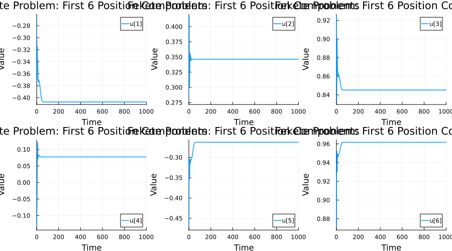
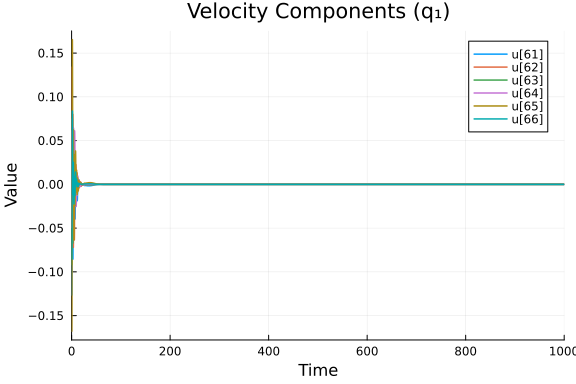
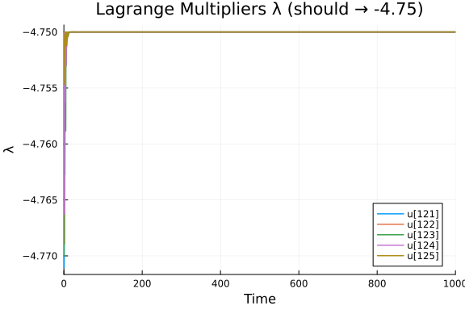
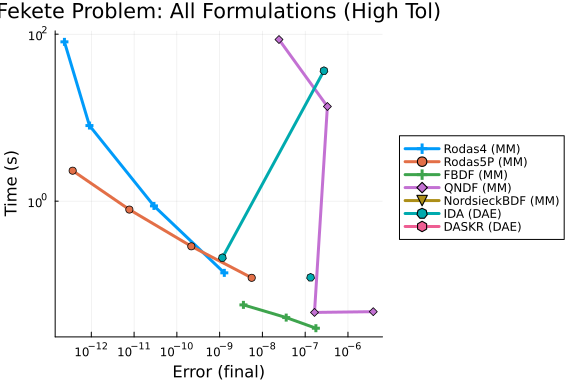
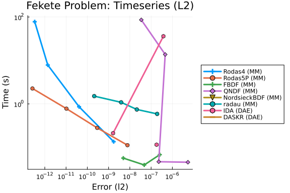
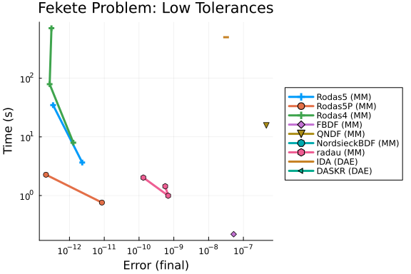

This is a benchmark of the Fekete problem, an index-3 DAE describing
$N=20$ charged particles on the unit sphere, from the
[IVP Test Set](http://www.dm.uniba.it/~testset/).

The problem computes **elliptic Fekete points**: $N=20$ particles on the unit
sphere $S^2$ that maximize the product of mutual distances
$V(x) = \prod_{i<j} \|x_i - x_j\|_2$. By mechanical analogy, the particles
are subject to a repulsive Coulomb-like force and an adhesion damping force
$A_i = -\alpha q_i$ ($\alpha = 0.5$). The particles are constrained to the
unit sphere via Lagrange multipliers $\lambda_i$.

The **original index-3 system** has the physics:
$$\ddot{p}_i = -\alpha \dot{p}_i + 2\lambda_i p_i + \sum_{j \neq i} \frac{p_i - p_j}{\|p_i - p_j\|^2}$$
$$0 = \|p_i\|^2 - 1$$

The **stabilized index-2 formulation** (from the Fortran test set) introduces
velocity variables $q_i = \dot{p}_i$ and Baumgarte stabilization multipliers
$\mu_i$, giving 160 = 8N state variables with mass matrix
$M = \text{diag}(I_{6N}, 0_{2N})$:
$$\dot{p}_i = q_i + 2\mu_i p_i, \quad
\dot{q}_i = -\alpha q_i + 2\lambda_i p_i + \sum_{j\neq i}\frac{p_i - p_j}{\|p_i - p_j\|^2}$$
$$0 = \|p_i\|^2 - 1, \quad 0 = 2p_i \cdot q_i$$

We benchmark three formulations:

1. **Mass-Matrix ODE Form:** The stabilized index-2 system as `M·du/dt = f(u, t)`,
   solved with Rosenbrock-W and BDF methods.
2. **DAE Residual Form:** Same system as `F(du, u, t) = M·du − f(u, t) = 0`,
   solved with IDA and DASKR.
3. **MTK Automatic Index Reduction:** The original index-3 system is given
   directly to ModelingToolkit, which uses `structural_simplify` to
   automatically perform index reduction and generate an index-1 DAE.
   This benchmarks MTK's symbolic transformation pipeline on a large-scale
   constrained mechanical system. It is currently excluded from the
   work-precision diagrams because it does not solve — see "Why the MTK
   index-reduced formulation is excluded" below.

Reference: Bendtsen, C., Thomsen, P.G.: Numerical solution of differential
algebraic equations. IMM-DTU, Tech. Report (1999). Available at the
[IVP Test Set](http://www.dm.uniba.it/~testset/problems/fekete.php).

```julia
using OrdinaryDiffEq, DiffEqDevTools, Sundials, ModelingToolkit,
      ODEInterfaceDiffEq, Plots, DASKR
using OrdinaryDiffEqBDF, OrdinaryDiffEqFIRK, OrdinaryDiffEqRosenbrock
using ModelingToolkit: t_nounits as t, D_nounits as D
using LinearAlgebra, Statistics
```


## Problem Definition

We translate the Fortran reference implementation (`fekete.f`) into Julia.
The problem has $N = 20$ particles with $8N = 160$ state variables.

### Initial Conditions

The initial positions place the 20 particles in four latitude rings on the
sphere (3 + 7 + 6 + 4 particles), with initial velocities $q(0) = 0$ and
multipliers $\mu(0)$ computed for consistency.

```julia
const N_ART = 20
const NEQN = 8 * N_ART  # 160
const ALPHA_DAMP = 0.5

function fekete_init()
    y = zeros(NEQN)

    # Ring 1: 3 particles at beta = 3π/8
    for i in 1:3
        α = 2π * i / 3 + π / 13
        β = 3π / 8
        y[3*(i-1)+1] = cos(α) * cos(β)
        y[3*(i-1)+2] = sin(α) * cos(β)
        y[3*(i-1)+3] = sin(β)
    end
    # Ring 2: 7 particles at beta = π/8
    for i in 4:10
        α = 2π * (i - 3) / 7 + π / 29
        β = π / 8
        y[3*(i-1)+1] = cos(α) * cos(β)
        y[3*(i-1)+2] = sin(α) * cos(β)
        y[3*(i-1)+3] = sin(β)
    end
    # Ring 3: 6 particles at beta = -2π/15
    for i in 11:16
        α = 2π * (i - 10) / 6 + π / 7
        β = -2π / 15
        y[3*(i-1)+1] = cos(α) * cos(β)
        y[3*(i-1)+2] = sin(α) * cos(β)
        y[3*(i-1)+3] = sin(β)
    end
    # Ring 4: 4 particles at beta = -3π/10
    for i in 17:20
        α = 2π * (i - 17) / 4 + π / 17
        β = -3π / 10
        y[3*(i-1)+1] = cos(α) * cos(β)
        y[3*(i-1)+2] = sin(α) * cos(β)
        y[3*(i-1)+3] = sin(β)
    end

    # q(0) = 0  (indices 3N+1 : 6N already zero)
    # μ(0) = 0  initially, then compute consistent values

    # Compute consistent μ via one feval pass (from Fortran init)
    yprime = similar(y)
    fekete_rhs!(yprime, y, nothing, 0.0)
    for i in 1:N_ART
        s = 0.0
        for j in 1:3
            s += y[3*(i-1)+j] * yprime[3*N_ART + 3*(i-1)+j]
        end
        y[6*N_ART+i] = -s / 2.0
    end

    return y
end
```

```
fekete_init (generic function with 1 method)
```


### Right-Hand Side

The RHS encodes the equations of motion: repulsive Coulomb forces between
particles on the sphere, damping, and the algebraic constraints.

```julia
function fekete_rhs!(dy, y, p, t)
    nart = N_ART
    T = eltype(dy)

    # Unpack state: positions p, velocities q, multipliers λ, μ
    # p_i = y[3(i-1)+1 : 3(i-1)+3],  i = 1..N
    # q_i = y[3N+3(i-1)+1 : 3N+3(i-1)+3]
    # λ_i = y[6N+i]
    # μ_i = y[7N+i]

    # Compute pairwise repulsive forces f(i,j,k) = (p_i - p_j) / |p_i - p_j|²
    # and accumulate into velocity derivatives

    @inbounds for i in 1:nart
        lam_i = y[6*nart+i]
        mu_i  = y[7*nart+i]

        # dp_i/dt = q_i + 2*μ_i*p_i
        for k in 1:3
            pk = y[3*(i-1)+k]
            qk = y[3*nart+3*(i-1)+k]
            dy[3*(i-1)+k] = qk + 2*mu_i*pk
        end

        # dq_i/dt = -α*q_i + 2*λ_i*p_i + Σ_{j≠i} (p_i - p_j)/|p_i - p_j|²
        for k in 1:3
            pk = y[3*(i-1)+k]
            qk = y[3*nart+3*(i-1)+k]
            force_k = -ALPHA_DAMP * qk + 2*lam_i * pk
            for j in 1:nart
                if j != i
                    rn = zero(T)
                    for m in 1:3
                        rn += (y[3*(i-1)+m] - y[3*(j-1)+m])^2
                    end
                    force_k += (pk - y[3*(j-1)+k]) / rn
                end
            end
            dy[3*nart+3*(i-1)+k] = force_k
        end

        # Algebraic equations
        # φ_i = |p_i|² - 1 = 0  (sphere constraint)
        phi_i = -one(T)
        for k in 1:3
            phi_i += y[3*(i-1)+k]^2
        end
        dy[6*nart+i] = phi_i

        # g_i = 2*p_i·q_i = 0  (differentiated constraint)
        gpq_i = zero(T)
        for k in 1:3
            gpq_i += 2*y[3*(i-1)+k] * y[3*nart+3*(i-1)+k]
        end
        dy[7*nart+i] = gpq_i
    end
    nothing
end
```

```
fekete_rhs! (generic function with 1 method)
```


### Analytical Jacobian

The Jacobian is dense due to the pairwise Coulomb interactions. We provide
the analytical Jacobian translated from the Fortran `jeval` subroutine.

```julia
function fekete_jac!(J, y, p, t)
    nart = N_ART
    neqn = NEQN
    T = eltype(J)
    fill!(J, zero(T))

    # Extract state
    pp = zeros(T, nart, 3)
    qq = zeros(T, nart, 3)
    lam = zeros(T, nart)
    mu  = zeros(T, nart)
    for i in 1:nart
        for k in 1:3
            pp[i,k] = y[3*(i-1)+k]
            qq[i,k] = y[3*nart+3*(i-1)+k]
        end
        lam[i] = y[6*nart+i]
        mu[i]  = y[7*nart+i]
    end

    # Precompute |p_i - p_j|²
    rn = zeros(T, nart, nart)
    for j in 1:nart, i in 1:nart
        for k in 1:3
            rn[i,j] += (pp[i,k] - pp[j,k])^2
        end
    end

    # J_pp: ∂(dp_i/dt)/∂p_i = 2μ_i * I₃
    for i in 1:nart, k in 1:3
        J[3*(i-1)+k, 3*(i-1)+k] = 2*mu[i]
    end

    # J_pq: ∂(dp_i/dt)/∂q_i = I₃
    for i in 1:nart, k in 1:3
        J[3*(i-1)+k, 3*nart+3*(i-1)+k] = one(T)
    end

    # J_pμ: ∂(dp_i/dt)/∂μ_i = 2p_i
    for i in 1:nart, k in 1:3
        J[3*(i-1)+k, 7*nart+i] = 2*pp[i,k]
    end

    # J_qp (same i, same k): diagonal + force derivatives
    for i in 1:nart, k in 1:3
        val = 2*lam[i]
        for j in 1:nart
            if j != i
                val += (rn[i,j] - 2*(pp[i,k] - pp[j,k])^2) / rn[i,j]^2
            end
        end
        J[3*nart+3*(i-1)+k, 3*(i-1)+k] = val
    end

    # J_qp (same i, different k,m): off-diagonal spatial components
    for i in 1:nart, k in 1:3, m in 1:3
        if m != k
            val = zero(T)
            for j in 1:nart
                if j != i
                    val -= 2*(pp[i,k] - pp[j,k])*(pp[i,m] - pp[j,m]) / rn[i,j]^2
                end
            end
            J[3*nart+3*(i-1)+k, 3*(i-1)+m] += val
        end
    end

    # J_qp (different i,l, same k): inter-particle force derivatives
    for i in 1:nart, l in 1:nart
        if l != i
            for k in 1:3
                J[3*nart+3*(i-1)+k, 3*(l-1)+k] =
                    (-rn[i,l] + 2*(pp[i,k] - pp[l,k])^2) / rn[i,l]^2
            end
        end
    end

    # J_qp (different i,l, different k,m): cross terms
    for i in 1:nart, l in 1:nart
        if l != i
            for k in 1:3, m in 1:3
                if m != k
                    J[3*nart+3*(i-1)+k, 3*(l-1)+m] +=
                        2*(pp[i,k] - pp[l,k])*(pp[i,m] - pp[l,m]) / rn[i,l]^2
                end
            end
        end
    end

    # J_qq: ∂(dq_i/dt)/∂q_i = -α I₃
    for i in 1:nart, k in 1:3
        J[3*nart+3*(i-1)+k, 3*nart+3*(i-1)+k] = -ALPHA_DAMP
    end

    # J_qλ: ∂(dq_i/dt)/∂λ_i = 2p_i
    for i in 1:nart, k in 1:3
        J[3*nart+3*(i-1)+k, 6*nart+i] = 2*pp[i,k]
    end

    # J_λp: ∂φ_i/∂p_i = 2p_i
    for i in 1:nart, k in 1:3
        J[6*nart+i, 3*(i-1)+k] = 2*pp[i,k]
    end

    # J_μp: ∂g_i/∂p_i = 2q_i
    for i in 1:nart, k in 1:3
        J[7*nart+i, 3*(i-1)+k] = 2*qq[i,k]
    end

    # J_μq: ∂g_i/∂q_i = 2p_i
    for i in 1:nart, k in 1:3
        J[7*nart+i, 3*nart+3*(i-1)+k] = 2*pp[i,k]
    end

    nothing
end
```

```
fekete_jac! (generic function with 1 method)
```


### Mass-Matrix ODE Formulation

```julia
y0 = fekete_init()

# Mass matrix: M = diag(I_{6N}, 0_{2N})
M = zeros(NEQN, NEQN)
for i in 1:6*N_ART
    M[i,i] = 1.0
end

mmf = ODEFunction(fekete_rhs!, mass_matrix = M, jac = fekete_jac!)
tspan = (0.0, 1000.0)
mmprob = ODEProblem(mmf, y0, tspan)
```

```
ODEProblem with uType Vector{Float64} and tType Float64. In-place: true
Non-trivial mass matrix: true
timespan: (0.0, 1000.0)
u0: 160-element Vector{Float64}:
 -0.2650941332839412
  0.2759922279796341
  0.9238795325112867
 -0.10646921403545888
 -0.367574367807928
  0.9238795325112867
  0.37156334731940005
  0.09158213982829398
  0.9238795325112867
  0.4945564328017459
  ⋮
  0.0
  0.0
  0.0
  0.0
  0.0
  0.0
  0.0
  0.0
  0.0
```


### DAE Residual Formulation

```julia
function fekete_dae!(res, du, u, p, t)
    f = similar(u)
    fekete_rhs!(f, u, p, t)
    # Residual: M*du - f(u) = 0
    for i in 1:6*N_ART
        res[i] = du[i] - f[i]
    end
    for i in 6*N_ART+1:NEQN
        res[i] = -f[i]  # algebraic: 0 = f_alg(u)
    end
    nothing
end

du0 = zeros(NEQN)
fekete_rhs!(du0, y0, nothing, 0.0)
# For differential variables, du0 = f(y0); for algebraic, du0 = 0
du0_dae = copy(du0)
du0_dae[6*N_ART+1:end] .= 0.0

differential_vars = vcat(trues(6*N_ART), falses(2*N_ART))
daeprob = DAEProblem(fekete_dae!, du0_dae, y0, tspan,
                     differential_vars = differential_vars)
```

```
DAEProblem with uType Vector{Float64} and tType Float64. In-place: true
timespan: (0.0, 1000.0)
u0: 160-element Vector{Float64}:
 -0.2650941332839412
  0.2759922279796341
  0.9238795325112867
 -0.10646921403545888
 -0.367574367807928
  0.9238795325112867
  0.37156334731940005
  0.09158213982829398
  0.9238795325112867
  0.4945564328017459
  ⋮
  0.0
  0.0
  0.0
  0.0
  0.0
  0.0
  0.0
  0.0
  0.0
du0: 160-element Vector{Float64}:
 0.0
 0.0
 0.0
 0.0
 0.0
 0.0
 0.0
 0.0
 0.0
 0.0
 ⋮
 0.0
 0.0
 0.0
 0.0
 0.0
 0.0
 0.0
 0.0
 0.0
```


### MTK Automatic Index Reduction

We give ModelingToolkit the **original index-3 system** directly and let
`structural_simplify` automatically perform index reduction. This benchmarks
MTK's symbolic transformation pipeline — no manual constraint differentiation
or variable elimination is performed.

```julia
ps_mtk = Vector{Num}(undef, 3*N_ART)
qs_mtk = Vector{Num}(undef, 3*N_ART)
λs_mtk = Vector{Num}(undef, N_ART)

for i in 1:N_ART
    for k in 1:3
        idx = 3*(i-1) + k
        ps_mtk[idx] = only(@variables $(Symbol("p$(i)_$(k)"))(t) = y0[idx])
        qs_mtk[idx] = only(@variables $(Symbol("q$(i)_$(k)"))(t) = 0.0)
    end
    # λ is algebraic — determined by the constraint derivative, not prescribed
    λs_mtk[i] = only(@variables $(Symbol("lam$(i)"))(t))
end

eqs_mtk = Equation[]

# Kinematics: dp/dt = q  (60 equations)
for idx in 1:3*N_ART
    push!(eqs_mtk, D(ps_mtk[idx]) ~ qs_mtk[idx])
end

# Dynamics: dq/dt = -αq + 2λp + Coulomb  (60 equations)
for i in 1:N_ART
    for k in 1:3
        idx = 3*(i-1) + k
        coulomb = sum(
            (ps_mtk[idx] - ps_mtk[3*(j-1)+k]) /
            sum((ps_mtk[3*(i-1)+m] - ps_mtk[3*(j-1)+m])^2 for m in 1:3)
            for j in 1:N_ART if j != i
        )
        push!(eqs_mtk, D(qs_mtk[idx]) ~ -ALPHA_DAMP*qs_mtk[idx] +
              2*λs_mtk[i]*ps_mtk[idx] + coulomb)
    end
end

# Position-level constraint: |p_i|² = 1  (20 index-3 constraints)
for i in 1:N_ART
    push!(eqs_mtk, sum(ps_mtk[3*(i-1)+k]^2 for k in 1:3) ~ 1)
end

# Explicit automatic index reduction
@named sys_raw = ODESystem(eqs_mtk, t)
sys_mtk = structural_simplify(sys_raw)

mtkprob = ODEProblem(sys_mtk, [], tspan)
println("MTK automatic reduction → $(length(unknowns(sys_mtk))) states")
```

```
MTK automatic reduction → 140 states
```


## Reference Solution

The Fortran test set provides a high-accuracy reference solution at $t = 1000$,
computed with RADAU5 at `rtol = atol = 1e-12`. We use this as our ground truth
and also compute a high-accuracy Julia reference for timeseries comparison.

```julia
# Reference values from Fortran solut() subroutine (RADAU5, tol=1e-12)
const REFSOL = zeros(NEQN)
REFSOL[  1] =  -0.4070263380333202
REFSOL[  2] =   0.3463758772791802
REFSOL[  3] =   0.8451942450030429
REFSOL[  4] =   0.7752934752521549e-01
REFSOL[  5] =  -0.2628662719972299
REFSOL[  6] =   0.9617122871829146
REFSOL[  7] =   0.7100577833343567
REFSOL[  8] =   0.1212948055586120
REFSOL[  9] =   0.6936177005172217
REFSOL[ 10] =   0.2348267744557627
REFSOL[ 11] =   0.7449277976923311
REFSOL[ 12] =   0.6244509285956391
REFSOL[ 13] =  -0.4341114738782885
REFSOL[ 14] =   0.8785430442262876
REFSOL[ 15] =   0.1992720444237660
REFSOL[ 16] =  -0.9515059600312596
REFSOL[ 17] =   0.2203508762787005
REFSOL[ 18] =   0.2146669498274008
REFSOL[ 19] =  -0.6385191643609878
REFSOL[ 20] =  -0.4310833259390688
REFSOL[ 21] =   0.6375425027722121
REFSOL[ 22] =  -0.1464175087914336
REFSOL[ 23] =  -0.9380871635228862
REFSOL[ 24] =   0.3139337298744690
REFSOL[ 25] =   0.5666974065069942
REFSOL[ 26] =  -0.6739221885076542
REFSOL[ 27] =   0.4740073135462156
REFSOL[ 28] =   0.9843259538440293
REFSOL[ 29] =  -0.1696995357819996
REFSOL[ 30] =  -0.4800504290609090e-01
REFSOL[ 31] =   0.1464175087914331
REFSOL[ 32] =   0.9380871635228875
REFSOL[ 33] =  -0.3139337298744656
REFSOL[ 34] =  -0.7092757549979014
REFSOL[ 35] =   0.5264062637139616
REFSOL[ 36] =  -0.4688542938854929
REFSOL[ 37] =  -0.8665731819284478
REFSOL[ 38] =  -0.4813878059756024
REFSOL[ 39] =  -0.1315929352982178
REFSOL[ 40] =  -0.2347897778700538
REFSOL[ 41] =  -0.8594340408013130
REFSOL[ 42] =  -0.4541441287957579
REFSOL[ 43] =   0.5530976940074118
REFSOL[ 44] =  -0.7674370265615124
REFSOL[ 45] =  -0.3242273140037833
REFSOL[ 46] =   0.7711050969896927
REFSOL[ 47] =   0.6357041816577034
REFSOL[ 48] =   0.3573685519777001e-01
REFSOL[ 49] =   0.7103951209379591
REFSOL[ 50] =   0.2403570431280519
REFSOL[ 51] =  -0.6614886725910596
REFSOL[ 52] =  -0.3038208738735660e-01
REFSOL[ 53] =   0.4501923293640461
REFSOL[ 54] =  -0.8924145871442046
REFSOL[ 55] =  -0.5772996158107093
REFSOL[ 56] =  -0.1766763414971813
REFSOL[ 57] =  -0.7971892020969544
REFSOL[ 58] =   0.2414481766969039
REFSOL[ 59] =  -0.3416456818373135
REFSOL[ 60] =  -0.9082846503446250
# Velocities q at t=1000 (near-zero at stationary state)
REFSOL[ 61] =   0.2409619682166627e-15
REFSOL[ 62] =  -0.1139818460497816e-15
REFSOL[ 63] =   0.1627536276556335e-15
REFSOL[ 64] =   0.1745651819597609e-15
REFSOL[ 65] =  -0.1914278710633076e-15
REFSOL[ 66] =  -0.6639600671806291e-16
REFSOL[ 67] =   0.1708576733899083e-15
REFSOL[ 68] =  -0.2277602521390053e-15
REFSOL[ 69] =  -0.1350782790950654e-15
REFSOL[ 70] =   0.2411941341109454e-15
REFSOL[ 71] =  -0.1438238671800488e-15
REFSOL[ 72] =   0.8087033550666644e-16
REFSOL[ 73] =   0.1618239105233347e-15
REFSOL[ 74] =   0.1837556152070701e-16
REFSOL[ 75] =   0.2715177369929503e-15
REFSOL[ 76] =   0.7930078658689191e-16
REFSOL[ 77] =   0.7482020588342764e-16
REFSOL[ 78] =   0.2746974939098084e-15
REFSOL[ 79] =   0.8849338913035911e-16
REFSOL[ 80] =  -0.5940734725324115e-16
REFSOL[ 81] =   0.4845984056889910e-16
REFSOL[ 82] =  -0.3728835248155620e-16
REFSOL[ 83] =  -0.4600332954062859e-16
REFSOL[ 84] =  -0.1548568884846698e-15
REFSOL[ 85] =   0.2507541692375411e-16
REFSOL[ 86] =  -0.1560155223230823e-15
REFSOL[ 87] =  -0.2517946296860555e-15
REFSOL[ 88] =  -0.3739779361502470e-16
REFSOL[ 89] =  -0.1381663620885020e-15
REFSOL[ 90] =  -0.2784051540342329e-15
REFSOL[ 91] =   0.6624397102887671e-16
REFSOL[ 92] =   0.4226207488883120e-16
REFSOL[ 93] =   0.1571821772296610e-15
REFSOL[ 94] =  -0.4112243677286995e-16
REFSOL[ 95] =   0.1939960344265876e-15
REFSOL[ 96] =   0.2800184977692136e-15
REFSOL[ 97] =  -0.9189023375328813e-16
REFSOL[ 98] =   0.1392943179389155e-15
REFSOL[ 99] =   0.9556003995587458e-16
REFSOL[100] =  -0.2234188557495892e-15
REFSOL[101] =   0.1276804778190781e-15
REFSOL[102] =  -0.1261196211463950e-15
REFSOL[103] =  -0.1887754149742397e-15
REFSOL[104] =  -0.2140788698695373e-16
REFSOL[105] =  -0.2713591291421657e-15
REFSOL[106] =   0.1107887633060814e-15
REFSOL[107] =  -0.1318443715631340e-15
REFSOL[108] =  -0.4521275683078691e-16
REFSOL[109] =  -0.1277688851278605e-15
REFSOL[110] =   0.4850914012115388e-16
REFSOL[111] =  -0.1195891666741192e-15
REFSOL[112] =  -0.1569641653843750e-15
REFSOL[113] =   0.1856239009452638e-15
REFSOL[114] =   0.9898466095646496e-16
REFSOL[115] =  -0.2068030800303723e-15
REFSOL[116] =   0.2451470336752085e-15
REFSOL[117] =   0.9542986459336358e-16
REFSOL[118] =  -0.2456074075580993e-15
REFSOL[119] =   0.1532475480661800e-15
REFSOL[120] =  -0.1229326332276474e-15
# λ multipliers at t=1000
REFSOL[121] =  -0.4750000000000000e+01
REFSOL[122] =  -0.4750000000000001e+01
REFSOL[123] =  -0.4750000000000000e+01
REFSOL[124] =  -0.4750000000000000e+01
REFSOL[125] =  -0.4750000000000000e+01
REFSOL[126] =  -0.4750000000000000e+01
REFSOL[127] =  -0.4750000000000000e+01
REFSOL[128] =  -0.4750000000000000e+01
REFSOL[129] =  -0.4750000000000000e+01
REFSOL[130] =  -0.4750000000000000e+01
REFSOL[131] =  -0.4750000000000001e+01
REFSOL[132] =  -0.4750000000000001e+01
REFSOL[133] =  -0.4750000000000000e+01
REFSOL[134] =  -0.4750000000000000e+01
REFSOL[135] =  -0.4750000000000000e+01
REFSOL[136] =  -0.4750000000000000e+01
REFSOL[137] =  -0.4749999999999999e+01
REFSOL[138] =  -0.4750000000000000e+01
REFSOL[139] =  -0.4750000000000000e+01
REFSOL[140] =  -0.4750000000000000e+01
# μ multipliers at t=1000 (near-zero)
REFSOL[141] =  -0.3537526598492654e-19
REFSOL[142] =   0.2338193888161182e-18
REFSOL[143] =  -0.3267771993164953e-18
REFSOL[144] =   0.2915679914072042e-18
REFSOL[145] =   0.1965183195887647e-18
REFSOL[146] =  -0.6224992924096233e-19
REFSOL[147] =  -0.1715878416756298e-18
REFSOL[148] =  -0.2704741705248803e-18
REFSOL[149] =   0.3008700893194513e-18
REFSOL[150] =  -0.2703121624910402e-18
REFSOL[151] =   0.4243755291982164e-18
REFSOL[152] =   0.2862063003949612e-18
REFSOL[153] =   0.1222125408406218e-19
REFSOL[154] =  -0.4958862706817728e-18
REFSOL[155] =  -0.7070673036251212e-18
REFSOL[156] =  -0.4454983024194383e-18
REFSOL[157] =  -0.1125384872521777e-18
REFSOL[158] =   0.1512898724592511e-18
REFSOL[159] =  -0.6163704221424137e-19
REFSOL[160] =   0.6255426995473074e-19
```

```
6.255426995473074e-20
```


```julia
# Compute high-accuracy reference solutions
println("Computing mass-matrix reference solution with Rodas5P...")
ref_sol = solve(mmprob, Rodas5P(), reltol = 1e-8, abstol = 1e-8,
                maxiters = 10_000_000)
println("  retcode = $(ref_sol.retcode), npoints = $(length(ref_sol.t)), ",
        "t_final = $(ref_sol.t[end])")

# The mass-matrix reference above is the reference for both the mass-matrix
# and the DAE residual forms. There is no MTK reference because the
# index-reduced MTK problem does not solve (see below).
```

```
Computing mass-matrix reference solution with Rodas5P...
  retcode = Success, npoints = 9597, t_final = 1000.0
```


## Verification against Fortran Reference

We compare our solution at $t = 1000$ with the Fortran RADAU5 reference
to verify correctness. The first 6 position components (output components
from the test set) are checked.

```julia
sol_final = ref_sol.u[end]
println("=== Verification at t = 1000 ===")
println("Component | Fortran Reference     | Julia Solution        | Rel Error")
println("-"^75)
for idx in 1:6
    ref_val = REFSOL[idx]
    our_val = sol_final[idx]
    relerr = abs(ref_val) > 0 ? abs((our_val - ref_val) / ref_val) : abs(our_val)
    status = relerr < 1e-3 ? "✓" : (relerr < 1e-1 ? "~" : "✗")
    println("y($(lpad(idx,3))) | $(lpad(string(ref_val), 22)) | $(lpad(string(round(our_val, sigdigits=12)), 22)) | $(relerr) $status")
end

# Check λ multipliers (should all be ≈ -4.75)
lam_vals = sol_final[6*N_ART+1:7*N_ART]
println("\nλ multipliers: mean = $(round(mean(lam_vals), sigdigits=6)), ",
        "std = $(round(std(lam_vals), sigdigits=3))")

# Check sphere constraints: |p_i|² should equal 1
max_constraint = 0.0
for i in 1:N_ART
    c = sum(sol_final[3*(i-1)+k]^2 for k in 1:3) - 1.0
    global max_constraint = max(max_constraint, abs(c))
end
println("Max sphere constraint violation: $(max_constraint)")
```

```
=== Verification at t = 1000 ===
Component | Fortran Reference     | Julia Solution        | Rel Error
---------------------------------------------------------------------------
y(  1) |    -0.4070263380333202 |        -0.407026338034 | 1.22839455931966
95e-12 ✓
y(  2) |     0.3463758772791802 |         0.346375877282 | 7.80383443352838
5e-12 ✓
y(  3) |     0.8451942450030429 |         0.845194245002 | 1.59559523267615
54e-12 ✓
y(  4) |     0.0775293475252155 |        0.0775293475249 | 4.07154415137934
2e-12 ✓
y(  5) |    -0.2628662719972299 |        -0.262866271994 | 1.24756677848863
68e-11 ✓
y(  6) |     0.9617122871829146 |         0.961712287184 | 9.58517624898496
e-13 ✓

λ multipliers: mean = -4.75, std = 6.11e-16
Max sphere constraint violation: 2.220446049250313e-16
```


## Solution Plots

The solution shows the 20 particles settling into a near-optimal configuration
on the unit sphere. The velocities $q_i$ decay to zero due to damping, while
the Lagrange multipliers converge to $\lambda_i = -4.75$.

```julia
plot(ref_sol, idxs = [1, 2, 3, 4, 5, 6],
     title = "Fekete Problem: First 6 Position Components",
     xlabel = "Time", ylabel = "Value", lw = 1.5,
     layout = (2, 3), size = (900, 500))
```



```julia
# Velocity components (should decay to zero)
plot(ref_sol, idxs = [61, 62, 63, 64, 65, 66],
     title = "Velocity Components (q₁)",
     xlabel = "Time", ylabel = "Value", lw = 1.5)
```



```julia
# Lagrange multipliers (should converge to -4.75)
plot(ref_sol, idxs = [121, 122, 123, 124, 125],
     title = "Lagrange Multipliers λ (should → -4.75)",
     xlabel = "Time", ylabel = "λ", lw = 1.5)
```




## Problem Setup for Benchmarks

We set up the problem array and reference array for `WorkPrecisionSet`.
Two formulations are benchmarked: (1) mass-matrix ODE and (2) DAE residual.
The MTK index-reduced form is excluded — the next section shows why.

```julia
probs = [mmprob, daeprob]
refs  = [ref_sol, ref_sol]
```

```
2-element Vector{SciMLBase.ODESolution{Float64, 2, Vector{Vector{Float64}},
 Nothing, Nothing, Vector{Float64}, Vector{Vector{Vector{Float64}}}, Nothin
g, SciMLBase.ODEProblem{Vector{Float64}, Tuple{Float64, Float64}, true, Sci
MLBase.NullParameters, SciMLBase.ODEFunction{true, SciMLBase.AutoSpecialize
, FunctionWrappersWrappers.FunctionWrappersWrapper{Tuple{FunctionWrappers.F
unctionWrapper{Nothing, Tuple{Vector{Float64}, Vector{Float64}, SciMLBase.N
ullParameters, Float64}}, FunctionWrappers.FunctionWrapper{Nothing, Tuple{V
ector{ForwardDiff.Dual{ForwardDiff.Tag{DiffEqBase.OrdinaryDiffEqTag, Float6
4}, Float64, 1}}, Vector{ForwardDiff.Dual{ForwardDiff.Tag{DiffEqBase.Ordina
ryDiffEqTag, Float64}, Float64, 1}}, SciMLBase.NullParameters, Float64}}, F
unctionWrappers.FunctionWrapper{Nothing, Tuple{Vector{ForwardDiff.Dual{Forw
ardDiff.Tag{DiffEqBase.OrdinaryDiffEqTag, Float64}, Float64, 1}}, Vector{Fl
oat64}, SciMLBase.NullParameters, ForwardDiff.Dual{ForwardDiff.Tag{DiffEqBa
se.OrdinaryDiffEqTag, Float64}, Float64, 1}}}, FunctionWrappers.FunctionWra
pper{Nothing, Tuple{Vector{ForwardDiff.Dual{ForwardDiff.Tag{DiffEqBase.Ordi
naryDiffEqTag, Float64}, Float64, 1}}, Vector{ForwardDiff.Dual{ForwardDiff.
Tag{DiffEqBase.OrdinaryDiffEqTag, Float64}, Float64, 1}}, SciMLBase.NullPar
ameters, ForwardDiff.Dual{ForwardDiff.Tag{DiffEqBase.OrdinaryDiffEqTag, Flo
at64}, Float64, 1}}}}, FunctionWrappersWrappers.AllowNonIsBits, FunctionWra
ppersWrappers.SingleCacheStorage}, Matrix{Float64}, Nothing, Nothing, Funct
ionWrappersWrappers.FunctionWrappersWrapper{Tuple{FunctionWrappers.Function
Wrapper{Nothing, Tuple{Matrix{Float64}, Vector{Float64}, SciMLBase.NullPara
meters, Float64}}}, FunctionWrappersWrappers.AllowNonIsBits, FunctionWrappe
rsWrappers.SingleCacheStorage}, Nothing, Nothing, Nothing, Nothing, Nothing
, Nothing, Nothing, Nothing, Nothing, typeof(SciMLBase.DEFAULT_OBSERVED), N
othing, Nothing, Nothing, Nothing}, Base.Pairs{Symbol, Union{}, Tuple{}, @N
amedTuple{}}, SciMLBase.StandardODEProblem}, OrdinaryDiffEqRosenbrock.Rodas
5P{ADTypes.AutoForwardDiff{1, ForwardDiff.Tag{DiffEqBase.OrdinaryDiffEqTag,
 Float64}}, Nothing, typeof(OrdinaryDiffEqCore.trivial_limiter!), typeof(Or
dinaryDiffEqCore.trivial_limiter!), Nothing}, OrdinaryDiffEqCore.Interpolat
ionData{SciMLBase.ODEFunction{true, SciMLBase.AutoSpecialize, FunctionWrapp
ersWrappers.FunctionWrappersWrapper{Tuple{FunctionWrappers.FunctionWrapper{
Nothing, Tuple{Vector{Float64}, Vector{Float64}, SciMLBase.NullParameters, 
Float64}}, FunctionWrappers.FunctionWrapper{Nothing, Tuple{Vector{ForwardDi
ff.Dual{ForwardDiff.Tag{DiffEqBase.OrdinaryDiffEqTag, Float64}, Float64, 1}
}, Vector{ForwardDiff.Dual{ForwardDiff.Tag{DiffEqBase.OrdinaryDiffEqTag, Fl
oat64}, Float64, 1}}, SciMLBase.NullParameters, Float64}}, FunctionWrappers
.FunctionWrapper{Nothing, Tuple{Vector{ForwardDiff.Dual{ForwardDiff.Tag{Dif
fEqBase.OrdinaryDiffEqTag, Float64}, Float64, 1}}, Vector{Float64}, SciMLBa
se.NullParameters, ForwardDiff.Dual{ForwardDiff.Tag{DiffEqBase.OrdinaryDiff
EqTag, Float64}, Float64, 1}}}, FunctionWrappers.FunctionWrapper{Nothing, T
uple{Vector{ForwardDiff.Dual{ForwardDiff.Tag{DiffEqBase.OrdinaryDiffEqTag, 
Float64}, Float64, 1}}, Vector{ForwardDiff.Dual{ForwardDiff.Tag{DiffEqBase.
OrdinaryDiffEqTag, Float64}, Float64, 1}}, SciMLBase.NullParameters, Forwar
dDiff.Dual{ForwardDiff.Tag{DiffEqBase.OrdinaryDiffEqTag, Float64}, Float64,
 1}}}}, FunctionWrappersWrappers.AllowNonIsBits, FunctionWrappersWrappers.S
ingleCacheStorage}, Matrix{Float64}, Nothing, Nothing, FunctionWrappersWrap
pers.FunctionWrappersWrapper{Tuple{FunctionWrappers.FunctionWrapper{Nothing
, Tuple{Matrix{Float64}, Vector{Float64}, SciMLBase.NullParameters, Float64
}}}, FunctionWrappersWrappers.AllowNonIsBits, FunctionWrappersWrappers.Sing
leCacheStorage}, Nothing, Nothing, Nothing, Nothing, Nothing, Nothing, Noth
ing, Nothing, Nothing, typeof(SciMLBase.DEFAULT_OBSERVED), Nothing, Nothing
, Nothing, Nothing}, Vector{Vector{Float64}}, Vector{Float64}, Vector{Vecto
r{Vector{Float64}}}, Nothing, OrdinaryDiffEqRosenbrock.RosenbrockCache{Vect
or{Float64}, Vector{Float64}, Float64, Vector{Float64}, Matrix{Float64}, Ma
trix{Float64}, OrdinaryDiffEqRosenbrockTableaus.RodasTableau{Float64, Float
64, Vector{Float64}}, SciMLBase.TimeGradientWrapper{true, SciMLBase.ODEFunc
tion{true, SciMLBase.AutoSpecialize, FunctionWrappersWrappers.FunctionWrapp
ersWrapper{Tuple{FunctionWrappers.FunctionWrapper{Nothing, Tuple{Vector{Flo
at64}, Vector{Float64}, SciMLBase.NullParameters, Float64}}, FunctionWrappe
rs.FunctionWrapper{Nothing, Tuple{Vector{ForwardDiff.Dual{ForwardDiff.Tag{D
iffEqBase.OrdinaryDiffEqTag, Float64}, Float64, 1}}, Vector{ForwardDiff.Dua
l{ForwardDiff.Tag{DiffEqBase.OrdinaryDiffEqTag, Float64}, Float64, 1}}, Sci
MLBase.NullParameters, Float64}}, FunctionWrappers.FunctionWrapper{Nothing,
 Tuple{Vector{ForwardDiff.Dual{ForwardDiff.Tag{DiffEqBase.OrdinaryDiffEqTag
, Float64}, Float64, 1}}, Vector{Float64}, SciMLBase.NullParameters, Forwar
dDiff.Dual{ForwardDiff.Tag{DiffEqBase.OrdinaryDiffEqTag, Float64}, Float64,
 1}}}, FunctionWrappers.FunctionWrapper{Nothing, Tuple{Vector{ForwardDiff.D
ual{ForwardDiff.Tag{DiffEqBase.OrdinaryDiffEqTag, Float64}, Float64, 1}}, V
ector{ForwardDiff.Dual{ForwardDiff.Tag{DiffEqBase.OrdinaryDiffEqTag, Float6
4}, Float64, 1}}, SciMLBase.NullParameters, ForwardDiff.Dual{ForwardDiff.Ta
g{DiffEqBase.OrdinaryDiffEqTag, Float64}, Float64, 1}}}}, FunctionWrappersW
rappers.AllowNonIsBits, FunctionWrappersWrappers.SingleCacheStorage}, Matri
x{Float64}, Nothing, Nothing, FunctionWrappersWrappers.FunctionWrappersWrap
per{Tuple{FunctionWrappers.FunctionWrapper{Nothing, Tuple{Matrix{Float64}, 
Vector{Float64}, SciMLBase.NullParameters, Float64}}}, FunctionWrappersWrap
pers.AllowNonIsBits, FunctionWrappersWrappers.SingleCacheStorage}, Nothing,
 Nothing, Nothing, Nothing, Nothing, Nothing, Nothing, Nothing, Nothing, ty
peof(SciMLBase.DEFAULT_OBSERVED), Nothing, Nothing, Nothing, Nothing}, Vect
or{Float64}, SciMLBase.NullParameters}, SciMLBase.UJacobianWrapper{true, Sc
iMLBase.ODEFunction{true, SciMLBase.AutoSpecialize, FunctionWrappersWrapper
s.FunctionWrappersWrapper{Tuple{FunctionWrappers.FunctionWrapper{Nothing, T
uple{Vector{Float64}, Vector{Float64}, SciMLBase.NullParameters, Float64}},
 FunctionWrappers.FunctionWrapper{Nothing, Tuple{Vector{ForwardDiff.Dual{Fo
rwardDiff.Tag{DiffEqBase.OrdinaryDiffEqTag, Float64}, Float64, 1}}, Vector{
ForwardDiff.Dual{ForwardDiff.Tag{DiffEqBase.OrdinaryDiffEqTag, Float64}, Fl
oat64, 1}}, SciMLBase.NullParameters, Float64}}, FunctionWrappers.FunctionW
rapper{Nothing, Tuple{Vector{ForwardDiff.Dual{ForwardDiff.Tag{DiffEqBase.Or
dinaryDiffEqTag, Float64}, Float64, 1}}, Vector{Float64}, SciMLBase.NullPar
ameters, ForwardDiff.Dual{ForwardDiff.Tag{DiffEqBase.OrdinaryDiffEqTag, Flo
at64}, Float64, 1}}}, FunctionWrappers.FunctionWrapper{Nothing, Tuple{Vecto
r{ForwardDiff.Dual{ForwardDiff.Tag{DiffEqBase.OrdinaryDiffEqTag, Float64}, 
Float64, 1}}, Vector{ForwardDiff.Dual{ForwardDiff.Tag{DiffEqBase.OrdinaryDi
ffEqTag, Float64}, Float64, 1}}, SciMLBase.NullParameters, ForwardDiff.Dual
{ForwardDiff.Tag{DiffEqBase.OrdinaryDiffEqTag, Float64}, Float64, 1}}}}, Fu
nctionWrappersWrappers.AllowNonIsBits, FunctionWrappersWrappers.SingleCache
Storage}, Matrix{Float64}, Nothing, Nothing, FunctionWrappersWrappers.Funct
ionWrappersWrapper{Tuple{FunctionWrappers.FunctionWrapper{Nothing, Tuple{Ma
trix{Float64}, Vector{Float64}, SciMLBase.NullParameters, Float64}}}, Funct
ionWrappersWrappers.AllowNonIsBits, FunctionWrappersWrappers.SingleCacheSto
rage}, Nothing, Nothing, Nothing, Nothing, Nothing, Nothing, Nothing, Nothi
ng, Nothing, typeof(SciMLBase.DEFAULT_OBSERVED), Nothing, Nothing, Nothing,
 Nothing}, Float64, SciMLBase.NullParameters}, LinearSolve.LinearCache{Matr
ix{Float64}, Vector{Float64}, Vector{Float64}, Tuple{Nothing, Vector{Float6
4}, SciMLBase.NullParameters, Float64}, LinearSolve.DefaultLinearSolver, Li
nearSolve.DefaultLinearSolverInit{LinearAlgebra.LU{Float64, Matrix{Float64}
, Vector{Int64}}, LinearAlgebra.QRCompactWY{Float64, Matrix{Float64}, Matri
x{Float64}}, Nothing, Nothing, Nothing, Nothing, Nothing, Nothing, LinearSo
lve._GenericLUFactorizationCache{LinearAlgebra.LU{Float64, Matrix{Float64},
 Vector{Int64}}, Vector{Int64}, Vector{Float64}}, Tuple{LinearAlgebra.LU{Fl
oat64, Matrix{Float64}, Vector{Int64}}, Vector{Int64}}, Nothing, Nothing, N
othing, LinearAlgebra.SVD{Float64, Float64, Matrix{Float64}, Vector{Float64
}}, LinearAlgebra.Cholesky{Float64, Matrix{Float64}}, LinearAlgebra.Cholesk
y{Float64, Matrix{Float64}}, LinearSolve.AppleAccelerateLUCache{Matrix{Floa
t64}, Vector{Int32}, Base.RefValue{Int32}}, Tuple{LinearAlgebra.LU{Float64,
 Matrix{Float64}, Vector{Int64}}, Base.RefValue{Int64}}, LinearAlgebra.QRPi
voted{Float64, Matrix{Float64}, Vector{Float64}, Vector{Int64}}, Nothing, N
othing, Nothing, Nothing, Nothing, Nothing, Nothing, Matrix{Float64}, Vecto
r{Float64}, Nothing}, SciMLOperators.IdentityOperator, SciMLOperators.Ident
ityOperator, Float64, LinearSolve.LinearVerbosity{true}, Bool, LinearSolve.
LinearSolveAdjoint{Missing, Missing, Missing}, Nothing}, Tuple{Nothing, Not
hing}, Tuple{DifferentiationInterfaceForwardDiffExt.ForwardDiffTwoArgDeriva
tivePrep{Tuple{SciMLBase.TimeGradientWrapper{true, SciMLBase.ODEFunction{tr
ue, SciMLBase.AutoSpecialize, FunctionWrappersWrappers.FunctionWrappersWrap
per{Tuple{FunctionWrappers.FunctionWrapper{Nothing, Tuple{Vector{Float64}, 
Vector{Float64}, SciMLBase.NullParameters, Float64}}, FunctionWrappers.Func
tionWrapper{Nothing, Tuple{Vector{ForwardDiff.Dual{ForwardDiff.Tag{DiffEqBa
se.OrdinaryDiffEqTag, Float64}, Float64, 1}}, Vector{ForwardDiff.Dual{Forwa
rdDiff.Tag{DiffEqBase.OrdinaryDiffEqTag, Float64}, Float64, 1}}, SciMLBase.
NullParameters, Float64}}, FunctionWrappers.FunctionWrapper{Nothing, Tuple{
Vector{ForwardDiff.Dual{ForwardDiff.Tag{DiffEqBase.OrdinaryDiffEqTag, Float
64}, Float64, 1}}, Vector{Float64}, SciMLBase.NullParameters, ForwardDiff.D
ual{ForwardDiff.Tag{DiffEqBase.OrdinaryDiffEqTag, Float64}, Float64, 1}}}, 
FunctionWrappers.FunctionWrapper{Nothing, Tuple{Vector{ForwardDiff.Dual{For
wardDiff.Tag{DiffEqBase.OrdinaryDiffEqTag, Float64}, Float64, 1}}, Vector{F
orwardDiff.Dual{ForwardDiff.Tag{DiffEqBase.OrdinaryDiffEqTag, Float64}, Flo
at64, 1}}, SciMLBase.NullParameters, ForwardDiff.Dual{ForwardDiff.Tag{DiffE
qBase.OrdinaryDiffEqTag, Float64}, Float64, 1}}}}, FunctionWrappersWrappers
.AllowNonIsBits, FunctionWrappersWrappers.SingleCacheStorage}, Matrix{Float
64}, Nothing, Nothing, FunctionWrappersWrappers.FunctionWrappersWrapper{Tup
le{FunctionWrappers.FunctionWrapper{Nothing, Tuple{Matrix{Float64}, Vector{
Float64}, SciMLBase.NullParameters, Float64}}}, FunctionWrappersWrappers.Al
lowNonIsBits, FunctionWrappersWrappers.SingleCacheStorage}, Nothing, Nothin
g, Nothing, Nothing, Nothing, Nothing, Nothing, Nothing, Nothing, typeof(Sc
iMLBase.DEFAULT_OBSERVED), Nothing, Nothing, Nothing, Nothing}, Vector{Floa
t64}, SciMLBase.NullParameters}, Vector{Float64}, ADTypes.AutoForwardDiff{1
, ForwardDiff.Tag{DiffEqBase.OrdinaryDiffEqTag, Float64}}, Float64, Tuple{}
}, Float64, ForwardDiff.DerivativeConfig{ForwardDiff.Tag{DiffEqBase.Ordinar
yDiffEqTag, Float64}, Vector{ForwardDiff.Dual{ForwardDiff.Tag{DiffEqBase.Or
dinaryDiffEqTag, Float64}, Float64, 1}}}, Tuple{}}, DifferentiationInterfac
eForwardDiffExt.ForwardDiffTwoArgDerivativePrep{Tuple{SciMLBase.TimeGradien
tWrapper{true, SciMLBase.ODEFunction{true, SciMLBase.AutoSpecialize, Functi
onWrappersWrappers.FunctionWrappersWrapper{Tuple{FunctionWrappers.FunctionW
rapper{Nothing, Tuple{Vector{Float64}, Vector{Float64}, SciMLBase.NullParam
eters, Float64}}, FunctionWrappers.FunctionWrapper{Nothing, Tuple{Vector{Fo
rwardDiff.Dual{ForwardDiff.Tag{DiffEqBase.OrdinaryDiffEqTag, Float64}, Floa
t64, 1}}, Vector{ForwardDiff.Dual{ForwardDiff.Tag{DiffEqBase.OrdinaryDiffEq
Tag, Float64}, Float64, 1}}, SciMLBase.NullParameters, Float64}}, FunctionW
rappers.FunctionWrapper{Nothing, Tuple{Vector{ForwardDiff.Dual{ForwardDiff.
Tag{DiffEqBase.OrdinaryDiffEqTag, Float64}, Float64, 1}}, Vector{Float64}, 
SciMLBase.NullParameters, ForwardDiff.Dual{ForwardDiff.Tag{DiffEqBase.Ordin
aryDiffEqTag, Float64}, Float64, 1}}}, FunctionWrappers.FunctionWrapper{Not
hing, Tuple{Vector{ForwardDiff.Dual{ForwardDiff.Tag{DiffEqBase.OrdinaryDiff
EqTag, Float64}, Float64, 1}}, Vector{ForwardDiff.Dual{ForwardDiff.Tag{Diff
EqBase.OrdinaryDiffEqTag, Float64}, Float64, 1}}, SciMLBase.NullParameters,
 ForwardDiff.Dual{ForwardDiff.Tag{DiffEqBase.OrdinaryDiffEqTag, Float64}, F
loat64, 1}}}}, FunctionWrappersWrappers.AllowNonIsBits, FunctionWrappersWra
ppers.SingleCacheStorage}, Matrix{Float64}, Nothing, Nothing, FunctionWrapp
ersWrappers.FunctionWrappersWrapper{Tuple{FunctionWrappers.FunctionWrapper{
Nothing, Tuple{Matrix{Float64}, Vector{Float64}, SciMLBase.NullParameters, 
Float64}}}, FunctionWrappersWrappers.AllowNonIsBits, FunctionWrappersWrappe
rs.SingleCacheStorage}, Nothing, Nothing, Nothing, Nothing, Nothing, Nothin
g, Nothing, Nothing, Nothing, typeof(SciMLBase.DEFAULT_OBSERVED), Nothing, 
Nothing, Nothing, Nothing}, Vector{Float64}, SciMLBase.NullParameters}, Vec
tor{Float64}, ADTypes.AutoForwardDiff{1, ForwardDiff.Tag{DiffEqBase.Ordinar
yDiffEqTag, Float64}}, Float64, Tuple{}}, Float64, ForwardDiff.DerivativeCo
nfig{ForwardDiff.Tag{DiffEqBase.OrdinaryDiffEqTag, Float64}, Vector{Forward
Diff.Dual{ForwardDiff.Tag{DiffEqBase.OrdinaryDiffEqTag, Float64}, Float64, 
1}}}, Tuple{}}}, Float64, OrdinaryDiffEqRosenbrock.Rodas5P{ADTypes.AutoForw
ardDiff{1, ForwardDiff.Tag{DiffEqBase.OrdinaryDiffEqTag, Float64}}, Nothing
, typeof(OrdinaryDiffEqCore.trivial_limiter!), typeof(OrdinaryDiffEqCore.tr
ivial_limiter!), Nothing}, typeof(OrdinaryDiffEqCore.trivial_limiter!), typ
eof(OrdinaryDiffEqCore.trivial_limiter!), OrdinaryDiffEqRosenbrock.JacReuse
State{Float64, Matrix{Float64}, Vector{Float64}, Matrix{Float64}}}, BitVect
or}, SciMLBase.DEStats, Nothing, Nothing, Nothing, Nothing, Nothing}}:
 [-0.2650941332839412 -0.2650941332841742 … -0.4070263380337984 -0.40702633
80338202; 0.2759922279796341 0.2759922279798762 … 0.34637587728197905 0.346
37587728188324; … ; 0.0 -3.109144541117798e-9 … 8.501634452215916e-18 -8.55
0321092429699e-18; 0.0 -1.1794920129629584e-9 … 3.128791377293525e-18 1.049
5670661859118e-17]
 [-0.2650941332839412 -0.2650941332841742 … -0.4070263380337984 -0.40702633
80338202; 0.2759922279796341 0.2759922279798762 … 0.34637587728197905 0.346
37587728188324; … ; 0.0 -3.109144541117798e-9 … 8.501634452215916e-18 -8.55
0321092429699e-18; 0.0 -1.1794920129629584e-9 … 3.128791377293525e-18 1.049
5670661859118e-17]
```


## Why the MTK index-reduced formulation is excluded

The MTK problem built above is not benchmarked because it does not solve.
With λ left unprescribed the initialization is consistent and converges,
but the index-reduced system then goes `Unstable` near t ≈ 4 of the
[0, 1000] span for every solver tried. This needs an upstream fix in
ModelingToolkit; the chunk below shows it.

```julia
println("ModelingToolkit version : ", pkgversion(ModelingToolkit))
println("unknowns(sys_mtk)       : ", length(unknowns(sys_mtk)))
println("equations(sys_mtk)      : ", length(equations(sys_mtk)))

iprob = mtkprob.f.initialization_data.initializeprob
println("initialization system   : ", length(equations(iprob.f.sys)),
        " equations, ", length(unknowns(iprob.f.sys)), " unknowns")
isol = solve(iprob)
res = zeros(length(equations(iprob.f.sys)))
iprob.f(res, isol.u, iprob.p)
println("init solve retcode      : ", isol.retcode,
        ", ‖residual‖∞ = ", maximum(abs, res))

for (solver_name, alg_) in (("Rodas5P", Rodas5P()), ("FBDF", FBDF()),
                            ("QNDF", QNDF()), ("NordsieckBDF", NordsieckBDF()))
    sol = solve(mtkprob, alg_; abstol = 1e-8, reltol = 1e-8,
                save_everystep = false, maxiters = Int(1e6))
    println(rpad(solver_name, 14), " retcode = ", rpad(string(sol.retcode), 15),
            " reached t = ", round(sol.t[end], sigdigits = 5),
            " of ", tspan[2])
end
```

```
ModelingToolkit version : 11.43.1
unknowns(sys_mtk)       : 140
equations(sys_mtk)      : 140
initialization system   : 100 equations, 60 unknowns
init solve retcode      : Success, ‖residual‖∞ = 3.774758283725532e-15
Rodas5P        retcode = Unstable        reached t = 4.3415 of 1000.0
FBDF           retcode = Unstable        reached t = 4.0415 of 1000.0
QNDF           retcode = Unstable        reached t = 4.0415 of 1000.0
NordsieckBDF   retcode = Unstable        reached t = 4.0415 of 1000.0
```


To re-enable the sweep, restore `mtkprob` to `probs` and the
`:prob_choice => 3` setups.

## High Tolerances

```julia
# Tightened reltols so that IDA/DASKR are not asked for the loose
# (abstol=1e-5, reltol=1e-1) pairing — Sundials grinds with repeated
# error-test failures for hours on that pairing. `verbose=false` silences the
# repeated-error-test warnings on the still moderately-loose end of the grid.
abstols = 1.0 ./ 10.0 .^ (5:8)
reltols = 1.0 ./ 10.0 .^ (4:7)
# RadauIIA5 is not in this list: on this mass-matrix form it aborts
# (`DtLessThanMin`) at every tolerance on these grids.
# numruns = 1: each point is a multi-second-to-minute solve of a 160-equation
# index-2 DAE over t in [0, 1000], so run-to-run timing noise is far below the
# cost of repeating it.
setups = [
    Dict(:prob_choice => 1, :alg => Rodas4()),
    Dict(:prob_choice => 1, :alg => Rodas5P()),
    Dict(:prob_choice => 1, :alg => FBDF()),
    Dict(:prob_choice => 1, :alg => QNDF()),
    Dict(:prob_choice => 1, :alg => NordsieckBDF()),
    Dict(:prob_choice => 2, :alg => IDA(), :verbose => false),
    Dict(:prob_choice => 2, :alg => DASKR.daskr(), :verbose => false),
]

labels = ["Rodas4 (MM)" "Rodas5P (MM)" "FBDF (MM)" "QNDF (MM)" "NordsieckBDF (MM)" "IDA (DAE)" "DASKR (DAE)"]

wp = WorkPrecisionSet(probs, abstols, reltols, setups;
    names = labels, save_everystep = false, appxsol = refs,
    maxiters = Int(1e7), numruns = 1)
plot(wp, title = "Fekete Problem: All Formulations (High Tol)")
```

```
DASKR--  AT CURRENT T (=R1)  500 STEPS                                    
      
      In above message,  R1 =  0.1635197666282D+02
 DASKR--  TAKEN ON THIS CALL BEFORE REACHING TOUT                          
      
 DASKR--  AT T (=R1) AND STEPSIZE H (=R2) THE                              
      
      In above,  R1 =  0.4167388044467D+00   R2 =  0.4975190871857D-12
 DASKR--  ERROR TEST FAILED REPEATEDLY OR WITH ABS(H)=HMIN                 
      
 DASKR--  AT CURRENT T (=R1)  500 STEPS                                    
      
      In above message,  R1 =  0.5601422399620D+00
 DASKR--  TAKEN ON THIS CALL BEFORE REACHING TOUT                          
      
 DASKR--  AT CURRENT T (=R1)  500 STEPS                                    
      
      In above message,  R1 =  0.1839743054908D+01
 DASKR--  TAKEN ON THIS CALL BEFORE REACHING TOUT
```





Solver performance differs significantly between the residual DAE and
mass-matrix ODE formulations.

### Timeseries Errors

```julia
# Same reltol tightening and verbose=false on IDA/DASKR as above.
# RadauIIA5 stays out: it aborts at every tolerance on this grid.
abstols = 1.0 ./ 10.0 .^ (5:8)
reltols = 1.0 ./ 10.0 .^ (4:7)
setups = [
    Dict(:prob_choice => 1, :alg => Rodas4()),
    Dict(:prob_choice => 1, :alg => Rodas5P()),
    Dict(:prob_choice => 1, :alg => FBDF()),
    Dict(:prob_choice => 1, :alg => QNDF()),
    Dict(:prob_choice => 1, :alg => NordsieckBDF()),
    Dict(:prob_choice => 1, :alg => radau()),
    Dict(:prob_choice => 2, :alg => IDA(), :verbose => false),
    Dict(:prob_choice => 2, :alg => DASKR.daskr(), :verbose => false),
]

labels = ["Rodas4 (MM)" "Rodas5P (MM)" "FBDF (MM)" "QNDF (MM)" "NordsieckBDF (MM)" "radau (MM)" "IDA (DAE)" "DASKR (DAE)"]

wp = WorkPrecisionSet(probs, abstols, reltols, setups; error_estimate = :l2,
    names = labels, save_everystep = false, appxsol = refs,
    maxiters = Int(1e7), numruns = 1)
plot(wp, title = "Fekete Problem: Timeseries (L2)")
```

```
DASKR--  AT CURRENT T (=R1)  500 STEPS                                    
      
      In above message,  R1 =  0.1635197666282D+02
 DASKR--  TAKEN ON THIS CALL BEFORE REACHING TOUT                          
      
 DASKR--  AT T (=R1) AND STEPSIZE H (=R2) THE                              
      
      In above,  R1 =  0.4167388044467D+00   R2 =  0.4975190871857D-12
 DASKR--  ERROR TEST FAILED REPEATEDLY OR WITH ABS(H)=HMIN                 
      
 DASKR--  AT CURRENT T (=R1)  500 STEPS                                    
      
      In above message,  R1 =  0.5601422399620D+00
 DASKR--  TAKEN ON THIS CALL BEFORE REACHING TOUT                          
      
 DASKR--  AT CURRENT T (=R1)  500 STEPS                                    
      
      In above message,  R1 =  0.1839743054908D+01
 DASKR--  TAKEN ON THIS CALL BEFORE REACHING TOUT
```





### Low Tolerances

This measures solver performance when high accuracy is needed.

```julia
# Past abstol = 1e-10 every mass-matrix solver either bails out
# (FBDF/QNDF/NordsieckBDF return `Unstable`, radau returns `DtLessThanMin`)
# or costs minutes per solve, so the grid stops at 1e-10.
abstols = 1.0 ./ 10.0 .^ (7:10)
reltols = 1.0 ./ 10.0 .^ (4:7)

# RadauIIA5 dropped: aborts at every tolerance on these grids. `radau()`
# (ODEInterface) is a different implementation and does produce points here.
setups = [
    Dict(:prob_choice => 1, :alg => Rodas5()),
    Dict(:prob_choice => 1, :alg => Rodas5P()),
    Dict(:prob_choice => 1, :alg => Rodas4()),
    Dict(:prob_choice => 1, :alg => FBDF()),
    Dict(:prob_choice => 1, :alg => QNDF()),
    Dict(:prob_choice => 1, :alg => NordsieckBDF()),
    Dict(:prob_choice => 1, :alg => radau()),
    # verbose=false to match the two blocks above: at abstol 1e-10 Sundials
    # reports repeated error-test failures on every retry.
    Dict(:prob_choice => 2, :alg => IDA(), :verbose => false),
    Dict(:prob_choice => 2, :alg => DASKR.daskr(), :verbose => false),
]

labels = ["Rodas5 (MM)" "Rodas5P (MM)" "Rodas4 (MM)" "FBDF (MM)" "QNDF (MM)" "NordsieckBDF (MM)" "radau (MM)" "IDA (DAE)" "DASKR (DAE)"]

wp = WorkPrecisionSet(probs, abstols, reltols, setups;
    names = labels, save_everystep = false, appxsol = refs,
    maxiters = Int(1e7), numruns = 1)
plot(wp, title = "Fekete Problem: Low Tolerances")
```

```
EXIT OF RADAU AT X=        0.1180E+01
  STEP SIZE T0O SMALL, H=   6.5713944532016449E-016
 DASKR--  AT CURRENT T (=R1)  500 STEPS                                    
      
      In above message,  R1 =  0.1873886096282D+00
 DASKR--  TAKEN ON THIS CALL BEFORE REACHING TOUT                          
      
 DASKR--  AT CURRENT T (=R1)  500 STEPS                                    
      
      In above message,  R1 =  0.1241937757417D+00
 DASKR--  TAKEN ON THIS CALL BEFORE REACHING TOUT                          
      
 DASKR--  AT T (=R1) AND STEPSIZE H (=R2) THE                              
      
      In above,  R1 =  0.0000000000000D+00   R2 =  0.5198073331053D-12
 DASKR--  NONLINEAR SOLVER FAILED TO CONVERGE                              
      
 DASKR--  REPEATEDLY OR WITH ABS(H)=HMIN                                   
      
 DASKR--  AT T (=R1) AND STEPSIZE H (=R2) THE                              
      
      In above,  R1 =  0.0000000000000D+00   R2 =  0.8316917329686D-12
 DASKR--  NONLINEAR SOLVER FAILED TO CONVERGE                              
      
 DASKR--  REPEATEDLY OR WITH ABS(H)=HMIN
```





### Conclusion


## Appendix

These benchmarks are a part of the SciMLBenchmarks.jl repository, found at: [https://github.com/SciML/SciMLBenchmarks.jl](https://github.com/SciML/SciMLBenchmarks.jl). For more information on high-performance scientific machine learning, check out the SciML Open Source Software Organization [https://sciml.ai](https://sciml.ai).

To locally run this benchmark, do the following commands:
```
using SciMLBenchmarks
SciMLBenchmarks.weave_file("benchmarks/DAE","fekete.jmd")
```

Computer Information:

```
Julia Version 1.11.9
Commit 53a02c0720c (2026-02-06 00:27 UTC)
Build Info:
  Official https://julialang.org/ release
Platform Info:
  OS: Linux (x86_64-linux-gnu)
  CPU: 128 × AMD EPYC 7502 32-Core Processor
  WORD_SIZE: 64
  LLVM: libLLVM-16.0.6 (ORCJIT, znver2)
Threads: 128 default, 0 interactive, 64 GC (on 128 virtual cores)
Environment:
  JULIA_NUM_THREADS = auto

```

Package Information:

```
Status `/julia/github-runners/amdci1-1/_work/SciMLBenchmarks.jl/SciMLBenchmarks.jl/benchmarks/DAE/Project.toml`
  [165a45c3] DASKR v3.2.0
  [e993076c] DASSL v3.2.0
  [f3b72e0c] DiffEqDevTools v3.6.3
  [961ee093] ModelingToolkit v11.43.1
⌅ [09606e27] ODEInterfaceDiffEq v4.1.0
  [1dea7af3] OrdinaryDiffEq v7.8.1
⌃ [6ad6398a] OrdinaryDiffEqBDF v2.4.9
  [5960d6e9] OrdinaryDiffEqFIRK v2.8.7
  [43230ef6] OrdinaryDiffEqRosenbrock v2.7.3
⌃ [2d112036] OrdinaryDiffEqSDIRK v2.9.4
  [91a5bcdd] Plots v1.41.7
  [31c91b34] SciMLBenchmarks v0.2.1
  [90137ffa] StaticArrays v1.9.20
  [10745b16] Statistics v1.11.5
  [c3572dad] Sundials v6.7.1
  [0c5d862f] Symbolics v7.39.2
Info Packages marked with ⌃ and ⌅ have new versions available. Those with ⌃ may be upgradable, but those with ⌅ are restricted by compatibility constraints from upgrading. To see why use `status --outdated`
```

And the full manifest:

```
Status `/julia/github-runners/amdci1-1/_work/SciMLBenchmarks.jl/SciMLBenchmarks.jl/benchmarks/DAE/Manifest.toml`
  [47edcb42] ADTypes v1.24.0
  [14f7f29c] AMD v0.5.4
  [6e696c72] AbstractPlutoDingetjes v1.4.1
  [1520ce14] AbstractTrees v0.4.5
  [7d9f7c33] Accessors v0.1.45
  [79e6a3ab] Adapt v4.7.0
  [66dad0bd] AliasTables v1.1.3
  [ec485272] ArnoldiMethod v0.4.0
⌃ [4fba245c] ArrayInterface v7.30.1
  [4c555306] ArrayLayouts v1.12.2
  [aae01518] BandedMatrices v1.12.0
  [e2ed5e7c] Bijections v0.2.2
  [b2a6c25c] BinaryHeaps v1.1.0
  [caf10ac8] BipartiteGraphs v0.1.14
  [62783981] BitTwiddlingConvenienceFunctions v0.1.6
  [8e7c35d0] BlockArrays v1.10.0
  [70df07ce] BracketingNonlinearSolve v1.12.7
  [fa961155] CEnum v0.5.0
  [2a0fbf3d] CPUSummary v0.2.7
  [fb6a15b2] CloseOpenIntervals v0.1.13
  [35d6a980] ColorSchemes v3.31.0
  [3da002f7] ColorTypes v0.12.1
  [c3611d14] ColorVectorSpace v0.11.0
  [5ae59095] Colors v0.13.1
⌅ [861a8166] Combinatorics v1.0.2
  [38540f10] CommonSolve v0.2.14
  [bbf7d656] CommonSubexpressions v0.3.1
  [f70d9fcc] CommonWorldInvalidations v1.2.2
  [34da2185] Compat v4.18.1
  [b152e2b5] CompositeTypes v0.1.4
  [a33af91c] CompositionsBase v0.1.2
  [2569d6c7] ConcreteStructs v0.2.8
  [187b0558] ConstructionBase v1.6.0
  [d38c429a] Contour v0.6.3
  [adafc99b] CpuId v0.3.1
  [a8cc5b0e] Crayons v4.2.0
  [165a45c3] DASKR v3.2.0
  [e993076c] DASSL v3.2.0
  [9a962f9c] DataAPI v1.16.0
  [864edb3b] DataStructures v0.19.6
  [e2d170a0] DataValueInterfaces v1.0.0
  [8bb1440f] DelimitedFiles v1.9.1
  [2b5f629d] DiffEqBase v7.21.1
  [459566f4] DiffEqCallbacks v4.19.4
  [f3b72e0c] DiffEqDevTools v3.6.3
  [77a26b50] DiffEqNoiseProcess v5.36.3
  [163ba53b] DiffResults v1.1.0
  [b552c78f] DiffRules v1.16.0
  [a0c0ee7d] DifferentiationInterface v0.7.21
  [31c24e10] Distributions v0.25.131
  [ffbed154] DocStringExtensions v0.9.5
  [5b8099bc] DomainSets v0.8.1
  [7c1d4256] DynamicPolynomials v0.6.8
  [4e289a0a] EnumX v1.0.7
  [f151be2c] EnzymeCore v0.8.21
  [e2ba6199] ExprTools v0.1.11
  [55351af7] ExproniconLite v0.10.14
  [c87230d0] FFMPEG v0.4.5
  [7034ab61] FastBroadcast v1.4.0
  [9aa1b823] FastClosures v0.3.2
  [442a2c76] FastGaussQuadrature v1.3.0
  [a4df4552] FastPower v1.5.0
  [1a297f60] FillArrays v1.17.0
  [64ca27bc] FindFirstFunctions v3.2.1
  [6a86dc24] FiniteDiff v2.33.0
⌅ [53c48c17] FixedPointNumbers v0.8.6
  [1fa38f19] Format v1.3.7
  [f6369f11] ForwardDiff v1.4.6
  [a85aefff] FunctionMaps v0.1.2
  [069b7b12] FunctionWrappers v1.1.3
  [77dc65aa] FunctionWrappersWrappers v1.13.0
  [46192b85] GPUArraysCore v0.2.0
  [28b8d3ca] GR v0.73.27
  [a0844989] Gamma v1.2.0
  [86223c79] Graphs v1.15.0
⌅ [eafb193a] Highlights v0.5.3
  [34004b35] HypergeometricFunctions v0.3.30
  [615f187c] IfElse v0.1.1
  [3263718b] ImplicitDiscreteSolve v2.3.0
  [d25df0c9] Inflate v0.1.5
  [18e54dd8] IntegerMathUtils v0.1.4
  [8197267c] IntervalSets v0.7.14
  [3587e190] InverseFunctions v0.1.17
  [92d709cd] IrrationalConstants v0.2.6
  [82899510] IteratorInterfaceExtensions v1.0.0
  [1019f520] JLFzf v0.1.11
  [692b3bcd] JLLWrappers v1.8.0
⌅ [682c06a0] JSON v0.21.4
  [ae98c720] Jieko v0.2.1
⌃ [ccbc3e58] JumpProcesses v9.32.3
  [ba0b0d4f] Krylov v0.10.10
  [2faa5264] LHLFactorization v2.2.2
  [b964fa9f] LaTeXStrings v1.4.1
  [23fbe1c1] Latexify v0.16.12
  [10f19ff3] LayoutPointers v0.1.17
  [87fe0de2] LineSearch v0.1.18
⌃ [7ed4a6bd] LinearSolve v5.17.3
  [2ab3a3ac] LogExpFunctions v1.0.1
  [e6f89c97] LoggingExtras v1.2.0
  [1914dd2f] MacroTools v0.5.16
  [d125e4d3] ManualMemory v0.1.8
  [bb5d69b7] MaybeInplace v0.1.8
  [442fdcdd] Measures v0.3.3
  [e1d29d7a] Missings v1.2.0
  [961ee093] ModelingToolkit v11.43.1
⌃ [7771a370] ModelingToolkitBase v1.71.2
  [6bb917b9] ModelingToolkitTearing v1.20.6
⌅ [2e0e35c7] Moshi v0.3.9
  [46d2c3a1] MuladdMacro v0.2.7
  [102ac46a] MultivariatePolynomials v0.5.19
  [ffc61752] Mustache v1.0.21
  [d8a4904e] MutableArithmetics v1.8.0
  [77ba4419] NaNMath v1.1.4
⌃ [8913a72c] NonlinearSolve v4.30.0
⌃ [be0214bd] NonlinearSolveBase v2.49.5
⌃ [5959db7a] NonlinearSolveFirstOrder v2.6.1
  [9a2c21bd] NonlinearSolveQuasiNewton v1.15.3
  [26075421] NonlinearSolveSpectralMethods v1.8.3
  [54ca160b] ODEInterface v0.5.2
⌅ [09606e27] ODEInterfaceDiffEq v4.1.0
  [6fe1bfb0] OffsetArrays v1.17.0
  [bac558e1] OrderedCollections v2.0.1
  [1dea7af3] OrdinaryDiffEq v7.8.1
⌃ [6ad6398a] OrdinaryDiffEqBDF v2.4.9
⌃ [bbf590c4] OrdinaryDiffEqCore v4.17.2
  [50262376] OrdinaryDiffEqDefault v2.6.2
  [4302a76b] OrdinaryDiffEqDifferentiation v3.12.0
  [5960d6e9] OrdinaryDiffEqFIRK v2.8.7
  [127b3ac7] OrdinaryDiffEqNonlinearSolve v2.9.8
  [43230ef6] OrdinaryDiffEqRosenbrock v2.7.3
  [b4bd8bb3] OrdinaryDiffEqRosenbrockTableaus v2.4.2
⌃ [2d112036] OrdinaryDiffEqSDIRK v2.9.4
  [b1df2697] OrdinaryDiffEqTsit5 v2.1.4
  [79d7bb75] OrdinaryDiffEqVerner v2.4.1
  [90014a1f] PDMats v0.11.41
⌅ [69de0a69] Parsers v2.8.8
  [ccf2f8ad] PlotThemes v3.3.0
  [995b91a9] PlotUtils v1.4.4
  [91a5bcdd] Plots v1.41.7
  [e409e4f3] PoissonRandom v0.4.13
  [f517fe37] Polyester v0.7.19
  [1d0040c9] PolyesterWeave v0.2.2
  [d236fae5] PreallocationTools v1.7.1
⌅ [aea7be01] PrecompileTools v1.2.1
  [21216c6a] Preferences v1.6.0
  [08abe8d2] PrettyTables v3.4.8
  [27ebfcd6] Primes v0.5.7
  [43287f4e] PtrArrays v1.4.0
  [0c0d3e7f] PureKLU v1.5.0
  [1fd47b50] QuadGK v2.11.3
  [988b38a3] ReadOnlyArrays v0.2.0
  [795d4caa] ReadOnlyDicts v1.0.1
  [3cdcf5f2] RecipesBase v1.3.4
  [01d81517] RecipesPipeline v0.6.12
  [731186ca] RecursiveArrayTools v4.5.1
  [189a3867] Reexport v1.2.2
  [05181044] RelocatableFolders v1.0.1
  [ae029012] Requires v1.3.1
  [ae5879a3] ResettableStacks v1.4.0
  [9fe22ead] RespecializeParams v1.3.0
  [79098fc4] Rmath v0.9.0
  [47965b36] RootedTrees v2.27.0
  [f2b01f46] Roots v3.0.8
  [7e49a35a] RuntimeGeneratedFunctions v0.5.26
  [9dfe8606] SCCNonlinearSolve v1.15.3
  [94e857df] SIMDTypes v0.1.0
  [0bca4576] SciMLBase v3.54.0
  [31c91b34] SciMLBenchmarks v0.2.1
  [19f34311] SciMLJacobianOperators v0.1.19
  [a6db7da4] SciMLLogging v2.1.0
⌃ [c0aeaf25] SciMLOperators v1.30.0
  [431bcebd] SciMLPublic v1.3.0
  [53ae85a6] SciMLStructures v1.10.5
  [6c6a2e73] Scratch v1.3.0
  [efcf1570] Setfield v1.1.2
  [992d4aef] Showoff v1.1.1
  [727e6d20] SimpleNonlinearSolve v2.14.5
  [699a6c99] SimpleTraits v0.9.6
  [a2af1166] SortingAlgorithms v1.2.3
  [a57abbd0] SparseColumnPivotedQR v2.1.8
  [0a514795] SparseMatrixColorings v0.4.28
  [276daf66] SpecialFunctions v2.9.0
  [860ef19b] StableRNGs v1.0.4
  [0c0c59c1] StarAlgebras v0.3.0
  [64909d44] StateSelection v1.11.1
  [aedffcd0] Static v1.4.6
  [0d7ed370] StaticArrayInterface v1.10.0
  [90137ffa] StaticArrays v1.9.20
  [1e83bf80] StaticArraysCore v1.4.4
  [10745b16] Statistics v1.11.5
  [82ae8749] StatsAPI v1.8.0
  [2913bbd2] StatsBase v0.34.13
  [4c63d2b9] StatsFuns v2.2.1
  [7792a7ef] StrideArraysCore v0.5.9
  [69024149] StringEncodings v0.3.7
⌅ [892a3eda] StringManipulation v0.5.0
  [09ab397b] StructArrays v0.7.3
  [c3572dad] Sundials v6.7.1
  [2efcf032] SymbolicIndexingInterface v0.3.55
  [19f23fe9] SymbolicLimits v1.2.1
  [d1185830] SymbolicUtils v4.46.6
  [0c5d862f] Symbolics v7.39.2
  [3783bdb8] TableTraits v1.0.1
  [bd369af6] Tables v1.14.0
  [ed4db957] TaskLocalValues v0.1.3
  [62fd8b95] TensorCore v0.1.1
  [8ea1fca8] TermInterface v2.0.0
  [8290d209] ThreadingUtilities v0.5.6
  [a759f4b9] TimerOutputs v1.2.1
  [781d530d] TruncatedStacktraces v1.4.0
  [3a884ed6] UnPack v1.0.2
  [1cfade01] UnicodeFun v0.4.1
  [41fe7b60] Unzip v0.2.0
  [d30d5f5c] WeakCacheSets v0.1.0
  [44d3d7a6] Weave v0.10.12
  [ddb6d928] YAML v0.4.16
  [6e34b625] Bzip2_jll v1.0.9+0
  [83423d85] Cairo_jll v1.18.7+0
  [655fdf9c] DASKR_jll v1.0.1+0
  [ee1fde0b] Dbus_jll v1.16.2+0
  [2702e6a9] EpollShim_jll v0.0.20230411+1
  [2e619515] Expat_jll v2.8.4+0
⌅ [b22a6f82] FFMPEG_jll v8.1.2+0
  [a3f928ae] Fontconfig_jll v2.17.1+0
  [d7e528f0] FreeType2_jll v2.14.3+1
  [559328eb] FriBidi_jll v1.0.17+0
  [0656b61e] GLFW_jll v3.5.1+0
  [d2c73de3] GR_jll v0.73.27+0
⌅ [b0724c58] GettextRuntime_jll v0.22.4+0
  [61579ee1] Ghostscript_jll v9.55.1+0
  [7746bdde] Glib_jll v2.88.3+0
  [3b182d85] Graphite2_jll v1.3.16+0
  [2e76f6c2] HarfBuzz_jll v100.14004.0+0
  [1d5cc7b8] IntelOpenMP_jll v2025.2.0+0
  [aacddb02] JpegTurbo_jll v3.2.0+1
  [c1c5ebd0] LAME_jll v3.100.3+0
  [88015f11] LERC_jll v4.2.0+0
  [1d63c593] LLVMOpenMP_jll v23.1.1+0
⌅ [e9f186c6] Libffi_jll v3.4.7+0
  [7e76a0d4] Libglvnd_jll v1.7.1+1
  [94ce4f54] Libiconv_jll v1.18.0+0
  [4b2f31a3] Libmount_jll v2.42.0+0
  [89763e89] Libtiff_jll v4.7.3+0
  [38a345b3] Libuuid_jll v2.42.0+0
  [856f044c] MKL_jll v2025.2.0+0
  [c771fb93] ODEInterface_jll v0.0.2+0
  [e7412a2a] Ogg_jll v1.3.6+0
  [656ef2d0] OpenBLAS32_jll v0.3.34+0
  [458c3c95] OpenSSL_jll v3.5.8+0
  [efe28fd5] OpenSpecFun_jll v0.5.6+0
  [91d4177d] Opus_jll v1.6.1+0
  [36c8627f] Pango_jll v1.58.2+0
  [30392449] Pixman_jll v0.46.4+0
  [c0090381] Qt6Base_jll v6.10.2+2
  [629bc702] Qt6Declarative_jll v6.10.2+2
  [ce943373] Qt6ShaderTools_jll v6.10.2+1
  [6de9746b] Qt6Svg_jll v6.10.2+0
  [e99dba38] Qt6Wayland_jll v6.10.2+1
  [f50d1b31] Rmath_jll v0.5.2+0
  [ca45d3f4] SuiteSparse32_jll v7.12.1+1
  [fb77eaff] Sundials_jll v7.5.0+0
  [a44049a8] Vulkan_Loader_jll v1.3.243+0
  [a2964d1f] Wayland_jll v1.24.0+0
  [ffd25f8a] XZ_jll v5.8.4+0
  [f67eecfb] Xorg_libICE_jll v1.1.2+0
  [c834827a] Xorg_libSM_jll v1.2.6+0
  [4f6342f7] Xorg_libX11_jll v1.8.13+0
  [0c0b7dd1] Xorg_libXau_jll v1.0.13+0
  [935fb764] Xorg_libXcursor_jll v1.2.4+0
  [a3789734] Xorg_libXdmcp_jll v1.1.6+0
  [1082639a] Xorg_libXext_jll v1.3.8+0
  [d091e8ba] Xorg_libXfixes_jll v6.0.2+0
  [a51aa0fd] Xorg_libXi_jll v1.8.4+0
  [d1454406] Xorg_libXinerama_jll v1.1.7+0
  [ec84b674] Xorg_libXrandr_jll v1.5.6+0
  [ea2f1a96] Xorg_libXrender_jll v0.9.12+0
  [a65dc6b1] Xorg_libpciaccess_jll v0.19.0+0
  [c7cfdc94] Xorg_libxcb_jll v1.17.1+0
  [cc61e674] Xorg_libxkbfile_jll v1.2.0+0
  [e920d4aa] Xorg_xcb_util_cursor_jll v0.1.6+0
  [12413925] Xorg_xcb_util_image_jll v0.4.1+0
  [2def613f] Xorg_xcb_util_jll v0.4.1+0
  [975044d2] Xorg_xcb_util_keysyms_jll v0.4.1+0
  [0d47668e] Xorg_xcb_util_renderutil_jll v0.3.10+0
  [c22f9ab0] Xorg_xcb_util_wm_jll v0.4.2+0
  [35661453] Xorg_xkbcomp_jll v1.4.7+0
  [33bec58e] Xorg_xkeyboard_config_jll v2.47.0+2
  [c5fb5394] Xorg_xtrans_jll v1.6.0+0
  [3161d3a3] Zstd_jll v1.5.7+1
  [35ca27e7] eudev_jll v3.2.14+0
⌅ [214eeab7] fzf_jll v0.61.1+0
  [a4ae2306] libaom_jll v3.14.1+0
  [0ac62f75] libass_jll v0.17.5+0
  [1183f4f0] libdecor_jll v0.2.2+0
  [8e53e030] libdrm_jll v2.4.134+0
  [2db6ffa8] libevdev_jll v1.13.4+0
  [f638f0a6] libfdk_aac_jll v2.0.4+0
  [36db933b] libinput_jll v1.28.1+0
  [b53b4c65] libpng_jll v1.6.58+0
  [9a156e7d] libva_jll v2.23.0+0
  [f27f6e37] libvorbis_jll v1.3.8+0
  [009596ad] mtdev_jll v1.1.7+0
  [1317d2d5] oneTBB_jll v2022.3.0+0
⌅ [1270edf5] x264_jll v10164.0.1+0
  [dfaa095f] x265_jll v4.1.0+0
  [d8fb68d0] xkbcommon_jll v1.13.0+0
  [0dad84c5] ArgTools v1.1.2
  [56f22d72] Artifacts v1.11.0
  [2a0f44e3] Base64 v1.11.0
  [ade2ca70] Dates v1.11.0
  [8ba89e20] Distributed v1.11.0
  [f43a241f] Downloads v1.6.0
  [7b1f6079] FileWatching v1.11.0
  [9fa8497b] Future v1.11.0
  [b77e0a4c] InteractiveUtils v1.11.0
  [4af54fe1] LazyArtifacts v1.11.0
  [b27032c2] LibCURL v0.6.4
  [76f85450] LibGit2 v1.11.0
  [8f399da3] Libdl v1.11.0
  [37e2e46d] LinearAlgebra v1.11.0
  [56ddb016] Logging v1.11.0
  [d6f4376e] Markdown v1.11.0
  [a63ad114] Mmap v1.11.0
  [ca575930] NetworkOptions v1.2.0
  [44cfe95a] Pkg v1.11.0
  [de0858da] Printf v1.11.0
  [3fa0cd96] REPL v1.11.0
  [9a3f8284] Random v1.11.0
  [ea8e919c] SHA v0.7.0
  [9e88b42a] Serialization v1.11.0
  [6462fe0b] Sockets v1.11.0
  [2f01184e] SparseArrays v1.11.0
  [f489334b] StyledStrings v1.11.0
  [4607b0f0] SuiteSparse
  [fa267f1f] TOML v1.0.3
  [a4e569a6] Tar v1.10.0
  [8dfed614] Test v1.11.0
  [cf7118a7] UUIDs v1.11.0
  [4ec0a83e] Unicode v1.11.0
  [e66e0078] CompilerSupportLibraries_jll v1.1.1+0
  [deac9b47] LibCURL_jll v8.6.0+0
  [e37daf67] LibGit2_jll v1.7.2+0
  [29816b5a] LibSSH2_jll v1.11.0+1
  [c8ffd9c3] MbedTLS_jll v2.28.6+0
  [14a3606d] MozillaCACerts_jll v2023.12.12
  [4536629a] OpenBLAS_jll v0.3.27+1
  [05823500] OpenLibm_jll v0.8.5+0
  [efcefdf7] PCRE2_jll v10.42.0+1
  [bea87d4a] SuiteSparse_jll v7.7.0+0
  [83775a58] Zlib_jll v1.2.13+1
  [8e850b90] libblastrampoline_jll v5.11.0+0
  [8e850ede] nghttp2_jll v1.59.0+0
  [3f19e933] p7zip_jll v17.4.0+2
Info Packages marked with ⌃ and ⌅ have new versions available. Those with ⌃ may be upgradable, but those with ⌅ are restricted by compatibility constraints from upgrading. To see why use `status --outdated -m`
```

