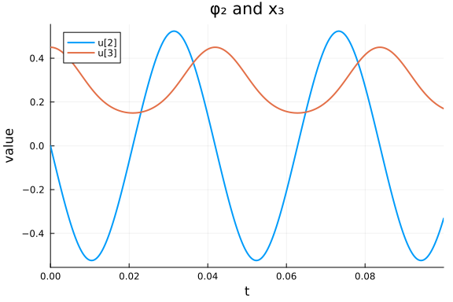
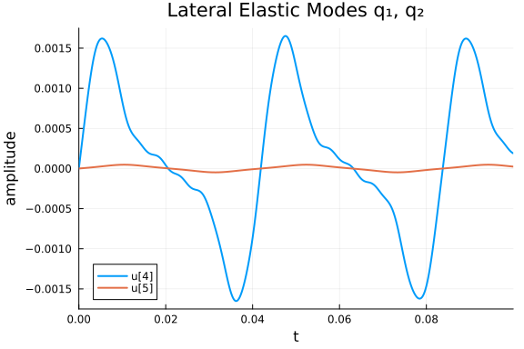
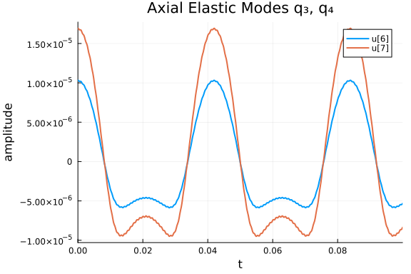
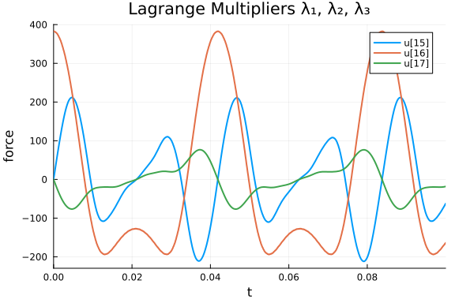
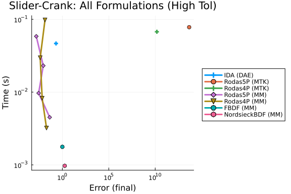
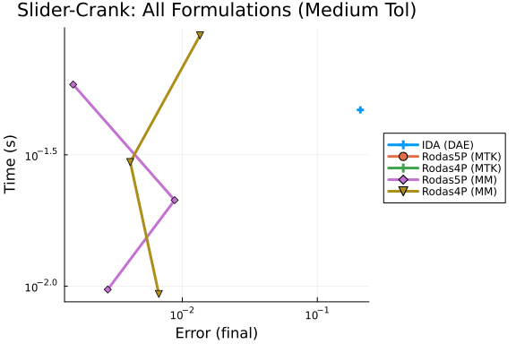
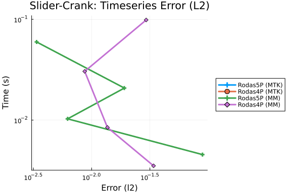
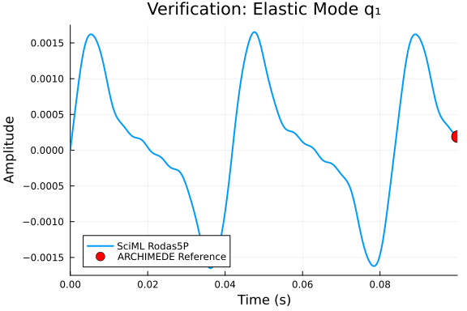

This is a benchmark of the Slider-Crank mechanism with elastic connecting rod,
an index-2 DAE of dimension 24 from the IVP Test Set (Simeon 1998, `crank.f`).

The system models a crank-rod-slider mechanism where the connecting rod is
treated as a flexible beam with 4 finite-element modes (2 lateral, 2 axial).
The crank angle is prescribed as φ₁(t) = Ωt with Ω = 150 rad/s.

**Variables (17 state variables):**
- 7 positions: φ₁, φ₂, x₃, q₁, q₂, q₃, q₄
- 7 velocities: v₁, v₂, vx₃, vq₁, vq₂, vq₃, vq₄
- 3 Lagrange multipliers: λ₁, λ₂, λ₃

We benchmark three formulations of this problem:

1. **DAE Residual Form:** `F(du, u, t) = M·du − f(u, t) = 0`, solved with dedicated
   DAE solvers (IDA from Sundials).
2. **MTK Index-Reduced ODE:** The system defined symbolically with position-level
   constraints, automatically index-reduced by `mtkcompile` to a 13-state ODE.
3. **Mass-Matrix ODE Form:** `M·du/dt = f(u, t)`, solved with ODE solvers that
   handle singular mass matrices (Rosenbrock-W methods, multistep BDF).

The mass matrix is frozen at t = 0, which limits achievable tolerance to around 1e-7.

Reference: Simeon, B.: Modelling a flexible slider crank mechanism by a mixed
system of DAEs and PDEs, Math. Modelling of Systems 2, 1-18 (1996).

```julia
using OrdinaryDiffEq, Sundials, DiffEqDevTools, ModelingToolkit, Plots
using OrdinaryDiffEqBDF
using OrdinaryDiffEqRosenbrock
using LinearAlgebra
using ModelingToolkit: t_nounits as t, D_nounits as D

# ── Physical Parameters (from crank.f) ──────────────────────────────

const M1    = 0.36
const M2    = 0.151104
const M3    = 0.075552
const L1    = 0.15
const L2    = 0.30
const J1    = 0.002727
const J2    = 0.0045339259
const PI_   = 3.1415927
const EE    = 0.20e12
const NUE   = 0.30
const BB    = 0.0080
const HH    = 0.0080
const RHO   = 7870.0
const GRAV  = 0.0
const OMEGA = 150.0

const NQ = 4
const NP = 7
const NL = 3
const KU = 4
const KV = 0

# ── FE Matrices (exact port of FIRST block in RESMBS) ───────────────

function initialize_fe_matrices()
    FACM = RHO * BB * HH * L2
    FACK = EE * BB * HH / L2
    FACB = BB * HH * L2

    MQ_ = zeros(NQ, NQ)
    MQ_[1,1] = FACM * 0.5
    MQ_[2,2] = FACM * 0.5
    MQ_[3,3] = FACM * 8.0
    MQ_[3,4] = FACM * 1.0
    MQ_[4,3] = FACM * 1.0
    MQ_[4,4] = FACM * 2.0

    KQ_ = zeros(NQ, NQ)
    KQ_[1,1] = FACK * PI_^4 / 24.0 * (HH/L2)^2
    KQ_[2,2] = FACK * PI_^4 * 2.0 / 3.0 * (HH/L2)^2
    KQ_[3,3] = FACK * 16.0 / 3.0
    KQ_[3,4] = -FACK * 8.0 / 3.0
    KQ_[4,3] = -FACK * 8.0 / 3.0
    KQ_[4,4] = FACK * 7.0 / 3.0

    BQ_ = zeros(NQ, NQ)
    BQ_[1,3] = -FACB * 16.0 / PI_^3
    BQ_[1,4] =  FACB * (8.0 / PI_^3 - 1.0 / PI_)
    BQ_[2,4] =  FACB * 0.5 / PI_
    BQ_[3,1] =  FACB * 16.0 / PI_^3
    BQ_[4,1] = -FACB * (8.0 / PI_^3 - 1.0 / PI_)
    BQ_[4,2] = -FACB * 0.5 / PI_

    DQ_ = zeros(NQ, NQ)

    c1_  = zeros(NQ);  c2_  = zeros(NQ)
    c12_ = zeros(NQ);  c21_ = zeros(NQ)

    c1_[3]  = FACB * 2.0 / 3.0
    c1_[4]  = FACB * 1.0 / 6.0
    c2_[1]  = FACB * 2.0 / PI_
    c12_[3] = L2 * FACB * 1.0 / 3.0
    c12_[4] = L2 * FACB * 1.0 / 6.0
    c21_[1] = L2 * FACB * 1.0 / PI_
    c21_[2] = -L2 * FACB * 0.5 / PI_

    return MQ_, KQ_, BQ_, DQ_, c1_, c2_, c12_, c21_
end

const MQ, KQ, BQ, DQ, c1, c2, c12, c21 = initialize_fe_matrices()
```

```
([0.075552 0.0 0.0 0.0; 0.0 0.075552 0.0 0.0; 0.0 0.0 1.208832 0.151104; 0.
0 0.0 0.151104 0.302208], [123144.33964567189 0.0 0.0 0.0; 0.0 1.9703094343
307503e6 0.0 0.0; 0.0 0.0 2.2755555555555558e8 -1.1377777777777779e8; 0.0 0
.0 -1.1377777777777779e8 9.955555555555557e7], [0.0 0.0 -9.90767093878593e-
6 -1.1577142550509449e-6; 0.0 0.0 0.0 3.055774862221955e-6; 9.9076709387859
3e-6 0.0 0.0 0.0; 1.1577142550509449e-6 -3.055774862221955e-6 0.0 0.0], [0.
0 0.0 0.0 0.0; 0.0 0.0 0.0 0.0; 0.0 0.0 0.0 0.0; 0.0 0.0 0.0 0.0], [0.0, 0.
0, 1.28e-5, 3.2e-6], [1.222309944888782e-5, 0.0, 0.0, 0.0], [0.0, 0.0, 1.92
e-6, 9.6e-7], [1.833464917333173e-6, -9.167324586665865e-7, 0.0, 0.0])
```


## Consistent Initial Conditions

The Fortran reference code (`init1` in `crank.f`) provides positions and
velocities. We ensure full consistency by:
1. Using init1 positions (which satisfy the position-level constraints).
2. Projecting init1 velocities onto the constraint manifold via minimum-norm correction.
3. Computing consistent accelerations and Lagrange multipliers by solving the
   augmented saddle-point system `[AM GP'; GP 0] * [w; λ] = [F; γ]`.

```julia
function build_GP(p1, p2, q)
    cosp1 = cos(p1); sinp1 = sin(p1)
    cosp2 = cos(p2); sinp2 = sin(p2)
    qku = (KU == 0) ? 0.0 : q[KU]
    qkv = (KV == 0) ? 0.0 : q[KV]
    GP = zeros(3, NP)
    GP[1,1] = L1 * cosp1
    GP[1,2] = L2 * cosp2 + qku * cosp2 - qkv * sinp2
    GP[2,1] = L1 * sinp1
    GP[2,2] = L2 * sinp2 + qku * sinp2 + qkv * cosp2
    GP[2,3] = 1.0
    GP[3,1] = 1.0
    if KU != 0
        GP[1, 3+KU] = sinp2
        GP[2, 3+KU] = -cosp2
    end
    return GP
end

function build_AM(p1, p2, q)
    cosp12 = cos(p1 - p2); sinp12 = sin(p1 - p2)
    c1Tq = dot(c1, q); c2Tq = dot(c2, q)
    c12Tq = dot(c12, q); qtmqq = dot(q, MQ * q)
    QtBQ = zeros(NQ)
    for i in 1:NQ
        QtBQ[i] = dot(q, @view BQ[:, i])
    end

    AM = zeros(NP, NP)
    AM[1,1] = J1 + M2 * L1^2
    AM[1,2] = 0.5 * L1 * L2 * M2 * cosp12 +
              RHO * L1 * (sinp12 * c2Tq + cosp12 * c1Tq)
    AM[2,2] = J2 + qtmqq + 2.0 * RHO * c12Tq
    AM[3,3] = M3
    for i in 1:NQ
        AM[1, 3+i] = RHO * L1 * (-sinp12 * c1[i] + cosp12 * c2[i])
        AM[2, 3+i] = RHO * c21[i] + RHO * QtBQ[i]
    end
    for i in 1:NQ, j in 1:i
        AM[3+j, 3+i] = MQ[j, i]
    end
    for i in 1:NP, j in i+1:NP
        AM[j, i] = AM[i, j]
    end
    return AM
end

function compute_force_vector(p1, p2, q, v1, v2, vq)
    cosp12 = cos(p1 - p2); sinp12 = sin(p1 - p2)
    cosp1 = cos(p1); sinp1 = sin(p1)
    cosp2 = cos(p2); sinp2 = sin(p2)
    c1Tq = dot(c1, q); c1Tqd = dot(c1, vq)
    c2Tq = dot(c2, q); c2Tqd = dot(c2, vq)
    c12Tqd = dot(c12, vq)
    MQq = MQ * q; KQq = KQ * q; DQqd = DQ * vq; BQqd = BQ * vq
    qdtmqq = dot(vq, MQq); qdtbqqd = dot(vq, BQqd)

    F = zeros(NP)
    F[1] = -0.5 * L1 * GRAV * (M1 + 2.0 * M2) * cosp1 -
            0.5 * L1 * L2 * M2 * v2^2 * sinp12
    F[2] = -0.5 * L2 * GRAV * M2 * cosp2 +
            0.5 * L1 * L2 * M2 * v1^2 * sinp12
    F[3] = 0.0
    F[1] += RHO * L1 * v2^2 * (-sinp12 * c1Tq + cosp12 * c2Tq) -
            2.0 * RHO * L1 * v2 * (cosp12 * c1Tqd + sinp12 * c2Tqd)
    F[2] += RHO * L1 * v1^2 * (sinp12 * c1Tq - cosp12 * c2Tq) -
            2.0 * RHO * v2 * c12Tqd - 2.0 * v2 * qdtmqq -
            RHO * qdtbqqd - RHO * GRAV * (cosp2 * c1Tq - sinp2 * c2Tq)
    for i in 1:NQ
        F[3+i] = v2^2 * MQq[i] +
            RHO * (v2^2 * c12[i] + L1 * v1^2 * (cosp12 * c1[i] + sinp12 * c2[i]) +
                   2.0 * v2 * BQqd[i]) -
            RHO * GRAV * (sinp2 * c1[i] + cosp2 * c2[i])
        F[3+i] -= KQq[i] + DQqd[i]
    end
    return F
end

function get_consistent_ic()
    # Step 1: Positions from init1 (satisfy position constraints)
    p1 = 0.0;  p2 = 0.0;  x3 = 0.450016933
    q = [0.0, 0.0, 0.103339863e-04, 0.169327969e-04]
    pos = [p1, p2, x3, q...]

    # Step 2: Project init1 velocities onto constraint manifold
    v_init1 = [150.0, -74.9957670, -0.268938672e-05,
               0.444896105, 0.463434311e-02,
               -0.178591076e-05, -0.268938672e-05]
    GP0 = build_GP(p1, p2, q)
    target = [0.0, 0.0, OMEGA]
    residual_v = GP0 * v_init1 - target
    v_fixed = v_init1 - GP0' * ((GP0 * GP0') \ residual_v)

    # Step 3: Compute accelerations and multipliers
    AM0 = build_AM(p1, p2, q)
    F0 = compute_force_vector(p1, p2, q, v_fixed[1], v_fixed[2], v_fixed[4:7])

    # dGP/dt * v via finite differences
    eps_fd = 1e-8
    pos_p = pos .+ eps_fd .* v_fixed
    GP_p = build_GP(pos_p[1], pos_p[2], pos_p[4:7])
    dGPdt_v = (GP_p - GP0) / eps_fd * v_fixed

    # Augmented saddle-point system: [AM GP'; GP 0] [w; λ] = [F; -dGP/dt*v]
    n = NP + NL
    Aug = zeros(n, n)
    Aug[1:NP, 1:NP] = AM0
    Aug[1:NP, NP+1:n] = GP0'
    Aug[NP+1:n, 1:NP] = GP0
    rhs = zeros(n)
    rhs[1:NP] = F0
    rhs[NP+1:n] = -dGPdt_v
    sol = Aug \ rhs
    w_0 = sol[1:NP]
    lam_0 = sol[NP+1:n]

    return pos, v_fixed, w_0, lam_0, AM0, GP0
end

pos0, vel0, w0, lam0, AM0, GP0 = get_consistent_ic()

# Verify constraints
g1 = L1 * sin(pos0[1]) + (L2 + pos0[7]) * sin(pos0[2])
g2 = pos0[3] - L1 * cos(pos0[1]) - (L2 + pos0[7]) * cos(pos0[2])
g3 = pos0[1]
println("Position constraints: ", [g1, g2, g3])
println("Velocity constraint norm: ", norm(GP0 * vel0 - [0, 0, OMEGA]))
```

```
Position constraints: [0.0, 2.0309998127743256e-10, 0.0]
Velocity constraint norm: 0.0
```


## Mass-Matrix ODE Formulation

The index-2 DAE is reformulated as a singular mass-matrix ODE with 17 state
variables `u = [p; v; λ]`. The mass matrix `M` has the structure:

```
M = [I   0   0 ]    du = [v            ]
    [0  AM   0 ]         [F - Gᵀλ      ]
    [0   0   0 ]         [G*v - r'(t)   ]
```

where `AM` is the 7×7 generalized mass matrix (frozen at t=0) and `G` is
the 3×7 constraint Jacobian (evaluated at current state).

```julia
function slider_crank_mm!(du, u, p, t)
    T = eltype(u)
    p1, p2, x3 = u[1], u[2], u[3]
    q  = @view u[4:7]
    v1, v2 = u[8], u[9]
    vq = @view u[11:14]
    lam1, lam2, lam3 = u[15], u[16], u[17]

    cosp1  = cos(p1);  sinp1  = sin(p1)
    cosp2  = cos(p2);  sinp2  = sin(p2)
    cosp12 = cos(p1 - p2);  sinp12 = sin(p1 - p2)

    qku = (KU == 0) ? zero(T) : q[KU]
    qkv = (KV == 0) ? zero(T) : q[KV]

    c1Tq   = dot(c1, q);    c1Tqd  = dot(c1, vq)
    c2Tq   = dot(c2, q);    c2Tqd  = dot(c2, vq)
    c12Tqd = dot(c12, vq)
    MQq  = MQ * q;   KQq  = KQ * q
    DQqd = DQ * vq;  BQqd = BQ * vq

    qtmqq   = dot(q, MQq)
    qdtmqq  = dot(vq, MQq)
    qdtbqqd = dot(vq, BQqd)

    QtBQ = zeros(T, NQ)
    for i in 1:NQ
        QtBQ[i] = dot(q, @view BQ[:, i])
    end

    # Constraint Jacobian GP (3×7) — evaluated at current state
    GP = zeros(T, 3, NP)
    GP[1,1] = L1 * cosp1
    GP[1,2] = L2 * cosp2 + qku * cosp2 - qkv * sinp2
    GP[2,1] = L1 * sinp1
    GP[2,2] = L2 * sinp2 + qku * sinp2 + qkv * cosp2
    GP[2,3] = one(T)
    GP[3,1] = one(T)
    if KU != 0
        GP[1, 3+KU] =  sinp2
        GP[2, 3+KU] = -cosp2
    end

    # Force vector F (7)
    F = zeros(T, NP)
    F[1] = -0.5 * L1 * GRAV * (M1 + 2.0 * M2) * cosp1 -
            0.5 * L1 * L2 * M2 * v2^2 * sinp12
    F[2] = -0.5 * L2 * GRAV * M2 * cosp2 +
            0.5 * L1 * L2 * M2 * v1^2 * sinp12
    F[3] = zero(T)

    F[1] += RHO * L1 * v2^2 * (-sinp12 * c1Tq + cosp12 * c2Tq) -
            2.0 * RHO * L1 * v2 * (cosp12 * c1Tqd + sinp12 * c2Tqd)
    F[2] += RHO * L1 * v1^2 * (sinp12 * c1Tq - cosp12 * c2Tq) -
            2.0 * RHO * v2 * c12Tqd - 2.0 * v2 * qdtmqq -
            RHO * qdtbqqd - RHO * GRAV * (cosp2 * c1Tq - sinp2 * c2Tq)

    for i in 1:NQ
        F[3+i] = v2^2 * MQq[i] +
            RHO * (v2^2 * c12[i] + L1 * v1^2 * (cosp12 * c1[i] + sinp12 * c2[i]) +
                   2.0 * v2 * BQqd[i]) -
            RHO * GRAV * (sinp2 * c1[i] + cosp2 * c2[i])
        F[3+i] -= KQq[i] + DQqd[i]
    end

    # Block 1 (rows 1:7): I * dp/dt = v
    for i in 1:7
        du[i] = u[7+i]
    end

    # Block 2 (rows 8:14): AM * dv/dt = F - Gᵀλ
    for i in 1:NP
        du[7+i] = F[i] - GP[1,i] * lam1 - GP[2,i] * lam2 - GP[3,i] * lam3
    end

    # Block 3 (rows 15:17): 0 * dλ/dt = G*v - r'(t)
    for k in 1:3
        vlc = zero(T)
        for i in 1:NP
            vlc += GP[k, i] * u[NP+i]
        end
        if k == 3
            vlc -= OMEGA
        end
        du[14+k] = vlc
    end
    nothing
end

function build_mass_matrix(AM)
    Mfull = zeros(17, 17)
    for i in 1:7
        Mfull[i, i] = 1.0        # identity block for dp/dt = v
    end
    Mfull[8:14, 8:14] .= AM      # AM block for dv/dt equations
    # rows 15:17 are zero → algebraic (velocity constraints)
    return Mfull
end

u0_mm = vcat(pos0, vel0, lam0)
M_mm = build_mass_matrix(AM0)
mmf = ODEFunction(slider_crank_mm!, mass_matrix = M_mm)
tspan = (0.0, 0.1)
prob_mm = ODEProblem(mmf, u0_mm, tspan)
```

```
ODEProblem with uType Vector{Float64} and tType Float64. In-place: true
Non-trivial mass matrix: true
timespan: (0.0, 0.1)
u0: 17-element Vector{Float64}:
   0.0
   0.0
   0.450016933
   0.0
   0.0
   1.03339863e-5
   1.69327969e-5
 150.0
 -74.99576703969453
  -2.68938672e-6
   0.444896105
   0.00463434311
  -1.78591076e-6
  -2.68938672e-6
  -2.303851027879405e-5
 382.45895095266985
  -6.339193797155536e-7
```


## DAE Residual Form

The same system can be written as a DAE residual `F(du, u, t) = M·du − f(u, t) = 0`,
where `M` is the mass matrix and `f` is the right-hand side from the ODE form.
This enables testing DAE-specific solvers like IDA (Sundials) and comparing
how formulation choice affects solver performance.

```julia
function slider_crank_dae!(res, du, u, p, t)
    f = similar(u)
    slider_crank_mm!(f, u, p, t)
    res .= M_mm * du - f
    nothing
end

du0_dae = vcat(vel0, w0, zeros(3))
differential_vars = [trues(14); falses(3)]
prob_dae = DAEProblem(slider_crank_dae!, du0_dae, u0_mm, tspan,
                      differential_vars = differential_vars)

# Verify DAE consistency at initial conditions
f_check = similar(u0_mm)
slider_crank_mm!(f_check, u0_mm, nothing, 0.0)
println("DAE residual norm at IC: ", norm(M_mm * du0_dae - f_check))
```

```
DAE residual norm at IC: 6.940448042111208e-15
```


## MTK Index-Reduced Formulation

ModelingToolkit can automatically reduce the DAE index via `mtkcompile`.
We define the full system symbolically — with the 7 kinematic equations,
7 dynamics equations (involving the configuration-dependent mass matrix), and
the 3 position-level holonomic constraints — and let MTK differentiate and
eliminate the Lagrange multipliers, producing a 13-state ODE.

```julia
@variables begin
    φ1(t) = pos0[1]
    φ2(t) = pos0[2]
    x₃(t) = pos0[3]
    q₁(t) = pos0[4]
    q₂(t) = pos0[5]
    q₃(t) = pos0[6]
    q₄(t) = pos0[7]
    vφ1(t) = vel0[1]
    vφ2(t) = vel0[2]
    vx₃(t) = vel0[3]
    vq₁(t) = vel0[4]
    vq₂(t) = vel0[5]
    vq₃(t) = vel0[6]
    vq₄(t) = vel0[7]
    λ₁(t) = lam0[1]
    λ₂(t) = lam0[2]
    λ₃(t) = lam0[3]
end

pvec = [φ1, φ2, x₃, q₁, q₂, q₃, q₄]
vvec = [vφ1, vφ2, vx₃, vq₁, vq₂, vq₃, vq₄]
qvec = [q₁, q₂, q₃, q₄]
vqvec = [vq₁, vq₂, vq₃, vq₄]
λvec = [λ₁, λ₂, λ₃]

# Symbolic trigonometric quantities
sφ1 = sin(φ1); cφ1 = cos(φ1)
sφ2 = sin(φ2); cφ2 = cos(φ2)
sφ12 = sin(φ1 - φ2); cφ12 = cos(φ1 - φ2)

# Dot products with FE vectors (Float64 constants × symbolic variables)
c1q = sum(c1 .* qvec); c2q = sum(c2 .* qvec); c12q = sum(c12 .* qvec)
c1vq = sum(c1 .* vqvec); c2vq = sum(c2 .* vqvec); c12vq = sum(c12 .* vqvec)

# Matrix-vector products (Float64 FE matrices × symbolic vectors)
MQq_s = MQ * qvec; KQq_s = KQ * qvec
DQvq_s = DQ * vqvec; BQvq_s = BQ * vqvec

# Quadratic forms
qMQq_s = sum(qvec .* MQq_s)
vqMQq_s = sum(vqvec .* MQq_s)
vqBQvq_s = sum(vqvec .* BQvq_s)
QBQ_s = [sum(qvec .* BQ[:,i]) for i in 1:NQ]

# AM(φ,q) × D(v) — configuration-dependent mass matrix × acceleration
am_dv = [
    (J1 + M2*L1^2)*D(vφ1) +
        (0.5*L1*L2*M2*cφ12 + RHO*L1*(sφ12*c2q + cφ12*c1q))*D(vφ2) +
        sum(RHO*L1*(-sφ12*c1[i] + cφ12*c2[i])*D(vqvec[i]) for i in 1:NQ),
    (0.5*L1*L2*M2*cφ12 + RHO*L1*(sφ12*c2q + cφ12*c1q))*D(vφ1) +
        (J2 + qMQq_s + 2*RHO*c12q)*D(vφ2) +
        sum((RHO*c21[i] + RHO*QBQ_s[i])*D(vqvec[i]) for i in 1:NQ),
    M3*D(vx₃),
    [RHO*L1*(-sφ12*c1[k] + cφ12*c2[k])*D(vφ1) +
        (RHO*c21[k] + RHO*QBQ_s[k])*D(vφ2) +
        sum(MQ[k,j]*D(vqvec[j]) for j in 1:NQ)
        for k in 1:NQ]...
]

# Force vector F(φ,v,q,vq)
F_s = [
    -0.5*L1*GRAV*(M1+2*M2)*cφ1 - 0.5*L1*L2*M2*vφ2^2*sφ12 +
        RHO*L1*vφ2^2*(-sφ12*c1q + cφ12*c2q) -
        2*RHO*L1*vφ2*(cφ12*c1vq + sφ12*c2vq),
    -0.5*L2*GRAV*M2*cφ2 + 0.5*L1*L2*M2*vφ1^2*sφ12 +
        RHO*L1*vφ1^2*(sφ12*c1q - cφ12*c2q) -
        2*RHO*vφ2*c12vq - 2*vφ2*vqMQq_s - RHO*vqBQvq_s -
        RHO*GRAV*(cφ2*c1q - sφ2*c2q),
    0,
    [vφ2^2*MQq_s[i] + RHO*(vφ2^2*c12[i] +
        L1*vφ1^2*(cφ12*c1[i] + sφ12*c2[i]) + 2*vφ2*BQvq_s[i]) -
        RHO*GRAV*(sφ2*c1[i] + cφ2*c2[i]) - KQq_s[i] - DQvq_s[i]
        for i in 1:NQ]...
]

# Constraint Jacobian GP(φ,q) and GP' × λ
GP_rows = [
    [L1*cφ1, (L2+q₄)*cφ2, 0, 0, 0, 0, sφ2],
    [L1*sφ1, (L2+q₄)*sφ2, 1, 0, 0, 0, -cφ2],
    [1,      0,            0, 0, 0, 0, 0     ]
]
GPt_λ = [sum(GP_rows[k][i]*λvec[k] for k in 1:3) for i in 1:NP]

# 17 equations: 7 kinematic + 7 dynamics + 3 holonomic constraints
eqs = vcat(
    [D(pvec[i]) ~ vvec[i] for i in 1:NP],
    [am_dv[i] ~ F_s[i] - GPt_λ[i] for i in 1:NP],
    [0 ~ L1*sφ1 + (L2 + q₄)*sφ2,
     0 ~ x₃ - L1*cφ1 - (L2 + q₄)*cφ2,
     0 ~ φ1 - OMEGA*t]
)

@mtkcompile sys = System(eqs, t)
prob_mtk = ODEProblem(sys, [], tspan; warn_initialize_determined = false)
println("MTK index-reduced: $(length(ModelingToolkit.unknowns(sys))) states ",
        "(from 17 original)")
```

```
MTK index-reduced: 13 states (from 17 original)
```


## Reference Solution

We compute a high-accuracy reference solution using Rodas5P at moderate
tolerance. The frozen mass matrix limits how tight we can push tolerances
before instability sets in, so `reltol = abstol = 1e-6` provides the best
balance of accuracy and stability for this problem.

```julia
ref_sol = solve(prob_mm, Rodas5P(), reltol = 1e-6, abstol = 1e-6,
                maxiters = 10_000_000);
println("Reference solution: retcode = $(ref_sol.retcode), ",
        "npoints = $(length(ref_sol.t)), t_final = $(ref_sol.t[end])")

mtk_ref = solve(prob_mtk, Rodas5P(), reltol = 1e-5, abstol = 1e-5,
                maxiters = 10_000_000);
println("MTK reference: retcode = $(mtk_ref.retcode), ",
        "npoints = $(length(mtk_ref.t)), t_final = $(mtk_ref.t[end])")
```

```
Reference solution: retcode = Success, npoints = 11196, t_final = 0.1
MTK reference: retcode = InitialFailure, npoints = 1, t_final = 0.0
```


```julia
plot(ref_sol, idxs = [2, 3], title = "φ₂ and x₃",
     xlabel = "t", ylabel = "value", lw = 2)
```



```julia
plot(ref_sol, idxs = [4, 5], title = "Lateral Elastic Modes q₁, q₂",
     xlabel = "t", ylabel = "amplitude", lw = 2)
```



```julia
plot(ref_sol, idxs = [6, 7], title = "Axial Elastic Modes q₃, q₄",
     xlabel = "t", ylabel = "amplitude", lw = 2)
```



```julia
plot(ref_sol, idxs = [15, 16, 17], title = "Lagrange Multipliers λ₁, λ₂, λ₃",
     xlabel = "t", ylabel = "force", lw = 2)
```




## DAE vs Mass-Matrix: Solver Performance

A key question for this benchmark is how problem formulation affects solver
performance. We test DAE-specific solvers on the residual form.

```julia
println("=== DAE Solver Results ===")
println("Testing IDA (Sundials) on DAE residual form:")
try
    dae_sol = solve(prob_dae, IDA(), reltol = 1e-4, abstol = 1e-4)
    println("  IDA result: retcode = $(dae_sol.retcode), t_final = $(dae_sol.t[end])")
catch e
    println("  IDA failed: $(typeof(e))")
end

println("\nTesting IDA with modified initialization:")
try
    dae_sol2 = solve(prob_dae, IDA(init_all = false), reltol = 1e-4, abstol = 1e-4)
    println("  IDA (init_all=false): retcode = $(dae_sol2.retcode), t_final = $(dae_sol2.t[end])")
catch e
    println("  IDA (init_all=false) failed: $(typeof(e))")
end
```

```
=== DAE Solver Results ===
Testing IDA (Sundials) on DAE residual form:
  IDA result: retcode = Unstable, t_final = 0.0002465164025475332

Testing IDA with modified initialization:
  IDA (init_all=false): retcode = Unstable, t_final = 0.0002465164025475332
```


IDA fails with `ConvergenceFailure` at the first step on this problem, even with
fully consistent initial conditions (DAE residual norm ≈ 7×10⁻²¹). The extreme
stiffness from the elastic modulus (E = 2×10¹¹ Pa) causes the Newton solver
to diverge, with step size collapsing to h ≈ 10⁻¹⁷. DASKR and DASSL exhibit
the same failure mode.

This demonstrates that **formulation choice critically affects solver performance**
for this problem: the mass-matrix ODE form avoids DAE solver difficulties by
letting Rosenbrock-W methods handle the algebraic constraints through the
singular mass matrix structure.

## Work-Precision Diagrams

We compare solvers across all three formulations using `WorkPrecisionSet` with
`prob_choice` to overlay DAE, MTK, and mass-matrix results on the same plot.
IDA operates on the DAE residual form, the MTK index-reduced form is solved
with Rosenbrock-W methods, and the mass-matrix ODE form uses Rosenbrock-W
and BDF methods. The tolerance range is limited by the frozen mass matrix
(instability above ~1e-7). The MTK form's overdetermined initialization
system limits it to tolerances above ~1e-5.

```julia
probs = [prob_dae, prob_mtk, prob_mm]
refs  = [ref_sol, mtk_ref, ref_sol]
```

```
3-element Vector{SciMLBase.ODESolution{Float64, 2, Vector{Vector{Float64}},
 Nothing, Nothing, Vector{Float64}, Vector{Vector{Vector{Float64}}}, Nothin
g, P, OrdinaryDiffEqRosenbrock.Rodas5P{ADTypes.AutoForwardDiff{1, ForwardDi
ff.Tag{DiffEqBase.OrdinaryDiffEqTag, Float64}}, Nothing, typeof(OrdinaryDif
fEqCore.trivial_limiter!), typeof(OrdinaryDiffEqCore.trivial_limiter!), Not
hing}, IType, SciMLBase.DEStats, Nothing, Nothing, Nothing, Nothing} where
{P, IType}}:
 [0.0 0.00014999999999999985 … 14.99961175482407 15.000000000001508; 0.0 -7
.499576682940684e-5 … -0.3313294347471433 -0.3311735023237591; … ; 382.4589
5095266985 382.4589986509088 … -163.82193199934335 -163.76819325174552; -6.
339193797155536e-7 -0.026944176333759135 … -18.216330485845123 -18.21047111
733883]
 [-4.131464778714915e-8; -1.78591076e-6; … ; 0.2098336684640728; -0.0015766
154957556275;;]
 [0.0 0.00014999999999999985 … 14.99961175482407 15.000000000001508; 0.0 -7
.499576682940684e-5 … -0.3313294347471433 -0.3311735023237591; … ; 382.4589
5095266985 382.4589986509088 … -163.82193199934335 -163.76819325174552; -6.
339193797155536e-7 -0.026944176333759135 … -18.216330485845123 -18.21047111
733883]
```


### High Tolerances

```julia
abstols = 1.0 ./ 10.0 .^ (4:7)
reltols = 1.0 ./ 10.0 .^ (1:4)
setups = [
    Dict(:prob_choice => 1, :alg => IDA()),
    Dict(:prob_choice => 2, :alg => Rodas5P()),
    Dict(:prob_choice => 2, :alg => Rodas4P()),
    Dict(:prob_choice => 3, :alg => Rodas5P()),
    Dict(:prob_choice => 3, :alg => Rodas4P()),
    Dict(:prob_choice => 3, :alg => FBDF()),
    Dict(:prob_choice => 3, :alg => NordsieckBDF()),
]
labels = ["IDA (DAE)" "Rodas5P (MTK)" "Rodas4P (MTK)" "Rodas5P (MM)" "Rodas4P (MM)" "FBDF (MM)" "NordsieckBDF (MM)"]

wp = WorkPrecisionSet(probs, abstols, reltols, setups;
    names = labels, appxsol = refs, save_everystep = false,
    maxiters = Int(1e6), numruns = 5)
plot(wp, title = "Slider-Crank: All Formulations (High Tol)")
```




### Medium Tolerances

```julia
abstols = 1.0 ./ 10.0 .^ (5:7)
reltols = 1.0 ./ 10.0 .^ (2:4)
setups = [
    Dict(:prob_choice => 1, :alg => IDA()),
    Dict(:prob_choice => 2, :alg => Rodas5P()),
    Dict(:prob_choice => 2, :alg => Rodas4P()),
    Dict(:prob_choice => 3, :alg => Rodas5P()),
    Dict(:prob_choice => 3, :alg => Rodas4P()),
]
labels = ["IDA (DAE)" "Rodas5P (MTK)" "Rodas4P (MTK)" "Rodas5P (MM)" "Rodas4P (MM)"]

wp = WorkPrecisionSet(probs, abstols, reltols, setups;
    names = labels, appxsol = refs, save_everystep = false,
    maxiters = Int(1e6), numruns = 5)
plot(wp, title = "Slider-Crank: All Formulations (Medium Tol)")
```




### Timeseries Errors (L2)

```julia
abstols = 1.0 ./ 10.0 .^ (4:7)
reltols = 1.0 ./ 10.0 .^ (1:4)
setups = [
    Dict(:prob_choice => 2, :alg => Rodas5P()),
    Dict(:prob_choice => 2, :alg => Rodas4P()),
    Dict(:prob_choice => 3, :alg => Rodas5P()),
    Dict(:prob_choice => 3, :alg => Rodas4P()),
]
labels = ["Rodas5P (MTK)" "Rodas4P (MTK)" "Rodas5P (MM)" "Rodas4P (MM)"]

wp = WorkPrecisionSet(probs, abstols, reltols, setups;
    names = labels, appxsol = refs, save_everystep = false,
    maxiters = Int(1e6), numruns = 5, error_estimate = :l2)
plot(wp, title = "Slider-Crank: Timeseries Error (L2)")
```




## Verification against ARCHIMEDE Reference

The IVP Test Set (`crank.f`, `solut` subroutine) provides reference values at
t = 0.1. We verify our solution reproduces these values.

```julia
archimede_refs = Dict(
    "φ₂"  => -0.331173498825626,
    "x₃"  =>  0.169737332842786,
    "q₁"  =>  0.1893192899613509e-3,
    "q₂"  =>  0.2375751249879174e-4,
    "q₃"  => -0.5323896770569702e-5,
    "q₄"  => -0.8363313279112129e-5,
    "λ₁"  => -62.32935833287916,
    "λ₂"  => -163.7920993367306,
    "λ₃"  =>  25.29857947066878,
)

# Mass-matrix form indices: [p(1:7), v(8:14), λ(15:17)]
idxmap = [("φ₂", 2), ("x₃", 3), ("q₁", 4), ("q₂", 5), ("q₃", 6), ("q₄", 7),
          ("λ₁", 15), ("λ₂", 16), ("λ₃", 17)]

sol_final = ref_sol.u[end]
println("=== Verification at t = 0.1 ===")
println("Variable    | ARCHIMEDE Reference  | Our Solution         | Rel Error")
println("-"^75)
for (name, idx) in idxmap
    ref_val = archimede_refs[name]
    our_val = sol_final[idx]
    relerr = abs(ref_val) > 0 ? abs((our_val - ref_val) / ref_val) : abs(our_val)
    status = relerr < 1e-3 ? "✓" : (relerr < 1e-1 ? "~" : "✗")
    println("$(rpad(name, 12))| $(lpad(string(ref_val), 21)) | $(lpad(string(round(our_val, sigdigits=10)), 21)) | $(relerr) $status")
end

# Overlay ARCHIMEDE reference point on q₁ timeseries
p_verify = plot(ref_sol, idxs = [4], title = "Verification: Elastic Mode q₁",
    xlabel = "Time (s)", ylabel = "Amplitude", lw = 2, label = "SciML Rodas5P")
scatter!(p_verify, [0.1], [0.1893192899613509e-3],
    label = "ARCHIMEDE Reference", color = :red, markersize = 8)
plot(p_verify)
```

```
=== Verification at t = 0.1 ===
Variable    | ARCHIMEDE Reference  | Our Solution         | Rel Error
---------------------------------------------------------------------------
φ₂          |    -0.331173498825626 |         -0.3311735023 | 1.05628411494
33932e-8 ✓
x₃          |     0.169737332842786 |          0.1697373296 | 1.90155525696
70906e-8 ✓
q₁          | 0.0001893192899613509 |       0.0001892426889 | 0.00040461283
26328589 ✓
q₂          |  2.375751249879174e-5 |        2.375891525e-5 | 5.90444570085
4713e-5 ✓
q₃          | -5.323896770569702e-6 |       -5.327102158e-6 | 0.00060207534
4585219 ✓
q₄          | -8.363313279112129e-6 |       -8.366365691e-6 | 0.00036497641
563832734 ✓
λ₁          |    -62.32935833287916 |          -62.33911407 | 0.00015651921
053547817 ✓
λ₂          |    -163.7920993367306 |          -163.7681933 | 0.00014595383
465917065 ✓
λ₃          |     25.29857947066878 |          -18.21047112 | 1.71982188321
88614 ✗
```





## Appendix

These benchmarks are a part of the SciMLBenchmarks.jl repository, found at: [https://github.com/SciML/SciMLBenchmarks.jl](https://github.com/SciML/SciMLBenchmarks.jl). For more information on high-performance scientific machine learning, check out the SciML Open Source Software Organization [https://sciml.ai](https://sciml.ai).

To locally run this benchmark, do the following commands:

```
using SciMLBenchmarks
SciMLBenchmarks.weave_file("benchmarks/DAE","slider_crank.jmd")
```

Computer Information:

```
Julia Version 1.11.9
Commit 53a02c0720c (2026-02-06 00:27 UTC)
Build Info:
  Official https://julialang.org/ release
Platform Info:
  OS: Linux (x86_64-linux-gnu)
  CPU: 128 × AMD EPYC 7502 32-Core Processor
  WORD_SIZE: 64
  LLVM: libLLVM-16.0.6 (ORCJIT, znver2)
Threads: 128 default, 0 interactive, 64 GC (on 128 virtual cores)
Environment:
  JULIA_PKG_PRECOMPILE_AUTO = 0
  JULIA_NUM_THREADS = auto

```

Package Information:

```
Status `~/sandbox/tmp_20260825_180339_53321/dae-pr1670-validate/benchmarks/DAE/Project.toml`
⌃ [165a45c3] DASKR v3.1.5
⌃ [e993076c] DASSL v3.1.0
⌃ [f3b72e0c] DiffEqDevTools v3.2.0
⌃ [961ee093] ModelingToolkit v11.39.0
⌅ [09606e27] ODEInterfaceDiffEq v4.1.0
⌃ [1dea7af3] OrdinaryDiffEq v7.6.0
⌃ [6ad6398a] OrdinaryDiffEqBDF v2.4.2
⌃ [5960d6e9] OrdinaryDiffEqFIRK v2.6.0
⌃ [43230ef6] OrdinaryDiffEqRosenbrock v2.6.5
⌃ [2d112036] OrdinaryDiffEqSDIRK v2.8.2
⌃ [91a5bcdd] Plots v1.41.6
⌃ [31c91b34] SciMLBenchmarks v0.1.3
⌃ [90137ffa] StaticArrays v1.9.18
⌃ [10745b16] Statistics v1.11.1
⌃ [c3572dad] Sundials v6.5.1
⌃ [0c5d862f] Symbolics v7.36.0
Info Packages marked with ⌃ and ⌅ have new versions available. Those with ⌃ may be upgradable, but those with ⌅ are restricted by compatibility constraints from upgrading. To see why use `status --outdated`
```

And the full manifest:

```
Status `~/sandbox/tmp_20260825_180339_53321/dae-pr1670-validate/benchmarks/DAE/Manifest.toml`
⌃ [47edcb42] ADTypes v1.23.0
  [14f7f29c] AMD v0.5.3
  [6e696c72] AbstractPlutoDingetjes v1.4.0
  [1520ce14] AbstractTrees v0.4.5
  [7d9f7c33] Accessors v0.1.45
  [79e6a3ab] Adapt v4.7.0
  [66dad0bd] AliasTables v1.1.3
  [ec485272] ArnoldiMethod v0.4.0
⌃ [4fba245c] ArrayInterface v7.28.1
  [4c555306] ArrayLayouts v1.12.2
⌃ [aae01518] BandedMatrices v1.11.0
  [e2ed5e7c] Bijections v0.2.2
⌃ [b2a6c25c] BinaryHeaps v1.0.4
⌃ [caf10ac8] BipartiteGraphs v0.1.11
  [d1d4a3ce] BitFlags v0.1.10
  [62783981] BitTwiddlingConvenienceFunctions v0.1.6
  [8e7c35d0] BlockArrays v1.10.0
⌃ [70df07ce] BracketingNonlinearSolve v1.12.5
  [fa961155] CEnum v0.5.0
  [2a0fbf3d] CPUSummary v0.2.7
  [fb6a15b2] CloseOpenIntervals v0.1.13
⌃ [944b1d66] CodecZlib v0.7.8
  [35d6a980] ColorSchemes v3.31.0
  [3da002f7] ColorTypes v0.12.1
  [c3611d14] ColorVectorSpace v0.11.0
  [5ae59095] Colors v0.13.1
⌅ [861a8166] Combinatorics v1.0.2
⌃ [38540f10] CommonSolve v0.2.13
  [bbf7d656] CommonSubexpressions v0.3.1
⌃ [f70d9fcc] CommonWorldInvalidations v1.1.2
  [34da2185] Compat v4.18.1
  [b152e2b5] CompositeTypes v0.1.4
  [a33af91c] CompositionsBase v0.1.2
⌃ [2569d6c7] ConcreteStructs v0.2.7
  [f0e56b4a] ConcurrentUtilities v2.6.0
  [8f4d0f93] Conda v1.10.3
  [187b0558] ConstructionBase v1.6.0
  [d38c429a] Contour v0.6.3
  [adafc99b] CpuId v0.3.1
  [a8cc5b0e] Crayons v4.2.0
⌃ [165a45c3] DASKR v3.1.5
⌃ [e993076c] DASSL v3.1.0
  [9a962f9c] DataAPI v1.16.0
  [864edb3b] DataStructures v0.19.6
  [e2d170a0] DataValueInterfaces v1.0.0
  [8bb1440f] DelimitedFiles v1.9.1
⌃ [2b5f629d] DiffEqBase v7.14.0
⌃ [459566f4] DiffEqCallbacks v4.19.2
⌃ [f3b72e0c] DiffEqDevTools v3.2.0
⌃ [77a26b50] DiffEqNoiseProcess v5.34.1
  [163ba53b] DiffResults v1.1.0
  [b552c78f] DiffRules v1.16.0
⌃ [a0c0ee7d] DifferentiationInterface v0.7.20
⌃ [31c24e10] Distributions v0.25.130
  [ffbed154] DocStringExtensions v0.9.5
  [5b8099bc] DomainSets v0.8.1
⌃ [7c1d4256] DynamicPolynomials v0.6.6
  [4e289a0a] EnumX v1.0.7
  [f151be2c] EnzymeCore v0.8.21
  [460bff9d] ExceptionUnwrapping v0.1.11
  [e2ba6199] ExprTools v0.1.11
  [55351af7] ExproniconLite v0.10.14
  [c87230d0] FFMPEG v0.4.5
⌃ [7034ab61] FastBroadcast v1.3.6
  [9aa1b823] FastClosures v0.3.2
  [442a2c76] FastGaussQuadrature v1.3.0
⌃ [a4df4552] FastPower v1.4.1
  [1a297f60] FillArrays v1.17.0
  [64ca27bc] FindFirstFunctions v3.2.1
  [6a86dc24] FiniteDiff v2.33.0
⌅ [53c48c17] FixedPointNumbers v0.8.6
  [1fa38f19] Format v1.3.7
  [f6369f11] ForwardDiff v1.4.5
  [a85aefff] FunctionMaps v0.1.2
  [069b7b12] FunctionWrappers v1.1.3
⌃ [77dc65aa] FunctionWrappersWrappers v1.12.1
  [46192b85] GPUArraysCore v0.2.0
⌃ [28b8d3ca] GR v0.73.26
  [a0844989] Gamma v1.2.0
  [d7ba0133] Git v1.5.0
  [86223c79] Graphs v1.14.0
  [42e2da0e] Grisu v1.0.2
⌅ [cd3eb016] HTTP v1.11.0
⌅ [eafb193a] Highlights v0.5.3
  [34004b35] HypergeometricFunctions v0.3.30
  [7073ff75] IJulia v1.34.4
  [615f187c] IfElse v0.1.1
⌃ [3263718b] ImplicitDiscreteSolve v2.1.5
  [d25df0c9] Inflate v0.1.5
  [18e54dd8] IntegerMathUtils v0.1.4
  [8197267c] IntervalSets v0.7.14
  [3587e190] InverseFunctions v0.1.17
  [92d709cd] IrrationalConstants v0.2.6
  [82899510] IteratorInterfaceExtensions v1.0.0
  [1019f520] JLFzf v0.1.11
  [692b3bcd] JLLWrappers v1.8.0
⌅ [682c06a0] JSON v0.21.4
  [ae98c720] Jieko v0.2.1
⌃ [ccbc3e58] JumpProcesses v9.29.2
  [ba0b0d4f] Krylov v0.10.9
⌃ [b964fa9f] LaTeXStrings v1.4.0
⌃ [23fbe1c1] Latexify v0.16.11
  [10f19ff3] LayoutPointers v0.1.17
⌃ [87fe0de2] LineSearch v0.1.14
⌃ [7ed4a6bd] LinearSolve v5.10.0
  [2ab3a3ac] LogExpFunctions v1.0.1
  [e6f89c97] LoggingExtras v1.2.0
  [1914dd2f] MacroTools v0.5.16
  [d125e4d3] ManualMemory v0.1.8
⌃ [bb5d69b7] MaybeInplace v0.1.7
  [739be429] MbedTLS v1.1.10
  [442fdcdd] Measures v0.3.3
  [e1d29d7a] Missings v1.2.0
⌃ [961ee093] ModelingToolkit v11.39.0
⌃ [7771a370] ModelingToolkitBase v1.65.0
⌃ [6bb917b9] ModelingToolkitTearing v1.20.5
  [2e0e35c7] Moshi v0.3.12
  [46d2c3a1] MuladdMacro v0.2.7
  [102ac46a] MultivariatePolynomials v0.5.19
  [ffc61752] Mustache v1.0.21
  [d8a4904e] MutableArithmetics v1.8.0
  [77ba4419] NaNMath v1.1.4
⌃ [8913a72c] NonlinearSolve v4.26.1
⌃ [be0214bd] NonlinearSolveBase v2.43.0
⌃ [5959db7a] NonlinearSolveFirstOrder v2.3.2
⌃ [9a2c21bd] NonlinearSolveQuasiNewton v1.15.1
⌃ [26075421] NonlinearSolveSpectralMethods v1.8.0
  [54ca160b] ODEInterface v0.5.2
⌅ [09606e27] ODEInterfaceDiffEq v4.1.0
  [6fe1bfb0] OffsetArrays v1.17.0
  [4d8831e6] OpenSSL v1.6.1
⌅ [bac558e1] OrderedCollections v1.8.2
⌃ [1dea7af3] OrdinaryDiffEq v7.6.0
⌃ [6ad6398a] OrdinaryDiffEqBDF v2.4.2
⌃ [bbf590c4] OrdinaryDiffEqCore v4.14.3
⌃ [50262376] OrdinaryDiffEqDefault v2.4.4
⌃ [4302a76b] OrdinaryDiffEqDifferentiation v3.9.0
⌃ [5960d6e9] OrdinaryDiffEqFIRK v2.6.0
⌃ [127b3ac7] OrdinaryDiffEqNonlinearSolve v2.8.0
⌃ [43230ef6] OrdinaryDiffEqRosenbrock v2.6.5
⌃ [b4bd8bb3] OrdinaryDiffEqRosenbrockTableaus v2.4.1
⌃ [2d112036] OrdinaryDiffEqSDIRK v2.8.2
⌃ [b1df2697] OrdinaryDiffEqTsit5 v2.1.3
⌃ [79d7bb75] OrdinaryDiffEqVerner v2.2.2
  [90014a1f] PDMats v0.11.41
⌅ [69de0a69] Parsers v2.8.7
  [ccf2f8ad] PlotThemes v3.3.0
  [995b91a9] PlotUtils v1.4.4
⌃ [91a5bcdd] Plots v1.41.6
  [e409e4f3] PoissonRandom v0.4.13
  [f517fe37] Polyester v0.7.19
  [1d0040c9] PolyesterWeave v0.2.2
⌃ [d236fae5] PreallocationTools v1.5.0
⌅ [aea7be01] PrecompileTools v1.2.1
  [21216c6a] Preferences v1.5.2
⌃ [08abe8d2] PrettyTables v3.4.6
  [27ebfcd6] Primes v0.5.7
  [43287f4e] PtrArrays v1.4.0
  [0c0d3e7f] PureKLU v1.4.1
  [1fd47b50] QuadGK v2.11.3
  [988b38a3] ReadOnlyArrays v0.2.0
  [795d4caa] ReadOnlyDicts v1.0.1
  [3cdcf5f2] RecipesBase v1.3.4
  [01d81517] RecipesPipeline v0.6.12
⌃ [731186ca] RecursiveArrayTools v4.4.0
  [189a3867] Reexport v1.2.2
  [05181044] RelocatableFolders v1.0.1
  [ae029012] Requires v1.3.1
⌃ [ae5879a3] ResettableStacks v1.3.0
⌃ [9fe22ead] RespecializeParams v1.2.0
  [79098fc4] Rmath v0.9.0
⌃ [47965b36] RootedTrees v2.25.4
⌃ [f2b01f46] Roots v3.0.6
⌃ [7e49a35a] RuntimeGeneratedFunctions v0.5.24
⌃ [9dfe8606] SCCNonlinearSolve v1.14.1
  [94e857df] SIMDTypes v0.1.0
⌅ [0bca4576] SciMLBase v3.46.1
⌃ [31c91b34] SciMLBenchmarks v0.1.3
⌃ [19f34311] SciMLJacobianOperators v0.1.17
⌃ [a6db7da4] SciMLLogging v2.0.4
⌃ [c0aeaf25] SciMLOperators v1.26.1
⌃ [431bcebd] SciMLPublic v1.2.4
⌃ [53ae85a6] SciMLStructures v1.10.4
  [6c6a2e73] Scratch v1.3.0
  [efcf1570] Setfield v1.1.2
  [992d4aef] Showoff v1.0.3
  [777ac1f9] SimpleBufferStream v1.2.0
⌃ [727e6d20] SimpleNonlinearSolve v2.14.0
  [699a6c99] SimpleTraits v0.9.6
  [a2af1166] SortingAlgorithms v1.2.3
⌃ [a57abbd0] SparseColumnPivotedQR v2.1.6
  [0a514795] SparseMatrixColorings v0.4.27
⌃ [276daf66] SpecialFunctions v2.8.3
  [860ef19b] StableRNGs v1.0.4
  [0c0c59c1] StarAlgebras v0.3.0
⌃ [64909d44] StateSelection v1.11.0
  [aedffcd0] Static v1.4.6
  [0d7ed370] StaticArrayInterface v1.10.0
⌃ [90137ffa] StaticArrays v1.9.18
  [1e83bf80] StaticArraysCore v1.4.4
⌃ [10745b16] Statistics v1.11.1
  [82ae8749] StatsAPI v1.8.0
⌃ [2913bbd2] StatsBase v0.34.12
  [4c63d2b9] StatsFuns v2.2.1
  [7792a7ef] StrideArraysCore v0.5.9
  [69024149] StringEncodings v0.3.7
⌅ [892a3eda] StringManipulation v0.4.7
  [09ab397b] StructArrays v0.7.3
⌃ [c3572dad] Sundials v6.5.1
⌃ [2efcf032] SymbolicIndexingInterface v0.3.54
⌃ [19f23fe9] SymbolicLimits v1.1.5
⌅ [d1185830] SymbolicUtils v4.45.0
⌃ [0c5d862f] Symbolics v7.36.0
  [3783bdb8] TableTraits v1.0.1
⌃ [bd369af6] Tables v1.13.0
  [ed4db957] TaskLocalValues v0.1.3
  [62fd8b95] TensorCore v0.1.1
  [8ea1fca8] TermInterface v2.0.0
  [8290d209] ThreadingUtilities v0.5.6
  [a759f4b9] TimerOutputs v1.2.0
  [3bb67fe8] TranscodingStreams v0.11.3
  [781d530d] TruncatedStacktraces v1.4.0
⌃ [5c2747f8] URIs v1.6.3
  [3a884ed6] UnPack v1.0.2
  [1cfade01] UnicodeFun v0.4.1
  [41fe7b60] Unzip v0.2.0
  [81def892] VersionParsing v1.3.0
  [d30d5f5c] WeakCacheSets v0.1.0
  [44d3d7a6] Weave v0.10.12
  [ddb6d928] YAML v0.4.16
  [c2297ded] ZMQ v1.5.1
  [6e34b625] Bzip2_jll v1.0.9+0
  [83423d85] Cairo_jll v1.18.7+0
  [655fdf9c] DASKR_jll v1.0.1+0
  [ee1fde0b] Dbus_jll v1.16.2+0
  [2702e6a9] EpollShim_jll v0.0.20230411+1
⌃ [2e619515] Expat_jll v2.8.2+0
⌅ [b22a6f82] FFMPEG_jll v8.1.2+0
  [a3f928ae] Fontconfig_jll v2.17.1+0
  [d7e528f0] FreeType2_jll v2.14.3+1
  [559328eb] FriBidi_jll v1.0.17+0
⌃ [0656b61e] GLFW_jll v3.4.1+1
⌅ [d2c73de3] GR_jll v0.73.26+0
⌅ [b0724c58] GettextRuntime_jll v0.22.4+0
  [61579ee1] Ghostscript_jll v9.55.1+0
  [020c3dae] Git_LFS_jll v3.7.1+0
  [f8c6e375] Git_jll v2.55.0+0
  [7746bdde] Glib_jll v2.88.3+0
  [3b182d85] Graphite2_jll v1.3.16+0
⌅ [2e76f6c2] HarfBuzz_jll v8.5.1+0
  [1d5cc7b8] IntelOpenMP_jll v2025.2.0+0
  [aacddb02] JpegTurbo_jll v3.2.0+1
  [c1c5ebd0] LAME_jll v3.100.3+0
  [88015f11] LERC_jll v4.1.0+0
  [1d63c593] LLVMOpenMP_jll v22.1.7+0
⌅ [e9f186c6] Libffi_jll v3.4.7+0
  [7e76a0d4] Libglvnd_jll v1.7.1+1
  [94ce4f54] Libiconv_jll v1.18.0+0
  [4b2f31a3] Libmount_jll v2.42.0+0
  [89763e89] Libtiff_jll v4.7.3+0
  [38a345b3] Libuuid_jll v2.42.0+0
  [856f044c] MKL_jll v2025.2.0+0
  [c771fb93] ODEInterface_jll v0.0.2+0
  [e7412a2a] Ogg_jll v1.3.6+0
  [656ef2d0] OpenBLAS32_jll v0.3.34+0
⌃ [9bd350c2] OpenSSH_jll v10.4.1+0
⌃ [458c3c95] OpenSSL_jll v3.5.7+0
  [efe28fd5] OpenSpecFun_jll v0.5.6+0
  [91d4177d] Opus_jll v1.6.1+0
⌃ [36c8627f] Pango_jll v1.58.0+0
  [30392449] Pixman_jll v0.46.4+0
  [c0090381] Qt6Base_jll v6.10.2+2
  [629bc702] Qt6Declarative_jll v6.10.2+2
  [ce943373] Qt6ShaderTools_jll v6.10.2+1
  [6de9746b] Qt6Svg_jll v6.10.2+0
  [e99dba38] Qt6Wayland_jll v6.10.2+1
  [f50d1b31] Rmath_jll v0.5.2+0
  [ca45d3f4] SuiteSparse32_jll v7.12.1+0
  [fb77eaff] Sundials_jll v7.5.0+0
  [a44049a8] Vulkan_Loader_jll v1.3.243+0
  [a2964d1f] Wayland_jll v1.24.0+0
  [ffd25f8a] XZ_jll v5.8.3+0
  [f67eecfb] Xorg_libICE_jll v1.1.2+0
  [c834827a] Xorg_libSM_jll v1.2.6+0
  [4f6342f7] Xorg_libX11_jll v1.8.13+0
  [0c0b7dd1] Xorg_libXau_jll v1.0.13+0
  [935fb764] Xorg_libXcursor_jll v1.2.4+0
  [a3789734] Xorg_libXdmcp_jll v1.1.6+0
  [1082639a] Xorg_libXext_jll v1.3.8+0
  [d091e8ba] Xorg_libXfixes_jll v6.0.2+0
  [a51aa0fd] Xorg_libXi_jll v1.8.4+0
  [d1454406] Xorg_libXinerama_jll v1.1.7+0
  [ec84b674] Xorg_libXrandr_jll v1.5.6+0
  [ea2f1a96] Xorg_libXrender_jll v0.9.12+0
  [a65dc6b1] Xorg_libpciaccess_jll v0.19.0+0
  [c7cfdc94] Xorg_libxcb_jll v1.17.1+0
  [cc61e674] Xorg_libxkbfile_jll v1.2.0+0
  [e920d4aa] Xorg_xcb_util_cursor_jll v0.1.6+0
  [12413925] Xorg_xcb_util_image_jll v0.4.1+0
  [2def613f] Xorg_xcb_util_jll v0.4.1+0
  [975044d2] Xorg_xcb_util_keysyms_jll v0.4.1+0
  [0d47668e] Xorg_xcb_util_renderutil_jll v0.3.10+0
  [c22f9ab0] Xorg_xcb_util_wm_jll v0.4.2+0
  [35661453] Xorg_xkbcomp_jll v1.4.7+0
  [33bec58e] Xorg_xkeyboard_config_jll v2.47.0+2
  [c5fb5394] Xorg_xtrans_jll v1.6.0+0
  [8f1865be] ZeroMQ_jll v4.3.6+0
  [3161d3a3] Zstd_jll v1.5.7+1
  [35ca27e7] eudev_jll v3.2.14+0
⌅ [214eeab7] fzf_jll v0.61.1+0
  [a4ae2306] libaom_jll v3.14.1+0
⌃ [0ac62f75] libass_jll v0.17.4+0
  [1183f4f0] libdecor_jll v0.2.2+0
  [8e53e030] libdrm_jll v2.4.134+0
  [2db6ffa8] libevdev_jll v1.13.4+0
  [f638f0a6] libfdk_aac_jll v2.0.4+0
  [36db933b] libinput_jll v1.28.1+0
  [b53b4c65] libpng_jll v1.6.58+0
  [a9144af2] libsodium_jll v1.0.21+0
  [9a156e7d] libva_jll v2.23.0+0
  [f27f6e37] libvorbis_jll v1.3.8+0
  [009596ad] mtdev_jll v1.1.7+0
  [1317d2d5] oneTBB_jll v2022.3.0+0
⌅ [1270edf5] x264_jll v10164.0.1+0
  [dfaa095f] x265_jll v4.1.0+0
  [d8fb68d0] xkbcommon_jll v1.13.0+0
  [0dad84c5] ArgTools v1.1.2
  [56f22d72] Artifacts v1.11.0
  [2a0f44e3] Base64 v1.11.0
  [ade2ca70] Dates v1.11.0
  [8ba89e20] Distributed v1.11.0
  [f43a241f] Downloads v1.6.0
  [7b1f6079] FileWatching v1.11.0
  [9fa8497b] Future v1.11.0
  [b77e0a4c] InteractiveUtils v1.11.0
  [4af54fe1] LazyArtifacts v1.11.0
  [b27032c2] LibCURL v0.6.4
  [76f85450] LibGit2 v1.11.0
  [8f399da3] Libdl v1.11.0
  [37e2e46d] LinearAlgebra v1.11.0
  [56ddb016] Logging v1.11.0
  [d6f4376e] Markdown v1.11.0
  [a63ad114] Mmap v1.11.0
  [ca575930] NetworkOptions v1.2.0
  [44cfe95a] Pkg v1.11.0
  [de0858da] Printf v1.11.0
  [3fa0cd96] REPL v1.11.0
  [9a3f8284] Random v1.11.0
  [ea8e919c] SHA v0.7.0
  [9e88b42a] Serialization v1.11.0
  [6462fe0b] Sockets v1.11.0
  [2f01184e] SparseArrays v1.11.0
  [f489334b] StyledStrings v1.11.0
  [4607b0f0] SuiteSparse
  [fa267f1f] TOML v1.0.3
  [a4e569a6] Tar v1.10.0
  [8dfed614] Test v1.11.0
  [cf7118a7] UUIDs v1.11.0
  [4ec0a83e] Unicode v1.11.0
  [e66e0078] CompilerSupportLibraries_jll v1.1.1+0
  [deac9b47] LibCURL_jll v8.6.0+0
  [e37daf67] LibGit2_jll v1.7.2+0
  [29816b5a] LibSSH2_jll v1.11.0+1
  [c8ffd9c3] MbedTLS_jll v2.28.6+0
  [14a3606d] MozillaCACerts_jll v2023.12.12
  [4536629a] OpenBLAS_jll v0.3.27+1
  [05823500] OpenLibm_jll v0.8.5+0
  [efcefdf7] PCRE2_jll v10.42.0+1
  [bea87d4a] SuiteSparse_jll v7.7.0+0
  [83775a58] Zlib_jll v1.2.13+1
  [8e850b90] libblastrampoline_jll v5.11.0+0
  [8e850ede] nghttp2_jll v1.59.0+0
  [3f19e933] p7zip_jll v17.4.0+2
Info Packages marked with ⌃ and ⌅ have new versions available. Those with ⌃ may be upgradable, but those with ⌅ are restricted by compatibility constraints from upgrading. To see why use `status --outdated -m`
```

