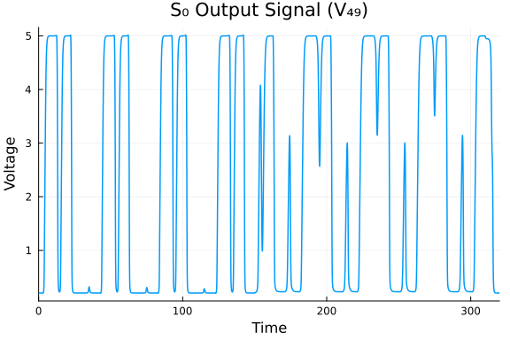
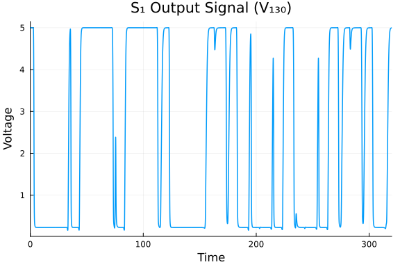
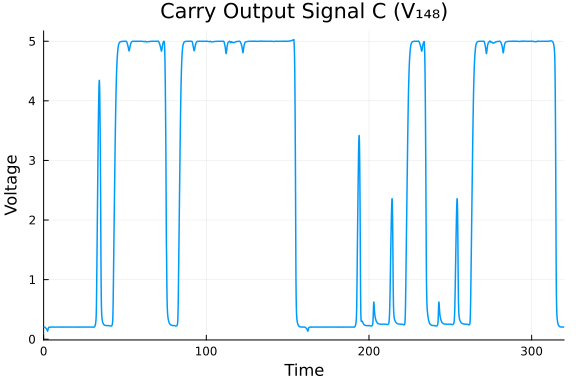
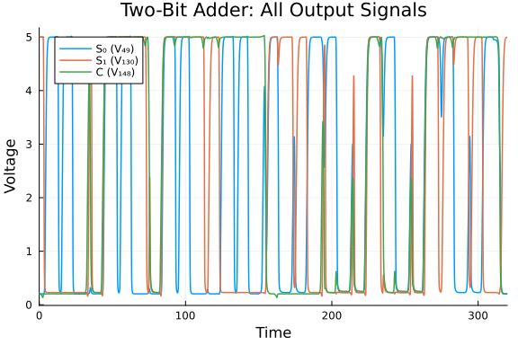
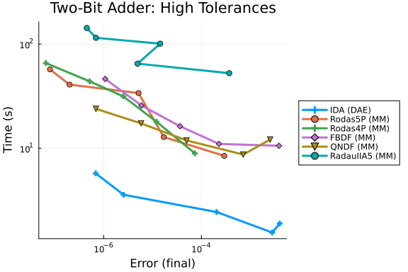
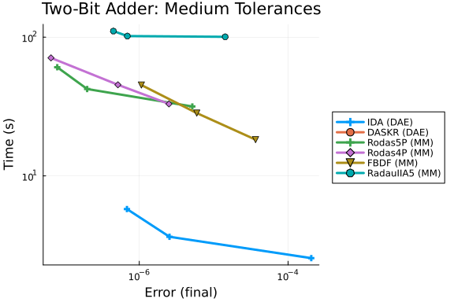
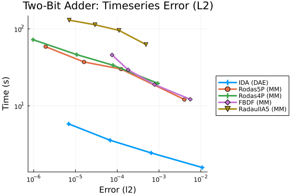

This is a benchmark of the Two-Bit Adding Unit, an index-1 DAE of dimension 350
from the IVP Test Set (Bär & Söhnlein 1998, `tba.f`).

The system models a CMOS digital circuit that computes the sum of two 2-bit
binary numbers plus a carry-in:

$$A_1 \cdot 2 + A_0 + B_1 \cdot 2 + B_0 + C_{in} = C \cdot 4 + S_1 \cdot 2 + S_0$$

The circuit consists of ten logical subcircuits (3 NOR gates, 5 ANDOI gates,
1 NAND gate, 1 ORANI gate) plus three additional enhancement transistors in
series. The transistor model is the Shichman–Hodges MOSFET model with
depletion- and enhancement-type devices.

**Variables (350 state variables):**
- 175 charge variables (differential): $Q_1, \ldots, Q_{175}$
- 175 node potentials (algebraic): $V_1, \ldots, V_{175}$

**System structure:**
The charge-driven formulation gives
$$\dot{Q} = f(t, V), \qquad 0 = Q - g(V)$$
where $f$ contains the static currents (resistive + MOSFET drain/source/bulk)
and $g$ is the nonlinear charge function. The Jacobian $\partial g/\partial V$
corresponds to the nodal capacitance matrix augmented by voltage-dependent
bulk capacitances. In the operating regime of the circuit, this matrix
remains nonsingular, ensuring index-1 structure.

**Physically relevant outputs (3 signals):**
- $V_{49}$  = $S_0$ (sum bit 0)
- $V_{130}$ = $S_1$ (sum bit 1)
- $V_{148}$ = $C$ (carry out)

**Input signals:** Five periodic pulse waveforms drive the circuit with periods
20, 40, 80, 160, and 320 (scaled time), producing derivative discontinuities
at $t = 0, 5, 10, \ldots, 320$.

Reference: Bär, M. and Söhnlein, K.: Test Set for IVP Solvers,
http://www.dm.uniba.it/~testset/

```julia
using OrdinaryDiffEq, DiffEqDevTools, Sundials, ModelingToolkit, Plots
using DASSL, DASKR
using LinearAlgebra, SparseArrays
```


## Physical Constants and MOS Parameters

All parameters are from `tba.f`. Time is scaled by CTIME = 10⁴ and stiffness
by STIFF = 5.

```julia
# --- Scaling ---
const CTIME = 1.0e4
const STIFF = 5.0

# --- MOS Parameters ---
const RGS   = 0.4e2 / (CTIME * STIFF)
const RGD   = 0.4e2 / (CTIME * STIFF)
const RBS   = 0.1e3 / (CTIME * STIFF)
const RBD   = 0.1e3 / (CTIME * STIFF)
const CGS   = 0.6e-4 * CTIME
const CGD   = 0.6e-4 * CTIME
const CBD   = 2.4e-5 * CTIME
const CBS   = 2.4e-5 * CTIME
const DELTA = 0.2e-1
const CURIS = 1.0e-15 * CTIME * STIFF
const VTH   = 25.85
const VDD   = 5.0
const VBB   = -2.5
const CLOAD = 0.0
const COUT  = 2.0e-4 * CTIME - CLOAD
```

```
2.0
```


## MOSFET Model Functions (Shichman–Hodges)

```julia
"""Voltage-dependent bulk capacitance."""
function CBDBS(V)
    PHIB = 0.87
    if V <= 0.0
        return CBD / sqrt(1.0 - V / PHIB)
    else
        return CBD * (1.0 + V / (2.0 * PHIB))
    end
end

"""pn-junction current: bulk-source."""
function IBS_func(VBS)
    if VBS <= 0.0
        return -CURIS * (exp(VBS / VTH) - 1.0)
    else
        return 0.0
    end
end

"""pn-junction current: bulk-drain."""
function IBD_func(VBD)
    if VBD <= 0.0
        return -CURIS * (exp(VBD / VTH) - 1.0)
    else
        return 0.0
    end
end

"""Get MOS parameters by type: 0=depletion, 1=enhancement, 2=2x series, 3=3x series."""
function mos_params(NED)
    if NED == 0
        return -2.43, 0.2, 1.28, 53.5e-6 * CTIME * STIFF
    elseif NED == 1
        return 0.2, 0.035, 1.01, 4 * 43.7e-6 * CTIME * STIFF
    elseif NED == 2
        return 0.2, 0.035, 1.01, 8 * 43.7e-6 * CTIME * STIFF
    else
        return 0.2, 0.035, 1.01, 12 * 43.7e-6 * CTIME * STIFF
    end
end

"""Drain function for VDS > 0."""
function GDSP(NED, VDS, VGS, VBS)
    VT0, CGAMMA, PHI, BETA = mos_params(NED)
    if PHI - VBS < 0.0 || PHI < 0.0
        return 0.0, true  # error flag
    end
    VTE = VT0 + CGAMMA * (sqrt(PHI - VBS) - sqrt(PHI))
    if VGS - VTE <= 0.0
        return 0.0, false
    elseif VGS - VTE <= VDS
        return -BETA * (VGS - VTE)^2 * (1.0 + DELTA * VDS), false
    else
        return -BETA * VDS * (2.0 * (VGS - VTE) - VDS) * (1.0 + DELTA * VDS), false
    end
end

"""Drain function for VDS < 0."""
function GDSM(NED, VDS, VGD, VBD)
    VT0, CGAMMA, PHI, BETA = mos_params(NED)
    if PHI - VBD < 0.0 || PHI < 0.0
        return 0.0, true  # error flag
    end
    VTE = VT0 + CGAMMA * (sqrt(PHI - VBD) - sqrt(PHI))
    if VGD - VTE <= 0.0
        return 0.0, false
    elseif VGD - VTE <= -VDS
        return BETA * (VGD - VTE)^2 * (1.0 - DELTA * VDS), false
    else
        return -BETA * VDS * (2.0 * (VGD - VTE) + VDS) * (1.0 - DELTA * VDS), false
    end
end

"""Drain current (Shichman–Hodges model)."""
function IDS_func(NED, VDS, VGS, VBS, VGD, VBD)
    if VDS > 0.0
        return GDSP(NED, VDS, VGS, VBS)
    elseif VDS == 0.0
        return 0.0, false
    else
        return GDSM(NED, VDS, VGD, VBD)
    end
end
```

```
Main.var"##WeaveSandBox#225".IDS_func
```


## Input Signal (Periodic Pulse)

```julia
"""
Evaluate periodic pulse signal at time X.

Signal structure: LOW → ramp up (T1) → HIGH (T2) → ramp down (T3) → LOW
"""
function pulse(X, LOW, HIGH, DELAY, T1, T2, T3, PERIOD)
    TIME = mod(X, PERIOD)
    if TIME > DELAY + T1 + T2 + T3
        return LOW, 0.0
    elseif TIME > DELAY + T1 + T2
        VIN = ((HIGH - LOW) / T3) * (DELAY + T1 + T2 + T3 - TIME) + LOW
        return VIN, -(HIGH - LOW) / T3
    elseif TIME > DELAY + T1
        return HIGH, 0.0
    elseif TIME > DELAY
        VIN = ((HIGH - LOW) / T1) * (TIME - DELAY) + LOW
        return VIN, (HIGH - LOW) / T1
    else
        return LOW, 0.0
    end
end
```

```
Main.var"##WeaveSandBox#225".pulse
```


## Logic Gate Subcircuit Functions

Each gate computes the static current (right-hand side) for its nodes.

```julia
"""NOR gate: NOT(U1 OR U2). Nodes I..I+12."""
function nor_gate!(F, Y, I, U1, U2, U1D, U2D)
    ids_dep, _ = IDS_func(0, Y[I+1]-Y[I], Y[I+4]-Y[I], Y[I+2]-Y[I+4], Y[I+4]-Y[I+1], Y[I+3]-VDD)
    F[I]   = -(Y[I]-Y[I+4])/RGS - ids_dep
    F[I+1] = -(Y[I+1]-VDD)/RGD + ids_dep
    F[I+2] = -(Y[I+2]-VBB)/RBS + IBS_func(Y[I+2]-Y[I+4])
    F[I+3] = -(Y[I+3]-VBB)/RBD + IBD_func(Y[I+3]-VDD)
    # Result node I+4
    F[I+4] = -(Y[I+4]-Y[I])/RGS - IBS_func(Y[I+2]-Y[I+4]) -
             (Y[I+4]-Y[I+6])/RGD - IBD_func(Y[I+8]-Y[I+4]) -
             (Y[I+4]-Y[I+10])/RGD - IBD_func(Y[I+12]-Y[I+4])
    ids_val, _ = IDS_func(1, Y[I+6]-Y[I+5], U1-Y[I+5], Y[I+7], U1-Y[I+6], Y[I+8]-Y[I+4])
    F[I+5] = CGS*U1D - Y[I+5]/RGS - ids_val
    F[I+6] = CGD*U1D - (Y[I+6]-Y[I+4])/RGD + ids_val
    F[I+7] = -(Y[I+7]-VBB)/RBS + IBS_func(Y[I+7])
    F[I+8] = -(Y[I+8]-VBB)/RBD + IBD_func(Y[I+8]-Y[I+4])
    ids_val, _ = IDS_func(1, Y[I+10]-Y[I+9], U2-Y[I+9], Y[I+11], U2-Y[I+10], Y[I+12]-Y[I+4])
    F[I+9]  = CGS*U2D - Y[I+9]/RGS - ids_val
    F[I+10] = CGD*U2D - (Y[I+10]-Y[I+4])/RGD + ids_val
    F[I+11] = -(Y[I+11]-VBB)/RBS + IBS_func(Y[I+11])
    F[I+12] = -(Y[I+12]-VBB)/RBD + IBD_func(Y[I+12]-Y[I+4])
end

"""ANDOI gate: NOT(U1 OR (U2 AND U3)). Nodes I..I+17."""
function andoi_gate!(F, Y, I, U1, U2, U3, U1D, U2D, U3D)
    ids_val, _ = IDS_func(0, Y[I+1]-Y[I], Y[I+4]-Y[I], Y[I+2]-Y[I+4], Y[I+4]-Y[I+1], Y[I+3]-VDD)
    F[I]   = -(Y[I]-Y[I+4])/RGS - ids_val
    F[I+1] = -(Y[I+1]-VDD)/RGD + ids_val
    F[I+2] = -(Y[I+2]-VBB)/RBS + IBS_func(Y[I+2]-Y[I+4])
    F[I+3] = -(Y[I+3]-VBB)/RBD + IBD_func(Y[I+3]-VDD)
    # Result node I+4
    F[I+4] = -(Y[I+4]-Y[I])/RGS - IBS_func(Y[I+2]-Y[I+4]) -
             (Y[I+4]-Y[I+6])/RGD - IBD_func(Y[I+8]-Y[I+4]) -
             (Y[I+4]-Y[I+10])/RGD - IBD_func(Y[I+12]-Y[I+4])
    ids_val, _ = IDS_func(1, Y[I+6]-Y[I+5], U1-Y[I+5], Y[I+7], U1-Y[I+6], Y[I+8]-Y[I+4])
    F[I+5] = CGS*U1D - Y[I+5]/RGS - ids_val
    F[I+6] = CGD*U1D - (Y[I+6]-Y[I+4])/RGD + ids_val
    F[I+7] = -(Y[I+7]-VBB)/RBS + IBS_func(Y[I+7])
    F[I+8] = -(Y[I+8]-VBB)/RBD + IBD_func(Y[I+8]-Y[I+4])
    ids_val, _ = IDS_func(2, Y[I+10]-Y[I+9], U2-Y[I+9], Y[I+11]-Y[I+13], U2-Y[I+10], Y[I+12]-Y[I+4])
    F[I+9]  = CGS*U2D - (Y[I+9]-Y[I+13])/RGS - ids_val
    F[I+10] = CGD*U2D - (Y[I+10]-Y[I+4])/RGD + ids_val
    F[I+11] = -(Y[I+11]-VBB)/RBS + IBS_func(Y[I+11]-Y[I+13])
    F[I+12] = -(Y[I+12]-VBB)/RBD + IBD_func(Y[I+12]-Y[I+4])
    # Coupling node I+13
    F[I+13] = -(Y[I+13]-Y[I+9])/RGS - IBS_func(Y[I+11]-Y[I+13]) -
              (Y[I+13]-Y[I+15])/RGD - IBD_func(Y[I+17]-Y[I+13])
    ids_val, _ = IDS_func(2, Y[I+15]-Y[I+14], U3-Y[I+14], Y[I+16], U3-Y[I+15], Y[I+17]-Y[I+13])
    F[I+14] = CGS*U3D - Y[I+14]/RGS - ids_val
    F[I+15] = CGD*U3D - (Y[I+15]-Y[I+13])/RGD + ids_val
    F[I+16] = -(Y[I+16]-VBB)/RBS + IBS_func(Y[I+16])
    F[I+17] = -(Y[I+17]-VBB)/RBD + IBD_func(Y[I+17]-Y[I+13])
end

"""ANDOI gate with capacitive coupling at result node (for TBA output node 148).
   Nodes I..I+17, with extra coupling to nodes 163, 165."""
function andoip_gate!(F, Y, I, U1, U2, U3, U1D, U2D, U3D)
    ids_val, _ = IDS_func(0, Y[I+1]-Y[I], Y[I+4]-Y[I], Y[I+2]-Y[I+4], Y[I+4]-Y[I+1], Y[I+3]-VDD)
    F[I]   = -(Y[I]-Y[I+4])/RGS - ids_val
    F[I+1] = -(Y[I+1]-VDD)/RGD + ids_val
    F[I+2] = -(Y[I+2]-VBB)/RBS + IBS_func(Y[I+2]-Y[I+4])
    F[I+3] = -(Y[I+3]-VBB)/RBD + IBD_func(Y[I+3]-VDD)
    # Result node I+4, extra coupling to nodes 163, 165
    F[I+4] = -(Y[I+4]-Y[I])/RGS - IBS_func(Y[I+2]-Y[I+4]) -
             (Y[I+4]-Y[I+6])/RGD - IBD_func(Y[I+8]-Y[I+4]) -
             (Y[I+4]-Y[I+10])/RGD - IBD_func(Y[I+12]-Y[I+4]) -
             (Y[I+4]-Y[163])/RGD - IBD_func(Y[165]-Y[I+4])
    ids_val, _ = IDS_func(1, Y[I+6]-Y[I+5], U1-Y[I+5], Y[I+7], U1-Y[I+6], Y[I+8]-Y[I+4])
    F[I+5] = CGS*U1D - Y[I+5]/RGS - ids_val
    F[I+6] = CGD*U1D - (Y[I+6]-Y[I+4])/RGD + ids_val
    F[I+7] = -(Y[I+7]-VBB)/RBS + IBS_func(Y[I+7])
    F[I+8] = -(Y[I+8]-VBB)/RBD + IBD_func(Y[I+8]-Y[I+4])
    ids_val, _ = IDS_func(2, Y[I+10]-Y[I+9], U2-Y[I+9], Y[I+11]-Y[I+13], U2-Y[I+10], Y[I+12]-Y[I+4])
    F[I+9]  = CGS*U2D - (Y[I+9]-Y[I+13])/RGS - ids_val
    F[I+10] = CGD*U2D - (Y[I+10]-Y[I+4])/RGD + ids_val
    F[I+11] = -(Y[I+11]-VBB)/RBS + IBS_func(Y[I+11]-Y[I+13])
    F[I+12] = -(Y[I+12]-VBB)/RBD + IBD_func(Y[I+12]-Y[I+4])
    # Coupling node I+13
    F[I+13] = -(Y[I+13]-Y[I+9])/RGS - IBS_func(Y[I+11]-Y[I+13]) -
              (Y[I+13]-Y[I+15])/RGD - IBD_func(Y[I+17]-Y[I+13])
    ids_val, _ = IDS_func(2, Y[I+15]-Y[I+14], U3-Y[I+14], Y[I+16], U3-Y[I+15], Y[I+17]-Y[I+13])
    F[I+14] = CGS*U3D - Y[I+14]/RGS - ids_val
    F[I+15] = CGD*U3D - (Y[I+15]-Y[I+13])/RGD + ids_val
    F[I+16] = -(Y[I+16]-VBB)/RBS + IBS_func(Y[I+16])
    F[I+17] = -(Y[I+17]-VBB)/RBD + IBD_func(Y[I+17]-Y[I+13])
end

"""NAND gate: NOT(U1 AND U2). Nodes I..I+13."""
function nand_gate!(F, Y, I, U1, U2, U1D, U2D)
    ids_val, _ = IDS_func(0, Y[I+1]-Y[I], Y[I+4]-Y[I], Y[I+2]-Y[I+4], Y[I+4]-Y[I+1], Y[I+3]-VDD)
    F[I]   = -(Y[I]-Y[I+4])/RGS - ids_val
    F[I+1] = -(Y[I+1]-VDD)/RGD + ids_val
    F[I+2] = -(Y[I+2]-VBB)/RBS + IBS_func(Y[I+2]-Y[I+4])
    F[I+3] = -(Y[I+3]-VBB)/RBD + IBD_func(Y[I+3]-VDD)
    # Result node I+4
    F[I+4] = -(Y[I+4]-Y[I])/RGS - IBS_func(Y[I+2]-Y[I+4]) -
             (Y[I+4]-Y[I+6])/RGD - IBD_func(Y[I+8]-Y[I+4])
    ids_val, _ = IDS_func(2, Y[I+6]-Y[I+5], U1-Y[I+5], Y[I+7]-Y[I+9], U1-Y[I+6], Y[I+8]-Y[I+4])
    F[I+5] = CGS*U1D - (Y[I+5]-Y[I+9])/RGS - ids_val
    F[I+6] = CGD*U1D - (Y[I+6]-Y[I+4])/RGD + ids_val
    F[I+7] = -(Y[I+7]-VBB)/RBS + IBS_func(Y[I+7]-Y[I+9])
    F[I+8] = -(Y[I+8]-VBB)/RBD + IBD_func(Y[I+8]-Y[I+4])
    # Coupling node I+9
    F[I+9]  = -(Y[I+9]-Y[I+5])/RGS - IBS_func(Y[I+7]-Y[I+9]) -
              (Y[I+9]-Y[I+11])/RGD - IBD_func(Y[I+13]-Y[I+9])
    ids_val, _ = IDS_func(2, Y[I+11]-Y[I+10], U2-Y[I+10], Y[I+12], U2-Y[I+11], Y[I+13]-Y[I+9])
    F[I+10] = CGS*U2D - Y[I+10]/RGS - ids_val
    F[I+11] = CGD*U2D - (Y[I+11]-Y[I+9])/RGD + ids_val
    F[I+12] = -(Y[I+12]-VBB)/RBS + IBS_func(Y[I+12])
    F[I+13] = -(Y[I+13]-VBB)/RBD + IBD_func(Y[I+13]-Y[I+9])
end

"""ORANI gate: NOT(U1 AND (U2 OR U3)). Nodes I..I+17."""
function orani_gate!(F, Y, I, U1, U2, U3, U1D, U2D, U3D)
    ids_val, _ = IDS_func(0, Y[I+1]-Y[I], Y[I+4]-Y[I], Y[I+2]-Y[I+4], Y[I+4]-Y[I+1], Y[I+3]-VDD)
    F[I]   = -(Y[I]-Y[I+4])/RGS - ids_val
    F[I+1] = -(Y[I+1]-VDD)/RGD + ids_val
    F[I+2] = -(Y[I+2]-VBB)/RBS + IBS_func(Y[I+2]-Y[I+4])
    F[I+3] = -(Y[I+3]-VBB)/RBD + IBD_func(Y[I+3]-VDD)
    # Result node I+4
    F[I+4] = -(Y[I+4]-Y[I])/RGS - IBS_func(Y[I+2]-Y[I+4]) -
             (Y[I+4]-Y[I+6])/RGD - IBD_func(Y[I+8]-Y[I+4])
    ids_val, _ = IDS_func(2, Y[I+6]-Y[I+5], U1-Y[I+5], Y[I+7]-Y[I+9], U1-Y[I+6], Y[I+8]-Y[I+4])
    F[I+5] = CGS*U1D - (Y[I+5]-Y[I+9])/RGS - ids_val
    F[I+6] = CGD*U1D - (Y[I+6]-Y[I+4])/RGD + ids_val
    F[I+7] = -(Y[I+7]-VBB)/RBS + IBS_func(Y[I+7]-Y[I+9])
    F[I+8] = -(Y[I+8]-VBB)/RBD + IBD_func(Y[I+8]-Y[I+4])
    # Coupling node I+9
    F[I+9]  = -(Y[I+9]-Y[I+5])/RGS - IBS_func(Y[I+7]-Y[I+9]) -
              (Y[I+9]-Y[I+11])/RGD - IBD_func(Y[I+13]-Y[I+9]) -
              (Y[I+9]-Y[I+15])/RGD - IBD_func(Y[I+17]-Y[I+9])
    ids_val, _ = IDS_func(2, Y[I+11]-Y[I+10], U2-Y[I+10], Y[I+12], U2-Y[I+11], Y[I+13]-Y[I+9])
    F[I+10] = CGS*U2D - Y[I+10]/RGS - ids_val
    F[I+11] = CGD*U2D - (Y[I+11]-Y[I+9])/RGD + ids_val
    F[I+12] = -(Y[I+12]-VBB)/RBS + IBS_func(Y[I+12])
    F[I+13] = -(Y[I+13]-VBB)/RBD + IBD_func(Y[I+13]-Y[I+9])
    ids_val, _ = IDS_func(2, Y[I+15]-Y[I+14], U3-Y[I+14], Y[I+16], U3-Y[I+15], Y[I+17]-Y[I+9])
    F[I+14] = CGS*U3D - Y[I+14]/RGS - ids_val
    F[I+15] = CGD*U3D - (Y[I+15]-Y[I+9])/RGD + ids_val
    F[I+16] = -(Y[I+16]-VBB)/RBS + IBS_func(Y[I+16])
    F[I+17] = -(Y[I+17]-VBB)/RBD + IBD_func(Y[I+17]-Y[I+9])
end
```

```
Main.var"##WeaveSandBox#225".orani_gate!
```


## Static Current Function FCN (Right-Hand Side)

The full right-hand side assembles all ten subcircuits plus three additional
enhancement transistors.

```julia
"""Compute static currents F[1:175] from node potentials Y[1:175] at time X."""
function FCN!(F, X, Y)
    # Input signals
    V1,  V1D  = pulse(X, 0.0, 5.0, 0.0,   5.0, 5.0,  5.0, 20.0)
    V2,  V2D  = pulse(X, 0.0, 5.0, 10.0,  5.0, 15.0, 5.0, 40.0)
    V3,  V3D  = pulse(X, 0.0, 5.0, 30.0,  5.0, 35.0, 5.0, 80.0)
    V4,  V4D  = pulse(X, 0.0, 5.0, 70.0,  5.0, 75.0, 5.0, 160.0)
    CIN, CIND = pulse(X, 0.0, 5.0, 150.0, 5.0, 155.0, 5.0, 320.0)

    # NOR-gate 1: nodes 1–13
    nor_gate!(F, Y, 1, V1, V2, V1D, V2D)
    # ANDOI-gate 1: nodes 14–31
    andoi_gate!(F, Y, 14, Y[5], V2, V1, 0.0, V2D, V1D)
    # NOR-gate 2: nodes 32–44
    nor_gate!(F, Y, 32, Y[18], CIN, 0.0, CIND)
    # ANDOI-gate 2: nodes 45–62
    andoi_gate!(F, Y, 45, Y[36], CIN, Y[18], 0.0, CIND, 0.0)
    # ANDOI-gate 3: nodes 63–80
    andoi_gate!(F, Y, 63, Y[5], CIN, Y[18], 0.0, CIND, 0.0)
    # NOR-gate 3: nodes 81–93
    nor_gate!(F, Y, 81, V3, V4, V3D, V4D)
    # ANDOI-gate 4: nodes 94–111
    andoi_gate!(F, Y, 94, Y[85], V4, V3, 0.0, V4D, V3D)
    # NAND-gate: nodes 112–125
    nand_gate!(F, Y, 112, Y[67], Y[98], 0.0, 0.0)
    # ORANI-gate 1: nodes 126–143
    orani_gate!(F, Y, 126, Y[116], Y[67], Y[98], 0.0, 0.0, 0.0)
    # ANDOI-gate 5 (capacitive coupling): nodes 144–161
    andoip_gate!(F, Y, 144, Y[85], Y[5], Y[98], 0.0, 0.0, 0.0)

    # Three additional enhancement transistors in series (nodes 162–175)
    ids_val, _ = IDS_func(3, Y[163]-Y[162], Y[98]-Y[162], Y[164]-Y[166], Y[98]-Y[163], Y[165]-Y[148])
    F[162] = -(Y[162]-Y[166])/RGS - ids_val
    F[163] = -(Y[163]-Y[148])/RGD + ids_val
    F[164] = -(Y[164]-VBB)/RBS + IBS_func(Y[164]-Y[166])
    F[165] = -(Y[165]-VBB)/RBD + IBD_func(Y[165]-Y[148])
    F[166] = -IBS_func(Y[164]-Y[166]) - (Y[166]-Y[162])/RGS -
              IBD_func(Y[170]-Y[166]) - (Y[166]-Y[168])/RGD

    ids_val, _ = IDS_func(3, Y[168]-Y[167], Y[18]-Y[167], Y[169]-Y[171], Y[18]-Y[168], Y[170]-Y[166])
    F[167] = -(Y[167]-Y[171])/RGS - ids_val
    F[168] = -(Y[168]-Y[166])/RGD + ids_val
    F[169] = -(Y[169]-VBB)/RBS + IBS_func(Y[169]-Y[171])
    F[170] = -(Y[170]-VBB)/RBD + IBD_func(Y[170]-Y[166])
    F[171] = -IBS_func(Y[169]-Y[171]) - (Y[171]-Y[167])/RGS -
              IBD_func(Y[175]-Y[171]) - (Y[171]-Y[173])/RGD

    ids_val, _ = IDS_func(3, Y[173]-Y[172], CIN-Y[172], Y[174], CIN-Y[173], Y[175]-Y[171])
    F[172] = CGS*CIND - Y[172]/RGS - ids_val
    F[173] = CGD*CIND - (Y[173]-Y[171])/RGD + ids_val
    F[174] = -(Y[174]-VBB)/RBS + IBS_func(Y[174])
    F[175] = -(Y[175]-VBB)/RBD + IBD_func(Y[175]-Y[171])
end
```

```
Main.var"##WeaveSandBox#225".FCN!
```


## Charge Function GCN

```julia
"""Charge function for NOR gate. Nodes I..I+12."""
function dnor!(G, U, I)
    G[I]    += CGS*(U[I]-U[I+4])
    G[I+1]  += CGD*(U[I+1]-U[I+4])
    G[I+2]  += CBDBS(U[I+2]-U[I+4])*(U[I+2]-U[I+4])
    G[I+3]  += CBDBS(U[I+3]-VDD)*U[I+3]
    G[I+4]  += CGS*(U[I+4]-U[I]) + CGD*(U[I+4]-U[I+1]) +
               CBDBS(U[I+2]-U[I+4])*(U[I+4]-U[I+2]) +
               CBDBS(U[I+8]-U[I+4])*(U[I+4]-U[I+8]) +
               CBDBS(U[I+12]-U[I+4])*(U[I+4]-U[I+12]) +
               CLOAD*U[I+4]
    G[I+5]  += CGS*U[I+5]
    G[I+6]  += CGD*U[I+6]
    G[I+7]  += CBDBS(U[I+7])*U[I+7]
    G[I+8]  += CBDBS(U[I+8]-U[I+4])*(U[I+8]-U[I+4])
    G[I+9]  += CGS*U[I+9]
    G[I+10] += CGD*U[I+10]
    G[I+11] += CBDBS(U[I+11])*U[I+11]
    G[I+12] += CBDBS(U[I+12]-U[I+4])*(U[I+12]-U[I+4])
end

"""Charge function for ANDOI gate. Nodes I..I+17."""
function dandoi!(G, U, I)
    G[I]     += CGS*(U[I]-U[I+4])
    G[I+1]   += CGD*(U[I+1]-U[I+4])
    G[I+2]   += CBDBS(U[I+2]-U[I+4])*(U[I+2]-U[I+4])
    G[I+3]   += CBDBS(U[I+3]-VDD)*U[I+3]
    G[I+4]   += CGS*(U[I+4]-U[I]) + CGD*(U[I+4]-U[I+1]) +
                CBDBS(U[I+2]-U[I+4])*(U[I+4]-U[I+2]) +
                CBDBS(U[I+8]-U[I+4])*(U[I+4]-U[I+8]) +
                CBDBS(U[I+12]-U[I+4])*(U[I+4]-U[I+12]) +
                CLOAD*U[I+4]
    G[I+5]   += CGS*U[I+5]
    G[I+6]   += CGD*U[I+6]
    G[I+7]   += CBDBS(U[I+7])*U[I+7]
    G[I+8]   += CBDBS(U[I+8]-U[I+4])*(U[I+8]-U[I+4])
    G[I+9]   += CGS*U[I+9]
    G[I+10]  += CGD*U[I+10]
    G[I+11]  += CBDBS(U[I+11]-U[I+13])*(U[I+11]-U[I+13])
    G[I+12]  += CBDBS(U[I+12]-U[I+4])*(U[I+12]-U[I+4])
    G[I+13]  += CBDBS(U[I+11]-U[I+13])*(U[I+13]-U[I+11]) +
                CBDBS(U[I+17]-U[I+13])*(U[I+13]-U[I+17]) +
                CLOAD*U[I+13]
    G[I+14]  += CGS*U[I+14]
    G[I+15]  += CGD*U[I+15]
    G[I+16]  += CBDBS(U[I+16])*U[I+16]
    G[I+17]  += CBDBS(U[I+17]-U[I+13])*(U[I+17]-U[I+13])
end

"""Charge function for NAND gate. Nodes I..I+13."""
function dnand!(G, U, I)
    G[I]     += CGS*(U[I]-U[I+4])
    G[I+1]   += CGD*(U[I+1]-U[I+4])
    G[I+2]   += CBDBS(U[I+2]-U[I+4])*(U[I+2]-U[I+4])
    G[I+3]   += CBDBS(U[I+3]-VDD)*U[I+3]
    G[I+4]   += CGS*(U[I+4]-U[I]) + CGD*(U[I+4]-U[I+1]) +
                CBDBS(U[I+2]-U[I+4])*(U[I+4]-U[I+2]) +
                CBDBS(U[I+8]-U[I+4])*(U[I+4]-U[I+8]) +
                CLOAD*U[I+4]
    G[I+5]   += CGS*U[I+5]
    G[I+6]   += CGD*U[I+6]
    G[I+7]   += CBDBS(U[I+7]-U[I+9])*(U[I+7]-U[I+9])
    G[I+8]   += CBDBS(U[I+8]-U[I+4])*(U[I+8]-U[I+4])
    G[I+9]   += CBDBS(U[I+7]-U[I+9])*(U[I+9]-U[I+7]) +
                CBDBS(U[I+13]-U[I+9])*(U[I+9]-U[I+13]) +
                CLOAD*U[I+9]
    G[I+10]  += CGS*U[I+10]
    G[I+11]  += CGD*U[I+11]
    G[I+12]  += CBDBS(U[I+12])*U[I+12]
    G[I+13]  += CBDBS(U[I+13]-U[I+9])*(U[I+13]-U[I+9])
end

"""Charge function for ORANI gate. Nodes I..I+17."""
function dorani!(G, U, I)
    G[I]     += CGS*(U[I]-U[I+4])
    G[I+1]   += CGD*(U[I+1]-U[I+4])
    G[I+2]   += CBDBS(U[I+2]-U[I+4])*(U[I+2]-U[I+4])
    G[I+3]   += CBDBS(U[I+3]-VDD)*U[I+3]
    G[I+4]   += CGS*(U[I+4]-U[I]) + CGD*(U[I+4]-U[I+1]) +
                CBDBS(U[I+2]-U[I+4])*(U[I+4]-U[I+2]) +
                CBDBS(U[I+8]-U[I+4])*(U[I+4]-U[I+8]) +
                CLOAD*U[I+4]
    G[I+5]   += CGS*U[I+5]
    G[I+6]   += CGD*U[I+6]
    G[I+7]   += CBDBS(U[I+7]-U[I+9])*(U[I+7]-U[I+9])
    G[I+8]   += CBDBS(U[I+8]-U[I+4])*(U[I+8]-U[I+4])
    G[I+9]   += CBDBS(U[I+7]-U[I+9])*(U[I+9]-U[I+7]) +
                CBDBS(U[I+13]-U[I+9])*(U[I+9]-U[I+13]) +
                CBDBS(U[I+17]-U[I+9])*(U[I+9]-U[I+17]) +
                CLOAD*U[I+9]
    G[I+10]  += CGS*U[I+10]
    G[I+11]  += CGD*U[I+11]
    G[I+12]  += CBDBS(U[I+12])*U[I+12]
    G[I+13]  += CBDBS(U[I+13]-U[I+9])*(U[I+13]-U[I+9])
    G[I+14]  += CGS*U[I+14]
    G[I+15]  += CGD*U[I+15]
    G[I+16]  += CBDBS(U[I+16])*U[I+16]
    G[I+17]  += CBDBS(U[I+17]-U[I+9])*(U[I+17]-U[I+9])
end

"""Full charge function G[1:175] from node potentials U[1:175]."""
function GCN!(G, U)
    G .= 0.0

    # Ten logical subcircuits
    dnor!(G, U, 1)
    dandoi!(G, U, 14)
    dnor!(G, U, 32)
    dandoi!(G, U, 45)
    dandoi!(G, U, 63)
    dnor!(G, U, 81)
    dandoi!(G, U, 94)
    dnand!(G, U, 112)
    dorani!(G, U, 126)
    dandoi!(G, U, 144)

    # Capacitive coupling: result node NOR-gate 1 (node 5)
    G[5]  += CGS*(U[5]-U[19]) + CGD*(U[5]-U[20]) +
             CGS*(U[5]-U[68]) + CGD*(U[5]-U[69]) +
             CGS*(U[5]-U[153]) + CGD*(U[5]-U[154])
    G[19]  -= CGS*U[5]
    G[20]  -= CGD*U[5]
    G[68]  -= CGS*U[5]
    G[69]  -= CGD*U[5]
    G[153] -= CGS*U[5]
    G[154] -= CGD*U[5]

    # Capacitive coupling: result node ANDOI-gate 1 (node 18)
    G[18] += CGS*(U[18]-U[37]) + CGD*(U[18]-U[38]) +
             CGS*(U[18]-U[59]) + CGD*(U[18]-U[60]) +
             CGS*(U[18]-U[77]) + CGD*(U[18]-U[78]) +
             CGS*(U[18]-U[167]) + CGD*(U[18]-U[168])
    G[37]  -= CGS*U[18]
    G[38]  -= CGD*U[18]
    G[59]  -= CGS*U[18]
    G[60]  -= CGD*U[18]
    G[77]  -= CGS*U[18]
    G[78]  -= CGD*U[18]

    # Capacitive coupling: result node NOR-gate 2 (node 36)
    G[36] += CGS*(U[36]-U[50]) + CGD*(U[36]-U[51])
    G[50]  -= CGS*U[36]
    G[51]  -= CGD*U[36]

    # Capacitive coupling: result node ANDOI-gate 2 = S0 (node 49)
    G[49] += COUT*U[49]

    # Capacitive coupling: result node ANDOI-gate 3 (node 67)
    G[67] += CGS*(U[67]-U[117]) + CGD*(U[67]-U[118]) +
             CGS*(U[67]-U[136]) + CGD*(U[67]-U[137])
    G[117] -= CGS*U[67]
    G[118] -= CGD*U[67]
    G[136] -= CGS*U[67]
    G[137] -= CGD*U[67]

    # Capacitive coupling: result node NOR-gate 3 (node 85)
    G[85] += CGS*(U[85]-U[99]) + CGD*(U[85]-U[100]) +
             CGS*(U[85]-U[149]) + CGD*(U[85]-U[150])
    G[99]  -= CGS*U[85]
    G[100] -= CGD*U[85]
    G[149] -= CGS*U[85]
    G[150] -= CGD*U[85]

    # Capacitive coupling: result node ANDOI-gate 4 (node 98)
    G[98] += CGS*(U[98]-U[122]) + CGD*(U[98]-U[123]) +
             CGS*(U[98]-U[140]) + CGD*(U[98]-U[141]) +
             CGS*(U[98]-U[158]) + CGD*(U[98]-U[159]) +
             CGS*(U[98]-U[162]) + CGD*(U[98]-U[163])
    G[122] -= CGS*U[98]
    G[123] -= CGD*U[98]
    G[140] -= CGS*U[98]
    G[141] -= CGD*U[98]
    G[158] -= CGS*U[98]
    G[159] -= CGD*U[98]

    # Capacitive coupling: result node NAND-gate (node 116)
    G[116] += CGS*(U[116]-U[131]) + CGD*(U[116]-U[132])
    G[131] -= CGS*U[116]
    G[132] -= CGD*U[116]

    # Capacitive coupling: result node ORANI-gate = S1 (node 130)
    G[130] += COUT*U[130]

    # Capacitive coupling: result ANDOI-gate 5 = C_inverse (node 148)
    G[148] += CBDBS(U[165]-U[148])*(U[148]-U[165]) + COUT*U[148]

    # Three additional transistors
    G[162] += CGS*(U[162]-U[98])
    G[163] += CGD*(U[163]-U[98])
    G[164] += CBDBS(U[164]-U[166])*(U[164]-U[166])
    G[165] += CBDBS(U[165]-U[148])*(U[165]-U[148])
    G[166] += CBDBS(U[164]-U[166])*(U[166]-U[164]) +
              CBDBS(U[170]-U[166])*(U[166]-U[170]) +
              CLOAD*U[166]
    G[167] += CGS*(U[167]-U[18])
    G[168] += CGD*(U[168]-U[18])
    G[169] += CBDBS(U[169]-U[171])*(U[169]-U[171])
    G[170] += CBDBS(U[170]-U[166])*(U[170]-U[166])
    G[171] += CBDBS(U[169]-U[171])*(U[171]-U[169]) +
              CBDBS(U[175]-U[171])*(U[171]-U[175]) +
              CLOAD*U[171]
    G[172] += CGS*U[172]
    G[173] += CGD*U[173]
    G[174] += CBDBS(U[174])*U[174]
    G[175] += CBDBS(U[175]-U[171])*(U[175]-U[171])
end
```

```
Main.var"##WeaveSandBox#225".GCN!
```


## Consistent Initial Conditions

From `init` subroutine in `tba.f`. The initial voltage vector U(1:175) is
provided, then `y[1:175] = GCN(U)` (charges) and `y[176:350] = U` (potentials).

```julia
function tba_initial_conditions()
    U = zeros(175)
    U[1]   =  4.999999999996544;  U[2]   =  4.999999999999970
    U[3]   = -2.499999999999975;  U[4]   = -2.499999999999975
    U[5]   =  4.999999999996514;  U[6]   =  0.000000000000000
    U[7]   =  4.999999999996514;  U[8]   = -2.499999999999991
    U[9]   = -2.499999999999975;  U[10]  =  0.000000000000000
    U[11]  =  4.999999999996514;  U[12]  = -2.499999999999991
    U[13]  = -2.499999999999975;  U[14]  =  0.215858486765796
    U[15]  =  4.988182208251953;  U[16]  = -2.499999999999990
    U[17]  = -2.499999999999975;  U[18]  =  0.204040695017748
    U[19]  =  0.011817791748026;  U[20]  =  0.192222903269723
    U[21]  = -2.499999999999991;  U[22]  = -2.499999999999990
    U[23]  = -0.228160951881239;  U[24]  =  0.204040695017748
    U[25]  = -2.499999999999992;  U[26]  = -2.499999999999990
    U[27]  = -0.228160951881241;  U[28]  =  0.000000000000000
    U[29]  = -0.228160951881239;  U[30]  = -2.499999999999991
    U[31]  = -2.499999999999992;  U[32]  =  4.999999999996547
    U[33]  =  4.999999999999970;  U[34]  = -2.499999999999975
    U[35]  = -2.499999999999975;  U[36]  =  4.999999999996517
    U[37]  =  0.000000000000000;  U[38]  =  4.999999999996517
    U[39]  = -2.499999999999991;  U[40]  = -2.499999999999975
    U[41]  =  0.000000000000000;  U[42]  =  4.999999999996517
    U[43]  = -2.499999999999991;  U[44]  = -2.499999999999975
    U[45]  =  0.215858484247529;  U[46]  =  4.988182208251953
    U[47]  = -2.499999999999990;  U[48]  = -2.499999999999975
    U[49]  =  0.204040692499482;  U[50]  =  0.011817791748035
    U[51]  =  0.192222900751447;  U[52]  = -2.499999999999991
    U[53]  = -2.499999999999990;  U[54]  = -0.026041071738432
    U[55]  =  0.204040692499482;  U[56]  = -2.499999999999992
    U[57]  = -2.499999999999990;  U[58]  = -0.026041071738434
    U[59]  =  0.000000000000000;  U[60]  = -0.026041071738432
    U[61]  = -2.499999999999991;  U[62]  = -2.499999999999992
    U[63]  =  0.215858484880918;  U[64]  =  4.988182208251953
    U[65]  = -2.499999999999990;  U[66]  = -2.499999999999975
    U[67]  =  0.204040693132870;  U[68]  =  0.011817791748026
    U[69]  =  0.192222901384845;  U[70]  = -2.499999999999991
    U[71]  = -2.499999999999990;  U[72]  = -0.026041071737961
    U[73]  =  0.204040693132870;  U[74]  = -2.499999999999992
    U[75]  = -2.499999999999990;  U[76]  = -0.026041071737963
    U[77]  =  0.000000000000000;  U[78]  = -0.026041071737961
    U[79]  = -2.499999999999991;  U[80]  = -2.499999999999992
    U[81]  =  4.999999999996546;  U[82]  =  4.999999999999970
    U[83]  = -2.499999999999975;  U[84]  = -2.499999999999975
    U[85]  =  4.999999999996516;  U[86]  =  0.000000000000000
    U[87]  =  4.999999999996516;  U[88]  = -2.499999999999991
    U[89]  = -2.499999999999975;  U[90]  =  0.000000000000000
    U[91]  =  4.999999999996516;  U[92]  = -2.499999999999991
    U[93]  = -2.499999999999975;  U[94]  =  0.215858481060569
    U[95]  =  4.988182208251953;  U[96]  = -2.499999999999990
    U[97]  = -2.499999999999975;  U[98]  =  0.204040689312522
    U[99]  =  0.011817791748023;  U[100] =  0.192222897564498
    U[101] = -2.499999999999991;  U[102] = -2.499999999999990
    U[103] =  4.734672533390068;  U[104] =  0.204040689312522
    U[105] = -2.499999999999977;  U[106] = -2.499999999999990
    U[107] =  4.734672533390062;  U[108] =  0.000000000000000
    U[109] =  4.734672533390068;  U[110] = -2.499999999999991
    U[111] = -2.499999999999977;  U[112] =  4.999999999996870
    U[113] =  4.999999999999972;  U[114] = -2.499999999999975
    U[115] = -2.499999999999975;  U[116] =  4.999999999996843
    U[117] = -0.025968303070038;  U[118] =  4.999999999996843
    U[119] = -2.499999999999992;  U[120] = -2.499999999999975
    U[121] = -0.025968303070040;  U[122] =  0.000000000000000
    U[123] = -0.025968303070038;  U[124] = -2.499999999999991
    U[125] = -2.499999999999992;  U[126] =  4.999999999997699
    U[127] =  4.999999999999980;  U[128] = -2.499999999999975
    U[129] = -2.499999999999975;  U[130] =  4.999999999997678
    U[131] =  4.744923533081106;  U[132] =  4.999999999997678
    U[133] = -2.499999999999977;  U[134] = -2.499999999999975
    U[135] =  4.744923533081098;  U[136] =  0.000000000000000
    U[137] =  4.744923533081106;  U[138] = -2.499999999999991
    U[139] = -2.499999999999977;  U[140] =  0.000000000000000
    U[141] =  4.744923533081106;  U[142] = -2.499999999999991
    U[143] = -2.499999999999977;  U[144] =  0.215858484844162
    U[145] =  4.988182208251953;  U[146] = -2.499999999999990
    U[147] = -2.499999999999975;  U[148] =  0.204040693096114
    U[149] =  0.011817791748023;  U[150] =  0.192222901348091
    U[151] = -2.499999999999991;  U[152] = -2.499999999999990
    U[153] =  0.204040693096045;  U[154] =  0.204040693096107
    U[155] = -2.499999999999990;  U[156] = -2.499999999999990
    U[157] =  0.204040693096037;  U[158] =  0.000000000000000
    U[159] =  0.204040693096037;  U[160] = -2.499999999999991
    U[161] = -2.499999999999990;  U[162] = -0.026017361873565
    U[163] =  0.204040693096114;  U[164] = -2.499999999999992
    U[165] = -2.499999999999990;  U[166] = -0.026017361873568
    U[167] = -0.026017590106916;  U[168] = -0.026017361873565
    U[169] = -2.499999999999992;  U[170] = -2.499999999999992
    U[171] = -0.026017590106918;  U[172] =  0.000000000000000
    U[173] = -0.026017590106916;  U[174] = -2.499999999999991
    U[175] = -2.499999999999992

    # Compute initial charges
    G = zeros(175)
    GCN!(G, U)

    # Full state: y[1:175] = charges, y[176:350] = potentials
    y0 = zeros(350)
    y0[1:175]   .= G
    y0[176:350] .= U
    return y0
end

y0 = tba_initial_conditions()
println("Initial condition: 350 variables (175 charges + 175 potentials)")
println("  S0  (V₄₉)  = ", y0[224])
println("  S1  (V₁₃₀) = ", y0[305])
println("  C   (V₁₄₈) = ", y0[323])
```

```
Initial condition: 350 variables (175 charges + 175 potentials)
  S0  (V₄₉)  = 0.204040692499482
  S1  (V₁₃₀) = 4.999999999997678
  C   (V₁₄₈) = 0.204040693096114
```


## Derivative Discontinuity Times

The five input pulse signals create derivative discontinuities every 5 time
units (at t = 5, 10, …, 315). The Fortran reference (`tba.f`) specifies
`ndisc = 63` with interaction points at multiples of 5. Communicating these
to the solver via `tstops` prevents wasteful step rejections at transitions.

```julia
disc_times = collect(5.0:5.0:315.0)
```

```
63-element Vector{Float64}:
   5.0
  10.0
  15.0
  20.0
  25.0
  30.0
  35.0
  40.0
  45.0
  50.0
   ⋮
 275.0
 280.0
 285.0
 290.0
 295.0
 300.0
 305.0
 310.0
 315.0
```


## Step 1: Mass-Matrix ODE Formulation — Build and Verify

The DAE is written as `M·dy/dt = f(t, y)` where `M = diag(I₁₇₅, 0₁₇₅)`.
The first 175 equations are differential (charge conservation), and the
remaining 175 are algebraic (charge = g(V)).

```julia
function tba_rhs!(dy, y, p, t)
    @views begin
        x = y[176:350]
        # Differential equations: dQ/dt = f(t, V)
        FCN!(dy, t, x)              # writes dy[1:175]
        # Algebraic equations: 0 = Q - g(V)
        GCN!(dy[176:350], x)        # writes dy[176:350] = g(V)
        @. dy[176:350] = y[1:175] - dy[176:350]  # Q - g(V)
    end
end

# Mass matrix: identity for charges, zero for potentials (sparse)
M_tba = spdiagm(0 => [ones(175); zeros(175)])

tspan = (0.0, 320.0)
mmf = ODEFunction(tba_rhs!, mass_matrix = M_tba)
prob_mm = ODEProblem(mmf, y0, tspan;
                     isoutofdomain = (u, p, t) -> any(isnan, u))

println("=== Step 1: Mass-Matrix ODE Verification ===")
mm_test = solve(prob_mm, Rodas5P(), reltol = 1e-4, abstol = 1e-4,
                maxiters = 1_000_000, tstops = disc_times)
println("Rodas5P: retcode = $(mm_test.retcode), steps = $(length(mm_test.t)), ",
        "t_final = $(mm_test.t[end])")
println("  S₀ (V₄₉)  = $(mm_test[224, end])")
println("  S₁ (V₁₃₀) = $(mm_test[305, end])")
println("  C  (V₁₄₈) = $(mm_test[323, end])")
```

```
=== Step 1: Mass-Matrix ODE Verification ===
Rodas5P: retcode = Success, steps = 2058, t_final = 320.0
  S₀ (V₄₉)  = 0.20404191280786435
  S₁ (V₁₃₀) = 4.997246358623311
  C  (V₁₄₈) = 0.2038985546458869
```


## Step 2: DAE Residual Form — Build and Verify

The same system as a DAE residual `F(du, u, t) = M·du − f(u, t) = 0`,
for testing DAE-specific solvers (IDA, DASKR, DASSL).

```julia
function tba_dae!(res, du, u, p, t)
    tba_rhs!(res, u, p, t)
    @views begin
        @. res[1:175]   = du[1:175] - res[1:175]     # M*du - f (differential)
        @. res[176:350] = -res[176:350]               # 0 - (Q - g(V)) (algebraic)
    end
end

du0 = zeros(350)
tba_rhs!(du0, y0, nothing, 0.0)
# For consistent ICs: du0[176:350] should be zero (algebraic)
# and du0[1:175] = f(0, V0)
du0_dae = copy(du0)
du0_dae[176:350] .= 0.0

differential_vars = [trues(175); falses(175)]
prob_dae = DAEProblem(tba_dae!, du0_dae, y0, tspan,
                      differential_vars = differential_vars)
println("DAE problem: 350 variables, 175 differential + 175 algebraic")

# Verify DAE residual at initial conditions
res_check = similar(y0)
tba_dae!(res_check, du0_dae, y0, nothing, 0.0)
println("=== Step 2: DAE Residual Verification ===")
println("DAE residual norm at IC: ", norm(res_check))

println("\nTesting IDA (Sundials):")
try
    dae_test = solve(prob_dae, IDA(), reltol = 1e-4, abstol = 1e-4,
                     maxiters = 1_000_000, tstops = disc_times)
    println("  IDA: retcode = $(dae_test.retcode), steps = $(length(dae_test.t)), ",
            "t_final = $(dae_test.t[end])")
catch e
    println("  IDA failed: ", sprint(showerror, e)[1:min(end, 200)])
end

println("\nTesting DASKR:")
try
    daskr_test = solve(prob_dae, DASKR.daskr(), reltol = 1e-4, abstol = 1e-4,
                       maxiters = 1_000_000, tstops = disc_times)
    println("  DASKR: retcode = $(daskr_test.retcode), steps = $(length(daskr_test.t)), ",
            "t_final = $(daskr_test.t[end])")
catch e
    println("  DASKR failed: ", sprint(showerror, e)[1:min(end, 200)])
end

# Note: DASSL may fail with "stepsize too small" on this problem due to
# the stiff MOSFET switching combined with derivative discontinuities.
println("\nTesting DASSL:")
try
    dassl_test = solve(prob_dae, DASSL.dassl(), reltol = 1e-4, abstol = 1e-4,
                       maxiters = 1_000_000, tstops = disc_times)
    println("  DASSL: retcode = $(dassl_test.retcode), steps = $(length(dassl_test.t)), ",
            "t_final = $(dassl_test.t[end])")
catch e
    println("  DASSL failed: ", sprint(showerror, e)[1:min(end, 200)])
end
```

```
DAE problem: 350 variables, 175 differential + 175 algebraic
=== Step 2: DAE Residual Verification ===
DAE residual norm at IC: 0.0

Testing IDA (Sundials):
  IDA: retcode = Success, steps = 5309, t_final = 320.0

Testing DASKR:
  DASKR: retcode = Success, steps = 5482, t_final = 320.0

Testing DASSL:
  DASSL: retcode = Default, steps = 8296, t_final = 320.0
```


## Step 3: MTK Symbolic Formulation — Attempt

ModelingToolkit can automatically index-reduce DAEs via `structural_simplify`.
We attempt `modelingtoolkitize` on the mass-matrix ODE to check whether
symbolic tracing is possible for this large piecewise-switching circuit.

```julia
println("=== Step 3: MTK Symbolic Formulation ===")
println("Attempting modelingtoolkitize on mass-matrix ODE form...")
mtk_success = false
try
    global sys_mtk = modelingtoolkitize(prob_mm)
    println("  Tracing succeeded. Attempting structural_simplify...")
    sys_simplified = structural_simplify(sys_mtk)
    global prob_mtk = ODEProblem(sys_simplified, [], tspan)
    println("  MTK problem built: $(length(ModelingToolkit.unknowns(sys_simplified))) states")
    mtk_test = solve(prob_mtk, Rodas5P(), reltol = 1e-4, abstol = 1e-4,
                     maxiters = 1_000_000, tstops = disc_times)
    println("  Rodas5P (MTK): retcode = $(mtk_test.retcode), t_final = $(mtk_test.t[end])")
    global mtk_success = true
catch e
    println("  MTK failed: ", sprint(showerror, e)[1:min(end, 300)])
    println("\n  Expected: the Shichman–Hodges MOSFET model and pulse generator use")
    println("  piecewise if/else branching that cannot be symbolically traced.")
    println("  A full MTK formulation would require rewriting all transistor equations")
    println("  with symbolic-friendly ifelse(), prohibitive for 350 variables.")
end
```

```
=== Step 3: MTK Symbolic Formulation ===
Attempting modelingtoolkitize on mass-matrix ODE form...
  MTK failed: TypeError: non-boolean (Symbolics.Num) used in boolean contex
t
A symbolic expression appeared in a Boolean context. This error arises in s
ituations where Julia expects a Bool, like 
if boolean_condition		 use ifelse(boolean_condition, then branch, else bran
ch)
x && y				 use x & y
boolean_condition 

  Expected: the Shichman–Hodges MOSFET model and pulse generator use
  piecewise if/else branching that cannot be symbolically traced.
  A full MTK formulation would require rewriting all transistor equations
  with symbolic-friendly ifelse(), prohibitive for 350 variables.
```


## Reference Solution

We compute a high-accuracy reference using Rodas5P on the mass-matrix form
at tight tolerance. The derivative discontinuities at pulse transitions are
communicated via `tstops` for efficiency. The IVP Test Set reference was
computed with RADAU5 at rtol = atol = 1e-5. We use 1e-8 rather than 1e-10
because tighter tolerances are unnecessary for this stiff, discontinuous
circuit and can trigger instabilities on some BLAS backends.

```julia
ts = collect(0.0:0.5:320.0)

ref_sol = solve(prob_mm, Rodas5P(), reltol = 1e-8, abstol = 1e-8,
                maxiters = 10_000_000, tstops = disc_times)
println("Reference solution: retcode = $(ref_sol.retcode), ",
        "npoints = $(length(ref_sol.t)), t_final = $(ref_sol.t[end])")
if ref_sol.retcode != ReturnCode.Success
    error("Reference solution failed with retcode = $(ref_sol.retcode)")
end

if mtk_success
    global mtk_ref = solve(prob_mtk, Rodas5P(), reltol = 1e-8, abstol = 1e-8,
                           maxiters = 10_000_000, tstops = disc_times)
    println("MTK reference: retcode = $(mtk_ref.retcode), ",
            "npoints = $(length(mtk_ref.t)), t_final = $(mtk_ref.t[end])")
end
```

```
Reference solution: retcode = Success, npoints = 16475, t_final = 320.0
```


## Output Signal Plots

The three physically relevant output signals are the digital outputs S0, S1,
and C. These correspond to node potentials V₄₉, V₁₃₀, V₁₄₈ (indices
224, 305, 323 in the full state vector).

```julia
plot(ref_sol, idxs = [224], title = "S₀ Output Signal (V₄₉)",
     xlabel = "Time", ylabel = "Voltage", lw = 1.5, legend = false)
```



```julia
plot(ref_sol, idxs = [305], title = "S₁ Output Signal (V₁₃₀)",
     xlabel = "Time", ylabel = "Voltage", lw = 1.5, legend = false)
```



```julia
plot(ref_sol, idxs = [323], title = "Carry Output Signal C (V₁₄₈)",
     xlabel = "Time", ylabel = "Voltage", lw = 1.5, legend = false)
```



```julia
plot(ref_sol, idxs = [224, 305, 323],
     title = "Two-Bit Adder: All Output Signals",
     xlabel = "Time", ylabel = "Voltage", lw = 1.5,
     label = ["S₀ (V₄₉)" "S₁ (V₁₃₀)" "C (V₁₄₈)"])
```




## Verification against IVP Test Set Reference

The `solut` subroutine provides reference values at t = 320. We verify
the three output components.

```julia
archimede_y224 = 0.2040419147264534   # x(49)  = y(224)
archimede_y305 = 0.4997238455712048e1 # x(130) = y(305)
archimede_y323 = 0.2038985905095614   # x(148) = y(323)

sol_final = ref_sol.u[end]
println("=== Verification at t = 320 ===")
println("Variable | ARCHIMEDE Reference       | Our Solution              | Rel Error")
println("-"^80)
for (name, idx, ref_val) in [("y(224) S₀", 224, archimede_y224),
                              ("y(305) S₁", 305, archimede_y305),
                              ("y(323) C ", 323, archimede_y323)]
    our_val = sol_final[idx]
    relerr = abs(ref_val) > 0 ? abs((our_val - ref_val) / ref_val) : abs(our_val)
    status = relerr < 1e-6 ? "✓" : (relerr < 1e-3 ? "~" : "✗")
    println("$(rpad(name, 12))| $(lpad(string(ref_val), 26)) | $(lpad(string(round(our_val, sigdigits=12)), 26)) | $(relerr) $status")
end
```

```
=== Verification at t = 320 ===
Variable | ARCHIMEDE Reference       | Our Solution              | Rel Erro
r
---------------------------------------------------------------------------
-----
y(224) S₀   |         0.2040419147264534 |             0.204041912817 | 9.3
57586976539852e-9 ✓
y(305) S₁   |          4.997238455712048 |              4.99724244492 | 7.9
82828312879271e-7 ✓
y(323) C    |         0.2038985905095614 |              0.20389857592 | 7.1
5526122906288e-8 ✓
```


## Work-Precision Diagrams

We benchmark up to three formulations: DAE residual (IDA, DASKR, DASSL),
mass-matrix ODE (Rosenbrock-W, implicit RK, BDF), and — if MTK tracing
succeeded — the symbolic MTK form. Derivative discontinuity times from
the input pulses are communicated via `tstops`.

```julia
probs = [prob_dae, prob_mm]
refs  = [ref_sol, ref_sol]

if mtk_success
    push!(probs, prob_mtk)
    push!(refs, mtk_ref)
end
```


### High Tolerances

```julia
abstols = 1.0 ./ 10.0 .^ (3:7)
reltols = 1.0 ./ 10.0 .^ (1:5)
setups = [
    Dict(:prob_choice => 1, :alg => IDA()),
    Dict(:prob_choice => 2, :alg => Rodas5P()),
    Dict(:prob_choice => 2, :alg => Rodas4P()),
    Dict(:prob_choice => 2, :alg => FBDF()),
    Dict(:prob_choice => 2, :alg => QNDF()),
    Dict(:prob_choice => 2, :alg => RadauIIA5()),
]
labels = ["IDA (DAE)", "Rodas5P (MM)", "Rodas4P (MM)", "FBDF (MM)", "QNDF (MM)", "RadauIIA5 (MM)"]

if mtk_success
    push!(setups, Dict(:prob_choice => 3, :alg => Rodas5P()))
    push!(labels, "Rodas5P (MTK)")
end

wp = WorkPrecisionSet(probs, abstols, reltols, setups;
    names = reshape(labels, 1, :), appxsol = refs, save_everystep = false,
    maxiters = Int(1e6), numruns = 1, tstops = disc_times)
plot(wp, title = "Two-Bit Adder: High Tolerances")
```




### Medium Tolerances

```julia
abstols = 1.0 ./ 10.0 .^ (5:7)
reltols = 1.0 ./ 10.0 .^ (3:5)
setups = [
    Dict(:prob_choice => 1, :alg => IDA()),
    Dict(:prob_choice => 1, :alg => DASKR.daskr()),
    Dict(:prob_choice => 2, :alg => Rodas5P()),
    Dict(:prob_choice => 2, :alg => Rodas4P()),
    Dict(:prob_choice => 2, :alg => FBDF()),
    Dict(:prob_choice => 2, :alg => RadauIIA5()),
]
labels = ["IDA (DAE)", "DASKR (DAE)", "Rodas5P (MM)", "Rodas4P (MM)", "FBDF (MM)", "RadauIIA5 (MM)"]

if mtk_success
    push!(setups, Dict(:prob_choice => 3, :alg => Rodas5P()))
    push!(setups, Dict(:prob_choice => 3, :alg => Rodas4P()))
    push!(labels, "Rodas5P (MTK)")
    push!(labels, "Rodas4P (MTK)")
end

wp = WorkPrecisionSet(probs, abstols, reltols, setups;
    names = reshape(labels, 1, :), appxsol = refs, save_everystep = false,
    maxiters = Int(1e6), numruns = 1, tstops = disc_times)
plot(wp, title = "Two-Bit Adder: Medium Tolerances")
```

```
DASKR--  AT CURRENT T (=R1)  500 STEPS                                    
      
      In above message,  R1 =  0.2580128600736D+02
 DASKR--  TAKEN ON THIS CALL BEFORE REACHING TOUT                          
      
 DASKR--  AT CURRENT T (=R1)  500 STEPS                                    
      
      In above message,  R1 =  0.1421508647003D+02
 DASKR--  TAKEN ON THIS CALL BEFORE REACHING TOUT                          
      
 DASKR--  AT CURRENT T (=R1)  500 STEPS                                    
      
      In above message,  R1 =  0.5007793036212D+01
 DASKR--  TAKEN ON THIS CALL BEFORE REACHING TOUT
```





### Timeseries Errors (L2)

Tolerances start at 1e-4/1e-2 rather than 1e-3/1e-1 because very loose
tolerances on this stiff switching circuit amplify phase errors at input
transitions, making L2 comparisons noisy.

```julia
abstols = 1.0 ./ 10.0 .^ (4:7)
reltols = 1.0 ./ 10.0 .^ (2:5)
setups = [
    Dict(:prob_choice => 1, :alg => IDA()),
    Dict(:prob_choice => 2, :alg => Rodas5P()),
    Dict(:prob_choice => 2, :alg => Rodas4P()),
    Dict(:prob_choice => 2, :alg => FBDF()),
    Dict(:prob_choice => 2, :alg => RadauIIA5()),
]
labels = ["IDA (DAE)", "Rodas5P (MM)", "Rodas4P (MM)", "FBDF (MM)", "RadauIIA5 (MM)"]

if mtk_success
    push!(setups, Dict(:prob_choice => 3, :alg => Rodas5P()))
    push!(labels, "Rodas5P (MTK)")
end

wp = WorkPrecisionSet(probs, abstols, reltols, setups;
    names = reshape(labels, 1, :), appxsol = refs,
    saveat = ts, maxiters = Int(1e6), numruns = 1,
    error_estimate = :l2, tstops = disc_times)
plot(wp, title = "Two-Bit Adder: Timeseries Error (L2)")
```




## Appendix

These benchmarks are a part of the SciMLBenchmarks.jl repository, found at: [https://github.com/SciML/SciMLBenchmarks.jl](https://github.com/SciML/SciMLBenchmarks.jl). For more information on high-performance scientific machine learning, check out the SciML Open Source Software Organization [https://sciml.ai](https://sciml.ai).

To locally run this benchmark, do the following commands:

```
using SciMLBenchmarks
SciMLBenchmarks.weave_file("benchmarks/DAE","two_bit_adder.jmd")
```

Computer Information:

```
Julia Version 1.10.10
Commit 95f30e51f41 (2025-06-27 09:51 UTC)
Build Info:
  Official https://julialang.org/ release
Platform Info:
  OS: Linux (x86_64-linux-gnu)
  CPU: 128 × AMD EPYC 7502 32-Core Processor
  WORD_SIZE: 64
  LIBM: libopenlibm
  LLVM: libLLVM-15.0.7 (ORCJIT, znver2)
Threads: 128 default, 0 interactive, 64 GC (on 128 virtual cores)
Environment:
  JULIA_CPU_THREADS = 128
  JULIA_DEPOT_PATH = /cache/julia-buildkite-plugin/depots/5b300254-1738-4989-ae0a-f4d2d937f953:

```

Package Information:

```
Status `/cache/build/exclusive-amdci1-0/julialang/scimlbenchmarks-dot-jl/benchmarks/DAE/Project.toml`
  [165a45c3] DASKR v2.9.1
  [e993076c] DASSL v2.8.0
  [f3b72e0c] DiffEqDevTools v2.49.0
⌅ [961ee093] ModelingToolkit v9.84.0
  [09606e27] ODEInterfaceDiffEq v3.15.0
  [1dea7af3] OrdinaryDiffEq v6.108.0
  [91a5bcdd] Plots v1.41.6
  [31c91b34] SciMLBenchmarks v0.1.3
  [90137ffa] StaticArrays v1.9.17
⌅ [c3572dad] Sundials v4.28.0
  [10745b16] Statistics v1.10.0
Info Packages marked with ⌅ have new versions available but compatibility constraints restrict them from upgrading. To see why use `status --outdated`
```

And the full manifest:

```
Status `/cache/build/exclusive-amdci1-0/julialang/scimlbenchmarks-dot-jl/benchmarks/DAE/Manifest.toml`
  [47edcb42] ADTypes v1.21.0
  [1520ce14] AbstractTrees v0.4.5
  [7d9f7c33] Accessors v0.1.43
⌃ [79e6a3ab] Adapt v4.4.0
  [66dad0bd] AliasTables v1.1.3
  [ec485272] ArnoldiMethod v0.4.0
⌃ [4fba245c] ArrayInterface v7.22.0
  [4c555306] ArrayLayouts v1.12.2
  [e2ed5e7c] Bijections v0.2.2
  [d1d4a3ce] BitFlags v0.1.9
  [62783981] BitTwiddlingConvenienceFunctions v0.1.6
  [8e7c35d0] BlockArrays v1.9.3
⌃ [70df07ce] BracketingNonlinearSolve v1.10.0
  [fa961155] CEnum v0.5.0
  [2a0fbf3d] CPUSummary v0.2.7
  [d360d2e6] ChainRulesCore v1.26.0
  [fb6a15b2] CloseOpenIntervals v0.1.13
  [944b1d66] CodecZlib v0.7.8
  [35d6a980] ColorSchemes v3.31.0
  [3da002f7] ColorTypes v0.12.1
  [c3611d14] ColorVectorSpace v0.11.0
  [5ae59095] Colors v0.13.1
⌅ [861a8166] Combinatorics v1.0.2
⌅ [a80b9123] CommonMark v0.10.3
  [38540f10] CommonSolve v0.2.6
  [bbf7d656] CommonSubexpressions v0.3.1
  [f70d9fcc] CommonWorldInvalidations v1.0.0
  [34da2185] Compat v4.18.1
  [b152e2b5] CompositeTypes v0.1.4
  [a33af91c] CompositionsBase v0.1.2
  [2569d6c7] ConcreteStructs v0.2.3
  [f0e56b4a] ConcurrentUtilities v2.5.1
  [8f4d0f93] Conda v1.10.3
  [187b0558] ConstructionBase v1.6.0
  [d38c429a] Contour v0.6.3
  [adafc99b] CpuId v0.3.1
  [165a45c3] DASKR v2.9.1
  [e993076c] DASSL v2.8.0
  [9a962f9c] DataAPI v1.16.0
⌅ [864edb3b] DataStructures v0.18.22
  [e2d170a0] DataValueInterfaces v1.0.0
  [8bb1440f] DelimitedFiles v1.9.1
⌃ [2b5f629d] DiffEqBase v6.205.1
  [459566f4] DiffEqCallbacks v4.12.0
  [f3b72e0c] DiffEqDevTools v2.49.0
  [77a26b50] DiffEqNoiseProcess v5.27.0
  [163ba53b] DiffResults v1.1.0
  [b552c78f] DiffRules v1.15.1
  [a0c0ee7d] DifferentiationInterface v0.7.16
  [8d63f2c5] DispatchDoctor v0.4.28
  [b4f34e82] Distances v0.10.12
  [31c24e10] Distributions v0.25.123
  [ffbed154] DocStringExtensions v0.9.5
  [5b8099bc] DomainSets v0.7.16
⌃ [7c1d4256] DynamicPolynomials v0.6.3
  [06fc5a27] DynamicQuantities v1.11.0
⌃ [4e289a0a] EnumX v1.0.6
  [f151be2c] EnzymeCore v0.8.18
  [460bff9d] ExceptionUnwrapping v0.1.11
  [d4d017d3] ExponentialUtilities v1.30.0
  [e2ba6199] ExprTools v0.1.10
  [55351af7] ExproniconLite v0.10.14
  [c87230d0] FFMPEG v0.4.5
  [7034ab61] FastBroadcast v0.3.5
  [9aa1b823] FastClosures v0.3.2
  [442a2c76] FastGaussQuadrature v1.1.0
  [a4df4552] FastPower v1.3.1
  [1a297f60] FillArrays v1.16.0
  [64ca27bc] FindFirstFunctions v1.8.0
  [6a86dc24] FiniteDiff v2.29.0
  [53c48c17] FixedPointNumbers v0.8.5
  [1fa38f19] Format v1.3.7
  [f6369f11] ForwardDiff v1.3.2
  [069b7b12] FunctionWrappers v1.1.3
  [77dc65aa] FunctionWrappersWrappers v0.1.3
  [46192b85] GPUArraysCore v0.2.0
⌃ [28b8d3ca] GR v0.73.22
  [c145ed77] GenericSchur v0.5.6
  [d7ba0133] Git v1.5.0
  [c27321d9] Glob v1.4.0
⌃ [86223c79] Graphs v1.13.1
  [42e2da0e] Grisu v1.0.2
  [cd3eb016] HTTP v1.10.19
⌅ [eafb193a] Highlights v0.5.3
  [34004b35] HypergeometricFunctions v0.3.28
⌃ [7073ff75] IJulia v1.34.3
  [615f187c] IfElse v0.1.1
  [d25df0c9] Inflate v0.1.5
  [18e54dd8] IntegerMathUtils v0.1.3
  [8197267c] IntervalSets v0.7.13
  [3587e190] InverseFunctions v0.1.17
  [92d709cd] IrrationalConstants v0.2.6
  [82899510] IteratorInterfaceExtensions v1.0.0
  [1019f520] JLFzf v0.1.11
  [692b3bcd] JLLWrappers v1.7.1
⌅ [682c06a0] JSON v0.21.4
  [ae98c720] Jieko v0.2.1
  [98e50ef6] JuliaFormatter v2.3.0
⌅ [70703baa] JuliaSyntax v0.4.10
⌃ [ccbc3e58] JumpProcesses v9.22.0
  [ba0b0d4f] Krylov v0.10.5
  [b964fa9f] LaTeXStrings v1.4.0
  [23fbe1c1] Latexify v0.16.10
  [10f19ff3] LayoutPointers v0.1.17
  [87fe0de2] LineSearch v0.1.6
⌃ [d3d80556] LineSearches v7.5.1
⌃ [7ed4a6bd] LinearSolve v3.59.1
  [2ab3a3ac] LogExpFunctions v0.3.29
  [e6f89c97] LoggingExtras v1.2.0
  [d8e11817] MLStyle v0.4.17
  [1914dd2f] MacroTools v0.5.16
  [d125e4d3] ManualMemory v0.1.8
  [bb5d69b7] MaybeInplace v0.1.4
⌃ [739be429] MbedTLS v1.1.9
  [442fdcdd] Measures v0.3.3
  [e1d29d7a] Missings v1.2.0
⌅ [961ee093] ModelingToolkit v9.84.0
  [2e0e35c7] Moshi v0.3.7
  [46d2c3a1] MuladdMacro v0.2.4
⌃ [102ac46a] MultivariatePolynomials v0.5.9
  [ffc61752] Mustache v1.0.21
  [d8a4904e] MutableArithmetics v1.6.7
⌅ [d41bc354] NLSolversBase v7.10.0
  [2774e3e8] NLsolve v4.5.1
  [77ba4419] NaNMath v1.1.3
  [8913a72c] NonlinearSolve v4.16.0
⌃ [be0214bd] NonlinearSolveBase v2.11.2
  [5959db7a] NonlinearSolveFirstOrder v2.0.0
  [9a2c21bd] NonlinearSolveQuasiNewton v1.12.0
  [26075421] NonlinearSolveSpectralMethods v1.6.0
  [54ca160b] ODEInterface v0.5.0
  [09606e27] ODEInterfaceDiffEq v3.15.0
  [6fe1bfb0] OffsetArrays v1.17.0
  [4d8831e6] OpenSSL v1.6.1
  [bac558e1] OrderedCollections v1.8.1
  [1dea7af3] OrdinaryDiffEq v6.108.0
  [89bda076] OrdinaryDiffEqAdamsBashforthMoulton v1.9.0
⌃ [6ad6398a] OrdinaryDiffEqBDF v1.15.0
⌃ [bbf590c4] OrdinaryDiffEqCore v3.1.0
⌃ [50262376] OrdinaryDiffEqDefault v1.12.0
⌃ [4302a76b] OrdinaryDiffEqDifferentiation v2.0.0
  [9286f039] OrdinaryDiffEqExplicitRK v1.9.0
  [e0540318] OrdinaryDiffEqExponentialRK v1.13.0
⌃ [becaefa8] OrdinaryDiffEqExtrapolation v1.14.0
⌃ [5960d6e9] OrdinaryDiffEqFIRK v1.21.0
  [101fe9f7] OrdinaryDiffEqFeagin v1.8.0
  [d3585ca7] OrdinaryDiffEqFunctionMap v1.9.0
  [d28bc4f8] OrdinaryDiffEqHighOrderRK v1.9.0
  [9f002381] OrdinaryDiffEqIMEXMultistep v1.12.0
  [521117fe] OrdinaryDiffEqLinear v1.10.0
  [1344f307] OrdinaryDiffEqLowOrderRK v1.10.0
⌃ [b0944070] OrdinaryDiffEqLowStorageRK v1.11.0
⌃ [127b3ac7] OrdinaryDiffEqNonlinearSolve v1.20.0
⌃ [c9986a66] OrdinaryDiffEqNordsieck v1.8.0
  [5dd0a6cf] OrdinaryDiffEqPDIRK v1.11.0
  [5b33eab2] OrdinaryDiffEqPRK v1.8.0
  [04162be5] OrdinaryDiffEqQPRK v1.8.0
⌃ [af6ede74] OrdinaryDiffEqRKN v1.9.0
⌃ [43230ef6] OrdinaryDiffEqRosenbrock v1.23.0
  [2d112036] OrdinaryDiffEqSDIRK v1.12.0
  [669c94d9] OrdinaryDiffEqSSPRK v1.11.0
  [e3e12d00] OrdinaryDiffEqStabilizedIRK v1.11.0
  [358294b1] OrdinaryDiffEqStabilizedRK v1.8.0
  [fa646aed] OrdinaryDiffEqSymplecticRK v1.11.0
  [b1df2697] OrdinaryDiffEqTsit5 v1.9.0
  [79d7bb75] OrdinaryDiffEqVerner v1.11.0
  [90014a1f] PDMats v0.11.37
  [69de0a69] Parsers v2.8.3
  [ccf2f8ad] PlotThemes v3.3.0
  [995b91a9] PlotUtils v1.4.4
  [91a5bcdd] Plots v1.41.6
  [e409e4f3] PoissonRandom v0.4.7
  [f517fe37] Polyester v0.7.19
  [1d0040c9] PolyesterWeave v0.2.2
⌃ [d236fae5] PreallocationTools v0.4.34
⌅ [aea7be01] PrecompileTools v1.2.1
⌃ [21216c6a] Preferences v1.5.1
  [27ebfcd6] Primes v0.5.7
⌃ [43287f4e] PtrArrays v1.3.0
  [1fd47b50] QuadGK v2.11.2
  [3cdcf5f2] RecipesBase v1.3.4
  [01d81517] RecipesPipeline v0.6.12
  [731186ca] RecursiveArrayTools v3.48.0
  [189a3867] Reexport v1.2.2
  [05181044] RelocatableFolders v1.0.1
  [ae029012] Requires v1.3.1
  [ae5879a3] ResettableStacks v1.2.0
  [79098fc4] Rmath v0.9.0
  [47965b36] RootedTrees v2.25.0
  [7e49a35a] RuntimeGeneratedFunctions v0.5.17
  [9dfe8606] SCCNonlinearSolve v1.11.0
  [94e857df] SIMDTypes v0.1.0
⌃ [0bca4576] SciMLBase v2.140.0
  [31c91b34] SciMLBenchmarks v0.1.3
  [19f34311] SciMLJacobianOperators v0.1.12
  [a6db7da4] SciMLLogging v1.9.1
  [c0aeaf25] SciMLOperators v1.15.1
  [431bcebd] SciMLPublic v1.0.1
  [53ae85a6] SciMLStructures v1.10.0
  [6c6a2e73] Scratch v1.3.0
  [efcf1570] Setfield v1.1.2
  [992d4aef] Showoff v1.0.3
  [777ac1f9] SimpleBufferStream v1.2.0
  [727e6d20] SimpleNonlinearSolve v2.11.0
  [699a6c99] SimpleTraits v0.9.5
  [a2af1166] SortingAlgorithms v1.2.2
⌃ [0a514795] SparseMatrixColorings v0.4.23
  [276daf66] SpecialFunctions v2.7.1
  [860ef19b] StableRNGs v1.0.4
  [aedffcd0] Static v1.3.1
  [0d7ed370] StaticArrayInterface v1.9.0
  [90137ffa] StaticArrays v1.9.17
  [1e83bf80] StaticArraysCore v1.4.4
  [82ae8749] StatsAPI v1.8.0
  [2913bbd2] StatsBase v0.34.10
  [4c63d2b9] StatsFuns v1.5.2
  [7792a7ef] StrideArraysCore v0.5.8
  [69024149] StringEncodings v0.3.7
  [09ab397b] StructArrays v0.7.2
⌅ [c3572dad] Sundials v4.28.0
  [2efcf032] SymbolicIndexingInterface v0.3.46
⌅ [19f23fe9] SymbolicLimits v0.2.3
⌅ [d1185830] SymbolicUtils v3.32.0
⌅ [0c5d862f] Symbolics v6.58.0
  [3783bdb8] TableTraits v1.0.1
  [bd369af6] Tables v1.12.1
  [ed4db957] TaskLocalValues v0.1.3
  [62fd8b95] TensorCore v0.1.1
  [8ea1fca8] TermInterface v2.0.0
  [1c621080] TestItems v1.0.0
  [8290d209] ThreadingUtilities v0.5.5
  [a759f4b9] TimerOutputs v0.5.29
  [3bb67fe8] TranscodingStreams v0.11.3
  [410a4b4d] Tricks v0.1.13
  [781d530d] TruncatedStacktraces v1.4.0
  [5c2747f8] URIs v1.6.1
  [3a884ed6] UnPack v1.0.2
  [1cfade01] UnicodeFun v0.4.1
  [1986cc42] Unitful v1.28.0
  [a7c27f48] Unityper v0.1.6
  [41fe7b60] Unzip v0.2.0
  [81def892] VersionParsing v1.3.0
  [44d3d7a6] Weave v0.10.12
  [ddb6d928] YAML v0.4.16
  [c2297ded] ZMQ v1.5.1
  [6e34b625] Bzip2_jll v1.0.9+0
  [83423d85] Cairo_jll v1.18.5+1
  [655fdf9c] DASKR_jll v1.0.1+0
  [ee1fde0b] Dbus_jll v1.16.2+0
  [2702e6a9] EpollShim_jll v0.0.20230411+1
  [2e619515] Expat_jll v2.7.3+0
  [b22a6f82] FFMPEG_jll v8.0.1+0
  [a3f928ae] Fontconfig_jll v2.17.1+0
  [d7e528f0] FreeType2_jll v2.13.4+0
  [559328eb] FriBidi_jll v1.0.17+0
  [0656b61e] GLFW_jll v3.4.1+0
⌅ [d2c73de3] GR_jll v0.73.22+0
  [b0724c58] GettextRuntime_jll v0.22.4+0
  [61579ee1] Ghostscript_jll v9.55.1+0
  [020c3dae] Git_LFS_jll v3.7.0+0
  [f8c6e375] Git_jll v2.53.0+0
  [7746bdde] Glib_jll v2.86.3+0
  [3b182d85] Graphite2_jll v1.3.15+0
  [2e76f6c2] HarfBuzz_jll v8.5.1+0
  [1d5cc7b8] IntelOpenMP_jll v2025.2.0+0
  [aacddb02] JpegTurbo_jll v3.1.4+0
  [c1c5ebd0] LAME_jll v3.100.3+0
  [88015f11] LERC_jll v4.0.1+0
  [1d63c593] LLVMOpenMP_jll v18.1.8+0
  [dd4b983a] LZO_jll v2.10.3+0
⌅ [e9f186c6] Libffi_jll v3.4.7+0
  [7e76a0d4] Libglvnd_jll v1.7.1+1
  [94ce4f54] Libiconv_jll v1.18.0+0
  [4b2f31a3] Libmount_jll v2.41.3+0
  [89763e89] Libtiff_jll v4.7.2+0
  [38a345b3] Libuuid_jll v2.41.3+0
  [856f044c] MKL_jll v2025.2.0+0
  [c771fb93] ODEInterface_jll v0.0.2+0
  [e7412a2a] Ogg_jll v1.3.6+0
  [9bd350c2] OpenSSH_jll v10.2.1+0
  [458c3c95] OpenSSL_jll v3.5.5+0
  [efe28fd5] OpenSpecFun_jll v0.5.6+0
  [91d4177d] Opus_jll v1.6.1+0
  [36c8627f] Pango_jll v1.57.0+0
⌅ [30392449] Pixman_jll v0.44.2+0
⌅ [c0090381] Qt6Base_jll v6.8.2+2
⌅ [629bc702] Qt6Declarative_jll v6.8.2+1
⌅ [ce943373] Qt6ShaderTools_jll v6.8.2+1
⌃ [e99dba38] Qt6Wayland_jll v6.8.2+2
  [f50d1b31] Rmath_jll v0.5.1+0
⌅ [fb77eaff] Sundials_jll v5.2.2+0
  [a44049a8] Vulkan_Loader_jll v1.3.243+0
  [a2964d1f] Wayland_jll v1.24.0+0
  [ffd25f8a] XZ_jll v5.8.2+0
  [f67eecfb] Xorg_libICE_jll v1.1.2+0
  [c834827a] Xorg_libSM_jll v1.2.6+0
  [4f6342f7] Xorg_libX11_jll v1.8.13+0
  [0c0b7dd1] Xorg_libXau_jll v1.0.13+0
  [935fb764] Xorg_libXcursor_jll v1.2.4+0
  [a3789734] Xorg_libXdmcp_jll v1.1.6+0
  [1082639a] Xorg_libXext_jll v1.3.8+0
  [d091e8ba] Xorg_libXfixes_jll v6.0.2+0
  [a51aa0fd] Xorg_libXi_jll v1.8.3+0
  [d1454406] Xorg_libXinerama_jll v1.1.7+0
  [ec84b674] Xorg_libXrandr_jll v1.5.6+0
  [ea2f1a96] Xorg_libXrender_jll v0.9.12+0
  [c7cfdc94] Xorg_libxcb_jll v1.17.1+0
  [cc61e674] Xorg_libxkbfile_jll v1.2.0+0
  [e920d4aa] Xorg_xcb_util_cursor_jll v0.1.6+0
  [12413925] Xorg_xcb_util_image_jll v0.4.1+0
  [2def613f] Xorg_xcb_util_jll v0.4.1+0
  [975044d2] Xorg_xcb_util_keysyms_jll v0.4.1+0
  [0d47668e] Xorg_xcb_util_renderutil_jll v0.3.10+0
  [c22f9ab0] Xorg_xcb_util_wm_jll v0.4.2+0
  [35661453] Xorg_xkbcomp_jll v1.4.7+0
  [33bec58e] Xorg_xkeyboard_config_jll v2.44.0+0
  [c5fb5394] Xorg_xtrans_jll v1.6.0+0
  [8f1865be] ZeroMQ_jll v4.3.6+0
  [3161d3a3] Zstd_jll v1.5.7+1
  [35ca27e7] eudev_jll v3.2.14+0
  [214eeab7] fzf_jll v0.61.1+0
  [a4ae2306] libaom_jll v3.13.1+0
  [0ac62f75] libass_jll v0.17.4+0
  [1183f4f0] libdecor_jll v0.2.2+0
  [2db6ffa8] libevdev_jll v1.13.4+0
  [f638f0a6] libfdk_aac_jll v2.0.4+0
  [36db933b] libinput_jll v1.28.1+0
  [b53b4c65] libpng_jll v1.6.55+0
  [a9144af2] libsodium_jll v1.0.21+0
  [f27f6e37] libvorbis_jll v1.3.8+0
  [009596ad] mtdev_jll v1.1.7+0
  [1317d2d5] oneTBB_jll v2022.0.0+1
⌅ [1270edf5] x264_jll v10164.0.1+0
  [dfaa095f] x265_jll v4.1.0+0
  [d8fb68d0] xkbcommon_jll v1.13.0+0
  [0dad84c5] ArgTools v1.1.1
  [56f22d72] Artifacts
  [2a0f44e3] Base64
  [ade2ca70] Dates
  [8ba89e20] Distributed
  [f43a241f] Downloads v1.6.0
  [7b1f6079] FileWatching
  [9fa8497b] Future
  [b77e0a4c] InteractiveUtils
  [4af54fe1] LazyArtifacts
  [b27032c2] LibCURL v0.6.4
  [76f85450] LibGit2
  [8f399da3] Libdl
  [37e2e46d] LinearAlgebra
  [56ddb016] Logging
  [d6f4376e] Markdown
  [a63ad114] Mmap
  [ca575930] NetworkOptions v1.2.0
  [44cfe95a] Pkg v1.10.0
  [de0858da] Printf
  [3fa0cd96] REPL
  [9a3f8284] Random
  [ea8e919c] SHA v0.7.0
  [9e88b42a] Serialization
  [1a1011a3] SharedArrays
  [6462fe0b] Sockets
  [2f01184e] SparseArrays v1.10.0
  [10745b16] Statistics v1.10.0
  [4607b0f0] SuiteSparse
  [fa267f1f] TOML v1.0.3
  [a4e569a6] Tar v1.10.0
  [8dfed614] Test
  [cf7118a7] UUIDs
  [4ec0a83e] Unicode
  [e66e0078] CompilerSupportLibraries_jll v1.1.1+0
  [deac9b47] LibCURL_jll v8.4.0+0
  [e37daf67] LibGit2_jll v1.6.4+0
  [29816b5a] LibSSH2_jll v1.11.0+1
  [c8ffd9c3] MbedTLS_jll v2.28.2+1
  [14a3606d] MozillaCACerts_jll v2023.1.10
  [4536629a] OpenBLAS_jll v0.3.23+4
  [05823500] OpenLibm_jll v0.8.5+0
  [efcefdf7] PCRE2_jll v10.42.0+1
  [bea87d4a] SuiteSparse_jll v7.2.1+1
  [83775a58] Zlib_jll v1.2.13+1
  [8e850b90] libblastrampoline_jll v5.11.0+0
  [8e850ede] nghttp2_jll v1.52.0+1
  [3f19e933] p7zip_jll v17.4.0+2
Info Packages marked with ⌃ and ⌅ have new versions available. Those with ⌃ may be upgradable, but those with ⌅ are restricted by compatibility constraints from upgrading. To see why use `status --outdated -m`
```

