This is a benchmark of the Water Tube System, an index-2 DAE of dimension 49
from the IVP Test Set (Fekete 2006, `water.F`).

The system models water flow through a pipe network with 13 nodes and 18 pipes,
accounting for turbulence and wall roughness. The network has two buffer nodes
(nodes 5 and 8), external inflow at nodes 1 and 13, and external outflow at
node 10. The external flows model a 17-hour demand cycle typical of municipal
water systems.

**Variables (49 state variables):**
- 18 pipe flows: φᵢⱼ(t), volumetric flow rates [m³/s]
- 18 resistance coefficients: λᵢⱼ(t), Darcy friction factors (dimensionless)
- 13 node pressures: pₙ(t) [Pa]

**Physical challenges:**
1. **Regime switching:** Each pipe transitions between laminar (R ≤ 2300) and
   turbulent flow, with the turbulent Colebrook equation being implicit in λ.
2. **Scale separation:** Flows ∼ 10⁻³, friction factors ∼ 10⁻², pressures ∼ 10⁵
   — nine orders of magnitude difference.
3. **Index-2 structure:** Variables 1–38 are index-1, while the 11 non-buffer
   node pressures (variables 39–49) are index-2 algebraic constraints.

We benchmark three formulations:

1. **Mass-Matrix ODE Form:** `M·du/dt = f(u, t)` with diagonal singular M,
   solved with Rosenbrock-W methods and BDF.
2. **DAE Residual Form:** `F(du, u, t) = M·du − f(u, t) = 0`, solved with IDA.
3. **MTK Index-Reduced Form:** Defined symbolically with `structural_simplify`
   reducing from 49 to 32 states via automatic index reduction.

Reference: Fekete, I.: Water tube system, IVP Test Set for DAE Solvers,
Release 2.4, University of Bari, 2006.

```julia
using OrdinaryDiffEq, Sundials, DiffEqDevTools, ModelingToolkit, ODEInterfaceDiffEq,
      Plots, DASSL, DASKR
using LinearAlgebra
using ModelingToolkit: t_nounits as t, D_nounits as D
```


## Physical Parameters

All constants are taken directly from `water.F` (the IVP Test Set source):

```julia
const NU     = 1.31e-6       # kinematic viscosity [m²/s]
const GRAV   = 9.8           # gravitational acceleration [m/s²]
const RHO    = 1.0e3         # water density [kg/m³]
const RCRIT  = 2.3e3         # critical Reynolds number (laminar/turbulent)
const LPIPE  = 1.0e3         # pipe length [m]
const KROUGH = 2.0e-4        # wall roughness [m]
const DPIPE  = 1.0           # pipe diameter [m]
const BBUF   = 2.0e2         # buffer coefficient
const PI_C   = 3.141592653589793238462643383

# Derived constants
const APIPE  = PI_C * DPIPE^2 / 4.0     # cross-sectional area [m²]
const MU     = NU * RHO                  # dynamic viscosity [Pa·s]
const VMASS  = RHO * LPIPE / APIPE       # mass coeff for flow equations
const CMASS  = BBUF / (RHO * GRAV)       # mass coeff for buffer pressures
```

```
0.02040816326530612
```


## Network Topology

The pipe network connects 13 nodes via 18 directed pipes. Nodes 5 and 8 are
buffer nodes (modeled with compliance/capacitance). External inflows enter
at nodes 1 and 13; external outflow exits at node 10.

```julia
# 18 pipes: (from_node, to_node) — matches Fortran phi(i,j) ordering
const PIPES = [
    (1,2),  (2,3),  (2,6),  (3,4),  (3,5),  (4,5),
    (5,10), (6,5),  (7,4),  (7,8),  (8,5),  (8,10),
    (9,8),  (11,9), (11,12),(12,7), (12,8), (13,11)
]
const NNODES = 13
const NPIPES = 18

# Pressure variable mapping: node → y-index (Fortran ordering)
# Buffer nodes 5, 8 → y[37], y[38] (differential)
# Other nodes → y[39:49] (algebraic, index-2)
const NODE_TO_YIDX = Dict(
    5=>37, 8=>38, 1=>39, 2=>40, 3=>41, 4=>42,
    6=>43, 7=>44, 9=>45, 10=>46, 11=>47, 12=>48, 13=>49
)

# f(37:49) → node ordering for net flow conservation
const NETFLO_NODES = [5, 8, 1, 2, 3, 4, 6, 7, 9, 10, 11, 12, 13]

# Precompute: for each node, which pipe indices flow IN and OUT
const NODE_INFLOWS  = [Int[] for _ in 1:NNODES]
const NODE_OUTFLOWS = [Int[] for _ in 1:NNODES]
for k in 1:NPIPES
    push!(NODE_OUTFLOWS[PIPES[k][1]], k)
    push!(NODE_INFLOWS[PIPES[k][2]], k)
end
```


## RHS Function

The right-hand side has three blocks:
1. **Momentum equations** (1–18): Darcy-Weisbach pressure drop for each pipe
2. **Colebrook equations** (19–36): Implicit friction factor relationship
3. **Node balance** (37–49): Kirchhoff mass conservation at each node

The Colebrook equation for turbulent flow is:
$$\frac{1}{\sqrt{\lambda}} = 1.74 - 2\log_{10}\left(\frac{2k}{d} + \frac{18.7}{|R|\sqrt{\lambda}}\right)$$

where $R = |u_{ij}| d / \nu$ is the Reynolds number. In the laminar regime
($R \le R_\text{crit}$), the Colebrook equation uses $R_\text{crit}$ in place
of $R$, and the momentum equation uses the Hagen-Poiseuille law instead.

```julia
function water_rhs!(f, y, p, t)
    # External flows (time-dependent boundary conditions)
    that  = t / 3600.0
    that2 = that * that

    ein1   = (1.0 - cos(exp(-that) - 1.0)) / 200.0
    ein13  = (1.0 - cos(exp(-that) - 1.0)) / 80.0
    eout10 = that2 * (3.0*that2 - 92.0*that + 720.0) / 1.0e6

    # Process each pipe: momentum (f[k]) and Colebrook (f[18+k])
    @inbounds for k in 1:NPIPES
        i_node, j_node = PIPES[k]
        phi_k = y[k]
        lam_k = y[18 + k]
        p_i   = y[NODE_TO_YIDX[i_node]]
        p_j   = y[NODE_TO_YIDX[j_node]]

        rtla = sqrt(lam_k)
        r    = abs(phi_k * DPIPE / (NU * APIPE))

        if r > RCRIT
            # Turbulent: implicit Colebrook + Darcy-Weisbach
            f[18 + k] = 1.0/rtla - 1.74 +
                         2.0*log10(2.0*KROUGH/DPIPE + 18.7/(r*rtla))
            f[k] = p_i - p_j -
                    lam_k * RHO * LPIPE * phi_k^2 / (APIPE^2 * DPIPE)
        else
            # Laminar: Colebrook at R_crit + Hagen-Poiseuille
            f[18 + k] = 1.0/rtla - 1.74 +
                         2.0*log10(2.0*KROUGH/DPIPE + 18.7/(RCRIT*rtla))
            f[k] = p_i - p_j -
                    32.0 * MU * LPIPE * phi_k / (APIPE * DPIPE^2)
        end
    end

    # Node balance: Kirchhoff flow conservation (f[37:49])
    @inbounds for (idx, node) in enumerate(NETFLO_NODES)
        netflo = 0.0
        if node == 1;  netflo += ein1;   end
        if node == 13; netflo += ein13;  end
        if node == 10; netflo -= eout10; end
        for k in NODE_INFLOWS[node];  netflo += y[k]; end
        for k in NODE_OUTFLOWS[node]; netflo -= y[k]; end
        f[36 + idx] = netflo
    end

    nothing
end
```

```
water_rhs! (generic function with 1 method)
```


## Initial Conditions

All flows start at zero, friction factors at the laminar Colebrook value
λ₀ ≈ 0.04752, and all pressures at 109800 Pa. This is a consistent initial
condition (the RHS evaluates to zero at t = 0).

```julia
y0 = zeros(49)
y0[19:36] .= 0.47519404529185289807e-1   # laminar friction factor
y0[37:49] .= 109800.0                     # initial pressures [Pa]

tspan = (0.0, 17.0 * 3600.0)   # 0 to 61200 s (17 hours)

# Verify consistency
f0 = zeros(49)
water_rhs!(f0, y0, nothing, 0.0)
println("Max |RHS| at IC: ", maximum(abs, f0), " (should be ≈ 0)")
```

```
Max |RHS| at IC: 0.0 (should be ≈ 0)
```


## Mass-Matrix ODE Form

The mass matrix is diagonal with three blocks:
- M[1:18] = ρL/A (flow momentum — differential)
- M[19:36] = 0 (Colebrook equations — algebraic)
- M[37:38] = b/(ρg) (buffer node balance — differential)
- M[39:49] = 0 (non-buffer node balance — algebraic, index-2)

```julia
M_diag = zeros(49)
M_diag[1:18]  .= VMASS   # flow momentum
M_diag[37]     = CMASS   # buffer node 5
M_diag[38]     = CMASS   # buffer node 8
M_mat = Diagonal(M_diag)

mmf = ODEFunction(water_rhs!, mass_matrix = Matrix(M_mat))
prob_mm = ODEProblem(mmf, y0, tspan)
```

```
ODEProblem with uType Vector{Float64} and tType Float64. In-place: true
Non-trivial mass matrix: true
timespan: (0.0, 61200.0)
u0: 49-element Vector{Float64}:
      0.0
      0.0
      0.0
      0.0
      0.0
      0.0
      0.0
      0.0
      0.0
      0.0
      ⋮
 109800.0
 109800.0
 109800.0
 109800.0
 109800.0
 109800.0
 109800.0
 109800.0
 109800.0
```


## DAE Residual Form

```julia
function water_dae!(res, du, u, p, t)
    f_rhs = similar(u)
    water_rhs!(f_rhs, u, p, t)
    res .= M_mat * du .- f_rhs
    nothing
end

du0 = zeros(49)
differential_vars = [trues(18); falses(18); trues(2); falses(11)]

prob_dae = DAEProblem(water_dae!, du0, y0, tspan,
                      differential_vars = differential_vars)

# Verify DAE consistency
f_check = zeros(49)
water_rhs!(f_check, y0, nothing, 0.0)
println("DAE residual at IC: ", norm(M_mat * du0 - f_check))
```

```
DAE residual at IC: 0.0
```


## MTK Index-Reduced Formulation

ModelingToolkit can automatically reduce the index-2 DAE. We define the full
system symbolically — 18 flow momentum equations, 18 Colebrook algebraic
equations, 2 buffer node balances (differential), and 11 non-buffer node
balances (algebraic) — and let `structural_simplify` eliminate the index-2
constraints.

The regime switching (laminar/turbulent) is handled with `ifelse`, which
ModelingToolkit propagates through the symbolic graph.

```julia
@variables begin
    ϕ1(t)=0.0;   ϕ2(t)=0.0;   ϕ3(t)=0.0;   ϕ4(t)=0.0
    ϕ5(t)=0.0;   ϕ6(t)=0.0;   ϕ7(t)=0.0;   ϕ8(t)=0.0
    ϕ9(t)=0.0;   ϕ10(t)=0.0;  ϕ11(t)=0.0;  ϕ12(t)=0.0
    ϕ13(t)=0.0;  ϕ14(t)=0.0;  ϕ15(t)=0.0;  ϕ16(t)=0.0
    ϕ17(t)=0.0;  ϕ18(t)=0.0
    λ1(t)=0.47519404529185289807e-1;  λ2(t)=0.47519404529185289807e-1
    λ3(t)=0.47519404529185289807e-1;  λ4(t)=0.47519404529185289807e-1
    λ5(t)=0.47519404529185289807e-1;  λ6(t)=0.47519404529185289807e-1
    λ7(t)=0.47519404529185289807e-1;  λ8(t)=0.47519404529185289807e-1
    λ9(t)=0.47519404529185289807e-1;  λ10(t)=0.47519404529185289807e-1
    λ11(t)=0.47519404529185289807e-1; λ12(t)=0.47519404529185289807e-1
    λ13(t)=0.47519404529185289807e-1; λ14(t)=0.47519404529185289807e-1
    λ15(t)=0.47519404529185289807e-1; λ16(t)=0.47519404529185289807e-1
    λ17(t)=0.47519404529185289807e-1; λ18(t)=0.47519404529185289807e-1
    P1(t)=109800.0;  P2(t)=109800.0;  P3(t)=109800.0;  P4(t)=109800.0
    P5(t)=109800.0;  P6(t)=109800.0;  P7(t)=109800.0;  P8(t)=109800.0
    P9(t)=109800.0;  P10(t)=109800.0; P11(t)=109800.0; P12(t)=109800.0
    P13(t)=109800.0
end

phi_vars  = [ϕ1,ϕ2,ϕ3,ϕ4,ϕ5,ϕ6,ϕ7,ϕ8,ϕ9,ϕ10,ϕ11,ϕ12,ϕ13,ϕ14,ϕ15,ϕ16,ϕ17,ϕ18]
lam_vars  = [λ1,λ2,λ3,λ4,λ5,λ6,λ7,λ8,λ9,λ10,λ11,λ12,λ13,λ14,λ15,λ16,λ17,λ18]
pres_vars = [P1,P2,P3,P4,P5,P6,P7,P8,P9,P10,P11,P12,P13]
pres_lookup = Dict(i => pres_vars[i] for i in 1:NNODES)

# Symbolic external flows
that_s   = t / 3600.0
that2_s  = that_s^2
ein1_s   = (1.0 - cos(exp(-that_s) - 1.0)) / 200.0
ein13_s  = (1.0 - cos(exp(-that_s) - 1.0)) / 80.0
eout10_s = that2_s * (3.0*that2_s - 92.0*that_s + 720.0) / 1.0e6

eqs = Equation[]

for k in 1:NPIPES
    i_node, j_node = PIPES[k]
    phi_k = phi_vars[k]
    lam_k = lam_vars[k]
    p_i = pres_lookup[i_node]
    p_j = pres_lookup[j_node]

    rtla = sqrt(lam_k)
    r_sym = abs(phi_k * DPIPE / (NU * APIPE))
    is_turb = r_sym > RCRIT

    rghres_turb = 1.0/rtla - 1.74 + 2.0*log10(2.0*KROUGH/DPIPE + 18.7/(r_sym*rtla))
    rghres_lam  = 1.0/rtla - 1.74 + 2.0*log10(2.0*KROUGH/DPIPE + 18.7/(RCRIT*rtla))

    fdba_turb = p_i - p_j - lam_k*RHO*LPIPE*phi_k^2/(APIPE^2*DPIPE)
    fdba_lam  = p_i - p_j - 32.0*MU*LPIPE*phi_k/(APIPE*DPIPE^2)

    push!(eqs, VMASS * D(phi_k) ~ ifelse(is_turb, fdba_turb, fdba_lam))
    push!(eqs, 0 ~ ifelse(is_turb, rghres_turb, rghres_lam))
end

for node in 1:NNODES
    netflo_expr = Num(0)
    if node == 1;  netflo_expr += ein1_s;  end
    if node == 13; netflo_expr += ein13_s; end
    if node == 10; netflo_expr -= eout10_s; end
    for k in 1:NPIPES
        if PIPES[k][2] == node; netflo_expr += phi_vars[k]; end
        if PIPES[k][1] == node; netflo_expr -= phi_vars[k]; end
    end
    if node == 5 || node == 8
        push!(eqs, CMASS * D(pres_lookup[node]) ~ netflo_expr)
    else
        push!(eqs, 0 ~ netflo_expr)
    end
end

@mtkbuild water_sys = ODESystem(eqs, t)
prob_mtk = ODEProblem(water_sys, [], tspan; warn_initialize_determined = false)
println("MTK index-reduced: $(length(ModelingToolkit.unknowns(water_sys))) states ",
        "(from 49 original)")
```

```
MTK index-reduced: 32 states (from 49 original)
```


## Solver Verification

We verify that the major solvers can integrate to t = 61200 s before
running full work-precision benchmarks.

```julia
println("=== Solver Verification ===")

# Mass-matrix form
for (name, alg) in [("Rodas5P", Rodas5P()), ("Rodas4P", Rodas4P()),
                     ("FBDF", FBDF()), ("QNDF", QNDF()),
                     ("rodas (ODEInterface)", rodas()),
                     ("RadauIIA5", RadauIIA5())]
    try
        sol = solve(prob_mm, alg, reltol=1e-6, abstol=1e-6, maxiters=1_000_000)
        println("  $name (MM): retcode=$(sol.retcode), npts=$(length(sol.t))")
    catch e
        println("  $name (MM): FAILED — $(typeof(e))")
    end
end

# DAE form
for (name, alg) in [("IDA", IDA()), ("DFBDF", DFBDF())]
    try
        sol = solve(prob_dae, alg, reltol=1e-6, abstol=1e-6, maxiters=1_000_000)
        println("  $name (DAE): retcode=$(sol.retcode), npts=$(length(sol.t))")
    catch e
        println("  $name (DAE): FAILED — $(typeof(e))")
    end
end

# MTK form
for (name, alg) in [("Rodas5P", Rodas5P()), ("FBDF", FBDF())]
    try
        sol = solve(prob_mtk, alg, reltol=1e-6, abstol=1e-6, maxiters=1_000_000)
        println("  $name (MTK): retcode=$(sol.retcode), npts=$(length(sol.t))")
    catch e
        println("  $name (MTK): FAILED — $(typeof(e))")
    end
end
```

```
=== Solver Verification ===
  Rodas5P (MM): retcode=Success, npts=172
  Rodas4P (MM): retcode=Success, npts=175
  FBDF (MM): retcode=Success, npts=221
  QNDF (MM): retcode=Success, npts=251
  rodas (ODEInterface) (MM): retcode=Success, npts=118
  RadauIIA5 (MM): retcode=Unstable, npts=14
  IDA (DAE): retcode=Success, npts=233
  DFBDF (DAE): retcode=Success, npts=227
  Rodas5P (MTK): retcode=Success, npts=166
  FBDF (MTK): retcode=Success, npts=228
```


## Reference Solution

We compute a high-accuracy reference using Rodas5P at tight tolerance.

```julia
ref_sol = solve(prob_mm, Rodas5P(), reltol=1e-9, abstol=1e-9,
                maxiters=10_000_000)
println("MM reference: retcode=$(ref_sol.retcode), npoints=$(length(ref_sol.t))")

mtk_ref = solve(prob_mtk, Rodas5P(), reltol=1e-8, abstol=1e-8,
                maxiters=10_000_000)
println("MTK reference: retcode=$(mtk_ref.retcode), npoints=$(length(mtk_ref.t))")
```

```
MM reference: retcode=Success, npoints=837
MTK reference: retcode=Success, npoints=535
```


## Verification against PSIDE Reference

The IVP Test Set provides a 14-digit reference solution computed by PSIDE.

```julia
ref_vals = [
    0.2298488296477430e-2, 0.1188984650746585e-2, 0.1109503645730845e-2,
    0.1589620100314825e-3, 0.1030022640715102e-2, 0.8710606306836165e-3,
    0.3243571480903489e-2, 0.1109503645730845e-2, 0.7120986206521341e-3,
    0.6414613963833099e-3, 0.9416978549524347e-3, 0.3403428519096511e-2,
    0.2397639310739395e-2, 0.2397639310739395e-2, 0.3348581430454180e-2,
    0.1353560017035444e-2, 0.1995021413418736e-2, 0.5746220741193575e-2,
    0.4751940452918529e-1, 0.4751940452918529e-1, 0.4751940452918529e-1,
    0.4751940452918529e-1, 0.4751940452918529e-1, 0.4751940452918529e-1,
    0.4311196778792902e-1, 0.4751940452918529e-1, 0.4751940452918529e-1,
    0.4751940452918529e-1, 0.4751940452918529e-1, 0.4249217433601160e-1,
    0.4732336439609648e-1, 0.4732336439609648e-1, 0.4270002118868241e-1,
    0.4751940452918529e-1, 0.4751940452918529e-1, 0.3651427026675656e-1,
    0.1111268591478108e6, 0.1111270045592387e6, 0.1111271078730254e6,
    0.1111269851929858e6, 0.1111269255355337e6, 0.1111269322658045e6,
    0.1111269221703983e6, 0.1111270121140691e6, 0.1111274419515807e6,
    0.1111255158881087e6, 0.1111278793439227e6, 0.1111270995171642e6,
    0.1111298338971779e6
]

sol_final = ref_sol.u[end]
println("=== Verification at t = 61200 ===")
println("Component  | PSIDE Reference       | Our Solution          | Rel Error")
println("-"^76)
for i in [1,2,3,7,12,18,25,30,36,37,38,39,46,49]
    relerr = abs(ref_vals[i]) > 0 ?
             abs((sol_final[i] - ref_vals[i]) / ref_vals[i]) : abs(sol_final[i])
    vname = i <= 18 ? "φ[$i]" : (i <= 36 ? "λ[$(i-18)]" : "p[$(i-36)]")
    status = relerr < 1e-3 ? "✓" : (relerr < 1e-1 ? "~" : "✗")
    println("$(rpad(vname, 11))| $(lpad(ref_vals[i], 22)) | $(lpad(round(sol_final[i], sigdigits=15), 22)) | $(relerr) $status")
end
```

```
=== Verification at t = 61200 ===
Component  | PSIDE Reference       | Our Solution          | Rel Error
---------------------------------------------------------------------------
-
φ[1]       |    0.00229848829647743 |    0.00229848829647743 | 3.7736182486
449337e-16 ✓
φ[2]       |   0.001188984650746585 |    0.00118898490377454 | 2.1281010887
297347e-7 ✓
φ[3]       |   0.001109503645730845 |    0.00110950339270289 | 2.2805508868
470714e-7 ✓
φ[7]       |   0.003243571480903489 |    0.00324357502859523 | 1.0937609231
236652e-6 ✓
φ[12]      |   0.003403428519096511 |    0.00340342497140477 | 1.0423876150
95962e-6 ✓
φ[18]      |   0.005746220741193575 |    0.00574622074119358 | 3.0188945989
159465e-16 ✓
λ[7]       |    0.04311196778792902 |      0.043111953547689 | 3.3030828186
876004e-7 ✓
λ[12]      |     0.0424921743360116 |      0.042492187623745 | 3.1271013108
360744e-7 ✓
λ[18]      |    0.03651427026675656 |     0.0365142702667566 | 3.8006477211
31953e-16 ✓
p[1]       |      111126.8591478108 |       111126.859102809 | 4.0496284425
026973e-10 ✓
p[2]       |      111127.0045592387 |       111127.004604262 | 4.0514773743
459906e-10 ✓
p[3]       |      111127.1078730254 |       111127.107835227 | 3.4013790443
65202e-10 ✓
p[10]      |      111125.5158881087 |       111125.515888143 | 3.0930451476
158716e-13 ✓
p[13]      |      111129.8338971779 |        111129.83393501 | 3.4043296078
90006e-10 ✓
```


## Solution Plots

```julia
plot(ref_sol, idxs=1:6, title="Pipe Flows φ₁–φ₆",
     xlabel="Time [s]", ylabel="Flow [m³/s]", lw=1.5,
     layout=(2,3), size=(900,500))
```

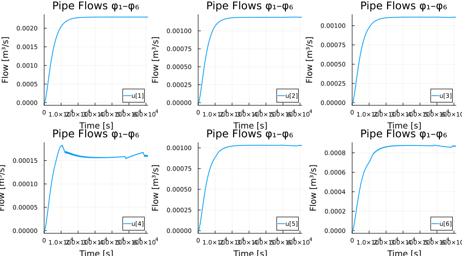

```julia
plot(ref_sol, idxs=7:12, title="Pipe Flows φ₇–φ₁₂",
     xlabel="Time [s]", ylabel="Flow [m³/s]", lw=1.5,
     layout=(2,3), size=(900,500))
```

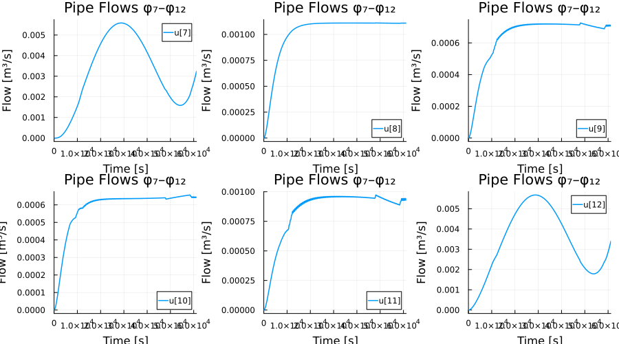

```julia
plot(ref_sol, idxs=13:18, title="Pipe Flows φ₁₃–φ₁₈",
     xlabel="Time [s]", ylabel="Flow [m³/s]", lw=1.5,
     layout=(2,3), size=(900,500))
```

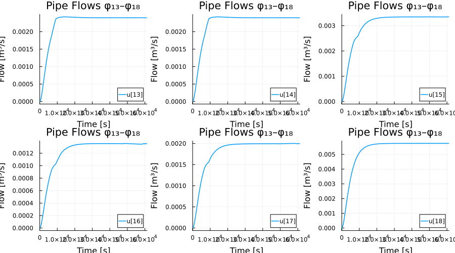

```julia
plot(ref_sol, idxs=19:24, title="Friction Factors λ₁–λ₆",
     xlabel="Time [s]", ylabel="λ", lw=1.5,
     layout=(2,3), size=(900,500))
```

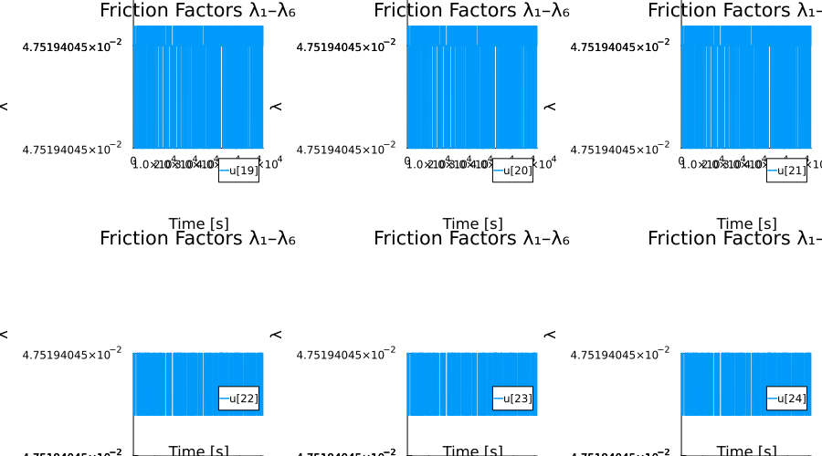

```julia
plot(ref_sol, idxs=25:30, title="Friction Factors λ₇–λ₁₂",
     xlabel="Time [s]", ylabel="λ", lw=1.5,
     layout=(2,3), size=(900,500))
```

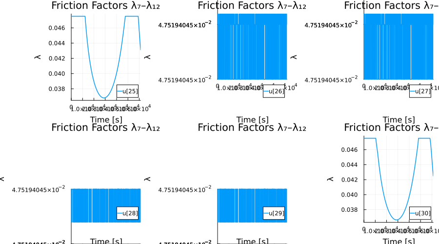

```julia
plot(ref_sol, idxs=31:36, title="Friction Factors λ₁₃–λ₁₈",
     xlabel="Time [s]", ylabel="λ", lw=1.5,
     layout=(2,3), size=(900,500))
```

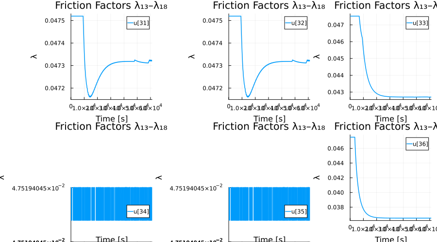

```julia
plot(ref_sol, idxs=37:49, title="Node Pressures p₁–p₁₃",
     xlabel="Time [s]", ylabel="Pressure [Pa]", lw=1.5,
     layout=(4,4), size=(1000,800))
```

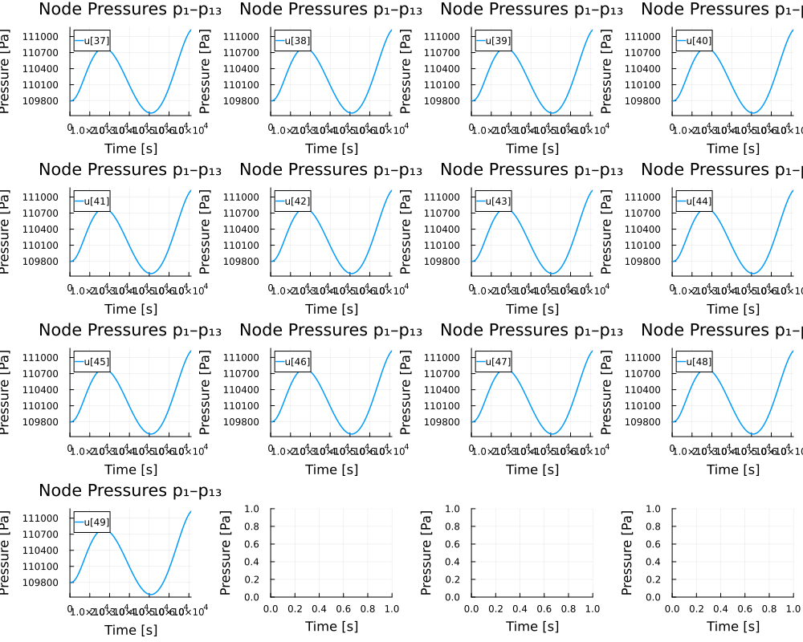


## Work-Precision Diagrams

```julia
probs = [prob_mm, prob_dae, prob_mtk]
refs  = [ref_sol, ref_sol, mtk_ref]
```

```
3-element Vector{SciMLBase.ODESolution{Float64, 2, Vector{Vector{Float64}},
 Nothing, Nothing, Vector{Float64}, Vector{Vector{Vector{Float64}}}, Nothin
g, P, OrdinaryDiffEqRosenbrock.Rodas5P{0, ADTypes.AutoForwardDiff{nothing, 
ForwardDiff.Tag{DiffEqBase.OrdinaryDiffEqTag, Float64}}, Nothing, typeof(Or
dinaryDiffEqCore.DEFAULT_PRECS), Val{:forward}(), true, nothing, typeof(Ord
inaryDiffEqCore.trivial_limiter!), typeof(OrdinaryDiffEqCore.trivial_limite
r!)}, IType, SciMLBase.DEStats, Nothing, Nothing, Nothing, Nothing} where {
P, IType}}:
 SciMLBase.ODESolution{Float64, 2, Vector{Vector{Float64}}, Nothing, Nothin
g, Vector{Float64}, Vector{Vector{Vector{Float64}}}, Nothing, SciMLBase.ODE
Problem{Vector{Float64}, Tuple{Float64, Float64}, true, SciMLBase.NullParam
eters, SciMLBase.ODEFunction{true, SciMLBase.FullSpecialize, typeof(Main.va
r"##WeaveSandBox#225".water_rhs!), Matrix{Float64}, Nothing, Nothing, Nothi
ng, Nothing, Nothing, Nothing, Nothing, Nothing, Nothing, Nothing, Nothing,
 typeof(SciMLBase.DEFAULT_OBSERVED), Nothing, Nothing, Nothing, Nothing}, B
ase.Pairs{Symbol, Union{}, Tuple{}, @NamedTuple{}}, SciMLBase.StandardODEPr
oblem}, OrdinaryDiffEqRosenbrock.Rodas5P{0, ADTypes.AutoForwardDiff{nothing
, ForwardDiff.Tag{DiffEqBase.OrdinaryDiffEqTag, Float64}}, Nothing, typeof(
OrdinaryDiffEqCore.DEFAULT_PRECS), Val{:forward}(), true, nothing, typeof(O
rdinaryDiffEqCore.trivial_limiter!), typeof(OrdinaryDiffEqCore.trivial_limi
ter!)}, OrdinaryDiffEqCore.InterpolationData{SciMLBase.ODEFunction{true, Sc
iMLBase.FullSpecialize, typeof(Main.var"##WeaveSandBox#225".water_rhs!), Ma
trix{Float64}, Nothing, Nothing, Nothing, Nothing, Nothing, Nothing, Nothin
g, Nothing, Nothing, Nothing, Nothing, typeof(SciMLBase.DEFAULT_OBSERVED), 
Nothing, Nothing, Nothing, Nothing}, Vector{Vector{Float64}}, Vector{Float6
4}, Vector{Vector{Vector{Float64}}}, Nothing, OrdinaryDiffEqRosenbrock.Rose
nbrockCache{Vector{Float64}, Vector{Float64}, Float64, Vector{Float64}, Mat
rix{Float64}, Matrix{Float64}, OrdinaryDiffEqRosenbrock.RodasTableau{Float6
4, Float64}, SciMLBase.TimeGradientWrapper{true, SciMLBase.ODEFunction{true
, SciMLBase.FullSpecialize, typeof(Main.var"##WeaveSandBox#225".water_rhs!)
, Matrix{Float64}, Nothing, Nothing, Nothing, Nothing, Nothing, Nothing, No
thing, Nothing, Nothing, Nothing, Nothing, typeof(SciMLBase.DEFAULT_OBSERVE
D), Nothing, Nothing, Nothing, Nothing}, Vector{Float64}, SciMLBase.NullPar
ameters}, SciMLBase.UJacobianWrapper{true, SciMLBase.ODEFunction{true, SciM
LBase.FullSpecialize, typeof(Main.var"##WeaveSandBox#225".water_rhs!), Matr
ix{Float64}, Nothing, Nothing, Nothing, Nothing, Nothing, Nothing, Nothing,
 Nothing, Nothing, Nothing, Nothing, typeof(SciMLBase.DEFAULT_OBSERVED), No
thing, Nothing, Nothing, Nothing}, Float64, SciMLBase.NullParameters}, Line
arSolve.LinearCache{Matrix{Float64}, Vector{Float64}, Vector{Float64}, SciM
LBase.NullParameters, LinearSolve.DefaultLinearSolver, LinearSolve.DefaultL
inearSolverInit{LinearAlgebra.LU{Float64, Matrix{Float64}, Vector{Int64}}, 
LinearAlgebra.QRCompactWY{Float64, Matrix{Float64}, Matrix{Float64}}, Nothi
ng, Nothing, Nothing, Nothing, Nothing, Nothing, Tuple{LinearAlgebra.LU{Flo
at64, Matrix{Float64}, Vector{Int64}}, Vector{Int64}}, Tuple{LinearAlgebra.
LU{Float64, Matrix{Float64}, Vector{Int64}}, Vector{Int64}}, Nothing, Nothi
ng, Nothing, LinearAlgebra.SVD{Float64, Float64, Matrix{Float64}, Vector{Fl
oat64}}, LinearAlgebra.Cholesky{Float64, Matrix{Float64}}, LinearAlgebra.Ch
olesky{Float64, Matrix{Float64}}, Tuple{LinearAlgebra.LU{Float64, Matrix{Fl
oat64}, Vector{Int32}}, Base.RefValue{Int32}}, Tuple{LinearAlgebra.LU{Float
64, Matrix{Float64}, Vector{Int64}}, Base.RefValue{Int64}}, LinearAlgebra.Q
RPivoted{Float64, Matrix{Float64}, Vector{Float64}, Vector{Int64}}, Nothing
, Nothing, Nothing, Nothing, Nothing, Matrix{Float64}}, LinearSolve.InvPrec
onditioner{LinearAlgebra.Diagonal{Float64, Vector{Float64}}}, LinearAlgebra
.Diagonal{Float64, Vector{Float64}}, Float64, LinearSolve.LinearVerbosity{S
ciMLLogging.Silent, SciMLLogging.Silent, SciMLLogging.Silent, SciMLLogging.
Silent, SciMLLogging.Silent, SciMLLogging.Silent, SciMLLogging.Silent, SciM
LLogging.Silent, SciMLLogging.WarnLevel, SciMLLogging.WarnLevel, SciMLLoggi
ng.Silent, SciMLLogging.Silent, SciMLLogging.Silent, SciMLLogging.Silent, S
ciMLLogging.Silent, SciMLLogging.Silent}, Bool, LinearSolve.LinearSolveAdjo
int{Missing}}, Tuple{DifferentiationInterfaceForwardDiffExt.ForwardDiffTwoA
rgJacobianPrep{Nothing, ForwardDiff.JacobianConfig{ForwardDiff.Tag{DiffEqBa
se.OrdinaryDiffEqTag, Float64}, Float64, 10, Tuple{Vector{ForwardDiff.Dual{
ForwardDiff.Tag{DiffEqBase.OrdinaryDiffEqTag, Float64}, Float64, 10}}, Vect
or{ForwardDiff.Dual{ForwardDiff.Tag{DiffEqBase.OrdinaryDiffEqTag, Float64},
 Float64, 10}}}}, Tuple{}}, DifferentiationInterfaceForwardDiffExt.ForwardD
iffTwoArgJacobianPrep{Nothing, ForwardDiff.JacobianConfig{ForwardDiff.Tag{D
iffEqBase.OrdinaryDiffEqTag, Float64}, Float64, 10, Tuple{Vector{ForwardDif
f.Dual{ForwardDiff.Tag{DiffEqBase.OrdinaryDiffEqTag, Float64}, Float64, 10}
}, Vector{ForwardDiff.Dual{ForwardDiff.Tag{DiffEqBase.OrdinaryDiffEqTag, Fl
oat64}, Float64, 10}}}}, Tuple{}}}, Tuple{DifferentiationInterfaceForwardDi
ffExt.ForwardDiffTwoArgDerivativePrep{Tuple{SciMLBase.TimeGradientWrapper{t
rue, SciMLBase.ODEFunction{true, SciMLBase.FullSpecialize, typeof(Main.var"
##WeaveSandBox#225".water_rhs!), Matrix{Float64}, Nothing, Nothing, Nothing
, Nothing, Nothing, Nothing, Nothing, Nothing, Nothing, Nothing, Nothing, t
ypeof(SciMLBase.DEFAULT_OBSERVED), Nothing, Nothing, Nothing, Nothing}, Vec
tor{Float64}, SciMLBase.NullParameters}, Vector{Float64}, ADTypes.AutoForwa
rdDiff{nothing, ForwardDiff.Tag{DiffEqBase.OrdinaryDiffEqTag, Float64}}, Fl
oat64, Tuple{}}, Float64, ForwardDiff.DerivativeConfig{ForwardDiff.Tag{Diff
EqBase.OrdinaryDiffEqTag, Float64}, Vector{ForwardDiff.Dual{ForwardDiff.Tag
{DiffEqBase.OrdinaryDiffEqTag, Float64}, Float64, 1}}}, Tuple{}}, Different
iationInterfaceForwardDiffExt.ForwardDiffTwoArgDerivativePrep{Tuple{SciMLBa
se.TimeGradientWrapper{true, SciMLBase.ODEFunction{true, SciMLBase.FullSpec
ialize, typeof(Main.var"##WeaveSandBox#225".water_rhs!), Matrix{Float64}, N
othing, Nothing, Nothing, Nothing, Nothing, Nothing, Nothing, Nothing, Noth
ing, Nothing, Nothing, typeof(SciMLBase.DEFAULT_OBSERVED), Nothing, Nothing
, Nothing, Nothing}, Vector{Float64}, SciMLBase.NullParameters}, Vector{Flo
at64}, ADTypes.AutoForwardDiff{nothing, ForwardDiff.Tag{DiffEqBase.Ordinary
DiffEqTag, Float64}}, Float64, Tuple{}}, Float64, ForwardDiff.DerivativeCon
fig{ForwardDiff.Tag{DiffEqBase.OrdinaryDiffEqTag, Float64}, Vector{ForwardD
iff.Dual{ForwardDiff.Tag{DiffEqBase.OrdinaryDiffEqTag, Float64}, Float64, 1
}}}, Tuple{}}}, Float64, OrdinaryDiffEqRosenbrock.Rodas5P{0, ADTypes.AutoFo
rwardDiff{nothing, ForwardDiff.Tag{DiffEqBase.OrdinaryDiffEqTag, Float64}},
 Nothing, typeof(OrdinaryDiffEqCore.DEFAULT_PRECS), Val{:forward}(), true, 
nothing, typeof(OrdinaryDiffEqCore.trivial_limiter!), typeof(OrdinaryDiffEq
Core.trivial_limiter!)}, typeof(OrdinaryDiffEqCore.trivial_limiter!), typeo
f(OrdinaryDiffEqCore.trivial_limiter!)}, BitVector}, SciMLBase.DEStats, Not
hing, Nothing, Nothing, Nothing}([[0.0, 0.0, 0.0, 0.0, 0.0, 0.0, 0.0, 0.0, 
0.0, 0.0  …  109800.0, 109800.0, 109800.0, 109800.0, 109800.0, 109800.0, 10
9800.0, 109800.0, 109800.0, 109800.0], [6.629467702740412e-72, -2.128546360
3417924e-57, 2.1285463603417595e-57, -9.516500408765004e-58, -1.29302294537
9033e-57, -3.413729045023937e-58, 2.7777777776791837e-23, 2.054432528491129
4e-57, 6.429138680122439e-58, 3.0154096350994325e-58  …  109800.0, 109800.0
, 109800.0, 109800.0, 109800.0, 109800.0, 109799.99999999993, 109800.0, 109
800.0, 109800.0], [-9.50792236221229e-38, -6.268705241941499e-36, 5.7023886
02434121e-36, -1.9015844724424587e-37, -5.9358823736446916e-36, 3.439246981
1366655e-36, 1.7095435012572306e-21, 6.268750827560875e-36, 3.7461295211765
086e-36, 4.243035203145779e-36  …  109799.99999999983, 109799.99999999993, 
109799.99999999996, 109799.99999999991, 109799.99999999993, 109799.99999999
98, 109799.99999999945, 109799.99999999959, 109799.99999999984, 109799.9999
9999914], [0.0, -6.759427121069173e-36, -7.001752830619952e-36, -2.58210827
8344375e-35, 1.7491898647692587e-35, -2.308054529995349e-35, 1.455602848423
3547e-20, -2.5301380897574184e-36, 2.1288268407000322e-36, 1.66123263822584
47e-34  …  109799.99999999869, 109799.99999999945, 109799.99999999964, 1097
99.99999999935, 109799.99999999946, 109799.99999999841, 109799.99999999838,
 109799.99999999683, 109799.99999999876, 109799.99999999329], [5.5511151231
25781e-19, 2.9673233567253867e-19, 2.5837917664003865e-19, 7.67063180650130
8e-20, 2.2002601760752553e-19, 1.433196995425199e-19, 6.316234048658893e-20
, 2.583791766400386e-19, 6.661338147750708e-20, 2.0993308102003357e-19  …  
109799.99999987397, 109799.99999994633, 109799.99999996505, 109799.99999993
698, 109799.99999994879, 109799.99999984763, 109799.99999999662, 109799.999
99969525, 109799.99999988134, 109799.99999935678], [1.1102230246251566e-18,
 5.934646713450806e-19, 5.167583532800758e-19, 1.5341263613002442e-19, 4.40
0520352150562e-19, 2.866393990850405e-19, 1.4591942563098913e-19, 5.1675835
32800758e-19, 1.332267629550161e-19, 4.198661620400632e-19  …  109799.99999
997964, 109799.99999999133, 109799.99999999435, 109799.99999998981, 109799.
99999999173, 109799.99999997538, 109799.99999999488, 109799.99999995077, 10
9799.99999998084, 109799.99999989608], [2.220446049250313e-18, 1.1869293426
901678e-18, 1.0335167065601452e-18, 3.0682527226004777e-19, 8.8010407043012
e-19, 5.732787981700831e-19, 3.5855740946404163e-19, 1.0335167065601454e-18
, 2.6645352591003533e-19, 8.39732324080118e-19  …  109800.0000000025, 10980
0.00000000106, 109800.0000000007, 109800.00000000125, 109800.00000000102, 1
09800.00000000303, 109799.99999999197, 109800.00000000607, 109800.000000002
36, 109800.0000000128], [5.551115123125783e-18, 2.9673233567254227e-18, 2.5
837917664003607e-18, 7.670631806501094e-19, 2.2002601760753133e-18, 1.43319
69954251956e-18, 7.861682428505326e-19, 2.5837917664003603e-18, 6.661338147
750861e-19, 2.099330810200297e-18  …  109800.00000035486, 109800.0000001510
9, 109800.00000009841, 109800.00000017743, 109800.00000014417, 109800.00000
042902, 109799.9999999881, 109800.00000085804, 109800.00000033407, 109800.0
0000181103], [1.2212453270876722e-17, 6.528111384795925e-18, 5.684341886080
797e-18, 1.6875389974302324e-18, 4.8405723873656925e-18, 3.1530333899354313
e-18, 1.744802835219682e-18, 5.684341886080797e-18, 1.465494392505199e-18, 
4.618527782440654e-18  …  109800.00000032732, 109800.00000013936, 109800.00
000009077, 109800.00000016365, 109800.00000013298, 109800.00000039571, 1097
99.99999998228, 109800.00000079144, 109800.00000030814, 109800.00000167044]
, [2.6090241078691177e-17, 1.3946419776609473e-17, 1.2143821302081703e-17, 
3.605196949055506e-18, 1.0341222827553969e-17, 6.736025878498426e-18, 3.795
433601602791e-18, 1.2143821302081703e-17, 3.1308289294429206e-18, 9.8668548
07941416e-18  …  109800.00000006064, 109800.00000002582, 109800.00000001682
, 109800.00000003033, 109800.00000002464, 109800.00000007331, 109799.999999
97385, 109800.00000014663, 109800.00000005709, 109800.00000030948]  …  [0.0
02298488263039008, 0.001189451546167502, 0.001109036716871506, 0.0001608296
5859200382, 0.0010286218875754983, 0.0008677922289834905, 0.002943367705945
491, 0.001109036716871506, 0.0007069625703914868, 0.0006447505955619016  … 
 111100.5359519347, 111100.47628102507, 111100.4829574858, 111100.472942794
7, 111100.56265777761, 111100.99239279861, 111099.2561206423, 111101.429808
20787, 111100.6500384577, 111103.38436144376], [0.002298488267444558, 0.001
1891632349025432, 0.0011093250325420146, 0.00015967640472106887, 0.00102948
68301814746, 0.0008698104254604018, 0.002975113902653647, 0.001109325032542
0146, 0.0007101340207393328, 0.0006427301566252794  …  111104.25043019168, 
111104.1919476708, 111104.20337768392, 111104.18623266424, 111104.296150244
13, 111104.73303075322, 111102.96125707879, 111105.16925108088, 111104.3882
6262295, 111107.12380431932], [0.002298488271756625, 0.0011889308251418144,
 0.0011095574466148106, 0.00015874675705401965, 0.0010301840680877947, 0.00
08714373110337712, 0.0030081765302913408, 0.0011095574466148106, 0.00071269
05539797515, 0.0006410997559829096  …  111107.87349242352, 111107.812150779
98, 111107.81214429987, 111107.81215402004, 111107.87346650308, 111108.2932
0421976, 111106.53211844525, 111108.7322784004, 111107.95412517023, 111110.
68683164135], [0.0022984882759771934, 0.0011889408031892123, 0.001109547472
787981, 0.00015878666080247462, 0.0010301541423867377, 0.000871367481584259
2, 0.0030448511871768117, 0.001109547472787981, 0.0007125808207817846, 0.00
06411655742188659  …  111111.37800973242, 111111.31214989694, 111111.294070
64652, 111111.32118952216, 111111.30569273069, 111111.69832010593, 111109.9
6665819564, 111112.14191300173, 111111.36828033543, 111114.0964662451], [0.
002298488280259271, 0.0011891893971980115, 0.0011092988830612596, 0.0001597
8102827351646, 0.0010294083689244952, 0.0008696273406509746, 0.003086413296
6789753, 0.0011092988830612596, 0.0007098463123774582, 0.000642902304668867
7  …  111114.84291875016, 111114.77460095145, 111114.74668984555, 111114.78
855650441, 111114.7312743265, 111115.10913998025, 111113.38200388345, 11111
5.55519698859, 111114.78405016205, 111117.50975023443], [0.0022984882836267
896, 0.0011894149147583758, 0.0011090733688684138, 0.0001606830917799369, 0
.001028731822978439, 0.0008680487311984982, 0.003120470437841808, 0.0011090
733688684138, 0.0007073656394185613, 0.0006444792137386741  …  111117.48064
708487, 111117.41354168403, 111117.39048016755, 111117.42507244227, 111117.
38840101896, 111117.7735286408, 111116.0131067655, 111118.21837873405, 1111
17.44604434176, 111120.17293198184], [0.0022984882871535436, 0.001189518112
3358217, 0.0011089701748177219, 0.00016109587503621307, 0.00102842223729960
88, 0.0008673263622633919, 0.003155476801676098, 0.0011089701748177219, 0.0
007062304872271788, 0.0006452005232749019  …  111120.16155115704, 111120.09
808198863, 111120.08956539977, 111120.10234028306, 111120.1274848016, 11112
0.53442408859, 111118.71124148446, 111120.9756404798, 111120.19968130763, 1
11122.93019372963], [0.0022984882906466287, 0.001189410359528486, 0.0011090
779311181426, 0.00016066485682070047, 0.0010287455027077855, 0.000868080645
8870814, 0.0031886231420469742, 0.0011090779311181426, 0.000707415789066380
8, 0.0006444451774916235  …  111122.75290313484, 111122.69313310612, 111122
.69941307389, 111122.68999312223, 111122.77802300593, 111123.20716275598, 1
11121.31996161838, 111123.64467752092, 111122.86500795289, 111125.599230772
79], [0.002298488294602025, 0.0011891183296279207, 0.0011093699649741043, 0
.00015949672930764628, 0.0010296216003202747, 0.0008701248710126246, 0.0032
25473692018459, 0.0011093699649741043, 0.0007106281417049783, 0.00064239872
48491518  …  111125.63556239266, 111125.57694079794, 111125.58781449935, 11
1125.57150394724, 111125.6790571983, 111126.11510291083, 111124.18944979033
, 111126.55146245928, 111125.77061373316, 111128.50601571343], [0.002298488
2964774307, 0.001188984903774538, 0.0011095033927028927, 0.0001589630221433
039, 0.0010300218816312343, 0.0008710588594879258, 0.0032435750285952263, 0
.0011095033927028927, 0.0007120958373446219, 0.0006414631597088474  …  1111
26.98515518729, 111126.92550133706, 111126.93224601533, 111126.92212899792,
 111127.0121339004, 111127.44199300824, 111125.51588814307, 111127.87938175
492, 111127.09955142433, 111129.83393501016]], nothing, nothing, [0.0, 1.0e
-6, 7.84497074962023e-6, 2.2891418170532234e-5, 4.768484309888916e-5, 7.247
826802724607e-5, 0.00011361367344100078, 0.00016823215183672926, 0.00025062
50239434785, 0.00036964254550898607  …  60567.80072205849, 60645.0121834659
, 60722.22364487331, 60799.43510628072, 60879.50173873123, 60943.7430991154
2, 61012.27419240751, 61081.46184947784, 61161.446211120216, 61200.0], [[[0
.0, 0.0, 0.0, 0.0, 0.0, 0.0, 0.0, 0.0, 0.0, 0.0  …  109800.0, 109800.0, 109
800.0, 109800.0, 109800.0, 109800.0, 109800.0, 109800.0, 109800.0, 109800.0
]], [[-9.086626015758791e-72, -5.369877660672747e-57, -6.34112029705413e-57
, -3.105232438773272e-57, -2.3280425900677905e-57, 7.771898487054633e-58, -
2.777777777679197e-23, -2.187452799336384e-57, -2.1026482993549732e-57, -1.
325458450649534e-57  …  4.537037036916256e-28, 4.537037036916255e-28, 4.537
037036916254e-28, 4.537037036916255e-28, 4.537037036916255e-28, 4.537037036
916254e-28, -1.9442125565087768e-11, 4.537037036916255e-28, 4.5370370369162
55e-28, 4.537037036916256e-28], [-4.344043306171218e-71, -1.286366472214608
6e-55, 4.68864738195276e-56, 2.335376139073017e-56, 4.4703522377147385e-56,
 2.134976098641601e-56, 9.84594068248748e-34, -2.0241213477424624e-55, 5.05
6862711819148e-56, 7.191838810460684e-56  …  4.537037036916332e-28, 4.53703
7036916312e-28, 4.5370370369163205e-28, 4.537037036916372e-28, 4.5370370369
16313e-28, 4.53703703691631e-28, -1.892753131816908e-10, 4.537037036916305e
-28, 4.537037036916336e-28, 4.537037036916316e-28], [9.918290440555419e-71,
 3.840956051590945e-55, -9.725397952194274e-56, -7.876704820637974e-57, -8.
120189910958328e-56, -7.332519428894392e-56, 4.513898307157584e-36, 4.79800
82996684095e-55, -7.889932427912298e-56, -1.5222451856806622e-55  …  -1.208
3301736230577e-38, -1.2085540080989274e-38, -1.208530856385976e-38, -1.2086
271125532218e-38, -1.208655993434952e-38, -1.2085360546284647e-38, 4.212042
4401802933e-10, -1.208461970643273e-38, -1.2086563894334123e-38, -1.2082264
031520915e-38]], [[2.1195410638391535e-21, 1.1329910413976525e-21, 9.865500
224414937e-22, 2.928820379123186e-22, 8.401090034853359e-22, 5.472269655730
186e-22, -1.3014895707440127e-21, 9.865500224414941e-22, 2.5434492766069926
e-22, 8.015718932337152e-22  …  4.307228307641005e-9, 1.8541552771556175e-9
, 1.1809684202784878e-9, 2.191891502512116e-9, 1.7500915034035378e-9, 5.255
6547555492164e-9, -5.86117463804281e-12, 1.049140061785314e-8, 4.0793898309
361345e-9, 2.2162679776733866e-8], [-5.060613383825748e-21, -2.705127881535
9236e-21, -2.355485502289878e-21, -6.992847584922847e-22, -2.00584312304360
7e-21, -1.3065583645514193e-21, 3.162106972659768e-31, -2.3554855022898822e
-21, -6.072736060591317e-22, -1.9138319706105083e-21  …  -2.366685715036347
e-8, -1.0376396377825081e-8, -6.7646975117340715e-9, -1.1330175416453073e-8
, -1.0010740556844701e-8, -2.8801945461537507e-8, -2.652956209607011e-10, -
5.716670563161709e-8, -2.2815233323587154e-8, -1.2156211120236008e-7], [1.3
692187602459e-21, 7.319096645678509e-22, 6.373090956782322e-22, 1.892011377
7944023e-22, 5.427085267883419e-22, 3.5350738900898417e-22, 1.6618448848209
322e-34, 6.373090956782103e-22, 1.64306251229551e-22, 5.178136402384959e-22
  …  2.7866070466683733e-8, 1.2649607904993494e-8, 8.467439506934134e-9, 1.
2388181298595756e-8, 1.2310426321778879e-8, 3.412491626465042e-8, 9.0450074
10674165e-10, 6.680073035731999e-8, 2.7500393294932337e-8, 1.43638075271769
98e-7]], [[3.6550683091279796e-20, 1.9538001506975017e-20, 1.70126815843047
78e-20, 5.0506398453404704e-21, 1.4487361661634552e-20, 9.436721816294069e-
21, -6.288766102229051e-21, 1.7012681584304745e-20, 4.386081970953613e-21, 
1.3822803787247594e-20  …  3.6979148434695446e-8, 1.5707220508435196e-8, 1.
0171239721674351e-8, 1.8516597177115337e-8, 1.504303729741922e-8, 4.4603808
48184196e-8, -6.218948314303991e-11, 8.919518343335075e-8, 3.47597242746801
45e-8, 1.8824202524485024e-7], [-8.726836162573256e-20, -4.664890603266403e
-20, -4.061945559306795e-20, -1.2058900879191758e-20, -3.459000515347276e-2
0, -2.2531104274280123e-20, 3.359546381976233e-30, -4.061945559306824e-20, 
-1.0472203395088325e-20, -3.300330766936982e-20  …  -1.9691629742365441e-7,
 -8.394618913079907e-8, -5.443486541688091e-8, -9.824799459851827e-8, -8.00
7545597092937e-8, -2.3777858475416614e-7, -3.0288286082917155e-10, -4.75299
6769904238e-7, -1.8461935920685585e-7, -1.0029526302659165e-6], [2.36116590
719586e-20, 1.2621505031191559e-20, 1.099015404076527e-20, 3.26270198085204
18e-21, 9.358803050341105e-21, 6.0961010694879245e-21, 1.3245114499381717e-
34, 1.0990154040766452e-20, 2.833399088635682e-21, 8.929500158125449e-21  …
  2.2892811410987602e-7, 9.823455924879176e-8, 6.373009461454578e-8, 1.1394
080384166457e-7, 9.304807480436224e-8, 2.76853012904518e-7, 1.1408252072202
14e-9, 5.537495331913061e-7, 2.143655028548046e-7, 1.1680969128666874e-6]],
 [[-9.792242335837025e-19, -5.234398630429229e-19, -4.557843705407746e-19, 
-1.3531098500429626e-19, -3.8812887803862715e-19, -2.528178930343319e-19, -
1.7075386601084677e-20, -4.557843705407751e-19, -1.1750690803003598e-19, -3
.7032480106438655e-19  …  1.6689056747206888e-8, 6.998699625240929e-9, 4.60
05365718969825e-9, 8.291397151880871e-9, 6.884726071959734e-9, 2.0167117982
454205e-8, -4.366450252657746e-11, 4.0391962090062713e-8, 1.577294118343712
4e-8, 8.545328417218551e-8], [1.0830605277694248e-18, 5.789450821168066e-19
, 5.041154456526841e-19, 1.4965927292814278e-19, 4.2928580918865205e-19, 2.
796265362604559e-19, 1.5064122217744404e-29, 5.041154456526633e-19, 1.29967
26333231447e-19, 4.095937995928137e-19  …  -4.0955502838186933e-7, -1.74003
5603811832e-7, -1.1379749151359915e-7, -2.048543217841123e-7, -1.6669993813
561656e-7, -4.953597057817883e-7, 4.751294451615794e-10, -9.909681767953056
e-7, -3.85685546188463e-7, -2.091921066316158e-6], [-2.707044433384544e-19,
 -1.4470382971193305e-19, -1.2600061362666793e-19, -3.740643217041493e-20, 
-1.0729739754149847e-19, -6.989096537102114e-20, -1.8587572126524537e-32, -
1.260006136266192e-19, -3.248453320062368e-20, -1.0237549857168287e-19  …  
2.8634873240446843e-6, 1.2185495450010595e-6, 7.947969151435366e-7, 1.43229
73829402289e-6, 1.163370294483969e-6, 3.46209033023243e-6, -1.1759557108567
365e-9, 6.924908729096669e-6, 2.6952026029076923e-6, 1.4616000017881887e-5]
], [[-1.9750111365716088e-19, -1.0557332257309273e-19, -9.192779108405456e-
20, -2.7291062978079594e-20, -7.828225959501241e-20, -5.099119661693278e-20
, -1.707538655599663e-20, -9.192779108405094e-20, -2.3700133638858087e-20, 
-7.469133025579139e-20  …  2.147745727815767e-6, 9.14526690027573e-7, 5.956
461809909487e-7, 1.0739801540908864e-6, 8.726831173326648e-7, 2.59654354500
99238e-6, 4.875587466509243e-11, 5.193178262857221e-6, 2.022006974557437e-6
, 1.0961179680815918e-5], [-3.463847911503208e-18, -1.851584156330838e-18, 
-1.6122637551724347e-18, -4.786408023168183e-19, -1.3729433540140252e-18, -
8.94302551697219e-19, 1.5033931157339224e-29, -1.612263755172445e-18, -4.15
6617493803834e-19, -1.309964301077604e-18  …  -7.546319216437792e-6, -3.213
469840302927e-6, -2.093394248520323e-6, -3.7738192137292538e-6, -3.06542270
5455823e-6, -9.124501377860649e-6, -1.8628413456376874e-10, -1.824759514860
865e-5, -7.105149581066414e-6, -3.851448503427497e-5], [4.143968921701654e-
18, 2.2151397508732857e-18, 1.928829170828451e-18, 5.726211600897015e-19, 1
.6425185907836105e-18, 1.0698974306939157e-18, 6.8782793901082095e-34, 1.92
8829170828454e-18, 4.97276270604197e-19, 1.5671737012981087e-18  …  7.47692
4565933327e-6, 3.1842191315858613e-6, 2.0748074084276464e-6, 3.739354049446
821e-6, 3.035560364157129e-6, 9.04254762673714e-6, 2.515811206933124e-10, 1
.808060031750728e-5, 7.040439191640261e-6, 3.816097434091866e-5]], [[3.3118
27933472658e-19, 1.7703225680744557e-19, 1.5415053653981554e-19, 4.57634405
35261996e-20, 1.3126881627218454e-19, 8.55053757369216e-20, -4.700337675066
011e-20, 1.5415053653981681e-19, 3.9741935201658816e-20, 1.2524731093860837
e-19  …  9.484232902370778e-7, 4.0391208406538825e-7, 2.6300126782710316e-7
, 4.7433512344585796e-7, 3.85210368789234e-7, 1.1468254815140359e-6, -7.498
563674227606e-11, 2.2932974183294436e-6, 8.928033156364129e-7, 4.8404981311
52208e-6], [-1.8836310112648698e-18, -1.0068863951125759e-18, -8.7674461615
2365e-19, -2.602835579202896e-19, -7.466028371922705e-19, -4.86319279271992
6e-19, 6.856930985886991e-29, -8.767446161523677e-19, -2.260357213517049e-1
9, -7.123550006238148e-19  …  -2.707949153564605e-6, -1.153450464294521e-6,
 -7.517057206247197e-7, -1.3544585670302853e-6, -1.100070042816055e-6, -3.2
74223868963527e-6, 2.565290386203368e-10, -6.5485226972117105e-6, -2.549613
3473489635e-6, -1.382176588767915e-5], [3.940639740938329e-18, 2.1064510615
199316e-18, 1.8341886794186187e-18, 5.445247642024421e-19, 1.56192629731742
17e-18, 1.0174015331149796e-18, 6.30297709837186e-32, 1.834188679418619e-18
, 4.728767689125349e-19, 1.4902783020276018e-18  …  2.0641226905432956e-6, 
8.793933813361093e-7, 5.744978786689816e-7, 1.032673210693013e-6, 8.3904784
06374291e-7, 2.4952900674553735e-6, -2.648247117115915e-10, 4.9926689646226
126e-6, 1.9444075755341767e-6, 1.0536560927411274e-5]], [[-1.29990031166632
83e-18, -6.948558029634563e-19, -6.050445087028677e-19, -1.7962258852117248
e-19, -5.152332144422812e-19, -3.3561062592111007e-19, -8.286605945534741e-
20, -6.050445087028711e-19, -1.559880373999369e-19, -4.915986633210927e-19 
 …  8.768381788677797e-7, 3.7342015950318327e-7, 2.4313275111002646e-7, 4.3
838803291046857e-7, 3.5620224718405076e-7, 1.0601508785527167e-6, -5.228804
379722576e-11, 2.1199115684158846e-6, 8.255181542270394e-7, 4.4745642694633
91e-6], [9.990857309324027e-18, 5.3405673617113856e-18, 4.650289947612681e-
18, 1.3805548281975626e-18, 3.960012533513811e-18, 2.579457705316427e-18, 1
.6072084663956288e-28, 4.650289947612675e-18, 1.1989028771188754e-18, 3.778
360582435294e-18  …  -3.972486260919839e-6, -1.691573117819323e-6, -1.10110
38432269667e-6, -1.986646685888351e-6, -1.6132653196487482e-6, -4.802390531
778896e-6, 9.023587899625209e-11, -9.604029397692525e-6, -3.739162959666381
e-6, -2.0271066603011046e-5], [-2.0742639915107015e-17, -1.1087883881893648
e-17, -9.654756033213564e-18, -2.8662556973603148e-18, -8.221628184533309e-
18, -5.355372487173168e-18, -3.1946094569181235e-33, -9.65475603321354e-18,
 -2.489116789812885e-18, -7.844489276985967e-18  …  1.5133616110262243e-6, 
6.444535600203099e-7, 4.1799580713713304e-7, 7.580911340082942e-7, 6.133505
434818009e-7, 1.8286654101149905e-6, 1.367060688231433e-10, 3.6574153155264
772e-6, 1.4229941697239086e-6, 7.719660548811216e-6]], [[-9.168593609416514
e-19, -4.901030038488077e-19, -4.2675635709284154e-19, -1.2669329351194283e
-19, -3.6340971033686325e-19, -2.367164168249246e-19, -1.8857181201499029e-
19, -4.2675635709283422e-19, -1.1002312331296774e-19, -3.4673954013796073e-
19  …  -4.693577532099534e-6, -1.998420304080609e-6, -1.3016386163938666e-6
, -2.3467938371794224e-6, -1.9068391459769817e-6, -5.674385449431653e-6, 8.
040695397997544e-12, -1.1348778131803882e-5, -4.418552260947955e-6, -2.3953
454720193332e-5], [4.4136183379824935e-18, 2.3592796206670555e-18, 2.054338
7173155412e-18, 6.098818067030512e-19, 1.7493978139639126e-18, 1.1395160072
610905e-18, 5.513823833637537e-28, 2.0543387173154823e-18, 5.29634200557987
5e-19, 1.6691502078187176e-18  …  1.458809739178359e-5, 6.21073637204459e-6
, 4.045332719250892e-6, 7.293853071771243e-6, 5.925969950496856e-6, 1.76362
56770688037e-5, -5.252122849423358e-10, 3.527245464075465e-5, 1.37326171724
42597e-5, 7.444809197693394e-5], [-1.8193075099720863e-17, -9.7250255987600
98e-18, -8.468049500961157e-18, -2.513952195597819e-18, -7.211073403162088e
-18, -4.697121207564484e-18, 2.242321771148673e-31, -8.468049500961046e-18,
 -2.183169011966603e-18, -6.880290219530636e-18  …  -1.36279930729299e-5, -
5.800833160676847e-6, -3.7787515708751273e-6, -6.81358212732466e-6, -5.5348
26803324074e-6, -1.6474945687942118e-5, 1.3398492437325258e-9, -3.294940266
668512e-5, -1.2827404290281386e-5, -6.954511686825948e-5]], [[-3.3124936689
44919e-18, -1.7706784339451156e-18, -1.5418152349998172e-18, -4.57726397890
58e-19, -1.3129520360545202e-18, -8.552256381639377e-19, -3.93476944492609e
-19, -1.54181523499981e-18, -3.9749924027335225e-19, -1.2527248784373802e-1
8  …  -3.6702043468169e-6, -1.5626886596291876e-6, -1.0178340885229078e-6, 
-1.8349983212656585e-6, -1.4910998523614483e-6, -4.43704107855449e-6, -3.88
6055305154874e-11, -8.874284502381238e-6, -3.455081151274414e-6, -1.8730537
287264682e-5], [-1.809310479851605e-18, -9.671586928660976e-19, -8.42151786
9852494e-19, -2.5001381176175578e-19, -7.17144881104406e-19, -4.67131069342
61065e-19, 1.661048405030873e-27, -8.421517869851229e-19, -2.17117257580901
1e-19, -6.842483269265341e-19  …  1.2717960832334406e-5, 5.415106022344552e
-6, 3.5270938399825983e-6, 6.358593746689799e-6, 5.166872829459994e-6, 1.53
75379712583673e-5, 3.3667495439529446e-10, 3.075221301950249e-5, 1.19730954
7042045e-5, 6.490635152563331e-5], [9.763147145360811e-18, 5.21884592861092
94e-18, 4.544301216749497e-18, 1.3490894237230462e-18, 3.869756504887936e-1
8, 2.5206670811648126e-18, 1.528512452783621e-30, 4.544301216749201e-18, 1.
1715776574418374e-18, 3.692244738609889e-18  …  -9.993318869164896e-6, -4.2
5513794785463e-6, -2.7714815766853697e-6, -4.995821708509922e-6, -4.0594206
98501073e-6, -1.2081695880874278e-5, -7.598343882719468e-10, -2.41658840648
98063e-5, -9.409252017644765e-6, -5.100343959675211e-5]]  …  [[5.1049648913
68545e-14, 1.4566225062313575e-7, -1.4566219957297637e-7, 5.826489003915742
e-7, -4.369866497686154e-7, -1.0196355501601785e-6, 1.52527031152386e-6, -1
.456621995725028e-7, -1.602284450551711e-6, 1.0197741998360004e-6  …  0.064
09910883139534, 0.06454044908661613, 0.06630580963117992, 0.063657768684411
7, 0.07116055162240825, 0.07380077460558004, 0.06892514371545372, 0.0733628
8905674995, 0.0729371851027976, 0.0733628888808952], [-3.7009312663442207e-
16, -6.260088102275701e-9, 6.2600877201075374e-9, -2.5040351629726933e-8, 1
.8780263546460266e-8, 4.382061517553555e-8, -9.114849648199894e-8, 6.260087
724844463e-9, 6.886096680364221e-8, -4.357179220453631e-8  …  -0.0077898214
28196023, -0.007013128975968478, -0.003906356712090355, -0.0085665147261179
18, 0.004637264012646878, 0.00929779769504278, 0.0003662155359932607, 0.008
520937884573343, 0.007743490955713525, 0.008520938212266422], [-1.670543344
8494025e-17, -1.076055804096646e-8, 1.0760558059424367e-8, -4.3042232238328
63e-8, 3.228167414518072e-8, 7.532390638420828e-8, -1.3333280018547505e-7, 
1.076055804394971e-8, 1.1836613862654421e-7, -7.534878719875295e-8  …  0.00
0791920886476449, 0.0007165150711189232, 0.0004148882305513084, 0.000867328
8582462317, -0.00041458248390774784, -0.000866446696351291, -2.054790801510
2466e-7, -0.0007912955948154686, -0.0007170371182408804, -0.000791295123175
1338]], [[4.7413978229146214e-14, 5.718470635982436e-8, -5.71846589456353e-
8, 2.2873873061078182e-7, -1.7155402425106407e-7, -4.002927548618585e-7, 4.
075300044118004e-7, -5.718465894561811e-8, -6.290314854743259e-7, 4.0092510
35310132e-7  …  0.04532626111830491, 0.0473216682419348, 0.0553032967716404
1, 0.043330854027083435, 0.07725277556718634, 0.0892222400687088, 0.0664601
1397258836, 0.08722814506968259, 0.08523869468561622, 0.08722814491859122],
 [-3.3256121067684794e-16, -4.096021600054929e-8, 4.096021566454504e-8, -1.
6384086332346295e-7, 1.228806473292867e-7, 2.8672151065274565e-7, -5.179367
091878249e-7, 4.096021566443983e-8, 4.505623739835412e-7, -2.86616656972263
1e-7  …  -0.0031765207406830166, -0.002841735391536197, -0.0015025925925927
135, -0.0035113062808862596, 0.0021800504171302407, 0.0041909849475766404, 
0.00033811634091973023, 0.0038552168367142177, 0.0035159895065158156, 0.003
855217708740386], [-1.9477889558700433e-17, -2.0442523291396963e-9, 2.04425
23245087024e-9, -8.177009326316125e-9, 6.132756979279702e-9, 1.430976630557
9137e-8, -2.295320642297262e-8, 2.0442523253902785e-9, 2.2486775626801737e-
8, -1.4361738092141348e-8  …  0.001698474236254474, 0.001536757901912845, 0
.0008898881432635852, 0.001860190927829026, -0.0008890070816238398, -0.0018
592084019316806, 1.1067250475274161e-7, -0.0016975360068744462, -0.00153602
29448717567, -0.0016975366356284207]], [[4.6406326127191837e-14, -6.9895617
8026563e-8, 6.989566421010984e-8, -2.795825640296568e-7, 2.09686946222947e-
7, 4.892695102525993e-7, -1.180774611038319e-6, 6.989566421016422e-8, 7.688
520742841423e-7, -4.886814960784839e-7  …  0.04754739258464023, 0.049428374
0895504, 0.05695229931891886, 0.04566641132014717, 0.07764309425306062, 0.0
8893283924901753, 0.06747671314773872, 0.08705015365705308, 0.0851614578738
2225, 0.08705015360152547], [-3.472744715292909e-16, -4.132302663895344e-8,
 4.13230263084752e-8, -1.652921058810146e-7, 1.2396907925599748e-7, 2.89261
18513700985e-7, -5.119605749203588e-7, 4.1323026308848065e-8, 4.54553291008
9737e-7, -2.8936572551461493e-7  …  0.003683935781714876, 0.003365540728768
3297, 0.002091963684894701, 0.004002330329815564, -0.0014103757520324569, -
0.003318533121547031, 0.0003396073491221301, -0.0030011122063677864, -0.002
687135895165828, -0.003001111550629177], [5.0523356711366717e-17, 7.1839809
3328838e-9, -7.183980929718506e-9, 2.8735923714335183e-8, -2.15519427939730
4e-8, -5.0287866508321323e-8, 9.177258747414756e-8, -7.18398093126413e-9, -
7.902379020977652e-8, 5.024985671753723e-8  …  0.0012613092605398579, 0.001
1412611440321568, 0.0006610650465486684, 0.0013813570156571292, -0.00065947
00926952584, -0.0013801533942638057, 1.0881986933469862e-6, -0.001259930241
701447, -0.001139097471720026, -0.0012599314570045032]], [[4.54230770192370
85e-14, -1.3834503290391107e-7, 1.3834507832561797e-7, -5.533802224594168e-
7, 4.150351895559353e-7, 9.684154120153515e-7, -2.0110235676222443e-6, 1.38
34507832642122e-7, 1.5217956344764628e-6, -9.683636187509198e-7  …  0.06601
582383919202, 0.0662358276216639, 0.06711584219017915, 0.06579582035993695,
 0.0695358818338075, 0.07086336309105118, 0.06850419427064981, 0.0706400706
1290975, 0.07040514796128744, 0.07064007042127611], [-3.237222609659326e-16
, -7.686122723255319e-9, 7.686122393200408e-9, -3.074449023719433e-8, 2.305
836751845228e-8, 5.380285775605925e-8, -8.511320933623734e-8, 7.68612240145
9771e-9, 8.454734798706565e-8, -5.40288769547904e-8  …  0.00773890037070457
55, 0.007034640080013729, 0.004217601550110579, 0.00844315976427701, -0.003
529255542925787, -0.007754437311977421, 0.00034484390632097227, -0.00705034
3203240435, -0.0063468384608285485, -0.00705034232748855], [-1.426003126457
199e-17, 1.0425838034599148e-8, -1.042583801713587e-8, 4.170335211934178e-8
, -3.127751409919401e-8, -7.298086621897884e-8, 1.300218528413635e-7, -1.04
25838046896055e-8, -1.1468421833531998e-7, 7.298796723892403e-8  …  -0.0002
0963226412101606, -0.0001895791923971974, -0.00010937109950904654, -0.00022
968474437309286, 0.00011120807630050018, 0.00023096440494555867, 1.56454762
87700686e-6, 0.000211157038524744, 0.0001922254293270969, 0.000211155710014
31254]], [[4.7795505698905263e-14, -9.784408215745189e-8, 9.784412995222393
e-8, -3.913764242193391e-7, 2.9353234206138636e-7, 6.849087662807357e-7, -1
.4952120712996599e-6, 9.784412995169512e-8, 1.0762851904978744e-6, -6.85483
7460182965e-7  …  0.09290985992800127, 0.0911663858374629, 0.08419248928575
798, 0.09465333405752839, 0.06501427410709645, 0.054558604107608294, 0.0748
0188762437302, 0.05629979336684674, 0.058032917981767414, 0.056299793416005
9], [-3.486853315462866e-16, 3.608245290114852e-8, -3.6082453241981055e-8, 
1.4432981228878358e-7, -1.0824735939139117e-7, -2.525771716808731e-7, 4.597
364927194567e-7, -3.6082453247935696e-8, -3.9690698396198383e-7, 2.52399729
54469833e-7  …  0.006284763905618832, 0.005723150583194446, 0.0034767002452
2588, 0.006846377424354845, -0.0027010413740169476, -0.006072689843150493, 
0.0003912701454939065, -0.005510209898374502, -0.004944651066366109, -0.005
510209898605164], [-2.6305924174430528e-17, 5.638297556880836e-9, -5.638297
601890155e-9, 2.2553190308882288e-8, -1.691489274066137e-8, -3.946808304881
074e-8, 6.773051724054512e-8, -5.638297582218662e-9, -6.202127336560262e-8,
 3.9521795244537034e-8  …  -0.001746887726585999, -0.001580439234522341, -0
.0009146503222828931, -0.0019133373099830206, 0.0009162737804620865, 0.0019
146611145409744, 7.926982212592632e-7, 0.0017483469345052779, 0.00158248839
40639943, 0.0017483467916927543]], [[3.013552911370206e-14, 1.8888636845533
157e-8, -1.8888606710010116e-8, 7.555448710690732e-8, -5.6665850265574235e-
8, -1.322203373724814e-7, 6.559151355156523e-8, -1.8888606710048507e-8, -2.
0777482447955174e-7, 1.3174490008648405e-7  …  0.06415079281256501, 0.06268
210329553128, 0.056807344851813164, 0.06561948244321508, 0.0406517593579478
, 0.03183852658354601, 0.048863562644205834, 0.03330769720580951, 0.0347785
7733504922, 0.033307697331960595], [-1.9445249273443978e-16, 2.577916228009
995e-8, -2.577916246543609e-8, 1.031166495055789e-7, -7.733748721102143e-8,
 -1.8045413671694798e-7, 3.210007332621788e-7, -2.5779162465104197e-8, -2.8
357078621890644e-7, 1.804742536460686e-7  …  -0.0003987426941635382, -0.000
34155228905702854, -0.00011278753719968961, -0.0004559330795210836, 0.00051
63117107910032, 0.0008580730749360313, 0.0002034657501351587, 0.00080149341
08861998, 0.0007470719409933773, 0.0008014929361875722], [4.386737390455396
4e-17, -1.8697569241868134e-9, 1.869756943302997e-9, -7.47902775010472e-9, 
5.609270810308524e-9, 1.308829856079999e-8, -2.45861478779801e-8, 1.8697569
424158624e-9, 2.0567326298998375e-8, -1.306527899556432e-8  …  -0.000757804
8512018012, -0.0006856152565109456, -0.0003968645134812254, -0.000829994943
916243, 0.0003972097049816903, 0.0008304428802576726, -1.6558950695827693e-
8, 0.0007582096721001087, 0.000685811511959898, 0.0007582107074139159]], [[
3.36754067361068e-14, 9.166409412325018e-8, -9.166406044882326e-8, 3.666563
091409641e-7, -2.749922150209856e-7, -6.416485241619436e-7, 9.3806358625872
06e-7, -9.166406044890782e-8, -1.0083048333024808e-6, 6.413546168557537e-7 
 …  0.06577635500710403, 0.06486052387206862, 0.06119719923036553, 0.066692
186043978, 0.051123056458299364, 0.04562308771366091, 0.056317228026681765,
 0.04654111909245812, 0.0474669142705712, 0.04654111923379927], [-2.0762836
346877366e-16, 1.8629617540262607e-8, -1.8629617755940277e-8, 7.45184706026
265e-8, -5.588885305210155e-8, -1.304073236544186e-7, 2.2584714944565385e-7
, -1.8629617755980776e-8, -2.04925794249656e-7, 1.3053585241488935e-7  …  -
0.0039202407890872384, -0.0035234883904502745, -0.001936477794185724, -0.00
431699312797461, 0.0024278017452579598, 0.00480733577803286, 0.000246920827
18607504, 0.004411018433922955, 0.004016228744483314, 0.004411017896136959]
, [-1.7425502163104116e-17, -6.0088702273135256e-9, 6.008870237074416e-9, -
2.403548093561468e-8, 1.8026610701363213e-8, 4.206209163662212e-8, -7.57444
6854669174e-8, 6.00887023705684e-9, 6.60975725480709e-8, -4.205077746952711
4e-8  …  -0.0003831310051973407, -0.00034663343942478513, -0.00020064511681
329295, -0.00041962803397085745, 0.00020082085385089764, 0.0004201278433198
9423, -1.0915360509576416e-7, 0.00038348640706239946, 0.0003463388252742419
, 0.00038348738014567103]], [[3.3673561865961645e-14, 1.066961177167827e-7,
 -1.0669608404203354e-7, 4.267844035145386e-7, -3.200882858008141e-7, -7.46
8726893153487e-7, 1.0973572442851443e-6, -1.0669608404199492e-7, -1.1736570
928298558e-6, 7.470202375630002e-7  …  0.05319449403227863, 0.0536517374134
1398, 0.0554807106389714, 0.0527372507682119, 0.06051038702327068, 0.063248
12776162182, 0.058158186390634595, 0.06279341132781364, 0.06234760668604461
, 0.06279341156498573], [-2.1092120883859072e-16, -6.692761897940535e-9, 6.
692761690974175e-9, -2.677104716419366e-8, 2.007828528027531e-8, 4.68493324
4464809e-8, -9.240009712194655e-8, 6.692761691191782e-9, 7.362037960847138e
-8, -4.669168591155798e-8  …  -0.00491978084240831, -0.004427125134914728, 
-0.0024564982684825132, -0.00541243823182773, 0.002962725229552, 0.00591904
9858925873, 0.00025363455930908774, 0.005426222568226033, 0.004932794912257
962, 0.005426221655217784], [-1.799607801636982e-17, -5.957041775304974e-9,
 5.9570417359531994e-9, -2.382816703373837e-8, 1.7871125246675623e-8, 4.169
929228020549e-8, -7.367786733005474e-8, 5.957041735597869e-9, 6.55274593164
2356e-8, -4.17147580323085e-8  …  0.0004941732256033432, 0.0004471212562442
406, 0.00025890408966384564, 0.0005412292640930482, -0.0002586918091480896,
 -0.0005406981930090067, -8.405910995555978e-8, -0.0004937841334690821, -0.
0004473651061357413, -0.0004937831882555443]], [[4.4104599355877124e-14, 5.
899751581374583e-8, -5.899747171121949e-8, 2.359899750537069e-7, -1.7699245
923608558e-7, -4.1298243428980594e-7, 3.948994773476616e-7, -5.899747171112
228e-8, -6.489724093419804e-7, 4.1364673228332247e-7  …  0.0567054892540076
95, 0.05878850637958479, 0.06712057538278064, 0.05462247201342622, 0.090033
7650324083, 0.10252879733749086, 0.0787947940239187, 0.10044713329114222, 0
.09837025765366765, 0.10044713328466812], [-3.197575630995431e-16, -4.44234
3411526973e-8, 4.442343378569971e-8, -1.7769373580850943e-7, 1.332703016877
9346e-7, 3.109640374960035e-7, -5.620980247067213e-7, 4.4423433785982805e-8
, 4.886577733007163e-7, -3.108510764166943e-7  …  -0.0033941411521138456, -
0.0030335649327923437, -0.0015912605368127134, -0.003754717109800538, 0.002
3750772759944315, 0.004540941912786738, 0.000391529197351137, 0.00417929963
2392438, 0.0038139064251991703, 0.004179300178953276], [-3.076310301132868e
-17, -2.1352555435346887e-9, 2.135255556087558e-9, -8.541022211231704e-9, 6
.405766654071009e-9, 1.4946788865646622e-8, -2.3571996776900184e-8, 2.13525
55553685595e-9, 2.3487811074899005e-8, -1.5005091769533195e-8  …  0.0019058
614671388701, 0.0017244016049525724, 0.0009985586870073402, 0.0020873212919
477547, -0.0009975095819189565, -0.002086163276935494, 1.614710900480914e-7
, -0.001904748326304512, -0.0017235000824185449, -0.0019047498921650103]], 
[[1.0060706765942247e-14, -1.3324827643723708e-8, 1.3324837704754824e-8, -5
.32993307015131e-8, 3.997450305324834e-8, 9.327383375476071e-8, -2.46698896
09798003e-7, 1.332483770477002e-8, 1.4657316445637702e-7, -9.31174714941528
1e-8  …  0.013282949379385907, 0.013778214042847653, 0.015759271980196637, 
0.012787684935108894, 0.021207181311149573, 0.024179510659370754, 0.0185333
27193941972, 0.023683917904862534, 0.023187168865414786, 0.0236839179229061
95], [-5.2441180685959126e-17, -5.1297082629213295e-9, 5.129708227584468e-9
, -2.051883297061936e-8, 1.538912471830443e-8, 3.590795768875978e-8, -6.366
638749987308e-8, 5.129708227810649e-9, 5.6426790658683246e-8, -3.5918013974
12636e-8  …  0.00036359422317603, 0.0003331683132182219, 0.0002114639404237
2804, 0.0003940205984119057, -0.00012322268769166116, -0.000305503597860306
77, 4.397295809037102e-5, -0.0002751989796625601, -0.00024532255738804237, 
-0.00027519933086507314], [3.769337830788077e-17, 3.1341324976451167e-10, -
3.134132618264461e-10, 1.253653031178598e-9, -9.402397739937929e-10, -2.193
8928049721353e-9, 4.0693092291156144e-9, -3.134132624160737e-10, -3.4475458
34725524e-9, 2.191123526579853e-9  …  9.141681243211273e-5, 8.2713088412356
41e-5, 4.790658010769383e-5, 0.00010011743160105304, -4.781276897222103e-5,
 -0.0001000438365539531, 8.514044207473559e-8, -9.133354671149521e-5, -8.25
9620144223951e-5, -9.133263775488491e-5]]], nothing, SciMLBase.ODEProblem{V
ector{Float64}, Tuple{Float64, Float64}, true, SciMLBase.NullParameters, Sc
iMLBase.ODEFunction{true, SciMLBase.FullSpecialize, typeof(Main.var"##Weave
SandBox#225".water_rhs!), Matrix{Float64}, Nothing, Nothing, Nothing, Nothi
ng, Nothing, Nothing, Nothing, Nothing, Nothing, Nothing, Nothing, typeof(S
ciMLBase.DEFAULT_OBSERVED), Nothing, Nothing, Nothing, Nothing}, Base.Pairs
{Symbol, Union{}, Tuple{}, @NamedTuple{}}, SciMLBase.StandardODEProblem}(Sc
iMLBase.ODEFunction{true, SciMLBase.FullSpecialize, typeof(Main.var"##Weave
SandBox#225".water_rhs!), Matrix{Float64}, Nothing, Nothing, Nothing, Nothi
ng, Nothing, Nothing, Nothing, Nothing, Nothing, Nothing, Nothing, typeof(S
ciMLBase.DEFAULT_OBSERVED), Nothing, Nothing, Nothing, Nothing}(Main.var"##
WeaveSandBox#225".water_rhs!, [1.2732395447351628e6 0.0 … 0.0 0.0; 0.0 1.27
32395447351628e6 … 0.0 0.0; … ; 0.0 0.0 … 0.0 0.0; 0.0 0.0 … 0.0 0.0], noth
ing, nothing, nothing, nothing, nothing, nothing, nothing, nothing, nothing
, nothing, nothing, SciMLBase.DEFAULT_OBSERVED, nothing, nothing, nothing, 
nothing), [0.0, 0.0, 0.0, 0.0, 0.0, 0.0, 0.0, 0.0, 0.0, 0.0  …  109800.0, 1
09800.0, 109800.0, 109800.0, 109800.0, 109800.0, 109800.0, 109800.0, 109800
.0, 109800.0], (0.0, 61200.0), SciMLBase.NullParameters(), Base.Pairs{Symbo
l, Union{}, Tuple{}, @NamedTuple{}}(), SciMLBase.StandardODEProblem()), Ord
inaryDiffEqRosenbrock.Rodas5P{0, ADTypes.AutoForwardDiff{nothing, ForwardDi
ff.Tag{DiffEqBase.OrdinaryDiffEqTag, Float64}}, Nothing, typeof(OrdinaryDif
fEqCore.DEFAULT_PRECS), Val{:forward}(), true, nothing, typeof(OrdinaryDiff
EqCore.trivial_limiter!), typeof(OrdinaryDiffEqCore.trivial_limiter!)}(noth
ing, OrdinaryDiffEqCore.DEFAULT_PRECS, OrdinaryDiffEqCore.trivial_limiter!,
 OrdinaryDiffEqCore.trivial_limiter!, ADTypes.AutoForwardDiff(tag=ForwardDi
ff.Tag{DiffEqBase.OrdinaryDiffEqTag, Float64}())), OrdinaryDiffEqCore.Inter
polationData{SciMLBase.ODEFunction{true, SciMLBase.FullSpecialize, typeof(M
ain.var"##WeaveSandBox#225".water_rhs!), Matrix{Float64}, Nothing, Nothing,
 Nothing, Nothing, Nothing, Nothing, Nothing, Nothing, Nothing, Nothing, No
thing, typeof(SciMLBase.DEFAULT_OBSERVED), Nothing, Nothing, Nothing, Nothi
ng}, Vector{Vector{Float64}}, Vector{Float64}, Vector{Vector{Vector{Float64
}}}, Nothing, OrdinaryDiffEqRosenbrock.RosenbrockCache{Vector{Float64}, Vec
tor{Float64}, Float64, Vector{Float64}, Matrix{Float64}, Matrix{Float64}, O
rdinaryDiffEqRosenbrock.RodasTableau{Float64, Float64}, SciMLBase.TimeGradi
entWrapper{true, SciMLBase.ODEFunction{true, SciMLBase.FullSpecialize, type
of(Main.var"##WeaveSandBox#225".water_rhs!), Matrix{Float64}, Nothing, Noth
ing, Nothing, Nothing, Nothing, Nothing, Nothing, Nothing, Nothing, Nothing
, Nothing, typeof(SciMLBase.DEFAULT_OBSERVED), Nothing, Nothing, Nothing, N
othing}, Vector{Float64}, SciMLBase.NullParameters}, SciMLBase.UJacobianWra
pper{true, SciMLBase.ODEFunction{true, SciMLBase.FullSpecialize, typeof(Mai
n.var"##WeaveSandBox#225".water_rhs!), Matrix{Float64}, Nothing, Nothing, N
othing, Nothing, Nothing, Nothing, Nothing, Nothing, Nothing, Nothing, Noth
ing, typeof(SciMLBase.DEFAULT_OBSERVED), Nothing, Nothing, Nothing, Nothing
}, Float64, SciMLBase.NullParameters}, LinearSolve.LinearCache{Matrix{Float
64}, Vector{Float64}, Vector{Float64}, SciMLBase.NullParameters, LinearSolv
e.DefaultLinearSolver, LinearSolve.DefaultLinearSolverInit{LinearAlgebra.LU
{Float64, Matrix{Float64}, Vector{Int64}}, LinearAlgebra.QRCompactWY{Float6
4, Matrix{Float64}, Matrix{Float64}}, Nothing, Nothing, Nothing, Nothing, N
othing, Nothing, Tuple{LinearAlgebra.LU{Float64, Matrix{Float64}, Vector{In
t64}}, Vector{Int64}}, Tuple{LinearAlgebra.LU{Float64, Matrix{Float64}, Vec
tor{Int64}}, Vector{Int64}}, Nothing, Nothing, Nothing, LinearAlgebra.SVD{F
loat64, Float64, Matrix{Float64}, Vector{Float64}}, LinearAlgebra.Cholesky{
Float64, Matrix{Float64}}, LinearAlgebra.Cholesky{Float64, Matrix{Float64}}
, Tuple{LinearAlgebra.LU{Float64, Matrix{Float64}, Vector{Int32}}, Base.Ref
Value{Int32}}, Tuple{LinearAlgebra.LU{Float64, Matrix{Float64}, Vector{Int6
4}}, Base.RefValue{Int64}}, LinearAlgebra.QRPivoted{Float64, Matrix{Float64
}, Vector{Float64}, Vector{Int64}}, Nothing, Nothing, Nothing, Nothing, Not
hing, Matrix{Float64}}, LinearSolve.InvPreconditioner{LinearAlgebra.Diagona
l{Float64, Vector{Float64}}}, LinearAlgebra.Diagonal{Float64, Vector{Float6
4}}, Float64, LinearSolve.LinearVerbosity{SciMLLogging.Silent, SciMLLogging
.Silent, SciMLLogging.Silent, SciMLLogging.Silent, SciMLLogging.Silent, Sci
MLLogging.Silent, SciMLLogging.Silent, SciMLLogging.Silent, SciMLLogging.Wa
rnLevel, SciMLLogging.WarnLevel, SciMLLogging.Silent, SciMLLogging.Silent, 
SciMLLogging.Silent, SciMLLogging.Silent, SciMLLogging.Silent, SciMLLogging
.Silent}, Bool, LinearSolve.LinearSolveAdjoint{Missing}}, Tuple{Differentia
tionInterfaceForwardDiffExt.ForwardDiffTwoArgJacobianPrep{Nothing, ForwardD
iff.JacobianConfig{ForwardDiff.Tag{DiffEqBase.OrdinaryDiffEqTag, Float64}, 
Float64, 10, Tuple{Vector{ForwardDiff.Dual{ForwardDiff.Tag{DiffEqBase.Ordin
aryDiffEqTag, Float64}, Float64, 10}}, Vector{ForwardDiff.Dual{ForwardDiff.
Tag{DiffEqBase.OrdinaryDiffEqTag, Float64}, Float64, 10}}}}, Tuple{}}, Diff
erentiationInterfaceForwardDiffExt.ForwardDiffTwoArgJacobianPrep{Nothing, F
orwardDiff.JacobianConfig{ForwardDiff.Tag{DiffEqBase.OrdinaryDiffEqTag, Flo
at64}, Float64, 10, Tuple{Vector{ForwardDiff.Dual{ForwardDiff.Tag{DiffEqBas
e.OrdinaryDiffEqTag, Float64}, Float64, 10}}, Vector{ForwardDiff.Dual{Forwa
rdDiff.Tag{DiffEqBase.OrdinaryDiffEqTag, Float64}, Float64, 10}}}}, Tuple{}
}}, Tuple{DifferentiationInterfaceForwardDiffExt.ForwardDiffTwoArgDerivativ
ePrep{Tuple{SciMLBase.TimeGradientWrapper{true, SciMLBase.ODEFunction{true,
 SciMLBase.FullSpecialize, typeof(Main.var"##WeaveSandBox#225".water_rhs!),
 Matrix{Float64}, Nothing, Nothing, Nothing, Nothing, Nothing, Nothing, Not
hing, Nothing, Nothing, Nothing, Nothing, typeof(SciMLBase.DEFAULT_OBSERVED
), Nothing, Nothing, Nothing, Nothing}, Vector{Float64}, SciMLBase.NullPara
meters}, Vector{Float64}, ADTypes.AutoForwardDiff{nothing, ForwardDiff.Tag{
DiffEqBase.OrdinaryDiffEqTag, Float64}}, Float64, Tuple{}}, Float64, Forwar
dDiff.DerivativeConfig{ForwardDiff.Tag{DiffEqBase.OrdinaryDiffEqTag, Float6
4}, Vector{ForwardDiff.Dual{ForwardDiff.Tag{DiffEqBase.OrdinaryDiffEqTag, F
loat64}, Float64, 1}}}, Tuple{}}, DifferentiationInterfaceForwardDiffExt.Fo
rwardDiffTwoArgDerivativePrep{Tuple{SciMLBase.TimeGradientWrapper{true, Sci
MLBase.ODEFunction{true, SciMLBase.FullSpecialize, typeof(Main.var"##WeaveS
andBox#225".water_rhs!), Matrix{Float64}, Nothing, Nothing, Nothing, Nothin
g, Nothing, Nothing, Nothing, Nothing, Nothing, Nothing, Nothing, typeof(Sc
iMLBase.DEFAULT_OBSERVED), Nothing, Nothing, Nothing, Nothing}, Vector{Floa
t64}, SciMLBase.NullParameters}, Vector{Float64}, ADTypes.AutoForwardDiff{n
othing, ForwardDiff.Tag{DiffEqBase.OrdinaryDiffEqTag, Float64}}, Float64, T
uple{}}, Float64, ForwardDiff.DerivativeConfig{ForwardDiff.Tag{DiffEqBase.O
rdinaryDiffEqTag, Float64}, Vector{ForwardDiff.Dual{ForwardDiff.Tag{DiffEqB
ase.OrdinaryDiffEqTag, Float64}, Float64, 1}}}, Tuple{}}}, Float64, Ordinar
yDiffEqRosenbrock.Rodas5P{0, ADTypes.AutoForwardDiff{nothing, ForwardDiff.T
ag{DiffEqBase.OrdinaryDiffEqTag, Float64}}, Nothing, typeof(OrdinaryDiffEqC
ore.DEFAULT_PRECS), Val{:forward}(), true, nothing, typeof(OrdinaryDiffEqCo
re.trivial_limiter!), typeof(OrdinaryDiffEqCore.trivial_limiter!)}, typeof(
OrdinaryDiffEqCore.trivial_limiter!), typeof(OrdinaryDiffEqCore.trivial_lim
iter!)}, BitVector}(SciMLBase.ODEFunction{true, SciMLBase.FullSpecialize, t
ypeof(Main.var"##WeaveSandBox#225".water_rhs!), Matrix{Float64}, Nothing, N
othing, Nothing, Nothing, Nothing, Nothing, Nothing, Nothing, Nothing, Noth
ing, Nothing, typeof(SciMLBase.DEFAULT_OBSERVED), Nothing, Nothing, Nothing
, Nothing}(Main.var"##WeaveSandBox#225".water_rhs!, [1.2732395447351628e6 0
.0 … 0.0 0.0; 0.0 1.2732395447351628e6 … 0.0 0.0; … ; 0.0 0.0 … 0.0 0.0; 0.
0 0.0 … 0.0 0.0], nothing, nothing, nothing, nothing, nothing, nothing, not
hing, nothing, nothing, nothing, nothing, SciMLBase.DEFAULT_OBSERVED, nothi
ng, nothing, nothing, nothing), [[0.0, 0.0, 0.0, 0.0, 0.0, 0.0, 0.0, 0.0, 0
.0, 0.0  …  109800.0, 109800.0, 109800.0, 109800.0, 109800.0, 109800.0, 109
800.0, 109800.0, 109800.0, 109800.0], [6.629467702740412e-72, -2.1285463603
417924e-57, 2.1285463603417595e-57, -9.516500408765004e-58, -1.293022945379
033e-57, -3.413729045023937e-58, 2.7777777776791837e-23, 2.0544325284911294
e-57, 6.429138680122439e-58, 3.0154096350994325e-58  …  109800.0, 109800.0,
 109800.0, 109800.0, 109800.0, 109800.0, 109799.99999999993, 109800.0, 1098
00.0, 109800.0], [-9.50792236221229e-38, -6.268705241941499e-36, 5.70238860
2434121e-36, -1.9015844724424587e-37, -5.9358823736446916e-36, 3.4392469811
366655e-36, 1.7095435012572306e-21, 6.268750827560875e-36, 3.74612952117650
86e-36, 4.243035203145779e-36  …  109799.99999999983, 109799.99999999993, 1
09799.99999999996, 109799.99999999991, 109799.99999999993, 109799.999999999
8, 109799.99999999945, 109799.99999999959, 109799.99999999984, 109799.99999
999914], [0.0, -6.759427121069173e-36, -7.001752830619952e-36, -2.582108278
344375e-35, 1.7491898647692587e-35, -2.308054529995349e-35, 1.4556028484233
547e-20, -2.5301380897574184e-36, 2.1288268407000322e-36, 1.661232638225844
7e-34  …  109799.99999999869, 109799.99999999945, 109799.99999999964, 10979
9.99999999935, 109799.99999999946, 109799.99999999841, 109799.99999999838, 
109799.99999999683, 109799.99999999876, 109799.99999999329], [5.55111512312
5781e-19, 2.9673233567253867e-19, 2.5837917664003865e-19, 7.670631806501308
e-20, 2.2002601760752553e-19, 1.433196995425199e-19, 6.316234048658893e-20,
 2.583791766400386e-19, 6.661338147750708e-20, 2.0993308102003357e-19  …  1
09799.99999987397, 109799.99999994633, 109799.99999996505, 109799.999999936
98, 109799.99999994879, 109799.99999984763, 109799.99999999662, 109799.9999
9969525, 109799.99999988134, 109799.99999935678], [1.1102230246251566e-18, 
5.934646713450806e-19, 5.167583532800758e-19, 1.5341263613002442e-19, 4.400
520352150562e-19, 2.866393990850405e-19, 1.4591942563098913e-19, 5.16758353
2800758e-19, 1.332267629550161e-19, 4.198661620400632e-19  …  109799.999999
97964, 109799.99999999133, 109799.99999999435, 109799.99999998981, 109799.9
9999999173, 109799.99999997538, 109799.99999999488, 109799.99999995077, 109
799.99999998084, 109799.99999989608], [2.220446049250313e-18, 1.18692934269
01678e-18, 1.0335167065601452e-18, 3.0682527226004777e-19, 8.8010407043012e
-19, 5.732787981700831e-19, 3.5855740946404163e-19, 1.0335167065601454e-18,
 2.6645352591003533e-19, 8.39732324080118e-19  …  109800.0000000025, 109800
.00000000106, 109800.0000000007, 109800.00000000125, 109800.00000000102, 10
9800.00000000303, 109799.99999999197, 109800.00000000607, 109800.0000000023
6, 109800.0000000128], [5.551115123125783e-18, 2.9673233567254227e-18, 2.58
37917664003607e-18, 7.670631806501094e-19, 2.2002601760753133e-18, 1.433196
9954251956e-18, 7.861682428505326e-19, 2.5837917664003603e-18, 6.6613381477
50861e-19, 2.099330810200297e-18  …  109800.00000035486, 109800.00000015109
, 109800.00000009841, 109800.00000017743, 109800.00000014417, 109800.000000
42902, 109799.9999999881, 109800.00000085804, 109800.00000033407, 109800.00
000181103], [1.2212453270876722e-17, 6.528111384795925e-18, 5.6843418860807
97e-18, 1.6875389974302324e-18, 4.8405723873656925e-18, 3.1530333899354313e
-18, 1.744802835219682e-18, 5.684341886080797e-18, 1.465494392505199e-18, 4
.618527782440654e-18  …  109800.00000032732, 109800.00000013936, 109800.000
00009077, 109800.00000016365, 109800.00000013298, 109800.00000039571, 10979
9.99999998228, 109800.00000079144, 109800.00000030814, 109800.00000167044],
 [2.6090241078691177e-17, 1.3946419776609473e-17, 1.2143821302081703e-17, 3
.605196949055506e-18, 1.0341222827553969e-17, 6.736025878498426e-18, 3.7954
33601602791e-18, 1.2143821302081703e-17, 3.1308289294429206e-18, 9.86685480
7941416e-18  …  109800.00000006064, 109800.00000002582, 109800.00000001682,
 109800.00000003033, 109800.00000002464, 109800.00000007331, 109799.9999999
7385, 109800.00000014663, 109800.00000005709, 109800.00000030948]  …  [0.00
2298488263039008, 0.001189451546167502, 0.001109036716871506, 0.00016082965
859200382, 0.0010286218875754983, 0.0008677922289834905, 0.0029433677059454
91, 0.001109036716871506, 0.0007069625703914868, 0.0006447505955619016  …  
111100.5359519347, 111100.47628102507, 111100.4829574858, 111100.4729427947
, 111100.56265777761, 111100.99239279861, 111099.2561206423, 111101.4298082
0787, 111100.6500384577, 111103.38436144376], [0.002298488267444558, 0.0011
891632349025432, 0.0011093250325420146, 0.00015967640472106887, 0.001029486
8301814746, 0.0008698104254604018, 0.002975113902653647, 0.0011093250325420
146, 0.0007101340207393328, 0.0006427301566252794  …  111104.25043019168, 1
11104.1919476708, 111104.20337768392, 111104.18623266424, 111104.2961502441
3, 111104.73303075322, 111102.96125707879, 111105.16925108088, 111104.38826
262295, 111107.12380431932], [0.002298488271756625, 0.0011889308251418144, 
0.0011095574466148106, 0.00015874675705401965, 0.0010301840680877947, 0.000
8714373110337712, 0.0030081765302913408, 0.0011095574466148106, 0.000712690
5539797515, 0.0006410997559829096  …  111107.87349242352, 111107.8121507799
8, 111107.81214429987, 111107.81215402004, 111107.87346650308, 111108.29320
421976, 111106.53211844525, 111108.7322784004, 111107.95412517023, 111110.6
8683164135], [0.0022984882759771934, 0.0011889408031892123, 0.0011095474727
87981, 0.00015878666080247462, 0.0010301541423867377, 0.0008713674815842592
, 0.0030448511871768117, 0.001109547472787981, 0.0007125808207817846, 0.000
6411655742188659  …  111111.37800973242, 111111.31214989694, 111111.2940706
4652, 111111.32118952216, 111111.30569273069, 111111.69832010593, 111109.96
665819564, 111112.14191300173, 111111.36828033543, 111114.0964662451], [0.0
02298488280259271, 0.0011891893971980115, 0.0011092988830612596, 0.00015978
102827351646, 0.0010294083689244952, 0.0008696273406509746, 0.0030864132966
789753, 0.0011092988830612596, 0.0007098463123774582, 0.0006429023046688677
  …  111114.84291875016, 111114.77460095145, 111114.74668984555, 111114.788
55650441, 111114.7312743265, 111115.10913998025, 111113.38200388345, 111115
.55519698859, 111114.78405016205, 111117.50975023443], [0.00229848828362678
96, 0.0011894149147583758, 0.0011090733688684138, 0.0001606830917799369, 0.
001028731822978439, 0.0008680487311984982, 0.003120470437841808, 0.00110907
33688684138, 0.0007073656394185613, 0.0006444792137386741  …  111117.480647
08487, 111117.41354168403, 111117.39048016755, 111117.42507244227, 111117.3
8840101896, 111117.7735286408, 111116.0131067655, 111118.21837873405, 11111
7.44604434176, 111120.17293198184], [0.0022984882871535436, 0.0011895181123
358217, 0.0011089701748177219, 0.00016109587503621307, 0.001028422237299608
8, 0.0008673263622633919, 0.003155476801676098, 0.0011089701748177219, 0.00
07062304872271788, 0.0006452005232749019  …  111120.16155115704, 111120.098
08198863, 111120.08956539977, 111120.10234028306, 111120.1274848016, 111120
.53442408859, 111118.71124148446, 111120.9756404798, 111120.19968130763, 11
1122.93019372963], [0.0022984882906466287, 0.001189410359528486, 0.00110907
79311181426, 0.00016066485682070047, 0.0010287455027077855, 0.0008680806458
870814, 0.0031886231420469742, 0.0011090779311181426, 0.0007074157890663808
, 0.0006444451774916235  …  111122.75290313484, 111122.69313310612, 111122.
69941307389, 111122.68999312223, 111122.77802300593, 111123.20716275598, 11
1121.31996161838, 111123.64467752092, 111122.86500795289, 111125.5992307727
9], [0.002298488294602025, 0.0011891183296279207, 0.0011093699649741043, 0.
00015949672930764628, 0.0010296216003202747, 0.0008701248710126246, 0.00322
5473692018459, 0.0011093699649741043, 0.0007106281417049783, 0.000642398724
8491518  …  111125.63556239266, 111125.57694079794, 111125.58781449935, 111
125.57150394724, 111125.6790571983, 111126.11510291083, 111124.18944979033,
 111126.55146245928, 111125.77061373316, 111128.50601571343], [0.0022984882
964774307, 0.001188984903774538, 0.0011095033927028927, 0.00015896302214330
39, 0.0010300218816312343, 0.0008710588594879258, 0.0032435750285952263, 0.
0011095033927028927, 0.0007120958373446219, 0.0006414631597088474  …  11112
6.98515518729, 111126.92550133706, 111126.93224601533, 111126.92212899792, 
111127.0121339004, 111127.44199300824, 111125.51588814307, 111127.879381754
92, 111127.09955142433, 111129.83393501016]], [0.0, 1.0e-6, 7.8449707496202
3e-6, 2.2891418170532234e-5, 4.768484309888916e-5, 7.247826802724607e-5, 0.
00011361367344100078, 0.00016823215183672926, 0.0002506250239434785, 0.0003
6964254550898607  …  60567.80072205849, 60645.0121834659, 60722.22364487331
, 60799.43510628072, 60879.50173873123, 60943.74309911542, 61012.2741924075
1, 61081.46184947784, 61161.446211120216, 61200.0], [[[0.0, 0.0, 0.0, 0.0, 
0.0, 0.0, 0.0, 0.0, 0.0, 0.0  …  109800.0, 109800.0, 109800.0, 109800.0, 10
9800.0, 109800.0, 109800.0, 109800.0, 109800.0, 109800.0]], [[-9.0866260157
58791e-72, -5.369877660672747e-57, -6.34112029705413e-57, -3.10523243877327
2e-57, -2.3280425900677905e-57, 7.771898487054633e-58, -2.777777777679197e-
23, -2.187452799336384e-57, -2.1026482993549732e-57, -1.325458450649534e-57
  …  4.537037036916256e-28, 4.537037036916255e-28, 4.537037036916254e-28, 4
.537037036916255e-28, 4.537037036916255e-28, 4.537037036916254e-28, -1.9442
125565087768e-11, 4.537037036916255e-28, 4.537037036916255e-28, 4.537037036
916256e-28], [-4.344043306171218e-71, -1.2863664722146086e-55, 4.6886473819
5276e-56, 2.335376139073017e-56, 4.4703522377147385e-56, 2.134976098641601e
-56, 9.84594068248748e-34, -2.0241213477424624e-55, 5.056862711819148e-56, 
7.191838810460684e-56  …  4.537037036916332e-28, 4.537037036916312e-28, 4.5
370370369163205e-28, 4.537037036916372e-28, 4.537037036916313e-28, 4.537037
03691631e-28, -1.892753131816908e-10, 4.537037036916305e-28, 4.537037036916
336e-28, 4.537037036916316e-28], [9.918290440555419e-71, 3.840956051590945e
-55, -9.725397952194274e-56, -7.876704820637974e-57, -8.120189910958328e-56
, -7.332519428894392e-56, 4.513898307157584e-36, 4.7980082996684095e-55, -7
.889932427912298e-56, -1.5222451856806622e-55  …  -1.2083301736230577e-38, 
-1.2085540080989274e-38, -1.208530856385976e-38, -1.2086271125532218e-38, -
1.208655993434952e-38, -1.2085360546284647e-38, 4.2120424401802933e-10, -1.
208461970643273e-38, -1.2086563894334123e-38, -1.2082264031520915e-38]], [[
2.1195410638391535e-21, 1.1329910413976525e-21, 9.865500224414937e-22, 2.92
8820379123186e-22, 8.401090034853359e-22, 5.472269655730186e-22, -1.3014895
707440127e-21, 9.865500224414941e-22, 2.5434492766069926e-22, 8.01571893233
7152e-22  …  4.307228307641005e-9, 1.8541552771556175e-9, 1.180968420278487
8e-9, 2.191891502512116e-9, 1.7500915034035378e-9, 5.2556547555492164e-9, -
5.86117463804281e-12, 1.049140061785314e-8, 4.0793898309361345e-9, 2.216267
9776733866e-8], [-5.060613383825748e-21, -2.7051278815359236e-21, -2.355485
502289878e-21, -6.992847584922847e-22, -2.005843123043607e-21, -1.306558364
5514193e-21, 3.162106972659768e-31, -2.3554855022898822e-21, -6.07273606059
1317e-22, -1.9138319706105083e-21  …  -2.366685715036347e-8, -1.03763963778
25081e-8, -6.7646975117340715e-9, -1.1330175416453073e-8, -1.00107405568447
01e-8, -2.8801945461537507e-8, -2.652956209607011e-10, -5.716670563161709e-
8, -2.2815233323587154e-8, -1.2156211120236008e-7], [1.3692187602459e-21, 7
.319096645678509e-22, 6.373090956782322e-22, 1.8920113777944023e-22, 5.4270
85267883419e-22, 3.5350738900898417e-22, 1.6618448848209322e-34, 6.37309095
6782103e-22, 1.64306251229551e-22, 5.178136402384959e-22  …  2.786607046668
3733e-8, 1.2649607904993494e-8, 8.467439506934134e-9, 1.2388181298595756e-8
, 1.2310426321778879e-8, 3.412491626465042e-8, 9.045007410674165e-10, 6.680
073035731999e-8, 2.7500393294932337e-8, 1.4363807527176998e-7]], [[3.655068
3091279796e-20, 1.9538001506975017e-20, 1.7012681584304778e-20, 5.050639845
3404704e-21, 1.4487361661634552e-20, 9.436721816294069e-21, -6.288766102229
051e-21, 1.7012681584304745e-20, 4.386081970953613e-21, 1.3822803787247594e
-20  …  3.6979148434695446e-8, 1.5707220508435196e-8, 1.0171239721674351e-8
, 1.8516597177115337e-8, 1.504303729741922e-8, 4.460380848184196e-8, -6.218
948314303991e-11, 8.919518343335075e-8, 3.4759724274680145e-8, 1.8824202524
485024e-7], [-8.726836162573256e-20, -4.664890603266403e-20, -4.06194555930
6795e-20, -1.2058900879191758e-20, -3.459000515347276e-20, -2.2531104274280
123e-20, 3.359546381976233e-30, -4.061945559306824e-20, -1.0472203395088325
e-20, -3.300330766936982e-20  …  -1.9691629742365441e-7, -8.394618913079907
e-8, -5.443486541688091e-8, -9.824799459851827e-8, -8.007545597092937e-8, -
2.3777858475416614e-7, -3.0288286082917155e-10, -4.752996769904238e-7, -1.8
461935920685585e-7, -1.0029526302659165e-6], [2.36116590719586e-20, 1.26215
05031191559e-20, 1.099015404076527e-20, 3.2627019808520418e-21, 9.358803050
341105e-21, 6.0961010694879245e-21, 1.3245114499381717e-34, 1.0990154040766
452e-20, 2.833399088635682e-21, 8.929500158125449e-21  …  2.289281141098760
2e-7, 9.823455924879176e-8, 6.373009461454578e-8, 1.1394080384166457e-7, 9.
304807480436224e-8, 2.76853012904518e-7, 1.140825207220214e-9, 5.5374953319
13061e-7, 2.143655028548046e-7, 1.1680969128666874e-6]], [[-9.7922423358370
25e-19, -5.234398630429229e-19, -4.557843705407746e-19, -1.3531098500429626
e-19, -3.8812887803862715e-19, -2.528178930343319e-19, -1.7075386601084677e
-20, -4.557843705407751e-19, -1.1750690803003598e-19, -3.7032480106438655e-
19  …  1.6689056747206888e-8, 6.998699625240929e-9, 4.6005365718969825e-9, 
8.291397151880871e-9, 6.884726071959734e-9, 2.0167117982454205e-8, -4.36645
0252657746e-11, 4.0391962090062713e-8, 1.5772941183437124e-8, 8.54532841721
8551e-8], [1.0830605277694248e-18, 5.789450821168066e-19, 5.041154456526841
e-19, 1.4965927292814278e-19, 4.2928580918865205e-19, 2.796265362604559e-19
, 1.5064122217744404e-29, 5.041154456526633e-19, 1.2996726333231447e-19, 4.
095937995928137e-19  …  -4.0955502838186933e-7, -1.740035603811832e-7, -1.1
379749151359915e-7, -2.048543217841123e-7, -1.6669993813561656e-7, -4.95359
7057817883e-7, 4.751294451615794e-10, -9.909681767953056e-7, -3.85685546188
463e-7, -2.091921066316158e-6], [-2.707044433384544e-19, -1.447038297119330
5e-19, -1.2600061362666793e-19, -3.740643217041493e-20, -1.0729739754149847
e-19, -6.989096537102114e-20, -1.8587572126524537e-32, -1.260006136266192e-
19, -3.248453320062368e-20, -1.0237549857168287e-19  …  2.8634873240446843e
-6, 1.2185495450010595e-6, 7.947969151435366e-7, 1.4322973829402289e-6, 1.1
63370294483969e-6, 3.46209033023243e-6, -1.1759557108567365e-9, 6.924908729
096669e-6, 2.6952026029076923e-6, 1.4616000017881887e-5]], [[-1.97501113657
16088e-19, -1.0557332257309273e-19, -9.192779108405456e-20, -2.729106297807
9594e-20, -7.828225959501241e-20, -5.099119661693278e-20, -1.70753865559966
3e-20, -9.192779108405094e-20, -2.3700133638858087e-20, -7.469133025579139e
-20  …  2.147745727815767e-6, 9.14526690027573e-7, 5.956461809909487e-7, 1.
0739801540908864e-6, 8.726831173326648e-7, 2.5965435450099238e-6, 4.8755874
66509243e-11, 5.193178262857221e-6, 2.022006974557437e-6, 1.096117968081591
8e-5], [-3.463847911503208e-18, -1.851584156330838e-18, -1.6122637551724347
e-18, -4.786408023168183e-19, -1.3729433540140252e-18, -8.94302551697219e-1
9, 1.5033931157339224e-29, -1.612263755172445e-18, -4.156617493803834e-19, 
-1.309964301077604e-18  …  -7.546319216437792e-6, -3.213469840302927e-6, -2
.093394248520323e-6, -3.7738192137292538e-6, -3.065422705455823e-6, -9.1245
01377860649e-6, -1.8628413456376874e-10, -1.824759514860865e-5, -7.10514958
1066414e-6, -3.851448503427497e-5], [4.143968921701654e-18, 2.2151397508732
857e-18, 1.928829170828451e-18, 5.726211600897015e-19, 1.6425185907836105e-
18, 1.0698974306939157e-18, 6.8782793901082095e-34, 1.928829170828454e-18, 
4.97276270604197e-19, 1.5671737012981087e-18  …  7.476924565933327e-6, 3.18
42191315858613e-6, 2.0748074084276464e-6, 3.739354049446821e-6, 3.035560364
157129e-6, 9.04254762673714e-6, 2.515811206933124e-10, 1.808060031750728e-5
, 7.040439191640261e-6, 3.816097434091866e-5]], [[3.311827933472658e-19, 1.
7703225680744557e-19, 1.5415053653981554e-19, 4.5763440535261996e-20, 1.312
6881627218454e-19, 8.55053757369216e-20, -4.700337675066011e-20, 1.54150536
53981681e-19, 3.9741935201658816e-20, 1.2524731093860837e-19  …  9.48423290
2370778e-7, 4.0391208406538825e-7, 2.6300126782710316e-7, 4.743351234458579
6e-7, 3.85210368789234e-7, 1.1468254815140359e-6, -7.498563674227606e-11, 2
.2932974183294436e-6, 8.928033156364129e-7, 4.840498131152208e-6], [-1.8836
310112648698e-18, -1.0068863951125759e-18, -8.76744616152365e-19, -2.602835
579202896e-19, -7.466028371922705e-19, -4.863192792719926e-19, 6.8569309858
86991e-29, -8.767446161523677e-19, -2.260357213517049e-19, -7.1235500062381
48e-19  …  -2.707949153564605e-6, -1.153450464294521e-6, -7.517057206247197
e-7, -1.3544585670302853e-6, -1.100070042816055e-6, -3.274223868963527e-6, 
2.565290386203368e-10, -6.5485226972117105e-6, -2.5496133473489635e-6, -1.3
82176588767915e-5], [3.940639740938329e-18, 2.1064510615199316e-18, 1.83418
86794186187e-18, 5.445247642024421e-19, 1.5619262973174217e-18, 1.017401533
1149796e-18, 6.30297709837186e-32, 1.834188679418619e-18, 4.728767689125349
e-19, 1.4902783020276018e-18  …  2.0641226905432956e-6, 8.793933813361093e-
7, 5.744978786689816e-7, 1.032673210693013e-6, 8.390478406374291e-7, 2.4952
900674553735e-6, -2.648247117115915e-10, 4.9926689646226126e-6, 1.944407575
5341767e-6, 1.0536560927411274e-5]], [[-1.2999003116663283e-18, -6.94855802
9634563e-19, -6.050445087028677e-19, -1.7962258852117248e-19, -5.1523321444
22812e-19, -3.3561062592111007e-19, -8.286605945534741e-20, -6.050445087028
711e-19, -1.559880373999369e-19, -4.915986633210927e-19  …  8.7683817886777
97e-7, 3.7342015950318327e-7, 2.4313275111002646e-7, 4.3838803291046857e-7,
 3.5620224718405076e-7, 1.0601508785527167e-6, -5.228804379722576e-11, 2.11
99115684158846e-6, 8.255181542270394e-7, 4.474564269463391e-6], [9.99085730
9324027e-18, 5.3405673617113856e-18, 4.650289947612681e-18, 1.3805548281975
626e-18, 3.960012533513811e-18, 2.579457705316427e-18, 1.6072084663956288e-
28, 4.650289947612675e-18, 1.1989028771188754e-18, 3.778360582435294e-18  …
  -3.972486260919839e-6, -1.691573117819323e-6, -1.1011038432269667e-6, -1.
986646685888351e-6, -1.6132653196487482e-6, -4.802390531778896e-6, 9.023587
899625209e-11, -9.604029397692525e-6, -3.739162959666381e-6, -2.02710666030
11046e-5], [-2.0742639915107015e-17, -1.1087883881893648e-17, -9.6547560332
13564e-18, -2.8662556973603148e-18, -8.221628184533309e-18, -5.355372487173
168e-18, -3.1946094569181235e-33, -9.65475603321354e-18, -2.489116789812885
e-18, -7.844489276985967e-18  …  1.5133616110262243e-6, 6.444535600203099e-
7, 4.1799580713713304e-7, 7.580911340082942e-7, 6.133505434818009e-7, 1.828
6654101149905e-6, 1.367060688231433e-10, 3.6574153155264772e-6, 1.422994169
7239086e-6, 7.719660548811216e-6]], [[-9.168593609416514e-19, -4.9010300384
88077e-19, -4.2675635709284154e-19, -1.2669329351194283e-19, -3.63409710336
86325e-19, -2.367164168249246e-19, -1.8857181201499029e-19, -4.267563570928
3422e-19, -1.1002312331296774e-19, -3.4673954013796073e-19  …  -4.693577532
099534e-6, -1.998420304080609e-6, -1.3016386163938666e-6, -2.34679383717942
24e-6, -1.9068391459769817e-6, -5.674385449431653e-6, 8.040695397997544e-12
, -1.1348778131803882e-5, -4.418552260947955e-6, -2.3953454720193332e-5], [
4.4136183379824935e-18, 2.3592796206670555e-18, 2.0543387173155412e-18, 6.0
98818067030512e-19, 1.7493978139639126e-18, 1.1395160072610905e-18, 5.51382
3833637537e-28, 2.0543387173154823e-18, 5.296342005579875e-19, 1.6691502078
187176e-18  …  1.458809739178359e-5, 6.21073637204459e-6, 4.045332719250892
e-6, 7.293853071771243e-6, 5.925969950496856e-6, 1.7636256770688037e-5, -5.
252122849423358e-10, 3.527245464075465e-5, 1.3732617172442597e-5, 7.4448091
97693394e-5], [-1.8193075099720863e-17, -9.725025598760098e-18, -8.46804950
0961157e-18, -2.513952195597819e-18, -7.211073403162088e-18, -4.69712120756
4484e-18, 2.242321771148673e-31, -8.468049500961046e-18, -2.183169011966603
e-18, -6.880290219530636e-18  …  -1.36279930729299e-5, -5.800833160676847e-
6, -3.7787515708751273e-6, -6.81358212732466e-6, -5.534826803324074e-6, -1.
6474945687942118e-5, 1.3398492437325258e-9, -3.294940266668512e-5, -1.28274
04290281386e-5, -6.954511686825948e-5]], [[-3.312493668944919e-18, -1.77067
84339451156e-18, -1.5418152349998172e-18, -4.5772639789058e-19, -1.31295203
60545202e-18, -8.552256381639377e-19, -3.93476944492609e-19, -1.54181523499
981e-18, -3.9749924027335225e-19, -1.2527248784373802e-18  …  -3.6702043468
169e-6, -1.5626886596291876e-6, -1.0178340885229078e-6, -1.8349983212656585
e-6, -1.4910998523614483e-6, -4.43704107855449e-6, -3.886055305154874e-11, 
-8.874284502381238e-6, -3.455081151274414e-6, -1.8730537287264682e-5], [-1.
809310479851605e-18, -9.671586928660976e-19, -8.421517869852494e-19, -2.500
1381176175578e-19, -7.17144881104406e-19, -4.6713106934261065e-19, 1.661048
405030873e-27, -8.421517869851229e-19, -2.171172575809011e-19, -6.842483269
265341e-19  …  1.2717960832334406e-5, 5.415106022344552e-6, 3.5270938399825
983e-6, 6.358593746689799e-6, 5.166872829459994e-6, 1.5375379712583673e-5, 
3.3667495439529446e-10, 3.075221301950249e-5, 1.197309547042045e-5, 6.49063
5152563331e-5], [9.763147145360811e-18, 5.2188459286109294e-18, 4.544301216
749497e-18, 1.3490894237230462e-18, 3.869756504887936e-18, 2.52066708116481
26e-18, 1.528512452783621e-30, 4.544301216749201e-18, 1.1715776574418374e-1
8, 3.692244738609889e-18  …  -9.993318869164896e-6, -4.25513794785463e-6, -
2.7714815766853697e-6, -4.995821708509922e-6, -4.059420698501073e-6, -1.208
1695880874278e-5, -7.598343882719468e-10, -2.4165884064898063e-5, -9.409252
017644765e-6, -5.100343959675211e-5]]  …  [[5.104964891368545e-14, 1.456622
5062313575e-7, -1.4566219957297637e-7, 5.826489003915742e-7, -4.36986649768
6154e-7, -1.0196355501601785e-6, 1.52527031152386e-6, -1.456621995725028e-7
, -1.602284450551711e-6, 1.0197741998360004e-6  …  0.06409910883139534, 0.0
6454044908661613, 0.06630580963117992, 0.0636577686844117, 0.07116055162240
825, 0.07380077460558004, 0.06892514371545372, 0.07336288905674995, 0.07293
71851027976, 0.0733628888808952], [-3.7009312663442207e-16, -6.260088102275
701e-9, 6.2600877201075374e-9, -2.5040351629726933e-8, 1.8780263546460266e-
8, 4.382061517553555e-8, -9.114849648199894e-8, 6.260087724844463e-9, 6.886
096680364221e-8, -4.357179220453631e-8  …  -0.007789821428196023, -0.007013
128975968478, -0.003906356712090355, -0.008566514726117918, 0.0046372640126
46878, 0.00929779769504278, 0.0003662155359932607, 0.008520937884573343, 0.
007743490955713525, 0.008520938212266422], [-1.6705433448494025e-17, -1.076
055804096646e-8, 1.0760558059424367e-8, -4.304223223832863e-8, 3.2281674145
18072e-8, 7.532390638420828e-8, -1.3333280018547505e-7, 1.076055804394971e-
8, 1.1836613862654421e-7, -7.534878719875295e-8  …  0.000791920886476449, 0
.0007165150711189232, 0.0004148882305513084, 0.0008673288582462317, -0.0004
1458248390774784, -0.000866446696351291, -2.0547908015102466e-7, -0.0007912
955948154686, -0.0007170371182408804, -0.0007912951231751338]], [[4.7413978
229146214e-14, 5.718470635982436e-8, -5.71846589456353e-8, 2.28738730610781
82e-7, -1.7155402425106407e-7, -4.002927548618585e-7, 4.075300044118004e-7,
 -5.718465894561811e-8, -6.290314854743259e-7, 4.009251035310132e-7  …  0.0
4532626111830491, 0.0473216682419348, 0.05530329677164041, 0.04333085402708
3435, 0.07725277556718634, 0.0892222400687088, 0.06646011397258836, 0.08722
814506968259, 0.08523869468561622, 0.08722814491859122], [-3.32561210676847
94e-16, -4.096021600054929e-8, 4.096021566454504e-8, -1.6384086332346295e-7
, 1.228806473292867e-7, 2.8672151065274565e-7, -5.179367091878249e-7, 4.096
021566443983e-8, 4.505623739835412e-7, -2.866166569722631e-7  …  -0.0031765
207406830166, -0.002841735391536197, -0.0015025925925927135, -0.00351130628
08862596, 0.0021800504171302407, 0.0041909849475766404, 0.00033811634091973
023, 0.0038552168367142177, 0.0035159895065158156, 0.003855217708740386], [
-1.9477889558700433e-17, -2.0442523291396963e-9, 2.0442523245087024e-9, -8.
177009326316125e-9, 6.132756979279702e-9, 1.4309766305579137e-8, -2.2953206
42297262e-8, 2.0442523253902785e-9, 2.2486775626801737e-8, -1.4361738092141
348e-8  …  0.001698474236254474, 0.001536757901912845, 0.000889888143263585
2, 0.001860190927829026, -0.0008890070816238398, -0.0018592084019316806, 1.
1067250475274161e-7, -0.0016975360068744462, -0.0015360229448717567, -0.001
6975366356284207]], [[4.6406326127191837e-14, -6.98956178026563e-8, 6.98956
6421010984e-8, -2.795825640296568e-7, 2.09686946222947e-7, 4.89269510252599
3e-7, -1.180774611038319e-6, 6.989566421016422e-8, 7.688520742841423e-7, -4
.886814960784839e-7  …  0.04754739258464023, 0.0494283740895504, 0.05695229
931891886, 0.04566641132014717, 0.07764309425306062, 0.08893283924901753, 0
.06747671314773872, 0.08705015365705308, 0.08516145787382225, 0.08705015360
152547], [-3.472744715292909e-16, -4.132302663895344e-8, 4.13230263084752e-
8, -1.652921058810146e-7, 1.2396907925599748e-7, 2.8926118513700985e-7, -5.
119605749203588e-7, 4.1323026308848065e-8, 4.545532910089737e-7, -2.8936572
551461493e-7  …  0.003683935781714876, 0.0033655407287683297, 0.00209196368
4894701, 0.004002330329815564, -0.0014103757520324569, -0.00331853312154703
1, 0.0003396073491221301, -0.0030011122063677864, -0.002687135895165828, -0
.003001111550629177], [5.0523356711366717e-17, 7.18398093328838e-9, -7.1839
80929718506e-9, 2.8735923714335183e-8, -2.155194279397304e-8, -5.0287866508
321323e-8, 9.177258747414756e-8, -7.18398093126413e-9, -7.902379020977652e-
8, 5.024985671753723e-8  …  0.0012613092605398579, 0.0011412611440321568, 0
.0006610650465486684, 0.0013813570156571292, -0.0006594700926952584, -0.001
3801533942638057, 1.0881986933469862e-6, -0.001259930241701447, -0.00113909
7471720026, -0.0012599314570045032]], [[4.5423077019237085e-14, -1.38345032
90391107e-7, 1.3834507832561797e-7, -5.533802224594168e-7, 4.15035189555935
3e-7, 9.684154120153515e-7, -2.0110235676222443e-6, 1.3834507832642122e-7, 
1.5217956344764628e-6, -9.683636187509198e-7  …  0.06601582383919202, 0.066
2358276216639, 0.06711584219017915, 0.06579582035993695, 0.0695358818338075
, 0.07086336309105118, 0.06850419427064981, 0.07064007061290975, 0.07040514
796128744, 0.07064007042127611], [-3.237222609659326e-16, -7.68612272325531
9e-9, 7.686122393200408e-9, -3.074449023719433e-8, 2.305836751845228e-8, 5.
380285775605925e-8, -8.511320933623734e-8, 7.686122401459771e-9, 8.45473479
8706565e-8, -5.40288769547904e-8  …  0.0077389003707045755, 0.0070346400800
13729, 0.004217601550110579, 0.00844315976427701, -0.003529255542925787, -0
.007754437311977421, 0.00034484390632097227, -0.007050343203240435, -0.0063
468384608285485, -0.00705034232748855], [-1.426003126457199e-17, 1.04258380
34599148e-8, -1.042583801713587e-8, 4.170335211934178e-8, -3.12775140991940
1e-8, -7.298086621897884e-8, 1.300218528413635e-7, -1.0425838046896055e-8, 
-1.1468421833531998e-7, 7.298796723892403e-8  …  -0.00020963226412101606, -
0.0001895791923971974, -0.00010937109950904654, -0.00022968474437309286, 0.
00011120807630050018, 0.00023096440494555867, 1.5645476287700686e-6, 0.0002
11157038524744, 0.0001922254293270969, 0.00021115571001431254]], [[4.779550
5698905263e-14, -9.784408215745189e-8, 9.784412995222393e-8, -3.91376424219
3391e-7, 2.9353234206138636e-7, 6.849087662807357e-7, -1.4952120712996599e-
6, 9.784412995169512e-8, 1.0762851904978744e-6, -6.854837460182965e-7  …  0
.09290985992800127, 0.0911663858374629, 0.08419248928575798, 0.094653334057
52839, 0.06501427410709645, 0.054558604107608294, 0.07480188762437302, 0.05
629979336684674, 0.058032917981767414, 0.0562997934160059], [-3.48685331546
2866e-16, 3.608245290114852e-8, -3.6082453241981055e-8, 1.4432981228878358e
-7, -1.0824735939139117e-7, -2.525771716808731e-7, 4.597364927194567e-7, -3
.6082453247935696e-8, -3.9690698396198383e-7, 2.5239972954469833e-7  …  0.0
06284763905618832, 0.005723150583194446, 0.00347670024522588, 0.00684637742
4354845, -0.0027010413740169476, -0.006072689843150493, 0.00039127014549390
65, -0.005510209898374502, -0.004944651066366109, -0.005510209898605164], [
-2.6305924174430528e-17, 5.638297556880836e-9, -5.638297601890155e-9, 2.255
3190308882288e-8, -1.691489274066137e-8, -3.946808304881074e-8, 6.773051724
054512e-8, -5.638297582218662e-9, -6.202127336560262e-8, 3.9521795244537034
e-8  …  -0.001746887726585999, -0.001580439234522341, -0.000914650322282893
1, -0.0019133373099830206, 0.0009162737804620865, 0.0019146611145409744, 7.
926982212592632e-7, 0.0017483469345052779, 0.0015824883940639943, 0.0017483
467916927543]], [[3.013552911370206e-14, 1.8888636845533157e-8, -1.88886067
10010116e-8, 7.555448710690732e-8, -5.6665850265574235e-8, -1.3222033737248
14e-7, 6.559151355156523e-8, -1.8888606710048507e-8, -2.0777482447955174e-7
, 1.3174490008648405e-7  …  0.06415079281256501, 0.06268210329553128, 0.056
807344851813164, 0.06561948244321508, 0.0406517593579478, 0.031838526583546
01, 0.048863562644205834, 0.03330769720580951, 0.03477857733504922, 0.03330
7697331960595], [-1.9445249273443978e-16, 2.577916228009995e-8, -2.57791624
6543609e-8, 1.031166495055789e-7, -7.733748721102143e-8, -1.804541367169479
8e-7, 3.210007332621788e-7, -2.5779162465104197e-8, -2.8357078621890644e-7,
 1.804742536460686e-7  …  -0.0003987426941635382, -0.00034155228905702854, 
-0.00011278753719968961, -0.0004559330795210836, 0.0005163117107910032, 0.0
008580730749360313, 0.0002034657501351587, 0.0008014934108861998, 0.0007470
719409933773, 0.0008014929361875722], [4.3867373904553964e-17, -1.869756924
1868134e-9, 1.869756943302997e-9, -7.47902775010472e-9, 5.609270810308524e-
9, 1.308829856079999e-8, -2.45861478779801e-8, 1.8697569424158624e-9, 2.056
7326298998375e-8, -1.306527899556432e-8  …  -0.0007578048512018012, -0.0006
856152565109456, -0.0003968645134812254, -0.000829994943916243, 0.000397209
7049816903, 0.0008304428802576726, -1.6558950695827693e-8, 0.00075820967210
01087, 0.000685811511959898, 0.0007582107074139159]], [[3.36754067361068e-1
4, 9.166409412325018e-8, -9.166406044882326e-8, 3.666563091409641e-7, -2.74
9922150209856e-7, -6.416485241619436e-7, 9.380635862587206e-7, -9.166406044
890782e-8, -1.0083048333024808e-6, 6.413546168557537e-7  …  0.0657763550071
0403, 0.06486052387206862, 0.06119719923036553, 0.066692186043978, 0.051123
056458299364, 0.04562308771366091, 0.056317228026681765, 0.0465411190924581
2, 0.0474669142705712, 0.04654111923379927], [-2.0762836346877366e-16, 1.86
29617540262607e-8, -1.8629617755940277e-8, 7.45184706026265e-8, -5.58888530
5210155e-8, -1.304073236544186e-7, 2.2584714944565385e-7, -1.86296177559807
76e-8, -2.04925794249656e-7, 1.3053585241488935e-7  …  -0.00392024078908723
84, -0.0035234883904502745, -0.001936477794185724, -0.00431699312797461, 0.
0024278017452579598, 0.00480733577803286, 0.00024692082718607504, 0.0044110
18433922955, 0.004016228744483314, 0.004411017896136959], [-1.7425502163104
116e-17, -6.0088702273135256e-9, 6.008870237074416e-9, -2.403548093561468e-
8, 1.8026610701363213e-8, 4.206209163662212e-8, -7.574446854669174e-8, 6.00
887023705684e-9, 6.60975725480709e-8, -4.2050777469527114e-8  …  -0.0003831
310051973407, -0.00034663343942478513, -0.00020064511681329295, -0.00041962
803397085745, 0.00020082085385089764, 0.00042012784331989423, -1.0915360509
576416e-7, 0.00038348640706239946, 0.0003463388252742419, 0.000383487380145
67103]], [[3.3673561865961645e-14, 1.066961177167827e-7, -1.066960840420335
4e-7, 4.267844035145386e-7, -3.200882858008141e-7, -7.468726893153487e-7, 1
.0973572442851443e-6, -1.0669608404199492e-7, -1.1736570928298558e-6, 7.470
202375630002e-7  …  0.05319449403227863, 0.05365173741341398, 0.05548071063
89714, 0.0527372507682119, 0.06051038702327068, 0.06324812776162182, 0.0581
58186390634595, 0.06279341132781364, 0.06234760668604461, 0.062793411564985
73], [-2.1092120883859072e-16, -6.692761897940535e-9, 6.692761690974175e-9,
 -2.677104716419366e-8, 2.007828528027531e-8, 4.684933244464809e-8, -9.2400
09712194655e-8, 6.692761691191782e-9, 7.362037960847138e-8, -4.669168591155
798e-8  …  -0.00491978084240831, -0.004427125134914728, -0.0024564982684825
132, -0.00541243823182773, 0.002962725229552, 0.005919049858925873, 0.00025
363455930908774, 0.005426222568226033, 0.004932794912257962, 0.005426221655
217784], [-1.799607801636982e-17, -5.957041775304974e-9, 5.9570417359531994
e-9, -2.382816703373837e-8, 1.7871125246675623e-8, 4.169929228020549e-8, -7
.367786733005474e-8, 5.957041735597869e-9, 6.552745931642356e-8, -4.1714758
0323085e-8  …  0.0004941732256033432, 0.0004471212562442406, 0.000258904089
66384564, 0.0005412292640930482, -0.0002586918091480896, -0.000540698193009
0067, -8.405910995555978e-8, -0.0004937841334690821, -0.0004473651061357413
, -0.0004937831882555443]], [[4.4104599355877124e-14, 5.899751581374583e-8,
 -5.899747171121949e-8, 2.359899750537069e-7, -1.7699245923608558e-7, -4.12
98243428980594e-7, 3.948994773476616e-7, -5.899747171112228e-8, -6.48972409
3419804e-7, 4.1364673228332247e-7  …  0.056705489254007695, 0.0587885063795
8479, 0.06712057538278064, 0.05462247201342622, 0.0900337650324083, 0.10252
879733749086, 0.0787947940239187, 0.10044713329114222, 0.09837025765366765,
 0.10044713328466812], [-3.197575630995431e-16, -4.442343411526973e-8, 4.44
2343378569971e-8, -1.7769373580850943e-7, 1.3327030168779346e-7, 3.10964037
4960035e-7, -5.620980247067213e-7, 4.4423433785982805e-8, 4.886577733007163
e-7, -3.108510764166943e-7  …  -0.0033941411521138456, -0.00303356493279234
37, -0.0015912605368127134, -0.003754717109800538, 0.0023750772759944315, 0
.004540941912786738, 0.000391529197351137, 0.004179299632392438, 0.00381390
64251991703, 0.004179300178953276], [-3.076310301132868e-17, -2.13525554353
46887e-9, 2.135255556087558e-9, -8.541022211231704e-9, 6.405766654071009e-9
, 1.4946788865646622e-8, -2.3571996776900184e-8, 2.1352555553685595e-9, 2.3
487811074899005e-8, -1.5005091769533195e-8  …  0.0019058614671388701, 0.001
7244016049525724, 0.0009985586870073402, 0.0020873212919477547, -0.00099750
95819189565, -0.002086163276935494, 1.614710900480914e-7, -0.00190474832630
4512, -0.0017235000824185449, -0.0019047498921650103]], [[1.006070676594224
7e-14, -1.3324827643723708e-8, 1.3324837704754824e-8, -5.32993307015131e-8,
 3.997450305324834e-8, 9.327383375476071e-8, -2.4669889609798003e-7, 1.3324
83770477002e-8, 1.4657316445637702e-7, -9.311747149415281e-8  …  0.01328294
9379385907, 0.013778214042847653, 0.015759271980196637, 0.01278768493510889
4, 0.021207181311149573, 0.024179510659370754, 0.018533327193941972, 0.0236
83917904862534, 0.023187168865414786, 0.023683917922906195], [-5.2441180685
959126e-17, -5.1297082629213295e-9, 5.129708227584468e-9, -2.05188329706193
6e-8, 1.538912471830443e-8, 3.590795768875978e-8, -6.366638749987308e-8, 5.
129708227810649e-9, 5.6426790658683246e-8, -3.591801397412636e-8  …  0.0003
6359422317603, 0.0003331683132182219, 0.00021146394042372804, 0.00039402059
84119057, -0.00012322268769166116, -0.00030550359786030677, 4.3972958090371
02e-5, -0.0002751989796625601, -0.00024532255738804237, -0.0002751993308650
7314], [3.769337830788077e-17, 3.1341324976451167e-10, -3.134132618264461e-
10, 1.253653031178598e-9, -9.402397739937929e-10, -2.1938928049721353e-9, 4
.0693092291156144e-9, -3.134132624160737e-10, -3.447545834725524e-9, 2.1911
23526579853e-9  …  9.141681243211273e-5, 8.271308841235641e-5, 4.7906580107
69383e-5, 0.00010011743160105304, -4.781276897222103e-5, -0.000100043836553
9531, 8.514044207473559e-8, -9.133354671149521e-5, -8.259620144223951e-5, -
9.133263775488491e-5]]], nothing, true, OrdinaryDiffEqRosenbrock.Rosenbrock
Cache{Vector{Float64}, Vector{Float64}, Float64, Vector{Float64}, Matrix{Fl
oat64}, Matrix{Float64}, OrdinaryDiffEqRosenbrock.RodasTableau{Float64, Flo
at64}, SciMLBase.TimeGradientWrapper{true, SciMLBase.ODEFunction{true, SciM
LBase.FullSpecialize, typeof(Main.var"##WeaveSandBox#225".water_rhs!), Matr
ix{Float64}, Nothing, Nothing, Nothing, Nothing, Nothing, Nothing, Nothing,
 Nothing, Nothing, Nothing, Nothing, typeof(SciMLBase.DEFAULT_OBSERVED), No
thing, Nothing, Nothing, Nothing}, Vector{Float64}, SciMLBase.NullParameter
s}, SciMLBase.UJacobianWrapper{true, SciMLBase.ODEFunction{true, SciMLBase.
FullSpecialize, typeof(Main.var"##WeaveSandBox#225".water_rhs!), Matrix{Flo
at64}, Nothing, Nothing, Nothing, Nothing, Nothing, Nothing, Nothing, Nothi
ng, Nothing, Nothing, Nothing, typeof(SciMLBase.DEFAULT_OBSERVED), Nothing,
 Nothing, Nothing, Nothing}, Float64, SciMLBase.NullParameters}, LinearSolv
e.LinearCache{Matrix{Float64}, Vector{Float64}, Vector{Float64}, SciMLBase.
NullParameters, LinearSolve.DefaultLinearSolver, LinearSolve.DefaultLinearS
olverInit{LinearAlgebra.LU{Float64, Matrix{Float64}, Vector{Int64}}, Linear
Algebra.QRCompactWY{Float64, Matrix{Float64}, Matrix{Float64}}, Nothing, No
thing, Nothing, Nothing, Nothing, Nothing, Tuple{LinearAlgebra.LU{Float64, 
Matrix{Float64}, Vector{Int64}}, Vector{Int64}}, Tuple{LinearAlgebra.LU{Flo
at64, Matrix{Float64}, Vector{Int64}}, Vector{Int64}}, Nothing, Nothing, No
thing, LinearAlgebra.SVD{Float64, Float64, Matrix{Float64}, Vector{Float64}
}, LinearAlgebra.Cholesky{Float64, Matrix{Float64}}, LinearAlgebra.Cholesky
{Float64, Matrix{Float64}}, Tuple{LinearAlgebra.LU{Float64, Matrix{Float64}
, Vector{Int32}}, Base.RefValue{Int32}}, Tuple{LinearAlgebra.LU{Float64, Ma
trix{Float64}, Vector{Int64}}, Base.RefValue{Int64}}, LinearAlgebra.QRPivot
ed{Float64, Matrix{Float64}, Vector{Float64}, Vector{Int64}}, Nothing, Noth
ing, Nothing, Nothing, Nothing, Matrix{Float64}}, LinearSolve.InvPreconditi
oner{LinearAlgebra.Diagonal{Float64, Vector{Float64}}}, LinearAlgebra.Diago
nal{Float64, Vector{Float64}}, Float64, LinearSolve.LinearVerbosity{SciMLLo
gging.Silent, SciMLLogging.Silent, SciMLLogging.Silent, SciMLLogging.Silent
, SciMLLogging.Silent, SciMLLogging.Silent, SciMLLogging.Silent, SciMLLoggi
ng.Silent, SciMLLogging.WarnLevel, SciMLLogging.WarnLevel, SciMLLogging.Sil
ent, SciMLLogging.Silent, SciMLLogging.Silent, SciMLLogging.Silent, SciMLLo
gging.Silent, SciMLLogging.Silent}, Bool, LinearSolve.LinearSolveAdjoint{Mi
ssing}}, Tuple{DifferentiationInterfaceForwardDiffExt.ForwardDiffTwoArgJaco
bianPrep{Nothing, ForwardDiff.JacobianConfig{ForwardDiff.Tag{DiffEqBase.Ord
inaryDiffEqTag, Float64}, Float64, 10, Tuple{Vector{ForwardDiff.Dual{Forwar
dDiff.Tag{DiffEqBase.OrdinaryDiffEqTag, Float64}, Float64, 10}}, Vector{For
wardDiff.Dual{ForwardDiff.Tag{DiffEqBase.OrdinaryDiffEqTag, Float64}, Float
64, 10}}}}, Tuple{}}, DifferentiationInterfaceForwardDiffExt.ForwardDiffTwo
ArgJacobianPrep{Nothing, ForwardDiff.JacobianConfig{ForwardDiff.Tag{DiffEqB
ase.OrdinaryDiffEqTag, Float64}, Float64, 10, Tuple{Vector{ForwardDiff.Dual
{ForwardDiff.Tag{DiffEqBase.OrdinaryDiffEqTag, Float64}, Float64, 10}}, Vec
tor{ForwardDiff.Dual{ForwardDiff.Tag{DiffEqBase.OrdinaryDiffEqTag, Float64}
, Float64, 10}}}}, Tuple{}}}, Tuple{DifferentiationInterfaceForwardDiffExt.
ForwardDiffTwoArgDerivativePrep{Tuple{SciMLBase.TimeGradientWrapper{true, S
ciMLBase.ODEFunction{true, SciMLBase.FullSpecialize, typeof(Main.var"##Weav
eSandBox#225".water_rhs!), Matrix{Float64}, Nothing, Nothing, Nothing, Noth
ing, Nothing, Nothing, Nothing, Nothing, Nothing, Nothing, Nothing, typeof(
SciMLBase.DEFAULT_OBSERVED), Nothing, Nothing, Nothing, Nothing}, Vector{Fl
oat64}, SciMLBase.NullParameters}, Vector{Float64}, ADTypes.AutoForwardDiff
{nothing, ForwardDiff.Tag{DiffEqBase.OrdinaryDiffEqTag, Float64}}, Float64,
 Tuple{}}, Float64, ForwardDiff.DerivativeConfig{ForwardDiff.Tag{DiffEqBase
.OrdinaryDiffEqTag, Float64}, Vector{ForwardDiff.Dual{ForwardDiff.Tag{DiffE
qBase.OrdinaryDiffEqTag, Float64}, Float64, 1}}}, Tuple{}}, Differentiation
InterfaceForwardDiffExt.ForwardDiffTwoArgDerivativePrep{Tuple{SciMLBase.Tim
eGradientWrapper{true, SciMLBase.ODEFunction{true, SciMLBase.FullSpecialize
, typeof(Main.var"##WeaveSandBox#225".water_rhs!), Matrix{Float64}, Nothing
, Nothing, Nothing, Nothing, Nothing, Nothing, Nothing, Nothing, Nothing, N
othing, Nothing, typeof(SciMLBase.DEFAULT_OBSERVED), Nothing, Nothing, Noth
ing, Nothing}, Vector{Float64}, SciMLBase.NullParameters}, Vector{Float64},
 ADTypes.AutoForwardDiff{nothing, ForwardDiff.Tag{DiffEqBase.OrdinaryDiffEq
Tag, Float64}}, Float64, Tuple{}}, Float64, ForwardDiff.DerivativeConfig{Fo
rwardDiff.Tag{DiffEqBase.OrdinaryDiffEqTag, Float64}, Vector{ForwardDiff.Du
al{ForwardDiff.Tag{DiffEqBase.OrdinaryDiffEqTag, Float64}, Float64, 1}}}, T
uple{}}}, Float64, OrdinaryDiffEqRosenbrock.Rodas5P{0, ADTypes.AutoForwardD
iff{nothing, ForwardDiff.Tag{DiffEqBase.OrdinaryDiffEqTag, Float64}}, Nothi
ng, typeof(OrdinaryDiffEqCore.DEFAULT_PRECS), Val{:forward}(), true, nothin
g, typeof(OrdinaryDiffEqCore.trivial_limiter!), typeof(OrdinaryDiffEqCore.t
rivial_limiter!)}, typeof(OrdinaryDiffEqCore.trivial_limiter!), typeof(Ordi
naryDiffEqCore.trivial_limiter!)}([0.0022984882964774307, 0.001188984903774
538, 0.0011095033927028927, 0.0001589630221433039, 0.0010300218816312343, 0
.0008710588594879258, 0.0032435750285952263, 0.0011095033927028927, 0.00071
20958373446219, 0.0006414631597088474  …  111126.98515518729, 111126.925501
33706, 111126.93224601533, 111126.92212899792, 111127.0121339004, 111127.44
199300824, 111125.51588814307, 111127.87938175492, 111127.09955142433, 1111
29.83393501016], [0.002298488294602025, 0.0011891183296279207, 0.0011093699
649741043, 0.00015949672930764628, 0.0010296216003202747, 0.000870124871012
6246, 0.003225473692018459, 0.0011093699649741043, 0.0007106281417049783, 0
.0006423987248491518  …  111125.63556239266, 111125.57694079794, 111125.587
81449935, 111125.57150394724, 111125.6790571983, 111126.11510291083, 111124
.18944979033, 111126.55146245928, 111125.77061373316, 111128.50601571343], 
[[1.0060706765942247e-14, -1.3324827643723708e-8, 1.3324837704754824e-8, -5
.32993307015131e-8, 3.997450305324834e-8, 9.327383375476071e-8, -2.46698896
09798003e-7, 1.332483770477002e-8, 1.4657316445637702e-7, -9.31174714941528
1e-8  …  0.013282949379385907, 0.013778214042847653, 0.015759271980196637, 
0.012787684935108894, 0.021207181311149573, 0.024179510659370754, 0.0185333
27193941972, 0.023683917904862534, 0.023187168865414786, 0.0236839179229061
95], [-5.2441180685959126e-17, -5.1297082629213295e-9, 5.129708227584468e-9
, -2.051883297061936e-8, 1.538912471830443e-8, 3.590795768875978e-8, -6.366
638749987308e-8, 5.129708227810649e-9, 5.6426790658683246e-8, -3.5918013974
12636e-8  …  0.00036359422317603, 0.0003331683132182219, 0.0002114639404237
2804, 0.0003940205984119057, -0.00012322268769166116, -0.000305503597860306
77, 4.397295809037102e-5, -0.0002751989796625601, -0.00024532255738804237, 
-0.00027519933086507314], [3.769337830788077e-17, 3.1341324976451167e-10, -
3.134132618264461e-10, 1.253653031178598e-9, -9.402397739937929e-10, -2.193
8928049721353e-9, 4.0693092291156144e-9, -3.134132624160737e-10, -3.4475458
34725524e-9, 2.191123526579853e-9  …  9.141681243211273e-5, 8.2713088412356
41e-5, 4.790658010769383e-5, 0.00010011743160105304, -4.781276897222103e-5,
 -0.0001000438365539531, 8.514044207473559e-8, -9.133354671149521e-5, -8.25
9620144223951e-5, -9.133263775488491e-5]], [4.245281411585333e-29, -1.13939
38134366647e-12, 1.1393938134366645e-12, -4.557575469958318e-12, 3.41818143
9681219e-12, 7.975756915905023e-12, -1.415883825073534e-11, 1.1393938134366
645e-12, 1.2533332277443123e-11, -7.977106464159771e-12  …  4.2179584376038
53e-8, 3.817142851234356e-8, 2.2080518784544193e-8, 4.620266436026665e-8, -
2.2155594978935756e-8, -4.621839561038227e-8, -5.463749615913603e-10, -4.22
2621207452547e-8, -3.833646363826185e-8, -4.222473411358752e-8], [-6.160352
243174957e-8, 0.003807092324821191, -0.003807153929620769, 0.01522849250951
6741, -0.011421400184078225, -0.02664989269359423, -0.6079147208061457, -0.
003807153929635466, -0.041878385203134694, 0.02670670220034499  …  0.0, 0.0
, 0.0, 0.0, 0.0, 0.0, 0.0, 0.0, 0.0, 0.0], [-6.160352243174957e-8, 0.003807
092324821191, -0.003807153929620769, 0.015228492509516741, -0.0114214001840
78225, -0.02664989269359423, -0.6079147208061457, -0.003807153929635466, -0
.041878385203134694, 0.02670670220034499  …  0.0, 0.0, 0.0, 0.0, 0.0, 0.0, 
0.0, 0.0, 0.0, 0.0], [0.0 0.0 … 0.0 0.0; -0.36715230008290983 0.0 … 0.0 0.0
; … ; 0.8018078907024107 -0.08094727977903605 … -0.7285391132491394 0.0; 0.
9805202635668172 -0.08448448252553284 … -1.4179618713802893 -0.246113723159
16805], [8.170996067088629, -16.341992134177257, -13.049019966169121, 69.57
591340900997, 89.66939068669197, 0.0, 0.0, 0.0], [[3.996009146895911e-13, -
3.0070205943693415e-8, 3.007060554460739e-8, -1.2028162297682277e-7, 9.0211
41703291283e-8, 2.1049304000973703e-7, 3.797857456029218e-6, 3.007060554460
775e-8, 3.307746629865587e-7, -2.1080845550802696e-7  …  0.2876665320234179
6, 0.28750715819812167, 0.2868696629145317, 0.2878259058326576, 0.285116550
88902416, 0.284161876260638, 0.28437809745125986, 0.28432055819145385, 0.28
447679543727056, 0.2843205587796168], [-8.032740923897758e-13, 6.0140408099
11457e-8, -6.014121137320697e-8, 2.405632389450854e-7, -1.8042283084553705e
-7, -4.209860697906253e-7, -7.567258463814366e-6, -6.014121137320697e-8, -6
.615493087358175e-7, 4.216168984142479e-7  …  -0.5753444574678924, -0.57502
57092360963, -0.5737507175754186, -0.5756632050518664, -0.5702444908397842,
 -0.5683351403336009, -0.573218263490192, -0.5686525049173375, -0.568964979
2086383, -0.5686525076823766], [-6.379836150758289e-13, 4.715033158815676e-
8, -4.7150969571988356e-8, 1.8860260232029698e-7, -1.4145227073213988e-7, -
3.3005487305243935e-7, -6.077852611001536e-6, -4.7150969571988356e-8, -5.18
6574753726274e-7, 3.305677042313049e-7  …  -0.45860192364818003, -0.4583185
086803251, -0.4571848489957341, -0.4588853385080248, -0.4540672848953453, -
0.45236925159650815, -0.453507721454821, -0.45265158300719394, -0.452930085
53357655, -0.45265158412515843], [3.4049574042886728e-12, -2.54229501239043
8e-7, 2.542329061940578e-7, -1.0169248148690609e-6, 7.626953136272021e-7, 1
.7796201284962743e-6, 3.2346813763394145e-5, 2.542329061940578e-7, 2.796544
9433668562e-6, -1.7823363171610402e-6  …  2.447134679657707, 2.445681424110
267, 2.4398684034023237, 2.448587934529405, 2.423882596942962, 2.4151763174
64352, 2.4226985564165906, 2.416623727155339, 2.4180504794784987, 2.4166237
336116105], [4.3856563796441284e-12, -3.267730923424615e-7, 3.2677747799905
2e-7, -1.3071011406828674e-6, 9.803280483406195e-7, 2.287429189023501e-6, 4
.171865323695271e-5, 3.2677747799906337e-7, 3.594530329706577e-6, -2.290940
142490222e-6  …  3.1529153974672983, 3.151009705859577, 3.1433869409833215,
 3.1548210883119228, 3.1224243379485737, 3.1110072203352424, 3.118952610108
5048, 3.1129053992777203, 3.1147770314842815, 3.112905407021923], [2.839742
3295497176e-15, -1.4370676140290472e-9, 1.437070450952449e-9, -5.7482761340
95281e-9, 4.311208515946264e-9, 1.0059484650038908e-8, -3.863727577945859e-
8, 1.4370704509524505e-9, 1.5807760786085758e-8, -1.004594708526009e-8  …  
0.0012907039929638746, 0.001333667215983039, 0.00150552030920374, 0.0012477
407420813946, 0.0019781166131786414, 0.00223597585891343, 0.003811978791577
3568, 0.0021929776554817627, 0.002149855278687281, 0.0021929781631408593], 
[0.0, -4.551908226707876e-12, 4.551908226707873e-12, -1.820763290315623e-11
, 1.365572467644835e-11, 3.1863357589865286e-11, -5.4001219901269435e-11, 4
.551908226707873e-12, 5.007099049302153e-11, -3.188943951691228e-11  …  8.4
6507422683706e-7, 7.658742851952625e-7, 4.433257563804589e-7, 9.27141394401
1031e-7, -4.4367244633546934e-7, -9.27228905683133e-7, 4.478219016389036e-8
, -8.466870440980425e-7, -7.665577280696099e-7, -8.466872348529931e-7], [4.
245281411585333e-29, -1.1393938134366647e-12, 1.1393938134366645e-12, -4.55
7575469958318e-12, 3.418181439681219e-12, 7.975756915905023e-12, -1.4158838
25073534e-11, 1.1393938134366645e-12, 1.2533332277443123e-11, -7.9771064641
59771e-12  …  4.217958437603853e-8, 3.817142851234356e-8, 2.208051878454419
3e-8, 4.620266436026665e-8, -2.2155594978935756e-8, -4.621839561038227e-8, 
-5.463749615913603e-10, -4.222621207452547e-8, -3.833646363826185e-8, -4.22
2473411358752e-8]], [6.225824282501957e-8, -0.004846646862927295, 0.0048467
09135722035, -0.019386712011851284, 0.01454006513437206, 0.0339267771462235
6, 0.5896472051896263, 0.004846709135722035, 0.05331348917262676, -0.033973
68320470816  …  0.0, -2.168404344971009e-19, 0.0, 0.0, 0.0, 0.0, 0.0, 0.0, 
0.0, 0.0], [0.0, 0.0, 0.0, 0.0, 0.0, 0.0, 0.0, 0.0, 0.0, 0.0  …  0.0, 0.0, 
0.0, 0.0, 0.0, 0.0, 0.0, 0.0, 0.0, 0.0], [0.0, 0.0, 0.0, 0.0, 0.0, 0.0, 0.0
, 0.0, 0.0, 0.0  …  0.0, 0.0, 0.0, 0.0, 0.0, 0.0, -1.0126926200972673e-6, 0
.0, 0.0, 1.2226199577073167e-13], [-53.37420171529802 0.0 … 0.0 0.0; 0.0 -5
3.37420171529802 … 0.0 0.0; … ; 0.0 0.0 … 0.0 0.0; -0.0 -0.0 … -0.0 -0.0], 
[-155877.65000372592 0.0 … 0.0 0.0; 0.0 -155877.65000372592 … 0.0 0.0; … ; 
0.0 0.0 … 0.0 0.0; -0.0 -0.0 … -0.0 -0.0], [-4.245281411585333e-29, 1.13939
38134366647e-12, -1.1393938134366645e-12, 4.557575469958318e-12, -3.4181814
39681219e-12, -7.975756915905023e-12, 1.415883825073534e-11, -1.13939381343
66645e-12, -1.2533332277443123e-11, 7.977106464159771e-12  …  -4.2179584376
03853e-8, -3.817142851234356e-8, -2.2080518784544193e-8, -4.620266436026665
e-8, 2.2155594978935756e-8, 4.621839561038227e-8, 5.463749615913603e-10, 4.
222621207452547e-8, 3.833646363826185e-8, 4.222473411358752e-8], [4.2355460
585405867e-20, -0.0011380405485605116, 0.00113813105317183, -0.004556848667
499902, 0.0034146642607741974, 0.00796881560846964, -0.01411306147695167, 0
.00113813105317183, 0.012524413694586026, -0.007971985270987171  …  0.00037
95586171848239, 0.0003434908763043929, 0.00019869458864457475, 0.0004157610
7494059264, -0.00019937002879382047, -0.00041590068916191723, -4.9166929892
89131e-6, -0.00037997514515977516, -0.0003449754273942363, -0.0003799551629
2337685], [9.977067826386598e8, 9.988122939933547e8, 9.988918593729544e8, 9
.998405287058423e8, 9.989714374299192e8, 9.991306315880647e8, 9.96784896539
6101e8, 9.988918593729544e8, 9.992898764920437e8, 9.9935801368634e8  …  899
8.742695116909, 8998.747442141985, 8998.7465616174, 8998.747882404341, 8998
.739173023314, 8998.703863354463, 8998.859799036201, 8998.668528549524, 899
8.73175902782, 8998.510259359944], OrdinaryDiffEqRosenbrock.RodasTableau{Fl
oat64, Float64}([0.0 0.0 … 0.0 0.0; 3.0 0.0 … 0.0 0.0; … ; -7.5028463993061
21 2.561846144803919 … 0.0 0.0; -7.502846399306121 2.561846144803919 … 1.0 
0.0], [0.0 0.0 … 0.0 0.0; -14.155112264123755 0.0 … 0.0 0.0; … ; 30.9127321
4028599 -3.1208243349937974 … -28.087943162872662 0.0; 37.80277123390563 -3
.2571969029072276 … -54.66780262877968 -9.48861652309627], 0.21193756319429
014, [0.0, 0.6358126895828704, 0.4095798393397535, 0.9769306725060716, 0.42
88403609558664, 1.0, 1.0, 1.0], [0.21193756319429014, -0.42387512638858027,
 -0.3384627126235924, 1.8046452872882734, 2.325825639765069, 0.0, 0.0, 0.0]
, [25.948786856663858 -2.5579724845846235 … 0.4272876194431874 -0.172022210
70155493; -9.91568850695171 -0.9689944594115154 … -6.789040303419874 -6.710
236069923372; 11.419903575922262 2.8879645146136994 … -0.15582684282751913 
4.883087185713722]), SciMLBase.TimeGradientWrapper{true, SciMLBase.ODEFunct
ion{true, SciMLBase.FullSpecialize, typeof(Main.var"##WeaveSandBox#225".wat
er_rhs!), Matrix{Float64}, Nothing, Nothing, Nothing, Nothing, Nothing, Not
hing, Nothing, Nothing, Nothing, Nothing, Nothing, typeof(SciMLBase.DEFAULT
_OBSERVED), Nothing, Nothing, Nothing, Nothing}, Vector{Float64}, SciMLBase
.NullParameters}(SciMLBase.ODEFunction{true, SciMLBase.FullSpecialize, type
of(Main.var"##WeaveSandBox#225".water_rhs!), Matrix{Float64}, Nothing, Noth
ing, Nothing, Nothing, Nothing, Nothing, Nothing, Nothing, Nothing, Nothing
, Nothing, typeof(SciMLBase.DEFAULT_OBSERVED), Nothing, Nothing, Nothing, N
othing}(Main.var"##WeaveSandBox#225".water_rhs!, [1.2732395447351628e6 0.0 
… 0.0 0.0; 0.0 1.2732395447351628e6 … 0.0 0.0; … ; 0.0 0.0 … 0.0 0.0; 0.0 0
.0 … 0.0 0.0], nothing, nothing, nothing, nothing, nothing, nothing, nothin
g, nothing, nothing, nothing, nothing, SciMLBase.DEFAULT_OBSERVED, nothing,
 nothing, nothing, nothing), [0.002298488294602025, 0.0011891183296279207, 
0.0011093699649741043, 0.00015949672930764628, 0.0010296216003202747, 0.000
8701248710126246, 0.003225473692018459, 0.0011093699649741043, 0.0007106281
417049783, 0.0006423987248491518  …  111125.63556239266, 111125.57694079794
, 111125.58781449935, 111125.57150394724, 111125.6790571983, 111126.1151029
1083, 111124.18944979033, 111126.55146245928, 111125.77061373316, 111128.50
601571343], SciMLBase.NullParameters()), SciMLBase.UJacobianWrapper{true, S
ciMLBase.ODEFunction{true, SciMLBase.FullSpecialize, typeof(Main.var"##Weav
eSandBox#225".water_rhs!), Matrix{Float64}, Nothing, Nothing, Nothing, Noth
ing, Nothing, Nothing, Nothing, Nothing, Nothing, Nothing, Nothing, typeof(
SciMLBase.DEFAULT_OBSERVED), Nothing, Nothing, Nothing, Nothing}, Float64, 
SciMLBase.NullParameters}(SciMLBase.ODEFunction{true, SciMLBase.FullSpecial
ize, typeof(Main.var"##WeaveSandBox#225".water_rhs!), Matrix{Float64}, Noth
ing, Nothing, Nothing, Nothing, Nothing, Nothing, Nothing, Nothing, Nothing
, Nothing, Nothing, typeof(SciMLBase.DEFAULT_OBSERVED), Nothing, Nothing, N
othing, Nothing}(Main.var"##WeaveSandBox#225".water_rhs!, [1.27323954473516
28e6 0.0 … 0.0 0.0; 0.0 1.2732395447351628e6 … 0.0 0.0; … ; 0.0 0.0 … 0.0 0
.0; 0.0 0.0 … 0.0 0.0], nothing, nothing, nothing, nothing, nothing, nothin
g, nothing, nothing, nothing, nothing, nothing, SciMLBase.DEFAULT_OBSERVED,
 nothing, nothing, nothing, nothing), 61161.446211120216, SciMLBase.NullPar
ameters()), [-1.2902577525807396e-11, -1.8161418593098597e-7, 1.81629110051
5191e-7, -7.265150636995288e-7, 5.448723912390013e-7, 1.2713874559151794e-6
, -2.2624766889967063e-6, 1.8162909535450814e-7, 1.9979024958871605e-6, -1.
2715221466910731e-6  …  0.0, -2.168404344971009e-19, 1.0842021724855044e-19
, 0.0, -1.0842021724855044e-19, 0.0, 0.0, 0.0, 0.0, 0.0], LinearSolve.Linea
rCache{Matrix{Float64}, Vector{Float64}, Vector{Float64}, SciMLBase.NullPar
ameters, LinearSolve.DefaultLinearSolver, LinearSolve.DefaultLinearSolverIn
it{LinearAlgebra.LU{Float64, Matrix{Float64}, Vector{Int64}}, LinearAlgebra
.QRCompactWY{Float64, Matrix{Float64}, Matrix{Float64}}, Nothing, Nothing, 
Nothing, Nothing, Nothing, Nothing, Tuple{LinearAlgebra.LU{Float64, Matrix{
Float64}, Vector{Int64}}, Vector{Int64}}, Tuple{LinearAlgebra.LU{Float64, M
atrix{Float64}, Vector{Int64}}, Vector{Int64}}, Nothing, Nothing, Nothing, 
LinearAlgebra.SVD{Float64, Float64, Matrix{Float64}, Vector{Float64}}, Line
arAlgebra.Cholesky{Float64, Matrix{Float64}}, LinearAlgebra.Cholesky{Float6
4, Matrix{Float64}}, Tuple{LinearAlgebra.LU{Float64, Matrix{Float64}, Vecto
r{Int32}}, Base.RefValue{Int32}}, Tuple{LinearAlgebra.LU{Float64, Matrix{Fl
oat64}, Vector{Int64}}, Base.RefValue{Int64}}, LinearAlgebra.QRPivoted{Floa
t64, Matrix{Float64}, Vector{Float64}, Vector{Int64}}, Nothing, Nothing, No
thing, Nothing, Nothing, Matrix{Float64}}, LinearSolve.InvPreconditioner{Li
nearAlgebra.Diagonal{Float64, Vector{Float64}}}, LinearAlgebra.Diagonal{Flo
at64, Vector{Float64}}, Float64, LinearSolve.LinearVerbosity{SciMLLogging.S
ilent, SciMLLogging.Silent, SciMLLogging.Silent, SciMLLogging.Silent, SciML
Logging.Silent, SciMLLogging.Silent, SciMLLogging.Silent, SciMLLogging.Sile
nt, SciMLLogging.WarnLevel, SciMLLogging.WarnLevel, SciMLLogging.Silent, Sc
iMLLogging.Silent, SciMLLogging.Silent, SciMLLogging.Silent, SciMLLogging.S
ilent, SciMLLogging.Silent}, Bool, LinearSolve.LinearSolveAdjoint{Missing}}
([-155877.65000372592 0.0 … 0.0 0.0; 0.0 -155877.65000372592 … 0.0 0.0; … ;
 0.0 0.0 … 0.0 0.0; -0.0 -0.0 … -0.0 -0.0], [-1.2902577525807396e-11, -1.81
61418593098597e-7, 1.816291100515191e-7, -7.265150636995288e-7, 5.448723912
390013e-7, 1.2713874559151794e-6, -2.2624766889967063e-6, 1.816290953545081
4e-7, 1.9979024958871605e-6, -1.2715221466910731e-6  …  0.0, -2.16840434497
1009e-19, 1.0842021724855044e-19, 0.0, -1.0842021724855044e-19, 0.0, 0.0, 0
.0, 0.0, 0.0], [-4.245281411585333e-29, 1.1393938134366647e-12, -1.13939381
34366645e-12, 4.557575469958318e-12, -3.418181439681219e-12, -7.97575691590
5023e-12, 1.415883825073534e-11, -1.1393938134366645e-12, -1.25333322774431
23e-11, 7.977106464159771e-12  …  -4.217958437603853e-8, -3.817142851234356
e-8, -2.2080518784544193e-8, -4.620266436026665e-8, 2.2155594978935756e-8, 
4.621839561038227e-8, 5.463749615913603e-10, 4.222621207452547e-8, 3.833646
363826185e-8, 4.222473411358752e-8], SciMLBase.NullParameters(), LinearSolv
e.DefaultLinearSolver(LinearSolve.DefaultAlgorithmChoice.LUFactorization, t
rue), LinearSolve.DefaultLinearSolverInit{LinearAlgebra.LU{Float64, Matrix{
Float64}, Vector{Int64}}, LinearAlgebra.QRCompactWY{Float64, Matrix{Float64
}, Matrix{Float64}}, Nothing, Nothing, Nothing, Nothing, Nothing, Nothing, 
Tuple{LinearAlgebra.LU{Float64, Matrix{Float64}, Vector{Int64}}, Vector{Int
64}}, Tuple{LinearAlgebra.LU{Float64, Matrix{Float64}, Vector{Int64}}, Vect
or{Int64}}, Nothing, Nothing, Nothing, LinearAlgebra.SVD{Float64, Float64, 
Matrix{Float64}, Vector{Float64}}, LinearAlgebra.Cholesky{Float64, Matrix{F
loat64}}, LinearAlgebra.Cholesky{Float64, Matrix{Float64}}, Tuple{LinearAlg
ebra.LU{Float64, Matrix{Float64}, Vector{Int32}}, Base.RefValue{Int32}}, Tu
ple{LinearAlgebra.LU{Float64, Matrix{Float64}, Vector{Int64}}, Base.RefValu
e{Int64}}, LinearAlgebra.QRPivoted{Float64, Matrix{Float64}, Vector{Float64
}, Vector{Int64}}, Nothing, Nothing, Nothing, Nothing, Nothing, Matrix{Floa
t64}}(LinearAlgebra.LU{Float64, Matrix{Float64}, Vector{Int64}}([-155877.65
000372592 0.0 … 0.0 0.0; -0.0 -155877.65000372592 … 0.0 0.0; … ; -0.0 -0.0 
… -1.4171600231411178e-5 2.56352534815915e-6; 0.0 0.0 … -0.1808917346170354
8 -3.373865135347262e-6], [1, 2, 3, 4, 5, 6, 7, 8, 9, 10  …  40, 41, 42, 43
, 44, 45, 46, 47, 48, 49], 0), LinearAlgebra.QRCompactWY{Float64, Matrix{Fl
oat64}, Matrix{Float64}}(Matrix{Float64}(undef, 0, 0), Matrix{Float64}(unde
f, 0, 0)), nothing, nothing, nothing, nothing, nothing, nothing, (LinearAlg
ebra.LU{Float64, Matrix{Float64}, Vector{Int64}}(Matrix{Float64}(undef, 0, 
0), Int64[], 0), Int64[]), (LinearAlgebra.LU{Float64, Matrix{Float64}, Vect
or{Int64}}(Matrix{Float64}(undef, 0, 0), Int64[], 0), Int64[]), nothing, no
thing, nothing, LinearAlgebra.SVD{Float64, Float64, Matrix{Float64}, Vector
{Float64}}(Matrix{Float64}(undef, 0, 0), Float64[], Matrix{Float64}(undef, 
0, 0)), LinearAlgebra.Cholesky{Float64, Matrix{Float64}}(Matrix{Float64}(un
def, 0, 0), 'U', 0), LinearAlgebra.Cholesky{Float64, Matrix{Float64}}([0.89
1413590728579;;], 'U', 0), (LinearAlgebra.LU{Float64, Matrix{Float64}, Vect
or{Int32}}(Matrix{Float64}(undef, 0, 0), Int32[], 0), Base.RefValue{Int32}(
1708081424)), (LinearAlgebra.LU{Float64, Matrix{Float64}, Vector{Int64}}(Ma
trix{Float64}(undef, 0, 0), Int64[], 0), Base.RefValue{Int64}(1403785506122
16)), LinearAlgebra.QRPivoted{Float64, Matrix{Float64}, Vector{Float64}, Ve
ctor{Int64}}(Matrix{Float64}(undef, 0, 0), Float64[], Int64[]), nothing, no
thing, nothing, nothing, nothing, [-155877.65000372592 0.0 … 0.0 0.0; 0.0 -
155877.65000372592 … 0.0 0.0; … ; 0.0 0.0 … 0.0 0.0; -0.0 -0.0 … -0.0 -0.0]
), false, true, LinearSolve.InvPreconditioner{LinearAlgebra.Diagonal{Float6
4, Vector{Float64}}}([9.977067826386598e8 0.0 … 0.0 0.0; 0.0 9.988122939933
547e8 … 0.0 0.0; … ; 0.0 0.0 … 8998.73175902782 0.0; 0.0 0.0 … 0.0 8998.510
259359944]), [9.977067826386598e8 0.0 … 0.0 0.0; 0.0 9.988122939933547e8 … 
0.0 0.0; … ; 0.0 0.0 … 8998.73175902782 0.0; 0.0 0.0 … 0.0 8998.51025935994
4], 1.4901161193847656e-8, 1.4901161193847656e-8, 49, LinearSolve.LinearVer
bosity{SciMLLogging.Silent, SciMLLogging.Silent, SciMLLogging.Silent, SciML
Logging.Silent, SciMLLogging.Silent, SciMLLogging.Silent, SciMLLogging.Sile
nt, SciMLLogging.Silent, SciMLLogging.WarnLevel, SciMLLogging.WarnLevel, Sc
iMLLogging.Silent, SciMLLogging.Silent, SciMLLogging.Silent, SciMLLogging.S
ilent, SciMLLogging.Silent, SciMLLogging.Silent}(SciMLLogging.Silent(), Sci
MLLogging.Silent(), SciMLLogging.Silent(), SciMLLogging.Silent(), SciMLLogg
ing.Silent(), SciMLLogging.Silent(), SciMLLogging.Silent(), SciMLLogging.Si
lent(), SciMLLogging.WarnLevel(), SciMLLogging.WarnLevel(), SciMLLogging.Si
lent(), SciMLLogging.Silent(), SciMLLogging.Silent(), SciMLLogging.Silent()
, SciMLLogging.Silent(), SciMLLogging.Silent()), LinearSolve.OperatorAssump
tions{Bool}(true, LinearSolve.OperatorCondition.IllConditioned), LinearSolv
e.LinearSolveAdjoint{Missing}(missing)), (DifferentiationInterfaceForwardDi
ffExt.ForwardDiffTwoArgJacobianPrep{Nothing, ForwardDiff.JacobianConfig{For
wardDiff.Tag{DiffEqBase.OrdinaryDiffEqTag, Float64}, Float64, 10, Tuple{Vec
tor{ForwardDiff.Dual{ForwardDiff.Tag{DiffEqBase.OrdinaryDiffEqTag, Float64}
, Float64, 10}}, Vector{ForwardDiff.Dual{ForwardDiff.Tag{DiffEqBase.Ordinar
yDiffEqTag, Float64}, Float64, 10}}}}, Tuple{}}(Val{Nothing}(), ForwardDiff
.JacobianConfig{ForwardDiff.Tag{DiffEqBase.OrdinaryDiffEqTag, Float64}, Flo
at64, 10, Tuple{Vector{ForwardDiff.Dual{ForwardDiff.Tag{DiffEqBase.Ordinary
DiffEqTag, Float64}, Float64, 10}}, Vector{ForwardDiff.Dual{ForwardDiff.Tag
{DiffEqBase.OrdinaryDiffEqTag, Float64}, Float64, 10}}}}((Partials(1.0, 0.0
, 0.0, 0.0, 0.0, 0.0, 0.0, 0.0, 0.0, 0.0), Partials(0.0, 1.0, 0.0, 0.0, 0.0
, 0.0, 0.0, 0.0, 0.0, 0.0), Partials(0.0, 0.0, 1.0, 0.0, 0.0, 0.0, 0.0, 0.0
, 0.0, 0.0), Partials(0.0, 0.0, 0.0, 1.0, 0.0, 0.0, 0.0, 0.0, 0.0, 0.0), Pa
rtials(0.0, 0.0, 0.0, 0.0, 1.0, 0.0, 0.0, 0.0, 0.0, 0.0), Partials(0.0, 0.0
, 0.0, 0.0, 0.0, 1.0, 0.0, 0.0, 0.0, 0.0), Partials(0.0, 0.0, 0.0, 0.0, 0.0
, 0.0, 1.0, 0.0, 0.0, 0.0), Partials(0.0, 0.0, 0.0, 0.0, 0.0, 0.0, 0.0, 1.0
, 0.0, 0.0), Partials(0.0, 0.0, 0.0, 0.0, 0.0, 0.0, 0.0, 0.0, 1.0, 0.0), Pa
rtials(0.0, 0.0, 0.0, 0.0, 0.0, 0.0, 0.0, 0.0, 0.0, 1.0)), (ForwardDiff.Dua
l{ForwardDiff.Tag{DiffEqBase.OrdinaryDiffEqTag, Float64}, Float64, 10}[Dual
{ForwardDiff.Tag{DiffEqBase.OrdinaryDiffEqTag, Float64}}(6.225824282501957e
-8,0.0,0.0,0.0,0.0,0.0,0.0,0.0,0.0,0.0,0.0), Dual{ForwardDiff.Tag{DiffEqBas
e.OrdinaryDiffEqTag, Float64}}(-0.004846646862927295,-1.0,0.0,0.0,0.0,0.0,0
.0,0.0,0.0,0.0,0.0), Dual{ForwardDiff.Tag{DiffEqBase.OrdinaryDiffEqTag, Flo
at64}}(0.004846709135722035,0.0,0.0,-1.0,0.0,0.0,0.0,0.0,0.0,0.0,0.0), Dual
{ForwardDiff.Tag{DiffEqBase.OrdinaryDiffEqTag, Float64}}(-0.019386712011851
284,1.0,-1.0,0.0,0.0,0.0,0.0,0.0,0.0,0.0,0.0), Dual{ForwardDiff.Tag{DiffEqB
ase.OrdinaryDiffEqTag, Float64}}(0.01454006513437206,1.0,0.0,0.0,0.0,0.0,0.
0,0.0,0.0,0.0,0.0), Dual{ForwardDiff.Tag{DiffEqBase.OrdinaryDiffEqTag, Floa
t64}}(0.03392677714622356,0.0,1.0,0.0,0.0,0.0,0.0,0.0,0.0,0.0,0.0), Dual{Fo
rwardDiff.Tag{DiffEqBase.OrdinaryDiffEqTag, Float64}}(0.5896472051896263,0.
0,0.0,0.0,0.0,0.0,-1.0,0.0,0.0,0.0,0.0), Dual{ForwardDiff.Tag{DiffEqBase.Or
dinaryDiffEqTag, Float64}}(0.004846709135722035,0.0,0.0,1.0,0.0,0.0,0.0,0.0
,0.0,0.0,0.0), Dual{ForwardDiff.Tag{DiffEqBase.OrdinaryDiffEqTag, Float64}}
(0.05331348917262676,0.0,-1.0,0.0,1.0,0.0,0.0,0.0,0.0,0.0,0.0), Dual{Forwar
dDiff.Tag{DiffEqBase.OrdinaryDiffEqTag, Float64}}(-0.03397368320470816,0.0,
0.0,0.0,1.0,0.0,0.0,0.0,0.0,0.0,0.0)  …  Dual{ForwardDiff.Tag{DiffEqBase.Or
dinaryDiffEqTag, Float64}}(0.0,0.0,0.0,0.0,0.0,0.0,0.0,0.0,0.0,0.0,0.0), Du
al{ForwardDiff.Tag{DiffEqBase.OrdinaryDiffEqTag, Float64}}(-2.1684043449710
09e-19,0.0,0.0,0.0,0.0,0.0,0.0,0.0,0.0,0.0,0.0), Dual{ForwardDiff.Tag{DiffE
qBase.OrdinaryDiffEqTag, Float64}}(0.0,0.0,0.0,0.0,0.0,0.0,0.0,0.0,0.0,0.0,
0.0), Dual{ForwardDiff.Tag{DiffEqBase.OrdinaryDiffEqTag, Float64}}(0.0,0.0,
0.0,0.0,0.0,0.0,0.0,0.0,0.0,0.0,0.0), Dual{ForwardDiff.Tag{DiffEqBase.Ordin
aryDiffEqTag, Float64}}(0.0,0.0,0.0,0.0,0.0,0.0,0.0,0.0,0.0,0.0,0.0), Dual{
ForwardDiff.Tag{DiffEqBase.OrdinaryDiffEqTag, Float64}}(0.0,0.0,0.0,0.0,0.0
,0.0,0.0,0.0,0.0,0.0,0.0), Dual{ForwardDiff.Tag{DiffEqBase.OrdinaryDiffEqTa
g, Float64}}(0.0,0.0,0.0,0.0,0.0,0.0,0.0,0.0,0.0,0.0,0.0), Dual{ForwardDiff
.Tag{DiffEqBase.OrdinaryDiffEqTag, Float64}}(0.0,0.0,0.0,0.0,0.0,0.0,0.0,0.
0,0.0,0.0,0.0), Dual{ForwardDiff.Tag{DiffEqBase.OrdinaryDiffEqTag, Float64}
}(0.0,0.0,0.0,0.0,0.0,0.0,0.0,0.0,0.0,0.0,0.0), Dual{ForwardDiff.Tag{DiffEq
Base.OrdinaryDiffEqTag, Float64}}(0.0,-0.0,-0.0,-0.0,-0.0,-0.0,-0.0,-0.0,-0
.0,-0.0,-0.0)], ForwardDiff.Dual{ForwardDiff.Tag{DiffEqBase.OrdinaryDiffEqT
ag, Float64}, Float64, 10}[Dual{ForwardDiff.Tag{DiffEqBase.OrdinaryDiffEqTa
g, Float64}}(0.002298488294602025,0.0,0.0,0.0,0.0,0.0,0.0,0.0,0.0,0.0,0.0),
 Dual{ForwardDiff.Tag{DiffEqBase.OrdinaryDiffEqTag, Float64}}(0.00118911832
96279207,0.0,0.0,0.0,0.0,0.0,0.0,0.0,0.0,0.0,0.0), Dual{ForwardDiff.Tag{Dif
fEqBase.OrdinaryDiffEqTag, Float64}}(0.0011093699649741043,0.0,0.0,0.0,0.0,
0.0,0.0,0.0,0.0,0.0,0.0), Dual{ForwardDiff.Tag{DiffEqBase.OrdinaryDiffEqTag
, Float64}}(0.00015949672930764628,0.0,0.0,0.0,0.0,0.0,0.0,0.0,0.0,0.0,0.0)
, Dual{ForwardDiff.Tag{DiffEqBase.OrdinaryDiffEqTag, Float64}}(0.0010296216
003202747,0.0,0.0,0.0,0.0,0.0,0.0,0.0,0.0,0.0,0.0), Dual{ForwardDiff.Tag{Di
ffEqBase.OrdinaryDiffEqTag, Float64}}(0.0008701248710126246,0.0,0.0,0.0,0.0
,0.0,0.0,0.0,0.0,0.0,0.0), Dual{ForwardDiff.Tag{DiffEqBase.OrdinaryDiffEqTa
g, Float64}}(0.003225473692018459,0.0,0.0,0.0,0.0,0.0,0.0,0.0,0.0,0.0,0.0),
 Dual{ForwardDiff.Tag{DiffEqBase.OrdinaryDiffEqTag, Float64}}(0.00110936996
49741043,0.0,0.0,0.0,0.0,0.0,0.0,0.0,0.0,0.0,0.0), Dual{ForwardDiff.Tag{Dif
fEqBase.OrdinaryDiffEqTag, Float64}}(0.0007106281417049783,0.0,0.0,0.0,0.0,
0.0,0.0,0.0,0.0,0.0,0.0), Dual{ForwardDiff.Tag{DiffEqBase.OrdinaryDiffEqTag
, Float64}}(0.0006423987248491518,0.0,0.0,0.0,0.0,0.0,0.0,0.0,0.0,0.0,0.0) 
 …  Dual{ForwardDiff.Tag{DiffEqBase.OrdinaryDiffEqTag, Float64}}(111125.635
56239266,0.0,0.0,0.0,0.0,0.0,0.0,0.0,0.0,0.0,0.0), Dual{ForwardDiff.Tag{Dif
fEqBase.OrdinaryDiffEqTag, Float64}}(111125.57694079794,1.0,0.0,0.0,0.0,0.0
,0.0,0.0,0.0,0.0,0.0), Dual{ForwardDiff.Tag{DiffEqBase.OrdinaryDiffEqTag, F
loat64}}(111125.58781449935,0.0,1.0,0.0,0.0,0.0,0.0,0.0,0.0,0.0,0.0), Dual{
ForwardDiff.Tag{DiffEqBase.OrdinaryDiffEqTag, Float64}}(111125.57150394724,
0.0,0.0,1.0,0.0,0.0,0.0,0.0,0.0,0.0,0.0), Dual{ForwardDiff.Tag{DiffEqBase.O
rdinaryDiffEqTag, Float64}}(111125.6790571983,0.0,0.0,0.0,1.0,0.0,0.0,0.0,0
.0,0.0,0.0), Dual{ForwardDiff.Tag{DiffEqBase.OrdinaryDiffEqTag, Float64}}(1
11126.11510291083,0.0,0.0,0.0,0.0,1.0,0.0,0.0,0.0,0.0,0.0), Dual{ForwardDif
f.Tag{DiffEqBase.OrdinaryDiffEqTag, Float64}}(111124.18944979033,0.0,0.0,0.
0,0.0,0.0,1.0,0.0,0.0,0.0,0.0), Dual{ForwardDiff.Tag{DiffEqBase.OrdinaryDif
fEqTag, Float64}}(111126.55146245928,0.0,0.0,0.0,0.0,0.0,0.0,1.0,0.0,0.0,0.
0), Dual{ForwardDiff.Tag{DiffEqBase.OrdinaryDiffEqTag, Float64}}(111125.770
61373316,0.0,0.0,0.0,0.0,0.0,0.0,0.0,1.0,0.0,0.0), Dual{ForwardDiff.Tag{Dif
fEqBase.OrdinaryDiffEqTag, Float64}}(111128.50601571343,0.0,0.0,0.0,0.0,0.0
,0.0,0.0,0.0,1.0,0.0)])), ()), DifferentiationInterfaceForwardDiffExt.Forwa
rdDiffTwoArgJacobianPrep{Nothing, ForwardDiff.JacobianConfig{ForwardDiff.Ta
g{DiffEqBase.OrdinaryDiffEqTag, Float64}, Float64, 10, Tuple{Vector{Forward
Diff.Dual{ForwardDiff.Tag{DiffEqBase.OrdinaryDiffEqTag, Float64}, Float64, 
10}}, Vector{ForwardDiff.Dual{ForwardDiff.Tag{DiffEqBase.OrdinaryDiffEqTag,
 Float64}, Float64, 10}}}}, Tuple{}}(Val{Nothing}(), ForwardDiff.JacobianCo
nfig{ForwardDiff.Tag{DiffEqBase.OrdinaryDiffEqTag, Float64}, Float64, 10, T
uple{Vector{ForwardDiff.Dual{ForwardDiff.Tag{DiffEqBase.OrdinaryDiffEqTag, 
Float64}, Float64, 10}}, Vector{ForwardDiff.Dual{ForwardDiff.Tag{DiffEqBase
.OrdinaryDiffEqTag, Float64}, Float64, 10}}}}((Partials(1.0, 0.0, 0.0, 0.0,
 0.0, 0.0, 0.0, 0.0, 0.0, 0.0), Partials(0.0, 1.0, 0.0, 0.0, 0.0, 0.0, 0.0,
 0.0, 0.0, 0.0), Partials(0.0, 0.0, 1.0, 0.0, 0.0, 0.0, 0.0, 0.0, 0.0, 0.0)
, Partials(0.0, 0.0, 0.0, 1.0, 0.0, 0.0, 0.0, 0.0, 0.0, 0.0), Partials(0.0,
 0.0, 0.0, 0.0, 1.0, 0.0, 0.0, 0.0, 0.0, 0.0), Partials(0.0, 0.0, 0.0, 0.0,
 0.0, 1.0, 0.0, 0.0, 0.0, 0.0), Partials(0.0, 0.0, 0.0, 0.0, 0.0, 0.0, 1.0,
 0.0, 0.0, 0.0), Partials(0.0, 0.0, 0.0, 0.0, 0.0, 0.0, 0.0, 1.0, 0.0, 0.0)
, Partials(0.0, 0.0, 0.0, 0.0, 0.0, 0.0, 0.0, 0.0, 1.0, 0.0), Partials(0.0,
 0.0, 0.0, 0.0, 0.0, 0.0, 0.0, 0.0, 0.0, 1.0)), (ForwardDiff.Dual{ForwardDi
ff.Tag{DiffEqBase.OrdinaryDiffEqTag, Float64}, Float64, 10}[Dual{ForwardDif
f.Tag{DiffEqBase.OrdinaryDiffEqTag, Float64}}(6.225824282501957e-8,0.0,0.0,
0.0,0.0,0.0,0.0,0.0,0.0,0.0,0.0), Dual{ForwardDiff.Tag{DiffEqBase.OrdinaryD
iffEqTag, Float64}}(-0.004846646862927295,-1.0,0.0,0.0,0.0,0.0,0.0,0.0,0.0,
0.0,0.0), Dual{ForwardDiff.Tag{DiffEqBase.OrdinaryDiffEqTag, Float64}}(0.00
4846709135722035,0.0,0.0,-1.0,0.0,0.0,0.0,0.0,0.0,0.0,0.0), Dual{ForwardDif
f.Tag{DiffEqBase.OrdinaryDiffEqTag, Float64}}(-0.019386712011851284,1.0,-1.
0,0.0,0.0,0.0,0.0,0.0,0.0,0.0,0.0), Dual{ForwardDiff.Tag{DiffEqBase.Ordinar
yDiffEqTag, Float64}}(0.01454006513437206,1.0,0.0,0.0,0.0,0.0,0.0,0.0,0.0,0
.0,0.0), Dual{ForwardDiff.Tag{DiffEqBase.OrdinaryDiffEqTag, Float64}}(0.033
92677714622356,0.0,1.0,0.0,0.0,0.0,0.0,0.0,0.0,0.0,0.0), Dual{ForwardDiff.T
ag{DiffEqBase.OrdinaryDiffEqTag, Float64}}(0.5896472051896263,0.0,0.0,0.0,0
.0,0.0,-1.0,0.0,0.0,0.0,0.0), Dual{ForwardDiff.Tag{DiffEqBase.OrdinaryDiffE
qTag, Float64}}(0.004846709135722035,0.0,0.0,1.0,0.0,0.0,0.0,0.0,0.0,0.0,0.
0), Dual{ForwardDiff.Tag{DiffEqBase.OrdinaryDiffEqTag, Float64}}(0.05331348
917262676,0.0,-1.0,0.0,1.0,0.0,0.0,0.0,0.0,0.0,0.0), Dual{ForwardDiff.Tag{D
iffEqBase.OrdinaryDiffEqTag, Float64}}(-0.03397368320470816,0.0,0.0,0.0,1.0
,0.0,0.0,0.0,0.0,0.0,0.0)  …  Dual{ForwardDiff.Tag{DiffEqBase.OrdinaryDiffE
qTag, Float64}}(0.0,0.0,0.0,0.0,0.0,0.0,0.0,0.0,0.0,0.0,0.0), Dual{ForwardD
iff.Tag{DiffEqBase.OrdinaryDiffEqTag, Float64}}(-2.168404344971009e-19,0.0,
0.0,0.0,0.0,0.0,0.0,0.0,0.0,0.0,0.0), Dual{ForwardDiff.Tag{DiffEqBase.Ordin
aryDiffEqTag, Float64}}(0.0,0.0,0.0,0.0,0.0,0.0,0.0,0.0,0.0,0.0,0.0), Dual{
ForwardDiff.Tag{DiffEqBase.OrdinaryDiffEqTag, Float64}}(0.0,0.0,0.0,0.0,0.0
,0.0,0.0,0.0,0.0,0.0,0.0), Dual{ForwardDiff.Tag{DiffEqBase.OrdinaryDiffEqTa
g, Float64}}(0.0,0.0,0.0,0.0,0.0,0.0,0.0,0.0,0.0,0.0,0.0), Dual{ForwardDiff
.Tag{DiffEqBase.OrdinaryDiffEqTag, Float64}}(0.0,0.0,0.0,0.0,0.0,0.0,0.0,0.
0,0.0,0.0,0.0), Dual{ForwardDiff.Tag{DiffEqBase.OrdinaryDiffEqTag, Float64}
}(0.0,0.0,0.0,0.0,0.0,0.0,0.0,0.0,0.0,0.0,0.0), Dual{ForwardDiff.Tag{DiffEq
Base.OrdinaryDiffEqTag, Float64}}(0.0,0.0,0.0,0.0,0.0,0.0,0.0,0.0,0.0,0.0,0
.0), Dual{ForwardDiff.Tag{DiffEqBase.OrdinaryDiffEqTag, Float64}}(0.0,0.0,0
.0,0.0,0.0,0.0,0.0,0.0,0.0,0.0,0.0), Dual{ForwardDiff.Tag{DiffEqBase.Ordina
ryDiffEqTag, Float64}}(0.0,-0.0,-0.0,-0.0,-0.0,-0.0,-0.0,-0.0,-0.0,-0.0,-0.
0)], ForwardDiff.Dual{ForwardDiff.Tag{DiffEqBase.OrdinaryDiffEqTag, Float64
}, Float64, 10}[Dual{ForwardDiff.Tag{DiffEqBase.OrdinaryDiffEqTag, Float64}
}(0.002298488294602025,0.0,0.0,0.0,0.0,0.0,0.0,0.0,0.0,0.0,0.0), Dual{Forwa
rdDiff.Tag{DiffEqBase.OrdinaryDiffEqTag, Float64}}(0.0011891183296279207,0.
0,0.0,0.0,0.0,0.0,0.0,0.0,0.0,0.0,0.0), Dual{ForwardDiff.Tag{DiffEqBase.Ord
inaryDiffEqTag, Float64}}(0.0011093699649741043,0.0,0.0,0.0,0.0,0.0,0.0,0.0
,0.0,0.0,0.0), Dual{ForwardDiff.Tag{DiffEqBase.OrdinaryDiffEqTag, Float64}}
(0.00015949672930764628,0.0,0.0,0.0,0.0,0.0,0.0,0.0,0.0,0.0,0.0), Dual{Forw
ardDiff.Tag{DiffEqBase.OrdinaryDiffEqTag, Float64}}(0.0010296216003202747,0
.0,0.0,0.0,0.0,0.0,0.0,0.0,0.0,0.0,0.0), Dual{ForwardDiff.Tag{DiffEqBase.Or
dinaryDiffEqTag, Float64}}(0.0008701248710126246,0.0,0.0,0.0,0.0,0.0,0.0,0.
0,0.0,0.0,0.0), Dual{ForwardDiff.Tag{DiffEqBase.OrdinaryDiffEqTag, Float64}
}(0.003225473692018459,0.0,0.0,0.0,0.0,0.0,0.0,0.0,0.0,0.0,0.0), Dual{Forwa
rdDiff.Tag{DiffEqBase.OrdinaryDiffEqTag, Float64}}(0.0011093699649741043,0.
0,0.0,0.0,0.0,0.0,0.0,0.0,0.0,0.0,0.0), Dual{ForwardDiff.Tag{DiffEqBase.Ord
inaryDiffEqTag, Float64}}(0.0007106281417049783,0.0,0.0,0.0,0.0,0.0,0.0,0.0
,0.0,0.0,0.0), Dual{ForwardDiff.Tag{DiffEqBase.OrdinaryDiffEqTag, Float64}}
(0.0006423987248491518,0.0,0.0,0.0,0.0,0.0,0.0,0.0,0.0,0.0,0.0)  …  Dual{Fo
rwardDiff.Tag{DiffEqBase.OrdinaryDiffEqTag, Float64}}(111125.63556239266,0.
0,0.0,0.0,0.0,0.0,0.0,0.0,0.0,0.0,0.0), Dual{ForwardDiff.Tag{DiffEqBase.Ord
inaryDiffEqTag, Float64}}(111125.57694079794,1.0,0.0,0.0,0.0,0.0,0.0,0.0,0.
0,0.0,0.0), Dual{ForwardDiff.Tag{DiffEqBase.OrdinaryDiffEqTag, Float64}}(11
1125.58781449935,0.0,1.0,0.0,0.0,0.0,0.0,0.0,0.0,0.0,0.0), Dual{ForwardDiff
.Tag{DiffEqBase.OrdinaryDiffEqTag, Float64}}(111125.57150394724,0.0,0.0,1.0
,0.0,0.0,0.0,0.0,0.0,0.0,0.0), Dual{ForwardDiff.Tag{DiffEqBase.OrdinaryDiff
EqTag, Float64}}(111125.6790571983,0.0,0.0,0.0,1.0,0.0,0.0,0.0,0.0,0.0,0.0)
, Dual{ForwardDiff.Tag{DiffEqBase.OrdinaryDiffEqTag, Float64}}(111126.11510
291083,0.0,0.0,0.0,0.0,1.0,0.0,0.0,0.0,0.0,0.0), Dual{ForwardDiff.Tag{DiffE
qBase.OrdinaryDiffEqTag, Float64}}(111124.18944979033,0.0,0.0,0.0,0.0,0.0,1
.0,0.0,0.0,0.0,0.0), Dual{ForwardDiff.Tag{DiffEqBase.OrdinaryDiffEqTag, Flo
at64}}(111126.55146245928,0.0,0.0,0.0,0.0,0.0,0.0,1.0,0.0,0.0,0.0), Dual{Fo
rwardDiff.Tag{DiffEqBase.OrdinaryDiffEqTag, Float64}}(111125.77061373316,0.
0,0.0,0.0,0.0,0.0,0.0,0.0,1.0,0.0,0.0), Dual{ForwardDiff.Tag{DiffEqBase.Ord
inaryDiffEqTag, Float64}}(111128.50601571343,0.0,0.0,0.0,0.0,0.0,0.0,0.0,0.
0,1.0,0.0)])), ())), (DifferentiationInterfaceForwardDiffExt.ForwardDiffTwo
ArgDerivativePrep{Tuple{SciMLBase.TimeGradientWrapper{true, SciMLBase.ODEFu
nction{true, SciMLBase.FullSpecialize, typeof(Main.var"##WeaveSandBox#225".
water_rhs!), Matrix{Float64}, Nothing, Nothing, Nothing, Nothing, Nothing, 
Nothing, Nothing, Nothing, Nothing, Nothing, Nothing, typeof(SciMLBase.DEFA
ULT_OBSERVED), Nothing, Nothing, Nothing, Nothing}, Vector{Float64}, SciMLB
ase.NullParameters}, Vector{Float64}, ADTypes.AutoForwardDiff{nothing, Forw
ardDiff.Tag{DiffEqBase.OrdinaryDiffEqTag, Float64}}, Float64, Tuple{}}, Flo
at64, ForwardDiff.DerivativeConfig{ForwardDiff.Tag{DiffEqBase.OrdinaryDiffE
qTag, Float64}, Vector{ForwardDiff.Dual{ForwardDiff.Tag{DiffEqBase.Ordinary
DiffEqTag, Float64}, Float64, 1}}}, Tuple{}}(Val{Tuple{SciMLBase.TimeGradie
ntWrapper{true, SciMLBase.ODEFunction{true, SciMLBase.FullSpecialize, typeo
f(Main.var"##WeaveSandBox#225".water_rhs!), Matrix{Float64}, Nothing, Nothi
ng, Nothing, Nothing, Nothing, Nothing, Nothing, Nothing, Nothing, Nothing,
 Nothing, typeof(SciMLBase.DEFAULT_OBSERVED), Nothing, Nothing, Nothing, No
thing}, Vector{Float64}, SciMLBase.NullParameters}, Vector{Float64}, ADType
s.AutoForwardDiff{nothing, ForwardDiff.Tag{DiffEqBase.OrdinaryDiffEqTag, Fl
oat64}}, Float64, Tuple{}}}(), 0.0, ForwardDiff.DerivativeConfig{ForwardDif
f.Tag{DiffEqBase.OrdinaryDiffEqTag, Float64}, Vector{ForwardDiff.Dual{Forwa
rdDiff.Tag{DiffEqBase.OrdinaryDiffEqTag, Float64}, Float64, 1}}}(ForwardDif
f.Dual{ForwardDiff.Tag{DiffEqBase.OrdinaryDiffEqTag, Float64}, Float64, 1}[
Dual{ForwardDiff.Tag{DiffEqBase.OrdinaryDiffEqTag, Float64}}(6.225824282501
957e-8,0.0), Dual{ForwardDiff.Tag{DiffEqBase.OrdinaryDiffEqTag, Float64}}(-
0.004846646862927295,0.0), Dual{ForwardDiff.Tag{DiffEqBase.OrdinaryDiffEqTa
g, Float64}}(0.004846709135722035,0.0), Dual{ForwardDiff.Tag{DiffEqBase.Ord
inaryDiffEqTag, Float64}}(-0.019386712011851284,0.0), Dual{ForwardDiff.Tag{
DiffEqBase.OrdinaryDiffEqTag, Float64}}(0.01454006513437206,0.0), Dual{Forw
ardDiff.Tag{DiffEqBase.OrdinaryDiffEqTag, Float64}}(0.03392677714622356,0.0
), Dual{ForwardDiff.Tag{DiffEqBase.OrdinaryDiffEqTag, Float64}}(0.589647205
1896263,0.0), Dual{ForwardDiff.Tag{DiffEqBase.OrdinaryDiffEqTag, Float64}}(
0.004846709135722035,0.0), Dual{ForwardDiff.Tag{DiffEqBase.OrdinaryDiffEqTa
g, Float64}}(0.05331348917262676,0.0), Dual{ForwardDiff.Tag{DiffEqBase.Ordi
naryDiffEqTag, Float64}}(-0.03397368320470816,0.0)  …  Dual{ForwardDiff.Tag
{DiffEqBase.OrdinaryDiffEqTag, Float64}}(0.0,0.0), Dual{ForwardDiff.Tag{Dif
fEqBase.OrdinaryDiffEqTag, Float64}}(-2.168404344971009e-19,0.0), Dual{Forw
ardDiff.Tag{DiffEqBase.OrdinaryDiffEqTag, Float64}}(0.0,0.0), Dual{ForwardD
iff.Tag{DiffEqBase.OrdinaryDiffEqTag, Float64}}(0.0,0.0), Dual{ForwardDiff.
Tag{DiffEqBase.OrdinaryDiffEqTag, Float64}}(0.0,0.0), Dual{ForwardDiff.Tag{
DiffEqBase.OrdinaryDiffEqTag, Float64}}(0.0,0.0), Dual{ForwardDiff.Tag{Diff
EqBase.OrdinaryDiffEqTag, Float64}}(0.0,-1.0126926200972673e-6), Dual{Forwa
rdDiff.Tag{DiffEqBase.OrdinaryDiffEqTag, Float64}}(0.0,0.0), Dual{ForwardDi
ff.Tag{DiffEqBase.OrdinaryDiffEqTag, Float64}}(0.0,0.0), Dual{ForwardDiff.T
ag{DiffEqBase.OrdinaryDiffEqTag, Float64}}(0.0,1.2226199577073167e-13)]), (
)), DifferentiationInterfaceForwardDiffExt.ForwardDiffTwoArgDerivativePrep{
Tuple{SciMLBase.TimeGradientWrapper{true, SciMLBase.ODEFunction{true, SciML
Base.FullSpecialize, typeof(Main.var"##WeaveSandBox#225".water_rhs!), Matri
x{Float64}, Nothing, Nothing, Nothing, Nothing, Nothing, Nothing, Nothing, 
Nothing, Nothing, Nothing, Nothing, typeof(SciMLBase.DEFAULT_OBSERVED), Not
hing, Nothing, Nothing, Nothing}, Vector{Float64}, SciMLBase.NullParameters
}, Vector{Float64}, ADTypes.AutoForwardDiff{nothing, ForwardDiff.Tag{DiffEq
Base.OrdinaryDiffEqTag, Float64}}, Float64, Tuple{}}, Float64, ForwardDiff.
DerivativeConfig{ForwardDiff.Tag{DiffEqBase.OrdinaryDiffEqTag, Float64}, Ve
ctor{ForwardDiff.Dual{ForwardDiff.Tag{DiffEqBase.OrdinaryDiffEqTag, Float64
}, Float64, 1}}}, Tuple{}}(Val{Tuple{SciMLBase.TimeGradientWrapper{true, Sc
iMLBase.ODEFunction{true, SciMLBase.FullSpecialize, typeof(Main.var"##Weave
SandBox#225".water_rhs!), Matrix{Float64}, Nothing, Nothing, Nothing, Nothi
ng, Nothing, Nothing, Nothing, Nothing, Nothing, Nothing, Nothing, typeof(S
ciMLBase.DEFAULT_OBSERVED), Nothing, Nothing, Nothing, Nothing}, Vector{Flo
at64}, SciMLBase.NullParameters}, Vector{Float64}, ADTypes.AutoForwardDiff{
nothing, ForwardDiff.Tag{DiffEqBase.OrdinaryDiffEqTag, Float64}}, Float64, 
Tuple{}}}(), 0.0, ForwardDiff.DerivativeConfig{ForwardDiff.Tag{DiffEqBase.O
rdinaryDiffEqTag, Float64}, Vector{ForwardDiff.Dual{ForwardDiff.Tag{DiffEqB
ase.OrdinaryDiffEqTag, Float64}, Float64, 1}}}(ForwardDiff.Dual{ForwardDiff
.Tag{DiffEqBase.OrdinaryDiffEqTag, Float64}, Float64, 1}[Dual{ForwardDiff.T
ag{DiffEqBase.OrdinaryDiffEqTag, Float64}}(6.225824282501957e-8,0.0), Dual{
ForwardDiff.Tag{DiffEqBase.OrdinaryDiffEqTag, Float64}}(-0.0048466468629272
95,0.0), Dual{ForwardDiff.Tag{DiffEqBase.OrdinaryDiffEqTag, Float64}}(0.004
846709135722035,0.0), Dual{ForwardDiff.Tag{DiffEqBase.OrdinaryDiffEqTag, Fl
oat64}}(-0.019386712011851284,0.0), Dual{ForwardDiff.Tag{DiffEqBase.Ordinar
yDiffEqTag, Float64}}(0.01454006513437206,0.0), Dual{ForwardDiff.Tag{DiffEq
Base.OrdinaryDiffEqTag, Float64}}(0.03392677714622356,0.0), Dual{ForwardDif
f.Tag{DiffEqBase.OrdinaryDiffEqTag, Float64}}(0.5896472051896263,0.0), Dual
{ForwardDiff.Tag{DiffEqBase.OrdinaryDiffEqTag, Float64}}(0.0048467091357220
35,0.0), Dual{ForwardDiff.Tag{DiffEqBase.OrdinaryDiffEqTag, Float64}}(0.053
31348917262676,0.0), Dual{ForwardDiff.Tag{DiffEqBase.OrdinaryDiffEqTag, Flo
at64}}(-0.03397368320470816,0.0)  …  Dual{ForwardDiff.Tag{DiffEqBase.Ordina
ryDiffEqTag, Float64}}(0.0,0.0), Dual{ForwardDiff.Tag{DiffEqBase.OrdinaryDi
ffEqTag, Float64}}(-2.168404344971009e-19,0.0), Dual{ForwardDiff.Tag{DiffEq
Base.OrdinaryDiffEqTag, Float64}}(0.0,0.0), Dual{ForwardDiff.Tag{DiffEqBase
.OrdinaryDiffEqTag, Float64}}(0.0,0.0), Dual{ForwardDiff.Tag{DiffEqBase.Ord
inaryDiffEqTag, Float64}}(0.0,0.0), Dual{ForwardDiff.Tag{DiffEqBase.Ordinar
yDiffEqTag, Float64}}(0.0,0.0), Dual{ForwardDiff.Tag{DiffEqBase.OrdinaryDif
fEqTag, Float64}}(0.0,-1.0126926200972673e-6), Dual{ForwardDiff.Tag{DiffEqB
ase.OrdinaryDiffEqTag, Float64}}(0.0,0.0), Dual{ForwardDiff.Tag{DiffEqBase.
OrdinaryDiffEqTag, Float64}}(0.0,0.0), Dual{ForwardDiff.Tag{DiffEqBase.Ordi
naryDiffEqTag, Float64}}(0.0,1.2226199577073167e-13)]), ())), 1.0e-9, Ordin
aryDiffEqRosenbrock.Rodas5P{0, ADTypes.AutoForwardDiff{nothing, ForwardDiff
.Tag{DiffEqBase.OrdinaryDiffEqTag, Float64}}, Nothing, typeof(OrdinaryDiffE
qCore.DEFAULT_PRECS), Val{:forward}(), true, nothing, typeof(OrdinaryDiffEq
Core.trivial_limiter!), typeof(OrdinaryDiffEqCore.trivial_limiter!)}(nothin
g, OrdinaryDiffEqCore.DEFAULT_PRECS, OrdinaryDiffEqCore.trivial_limiter!, O
rdinaryDiffEqCore.trivial_limiter!, ADTypes.AutoForwardDiff(tag=ForwardDiff
.Tag{DiffEqBase.OrdinaryDiffEqTag, Float64}())), OrdinaryDiffEqCore.trivial
_limiter!, OrdinaryDiffEqCore.trivial_limiter!, 3), Bool[1, 1, 1, 1, 1, 1, 
1, 1, 1, 1  …  0, 0, 0, 0, 0, 0, 0, 0, 0, 0], false), true, 0, SciMLBase.DE
Stats(13386, 0, 1046, 8368, 836, 0, 0, 0, 0, 0, 836, 210, 0.0), nothing, Sc
iMLBase.ReturnCode.Success, nothing, nothing, nothing)
 SciMLBase.ODESolution{Float64, 2, Vector{Vector{Float64}}, Nothing, Nothin
g, Vector{Float64}, Vector{Vector{Vector{Float64}}}, Nothing, SciMLBase.ODE
Problem{Vector{Float64}, Tuple{Float64, Float64}, true, SciMLBase.NullParam
eters, SciMLBase.ODEFunction{true, SciMLBase.FullSpecialize, typeof(Main.va
r"##WeaveSandBox#225".water_rhs!), Matrix{Float64}, Nothing, Nothing, Nothi
ng, Nothing, Nothing, Nothing, Nothing, Nothing, Nothing, Nothing, Nothing,
 typeof(SciMLBase.DEFAULT_OBSERVED), Nothing, Nothing, Nothing, Nothing}, B
ase.Pairs{Symbol, Union{}, Tuple{}, @NamedTuple{}}, SciMLBase.StandardODEPr
oblem}, OrdinaryDiffEqRosenbrock.Rodas5P{0, ADTypes.AutoForwardDiff{nothing
, ForwardDiff.Tag{DiffEqBase.OrdinaryDiffEqTag, Float64}}, Nothing, typeof(
OrdinaryDiffEqCore.DEFAULT_PRECS), Val{:forward}(), true, nothing, typeof(O
rdinaryDiffEqCore.trivial_limiter!), typeof(OrdinaryDiffEqCore.trivial_limi
ter!)}, OrdinaryDiffEqCore.InterpolationData{SciMLBase.ODEFunction{true, Sc
iMLBase.FullSpecialize, typeof(Main.var"##WeaveSandBox#225".water_rhs!), Ma
trix{Float64}, Nothing, Nothing, Nothing, Nothing, Nothing, Nothing, Nothin
g, Nothing, Nothing, Nothing, Nothing, typeof(SciMLBase.DEFAULT_OBSERVED), 
Nothing, Nothing, Nothing, Nothing}, Vector{Vector{Float64}}, Vector{Float6
4}, Vector{Vector{Vector{Float64}}}, Nothing, OrdinaryDiffEqRosenbrock.Rose
nbrockCache{Vector{Float64}, Vector{Float64}, Float64, Vector{Float64}, Mat
rix{Float64}, Matrix{Float64}, OrdinaryDiffEqRosenbrock.RodasTableau{Float6
4, Float64}, SciMLBase.TimeGradientWrapper{true, SciMLBase.ODEFunction{true
, SciMLBase.FullSpecialize, typeof(Main.var"##WeaveSandBox#225".water_rhs!)
, Matrix{Float64}, Nothing, Nothing, Nothing, Nothing, Nothing, Nothing, No
thing, Nothing, Nothing, Nothing, Nothing, typeof(SciMLBase.DEFAULT_OBSERVE
D), Nothing, Nothing, Nothing, Nothing}, Vector{Float64}, SciMLBase.NullPar
ameters}, SciMLBase.UJacobianWrapper{true, SciMLBase.ODEFunction{true, SciM
LBase.FullSpecialize, typeof(Main.var"##WeaveSandBox#225".water_rhs!), Matr
ix{Float64}, Nothing, Nothing, Nothing, Nothing, Nothing, Nothing, Nothing,
 Nothing, Nothing, Nothing, Nothing, typeof(SciMLBase.DEFAULT_OBSERVED), No
thing, Nothing, Nothing, Nothing}, Float64, SciMLBase.NullParameters}, Line
arSolve.LinearCache{Matrix{Float64}, Vector{Float64}, Vector{Float64}, SciM
LBase.NullParameters, LinearSolve.DefaultLinearSolver, LinearSolve.DefaultL
inearSolverInit{LinearAlgebra.LU{Float64, Matrix{Float64}, Vector{Int64}}, 
LinearAlgebra.QRCompactWY{Float64, Matrix{Float64}, Matrix{Float64}}, Nothi
ng, Nothing, Nothing, Nothing, Nothing, Nothing, Tuple{LinearAlgebra.LU{Flo
at64, Matrix{Float64}, Vector{Int64}}, Vector{Int64}}, Tuple{LinearAlgebra.
LU{Float64, Matrix{Float64}, Vector{Int64}}, Vector{Int64}}, Nothing, Nothi
ng, Nothing, LinearAlgebra.SVD{Float64, Float64, Matrix{Float64}, Vector{Fl
oat64}}, LinearAlgebra.Cholesky{Float64, Matrix{Float64}}, LinearAlgebra.Ch
olesky{Float64, Matrix{Float64}}, Tuple{LinearAlgebra.LU{Float64, Matrix{Fl
oat64}, Vector{Int32}}, Base.RefValue{Int32}}, Tuple{LinearAlgebra.LU{Float
64, Matrix{Float64}, Vector{Int64}}, Base.RefValue{Int64}}, LinearAlgebra.Q
RPivoted{Float64, Matrix{Float64}, Vector{Float64}, Vector{Int64}}, Nothing
, Nothing, Nothing, Nothing, Nothing, Matrix{Float64}}, LinearSolve.InvPrec
onditioner{LinearAlgebra.Diagonal{Float64, Vector{Float64}}}, LinearAlgebra
.Diagonal{Float64, Vector{Float64}}, Float64, LinearSolve.LinearVerbosity{S
ciMLLogging.Silent, SciMLLogging.Silent, SciMLLogging.Silent, SciMLLogging.
Silent, SciMLLogging.Silent, SciMLLogging.Silent, SciMLLogging.Silent, SciM
LLogging.Silent, SciMLLogging.WarnLevel, SciMLLogging.WarnLevel, SciMLLoggi
ng.Silent, SciMLLogging.Silent, SciMLLogging.Silent, SciMLLogging.Silent, S
ciMLLogging.Silent, SciMLLogging.Silent}, Bool, LinearSolve.LinearSolveAdjo
int{Missing}}, Tuple{DifferentiationInterfaceForwardDiffExt.ForwardDiffTwoA
rgJacobianPrep{Nothing, ForwardDiff.JacobianConfig{ForwardDiff.Tag{DiffEqBa
se.OrdinaryDiffEqTag, Float64}, Float64, 10, Tuple{Vector{ForwardDiff.Dual{
ForwardDiff.Tag{DiffEqBase.OrdinaryDiffEqTag, Float64}, Float64, 10}}, Vect
or{ForwardDiff.Dual{ForwardDiff.Tag{DiffEqBase.OrdinaryDiffEqTag, Float64},
 Float64, 10}}}}, Tuple{}}, DifferentiationInterfaceForwardDiffExt.ForwardD
iffTwoArgJacobianPrep{Nothing, ForwardDiff.JacobianConfig{ForwardDiff.Tag{D
iffEqBase.OrdinaryDiffEqTag, Float64}, Float64, 10, Tuple{Vector{ForwardDif
f.Dual{ForwardDiff.Tag{DiffEqBase.OrdinaryDiffEqTag, Float64}, Float64, 10}
}, Vector{ForwardDiff.Dual{ForwardDiff.Tag{DiffEqBase.OrdinaryDiffEqTag, Fl
oat64}, Float64, 10}}}}, Tuple{}}}, Tuple{DifferentiationInterfaceForwardDi
ffExt.ForwardDiffTwoArgDerivativePrep{Tuple{SciMLBase.TimeGradientWrapper{t
rue, SciMLBase.ODEFunction{true, SciMLBase.FullSpecialize, typeof(Main.var"
##WeaveSandBox#225".water_rhs!), Matrix{Float64}, Nothing, Nothing, Nothing
, Nothing, Nothing, Nothing, Nothing, Nothing, Nothing, Nothing, Nothing, t
ypeof(SciMLBase.DEFAULT_OBSERVED), Nothing, Nothing, Nothing, Nothing}, Vec
tor{Float64}, SciMLBase.NullParameters}, Vector{Float64}, ADTypes.AutoForwa
rdDiff{nothing, ForwardDiff.Tag{DiffEqBase.OrdinaryDiffEqTag, Float64}}, Fl
oat64, Tuple{}}, Float64, ForwardDiff.DerivativeConfig{ForwardDiff.Tag{Diff
EqBase.OrdinaryDiffEqTag, Float64}, Vector{ForwardDiff.Dual{ForwardDiff.Tag
{DiffEqBase.OrdinaryDiffEqTag, Float64}, Float64, 1}}}, Tuple{}}, Different
iationInterfaceForwardDiffExt.ForwardDiffTwoArgDerivativePrep{Tuple{SciMLBa
se.TimeGradientWrapper{true, SciMLBase.ODEFunction{true, SciMLBase.FullSpec
ialize, typeof(Main.var"##WeaveSandBox#225".water_rhs!), Matrix{Float64}, N
othing, Nothing, Nothing, Nothing, Nothing, Nothing, Nothing, Nothing, Noth
ing, Nothing, Nothing, typeof(SciMLBase.DEFAULT_OBSERVED), Nothing, Nothing
, Nothing, Nothing}, Vector{Float64}, SciMLBase.NullParameters}, Vector{Flo
at64}, ADTypes.AutoForwardDiff{nothing, ForwardDiff.Tag{DiffEqBase.Ordinary
DiffEqTag, Float64}}, Float64, Tuple{}}, Float64, ForwardDiff.DerivativeCon
fig{ForwardDiff.Tag{DiffEqBase.OrdinaryDiffEqTag, Float64}, Vector{ForwardD
iff.Dual{ForwardDiff.Tag{DiffEqBase.OrdinaryDiffEqTag, Float64}, Float64, 1
}}}, Tuple{}}}, Float64, OrdinaryDiffEqRosenbrock.Rodas5P{0, ADTypes.AutoFo
rwardDiff{nothing, ForwardDiff.Tag{DiffEqBase.OrdinaryDiffEqTag, Float64}},
 Nothing, typeof(OrdinaryDiffEqCore.DEFAULT_PRECS), Val{:forward}(), true, 
nothing, typeof(OrdinaryDiffEqCore.trivial_limiter!), typeof(OrdinaryDiffEq
Core.trivial_limiter!)}, typeof(OrdinaryDiffEqCore.trivial_limiter!), typeo
f(OrdinaryDiffEqCore.trivial_limiter!)}, BitVector}, SciMLBase.DEStats, Not
hing, Nothing, Nothing, Nothing}([[0.0, 0.0, 0.0, 0.0, 0.0, 0.0, 0.0, 0.0, 
0.0, 0.0  …  109800.0, 109800.0, 109800.0, 109800.0, 109800.0, 109800.0, 10
9800.0, 109800.0, 109800.0, 109800.0], [6.629467702740412e-72, -2.128546360
3417924e-57, 2.1285463603417595e-57, -9.516500408765004e-58, -1.29302294537
9033e-57, -3.413729045023937e-58, 2.7777777776791837e-23, 2.054432528491129
4e-57, 6.429138680122439e-58, 3.0154096350994325e-58  …  109800.0, 109800.0
, 109800.0, 109800.0, 109800.0, 109800.0, 109799.99999999993, 109800.0, 109
800.0, 109800.0], [-9.50792236221229e-38, -6.268705241941499e-36, 5.7023886
02434121e-36, -1.9015844724424587e-37, -5.9358823736446916e-36, 3.439246981
1366655e-36, 1.7095435012572306e-21, 6.268750827560875e-36, 3.7461295211765
086e-36, 4.243035203145779e-36  …  109799.99999999983, 109799.99999999993, 
109799.99999999996, 109799.99999999991, 109799.99999999993, 109799.99999999
98, 109799.99999999945, 109799.99999999959, 109799.99999999984, 109799.9999
9999914], [0.0, -6.759427121069173e-36, -7.001752830619952e-36, -2.58210827
8344375e-35, 1.7491898647692587e-35, -2.308054529995349e-35, 1.455602848423
3547e-20, -2.5301380897574184e-36, 2.1288268407000322e-36, 1.66123263822584
47e-34  …  109799.99999999869, 109799.99999999945, 109799.99999999964, 1097
99.99999999935, 109799.99999999946, 109799.99999999841, 109799.99999999838,
 109799.99999999683, 109799.99999999876, 109799.99999999329], [5.5511151231
25781e-19, 2.9673233567253867e-19, 2.5837917664003865e-19, 7.67063180650130
8e-20, 2.2002601760752553e-19, 1.433196995425199e-19, 6.316234048658893e-20
, 2.583791766400386e-19, 6.661338147750708e-20, 2.0993308102003357e-19  …  
109799.99999987397, 109799.99999994633, 109799.99999996505, 109799.99999993
698, 109799.99999994879, 109799.99999984763, 109799.99999999662, 109799.999
99969525, 109799.99999988134, 109799.99999935678], [1.1102230246251566e-18,
 5.934646713450806e-19, 5.167583532800758e-19, 1.5341263613002442e-19, 4.40
0520352150562e-19, 2.866393990850405e-19, 1.4591942563098913e-19, 5.1675835
32800758e-19, 1.332267629550161e-19, 4.198661620400632e-19  …  109799.99999
997964, 109799.99999999133, 109799.99999999435, 109799.99999998981, 109799.
99999999173, 109799.99999997538, 109799.99999999488, 109799.99999995077, 10
9799.99999998084, 109799.99999989608], [2.220446049250313e-18, 1.1869293426
901678e-18, 1.0335167065601452e-18, 3.0682527226004777e-19, 8.8010407043012
e-19, 5.732787981700831e-19, 3.5855740946404163e-19, 1.0335167065601454e-18
, 2.6645352591003533e-19, 8.39732324080118e-19  …  109800.0000000025, 10980
0.00000000106, 109800.0000000007, 109800.00000000125, 109800.00000000102, 1
09800.00000000303, 109799.99999999197, 109800.00000000607, 109800.000000002
36, 109800.0000000128], [5.551115123125783e-18, 2.9673233567254227e-18, 2.5
837917664003607e-18, 7.670631806501094e-19, 2.2002601760753133e-18, 1.43319
69954251956e-18, 7.861682428505326e-19, 2.5837917664003603e-18, 6.661338147
750861e-19, 2.099330810200297e-18  …  109800.00000035486, 109800.0000001510
9, 109800.00000009841, 109800.00000017743, 109800.00000014417, 109800.00000
042902, 109799.9999999881, 109800.00000085804, 109800.00000033407, 109800.0
0000181103], [1.2212453270876722e-17, 6.528111384795925e-18, 5.684341886080
797e-18, 1.6875389974302324e-18, 4.8405723873656925e-18, 3.1530333899354313
e-18, 1.744802835219682e-18, 5.684341886080797e-18, 1.465494392505199e-18, 
4.618527782440654e-18  …  109800.00000032732, 109800.00000013936, 109800.00
000009077, 109800.00000016365, 109800.00000013298, 109800.00000039571, 1097
99.99999998228, 109800.00000079144, 109800.00000030814, 109800.00000167044]
, [2.6090241078691177e-17, 1.3946419776609473e-17, 1.2143821302081703e-17, 
3.605196949055506e-18, 1.0341222827553969e-17, 6.736025878498426e-18, 3.795
433601602791e-18, 1.2143821302081703e-17, 3.1308289294429206e-18, 9.8668548
07941416e-18  …  109800.00000006064, 109800.00000002582, 109800.00000001682
, 109800.00000003033, 109800.00000002464, 109800.00000007331, 109799.999999
97385, 109800.00000014663, 109800.00000005709, 109800.00000030948]  …  [0.0
02298488263039008, 0.001189451546167502, 0.001109036716871506, 0.0001608296
5859200382, 0.0010286218875754983, 0.0008677922289834905, 0.002943367705945
491, 0.001109036716871506, 0.0007069625703914868, 0.0006447505955619016  … 
 111100.5359519347, 111100.47628102507, 111100.4829574858, 111100.472942794
7, 111100.56265777761, 111100.99239279861, 111099.2561206423, 111101.429808
20787, 111100.6500384577, 111103.38436144376], [0.002298488267444558, 0.001
1891632349025432, 0.0011093250325420146, 0.00015967640472106887, 0.00102948
68301814746, 0.0008698104254604018, 0.002975113902653647, 0.001109325032542
0146, 0.0007101340207393328, 0.0006427301566252794  …  111104.25043019168, 
111104.1919476708, 111104.20337768392, 111104.18623266424, 111104.296150244
13, 111104.73303075322, 111102.96125707879, 111105.16925108088, 111104.3882
6262295, 111107.12380431932], [0.002298488271756625, 0.0011889308251418144,
 0.0011095574466148106, 0.00015874675705401965, 0.0010301840680877947, 0.00
08714373110337712, 0.0030081765302913408, 0.0011095574466148106, 0.00071269
05539797515, 0.0006410997559829096  …  111107.87349242352, 111107.812150779
98, 111107.81214429987, 111107.81215402004, 111107.87346650308, 111108.2932
0421976, 111106.53211844525, 111108.7322784004, 111107.95412517023, 111110.
68683164135], [0.0022984882759771934, 0.0011889408031892123, 0.001109547472
787981, 0.00015878666080247462, 0.0010301541423867377, 0.000871367481584259
2, 0.0030448511871768117, 0.001109547472787981, 0.0007125808207817846, 0.00
06411655742188659  …  111111.37800973242, 111111.31214989694, 111111.294070
64652, 111111.32118952216, 111111.30569273069, 111111.69832010593, 111109.9
6665819564, 111112.14191300173, 111111.36828033543, 111114.0964662451], [0.
002298488280259271, 0.0011891893971980115, 0.0011092988830612596, 0.0001597
8102827351646, 0.0010294083689244952, 0.0008696273406509746, 0.003086413296
6789753, 0.0011092988830612596, 0.0007098463123774582, 0.000642902304668867
7  …  111114.84291875016, 111114.77460095145, 111114.74668984555, 111114.78
855650441, 111114.7312743265, 111115.10913998025, 111113.38200388345, 11111
5.55519698859, 111114.78405016205, 111117.50975023443], [0.0022984882836267
896, 0.0011894149147583758, 0.0011090733688684138, 0.0001606830917799369, 0
.001028731822978439, 0.0008680487311984982, 0.003120470437841808, 0.0011090
733688684138, 0.0007073656394185613, 0.0006444792137386741  …  111117.48064
708487, 111117.41354168403, 111117.39048016755, 111117.42507244227, 111117.
38840101896, 111117.7735286408, 111116.0131067655, 111118.21837873405, 1111
17.44604434176, 111120.17293198184], [0.0022984882871535436, 0.001189518112
3358217, 0.0011089701748177219, 0.00016109587503621307, 0.00102842223729960
88, 0.0008673263622633919, 0.003155476801676098, 0.0011089701748177219, 0.0
007062304872271788, 0.0006452005232749019  …  111120.16155115704, 111120.09
808198863, 111120.08956539977, 111120.10234028306, 111120.1274848016, 11112
0.53442408859, 111118.71124148446, 111120.9756404798, 111120.19968130763, 1
11122.93019372963], [0.0022984882906466287, 0.001189410359528486, 0.0011090
779311181426, 0.00016066485682070047, 0.0010287455027077855, 0.000868080645
8870814, 0.0031886231420469742, 0.0011090779311181426, 0.000707415789066380
8, 0.0006444451774916235  …  111122.75290313484, 111122.69313310612, 111122
.69941307389, 111122.68999312223, 111122.77802300593, 111123.20716275598, 1
11121.31996161838, 111123.64467752092, 111122.86500795289, 111125.599230772
79], [0.002298488294602025, 0.0011891183296279207, 0.0011093699649741043, 0
.00015949672930764628, 0.0010296216003202747, 0.0008701248710126246, 0.0032
25473692018459, 0.0011093699649741043, 0.0007106281417049783, 0.00064239872
48491518  …  111125.63556239266, 111125.57694079794, 111125.58781449935, 11
1125.57150394724, 111125.6790571983, 111126.11510291083, 111124.18944979033
, 111126.55146245928, 111125.77061373316, 111128.50601571343], [0.002298488
2964774307, 0.001188984903774538, 0.0011095033927028927, 0.0001589630221433
039, 0.0010300218816312343, 0.0008710588594879258, 0.0032435750285952263, 0
.0011095033927028927, 0.0007120958373446219, 0.0006414631597088474  …  1111
26.98515518729, 111126.92550133706, 111126.93224601533, 111126.92212899792,
 111127.0121339004, 111127.44199300824, 111125.51588814307, 111127.87938175
492, 111127.09955142433, 111129.83393501016]], nothing, nothing, [0.0, 1.0e
-6, 7.84497074962023e-6, 2.2891418170532234e-5, 4.768484309888916e-5, 7.247
826802724607e-5, 0.00011361367344100078, 0.00016823215183672926, 0.00025062
50239434785, 0.00036964254550898607  …  60567.80072205849, 60645.0121834659
, 60722.22364487331, 60799.43510628072, 60879.50173873123, 60943.7430991154
2, 61012.27419240751, 61081.46184947784, 61161.446211120216, 61200.0], [[[0
.0, 0.0, 0.0, 0.0, 0.0, 0.0, 0.0, 0.0, 0.0, 0.0  …  109800.0, 109800.0, 109
800.0, 109800.0, 109800.0, 109800.0, 109800.0, 109800.0, 109800.0, 109800.0
]], [[-9.086626015758791e-72, -5.369877660672747e-57, -6.34112029705413e-57
, -3.105232438773272e-57, -2.3280425900677905e-57, 7.771898487054633e-58, -
2.777777777679197e-23, -2.187452799336384e-57, -2.1026482993549732e-57, -1.
325458450649534e-57  …  4.537037036916256e-28, 4.537037036916255e-28, 4.537
037036916254e-28, 4.537037036916255e-28, 4.537037036916255e-28, 4.537037036
916254e-28, -1.9442125565087768e-11, 4.537037036916255e-28, 4.5370370369162
55e-28, 4.537037036916256e-28], [-4.344043306171218e-71, -1.286366472214608
6e-55, 4.68864738195276e-56, 2.335376139073017e-56, 4.4703522377147385e-56,
 2.134976098641601e-56, 9.84594068248748e-34, -2.0241213477424624e-55, 5.05
6862711819148e-56, 7.191838810460684e-56  …  4.537037036916332e-28, 4.53703
7036916312e-28, 4.5370370369163205e-28, 4.537037036916372e-28, 4.5370370369
16313e-28, 4.53703703691631e-28, -1.892753131816908e-10, 4.537037036916305e
-28, 4.537037036916336e-28, 4.537037036916316e-28], [9.918290440555419e-71,
 3.840956051590945e-55, -9.725397952194274e-56, -7.876704820637974e-57, -8.
120189910958328e-56, -7.332519428894392e-56, 4.513898307157584e-36, 4.79800
82996684095e-55, -7.889932427912298e-56, -1.5222451856806622e-55  …  -1.208
3301736230577e-38, -1.2085540080989274e-38, -1.208530856385976e-38, -1.2086
271125532218e-38, -1.208655993434952e-38, -1.2085360546284647e-38, 4.212042
4401802933e-10, -1.208461970643273e-38, -1.2086563894334123e-38, -1.2082264
031520915e-38]], [[2.1195410638391535e-21, 1.1329910413976525e-21, 9.865500
224414937e-22, 2.928820379123186e-22, 8.401090034853359e-22, 5.472269655730
186e-22, -1.3014895707440127e-21, 9.865500224414941e-22, 2.5434492766069926
e-22, 8.015718932337152e-22  …  4.307228307641005e-9, 1.8541552771556175e-9
, 1.1809684202784878e-9, 2.191891502512116e-9, 1.7500915034035378e-9, 5.255
6547555492164e-9, -5.86117463804281e-12, 1.049140061785314e-8, 4.0793898309
361345e-9, 2.2162679776733866e-8], [-5.060613383825748e-21, -2.705127881535
9236e-21, -2.355485502289878e-21, -6.992847584922847e-22, -2.00584312304360
7e-21, -1.3065583645514193e-21, 3.162106972659768e-31, -2.3554855022898822e
-21, -6.072736060591317e-22, -1.9138319706105083e-21  …  -2.366685715036347
e-8, -1.0376396377825081e-8, -6.7646975117340715e-9, -1.1330175416453073e-8
, -1.0010740556844701e-8, -2.8801945461537507e-8, -2.652956209607011e-10, -
5.716670563161709e-8, -2.2815233323587154e-8, -1.2156211120236008e-7], [1.3
692187602459e-21, 7.319096645678509e-22, 6.373090956782322e-22, 1.892011377
7944023e-22, 5.427085267883419e-22, 3.5350738900898417e-22, 1.6618448848209
322e-34, 6.373090956782103e-22, 1.64306251229551e-22, 5.178136402384959e-22
  …  2.7866070466683733e-8, 1.2649607904993494e-8, 8.467439506934134e-9, 1.
2388181298595756e-8, 1.2310426321778879e-8, 3.412491626465042e-8, 9.0450074
10674165e-10, 6.680073035731999e-8, 2.7500393294932337e-8, 1.43638075271769
98e-7]], [[3.6550683091279796e-20, 1.9538001506975017e-20, 1.70126815843047
78e-20, 5.0506398453404704e-21, 1.4487361661634552e-20, 9.436721816294069e-
21, -6.288766102229051e-21, 1.7012681584304745e-20, 4.386081970953613e-21, 
1.3822803787247594e-20  …  3.6979148434695446e-8, 1.5707220508435196e-8, 1.
0171239721674351e-8, 1.8516597177115337e-8, 1.504303729741922e-8, 4.4603808
48184196e-8, -6.218948314303991e-11, 8.919518343335075e-8, 3.47597242746801
45e-8, 1.8824202524485024e-7], [-8.726836162573256e-20, -4.664890603266403e
-20, -4.061945559306795e-20, -1.2058900879191758e-20, -3.459000515347276e-2
0, -2.2531104274280123e-20, 3.359546381976233e-30, -4.061945559306824e-20, 
-1.0472203395088325e-20, -3.300330766936982e-20  …  -1.9691629742365441e-7,
 -8.394618913079907e-8, -5.443486541688091e-8, -9.824799459851827e-8, -8.00
7545597092937e-8, -2.3777858475416614e-7, -3.0288286082917155e-10, -4.75299
6769904238e-7, -1.8461935920685585e-7, -1.0029526302659165e-6], [2.36116590
719586e-20, 1.2621505031191559e-20, 1.099015404076527e-20, 3.26270198085204
18e-21, 9.358803050341105e-21, 6.0961010694879245e-21, 1.3245114499381717e-
34, 1.0990154040766452e-20, 2.833399088635682e-21, 8.929500158125449e-21  …
  2.2892811410987602e-7, 9.823455924879176e-8, 6.373009461454578e-8, 1.1394
080384166457e-7, 9.304807480436224e-8, 2.76853012904518e-7, 1.1408252072202
14e-9, 5.537495331913061e-7, 2.143655028548046e-7, 1.1680969128666874e-6]],
 [[-9.792242335837025e-19, -5.234398630429229e-19, -4.557843705407746e-19, 
-1.3531098500429626e-19, -3.8812887803862715e-19, -2.528178930343319e-19, -
1.7075386601084677e-20, -4.557843705407751e-19, -1.1750690803003598e-19, -3
.7032480106438655e-19  …  1.6689056747206888e-8, 6.998699625240929e-9, 4.60
05365718969825e-9, 8.291397151880871e-9, 6.884726071959734e-9, 2.0167117982
454205e-8, -4.366450252657746e-11, 4.0391962090062713e-8, 1.577294118343712
4e-8, 8.545328417218551e-8], [1.0830605277694248e-18, 5.789450821168066e-19
, 5.041154456526841e-19, 1.4965927292814278e-19, 4.2928580918865205e-19, 2.
796265362604559e-19, 1.5064122217744404e-29, 5.041154456526633e-19, 1.29967
26333231447e-19, 4.095937995928137e-19  …  -4.0955502838186933e-7, -1.74003
5603811832e-7, -1.1379749151359915e-7, -2.048543217841123e-7, -1.6669993813
561656e-7, -4.953597057817883e-7, 4.751294451615794e-10, -9.909681767953056
e-7, -3.85685546188463e-7, -2.091921066316158e-6], [-2.707044433384544e-19,
 -1.4470382971193305e-19, -1.2600061362666793e-19, -3.740643217041493e-20, 
-1.0729739754149847e-19, -6.989096537102114e-20, -1.8587572126524537e-32, -
1.260006136266192e-19, -3.248453320062368e-20, -1.0237549857168287e-19  …  
2.8634873240446843e-6, 1.2185495450010595e-6, 7.947969151435366e-7, 1.43229
73829402289e-6, 1.163370294483969e-6, 3.46209033023243e-6, -1.1759557108567
365e-9, 6.924908729096669e-6, 2.6952026029076923e-6, 1.4616000017881887e-5]
], [[-1.9750111365716088e-19, -1.0557332257309273e-19, -9.192779108405456e-
20, -2.7291062978079594e-20, -7.828225959501241e-20, -5.099119661693278e-20
, -1.707538655599663e-20, -9.192779108405094e-20, -2.3700133638858087e-20, 
-7.469133025579139e-20  …  2.147745727815767e-6, 9.14526690027573e-7, 5.956
461809909487e-7, 1.0739801540908864e-6, 8.726831173326648e-7, 2.59654354500
99238e-6, 4.875587466509243e-11, 5.193178262857221e-6, 2.022006974557437e-6
, 1.0961179680815918e-5], [-3.463847911503208e-18, -1.851584156330838e-18, 
-1.6122637551724347e-18, -4.786408023168183e-19, -1.3729433540140252e-18, -
8.94302551697219e-19, 1.5033931157339224e-29, -1.612263755172445e-18, -4.15
6617493803834e-19, -1.309964301077604e-18  …  -7.546319216437792e-6, -3.213
469840302927e-6, -2.093394248520323e-6, -3.7738192137292538e-6, -3.06542270
5455823e-6, -9.124501377860649e-6, -1.8628413456376874e-10, -1.824759514860
865e-5, -7.105149581066414e-6, -3.851448503427497e-5], [4.143968921701654e-
18, 2.2151397508732857e-18, 1.928829170828451e-18, 5.726211600897015e-19, 1
.6425185907836105e-18, 1.0698974306939157e-18, 6.8782793901082095e-34, 1.92
8829170828454e-18, 4.97276270604197e-19, 1.5671737012981087e-18  …  7.47692
4565933327e-6, 3.1842191315858613e-6, 2.0748074084276464e-6, 3.739354049446
821e-6, 3.035560364157129e-6, 9.04254762673714e-6, 2.515811206933124e-10, 1
.808060031750728e-5, 7.040439191640261e-6, 3.816097434091866e-5]], [[3.3118
27933472658e-19, 1.7703225680744557e-19, 1.5415053653981554e-19, 4.57634405
35261996e-20, 1.3126881627218454e-19, 8.55053757369216e-20, -4.700337675066
011e-20, 1.5415053653981681e-19, 3.9741935201658816e-20, 1.2524731093860837
e-19  …  9.484232902370778e-7, 4.0391208406538825e-7, 2.6300126782710316e-7
, 4.7433512344585796e-7, 3.85210368789234e-7, 1.1468254815140359e-6, -7.498
563674227606e-11, 2.2932974183294436e-6, 8.928033156364129e-7, 4.8404981311
52208e-6], [-1.8836310112648698e-18, -1.0068863951125759e-18, -8.7674461615
2365e-19, -2.602835579202896e-19, -7.466028371922705e-19, -4.86319279271992
6e-19, 6.856930985886991e-29, -8.767446161523677e-19, -2.260357213517049e-1
9, -7.123550006238148e-19  …  -2.707949153564605e-6, -1.153450464294521e-6,
 -7.517057206247197e-7, -1.3544585670302853e-6, -1.100070042816055e-6, -3.2
74223868963527e-6, 2.565290386203368e-10, -6.5485226972117105e-6, -2.549613
3473489635e-6, -1.382176588767915e-5], [3.940639740938329e-18, 2.1064510615
199316e-18, 1.8341886794186187e-18, 5.445247642024421e-19, 1.56192629731742
17e-18, 1.0174015331149796e-18, 6.30297709837186e-32, 1.834188679418619e-18
, 4.728767689125349e-19, 1.4902783020276018e-18  …  2.0641226905432956e-6, 
8.793933813361093e-7, 5.744978786689816e-7, 1.032673210693013e-6, 8.3904784
06374291e-7, 2.4952900674553735e-6, -2.648247117115915e-10, 4.9926689646226
126e-6, 1.9444075755341767e-6, 1.0536560927411274e-5]], [[-1.29990031166632
83e-18, -6.948558029634563e-19, -6.050445087028677e-19, -1.7962258852117248
e-19, -5.152332144422812e-19, -3.3561062592111007e-19, -8.286605945534741e-
20, -6.050445087028711e-19, -1.559880373999369e-19, -4.915986633210927e-19 
 …  8.768381788677797e-7, 3.7342015950318327e-7, 2.4313275111002646e-7, 4.3
838803291046857e-7, 3.5620224718405076e-7, 1.0601508785527167e-6, -5.228804
379722576e-11, 2.1199115684158846e-6, 8.255181542270394e-7, 4.4745642694633
91e-6], [9.990857309324027e-18, 5.3405673617113856e-18, 4.650289947612681e-
18, 1.3805548281975626e-18, 3.960012533513811e-18, 2.579457705316427e-18, 1
.6072084663956288e-28, 4.650289947612675e-18, 1.1989028771188754e-18, 3.778
360582435294e-18  …  -3.972486260919839e-6, -1.691573117819323e-6, -1.10110
38432269667e-6, -1.986646685888351e-6, -1.6132653196487482e-6, -4.802390531
778896e-6, 9.023587899625209e-11, -9.604029397692525e-6, -3.739162959666381
e-6, -2.0271066603011046e-5], [-2.0742639915107015e-17, -1.1087883881893648
e-17, -9.654756033213564e-18, -2.8662556973603148e-18, -8.221628184533309e-
18, -5.355372487173168e-18, -3.1946094569181235e-33, -9.65475603321354e-18,
 -2.489116789812885e-18, -7.844489276985967e-18  …  1.5133616110262243e-6, 
6.444535600203099e-7, 4.1799580713713304e-7, 7.580911340082942e-7, 6.133505
434818009e-7, 1.8286654101149905e-6, 1.367060688231433e-10, 3.6574153155264
772e-6, 1.4229941697239086e-6, 7.719660548811216e-6]], [[-9.168593609416514
e-19, -4.901030038488077e-19, -4.2675635709284154e-19, -1.2669329351194283e
-19, -3.6340971033686325e-19, -2.367164168249246e-19, -1.8857181201499029e-
19, -4.2675635709283422e-19, -1.1002312331296774e-19, -3.4673954013796073e-
19  …  -4.693577532099534e-6, -1.998420304080609e-6, -1.3016386163938666e-6
, -2.3467938371794224e-6, -1.9068391459769817e-6, -5.674385449431653e-6, 8.
040695397997544e-12, -1.1348778131803882e-5, -4.418552260947955e-6, -2.3953
454720193332e-5], [4.4136183379824935e-18, 2.3592796206670555e-18, 2.054338
7173155412e-18, 6.098818067030512e-19, 1.7493978139639126e-18, 1.1395160072
610905e-18, 5.513823833637537e-28, 2.0543387173154823e-18, 5.29634200557987
5e-19, 1.6691502078187176e-18  …  1.458809739178359e-5, 6.21073637204459e-6
, 4.045332719250892e-6, 7.293853071771243e-6, 5.925969950496856e-6, 1.76362
56770688037e-5, -5.252122849423358e-10, 3.527245464075465e-5, 1.37326171724
42597e-5, 7.444809197693394e-5], [-1.8193075099720863e-17, -9.7250255987600
98e-18, -8.468049500961157e-18, -2.513952195597819e-18, -7.211073403162088e
-18, -4.697121207564484e-18, 2.242321771148673e-31, -8.468049500961046e-18,
 -2.183169011966603e-18, -6.880290219530636e-18  …  -1.36279930729299e-5, -
5.800833160676847e-6, -3.7787515708751273e-6, -6.81358212732466e-6, -5.5348
26803324074e-6, -1.6474945687942118e-5, 1.3398492437325258e-9, -3.294940266
668512e-5, -1.2827404290281386e-5, -6.954511686825948e-5]], [[-3.3124936689
44919e-18, -1.7706784339451156e-18, -1.5418152349998172e-18, -4.57726397890
58e-19, -1.3129520360545202e-18, -8.552256381639377e-19, -3.93476944492609e
-19, -1.54181523499981e-18, -3.9749924027335225e-19, -1.2527248784373802e-1
8  …  -3.6702043468169e-6, -1.5626886596291876e-6, -1.0178340885229078e-6, 
-1.8349983212656585e-6, -1.4910998523614483e-6, -4.43704107855449e-6, -3.88
6055305154874e-11, -8.874284502381238e-6, -3.455081151274414e-6, -1.8730537
287264682e-5], [-1.809310479851605e-18, -9.671586928660976e-19, -8.42151786
9852494e-19, -2.5001381176175578e-19, -7.17144881104406e-19, -4.67131069342
61065e-19, 1.661048405030873e-27, -8.421517869851229e-19, -2.17117257580901
1e-19, -6.842483269265341e-19  …  1.2717960832334406e-5, 5.415106022344552e
-6, 3.5270938399825983e-6, 6.358593746689799e-6, 5.166872829459994e-6, 1.53
75379712583673e-5, 3.3667495439529446e-10, 3.075221301950249e-5, 1.19730954
7042045e-5, 6.490635152563331e-5], [9.763147145360811e-18, 5.21884592861092
94e-18, 4.544301216749497e-18, 1.3490894237230462e-18, 3.869756504887936e-1
8, 2.5206670811648126e-18, 1.528512452783621e-30, 4.544301216749201e-18, 1.
1715776574418374e-18, 3.692244738609889e-18  …  -9.993318869164896e-6, -4.2
5513794785463e-6, -2.7714815766853697e-6, -4.995821708509922e-6, -4.0594206
98501073e-6, -1.2081695880874278e-5, -7.598343882719468e-10, -2.41658840648
98063e-5, -9.409252017644765e-6, -5.100343959675211e-5]]  …  [[5.1049648913
68545e-14, 1.4566225062313575e-7, -1.4566219957297637e-7, 5.826489003915742
e-7, -4.369866497686154e-7, -1.0196355501601785e-6, 1.52527031152386e-6, -1
.456621995725028e-7, -1.602284450551711e-6, 1.0197741998360004e-6  …  0.064
09910883139534, 0.06454044908661613, 0.06630580963117992, 0.063657768684411
7, 0.07116055162240825, 0.07380077460558004, 0.06892514371545372, 0.0733628
8905674995, 0.0729371851027976, 0.0733628888808952], [-3.7009312663442207e-
16, -6.260088102275701e-9, 6.2600877201075374e-9, -2.5040351629726933e-8, 1
.8780263546460266e-8, 4.382061517553555e-8, -9.114849648199894e-8, 6.260087
724844463e-9, 6.886096680364221e-8, -4.357179220453631e-8  …  -0.0077898214
28196023, -0.007013128975968478, -0.003906356712090355, -0.0085665147261179
18, 0.004637264012646878, 0.00929779769504278, 0.0003662155359932607, 0.008
520937884573343, 0.007743490955713525, 0.008520938212266422], [-1.670543344
8494025e-17, -1.076055804096646e-8, 1.0760558059424367e-8, -4.3042232238328
63e-8, 3.228167414518072e-8, 7.532390638420828e-8, -1.3333280018547505e-7, 
1.076055804394971e-8, 1.1836613862654421e-7, -7.534878719875295e-8  …  0.00
0791920886476449, 0.0007165150711189232, 0.0004148882305513084, 0.000867328
8582462317, -0.00041458248390774784, -0.000866446696351291, -2.054790801510
2466e-7, -0.0007912955948154686, -0.0007170371182408804, -0.000791295123175
1338]], [[4.7413978229146214e-14, 5.718470635982436e-8, -5.71846589456353e-
8, 2.2873873061078182e-7, -1.7155402425106407e-7, -4.002927548618585e-7, 4.
075300044118004e-7, -5.718465894561811e-8, -6.290314854743259e-7, 4.0092510
35310132e-7  …  0.04532626111830491, 0.0473216682419348, 0.0553032967716404
1, 0.043330854027083435, 0.07725277556718634, 0.0892222400687088, 0.0664601
1397258836, 0.08722814506968259, 0.08523869468561622, 0.08722814491859122],
 [-3.3256121067684794e-16, -4.096021600054929e-8, 4.096021566454504e-8, -1.
6384086332346295e-7, 1.228806473292867e-7, 2.8672151065274565e-7, -5.179367
091878249e-7, 4.096021566443983e-8, 4.505623739835412e-7, -2.86616656972263
1e-7  …  -0.0031765207406830166, -0.002841735391536197, -0.0015025925925927
135, -0.0035113062808862596, 0.0021800504171302407, 0.0041909849475766404, 
0.00033811634091973023, 0.0038552168367142177, 0.0035159895065158156, 0.003
855217708740386], [-1.9477889558700433e-17, -2.0442523291396963e-9, 2.04425
23245087024e-9, -8.177009326316125e-9, 6.132756979279702e-9, 1.430976630557
9137e-8, -2.295320642297262e-8, 2.0442523253902785e-9, 2.2486775626801737e-
8, -1.4361738092141348e-8  …  0.001698474236254474, 0.001536757901912845, 0
.0008898881432635852, 0.001860190927829026, -0.0008890070816238398, -0.0018
592084019316806, 1.1067250475274161e-7, -0.0016975360068744462, -0.00153602
29448717567, -0.0016975366356284207]], [[4.6406326127191837e-14, -6.9895617
8026563e-8, 6.989566421010984e-8, -2.795825640296568e-7, 2.09686946222947e-
7, 4.892695102525993e-7, -1.180774611038319e-6, 6.989566421016422e-8, 7.688
520742841423e-7, -4.886814960784839e-7  …  0.04754739258464023, 0.049428374
0895504, 0.05695229931891886, 0.04566641132014717, 0.07764309425306062, 0.0
8893283924901753, 0.06747671314773872, 0.08705015365705308, 0.0851614578738
2225, 0.08705015360152547], [-3.472744715292909e-16, -4.132302663895344e-8,
 4.13230263084752e-8, -1.652921058810146e-7, 1.2396907925599748e-7, 2.89261
18513700985e-7, -5.119605749203588e-7, 4.1323026308848065e-8, 4.54553291008
9737e-7, -2.8936572551461493e-7  …  0.003683935781714876, 0.003365540728768
3297, 0.002091963684894701, 0.004002330329815564, -0.0014103757520324569, -
0.003318533121547031, 0.0003396073491221301, -0.0030011122063677864, -0.002
687135895165828, -0.003001111550629177], [5.0523356711366717e-17, 7.1839809
3328838e-9, -7.183980929718506e-9, 2.8735923714335183e-8, -2.15519427939730
4e-8, -5.0287866508321323e-8, 9.177258747414756e-8, -7.18398093126413e-9, -
7.902379020977652e-8, 5.024985671753723e-8  …  0.0012613092605398579, 0.001
1412611440321568, 0.0006610650465486684, 0.0013813570156571292, -0.00065947
00926952584, -0.0013801533942638057, 1.0881986933469862e-6, -0.001259930241
701447, -0.001139097471720026, -0.0012599314570045032]], [[4.54230770192370
85e-14, -1.3834503290391107e-7, 1.3834507832561797e-7, -5.533802224594168e-
7, 4.150351895559353e-7, 9.684154120153515e-7, -2.0110235676222443e-6, 1.38
34507832642122e-7, 1.5217956344764628e-6, -9.683636187509198e-7  …  0.06601
582383919202, 0.0662358276216639, 0.06711584219017915, 0.06579582035993695,
 0.0695358818338075, 0.07086336309105118, 0.06850419427064981, 0.0706400706
1290975, 0.07040514796128744, 0.07064007042127611], [-3.237222609659326e-16
, -7.686122723255319e-9, 7.686122393200408e-9, -3.074449023719433e-8, 2.305
836751845228e-8, 5.380285775605925e-8, -8.511320933623734e-8, 7.68612240145
9771e-9, 8.454734798706565e-8, -5.40288769547904e-8  …  0.00773890037070457
55, 0.007034640080013729, 0.004217601550110579, 0.00844315976427701, -0.003
529255542925787, -0.007754437311977421, 0.00034484390632097227, -0.00705034
3203240435, -0.0063468384608285485, -0.00705034232748855], [-1.426003126457
199e-17, 1.0425838034599148e-8, -1.042583801713587e-8, 4.170335211934178e-8
, -3.127751409919401e-8, -7.298086621897884e-8, 1.300218528413635e-7, -1.04
25838046896055e-8, -1.1468421833531998e-7, 7.298796723892403e-8  …  -0.0002
0963226412101606, -0.0001895791923971974, -0.00010937109950904654, -0.00022
968474437309286, 0.00011120807630050018, 0.00023096440494555867, 1.56454762
87700686e-6, 0.000211157038524744, 0.0001922254293270969, 0.000211155710014
31254]], [[4.7795505698905263e-14, -9.784408215745189e-8, 9.784412995222393
e-8, -3.913764242193391e-7, 2.9353234206138636e-7, 6.849087662807357e-7, -1
.4952120712996599e-6, 9.784412995169512e-8, 1.0762851904978744e-6, -6.85483
7460182965e-7  …  0.09290985992800127, 0.0911663858374629, 0.08419248928575
798, 0.09465333405752839, 0.06501427410709645, 0.054558604107608294, 0.0748
0188762437302, 0.05629979336684674, 0.058032917981767414, 0.056299793416005
9], [-3.486853315462866e-16, 3.608245290114852e-8, -3.6082453241981055e-8, 
1.4432981228878358e-7, -1.0824735939139117e-7, -2.525771716808731e-7, 4.597
364927194567e-7, -3.6082453247935696e-8, -3.9690698396198383e-7, 2.52399729
54469833e-7  …  0.006284763905618832, 0.005723150583194446, 0.0034767002452
2588, 0.006846377424354845, -0.0027010413740169476, -0.006072689843150493, 
0.0003912701454939065, -0.005510209898374502, -0.004944651066366109, -0.005
510209898605164], [-2.6305924174430528e-17, 5.638297556880836e-9, -5.638297
601890155e-9, 2.2553190308882288e-8, -1.691489274066137e-8, -3.946808304881
074e-8, 6.773051724054512e-8, -5.638297582218662e-9, -6.202127336560262e-8,
 3.9521795244537034e-8  …  -0.001746887726585999, -0.001580439234522341, -0
.0009146503222828931, -0.0019133373099830206, 0.0009162737804620865, 0.0019
146611145409744, 7.926982212592632e-7, 0.0017483469345052779, 0.00158248839
40639943, 0.0017483467916927543]], [[3.013552911370206e-14, 1.8888636845533
157e-8, -1.8888606710010116e-8, 7.555448710690732e-8, -5.6665850265574235e-
8, -1.322203373724814e-7, 6.559151355156523e-8, -1.8888606710048507e-8, -2.
0777482447955174e-7, 1.3174490008648405e-7  …  0.06415079281256501, 0.06268
210329553128, 0.056807344851813164, 0.06561948244321508, 0.0406517593579478
, 0.03183852658354601, 0.048863562644205834, 0.03330769720580951, 0.0347785
7733504922, 0.033307697331960595], [-1.9445249273443978e-16, 2.577916228009
995e-8, -2.577916246543609e-8, 1.031166495055789e-7, -7.733748721102143e-8,
 -1.8045413671694798e-7, 3.210007332621788e-7, -2.5779162465104197e-8, -2.8
357078621890644e-7, 1.804742536460686e-7  …  -0.0003987426941635382, -0.000
34155228905702854, -0.00011278753719968961, -0.0004559330795210836, 0.00051
63117107910032, 0.0008580730749360313, 0.0002034657501351587, 0.00080149341
08861998, 0.0007470719409933773, 0.0008014929361875722], [4.386737390455396
4e-17, -1.8697569241868134e-9, 1.869756943302997e-9, -7.47902775010472e-9, 
5.609270810308524e-9, 1.308829856079999e-8, -2.45861478779801e-8, 1.8697569
424158624e-9, 2.0567326298998375e-8, -1.306527899556432e-8  …  -0.000757804
8512018012, -0.0006856152565109456, -0.0003968645134812254, -0.000829994943
916243, 0.0003972097049816903, 0.0008304428802576726, -1.6558950695827693e-
8, 0.0007582096721001087, 0.000685811511959898, 0.0007582107074139159]], [[
3.36754067361068e-14, 9.166409412325018e-8, -9.166406044882326e-8, 3.666563
091409641e-7, -2.749922150209856e-7, -6.416485241619436e-7, 9.3806358625872
06e-7, -9.166406044890782e-8, -1.0083048333024808e-6, 6.413546168557537e-7 
 …  0.06577635500710403, 0.06486052387206862, 0.06119719923036553, 0.066692
186043978, 0.051123056458299364, 0.04562308771366091, 0.056317228026681765,
 0.04654111909245812, 0.0474669142705712, 0.04654111923379927], [-2.0762836
346877366e-16, 1.8629617540262607e-8, -1.8629617755940277e-8, 7.45184706026
265e-8, -5.588885305210155e-8, -1.304073236544186e-7, 2.2584714944565385e-7
, -1.8629617755980776e-8, -2.04925794249656e-7, 1.3053585241488935e-7  …  -
0.0039202407890872384, -0.0035234883904502745, -0.001936477794185724, -0.00
431699312797461, 0.0024278017452579598, 0.00480733577803286, 0.000246920827
18607504, 0.004411018433922955, 0.004016228744483314, 0.004411017896136959]
, [-1.7425502163104116e-17, -6.0088702273135256e-9, 6.008870237074416e-9, -
2.403548093561468e-8, 1.8026610701363213e-8, 4.206209163662212e-8, -7.57444
6854669174e-8, 6.00887023705684e-9, 6.60975725480709e-8, -4.205077746952711
4e-8  …  -0.0003831310051973407, -0.00034663343942478513, -0.00020064511681
329295, -0.00041962803397085745, 0.00020082085385089764, 0.0004201278433198
9423, -1.0915360509576416e-7, 0.00038348640706239946, 0.0003463388252742419
, 0.00038348738014567103]], [[3.3673561865961645e-14, 1.066961177167827e-7,
 -1.0669608404203354e-7, 4.267844035145386e-7, -3.200882858008141e-7, -7.46
8726893153487e-7, 1.0973572442851443e-6, -1.0669608404199492e-7, -1.1736570
928298558e-6, 7.470202375630002e-7  …  0.05319449403227863, 0.0536517374134
1398, 0.0554807106389714, 0.0527372507682119, 0.06051038702327068, 0.063248
12776162182, 0.058158186390634595, 0.06279341132781364, 0.06234760668604461
, 0.06279341156498573], [-2.1092120883859072e-16, -6.692761897940535e-9, 6.
692761690974175e-9, -2.677104716419366e-8, 2.007828528027531e-8, 4.68493324
4464809e-8, -9.240009712194655e-8, 6.692761691191782e-9, 7.362037960847138e
-8, -4.669168591155798e-8  …  -0.00491978084240831, -0.004427125134914728, 
-0.0024564982684825132, -0.00541243823182773, 0.002962725229552, 0.00591904
9858925873, 0.00025363455930908774, 0.005426222568226033, 0.004932794912257
962, 0.005426221655217784], [-1.799607801636982e-17, -5.957041775304974e-9,
 5.9570417359531994e-9, -2.382816703373837e-8, 1.7871125246675623e-8, 4.169
929228020549e-8, -7.367786733005474e-8, 5.957041735597869e-9, 6.55274593164
2356e-8, -4.17147580323085e-8  …  0.0004941732256033432, 0.0004471212562442
406, 0.00025890408966384564, 0.0005412292640930482, -0.0002586918091480896,
 -0.0005406981930090067, -8.405910995555978e-8, -0.0004937841334690821, -0.
0004473651061357413, -0.0004937831882555443]], [[4.4104599355877124e-14, 5.
899751581374583e-8, -5.899747171121949e-8, 2.359899750537069e-7, -1.7699245
923608558e-7, -4.1298243428980594e-7, 3.948994773476616e-7, -5.899747171112
228e-8, -6.489724093419804e-7, 4.1364673228332247e-7  …  0.0567054892540076
95, 0.05878850637958479, 0.06712057538278064, 0.05462247201342622, 0.090033
7650324083, 0.10252879733749086, 0.0787947940239187, 0.10044713329114222, 0
.09837025765366765, 0.10044713328466812], [-3.197575630995431e-16, -4.44234
3411526973e-8, 4.442343378569971e-8, -1.7769373580850943e-7, 1.332703016877
9346e-7, 3.109640374960035e-7, -5.620980247067213e-7, 4.4423433785982805e-8
, 4.886577733007163e-7, -3.108510764166943e-7  …  -0.0033941411521138456, -
0.0030335649327923437, -0.0015912605368127134, -0.003754717109800538, 0.002
3750772759944315, 0.004540941912786738, 0.000391529197351137, 0.00417929963
2392438, 0.0038139064251991703, 0.004179300178953276], [-3.076310301132868e
-17, -2.1352555435346887e-9, 2.135255556087558e-9, -8.541022211231704e-9, 6
.405766654071009e-9, 1.4946788865646622e-8, -2.3571996776900184e-8, 2.13525
55553685595e-9, 2.3487811074899005e-8, -1.5005091769533195e-8  …  0.0019058
614671388701, 0.0017244016049525724, 0.0009985586870073402, 0.0020873212919
477547, -0.0009975095819189565, -0.002086163276935494, 1.614710900480914e-7
, -0.001904748326304512, -0.0017235000824185449, -0.0019047498921650103]], 
[[1.0060706765942247e-14, -1.3324827643723708e-8, 1.3324837704754824e-8, -5
.32993307015131e-8, 3.997450305324834e-8, 9.327383375476071e-8, -2.46698896
09798003e-7, 1.332483770477002e-8, 1.4657316445637702e-7, -9.31174714941528
1e-8  …  0.013282949379385907, 0.013778214042847653, 0.015759271980196637, 
0.012787684935108894, 0.021207181311149573, 0.024179510659370754, 0.0185333
27193941972, 0.023683917904862534, 0.023187168865414786, 0.0236839179229061
95], [-5.2441180685959126e-17, -5.1297082629213295e-9, 5.129708227584468e-9
, -2.051883297061936e-8, 1.538912471830443e-8, 3.590795768875978e-8, -6.366
638749987308e-8, 5.129708227810649e-9, 5.6426790658683246e-8, -3.5918013974
12636e-8  …  0.00036359422317603, 0.0003331683132182219, 0.0002114639404237
2804, 0.0003940205984119057, -0.00012322268769166116, -0.000305503597860306
77, 4.397295809037102e-5, -0.0002751989796625601, -0.00024532255738804237, 
-0.00027519933086507314], [3.769337830788077e-17, 3.1341324976451167e-10, -
3.134132618264461e-10, 1.253653031178598e-9, -9.402397739937929e-10, -2.193
8928049721353e-9, 4.0693092291156144e-9, -3.134132624160737e-10, -3.4475458
34725524e-9, 2.191123526579853e-9  …  9.141681243211273e-5, 8.2713088412356
41e-5, 4.790658010769383e-5, 0.00010011743160105304, -4.781276897222103e-5,
 -0.0001000438365539531, 8.514044207473559e-8, -9.133354671149521e-5, -8.25
9620144223951e-5, -9.133263775488491e-5]]], nothing, SciMLBase.ODEProblem{V
ector{Float64}, Tuple{Float64, Float64}, true, SciMLBase.NullParameters, Sc
iMLBase.ODEFunction{true, SciMLBase.FullSpecialize, typeof(Main.var"##Weave
SandBox#225".water_rhs!), Matrix{Float64}, Nothing, Nothing, Nothing, Nothi
ng, Nothing, Nothing, Nothing, Nothing, Nothing, Nothing, Nothing, typeof(S
ciMLBase.DEFAULT_OBSERVED), Nothing, Nothing, Nothing, Nothing}, Base.Pairs
{Symbol, Union{}, Tuple{}, @NamedTuple{}}, SciMLBase.StandardODEProblem}(Sc
iMLBase.ODEFunction{true, SciMLBase.FullSpecialize, typeof(Main.var"##Weave
SandBox#225".water_rhs!), Matrix{Float64}, Nothing, Nothing, Nothing, Nothi
ng, Nothing, Nothing, Nothing, Nothing, Nothing, Nothing, Nothing, typeof(S
ciMLBase.DEFAULT_OBSERVED), Nothing, Nothing, Nothing, Nothing}(Main.var"##
WeaveSandBox#225".water_rhs!, [1.2732395447351628e6 0.0 … 0.0 0.0; 0.0 1.27
32395447351628e6 … 0.0 0.0; … ; 0.0 0.0 … 0.0 0.0; 0.0 0.0 … 0.0 0.0], noth
ing, nothing, nothing, nothing, nothing, nothing, nothing, nothing, nothing
, nothing, nothing, SciMLBase.DEFAULT_OBSERVED, nothing, nothing, nothing, 
nothing), [0.0, 0.0, 0.0, 0.0, 0.0, 0.0, 0.0, 0.0, 0.0, 0.0  …  109800.0, 1
09800.0, 109800.0, 109800.0, 109800.0, 109800.0, 109800.0, 109800.0, 109800
.0, 109800.0], (0.0, 61200.0), SciMLBase.NullParameters(), Base.Pairs{Symbo
l, Union{}, Tuple{}, @NamedTuple{}}(), SciMLBase.StandardODEProblem()), Ord
inaryDiffEqRosenbrock.Rodas5P{0, ADTypes.AutoForwardDiff{nothing, ForwardDi
ff.Tag{DiffEqBase.OrdinaryDiffEqTag, Float64}}, Nothing, typeof(OrdinaryDif
fEqCore.DEFAULT_PRECS), Val{:forward}(), true, nothing, typeof(OrdinaryDiff
EqCore.trivial_limiter!), typeof(OrdinaryDiffEqCore.trivial_limiter!)}(noth
ing, OrdinaryDiffEqCore.DEFAULT_PRECS, OrdinaryDiffEqCore.trivial_limiter!,
 OrdinaryDiffEqCore.trivial_limiter!, ADTypes.AutoForwardDiff(tag=ForwardDi
ff.Tag{DiffEqBase.OrdinaryDiffEqTag, Float64}())), OrdinaryDiffEqCore.Inter
polationData{SciMLBase.ODEFunction{true, SciMLBase.FullSpecialize, typeof(M
ain.var"##WeaveSandBox#225".water_rhs!), Matrix{Float64}, Nothing, Nothing,
 Nothing, Nothing, Nothing, Nothing, Nothing, Nothing, Nothing, Nothing, No
thing, typeof(SciMLBase.DEFAULT_OBSERVED), Nothing, Nothing, Nothing, Nothi
ng}, Vector{Vector{Float64}}, Vector{Float64}, Vector{Vector{Vector{Float64
}}}, Nothing, OrdinaryDiffEqRosenbrock.RosenbrockCache{Vector{Float64}, Vec
tor{Float64}, Float64, Vector{Float64}, Matrix{Float64}, Matrix{Float64}, O
rdinaryDiffEqRosenbrock.RodasTableau{Float64, Float64}, SciMLBase.TimeGradi
entWrapper{true, SciMLBase.ODEFunction{true, SciMLBase.FullSpecialize, type
of(Main.var"##WeaveSandBox#225".water_rhs!), Matrix{Float64}, Nothing, Noth
ing, Nothing, Nothing, Nothing, Nothing, Nothing, Nothing, Nothing, Nothing
, Nothing, typeof(SciMLBase.DEFAULT_OBSERVED), Nothing, Nothing, Nothing, N
othing}, Vector{Float64}, SciMLBase.NullParameters}, SciMLBase.UJacobianWra
pper{true, SciMLBase.ODEFunction{true, SciMLBase.FullSpecialize, typeof(Mai
n.var"##WeaveSandBox#225".water_rhs!), Matrix{Float64}, Nothing, Nothing, N
othing, Nothing, Nothing, Nothing, Nothing, Nothing, Nothing, Nothing, Noth
ing, typeof(SciMLBase.DEFAULT_OBSERVED), Nothing, Nothing, Nothing, Nothing
}, Float64, SciMLBase.NullParameters}, LinearSolve.LinearCache{Matrix{Float
64}, Vector{Float64}, Vector{Float64}, SciMLBase.NullParameters, LinearSolv
e.DefaultLinearSolver, LinearSolve.DefaultLinearSolverInit{LinearAlgebra.LU
{Float64, Matrix{Float64}, Vector{Int64}}, LinearAlgebra.QRCompactWY{Float6
4, Matrix{Float64}, Matrix{Float64}}, Nothing, Nothing, Nothing, Nothing, N
othing, Nothing, Tuple{LinearAlgebra.LU{Float64, Matrix{Float64}, Vector{In
t64}}, Vector{Int64}}, Tuple{LinearAlgebra.LU{Float64, Matrix{Float64}, Vec
tor{Int64}}, Vector{Int64}}, Nothing, Nothing, Nothing, LinearAlgebra.SVD{F
loat64, Float64, Matrix{Float64}, Vector{Float64}}, LinearAlgebra.Cholesky{
Float64, Matrix{Float64}}, LinearAlgebra.Cholesky{Float64, Matrix{Float64}}
, Tuple{LinearAlgebra.LU{Float64, Matrix{Float64}, Vector{Int32}}, Base.Ref
Value{Int32}}, Tuple{LinearAlgebra.LU{Float64, Matrix{Float64}, Vector{Int6
4}}, Base.RefValue{Int64}}, LinearAlgebra.QRPivoted{Float64, Matrix{Float64
}, Vector{Float64}, Vector{Int64}}, Nothing, Nothing, Nothing, Nothing, Not
hing, Matrix{Float64}}, LinearSolve.InvPreconditioner{LinearAlgebra.Diagona
l{Float64, Vector{Float64}}}, LinearAlgebra.Diagonal{Float64, Vector{Float6
4}}, Float64, LinearSolve.LinearVerbosity{SciMLLogging.Silent, SciMLLogging
.Silent, SciMLLogging.Silent, SciMLLogging.Silent, SciMLLogging.Silent, Sci
MLLogging.Silent, SciMLLogging.Silent, SciMLLogging.Silent, SciMLLogging.Wa
rnLevel, SciMLLogging.WarnLevel, SciMLLogging.Silent, SciMLLogging.Silent, 
SciMLLogging.Silent, SciMLLogging.Silent, SciMLLogging.Silent, SciMLLogging
.Silent}, Bool, LinearSolve.LinearSolveAdjoint{Missing}}, Tuple{Differentia
tionInterfaceForwardDiffExt.ForwardDiffTwoArgJacobianPrep{Nothing, ForwardD
iff.JacobianConfig{ForwardDiff.Tag{DiffEqBase.OrdinaryDiffEqTag, Float64}, 
Float64, 10, Tuple{Vector{ForwardDiff.Dual{ForwardDiff.Tag{DiffEqBase.Ordin
aryDiffEqTag, Float64}, Float64, 10}}, Vector{ForwardDiff.Dual{ForwardDiff.
Tag{DiffEqBase.OrdinaryDiffEqTag, Float64}, Float64, 10}}}}, Tuple{}}, Diff
erentiationInterfaceForwardDiffExt.ForwardDiffTwoArgJacobianPrep{Nothing, F
orwardDiff.JacobianConfig{ForwardDiff.Tag{DiffEqBase.OrdinaryDiffEqTag, Flo
at64}, Float64, 10, Tuple{Vector{ForwardDiff.Dual{ForwardDiff.Tag{DiffEqBas
e.OrdinaryDiffEqTag, Float64}, Float64, 10}}, Vector{ForwardDiff.Dual{Forwa
rdDiff.Tag{DiffEqBase.OrdinaryDiffEqTag, Float64}, Float64, 10}}}}, Tuple{}
}}, Tuple{DifferentiationInterfaceForwardDiffExt.ForwardDiffTwoArgDerivativ
ePrep{Tuple{SciMLBase.TimeGradientWrapper{true, SciMLBase.ODEFunction{true,
 SciMLBase.FullSpecialize, typeof(Main.var"##WeaveSandBox#225".water_rhs!),
 Matrix{Float64}, Nothing, Nothing, Nothing, Nothing, Nothing, Nothing, Not
hing, Nothing, Nothing, Nothing, Nothing, typeof(SciMLBase.DEFAULT_OBSERVED
), Nothing, Nothing, Nothing, Nothing}, Vector{Float64}, SciMLBase.NullPara
meters}, Vector{Float64}, ADTypes.AutoForwardDiff{nothing, ForwardDiff.Tag{
DiffEqBase.OrdinaryDiffEqTag, Float64}}, Float64, Tuple{}}, Float64, Forwar
dDiff.DerivativeConfig{ForwardDiff.Tag{DiffEqBase.OrdinaryDiffEqTag, Float6
4}, Vector{ForwardDiff.Dual{ForwardDiff.Tag{DiffEqBase.OrdinaryDiffEqTag, F
loat64}, Float64, 1}}}, Tuple{}}, DifferentiationInterfaceForwardDiffExt.Fo
rwardDiffTwoArgDerivativePrep{Tuple{SciMLBase.TimeGradientWrapper{true, Sci
MLBase.ODEFunction{true, SciMLBase.FullSpecialize, typeof(Main.var"##WeaveS
andBox#225".water_rhs!), Matrix{Float64}, Nothing, Nothing, Nothing, Nothin
g, Nothing, Nothing, Nothing, Nothing, Nothing, Nothing, Nothing, typeof(Sc
iMLBase.DEFAULT_OBSERVED), Nothing, Nothing, Nothing, Nothing}, Vector{Floa
t64}, SciMLBase.NullParameters}, Vector{Float64}, ADTypes.AutoForwardDiff{n
othing, ForwardDiff.Tag{DiffEqBase.OrdinaryDiffEqTag, Float64}}, Float64, T
uple{}}, Float64, ForwardDiff.DerivativeConfig{ForwardDiff.Tag{DiffEqBase.O
rdinaryDiffEqTag, Float64}, Vector{ForwardDiff.Dual{ForwardDiff.Tag{DiffEqB
ase.OrdinaryDiffEqTag, Float64}, Float64, 1}}}, Tuple{}}}, Float64, Ordinar
yDiffEqRosenbrock.Rodas5P{0, ADTypes.AutoForwardDiff{nothing, ForwardDiff.T
ag{DiffEqBase.OrdinaryDiffEqTag, Float64}}, Nothing, typeof(OrdinaryDiffEqC
ore.DEFAULT_PRECS), Val{:forward}(), true, nothing, typeof(OrdinaryDiffEqCo
re.trivial_limiter!), typeof(OrdinaryDiffEqCore.trivial_limiter!)}, typeof(
OrdinaryDiffEqCore.trivial_limiter!), typeof(OrdinaryDiffEqCore.trivial_lim
iter!)}, BitVector}(SciMLBase.ODEFunction{true, SciMLBase.FullSpecialize, t
ypeof(Main.var"##WeaveSandBox#225".water_rhs!), Matrix{Float64}, Nothing, N
othing, Nothing, Nothing, Nothing, Nothing, Nothing, Nothing, Nothing, Noth
ing, Nothing, typeof(SciMLBase.DEFAULT_OBSERVED), Nothing, Nothing, Nothing
, Nothing}(Main.var"##WeaveSandBox#225".water_rhs!, [1.2732395447351628e6 0
.0 … 0.0 0.0; 0.0 1.2732395447351628e6 … 0.0 0.0; … ; 0.0 0.0 … 0.0 0.0; 0.
0 0.0 … 0.0 0.0], nothing, nothing, nothing, nothing, nothing, nothing, not
hing, nothing, nothing, nothing, nothing, SciMLBase.DEFAULT_OBSERVED, nothi
ng, nothing, nothing, nothing), [[0.0, 0.0, 0.0, 0.0, 0.0, 0.0, 0.0, 0.0, 0
.0, 0.0  …  109800.0, 109800.0, 109800.0, 109800.0, 109800.0, 109800.0, 109
800.0, 109800.0, 109800.0, 109800.0], [6.629467702740412e-72, -2.1285463603
417924e-57, 2.1285463603417595e-57, -9.516500408765004e-58, -1.293022945379
033e-57, -3.413729045023937e-58, 2.7777777776791837e-23, 2.0544325284911294
e-57, 6.429138680122439e-58, 3.0154096350994325e-58  …  109800.0, 109800.0,
 109800.0, 109800.0, 109800.0, 109800.0, 109799.99999999993, 109800.0, 1098
00.0, 109800.0], [-9.50792236221229e-38, -6.268705241941499e-36, 5.70238860
2434121e-36, -1.9015844724424587e-37, -5.9358823736446916e-36, 3.4392469811
366655e-36, 1.7095435012572306e-21, 6.268750827560875e-36, 3.74612952117650
86e-36, 4.243035203145779e-36  …  109799.99999999983, 109799.99999999993, 1
09799.99999999996, 109799.99999999991, 109799.99999999993, 109799.999999999
8, 109799.99999999945, 109799.99999999959, 109799.99999999984, 109799.99999
999914], [0.0, -6.759427121069173e-36, -7.001752830619952e-36, -2.582108278
344375e-35, 1.7491898647692587e-35, -2.308054529995349e-35, 1.4556028484233
547e-20, -2.5301380897574184e-36, 2.1288268407000322e-36, 1.661232638225844
7e-34  …  109799.99999999869, 109799.99999999945, 109799.99999999964, 10979
9.99999999935, 109799.99999999946, 109799.99999999841, 109799.99999999838, 
109799.99999999683, 109799.99999999876, 109799.99999999329], [5.55111512312
5781e-19, 2.9673233567253867e-19, 2.5837917664003865e-19, 7.670631806501308
e-20, 2.2002601760752553e-19, 1.433196995425199e-19, 6.316234048658893e-20,
 2.583791766400386e-19, 6.661338147750708e-20, 2.0993308102003357e-19  …  1
09799.99999987397, 109799.99999994633, 109799.99999996505, 109799.999999936
98, 109799.99999994879, 109799.99999984763, 109799.99999999662, 109799.9999
9969525, 109799.99999988134, 109799.99999935678], [1.1102230246251566e-18, 
5.934646713450806e-19, 5.167583532800758e-19, 1.5341263613002442e-19, 4.400
520352150562e-19, 2.866393990850405e-19, 1.4591942563098913e-19, 5.16758353
2800758e-19, 1.332267629550161e-19, 4.198661620400632e-19  …  109799.999999
97964, 109799.99999999133, 109799.99999999435, 109799.99999998981, 109799.9
9999999173, 109799.99999997538, 109799.99999999488, 109799.99999995077, 109
799.99999998084, 109799.99999989608], [2.220446049250313e-18, 1.18692934269
01678e-18, 1.0335167065601452e-18, 3.0682527226004777e-19, 8.8010407043012e
-19, 5.732787981700831e-19, 3.5855740946404163e-19, 1.0335167065601454e-18,
 2.6645352591003533e-19, 8.39732324080118e-19  …  109800.0000000025, 109800
.00000000106, 109800.0000000007, 109800.00000000125, 109800.00000000102, 10
9800.00000000303, 109799.99999999197, 109800.00000000607, 109800.0000000023
6, 109800.0000000128], [5.551115123125783e-18, 2.9673233567254227e-18, 2.58
37917664003607e-18, 7.670631806501094e-19, 2.2002601760753133e-18, 1.433196
9954251956e-18, 7.861682428505326e-19, 2.5837917664003603e-18, 6.6613381477
50861e-19, 2.099330810200297e-18  …  109800.00000035486, 109800.00000015109
, 109800.00000009841, 109800.00000017743, 109800.00000014417, 109800.000000
42902, 109799.9999999881, 109800.00000085804, 109800.00000033407, 109800.00
000181103], [1.2212453270876722e-17, 6.528111384795925e-18, 5.6843418860807
97e-18, 1.6875389974302324e-18, 4.8405723873656925e-18, 3.1530333899354313e
-18, 1.744802835219682e-18, 5.684341886080797e-18, 1.465494392505199e-18, 4
.618527782440654e-18  …  109800.00000032732, 109800.00000013936, 109800.000
00009077, 109800.00000016365, 109800.00000013298, 109800.00000039571, 10979
9.99999998228, 109800.00000079144, 109800.00000030814, 109800.00000167044],
 [2.6090241078691177e-17, 1.3946419776609473e-17, 1.2143821302081703e-17, 3
.605196949055506e-18, 1.0341222827553969e-17, 6.736025878498426e-18, 3.7954
33601602791e-18, 1.2143821302081703e-17, 3.1308289294429206e-18, 9.86685480
7941416e-18  …  109800.00000006064, 109800.00000002582, 109800.00000001682,
 109800.00000003033, 109800.00000002464, 109800.00000007331, 109799.9999999
7385, 109800.00000014663, 109800.00000005709, 109800.00000030948]  …  [0.00
2298488263039008, 0.001189451546167502, 0.001109036716871506, 0.00016082965
859200382, 0.0010286218875754983, 0.0008677922289834905, 0.0029433677059454
91, 0.001109036716871506, 0.0007069625703914868, 0.0006447505955619016  …  
111100.5359519347, 111100.47628102507, 111100.4829574858, 111100.4729427947
, 111100.56265777761, 111100.99239279861, 111099.2561206423, 111101.4298082
0787, 111100.6500384577, 111103.38436144376], [0.002298488267444558, 0.0011
891632349025432, 0.0011093250325420146, 0.00015967640472106887, 0.001029486
8301814746, 0.0008698104254604018, 0.002975113902653647, 0.0011093250325420
146, 0.0007101340207393328, 0.0006427301566252794  …  111104.25043019168, 1
11104.1919476708, 111104.20337768392, 111104.18623266424, 111104.2961502441
3, 111104.73303075322, 111102.96125707879, 111105.16925108088, 111104.38826
262295, 111107.12380431932], [0.002298488271756625, 0.0011889308251418144, 
0.0011095574466148106, 0.00015874675705401965, 0.0010301840680877947, 0.000
8714373110337712, 0.0030081765302913408, 0.0011095574466148106, 0.000712690
5539797515, 0.0006410997559829096  …  111107.87349242352, 111107.8121507799
8, 111107.81214429987, 111107.81215402004, 111107.87346650308, 111108.29320
421976, 111106.53211844525, 111108.7322784004, 111107.95412517023, 111110.6
8683164135], [0.0022984882759771934, 0.0011889408031892123, 0.0011095474727
87981, 0.00015878666080247462, 0.0010301541423867377, 0.0008713674815842592
, 0.0030448511871768117, 0.001109547472787981, 0.0007125808207817846, 0.000
6411655742188659  …  111111.37800973242, 111111.31214989694, 111111.2940706
4652, 111111.32118952216, 111111.30569273069, 111111.69832010593, 111109.96
665819564, 111112.14191300173, 111111.36828033543, 111114.0964662451], [0.0
02298488280259271, 0.0011891893971980115, 0.0011092988830612596, 0.00015978
102827351646, 0.0010294083689244952, 0.0008696273406509746, 0.0030864132966
789753, 0.0011092988830612596, 0.0007098463123774582, 0.0006429023046688677
  …  111114.84291875016, 111114.77460095145, 111114.74668984555, 111114.788
55650441, 111114.7312743265, 111115.10913998025, 111113.38200388345, 111115
.55519698859, 111114.78405016205, 111117.50975023443], [0.00229848828362678
96, 0.0011894149147583758, 0.0011090733688684138, 0.0001606830917799369, 0.
001028731822978439, 0.0008680487311984982, 0.003120470437841808, 0.00110907
33688684138, 0.0007073656394185613, 0.0006444792137386741  …  111117.480647
08487, 111117.41354168403, 111117.39048016755, 111117.42507244227, 111117.3
8840101896, 111117.7735286408, 111116.0131067655, 111118.21837873405, 11111
7.44604434176, 111120.17293198184], [0.0022984882871535436, 0.0011895181123
358217, 0.0011089701748177219, 0.00016109587503621307, 0.001028422237299608
8, 0.0008673263622633919, 0.003155476801676098, 0.0011089701748177219, 0.00
07062304872271788, 0.0006452005232749019  …  111120.16155115704, 111120.098
08198863, 111120.08956539977, 111120.10234028306, 111120.1274848016, 111120
.53442408859, 111118.71124148446, 111120.9756404798, 111120.19968130763, 11
1122.93019372963], [0.0022984882906466287, 0.001189410359528486, 0.00110907
79311181426, 0.00016066485682070047, 0.0010287455027077855, 0.0008680806458
870814, 0.0031886231420469742, 0.0011090779311181426, 0.0007074157890663808
, 0.0006444451774916235  …  111122.75290313484, 111122.69313310612, 111122.
69941307389, 111122.68999312223, 111122.77802300593, 111123.20716275598, 11
1121.31996161838, 111123.64467752092, 111122.86500795289, 111125.5992307727
9], [0.002298488294602025, 0.0011891183296279207, 0.0011093699649741043, 0.
00015949672930764628, 0.0010296216003202747, 0.0008701248710126246, 0.00322
5473692018459, 0.0011093699649741043, 0.0007106281417049783, 0.000642398724
8491518  …  111125.63556239266, 111125.57694079794, 111125.58781449935, 111
125.57150394724, 111125.6790571983, 111126.11510291083, 111124.18944979033,
 111126.55146245928, 111125.77061373316, 111128.50601571343], [0.0022984882
964774307, 0.001188984903774538, 0.0011095033927028927, 0.00015896302214330
39, 0.0010300218816312343, 0.0008710588594879258, 0.0032435750285952263, 0.
0011095033927028927, 0.0007120958373446219, 0.0006414631597088474  …  11112
6.98515518729, 111126.92550133706, 111126.93224601533, 111126.92212899792, 
111127.0121339004, 111127.44199300824, 111125.51588814307, 111127.879381754
92, 111127.09955142433, 111129.83393501016]], [0.0, 1.0e-6, 7.8449707496202
3e-6, 2.2891418170532234e-5, 4.768484309888916e-5, 7.247826802724607e-5, 0.
00011361367344100078, 0.00016823215183672926, 0.0002506250239434785, 0.0003
6964254550898607  …  60567.80072205849, 60645.0121834659, 60722.22364487331
, 60799.43510628072, 60879.50173873123, 60943.74309911542, 61012.2741924075
1, 61081.46184947784, 61161.446211120216, 61200.0], [[[0.0, 0.0, 0.0, 0.0, 
0.0, 0.0, 0.0, 0.0, 0.0, 0.0  …  109800.0, 109800.0, 109800.0, 109800.0, 10
9800.0, 109800.0, 109800.0, 109800.0, 109800.0, 109800.0]], [[-9.0866260157
58791e-72, -5.369877660672747e-57, -6.34112029705413e-57, -3.10523243877327
2e-57, -2.3280425900677905e-57, 7.771898487054633e-58, -2.777777777679197e-
23, -2.187452799336384e-57, -2.1026482993549732e-57, -1.325458450649534e-57
  …  4.537037036916256e-28, 4.537037036916255e-28, 4.537037036916254e-28, 4
.537037036916255e-28, 4.537037036916255e-28, 4.537037036916254e-28, -1.9442
125565087768e-11, 4.537037036916255e-28, 4.537037036916255e-28, 4.537037036
916256e-28], [-4.344043306171218e-71, -1.2863664722146086e-55, 4.6886473819
5276e-56, 2.335376139073017e-56, 4.4703522377147385e-56, 2.134976098641601e
-56, 9.84594068248748e-34, -2.0241213477424624e-55, 5.056862711819148e-56, 
7.191838810460684e-56  …  4.537037036916332e-28, 4.537037036916312e-28, 4.5
370370369163205e-28, 4.537037036916372e-28, 4.537037036916313e-28, 4.537037
03691631e-28, -1.892753131816908e-10, 4.537037036916305e-28, 4.537037036916
336e-28, 4.537037036916316e-28], [9.918290440555419e-71, 3.840956051590945e
-55, -9.725397952194274e-56, -7.876704820637974e-57, -8.120189910958328e-56
, -7.332519428894392e-56, 4.513898307157584e-36, 4.7980082996684095e-55, -7
.889932427912298e-56, -1.5222451856806622e-55  …  -1.2083301736230577e-38, 
-1.2085540080989274e-38, -1.208530856385976e-38, -1.2086271125532218e-38, -
1.208655993434952e-38, -1.2085360546284647e-38, 4.2120424401802933e-10, -1.
208461970643273e-38, -1.2086563894334123e-38, -1.2082264031520915e-38]], [[
2.1195410638391535e-21, 1.1329910413976525e-21, 9.865500224414937e-22, 2.92
8820379123186e-22, 8.401090034853359e-22, 5.472269655730186e-22, -1.3014895
707440127e-21, 9.865500224414941e-22, 2.5434492766069926e-22, 8.01571893233
7152e-22  …  4.307228307641005e-9, 1.8541552771556175e-9, 1.180968420278487
8e-9, 2.191891502512116e-9, 1.7500915034035378e-9, 5.2556547555492164e-9, -
5.86117463804281e-12, 1.049140061785314e-8, 4.0793898309361345e-9, 2.216267
9776733866e-8], [-5.060613383825748e-21, -2.7051278815359236e-21, -2.355485
502289878e-21, -6.992847584922847e-22, -2.005843123043607e-21, -1.306558364
5514193e-21, 3.162106972659768e-31, -2.3554855022898822e-21, -6.07273606059
1317e-22, -1.9138319706105083e-21  …  -2.366685715036347e-8, -1.03763963778
25081e-8, -6.7646975117340715e-9, -1.1330175416453073e-8, -1.00107405568447
01e-8, -2.8801945461537507e-8, -2.652956209607011e-10, -5.716670563161709e-
8, -2.2815233323587154e-8, -1.2156211120236008e-7], [1.3692187602459e-21, 7
.319096645678509e-22, 6.373090956782322e-22, 1.8920113777944023e-22, 5.4270
85267883419e-22, 3.5350738900898417e-22, 1.6618448848209322e-34, 6.37309095
6782103e-22, 1.64306251229551e-22, 5.178136402384959e-22  …  2.786607046668
3733e-8, 1.2649607904993494e-8, 8.467439506934134e-9, 1.2388181298595756e-8
, 1.2310426321778879e-8, 3.412491626465042e-8, 9.045007410674165e-10, 6.680
073035731999e-8, 2.7500393294932337e-8, 1.4363807527176998e-7]], [[3.655068
3091279796e-20, 1.9538001506975017e-20, 1.7012681584304778e-20, 5.050639845
3404704e-21, 1.4487361661634552e-20, 9.436721816294069e-21, -6.288766102229
051e-21, 1.7012681584304745e-20, 4.386081970953613e-21, 1.3822803787247594e
-20  …  3.6979148434695446e-8, 1.5707220508435196e-8, 1.0171239721674351e-8
, 1.8516597177115337e-8, 1.504303729741922e-8, 4.460380848184196e-8, -6.218
948314303991e-11, 8.919518343335075e-8, 3.4759724274680145e-8, 1.8824202524
485024e-7], [-8.726836162573256e-20, -4.664890603266403e-20, -4.06194555930
6795e-20, -1.2058900879191758e-20, -3.459000515347276e-20, -2.2531104274280
123e-20, 3.359546381976233e-30, -4.061945559306824e-20, -1.0472203395088325
e-20, -3.300330766936982e-20  …  -1.9691629742365441e-7, -8.394618913079907
e-8, -5.443486541688091e-8, -9.824799459851827e-8, -8.007545597092937e-8, -
2.3777858475416614e-7, -3.0288286082917155e-10, -4.752996769904238e-7, -1.8
461935920685585e-7, -1.0029526302659165e-6], [2.36116590719586e-20, 1.26215
05031191559e-20, 1.099015404076527e-20, 3.2627019808520418e-21, 9.358803050
341105e-21, 6.0961010694879245e-21, 1.3245114499381717e-34, 1.0990154040766
452e-20, 2.833399088635682e-21, 8.929500158125449e-21  …  2.289281141098760
2e-7, 9.823455924879176e-8, 6.373009461454578e-8, 1.1394080384166457e-7, 9.
304807480436224e-8, 2.76853012904518e-7, 1.140825207220214e-9, 5.5374953319
13061e-7, 2.143655028548046e-7, 1.1680969128666874e-6]], [[-9.7922423358370
25e-19, -5.234398630429229e-19, -4.557843705407746e-19, -1.3531098500429626
e-19, -3.8812887803862715e-19, -2.528178930343319e-19, -1.7075386601084677e
-20, -4.557843705407751e-19, -1.1750690803003598e-19, -3.7032480106438655e-
19  …  1.6689056747206888e-8, 6.998699625240929e-9, 4.6005365718969825e-9, 
8.291397151880871e-9, 6.884726071959734e-9, 2.0167117982454205e-8, -4.36645
0252657746e-11, 4.0391962090062713e-8, 1.5772941183437124e-8, 8.54532841721
8551e-8], [1.0830605277694248e-18, 5.789450821168066e-19, 5.041154456526841
e-19, 1.4965927292814278e-19, 4.2928580918865205e-19, 2.796265362604559e-19
, 1.5064122217744404e-29, 5.041154456526633e-19, 1.2996726333231447e-19, 4.
095937995928137e-19  …  -4.0955502838186933e-7, -1.740035603811832e-7, -1.1
379749151359915e-7, -2.048543217841123e-7, -1.6669993813561656e-7, -4.95359
7057817883e-7, 4.751294451615794e-10, -9.909681767953056e-7, -3.85685546188
463e-7, -2.091921066316158e-6], [-2.707044433384544e-19, -1.447038297119330
5e-19, -1.2600061362666793e-19, -3.740643217041493e-20, -1.0729739754149847
e-19, -6.989096537102114e-20, -1.8587572126524537e-32, -1.260006136266192e-
19, -3.248453320062368e-20, -1.0237549857168287e-19  …  2.8634873240446843e
-6, 1.2185495450010595e-6, 7.947969151435366e-7, 1.4322973829402289e-6, 1.1
63370294483969e-6, 3.46209033023243e-6, -1.1759557108567365e-9, 6.924908729
096669e-6, 2.6952026029076923e-6, 1.4616000017881887e-5]], [[-1.97501113657
16088e-19, -1.0557332257309273e-19, -9.192779108405456e-20, -2.729106297807
9594e-20, -7.828225959501241e-20, -5.099119661693278e-20, -1.70753865559966
3e-20, -9.192779108405094e-20, -2.3700133638858087e-20, -7.469133025579139e
-20  …  2.147745727815767e-6, 9.14526690027573e-7, 5.956461809909487e-7, 1.
0739801540908864e-6, 8.726831173326648e-7, 2.5965435450099238e-6, 4.8755874
66509243e-11, 5.193178262857221e-6, 2.022006974557437e-6, 1.096117968081591
8e-5], [-3.463847911503208e-18, -1.851584156330838e-18, -1.6122637551724347
e-18, -4.786408023168183e-19, -1.3729433540140252e-18, -8.94302551697219e-1
9, 1.5033931157339224e-29, -1.612263755172445e-18, -4.156617493803834e-19, 
-1.309964301077604e-18  …  -7.546319216437792e-6, -3.213469840302927e-6, -2
.093394248520323e-6, -3.7738192137292538e-6, -3.065422705455823e-6, -9.1245
01377860649e-6, -1.8628413456376874e-10, -1.824759514860865e-5, -7.10514958
1066414e-6, -3.851448503427497e-5], [4.143968921701654e-18, 2.2151397508732
857e-18, 1.928829170828451e-18, 5.726211600897015e-19, 1.6425185907836105e-
18, 1.0698974306939157e-18, 6.8782793901082095e-34, 1.928829170828454e-18, 
4.97276270604197e-19, 1.5671737012981087e-18  …  7.476924565933327e-6, 3.18
42191315858613e-6, 2.0748074084276464e-6, 3.739354049446821e-6, 3.035560364
157129e-6, 9.04254762673714e-6, 2.515811206933124e-10, 1.808060031750728e-5
, 7.040439191640261e-6, 3.816097434091866e-5]], [[3.311827933472658e-19, 1.
7703225680744557e-19, 1.5415053653981554e-19, 4.5763440535261996e-20, 1.312
6881627218454e-19, 8.55053757369216e-20, -4.700337675066011e-20, 1.54150536
53981681e-19, 3.9741935201658816e-20, 1.2524731093860837e-19  …  9.48423290
2370778e-7, 4.0391208406538825e-7, 2.6300126782710316e-7, 4.743351234458579
6e-7, 3.85210368789234e-7, 1.1468254815140359e-6, -7.498563674227606e-11, 2
.2932974183294436e-6, 8.928033156364129e-7, 4.840498131152208e-6], [-1.8836
310112648698e-18, -1.0068863951125759e-18, -8.76744616152365e-19, -2.602835
579202896e-19, -7.466028371922705e-19, -4.863192792719926e-19, 6.8569309858
86991e-29, -8.767446161523677e-19, -2.260357213517049e-19, -7.1235500062381
48e-19  …  -2.707949153564605e-6, -1.153450464294521e-6, -7.517057206247197
e-7, -1.3544585670302853e-6, -1.100070042816055e-6, -3.274223868963527e-6, 
2.565290386203368e-10, -6.5485226972117105e-6, -2.5496133473489635e-6, -1.3
82176588767915e-5], [3.940639740938329e-18, 2.1064510615199316e-18, 1.83418
86794186187e-18, 5.445247642024421e-19, 1.5619262973174217e-18, 1.017401533
1149796e-18, 6.30297709837186e-32, 1.834188679418619e-18, 4.728767689125349
e-19, 1.4902783020276018e-18  …  2.0641226905432956e-6, 8.793933813361093e-
7, 5.744978786689816e-7, 1.032673210693013e-6, 8.390478406374291e-7, 2.4952
900674553735e-6, -2.648247117115915e-10, 4.9926689646226126e-6, 1.944407575
5341767e-6, 1.0536560927411274e-5]], [[-1.2999003116663283e-18, -6.94855802
9634563e-19, -6.050445087028677e-19, -1.7962258852117248e-19, -5.1523321444
22812e-19, -3.3561062592111007e-19, -8.286605945534741e-20, -6.050445087028
711e-19, -1.559880373999369e-19, -4.915986633210927e-19  …  8.7683817886777
97e-7, 3.7342015950318327e-7, 2.4313275111002646e-7, 4.3838803291046857e-7,
 3.5620224718405076e-7, 1.0601508785527167e-6, -5.228804379722576e-11, 2.11
99115684158846e-6, 8.255181542270394e-7, 4.474564269463391e-6], [9.99085730
9324027e-18, 5.3405673617113856e-18, 4.650289947612681e-18, 1.3805548281975
626e-18, 3.960012533513811e-18, 2.579457705316427e-18, 1.6072084663956288e-
28, 4.650289947612675e-18, 1.1989028771188754e-18, 3.778360582435294e-18  …
  -3.972486260919839e-6, -1.691573117819323e-6, -1.1011038432269667e-6, -1.
986646685888351e-6, -1.6132653196487482e-6, -4.802390531778896e-6, 9.023587
899625209e-11, -9.604029397692525e-6, -3.739162959666381e-6, -2.02710666030
11046e-5], [-2.0742639915107015e-17, -1.1087883881893648e-17, -9.6547560332
13564e-18, -2.8662556973603148e-18, -8.221628184533309e-18, -5.355372487173
168e-18, -3.1946094569181235e-33, -9.65475603321354e-18, -2.489116789812885
e-18, -7.844489276985967e-18  …  1.5133616110262243e-6, 6.444535600203099e-
7, 4.1799580713713304e-7, 7.580911340082942e-7, 6.133505434818009e-7, 1.828
6654101149905e-6, 1.367060688231433e-10, 3.6574153155264772e-6, 1.422994169
7239086e-6, 7.719660548811216e-6]], [[-9.168593609416514e-19, -4.9010300384
88077e-19, -4.2675635709284154e-19, -1.2669329351194283e-19, -3.63409710336
86325e-19, -2.367164168249246e-19, -1.8857181201499029e-19, -4.267563570928
3422e-19, -1.1002312331296774e-19, -3.4673954013796073e-19  …  -4.693577532
099534e-6, -1.998420304080609e-6, -1.3016386163938666e-6, -2.34679383717942
24e-6, -1.9068391459769817e-6, -5.674385449431653e-6, 8.040695397997544e-12
, -1.1348778131803882e-5, -4.418552260947955e-6, -2.3953454720193332e-5], [
4.4136183379824935e-18, 2.3592796206670555e-18, 2.0543387173155412e-18, 6.0
98818067030512e-19, 1.7493978139639126e-18, 1.1395160072610905e-18, 5.51382
3833637537e-28, 2.0543387173154823e-18, 5.296342005579875e-19, 1.6691502078
187176e-18  …  1.458809739178359e-5, 6.21073637204459e-6, 4.045332719250892
e-6, 7.293853071771243e-6, 5.925969950496856e-6, 1.7636256770688037e-5, -5.
252122849423358e-10, 3.527245464075465e-5, 1.3732617172442597e-5, 7.4448091
97693394e-5], [-1.8193075099720863e-17, -9.725025598760098e-18, -8.46804950
0961157e-18, -2.513952195597819e-18, -7.211073403162088e-18, -4.69712120756
4484e-18, 2.242321771148673e-31, -8.468049500961046e-18, -2.183169011966603
e-18, -6.880290219530636e-18  …  -1.36279930729299e-5, -5.800833160676847e-
6, -3.7787515708751273e-6, -6.81358212732466e-6, -5.534826803324074e-6, -1.
6474945687942118e-5, 1.3398492437325258e-9, -3.294940266668512e-5, -1.28274
04290281386e-5, -6.954511686825948e-5]], [[-3.312493668944919e-18, -1.77067
84339451156e-18, -1.5418152349998172e-18, -4.5772639789058e-19, -1.31295203
60545202e-18, -8.552256381639377e-19, -3.93476944492609e-19, -1.54181523499
981e-18, -3.9749924027335225e-19, -1.2527248784373802e-18  …  -3.6702043468
169e-6, -1.5626886596291876e-6, -1.0178340885229078e-6, -1.8349983212656585
e-6, -1.4910998523614483e-6, -4.43704107855449e-6, -3.886055305154874e-11, 
-8.874284502381238e-6, -3.455081151274414e-6, -1.8730537287264682e-5], [-1.
809310479851605e-18, -9.671586928660976e-19, -8.421517869852494e-19, -2.500
1381176175578e-19, -7.17144881104406e-19, -4.6713106934261065e-19, 1.661048
405030873e-27, -8.421517869851229e-19, -2.171172575809011e-19, -6.842483269
265341e-19  …  1.2717960832334406e-5, 5.415106022344552e-6, 3.5270938399825
983e-6, 6.358593746689799e-6, 5.166872829459994e-6, 1.5375379712583673e-5, 
3.3667495439529446e-10, 3.075221301950249e-5, 1.197309547042045e-5, 6.49063
5152563331e-5], [9.763147145360811e-18, 5.2188459286109294e-18, 4.544301216
749497e-18, 1.3490894237230462e-18, 3.869756504887936e-18, 2.52066708116481
26e-18, 1.528512452783621e-30, 4.544301216749201e-18, 1.1715776574418374e-1
8, 3.692244738609889e-18  …  -9.993318869164896e-6, -4.25513794785463e-6, -
2.7714815766853697e-6, -4.995821708509922e-6, -4.059420698501073e-6, -1.208
1695880874278e-5, -7.598343882719468e-10, -2.4165884064898063e-5, -9.409252
017644765e-6, -5.100343959675211e-5]]  …  [[5.104964891368545e-14, 1.456622
5062313575e-7, -1.4566219957297637e-7, 5.826489003915742e-7, -4.36986649768
6154e-7, -1.0196355501601785e-6, 1.52527031152386e-6, -1.456621995725028e-7
, -1.602284450551711e-6, 1.0197741998360004e-6  …  0.06409910883139534, 0.0
6454044908661613, 0.06630580963117992, 0.0636577686844117, 0.07116055162240
825, 0.07380077460558004, 0.06892514371545372, 0.07336288905674995, 0.07293
71851027976, 0.0733628888808952], [-3.7009312663442207e-16, -6.260088102275
701e-9, 6.2600877201075374e-9, -2.5040351629726933e-8, 1.8780263546460266e-
8, 4.382061517553555e-8, -9.114849648199894e-8, 6.260087724844463e-9, 6.886
096680364221e-8, -4.357179220453631e-8  …  -0.007789821428196023, -0.007013
128975968478, -0.003906356712090355, -0.008566514726117918, 0.0046372640126
46878, 0.00929779769504278, 0.0003662155359932607, 0.008520937884573343, 0.
007743490955713525, 0.008520938212266422], [-1.6705433448494025e-17, -1.076
055804096646e-8, 1.0760558059424367e-8, -4.304223223832863e-8, 3.2281674145
18072e-8, 7.532390638420828e-8, -1.3333280018547505e-7, 1.076055804394971e-
8, 1.1836613862654421e-7, -7.534878719875295e-8  …  0.000791920886476449, 0
.0007165150711189232, 0.0004148882305513084, 0.0008673288582462317, -0.0004
1458248390774784, -0.000866446696351291, -2.0547908015102466e-7, -0.0007912
955948154686, -0.0007170371182408804, -0.0007912951231751338]], [[4.7413978
229146214e-14, 5.718470635982436e-8, -5.71846589456353e-8, 2.28738730610781
82e-7, -1.7155402425106407e-7, -4.002927548618585e-7, 4.075300044118004e-7,
 -5.718465894561811e-8, -6.290314854743259e-7, 4.009251035310132e-7  …  0.0
4532626111830491, 0.0473216682419348, 0.05530329677164041, 0.04333085402708
3435, 0.07725277556718634, 0.0892222400687088, 0.06646011397258836, 0.08722
814506968259, 0.08523869468561622, 0.08722814491859122], [-3.32561210676847
94e-16, -4.096021600054929e-8, 4.096021566454504e-8, -1.6384086332346295e-7
, 1.228806473292867e-7, 2.8672151065274565e-7, -5.179367091878249e-7, 4.096
021566443983e-8, 4.505623739835412e-7, -2.866166569722631e-7  …  -0.0031765
207406830166, -0.002841735391536197, -0.0015025925925927135, -0.00351130628
08862596, 0.0021800504171302407, 0.0041909849475766404, 0.00033811634091973
023, 0.0038552168367142177, 0.0035159895065158156, 0.003855217708740386], [
-1.9477889558700433e-17, -2.0442523291396963e-9, 2.0442523245087024e-9, -8.
177009326316125e-9, 6.132756979279702e-9, 1.4309766305579137e-8, -2.2953206
42297262e-8, 2.0442523253902785e-9, 2.2486775626801737e-8, -1.4361738092141
348e-8  …  0.001698474236254474, 0.001536757901912845, 0.000889888143263585
2, 0.001860190927829026, -0.0008890070816238398, -0.0018592084019316806, 1.
1067250475274161e-7, -0.0016975360068744462, -0.0015360229448717567, -0.001
6975366356284207]], [[4.6406326127191837e-14, -6.98956178026563e-8, 6.98956
6421010984e-8, -2.795825640296568e-7, 2.09686946222947e-7, 4.89269510252599
3e-7, -1.180774611038319e-6, 6.989566421016422e-8, 7.688520742841423e-7, -4
.886814960784839e-7  …  0.04754739258464023, 0.0494283740895504, 0.05695229
931891886, 0.04566641132014717, 0.07764309425306062, 0.08893283924901753, 0
.06747671314773872, 0.08705015365705308, 0.08516145787382225, 0.08705015360
152547], [-3.472744715292909e-16, -4.132302663895344e-8, 4.13230263084752e-
8, -1.652921058810146e-7, 1.2396907925599748e-7, 2.8926118513700985e-7, -5.
119605749203588e-7, 4.1323026308848065e-8, 4.545532910089737e-7, -2.8936572
551461493e-7  …  0.003683935781714876, 0.0033655407287683297, 0.00209196368
4894701, 0.004002330329815564, -0.0014103757520324569, -0.00331853312154703
1, 0.0003396073491221301, -0.0030011122063677864, -0.002687135895165828, -0
.003001111550629177], [5.0523356711366717e-17, 7.18398093328838e-9, -7.1839
80929718506e-9, 2.8735923714335183e-8, -2.155194279397304e-8, -5.0287866508
321323e-8, 9.177258747414756e-8, -7.18398093126413e-9, -7.902379020977652e-
8, 5.024985671753723e-8  …  0.0012613092605398579, 0.0011412611440321568, 0
.0006610650465486684, 0.0013813570156571292, -0.0006594700926952584, -0.001
3801533942638057, 1.0881986933469862e-6, -0.001259930241701447, -0.00113909
7471720026, -0.0012599314570045032]], [[4.5423077019237085e-14, -1.38345032
90391107e-7, 1.3834507832561797e-7, -5.533802224594168e-7, 4.15035189555935
3e-7, 9.684154120153515e-7, -2.0110235676222443e-6, 1.3834507832642122e-7, 
1.5217956344764628e-6, -9.683636187509198e-7  …  0.06601582383919202, 0.066
2358276216639, 0.06711584219017915, 0.06579582035993695, 0.0695358818338075
, 0.07086336309105118, 0.06850419427064981, 0.07064007061290975, 0.07040514
796128744, 0.07064007042127611], [-3.237222609659326e-16, -7.68612272325531
9e-9, 7.686122393200408e-9, -3.074449023719433e-8, 2.305836751845228e-8, 5.
380285775605925e-8, -8.511320933623734e-8, 7.686122401459771e-9, 8.45473479
8706565e-8, -5.40288769547904e-8  …  0.0077389003707045755, 0.0070346400800
13729, 0.004217601550110579, 0.00844315976427701, -0.003529255542925787, -0
.007754437311977421, 0.00034484390632097227, -0.007050343203240435, -0.0063
468384608285485, -0.00705034232748855], [-1.426003126457199e-17, 1.04258380
34599148e-8, -1.042583801713587e-8, 4.170335211934178e-8, -3.12775140991940
1e-8, -7.298086621897884e-8, 1.300218528413635e-7, -1.0425838046896055e-8, 
-1.1468421833531998e-7, 7.298796723892403e-8  …  -0.00020963226412101606, -
0.0001895791923971974, -0.00010937109950904654, -0.00022968474437309286, 0.
00011120807630050018, 0.00023096440494555867, 1.5645476287700686e-6, 0.0002
11157038524744, 0.0001922254293270969, 0.00021115571001431254]], [[4.779550
5698905263e-14, -9.784408215745189e-8, 9.784412995222393e-8, -3.91376424219
3391e-7, 2.9353234206138636e-7, 6.849087662807357e-7, -1.4952120712996599e-
6, 9.784412995169512e-8, 1.0762851904978744e-6, -6.854837460182965e-7  …  0
.09290985992800127, 0.0911663858374629, 0.08419248928575798, 0.094653334057
52839, 0.06501427410709645, 0.054558604107608294, 0.07480188762437302, 0.05
629979336684674, 0.058032917981767414, 0.0562997934160059], [-3.48685331546
2866e-16, 3.608245290114852e-8, -3.6082453241981055e-8, 1.4432981228878358e
-7, -1.0824735939139117e-7, -2.525771716808731e-7, 4.597364927194567e-7, -3
.6082453247935696e-8, -3.9690698396198383e-7, 2.5239972954469833e-7  …  0.0
06284763905618832, 0.005723150583194446, 0.00347670024522588, 0.00684637742
4354845, -0.0027010413740169476, -0.006072689843150493, 0.00039127014549390
65, -0.005510209898374502, -0.004944651066366109, -0.005510209898605164], [
-2.6305924174430528e-17, 5.638297556880836e-9, -5.638297601890155e-9, 2.255
3190308882288e-8, -1.691489274066137e-8, -3.946808304881074e-8, 6.773051724
054512e-8, -5.638297582218662e-9, -6.202127336560262e-8, 3.9521795244537034
e-8  …  -0.001746887726585999, -0.001580439234522341, -0.000914650322282893
1, -0.0019133373099830206, 0.0009162737804620865, 0.0019146611145409744, 7.
926982212592632e-7, 0.0017483469345052779, 0.0015824883940639943, 0.0017483
467916927543]], [[3.013552911370206e-14, 1.8888636845533157e-8, -1.88886067
10010116e-8, 7.555448710690732e-8, -5.6665850265574235e-8, -1.3222033737248
14e-7, 6.559151355156523e-8, -1.8888606710048507e-8, -2.0777482447955174e-7
, 1.3174490008648405e-7  …  0.06415079281256501, 0.06268210329553128, 0.056
807344851813164, 0.06561948244321508, 0.0406517593579478, 0.031838526583546
01, 0.048863562644205834, 0.03330769720580951, 0.03477857733504922, 0.03330
7697331960595], [-1.9445249273443978e-16, 2.577916228009995e-8, -2.57791624
6543609e-8, 1.031166495055789e-7, -7.733748721102143e-8, -1.804541367169479
8e-7, 3.210007332621788e-7, -2.5779162465104197e-8, -2.8357078621890644e-7,
 1.804742536460686e-7  …  -0.0003987426941635382, -0.00034155228905702854, 
-0.00011278753719968961, -0.0004559330795210836, 0.0005163117107910032, 0.0
008580730749360313, 0.0002034657501351587, 0.0008014934108861998, 0.0007470
719409933773, 0.0008014929361875722], [4.3867373904553964e-17, -1.869756924
1868134e-9, 1.869756943302997e-9, -7.47902775010472e-9, 5.609270810308524e-
9, 1.308829856079999e-8, -2.45861478779801e-8, 1.8697569424158624e-9, 2.056
7326298998375e-8, -1.306527899556432e-8  …  -0.0007578048512018012, -0.0006
856152565109456, -0.0003968645134812254, -0.000829994943916243, 0.000397209
7049816903, 0.0008304428802576726, -1.6558950695827693e-8, 0.00075820967210
01087, 0.000685811511959898, 0.0007582107074139159]], [[3.36754067361068e-1
4, 9.166409412325018e-8, -9.166406044882326e-8, 3.666563091409641e-7, -2.74
9922150209856e-7, -6.416485241619436e-7, 9.380635862587206e-7, -9.166406044
890782e-8, -1.0083048333024808e-6, 6.413546168557537e-7  …  0.0657763550071
0403, 0.06486052387206862, 0.06119719923036553, 0.066692186043978, 0.051123
056458299364, 0.04562308771366091, 0.056317228026681765, 0.0465411190924581
2, 0.0474669142705712, 0.04654111923379927], [-2.0762836346877366e-16, 1.86
29617540262607e-8, -1.8629617755940277e-8, 7.45184706026265e-8, -5.58888530
5210155e-8, -1.304073236544186e-7, 2.2584714944565385e-7, -1.86296177559807
76e-8, -2.04925794249656e-7, 1.3053585241488935e-7  …  -0.00392024078908723
84, -0.0035234883904502745, -0.001936477794185724, -0.00431699312797461, 0.
0024278017452579598, 0.00480733577803286, 0.00024692082718607504, 0.0044110
18433922955, 0.004016228744483314, 0.004411017896136959], [-1.7425502163104
116e-17, -6.0088702273135256e-9, 6.008870237074416e-9, -2.403548093561468e-
8, 1.8026610701363213e-8, 4.206209163662212e-8, -7.574446854669174e-8, 6.00
887023705684e-9, 6.60975725480709e-8, -4.2050777469527114e-8  …  -0.0003831
310051973407, -0.00034663343942478513, -0.00020064511681329295, -0.00041962
803397085745, 0.00020082085385089764, 0.00042012784331989423, -1.0915360509
576416e-7, 0.00038348640706239946, 0.0003463388252742419, 0.000383487380145
67103]], [[3.3673561865961645e-14, 1.066961177167827e-7, -1.066960840420335
4e-7, 4.267844035145386e-7, -3.200882858008141e-7, -7.468726893153487e-7, 1
.0973572442851443e-6, -1.0669608404199492e-7, -1.1736570928298558e-6, 7.470
202375630002e-7  …  0.05319449403227863, 0.05365173741341398, 0.05548071063
89714, 0.0527372507682119, 0.06051038702327068, 0.06324812776162182, 0.0581
58186390634595, 0.06279341132781364, 0.06234760668604461, 0.062793411564985
73], [-2.1092120883859072e-16, -6.692761897940535e-9, 6.692761690974175e-9,
 -2.677104716419366e-8, 2.007828528027531e-8, 4.684933244464809e-8, -9.2400
09712194655e-8, 6.692761691191782e-9, 7.362037960847138e-8, -4.669168591155
798e-8  …  -0.00491978084240831, -0.004427125134914728, -0.0024564982684825
132, -0.00541243823182773, 0.002962725229552, 0.005919049858925873, 0.00025
363455930908774, 0.005426222568226033, 0.004932794912257962, 0.005426221655
217784], [-1.799607801636982e-17, -5.957041775304974e-9, 5.9570417359531994
e-9, -2.382816703373837e-8, 1.7871125246675623e-8, 4.169929228020549e-8, -7
.367786733005474e-8, 5.957041735597869e-9, 6.552745931642356e-8, -4.1714758
0323085e-8  …  0.0004941732256033432, 0.0004471212562442406, 0.000258904089
66384564, 0.0005412292640930482, -0.0002586918091480896, -0.000540698193009
0067, -8.405910995555978e-8, -0.0004937841334690821, -0.0004473651061357413
, -0.0004937831882555443]], [[4.4104599355877124e-14, 5.899751581374583e-8,
 -5.899747171121949e-8, 2.359899750537069e-7, -1.7699245923608558e-7, -4.12
98243428980594e-7, 3.948994773476616e-7, -5.899747171112228e-8, -6.48972409
3419804e-7, 4.1364673228332247e-7  …  0.056705489254007695, 0.0587885063795
8479, 0.06712057538278064, 0.05462247201342622, 0.0900337650324083, 0.10252
879733749086, 0.0787947940239187, 0.10044713329114222, 0.09837025765366765,
 0.10044713328466812], [-3.197575630995431e-16, -4.442343411526973e-8, 4.44
2343378569971e-8, -1.7769373580850943e-7, 1.3327030168779346e-7, 3.10964037
4960035e-7, -5.620980247067213e-7, 4.4423433785982805e-8, 4.886577733007163
e-7, -3.108510764166943e-7  …  -0.0033941411521138456, -0.00303356493279234
37, -0.0015912605368127134, -0.003754717109800538, 0.0023750772759944315, 0
.004540941912786738, 0.000391529197351137, 0.004179299632392438, 0.00381390
64251991703, 0.004179300178953276], [-3.076310301132868e-17, -2.13525554353
46887e-9, 2.135255556087558e-9, -8.541022211231704e-9, 6.405766654071009e-9
, 1.4946788865646622e-8, -2.3571996776900184e-8, 2.1352555553685595e-9, 2.3
487811074899005e-8, -1.5005091769533195e-8  …  0.0019058614671388701, 0.001
7244016049525724, 0.0009985586870073402, 0.0020873212919477547, -0.00099750
95819189565, -0.002086163276935494, 1.614710900480914e-7, -0.00190474832630
4512, -0.0017235000824185449, -0.0019047498921650103]], [[1.006070676594224
7e-14, -1.3324827643723708e-8, 1.3324837704754824e-8, -5.32993307015131e-8,
 3.997450305324834e-8, 9.327383375476071e-8, -2.4669889609798003e-7, 1.3324
83770477002e-8, 1.4657316445637702e-7, -9.311747149415281e-8  …  0.01328294
9379385907, 0.013778214042847653, 0.015759271980196637, 0.01278768493510889
4, 0.021207181311149573, 0.024179510659370754, 0.018533327193941972, 0.0236
83917904862534, 0.023187168865414786, 0.023683917922906195], [-5.2441180685
959126e-17, -5.1297082629213295e-9, 5.129708227584468e-9, -2.05188329706193
6e-8, 1.538912471830443e-8, 3.590795768875978e-8, -6.366638749987308e-8, 5.
129708227810649e-9, 5.6426790658683246e-8, -3.591801397412636e-8  …  0.0003
6359422317603, 0.0003331683132182219, 0.00021146394042372804, 0.00039402059
84119057, -0.00012322268769166116, -0.00030550359786030677, 4.3972958090371
02e-5, -0.0002751989796625601, -0.00024532255738804237, -0.0002751993308650
7314], [3.769337830788077e-17, 3.1341324976451167e-10, -3.134132618264461e-
10, 1.253653031178598e-9, -9.402397739937929e-10, -2.1938928049721353e-9, 4
.0693092291156144e-9, -3.134132624160737e-10, -3.447545834725524e-9, 2.1911
23526579853e-9  …  9.141681243211273e-5, 8.271308841235641e-5, 4.7906580107
69383e-5, 0.00010011743160105304, -4.781276897222103e-5, -0.000100043836553
9531, 8.514044207473559e-8, -9.133354671149521e-5, -8.259620144223951e-5, -
9.133263775488491e-5]]], nothing, true, OrdinaryDiffEqRosenbrock.Rosenbrock
Cache{Vector{Float64}, Vector{Float64}, Float64, Vector{Float64}, Matrix{Fl
oat64}, Matrix{Float64}, OrdinaryDiffEqRosenbrock.RodasTableau{Float64, Flo
at64}, SciMLBase.TimeGradientWrapper{true, SciMLBase.ODEFunction{true, SciM
LBase.FullSpecialize, typeof(Main.var"##WeaveSandBox#225".water_rhs!), Matr
ix{Float64}, Nothing, Nothing, Nothing, Nothing, Nothing, Nothing, Nothing,
 Nothing, Nothing, Nothing, Nothing, typeof(SciMLBase.DEFAULT_OBSERVED), No
thing, Nothing, Nothing, Nothing}, Vector{Float64}, SciMLBase.NullParameter
s}, SciMLBase.UJacobianWrapper{true, SciMLBase.ODEFunction{true, SciMLBase.
FullSpecialize, typeof(Main.var"##WeaveSandBox#225".water_rhs!), Matrix{Flo
at64}, Nothing, Nothing, Nothing, Nothing, Nothing, Nothing, Nothing, Nothi
ng, Nothing, Nothing, Nothing, typeof(SciMLBase.DEFAULT_OBSERVED), Nothing,
 Nothing, Nothing, Nothing}, Float64, SciMLBase.NullParameters}, LinearSolv
e.LinearCache{Matrix{Float64}, Vector{Float64}, Vector{Float64}, SciMLBase.
NullParameters, LinearSolve.DefaultLinearSolver, LinearSolve.DefaultLinearS
olverInit{LinearAlgebra.LU{Float64, Matrix{Float64}, Vector{Int64}}, Linear
Algebra.QRCompactWY{Float64, Matrix{Float64}, Matrix{Float64}}, Nothing, No
thing, Nothing, Nothing, Nothing, Nothing, Tuple{LinearAlgebra.LU{Float64, 
Matrix{Float64}, Vector{Int64}}, Vector{Int64}}, Tuple{LinearAlgebra.LU{Flo
at64, Matrix{Float64}, Vector{Int64}}, Vector{Int64}}, Nothing, Nothing, No
thing, LinearAlgebra.SVD{Float64, Float64, Matrix{Float64}, Vector{Float64}
}, LinearAlgebra.Cholesky{Float64, Matrix{Float64}}, LinearAlgebra.Cholesky
{Float64, Matrix{Float64}}, Tuple{LinearAlgebra.LU{Float64, Matrix{Float64}
, Vector{Int32}}, Base.RefValue{Int32}}, Tuple{LinearAlgebra.LU{Float64, Ma
trix{Float64}, Vector{Int64}}, Base.RefValue{Int64}}, LinearAlgebra.QRPivot
ed{Float64, Matrix{Float64}, Vector{Float64}, Vector{Int64}}, Nothing, Noth
ing, Nothing, Nothing, Nothing, Matrix{Float64}}, LinearSolve.InvPreconditi
oner{LinearAlgebra.Diagonal{Float64, Vector{Float64}}}, LinearAlgebra.Diago
nal{Float64, Vector{Float64}}, Float64, LinearSolve.LinearVerbosity{SciMLLo
gging.Silent, SciMLLogging.Silent, SciMLLogging.Silent, SciMLLogging.Silent
, SciMLLogging.Silent, SciMLLogging.Silent, SciMLLogging.Silent, SciMLLoggi
ng.Silent, SciMLLogging.WarnLevel, SciMLLogging.WarnLevel, SciMLLogging.Sil
ent, SciMLLogging.Silent, SciMLLogging.Silent, SciMLLogging.Silent, SciMLLo
gging.Silent, SciMLLogging.Silent}, Bool, LinearSolve.LinearSolveAdjoint{Mi
ssing}}, Tuple{DifferentiationInterfaceForwardDiffExt.ForwardDiffTwoArgJaco
bianPrep{Nothing, ForwardDiff.JacobianConfig{ForwardDiff.Tag{DiffEqBase.Ord
inaryDiffEqTag, Float64}, Float64, 10, Tuple{Vector{ForwardDiff.Dual{Forwar
dDiff.Tag{DiffEqBase.OrdinaryDiffEqTag, Float64}, Float64, 10}}, Vector{For
wardDiff.Dual{ForwardDiff.Tag{DiffEqBase.OrdinaryDiffEqTag, Float64}, Float
64, 10}}}}, Tuple{}}, DifferentiationInterfaceForwardDiffExt.ForwardDiffTwo
ArgJacobianPrep{Nothing, ForwardDiff.JacobianConfig{ForwardDiff.Tag{DiffEqB
ase.OrdinaryDiffEqTag, Float64}, Float64, 10, Tuple{Vector{ForwardDiff.Dual
{ForwardDiff.Tag{DiffEqBase.OrdinaryDiffEqTag, Float64}, Float64, 10}}, Vec
tor{ForwardDiff.Dual{ForwardDiff.Tag{DiffEqBase.OrdinaryDiffEqTag, Float64}
, Float64, 10}}}}, Tuple{}}}, Tuple{DifferentiationInterfaceForwardDiffExt.
ForwardDiffTwoArgDerivativePrep{Tuple{SciMLBase.TimeGradientWrapper{true, S
ciMLBase.ODEFunction{true, SciMLBase.FullSpecialize, typeof(Main.var"##Weav
eSandBox#225".water_rhs!), Matrix{Float64}, Nothing, Nothing, Nothing, Noth
ing, Nothing, Nothing, Nothing, Nothing, Nothing, Nothing, Nothing, typeof(
SciMLBase.DEFAULT_OBSERVED), Nothing, Nothing, Nothing, Nothing}, Vector{Fl
oat64}, SciMLBase.NullParameters}, Vector{Float64}, ADTypes.AutoForwardDiff
{nothing, ForwardDiff.Tag{DiffEqBase.OrdinaryDiffEqTag, Float64}}, Float64,
 Tuple{}}, Float64, ForwardDiff.DerivativeConfig{ForwardDiff.Tag{DiffEqBase
.OrdinaryDiffEqTag, Float64}, Vector{ForwardDiff.Dual{ForwardDiff.Tag{DiffE
qBase.OrdinaryDiffEqTag, Float64}, Float64, 1}}}, Tuple{}}, Differentiation
InterfaceForwardDiffExt.ForwardDiffTwoArgDerivativePrep{Tuple{SciMLBase.Tim
eGradientWrapper{true, SciMLBase.ODEFunction{true, SciMLBase.FullSpecialize
, typeof(Main.var"##WeaveSandBox#225".water_rhs!), Matrix{Float64}, Nothing
, Nothing, Nothing, Nothing, Nothing, Nothing, Nothing, Nothing, Nothing, N
othing, Nothing, typeof(SciMLBase.DEFAULT_OBSERVED), Nothing, Nothing, Noth
ing, Nothing}, Vector{Float64}, SciMLBase.NullParameters}, Vector{Float64},
 ADTypes.AutoForwardDiff{nothing, ForwardDiff.Tag{DiffEqBase.OrdinaryDiffEq
Tag, Float64}}, Float64, Tuple{}}, Float64, ForwardDiff.DerivativeConfig{Fo
rwardDiff.Tag{DiffEqBase.OrdinaryDiffEqTag, Float64}, Vector{ForwardDiff.Du
al{ForwardDiff.Tag{DiffEqBase.OrdinaryDiffEqTag, Float64}, Float64, 1}}}, T
uple{}}}, Float64, OrdinaryDiffEqRosenbrock.Rodas5P{0, ADTypes.AutoForwardD
iff{nothing, ForwardDiff.Tag{DiffEqBase.OrdinaryDiffEqTag, Float64}}, Nothi
ng, typeof(OrdinaryDiffEqCore.DEFAULT_PRECS), Val{:forward}(), true, nothin
g, typeof(OrdinaryDiffEqCore.trivial_limiter!), typeof(OrdinaryDiffEqCore.t
rivial_limiter!)}, typeof(OrdinaryDiffEqCore.trivial_limiter!), typeof(Ordi
naryDiffEqCore.trivial_limiter!)}([0.0022984882964774307, 0.001188984903774
538, 0.0011095033927028927, 0.0001589630221433039, 0.0010300218816312343, 0
.0008710588594879258, 0.0032435750285952263, 0.0011095033927028927, 0.00071
20958373446219, 0.0006414631597088474  …  111126.98515518729, 111126.925501
33706, 111126.93224601533, 111126.92212899792, 111127.0121339004, 111127.44
199300824, 111125.51588814307, 111127.87938175492, 111127.09955142433, 1111
29.83393501016], [0.002298488294602025, 0.0011891183296279207, 0.0011093699
649741043, 0.00015949672930764628, 0.0010296216003202747, 0.000870124871012
6246, 0.003225473692018459, 0.0011093699649741043, 0.0007106281417049783, 0
.0006423987248491518  …  111125.63556239266, 111125.57694079794, 111125.587
81449935, 111125.57150394724, 111125.6790571983, 111126.11510291083, 111124
.18944979033, 111126.55146245928, 111125.77061373316, 111128.50601571343], 
[[1.0060706765942247e-14, -1.3324827643723708e-8, 1.3324837704754824e-8, -5
.32993307015131e-8, 3.997450305324834e-8, 9.327383375476071e-8, -2.46698896
09798003e-7, 1.332483770477002e-8, 1.4657316445637702e-7, -9.31174714941528
1e-8  …  0.013282949379385907, 0.013778214042847653, 0.015759271980196637, 
0.012787684935108894, 0.021207181311149573, 0.024179510659370754, 0.0185333
27193941972, 0.023683917904862534, 0.023187168865414786, 0.0236839179229061
95], [-5.2441180685959126e-17, -5.1297082629213295e-9, 5.129708227584468e-9
, -2.051883297061936e-8, 1.538912471830443e-8, 3.590795768875978e-8, -6.366
638749987308e-8, 5.129708227810649e-9, 5.6426790658683246e-8, -3.5918013974
12636e-8  …  0.00036359422317603, 0.0003331683132182219, 0.0002114639404237
2804, 0.0003940205984119057, -0.00012322268769166116, -0.000305503597860306
77, 4.397295809037102e-5, -0.0002751989796625601, -0.00024532255738804237, 
-0.00027519933086507314], [3.769337830788077e-17, 3.1341324976451167e-10, -
3.134132618264461e-10, 1.253653031178598e-9, -9.402397739937929e-10, -2.193
8928049721353e-9, 4.0693092291156144e-9, -3.134132624160737e-10, -3.4475458
34725524e-9, 2.191123526579853e-9  …  9.141681243211273e-5, 8.2713088412356
41e-5, 4.790658010769383e-5, 0.00010011743160105304, -4.781276897222103e-5,
 -0.0001000438365539531, 8.514044207473559e-8, -9.133354671149521e-5, -8.25
9620144223951e-5, -9.133263775488491e-5]], [4.245281411585333e-29, -1.13939
38134366647e-12, 1.1393938134366645e-12, -4.557575469958318e-12, 3.41818143
9681219e-12, 7.975756915905023e-12, -1.415883825073534e-11, 1.1393938134366
645e-12, 1.2533332277443123e-11, -7.977106464159771e-12  …  4.2179584376038
53e-8, 3.817142851234356e-8, 2.2080518784544193e-8, 4.620266436026665e-8, -
2.2155594978935756e-8, -4.621839561038227e-8, -5.463749615913603e-10, -4.22
2621207452547e-8, -3.833646363826185e-8, -4.222473411358752e-8], [-6.160352
243174957e-8, 0.003807092324821191, -0.003807153929620769, 0.01522849250951
6741, -0.011421400184078225, -0.02664989269359423, -0.6079147208061457, -0.
003807153929635466, -0.041878385203134694, 0.02670670220034499  …  0.0, 0.0
, 0.0, 0.0, 0.0, 0.0, 0.0, 0.0, 0.0, 0.0], [-6.160352243174957e-8, 0.003807
092324821191, -0.003807153929620769, 0.015228492509516741, -0.0114214001840
78225, -0.02664989269359423, -0.6079147208061457, -0.003807153929635466, -0
.041878385203134694, 0.02670670220034499  …  0.0, 0.0, 0.0, 0.0, 0.0, 0.0, 
0.0, 0.0, 0.0, 0.0], [0.0 0.0 … 0.0 0.0; -0.36715230008290983 0.0 … 0.0 0.0
; … ; 0.8018078907024107 -0.08094727977903605 … -0.7285391132491394 0.0; 0.
9805202635668172 -0.08448448252553284 … -1.4179618713802893 -0.246113723159
16805], [8.170996067088629, -16.341992134177257, -13.049019966169121, 69.57
591340900997, 89.66939068669197, 0.0, 0.0, 0.0], [[3.996009146895911e-13, -
3.0070205943693415e-8, 3.007060554460739e-8, -1.2028162297682277e-7, 9.0211
41703291283e-8, 2.1049304000973703e-7, 3.797857456029218e-6, 3.007060554460
775e-8, 3.307746629865587e-7, -2.1080845550802696e-7  …  0.2876665320234179
6, 0.28750715819812167, 0.2868696629145317, 0.2878259058326576, 0.285116550
88902416, 0.284161876260638, 0.28437809745125986, 0.28432055819145385, 0.28
447679543727056, 0.2843205587796168], [-8.032740923897758e-13, 6.0140408099
11457e-8, -6.014121137320697e-8, 2.405632389450854e-7, -1.8042283084553705e
-7, -4.209860697906253e-7, -7.567258463814366e-6, -6.014121137320697e-8, -6
.615493087358175e-7, 4.216168984142479e-7  …  -0.5753444574678924, -0.57502
57092360963, -0.5737507175754186, -0.5756632050518664, -0.5702444908397842,
 -0.5683351403336009, -0.573218263490192, -0.5686525049173375, -0.568964979
2086383, -0.5686525076823766], [-6.379836150758289e-13, 4.715033158815676e-
8, -4.7150969571988356e-8, 1.8860260232029698e-7, -1.4145227073213988e-7, -
3.3005487305243935e-7, -6.077852611001536e-6, -4.7150969571988356e-8, -5.18
6574753726274e-7, 3.305677042313049e-7  …  -0.45860192364818003, -0.4583185
086803251, -0.4571848489957341, -0.4588853385080248, -0.4540672848953453, -
0.45236925159650815, -0.453507721454821, -0.45265158300719394, -0.452930085
53357655, -0.45265158412515843], [3.4049574042886728e-12, -2.54229501239043
8e-7, 2.542329061940578e-7, -1.0169248148690609e-6, 7.626953136272021e-7, 1
.7796201284962743e-6, 3.2346813763394145e-5, 2.542329061940578e-7, 2.796544
9433668562e-6, -1.7823363171610402e-6  …  2.447134679657707, 2.445681424110
267, 2.4398684034023237, 2.448587934529405, 2.423882596942962, 2.4151763174
64352, 2.4226985564165906, 2.416623727155339, 2.4180504794784987, 2.4166237
336116105], [4.3856563796441284e-12, -3.267730923424615e-7, 3.2677747799905
2e-7, -1.3071011406828674e-6, 9.803280483406195e-7, 2.287429189023501e-6, 4
.171865323695271e-5, 3.2677747799906337e-7, 3.594530329706577e-6, -2.290940
142490222e-6  …  3.1529153974672983, 3.151009705859577, 3.1433869409833215,
 3.1548210883119228, 3.1224243379485737, 3.1110072203352424, 3.118952610108
5048, 3.1129053992777203, 3.1147770314842815, 3.112905407021923], [2.839742
3295497176e-15, -1.4370676140290472e-9, 1.437070450952449e-9, -5.7482761340
95281e-9, 4.311208515946264e-9, 1.0059484650038908e-8, -3.863727577945859e-
8, 1.4370704509524505e-9, 1.5807760786085758e-8, -1.004594708526009e-8  …  
0.0012907039929638746, 0.001333667215983039, 0.00150552030920374, 0.0012477
407420813946, 0.0019781166131786414, 0.00223597585891343, 0.003811978791577
3568, 0.0021929776554817627, 0.002149855278687281, 0.0021929781631408593], 
[0.0, -4.551908226707876e-12, 4.551908226707873e-12, -1.820763290315623e-11
, 1.365572467644835e-11, 3.1863357589865286e-11, -5.4001219901269435e-11, 4
.551908226707873e-12, 5.007099049302153e-11, -3.188943951691228e-11  …  8.4
6507422683706e-7, 7.658742851952625e-7, 4.433257563804589e-7, 9.27141394401
1031e-7, -4.4367244633546934e-7, -9.27228905683133e-7, 4.478219016389036e-8
, -8.466870440980425e-7, -7.665577280696099e-7, -8.466872348529931e-7], [4.
245281411585333e-29, -1.1393938134366647e-12, 1.1393938134366645e-12, -4.55
7575469958318e-12, 3.418181439681219e-12, 7.975756915905023e-12, -1.4158838
25073534e-11, 1.1393938134366645e-12, 1.2533332277443123e-11, -7.9771064641
59771e-12  …  4.217958437603853e-8, 3.817142851234356e-8, 2.208051878454419
3e-8, 4.620266436026665e-8, -2.2155594978935756e-8, -4.621839561038227e-8, 
-5.463749615913603e-10, -4.222621207452547e-8, -3.833646363826185e-8, -4.22
2473411358752e-8]], [6.225824282501957e-8, -0.004846646862927295, 0.0048467
09135722035, -0.019386712011851284, 0.01454006513437206, 0.0339267771462235
6, 0.5896472051896263, 0.004846709135722035, 0.05331348917262676, -0.033973
68320470816  …  0.0, -2.168404344971009e-19, 0.0, 0.0, 0.0, 0.0, 0.0, 0.0, 
0.0, 0.0], [0.0, 0.0, 0.0, 0.0, 0.0, 0.0, 0.0, 0.0, 0.0, 0.0  …  0.0, 0.0, 
0.0, 0.0, 0.0, 0.0, 0.0, 0.0, 0.0, 0.0], [0.0, 0.0, 0.0, 0.0, 0.0, 0.0, 0.0
, 0.0, 0.0, 0.0  …  0.0, 0.0, 0.0, 0.0, 0.0, 0.0, -1.0126926200972673e-6, 0
.0, 0.0, 1.2226199577073167e-13], [-53.37420171529802 0.0 … 0.0 0.0; 0.0 -5
3.37420171529802 … 0.0 0.0; … ; 0.0 0.0 … 0.0 0.0; -0.0 -0.0 … -0.0 -0.0], 
[-155877.65000372592 0.0 … 0.0 0.0; 0.0 -155877.65000372592 … 0.0 0.0; … ; 
0.0 0.0 … 0.0 0.0; -0.0 -0.0 … -0.0 -0.0], [-4.245281411585333e-29, 1.13939
38134366647e-12, -1.1393938134366645e-12, 4.557575469958318e-12, -3.4181814
39681219e-12, -7.975756915905023e-12, 1.415883825073534e-11, -1.13939381343
66645e-12, -1.2533332277443123e-11, 7.977106464159771e-12  …  -4.2179584376
03853e-8, -3.817142851234356e-8, -2.2080518784544193e-8, -4.620266436026665
e-8, 2.2155594978935756e-8, 4.621839561038227e-8, 5.463749615913603e-10, 4.
222621207452547e-8, 3.833646363826185e-8, 4.222473411358752e-8], [4.2355460
585405867e-20, -0.0011380405485605116, 0.00113813105317183, -0.004556848667
499902, 0.0034146642607741974, 0.00796881560846964, -0.01411306147695167, 0
.00113813105317183, 0.012524413694586026, -0.007971985270987171  …  0.00037
95586171848239, 0.0003434908763043929, 0.00019869458864457475, 0.0004157610
7494059264, -0.00019937002879382047, -0.00041590068916191723, -4.9166929892
89131e-6, -0.00037997514515977516, -0.0003449754273942363, -0.0003799551629
2337685], [9.977067826386598e8, 9.988122939933547e8, 9.988918593729544e8, 9
.998405287058423e8, 9.989714374299192e8, 9.991306315880647e8, 9.96784896539
6101e8, 9.988918593729544e8, 9.992898764920437e8, 9.9935801368634e8  …  899
8.742695116909, 8998.747442141985, 8998.7465616174, 8998.747882404341, 8998
.739173023314, 8998.703863354463, 8998.859799036201, 8998.668528549524, 899
8.73175902782, 8998.510259359944], OrdinaryDiffEqRosenbrock.RodasTableau{Fl
oat64, Float64}([0.0 0.0 … 0.0 0.0; 3.0 0.0 … 0.0 0.0; … ; -7.5028463993061
21 2.561846144803919 … 0.0 0.0; -7.502846399306121 2.561846144803919 … 1.0 
0.0], [0.0 0.0 … 0.0 0.0; -14.155112264123755 0.0 … 0.0 0.0; … ; 30.9127321
4028599 -3.1208243349937974 … -28.087943162872662 0.0; 37.80277123390563 -3
.2571969029072276 … -54.66780262877968 -9.48861652309627], 0.21193756319429
014, [0.0, 0.6358126895828704, 0.4095798393397535, 0.9769306725060716, 0.42
88403609558664, 1.0, 1.0, 1.0], [0.21193756319429014, -0.42387512638858027,
 -0.3384627126235924, 1.8046452872882734, 2.325825639765069, 0.0, 0.0, 0.0]
, [25.948786856663858 -2.5579724845846235 … 0.4272876194431874 -0.172022210
70155493; -9.91568850695171 -0.9689944594115154 … -6.789040303419874 -6.710
236069923372; 11.419903575922262 2.8879645146136994 … -0.15582684282751913 
4.883087185713722]), SciMLBase.TimeGradientWrapper{true, SciMLBase.ODEFunct
ion{true, SciMLBase.FullSpecialize, typeof(Main.var"##WeaveSandBox#225".wat
er_rhs!), Matrix{Float64}, Nothing, Nothing, Nothing, Nothing, Nothing, Not
hing, Nothing, Nothing, Nothing, Nothing, Nothing, typeof(SciMLBase.DEFAULT
_OBSERVED), Nothing, Nothing, Nothing, Nothing}, Vector{Float64}, SciMLBase
.NullParameters}(SciMLBase.ODEFunction{true, SciMLBase.FullSpecialize, type
of(Main.var"##WeaveSandBox#225".water_rhs!), Matrix{Float64}, Nothing, Noth
ing, Nothing, Nothing, Nothing, Nothing, Nothing, Nothing, Nothing, Nothing
, Nothing, typeof(SciMLBase.DEFAULT_OBSERVED), Nothing, Nothing, Nothing, N
othing}(Main.var"##WeaveSandBox#225".water_rhs!, [1.2732395447351628e6 0.0 
… 0.0 0.0; 0.0 1.2732395447351628e6 … 0.0 0.0; … ; 0.0 0.0 … 0.0 0.0; 0.0 0
.0 … 0.0 0.0], nothing, nothing, nothing, nothing, nothing, nothing, nothin
g, nothing, nothing, nothing, nothing, SciMLBase.DEFAULT_OBSERVED, nothing,
 nothing, nothing, nothing), [0.002298488294602025, 0.0011891183296279207, 
0.0011093699649741043, 0.00015949672930764628, 0.0010296216003202747, 0.000
8701248710126246, 0.003225473692018459, 0.0011093699649741043, 0.0007106281
417049783, 0.0006423987248491518  …  111125.63556239266, 111125.57694079794
, 111125.58781449935, 111125.57150394724, 111125.6790571983, 111126.1151029
1083, 111124.18944979033, 111126.55146245928, 111125.77061373316, 111128.50
601571343], SciMLBase.NullParameters()), SciMLBase.UJacobianWrapper{true, S
ciMLBase.ODEFunction{true, SciMLBase.FullSpecialize, typeof(Main.var"##Weav
eSandBox#225".water_rhs!), Matrix{Float64}, Nothing, Nothing, Nothing, Noth
ing, Nothing, Nothing, Nothing, Nothing, Nothing, Nothing, Nothing, typeof(
SciMLBase.DEFAULT_OBSERVED), Nothing, Nothing, Nothing, Nothing}, Float64, 
SciMLBase.NullParameters}(SciMLBase.ODEFunction{true, SciMLBase.FullSpecial
ize, typeof(Main.var"##WeaveSandBox#225".water_rhs!), Matrix{Float64}, Noth
ing, Nothing, Nothing, Nothing, Nothing, Nothing, Nothing, Nothing, Nothing
, Nothing, Nothing, typeof(SciMLBase.DEFAULT_OBSERVED), Nothing, Nothing, N
othing, Nothing}(Main.var"##WeaveSandBox#225".water_rhs!, [1.27323954473516
28e6 0.0 … 0.0 0.0; 0.0 1.2732395447351628e6 … 0.0 0.0; … ; 0.0 0.0 … 0.0 0
.0; 0.0 0.0 … 0.0 0.0], nothing, nothing, nothing, nothing, nothing, nothin
g, nothing, nothing, nothing, nothing, nothing, SciMLBase.DEFAULT_OBSERVED,
 nothing, nothing, nothing, nothing), 61161.446211120216, SciMLBase.NullPar
ameters()), [-1.2902577525807396e-11, -1.8161418593098597e-7, 1.81629110051
5191e-7, -7.265150636995288e-7, 5.448723912390013e-7, 1.2713874559151794e-6
, -2.2624766889967063e-6, 1.8162909535450814e-7, 1.9979024958871605e-6, -1.
2715221466910731e-6  …  0.0, -2.168404344971009e-19, 1.0842021724855044e-19
, 0.0, -1.0842021724855044e-19, 0.0, 0.0, 0.0, 0.0, 0.0], LinearSolve.Linea
rCache{Matrix{Float64}, Vector{Float64}, Vector{Float64}, SciMLBase.NullPar
ameters, LinearSolve.DefaultLinearSolver, LinearSolve.DefaultLinearSolverIn
it{LinearAlgebra.LU{Float64, Matrix{Float64}, Vector{Int64}}, LinearAlgebra
.QRCompactWY{Float64, Matrix{Float64}, Matrix{Float64}}, Nothing, Nothing, 
Nothing, Nothing, Nothing, Nothing, Tuple{LinearAlgebra.LU{Float64, Matrix{
Float64}, Vector{Int64}}, Vector{Int64}}, Tuple{LinearAlgebra.LU{Float64, M
atrix{Float64}, Vector{Int64}}, Vector{Int64}}, Nothing, Nothing, Nothing, 
LinearAlgebra.SVD{Float64, Float64, Matrix{Float64}, Vector{Float64}}, Line
arAlgebra.Cholesky{Float64, Matrix{Float64}}, LinearAlgebra.Cholesky{Float6
4, Matrix{Float64}}, Tuple{LinearAlgebra.LU{Float64, Matrix{Float64}, Vecto
r{Int32}}, Base.RefValue{Int32}}, Tuple{LinearAlgebra.LU{Float64, Matrix{Fl
oat64}, Vector{Int64}}, Base.RefValue{Int64}}, LinearAlgebra.QRPivoted{Floa
t64, Matrix{Float64}, Vector{Float64}, Vector{Int64}}, Nothing, Nothing, No
thing, Nothing, Nothing, Matrix{Float64}}, LinearSolve.InvPreconditioner{Li
nearAlgebra.Diagonal{Float64, Vector{Float64}}}, LinearAlgebra.Diagonal{Flo
at64, Vector{Float64}}, Float64, LinearSolve.LinearVerbosity{SciMLLogging.S
ilent, SciMLLogging.Silent, SciMLLogging.Silent, SciMLLogging.Silent, SciML
Logging.Silent, SciMLLogging.Silent, SciMLLogging.Silent, SciMLLogging.Sile
nt, SciMLLogging.WarnLevel, SciMLLogging.WarnLevel, SciMLLogging.Silent, Sc
iMLLogging.Silent, SciMLLogging.Silent, SciMLLogging.Silent, SciMLLogging.S
ilent, SciMLLogging.Silent}, Bool, LinearSolve.LinearSolveAdjoint{Missing}}
([-155877.65000372592 0.0 … 0.0 0.0; 0.0 -155877.65000372592 … 0.0 0.0; … ;
 0.0 0.0 … 0.0 0.0; -0.0 -0.0 … -0.0 -0.0], [-1.2902577525807396e-11, -1.81
61418593098597e-7, 1.816291100515191e-7, -7.265150636995288e-7, 5.448723912
390013e-7, 1.2713874559151794e-6, -2.2624766889967063e-6, 1.816290953545081
4e-7, 1.9979024958871605e-6, -1.2715221466910731e-6  …  0.0, -2.16840434497
1009e-19, 1.0842021724855044e-19, 0.0, -1.0842021724855044e-19, 0.0, 0.0, 0
.0, 0.0, 0.0], [-4.245281411585333e-29, 1.1393938134366647e-12, -1.13939381
34366645e-12, 4.557575469958318e-12, -3.418181439681219e-12, -7.97575691590
5023e-12, 1.415883825073534e-11, -1.1393938134366645e-12, -1.25333322774431
23e-11, 7.977106464159771e-12  …  -4.217958437603853e-8, -3.817142851234356
e-8, -2.2080518784544193e-8, -4.620266436026665e-8, 2.2155594978935756e-8, 
4.621839561038227e-8, 5.463749615913603e-10, 4.222621207452547e-8, 3.833646
363826185e-8, 4.222473411358752e-8], SciMLBase.NullParameters(), LinearSolv
e.DefaultLinearSolver(LinearSolve.DefaultAlgorithmChoice.LUFactorization, t
rue), LinearSolve.DefaultLinearSolverInit{LinearAlgebra.LU{Float64, Matrix{
Float64}, Vector{Int64}}, LinearAlgebra.QRCompactWY{Float64, Matrix{Float64
}, Matrix{Float64}}, Nothing, Nothing, Nothing, Nothing, Nothing, Nothing, 
Tuple{LinearAlgebra.LU{Float64, Matrix{Float64}, Vector{Int64}}, Vector{Int
64}}, Tuple{LinearAlgebra.LU{Float64, Matrix{Float64}, Vector{Int64}}, Vect
or{Int64}}, Nothing, Nothing, Nothing, LinearAlgebra.SVD{Float64, Float64, 
Matrix{Float64}, Vector{Float64}}, LinearAlgebra.Cholesky{Float64, Matrix{F
loat64}}, LinearAlgebra.Cholesky{Float64, Matrix{Float64}}, Tuple{LinearAlg
ebra.LU{Float64, Matrix{Float64}, Vector{Int32}}, Base.RefValue{Int32}}, Tu
ple{LinearAlgebra.LU{Float64, Matrix{Float64}, Vector{Int64}}, Base.RefValu
e{Int64}}, LinearAlgebra.QRPivoted{Float64, Matrix{Float64}, Vector{Float64
}, Vector{Int64}}, Nothing, Nothing, Nothing, Nothing, Nothing, Matrix{Floa
t64}}(LinearAlgebra.LU{Float64, Matrix{Float64}, Vector{Int64}}([-155877.65
000372592 0.0 … 0.0 0.0; -0.0 -155877.65000372592 … 0.0 0.0; … ; -0.0 -0.0 
… -1.4171600231411178e-5 2.56352534815915e-6; 0.0 0.0 … -0.1808917346170354
8 -3.373865135347262e-6], [1, 2, 3, 4, 5, 6, 7, 8, 9, 10  …  40, 41, 42, 43
, 44, 45, 46, 47, 48, 49], 0), LinearAlgebra.QRCompactWY{Float64, Matrix{Fl
oat64}, Matrix{Float64}}(Matrix{Float64}(undef, 0, 0), Matrix{Float64}(unde
f, 0, 0)), nothing, nothing, nothing, nothing, nothing, nothing, (LinearAlg
ebra.LU{Float64, Matrix{Float64}, Vector{Int64}}(Matrix{Float64}(undef, 0, 
0), Int64[], 0), Int64[]), (LinearAlgebra.LU{Float64, Matrix{Float64}, Vect
or{Int64}}(Matrix{Float64}(undef, 0, 0), Int64[], 0), Int64[]), nothing, no
thing, nothing, LinearAlgebra.SVD{Float64, Float64, Matrix{Float64}, Vector
{Float64}}(Matrix{Float64}(undef, 0, 0), Float64[], Matrix{Float64}(undef, 
0, 0)), LinearAlgebra.Cholesky{Float64, Matrix{Float64}}(Matrix{Float64}(un
def, 0, 0), 'U', 0), LinearAlgebra.Cholesky{Float64, Matrix{Float64}}([0.89
1413590728579;;], 'U', 0), (LinearAlgebra.LU{Float64, Matrix{Float64}, Vect
or{Int32}}(Matrix{Float64}(undef, 0, 0), Int32[], 0), Base.RefValue{Int32}(
1708081424)), (LinearAlgebra.LU{Float64, Matrix{Float64}, Vector{Int64}}(Ma
trix{Float64}(undef, 0, 0), Int64[], 0), Base.RefValue{Int64}(1403785506122
16)), LinearAlgebra.QRPivoted{Float64, Matrix{Float64}, Vector{Float64}, Ve
ctor{Int64}}(Matrix{Float64}(undef, 0, 0), Float64[], Int64[]), nothing, no
thing, nothing, nothing, nothing, [-155877.65000372592 0.0 … 0.0 0.0; 0.0 -
155877.65000372592 … 0.0 0.0; … ; 0.0 0.0 … 0.0 0.0; -0.0 -0.0 … -0.0 -0.0]
), false, true, LinearSolve.InvPreconditioner{LinearAlgebra.Diagonal{Float6
4, Vector{Float64}}}([9.977067826386598e8 0.0 … 0.0 0.0; 0.0 9.988122939933
547e8 … 0.0 0.0; … ; 0.0 0.0 … 8998.73175902782 0.0; 0.0 0.0 … 0.0 8998.510
259359944]), [9.977067826386598e8 0.0 … 0.0 0.0; 0.0 9.988122939933547e8 … 
0.0 0.0; … ; 0.0 0.0 … 8998.73175902782 0.0; 0.0 0.0 … 0.0 8998.51025935994
4], 1.4901161193847656e-8, 1.4901161193847656e-8, 49, LinearSolve.LinearVer
bosity{SciMLLogging.Silent, SciMLLogging.Silent, SciMLLogging.Silent, SciML
Logging.Silent, SciMLLogging.Silent, SciMLLogging.Silent, SciMLLogging.Sile
nt, SciMLLogging.Silent, SciMLLogging.WarnLevel, SciMLLogging.WarnLevel, Sc
iMLLogging.Silent, SciMLLogging.Silent, SciMLLogging.Silent, SciMLLogging.S
ilent, SciMLLogging.Silent, SciMLLogging.Silent}(SciMLLogging.Silent(), Sci
MLLogging.Silent(), SciMLLogging.Silent(), SciMLLogging.Silent(), SciMLLogg
ing.Silent(), SciMLLogging.Silent(), SciMLLogging.Silent(), SciMLLogging.Si
lent(), SciMLLogging.WarnLevel(), SciMLLogging.WarnLevel(), SciMLLogging.Si
lent(), SciMLLogging.Silent(), SciMLLogging.Silent(), SciMLLogging.Silent()
, SciMLLogging.Silent(), SciMLLogging.Silent()), LinearSolve.OperatorAssump
tions{Bool}(true, LinearSolve.OperatorCondition.IllConditioned), LinearSolv
e.LinearSolveAdjoint{Missing}(missing)), (DifferentiationInterfaceForwardDi
ffExt.ForwardDiffTwoArgJacobianPrep{Nothing, ForwardDiff.JacobianConfig{For
wardDiff.Tag{DiffEqBase.OrdinaryDiffEqTag, Float64}, Float64, 10, Tuple{Vec
tor{ForwardDiff.Dual{ForwardDiff.Tag{DiffEqBase.OrdinaryDiffEqTag, Float64}
, Float64, 10}}, Vector{ForwardDiff.Dual{ForwardDiff.Tag{DiffEqBase.Ordinar
yDiffEqTag, Float64}, Float64, 10}}}}, Tuple{}}(Val{Nothing}(), ForwardDiff
.JacobianConfig{ForwardDiff.Tag{DiffEqBase.OrdinaryDiffEqTag, Float64}, Flo
at64, 10, Tuple{Vector{ForwardDiff.Dual{ForwardDiff.Tag{DiffEqBase.Ordinary
DiffEqTag, Float64}, Float64, 10}}, Vector{ForwardDiff.Dual{ForwardDiff.Tag
{DiffEqBase.OrdinaryDiffEqTag, Float64}, Float64, 10}}}}((Partials(1.0, 0.0
, 0.0, 0.0, 0.0, 0.0, 0.0, 0.0, 0.0, 0.0), Partials(0.0, 1.0, 0.0, 0.0, 0.0
, 0.0, 0.0, 0.0, 0.0, 0.0), Partials(0.0, 0.0, 1.0, 0.0, 0.0, 0.0, 0.0, 0.0
, 0.0, 0.0), Partials(0.0, 0.0, 0.0, 1.0, 0.0, 0.0, 0.0, 0.0, 0.0, 0.0), Pa
rtials(0.0, 0.0, 0.0, 0.0, 1.0, 0.0, 0.0, 0.0, 0.0, 0.0), Partials(0.0, 0.0
, 0.0, 0.0, 0.0, 1.0, 0.0, 0.0, 0.0, 0.0), Partials(0.0, 0.0, 0.0, 0.0, 0.0
, 0.0, 1.0, 0.0, 0.0, 0.0), Partials(0.0, 0.0, 0.0, 0.0, 0.0, 0.0, 0.0, 1.0
, 0.0, 0.0), Partials(0.0, 0.0, 0.0, 0.0, 0.0, 0.0, 0.0, 0.0, 1.0, 0.0), Pa
rtials(0.0, 0.0, 0.0, 0.0, 0.0, 0.0, 0.0, 0.0, 0.0, 1.0)), (ForwardDiff.Dua
l{ForwardDiff.Tag{DiffEqBase.OrdinaryDiffEqTag, Float64}, Float64, 10}[Dual
{ForwardDiff.Tag{DiffEqBase.OrdinaryDiffEqTag, Float64}}(6.225824282501957e
-8,0.0,0.0,0.0,0.0,0.0,0.0,0.0,0.0,0.0,0.0), Dual{ForwardDiff.Tag{DiffEqBas
e.OrdinaryDiffEqTag, Float64}}(-0.004846646862927295,-1.0,0.0,0.0,0.0,0.0,0
.0,0.0,0.0,0.0,0.0), Dual{ForwardDiff.Tag{DiffEqBase.OrdinaryDiffEqTag, Flo
at64}}(0.004846709135722035,0.0,0.0,-1.0,0.0,0.0,0.0,0.0,0.0,0.0,0.0), Dual
{ForwardDiff.Tag{DiffEqBase.OrdinaryDiffEqTag, Float64}}(-0.019386712011851
284,1.0,-1.0,0.0,0.0,0.0,0.0,0.0,0.0,0.0,0.0), Dual{ForwardDiff.Tag{DiffEqB
ase.OrdinaryDiffEqTag, Float64}}(0.01454006513437206,1.0,0.0,0.0,0.0,0.0,0.
0,0.0,0.0,0.0,0.0), Dual{ForwardDiff.Tag{DiffEqBase.OrdinaryDiffEqTag, Floa
t64}}(0.03392677714622356,0.0,1.0,0.0,0.0,0.0,0.0,0.0,0.0,0.0,0.0), Dual{Fo
rwardDiff.Tag{DiffEqBase.OrdinaryDiffEqTag, Float64}}(0.5896472051896263,0.
0,0.0,0.0,0.0,0.0,-1.0,0.0,0.0,0.0,0.0), Dual{ForwardDiff.Tag{DiffEqBase.Or
dinaryDiffEqTag, Float64}}(0.004846709135722035,0.0,0.0,1.0,0.0,0.0,0.0,0.0
,0.0,0.0,0.0), Dual{ForwardDiff.Tag{DiffEqBase.OrdinaryDiffEqTag, Float64}}
(0.05331348917262676,0.0,-1.0,0.0,1.0,0.0,0.0,0.0,0.0,0.0,0.0), Dual{Forwar
dDiff.Tag{DiffEqBase.OrdinaryDiffEqTag, Float64}}(-0.03397368320470816,0.0,
0.0,0.0,1.0,0.0,0.0,0.0,0.0,0.0,0.0)  …  Dual{ForwardDiff.Tag{DiffEqBase.Or
dinaryDiffEqTag, Float64}}(0.0,0.0,0.0,0.0,0.0,0.0,0.0,0.0,0.0,0.0,0.0), Du
al{ForwardDiff.Tag{DiffEqBase.OrdinaryDiffEqTag, Float64}}(-2.1684043449710
09e-19,0.0,0.0,0.0,0.0,0.0,0.0,0.0,0.0,0.0,0.0), Dual{ForwardDiff.Tag{DiffE
qBase.OrdinaryDiffEqTag, Float64}}(0.0,0.0,0.0,0.0,0.0,0.0,0.0,0.0,0.0,0.0,
0.0), Dual{ForwardDiff.Tag{DiffEqBase.OrdinaryDiffEqTag, Float64}}(0.0,0.0,
0.0,0.0,0.0,0.0,0.0,0.0,0.0,0.0,0.0), Dual{ForwardDiff.Tag{DiffEqBase.Ordin
aryDiffEqTag, Float64}}(0.0,0.0,0.0,0.0,0.0,0.0,0.0,0.0,0.0,0.0,0.0), Dual{
ForwardDiff.Tag{DiffEqBase.OrdinaryDiffEqTag, Float64}}(0.0,0.0,0.0,0.0,0.0
,0.0,0.0,0.0,0.0,0.0,0.0), Dual{ForwardDiff.Tag{DiffEqBase.OrdinaryDiffEqTa
g, Float64}}(0.0,0.0,0.0,0.0,0.0,0.0,0.0,0.0,0.0,0.0,0.0), Dual{ForwardDiff
.Tag{DiffEqBase.OrdinaryDiffEqTag, Float64}}(0.0,0.0,0.0,0.0,0.0,0.0,0.0,0.
0,0.0,0.0,0.0), Dual{ForwardDiff.Tag{DiffEqBase.OrdinaryDiffEqTag, Float64}
}(0.0,0.0,0.0,0.0,0.0,0.0,0.0,0.0,0.0,0.0,0.0), Dual{ForwardDiff.Tag{DiffEq
Base.OrdinaryDiffEqTag, Float64}}(0.0,-0.0,-0.0,-0.0,-0.0,-0.0,-0.0,-0.0,-0
.0,-0.0,-0.0)], ForwardDiff.Dual{ForwardDiff.Tag{DiffEqBase.OrdinaryDiffEqT
ag, Float64}, Float64, 10}[Dual{ForwardDiff.Tag{DiffEqBase.OrdinaryDiffEqTa
g, Float64}}(0.002298488294602025,0.0,0.0,0.0,0.0,0.0,0.0,0.0,0.0,0.0,0.0),
 Dual{ForwardDiff.Tag{DiffEqBase.OrdinaryDiffEqTag, Float64}}(0.00118911832
96279207,0.0,0.0,0.0,0.0,0.0,0.0,0.0,0.0,0.0,0.0), Dual{ForwardDiff.Tag{Dif
fEqBase.OrdinaryDiffEqTag, Float64}}(0.0011093699649741043,0.0,0.0,0.0,0.0,
0.0,0.0,0.0,0.0,0.0,0.0), Dual{ForwardDiff.Tag{DiffEqBase.OrdinaryDiffEqTag
, Float64}}(0.00015949672930764628,0.0,0.0,0.0,0.0,0.0,0.0,0.0,0.0,0.0,0.0)
, Dual{ForwardDiff.Tag{DiffEqBase.OrdinaryDiffEqTag, Float64}}(0.0010296216
003202747,0.0,0.0,0.0,0.0,0.0,0.0,0.0,0.0,0.0,0.0), Dual{ForwardDiff.Tag{Di
ffEqBase.OrdinaryDiffEqTag, Float64}}(0.0008701248710126246,0.0,0.0,0.0,0.0
,0.0,0.0,0.0,0.0,0.0,0.0), Dual{ForwardDiff.Tag{DiffEqBase.OrdinaryDiffEqTa
g, Float64}}(0.003225473692018459,0.0,0.0,0.0,0.0,0.0,0.0,0.0,0.0,0.0,0.0),
 Dual{ForwardDiff.Tag{DiffEqBase.OrdinaryDiffEqTag, Float64}}(0.00110936996
49741043,0.0,0.0,0.0,0.0,0.0,0.0,0.0,0.0,0.0,0.0), Dual{ForwardDiff.Tag{Dif
fEqBase.OrdinaryDiffEqTag, Float64}}(0.0007106281417049783,0.0,0.0,0.0,0.0,
0.0,0.0,0.0,0.0,0.0,0.0), Dual{ForwardDiff.Tag{DiffEqBase.OrdinaryDiffEqTag
, Float64}}(0.0006423987248491518,0.0,0.0,0.0,0.0,0.0,0.0,0.0,0.0,0.0,0.0) 
 …  Dual{ForwardDiff.Tag{DiffEqBase.OrdinaryDiffEqTag, Float64}}(111125.635
56239266,0.0,0.0,0.0,0.0,0.0,0.0,0.0,0.0,0.0,0.0), Dual{ForwardDiff.Tag{Dif
fEqBase.OrdinaryDiffEqTag, Float64}}(111125.57694079794,1.0,0.0,0.0,0.0,0.0
,0.0,0.0,0.0,0.0,0.0), Dual{ForwardDiff.Tag{DiffEqBase.OrdinaryDiffEqTag, F
loat64}}(111125.58781449935,0.0,1.0,0.0,0.0,0.0,0.0,0.0,0.0,0.0,0.0), Dual{
ForwardDiff.Tag{DiffEqBase.OrdinaryDiffEqTag, Float64}}(111125.57150394724,
0.0,0.0,1.0,0.0,0.0,0.0,0.0,0.0,0.0,0.0), Dual{ForwardDiff.Tag{DiffEqBase.O
rdinaryDiffEqTag, Float64}}(111125.6790571983,0.0,0.0,0.0,1.0,0.0,0.0,0.0,0
.0,0.0,0.0), Dual{ForwardDiff.Tag{DiffEqBase.OrdinaryDiffEqTag, Float64}}(1
11126.11510291083,0.0,0.0,0.0,0.0,1.0,0.0,0.0,0.0,0.0,0.0), Dual{ForwardDif
f.Tag{DiffEqBase.OrdinaryDiffEqTag, Float64}}(111124.18944979033,0.0,0.0,0.
0,0.0,0.0,1.0,0.0,0.0,0.0,0.0), Dual{ForwardDiff.Tag{DiffEqBase.OrdinaryDif
fEqTag, Float64}}(111126.55146245928,0.0,0.0,0.0,0.0,0.0,0.0,1.0,0.0,0.0,0.
0), Dual{ForwardDiff.Tag{DiffEqBase.OrdinaryDiffEqTag, Float64}}(111125.770
61373316,0.0,0.0,0.0,0.0,0.0,0.0,0.0,1.0,0.0,0.0), Dual{ForwardDiff.Tag{Dif
fEqBase.OrdinaryDiffEqTag, Float64}}(111128.50601571343,0.0,0.0,0.0,0.0,0.0
,0.0,0.0,0.0,1.0,0.0)])), ()), DifferentiationInterfaceForwardDiffExt.Forwa
rdDiffTwoArgJacobianPrep{Nothing, ForwardDiff.JacobianConfig{ForwardDiff.Ta
g{DiffEqBase.OrdinaryDiffEqTag, Float64}, Float64, 10, Tuple{Vector{Forward
Diff.Dual{ForwardDiff.Tag{DiffEqBase.OrdinaryDiffEqTag, Float64}, Float64, 
10}}, Vector{ForwardDiff.Dual{ForwardDiff.Tag{DiffEqBase.OrdinaryDiffEqTag,
 Float64}, Float64, 10}}}}, Tuple{}}(Val{Nothing}(), ForwardDiff.JacobianCo
nfig{ForwardDiff.Tag{DiffEqBase.OrdinaryDiffEqTag, Float64}, Float64, 10, T
uple{Vector{ForwardDiff.Dual{ForwardDiff.Tag{DiffEqBase.OrdinaryDiffEqTag, 
Float64}, Float64, 10}}, Vector{ForwardDiff.Dual{ForwardDiff.Tag{DiffEqBase
.OrdinaryDiffEqTag, Float64}, Float64, 10}}}}((Partials(1.0, 0.0, 0.0, 0.0,
 0.0, 0.0, 0.0, 0.0, 0.0, 0.0), Partials(0.0, 1.0, 0.0, 0.0, 0.0, 0.0, 0.0,
 0.0, 0.0, 0.0), Partials(0.0, 0.0, 1.0, 0.0, 0.0, 0.0, 0.0, 0.0, 0.0, 0.0)
, Partials(0.0, 0.0, 0.0, 1.0, 0.0, 0.0, 0.0, 0.0, 0.0, 0.0), Partials(0.0,
 0.0, 0.0, 0.0, 1.0, 0.0, 0.0, 0.0, 0.0, 0.0), Partials(0.0, 0.0, 0.0, 0.0,
 0.0, 1.0, 0.0, 0.0, 0.0, 0.0), Partials(0.0, 0.0, 0.0, 0.0, 0.0, 0.0, 1.0,
 0.0, 0.0, 0.0), Partials(0.0, 0.0, 0.0, 0.0, 0.0, 0.0, 0.0, 1.0, 0.0, 0.0)
, Partials(0.0, 0.0, 0.0, 0.0, 0.0, 0.0, 0.0, 0.0, 1.0, 0.0), Partials(0.0,
 0.0, 0.0, 0.0, 0.0, 0.0, 0.0, 0.0, 0.0, 1.0)), (ForwardDiff.Dual{ForwardDi
ff.Tag{DiffEqBase.OrdinaryDiffEqTag, Float64}, Float64, 10}[Dual{ForwardDif
f.Tag{DiffEqBase.OrdinaryDiffEqTag, Float64}}(6.225824282501957e-8,0.0,0.0,
0.0,0.0,0.0,0.0,0.0,0.0,0.0,0.0), Dual{ForwardDiff.Tag{DiffEqBase.OrdinaryD
iffEqTag, Float64}}(-0.004846646862927295,-1.0,0.0,0.0,0.0,0.0,0.0,0.0,0.0,
0.0,0.0), Dual{ForwardDiff.Tag{DiffEqBase.OrdinaryDiffEqTag, Float64}}(0.00
4846709135722035,0.0,0.0,-1.0,0.0,0.0,0.0,0.0,0.0,0.0,0.0), Dual{ForwardDif
f.Tag{DiffEqBase.OrdinaryDiffEqTag, Float64}}(-0.019386712011851284,1.0,-1.
0,0.0,0.0,0.0,0.0,0.0,0.0,0.0,0.0), Dual{ForwardDiff.Tag{DiffEqBase.Ordinar
yDiffEqTag, Float64}}(0.01454006513437206,1.0,0.0,0.0,0.0,0.0,0.0,0.0,0.0,0
.0,0.0), Dual{ForwardDiff.Tag{DiffEqBase.OrdinaryDiffEqTag, Float64}}(0.033
92677714622356,0.0,1.0,0.0,0.0,0.0,0.0,0.0,0.0,0.0,0.0), Dual{ForwardDiff.T
ag{DiffEqBase.OrdinaryDiffEqTag, Float64}}(0.5896472051896263,0.0,0.0,0.0,0
.0,0.0,-1.0,0.0,0.0,0.0,0.0), Dual{ForwardDiff.Tag{DiffEqBase.OrdinaryDiffE
qTag, Float64}}(0.004846709135722035,0.0,0.0,1.0,0.0,0.0,0.0,0.0,0.0,0.0,0.
0), Dual{ForwardDiff.Tag{DiffEqBase.OrdinaryDiffEqTag, Float64}}(0.05331348
917262676,0.0,-1.0,0.0,1.0,0.0,0.0,0.0,0.0,0.0,0.0), Dual{ForwardDiff.Tag{D
iffEqBase.OrdinaryDiffEqTag, Float64}}(-0.03397368320470816,0.0,0.0,0.0,1.0
,0.0,0.0,0.0,0.0,0.0,0.0)  …  Dual{ForwardDiff.Tag{DiffEqBase.OrdinaryDiffE
qTag, Float64}}(0.0,0.0,0.0,0.0,0.0,0.0,0.0,0.0,0.0,0.0,0.0), Dual{ForwardD
iff.Tag{DiffEqBase.OrdinaryDiffEqTag, Float64}}(-2.168404344971009e-19,0.0,
0.0,0.0,0.0,0.0,0.0,0.0,0.0,0.0,0.0), Dual{ForwardDiff.Tag{DiffEqBase.Ordin
aryDiffEqTag, Float64}}(0.0,0.0,0.0,0.0,0.0,0.0,0.0,0.0,0.0,0.0,0.0), Dual{
ForwardDiff.Tag{DiffEqBase.OrdinaryDiffEqTag, Float64}}(0.0,0.0,0.0,0.0,0.0
,0.0,0.0,0.0,0.0,0.0,0.0), Dual{ForwardDiff.Tag{DiffEqBase.OrdinaryDiffEqTa
g, Float64}}(0.0,0.0,0.0,0.0,0.0,0.0,0.0,0.0,0.0,0.0,0.0), Dual{ForwardDiff
.Tag{DiffEqBase.OrdinaryDiffEqTag, Float64}}(0.0,0.0,0.0,0.0,0.0,0.0,0.0,0.
0,0.0,0.0,0.0), Dual{ForwardDiff.Tag{DiffEqBase.OrdinaryDiffEqTag, Float64}
}(0.0,0.0,0.0,0.0,0.0,0.0,0.0,0.0,0.0,0.0,0.0), Dual{ForwardDiff.Tag{DiffEq
Base.OrdinaryDiffEqTag, Float64}}(0.0,0.0,0.0,0.0,0.0,0.0,0.0,0.0,0.0,0.0,0
.0), Dual{ForwardDiff.Tag{DiffEqBase.OrdinaryDiffEqTag, Float64}}(0.0,0.0,0
.0,0.0,0.0,0.0,0.0,0.0,0.0,0.0,0.0), Dual{ForwardDiff.Tag{DiffEqBase.Ordina
ryDiffEqTag, Float64}}(0.0,-0.0,-0.0,-0.0,-0.0,-0.0,-0.0,-0.0,-0.0,-0.0,-0.
0)], ForwardDiff.Dual{ForwardDiff.Tag{DiffEqBase.OrdinaryDiffEqTag, Float64
}, Float64, 10}[Dual{ForwardDiff.Tag{DiffEqBase.OrdinaryDiffEqTag, Float64}
}(0.002298488294602025,0.0,0.0,0.0,0.0,0.0,0.0,0.0,0.0,0.0,0.0), Dual{Forwa
rdDiff.Tag{DiffEqBase.OrdinaryDiffEqTag, Float64}}(0.0011891183296279207,0.
0,0.0,0.0,0.0,0.0,0.0,0.0,0.0,0.0,0.0), Dual{ForwardDiff.Tag{DiffEqBase.Ord
inaryDiffEqTag, Float64}}(0.0011093699649741043,0.0,0.0,0.0,0.0,0.0,0.0,0.0
,0.0,0.0,0.0), Dual{ForwardDiff.Tag{DiffEqBase.OrdinaryDiffEqTag, Float64}}
(0.00015949672930764628,0.0,0.0,0.0,0.0,0.0,0.0,0.0,0.0,0.0,0.0), Dual{Forw
ardDiff.Tag{DiffEqBase.OrdinaryDiffEqTag, Float64}}(0.0010296216003202747,0
.0,0.0,0.0,0.0,0.0,0.0,0.0,0.0,0.0,0.0), Dual{ForwardDiff.Tag{DiffEqBase.Or
dinaryDiffEqTag, Float64}}(0.0008701248710126246,0.0,0.0,0.0,0.0,0.0,0.0,0.
0,0.0,0.0,0.0), Dual{ForwardDiff.Tag{DiffEqBase.OrdinaryDiffEqTag, Float64}
}(0.003225473692018459,0.0,0.0,0.0,0.0,0.0,0.0,0.0,0.0,0.0,0.0), Dual{Forwa
rdDiff.Tag{DiffEqBase.OrdinaryDiffEqTag, Float64}}(0.0011093699649741043,0.
0,0.0,0.0,0.0,0.0,0.0,0.0,0.0,0.0,0.0), Dual{ForwardDiff.Tag{DiffEqBase.Ord
inaryDiffEqTag, Float64}}(0.0007106281417049783,0.0,0.0,0.0,0.0,0.0,0.0,0.0
,0.0,0.0,0.0), Dual{ForwardDiff.Tag{DiffEqBase.OrdinaryDiffEqTag, Float64}}
(0.0006423987248491518,0.0,0.0,0.0,0.0,0.0,0.0,0.0,0.0,0.0,0.0)  …  Dual{Fo
rwardDiff.Tag{DiffEqBase.OrdinaryDiffEqTag, Float64}}(111125.63556239266,0.
0,0.0,0.0,0.0,0.0,0.0,0.0,0.0,0.0,0.0), Dual{ForwardDiff.Tag{DiffEqBase.Ord
inaryDiffEqTag, Float64}}(111125.57694079794,1.0,0.0,0.0,0.0,0.0,0.0,0.0,0.
0,0.0,0.0), Dual{ForwardDiff.Tag{DiffEqBase.OrdinaryDiffEqTag, Float64}}(11
1125.58781449935,0.0,1.0,0.0,0.0,0.0,0.0,0.0,0.0,0.0,0.0), Dual{ForwardDiff
.Tag{DiffEqBase.OrdinaryDiffEqTag, Float64}}(111125.57150394724,0.0,0.0,1.0
,0.0,0.0,0.0,0.0,0.0,0.0,0.0), Dual{ForwardDiff.Tag{DiffEqBase.OrdinaryDiff
EqTag, Float64}}(111125.6790571983,0.0,0.0,0.0,1.0,0.0,0.0,0.0,0.0,0.0,0.0)
, Dual{ForwardDiff.Tag{DiffEqBase.OrdinaryDiffEqTag, Float64}}(111126.11510
291083,0.0,0.0,0.0,0.0,1.0,0.0,0.0,0.0,0.0,0.0), Dual{ForwardDiff.Tag{DiffE
qBase.OrdinaryDiffEqTag, Float64}}(111124.18944979033,0.0,0.0,0.0,0.0,0.0,1
.0,0.0,0.0,0.0,0.0), Dual{ForwardDiff.Tag{DiffEqBase.OrdinaryDiffEqTag, Flo
at64}}(111126.55146245928,0.0,0.0,0.0,0.0,0.0,0.0,1.0,0.0,0.0,0.0), Dual{Fo
rwardDiff.Tag{DiffEqBase.OrdinaryDiffEqTag, Float64}}(111125.77061373316,0.
0,0.0,0.0,0.0,0.0,0.0,0.0,1.0,0.0,0.0), Dual{ForwardDiff.Tag{DiffEqBase.Ord
inaryDiffEqTag, Float64}}(111128.50601571343,0.0,0.0,0.0,0.0,0.0,0.0,0.0,0.
0,1.0,0.0)])), ())), (DifferentiationInterfaceForwardDiffExt.ForwardDiffTwo
ArgDerivativePrep{Tuple{SciMLBase.TimeGradientWrapper{true, SciMLBase.ODEFu
nction{true, SciMLBase.FullSpecialize, typeof(Main.var"##WeaveSandBox#225".
water_rhs!), Matrix{Float64}, Nothing, Nothing, Nothing, Nothing, Nothing, 
Nothing, Nothing, Nothing, Nothing, Nothing, Nothing, typeof(SciMLBase.DEFA
ULT_OBSERVED), Nothing, Nothing, Nothing, Nothing}, Vector{Float64}, SciMLB
ase.NullParameters}, Vector{Float64}, ADTypes.AutoForwardDiff{nothing, Forw
ardDiff.Tag{DiffEqBase.OrdinaryDiffEqTag, Float64}}, Float64, Tuple{}}, Flo
at64, ForwardDiff.DerivativeConfig{ForwardDiff.Tag{DiffEqBase.OrdinaryDiffE
qTag, Float64}, Vector{ForwardDiff.Dual{ForwardDiff.Tag{DiffEqBase.Ordinary
DiffEqTag, Float64}, Float64, 1}}}, Tuple{}}(Val{Tuple{SciMLBase.TimeGradie
ntWrapper{true, SciMLBase.ODEFunction{true, SciMLBase.FullSpecialize, typeo
f(Main.var"##WeaveSandBox#225".water_rhs!), Matrix{Float64}, Nothing, Nothi
ng, Nothing, Nothing, Nothing, Nothing, Nothing, Nothing, Nothing, Nothing,
 Nothing, typeof(SciMLBase.DEFAULT_OBSERVED), Nothing, Nothing, Nothing, No
thing}, Vector{Float64}, SciMLBase.NullParameters}, Vector{Float64}, ADType
s.AutoForwardDiff{nothing, ForwardDiff.Tag{DiffEqBase.OrdinaryDiffEqTag, Fl
oat64}}, Float64, Tuple{}}}(), 0.0, ForwardDiff.DerivativeConfig{ForwardDif
f.Tag{DiffEqBase.OrdinaryDiffEqTag, Float64}, Vector{ForwardDiff.Dual{Forwa
rdDiff.Tag{DiffEqBase.OrdinaryDiffEqTag, Float64}, Float64, 1}}}(ForwardDif
f.Dual{ForwardDiff.Tag{DiffEqBase.OrdinaryDiffEqTag, Float64}, Float64, 1}[
Dual{ForwardDiff.Tag{DiffEqBase.OrdinaryDiffEqTag, Float64}}(6.225824282501
957e-8,0.0), Dual{ForwardDiff.Tag{DiffEqBase.OrdinaryDiffEqTag, Float64}}(-
0.004846646862927295,0.0), Dual{ForwardDiff.Tag{DiffEqBase.OrdinaryDiffEqTa
g, Float64}}(0.004846709135722035,0.0), Dual{ForwardDiff.Tag{DiffEqBase.Ord
inaryDiffEqTag, Float64}}(-0.019386712011851284,0.0), Dual{ForwardDiff.Tag{
DiffEqBase.OrdinaryDiffEqTag, Float64}}(0.01454006513437206,0.0), Dual{Forw
ardDiff.Tag{DiffEqBase.OrdinaryDiffEqTag, Float64}}(0.03392677714622356,0.0
), Dual{ForwardDiff.Tag{DiffEqBase.OrdinaryDiffEqTag, Float64}}(0.589647205
1896263,0.0), Dual{ForwardDiff.Tag{DiffEqBase.OrdinaryDiffEqTag, Float64}}(
0.004846709135722035,0.0), Dual{ForwardDiff.Tag{DiffEqBase.OrdinaryDiffEqTa
g, Float64}}(0.05331348917262676,0.0), Dual{ForwardDiff.Tag{DiffEqBase.Ordi
naryDiffEqTag, Float64}}(-0.03397368320470816,0.0)  …  Dual{ForwardDiff.Tag
{DiffEqBase.OrdinaryDiffEqTag, Float64}}(0.0,0.0), Dual{ForwardDiff.Tag{Dif
fEqBase.OrdinaryDiffEqTag, Float64}}(-2.168404344971009e-19,0.0), Dual{Forw
ardDiff.Tag{DiffEqBase.OrdinaryDiffEqTag, Float64}}(0.0,0.0), Dual{ForwardD
iff.Tag{DiffEqBase.OrdinaryDiffEqTag, Float64}}(0.0,0.0), Dual{ForwardDiff.
Tag{DiffEqBase.OrdinaryDiffEqTag, Float64}}(0.0,0.0), Dual{ForwardDiff.Tag{
DiffEqBase.OrdinaryDiffEqTag, Float64}}(0.0,0.0), Dual{ForwardDiff.Tag{Diff
EqBase.OrdinaryDiffEqTag, Float64}}(0.0,-1.0126926200972673e-6), Dual{Forwa
rdDiff.Tag{DiffEqBase.OrdinaryDiffEqTag, Float64}}(0.0,0.0), Dual{ForwardDi
ff.Tag{DiffEqBase.OrdinaryDiffEqTag, Float64}}(0.0,0.0), Dual{ForwardDiff.T
ag{DiffEqBase.OrdinaryDiffEqTag, Float64}}(0.0,1.2226199577073167e-13)]), (
)), DifferentiationInterfaceForwardDiffExt.ForwardDiffTwoArgDerivativePrep{
Tuple{SciMLBase.TimeGradientWrapper{true, SciMLBase.ODEFunction{true, SciML
Base.FullSpecialize, typeof(Main.var"##WeaveSandBox#225".water_rhs!), Matri
x{Float64}, Nothing, Nothing, Nothing, Nothing, Nothing, Nothing, Nothing, 
Nothing, Nothing, Nothing, Nothing, typeof(SciMLBase.DEFAULT_OBSERVED), Not
hing, Nothing, Nothing, Nothing}, Vector{Float64}, SciMLBase.NullParameters
}, Vector{Float64}, ADTypes.AutoForwardDiff{nothing, ForwardDiff.Tag{DiffEq
Base.OrdinaryDiffEqTag, Float64}}, Float64, Tuple{}}, Float64, ForwardDiff.
DerivativeConfig{ForwardDiff.Tag{DiffEqBase.OrdinaryDiffEqTag, Float64}, Ve
ctor{ForwardDiff.Dual{ForwardDiff.Tag{DiffEqBase.OrdinaryDiffEqTag, Float64
}, Float64, 1}}}, Tuple{}}(Val{Tuple{SciMLBase.TimeGradientWrapper{true, Sc
iMLBase.ODEFunction{true, SciMLBase.FullSpecialize, typeof(Main.var"##Weave
SandBox#225".water_rhs!), Matrix{Float64}, Nothing, Nothing, Nothing, Nothi
ng, Nothing, Nothing, Nothing, Nothing, Nothing, Nothing, Nothing, typeof(S
ciMLBase.DEFAULT_OBSERVED), Nothing, Nothing, Nothing, Nothing}, Vector{Flo
at64}, SciMLBase.NullParameters}, Vector{Float64}, ADTypes.AutoForwardDiff{
nothing, ForwardDiff.Tag{DiffEqBase.OrdinaryDiffEqTag, Float64}}, Float64, 
Tuple{}}}(), 0.0, ForwardDiff.DerivativeConfig{ForwardDiff.Tag{DiffEqBase.O
rdinaryDiffEqTag, Float64}, Vector{ForwardDiff.Dual{ForwardDiff.Tag{DiffEqB
ase.OrdinaryDiffEqTag, Float64}, Float64, 1}}}(ForwardDiff.Dual{ForwardDiff
.Tag{DiffEqBase.OrdinaryDiffEqTag, Float64}, Float64, 1}[Dual{ForwardDiff.T
ag{DiffEqBase.OrdinaryDiffEqTag, Float64}}(6.225824282501957e-8,0.0), Dual{
ForwardDiff.Tag{DiffEqBase.OrdinaryDiffEqTag, Float64}}(-0.0048466468629272
95,0.0), Dual{ForwardDiff.Tag{DiffEqBase.OrdinaryDiffEqTag, Float64}}(0.004
846709135722035,0.0), Dual{ForwardDiff.Tag{DiffEqBase.OrdinaryDiffEqTag, Fl
oat64}}(-0.019386712011851284,0.0), Dual{ForwardDiff.Tag{DiffEqBase.Ordinar
yDiffEqTag, Float64}}(0.01454006513437206,0.0), Dual{ForwardDiff.Tag{DiffEq
Base.OrdinaryDiffEqTag, Float64}}(0.03392677714622356,0.0), Dual{ForwardDif
f.Tag{DiffEqBase.OrdinaryDiffEqTag, Float64}}(0.5896472051896263,0.0), Dual
{ForwardDiff.Tag{DiffEqBase.OrdinaryDiffEqTag, Float64}}(0.0048467091357220
35,0.0), Dual{ForwardDiff.Tag{DiffEqBase.OrdinaryDiffEqTag, Float64}}(0.053
31348917262676,0.0), Dual{ForwardDiff.Tag{DiffEqBase.OrdinaryDiffEqTag, Flo
at64}}(-0.03397368320470816,0.0)  …  Dual{ForwardDiff.Tag{DiffEqBase.Ordina
ryDiffEqTag, Float64}}(0.0,0.0), Dual{ForwardDiff.Tag{DiffEqBase.OrdinaryDi
ffEqTag, Float64}}(-2.168404344971009e-19,0.0), Dual{ForwardDiff.Tag{DiffEq
Base.OrdinaryDiffEqTag, Float64}}(0.0,0.0), Dual{ForwardDiff.Tag{DiffEqBase
.OrdinaryDiffEqTag, Float64}}(0.0,0.0), Dual{ForwardDiff.Tag{DiffEqBase.Ord
inaryDiffEqTag, Float64}}(0.0,0.0), Dual{ForwardDiff.Tag{DiffEqBase.Ordinar
yDiffEqTag, Float64}}(0.0,0.0), Dual{ForwardDiff.Tag{DiffEqBase.OrdinaryDif
fEqTag, Float64}}(0.0,-1.0126926200972673e-6), Dual{ForwardDiff.Tag{DiffEqB
ase.OrdinaryDiffEqTag, Float64}}(0.0,0.0), Dual{ForwardDiff.Tag{DiffEqBase.
OrdinaryDiffEqTag, Float64}}(0.0,0.0), Dual{ForwardDiff.Tag{DiffEqBase.Ordi
naryDiffEqTag, Float64}}(0.0,1.2226199577073167e-13)]), ())), 1.0e-9, Ordin
aryDiffEqRosenbrock.Rodas5P{0, ADTypes.AutoForwardDiff{nothing, ForwardDiff
.Tag{DiffEqBase.OrdinaryDiffEqTag, Float64}}, Nothing, typeof(OrdinaryDiffE
qCore.DEFAULT_PRECS), Val{:forward}(), true, nothing, typeof(OrdinaryDiffEq
Core.trivial_limiter!), typeof(OrdinaryDiffEqCore.trivial_limiter!)}(nothin
g, OrdinaryDiffEqCore.DEFAULT_PRECS, OrdinaryDiffEqCore.trivial_limiter!, O
rdinaryDiffEqCore.trivial_limiter!, ADTypes.AutoForwardDiff(tag=ForwardDiff
.Tag{DiffEqBase.OrdinaryDiffEqTag, Float64}())), OrdinaryDiffEqCore.trivial
_limiter!, OrdinaryDiffEqCore.trivial_limiter!, 3), Bool[1, 1, 1, 1, 1, 1, 
1, 1, 1, 1  …  0, 0, 0, 0, 0, 0, 0, 0, 0, 0], false), true, 0, SciMLBase.DE
Stats(13386, 0, 1046, 8368, 836, 0, 0, 0, 0, 0, 836, 210, 0.0), nothing, Sc
iMLBase.ReturnCode.Success, nothing, nothing, nothing)
 SciMLBase.ODESolution{Float64, 2, Vector{Vector{Float64}}, Nothing, Nothin
g, Vector{Float64}, Vector{Vector{Vector{Float64}}}, Nothing, SciMLBase.ODE
Problem{Vector{Float64}, Tuple{Float64, Float64}, true, ModelingToolkit.MTK
Parameters{StaticArraysCore.SizedVector{0, Float64, Vector{Float64}}, Vecto
r{Float64}, Tuple{}, Tuple{}, Tuple{}, Tuple{}}, SciMLBase.ODEFunction{true
, SciMLBase.AutoSpecialize, ModelingToolkit.GeneratedFunctionWrapper{(2, 3,
 true), RuntimeGeneratedFunctions.RuntimeGeneratedFunction{(:__mtk_arg_1, :
___mtkparameters___, :t), ModelingToolkit.var"#_RGF_ModTag", ModelingToolki
t.var"#_RGF_ModTag", (0x2a7b4fcf, 0x6b2f6396, 0x0f50c912, 0x6b9ff94e, 0x349
f7b92), Nothing}, RuntimeGeneratedFunctions.RuntimeGeneratedFunction{(:ˍ₋ou
t, :__mtk_arg_1, :___mtkparameters___, :t), ModelingToolkit.var"#_RGF_ModTa
g", ModelingToolkit.var"#_RGF_ModTag", (0x7229429a, 0x480fb842, 0xc071ae74,
 0x5df5bbf1, 0x73d9f117), Nothing}}, LinearAlgebra.Diagonal{Float64, Vector
{Float64}}, Nothing, Nothing, Nothing, Nothing, Nothing, Nothing, Nothing, 
Nothing, Nothing, Nothing, Nothing, ModelingToolkit.ObservedFunctionCache{M
odelingToolkit.ODESystem}, Nothing, ModelingToolkit.ODESystem, SciMLBase.Ov
errideInitData{SciMLBase.NonlinearLeastSquaresProblem{Nothing, true, Modeli
ngToolkit.MTKParameters{Vector{Float64}, StaticArraysCore.SizedVector{0, Fl
oat64, Vector{Float64}}, Tuple{}, Tuple{}, Tuple{}, Tuple{}}, SciMLBase.Non
linearFunction{true, SciMLBase.FullSpecialize, ModelingToolkit.GeneratedFun
ctionWrapper{(2, 2, true), RuntimeGeneratedFunctions.RuntimeGeneratedFuncti
on{(:__mtk_arg_1, :___mtkparameters___), ModelingToolkit.var"#_RGF_ModTag",
 ModelingToolkit.var"#_RGF_ModTag", (0x20413aef, 0xb0c0a84c, 0xe1ae05d8, 0x
5a2ae384, 0x6908e3bd), Nothing}, RuntimeGeneratedFunctions.RuntimeGenerated
Function{(:ˍ₋out, :__mtk_arg_1, :___mtkparameters___), ModelingToolkit.var"
#_RGF_ModTag", ModelingToolkit.var"#_RGF_ModTag", (0x5e97ccee, 0x38b9cfcc, 
0xebff091c, 0xed1d0228, 0xf29f6a77), Nothing}}, LinearAlgebra.UniformScalin
g{Bool}, Nothing, Nothing, Nothing, Nothing, Nothing, Nothing, Nothing, Not
hing, Nothing, Nothing, ModelingToolkit.ObservedFunctionCache{ModelingToolk
it.NonlinearSystem}, Nothing, ModelingToolkit.NonlinearSystem, Vector{Float
64}, Nothing}, Base.Pairs{Symbol, Union{}, Tuple{}, @NamedTuple{}}, Nothing
, Nothing}, typeof(ModelingToolkit.update_initializeprob!), ComposedFunctio
n{ComposedFunction{typeof(identity), typeof(ModelingToolkit.safe_float)}, S
ymbolicIndexingInterface.TimeIndependentObservedFunction{ModelingToolkit.Ge
neratedFunctionWrapper{(2, 2, true), RuntimeGeneratedFunctions.RuntimeGener
atedFunction{(:__mtk_arg_1, :___mtkparameters___), ModelingToolkit.var"#_RG
F_ModTag", ModelingToolkit.var"#_RGF_ModTag", (0xa43e8e29, 0x809b668e, 0xca
8389c1, 0x574a1927, 0x3d74b18d), Nothing}, RuntimeGeneratedFunctions.Runtim
eGeneratedFunction{(:ˍ₋out, :__mtk_arg_1, :___mtkparameters___), ModelingTo
olkit.var"#_RGF_ModTag", ModelingToolkit.var"#_RGF_ModTag", (0xdb75be90, 0x
d8c5db67, 0x0673f3ea, 0xa3ae7743, 0xd70d709d), Nothing}}}}, ModelingToolkit
.var"#initprobpmap_split#810"{ModelingToolkit.var"#_getter#806"{Tuple{Retur
ns{StaticArraysCore.SizedVector{0, Float64, Vector{Float64}}}, ComposedFunc
tion{ModelingToolkit.PConstructorApplicator{typeof(identity)}, ModelingTool
kit.ObservedWrapper{false, ModelingToolkit.GeneratedFunctionWrapper{(2, 2, 
true), RuntimeGeneratedFunctions.RuntimeGeneratedFunction{(:__mtk_arg_1, :_
__mtkparameters___), ModelingToolkit.var"#_RGF_ModTag", ModelingToolkit.var
"#_RGF_ModTag", (0x5b599d83, 0x255deb67, 0x16a5362f, 0x546da15e, 0xa6efbf9c
), Nothing}, RuntimeGeneratedFunctions.RuntimeGeneratedFunction{(:ˍ₋out, :_
_mtk_arg_1, :___mtkparameters___), ModelingToolkit.var"#_RGF_ModTag", Model
ingToolkit.var"#_RGF_ModTag", (0xaec39758, 0xfc06f602, 0x4b45a584, 0x66f950
3d, 0xb9f60cbb), Nothing}}}}, Returns{Tuple{}}, Returns{Tuple{}}, Returns{T
uple{}}}}}, ModelingToolkit.InitializationMetadata{ModelingToolkit.Reconstr
uctInitializeprob{ModelingToolkit.var"#_getter#806"{Tuple{ComposedFunction{
ModelingToolkit.PConstructorApplicator{typeof(identity)}, ModelingToolkit.O
bservedWrapper{true, ModelingToolkit.GeneratedFunctionWrapper{(2, 3, true),
 RuntimeGeneratedFunctions.RuntimeGeneratedFunction{(:__mtk_arg_1, :___mtkp
arameters___, :t), ModelingToolkit.var"#_RGF_ModTag", ModelingToolkit.var"#
_RGF_ModTag", (0x30e63c11, 0x14a5fdad, 0x06b43d02, 0x492c9621, 0x0c86d993),
 Nothing}, RuntimeGeneratedFunctions.RuntimeGeneratedFunction{(:ˍ₋out, :__m
tk_arg_1, :___mtkparameters___, :t), ModelingToolkit.var"#_RGF_ModTag", Mod
elingToolkit.var"#_RGF_ModTag", (0x1dffbe0c, 0x87c35e1f, 0x20bd3889, 0x34bb
81c5, 0x79e69453), Nothing}}}}, Returns{StaticArraysCore.SizedVector{0, Flo
at64, Vector{Float64}}}, Returns{Tuple{}}, Returns{Tuple{}}, Returns{Tuple{
}}}}, ComposedFunction{typeof(identity), SymbolicIndexingInterface.Multiple
Getters{SymbolicIndexingInterface.ContinuousTimeseries, Vector{Any}}}}, Mod
elingToolkit.GetUpdatedU0{SymbolicIndexingInterface.TimeIndependentObserved
Function{ModelingToolkit.GeneratedFunctionWrapper{(2, 2, true), RuntimeGene
ratedFunctions.RuntimeGeneratedFunction{(:__mtk_arg_1, :___mtkparameters___
), ModelingToolkit.var"#_RGF_ModTag", ModelingToolkit.var"#_RGF_ModTag", (0
xe775a192, 0xe7da6649, 0x4a156140, 0xf8cbb246, 0xa0a3e150), Nothing}, Runti
meGeneratedFunctions.RuntimeGeneratedFunction{(:ˍ₋out, :__mtk_arg_1, :___mt
kparameters___), ModelingToolkit.var"#_RGF_ModTag", ModelingToolkit.var"#_R
GF_ModTag", (0x7a27cbfc, 0x42a40246, 0x642a2fe8, 0xa020b46f, 0x2f718ead), N
othing}}}, SymbolicIndexingInterface.MultipleParametersGetter{SymbolicIndex
ingInterface.IndexerNotTimeseries, Vector{SymbolicIndexingInterface.GetPara
meterIndex{ModelingToolkit.ParameterIndex{SciMLStructures.Initials, Int64}}
}, Nothing}}, ModelingToolkit.SetInitialUnknowns{SymbolicIndexingInterface.
MultipleSetters{Vector{SymbolicIndexingInterface.ParameterHookWrapper{Symbo
licIndexingInterface.SetParameterIndex{ModelingToolkit.ParameterIndex{SciML
Structures.Initials, Int64}}, SymbolicUtils.BasicSymbolic{Real}}}}}}, Val{t
rue}}, Nothing}, Base.Pairs{Symbol, Union{}, Tuple{}, @NamedTuple{}}, SciML
Base.StandardODEProblem}, OrdinaryDiffEqRosenbrock.Rodas5P{0, ADTypes.AutoF
orwardDiff{nothing, ForwardDiff.Tag{DiffEqBase.OrdinaryDiffEqTag, Float64}}
, Nothing, typeof(OrdinaryDiffEqCore.DEFAULT_PRECS), Val{:forward}(), true,
 nothing, typeof(OrdinaryDiffEqCore.trivial_limiter!), typeof(OrdinaryDiffE
qCore.trivial_limiter!)}, OrdinaryDiffEqCore.InterpolationData{SciMLBase.OD
EFunction{true, SciMLBase.AutoSpecialize, ModelingToolkit.GeneratedFunction
Wrapper{(2, 3, true), RuntimeGeneratedFunctions.RuntimeGeneratedFunction{(:
__mtk_arg_1, :___mtkparameters___, :t), ModelingToolkit.var"#_RGF_ModTag", 
ModelingToolkit.var"#_RGF_ModTag", (0x2a7b4fcf, 0x6b2f6396, 0x0f50c912, 0x6
b9ff94e, 0x349f7b92), Nothing}, RuntimeGeneratedFunctions.RuntimeGeneratedF
unction{(:ˍ₋out, :__mtk_arg_1, :___mtkparameters___, :t), ModelingToolkit.v
ar"#_RGF_ModTag", ModelingToolkit.var"#_RGF_ModTag", (0x7229429a, 0x480fb84
2, 0xc071ae74, 0x5df5bbf1, 0x73d9f117), Nothing}}, LinearAlgebra.Diagonal{F
loat64, Vector{Float64}}, Nothing, Nothing, Nothing, Nothing, Nothing, Noth
ing, Nothing, Nothing, Nothing, Nothing, Nothing, ModelingToolkit.ObservedF
unctionCache{ModelingToolkit.ODESystem}, Nothing, ModelingToolkit.ODESystem
, SciMLBase.OverrideInitData{SciMLBase.NonlinearLeastSquaresProblem{Nothing
, true, ModelingToolkit.MTKParameters{Vector{Float64}, StaticArraysCore.Siz
edVector{0, Float64, Vector{Float64}}, Tuple{}, Tuple{}, Tuple{}, Tuple{}},
 SciMLBase.NonlinearFunction{true, SciMLBase.FullSpecialize, ModelingToolki
t.GeneratedFunctionWrapper{(2, 2, true), RuntimeGeneratedFunctions.RuntimeG
eneratedFunction{(:__mtk_arg_1, :___mtkparameters___), ModelingToolkit.var"
#_RGF_ModTag", ModelingToolkit.var"#_RGF_ModTag", (0x20413aef, 0xb0c0a84c, 
0xe1ae05d8, 0x5a2ae384, 0x6908e3bd), Nothing}, RuntimeGeneratedFunctions.Ru
ntimeGeneratedFunction{(:ˍ₋out, :__mtk_arg_1, :___mtkparameters___), Modeli
ngToolkit.var"#_RGF_ModTag", ModelingToolkit.var"#_RGF_ModTag", (0x5e97ccee
, 0x38b9cfcc, 0xebff091c, 0xed1d0228, 0xf29f6a77), Nothing}}, LinearAlgebra
.UniformScaling{Bool}, Nothing, Nothing, Nothing, Nothing, Nothing, Nothing
, Nothing, Nothing, Nothing, Nothing, ModelingToolkit.ObservedFunctionCache
{ModelingToolkit.NonlinearSystem}, Nothing, ModelingToolkit.NonlinearSystem
, Vector{Float64}, Nothing}, Base.Pairs{Symbol, Union{}, Tuple{}, @NamedTup
le{}}, Nothing, Nothing}, typeof(ModelingToolkit.update_initializeprob!), C
omposedFunction{ComposedFunction{typeof(identity), typeof(ModelingToolkit.s
afe_float)}, SymbolicIndexingInterface.TimeIndependentObservedFunction{Mode
lingToolkit.GeneratedFunctionWrapper{(2, 2, true), RuntimeGeneratedFunction
s.RuntimeGeneratedFunction{(:__mtk_arg_1, :___mtkparameters___), ModelingTo
olkit.var"#_RGF_ModTag", ModelingToolkit.var"#_RGF_ModTag", (0xa43e8e29, 0x
809b668e, 0xca8389c1, 0x574a1927, 0x3d74b18d), Nothing}, RuntimeGeneratedFu
nctions.RuntimeGeneratedFunction{(:ˍ₋out, :__mtk_arg_1, :___mtkparameters__
_), ModelingToolkit.var"#_RGF_ModTag", ModelingToolkit.var"#_RGF_ModTag", (
0xdb75be90, 0xd8c5db67, 0x0673f3ea, 0xa3ae7743, 0xd70d709d), Nothing}}}}, M
odelingToolkit.var"#initprobpmap_split#810"{ModelingToolkit.var"#_getter#80
6"{Tuple{Returns{StaticArraysCore.SizedVector{0, Float64, Vector{Float64}}}
, ComposedFunction{ModelingToolkit.PConstructorApplicator{typeof(identity)}
, ModelingToolkit.ObservedWrapper{false, ModelingToolkit.GeneratedFunctionW
rapper{(2, 2, true), RuntimeGeneratedFunctions.RuntimeGeneratedFunction{(:_
_mtk_arg_1, :___mtkparameters___), ModelingToolkit.var"#_RGF_ModTag", Model
ingToolkit.var"#_RGF_ModTag", (0x5b599d83, 0x255deb67, 0x16a5362f, 0x546da1
5e, 0xa6efbf9c), Nothing}, RuntimeGeneratedFunctions.RuntimeGeneratedFuncti
on{(:ˍ₋out, :__mtk_arg_1, :___mtkparameters___), ModelingToolkit.var"#_RGF_
ModTag", ModelingToolkit.var"#_RGF_ModTag", (0xaec39758, 0xfc06f602, 0x4b45
a584, 0x66f9503d, 0xb9f60cbb), Nothing}}}}, Returns{Tuple{}}, Returns{Tuple
{}}, Returns{Tuple{}}}}}, ModelingToolkit.InitializationMetadata{ModelingTo
olkit.ReconstructInitializeprob{ModelingToolkit.var"#_getter#806"{Tuple{Com
posedFunction{ModelingToolkit.PConstructorApplicator{typeof(identity)}, Mod
elingToolkit.ObservedWrapper{true, ModelingToolkit.GeneratedFunctionWrapper
{(2, 3, true), RuntimeGeneratedFunctions.RuntimeGeneratedFunction{(:__mtk_a
rg_1, :___mtkparameters___, :t), ModelingToolkit.var"#_RGF_ModTag", Modelin
gToolkit.var"#_RGF_ModTag", (0x30e63c11, 0x14a5fdad, 0x06b43d02, 0x492c9621
, 0x0c86d993), Nothing}, RuntimeGeneratedFunctions.RuntimeGeneratedFunction
{(:ˍ₋out, :__mtk_arg_1, :___mtkparameters___, :t), ModelingToolkit.var"#_RG
F_ModTag", ModelingToolkit.var"#_RGF_ModTag", (0x1dffbe0c, 0x87c35e1f, 0x20
bd3889, 0x34bb81c5, 0x79e69453), Nothing}}}}, Returns{StaticArraysCore.Size
dVector{0, Float64, Vector{Float64}}}, Returns{Tuple{}}, Returns{Tuple{}}, 
Returns{Tuple{}}}}, ComposedFunction{typeof(identity), SymbolicIndexingInte
rface.MultipleGetters{SymbolicIndexingInterface.ContinuousTimeseries, Vecto
r{Any}}}}, ModelingToolkit.GetUpdatedU0{SymbolicIndexingInterface.TimeIndep
endentObservedFunction{ModelingToolkit.GeneratedFunctionWrapper{(2, 2, true
), RuntimeGeneratedFunctions.RuntimeGeneratedFunction{(:__mtk_arg_1, :___mt
kparameters___), ModelingToolkit.var"#_RGF_ModTag", ModelingToolkit.var"#_R
GF_ModTag", (0xe775a192, 0xe7da6649, 0x4a156140, 0xf8cbb246, 0xa0a3e150), N
othing}, RuntimeGeneratedFunctions.RuntimeGeneratedFunction{(:ˍ₋out, :__mtk
_arg_1, :___mtkparameters___), ModelingToolkit.var"#_RGF_ModTag", ModelingT
oolkit.var"#_RGF_ModTag", (0x7a27cbfc, 0x42a40246, 0x642a2fe8, 0xa020b46f, 
0x2f718ead), Nothing}}}, SymbolicIndexingInterface.MultipleParametersGetter
{SymbolicIndexingInterface.IndexerNotTimeseries, Vector{SymbolicIndexingInt
erface.GetParameterIndex{ModelingToolkit.ParameterIndex{SciMLStructures.Ini
tials, Int64}}}, Nothing}}, ModelingToolkit.SetInitialUnknowns{SymbolicInde
xingInterface.MultipleSetters{Vector{SymbolicIndexingInterface.ParameterHoo
kWrapper{SymbolicIndexingInterface.SetParameterIndex{ModelingToolkit.Parame
terIndex{SciMLStructures.Initials, Int64}}, SymbolicUtils.BasicSymbolic{Rea
l}}}}}}, Val{true}}, Nothing}, Vector{Vector{Float64}}, Vector{Float64}, Ve
ctor{Vector{Vector{Float64}}}, Nothing, OrdinaryDiffEqRosenbrock.Rosenbrock
Cache{Vector{Float64}, Vector{Float64}, Float64, Vector{Float64}, Matrix{Fl
oat64}, Matrix{Float64}, OrdinaryDiffEqRosenbrock.RodasTableau{Float64, Flo
at64}, SciMLBase.TimeGradientWrapper{true, SciMLBase.ODEFunction{true, SciM
LBase.AutoSpecialize, ModelingToolkit.GeneratedFunctionWrapper{(2, 3, true)
, RuntimeGeneratedFunctions.RuntimeGeneratedFunction{(:__mtk_arg_1, :___mtk
parameters___, :t), ModelingToolkit.var"#_RGF_ModTag", ModelingToolkit.var"
#_RGF_ModTag", (0x2a7b4fcf, 0x6b2f6396, 0x0f50c912, 0x6b9ff94e, 0x349f7b92)
, Nothing}, RuntimeGeneratedFunctions.RuntimeGeneratedFunction{(:ˍ₋out, :__
mtk_arg_1, :___mtkparameters___, :t), ModelingToolkit.var"#_RGF_ModTag", Mo
delingToolkit.var"#_RGF_ModTag", (0x7229429a, 0x480fb842, 0xc071ae74, 0x5df
5bbf1, 0x73d9f117), Nothing}}, LinearAlgebra.Diagonal{Float64, Vector{Float
64}}, Nothing, Nothing, Nothing, Nothing, Nothing, Nothing, Nothing, Nothin
g, Nothing, Nothing, Nothing, ModelingToolkit.ObservedFunctionCache{Modelin
gToolkit.ODESystem}, Nothing, ModelingToolkit.ODESystem, SciMLBase.Override
InitData{SciMLBase.NonlinearLeastSquaresProblem{Nothing, true, ModelingTool
kit.MTKParameters{Vector{Float64}, StaticArraysCore.SizedVector{0, Float64,
 Vector{Float64}}, Tuple{}, Tuple{}, Tuple{}, Tuple{}}, SciMLBase.Nonlinear
Function{true, SciMLBase.FullSpecialize, ModelingToolkit.GeneratedFunctionW
rapper{(2, 2, true), RuntimeGeneratedFunctions.RuntimeGeneratedFunction{(:_
_mtk_arg_1, :___mtkparameters___), ModelingToolkit.var"#_RGF_ModTag", Model
ingToolkit.var"#_RGF_ModTag", (0x20413aef, 0xb0c0a84c, 0xe1ae05d8, 0x5a2ae3
84, 0x6908e3bd), Nothing}, RuntimeGeneratedFunctions.RuntimeGeneratedFuncti
on{(:ˍ₋out, :__mtk_arg_1, :___mtkparameters___), ModelingToolkit.var"#_RGF_
ModTag", ModelingToolkit.var"#_RGF_ModTag", (0x5e97ccee, 0x38b9cfcc, 0xebff
091c, 0xed1d0228, 0xf29f6a77), Nothing}}, LinearAlgebra.UniformScaling{Bool
}, Nothing, Nothing, Nothing, Nothing, Nothing, Nothing, Nothing, Nothing, 
Nothing, Nothing, ModelingToolkit.ObservedFunctionCache{ModelingToolkit.Non
linearSystem}, Nothing, ModelingToolkit.NonlinearSystem, Vector{Float64}, N
othing}, Base.Pairs{Symbol, Union{}, Tuple{}, @NamedTuple{}}, Nothing, Noth
ing}, typeof(ModelingToolkit.update_initializeprob!), ComposedFunction{Comp
osedFunction{typeof(identity), typeof(ModelingToolkit.safe_float)}, Symboli
cIndexingInterface.TimeIndependentObservedFunction{ModelingToolkit.Generate
dFunctionWrapper{(2, 2, true), RuntimeGeneratedFunctions.RuntimeGeneratedFu
nction{(:__mtk_arg_1, :___mtkparameters___), ModelingToolkit.var"#_RGF_ModT
ag", ModelingToolkit.var"#_RGF_ModTag", (0xa43e8e29, 0x809b668e, 0xca8389c1
, 0x574a1927, 0x3d74b18d), Nothing}, RuntimeGeneratedFunctions.RuntimeGener
atedFunction{(:ˍ₋out, :__mtk_arg_1, :___mtkparameters___), ModelingToolkit.
var"#_RGF_ModTag", ModelingToolkit.var"#_RGF_ModTag", (0xdb75be90, 0xd8c5db
67, 0x0673f3ea, 0xa3ae7743, 0xd70d709d), Nothing}}}}, ModelingToolkit.var"#
initprobpmap_split#810"{ModelingToolkit.var"#_getter#806"{Tuple{Returns{Sta
ticArraysCore.SizedVector{0, Float64, Vector{Float64}}}, ComposedFunction{M
odelingToolkit.PConstructorApplicator{typeof(identity)}, ModelingToolkit.Ob
servedWrapper{false, ModelingToolkit.GeneratedFunctionWrapper{(2, 2, true),
 RuntimeGeneratedFunctions.RuntimeGeneratedFunction{(:__mtk_arg_1, :___mtkp
arameters___), ModelingToolkit.var"#_RGF_ModTag", ModelingToolkit.var"#_RGF
_ModTag", (0x5b599d83, 0x255deb67, 0x16a5362f, 0x546da15e, 0xa6efbf9c), Not
hing}, RuntimeGeneratedFunctions.RuntimeGeneratedFunction{(:ˍ₋out, :__mtk_a
rg_1, :___mtkparameters___), ModelingToolkit.var"#_RGF_ModTag", ModelingToo
lkit.var"#_RGF_ModTag", (0xaec39758, 0xfc06f602, 0x4b45a584, 0x66f9503d, 0x
b9f60cbb), Nothing}}}}, Returns{Tuple{}}, Returns{Tuple{}}, Returns{Tuple{}
}}}}, ModelingToolkit.InitializationMetadata{ModelingToolkit.ReconstructIni
tializeprob{ModelingToolkit.var"#_getter#806"{Tuple{ComposedFunction{Modeli
ngToolkit.PConstructorApplicator{typeof(identity)}, ModelingToolkit.Observe
dWrapper{true, ModelingToolkit.GeneratedFunctionWrapper{(2, 3, true), Runti
meGeneratedFunctions.RuntimeGeneratedFunction{(:__mtk_arg_1, :___mtkparamet
ers___, :t), ModelingToolkit.var"#_RGF_ModTag", ModelingToolkit.var"#_RGF_M
odTag", (0x30e63c11, 0x14a5fdad, 0x06b43d02, 0x492c9621, 0x0c86d993), Nothi
ng}, RuntimeGeneratedFunctions.RuntimeGeneratedFunction{(:ˍ₋out, :__mtk_arg
_1, :___mtkparameters___, :t), ModelingToolkit.var"#_RGF_ModTag", ModelingT
oolkit.var"#_RGF_ModTag", (0x1dffbe0c, 0x87c35e1f, 0x20bd3889, 0x34bb81c5, 
0x79e69453), Nothing}}}}, Returns{StaticArraysCore.SizedVector{0, Float64, 
Vector{Float64}}}, Returns{Tuple{}}, Returns{Tuple{}}, Returns{Tuple{}}}}, 
ComposedFunction{typeof(identity), SymbolicIndexingInterface.MultipleGetter
s{SymbolicIndexingInterface.ContinuousTimeseries, Vector{Any}}}}, ModelingT
oolkit.GetUpdatedU0{SymbolicIndexingInterface.TimeIndependentObservedFuncti
on{ModelingToolkit.GeneratedFunctionWrapper{(2, 2, true), RuntimeGeneratedF
unctions.RuntimeGeneratedFunction{(:__mtk_arg_1, :___mtkparameters___), Mod
elingToolkit.var"#_RGF_ModTag", ModelingToolkit.var"#_RGF_ModTag", (0xe775a
192, 0xe7da6649, 0x4a156140, 0xf8cbb246, 0xa0a3e150), Nothing}, RuntimeGene
ratedFunctions.RuntimeGeneratedFunction{(:ˍ₋out, :__mtk_arg_1, :___mtkparam
eters___), ModelingToolkit.var"#_RGF_ModTag", ModelingToolkit.var"#_RGF_Mod
Tag", (0x7a27cbfc, 0x42a40246, 0x642a2fe8, 0xa020b46f, 0x2f718ead), Nothing
}}}, SymbolicIndexingInterface.MultipleParametersGetter{SymbolicIndexingInt
erface.IndexerNotTimeseries, Vector{SymbolicIndexingInterface.GetParameterI
ndex{ModelingToolkit.ParameterIndex{SciMLStructures.Initials, Int64}}}, Not
hing}}, ModelingToolkit.SetInitialUnknowns{SymbolicIndexingInterface.Multip
leSetters{Vector{SymbolicIndexingInterface.ParameterHookWrapper{SymbolicInd
exingInterface.SetParameterIndex{ModelingToolkit.ParameterIndex{SciMLStruct
ures.Initials, Int64}}, SymbolicUtils.BasicSymbolic{Real}}}}}}, Val{true}},
 Nothing}, Vector{Float64}, ModelingToolkit.MTKParameters{StaticArraysCore.
SizedVector{0, Float64, Vector{Float64}}, Vector{Float64}, Tuple{}, Tuple{}
, Tuple{}, Tuple{}}}, SciMLBase.UJacobianWrapper{true, SciMLBase.ODEFunctio
n{true, SciMLBase.AutoSpecialize, ModelingToolkit.GeneratedFunctionWrapper{
(2, 3, true), RuntimeGeneratedFunctions.RuntimeGeneratedFunction{(:__mtk_ar
g_1, :___mtkparameters___, :t), ModelingToolkit.var"#_RGF_ModTag", Modeling
Toolkit.var"#_RGF_ModTag", (0x2a7b4fcf, 0x6b2f6396, 0x0f50c912, 0x6b9ff94e,
 0x349f7b92), Nothing}, RuntimeGeneratedFunctions.RuntimeGeneratedFunction{
(:ˍ₋out, :__mtk_arg_1, :___mtkparameters___, :t), ModelingToolkit.var"#_RGF
_ModTag", ModelingToolkit.var"#_RGF_ModTag", (0x7229429a, 0x480fb842, 0xc07
1ae74, 0x5df5bbf1, 0x73d9f117), Nothing}}, LinearAlgebra.Diagonal{Float64, 
Vector{Float64}}, Nothing, Nothing, Nothing, Nothing, Nothing, Nothing, Not
hing, Nothing, Nothing, Nothing, Nothing, ModelingToolkit.ObservedFunctionC
ache{ModelingToolkit.ODESystem}, Nothing, ModelingToolkit.ODESystem, SciMLB
ase.OverrideInitData{SciMLBase.NonlinearLeastSquaresProblem{Nothing, true, 
ModelingToolkit.MTKParameters{Vector{Float64}, StaticArraysCore.SizedVector
{0, Float64, Vector{Float64}}, Tuple{}, Tuple{}, Tuple{}, Tuple{}}, SciMLBa
se.NonlinearFunction{true, SciMLBase.FullSpecialize, ModelingToolkit.Genera
tedFunctionWrapper{(2, 2, true), RuntimeGeneratedFunctions.RuntimeGenerated
Function{(:__mtk_arg_1, :___mtkparameters___), ModelingToolkit.var"#_RGF_Mo
dTag", ModelingToolkit.var"#_RGF_ModTag", (0x20413aef, 0xb0c0a84c, 0xe1ae05
d8, 0x5a2ae384, 0x6908e3bd), Nothing}, RuntimeGeneratedFunctions.RuntimeGen
eratedFunction{(:ˍ₋out, :__mtk_arg_1, :___mtkparameters___), ModelingToolki
t.var"#_RGF_ModTag", ModelingToolkit.var"#_RGF_ModTag", (0x5e97ccee, 0x38b9
cfcc, 0xebff091c, 0xed1d0228, 0xf29f6a77), Nothing}}, LinearAlgebra.Uniform
Scaling{Bool}, Nothing, Nothing, Nothing, Nothing, Nothing, Nothing, Nothin
g, Nothing, Nothing, Nothing, ModelingToolkit.ObservedFunctionCache{Modelin
gToolkit.NonlinearSystem}, Nothing, ModelingToolkit.NonlinearSystem, Vector
{Float64}, Nothing}, Base.Pairs{Symbol, Union{}, Tuple{}, @NamedTuple{}}, N
othing, Nothing}, typeof(ModelingToolkit.update_initializeprob!), ComposedF
unction{ComposedFunction{typeof(identity), typeof(ModelingToolkit.safe_floa
t)}, SymbolicIndexingInterface.TimeIndependentObservedFunction{ModelingTool
kit.GeneratedFunctionWrapper{(2, 2, true), RuntimeGeneratedFunctions.Runtim
eGeneratedFunction{(:__mtk_arg_1, :___mtkparameters___), ModelingToolkit.va
r"#_RGF_ModTag", ModelingToolkit.var"#_RGF_ModTag", (0xa43e8e29, 0x809b668e
, 0xca8389c1, 0x574a1927, 0x3d74b18d), Nothing}, RuntimeGeneratedFunctions.
RuntimeGeneratedFunction{(:ˍ₋out, :__mtk_arg_1, :___mtkparameters___), Mode
lingToolkit.var"#_RGF_ModTag", ModelingToolkit.var"#_RGF_ModTag", (0xdb75be
90, 0xd8c5db67, 0x0673f3ea, 0xa3ae7743, 0xd70d709d), Nothing}}}}, ModelingT
oolkit.var"#initprobpmap_split#810"{ModelingToolkit.var"#_getter#806"{Tuple
{Returns{StaticArraysCore.SizedVector{0, Float64, Vector{Float64}}}, Compos
edFunction{ModelingToolkit.PConstructorApplicator{typeof(identity)}, Modeli
ngToolkit.ObservedWrapper{false, ModelingToolkit.GeneratedFunctionWrapper{(
2, 2, true), RuntimeGeneratedFunctions.RuntimeGeneratedFunction{(:__mtk_arg
_1, :___mtkparameters___), ModelingToolkit.var"#_RGF_ModTag", ModelingToolk
it.var"#_RGF_ModTag", (0x5b599d83, 0x255deb67, 0x16a5362f, 0x546da15e, 0xa6
efbf9c), Nothing}, RuntimeGeneratedFunctions.RuntimeGeneratedFunction{(:ˍ₋o
ut, :__mtk_arg_1, :___mtkparameters___), ModelingToolkit.var"#_RGF_ModTag",
 ModelingToolkit.var"#_RGF_ModTag", (0xaec39758, 0xfc06f602, 0x4b45a584, 0x
66f9503d, 0xb9f60cbb), Nothing}}}}, Returns{Tuple{}}, Returns{Tuple{}}, Ret
urns{Tuple{}}}}}, ModelingToolkit.InitializationMetadata{ModelingToolkit.Re
constructInitializeprob{ModelingToolkit.var"#_getter#806"{Tuple{ComposedFun
ction{ModelingToolkit.PConstructorApplicator{typeof(identity)}, ModelingToo
lkit.ObservedWrapper{true, ModelingToolkit.GeneratedFunctionWrapper{(2, 3, 
true), RuntimeGeneratedFunctions.RuntimeGeneratedFunction{(:__mtk_arg_1, :_
__mtkparameters___, :t), ModelingToolkit.var"#_RGF_ModTag", ModelingToolkit
.var"#_RGF_ModTag", (0x30e63c11, 0x14a5fdad, 0x06b43d02, 0x492c9621, 0x0c86
d993), Nothing}, RuntimeGeneratedFunctions.RuntimeGeneratedFunction{(:ˍ₋out
, :__mtk_arg_1, :___mtkparameters___, :t), ModelingToolkit.var"#_RGF_ModTag
", ModelingToolkit.var"#_RGF_ModTag", (0x1dffbe0c, 0x87c35e1f, 0x20bd3889, 
0x34bb81c5, 0x79e69453), Nothing}}}}, Returns{StaticArraysCore.SizedVector{
0, Float64, Vector{Float64}}}, Returns{Tuple{}}, Returns{Tuple{}}, Returns{
Tuple{}}}}, ComposedFunction{typeof(identity), SymbolicIndexingInterface.Mu
ltipleGetters{SymbolicIndexingInterface.ContinuousTimeseries, Vector{Any}}}
}, ModelingToolkit.GetUpdatedU0{SymbolicIndexingInterface.TimeIndependentOb
servedFunction{ModelingToolkit.GeneratedFunctionWrapper{(2, 2, true), Runti
meGeneratedFunctions.RuntimeGeneratedFunction{(:__mtk_arg_1, :___mtkparamet
ers___), ModelingToolkit.var"#_RGF_ModTag", ModelingToolkit.var"#_RGF_ModTa
g", (0xe775a192, 0xe7da6649, 0x4a156140, 0xf8cbb246, 0xa0a3e150), Nothing},
 RuntimeGeneratedFunctions.RuntimeGeneratedFunction{(:ˍ₋out, :__mtk_arg_1, 
:___mtkparameters___), ModelingToolkit.var"#_RGF_ModTag", ModelingToolkit.v
ar"#_RGF_ModTag", (0x7a27cbfc, 0x42a40246, 0x642a2fe8, 0xa020b46f, 0x2f718e
ad), Nothing}}}, SymbolicIndexingInterface.MultipleParametersGetter{Symboli
cIndexingInterface.IndexerNotTimeseries, Vector{SymbolicIndexingInterface.G
etParameterIndex{ModelingToolkit.ParameterIndex{SciMLStructures.Initials, I
nt64}}}, Nothing}}, ModelingToolkit.SetInitialUnknowns{SymbolicIndexingInte
rface.MultipleSetters{Vector{SymbolicIndexingInterface.ParameterHookWrapper
{SymbolicIndexingInterface.SetParameterIndex{ModelingToolkit.ParameterIndex
{SciMLStructures.Initials, Int64}}, SymbolicUtils.BasicSymbolic{Real}}}}}},
 Val{true}}, Nothing}, Float64, ModelingToolkit.MTKParameters{StaticArraysC
ore.SizedVector{0, Float64, Vector{Float64}}, Vector{Float64}, Tuple{}, Tup
le{}, Tuple{}, Tuple{}}}, LinearSolve.LinearCache{Matrix{Float64}, Vector{F
loat64}, Vector{Float64}, SciMLBase.NullParameters, LinearSolve.DefaultLine
arSolver, LinearSolve.DefaultLinearSolverInit{LinearAlgebra.LU{Float64, Mat
rix{Float64}, Vector{Int64}}, LinearAlgebra.QRCompactWY{Float64, Matrix{Flo
at64}, Matrix{Float64}}, Nothing, Nothing, Nothing, Nothing, Nothing, Nothi
ng, Tuple{LinearAlgebra.LU{Float64, Matrix{Float64}, Vector{Int64}}, Vector
{Int64}}, Tuple{LinearAlgebra.LU{Float64, Matrix{Float64}, Vector{Int64}}, 
Vector{Int64}}, Nothing, Nothing, Nothing, LinearAlgebra.SVD{Float64, Float
64, Matrix{Float64}, Vector{Float64}}, LinearAlgebra.Cholesky{Float64, Matr
ix{Float64}}, LinearAlgebra.Cholesky{Float64, Matrix{Float64}}, Tuple{Linea
rAlgebra.LU{Float64, Matrix{Float64}, Vector{Int32}}, Base.RefValue{Int32}}
, Tuple{LinearAlgebra.LU{Float64, Matrix{Float64}, Vector{Int64}}, Base.Ref
Value{Int64}}, LinearAlgebra.QRPivoted{Float64, Matrix{Float64}, Vector{Flo
at64}, Vector{Int64}}, Nothing, Nothing, Nothing, Nothing, Nothing, Matrix{
Float64}}, LinearSolve.InvPreconditioner{LinearAlgebra.Diagonal{Float64, Ve
ctor{Float64}}}, LinearAlgebra.Diagonal{Float64, Vector{Float64}}, Float64,
 LinearSolve.LinearVerbosity{SciMLLogging.Silent, SciMLLogging.Silent, SciM
LLogging.Silent, SciMLLogging.Silent, SciMLLogging.Silent, SciMLLogging.Sil
ent, SciMLLogging.Silent, SciMLLogging.Silent, SciMLLogging.WarnLevel, SciM
LLogging.WarnLevel, SciMLLogging.Silent, SciMLLogging.Silent, SciMLLogging.
Silent, SciMLLogging.Silent, SciMLLogging.Silent, SciMLLogging.Silent}, Boo
l, LinearSolve.LinearSolveAdjoint{Missing}}, Tuple{DifferentiationInterface
ForwardDiffExt.ForwardDiffTwoArgJacobianPrep{Nothing, ForwardDiff.JacobianC
onfig{ForwardDiff.Tag{DiffEqBase.OrdinaryDiffEqTag, Float64}, Float64, 11, 
Tuple{Vector{ForwardDiff.Dual{ForwardDiff.Tag{DiffEqBase.OrdinaryDiffEqTag,
 Float64}, Float64, 11}}, Vector{ForwardDiff.Dual{ForwardDiff.Tag{DiffEqBas
e.OrdinaryDiffEqTag, Float64}, Float64, 11}}}}, Tuple{}}, DifferentiationIn
terfaceForwardDiffExt.ForwardDiffTwoArgJacobianPrep{Nothing, ForwardDiff.Ja
cobianConfig{ForwardDiff.Tag{DiffEqBase.OrdinaryDiffEqTag, Float64}, Float6
4, 11, Tuple{Vector{ForwardDiff.Dual{ForwardDiff.Tag{DiffEqBase.OrdinaryDif
fEqTag, Float64}, Float64, 11}}, Vector{ForwardDiff.Dual{ForwardDiff.Tag{Di
ffEqBase.OrdinaryDiffEqTag, Float64}, Float64, 11}}}}, Tuple{}}}, Tuple{Dif
ferentiationInterfaceForwardDiffExt.ForwardDiffTwoArgDerivativePrep{Tuple{S
ciMLBase.TimeGradientWrapper{true, SciMLBase.ODEFunction{true, SciMLBase.Au
toSpecialize, ModelingToolkit.GeneratedFunctionWrapper{(2, 3, true), Runtim
eGeneratedFunctions.RuntimeGeneratedFunction{(:__mtk_arg_1, :___mtkparamete
rs___, :t), ModelingToolkit.var"#_RGF_ModTag", ModelingToolkit.var"#_RGF_Mo
dTag", (0x2a7b4fcf, 0x6b2f6396, 0x0f50c912, 0x6b9ff94e, 0x349f7b92), Nothin
g}, RuntimeGeneratedFunctions.RuntimeGeneratedFunction{(:ˍ₋out, :__mtk_arg_
1, :___mtkparameters___, :t), ModelingToolkit.var"#_RGF_ModTag", ModelingTo
olkit.var"#_RGF_ModTag", (0x7229429a, 0x480fb842, 0xc071ae74, 0x5df5bbf1, 0
x73d9f117), Nothing}}, LinearAlgebra.Diagonal{Float64, Vector{Float64}}, No
thing, Nothing, Nothing, Nothing, Nothing, Nothing, Nothing, Nothing, Nothi
ng, Nothing, Nothing, ModelingToolkit.ObservedFunctionCache{ModelingToolkit
.ODESystem}, Nothing, ModelingToolkit.ODESystem, SciMLBase.OverrideInitData
{SciMLBase.NonlinearLeastSquaresProblem{Nothing, true, ModelingToolkit.MTKP
arameters{Vector{Float64}, StaticArraysCore.SizedVector{0, Float64, Vector{
Float64}}, Tuple{}, Tuple{}, Tuple{}, Tuple{}}, SciMLBase.NonlinearFunction
{true, SciMLBase.FullSpecialize, ModelingToolkit.GeneratedFunctionWrapper{(
2, 2, true), RuntimeGeneratedFunctions.RuntimeGeneratedFunction{(:__mtk_arg
_1, :___mtkparameters___), ModelingToolkit.var"#_RGF_ModTag", ModelingToolk
it.var"#_RGF_ModTag", (0x20413aef, 0xb0c0a84c, 0xe1ae05d8, 0x5a2ae384, 0x69
08e3bd), Nothing}, RuntimeGeneratedFunctions.RuntimeGeneratedFunction{(:ˍ₋o
ut, :__mtk_arg_1, :___mtkparameters___), ModelingToolkit.var"#_RGF_ModTag",
 ModelingToolkit.var"#_RGF_ModTag", (0x5e97ccee, 0x38b9cfcc, 0xebff091c, 0x
ed1d0228, 0xf29f6a77), Nothing}}, LinearAlgebra.UniformScaling{Bool}, Nothi
ng, Nothing, Nothing, Nothing, Nothing, Nothing, Nothing, Nothing, Nothing,
 Nothing, ModelingToolkit.ObservedFunctionCache{ModelingToolkit.NonlinearSy
stem}, Nothing, ModelingToolkit.NonlinearSystem, Vector{Float64}, Nothing},
 Base.Pairs{Symbol, Union{}, Tuple{}, @NamedTuple{}}, Nothing, Nothing}, ty
peof(ModelingToolkit.update_initializeprob!), ComposedFunction{ComposedFunc
tion{typeof(identity), typeof(ModelingToolkit.safe_float)}, SymbolicIndexin
gInterface.TimeIndependentObservedFunction{ModelingToolkit.GeneratedFunctio
nWrapper{(2, 2, true), RuntimeGeneratedFunctions.RuntimeGeneratedFunction{(
:__mtk_arg_1, :___mtkparameters___), ModelingToolkit.var"#_RGF_ModTag", Mod
elingToolkit.var"#_RGF_ModTag", (0xa43e8e29, 0x809b668e, 0xca8389c1, 0x574a
1927, 0x3d74b18d), Nothing}, RuntimeGeneratedFunctions.RuntimeGeneratedFunc
tion{(:ˍ₋out, :__mtk_arg_1, :___mtkparameters___), ModelingToolkit.var"#_RG
F_ModTag", ModelingToolkit.var"#_RGF_ModTag", (0xdb75be90, 0xd8c5db67, 0x06
73f3ea, 0xa3ae7743, 0xd70d709d), Nothing}}}}, ModelingToolkit.var"#initprob
pmap_split#810"{ModelingToolkit.var"#_getter#806"{Tuple{Returns{StaticArray
sCore.SizedVector{0, Float64, Vector{Float64}}}, ComposedFunction{ModelingT
oolkit.PConstructorApplicator{typeof(identity)}, ModelingToolkit.ObservedWr
apper{false, ModelingToolkit.GeneratedFunctionWrapper{(2, 2, true), Runtime
GeneratedFunctions.RuntimeGeneratedFunction{(:__mtk_arg_1, :___mtkparameter
s___), ModelingToolkit.var"#_RGF_ModTag", ModelingToolkit.var"#_RGF_ModTag"
, (0x5b599d83, 0x255deb67, 0x16a5362f, 0x546da15e, 0xa6efbf9c), Nothing}, R
untimeGeneratedFunctions.RuntimeGeneratedFunction{(:ˍ₋out, :__mtk_arg_1, :_
__mtkparameters___), ModelingToolkit.var"#_RGF_ModTag", ModelingToolkit.var
"#_RGF_ModTag", (0xaec39758, 0xfc06f602, 0x4b45a584, 0x66f9503d, 0xb9f60cbb
), Nothing}}}}, Returns{Tuple{}}, Returns{Tuple{}}, Returns{Tuple{}}}}}, Mo
delingToolkit.InitializationMetadata{ModelingToolkit.ReconstructInitializep
rob{ModelingToolkit.var"#_getter#806"{Tuple{ComposedFunction{ModelingToolki
t.PConstructorApplicator{typeof(identity)}, ModelingToolkit.ObservedWrapper
{true, ModelingToolkit.GeneratedFunctionWrapper{(2, 3, true), RuntimeGenera
tedFunctions.RuntimeGeneratedFunction{(:__mtk_arg_1, :___mtkparameters___, 
:t), ModelingToolkit.var"#_RGF_ModTag", ModelingToolkit.var"#_RGF_ModTag", 
(0x30e63c11, 0x14a5fdad, 0x06b43d02, 0x492c9621, 0x0c86d993), Nothing}, Run
timeGeneratedFunctions.RuntimeGeneratedFunction{(:ˍ₋out, :__mtk_arg_1, :___
mtkparameters___, :t), ModelingToolkit.var"#_RGF_ModTag", ModelingToolkit.v
ar"#_RGF_ModTag", (0x1dffbe0c, 0x87c35e1f, 0x20bd3889, 0x34bb81c5, 0x79e694
53), Nothing}}}}, Returns{StaticArraysCore.SizedVector{0, Float64, Vector{F
loat64}}}, Returns{Tuple{}}, Returns{Tuple{}}, Returns{Tuple{}}}}, Composed
Function{typeof(identity), SymbolicIndexingInterface.MultipleGetters{Symbol
icIndexingInterface.ContinuousTimeseries, Vector{Any}}}}, ModelingToolkit.G
etUpdatedU0{SymbolicIndexingInterface.TimeIndependentObservedFunction{Model
ingToolkit.GeneratedFunctionWrapper{(2, 2, true), RuntimeGeneratedFunctions
.RuntimeGeneratedFunction{(:__mtk_arg_1, :___mtkparameters___), ModelingToo
lkit.var"#_RGF_ModTag", ModelingToolkit.var"#_RGF_ModTag", (0xe775a192, 0xe
7da6649, 0x4a156140, 0xf8cbb246, 0xa0a3e150), Nothing}, RuntimeGeneratedFun
ctions.RuntimeGeneratedFunction{(:ˍ₋out, :__mtk_arg_1, :___mtkparameters___
), ModelingToolkit.var"#_RGF_ModTag", ModelingToolkit.var"#_RGF_ModTag", (0
x7a27cbfc, 0x42a40246, 0x642a2fe8, 0xa020b46f, 0x2f718ead), Nothing}}}, Sym
bolicIndexingInterface.MultipleParametersGetter{SymbolicIndexingInterface.I
ndexerNotTimeseries, Vector{SymbolicIndexingInterface.GetParameterIndex{Mod
elingToolkit.ParameterIndex{SciMLStructures.Initials, Int64}}}, Nothing}}, 
ModelingToolkit.SetInitialUnknowns{SymbolicIndexingInterface.MultipleSetter
s{Vector{SymbolicIndexingInterface.ParameterHookWrapper{SymbolicIndexingInt
erface.SetParameterIndex{ModelingToolkit.ParameterIndex{SciMLStructures.Ini
tials, Int64}}, SymbolicUtils.BasicSymbolic{Real}}}}}}, Val{true}}, Nothing
}, Vector{Float64}, ModelingToolkit.MTKParameters{StaticArraysCore.SizedVec
tor{0, Float64, Vector{Float64}}, Vector{Float64}, Tuple{}, Tuple{}, Tuple{
}, Tuple{}}}, Vector{Float64}, ADTypes.AutoForwardDiff{nothing, ForwardDiff
.Tag{DiffEqBase.OrdinaryDiffEqTag, Float64}}, Float64, Tuple{}}, Float64, F
orwardDiff.DerivativeConfig{ForwardDiff.Tag{DiffEqBase.OrdinaryDiffEqTag, F
loat64}, Vector{ForwardDiff.Dual{ForwardDiff.Tag{DiffEqBase.OrdinaryDiffEqT
ag, Float64}, Float64, 1}}}, Tuple{}}, DifferentiationInterfaceForwardDiffE
xt.ForwardDiffTwoArgDerivativePrep{Tuple{SciMLBase.TimeGradientWrapper{true
, SciMLBase.ODEFunction{true, SciMLBase.AutoSpecialize, ModelingToolkit.Gen
eratedFunctionWrapper{(2, 3, true), RuntimeGeneratedFunctions.RuntimeGenera
tedFunction{(:__mtk_arg_1, :___mtkparameters___, :t), ModelingToolkit.var"#
_RGF_ModTag", ModelingToolkit.var"#_RGF_ModTag", (0x2a7b4fcf, 0x6b2f6396, 0
x0f50c912, 0x6b9ff94e, 0x349f7b92), Nothing}, RuntimeGeneratedFunctions.Run
timeGeneratedFunction{(:ˍ₋out, :__mtk_arg_1, :___mtkparameters___, :t), Mod
elingToolkit.var"#_RGF_ModTag", ModelingToolkit.var"#_RGF_ModTag", (0x72294
29a, 0x480fb842, 0xc071ae74, 0x5df5bbf1, 0x73d9f117), Nothing}}, LinearAlge
bra.Diagonal{Float64, Vector{Float64}}, Nothing, Nothing, Nothing, Nothing,
 Nothing, Nothing, Nothing, Nothing, Nothing, Nothing, Nothing, ModelingToo
lkit.ObservedFunctionCache{ModelingToolkit.ODESystem}, Nothing, ModelingToo
lkit.ODESystem, SciMLBase.OverrideInitData{SciMLBase.NonlinearLeastSquaresP
roblem{Nothing, true, ModelingToolkit.MTKParameters{Vector{Float64}, Static
ArraysCore.SizedVector{0, Float64, Vector{Float64}}, Tuple{}, Tuple{}, Tupl
e{}, Tuple{}}, SciMLBase.NonlinearFunction{true, SciMLBase.FullSpecialize, 
ModelingToolkit.GeneratedFunctionWrapper{(2, 2, true), RuntimeGeneratedFunc
tions.RuntimeGeneratedFunction{(:__mtk_arg_1, :___mtkparameters___), Modeli
ngToolkit.var"#_RGF_ModTag", ModelingToolkit.var"#_RGF_ModTag", (0x20413aef
, 0xb0c0a84c, 0xe1ae05d8, 0x5a2ae384, 0x6908e3bd), Nothing}, RuntimeGenerat
edFunctions.RuntimeGeneratedFunction{(:ˍ₋out, :__mtk_arg_1, :___mtkparamete
rs___), ModelingToolkit.var"#_RGF_ModTag", ModelingToolkit.var"#_RGF_ModTag
", (0x5e97ccee, 0x38b9cfcc, 0xebff091c, 0xed1d0228, 0xf29f6a77), Nothing}},
 LinearAlgebra.UniformScaling{Bool}, Nothing, Nothing, Nothing, Nothing, No
thing, Nothing, Nothing, Nothing, Nothing, Nothing, ModelingToolkit.Observe
dFunctionCache{ModelingToolkit.NonlinearSystem}, Nothing, ModelingToolkit.N
onlinearSystem, Vector{Float64}, Nothing}, Base.Pairs{Symbol, Union{}, Tupl
e{}, @NamedTuple{}}, Nothing, Nothing}, typeof(ModelingToolkit.update_initi
alizeprob!), ComposedFunction{ComposedFunction{typeof(identity), typeof(Mod
elingToolkit.safe_float)}, SymbolicIndexingInterface.TimeIndependentObserve
dFunction{ModelingToolkit.GeneratedFunctionWrapper{(2, 2, true), RuntimeGen
eratedFunctions.RuntimeGeneratedFunction{(:__mtk_arg_1, :___mtkparameters__
_), ModelingToolkit.var"#_RGF_ModTag", ModelingToolkit.var"#_RGF_ModTag", (
0xa43e8e29, 0x809b668e, 0xca8389c1, 0x574a1927, 0x3d74b18d), Nothing}, Runt
imeGeneratedFunctions.RuntimeGeneratedFunction{(:ˍ₋out, :__mtk_arg_1, :___m
tkparameters___), ModelingToolkit.var"#_RGF_ModTag", ModelingToolkit.var"#_
RGF_ModTag", (0xdb75be90, 0xd8c5db67, 0x0673f3ea, 0xa3ae7743, 0xd70d709d), 
Nothing}}}}, ModelingToolkit.var"#initprobpmap_split#810"{ModelingToolkit.v
ar"#_getter#806"{Tuple{Returns{StaticArraysCore.SizedVector{0, Float64, Vec
tor{Float64}}}, ComposedFunction{ModelingToolkit.PConstructorApplicator{typ
eof(identity)}, ModelingToolkit.ObservedWrapper{false, ModelingToolkit.Gene
ratedFunctionWrapper{(2, 2, true), RuntimeGeneratedFunctions.RuntimeGenerat
edFunction{(:__mtk_arg_1, :___mtkparameters___), ModelingToolkit.var"#_RGF_
ModTag", ModelingToolkit.var"#_RGF_ModTag", (0x5b599d83, 0x255deb67, 0x16a5
362f, 0x546da15e, 0xa6efbf9c), Nothing}, RuntimeGeneratedFunctions.RuntimeG
eneratedFunction{(:ˍ₋out, :__mtk_arg_1, :___mtkparameters___), ModelingTool
kit.var"#_RGF_ModTag", ModelingToolkit.var"#_RGF_ModTag", (0xaec39758, 0xfc
06f602, 0x4b45a584, 0x66f9503d, 0xb9f60cbb), Nothing}}}}, Returns{Tuple{}},
 Returns{Tuple{}}, Returns{Tuple{}}}}}, ModelingToolkit.InitializationMetad
ata{ModelingToolkit.ReconstructInitializeprob{ModelingToolkit.var"#_getter#
806"{Tuple{ComposedFunction{ModelingToolkit.PConstructorApplicator{typeof(i
dentity)}, ModelingToolkit.ObservedWrapper{true, ModelingToolkit.GeneratedF
unctionWrapper{(2, 3, true), RuntimeGeneratedFunctions.RuntimeGeneratedFunc
tion{(:__mtk_arg_1, :___mtkparameters___, :t), ModelingToolkit.var"#_RGF_Mo
dTag", ModelingToolkit.var"#_RGF_ModTag", (0x30e63c11, 0x14a5fdad, 0x06b43d
02, 0x492c9621, 0x0c86d993), Nothing}, RuntimeGeneratedFunctions.RuntimeGen
eratedFunction{(:ˍ₋out, :__mtk_arg_1, :___mtkparameters___, :t), ModelingTo
olkit.var"#_RGF_ModTag", ModelingToolkit.var"#_RGF_ModTag", (0x1dffbe0c, 0x
87c35e1f, 0x20bd3889, 0x34bb81c5, 0x79e69453), Nothing}}}}, Returns{StaticA
rraysCore.SizedVector{0, Float64, Vector{Float64}}}, Returns{Tuple{}}, Retu
rns{Tuple{}}, Returns{Tuple{}}}}, ComposedFunction{typeof(identity), Symbol
icIndexingInterface.MultipleGetters{SymbolicIndexingInterface.ContinuousTim
eseries, Vector{Any}}}}, ModelingToolkit.GetUpdatedU0{SymbolicIndexingInter
face.TimeIndependentObservedFunction{ModelingToolkit.GeneratedFunctionWrapp
er{(2, 2, true), RuntimeGeneratedFunctions.RuntimeGeneratedFunction{(:__mtk
_arg_1, :___mtkparameters___), ModelingToolkit.var"#_RGF_ModTag", ModelingT
oolkit.var"#_RGF_ModTag", (0xe775a192, 0xe7da6649, 0x4a156140, 0xf8cbb246, 
0xa0a3e150), Nothing}, RuntimeGeneratedFunctions.RuntimeGeneratedFunction{(
:ˍ₋out, :__mtk_arg_1, :___mtkparameters___), ModelingToolkit.var"#_RGF_ModT
ag", ModelingToolkit.var"#_RGF_ModTag", (0x7a27cbfc, 0x42a40246, 0x642a2fe8
, 0xa020b46f, 0x2f718ead), Nothing}}}, SymbolicIndexingInterface.MultiplePa
rametersGetter{SymbolicIndexingInterface.IndexerNotTimeseries, Vector{Symbo
licIndexingInterface.GetParameterIndex{ModelingToolkit.ParameterIndex{SciML
Structures.Initials, Int64}}}, Nothing}}, ModelingToolkit.SetInitialUnknown
s{SymbolicIndexingInterface.MultipleSetters{Vector{SymbolicIndexingInterfac
e.ParameterHookWrapper{SymbolicIndexingInterface.SetParameterIndex{Modeling
Toolkit.ParameterIndex{SciMLStructures.Initials, Int64}}, SymbolicUtils.Bas
icSymbolic{Real}}}}}}, Val{true}}, Nothing}, Vector{Float64}, ModelingToolk
it.MTKParameters{StaticArraysCore.SizedVector{0, Float64, Vector{Float64}},
 Vector{Float64}, Tuple{}, Tuple{}, Tuple{}, Tuple{}}}, Vector{Float64}, AD
Types.AutoForwardDiff{nothing, ForwardDiff.Tag{DiffEqBase.OrdinaryDiffEqTag
, Float64}}, Float64, Tuple{}}, Float64, ForwardDiff.DerivativeConfig{Forwa
rdDiff.Tag{DiffEqBase.OrdinaryDiffEqTag, Float64}, Vector{ForwardDiff.Dual{
ForwardDiff.Tag{DiffEqBase.OrdinaryDiffEqTag, Float64}, Float64, 1}}}, Tupl
e{}}}, Float64, OrdinaryDiffEqRosenbrock.Rodas5P{0, ADTypes.AutoForwardDiff
{nothing, ForwardDiff.Tag{DiffEqBase.OrdinaryDiffEqTag, Float64}}, Nothing,
 typeof(OrdinaryDiffEqCore.DEFAULT_PRECS), Val{:forward}(), true, nothing, 
typeof(OrdinaryDiffEqCore.trivial_limiter!), typeof(OrdinaryDiffEqCore.triv
ial_limiter!)}, typeof(OrdinaryDiffEqCore.trivial_limiter!), typeof(Ordinar
yDiffEqCore.trivial_limiter!)}, BitVector}, SciMLBase.DEStats, Nothing, Not
hing, Nothing, Nothing}([[109800.0, 109800.0, 0.0, 0.0, 0.0, 0.0, 0.0, 0.0,
 0.0, 0.0  …  0.04751940452918529, 0.04751940452918529, 0.04751940452918529
, 0.04751940452918529, 0.04751940452918529, 109800.0, 0.04751940452918529, 
0.04751940452918529, 0.04751940452918529, 0.04751940452918529], [109800.0, 
109800.0, 1.6810814648125416e-22, 9.651167369825582e-23, 7.294157765846649e
-23, 9.261230481895976e-23, 4.9028834049505307e-23, -4.39412520834055e-41, 
2.6199154261378423e-23, 1.788524068677016e-16  …  0.04751940452918529, 0.04
751940452918529, 0.04751940452918529, 0.04751940452918529, 0.04751940452918
529, 109800.00000000042, 0.04751940452918529, 0.04751940452918529, 0.047519
40452918529, 0.04751940452918529], [109800.0, 109800.0, 1.1525742981023411e
-20, 6.564700285622879e-21, 4.979388043706838e-21, 6.1173017930478764e-21, 
3.403472205023581e-21, -2.5856779432923813e-37, 1.896046979754704e-21, 1.48
14899194577397e-15  …  0.04751940452918529, 0.04751940452918529, 0.04751940
452918529, 0.04751940452918529, 0.04751940452918529, 109800.00000000355, 0.
04751940452918529, 0.04751940452918529, 0.04751940452918529, 0.047519404529
18529], [109800.0, 109800.0, 6.501146795987487e-19, 3.6979619011363247e-19,
 2.8061476489295934e-19, 3.4527460219732343e-19, 1.9175377217469533e-19, -1
.4835338427306577e-32, 1.067800967274868e-19, 1.1137311446222432e-14  …  0.
04751940452918529, 0.04751940452918529, 0.04751940452918529, 0.047519404529
18529, 0.04751940452918529, 109800.00000002669, 0.04751940452918529, 0.0475
1940452918529, 0.04751940452918529, 0.04751940452918529], [109800.0, 109800
.0, 3.467768141478319e-17, 1.9713760388822328e-17, 1.496580284246461e-17, 1
.8417190265757498e-17, 1.0214742898489003e-17, -5.794524935566827e-31, 5.69
78607892466565e-18, 8.132991197172822e-14  …  0.04751940452918529, 0.047519
40452918529, 0.04751940452918529, 0.04751940452918529, 0.04751940452918529,
 109800.00000019497, 0.04751940452918529, 0.04751940452918529, 0.0475194045
2918529, 0.04751940452918529], [109800.0, 109800.0, 2.2123591244667483e-15,
 1.2576333742276873e-15, 9.54709015968143e-16, 1.1750248286956775e-15, 6.51
7564673635884e-16, -5.96154400755409e-28, 3.6351681401399084e-16, 6.4961879
49292708e-13  …  0.04751940452918529, 0.04751940452918529, 0.04751940452918
529, 0.04751940452918529, 0.04751940452918529, 109800.00000155732, 0.047519
40452918529, 0.04751940452918529, 0.04751940452918529, 0.04751940452918529]
, [109800.0, 109800.0, 1.4490331474193e-13, 8.237250128901242e-14, 6.253089
098832411e-14, 7.696115379527079e-14, 4.2689510157359353e-14, -2.4957248721
76506e-24, 2.3810095990163378e-14, 5.257366862678758e-12  …  0.047519404529
18529, 0.04751940452918529, 0.04751940452918529, 0.04751940452918529, 0.047
51940452918529, 109800.00001260334, 0.04751940452918529, 0.0475194045291852
9, 0.04751940452918529, 0.04751940452918529], [109800.00000000003, 109800.0
0000000009, 8.281444995635491e-12, 4.70771022619369e-12, 3.5737359460140636
e-12, 4.398443842121773e-12, 2.439762010820779e-12, 5.587461393687885e-19, 
1.360841752429705e-12, 3.974285112008862e-11  …  0.04751940452918529, 0.047
51940452918529, 0.04751940452918529, 0.04751940452918529, 0.047519404529185
29, 109800.00009527491, 0.04751940452918529, 0.04751940452918529, 0.0475194
0452918529, 0.04751940452918529], [109800.00000001583, 109800.00000003632, 
5.041312785195843e-10, 2.8658241664271774e-10, 2.1754883245342025e-10, 2.67
75508526885344e-10, 1.485221894170865e-10, 6.929390397592274e-15, 8.2874788
07628058e-11, 3.09954035184222e-10  …  0.04751940452918529, 0.0475194045291
8529, 0.04751940452918529, 0.04751940452918529, 0.04751940452918529, 109800
.00074310314, 0.04751940452918529, 0.04751940452918529, 0.04751940452918529
, 0.04751940452918529], [109800.00000684152, 109800.00001565844, 2.87463495
06635526e-8, 1.6346451948093187e-8, 1.2399897547577055e-8, 1.52701188686569
03e-8, 8.475980289771503e-9, 2.2637120343219137e-11, 4.750207446120118e-9, 
2.3335614771088267e-9  …  0.04751940452918529, 0.04751940452918529, 0.04751
940452918529, 0.04751940452918529, 0.04751940452918529, 109800.00560965095,
 0.04751940452918529, 0.04751940452918529, 0.04751940452918529, 0.047519404
52918529]  …  [111082.7947389667, 111082.8626066691, 0.0019948979081010356,
 0.001353839491636744, 0.0006410584164930915, 0.0011095656626849053, 0.0008
714949101168098, 0.0009432175687058697, 0.002957533635433235, 5.48349345558
6092e-10  …  0.04751940452918529, 0.04751940452918529, 0.04433880078267131,
 0.04732433490499959, 0.04732433490499959, 111082.96684708826, 0.0426994232
00265985, 0.04751940452918529, 0.04751940452918529, 0.036514270504816475], 
[111088.44387199635, 111088.38039794668, 0.0019954181676238134, 0.001353126
6748372241, 0.0006422914928154473, 0.001109388766177529, 0.0008702566156409
051, 0.000938800304786452, 0.0029980494881473225, -3.5699891958640772e-9  …
  0.04751940452918529, 0.04751940452918529, 0.04415482090879024, 0.04732313
7674535075, 0.047323137674535075, 111088.50042746967, 0.042700161473321924,
 0.04751940452918529, 0.04751940452918529, 0.036514270476830306], [111093.7
9992799902, 111093.76013752674, 0.001996526637666127, 0.0013516370843974744
, 0.0006448895532954232, 0.001109017164337186, 0.0008676553843515964, 0.000
9295133620989913, 0.0030371168110860467, -2.8094415434638594e-9  …  0.04751
940452918529, 0.04751940452918529, 0.04398078708845767, 0.04732076855851035
5, 0.047320768558510355, 111093.87738062702, 0.0427016228857062, 0.04751940
452918529, 0.04751940452918529, 0.036514270449619066], [111098.87493281256,
 111098.98077895778, 0.0019967061639439075, 0.0013513919010435915, 0.000645
3142629258305, 0.0011089562676862264, 0.000867229089901184, 0.0009279924650
321857, 0.003081039810371124, 1.7685799740751233e-9  …  0.04751940452918529
, 0.04751940452918529, 0.04378894031188211, 0.04732036040123211, 0.04732036
040123211, 111099.08055524355, 0.04270187467316346, 0.04751940452918529, 0.
04751940452918529, 0.036514270423161285], [111104.76607896341, 111104.93648
665652, 0.0019954436704592393, 0.001353063025300957, 0.0006423806451820458,
 0.0011093748837729205, 0.0008701593815377249, 0.0009384611164136926, 0.003
1414313669008405, 3.778295388129854e-9  …  0.04751940452918529, 0.047519404
52918529, 0.04353151025641784, 0.04732290023478915, 0.04732290023478915, 11
1105.02845593517, 0.04270030773631322, 0.04751940452918529, 0.0475194045291
8529, 0.036514270392149786], [111108.96967890914, 111109.03567761011, 0.001
994794993809222, 0.0013539119355838545, 0.0006408830582464901, 0.0011095882
039754061, 0.000871652607951375, 0.0009437984269802261, 0.00318551266679804
14, 4.887590639304106e-10  …  0.04751940452918529, 0.04751940452918529, 0.0
43348069199489726, 0.04732414498837118, 0.04732414498837118, 111109.1401467
5365, 0.04269954002082615, 0.04751940452918529, 0.04751940452918529, 0.0365
1427036995492], [111113.78180543603, 111113.71691082077, 0.0019953884161794
705, 0.0013531014593540728, 0.0006422869568455419, 0.0011093868998339077, 0
.0008702434613977013, 0.0009387710069998425, 0.0032337776058625717, -3.6144
085046366746e-9  …  0.04751940452918529, 0.04751940452918529, 0.04315136707
753987, 0.04732279550424494, 0.04732279550424494, 111113.83711883004, 0.042
70037223011582, 0.04751940452918529, 0.04751940452918529, 0.036514270343983
37], [111118.2301194567, 111118.21201281047, 0.0019964851701564767, 0.00135
16283956451474, 0.0006448567745306139, 0.0011090193677442484, 0.00086767071
97253133, 0.0009295855662479239, 0.003281148408088523, -2.1281972660357574e
-9  …  0.04751940452918529, 0.04751940452918529, 0.042962377790202434, 0.04
732045637275521, 0.04732045637275521, 111118.32666116848, 0.042701815228500
785, 0.04751940452918529, 0.04751940452918529, 0.03651427031878194], [11112
2.34493885809, 111122.4790884009, 0.001996384020712044, 0.00135175751367099
62, 0.0006446265070611764, 0.001109052041658821, 0.0008678994205883414, 0.0
009304039200758612, 0.003334666233284782, 2.6536335189125065e-9  …  0.04751
940452918529, 0.04751940452918529, 0.042753534011623726, 0.0473206301145477
2, 0.04732063011454772, 111122.57546193516, 0.042701707972251327, 0.0475194
0452918529, 0.04751940452918529, 0.036514270294327814], [111126.85824777753
, 111127.00545952319, 0.001995024514087803, 0.0013535557984267288, 0.000641
4687156799337, 0.0011095025968603425, 0.0008710532883501851, 0.000941671655
3580789, 0.003403413755391422, 3.0440369870951317e-9  …  0.0475194045291852
9, 0.04751940452918529, 0.042492228624874714, 0.04732335744488446, 0.047323
35744488446, 111127.10020157357, 0.04270002547449308, 0.04751940452918529, 
0.04751940452918529, 0.03651427026675655]], nothing, nothing, [0.0, 1.0e-6,
 8.25576551413945e-6, 6.201422507843254e-5, 0.00045290581835467745, 0.00361
7579956686535, 0.029277325709039913, 0.22133838912643003, 1.727295691554853
, 13.06442256776235  …  60233.11568331941, 60334.20334137346, 60435.2909994
2751, 60536.37865748156, 60658.5953324536, 60748.68505351211, 60857.0494155
3075, 60965.413777549395, 61073.778139568036, 61200.0], [[[109800.0, 109800
.0, 0.0, 0.0, 0.0, 0.0, 0.0, 0.0, 0.0, 0.0  …  0.04751940452918529, 0.04751
940452918529, 0.04751940452918529, 0.04751940452918529, 0.04751940452918529
, 109800.0, 0.04751940452918529, 0.04751940452918529, 0.04751940452918529, 
0.04751940452918529]], [[3.297862458309233e-29, 8.744287828001592e-28, -1.7
012062645898397e-22, -9.529945778201743e-23, -7.241717511043942e-23, -9.003
917165157722e-23, -4.9545863556856504e-23, 8.783800734061418e-41, -2.845313
772472096e-23, -4.501441010430028e-19  …  0.0, 0.0, 0.0, 0.0, 0.0, -1.52442
08065444123e-11, 0.0, 0.0, 0.0, 0.0], [3.9717836312775757e-28, 5.1022904425
54895e-28, 1.845112310387917e-23, -4.432925553382672e-24, -2.89140351679588
85e-24, -2.4188569907371805e-23, 1.1227621189188998e-23, 3.188704050077406e
-41, 1.9228193238745755e-23, -3.957321835782044e-17  …  0.0, 0.0, 0.0, 0.0,
 0.0, -5.118184736306349e-10, 0.0, 0.0, 0.0, 0.0], [-2.6520972679832596e-28
, 2.6520972677416986e-28, -1.705060876074944e-23, 2.451337337793201e-24, 6.
590683623335766e-25, 2.7961394368526145e-23, -1.1621749450693748e-23, -2.15
48406489231014e-40, -1.951010477922086e-23, 1.3108676552173773e-16  …  0.0,
 0.0, 0.0, 0.0, 0.0, 1.4050602243220808e-9, 0.0, 0.0, 0.0, 0.0]], [[3.49296
59247227565e-26, 4.38895031999511e-25, -8.913808497331706e-21, -5.042028579
6223896e-21, -3.825244695210891e-21, -4.738599335244327e-21, -2.62100579676
6178e-21, 1.485987039263181e-36, -1.4756889289137605e-21, 3.406383971161935
8e-18  …  0.0, 0.0, 0.0, 0.0, 0.0, 8.756696167691388e-11, 0.0, 0.0, 0.0, 0.
0], [4.36740634846779e-25, 1.3203663242966798e-24, -2.650382252701225e-23, 
-1.2335626360615405e-22, -2.2818048272044825e-23, 1.0584042826148388e-22, -
1.923175714118229e-22, -5.189431088899953e-36, 9.822713961350089e-24, 4.456
0975087308506e-17  …  0.0, 0.0, 0.0, 0.0, 0.0, -6.48932873557454e-10, 0.0, 
0.0, 0.0, 0.0], [-4.133829774955952e-25, -1.0015747270024016e-24, 4.4709869
836700786e-23, 1.2415387949580681e-22, 1.4636549556729427e-23, -9.229733750
078024e-23, 2.0310515460869926e-22, 2.9337798338275694e-36, -5.677207462077
445e-24, -8.211112809120749e-17  …  0.0, 0.0, 0.0, 0.0, 0.0, 1.105078314207
2836e-9, 0.0, 0.0, 0.0, 0.0]], [[-6.515363511247733e-22, -1.482233380292836
6e-21, -4.885740502182802e-19, -2.776520279255781e-19, -2.108209362356296e-
19, -2.5949789572568375e-19, -1.438267946708341e-19, 9.327887274511754e-32,
 -8.02565840317074e-20, -8.773123613323818e-18  …  0.0, 0.0, 0.0, 0.0, 0.0,
 7.597812747313987e-11, 0.0, 0.0, 0.0, 0.0], [-1.092834854562269e-22, -1.75
4406118099054e-22, 6.9755365209475675e-22, -1.6003304622772922e-21, -3.6922
252964465833e-22, -3.5508515423212716e-22, -1.484515280351451e-21, -3.62610
51593508236e-31, 1.2129153518720357e-21, 1.0946856436056869e-18  …  0.0, 0.
0, 0.0, 0.0, 0.0, -4.3121593784855254e-10, 0.0, 0.0, 0.0, 0.0], [-2.2681255
85696476e-22, -5.648210583602646e-22, -6.745214045273071e-22, 1.66789728552
43539e-21, 4.356592374129026e-22, 2.907529826466347e-22, 1.485162475553214e
-21, 2.169858047436225e-31, -1.259706001141915e-21, 1.7236117842789094e-17 
 …  0.0, 0.0, 0.0, 0.0, 0.0, 8.562013284583406e-10, 0.0, 0.0, 0.0, 0.0]], [
[-2.7441713207395174e-19, -6.293819357909904e-19, -2.5829872542874366e-17, 
-1.468376898449056e-17, -1.114725064320823e-17, -1.3718889990027985e-17, -7
.608996290941759e-18, 2.727927828749194e-30, -4.243750058661237e-18, -1.087
528605986811e-18  …  0.0, 0.0, 0.0, 0.0, 0.0, 1.8847870583714814e-10, 0.0, 
0.0, 0.0, 0.0], [-1.6534312523900264e-19, -3.7502043124280717e-19, -8.80061
8661723182e-21, -1.5036828579866983e-20, -1.819366696556109e-20, 3.80445427
5723724e-21, 1.1931263504911873e-20, -1.700089618699832e-29, 1.167431266758
8676e-21, 2.261963478122253e-17  …  0.0, 0.0, 0.0, 0.0, 0.0, -6.04987574335
9641e-10, 0.0, 0.0, 0.0, 0.0], [-1.5102649895447827e-20, -3.772470603354453
e-20, 9.607508171013812e-21, 1.635876225201418e-20, 2.0443584123235426e-20,
 -4.180962051510466e-21, -1.4258322560396222e-20, 1.2279253902884086e-29, -
1.7555811102001828e-21, -5.52812243471515e-17  …  0.0, 0.0, 0.0, 0.0, 0.0, 
6.477740813617815e-10, 0.0, 0.0, 0.0, 0.0]], [[-1.3935301622765538e-16, -3.
1926563977314846e-16, -1.6930777539515462e-15, -9.6244574665145e-16, -7.306
176151430015e-16, -8.992251318819893e-16, -4.987882141417029e-16, 8.4321480
72917122e-28, -2.781946373104156e-16, 8.487768783459004e-18  …  0.0, 0.0, 0
.0, 0.0, 0.0, 6.390615355335362e-11, 0.0, 0.0, 0.0, 0.0], [-9.6659702443373
51e-17, -2.2128612453825082e-16, -1.0787562863691498e-20, 1.402033979190876
6e-19, 3.798605243790234e-20, 1.6397868118170982e-20, 1.269732226456746e-19
, -3.094330912630029e-26, 7.999174773251328e-20, -1.8414033377789332e-17  …
  0.0, 0.0, 0.0, 0.0, 0.0, -2.772372398508542e-10, 0.0, 0.0, 0.0, 0.0], [-8
.576121520183712e-19, -2.144307922658379e-18, 1.3614897339622086e-20, -1.63
91933991720568e-19, -4.251635860164835e-20, -1.8778911855253363e-20, -1.514
5274441814826e-19, 2.753934236299254e-26, -8.715210698133047e-20, 8.1783583
098802e-18  …  0.0, 0.0, 0.0, 0.0, 0.0, 4.280090755786286e-10, 0.0, 0.0, 0.
0, 0.0]], [[-7.39267501556823e-14, -1.6936497843144908e-13, -1.113062393364
8252e-13, -6.327371931142339e-14, -4.803257236070643e-14, -5.91170137372572
9e-14, -3.279154920599594e-14, 3.4449402664561275e-24, -1.828956021934844e-
14, 9.969176605186239e-17  …  0.0, 0.0, 0.0, 0.0, 0.0, 1.015705801110699e-1
0, 0.0, 0.0, 0.0, 0.0], [-5.195487726453791e-14, -1.1902748324988337e-13, 1
.5831355209858572e-18, 2.342986658830442e-19, 7.30307845449827e-19, 5.33583
8483571761e-19, -9.279704467141348e-19, -1.3392746941570459e-22, -6.7235192
29783882e-19, -1.5333068040553576e-16  …  0.0, 0.0, 0.0, 0.0, 0.0, -1.68200
97460696942e-10, 0.0, 0.0, 0.0, 0.0], [1.968489760906482e-18, 4.68325175852
2803e-18, -9.626055060602456e-19, 2.4398681793936147e-19, -4.55205191016803
4e-19, -9.557320726469086e-20, 1.3255741228239804e-18, 1.1935299296356066e-
22, 7.85412518290169e-19, 1.2199940963401697e-16  …  0.0, 0.0, 0.0, 0.0, 0.
0, 1.3109399456551606e-10, 0.0, 0.0, 0.0, 0.0]], [[-3.174731436477039e-11, 
-7.27328026525223e-11, -6.235398299335083e-12, -3.5446044888479383e-12, -2.
6907937751424542e-12, -3.3117470595321513e-12, -1.836985283912977e-12, -2.5
890493245205197e-18, -1.0246426728196685e-12, 2.808715076824666e-15  …  0.0
, 0.0, 0.0, 0.0, 0.0, 6.2573510270977425e-9, 0.0, 0.0, 0.0, 0.0], [-2.17843
95328893382e-11, -4.9907991545396214e-11, 3.3053419095780223e-16, 1.8943811
004960727e-16, 1.3668709385099457e-16, 1.805474986680685e-16, 1.07184921286
38902e-16, 1.4166332297502233e-17, 2.1547502775218788e-17, -1.4773326771182
746e-16  …  0.0, 0.0, 0.0, 0.0, 0.0, -6.513122477736854e-10, 0.0, 0.0, 0.0,
 0.0], [9.650915533761012e-16, 2.103784337177607e-15, 2.4299810220123537e-1
8, -1.889974416025451e-18, 8.380997797263742e-18, -4.8567101283089545e-18, 
-1.1219326736103869e-17, -1.9922730075775242e-17, -1.7209479270698415e-17, 
2.6737379739059553e-17  …  0.0, 0.0, 0.0, 0.0, 0.0, 1.15263557129185e-9, 0.
0, 0.0, 0.0, 0.0]], [[-1.51273507045745e-8, -3.4656650459950244e-8, -3.8316
15722361128e-10, -2.1781540918003372e-10, -1.653461562817297e-10, -2.035056
1415125798e-10, -1.1288380059772384e-10, -6.894999061791251e-15, -6.2996021
83558782e-11, 1.689734117199437e-13  …  0.0, 0.0, 0.0, 0.0, 0.0, 3.53704968
8133352e-7, 0.0, 0.0, 0.0, 0.0], [-1.0496822618268288e-8, -2.40485632946871
42e-8, 1.6099343184930969e-13, 9.034584178068827e-14, 7.099624359882728e-14
, 8.496056043216645e-14, 4.554867449541814e-14, -5.982362694687554e-15, 3.1
99295519371617e-16, -2.739144198814122e-16  …  0.0, 0.0, 0.0, 0.0, 0.0, -2.
2411720238740993e-8, 0.0, 0.0, 0.0, 0.0], [3.303606118133353e-12, 8.3833911
22407853e-12, 5.55715806142284e-16, -9.126365318938168e-16, 1.0739484789295
788e-15, -2.4844428860093154e-16, -1.2338307453022892e-15, -4.4248539322334
87e-15, -2.1545182247501327e-15, -3.3177193954296595e-16  …  0.0, 0.0, 0.0,
 0.0, 0.0, 3.699085667402136e-10, 0.0, 0.0, 0.0, 0.0]], [[-6.51411712128808
9e-6, -1.4907295965212475e-5, -2.1626073650998744e-8, -1.2298781526143815e-
8, -9.327292055644475e-9, -1.1488375327159288e-8, -6.378243848459613e-9, -2
.2441244488361843e-11, -3.579417742796336e-9, 9.323950302814657e-12  …  0.0
, 0.0, 0.0, 0.0, 0.0, 7.92953570908763e-6, 0.0, 0.0, 0.0, 0.0], [-4.4648474
9837395e-6, -1.0221471515113821e-5, 7.073741645329217e-11, 3.54868945475855
74e-11, 3.525044351333043e-11, 3.542315097155348e-11, 1.4310164114225714e-1
1, -2.070389434204853e-11, -8.914954386282113e-12, -2.0107289118007002e-13 
 …  0.0, 0.0, 0.0, 0.0, 0.0, -9.576072949246266e-6, 0.0, 0.0, 0.0, 0.0], [2
.1591325506961115e-9, 3.5244977947261295e-8, 1.419556872072111e-12, -2.0964
35757259519e-12, 3.5160020440165284e-12, -5.66587808692644e-13, -3.59300410
30738715e-12, -1.272139954078838e-11, -6.361407854196219e-12, 1.00209484494
5269e-15  …  0.0, 0.0, 0.0, 0.0, 0.0, 3.276450882458761e-8, 0.0, 0.0, 0.0, 
0.0]]  …  [[0.04180021511363168, 0.08029924543529136, -3.1684483725907074e-
7, 4.241881334543517e-7, -7.410329710884788e-7, 1.0592921543066885e-7, 7.41
5043490391304e-7, 2.6477584245295322e-6, 1.0907284112562684e-6, 1.204780355
892335e-9  …  0.0, 0.0, -6.415667835682059e-6, 6.672893572693476e-7, 6.6728
93572693476e-7, 0.0756637000766651, -4.1158738372639733e-7, 0.0, 0.0, -2.36
53320525723376e-13], [0.006711865603727184, -0.00605074672459974, -1.051397
7785115859e-7, 1.3957860722487035e-7, -2.4471836819311075e-7, 3.49360855479
09456e-8, 2.4455262776251415e-7, 8.735679586110269e-7, 4.284288028070139e-7
, -4.0249754999493797e-10  …  0.0, 0.0, -1.9372825021432213e-6, 2.141537421
3279887e-7, 2.1415374213279887e-7, -0.0045242580018975175, -1.3201954160804
608e-7, 0.0, 0.0, 2.2281615252617875e-15], [0.0010724112413727344, -0.00107
13928859126885, 2.8411621015340688e-8, -3.7980574979726235e-8, 6.6392177707
03478e-8, -9.488428932369354e-9, -6.641903233278068e-8, -2.3718394890947017
e-7, -1.1994099086580565e-7, -6.69286484867687e-11  …  0.0, 0.0, 6.24661788
8988234e-7, -5.946367981639607e-8, -5.946367981639607e-8, -0.00081273842001
95082, 3.669945578029649e-8, 0.0, 0.0, -2.7665512075423557e-16]], [[0.11966
596645409545, 0.09290948520467894, -6.991643746353274e-7, 9.308142185096052
e-7, -1.6299785932642417e-6, 2.327993868781429e-7, 1.6295954419595995e-6, 5
.820366846383749e-6, 2.451176436271183e-6, -8.509034449858515e-10  …  0.0, 
0.0, -1.3060584879637308e-5, 1.4401843245645058e-6, 1.4401843245645054e-6, 
0.09608646555982829, -8.881495449993708e-7, 0.0, 0.0, -3.94759519955636e-13
], [0.021378287297699385, -0.019889808525275825, 6.626876536268183e-8, -9.0
29077715205521e-8, 1.5655954122923763e-7, -2.2440937628925e-8, -1.570865621
9321606e-7, -5.604964318885595e-7, -3.0714053808622407e-7, -1.2954759686927
018e-9  …  0.0, 0.0, 1.7035723428838924e-6, -1.4944772589578714e-7, -1.4944
772589578968e-7, -0.01493413263490497, 9.205673979100919e-8, 0.0, 0.0, 3.49
88573729589773e-15], [-0.0034184022685647027, 0.003421389016005511, 7.95334
204288042e-8, -1.0571650880932215e-7, 1.8524992998855487e-7, -2.64514951954
20373e-8, -1.8516046538504357e-7, -6.613768228824092e-7, -3.264706860829837
5e-7, 2.1605089579722207e-10  …  0.0, 0.0, 1.3732498081680878e-6, -1.628211
1954323212e-7, -1.6282111954322196e-7, 0.002604433851984423, 1.003695135177
515e-7, 0.0, 0.0, 5.78405819292101e-16]], [[0.1554634825165183, 0.061598324
84066705, -3.7410621964076686e-8, 4.53817327404989e-8, -8.279235517691441e-
8, 1.1652229285967512e-8, 8.156534442426741e-8, 2.9253178679343726e-7, -3.5
83687155015978e-7, -2.949368756439797e-9  …  0.0, 0.0, -2.1311545790549538e
-8, 4.927326330236691e-8, 4.927326330236691e-8, 0.07286097957503439, -3.068
469959888706e-8, 0.0, 0.0, -3.8374184304657643e-13], [0.003397151105989913,
 -0.001896715235755745, 3.209220446551021e-7, -4.281165671961396e-7, 7.4903
86330249911e-7, -1.0701411457628498e-7, -7.490987526619436e-7, -2.675292597
3241034e-6, -1.3423124466271077e-6, -1.6156467834674606e-10  …  0.0, 0.0, 6
.050604403937289e-6, -6.664328255590621e-7, -6.664328255590621e-7, -0.00124
58118671265354, 4.1098744687694057e-7, 0.0, 0.0, 3.052349038315811e-15], [-
0.005948377977842731, 0.005951373961436923, -2.320499164123409e-8, 3.149751
491953826e-8, -5.4702529319987894e-8, 7.836373119325382e-9, 5.4854561261619
28e-8, 1.9575714812707152e-7, 1.0543157230892126e-7, 3.7349353040842273e-10
  …  0.0, 0.0, -6.387114164966976e-7, 5.177117814790144e-8, 5.1771178147901
44e-8, 0.00452219486859915, -3.169941211784203e-8, 0.0, 0.0, 7.158875732691
2235e-16]], [[0.12829903551953756, 0.0932850634925712, 6.679680778293371e-7
, -8.92292523824871e-7, 1.5602606013036457e-6, -2.229593366523306e-7, -1.56
0715609592473e-6, -5.573529337325121e-6, -3.257879199038845e-6, -1.09010299
5185381e-9  …  0.0, 0.0, 1.2380040447986355e-5, -1.3942338702224111e-6, -1.
3942338702224111e-6, 0.09751947056635198, 8.602431186518128e-7, 0.0, 0.0, -
3.7337158971799233e-13], [-0.01792650198582901, 0.019438931906371124, 1.446
5169306954748e-7, -1.9109845774952746e-7, 3.357501610526957e-7, -4.78953334
09931974e-8, -3.352673068712771e-7, -1.197866064598453e-6, -5.7639401086692
68e-7, 1.1759906567172955e-9  …  0.0, 0.0, 2.2627980066265654e-6, -2.885076
587604416e-7, -2.885076587604416e-7, 0.01496185773132846, 1.781893564083536
6e-7, 0.0, 0.0, 4.1519805840883e-15], [-0.0005114012525309371, 0.0005144064
741957528, -9.388996552230378e-8, 1.252272092049567e-7, -2.1911718545110637
e-7, 3.130403994542795e-8, 2.191282553461207e-7, 7.825898126692395e-7, 3.92
0207046481505e-7, 3.083831645476425e-11  …  0.0, 0.0, -1.7497102130300216e-
6, 1.9465759097318126e-7, 1.9465759097318126e-7, 0.00038673620071635705, -1
.2022117719281782e-7, 0.0, 0.0, -6.380771955116934e-16]], [[0.1119594039485
7583, 0.21906475010246368, 6.170629650167606e-7, -8.177679161796791e-7, 1.4
34830882284832e-6, -2.047816552427122e-7, -1.4334719403957054e-6, -5.120901
621980868e-6, -3.1534230703793537e-6, 3.3738873920983392e-9  …  0.0, 0.0, 9
.992596990757917e-6, -1.2476979726005154e-6, -1.2476979726005154e-6, 0.2062
4139141239295, 7.695510703864636e-7, 0.0, 0.0, -5.295600239513818e-13], [-0
.02327092947323232, 0.025966139565970926, -4.310643225226378e-7, 5.77035315
4667638e-7, -1.0080996266598862e-6, 1.441031786246292e-7, 1.008722225831161
e-6, 3.6019567979718296e-6, 1.8307810036929182e-6, 1.5404316757914652e-9  …
  0.0, 0.0, -8.308388702779357e-6, 9.068610279642995e-7, 9.068610279642995e
-7, 0.020036391361980994, -5.599402012933527e-7, 0.0, 0.0, 6.24649689489676
7e-15], [0.012408323015291593, -0.012401880267291882, -5.3003168227886157e-
8, 6.950026382835244e-8, -1.225034460061519e-7, 1.745488028951992e-8, 1.221
8418938747054e-7, 4.366913419832541e-7, 2.022256923277328e-7, -7.8020768294
46204e-10  …  0.0, 0.0, -4.844949831363737e-7, 1.0288777349655902e-7, 1.028
8777349655902e-7, -0.009427060292158698, -6.310866222143776e-8, 0.0, 0.0, 3
.4846709912146045e-16]], [[0.06440543581023817, 0.11948925107268221, -3.788
917815640133e-7, 5.076969028971224e-7, -8.86588684618301e-7, 1.267532635797
0996e-7, 8.872726579837096e-7, 3.168146931071276e-6, 1.25657892684474e-6, 1
.724881466864765e-9  …  0.0, 0.0, -7.122934992269249e-6, 8.006541763573112e
-7, 8.006541763573112e-7, 0.11286040012022666, -4.939007254164718e-7, 0.0, 
0.0, -2.789617553272431e-13], [0.009399633179691889, -0.008310470113412984,
 -1.7732842025608268e-7, 2.355922465740768e-7, -4.129206412323151e-7, 5.895
5722134647745e-8, 4.1269000829657546e-7, 1.4741235519188827e-6, 7.246328967
148351e-7, -5.589923906987871e-10  …  0.0, 0.0, -2.96330423961782e-6, 3.622
925633930479e-7, 3.622925633930479e-7, -0.006193757553862992, -2.2335761695
492315e-7, 0.0, 0.0, 2.3686439785042395e-15], [0.0020803323241059576, -0.00
20784239844325687, 4.9344760121165845e-8, -6.598451665231892e-8, 1.15329248
58890187e-7, -1.64830754326208e-8, -1.153814745580014e-7, -4.12024505209788
5e-7, -2.0879432421946806e-7, -1.2992018018773154e-10  …  0.0, 0.0, 9.75309
8106591426e-7, -1.0340333416183614e-7, -1.0340333416183614e-7, -0.001576946
7634029347, 6.381781585029777e-8, 0.0, 0.0, 2.655954384851225e-16]], [[0.15
268241216869338, 0.11845445177825585, -7.65946357145177e-7, 1.0195228621885
773e-6, -1.7854692193319812e-6, 2.5499932052964416e-7, 1.7849949769838392e-
6, 6.3754562779104925e-6, 2.6347673622263786e-6, -1.0866109223516457e-9  … 
 0.0, 0.0, -1.3000279243802953e-5, 1.5764633742723113e-6, 1.576463374272311
3e-6, 0.12252481043388515, -9.722345126508718e-7, 0.0, 0.0, -3.926784312748
7156e-13], [0.025574254838677736, -0.023664772860591345, 9.621612677635776e
-8, -1.3059290456977032e-7, 2.2680903806461793e-7, -3.249108769359463e-8, -
2.2743759952609132e-7, -8.116485865406249e-7, -4.400694816596918e-7, -1.545
4438172578552e-9  …  0.0, 0.0, 2.1350973286055266e-6, -2.138588192264139e-7
, -2.138588192264139e-7, -0.017751074351558066, 1.3174194281469028e-7, 0.0,
 0.0, 3.386470128935355e-15], [-0.004825627361449878, 0.004829634136987599,
 9.69763801716739e-8, -1.288402203850808e-7, 2.2581659295522864e-7, -3.2241
52694675474e-8, -2.2569069976089912e-7, -8.061640989577516e-7, -3.967050047
3016913e-7, 3.0475823373177556e-10  …  0.0, 0.0, 1.481664172461585e-6, -1.9
811876972703155e-7, -1.9811876972703155e-7, 0.0036756507836813723, 1.221583
627678447e-7, 0.0, 0.0, 2.7657742297651806e-16]], [[0.19043331268031072, 0.
08646006183289108, 6.602193340774957e-8, -9.297365222988246e-8, 1.589955859
8364012e-7, -2.2906255229138213e-8, -1.6034404527447118e-7, -5.713088692001
664e-7, -8.897577514988814e-7, -3.2653900322826805e-9  …  0.0, 0.0, 1.59929
31217506766e-6, -1.67819182276159e-7, -1.67819182276159e-7, 0.0989407830693
2241, 1.0322119080007353e-7, 0.0, 0.0, -3.8122434038105866e-13], [0.0008268
138556744459, 0.0010987095332428971, 3.898528996911868e-7, -5.1975776292725
83e-7, 9.096106656420326e-7, -1.2994258648408904e-7, -9.095980899792129e-7,
 -3.2485771827415648e-6, -1.6257774776507094e-6, 1.430553469864885e-11  …  
0.0, 0.0, 6.529404189662615e-6, -8.075240130583089e-7, -8.075240130583089e-
7, 0.0010850352458478413, 4.981033115795409e-7, 0.0, 0.0, 3.658908076117699
e-15], [-0.007210377948592666, 0.007214397803347764, -4.786987671403625e-8,
 6.450083635049909e-8, -1.1237071762482149e-7, 1.607923429875749e-8, 1.1255
462389763657e-7, 4.017968937047196e-7, 2.106990473796186e-7, 4.524534000704
893e-10  …  0.0, 0.0, -1.033741762305266e-6, 1.0361671641535925e-7, 1.03616
71641535925e-7, 0.005480999540451275, -6.366702396218861e-8, 0.0, 0.0, 6.10
6465527956117e-16]], [[0.14966990740600317, 0.13302819345599604, 7.89832487
2590467e-7, -1.0538843337875556e-6, 1.8437168216848e-6, -2.634182491015953e
-7, -1.843927992630545e-6, -6.585245969285693e-6, -3.842274762293991e-6, -5
.111285316673957e-10  …  0.0, 0.0, 1.2721909738728417e-5, -1.64108869051980
92e-6, -1.6410886905198092e-6, 0.13506372645867573, 1.012616989751357e-6, 0
.0, 0.0, -3.698820948146829e-13], [-0.02342416064719155, 0.0253657777592270
93, 9.413421199269384e-8, -1.2320892412226033e-7, 2.1734312555056024e-7, -3
.095927985124194e-8, -2.1671494060435326e-7, -7.746101138541119e-7, -3.5560
518876657e-7, 1.5341497160425356e-9  …  0.0, 0.0, 1.0644852972608523e-6, -1
.8059653194335373e-7, -1.8059653194335373e-7, 0.01951522754756581, 1.115442
7017379447e-7, 0.0, 0.0, 3.647179808568076e-15], [0.001273199465581778, -0.
0012691665315415631, -1.1905604428278353e-7, 1.5861244403561351e-7, -2.7766
84772749092e-7, 3.9661904549818765e-8, 2.7763331320503373e-7, 9.91582709189
563e-7, 4.941272256780694e-7, -8.162974819634235e-11  …  0.0, 0.0, -1.92029
1604549307e-6, 2.457097930833561e-7, 2.457097930833561e-7, -0.0009698550783
872153, -1.517540675734483e-7, 0.0, 0.0, -5.893988267602762e-17]], [[0.1310
9610935870697, 0.2608312241123917, 3.585230273819961e-7, -4.719682394186574
4e-7, 8.304912674528447e-7, -1.1840535949868222e-7, -8.288378479798202e-7, 
-2.96178862189535e-6, -2.1288886349942165e-6, 4.080988990651659e-9  …  0.0,
 0.0, 4.334035077986159e-6, -7.054544766331686e-7, -7.054544766331719e-7, 0
.24527956119534486, 4.3488326888297386e-7, 0.0, 0.0, -4.862402316937945e-13
], [-0.014834983362567408, 0.017929923251026294, -5.627261736653251e-7, 7.5
18003187509302e-7, -1.3145264839871306e-6, 1.8784788712448318e-7, 1.3149352
470080154e-6, 4.695788512685749e-6, 2.3682966731060565e-6, 1.02100413715038
71e-9  …  0.0, 0.0, -9.361557502751004e-6, 1.1748790134079871e-6, 1.1748790
134079871e-6, 0.013970545363526295, -7.251799573620027e-7, 0.0, 0.0, 6.5827
09527616014e-15], [0.014158523149905195, -0.014151073603219811, 9.322525980
754129e-9, -1.3760087836824786e-8, 2.3082603385721822e-8, -3.34933201871083
28e-9, -2.344535922230356e-8, -8.337063140687139e-8, -6.143859888072437e-8,
 -8.892207947222763e-10  …  0.0, 0.0, 6.307982894363623e-7, -2.712226284980
8655e-8, -2.7122262849808655e-8, -0.010753270802751732, 1.7217388837625408e
-8, 0.0, 0.0, -2.0137497580740352e-15]]], nothing, SciMLBase.ODEProblem{Vec
tor{Float64}, Tuple{Float64, Float64}, true, ModelingToolkit.MTKParameters{
StaticArraysCore.SizedVector{0, Float64, Vector{Float64}}, Vector{Float64},
 Tuple{}, Tuple{}, Tuple{}, Tuple{}}, SciMLBase.ODEFunction{true, SciMLBase
.AutoSpecialize, ModelingToolkit.GeneratedFunctionWrapper{(2, 3, true), Run
timeGeneratedFunctions.RuntimeGeneratedFunction{(:__mtk_arg_1, :___mtkparam
eters___, :t), ModelingToolkit.var"#_RGF_ModTag", ModelingToolkit.var"#_RGF
_ModTag", (0x2a7b4fcf, 0x6b2f6396, 0x0f50c912, 0x6b9ff94e, 0x349f7b92), Not
hing}, RuntimeGeneratedFunctions.RuntimeGeneratedFunction{(:ˍ₋out, :__mtk_a
rg_1, :___mtkparameters___, :t), ModelingToolkit.var"#_RGF_ModTag", Modelin
gToolkit.var"#_RGF_ModTag", (0x7229429a, 0x480fb842, 0xc071ae74, 0x5df5bbf1
, 0x73d9f117), Nothing}}, LinearAlgebra.Diagonal{Float64, Vector{Float64}},
 Nothing, Nothing, Nothing, Nothing, Nothing, Nothing, Nothing, Nothing, No
thing, Nothing, Nothing, ModelingToolkit.ObservedFunctionCache{ModelingTool
kit.ODESystem}, Nothing, ModelingToolkit.ODESystem, SciMLBase.OverrideInitD
ata{SciMLBase.NonlinearLeastSquaresProblem{Nothing, true, ModelingToolkit.M
TKParameters{Vector{Float64}, StaticArraysCore.SizedVector{0, Float64, Vect
or{Float64}}, Tuple{}, Tuple{}, Tuple{}, Tuple{}}, SciMLBase.NonlinearFunct
ion{true, SciMLBase.FullSpecialize, ModelingToolkit.GeneratedFunctionWrappe
r{(2, 2, true), RuntimeGeneratedFunctions.RuntimeGeneratedFunction{(:__mtk_
arg_1, :___mtkparameters___), ModelingToolkit.var"#_RGF_ModTag", ModelingTo
olkit.var"#_RGF_ModTag", (0x20413aef, 0xb0c0a84c, 0xe1ae05d8, 0x5a2ae384, 0
x6908e3bd), Nothing}, RuntimeGeneratedFunctions.RuntimeGeneratedFunction{(:
ˍ₋out, :__mtk_arg_1, :___mtkparameters___), ModelingToolkit.var"#_RGF_ModTa
g", ModelingToolkit.var"#_RGF_ModTag", (0x5e97ccee, 0x38b9cfcc, 0xebff091c,
 0xed1d0228, 0xf29f6a77), Nothing}}, LinearAlgebra.UniformScaling{Bool}, No
thing, Nothing, Nothing, Nothing, Nothing, Nothing, Nothing, Nothing, Nothi
ng, Nothing, ModelingToolkit.ObservedFunctionCache{ModelingToolkit.Nonlinea
rSystem}, Nothing, ModelingToolkit.NonlinearSystem, Vector{Float64}, Nothin
g}, Base.Pairs{Symbol, Union{}, Tuple{}, @NamedTuple{}}, Nothing, Nothing},
 typeof(ModelingToolkit.update_initializeprob!), ComposedFunction{ComposedF
unction{typeof(identity), typeof(ModelingToolkit.safe_float)}, SymbolicInde
xingInterface.TimeIndependentObservedFunction{ModelingToolkit.GeneratedFunc
tionWrapper{(2, 2, true), RuntimeGeneratedFunctions.RuntimeGeneratedFunctio
n{(:__mtk_arg_1, :___mtkparameters___), ModelingToolkit.var"#_RGF_ModTag", 
ModelingToolkit.var"#_RGF_ModTag", (0xa43e8e29, 0x809b668e, 0xca8389c1, 0x5
74a1927, 0x3d74b18d), Nothing}, RuntimeGeneratedFunctions.RuntimeGeneratedF
unction{(:ˍ₋out, :__mtk_arg_1, :___mtkparameters___), ModelingToolkit.var"#
_RGF_ModTag", ModelingToolkit.var"#_RGF_ModTag", (0xdb75be90, 0xd8c5db67, 0
x0673f3ea, 0xa3ae7743, 0xd70d709d), Nothing}}}}, ModelingToolkit.var"#initp
robpmap_split#810"{ModelingToolkit.var"#_getter#806"{Tuple{Returns{StaticAr
raysCore.SizedVector{0, Float64, Vector{Float64}}}, ComposedFunction{Modeli
ngToolkit.PConstructorApplicator{typeof(identity)}, ModelingToolkit.Observe
dWrapper{false, ModelingToolkit.GeneratedFunctionWrapper{(2, 2, true), Runt
imeGeneratedFunctions.RuntimeGeneratedFunction{(:__mtk_arg_1, :___mtkparame
ters___), ModelingToolkit.var"#_RGF_ModTag", ModelingToolkit.var"#_RGF_ModT
ag", (0x5b599d83, 0x255deb67, 0x16a5362f, 0x546da15e, 0xa6efbf9c), Nothing}
, RuntimeGeneratedFunctions.RuntimeGeneratedFunction{(:ˍ₋out, :__mtk_arg_1,
 :___mtkparameters___), ModelingToolkit.var"#_RGF_ModTag", ModelingToolkit.
var"#_RGF_ModTag", (0xaec39758, 0xfc06f602, 0x4b45a584, 0x66f9503d, 0xb9f60
cbb), Nothing}}}}, Returns{Tuple{}}, Returns{Tuple{}}, Returns{Tuple{}}}}},
 ModelingToolkit.InitializationMetadata{ModelingToolkit.ReconstructInitiali
zeprob{ModelingToolkit.var"#_getter#806"{Tuple{ComposedFunction{ModelingToo
lkit.PConstructorApplicator{typeof(identity)}, ModelingToolkit.ObservedWrap
per{true, ModelingToolkit.GeneratedFunctionWrapper{(2, 3, true), RuntimeGen
eratedFunctions.RuntimeGeneratedFunction{(:__mtk_arg_1, :___mtkparameters__
_, :t), ModelingToolkit.var"#_RGF_ModTag", ModelingToolkit.var"#_RGF_ModTag
", (0x30e63c11, 0x14a5fdad, 0x06b43d02, 0x492c9621, 0x0c86d993), Nothing}, 
RuntimeGeneratedFunctions.RuntimeGeneratedFunction{(:ˍ₋out, :__mtk_arg_1, :
___mtkparameters___, :t), ModelingToolkit.var"#_RGF_ModTag", ModelingToolki
t.var"#_RGF_ModTag", (0x1dffbe0c, 0x87c35e1f, 0x20bd3889, 0x34bb81c5, 0x79e
69453), Nothing}}}}, Returns{StaticArraysCore.SizedVector{0, Float64, Vecto
r{Float64}}}, Returns{Tuple{}}, Returns{Tuple{}}, Returns{Tuple{}}}}, Compo
sedFunction{typeof(identity), SymbolicIndexingInterface.MultipleGetters{Sym
bolicIndexingInterface.ContinuousTimeseries, Vector{Any}}}}, ModelingToolki
t.GetUpdatedU0{SymbolicIndexingInterface.TimeIndependentObservedFunction{Mo
delingToolkit.GeneratedFunctionWrapper{(2, 2, true), RuntimeGeneratedFuncti
ons.RuntimeGeneratedFunction{(:__mtk_arg_1, :___mtkparameters___), Modeling
Toolkit.var"#_RGF_ModTag", ModelingToolkit.var"#_RGF_ModTag", (0xe775a192, 
0xe7da6649, 0x4a156140, 0xf8cbb246, 0xa0a3e150), Nothing}, RuntimeGenerated
Functions.RuntimeGeneratedFunction{(:ˍ₋out, :__mtk_arg_1, :___mtkparameters
___), ModelingToolkit.var"#_RGF_ModTag", ModelingToolkit.var"#_RGF_ModTag",
 (0x7a27cbfc, 0x42a40246, 0x642a2fe8, 0xa020b46f, 0x2f718ead), Nothing}}}, 
SymbolicIndexingInterface.MultipleParametersGetter{SymbolicIndexingInterfac
e.IndexerNotTimeseries, Vector{SymbolicIndexingInterface.GetParameterIndex{
ModelingToolkit.ParameterIndex{SciMLStructures.Initials, Int64}}}, Nothing}
}, ModelingToolkit.SetInitialUnknowns{SymbolicIndexingInterface.MultipleSet
ters{Vector{SymbolicIndexingInterface.ParameterHookWrapper{SymbolicIndexing
Interface.SetParameterIndex{ModelingToolkit.ParameterIndex{SciMLStructures.
Initials, Int64}}, SymbolicUtils.BasicSymbolic{Real}}}}}}, Val{true}}, Noth
ing}, Base.Pairs{Symbol, Union{}, Tuple{}, @NamedTuple{}}, SciMLBase.Standa
rdODEProblem}(SciMLBase.ODEFunction{true, SciMLBase.AutoSpecialize, Modelin
gToolkit.GeneratedFunctionWrapper{(2, 3, true), RuntimeGeneratedFunctions.R
untimeGeneratedFunction{(:__mtk_arg_1, :___mtkparameters___, :t), ModelingT
oolkit.var"#_RGF_ModTag", ModelingToolkit.var"#_RGF_ModTag", (0x2a7b4fcf, 0
x6b2f6396, 0x0f50c912, 0x6b9ff94e, 0x349f7b92), Nothing}, RuntimeGeneratedF
unctions.RuntimeGeneratedFunction{(:ˍ₋out, :__mtk_arg_1, :___mtkparameters_
__, :t), ModelingToolkit.var"#_RGF_ModTag", ModelingToolkit.var"#_RGF_ModTa
g", (0x7229429a, 0x480fb842, 0xc071ae74, 0x5df5bbf1, 0x73d9f117), Nothing}}
, LinearAlgebra.Diagonal{Float64, Vector{Float64}}, Nothing, Nothing, Nothi
ng, Nothing, Nothing, Nothing, Nothing, Nothing, Nothing, Nothing, Nothing,
 ModelingToolkit.ObservedFunctionCache{ModelingToolkit.ODESystem}, Nothing,
 ModelingToolkit.ODESystem, SciMLBase.OverrideInitData{SciMLBase.NonlinearL
eastSquaresProblem{Nothing, true, ModelingToolkit.MTKParameters{Vector{Floa
t64}, StaticArraysCore.SizedVector{0, Float64, Vector{Float64}}, Tuple{}, T
uple{}, Tuple{}, Tuple{}}, SciMLBase.NonlinearFunction{true, SciMLBase.Full
Specialize, ModelingToolkit.GeneratedFunctionWrapper{(2, 2, true), RuntimeG
eneratedFunctions.RuntimeGeneratedFunction{(:__mtk_arg_1, :___mtkparameters
___), ModelingToolkit.var"#_RGF_ModTag", ModelingToolkit.var"#_RGF_ModTag",
 (0x20413aef, 0xb0c0a84c, 0xe1ae05d8, 0x5a2ae384, 0x6908e3bd), Nothing}, Ru
ntimeGeneratedFunctions.RuntimeGeneratedFunction{(:ˍ₋out, :__mtk_arg_1, :__
_mtkparameters___), ModelingToolkit.var"#_RGF_ModTag", ModelingToolkit.var"
#_RGF_ModTag", (0x5e97ccee, 0x38b9cfcc, 0xebff091c, 0xed1d0228, 0xf29f6a77)
, Nothing}}, LinearAlgebra.UniformScaling{Bool}, Nothing, Nothing, Nothing,
 Nothing, Nothing, Nothing, Nothing, Nothing, Nothing, Nothing, ModelingToo
lkit.ObservedFunctionCache{ModelingToolkit.NonlinearSystem}, Nothing, Model
ingToolkit.NonlinearSystem, Vector{Float64}, Nothing}, Base.Pairs{Symbol, U
nion{}, Tuple{}, @NamedTuple{}}, Nothing, Nothing}, typeof(ModelingToolkit.
update_initializeprob!), ComposedFunction{ComposedFunction{typeof(identity)
, typeof(ModelingToolkit.safe_float)}, SymbolicIndexingInterface.TimeIndepe
ndentObservedFunction{ModelingToolkit.GeneratedFunctionWrapper{(2, 2, true)
, RuntimeGeneratedFunctions.RuntimeGeneratedFunction{(:__mtk_arg_1, :___mtk
parameters___), ModelingToolkit.var"#_RGF_ModTag", ModelingToolkit.var"#_RG
F_ModTag", (0xa43e8e29, 0x809b668e, 0xca8389c1, 0x574a1927, 0x3d74b18d), No
thing}, RuntimeGeneratedFunctions.RuntimeGeneratedFunction{(:ˍ₋out, :__mtk_
arg_1, :___mtkparameters___), ModelingToolkit.var"#_RGF_ModTag", ModelingTo
olkit.var"#_RGF_ModTag", (0xdb75be90, 0xd8c5db67, 0x0673f3ea, 0xa3ae7743, 0
xd70d709d), Nothing}}}}, ModelingToolkit.var"#initprobpmap_split#810"{Model
ingToolkit.var"#_getter#806"{Tuple{Returns{StaticArraysCore.SizedVector{0, 
Float64, Vector{Float64}}}, ComposedFunction{ModelingToolkit.PConstructorAp
plicator{typeof(identity)}, ModelingToolkit.ObservedWrapper{false, Modeling
Toolkit.GeneratedFunctionWrapper{(2, 2, true), RuntimeGeneratedFunctions.Ru
ntimeGeneratedFunction{(:__mtk_arg_1, :___mtkparameters___), ModelingToolki
t.var"#_RGF_ModTag", ModelingToolkit.var"#_RGF_ModTag", (0x5b599d83, 0x255d
eb67, 0x16a5362f, 0x546da15e, 0xa6efbf9c), Nothing}, RuntimeGeneratedFuncti
ons.RuntimeGeneratedFunction{(:ˍ₋out, :__mtk_arg_1, :___mtkparameters___), 
ModelingToolkit.var"#_RGF_ModTag", ModelingToolkit.var"#_RGF_ModTag", (0xae
c39758, 0xfc06f602, 0x4b45a584, 0x66f9503d, 0xb9f60cbb), Nothing}}}}, Retur
ns{Tuple{}}, Returns{Tuple{}}, Returns{Tuple{}}}}}, ModelingToolkit.Initial
izationMetadata{ModelingToolkit.ReconstructInitializeprob{ModelingToolkit.v
ar"#_getter#806"{Tuple{ComposedFunction{ModelingToolkit.PConstructorApplica
tor{typeof(identity)}, ModelingToolkit.ObservedWrapper{true, ModelingToolki
t.GeneratedFunctionWrapper{(2, 3, true), RuntimeGeneratedFunctions.RuntimeG
eneratedFunction{(:__mtk_arg_1, :___mtkparameters___, :t), ModelingToolkit.
var"#_RGF_ModTag", ModelingToolkit.var"#_RGF_ModTag", (0x30e63c11, 0x14a5fd
ad, 0x06b43d02, 0x492c9621, 0x0c86d993), Nothing}, RuntimeGeneratedFunction
s.RuntimeGeneratedFunction{(:ˍ₋out, :__mtk_arg_1, :___mtkparameters___, :t)
, ModelingToolkit.var"#_RGF_ModTag", ModelingToolkit.var"#_RGF_ModTag", (0x
1dffbe0c, 0x87c35e1f, 0x20bd3889, 0x34bb81c5, 0x79e69453), Nothing}}}}, Ret
urns{StaticArraysCore.SizedVector{0, Float64, Vector{Float64}}}, Returns{Tu
ple{}}, Returns{Tuple{}}, Returns{Tuple{}}}}, ComposedFunction{typeof(ident
ity), SymbolicIndexingInterface.MultipleGetters{SymbolicIndexingInterface.C
ontinuousTimeseries, Vector{Any}}}}, ModelingToolkit.GetUpdatedU0{SymbolicI
ndexingInterface.TimeIndependentObservedFunction{ModelingToolkit.GeneratedF
unctionWrapper{(2, 2, true), RuntimeGeneratedFunctions.RuntimeGeneratedFunc
tion{(:__mtk_arg_1, :___mtkparameters___), ModelingToolkit.var"#_RGF_ModTag
", ModelingToolkit.var"#_RGF_ModTag", (0xe775a192, 0xe7da6649, 0x4a156140, 
0xf8cbb246, 0xa0a3e150), Nothing}, RuntimeGeneratedFunctions.RuntimeGenerat
edFunction{(:ˍ₋out, :__mtk_arg_1, :___mtkparameters___), ModelingToolkit.va
r"#_RGF_ModTag", ModelingToolkit.var"#_RGF_ModTag", (0x7a27cbfc, 0x42a40246
, 0x642a2fe8, 0xa020b46f, 0x2f718ead), Nothing}}}, SymbolicIndexingInterfac
e.MultipleParametersGetter{SymbolicIndexingInterface.IndexerNotTimeseries, 
Vector{SymbolicIndexingInterface.GetParameterIndex{ModelingToolkit.Paramete
rIndex{SciMLStructures.Initials, Int64}}}, Nothing}}, ModelingToolkit.SetIn
itialUnknowns{SymbolicIndexingInterface.MultipleSetters{Vector{SymbolicInde
xingInterface.ParameterHookWrapper{SymbolicIndexingInterface.SetParameterIn
dex{ModelingToolkit.ParameterIndex{SciMLStructures.Initials, Int64}}, Symbo
licUtils.BasicSymbolic{Real}}}}}}, Val{true}}, Nothing}(ModelingToolkit.Gen
eratedFunctionWrapper{(2, 3, true), RuntimeGeneratedFunctions.RuntimeGenera
tedFunction{(:__mtk_arg_1, :___mtkparameters___, :t), ModelingToolkit.var"#
_RGF_ModTag", ModelingToolkit.var"#_RGF_ModTag", (0x2a7b4fcf, 0x6b2f6396, 0
x0f50c912, 0x6b9ff94e, 0x349f7b92), Nothing}, RuntimeGeneratedFunctions.Run
timeGeneratedFunction{(:ˍ₋out, :__mtk_arg_1, :___mtkparameters___, :t), Mod
elingToolkit.var"#_RGF_ModTag", ModelingToolkit.var"#_RGF_ModTag", (0x72294
29a, 0x480fb842, 0xc071ae74, 0x5df5bbf1, 0x73d9f117), Nothing}}(RuntimeGene
ratedFunctions.RuntimeGeneratedFunction{(:__mtk_arg_1, :___mtkparameters___
, :t), ModelingToolkit.var"#_RGF_ModTag", ModelingToolkit.var"#_RGF_ModTag"
, (0x2a7b4fcf, 0x6b2f6396, 0x0f50c912, 0x6b9ff94e, 0x349f7b92), Nothing}(no
thing), RuntimeGeneratedFunctions.RuntimeGeneratedFunction{(:ˍ₋out, :__mtk_
arg_1, :___mtkparameters___, :t), ModelingToolkit.var"#_RGF_ModTag", Modeli
ngToolkit.var"#_RGF_ModTag", (0x7229429a, 0x480fb842, 0xc071ae74, 0x5df5bbf
1, 0x73d9f117), Nothing}(nothing)), [1.0 0.0 … 0.0 0.0; 0.0 1.0 … 0.0 0.0; 
… ; 0.0 0.0 … 0.0 0.0; 0.0 0.0 … 0.0 0.0], nothing, nothing, nothing, nothi
ng, nothing, nothing, nothing, nothing, nothing, nothing, nothing, Modeling
Toolkit.ObservedFunctionCache{ModelingToolkit.ODESystem}(Model water_sys:
Equations (32):
  32 standard: see equations(water_sys)
Unknowns (32): see unknowns(water_sys)
  P5(t) [defaults to 109800.0]
  P8(t) [defaults to 109800.0]
  ϕ17(t) [defaults to 0.0]
  ϕ16(t) [defaults to 0.0]
  ⋮
Observed (28): see observed(water_sys), Dict{Any, Any}(), false, false, Mod
elingToolkit, false, true), nothing, Model water_sys:
Equations (32):
  32 standard: see equations(water_sys)
Unknowns (32): see unknowns(water_sys)
  P5(t) [defaults to 109800.0]
  P8(t) [defaults to 109800.0]
  ϕ17(t) [defaults to 0.0]
  ϕ16(t) [defaults to 0.0]
  ⋮
Observed (28): see observed(water_sys), SciMLBase.OverrideInitData{SciMLBas
e.NonlinearLeastSquaresProblem{Nothing, true, ModelingToolkit.MTKParameters
{Vector{Float64}, StaticArraysCore.SizedVector{0, Float64, Vector{Float64}}
, Tuple{}, Tuple{}, Tuple{}, Tuple{}}, SciMLBase.NonlinearFunction{true, Sc
iMLBase.FullSpecialize, ModelingToolkit.GeneratedFunctionWrapper{(2, 2, tru
e), RuntimeGeneratedFunctions.RuntimeGeneratedFunction{(:__mtk_arg_1, :___m
tkparameters___), ModelingToolkit.var"#_RGF_ModTag", ModelingToolkit.var"#_
RGF_ModTag", (0x20413aef, 0xb0c0a84c, 0xe1ae05d8, 0x5a2ae384, 0x6908e3bd), 
Nothing}, RuntimeGeneratedFunctions.RuntimeGeneratedFunction{(:ˍ₋out, :__mt
k_arg_1, :___mtkparameters___), ModelingToolkit.var"#_RGF_ModTag", Modeling
Toolkit.var"#_RGF_ModTag", (0x5e97ccee, 0x38b9cfcc, 0xebff091c, 0xed1d0228,
 0xf29f6a77), Nothing}}, LinearAlgebra.UniformScaling{Bool}, Nothing, Nothi
ng, Nothing, Nothing, Nothing, Nothing, Nothing, Nothing, Nothing, Nothing,
 ModelingToolkit.ObservedFunctionCache{ModelingToolkit.NonlinearSystem}, No
thing, ModelingToolkit.NonlinearSystem, Vector{Float64}, Nothing}, Base.Pai
rs{Symbol, Union{}, Tuple{}, @NamedTuple{}}, Nothing, Nothing}, typeof(Mode
lingToolkit.update_initializeprob!), ComposedFunction{ComposedFunction{type
of(identity), typeof(ModelingToolkit.safe_float)}, SymbolicIndexingInterfac
e.TimeIndependentObservedFunction{ModelingToolkit.GeneratedFunctionWrapper{
(2, 2, true), RuntimeGeneratedFunctions.RuntimeGeneratedFunction{(:__mtk_ar
g_1, :___mtkparameters___), ModelingToolkit.var"#_RGF_ModTag", ModelingTool
kit.var"#_RGF_ModTag", (0xa43e8e29, 0x809b668e, 0xca8389c1, 0x574a1927, 0x3
d74b18d), Nothing}, RuntimeGeneratedFunctions.RuntimeGeneratedFunction{(:ˍ₋
out, :__mtk_arg_1, :___mtkparameters___), ModelingToolkit.var"#_RGF_ModTag"
, ModelingToolkit.var"#_RGF_ModTag", (0xdb75be90, 0xd8c5db67, 0x0673f3ea, 0
xa3ae7743, 0xd70d709d), Nothing}}}}, ModelingToolkit.var"#initprobpmap_spli
t#810"{ModelingToolkit.var"#_getter#806"{Tuple{Returns{StaticArraysCore.Siz
edVector{0, Float64, Vector{Float64}}}, ComposedFunction{ModelingToolkit.PC
onstructorApplicator{typeof(identity)}, ModelingToolkit.ObservedWrapper{fal
se, ModelingToolkit.GeneratedFunctionWrapper{(2, 2, true), RuntimeGenerated
Functions.RuntimeGeneratedFunction{(:__mtk_arg_1, :___mtkparameters___), Mo
delingToolkit.var"#_RGF_ModTag", ModelingToolkit.var"#_RGF_ModTag", (0x5b59
9d83, 0x255deb67, 0x16a5362f, 0x546da15e, 0xa6efbf9c), Nothing}, RuntimeGen
eratedFunctions.RuntimeGeneratedFunction{(:ˍ₋out, :__mtk_arg_1, :___mtkpara
meters___), ModelingToolkit.var"#_RGF_ModTag", ModelingToolkit.var"#_RGF_Mo
dTag", (0xaec39758, 0xfc06f602, 0x4b45a584, 0x66f9503d, 0xb9f60cbb), Nothin
g}}}}, Returns{Tuple{}}, Returns{Tuple{}}, Returns{Tuple{}}}}}, ModelingToo
lkit.InitializationMetadata{ModelingToolkit.ReconstructInitializeprob{Model
ingToolkit.var"#_getter#806"{Tuple{ComposedFunction{ModelingToolkit.PConstr
uctorApplicator{typeof(identity)}, ModelingToolkit.ObservedWrapper{true, Mo
delingToolkit.GeneratedFunctionWrapper{(2, 3, true), RuntimeGeneratedFuncti
ons.RuntimeGeneratedFunction{(:__mtk_arg_1, :___mtkparameters___, :t), Mode
lingToolkit.var"#_RGF_ModTag", ModelingToolkit.var"#_RGF_ModTag", (0x30e63c
11, 0x14a5fdad, 0x06b43d02, 0x492c9621, 0x0c86d993), Nothing}, RuntimeGener
atedFunctions.RuntimeGeneratedFunction{(:ˍ₋out, :__mtk_arg_1, :___mtkparame
ters___, :t), ModelingToolkit.var"#_RGF_ModTag", ModelingToolkit.var"#_RGF_
ModTag", (0x1dffbe0c, 0x87c35e1f, 0x20bd3889, 0x34bb81c5, 0x79e69453), Noth
ing}}}}, Returns{StaticArraysCore.SizedVector{0, Float64, Vector{Float64}}}
, Returns{Tuple{}}, Returns{Tuple{}}, Returns{Tuple{}}}}, ComposedFunction{
typeof(identity), SymbolicIndexingInterface.MultipleGetters{SymbolicIndexin
gInterface.ContinuousTimeseries, Vector{Any}}}}, ModelingToolkit.GetUpdated
U0{SymbolicIndexingInterface.TimeIndependentObservedFunction{ModelingToolki
t.GeneratedFunctionWrapper{(2, 2, true), RuntimeGeneratedFunctions.RuntimeG
eneratedFunction{(:__mtk_arg_1, :___mtkparameters___), ModelingToolkit.var"
#_RGF_ModTag", ModelingToolkit.var"#_RGF_ModTag", (0xe775a192, 0xe7da6649, 
0x4a156140, 0xf8cbb246, 0xa0a3e150), Nothing}, RuntimeGeneratedFunctions.Ru
ntimeGeneratedFunction{(:ˍ₋out, :__mtk_arg_1, :___mtkparameters___), Modeli
ngToolkit.var"#_RGF_ModTag", ModelingToolkit.var"#_RGF_ModTag", (0x7a27cbfc
, 0x42a40246, 0x642a2fe8, 0xa020b46f, 0x2f718ead), Nothing}}}, SymbolicInde
xingInterface.MultipleParametersGetter{SymbolicIndexingInterface.IndexerNot
Timeseries, Vector{SymbolicIndexingInterface.GetParameterIndex{ModelingTool
kit.ParameterIndex{SciMLStructures.Initials, Int64}}}, Nothing}}, ModelingT
oolkit.SetInitialUnknowns{SymbolicIndexingInterface.MultipleSetters{Vector{
SymbolicIndexingInterface.ParameterHookWrapper{SymbolicIndexingInterface.Se
tParameterIndex{ModelingToolkit.ParameterIndex{SciMLStructures.Initials, In
t64}}, SymbolicUtils.BasicSymbolic{Real}}}}}}, Val{true}}(SciMLBase.Nonline
arLeastSquaresProblem{Nothing, true, ModelingToolkit.MTKParameters{Vector{F
loat64}, StaticArraysCore.SizedVector{0, Float64, Vector{Float64}}, Tuple{}
, Tuple{}, Tuple{}, Tuple{}}, SciMLBase.NonlinearFunction{true, SciMLBase.F
ullSpecialize, ModelingToolkit.GeneratedFunctionWrapper{(2, 2, true), Runti
meGeneratedFunctions.RuntimeGeneratedFunction{(:__mtk_arg_1, :___mtkparamet
ers___), ModelingToolkit.var"#_RGF_ModTag", ModelingToolkit.var"#_RGF_ModTa
g", (0x20413aef, 0xb0c0a84c, 0xe1ae05d8, 0x5a2ae384, 0x6908e3bd), Nothing},
 RuntimeGeneratedFunctions.RuntimeGeneratedFunction{(:ˍ₋out, :__mtk_arg_1, 
:___mtkparameters___), ModelingToolkit.var"#_RGF_ModTag", ModelingToolkit.v
ar"#_RGF_ModTag", (0x5e97ccee, 0x38b9cfcc, 0xebff091c, 0xed1d0228, 0xf29f6a
77), Nothing}}, LinearAlgebra.UniformScaling{Bool}, Nothing, Nothing, Nothi
ng, Nothing, Nothing, Nothing, Nothing, Nothing, Nothing, Nothing, Modeling
Toolkit.ObservedFunctionCache{ModelingToolkit.NonlinearSystem}, Nothing, Mo
delingToolkit.NonlinearSystem, Vector{Float64}, Nothing}, Base.Pairs{Symbol
, Union{}, Tuple{}, @NamedTuple{}}, Nothing, Nothing}(SciMLBase.NonlinearFu
nction{true, SciMLBase.FullSpecialize, ModelingToolkit.GeneratedFunctionWra
pper{(2, 2, true), RuntimeGeneratedFunctions.RuntimeGeneratedFunction{(:__m
tk_arg_1, :___mtkparameters___), ModelingToolkit.var"#_RGF_ModTag", Modelin
gToolkit.var"#_RGF_ModTag", (0x20413aef, 0xb0c0a84c, 0xe1ae05d8, 0x5a2ae384
, 0x6908e3bd), Nothing}, RuntimeGeneratedFunctions.RuntimeGeneratedFunction
{(:ˍ₋out, :__mtk_arg_1, :___mtkparameters___), ModelingToolkit.var"#_RGF_Mo
dTag", ModelingToolkit.var"#_RGF_ModTag", (0x5e97ccee, 0x38b9cfcc, 0xebff09
1c, 0xed1d0228, 0xf29f6a77), Nothing}}, LinearAlgebra.UniformScaling{Bool},
 Nothing, Nothing, Nothing, Nothing, Nothing, Nothing, Nothing, Nothing, No
thing, Nothing, ModelingToolkit.ObservedFunctionCache{ModelingToolkit.Nonli
nearSystem}, Nothing, ModelingToolkit.NonlinearSystem, Vector{Float64}, Not
hing}(ModelingToolkit.GeneratedFunctionWrapper{(2, 2, true), RuntimeGenerat
edFunctions.RuntimeGeneratedFunction{(:__mtk_arg_1, :___mtkparameters___), 
ModelingToolkit.var"#_RGF_ModTag", ModelingToolkit.var"#_RGF_ModTag", (0x20
413aef, 0xb0c0a84c, 0xe1ae05d8, 0x5a2ae384, 0x6908e3bd), Nothing}, RuntimeG
eneratedFunctions.RuntimeGeneratedFunction{(:ˍ₋out, :__mtk_arg_1, :___mtkpa
rameters___), ModelingToolkit.var"#_RGF_ModTag", ModelingToolkit.var"#_RGF_
ModTag", (0x5e97ccee, 0x38b9cfcc, 0xebff091c, 0xed1d0228, 0xf29f6a77), Noth
ing}}(RuntimeGeneratedFunctions.RuntimeGeneratedFunction{(:__mtk_arg_1, :__
_mtkparameters___), ModelingToolkit.var"#_RGF_ModTag", ModelingToolkit.var"
#_RGF_ModTag", (0x20413aef, 0xb0c0a84c, 0xe1ae05d8, 0x5a2ae384, 0x6908e3bd)
, Nothing}(nothing), RuntimeGeneratedFunctions.RuntimeGeneratedFunction{(:ˍ
₋out, :__mtk_arg_1, :___mtkparameters___), ModelingToolkit.var"#_RGF_ModTag
", ModelingToolkit.var"#_RGF_ModTag", (0x5e97ccee, 0x38b9cfcc, 0xebff091c, 
0xed1d0228, 0xf29f6a77), Nothing}(nothing)), LinearAlgebra.UniformScaling{B
ool}(true), nothing, nothing, nothing, nothing, nothing, nothing, nothing, 
nothing, nothing, nothing, ModelingToolkit.ObservedFunctionCache{ModelingTo
olkit.NonlinearSystem}(Model water_sys:
Equations (40):
  40 standard: see equations(water_sys)
Parameters (110): see parameters(water_sys)
  t
  Initial(λ1(t)) [defaults to false]
  Initial(ϕ16(t)) [defaults to false]
  Initial(λ4ˍt(t)) [defaults to false]
  ⋮
Observed (60): see observed(water_sys), Dict{Any, Any}(SymbolicUtils.BasicS
ymbolic{Real}[P5(t), P8(t), ϕ17(t), ϕ16(t), ϕ10(t), ϕ8(t), ϕ6(t), ϕ11(t), ϕ
12(t), ϕ3ˍt(t)  …  λ10(t), λ11(t), λ12(t), λ13(t), λ14(t), P12(t), λ15(t), 
λ16(t), λ17(t), λ18(t)] => ModelingToolkit.GeneratedFunctionWrapper{(2, 2, 
true), RuntimeGeneratedFunctions.RuntimeGeneratedFunction{(:__mtk_arg_1, :_
__mtkparameters___), ModelingToolkit.var"#_RGF_ModTag", ModelingToolkit.var
"#_RGF_ModTag", (0xa43e8e29, 0x809b668e, 0xca8389c1, 0x574a1927, 0x3d74b18d
), Nothing}, RuntimeGeneratedFunctions.RuntimeGeneratedFunction{(:ˍ₋out, :_
_mtk_arg_1, :___mtkparameters___), ModelingToolkit.var"#_RGF_ModTag", Model
ingToolkit.var"#_RGF_ModTag", (0xdb75be90, 0xd8c5db67, 0x0673f3ea, 0xa3ae77
43, 0xd70d709d), Nothing}}(RuntimeGeneratedFunctions.RuntimeGeneratedFuncti
on{(:__mtk_arg_1, :___mtkparameters___), ModelingToolkit.var"#_RGF_ModTag",
 ModelingToolkit.var"#_RGF_ModTag", (0xa43e8e29, 0x809b668e, 0xca8389c1, 0x
574a1927, 0x3d74b18d), Nothing}(nothing), RuntimeGeneratedFunctions.Runtime
GeneratedFunction{(:ˍ₋out, :__mtk_arg_1, :___mtkparameters___), ModelingToo
lkit.var"#_RGF_ModTag", ModelingToolkit.var"#_RGF_ModTag", (0xdb75be90, 0xd
8c5db67, 0x0673f3ea, 0xa3ae7743, 0xd70d709d), Nothing}(nothing)), Any[ϕ3ˍt(
t), ϕ7ˍt(t), ϕ14ˍt(t)] => ModelingToolkit.GeneratedFunctionWrapper{(2, 2, t
rue), RuntimeGeneratedFunctions.RuntimeGeneratedFunction{(:__mtk_arg_1, :__
_mtkparameters___), ModelingToolkit.var"#_RGF_ModTag", ModelingToolkit.var"
#_RGF_ModTag", (0xe775a192, 0xe7da6649, 0x4a156140, 0xf8cbb246, 0xa0a3e150)
, Nothing}, RuntimeGeneratedFunctions.RuntimeGeneratedFunction{(:ˍ₋out, :__
mtk_arg_1, :___mtkparameters___), ModelingToolkit.var"#_RGF_ModTag", Modeli
ngToolkit.var"#_RGF_ModTag", (0x7a27cbfc, 0x42a40246, 0x642a2fe8, 0xa020b46
f, 0x2f718ead), Nothing}}(RuntimeGeneratedFunctions.RuntimeGeneratedFunctio
n{(:__mtk_arg_1, :___mtkparameters___), ModelingToolkit.var"#_RGF_ModTag", 
ModelingToolkit.var"#_RGF_ModTag", (0xe775a192, 0xe7da6649, 0x4a156140, 0xf
8cbb246, 0xa0a3e150), Nothing}(nothing), RuntimeGeneratedFunctions.RuntimeG
eneratedFunction{(:ˍ₋out, :__mtk_arg_1, :___mtkparameters___), ModelingTool
kit.var"#_RGF_ModTag", ModelingToolkit.var"#_RGF_ModTag", (0x7a27cbfc, 0x42
a40246, 0x642a2fe8, 0xa020b46f, 0x2f718ead), Nothing}(nothing))), false, fa
lse, ModelingToolkit, false, true), nothing, Model water_sys:
Equations (40):
  40 standard: see equations(water_sys)
Parameters (110): see parameters(water_sys)
  t
  Initial(λ1(t)) [defaults to false]
  Initial(ϕ16(t)) [defaults to false]
  Initial(λ4ˍt(t)) [defaults to false]
  ⋮
Observed (60): see observed(water_sys), [0.0, 0.0, 0.0, 0.0, 0.0, 0.0, 0.0,
 0.0, 0.0, 0.0  …  0.0, 0.0, 0.0, 0.0, 0.0, 0.0, 0.0, 0.0, 0.0, 0.0], nothi
ng), nothing, ModelingToolkit.MTKParameters{Vector{Float64}, StaticArraysCo
re.SizedVector{0, Float64, Vector{Float64}}, Tuple{}, Tuple{}, Tuple{}, Tup
le{}}([0.0, 0.04751940452918529, 0.0, 0.0, 0.04751940452918529, 0.0, 0.0, 0
.0, 0.0, 0.0  …  0.0, 0.0, 0.04751940452918529, 0.0, 0.0, 0.047519404529185
29, 0.04751940452918529, 0.0, 0.0, 0.0], Float64[], (), (), (), ()), nothin
g, nothing, Base.Pairs{Symbol, Union{}, Tuple{}, @NamedTuple{}}()), Modelin
gToolkit.update_initializeprob!, identity ∘ ModelingToolkit.safe_float ∘ Sy
mbolicIndexingInterface.TimeIndependentObservedFunction{ModelingToolkit.Gen
eratedFunctionWrapper{(2, 2, true), RuntimeGeneratedFunctions.RuntimeGenera
tedFunction{(:__mtk_arg_1, :___mtkparameters___), ModelingToolkit.var"#_RGF
_ModTag", ModelingToolkit.var"#_RGF_ModTag", (0xa43e8e29, 0x809b668e, 0xca8
389c1, 0x574a1927, 0x3d74b18d), Nothing}, RuntimeGeneratedFunctions.Runtime
GeneratedFunction{(:ˍ₋out, :__mtk_arg_1, :___mtkparameters___), ModelingToo
lkit.var"#_RGF_ModTag", ModelingToolkit.var"#_RGF_ModTag", (0xdb75be90, 0xd
8c5db67, 0x0673f3ea, 0xa3ae7743, 0xd70d709d), Nothing}}}(ModelingToolkit.Ge
neratedFunctionWrapper{(2, 2, true), RuntimeGeneratedFunctions.RuntimeGener
atedFunction{(:__mtk_arg_1, :___mtkparameters___), ModelingToolkit.var"#_RG
F_ModTag", ModelingToolkit.var"#_RGF_ModTag", (0xa43e8e29, 0x809b668e, 0xca
8389c1, 0x574a1927, 0x3d74b18d), Nothing}, RuntimeGeneratedFunctions.Runtim
eGeneratedFunction{(:ˍ₋out, :__mtk_arg_1, :___mtkparameters___), ModelingTo
olkit.var"#_RGF_ModTag", ModelingToolkit.var"#_RGF_ModTag", (0xdb75be90, 0x
d8c5db67, 0x0673f3ea, 0xa3ae7743, 0xd70d709d), Nothing}}(RuntimeGeneratedFu
nctions.RuntimeGeneratedFunction{(:__mtk_arg_1, :___mtkparameters___), Mode
lingToolkit.var"#_RGF_ModTag", ModelingToolkit.var"#_RGF_ModTag", (0xa43e8e
29, 0x809b668e, 0xca8389c1, 0x574a1927, 0x3d74b18d), Nothing}(nothing), Run
timeGeneratedFunctions.RuntimeGeneratedFunction{(:ˍ₋out, :__mtk_arg_1, :___
mtkparameters___), ModelingToolkit.var"#_RGF_ModTag", ModelingToolkit.var"#
_RGF_ModTag", (0xdb75be90, 0xd8c5db67, 0x0673f3ea, 0xa3ae7743, 0xd70d709d),
 Nothing}(nothing))), ModelingToolkit.var"#initprobpmap_split#810"{Modeling
Toolkit.var"#_getter#806"{Tuple{Returns{StaticArraysCore.SizedVector{0, Flo
at64, Vector{Float64}}}, ComposedFunction{ModelingToolkit.PConstructorAppli
cator{typeof(identity)}, ModelingToolkit.ObservedWrapper{false, ModelingToo
lkit.GeneratedFunctionWrapper{(2, 2, true), RuntimeGeneratedFunctions.Runti
meGeneratedFunction{(:__mtk_arg_1, :___mtkparameters___), ModelingToolkit.v
ar"#_RGF_ModTag", ModelingToolkit.var"#_RGF_ModTag", (0x5b599d83, 0x255deb6
7, 0x16a5362f, 0x546da15e, 0xa6efbf9c), Nothing}, RuntimeGeneratedFunctions
.RuntimeGeneratedFunction{(:ˍ₋out, :__mtk_arg_1, :___mtkparameters___), Mod
elingToolkit.var"#_RGF_ModTag", ModelingToolkit.var"#_RGF_ModTag", (0xaec39
758, 0xfc06f602, 0x4b45a584, 0x66f9503d, 0xb9f60cbb), Nothing}}}}, Returns{
Tuple{}}, Returns{Tuple{}}, Returns{Tuple{}}}}}(ModelingToolkit.var"#_gette
r#806"{Tuple{Returns{StaticArraysCore.SizedVector{0, Float64, Vector{Float6
4}}}, ComposedFunction{ModelingToolkit.PConstructorApplicator{typeof(identi
ty)}, ModelingToolkit.ObservedWrapper{false, ModelingToolkit.GeneratedFunct
ionWrapper{(2, 2, true), RuntimeGeneratedFunctions.RuntimeGeneratedFunction
{(:__mtk_arg_1, :___mtkparameters___), ModelingToolkit.var"#_RGF_ModTag", M
odelingToolkit.var"#_RGF_ModTag", (0x5b599d83, 0x255deb67, 0x16a5362f, 0x54
6da15e, 0xa6efbf9c), Nothing}, RuntimeGeneratedFunctions.RuntimeGeneratedFu
nction{(:ˍ₋out, :__mtk_arg_1, :___mtkparameters___), ModelingToolkit.var"#_
RGF_ModTag", ModelingToolkit.var"#_RGF_ModTag", (0xaec39758, 0xfc06f602, 0x
4b45a584, 0x66f9503d, 0xb9f60cbb), Nothing}}}}, Returns{Tuple{}}, Returns{T
uple{}}, Returns{Tuple{}}}}((Returns{StaticArraysCore.SizedVector{0, Float6
4, Vector{Float64}}}(Float64[]), ModelingToolkit.PConstructorApplicator{typ
eof(identity)}(identity) ∘ ModelingToolkit.ObservedWrapper{false, ModelingT
oolkit.GeneratedFunctionWrapper{(2, 2, true), RuntimeGeneratedFunctions.Run
timeGeneratedFunction{(:__mtk_arg_1, :___mtkparameters___), ModelingToolkit
.var"#_RGF_ModTag", ModelingToolkit.var"#_RGF_ModTag", (0x5b599d83, 0x255de
b67, 0x16a5362f, 0x546da15e, 0xa6efbf9c), Nothing}, RuntimeGeneratedFunctio
ns.RuntimeGeneratedFunction{(:ˍ₋out, :__mtk_arg_1, :___mtkparameters___), M
odelingToolkit.var"#_RGF_ModTag", ModelingToolkit.var"#_RGF_ModTag", (0xaec
39758, 0xfc06f602, 0x4b45a584, 0x66f9503d, 0xb9f60cbb), Nothing}}}(Modeling
Toolkit.GeneratedFunctionWrapper{(2, 2, true), RuntimeGeneratedFunctions.Ru
ntimeGeneratedFunction{(:__mtk_arg_1, :___mtkparameters___), ModelingToolki
t.var"#_RGF_ModTag", ModelingToolkit.var"#_RGF_ModTag", (0x5b599d83, 0x255d
eb67, 0x16a5362f, 0x546da15e, 0xa6efbf9c), Nothing}, RuntimeGeneratedFuncti
ons.RuntimeGeneratedFunction{(:ˍ₋out, :__mtk_arg_1, :___mtkparameters___), 
ModelingToolkit.var"#_RGF_ModTag", ModelingToolkit.var"#_RGF_ModTag", (0xae
c39758, 0xfc06f602, 0x4b45a584, 0x66f9503d, 0xb9f60cbb), Nothing}}(RuntimeG
eneratedFunctions.RuntimeGeneratedFunction{(:__mtk_arg_1, :___mtkparameters
___), ModelingToolkit.var"#_RGF_ModTag", ModelingToolkit.var"#_RGF_ModTag",
 (0x5b599d83, 0x255deb67, 0x16a5362f, 0x546da15e, 0xa6efbf9c), Nothing}(not
hing), RuntimeGeneratedFunctions.RuntimeGeneratedFunction{(:ˍ₋out, :__mtk_a
rg_1, :___mtkparameters___), ModelingToolkit.var"#_RGF_ModTag", ModelingToo
lkit.var"#_RGF_ModTag", (0xaec39758, 0xfc06f602, 0x4b45a584, 0x66f9503d, 0x
b9f60cbb), Nothing}(nothing))), Returns{Tuple{}}(()), Returns{Tuple{}}(()),
 Returns{Tuple{}}(())))), ModelingToolkit.InitializationMetadata{ModelingTo
olkit.ReconstructInitializeprob{ModelingToolkit.var"#_getter#806"{Tuple{Com
posedFunction{ModelingToolkit.PConstructorApplicator{typeof(identity)}, Mod
elingToolkit.ObservedWrapper{true, ModelingToolkit.GeneratedFunctionWrapper
{(2, 3, true), RuntimeGeneratedFunctions.RuntimeGeneratedFunction{(:__mtk_a
rg_1, :___mtkparameters___, :t), ModelingToolkit.var"#_RGF_ModTag", Modelin
gToolkit.var"#_RGF_ModTag", (0x30e63c11, 0x14a5fdad, 0x06b43d02, 0x492c9621
, 0x0c86d993), Nothing}, RuntimeGeneratedFunctions.RuntimeGeneratedFunction
{(:ˍ₋out, :__mtk_arg_1, :___mtkparameters___, :t), ModelingToolkit.var"#_RG
F_ModTag", ModelingToolkit.var"#_RGF_ModTag", (0x1dffbe0c, 0x87c35e1f, 0x20
bd3889, 0x34bb81c5, 0x79e69453), Nothing}}}}, Returns{StaticArraysCore.Size
dVector{0, Float64, Vector{Float64}}}, Returns{Tuple{}}, Returns{Tuple{}}, 
Returns{Tuple{}}}}, ComposedFunction{typeof(identity), SymbolicIndexingInte
rface.MultipleGetters{SymbolicIndexingInterface.ContinuousTimeseries, Vecto
r{Any}}}}, ModelingToolkit.GetUpdatedU0{SymbolicIndexingInterface.TimeIndep
endentObservedFunction{ModelingToolkit.GeneratedFunctionWrapper{(2, 2, true
), RuntimeGeneratedFunctions.RuntimeGeneratedFunction{(:__mtk_arg_1, :___mt
kparameters___), ModelingToolkit.var"#_RGF_ModTag", ModelingToolkit.var"#_R
GF_ModTag", (0xe775a192, 0xe7da6649, 0x4a156140, 0xf8cbb246, 0xa0a3e150), N
othing}, RuntimeGeneratedFunctions.RuntimeGeneratedFunction{(:ˍ₋out, :__mtk
_arg_1, :___mtkparameters___), ModelingToolkit.var"#_RGF_ModTag", ModelingT
oolkit.var"#_RGF_ModTag", (0x7a27cbfc, 0x42a40246, 0x642a2fe8, 0xa020b46f, 
0x2f718ead), Nothing}}}, SymbolicIndexingInterface.MultipleParametersGetter
{SymbolicIndexingInterface.IndexerNotTimeseries, Vector{SymbolicIndexingInt
erface.GetParameterIndex{ModelingToolkit.ParameterIndex{SciMLStructures.Ini
tials, Int64}}}, Nothing}}, ModelingToolkit.SetInitialUnknowns{SymbolicInde
xingInterface.MultipleSetters{Vector{SymbolicIndexingInterface.ParameterHoo
kWrapper{SymbolicIndexingInterface.SetParameterIndex{ModelingToolkit.Parame
terIndex{SciMLStructures.Initials, Int64}}, SymbolicUtils.BasicSymbolic{Rea
l}}}}}}(Dict{Any, Any}(P3(t) => Initial(P3(t)), P4(t) => Initial(P4(t)), λ2
(t) => Initial(λ2(t)), P1(t) => Initial(P1(t)), ϕ6(t) => Initial(ϕ6(t)), P1
3(t) => Initial(P13(t)), P9(t) => Initial(P9(t)), λ13(t) => Initial(λ13(t))
, λ12(t) => Initial(λ12(t)), P5(t) => Initial(P5(t))…), Dict{Any, Any}(Init
ial(λ1(t)) => 0.04751940452918529, Initial(ϕ16(t)) => 0.0, Initial(λ4ˍt(t))
 => false, Initial(λ16(t)) => 0.04751940452918529, Initial(P4ˍt(t)) => fals
e, Initial(ϕ2ˍtt(t)) => false, Initial(ϕ14ˍt(t)) => false, Initial(ϕ8(t)) =
> 0.0, Initial(ϕ11(t)) => 0.0, Initial(P11ˍt(t)) => false…), Dict{Any, Any}
(), Symbolics.Equation[], true, ModelingToolkit.ReconstructInitializeprob{M
odelingToolkit.var"#_getter#806"{Tuple{ComposedFunction{ModelingToolkit.PCo
nstructorApplicator{typeof(identity)}, ModelingToolkit.ObservedWrapper{true
, ModelingToolkit.GeneratedFunctionWrapper{(2, 3, true), RuntimeGeneratedFu
nctions.RuntimeGeneratedFunction{(:__mtk_arg_1, :___mtkparameters___, :t), 
ModelingToolkit.var"#_RGF_ModTag", ModelingToolkit.var"#_RGF_ModTag", (0x30
e63c11, 0x14a5fdad, 0x06b43d02, 0x492c9621, 0x0c86d993), Nothing}, RuntimeG
eneratedFunctions.RuntimeGeneratedFunction{(:ˍ₋out, :__mtk_arg_1, :___mtkpa
rameters___, :t), ModelingToolkit.var"#_RGF_ModTag", ModelingToolkit.var"#_
RGF_ModTag", (0x1dffbe0c, 0x87c35e1f, 0x20bd3889, 0x34bb81c5, 0x79e69453), 
Nothing}}}}, Returns{StaticArraysCore.SizedVector{0, Float64, Vector{Float6
4}}}, Returns{Tuple{}}, Returns{Tuple{}}, Returns{Tuple{}}}}, ComposedFunct
ion{typeof(identity), SymbolicIndexingInterface.MultipleGetters{SymbolicInd
exingInterface.ContinuousTimeseries, Vector{Any}}}}(ModelingToolkit.var"#_g
etter#806"{Tuple{ComposedFunction{ModelingToolkit.PConstructorApplicator{ty
peof(identity)}, ModelingToolkit.ObservedWrapper{true, ModelingToolkit.Gene
ratedFunctionWrapper{(2, 3, true), RuntimeGeneratedFunctions.RuntimeGenerat
edFunction{(:__mtk_arg_1, :___mtkparameters___, :t), ModelingToolkit.var"#_
RGF_ModTag", ModelingToolkit.var"#_RGF_ModTag", (0x30e63c11, 0x14a5fdad, 0x
06b43d02, 0x492c9621, 0x0c86d993), Nothing}, RuntimeGeneratedFunctions.Runt
imeGeneratedFunction{(:ˍ₋out, :__mtk_arg_1, :___mtkparameters___, :t), Mode
lingToolkit.var"#_RGF_ModTag", ModelingToolkit.var"#_RGF_ModTag", (0x1dffbe
0c, 0x87c35e1f, 0x20bd3889, 0x34bb81c5, 0x79e69453), Nothing}}}}, Returns{S
taticArraysCore.SizedVector{0, Float64, Vector{Float64}}}, Returns{Tuple{}}
, Returns{Tuple{}}, Returns{Tuple{}}}}((ModelingToolkit.PConstructorApplica
tor{typeof(identity)}(identity) ∘ ModelingToolkit.ObservedWrapper{true, Mod
elingToolkit.GeneratedFunctionWrapper{(2, 3, true), RuntimeGeneratedFunctio
ns.RuntimeGeneratedFunction{(:__mtk_arg_1, :___mtkparameters___, :t), Model
ingToolkit.var"#_RGF_ModTag", ModelingToolkit.var"#_RGF_ModTag", (0x30e63c1
1, 0x14a5fdad, 0x06b43d02, 0x492c9621, 0x0c86d993), Nothing}, RuntimeGenera
tedFunctions.RuntimeGeneratedFunction{(:ˍ₋out, :__mtk_arg_1, :___mtkparamet
ers___, :t), ModelingToolkit.var"#_RGF_ModTag", ModelingToolkit.var"#_RGF_M
odTag", (0x1dffbe0c, 0x87c35e1f, 0x20bd3889, 0x34bb81c5, 0x79e69453), Nothi
ng}}}(ModelingToolkit.GeneratedFunctionWrapper{(2, 3, true), RuntimeGenerat
edFunctions.RuntimeGeneratedFunction{(:__mtk_arg_1, :___mtkparameters___, :
t), ModelingToolkit.var"#_RGF_ModTag", ModelingToolkit.var"#_RGF_ModTag", (
0x30e63c11, 0x14a5fdad, 0x06b43d02, 0x492c9621, 0x0c86d993), Nothing}, Runt
imeGeneratedFunctions.RuntimeGeneratedFunction{(:ˍ₋out, :__mtk_arg_1, :___m
tkparameters___, :t), ModelingToolkit.var"#_RGF_ModTag", ModelingToolkit.va
r"#_RGF_ModTag", (0x1dffbe0c, 0x87c35e1f, 0x20bd3889, 0x34bb81c5, 0x79e6945
3), Nothing}}(RuntimeGeneratedFunctions.RuntimeGeneratedFunction{(:__mtk_ar
g_1, :___mtkparameters___, :t), ModelingToolkit.var"#_RGF_ModTag", Modeling
Toolkit.var"#_RGF_ModTag", (0x30e63c11, 0x14a5fdad, 0x06b43d02, 0x492c9621,
 0x0c86d993), Nothing}(nothing), RuntimeGeneratedFunctions.RuntimeGenerated
Function{(:ˍ₋out, :__mtk_arg_1, :___mtkparameters___, :t), ModelingToolkit.
var"#_RGF_ModTag", ModelingToolkit.var"#_RGF_ModTag", (0x1dffbe0c, 0x87c35e
1f, 0x20bd3889, 0x34bb81c5, 0x79e69453), Nothing}(nothing))), Returns{Stati
cArraysCore.SizedVector{0, Float64, Vector{Float64}}}(Float64[]), Returns{T
uple{}}(()), Returns{Tuple{}}(()), Returns{Tuple{}}(()))), identity ∘ Symbo
licIndexingInterface.MultipleGetters{SymbolicIndexingInterface.ContinuousTi
meseries, Vector{Any}}(SymbolicIndexingInterface.ContinuousTimeseries(), An
y[])), ModelingToolkit.GetUpdatedU0{SymbolicIndexingInterface.TimeIndepende
ntObservedFunction{ModelingToolkit.GeneratedFunctionWrapper{(2, 2, true), R
untimeGeneratedFunctions.RuntimeGeneratedFunction{(:__mtk_arg_1, :___mtkpar
ameters___), ModelingToolkit.var"#_RGF_ModTag", ModelingToolkit.var"#_RGF_M
odTag", (0xe775a192, 0xe7da6649, 0x4a156140, 0xf8cbb246, 0xa0a3e150), Nothi
ng}, RuntimeGeneratedFunctions.RuntimeGeneratedFunction{(:ˍ₋out, :__mtk_arg
_1, :___mtkparameters___), ModelingToolkit.var"#_RGF_ModTag", ModelingToolk
it.var"#_RGF_ModTag", (0x7a27cbfc, 0x42a40246, 0x642a2fe8, 0xa020b46f, 0x2f
718ead), Nothing}}}, SymbolicIndexingInterface.MultipleParametersGetter{Sym
bolicIndexingInterface.IndexerNotTimeseries, Vector{SymbolicIndexingInterfa
ce.GetParameterIndex{ModelingToolkit.ParameterIndex{SciMLStructures.Initial
s, Int64}}}, Nothing}}(Bool[0, 0, 0, 0, 0, 0, 0, 0, 0, 1  …  0, 0, 0, 0, 0,
 0, 0, 0, 0, 0], SymbolicIndexingInterface.TimeIndependentObservedFunction{
ModelingToolkit.GeneratedFunctionWrapper{(2, 2, true), RuntimeGeneratedFunc
tions.RuntimeGeneratedFunction{(:__mtk_arg_1, :___mtkparameters___), Modeli
ngToolkit.var"#_RGF_ModTag", ModelingToolkit.var"#_RGF_ModTag", (0xe775a192
, 0xe7da6649, 0x4a156140, 0xf8cbb246, 0xa0a3e150), Nothing}, RuntimeGenerat
edFunctions.RuntimeGeneratedFunction{(:ˍ₋out, :__mtk_arg_1, :___mtkparamete
rs___), ModelingToolkit.var"#_RGF_ModTag", ModelingToolkit.var"#_RGF_ModTag
", (0x7a27cbfc, 0x42a40246, 0x642a2fe8, 0xa020b46f, 0x2f718ead), Nothing}}}
(ModelingToolkit.GeneratedFunctionWrapper{(2, 2, true), RuntimeGeneratedFun
ctions.RuntimeGeneratedFunction{(:__mtk_arg_1, :___mtkparameters___), Model
ingToolkit.var"#_RGF_ModTag", ModelingToolkit.var"#_RGF_ModTag", (0xe775a19
2, 0xe7da6649, 0x4a156140, 0xf8cbb246, 0xa0a3e150), Nothing}, RuntimeGenera
tedFunctions.RuntimeGeneratedFunction{(:ˍ₋out, :__mtk_arg_1, :___mtkparamet
ers___), ModelingToolkit.var"#_RGF_ModTag", ModelingToolkit.var"#_RGF_ModTa
g", (0x7a27cbfc, 0x42a40246, 0x642a2fe8, 0xa020b46f, 0x2f718ead), Nothing}}
(RuntimeGeneratedFunctions.RuntimeGeneratedFunction{(:__mtk_arg_1, :___mtkp
arameters___), ModelingToolkit.var"#_RGF_ModTag", ModelingToolkit.var"#_RGF
_ModTag", (0xe775a192, 0xe7da6649, 0x4a156140, 0xf8cbb246, 0xa0a3e150), Not
hing}(nothing), RuntimeGeneratedFunctions.RuntimeGeneratedFunction{(:ˍ₋out,
 :__mtk_arg_1, :___mtkparameters___), ModelingToolkit.var"#_RGF_ModTag", Mo
delingToolkit.var"#_RGF_ModTag", (0x7a27cbfc, 0x42a40246, 0x642a2fe8, 0xa02
0b46f, 0x2f718ead), Nothing}(nothing))), SymbolicIndexingInterface.Multiple
ParametersGetter{SymbolicIndexingInterface.IndexerNotTimeseries, Vector{Sym
bolicIndexingInterface.GetParameterIndex{ModelingToolkit.ParameterIndex{Sci
MLStructures.Initials, Int64}}}, Nothing}(SymbolicIndexingInterface.GetPara
meterIndex{ModelingToolkit.ParameterIndex{SciMLStructures.Initials, Int64}}
[SymbolicIndexingInterface.GetParameterIndex{ModelingToolkit.ParameterIndex
{SciMLStructures.Initials, Int64}}(ModelingToolkit.ParameterIndex{SciMLStru
ctures.Initials, Int64}(SciMLStructures.Initials(), 79, false)), SymbolicIn
dexingInterface.GetParameterIndex{ModelingToolkit.ParameterIndex{SciMLStruc
tures.Initials, Int64}}(ModelingToolkit.ParameterIndex{SciMLStructures.Init
ials, Int64}(SciMLStructures.Initials(), 23, false)), SymbolicIndexingInter
face.GetParameterIndex{ModelingToolkit.ParameterIndex{SciMLStructures.Initi
als, Int64}}(ModelingToolkit.ParameterIndex{SciMLStructures.Initials, Int64
}(SciMLStructures.Initials(), 30, false)), SymbolicIndexingInterface.GetPar
ameterIndex{ModelingToolkit.ParameterIndex{SciMLStructures.Initials, Int64}
}(ModelingToolkit.ParameterIndex{SciMLStructures.Initials, Int64}(SciMLStru
ctures.Initials(), 2, false)), SymbolicIndexingInterface.GetParameterIndex{
ModelingToolkit.ParameterIndex{SciMLStructures.Initials, Int64}}(ModelingTo
olkit.ParameterIndex{SciMLStructures.Initials, Int64}(SciMLStructures.Initi
als(), 76, false)), SymbolicIndexingInterface.GetParameterIndex{ModelingToo
lkit.ParameterIndex{SciMLStructures.Initials, Int64}}(ModelingToolkit.Param
eterIndex{SciMLStructures.Initials, Int64}(SciMLStructures.Initials(), 8, f
alse)), SymbolicIndexingInterface.GetParameterIndex{ModelingToolkit.Paramet
erIndex{SciMLStructures.Initials, Int64}}(ModelingToolkit.ParameterIndex{Sc
iMLStructures.Initials, Int64}(SciMLStructures.Initials(), 93, false)), Sym
bolicIndexingInterface.GetParameterIndex{ModelingToolkit.ParameterIndex{Sci
MLStructures.Initials, Int64}}(ModelingToolkit.ParameterIndex{SciMLStructur
es.Initials, Int64}(SciMLStructures.Initials(), 9, false)), SymbolicIndexin
gInterface.GetParameterIndex{ModelingToolkit.ParameterIndex{SciMLStructures
.Initials, Int64}}(ModelingToolkit.ParameterIndex{SciMLStructures.Initials,
 Int64}(SciMLStructures.Initials(), 22, false)), SymbolicIndexingInterface.
GetParameterIndex{ModelingToolkit.ParameterIndex{SciMLStructures.Initials, 
Int64}}(ModelingToolkit.ParameterIndex{SciMLStructures.Initials, Int64}(Sci
MLStructures.Initials(), 28, false))  …  SymbolicIndexingInterface.GetParam
eterIndex{ModelingToolkit.ParameterIndex{SciMLStructures.Initials, Int64}}(
ModelingToolkit.ParameterIndex{SciMLStructures.Initials, Int64}(SciMLStruct
ures.Initials(), 29, false)), SymbolicIndexingInterface.GetParameterIndex{M
odelingToolkit.ParameterIndex{SciMLStructures.Initials, Int64}}(ModelingToo
lkit.ParameterIndex{SciMLStructures.Initials, Int64}(SciMLStructures.Initia
ls(), 40, false)), SymbolicIndexingInterface.GetParameterIndex{ModelingTool
kit.ParameterIndex{SciMLStructures.Initials, Int64}}(ModelingToolkit.Parame
terIndex{SciMLStructures.Initials, Int64}(SciMLStructures.Initials(), 58, f
alse)), SymbolicIndexingInterface.GetParameterIndex{ModelingToolkit.Paramet
erIndex{SciMLStructures.Initials, Int64}}(ModelingToolkit.ParameterIndex{Sc
iMLStructures.Initials, Int64}(SciMLStructures.Initials(), 94, false)), Sym
bolicIndexingInterface.GetParameterIndex{ModelingToolkit.ParameterIndex{Sci
MLStructures.Initials, Int64}}(ModelingToolkit.ParameterIndex{SciMLStructur
es.Initials, Int64}(SciMLStructures.Initials(), 36, false)), SymbolicIndexi
ngInterface.GetParameterIndex{ModelingToolkit.ParameterIndex{SciMLStructure
s.Initials, Int64}}(ModelingToolkit.ParameterIndex{SciMLStructures.Initials
, Int64}(SciMLStructures.Initials(), 47, false)), SymbolicIndexingInterface
.GetParameterIndex{ModelingToolkit.ParameterIndex{SciMLStructures.Initials,
 Int64}}(ModelingToolkit.ParameterIndex{SciMLStructures.Initials, Int64}(Sc
iMLStructures.Initials(), 66, false)), SymbolicIndexingInterface.GetParamet
erIndex{ModelingToolkit.ParameterIndex{SciMLStructures.Initials, Int64}}(Mo
delingToolkit.ParameterIndex{SciMLStructures.Initials, Int64}(SciMLStructur
es.Initials(), 4, false)), SymbolicIndexingInterface.GetParameterIndex{Mode
lingToolkit.ParameterIndex{SciMLStructures.Initials, Int64}}(ModelingToolki
t.ParameterIndex{SciMLStructures.Initials, Int64}(SciMLStructures.Initials(
), 106, false)), SymbolicIndexingInterface.GetParameterIndex{ModelingToolki
t.ParameterIndex{SciMLStructures.Initials, Int64}}(ModelingToolkit.Paramete
rIndex{SciMLStructures.Initials, Int64}(SciMLStructures.Initials(), 64, fal
se))], nothing)), ModelingToolkit.SetInitialUnknowns{SymbolicIndexingInterf
ace.MultipleSetters{Vector{SymbolicIndexingInterface.ParameterHookWrapper{S
ymbolicIndexingInterface.SetParameterIndex{ModelingToolkit.ParameterIndex{S
ciMLStructures.Initials, Int64}}, SymbolicUtils.BasicSymbolic{Real}}}}}(Sym
bolicIndexingInterface.MultipleSetters{Vector{SymbolicIndexingInterface.Par
ameterHookWrapper{SymbolicIndexingInterface.SetParameterIndex{ModelingToolk
it.ParameterIndex{SciMLStructures.Initials, Int64}}, SymbolicUtils.BasicSym
bolic{Real}}}}(SymbolicIndexingInterface.ParameterHookWrapper{SymbolicIndex
ingInterface.SetParameterIndex{ModelingToolkit.ParameterIndex{SciMLStructur
es.Initials, Int64}}, SymbolicUtils.BasicSymbolic{Real}}[SymbolicIndexingIn
terface.ParameterHookWrapper{SymbolicIndexingInterface.SetParameterIndex{Mo
delingToolkit.ParameterIndex{SciMLStructures.Initials, Int64}}, SymbolicUti
ls.BasicSymbolic{Real}}(SymbolicIndexingInterface.SetParameterIndex{Modelin
gToolkit.ParameterIndex{SciMLStructures.Initials, Int64}}(ModelingToolkit.P
arameterIndex{SciMLStructures.Initials, Int64}(SciMLStructures.Initials(), 
79, false)), Initial(P5(t))), SymbolicIndexingInterface.ParameterHookWrappe
r{SymbolicIndexingInterface.SetParameterIndex{ModelingToolkit.ParameterInde
x{SciMLStructures.Initials, Int64}}, SymbolicUtils.BasicSymbolic{Real}}(Sym
bolicIndexingInterface.SetParameterIndex{ModelingToolkit.ParameterIndex{Sci
MLStructures.Initials, Int64}}(ModelingToolkit.ParameterIndex{SciMLStructur
es.Initials, Int64}(SciMLStructures.Initials(), 23, false)), Initial(P8(t))
), SymbolicIndexingInterface.ParameterHookWrapper{SymbolicIndexingInterface
.SetParameterIndex{ModelingToolkit.ParameterIndex{SciMLStructures.Initials,
 Int64}}, SymbolicUtils.BasicSymbolic{Real}}(SymbolicIndexingInterface.SetP
arameterIndex{ModelingToolkit.ParameterIndex{SciMLStructures.Initials, Int6
4}}(ModelingToolkit.ParameterIndex{SciMLStructures.Initials, Int64}(SciMLSt
ructures.Initials(), 30, false)), Initial(ϕ17(t))), SymbolicIndexingInterfa
ce.ParameterHookWrapper{SymbolicIndexingInterface.SetParameterIndex{Modelin
gToolkit.ParameterIndex{SciMLStructures.Initials, Int64}}, SymbolicUtils.Ba
sicSymbolic{Real}}(SymbolicIndexingInterface.SetParameterIndex{ModelingTool
kit.ParameterIndex{SciMLStructures.Initials, Int64}}(ModelingToolkit.Parame
terIndex{SciMLStructures.Initials, Int64}(SciMLStructures.Initials(), 2, fa
lse)), Initial(ϕ16(t))), SymbolicIndexingInterface.ParameterHookWrapper{Sym
bolicIndexingInterface.SetParameterIndex{ModelingToolkit.ParameterIndex{Sci
MLStructures.Initials, Int64}}, SymbolicUtils.BasicSymbolic{Real}}(Symbolic
IndexingInterface.SetParameterIndex{ModelingToolkit.ParameterIndex{SciMLStr
uctures.Initials, Int64}}(ModelingToolkit.ParameterIndex{SciMLStructures.In
itials, Int64}(SciMLStructures.Initials(), 76, false)), Initial(ϕ10(t))), S
ymbolicIndexingInterface.ParameterHookWrapper{SymbolicIndexingInterface.Set
ParameterIndex{ModelingToolkit.ParameterIndex{SciMLStructures.Initials, Int
64}}, SymbolicUtils.BasicSymbolic{Real}}(SymbolicIndexingInterface.SetParam
eterIndex{ModelingToolkit.ParameterIndex{SciMLStructures.Initials, Int64}}(
ModelingToolkit.ParameterIndex{SciMLStructures.Initials, Int64}(SciMLStruct
ures.Initials(), 8, false)), Initial(ϕ8(t))), SymbolicIndexingInterface.Par
ameterHookWrapper{SymbolicIndexingInterface.SetParameterIndex{ModelingToolk
it.ParameterIndex{SciMLStructures.Initials, Int64}}, SymbolicUtils.BasicSym
bolic{Real}}(SymbolicIndexingInterface.SetParameterIndex{ModelingToolkit.Pa
rameterIndex{SciMLStructures.Initials, Int64}}(ModelingToolkit.ParameterInd
ex{SciMLStructures.Initials, Int64}(SciMLStructures.Initials(), 93, false))
, Initial(ϕ6(t))), SymbolicIndexingInterface.ParameterHookWrapper{SymbolicI
ndexingInterface.SetParameterIndex{ModelingToolkit.ParameterIndex{SciMLStru
ctures.Initials, Int64}}, SymbolicUtils.BasicSymbolic{Real}}(SymbolicIndexi
ngInterface.SetParameterIndex{ModelingToolkit.ParameterIndex{SciMLStructure
s.Initials, Int64}}(ModelingToolkit.ParameterIndex{SciMLStructures.Initials
, Int64}(SciMLStructures.Initials(), 9, false)), Initial(ϕ11(t))), Symbolic
IndexingInterface.ParameterHookWrapper{SymbolicIndexingInterface.SetParamet
erIndex{ModelingToolkit.ParameterIndex{SciMLStructures.Initials, Int64}}, S
ymbolicUtils.BasicSymbolic{Real}}(SymbolicIndexingInterface.SetParameterInd
ex{ModelingToolkit.ParameterIndex{SciMLStructures.Initials, Int64}}(Modelin
gToolkit.ParameterIndex{SciMLStructures.Initials, Int64}(SciMLStructures.In
itials(), 22, false)), Initial(ϕ12(t))), SymbolicIndexingInterface.Paramete
rHookWrapper{SymbolicIndexingInterface.SetParameterIndex{ModelingToolkit.Pa
rameterIndex{SciMLStructures.Initials, Int64}}, SymbolicUtils.BasicSymbolic
{Real}}(SymbolicIndexingInterface.SetParameterIndex{ModelingToolkit.Paramet
erIndex{SciMLStructures.Initials, Int64}}(ModelingToolkit.ParameterIndex{Sc
iMLStructures.Initials, Int64}(SciMLStructures.Initials(), 28, false)), Ini
tial(ϕ3ˍt(t)))  …  SymbolicIndexingInterface.ParameterHookWrapper{SymbolicI
ndexingInterface.SetParameterIndex{ModelingToolkit.ParameterIndex{SciMLStru
ctures.Initials, Int64}}, SymbolicUtils.BasicSymbolic{Real}}(SymbolicIndexi
ngInterface.SetParameterIndex{ModelingToolkit.ParameterIndex{SciMLStructure
s.Initials, Int64}}(ModelingToolkit.ParameterIndex{SciMLStructures.Initials
, Int64}(SciMLStructures.Initials(), 29, false)), Initial(λ10(t))), Symboli
cIndexingInterface.ParameterHookWrapper{SymbolicIndexingInterface.SetParame
terIndex{ModelingToolkit.ParameterIndex{SciMLStructures.Initials, Int64}}, 
SymbolicUtils.BasicSymbolic{Real}}(SymbolicIndexingInterface.SetParameterIn
dex{ModelingToolkit.ParameterIndex{SciMLStructures.Initials, Int64}}(Modeli
ngToolkit.ParameterIndex{SciMLStructures.Initials, Int64}(SciMLStructures.I
nitials(), 40, false)), Initial(λ11(t))), SymbolicIndexingInterface.Paramet
erHookWrapper{SymbolicIndexingInterface.SetParameterIndex{ModelingToolkit.P
arameterIndex{SciMLStructures.Initials, Int64}}, SymbolicUtils.BasicSymboli
c{Real}}(SymbolicIndexingInterface.SetParameterIndex{ModelingToolkit.Parame
terIndex{SciMLStructures.Initials, Int64}}(ModelingToolkit.ParameterIndex{S
ciMLStructures.Initials, Int64}(SciMLStructures.Initials(), 58, false)), In
itial(λ12(t))), SymbolicIndexingInterface.ParameterHookWrapper{SymbolicInde
xingInterface.SetParameterIndex{ModelingToolkit.ParameterIndex{SciMLStructu
res.Initials, Int64}}, SymbolicUtils.BasicSymbolic{Real}}(SymbolicIndexingI
nterface.SetParameterIndex{ModelingToolkit.ParameterIndex{SciMLStructures.I
nitials, Int64}}(ModelingToolkit.ParameterIndex{SciMLStructures.Initials, I
nt64}(SciMLStructures.Initials(), 94, false)), Initial(λ13(t))), SymbolicIn
dexingInterface.ParameterHookWrapper{SymbolicIndexingInterface.SetParameter
Index{ModelingToolkit.ParameterIndex{SciMLStructures.Initials, Int64}}, Sym
bolicUtils.BasicSymbolic{Real}}(SymbolicIndexingInterface.SetParameterIndex
{ModelingToolkit.ParameterIndex{SciMLStructures.Initials, Int64}}(ModelingT
oolkit.ParameterIndex{SciMLStructures.Initials, Int64}(SciMLStructures.Init
ials(), 36, false)), Initial(λ14(t))), SymbolicIndexingInterface.ParameterH
ookWrapper{SymbolicIndexingInterface.SetParameterIndex{ModelingToolkit.Para
meterIndex{SciMLStructures.Initials, Int64}}, SymbolicUtils.BasicSymbolic{R
eal}}(SymbolicIndexingInterface.SetParameterIndex{ModelingToolkit.Parameter
Index{SciMLStructures.Initials, Int64}}(ModelingToolkit.ParameterIndex{SciM
LStructures.Initials, Int64}(SciMLStructures.Initials(), 47, false)), Initi
al(P12(t))), SymbolicIndexingInterface.ParameterHookWrapper{SymbolicIndexin
gInterface.SetParameterIndex{ModelingToolkit.ParameterIndex{SciMLStructures
.Initials, Int64}}, SymbolicUtils.BasicSymbolic{Real}}(SymbolicIndexingInte
rface.SetParameterIndex{ModelingToolkit.ParameterIndex{SciMLStructures.Init
ials, Int64}}(ModelingToolkit.ParameterIndex{SciMLStructures.Initials, Int6
4}(SciMLStructures.Initials(), 66, false)), Initial(λ15(t))), SymbolicIndex
ingInterface.ParameterHookWrapper{SymbolicIndexingInterface.SetParameterInd
ex{ModelingToolkit.ParameterIndex{SciMLStructures.Initials, Int64}}, Symbol
icUtils.BasicSymbolic{Real}}(SymbolicIndexingInterface.SetParameterIndex{Mo
delingToolkit.ParameterIndex{SciMLStructures.Initials, Int64}}(ModelingTool
kit.ParameterIndex{SciMLStructures.Initials, Int64}(SciMLStructures.Initial
s(), 4, false)), Initial(λ16(t))), SymbolicIndexingInterface.ParameterHookW
rapper{SymbolicIndexingInterface.SetParameterIndex{ModelingToolkit.Paramete
rIndex{SciMLStructures.Initials, Int64}}, SymbolicUtils.BasicSymbolic{Real}
}(SymbolicIndexingInterface.SetParameterIndex{ModelingToolkit.ParameterInde
x{SciMLStructures.Initials, Int64}}(ModelingToolkit.ParameterIndex{SciMLStr
uctures.Initials, Int64}(SciMLStructures.Initials(), 106, false)), Initial(
λ17(t))), SymbolicIndexingInterface.ParameterHookWrapper{SymbolicIndexingIn
terface.SetParameterIndex{ModelingToolkit.ParameterIndex{SciMLStructures.In
itials, Int64}}, SymbolicUtils.BasicSymbolic{Real}}(SymbolicIndexingInterfa
ce.SetParameterIndex{ModelingToolkit.ParameterIndex{SciMLStructures.Initial
s, Int64}}(ModelingToolkit.ParameterIndex{SciMLStructures.Initials, Int64}(
SciMLStructures.Initials(), 64, false)), Initial(λ18(t)))]))), Val{true}())
, nothing), [109800.0, 109800.0, 0.0, 0.0, 0.0, 0.0, 0.0, 0.0, 0.0, 0.0  … 
 0.04751940452918529, 0.04751940452918529, 0.04751940452918529, 0.047519404
52918529, 0.04751940452918529, 109800.0, 0.04751940452918529, 0.04751940452
918529, 0.04751940452918529, 0.04751940452918529], (0.0, 61200.0), Modeling
Toolkit.MTKParameters{StaticArraysCore.SizedVector{0, Float64, Vector{Float
64}}, Vector{Float64}, Tuple{}, Tuple{}, Tuple{}, Tuple{}}(Float64[], [0.04
751940452918529, 0.0, 0.0, 0.04751940452918529, 0.0, 0.0, -0.0, 0.0, 0.0, 0
.0  …  0.0, 0.0, 0.04751940452918529, 0.0, 0.0, 0.04751940452918529, 0.0475
1940452918529, 0.0, 0.0, 0.0], (), (), (), ()), Base.Pairs{Symbol, Union{},
 Tuple{}, @NamedTuple{}}(), SciMLBase.StandardODEProblem()), OrdinaryDiffEq
Rosenbrock.Rodas5P{0, ADTypes.AutoForwardDiff{nothing, ForwardDiff.Tag{Diff
EqBase.OrdinaryDiffEqTag, Float64}}, Nothing, typeof(OrdinaryDiffEqCore.DEF
AULT_PRECS), Val{:forward}(), true, nothing, typeof(OrdinaryDiffEqCore.triv
ial_limiter!), typeof(OrdinaryDiffEqCore.trivial_limiter!)}(nothing, Ordina
ryDiffEqCore.DEFAULT_PRECS, OrdinaryDiffEqCore.trivial_limiter!, OrdinaryDi
ffEqCore.trivial_limiter!, ADTypes.AutoForwardDiff(tag=ForwardDiff.Tag{Diff
EqBase.OrdinaryDiffEqTag, Float64}())), OrdinaryDiffEqCore.InterpolationDat
a{SciMLBase.ODEFunction{true, SciMLBase.AutoSpecialize, ModelingToolkit.Gen
eratedFunctionWrapper{(2, 3, true), RuntimeGeneratedFunctions.RuntimeGenera
tedFunction{(:__mtk_arg_1, :___mtkparameters___, :t), ModelingToolkit.var"#
_RGF_ModTag", ModelingToolkit.var"#_RGF_ModTag", (0x2a7b4fcf, 0x6b2f6396, 0
x0f50c912, 0x6b9ff94e, 0x349f7b92), Nothing}, RuntimeGeneratedFunctions.Run
timeGeneratedFunction{(:ˍ₋out, :__mtk_arg_1, :___mtkparameters___, :t), Mod
elingToolkit.var"#_RGF_ModTag", ModelingToolkit.var"#_RGF_ModTag", (0x72294
29a, 0x480fb842, 0xc071ae74, 0x5df5bbf1, 0x73d9f117), Nothing}}, LinearAlge
bra.Diagonal{Float64, Vector{Float64}}, Nothing, Nothing, Nothing, Nothing,
 Nothing, Nothing, Nothing, Nothing, Nothing, Nothing, Nothing, ModelingToo
lkit.ObservedFunctionCache{ModelingToolkit.ODESystem}, Nothing, ModelingToo
lkit.ODESystem, SciMLBase.OverrideInitData{SciMLBase.NonlinearLeastSquaresP
roblem{Nothing, true, ModelingToolkit.MTKParameters{Vector{Float64}, Static
ArraysCore.SizedVector{0, Float64, Vector{Float64}}, Tuple{}, Tuple{}, Tupl
e{}, Tuple{}}, SciMLBase.NonlinearFunction{true, SciMLBase.FullSpecialize, 
ModelingToolkit.GeneratedFunctionWrapper{(2, 2, true), RuntimeGeneratedFunc
tions.RuntimeGeneratedFunction{(:__mtk_arg_1, :___mtkparameters___), Modeli
ngToolkit.var"#_RGF_ModTag", ModelingToolkit.var"#_RGF_ModTag", (0x20413aef
, 0xb0c0a84c, 0xe1ae05d8, 0x5a2ae384, 0x6908e3bd), Nothing}, RuntimeGenerat
edFunctions.RuntimeGeneratedFunction{(:ˍ₋out, :__mtk_arg_1, :___mtkparamete
rs___), ModelingToolkit.var"#_RGF_ModTag", ModelingToolkit.var"#_RGF_ModTag
", (0x5e97ccee, 0x38b9cfcc, 0xebff091c, 0xed1d0228, 0xf29f6a77), Nothing}},
 LinearAlgebra.UniformScaling{Bool}, Nothing, Nothing, Nothing, Nothing, No
thing, Nothing, Nothing, Nothing, Nothing, Nothing, ModelingToolkit.Observe
dFunctionCache{ModelingToolkit.NonlinearSystem}, Nothing, ModelingToolkit.N
onlinearSystem, Vector{Float64}, Nothing}, Base.Pairs{Symbol, Union{}, Tupl
e{}, @NamedTuple{}}, Nothing, Nothing}, typeof(ModelingToolkit.update_initi
alizeprob!), ComposedFunction{ComposedFunction{typeof(identity), typeof(Mod
elingToolkit.safe_float)}, SymbolicIndexingInterface.TimeIndependentObserve
dFunction{ModelingToolkit.GeneratedFunctionWrapper{(2, 2, true), RuntimeGen
eratedFunctions.RuntimeGeneratedFunction{(:__mtk_arg_1, :___mtkparameters__
_), ModelingToolkit.var"#_RGF_ModTag", ModelingToolkit.var"#_RGF_ModTag", (
0xa43e8e29, 0x809b668e, 0xca8389c1, 0x574a1927, 0x3d74b18d), Nothing}, Runt
imeGeneratedFunctions.RuntimeGeneratedFunction{(:ˍ₋out, :__mtk_arg_1, :___m
tkparameters___), ModelingToolkit.var"#_RGF_ModTag", ModelingToolkit.var"#_
RGF_ModTag", (0xdb75be90, 0xd8c5db67, 0x0673f3ea, 0xa3ae7743, 0xd70d709d), 
Nothing}}}}, ModelingToolkit.var"#initprobpmap_split#810"{ModelingToolkit.v
ar"#_getter#806"{Tuple{Returns{StaticArraysCore.SizedVector{0, Float64, Vec
tor{Float64}}}, ComposedFunction{ModelingToolkit.PConstructorApplicator{typ
eof(identity)}, ModelingToolkit.ObservedWrapper{false, ModelingToolkit.Gene
ratedFunctionWrapper{(2, 2, true), RuntimeGeneratedFunctions.RuntimeGenerat
edFunction{(:__mtk_arg_1, :___mtkparameters___), ModelingToolkit.var"#_RGF_
ModTag", ModelingToolkit.var"#_RGF_ModTag", (0x5b599d83, 0x255deb67, 0x16a5
362f, 0x546da15e, 0xa6efbf9c), Nothing}, RuntimeGeneratedFunctions.RuntimeG
eneratedFunction{(:ˍ₋out, :__mtk_arg_1, :___mtkparameters___), ModelingTool
kit.var"#_RGF_ModTag", ModelingToolkit.var"#_RGF_ModTag", (0xaec39758, 0xfc
06f602, 0x4b45a584, 0x66f9503d, 0xb9f60cbb), Nothing}}}}, Returns{Tuple{}},
 Returns{Tuple{}}, Returns{Tuple{}}}}}, ModelingToolkit.InitializationMetad
ata{ModelingToolkit.ReconstructInitializeprob{ModelingToolkit.var"#_getter#
806"{Tuple{ComposedFunction{ModelingToolkit.PConstructorApplicator{typeof(i
dentity)}, ModelingToolkit.ObservedWrapper{true, ModelingToolkit.GeneratedF
unctionWrapper{(2, 3, true), RuntimeGeneratedFunctions.RuntimeGeneratedFunc
tion{(:__mtk_arg_1, :___mtkparameters___, :t), ModelingToolkit.var"#_RGF_Mo
dTag", ModelingToolkit.var"#_RGF_ModTag", (0x30e63c11, 0x14a5fdad, 0x06b43d
02, 0x492c9621, 0x0c86d993), Nothing}, RuntimeGeneratedFunctions.RuntimeGen
eratedFunction{(:ˍ₋out, :__mtk_arg_1, :___mtkparameters___, :t), ModelingTo
olkit.var"#_RGF_ModTag", ModelingToolkit.var"#_RGF_ModTag", (0x1dffbe0c, 0x
87c35e1f, 0x20bd3889, 0x34bb81c5, 0x79e69453), Nothing}}}}, Returns{StaticA
rraysCore.SizedVector{0, Float64, Vector{Float64}}}, Returns{Tuple{}}, Retu
rns{Tuple{}}, Returns{Tuple{}}}}, ComposedFunction{typeof(identity), Symbol
icIndexingInterface.MultipleGetters{SymbolicIndexingInterface.ContinuousTim
eseries, Vector{Any}}}}, ModelingToolkit.GetUpdatedU0{SymbolicIndexingInter
face.TimeIndependentObservedFunction{ModelingToolkit.GeneratedFunctionWrapp
er{(2, 2, true), RuntimeGeneratedFunctions.RuntimeGeneratedFunction{(:__mtk
_arg_1, :___mtkparameters___), ModelingToolkit.var"#_RGF_ModTag", ModelingT
oolkit.var"#_RGF_ModTag", (0xe775a192, 0xe7da6649, 0x4a156140, 0xf8cbb246, 
0xa0a3e150), Nothing}, RuntimeGeneratedFunctions.RuntimeGeneratedFunction{(
:ˍ₋out, :__mtk_arg_1, :___mtkparameters___), ModelingToolkit.var"#_RGF_ModT
ag", ModelingToolkit.var"#_RGF_ModTag", (0x7a27cbfc, 0x42a40246, 0x642a2fe8
, 0xa020b46f, 0x2f718ead), Nothing}}}, SymbolicIndexingInterface.MultiplePa
rametersGetter{SymbolicIndexingInterface.IndexerNotTimeseries, Vector{Symbo
licIndexingInterface.GetParameterIndex{ModelingToolkit.ParameterIndex{SciML
Structures.Initials, Int64}}}, Nothing}}, ModelingToolkit.SetInitialUnknown
s{SymbolicIndexingInterface.MultipleSetters{Vector{SymbolicIndexingInterfac
e.ParameterHookWrapper{SymbolicIndexingInterface.SetParameterIndex{Modeling
Toolkit.ParameterIndex{SciMLStructures.Initials, Int64}}, SymbolicUtils.Bas
icSymbolic{Real}}}}}}, Val{true}}, Nothing}, Vector{Vector{Float64}}, Vecto
r{Float64}, Vector{Vector{Vector{Float64}}}, Nothing, OrdinaryDiffEqRosenbr
ock.RosenbrockCache{Vector{Float64}, Vector{Float64}, Float64, Vector{Float
64}, Matrix{Float64}, Matrix{Float64}, OrdinaryDiffEqRosenbrock.RodasTablea
u{Float64, Float64}, SciMLBase.TimeGradientWrapper{true, SciMLBase.ODEFunct
ion{true, SciMLBase.AutoSpecialize, ModelingToolkit.GeneratedFunctionWrappe
r{(2, 3, true), RuntimeGeneratedFunctions.RuntimeGeneratedFunction{(:__mtk_
arg_1, :___mtkparameters___, :t), ModelingToolkit.var"#_RGF_ModTag", Modeli
ngToolkit.var"#_RGF_ModTag", (0x2a7b4fcf, 0x6b2f6396, 0x0f50c912, 0x6b9ff94
e, 0x349f7b92), Nothing}, RuntimeGeneratedFunctions.RuntimeGeneratedFunctio
n{(:ˍ₋out, :__mtk_arg_1, :___mtkparameters___, :t), ModelingToolkit.var"#_R
GF_ModTag", ModelingToolkit.var"#_RGF_ModTag", (0x7229429a, 0x480fb842, 0xc
071ae74, 0x5df5bbf1, 0x73d9f117), Nothing}}, LinearAlgebra.Diagonal{Float64
, Vector{Float64}}, Nothing, Nothing, Nothing, Nothing, Nothing, Nothing, N
othing, Nothing, Nothing, Nothing, Nothing, ModelingToolkit.ObservedFunctio
nCache{ModelingToolkit.ODESystem}, Nothing, ModelingToolkit.ODESystem, SciM
LBase.OverrideInitData{SciMLBase.NonlinearLeastSquaresProblem{Nothing, true
, ModelingToolkit.MTKParameters{Vector{Float64}, StaticArraysCore.SizedVect
or{0, Float64, Vector{Float64}}, Tuple{}, Tuple{}, Tuple{}, Tuple{}}, SciML
Base.NonlinearFunction{true, SciMLBase.FullSpecialize, ModelingToolkit.Gene
ratedFunctionWrapper{(2, 2, true), RuntimeGeneratedFunctions.RuntimeGenerat
edFunction{(:__mtk_arg_1, :___mtkparameters___), ModelingToolkit.var"#_RGF_
ModTag", ModelingToolkit.var"#_RGF_ModTag", (0x20413aef, 0xb0c0a84c, 0xe1ae
05d8, 0x5a2ae384, 0x6908e3bd), Nothing}, RuntimeGeneratedFunctions.RuntimeG
eneratedFunction{(:ˍ₋out, :__mtk_arg_1, :___mtkparameters___), ModelingTool
kit.var"#_RGF_ModTag", ModelingToolkit.var"#_RGF_ModTag", (0x5e97ccee, 0x38
b9cfcc, 0xebff091c, 0xed1d0228, 0xf29f6a77), Nothing}}, LinearAlgebra.Unifo
rmScaling{Bool}, Nothing, Nothing, Nothing, Nothing, Nothing, Nothing, Noth
ing, Nothing, Nothing, Nothing, ModelingToolkit.ObservedFunctionCache{Model
ingToolkit.NonlinearSystem}, Nothing, ModelingToolkit.NonlinearSystem, Vect
or{Float64}, Nothing}, Base.Pairs{Symbol, Union{}, Tuple{}, @NamedTuple{}},
 Nothing, Nothing}, typeof(ModelingToolkit.update_initializeprob!), Compose
dFunction{ComposedFunction{typeof(identity), typeof(ModelingToolkit.safe_fl
oat)}, SymbolicIndexingInterface.TimeIndependentObservedFunction{ModelingTo
olkit.GeneratedFunctionWrapper{(2, 2, true), RuntimeGeneratedFunctions.Runt
imeGeneratedFunction{(:__mtk_arg_1, :___mtkparameters___), ModelingToolkit.
var"#_RGF_ModTag", ModelingToolkit.var"#_RGF_ModTag", (0xa43e8e29, 0x809b66
8e, 0xca8389c1, 0x574a1927, 0x3d74b18d), Nothing}, RuntimeGeneratedFunction
s.RuntimeGeneratedFunction{(:ˍ₋out, :__mtk_arg_1, :___mtkparameters___), Mo
delingToolkit.var"#_RGF_ModTag", ModelingToolkit.var"#_RGF_ModTag", (0xdb75
be90, 0xd8c5db67, 0x0673f3ea, 0xa3ae7743, 0xd70d709d), Nothing}}}}, Modelin
gToolkit.var"#initprobpmap_split#810"{ModelingToolkit.var"#_getter#806"{Tup
le{Returns{StaticArraysCore.SizedVector{0, Float64, Vector{Float64}}}, Comp
osedFunction{ModelingToolkit.PConstructorApplicator{typeof(identity)}, Mode
lingToolkit.ObservedWrapper{false, ModelingToolkit.GeneratedFunctionWrapper
{(2, 2, true), RuntimeGeneratedFunctions.RuntimeGeneratedFunction{(:__mtk_a
rg_1, :___mtkparameters___), ModelingToolkit.var"#_RGF_ModTag", ModelingToo
lkit.var"#_RGF_ModTag", (0x5b599d83, 0x255deb67, 0x16a5362f, 0x546da15e, 0x
a6efbf9c), Nothing}, RuntimeGeneratedFunctions.RuntimeGeneratedFunction{(:ˍ
₋out, :__mtk_arg_1, :___mtkparameters___), ModelingToolkit.var"#_RGF_ModTag
", ModelingToolkit.var"#_RGF_ModTag", (0xaec39758, 0xfc06f602, 0x4b45a584, 
0x66f9503d, 0xb9f60cbb), Nothing}}}}, Returns{Tuple{}}, Returns{Tuple{}}, R
eturns{Tuple{}}}}}, ModelingToolkit.InitializationMetadata{ModelingToolkit.
ReconstructInitializeprob{ModelingToolkit.var"#_getter#806"{Tuple{ComposedF
unction{ModelingToolkit.PConstructorApplicator{typeof(identity)}, ModelingT
oolkit.ObservedWrapper{true, ModelingToolkit.GeneratedFunctionWrapper{(2, 3
, true), RuntimeGeneratedFunctions.RuntimeGeneratedFunction{(:__mtk_arg_1, 
:___mtkparameters___, :t), ModelingToolkit.var"#_RGF_ModTag", ModelingToolk
it.var"#_RGF_ModTag", (0x30e63c11, 0x14a5fdad, 0x06b43d02, 0x492c9621, 0x0c
86d993), Nothing}, RuntimeGeneratedFunctions.RuntimeGeneratedFunction{(:ˍ₋o
ut, :__mtk_arg_1, :___mtkparameters___, :t), ModelingToolkit.var"#_RGF_ModT
ag", ModelingToolkit.var"#_RGF_ModTag", (0x1dffbe0c, 0x87c35e1f, 0x20bd3889
, 0x34bb81c5, 0x79e69453), Nothing}}}}, Returns{StaticArraysCore.SizedVecto
r{0, Float64, Vector{Float64}}}, Returns{Tuple{}}, Returns{Tuple{}}, Return
s{Tuple{}}}}, ComposedFunction{typeof(identity), SymbolicIndexingInterface.
MultipleGetters{SymbolicIndexingInterface.ContinuousTimeseries, Vector{Any}
}}}, ModelingToolkit.GetUpdatedU0{SymbolicIndexingInterface.TimeIndependent
ObservedFunction{ModelingToolkit.GeneratedFunctionWrapper{(2, 2, true), Run
timeGeneratedFunctions.RuntimeGeneratedFunction{(:__mtk_arg_1, :___mtkparam
eters___), ModelingToolkit.var"#_RGF_ModTag", ModelingToolkit.var"#_RGF_Mod
Tag", (0xe775a192, 0xe7da6649, 0x4a156140, 0xf8cbb246, 0xa0a3e150), Nothing
}, RuntimeGeneratedFunctions.RuntimeGeneratedFunction{(:ˍ₋out, :__mtk_arg_1
, :___mtkparameters___), ModelingToolkit.var"#_RGF_ModTag", ModelingToolkit
.var"#_RGF_ModTag", (0x7a27cbfc, 0x42a40246, 0x642a2fe8, 0xa020b46f, 0x2f71
8ead), Nothing}}}, SymbolicIndexingInterface.MultipleParametersGetter{Symbo
licIndexingInterface.IndexerNotTimeseries, Vector{SymbolicIndexingInterface
.GetParameterIndex{ModelingToolkit.ParameterIndex{SciMLStructures.Initials,
 Int64}}}, Nothing}}, ModelingToolkit.SetInitialUnknowns{SymbolicIndexingIn
terface.MultipleSetters{Vector{SymbolicIndexingInterface.ParameterHookWrapp
er{SymbolicIndexingInterface.SetParameterIndex{ModelingToolkit.ParameterInd
ex{SciMLStructures.Initials, Int64}}, SymbolicUtils.BasicSymbolic{Real}}}}}
}, Val{true}}, Nothing}, Vector{Float64}, ModelingToolkit.MTKParameters{Sta
ticArraysCore.SizedVector{0, Float64, Vector{Float64}}, Vector{Float64}, Tu
ple{}, Tuple{}, Tuple{}, Tuple{}}}, SciMLBase.UJacobianWrapper{true, SciMLB
ase.ODEFunction{true, SciMLBase.AutoSpecialize, ModelingToolkit.GeneratedFu
nctionWrapper{(2, 3, true), RuntimeGeneratedFunctions.RuntimeGeneratedFunct
ion{(:__mtk_arg_1, :___mtkparameters___, :t), ModelingToolkit.var"#_RGF_Mod
Tag", ModelingToolkit.var"#_RGF_ModTag", (0x2a7b4fcf, 0x6b2f6396, 0x0f50c91
2, 0x6b9ff94e, 0x349f7b92), Nothing}, RuntimeGeneratedFunctions.RuntimeGene
ratedFunction{(:ˍ₋out, :__mtk_arg_1, :___mtkparameters___, :t), ModelingToo
lkit.var"#_RGF_ModTag", ModelingToolkit.var"#_RGF_ModTag", (0x7229429a, 0x4
80fb842, 0xc071ae74, 0x5df5bbf1, 0x73d9f117), Nothing}}, LinearAlgebra.Diag
onal{Float64, Vector{Float64}}, Nothing, Nothing, Nothing, Nothing, Nothing
, Nothing, Nothing, Nothing, Nothing, Nothing, Nothing, ModelingToolkit.Obs
ervedFunctionCache{ModelingToolkit.ODESystem}, Nothing, ModelingToolkit.ODE
System, SciMLBase.OverrideInitData{SciMLBase.NonlinearLeastSquaresProblem{N
othing, true, ModelingToolkit.MTKParameters{Vector{Float64}, StaticArraysCo
re.SizedVector{0, Float64, Vector{Float64}}, Tuple{}, Tuple{}, Tuple{}, Tup
le{}}, SciMLBase.NonlinearFunction{true, SciMLBase.FullSpecialize, Modeling
Toolkit.GeneratedFunctionWrapper{(2, 2, true), RuntimeGeneratedFunctions.Ru
ntimeGeneratedFunction{(:__mtk_arg_1, :___mtkparameters___), ModelingToolki
t.var"#_RGF_ModTag", ModelingToolkit.var"#_RGF_ModTag", (0x20413aef, 0xb0c0
a84c, 0xe1ae05d8, 0x5a2ae384, 0x6908e3bd), Nothing}, RuntimeGeneratedFuncti
ons.RuntimeGeneratedFunction{(:ˍ₋out, :__mtk_arg_1, :___mtkparameters___), 
ModelingToolkit.var"#_RGF_ModTag", ModelingToolkit.var"#_RGF_ModTag", (0x5e
97ccee, 0x38b9cfcc, 0xebff091c, 0xed1d0228, 0xf29f6a77), Nothing}}, LinearA
lgebra.UniformScaling{Bool}, Nothing, Nothing, Nothing, Nothing, Nothing, N
othing, Nothing, Nothing, Nothing, Nothing, ModelingToolkit.ObservedFunctio
nCache{ModelingToolkit.NonlinearSystem}, Nothing, ModelingToolkit.Nonlinear
System, Vector{Float64}, Nothing}, Base.Pairs{Symbol, Union{}, Tuple{}, @Na
medTuple{}}, Nothing, Nothing}, typeof(ModelingToolkit.update_initializepro
b!), ComposedFunction{ComposedFunction{typeof(identity), typeof(ModelingToo
lkit.safe_float)}, SymbolicIndexingInterface.TimeIndependentObservedFunctio
n{ModelingToolkit.GeneratedFunctionWrapper{(2, 2, true), RuntimeGeneratedFu
nctions.RuntimeGeneratedFunction{(:__mtk_arg_1, :___mtkparameters___), Mode
lingToolkit.var"#_RGF_ModTag", ModelingToolkit.var"#_RGF_ModTag", (0xa43e8e
29, 0x809b668e, 0xca8389c1, 0x574a1927, 0x3d74b18d), Nothing}, RuntimeGener
atedFunctions.RuntimeGeneratedFunction{(:ˍ₋out, :__mtk_arg_1, :___mtkparame
ters___), ModelingToolkit.var"#_RGF_ModTag", ModelingToolkit.var"#_RGF_ModT
ag", (0xdb75be90, 0xd8c5db67, 0x0673f3ea, 0xa3ae7743, 0xd70d709d), Nothing}
}}}, ModelingToolkit.var"#initprobpmap_split#810"{ModelingToolkit.var"#_get
ter#806"{Tuple{Returns{StaticArraysCore.SizedVector{0, Float64, Vector{Floa
t64}}}, ComposedFunction{ModelingToolkit.PConstructorApplicator{typeof(iden
tity)}, ModelingToolkit.ObservedWrapper{false, ModelingToolkit.GeneratedFun
ctionWrapper{(2, 2, true), RuntimeGeneratedFunctions.RuntimeGeneratedFuncti
on{(:__mtk_arg_1, :___mtkparameters___), ModelingToolkit.var"#_RGF_ModTag",
 ModelingToolkit.var"#_RGF_ModTag", (0x5b599d83, 0x255deb67, 0x16a5362f, 0x
546da15e, 0xa6efbf9c), Nothing}, RuntimeGeneratedFunctions.RuntimeGenerated
Function{(:ˍ₋out, :__mtk_arg_1, :___mtkparameters___), ModelingToolkit.var"
#_RGF_ModTag", ModelingToolkit.var"#_RGF_ModTag", (0xaec39758, 0xfc06f602, 
0x4b45a584, 0x66f9503d, 0xb9f60cbb), Nothing}}}}, Returns{Tuple{}}, Returns
{Tuple{}}, Returns{Tuple{}}}}}, ModelingToolkit.InitializationMetadata{Mode
lingToolkit.ReconstructInitializeprob{ModelingToolkit.var"#_getter#806"{Tup
le{ComposedFunction{ModelingToolkit.PConstructorApplicator{typeof(identity)
}, ModelingToolkit.ObservedWrapper{true, ModelingToolkit.GeneratedFunctionW
rapper{(2, 3, true), RuntimeGeneratedFunctions.RuntimeGeneratedFunction{(:_
_mtk_arg_1, :___mtkparameters___, :t), ModelingToolkit.var"#_RGF_ModTag", M
odelingToolkit.var"#_RGF_ModTag", (0x30e63c11, 0x14a5fdad, 0x06b43d02, 0x49
2c9621, 0x0c86d993), Nothing}, RuntimeGeneratedFunctions.RuntimeGeneratedFu
nction{(:ˍ₋out, :__mtk_arg_1, :___mtkparameters___, :t), ModelingToolkit.va
r"#_RGF_ModTag", ModelingToolkit.var"#_RGF_ModTag", (0x1dffbe0c, 0x87c35e1f
, 0x20bd3889, 0x34bb81c5, 0x79e69453), Nothing}}}}, Returns{StaticArraysCor
e.SizedVector{0, Float64, Vector{Float64}}}, Returns{Tuple{}}, Returns{Tupl
e{}}, Returns{Tuple{}}}}, ComposedFunction{typeof(identity), SymbolicIndexi
ngInterface.MultipleGetters{SymbolicIndexingInterface.ContinuousTimeseries,
 Vector{Any}}}}, ModelingToolkit.GetUpdatedU0{SymbolicIndexingInterface.Tim
eIndependentObservedFunction{ModelingToolkit.GeneratedFunctionWrapper{(2, 2
, true), RuntimeGeneratedFunctions.RuntimeGeneratedFunction{(:__mtk_arg_1, 
:___mtkparameters___), ModelingToolkit.var"#_RGF_ModTag", ModelingToolkit.v
ar"#_RGF_ModTag", (0xe775a192, 0xe7da6649, 0x4a156140, 0xf8cbb246, 0xa0a3e1
50), Nothing}, RuntimeGeneratedFunctions.RuntimeGeneratedFunction{(:ˍ₋out, 
:__mtk_arg_1, :___mtkparameters___), ModelingToolkit.var"#_RGF_ModTag", Mod
elingToolkit.var"#_RGF_ModTag", (0x7a27cbfc, 0x42a40246, 0x642a2fe8, 0xa020
b46f, 0x2f718ead), Nothing}}}, SymbolicIndexingInterface.MultipleParameters
Getter{SymbolicIndexingInterface.IndexerNotTimeseries, Vector{SymbolicIndex
ingInterface.GetParameterIndex{ModelingToolkit.ParameterIndex{SciMLStructur
es.Initials, Int64}}}, Nothing}}, ModelingToolkit.SetInitialUnknowns{Symbol
icIndexingInterface.MultipleSetters{Vector{SymbolicIndexingInterface.Parame
terHookWrapper{SymbolicIndexingInterface.SetParameterIndex{ModelingToolkit.
ParameterIndex{SciMLStructures.Initials, Int64}}, SymbolicUtils.BasicSymbol
ic{Real}}}}}}, Val{true}}, Nothing}, Float64, ModelingToolkit.MTKParameters
{StaticArraysCore.SizedVector{0, Float64, Vector{Float64}}, Vector{Float64}
, Tuple{}, Tuple{}, Tuple{}, Tuple{}}}, LinearSolve.LinearCache{Matrix{Floa
t64}, Vector{Float64}, Vector{Float64}, SciMLBase.NullParameters, LinearSol
ve.DefaultLinearSolver, LinearSolve.DefaultLinearSolverInit{LinearAlgebra.L
U{Float64, Matrix{Float64}, Vector{Int64}}, LinearAlgebra.QRCompactWY{Float
64, Matrix{Float64}, Matrix{Float64}}, Nothing, Nothing, Nothing, Nothing, 
Nothing, Nothing, Tuple{LinearAlgebra.LU{Float64, Matrix{Float64}, Vector{I
nt64}}, Vector{Int64}}, Tuple{LinearAlgebra.LU{Float64, Matrix{Float64}, Ve
ctor{Int64}}, Vector{Int64}}, Nothing, Nothing, Nothing, LinearAlgebra.SVD{
Float64, Float64, Matrix{Float64}, Vector{Float64}}, LinearAlgebra.Cholesky
{Float64, Matrix{Float64}}, LinearAlgebra.Cholesky{Float64, Matrix{Float64}
}, Tuple{LinearAlgebra.LU{Float64, Matrix{Float64}, Vector{Int32}}, Base.Re
fValue{Int32}}, Tuple{LinearAlgebra.LU{Float64, Matrix{Float64}, Vector{Int
64}}, Base.RefValue{Int64}}, LinearAlgebra.QRPivoted{Float64, Matrix{Float6
4}, Vector{Float64}, Vector{Int64}}, Nothing, Nothing, Nothing, Nothing, No
thing, Matrix{Float64}}, LinearSolve.InvPreconditioner{LinearAlgebra.Diagon
al{Float64, Vector{Float64}}}, LinearAlgebra.Diagonal{Float64, Vector{Float
64}}, Float64, LinearSolve.LinearVerbosity{SciMLLogging.Silent, SciMLLoggin
g.Silent, SciMLLogging.Silent, SciMLLogging.Silent, SciMLLogging.Silent, Sc
iMLLogging.Silent, SciMLLogging.Silent, SciMLLogging.Silent, SciMLLogging.W
arnLevel, SciMLLogging.WarnLevel, SciMLLogging.Silent, SciMLLogging.Silent,
 SciMLLogging.Silent, SciMLLogging.Silent, SciMLLogging.Silent, SciMLLoggin
g.Silent}, Bool, LinearSolve.LinearSolveAdjoint{Missing}}, Tuple{Differenti
ationInterfaceForwardDiffExt.ForwardDiffTwoArgJacobianPrep{Nothing, Forward
Diff.JacobianConfig{ForwardDiff.Tag{DiffEqBase.OrdinaryDiffEqTag, Float64},
 Float64, 11, Tuple{Vector{ForwardDiff.Dual{ForwardDiff.Tag{DiffEqBase.Ordi
naryDiffEqTag, Float64}, Float64, 11}}, Vector{ForwardDiff.Dual{ForwardDiff
.Tag{DiffEqBase.OrdinaryDiffEqTag, Float64}, Float64, 11}}}}, Tuple{}}, Dif
ferentiationInterfaceForwardDiffExt.ForwardDiffTwoArgJacobianPrep{Nothing, 
ForwardDiff.JacobianConfig{ForwardDiff.Tag{DiffEqBase.OrdinaryDiffEqTag, Fl
oat64}, Float64, 11, Tuple{Vector{ForwardDiff.Dual{ForwardDiff.Tag{DiffEqBa
se.OrdinaryDiffEqTag, Float64}, Float64, 11}}, Vector{ForwardDiff.Dual{Forw
ardDiff.Tag{DiffEqBase.OrdinaryDiffEqTag, Float64}, Float64, 11}}}}, Tuple{
}}}, Tuple{DifferentiationInterfaceForwardDiffExt.ForwardDiffTwoArgDerivati
vePrep{Tuple{SciMLBase.TimeGradientWrapper{true, SciMLBase.ODEFunction{true
, SciMLBase.AutoSpecialize, ModelingToolkit.GeneratedFunctionWrapper{(2, 3,
 true), RuntimeGeneratedFunctions.RuntimeGeneratedFunction{(:__mtk_arg_1, :
___mtkparameters___, :t), ModelingToolkit.var"#_RGF_ModTag", ModelingToolki
t.var"#_RGF_ModTag", (0x2a7b4fcf, 0x6b2f6396, 0x0f50c912, 0x6b9ff94e, 0x349
f7b92), Nothing}, RuntimeGeneratedFunctions.RuntimeGeneratedFunction{(:ˍ₋ou
t, :__mtk_arg_1, :___mtkparameters___, :t), ModelingToolkit.var"#_RGF_ModTa
g", ModelingToolkit.var"#_RGF_ModTag", (0x7229429a, 0x480fb842, 0xc071ae74,
 0x5df5bbf1, 0x73d9f117), Nothing}}, LinearAlgebra.Diagonal{Float64, Vector
{Float64}}, Nothing, Nothing, Nothing, Nothing, Nothing, Nothing, Nothing, 
Nothing, Nothing, Nothing, Nothing, ModelingToolkit.ObservedFunctionCache{M
odelingToolkit.ODESystem}, Nothing, ModelingToolkit.ODESystem, SciMLBase.Ov
errideInitData{SciMLBase.NonlinearLeastSquaresProblem{Nothing, true, Modeli
ngToolkit.MTKParameters{Vector{Float64}, StaticArraysCore.SizedVector{0, Fl
oat64, Vector{Float64}}, Tuple{}, Tuple{}, Tuple{}, Tuple{}}, SciMLBase.Non
linearFunction{true, SciMLBase.FullSpecialize, ModelingToolkit.GeneratedFun
ctionWrapper{(2, 2, true), RuntimeGeneratedFunctions.RuntimeGeneratedFuncti
on{(:__mtk_arg_1, :___mtkparameters___), ModelingToolkit.var"#_RGF_ModTag",
 ModelingToolkit.var"#_RGF_ModTag", (0x20413aef, 0xb0c0a84c, 0xe1ae05d8, 0x
5a2ae384, 0x6908e3bd), Nothing}, RuntimeGeneratedFunctions.RuntimeGenerated
Function{(:ˍ₋out, :__mtk_arg_1, :___mtkparameters___), ModelingToolkit.var"
#_RGF_ModTag", ModelingToolkit.var"#_RGF_ModTag", (0x5e97ccee, 0x38b9cfcc, 
0xebff091c, 0xed1d0228, 0xf29f6a77), Nothing}}, LinearAlgebra.UniformScalin
g{Bool}, Nothing, Nothing, Nothing, Nothing, Nothing, Nothing, Nothing, Not
hing, Nothing, Nothing, ModelingToolkit.ObservedFunctionCache{ModelingToolk
it.NonlinearSystem}, Nothing, ModelingToolkit.NonlinearSystem, Vector{Float
64}, Nothing}, Base.Pairs{Symbol, Union{}, Tuple{}, @NamedTuple{}}, Nothing
, Nothing}, typeof(ModelingToolkit.update_initializeprob!), ComposedFunctio
n{ComposedFunction{typeof(identity), typeof(ModelingToolkit.safe_float)}, S
ymbolicIndexingInterface.TimeIndependentObservedFunction{ModelingToolkit.Ge
neratedFunctionWrapper{(2, 2, true), RuntimeGeneratedFunctions.RuntimeGener
atedFunction{(:__mtk_arg_1, :___mtkparameters___), ModelingToolkit.var"#_RG
F_ModTag", ModelingToolkit.var"#_RGF_ModTag", (0xa43e8e29, 0x809b668e, 0xca
8389c1, 0x574a1927, 0x3d74b18d), Nothing}, RuntimeGeneratedFunctions.Runtim
eGeneratedFunction{(:ˍ₋out, :__mtk_arg_1, :___mtkparameters___), ModelingTo
olkit.var"#_RGF_ModTag", ModelingToolkit.var"#_RGF_ModTag", (0xdb75be90, 0x
d8c5db67, 0x0673f3ea, 0xa3ae7743, 0xd70d709d), Nothing}}}}, ModelingToolkit
.var"#initprobpmap_split#810"{ModelingToolkit.var"#_getter#806"{Tuple{Retur
ns{StaticArraysCore.SizedVector{0, Float64, Vector{Float64}}}, ComposedFunc
tion{ModelingToolkit.PConstructorApplicator{typeof(identity)}, ModelingTool
kit.ObservedWrapper{false, ModelingToolkit.GeneratedFunctionWrapper{(2, 2, 
true), RuntimeGeneratedFunctions.RuntimeGeneratedFunction{(:__mtk_arg_1, :_
__mtkparameters___), ModelingToolkit.var"#_RGF_ModTag", ModelingToolkit.var
"#_RGF_ModTag", (0x5b599d83, 0x255deb67, 0x16a5362f, 0x546da15e, 0xa6efbf9c
), Nothing}, RuntimeGeneratedFunctions.RuntimeGeneratedFunction{(:ˍ₋out, :_
_mtk_arg_1, :___mtkparameters___), ModelingToolkit.var"#_RGF_ModTag", Model
ingToolkit.var"#_RGF_ModTag", (0xaec39758, 0xfc06f602, 0x4b45a584, 0x66f950
3d, 0xb9f60cbb), Nothing}}}}, Returns{Tuple{}}, Returns{Tuple{}}, Returns{T
uple{}}}}}, ModelingToolkit.InitializationMetadata{ModelingToolkit.Reconstr
uctInitializeprob{ModelingToolkit.var"#_getter#806"{Tuple{ComposedFunction{
ModelingToolkit.PConstructorApplicator{typeof(identity)}, ModelingToolkit.O
bservedWrapper{true, ModelingToolkit.GeneratedFunctionWrapper{(2, 3, true),
 RuntimeGeneratedFunctions.RuntimeGeneratedFunction{(:__mtk_arg_1, :___mtkp
arameters___, :t), ModelingToolkit.var"#_RGF_ModTag", ModelingToolkit.var"#
_RGF_ModTag", (0x30e63c11, 0x14a5fdad, 0x06b43d02, 0x492c9621, 0x0c86d993),
 Nothing}, RuntimeGeneratedFunctions.RuntimeGeneratedFunction{(:ˍ₋out, :__m
tk_arg_1, :___mtkparameters___, :t), ModelingToolkit.var"#_RGF_ModTag", Mod
elingToolkit.var"#_RGF_ModTag", (0x1dffbe0c, 0x87c35e1f, 0x20bd3889, 0x34bb
81c5, 0x79e69453), Nothing}}}}, Returns{StaticArraysCore.SizedVector{0, Flo
at64, Vector{Float64}}}, Returns{Tuple{}}, Returns{Tuple{}}, Returns{Tuple{
}}}}, ComposedFunction{typeof(identity), SymbolicIndexingInterface.Multiple
Getters{SymbolicIndexingInterface.ContinuousTimeseries, Vector{Any}}}}, Mod
elingToolkit.GetUpdatedU0{SymbolicIndexingInterface.TimeIndependentObserved
Function{ModelingToolkit.GeneratedFunctionWrapper{(2, 2, true), RuntimeGene
ratedFunctions.RuntimeGeneratedFunction{(:__mtk_arg_1, :___mtkparameters___
), ModelingToolkit.var"#_RGF_ModTag", ModelingToolkit.var"#_RGF_ModTag", (0
xe775a192, 0xe7da6649, 0x4a156140, 0xf8cbb246, 0xa0a3e150), Nothing}, Runti
meGeneratedFunctions.RuntimeGeneratedFunction{(:ˍ₋out, :__mtk_arg_1, :___mt
kparameters___), ModelingToolkit.var"#_RGF_ModTag", ModelingToolkit.var"#_R
GF_ModTag", (0x7a27cbfc, 0x42a40246, 0x642a2fe8, 0xa020b46f, 0x2f718ead), N
othing}}}, SymbolicIndexingInterface.MultipleParametersGetter{SymbolicIndex
ingInterface.IndexerNotTimeseries, Vector{SymbolicIndexingInterface.GetPara
meterIndex{ModelingToolkit.ParameterIndex{SciMLStructures.Initials, Int64}}
}, Nothing}}, ModelingToolkit.SetInitialUnknowns{SymbolicIndexingInterface.
MultipleSetters{Vector{SymbolicIndexingInterface.ParameterHookWrapper{Symbo
licIndexingInterface.SetParameterIndex{ModelingToolkit.ParameterIndex{SciML
Structures.Initials, Int64}}, SymbolicUtils.BasicSymbolic{Real}}}}}}, Val{t
rue}}, Nothing}, Vector{Float64}, ModelingToolkit.MTKParameters{StaticArray
sCore.SizedVector{0, Float64, Vector{Float64}}, Vector{Float64}, Tuple{}, T
uple{}, Tuple{}, Tuple{}}}, Vector{Float64}, ADTypes.AutoForwardDiff{nothin
g, ForwardDiff.Tag{DiffEqBase.OrdinaryDiffEqTag, Float64}}, Float64, Tuple{
}}, Float64, ForwardDiff.DerivativeConfig{ForwardDiff.Tag{DiffEqBase.Ordina
ryDiffEqTag, Float64}, Vector{ForwardDiff.Dual{ForwardDiff.Tag{DiffEqBase.O
rdinaryDiffEqTag, Float64}, Float64, 1}}}, Tuple{}}, DifferentiationInterfa
ceForwardDiffExt.ForwardDiffTwoArgDerivativePrep{Tuple{SciMLBase.TimeGradie
ntWrapper{true, SciMLBase.ODEFunction{true, SciMLBase.AutoSpecialize, Model
ingToolkit.GeneratedFunctionWrapper{(2, 3, true), RuntimeGeneratedFunctions
.RuntimeGeneratedFunction{(:__mtk_arg_1, :___mtkparameters___, :t), Modelin
gToolkit.var"#_RGF_ModTag", ModelingToolkit.var"#_RGF_ModTag", (0x2a7b4fcf,
 0x6b2f6396, 0x0f50c912, 0x6b9ff94e, 0x349f7b92), Nothing}, RuntimeGenerate
dFunctions.RuntimeGeneratedFunction{(:ˍ₋out, :__mtk_arg_1, :___mtkparameter
s___, :t), ModelingToolkit.var"#_RGF_ModTag", ModelingToolkit.var"#_RGF_Mod
Tag", (0x7229429a, 0x480fb842, 0xc071ae74, 0x5df5bbf1, 0x73d9f117), Nothing
}}, LinearAlgebra.Diagonal{Float64, Vector{Float64}}, Nothing, Nothing, Not
hing, Nothing, Nothing, Nothing, Nothing, Nothing, Nothing, Nothing, Nothin
g, ModelingToolkit.ObservedFunctionCache{ModelingToolkit.ODESystem}, Nothin
g, ModelingToolkit.ODESystem, SciMLBase.OverrideInitData{SciMLBase.Nonlinea
rLeastSquaresProblem{Nothing, true, ModelingToolkit.MTKParameters{Vector{Fl
oat64}, StaticArraysCore.SizedVector{0, Float64, Vector{Float64}}, Tuple{},
 Tuple{}, Tuple{}, Tuple{}}, SciMLBase.NonlinearFunction{true, SciMLBase.Fu
llSpecialize, ModelingToolkit.GeneratedFunctionWrapper{(2, 2, true), Runtim
eGeneratedFunctions.RuntimeGeneratedFunction{(:__mtk_arg_1, :___mtkparamete
rs___), ModelingToolkit.var"#_RGF_ModTag", ModelingToolkit.var"#_RGF_ModTag
", (0x20413aef, 0xb0c0a84c, 0xe1ae05d8, 0x5a2ae384, 0x6908e3bd), Nothing}, 
RuntimeGeneratedFunctions.RuntimeGeneratedFunction{(:ˍ₋out, :__mtk_arg_1, :
___mtkparameters___), ModelingToolkit.var"#_RGF_ModTag", ModelingToolkit.va
r"#_RGF_ModTag", (0x5e97ccee, 0x38b9cfcc, 0xebff091c, 0xed1d0228, 0xf29f6a7
7), Nothing}}, LinearAlgebra.UniformScaling{Bool}, Nothing, Nothing, Nothin
g, Nothing, Nothing, Nothing, Nothing, Nothing, Nothing, Nothing, ModelingT
oolkit.ObservedFunctionCache{ModelingToolkit.NonlinearSystem}, Nothing, Mod
elingToolkit.NonlinearSystem, Vector{Float64}, Nothing}, Base.Pairs{Symbol,
 Union{}, Tuple{}, @NamedTuple{}}, Nothing, Nothing}, typeof(ModelingToolki
t.update_initializeprob!), ComposedFunction{ComposedFunction{typeof(identit
y), typeof(ModelingToolkit.safe_float)}, SymbolicIndexingInterface.TimeInde
pendentObservedFunction{ModelingToolkit.GeneratedFunctionWrapper{(2, 2, tru
e), RuntimeGeneratedFunctions.RuntimeGeneratedFunction{(:__mtk_arg_1, :___m
tkparameters___), ModelingToolkit.var"#_RGF_ModTag", ModelingToolkit.var"#_
RGF_ModTag", (0xa43e8e29, 0x809b668e, 0xca8389c1, 0x574a1927, 0x3d74b18d), 
Nothing}, RuntimeGeneratedFunctions.RuntimeGeneratedFunction{(:ˍ₋out, :__mt
k_arg_1, :___mtkparameters___), ModelingToolkit.var"#_RGF_ModTag", Modeling
Toolkit.var"#_RGF_ModTag", (0xdb75be90, 0xd8c5db67, 0x0673f3ea, 0xa3ae7743,
 0xd70d709d), Nothing}}}}, ModelingToolkit.var"#initprobpmap_split#810"{Mod
elingToolkit.var"#_getter#806"{Tuple{Returns{StaticArraysCore.SizedVector{0
, Float64, Vector{Float64}}}, ComposedFunction{ModelingToolkit.PConstructor
Applicator{typeof(identity)}, ModelingToolkit.ObservedWrapper{false, Modeli
ngToolkit.GeneratedFunctionWrapper{(2, 2, true), RuntimeGeneratedFunctions.
RuntimeGeneratedFunction{(:__mtk_arg_1, :___mtkparameters___), ModelingTool
kit.var"#_RGF_ModTag", ModelingToolkit.var"#_RGF_ModTag", (0x5b599d83, 0x25
5deb67, 0x16a5362f, 0x546da15e, 0xa6efbf9c), Nothing}, RuntimeGeneratedFunc
tions.RuntimeGeneratedFunction{(:ˍ₋out, :__mtk_arg_1, :___mtkparameters___)
, ModelingToolkit.var"#_RGF_ModTag", ModelingToolkit.var"#_RGF_ModTag", (0x
aec39758, 0xfc06f602, 0x4b45a584, 0x66f9503d, 0xb9f60cbb), Nothing}}}}, Ret
urns{Tuple{}}, Returns{Tuple{}}, Returns{Tuple{}}}}}, ModelingToolkit.Initi
alizationMetadata{ModelingToolkit.ReconstructInitializeprob{ModelingToolkit
.var"#_getter#806"{Tuple{ComposedFunction{ModelingToolkit.PConstructorAppli
cator{typeof(identity)}, ModelingToolkit.ObservedWrapper{true, ModelingTool
kit.GeneratedFunctionWrapper{(2, 3, true), RuntimeGeneratedFunctions.Runtim
eGeneratedFunction{(:__mtk_arg_1, :___mtkparameters___, :t), ModelingToolki
t.var"#_RGF_ModTag", ModelingToolkit.var"#_RGF_ModTag", (0x30e63c11, 0x14a5
fdad, 0x06b43d02, 0x492c9621, 0x0c86d993), Nothing}, RuntimeGeneratedFuncti
ons.RuntimeGeneratedFunction{(:ˍ₋out, :__mtk_arg_1, :___mtkparameters___, :
t), ModelingToolkit.var"#_RGF_ModTag", ModelingToolkit.var"#_RGF_ModTag", (
0x1dffbe0c, 0x87c35e1f, 0x20bd3889, 0x34bb81c5, 0x79e69453), Nothing}}}}, R
eturns{StaticArraysCore.SizedVector{0, Float64, Vector{Float64}}}, Returns{
Tuple{}}, Returns{Tuple{}}, Returns{Tuple{}}}}, ComposedFunction{typeof(ide
ntity), SymbolicIndexingInterface.MultipleGetters{SymbolicIndexingInterface
.ContinuousTimeseries, Vector{Any}}}}, ModelingToolkit.GetUpdatedU0{Symboli
cIndexingInterface.TimeIndependentObservedFunction{ModelingToolkit.Generate
dFunctionWrapper{(2, 2, true), RuntimeGeneratedFunctions.RuntimeGeneratedFu
nction{(:__mtk_arg_1, :___mtkparameters___), ModelingToolkit.var"#_RGF_ModT
ag", ModelingToolkit.var"#_RGF_ModTag", (0xe775a192, 0xe7da6649, 0x4a156140
, 0xf8cbb246, 0xa0a3e150), Nothing}, RuntimeGeneratedFunctions.RuntimeGener
atedFunction{(:ˍ₋out, :__mtk_arg_1, :___mtkparameters___), ModelingToolkit.
var"#_RGF_ModTag", ModelingToolkit.var"#_RGF_ModTag", (0x7a27cbfc, 0x42a402
46, 0x642a2fe8, 0xa020b46f, 0x2f718ead), Nothing}}}, SymbolicIndexingInterf
ace.MultipleParametersGetter{SymbolicIndexingInterface.IndexerNotTimeseries
, Vector{SymbolicIndexingInterface.GetParameterIndex{ModelingToolkit.Parame
terIndex{SciMLStructures.Initials, Int64}}}, Nothing}}, ModelingToolkit.Set
InitialUnknowns{SymbolicIndexingInterface.MultipleSetters{Vector{SymbolicIn
dexingInterface.ParameterHookWrapper{SymbolicIndexingInterface.SetParameter
Index{ModelingToolkit.ParameterIndex{SciMLStructures.Initials, Int64}}, Sym
bolicUtils.BasicSymbolic{Real}}}}}}, Val{true}}, Nothing}, Vector{Float64},
 ModelingToolkit.MTKParameters{StaticArraysCore.SizedVector{0, Float64, Vec
tor{Float64}}, Vector{Float64}, Tuple{}, Tuple{}, Tuple{}, Tuple{}}}, Vecto
r{Float64}, ADTypes.AutoForwardDiff{nothing, ForwardDiff.Tag{DiffEqBase.Ord
inaryDiffEqTag, Float64}}, Float64, Tuple{}}, Float64, ForwardDiff.Derivati
veConfig{ForwardDiff.Tag{DiffEqBase.OrdinaryDiffEqTag, Float64}, Vector{For
wardDiff.Dual{ForwardDiff.Tag{DiffEqBase.OrdinaryDiffEqTag, Float64}, Float
64, 1}}}, Tuple{}}}, Float64, OrdinaryDiffEqRosenbrock.Rodas5P{0, ADTypes.A
utoForwardDiff{nothing, ForwardDiff.Tag{DiffEqBase.OrdinaryDiffEqTag, Float
64}}, Nothing, typeof(OrdinaryDiffEqCore.DEFAULT_PRECS), Val{:forward}(), t
rue, nothing, typeof(OrdinaryDiffEqCore.trivial_limiter!), typeof(OrdinaryD
iffEqCore.trivial_limiter!)}, typeof(OrdinaryDiffEqCore.trivial_limiter!), 
typeof(OrdinaryDiffEqCore.trivial_limiter!)}, BitVector}(SciMLBase.ODEFunct
ion{true, SciMLBase.AutoSpecialize, ModelingToolkit.GeneratedFunctionWrappe
r{(2, 3, true), RuntimeGeneratedFunctions.RuntimeGeneratedFunction{(:__mtk_
arg_1, :___mtkparameters___, :t), ModelingToolkit.var"#_RGF_ModTag", Modeli
ngToolkit.var"#_RGF_ModTag", (0x2a7b4fcf, 0x6b2f6396, 0x0f50c912, 0x6b9ff94
e, 0x349f7b92), Nothing}, RuntimeGeneratedFunctions.RuntimeGeneratedFunctio
n{(:ˍ₋out, :__mtk_arg_1, :___mtkparameters___, :t), ModelingToolkit.var"#_R
GF_ModTag", ModelingToolkit.var"#_RGF_ModTag", (0x7229429a, 0x480fb842, 0xc
071ae74, 0x5df5bbf1, 0x73d9f117), Nothing}}, LinearAlgebra.Diagonal{Float64
, Vector{Float64}}, Nothing, Nothing, Nothing, Nothing, Nothing, Nothing, N
othing, Nothing, Nothing, Nothing, Nothing, ModelingToolkit.ObservedFunctio
nCache{ModelingToolkit.ODESystem}, Nothing, ModelingToolkit.ODESystem, SciM
LBase.OverrideInitData{SciMLBase.NonlinearLeastSquaresProblem{Nothing, true
, ModelingToolkit.MTKParameters{Vector{Float64}, StaticArraysCore.SizedVect
or{0, Float64, Vector{Float64}}, Tuple{}, Tuple{}, Tuple{}, Tuple{}}, SciML
Base.NonlinearFunction{true, SciMLBase.FullSpecialize, ModelingToolkit.Gene
ratedFunctionWrapper{(2, 2, true), RuntimeGeneratedFunctions.RuntimeGenerat
edFunction{(:__mtk_arg_1, :___mtkparameters___), ModelingToolkit.var"#_RGF_
ModTag", ModelingToolkit.var"#_RGF_ModTag", (0x20413aef, 0xb0c0a84c, 0xe1ae
05d8, 0x5a2ae384, 0x6908e3bd), Nothing}, RuntimeGeneratedFunctions.RuntimeG
eneratedFunction{(:ˍ₋out, :__mtk_arg_1, :___mtkparameters___), ModelingTool
kit.var"#_RGF_ModTag", ModelingToolkit.var"#_RGF_ModTag", (0x5e97ccee, 0x38
b9cfcc, 0xebff091c, 0xed1d0228, 0xf29f6a77), Nothing}}, LinearAlgebra.Unifo
rmScaling{Bool}, Nothing, Nothing, Nothing, Nothing, Nothing, Nothing, Noth
ing, Nothing, Nothing, Nothing, ModelingToolkit.ObservedFunctionCache{Model
ingToolkit.NonlinearSystem}, Nothing, ModelingToolkit.NonlinearSystem, Vect
or{Float64}, Nothing}, Base.Pairs{Symbol, Union{}, Tuple{}, @NamedTuple{}},
 Nothing, Nothing}, typeof(ModelingToolkit.update_initializeprob!), Compose
dFunction{ComposedFunction{typeof(identity), typeof(ModelingToolkit.safe_fl
oat)}, SymbolicIndexingInterface.TimeIndependentObservedFunction{ModelingTo
olkit.GeneratedFunctionWrapper{(2, 2, true), RuntimeGeneratedFunctions.Runt
imeGeneratedFunction{(:__mtk_arg_1, :___mtkparameters___), ModelingToolkit.
var"#_RGF_ModTag", ModelingToolkit.var"#_RGF_ModTag", (0xa43e8e29, 0x809b66
8e, 0xca8389c1, 0x574a1927, 0x3d74b18d), Nothing}, RuntimeGeneratedFunction
s.RuntimeGeneratedFunction{(:ˍ₋out, :__mtk_arg_1, :___mtkparameters___), Mo
delingToolkit.var"#_RGF_ModTag", ModelingToolkit.var"#_RGF_ModTag", (0xdb75
be90, 0xd8c5db67, 0x0673f3ea, 0xa3ae7743, 0xd70d709d), Nothing}}}}, Modelin
gToolkit.var"#initprobpmap_split#810"{ModelingToolkit.var"#_getter#806"{Tup
le{Returns{StaticArraysCore.SizedVector{0, Float64, Vector{Float64}}}, Comp
osedFunction{ModelingToolkit.PConstructorApplicator{typeof(identity)}, Mode
lingToolkit.ObservedWrapper{false, ModelingToolkit.GeneratedFunctionWrapper
{(2, 2, true), RuntimeGeneratedFunctions.RuntimeGeneratedFunction{(:__mtk_a
rg_1, :___mtkparameters___), ModelingToolkit.var"#_RGF_ModTag", ModelingToo
lkit.var"#_RGF_ModTag", (0x5b599d83, 0x255deb67, 0x16a5362f, 0x546da15e, 0x
a6efbf9c), Nothing}, RuntimeGeneratedFunctions.RuntimeGeneratedFunction{(:ˍ
₋out, :__mtk_arg_1, :___mtkparameters___), ModelingToolkit.var"#_RGF_ModTag
", ModelingToolkit.var"#_RGF_ModTag", (0xaec39758, 0xfc06f602, 0x4b45a584, 
0x66f9503d, 0xb9f60cbb), Nothing}}}}, Returns{Tuple{}}, Returns{Tuple{}}, R
eturns{Tuple{}}}}}, ModelingToolkit.InitializationMetadata{ModelingToolkit.
ReconstructInitializeprob{ModelingToolkit.var"#_getter#806"{Tuple{ComposedF
unction{ModelingToolkit.PConstructorApplicator{typeof(identity)}, ModelingT
oolkit.ObservedWrapper{true, ModelingToolkit.GeneratedFunctionWrapper{(2, 3
, true), RuntimeGeneratedFunctions.RuntimeGeneratedFunction{(:__mtk_arg_1, 
:___mtkparameters___, :t), ModelingToolkit.var"#_RGF_ModTag", ModelingToolk
it.var"#_RGF_ModTag", (0x30e63c11, 0x14a5fdad, 0x06b43d02, 0x492c9621, 0x0c
86d993), Nothing}, RuntimeGeneratedFunctions.RuntimeGeneratedFunction{(:ˍ₋o
ut, :__mtk_arg_1, :___mtkparameters___, :t), ModelingToolkit.var"#_RGF_ModT
ag", ModelingToolkit.var"#_RGF_ModTag", (0x1dffbe0c, 0x87c35e1f, 0x20bd3889
, 0x34bb81c5, 0x79e69453), Nothing}}}}, Returns{StaticArraysCore.SizedVecto
r{0, Float64, Vector{Float64}}}, Returns{Tuple{}}, Returns{Tuple{}}, Return
s{Tuple{}}}}, ComposedFunction{typeof(identity), SymbolicIndexingInterface.
MultipleGetters{SymbolicIndexingInterface.ContinuousTimeseries, Vector{Any}
}}}, ModelingToolkit.GetUpdatedU0{SymbolicIndexingInterface.TimeIndependent
ObservedFunction{ModelingToolkit.GeneratedFunctionWrapper{(2, 2, true), Run
timeGeneratedFunctions.RuntimeGeneratedFunction{(:__mtk_arg_1, :___mtkparam
eters___), ModelingToolkit.var"#_RGF_ModTag", ModelingToolkit.var"#_RGF_Mod
Tag", (0xe775a192, 0xe7da6649, 0x4a156140, 0xf8cbb246, 0xa0a3e150), Nothing
}, RuntimeGeneratedFunctions.RuntimeGeneratedFunction{(:ˍ₋out, :__mtk_arg_1
, :___mtkparameters___), ModelingToolkit.var"#_RGF_ModTag", ModelingToolkit
.var"#_RGF_ModTag", (0x7a27cbfc, 0x42a40246, 0x642a2fe8, 0xa020b46f, 0x2f71
8ead), Nothing}}}, SymbolicIndexingInterface.MultipleParametersGetter{Symbo
licIndexingInterface.IndexerNotTimeseries, Vector{SymbolicIndexingInterface
.GetParameterIndex{ModelingToolkit.ParameterIndex{SciMLStructures.Initials,
 Int64}}}, Nothing}}, ModelingToolkit.SetInitialUnknowns{SymbolicIndexingIn
terface.MultipleSetters{Vector{SymbolicIndexingInterface.ParameterHookWrapp
er{SymbolicIndexingInterface.SetParameterIndex{ModelingToolkit.ParameterInd
ex{SciMLStructures.Initials, Int64}}, SymbolicUtils.BasicSymbolic{Real}}}}}
}, Val{true}}, Nothing}(ModelingToolkit.GeneratedFunctionWrapper{(2, 3, tru
e), RuntimeGeneratedFunctions.RuntimeGeneratedFunction{(:__mtk_arg_1, :___m
tkparameters___, :t), ModelingToolkit.var"#_RGF_ModTag", ModelingToolkit.va
r"#_RGF_ModTag", (0x2a7b4fcf, 0x6b2f6396, 0x0f50c912, 0x6b9ff94e, 0x349f7b9
2), Nothing}, RuntimeGeneratedFunctions.RuntimeGeneratedFunction{(:ˍ₋out, :
__mtk_arg_1, :___mtkparameters___, :t), ModelingToolkit.var"#_RGF_ModTag", 
ModelingToolkit.var"#_RGF_ModTag", (0x7229429a, 0x480fb842, 0xc071ae74, 0x5
df5bbf1, 0x73d9f117), Nothing}}(RuntimeGeneratedFunctions.RuntimeGeneratedF
unction{(:__mtk_arg_1, :___mtkparameters___, :t), ModelingToolkit.var"#_RGF
_ModTag", ModelingToolkit.var"#_RGF_ModTag", (0x2a7b4fcf, 0x6b2f6396, 0x0f5
0c912, 0x6b9ff94e, 0x349f7b92), Nothing}(nothing), RuntimeGeneratedFunction
s.RuntimeGeneratedFunction{(:ˍ₋out, :__mtk_arg_1, :___mtkparameters___, :t)
, ModelingToolkit.var"#_RGF_ModTag", ModelingToolkit.var"#_RGF_ModTag", (0x
7229429a, 0x480fb842, 0xc071ae74, 0x5df5bbf1, 0x73d9f117), Nothing}(nothing
)), [1.0 0.0 … 0.0 0.0; 0.0 1.0 … 0.0 0.0; … ; 0.0 0.0 … 0.0 0.0; 0.0 0.0 …
 0.0 0.0], nothing, nothing, nothing, nothing, nothing, nothing, nothing, n
othing, nothing, nothing, nothing, ModelingToolkit.ObservedFunctionCache{Mo
delingToolkit.ODESystem}(Model water_sys:
Equations (32):
  32 standard: see equations(water_sys)
Unknowns (32): see unknowns(water_sys)
  P5(t) [defaults to 109800.0]
  P8(t) [defaults to 109800.0]
  ϕ17(t) [defaults to 0.0]
  ϕ16(t) [defaults to 0.0]
  ⋮
Observed (28): see observed(water_sys), Dict{Any, Any}(), false, false, Mod
elingToolkit, false, true), nothing, Model water_sys:
Equations (32):
  32 standard: see equations(water_sys)
Unknowns (32): see unknowns(water_sys)
  P5(t) [defaults to 109800.0]
  P8(t) [defaults to 109800.0]
  ϕ17(t) [defaults to 0.0]
  ϕ16(t) [defaults to 0.0]
  ⋮
Observed (28): see observed(water_sys), SciMLBase.OverrideInitData{SciMLBas
e.NonlinearLeastSquaresProblem{Nothing, true, ModelingToolkit.MTKParameters
{Vector{Float64}, StaticArraysCore.SizedVector{0, Float64, Vector{Float64}}
, Tuple{}, Tuple{}, Tuple{}, Tuple{}}, SciMLBase.NonlinearFunction{true, Sc
iMLBase.FullSpecialize, ModelingToolkit.GeneratedFunctionWrapper{(2, 2, tru
e), RuntimeGeneratedFunctions.RuntimeGeneratedFunction{(:__mtk_arg_1, :___m
tkparameters___), ModelingToolkit.var"#_RGF_ModTag", ModelingToolkit.var"#_
RGF_ModTag", (0x20413aef, 0xb0c0a84c, 0xe1ae05d8, 0x5a2ae384, 0x6908e3bd), 
Nothing}, RuntimeGeneratedFunctions.RuntimeGeneratedFunction{(:ˍ₋out, :__mt
k_arg_1, :___mtkparameters___), ModelingToolkit.var"#_RGF_ModTag", Modeling
Toolkit.var"#_RGF_ModTag", (0x5e97ccee, 0x38b9cfcc, 0xebff091c, 0xed1d0228,
 0xf29f6a77), Nothing}}, LinearAlgebra.UniformScaling{Bool}, Nothing, Nothi
ng, Nothing, Nothing, Nothing, Nothing, Nothing, Nothing, Nothing, Nothing,
 ModelingToolkit.ObservedFunctionCache{ModelingToolkit.NonlinearSystem}, No
thing, ModelingToolkit.NonlinearSystem, Vector{Float64}, Nothing}, Base.Pai
rs{Symbol, Union{}, Tuple{}, @NamedTuple{}}, Nothing, Nothing}, typeof(Mode
lingToolkit.update_initializeprob!), ComposedFunction{ComposedFunction{type
of(identity), typeof(ModelingToolkit.safe_float)}, SymbolicIndexingInterfac
e.TimeIndependentObservedFunction{ModelingToolkit.GeneratedFunctionWrapper{
(2, 2, true), RuntimeGeneratedFunctions.RuntimeGeneratedFunction{(:__mtk_ar
g_1, :___mtkparameters___), ModelingToolkit.var"#_RGF_ModTag", ModelingTool
kit.var"#_RGF_ModTag", (0xa43e8e29, 0x809b668e, 0xca8389c1, 0x574a1927, 0x3
d74b18d), Nothing}, RuntimeGeneratedFunctions.RuntimeGeneratedFunction{(:ˍ₋
out, :__mtk_arg_1, :___mtkparameters___), ModelingToolkit.var"#_RGF_ModTag"
, ModelingToolkit.var"#_RGF_ModTag", (0xdb75be90, 0xd8c5db67, 0x0673f3ea, 0
xa3ae7743, 0xd70d709d), Nothing}}}}, ModelingToolkit.var"#initprobpmap_spli
t#810"{ModelingToolkit.var"#_getter#806"{Tuple{Returns{StaticArraysCore.Siz
edVector{0, Float64, Vector{Float64}}}, ComposedFunction{ModelingToolkit.PC
onstructorApplicator{typeof(identity)}, ModelingToolkit.ObservedWrapper{fal
se, ModelingToolkit.GeneratedFunctionWrapper{(2, 2, true), RuntimeGenerated
Functions.RuntimeGeneratedFunction{(:__mtk_arg_1, :___mtkparameters___), Mo
delingToolkit.var"#_RGF_ModTag", ModelingToolkit.var"#_RGF_ModTag", (0x5b59
9d83, 0x255deb67, 0x16a5362f, 0x546da15e, 0xa6efbf9c), Nothing}, RuntimeGen
eratedFunctions.RuntimeGeneratedFunction{(:ˍ₋out, :__mtk_arg_1, :___mtkpara
meters___), ModelingToolkit.var"#_RGF_ModTag", ModelingToolkit.var"#_RGF_Mo
dTag", (0xaec39758, 0xfc06f602, 0x4b45a584, 0x66f9503d, 0xb9f60cbb), Nothin
g}}}}, Returns{Tuple{}}, Returns{Tuple{}}, Returns{Tuple{}}}}}, ModelingToo
lkit.InitializationMetadata{ModelingToolkit.ReconstructInitializeprob{Model
ingToolkit.var"#_getter#806"{Tuple{ComposedFunction{ModelingToolkit.PConstr
uctorApplicator{typeof(identity)}, ModelingToolkit.ObservedWrapper{true, Mo
delingToolkit.GeneratedFunctionWrapper{(2, 3, true), RuntimeGeneratedFuncti
ons.RuntimeGeneratedFunction{(:__mtk_arg_1, :___mtkparameters___, :t), Mode
lingToolkit.var"#_RGF_ModTag", ModelingToolkit.var"#_RGF_ModTag", (0x30e63c
11, 0x14a5fdad, 0x06b43d02, 0x492c9621, 0x0c86d993), Nothing}, RuntimeGener
atedFunctions.RuntimeGeneratedFunction{(:ˍ₋out, :__mtk_arg_1, :___mtkparame
ters___, :t), ModelingToolkit.var"#_RGF_ModTag", ModelingToolkit.var"#_RGF_
ModTag", (0x1dffbe0c, 0x87c35e1f, 0x20bd3889, 0x34bb81c5, 0x79e69453), Noth
ing}}}}, Returns{StaticArraysCore.SizedVector{0, Float64, Vector{Float64}}}
, Returns{Tuple{}}, Returns{Tuple{}}, Returns{Tuple{}}}}, ComposedFunction{
typeof(identity), SymbolicIndexingInterface.MultipleGetters{SymbolicIndexin
gInterface.ContinuousTimeseries, Vector{Any}}}}, ModelingToolkit.GetUpdated
U0{SymbolicIndexingInterface.TimeIndependentObservedFunction{ModelingToolki
t.GeneratedFunctionWrapper{(2, 2, true), RuntimeGeneratedFunctions.RuntimeG
eneratedFunction{(:__mtk_arg_1, :___mtkparameters___), ModelingToolkit.var"
#_RGF_ModTag", ModelingToolkit.var"#_RGF_ModTag", (0xe775a192, 0xe7da6649, 
0x4a156140, 0xf8cbb246, 0xa0a3e150), Nothing}, RuntimeGeneratedFunctions.Ru
ntimeGeneratedFunction{(:ˍ₋out, :__mtk_arg_1, :___mtkparameters___), Modeli
ngToolkit.var"#_RGF_ModTag", ModelingToolkit.var"#_RGF_ModTag", (0x7a27cbfc
, 0x42a40246, 0x642a2fe8, 0xa020b46f, 0x2f718ead), Nothing}}}, SymbolicInde
xingInterface.MultipleParametersGetter{SymbolicIndexingInterface.IndexerNot
Timeseries, Vector{SymbolicIndexingInterface.GetParameterIndex{ModelingTool
kit.ParameterIndex{SciMLStructures.Initials, Int64}}}, Nothing}}, ModelingT
oolkit.SetInitialUnknowns{SymbolicIndexingInterface.MultipleSetters{Vector{
SymbolicIndexingInterface.ParameterHookWrapper{SymbolicIndexingInterface.Se
tParameterIndex{ModelingToolkit.ParameterIndex{SciMLStructures.Initials, In
t64}}, SymbolicUtils.BasicSymbolic{Real}}}}}}, Val{true}}(SciMLBase.Nonline
arLeastSquaresProblem{Nothing, true, ModelingToolkit.MTKParameters{Vector{F
loat64}, StaticArraysCore.SizedVector{0, Float64, Vector{Float64}}, Tuple{}
, Tuple{}, Tuple{}, Tuple{}}, SciMLBase.NonlinearFunction{true, SciMLBase.F
ullSpecialize, ModelingToolkit.GeneratedFunctionWrapper{(2, 2, true), Runti
meGeneratedFunctions.RuntimeGeneratedFunction{(:__mtk_arg_1, :___mtkparamet
ers___), ModelingToolkit.var"#_RGF_ModTag", ModelingToolkit.var"#_RGF_ModTa
g", (0x20413aef, 0xb0c0a84c, 0xe1ae05d8, 0x5a2ae384, 0x6908e3bd), Nothing},
 RuntimeGeneratedFunctions.RuntimeGeneratedFunction{(:ˍ₋out, :__mtk_arg_1, 
:___mtkparameters___), ModelingToolkit.var"#_RGF_ModTag", ModelingToolkit.v
ar"#_RGF_ModTag", (0x5e97ccee, 0x38b9cfcc, 0xebff091c, 0xed1d0228, 0xf29f6a
77), Nothing}}, LinearAlgebra.UniformScaling{Bool}, Nothing, Nothing, Nothi
ng, Nothing, Nothing, Nothing, Nothing, Nothing, Nothing, Nothing, Modeling
Toolkit.ObservedFunctionCache{ModelingToolkit.NonlinearSystem}, Nothing, Mo
delingToolkit.NonlinearSystem, Vector{Float64}, Nothing}, Base.Pairs{Symbol
, Union{}, Tuple{}, @NamedTuple{}}, Nothing, Nothing}(SciMLBase.NonlinearFu
nction{true, SciMLBase.FullSpecialize, ModelingToolkit.GeneratedFunctionWra
pper{(2, 2, true), RuntimeGeneratedFunctions.RuntimeGeneratedFunction{(:__m
tk_arg_1, :___mtkparameters___), ModelingToolkit.var"#_RGF_ModTag", Modelin
gToolkit.var"#_RGF_ModTag", (0x20413aef, 0xb0c0a84c, 0xe1ae05d8, 0x5a2ae384
, 0x6908e3bd), Nothing}, RuntimeGeneratedFunctions.RuntimeGeneratedFunction
{(:ˍ₋out, :__mtk_arg_1, :___mtkparameters___), ModelingToolkit.var"#_RGF_Mo
dTag", ModelingToolkit.var"#_RGF_ModTag", (0x5e97ccee, 0x38b9cfcc, 0xebff09
1c, 0xed1d0228, 0xf29f6a77), Nothing}}, LinearAlgebra.UniformScaling{Bool},
 Nothing, Nothing, Nothing, Nothing, Nothing, Nothing, Nothing, Nothing, No
thing, Nothing, ModelingToolkit.ObservedFunctionCache{ModelingToolkit.Nonli
nearSystem}, Nothing, ModelingToolkit.NonlinearSystem, Vector{Float64}, Not
hing}(ModelingToolkit.GeneratedFunctionWrapper{(2, 2, true), RuntimeGenerat
edFunctions.RuntimeGeneratedFunction{(:__mtk_arg_1, :___mtkparameters___), 
ModelingToolkit.var"#_RGF_ModTag", ModelingToolkit.var"#_RGF_ModTag", (0x20
413aef, 0xb0c0a84c, 0xe1ae05d8, 0x5a2ae384, 0x6908e3bd), Nothing}, RuntimeG
eneratedFunctions.RuntimeGeneratedFunction{(:ˍ₋out, :__mtk_arg_1, :___mtkpa
rameters___), ModelingToolkit.var"#_RGF_ModTag", ModelingToolkit.var"#_RGF_
ModTag", (0x5e97ccee, 0x38b9cfcc, 0xebff091c, 0xed1d0228, 0xf29f6a77), Noth
ing}}(RuntimeGeneratedFunctions.RuntimeGeneratedFunction{(:__mtk_arg_1, :__
_mtkparameters___), ModelingToolkit.var"#_RGF_ModTag", ModelingToolkit.var"
#_RGF_ModTag", (0x20413aef, 0xb0c0a84c, 0xe1ae05d8, 0x5a2ae384, 0x6908e3bd)
, Nothing}(nothing), RuntimeGeneratedFunctions.RuntimeGeneratedFunction{(:ˍ
₋out, :__mtk_arg_1, :___mtkparameters___), ModelingToolkit.var"#_RGF_ModTag
", ModelingToolkit.var"#_RGF_ModTag", (0x5e97ccee, 0x38b9cfcc, 0xebff091c, 
0xed1d0228, 0xf29f6a77), Nothing}(nothing)), LinearAlgebra.UniformScaling{B
ool}(true), nothing, nothing, nothing, nothing, nothing, nothing, nothing, 
nothing, nothing, nothing, ModelingToolkit.ObservedFunctionCache{ModelingTo
olkit.NonlinearSystem}(Model water_sys:
Equations (40):
  40 standard: see equations(water_sys)
Parameters (110): see parameters(water_sys)
  t
  Initial(λ1(t)) [defaults to false]
  Initial(ϕ16(t)) [defaults to false]
  Initial(λ4ˍt(t)) [defaults to false]
  ⋮
Observed (60): see observed(water_sys), Dict{Any, Any}(SymbolicUtils.BasicS
ymbolic{Real}[P5(t), P8(t), ϕ17(t), ϕ16(t), ϕ10(t), ϕ8(t), ϕ6(t), ϕ11(t), ϕ
12(t), ϕ3ˍt(t)  …  λ10(t), λ11(t), λ12(t), λ13(t), λ14(t), P12(t), λ15(t), 
λ16(t), λ17(t), λ18(t)] => ModelingToolkit.GeneratedFunctionWrapper{(2, 2, 
true), RuntimeGeneratedFunctions.RuntimeGeneratedFunction{(:__mtk_arg_1, :_
__mtkparameters___), ModelingToolkit.var"#_RGF_ModTag", ModelingToolkit.var
"#_RGF_ModTag", (0xa43e8e29, 0x809b668e, 0xca8389c1, 0x574a1927, 0x3d74b18d
), Nothing}, RuntimeGeneratedFunctions.RuntimeGeneratedFunction{(:ˍ₋out, :_
_mtk_arg_1, :___mtkparameters___), ModelingToolkit.var"#_RGF_ModTag", Model
ingToolkit.var"#_RGF_ModTag", (0xdb75be90, 0xd8c5db67, 0x0673f3ea, 0xa3ae77
43, 0xd70d709d), Nothing}}(RuntimeGeneratedFunctions.RuntimeGeneratedFuncti
on{(:__mtk_arg_1, :___mtkparameters___), ModelingToolkit.var"#_RGF_ModTag",
 ModelingToolkit.var"#_RGF_ModTag", (0xa43e8e29, 0x809b668e, 0xca8389c1, 0x
574a1927, 0x3d74b18d), Nothing}(nothing), RuntimeGeneratedFunctions.Runtime
GeneratedFunction{(:ˍ₋out, :__mtk_arg_1, :___mtkparameters___), ModelingToo
lkit.var"#_RGF_ModTag", ModelingToolkit.var"#_RGF_ModTag", (0xdb75be90, 0xd
8c5db67, 0x0673f3ea, 0xa3ae7743, 0xd70d709d), Nothing}(nothing)), Any[ϕ3ˍt(
t), ϕ7ˍt(t), ϕ14ˍt(t)] => ModelingToolkit.GeneratedFunctionWrapper{(2, 2, t
rue), RuntimeGeneratedFunctions.RuntimeGeneratedFunction{(:__mtk_arg_1, :__
_mtkparameters___), ModelingToolkit.var"#_RGF_ModTag", ModelingToolkit.var"
#_RGF_ModTag", (0xe775a192, 0xe7da6649, 0x4a156140, 0xf8cbb246, 0xa0a3e150)
, Nothing}, RuntimeGeneratedFunctions.RuntimeGeneratedFunction{(:ˍ₋out, :__
mtk_arg_1, :___mtkparameters___), ModelingToolkit.var"#_RGF_ModTag", Modeli
ngToolkit.var"#_RGF_ModTag", (0x7a27cbfc, 0x42a40246, 0x642a2fe8, 0xa020b46
f, 0x2f718ead), Nothing}}(RuntimeGeneratedFunctions.RuntimeGeneratedFunctio
n{(:__mtk_arg_1, :___mtkparameters___), ModelingToolkit.var"#_RGF_ModTag", 
ModelingToolkit.var"#_RGF_ModTag", (0xe775a192, 0xe7da6649, 0x4a156140, 0xf
8cbb246, 0xa0a3e150), Nothing}(nothing), RuntimeGeneratedFunctions.RuntimeG
eneratedFunction{(:ˍ₋out, :__mtk_arg_1, :___mtkparameters___), ModelingTool
kit.var"#_RGF_ModTag", ModelingToolkit.var"#_RGF_ModTag", (0x7a27cbfc, 0x42
a40246, 0x642a2fe8, 0xa020b46f, 0x2f718ead), Nothing}(nothing))), false, fa
lse, ModelingToolkit, false, true), nothing, Model water_sys:
Equations (40):
  40 standard: see equations(water_sys)
Parameters (110): see parameters(water_sys)
  t
  Initial(λ1(t)) [defaults to false]
  Initial(ϕ16(t)) [defaults to false]
  Initial(λ4ˍt(t)) [defaults to false]
  ⋮
Observed (60): see observed(water_sys), [0.0, 0.0, 0.0, 0.0, 0.0, 0.0, 0.0,
 0.0, 0.0, 0.0  …  0.0, 0.0, 0.0, 0.0, 0.0, 0.0, 0.0, 0.0, 0.0, 0.0], nothi
ng), nothing, ModelingToolkit.MTKParameters{Vector{Float64}, StaticArraysCo
re.SizedVector{0, Float64, Vector{Float64}}, Tuple{}, Tuple{}, Tuple{}, Tup
le{}}([0.0, 0.04751940452918529, 0.0, 0.0, 0.04751940452918529, 0.0, 0.0, 0
.0, 0.0, 0.0  …  0.0, 0.0, 0.04751940452918529, 0.0, 0.0, 0.047519404529185
29, 0.04751940452918529, 0.0, 0.0, 0.0], Float64[], (), (), (), ()), nothin
g, nothing, Base.Pairs{Symbol, Union{}, Tuple{}, @NamedTuple{}}()), Modelin
gToolkit.update_initializeprob!, identity ∘ ModelingToolkit.safe_float ∘ Sy
mbolicIndexingInterface.TimeIndependentObservedFunction{ModelingToolkit.Gen
eratedFunctionWrapper{(2, 2, true), RuntimeGeneratedFunctions.RuntimeGenera
tedFunction{(:__mtk_arg_1, :___mtkparameters___), ModelingToolkit.var"#_RGF
_ModTag", ModelingToolkit.var"#_RGF_ModTag", (0xa43e8e29, 0x809b668e, 0xca8
389c1, 0x574a1927, 0x3d74b18d), Nothing}, RuntimeGeneratedFunctions.Runtime
GeneratedFunction{(:ˍ₋out, :__mtk_arg_1, :___mtkparameters___), ModelingToo
lkit.var"#_RGF_ModTag", ModelingToolkit.var"#_RGF_ModTag", (0xdb75be90, 0xd
8c5db67, 0x0673f3ea, 0xa3ae7743, 0xd70d709d), Nothing}}}(ModelingToolkit.Ge
neratedFunctionWrapper{(2, 2, true), RuntimeGeneratedFunctions.RuntimeGener
atedFunction{(:__mtk_arg_1, :___mtkparameters___), ModelingToolkit.var"#_RG
F_ModTag", ModelingToolkit.var"#_RGF_ModTag", (0xa43e8e29, 0x809b668e, 0xca
8389c1, 0x574a1927, 0x3d74b18d), Nothing}, RuntimeGeneratedFunctions.Runtim
eGeneratedFunction{(:ˍ₋out, :__mtk_arg_1, :___mtkparameters___), ModelingTo
olkit.var"#_RGF_ModTag", ModelingToolkit.var"#_RGF_ModTag", (0xdb75be90, 0x
d8c5db67, 0x0673f3ea, 0xa3ae7743, 0xd70d709d), Nothing}}(RuntimeGeneratedFu
nctions.RuntimeGeneratedFunction{(:__mtk_arg_1, :___mtkparameters___), Mode
lingToolkit.var"#_RGF_ModTag", ModelingToolkit.var"#_RGF_ModTag", (0xa43e8e
29, 0x809b668e, 0xca8389c1, 0x574a1927, 0x3d74b18d), Nothing}(nothing), Run
timeGeneratedFunctions.RuntimeGeneratedFunction{(:ˍ₋out, :__mtk_arg_1, :___
mtkparameters___), ModelingToolkit.var"#_RGF_ModTag", ModelingToolkit.var"#
_RGF_ModTag", (0xdb75be90, 0xd8c5db67, 0x0673f3ea, 0xa3ae7743, 0xd70d709d),
 Nothing}(nothing))), ModelingToolkit.var"#initprobpmap_split#810"{Modeling
Toolkit.var"#_getter#806"{Tuple{Returns{StaticArraysCore.SizedVector{0, Flo
at64, Vector{Float64}}}, ComposedFunction{ModelingToolkit.PConstructorAppli
cator{typeof(identity)}, ModelingToolkit.ObservedWrapper{false, ModelingToo
lkit.GeneratedFunctionWrapper{(2, 2, true), RuntimeGeneratedFunctions.Runti
meGeneratedFunction{(:__mtk_arg_1, :___mtkparameters___), ModelingToolkit.v
ar"#_RGF_ModTag", ModelingToolkit.var"#_RGF_ModTag", (0x5b599d83, 0x255deb6
7, 0x16a5362f, 0x546da15e, 0xa6efbf9c), Nothing}, RuntimeGeneratedFunctions
.RuntimeGeneratedFunction{(:ˍ₋out, :__mtk_arg_1, :___mtkparameters___), Mod
elingToolkit.var"#_RGF_ModTag", ModelingToolkit.var"#_RGF_ModTag", (0xaec39
758, 0xfc06f602, 0x4b45a584, 0x66f9503d, 0xb9f60cbb), Nothing}}}}, Returns{
Tuple{}}, Returns{Tuple{}}, Returns{Tuple{}}}}}(ModelingToolkit.var"#_gette
r#806"{Tuple{Returns{StaticArraysCore.SizedVector{0, Float64, Vector{Float6
4}}}, ComposedFunction{ModelingToolkit.PConstructorApplicator{typeof(identi
ty)}, ModelingToolkit.ObservedWrapper{false, ModelingToolkit.GeneratedFunct
ionWrapper{(2, 2, true), RuntimeGeneratedFunctions.RuntimeGeneratedFunction
{(:__mtk_arg_1, :___mtkparameters___), ModelingToolkit.var"#_RGF_ModTag", M
odelingToolkit.var"#_RGF_ModTag", (0x5b599d83, 0x255deb67, 0x16a5362f, 0x54
6da15e, 0xa6efbf9c), Nothing}, RuntimeGeneratedFunctions.RuntimeGeneratedFu
nction{(:ˍ₋out, :__mtk_arg_1, :___mtkparameters___), ModelingToolkit.var"#_
RGF_ModTag", ModelingToolkit.var"#_RGF_ModTag", (0xaec39758, 0xfc06f602, 0x
4b45a584, 0x66f9503d, 0xb9f60cbb), Nothing}}}}, Returns{Tuple{}}, Returns{T
uple{}}, Returns{Tuple{}}}}((Returns{StaticArraysCore.SizedVector{0, Float6
4, Vector{Float64}}}(Float64[]), ModelingToolkit.PConstructorApplicator{typ
eof(identity)}(identity) ∘ ModelingToolkit.ObservedWrapper{false, ModelingT
oolkit.GeneratedFunctionWrapper{(2, 2, true), RuntimeGeneratedFunctions.Run
timeGeneratedFunction{(:__mtk_arg_1, :___mtkparameters___), ModelingToolkit
.var"#_RGF_ModTag", ModelingToolkit.var"#_RGF_ModTag", (0x5b599d83, 0x255de
b67, 0x16a5362f, 0x546da15e, 0xa6efbf9c), Nothing}, RuntimeGeneratedFunctio
ns.RuntimeGeneratedFunction{(:ˍ₋out, :__mtk_arg_1, :___mtkparameters___), M
odelingToolkit.var"#_RGF_ModTag", ModelingToolkit.var"#_RGF_ModTag", (0xaec
39758, 0xfc06f602, 0x4b45a584, 0x66f9503d, 0xb9f60cbb), Nothing}}}(Modeling
Toolkit.GeneratedFunctionWrapper{(2, 2, true), RuntimeGeneratedFunctions.Ru
ntimeGeneratedFunction{(:__mtk_arg_1, :___mtkparameters___), ModelingToolki
t.var"#_RGF_ModTag", ModelingToolkit.var"#_RGF_ModTag", (0x5b599d83, 0x255d
eb67, 0x16a5362f, 0x546da15e, 0xa6efbf9c), Nothing}, RuntimeGeneratedFuncti
ons.RuntimeGeneratedFunction{(:ˍ₋out, :__mtk_arg_1, :___mtkparameters___), 
ModelingToolkit.var"#_RGF_ModTag", ModelingToolkit.var"#_RGF_ModTag", (0xae
c39758, 0xfc06f602, 0x4b45a584, 0x66f9503d, 0xb9f60cbb), Nothing}}(RuntimeG
eneratedFunctions.RuntimeGeneratedFunction{(:__mtk_arg_1, :___mtkparameters
___), ModelingToolkit.var"#_RGF_ModTag", ModelingToolkit.var"#_RGF_ModTag",
 (0x5b599d83, 0x255deb67, 0x16a5362f, 0x546da15e, 0xa6efbf9c), Nothing}(not
hing), RuntimeGeneratedFunctions.RuntimeGeneratedFunction{(:ˍ₋out, :__mtk_a
rg_1, :___mtkparameters___), ModelingToolkit.var"#_RGF_ModTag", ModelingToo
lkit.var"#_RGF_ModTag", (0xaec39758, 0xfc06f602, 0x4b45a584, 0x66f9503d, 0x
b9f60cbb), Nothing}(nothing))), Returns{Tuple{}}(()), Returns{Tuple{}}(()),
 Returns{Tuple{}}(())))), ModelingToolkit.InitializationMetadata{ModelingTo
olkit.ReconstructInitializeprob{ModelingToolkit.var"#_getter#806"{Tuple{Com
posedFunction{ModelingToolkit.PConstructorApplicator{typeof(identity)}, Mod
elingToolkit.ObservedWrapper{true, ModelingToolkit.GeneratedFunctionWrapper
{(2, 3, true), RuntimeGeneratedFunctions.RuntimeGeneratedFunction{(:__mtk_a
rg_1, :___mtkparameters___, :t), ModelingToolkit.var"#_RGF_ModTag", Modelin
gToolkit.var"#_RGF_ModTag", (0x30e63c11, 0x14a5fdad, 0x06b43d02, 0x492c9621
, 0x0c86d993), Nothing}, RuntimeGeneratedFunctions.RuntimeGeneratedFunction
{(:ˍ₋out, :__mtk_arg_1, :___mtkparameters___, :t), ModelingToolkit.var"#_RG
F_ModTag", ModelingToolkit.var"#_RGF_ModTag", (0x1dffbe0c, 0x87c35e1f, 0x20
bd3889, 0x34bb81c5, 0x79e69453), Nothing}}}}, Returns{StaticArraysCore.Size
dVector{0, Float64, Vector{Float64}}}, Returns{Tuple{}}, Returns{Tuple{}}, 
Returns{Tuple{}}}}, ComposedFunction{typeof(identity), SymbolicIndexingInte
rface.MultipleGetters{SymbolicIndexingInterface.ContinuousTimeseries, Vecto
r{Any}}}}, ModelingToolkit.GetUpdatedU0{SymbolicIndexingInterface.TimeIndep
endentObservedFunction{ModelingToolkit.GeneratedFunctionWrapper{(2, 2, true
), RuntimeGeneratedFunctions.RuntimeGeneratedFunction{(:__mtk_arg_1, :___mt
kparameters___), ModelingToolkit.var"#_RGF_ModTag", ModelingToolkit.var"#_R
GF_ModTag", (0xe775a192, 0xe7da6649, 0x4a156140, 0xf8cbb246, 0xa0a3e150), N
othing}, RuntimeGeneratedFunctions.RuntimeGeneratedFunction{(:ˍ₋out, :__mtk
_arg_1, :___mtkparameters___), ModelingToolkit.var"#_RGF_ModTag", ModelingT
oolkit.var"#_RGF_ModTag", (0x7a27cbfc, 0x42a40246, 0x642a2fe8, 0xa020b46f, 
0x2f718ead), Nothing}}}, SymbolicIndexingInterface.MultipleParametersGetter
{SymbolicIndexingInterface.IndexerNotTimeseries, Vector{SymbolicIndexingInt
erface.GetParameterIndex{ModelingToolkit.ParameterIndex{SciMLStructures.Ini
tials, Int64}}}, Nothing}}, ModelingToolkit.SetInitialUnknowns{SymbolicInde
xingInterface.MultipleSetters{Vector{SymbolicIndexingInterface.ParameterHoo
kWrapper{SymbolicIndexingInterface.SetParameterIndex{ModelingToolkit.Parame
terIndex{SciMLStructures.Initials, Int64}}, SymbolicUtils.BasicSymbolic{Rea
l}}}}}}(Dict{Any, Any}(P3(t) => Initial(P3(t)), P4(t) => Initial(P4(t)), λ2
(t) => Initial(λ2(t)), P1(t) => Initial(P1(t)), ϕ6(t) => Initial(ϕ6(t)), P1
3(t) => Initial(P13(t)), P9(t) => Initial(P9(t)), λ13(t) => Initial(λ13(t))
, λ12(t) => Initial(λ12(t)), P5(t) => Initial(P5(t))…), Dict{Any, Any}(Init
ial(λ1(t)) => 0.04751940452918529, Initial(ϕ16(t)) => 0.0, Initial(λ4ˍt(t))
 => false, Initial(λ16(t)) => 0.04751940452918529, Initial(P4ˍt(t)) => fals
e, Initial(ϕ2ˍtt(t)) => false, Initial(ϕ14ˍt(t)) => false, Initial(ϕ8(t)) =
> 0.0, Initial(ϕ11(t)) => 0.0, Initial(P11ˍt(t)) => false…), Dict{Any, Any}
(), Symbolics.Equation[], true, ModelingToolkit.ReconstructInitializeprob{M
odelingToolkit.var"#_getter#806"{Tuple{ComposedFunction{ModelingToolkit.PCo
nstructorApplicator{typeof(identity)}, ModelingToolkit.ObservedWrapper{true
, ModelingToolkit.GeneratedFunctionWrapper{(2, 3, true), RuntimeGeneratedFu
nctions.RuntimeGeneratedFunction{(:__mtk_arg_1, :___mtkparameters___, :t), 
ModelingToolkit.var"#_RGF_ModTag", ModelingToolkit.var"#_RGF_ModTag", (0x30
e63c11, 0x14a5fdad, 0x06b43d02, 0x492c9621, 0x0c86d993), Nothing}, RuntimeG
eneratedFunctions.RuntimeGeneratedFunction{(:ˍ₋out, :__mtk_arg_1, :___mtkpa
rameters___, :t), ModelingToolkit.var"#_RGF_ModTag", ModelingToolkit.var"#_
RGF_ModTag", (0x1dffbe0c, 0x87c35e1f, 0x20bd3889, 0x34bb81c5, 0x79e69453), 
Nothing}}}}, Returns{StaticArraysCore.SizedVector{0, Float64, Vector{Float6
4}}}, Returns{Tuple{}}, Returns{Tuple{}}, Returns{Tuple{}}}}, ComposedFunct
ion{typeof(identity), SymbolicIndexingInterface.MultipleGetters{SymbolicInd
exingInterface.ContinuousTimeseries, Vector{Any}}}}(ModelingToolkit.var"#_g
etter#806"{Tuple{ComposedFunction{ModelingToolkit.PConstructorApplicator{ty
peof(identity)}, ModelingToolkit.ObservedWrapper{true, ModelingToolkit.Gene
ratedFunctionWrapper{(2, 3, true), RuntimeGeneratedFunctions.RuntimeGenerat
edFunction{(:__mtk_arg_1, :___mtkparameters___, :t), ModelingToolkit.var"#_
RGF_ModTag", ModelingToolkit.var"#_RGF_ModTag", (0x30e63c11, 0x14a5fdad, 0x
06b43d02, 0x492c9621, 0x0c86d993), Nothing}, RuntimeGeneratedFunctions.Runt
imeGeneratedFunction{(:ˍ₋out, :__mtk_arg_1, :___mtkparameters___, :t), Mode
lingToolkit.var"#_RGF_ModTag", ModelingToolkit.var"#_RGF_ModTag", (0x1dffbe
0c, 0x87c35e1f, 0x20bd3889, 0x34bb81c5, 0x79e69453), Nothing}}}}, Returns{S
taticArraysCore.SizedVector{0, Float64, Vector{Float64}}}, Returns{Tuple{}}
, Returns{Tuple{}}, Returns{Tuple{}}}}((ModelingToolkit.PConstructorApplica
tor{typeof(identity)}(identity) ∘ ModelingToolkit.ObservedWrapper{true, Mod
elingToolkit.GeneratedFunctionWrapper{(2, 3, true), RuntimeGeneratedFunctio
ns.RuntimeGeneratedFunction{(:__mtk_arg_1, :___mtkparameters___, :t), Model
ingToolkit.var"#_RGF_ModTag", ModelingToolkit.var"#_RGF_ModTag", (0x30e63c1
1, 0x14a5fdad, 0x06b43d02, 0x492c9621, 0x0c86d993), Nothing}, RuntimeGenera
tedFunctions.RuntimeGeneratedFunction{(:ˍ₋out, :__mtk_arg_1, :___mtkparamet
ers___, :t), ModelingToolkit.var"#_RGF_ModTag", ModelingToolkit.var"#_RGF_M
odTag", (0x1dffbe0c, 0x87c35e1f, 0x20bd3889, 0x34bb81c5, 0x79e69453), Nothi
ng}}}(ModelingToolkit.GeneratedFunctionWrapper{(2, 3, true), RuntimeGenerat
edFunctions.RuntimeGeneratedFunction{(:__mtk_arg_1, :___mtkparameters___, :
t), ModelingToolkit.var"#_RGF_ModTag", ModelingToolkit.var"#_RGF_ModTag", (
0x30e63c11, 0x14a5fdad, 0x06b43d02, 0x492c9621, 0x0c86d993), Nothing}, Runt
imeGeneratedFunctions.RuntimeGeneratedFunction{(:ˍ₋out, :__mtk_arg_1, :___m
tkparameters___, :t), ModelingToolkit.var"#_RGF_ModTag", ModelingToolkit.va
r"#_RGF_ModTag", (0x1dffbe0c, 0x87c35e1f, 0x20bd3889, 0x34bb81c5, 0x79e6945
3), Nothing}}(RuntimeGeneratedFunctions.RuntimeGeneratedFunction{(:__mtk_ar
g_1, :___mtkparameters___, :t), ModelingToolkit.var"#_RGF_ModTag", Modeling
Toolkit.var"#_RGF_ModTag", (0x30e63c11, 0x14a5fdad, 0x06b43d02, 0x492c9621,
 0x0c86d993), Nothing}(nothing), RuntimeGeneratedFunctions.RuntimeGenerated
Function{(:ˍ₋out, :__mtk_arg_1, :___mtkparameters___, :t), ModelingToolkit.
var"#_RGF_ModTag", ModelingToolkit.var"#_RGF_ModTag", (0x1dffbe0c, 0x87c35e
1f, 0x20bd3889, 0x34bb81c5, 0x79e69453), Nothing}(nothing))), Returns{Stati
cArraysCore.SizedVector{0, Float64, Vector{Float64}}}(Float64[]), Returns{T
uple{}}(()), Returns{Tuple{}}(()), Returns{Tuple{}}(()))), identity ∘ Symbo
licIndexingInterface.MultipleGetters{SymbolicIndexingInterface.ContinuousTi
meseries, Vector{Any}}(SymbolicIndexingInterface.ContinuousTimeseries(), An
y[])), ModelingToolkit.GetUpdatedU0{SymbolicIndexingInterface.TimeIndepende
ntObservedFunction{ModelingToolkit.GeneratedFunctionWrapper{(2, 2, true), R
untimeGeneratedFunctions.RuntimeGeneratedFunction{(:__mtk_arg_1, :___mtkpar
ameters___), ModelingToolkit.var"#_RGF_ModTag", ModelingToolkit.var"#_RGF_M
odTag", (0xe775a192, 0xe7da6649, 0x4a156140, 0xf8cbb246, 0xa0a3e150), Nothi
ng}, RuntimeGeneratedFunctions.RuntimeGeneratedFunction{(:ˍ₋out, :__mtk_arg
_1, :___mtkparameters___), ModelingToolkit.var"#_RGF_ModTag", ModelingToolk
it.var"#_RGF_ModTag", (0x7a27cbfc, 0x42a40246, 0x642a2fe8, 0xa020b46f, 0x2f
718ead), Nothing}}}, SymbolicIndexingInterface.MultipleParametersGetter{Sym
bolicIndexingInterface.IndexerNotTimeseries, Vector{SymbolicIndexingInterfa
ce.GetParameterIndex{ModelingToolkit.ParameterIndex{SciMLStructures.Initial
s, Int64}}}, Nothing}}(Bool[0, 0, 0, 0, 0, 0, 0, 0, 0, 1  …  0, 0, 0, 0, 0,
 0, 0, 0, 0, 0], SymbolicIndexingInterface.TimeIndependentObservedFunction{
ModelingToolkit.GeneratedFunctionWrapper{(2, 2, true), RuntimeGeneratedFunc
tions.RuntimeGeneratedFunction{(:__mtk_arg_1, :___mtkparameters___), Modeli
ngToolkit.var"#_RGF_ModTag", ModelingToolkit.var"#_RGF_ModTag", (0xe775a192
, 0xe7da6649, 0x4a156140, 0xf8cbb246, 0xa0a3e150), Nothing}, RuntimeGenerat
edFunctions.RuntimeGeneratedFunction{(:ˍ₋out, :__mtk_arg_1, :___mtkparamete
rs___), ModelingToolkit.var"#_RGF_ModTag", ModelingToolkit.var"#_RGF_ModTag
", (0x7a27cbfc, 0x42a40246, 0x642a2fe8, 0xa020b46f, 0x2f718ead), Nothing}}}
(ModelingToolkit.GeneratedFunctionWrapper{(2, 2, true), RuntimeGeneratedFun
ctions.RuntimeGeneratedFunction{(:__mtk_arg_1, :___mtkparameters___), Model
ingToolkit.var"#_RGF_ModTag", ModelingToolkit.var"#_RGF_ModTag", (0xe775a19
2, 0xe7da6649, 0x4a156140, 0xf8cbb246, 0xa0a3e150), Nothing}, RuntimeGenera
tedFunctions.RuntimeGeneratedFunction{(:ˍ₋out, :__mtk_arg_1, :___mtkparamet
ers___), ModelingToolkit.var"#_RGF_ModTag", ModelingToolkit.var"#_RGF_ModTa
g", (0x7a27cbfc, 0x42a40246, 0x642a2fe8, 0xa020b46f, 0x2f718ead), Nothing}}
(RuntimeGeneratedFunctions.RuntimeGeneratedFunction{(:__mtk_arg_1, :___mtkp
arameters___), ModelingToolkit.var"#_RGF_ModTag", ModelingToolkit.var"#_RGF
_ModTag", (0xe775a192, 0xe7da6649, 0x4a156140, 0xf8cbb246, 0xa0a3e150), Not
hing}(nothing), RuntimeGeneratedFunctions.RuntimeGeneratedFunction{(:ˍ₋out,
 :__mtk_arg_1, :___mtkparameters___), ModelingToolkit.var"#_RGF_ModTag", Mo
delingToolkit.var"#_RGF_ModTag", (0x7a27cbfc, 0x42a40246, 0x642a2fe8, 0xa02
0b46f, 0x2f718ead), Nothing}(nothing))), SymbolicIndexingInterface.Multiple
ParametersGetter{SymbolicIndexingInterface.IndexerNotTimeseries, Vector{Sym
bolicIndexingInterface.GetParameterIndex{ModelingToolkit.ParameterIndex{Sci
MLStructures.Initials, Int64}}}, Nothing}(SymbolicIndexingInterface.GetPara
meterIndex{ModelingToolkit.ParameterIndex{SciMLStructures.Initials, Int64}}
[SymbolicIndexingInterface.GetParameterIndex{ModelingToolkit.ParameterIndex
{SciMLStructures.Initials, Int64}}(ModelingToolkit.ParameterIndex{SciMLStru
ctures.Initials, Int64}(SciMLStructures.Initials(), 79, false)), SymbolicIn
dexingInterface.GetParameterIndex{ModelingToolkit.ParameterIndex{SciMLStruc
tures.Initials, Int64}}(ModelingToolkit.ParameterIndex{SciMLStructures.Init
ials, Int64}(SciMLStructures.Initials(), 23, false)), SymbolicIndexingInter
face.GetParameterIndex{ModelingToolkit.ParameterIndex{SciMLStructures.Initi
als, Int64}}(ModelingToolkit.ParameterIndex{SciMLStructures.Initials, Int64
}(SciMLStructures.Initials(), 30, false)), SymbolicIndexingInterface.GetPar
ameterIndex{ModelingToolkit.ParameterIndex{SciMLStructures.Initials, Int64}
}(ModelingToolkit.ParameterIndex{SciMLStructures.Initials, Int64}(SciMLStru
ctures.Initials(), 2, false)), SymbolicIndexingInterface.GetParameterIndex{
ModelingToolkit.ParameterIndex{SciMLStructures.Initials, Int64}}(ModelingTo
olkit.ParameterIndex{SciMLStructures.Initials, Int64}(SciMLStructures.Initi
als(), 76, false)), SymbolicIndexingInterface.GetParameterIndex{ModelingToo
lkit.ParameterIndex{SciMLStructures.Initials, Int64}}(ModelingToolkit.Param
eterIndex{SciMLStructures.Initials, Int64}(SciMLStructures.Initials(), 8, f
alse)), SymbolicIndexingInterface.GetParameterIndex{ModelingToolkit.Paramet
erIndex{SciMLStructures.Initials, Int64}}(ModelingToolkit.ParameterIndex{Sc
iMLStructures.Initials, Int64}(SciMLStructures.Initials(), 93, false)), Sym
bolicIndexingInterface.GetParameterIndex{ModelingToolkit.ParameterIndex{Sci
MLStructures.Initials, Int64}}(ModelingToolkit.ParameterIndex{SciMLStructur
es.Initials, Int64}(SciMLStructures.Initials(), 9, false)), SymbolicIndexin
gInterface.GetParameterIndex{ModelingToolkit.ParameterIndex{SciMLStructures
.Initials, Int64}}(ModelingToolkit.ParameterIndex{SciMLStructures.Initials,
 Int64}(SciMLStructures.Initials(), 22, false)), SymbolicIndexingInterface.
GetParameterIndex{ModelingToolkit.ParameterIndex{SciMLStructures.Initials, 
Int64}}(ModelingToolkit.ParameterIndex{SciMLStructures.Initials, Int64}(Sci
MLStructures.Initials(), 28, false))  …  SymbolicIndexingInterface.GetParam
eterIndex{ModelingToolkit.ParameterIndex{SciMLStructures.Initials, Int64}}(
ModelingToolkit.ParameterIndex{SciMLStructures.Initials, Int64}(SciMLStruct
ures.Initials(), 29, false)), SymbolicIndexingInterface.GetParameterIndex{M
odelingToolkit.ParameterIndex{SciMLStructures.Initials, Int64}}(ModelingToo
lkit.ParameterIndex{SciMLStructures.Initials, Int64}(SciMLStructures.Initia
ls(), 40, false)), SymbolicIndexingInterface.GetParameterIndex{ModelingTool
kit.ParameterIndex{SciMLStructures.Initials, Int64}}(ModelingToolkit.Parame
terIndex{SciMLStructures.Initials, Int64}(SciMLStructures.Initials(), 58, f
alse)), SymbolicIndexingInterface.GetParameterIndex{ModelingToolkit.Paramet
erIndex{SciMLStructures.Initials, Int64}}(ModelingToolkit.ParameterIndex{Sc
iMLStructures.Initials, Int64}(SciMLStructures.Initials(), 94, false)), Sym
bolicIndexingInterface.GetParameterIndex{ModelingToolkit.ParameterIndex{Sci
MLStructures.Initials, Int64}}(ModelingToolkit.ParameterIndex{SciMLStructur
es.Initials, Int64}(SciMLStructures.Initials(), 36, false)), SymbolicIndexi
ngInterface.GetParameterIndex{ModelingToolkit.ParameterIndex{SciMLStructure
s.Initials, Int64}}(ModelingToolkit.ParameterIndex{SciMLStructures.Initials
, Int64}(SciMLStructures.Initials(), 47, false)), SymbolicIndexingInterface
.GetParameterIndex{ModelingToolkit.ParameterIndex{SciMLStructures.Initials,
 Int64}}(ModelingToolkit.ParameterIndex{SciMLStructures.Initials, Int64}(Sc
iMLStructures.Initials(), 66, false)), SymbolicIndexingInterface.GetParamet
erIndex{ModelingToolkit.ParameterIndex{SciMLStructures.Initials, Int64}}(Mo
delingToolkit.ParameterIndex{SciMLStructures.Initials, Int64}(SciMLStructur
es.Initials(), 4, false)), SymbolicIndexingInterface.GetParameterIndex{Mode
lingToolkit.ParameterIndex{SciMLStructures.Initials, Int64}}(ModelingToolki
t.ParameterIndex{SciMLStructures.Initials, Int64}(SciMLStructures.Initials(
), 106, false)), SymbolicIndexingInterface.GetParameterIndex{ModelingToolki
t.ParameterIndex{SciMLStructures.Initials, Int64}}(ModelingToolkit.Paramete
rIndex{SciMLStructures.Initials, Int64}(SciMLStructures.Initials(), 64, fal
se))], nothing)), ModelingToolkit.SetInitialUnknowns{SymbolicIndexingInterf
ace.MultipleSetters{Vector{SymbolicIndexingInterface.ParameterHookWrapper{S
ymbolicIndexingInterface.SetParameterIndex{ModelingToolkit.ParameterIndex{S
ciMLStructures.Initials, Int64}}, SymbolicUtils.BasicSymbolic{Real}}}}}(Sym
bolicIndexingInterface.MultipleSetters{Vector{SymbolicIndexingInterface.Par
ameterHookWrapper{SymbolicIndexingInterface.SetParameterIndex{ModelingToolk
it.ParameterIndex{SciMLStructures.Initials, Int64}}, SymbolicUtils.BasicSym
bolic{Real}}}}(SymbolicIndexingInterface.ParameterHookWrapper{SymbolicIndex
ingInterface.SetParameterIndex{ModelingToolkit.ParameterIndex{SciMLStructur
es.Initials, Int64}}, SymbolicUtils.BasicSymbolic{Real}}[SymbolicIndexingIn
terface.ParameterHookWrapper{SymbolicIndexingInterface.SetParameterIndex{Mo
delingToolkit.ParameterIndex{SciMLStructures.Initials, Int64}}, SymbolicUti
ls.BasicSymbolic{Real}}(SymbolicIndexingInterface.SetParameterIndex{Modelin
gToolkit.ParameterIndex{SciMLStructures.Initials, Int64}}(ModelingToolkit.P
arameterIndex{SciMLStructures.Initials, Int64}(SciMLStructures.Initials(), 
79, false)), Initial(P5(t))), SymbolicIndexingInterface.ParameterHookWrappe
r{SymbolicIndexingInterface.SetParameterIndex{ModelingToolkit.ParameterInde
x{SciMLStructures.Initials, Int64}}, SymbolicUtils.BasicSymbolic{Real}}(Sym
bolicIndexingInterface.SetParameterIndex{ModelingToolkit.ParameterIndex{Sci
MLStructures.Initials, Int64}}(ModelingToolkit.ParameterIndex{SciMLStructur
es.Initials, Int64}(SciMLStructures.Initials(), 23, false)), Initial(P8(t))
), SymbolicIndexingInterface.ParameterHookWrapper{SymbolicIndexingInterface
.SetParameterIndex{ModelingToolkit.ParameterIndex{SciMLStructures.Initials,
 Int64}}, SymbolicUtils.BasicSymbolic{Real}}(SymbolicIndexingInterface.SetP
arameterIndex{ModelingToolkit.ParameterIndex{SciMLStructures.Initials, Int6
4}}(ModelingToolkit.ParameterIndex{SciMLStructures.Initials, Int64}(SciMLSt
ructures.Initials(), 30, false)), Initial(ϕ17(t))), SymbolicIndexingInterfa
ce.ParameterHookWrapper{SymbolicIndexingInterface.SetParameterIndex{Modelin
gToolkit.ParameterIndex{SciMLStructures.Initials, Int64}}, SymbolicUtils.Ba
sicSymbolic{Real}}(SymbolicIndexingInterface.SetParameterIndex{ModelingTool
kit.ParameterIndex{SciMLStructures.Initials, Int64}}(ModelingToolkit.Parame
terIndex{SciMLStructures.Initials, Int64}(SciMLStructures.Initials(), 2, fa
lse)), Initial(ϕ16(t))), SymbolicIndexingInterface.ParameterHookWrapper{Sym
bolicIndexingInterface.SetParameterIndex{ModelingToolkit.ParameterIndex{Sci
MLStructures.Initials, Int64}}, SymbolicUtils.BasicSymbolic{Real}}(Symbolic
IndexingInterface.SetParameterIndex{ModelingToolkit.ParameterIndex{SciMLStr
uctures.Initials, Int64}}(ModelingToolkit.ParameterIndex{SciMLStructures.In
itials, Int64}(SciMLStructures.Initials(), 76, false)), Initial(ϕ10(t))), S
ymbolicIndexingInterface.ParameterHookWrapper{SymbolicIndexingInterface.Set
ParameterIndex{ModelingToolkit.ParameterIndex{SciMLStructures.Initials, Int
64}}, SymbolicUtils.BasicSymbolic{Real}}(SymbolicIndexingInterface.SetParam
eterIndex{ModelingToolkit.ParameterIndex{SciMLStructures.Initials, Int64}}(
ModelingToolkit.ParameterIndex{SciMLStructures.Initials, Int64}(SciMLStruct
ures.Initials(), 8, false)), Initial(ϕ8(t))), SymbolicIndexingInterface.Par
ameterHookWrapper{SymbolicIndexingInterface.SetParameterIndex{ModelingToolk
it.ParameterIndex{SciMLStructures.Initials, Int64}}, SymbolicUtils.BasicSym
bolic{Real}}(SymbolicIndexingInterface.SetParameterIndex{ModelingToolkit.Pa
rameterIndex{SciMLStructures.Initials, Int64}}(ModelingToolkit.ParameterInd
ex{SciMLStructures.Initials, Int64}(SciMLStructures.Initials(), 93, false))
, Initial(ϕ6(t))), SymbolicIndexingInterface.ParameterHookWrapper{SymbolicI
ndexingInterface.SetParameterIndex{ModelingToolkit.ParameterIndex{SciMLStru
ctures.Initials, Int64}}, SymbolicUtils.BasicSymbolic{Real}}(SymbolicIndexi
ngInterface.SetParameterIndex{ModelingToolkit.ParameterIndex{SciMLStructure
s.Initials, Int64}}(ModelingToolkit.ParameterIndex{SciMLStructures.Initials
, Int64}(SciMLStructures.Initials(), 9, false)), Initial(ϕ11(t))), Symbolic
IndexingInterface.ParameterHookWrapper{SymbolicIndexingInterface.SetParamet
erIndex{ModelingToolkit.ParameterIndex{SciMLStructures.Initials, Int64}}, S
ymbolicUtils.BasicSymbolic{Real}}(SymbolicIndexingInterface.SetParameterInd
ex{ModelingToolkit.ParameterIndex{SciMLStructures.Initials, Int64}}(Modelin
gToolkit.ParameterIndex{SciMLStructures.Initials, Int64}(SciMLStructures.In
itials(), 22, false)), Initial(ϕ12(t))), SymbolicIndexingInterface.Paramete
rHookWrapper{SymbolicIndexingInterface.SetParameterIndex{ModelingToolkit.Pa
rameterIndex{SciMLStructures.Initials, Int64}}, SymbolicUtils.BasicSymbolic
{Real}}(SymbolicIndexingInterface.SetParameterIndex{ModelingToolkit.Paramet
erIndex{SciMLStructures.Initials, Int64}}(ModelingToolkit.ParameterIndex{Sc
iMLStructures.Initials, Int64}(SciMLStructures.Initials(), 28, false)), Ini
tial(ϕ3ˍt(t)))  …  SymbolicIndexingInterface.ParameterHookWrapper{SymbolicI
ndexingInterface.SetParameterIndex{ModelingToolkit.ParameterIndex{SciMLStru
ctures.Initials, Int64}}, SymbolicUtils.BasicSymbolic{Real}}(SymbolicIndexi
ngInterface.SetParameterIndex{ModelingToolkit.ParameterIndex{SciMLStructure
s.Initials, Int64}}(ModelingToolkit.ParameterIndex{SciMLStructures.Initials
, Int64}(SciMLStructures.Initials(), 29, false)), Initial(λ10(t))), Symboli
cIndexingInterface.ParameterHookWrapper{SymbolicIndexingInterface.SetParame
terIndex{ModelingToolkit.ParameterIndex{SciMLStructures.Initials, Int64}}, 
SymbolicUtils.BasicSymbolic{Real}}(SymbolicIndexingInterface.SetParameterIn
dex{ModelingToolkit.ParameterIndex{SciMLStructures.Initials, Int64}}(Modeli
ngToolkit.ParameterIndex{SciMLStructures.Initials, Int64}(SciMLStructures.I
nitials(), 40, false)), Initial(λ11(t))), SymbolicIndexingInterface.Paramet
erHookWrapper{SymbolicIndexingInterface.SetParameterIndex{ModelingToolkit.P
arameterIndex{SciMLStructures.Initials, Int64}}, SymbolicUtils.BasicSymboli
c{Real}}(SymbolicIndexingInterface.SetParameterIndex{ModelingToolkit.Parame
terIndex{SciMLStructures.Initials, Int64}}(ModelingToolkit.ParameterIndex{S
ciMLStructures.Initials, Int64}(SciMLStructures.Initials(), 58, false)), In
itial(λ12(t))), SymbolicIndexingInterface.ParameterHookWrapper{SymbolicInde
xingInterface.SetParameterIndex{ModelingToolkit.ParameterIndex{SciMLStructu
res.Initials, Int64}}, SymbolicUtils.BasicSymbolic{Real}}(SymbolicIndexingI
nterface.SetParameterIndex{ModelingToolkit.ParameterIndex{SciMLStructures.I
nitials, Int64}}(ModelingToolkit.ParameterIndex{SciMLStructures.Initials, I
nt64}(SciMLStructures.Initials(), 94, false)), Initial(λ13(t))), SymbolicIn
dexingInterface.ParameterHookWrapper{SymbolicIndexingInterface.SetParameter
Index{ModelingToolkit.ParameterIndex{SciMLStructures.Initials, Int64}}, Sym
bolicUtils.BasicSymbolic{Real}}(SymbolicIndexingInterface.SetParameterIndex
{ModelingToolkit.ParameterIndex{SciMLStructures.Initials, Int64}}(ModelingT
oolkit.ParameterIndex{SciMLStructures.Initials, Int64}(SciMLStructures.Init
ials(), 36, false)), Initial(λ14(t))), SymbolicIndexingInterface.ParameterH
ookWrapper{SymbolicIndexingInterface.SetParameterIndex{ModelingToolkit.Para
meterIndex{SciMLStructures.Initials, Int64}}, SymbolicUtils.BasicSymbolic{R
eal}}(SymbolicIndexingInterface.SetParameterIndex{ModelingToolkit.Parameter
Index{SciMLStructures.Initials, Int64}}(ModelingToolkit.ParameterIndex{SciM
LStructures.Initials, Int64}(SciMLStructures.Initials(), 47, false)), Initi
al(P12(t))), SymbolicIndexingInterface.ParameterHookWrapper{SymbolicIndexin
gInterface.SetParameterIndex{ModelingToolkit.ParameterIndex{SciMLStructures
.Initials, Int64}}, SymbolicUtils.BasicSymbolic{Real}}(SymbolicIndexingInte
rface.SetParameterIndex{ModelingToolkit.ParameterIndex{SciMLStructures.Init
ials, Int64}}(ModelingToolkit.ParameterIndex{SciMLStructures.Initials, Int6
4}(SciMLStructures.Initials(), 66, false)), Initial(λ15(t))), SymbolicIndex
ingInterface.ParameterHookWrapper{SymbolicIndexingInterface.SetParameterInd
ex{ModelingToolkit.ParameterIndex{SciMLStructures.Initials, Int64}}, Symbol
icUtils.BasicSymbolic{Real}}(SymbolicIndexingInterface.SetParameterIndex{Mo
delingToolkit.ParameterIndex{SciMLStructures.Initials, Int64}}(ModelingTool
kit.ParameterIndex{SciMLStructures.Initials, Int64}(SciMLStructures.Initial
s(), 4, false)), Initial(λ16(t))), SymbolicIndexingInterface.ParameterHookW
rapper{SymbolicIndexingInterface.SetParameterIndex{ModelingToolkit.Paramete
rIndex{SciMLStructures.Initials, Int64}}, SymbolicUtils.BasicSymbolic{Real}
}(SymbolicIndexingInterface.SetParameterIndex{ModelingToolkit.ParameterInde
x{SciMLStructures.Initials, Int64}}(ModelingToolkit.ParameterIndex{SciMLStr
uctures.Initials, Int64}(SciMLStructures.Initials(), 106, false)), Initial(
λ17(t))), SymbolicIndexingInterface.ParameterHookWrapper{SymbolicIndexingIn
terface.SetParameterIndex{ModelingToolkit.ParameterIndex{SciMLStructures.In
itials, Int64}}, SymbolicUtils.BasicSymbolic{Real}}(SymbolicIndexingInterfa
ce.SetParameterIndex{ModelingToolkit.ParameterIndex{SciMLStructures.Initial
s, Int64}}(ModelingToolkit.ParameterIndex{SciMLStructures.Initials, Int64}(
SciMLStructures.Initials(), 64, false)), Initial(λ18(t)))]))), Val{true}())
, nothing), [[109800.0, 109800.0, 0.0, 0.0, 0.0, 0.0, 0.0, 0.0, 0.0, 0.0  …
  0.04751940452918529, 0.04751940452918529, 0.04751940452918529, 0.04751940
452918529, 0.04751940452918529, 109800.0, 0.04751940452918529, 0.0475194045
2918529, 0.04751940452918529, 0.04751940452918529], [109800.0, 109800.0, 1.
6810814648125416e-22, 9.651167369825582e-23, 7.294157765846649e-23, 9.26123
0481895976e-23, 4.9028834049505307e-23, -4.39412520834055e-41, 2.6199154261
378423e-23, 1.788524068677016e-16  …  0.04751940452918529, 0.04751940452918
529, 0.04751940452918529, 0.04751940452918529, 0.04751940452918529, 109800.
00000000042, 0.04751940452918529, 0.04751940452918529, 0.04751940452918529,
 0.04751940452918529], [109800.0, 109800.0, 1.1525742981023411e-20, 6.56470
0285622879e-21, 4.979388043706838e-21, 6.1173017930478764e-21, 3.4034722050
23581e-21, -2.5856779432923813e-37, 1.896046979754704e-21, 1.48148991945773
97e-15  …  0.04751940452918529, 0.04751940452918529, 0.04751940452918529, 0
.04751940452918529, 0.04751940452918529, 109800.00000000355, 0.047519404529
18529, 0.04751940452918529, 0.04751940452918529, 0.04751940452918529], [109
800.0, 109800.0, 6.501146795987487e-19, 3.6979619011363247e-19, 2.806147648
9295934e-19, 3.4527460219732343e-19, 1.9175377217469533e-19, -1.48353384273
06577e-32, 1.067800967274868e-19, 1.1137311446222432e-14  …  0.047519404529
18529, 0.04751940452918529, 0.04751940452918529, 0.04751940452918529, 0.047
51940452918529, 109800.00000002669, 0.04751940452918529, 0.0475194045291852
9, 0.04751940452918529, 0.04751940452918529], [109800.0, 109800.0, 3.467768
141478319e-17, 1.9713760388822328e-17, 1.496580284246461e-17, 1.84171902657
57498e-17, 1.0214742898489003e-17, -5.794524935566827e-31, 5.69786078924665
65e-18, 8.132991197172822e-14  …  0.04751940452918529, 0.04751940452918529,
 0.04751940452918529, 0.04751940452918529, 0.04751940452918529, 109800.0000
0019497, 0.04751940452918529, 0.04751940452918529, 0.04751940452918529, 0.0
4751940452918529], [109800.0, 109800.0, 2.2123591244667483e-15, 1.257633374
2276873e-15, 9.54709015968143e-16, 1.1750248286956775e-15, 6.51756467363588
4e-16, -5.96154400755409e-28, 3.6351681401399084e-16, 6.496187949292708e-13
  …  0.04751940452918529, 0.04751940452918529, 0.04751940452918529, 0.04751
940452918529, 0.04751940452918529, 109800.00000155732, 0.04751940452918529,
 0.04751940452918529, 0.04751940452918529, 0.04751940452918529], [109800.0,
 109800.0, 1.4490331474193e-13, 8.237250128901242e-14, 6.253089098832411e-1
4, 7.696115379527079e-14, 4.2689510157359353e-14, -2.495724872176506e-24, 2
.3810095990163378e-14, 5.257366862678758e-12  …  0.04751940452918529, 0.047
51940452918529, 0.04751940452918529, 0.04751940452918529, 0.047519404529185
29, 109800.00001260334, 0.04751940452918529, 0.04751940452918529, 0.0475194
0452918529, 0.04751940452918529], [109800.00000000003, 109800.00000000009, 
8.281444995635491e-12, 4.70771022619369e-12, 3.5737359460140636e-12, 4.3984
43842121773e-12, 2.439762010820779e-12, 5.587461393687885e-19, 1.3608417524
29705e-12, 3.974285112008862e-11  …  0.04751940452918529, 0.047519404529185
29, 0.04751940452918529, 0.04751940452918529, 0.04751940452918529, 109800.0
0009527491, 0.04751940452918529, 0.04751940452918529, 0.04751940452918529, 
0.04751940452918529], [109800.00000001583, 109800.00000003632, 5.0413127851
95843e-10, 2.8658241664271774e-10, 2.1754883245342025e-10, 2.67755085268853
44e-10, 1.485221894170865e-10, 6.929390397592274e-15, 8.287478807628058e-11
, 3.09954035184222e-10  …  0.04751940452918529, 0.04751940452918529, 0.0475
1940452918529, 0.04751940452918529, 0.04751940452918529, 109800.00074310314
, 0.04751940452918529, 0.04751940452918529, 0.04751940452918529, 0.04751940
452918529], [109800.00000684152, 109800.00001565844, 2.8746349506635526e-8,
 1.6346451948093187e-8, 1.2399897547577055e-8, 1.5270118868656903e-8, 8.475
980289771503e-9, 2.2637120343219137e-11, 4.750207446120118e-9, 2.3335614771
088267e-9  …  0.04751940452918529, 0.04751940452918529, 0.04751940452918529
, 0.04751940452918529, 0.04751940452918529, 109800.00560965095, 0.047519404
52918529, 0.04751940452918529, 0.04751940452918529, 0.04751940452918529]  …
  [111082.7947389667, 111082.8626066691, 0.0019948979081010356, 0.001353839
491636744, 0.0006410584164930915, 0.0011095656626849053, 0.0008714949101168
098, 0.0009432175687058697, 0.002957533635433235, 5.483493455586092e-10  … 
 0.04751940452918529, 0.04751940452918529, 0.04433880078267131, 0.047324334
90499959, 0.04732433490499959, 111082.96684708826, 0.042699423200265985, 0.
04751940452918529, 0.04751940452918529, 0.036514270504816475], [111088.4438
7199635, 111088.38039794668, 0.0019954181676238134, 0.0013531266748372241, 
0.0006422914928154473, 0.001109388766177529, 0.0008702566156409051, 0.00093
8800304786452, 0.0029980494881473225, -3.5699891958640772e-9  …  0.04751940
452918529, 0.04751940452918529, 0.04415482090879024, 0.047323137674535075, 
0.047323137674535075, 111088.50042746967, 0.042700161473321924, 0.047519404
52918529, 0.04751940452918529, 0.036514270476830306], [111093.79992799902, 
111093.76013752674, 0.001996526637666127, 0.0013516370843974744, 0.00064488
95532954232, 0.001109017164337186, 0.0008676553843515964, 0.000929513362098
9913, 0.0030371168110860467, -2.8094415434638594e-9  …  0.04751940452918529
, 0.04751940452918529, 0.04398078708845767, 0.047320768558510355, 0.0473207
68558510355, 111093.87738062702, 0.0427016228857062, 0.04751940452918529, 0
.04751940452918529, 0.036514270449619066], [111098.87493281256, 111098.9807
7895778, 0.0019967061639439075, 0.0013513919010435915, 0.000645314262925830
5, 0.0011089562676862264, 0.000867229089901184, 0.0009279924650321857, 0.00
3081039810371124, 1.7685799740751233e-9  …  0.04751940452918529, 0.04751940
452918529, 0.04378894031188211, 0.04732036040123211, 0.04732036040123211, 1
11099.08055524355, 0.04270187467316346, 0.04751940452918529, 0.047519404529
18529, 0.036514270423161285], [111104.76607896341, 111104.93648665652, 0.00
19954436704592393, 0.001353063025300957, 0.0006423806451820458, 0.001109374
8837729205, 0.0008701593815377249, 0.0009384611164136926, 0.003141431366900
8405, 3.778295388129854e-9  …  0.04751940452918529, 0.04751940452918529, 0.
04353151025641784, 0.04732290023478915, 0.04732290023478915, 111105.0284559
3517, 0.04270030773631322, 0.04751940452918529, 0.04751940452918529, 0.0365
14270392149786], [111108.96967890914, 111109.03567761011, 0.001994794993809
222, 0.0013539119355838545, 0.0006408830582464901, 0.0011095882039754061, 0
.000871652607951375, 0.0009437984269802261, 0.0031855126667980414, 4.887590
639304106e-10  …  0.04751940452918529, 0.04751940452918529, 0.0433480691994
89726, 0.04732414498837118, 0.04732414498837118, 111109.14014675365, 0.0426
9954002082615, 0.04751940452918529, 0.04751940452918529, 0.0365142703699549
2], [111113.78180543603, 111113.71691082077, 0.0019953884161794705, 0.00135
31014593540728, 0.0006422869568455419, 0.0011093868998339077, 0.00087024346
13977013, 0.0009387710069998425, 0.0032337776058625717, -3.6144085046366746
e-9  …  0.04751940452918529, 0.04751940452918529, 0.04315136707753987, 0.04
732279550424494, 0.04732279550424494, 111113.83711883004, 0.042700372230115
82, 0.04751940452918529, 0.04751940452918529, 0.03651427034398337], [111118
.2301194567, 111118.21201281047, 0.0019964851701564767, 0.00135162839564514
74, 0.0006448567745306139, 0.0011090193677442484, 0.0008676707197253133, 0.
0009295855662479239, 0.003281148408088523, -2.1281972660357574e-9  …  0.047
51940452918529, 0.04751940452918529, 0.042962377790202434, 0.04732045637275
521, 0.04732045637275521, 111118.32666116848, 0.042701815228500785, 0.04751
940452918529, 0.04751940452918529, 0.03651427031878194], [111122.3449388580
9, 111122.4790884009, 0.001996384020712044, 0.0013517575136709962, 0.000644
6265070611764, 0.001109052041658821, 0.0008678994205883414, 0.0009304039200
758612, 0.003334666233284782, 2.6536335189125065e-9  …  0.04751940452918529
, 0.04751940452918529, 0.042753534011623726, 0.04732063011454772, 0.0473206
3011454772, 111122.57546193516, 0.042701707972251327, 0.04751940452918529, 
0.04751940452918529, 0.036514270294327814], [111126.85824777753, 111127.005
45952319, 0.001995024514087803, 0.0013535557984267288, 0.000641468715679933
7, 0.0011095025968603425, 0.0008710532883501851, 0.0009416716553580789, 0.0
03403413755391422, 3.0440369870951317e-9  …  0.04751940452918529, 0.0475194
0452918529, 0.042492228624874714, 0.04732335744488446, 0.04732335744488446,
 111127.10020157357, 0.04270002547449308, 0.04751940452918529, 0.0475194045
2918529, 0.03651427026675655]], [0.0, 1.0e-6, 8.25576551413945e-6, 6.201422
507843254e-5, 0.00045290581835467745, 0.003617579956686535, 0.0292773257090
39913, 0.22133838912643003, 1.727295691554853, 13.06442256776235  …  60233.
11568331941, 60334.20334137346, 60435.29099942751, 60536.37865748156, 60658
.5953324536, 60748.68505351211, 60857.04941553075, 60965.413777549395, 6107
3.778139568036, 61200.0], [[[109800.0, 109800.0, 0.0, 0.0, 0.0, 0.0, 0.0, 0
.0, 0.0, 0.0  …  0.04751940452918529, 0.04751940452918529, 0.04751940452918
529, 0.04751940452918529, 0.04751940452918529, 109800.0, 0.0475194045291852
9, 0.04751940452918529, 0.04751940452918529, 0.04751940452918529]], [[3.297
862458309233e-29, 8.744287828001592e-28, -1.7012062645898397e-22, -9.529945
778201743e-23, -7.241717511043942e-23, -9.003917165157722e-23, -4.954586355
6856504e-23, 8.783800734061418e-41, -2.845313772472096e-23, -4.501441010430
028e-19  …  0.0, 0.0, 0.0, 0.0, 0.0, -1.5244208065444123e-11, 0.0, 0.0, 0.0
, 0.0], [3.9717836312775757e-28, 5.102290442554895e-28, 1.845112310387917e-
23, -4.432925553382672e-24, -2.8914035167958885e-24, -2.4188569907371805e-2
3, 1.1227621189188998e-23, 3.188704050077406e-41, 1.9228193238745755e-23, -
3.957321835782044e-17  …  0.0, 0.0, 0.0, 0.0, 0.0, -5.118184736306349e-10, 
0.0, 0.0, 0.0, 0.0], [-2.6520972679832596e-28, 2.6520972677416986e-28, -1.7
05060876074944e-23, 2.451337337793201e-24, 6.590683623335766e-25, 2.7961394
368526145e-23, -1.1621749450693748e-23, -2.1548406489231014e-40, -1.9510104
77922086e-23, 1.3108676552173773e-16  …  0.0, 0.0, 0.0, 0.0, 0.0, 1.4050602
243220808e-9, 0.0, 0.0, 0.0, 0.0]], [[3.4929659247227565e-26, 4.38895031999
511e-25, -8.913808497331706e-21, -5.0420285796223896e-21, -3.82524469521089
1e-21, -4.738599335244327e-21, -2.621005796766178e-21, 1.485987039263181e-3
6, -1.4756889289137605e-21, 3.4063839711619358e-18  …  0.0, 0.0, 0.0, 0.0, 
0.0, 8.756696167691388e-11, 0.0, 0.0, 0.0, 0.0], [4.36740634846779e-25, 1.3
203663242966798e-24, -2.650382252701225e-23, -1.2335626360615405e-22, -2.28
18048272044825e-23, 1.0584042826148388e-22, -1.923175714118229e-22, -5.1894
31088899953e-36, 9.822713961350089e-24, 4.4560975087308506e-17  …  0.0, 0.0
, 0.0, 0.0, 0.0, -6.48932873557454e-10, 0.0, 0.0, 0.0, 0.0], [-4.1338297749
55952e-25, -1.0015747270024016e-24, 4.4709869836700786e-23, 1.2415387949580
681e-22, 1.4636549556729427e-23, -9.229733750078024e-23, 2.0310515460869926
e-22, 2.9337798338275694e-36, -5.677207462077445e-24, -8.211112809120749e-1
7  …  0.0, 0.0, 0.0, 0.0, 0.0, 1.1050783142072836e-9, 0.0, 0.0, 0.0, 0.0]],
 [[-6.515363511247733e-22, -1.4822333802928366e-21, -4.885740502182802e-19,
 -2.776520279255781e-19, -2.108209362356296e-19, -2.5949789572568375e-19, -
1.438267946708341e-19, 9.327887274511754e-32, -8.02565840317074e-20, -8.773
123613323818e-18  …  0.0, 0.0, 0.0, 0.0, 0.0, 7.597812747313987e-11, 0.0, 0
.0, 0.0, 0.0], [-1.092834854562269e-22, -1.754406118099054e-22, 6.975536520
9475675e-22, -1.6003304622772922e-21, -3.6922252964465833e-22, -3.550851542
3212716e-22, -1.484515280351451e-21, -3.6261051593508236e-31, 1.21291535187
20357e-21, 1.0946856436056869e-18  …  0.0, 0.0, 0.0, 0.0, 0.0, -4.312159378
4855254e-10, 0.0, 0.0, 0.0, 0.0], [-2.268125585696476e-22, -5.6482105836026
46e-22, -6.745214045273071e-22, 1.6678972855243539e-21, 4.356592374129026e-
22, 2.907529826466347e-22, 1.485162475553214e-21, 2.169858047436225e-31, -1
.259706001141915e-21, 1.7236117842789094e-17  …  0.0, 0.0, 0.0, 0.0, 0.0, 8
.562013284583406e-10, 0.0, 0.0, 0.0, 0.0]], [[-2.7441713207395174e-19, -6.2
93819357909904e-19, -2.5829872542874366e-17, -1.468376898449056e-17, -1.114
725064320823e-17, -1.3718889990027985e-17, -7.608996290941759e-18, 2.727927
828749194e-30, -4.243750058661237e-18, -1.087528605986811e-18  …  0.0, 0.0,
 0.0, 0.0, 0.0, 1.8847870583714814e-10, 0.0, 0.0, 0.0, 0.0], [-1.6534312523
900264e-19, -3.7502043124280717e-19, -8.800618661723182e-21, -1.50368285798
66983e-20, -1.819366696556109e-20, 3.804454275723724e-21, 1.193126350491187
3e-20, -1.700089618699832e-29, 1.1674312667588676e-21, 2.261963478122253e-1
7  …  0.0, 0.0, 0.0, 0.0, 0.0, -6.049875743359641e-10, 0.0, 0.0, 0.0, 0.0],
 [-1.5102649895447827e-20, -3.772470603354453e-20, 9.607508171013812e-21, 1
.635876225201418e-20, 2.0443584123235426e-20, -4.180962051510466e-21, -1.42
58322560396222e-20, 1.2279253902884086e-29, -1.7555811102001828e-21, -5.528
12243471515e-17  …  0.0, 0.0, 0.0, 0.0, 0.0, 6.477740813617815e-10, 0.0, 0.
0, 0.0, 0.0]], [[-1.3935301622765538e-16, -3.1926563977314846e-16, -1.69307
77539515462e-15, -9.6244574665145e-16, -7.306176151430015e-16, -8.992251318
819893e-16, -4.987882141417029e-16, 8.432148072917122e-28, -2.7819463731041
56e-16, 8.487768783459004e-18  …  0.0, 0.0, 0.0, 0.0, 0.0, 6.39061535533536
2e-11, 0.0, 0.0, 0.0, 0.0], [-9.665970244337351e-17, -2.2128612453825082e-1
6, -1.0787562863691498e-20, 1.4020339791908766e-19, 3.798605243790234e-20, 
1.6397868118170982e-20, 1.269732226456746e-19, -3.094330912630029e-26, 7.99
9174773251328e-20, -1.8414033377789332e-17  …  0.0, 0.0, 0.0, 0.0, 0.0, -2.
772372398508542e-10, 0.0, 0.0, 0.0, 0.0], [-8.576121520183712e-19, -2.14430
7922658379e-18, 1.3614897339622086e-20, -1.6391933991720568e-19, -4.2516358
60164835e-20, -1.8778911855253363e-20, -1.5145274441814826e-19, 2.753934236
299254e-26, -8.715210698133047e-20, 8.1783583098802e-18  …  0.0, 0.0, 0.0, 
0.0, 0.0, 4.280090755786286e-10, 0.0, 0.0, 0.0, 0.0]], [[-7.39267501556823e
-14, -1.6936497843144908e-13, -1.1130623933648252e-13, -6.327371931142339e-
14, -4.803257236070643e-14, -5.911701373725729e-14, -3.279154920599594e-14,
 3.4449402664561275e-24, -1.828956021934844e-14, 9.969176605186239e-17  …  
0.0, 0.0, 0.0, 0.0, 0.0, 1.015705801110699e-10, 0.0, 0.0, 0.0, 0.0], [-5.19
5487726453791e-14, -1.1902748324988337e-13, 1.5831355209858572e-18, 2.34298
6658830442e-19, 7.30307845449827e-19, 5.335838483571761e-19, -9.27970446714
1348e-19, -1.3392746941570459e-22, -6.723519229783882e-19, -1.5333068040553
576e-16  …  0.0, 0.0, 0.0, 0.0, 0.0, -1.6820097460696942e-10, 0.0, 0.0, 0.0
, 0.0], [1.968489760906482e-18, 4.683251758522803e-18, -9.626055060602456e-
19, 2.4398681793936147e-19, -4.552051910168034e-19, -9.557320726469086e-20,
 1.3255741228239804e-18, 1.1935299296356066e-22, 7.85412518290169e-19, 1.21
99940963401697e-16  …  0.0, 0.0, 0.0, 0.0, 0.0, 1.3109399456551606e-10, 0.0
, 0.0, 0.0, 0.0]], [[-3.174731436477039e-11, -7.27328026525223e-11, -6.2353
98299335083e-12, -3.5446044888479383e-12, -2.6907937751424542e-12, -3.31174
70595321513e-12, -1.836985283912977e-12, -2.5890493245205197e-18, -1.024642
6728196685e-12, 2.808715076824666e-15  …  0.0, 0.0, 0.0, 0.0, 0.0, 6.257351
0270977425e-9, 0.0, 0.0, 0.0, 0.0], [-2.1784395328893382e-11, -4.9907991545
396214e-11, 3.3053419095780223e-16, 1.8943811004960727e-16, 1.3668709385099
457e-16, 1.805474986680685e-16, 1.0718492128638902e-16, 1.4166332297502233e
-17, 2.1547502775218788e-17, -1.4773326771182746e-16  …  0.0, 0.0, 0.0, 0.0
, 0.0, -6.513122477736854e-10, 0.0, 0.0, 0.0, 0.0], [9.650915533761012e-16,
 2.103784337177607e-15, 2.4299810220123537e-18, -1.889974416025451e-18, 8.3
80997797263742e-18, -4.8567101283089545e-18, -1.1219326736103869e-17, -1.99
22730075775242e-17, -1.7209479270698415e-17, 2.6737379739059553e-17  …  0.0
, 0.0, 0.0, 0.0, 0.0, 1.15263557129185e-9, 0.0, 0.0, 0.0, 0.0]], [[-1.51273
507045745e-8, -3.4656650459950244e-8, -3.831615722361128e-10, -2.1781540918
003372e-10, -1.653461562817297e-10, -2.0350561415125798e-10, -1.12883800597
72384e-10, -6.894999061791251e-15, -6.299602183558782e-11, 1.68973411719943
7e-13  …  0.0, 0.0, 0.0, 0.0, 0.0, 3.537049688133352e-7, 0.0, 0.0, 0.0, 0.0
], [-1.0496822618268288e-8, -2.4048563294687142e-8, 1.6099343184930969e-13,
 9.034584178068827e-14, 7.099624359882728e-14, 8.496056043216645e-14, 4.554
867449541814e-14, -5.982362694687554e-15, 3.199295519371617e-16, -2.7391441
98814122e-16  …  0.0, 0.0, 0.0, 0.0, 0.0, -2.2411720238740993e-8, 0.0, 0.0,
 0.0, 0.0], [3.303606118133353e-12, 8.383391122407853e-12, 5.55715806142284
e-16, -9.126365318938168e-16, 1.0739484789295788e-15, -2.4844428860093154e-
16, -1.2338307453022892e-15, -4.424853932233487e-15, -2.1545182247501327e-1
5, -3.3177193954296595e-16  …  0.0, 0.0, 0.0, 0.0, 0.0, 3.699085667402136e-
10, 0.0, 0.0, 0.0, 0.0]], [[-6.514117121288089e-6, -1.4907295965212475e-5, 
-2.1626073650998744e-8, -1.2298781526143815e-8, -9.327292055644475e-9, -1.1
488375327159288e-8, -6.378243848459613e-9, -2.2441244488361843e-11, -3.5794
17742796336e-9, 9.323950302814657e-12  …  0.0, 0.0, 0.0, 0.0, 0.0, 7.929535
70908763e-6, 0.0, 0.0, 0.0, 0.0], [-4.46484749837395e-6, -1.022147151511382
1e-5, 7.073741645329217e-11, 3.5486894547585574e-11, 3.525044351333043e-11,
 3.542315097155348e-11, 1.4310164114225714e-11, -2.070389434204853e-11, -8.
914954386282113e-12, -2.0107289118007002e-13  …  0.0, 0.0, 0.0, 0.0, 0.0, -
9.576072949246266e-6, 0.0, 0.0, 0.0, 0.0], [2.1591325506961115e-9, 3.524497
7947261295e-8, 1.419556872072111e-12, -2.096435757259519e-12, 3.51600204401
65284e-12, -5.66587808692644e-13, -3.5930041030738715e-12, -1.2721399540788
38e-11, -6.361407854196219e-12, 1.002094844945269e-15  …  0.0, 0.0, 0.0, 0.
0, 0.0, 3.276450882458761e-8, 0.0, 0.0, 0.0, 0.0]]  …  [[0.0418002151136316
8, 0.08029924543529136, -3.1684483725907074e-7, 4.241881334543517e-7, -7.41
0329710884788e-7, 1.0592921543066885e-7, 7.415043490391304e-7, 2.6477584245
295322e-6, 1.0907284112562684e-6, 1.204780355892335e-9  …  0.0, 0.0, -6.415
667835682059e-6, 6.672893572693476e-7, 6.672893572693476e-7, 0.075663700076
6651, -4.1158738372639733e-7, 0.0, 0.0, -2.3653320525723376e-13], [0.006711
865603727184, -0.00605074672459974, -1.0513977785115859e-7, 1.3957860722487
035e-7, -2.4471836819311075e-7, 3.4936085547909456e-8, 2.4455262776251415e-
7, 8.735679586110269e-7, 4.284288028070139e-7, -4.0249754999493797e-10  …  
0.0, 0.0, -1.9372825021432213e-6, 2.1415374213279887e-7, 2.1415374213279887
e-7, -0.0045242580018975175, -1.3201954160804608e-7, 0.0, 0.0, 2.2281615252
617875e-15], [0.0010724112413727344, -0.0010713928859126885, 2.841162101534
0688e-8, -3.7980574979726235e-8, 6.639217770703478e-8, -9.488428932369354e-
9, -6.641903233278068e-8, -2.3718394890947017e-7, -1.1994099086580565e-7, -
6.69286484867687e-11  …  0.0, 0.0, 6.246617888988234e-7, -5.946367981639607
e-8, -5.946367981639607e-8, -0.0008127384200195082, 3.669945578029649e-8, 0
.0, 0.0, -2.7665512075423557e-16]], [[0.11966596645409545, 0.09290948520467
894, -6.991643746353274e-7, 9.308142185096052e-7, -1.6299785932642417e-6, 2
.327993868781429e-7, 1.6295954419595995e-6, 5.820366846383749e-6, 2.4511764
36271183e-6, -8.509034449858515e-10  …  0.0, 0.0, -1.3060584879637308e-5, 1
.4401843245645058e-6, 1.4401843245645054e-6, 0.09608646555982829, -8.881495
449993708e-7, 0.0, 0.0, -3.94759519955636e-13], [0.021378287297699385, -0.0
19889808525275825, 6.626876536268183e-8, -9.029077715205521e-8, 1.565595412
2923763e-7, -2.2440937628925e-8, -1.5708656219321606e-7, -5.604964318885595
e-7, -3.0714053808622407e-7, -1.2954759686927018e-9  …  0.0, 0.0, 1.7035723
428838924e-6, -1.4944772589578714e-7, -1.4944772589578968e-7, -0.0149341326
3490497, 9.205673979100919e-8, 0.0, 0.0, 3.4988573729589773e-15], [-0.00341
84022685647027, 0.003421389016005511, 7.95334204288042e-8, -1.0571650880932
215e-7, 1.8524992998855487e-7, -2.6451495195420373e-8, -1.8516046538504357e
-7, -6.613768228824092e-7, -3.2647068608298375e-7, 2.1605089579722207e-10  
…  0.0, 0.0, 1.3732498081680878e-6, -1.6282111954323212e-7, -1.628211195432
2196e-7, 0.002604433851984423, 1.003695135177515e-7, 0.0, 0.0, 5.7840581929
2101e-16]], [[0.1554634825165183, 0.06159832484066705, -3.7410621964076686e
-8, 4.53817327404989e-8, -8.279235517691441e-8, 1.1652229285967512e-8, 8.15
6534442426741e-8, 2.9253178679343726e-7, -3.583687155015978e-7, -2.94936875
6439797e-9  …  0.0, 0.0, -2.1311545790549538e-8, 4.927326330236691e-8, 4.92
7326330236691e-8, 0.07286097957503439, -3.068469959888706e-8, 0.0, 0.0, -3.
8374184304657643e-13], [0.003397151105989913, -0.001896715235755745, 3.2092
20446551021e-7, -4.281165671961396e-7, 7.490386330249911e-7, -1.07014114576
28498e-7, -7.490987526619436e-7, -2.6752925973241034e-6, -1.342312446627107
7e-6, -1.6156467834674606e-10  …  0.0, 0.0, 6.050604403937289e-6, -6.664328
255590621e-7, -6.664328255590621e-7, -0.0012458118671265354, 4.109874468769
4057e-7, 0.0, 0.0, 3.052349038315811e-15], [-0.005948377977842731, 0.005951
373961436923, -2.320499164123409e-8, 3.149751491953826e-8, -5.4702529319987
894e-8, 7.836373119325382e-9, 5.485456126161928e-8, 1.9575714812707152e-7, 
1.0543157230892126e-7, 3.7349353040842273e-10  …  0.0, 0.0, -6.387114164966
976e-7, 5.177117814790144e-8, 5.177117814790144e-8, 0.00452219486859915, -3
.169941211784203e-8, 0.0, 0.0, 7.1588757326912235e-16]], [[0.12829903551953
756, 0.0932850634925712, 6.679680778293371e-7, -8.92292523824871e-7, 1.5602
606013036457e-6, -2.229593366523306e-7, -1.560715609592473e-6, -5.573529337
325121e-6, -3.257879199038845e-6, -1.090102995185381e-9  …  0.0, 0.0, 1.238
0040447986355e-5, -1.3942338702224111e-6, -1.3942338702224111e-6, 0.0975194
7056635198, 8.602431186518128e-7, 0.0, 0.0, -3.7337158971799233e-13], [-0.0
1792650198582901, 0.019438931906371124, 1.4465169306954748e-7, -1.910984577
4952746e-7, 3.357501610526957e-7, -4.7895333409931974e-8, -3.35267306871277
1e-7, -1.197866064598453e-6, -5.763940108669268e-7, 1.1759906567172955e-9  
…  0.0, 0.0, 2.2627980066265654e-6, -2.885076587604416e-7, -2.8850765876044
16e-7, 0.01496185773132846, 1.7818935640835366e-7, 0.0, 0.0, 4.151980584088
3e-15], [-0.0005114012525309371, 0.0005144064741957528, -9.388996552230378e
-8, 1.252272092049567e-7, -2.1911718545110637e-7, 3.130403994542795e-8, 2.1
91282553461207e-7, 7.825898126692395e-7, 3.920207046481505e-7, 3.0838316454
76425e-11  …  0.0, 0.0, -1.7497102130300216e-6, 1.9465759097318126e-7, 1.94
65759097318126e-7, 0.00038673620071635705, -1.2022117719281782e-7, 0.0, 0.0
, -6.380771955116934e-16]], [[0.11195940394857583, 0.21906475010246368, 6.1
70629650167606e-7, -8.177679161796791e-7, 1.434830882284832e-6, -2.04781655
2427122e-7, -1.4334719403957054e-6, -5.120901621980868e-6, -3.1534230703793
537e-6, 3.3738873920983392e-9  …  0.0, 0.0, 9.992596990757917e-6, -1.247697
9726005154e-6, -1.2476979726005154e-6, 0.20624139141239295, 7.6955107038646
36e-7, 0.0, 0.0, -5.295600239513818e-13], [-0.02327092947323232, 0.02596613
9565970926, -4.310643225226378e-7, 5.770353154667638e-7, -1.008099626659886
2e-6, 1.441031786246292e-7, 1.008722225831161e-6, 3.6019567979718296e-6, 1.
8307810036929182e-6, 1.5404316757914652e-9  …  0.0, 0.0, -8.308388702779357
e-6, 9.068610279642995e-7, 9.068610279642995e-7, 0.020036391361980994, -5.5
99402012933527e-7, 0.0, 0.0, 6.246496894896767e-15], [0.012408323015291593,
 -0.012401880267291882, -5.3003168227886157e-8, 6.950026382835244e-8, -1.22
5034460061519e-7, 1.745488028951992e-8, 1.2218418938747054e-7, 4.3669134198
32541e-7, 2.022256923277328e-7, -7.802076829446204e-10  …  0.0, 0.0, -4.844
949831363737e-7, 1.0288777349655902e-7, 1.0288777349655902e-7, -0.009427060
292158698, -6.310866222143776e-8, 0.0, 0.0, 3.4846709912146045e-16]], [[0.0
6440543581023817, 0.11948925107268221, -3.788917815640133e-7, 5.07696902897
1224e-7, -8.86588684618301e-7, 1.2675326357970996e-7, 8.872726579837096e-7,
 3.168146931071276e-6, 1.25657892684474e-6, 1.724881466864765e-9  …  0.0, 0
.0, -7.122934992269249e-6, 8.006541763573112e-7, 8.006541763573112e-7, 0.11
286040012022666, -4.939007254164718e-7, 0.0, 0.0, -2.789617553272431e-13], 
[0.009399633179691889, -0.008310470113412984, -1.7732842025608268e-7, 2.355
922465740768e-7, -4.129206412323151e-7, 5.8955722134647745e-8, 4.1269000829
657546e-7, 1.4741235519188827e-6, 7.246328967148351e-7, -5.589923906987871e
-10  …  0.0, 0.0, -2.96330423961782e-6, 3.622925633930479e-7, 3.62292563393
0479e-7, -0.006193757553862992, -2.2335761695492315e-7, 0.0, 0.0, 2.3686439
785042395e-15], [0.0020803323241059576, -0.0020784239844325687, 4.934476012
1165845e-8, -6.598451665231892e-8, 1.1532924858890187e-7, -1.64830754326208
e-8, -1.153814745580014e-7, -4.120245052097885e-7, -2.0879432421946806e-7, 
-1.2992018018773154e-10  …  0.0, 0.0, 9.753098106591426e-7, -1.034033341618
3614e-7, -1.0340333416183614e-7, -0.0015769467634029347, 6.381781585029777e
-8, 0.0, 0.0, 2.655954384851225e-16]], [[0.15268241216869338, 0.11845445177
825585, -7.65946357145177e-7, 1.0195228621885773e-6, -1.7854692193319812e-6
, 2.5499932052964416e-7, 1.7849949769838392e-6, 6.3754562779104925e-6, 2.63
47673622263786e-6, -1.0866109223516457e-9  …  0.0, 0.0, -1.3000279243802953
e-5, 1.5764633742723113e-6, 1.5764633742723113e-6, 0.12252481043388515, -9.
722345126508718e-7, 0.0, 0.0, -3.9267843127487156e-13], [0.0255742548386777
36, -0.023664772860591345, 9.621612677635776e-8, -1.3059290456977032e-7, 2.
2680903806461793e-7, -3.249108769359463e-8, -2.2743759952609132e-7, -8.1164
85865406249e-7, -4.400694816596918e-7, -1.5454438172578552e-9  …  0.0, 0.0,
 2.1350973286055266e-6, -2.138588192264139e-7, -2.138588192264139e-7, -0.01
7751074351558066, 1.3174194281469028e-7, 0.0, 0.0, 3.386470128935355e-15], 
[-0.004825627361449878, 0.004829634136987599, 9.69763801716739e-8, -1.28840
2203850808e-7, 2.2581659295522864e-7, -3.224152694675474e-8, -2.25690699760
89912e-7, -8.061640989577516e-7, -3.9670500473016913e-7, 3.0475823373177556
e-10  …  0.0, 0.0, 1.481664172461585e-6, -1.9811876972703155e-7, -1.9811876
972703155e-7, 0.0036756507836813723, 1.221583627678447e-7, 0.0, 0.0, 2.7657
742297651806e-16]], [[0.19043331268031072, 0.08646006183289108, 6.602193340
774957e-8, -9.297365222988246e-8, 1.5899558598364012e-7, -2.290625522913821
3e-8, -1.6034404527447118e-7, -5.713088692001664e-7, -8.897577514988814e-7,
 -3.2653900322826805e-9  …  0.0, 0.0, 1.5992931217506766e-6, -1.67819182276
159e-7, -1.67819182276159e-7, 0.09894078306932241, 1.0322119080007353e-7, 0
.0, 0.0, -3.8122434038105866e-13], [0.0008268138556744459, 0.00109870953324
28971, 3.898528996911868e-7, -5.197577629272583e-7, 9.096106656420326e-7, -
1.2994258648408904e-7, -9.095980899792129e-7, -3.2485771827415648e-6, -1.62
57774776507094e-6, 1.430553469864885e-11  …  0.0, 0.0, 6.529404189662615e-6
, -8.075240130583089e-7, -8.075240130583089e-7, 0.0010850352458478413, 4.98
1033115795409e-7, 0.0, 0.0, 3.658908076117699e-15], [-0.007210377948592666,
 0.007214397803347764, -4.786987671403625e-8, 6.450083635049909e-8, -1.1237
071762482149e-7, 1.607923429875749e-8, 1.1255462389763657e-7, 4.01796893704
7196e-7, 2.106990473796186e-7, 4.524534000704893e-10  …  0.0, 0.0, -1.03374
1762305266e-6, 1.0361671641535925e-7, 1.0361671641535925e-7, 0.005480999540
451275, -6.366702396218861e-8, 0.0, 0.0, 6.106465527956117e-16]], [[0.14966
990740600317, 0.13302819345599604, 7.898324872590467e-7, -1.053884333787555
6e-6, 1.8437168216848e-6, -2.634182491015953e-7, -1.843927992630545e-6, -6.
585245969285693e-6, -3.842274762293991e-6, -5.111285316673957e-10  …  0.0, 
0.0, 1.2721909738728417e-5, -1.6410886905198092e-6, -1.6410886905198092e-6,
 0.13506372645867573, 1.012616989751357e-6, 0.0, 0.0, -3.698820948146829e-1
3], [-0.02342416064719155, 0.025365777759227093, 9.413421199269384e-8, -1.2
320892412226033e-7, 2.1734312555056024e-7, -3.095927985124194e-8, -2.167149
4060435326e-7, -7.746101138541119e-7, -3.5560518876657e-7, 1.53414971604253
56e-9  …  0.0, 0.0, 1.0644852972608523e-6, -1.8059653194335373e-7, -1.80596
53194335373e-7, 0.01951522754756581, 1.1154427017379447e-7, 0.0, 0.0, 3.647
179808568076e-15], [0.001273199465581778, -0.0012691665315415631, -1.190560
4428278353e-7, 1.5861244403561351e-7, -2.776684772749092e-7, 3.966190454981
8765e-8, 2.7763331320503373e-7, 9.91582709189563e-7, 4.941272256780694e-7, 
-8.162974819634235e-11  …  0.0, 0.0, -1.920291604549307e-6, 2.4570979308335
61e-7, 2.457097930833561e-7, -0.0009698550783872153, -1.517540675734483e-7,
 0.0, 0.0, -5.893988267602762e-17]], [[0.13109610935870697, 0.2608312241123
917, 3.585230273819961e-7, -4.7196823941865744e-7, 8.304912674528447e-7, -1
.1840535949868222e-7, -8.288378479798202e-7, -2.96178862189535e-6, -2.12888
86349942165e-6, 4.080988990651659e-9  …  0.0, 0.0, 4.334035077986159e-6, -7
.054544766331686e-7, -7.054544766331719e-7, 0.24527956119534486, 4.34883268
88297386e-7, 0.0, 0.0, -4.862402316937945e-13], [-0.014834983362567408, 0.0
17929923251026294, -5.627261736653251e-7, 7.518003187509302e-7, -1.31452648
39871306e-6, 1.8784788712448318e-7, 1.3149352470080154e-6, 4.69578851268574
9e-6, 2.3682966731060565e-6, 1.0210041371503871e-9  …  0.0, 0.0, -9.3615575
02751004e-6, 1.1748790134079871e-6, 1.1748790134079871e-6, 0.01397054536352
6295, -7.251799573620027e-7, 0.0, 0.0, 6.582709527616014e-15], [0.014158523
149905195, -0.014151073603219811, 9.322525980754129e-9, -1.3760087836824786
e-8, 2.3082603385721822e-8, -3.3493320187108328e-9, -2.344535922230356e-8, 
-8.337063140687139e-8, -6.143859888072437e-8, -8.892207947222763e-10  …  0.
0, 0.0, 6.307982894363623e-7, -2.7122262849808655e-8, -2.7122262849808655e-
8, -0.010753270802751732, 1.7217388837625408e-8, 0.0, 0.0, -2.0137497580740
352e-15]]], nothing, true, OrdinaryDiffEqRosenbrock.RosenbrockCache{Vector{
Float64}, Vector{Float64}, Float64, Vector{Float64}, Matrix{Float64}, Matri
x{Float64}, OrdinaryDiffEqRosenbrock.RodasTableau{Float64, Float64}, SciMLB
ase.TimeGradientWrapper{true, SciMLBase.ODEFunction{true, SciMLBase.AutoSpe
cialize, ModelingToolkit.GeneratedFunctionWrapper{(2, 3, true), RuntimeGene
ratedFunctions.RuntimeGeneratedFunction{(:__mtk_arg_1, :___mtkparameters___
, :t), ModelingToolkit.var"#_RGF_ModTag", ModelingToolkit.var"#_RGF_ModTag"
, (0x2a7b4fcf, 0x6b2f6396, 0x0f50c912, 0x6b9ff94e, 0x349f7b92), Nothing}, R
untimeGeneratedFunctions.RuntimeGeneratedFunction{(:ˍ₋out, :__mtk_arg_1, :_
__mtkparameters___, :t), ModelingToolkit.var"#_RGF_ModTag", ModelingToolkit
.var"#_RGF_ModTag", (0x7229429a, 0x480fb842, 0xc071ae74, 0x5df5bbf1, 0x73d9
f117), Nothing}}, LinearAlgebra.Diagonal{Float64, Vector{Float64}}, Nothing
, Nothing, Nothing, Nothing, Nothing, Nothing, Nothing, Nothing, Nothing, N
othing, Nothing, ModelingToolkit.ObservedFunctionCache{ModelingToolkit.ODES
ystem}, Nothing, ModelingToolkit.ODESystem, SciMLBase.OverrideInitData{SciM
LBase.NonlinearLeastSquaresProblem{Nothing, true, ModelingToolkit.MTKParame
ters{Vector{Float64}, StaticArraysCore.SizedVector{0, Float64, Vector{Float
64}}, Tuple{}, Tuple{}, Tuple{}, Tuple{}}, SciMLBase.NonlinearFunction{true
, SciMLBase.FullSpecialize, ModelingToolkit.GeneratedFunctionWrapper{(2, 2,
 true), RuntimeGeneratedFunctions.RuntimeGeneratedFunction{(:__mtk_arg_1, :
___mtkparameters___), ModelingToolkit.var"#_RGF_ModTag", ModelingToolkit.va
r"#_RGF_ModTag", (0x20413aef, 0xb0c0a84c, 0xe1ae05d8, 0x5a2ae384, 0x6908e3b
d), Nothing}, RuntimeGeneratedFunctions.RuntimeGeneratedFunction{(:ˍ₋out, :
__mtk_arg_1, :___mtkparameters___), ModelingToolkit.var"#_RGF_ModTag", Mode
lingToolkit.var"#_RGF_ModTag", (0x5e97ccee, 0x38b9cfcc, 0xebff091c, 0xed1d0
228, 0xf29f6a77), Nothing}}, LinearAlgebra.UniformScaling{Bool}, Nothing, N
othing, Nothing, Nothing, Nothing, Nothing, Nothing, Nothing, Nothing, Noth
ing, ModelingToolkit.ObservedFunctionCache{ModelingToolkit.NonlinearSystem}
, Nothing, ModelingToolkit.NonlinearSystem, Vector{Float64}, Nothing}, Base
.Pairs{Symbol, Union{}, Tuple{}, @NamedTuple{}}, Nothing, Nothing}, typeof(
ModelingToolkit.update_initializeprob!), ComposedFunction{ComposedFunction{
typeof(identity), typeof(ModelingToolkit.safe_float)}, SymbolicIndexingInte
rface.TimeIndependentObservedFunction{ModelingToolkit.GeneratedFunctionWrap
per{(2, 2, true), RuntimeGeneratedFunctions.RuntimeGeneratedFunction{(:__mt
k_arg_1, :___mtkparameters___), ModelingToolkit.var"#_RGF_ModTag", Modeling
Toolkit.var"#_RGF_ModTag", (0xa43e8e29, 0x809b668e, 0xca8389c1, 0x574a1927,
 0x3d74b18d), Nothing}, RuntimeGeneratedFunctions.RuntimeGeneratedFunction{
(:ˍ₋out, :__mtk_arg_1, :___mtkparameters___), ModelingToolkit.var"#_RGF_Mod
Tag", ModelingToolkit.var"#_RGF_ModTag", (0xdb75be90, 0xd8c5db67, 0x0673f3e
a, 0xa3ae7743, 0xd70d709d), Nothing}}}}, ModelingToolkit.var"#initprobpmap_
split#810"{ModelingToolkit.var"#_getter#806"{Tuple{Returns{StaticArraysCore
.SizedVector{0, Float64, Vector{Float64}}}, ComposedFunction{ModelingToolki
t.PConstructorApplicator{typeof(identity)}, ModelingToolkit.ObservedWrapper
{false, ModelingToolkit.GeneratedFunctionWrapper{(2, 2, true), RuntimeGener
atedFunctions.RuntimeGeneratedFunction{(:__mtk_arg_1, :___mtkparameters___)
, ModelingToolkit.var"#_RGF_ModTag", ModelingToolkit.var"#_RGF_ModTag", (0x
5b599d83, 0x255deb67, 0x16a5362f, 0x546da15e, 0xa6efbf9c), Nothing}, Runtim
eGeneratedFunctions.RuntimeGeneratedFunction{(:ˍ₋out, :__mtk_arg_1, :___mtk
parameters___), ModelingToolkit.var"#_RGF_ModTag", ModelingToolkit.var"#_RG
F_ModTag", (0xaec39758, 0xfc06f602, 0x4b45a584, 0x66f9503d, 0xb9f60cbb), No
thing}}}}, Returns{Tuple{}}, Returns{Tuple{}}, Returns{Tuple{}}}}}, Modelin
gToolkit.InitializationMetadata{ModelingToolkit.ReconstructInitializeprob{M
odelingToolkit.var"#_getter#806"{Tuple{ComposedFunction{ModelingToolkit.PCo
nstructorApplicator{typeof(identity)}, ModelingToolkit.ObservedWrapper{true
, ModelingToolkit.GeneratedFunctionWrapper{(2, 3, true), RuntimeGeneratedFu
nctions.RuntimeGeneratedFunction{(:__mtk_arg_1, :___mtkparameters___, :t), 
ModelingToolkit.var"#_RGF_ModTag", ModelingToolkit.var"#_RGF_ModTag", (0x30
e63c11, 0x14a5fdad, 0x06b43d02, 0x492c9621, 0x0c86d993), Nothing}, RuntimeG
eneratedFunctions.RuntimeGeneratedFunction{(:ˍ₋out, :__mtk_arg_1, :___mtkpa
rameters___, :t), ModelingToolkit.var"#_RGF_ModTag", ModelingToolkit.var"#_
RGF_ModTag", (0x1dffbe0c, 0x87c35e1f, 0x20bd3889, 0x34bb81c5, 0x79e69453), 
Nothing}}}}, Returns{StaticArraysCore.SizedVector{0, Float64, Vector{Float6
4}}}, Returns{Tuple{}}, Returns{Tuple{}}, Returns{Tuple{}}}}, ComposedFunct
ion{typeof(identity), SymbolicIndexingInterface.MultipleGetters{SymbolicInd
exingInterface.ContinuousTimeseries, Vector{Any}}}}, ModelingToolkit.GetUpd
atedU0{SymbolicIndexingInterface.TimeIndependentObservedFunction{ModelingTo
olkit.GeneratedFunctionWrapper{(2, 2, true), RuntimeGeneratedFunctions.Runt
imeGeneratedFunction{(:__mtk_arg_1, :___mtkparameters___), ModelingToolkit.
var"#_RGF_ModTag", ModelingToolkit.var"#_RGF_ModTag", (0xe775a192, 0xe7da66
49, 0x4a156140, 0xf8cbb246, 0xa0a3e150), Nothing}, RuntimeGeneratedFunction
s.RuntimeGeneratedFunction{(:ˍ₋out, :__mtk_arg_1, :___mtkparameters___), Mo
delingToolkit.var"#_RGF_ModTag", ModelingToolkit.var"#_RGF_ModTag", (0x7a27
cbfc, 0x42a40246, 0x642a2fe8, 0xa020b46f, 0x2f718ead), Nothing}}}, Symbolic
IndexingInterface.MultipleParametersGetter{SymbolicIndexingInterface.Indexe
rNotTimeseries, Vector{SymbolicIndexingInterface.GetParameterIndex{Modeling
Toolkit.ParameterIndex{SciMLStructures.Initials, Int64}}}, Nothing}}, Model
ingToolkit.SetInitialUnknowns{SymbolicIndexingInterface.MultipleSetters{Vec
tor{SymbolicIndexingInterface.ParameterHookWrapper{SymbolicIndexingInterfac
e.SetParameterIndex{ModelingToolkit.ParameterIndex{SciMLStructures.Initials
, Int64}}, SymbolicUtils.BasicSymbolic{Real}}}}}}, Val{true}}, Nothing}, Ve
ctor{Float64}, ModelingToolkit.MTKParameters{StaticArraysCore.SizedVector{0
, Float64, Vector{Float64}}, Vector{Float64}, Tuple{}, Tuple{}, Tuple{}, Tu
ple{}}}, SciMLBase.UJacobianWrapper{true, SciMLBase.ODEFunction{true, SciML
Base.AutoSpecialize, ModelingToolkit.GeneratedFunctionWrapper{(2, 3, true),
 RuntimeGeneratedFunctions.RuntimeGeneratedFunction{(:__mtk_arg_1, :___mtkp
arameters___, :t), ModelingToolkit.var"#_RGF_ModTag", ModelingToolkit.var"#
_RGF_ModTag", (0x2a7b4fcf, 0x6b2f6396, 0x0f50c912, 0x6b9ff94e, 0x349f7b92),
 Nothing}, RuntimeGeneratedFunctions.RuntimeGeneratedFunction{(:ˍ₋out, :__m
tk_arg_1, :___mtkparameters___, :t), ModelingToolkit.var"#_RGF_ModTag", Mod
elingToolkit.var"#_RGF_ModTag", (0x7229429a, 0x480fb842, 0xc071ae74, 0x5df5
bbf1, 0x73d9f117), Nothing}}, LinearAlgebra.Diagonal{Float64, Vector{Float6
4}}, Nothing, Nothing, Nothing, Nothing, Nothing, Nothing, Nothing, Nothing
, Nothing, Nothing, Nothing, ModelingToolkit.ObservedFunctionCache{Modeling
Toolkit.ODESystem}, Nothing, ModelingToolkit.ODESystem, SciMLBase.OverrideI
nitData{SciMLBase.NonlinearLeastSquaresProblem{Nothing, true, ModelingToolk
it.MTKParameters{Vector{Float64}, StaticArraysCore.SizedVector{0, Float64, 
Vector{Float64}}, Tuple{}, Tuple{}, Tuple{}, Tuple{}}, SciMLBase.NonlinearF
unction{true, SciMLBase.FullSpecialize, ModelingToolkit.GeneratedFunctionWr
apper{(2, 2, true), RuntimeGeneratedFunctions.RuntimeGeneratedFunction{(:__
mtk_arg_1, :___mtkparameters___), ModelingToolkit.var"#_RGF_ModTag", Modeli
ngToolkit.var"#_RGF_ModTag", (0x20413aef, 0xb0c0a84c, 0xe1ae05d8, 0x5a2ae38
4, 0x6908e3bd), Nothing}, RuntimeGeneratedFunctions.RuntimeGeneratedFunctio
n{(:ˍ₋out, :__mtk_arg_1, :___mtkparameters___), ModelingToolkit.var"#_RGF_M
odTag", ModelingToolkit.var"#_RGF_ModTag", (0x5e97ccee, 0x38b9cfcc, 0xebff0
91c, 0xed1d0228, 0xf29f6a77), Nothing}}, LinearAlgebra.UniformScaling{Bool}
, Nothing, Nothing, Nothing, Nothing, Nothing, Nothing, Nothing, Nothing, N
othing, Nothing, ModelingToolkit.ObservedFunctionCache{ModelingToolkit.Nonl
inearSystem}, Nothing, ModelingToolkit.NonlinearSystem, Vector{Float64}, No
thing}, Base.Pairs{Symbol, Union{}, Tuple{}, @NamedTuple{}}, Nothing, Nothi
ng}, typeof(ModelingToolkit.update_initializeprob!), ComposedFunction{Compo
sedFunction{typeof(identity), typeof(ModelingToolkit.safe_float)}, Symbolic
IndexingInterface.TimeIndependentObservedFunction{ModelingToolkit.Generated
FunctionWrapper{(2, 2, true), RuntimeGeneratedFunctions.RuntimeGeneratedFun
ction{(:__mtk_arg_1, :___mtkparameters___), ModelingToolkit.var"#_RGF_ModTa
g", ModelingToolkit.var"#_RGF_ModTag", (0xa43e8e29, 0x809b668e, 0xca8389c1,
 0x574a1927, 0x3d74b18d), Nothing}, RuntimeGeneratedFunctions.RuntimeGenera
tedFunction{(:ˍ₋out, :__mtk_arg_1, :___mtkparameters___), ModelingToolkit.v
ar"#_RGF_ModTag", ModelingToolkit.var"#_RGF_ModTag", (0xdb75be90, 0xd8c5db6
7, 0x0673f3ea, 0xa3ae7743, 0xd70d709d), Nothing}}}}, ModelingToolkit.var"#i
nitprobpmap_split#810"{ModelingToolkit.var"#_getter#806"{Tuple{Returns{Stat
icArraysCore.SizedVector{0, Float64, Vector{Float64}}}, ComposedFunction{Mo
delingToolkit.PConstructorApplicator{typeof(identity)}, ModelingToolkit.Obs
ervedWrapper{false, ModelingToolkit.GeneratedFunctionWrapper{(2, 2, true), 
RuntimeGeneratedFunctions.RuntimeGeneratedFunction{(:__mtk_arg_1, :___mtkpa
rameters___), ModelingToolkit.var"#_RGF_ModTag", ModelingToolkit.var"#_RGF_
ModTag", (0x5b599d83, 0x255deb67, 0x16a5362f, 0x546da15e, 0xa6efbf9c), Noth
ing}, RuntimeGeneratedFunctions.RuntimeGeneratedFunction{(:ˍ₋out, :__mtk_ar
g_1, :___mtkparameters___), ModelingToolkit.var"#_RGF_ModTag", ModelingTool
kit.var"#_RGF_ModTag", (0xaec39758, 0xfc06f602, 0x4b45a584, 0x66f9503d, 0xb
9f60cbb), Nothing}}}}, Returns{Tuple{}}, Returns{Tuple{}}, Returns{Tuple{}}
}}}, ModelingToolkit.InitializationMetadata{ModelingToolkit.ReconstructInit
ializeprob{ModelingToolkit.var"#_getter#806"{Tuple{ComposedFunction{Modelin
gToolkit.PConstructorApplicator{typeof(identity)}, ModelingToolkit.Observed
Wrapper{true, ModelingToolkit.GeneratedFunctionWrapper{(2, 3, true), Runtim
eGeneratedFunctions.RuntimeGeneratedFunction{(:__mtk_arg_1, :___mtkparamete
rs___, :t), ModelingToolkit.var"#_RGF_ModTag", ModelingToolkit.var"#_RGF_Mo
dTag", (0x30e63c11, 0x14a5fdad, 0x06b43d02, 0x492c9621, 0x0c86d993), Nothin
g}, RuntimeGeneratedFunctions.RuntimeGeneratedFunction{(:ˍ₋out, :__mtk_arg_
1, :___mtkparameters___, :t), ModelingToolkit.var"#_RGF_ModTag", ModelingTo
olkit.var"#_RGF_ModTag", (0x1dffbe0c, 0x87c35e1f, 0x20bd3889, 0x34bb81c5, 0
x79e69453), Nothing}}}}, Returns{StaticArraysCore.SizedVector{0, Float64, V
ector{Float64}}}, Returns{Tuple{}}, Returns{Tuple{}}, Returns{Tuple{}}}}, C
omposedFunction{typeof(identity), SymbolicIndexingInterface.MultipleGetters
{SymbolicIndexingInterface.ContinuousTimeseries, Vector{Any}}}}, ModelingTo
olkit.GetUpdatedU0{SymbolicIndexingInterface.TimeIndependentObservedFunctio
n{ModelingToolkit.GeneratedFunctionWrapper{(2, 2, true), RuntimeGeneratedFu
nctions.RuntimeGeneratedFunction{(:__mtk_arg_1, :___mtkparameters___), Mode
lingToolkit.var"#_RGF_ModTag", ModelingToolkit.var"#_RGF_ModTag", (0xe775a1
92, 0xe7da6649, 0x4a156140, 0xf8cbb246, 0xa0a3e150), Nothing}, RuntimeGener
atedFunctions.RuntimeGeneratedFunction{(:ˍ₋out, :__mtk_arg_1, :___mtkparame
ters___), ModelingToolkit.var"#_RGF_ModTag", ModelingToolkit.var"#_RGF_ModT
ag", (0x7a27cbfc, 0x42a40246, 0x642a2fe8, 0xa020b46f, 0x2f718ead), Nothing}
}}, SymbolicIndexingInterface.MultipleParametersGetter{SymbolicIndexingInte
rface.IndexerNotTimeseries, Vector{SymbolicIndexingInterface.GetParameterIn
dex{ModelingToolkit.ParameterIndex{SciMLStructures.Initials, Int64}}}, Noth
ing}}, ModelingToolkit.SetInitialUnknowns{SymbolicIndexingInterface.Multipl
eSetters{Vector{SymbolicIndexingInterface.ParameterHookWrapper{SymbolicInde
xingInterface.SetParameterIndex{ModelingToolkit.ParameterIndex{SciMLStructu
res.Initials, Int64}}, SymbolicUtils.BasicSymbolic{Real}}}}}}, Val{true}}, 
Nothing}, Float64, ModelingToolkit.MTKParameters{StaticArraysCore.SizedVect
or{0, Float64, Vector{Float64}}, Vector{Float64}, Tuple{}, Tuple{}, Tuple{}
, Tuple{}}}, LinearSolve.LinearCache{Matrix{Float64}, Vector{Float64}, Vect
or{Float64}, SciMLBase.NullParameters, LinearSolve.DefaultLinearSolver, Lin
earSolve.DefaultLinearSolverInit{LinearAlgebra.LU{Float64, Matrix{Float64},
 Vector{Int64}}, LinearAlgebra.QRCompactWY{Float64, Matrix{Float64}, Matrix
{Float64}}, Nothing, Nothing, Nothing, Nothing, Nothing, Nothing, Tuple{Lin
earAlgebra.LU{Float64, Matrix{Float64}, Vector{Int64}}, Vector{Int64}}, Tup
le{LinearAlgebra.LU{Float64, Matrix{Float64}, Vector{Int64}}, Vector{Int64}
}, Nothing, Nothing, Nothing, LinearAlgebra.SVD{Float64, Float64, Matrix{Fl
oat64}, Vector{Float64}}, LinearAlgebra.Cholesky{Float64, Matrix{Float64}},
 LinearAlgebra.Cholesky{Float64, Matrix{Float64}}, Tuple{LinearAlgebra.LU{F
loat64, Matrix{Float64}, Vector{Int32}}, Base.RefValue{Int32}}, Tuple{Linea
rAlgebra.LU{Float64, Matrix{Float64}, Vector{Int64}}, Base.RefValue{Int64}}
, LinearAlgebra.QRPivoted{Float64, Matrix{Float64}, Vector{Float64}, Vector
{Int64}}, Nothing, Nothing, Nothing, Nothing, Nothing, Matrix{Float64}}, Li
nearSolve.InvPreconditioner{LinearAlgebra.Diagonal{Float64, Vector{Float64}
}}, LinearAlgebra.Diagonal{Float64, Vector{Float64}}, Float64, LinearSolve.
LinearVerbosity{SciMLLogging.Silent, SciMLLogging.Silent, SciMLLogging.Sile
nt, SciMLLogging.Silent, SciMLLogging.Silent, SciMLLogging.Silent, SciMLLog
ging.Silent, SciMLLogging.Silent, SciMLLogging.WarnLevel, SciMLLogging.Warn
Level, SciMLLogging.Silent, SciMLLogging.Silent, SciMLLogging.Silent, SciML
Logging.Silent, SciMLLogging.Silent, SciMLLogging.Silent}, Bool, LinearSolv
e.LinearSolveAdjoint{Missing}}, Tuple{DifferentiationInterfaceForwardDiffEx
t.ForwardDiffTwoArgJacobianPrep{Nothing, ForwardDiff.JacobianConfig{Forward
Diff.Tag{DiffEqBase.OrdinaryDiffEqTag, Float64}, Float64, 11, Tuple{Vector{
ForwardDiff.Dual{ForwardDiff.Tag{DiffEqBase.OrdinaryDiffEqTag, Float64}, Fl
oat64, 11}}, Vector{ForwardDiff.Dual{ForwardDiff.Tag{DiffEqBase.OrdinaryDif
fEqTag, Float64}, Float64, 11}}}}, Tuple{}}, DifferentiationInterfaceForwar
dDiffExt.ForwardDiffTwoArgJacobianPrep{Nothing, ForwardDiff.JacobianConfig{
ForwardDiff.Tag{DiffEqBase.OrdinaryDiffEqTag, Float64}, Float64, 11, Tuple{
Vector{ForwardDiff.Dual{ForwardDiff.Tag{DiffEqBase.OrdinaryDiffEqTag, Float
64}, Float64, 11}}, Vector{ForwardDiff.Dual{ForwardDiff.Tag{DiffEqBase.Ordi
naryDiffEqTag, Float64}, Float64, 11}}}}, Tuple{}}}, Tuple{DifferentiationI
nterfaceForwardDiffExt.ForwardDiffTwoArgDerivativePrep{Tuple{SciMLBase.Time
GradientWrapper{true, SciMLBase.ODEFunction{true, SciMLBase.AutoSpecialize,
 ModelingToolkit.GeneratedFunctionWrapper{(2, 3, true), RuntimeGeneratedFun
ctions.RuntimeGeneratedFunction{(:__mtk_arg_1, :___mtkparameters___, :t), M
odelingToolkit.var"#_RGF_ModTag", ModelingToolkit.var"#_RGF_ModTag", (0x2a7
b4fcf, 0x6b2f6396, 0x0f50c912, 0x6b9ff94e, 0x349f7b92), Nothing}, RuntimeGe
neratedFunctions.RuntimeGeneratedFunction{(:ˍ₋out, :__mtk_arg_1, :___mtkpar
ameters___, :t), ModelingToolkit.var"#_RGF_ModTag", ModelingToolkit.var"#_R
GF_ModTag", (0x7229429a, 0x480fb842, 0xc071ae74, 0x5df5bbf1, 0x73d9f117), N
othing}}, LinearAlgebra.Diagonal{Float64, Vector{Float64}}, Nothing, Nothin
g, Nothing, Nothing, Nothing, Nothing, Nothing, Nothing, Nothing, Nothing, 
Nothing, ModelingToolkit.ObservedFunctionCache{ModelingToolkit.ODESystem}, 
Nothing, ModelingToolkit.ODESystem, SciMLBase.OverrideInitData{SciMLBase.No
nlinearLeastSquaresProblem{Nothing, true, ModelingToolkit.MTKParameters{Vec
tor{Float64}, StaticArraysCore.SizedVector{0, Float64, Vector{Float64}}, Tu
ple{}, Tuple{}, Tuple{}, Tuple{}}, SciMLBase.NonlinearFunction{true, SciMLB
ase.FullSpecialize, ModelingToolkit.GeneratedFunctionWrapper{(2, 2, true), 
RuntimeGeneratedFunctions.RuntimeGeneratedFunction{(:__mtk_arg_1, :___mtkpa
rameters___), ModelingToolkit.var"#_RGF_ModTag", ModelingToolkit.var"#_RGF_
ModTag", (0x20413aef, 0xb0c0a84c, 0xe1ae05d8, 0x5a2ae384, 0x6908e3bd), Noth
ing}, RuntimeGeneratedFunctions.RuntimeGeneratedFunction{(:ˍ₋out, :__mtk_ar
g_1, :___mtkparameters___), ModelingToolkit.var"#_RGF_ModTag", ModelingTool
kit.var"#_RGF_ModTag", (0x5e97ccee, 0x38b9cfcc, 0xebff091c, 0xed1d0228, 0xf
29f6a77), Nothing}}, LinearAlgebra.UniformScaling{Bool}, Nothing, Nothing, 
Nothing, Nothing, Nothing, Nothing, Nothing, Nothing, Nothing, Nothing, Mod
elingToolkit.ObservedFunctionCache{ModelingToolkit.NonlinearSystem}, Nothin
g, ModelingToolkit.NonlinearSystem, Vector{Float64}, Nothing}, Base.Pairs{S
ymbol, Union{}, Tuple{}, @NamedTuple{}}, Nothing, Nothing}, typeof(Modeling
Toolkit.update_initializeprob!), ComposedFunction{ComposedFunction{typeof(i
dentity), typeof(ModelingToolkit.safe_float)}, SymbolicIndexingInterface.Ti
meIndependentObservedFunction{ModelingToolkit.GeneratedFunctionWrapper{(2, 
2, true), RuntimeGeneratedFunctions.RuntimeGeneratedFunction{(:__mtk_arg_1,
 :___mtkparameters___), ModelingToolkit.var"#_RGF_ModTag", ModelingToolkit.
var"#_RGF_ModTag", (0xa43e8e29, 0x809b668e, 0xca8389c1, 0x574a1927, 0x3d74b
18d), Nothing}, RuntimeGeneratedFunctions.RuntimeGeneratedFunction{(:ˍ₋out,
 :__mtk_arg_1, :___mtkparameters___), ModelingToolkit.var"#_RGF_ModTag", Mo
delingToolkit.var"#_RGF_ModTag", (0xdb75be90, 0xd8c5db67, 0x0673f3ea, 0xa3a
e7743, 0xd70d709d), Nothing}}}}, ModelingToolkit.var"#initprobpmap_split#81
0"{ModelingToolkit.var"#_getter#806"{Tuple{Returns{StaticArraysCore.SizedVe
ctor{0, Float64, Vector{Float64}}}, ComposedFunction{ModelingToolkit.PConst
ructorApplicator{typeof(identity)}, ModelingToolkit.ObservedWrapper{false, 
ModelingToolkit.GeneratedFunctionWrapper{(2, 2, true), RuntimeGeneratedFunc
tions.RuntimeGeneratedFunction{(:__mtk_arg_1, :___mtkparameters___), Modeli
ngToolkit.var"#_RGF_ModTag", ModelingToolkit.var"#_RGF_ModTag", (0x5b599d83
, 0x255deb67, 0x16a5362f, 0x546da15e, 0xa6efbf9c), Nothing}, RuntimeGenerat
edFunctions.RuntimeGeneratedFunction{(:ˍ₋out, :__mtk_arg_1, :___mtkparamete
rs___), ModelingToolkit.var"#_RGF_ModTag", ModelingToolkit.var"#_RGF_ModTag
", (0xaec39758, 0xfc06f602, 0x4b45a584, 0x66f9503d, 0xb9f60cbb), Nothing}}}
}, Returns{Tuple{}}, Returns{Tuple{}}, Returns{Tuple{}}}}}, ModelingToolkit
.InitializationMetadata{ModelingToolkit.ReconstructInitializeprob{ModelingT
oolkit.var"#_getter#806"{Tuple{ComposedFunction{ModelingToolkit.PConstructo
rApplicator{typeof(identity)}, ModelingToolkit.ObservedWrapper{true, Modeli
ngToolkit.GeneratedFunctionWrapper{(2, 3, true), RuntimeGeneratedFunctions.
RuntimeGeneratedFunction{(:__mtk_arg_1, :___mtkparameters___, :t), Modeling
Toolkit.var"#_RGF_ModTag", ModelingToolkit.var"#_RGF_ModTag", (0x30e63c11, 
0x14a5fdad, 0x06b43d02, 0x492c9621, 0x0c86d993), Nothing}, RuntimeGenerated
Functions.RuntimeGeneratedFunction{(:ˍ₋out, :__mtk_arg_1, :___mtkparameters
___, :t), ModelingToolkit.var"#_RGF_ModTag", ModelingToolkit.var"#_RGF_ModT
ag", (0x1dffbe0c, 0x87c35e1f, 0x20bd3889, 0x34bb81c5, 0x79e69453), Nothing}
}}}, Returns{StaticArraysCore.SizedVector{0, Float64, Vector{Float64}}}, Re
turns{Tuple{}}, Returns{Tuple{}}, Returns{Tuple{}}}}, ComposedFunction{type
of(identity), SymbolicIndexingInterface.MultipleGetters{SymbolicIndexingInt
erface.ContinuousTimeseries, Vector{Any}}}}, ModelingToolkit.GetUpdatedU0{S
ymbolicIndexingInterface.TimeIndependentObservedFunction{ModelingToolkit.Ge
neratedFunctionWrapper{(2, 2, true), RuntimeGeneratedFunctions.RuntimeGener
atedFunction{(:__mtk_arg_1, :___mtkparameters___), ModelingToolkit.var"#_RG
F_ModTag", ModelingToolkit.var"#_RGF_ModTag", (0xe775a192, 0xe7da6649, 0x4a
156140, 0xf8cbb246, 0xa0a3e150), Nothing}, RuntimeGeneratedFunctions.Runtim
eGeneratedFunction{(:ˍ₋out, :__mtk_arg_1, :___mtkparameters___), ModelingTo
olkit.var"#_RGF_ModTag", ModelingToolkit.var"#_RGF_ModTag", (0x7a27cbfc, 0x
42a40246, 0x642a2fe8, 0xa020b46f, 0x2f718ead), Nothing}}}, SymbolicIndexing
Interface.MultipleParametersGetter{SymbolicIndexingInterface.IndexerNotTime
series, Vector{SymbolicIndexingInterface.GetParameterIndex{ModelingToolkit.
ParameterIndex{SciMLStructures.Initials, Int64}}}, Nothing}}, ModelingToolk
it.SetInitialUnknowns{SymbolicIndexingInterface.MultipleSetters{Vector{Symb
olicIndexingInterface.ParameterHookWrapper{SymbolicIndexingInterface.SetPar
ameterIndex{ModelingToolkit.ParameterIndex{SciMLStructures.Initials, Int64}
}, SymbolicUtils.BasicSymbolic{Real}}}}}}, Val{true}}, Nothing}, Vector{Flo
at64}, ModelingToolkit.MTKParameters{StaticArraysCore.SizedVector{0, Float6
4, Vector{Float64}}, Vector{Float64}, Tuple{}, Tuple{}, Tuple{}, Tuple{}}},
 Vector{Float64}, ADTypes.AutoForwardDiff{nothing, ForwardDiff.Tag{DiffEqBa
se.OrdinaryDiffEqTag, Float64}}, Float64, Tuple{}}, Float64, ForwardDiff.De
rivativeConfig{ForwardDiff.Tag{DiffEqBase.OrdinaryDiffEqTag, Float64}, Vect
or{ForwardDiff.Dual{ForwardDiff.Tag{DiffEqBase.OrdinaryDiffEqTag, Float64},
 Float64, 1}}}, Tuple{}}, DifferentiationInterfaceForwardDiffExt.ForwardDif
fTwoArgDerivativePrep{Tuple{SciMLBase.TimeGradientWrapper{true, SciMLBase.O
DEFunction{true, SciMLBase.AutoSpecialize, ModelingToolkit.GeneratedFunctio
nWrapper{(2, 3, true), RuntimeGeneratedFunctions.RuntimeGeneratedFunction{(
:__mtk_arg_1, :___mtkparameters___, :t), ModelingToolkit.var"#_RGF_ModTag",
 ModelingToolkit.var"#_RGF_ModTag", (0x2a7b4fcf, 0x6b2f6396, 0x0f50c912, 0x
6b9ff94e, 0x349f7b92), Nothing}, RuntimeGeneratedFunctions.RuntimeGenerated
Function{(:ˍ₋out, :__mtk_arg_1, :___mtkparameters___, :t), ModelingToolkit.
var"#_RGF_ModTag", ModelingToolkit.var"#_RGF_ModTag", (0x7229429a, 0x480fb8
42, 0xc071ae74, 0x5df5bbf1, 0x73d9f117), Nothing}}, LinearAlgebra.Diagonal{
Float64, Vector{Float64}}, Nothing, Nothing, Nothing, Nothing, Nothing, Not
hing, Nothing, Nothing, Nothing, Nothing, Nothing, ModelingToolkit.Observed
FunctionCache{ModelingToolkit.ODESystem}, Nothing, ModelingToolkit.ODESyste
m, SciMLBase.OverrideInitData{SciMLBase.NonlinearLeastSquaresProblem{Nothin
g, true, ModelingToolkit.MTKParameters{Vector{Float64}, StaticArraysCore.Si
zedVector{0, Float64, Vector{Float64}}, Tuple{}, Tuple{}, Tuple{}, Tuple{}}
, SciMLBase.NonlinearFunction{true, SciMLBase.FullSpecialize, ModelingToolk
it.GeneratedFunctionWrapper{(2, 2, true), RuntimeGeneratedFunctions.Runtime
GeneratedFunction{(:__mtk_arg_1, :___mtkparameters___), ModelingToolkit.var
"#_RGF_ModTag", ModelingToolkit.var"#_RGF_ModTag", (0x20413aef, 0xb0c0a84c,
 0xe1ae05d8, 0x5a2ae384, 0x6908e3bd), Nothing}, RuntimeGeneratedFunctions.R
untimeGeneratedFunction{(:ˍ₋out, :__mtk_arg_1, :___mtkparameters___), Model
ingToolkit.var"#_RGF_ModTag", ModelingToolkit.var"#_RGF_ModTag", (0x5e97cce
e, 0x38b9cfcc, 0xebff091c, 0xed1d0228, 0xf29f6a77), Nothing}}, LinearAlgebr
a.UniformScaling{Bool}, Nothing, Nothing, Nothing, Nothing, Nothing, Nothin
g, Nothing, Nothing, Nothing, Nothing, ModelingToolkit.ObservedFunctionCach
e{ModelingToolkit.NonlinearSystem}, Nothing, ModelingToolkit.NonlinearSyste
m, Vector{Float64}, Nothing}, Base.Pairs{Symbol, Union{}, Tuple{}, @NamedTu
ple{}}, Nothing, Nothing}, typeof(ModelingToolkit.update_initializeprob!), 
ComposedFunction{ComposedFunction{typeof(identity), typeof(ModelingToolkit.
safe_float)}, SymbolicIndexingInterface.TimeIndependentObservedFunction{Mod
elingToolkit.GeneratedFunctionWrapper{(2, 2, true), RuntimeGeneratedFunctio
ns.RuntimeGeneratedFunction{(:__mtk_arg_1, :___mtkparameters___), ModelingT
oolkit.var"#_RGF_ModTag", ModelingToolkit.var"#_RGF_ModTag", (0xa43e8e29, 0
x809b668e, 0xca8389c1, 0x574a1927, 0x3d74b18d), Nothing}, RuntimeGeneratedF
unctions.RuntimeGeneratedFunction{(:ˍ₋out, :__mtk_arg_1, :___mtkparameters_
__), ModelingToolkit.var"#_RGF_ModTag", ModelingToolkit.var"#_RGF_ModTag", 
(0xdb75be90, 0xd8c5db67, 0x0673f3ea, 0xa3ae7743, 0xd70d709d), Nothing}}}}, 
ModelingToolkit.var"#initprobpmap_split#810"{ModelingToolkit.var"#_getter#8
06"{Tuple{Returns{StaticArraysCore.SizedVector{0, Float64, Vector{Float64}}
}, ComposedFunction{ModelingToolkit.PConstructorApplicator{typeof(identity)
}, ModelingToolkit.ObservedWrapper{false, ModelingToolkit.GeneratedFunction
Wrapper{(2, 2, true), RuntimeGeneratedFunctions.RuntimeGeneratedFunction{(:
__mtk_arg_1, :___mtkparameters___), ModelingToolkit.var"#_RGF_ModTag", Mode
lingToolkit.var"#_RGF_ModTag", (0x5b599d83, 0x255deb67, 0x16a5362f, 0x546da
15e, 0xa6efbf9c), Nothing}, RuntimeGeneratedFunctions.RuntimeGeneratedFunct
ion{(:ˍ₋out, :__mtk_arg_1, :___mtkparameters___), ModelingToolkit.var"#_RGF
_ModTag", ModelingToolkit.var"#_RGF_ModTag", (0xaec39758, 0xfc06f602, 0x4b4
5a584, 0x66f9503d, 0xb9f60cbb), Nothing}}}}, Returns{Tuple{}}, Returns{Tupl
e{}}, Returns{Tuple{}}}}}, ModelingToolkit.InitializationMetadata{ModelingT
oolkit.ReconstructInitializeprob{ModelingToolkit.var"#_getter#806"{Tuple{Co
mposedFunction{ModelingToolkit.PConstructorApplicator{typeof(identity)}, Mo
delingToolkit.ObservedWrapper{true, ModelingToolkit.GeneratedFunctionWrappe
r{(2, 3, true), RuntimeGeneratedFunctions.RuntimeGeneratedFunction{(:__mtk_
arg_1, :___mtkparameters___, :t), ModelingToolkit.var"#_RGF_ModTag", Modeli
ngToolkit.var"#_RGF_ModTag", (0x30e63c11, 0x14a5fdad, 0x06b43d02, 0x492c962
1, 0x0c86d993), Nothing}, RuntimeGeneratedFunctions.RuntimeGeneratedFunctio
n{(:ˍ₋out, :__mtk_arg_1, :___mtkparameters___, :t), ModelingToolkit.var"#_R
GF_ModTag", ModelingToolkit.var"#_RGF_ModTag", (0x1dffbe0c, 0x87c35e1f, 0x2
0bd3889, 0x34bb81c5, 0x79e69453), Nothing}}}}, Returns{StaticArraysCore.Siz
edVector{0, Float64, Vector{Float64}}}, Returns{Tuple{}}, Returns{Tuple{}},
 Returns{Tuple{}}}}, ComposedFunction{typeof(identity), SymbolicIndexingInt
erface.MultipleGetters{SymbolicIndexingInterface.ContinuousTimeseries, Vect
or{Any}}}}, ModelingToolkit.GetUpdatedU0{SymbolicIndexingInterface.TimeInde
pendentObservedFunction{ModelingToolkit.GeneratedFunctionWrapper{(2, 2, tru
e), RuntimeGeneratedFunctions.RuntimeGeneratedFunction{(:__mtk_arg_1, :___m
tkparameters___), ModelingToolkit.var"#_RGF_ModTag", ModelingToolkit.var"#_
RGF_ModTag", (0xe775a192, 0xe7da6649, 0x4a156140, 0xf8cbb246, 0xa0a3e150), 
Nothing}, RuntimeGeneratedFunctions.RuntimeGeneratedFunction{(:ˍ₋out, :__mt
k_arg_1, :___mtkparameters___), ModelingToolkit.var"#_RGF_ModTag", Modeling
Toolkit.var"#_RGF_ModTag", (0x7a27cbfc, 0x42a40246, 0x642a2fe8, 0xa020b46f,
 0x2f718ead), Nothing}}}, SymbolicIndexingInterface.MultipleParametersGette
r{SymbolicIndexingInterface.IndexerNotTimeseries, Vector{SymbolicIndexingIn
terface.GetParameterIndex{ModelingToolkit.ParameterIndex{SciMLStructures.In
itials, Int64}}}, Nothing}}, ModelingToolkit.SetInitialUnknowns{SymbolicInd
exingInterface.MultipleSetters{Vector{SymbolicIndexingInterface.ParameterHo
okWrapper{SymbolicIndexingInterface.SetParameterIndex{ModelingToolkit.Param
eterIndex{SciMLStructures.Initials, Int64}}, SymbolicUtils.BasicSymbolic{Re
al}}}}}}, Val{true}}, Nothing}, Vector{Float64}, ModelingToolkit.MTKParamet
ers{StaticArraysCore.SizedVector{0, Float64, Vector{Float64}}, Vector{Float
64}, Tuple{}, Tuple{}, Tuple{}, Tuple{}}}, Vector{Float64}, ADTypes.AutoFor
wardDiff{nothing, ForwardDiff.Tag{DiffEqBase.OrdinaryDiffEqTag, Float64}}, 
Float64, Tuple{}}, Float64, ForwardDiff.DerivativeConfig{ForwardDiff.Tag{Di
ffEqBase.OrdinaryDiffEqTag, Float64}, Vector{ForwardDiff.Dual{ForwardDiff.T
ag{DiffEqBase.OrdinaryDiffEqTag, Float64}, Float64, 1}}}, Tuple{}}}, Float6
4, OrdinaryDiffEqRosenbrock.Rodas5P{0, ADTypes.AutoForwardDiff{nothing, For
wardDiff.Tag{DiffEqBase.OrdinaryDiffEqTag, Float64}}, Nothing, typeof(Ordin
aryDiffEqCore.DEFAULT_PRECS), Val{:forward}(), true, nothing, typeof(Ordina
ryDiffEqCore.trivial_limiter!), typeof(OrdinaryDiffEqCore.trivial_limiter!)
}, typeof(OrdinaryDiffEqCore.trivial_limiter!), typeof(OrdinaryDiffEqCore.t
rivial_limiter!)}([111126.85824777753, 111127.00545952319, 0.00199502451408
7803, 0.0013535557984267288, 0.0006414687156799337, 0.0011095025968603425, 
0.0008710532883501851, 0.0009416716553580789, 0.003403413755391422, 3.04403
69870951317e-9  …  0.04751940452918529, 0.04751940452918529, 0.042492228624
874714, 0.04732335744488446, 0.04732335744488446, 111127.10020157357, 0.042
70002547449308, 0.04751940452918529, 0.04751940452918529, 0.036514270266756
55], [111122.34493885809, 111122.4790884009, 0.001996384020712044, 0.001351
7575136709962, 0.0006446265070611764, 0.001109052041658821, 0.0008678994205
883414, 0.0009304039200758612, 0.003334666233284782, 2.6536335189125065e-9 
 …  0.04751940452918529, 0.04751940452918529, 0.042753534011623726, 0.04732
063011454772, 0.04732063011454772, 111122.57546193516, 0.042701707972251327
, 0.04751940452918529, 0.04751940452918529, 0.036514270294327814], [[0.1310
9610935870697, 0.2608312241123917, 3.585230273819961e-7, -4.719682394186574
4e-7, 8.304912674528447e-7, -1.1840535949868222e-7, -8.288378479798202e-7, 
-2.96178862189535e-6, -2.1288886349942165e-6, 4.080988990651659e-9  …  0.0,
 0.0, 4.334035077986159e-6, -7.054544766331686e-7, -7.054544766331719e-7, 0
.24527956119534486, 4.3488326888297386e-7, 0.0, 0.0, -4.862402316937945e-13
], [-0.014834983362567408, 0.017929923251026294, -5.627261736653251e-7, 7.5
18003187509302e-7, -1.3145264839871306e-6, 1.8784788712448318e-7, 1.3149352
470080154e-6, 4.695788512685749e-6, 2.3682966731060565e-6, 1.02100413715038
71e-9  …  0.0, 0.0, -9.361557502751004e-6, 1.1748790134079871e-6, 1.1748790
134079871e-6, 0.013970545363526295, -7.251799573620027e-7, 0.0, 0.0, 6.5827
09527616014e-15], [0.014158523149905195, -0.014151073603219811, 9.322525980
754129e-9, -1.3760087836824786e-8, 2.3082603385721822e-8, -3.34933201871083
28e-9, -2.344535922230356e-8, -8.337063140687139e-8, -6.143859888072437e-8,
 -8.892207947222763e-10  …  0.0, 0.0, 6.307982894363623e-7, -2.712226284980
8655e-8, -2.7122262849808655e-8, -0.010753270802751732, 1.7217388837625408e
-8, 0.0, 0.0, -2.0137497580740352e-15]], [2.0374856298780633e-5, -2.0374652
63982219e-5, -2.208483319944448e-9, 2.9425346659206547e-9, -5.1510180272317
4e-9, 7.357775226343273e-10, 5.150442708459727e-9, 1.8395013206754434e-8, 9
.162081031259268e-9, -1.3128189022385022e-12  …  0.0, 0.0, -3.3946207038552
336e-8, 4.563771433358846e-9, 4.563771433358846e-9, -1.5591807001892503e-5,
 -2.81431444655171e-9, 0.0, 0.0, -5.331954936425495e-18], [-0.0347236170646
8549, -0.03376412577358081, 9.138638694203033e-9, -1.202148830181592e-8, 2.
1160126997258756e-8, -3.0165324713726675e-9, -2.1115582168549592e-8, -7.545
732447011026e-8, -5.428792556618418e-7, 0.0  …  0.0, 0.0, 0.0, -0.0, -0.0, 
-0.0, 0.0, 0.0, 0.0, 0.0], [-0.03472361706468549, -0.03376412577358081, 9.1
38638694203033e-9, -1.202148830181592e-8, 2.1160126997258756e-8, -3.0165324
713726675e-9, -2.1115582168549592e-8, -7.545732447011026e-8, -5.42879255661
8418e-7, 0.0  …  0.0, 0.0, 0.0, -0.0, -0.0, -0.0, 0.0, 0.0, 0.0, 0.0], [0.0
 0.0 … 0.0 0.0; -0.11214469677186872 0.0 … 0.0 0.0; … ; 0.24490791083647914
 -0.0247249115510857 … -0.2225283565520932 0.0; 0.299494644624431 -0.025805
331119033183 … -0.43310883266727485 -0.07517411398171242], [26.751153521800
273, -53.502307043600545, -42.72139327419907, 227.78568558130232, 293.57003
92915103, 0.0, 0.0, 0.0], [[0.9723578053398281, 0.9916232970147381, -2.6246
39683963806e-7, 3.4767996226220415e-7, -6.101439305796047e-7, 8.70755041991
5282e-8, 6.095245374140098e-7, 2.1774923609186366e-6, 1.4385654444389518e-5
, 6.01385152634861e-10  …  0.0, 0.0, -5.5488042477881924e-5, 5.296080245783
987e-7, 5.296080245783986e-7, 0.9892990043320589, -3.26792011767107e-7, 0.0
, 0.0, -5.9464258187006256e-12], [-1.9454691880099368, -1.9832882251146078,
 5.231331528227934e-7, -6.929704085113576e-7, 1.2161035611808267e-6, -1.735
5338873718127e-7, -1.2148657374412223e-6, -4.340043268247364e-6, -2.8761064
368791074e-5, -1.1804303467382061e-9  …  0.0, 0.0, 0.0001124786046358128, -
1.0553957738476472e-6, -1.0553957738476472e-6, -1.9787251595187119, 6.51357
1502468189e-7, 0.0, 0.0, 1.209021394937304e-11], [-1.5450709378444816, -1.5
680305582499192, 4.319836775198702e-7, -5.719895020390981e-7, 1.00397317912
31728e-6, -1.4327029761385574e-7, -1.002885727804876e-6, -3.582821588442606
e-6, -2.3064926937753782e-5, -7.149502711620016e-10  …  0.0, 0.0, 8.8897436
99926323e-5, -8.701269601023486e-7, -8.701269601023486e-7, -1.5652549758677
374, 5.369014669696062e-7, 0.0, 0.0, 9.488028799180439e-12], [8.25733296341
7493, 8.395728282216599, -2.363768096974139e-6, 3.131178930957413e-6, -5.49
4947032095969e-6, 7.84198410327496e-7, 5.489354941969489e-6, 1.961042793459
5878e-5, 0.00012314205006536542, 4.313071268546276e-9  …  0.0, 0.0, -0.0004
758283880181381, 4.76937974244323e-6, 4.76937974244323e-6, 8.37900887277948
3, -2.9429203322955424e-6, 0.0, 0.0, -5.0747644368900106e-11], [10.63038985
8960688, 10.804351391406229, -3.084585934495034e-6, 4.086122592462993e-6, -
7.170708522992361e-6, 1.0233549054078508e-6, 7.163440632060387e-6, 2.559098
027318808e-5, 0.00015891386861569204, 5.419820174509276e-9  …  0.0, 0.0, -0
.0006131092250516967, 6.224447430669842e-6, 6.224447430669842e-6, 10.783329
875419756, -3.840763851549185e-6, 0.0, 0.0, -6.52754751964218e-11], [0.0145
14597230730753, 0.022793981684773888, 2.0416754102060837e-8, -2.68203894686
5366e-8, 4.7237134175032825e-8, -6.7324975755029685e-9, -4.712751362326388e
-8, -1.6842217797313167e-7, -1.4935971651816178e-7, 2.6040238291122924e-10 
 …  0.0, 0.0, -4.4399512957919336e-7, -3.98054080984437e-8, -3.980540809844
37e-8, 0.021801389978284767, 2.455465116985385e-8, 0.0, 0.0, -1.36961926451
96169e-13], [0.0003389761328719407, -0.00033897452193522613, -2.90348984304
363e-9, 3.839286107494972e-9, -6.7427727456202994e-9, 9.620056237609382e-10
, 6.734036751683038e-9, 2.4058873075030747e-8, 1.1771307182280647e-8, -2.13
41058799572087e-11  …  0.0, 0.0, -5.3315561439699516e-8, 5.805463361223055e
-9, 5.805463361223055e-9, -0.0002577570225235186, -3.5932998143690946e-9, 0
.0, 0.0, -1.5995864809276483e-17], [2.0374856298780633e-5, -2.0374652639822
19e-5, -2.208483319944448e-9, 2.9425346659206547e-9, -5.15101802723174e-9, 
7.357775226343273e-10, 5.150442708459727e-9, 1.8395013206754434e-8, 9.16208
1031259268e-9, -1.3128189022385022e-12  …  0.0, 0.0, -3.3946207038552336e-8
, 4.563771433358846e-9, 4.563771433358846e-9, -1.5591807001892503e-5, -2.81
431444655171e-9, 0.0, 0.0, -5.331954936425495e-18]], [0.0367954969859147, 0
.037926958718543055, -7.99682133513698e-9, 1.0596448413946766e-8, -1.859326
9746029618e-8, 2.6536335189125065e-9, 1.857528429759069e-8, 6.6358272214107
85e-8, 5.280672346062867e-7, 0.0  …  0.0, 0.0, -3.932915770832324e-9, 0.0, 
0.0, 5.394619690193836e-11, 5.484665832611313e-9, 4.2379842690731806e-11, 2
.575392261034247e-17, 1.7522003547539806e-17], [0.0, 0.0, 0.0, 0.0, 0.0, 0.
0, 0.0, 0.0, 0.0, 0.0  …  0.0, 0.0, 0.0, 0.0, 0.0, 0.0, 0.0, 0.0, 0.0, 0.0]
, [-4.881163241035529e-5, 6.138519007159452e-12, 0.0, -3.4798859626764195e-
17, 3.479885962676419e-17, 0.0, -8.141663684480448e-17, 0.0, 1.880002192509
051e-10, 0.0  …  0.0, 0.0, -0.000267961541721249, 0.0, 0.0, 1.0366288163014
691e-10, -0.00020658140669745057, 3.5529592907892484e-10, 9.323555443608056
e-17, 1.0720104490185071e-16], [0.0 0.0 … 0.0 0.0; -0.0 -0.0 … -0.0 -0.0; …
 ; -2.3561944901923448e-6 -2.356194490192345e-6 … 0.0 0.0; 0.0 7.8539816339
74482e-7 … 0.0 0.0], [-0.03738156559062291 0.0 … 0.0 0.0; -0.0 -0.037381565
59062291 … -0.0 -0.0; … ; -2.3561944901923448e-6 -2.356194490192345e-6 … 0.
0 0.0; 0.0 7.853981633974482e-7 … 0.0 0.0], [-2.0374856298780633e-5, 2.0374
65263982219e-5, 2.208483319944448e-9, -2.9425346659206547e-9, 5.15101802723
174e-9, -7.357775226343273e-10, -5.150442708459727e-9, -1.8395013206754434e
-8, -9.162081031259268e-9, 1.3128189022385022e-12  …  -0.0, -0.0, 3.3946207
038552336e-8, -4.563771433358846e-9, -4.563771433358846e-9, 1.5591807001892
503e-5, 2.81431444655171e-9, -0.0, -0.0, 5.331954936425495e-18], [0.0183346
07199350136, -0.018334399646220023, -0.22040831236161396, 0.293855716483118
87, -0.5147699683565324, 0.07349620802976431, 0.5145960302816239, 1.8377707
440567188, 0.9131004445130173, -0.00013128188982422328  …  0.0, 0.0, -3.255
4391743901707, 0.43575571965595306, 0.43575571965595306, -0.014030481015702
385, -0.2699059975671015, 0.0, 0.0, -5.144121107866114e-10], [899.900916904
7391, 899.8998305339959, 9.980075935876125e7, 9.986500672680423e7, 9.993557
887685747e7, 9.988921765921535e7, 9.99132853175638e7, 9.990704609267217e7, 
9.966764168073612e7, 9.999999973463665e7  …  9.546362536830111e7, 9.5463625
36830111e7, 9.589993870870475e7, 9.548174372261031e7, 9.548174372261031e7, 
899.8990500828018, 9.5904705281888e7, 9.546362536830111e7, 9.54636253683011
1e7, 9.647720525025098e7], OrdinaryDiffEqRosenbrock.RodasTableau{Float64, F
loat64}([0.0 0.0 … 0.0 0.0; 3.0 0.0 … 0.0 0.0; … ; -7.502846399306121 2.561
846144803919 … 0.0 0.0; -7.502846399306121 2.561846144803919 … 1.0 0.0], [0
.0 0.0 … 0.0 0.0; -14.155112264123755 0.0 … 0.0 0.0; … ; 30.91273214028599 
-3.1208243349937974 … -28.087943162872662 0.0; 37.80277123390563 -3.2571969
029072276 … -54.66780262877968 -9.48861652309627], 0.21193756319429014, [0.
0, 0.6358126895828704, 0.4095798393397535, 0.9769306725060716, 0.4288403609
558664, 1.0, 1.0, 1.0], [0.21193756319429014, -0.42387512638858027, -0.3384
627126235924, 1.8046452872882734, 2.325825639765069, 0.0, 0.0, 0.0], [25.94
8786856663858 -2.5579724845846235 … 0.4272876194431874 -0.17202221070155493
; -9.91568850695171 -0.9689944594115154 … -6.789040303419874 -6.71023606992
3372; 11.419903575922262 2.8879645146136994 … -0.15582684282751913 4.883087
185713722]), SciMLBase.TimeGradientWrapper{true, SciMLBase.ODEFunction{true
, SciMLBase.AutoSpecialize, ModelingToolkit.GeneratedFunctionWrapper{(2, 3,
 true), RuntimeGeneratedFunctions.RuntimeGeneratedFunction{(:__mtk_arg_1, :
___mtkparameters___, :t), ModelingToolkit.var"#_RGF_ModTag", ModelingToolki
t.var"#_RGF_ModTag", (0x2a7b4fcf, 0x6b2f6396, 0x0f50c912, 0x6b9ff94e, 0x349
f7b92), Nothing}, RuntimeGeneratedFunctions.RuntimeGeneratedFunction{(:ˍ₋ou
t, :__mtk_arg_1, :___mtkparameters___, :t), ModelingToolkit.var"#_RGF_ModTa
g", ModelingToolkit.var"#_RGF_ModTag", (0x7229429a, 0x480fb842, 0xc071ae74,
 0x5df5bbf1, 0x73d9f117), Nothing}}, LinearAlgebra.Diagonal{Float64, Vector
{Float64}}, Nothing, Nothing, Nothing, Nothing, Nothing, Nothing, Nothing, 
Nothing, Nothing, Nothing, Nothing, ModelingToolkit.ObservedFunctionCache{M
odelingToolkit.ODESystem}, Nothing, ModelingToolkit.ODESystem, SciMLBase.Ov
errideInitData{SciMLBase.NonlinearLeastSquaresProblem{Nothing, true, Modeli
ngToolkit.MTKParameters{Vector{Float64}, StaticArraysCore.SizedVector{0, Fl
oat64, Vector{Float64}}, Tuple{}, Tuple{}, Tuple{}, Tuple{}}, SciMLBase.Non
linearFunction{true, SciMLBase.FullSpecialize, ModelingToolkit.GeneratedFun
ctionWrapper{(2, 2, true), RuntimeGeneratedFunctions.RuntimeGeneratedFuncti
on{(:__mtk_arg_1, :___mtkparameters___), ModelingToolkit.var"#_RGF_ModTag",
 ModelingToolkit.var"#_RGF_ModTag", (0x20413aef, 0xb0c0a84c, 0xe1ae05d8, 0x
5a2ae384, 0x6908e3bd), Nothing}, RuntimeGeneratedFunctions.RuntimeGenerated
Function{(:ˍ₋out, :__mtk_arg_1, :___mtkparameters___), ModelingToolkit.var"
#_RGF_ModTag", ModelingToolkit.var"#_RGF_ModTag", (0x5e97ccee, 0x38b9cfcc, 
0xebff091c, 0xed1d0228, 0xf29f6a77), Nothing}}, LinearAlgebra.UniformScalin
g{Bool}, Nothing, Nothing, Nothing, Nothing, Nothing, Nothing, Nothing, Not
hing, Nothing, Nothing, ModelingToolkit.ObservedFunctionCache{ModelingToolk
it.NonlinearSystem}, Nothing, ModelingToolkit.NonlinearSystem, Vector{Float
64}, Nothing}, Base.Pairs{Symbol, Union{}, Tuple{}, @NamedTuple{}}, Nothing
, Nothing}, typeof(ModelingToolkit.update_initializeprob!), ComposedFunctio
n{ComposedFunction{typeof(identity), typeof(ModelingToolkit.safe_float)}, S
ymbolicIndexingInterface.TimeIndependentObservedFunction{ModelingToolkit.Ge
neratedFunctionWrapper{(2, 2, true), RuntimeGeneratedFunctions.RuntimeGener
atedFunction{(:__mtk_arg_1, :___mtkparameters___), ModelingToolkit.var"#_RG
F_ModTag", ModelingToolkit.var"#_RGF_ModTag", (0xa43e8e29, 0x809b668e, 0xca
8389c1, 0x574a1927, 0x3d74b18d), Nothing}, RuntimeGeneratedFunctions.Runtim
eGeneratedFunction{(:ˍ₋out, :__mtk_arg_1, :___mtkparameters___), ModelingTo
olkit.var"#_RGF_ModTag", ModelingToolkit.var"#_RGF_ModTag", (0xdb75be90, 0x
d8c5db67, 0x0673f3ea, 0xa3ae7743, 0xd70d709d), Nothing}}}}, ModelingToolkit
.var"#initprobpmap_split#810"{ModelingToolkit.var"#_getter#806"{Tuple{Retur
ns{StaticArraysCore.SizedVector{0, Float64, Vector{Float64}}}, ComposedFunc
tion{ModelingToolkit.PConstructorApplicator{typeof(identity)}, ModelingTool
kit.ObservedWrapper{false, ModelingToolkit.GeneratedFunctionWrapper{(2, 2, 
true), RuntimeGeneratedFunctions.RuntimeGeneratedFunction{(:__mtk_arg_1, :_
__mtkparameters___), ModelingToolkit.var"#_RGF_ModTag", ModelingToolkit.var
"#_RGF_ModTag", (0x5b599d83, 0x255deb67, 0x16a5362f, 0x546da15e, 0xa6efbf9c
), Nothing}, RuntimeGeneratedFunctions.RuntimeGeneratedFunction{(:ˍ₋out, :_
_mtk_arg_1, :___mtkparameters___), ModelingToolkit.var"#_RGF_ModTag", Model
ingToolkit.var"#_RGF_ModTag", (0xaec39758, 0xfc06f602, 0x4b45a584, 0x66f950
3d, 0xb9f60cbb), Nothing}}}}, Returns{Tuple{}}, Returns{Tuple{}}, Returns{T
uple{}}}}}, ModelingToolkit.InitializationMetadata{ModelingToolkit.Reconstr
uctInitializeprob{ModelingToolkit.var"#_getter#806"{Tuple{ComposedFunction{
ModelingToolkit.PConstructorApplicator{typeof(identity)}, ModelingToolkit.O
bservedWrapper{true, ModelingToolkit.GeneratedFunctionWrapper{(2, 3, true),
 RuntimeGeneratedFunctions.RuntimeGeneratedFunction{(:__mtk_arg_1, :___mtkp
arameters___, :t), ModelingToolkit.var"#_RGF_ModTag", ModelingToolkit.var"#
_RGF_ModTag", (0x30e63c11, 0x14a5fdad, 0x06b43d02, 0x492c9621, 0x0c86d993),
 Nothing}, RuntimeGeneratedFunctions.RuntimeGeneratedFunction{(:ˍ₋out, :__m
tk_arg_1, :___mtkparameters___, :t), ModelingToolkit.var"#_RGF_ModTag", Mod
elingToolkit.var"#_RGF_ModTag", (0x1dffbe0c, 0x87c35e1f, 0x20bd3889, 0x34bb
81c5, 0x79e69453), Nothing}}}}, Returns{StaticArraysCore.SizedVector{0, Flo
at64, Vector{Float64}}}, Returns{Tuple{}}, Returns{Tuple{}}, Returns{Tuple{
}}}}, ComposedFunction{typeof(identity), SymbolicIndexingInterface.Multiple
Getters{SymbolicIndexingInterface.ContinuousTimeseries, Vector{Any}}}}, Mod
elingToolkit.GetUpdatedU0{SymbolicIndexingInterface.TimeIndependentObserved
Function{ModelingToolkit.GeneratedFunctionWrapper{(2, 2, true), RuntimeGene
ratedFunctions.RuntimeGeneratedFunction{(:__mtk_arg_1, :___mtkparameters___
), ModelingToolkit.var"#_RGF_ModTag", ModelingToolkit.var"#_RGF_ModTag", (0
xe775a192, 0xe7da6649, 0x4a156140, 0xf8cbb246, 0xa0a3e150), Nothing}, Runti
meGeneratedFunctions.RuntimeGeneratedFunction{(:ˍ₋out, :__mtk_arg_1, :___mt
kparameters___), ModelingToolkit.var"#_RGF_ModTag", ModelingToolkit.var"#_R
GF_ModTag", (0x7a27cbfc, 0x42a40246, 0x642a2fe8, 0xa020b46f, 0x2f718ead), N
othing}}}, SymbolicIndexingInterface.MultipleParametersGetter{SymbolicIndex
ingInterface.IndexerNotTimeseries, Vector{SymbolicIndexingInterface.GetPara
meterIndex{ModelingToolkit.ParameterIndex{SciMLStructures.Initials, Int64}}
}, Nothing}}, ModelingToolkit.SetInitialUnknowns{SymbolicIndexingInterface.
MultipleSetters{Vector{SymbolicIndexingInterface.ParameterHookWrapper{Symbo
licIndexingInterface.SetParameterIndex{ModelingToolkit.ParameterIndex{SciML
Structures.Initials, Int64}}, SymbolicUtils.BasicSymbolic{Real}}}}}}, Val{t
rue}}, Nothing}, Vector{Float64}, ModelingToolkit.MTKParameters{StaticArray
sCore.SizedVector{0, Float64, Vector{Float64}}, Vector{Float64}, Tuple{}, T
uple{}, Tuple{}, Tuple{}}}(SciMLBase.ODEFunction{true, SciMLBase.AutoSpecia
lize, ModelingToolkit.GeneratedFunctionWrapper{(2, 3, true), RuntimeGenerat
edFunctions.RuntimeGeneratedFunction{(:__mtk_arg_1, :___mtkparameters___, :
t), ModelingToolkit.var"#_RGF_ModTag", ModelingToolkit.var"#_RGF_ModTag", (
0x2a7b4fcf, 0x6b2f6396, 0x0f50c912, 0x6b9ff94e, 0x349f7b92), Nothing}, Runt
imeGeneratedFunctions.RuntimeGeneratedFunction{(:ˍ₋out, :__mtk_arg_1, :___m
tkparameters___, :t), ModelingToolkit.var"#_RGF_ModTag", ModelingToolkit.va
r"#_RGF_ModTag", (0x7229429a, 0x480fb842, 0xc071ae74, 0x5df5bbf1, 0x73d9f11
7), Nothing}}, LinearAlgebra.Diagonal{Float64, Vector{Float64}}, Nothing, N
othing, Nothing, Nothing, Nothing, Nothing, Nothing, Nothing, Nothing, Noth
ing, Nothing, ModelingToolkit.ObservedFunctionCache{ModelingToolkit.ODESyst
em}, Nothing, ModelingToolkit.ODESystem, SciMLBase.OverrideInitData{SciMLBa
se.NonlinearLeastSquaresProblem{Nothing, true, ModelingToolkit.MTKParameter
s{Vector{Float64}, StaticArraysCore.SizedVector{0, Float64, Vector{Float64}
}, Tuple{}, Tuple{}, Tuple{}, Tuple{}}, SciMLBase.NonlinearFunction{true, S
ciMLBase.FullSpecialize, ModelingToolkit.GeneratedFunctionWrapper{(2, 2, tr
ue), RuntimeGeneratedFunctions.RuntimeGeneratedFunction{(:__mtk_arg_1, :___
mtkparameters___), ModelingToolkit.var"#_RGF_ModTag", ModelingToolkit.var"#
_RGF_ModTag", (0x20413aef, 0xb0c0a84c, 0xe1ae05d8, 0x5a2ae384, 0x6908e3bd),
 Nothing}, RuntimeGeneratedFunctions.RuntimeGeneratedFunction{(:ˍ₋out, :__m
tk_arg_1, :___mtkparameters___), ModelingToolkit.var"#_RGF_ModTag", Modelin
gToolkit.var"#_RGF_ModTag", (0x5e97ccee, 0x38b9cfcc, 0xebff091c, 0xed1d0228
, 0xf29f6a77), Nothing}}, LinearAlgebra.UniformScaling{Bool}, Nothing, Noth
ing, Nothing, Nothing, Nothing, Nothing, Nothing, Nothing, Nothing, Nothing
, ModelingToolkit.ObservedFunctionCache{ModelingToolkit.NonlinearSystem}, N
othing, ModelingToolkit.NonlinearSystem, Vector{Float64}, Nothing}, Base.Pa
irs{Symbol, Union{}, Tuple{}, @NamedTuple{}}, Nothing, Nothing}, typeof(Mod
elingToolkit.update_initializeprob!), ComposedFunction{ComposedFunction{typ
eof(identity), typeof(ModelingToolkit.safe_float)}, SymbolicIndexingInterfa
ce.TimeIndependentObservedFunction{ModelingToolkit.GeneratedFunctionWrapper
{(2, 2, true), RuntimeGeneratedFunctions.RuntimeGeneratedFunction{(:__mtk_a
rg_1, :___mtkparameters___), ModelingToolkit.var"#_RGF_ModTag", ModelingToo
lkit.var"#_RGF_ModTag", (0xa43e8e29, 0x809b668e, 0xca8389c1, 0x574a1927, 0x
3d74b18d), Nothing}, RuntimeGeneratedFunctions.RuntimeGeneratedFunction{(:ˍ
₋out, :__mtk_arg_1, :___mtkparameters___), ModelingToolkit.var"#_RGF_ModTag
", ModelingToolkit.var"#_RGF_ModTag", (0xdb75be90, 0xd8c5db67, 0x0673f3ea, 
0xa3ae7743, 0xd70d709d), Nothing}}}}, ModelingToolkit.var"#initprobpmap_spl
it#810"{ModelingToolkit.var"#_getter#806"{Tuple{Returns{StaticArraysCore.Si
zedVector{0, Float64, Vector{Float64}}}, ComposedFunction{ModelingToolkit.P
ConstructorApplicator{typeof(identity)}, ModelingToolkit.ObservedWrapper{fa
lse, ModelingToolkit.GeneratedFunctionWrapper{(2, 2, true), RuntimeGenerate
dFunctions.RuntimeGeneratedFunction{(:__mtk_arg_1, :___mtkparameters___), M
odelingToolkit.var"#_RGF_ModTag", ModelingToolkit.var"#_RGF_ModTag", (0x5b5
99d83, 0x255deb67, 0x16a5362f, 0x546da15e, 0xa6efbf9c), Nothing}, RuntimeGe
neratedFunctions.RuntimeGeneratedFunction{(:ˍ₋out, :__mtk_arg_1, :___mtkpar
ameters___), ModelingToolkit.var"#_RGF_ModTag", ModelingToolkit.var"#_RGF_M
odTag", (0xaec39758, 0xfc06f602, 0x4b45a584, 0x66f9503d, 0xb9f60cbb), Nothi
ng}}}}, Returns{Tuple{}}, Returns{Tuple{}}, Returns{Tuple{}}}}}, ModelingTo
olkit.InitializationMetadata{ModelingToolkit.ReconstructInitializeprob{Mode
lingToolkit.var"#_getter#806"{Tuple{ComposedFunction{ModelingToolkit.PConst
ructorApplicator{typeof(identity)}, ModelingToolkit.ObservedWrapper{true, M
odelingToolkit.GeneratedFunctionWrapper{(2, 3, true), RuntimeGeneratedFunct
ions.RuntimeGeneratedFunction{(:__mtk_arg_1, :___mtkparameters___, :t), Mod
elingToolkit.var"#_RGF_ModTag", ModelingToolkit.var"#_RGF_ModTag", (0x30e63
c11, 0x14a5fdad, 0x06b43d02, 0x492c9621, 0x0c86d993), Nothing}, RuntimeGene
ratedFunctions.RuntimeGeneratedFunction{(:ˍ₋out, :__mtk_arg_1, :___mtkparam
eters___, :t), ModelingToolkit.var"#_RGF_ModTag", ModelingToolkit.var"#_RGF
_ModTag", (0x1dffbe0c, 0x87c35e1f, 0x20bd3889, 0x34bb81c5, 0x79e69453), Not
hing}}}}, Returns{StaticArraysCore.SizedVector{0, Float64, Vector{Float64}}
}, Returns{Tuple{}}, Returns{Tuple{}}, Returns{Tuple{}}}}, ComposedFunction
{typeof(identity), SymbolicIndexingInterface.MultipleGetters{SymbolicIndexi
ngInterface.ContinuousTimeseries, Vector{Any}}}}, ModelingToolkit.GetUpdate
dU0{SymbolicIndexingInterface.TimeIndependentObservedFunction{ModelingToolk
it.GeneratedFunctionWrapper{(2, 2, true), RuntimeGeneratedFunctions.Runtime
GeneratedFunction{(:__mtk_arg_1, :___mtkparameters___), ModelingToolkit.var
"#_RGF_ModTag", ModelingToolkit.var"#_RGF_ModTag", (0xe775a192, 0xe7da6649,
 0x4a156140, 0xf8cbb246, 0xa0a3e150), Nothing}, RuntimeGeneratedFunctions.R
untimeGeneratedFunction{(:ˍ₋out, :__mtk_arg_1, :___mtkparameters___), Model
ingToolkit.var"#_RGF_ModTag", ModelingToolkit.var"#_RGF_ModTag", (0x7a27cbf
c, 0x42a40246, 0x642a2fe8, 0xa020b46f, 0x2f718ead), Nothing}}}, SymbolicInd
exingInterface.MultipleParametersGetter{SymbolicIndexingInterface.IndexerNo
tTimeseries, Vector{SymbolicIndexingInterface.GetParameterIndex{ModelingToo
lkit.ParameterIndex{SciMLStructures.Initials, Int64}}}, Nothing}}, Modeling
Toolkit.SetInitialUnknowns{SymbolicIndexingInterface.MultipleSetters{Vector
{SymbolicIndexingInterface.ParameterHookWrapper{SymbolicIndexingInterface.S
etParameterIndex{ModelingToolkit.ParameterIndex{SciMLStructures.Initials, I
nt64}}, SymbolicUtils.BasicSymbolic{Real}}}}}}, Val{true}}, Nothing}(Modeli
ngToolkit.GeneratedFunctionWrapper{(2, 3, true), RuntimeGeneratedFunctions.
RuntimeGeneratedFunction{(:__mtk_arg_1, :___mtkparameters___, :t), Modeling
Toolkit.var"#_RGF_ModTag", ModelingToolkit.var"#_RGF_ModTag", (0x2a7b4fcf, 
0x6b2f6396, 0x0f50c912, 0x6b9ff94e, 0x349f7b92), Nothing}, RuntimeGenerated
Functions.RuntimeGeneratedFunction{(:ˍ₋out, :__mtk_arg_1, :___mtkparameters
___, :t), ModelingToolkit.var"#_RGF_ModTag", ModelingToolkit.var"#_RGF_ModT
ag", (0x7229429a, 0x480fb842, 0xc071ae74, 0x5df5bbf1, 0x73d9f117), Nothing}
}(RuntimeGeneratedFunctions.RuntimeGeneratedFunction{(:__mtk_arg_1, :___mtk
parameters___, :t), ModelingToolkit.var"#_RGF_ModTag", ModelingToolkit.var"
#_RGF_ModTag", (0x2a7b4fcf, 0x6b2f6396, 0x0f50c912, 0x6b9ff94e, 0x349f7b92)
, Nothing}(nothing), RuntimeGeneratedFunctions.RuntimeGeneratedFunction{(:ˍ
₋out, :__mtk_arg_1, :___mtkparameters___, :t), ModelingToolkit.var"#_RGF_Mo
dTag", ModelingToolkit.var"#_RGF_ModTag", (0x7229429a, 0x480fb842, 0xc071ae
74, 0x5df5bbf1, 0x73d9f117), Nothing}(nothing)), [1.0 0.0 … 0.0 0.0; 0.0 1.
0 … 0.0 0.0; … ; 0.0 0.0 … 0.0 0.0; 0.0 0.0 … 0.0 0.0], nothing, nothing, n
othing, nothing, nothing, nothing, nothing, nothing, nothing, nothing, noth
ing, ModelingToolkit.ObservedFunctionCache{ModelingToolkit.ODESystem}(Model
 water_sys:
Equations (32):
  32 standard: see equations(water_sys)
Unknowns (32): see unknowns(water_sys)
  P5(t) [defaults to 109800.0]
  P8(t) [defaults to 109800.0]
  ϕ17(t) [defaults to 0.0]
  ϕ16(t) [defaults to 0.0]
  ⋮
Observed (28): see observed(water_sys), Dict{Any, Any}(), false, false, Mod
elingToolkit, false, true), nothing, Model water_sys:
Equations (32):
  32 standard: see equations(water_sys)
Unknowns (32): see unknowns(water_sys)
  P5(t) [defaults to 109800.0]
  P8(t) [defaults to 109800.0]
  ϕ17(t) [defaults to 0.0]
  ϕ16(t) [defaults to 0.0]
  ⋮
Observed (28): see observed(water_sys), SciMLBase.OverrideInitData{SciMLBas
e.NonlinearLeastSquaresProblem{Nothing, true, ModelingToolkit.MTKParameters
{Vector{Float64}, StaticArraysCore.SizedVector{0, Float64, Vector{Float64}}
, Tuple{}, Tuple{}, Tuple{}, Tuple{}}, SciMLBase.NonlinearFunction{true, Sc
iMLBase.FullSpecialize, ModelingToolkit.GeneratedFunctionWrapper{(2, 2, tru
e), RuntimeGeneratedFunctions.RuntimeGeneratedFunction{(:__mtk_arg_1, :___m
tkparameters___), ModelingToolkit.var"#_RGF_ModTag", ModelingToolkit.var"#_
RGF_ModTag", (0x20413aef, 0xb0c0a84c, 0xe1ae05d8, 0x5a2ae384, 0x6908e3bd), 
Nothing}, RuntimeGeneratedFunctions.RuntimeGeneratedFunction{(:ˍ₋out, :__mt
k_arg_1, :___mtkparameters___), ModelingToolkit.var"#_RGF_ModTag", Modeling
Toolkit.var"#_RGF_ModTag", (0x5e97ccee, 0x38b9cfcc, 0xebff091c, 0xed1d0228,
 0xf29f6a77), Nothing}}, LinearAlgebra.UniformScaling{Bool}, Nothing, Nothi
ng, Nothing, Nothing, Nothing, Nothing, Nothing, Nothing, Nothing, Nothing,
 ModelingToolkit.ObservedFunctionCache{ModelingToolkit.NonlinearSystem}, No
thing, ModelingToolkit.NonlinearSystem, Vector{Float64}, Nothing}, Base.Pai
rs{Symbol, Union{}, Tuple{}, @NamedTuple{}}, Nothing, Nothing}, typeof(Mode
lingToolkit.update_initializeprob!), ComposedFunction{ComposedFunction{type
of(identity), typeof(ModelingToolkit.safe_float)}, SymbolicIndexingInterfac
e.TimeIndependentObservedFunction{ModelingToolkit.GeneratedFunctionWrapper{
(2, 2, true), RuntimeGeneratedFunctions.RuntimeGeneratedFunction{(:__mtk_ar
g_1, :___mtkparameters___), ModelingToolkit.var"#_RGF_ModTag", ModelingTool
kit.var"#_RGF_ModTag", (0xa43e8e29, 0x809b668e, 0xca8389c1, 0x574a1927, 0x3
d74b18d), Nothing}, RuntimeGeneratedFunctions.RuntimeGeneratedFunction{(:ˍ₋
out, :__mtk_arg_1, :___mtkparameters___), ModelingToolkit.var"#_RGF_ModTag"
, ModelingToolkit.var"#_RGF_ModTag", (0xdb75be90, 0xd8c5db67, 0x0673f3ea, 0
xa3ae7743, 0xd70d709d), Nothing}}}}, ModelingToolkit.var"#initprobpmap_spli
t#810"{ModelingToolkit.var"#_getter#806"{Tuple{Returns{StaticArraysCore.Siz
edVector{0, Float64, Vector{Float64}}}, ComposedFunction{ModelingToolkit.PC
onstructorApplicator{typeof(identity)}, ModelingToolkit.ObservedWrapper{fal
se, ModelingToolkit.GeneratedFunctionWrapper{(2, 2, true), RuntimeGenerated
Functions.RuntimeGeneratedFunction{(:__mtk_arg_1, :___mtkparameters___), Mo
delingToolkit.var"#_RGF_ModTag", ModelingToolkit.var"#_RGF_ModTag", (0x5b59
9d83, 0x255deb67, 0x16a5362f, 0x546da15e, 0xa6efbf9c), Nothing}, RuntimeGen
eratedFunctions.RuntimeGeneratedFunction{(:ˍ₋out, :__mtk_arg_1, :___mtkpara
meters___), ModelingToolkit.var"#_RGF_ModTag", ModelingToolkit.var"#_RGF_Mo
dTag", (0xaec39758, 0xfc06f602, 0x4b45a584, 0x66f9503d, 0xb9f60cbb), Nothin
g}}}}, Returns{Tuple{}}, Returns{Tuple{}}, Returns{Tuple{}}}}}, ModelingToo
lkit.InitializationMetadata{ModelingToolkit.ReconstructInitializeprob{Model
ingToolkit.var"#_getter#806"{Tuple{ComposedFunction{ModelingToolkit.PConstr
uctorApplicator{typeof(identity)}, ModelingToolkit.ObservedWrapper{true, Mo
delingToolkit.GeneratedFunctionWrapper{(2, 3, true), RuntimeGeneratedFuncti
ons.RuntimeGeneratedFunction{(:__mtk_arg_1, :___mtkparameters___, :t), Mode
lingToolkit.var"#_RGF_ModTag", ModelingToolkit.var"#_RGF_ModTag", (0x30e63c
11, 0x14a5fdad, 0x06b43d02, 0x492c9621, 0x0c86d993), Nothing}, RuntimeGener
atedFunctions.RuntimeGeneratedFunction{(:ˍ₋out, :__mtk_arg_1, :___mtkparame
ters___, :t), ModelingToolkit.var"#_RGF_ModTag", ModelingToolkit.var"#_RGF_
ModTag", (0x1dffbe0c, 0x87c35e1f, 0x20bd3889, 0x34bb81c5, 0x79e69453), Noth
ing}}}}, Returns{StaticArraysCore.SizedVector{0, Float64, Vector{Float64}}}
, Returns{Tuple{}}, Returns{Tuple{}}, Returns{Tuple{}}}}, ComposedFunction{
typeof(identity), SymbolicIndexingInterface.MultipleGetters{SymbolicIndexin
gInterface.ContinuousTimeseries, Vector{Any}}}}, ModelingToolkit.GetUpdated
U0{SymbolicIndexingInterface.TimeIndependentObservedFunction{ModelingToolki
t.GeneratedFunctionWrapper{(2, 2, true), RuntimeGeneratedFunctions.RuntimeG
eneratedFunction{(:__mtk_arg_1, :___mtkparameters___), ModelingToolkit.var"
#_RGF_ModTag", ModelingToolkit.var"#_RGF_ModTag", (0xe775a192, 0xe7da6649, 
0x4a156140, 0xf8cbb246, 0xa0a3e150), Nothing}, RuntimeGeneratedFunctions.Ru
ntimeGeneratedFunction{(:ˍ₋out, :__mtk_arg_1, :___mtkparameters___), Modeli
ngToolkit.var"#_RGF_ModTag", ModelingToolkit.var"#_RGF_ModTag", (0x7a27cbfc
, 0x42a40246, 0x642a2fe8, 0xa020b46f, 0x2f718ead), Nothing}}}, SymbolicInde
xingInterface.MultipleParametersGetter{SymbolicIndexingInterface.IndexerNot
Timeseries, Vector{SymbolicIndexingInterface.GetParameterIndex{ModelingTool
kit.ParameterIndex{SciMLStructures.Initials, Int64}}}, Nothing}}, ModelingT
oolkit.SetInitialUnknowns{SymbolicIndexingInterface.MultipleSetters{Vector{
SymbolicIndexingInterface.ParameterHookWrapper{SymbolicIndexingInterface.Se
tParameterIndex{ModelingToolkit.ParameterIndex{SciMLStructures.Initials, In
t64}}, SymbolicUtils.BasicSymbolic{Real}}}}}}, Val{true}}(SciMLBase.Nonline
arLeastSquaresProblem{Nothing, true, ModelingToolkit.MTKParameters{Vector{F
loat64}, StaticArraysCore.SizedVector{0, Float64, Vector{Float64}}, Tuple{}
, Tuple{}, Tuple{}, Tuple{}}, SciMLBase.NonlinearFunction{true, SciMLBase.F
ullSpecialize, ModelingToolkit.GeneratedFunctionWrapper{(2, 2, true), Runti
meGeneratedFunctions.RuntimeGeneratedFunction{(:__mtk_arg_1, :___mtkparamet
ers___), ModelingToolkit.var"#_RGF_ModTag", ModelingToolkit.var"#_RGF_ModTa
g", (0x20413aef, 0xb0c0a84c, 0xe1ae05d8, 0x5a2ae384, 0x6908e3bd), Nothing},
 RuntimeGeneratedFunctions.RuntimeGeneratedFunction{(:ˍ₋out, :__mtk_arg_1, 
:___mtkparameters___), ModelingToolkit.var"#_RGF_ModTag", ModelingToolkit.v
ar"#_RGF_ModTag", (0x5e97ccee, 0x38b9cfcc, 0xebff091c, 0xed1d0228, 0xf29f6a
77), Nothing}}, LinearAlgebra.UniformScaling{Bool}, Nothing, Nothing, Nothi
ng, Nothing, Nothing, Nothing, Nothing, Nothing, Nothing, Nothing, Modeling
Toolkit.ObservedFunctionCache{ModelingToolkit.NonlinearSystem}, Nothing, Mo
delingToolkit.NonlinearSystem, Vector{Float64}, Nothing}, Base.Pairs{Symbol
, Union{}, Tuple{}, @NamedTuple{}}, Nothing, Nothing}(SciMLBase.NonlinearFu
nction{true, SciMLBase.FullSpecialize, ModelingToolkit.GeneratedFunctionWra
pper{(2, 2, true), RuntimeGeneratedFunctions.RuntimeGeneratedFunction{(:__m
tk_arg_1, :___mtkparameters___), ModelingToolkit.var"#_RGF_ModTag", Modelin
gToolkit.var"#_RGF_ModTag", (0x20413aef, 0xb0c0a84c, 0xe1ae05d8, 0x5a2ae384
, 0x6908e3bd), Nothing}, RuntimeGeneratedFunctions.RuntimeGeneratedFunction
{(:ˍ₋out, :__mtk_arg_1, :___mtkparameters___), ModelingToolkit.var"#_RGF_Mo
dTag", ModelingToolkit.var"#_RGF_ModTag", (0x5e97ccee, 0x38b9cfcc, 0xebff09
1c, 0xed1d0228, 0xf29f6a77), Nothing}}, LinearAlgebra.UniformScaling{Bool},
 Nothing, Nothing, Nothing, Nothing, Nothing, Nothing, Nothing, Nothing, No
thing, Nothing, ModelingToolkit.ObservedFunctionCache{ModelingToolkit.Nonli
nearSystem}, Nothing, ModelingToolkit.NonlinearSystem, Vector{Float64}, Not
hing}(ModelingToolkit.GeneratedFunctionWrapper{(2, 2, true), RuntimeGenerat
edFunctions.RuntimeGeneratedFunction{(:__mtk_arg_1, :___mtkparameters___), 
ModelingToolkit.var"#_RGF_ModTag", ModelingToolkit.var"#_RGF_ModTag", (0x20
413aef, 0xb0c0a84c, 0xe1ae05d8, 0x5a2ae384, 0x6908e3bd), Nothing}, RuntimeG
eneratedFunctions.RuntimeGeneratedFunction{(:ˍ₋out, :__mtk_arg_1, :___mtkpa
rameters___), ModelingToolkit.var"#_RGF_ModTag", ModelingToolkit.var"#_RGF_
ModTag", (0x5e97ccee, 0x38b9cfcc, 0xebff091c, 0xed1d0228, 0xf29f6a77), Noth
ing}}(RuntimeGeneratedFunctions.RuntimeGeneratedFunction{(:__mtk_arg_1, :__
_mtkparameters___), ModelingToolkit.var"#_RGF_ModTag", ModelingToolkit.var"
#_RGF_ModTag", (0x20413aef, 0xb0c0a84c, 0xe1ae05d8, 0x5a2ae384, 0x6908e3bd)
, Nothing}(nothing), RuntimeGeneratedFunctions.RuntimeGeneratedFunction{(:ˍ
₋out, :__mtk_arg_1, :___mtkparameters___), ModelingToolkit.var"#_RGF_ModTag
", ModelingToolkit.var"#_RGF_ModTag", (0x5e97ccee, 0x38b9cfcc, 0xebff091c, 
0xed1d0228, 0xf29f6a77), Nothing}(nothing)), LinearAlgebra.UniformScaling{B
ool}(true), nothing, nothing, nothing, nothing, nothing, nothing, nothing, 
nothing, nothing, nothing, ModelingToolkit.ObservedFunctionCache{ModelingTo
olkit.NonlinearSystem}(Model water_sys:
Equations (40):
  40 standard: see equations(water_sys)
Parameters (110): see parameters(water_sys)
  t
  Initial(λ1(t)) [defaults to false]
  Initial(ϕ16(t)) [defaults to false]
  Initial(λ4ˍt(t)) [defaults to false]
  ⋮
Observed (60): see observed(water_sys), Dict{Any, Any}(SymbolicUtils.BasicS
ymbolic{Real}[P5(t), P8(t), ϕ17(t), ϕ16(t), ϕ10(t), ϕ8(t), ϕ6(t), ϕ11(t), ϕ
12(t), ϕ3ˍt(t)  …  λ10(t), λ11(t), λ12(t), λ13(t), λ14(t), P12(t), λ15(t), 
λ16(t), λ17(t), λ18(t)] => ModelingToolkit.GeneratedFunctionWrapper{(2, 2, 
true), RuntimeGeneratedFunctions.RuntimeGeneratedFunction{(:__mtk_arg_1, :_
__mtkparameters___), ModelingToolkit.var"#_RGF_ModTag", ModelingToolkit.var
"#_RGF_ModTag", (0xa43e8e29, 0x809b668e, 0xca8389c1, 0x574a1927, 0x3d74b18d
), Nothing}, RuntimeGeneratedFunctions.RuntimeGeneratedFunction{(:ˍ₋out, :_
_mtk_arg_1, :___mtkparameters___), ModelingToolkit.var"#_RGF_ModTag", Model
ingToolkit.var"#_RGF_ModTag", (0xdb75be90, 0xd8c5db67, 0x0673f3ea, 0xa3ae77
43, 0xd70d709d), Nothing}}(RuntimeGeneratedFunctions.RuntimeGeneratedFuncti
on{(:__mtk_arg_1, :___mtkparameters___), ModelingToolkit.var"#_RGF_ModTag",
 ModelingToolkit.var"#_RGF_ModTag", (0xa43e8e29, 0x809b668e, 0xca8389c1, 0x
574a1927, 0x3d74b18d), Nothing}(nothing), RuntimeGeneratedFunctions.Runtime
GeneratedFunction{(:ˍ₋out, :__mtk_arg_1, :___mtkparameters___), ModelingToo
lkit.var"#_RGF_ModTag", ModelingToolkit.var"#_RGF_ModTag", (0xdb75be90, 0xd
8c5db67, 0x0673f3ea, 0xa3ae7743, 0xd70d709d), Nothing}(nothing)), Any[ϕ3ˍt(
t), ϕ7ˍt(t), ϕ14ˍt(t)] => ModelingToolkit.GeneratedFunctionWrapper{(2, 2, t
rue), RuntimeGeneratedFunctions.RuntimeGeneratedFunction{(:__mtk_arg_1, :__
_mtkparameters___), ModelingToolkit.var"#_RGF_ModTag", ModelingToolkit.var"
#_RGF_ModTag", (0xe775a192, 0xe7da6649, 0x4a156140, 0xf8cbb246, 0xa0a3e150)
, Nothing}, RuntimeGeneratedFunctions.RuntimeGeneratedFunction{(:ˍ₋out, :__
mtk_arg_1, :___mtkparameters___), ModelingToolkit.var"#_RGF_ModTag", Modeli
ngToolkit.var"#_RGF_ModTag", (0x7a27cbfc, 0x42a40246, 0x642a2fe8, 0xa020b46
f, 0x2f718ead), Nothing}}(RuntimeGeneratedFunctions.RuntimeGeneratedFunctio
n{(:__mtk_arg_1, :___mtkparameters___), ModelingToolkit.var"#_RGF_ModTag", 
ModelingToolkit.var"#_RGF_ModTag", (0xe775a192, 0xe7da6649, 0x4a156140, 0xf
8cbb246, 0xa0a3e150), Nothing}(nothing), RuntimeGeneratedFunctions.RuntimeG
eneratedFunction{(:ˍ₋out, :__mtk_arg_1, :___mtkparameters___), ModelingTool
kit.var"#_RGF_ModTag", ModelingToolkit.var"#_RGF_ModTag", (0x7a27cbfc, 0x42
a40246, 0x642a2fe8, 0xa020b46f, 0x2f718ead), Nothing}(nothing))), false, fa
lse, ModelingToolkit, false, true), nothing, Model water_sys:
Equations (40):
  40 standard: see equations(water_sys)
Parameters (110): see parameters(water_sys)
  t
  Initial(λ1(t)) [defaults to false]
  Initial(ϕ16(t)) [defaults to false]
  Initial(λ4ˍt(t)) [defaults to false]
  ⋮
Observed (60): see observed(water_sys), [0.0, 0.0, 0.0, 0.0, 0.0, 0.0, 0.0,
 0.0, 0.0, 0.0  …  0.0, 0.0, 0.0, 0.0, 0.0, 0.0, 0.0, 0.0, 0.0, 0.0], nothi
ng), nothing, ModelingToolkit.MTKParameters{Vector{Float64}, StaticArraysCo
re.SizedVector{0, Float64, Vector{Float64}}, Tuple{}, Tuple{}, Tuple{}, Tup
le{}}([0.0, 0.04751940452918529, 0.0, 0.0, 0.04751940452918529, 0.0, 0.0, 0
.0, 0.0, 0.0  …  0.0, 0.0, 0.04751940452918529, 0.0, 0.0, 0.047519404529185
29, 0.04751940452918529, 0.0, 0.0, 0.0], Float64[], (), (), (), ()), nothin
g, nothing, Base.Pairs{Symbol, Union{}, Tuple{}, @NamedTuple{}}()), Modelin
gToolkit.update_initializeprob!, identity ∘ ModelingToolkit.safe_float ∘ Sy
mbolicIndexingInterface.TimeIndependentObservedFunction{ModelingToolkit.Gen
eratedFunctionWrapper{(2, 2, true), RuntimeGeneratedFunctions.RuntimeGenera
tedFunction{(:__mtk_arg_1, :___mtkparameters___), ModelingToolkit.var"#_RGF
_ModTag", ModelingToolkit.var"#_RGF_ModTag", (0xa43e8e29, 0x809b668e, 0xca8
389c1, 0x574a1927, 0x3d74b18d), Nothing}, RuntimeGeneratedFunctions.Runtime
GeneratedFunction{(:ˍ₋out, :__mtk_arg_1, :___mtkparameters___), ModelingToo
lkit.var"#_RGF_ModTag", ModelingToolkit.var"#_RGF_ModTag", (0xdb75be90, 0xd
8c5db67, 0x0673f3ea, 0xa3ae7743, 0xd70d709d), Nothing}}}(ModelingToolkit.Ge
neratedFunctionWrapper{(2, 2, true), RuntimeGeneratedFunctions.RuntimeGener
atedFunction{(:__mtk_arg_1, :___mtkparameters___), ModelingToolkit.var"#_RG
F_ModTag", ModelingToolkit.var"#_RGF_ModTag", (0xa43e8e29, 0x809b668e, 0xca
8389c1, 0x574a1927, 0x3d74b18d), Nothing}, RuntimeGeneratedFunctions.Runtim
eGeneratedFunction{(:ˍ₋out, :__mtk_arg_1, :___mtkparameters___), ModelingTo
olkit.var"#_RGF_ModTag", ModelingToolkit.var"#_RGF_ModTag", (0xdb75be90, 0x
d8c5db67, 0x0673f3ea, 0xa3ae7743, 0xd70d709d), Nothing}}(RuntimeGeneratedFu
nctions.RuntimeGeneratedFunction{(:__mtk_arg_1, :___mtkparameters___), Mode
lingToolkit.var"#_RGF_ModTag", ModelingToolkit.var"#_RGF_ModTag", (0xa43e8e
29, 0x809b668e, 0xca8389c1, 0x574a1927, 0x3d74b18d), Nothing}(nothing), Run
timeGeneratedFunctions.RuntimeGeneratedFunction{(:ˍ₋out, :__mtk_arg_1, :___
mtkparameters___), ModelingToolkit.var"#_RGF_ModTag", ModelingToolkit.var"#
_RGF_ModTag", (0xdb75be90, 0xd8c5db67, 0x0673f3ea, 0xa3ae7743, 0xd70d709d),
 Nothing}(nothing))), ModelingToolkit.var"#initprobpmap_split#810"{Modeling
Toolkit.var"#_getter#806"{Tuple{Returns{StaticArraysCore.SizedVector{0, Flo
at64, Vector{Float64}}}, ComposedFunction{ModelingToolkit.PConstructorAppli
cator{typeof(identity)}, ModelingToolkit.ObservedWrapper{false, ModelingToo
lkit.GeneratedFunctionWrapper{(2, 2, true), RuntimeGeneratedFunctions.Runti
meGeneratedFunction{(:__mtk_arg_1, :___mtkparameters___), ModelingToolkit.v
ar"#_RGF_ModTag", ModelingToolkit.var"#_RGF_ModTag", (0x5b599d83, 0x255deb6
7, 0x16a5362f, 0x546da15e, 0xa6efbf9c), Nothing}, RuntimeGeneratedFunctions
.RuntimeGeneratedFunction{(:ˍ₋out, :__mtk_arg_1, :___mtkparameters___), Mod
elingToolkit.var"#_RGF_ModTag", ModelingToolkit.var"#_RGF_ModTag", (0xaec39
758, 0xfc06f602, 0x4b45a584, 0x66f9503d, 0xb9f60cbb), Nothing}}}}, Returns{
Tuple{}}, Returns{Tuple{}}, Returns{Tuple{}}}}}(ModelingToolkit.var"#_gette
r#806"{Tuple{Returns{StaticArraysCore.SizedVector{0, Float64, Vector{Float6
4}}}, ComposedFunction{ModelingToolkit.PConstructorApplicator{typeof(identi
ty)}, ModelingToolkit.ObservedWrapper{false, ModelingToolkit.GeneratedFunct
ionWrapper{(2, 2, true), RuntimeGeneratedFunctions.RuntimeGeneratedFunction
{(:__mtk_arg_1, :___mtkparameters___), ModelingToolkit.var"#_RGF_ModTag", M
odelingToolkit.var"#_RGF_ModTag", (0x5b599d83, 0x255deb67, 0x16a5362f, 0x54
6da15e, 0xa6efbf9c), Nothing}, RuntimeGeneratedFunctions.RuntimeGeneratedFu
nction{(:ˍ₋out, :__mtk_arg_1, :___mtkparameters___), ModelingToolkit.var"#_
RGF_ModTag", ModelingToolkit.var"#_RGF_ModTag", (0xaec39758, 0xfc06f602, 0x
4b45a584, 0x66f9503d, 0xb9f60cbb), Nothing}}}}, Returns{Tuple{}}, Returns{T
uple{}}, Returns{Tuple{}}}}((Returns{StaticArraysCore.SizedVector{0, Float6
4, Vector{Float64}}}(Float64[]), ModelingToolkit.PConstructorApplicator{typ
eof(identity)}(identity) ∘ ModelingToolkit.ObservedWrapper{false, ModelingT
oolkit.GeneratedFunctionWrapper{(2, 2, true), RuntimeGeneratedFunctions.Run
timeGeneratedFunction{(:__mtk_arg_1, :___mtkparameters___), ModelingToolkit
.var"#_RGF_ModTag", ModelingToolkit.var"#_RGF_ModTag", (0x5b599d83, 0x255de
b67, 0x16a5362f, 0x546da15e, 0xa6efbf9c), Nothing}, RuntimeGeneratedFunctio
ns.RuntimeGeneratedFunction{(:ˍ₋out, :__mtk_arg_1, :___mtkparameters___), M
odelingToolkit.var"#_RGF_ModTag", ModelingToolkit.var"#_RGF_ModTag", (0xaec
39758, 0xfc06f602, 0x4b45a584, 0x66f9503d, 0xb9f60cbb), Nothing}}}(Modeling
Toolkit.GeneratedFunctionWrapper{(2, 2, true), RuntimeGeneratedFunctions.Ru
ntimeGeneratedFunction{(:__mtk_arg_1, :___mtkparameters___), ModelingToolki
t.var"#_RGF_ModTag", ModelingToolkit.var"#_RGF_ModTag", (0x5b599d83, 0x255d
eb67, 0x16a5362f, 0x546da15e, 0xa6efbf9c), Nothing}, RuntimeGeneratedFuncti
ons.RuntimeGeneratedFunction{(:ˍ₋out, :__mtk_arg_1, :___mtkparameters___), 
ModelingToolkit.var"#_RGF_ModTag", ModelingToolkit.var"#_RGF_ModTag", (0xae
c39758, 0xfc06f602, 0x4b45a584, 0x66f9503d, 0xb9f60cbb), Nothing}}(RuntimeG
eneratedFunctions.RuntimeGeneratedFunction{(:__mtk_arg_1, :___mtkparameters
___), ModelingToolkit.var"#_RGF_ModTag", ModelingToolkit.var"#_RGF_ModTag",
 (0x5b599d83, 0x255deb67, 0x16a5362f, 0x546da15e, 0xa6efbf9c), Nothing}(not
hing), RuntimeGeneratedFunctions.RuntimeGeneratedFunction{(:ˍ₋out, :__mtk_a
rg_1, :___mtkparameters___), ModelingToolkit.var"#_RGF_ModTag", ModelingToo
lkit.var"#_RGF_ModTag", (0xaec39758, 0xfc06f602, 0x4b45a584, 0x66f9503d, 0x
b9f60cbb), Nothing}(nothing))), Returns{Tuple{}}(()), Returns{Tuple{}}(()),
 Returns{Tuple{}}(())))), ModelingToolkit.InitializationMetadata{ModelingTo
olkit.ReconstructInitializeprob{ModelingToolkit.var"#_getter#806"{Tuple{Com
posedFunction{ModelingToolkit.PConstructorApplicator{typeof(identity)}, Mod
elingToolkit.ObservedWrapper{true, ModelingToolkit.GeneratedFunctionWrapper
{(2, 3, true), RuntimeGeneratedFunctions.RuntimeGeneratedFunction{(:__mtk_a
rg_1, :___mtkparameters___, :t), ModelingToolkit.var"#_RGF_ModTag", Modelin
gToolkit.var"#_RGF_ModTag", (0x30e63c11, 0x14a5fdad, 0x06b43d02, 0x492c9621
, 0x0c86d993), Nothing}, RuntimeGeneratedFunctions.RuntimeGeneratedFunction
{(:ˍ₋out, :__mtk_arg_1, :___mtkparameters___, :t), ModelingToolkit.var"#_RG
F_ModTag", ModelingToolkit.var"#_RGF_ModTag", (0x1dffbe0c, 0x87c35e1f, 0x20
bd3889, 0x34bb81c5, 0x79e69453), Nothing}}}}, Returns{StaticArraysCore.Size
dVector{0, Float64, Vector{Float64}}}, Returns{Tuple{}}, Returns{Tuple{}}, 
Returns{Tuple{}}}}, ComposedFunction{typeof(identity), SymbolicIndexingInte
rface.MultipleGetters{SymbolicIndexingInterface.ContinuousTimeseries, Vecto
r{Any}}}}, ModelingToolkit.GetUpdatedU0{SymbolicIndexingInterface.TimeIndep
endentObservedFunction{ModelingToolkit.GeneratedFunctionWrapper{(2, 2, true
), RuntimeGeneratedFunctions.RuntimeGeneratedFunction{(:__mtk_arg_1, :___mt
kparameters___), ModelingToolkit.var"#_RGF_ModTag", ModelingToolkit.var"#_R
GF_ModTag", (0xe775a192, 0xe7da6649, 0x4a156140, 0xf8cbb246, 0xa0a3e150), N
othing}, RuntimeGeneratedFunctions.RuntimeGeneratedFunction{(:ˍ₋out, :__mtk
_arg_1, :___mtkparameters___), ModelingToolkit.var"#_RGF_ModTag", ModelingT
oolkit.var"#_RGF_ModTag", (0x7a27cbfc, 0x42a40246, 0x642a2fe8, 0xa020b46f, 
0x2f718ead), Nothing}}}, SymbolicIndexingInterface.MultipleParametersGetter
{SymbolicIndexingInterface.IndexerNotTimeseries, Vector{SymbolicIndexingInt
erface.GetParameterIndex{ModelingToolkit.ParameterIndex{SciMLStructures.Ini
tials, Int64}}}, Nothing}}, ModelingToolkit.SetInitialUnknowns{SymbolicInde
xingInterface.MultipleSetters{Vector{SymbolicIndexingInterface.ParameterHoo
kWrapper{SymbolicIndexingInterface.SetParameterIndex{ModelingToolkit.Parame
terIndex{SciMLStructures.Initials, Int64}}, SymbolicUtils.BasicSymbolic{Rea
l}}}}}}(Dict{Any, Any}(P3(t) => Initial(P3(t)), P4(t) => Initial(P4(t)), λ2
(t) => Initial(λ2(t)), P1(t) => Initial(P1(t)), ϕ6(t) => Initial(ϕ6(t)), P1
3(t) => Initial(P13(t)), P9(t) => Initial(P9(t)), λ13(t) => Initial(λ13(t))
, λ12(t) => Initial(λ12(t)), P5(t) => Initial(P5(t))…), Dict{Any, Any}(Init
ial(λ1(t)) => 0.04751940452918529, Initial(ϕ16(t)) => 0.0, Initial(λ4ˍt(t))
 => false, Initial(λ16(t)) => 0.04751940452918529, Initial(P4ˍt(t)) => fals
e, Initial(ϕ2ˍtt(t)) => false, Initial(ϕ14ˍt(t)) => false, Initial(ϕ8(t)) =
> 0.0, Initial(ϕ11(t)) => 0.0, Initial(P11ˍt(t)) => false…), Dict{Any, Any}
(), Symbolics.Equation[], true, ModelingToolkit.ReconstructInitializeprob{M
odelingToolkit.var"#_getter#806"{Tuple{ComposedFunction{ModelingToolkit.PCo
nstructorApplicator{typeof(identity)}, ModelingToolkit.ObservedWrapper{true
, ModelingToolkit.GeneratedFunctionWrapper{(2, 3, true), RuntimeGeneratedFu
nctions.RuntimeGeneratedFunction{(:__mtk_arg_1, :___mtkparameters___, :t), 
ModelingToolkit.var"#_RGF_ModTag", ModelingToolkit.var"#_RGF_ModTag", (0x30
e63c11, 0x14a5fdad, 0x06b43d02, 0x492c9621, 0x0c86d993), Nothing}, RuntimeG
eneratedFunctions.RuntimeGeneratedFunction{(:ˍ₋out, :__mtk_arg_1, :___mtkpa
rameters___, :t), ModelingToolkit.var"#_RGF_ModTag", ModelingToolkit.var"#_
RGF_ModTag", (0x1dffbe0c, 0x87c35e1f, 0x20bd3889, 0x34bb81c5, 0x79e69453), 
Nothing}}}}, Returns{StaticArraysCore.SizedVector{0, Float64, Vector{Float6
4}}}, Returns{Tuple{}}, Returns{Tuple{}}, Returns{Tuple{}}}}, ComposedFunct
ion{typeof(identity), SymbolicIndexingInterface.MultipleGetters{SymbolicInd
exingInterface.ContinuousTimeseries, Vector{Any}}}}(ModelingToolkit.var"#_g
etter#806"{Tuple{ComposedFunction{ModelingToolkit.PConstructorApplicator{ty
peof(identity)}, ModelingToolkit.ObservedWrapper{true, ModelingToolkit.Gene
ratedFunctionWrapper{(2, 3, true), RuntimeGeneratedFunctions.RuntimeGenerat
edFunction{(:__mtk_arg_1, :___mtkparameters___, :t), ModelingToolkit.var"#_
RGF_ModTag", ModelingToolkit.var"#_RGF_ModTag", (0x30e63c11, 0x14a5fdad, 0x
06b43d02, 0x492c9621, 0x0c86d993), Nothing}, RuntimeGeneratedFunctions.Runt
imeGeneratedFunction{(:ˍ₋out, :__mtk_arg_1, :___mtkparameters___, :t), Mode
lingToolkit.var"#_RGF_ModTag", ModelingToolkit.var"#_RGF_ModTag", (0x1dffbe
0c, 0x87c35e1f, 0x20bd3889, 0x34bb81c5, 0x79e69453), Nothing}}}}, Returns{S
taticArraysCore.SizedVector{0, Float64, Vector{Float64}}}, Returns{Tuple{}}
, Returns{Tuple{}}, Returns{Tuple{}}}}((ModelingToolkit.PConstructorApplica
tor{typeof(identity)}(identity) ∘ ModelingToolkit.ObservedWrapper{true, Mod
elingToolkit.GeneratedFunctionWrapper{(2, 3, true), RuntimeGeneratedFunctio
ns.RuntimeGeneratedFunction{(:__mtk_arg_1, :___mtkparameters___, :t), Model
ingToolkit.var"#_RGF_ModTag", ModelingToolkit.var"#_RGF_ModTag", (0x30e63c1
1, 0x14a5fdad, 0x06b43d02, 0x492c9621, 0x0c86d993), Nothing}, RuntimeGenera
tedFunctions.RuntimeGeneratedFunction{(:ˍ₋out, :__mtk_arg_1, :___mtkparamet
ers___, :t), ModelingToolkit.var"#_RGF_ModTag", ModelingToolkit.var"#_RGF_M
odTag", (0x1dffbe0c, 0x87c35e1f, 0x20bd3889, 0x34bb81c5, 0x79e69453), Nothi
ng}}}(ModelingToolkit.GeneratedFunctionWrapper{(2, 3, true), RuntimeGenerat
edFunctions.RuntimeGeneratedFunction{(:__mtk_arg_1, :___mtkparameters___, :
t), ModelingToolkit.var"#_RGF_ModTag", ModelingToolkit.var"#_RGF_ModTag", (
0x30e63c11, 0x14a5fdad, 0x06b43d02, 0x492c9621, 0x0c86d993), Nothing}, Runt
imeGeneratedFunctions.RuntimeGeneratedFunction{(:ˍ₋out, :__mtk_arg_1, :___m
tkparameters___, :t), ModelingToolkit.var"#_RGF_ModTag", ModelingToolkit.va
r"#_RGF_ModTag", (0x1dffbe0c, 0x87c35e1f, 0x20bd3889, 0x34bb81c5, 0x79e6945
3), Nothing}}(RuntimeGeneratedFunctions.RuntimeGeneratedFunction{(:__mtk_ar
g_1, :___mtkparameters___, :t), ModelingToolkit.var"#_RGF_ModTag", Modeling
Toolkit.var"#_RGF_ModTag", (0x30e63c11, 0x14a5fdad, 0x06b43d02, 0x492c9621,
 0x0c86d993), Nothing}(nothing), RuntimeGeneratedFunctions.RuntimeGenerated
Function{(:ˍ₋out, :__mtk_arg_1, :___mtkparameters___, :t), ModelingToolkit.
var"#_RGF_ModTag", ModelingToolkit.var"#_RGF_ModTag", (0x1dffbe0c, 0x87c35e
1f, 0x20bd3889, 0x34bb81c5, 0x79e69453), Nothing}(nothing))), Returns{Stati
cArraysCore.SizedVector{0, Float64, Vector{Float64}}}(Float64[]), Returns{T
uple{}}(()), Returns{Tuple{}}(()), Returns{Tuple{}}(()))), identity ∘ Symbo
licIndexingInterface.MultipleGetters{SymbolicIndexingInterface.ContinuousTi
meseries, Vector{Any}}(SymbolicIndexingInterface.ContinuousTimeseries(), An
y[])), ModelingToolkit.GetUpdatedU0{SymbolicIndexingInterface.TimeIndepende
ntObservedFunction{ModelingToolkit.GeneratedFunctionWrapper{(2, 2, true), R
untimeGeneratedFunctions.RuntimeGeneratedFunction{(:__mtk_arg_1, :___mtkpar
ameters___), ModelingToolkit.var"#_RGF_ModTag", ModelingToolkit.var"#_RGF_M
odTag", (0xe775a192, 0xe7da6649, 0x4a156140, 0xf8cbb246, 0xa0a3e150), Nothi
ng}, RuntimeGeneratedFunctions.RuntimeGeneratedFunction{(:ˍ₋out, :__mtk_arg
_1, :___mtkparameters___), ModelingToolkit.var"#_RGF_ModTag", ModelingToolk
it.var"#_RGF_ModTag", (0x7a27cbfc, 0x42a40246, 0x642a2fe8, 0xa020b46f, 0x2f
718ead), Nothing}}}, SymbolicIndexingInterface.MultipleParametersGetter{Sym
bolicIndexingInterface.IndexerNotTimeseries, Vector{SymbolicIndexingInterfa
ce.GetParameterIndex{ModelingToolkit.ParameterIndex{SciMLStructures.Initial
s, Int64}}}, Nothing}}(Bool[0, 0, 0, 0, 0, 0, 0, 0, 0, 1  …  0, 0, 0, 0, 0,
 0, 0, 0, 0, 0], SymbolicIndexingInterface.TimeIndependentObservedFunction{
ModelingToolkit.GeneratedFunctionWrapper{(2, 2, true), RuntimeGeneratedFunc
tions.RuntimeGeneratedFunction{(:__mtk_arg_1, :___mtkparameters___), Modeli
ngToolkit.var"#_RGF_ModTag", ModelingToolkit.var"#_RGF_ModTag", (0xe775a192
, 0xe7da6649, 0x4a156140, 0xf8cbb246, 0xa0a3e150), Nothing}, RuntimeGenerat
edFunctions.RuntimeGeneratedFunction{(:ˍ₋out, :__mtk_arg_1, :___mtkparamete
rs___), ModelingToolkit.var"#_RGF_ModTag", ModelingToolkit.var"#_RGF_ModTag
", (0x7a27cbfc, 0x42a40246, 0x642a2fe8, 0xa020b46f, 0x2f718ead), Nothing}}}
(ModelingToolkit.GeneratedFunctionWrapper{(2, 2, true), RuntimeGeneratedFun
ctions.RuntimeGeneratedFunction{(:__mtk_arg_1, :___mtkparameters___), Model
ingToolkit.var"#_RGF_ModTag", ModelingToolkit.var"#_RGF_ModTag", (0xe775a19
2, 0xe7da6649, 0x4a156140, 0xf8cbb246, 0xa0a3e150), Nothing}, RuntimeGenera
tedFunctions.RuntimeGeneratedFunction{(:ˍ₋out, :__mtk_arg_1, :___mtkparamet
ers___), ModelingToolkit.var"#_RGF_ModTag", ModelingToolkit.var"#_RGF_ModTa
g", (0x7a27cbfc, 0x42a40246, 0x642a2fe8, 0xa020b46f, 0x2f718ead), Nothing}}
(RuntimeGeneratedFunctions.RuntimeGeneratedFunction{(:__mtk_arg_1, :___mtkp
arameters___), ModelingToolkit.var"#_RGF_ModTag", ModelingToolkit.var"#_RGF
_ModTag", (0xe775a192, 0xe7da6649, 0x4a156140, 0xf8cbb246, 0xa0a3e150), Not
hing}(nothing), RuntimeGeneratedFunctions.RuntimeGeneratedFunction{(:ˍ₋out,
 :__mtk_arg_1, :___mtkparameters___), ModelingToolkit.var"#_RGF_ModTag", Mo
delingToolkit.var"#_RGF_ModTag", (0x7a27cbfc, 0x42a40246, 0x642a2fe8, 0xa02
0b46f, 0x2f718ead), Nothing}(nothing))), SymbolicIndexingInterface.Multiple
ParametersGetter{SymbolicIndexingInterface.IndexerNotTimeseries, Vector{Sym
bolicIndexingInterface.GetParameterIndex{ModelingToolkit.ParameterIndex{Sci
MLStructures.Initials, Int64}}}, Nothing}(SymbolicIndexingInterface.GetPara
meterIndex{ModelingToolkit.ParameterIndex{SciMLStructures.Initials, Int64}}
[SymbolicIndexingInterface.GetParameterIndex{ModelingToolkit.ParameterIndex
{SciMLStructures.Initials, Int64}}(ModelingToolkit.ParameterIndex{SciMLStru
ctures.Initials, Int64}(SciMLStructures.Initials(), 79, false)), SymbolicIn
dexingInterface.GetParameterIndex{ModelingToolkit.ParameterIndex{SciMLStruc
tures.Initials, Int64}}(ModelingToolkit.ParameterIndex{SciMLStructures.Init
ials, Int64}(SciMLStructures.Initials(), 23, false)), SymbolicIndexingInter
face.GetParameterIndex{ModelingToolkit.ParameterIndex{SciMLStructures.Initi
als, Int64}}(ModelingToolkit.ParameterIndex{SciMLStructures.Initials, Int64
}(SciMLStructures.Initials(), 30, false)), SymbolicIndexingInterface.GetPar
ameterIndex{ModelingToolkit.ParameterIndex{SciMLStructures.Initials, Int64}
}(ModelingToolkit.ParameterIndex{SciMLStructures.Initials, Int64}(SciMLStru
ctures.Initials(), 2, false)), SymbolicIndexingInterface.GetParameterIndex{
ModelingToolkit.ParameterIndex{SciMLStructures.Initials, Int64}}(ModelingTo
olkit.ParameterIndex{SciMLStructures.Initials, Int64}(SciMLStructures.Initi
als(), 76, false)), SymbolicIndexingInterface.GetParameterIndex{ModelingToo
lkit.ParameterIndex{SciMLStructures.Initials, Int64}}(ModelingToolkit.Param
eterIndex{SciMLStructures.Initials, Int64}(SciMLStructures.Initials(), 8, f
alse)), SymbolicIndexingInterface.GetParameterIndex{ModelingToolkit.Paramet
erIndex{SciMLStructures.Initials, Int64}}(ModelingToolkit.ParameterIndex{Sc
iMLStructures.Initials, Int64}(SciMLStructures.Initials(), 93, false)), Sym
bolicIndexingInterface.GetParameterIndex{ModelingToolkit.ParameterIndex{Sci
MLStructures.Initials, Int64}}(ModelingToolkit.ParameterIndex{SciMLStructur
es.Initials, Int64}(SciMLStructures.Initials(), 9, false)), SymbolicIndexin
gInterface.GetParameterIndex{ModelingToolkit.ParameterIndex{SciMLStructures
.Initials, Int64}}(ModelingToolkit.ParameterIndex{SciMLStructures.Initials,
 Int64}(SciMLStructures.Initials(), 22, false)), SymbolicIndexingInterface.
GetParameterIndex{ModelingToolkit.ParameterIndex{SciMLStructures.Initials, 
Int64}}(ModelingToolkit.ParameterIndex{SciMLStructures.Initials, Int64}(Sci
MLStructures.Initials(), 28, false))  …  SymbolicIndexingInterface.GetParam
eterIndex{ModelingToolkit.ParameterIndex{SciMLStructures.Initials, Int64}}(
ModelingToolkit.ParameterIndex{SciMLStructures.Initials, Int64}(SciMLStruct
ures.Initials(), 29, false)), SymbolicIndexingInterface.GetParameterIndex{M
odelingToolkit.ParameterIndex{SciMLStructures.Initials, Int64}}(ModelingToo
lkit.ParameterIndex{SciMLStructures.Initials, Int64}(SciMLStructures.Initia
ls(), 40, false)), SymbolicIndexingInterface.GetParameterIndex{ModelingTool
kit.ParameterIndex{SciMLStructures.Initials, Int64}}(ModelingToolkit.Parame
terIndex{SciMLStructures.Initials, Int64}(SciMLStructures.Initials(), 58, f
alse)), SymbolicIndexingInterface.GetParameterIndex{ModelingToolkit.Paramet
erIndex{SciMLStructures.Initials, Int64}}(ModelingToolkit.ParameterIndex{Sc
iMLStructures.Initials, Int64}(SciMLStructures.Initials(), 94, false)), Sym
bolicIndexingInterface.GetParameterIndex{ModelingToolkit.ParameterIndex{Sci
MLStructures.Initials, Int64}}(ModelingToolkit.ParameterIndex{SciMLStructur
es.Initials, Int64}(SciMLStructures.Initials(), 36, false)), SymbolicIndexi
ngInterface.GetParameterIndex{ModelingToolkit.ParameterIndex{SciMLStructure
s.Initials, Int64}}(ModelingToolkit.ParameterIndex{SciMLStructures.Initials
, Int64}(SciMLStructures.Initials(), 47, false)), SymbolicIndexingInterface
.GetParameterIndex{ModelingToolkit.ParameterIndex{SciMLStructures.Initials,
 Int64}}(ModelingToolkit.ParameterIndex{SciMLStructures.Initials, Int64}(Sc
iMLStructures.Initials(), 66, false)), SymbolicIndexingInterface.GetParamet
erIndex{ModelingToolkit.ParameterIndex{SciMLStructures.Initials, Int64}}(Mo
delingToolkit.ParameterIndex{SciMLStructures.Initials, Int64}(SciMLStructur
es.Initials(), 4, false)), SymbolicIndexingInterface.GetParameterIndex{Mode
lingToolkit.ParameterIndex{SciMLStructures.Initials, Int64}}(ModelingToolki
t.ParameterIndex{SciMLStructures.Initials, Int64}(SciMLStructures.Initials(
), 106, false)), SymbolicIndexingInterface.GetParameterIndex{ModelingToolki
t.ParameterIndex{SciMLStructures.Initials, Int64}}(ModelingToolkit.Paramete
rIndex{SciMLStructures.Initials, Int64}(SciMLStructures.Initials(), 64, fal
se))], nothing)), ModelingToolkit.SetInitialUnknowns{SymbolicIndexingInterf
ace.MultipleSetters{Vector{SymbolicIndexingInterface.ParameterHookWrapper{S
ymbolicIndexingInterface.SetParameterIndex{ModelingToolkit.ParameterIndex{S
ciMLStructures.Initials, Int64}}, SymbolicUtils.BasicSymbolic{Real}}}}}(Sym
bolicIndexingInterface.MultipleSetters{Vector{SymbolicIndexingInterface.Par
ameterHookWrapper{SymbolicIndexingInterface.SetParameterIndex{ModelingToolk
it.ParameterIndex{SciMLStructures.Initials, Int64}}, SymbolicUtils.BasicSym
bolic{Real}}}}(SymbolicIndexingInterface.ParameterHookWrapper{SymbolicIndex
ingInterface.SetParameterIndex{ModelingToolkit.ParameterIndex{SciMLStructur
es.Initials, Int64}}, SymbolicUtils.BasicSymbolic{Real}}[SymbolicIndexingIn
terface.ParameterHookWrapper{SymbolicIndexingInterface.SetParameterIndex{Mo
delingToolkit.ParameterIndex{SciMLStructures.Initials, Int64}}, SymbolicUti
ls.BasicSymbolic{Real}}(SymbolicIndexingInterface.SetParameterIndex{Modelin
gToolkit.ParameterIndex{SciMLStructures.Initials, Int64}}(ModelingToolkit.P
arameterIndex{SciMLStructures.Initials, Int64}(SciMLStructures.Initials(), 
79, false)), Initial(P5(t))), SymbolicIndexingInterface.ParameterHookWrappe
r{SymbolicIndexingInterface.SetParameterIndex{ModelingToolkit.ParameterInde
x{SciMLStructures.Initials, Int64}}, SymbolicUtils.BasicSymbolic{Real}}(Sym
bolicIndexingInterface.SetParameterIndex{ModelingToolkit.ParameterIndex{Sci
MLStructures.Initials, Int64}}(ModelingToolkit.ParameterIndex{SciMLStructur
es.Initials, Int64}(SciMLStructures.Initials(), 23, false)), Initial(P8(t))
), SymbolicIndexingInterface.ParameterHookWrapper{SymbolicIndexingInterface
.SetParameterIndex{ModelingToolkit.ParameterIndex{SciMLStructures.Initials,
 Int64}}, SymbolicUtils.BasicSymbolic{Real}}(SymbolicIndexingInterface.SetP
arameterIndex{ModelingToolkit.ParameterIndex{SciMLStructures.Initials, Int6
4}}(ModelingToolkit.ParameterIndex{SciMLStructures.Initials, Int64}(SciMLSt
ructures.Initials(), 30, false)), Initial(ϕ17(t))), SymbolicIndexingInterfa
ce.ParameterHookWrapper{SymbolicIndexingInterface.SetParameterIndex{Modelin
gToolkit.ParameterIndex{SciMLStructures.Initials, Int64}}, SymbolicUtils.Ba
sicSymbolic{Real}}(SymbolicIndexingInterface.SetParameterIndex{ModelingTool
kit.ParameterIndex{SciMLStructures.Initials, Int64}}(ModelingToolkit.Parame
terIndex{SciMLStructures.Initials, Int64}(SciMLStructures.Initials(), 2, fa
lse)), Initial(ϕ16(t))), SymbolicIndexingInterface.ParameterHookWrapper{Sym
bolicIndexingInterface.SetParameterIndex{ModelingToolkit.ParameterIndex{Sci
MLStructures.Initials, Int64}}, SymbolicUtils.BasicSymbolic{Real}}(Symbolic
IndexingInterface.SetParameterIndex{ModelingToolkit.ParameterIndex{SciMLStr
uctures.Initials, Int64}}(ModelingToolkit.ParameterIndex{SciMLStructures.In
itials, Int64}(SciMLStructures.Initials(), 76, false)), Initial(ϕ10(t))), S
ymbolicIndexingInterface.ParameterHookWrapper{SymbolicIndexingInterface.Set
ParameterIndex{ModelingToolkit.ParameterIndex{SciMLStructures.Initials, Int
64}}, SymbolicUtils.BasicSymbolic{Real}}(SymbolicIndexingInterface.SetParam
eterIndex{ModelingToolkit.ParameterIndex{SciMLStructures.Initials, Int64}}(
ModelingToolkit.ParameterIndex{SciMLStructures.Initials, Int64}(SciMLStruct
ures.Initials(), 8, false)), Initial(ϕ8(t))), SymbolicIndexingInterface.Par
ameterHookWrapper{SymbolicIndexingInterface.SetParameterIndex{ModelingToolk
it.ParameterIndex{SciMLStructures.Initials, Int64}}, SymbolicUtils.BasicSym
bolic{Real}}(SymbolicIndexingInterface.SetParameterIndex{ModelingToolkit.Pa
rameterIndex{SciMLStructures.Initials, Int64}}(ModelingToolkit.ParameterInd
ex{SciMLStructures.Initials, Int64}(SciMLStructures.Initials(), 93, false))
, Initial(ϕ6(t))), SymbolicIndexingInterface.ParameterHookWrapper{SymbolicI
ndexingInterface.SetParameterIndex{ModelingToolkit.ParameterIndex{SciMLStru
ctures.Initials, Int64}}, SymbolicUtils.BasicSymbolic{Real}}(SymbolicIndexi
ngInterface.SetParameterIndex{ModelingToolkit.ParameterIndex{SciMLStructure
s.Initials, Int64}}(ModelingToolkit.ParameterIndex{SciMLStructures.Initials
, Int64}(SciMLStructures.Initials(), 9, false)), Initial(ϕ11(t))), Symbolic
IndexingInterface.ParameterHookWrapper{SymbolicIndexingInterface.SetParamet
erIndex{ModelingToolkit.ParameterIndex{SciMLStructures.Initials, Int64}}, S
ymbolicUtils.BasicSymbolic{Real}}(SymbolicIndexingInterface.SetParameterInd
ex{ModelingToolkit.ParameterIndex{SciMLStructures.Initials, Int64}}(Modelin
gToolkit.ParameterIndex{SciMLStructures.Initials, Int64}(SciMLStructures.In
itials(), 22, false)), Initial(ϕ12(t))), SymbolicIndexingInterface.Paramete
rHookWrapper{SymbolicIndexingInterface.SetParameterIndex{ModelingToolkit.Pa
rameterIndex{SciMLStructures.Initials, Int64}}, SymbolicUtils.BasicSymbolic
{Real}}(SymbolicIndexingInterface.SetParameterIndex{ModelingToolkit.Paramet
erIndex{SciMLStructures.Initials, Int64}}(ModelingToolkit.ParameterIndex{Sc
iMLStructures.Initials, Int64}(SciMLStructures.Initials(), 28, false)), Ini
tial(ϕ3ˍt(t)))  …  SymbolicIndexingInterface.ParameterHookWrapper{SymbolicI
ndexingInterface.SetParameterIndex{ModelingToolkit.ParameterIndex{SciMLStru
ctures.Initials, Int64}}, SymbolicUtils.BasicSymbolic{Real}}(SymbolicIndexi
ngInterface.SetParameterIndex{ModelingToolkit.ParameterIndex{SciMLStructure
s.Initials, Int64}}(ModelingToolkit.ParameterIndex{SciMLStructures.Initials
, Int64}(SciMLStructures.Initials(), 29, false)), Initial(λ10(t))), Symboli
cIndexingInterface.ParameterHookWrapper{SymbolicIndexingInterface.SetParame
terIndex{ModelingToolkit.ParameterIndex{SciMLStructures.Initials, Int64}}, 
SymbolicUtils.BasicSymbolic{Real}}(SymbolicIndexingInterface.SetParameterIn
dex{ModelingToolkit.ParameterIndex{SciMLStructures.Initials, Int64}}(Modeli
ngToolkit.ParameterIndex{SciMLStructures.Initials, Int64}(SciMLStructures.I
nitials(), 40, false)), Initial(λ11(t))), SymbolicIndexingInterface.Paramet
erHookWrapper{SymbolicIndexingInterface.SetParameterIndex{ModelingToolkit.P
arameterIndex{SciMLStructures.Initials, Int64}}, SymbolicUtils.BasicSymboli
c{Real}}(SymbolicIndexingInterface.SetParameterIndex{ModelingToolkit.Parame
terIndex{SciMLStructures.Initials, Int64}}(ModelingToolkit.ParameterIndex{S
ciMLStructures.Initials, Int64}(SciMLStructures.Initials(), 58, false)), In
itial(λ12(t))), SymbolicIndexingInterface.ParameterHookWrapper{SymbolicInde
xingInterface.SetParameterIndex{ModelingToolkit.ParameterIndex{SciMLStructu
res.Initials, Int64}}, SymbolicUtils.BasicSymbolic{Real}}(SymbolicIndexingI
nterface.SetParameterIndex{ModelingToolkit.ParameterIndex{SciMLStructures.I
nitials, Int64}}(ModelingToolkit.ParameterIndex{SciMLStructures.Initials, I
nt64}(SciMLStructures.Initials(), 94, false)), Initial(λ13(t))), SymbolicIn
dexingInterface.ParameterHookWrapper{SymbolicIndexingInterface.SetParameter
Index{ModelingToolkit.ParameterIndex{SciMLStructures.Initials, Int64}}, Sym
bolicUtils.BasicSymbolic{Real}}(SymbolicIndexingInterface.SetParameterIndex
{ModelingToolkit.ParameterIndex{SciMLStructures.Initials, Int64}}(ModelingT
oolkit.ParameterIndex{SciMLStructures.Initials, Int64}(SciMLStructures.Init
ials(), 36, false)), Initial(λ14(t))), SymbolicIndexingInterface.ParameterH
ookWrapper{SymbolicIndexingInterface.SetParameterIndex{ModelingToolkit.Para
meterIndex{SciMLStructures.Initials, Int64}}, SymbolicUtils.BasicSymbolic{R
eal}}(SymbolicIndexingInterface.SetParameterIndex{ModelingToolkit.Parameter
Index{SciMLStructures.Initials, Int64}}(ModelingToolkit.ParameterIndex{SciM
LStructures.Initials, Int64}(SciMLStructures.Initials(), 47, false)), Initi
al(P12(t))), SymbolicIndexingInterface.ParameterHookWrapper{SymbolicIndexin
gInterface.SetParameterIndex{ModelingToolkit.ParameterIndex{SciMLStructures
.Initials, Int64}}, SymbolicUtils.BasicSymbolic{Real}}(SymbolicIndexingInte
rface.SetParameterIndex{ModelingToolkit.ParameterIndex{SciMLStructures.Init
ials, Int64}}(ModelingToolkit.ParameterIndex{SciMLStructures.Initials, Int6
4}(SciMLStructures.Initials(), 66, false)), Initial(λ15(t))), SymbolicIndex
ingInterface.ParameterHookWrapper{SymbolicIndexingInterface.SetParameterInd
ex{ModelingToolkit.ParameterIndex{SciMLStructures.Initials, Int64}}, Symbol
icUtils.BasicSymbolic{Real}}(SymbolicIndexingInterface.SetParameterIndex{Mo
delingToolkit.ParameterIndex{SciMLStructures.Initials, Int64}}(ModelingTool
kit.ParameterIndex{SciMLStructures.Initials, Int64}(SciMLStructures.Initial
s(), 4, false)), Initial(λ16(t))), SymbolicIndexingInterface.ParameterHookW
rapper{SymbolicIndexingInterface.SetParameterIndex{ModelingToolkit.Paramete
rIndex{SciMLStructures.Initials, Int64}}, SymbolicUtils.BasicSymbolic{Real}
}(SymbolicIndexingInterface.SetParameterIndex{ModelingToolkit.ParameterInde
x{SciMLStructures.Initials, Int64}}(ModelingToolkit.ParameterIndex{SciMLStr
uctures.Initials, Int64}(SciMLStructures.Initials(), 106, false)), Initial(
λ17(t))), SymbolicIndexingInterface.ParameterHookWrapper{SymbolicIndexingIn
terface.SetParameterIndex{ModelingToolkit.ParameterIndex{SciMLStructures.In
itials, Int64}}, SymbolicUtils.BasicSymbolic{Real}}(SymbolicIndexingInterfa
ce.SetParameterIndex{ModelingToolkit.ParameterIndex{SciMLStructures.Initial
s, Int64}}(ModelingToolkit.ParameterIndex{SciMLStructures.Initials, Int64}(
SciMLStructures.Initials(), 64, false)), Initial(λ18(t)))]))), Val{true}())
, nothing), [111122.34493885809, 111122.4790884009, 0.001996384020712044, 0
.0013517575136709962, 0.0006446265070611764, 0.001109052041658821, 0.000867
8994205883414, 0.0009304039200758612, 0.003334666233284782, 2.6536335189125
065e-9  …  0.04751940452918529, 0.04751940452918529, 0.042753534011623726, 
0.04732063011454772, 0.04732063011454772, 111122.57546193516, 0.04270170797
2251327, 0.04751940452918529, 0.04751940452918529, 0.036514270294327814], M
odelingToolkit.MTKParameters{StaticArraysCore.SizedVector{0, Float64, Vecto
r{Float64}}, Vector{Float64}, Tuple{}, Tuple{}, Tuple{}, Tuple{}}(Float64[]
, [0.04751940452918529, 0.0, 0.0, 0.04751940452918529, 0.0, 0.0, -0.0, 0.0,
 0.0, 0.0  …  0.0, 0.0, 0.04751940452918529, 0.0, 0.0, 0.04751940452918529,
 0.04751940452918529, 0.0, 0.0, 0.0], (), (), (), ())), SciMLBase.UJacobian
Wrapper{true, SciMLBase.ODEFunction{true, SciMLBase.AutoSpecialize, Modelin
gToolkit.GeneratedFunctionWrapper{(2, 3, true), RuntimeGeneratedFunctions.R
untimeGeneratedFunction{(:__mtk_arg_1, :___mtkparameters___, :t), ModelingT
oolkit.var"#_RGF_ModTag", ModelingToolkit.var"#_RGF_ModTag", (0x2a7b4fcf, 0
x6b2f6396, 0x0f50c912, 0x6b9ff94e, 0x349f7b92), Nothing}, RuntimeGeneratedF
unctions.RuntimeGeneratedFunction{(:ˍ₋out, :__mtk_arg_1, :___mtkparameters_
__, :t), ModelingToolkit.var"#_RGF_ModTag", ModelingToolkit.var"#_RGF_ModTa
g", (0x7229429a, 0x480fb842, 0xc071ae74, 0x5df5bbf1, 0x73d9f117), Nothing}}
, LinearAlgebra.Diagonal{Float64, Vector{Float64}}, Nothing, Nothing, Nothi
ng, Nothing, Nothing, Nothing, Nothing, Nothing, Nothing, Nothing, Nothing,
 ModelingToolkit.ObservedFunctionCache{ModelingToolkit.ODESystem}, Nothing,
 ModelingToolkit.ODESystem, SciMLBase.OverrideInitData{SciMLBase.NonlinearL
eastSquaresProblem{Nothing, true, ModelingToolkit.MTKParameters{Vector{Floa
t64}, StaticArraysCore.SizedVector{0, Float64, Vector{Float64}}, Tuple{}, T
uple{}, Tuple{}, Tuple{}}, SciMLBase.NonlinearFunction{true, SciMLBase.Full
Specialize, ModelingToolkit.GeneratedFunctionWrapper{(2, 2, true), RuntimeG
eneratedFunctions.RuntimeGeneratedFunction{(:__mtk_arg_1, :___mtkparameters
___), ModelingToolkit.var"#_RGF_ModTag", ModelingToolkit.var"#_RGF_ModTag",
 (0x20413aef, 0xb0c0a84c, 0xe1ae05d8, 0x5a2ae384, 0x6908e3bd), Nothing}, Ru
ntimeGeneratedFunctions.RuntimeGeneratedFunction{(:ˍ₋out, :__mtk_arg_1, :__
_mtkparameters___), ModelingToolkit.var"#_RGF_ModTag", ModelingToolkit.var"
#_RGF_ModTag", (0x5e97ccee, 0x38b9cfcc, 0xebff091c, 0xed1d0228, 0xf29f6a77)
, Nothing}}, LinearAlgebra.UniformScaling{Bool}, Nothing, Nothing, Nothing,
 Nothing, Nothing, Nothing, Nothing, Nothing, Nothing, Nothing, ModelingToo
lkit.ObservedFunctionCache{ModelingToolkit.NonlinearSystem}, Nothing, Model
ingToolkit.NonlinearSystem, Vector{Float64}, Nothing}, Base.Pairs{Symbol, U
nion{}, Tuple{}, @NamedTuple{}}, Nothing, Nothing}, typeof(ModelingToolkit.
update_initializeprob!), ComposedFunction{ComposedFunction{typeof(identity)
, typeof(ModelingToolkit.safe_float)}, SymbolicIndexingInterface.TimeIndepe
ndentObservedFunction{ModelingToolkit.GeneratedFunctionWrapper{(2, 2, true)
, RuntimeGeneratedFunctions.RuntimeGeneratedFunction{(:__mtk_arg_1, :___mtk
parameters___), ModelingToolkit.var"#_RGF_ModTag", ModelingToolkit.var"#_RG
F_ModTag", (0xa43e8e29, 0x809b668e, 0xca8389c1, 0x574a1927, 0x3d74b18d), No
thing}, RuntimeGeneratedFunctions.RuntimeGeneratedFunction{(:ˍ₋out, :__mtk_
arg_1, :___mtkparameters___), ModelingToolkit.var"#_RGF_ModTag", ModelingTo
olkit.var"#_RGF_ModTag", (0xdb75be90, 0xd8c5db67, 0x0673f3ea, 0xa3ae7743, 0
xd70d709d), Nothing}}}}, ModelingToolkit.var"#initprobpmap_split#810"{Model
ingToolkit.var"#_getter#806"{Tuple{Returns{StaticArraysCore.SizedVector{0, 
Float64, Vector{Float64}}}, ComposedFunction{ModelingToolkit.PConstructorAp
plicator{typeof(identity)}, ModelingToolkit.ObservedWrapper{false, Modeling
Toolkit.GeneratedFunctionWrapper{(2, 2, true), RuntimeGeneratedFunctions.Ru
ntimeGeneratedFunction{(:__mtk_arg_1, :___mtkparameters___), ModelingToolki
t.var"#_RGF_ModTag", ModelingToolkit.var"#_RGF_ModTag", (0x5b599d83, 0x255d
eb67, 0x16a5362f, 0x546da15e, 0xa6efbf9c), Nothing}, RuntimeGeneratedFuncti
ons.RuntimeGeneratedFunction{(:ˍ₋out, :__mtk_arg_1, :___mtkparameters___), 
ModelingToolkit.var"#_RGF_ModTag", ModelingToolkit.var"#_RGF_ModTag", (0xae
c39758, 0xfc06f602, 0x4b45a584, 0x66f9503d, 0xb9f60cbb), Nothing}}}}, Retur
ns{Tuple{}}, Returns{Tuple{}}, Returns{Tuple{}}}}}, ModelingToolkit.Initial
izationMetadata{ModelingToolkit.ReconstructInitializeprob{ModelingToolkit.v
ar"#_getter#806"{Tuple{ComposedFunction{ModelingToolkit.PConstructorApplica
tor{typeof(identity)}, ModelingToolkit.ObservedWrapper{true, ModelingToolki
t.GeneratedFunctionWrapper{(2, 3, true), RuntimeGeneratedFunctions.RuntimeG
eneratedFunction{(:__mtk_arg_1, :___mtkparameters___, :t), ModelingToolkit.
var"#_RGF_ModTag", ModelingToolkit.var"#_RGF_ModTag", (0x30e63c11, 0x14a5fd
ad, 0x06b43d02, 0x492c9621, 0x0c86d993), Nothing}, RuntimeGeneratedFunction
s.RuntimeGeneratedFunction{(:ˍ₋out, :__mtk_arg_1, :___mtkparameters___, :t)
, ModelingToolkit.var"#_RGF_ModTag", ModelingToolkit.var"#_RGF_ModTag", (0x
1dffbe0c, 0x87c35e1f, 0x20bd3889, 0x34bb81c5, 0x79e69453), Nothing}}}}, Ret
urns{StaticArraysCore.SizedVector{0, Float64, Vector{Float64}}}, Returns{Tu
ple{}}, Returns{Tuple{}}, Returns{Tuple{}}}}, ComposedFunction{typeof(ident
ity), SymbolicIndexingInterface.MultipleGetters{SymbolicIndexingInterface.C
ontinuousTimeseries, Vector{Any}}}}, ModelingToolkit.GetUpdatedU0{SymbolicI
ndexingInterface.TimeIndependentObservedFunction{ModelingToolkit.GeneratedF
unctionWrapper{(2, 2, true), RuntimeGeneratedFunctions.RuntimeGeneratedFunc
tion{(:__mtk_arg_1, :___mtkparameters___), ModelingToolkit.var"#_RGF_ModTag
", ModelingToolkit.var"#_RGF_ModTag", (0xe775a192, 0xe7da6649, 0x4a156140, 
0xf8cbb246, 0xa0a3e150), Nothing}, RuntimeGeneratedFunctions.RuntimeGenerat
edFunction{(:ˍ₋out, :__mtk_arg_1, :___mtkparameters___), ModelingToolkit.va
r"#_RGF_ModTag", ModelingToolkit.var"#_RGF_ModTag", (0x7a27cbfc, 0x42a40246
, 0x642a2fe8, 0xa020b46f, 0x2f718ead), Nothing}}}, SymbolicIndexingInterfac
e.MultipleParametersGetter{SymbolicIndexingInterface.IndexerNotTimeseries, 
Vector{SymbolicIndexingInterface.GetParameterIndex{ModelingToolkit.Paramete
rIndex{SciMLStructures.Initials, Int64}}}, Nothing}}, ModelingToolkit.SetIn
itialUnknowns{SymbolicIndexingInterface.MultipleSetters{Vector{SymbolicInde
xingInterface.ParameterHookWrapper{SymbolicIndexingInterface.SetParameterIn
dex{ModelingToolkit.ParameterIndex{SciMLStructures.Initials, Int64}}, Symbo
licUtils.BasicSymbolic{Real}}}}}}, Val{true}}, Nothing}, Float64, ModelingT
oolkit.MTKParameters{StaticArraysCore.SizedVector{0, Float64, Vector{Float6
4}}, Vector{Float64}, Tuple{}, Tuple{}, Tuple{}, Tuple{}}}(SciMLBase.ODEFun
ction{true, SciMLBase.AutoSpecialize, ModelingToolkit.GeneratedFunctionWrap
per{(2, 3, true), RuntimeGeneratedFunctions.RuntimeGeneratedFunction{(:__mt
k_arg_1, :___mtkparameters___, :t), ModelingToolkit.var"#_RGF_ModTag", Mode
lingToolkit.var"#_RGF_ModTag", (0x2a7b4fcf, 0x6b2f6396, 0x0f50c912, 0x6b9ff
94e, 0x349f7b92), Nothing}, RuntimeGeneratedFunctions.RuntimeGeneratedFunct
ion{(:ˍ₋out, :__mtk_arg_1, :___mtkparameters___, :t), ModelingToolkit.var"#
_RGF_ModTag", ModelingToolkit.var"#_RGF_ModTag", (0x7229429a, 0x480fb842, 0
xc071ae74, 0x5df5bbf1, 0x73d9f117), Nothing}}, LinearAlgebra.Diagonal{Float
64, Vector{Float64}}, Nothing, Nothing, Nothing, Nothing, Nothing, Nothing,
 Nothing, Nothing, Nothing, Nothing, Nothing, ModelingToolkit.ObservedFunct
ionCache{ModelingToolkit.ODESystem}, Nothing, ModelingToolkit.ODESystem, Sc
iMLBase.OverrideInitData{SciMLBase.NonlinearLeastSquaresProblem{Nothing, tr
ue, ModelingToolkit.MTKParameters{Vector{Float64}, StaticArraysCore.SizedVe
ctor{0, Float64, Vector{Float64}}, Tuple{}, Tuple{}, Tuple{}, Tuple{}}, Sci
MLBase.NonlinearFunction{true, SciMLBase.FullSpecialize, ModelingToolkit.Ge
neratedFunctionWrapper{(2, 2, true), RuntimeGeneratedFunctions.RuntimeGener
atedFunction{(:__mtk_arg_1, :___mtkparameters___), ModelingToolkit.var"#_RG
F_ModTag", ModelingToolkit.var"#_RGF_ModTag", (0x20413aef, 0xb0c0a84c, 0xe1
ae05d8, 0x5a2ae384, 0x6908e3bd), Nothing}, RuntimeGeneratedFunctions.Runtim
eGeneratedFunction{(:ˍ₋out, :__mtk_arg_1, :___mtkparameters___), ModelingTo
olkit.var"#_RGF_ModTag", ModelingToolkit.var"#_RGF_ModTag", (0x5e97ccee, 0x
38b9cfcc, 0xebff091c, 0xed1d0228, 0xf29f6a77), Nothing}}, LinearAlgebra.Uni
formScaling{Bool}, Nothing, Nothing, Nothing, Nothing, Nothing, Nothing, No
thing, Nothing, Nothing, Nothing, ModelingToolkit.ObservedFunctionCache{Mod
elingToolkit.NonlinearSystem}, Nothing, ModelingToolkit.NonlinearSystem, Ve
ctor{Float64}, Nothing}, Base.Pairs{Symbol, Union{}, Tuple{}, @NamedTuple{}
}, Nothing, Nothing}, typeof(ModelingToolkit.update_initializeprob!), Compo
sedFunction{ComposedFunction{typeof(identity), typeof(ModelingToolkit.safe_
float)}, SymbolicIndexingInterface.TimeIndependentObservedFunction{Modeling
Toolkit.GeneratedFunctionWrapper{(2, 2, true), RuntimeGeneratedFunctions.Ru
ntimeGeneratedFunction{(:__mtk_arg_1, :___mtkparameters___), ModelingToolki
t.var"#_RGF_ModTag", ModelingToolkit.var"#_RGF_ModTag", (0xa43e8e29, 0x809b
668e, 0xca8389c1, 0x574a1927, 0x3d74b18d), Nothing}, RuntimeGeneratedFuncti
ons.RuntimeGeneratedFunction{(:ˍ₋out, :__mtk_arg_1, :___mtkparameters___), 
ModelingToolkit.var"#_RGF_ModTag", ModelingToolkit.var"#_RGF_ModTag", (0xdb
75be90, 0xd8c5db67, 0x0673f3ea, 0xa3ae7743, 0xd70d709d), Nothing}}}}, Model
ingToolkit.var"#initprobpmap_split#810"{ModelingToolkit.var"#_getter#806"{T
uple{Returns{StaticArraysCore.SizedVector{0, Float64, Vector{Float64}}}, Co
mposedFunction{ModelingToolkit.PConstructorApplicator{typeof(identity)}, Mo
delingToolkit.ObservedWrapper{false, ModelingToolkit.GeneratedFunctionWrapp
er{(2, 2, true), RuntimeGeneratedFunctions.RuntimeGeneratedFunction{(:__mtk
_arg_1, :___mtkparameters___), ModelingToolkit.var"#_RGF_ModTag", ModelingT
oolkit.var"#_RGF_ModTag", (0x5b599d83, 0x255deb67, 0x16a5362f, 0x546da15e, 
0xa6efbf9c), Nothing}, RuntimeGeneratedFunctions.RuntimeGeneratedFunction{(
:ˍ₋out, :__mtk_arg_1, :___mtkparameters___), ModelingToolkit.var"#_RGF_ModT
ag", ModelingToolkit.var"#_RGF_ModTag", (0xaec39758, 0xfc06f602, 0x4b45a584
, 0x66f9503d, 0xb9f60cbb), Nothing}}}}, Returns{Tuple{}}, Returns{Tuple{}},
 Returns{Tuple{}}}}}, ModelingToolkit.InitializationMetadata{ModelingToolki
t.ReconstructInitializeprob{ModelingToolkit.var"#_getter#806"{Tuple{Compose
dFunction{ModelingToolkit.PConstructorApplicator{typeof(identity)}, Modelin
gToolkit.ObservedWrapper{true, ModelingToolkit.GeneratedFunctionWrapper{(2,
 3, true), RuntimeGeneratedFunctions.RuntimeGeneratedFunction{(:__mtk_arg_1
, :___mtkparameters___, :t), ModelingToolkit.var"#_RGF_ModTag", ModelingToo
lkit.var"#_RGF_ModTag", (0x30e63c11, 0x14a5fdad, 0x06b43d02, 0x492c9621, 0x
0c86d993), Nothing}, RuntimeGeneratedFunctions.RuntimeGeneratedFunction{(:ˍ
₋out, :__mtk_arg_1, :___mtkparameters___, :t), ModelingToolkit.var"#_RGF_Mo
dTag", ModelingToolkit.var"#_RGF_ModTag", (0x1dffbe0c, 0x87c35e1f, 0x20bd38
89, 0x34bb81c5, 0x79e69453), Nothing}}}}, Returns{StaticArraysCore.SizedVec
tor{0, Float64, Vector{Float64}}}, Returns{Tuple{}}, Returns{Tuple{}}, Retu
rns{Tuple{}}}}, ComposedFunction{typeof(identity), SymbolicIndexingInterfac
e.MultipleGetters{SymbolicIndexingInterface.ContinuousTimeseries, Vector{An
y}}}}, ModelingToolkit.GetUpdatedU0{SymbolicIndexingInterface.TimeIndepende
ntObservedFunction{ModelingToolkit.GeneratedFunctionWrapper{(2, 2, true), R
untimeGeneratedFunctions.RuntimeGeneratedFunction{(:__mtk_arg_1, :___mtkpar
ameters___), ModelingToolkit.var"#_RGF_ModTag", ModelingToolkit.var"#_RGF_M
odTag", (0xe775a192, 0xe7da6649, 0x4a156140, 0xf8cbb246, 0xa0a3e150), Nothi
ng}, RuntimeGeneratedFunctions.RuntimeGeneratedFunction{(:ˍ₋out, :__mtk_arg
_1, :___mtkparameters___), ModelingToolkit.var"#_RGF_ModTag", ModelingToolk
it.var"#_RGF_ModTag", (0x7a27cbfc, 0x42a40246, 0x642a2fe8, 0xa020b46f, 0x2f
718ead), Nothing}}}, SymbolicIndexingInterface.MultipleParametersGetter{Sym
bolicIndexingInterface.IndexerNotTimeseries, Vector{SymbolicIndexingInterfa
ce.GetParameterIndex{ModelingToolkit.ParameterIndex{SciMLStructures.Initial
s, Int64}}}, Nothing}}, ModelingToolkit.SetInitialUnknowns{SymbolicIndexing
Interface.MultipleSetters{Vector{SymbolicIndexingInterface.ParameterHookWra
pper{SymbolicIndexingInterface.SetParameterIndex{ModelingToolkit.ParameterI
ndex{SciMLStructures.Initials, Int64}}, SymbolicUtils.BasicSymbolic{Real}}}
}}}, Val{true}}, Nothing}(ModelingToolkit.GeneratedFunctionWrapper{(2, 3, t
rue), RuntimeGeneratedFunctions.RuntimeGeneratedFunction{(:__mtk_arg_1, :__
_mtkparameters___, :t), ModelingToolkit.var"#_RGF_ModTag", ModelingToolkit.
var"#_RGF_ModTag", (0x2a7b4fcf, 0x6b2f6396, 0x0f50c912, 0x6b9ff94e, 0x349f7
b92), Nothing}, RuntimeGeneratedFunctions.RuntimeGeneratedFunction{(:ˍ₋out,
 :__mtk_arg_1, :___mtkparameters___, :t), ModelingToolkit.var"#_RGF_ModTag"
, ModelingToolkit.var"#_RGF_ModTag", (0x7229429a, 0x480fb842, 0xc071ae74, 0
x5df5bbf1, 0x73d9f117), Nothing}}(RuntimeGeneratedFunctions.RuntimeGenerate
dFunction{(:__mtk_arg_1, :___mtkparameters___, :t), ModelingToolkit.var"#_R
GF_ModTag", ModelingToolkit.var"#_RGF_ModTag", (0x2a7b4fcf, 0x6b2f6396, 0x0
f50c912, 0x6b9ff94e, 0x349f7b92), Nothing}(nothing), RuntimeGeneratedFuncti
ons.RuntimeGeneratedFunction{(:ˍ₋out, :__mtk_arg_1, :___mtkparameters___, :
t), ModelingToolkit.var"#_RGF_ModTag", ModelingToolkit.var"#_RGF_ModTag", (
0x7229429a, 0x480fb842, 0xc071ae74, 0x5df5bbf1, 0x73d9f117), Nothing}(nothi
ng)), [1.0 0.0 … 0.0 0.0; 0.0 1.0 … 0.0 0.0; … ; 0.0 0.0 … 0.0 0.0; 0.0 0.0
 … 0.0 0.0], nothing, nothing, nothing, nothing, nothing, nothing, nothing,
 nothing, nothing, nothing, nothing, ModelingToolkit.ObservedFunctionCache{
ModelingToolkit.ODESystem}(Model water_sys:
Equations (32):
  32 standard: see equations(water_sys)
Unknowns (32): see unknowns(water_sys)
  P5(t) [defaults to 109800.0]
  P8(t) [defaults to 109800.0]
  ϕ17(t) [defaults to 0.0]
  ϕ16(t) [defaults to 0.0]
  ⋮
Observed (28): see observed(water_sys), Dict{Any, Any}(), false, false, Mod
elingToolkit, false, true), nothing, Model water_sys:
Equations (32):
  32 standard: see equations(water_sys)
Unknowns (32): see unknowns(water_sys)
  P5(t) [defaults to 109800.0]
  P8(t) [defaults to 109800.0]
  ϕ17(t) [defaults to 0.0]
  ϕ16(t) [defaults to 0.0]
  ⋮
Observed (28): see observed(water_sys), SciMLBase.OverrideInitData{SciMLBas
e.NonlinearLeastSquaresProblem{Nothing, true, ModelingToolkit.MTKParameters
{Vector{Float64}, StaticArraysCore.SizedVector{0, Float64, Vector{Float64}}
, Tuple{}, Tuple{}, Tuple{}, Tuple{}}, SciMLBase.NonlinearFunction{true, Sc
iMLBase.FullSpecialize, ModelingToolkit.GeneratedFunctionWrapper{(2, 2, tru
e), RuntimeGeneratedFunctions.RuntimeGeneratedFunction{(:__mtk_arg_1, :___m
tkparameters___), ModelingToolkit.var"#_RGF_ModTag", ModelingToolkit.var"#_
RGF_ModTag", (0x20413aef, 0xb0c0a84c, 0xe1ae05d8, 0x5a2ae384, 0x6908e3bd), 
Nothing}, RuntimeGeneratedFunctions.RuntimeGeneratedFunction{(:ˍ₋out, :__mt
k_arg_1, :___mtkparameters___), ModelingToolkit.var"#_RGF_ModTag", Modeling
Toolkit.var"#_RGF_ModTag", (0x5e97ccee, 0x38b9cfcc, 0xebff091c, 0xed1d0228,
 0xf29f6a77), Nothing}}, LinearAlgebra.UniformScaling{Bool}, Nothing, Nothi
ng, Nothing, Nothing, Nothing, Nothing, Nothing, Nothing, Nothing, Nothing,
 ModelingToolkit.ObservedFunctionCache{ModelingToolkit.NonlinearSystem}, No
thing, ModelingToolkit.NonlinearSystem, Vector{Float64}, Nothing}, Base.Pai
rs{Symbol, Union{}, Tuple{}, @NamedTuple{}}, Nothing, Nothing}, typeof(Mode
lingToolkit.update_initializeprob!), ComposedFunction{ComposedFunction{type
of(identity), typeof(ModelingToolkit.safe_float)}, SymbolicIndexingInterfac
e.TimeIndependentObservedFunction{ModelingToolkit.GeneratedFunctionWrapper{
(2, 2, true), RuntimeGeneratedFunctions.RuntimeGeneratedFunction{(:__mtk_ar
g_1, :___mtkparameters___), ModelingToolkit.var"#_RGF_ModTag", ModelingTool
kit.var"#_RGF_ModTag", (0xa43e8e29, 0x809b668e, 0xca8389c1, 0x574a1927, 0x3
d74b18d), Nothing}, RuntimeGeneratedFunctions.RuntimeGeneratedFunction{(:ˍ₋
out, :__mtk_arg_1, :___mtkparameters___), ModelingToolkit.var"#_RGF_ModTag"
, ModelingToolkit.var"#_RGF_ModTag", (0xdb75be90, 0xd8c5db67, 0x0673f3ea, 0
xa3ae7743, 0xd70d709d), Nothing}}}}, ModelingToolkit.var"#initprobpmap_spli
t#810"{ModelingToolkit.var"#_getter#806"{Tuple{Returns{StaticArraysCore.Siz
edVector{0, Float64, Vector{Float64}}}, ComposedFunction{ModelingToolkit.PC
onstructorApplicator{typeof(identity)}, ModelingToolkit.ObservedWrapper{fal
se, ModelingToolkit.GeneratedFunctionWrapper{(2, 2, true), RuntimeGenerated
Functions.RuntimeGeneratedFunction{(:__mtk_arg_1, :___mtkparameters___), Mo
delingToolkit.var"#_RGF_ModTag", ModelingToolkit.var"#_RGF_ModTag", (0x5b59
9d83, 0x255deb67, 0x16a5362f, 0x546da15e, 0xa6efbf9c), Nothing}, RuntimeGen
eratedFunctions.RuntimeGeneratedFunction{(:ˍ₋out, :__mtk_arg_1, :___mtkpara
meters___), ModelingToolkit.var"#_RGF_ModTag", ModelingToolkit.var"#_RGF_Mo
dTag", (0xaec39758, 0xfc06f602, 0x4b45a584, 0x66f9503d, 0xb9f60cbb), Nothin
g}}}}, Returns{Tuple{}}, Returns{Tuple{}}, Returns{Tuple{}}}}}, ModelingToo
lkit.InitializationMetadata{ModelingToolkit.ReconstructInitializeprob{Model
ingToolkit.var"#_getter#806"{Tuple{ComposedFunction{ModelingToolkit.PConstr
uctorApplicator{typeof(identity)}, ModelingToolkit.ObservedWrapper{true, Mo
delingToolkit.GeneratedFunctionWrapper{(2, 3, true), RuntimeGeneratedFuncti
ons.RuntimeGeneratedFunction{(:__mtk_arg_1, :___mtkparameters___, :t), Mode
lingToolkit.var"#_RGF_ModTag", ModelingToolkit.var"#_RGF_ModTag", (0x30e63c
11, 0x14a5fdad, 0x06b43d02, 0x492c9621, 0x0c86d993), Nothing}, RuntimeGener
atedFunctions.RuntimeGeneratedFunction{(:ˍ₋out, :__mtk_arg_1, :___mtkparame
ters___, :t), ModelingToolkit.var"#_RGF_ModTag", ModelingToolkit.var"#_RGF_
ModTag", (0x1dffbe0c, 0x87c35e1f, 0x20bd3889, 0x34bb81c5, 0x79e69453), Noth
ing}}}}, Returns{StaticArraysCore.SizedVector{0, Float64, Vector{Float64}}}
, Returns{Tuple{}}, Returns{Tuple{}}, Returns{Tuple{}}}}, ComposedFunction{
typeof(identity), SymbolicIndexingInterface.MultipleGetters{SymbolicIndexin
gInterface.ContinuousTimeseries, Vector{Any}}}}, ModelingToolkit.GetUpdated
U0{SymbolicIndexingInterface.TimeIndependentObservedFunction{ModelingToolki
t.GeneratedFunctionWrapper{(2, 2, true), RuntimeGeneratedFunctions.RuntimeG
eneratedFunction{(:__mtk_arg_1, :___mtkparameters___), ModelingToolkit.var"
#_RGF_ModTag", ModelingToolkit.var"#_RGF_ModTag", (0xe775a192, 0xe7da6649, 
0x4a156140, 0xf8cbb246, 0xa0a3e150), Nothing}, RuntimeGeneratedFunctions.Ru
ntimeGeneratedFunction{(:ˍ₋out, :__mtk_arg_1, :___mtkparameters___), Modeli
ngToolkit.var"#_RGF_ModTag", ModelingToolkit.var"#_RGF_ModTag", (0x7a27cbfc
, 0x42a40246, 0x642a2fe8, 0xa020b46f, 0x2f718ead), Nothing}}}, SymbolicInde
xingInterface.MultipleParametersGetter{SymbolicIndexingInterface.IndexerNot
Timeseries, Vector{SymbolicIndexingInterface.GetParameterIndex{ModelingTool
kit.ParameterIndex{SciMLStructures.Initials, Int64}}}, Nothing}}, ModelingT
oolkit.SetInitialUnknowns{SymbolicIndexingInterface.MultipleSetters{Vector{
SymbolicIndexingInterface.ParameterHookWrapper{SymbolicIndexingInterface.Se
tParameterIndex{ModelingToolkit.ParameterIndex{SciMLStructures.Initials, In
t64}}, SymbolicUtils.BasicSymbolic{Real}}}}}}, Val{true}}(SciMLBase.Nonline
arLeastSquaresProblem{Nothing, true, ModelingToolkit.MTKParameters{Vector{F
loat64}, StaticArraysCore.SizedVector{0, Float64, Vector{Float64}}, Tuple{}
, Tuple{}, Tuple{}, Tuple{}}, SciMLBase.NonlinearFunction{true, SciMLBase.F
ullSpecialize, ModelingToolkit.GeneratedFunctionWrapper{(2, 2, true), Runti
meGeneratedFunctions.RuntimeGeneratedFunction{(:__mtk_arg_1, :___mtkparamet
ers___), ModelingToolkit.var"#_RGF_ModTag", ModelingToolkit.var"#_RGF_ModTa
g", (0x20413aef, 0xb0c0a84c, 0xe1ae05d8, 0x5a2ae384, 0x6908e3bd), Nothing},
 RuntimeGeneratedFunctions.RuntimeGeneratedFunction{(:ˍ₋out, :__mtk_arg_1, 
:___mtkparameters___), ModelingToolkit.var"#_RGF_ModTag", ModelingToolkit.v
ar"#_RGF_ModTag", (0x5e97ccee, 0x38b9cfcc, 0xebff091c, 0xed1d0228, 0xf29f6a
77), Nothing}}, LinearAlgebra.UniformScaling{Bool}, Nothing, Nothing, Nothi
ng, Nothing, Nothing, Nothing, Nothing, Nothing, Nothing, Nothing, Modeling
Toolkit.ObservedFunctionCache{ModelingToolkit.NonlinearSystem}, Nothing, Mo
delingToolkit.NonlinearSystem, Vector{Float64}, Nothing}, Base.Pairs{Symbol
, Union{}, Tuple{}, @NamedTuple{}}, Nothing, Nothing}(SciMLBase.NonlinearFu
nction{true, SciMLBase.FullSpecialize, ModelingToolkit.GeneratedFunctionWra
pper{(2, 2, true), RuntimeGeneratedFunctions.RuntimeGeneratedFunction{(:__m
tk_arg_1, :___mtkparameters___), ModelingToolkit.var"#_RGF_ModTag", Modelin
gToolkit.var"#_RGF_ModTag", (0x20413aef, 0xb0c0a84c, 0xe1ae05d8, 0x5a2ae384
, 0x6908e3bd), Nothing}, RuntimeGeneratedFunctions.RuntimeGeneratedFunction
{(:ˍ₋out, :__mtk_arg_1, :___mtkparameters___), ModelingToolkit.var"#_RGF_Mo
dTag", ModelingToolkit.var"#_RGF_ModTag", (0x5e97ccee, 0x38b9cfcc, 0xebff09
1c, 0xed1d0228, 0xf29f6a77), Nothing}}, LinearAlgebra.UniformScaling{Bool},
 Nothing, Nothing, Nothing, Nothing, Nothing, Nothing, Nothing, Nothing, No
thing, Nothing, ModelingToolkit.ObservedFunctionCache{ModelingToolkit.Nonli
nearSystem}, Nothing, ModelingToolkit.NonlinearSystem, Vector{Float64}, Not
hing}(ModelingToolkit.GeneratedFunctionWrapper{(2, 2, true), RuntimeGenerat
edFunctions.RuntimeGeneratedFunction{(:__mtk_arg_1, :___mtkparameters___), 
ModelingToolkit.var"#_RGF_ModTag", ModelingToolkit.var"#_RGF_ModTag", (0x20
413aef, 0xb0c0a84c, 0xe1ae05d8, 0x5a2ae384, 0x6908e3bd), Nothing}, RuntimeG
eneratedFunctions.RuntimeGeneratedFunction{(:ˍ₋out, :__mtk_arg_1, :___mtkpa
rameters___), ModelingToolkit.var"#_RGF_ModTag", ModelingToolkit.var"#_RGF_
ModTag", (0x5e97ccee, 0x38b9cfcc, 0xebff091c, 0xed1d0228, 0xf29f6a77), Noth
ing}}(RuntimeGeneratedFunctions.RuntimeGeneratedFunction{(:__mtk_arg_1, :__
_mtkparameters___), ModelingToolkit.var"#_RGF_ModTag", ModelingToolkit.var"
#_RGF_ModTag", (0x20413aef, 0xb0c0a84c, 0xe1ae05d8, 0x5a2ae384, 0x6908e3bd)
, Nothing}(nothing), RuntimeGeneratedFunctions.RuntimeGeneratedFunction{(:ˍ
₋out, :__mtk_arg_1, :___mtkparameters___), ModelingToolkit.var"#_RGF_ModTag
", ModelingToolkit.var"#_RGF_ModTag", (0x5e97ccee, 0x38b9cfcc, 0xebff091c, 
0xed1d0228, 0xf29f6a77), Nothing}(nothing)), LinearAlgebra.UniformScaling{B
ool}(true), nothing, nothing, nothing, nothing, nothing, nothing, nothing, 
nothing, nothing, nothing, ModelingToolkit.ObservedFunctionCache{ModelingTo
olkit.NonlinearSystem}(Model water_sys:
Equations (40):
  40 standard: see equations(water_sys)
Parameters (110): see parameters(water_sys)
  t
  Initial(λ1(t)) [defaults to false]
  Initial(ϕ16(t)) [defaults to false]
  Initial(λ4ˍt(t)) [defaults to false]
  ⋮
Observed (60): see observed(water_sys), Dict{Any, Any}(SymbolicUtils.BasicS
ymbolic{Real}[P5(t), P8(t), ϕ17(t), ϕ16(t), ϕ10(t), ϕ8(t), ϕ6(t), ϕ11(t), ϕ
12(t), ϕ3ˍt(t)  …  λ10(t), λ11(t), λ12(t), λ13(t), λ14(t), P12(t), λ15(t), 
λ16(t), λ17(t), λ18(t)] => ModelingToolkit.GeneratedFunctionWrapper{(2, 2, 
true), RuntimeGeneratedFunctions.RuntimeGeneratedFunction{(:__mtk_arg_1, :_
__mtkparameters___), ModelingToolkit.var"#_RGF_ModTag", ModelingToolkit.var
"#_RGF_ModTag", (0xa43e8e29, 0x809b668e, 0xca8389c1, 0x574a1927, 0x3d74b18d
), Nothing}, RuntimeGeneratedFunctions.RuntimeGeneratedFunction{(:ˍ₋out, :_
_mtk_arg_1, :___mtkparameters___), ModelingToolkit.var"#_RGF_ModTag", Model
ingToolkit.var"#_RGF_ModTag", (0xdb75be90, 0xd8c5db67, 0x0673f3ea, 0xa3ae77
43, 0xd70d709d), Nothing}}(RuntimeGeneratedFunctions.RuntimeGeneratedFuncti
on{(:__mtk_arg_1, :___mtkparameters___), ModelingToolkit.var"#_RGF_ModTag",
 ModelingToolkit.var"#_RGF_ModTag", (0xa43e8e29, 0x809b668e, 0xca8389c1, 0x
574a1927, 0x3d74b18d), Nothing}(nothing), RuntimeGeneratedFunctions.Runtime
GeneratedFunction{(:ˍ₋out, :__mtk_arg_1, :___mtkparameters___), ModelingToo
lkit.var"#_RGF_ModTag", ModelingToolkit.var"#_RGF_ModTag", (0xdb75be90, 0xd
8c5db67, 0x0673f3ea, 0xa3ae7743, 0xd70d709d), Nothing}(nothing)), Any[ϕ3ˍt(
t), ϕ7ˍt(t), ϕ14ˍt(t)] => ModelingToolkit.GeneratedFunctionWrapper{(2, 2, t
rue), RuntimeGeneratedFunctions.RuntimeGeneratedFunction{(:__mtk_arg_1, :__
_mtkparameters___), ModelingToolkit.var"#_RGF_ModTag", ModelingToolkit.var"
#_RGF_ModTag", (0xe775a192, 0xe7da6649, 0x4a156140, 0xf8cbb246, 0xa0a3e150)
, Nothing}, RuntimeGeneratedFunctions.RuntimeGeneratedFunction{(:ˍ₋out, :__
mtk_arg_1, :___mtkparameters___), ModelingToolkit.var"#_RGF_ModTag", Modeli
ngToolkit.var"#_RGF_ModTag", (0x7a27cbfc, 0x42a40246, 0x642a2fe8, 0xa020b46
f, 0x2f718ead), Nothing}}(RuntimeGeneratedFunctions.RuntimeGeneratedFunctio
n{(:__mtk_arg_1, :___mtkparameters___), ModelingToolkit.var"#_RGF_ModTag", 
ModelingToolkit.var"#_RGF_ModTag", (0xe775a192, 0xe7da6649, 0x4a156140, 0xf
8cbb246, 0xa0a3e150), Nothing}(nothing), RuntimeGeneratedFunctions.RuntimeG
eneratedFunction{(:ˍ₋out, :__mtk_arg_1, :___mtkparameters___), ModelingTool
kit.var"#_RGF_ModTag", ModelingToolkit.var"#_RGF_ModTag", (0x7a27cbfc, 0x42
a40246, 0x642a2fe8, 0xa020b46f, 0x2f718ead), Nothing}(nothing))), false, fa
lse, ModelingToolkit, false, true), nothing, Model water_sys:
Equations (40):
  40 standard: see equations(water_sys)
Parameters (110): see parameters(water_sys)
  t
  Initial(λ1(t)) [defaults to false]
  Initial(ϕ16(t)) [defaults to false]
  Initial(λ4ˍt(t)) [defaults to false]
  ⋮
Observed (60): see observed(water_sys), [0.0, 0.0, 0.0, 0.0, 0.0, 0.0, 0.0,
 0.0, 0.0, 0.0  …  0.0, 0.0, 0.0, 0.0, 0.0, 0.0, 0.0, 0.0, 0.0, 0.0], nothi
ng), nothing, ModelingToolkit.MTKParameters{Vector{Float64}, StaticArraysCo
re.SizedVector{0, Float64, Vector{Float64}}, Tuple{}, Tuple{}, Tuple{}, Tup
le{}}([0.0, 0.04751940452918529, 0.0, 0.0, 0.04751940452918529, 0.0, 0.0, 0
.0, 0.0, 0.0  …  0.0, 0.0, 0.04751940452918529, 0.0, 0.0, 0.047519404529185
29, 0.04751940452918529, 0.0, 0.0, 0.0], Float64[], (), (), (), ()), nothin
g, nothing, Base.Pairs{Symbol, Union{}, Tuple{}, @NamedTuple{}}()), Modelin
gToolkit.update_initializeprob!, identity ∘ ModelingToolkit.safe_float ∘ Sy
mbolicIndexingInterface.TimeIndependentObservedFunction{ModelingToolkit.Gen
eratedFunctionWrapper{(2, 2, true), RuntimeGeneratedFunctions.RuntimeGenera
tedFunction{(:__mtk_arg_1, :___mtkparameters___), ModelingToolkit.var"#_RGF
_ModTag", ModelingToolkit.var"#_RGF_ModTag", (0xa43e8e29, 0x809b668e, 0xca8
389c1, 0x574a1927, 0x3d74b18d), Nothing}, RuntimeGeneratedFunctions.Runtime
GeneratedFunction{(:ˍ₋out, :__mtk_arg_1, :___mtkparameters___), ModelingToo
lkit.var"#_RGF_ModTag", ModelingToolkit.var"#_RGF_ModTag", (0xdb75be90, 0xd
8c5db67, 0x0673f3ea, 0xa3ae7743, 0xd70d709d), Nothing}}}(ModelingToolkit.Ge
neratedFunctionWrapper{(2, 2, true), RuntimeGeneratedFunctions.RuntimeGener
atedFunction{(:__mtk_arg_1, :___mtkparameters___), ModelingToolkit.var"#_RG
F_ModTag", ModelingToolkit.var"#_RGF_ModTag", (0xa43e8e29, 0x809b668e, 0xca
8389c1, 0x574a1927, 0x3d74b18d), Nothing}, RuntimeGeneratedFunctions.Runtim
eGeneratedFunction{(:ˍ₋out, :__mtk_arg_1, :___mtkparameters___), ModelingTo
olkit.var"#_RGF_ModTag", ModelingToolkit.var"#_RGF_ModTag", (0xdb75be90, 0x
d8c5db67, 0x0673f3ea, 0xa3ae7743, 0xd70d709d), Nothing}}(RuntimeGeneratedFu
nctions.RuntimeGeneratedFunction{(:__mtk_arg_1, :___mtkparameters___), Mode
lingToolkit.var"#_RGF_ModTag", ModelingToolkit.var"#_RGF_ModTag", (0xa43e8e
29, 0x809b668e, 0xca8389c1, 0x574a1927, 0x3d74b18d), Nothing}(nothing), Run
timeGeneratedFunctions.RuntimeGeneratedFunction{(:ˍ₋out, :__mtk_arg_1, :___
mtkparameters___), ModelingToolkit.var"#_RGF_ModTag", ModelingToolkit.var"#
_RGF_ModTag", (0xdb75be90, 0xd8c5db67, 0x0673f3ea, 0xa3ae7743, 0xd70d709d),
 Nothing}(nothing))), ModelingToolkit.var"#initprobpmap_split#810"{Modeling
Toolkit.var"#_getter#806"{Tuple{Returns{StaticArraysCore.SizedVector{0, Flo
at64, Vector{Float64}}}, ComposedFunction{ModelingToolkit.PConstructorAppli
cator{typeof(identity)}, ModelingToolkit.ObservedWrapper{false, ModelingToo
lkit.GeneratedFunctionWrapper{(2, 2, true), RuntimeGeneratedFunctions.Runti
meGeneratedFunction{(:__mtk_arg_1, :___mtkparameters___), ModelingToolkit.v
ar"#_RGF_ModTag", ModelingToolkit.var"#_RGF_ModTag", (0x5b599d83, 0x255deb6
7, 0x16a5362f, 0x546da15e, 0xa6efbf9c), Nothing}, RuntimeGeneratedFunctions
.RuntimeGeneratedFunction{(:ˍ₋out, :__mtk_arg_1, :___mtkparameters___), Mod
elingToolkit.var"#_RGF_ModTag", ModelingToolkit.var"#_RGF_ModTag", (0xaec39
758, 0xfc06f602, 0x4b45a584, 0x66f9503d, 0xb9f60cbb), Nothing}}}}, Returns{
Tuple{}}, Returns{Tuple{}}, Returns{Tuple{}}}}}(ModelingToolkit.var"#_gette
r#806"{Tuple{Returns{StaticArraysCore.SizedVector{0, Float64, Vector{Float6
4}}}, ComposedFunction{ModelingToolkit.PConstructorApplicator{typeof(identi
ty)}, ModelingToolkit.ObservedWrapper{false, ModelingToolkit.GeneratedFunct
ionWrapper{(2, 2, true), RuntimeGeneratedFunctions.RuntimeGeneratedFunction
{(:__mtk_arg_1, :___mtkparameters___), ModelingToolkit.var"#_RGF_ModTag", M
odelingToolkit.var"#_RGF_ModTag", (0x5b599d83, 0x255deb67, 0x16a5362f, 0x54
6da15e, 0xa6efbf9c), Nothing}, RuntimeGeneratedFunctions.RuntimeGeneratedFu
nction{(:ˍ₋out, :__mtk_arg_1, :___mtkparameters___), ModelingToolkit.var"#_
RGF_ModTag", ModelingToolkit.var"#_RGF_ModTag", (0xaec39758, 0xfc06f602, 0x
4b45a584, 0x66f9503d, 0xb9f60cbb), Nothing}}}}, Returns{Tuple{}}, Returns{T
uple{}}, Returns{Tuple{}}}}((Returns{StaticArraysCore.SizedVector{0, Float6
4, Vector{Float64}}}(Float64[]), ModelingToolkit.PConstructorApplicator{typ
eof(identity)}(identity) ∘ ModelingToolkit.ObservedWrapper{false, ModelingT
oolkit.GeneratedFunctionWrapper{(2, 2, true), RuntimeGeneratedFunctions.Run
timeGeneratedFunction{(:__mtk_arg_1, :___mtkparameters___), ModelingToolkit
.var"#_RGF_ModTag", ModelingToolkit.var"#_RGF_ModTag", (0x5b599d83, 0x255de
b67, 0x16a5362f, 0x546da15e, 0xa6efbf9c), Nothing}, RuntimeGeneratedFunctio
ns.RuntimeGeneratedFunction{(:ˍ₋out, :__mtk_arg_1, :___mtkparameters___), M
odelingToolkit.var"#_RGF_ModTag", ModelingToolkit.var"#_RGF_ModTag", (0xaec
39758, 0xfc06f602, 0x4b45a584, 0x66f9503d, 0xb9f60cbb), Nothing}}}(Modeling
Toolkit.GeneratedFunctionWrapper{(2, 2, true), RuntimeGeneratedFunctions.Ru
ntimeGeneratedFunction{(:__mtk_arg_1, :___mtkparameters___), ModelingToolki
t.var"#_RGF_ModTag", ModelingToolkit.var"#_RGF_ModTag", (0x5b599d83, 0x255d
eb67, 0x16a5362f, 0x546da15e, 0xa6efbf9c), Nothing}, RuntimeGeneratedFuncti
ons.RuntimeGeneratedFunction{(:ˍ₋out, :__mtk_arg_1, :___mtkparameters___), 
ModelingToolkit.var"#_RGF_ModTag", ModelingToolkit.var"#_RGF_ModTag", (0xae
c39758, 0xfc06f602, 0x4b45a584, 0x66f9503d, 0xb9f60cbb), Nothing}}(RuntimeG
eneratedFunctions.RuntimeGeneratedFunction{(:__mtk_arg_1, :___mtkparameters
___), ModelingToolkit.var"#_RGF_ModTag", ModelingToolkit.var"#_RGF_ModTag",
 (0x5b599d83, 0x255deb67, 0x16a5362f, 0x546da15e, 0xa6efbf9c), Nothing}(not
hing), RuntimeGeneratedFunctions.RuntimeGeneratedFunction{(:ˍ₋out, :__mtk_a
rg_1, :___mtkparameters___), ModelingToolkit.var"#_RGF_ModTag", ModelingToo
lkit.var"#_RGF_ModTag", (0xaec39758, 0xfc06f602, 0x4b45a584, 0x66f9503d, 0x
b9f60cbb), Nothing}(nothing))), Returns{Tuple{}}(()), Returns{Tuple{}}(()),
 Returns{Tuple{}}(())))), ModelingToolkit.InitializationMetadata{ModelingTo
olkit.ReconstructInitializeprob{ModelingToolkit.var"#_getter#806"{Tuple{Com
posedFunction{ModelingToolkit.PConstructorApplicator{typeof(identity)}, Mod
elingToolkit.ObservedWrapper{true, ModelingToolkit.GeneratedFunctionWrapper
{(2, 3, true), RuntimeGeneratedFunctions.RuntimeGeneratedFunction{(:__mtk_a
rg_1, :___mtkparameters___, :t), ModelingToolkit.var"#_RGF_ModTag", Modelin
gToolkit.var"#_RGF_ModTag", (0x30e63c11, 0x14a5fdad, 0x06b43d02, 0x492c9621
, 0x0c86d993), Nothing}, RuntimeGeneratedFunctions.RuntimeGeneratedFunction
{(:ˍ₋out, :__mtk_arg_1, :___mtkparameters___, :t), ModelingToolkit.var"#_RG
F_ModTag", ModelingToolkit.var"#_RGF_ModTag", (0x1dffbe0c, 0x87c35e1f, 0x20
bd3889, 0x34bb81c5, 0x79e69453), Nothing}}}}, Returns{StaticArraysCore.Size
dVector{0, Float64, Vector{Float64}}}, Returns{Tuple{}}, Returns{Tuple{}}, 
Returns{Tuple{}}}}, ComposedFunction{typeof(identity), SymbolicIndexingInte
rface.MultipleGetters{SymbolicIndexingInterface.ContinuousTimeseries, Vecto
r{Any}}}}, ModelingToolkit.GetUpdatedU0{SymbolicIndexingInterface.TimeIndep
endentObservedFunction{ModelingToolkit.GeneratedFunctionWrapper{(2, 2, true
), RuntimeGeneratedFunctions.RuntimeGeneratedFunction{(:__mtk_arg_1, :___mt
kparameters___), ModelingToolkit.var"#_RGF_ModTag", ModelingToolkit.var"#_R
GF_ModTag", (0xe775a192, 0xe7da6649, 0x4a156140, 0xf8cbb246, 0xa0a3e150), N
othing}, RuntimeGeneratedFunctions.RuntimeGeneratedFunction{(:ˍ₋out, :__mtk
_arg_1, :___mtkparameters___), ModelingToolkit.var"#_RGF_ModTag", ModelingT
oolkit.var"#_RGF_ModTag", (0x7a27cbfc, 0x42a40246, 0x642a2fe8, 0xa020b46f, 
0x2f718ead), Nothing}}}, SymbolicIndexingInterface.MultipleParametersGetter
{SymbolicIndexingInterface.IndexerNotTimeseries, Vector{SymbolicIndexingInt
erface.GetParameterIndex{ModelingToolkit.ParameterIndex{SciMLStructures.Ini
tials, Int64}}}, Nothing}}, ModelingToolkit.SetInitialUnknowns{SymbolicInde
xingInterface.MultipleSetters{Vector{SymbolicIndexingInterface.ParameterHoo
kWrapper{SymbolicIndexingInterface.SetParameterIndex{ModelingToolkit.Parame
terIndex{SciMLStructures.Initials, Int64}}, SymbolicUtils.BasicSymbolic{Rea
l}}}}}}(Dict{Any, Any}(P3(t) => Initial(P3(t)), P4(t) => Initial(P4(t)), λ2
(t) => Initial(λ2(t)), P1(t) => Initial(P1(t)), ϕ6(t) => Initial(ϕ6(t)), P1
3(t) => Initial(P13(t)), P9(t) => Initial(P9(t)), λ13(t) => Initial(λ13(t))
, λ12(t) => Initial(λ12(t)), P5(t) => Initial(P5(t))…), Dict{Any, Any}(Init
ial(λ1(t)) => 0.04751940452918529, Initial(ϕ16(t)) => 0.0, Initial(λ4ˍt(t))
 => false, Initial(λ16(t)) => 0.04751940452918529, Initial(P4ˍt(t)) => fals
e, Initial(ϕ2ˍtt(t)) => false, Initial(ϕ14ˍt(t)) => false, Initial(ϕ8(t)) =
> 0.0, Initial(ϕ11(t)) => 0.0, Initial(P11ˍt(t)) => false…), Dict{Any, Any}
(), Symbolics.Equation[], true, ModelingToolkit.ReconstructInitializeprob{M
odelingToolkit.var"#_getter#806"{Tuple{ComposedFunction{ModelingToolkit.PCo
nstructorApplicator{typeof(identity)}, ModelingToolkit.ObservedWrapper{true
, ModelingToolkit.GeneratedFunctionWrapper{(2, 3, true), RuntimeGeneratedFu
nctions.RuntimeGeneratedFunction{(:__mtk_arg_1, :___mtkparameters___, :t), 
ModelingToolkit.var"#_RGF_ModTag", ModelingToolkit.var"#_RGF_ModTag", (0x30
e63c11, 0x14a5fdad, 0x06b43d02, 0x492c9621, 0x0c86d993), Nothing}, RuntimeG
eneratedFunctions.RuntimeGeneratedFunction{(:ˍ₋out, :__mtk_arg_1, :___mtkpa
rameters___, :t), ModelingToolkit.var"#_RGF_ModTag", ModelingToolkit.var"#_
RGF_ModTag", (0x1dffbe0c, 0x87c35e1f, 0x20bd3889, 0x34bb81c5, 0x79e69453), 
Nothing}}}}, Returns{StaticArraysCore.SizedVector{0, Float64, Vector{Float6
4}}}, Returns{Tuple{}}, Returns{Tuple{}}, Returns{Tuple{}}}}, ComposedFunct
ion{typeof(identity), SymbolicIndexingInterface.MultipleGetters{SymbolicInd
exingInterface.ContinuousTimeseries, Vector{Any}}}}(ModelingToolkit.var"#_g
etter#806"{Tuple{ComposedFunction{ModelingToolkit.PConstructorApplicator{ty
peof(identity)}, ModelingToolkit.ObservedWrapper{true, ModelingToolkit.Gene
ratedFunctionWrapper{(2, 3, true), RuntimeGeneratedFunctions.RuntimeGenerat
edFunction{(:__mtk_arg_1, :___mtkparameters___, :t), ModelingToolkit.var"#_
RGF_ModTag", ModelingToolkit.var"#_RGF_ModTag", (0x30e63c11, 0x14a5fdad, 0x
06b43d02, 0x492c9621, 0x0c86d993), Nothing}, RuntimeGeneratedFunctions.Runt
imeGeneratedFunction{(:ˍ₋out, :__mtk_arg_1, :___mtkparameters___, :t), Mode
lingToolkit.var"#_RGF_ModTag", ModelingToolkit.var"#_RGF_ModTag", (0x1dffbe
0c, 0x87c35e1f, 0x20bd3889, 0x34bb81c5, 0x79e69453), Nothing}}}}, Returns{S
taticArraysCore.SizedVector{0, Float64, Vector{Float64}}}, Returns{Tuple{}}
, Returns{Tuple{}}, Returns{Tuple{}}}}((ModelingToolkit.PConstructorApplica
tor{typeof(identity)}(identity) ∘ ModelingToolkit.ObservedWrapper{true, Mod
elingToolkit.GeneratedFunctionWrapper{(2, 3, true), RuntimeGeneratedFunctio
ns.RuntimeGeneratedFunction{(:__mtk_arg_1, :___mtkparameters___, :t), Model
ingToolkit.var"#_RGF_ModTag", ModelingToolkit.var"#_RGF_ModTag", (0x30e63c1
1, 0x14a5fdad, 0x06b43d02, 0x492c9621, 0x0c86d993), Nothing}, RuntimeGenera
tedFunctions.RuntimeGeneratedFunction{(:ˍ₋out, :__mtk_arg_1, :___mtkparamet
ers___, :t), ModelingToolkit.var"#_RGF_ModTag", ModelingToolkit.var"#_RGF_M
odTag", (0x1dffbe0c, 0x87c35e1f, 0x20bd3889, 0x34bb81c5, 0x79e69453), Nothi
ng}}}(ModelingToolkit.GeneratedFunctionWrapper{(2, 3, true), RuntimeGenerat
edFunctions.RuntimeGeneratedFunction{(:__mtk_arg_1, :___mtkparameters___, :
t), ModelingToolkit.var"#_RGF_ModTag", ModelingToolkit.var"#_RGF_ModTag", (
0x30e63c11, 0x14a5fdad, 0x06b43d02, 0x492c9621, 0x0c86d993), Nothing}, Runt
imeGeneratedFunctions.RuntimeGeneratedFunction{(:ˍ₋out, :__mtk_arg_1, :___m
tkparameters___, :t), ModelingToolkit.var"#_RGF_ModTag", ModelingToolkit.va
r"#_RGF_ModTag", (0x1dffbe0c, 0x87c35e1f, 0x20bd3889, 0x34bb81c5, 0x79e6945
3), Nothing}}(RuntimeGeneratedFunctions.RuntimeGeneratedFunction{(:__mtk_ar
g_1, :___mtkparameters___, :t), ModelingToolkit.var"#_RGF_ModTag", Modeling
Toolkit.var"#_RGF_ModTag", (0x30e63c11, 0x14a5fdad, 0x06b43d02, 0x492c9621,
 0x0c86d993), Nothing}(nothing), RuntimeGeneratedFunctions.RuntimeGenerated
Function{(:ˍ₋out, :__mtk_arg_1, :___mtkparameters___, :t), ModelingToolkit.
var"#_RGF_ModTag", ModelingToolkit.var"#_RGF_ModTag", (0x1dffbe0c, 0x87c35e
1f, 0x20bd3889, 0x34bb81c5, 0x79e69453), Nothing}(nothing))), Returns{Stati
cArraysCore.SizedVector{0, Float64, Vector{Float64}}}(Float64[]), Returns{T
uple{}}(()), Returns{Tuple{}}(()), Returns{Tuple{}}(()))), identity ∘ Symbo
licIndexingInterface.MultipleGetters{SymbolicIndexingInterface.ContinuousTi
meseries, Vector{Any}}(SymbolicIndexingInterface.ContinuousTimeseries(), An
y[])), ModelingToolkit.GetUpdatedU0{SymbolicIndexingInterface.TimeIndepende
ntObservedFunction{ModelingToolkit.GeneratedFunctionWrapper{(2, 2, true), R
untimeGeneratedFunctions.RuntimeGeneratedFunction{(:__mtk_arg_1, :___mtkpar
ameters___), ModelingToolkit.var"#_RGF_ModTag", ModelingToolkit.var"#_RGF_M
odTag", (0xe775a192, 0xe7da6649, 0x4a156140, 0xf8cbb246, 0xa0a3e150), Nothi
ng}, RuntimeGeneratedFunctions.RuntimeGeneratedFunction{(:ˍ₋out, :__mtk_arg
_1, :___mtkparameters___), ModelingToolkit.var"#_RGF_ModTag", ModelingToolk
it.var"#_RGF_ModTag", (0x7a27cbfc, 0x42a40246, 0x642a2fe8, 0xa020b46f, 0x2f
718ead), Nothing}}}, SymbolicIndexingInterface.MultipleParametersGetter{Sym
bolicIndexingInterface.IndexerNotTimeseries, Vector{SymbolicIndexingInterfa
ce.GetParameterIndex{ModelingToolkit.ParameterIndex{SciMLStructures.Initial
s, Int64}}}, Nothing}}(Bool[0, 0, 0, 0, 0, 0, 0, 0, 0, 1  …  0, 0, 0, 0, 0,
 0, 0, 0, 0, 0], SymbolicIndexingInterface.TimeIndependentObservedFunction{
ModelingToolkit.GeneratedFunctionWrapper{(2, 2, true), RuntimeGeneratedFunc
tions.RuntimeGeneratedFunction{(:__mtk_arg_1, :___mtkparameters___), Modeli
ngToolkit.var"#_RGF_ModTag", ModelingToolkit.var"#_RGF_ModTag", (0xe775a192
, 0xe7da6649, 0x4a156140, 0xf8cbb246, 0xa0a3e150), Nothing}, RuntimeGenerat
edFunctions.RuntimeGeneratedFunction{(:ˍ₋out, :__mtk_arg_1, :___mtkparamete
rs___), ModelingToolkit.var"#_RGF_ModTag", ModelingToolkit.var"#_RGF_ModTag
", (0x7a27cbfc, 0x42a40246, 0x642a2fe8, 0xa020b46f, 0x2f718ead), Nothing}}}
(ModelingToolkit.GeneratedFunctionWrapper{(2, 2, true), RuntimeGeneratedFun
ctions.RuntimeGeneratedFunction{(:__mtk_arg_1, :___mtkparameters___), Model
ingToolkit.var"#_RGF_ModTag", ModelingToolkit.var"#_RGF_ModTag", (0xe775a19
2, 0xe7da6649, 0x4a156140, 0xf8cbb246, 0xa0a3e150), Nothing}, RuntimeGenera
tedFunctions.RuntimeGeneratedFunction{(:ˍ₋out, :__mtk_arg_1, :___mtkparamet
ers___), ModelingToolkit.var"#_RGF_ModTag", ModelingToolkit.var"#_RGF_ModTa
g", (0x7a27cbfc, 0x42a40246, 0x642a2fe8, 0xa020b46f, 0x2f718ead), Nothing}}
(RuntimeGeneratedFunctions.RuntimeGeneratedFunction{(:__mtk_arg_1, :___mtkp
arameters___), ModelingToolkit.var"#_RGF_ModTag", ModelingToolkit.var"#_RGF
_ModTag", (0xe775a192, 0xe7da6649, 0x4a156140, 0xf8cbb246, 0xa0a3e150), Not
hing}(nothing), RuntimeGeneratedFunctions.RuntimeGeneratedFunction{(:ˍ₋out,
 :__mtk_arg_1, :___mtkparameters___), ModelingToolkit.var"#_RGF_ModTag", Mo
delingToolkit.var"#_RGF_ModTag", (0x7a27cbfc, 0x42a40246, 0x642a2fe8, 0xa02
0b46f, 0x2f718ead), Nothing}(nothing))), SymbolicIndexingInterface.Multiple
ParametersGetter{SymbolicIndexingInterface.IndexerNotTimeseries, Vector{Sym
bolicIndexingInterface.GetParameterIndex{ModelingToolkit.ParameterIndex{Sci
MLStructures.Initials, Int64}}}, Nothing}(SymbolicIndexingInterface.GetPara
meterIndex{ModelingToolkit.ParameterIndex{SciMLStructures.Initials, Int64}}
[SymbolicIndexingInterface.GetParameterIndex{ModelingToolkit.ParameterIndex
{SciMLStructures.Initials, Int64}}(ModelingToolkit.ParameterIndex{SciMLStru
ctures.Initials, Int64}(SciMLStructures.Initials(), 79, false)), SymbolicIn
dexingInterface.GetParameterIndex{ModelingToolkit.ParameterIndex{SciMLStruc
tures.Initials, Int64}}(ModelingToolkit.ParameterIndex{SciMLStructures.Init
ials, Int64}(SciMLStructures.Initials(), 23, false)), SymbolicIndexingInter
face.GetParameterIndex{ModelingToolkit.ParameterIndex{SciMLStructures.Initi
als, Int64}}(ModelingToolkit.ParameterIndex{SciMLStructures.Initials, Int64
}(SciMLStructures.Initials(), 30, false)), SymbolicIndexingInterface.GetPar
ameterIndex{ModelingToolkit.ParameterIndex{SciMLStructures.Initials, Int64}
}(ModelingToolkit.ParameterIndex{SciMLStructures.Initials, Int64}(SciMLStru
ctures.Initials(), 2, false)), SymbolicIndexingInterface.GetParameterIndex{
ModelingToolkit.ParameterIndex{SciMLStructures.Initials, Int64}}(ModelingTo
olkit.ParameterIndex{SciMLStructures.Initials, Int64}(SciMLStructures.Initi
als(), 76, false)), SymbolicIndexingInterface.GetParameterIndex{ModelingToo
lkit.ParameterIndex{SciMLStructures.Initials, Int64}}(ModelingToolkit.Param
eterIndex{SciMLStructures.Initials, Int64}(SciMLStructures.Initials(), 8, f
alse)), SymbolicIndexingInterface.GetParameterIndex{ModelingToolkit.Paramet
erIndex{SciMLStructures.Initials, Int64}}(ModelingToolkit.ParameterIndex{Sc
iMLStructures.Initials, Int64}(SciMLStructures.Initials(), 93, false)), Sym
bolicIndexingInterface.GetParameterIndex{ModelingToolkit.ParameterIndex{Sci
MLStructures.Initials, Int64}}(ModelingToolkit.ParameterIndex{SciMLStructur
es.Initials, Int64}(SciMLStructures.Initials(), 9, false)), SymbolicIndexin
gInterface.GetParameterIndex{ModelingToolkit.ParameterIndex{SciMLStructures
.Initials, Int64}}(ModelingToolkit.ParameterIndex{SciMLStructures.Initials,
 Int64}(SciMLStructures.Initials(), 22, false)), SymbolicIndexingInterface.
GetParameterIndex{ModelingToolkit.ParameterIndex{SciMLStructures.Initials, 
Int64}}(ModelingToolkit.ParameterIndex{SciMLStructures.Initials, Int64}(Sci
MLStructures.Initials(), 28, false))  …  SymbolicIndexingInterface.GetParam
eterIndex{ModelingToolkit.ParameterIndex{SciMLStructures.Initials, Int64}}(
ModelingToolkit.ParameterIndex{SciMLStructures.Initials, Int64}(SciMLStruct
ures.Initials(), 29, false)), SymbolicIndexingInterface.GetParameterIndex{M
odelingToolkit.ParameterIndex{SciMLStructures.Initials, Int64}}(ModelingToo
lkit.ParameterIndex{SciMLStructures.Initials, Int64}(SciMLStructures.Initia
ls(), 40, false)), SymbolicIndexingInterface.GetParameterIndex{ModelingTool
kit.ParameterIndex{SciMLStructures.Initials, Int64}}(ModelingToolkit.Parame
terIndex{SciMLStructures.Initials, Int64}(SciMLStructures.Initials(), 58, f
alse)), SymbolicIndexingInterface.GetParameterIndex{ModelingToolkit.Paramet
erIndex{SciMLStructures.Initials, Int64}}(ModelingToolkit.ParameterIndex{Sc
iMLStructures.Initials, Int64}(SciMLStructures.Initials(), 94, false)), Sym
bolicIndexingInterface.GetParameterIndex{ModelingToolkit.ParameterIndex{Sci
MLStructures.Initials, Int64}}(ModelingToolkit.ParameterIndex{SciMLStructur
es.Initials, Int64}(SciMLStructures.Initials(), 36, false)), SymbolicIndexi
ngInterface.GetParameterIndex{ModelingToolkit.ParameterIndex{SciMLStructure
s.Initials, Int64}}(ModelingToolkit.ParameterIndex{SciMLStructures.Initials
, Int64}(SciMLStructures.Initials(), 47, false)), SymbolicIndexingInterface
.GetParameterIndex{ModelingToolkit.ParameterIndex{SciMLStructures.Initials,
 Int64}}(ModelingToolkit.ParameterIndex{SciMLStructures.Initials, Int64}(Sc
iMLStructures.Initials(), 66, false)), SymbolicIndexingInterface.GetParamet
erIndex{ModelingToolkit.ParameterIndex{SciMLStructures.Initials, Int64}}(Mo
delingToolkit.ParameterIndex{SciMLStructures.Initials, Int64}(SciMLStructur
es.Initials(), 4, false)), SymbolicIndexingInterface.GetParameterIndex{Mode
lingToolkit.ParameterIndex{SciMLStructures.Initials, Int64}}(ModelingToolki
t.ParameterIndex{SciMLStructures.Initials, Int64}(SciMLStructures.Initials(
), 106, false)), SymbolicIndexingInterface.GetParameterIndex{ModelingToolki
t.ParameterIndex{SciMLStructures.Initials, Int64}}(ModelingToolkit.Paramete
rIndex{SciMLStructures.Initials, Int64}(SciMLStructures.Initials(), 64, fal
se))], nothing)), ModelingToolkit.SetInitialUnknowns{SymbolicIndexingInterf
ace.MultipleSetters{Vector{SymbolicIndexingInterface.ParameterHookWrapper{S
ymbolicIndexingInterface.SetParameterIndex{ModelingToolkit.ParameterIndex{S
ciMLStructures.Initials, Int64}}, SymbolicUtils.BasicSymbolic{Real}}}}}(Sym
bolicIndexingInterface.MultipleSetters{Vector{SymbolicIndexingInterface.Par
ameterHookWrapper{SymbolicIndexingInterface.SetParameterIndex{ModelingToolk
it.ParameterIndex{SciMLStructures.Initials, Int64}}, SymbolicUtils.BasicSym
bolic{Real}}}}(SymbolicIndexingInterface.ParameterHookWrapper{SymbolicIndex
ingInterface.SetParameterIndex{ModelingToolkit.ParameterIndex{SciMLStructur
es.Initials, Int64}}, SymbolicUtils.BasicSymbolic{Real}}[SymbolicIndexingIn
terface.ParameterHookWrapper{SymbolicIndexingInterface.SetParameterIndex{Mo
delingToolkit.ParameterIndex{SciMLStructures.Initials, Int64}}, SymbolicUti
ls.BasicSymbolic{Real}}(SymbolicIndexingInterface.SetParameterIndex{Modelin
gToolkit.ParameterIndex{SciMLStructures.Initials, Int64}}(ModelingToolkit.P
arameterIndex{SciMLStructures.Initials, Int64}(SciMLStructures.Initials(), 
79, false)), Initial(P5(t))), SymbolicIndexingInterface.ParameterHookWrappe
r{SymbolicIndexingInterface.SetParameterIndex{ModelingToolkit.ParameterInde
x{SciMLStructures.Initials, Int64}}, SymbolicUtils.BasicSymbolic{Real}}(Sym
bolicIndexingInterface.SetParameterIndex{ModelingToolkit.ParameterIndex{Sci
MLStructures.Initials, Int64}}(ModelingToolkit.ParameterIndex{SciMLStructur
es.Initials, Int64}(SciMLStructures.Initials(), 23, false)), Initial(P8(t))
), SymbolicIndexingInterface.ParameterHookWrapper{SymbolicIndexingInterface
.SetParameterIndex{ModelingToolkit.ParameterIndex{SciMLStructures.Initials,
 Int64}}, SymbolicUtils.BasicSymbolic{Real}}(SymbolicIndexingInterface.SetP
arameterIndex{ModelingToolkit.ParameterIndex{SciMLStructures.Initials, Int6
4}}(ModelingToolkit.ParameterIndex{SciMLStructures.Initials, Int64}(SciMLSt
ructures.Initials(), 30, false)), Initial(ϕ17(t))), SymbolicIndexingInterfa
ce.ParameterHookWrapper{SymbolicIndexingInterface.SetParameterIndex{Modelin
gToolkit.ParameterIndex{SciMLStructures.Initials, Int64}}, SymbolicUtils.Ba
sicSymbolic{Real}}(SymbolicIndexingInterface.SetParameterIndex{ModelingTool
kit.ParameterIndex{SciMLStructures.Initials, Int64}}(ModelingToolkit.Parame
terIndex{SciMLStructures.Initials, Int64}(SciMLStructures.Initials(), 2, fa
lse)), Initial(ϕ16(t))), SymbolicIndexingInterface.ParameterHookWrapper{Sym
bolicIndexingInterface.SetParameterIndex{ModelingToolkit.ParameterIndex{Sci
MLStructures.Initials, Int64}}, SymbolicUtils.BasicSymbolic{Real}}(Symbolic
IndexingInterface.SetParameterIndex{ModelingToolkit.ParameterIndex{SciMLStr
uctures.Initials, Int64}}(ModelingToolkit.ParameterIndex{SciMLStructures.In
itials, Int64}(SciMLStructures.Initials(), 76, false)), Initial(ϕ10(t))), S
ymbolicIndexingInterface.ParameterHookWrapper{SymbolicIndexingInterface.Set
ParameterIndex{ModelingToolkit.ParameterIndex{SciMLStructures.Initials, Int
64}}, SymbolicUtils.BasicSymbolic{Real}}(SymbolicIndexingInterface.SetParam
eterIndex{ModelingToolkit.ParameterIndex{SciMLStructures.Initials, Int64}}(
ModelingToolkit.ParameterIndex{SciMLStructures.Initials, Int64}(SciMLStruct
ures.Initials(), 8, false)), Initial(ϕ8(t))), SymbolicIndexingInterface.Par
ameterHookWrapper{SymbolicIndexingInterface.SetParameterIndex{ModelingToolk
it.ParameterIndex{SciMLStructures.Initials, Int64}}, SymbolicUtils.BasicSym
bolic{Real}}(SymbolicIndexingInterface.SetParameterIndex{ModelingToolkit.Pa
rameterIndex{SciMLStructures.Initials, Int64}}(ModelingToolkit.ParameterInd
ex{SciMLStructures.Initials, Int64}(SciMLStructures.Initials(), 93, false))
, Initial(ϕ6(t))), SymbolicIndexingInterface.ParameterHookWrapper{SymbolicI
ndexingInterface.SetParameterIndex{ModelingToolkit.ParameterIndex{SciMLStru
ctures.Initials, Int64}}, SymbolicUtils.BasicSymbolic{Real}}(SymbolicIndexi
ngInterface.SetParameterIndex{ModelingToolkit.ParameterIndex{SciMLStructure
s.Initials, Int64}}(ModelingToolkit.ParameterIndex{SciMLStructures.Initials
, Int64}(SciMLStructures.Initials(), 9, false)), Initial(ϕ11(t))), Symbolic
IndexingInterface.ParameterHookWrapper{SymbolicIndexingInterface.SetParamet
erIndex{ModelingToolkit.ParameterIndex{SciMLStructures.Initials, Int64}}, S
ymbolicUtils.BasicSymbolic{Real}}(SymbolicIndexingInterface.SetParameterInd
ex{ModelingToolkit.ParameterIndex{SciMLStructures.Initials, Int64}}(Modelin
gToolkit.ParameterIndex{SciMLStructures.Initials, Int64}(SciMLStructures.In
itials(), 22, false)), Initial(ϕ12(t))), SymbolicIndexingInterface.Paramete
rHookWrapper{SymbolicIndexingInterface.SetParameterIndex{ModelingToolkit.Pa
rameterIndex{SciMLStructures.Initials, Int64}}, SymbolicUtils.BasicSymbolic
{Real}}(SymbolicIndexingInterface.SetParameterIndex{ModelingToolkit.Paramet
erIndex{SciMLStructures.Initials, Int64}}(ModelingToolkit.ParameterIndex{Sc
iMLStructures.Initials, Int64}(SciMLStructures.Initials(), 28, false)), Ini
tial(ϕ3ˍt(t)))  …  SymbolicIndexingInterface.ParameterHookWrapper{SymbolicI
ndexingInterface.SetParameterIndex{ModelingToolkit.ParameterIndex{SciMLStru
ctures.Initials, Int64}}, SymbolicUtils.BasicSymbolic{Real}}(SymbolicIndexi
ngInterface.SetParameterIndex{ModelingToolkit.ParameterIndex{SciMLStructure
s.Initials, Int64}}(ModelingToolkit.ParameterIndex{SciMLStructures.Initials
, Int64}(SciMLStructures.Initials(), 29, false)), Initial(λ10(t))), Symboli
cIndexingInterface.ParameterHookWrapper{SymbolicIndexingInterface.SetParame
terIndex{ModelingToolkit.ParameterIndex{SciMLStructures.Initials, Int64}}, 
SymbolicUtils.BasicSymbolic{Real}}(SymbolicIndexingInterface.SetParameterIn
dex{ModelingToolkit.ParameterIndex{SciMLStructures.Initials, Int64}}(Modeli
ngToolkit.ParameterIndex{SciMLStructures.Initials, Int64}(SciMLStructures.I
nitials(), 40, false)), Initial(λ11(t))), SymbolicIndexingInterface.Paramet
erHookWrapper{SymbolicIndexingInterface.SetParameterIndex{ModelingToolkit.P
arameterIndex{SciMLStructures.Initials, Int64}}, SymbolicUtils.BasicSymboli
c{Real}}(SymbolicIndexingInterface.SetParameterIndex{ModelingToolkit.Parame
terIndex{SciMLStructures.Initials, Int64}}(ModelingToolkit.ParameterIndex{S
ciMLStructures.Initials, Int64}(SciMLStructures.Initials(), 58, false)), In
itial(λ12(t))), SymbolicIndexingInterface.ParameterHookWrapper{SymbolicInde
xingInterface.SetParameterIndex{ModelingToolkit.ParameterIndex{SciMLStructu
res.Initials, Int64}}, SymbolicUtils.BasicSymbolic{Real}}(SymbolicIndexingI
nterface.SetParameterIndex{ModelingToolkit.ParameterIndex{SciMLStructures.I
nitials, Int64}}(ModelingToolkit.ParameterIndex{SciMLStructures.Initials, I
nt64}(SciMLStructures.Initials(), 94, false)), Initial(λ13(t))), SymbolicIn
dexingInterface.ParameterHookWrapper{SymbolicIndexingInterface.SetParameter
Index{ModelingToolkit.ParameterIndex{SciMLStructures.Initials, Int64}}, Sym
bolicUtils.BasicSymbolic{Real}}(SymbolicIndexingInterface.SetParameterIndex
{ModelingToolkit.ParameterIndex{SciMLStructures.Initials, Int64}}(ModelingT
oolkit.ParameterIndex{SciMLStructures.Initials, Int64}(SciMLStructures.Init
ials(), 36, false)), Initial(λ14(t))), SymbolicIndexingInterface.ParameterH
ookWrapper{SymbolicIndexingInterface.SetParameterIndex{ModelingToolkit.Para
meterIndex{SciMLStructures.Initials, Int64}}, SymbolicUtils.BasicSymbolic{R
eal}}(SymbolicIndexingInterface.SetParameterIndex{ModelingToolkit.Parameter
Index{SciMLStructures.Initials, Int64}}(ModelingToolkit.ParameterIndex{SciM
LStructures.Initials, Int64}(SciMLStructures.Initials(), 47, false)), Initi
al(P12(t))), SymbolicIndexingInterface.ParameterHookWrapper{SymbolicIndexin
gInterface.SetParameterIndex{ModelingToolkit.ParameterIndex{SciMLStructures
.Initials, Int64}}, SymbolicUtils.BasicSymbolic{Real}}(SymbolicIndexingInte
rface.SetParameterIndex{ModelingToolkit.ParameterIndex{SciMLStructures.Init
ials, Int64}}(ModelingToolkit.ParameterIndex{SciMLStructures.Initials, Int6
4}(SciMLStructures.Initials(), 66, false)), Initial(λ15(t))), SymbolicIndex
ingInterface.ParameterHookWrapper{SymbolicIndexingInterface.SetParameterInd
ex{ModelingToolkit.ParameterIndex{SciMLStructures.Initials, Int64}}, Symbol
icUtils.BasicSymbolic{Real}}(SymbolicIndexingInterface.SetParameterIndex{Mo
delingToolkit.ParameterIndex{SciMLStructures.Initials, Int64}}(ModelingTool
kit.ParameterIndex{SciMLStructures.Initials, Int64}(SciMLStructures.Initial
s(), 4, false)), Initial(λ16(t))), SymbolicIndexingInterface.ParameterHookW
rapper{SymbolicIndexingInterface.SetParameterIndex{ModelingToolkit.Paramete
rIndex{SciMLStructures.Initials, Int64}}, SymbolicUtils.BasicSymbolic{Real}
}(SymbolicIndexingInterface.SetParameterIndex{ModelingToolkit.ParameterInde
x{SciMLStructures.Initials, Int64}}(ModelingToolkit.ParameterIndex{SciMLStr
uctures.Initials, Int64}(SciMLStructures.Initials(), 106, false)), Initial(
λ17(t))), SymbolicIndexingInterface.ParameterHookWrapper{SymbolicIndexingIn
terface.SetParameterIndex{ModelingToolkit.ParameterIndex{SciMLStructures.In
itials, Int64}}, SymbolicUtils.BasicSymbolic{Real}}(SymbolicIndexingInterfa
ce.SetParameterIndex{ModelingToolkit.ParameterIndex{SciMLStructures.Initial
s, Int64}}(ModelingToolkit.ParameterIndex{SciMLStructures.Initials, Int64}(
SciMLStructures.Initials(), 64, false)), Initial(λ18(t)))]))), Val{true}())
, nothing), 61073.778139568036, ModelingToolkit.MTKParameters{StaticArraysC
ore.SizedVector{0, Float64, Vector{Float64}}, Vector{Float64}, Tuple{}, Tup
le{}, Tuple{}, Tuple{}}(Float64[], [0.04751940452918529, 0.0, 0.0, 0.047519
40452918529, 0.0, 0.0, -0.0, 0.0, 0.0, 0.0  …  0.0, 0.0, 0.0475194045291852
9, 0.0, 0.0, 0.04751940452918529, 0.04751940452918529, 0.0, 0.0, 0.0], (), 
(), (), ())), [-9.852376724947542e-7, 9.852452855854676e-7, -8.640558188091
49e-11, 1.1529254198540518e-10, -2.0169812541440514e-10, 2.8817334624702912
e-11, 2.0172133752170296e-10, 7.204101011620192e-10, 3.613210286335373e-10,
 0.0  …  0.0, 0.0, -8.771562143294886e-8, 0.0, 0.0, -9.23830673418835e-12, 
6.984898781592364e-8, -2.986851044273209e-11, -2.596134063048198e-18, 9.227
059525915196e-18], LinearSolve.LinearCache{Matrix{Float64}, Vector{Float64}
, Vector{Float64}, SciMLBase.NullParameters, LinearSolve.DefaultLinearSolve
r, LinearSolve.DefaultLinearSolverInit{LinearAlgebra.LU{Float64, Matrix{Flo
at64}, Vector{Int64}}, LinearAlgebra.QRCompactWY{Float64, Matrix{Float64}, 
Matrix{Float64}}, Nothing, Nothing, Nothing, Nothing, Nothing, Nothing, Tup
le{LinearAlgebra.LU{Float64, Matrix{Float64}, Vector{Int64}}, Vector{Int64}
}, Tuple{LinearAlgebra.LU{Float64, Matrix{Float64}, Vector{Int64}}, Vector{
Int64}}, Nothing, Nothing, Nothing, LinearAlgebra.SVD{Float64, Float64, Mat
rix{Float64}, Vector{Float64}}, LinearAlgebra.Cholesky{Float64, Matrix{Floa
t64}}, LinearAlgebra.Cholesky{Float64, Matrix{Float64}}, Tuple{LinearAlgebr
a.LU{Float64, Matrix{Float64}, Vector{Int32}}, Base.RefValue{Int32}}, Tuple
{LinearAlgebra.LU{Float64, Matrix{Float64}, Vector{Int64}}, Base.RefValue{I
nt64}}, LinearAlgebra.QRPivoted{Float64, Matrix{Float64}, Vector{Float64}, 
Vector{Int64}}, Nothing, Nothing, Nothing, Nothing, Nothing, Matrix{Float64
}}, LinearSolve.InvPreconditioner{LinearAlgebra.Diagonal{Float64, Vector{Fl
oat64}}}, LinearAlgebra.Diagonal{Float64, Vector{Float64}}, Float64, Linear
Solve.LinearVerbosity{SciMLLogging.Silent, SciMLLogging.Silent, SciMLLoggin
g.Silent, SciMLLogging.Silent, SciMLLogging.Silent, SciMLLogging.Silent, Sc
iMLLogging.Silent, SciMLLogging.Silent, SciMLLogging.WarnLevel, SciMLLoggin
g.WarnLevel, SciMLLogging.Silent, SciMLLogging.Silent, SciMLLogging.Silent,
 SciMLLogging.Silent, SciMLLogging.Silent, SciMLLogging.Silent}, Bool, Line
arSolve.LinearSolveAdjoint{Missing}}([-0.03738156559062291 0.0 … 0.0 0.0; -
0.0 -0.03738156559062291 … -0.0 -0.0; … ; -2.3561944901923448e-6 -2.3561944
90192345e-6 … 0.0 0.0; 0.0 7.853981633974482e-7 … 0.0 0.0], [-9.85237672494
7542e-7, 9.852452855854676e-7, -8.64055818809149e-11, 1.1529254198540518e-1
0, -2.0169812541440514e-10, 2.8817334624702912e-11, 2.0172133752170296e-10,
 7.204101011620192e-10, 3.613210286335373e-10, 0.0  …  0.0, 0.0, -8.7715621
43294886e-8, 0.0, 0.0, -9.23830673418835e-12, 6.984898781592364e-8, -2.9868
51044273209e-11, -2.596134063048198e-18, 9.227059525915196e-18], [-2.037485
6298780633e-5, 2.037465263982219e-5, 2.208483319944448e-9, -2.9425346659206
547e-9, 5.15101802723174e-9, -7.357775226343273e-10, -5.150442708459727e-9,
 -1.8395013206754434e-8, -9.162081031259268e-9, 1.3128189022385022e-12  …  
-0.0, -0.0, 3.3946207038552336e-8, -4.563771433358846e-9, -4.56377143335884
6e-9, 1.5591807001892503e-5, 2.81431444655171e-9, -0.0, -0.0, 5.33195493642
5495e-18], SciMLBase.NullParameters(), LinearSolve.DefaultLinearSolver(Line
arSolve.DefaultAlgorithmChoice.LUFactorization, true), LinearSolve.DefaultL
inearSolverInit{LinearAlgebra.LU{Float64, Matrix{Float64}, Vector{Int64}}, 
LinearAlgebra.QRCompactWY{Float64, Matrix{Float64}, Matrix{Float64}}, Nothi
ng, Nothing, Nothing, Nothing, Nothing, Nothing, Tuple{LinearAlgebra.LU{Flo
at64, Matrix{Float64}, Vector{Int64}}, Vector{Int64}}, Tuple{LinearAlgebra.
LU{Float64, Matrix{Float64}, Vector{Int64}}, Vector{Int64}}, Nothing, Nothi
ng, Nothing, LinearAlgebra.SVD{Float64, Float64, Matrix{Float64}, Vector{Fl
oat64}}, LinearAlgebra.Cholesky{Float64, Matrix{Float64}}, LinearAlgebra.Ch
olesky{Float64, Matrix{Float64}}, Tuple{LinearAlgebra.LU{Float64, Matrix{Fl
oat64}, Vector{Int32}}, Base.RefValue{Int32}}, Tuple{LinearAlgebra.LU{Float
64, Matrix{Float64}, Vector{Int64}}, Base.RefValue{Int64}}, LinearAlgebra.Q
RPivoted{Float64, Matrix{Float64}, Vector{Float64}, Vector{Int64}}, Nothing
, Nothing, Nothing, Nothing, Nothing, Matrix{Float64}}(LinearAlgebra.LU{Flo
at64, Matrix{Float64}, Vector{Int64}}([-5.0 -10.0 … 0.0 0.0; 0.8 5.0 … 0.0 
0.0; … ; 0.0 0.0 … -57.31080115325243 -0.0; 0.0 0.0 … 0.0 -83.2882526474946
], [30, 28, 14, 28, 5, 29, 7, 8, 25, 29  …  30, 32, 25, 29, 29, 31, 31, 31,
 31, 32], 0), LinearAlgebra.QRCompactWY{Float64, Matrix{Float64}, Matrix{Fl
oat64}}(Matrix{Float64}(undef, 0, 0), Matrix{Float64}(undef, 0, 0)), nothin
g, nothing, nothing, nothing, nothing, nothing, (LinearAlgebra.LU{Float64, 
Matrix{Float64}, Vector{Int64}}(Matrix{Float64}(undef, 0, 0), Int64[], 0), 
Int64[]), (LinearAlgebra.LU{Float64, Matrix{Float64}, Vector{Int64}}(Matrix
{Float64}(undef, 0, 0), Int64[], 0), Int64[]), nothing, nothing, nothing, L
inearAlgebra.SVD{Float64, Float64, Matrix{Float64}, Vector{Float64}}(Matrix
{Float64}(undef, 0, 0), Float64[], Matrix{Float64}(undef, 0, 0)), LinearAlg
ebra.Cholesky{Float64, Matrix{Float64}}(Matrix{Float64}(undef, 0, 0), 'U', 
0), LinearAlgebra.Cholesky{Float64, Matrix{Float64}}([0.891413590728579;;],
 'U', 0), (LinearAlgebra.LU{Float64, Matrix{Float64}, Vector{Int32}}(Matrix
{Float64}(undef, 0, 0), Int32[], 0), Base.RefValue{Int32}(1708081424)), (Li
nearAlgebra.LU{Float64, Matrix{Float64}, Vector{Int64}}(Matrix{Float64}(und
ef, 0, 0), Int64[], 0), Base.RefValue{Int64}(140378550612216)), LinearAlgeb
ra.QRPivoted{Float64, Matrix{Float64}, Vector{Float64}, Vector{Int64}}(Matr
ix{Float64}(undef, 0, 0), Float64[], Int64[]), nothing, nothing, nothing, n
othing, nothing, [-0.03738156559062291 0.0 … 0.0 0.0; -0.0 -0.0373815655906
2291 … -0.0 -0.0; … ; -2.3561944901923448e-6 -2.356194490192345e-6 … 0.0 0.
0; 0.0 7.853981633974482e-7 … 0.0 0.0]), false, true, LinearSolve.InvPrecon
ditioner{LinearAlgebra.Diagonal{Float64, Vector{Float64}}}([899.90091690473
91 0.0 … 0.0 0.0; 0.0 899.8998305339959 … 0.0 0.0; … ; 0.0 0.0 … 9.54636253
6830111e7 0.0; 0.0 0.0 … 0.0 9.647720525025098e7]), [899.9009169047391 0.0 
… 0.0 0.0; 0.0 899.8998305339959 … 0.0 0.0; … ; 0.0 0.0 … 9.546362536830111
e7 0.0; 0.0 0.0 … 0.0 9.647720525025098e7], 1.4901161193847656e-8, 1.490116
1193847656e-8, 32, LinearSolve.LinearVerbosity{SciMLLogging.Silent, SciMLLo
gging.Silent, SciMLLogging.Silent, SciMLLogging.Silent, SciMLLogging.Silent
, SciMLLogging.Silent, SciMLLogging.Silent, SciMLLogging.Silent, SciMLLoggi
ng.WarnLevel, SciMLLogging.WarnLevel, SciMLLogging.Silent, SciMLLogging.Sil
ent, SciMLLogging.Silent, SciMLLogging.Silent, SciMLLogging.Silent, SciMLLo
gging.Silent}(SciMLLogging.Silent(), SciMLLogging.Silent(), SciMLLogging.Si
lent(), SciMLLogging.Silent(), SciMLLogging.Silent(), SciMLLogging.Silent()
, SciMLLogging.Silent(), SciMLLogging.Silent(), SciMLLogging.WarnLevel(), S
ciMLLogging.WarnLevel(), SciMLLogging.Silent(), SciMLLogging.Silent(), SciM
LLogging.Silent(), SciMLLogging.Silent(), SciMLLogging.Silent(), SciMLLoggi
ng.Silent()), LinearSolve.OperatorAssumptions{Bool}(true, LinearSolve.Opera
torCondition.IllConditioned), LinearSolve.LinearSolveAdjoint{Missing}(missi
ng)), (DifferentiationInterfaceForwardDiffExt.ForwardDiffTwoArgJacobianPrep
{Nothing, ForwardDiff.JacobianConfig{ForwardDiff.Tag{DiffEqBase.OrdinaryDif
fEqTag, Float64}, Float64, 11, Tuple{Vector{ForwardDiff.Dual{ForwardDiff.Ta
g{DiffEqBase.OrdinaryDiffEqTag, Float64}, Float64, 11}}, Vector{ForwardDiff
.Dual{ForwardDiff.Tag{DiffEqBase.OrdinaryDiffEqTag, Float64}, Float64, 11}}
}}, Tuple{}}(Val{Nothing}(), ForwardDiff.JacobianConfig{ForwardDiff.Tag{Dif
fEqBase.OrdinaryDiffEqTag, Float64}, Float64, 11, Tuple{Vector{ForwardDiff.
Dual{ForwardDiff.Tag{DiffEqBase.OrdinaryDiffEqTag, Float64}, Float64, 11}},
 Vector{ForwardDiff.Dual{ForwardDiff.Tag{DiffEqBase.OrdinaryDiffEqTag, Floa
t64}, Float64, 11}}}}((Partials(1.0, 0.0, 0.0, 0.0, 0.0, 0.0, 0.0, 0.0, 0.0
, 0.0, 0.0), Partials(0.0, 1.0, 0.0, 0.0, 0.0, 0.0, 0.0, 0.0, 0.0, 0.0, 0.0
), Partials(0.0, 0.0, 1.0, 0.0, 0.0, 0.0, 0.0, 0.0, 0.0, 0.0, 0.0), Partial
s(0.0, 0.0, 0.0, 1.0, 0.0, 0.0, 0.0, 0.0, 0.0, 0.0, 0.0), Partials(0.0, 0.0
, 0.0, 0.0, 1.0, 0.0, 0.0, 0.0, 0.0, 0.0, 0.0), Partials(0.0, 0.0, 0.0, 0.0
, 0.0, 1.0, 0.0, 0.0, 0.0, 0.0, 0.0), Partials(0.0, 0.0, 0.0, 0.0, 0.0, 0.0
, 1.0, 0.0, 0.0, 0.0, 0.0), Partials(0.0, 0.0, 0.0, 0.0, 0.0, 0.0, 0.0, 1.0
, 0.0, 0.0, 0.0), Partials(0.0, 0.0, 0.0, 0.0, 0.0, 0.0, 0.0, 0.0, 1.0, 0.0
, 0.0), Partials(0.0, 0.0, 0.0, 0.0, 0.0, 0.0, 0.0, 0.0, 0.0, 1.0, 0.0), Pa
rtials(0.0, 0.0, 0.0, 0.0, 0.0, 0.0, 0.0, 0.0, 0.0, 0.0, 1.0)), (ForwardDif
f.Dual{ForwardDiff.Tag{DiffEqBase.OrdinaryDiffEqTag, Float64}, Float64, 11}
[Dual{ForwardDiff.Tag{DiffEqBase.OrdinaryDiffEqTag, Float64}}(0.03679549698
59147,0.0,0.0,0.0,0.0,0.0,0.0,0.0,0.0,0.0,0.0,0.0), Dual{ForwardDiff.Tag{Di
ffEqBase.OrdinaryDiffEqTag, Float64}}(0.037926958718543055,-0.0,-0.0,-0.0,-
0.0,-0.0,-0.0,-0.0,-0.0,-0.0,-0.0,-0.0), Dual{ForwardDiff.Tag{DiffEqBase.Or
dinaryDiffEqTag, Float64}}(-7.99682133513698e-9,0.0,0.0,0.0,0.0,0.0,7.85398
1633974482e-7,0.0,0.0,0.0,0.0,0.0), Dual{ForwardDiff.Tag{DiffEqBase.Ordinar
yDiffEqTag, Float64}}(1.0596448413946766e-8,-0.0,-0.0,-0.0,-0.0,-0.0,-7.853
981633974482e-7,-0.0,-0.0,-0.0,-0.0,-0.0), Dual{ForwardDiff.Tag{DiffEqBase.
OrdinaryDiffEqTag, Float64}}(-1.8593269746029618e-8,0.0,0.0,0.0,0.0,0.0,1.5
707963267948965e-6,0.0,0.0,0.0,0.0,0.0), Dual{ForwardDiff.Tag{DiffEqBase.Or
dinaryDiffEqTag, Float64}}(2.6536335189125065e-9,0.0,0.0,0.0,0.0,0.0,0.0,0.
0,0.0,0.0,0.0,0.0), Dual{ForwardDiff.Tag{DiffEqBase.OrdinaryDiffEqTag, Floa
t64}}(1.857528429759069e-8,-0.0,-0.0,-0.0,-0.0,-0.0,-2.3561944901923448e-6,
-0.0,-0.0,-0.0,-0.0,-0.0), Dual{ForwardDiff.Tag{DiffEqBase.OrdinaryDiffEqTa
g, Float64}}(6.635827221410785e-8,0.0,0.0,0.0,0.0,0.0,0.0,0.0,0.0,0.0,0.0,0
.0), Dual{ForwardDiff.Tag{DiffEqBase.OrdinaryDiffEqTag, Float64}}(5.2806723
46062867e-7,-0.0,-0.0,-0.0,-0.0,-0.0,-0.0,-0.0,-0.0,-0.0,-0.0,-0.0), Dual{F
orwardDiff.Tag{DiffEqBase.OrdinaryDiffEqTag, Float64}}(0.0,-0.0,-0.0,-0.0,-
0.0,-0.0,-0.0,-0.0,-0.0,-0.0,-0.0,-0.0)  …  Dual{ForwardDiff.Tag{DiffEqBase
.OrdinaryDiffEqTag, Float64}}(0.0,-0.0,-0.0,-0.0,-0.0,-0.0,-0.0,-0.0,-0.0,-
0.0,-0.0,-0.0), Dual{ForwardDiff.Tag{DiffEqBase.OrdinaryDiffEqTag, Float64}
}(0.0,-0.0,-0.0,-0.0,-0.0,-0.0,-0.0,-0.0,-0.0,-0.0,-0.0,-0.0), Dual{Forward
Diff.Tag{DiffEqBase.OrdinaryDiffEqTag, Float64}}(-3.932915770832324e-9,-0.0
,-0.0,-0.0,-0.0,-0.0,-0.0,-0.0,-0.0,-0.0,-0.0,-0.0), Dual{ForwardDiff.Tag{D
iffEqBase.OrdinaryDiffEqTag, Float64}}(0.0,-0.0,-0.0,-0.0,-0.0,-0.0,-0.0,-0
.0,-0.0,-0.0,-0.0,-0.0), Dual{ForwardDiff.Tag{DiffEqBase.OrdinaryDiffEqTag,
 Float64}}(0.0,-0.0,-0.0,-0.0,-0.0,-0.0,-0.0,-0.0,-0.0,-0.0,-0.0,-0.0), Dua
l{ForwardDiff.Tag{DiffEqBase.OrdinaryDiffEqTag, Float64}}(5.394619690193836
e-11,0.0,0.0,0.0,0.0,0.0,3.0,0.0,0.0,0.0,0.0,0.0), Dual{ForwardDiff.Tag{Dif
fEqBase.OrdinaryDiffEqTag, Float64}}(5.484665832611313e-9,0.0,0.0,18.027063
18998131,0.0,0.0,0.0,0.0,0.0,0.0,0.0,0.0), Dual{ForwardDiff.Tag{DiffEqBase.
OrdinaryDiffEqTag, Float64}}(4.2379842690731806e-11,0.0,0.0,0.0,0.0,0.0,11.
0,0.0,0.0,0.0,0.0,0.0), Dual{ForwardDiff.Tag{DiffEqBase.OrdinaryDiffEqTag, 
Float64}}(2.575392261034247e-17,0.0,0.0,0.0,0.0,0.0,2.356194490192345e-6,0.
0,0.0,0.0,0.0,0.0), Dual{ForwardDiff.Tag{DiffEqBase.OrdinaryDiffEqTag, Floa
t64}}(1.7522003547539806e-17,0.0,0.0,0.0,7.322125357073799e-6,7.32212535707
3799e-6,-7.853981633974482e-7,-1.4273081166587866e-5,0.0,0.0,0.0,0.0)], For
wardDiff.Dual{ForwardDiff.Tag{DiffEqBase.OrdinaryDiffEqTag, Float64}, Float
64, 11}[Dual{ForwardDiff.Tag{DiffEqBase.OrdinaryDiffEqTag, Float64}}(111122
.34493885809,0.0,0.0,0.0,0.0,0.0,0.0,0.0,0.0,0.0,0.0,0.0), Dual{ForwardDiff
.Tag{DiffEqBase.OrdinaryDiffEqTag, Float64}}(111122.4790884009,0.0,0.0,0.0,
0.0,0.0,0.0,0.0,0.0,0.0,0.0,0.0), Dual{ForwardDiff.Tag{DiffEqBase.OrdinaryD
iffEqTag, Float64}}(0.001996384020712044,0.0,0.0,0.0,0.0,0.0,0.0,0.0,0.0,0.
0,0.0,0.0), Dual{ForwardDiff.Tag{DiffEqBase.OrdinaryDiffEqTag, Float64}}(0.
0013517575136709962,0.0,0.0,0.0,0.0,0.0,0.0,0.0,0.0,0.0,0.0,0.0), Dual{Forw
ardDiff.Tag{DiffEqBase.OrdinaryDiffEqTag, Float64}}(0.0006446265070611764,0
.0,0.0,0.0,0.0,0.0,0.0,0.0,0.0,0.0,0.0,0.0), Dual{ForwardDiff.Tag{DiffEqBas
e.OrdinaryDiffEqTag, Float64}}(0.001109052041658821,0.0,0.0,0.0,0.0,0.0,0.0
,0.0,0.0,0.0,0.0,0.0), Dual{ForwardDiff.Tag{DiffEqBase.OrdinaryDiffEqTag, F
loat64}}(0.0008678994205883414,0.0,0.0,0.0,0.0,0.0,0.0,0.0,0.0,0.0,0.0,0.0)
, Dual{ForwardDiff.Tag{DiffEqBase.OrdinaryDiffEqTag, Float64}}(0.0009304039
200758612,0.0,0.0,0.0,0.0,0.0,0.0,0.0,0.0,0.0,0.0,0.0), Dual{ForwardDiff.Ta
g{DiffEqBase.OrdinaryDiffEqTag, Float64}}(0.003334666233284782,0.0,0.0,0.0,
0.0,0.0,0.0,0.0,0.0,0.0,0.0,0.0), Dual{ForwardDiff.Tag{DiffEqBase.OrdinaryD
iffEqTag, Float64}}(2.6536335189125065e-9,0.0,0.0,0.0,0.0,0.0,0.0,0.0,0.0,0
.0,0.0,0.0)  …  Dual{ForwardDiff.Tag{DiffEqBase.OrdinaryDiffEqTag, Float64}
}(0.04751940452918529,1.0,0.0,0.0,0.0,0.0,0.0,0.0,0.0,0.0,0.0,0.0), Dual{Fo
rwardDiff.Tag{DiffEqBase.OrdinaryDiffEqTag, Float64}}(0.04751940452918529,0
.0,1.0,0.0,0.0,0.0,0.0,0.0,0.0,0.0,0.0,0.0), Dual{ForwardDiff.Tag{DiffEqBas
e.OrdinaryDiffEqTag, Float64}}(0.042753534011623726,0.0,0.0,1.0,0.0,0.0,0.0
,0.0,0.0,0.0,0.0,0.0), Dual{ForwardDiff.Tag{DiffEqBase.OrdinaryDiffEqTag, F
loat64}}(0.04732063011454772,0.0,0.0,0.0,1.0,0.0,0.0,0.0,0.0,0.0,0.0,0.0), 
Dual{ForwardDiff.Tag{DiffEqBase.OrdinaryDiffEqTag, Float64}}(0.047320630114
54772,0.0,0.0,0.0,0.0,1.0,0.0,0.0,0.0,0.0,0.0,0.0), Dual{ForwardDiff.Tag{Di
ffEqBase.OrdinaryDiffEqTag, Float64}}(111122.57546193516,0.0,0.0,0.0,0.0,0.
0,1.0,0.0,0.0,0.0,0.0,0.0), Dual{ForwardDiff.Tag{DiffEqBase.OrdinaryDiffEqT
ag, Float64}}(0.042701707972251327,0.0,0.0,0.0,0.0,0.0,0.0,1.0,0.0,0.0,0.0,
0.0), Dual{ForwardDiff.Tag{DiffEqBase.OrdinaryDiffEqTag, Float64}}(0.047519
40452918529,0.0,0.0,0.0,0.0,0.0,0.0,0.0,1.0,0.0,0.0,0.0), Dual{ForwardDiff.
Tag{DiffEqBase.OrdinaryDiffEqTag, Float64}}(0.04751940452918529,0.0,0.0,0.0
,0.0,0.0,0.0,0.0,0.0,1.0,0.0,0.0), Dual{ForwardDiff.Tag{DiffEqBase.Ordinary
DiffEqTag, Float64}}(0.036514270294327814,0.0,0.0,0.0,0.0,0.0,0.0,0.0,0.0,0
.0,1.0,0.0)])), ()), DifferentiationInterfaceForwardDiffExt.ForwardDiffTwoA
rgJacobianPrep{Nothing, ForwardDiff.JacobianConfig{ForwardDiff.Tag{DiffEqBa
se.OrdinaryDiffEqTag, Float64}, Float64, 11, Tuple{Vector{ForwardDiff.Dual{
ForwardDiff.Tag{DiffEqBase.OrdinaryDiffEqTag, Float64}, Float64, 11}}, Vect
or{ForwardDiff.Dual{ForwardDiff.Tag{DiffEqBase.OrdinaryDiffEqTag, Float64},
 Float64, 11}}}}, Tuple{}}(Val{Nothing}(), ForwardDiff.JacobianConfig{Forwa
rdDiff.Tag{DiffEqBase.OrdinaryDiffEqTag, Float64}, Float64, 11, Tuple{Vecto
r{ForwardDiff.Dual{ForwardDiff.Tag{DiffEqBase.OrdinaryDiffEqTag, Float64}, 
Float64, 11}}, Vector{ForwardDiff.Dual{ForwardDiff.Tag{DiffEqBase.OrdinaryD
iffEqTag, Float64}, Float64, 11}}}}((Partials(1.0, 0.0, 0.0, 0.0, 0.0, 0.0,
 0.0, 0.0, 0.0, 0.0, 0.0), Partials(0.0, 1.0, 0.0, 0.0, 0.0, 0.0, 0.0, 0.0,
 0.0, 0.0, 0.0), Partials(0.0, 0.0, 1.0, 0.0, 0.0, 0.0, 0.0, 0.0, 0.0, 0.0,
 0.0), Partials(0.0, 0.0, 0.0, 1.0, 0.0, 0.0, 0.0, 0.0, 0.0, 0.0, 0.0), Par
tials(0.0, 0.0, 0.0, 0.0, 1.0, 0.0, 0.0, 0.0, 0.0, 0.0, 0.0), Partials(0.0,
 0.0, 0.0, 0.0, 0.0, 1.0, 0.0, 0.0, 0.0, 0.0, 0.0), Partials(0.0, 0.0, 0.0,
 0.0, 0.0, 0.0, 1.0, 0.0, 0.0, 0.0, 0.0), Partials(0.0, 0.0, 0.0, 0.0, 0.0,
 0.0, 0.0, 1.0, 0.0, 0.0, 0.0), Partials(0.0, 0.0, 0.0, 0.0, 0.0, 0.0, 0.0,
 0.0, 1.0, 0.0, 0.0), Partials(0.0, 0.0, 0.0, 0.0, 0.0, 0.0, 0.0, 0.0, 0.0,
 1.0, 0.0), Partials(0.0, 0.0, 0.0, 0.0, 0.0, 0.0, 0.0, 0.0, 0.0, 0.0, 1.0)
), (ForwardDiff.Dual{ForwardDiff.Tag{DiffEqBase.OrdinaryDiffEqTag, Float64}
, Float64, 11}[Dual{ForwardDiff.Tag{DiffEqBase.OrdinaryDiffEqTag, Float64}}
(0.0367954969859147,0.0,0.0,0.0,0.0,0.0,0.0,0.0,0.0,0.0,0.0,0.0), Dual{Forw
ardDiff.Tag{DiffEqBase.OrdinaryDiffEqTag, Float64}}(0.037926958718543055,-0
.0,-0.0,-0.0,-0.0,-0.0,-0.0,-0.0,-0.0,-0.0,-0.0,-0.0), Dual{ForwardDiff.Tag
{DiffEqBase.OrdinaryDiffEqTag, Float64}}(-7.99682133513698e-9,0.0,0.0,0.0,0
.0,0.0,7.853981633974482e-7,0.0,0.0,0.0,0.0,0.0), Dual{ForwardDiff.Tag{Diff
EqBase.OrdinaryDiffEqTag, Float64}}(1.0596448413946766e-8,-0.0,-0.0,-0.0,-0
.0,-0.0,-7.853981633974482e-7,-0.0,-0.0,-0.0,-0.0,-0.0), Dual{ForwardDiff.T
ag{DiffEqBase.OrdinaryDiffEqTag, Float64}}(-1.8593269746029618e-8,0.0,0.0,0
.0,0.0,0.0,1.5707963267948965e-6,0.0,0.0,0.0,0.0,0.0), Dual{ForwardDiff.Tag
{DiffEqBase.OrdinaryDiffEqTag, Float64}}(2.6536335189125065e-9,0.0,0.0,0.0,
0.0,0.0,0.0,0.0,0.0,0.0,0.0,0.0), Dual{ForwardDiff.Tag{DiffEqBase.OrdinaryD
iffEqTag, Float64}}(1.857528429759069e-8,-0.0,-0.0,-0.0,-0.0,-0.0,-2.356194
4901923448e-6,-0.0,-0.0,-0.0,-0.0,-0.0), Dual{ForwardDiff.Tag{DiffEqBase.Or
dinaryDiffEqTag, Float64}}(6.635827221410785e-8,0.0,0.0,0.0,0.0,0.0,0.0,0.0
,0.0,0.0,0.0,0.0), Dual{ForwardDiff.Tag{DiffEqBase.OrdinaryDiffEqTag, Float
64}}(5.280672346062867e-7,-0.0,-0.0,-0.0,-0.0,-0.0,-0.0,-0.0,-0.0,-0.0,-0.0
,-0.0), Dual{ForwardDiff.Tag{DiffEqBase.OrdinaryDiffEqTag, Float64}}(0.0,-0
.0,-0.0,-0.0,-0.0,-0.0,-0.0,-0.0,-0.0,-0.0,-0.0,-0.0)  …  Dual{ForwardDiff.
Tag{DiffEqBase.OrdinaryDiffEqTag, Float64}}(0.0,-0.0,-0.0,-0.0,-0.0,-0.0,-0
.0,-0.0,-0.0,-0.0,-0.0,-0.0), Dual{ForwardDiff.Tag{DiffEqBase.OrdinaryDiffE
qTag, Float64}}(0.0,-0.0,-0.0,-0.0,-0.0,-0.0,-0.0,-0.0,-0.0,-0.0,-0.0,-0.0)
, Dual{ForwardDiff.Tag{DiffEqBase.OrdinaryDiffEqTag, Float64}}(-3.932915770
832324e-9,-0.0,-0.0,-0.0,-0.0,-0.0,-0.0,-0.0,-0.0,-0.0,-0.0,-0.0), Dual{For
wardDiff.Tag{DiffEqBase.OrdinaryDiffEqTag, Float64}}(0.0,-0.0,-0.0,-0.0,-0.
0,-0.0,-0.0,-0.0,-0.0,-0.0,-0.0,-0.0), Dual{ForwardDiff.Tag{DiffEqBase.Ordi
naryDiffEqTag, Float64}}(0.0,-0.0,-0.0,-0.0,-0.0,-0.0,-0.0,-0.0,-0.0,-0.0,-
0.0,-0.0), Dual{ForwardDiff.Tag{DiffEqBase.OrdinaryDiffEqTag, Float64}}(5.3
94619690193836e-11,0.0,0.0,0.0,0.0,0.0,3.0,0.0,0.0,0.0,0.0,0.0), Dual{Forwa
rdDiff.Tag{DiffEqBase.OrdinaryDiffEqTag, Float64}}(5.484665832611313e-9,0.0
,0.0,18.02706318998131,0.0,0.0,0.0,0.0,0.0,0.0,0.0,0.0), Dual{ForwardDiff.T
ag{DiffEqBase.OrdinaryDiffEqTag, Float64}}(4.2379842690731806e-11,0.0,0.0,0
.0,0.0,0.0,11.0,0.0,0.0,0.0,0.0,0.0), Dual{ForwardDiff.Tag{DiffEqBase.Ordin
aryDiffEqTag, Float64}}(2.575392261034247e-17,0.0,0.0,0.0,0.0,0.0,2.3561944
90192345e-6,0.0,0.0,0.0,0.0,0.0), Dual{ForwardDiff.Tag{DiffEqBase.OrdinaryD
iffEqTag, Float64}}(1.7522003547539806e-17,0.0,0.0,0.0,7.322125357073799e-6
,7.322125357073799e-6,-7.853981633974482e-7,-1.4273081166587866e-5,0.0,0.0,
0.0,0.0)], ForwardDiff.Dual{ForwardDiff.Tag{DiffEqBase.OrdinaryDiffEqTag, F
loat64}, Float64, 11}[Dual{ForwardDiff.Tag{DiffEqBase.OrdinaryDiffEqTag, Fl
oat64}}(111122.34493885809,0.0,0.0,0.0,0.0,0.0,0.0,0.0,0.0,0.0,0.0,0.0), Du
al{ForwardDiff.Tag{DiffEqBase.OrdinaryDiffEqTag, Float64}}(111122.479088400
9,0.0,0.0,0.0,0.0,0.0,0.0,0.0,0.0,0.0,0.0,0.0), Dual{ForwardDiff.Tag{DiffEq
Base.OrdinaryDiffEqTag, Float64}}(0.001996384020712044,0.0,0.0,0.0,0.0,0.0,
0.0,0.0,0.0,0.0,0.0,0.0), Dual{ForwardDiff.Tag{DiffEqBase.OrdinaryDiffEqTag
, Float64}}(0.0013517575136709962,0.0,0.0,0.0,0.0,0.0,0.0,0.0,0.0,0.0,0.0,0
.0), Dual{ForwardDiff.Tag{DiffEqBase.OrdinaryDiffEqTag, Float64}}(0.0006446
265070611764,0.0,0.0,0.0,0.0,0.0,0.0,0.0,0.0,0.0,0.0,0.0), Dual{ForwardDiff
.Tag{DiffEqBase.OrdinaryDiffEqTag, Float64}}(0.001109052041658821,0.0,0.0,0
.0,0.0,0.0,0.0,0.0,0.0,0.0,0.0,0.0), Dual{ForwardDiff.Tag{DiffEqBase.Ordina
ryDiffEqTag, Float64}}(0.0008678994205883414,0.0,0.0,0.0,0.0,0.0,0.0,0.0,0.
0,0.0,0.0,0.0), Dual{ForwardDiff.Tag{DiffEqBase.OrdinaryDiffEqTag, Float64}
}(0.0009304039200758612,0.0,0.0,0.0,0.0,0.0,0.0,0.0,0.0,0.0,0.0,0.0), Dual{
ForwardDiff.Tag{DiffEqBase.OrdinaryDiffEqTag, Float64}}(0.00333466623328478
2,0.0,0.0,0.0,0.0,0.0,0.0,0.0,0.0,0.0,0.0,0.0), Dual{ForwardDiff.Tag{DiffEq
Base.OrdinaryDiffEqTag, Float64}}(2.6536335189125065e-9,0.0,0.0,0.0,0.0,0.0
,0.0,0.0,0.0,0.0,0.0,0.0)  …  Dual{ForwardDiff.Tag{DiffEqBase.OrdinaryDiffE
qTag, Float64}}(0.04751940452918529,1.0,0.0,0.0,0.0,0.0,0.0,0.0,0.0,0.0,0.0
,0.0), Dual{ForwardDiff.Tag{DiffEqBase.OrdinaryDiffEqTag, Float64}}(0.04751
940452918529,0.0,1.0,0.0,0.0,0.0,0.0,0.0,0.0,0.0,0.0,0.0), Dual{ForwardDiff
.Tag{DiffEqBase.OrdinaryDiffEqTag, Float64}}(0.042753534011623726,0.0,0.0,1
.0,0.0,0.0,0.0,0.0,0.0,0.0,0.0,0.0), Dual{ForwardDiff.Tag{DiffEqBase.Ordina
ryDiffEqTag, Float64}}(0.04732063011454772,0.0,0.0,0.0,1.0,0.0,0.0,0.0,0.0,
0.0,0.0,0.0), Dual{ForwardDiff.Tag{DiffEqBase.OrdinaryDiffEqTag, Float64}}(
0.04732063011454772,0.0,0.0,0.0,0.0,1.0,0.0,0.0,0.0,0.0,0.0,0.0), Dual{Forw
ardDiff.Tag{DiffEqBase.OrdinaryDiffEqTag, Float64}}(111122.57546193516,0.0,
0.0,0.0,0.0,0.0,1.0,0.0,0.0,0.0,0.0,0.0), Dual{ForwardDiff.Tag{DiffEqBase.O
rdinaryDiffEqTag, Float64}}(0.042701707972251327,0.0,0.0,0.0,0.0,0.0,0.0,1.
0,0.0,0.0,0.0,0.0), Dual{ForwardDiff.Tag{DiffEqBase.OrdinaryDiffEqTag, Floa
t64}}(0.04751940452918529,0.0,0.0,0.0,0.0,0.0,0.0,0.0,1.0,0.0,0.0,0.0), Dua
l{ForwardDiff.Tag{DiffEqBase.OrdinaryDiffEqTag, Float64}}(0.047519404529185
29,0.0,0.0,0.0,0.0,0.0,0.0,0.0,0.0,1.0,0.0,0.0), Dual{ForwardDiff.Tag{DiffE
qBase.OrdinaryDiffEqTag, Float64}}(0.036514270294327814,0.0,0.0,0.0,0.0,0.0
,0.0,0.0,0.0,0.0,1.0,0.0)])), ())), (DifferentiationInterfaceForwardDiffExt
.ForwardDiffTwoArgDerivativePrep{Tuple{SciMLBase.TimeGradientWrapper{true, 
SciMLBase.ODEFunction{true, SciMLBase.AutoSpecialize, ModelingToolkit.Gener
atedFunctionWrapper{(2, 3, true), RuntimeGeneratedFunctions.RuntimeGenerate
dFunction{(:__mtk_arg_1, :___mtkparameters___, :t), ModelingToolkit.var"#_R
GF_ModTag", ModelingToolkit.var"#_RGF_ModTag", (0x2a7b4fcf, 0x6b2f6396, 0x0
f50c912, 0x6b9ff94e, 0x349f7b92), Nothing}, RuntimeGeneratedFunctions.Runti
meGeneratedFunction{(:ˍ₋out, :__mtk_arg_1, :___mtkparameters___, :t), Model
ingToolkit.var"#_RGF_ModTag", ModelingToolkit.var"#_RGF_ModTag", (0x7229429
a, 0x480fb842, 0xc071ae74, 0x5df5bbf1, 0x73d9f117), Nothing}}, LinearAlgebr
a.Diagonal{Float64, Vector{Float64}}, Nothing, Nothing, Nothing, Nothing, N
othing, Nothing, Nothing, Nothing, Nothing, Nothing, Nothing, ModelingToolk
it.ObservedFunctionCache{ModelingToolkit.ODESystem}, Nothing, ModelingToolk
it.ODESystem, SciMLBase.OverrideInitData{SciMLBase.NonlinearLeastSquaresPro
blem{Nothing, true, ModelingToolkit.MTKParameters{Vector{Float64}, StaticAr
raysCore.SizedVector{0, Float64, Vector{Float64}}, Tuple{}, Tuple{}, Tuple{
}, Tuple{}}, SciMLBase.NonlinearFunction{true, SciMLBase.FullSpecialize, Mo
delingToolkit.GeneratedFunctionWrapper{(2, 2, true), RuntimeGeneratedFuncti
ons.RuntimeGeneratedFunction{(:__mtk_arg_1, :___mtkparameters___), Modeling
Toolkit.var"#_RGF_ModTag", ModelingToolkit.var"#_RGF_ModTag", (0x20413aef, 
0xb0c0a84c, 0xe1ae05d8, 0x5a2ae384, 0x6908e3bd), Nothing}, RuntimeGenerated
Functions.RuntimeGeneratedFunction{(:ˍ₋out, :__mtk_arg_1, :___mtkparameters
___), ModelingToolkit.var"#_RGF_ModTag", ModelingToolkit.var"#_RGF_ModTag",
 (0x5e97ccee, 0x38b9cfcc, 0xebff091c, 0xed1d0228, 0xf29f6a77), Nothing}}, L
inearAlgebra.UniformScaling{Bool}, Nothing, Nothing, Nothing, Nothing, Noth
ing, Nothing, Nothing, Nothing, Nothing, Nothing, ModelingToolkit.ObservedF
unctionCache{ModelingToolkit.NonlinearSystem}, Nothing, ModelingToolkit.Non
linearSystem, Vector{Float64}, Nothing}, Base.Pairs{Symbol, Union{}, Tuple{
}, @NamedTuple{}}, Nothing, Nothing}, typeof(ModelingToolkit.update_initial
izeprob!), ComposedFunction{ComposedFunction{typeof(identity), typeof(Model
ingToolkit.safe_float)}, SymbolicIndexingInterface.TimeIndependentObservedF
unction{ModelingToolkit.GeneratedFunctionWrapper{(2, 2, true), RuntimeGener
atedFunctions.RuntimeGeneratedFunction{(:__mtk_arg_1, :___mtkparameters___)
, ModelingToolkit.var"#_RGF_ModTag", ModelingToolkit.var"#_RGF_ModTag", (0x
a43e8e29, 0x809b668e, 0xca8389c1, 0x574a1927, 0x3d74b18d), Nothing}, Runtim
eGeneratedFunctions.RuntimeGeneratedFunction{(:ˍ₋out, :__mtk_arg_1, :___mtk
parameters___), ModelingToolkit.var"#_RGF_ModTag", ModelingToolkit.var"#_RG
F_ModTag", (0xdb75be90, 0xd8c5db67, 0x0673f3ea, 0xa3ae7743, 0xd70d709d), No
thing}}}}, ModelingToolkit.var"#initprobpmap_split#810"{ModelingToolkit.var
"#_getter#806"{Tuple{Returns{StaticArraysCore.SizedVector{0, Float64, Vecto
r{Float64}}}, ComposedFunction{ModelingToolkit.PConstructorApplicator{typeo
f(identity)}, ModelingToolkit.ObservedWrapper{false, ModelingToolkit.Genera
tedFunctionWrapper{(2, 2, true), RuntimeGeneratedFunctions.RuntimeGenerated
Function{(:__mtk_arg_1, :___mtkparameters___), ModelingToolkit.var"#_RGF_Mo
dTag", ModelingToolkit.var"#_RGF_ModTag", (0x5b599d83, 0x255deb67, 0x16a536
2f, 0x546da15e, 0xa6efbf9c), Nothing}, RuntimeGeneratedFunctions.RuntimeGen
eratedFunction{(:ˍ₋out, :__mtk_arg_1, :___mtkparameters___), ModelingToolki
t.var"#_RGF_ModTag", ModelingToolkit.var"#_RGF_ModTag", (0xaec39758, 0xfc06
f602, 0x4b45a584, 0x66f9503d, 0xb9f60cbb), Nothing}}}}, Returns{Tuple{}}, R
eturns{Tuple{}}, Returns{Tuple{}}}}}, ModelingToolkit.InitializationMetadat
a{ModelingToolkit.ReconstructInitializeprob{ModelingToolkit.var"#_getter#80
6"{Tuple{ComposedFunction{ModelingToolkit.PConstructorApplicator{typeof(ide
ntity)}, ModelingToolkit.ObservedWrapper{true, ModelingToolkit.GeneratedFun
ctionWrapper{(2, 3, true), RuntimeGeneratedFunctions.RuntimeGeneratedFuncti
on{(:__mtk_arg_1, :___mtkparameters___, :t), ModelingToolkit.var"#_RGF_ModT
ag", ModelingToolkit.var"#_RGF_ModTag", (0x30e63c11, 0x14a5fdad, 0x06b43d02
, 0x492c9621, 0x0c86d993), Nothing}, RuntimeGeneratedFunctions.RuntimeGener
atedFunction{(:ˍ₋out, :__mtk_arg_1, :___mtkparameters___, :t), ModelingTool
kit.var"#_RGF_ModTag", ModelingToolkit.var"#_RGF_ModTag", (0x1dffbe0c, 0x87
c35e1f, 0x20bd3889, 0x34bb81c5, 0x79e69453), Nothing}}}}, Returns{StaticArr
aysCore.SizedVector{0, Float64, Vector{Float64}}}, Returns{Tuple{}}, Return
s{Tuple{}}, Returns{Tuple{}}}}, ComposedFunction{typeof(identity), Symbolic
IndexingInterface.MultipleGetters{SymbolicIndexingInterface.ContinuousTimes
eries, Vector{Any}}}}, ModelingToolkit.GetUpdatedU0{SymbolicIndexingInterfa
ce.TimeIndependentObservedFunction{ModelingToolkit.GeneratedFunctionWrapper
{(2, 2, true), RuntimeGeneratedFunctions.RuntimeGeneratedFunction{(:__mtk_a
rg_1, :___mtkparameters___), ModelingToolkit.var"#_RGF_ModTag", ModelingToo
lkit.var"#_RGF_ModTag", (0xe775a192, 0xe7da6649, 0x4a156140, 0xf8cbb246, 0x
a0a3e150), Nothing}, RuntimeGeneratedFunctions.RuntimeGeneratedFunction{(:ˍ
₋out, :__mtk_arg_1, :___mtkparameters___), ModelingToolkit.var"#_RGF_ModTag
", ModelingToolkit.var"#_RGF_ModTag", (0x7a27cbfc, 0x42a40246, 0x642a2fe8, 
0xa020b46f, 0x2f718ead), Nothing}}}, SymbolicIndexingInterface.MultiplePara
metersGetter{SymbolicIndexingInterface.IndexerNotTimeseries, Vector{Symboli
cIndexingInterface.GetParameterIndex{ModelingToolkit.ParameterIndex{SciMLSt
ructures.Initials, Int64}}}, Nothing}}, ModelingToolkit.SetInitialUnknowns{
SymbolicIndexingInterface.MultipleSetters{Vector{SymbolicIndexingInterface.
ParameterHookWrapper{SymbolicIndexingInterface.SetParameterIndex{ModelingTo
olkit.ParameterIndex{SciMLStructures.Initials, Int64}}, SymbolicUtils.Basic
Symbolic{Real}}}}}}, Val{true}}, Nothing}, Vector{Float64}, ModelingToolkit
.MTKParameters{StaticArraysCore.SizedVector{0, Float64, Vector{Float64}}, V
ector{Float64}, Tuple{}, Tuple{}, Tuple{}, Tuple{}}}, Vector{Float64}, ADTy
pes.AutoForwardDiff{nothing, ForwardDiff.Tag{DiffEqBase.OrdinaryDiffEqTag, 
Float64}}, Float64, Tuple{}}, Float64, ForwardDiff.DerivativeConfig{Forward
Diff.Tag{DiffEqBase.OrdinaryDiffEqTag, Float64}, Vector{ForwardDiff.Dual{Fo
rwardDiff.Tag{DiffEqBase.OrdinaryDiffEqTag, Float64}, Float64, 1}}}, Tuple{
}}(Val{Tuple{SciMLBase.TimeGradientWrapper{true, SciMLBase.ODEFunction{true
, SciMLBase.AutoSpecialize, ModelingToolkit.GeneratedFunctionWrapper{(2, 3,
 true), RuntimeGeneratedFunctions.RuntimeGeneratedFunction{(:__mtk_arg_1, :
___mtkparameters___, :t), ModelingToolkit.var"#_RGF_ModTag", ModelingToolki
t.var"#_RGF_ModTag", (0x2a7b4fcf, 0x6b2f6396, 0x0f50c912, 0x6b9ff94e, 0x349
f7b92), Nothing}, RuntimeGeneratedFunctions.RuntimeGeneratedFunction{(:ˍ₋ou
t, :__mtk_arg_1, :___mtkparameters___, :t), ModelingToolkit.var"#_RGF_ModTa
g", ModelingToolkit.var"#_RGF_ModTag", (0x7229429a, 0x480fb842, 0xc071ae74,
 0x5df5bbf1, 0x73d9f117), Nothing}}, LinearAlgebra.Diagonal{Float64, Vector
{Float64}}, Nothing, Nothing, Nothing, Nothing, Nothing, Nothing, Nothing, 
Nothing, Nothing, Nothing, Nothing, ModelingToolkit.ObservedFunctionCache{M
odelingToolkit.ODESystem}, Nothing, ModelingToolkit.ODESystem, SciMLBase.Ov
errideInitData{SciMLBase.NonlinearLeastSquaresProblem{Nothing, true, Modeli
ngToolkit.MTKParameters{Vector{Float64}, StaticArraysCore.SizedVector{0, Fl
oat64, Vector{Float64}}, Tuple{}, Tuple{}, Tuple{}, Tuple{}}, SciMLBase.Non
linearFunction{true, SciMLBase.FullSpecialize, ModelingToolkit.GeneratedFun
ctionWrapper{(2, 2, true), RuntimeGeneratedFunctions.RuntimeGeneratedFuncti
on{(:__mtk_arg_1, :___mtkparameters___), ModelingToolkit.var"#_RGF_ModTag",
 ModelingToolkit.var"#_RGF_ModTag", (0x20413aef, 0xb0c0a84c, 0xe1ae05d8, 0x
5a2ae384, 0x6908e3bd), Nothing}, RuntimeGeneratedFunctions.RuntimeGenerated
Function{(:ˍ₋out, :__mtk_arg_1, :___mtkparameters___), ModelingToolkit.var"
#_RGF_ModTag", ModelingToolkit.var"#_RGF_ModTag", (0x5e97ccee, 0x38b9cfcc, 
0xebff091c, 0xed1d0228, 0xf29f6a77), Nothing}}, LinearAlgebra.UniformScalin
g{Bool}, Nothing, Nothing, Nothing, Nothing, Nothing, Nothing, Nothing, Not
hing, Nothing, Nothing, ModelingToolkit.ObservedFunctionCache{ModelingToolk
it.NonlinearSystem}, Nothing, ModelingToolkit.NonlinearSystem, Vector{Float
64}, Nothing}, Base.Pairs{Symbol, Union{}, Tuple{}, @NamedTuple{}}, Nothing
, Nothing}, typeof(ModelingToolkit.update_initializeprob!), ComposedFunctio
n{ComposedFunction{typeof(identity), typeof(ModelingToolkit.safe_float)}, S
ymbolicIndexingInterface.TimeIndependentObservedFunction{ModelingToolkit.Ge
neratedFunctionWrapper{(2, 2, true), RuntimeGeneratedFunctions.RuntimeGener
atedFunction{(:__mtk_arg_1, :___mtkparameters___), ModelingToolkit.var"#_RG
F_ModTag", ModelingToolkit.var"#_RGF_ModTag", (0xa43e8e29, 0x809b668e, 0xca
8389c1, 0x574a1927, 0x3d74b18d), Nothing}, RuntimeGeneratedFunctions.Runtim
eGeneratedFunction{(:ˍ₋out, :__mtk_arg_1, :___mtkparameters___), ModelingTo
olkit.var"#_RGF_ModTag", ModelingToolkit.var"#_RGF_ModTag", (0xdb75be90, 0x
d8c5db67, 0x0673f3ea, 0xa3ae7743, 0xd70d709d), Nothing}}}}, ModelingToolkit
.var"#initprobpmap_split#810"{ModelingToolkit.var"#_getter#806"{Tuple{Retur
ns{StaticArraysCore.SizedVector{0, Float64, Vector{Float64}}}, ComposedFunc
tion{ModelingToolkit.PConstructorApplicator{typeof(identity)}, ModelingTool
kit.ObservedWrapper{false, ModelingToolkit.GeneratedFunctionWrapper{(2, 2, 
true), RuntimeGeneratedFunctions.RuntimeGeneratedFunction{(:__mtk_arg_1, :_
__mtkparameters___), ModelingToolkit.var"#_RGF_ModTag", ModelingToolkit.var
"#_RGF_ModTag", (0x5b599d83, 0x255deb67, 0x16a5362f, 0x546da15e, 0xa6efbf9c
), Nothing}, RuntimeGeneratedFunctions.RuntimeGeneratedFunction{(:ˍ₋out, :_
_mtk_arg_1, :___mtkparameters___), ModelingToolkit.var"#_RGF_ModTag", Model
ingToolkit.var"#_RGF_ModTag", (0xaec39758, 0xfc06f602, 0x4b45a584, 0x66f950
3d, 0xb9f60cbb), Nothing}}}}, Returns{Tuple{}}, Returns{Tuple{}}, Returns{T
uple{}}}}}, ModelingToolkit.InitializationMetadata{ModelingToolkit.Reconstr
uctInitializeprob{ModelingToolkit.var"#_getter#806"{Tuple{ComposedFunction{
ModelingToolkit.PConstructorApplicator{typeof(identity)}, ModelingToolkit.O
bservedWrapper{true, ModelingToolkit.GeneratedFunctionWrapper{(2, 3, true),
 RuntimeGeneratedFunctions.RuntimeGeneratedFunction{(:__mtk_arg_1, :___mtkp
arameters___, :t), ModelingToolkit.var"#_RGF_ModTag", ModelingToolkit.var"#
_RGF_ModTag", (0x30e63c11, 0x14a5fdad, 0x06b43d02, 0x492c9621, 0x0c86d993),
 Nothing}, RuntimeGeneratedFunctions.RuntimeGeneratedFunction{(:ˍ₋out, :__m
tk_arg_1, :___mtkparameters___, :t), ModelingToolkit.var"#_RGF_ModTag", Mod
elingToolkit.var"#_RGF_ModTag", (0x1dffbe0c, 0x87c35e1f, 0x20bd3889, 0x34bb
81c5, 0x79e69453), Nothing}}}}, Returns{StaticArraysCore.SizedVector{0, Flo
at64, Vector{Float64}}}, Returns{Tuple{}}, Returns{Tuple{}}, Returns{Tuple{
}}}}, ComposedFunction{typeof(identity), SymbolicIndexingInterface.Multiple
Getters{SymbolicIndexingInterface.ContinuousTimeseries, Vector{Any}}}}, Mod
elingToolkit.GetUpdatedU0{SymbolicIndexingInterface.TimeIndependentObserved
Function{ModelingToolkit.GeneratedFunctionWrapper{(2, 2, true), RuntimeGene
ratedFunctions.RuntimeGeneratedFunction{(:__mtk_arg_1, :___mtkparameters___
), ModelingToolkit.var"#_RGF_ModTag", ModelingToolkit.var"#_RGF_ModTag", (0
xe775a192, 0xe7da6649, 0x4a156140, 0xf8cbb246, 0xa0a3e150), Nothing}, Runti
meGeneratedFunctions.RuntimeGeneratedFunction{(:ˍ₋out, :__mtk_arg_1, :___mt
kparameters___), ModelingToolkit.var"#_RGF_ModTag", ModelingToolkit.var"#_R
GF_ModTag", (0x7a27cbfc, 0x42a40246, 0x642a2fe8, 0xa020b46f, 0x2f718ead), N
othing}}}, SymbolicIndexingInterface.MultipleParametersGetter{SymbolicIndex
ingInterface.IndexerNotTimeseries, Vector{SymbolicIndexingInterface.GetPara
meterIndex{ModelingToolkit.ParameterIndex{SciMLStructures.Initials, Int64}}
}, Nothing}}, ModelingToolkit.SetInitialUnknowns{SymbolicIndexingInterface.
MultipleSetters{Vector{SymbolicIndexingInterface.ParameterHookWrapper{Symbo
licIndexingInterface.SetParameterIndex{ModelingToolkit.ParameterIndex{SciML
Structures.Initials, Int64}}, SymbolicUtils.BasicSymbolic{Real}}}}}}, Val{t
rue}}, Nothing}, Vector{Float64}, ModelingToolkit.MTKParameters{StaticArray
sCore.SizedVector{0, Float64, Vector{Float64}}, Vector{Float64}, Tuple{}, T
uple{}, Tuple{}, Tuple{}}}, Vector{Float64}, ADTypes.AutoForwardDiff{nothin
g, ForwardDiff.Tag{DiffEqBase.OrdinaryDiffEqTag, Float64}}, Float64, Tuple{
}}}(), 0.0, ForwardDiff.DerivativeConfig{ForwardDiff.Tag{DiffEqBase.Ordinar
yDiffEqTag, Float64}, Vector{ForwardDiff.Dual{ForwardDiff.Tag{DiffEqBase.Or
dinaryDiffEqTag, Float64}, Float64, 1}}}(ForwardDiff.Dual{ForwardDiff.Tag{D
iffEqBase.OrdinaryDiffEqTag, Float64}, Float64, 1}[Dual{ForwardDiff.Tag{Dif
fEqBase.OrdinaryDiffEqTag, Float64}}(0.0367954969859147,-4.881163241035529e
-5), Dual{ForwardDiff.Tag{DiffEqBase.OrdinaryDiffEqTag, Float64}}(0.0379269
58718543055,6.138519007159452e-12), Dual{ForwardDiff.Tag{DiffEqBase.Ordinar
yDiffEqTag, Float64}}(-7.99682133513698e-9,0.0), Dual{ForwardDiff.Tag{DiffE
qBase.OrdinaryDiffEqTag, Float64}}(1.0596448413946766e-8,-3.479885962676419
5e-17), Dual{ForwardDiff.Tag{DiffEqBase.OrdinaryDiffEqTag, Float64}}(-1.859
3269746029618e-8,3.479885962676419e-17), Dual{ForwardDiff.Tag{DiffEqBase.Or
dinaryDiffEqTag, Float64}}(2.6536335189125065e-9,0.0), Dual{ForwardDiff.Tag
{DiffEqBase.OrdinaryDiffEqTag, Float64}}(1.857528429759069e-8,-8.1416636844
80448e-17), Dual{ForwardDiff.Tag{DiffEqBase.OrdinaryDiffEqTag, Float64}}(6.
635827221410785e-8,0.0), Dual{ForwardDiff.Tag{DiffEqBase.OrdinaryDiffEqTag,
 Float64}}(5.280672346062867e-7,1.880002192509051e-10), Dual{ForwardDiff.Ta
g{DiffEqBase.OrdinaryDiffEqTag, Float64}}(0.0,0.0)  …  Dual{ForwardDiff.Tag
{DiffEqBase.OrdinaryDiffEqTag, Float64}}(0.0,0.0), Dual{ForwardDiff.Tag{Dif
fEqBase.OrdinaryDiffEqTag, Float64}}(0.0,0.0), Dual{ForwardDiff.Tag{DiffEqB
ase.OrdinaryDiffEqTag, Float64}}(-3.932915770832324e-9,-0.00026796154172124
9), Dual{ForwardDiff.Tag{DiffEqBase.OrdinaryDiffEqTag, Float64}}(0.0,0.0), 
Dual{ForwardDiff.Tag{DiffEqBase.OrdinaryDiffEqTag, Float64}}(0.0,0.0), Dual
{ForwardDiff.Tag{DiffEqBase.OrdinaryDiffEqTag, Float64}}(5.394619690193836e
-11,1.0366288163014691e-10), Dual{ForwardDiff.Tag{DiffEqBase.OrdinaryDiffEq
Tag, Float64}}(5.484665832611313e-9,-0.00020658140669745057), Dual{ForwardD
iff.Tag{DiffEqBase.OrdinaryDiffEqTag, Float64}}(4.2379842690731806e-11,3.55
29592907892484e-10), Dual{ForwardDiff.Tag{DiffEqBase.OrdinaryDiffEqTag, Flo
at64}}(2.575392261034247e-17,9.323555443608056e-17), Dual{ForwardDiff.Tag{D
iffEqBase.OrdinaryDiffEqTag, Float64}}(1.7522003547539806e-17,1.07201044901
85071e-16)]), ()), DifferentiationInterfaceForwardDiffExt.ForwardDiffTwoArg
DerivativePrep{Tuple{SciMLBase.TimeGradientWrapper{true, SciMLBase.ODEFunct
ion{true, SciMLBase.AutoSpecialize, ModelingToolkit.GeneratedFunctionWrappe
r{(2, 3, true), RuntimeGeneratedFunctions.RuntimeGeneratedFunction{(:__mtk_
arg_1, :___mtkparameters___, :t), ModelingToolkit.var"#_RGF_ModTag", Modeli
ngToolkit.var"#_RGF_ModTag", (0x2a7b4fcf, 0x6b2f6396, 0x0f50c912, 0x6b9ff94
e, 0x349f7b92), Nothing}, RuntimeGeneratedFunctions.RuntimeGeneratedFunctio
n{(:ˍ₋out, :__mtk_arg_1, :___mtkparameters___, :t), ModelingToolkit.var"#_R
GF_ModTag", ModelingToolkit.var"#_RGF_ModTag", (0x7229429a, 0x480fb842, 0xc
071ae74, 0x5df5bbf1, 0x73d9f117), Nothing}}, LinearAlgebra.Diagonal{Float64
, Vector{Float64}}, Nothing, Nothing, Nothing, Nothing, Nothing, Nothing, N
othing, Nothing, Nothing, Nothing, Nothing, ModelingToolkit.ObservedFunctio
nCache{ModelingToolkit.ODESystem}, Nothing, ModelingToolkit.ODESystem, SciM
LBase.OverrideInitData{SciMLBase.NonlinearLeastSquaresProblem{Nothing, true
, ModelingToolkit.MTKParameters{Vector{Float64}, StaticArraysCore.SizedVect
or{0, Float64, Vector{Float64}}, Tuple{}, Tuple{}, Tuple{}, Tuple{}}, SciML
Base.NonlinearFunction{true, SciMLBase.FullSpecialize, ModelingToolkit.Gene
ratedFunctionWrapper{(2, 2, true), RuntimeGeneratedFunctions.RuntimeGenerat
edFunction{(:__mtk_arg_1, :___mtkparameters___), ModelingToolkit.var"#_RGF_
ModTag", ModelingToolkit.var"#_RGF_ModTag", (0x20413aef, 0xb0c0a84c, 0xe1ae
05d8, 0x5a2ae384, 0x6908e3bd), Nothing}, RuntimeGeneratedFunctions.RuntimeG
eneratedFunction{(:ˍ₋out, :__mtk_arg_1, :___mtkparameters___), ModelingTool
kit.var"#_RGF_ModTag", ModelingToolkit.var"#_RGF_ModTag", (0x5e97ccee, 0x38
b9cfcc, 0xebff091c, 0xed1d0228, 0xf29f6a77), Nothing}}, LinearAlgebra.Unifo
rmScaling{Bool}, Nothing, Nothing, Nothing, Nothing, Nothing, Nothing, Noth
ing, Nothing, Nothing, Nothing, ModelingToolkit.ObservedFunctionCache{Model
ingToolkit.NonlinearSystem}, Nothing, ModelingToolkit.NonlinearSystem, Vect
or{Float64}, Nothing}, Base.Pairs{Symbol, Union{}, Tuple{}, @NamedTuple{}},
 Nothing, Nothing}, typeof(ModelingToolkit.update_initializeprob!), Compose
dFunction{ComposedFunction{typeof(identity), typeof(ModelingToolkit.safe_fl
oat)}, SymbolicIndexingInterface.TimeIndependentObservedFunction{ModelingTo
olkit.GeneratedFunctionWrapper{(2, 2, true), RuntimeGeneratedFunctions.Runt
imeGeneratedFunction{(:__mtk_arg_1, :___mtkparameters___), ModelingToolkit.
var"#_RGF_ModTag", ModelingToolkit.var"#_RGF_ModTag", (0xa43e8e29, 0x809b66
8e, 0xca8389c1, 0x574a1927, 0x3d74b18d), Nothing}, RuntimeGeneratedFunction
s.RuntimeGeneratedFunction{(:ˍ₋out, :__mtk_arg_1, :___mtkparameters___), Mo
delingToolkit.var"#_RGF_ModTag", ModelingToolkit.var"#_RGF_ModTag", (0xdb75
be90, 0xd8c5db67, 0x0673f3ea, 0xa3ae7743, 0xd70d709d), Nothing}}}}, Modelin
gToolkit.var"#initprobpmap_split#810"{ModelingToolkit.var"#_getter#806"{Tup
le{Returns{StaticArraysCore.SizedVector{0, Float64, Vector{Float64}}}, Comp
osedFunction{ModelingToolkit.PConstructorApplicator{typeof(identity)}, Mode
lingToolkit.ObservedWrapper{false, ModelingToolkit.GeneratedFunctionWrapper
{(2, 2, true), RuntimeGeneratedFunctions.RuntimeGeneratedFunction{(:__mtk_a
rg_1, :___mtkparameters___), ModelingToolkit.var"#_RGF_ModTag", ModelingToo
lkit.var"#_RGF_ModTag", (0x5b599d83, 0x255deb67, 0x16a5362f, 0x546da15e, 0x
a6efbf9c), Nothing}, RuntimeGeneratedFunctions.RuntimeGeneratedFunction{(:ˍ
₋out, :__mtk_arg_1, :___mtkparameters___), ModelingToolkit.var"#_RGF_ModTag
", ModelingToolkit.var"#_RGF_ModTag", (0xaec39758, 0xfc06f602, 0x4b45a584, 
0x66f9503d, 0xb9f60cbb), Nothing}}}}, Returns{Tuple{}}, Returns{Tuple{}}, R
eturns{Tuple{}}}}}, ModelingToolkit.InitializationMetadata{ModelingToolkit.
ReconstructInitializeprob{ModelingToolkit.var"#_getter#806"{Tuple{ComposedF
unction{ModelingToolkit.PConstructorApplicator{typeof(identity)}, ModelingT
oolkit.ObservedWrapper{true, ModelingToolkit.GeneratedFunctionWrapper{(2, 3
, true), RuntimeGeneratedFunctions.RuntimeGeneratedFunction{(:__mtk_arg_1, 
:___mtkparameters___, :t), ModelingToolkit.var"#_RGF_ModTag", ModelingToolk
it.var"#_RGF_ModTag", (0x30e63c11, 0x14a5fdad, 0x06b43d02, 0x492c9621, 0x0c
86d993), Nothing}, RuntimeGeneratedFunctions.RuntimeGeneratedFunction{(:ˍ₋o
ut, :__mtk_arg_1, :___mtkparameters___, :t), ModelingToolkit.var"#_RGF_ModT
ag", ModelingToolkit.var"#_RGF_ModTag", (0x1dffbe0c, 0x87c35e1f, 0x20bd3889
, 0x34bb81c5, 0x79e69453), Nothing}}}}, Returns{StaticArraysCore.SizedVecto
r{0, Float64, Vector{Float64}}}, Returns{Tuple{}}, Returns{Tuple{}}, Return
s{Tuple{}}}}, ComposedFunction{typeof(identity), SymbolicIndexingInterface.
MultipleGetters{SymbolicIndexingInterface.ContinuousTimeseries, Vector{Any}
}}}, ModelingToolkit.GetUpdatedU0{SymbolicIndexingInterface.TimeIndependent
ObservedFunction{ModelingToolkit.GeneratedFunctionWrapper{(2, 2, true), Run
timeGeneratedFunctions.RuntimeGeneratedFunction{(:__mtk_arg_1, :___mtkparam
eters___), ModelingToolkit.var"#_RGF_ModTag", ModelingToolkit.var"#_RGF_Mod
Tag", (0xe775a192, 0xe7da6649, 0x4a156140, 0xf8cbb246, 0xa0a3e150), Nothing
}, RuntimeGeneratedFunctions.RuntimeGeneratedFunction{(:ˍ₋out, :__mtk_arg_1
, :___mtkparameters___), ModelingToolkit.var"#_RGF_ModTag", ModelingToolkit
.var"#_RGF_ModTag", (0x7a27cbfc, 0x42a40246, 0x642a2fe8, 0xa020b46f, 0x2f71
8ead), Nothing}}}, SymbolicIndexingInterface.MultipleParametersGetter{Symbo
licIndexingInterface.IndexerNotTimeseries, Vector{SymbolicIndexingInterface
.GetParameterIndex{ModelingToolkit.ParameterIndex{SciMLStructures.Initials,
 Int64}}}, Nothing}}, ModelingToolkit.SetInitialUnknowns{SymbolicIndexingIn
terface.MultipleSetters{Vector{SymbolicIndexingInterface.ParameterHookWrapp
er{SymbolicIndexingInterface.SetParameterIndex{ModelingToolkit.ParameterInd
ex{SciMLStructures.Initials, Int64}}, SymbolicUtils.BasicSymbolic{Real}}}}}
}, Val{true}}, Nothing}, Vector{Float64}, ModelingToolkit.MTKParameters{Sta
ticArraysCore.SizedVector{0, Float64, Vector{Float64}}, Vector{Float64}, Tu
ple{}, Tuple{}, Tuple{}, Tuple{}}}, Vector{Float64}, ADTypes.AutoForwardDif
f{nothing, ForwardDiff.Tag{DiffEqBase.OrdinaryDiffEqTag, Float64}}, Float64
, Tuple{}}, Float64, ForwardDiff.DerivativeConfig{ForwardDiff.Tag{DiffEqBas
e.OrdinaryDiffEqTag, Float64}, Vector{ForwardDiff.Dual{ForwardDiff.Tag{Diff
EqBase.OrdinaryDiffEqTag, Float64}, Float64, 1}}}, Tuple{}}(Val{Tuple{SciML
Base.TimeGradientWrapper{true, SciMLBase.ODEFunction{true, SciMLBase.AutoSp
ecialize, ModelingToolkit.GeneratedFunctionWrapper{(2, 3, true), RuntimeGen
eratedFunctions.RuntimeGeneratedFunction{(:__mtk_arg_1, :___mtkparameters__
_, :t), ModelingToolkit.var"#_RGF_ModTag", ModelingToolkit.var"#_RGF_ModTag
", (0x2a7b4fcf, 0x6b2f6396, 0x0f50c912, 0x6b9ff94e, 0x349f7b92), Nothing}, 
RuntimeGeneratedFunctions.RuntimeGeneratedFunction{(:ˍ₋out, :__mtk_arg_1, :
___mtkparameters___, :t), ModelingToolkit.var"#_RGF_ModTag", ModelingToolki
t.var"#_RGF_ModTag", (0x7229429a, 0x480fb842, 0xc071ae74, 0x5df5bbf1, 0x73d
9f117), Nothing}}, LinearAlgebra.Diagonal{Float64, Vector{Float64}}, Nothin
g, Nothing, Nothing, Nothing, Nothing, Nothing, Nothing, Nothing, Nothing, 
Nothing, Nothing, ModelingToolkit.ObservedFunctionCache{ModelingToolkit.ODE
System}, Nothing, ModelingToolkit.ODESystem, SciMLBase.OverrideInitData{Sci
MLBase.NonlinearLeastSquaresProblem{Nothing, true, ModelingToolkit.MTKParam
eters{Vector{Float64}, StaticArraysCore.SizedVector{0, Float64, Vector{Floa
t64}}, Tuple{}, Tuple{}, Tuple{}, Tuple{}}, SciMLBase.NonlinearFunction{tru
e, SciMLBase.FullSpecialize, ModelingToolkit.GeneratedFunctionWrapper{(2, 2
, true), RuntimeGeneratedFunctions.RuntimeGeneratedFunction{(:__mtk_arg_1, 
:___mtkparameters___), ModelingToolkit.var"#_RGF_ModTag", ModelingToolkit.v
ar"#_RGF_ModTag", (0x20413aef, 0xb0c0a84c, 0xe1ae05d8, 0x5a2ae384, 0x6908e3
bd), Nothing}, RuntimeGeneratedFunctions.RuntimeGeneratedFunction{(:ˍ₋out, 
:__mtk_arg_1, :___mtkparameters___), ModelingToolkit.var"#_RGF_ModTag", Mod
elingToolkit.var"#_RGF_ModTag", (0x5e97ccee, 0x38b9cfcc, 0xebff091c, 0xed1d
0228, 0xf29f6a77), Nothing}}, LinearAlgebra.UniformScaling{Bool}, Nothing, 
Nothing, Nothing, Nothing, Nothing, Nothing, Nothing, Nothing, Nothing, Not
hing, ModelingToolkit.ObservedFunctionCache{ModelingToolkit.NonlinearSystem
}, Nothing, ModelingToolkit.NonlinearSystem, Vector{Float64}, Nothing}, Bas
e.Pairs{Symbol, Union{}, Tuple{}, @NamedTuple{}}, Nothing, Nothing}, typeof
(ModelingToolkit.update_initializeprob!), ComposedFunction{ComposedFunction
{typeof(identity), typeof(ModelingToolkit.safe_float)}, SymbolicIndexingInt
erface.TimeIndependentObservedFunction{ModelingToolkit.GeneratedFunctionWra
pper{(2, 2, true), RuntimeGeneratedFunctions.RuntimeGeneratedFunction{(:__m
tk_arg_1, :___mtkparameters___), ModelingToolkit.var"#_RGF_ModTag", Modelin
gToolkit.var"#_RGF_ModTag", (0xa43e8e29, 0x809b668e, 0xca8389c1, 0x574a1927
, 0x3d74b18d), Nothing}, RuntimeGeneratedFunctions.RuntimeGeneratedFunction
{(:ˍ₋out, :__mtk_arg_1, :___mtkparameters___), ModelingToolkit.var"#_RGF_Mo
dTag", ModelingToolkit.var"#_RGF_ModTag", (0xdb75be90, 0xd8c5db67, 0x0673f3
ea, 0xa3ae7743, 0xd70d709d), Nothing}}}}, ModelingToolkit.var"#initprobpmap
_split#810"{ModelingToolkit.var"#_getter#806"{Tuple{Returns{StaticArraysCor
e.SizedVector{0, Float64, Vector{Float64}}}, ComposedFunction{ModelingToolk
it.PConstructorApplicator{typeof(identity)}, ModelingToolkit.ObservedWrappe
r{false, ModelingToolkit.GeneratedFunctionWrapper{(2, 2, true), RuntimeGene
ratedFunctions.RuntimeGeneratedFunction{(:__mtk_arg_1, :___mtkparameters___
), ModelingToolkit.var"#_RGF_ModTag", ModelingToolkit.var"#_RGF_ModTag", (0
x5b599d83, 0x255deb67, 0x16a5362f, 0x546da15e, 0xa6efbf9c), Nothing}, Runti
meGeneratedFunctions.RuntimeGeneratedFunction{(:ˍ₋out, :__mtk_arg_1, :___mt
kparameters___), ModelingToolkit.var"#_RGF_ModTag", ModelingToolkit.var"#_R
GF_ModTag", (0xaec39758, 0xfc06f602, 0x4b45a584, 0x66f9503d, 0xb9f60cbb), N
othing}}}}, Returns{Tuple{}}, Returns{Tuple{}}, Returns{Tuple{}}}}}, Modeli
ngToolkit.InitializationMetadata{ModelingToolkit.ReconstructInitializeprob{
ModelingToolkit.var"#_getter#806"{Tuple{ComposedFunction{ModelingToolkit.PC
onstructorApplicator{typeof(identity)}, ModelingToolkit.ObservedWrapper{tru
e, ModelingToolkit.GeneratedFunctionWrapper{(2, 3, true), RuntimeGeneratedF
unctions.RuntimeGeneratedFunction{(:__mtk_arg_1, :___mtkparameters___, :t),
 ModelingToolkit.var"#_RGF_ModTag", ModelingToolkit.var"#_RGF_ModTag", (0x3
0e63c11, 0x14a5fdad, 0x06b43d02, 0x492c9621, 0x0c86d993), Nothing}, Runtime
GeneratedFunctions.RuntimeGeneratedFunction{(:ˍ₋out, :__mtk_arg_1, :___mtkp
arameters___, :t), ModelingToolkit.var"#_RGF_ModTag", ModelingToolkit.var"#
_RGF_ModTag", (0x1dffbe0c, 0x87c35e1f, 0x20bd3889, 0x34bb81c5, 0x79e69453),
 Nothing}}}}, Returns{StaticArraysCore.SizedVector{0, Float64, Vector{Float
64}}}, Returns{Tuple{}}, Returns{Tuple{}}, Returns{Tuple{}}}}, ComposedFunc
tion{typeof(identity), SymbolicIndexingInterface.MultipleGetters{SymbolicIn
dexingInterface.ContinuousTimeseries, Vector{Any}}}}, ModelingToolkit.GetUp
datedU0{SymbolicIndexingInterface.TimeIndependentObservedFunction{ModelingT
oolkit.GeneratedFunctionWrapper{(2, 2, true), RuntimeGeneratedFunctions.Run
timeGeneratedFunction{(:__mtk_arg_1, :___mtkparameters___), ModelingToolkit
.var"#_RGF_ModTag", ModelingToolkit.var"#_RGF_ModTag", (0xe775a192, 0xe7da6
649, 0x4a156140, 0xf8cbb246, 0xa0a3e150), Nothing}, RuntimeGeneratedFunctio
ns.RuntimeGeneratedFunction{(:ˍ₋out, :__mtk_arg_1, :___mtkparameters___), M
odelingToolkit.var"#_RGF_ModTag", ModelingToolkit.var"#_RGF_ModTag", (0x7a2
7cbfc, 0x42a40246, 0x642a2fe8, 0xa020b46f, 0x2f718ead), Nothing}}}, Symboli
cIndexingInterface.MultipleParametersGetter{SymbolicIndexingInterface.Index
erNotTimeseries, Vector{SymbolicIndexingInterface.GetParameterIndex{Modelin
gToolkit.ParameterIndex{SciMLStructures.Initials, Int64}}}, Nothing}}, Mode
lingToolkit.SetInitialUnknowns{SymbolicIndexingInterface.MultipleSetters{Ve
ctor{SymbolicIndexingInterface.ParameterHookWrapper{SymbolicIndexingInterfa
ce.SetParameterIndex{ModelingToolkit.ParameterIndex{SciMLStructures.Initial
s, Int64}}, SymbolicUtils.BasicSymbolic{Real}}}}}}, Val{true}}, Nothing}, V
ector{Float64}, ModelingToolkit.MTKParameters{StaticArraysCore.SizedVector{
0, Float64, Vector{Float64}}, Vector{Float64}, Tuple{}, Tuple{}, Tuple{}, T
uple{}}}, Vector{Float64}, ADTypes.AutoForwardDiff{nothing, ForwardDiff.Tag
{DiffEqBase.OrdinaryDiffEqTag, Float64}}, Float64, Tuple{}}}(), 0.0, Forwar
dDiff.DerivativeConfig{ForwardDiff.Tag{DiffEqBase.OrdinaryDiffEqTag, Float6
4}, Vector{ForwardDiff.Dual{ForwardDiff.Tag{DiffEqBase.OrdinaryDiffEqTag, F
loat64}, Float64, 1}}}(ForwardDiff.Dual{ForwardDiff.Tag{DiffEqBase.Ordinary
DiffEqTag, Float64}, Float64, 1}[Dual{ForwardDiff.Tag{DiffEqBase.OrdinaryDi
ffEqTag, Float64}}(0.0367954969859147,-4.881163241035529e-5), Dual{ForwardD
iff.Tag{DiffEqBase.OrdinaryDiffEqTag, Float64}}(0.037926958718543055,6.1385
19007159452e-12), Dual{ForwardDiff.Tag{DiffEqBase.OrdinaryDiffEqTag, Float6
4}}(-7.99682133513698e-9,0.0), Dual{ForwardDiff.Tag{DiffEqBase.OrdinaryDiff
EqTag, Float64}}(1.0596448413946766e-8,-3.4798859626764195e-17), Dual{Forwa
rdDiff.Tag{DiffEqBase.OrdinaryDiffEqTag, Float64}}(-1.8593269746029618e-8,3
.479885962676419e-17), Dual{ForwardDiff.Tag{DiffEqBase.OrdinaryDiffEqTag, F
loat64}}(2.6536335189125065e-9,0.0), Dual{ForwardDiff.Tag{DiffEqBase.Ordina
ryDiffEqTag, Float64}}(1.857528429759069e-8,-8.141663684480448e-17), Dual{F
orwardDiff.Tag{DiffEqBase.OrdinaryDiffEqTag, Float64}}(6.635827221410785e-8
,0.0), Dual{ForwardDiff.Tag{DiffEqBase.OrdinaryDiffEqTag, Float64}}(5.28067
2346062867e-7,1.880002192509051e-10), Dual{ForwardDiff.Tag{DiffEqBase.Ordin
aryDiffEqTag, Float64}}(0.0,0.0)  …  Dual{ForwardDiff.Tag{DiffEqBase.Ordina
ryDiffEqTag, Float64}}(0.0,0.0), Dual{ForwardDiff.Tag{DiffEqBase.OrdinaryDi
ffEqTag, Float64}}(0.0,0.0), Dual{ForwardDiff.Tag{DiffEqBase.OrdinaryDiffEq
Tag, Float64}}(-3.932915770832324e-9,-0.000267961541721249), Dual{ForwardDi
ff.Tag{DiffEqBase.OrdinaryDiffEqTag, Float64}}(0.0,0.0), Dual{ForwardDiff.T
ag{DiffEqBase.OrdinaryDiffEqTag, Float64}}(0.0,0.0), Dual{ForwardDiff.Tag{D
iffEqBase.OrdinaryDiffEqTag, Float64}}(5.394619690193836e-11,1.036628816301
4691e-10), Dual{ForwardDiff.Tag{DiffEqBase.OrdinaryDiffEqTag, Float64}}(5.4
84665832611313e-9,-0.00020658140669745057), Dual{ForwardDiff.Tag{DiffEqBase
.OrdinaryDiffEqTag, Float64}}(4.2379842690731806e-11,3.5529592907892484e-10
), Dual{ForwardDiff.Tag{DiffEqBase.OrdinaryDiffEqTag, Float64}}(2.575392261
034247e-17,9.323555443608056e-17), Dual{ForwardDiff.Tag{DiffEqBase.Ordinary
DiffEqTag, Float64}}(1.7522003547539806e-17,1.0720104490185071e-16)]), ()))
, 1.0e-8, OrdinaryDiffEqRosenbrock.Rodas5P{0, ADTypes.AutoForwardDiff{nothi
ng, ForwardDiff.Tag{DiffEqBase.OrdinaryDiffEqTag, Float64}}, Nothing, typeo
f(OrdinaryDiffEqCore.DEFAULT_PRECS), Val{:forward}(), true, nothing, typeof
(OrdinaryDiffEqCore.trivial_limiter!), typeof(OrdinaryDiffEqCore.trivial_li
miter!)}(nothing, OrdinaryDiffEqCore.DEFAULT_PRECS, OrdinaryDiffEqCore.triv
ial_limiter!, OrdinaryDiffEqCore.trivial_limiter!, ADTypes.AutoForwardDiff(
tag=ForwardDiff.Tag{DiffEqBase.OrdinaryDiffEqTag, Float64}())), OrdinaryDif
fEqCore.trivial_limiter!, OrdinaryDiffEqCore.trivial_limiter!, 3), Bool[1, 
1, 1, 1, 1, 1, 1, 1, 1, 0  …  0, 0, 0, 0, 0, 0, 0, 0, 0, 0], false), true, 
0, SciMLBase.DEStats(8266, 0, 766, 6128, 534, 0, 0, 0, 0, 0, 534, 232, 0.0)
, nothing, SciMLBase.ReturnCode.Success, nothing, nothing, nothing)
```


### High Tolerances

```julia
abstols = 1.0 ./ 10.0 .^ (5:8)
reltols = 1.0 ./ 10.0 .^ (1:4)
setups = [
    Dict(:prob_choice => 1, :alg => Rodas5P()),
    Dict(:prob_choice => 1, :alg => Rodas4P()),
    Dict(:prob_choice => 1, :alg => FBDF()),
    Dict(:prob_choice => 1, :alg => QNDF()),
    Dict(:prob_choice => 1, :alg => rodas()),
    Dict(:prob_choice => 2, :alg => IDA()),
    Dict(:prob_choice => 2, :alg => DFBDF()),
    Dict(:prob_choice => 3, :alg => Rodas5P()),
]
labels = ["Rodas5P (MM)" "Rodas4P (MM)" "FBDF (MM)" "QNDF (MM)" "rodas (MM)" "IDA (DAE)" "DFBDF (DAE)" "Rodas5P (MTK)"]

wp = WorkPrecisionSet(probs, abstols, reltols, setups;
    names = labels, appxsol = refs, save_everystep = false,
    maxiters = Int(1e6), numruns = 10)
plot(wp, title = "Water Tube: High Tolerances")
```

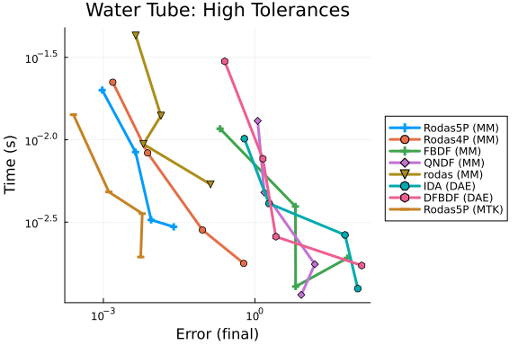


### Medium Tolerances

```julia
abstols = 1.0 ./ 10.0 .^ (6:9)
reltols = 1.0 ./ 10.0 .^ (3:6)
setups = [
    Dict(:prob_choice => 1, :alg => Rodas5P()),
    Dict(:prob_choice => 1, :alg => Rodas4P()),
    Dict(:prob_choice => 1, :alg => FBDF()),
    Dict(:prob_choice => 1, :alg => QNDF()),
    Dict(:prob_choice => 1, :alg => rodas()),
    Dict(:prob_choice => 2, :alg => IDA()),
    Dict(:prob_choice => 2, :alg => DFBDF()),
    Dict(:prob_choice => 3, :alg => Rodas5P()),
]
labels = ["Rodas5P (MM)" "Rodas4P (MM)" "FBDF (MM)" "QNDF (MM)" "rodas (MM)" "IDA (DAE)" "DFBDF (DAE)" "Rodas5P (MTK)"]

wp = WorkPrecisionSet(probs, abstols, reltols, setups;
    names = labels, appxsol = refs, save_everystep = false,
    maxiters = Int(1e6), numruns = 10)
plot(wp, title = "Water Tube: Medium Tolerances")
```

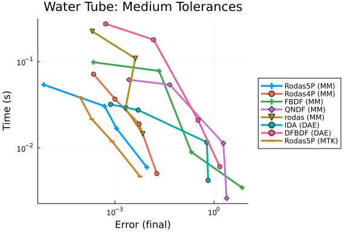


### Timeseries Errors (L2)

```julia
abstols = 1.0 ./ 10.0 .^ (5:8)
reltols = 1.0 ./ 10.0 .^ (1:4)
setups = [
    Dict(:prob_choice => 1, :alg => Rodas5P()),
    Dict(:prob_choice => 1, :alg => Rodas4P()),
    Dict(:prob_choice => 1, :alg => FBDF()),
    Dict(:prob_choice => 1, :alg => QNDF()),
    Dict(:prob_choice => 1, :alg => rodas()),
    Dict(:prob_choice => 2, :alg => IDA()),
    Dict(:prob_choice => 2, :alg => DFBDF()),
    Dict(:prob_choice => 3, :alg => Rodas5P()),
]
labels = ["Rodas5P (MM)" "Rodas4P (MM)" "FBDF (MM)" "QNDF (MM)" "rodas (MM)" "IDA (DAE)" "DFBDF (DAE)" "Rodas5P (MTK)"]

wp = WorkPrecisionSet(probs, abstols, reltols, setups; error_estimate = :l2,
    names = labels, appxsol = refs, save_everystep = false,
    maxiters = Int(1e6), numruns = 10)
plot(wp, title = "Water Tube: Timeseries Error (L2)")
```

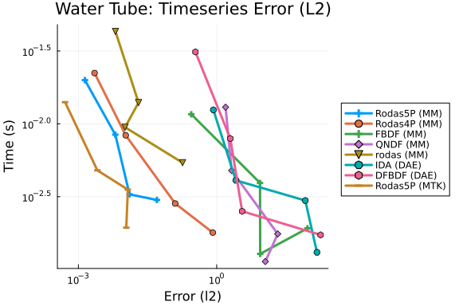


### Low Tolerances

```julia
abstols = 1.0 ./ 10.0 .^ (7:10)
reltols = 1.0 ./ 10.0 .^ (4:7)
setups = [
    Dict(:prob_choice => 1, :alg => Rodas5()),
    Dict(:prob_choice => 1, :alg => Rodas5P()),
    Dict(:prob_choice => 1, :alg => Rodas4()),
    Dict(:prob_choice => 1, :alg => FBDF()),
    Dict(:prob_choice => 1, :alg => rodas()),
    Dict(:prob_choice => 2, :alg => IDA()),
    Dict(:prob_choice => 2, :alg => DFBDF()),
]
labels = ["Rodas5 (MM)" "Rodas5P (MM)" "Rodas4 (MM)" "FBDF (MM)" "rodas (MM)" "IDA (DAE)" "DFBDF (DAE)"]

wp = WorkPrecisionSet(probs, abstols, reltols, setups;
    names = labels, appxsol = refs, save_everystep = false,
    maxiters = Int(1e6), numruns = 10)
plot(wp, title = "Water Tube: Low Tolerances")
```

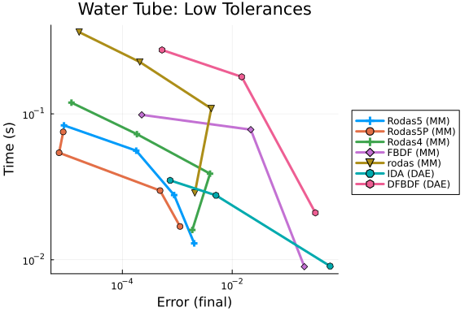

```julia
wp = WorkPrecisionSet(probs, abstols, reltols, setups; error_estimate = :l2,
    names = labels, appxsol = refs, save_everystep = false,
    maxiters = Int(1e6), numruns = 10)
plot(wp, title = "Water Tube: Low Tolerances (L2)")
```

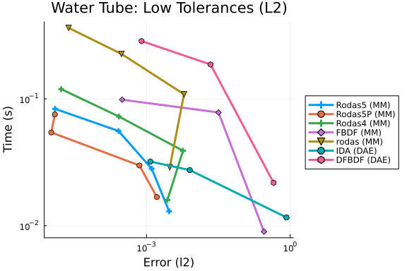


### Conclusion


## Appendix

These benchmarks are a part of the SciMLBenchmarks.jl repository, found at: [https://github.com/SciML/SciMLBenchmarks.jl](https://github.com/SciML/SciMLBenchmarks.jl). For more information on high-performance scientific machine learning, check out the SciML Open Source Software Organization [https://sciml.ai](https://sciml.ai).

To locally run this benchmark, do the following commands:

```
using SciMLBenchmarks
SciMLBenchmarks.weave_file("benchmarks/DAE","water_tube.jmd")
```

Computer Information:

```
Julia Version 1.10.10
Commit 95f30e51f41 (2025-06-27 09:51 UTC)
Build Info:
  Official https://julialang.org/ release
Platform Info:
  OS: Linux (x86_64-linux-gnu)
  CPU: 128 × AMD EPYC 7502 32-Core Processor
  WORD_SIZE: 64
  LIBM: libopenlibm
  LLVM: libLLVM-15.0.7 (ORCJIT, znver2)
Threads: 128 default, 0 interactive, 64 GC (on 128 virtual cores)
Environment:
  JULIA_CPU_THREADS = 128
  JULIA_DEPOT_PATH = /cache/julia-buildkite-plugin/depots/5b300254-1738-4989-ae0a-f4d2d937f953:

```

Package Information:

```
Status `/cache/build/exclusive-amdci1-0/julialang/scimlbenchmarks-dot-jl/benchmarks/DAE/Project.toml`
  [165a45c3] DASKR v2.9.1
  [e993076c] DASSL v2.8.0
  [f3b72e0c] DiffEqDevTools v2.49.0
⌅ [961ee093] ModelingToolkit v9.84.0
  [09606e27] ODEInterfaceDiffEq v3.15.0
  [1dea7af3] OrdinaryDiffEq v6.108.0
  [91a5bcdd] Plots v1.41.6
  [31c91b34] SciMLBenchmarks v0.1.3
  [90137ffa] StaticArrays v1.9.17
⌅ [c3572dad] Sundials v4.28.0
  [10745b16] Statistics v1.10.0
Info Packages marked with ⌅ have new versions available but compatibility constraints restrict them from upgrading. To see why use `status --outdated`
```

And the full manifest:

```
Status `/cache/build/exclusive-amdci1-0/julialang/scimlbenchmarks-dot-jl/benchmarks/DAE/Manifest.toml`
  [47edcb42] ADTypes v1.21.0
  [1520ce14] AbstractTrees v0.4.5
  [7d9f7c33] Accessors v0.1.43
⌃ [79e6a3ab] Adapt v4.4.0
  [66dad0bd] AliasTables v1.1.3
  [ec485272] ArnoldiMethod v0.4.0
⌃ [4fba245c] ArrayInterface v7.22.0
  [4c555306] ArrayLayouts v1.12.2
  [e2ed5e7c] Bijections v0.2.2
  [d1d4a3ce] BitFlags v0.1.9
  [62783981] BitTwiddlingConvenienceFunctions v0.1.6
  [8e7c35d0] BlockArrays v1.9.3
⌃ [70df07ce] BracketingNonlinearSolve v1.10.0
  [fa961155] CEnum v0.5.0
  [2a0fbf3d] CPUSummary v0.2.7
  [d360d2e6] ChainRulesCore v1.26.0
  [fb6a15b2] CloseOpenIntervals v0.1.13
  [944b1d66] CodecZlib v0.7.8
  [35d6a980] ColorSchemes v3.31.0
  [3da002f7] ColorTypes v0.12.1
  [c3611d14] ColorVectorSpace v0.11.0
  [5ae59095] Colors v0.13.1
⌅ [861a8166] Combinatorics v1.0.2
⌅ [a80b9123] CommonMark v0.10.3
  [38540f10] CommonSolve v0.2.6
  [bbf7d656] CommonSubexpressions v0.3.1
  [f70d9fcc] CommonWorldInvalidations v1.0.0
  [34da2185] Compat v4.18.1
  [b152e2b5] CompositeTypes v0.1.4
  [a33af91c] CompositionsBase v0.1.2
  [2569d6c7] ConcreteStructs v0.2.3
  [f0e56b4a] ConcurrentUtilities v2.5.1
  [8f4d0f93] Conda v1.10.3
  [187b0558] ConstructionBase v1.6.0
  [d38c429a] Contour v0.6.3
  [adafc99b] CpuId v0.3.1
  [165a45c3] DASKR v2.9.1
  [e993076c] DASSL v2.8.0
  [9a962f9c] DataAPI v1.16.0
⌅ [864edb3b] DataStructures v0.18.22
  [e2d170a0] DataValueInterfaces v1.0.0
  [8bb1440f] DelimitedFiles v1.9.1
⌃ [2b5f629d] DiffEqBase v6.205.1
  [459566f4] DiffEqCallbacks v4.12.0
  [f3b72e0c] DiffEqDevTools v2.49.0
  [77a26b50] DiffEqNoiseProcess v5.27.0
  [163ba53b] DiffResults v1.1.0
  [b552c78f] DiffRules v1.15.1
  [a0c0ee7d] DifferentiationInterface v0.7.16
  [8d63f2c5] DispatchDoctor v0.4.28
  [b4f34e82] Distances v0.10.12
  [31c24e10] Distributions v0.25.123
  [ffbed154] DocStringExtensions v0.9.5
  [5b8099bc] DomainSets v0.7.16
⌃ [7c1d4256] DynamicPolynomials v0.6.3
  [06fc5a27] DynamicQuantities v1.11.0
⌃ [4e289a0a] EnumX v1.0.6
  [f151be2c] EnzymeCore v0.8.18
  [460bff9d] ExceptionUnwrapping v0.1.11
  [d4d017d3] ExponentialUtilities v1.30.0
  [e2ba6199] ExprTools v0.1.10
  [55351af7] ExproniconLite v0.10.14
  [c87230d0] FFMPEG v0.4.5
  [7034ab61] FastBroadcast v0.3.5
  [9aa1b823] FastClosures v0.3.2
  [442a2c76] FastGaussQuadrature v1.1.0
  [a4df4552] FastPower v1.3.1
  [1a297f60] FillArrays v1.16.0
  [64ca27bc] FindFirstFunctions v1.8.0
  [6a86dc24] FiniteDiff v2.29.0
  [53c48c17] FixedPointNumbers v0.8.5
  [1fa38f19] Format v1.3.7
  [f6369f11] ForwardDiff v1.3.2
  [069b7b12] FunctionWrappers v1.1.3
  [77dc65aa] FunctionWrappersWrappers v0.1.3
  [46192b85] GPUArraysCore v0.2.0
⌃ [28b8d3ca] GR v0.73.22
  [c145ed77] GenericSchur v0.5.6
  [d7ba0133] Git v1.5.0
  [c27321d9] Glob v1.4.0
⌃ [86223c79] Graphs v1.13.1
  [42e2da0e] Grisu v1.0.2
  [cd3eb016] HTTP v1.10.19
⌅ [eafb193a] Highlights v0.5.3
  [34004b35] HypergeometricFunctions v0.3.28
⌃ [7073ff75] IJulia v1.34.3
  [615f187c] IfElse v0.1.1
  [d25df0c9] Inflate v0.1.5
  [18e54dd8] IntegerMathUtils v0.1.3
  [8197267c] IntervalSets v0.7.13
  [3587e190] InverseFunctions v0.1.17
  [92d709cd] IrrationalConstants v0.2.6
  [82899510] IteratorInterfaceExtensions v1.0.0
  [1019f520] JLFzf v0.1.11
  [692b3bcd] JLLWrappers v1.7.1
⌅ [682c06a0] JSON v0.21.4
  [ae98c720] Jieko v0.2.1
  [98e50ef6] JuliaFormatter v2.3.0
⌅ [70703baa] JuliaSyntax v0.4.10
⌃ [ccbc3e58] JumpProcesses v9.22.0
  [ba0b0d4f] Krylov v0.10.5
  [b964fa9f] LaTeXStrings v1.4.0
  [23fbe1c1] Latexify v0.16.10
  [10f19ff3] LayoutPointers v0.1.17
  [87fe0de2] LineSearch v0.1.6
⌃ [d3d80556] LineSearches v7.5.1
⌃ [7ed4a6bd] LinearSolve v3.59.1
  [2ab3a3ac] LogExpFunctions v0.3.29
  [e6f89c97] LoggingExtras v1.2.0
  [d8e11817] MLStyle v0.4.17
  [1914dd2f] MacroTools v0.5.16
  [d125e4d3] ManualMemory v0.1.8
  [bb5d69b7] MaybeInplace v0.1.4
⌃ [739be429] MbedTLS v1.1.9
  [442fdcdd] Measures v0.3.3
  [e1d29d7a] Missings v1.2.0
⌅ [961ee093] ModelingToolkit v9.84.0
  [2e0e35c7] Moshi v0.3.7
  [46d2c3a1] MuladdMacro v0.2.4
⌃ [102ac46a] MultivariatePolynomials v0.5.9
  [ffc61752] Mustache v1.0.21
  [d8a4904e] MutableArithmetics v1.6.7
⌅ [d41bc354] NLSolversBase v7.10.0
  [2774e3e8] NLsolve v4.5.1
  [77ba4419] NaNMath v1.1.3
  [8913a72c] NonlinearSolve v4.16.0
⌃ [be0214bd] NonlinearSolveBase v2.11.2
  [5959db7a] NonlinearSolveFirstOrder v2.0.0
  [9a2c21bd] NonlinearSolveQuasiNewton v1.12.0
  [26075421] NonlinearSolveSpectralMethods v1.6.0
  [54ca160b] ODEInterface v0.5.0
  [09606e27] ODEInterfaceDiffEq v3.15.0
  [6fe1bfb0] OffsetArrays v1.17.0
  [4d8831e6] OpenSSL v1.6.1
  [bac558e1] OrderedCollections v1.8.1
  [1dea7af3] OrdinaryDiffEq v6.108.0
  [89bda076] OrdinaryDiffEqAdamsBashforthMoulton v1.9.0
⌃ [6ad6398a] OrdinaryDiffEqBDF v1.15.0
⌃ [bbf590c4] OrdinaryDiffEqCore v3.1.0
⌃ [50262376] OrdinaryDiffEqDefault v1.12.0
⌃ [4302a76b] OrdinaryDiffEqDifferentiation v2.0.0
  [9286f039] OrdinaryDiffEqExplicitRK v1.9.0
  [e0540318] OrdinaryDiffEqExponentialRK v1.13.0
⌃ [becaefa8] OrdinaryDiffEqExtrapolation v1.14.0
⌃ [5960d6e9] OrdinaryDiffEqFIRK v1.21.0
  [101fe9f7] OrdinaryDiffEqFeagin v1.8.0
  [d3585ca7] OrdinaryDiffEqFunctionMap v1.9.0
  [d28bc4f8] OrdinaryDiffEqHighOrderRK v1.9.0
  [9f002381] OrdinaryDiffEqIMEXMultistep v1.12.0
  [521117fe] OrdinaryDiffEqLinear v1.10.0
  [1344f307] OrdinaryDiffEqLowOrderRK v1.10.0
⌃ [b0944070] OrdinaryDiffEqLowStorageRK v1.11.0
⌃ [127b3ac7] OrdinaryDiffEqNonlinearSolve v1.20.0
⌃ [c9986a66] OrdinaryDiffEqNordsieck v1.8.0
  [5dd0a6cf] OrdinaryDiffEqPDIRK v1.11.0
  [5b33eab2] OrdinaryDiffEqPRK v1.8.0
  [04162be5] OrdinaryDiffEqQPRK v1.8.0
⌃ [af6ede74] OrdinaryDiffEqRKN v1.9.0
⌃ [43230ef6] OrdinaryDiffEqRosenbrock v1.23.0
  [2d112036] OrdinaryDiffEqSDIRK v1.12.0
  [669c94d9] OrdinaryDiffEqSSPRK v1.11.0
  [e3e12d00] OrdinaryDiffEqStabilizedIRK v1.11.0
  [358294b1] OrdinaryDiffEqStabilizedRK v1.8.0
  [fa646aed] OrdinaryDiffEqSymplecticRK v1.11.0
  [b1df2697] OrdinaryDiffEqTsit5 v1.9.0
  [79d7bb75] OrdinaryDiffEqVerner v1.11.0
  [90014a1f] PDMats v0.11.37
  [69de0a69] Parsers v2.8.3
  [ccf2f8ad] PlotThemes v3.3.0
  [995b91a9] PlotUtils v1.4.4
  [91a5bcdd] Plots v1.41.6
  [e409e4f3] PoissonRandom v0.4.7
  [f517fe37] Polyester v0.7.19
  [1d0040c9] PolyesterWeave v0.2.2
⌃ [d236fae5] PreallocationTools v0.4.34
⌅ [aea7be01] PrecompileTools v1.2.1
⌃ [21216c6a] Preferences v1.5.1
  [27ebfcd6] Primes v0.5.7
⌃ [43287f4e] PtrArrays v1.3.0
  [1fd47b50] QuadGK v2.11.2
  [3cdcf5f2] RecipesBase v1.3.4
  [01d81517] RecipesPipeline v0.6.12
  [731186ca] RecursiveArrayTools v3.48.0
  [189a3867] Reexport v1.2.2
  [05181044] RelocatableFolders v1.0.1
  [ae029012] Requires v1.3.1
  [ae5879a3] ResettableStacks v1.2.0
  [79098fc4] Rmath v0.9.0
  [47965b36] RootedTrees v2.25.0
  [7e49a35a] RuntimeGeneratedFunctions v0.5.17
  [9dfe8606] SCCNonlinearSolve v1.11.0
  [94e857df] SIMDTypes v0.1.0
⌃ [0bca4576] SciMLBase v2.140.0
  [31c91b34] SciMLBenchmarks v0.1.3
  [19f34311] SciMLJacobianOperators v0.1.12
  [a6db7da4] SciMLLogging v1.9.1
  [c0aeaf25] SciMLOperators v1.15.1
  [431bcebd] SciMLPublic v1.0.1
  [53ae85a6] SciMLStructures v1.10.0
  [6c6a2e73] Scratch v1.3.0
  [efcf1570] Setfield v1.1.2
  [992d4aef] Showoff v1.0.3
  [777ac1f9] SimpleBufferStream v1.2.0
  [727e6d20] SimpleNonlinearSolve v2.11.0
  [699a6c99] SimpleTraits v0.9.5
  [a2af1166] SortingAlgorithms v1.2.2
⌃ [0a514795] SparseMatrixColorings v0.4.23
  [276daf66] SpecialFunctions v2.7.1
  [860ef19b] StableRNGs v1.0.4
  [aedffcd0] Static v1.3.1
  [0d7ed370] StaticArrayInterface v1.9.0
  [90137ffa] StaticArrays v1.9.17
  [1e83bf80] StaticArraysCore v1.4.4
  [82ae8749] StatsAPI v1.8.0
  [2913bbd2] StatsBase v0.34.10
  [4c63d2b9] StatsFuns v1.5.2
  [7792a7ef] StrideArraysCore v0.5.8
  [69024149] StringEncodings v0.3.7
  [09ab397b] StructArrays v0.7.2
⌅ [c3572dad] Sundials v4.28.0
  [2efcf032] SymbolicIndexingInterface v0.3.46
⌅ [19f23fe9] SymbolicLimits v0.2.3
⌅ [d1185830] SymbolicUtils v3.32.0
⌅ [0c5d862f] Symbolics v6.58.0
  [3783bdb8] TableTraits v1.0.1
  [bd369af6] Tables v1.12.1
  [ed4db957] TaskLocalValues v0.1.3
  [62fd8b95] TensorCore v0.1.1
  [8ea1fca8] TermInterface v2.0.0
  [1c621080] TestItems v1.0.0
  [8290d209] ThreadingUtilities v0.5.5
  [a759f4b9] TimerOutputs v0.5.29
  [3bb67fe8] TranscodingStreams v0.11.3
  [410a4b4d] Tricks v0.1.13
  [781d530d] TruncatedStacktraces v1.4.0
  [5c2747f8] URIs v1.6.1
  [3a884ed6] UnPack v1.0.2
  [1cfade01] UnicodeFun v0.4.1
  [1986cc42] Unitful v1.28.0
  [a7c27f48] Unityper v0.1.6
  [41fe7b60] Unzip v0.2.0
  [81def892] VersionParsing v1.3.0
  [44d3d7a6] Weave v0.10.12
  [ddb6d928] YAML v0.4.16
  [c2297ded] ZMQ v1.5.1
  [6e34b625] Bzip2_jll v1.0.9+0
  [83423d85] Cairo_jll v1.18.5+1
  [655fdf9c] DASKR_jll v1.0.1+0
  [ee1fde0b] Dbus_jll v1.16.2+0
  [2702e6a9] EpollShim_jll v0.0.20230411+1
  [2e619515] Expat_jll v2.7.3+0
  [b22a6f82] FFMPEG_jll v8.0.1+0
  [a3f928ae] Fontconfig_jll v2.17.1+0
  [d7e528f0] FreeType2_jll v2.13.4+0
  [559328eb] FriBidi_jll v1.0.17+0
  [0656b61e] GLFW_jll v3.4.1+0
⌅ [d2c73de3] GR_jll v0.73.22+0
  [b0724c58] GettextRuntime_jll v0.22.4+0
  [61579ee1] Ghostscript_jll v9.55.1+0
  [020c3dae] Git_LFS_jll v3.7.0+0
  [f8c6e375] Git_jll v2.53.0+0
  [7746bdde] Glib_jll v2.86.3+0
  [3b182d85] Graphite2_jll v1.3.15+0
  [2e76f6c2] HarfBuzz_jll v8.5.1+0
  [1d5cc7b8] IntelOpenMP_jll v2025.2.0+0
  [aacddb02] JpegTurbo_jll v3.1.4+0
  [c1c5ebd0] LAME_jll v3.100.3+0
  [88015f11] LERC_jll v4.0.1+0
  [1d63c593] LLVMOpenMP_jll v18.1.8+0
  [dd4b983a] LZO_jll v2.10.3+0
⌅ [e9f186c6] Libffi_jll v3.4.7+0
  [7e76a0d4] Libglvnd_jll v1.7.1+1
  [94ce4f54] Libiconv_jll v1.18.0+0
  [4b2f31a3] Libmount_jll v2.41.3+0
  [89763e89] Libtiff_jll v4.7.2+0
  [38a345b3] Libuuid_jll v2.41.3+0
  [856f044c] MKL_jll v2025.2.0+0
  [c771fb93] ODEInterface_jll v0.0.2+0
  [e7412a2a] Ogg_jll v1.3.6+0
  [9bd350c2] OpenSSH_jll v10.2.1+0
  [458c3c95] OpenSSL_jll v3.5.5+0
  [efe28fd5] OpenSpecFun_jll v0.5.6+0
  [91d4177d] Opus_jll v1.6.1+0
  [36c8627f] Pango_jll v1.57.0+0
⌅ [30392449] Pixman_jll v0.44.2+0
⌅ [c0090381] Qt6Base_jll v6.8.2+2
⌅ [629bc702] Qt6Declarative_jll v6.8.2+1
⌅ [ce943373] Qt6ShaderTools_jll v6.8.2+1
⌃ [e99dba38] Qt6Wayland_jll v6.8.2+2
  [f50d1b31] Rmath_jll v0.5.1+0
⌅ [fb77eaff] Sundials_jll v5.2.2+0
  [a44049a8] Vulkan_Loader_jll v1.3.243+0
  [a2964d1f] Wayland_jll v1.24.0+0
  [ffd25f8a] XZ_jll v5.8.2+0
  [f67eecfb] Xorg_libICE_jll v1.1.2+0
  [c834827a] Xorg_libSM_jll v1.2.6+0
  [4f6342f7] Xorg_libX11_jll v1.8.13+0
  [0c0b7dd1] Xorg_libXau_jll v1.0.13+0
  [935fb764] Xorg_libXcursor_jll v1.2.4+0
  [a3789734] Xorg_libXdmcp_jll v1.1.6+0
  [1082639a] Xorg_libXext_jll v1.3.8+0
  [d091e8ba] Xorg_libXfixes_jll v6.0.2+0
  [a51aa0fd] Xorg_libXi_jll v1.8.3+0
  [d1454406] Xorg_libXinerama_jll v1.1.7+0
  [ec84b674] Xorg_libXrandr_jll v1.5.6+0
  [ea2f1a96] Xorg_libXrender_jll v0.9.12+0
  [c7cfdc94] Xorg_libxcb_jll v1.17.1+0
  [cc61e674] Xorg_libxkbfile_jll v1.2.0+0
  [e920d4aa] Xorg_xcb_util_cursor_jll v0.1.6+0
  [12413925] Xorg_xcb_util_image_jll v0.4.1+0
  [2def613f] Xorg_xcb_util_jll v0.4.1+0
  [975044d2] Xorg_xcb_util_keysyms_jll v0.4.1+0
  [0d47668e] Xorg_xcb_util_renderutil_jll v0.3.10+0
  [c22f9ab0] Xorg_xcb_util_wm_jll v0.4.2+0
  [35661453] Xorg_xkbcomp_jll v1.4.7+0
  [33bec58e] Xorg_xkeyboard_config_jll v2.44.0+0
  [c5fb5394] Xorg_xtrans_jll v1.6.0+0
  [8f1865be] ZeroMQ_jll v4.3.6+0
  [3161d3a3] Zstd_jll v1.5.7+1
  [35ca27e7] eudev_jll v3.2.14+0
  [214eeab7] fzf_jll v0.61.1+0
  [a4ae2306] libaom_jll v3.13.1+0
  [0ac62f75] libass_jll v0.17.4+0
  [1183f4f0] libdecor_jll v0.2.2+0
  [2db6ffa8] libevdev_jll v1.13.4+0
  [f638f0a6] libfdk_aac_jll v2.0.4+0
  [36db933b] libinput_jll v1.28.1+0
  [b53b4c65] libpng_jll v1.6.55+0
  [a9144af2] libsodium_jll v1.0.21+0
  [f27f6e37] libvorbis_jll v1.3.8+0
  [009596ad] mtdev_jll v1.1.7+0
  [1317d2d5] oneTBB_jll v2022.0.0+1
⌅ [1270edf5] x264_jll v10164.0.1+0
  [dfaa095f] x265_jll v4.1.0+0
  [d8fb68d0] xkbcommon_jll v1.13.0+0
  [0dad84c5] ArgTools v1.1.1
  [56f22d72] Artifacts
  [2a0f44e3] Base64
  [ade2ca70] Dates
  [8ba89e20] Distributed
  [f43a241f] Downloads v1.6.0
  [7b1f6079] FileWatching
  [9fa8497b] Future
  [b77e0a4c] InteractiveUtils
  [4af54fe1] LazyArtifacts
  [b27032c2] LibCURL v0.6.4
  [76f85450] LibGit2
  [8f399da3] Libdl
  [37e2e46d] LinearAlgebra
  [56ddb016] Logging
  [d6f4376e] Markdown
  [a63ad114] Mmap
  [ca575930] NetworkOptions v1.2.0
  [44cfe95a] Pkg v1.10.0
  [de0858da] Printf
  [3fa0cd96] REPL
  [9a3f8284] Random
  [ea8e919c] SHA v0.7.0
  [9e88b42a] Serialization
  [1a1011a3] SharedArrays
  [6462fe0b] Sockets
  [2f01184e] SparseArrays v1.10.0
  [10745b16] Statistics v1.10.0
  [4607b0f0] SuiteSparse
  [fa267f1f] TOML v1.0.3
  [a4e569a6] Tar v1.10.0
  [8dfed614] Test
  [cf7118a7] UUIDs
  [4ec0a83e] Unicode
  [e66e0078] CompilerSupportLibraries_jll v1.1.1+0
  [deac9b47] LibCURL_jll v8.4.0+0
  [e37daf67] LibGit2_jll v1.6.4+0
  [29816b5a] LibSSH2_jll v1.11.0+1
  [c8ffd9c3] MbedTLS_jll v2.28.2+1
  [14a3606d] MozillaCACerts_jll v2023.1.10
  [4536629a] OpenBLAS_jll v0.3.23+4
  [05823500] OpenLibm_jll v0.8.5+0
  [efcefdf7] PCRE2_jll v10.42.0+1
  [bea87d4a] SuiteSparse_jll v7.2.1+1
  [83775a58] Zlib_jll v1.2.13+1
  [8e850b90] libblastrampoline_jll v5.11.0+0
  [8e850ede] nghttp2_jll v1.52.0+1
  [3f19e933] p7zip_jll v17.4.0+2
Info Packages marked with ⌃ and ⌅ have new versions available. Those with ⌃ may be upgradable, but those with ⌅ are restricted by compatibility constraints from upgrading. To see why use `status --outdated -m`
```

