This is a benchmark of the Water Tube System, an index-2 DAE of dimension 49
from the IVP Test Set (Fekete 2006, `water.F`).

The system models water flow through a pipe network with 13 nodes and 18 pipes,
accounting for turbulence and wall roughness. The network has two buffer nodes
(nodes 5 and 8), external inflow at nodes 1 and 13, and external outflow at
node 10. The external flows model a 17-hour demand cycle typical of municipal
water systems.

**Variables (49 state variables):**
- 18 pipe flows: φᵢⱼ(t), volumetric flow rates [m³/s]
- 18 resistance coefficients: λᵢⱼ(t), Darcy friction factors (dimensionless)
- 13 node pressures: pₙ(t) [Pa]

**Physical challenges:**
1. **Regime switching:** Each pipe transitions between laminar (R ≤ 2300) and
   turbulent flow, with the turbulent Colebrook equation being implicit in λ.
2. **Scale separation:** Flows ∼ 10⁻³, friction factors ∼ 10⁻², pressures ∼ 10⁵
   — nine orders of magnitude difference.
3. **Index-2 structure:** Variables 1–38 are index-1, while the 11 non-buffer
   node pressures (variables 39–49) are index-2 algebraic constraints.

We benchmark three formulations:

1. **Mass-Matrix ODE Form:** `M·du/dt = f(u, t)` with diagonal singular M,
   solved with Rosenbrock-W methods and BDF.
2. **DAE Residual Form:** `F(du, u, t) = M·du − f(u, t) = 0`, solved with IDA.
3. **MTK Index-Reduced Form:** Defined symbolically with `structural_simplify`
   reducing from 49 to 32 states via automatic index reduction.

Reference: Fekete, I.: Water tube system, IVP Test Set for DAE Solvers,
Release 2.4, University of Bari, 2006.

```julia
using OrdinaryDiffEq, Sundials, DiffEqDevTools, ModelingToolkit, ODEInterfaceDiffEq,
      Plots, DASSL, DASKR
using OrdinaryDiffEqBDF, OrdinaryDiffEqFIRK, OrdinaryDiffEqRosenbrock
using LinearAlgebra
using ModelingToolkit: t_nounits as t, D_nounits as D
```


## Physical Parameters

All constants are taken directly from `water.F` (the IVP Test Set source):

```julia
const NU     = 1.31e-6       # kinematic viscosity [m²/s]
const GRAV   = 9.8           # gravitational acceleration [m/s²]
const RHO    = 1.0e3         # water density [kg/m³]
const RCRIT  = 2.3e3         # critical Reynolds number (laminar/turbulent)
const LPIPE  = 1.0e3         # pipe length [m]
const KROUGH = 2.0e-4        # wall roughness [m]
const DPIPE  = 1.0           # pipe diameter [m]
const BBUF   = 2.0e2         # buffer coefficient
const PI_C   = 3.141592653589793238462643383

# Derived constants
const APIPE  = PI_C * DPIPE^2 / 4.0     # cross-sectional area [m²]
const MU     = NU * RHO                  # dynamic viscosity [Pa·s]
const VMASS  = RHO * LPIPE / APIPE       # mass coeff for flow equations
const CMASS  = BBUF / (RHO * GRAV)       # mass coeff for buffer pressures
```

```
0.02040816326530612
```


## Network Topology

The pipe network connects 13 nodes via 18 directed pipes. Nodes 5 and 8 are
buffer nodes (modeled with compliance/capacitance). External inflows enter
at nodes 1 and 13; external outflow exits at node 10.

```julia
# 18 pipes: (from_node, to_node) — matches Fortran phi(i,j) ordering
const PIPES = [
    (1,2),  (2,3),  (2,6),  (3,4),  (3,5),  (4,5),
    (5,10), (6,5),  (7,4),  (7,8),  (8,5),  (8,10),
    (9,8),  (11,9), (11,12),(12,7), (12,8), (13,11)
]
const NNODES = 13
const NPIPES = 18

# Pressure variable mapping: node → y-index (Fortran ordering)
# Buffer nodes 5, 8 → y[37], y[38] (differential)
# Other nodes → y[39:49] (algebraic, index-2)
const NODE_TO_YIDX = Dict(
    5=>37, 8=>38, 1=>39, 2=>40, 3=>41, 4=>42,
    6=>43, 7=>44, 9=>45, 10=>46, 11=>47, 12=>48, 13=>49
)

# f(37:49) → node ordering for net flow conservation
const NETFLO_NODES = [5, 8, 1, 2, 3, 4, 6, 7, 9, 10, 11, 12, 13]

# Precompute: for each node, which pipe indices flow IN and OUT
const NODE_INFLOWS  = [Int[] for _ in 1:NNODES]
const NODE_OUTFLOWS = [Int[] for _ in 1:NNODES]
for k in 1:NPIPES
    push!(NODE_OUTFLOWS[PIPES[k][1]], k)
    push!(NODE_INFLOWS[PIPES[k][2]], k)
end
```


## RHS Function

The right-hand side has three blocks:
1. **Momentum equations** (1–18): Darcy-Weisbach pressure drop for each pipe
2. **Colebrook equations** (19–36): Implicit friction factor relationship
3. **Node balance** (37–49): Kirchhoff mass conservation at each node

The Colebrook equation for turbulent flow is:
$$\frac{1}{\sqrt{\lambda}} = 1.74 - 2\log_{10}\left(\frac{2k}{d} + \frac{18.7}{|R|\sqrt{\lambda}}\right)$$

where $R = |u_{ij}| d / \nu$ is the Reynolds number. In the laminar regime
($R \le R_\text{crit}$), the Colebrook equation uses $R_\text{crit}$ in place
of $R$, and the momentum equation uses the Hagen-Poiseuille law instead.

```julia
function water_rhs!(f, y, p, t)
    # External flows (time-dependent boundary conditions)
    that  = t / 3600.0
    that2 = that * that

    ein1   = (1.0 - cos(exp(-that) - 1.0)) / 200.0
    ein13  = (1.0 - cos(exp(-that) - 1.0)) / 80.0
    eout10 = that2 * (3.0*that2 - 92.0*that + 720.0) / 1.0e6

    # Process each pipe: momentum (f[k]) and Colebrook (f[18+k])
    @inbounds for k in 1:NPIPES
        i_node, j_node = PIPES[k]
        phi_k = y[k]
        lam_k = y[18 + k]
        p_i   = y[NODE_TO_YIDX[i_node]]
        p_j   = y[NODE_TO_YIDX[j_node]]

        rtla = sqrt(lam_k)
        r    = abs(phi_k * DPIPE / (NU * APIPE))

        if r > RCRIT
            # Turbulent: implicit Colebrook + Darcy-Weisbach
            f[18 + k] = 1.0/rtla - 1.74 +
                         2.0*log10(2.0*KROUGH/DPIPE + 18.7/(r*rtla))
            f[k] = p_i - p_j -
                    lam_k * RHO * LPIPE * phi_k^2 / (APIPE^2 * DPIPE)
        else
            # Laminar: Colebrook at R_crit + Hagen-Poiseuille
            f[18 + k] = 1.0/rtla - 1.74 +
                         2.0*log10(2.0*KROUGH/DPIPE + 18.7/(RCRIT*rtla))
            f[k] = p_i - p_j -
                    32.0 * MU * LPIPE * phi_k / (APIPE * DPIPE^2)
        end
    end

    # Node balance: Kirchhoff flow conservation (f[37:49])
    @inbounds for (idx, node) in enumerate(NETFLO_NODES)
        netflo = 0.0
        if node == 1;  netflo += ein1;   end
        if node == 13; netflo += ein13;  end
        if node == 10; netflo -= eout10; end
        for k in NODE_INFLOWS[node];  netflo += y[k]; end
        for k in NODE_OUTFLOWS[node]; netflo -= y[k]; end
        f[36 + idx] = netflo
    end

    nothing
end
```

```
water_rhs! (generic function with 1 method)
```


## Initial Conditions

All flows start at zero, friction factors at the laminar Colebrook value
λ₀ ≈ 0.04752, and all pressures at 109800 Pa. This is a consistent initial
condition (the RHS evaluates to zero at t = 0).

```julia
y0 = zeros(49)
y0[19:36] .= 0.47519404529185289807e-1   # laminar friction factor
y0[37:49] .= 109800.0                     # initial pressures [Pa]

tspan = (0.0, 17.0 * 3600.0)   # 0 to 61200 s (17 hours)

# Verify consistency
f0 = zeros(49)
water_rhs!(f0, y0, nothing, 0.0)
println("Max |RHS| at IC: ", maximum(abs, f0), " (should be ≈ 0)")
```

```
Max |RHS| at IC: 0.0 (should be ≈ 0)
```


## Mass-Matrix ODE Form

The mass matrix is diagonal with three blocks:
- M[1:18] = ρL/A (flow momentum — differential)
- M[19:36] = 0 (Colebrook equations — algebraic)
- M[37:38] = b/(ρg) (buffer node balance — differential)
- M[39:49] = 0 (non-buffer node balance — algebraic, index-2)

```julia
M_diag = zeros(49)
M_diag[1:18]  .= VMASS   # flow momentum
M_diag[37]     = CMASS   # buffer node 5
M_diag[38]     = CMASS   # buffer node 8
M_mat = Diagonal(M_diag)

mmf = ODEFunction(water_rhs!, mass_matrix = Matrix(M_mat))
prob_mm = ODEProblem(mmf, y0, tspan)
```

```
ODEProblem with uType Vector{Float64} and tType Float64. In-place: true
Non-trivial mass matrix: true
timespan: (0.0, 61200.0)
u0: 49-element Vector{Float64}:
      0.0
      0.0
      0.0
      0.0
      0.0
      0.0
      0.0
      0.0
      0.0
      0.0
      ⋮
 109800.0
 109800.0
 109800.0
 109800.0
 109800.0
 109800.0
 109800.0
 109800.0
 109800.0
```


## DAE Residual Form

```julia
function water_dae!(res, du, u, p, t)
    f_rhs = similar(u)
    water_rhs!(f_rhs, u, p, t)
    res .= M_mat * du .- f_rhs
    nothing
end

du0 = zeros(49)
differential_vars = [trues(18); falses(18); trues(2); falses(11)]

prob_dae = DAEProblem(water_dae!, du0, y0, tspan,
                      differential_vars = differential_vars)

# Verify DAE consistency
f_check = zeros(49)
water_rhs!(f_check, y0, nothing, 0.0)
println("DAE residual at IC: ", norm(M_mat * du0 - f_check))
```

```
DAE residual at IC: 0.0
```


## MTK Index-Reduced Formulation

ModelingToolkit can automatically reduce the index-2 DAE. We define the full
system symbolically — 18 flow momentum equations, 18 Colebrook algebraic
equations, 2 buffer node balances (differential), and 11 non-buffer node
balances (algebraic) — and let `structural_simplify` eliminate the index-2
constraints.

The regime switching (laminar/turbulent) is handled with `ifelse`, which
ModelingToolkit propagates through the symbolic graph.

```julia
@variables begin
    ϕ1(t)=0.0;   ϕ2(t)=0.0;   ϕ3(t)=0.0;   ϕ4(t)=0.0
    ϕ5(t)=0.0;   ϕ6(t)=0.0;   ϕ7(t)=0.0;   ϕ8(t)=0.0
    ϕ9(t)=0.0;   ϕ10(t)=0.0;  ϕ11(t)=0.0;  ϕ12(t)=0.0
    ϕ13(t)=0.0;  ϕ14(t)=0.0;  ϕ15(t)=0.0;  ϕ16(t)=0.0
    ϕ17(t)=0.0;  ϕ18(t)=0.0
    λ1(t)=0.47519404529185289807e-1;  λ2(t)=0.47519404529185289807e-1
    λ3(t)=0.47519404529185289807e-1;  λ4(t)=0.47519404529185289807e-1
    λ5(t)=0.47519404529185289807e-1;  λ6(t)=0.47519404529185289807e-1
    λ7(t)=0.47519404529185289807e-1;  λ8(t)=0.47519404529185289807e-1
    λ9(t)=0.47519404529185289807e-1;  λ10(t)=0.47519404529185289807e-1
    λ11(t)=0.47519404529185289807e-1; λ12(t)=0.47519404529185289807e-1
    λ13(t)=0.47519404529185289807e-1; λ14(t)=0.47519404529185289807e-1
    λ15(t)=0.47519404529185289807e-1; λ16(t)=0.47519404529185289807e-1
    λ17(t)=0.47519404529185289807e-1; λ18(t)=0.47519404529185289807e-1
    P1(t)=109800.0;  P2(t)=109800.0;  P3(t)=109800.0;  P4(t)=109800.0
    P5(t)=109800.0;  P6(t)=109800.0;  P7(t)=109800.0;  P8(t)=109800.0
    P9(t)=109800.0;  P10(t)=109800.0; P11(t)=109800.0; P12(t)=109800.0
    P13(t)=109800.0
end

phi_vars  = [ϕ1,ϕ2,ϕ3,ϕ4,ϕ5,ϕ6,ϕ7,ϕ8,ϕ9,ϕ10,ϕ11,ϕ12,ϕ13,ϕ14,ϕ15,ϕ16,ϕ17,ϕ18]
lam_vars  = [λ1,λ2,λ3,λ4,λ5,λ6,λ7,λ8,λ9,λ10,λ11,λ12,λ13,λ14,λ15,λ16,λ17,λ18]
pres_vars = [P1,P2,P3,P4,P5,P6,P7,P8,P9,P10,P11,P12,P13]
pres_lookup = Dict(i => pres_vars[i] for i in 1:NNODES)

# Symbolic external flows
that_s   = t / 3600.0
that2_s  = that_s^2
ein1_s   = (1.0 - cos(exp(-that_s) - 1.0)) / 200.0
ein13_s  = (1.0 - cos(exp(-that_s) - 1.0)) / 80.0
eout10_s = that2_s * (3.0*that2_s - 92.0*that_s + 720.0) / 1.0e6

eqs = Equation[]

for k in 1:NPIPES
    i_node, j_node = PIPES[k]
    phi_k = phi_vars[k]
    lam_k = lam_vars[k]
    p_i = pres_lookup[i_node]
    p_j = pres_lookup[j_node]

    rtla = sqrt(lam_k)
    r_sym = abs(phi_k * DPIPE / (NU * APIPE))
    is_turb = r_sym > RCRIT

    rghres_turb = 1.0/rtla - 1.74 + 2.0*log10(2.0*KROUGH/DPIPE + 18.7/(r_sym*rtla))
    rghres_lam  = 1.0/rtla - 1.74 + 2.0*log10(2.0*KROUGH/DPIPE + 18.7/(RCRIT*rtla))

    fdba_turb = p_i - p_j - lam_k*RHO*LPIPE*phi_k^2/(APIPE^2*DPIPE)
    fdba_lam  = p_i - p_j - 32.0*MU*LPIPE*phi_k/(APIPE*DPIPE^2)

    push!(eqs, VMASS * D(phi_k) ~ ifelse(is_turb, fdba_turb, fdba_lam))
    push!(eqs, 0 ~ ifelse(is_turb, rghres_turb, rghres_lam))
end

for node in 1:NNODES
    netflo_expr = Num(0)
    if node == 1;  netflo_expr += ein1_s;  end
    if node == 13; netflo_expr += ein13_s; end
    if node == 10; netflo_expr -= eout10_s; end
    for k in 1:NPIPES
        if PIPES[k][2] == node; netflo_expr += phi_vars[k]; end
        if PIPES[k][1] == node; netflo_expr -= phi_vars[k]; end
    end
    if node == 5 || node == 8
        push!(eqs, CMASS * D(pres_lookup[node]) ~ netflo_expr)
    else
        push!(eqs, 0 ~ netflo_expr)
    end
end

@mtkbuild water_sys = ODESystem(eqs, t)
prob_mtk = ODEProblem(water_sys, [], tspan; warn_initialize_determined = false)
println("MTK index-reduced: $(length(ModelingToolkit.unknowns(water_sys))) states ",
        "(from 49 original)")
```

```
MTK index-reduced: 31 states (from 49 original)
```


## Solver Verification

We verify that the major solvers can integrate to t = 61200 s before
running full work-precision benchmarks.

```julia
println("=== Solver Verification ===")

# Mass-matrix form
for (name, alg) in [("Rodas5P", Rodas5P()), ("Rodas4P", Rodas4P()),
                     ("FBDF", FBDF()), ("QNDF", QNDF()), ("NordsieckBDF", NordsieckBDF()),
                     ("rodas (ODEInterface)", rodas()),
                     ("RadauIIA5", RadauIIA5())]
    try
        sol = solve(prob_mm, alg, reltol=1e-6, abstol=1e-6, maxiters=1_000_000)
        println("  $name (MM): retcode=$(sol.retcode), npts=$(length(sol.t))")
    catch e
        println("  $name (MM): FAILED — $(typeof(e))")
    end
end

# DAE form
for (name, alg) in [("IDA", IDA()), ("DFBDF", DFBDF()), ("DNordsieckBDF", DNordsieckBDF())]
    try
        sol = solve(prob_dae, alg, reltol=1e-6, abstol=1e-6, maxiters=1_000_000)
        println("  $name (DAE): retcode=$(sol.retcode), npts=$(length(sol.t))")
    catch e
        println("  $name (DAE): FAILED — $(typeof(e))")
    end
end

# MTK form
for (name, alg) in [("Rodas5P", Rodas5P()), ("FBDF", FBDF()), ("NordsieckBDF", NordsieckBDF())]
    try
        sol = solve(prob_mtk, alg, reltol=1e-6, abstol=1e-6, maxiters=1_000_000)
        println("  $name (MTK): retcode=$(sol.retcode), npts=$(length(sol.t))")
    catch e
        println("  $name (MTK): FAILED — $(typeof(e))")
    end
end
```

```
=== Solver Verification ===
  Rodas5P (MM): retcode=Success, npts=182
  Rodas4P (MM): retcode=Success, npts=179
  FBDF (MM): retcode=Success, npts=291
  QNDF (MM): retcode=Success, npts=254
  NordsieckBDF (MM): retcode=Success, npts=264
  rodas (ODEInterface) (MM): retcode=Success, npts=118
  RadauIIA5 (MM): retcode=Success, npts=34
  IDA (DAE): retcode=Success, npts=233
  DFBDF (DAE): retcode=Success, npts=366
  DNordsieckBDF (DAE): retcode=Success, npts=1825
  Rodas5P (MTK): retcode=Success, npts=189
  FBDF (MTK): retcode=Success, npts=295
  NordsieckBDF (MTK): retcode=Success, npts=277
```


## Reference Solution

We compute a high-accuracy reference using Rodas5P at tight tolerance.

```julia
ref_sol = solve(prob_mm, Rodas5P(), reltol=1e-9, abstol=1e-9,
                maxiters=10_000_000)
println("MM reference: retcode=$(ref_sol.retcode), npoints=$(length(ref_sol.t))")

mtk_ref = solve(prob_mtk, Rodas5P(), reltol=1e-8, abstol=1e-8,
                maxiters=10_000_000)
println("MTK reference: retcode=$(mtk_ref.retcode), npoints=$(length(mtk_ref.t))")
```

```
MM reference: retcode=Success, npoints=824
MTK reference: retcode=Success, npoints=535
```


## Verification against PSIDE Reference

The IVP Test Set provides a 14-digit reference solution computed by PSIDE.

```julia
ref_vals = [
    0.2298488296477430e-2, 0.1188984650746585e-2, 0.1109503645730845e-2,
    0.1589620100314825e-3, 0.1030022640715102e-2, 0.8710606306836165e-3,
    0.3243571480903489e-2, 0.1109503645730845e-2, 0.7120986206521341e-3,
    0.6414613963833099e-3, 0.9416978549524347e-3, 0.3403428519096511e-2,
    0.2397639310739395e-2, 0.2397639310739395e-2, 0.3348581430454180e-2,
    0.1353560017035444e-2, 0.1995021413418736e-2, 0.5746220741193575e-2,
    0.4751940452918529e-1, 0.4751940452918529e-1, 0.4751940452918529e-1,
    0.4751940452918529e-1, 0.4751940452918529e-1, 0.4751940452918529e-1,
    0.4311196778792902e-1, 0.4751940452918529e-1, 0.4751940452918529e-1,
    0.4751940452918529e-1, 0.4751940452918529e-1, 0.4249217433601160e-1,
    0.4732336439609648e-1, 0.4732336439609648e-1, 0.4270002118868241e-1,
    0.4751940452918529e-1, 0.4751940452918529e-1, 0.3651427026675656e-1,
    0.1111268591478108e6, 0.1111270045592387e6, 0.1111271078730254e6,
    0.1111269851929858e6, 0.1111269255355337e6, 0.1111269322658045e6,
    0.1111269221703983e6, 0.1111270121140691e6, 0.1111274419515807e6,
    0.1111255158881087e6, 0.1111278793439227e6, 0.1111270995171642e6,
    0.1111298338971779e6
]

sol_final = ref_sol.u[end]
println("=== Verification at t = 61200 ===")
println("Component  | PSIDE Reference       | Our Solution          | Rel Error")
println("-"^76)
for i in [1,2,3,7,12,18,25,30,36,37,38,39,46,49]
    relerr = abs(ref_vals[i]) > 0 ?
             abs((sol_final[i] - ref_vals[i]) / ref_vals[i]) : abs(sol_final[i])
    vname = i <= 18 ? "φ[$i]" : (i <= 36 ? "λ[$(i-18)]" : "p[$(i-36)]")
    status = relerr < 1e-3 ? "✓" : (relerr < 1e-1 ? "~" : "✗")
    println("$(rpad(vname, 11))| $(lpad(ref_vals[i], 22)) | $(lpad(round(sol_final[i], sigdigits=15), 22)) | $(relerr) $status")
end
```

```
=== Verification at t = 61200 ===
Component  | PSIDE Reference       | Our Solution          | Rel Error
---------------------------------------------------------------------------
-
φ[1]       |    0.00229848829647743 |    0.00229848829647743 | 3.7736182486
449337e-16 ✓
φ[2]       |   0.001188984650746585 |    0.00118898490233348 | 2.1159810510
778835e-7 ✓
φ[3]       |   0.001109503645730845 |    0.00110950339414395 | 2.2675626116
03479e-7 ✓
φ[7]       |   0.003243571480903489 |    0.00324357496143846 | 1.0730563503
039506e-6 ✓
φ[12]      |   0.003403428519096511 |    0.00340342503856154 | 1.0226555238
986586e-6 ✓
φ[18]      |   0.005746220741193575 |    0.00574622074119358 | 3.0188945989
159465e-16 ✓
λ[7]       |    0.04311196778792902 |     0.0431119538169702 | 3.2406219383
777114e-7 ✓
λ[12]      |     0.0424921743360116 |     0.0424921873725017 | 3.0679743520
80685e-7 ✓
λ[18]      |    0.03651427026675656 |     0.0365142702667566 | 3.8006477211
31953e-16 ✓
p[1]       |      111126.8591478108 |       111126.859096811 | 4.5893438922
766937e-10 ✓
p[2]       |      111127.0045592387 |       111127.004610259 | 4.5911593807
67347e-10 ✓
p[3]       |      111127.1078730254 |       111127.107830189 | 3.8547433025
67695e-10 ✓
p[10]      |      111125.5158881087 |       111125.515888143 | 3.0445935513
15369e-13 ✓
p[13]      |      111129.8338971779 |       111129.833940048 | 3.8576342953
155066e-10 ✓
```


## Solution Plots

```julia
plot(ref_sol, idxs=1:6, title="Pipe Flows φ₁–φ₆",
     xlabel="Time [s]", ylabel="Flow [m³/s]", lw=1.5,
     layout=(2,3), size=(900,500))
```

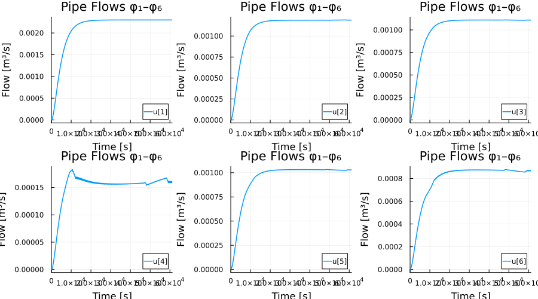

```julia
plot(ref_sol, idxs=7:12, title="Pipe Flows φ₇–φ₁₂",
     xlabel="Time [s]", ylabel="Flow [m³/s]", lw=1.5,
     layout=(2,3), size=(900,500))
```

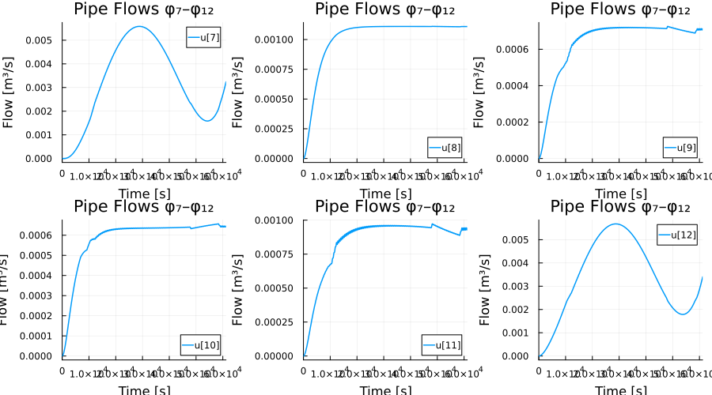

```julia
plot(ref_sol, idxs=13:18, title="Pipe Flows φ₁₃–φ₁₈",
     xlabel="Time [s]", ylabel="Flow [m³/s]", lw=1.5,
     layout=(2,3), size=(900,500))
```

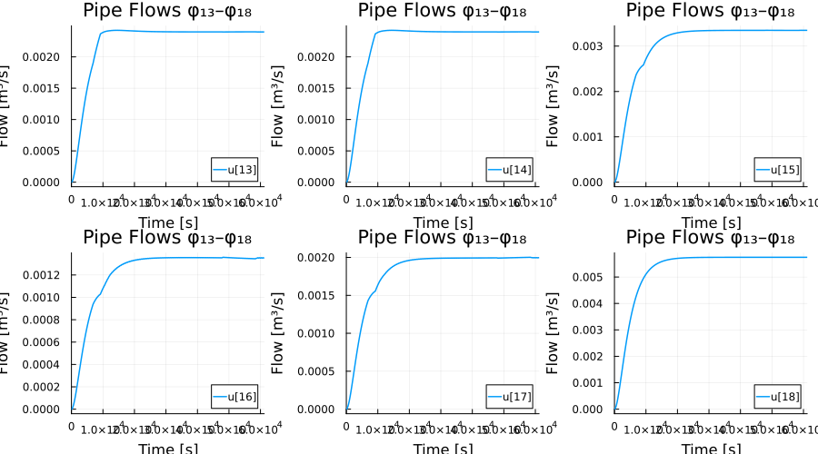

```julia
plot(ref_sol, idxs=19:24, title="Friction Factors λ₁–λ₆",
     xlabel="Time [s]", ylabel="λ", lw=1.5,
     layout=(2,3), size=(900,500))
```

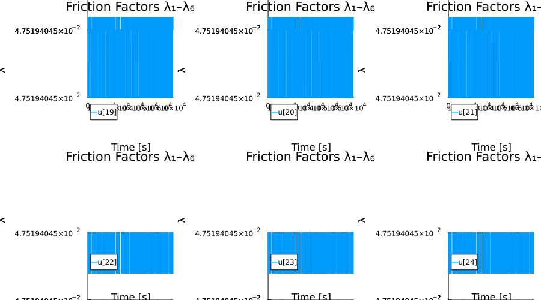

```julia
plot(ref_sol, idxs=25:30, title="Friction Factors λ₇–λ₁₂",
     xlabel="Time [s]", ylabel="λ", lw=1.5,
     layout=(2,3), size=(900,500))
```

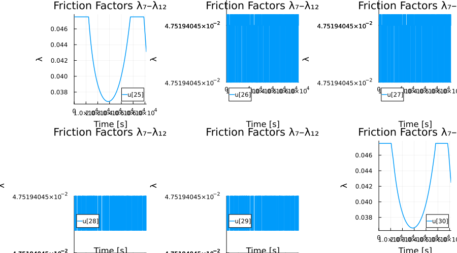

```julia
plot(ref_sol, idxs=31:36, title="Friction Factors λ₁₃–λ₁₈",
     xlabel="Time [s]", ylabel="λ", lw=1.5,
     layout=(2,3), size=(900,500))
```

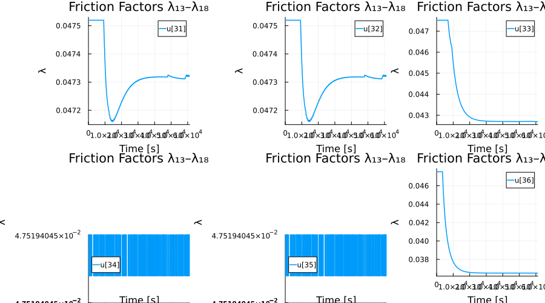

```julia
plot(ref_sol, idxs=37:49, title="Node Pressures p₁–p₁₃",
     xlabel="Time [s]", ylabel="Pressure [Pa]", lw=1.5,
     layout=(4,4), size=(1000,800))
```

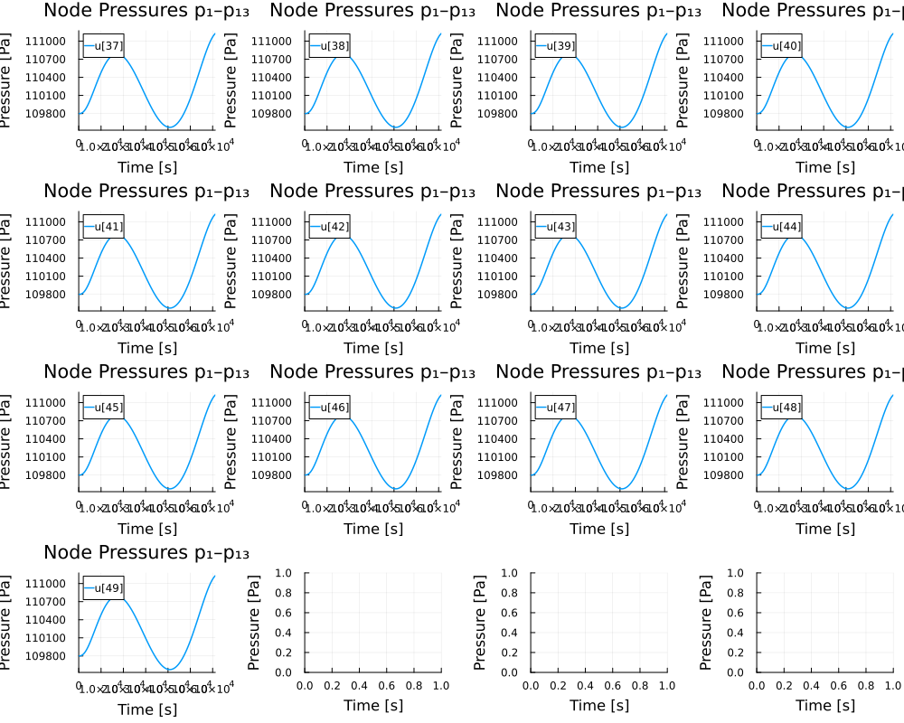


## Work-Precision Diagrams

```julia
probs = [prob_mm, prob_dae, prob_mtk]
refs  = [ref_sol, ref_sol, mtk_ref]
```

```
3-element Vector{SciMLBase.ODESolution{Float64, 2, Vector{Vector{Float64}},
 Nothing, Nothing, Vector{Float64}, Vector{Vector{Vector{Float64}}}, Nothin
g, P, OrdinaryDiffEqRosenbrock.Rodas5P{ADTypes.AutoForwardDiff{1, ForwardDi
ff.Tag{DiffEqBase.OrdinaryDiffEqTag, Float64}}, Nothing, typeof(OrdinaryDif
fEqCore.trivial_limiter!), typeof(OrdinaryDiffEqCore.trivial_limiter!), Not
hing}, IType, SciMLBase.DEStats, Nothing, Nothing, Nothing, Nothing} where
{P, IType}}:
 [0.0 0.0 … 0.0022984882948733874 0.0022984882964774307; 0.0 4.431195660077
6674e-57 … 0.0011890973893698663 0.001188984902333484; … ; 109800.0 109800.
0 … 111125.96488476323 111127.09955598167; 109800.0 109800.0 … 111128.70020
120426 111129.83394004773]
 [0.0 0.0 … 0.0022984882948733874 0.0022984882964774307; 0.0 4.431195660077
6674e-57 … 0.0011890973893698663 0.001188984902333484; … ; 109800.0 109800.
0 … 111125.96488476323 111127.09955598167; 109800.0 109800.0 … 111128.70020
120426 111129.83394004773]
 [0.0 2.3404915416581755e-23 … 0.0007080368998375816 0.0007120911105595884;
 0.04751940452918529 0.04751940452918529 … 0.04751940452918529 0.0475194045
2918529; … ; 109800.0 109800.00000000019 … 111123.39404258283 111126.924789
66535; 109800.0 109800.00000000013 … 111123.40307365899 111126.93183405453]
```


### High Tolerances

```julia
abstols = 1.0 ./ 10.0 .^ (5:8)
reltols = 1.0 ./ 10.0 .^ (1:4)
setups = [
    Dict(:prob_choice => 1, :alg => Rodas5P()),
    Dict(:prob_choice => 1, :alg => Rodas4P()),
    Dict(:prob_choice => 1, :alg => FBDF()),
    Dict(:prob_choice => 1, :alg => QNDF()),
    Dict(:prob_choice => 1, :alg => NordsieckBDF()),
    Dict(:prob_choice => 1, :alg => rodas()),
    Dict(:prob_choice => 2, :alg => IDA()),
    Dict(:prob_choice => 2, :alg => DFBDF()),
    Dict(:prob_choice => 2, :alg => DNordsieckBDF()),
    Dict(:prob_choice => 3, :alg => Rodas5P()),
]
labels = ["Rodas5P (MM)" "Rodas4P (MM)" "FBDF (MM)" "QNDF (MM)" "NordsieckBDF (MM)" "rodas (MM)" "IDA (DAE)" "DFBDF (DAE)" "DNordsieckBDF (DAE)" "Rodas5P (MTK)"]

wp = WorkPrecisionSet(probs, abstols, reltols, setups;
    names = labels, appxsol = refs, save_everystep = false,
    maxiters = Int(1e6), numruns = 10)
plot(wp, title = "Water Tube: High Tolerances")
```

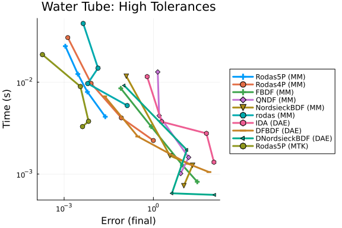


### Medium Tolerances

```julia
abstols = 1.0 ./ 10.0 .^ (6:9)
reltols = 1.0 ./ 10.0 .^ (3:6)
setups = [
    Dict(:prob_choice => 1, :alg => Rodas5P()),
    Dict(:prob_choice => 1, :alg => Rodas4P()),
    Dict(:prob_choice => 1, :alg => FBDF()),
    Dict(:prob_choice => 1, :alg => QNDF()),
    Dict(:prob_choice => 1, :alg => NordsieckBDF()),
    Dict(:prob_choice => 1, :alg => rodas()),
    Dict(:prob_choice => 2, :alg => IDA()),
    Dict(:prob_choice => 2, :alg => DFBDF()),
    Dict(:prob_choice => 2, :alg => DNordsieckBDF()),
    Dict(:prob_choice => 3, :alg => Rodas5P()),
]
labels = ["Rodas5P (MM)" "Rodas4P (MM)" "FBDF (MM)" "QNDF (MM)" "NordsieckBDF (MM)" "rodas (MM)" "IDA (DAE)" "DFBDF (DAE)" "DNordsieckBDF (DAE)" "Rodas5P (MTK)"]

wp = WorkPrecisionSet(probs, abstols, reltols, setups;
    names = labels, appxsol = refs, save_everystep = false,
    maxiters = Int(1e6), numruns = 10)
plot(wp, title = "Water Tube: Medium Tolerances")
```

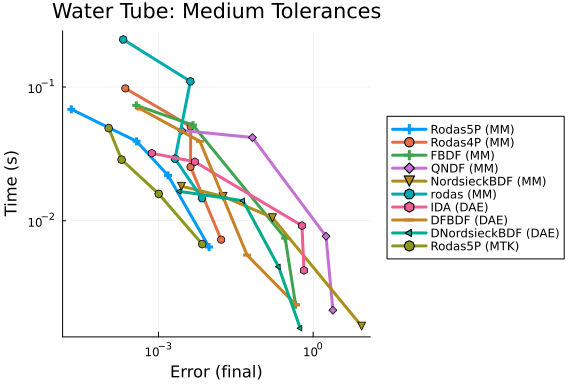


### Timeseries Errors (L2)

```julia
abstols = 1.0 ./ 10.0 .^ (5:8)
reltols = 1.0 ./ 10.0 .^ (1:4)
setups = [
    Dict(:prob_choice => 1, :alg => Rodas5P()),
    Dict(:prob_choice => 1, :alg => Rodas4P()),
    Dict(:prob_choice => 1, :alg => FBDF()),
    Dict(:prob_choice => 1, :alg => QNDF()),
    Dict(:prob_choice => 1, :alg => NordsieckBDF()),
    Dict(:prob_choice => 1, :alg => rodas()),
    Dict(:prob_choice => 2, :alg => IDA()),
    Dict(:prob_choice => 2, :alg => DFBDF()),
    Dict(:prob_choice => 2, :alg => DNordsieckBDF()),
    Dict(:prob_choice => 3, :alg => Rodas5P()),
]
labels = ["Rodas5P (MM)" "Rodas4P (MM)" "FBDF (MM)" "QNDF (MM)" "NordsieckBDF (MM)" "rodas (MM)" "IDA (DAE)" "DFBDF (DAE)" "DNordsieckBDF (DAE)" "Rodas5P (MTK)"]

wp = WorkPrecisionSet(probs, abstols, reltols, setups; error_estimate = :l2,
    names = labels, appxsol = refs, save_everystep = false,
    maxiters = Int(1e6), numruns = 10)
plot(wp, title = "Water Tube: Timeseries Error (L2)")
```

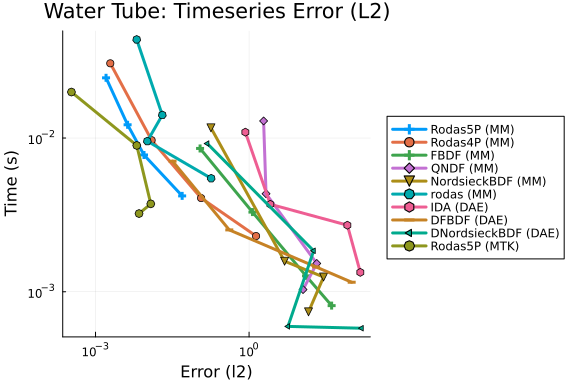


### Low Tolerances

```julia
abstols = 1.0 ./ 10.0 .^ (7:10)
reltols = 1.0 ./ 10.0 .^ (4:7)
setups = [
    Dict(:prob_choice => 1, :alg => Rodas5()),
    Dict(:prob_choice => 1, :alg => Rodas5P()),
    Dict(:prob_choice => 1, :alg => Rodas4()),
    Dict(:prob_choice => 1, :alg => FBDF()),
    Dict(:prob_choice => 1, :alg => NordsieckBDF()),
    Dict(:prob_choice => 1, :alg => rodas()),
    Dict(:prob_choice => 2, :alg => IDA()),
    Dict(:prob_choice => 2, :alg => DFBDF()),
    Dict(:prob_choice => 2, :alg => DNordsieckBDF()),
]
labels = ["Rodas5 (MM)" "Rodas5P (MM)" "Rodas4 (MM)" "FBDF (MM)" "NordsieckBDF (MM)" "rodas (MM)" "IDA (DAE)" "DFBDF (DAE)" "DNordsieckBDF (DAE)"]

wp = WorkPrecisionSet(probs, abstols, reltols, setups;
    names = labels, appxsol = refs, save_everystep = false,
    maxiters = Int(1e6), numruns = 10)
plot(wp, title = "Water Tube: Low Tolerances")
```

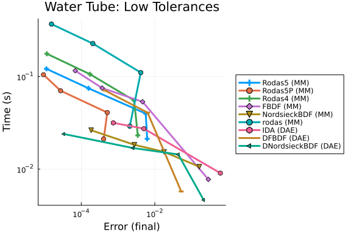

```julia
wp = WorkPrecisionSet(probs, abstols, reltols, setups; error_estimate = :l2,
    names = labels, appxsol = refs, save_everystep = false,
    maxiters = Int(1e6), numruns = 10)
plot(wp, title = "Water Tube: Low Tolerances (L2)")
```

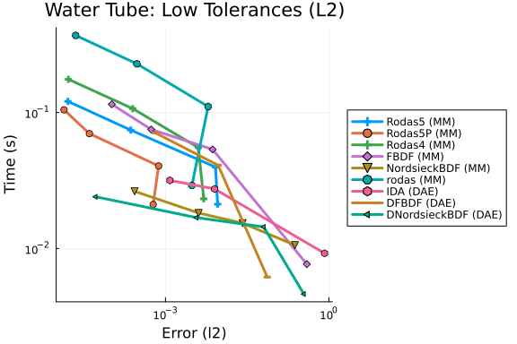


### Conclusion


## Appendix

These benchmarks are a part of the SciMLBenchmarks.jl repository, found at: [https://github.com/SciML/SciMLBenchmarks.jl](https://github.com/SciML/SciMLBenchmarks.jl). For more information on high-performance scientific machine learning, check out the SciML Open Source Software Organization [https://sciml.ai](https://sciml.ai).

To locally run this benchmark, do the following commands:

```
using SciMLBenchmarks
SciMLBenchmarks.weave_file("benchmarks/DAE","water_tube.jmd")
```

Computer Information:

```
Julia Version 1.11.9
Commit 53a02c0720c (2026-02-06 00:27 UTC)
Build Info:
  Official https://julialang.org/ release
Platform Info:
  OS: Linux (x86_64-linux-gnu)
  CPU: 128 × AMD EPYC 7502 32-Core Processor
  WORD_SIZE: 64
  LLVM: libLLVM-16.0.6 (ORCJIT, znver2)
Threads: 128 default, 0 interactive, 64 GC (on 128 virtual cores)
Environment:
  JULIA_PKG_PRECOMPILE_AUTO = 0
  JULIA_NUM_THREADS = auto

```

Package Information:

```
Status `~/sandbox/tmp_20260825_180339_53321/dae-pr1670-validate/benchmarks/DAE/Project.toml`
⌃ [165a45c3] DASKR v3.1.5
⌃ [e993076c] DASSL v3.1.0
⌃ [f3b72e0c] DiffEqDevTools v3.2.0
⌃ [961ee093] ModelingToolkit v11.39.0
⌅ [09606e27] ODEInterfaceDiffEq v4.1.0
⌃ [1dea7af3] OrdinaryDiffEq v7.6.0
⌃ [6ad6398a] OrdinaryDiffEqBDF v2.4.2
⌃ [5960d6e9] OrdinaryDiffEqFIRK v2.6.0
⌃ [43230ef6] OrdinaryDiffEqRosenbrock v2.6.5
⌃ [2d112036] OrdinaryDiffEqSDIRK v2.8.2
⌃ [91a5bcdd] Plots v1.41.6
⌃ [31c91b34] SciMLBenchmarks v0.1.3
⌃ [90137ffa] StaticArrays v1.9.18
⌃ [10745b16] Statistics v1.11.1
⌃ [c3572dad] Sundials v6.5.1
⌃ [0c5d862f] Symbolics v7.36.0
Info Packages marked with ⌃ and ⌅ have new versions available. Those with ⌃ may be upgradable, but those with ⌅ are restricted by compatibility constraints from upgrading. To see why use `status --outdated`
```

And the full manifest:

```
Status `~/sandbox/tmp_20260825_180339_53321/dae-pr1670-validate/benchmarks/DAE/Manifest.toml`
⌃ [47edcb42] ADTypes v1.23.0
  [14f7f29c] AMD v0.5.3
  [6e696c72] AbstractPlutoDingetjes v1.4.0
  [1520ce14] AbstractTrees v0.4.5
  [7d9f7c33] Accessors v0.1.45
  [79e6a3ab] Adapt v4.7.0
  [66dad0bd] AliasTables v1.1.3
  [ec485272] ArnoldiMethod v0.4.0
⌃ [4fba245c] ArrayInterface v7.28.1
  [4c555306] ArrayLayouts v1.12.2
⌃ [aae01518] BandedMatrices v1.11.0
  [e2ed5e7c] Bijections v0.2.2
⌃ [b2a6c25c] BinaryHeaps v1.0.4
⌃ [caf10ac8] BipartiteGraphs v0.1.11
  [d1d4a3ce] BitFlags v0.1.10
  [62783981] BitTwiddlingConvenienceFunctions v0.1.6
  [8e7c35d0] BlockArrays v1.10.0
⌃ [70df07ce] BracketingNonlinearSolve v1.12.5
  [fa961155] CEnum v0.5.0
  [2a0fbf3d] CPUSummary v0.2.7
  [fb6a15b2] CloseOpenIntervals v0.1.13
⌃ [944b1d66] CodecZlib v0.7.8
  [35d6a980] ColorSchemes v3.31.0
  [3da002f7] ColorTypes v0.12.1
  [c3611d14] ColorVectorSpace v0.11.0
  [5ae59095] Colors v0.13.1
⌅ [861a8166] Combinatorics v1.0.2
⌃ [38540f10] CommonSolve v0.2.13
  [bbf7d656] CommonSubexpressions v0.3.1
⌃ [f70d9fcc] CommonWorldInvalidations v1.1.2
  [34da2185] Compat v4.18.1
  [b152e2b5] CompositeTypes v0.1.4
  [a33af91c] CompositionsBase v0.1.2
⌃ [2569d6c7] ConcreteStructs v0.2.7
  [f0e56b4a] ConcurrentUtilities v2.6.0
  [8f4d0f93] Conda v1.10.3
  [187b0558] ConstructionBase v1.6.0
  [d38c429a] Contour v0.6.3
  [adafc99b] CpuId v0.3.1
  [a8cc5b0e] Crayons v4.2.0
⌃ [165a45c3] DASKR v3.1.5
⌃ [e993076c] DASSL v3.1.0
  [9a962f9c] DataAPI v1.16.0
  [864edb3b] DataStructures v0.19.6
  [e2d170a0] DataValueInterfaces v1.0.0
  [8bb1440f] DelimitedFiles v1.9.1
⌃ [2b5f629d] DiffEqBase v7.14.0
⌃ [459566f4] DiffEqCallbacks v4.19.2
⌃ [f3b72e0c] DiffEqDevTools v3.2.0
⌃ [77a26b50] DiffEqNoiseProcess v5.34.1
  [163ba53b] DiffResults v1.1.0
  [b552c78f] DiffRules v1.16.0
⌃ [a0c0ee7d] DifferentiationInterface v0.7.20
⌃ [31c24e10] Distributions v0.25.130
  [ffbed154] DocStringExtensions v0.9.5
  [5b8099bc] DomainSets v0.8.1
⌃ [7c1d4256] DynamicPolynomials v0.6.6
  [4e289a0a] EnumX v1.0.7
  [f151be2c] EnzymeCore v0.8.21
  [460bff9d] ExceptionUnwrapping v0.1.11
  [e2ba6199] ExprTools v0.1.11
  [55351af7] ExproniconLite v0.10.14
  [c87230d0] FFMPEG v0.4.5
⌃ [7034ab61] FastBroadcast v1.3.6
  [9aa1b823] FastClosures v0.3.2
  [442a2c76] FastGaussQuadrature v1.3.0
⌃ [a4df4552] FastPower v1.4.1
  [1a297f60] FillArrays v1.17.0
  [64ca27bc] FindFirstFunctions v3.2.1
  [6a86dc24] FiniteDiff v2.33.0
⌅ [53c48c17] FixedPointNumbers v0.8.6
  [1fa38f19] Format v1.3.7
  [f6369f11] ForwardDiff v1.4.5
  [a85aefff] FunctionMaps v0.1.2
  [069b7b12] FunctionWrappers v1.1.3
⌃ [77dc65aa] FunctionWrappersWrappers v1.12.1
  [46192b85] GPUArraysCore v0.2.0
⌃ [28b8d3ca] GR v0.73.26
  [a0844989] Gamma v1.2.0
  [d7ba0133] Git v1.5.0
  [86223c79] Graphs v1.14.0
  [42e2da0e] Grisu v1.0.2
⌅ [cd3eb016] HTTP v1.11.0
⌅ [eafb193a] Highlights v0.5.3
  [34004b35] HypergeometricFunctions v0.3.30
  [7073ff75] IJulia v1.34.4
  [615f187c] IfElse v0.1.1
⌃ [3263718b] ImplicitDiscreteSolve v2.1.5
  [d25df0c9] Inflate v0.1.5
  [18e54dd8] IntegerMathUtils v0.1.4
  [8197267c] IntervalSets v0.7.14
  [3587e190] InverseFunctions v0.1.17
  [92d709cd] IrrationalConstants v0.2.6
  [82899510] IteratorInterfaceExtensions v1.0.0
  [1019f520] JLFzf v0.1.11
  [692b3bcd] JLLWrappers v1.8.0
⌅ [682c06a0] JSON v0.21.4
  [ae98c720] Jieko v0.2.1
⌃ [ccbc3e58] JumpProcesses v9.29.2
  [ba0b0d4f] Krylov v0.10.9
⌃ [b964fa9f] LaTeXStrings v1.4.0
⌃ [23fbe1c1] Latexify v0.16.11
  [10f19ff3] LayoutPointers v0.1.17
⌃ [87fe0de2] LineSearch v0.1.14
⌃ [7ed4a6bd] LinearSolve v5.10.0
  [2ab3a3ac] LogExpFunctions v1.0.1
  [e6f89c97] LoggingExtras v1.2.0
  [1914dd2f] MacroTools v0.5.16
  [d125e4d3] ManualMemory v0.1.8
⌃ [bb5d69b7] MaybeInplace v0.1.7
  [739be429] MbedTLS v1.1.10
  [442fdcdd] Measures v0.3.3
  [e1d29d7a] Missings v1.2.0
⌃ [961ee093] ModelingToolkit v11.39.0
⌃ [7771a370] ModelingToolkitBase v1.65.0
⌃ [6bb917b9] ModelingToolkitTearing v1.20.5
  [2e0e35c7] Moshi v0.3.12
  [46d2c3a1] MuladdMacro v0.2.7
  [102ac46a] MultivariatePolynomials v0.5.19
  [ffc61752] Mustache v1.0.21
  [d8a4904e] MutableArithmetics v1.8.0
  [77ba4419] NaNMath v1.1.4
⌃ [8913a72c] NonlinearSolve v4.26.1
⌃ [be0214bd] NonlinearSolveBase v2.43.0
⌃ [5959db7a] NonlinearSolveFirstOrder v2.3.2
⌃ [9a2c21bd] NonlinearSolveQuasiNewton v1.15.1
⌃ [26075421] NonlinearSolveSpectralMethods v1.8.0
  [54ca160b] ODEInterface v0.5.2
⌅ [09606e27] ODEInterfaceDiffEq v4.1.0
  [6fe1bfb0] OffsetArrays v1.17.0
  [4d8831e6] OpenSSL v1.6.1
⌅ [bac558e1] OrderedCollections v1.8.2
⌃ [1dea7af3] OrdinaryDiffEq v7.6.0
⌃ [6ad6398a] OrdinaryDiffEqBDF v2.4.2
⌃ [bbf590c4] OrdinaryDiffEqCore v4.14.3
⌃ [50262376] OrdinaryDiffEqDefault v2.4.4
⌃ [4302a76b] OrdinaryDiffEqDifferentiation v3.9.0
⌃ [5960d6e9] OrdinaryDiffEqFIRK v2.6.0
⌃ [127b3ac7] OrdinaryDiffEqNonlinearSolve v2.8.0
⌃ [43230ef6] OrdinaryDiffEqRosenbrock v2.6.5
⌃ [b4bd8bb3] OrdinaryDiffEqRosenbrockTableaus v2.4.1
⌃ [2d112036] OrdinaryDiffEqSDIRK v2.8.2
⌃ [b1df2697] OrdinaryDiffEqTsit5 v2.1.3
⌃ [79d7bb75] OrdinaryDiffEqVerner v2.2.2
  [90014a1f] PDMats v0.11.41
⌅ [69de0a69] Parsers v2.8.7
  [ccf2f8ad] PlotThemes v3.3.0
  [995b91a9] PlotUtils v1.4.4
⌃ [91a5bcdd] Plots v1.41.6
  [e409e4f3] PoissonRandom v0.4.13
  [f517fe37] Polyester v0.7.19
  [1d0040c9] PolyesterWeave v0.2.2
⌃ [d236fae5] PreallocationTools v1.5.0
⌅ [aea7be01] PrecompileTools v1.2.1
  [21216c6a] Preferences v1.5.2
⌃ [08abe8d2] PrettyTables v3.4.6
  [27ebfcd6] Primes v0.5.7
  [43287f4e] PtrArrays v1.4.0
  [0c0d3e7f] PureKLU v1.4.1
  [1fd47b50] QuadGK v2.11.3
  [988b38a3] ReadOnlyArrays v0.2.0
  [795d4caa] ReadOnlyDicts v1.0.1
  [3cdcf5f2] RecipesBase v1.3.4
  [01d81517] RecipesPipeline v0.6.12
⌃ [731186ca] RecursiveArrayTools v4.4.0
  [189a3867] Reexport v1.2.2
  [05181044] RelocatableFolders v1.0.1
  [ae029012] Requires v1.3.1
⌃ [ae5879a3] ResettableStacks v1.3.0
⌃ [9fe22ead] RespecializeParams v1.2.0
  [79098fc4] Rmath v0.9.0
⌃ [47965b36] RootedTrees v2.25.4
⌃ [f2b01f46] Roots v3.0.6
⌃ [7e49a35a] RuntimeGeneratedFunctions v0.5.24
⌃ [9dfe8606] SCCNonlinearSolve v1.14.1
  [94e857df] SIMDTypes v0.1.0
⌅ [0bca4576] SciMLBase v3.46.1
⌃ [31c91b34] SciMLBenchmarks v0.1.3
⌃ [19f34311] SciMLJacobianOperators v0.1.17
⌃ [a6db7da4] SciMLLogging v2.0.4
⌃ [c0aeaf25] SciMLOperators v1.26.1
⌃ [431bcebd] SciMLPublic v1.2.4
⌃ [53ae85a6] SciMLStructures v1.10.4
  [6c6a2e73] Scratch v1.3.0
  [efcf1570] Setfield v1.1.2
  [992d4aef] Showoff v1.0.3
  [777ac1f9] SimpleBufferStream v1.2.0
⌃ [727e6d20] SimpleNonlinearSolve v2.14.0
  [699a6c99] SimpleTraits v0.9.6
  [a2af1166] SortingAlgorithms v1.2.3
⌃ [a57abbd0] SparseColumnPivotedQR v2.1.6
  [0a514795] SparseMatrixColorings v0.4.27
⌃ [276daf66] SpecialFunctions v2.8.3
  [860ef19b] StableRNGs v1.0.4
  [0c0c59c1] StarAlgebras v0.3.0
⌃ [64909d44] StateSelection v1.11.0
  [aedffcd0] Static v1.4.6
  [0d7ed370] StaticArrayInterface v1.10.0
⌃ [90137ffa] StaticArrays v1.9.18
  [1e83bf80] StaticArraysCore v1.4.4
⌃ [10745b16] Statistics v1.11.1
  [82ae8749] StatsAPI v1.8.0
⌃ [2913bbd2] StatsBase v0.34.12
  [4c63d2b9] StatsFuns v2.2.1
  [7792a7ef] StrideArraysCore v0.5.9
  [69024149] StringEncodings v0.3.7
⌅ [892a3eda] StringManipulation v0.4.7
  [09ab397b] StructArrays v0.7.3
⌃ [c3572dad] Sundials v6.5.1
⌃ [2efcf032] SymbolicIndexingInterface v0.3.54
⌃ [19f23fe9] SymbolicLimits v1.1.5
⌅ [d1185830] SymbolicUtils v4.45.0
⌃ [0c5d862f] Symbolics v7.36.0
  [3783bdb8] TableTraits v1.0.1
⌃ [bd369af6] Tables v1.13.0
  [ed4db957] TaskLocalValues v0.1.3
  [62fd8b95] TensorCore v0.1.1
  [8ea1fca8] TermInterface v2.0.0
  [8290d209] ThreadingUtilities v0.5.6
  [a759f4b9] TimerOutputs v1.2.0
  [3bb67fe8] TranscodingStreams v0.11.3
  [781d530d] TruncatedStacktraces v1.4.0
⌃ [5c2747f8] URIs v1.6.3
  [3a884ed6] UnPack v1.0.2
  [1cfade01] UnicodeFun v0.4.1
  [41fe7b60] Unzip v0.2.0
  [81def892] VersionParsing v1.3.0
  [d30d5f5c] WeakCacheSets v0.1.0
  [44d3d7a6] Weave v0.10.12
  [ddb6d928] YAML v0.4.16
  [c2297ded] ZMQ v1.5.1
  [6e34b625] Bzip2_jll v1.0.9+0
  [83423d85] Cairo_jll v1.18.7+0
  [655fdf9c] DASKR_jll v1.0.1+0
  [ee1fde0b] Dbus_jll v1.16.2+0
  [2702e6a9] EpollShim_jll v0.0.20230411+1
⌃ [2e619515] Expat_jll v2.8.2+0
⌅ [b22a6f82] FFMPEG_jll v8.1.2+0
  [a3f928ae] Fontconfig_jll v2.17.1+0
  [d7e528f0] FreeType2_jll v2.14.3+1
  [559328eb] FriBidi_jll v1.0.17+0
⌃ [0656b61e] GLFW_jll v3.4.1+1
⌅ [d2c73de3] GR_jll v0.73.26+0
⌅ [b0724c58] GettextRuntime_jll v0.22.4+0
  [61579ee1] Ghostscript_jll v9.55.1+0
  [020c3dae] Git_LFS_jll v3.7.1+0
  [f8c6e375] Git_jll v2.55.0+0
  [7746bdde] Glib_jll v2.88.3+0
  [3b182d85] Graphite2_jll v1.3.16+0
⌅ [2e76f6c2] HarfBuzz_jll v8.5.1+0
  [1d5cc7b8] IntelOpenMP_jll v2025.2.0+0
  [aacddb02] JpegTurbo_jll v3.2.0+1
  [c1c5ebd0] LAME_jll v3.100.3+0
  [88015f11] LERC_jll v4.1.0+0
  [1d63c593] LLVMOpenMP_jll v22.1.7+0
⌅ [e9f186c6] Libffi_jll v3.4.7+0
  [7e76a0d4] Libglvnd_jll v1.7.1+1
  [94ce4f54] Libiconv_jll v1.18.0+0
  [4b2f31a3] Libmount_jll v2.42.0+0
  [89763e89] Libtiff_jll v4.7.3+0
  [38a345b3] Libuuid_jll v2.42.0+0
  [856f044c] MKL_jll v2025.2.0+0
  [c771fb93] ODEInterface_jll v0.0.2+0
  [e7412a2a] Ogg_jll v1.3.6+0
  [656ef2d0] OpenBLAS32_jll v0.3.34+0
⌃ [9bd350c2] OpenSSH_jll v10.4.1+0
⌃ [458c3c95] OpenSSL_jll v3.5.7+0
  [efe28fd5] OpenSpecFun_jll v0.5.6+0
  [91d4177d] Opus_jll v1.6.1+0
⌃ [36c8627f] Pango_jll v1.58.0+0
  [30392449] Pixman_jll v0.46.4+0
  [c0090381] Qt6Base_jll v6.10.2+2
  [629bc702] Qt6Declarative_jll v6.10.2+2
  [ce943373] Qt6ShaderTools_jll v6.10.2+1
  [6de9746b] Qt6Svg_jll v6.10.2+0
  [e99dba38] Qt6Wayland_jll v6.10.2+1
  [f50d1b31] Rmath_jll v0.5.2+0
  [ca45d3f4] SuiteSparse32_jll v7.12.1+0
  [fb77eaff] Sundials_jll v7.5.0+0
  [a44049a8] Vulkan_Loader_jll v1.3.243+0
  [a2964d1f] Wayland_jll v1.24.0+0
  [ffd25f8a] XZ_jll v5.8.3+0
  [f67eecfb] Xorg_libICE_jll v1.1.2+0
  [c834827a] Xorg_libSM_jll v1.2.6+0
  [4f6342f7] Xorg_libX11_jll v1.8.13+0
  [0c0b7dd1] Xorg_libXau_jll v1.0.13+0
  [935fb764] Xorg_libXcursor_jll v1.2.4+0
  [a3789734] Xorg_libXdmcp_jll v1.1.6+0
  [1082639a] Xorg_libXext_jll v1.3.8+0
  [d091e8ba] Xorg_libXfixes_jll v6.0.2+0
  [a51aa0fd] Xorg_libXi_jll v1.8.4+0
  [d1454406] Xorg_libXinerama_jll v1.1.7+0
  [ec84b674] Xorg_libXrandr_jll v1.5.6+0
  [ea2f1a96] Xorg_libXrender_jll v0.9.12+0
  [a65dc6b1] Xorg_libpciaccess_jll v0.19.0+0
  [c7cfdc94] Xorg_libxcb_jll v1.17.1+0
  [cc61e674] Xorg_libxkbfile_jll v1.2.0+0
  [e920d4aa] Xorg_xcb_util_cursor_jll v0.1.6+0
  [12413925] Xorg_xcb_util_image_jll v0.4.1+0
  [2def613f] Xorg_xcb_util_jll v0.4.1+0
  [975044d2] Xorg_xcb_util_keysyms_jll v0.4.1+0
  [0d47668e] Xorg_xcb_util_renderutil_jll v0.3.10+0
  [c22f9ab0] Xorg_xcb_util_wm_jll v0.4.2+0
  [35661453] Xorg_xkbcomp_jll v1.4.7+0
  [33bec58e] Xorg_xkeyboard_config_jll v2.47.0+2
  [c5fb5394] Xorg_xtrans_jll v1.6.0+0
  [8f1865be] ZeroMQ_jll v4.3.6+0
  [3161d3a3] Zstd_jll v1.5.7+1
  [35ca27e7] eudev_jll v3.2.14+0
⌅ [214eeab7] fzf_jll v0.61.1+0
  [a4ae2306] libaom_jll v3.14.1+0
⌃ [0ac62f75] libass_jll v0.17.4+0
  [1183f4f0] libdecor_jll v0.2.2+0
  [8e53e030] libdrm_jll v2.4.134+0
  [2db6ffa8] libevdev_jll v1.13.4+0
  [f638f0a6] libfdk_aac_jll v2.0.4+0
  [36db933b] libinput_jll v1.28.1+0
  [b53b4c65] libpng_jll v1.6.58+0
  [a9144af2] libsodium_jll v1.0.21+0
  [9a156e7d] libva_jll v2.23.0+0
  [f27f6e37] libvorbis_jll v1.3.8+0
  [009596ad] mtdev_jll v1.1.7+0
  [1317d2d5] oneTBB_jll v2022.3.0+0
⌅ [1270edf5] x264_jll v10164.0.1+0
  [dfaa095f] x265_jll v4.1.0+0
  [d8fb68d0] xkbcommon_jll v1.13.0+0
  [0dad84c5] ArgTools v1.1.2
  [56f22d72] Artifacts v1.11.0
  [2a0f44e3] Base64 v1.11.0
  [ade2ca70] Dates v1.11.0
  [8ba89e20] Distributed v1.11.0
  [f43a241f] Downloads v1.6.0
  [7b1f6079] FileWatching v1.11.0
  [9fa8497b] Future v1.11.0
  [b77e0a4c] InteractiveUtils v1.11.0
  [4af54fe1] LazyArtifacts v1.11.0
  [b27032c2] LibCURL v0.6.4
  [76f85450] LibGit2 v1.11.0
  [8f399da3] Libdl v1.11.0
  [37e2e46d] LinearAlgebra v1.11.0
  [56ddb016] Logging v1.11.0
  [d6f4376e] Markdown v1.11.0
  [a63ad114] Mmap v1.11.0
  [ca575930] NetworkOptions v1.2.0
  [44cfe95a] Pkg v1.11.0
  [de0858da] Printf v1.11.0
  [3fa0cd96] REPL v1.11.0
  [9a3f8284] Random v1.11.0
  [ea8e919c] SHA v0.7.0
  [9e88b42a] Serialization v1.11.0
  [6462fe0b] Sockets v1.11.0
  [2f01184e] SparseArrays v1.11.0
  [f489334b] StyledStrings v1.11.0
  [4607b0f0] SuiteSparse
  [fa267f1f] TOML v1.0.3
  [a4e569a6] Tar v1.10.0
  [8dfed614] Test v1.11.0
  [cf7118a7] UUIDs v1.11.0
  [4ec0a83e] Unicode v1.11.0
  [e66e0078] CompilerSupportLibraries_jll v1.1.1+0
  [deac9b47] LibCURL_jll v8.6.0+0
  [e37daf67] LibGit2_jll v1.7.2+0
  [29816b5a] LibSSH2_jll v1.11.0+1
  [c8ffd9c3] MbedTLS_jll v2.28.6+0
  [14a3606d] MozillaCACerts_jll v2023.12.12
  [4536629a] OpenBLAS_jll v0.3.27+1
  [05823500] OpenLibm_jll v0.8.5+0
  [efcefdf7] PCRE2_jll v10.42.0+1
  [bea87d4a] SuiteSparse_jll v7.7.0+0
  [83775a58] Zlib_jll v1.2.13+1
  [8e850b90] libblastrampoline_jll v5.11.0+0
  [8e850ede] nghttp2_jll v1.59.0+0
  [3f19e933] p7zip_jll v17.4.0+2
Info Packages marked with ⌃ and ⌅ have new versions available. Those with ⌃ may be upgradable, but those with ⌅ are restricted by compatibility constraints from upgrading. To see why use `status --outdated -m`
```

