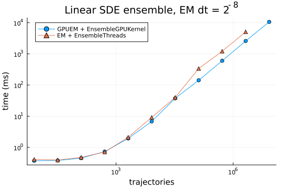

Linear geometric Brownian motion ensemble from Utkarsh et al.,
[Comput. Methods Appl. Mech. Eng. 428 (2024) 117109](https://doi.org/10.1016/j.cma.2023.117109)
([arXiv:2304.06835](https://arxiv.org/abs/2304.06835);
[artifacts](https://github.com/utkarsh530/GPUODEBenchmarks)).

$$
dX = p\, X\, dt + q\, X\, dW, \qquad
X_0 = (0.1, 0.1, 0.1),\quad
p = 1.5,\quad
q = 0.01,\quad
t \in [0, 1]
$$

Fixed-step Euler–Maruyama with $dt = 2^{-8}$. GPU uses `GPUEM` +
`EnsembleGPUKernel` in `Float32`; CPU uses `EM` + `EnsembleThreads` in
`Float64`, matching the paper scripts.

```julia
using Printf
using CUDA
using DiffEqGPU, StochasticDiffEq, StaticArrays
using Plots

@assert CUDA.functional() "This benchmark requires a functional CUDA GPU"
println("GPU: ", CUDA.name(CUDA.device()))

const BACKEND = CUDA.CUDABackend()
const KERNEL = EnsembleGPUKernel(BACKEND, 0.0)

gr()
```

```
GPU: Tesla V100-PCIE-32GB
Plots.GRBackend()
```


```julia
f(u, p, t) = p[1] * u
g(u, p, t) = p[2] * u

function make_sde_ensemble(; T::Type = Float32)
    u0 = SVector{3, T}(T(0.1), T(0.1), T(0.1))
    tspan = (zero(T), one(T))
    p = SVector{2, T}(T(1.5), T(0.01))
    prob = SDEProblem{false}(f, g, u0, tspan, p; seed = 1234)
    return EnsembleProblem(prob, safetycopy = false)
end

function min_seconds(fn; warmup = 1, samples = 5)
    for _ in 1:warmup
        fn()
    end
    ts = Vector{Float64}(undef, samples)
    for i in 1:samples
        ts[i] = @elapsed fn()
    end
    return minimum(ts)
end

function time_sde(n, ensemblealg, alg; T = Float32)
    ens = make_sde_ensemble(; T)
    dt = T(1 // 2^8)
    run = if ensemblealg isa EnsembleThreads
        () -> (solve(ens, alg, ensemblealg; trajectories = n, save_everystep = false,
            adaptive = false, dt = dt); nothing)
    else
        () -> (CUDA.@sync solve(ens, alg, ensemblealg; trajectories = n,
            save_everystep = false, adaptive = false, dt = dt); nothing)
    end
    return min_seconds(run)
end
```

```
time_sde (generic function with 1 method)
```


```julia
let
    ens = make_sde_ensemble()
    sol = solve(ens, GPUEM(), KERNEL; trajectories = 4, save_everystep = false,
        adaptive = false, dt = Float32(1 // 2^8))
    @assert length(sol.u) == 4
    println("GPUEM smoke: 4 trajectories, u[end] = ", sol.u[1].u[end])
end
```

```
GPUEM smoke: 4 trajectories, u[end] = Float32[0.43873417, 0.45378098, 0.441
85403]
```


```julia
const TRAJ_GPU = [8, 32, 128, 512, 2048, 8192, 32768, 131072, 524288, 2097152, 8388608]
const TRAJ_CPU = [8, 32, 128, 512, 2048, 8192, 32768, 131072, 524288, 2097152]

t_gpu = Float64[]
t_cpu = Float64[]
for n in TRAJ_GPU
    @info "sde gpu" n
    push!(t_gpu, time_sde(n, KERNEL, GPUEM()))
end
for n in TRAJ_CPU
    @info "sde cpu" n
    push!(t_cpu, time_sde(n, EnsembleThreads(), EM(); T = Float64))
end
```


```julia
p = plot(TRAJ_GPU, t_gpu .* 1e3; xscale = :log10, yscale = :log10,
    xlabel = "trajectories", ylabel = "time (ms)", label = "GPUEM + EnsembleGPUKernel",
    marker = :circle, legend = :topleft, title = "Linear SDE ensemble, EM dt = 2^{-8}")
plot!(p, TRAJ_CPU, t_cpu .* 1e3; label = "EM + EnsembleThreads", marker = :utriangle)
p
```



```julia
println("Linear SDE (ms)")
@printf("%10s %12s %12s\n", "N", "GPU", "CPU")
for n in TRAJ_GPU
    tg = t_gpu[findfirst(==(n), TRAJ_GPU)] * 1e3
    tc = (i = findfirst(==(n), TRAJ_CPU); i === nothing ? NaN : t_cpu[i] * 1e3)
    @printf("%10d %12.3f %12.3f\n", n, tg, tc)
end
```

```
Linear SDE (ms)
         N          GPU          CPU
         8        0.372        0.412
        32        0.380        0.393
       128        0.452        0.478
       512        0.732        0.711
      2048        1.932        2.114
      8192        6.800        9.154
     32768       37.600       40.084
    131072      142.316      337.803
    524288      601.057     1212.467
   2097152     2587.372     5108.014
   8388608    10591.615          NaN
```


