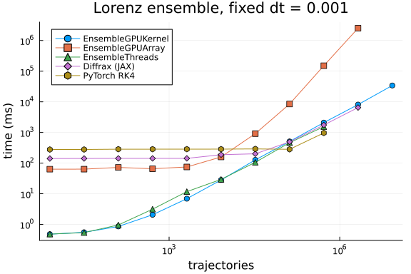
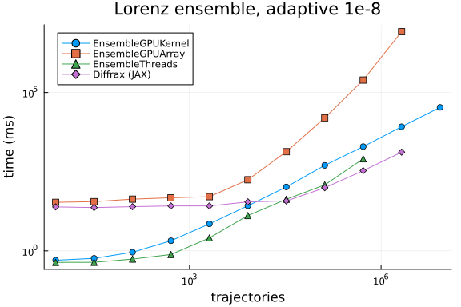

Ensemble Lorenz from Utkarsh et al., *Automated Translation and Accelerated
Solving of Differential Equations on Multiple GPU Platforms*,
[Comput. Methods Appl. Mech. Eng. 428 (2024) 117109](https://doi.org/10.1016/j.cma.2023.117109)
([arXiv:2304.06835](https://arxiv.org/abs/2304.06835);
[artifacts](https://github.com/utkarsh530/GPUODEBenchmarks)).

The ODE is the paper's Lorenz system, one trajectory per $\rho \in [0, 21]$,
$t \in [0, 1]$, $u_0 = (1,0,0)$, $\sigma = 10$, $\beta = 2.666$. GPU Julia
and the Python codes run in `Float32`; the CPU ensemble uses `Float64`, as
in the artifacts. Fixed-step runs use $dt = 0.001$; adaptive runs use
`reltol = abstol = 1e-8`. The C++ MPGOS comparison from the paper is omitted
(standalone CUDA C++, not weavable here).

Compared:

* `GPUTsit5` + `EnsembleGPUKernel` — specialized kernel (paper's Julia GPU line)
* `RK4`/`Tsit5` + `EnsembleGPUArray` — fused array ensemble
* `Tsit5` + `EnsembleThreads` — CPU
* [Diffrax](https://github.com/patrick-kidger/diffrax) Tsit5 via `jax.vmap`
* Batched PyTorch RK4 with the paper's `method='rk4'`, `step_size=0.001`
  (official [torchdiffeq](https://github.com/rtqichen/torchdiffeq) does not
  `vmap`; the paper used a fork)

`cpu_offload` is `0` so the GPU numbers are GPU-only.

```julia
using Printf
using CUDA
using DiffEqGPU, OrdinaryDiffEq, OrdinaryDiffEqLowOrderRK, StaticArrays
using Plots
using PythonCall, CondaPkg

@assert CUDA.functional() "This benchmark requires a functional CUDA GPU"
println("GPU: ", CUDA.name(CUDA.device()))

const BACKEND = CUDA.CUDABackend()
const KERNEL = EnsembleGPUKernel(BACKEND, 0.0)
const ARRAY = EnsembleGPUArray(BACKEND, 0.0)

gr()
```

```
GPU: Tesla V100-PCIE-32GB
Plots.GRBackend()
```


```julia
function lorenz(u, p, t)
    T = eltype(u)
    du1 = T(10) * (u[2] - u[1])
    du2 = p[1] * u[1] - u[2] - u[1] * u[3]
    du3 = u[1] * u[2] - T(2.666) * u[3]
    return SVector{3, T}(du1, du2, du3)
end

function make_ensemble(n; T::Type = Float32)
    u0 = SVector{3, T}(1, 0, 0)
    tspan = (zero(T), one(T))
    p = SVector{1, T}(21)
    plist = range(zero(T), T(21); length = max(n, 2))[1:n]
    prob = ODEProblem{false}(lorenz, u0, tspan, p)
    prob_func = (prob, ctx) -> remake(prob, p = SVector{1, T}(plist[ctx.sim_id]))
    return EnsembleProblem(prob, prob_func = prob_func, safetycopy = false)
end

function min_seconds(f; warmup = 1, samples = 5)
    for _ in 1:warmup
        f()
    end
    ts = Vector{Float64}(undef, samples)
    for i in 1:samples
        ts[i] = @elapsed f()
    end
    return minimum(ts)
end

function time_julia(n, ensemblealg, alg; adaptive, T = Float32, dt = T(0.001))
    ens = make_ensemble(n; T)
    kwargs = (
        trajectories = n,
        save_everystep = false,
        dense = false,
        dt = dt,
        adaptive = adaptive
    )
    if adaptive
        kwargs = (; kwargs..., reltol = T(1e-8), abstol = T(1e-8))
    end
    run = if ensemblealg isa EnsembleThreads
        () -> (solve(ens, alg, ensemblealg; kwargs...); nothing)
    else
        () -> (CUDA.@sync solve(ens, alg, ensemblealg; kwargs...); nothing)
    end
    return min_seconds(run)
end
```

```
time_julia (generic function with 1 method)
```


```julia
# Hosted V100s reject some CUDA 13 / generic PyTorch wheels (`no kernel image
# is available for execution on the device`). Probe once and skip Python GPU
# timings rather than aborting the Julia ensemble series.
python_gpu = try
    sys = pyimport("sys")
    sys.path.insert(0, @__DIR__)
    eu = pyimport("ensemble_utils")
    jax = pyimport("jax")
    torch = pyimport("torch")
    jax_devs = jax.devices("gpu")
    @assert pyconvert(Int, pyimport("builtins").len(jax_devs)) > 0 "JAX did not see a GPU"
    println("JAX devices: ", jax.devices())
    @assert pyconvert(Bool, torch.cuda.is_available()) "PyTorch did not see a CUDA GPU"
    println("PyTorch CUDA: ", torch.cuda.get_device_name(0))
    torch.zeros(1).cuda()
    jax.numpy.zeros((1,))
    (; eu, jax, torch)
catch e
    @warn "Python GPU backends unavailable; skipping JAX/PyTorch timings" exception = (e, catch_backtrace())
    nothing
end

time_diffrax(n; adaptive) = python_gpu === nothing ? NaN :
                            pyconvert(Float64, python_gpu.eu.time_diffrax(n, adaptive))
time_torch(n) = python_gpu === nothing ? NaN :
                pyconvert(Float64, python_gpu.eu.time_torch_rk4(n))
```

```
JAX devices: [CudaDevice(id=0)]
PyTorch CUDA: Tesla V100-PCIE-32GB
time_torch (generic function with 1 method)
```


Trajectory counts follow the paper's `8, 32, 128, …` geometric sequence.
`EnsembleGPUArray` and the Python solvers stop earlier than the kernel
path: at $2^{23}$ they are the memory- and time-heavy ones on a 16 GB V100.

```julia
const TRAJ_KERNEL = [8, 32, 128, 512, 2048, 8192, 32768, 131072, 524288, 2097152, 8388608]
const TRAJ_ARRAY = [8, 32, 128, 512, 2048, 8192, 32768, 131072, 524288, 2097152]
const TRAJ_CPU = [8, 32, 128, 512, 2048, 8192, 32768, 131072, 524288]
const TRAJ_JAX = [8, 32, 128, 512, 2048, 8192, 32768, 131072, 524288, 2097152]
const TRAJ_TORCH = [8, 32, 128, 512, 2048, 8192, 32768, 131072, 524288]
```

```
9-element Vector{Int64}:
      8
     32
    128
    512
   2048
   8192
  32768
 131072
 524288
```


## Correctness

Two kernel trajectories against CPU `Tsit5` references at the same `Float32`
problems.

```julia
let
    ens = make_ensemble(2)
    sol_gpu = solve(ens, GPUTsit5(), KERNEL; trajectories = 2,
        save_everystep = false, adaptive = false, dt = 0.001f0)
    sol_cpu = solve(ens, Tsit5(), EnsembleSerial(); trajectories = 2,
        save_everystep = false, adaptive = false, dt = 0.001f0)
    err = maximum(i -> maximum(abs.(sol_gpu.u[i].u[end] .- sol_cpu.u[i].u[end])), 1:2)
    println("kernel vs CPU |Δu|∞ at t=1: ", err)
    @assert err < 1.0f-2
end
```

```
kernel vs CPU |Δu|∞ at t=1: 0.0002975464
```


## Fixed time step

```julia
t_kernel_fix = Float64[]
t_array_fix = Float64[]
t_cpu_fix = Float64[]
t_jax_fix = Float64[]
t_torch_fix = Float64[]

for n in TRAJ_KERNEL
    @info "fixed kernel" n
    push!(t_kernel_fix, time_julia(n, KERNEL, GPUTsit5(); adaptive = false))
end
for n in TRAJ_ARRAY
    @info "fixed array" n
    push!(t_array_fix, time_julia(n, ARRAY, RK4(); adaptive = false))
end
for n in TRAJ_CPU
    @info "fixed cpu" n
    push!(t_cpu_fix, time_julia(n, EnsembleThreads(), Tsit5(); adaptive = false, T = Float64,
        dt = 0.001))
end
for n in TRAJ_JAX
    @info "fixed jax" n
    push!(t_jax_fix, time_diffrax(n; adaptive = false))
end
for n in TRAJ_TORCH
    @info "fixed torch" n
    push!(t_torch_fix, time_torch(n))
end
```


```julia
p_fix = plot(TRAJ_KERNEL, t_kernel_fix .* 1e3; xscale = :log10, yscale = :log10,
    xlabel = "trajectories", ylabel = "time (ms)", label = "EnsembleGPUKernel",
    marker = :circle, legend = :topleft, title = "Lorenz ensemble, fixed dt = 0.001")
plot!(p_fix, TRAJ_ARRAY, t_array_fix .* 1e3; label = "EnsembleGPUArray", marker = :square)
plot!(p_fix, TRAJ_CPU, t_cpu_fix .* 1e3; label = "EnsembleThreads", marker = :utriangle)
plot!(p_fix, TRAJ_JAX, t_jax_fix .* 1e3; label = "Diffrax (JAX)", marker = :diamond)
plot!(p_fix, TRAJ_TORCH, t_torch_fix .* 1e3; label = "PyTorch RK4", marker = :hexagon)
p_fix
```



```julia
println("Fixed step (ms)")
@printf("%10s %12s %12s %12s %12s %12s\n", "N", "Kernel", "Array", "CPU", "JAX", "PyTorch")
for n in TRAJ_KERNEL
    tk = t_kernel_fix[findfirst(==(n), TRAJ_KERNEL)] * 1e3
    ta = (i = findfirst(==(n), TRAJ_ARRAY); i === nothing ? NaN : t_array_fix[i] * 1e3)
    tc = (i = findfirst(==(n), TRAJ_CPU); i === nothing ? NaN : t_cpu_fix[i] * 1e3)
    tj = (i = findfirst(==(n), TRAJ_JAX); i === nothing ? NaN : t_jax_fix[i] * 1e3)
    tt = (i = findfirst(==(n), TRAJ_TORCH); i === nothing ? NaN : t_torch_fix[i] * 1e3)
    @printf("%10d %12.3f %12.3f %12.3f %12.3f %12.3f\n", n, tk, ta, tc, tj, tt)
end
```

```
Fixed step (ms)
         N       Kernel        Array          CPU          JAX      PyTorch
         8        0.478       63.315        0.481      140.949      277.494
        32        0.552       63.429        0.540      141.395      277.930
       128        0.856       72.184        0.957      142.516      284.367
       512        2.059       65.433        3.134      142.439      284.550
      2048        6.894       74.754       11.724      142.756      285.234
      8192       28.108      158.730       29.377      187.820      285.636
     32768      127.274      915.718      106.179      201.072      290.111
    131072      508.198     8471.877      464.263      493.279      281.961
    524288     2095.836   150514.066     1544.616     1747.853      963.968
   2097152     8120.278  2523397.633          NaN     6498.627          NaN
   8388608    34115.277          NaN          NaN          NaN          NaN
```


## Adaptive time step

```julia
t_kernel_ad = Float64[]
t_array_ad = Float64[]
t_cpu_ad = Float64[]
t_jax_ad = Float64[]

for n in TRAJ_KERNEL
    @info "adaptive kernel" n
    push!(t_kernel_ad, time_julia(n, KERNEL, GPUTsit5(); adaptive = true))
end
for n in TRAJ_ARRAY
    @info "adaptive array" n
    push!(t_array_ad, time_julia(n, ARRAY, Tsit5(); adaptive = true))
end
for n in TRAJ_CPU
    @info "adaptive cpu" n
    push!(t_cpu_ad, time_julia(n, EnsembleThreads(), Tsit5(); adaptive = true, T = Float64,
        dt = 0.001))
end
for n in TRAJ_JAX
    @info "adaptive jax" n
    push!(t_jax_ad, time_diffrax(n; adaptive = true))
end
```


```julia
p_ad = plot(TRAJ_KERNEL, t_kernel_ad .* 1e3; xscale = :log10, yscale = :log10,
    xlabel = "trajectories", ylabel = "time (ms)", label = "EnsembleGPUKernel",
    marker = :circle, legend = :topleft, title = "Lorenz ensemble, adaptive 1e-8")
plot!(p_ad, TRAJ_ARRAY, t_array_ad .* 1e3; label = "EnsembleGPUArray", marker = :square)
plot!(p_ad, TRAJ_CPU, t_cpu_ad .* 1e3; label = "EnsembleThreads", marker = :utriangle)
plot!(p_ad, TRAJ_JAX, t_jax_ad .* 1e3; label = "Diffrax (JAX)", marker = :diamond)
p_ad
```



```julia
println("Adaptive (ms)")
@printf("%10s %12s %12s %12s %12s\n", "N", "Kernel", "Array", "CPU", "JAX")
for n in TRAJ_KERNEL
    tk = t_kernel_ad[findfirst(==(n), TRAJ_KERNEL)] * 1e3
    ta = (i = findfirst(==(n), TRAJ_ARRAY); i === nothing ? NaN : t_array_ad[i] * 1e3)
    tc = (i = findfirst(==(n), TRAJ_CPU); i === nothing ? NaN : t_cpu_ad[i] * 1e3)
    tj = (i = findfirst(==(n), TRAJ_JAX); i === nothing ? NaN : t_jax_ad[i] * 1e3)
    @printf("%10d %12.3f %12.3f %12.3f %12.3f\n", n, tk, ta, tc, tj)
end
```

```
Adaptive (ms)
         N       Kernel        Array          CPU          JAX
         8        0.506       33.985        0.433       24.344
        32        0.581       35.728        0.435       23.220
       128        0.905       42.814        0.550       24.779
       512        2.083       47.341        0.769       26.127
      2048        7.106       51.139        2.561       26.111
      8192       26.446      175.312       12.997       35.123
     32768      104.092     1346.881       42.550       37.525
    131072      499.762    15778.361      121.058       98.267
    524288     1957.126   247174.991      801.624      339.469
   2097152     8294.921  8319673.155          NaN     1306.463
   8388608    33884.403          NaN          NaN          NaN
```


