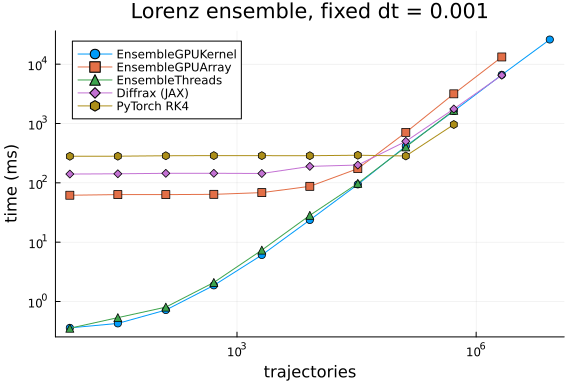
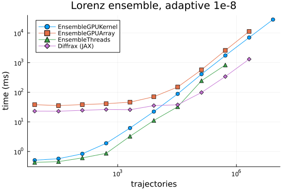

Ensemble Lorenz from Utkarsh et al., *Automated Translation and Accelerated
Solving of Differential Equations on Multiple GPU Platforms*,
[Comput. Methods Appl. Mech. Eng. 428 (2024) 117109](https://doi.org/10.1016/j.cma.2023.117109)
([arXiv:2304.06835](https://arxiv.org/abs/2304.06835);
[artifacts](https://github.com/utkarsh530/GPUODEBenchmarks)).

The ODE is the paper's Lorenz system, one trajectory per $\rho \in [0, 21]$,
$t \in [0, 1]$, $u_0 = (1,0,0)$, $\sigma = 10$, $\beta = 2.666$. GPU Julia
and the Python codes run in `Float32`; the CPU ensemble uses `Float64`, as
in the artifacts. Fixed-step runs use $dt = 0.001$; adaptive runs use
`reltol = abstol = 1e-8`. The C++ MPGOS comparison from the paper is omitted
(standalone CUDA C++, not weavable here).

Compared:

* `GPUTsit5` + `EnsembleGPUKernel` — specialized kernel (paper's Julia GPU line)
* `RK4`/`Tsit5` + `EnsembleGPUArray` — fused array ensemble
* `Tsit5` + `EnsembleThreads` — CPU
* [Diffrax](https://github.com/patrick-kidger/diffrax) Tsit5 via `jax.vmap`
* Batched PyTorch RK4 with the paper's `method='rk4'`, `step_size=0.001`
  (official [torchdiffeq](https://github.com/rtqichen/torchdiffeq) does not
  `vmap`; the paper used a fork)

`cpu_offload` is `0` so the GPU numbers are GPU-only.

The [work-precision comparison](lorenz_workprecision.html) adds
`GPUTsit5IController` and GRADSOLVE, explicit Float32/Float64 comparisons, and
scaling at common achieved-error ceilings. The Julia code below uses
`beta=2.666` while the Python definitions use `8/3`; the work-precision
comparison uses `8/3` in every implementation.

```julia
using Printf
using CUDA
using DiffEqGPU, OrdinaryDiffEq, OrdinaryDiffEqLowOrderRK, StaticArrays
using Plots
using PythonCall, CondaPkg

@assert CUDA.functional() "This benchmark requires a functional CUDA GPU"
println("GPU: ", CUDA.name(CUDA.device()))

const BACKEND = CUDA.CUDABackend()
const KERNEL = EnsembleGPUKernel(BACKEND, 0.0)
const ARRAY = EnsembleGPUArray(BACKEND, 0.0)

gr()
```

```
GPU: Tesla V100-PCIE-32GB
Plots.GRBackend()
```


```julia
function lorenz(u, p, t)
    T = eltype(u)
    du1 = T(10) * (u[2] - u[1])
    du2 = p[1] * u[1] - u[2] - u[1] * u[3]
    du3 = u[1] * u[2] - T(2.666) * u[3]
    return SVector{3, T}(du1, du2, du3)
end

function make_ensemble(n; T::Type = Float32)
    u0 = SVector{3, T}(1, 0, 0)
    tspan = (zero(T), one(T))
    p = SVector{1, T}(21)
    plist = range(zero(T), T(21); length = max(n, 2))[1:n]
    prob = ODEProblem{false}(lorenz, u0, tspan, p)
    prob_func = (prob, ctx) -> remake(prob, p = SVector{1, T}(plist[ctx.sim_id]))
    return EnsembleProblem(prob, prob_func = prob_func, safetycopy = false)
end

function min_seconds(f; warmup = 1, samples = 5)
    for _ in 1:warmup
        f()
    end
    ts = Vector{Float64}(undef, samples)
    for i in 1:samples
        ts[i] = @elapsed f()
    end
    return minimum(ts)
end

function time_julia(n, ensemblealg, alg; adaptive, T = Float32, dt = T(0.001))
    ens = make_ensemble(n; T)
    kwargs = (
        trajectories = n,
        save_everystep = false,
        dense = false,
        dt = dt,
        adaptive = adaptive
    )
    if adaptive
        kwargs = (; kwargs..., reltol = T(1e-8), abstol = T(1e-8))
    end
    run = if ensemblealg isa EnsembleThreads
        () -> (solve(ens, alg, ensemblealg; kwargs...); nothing)
    else
        () -> (CUDA.@sync solve(ens, alg, ensemblealg; kwargs...); nothing)
    end
    return min_seconds(run)
end
```

```
time_julia (generic function with 1 method)
```


```julia
# Hosted V100s reject some CUDA 13 / generic PyTorch wheels (`no kernel image
# is available for execution on the device`). Probe once and skip Python GPU
# timings rather than aborting the Julia ensemble series.
python_gpu = try
    sys = pyimport("sys")
    sys.path.insert(0, @__DIR__)
    eu = pyimport("ensemble_utils")
    jax = pyimport("jax")
    torch = pyimport("torch")
    jax_devs = jax.devices("gpu")
    @assert pyconvert(Int, pyimport("builtins").len(jax_devs)) > 0 "JAX did not see a GPU"
    println("JAX devices: ", jax.devices())
    @assert pyconvert(Bool, torch.cuda.is_available()) "PyTorch did not see a CUDA GPU"
    println("PyTorch CUDA: ", torch.cuda.get_device_name(0))
    torch.zeros(1).cuda()
    jax.numpy.zeros((1,))
    (; eu, jax, torch)
catch e
    @warn "Python GPU backends unavailable; skipping JAX/PyTorch timings" exception = (e, catch_backtrace())
    nothing
end

time_diffrax(n; adaptive) = python_gpu === nothing ? NaN :
                            pyconvert(Float64, python_gpu.eu.time_diffrax(n, adaptive))
time_torch(n) = python_gpu === nothing ? NaN :
                pyconvert(Float64, python_gpu.eu.time_torch_rk4(n))
```

```
JAX devices: [CudaDevice(id=0)]
PyTorch CUDA: Tesla V100-PCIE-32GB
time_torch (generic function with 1 method)
```


Trajectory counts follow the paper's `8, 32, 128, …` geometric sequence.
The kernel path runs up to $2^{23}$ trajectories; `EnsembleGPUArray`, JAX,
the CPU ensemble and PyTorch stop earlier ($2^{21}$, $2^{21}$, $2^{19}$ and
$2^{19}$ respectively) because they are the memory- and time-heavy ones at the
largest sizes.

```julia
const TRAJ_KERNEL = [8, 32, 128, 512, 2048, 8192, 32768, 131072, 524288, 2097152, 8388608]
const TRAJ_ARRAY = [8, 32, 128, 512, 2048, 8192, 32768, 131072, 524288, 2097152]
const TRAJ_CPU = [8, 32, 128, 512, 2048, 8192, 32768, 131072, 524288]
const TRAJ_JAX = [8, 32, 128, 512, 2048, 8192, 32768, 131072, 524288, 2097152]
const TRAJ_TORCH = [8, 32, 128, 512, 2048, 8192, 32768, 131072, 524288]
```

```
9-element Vector{Int64}:
      8
     32
    128
    512
   2048
   8192
  32768
 131072
 524288
```


## Correctness

Two kernel trajectories against CPU `Tsit5` references at the same `Float32`
problems.

```julia
let
    ens = make_ensemble(2)
    sol_gpu = solve(ens, GPUTsit5(), KERNEL; trajectories = 2,
        save_everystep = false, adaptive = false, dt = 0.001f0)
    sol_cpu = solve(ens, Tsit5(), EnsembleSerial(); trajectories = 2,
        save_everystep = false, adaptive = false, dt = 0.001f0)
    err = maximum(i -> maximum(abs.(sol_gpu.u[i].u[end] .- sol_cpu.u[i].u[end])), 1:2)
    println("kernel vs CPU |Δu|∞ at t=1: ", err)
    @assert err < 1.0f-2
end
```

```
kernel vs CPU |Δu|∞ at t=1: 0.00029563904
```


## Fixed time step

```julia
t_kernel_fix = Float64[]
t_array_fix = Float64[]
t_cpu_fix = Float64[]
t_jax_fix = Float64[]
t_torch_fix = Float64[]

for n in TRAJ_KERNEL
    @info "fixed kernel" n
    push!(t_kernel_fix, time_julia(n, KERNEL, GPUTsit5(); adaptive = false))
end
for n in TRAJ_ARRAY
    @info "fixed array" n
    push!(t_array_fix, time_julia(n, ARRAY, RK4(); adaptive = false))
end
for n in TRAJ_CPU
    @info "fixed cpu" n
    push!(t_cpu_fix, time_julia(n, EnsembleThreads(), Tsit5(); adaptive = false, T = Float64,
        dt = 0.001))
end
for n in TRAJ_JAX
    @info "fixed jax" n
    push!(t_jax_fix, time_diffrax(n; adaptive = false))
end
for n in TRAJ_TORCH
    @info "fixed torch" n
    push!(t_torch_fix, time_torch(n))
end
```


```julia
p_fix = plot(TRAJ_KERNEL, t_kernel_fix .* 1e3; xscale = :log10, yscale = :log10,
    xlabel = "trajectories", ylabel = "time (ms)", label = "EnsembleGPUKernel",
    marker = :circle, legend = :topleft, title = "Lorenz ensemble, fixed dt = 0.001")
plot!(p_fix, TRAJ_ARRAY, t_array_fix .* 1e3; label = "EnsembleGPUArray", marker = :square)
plot!(p_fix, TRAJ_CPU, t_cpu_fix .* 1e3; label = "EnsembleThreads", marker = :utriangle)
plot!(p_fix, TRAJ_JAX, t_jax_fix .* 1e3; label = "Diffrax (JAX)", marker = :diamond)
plot!(p_fix, TRAJ_TORCH, t_torch_fix .* 1e3; label = "PyTorch RK4", marker = :hexagon)
p_fix
```



```julia
println("Fixed step (ms)")
@printf("%10s %12s %12s %12s %12s %12s\n", "N", "Kernel", "Array", "CPU", "JAX", "PyTorch")
for n in TRAJ_KERNEL
    tk = t_kernel_fix[findfirst(==(n), TRAJ_KERNEL)] * 1e3
    ta = (i = findfirst(==(n), TRAJ_ARRAY); i === nothing ? NaN : t_array_fix[i] * 1e3)
    tc = (i = findfirst(==(n), TRAJ_CPU); i === nothing ? NaN : t_cpu_fix[i] * 1e3)
    tj = (i = findfirst(==(n), TRAJ_JAX); i === nothing ? NaN : t_jax_fix[i] * 1e3)
    tt = (i = findfirst(==(n), TRAJ_TORCH); i === nothing ? NaN : t_torch_fix[i] * 1e3)
    @printf("%10d %12.3f %12.3f %12.3f %12.3f %12.3f\n", n, tk, ta, tc, tj, tt)
end
```

```
Fixed step (ms)
         N       Kernel        Array          CPU          JAX      PyTorch
         8        0.360       61.810        0.355      140.635      280.573
        32        0.428       63.402        0.535      142.188      281.360
       128        0.719       63.380        0.805      144.702      286.170
       512        1.870       63.992        2.095      144.950      287.823
      2048        6.081       68.454        7.357      143.832      287.269
      8192       23.648       87.365       28.345      189.405      286.674
     32768       94.127      173.521       98.146      199.642      292.030
    131072      415.138      708.874      402.714      500.527      283.833
    524288     1622.980     3163.906     1667.663     1759.027      961.380
   2097152     6625.030    13230.151          NaN     6514.047          NaN
   8388608    26033.322          NaN          NaN          NaN          NaN
```


## Adaptive time step

```julia
t_kernel_ad = Float64[]
t_array_ad = Float64[]
t_cpu_ad = Float64[]
t_jax_ad = Float64[]

for n in TRAJ_KERNEL
    @info "adaptive kernel" n
    push!(t_kernel_ad, time_julia(n, KERNEL, GPUTsit5(); adaptive = true))
end
for n in TRAJ_ARRAY
    @info "adaptive array" n
    push!(t_array_ad, time_julia(n, ARRAY, Tsit5(); adaptive = true))
end
for n in TRAJ_CPU
    @info "adaptive cpu" n
    push!(t_cpu_ad, time_julia(n, EnsembleThreads(), Tsit5(); adaptive = true, T = Float64,
        dt = 0.001))
end
for n in TRAJ_JAX
    @info "adaptive jax" n
    push!(t_jax_ad, time_diffrax(n; adaptive = true))
end
```


```julia
p_ad = plot(TRAJ_KERNEL, t_kernel_ad .* 1e3; xscale = :log10, yscale = :log10,
    xlabel = "trajectories", ylabel = "time (ms)", label = "EnsembleGPUKernel",
    marker = :circle, legend = :topleft, title = "Lorenz ensemble, adaptive 1e-8")
plot!(p_ad, TRAJ_ARRAY, t_array_ad .* 1e3; label = "EnsembleGPUArray", marker = :square)
plot!(p_ad, TRAJ_CPU, t_cpu_ad .* 1e3; label = "EnsembleThreads", marker = :utriangle)
plot!(p_ad, TRAJ_JAX, t_jax_ad .* 1e3; label = "Diffrax (JAX)", marker = :diamond)
p_ad
```



```julia
println("Adaptive (ms)")
@printf("%10s %12s %12s %12s %12s\n", "N", "Kernel", "Array", "CPU", "JAX")
for n in TRAJ_KERNEL
    tk = t_kernel_ad[findfirst(==(n), TRAJ_KERNEL)] * 1e3
    ta = (i = findfirst(==(n), TRAJ_ARRAY); i === nothing ? NaN : t_array_ad[i] * 1e3)
    tc = (i = findfirst(==(n), TRAJ_CPU); i === nothing ? NaN : t_cpu_ad[i] * 1e3)
    tj = (i = findfirst(==(n), TRAJ_JAX); i === nothing ? NaN : t_jax_ad[i] * 1e3)
    @printf("%10d %12.3f %12.3f %12.3f %12.3f\n", n, tk, ta, tc, tj)
end
```

```
Adaptive (ms)
         N       Kernel        Array          CPU          JAX
         8        0.501       33.737        0.441       24.074
        32        0.565       35.814        0.452       23.098
       128        0.823       36.869        0.660       24.795
       512        1.872       41.269        1.224       26.358
      2048        5.997       45.718        3.354       26.307
      8192       23.118       64.927        8.946       35.491
     32768       90.127      139.382       34.880       37.600
    131072      390.708      608.089       97.960       97.739
    524288     1596.695     2575.420      961.899      339.863
   2097152     6558.603    10768.491          NaN     1309.664
   8388608    26776.255          NaN          NaN          NaN
```


## Appendix

These benchmarks are a part of the SciMLBenchmarks.jl repository, found at: [https://github.com/SciML/SciMLBenchmarks.jl](https://github.com/SciML/SciMLBenchmarks.jl). For more information on high-performance scientific machine learning, check out the SciML Open Source Software Organization [https://sciml.ai](https://sciml.ai).

To locally run this benchmark, do the following commands:
```
using SciMLBenchmarks
SciMLBenchmarks.weave_file("benchmarks/DiffEqGPU","lorenz_ensemble.jmd")
```

Computer Information:

```
Julia Version 1.11.9
Commit 53a02c0720c (2026-02-06 00:27 UTC)
Build Info:
  Official https://julialang.org/ release
Platform Info:
  OS: Linux (x86_64-linux-gnu)
  CPU: 128 × AMD EPYC 9354 32-Core Processor
  WORD_SIZE: 64
  LLVM: libLLVM-16.0.6 (ORCJIT, znver4)
Threads: 58 default, 0 interactive, 29 GC (on 58 virtual cores)
Environment:
  JULIA_CPU_THREADS = 58
  JULIA_NUM_PRECOMPILE_TASKS = 58
  JULIA_NUM_THREADS = auto
  JULIA_PYTHONCALL_EXE = /home/runner/_work/SciMLBenchmarks.jl/SciMLBenchmarks.jl/benchmarks/DiffEqGPU/.CondaPkg/.pixi/envs/default/bin/python

```

Package Information:

```
Status `~/_work/SciMLBenchmarks.jl/SciMLBenchmarks.jl/benchmarks/DiffEqGPU/Project.toml`
⌃ [052768ef] CUDA v6.2.2
⌃ [992eb4ea] CondaPkg v0.2.33
  [071ae1c0] DiffEqGPU v3.21.4
  [46d2c3a1] MuladdMacro v0.2.7
  [1dea7af3] OrdinaryDiffEq v7.8.1
  [1344f307] OrdinaryDiffEqLowOrderRK v2.2.6
  [79d7bb75] OrdinaryDiffEqVerner v2.4.2
  [91a5bcdd] Plots v1.41.7
  [6099a3de] PythonCall v0.9.36
  [0bca4576] SciMLBase v3.57.0
  [31c91b34] SciMLBenchmarks v0.2.1
  [90137ffa] StaticArrays v1.9.22
  [789caeaf] StochasticDiffEq v7.2.0
  [37e2e46d] LinearAlgebra v1.11.0
  [de0858da] Printf v1.11.0
Info Packages marked with ⌃ have new versions available and may be upgradable.
```

And the full manifest:

```
Status `~/_work/SciMLBenchmarks.jl/SciMLBenchmarks.jl/benchmarks/DiffEqGPU/Manifest.toml`
  [47edcb42] ADTypes v1.24.0
  [14f7f29c] AMD v0.5.4
  [621f4979] AbstractFFTs v1.5.0
  [7d9f7c33] Accessors v0.1.45
  [79e6a3ab] Adapt v4.7.1
  [66dad0bd] AliasTables v1.1.3
  [ec485272] ArnoldiMethod v0.4.0
  [4fba245c] ArrayInterface v7.30.2
  [a9b6321e] Atomix v1.2.1
  [ab4f0b2a] BFloat16s v0.6.2
  [b2a6c25c] BinaryHeaps v1.1.0
  [70df07ce] BracketingNonlinearSolve v1.12.8
  [fa961155] CEnum v0.5.0
⌃ [052768ef] CUDA v6.2.2
⌅ [bd0ed864] CUDACore v6.2.2
⌅ [9ec180c6] CUDATools v6.2.2
  [1af6417a] CUDA_Runtime_Discovery v2.1.1
⌅ [9e67e8f6] CUPTI v6.2.2
  [d360d2e6] ChainRulesCore v1.26.1
  [35d6a980] ColorSchemes v3.31.0
  [3da002f7] ColorTypes v0.12.3
  [c3611d14] ColorVectorSpace v0.11.0
  [5ae59095] Colors v0.13.2
  [38540f10] CommonSolve v0.2.14
  [bbf7d656] CommonSubexpressions v0.3.1
  [34da2185] Compat v4.18.1
  [a33af91c] CompositionsBase v0.1.2
  [2569d6c7] ConcreteStructs v0.2.8
⌃ [992eb4ea] CondaPkg v0.2.33
  [187b0558] ConstructionBase v1.6.0
  [d38c429a] Contour v0.6.3
  [a8cc5b0e] Crayons v4.2.0
  [9a962f9c] DataAPI v1.16.0
  [a93c6f00] DataFrames v1.8.2
  [864edb3b] DataStructures v0.19.6
  [e2d170a0] DataValueInterfaces v1.0.0
  [8bb1440f] DelimitedFiles v1.9.1
  [2b5f629d] DiffEqBase v7.21.3
  [459566f4] DiffEqCallbacks v4.19.4
  [071ae1c0] DiffEqGPU v3.21.4
  [77a26b50] DiffEqNoiseProcess v5.36.4
  [163ba53b] DiffResults v1.1.0
  [b552c78f] DiffRules v1.16.0
  [a0c0ee7d] DifferentiationInterface v0.7.21
  [31c24e10] Distributions v0.25.131
  [ffbed154] DocStringExtensions v0.9.5
  [4e289a0a] EnumX v1.0.7
  [f151be2c] EnzymeCore v0.8.21
  [e2ba6199] ExprTools v0.1.11
  [c87230d0] FFMPEG v0.4.6
  [7034ab61] FastBroadcast v1.4.0
  [9aa1b823] FastClosures v0.3.2
  [a4df4552] FastPower v1.5.0
  [1a297f60] FillArrays v1.17.1
  [64ca27bc] FindFirstFunctions v3.4.0
  [6a86dc24] FiniteDiff v2.33.0
⌅ [53c48c17] FixedPointNumbers v0.8.6
  [1fa38f19] Format v1.3.7
  [f6369f11] ForwardDiff v1.4.6
  [069b7b12] FunctionWrappers v1.1.3
  [77dc65aa] FunctionWrappersWrappers v1.13.0
  [0c68f7d7] GPUArrays v11.5.15
  [46192b85] GPUArraysCore v0.2.1
⌅ [61eb1bfa] GPUCompiler v1.23.0
  [096a3bc2] GPUToolbox v3.3.2
  [28b8d3ca] GR v0.73.27
  [a0844989] Gamma v1.2.0
  [86223c79] Graphs v1.15.0
  [076d061b] HashArrayMappedTries v0.2.0
⌅ [eafb193a] Highlights v0.5.3
  [34004b35] HypergeometricFunctions v0.3.30
  [d25df0c9] Inflate v0.1.5
⌅ [842dd82b] InlineStrings v1.4.6
  [3587e190] InverseFunctions v0.1.17
  [41ab1584] InvertedIndices v1.3.1
  [92d709cd] IrrationalConstants v0.2.6
  [82899510] IteratorInterfaceExtensions v1.0.0
  [1019f520] JLFzf v0.1.11
  [692b3bcd] JLLWrappers v1.8.0
⌅ [682c06a0] JSON v0.21.4
  [0f8b85d8] JSON3 v1.14.3
  [ccbc3e58] JumpProcesses v9.33.1
  [63c18a36] KernelAbstractions v0.9.43
  [ba0b0d4f] Krylov v0.10.10
  [2faa5264] LHLFactorization v2.2.2
  [929cbde3] LLVM v9.13.2
  [8b046642] LLVMLoopInfo v1.0.0
  [b964fa9f] LaTeXStrings v1.4.1
  [23fbe1c1] Latexify v0.16.12
  [87fe0de2] LineSearch v0.1.19
  [7ed4a6bd] LinearSolve v5.18.2
  [2ab3a3ac] LogExpFunctions v1.0.2
  [e6f89c97] LoggingExtras v1.2.0
  [1914dd2f] MacroTools v0.5.16
  [bb5d69b7] MaybeInplace v0.1.8
  [442fdcdd] Measures v0.3.3
  [0b3b1443] MicroMamba v0.1.15
  [e1d29d7a] Missings v1.2.0
  [46d2c3a1] MuladdMacro v0.2.7
  [ffc61752] Mustache v1.1.0
⌅ [611af6d1] NVML v6.2.2
  [5da4648a] NVTX v1.0.3
  [77ba4419] NaNMath v1.1.4
  [8913a72c] NonlinearSolve v4.32.0
  [be0214bd] NonlinearSolveBase v2.54.1
  [5959db7a] NonlinearSolveFirstOrder v2.10.0
  [9a2c21bd] NonlinearSolveQuasiNewton v1.15.3
  [26075421] NonlinearSolveSpectralMethods v1.8.3
  [bac558e1] OrderedCollections v2.0.1
  [1dea7af3] OrdinaryDiffEq v7.8.1
  [6ad6398a] OrdinaryDiffEqBDF v2.4.12
  [bbf590c4] OrdinaryDiffEqCore v4.18.1
  [50262376] OrdinaryDiffEqDefault v2.6.2
  [4302a76b] OrdinaryDiffEqDifferentiation v3.12.4
  [1344f307] OrdinaryDiffEqLowOrderRK v2.2.6
  [127b3ac7] OrdinaryDiffEqNonlinearSolve v2.9.9
  [43230ef6] OrdinaryDiffEqRosenbrock v2.7.5
  [b4bd8bb3] OrdinaryDiffEqRosenbrockTableaus v2.4.2
  [2d112036] OrdinaryDiffEqSDIRK v2.9.7
  [b1df2697] OrdinaryDiffEqTsit5 v2.1.5
  [79d7bb75] OrdinaryDiffEqVerner v2.4.2
  [90014a1f] PDMats v0.11.41
  [d96e819e] Parameters v0.13.1
⌅ [69de0a69] Parsers v2.8.8
  [fa939f87] Pidfile v1.3.0
  [ccf2f8ad] PlotThemes v3.3.0
  [995b91a9] PlotUtils v1.5.0
  [91a5bcdd] Plots v1.41.7
  [e409e4f3] PoissonRandom v0.4.13
  [2dfb63ee] PooledArrays v1.4.3
  [d236fae5] PreallocationTools v1.7.1
⌅ [aea7be01] PrecompileTools v1.2.1
  [21216c6a] Preferences v1.6.0
  [08abe8d2] PrettyTables v3.5.0
  [43287f4e] PtrArrays v1.4.0
  [0c0d3e7f] PureKLU v1.6.0
  [6099a3de] PythonCall v0.9.36
  [1fd47b50] QuadGK v2.11.3
  [74087812] Random123 v1.7.1
  [e6cf234a] RandomNumbers v1.6.0
⌅ [3cdcf5f2] RecipesBase v1.3.4
  [01d81517] RecipesPipeline v0.6.12
  [731186ca] RecursiveArrayTools v4.5.3
  [189a3867] Reexport v1.2.2
  [05181044] RelocatableFolders v1.0.1
  [ae029012] Requires v1.3.1
  [ae5879a3] ResettableStacks v1.4.0
  [9fe22ead] RespecializeParams v1.3.0
  [79098fc4] Rmath v0.9.0
  [f2b01f46] Roots v3.0.9
  [7e49a35a] RuntimeGeneratedFunctions v0.5.27
  [0bca4576] SciMLBase v3.57.0
  [31c91b34] SciMLBenchmarks v0.2.1
  [19f34311] SciMLJacobianOperators v0.1.19
  [a6db7da4] SciMLLogging v2.1.0
  [c0aeaf25] SciMLOperators v1.30.2
  [431bcebd] SciMLPublic v1.3.0
  [53ae85a6] SciMLStructures v1.10.5
  [7e506255] ScopedValues v1.6.2
  [6c6a2e73] Scratch v1.3.0
  [91c51154] SentinelArrays v1.4.10
  [efcf1570] Setfield v1.1.2
  [992d4aef] Showoff v1.1.1
  [05bca326] SimpleDiffEq v1.18.0
  [727e6d20] SimpleNonlinearSolve v2.14.6
  [699a6c99] SimpleTraits v0.9.6
  [ed01d8cd] Sobol v1.5.0
  [a2af1166] SortingAlgorithms v1.2.3
  [a57abbd0] SparseColumnPivotedQR v2.1.8
  [0a514795] SparseMatrixColorings v0.4.28
  [276daf66] SpecialFunctions v2.9.0
  [90137ffa] StaticArrays v1.9.22
  [1e83bf80] StaticArraysCore v1.4.4
  [10745b16] Statistics v1.11.5
  [82ae8749] StatsAPI v1.8.0
  [2913bbd2] StatsBase v0.34.13
  [4c63d2b9] StatsFuns v2.2.1
  [789caeaf] StochasticDiffEq v7.2.0
  [19c5a474] StochasticDiffEqCore v2.2.3
  [0520c28c] StochasticDiffEqHighOrder v2.2.0
  [ebf54054] StochasticDiffEqIIF v2.1.0
  [5080b986] StochasticDiffEqImplicit v2.2.1
  [aefaaa88] StochasticDiffEqLeaping v2.1.0
  [90dbc90e] StochasticDiffEqLevyArea v2.1.1
  [d15fe365] StochasticDiffEqLowOrder v2.0.5
  [8c95a807] StochasticDiffEqMilstein v2.1.1
  [db241ea8] StochasticDiffEqROCK v2.1.1
  [49714585] StochasticDiffEqRODE v2.2.0
  [af2a2fcd] StochasticDiffEqWeak v2.2.1
  [69024149] StringEncodings v0.3.7
  [892a3eda] StringManipulation v0.6.1
  [856f2bd8] StructTypes v1.11.0
  [2efcf032] SymbolicIndexingInterface v0.3.55
  [3783bdb8] TableTraits v1.0.1
  [bd369af6] Tables v1.14.0
  [62fd8b95] TensorCore v0.1.1
  [a759f4b9] TimerOutputs v1.2.2
  [e689c965] Tracy v0.1.6
  [781d530d] TruncatedStacktraces v1.4.0
  [3a884ed6] UnPack v1.0.2
  [1cfade01] UnicodeFun v0.4.1
  [013be700] UnsafeAtomics v0.3.2
  [e17b2a0c] UnsafePointers v1.0.0
  [41fe7b60] Unzip v0.2.0
  [44d3d7a6] Weave v0.10.12
  [ddb6d928] YAML v0.4.17
  [700de1a5] ZygoteRules v0.2.8
⌅ [182d3088] cuBLAS v6.2.2
⌅ [533571aa] cuFFT v6.2.2
⌅ [20fd9a0b] cuRAND v6.2.2
⌅ [887afef0] cuSOLVER v6.2.2
⌅ [b26da814] cuSPARSE v6.2.2
  [6e34b625] Bzip2_jll v1.0.9+0
⌅ [d1e2174e] CUDA_Compiler_jll v0.4.4+1
⌅ [4ee394cb] CUDA_Driver_jll v13.3.1+0
⌅ [76a88914] CUDA_Runtime_jll v0.23.0+1
  [83423d85] Cairo_jll v1.18.8+0
  [ee1fde0b] Dbus_jll v1.16.2+0
  [2702e6a9] EpollShim_jll v0.0.20230411+1
  [2e619515] Expat_jll v2.8.4+0
  [b22a6f82] FFMPEG_jll v9.0.2+0
  [a3f928ae] Fontconfig_jll v2.17.1+0
  [d7e528f0] FreeType2_jll v2.14.3+1
  [559328eb] FriBidi_jll v1.0.17+0
  [0656b61e] GLFW_jll v3.5.1+0
  [d2c73de3] GR_jll v0.73.27+0
⌅ [b0724c58] GettextRuntime_jll v0.22.4+0
  [61579ee1] Ghostscript_jll v9.55.1+0
  [7746bdde] Glib_jll v2.88.3+0
  [3b182d85] Graphite2_jll v1.3.16+0
  [2e76f6c2] HarfBuzz_jll v100.14004.0+0
  [1d5cc7b8] IntelOpenMP_jll v2025.2.0+0
  [aacddb02] JpegTurbo_jll v3.2.0+1
  [9c1d0b0a] JuliaNVTXCallbacks_jll v0.2.1+0
  [c1c5ebd0] LAME_jll v3.100.3+0
  [88015f11] LERC_jll v4.2.0+0
⌅ [dad2f222] LLVMExtra_jll v0.0.47+0
  [1d63c593] LLVMOpenMP_jll v23.1.1+0
  [ad6e5548] LibTracyClient_jll v0.13.1+0
⌅ [e9f186c6] Libffi_jll v3.4.7+0
  [7e76a0d4] Libglvnd_jll v1.7.1+1
  [94ce4f54] Libiconv_jll v1.18.0+0
  [4b2f31a3] Libmount_jll v2.42.0+0
  [89763e89] Libtiff_jll v4.7.3+0
  [38a345b3] Libuuid_jll v2.42.0+0
  [856f044c] MKL_jll v2025.2.0+0
⌅ [ef6e0fe3] NVPTX_LLVM_Backend_jll v22.1.7+1
  [e98f9f5b] NVTX_jll v3.2.2+0
  [e7412a2a] Ogg_jll v1.3.6+0
  [458c3c95] OpenSSL_jll v3.5.9+0
  [efe28fd5] OpenSpecFun_jll v0.5.6+0
  [91d4177d] Opus_jll v1.6.1+0
  [36c8627f] Pango_jll v1.58.2+0
  [30392449] Pixman_jll v0.46.4+0
  [c0090381] Qt6Base_jll v6.10.2+2
  [629bc702] Qt6Declarative_jll v6.10.2+2
  [ce943373] Qt6ShaderTools_jll v6.10.2+1
  [6de9746b] Qt6Svg_jll v6.10.2+0
  [e99dba38] Qt6Wayland_jll v6.10.2+1
  [f50d1b31] Rmath_jll v0.5.2+0
  [a44049a8] Vulkan_Loader_jll v1.3.243+0
  [a2964d1f] Wayland_jll v1.24.0+0
  [ffd25f8a] XZ_jll v5.8.4+0
  [f67eecfb] Xorg_libICE_jll v1.1.2+0
  [c834827a] Xorg_libSM_jll v1.2.6+0
  [4f6342f7] Xorg_libX11_jll v1.8.13+0
  [0c0b7dd1] Xorg_libXau_jll v1.0.13+0
  [935fb764] Xorg_libXcursor_jll v1.2.4+0
  [a3789734] Xorg_libXdmcp_jll v1.1.6+0
  [1082639a] Xorg_libXext_jll v1.3.8+0
  [d091e8ba] Xorg_libXfixes_jll v6.0.2+0
  [a51aa0fd] Xorg_libXi_jll v1.8.4+0
  [d1454406] Xorg_libXinerama_jll v1.1.7+0
  [ec84b674] Xorg_libXrandr_jll v1.5.6+0
  [ea2f1a96] Xorg_libXrender_jll v0.9.12+0
  [a65dc6b1] Xorg_libpciaccess_jll v0.19.0+0
  [c7cfdc94] Xorg_libxcb_jll v1.17.1+0
  [cc61e674] Xorg_libxkbfile_jll v1.2.0+0
  [e920d4aa] Xorg_xcb_util_cursor_jll v0.1.6+0
  [12413925] Xorg_xcb_util_image_jll v0.4.1+0
  [2def613f] Xorg_xcb_util_jll v0.4.1+0
  [975044d2] Xorg_xcb_util_keysyms_jll v0.4.1+0
  [0d47668e] Xorg_xcb_util_renderutil_jll v0.3.10+0
  [c22f9ab0] Xorg_xcb_util_wm_jll v0.4.2+0
  [35661453] Xorg_xkbcomp_jll v1.4.7+0
  [33bec58e] Xorg_xkeyboard_config_jll v2.47.0+2
  [c5fb5394] Xorg_xtrans_jll v1.6.0+0
  [3161d3a3] Zstd_jll v1.5.7+1
  [1e29f10c] demumble_jll v1.3.0+0
  [35ca27e7] eudev_jll v3.2.14+0
⌅ [214eeab7] fzf_jll v0.61.1+0
  [a4ae2306] libaom_jll v3.15.1+0
  [0ac62f75] libass_jll v0.17.5+0
  [1183f4f0] libdecor_jll v0.2.2+0
  [8e53e030] libdrm_jll v2.4.134+0
  [2db6ffa8] libevdev_jll v1.13.4+0
  [f638f0a6] libfdk_aac_jll v2.0.4+0
  [36db933b] libinput_jll v1.28.1+0
  [b53b4c65] libpng_jll v1.6.59+0
  [9a156e7d] libva_jll v2.23.0+0
  [f27f6e37] libvorbis_jll v1.3.8+0
  [f8abcde7] micromamba_jll v2.3.1+0
  [009596ad] mtdev_jll v1.1.7+0
  [1317d2d5] oneTBB_jll v2022.3.0+0
  [4d7b5844] pixi_jll v0.76.2+0
⌅ [1270edf5] x264_jll v10164.0.1+0
  [dfaa095f] x265_jll v4.1.0+0
  [d8fb68d0] xkbcommon_jll v1.13.0+0
  [0dad84c5] ArgTools v1.1.2
  [56f22d72] Artifacts v1.11.0
  [2a0f44e3] Base64 v1.11.0
  [ade2ca70] Dates v1.11.0
  [8ba89e20] Distributed v1.11.0
  [f43a241f] Downloads v1.6.0
  [7b1f6079] FileWatching v1.11.0
  [9fa8497b] Future v1.11.0
  [b77e0a4c] InteractiveUtils v1.11.0
  [4af54fe1] LazyArtifacts v1.11.0
  [b27032c2] LibCURL v0.6.4
  [76f85450] LibGit2 v1.11.0
  [8f399da3] Libdl v1.11.0
  [37e2e46d] LinearAlgebra v1.11.0
  [56ddb016] Logging v1.11.0
  [d6f4376e] Markdown v1.11.0
  [a63ad114] Mmap v1.11.0
  [ca575930] NetworkOptions v1.2.0
  [44cfe95a] Pkg v1.11.0
  [de0858da] Printf v1.11.0
  [3fa0cd96] REPL v1.11.0
  [9a3f8284] Random v1.11.0
  [ea8e919c] SHA v0.7.0
  [9e88b42a] Serialization v1.11.0
  [6462fe0b] Sockets v1.11.0
  [2f01184e] SparseArrays v1.11.0
  [f489334b] StyledStrings v1.11.0
  [4607b0f0] SuiteSparse
  [fa267f1f] TOML v1.0.3
  [a4e569a6] Tar v1.10.0
  [8dfed614] Test v1.11.0
  [cf7118a7] UUIDs v1.11.0
  [4ec0a83e] Unicode v1.11.0
  [e66e0078] CompilerSupportLibraries_jll v1.1.1+0
  [deac9b47] LibCURL_jll v8.6.0+0
  [e37daf67] LibGit2_jll v1.7.2+0
  [29816b5a] LibSSH2_jll v1.11.0+1
  [c8ffd9c3] MbedTLS_jll v2.28.6+0
  [14a3606d] MozillaCACerts_jll v2023.12.12
  [4536629a] OpenBLAS_jll v0.3.27+1
  [05823500] OpenLibm_jll v0.8.5+0
  [efcefdf7] PCRE2_jll v10.42.0+1
  [bea87d4a] SuiteSparse_jll v7.7.0+0
  [83775a58] Zlib_jll v1.2.13+1
  [8e850b90] libblastrampoline_jll v5.11.0+0
  [8e850ede] nghttp2_jll v1.59.0+0
  [3f19e933] p7zip_jll v17.4.0+2
Info Packages marked with ⌃ and ⌅ have new versions available. Those with ⌃ may be upgradable, but those with ⌅ are restricted by compatibility constraints from upgrading. To see why use `status --outdated -m`
```

