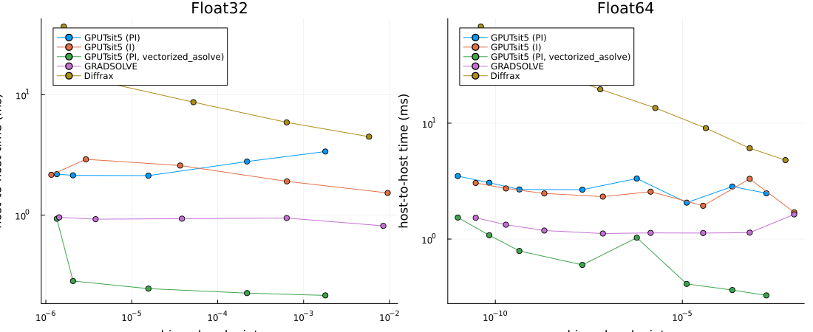
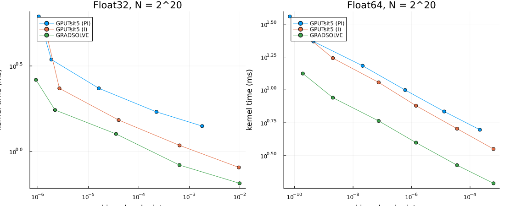
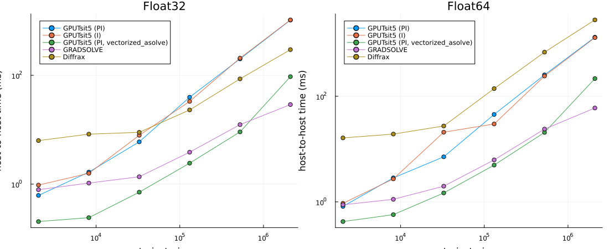

This compares DiffEqGPU's adaptive `GPUTsit5` with
[GRADSOLVE](https://arxiv.org/abs/2609.02876) and Diffrax on the Lorenz ensemble
from the GRADSOLVE paper. `GPUTsit5` uses a PI step-size controller;
`GPUTsit5IController` is the same method with an I controller, which is the
controller GRADSOLVE uses. Generally prefer PI control: the I controller has
less stable step-size selection, and on simple nonstiff systems such as Lorenz
it can look faster at equal tolerances partly because achieved accuracy is
lower. The work-precision plots below expose that difference. The Lorenz RHS
uses `@muladd`.

All implementations solve the same system: $\sigma=10$, $\beta=8/3$,
$\rho\in[0,21]$, $u(0)=(1,0,0)$, and $t\in[0,1]$. Each comparison uses the
same explicitly typed parameter array in Float32 or Float64. DiffEqGPU and
Diffrax start at `dt=0.01`, matching GRADSOLVE's initial `t_end/100` step.
All use `abstol=reltol/1000`, save only the endpoint, and include rejected steps
in elapsed time. Controller histories and floating-point implementations still
differ; equal tolerance does not imply equal error.

These are **host-to-host public-API timings**, including transfers, solver
setup, endpoint materialization, and output checks, with compilation excluded
by a warmup. GRADSOLVE's public `solve` returns host arrays; this is not a
reproduction of the paper's device-resident kernel-only timings. Python calls
are timed inside Python, excluding the Julia/Python bridge. We report the
minimum of five synchronized runs. No CPU offloading is used.

```julia
# GRADSOLVE reads its UTF-8 CUDA templates with the locale encoding; CI runners default to ASCII,
# and Python fixes its encoding when PythonCall starts it.
ENV["LC_ALL"] = "C.UTF-8"
using CUDA, DiffEqGPU, OrdinaryDiffEqVerner, StaticArrays, SciMLBase, CondaPkg
using PythonCall, Plots, Printf, LinearAlgebra, MuladdMacro

@assert CUDA.functional() "This benchmark requires a functional CUDA GPU"
CUDA.versioninfo()
println("Julia ", VERSION, "; DiffEqGPU ", pkgversion(DiffEqGPU))
const KERNEL = EnsembleGPUKernel(CUDA.CUDABackend(), 0.0)
const METHODS = ("GPUTsit5 (PI)", "GPUTsit5 (I)", "GPUTsit5 (PI, vectorized_asolve)", "GRADSOLVE", "Diffrax")

ENV["XLA_PYTHON_CLIENT_PREALLOCATE"] = "false"
ENV["GRADSOLVE_CUDA_CACHE"] = joinpath(@__DIR__, ".gradsolve_cuda")
ENV["PATH"] = joinpath(CondaPkg.envdir(), "bin") * ":" * ENV["PATH"]
sys = pyimport("sys")
sys.path.insert(0, @__DIR__)
gu = pyimport("gradsolve_utils")
println("JAX devices: ", pyimport("jax").devices())
metadata = pyimport("importlib.metadata")
for package in ("gradsolve", "jax", "jaxlib", "diffrax")
    println(package, " ", metadata.version(package))
end
gr()
```

```
CUDA toolchain: 
- runtime 12.9.0, artifact installation
- driver 580.178.4 for 13.0
- compiler 12.9.41, artifact installation

CUDA libraries: 
- cuBLAS: 12.9.1
- cuSPARSE: 12.5.10
- cuSOLVER: 11.7.5
- cuFFT: 11.4.1
- cuRAND: 10.3.10
- CUPTI: 2025.2.1 (API 12.9.1)
- NVML: 13.0.0+580.178.4

Julia packages: 
- CUDACore: 6.2.2
- GPUArrays: 11.5.15
- GPUCompiler: 1.23.0
- KernelAbstractions: 0.9.43
- CUDA_Driver_jll: 13.3.1+0
- CUDA_Compiler_jll: 0.4.4+1
- CUDA_Runtime_jll: 0.23.0+1
- NVPTX_LLVM_Backend_jll: 22.1.7+1

Toolchain:
- Julia: 1.11.9
- LLVM: 16.0.6

1 device:
  0: Tesla V100-PCIE-32GB (sm_70, 31.729 GiB / 32.000 GiB available)
     compiles to sm_70 / PTX 8.8
Julia 1.11.9; DiffEqGPU 3.21.4
JAX devices: [CudaDevice(id=0)]
gradsolve 0.2.1
jax 0.11.2
jaxlib 0.11.2
diffrax 0.7.2
Plots.GRBackend()
```


```julia
@muladd function lorenz_wp(u, p, t)
    T = eltype(u)
    return SVector(
        T(10) * (u[2] - u[1]),
        p[1] * u[1] - u[2] - u[1] * u[3],
        u[1] * u[2] - T(8 / 3) * u[3]
    )
end

# Concatenating SVectors with hcat builds an SMatrix, which is catastrophic to compile at ensemble sizes.
endpoint_matrix(u::AbstractVector{<:SVector{3}}) = [u[i][j] for i in eachindex(u), j in 1:3]

function julia_runner(rhos::Vector{T}, method, tol) where {T}
    prob = ODEProblem{false}(lorenz_wp, SVector{3, T}(1, 0, 0), (zero(T), one(T)), SVector(rhos[1]))
    ens = EnsembleProblem(
        prob; safetycopy = false,
        prob_func = (prob, ctx) -> remake(prob; p = SVector(rhos[ctx.sim_id]))
    )
    alg = method == "GPUTsit5 (PI)" ? GPUTsit5() : GPUTsit5IController()
    return function ()
        sol = CUDA.@sync solve(
            ens, alg, KERNEL; trajectories = length(rhos),
            adaptive = true, dt = T(0.01), reltol = T(tol), abstol = T(tol / 1000),
            save_everystep = false, save_start = false, dense = false
        )
        states = endpoint_matrix([s.u[end] for s in sol.u])
        @assert size(states) == (length(rhos), 3)
        @assert all(isfinite, states)
        return states
    end
end

function measure_julia(run)
    run()
    return minimum([@elapsed(run()) for _ in 1:5])
end

function reference(rhos)
    return map(rhos) do rho
        prob = ODEProblem{false}(lorenz_wp, SVector(1.0, 0.0, 0.0), (0.0, 1.0), SVector(Float64(rho)))
        sol = solve(prob, Vern9(); abstol = 1.0e-14, reltol = 1.0e-14, save_everystep = false)
        @assert SciMLBase.successful_retcode(sol)
        sol.u[end]
    end
end

function julia_kernel_runner(rhos::Vector{T}, method, tol) where {T}
    prob = ODEProblem{false}(lorenz_wp, SVector{3, T}(1, 0, 0), (zero(T), one(T)), SVector(rhos[1]))
    probs = CuArray([DiffEqGPU.make_prob_compatible(remake(prob; p = SVector(rho))) for rho in rhos])
    alg = method == "GPUTsit5 (PI)" ? GPUTsit5() : GPUTsit5IController()
    call() = CUDA.@sync DiffEqGPU.vectorized_asolve(
        probs, prob, alg; dt = T(0.01), reltol = T(tol), abstol = T(tol / 1000),
        save_everystep = false
    )
    function host()
        _, us = call()
        states = endpoint_matrix(Array(us)[end, :])
        @assert size(states) == (length(rhos), 3)
        @assert eltype(states) === T
        @assert all(isfinite, states)
        return states
    end
    return call, host
end

# Host-to-host arm through the low-level API: problem construction, upload,
# solve, download, and result materialization are all inside the timed closure.
function julia_lowlevel_runner(rhos::Vector{T}, tol) where {T}
    prob = ODEProblem{false}(lorenz_wp, SVector{3, T}(1, 0, 0), (zero(T), one(T)), SVector(rhos[1]))
    return function ()
        probs = CuArray([DiffEqGPU.make_prob_compatible(remake(prob; p = SVector(rho))) for rho in rhos])
        _, us = CUDA.@sync DiffEqGPU.vectorized_asolve(
            probs, prob, GPUTsit5(); dt = T(0.01), reltol = T(tol), abstol = T(tol / 1000),
            save_everystep = false
        )
        states = endpoint_matrix(Array(us)[end, :])
        @assert size(states) == (length(rhos), 3)
        @assert eltype(states) === T
        @assert all(isfinite, states)
        return states
    end
end

function measurement(rhos::Vector{T}, method, tol, indices, refs; kernel = false) where {T}
    @info "measurement" T method tol n = length(rhos) kernel
    if method == "GPUTsit5 (PI, vectorized_asolve)"
        @assert !kernel "the low-level host-to-host arm is not a kernel-only method"
        run = julia_lowlevel_runner(rhos, tol)
        seconds = measure_julia(run)
        states = run()
    elseif method in ("GPUTsit5 (PI)", "GPUTsit5 (I)")
        call, run = kernel ? julia_kernel_runner(rhos, method, tol) :
            (r -> (r, r))(julia_runner(rhos, method, tol))
        seconds = measure_julia(call)
        states = run()
    else
        precision = lowercase(string(T))
        call, run = kernel ? gu.prepare_kernel(pylist(rhos), precision, tol) :
            (r -> (r, r))(gu.prepare(pylist(rhos), precision, tol, method))
        seconds = pyconvert(Float64, gu.measure(call))
        states = pyconvert(Matrix{T}, run())
    end
    error = maximum(enumerate(indices)) do (j, i)
        norm(Float64.(states[i, :]) - refs[j]) / max(norm(refs[j]), 1)
    end
    @assert isfinite(error)
    return (; method, precision = string(T), n = length(rhos), tol, seconds, error, kernel)
end
```

```
measurement (generic function with 1 method)
```


## Work versus achieved accuracy

Each solve contains 8192 trajectories. Error is the maximum relative endpoint
2-norm over 257 evenly spaced members, normalized by `max(norm(reference),1)`.
References use Float64 `Vern9` at `1e-14` tolerances and the exact rounded input
parameters of each precision. This sampled endpoint metric does not certify
all trajectories or dense-output accuracy. The reference is recomputed at
`5e-15` below to check that reference uncertainty is below the plotted scale.

```julia
wp = NamedTuple[]
for T in (Float32, Float64)
    rhos = collect(range(zero(T), T(21); length = 8192))
    indices = unique(round.(Int, range(1, length(rhos); length = 257)))
    refs = reference(rhos[indices])
    for (rho, ref) in zip(rhos[indices], refs)
        prob = ODEProblem{false}(lorenz_wp, SVector(1.0, 0.0, 0.0), (0.0, 1.0), SVector(Float64(rho)))
        tighter = solve(prob, Vern9(); abstol = 5.0e-15, reltol = 5.0e-15, save_everystep = false)
        @assert norm(tighter.u[end] - ref) / max(norm(ref), 1) < 1.0e-11
    end
    tolerances = T === Float32 ? 10.0 .^ (-3:-1:-7) : 10.0 .^ (-3:-1:-10)
    for method in METHODS, tol in tolerances
        row = measurement(rhos, method, tol, indices, refs)
        push!(wp, row)
        @printf("%s %s rtol=%.1e error=%.3e time=%.3f ms\n", row.precision, method, tol, row.error, 1000row.seconds)
    end
end
```

```
Float32 GPUTsit5 (PI) rtol=1.0e-03 error=1.792e-03 time=3.374 ms
Float32 GPUTsit5 (PI) rtol=1.0e-04 error=2.195e-04 time=2.786 ms
Float32 GPUTsit5 (PI) rtol=1.0e-05 error=1.562e-05 time=2.126 ms
Float32 GPUTsit5 (PI) rtol=1.0e-06 error=2.073e-06 time=2.140 ms
Float32 GPUTsit5 (PI) rtol=1.0e-07 error=1.344e-06 time=2.187 ms
Float32 GPUTsit5 (I) rtol=1.0e-03 error=9.524e-03 time=1.528 ms
Float32 GPUTsit5 (I) rtol=1.0e-04 error=6.393e-04 time=1.905 ms
Float32 GPUTsit5 (I) rtol=1.0e-05 error=3.665e-05 time=2.580 ms
Float32 GPUTsit5 (I) rtol=1.0e-06 error=2.927e-06 time=2.906 ms
Float32 GPUTsit5 (I) rtol=1.0e-07 error=1.159e-06 time=2.162 ms
Float32 GPUTsit5 (PI, vectorized_asolve) rtol=1.0e-03 error=1.792e-03 time=
0.215 ms
Float32 GPUTsit5 (PI, vectorized_asolve) rtol=1.0e-04 error=2.195e-04 time=
0.225 ms
Float32 GPUTsit5 (PI, vectorized_asolve) rtol=1.0e-05 error=1.562e-05 time=
0.245 ms
Float32 GPUTsit5 (PI, vectorized_asolve) rtol=1.0e-06 error=2.073e-06 time=
0.283 ms
Float32 GPUTsit5 (PI, vectorized_asolve) rtol=1.0e-07 error=1.344e-06 time=
0.933 ms
Float32 GRADSOLVE rtol=1.0e-03 error=8.468e-03 time=0.814 ms
Float32 GRADSOLVE rtol=1.0e-04 error=6.356e-04 time=0.945 ms
Float32 GRADSOLVE rtol=1.0e-05 error=3.842e-05 time=0.934 ms
Float32 GRADSOLVE rtol=1.0e-06 error=3.796e-06 time=0.925 ms
Float32 GRADSOLVE rtol=1.0e-07 error=1.431e-06 time=0.958 ms
Float32 Diffrax rtol=1.0e-03 error=5.775e-03 time=4.480 ms
Float32 Diffrax rtol=1.0e-04 error=6.358e-04 time=5.887 ms
Float32 Diffrax rtol=1.0e-05 error=5.226e-05 time=8.666 ms
Float32 Diffrax rtol=1.0e-06 error=2.914e-06 time=13.744 ms
Float32 Diffrax rtol=1.0e-07 error=1.620e-06 time=36.837 ms
Float64 GPUTsit5 (PI) rtol=1.0e-03 error=1.768e-03 time=2.484 ms
Float64 GPUTsit5 (PI) rtol=1.0e-04 error=2.167e-04 time=2.840 ms
Float64 GPUTsit5 (PI) rtol=1.0e-05 error=1.308e-05 time=2.063 ms
Float64 GPUTsit5 (PI) rtol=1.0e-06 error=6.060e-07 time=3.331 ms
Float64 GPUTsit5 (PI) rtol=1.0e-07 error=2.120e-08 time=2.668 ms
Float64 GPUTsit5 (PI) rtol=1.0e-08 error=4.382e-10 time=2.681 ms
Float64 GPUTsit5 (PI) rtol=1.0e-09 error=6.895e-11 time=3.063 ms
Float64 GPUTsit5 (PI) rtol=1.0e-10 error=9.939e-12 time=3.496 ms
Float64 GPUTsit5 (I) rtol=1.0e-03 error=9.780e-03 time=1.701 ms
Float64 GPUTsit5 (I) rtol=1.0e-04 error=6.330e-04 time=3.312 ms
Float64 GPUTsit5 (I) rtol=1.0e-05 error=3.601e-05 time=1.938 ms
Float64 GPUTsit5 (I) rtol=1.0e-06 error=1.419e-06 time=2.565 ms
Float64 GPUTsit5 (I) rtol=1.0e-07 error=7.501e-08 time=2.325 ms
Float64 GPUTsit5 (I) rtol=1.0e-08 error=2.038e-09 time=2.476 ms
Float64 GPUTsit5 (I) rtol=1.0e-09 error=1.918e-10 time=2.735 ms
Float64 GPUTsit5 (I) rtol=1.0e-10 error=2.988e-11 time=3.049 ms
Float64 GPUTsit5 (PI, vectorized_asolve) rtol=1.0e-03 error=1.768e-03 time=
0.326 ms
Float64 GPUTsit5 (PI, vectorized_asolve) rtol=1.0e-04 error=2.167e-04 time=
0.363 ms
Float64 GPUTsit5 (PI, vectorized_asolve) rtol=1.0e-05 error=1.308e-05 time=
0.410 ms
Float64 GPUTsit5 (PI, vectorized_asolve) rtol=1.0e-06 error=6.060e-07 time=
1.028 ms
Float64 GPUTsit5 (PI, vectorized_asolve) rtol=1.0e-07 error=2.120e-08 time=
0.599 ms
Float64 GPUTsit5 (PI, vectorized_asolve) rtol=1.0e-08 error=4.382e-10 time=
0.790 ms
Float64 GPUTsit5 (PI, vectorized_asolve) rtol=1.0e-09 error=6.895e-11 time=
1.079 ms
Float64 GPUTsit5 (PI, vectorized_asolve) rtol=1.0e-10 error=9.939e-12 time=
1.534 ms
Float64 GRADSOLVE rtol=1.0e-03 error=9.780e-03 time=1.633 ms
Float64 GRADSOLVE rtol=1.0e-04 error=6.330e-04 time=1.136 ms
Float64 GRADSOLVE rtol=1.0e-05 error=3.601e-05 time=1.127 ms
Float64 GRADSOLVE rtol=1.0e-06 error=1.419e-06 time=1.130 ms
Float64 GRADSOLVE rtol=1.0e-07 error=7.501e-08 time=1.117 ms
Float64 GRADSOLVE rtol=1.0e-08 error=2.038e-09 time=1.185 ms
Float64 GRADSOLVE rtol=1.0e-09 error=1.918e-10 time=1.330 ms
Float64 GRADSOLVE rtol=1.0e-10 error=2.988e-11 time=1.528 ms
Float64 Diffrax rtol=1.0e-03 error=5.713e-03 time=4.800 ms
Float64 Diffrax rtol=1.0e-04 error=6.330e-04 time=6.081 ms
Float64 Diffrax rtol=1.0e-05 error=4.249e-05 time=9.059 ms
Float64 Diffrax rtol=1.0e-06 error=1.889e-06 time=13.533 ms
Float64 Diffrax rtol=1.0e-07 error=6.394e-08 time=19.612 ms
Float64 Diffrax rtol=1.0e-08 error=2.189e-09 time=29.320 ms
Float64 Diffrax rtol=1.0e-09 error=2.840e-10 time=44.846 ms
Float64 Diffrax rtol=1.0e-10 error=4.100e-11 time=68.256 ms
```


```julia
panels = map(("Float32", "Float64")) do precision
    p = plot(;
        xscale = :log10, yscale = :log10, xlabel = "achieved endpoint error",
        ylabel = "host-to-host time (ms)", title = precision, legend = :topleft
    )
    for method in METHODS
        rows = filter(r -> r.method == method && r.precision == precision, wp)
        plot!(
            p, getproperty.(rows, :error), 1000 .* getproperty.(rows, :seconds);
            label = method, marker = :circle
        )
    end
    p
end
plot(panels...; layout = (1, 2), size = (1100, 450))
```




## Kernel-only timings at the paper's setting

The GRADSOLVE paper reports a forward-only speedup over DiffEqGPU 3.15.3 of
2.8x in Float64 and 1.95x in Float32 for this Lorenz ensemble with about
`2^20` trajectories, `reltol=1e-6`, and `abstol=1e-9`, timed at the kernel with
inputs and outputs resident on the device. This section uses that boundary:
DiffEqGPU through its public low-level `vectorized_asolve` on problems already
on the GPU, and GRADSOLVE through the device-resident FFI runner that its own
paper harness (`benchmarks/forward_vs_diffeqgpu.py`) times. GRADSOLVE has no
public kernel-only entry point, so that runner is a non-public GRADSOLVE
internal pinned to the commit above. Diffrax has no comparable kernel boundary
and is omitted here. Copying the endpoint back to the host and the accuracy
check happen outside the timed call. Timings are the minimum of five
synchronized runs after a warmup.

Tolerances are swept so the comparison can be read at matched achieved error,
not only at the paper's nominal `reltol=1e-6`.

```julia
kernel_n = 2^20
kernel_methods = ("GPUTsit5 (PI)", "GPUTsit5 (I)", "GRADSOLVE")
kernel_wp = NamedTuple[]
for T in (Float32, Float64)
    rhos = collect(range(zero(T), T(21); length = kernel_n))
    indices = unique(round.(Int, range(1, kernel_n; length = 257)))
    refs = reference(rhos[indices])
    tolerances = T === Float32 ? 10.0 .^ (-3:-1:-7) : 10.0 .^ (-4:-1:-9)
    for method in kernel_methods, tol in tolerances
        row = measurement(rhos, method, tol, indices, refs; kernel = true)
        push!(kernel_wp, row)
        @printf("%s %s rtol=%.1e error=%.3e kernel time=%.3f ms\n", row.precision, method, tol, row.error, 1000row.seconds)
    end
end

for T in ("Float32", "Float64")
    at_paper = filter(r -> r.precision == T && r.tol == 1.0e-6, kernel_wp)
    pi_row, gs = (only(filter(r -> r.method == m, at_paper)) for m in ("GPUTsit5 (PI)", "GRADSOLVE"))
    @printf("%s at reltol=1e-6: GRADSOLVE/GPUTsit5 (PI) time ratio %.2f, error ratio %.2f\n", T, gs.seconds / pi_row.seconds, gs.error / pi_row.error)
end
```

```
Float32 GPUTsit5 (PI) rtol=1.0e-03 error=1.796e-03 kernel time=1.406 ms
Float32 GPUTsit5 (PI) rtol=1.0e-04 error=2.231e-04 kernel time=1.703 ms
Float32 GPUTsit5 (PI) rtol=1.0e-05 error=1.616e-05 kernel time=2.340 ms
Float32 GPUTsit5 (PI) rtol=1.0e-06 error=1.853e-06 kernel time=3.446 ms
Float32 GPUTsit5 (PI) rtol=1.0e-07 error=1.043e-06 kernel time=6.161 ms
Float32 GPUTsit5 (I) rtol=1.0e-03 error=9.560e-03 kernel time=0.806 ms
Float32 GPUTsit5 (I) rtol=1.0e-04 error=6.405e-04 kernel time=1.084 ms
Float32 GPUTsit5 (I) rtol=1.0e-05 error=3.985e-05 kernel time=1.526 ms
Float32 GPUTsit5 (I) rtol=1.0e-06 error=2.676e-06 kernel time=2.338 ms
Float32 GPUTsit5 (I) rtol=1.0e-07 error=1.530e-06 kernel time=4.676 ms
Float32 GRADSOLVE rtol=1.0e-03 error=9.879e-03 kernel time=0.651 ms
Float32 GRADSOLVE rtol=1.0e-04 error=6.368e-04 kernel time=0.832 ms
Float32 GRADSOLVE rtol=1.0e-05 error=3.531e-05 kernel time=1.265 ms
Float32 GRADSOLVE rtol=1.0e-06 error=2.190e-06 kernel time=1.747 ms
Float32 GRADSOLVE rtol=1.0e-07 error=9.175e-07 kernel time=2.622 ms
Float64 GPUTsit5 (PI) rtol=1.0e-04 error=2.167e-04 kernel time=4.972 ms
Float64 GPUTsit5 (PI) rtol=1.0e-05 error=1.308e-05 kernel time=6.845 ms
Float64 GPUTsit5 (PI) rtol=1.0e-06 error=6.060e-07 kernel time=9.969 ms
Float64 GPUTsit5 (PI) rtol=1.0e-07 error=2.120e-08 kernel time=15.247 ms
Float64 GPUTsit5 (PI) rtol=1.0e-08 error=4.382e-10 kernel time=23.374 ms
Float64 GPUTsit5 (PI) rtol=1.0e-09 error=6.895e-11 kernel time=36.203 ms
Float64 GPUTsit5 (I) rtol=1.0e-04 error=6.330e-04 kernel time=3.547 ms
Float64 GPUTsit5 (I) rtol=1.0e-05 error=3.601e-05 kernel time=5.063 ms
Float64 GPUTsit5 (I) rtol=1.0e-06 error=1.419e-06 kernel time=7.580 ms
Float64 GPUTsit5 (I) rtol=1.0e-07 error=7.501e-08 kernel time=11.396 ms
Float64 GPUTsit5 (I) rtol=1.0e-08 error=2.038e-09 kernel time=17.438 ms
Float64 GPUTsit5 (I) rtol=1.0e-09 error=1.918e-10 kernel time=26.933 ms
Float64 GRADSOLVE rtol=1.0e-04 error=6.330e-04 kernel time=1.945 ms
Float64 GRADSOLVE rtol=1.0e-05 error=3.601e-05 kernel time=2.671 ms
Float64 GRADSOLVE rtol=1.0e-06 error=1.419e-06 kernel time=3.967 ms
Float64 GRADSOLVE rtol=1.0e-07 error=7.501e-08 kernel time=5.803 ms
Float64 GRADSOLVE rtol=1.0e-08 error=2.038e-09 kernel time=8.719 ms
Float64 GRADSOLVE rtol=1.0e-09 error=1.918e-10 kernel time=13.315 ms
Float32 at reltol=1e-6: GRADSOLVE/GPUTsit5 (PI) time ratio 0.51, error rati
o 1.18
Float64 at reltol=1e-6: GRADSOLVE/GPUTsit5 (PI) time ratio 0.40, error rati
o 2.34
```


```julia
panels = map(("Float32", "Float64")) do precision
    p = plot(;
        xscale = :log10, yscale = :log10, xlabel = "achieved endpoint error",
        ylabel = "kernel time (ms)", title = "$precision, N = 2^20", legend = :topleft
    )
    for method in kernel_methods
        rows = filter(r -> r.method == method && r.precision == precision, kernel_wp)
        plot!(
            p, getproperty.(rows, :error), 1000 .* getproperty.(rows, :seconds);
            label = method, marker = :circle
        )
    end
    p
end
plot(panels...; layout = (1, 2), size = (1100, 450))
```




## Ensemble scaling at common error ceilings

For each size we try three tolerances around the best measured work-precision
setting and choose the fastest run that meets the error ceiling. Every candidate
is checked again against references at that size; nominal tolerance alone is
never used as the accuracy match. An unavailable target is an error, not an
omitted curve. This is a finite tolerance search, not a claim of globally optimal
tuning. The ceilings are `1e-4` for Float32 and `1e-7` for Float64.
The `vectorized_asolve` arm and the stage breakdown below show how much of the
high-level solve's time at large N is host-side problem setup and solution
construction rather than the kernel itself.

```julia
scaling = NamedTuple[]
for T in (Float32, Float64)
    ceiling = T === Float32 ? 1.0e-4 : 1.0e-7
    for n in 2 .^ (11:2:21)
        rhos = collect(range(zero(T), T(21); length = n))
        indices = unique(round.(Int, range(1, n; length = 257)))
        refs = reference(rhos[indices])
        for method in METHODS
            eligible = filter(r -> r.method == method && r.precision == string(T) && r.error <= ceiling, wp)
            @assert !isempty(eligible) "No tolerance meets the requested accuracy for $method, $T"
            seed = eligible[argmin(getproperty.(eligible, :seconds))].tol
            candidates = [measurement(rhos, method, seed * factor, indices, refs) for factor in (0.1, 1.0, 10.0)]
            valid = filter(r -> r.error <= ceiling, candidates)
            @assert !isempty(valid) "Accuracy target missed at N=$n for $method, $T"
            best = valid[argmin(getproperty.(valid, :seconds))]
            push!(scaling, best)
            @printf("%s %s N=%d rtol=%.1e error=%.3e time=%.3f ms\n", best.precision, method, n, best.tol, best.error, 1000best.seconds)
        end
    end
end
```

```
Float32 GPUTsit5 (PI) N=2048 rtol=1.0e-05 error=1.538e-05 time=0.621 ms
Float32 GPUTsit5 (I) N=2048 rtol=1.0e-06 error=3.127e-06 time=0.962 ms
Float32 GPUTsit5 (PI, vectorized_asolve) N=2048 rtol=1.0e-05 error=1.538e-0
5 time=0.205 ms
Float32 GRADSOLVE N=2048 rtol=1.0e-05 error=3.746e-05 time=0.791 ms
Float32 Diffrax N=2048 rtol=1.0e-05 error=5.610e-05 time=6.315 ms
Float32 GPUTsit5 (PI) N=8192 rtol=1.0e-05 error=1.562e-05 time=1.665 ms
Float32 GPUTsit5 (I) N=8192 rtol=1.0e-06 error=2.927e-06 time=1.581 ms
Float32 GPUTsit5 (PI, vectorized_asolve) N=8192 rtol=1.0e-05 error=1.562e-0
5 time=0.242 ms
Float32 GRADSOLVE N=8192 rtol=1.0e-06 error=3.796e-06 time=1.047 ms
Float32 Diffrax N=8192 rtol=1.0e-05 error=5.226e-05 time=8.299 ms
Float32 GPUTsit5 (PI) N=32768 rtol=1.0e-06 error=2.198e-06 time=5.991 ms
Float32 GPUTsit5 (I) N=32768 rtol=1.0e-06 error=2.775e-06 time=7.899 ms
Float32 GPUTsit5 (PI, vectorized_asolve) N=32768 rtol=1.0e-05 error=1.498e-
05 time=0.711 ms
Float32 GRADSOLVE N=32768 rtol=1.0e-05 error=3.642e-05 time=1.368 ms
Float32 Diffrax N=32768 rtol=1.0e-05 error=4.669e-05 time=8.966 ms
Float32 GPUTsit5 (PI) N=131072 rtol=1.0e-06 error=2.188e-06 time=39.580 ms
Float32 GPUTsit5 (I) N=131072 rtol=1.0e-08 error=1.661e-06 time=33.170 ms
Float32 GPUTsit5 (PI, vectorized_asolve) N=131072 rtol=1.0e-05 error=1.507e
-05 time=2.430 ms
Float32 GRADSOLVE N=131072 rtol=1.0e-05 error=3.837e-05 time=3.865 ms
Float32 Diffrax N=131072 rtol=1.0e-05 error=5.345e-05 time=23.128 ms
Float32 GPUTsit5 (PI) N=524288 rtol=1.0e-06 error=2.214e-06 time=200.293 ms
Float32 GPUTsit5 (I) N=524288 rtol=1.0e-06 error=3.309e-06 time=206.870 ms
Float32 GPUTsit5 (PI, vectorized_asolve) N=524288 rtol=1.0e-05 error=1.454e
-05 time=9.121 ms
Float32 GRADSOLVE N=524288 rtol=1.0e-05 error=3.531e-05 time=12.412 ms
Float32 Diffrax N=524288 rtol=1.0e-05 error=5.658e-05 time=86.042 ms
Float32 GPUTsit5 (PI) N=2097152 rtol=1.0e-05 error=1.549e-05 time=1034.169 
ms
Float32 GPUTsit5 (I) N=2097152 rtol=1.0e-07 error=1.896e-06 time=1043.762 m
s
Float32 GPUTsit5 (PI, vectorized_asolve) N=2097152 rtol=1.0e-05 error=1.549
e-05 time=94.516 ms
Float32 GRADSOLVE N=2097152 rtol=1.0e-06 error=2.754e-06 time=28.992 ms
Float32 Diffrax N=2097152 rtol=1.0e-05 error=5.233e-05 time=296.676 ms
Float64 GPUTsit5 (PI) N=2048 rtol=1.0e-07 error=2.120e-08 time=0.821 ms
Float64 GPUTsit5 (I) N=2048 rtol=1.0e-07 error=7.501e-08 time=0.939 ms
Float64 GPUTsit5 (PI, vectorized_asolve) N=2048 rtol=1.0e-07 error=2.120e-0
8 time=0.424 ms
Float64 GRADSOLVE N=2048 rtol=1.0e-07 error=7.501e-08 time=0.881 ms
Float64 Diffrax N=2048 rtol=1.0e-07 error=6.394e-08 time=16.260 ms
Float64 GPUTsit5 (PI) N=8192 rtol=1.0e-07 error=2.120e-08 time=2.850 ms
Float64 GPUTsit5 (I) N=8192 rtol=1.0e-07 error=7.501e-08 time=2.724 ms
Float64 GPUTsit5 (PI, vectorized_asolve) N=8192 rtol=1.0e-07 error=2.120e-0
8 time=0.573 ms
Float64 GRADSOLVE N=8192 rtol=1.0e-07 error=7.501e-08 time=1.118 ms
Float64 Diffrax N=8192 rtol=1.0e-07 error=6.394e-08 time=19.220 ms
Float64 GPUTsit5 (PI) N=32768 rtol=1.0e-08 error=4.382e-10 time=7.135 ms
Float64 GPUTsit5 (I) N=32768 rtol=1.0e-08 error=2.038e-09 time=20.879 ms
Float64 GPUTsit5 (PI, vectorized_asolve) N=32768 rtol=1.0e-07 error=2.120e-
08 time=1.475 ms
Float64 GRADSOLVE N=32768 rtol=1.0e-07 error=7.501e-08 time=1.981 ms
Float64 Diffrax N=32768 rtol=1.0e-07 error=6.394e-08 time=27.348 ms
Float64 GPUTsit5 (PI) N=131072 rtol=1.0e-07 error=2.120e-08 time=45.224 ms
Float64 GPUTsit5 (I) N=131072 rtol=1.0e-07 error=7.501e-08 time=29.857 ms
Float64 GPUTsit5 (PI, vectorized_asolve) N=131072 rtol=1.0e-07 error=2.120e
-08 time=4.969 ms
Float64 GRADSOLVE N=131072 rtol=1.0e-07 error=7.501e-08 time=6.237 ms
Float64 Diffrax N=131072 rtol=1.0e-07 error=6.394e-08 time=139.504 ms
Float64 GPUTsit5 (PI) N=524288 rtol=1.0e-07 error=2.120e-08 time=254.300 ms
Float64 GPUTsit5 (I) N=524288 rtol=1.0e-07 error=7.501e-08 time=241.574 ms
Float64 GPUTsit5 (PI, vectorized_asolve) N=524288 rtol=1.0e-07 error=2.120e
-08 time=20.655 ms
Float64 GRADSOLVE N=524288 rtol=1.0e-07 error=7.501e-08 time=23.895 ms
Float64 Diffrax N=524288 rtol=1.0e-07 error=6.394e-08 time=683.827 ms
Float64 GPUTsit5 (PI) N=2097152 rtol=1.0e-08 error=4.382e-10 time=1313.870 
ms
Float64 GPUTsit5 (I) N=2097152 rtol=1.0e-07 error=7.501e-08 time=1288.482 m
s
Float64 GPUTsit5 (PI, vectorized_asolve) N=2097152 rtol=1.0e-07 error=2.120
e-08 time=215.923 ms
Float64 GRADSOLVE N=2097152 rtol=1.0e-07 error=7.501e-08 time=59.936 ms
Float64 Diffrax N=2097152 rtol=1.0e-07 error=6.394e-08 time=2792.365 ms
```


```julia
panels = map(("Float32", "Float64")) do precision
    p = plot(;
        xscale = :log10, yscale = :log10, xlabel = "trajectories",
        ylabel = "host-to-host time (ms)", title = precision, legend = :topleft
    )
    for method in METHODS
        rows = filter(r -> r.method == method && r.precision == precision, scaling)
        plot!(
            p, getproperty.(rows, :n), 1000 .* getproperty.(rows, :seconds);
            label = method, marker = :circle
        )
    end
    p
end
plot(panels...; layout = (1, 2), size = (1100, 450))
```



```julia
let T = Float64, n = 2^21, tol = 1.0e-7
    rhos = collect(range(zero(T), T(21); length = n))
    prob = ODEProblem{false}(lorenz_wp, SVector{3, T}(1, 0, 0), (zero(T), one(T)), SVector(rhos[1]))
    construct() = [DiffEqGPU.make_prob_compatible(remake(prob; p = SVector(rho))) for rho in rhos]
    cpu_probs = construct()
    t_construct = minimum(@elapsed(construct()) for _ in 1:5)
    probs = CuArray(cpu_probs)
    t_upload = minimum(@elapsed(CUDA.@sync(CuArray(cpu_probs))) for _ in 1:5)
    asolve() = DiffEqGPU.vectorized_asolve(
        probs, prob, GPUTsit5(); dt = T(0.01), reltol = T(tol), abstol = T(tol / 1000),
        save_everystep = false
    )
    _, us = CUDA.@sync asolve()
    t_solve = minimum(@elapsed(CUDA.@sync asolve()) for _ in 1:5)
    download() = endpoint_matrix(Array(us)[end, :])
    download()
    t_download = minimum(@elapsed(download()) for _ in 1:5)
    t_highlevel = measure_julia(julia_runner(rhos, "GPUTsit5 (PI)", tol))
    @printf("N = 2^21, Float64, reltol = 1e-7 stage times (min of 5):\n")
    @printf("  CPU problem construction      %.3f ms\n", 1000t_construct)
    @printf("  CuArray upload                %.3f ms\n", 1000t_upload)
    @printf("  vectorized_asolve (synced)    %.3f ms\n", 1000t_solve)
    @printf("  endpoint download + matrix    %.3f ms\n", 1000t_download)
    @printf("  high-level solve total        %.3f ms\n", 1000t_highlevel)
end
```

```
N = 2^21, Float64, reltol = 1e-7 stage times (min of 5):
  CPU problem construction      72.086 ms
  CuArray upload                9.238 ms
  vectorized_asolve (synced)    30.326 ms
  endpoint download + matrix    125.549 ms
  high-level solve total        1348.804 ms
```


GRADSOLVE's `cuda_tsit5` engine is forward-only. Its gradient engine records and
replays a frozen accepted mesh, whereas Enzyme differentiates the DiffEqGPU solve;
these forward timings make no claim about gradient performance or equivalence.
