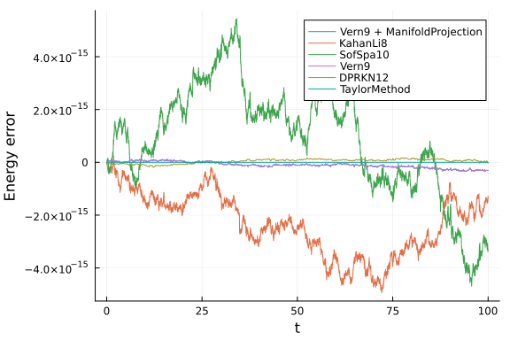
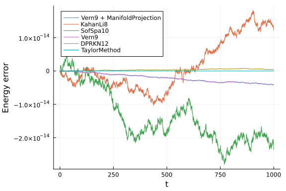
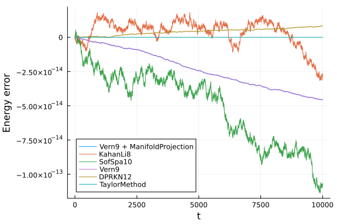
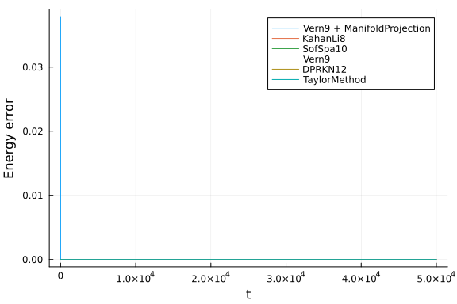
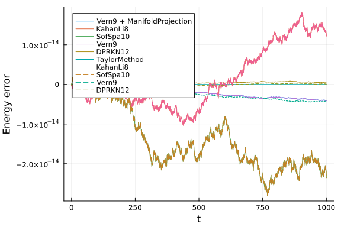
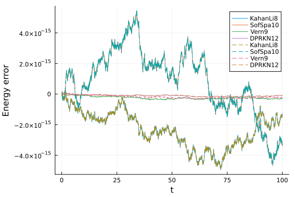
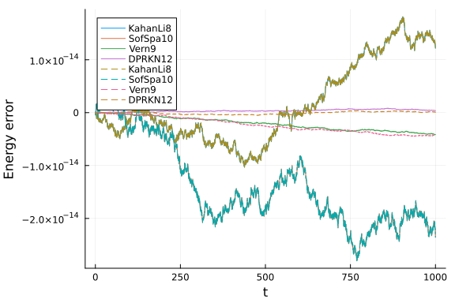
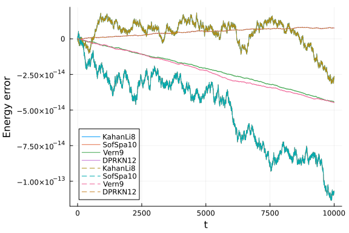
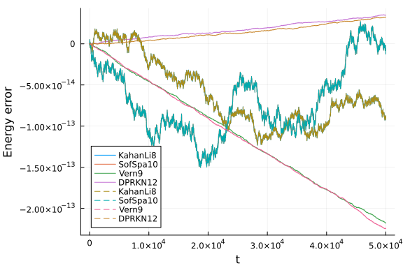

In this notebook we will study the energy conservation properties of several high-order methods
for the [Hénon-Heiles system](https://en.wikipedia.org/wiki/H%C3%A9non%E2%80%93Heiles_system).
We will se how the energy error behaves at very tight tolerances and how different techniques,
such as using symplectic solvers or manifold projections, benchmark against each other.
The Hamiltonian for this system is given by:

$$\mathcal{H}=\frac{1}{2}(p_1^2 + p_2^2) + \frac{1}{2}\left(q_1^2 + q_2^2 + 2q_1^2 q_2 - \frac{2}{3}q_2^3\right)$$

We will also compare the in place approach with the out of place approach by using `Array`s
(for the in place version) and `StaticArrays` (for out of place versions).
In order to separate these two, we will use `iip` for the in-place names and `oop` for out of place ones.

```julia
using OrdinaryDiffEq, Plots, DiffEqCallbacks
using SciMLBenchmarks
using TaylorIntegration, LinearAlgebra, StaticArrays
gr(fmt=:png)
default(fmt=:png)

T(p) = 1//2 * norm(p)^2
V(q) = 1//2 * (q[1]^2 + q[2]^2 + 2q[1]^2 * q[2]- 2//3 * q[2]^3)
H(p,q, params) = T(p) + V(q)

function iip_dq(dq,p,q,params,t)
    dq[1] = p[1]
    dq[2] = p[2]
end

function iip_dp(dp,p,q,params,t)
    dp[1] = -q[1] * (1 + 2q[2])
    dp[2] = -q[2] - (q[1]^2 - q[2]^2)
end

const iip_q0 = [0.1, 0.]
const iip_p0 = [0., 0.5]

function oop_dq(p, q, params, t)
    p
end

function oop_dp(p, q, params, t)
    dp1 = -q[1] * (1 + 2q[2])
    dp2 = -q[2] - (q[1]^2 - q[2]^2)
    @SVector [dp1, dp2]
end

const oop_q0 = @SVector [0.1, 0.]
const oop_p0 = @SVector [0., 0.5]

function hamilton(du, u, p, t)
    dq, q = @views u[3:4], du[3:4]
    dp, p = @views u[1:2], du[1:2]

    dp[1] = -q[1] * (1 + 2q[2])
    dp[2] = -q[2] - (q[1]^2 - q[2]^2)
    dq .= p

    return nothing
end

function g(resid, u, p)
    resid[1] = H([u[1], u[2]], [u[3], u[4]], nothing) - E
    resid[2:4] .= 0
end

function g_jacobian(J, u, p)
    J[1, 1] = u[1]
    J[1, 2] = u[2]
    J[1, 3] = u[3]
    J[1, 4] = u[4]
    J[2:4, :] .= 0
end

const cb = ManifoldProjection(g, manifold_jacobian=g_jacobian, nlopts=Dict(:ftol => 1e-13))

const E = H(iip_p0, iip_q0, nothing)
```

```
0.13
```


For the comparison we will use the following function

```julia
energy_err(sol) = map(i -> H([sol[1, i], sol[2, i]], [sol[3, i], sol[4, i]], nothing) - E, 1:length(sol.u))
abs_energy_err(sol) = [abs.(H([sol[1, j], sol[2, j]], [sol[3, j], sol[4, j]], nothing) - E) for j=1:length(sol.u)]

function compare(mode=:inplace, all=true, plt=nothing; tmax=1e2)
    if mode == :inplace
        prob = DynamicalODEProblem(iip_dp, iip_dq, iip_p0, iip_q0, (0., tmax))
    else
        prob = DynamicalODEProblem(oop_dp, oop_dq, oop_p0, oop_q0, (0., tmax))
    end
    prob_linear = ODEProblem(hamilton, vcat(iip_p0, iip_q0), (0., tmax))

    GC.gc()
    (mode == :inplace && all) && @time sol1 = solve(prob, Vern9(), callback=cb, abstol=1e-14, reltol=1e-14)
    GC.gc()
    @time sol2 = solve(prob, KahanLi8(), dt=1e-2, maxiters=1e10)
    GC.gc()
    @time sol3 = solve(prob, SofSpa10(), dt=1e-2, maxiters=1e8)
    GC.gc()
    @time sol4 = solve(prob, Vern9(), abstol=1e-14, reltol=1e-14)
    GC.gc()
    @time sol5 = solve(prob, DPRKN12(), abstol=1e-14, reltol=1e-14)
    GC.gc()
    (mode == :inplace && all) && @time sol6 = solve(prob_linear, TaylorMethod(50), abstol=1e-20)

    (mode == :inplace && all) && println("Vern9 + ManifoldProjection max energy error:\t" * "$(maximum(abs_energy_err(sol1)))\tin\t$(length(sol1.u))\tsteps.")
    println("KahanLi8 max energy error:\t\t\t$(maximum(abs_energy_err(sol2)))\tin\t$(length(sol2.u))\tsteps.")
    println("SofSpa10 max energy error:\t\t\t$(maximum(abs_energy_err(sol3)))\tin\t$(length(sol3.u))\tsteps.")
    println("Vern9 max energy error:\t\t\t\t$(maximum(abs_energy_err(sol4)))\tin\t$(length(sol4.u))\tsteps.")
    println("DPRKN12 max energy error:\t\t\t$(maximum(abs_energy_err(sol5)))\tin\t$(length(sol5.u))\tsteps.")
    (mode == :inplace && all) && println("TaylorMethod max energy error:\t\t\t$(maximum(abs_energy_err(sol6)))\tin\t$(length(sol6.u))\tsteps.")

    if plt === nothing
        plt = plot(xlabel="t", ylabel="Energy error")
    end
    (mode == :inplace && all) && plot!(sol1.t, energy_err(sol1), label="Vern9 + ManifoldProjection")
    plot!(sol2.t, energy_err(sol2), label="KahanLi8", ls=mode == :inplace ? :solid : :dash)
    plot!(sol3.t, energy_err(sol3), label="SofSpa10", ls=mode == :inplace ? :solid : :dash)
    plot!(sol4.t, energy_err(sol4), label="Vern9", ls=mode == :inplace ? :solid : :dash)
    plot!(sol5.t, energy_err(sol5), label="DPRKN12", ls=mode == :inplace ? :solid : :dash)
    (mode == :inplace && all) && plot!(sol6.t, energy_err(sol6), label="TaylorMethod")

    return plt
end
```

```
compare (generic function with 4 methods)
```


The `mode` argument choses between the in place approach
and the out of place one. The `all` parameter is used to compare only the integrators that support both
the in place and the out of place versions (we reffer here only to the 6 high order methods chosen bellow).
The `plt` argument can be used to overlay the results over a previous plot and the `tmax` keyword determines
the simulation time.

Note:
1. The `Vern9` method is used with `ODEProblem` because of performance issues with `ArrayPartition` indexing which manifest for `DynamicalODEProblem`.
2. The `NLsolve` call used by `ManifoldProjection` was modified to use `ftol=1e-13` in order to obtain a very low energy error.

Here are the results of the comparisons between the in place methods:

```julia
compare(tmax=1e2)
```

```
53.436211 seconds (133.92 M allocations: 7.701 GiB, 8.11% gc time, 99.98% 
compilation time)
  1.955288 seconds (3.73 M allocations: 238.596 MiB, 99.60% compilation tim
e)
  2.093522 seconds (2.82 M allocations: 181.887 MiB, 1.10% gc time, 99.49% 
compilation time)
 32.155025 seconds (91.97 M allocations: 5.509 GiB, 9.61% gc time, 99.99% c
ompilation time)
  3.095266 seconds (2.75 M allocations: 181.539 MiB, 99.96% compilation tim
e)
  1.601481 seconds (2.28 M allocations: 157.846 MiB, 1.57% gc time, 99.94% 
compilation time)
Vern9 + ManifoldProjection max energy error:	8.326672684688674e-16	in	1879	
steps.
KahanLi8 max energy error:			4.9404924595819466e-15	in	10001	steps.
SofSpa10 max energy error:			5.440092820663267e-15	in	10001	steps.
Vern9 max energy error:				8.326672684688674e-16	in	940	steps.
DPRKN12 max energy error:			2.498001805406602e-16	in	384	steps.
TaylorMethod max energy error:			0.0	in	2	steps.
```




```julia
compare(tmax=1e3)
```

```
0.061938 seconds (755.87 k allocations: 61.341 MiB)
  0.080083 seconds (700.10 k allocations: 61.899 MiB)
  0.121327 seconds (700.10 k allocations: 61.901 MiB)
  0.033185 seconds (308.05 k allocations: 20.115 MiB)
  0.005663 seconds (64.55 k allocations: 3.063 MiB)
  0.000567 seconds (1.52 k allocations: 606.797 KiB)
Vern9 + ManifoldProjection max energy error:	4.3021142204224816e-15	in	1865
9	steps.
KahanLi8 max energy error:			1.815214645262131e-14	in	100002	steps.
SofSpa10 max energy error:			2.8033131371785203e-14	in	100002	steps.
Vern9 max energy error:				4.3021142204224816e-15	in	9330	steps.
DPRKN12 max energy error:			1.0824674490095276e-15	in	3787	steps.
TaylorMethod max energy error:			0.0	in	2	steps.
```




```julia
compare(tmax=1e4)
```

```
1.382429 seconds (7.55 M allocations: 608.811 MiB, 48.23% gc time)
  1.293821 seconds (7.00 M allocations: 579.841 MiB, 35.72% gc time)
  1.161493 seconds (7.00 M allocations: 579.844 MiB)
  0.314949 seconds (3.08 M allocations: 201.754 MiB)
  0.053654 seconds (642.99 k allocations: 31.891 MiB)
  0.000536 seconds (1.52 k allocations: 606.797 KiB)
Vern9 + ManifoldProjection max energy error:	4.427014310692812e-14	in	18642
7	steps.
KahanLi8 max energy error:			3.161360062620133e-14	in	1000001	steps.
SofSpa10 max energy error:			1.136590821460004e-13	in	1000001	steps.
Vern9 max energy error:				4.427014310692812e-14	in	93214	steps.
DPRKN12 max energy error:			7.632783294297951e-15	in	37812	steps.
TaylorMethod max energy error:			0.0	in	2	steps.
```




```julia
compare(tmax=5e4)
```

```
9.082831 seconds (37.75 M allocations: 2.955 GiB, 58.98% gc time)
 12.282994 seconds (35.00 M allocations: 2.831 GiB, 66.60% gc time)
 31.043113 seconds (35.00 M allocations: 2.831 GiB, 81.40% gc time)
  7.883053 seconds (15.38 M allocations: 994.786 MiB, 80.10% gc time)
  0.258540 seconds (3.21 M allocations: 152.786 MiB)
  0.000581 seconds (1.52 k allocations: 606.797 KiB)
Vern9 + ManifoldProjection max energy error:	2.2823409828731656e-13	in	9320
89	steps.
KahanLi8 max energy error:			1.2331802246023926e-13	in	5000001	steps.
SofSpa10 max energy error:			1.5035195310986182e-13	in	5000001	steps.
Vern9 max energy error:				2.2823409828731656e-13	in	466045	steps.
DPRKN12 max energy error:			4.2799097599299785e-14	in	189039	steps.
TaylorMethod max energy error:			0.0	in	2	steps.
```





We can see that as the simulation time increases, the energy error increases. For this particular example
the energy error for all the methods is comparable. For relatively short simulation times,
if a highly accurate solution is required, the symplectic method is not recommended as
its energy error fluctuations are larger than for other methods.
An other thing to notice is the fact that the two versions of `Vern9` behave identically, as expected,
until the energy error set by `ftol` is reached.

We will now compare the in place with the out of place versions. In the plots bellow we will use
a dashed line for the out of place versions.

```julia
function in_vs_out(;all=false, tmax=1e2)
    println("In place versions:")
    plt = compare(:inplace, all, tmax=tmax)
    println("\nOut of place versions:")
    plt = compare(:oop, false, plt; tmax=tmax)
end
```

```
in_vs_out (generic function with 1 method)
```


First, here is a summary of all the available methods for `tmax = 1e3`:

```julia
in_vs_out(all=true, tmax=1e3)
```

```
In place versions:
  0.064873 seconds (755.87 k allocations: 61.341 MiB)
  0.079642 seconds (700.10 k allocations: 61.899 MiB)
  0.118121 seconds (700.10 k allocations: 61.901 MiB)
  0.032334 seconds (308.05 k allocations: 20.115 MiB)
  0.005774 seconds (64.55 k allocations: 3.063 MiB)
  0.000590 seconds (1.52 k allocations: 606.797 KiB)
Vern9 + ManifoldProjection max energy error:	4.3021142204224816e-15	in	1865
9	steps.
KahanLi8 max energy error:			1.815214645262131e-14	in	100002	steps.
SofSpa10 max energy error:			2.8033131371785203e-14	in	100002	steps.
Vern9 max energy error:				4.3021142204224816e-15	in	9330	steps.
DPRKN12 max energy error:			1.0824674490095276e-15	in	3787	steps.
TaylorMethod max energy error:			0.0	in	2	steps.

Out of place versions:
  1.384327 seconds (2.75 M allocations: 203.041 MiB, 3.91% gc time, 98.20% 
compilation time)
  0.674397 seconds (1.11 M allocations: 90.359 MiB, 94.38% compilation time
)
  1.328357 seconds (2.81 M allocations: 157.475 MiB, 2.06% gc time, 99.72% 
compilation time)
  0.780785 seconds (1.08 M allocations: 72.666 MiB, 99.77% compilation time
)
KahanLi8 max energy error:			1.815214645262131e-14	in	100002	steps.
SofSpa10 max energy error:			2.8033131371785203e-14	in	100002	steps.
Vern9 max energy error:				5.523359547510154e-15	in	9330	steps.
DPRKN12 max energy error:			4.440892098500626e-16	in	3787	steps.
```





Now we will compare the in place and the out of place versions, but only for the integrators
that are compatible with `StaticArrays`

```julia
in_vs_out(tmax=1e2)
```

```
In place versions:
  0.007011 seconds (70.09 k allocations: 5.806 MiB)
  0.010173 seconds (70.09 k allocations: 5.808 MiB)
  0.002795 seconds (31.18 k allocations: 2.059 MiB)
  0.000605 seconds (6.69 k allocations: 344.469 KiB)
KahanLi8 max energy error:			4.9404924595819466e-15	in	10001	steps.
SofSpa10 max energy error:			5.440092820663267e-15	in	10001	steps.
Vern9 max energy error:				8.326672684688674e-16	in	940	steps.
DPRKN12 max energy error:			2.498001805406602e-16	in	384	steps.

Out of place versions:
  0.002511 seconds (10.02 k allocations: 1.681 MiB)
  0.003738 seconds (10.02 k allocations: 1.682 MiB)
  0.000513 seconds (971 allocations: 500.500 KiB)
  0.000238 seconds (411 allocations: 99.172 KiB)
KahanLi8 max energy error:			4.9404924595819466e-15	in	10001	steps.
SofSpa10 max energy error:			5.440092820663267e-15	in	10001	steps.
Vern9 max energy error:				4.163336342344337e-16	in	941	steps.
DPRKN12 max energy error:			1.3877787807814457e-16	in	384	steps.
```




```julia
in_vs_out(tmax=1e3)
```

```
In place versions:
  0.068889 seconds (700.10 k allocations: 61.899 MiB)
  0.113966 seconds (700.10 k allocations: 61.901 MiB)
  0.032063 seconds (308.05 k allocations: 20.115 MiB)
  0.005644 seconds (64.55 k allocations: 3.063 MiB)
KahanLi8 max energy error:			1.815214645262131e-14	in	100002	steps.
SofSpa10 max energy error:			2.8033131371785203e-14	in	100002	steps.
Vern9 max energy error:				4.3021142204224816e-15	in	9330	steps.
DPRKN12 max energy error:			1.0824674490095276e-15	in	3787	steps.

Out of place versions:
  0.023977 seconds (100.03 k allocations: 21.886 MiB)
  0.036396 seconds (100.03 k allocations: 21.887 MiB)
  0.003691 seconds (9.37 k allocations: 4.464 MiB)
  0.001897 seconds (3.82 k allocations: 803.484 KiB)
KahanLi8 max energy error:			1.815214645262131e-14	in	100002	steps.
SofSpa10 max energy error:			2.8033131371785203e-14	in	100002	steps.
Vern9 max energy error:				5.523359547510154e-15	in	9330	steps.
DPRKN12 max energy error:			4.440892098500626e-16	in	3787	steps.
```




```julia
in_vs_out(tmax=1e4)
```

```
In place versions:
  1.561080 seconds (7.00 M allocations: 579.841 MiB, 47.80% gc time)
  1.794420 seconds (7.00 M allocations: 579.844 MiB, 34.46% gc time)
  0.315757 seconds (3.08 M allocations: 201.754 MiB)
  0.052019 seconds (642.99 k allocations: 31.891 MiB)
KahanLi8 max energy error:			3.161360062620133e-14	in	1000001	steps.
SofSpa10 max energy error:			1.136590821460004e-13	in	1000001	steps.
Vern9 max energy error:				4.427014310692812e-14	in	93214	steps.
DPRKN12 max energy error:			7.632783294297951e-15	in	37812	steps.

Out of place versions:
  0.272439 seconds (1.00 M allocations: 167.849 MiB, 4.54% gc time)
  0.405192 seconds (1.00 M allocations: 167.850 MiB)
  0.046657 seconds (93.26 k allocations: 45.374 MiB)
  0.018612 seconds (37.85 k allocations: 10.021 MiB)
KahanLi8 max energy error:			3.161360062620133e-14	in	1000001	steps.
SofSpa10 max energy error:			1.136590821460004e-13	in	1000001	steps.
Vern9 max energy error:				4.39648317751562e-14	in	93215	steps.
DPRKN12 max energy error:			8.826273045769994e-15	in	37812	steps.
```




```julia
in_vs_out(tmax=5e4)
```

```
In place versions:
  9.749807 seconds (35.00 M allocations: 2.831 GiB, 57.67% gc time)
 21.263489 seconds (35.00 M allocations: 2.831 GiB, 72.85% gc time)
  6.853118 seconds (15.38 M allocations: 994.786 MiB, 77.01% gc time)
  0.257871 seconds (3.21 M allocations: 152.786 MiB)
KahanLi8 max energy error:			1.2331802246023926e-13	in	5000001	steps.
SofSpa10 max energy error:			1.5035195310986182e-13	in	5000001	steps.
Vern9 max energy error:				2.2823409828731656e-13	in	466045	steps.
DPRKN12 max energy error:			4.2799097599299785e-14	in	189039	steps.

Out of place versions:
  1.922689 seconds (5.00 M allocations: 839.236 MiB, 27.76% gc time)
  2.040723 seconds (5.00 M allocations: 839.237 MiB)
  0.227872 seconds (466.10 k allocations: 208.068 MiB)
  0.090862 seconds (189.09 k allocations: 39.705 MiB)
KahanLi8 max energy error:			1.2331802246023926e-13	in	5000001	steps.
SofSpa10 max energy error:			1.5035195310986182e-13	in	5000001	steps.
Vern9 max energy error:				2.1188606424971113e-13	in	466048	steps.
DPRKN12 max energy error:			3.627653732962699e-14	in	189040	steps.
```





As we see from the above comparisons, the `StaticArray` versions are significantly faster and use less memory.
The speedup provided for the out of place version is more proeminent at larger values for `tmax`.
We can see again that if the simulation time is increased, the energy error of the symplectic methods
is less noticeable compared to the rest of the methods.

The benchmarks were performed on a machine with


## Appendix

These benchmarks are a part of the SciMLBenchmarks.jl repository, found at: [https://github.com/SciML/SciMLBenchmarks.jl](https://github.com/SciML/SciMLBenchmarks.jl). For more information on high-performance scientific machine learning, check out the SciML Open Source Software Organization [https://sciml.ai](https://sciml.ai).

To locally run this benchmark, do the following commands:

```
using SciMLBenchmarks
SciMLBenchmarks.weave_file("benchmarks/DynamicalODE","Henon-Heiles_energy_conservation_benchmark.jmd")
```

Computer Information:

```
Julia Version 1.10.9
Commit 5595d20a287 (2025-03-10 12:51 UTC)
Build Info:
  Official https://julialang.org/ release
Platform Info:
  OS: Linux (x86_64-linux-gnu)
  CPU: 128 × AMD EPYC 7502 32-Core Processor
  WORD_SIZE: 64
  LIBM: libopenlibm
  LLVM: libLLVM-15.0.7 (ORCJIT, znver2)
Threads: 1 default, 0 interactive, 1 GC (on 128 virtual cores)
Environment:
  JULIA_CPU_THREADS = 128
  JULIA_DEPOT_PATH = /cache/julia-buildkite-plugin/depots/5b300254-1738-4989-ae0a-f4d2d937f953

```

Package Information:

```
Status `/cache/build/exclusive-amdci1-0/julialang/scimlbenchmarks-dot-jl/benchmarks/DynamicalODE/Project.toml`
  [459566f4] DiffEqCallbacks v4.6.0
  [055956cb] DiffEqPhysics v3.15.0
  [b305315f] Elliptic v1.0.1
  [1dea7af3] OrdinaryDiffEq v6.98.0
  [65888b18] ParameterizedFunctions v5.18.0
  [91a5bcdd] Plots v1.40.13
  [31c91b34] SciMLBenchmarks v0.1.3
  [90137ffa] StaticArrays v1.9.13
  [92b13dbe] TaylorIntegration v0.17.1
  [37e2e46d] LinearAlgebra
  [de0858da] Printf
  [10745b16] Statistics v1.10.0
```

And the full manifest:

```
Status `/cache/build/exclusive-amdci1-0/julialang/scimlbenchmarks-dot-jl/benchmarks/DynamicalODE/Manifest.toml`
  [47edcb42] ADTypes v1.14.0
  [1520ce14] AbstractTrees v0.4.5
  [7d9f7c33] Accessors v0.1.42
  [79e6a3ab] Adapt v4.3.0
  [66dad0bd] AliasTables v1.1.3
  [ec485272] ArnoldiMethod v0.4.0
  [4fba245c] ArrayInterface v7.19.0
  [4c555306] ArrayLayouts v1.11.1
⌅ [e2ed5e7c] Bijections v0.1.10
  [d1d4a3ce] BitFlags v0.1.9
  [62783981] BitTwiddlingConvenienceFunctions v0.1.6
  [8e7c35d0] BlockArrays v1.6.3
  [70df07ce] BracketingNonlinearSolve v1.3.0
  [2a0fbf3d] CPUSummary v0.2.6
  [d360d2e6] ChainRulesCore v1.25.1
  [fb6a15b2] CloseOpenIntervals v0.1.13
  [944b1d66] CodecZlib v0.7.8
  [35d6a980] ColorSchemes v3.29.0
  [3da002f7] ColorTypes v0.12.1
  [c3611d14] ColorVectorSpace v0.11.0
  [5ae59095] Colors v0.13.1
  [861a8166] Combinatorics v1.0.3
  [a80b9123] CommonMark v0.9.1
  [38540f10] CommonSolve v0.2.4
  [bbf7d656] CommonSubexpressions v0.3.1
  [f70d9fcc] CommonWorldInvalidations v1.0.0
  [34da2185] Compat v4.16.0
  [b152e2b5] CompositeTypes v0.1.4
  [a33af91c] CompositionsBase v0.1.2
  [2569d6c7] ConcreteStructs v0.2.3
  [f0e56b4a] ConcurrentUtilities v2.5.0
  [8f4d0f93] Conda v1.10.2
  [187b0558] ConstructionBase v1.5.8
  [d38c429a] Contour v0.6.3
  [adafc99b] CpuId v0.3.1
  [a8cc5b0e] Crayons v4.1.1
  [9a962f9c] DataAPI v1.16.0
  [864edb3b] DataStructures v0.18.22
  [e2d170a0] DataValueInterfaces v1.0.0
  [8bb1440f] DelimitedFiles v1.9.1
  [2b5f629d] DiffEqBase v6.175.0
  [459566f4] DiffEqCallbacks v4.6.0
  [77a26b50] DiffEqNoiseProcess v5.24.1
  [055956cb] DiffEqPhysics v3.15.0
  [163ba53b] DiffResults v1.1.0
  [b552c78f] DiffRules v1.15.1
⌅ [a0c0ee7d] DifferentiationInterface v0.6.54
  [8d63f2c5] DispatchDoctor v0.4.19
  [31c24e10] Distributions v0.25.120
  [ffbed154] DocStringExtensions v0.9.4
  [5b8099bc] DomainSets v0.7.15
  [7c1d4256] DynamicPolynomials v0.6.2
  [06fc5a27] DynamicQuantities v1.8.0
  [b305315f] Elliptic v1.0.1
  [4e289a0a] EnumX v1.0.5
⌃ [f151be2c] EnzymeCore v0.8.9
  [6912e4f1] Espresso v0.6.3
  [460bff9d] ExceptionUnwrapping v0.1.11
  [d4d017d3] ExponentialUtilities v1.27.0
  [e2ba6199] ExprTools v0.1.10
  [55351af7] ExproniconLite v0.10.14
  [c87230d0] FFMPEG v0.4.2
  [7034ab61] FastBroadcast v0.3.5
  [9aa1b823] FastClosures v0.3.2
  [442a2c76] FastGaussQuadrature v1.0.2
  [a4df4552] FastPower v1.1.2
  [1a297f60] FillArrays v1.13.0
  [64ca27bc] FindFirstFunctions v1.4.1
  [6a86dc24] FiniteDiff v2.27.0
  [53c48c17] FixedPointNumbers v0.8.5
  [1fa38f19] Format v1.3.7
⌅ [f6369f11] ForwardDiff v0.10.38
  [069b7b12] FunctionWrappers v1.1.3
  [77dc65aa] FunctionWrappersWrappers v0.1.3
  [d9f16b24] Functors v0.5.2
  [46192b85] GPUArraysCore v0.2.0
  [28b8d3ca] GR v0.73.16
  [c145ed77] GenericSchur v0.5.5
  [d7ba0133] Git v1.4.0
  [c27321d9] Glob v1.3.1
  [86223c79] Graphs v1.12.1
  [42e2da0e] Grisu v1.0.2
  [cd3eb016] HTTP v1.10.16
  [eafb193a] Highlights v0.5.3
  [34004b35] HypergeometricFunctions v0.3.28
⌃ [7073ff75] IJulia v1.27.0
  [615f187c] IfElse v0.1.1
  [3263718b] ImplicitDiscreteSolve v0.1.2
  [d25df0c9] Inflate v0.1.5
  [18e54dd8] IntegerMathUtils v0.1.2
  [8197267c] IntervalSets v0.7.11
  [3587e190] InverseFunctions v0.1.17
  [92d709cd] IrrationalConstants v0.2.4
  [82899510] IteratorInterfaceExtensions v1.0.0
  [1019f520] JLFzf v0.1.11
  [692b3bcd] JLLWrappers v1.7.0
  [682c06a0] JSON v0.21.4
  [ae98c720] Jieko v0.2.1
  [98e50ef6] JuliaFormatter v2.1.2
⌅ [70703baa] JuliaSyntax v0.4.10
  [ccbc3e58] JumpProcesses v9.15.0
  [ba0b0d4f] Krylov v0.10.1
  [b964fa9f] LaTeXStrings v1.4.0
  [23fbe1c1] Latexify v0.16.8
  [10f19ff3] LayoutPointers v0.1.17
  [5078a376] LazyArrays v2.6.1
  [87fe0de2] LineSearch v0.1.4
  [d3d80556] LineSearches v7.3.0
  [7ed4a6bd] LinearSolve v3.16.0
  [2ab3a3ac] LogExpFunctions v0.3.29
  [e6f89c97] LoggingExtras v1.1.0
  [d8e11817] MLStyle v0.4.17
  [1914dd2f] MacroTools v0.5.16
  [d125e4d3] ManualMemory v0.1.8
  [bb5d69b7] MaybeInplace v0.1.4
  [739be429] MbedTLS v1.1.9
  [442fdcdd] Measures v0.3.2
  [e1d29d7a] Missings v1.2.0
  [961ee093] ModelingToolkit v10.0.1
  [2e0e35c7] Moshi v0.3.5
  [46d2c3a1] MuladdMacro v0.2.4
  [102ac46a] MultivariatePolynomials v0.5.9
  [ffc61752] Mustache v1.0.20
  [d8a4904e] MutableArithmetics v1.6.4
  [d41bc354] NLSolversBase v7.9.1
  [77ba4419] NaNMath v1.1.3
  [8913a72c] NonlinearSolve v4.9.0
  [be0214bd] NonlinearSolveBase v1.12.0
  [5959db7a] NonlinearSolveFirstOrder v1.5.0
  [9a2c21bd] NonlinearSolveQuasiNewton v1.6.0
  [26075421] NonlinearSolveSpectralMethods v1.2.0
  [6fe1bfb0] OffsetArrays v1.17.0
  [4d8831e6] OpenSSL v1.5.0
  [429524aa] Optim v1.12.0
  [bac558e1] OrderedCollections v1.8.1
  [1dea7af3] OrdinaryDiffEq v6.98.0
  [89bda076] OrdinaryDiffEqAdamsBashforthMoulton v1.2.0
  [6ad6398a] OrdinaryDiffEqBDF v1.5.1
  [bbf590c4] OrdinaryDiffEqCore v1.26.0
  [50262376] OrdinaryDiffEqDefault v1.4.0
  [4302a76b] OrdinaryDiffEqDifferentiation v1.9.1
  [9286f039] OrdinaryDiffEqExplicitRK v1.1.0
  [e0540318] OrdinaryDiffEqExponentialRK v1.4.0
  [becaefa8] OrdinaryDiffEqExtrapolation v1.5.0
  [5960d6e9] OrdinaryDiffEqFIRK v1.12.0
  [101fe9f7] OrdinaryDiffEqFeagin v1.1.0
  [d3585ca7] OrdinaryDiffEqFunctionMap v1.1.1
  [d28bc4f8] OrdinaryDiffEqHighOrderRK v1.1.0
  [9f002381] OrdinaryDiffEqIMEXMultistep v1.3.0
  [521117fe] OrdinaryDiffEqLinear v1.3.0
  [1344f307] OrdinaryDiffEqLowOrderRK v1.2.0
  [b0944070] OrdinaryDiffEqLowStorageRK v1.3.0
  [127b3ac7] OrdinaryDiffEqNonlinearSolve v1.10.0
  [c9986a66] OrdinaryDiffEqNordsieck v1.1.0
  [5dd0a6cf] OrdinaryDiffEqPDIRK v1.3.1
  [5b33eab2] OrdinaryDiffEqPRK v1.1.0
  [04162be5] OrdinaryDiffEqQPRK v1.1.0
  [af6ede74] OrdinaryDiffEqRKN v1.1.0
  [43230ef6] OrdinaryDiffEqRosenbrock v1.10.1
  [2d112036] OrdinaryDiffEqSDIRK v1.3.0
  [669c94d9] OrdinaryDiffEqSSPRK v1.3.0
  [e3e12d00] OrdinaryDiffEqStabilizedIRK v1.3.0
  [358294b1] OrdinaryDiffEqStabilizedRK v1.1.0
  [fa646aed] OrdinaryDiffEqSymplecticRK v1.3.0
  [b1df2697] OrdinaryDiffEqTsit5 v1.1.0
  [79d7bb75] OrdinaryDiffEqVerner v1.2.0
  [90014a1f] PDMats v0.11.35
  [65888b18] ParameterizedFunctions v5.18.0
  [d96e819e] Parameters v0.12.3
  [69de0a69] Parsers v2.8.3
  [ccf2f8ad] PlotThemes v3.3.0
  [995b91a9] PlotUtils v1.4.3
  [91a5bcdd] Plots v1.40.13
  [e409e4f3] PoissonRandom v0.4.4
  [f517fe37] Polyester v0.7.18
  [1d0040c9] PolyesterWeave v0.2.2
  [85a6dd25] PositiveFactorizations v0.2.4
  [d236fae5] PreallocationTools v0.4.27
⌅ [aea7be01] PrecompileTools v1.2.1
  [21216c6a] Preferences v1.4.3
  [08abe8d2] PrettyTables v2.4.0
  [27ebfcd6] Primes v0.5.7
  [43287f4e] PtrArrays v1.3.0
  [1fd47b50] QuadGK v2.11.2
  [74087812] Random123 v1.7.1
  [e6cf234a] RandomNumbers v1.6.0
  [3cdcf5f2] RecipesBase v1.3.4
  [01d81517] RecipesPipeline v0.6.12
  [731186ca] RecursiveArrayTools v3.33.0
  [189a3867] Reexport v1.2.2
  [05181044] RelocatableFolders v1.0.1
  [ae029012] Requires v1.3.1
  [ae5879a3] ResettableStacks v1.1.1
  [79098fc4] Rmath v0.8.0
  [7e49a35a] RuntimeGeneratedFunctions v0.5.15
  [9dfe8606] SCCNonlinearSolve v1.2.0
  [94e857df] SIMDTypes v0.1.0
  [0bca4576] SciMLBase v2.96.0
  [31c91b34] SciMLBenchmarks v0.1.3
  [19f34311] SciMLJacobianOperators v0.1.6
⌃ [c0aeaf25] SciMLOperators v0.4.0
  [431bcebd] SciMLPublic v1.0.0
  [53ae85a6] SciMLStructures v1.7.0
  [6c6a2e73] Scratch v1.2.1
  [efcf1570] Setfield v1.1.2
  [992d4aef] Showoff v1.0.3
  [777ac1f9] SimpleBufferStream v1.2.0
  [727e6d20] SimpleNonlinearSolve v2.5.0
  [699a6c99] SimpleTraits v0.9.4
  [ce78b400] SimpleUnPack v1.1.0
  [b85f4697] SoftGlobalScope v1.1.0
  [a2af1166] SortingAlgorithms v1.2.1
  [0a514795] SparseMatrixColorings v0.4.20
  [276daf66] SpecialFunctions v2.5.1
  [860ef19b] StableRNGs v1.0.3
  [aedffcd0] Static v1.2.0
  [0d7ed370] StaticArrayInterface v1.8.0
  [90137ffa] StaticArrays v1.9.13
  [1e83bf80] StaticArraysCore v1.4.3
  [82ae8749] StatsAPI v1.7.1
  [2913bbd2] StatsBase v0.34.5
  [4c63d2b9] StatsFuns v1.5.0
  [7792a7ef] StrideArraysCore v0.5.7
  [69024149] StringEncodings v0.3.7
  [892a3eda] StringManipulation v0.4.1
  [2efcf032] SymbolicIndexingInterface v0.3.40
  [19f23fe9] SymbolicLimits v0.2.2
  [d1185830] SymbolicUtils v3.29.0
  [0c5d862f] Symbolics v6.40.0
  [3783bdb8] TableTraits v1.0.1
  [bd369af6] Tables v1.12.0
  [ed4db957] TaskLocalValues v0.1.2
  [92b13dbe] TaylorIntegration v0.17.1
  [6aa5eb33] TaylorSeries v0.20.1
  [62fd8b95] TensorCore v0.1.1
  [8ea1fca8] TermInterface v2.0.0
  [1c621080] TestItems v1.0.0
  [8290d209] ThreadingUtilities v0.5.4
  [a759f4b9] TimerOutputs v0.5.29
  [3bb67fe8] TranscodingStreams v0.11.3
  [410a4b4d] Tricks v0.1.10
  [781d530d] TruncatedStacktraces v1.4.0
  [5c2747f8] URIs v1.5.2
  [3a884ed6] UnPack v1.0.2
  [1cfade01] UnicodeFun v0.4.1
  [1986cc42] Unitful v1.22.1
  [45397f5d] UnitfulLatexify v1.7.0
  [a7c27f48] Unityper v0.1.6
  [41fe7b60] Unzip v0.2.0
  [81def892] VersionParsing v1.3.0
  [897b6980] WeakValueDicts v0.1.0
  [44d3d7a6] Weave v0.10.12
  [ddb6d928] YAML v0.4.14
  [c2297ded] ZMQ v1.4.0
  [6e34b625] Bzip2_jll v1.0.9+0
  [83423d85] Cairo_jll v1.18.5+0
  [ee1fde0b] Dbus_jll v1.16.2+0
  [2702e6a9] EpollShim_jll v0.0.20230411+1
  [2e619515] Expat_jll v2.6.5+0
⌅ [b22a6f82] FFMPEG_jll v4.4.4+1
  [a3f928ae] Fontconfig_jll v2.16.0+0
  [d7e528f0] FreeType2_jll v2.13.4+0
  [559328eb] FriBidi_jll v1.0.17+0
  [0656b61e] GLFW_jll v3.4.0+2
  [d2c73de3] GR_jll v0.73.16+0
  [78b55507] Gettext_jll v0.21.0+0
  [f8c6e375] Git_jll v2.49.0+0
  [7746bdde] Glib_jll v2.84.0+0
  [3b182d85] Graphite2_jll v1.3.15+0
  [2e76f6c2] HarfBuzz_jll v8.5.1+0
  [1d5cc7b8] IntelOpenMP_jll v2025.0.4+0
  [aacddb02] JpegTurbo_jll v3.1.1+0
  [c1c5ebd0] LAME_jll v3.100.2+0
  [88015f11] LERC_jll v4.0.1+0
  [1d63c593] LLVMOpenMP_jll v18.1.8+0
  [dd4b983a] LZO_jll v2.10.3+0
  [e9f186c6] Libffi_jll v3.4.7+0
  [7e76a0d4] Libglvnd_jll v1.7.1+1
  [94ce4f54] Libiconv_jll v1.18.0+0
  [4b2f31a3] Libmount_jll v2.41.0+0
  [89763e89] Libtiff_jll v4.7.1+0
  [38a345b3] Libuuid_jll v2.41.0+0
  [856f044c] MKL_jll v2025.0.1+1
  [e7412a2a] Ogg_jll v1.3.5+1
  [9bd350c2] OpenSSH_jll v10.0.1+0
  [458c3c95] OpenSSL_jll v3.5.0+0
  [efe28fd5] OpenSpecFun_jll v0.5.6+0
  [91d4177d] Opus_jll v1.3.3+0
  [36c8627f] Pango_jll v1.56.3+0
⌅ [30392449] Pixman_jll v0.44.2+0
  [c0090381] Qt6Base_jll v6.8.2+1
  [629bc702] Qt6Declarative_jll v6.8.2+1
  [ce943373] Qt6ShaderTools_jll v6.8.2+1
  [e99dba38] Qt6Wayland_jll v6.8.2+0
  [f50d1b31] Rmath_jll v0.5.1+0
  [a44049a8] Vulkan_Loader_jll v1.3.243+0
  [a2964d1f] Wayland_jll v1.23.1+0
  [2381bf8a] Wayland_protocols_jll v1.36.0+0
⌅ [02c8fc9c] XML2_jll v2.13.6+1
  [ffd25f8a] XZ_jll v5.8.1+0
  [f67eecfb] Xorg_libICE_jll v1.1.2+0
  [c834827a] Xorg_libSM_jll v1.2.6+0
  [4f6342f7] Xorg_libX11_jll v1.8.12+0
  [0c0b7dd1] Xorg_libXau_jll v1.0.13+0
  [935fb764] Xorg_libXcursor_jll v1.2.4+0
  [a3789734] Xorg_libXdmcp_jll v1.1.6+0
  [1082639a] Xorg_libXext_jll v1.3.7+0
  [d091e8ba] Xorg_libXfixes_jll v6.0.1+0
  [a51aa0fd] Xorg_libXi_jll v1.8.3+0
  [d1454406] Xorg_libXinerama_jll v1.1.6+0
  [ec84b674] Xorg_libXrandr_jll v1.5.5+0
  [ea2f1a96] Xorg_libXrender_jll v0.9.12+0
  [c7cfdc94] Xorg_libxcb_jll v1.17.1+0
  [cc61e674] Xorg_libxkbfile_jll v1.1.3+0
  [e920d4aa] Xorg_xcb_util_cursor_jll v0.1.4+0
  [12413925] Xorg_xcb_util_image_jll v0.4.0+1
  [2def613f] Xorg_xcb_util_jll v0.4.0+1
  [975044d2] Xorg_xcb_util_keysyms_jll v0.4.0+1
  [0d47668e] Xorg_xcb_util_renderutil_jll v0.3.9+1
  [c22f9ab0] Xorg_xcb_util_wm_jll v0.4.1+1
  [35661453] Xorg_xkbcomp_jll v1.4.7+0
  [33bec58e] Xorg_xkeyboard_config_jll v2.44.0+0
  [c5fb5394] Xorg_xtrans_jll v1.6.0+0
  [8f1865be] ZeroMQ_jll v4.3.6+0
  [3161d3a3] Zstd_jll v1.5.7+1
  [35ca27e7] eudev_jll v3.2.9+0
  [214eeab7] fzf_jll v0.61.1+0
  [1a1c6b14] gperf_jll v3.3.0+0
  [a4ae2306] libaom_jll v3.11.0+0
  [0ac62f75] libass_jll v0.15.2+0
  [1183f4f0] libdecor_jll v0.2.2+0
  [2db6ffa8] libevdev_jll v1.11.0+0
  [f638f0a6] libfdk_aac_jll v2.0.3+0
  [36db933b] libinput_jll v1.18.0+0
  [b53b4c65] libpng_jll v1.6.48+0
  [a9144af2] libsodium_jll v1.0.21+0
  [f27f6e37] libvorbis_jll v1.3.7+2
  [009596ad] mtdev_jll v1.1.6+0
  [1317d2d5] oneTBB_jll v2022.0.0+0
⌅ [1270edf5] x264_jll v2021.5.5+0
⌅ [dfaa095f] x265_jll v3.5.0+0
  [d8fb68d0] xkbcommon_jll v1.8.1+0
  [0dad84c5] ArgTools v1.1.1
  [56f22d72] Artifacts
  [2a0f44e3] Base64
  [ade2ca70] Dates
  [8ba89e20] Distributed
  [f43a241f] Downloads v1.6.0
  [7b1f6079] FileWatching
  [9fa8497b] Future
  [b77e0a4c] InteractiveUtils
  [4af54fe1] LazyArtifacts
  [b27032c2] LibCURL v0.6.4
  [76f85450] LibGit2
  [8f399da3] Libdl
  [37e2e46d] LinearAlgebra
  [56ddb016] Logging
  [d6f4376e] Markdown
  [a63ad114] Mmap
  [ca575930] NetworkOptions v1.2.0
  [44cfe95a] Pkg v1.10.0
  [de0858da] Printf
  [3fa0cd96] REPL
  [9a3f8284] Random
  [ea8e919c] SHA v0.7.0
  [9e88b42a] Serialization
  [1a1011a3] SharedArrays
  [6462fe0b] Sockets
  [2f01184e] SparseArrays v1.10.0
  [10745b16] Statistics v1.10.0
  [4607b0f0] SuiteSparse
  [fa267f1f] TOML v1.0.3
  [a4e569a6] Tar v1.10.0
  [8dfed614] Test
  [cf7118a7] UUIDs
  [4ec0a83e] Unicode
  [e66e0078] CompilerSupportLibraries_jll v1.1.1+0
  [deac9b47] LibCURL_jll v8.4.0+0
  [e37daf67] LibGit2_jll v1.6.4+0
  [29816b5a] LibSSH2_jll v1.11.0+1
  [c8ffd9c3] MbedTLS_jll v2.28.2+1
  [14a3606d] MozillaCACerts_jll v2023.1.10
  [4536629a] OpenBLAS_jll v0.3.23+4
  [05823500] OpenLibm_jll v0.8.1+4
  [efcefdf7] PCRE2_jll v10.42.0+1
  [bea87d4a] SuiteSparse_jll v7.2.1+1
  [83775a58] Zlib_jll v1.2.13+1
  [8e850b90] libblastrampoline_jll v5.11.0+0
  [8e850ede] nghttp2_jll v1.52.0+1
  [3f19e933] p7zip_jll v17.4.0+2
Info Packages marked with ⌃ and ⌅ have new versions available. Those with ⌃ may be upgradable, but those with ⌅ are restricted by compatibility constraints from upgrading. To see why use `status --outdated -m`
```

