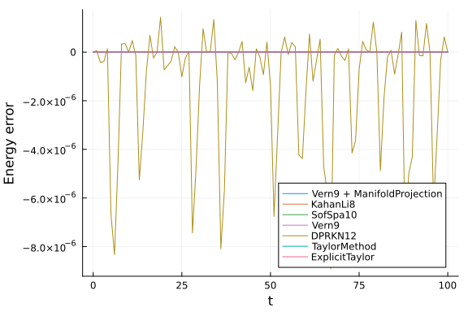
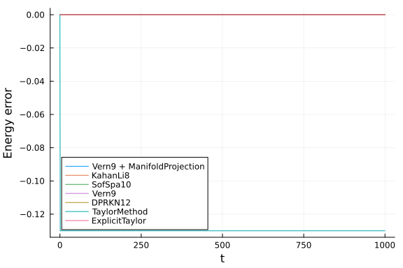
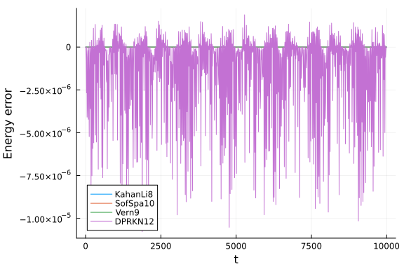
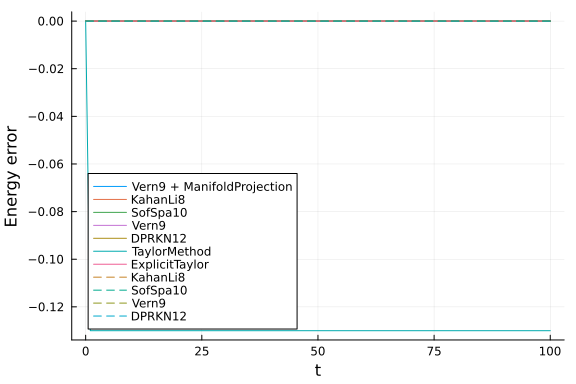
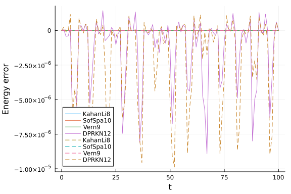
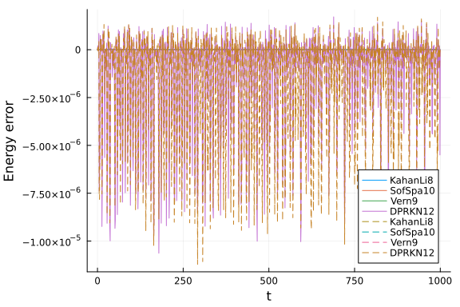

In this notebook we will study the energy conservation properties of several high-order methods
for the [Hénon-Heiles system](https://en.wikipedia.org/wiki/H%C3%A9non%E2%80%93Heiles_system).
We will see how the energy error behaves at very tight tolerances and how different techniques,
such as using symplectic solvers or manifold projections, benchmark against each other.
The Hamiltonian for this system is given by:

$$\mathcal{H}=\frac{1}{2}(p_1^2 + p_2^2) + \frac{1}{2}\left(q_1^2 + q_2^2 + 2q_1^2 q_2 - \frac{2}{3}q_2^3\right)$$

We will also compare the in place approach with the out of place approach by using `Array`s
(for the in place version) and `StaticArrays` (for out of place versions).
In order to separate these two, we will use `iip` for the in-place names and `oop` for out of place ones.

```julia
using OrdinaryDiffEq, Plots, DiffEqCallbacks
using OrdinaryDiffEqRKN, OrdinaryDiffEqSymplecticRK
using OrdinaryDiffEqTaylorSeries
using SciMLBenchmarks
using TaylorIntegration, LinearAlgebra, StaticArrays
gr(fmt = :png)
default(fmt = :png)

T(p) = 1//2 * norm(p)^2
V(q) = 1//2 * (q[1]^2 + q[2]^2 + 2q[1]^2 * q[2]-2//3 * q[2]^3)
H(p, q, params) = T(p) + V(q)

function iip_dq(dq, p, q, params, t)
    dq[1] = p[1]
    dq[2] = p[2]
end

function iip_dp(dp, p, q, params, t)
    dp[1] = -q[1] * (1 + 2q[2])
    dp[2] = -q[2] - (q[1]^2 - q[2]^2)
end

const iip_q0 = [0.1, 0.0]
const iip_p0 = [0.0, 0.5]

function oop_dq(p, q, params, t)
    p
end

function oop_dp(p, q, params, t)
    dp1 = -q[1] * (1 + 2q[2])
    dp2 = -q[2] - (q[1]^2 - q[2]^2)
    @SVector [dp1, dp2]
end

const oop_q0 = @SVector [0.1, 0.0]
const oop_p0 = @SVector [0.0, 0.5]

function hamilton(du, u, p, t)
    dq, q = @views du[3:4], u[3:4]
    dp, p = @views du[1:2], u[1:2]

    dp[1] = -q[1] * (1 + 2q[2])
    dp[2] = -q[2] - (q[1]^2 - q[2]^2)
    dq .= p

    return nothing
end

let u = vcat(iip_p0, iip_q0), du = fill(NaN, 4)
    u_before = copy(u)
    hamilton(du, u, nothing, 0.0)
    @assert u == u_before "hamilton must not mutate its input state"
    @assert du ≈ [-0.1, -0.01, 0.0, 0.5] "hamilton returned an incorrect derivative"
end

function hamilton_taylor!(du, u, p, t)
    du[1] = -u[3] * (1 + 2u[4])
    du[2] = -u[4] - (u[3]^2 - u[4]^2)
    du[3] = u[1]
    du[4] = u[2]
    return nothing
end

function g(resid, u, p)
    resid[1] = H([u[1], u[2]], [u[3], u[4]], nothing) - E
    resid[2:4] .= 0
end

function g_jacobian(J, u, p)
    J[1, 1] = u[1]
    J[1, 2] = u[2]
    J[1, 3] = u[3]
    J[1, 4] = u[4]
    J[2:4, :] .= 0
end

const cb = ManifoldProjection(g, manifold_jacobian = g_jacobian, nlopts = Dict(:ftol => 1e-13))

const E = H(iip_p0, iip_q0, nothing)
```

```
0.13
```


For the comparison we will use the following function

```julia
function energy_err(sol)
    map(i -> H([sol[1, i], sol[2, i]], [sol[3, i], sol[4, i]], nothing) - E, 1:length(sol.u))
end
function abs_energy_err(sol)
    [abs.(H([sol[1, j], sol[2, j]], [sol[3, j], sol[4, j]], nothing) - E)
     for j in 1:length(sol.u)]
end

function compare(mode = :inplace, all = true, plt = nothing; tmax = 1e2)
    if mode == :inplace
        prob = DynamicalODEProblem(iip_dp, iip_dq, iip_p0, iip_q0, (0.0, tmax))
    else
        prob = DynamicalODEProblem(oop_dp, oop_dq, oop_p0, oop_q0, (0.0, tmax))
    end
    prob_linear = ODEProblem(hamilton, vcat(iip_p0, iip_q0), (0.0, tmax))
    prob_taylor = ODEProblem{true, SciMLBase.FullSpecialize}(
        hamilton_taylor!, vcat(iip_p0, iip_q0), (0.0, tmax))

    # Cap saved points so energy-error plots stay CI-friendly. Default
    # save_everystep+dense at tmax=5e4 stores ~5e6 states per symplectic
    # solve and Plots.jl of multi-million-point series is what pinned the
    # self-hosted runner for multi-day runs (see CI run 30654781033).
    nsave = clamp(Int(round(tmax)) + 1, 101, 1001)
    saveat = range(0.0, tmax; length = nsave)
    common = (; dense = false, saveat)

    GC.gc()
    (mode == :inplace && all) &&
        @time sol1 = solve(prob, Vern9(), callback = cb, abstol = 1e-14, reltol = 1e-14;
            common...)
    GC.gc()
    @time sol2 = solve(prob, KahanLi8(), dt = 1e-2, maxiters = 1e7; common...)
    GC.gc()
    @time sol3 = solve(prob, SofSpa10(), dt = 1e-2, maxiters = 1e7; common...)
    GC.gc()
    @time sol4 = solve(prob, Vern9(), abstol = 1e-14, reltol = 1e-14; common...)
    GC.gc()
    @time sol5 = solve(prob, DPRKN12(), abstol = 1e-14, reltol = 1e-14; common...)
    GC.gc()
    (mode == :inplace && all) &&
        @time sol6 = solve(prob_linear, TaylorMethod(50), abstol = 1e-20; common...)
    GC.gc()
    (mode == :inplace && all) &&
        @time sol7 = solve(prob_taylor, ExplicitTaylor(order = Val(8)),
            abstol = 1e-14, reltol = 1e-14; common...)

    (mode == :inplace && all) && println("Vern9 + ManifoldProjection max energy error:\t" *
            "$(maximum(abs_energy_err(sol1)))\tin\t$(length(sol1.u))\tsteps.")
    println("KahanLi8 max energy error:\t\t\t$(maximum(abs_energy_err(sol2)))\tin\t$(length(sol2.u))\tsteps.")
    println("SofSpa10 max energy error:\t\t\t$(maximum(abs_energy_err(sol3)))\tin\t$(length(sol3.u))\tsteps.")
    println("Vern9 max energy error:\t\t\t\t$(maximum(abs_energy_err(sol4)))\tin\t$(length(sol4.u))\tsteps.")
    println("DPRKN12 max energy error:\t\t\t$(maximum(abs_energy_err(sol5)))\tin\t$(length(sol5.u))\tsteps.")
    (mode == :inplace && all) &&
        println("TaylorMethod max energy error:\t\t\t$(maximum(abs_energy_err(sol6)))\tin\t$(length(sol6.u))\tsteps.")
    (mode == :inplace && all) &&
        println("ExplicitTaylor max energy error:\t\t\t$(maximum(abs_energy_err(sol7)))\tin\t$(length(sol7.u))\tsteps.")

    if plt === nothing
        plt = plot(xlabel = "t", ylabel = "Energy error")
    end
    (mode == :inplace && all) &&
        plot!(sol1.t, energy_err(sol1), label = "Vern9 + ManifoldProjection")
    plot!(sol2.t, energy_err(sol2), label = "KahanLi8", ls = mode == :inplace ? :solid :
                                                             :dash)
    plot!(sol3.t, energy_err(sol3), label = "SofSpa10", ls = mode == :inplace ? :solid :
                                                             :dash)
    plot!(sol4.t, energy_err(sol4), label = "Vern9", ls = mode == :inplace ? :solid : :dash)
    plot!(sol5.t, energy_err(sol5), label = "DPRKN12", ls = mode == :inplace ? :solid :
                                                            :dash)
    (mode == :inplace && all) && plot!(sol6.t, energy_err(sol6), label = "TaylorMethod")
    (mode == :inplace && all) && plot!(sol7.t, energy_err(sol7), label = "ExplicitTaylor")

    return plt
end
```

```
compare (generic function with 4 methods)
```


The `mode` argument chooses between the in place approach
and the out of place one. The `all` parameter is used to compare only the integrators that support both
the in place and the out of place versions (we refer here only to the 6 high order methods chosen below).
The `plt` argument can be used to overlay the results over a previous plot and the `tmax` keyword determines
the simulation time.

Note:

 1. The `Vern9` method is used with `ODEProblem` because of performance issues with `ArrayPartition` indexing which manifest for `DynamicalODEProblem`.
 2. The `NLsolve` call used by `ManifoldProjection` was modified to use `ftol=1e-13` in order to obtain a very low energy error.

Here are the results of the comparisons between the in place methods:

```julia
compare(tmax = 1e2)
```

```
63.250238 seconds (183.57 M allocations: 9.132 GiB, 7.57% gc time, 99.98% 
compilation time: <1% of which was recompilation)
  3.084018 seconds (5.43 M allocations: 293.521 MiB, 2.13% gc time, 99.79% 
compilation time)
  2.157548 seconds (3.07 M allocations: 172.721 MiB, 99.52% compilation tim
e)
 20.474577 seconds (68.70 M allocations: 3.513 GiB, 5.96% gc time, 99.98% c
ompilation time)
  6.534576 seconds (14.07 M allocations: 750.075 MiB, 2.97% gc time, 99.97%
 compilation time)
  4.543104 seconds (7.59 M allocations: 536.182 MiB, 2.48% gc time, 98.93% 
compilation time)
 30.041257 seconds (27.97 M allocations: 1.427 GiB, 1.33% gc time, 99.87% c
ompilation time: 10% of which was recompilation)
Vern9 + ManifoldProjection max energy error:	1.582067810090848e-15	in	1040	
steps.
KahanLi8 max energy error:			4.718447854656915e-15	in	101	steps.
SofSpa10 max energy error:			5.2735593669694936e-15	in	101	steps.
Vern9 max energy error:				1.582067810090848e-15	in	101	steps.
DPRKN12 max energy error:			9.990739409687643e-6	in	101	steps.
TaylorMethod max energy error:			1.942890293094024e-16	in	101	steps.
ExplicitTaylor max energy error:			1.1546319456101628e-14	in	101	steps.
```




```julia
compare(tmax = 1e3)
```

```
0.075781 seconds (412.06 k allocations: 28.735 MiB)
  0.054484 seconds (4.11 k allocations: 217.305 KiB)
  0.097362 seconds (4.11 k allocations: 219.664 KiB)
  0.038746 seconds (85.49 k allocations: 2.605 MiB)
  0.006251 seconds (20.33 k allocations: 549.156 KiB)
  0.725855 seconds (1.96 M allocations: 438.041 MiB, 33.22% gc time)
  0.035461 seconds (7.57 k allocations: 414.750 KiB, 72.07% compilation tim
e)
Vern9 + ManifoldProjection max energy error:	5.245803791353865e-15	in	10330
	steps.
KahanLi8 max energy error:			1.8096635301390052e-14	in	1001	steps.
SofSpa10 max energy error:			2.7533531010703882e-14	in	1001	steps.
Vern9 max energy error:				5.245803791353865e-15	in	1001	steps.
DPRKN12 max energy error:			1.0635715396917211e-5	in	1001	steps.
TaylorMethod max energy error:			3.885780586188048e-16	in	1001	steps.
ExplicitTaylor max energy error:			8.149037000748649e-14	in	1001	steps.
```




```julia
# Long-horizon comparison without Taylor / ExplicitTaylor / ManifoldProjection
# (those are the expensive paths; energy-trend story is carried by the symplectic
# and high-order RK methods already).
compare(:inplace, false; tmax = 1e4)
```

```
0.538982 seconds (4.11 k allocations: 217.305 KiB)
  0.964373 seconds (4.11 k allocations: 219.664 KiB)
  0.316267 seconds (421.03 k allocations: 9.004 MiB)
  0.050512 seconds (156.44 k allocations: 3.132 MiB)
KahanLi8 max energy error:			3.1002977962657496e-14	in	1001	steps.
SofSpa10 max energy error:			1.1304845948245656e-13	in	1001	steps.
Vern9 max energy error:				4.421463195569686e-14	in	1001	steps.
DPRKN12 max energy error:			1.0780853129166434e-5	in	1001	steps.
```





We can see that as the simulation time increases, the energy error increases. For this particular example
the energy error for all the methods is comparable. For relatively short simulation times,
if a highly accurate solution is required, the symplectic method is not recommended as
its energy error fluctuations are larger than for other methods.
An other thing to notice is the fact that the two versions of `Vern9` behave identically, as expected,
until the energy error set by `ftol` is reached.

We will now compare the in place with the out of place versions. In the plots bellow we will use
a dashed line for the out of place versions.

```julia
function in_vs_out(; all = false, tmax = 1e2)
    println("In place versions:")
    plt = compare(:inplace, all, tmax = tmax)
    println("\nOut of place versions:")
    plt = compare(:oop, false, plt; tmax = tmax)
end
```

```
in_vs_out (generic function with 1 method)
```


First, here is a summary of all the available methods for `tmax = 1e2`
(kept short so Taylor / ExplicitTaylor stay in the CI budget):

```julia
in_vs_out(all = true, tmax = 1e2)
```

```
In place versions:
  0.007742 seconds (41.64 k allocations: 2.923 MiB)
  0.005593 seconds (503 allocations: 28.750 KiB)
  0.009973 seconds (503 allocations: 31.109 KiB)
  0.004046 seconds (8.72 k allocations: 276.125 KiB)
  0.001052 seconds (3.11 k allocations: 94.820 KiB)
  0.029692 seconds (196.73 k allocations: 43.936 MiB)
  0.001103 seconds (301 allocations: 20.422 KiB)
Vern9 + ManifoldProjection max energy error:	1.582067810090848e-15	in	1040	
steps.
KahanLi8 max energy error:			4.718447854656915e-15	in	101	steps.
SofSpa10 max energy error:			5.2735593669694936e-15	in	101	steps.
Vern9 max energy error:				1.582067810090848e-15	in	101	steps.
DPRKN12 max energy error:			9.990739409687643e-6	in	101	steps.
TaylorMethod max energy error:			1.942890293094024e-16	in	101	steps.
ExplicitTaylor max energy error:			1.1546319456101628e-14	in	101	steps.

Out of place versions:
  2.626872 seconds (4.31 M allocations: 237.659 MiB, 99.90% compilation tim
e)
  1.176052 seconds (1.69 M allocations: 98.017 MiB, 99.61% compilation time
)
  2.314637 seconds (4.42 M allocations: 218.715 MiB, 99.98% compilation tim
e)
  1.771573 seconds (2.67 M allocations: 139.867 MiB, 99.96% compilation tim
e)
KahanLi8 max energy error:			4.718447854656915e-15	in	101	steps.
SofSpa10 max energy error:			5.2735593669694936e-15	in	101	steps.
Vern9 max energy error:				1.7208456881689926e-15	in	101	steps.
DPRKN12 max energy error:			9.0510035500313e-6	in	101	steps.
```





Now we will compare the in place and the out of place versions, but only for the integrators
that are compatible with `StaticArrays`

```julia
in_vs_out(tmax = 1e2)
```

```
In place versions:
  0.005538 seconds (503 allocations: 28.750 KiB)
  0.009751 seconds (503 allocations: 31.109 KiB)
  0.004180 seconds (8.72 k allocations: 276.125 KiB)
  0.001421 seconds (3.11 k allocations: 94.820 KiB)
KahanLi8 max energy error:			4.718447854656915e-15	in	101	steps.
SofSpa10 max energy error:			5.2735593669694936e-15	in	101	steps.
Vern9 max energy error:				1.582067810090848e-15	in	101	steps.
DPRKN12 max energy error:			9.990739409687643e-6	in	101	steps.

Out of place versions:
  0.002605 seconds (35 allocations: 10.055 KiB)
  0.004456 seconds (35 allocations: 11.039 KiB)
  0.000421 seconds (34 allocations: 10.742 KiB)
  0.000873 seconds (1.77 k allocations: 169.531 KiB)
KahanLi8 max energy error:			4.718447854656915e-15	in	101	steps.
SofSpa10 max energy error:			5.2735593669694936e-15	in	101	steps.
Vern9 max energy error:				1.7208456881689926e-15	in	101	steps.
DPRKN12 max energy error:			9.0510035500313e-6	in	101	steps.
```




```julia
in_vs_out(tmax = 1e3)
```

```
In place versions:
  0.054450 seconds (4.11 k allocations: 217.305 KiB)
  0.096423 seconds (4.11 k allocations: 219.664 KiB)
  0.038398 seconds (85.49 k allocations: 2.605 MiB)
  0.006339 seconds (20.33 k allocations: 549.156 KiB)
KahanLi8 max energy error:			1.8096635301390052e-14	in	1001	steps.
SofSpa10 max energy error:			2.7533531010703882e-14	in	1001	steps.
Vern9 max energy error:				5.245803791353865e-15	in	1001	steps.
DPRKN12 max energy error:			1.0635715396917211e-5	in	1001	steps.

Out of place versions:
  0.025076 seconds (41 allocations: 72.148 KiB)
  0.044513 seconds (41 allocations: 73.133 KiB)
  0.003655 seconds (40 allocations: 72.836 KiB)
  0.003257 seconds (8.58 k allocations: 1.317 MiB)
KahanLi8 max energy error:			1.8096635301390052e-14	in	1001	steps.
SofSpa10 max energy error:			2.7533531010703882e-14	in	1001	steps.
Vern9 max energy error:				5.800915303666443e-15	in	1001	steps.
DPRKN12 max energy error:			1.1218924397565777e-5	in	1001	steps.
```





As we see from the above comparisons, the `StaticArray` versions are significantly faster and use less memory.
The speedup provided for the out of place version is more prominent at larger values for `tmax`.
We can see again that if the simulation time is increased, the energy error of the symplectic methods
is less noticeable compared to the rest of the methods.

The benchmarks were performed on a machine with


## Appendix

These benchmarks are a part of the SciMLBenchmarks.jl repository, found at: [https://github.com/SciML/SciMLBenchmarks.jl](https://github.com/SciML/SciMLBenchmarks.jl). For more information on high-performance scientific machine learning, check out the SciML Open Source Software Organization [https://sciml.ai](https://sciml.ai).

To locally run this benchmark, do the following commands:
```
using SciMLBenchmarks
SciMLBenchmarks.weave_file("benchmarks/DynamicalODE","Henon-Heiles_energy_conservation_benchmark.jmd")
```

Computer Information:

```
Julia Version 1.11.9
Commit 53a02c0720c (2026-02-06 00:27 UTC)
Build Info:
  Official https://julialang.org/ release
Platform Info:
  OS: Linux (x86_64-linux-gnu)
  CPU: 128 × AMD EPYC 7502 32-Core Processor
  WORD_SIZE: 64
  LLVM: libLLVM-16.0.6 (ORCJIT, znver2)
Threads: 128 default, 0 interactive, 64 GC (on 128 virtual cores)
Environment:
  JULIA_NUM_THREADS = auto

```

Package Information:

```
Status `/julia/github-runners/amdci1-1/_work/SciMLBenchmarks.jl/SciMLBenchmarks.jl/benchmarks/DynamicalODE/Project.toml`
  [459566f4] DiffEqCallbacks v4.19.3
  [055956cb] DiffEqPhysics v3.22.0
  [b305315f] Elliptic v1.0.1
  [1dea7af3] OrdinaryDiffEq v7.8.1
  [af6ede74] OrdinaryDiffEqRKN v2.2.0
  [fa646aed] OrdinaryDiffEqSymplecticRK v2.2.2
  [9c7f1690] OrdinaryDiffEqTaylorSeries v2.3.0
  [65888b18] ParameterizedFunctions v5.27.0
  [91a5bcdd] Plots v1.41.7
⌃ [31c91b34] SciMLBenchmarks v0.1.3
  [90137ffa] StaticArrays v1.9.20
  [10745b16] Statistics v1.11.5
  [92b13dbe] TaylorIntegration v0.18.16
  [37e2e46d] LinearAlgebra v1.11.0
  [de0858da] Printf v1.11.0
Info Packages marked with ⌃ have new versions available and may be upgradable.
```

And the full manifest:

```
Status `/julia/github-runners/amdci1-1/_work/SciMLBenchmarks.jl/SciMLBenchmarks.jl/benchmarks/DynamicalODE/Manifest.toml`
  [47edcb42] ADTypes v1.24.0
⌃ [14f7f29c] AMD v0.5.3
  [6e696c72] AbstractPlutoDingetjes v1.4.1
  [1520ce14] AbstractTrees v0.4.5
  [7d9f7c33] Accessors v0.1.45
  [79e6a3ab] Adapt v4.7.0
  [66dad0bd] AliasTables v1.1.3
  [ec485272] ArnoldiMethod v0.4.0
  [4fba245c] ArrayInterface v7.30.1
  [4c555306] ArrayLayouts v1.12.2
  [15f4f7f2] AutoHashEquals v2.2.0
  [aae01518] BandedMatrices v1.12.0
  [e2ed5e7c] Bijections v0.2.2
  [b2a6c25c] BinaryHeaps v1.1.0
  [caf10ac8] BipartiteGraphs v0.1.13
  [8e7c35d0] BlockArrays v1.10.0
  [70df07ce] BracketingNonlinearSolve v1.12.6
  [082447d4] ChainRules v1.73.0
  [d360d2e6] ChainRulesCore v1.26.1
  [0b6fb165] ChunkCodecCore v1.0.2
  [4c0bbee4] ChunkCodecLibZlib v1.1.0
  [55437552] ChunkCodecLibZstd v1.0.0
  [08986516] Collects v1.1.0
  [35d6a980] ColorSchemes v3.31.0
  [3da002f7] ColorTypes v0.12.1
  [c3611d14] ColorVectorSpace v0.11.0
  [5ae59095] Colors v0.13.1
⌅ [861a8166] Combinatorics v1.0.2
  [38540f10] CommonSolve v0.2.14
  [bbf7d656] CommonSubexpressions v0.3.1
⌃ [f70d9fcc] CommonWorldInvalidations v1.2.0
  [34da2185] Compat v4.18.1
  [b152e2b5] CompositeTypes v0.1.4
  [a33af91c] CompositionsBase v0.1.2
  [2569d6c7] ConcreteStructs v0.2.8
  [8f4d0f93] Conda v1.10.3
  [187b0558] ConstructionBase v1.6.0
  [d38c429a] Contour v0.6.3
  [a8cc5b0e] Crayons v4.2.0
  [9a962f9c] DataAPI v1.16.0
  [864edb3b] DataStructures v0.19.6
  [e2d170a0] DataValueInterfaces v1.0.0
  [8bb1440f] DelimitedFiles v1.9.1
  [2b5f629d] DiffEqBase v7.20.0
  [459566f4] DiffEqCallbacks v4.19.3
  [055956cb] DiffEqPhysics v3.22.0
  [163ba53b] DiffResults v1.1.0
  [b552c78f] DiffRules v1.16.0
  [a0c0ee7d] DifferentiationInterface v0.7.21
  [ffbed154] DocStringExtensions v0.9.5
  [5b8099bc] DomainSets v0.8.1
  [7c1d4256] DynamicPolynomials v0.6.8
  [b305315f] Elliptic v1.0.1
  [4e289a0a] EnumX v1.0.7
  [f151be2c] EnzymeCore v0.8.21
  [6912e4f1] Espresso v0.6.4
  [e2ba6199] ExprTools v0.1.11
  [55351af7] ExproniconLite v0.10.14
  [c87230d0] FFMPEG v0.4.5
  [7034ab61] FastBroadcast v1.4.0
  [9aa1b823] FastClosures v0.3.2
  [a4df4552] FastPower v1.5.0
  [5789e2e9] FileIO v1.20.0
  [1a297f60] FillArrays v1.17.0
  [64ca27bc] FindFirstFunctions v3.2.1
  [6a86dc24] FiniteDiff v2.33.0
⌅ [53c48c17] FixedPointNumbers v0.8.6
  [3821ddf9] FixedSizeArrays v1.3.0
  [1fa38f19] Format v1.3.7
  [f6369f11] ForwardDiff v1.4.5
  [a85aefff] FunctionMaps v0.1.2
  [069b7b12] FunctionWrappers v1.1.3
  [77dc65aa] FunctionWrappersWrappers v1.13.0
  [46192b85] GPUArraysCore v0.2.0
  [28b8d3ca] GR v0.73.27
  [d7ba0133] Git v1.5.0
  [86223c79] Graphs v1.14.0
  [076d061b] HashArrayMappedTries v0.2.0
⌅ [eafb193a] Highlights v0.5.3
  [7073ff75] IJulia v1.34.4
  [3263718b] ImplicitDiscreteSolve v2.2.1
  [d25df0c9] Inflate v0.1.5
  [18e54dd8] IntegerMathUtils v0.1.4
  [8197267c] IntervalSets v0.7.14
  [3587e190] InverseFunctions v0.1.17
  [92d709cd] IrrationalConstants v0.2.6
  [82899510] IteratorInterfaceExtensions v1.0.0
  [033835bb] JLD2 v0.6.6
  [1019f520] JLFzf v0.1.11
  [692b3bcd] JLLWrappers v1.8.0
⌅ [682c06a0] JSON v0.21.4
  [ae98c720] Jieko v0.2.1
  [ccbc3e58] JumpProcesses v9.32.0
  [ba0b0d4f] Krylov v0.10.9
  [2faa5264] LHLFactorization v2.2.2
  [b964fa9f] LaTeXStrings v1.4.1
  [23fbe1c1] Latexify v0.16.12
  [87fe0de2] LineSearch v0.1.16
  [7ed4a6bd] LinearSolve v5.15.1
  [2ab3a3ac] LogExpFunctions v1.0.1
  [e6f89c97] LoggingExtras v1.2.0
  [1914dd2f] MacroTools v0.5.16
  [bb5d69b7] MaybeInplace v0.1.8
  [442fdcdd] Measures v0.3.3
  [e1d29d7a] Missings v1.2.0
⌃ [961ee093] ModelingToolkit v11.40.0
  [7771a370] ModelingToolkitBase v1.68.2
  [6bb917b9] ModelingToolkitTearing v1.20.6
  [2e0e35c7] Moshi v0.3.12
  [46d2c3a1] MuladdMacro v0.2.7
  [102ac46a] MultivariatePolynomials v0.5.19
  [ffc61752] Mustache v1.0.21
  [d8a4904e] MutableArithmetics v1.8.0
  [77ba4419] NaNMath v1.1.4
  [8913a72c] NonlinearSolve v4.29.1
  [be0214bd] NonlinearSolveBase v2.49.2
  [5959db7a] NonlinearSolveFirstOrder v2.5.0
  [9a2c21bd] NonlinearSolveQuasiNewton v1.15.3
  [26075421] NonlinearSolveSpectralMethods v1.8.1
  [6fe1bfb0] OffsetArrays v1.17.0
  [bac558e1] OrderedCollections v2.0.1
  [1dea7af3] OrdinaryDiffEq v7.8.1
  [6ad6398a] OrdinaryDiffEqBDF v2.4.6
  [bbf590c4] OrdinaryDiffEqCore v4.16.0
  [50262376] OrdinaryDiffEqDefault v2.6.0
  [4302a76b] OrdinaryDiffEqDifferentiation v3.11.4
  [127b3ac7] OrdinaryDiffEqNonlinearSolve v2.9.4
  [af6ede74] OrdinaryDiffEqRKN v2.2.0
  [43230ef6] OrdinaryDiffEqRosenbrock v2.7.1
  [b4bd8bb3] OrdinaryDiffEqRosenbrockTableaus v2.4.2
  [2d112036] OrdinaryDiffEqSDIRK v2.9.2
  [fa646aed] OrdinaryDiffEqSymplecticRK v2.2.2
  [9c7f1690] OrdinaryDiffEqTaylorSeries v2.3.0
  [b1df2697] OrdinaryDiffEqTsit5 v2.1.4
  [79d7bb75] OrdinaryDiffEqVerner v2.4.1
  [65888b18] ParameterizedFunctions v5.27.0
  [d96e819e] Parameters v0.13.1
⌅ [69de0a69] Parsers v2.8.7
  [ccf2f8ad] PlotThemes v3.3.0
  [995b91a9] PlotUtils v1.4.4
  [91a5bcdd] Plots v1.41.7
  [e409e4f3] PoissonRandom v0.4.13
  [d236fae5] PreallocationTools v1.7.1
⌅ [aea7be01] PrecompileTools v1.2.1
  [21216c6a] Preferences v1.5.2
  [08abe8d2] PrettyTables v3.4.8
  [27ebfcd6] Primes v0.5.7
  [43287f4e] PtrArrays v1.4.0
  [0c0d3e7f] PureKLU v1.4.1
  [988b38a3] ReadOnlyArrays v0.2.0
  [795d4caa] ReadOnlyDicts v1.0.1
  [c1ae055f] RealDot v0.1.0
  [3cdcf5f2] RecipesBase v1.3.4
  [01d81517] RecipesPipeline v0.6.12
  [731186ca] RecursiveArrayTools v4.5.1
  [189a3867] Reexport v1.2.2
  [05181044] RelocatableFolders v1.0.1
  [ae029012] Requires v1.3.1
  [9fe22ead] RespecializeParams v1.3.0
  [7e49a35a] RuntimeGeneratedFunctions v0.5.25
  [9dfe8606] SCCNonlinearSolve v1.15.2
  [0bca4576] SciMLBase v3.50.2
⌃ [31c91b34] SciMLBenchmarks v0.1.3
  [19f34311] SciMLJacobianOperators v0.1.18
  [a6db7da4] SciMLLogging v2.1.0
  [c0aeaf25] SciMLOperators v1.30.0
  [431bcebd] SciMLPublic v1.3.0
  [53ae85a6] SciMLStructures v1.10.5
  [7e506255] ScopedValues v1.6.2
  [6c6a2e73] Scratch v1.3.0
  [efcf1570] Setfield v1.1.2
  [992d4aef] Showoff v1.1.1
  [727e6d20] SimpleNonlinearSolve v2.14.1
  [699a6c99] SimpleTraits v0.9.6
  [a2af1166] SortingAlgorithms v1.2.3
⌃ [a57abbd0] SparseColumnPivotedQR v2.1.7
  [dc90abb0] SparseInverseSubset v0.1.3
⌃ [0a514795] SparseMatrixColorings v0.4.27
  [276daf66] SpecialFunctions v2.9.0
  [860ef19b] StableRNGs v1.0.4
  [0c0c59c1] StarAlgebras v0.3.0
  [64909d44] StateSelection v1.11.1
  [90137ffa] StaticArrays v1.9.20
  [1e83bf80] StaticArraysCore v1.4.4
  [10745b16] Statistics v1.11.5
  [82ae8749] StatsAPI v1.8.0
  [2913bbd2] StatsBase v0.34.13
  [69024149] StringEncodings v0.3.7
⌅ [892a3eda] StringManipulation v0.5.0
  [09ab397b] StructArrays v0.7.3
  [2efcf032] SymbolicIndexingInterface v0.3.55
  [19f23fe9] SymbolicLimits v1.2.1
⌃ [d1185830] SymbolicUtils v4.46.1
  [0c5d862f] Symbolics v7.39.0
  [3783bdb8] TableTraits v1.0.1
  [bd369af6] Tables v1.14.0
  [ed4db957] TaskLocalValues v0.1.3
  [b36ab563] TaylorDiff v0.3.5
  [92b13dbe] TaylorIntegration v0.18.16
  [6aa5eb33] TaylorSeries v0.22.4
  [62fd8b95] TensorCore v0.1.1
  [8ea1fca8] TermInterface v2.0.0
  [a759f4b9] TimerOutputs v1.2.1
  [781d530d] TruncatedStacktraces v1.4.0
  [3a884ed6] UnPack v1.0.2
  [1cfade01] UnicodeFun v0.4.1
  [41fe7b60] Unzip v0.2.0
  [81def892] VersionParsing v1.3.0
  [d30d5f5c] WeakCacheSets v0.1.0
  [44d3d7a6] Weave v0.10.12
  [ddb6d928] YAML v0.4.16
  [c2297ded] ZMQ v1.5.1
  [6e34b625] Bzip2_jll v1.0.9+0
  [83423d85] Cairo_jll v1.18.7+0
  [ee1fde0b] Dbus_jll v1.16.2+0
  [2702e6a9] EpollShim_jll v0.0.20230411+1
  [2e619515] Expat_jll v2.8.3+0
⌅ [b22a6f82] FFMPEG_jll v8.1.2+0
  [a3f928ae] Fontconfig_jll v2.17.1+0
  [d7e528f0] FreeType2_jll v2.14.3+1
  [559328eb] FriBidi_jll v1.0.17+0
  [0656b61e] GLFW_jll v3.5.1+0
  [d2c73de3] GR_jll v0.73.27+0
⌅ [b0724c58] GettextRuntime_jll v0.22.4+0
  [61579ee1] Ghostscript_jll v9.55.1+0
  [020c3dae] Git_LFS_jll v3.7.1+0
  [f8c6e375] Git_jll v2.55.0+0
  [7746bdde] Glib_jll v2.88.3+0
  [3b182d85] Graphite2_jll v1.3.16+0
  [2e76f6c2] HarfBuzz_jll v100.14003.0+0
  [1d5cc7b8] IntelOpenMP_jll v2025.2.0+0
  [aacddb02] JpegTurbo_jll v3.2.0+1
  [c1c5ebd0] LAME_jll v3.100.3+0
  [88015f11] LERC_jll v4.1.0+0
  [1d63c593] LLVMOpenMP_jll v22.1.7+0
⌅ [e9f186c6] Libffi_jll v3.4.7+0
  [7e76a0d4] Libglvnd_jll v1.7.1+1
  [94ce4f54] Libiconv_jll v1.18.0+0
  [4b2f31a3] Libmount_jll v2.42.0+0
  [89763e89] Libtiff_jll v4.7.3+0
  [38a345b3] Libuuid_jll v2.42.0+0
  [856f044c] MKL_jll v2025.2.0+0
  [e7412a2a] Ogg_jll v1.3.6+0
  [9bd350c2] OpenSSH_jll v10.5.1+0
  [458c3c95] OpenSSL_jll v3.5.8+0
  [efe28fd5] OpenSpecFun_jll v0.5.6+0
  [91d4177d] Opus_jll v1.6.1+0
  [36c8627f] Pango_jll v1.58.2+0
  [30392449] Pixman_jll v0.46.4+0
  [c0090381] Qt6Base_jll v6.10.2+2
  [629bc702] Qt6Declarative_jll v6.10.2+2
  [ce943373] Qt6ShaderTools_jll v6.10.2+1
  [6de9746b] Qt6Svg_jll v6.10.2+0
  [e99dba38] Qt6Wayland_jll v6.10.2+1
  [a44049a8] Vulkan_Loader_jll v1.3.243+0
  [a2964d1f] Wayland_jll v1.24.0+0
  [ffd25f8a] XZ_jll v5.8.3+0
  [f67eecfb] Xorg_libICE_jll v1.1.2+0
  [c834827a] Xorg_libSM_jll v1.2.6+0
  [4f6342f7] Xorg_libX11_jll v1.8.13+0
  [0c0b7dd1] Xorg_libXau_jll v1.0.13+0
  [935fb764] Xorg_libXcursor_jll v1.2.4+0
  [a3789734] Xorg_libXdmcp_jll v1.1.6+0
  [1082639a] Xorg_libXext_jll v1.3.8+0
  [d091e8ba] Xorg_libXfixes_jll v6.0.2+0
  [a51aa0fd] Xorg_libXi_jll v1.8.4+0
  [d1454406] Xorg_libXinerama_jll v1.1.7+0
  [ec84b674] Xorg_libXrandr_jll v1.5.6+0
  [ea2f1a96] Xorg_libXrender_jll v0.9.12+0
  [a65dc6b1] Xorg_libpciaccess_jll v0.19.0+0
  [c7cfdc94] Xorg_libxcb_jll v1.17.1+0
  [cc61e674] Xorg_libxkbfile_jll v1.2.0+0
  [e920d4aa] Xorg_xcb_util_cursor_jll v0.1.6+0
  [12413925] Xorg_xcb_util_image_jll v0.4.1+0
  [2def613f] Xorg_xcb_util_jll v0.4.1+0
  [975044d2] Xorg_xcb_util_keysyms_jll v0.4.1+0
  [0d47668e] Xorg_xcb_util_renderutil_jll v0.3.10+0
  [c22f9ab0] Xorg_xcb_util_wm_jll v0.4.2+0
  [35661453] Xorg_xkbcomp_jll v1.4.7+0
  [33bec58e] Xorg_xkeyboard_config_jll v2.47.0+2
  [c5fb5394] Xorg_xtrans_jll v1.6.0+0
  [8f1865be] ZeroMQ_jll v4.3.6+0
  [3161d3a3] Zstd_jll v1.5.7+1
  [35ca27e7] eudev_jll v3.2.14+0
⌅ [214eeab7] fzf_jll v0.61.1+0
  [a4ae2306] libaom_jll v3.14.1+0
  [0ac62f75] libass_jll v0.17.5+0
  [1183f4f0] libdecor_jll v0.2.2+0
  [8e53e030] libdrm_jll v2.4.134+0
  [2db6ffa8] libevdev_jll v1.13.4+0
  [f638f0a6] libfdk_aac_jll v2.0.4+0
  [36db933b] libinput_jll v1.28.1+0
  [b53b4c65] libpng_jll v1.6.58+0
  [a9144af2] libsodium_jll v1.0.21+0
  [9a156e7d] libva_jll v2.23.0+0
  [f27f6e37] libvorbis_jll v1.3.8+0
  [009596ad] mtdev_jll v1.1.7+0
  [1317d2d5] oneTBB_jll v2022.3.0+0
⌅ [1270edf5] x264_jll v10164.0.1+0
  [dfaa095f] x265_jll v4.1.0+0
  [d8fb68d0] xkbcommon_jll v1.13.0+0
  [0dad84c5] ArgTools v1.1.2
  [56f22d72] Artifacts v1.11.0
  [2a0f44e3] Base64 v1.11.0
  [ade2ca70] Dates v1.11.0
  [8ba89e20] Distributed v1.11.0
  [f43a241f] Downloads v1.6.0
  [7b1f6079] FileWatching v1.11.0
  [9fa8497b] Future v1.11.0
  [b77e0a4c] InteractiveUtils v1.11.0
  [4af54fe1] LazyArtifacts v1.11.0
  [b27032c2] LibCURL v0.6.4
  [76f85450] LibGit2 v1.11.0
  [8f399da3] Libdl v1.11.0
  [37e2e46d] LinearAlgebra v1.11.0
  [56ddb016] Logging v1.11.0
  [d6f4376e] Markdown v1.11.0
  [a63ad114] Mmap v1.11.0
  [ca575930] NetworkOptions v1.2.0
  [44cfe95a] Pkg v1.11.0
  [de0858da] Printf v1.11.0
  [3fa0cd96] REPL v1.11.0
  [9a3f8284] Random v1.11.0
  [ea8e919c] SHA v0.7.0
  [9e88b42a] Serialization v1.11.0
  [6462fe0b] Sockets v1.11.0
  [2f01184e] SparseArrays v1.11.0
  [f489334b] StyledStrings v1.11.0
  [4607b0f0] SuiteSparse
  [fa267f1f] TOML v1.0.3
  [a4e569a6] Tar v1.10.0
  [8dfed614] Test v1.11.0
  [cf7118a7] UUIDs v1.11.0
  [4ec0a83e] Unicode v1.11.0
  [e66e0078] CompilerSupportLibraries_jll v1.1.1+0
  [deac9b47] LibCURL_jll v8.6.0+0
  [e37daf67] LibGit2_jll v1.7.2+0
  [29816b5a] LibSSH2_jll v1.11.0+1
  [c8ffd9c3] MbedTLS_jll v2.28.6+0
  [14a3606d] MozillaCACerts_jll v2023.12.12
  [4536629a] OpenBLAS_jll v0.3.27+1
  [05823500] OpenLibm_jll v0.8.5+0
  [efcefdf7] PCRE2_jll v10.42.0+1
  [bea87d4a] SuiteSparse_jll v7.7.0+0
  [83775a58] Zlib_jll v1.2.13+1
  [8e850b90] libblastrampoline_jll v5.11.0+0
  [8e850ede] nghttp2_jll v1.59.0+0
  [3f19e933] p7zip_jll v17.4.0+2
Info Packages marked with ⌃ and ⌅ have new versions available. Those with ⌃ may be upgradable, but those with ⌅ are restricted by compatibility constraints from upgrading. To see why use `status --outdated -m`
```

