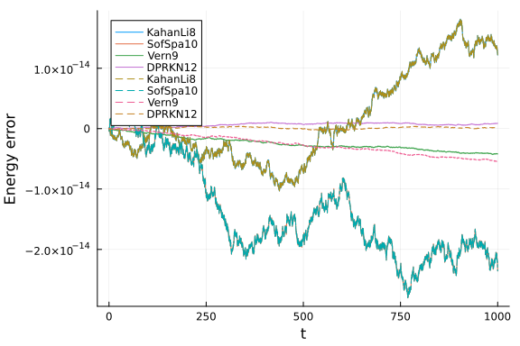

In this notebook we will study the energy conservation properties of several high-order methods
for the [Hénon-Heiles system](https://en.wikipedia.org/wiki/H%C3%A9non%E2%80%93Heiles_system).
We will se how the energy error behaves at very tight tolerances and how different techniques,
such as using symplectic solvers or manifold projections, benchmark against each other.
The Hamiltonian for this system is given by:

$$\mathcal{H}=\frac{1}{2}(p_1^2 + p_2^2) + \frac{1}{2}\left(q_1^2 + q_2^2 + 2q_1^2 q_2 - \frac{2}{3}q_2^3\right)$$

We will also compare the in place approach with the out of place approach by using `Array`s
(for the in place version) and `StaticArrays` (for out of place versions).
In order to separate these two, we will use `iip` for the in-place names and `oop` for out of place ones.

```julia
using OrdinaryDiffEq, Plots, DiffEqCallbacks
using SciMLBenchmarks
using TaylorIntegration, LinearAlgebra, StaticArrays
gr(fmt=:png)
default(fmt=:png)

T(p) = 1//2 * norm(p)^2
V(q) = 1//2 * (q[1]^2 + q[2]^2 + 2q[1]^2 * q[2]- 2//3 * q[2]^3)
H(p,q, params) = T(p) + V(q)

function iip_dq(dq,p,q,params,t)
    dq[1] = p[1]
    dq[2] = p[2]
end

function iip_dp(dp,p,q,params,t)
    dp[1] = -q[1] * (1 + 2q[2])
    dp[2] = -q[2] - (q[1]^2 - q[2]^2)
end

const iip_q0 = [0.1, 0.]
const iip_p0 = [0., 0.5]

function oop_dq(p, q, params, t)
    p
end

function oop_dp(p, q, params, t)
    dp1 = -q[1] * (1 + 2q[2])
    dp2 = -q[2] - (q[1]^2 - q[2]^2)
    @SVector [dp1, dp2]
end

const oop_q0 = @SVector [0.1, 0.]
const oop_p0 = @SVector [0., 0.5]

function hamilton(du, u, p, t)
    dq, q = @views u[3:4], du[3:4]
    dp, p = @views u[1:2], du[1:2]

    dp[1] = -q[1] * (1 + 2q[2])
    dp[2] = -q[2] - (q[1]^2 - q[2]^2)
    dq .= p

    return nothing
end

function g(resid, u, p)
    resid[1] = H([u[1], u[2]], [u[3], u[4]], nothing) - E
    resid[2:4] .= 0
end

const cb = ManifoldProjection(g, nlopts=Dict(:ftol => 1e-13))

const E = H(iip_p0, iip_q0, nothing)
```

```
0.13
```


For the comparison we will use the following function

```julia
energy_err(sol) = map(i -> H([sol[1, i], sol[2, i]], [sol[3, i], sol[4, i]], nothing) - E, 1:length(sol.u))
abs_energy_err(sol) = [abs.(H([sol[1, j], sol[2, j]], [sol[3, j], sol[4, j]], nothing) - E) for j=1:length(sol.u)]

function compare(mode=:inplace, all=true, plt=nothing; tmax=1e2)
    if mode == :inplace
        prob = DynamicalODEProblem(iip_dp, iip_dq, iip_p0, iip_q0, (0., tmax))
    else
        prob = DynamicalODEProblem(oop_dp, oop_dq, oop_p0, oop_q0, (0., tmax))
    end
    prob_linear = ODEProblem(hamilton, vcat(iip_p0, iip_q0), (0., tmax))

    GC.gc()
    (mode == :inplace && all) && @time sol1 = solve(prob, Vern9(), callback=cb, abstol=1e-14, reltol=1e-14)
    GC.gc()
    @time sol2 = solve(prob, KahanLi8(), dt=1e-2, maxiters=1e10)
    GC.gc()
    @time sol3 = solve(prob, SofSpa10(), dt=1e-2, maxiters=1e8)
    GC.gc()
    @time sol4 = solve(prob, Vern9(), abstol=1e-14, reltol=1e-14)
    GC.gc()
    @time sol5 = solve(prob, DPRKN12(), abstol=1e-14, reltol=1e-14)
    GC.gc()
    (mode == :inplace && all) && @time sol6 = solve(prob_linear, TaylorMethod(50), abstol=1e-20)

    (mode == :inplace && all) && println("Vern9 + ManifoldProjection max energy error:\t" * "$(maximum(abs_energy_err(sol1)))\tin\t$(length(sol1.u))\tsteps.")
    println("KahanLi8 max energy error:\t\t\t$(maximum(abs_energy_err(sol2)))\tin\t$(length(sol2.u))\tsteps.")
    println("SofSpa10 max energy error:\t\t\t$(maximum(abs_energy_err(sol3)))\tin\t$(length(sol3.u))\tsteps.")
    println("Vern9 max energy error:\t\t\t\t$(maximum(abs_energy_err(sol4)))\tin\t$(length(sol4.u))\tsteps.")
    println("DPRKN12 max energy error:\t\t\t$(maximum(abs_energy_err(sol5)))\tin\t$(length(sol5.u))\tsteps.")
    (mode == :inplace && all) && println("TaylorMethod max energy error:\t\t\t$(maximum(abs_energy_err(sol6)))\tin\t$(length(sol6.u))\tsteps.")

    if plt === nothing
        plt = plot(xlabel="t", ylabel="Energy error")
    end
    (mode == :inplace && all) && plot!(sol1.t, energy_err(sol1), label="Vern9 + ManifoldProjection")
    plot!(sol2.t, energy_err(sol2), label="KahanLi8", ls=mode == :inplace ? :solid : :dash)
    plot!(sol3.t, energy_err(sol3), label="SofSpa10", ls=mode == :inplace ? :solid : :dash)
    plot!(sol4.t, energy_err(sol4), label="Vern9", ls=mode == :inplace ? :solid : :dash)
    plot!(sol5.t, energy_err(sol5), label="DPRKN12", ls=mode == :inplace ? :solid : :dash)
    (mode == :inplace && all) && plot!(sol6.t, energy_err(sol6), label="TaylorMethod")

    return plt
end
```

```
compare (generic function with 4 methods)
```


The `mode` argument choses between the in place approach
and the out of place one. The `all` parameter is used to compare only the integrators that support both
the in place and the out of place versions (we reffer here only to the 6 high order methods chosen bellow).
The `plt` argument can be used to overlay the results over a previous plot and the `tmax` keyword determines
the simulation time.

Note:
1. The `Vern9` method is used with `ODEProblem` because of performance issues with `ArrayPartition` indexing which manifest for `DynamicalODEProblem`.
2. The `NLsolve` call used by `ManifoldProjection` was modified to use `ftol=1e-13` in order to obtain a very low energy error.

Here are the results of the comparisons between the in place methods:

```julia
compare(tmax=1e2)
```

```
58.599117 seconds (147.81 M allocations: 8.578 GiB, 7.62% gc time, 99.98% 
compilation time)
  1.971581 seconds (2.86 M allocations: 187.369 MiB, 99.61% compilation tim
e)
  1.946768 seconds (2.47 M allocations: 159.276 MiB, 99.46% compilation tim
e)
 33.037299 seconds (91.62 M allocations: 5.503 GiB, 10.62% gc time, 99.99% 
compilation time)
  3.107463 seconds (2.54 M allocations: 164.625 MiB, 99.94% compilation tim
e)
  1.511297 seconds (2.07 M allocations: 141.281 MiB, 99.94% compilation tim
e)
Vern9 + ManifoldProjection max energy error:	3.3306690738754696e-16	in	1881
	steps.
KahanLi8 max energy error:			4.9404924595819466e-15	in	10001	steps.
SofSpa10 max energy error:			5.440092820663267e-15	in	10001	steps.
Vern9 max energy error:				3.3306690738754696e-16	in	941	steps.
DPRKN12 max energy error:			1.942890293094024e-16	in	385	steps.
TaylorMethod max energy error:			0.0	in	2	steps.
```


```julia
compare(tmax=1e3)
```

```
0.073168 seconds (1.03 M allocations: 68.887 MiB)
  0.072437 seconds (700.10 k allocations: 61.899 MiB)
  0.101448 seconds (700.10 k allocations: 61.901 MiB)
  0.034935 seconds (336.05 k allocations: 20.400 MiB)
  0.005663 seconds (75.92 k allocations: 3.178 MiB)
  0.000563 seconds (2.02 k allocations: 759.797 KiB)
Vern9 + ManifoldProjection max energy error:	4.191091917959966e-15	in	18659
	steps.
KahanLi8 max energy error:			1.815214645262131e-14	in	100002	steps.
SofSpa10 max energy error:			2.8033131371785203e-14	in	100002	steps.
Vern9 max energy error:				4.191091917959966e-15	in	9330	steps.
DPRKN12 max energy error:			8.604228440844963e-16	in	3787	steps.
TaylorMethod max energy error:			0.0	in	2	steps.
```


```julia
compare(tmax=1e4)
```

```
0.856765 seconds (10.25 M allocations: 684.202 MiB)
  0.826368 seconds (7.00 M allocations: 579.841 MiB)
  1.126439 seconds (7.00 M allocations: 579.843 MiB)
  0.331307 seconds (3.36 M allocations: 204.601 MiB)
  0.048788 seconds (756.45 k allocations: 33.046 MiB)
  0.000611 seconds (2.02 k allocations: 759.797 KiB)
Vern9 + ManifoldProjection max energy error:	4.565792188770956e-14	in	18642
9	steps.
KahanLi8 max energy error:			3.161360062620133e-14	in	1000001	steps.
SofSpa10 max energy error:			1.136590821460004e-13	in	1000001	steps.
Vern9 max energy error:				4.565792188770956e-14	in	93215	steps.
DPRKN12 max energy error:			8.465450562766819e-15	in	37813	steps.
TaylorMethod max energy error:			0.0	in	2	steps.
```


```julia
compare(tmax=5e4)
```

```
9.608670 seconds (51.42 M allocations: 3.332 GiB, 54.21% gc time, 1.10% c
ompilation time)
 16.983753 seconds (35.00 M allocations: 2.831 GiB, 75.21% gc time)
 30.374835 seconds (35.00 M allocations: 2.831 GiB, 81.43% gc time)
  8.069185 seconds (16.78 M allocations: 1009.011 MiB, 79.27% gc time)
  0.254919 seconds (3.78 M allocations: 158.555 MiB)
  0.000601 seconds (2.02 k allocations: 759.797 KiB)
Vern9 + ManifoldProjection max energy error:	1.0000333894311098e-13	in	9320
89	steps.
KahanLi8 max energy error:			1.2331802246023926e-13	in	5000001	steps.
SofSpa10 max energy error:			1.5035195310986182e-13	in	5000001	steps.
Vern9 max energy error:				2.179090241583026e-13	in	466046	steps.
DPRKN12 max energy error:			3.5388358909926865e-14	in	189039	steps.
TaylorMethod max energy error:			0.0	in	2	steps.
```


We can see that as the simulation time increases, the energy error increases. For this particular example
the energy error for all the methods is comparable. For relatively short simulation times,
if a highly accurate solution is required, the symplectic method is not recommended as
its energy error fluctuations are larger than for other methods.
An other thing to notice is the fact that the two versions of `Vern9` behave identically, as expected,
until the energy error set by `ftol` is reached.

We will now compare the in place with the out of place versions. In the plots bellow we will use
a dashed line for the out of place versions.

```julia
function in_vs_out(;all=false, tmax=1e2)
    println("In place versions:")
    plt = compare(:inplace, all, tmax=tmax)
    println("\nOut of place versions:")
    plt = compare(:oop, false, plt; tmax=tmax)
end
```

```
in_vs_out (generic function with 1 method)
```


First, here is a summary of all the available methods for `tmax = 1e3`:

```julia
in_vs_out(all=true, tmax=1e3)
```

```
In place versions:
  0.086406 seconds (1.03 M allocations: 68.887 MiB, 17.03% gc time)
  0.071712 seconds (700.10 k allocations: 61.899 MiB)
  0.102319 seconds (700.10 k allocations: 61.901 MiB)
  0.034977 seconds (336.05 k allocations: 20.400 MiB)
  0.005709 seconds (75.92 k allocations: 3.178 MiB)
  0.000608 seconds (2.02 k allocations: 759.797 KiB)
Vern9 + ManifoldProjection max energy error:	4.191091917959966e-15	in	18659
	steps.
KahanLi8 max energy error:			1.815214645262131e-14	in	100002	steps.
SofSpa10 max energy error:			2.8033131371785203e-14	in	100002	steps.
Vern9 max energy error:				4.191091917959966e-15	in	9330	steps.
DPRKN12 max energy error:			8.604228440844963e-16	in	3787	steps.
TaylorMethod max energy error:			0.0	in	2	steps.

Out of place versions:
  1.182459 seconds (2.28 M allocations: 169.606 MiB, 97.95% compilation tim
e)
  0.617718 seconds (891.40 k allocations: 73.523 MiB, 94.37% compilation ti
me)
  1.230327 seconds (2.57 M allocations: 139.220 MiB, 99.69% compilation tim
e)
  0.739266 seconds (865.35 k allocations: 56.226 MiB, 99.78% compilation ti
me)
KahanLi8 max energy error:			1.815214645262131e-14	in	100002	steps.
SofSpa10 max energy error:			2.8033131371785203e-14	in	100002	steps.
Vern9 max energy error:				4.496403249731884e-15	in	9330	steps.
DPRKN12 max energy error:			5.273559366969494e-16	in	3787	steps.
```


Now we will compare the in place and the out of place versions, but only for the integrators
that are compatible with `StaticArrays`

```julia
in_vs_out(tmax=1e2)
```

```
In place versions:
  0.007368 seconds (70.09 k allocations: 5.806 MiB)
  0.009903 seconds (70.09 k allocations: 5.808 MiB)
  0.003046 seconds (34.04 k allocations: 2.090 MiB)
  0.000639 seconds (7.88 k allocations: 357.234 KiB)
KahanLi8 max energy error:			4.9404924595819466e-15	in	10001	steps.
SofSpa10 max energy error:			5.440092820663267e-15	in	10001	steps.
Vern9 max energy error:				3.3306690738754696e-16	in	941	steps.
DPRKN12 max energy error:			1.942890293094024e-16	in	385	steps.

Out of place versions:
  0.002612 seconds (10.02 k allocations: 1.681 MiB)
  0.003530 seconds (10.02 k allocations: 1.682 MiB)
  0.000627 seconds (971 allocations: 500.484 KiB)
  0.000249 seconds (412 allocations: 99.281 KiB)
KahanLi8 max energy error:			4.9404924595819466e-15	in	10001	steps.
SofSpa10 max energy error:			5.440092820663267e-15	in	10001	steps.
Vern9 max energy error:				3.3306690738754696e-16	in	941	steps.
DPRKN12 max energy error:			1.6653345369377348e-16	in	385	steps.
```


```julia
in_vs_out(tmax=1e3)
```

```
In place versions:
  0.070691 seconds (700.10 k allocations: 61.899 MiB)
  0.098528 seconds (700.10 k allocations: 61.901 MiB)
  0.027531 seconds (336.05 k allocations: 20.400 MiB)
  0.004810 seconds (75.92 k allocations: 3.178 MiB)
KahanLi8 max energy error:			1.815214645262131e-14	in	100002	steps.
SofSpa10 max energy error:			2.8033131371785203e-14	in	100002	steps.
Vern9 max energy error:				4.191091917959966e-15	in	9330	steps.
DPRKN12 max energy error:			8.604228440844963e-16	in	3787	steps.

Out of place versions:
  0.024196 seconds (100.03 k allocations: 21.886 MiB)
  0.034301 seconds (100.03 k allocations: 21.887 MiB)
  0.004190 seconds (9.37 k allocations: 4.464 MiB)
  0.001827 seconds (3.82 k allocations: 803.469 KiB)
KahanLi8 max energy error:			1.815214645262131e-14	in	100002	steps.
SofSpa10 max energy error:			2.8033131371785203e-14	in	100002	steps.
Vern9 max energy error:				4.496403249731884e-15	in	9330	steps.
DPRKN12 max energy error:			5.273559366969494e-16	in	3787	steps.
```




```julia
in_vs_out(tmax=1e4)
```

```
In place versions:
  0.832300 seconds (7.00 M allocations: 579.841 MiB)
  1.138956 seconds (7.00 M allocations: 579.843 MiB)
  0.331806 seconds (3.36 M allocations: 204.601 MiB)
  0.049617 seconds (756.45 k allocations: 33.046 MiB)
KahanLi8 max energy error:			3.161360062620133e-14	in	1000001	steps.
SofSpa10 max energy error:			1.136590821460004e-13	in	1000001	steps.
Vern9 max energy error:				4.565792188770956e-14	in	93215	steps.
DPRKN12 max energy error:			8.465450562766819e-15	in	37813	steps.

Out of place versions:
  0.267690 seconds (1.00 M allocations: 167.849 MiB)
  0.386506 seconds (1.00 M allocations: 167.850 MiB)
  0.049576 seconds (93.26 k allocations: 45.374 MiB)
  0.017160 seconds (37.85 k allocations: 10.021 MiB)
KahanLi8 max energy error:			3.161360062620133e-14	in	1000001	steps.
SofSpa10 max energy error:			1.136590821460004e-13	in	1000001	steps.
Vern9 max energy error:				4.4797499043625066e-14	in	93215	steps.
DPRKN12 max energy error:			4.468647674116255e-15	in	37813	steps.
```


```julia
in_vs_out(tmax=5e4)
```

```
In place versions:
 10.499914 seconds (35.00 M allocations: 2.831 GiB, 59.88% gc time)
 20.590111 seconds (35.00 M allocations: 2.831 GiB, 72.43% gc time)
  6.980141 seconds (16.78 M allocations: 1009.011 MiB, 75.64% gc time)
  0.256393 seconds (3.78 M allocations: 158.555 MiB)
KahanLi8 max energy error:			1.2331802246023926e-13	in	5000001	steps.
SofSpa10 max energy error:			1.5035195310986182e-13	in	5000001	steps.
Vern9 max energy error:				2.179090241583026e-13	in	466046	steps.
DPRKN12 max energy error:			3.5388358909926865e-14	in	189039	steps.

Out of place versions:
  2.180047 seconds (5.00 M allocations: 839.236 MiB, 35.58% gc time)
  2.236438 seconds (5.00 M allocations: 839.237 MiB, 14.78% gc time)
  0.232605 seconds (466.10 k allocations: 208.068 MiB)
  0.082445 seconds (189.09 k allocations: 39.705 MiB)
KahanLi8 max energy error:			1.2331802246023926e-13	in	5000001	steps.
SofSpa10 max energy error:			1.5035195310986182e-13	in	5000001	steps.
Vern9 max energy error:				2.246258734572848e-13	in	466047	steps.
DPRKN12 max energy error:			3.2585045772748344e-14	in	189040	steps.
```


As we see from the above comparisons, the `StaticArray` versions are significantly faster and use less memory.
The speedup provided for the out of place version is more proeminent at larger values for `tmax`.
We can see again that if the simulation time is increased, the energy error of the symplectic methods
is less noticeable compared to the rest of the methods.

The benchmarks were performed on a machine with


## Appendix

These benchmarks are a part of the SciMLBenchmarks.jl repository, found at: [https://github.com/SciML/SciMLBenchmarks.jl](https://github.com/SciML/SciMLBenchmarks.jl). For more information on high-performance scientific machine learning, check out the SciML Open Source Software Organization [https://sciml.ai](https://sciml.ai).

To locally run this benchmark, do the following commands:

```
using SciMLBenchmarks
SciMLBenchmarks.weave_file("benchmarks/DynamicalODE","Henon-Heiles_energy_conservation_benchmark.jmd")
```

Computer Information:

```
Julia Version 1.10.5
Commit 6f3fdf7b362 (2024-08-27 14:19 UTC)
Build Info:
  Official https://julialang.org/ release
Platform Info:
  OS: Linux (x86_64-linux-gnu)
  CPU: 128 × AMD EPYC 7502 32-Core Processor
  WORD_SIZE: 64
  LIBM: libopenlibm
  LLVM: libLLVM-15.0.7 (ORCJIT, znver2)
Threads: 1 default, 0 interactive, 1 GC (on 128 virtual cores)
Environment:
  JULIA_CPU_THREADS = 128
  JULIA_DEPOT_PATH = /cache/julia-buildkite-plugin/depots/5b300254-1738-4989-ae0a-f4d2d937f953

```

Package Information:

```
Status `/cache/build/exclusive-amdci1-0/julialang/scimlbenchmarks-dot-jl/benchmarks/DynamicalODE/Project.toml`
⌅ [459566f4] DiffEqCallbacks v2.36.1
⌃ [055956cb] DiffEqPhysics v3.12.0
  [b305315f] Elliptic v1.0.1
⌃ [1dea7af3] OrdinaryDiffEq v6.66.0
⌃ [65888b18] ParameterizedFunctions v5.16.0
⌃ [91a5bcdd] Plots v1.40.4
⌃ [d330b81b] PyPlot v2.11.2
  [31c91b34] SciMLBenchmarks v0.1.3
⌃ [90137ffa] StaticArrays v1.9.5
⌃ [92b13dbe] TaylorIntegration v0.15.2
  [37e2e46d] LinearAlgebra
  [de0858da] Printf
  [10745b16] Statistics v1.10.0
Info Packages marked with ⌃ and ⌅ have new versions available. Those with ⌃ may be upgradable, but those with ⌅ are restricted by compatibility constraints from upgrading. To see why use `status --outdated`
Warning The project dependencies or compat requirements have changed since the manifest was last resolved. It is recommended to `Pkg.resolve()` or consider `Pkg.update()` if necessary.
```

And the full manifest:

```
Status `/cache/build/exclusive-amdci1-0/julialang/scimlbenchmarks-dot-jl/benchmarks/DynamicalODE/Manifest.toml`
⌅ [47edcb42] ADTypes v0.2.7
⌅ [c3fe647b] AbstractAlgebra v0.34.7
  [1520ce14] AbstractTrees v0.4.5
⌃ [7d9f7c33] Accessors v0.1.36
⌅ [79e6a3ab] Adapt v3.7.2
  [66dad0bd] AliasTables v1.1.3
  [ec485272] ArnoldiMethod v0.4.0
⌃ [4fba245c] ArrayInterface v7.7.1
⌃ [4c555306] ArrayLayouts v1.9.4
⌃ [e2ed5e7c] Bijections v0.1.6
⌃ [d1d4a3ce] BitFlags v0.1.8
⌃ [62783981] BitTwiddlingConvenienceFunctions v0.1.5
⌃ [2a0fbf3d] CPUSummary v0.2.5
  [00ebfdb7] CSTParser v3.4.3
⌃ [49dc2e85] Calculus v0.5.1
⌃ [d360d2e6] ChainRulesCore v1.24.0
⌃ [fb6a15b2] CloseOpenIntervals v0.1.12
⌃ [944b1d66] CodecZlib v0.7.4
⌃ [35d6a980] ColorSchemes v3.25.0
⌅ [3da002f7] ColorTypes v0.11.5
  [c3611d14] ColorVectorSpace v0.10.0
  [5ae59095] Colors v0.12.11
  [861a8166] Combinatorics v1.0.2
⌃ [a80b9123] CommonMark v0.8.12
  [38540f10] CommonSolve v0.2.4
⌃ [bbf7d656] CommonSubexpressions v0.3.0
⌃ [34da2185] Compat v4.15.0
  [b152e2b5] CompositeTypes v0.1.4
  [a33af91c] CompositionsBase v0.1.2
  [2569d6c7] ConcreteStructs v0.2.3
⌃ [f0e56b4a] ConcurrentUtilities v2.4.1
⌃ [8f4d0f93] Conda v1.10.0
⌅ [187b0558] ConstructionBase v1.5.5
  [d38c429a] Contour v0.6.3
  [adafc99b] CpuId v0.3.1
  [a8cc5b0e] Crayons v4.1.1
  [9a962f9c] DataAPI v1.16.0
  [864edb3b] DataStructures v0.18.20
  [e2d170a0] DataValueInterfaces v1.0.0
  [8bb1440f] DelimitedFiles v1.9.1
⌃ [2b5f629d] DiffEqBase v6.145.2
⌅ [459566f4] DiffEqCallbacks v2.36.1
⌃ [055956cb] DiffEqPhysics v3.12.0
  [163ba53b] DiffResults v1.1.0
  [b552c78f] DiffRules v1.15.1
  [b4f34e82] Distances v0.10.11
⌃ [31c24e10] Distributions v0.25.109
  [ffbed154] DocStringExtensions v0.9.3
⌅ [5b8099bc] DomainSets v0.6.7
  [fa6b7ba4] DualNumbers v0.6.8
⌅ [7c1d4256] DynamicPolynomials v0.5.7
  [b305315f] Elliptic v1.0.1
  [4e289a0a] EnumX v1.0.4
⌅ [f151be2c] EnzymeCore v0.6.6
⌃ [6912e4f1] Espresso v0.6.1
  [460bff9d] ExceptionUnwrapping v0.1.10
  [d4d017d3] ExponentialUtilities v1.26.1
  [e2ba6199] ExprTools v0.1.10
⌃ [c87230d0] FFMPEG v0.4.1
⌅ [7034ab61] FastBroadcast v0.2.8
  [9aa1b823] FastClosures v0.3.2
  [29a986be] FastLapackInterface v2.0.4
⌃ [1a297f60] FillArrays v1.11.0
⌃ [6a86dc24] FiniteDiff v2.23.1
  [53c48c17] FixedPointNumbers v0.8.5
  [1fa38f19] Format v1.3.7
  [f6369f11] ForwardDiff v0.10.36
  [069b7b12] FunctionWrappers v1.1.3
  [77dc65aa] FunctionWrappersWrappers v0.1.3
⌃ [d9f16b24] Functors v0.4.11
⌅ [46192b85] GPUArraysCore v0.1.5
⌃ [28b8d3ca] GR v0.73.5
  [c145ed77] GenericSchur v0.5.4
  [d7ba0133] Git v1.3.1
  [c27321d9] Glob v1.3.1
⌃ [86223c79] Graphs v1.11.1
  [42e2da0e] Grisu v1.0.2
⌅ [0b43b601] Groebner v0.5.1
⌅ [d5909c97] GroupsCore v0.4.2
  [cd3eb016] HTTP v1.10.8
  [eafb193a] Highlights v0.5.3
⌃ [3e5b6fbb] HostCPUFeatures v0.1.16
⌃ [34004b35] HypergeometricFunctions v0.3.23
⌃ [7073ff75] IJulia v1.24.2
  [615f187c] IfElse v0.1.1
  [d25df0c9] Inflate v0.1.5
  [18e54dd8] IntegerMathUtils v0.1.2
  [8197267c] IntervalSets v0.7.10
⌃ [3587e190] InverseFunctions v0.1.14
  [92d709cd] IrrationalConstants v0.2.2
  [82899510] IteratorInterfaceExtensions v1.0.0
⌃ [1019f520] JLFzf v0.1.7
⌃ [692b3bcd] JLLWrappers v1.5.0
  [682c06a0] JSON v0.21.4
⌃ [98e50ef6] JuliaFormatter v1.0.56
⌃ [ccbc3e58] JumpProcesses v9.10.1
⌅ [ef3ab10e] KLU v0.4.1
⌃ [ba0b0d4f] Krylov v0.9.6
⌃ [b964fa9f] LaTeXStrings v1.3.1
⌃ [2ee39098] LabelledArrays v1.15.1
⌅ [984bce1d] LambertW v0.4.6
⌃ [23fbe1c1] Latexify v0.16.3
  [73f95e8e] LatticeRules v0.0.1
⌃ [10f19ff3] LayoutPointers v0.1.15
⌅ [5078a376] LazyArrays v1.10.0
⌃ [d3d80556] LineSearches v7.2.0
⌃ [7ed4a6bd] LinearSolve v2.22.1
  [2ab3a3ac] LogExpFunctions v0.3.28
  [e6f89c97] LoggingExtras v1.0.3
⌃ [bdcacae8] LoopVectorization v0.12.170
  [d8e11817] MLStyle v0.4.17
  [1914dd2f] MacroTools v0.5.13
  [d125e4d3] ManualMemory v0.1.8
⌅ [a3b82374] MatrixFactorizations v2.2.0
⌃ [bb5d69b7] MaybeInplace v0.1.3
  [739be429] MbedTLS v1.1.9
  [442fdcdd] Measures v0.3.2
  [e1d29d7a] Missings v1.2.0
⌅ [961ee093] ModelingToolkit v8.73.2
  [46d2c3a1] MuladdMacro v0.2.4
⌃ [102ac46a] MultivariatePolynomials v0.5.6
⌃ [ffc61752] Mustache v1.0.19
⌃ [d8a4904e] MutableArithmetics v1.4.5
  [d41bc354] NLSolversBase v7.8.3
  [2774e3e8] NLsolve v4.5.1
  [77ba4419] NaNMath v1.0.2
⌃ [8913a72c] NonlinearSolve v3.1.0
⌃ [6fe1bfb0] OffsetArrays v1.14.0
  [4d8831e6] OpenSSL v1.4.3
  [bac558e1] OrderedCollections v1.6.3
⌃ [1dea7af3] OrdinaryDiffEq v6.66.0
  [90014a1f] PDMats v0.11.31
  [65ce6f38] PackageExtensionCompat v1.0.2
⌃ [65888b18] ParameterizedFunctions v5.16.0
  [d96e819e] Parameters v0.12.3
  [69de0a69] Parsers v2.8.1
  [b98c9c47] Pipe v1.3.0
  [ccf2f8ad] PlotThemes v3.2.0
⌃ [995b91a9] PlotUtils v1.4.1
⌃ [91a5bcdd] Plots v1.40.4
  [e409e4f3] PoissonRandom v0.4.4
⌃ [f517fe37] Polyester v0.7.14
⌃ [1d0040c9] PolyesterWeave v0.2.1
⌃ [d236fae5] PreallocationTools v0.4.22
  [aea7be01] PrecompileTools v1.2.1
  [21216c6a] Preferences v1.4.3
⌃ [08abe8d2] PrettyTables v2.3.2
  [27ebfcd6] Primes v0.5.6
⌃ [43287f4e] PtrArrays v1.2.0
  [438e738f] PyCall v1.96.4
⌃ [d330b81b] PyPlot v2.11.2
⌃ [1fd47b50] QuadGK v2.9.4
  [8a4e6c94] QuasiMonteCarlo v0.3.3
  [fb686558] RandomExtensions v0.4.4
⌃ [e6cf234a] RandomNumbers v1.5.3
  [3cdcf5f2] RecipesBase v1.3.4
  [01d81517] RecipesPipeline v0.6.12
⌅ [731186ca] RecursiveArrayTools v2.38.10
  [f2c3362d] RecursiveFactorization v0.2.23
  [189a3867] Reexport v1.2.2
  [05181044] RelocatableFolders v1.0.1
  [ae029012] Requires v1.3.0
⌅ [79098fc4] Rmath v0.7.1
  [7e49a35a] RuntimeGeneratedFunctions v0.5.13
⌃ [fdea26ae] SIMD v3.5.0
  [94e857df] SIMDTypes v0.1.0
⌃ [476501e8] SLEEFPirates v0.6.42
⌃ [0bca4576] SciMLBase v2.10.0
  [31c91b34] SciMLBenchmarks v0.1.3
⌃ [c0aeaf25] SciMLOperators v0.3.8
  [6c6a2e73] Scratch v1.2.1
  [efcf1570] Setfield v1.1.1
  [992d4aef] Showoff v1.0.3
⌃ [777ac1f9] SimpleBufferStream v1.1.0
⌃ [727e6d20] SimpleNonlinearSolve v1.4.0
  [699a6c99] SimpleTraits v0.9.4
  [ce78b400] SimpleUnPack v1.1.0
  [ed01d8cd] Sobol v1.5.0
  [b85f4697] SoftGlobalScope v1.1.0
  [a2af1166] SortingAlgorithms v1.2.1
⌃ [47a9eef4] SparseDiffTools v2.18.0
  [e56a9233] Sparspak v0.3.9
  [276daf66] SpecialFunctions v2.4.0
⌅ [aedffcd0] Static v0.8.10
⌃ [0d7ed370] StaticArrayInterface v1.5.0
⌃ [90137ffa] StaticArrays v1.9.5
  [1e83bf80] StaticArraysCore v1.4.3
  [82ae8749] StatsAPI v1.7.0
  [2913bbd2] StatsBase v0.34.3
⌃ [4c63d2b9] StatsFuns v1.3.1
⌃ [7792a7ef] StrideArraysCore v0.5.6
  [69024149] StringEncodings v0.3.7
⌅ [892a3eda] StringManipulation v0.3.4
⌅ [2efcf032] SymbolicIndexingInterface v0.2.2
⌅ [d1185830] SymbolicUtils v1.4.0
⌅ [0c5d862f] Symbolics v5.11.0
  [3783bdb8] TableTraits v1.0.1
⌃ [bd369af6] Tables v1.11.1
⌃ [92b13dbe] TaylorIntegration v0.15.2
⌅ [6aa5eb33] TaylorSeries v0.17.7
  [62fd8b95] TensorCore v0.1.1
  [8290d209] ThreadingUtilities v0.5.2
⌃ [a759f4b9] TimerOutputs v0.5.24
  [0796e94c] Tokenize v0.5.29
⌅ [3bb67fe8] TranscodingStreams v0.10.9
⌃ [d5829a12] TriangularSolve v0.2.0
⌃ [410a4b4d] Tricks v0.1.8
  [781d530d] TruncatedStacktraces v1.4.0
  [5c2747f8] URIs v1.5.1
  [3a884ed6] UnPack v1.0.2
  [1cfade01] UnicodeFun v0.4.1
⌃ [1986cc42] Unitful v1.20.0
⌃ [45397f5d] UnitfulLatexify v1.6.3
  [a7c27f48] Unityper v0.1.6
  [41fe7b60] Unzip v0.2.0
⌃ [3d5dd08c] VectorizationBase v0.21.68
  [81def892] VersionParsing v1.3.0
  [19fa3120] VertexSafeGraphs v0.2.0
  [44d3d7a6] Weave v0.10.12
⌃ [ddb6d928] YAML v0.4.11
⌃ [c2297ded] ZMQ v1.2.6
⌃ [6e34b625] Bzip2_jll v1.0.8+1
⌃ [83423d85] Cairo_jll v1.18.0+2
  [2702e6a9] EpollShim_jll v0.0.20230411+0
  [2e619515] Expat_jll v2.6.2+0
⌅ [b22a6f82] FFMPEG_jll v4.4.4+1
  [a3f928ae] Fontconfig_jll v2.13.96+0
  [d7e528f0] FreeType2_jll v2.13.2+0
  [559328eb] FriBidi_jll v1.0.14+0
⌃ [0656b61e] GLFW_jll v3.3.9+0
⌅ [d2c73de3] GR_jll v0.73.5+0
  [78b55507] Gettext_jll v0.21.0+0
⌃ [f8c6e375] Git_jll v2.44.0+2
⌃ [7746bdde] Glib_jll v2.80.2+0
  [3b182d85] Graphite2_jll v1.3.14+0
⌅ [2e76f6c2] HarfBuzz_jll v2.8.1+1
⌃ [1d5cc7b8] IntelOpenMP_jll v2024.1.0+0
⌃ [aacddb02] JpegTurbo_jll v3.0.3+0
  [c1c5ebd0] LAME_jll v3.100.2+0
⌅ [88015f11] LERC_jll v3.0.0+1
⌃ [1d63c593] LLVMOpenMP_jll v15.0.7+0
⌃ [dd4b983a] LZO_jll v2.10.2+0
⌅ [e9f186c6] Libffi_jll v3.2.2+1
  [d4300ac3] Libgcrypt_jll v1.8.11+0
  [7e76a0d4] Libglvnd_jll v1.6.0+0
  [7add5ba3] Libgpg_error_jll v1.49.0+0
  [94ce4f54] Libiconv_jll v1.17.0+0
  [4b2f31a3] Libmount_jll v2.40.1+0
⌅ [89763e89] Libtiff_jll v4.5.1+1
  [38a345b3] Libuuid_jll v2.40.1+0
⌃ [856f044c] MKL_jll v2024.1.0+0
  [e7412a2a] Ogg_jll v1.3.5+1
⌃ [458c3c95] OpenSSL_jll v3.0.14+0
  [efe28fd5] OpenSpecFun_jll v0.5.5+0
⌃ [91d4177d] Opus_jll v1.3.2+0
  [30392449] Pixman_jll v0.43.4+0
⌅ [c0090381] Qt6Base_jll v6.5.3+1
⌅ [f50d1b31] Rmath_jll v0.4.2+0
  [a44049a8] Vulkan_Loader_jll v1.3.243+0
  [a2964d1f] Wayland_jll v1.21.0+1
  [2381bf8a] Wayland_protocols_jll v1.31.0+0
⌃ [02c8fc9c] XML2_jll v2.12.7+0
⌃ [aed1982a] XSLT_jll v1.1.34+0
  [ffd25f8a] XZ_jll v5.4.6+0
  [f67eecfb] Xorg_libICE_jll v1.1.1+0
  [c834827a] Xorg_libSM_jll v1.2.4+0
  [4f6342f7] Xorg_libX11_jll v1.8.6+0
  [0c0b7dd1] Xorg_libXau_jll v1.0.11+0
  [935fb764] Xorg_libXcursor_jll v1.2.0+4
  [a3789734] Xorg_libXdmcp_jll v1.1.4+0
  [1082639a] Xorg_libXext_jll v1.3.6+0
  [d091e8ba] Xorg_libXfixes_jll v5.0.3+4
  [a51aa0fd] Xorg_libXi_jll v1.7.10+4
  [d1454406] Xorg_libXinerama_jll v1.1.4+4
  [ec84b674] Xorg_libXrandr_jll v1.5.2+4
  [ea2f1a96] Xorg_libXrender_jll v0.9.11+0
  [14d82f49] Xorg_libpthread_stubs_jll v0.1.1+0
⌃ [c7cfdc94] Xorg_libxcb_jll v1.15.0+0
  [cc61e674] Xorg_libxkbfile_jll v1.1.2+0
  [e920d4aa] Xorg_xcb_util_cursor_jll v0.1.4+0
  [12413925] Xorg_xcb_util_image_jll v0.4.0+1
  [2def613f] Xorg_xcb_util_jll v0.4.0+1
  [975044d2] Xorg_xcb_util_keysyms_jll v0.4.0+1
  [0d47668e] Xorg_xcb_util_renderutil_jll v0.3.9+1
  [c22f9ab0] Xorg_xcb_util_wm_jll v0.4.1+1
  [35661453] Xorg_xkbcomp_jll v1.4.6+0
  [33bec58e] Xorg_xkeyboard_config_jll v2.39.0+0
  [c5fb5394] Xorg_xtrans_jll v1.5.0+0
⌃ [8f1865be] ZeroMQ_jll v4.3.5+0
⌃ [3161d3a3] Zstd_jll v1.5.6+0
  [35ca27e7] eudev_jll v3.2.9+0
⌅ [214eeab7] fzf_jll v0.43.0+0
  [1a1c6b14] gperf_jll v3.1.1+0
  [a4ae2306] libaom_jll v3.9.0+0
⌃ [0ac62f75] libass_jll v0.15.1+0
  [2db6ffa8] libevdev_jll v1.11.0+0
⌃ [f638f0a6] libfdk_aac_jll v2.0.2+0
  [36db933b] libinput_jll v1.18.0+0
⌃ [b53b4c65] libpng_jll v1.6.43+1
⌃ [a9144af2] libsodium_jll v1.0.20+0
⌃ [f27f6e37] libvorbis_jll v1.3.7+1
  [009596ad] mtdev_jll v1.1.6+0
  [1317d2d5] oneTBB_jll v2021.12.0+0
⌅ [1270edf5] x264_jll v2021.5.5+0
⌅ [dfaa095f] x265_jll v3.5.0+0
  [d8fb68d0] xkbcommon_jll v1.4.1+1
  [0dad84c5] ArgTools v1.1.1
  [56f22d72] Artifacts
  [2a0f44e3] Base64
  [ade2ca70] Dates
  [8ba89e20] Distributed
  [f43a241f] Downloads v1.6.0
  [7b1f6079] FileWatching
  [9fa8497b] Future
  [b77e0a4c] InteractiveUtils
  [4af54fe1] LazyArtifacts
  [b27032c2] LibCURL v0.6.4
  [76f85450] LibGit2
  [8f399da3] Libdl
  [37e2e46d] LinearAlgebra
  [56ddb016] Logging
  [d6f4376e] Markdown
  [a63ad114] Mmap
  [ca575930] NetworkOptions v1.2.0
  [44cfe95a] Pkg v1.10.0
  [de0858da] Printf
  [3fa0cd96] REPL
  [9a3f8284] Random
  [ea8e919c] SHA v0.7.0
  [9e88b42a] Serialization
  [1a1011a3] SharedArrays
  [6462fe0b] Sockets
  [2f01184e] SparseArrays v1.10.0
  [10745b16] Statistics v1.10.0
  [4607b0f0] SuiteSparse
  [fa267f1f] TOML v1.0.3
  [a4e569a6] Tar v1.10.0
  [8dfed614] Test
  [cf7118a7] UUIDs
  [4ec0a83e] Unicode
  [e66e0078] CompilerSupportLibraries_jll v1.1.1+0
  [deac9b47] LibCURL_jll v8.4.0+0
  [e37daf67] LibGit2_jll v1.6.4+0
  [29816b5a] LibSSH2_jll v1.11.0+1
  [c8ffd9c3] MbedTLS_jll v2.28.2+1
  [14a3606d] MozillaCACerts_jll v2023.1.10
  [4536629a] OpenBLAS_jll v0.3.23+4
  [05823500] OpenLibm_jll v0.8.1+2
  [efcefdf7] PCRE2_jll v10.42.0+1
  [bea87d4a] SuiteSparse_jll v7.2.1+1
  [83775a58] Zlib_jll v1.2.13+1
  [8e850b90] libblastrampoline_jll v5.8.0+1
  [8e850ede] nghttp2_jll v1.52.0+1
  [3f19e933] p7zip_jll v17.4.0+2
Info Packages marked with ⌃ and ⌅ have new versions available. Those with ⌃ may be upgradable, but those with ⌅ are restricted by compatibility constraints from upgrading. To see why use `status --outdated -m`
Warning The project dependencies or compat requirements have changed since the manifest was last resolved. It is recommended to `Pkg.resolve()` or consider `Pkg.update()` if necessary.
```

