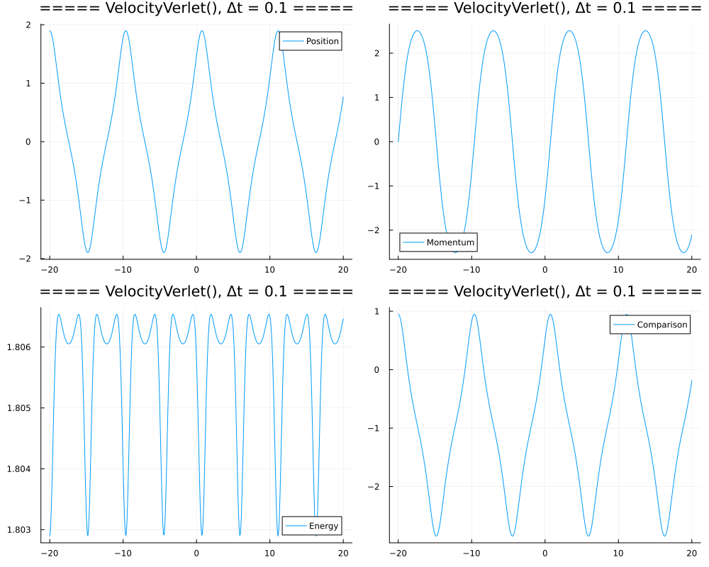
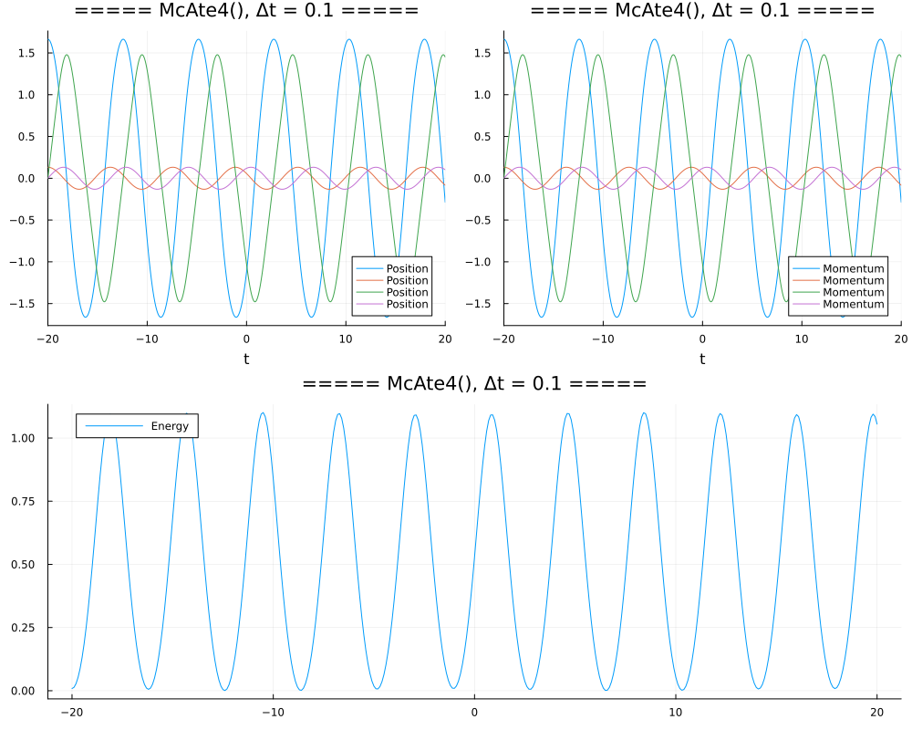
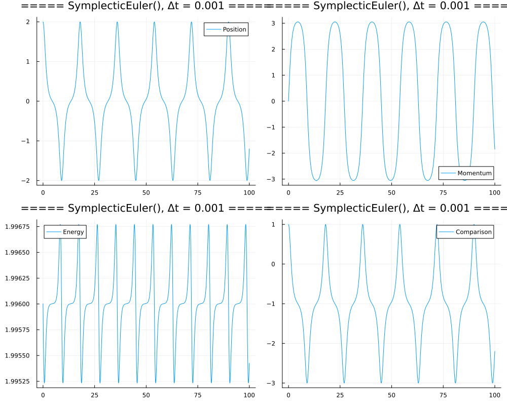
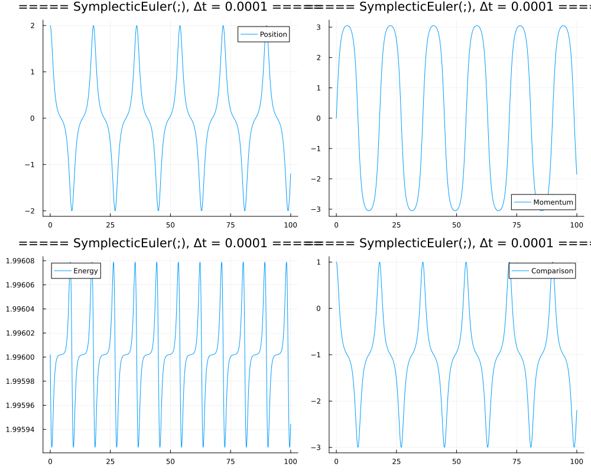

# Solving single pendulums by DifferentialEquations.jl

In this notebook, we shall solve the single pendulum equation:

$$\ddot q = -\sin q,$$

where $q$ means the angle.

Hamiltonian:

$$H(q,p) = \frac{1}{2}p^2 - \cos q + 1.$$

Canonical equation:

$$\dot q = p, \quad \dot p = - \sin q.$$

Initial condition:

$$q(0) = 0, \quad p(0) = 2k.$$

Exact solution:

$$q(t) = 2\arcsin(k\,\mathrm{sn}(t,k)).$$

Maximum of $q(t)$:

$$\sin(q_{\max}/2) = k, \quad q_{\max} = \max\{q(t)\}.$$

Define $y(t)$ by

$$y(t) = \sin(q(t)/2) = k\,\mathrm{sn}(t,k), \quad y_{\max} = k.$$

```julia
# Single pendulums shall be solved numerically.
#
using OrdinaryDiffEq, Elliptic, Printf, DiffEqPhysics, Statistics
using OrdinaryDiffEqSymplecticRK

sol2q(sol) = [sol.u[i][j] for i in 1:length(sol.u), j in 1:(length(sol.u[1]) ÷ 2)]
function sol2p(sol)
    [sol.u[i][j] for i in 1:length(sol.u), j in (length(sol.u[1]) ÷ 2 + 1):length(sol.u[1])]
end
sol2tqp(sol) = (sol.t, sol2q(sol), sol2p(sol))

# The exact solutions of single pendulums can be expressed by the Jacobian elliptic functions.
#
sn(u, k) = Jacobi.sn(u, k^2) # the Jacobian sn function

# Use Plot.
#
using Plots

# Define the color list
colorlist = [
    "#1f77b4", "#ff7f0e", "#2ca02c", "#d62728", "#9467bd",
    "#8c564b", "#e377c2", "#7f7f7f", "#bcbd22", "#17becf"
]
cc(k) = colorlist[mod1(k, length(colorlist))]

# Function to plot the solution of a Hamiltonian problem
function plotsol(sol::ODESolution)
    local t, q, p
    t, q, p = sol2tqp(sol)
    local d = size(q)[2]
    p1 = plot(title = "Solution", xlabel = "t", grid = :on)
    for j in 1:d
        j_str = d > 1 ? "[$j]" : ""
        plot!(p1, t, q[:, j], color = cc(2j-1), label = "q$(j_str)", linewidth = 1)
        plot!(p1, t, p[:, j], color = cc(2j), label = "p$(j_str)",
            linewidth = 1, linestyle = :dash)
    end
    return p1
end

# Function to plot the solution on the 2D phase space
function plotsol2(sol::ODESolution)
    local t, q, p
    t, q, p = sol2tqp(sol)
    local d = size(q)[2]
    p2 = plot(title = "Phase Space", xlabel = "q", ylabel = "p", grid = :on)
    for j in 1:d
        j_str = d > 1 ? "[$j]" : ""
        plot!(p2, q[:, j], p[:, j], color = cc(j),
            label = "(q$(j_str), p$(j_str))", linewidth = 1)
    end
    return p2
end

# Function to plot the energy of a Hamiltonian problem
function plotenergy(H, sol::ODESolution)
    local t, q, p
    t, q, p = sol2tqp(sol)
    local energy = [H(q[i, :], p[i, :], nothing) for i in 1:size(q)[1]]
    p3 = plot(t, energy, label = "energy", color = "red", linewidth = 1,
        xlabel = "t", title = "Energy", grid = :on)
    stdenergy_str = @sprintf("%.3e", std(energy))
    title!("std(energy) = $stdenergy_str", fontsize = 10)
    return p3
end

# Function to compare the numerical and exact solutions of a single pendulum
function plotcomparison(k, sol::ODESolution)
    local t, q, p
    t, q, p = sol2tqp(sol)
    local y = sin.(q / 2)
    local y_exact = k * sn.(t, k) # the exact solution

    p4 = plot(t, y, label = "numerical", linewidth = 1, grid = :on,
        xlabel = "t", ylabel = "y = sin(q(t)/2)", title = "Comparison")
    plot!(p4, t, y_exact, label = "exact", linewidth = 1, linestyle = :dash)
    error_str = @sprintf("%.3e", maximum(abs.(y - y_exact)))
    title!("maximum(abs(numerical - exact)) = $error_str", fontsize = 10)
    return p4
end

# Plot solution and energy
function plotsolenergy(H, integrator, Δt, sol::ODESolution)
    integrator_str = replace("$integrator", r"^[^.]*\\." => "")

    p1 = plotsol(sol)
    p2 = plotsol2(sol)
    p3 = plotenergy(H, sol)

    suptitle = "===== $integrator_str, Δt = $Δt ====="
    plot(p1, p2, p3, layout = (3, 1), title = suptitle)
end

# Solve a single pendulum
function singlependulum(k, integrator, Δt; t0 = 0.0, t1 = 100.0)
    H(p, q, params) = p[1]^2 / 2 - cos(q[1]) + 1
    q0 = [0.0]
    p0 = [2k]
    prob = HamiltonianProblem(H, p0, q0, (t0, t1))

    integrator_str = replace("$integrator", r"^[^.]*\\." => "")
    @printf("%-25s", "$integrator_str:")
    sol = solve(prob, integrator, dt = Δt)
    @time sol = solve(prob, integrator, dt = Δt)

    sleep(0.1)

    p1 = plotsol(sol)
    p2 = plotsol2(sol)
    p3 = plotenergy(H, sol)
    p4 = plotcomparison(k, sol)

    suptitle = "===== $integrator_str, Δt = $Δt ====="
    plot(p1, p2, p3, p4, layout = (2, 2), title = suptitle)
end
```

```
singlependulum (generic function with 1 method)
```


## Tests

```julia
# Single pendulum
using Plots
using OrdinaryDiffEq

function singlependulum(k, integrator, Δt; t0 = 0.0, t1 = 100.0)
    local H(p, q, params) = p[1]^2 / 2 - cos(q[1]) + 1  # Hamiltonian for single pendulum
    local q0 = [0.0]  # Initial position
    local p0 = [2k]   # Initial momentum
    local prob = HamiltonianProblem(H, p0, q0, (t0, t1))

    local integrator_str = replace("$integrator", r"^[^.]*\." => "")
    @printf("%-25s", "$integrator_str:")
    sol = solve(prob, integrator, dt = Δt)
    @time local sol = solve(prob, integrator, dt = Δt)

    sleep(0.1)

    # Create plots using Plots.jl
    p1 = plot(sol.t, map(x -> x[1], sol.u), label = "Position", title = "Position vs Time")
    p2 = plot(sol.t, map(x -> x[2], sol.u), label = "Momentum", title = "Momentum vs Time")
    p3 = plot(sol.t, map(p -> H(p[1], p[2], nothing), sol.u), label = "Energy", title = "Energy vs Time")
    p4 = plot(sol.t, map(x -> x[1] - k, sol.u), label = "Comparison", title = "Comparison Plot")

    # Combine all plots in a layout
    layout = @layout [a b; c d]
    plot(p1, p2, p3, p4, layout = layout, size = (1000, 800),
        title = "===== $integrator_str, Δt = $Δt =====")
end

k = rand()
integrator = VelocityVerlet()
Δt = 0.1
singlependulum(k, integrator, Δt, t0 = -20.0, t1 = 20.0)
```

```
VelocityVerlet():          0.000474 seconds (5.70 k allocations: 205.398 Ki
B)
```




```julia
# Two single pendulums

using Plots
using OrdinaryDiffEq

function plotsolenergy(H, integrator, Δt, sol::ODESolution)
    local integrator_str = replace("$integrator", r"^[^.]*\." => "")

    # Create plots using Plots.jl
    p1 = plot(sol, label = "Position", title = "Position vs Time")
    p2 = plot(sol, label = "Momentum", title = "Momentum vs Time")
    p3 = plot(sol.t, map(p -> H(p[2], p[3], nothing), sol.u), label = "Energy", title = "Energy vs Time")

    # Combine all plots in a layout
    layout = @layout [a b; c]
    plot(p1, p2, p3, layout = layout, size = (1000, 800),
        title = "===== $integrator_str, Δt = $Δt =====")
end

H(q, p, param) = sum(p .^ 2 / 2 .- cos.(q) .+ 1)
q0 = pi * rand(2)
p0 = zeros(2)
t0, t1 = -20.0, 20.0
prob = HamiltonianProblem(H, q0, p0, (t0, t1))

integrator = McAte4()
Δt = 0.1
sol = solve(prob, integrator, dt = Δt)
@time sol = solve(prob, integrator, dt = Δt)

sleep(0.1)
plotsolenergy(H, integrator, Δt, sol)
```

```
0.001716 seconds (27.31 k allocations: 1.295 MiB)
```





## Comparison of symplectic Integrators

```julia
SymplecticIntegrators = [
    SymplecticEuler(),
    VelocityVerlet(),
    VerletLeapfrog(),
    PseudoVerletLeapfrog(),
    McAte2(),
    Ruth3(),
    McAte3(),
    CandyRoz4(),
    McAte4(),
    CalvoSanz4(),
    McAte42(),
    McAte5(),
    Yoshida6(),
    KahanLi6(),
    McAte8(),
    KahanLi8(),
    SofSpa10()
]

k = 0.999
Δt = 0.1
for integrator in SymplecticIntegrators
    singlependulum(k, integrator, Δt)
end
```

```
SymplecticEuler():         0.000647 seconds (14.10 k allocations: 505.398 K
iB)
VelocityVerlet():          0.000514 seconds (14.10 k allocations: 505.398 K
iB)
VerletLeapfrog():          0.000669 seconds (14.10 k allocations: 505.398 K
iB)
PseudoVerletLeapfrog():    0.000637 seconds (14.10 k allocations: 505.648 K
iB)
McAte2():                  0.000694 seconds (14.10 k allocations: 505.648 K
iB)
Ruth3():                   0.000753 seconds (14.10 k allocations: 505.820 K
iB)
McAte3():                  0.000703 seconds (14.10 k allocations: 505.820 K
iB)
CandyRoz4():               0.000788 seconds (14.10 k allocations: 505.961 K
iB)
McAte4():                  0.051828 seconds (14.10 k allocations: 505.961 K
iB, 98.08% gc time)
CalvoSanz4():              0.000825 seconds (14.10 k allocations: 506.008 K
iB)
McAte42():                 0.000939 seconds (14.10 k allocations: 506.008 K
iB)
McAte5():                  0.000864 seconds (14.10 k allocations: 506.227 K
iB)
Yoshida6():                0.000938 seconds (14.10 k allocations: 506.523 K
iB)
KahanLi6():                0.001001 seconds (14.10 k allocations: 506.758 K
iB)
McAte8():                  0.001328 seconds (14.10 k allocations: 507.523 K
iB)
KahanLi8():                0.001633 seconds (14.10 k allocations: 507.695 K
iB)
SofSpa10():                0.002338 seconds (14.10 k allocations: 510.070 K
iB)
```


```julia
k = 0.999
Δt = 0.01
for integrator in SymplecticIntegrators[1:4]
    singlependulum(k, integrator, Δt)
end
```

```
SymplecticEuler():         0.004452 seconds (140.10 k allocations: 4.888 Mi
B)
VelocityVerlet():          0.004559 seconds (140.10 k allocations: 4.888 Mi
B)
VerletLeapfrog():          0.004674 seconds (140.10 k allocations: 4.888 Mi
B)
PseudoVerletLeapfrog():    0.007588 seconds (140.10 k allocations: 4.888 Mi
B)
```


```julia
k = 0.999
Δt = 0.001
singlependulum(k, SymplecticEuler(), Δt)
```

```
SymplecticEuler():         0.043202 seconds (1.40 M allocations: 48.833 MiB
)
```




```julia
k = 0.999
Δt = 0.0001
singlependulum(k, SymplecticEuler(), Δt)
```

```
SymplecticEuler():         1.314425 seconds (14.00 M allocations: 488.287 M
iB, 49.07% gc time)
```





## Appendix

These benchmarks are a part of the SciMLBenchmarks.jl repository, found at: [https://github.com/SciML/SciMLBenchmarks.jl](https://github.com/SciML/SciMLBenchmarks.jl). For more information on high-performance scientific machine learning, check out the SciML Open Source Software Organization [https://sciml.ai](https://sciml.ai).

To locally run this benchmark, do the following commands:

```
using SciMLBenchmarks
SciMLBenchmarks.weave_file("benchmarks/DynamicalODE","single_pendulums.jmd")
```

Computer Information:

```
Julia Version 1.11.9
Commit 53a02c0720c (2026-02-06 00:27 UTC)
Build Info:
  Official https://julialang.org/ release
Platform Info:
  OS: Linux (x86_64-linux-gnu)
  CPU: 128 × AMD EPYC 7502 32-Core Processor
  WORD_SIZE: 64
  LLVM: libLLVM-16.0.6 (ORCJIT, znver2)
Threads: 128 default, 0 interactive, 64 GC (on 128 virtual cores)
Environment:
  JULIA_DEPOT_PATH = /home/crackauc/github-runners/amdci8-1/.julia
  JULIA_NUM_THREADS = auto

```

Package Information:

```
Status `~/github-runners/amdci8-1/_work/SciMLBenchmarks.jl/SciMLBenchmarks.jl/benchmarks/DynamicalODE/Project.toml`
⌃ [459566f4] DiffEqCallbacks v4.17.0
⌃ [055956cb] DiffEqPhysics v3.18.0
  [b305315f] Elliptic v1.0.1
⌃ [1dea7af3] OrdinaryDiffEq v7.0.0
⌃ [af6ede74] OrdinaryDiffEqRKN v2.0.0
⌃ [fa646aed] OrdinaryDiffEqSymplecticRK v2.1.0
⌃ [9c7f1690] OrdinaryDiffEqTaylorSeries v2.0.0
⌃ [65888b18] ParameterizedFunctions v5.24.0
⌃ [91a5bcdd] Plots v1.41.6
⌃ [31c91b34] SciMLBenchmarks v0.1.3
⌃ [90137ffa] StaticArrays v1.9.18
  [10745b16] Statistics v1.11.1
⌃ [92b13dbe] TaylorIntegration v0.18.4
  [37e2e46d] LinearAlgebra v1.11.0
  [de0858da] Printf v1.11.0
Info Packages marked with ⌃ have new versions available and may be upgradable.
```

And the full manifest:

```
Status `~/github-runners/amdci8-1/_work/SciMLBenchmarks.jl/SciMLBenchmarks.jl/benchmarks/DynamicalODE/Manifest.toml`
⌃ [47edcb42] ADTypes v1.22.0
  [6e696c72] AbstractPlutoDingetjes v1.4.0
  [1520ce14] AbstractTrees v0.4.5
⌃ [7d9f7c33] Accessors v0.1.44
⌃ [79e6a3ab] Adapt v4.6.0
  [66dad0bd] AliasTables v1.1.3
  [ec485272] ArnoldiMethod v0.4.0
⌃ [4fba245c] ArrayInterface v7.25.0
  [4c555306] ArrayLayouts v1.12.2
  [aae01518] BandedMatrices v1.11.0
  [e2ed5e7c] Bijections v0.2.2
⌃ [caf10ac8] BipartiteGraphs v0.1.7
⌃ [d1d4a3ce] BitFlags v0.1.9
⌃ [8e7c35d0] BlockArrays v1.9.3
⌃ [70df07ce] BracketingNonlinearSolve v1.12.1
  [082447d4] ChainRules v1.73.0
  [d360d2e6] ChainRulesCore v1.26.1
⌃ [944b1d66] CodecZlib v0.7.8
  [08986516] Collects v1.1.0
  [35d6a980] ColorSchemes v3.31.0
  [3da002f7] ColorTypes v0.12.1
  [c3611d14] ColorVectorSpace v0.11.0
  [5ae59095] Colors v0.13.1
⌅ [861a8166] Combinatorics v1.0.2
⌃ [38540f10] CommonSolve v0.2.6
  [bbf7d656] CommonSubexpressions v0.3.1
⌃ [f70d9fcc] CommonWorldInvalidations v1.0.0
  [34da2185] Compat v4.18.1
  [b152e2b5] CompositeTypes v0.1.4
  [a33af91c] CompositionsBase v0.1.2
⌃ [2569d6c7] ConcreteStructs v0.2.4
⌃ [f0e56b4a] ConcurrentUtilities v2.5.1
  [8f4d0f93] Conda v1.10.3
  [187b0558] ConstructionBase v1.6.0
  [d38c429a] Contour v0.6.3
  [9a962f9c] DataAPI v1.16.0
⌃ [864edb3b] DataStructures v0.19.4
  [e2d170a0] DataValueInterfaces v1.0.0
  [8bb1440f] DelimitedFiles v1.9.1
  [85a47980] Dictionaries v0.4.6
⌃ [2b5f629d] DiffEqBase v7.5.0
⌃ [459566f4] DiffEqCallbacks v4.17.0
⌃ [055956cb] DiffEqPhysics v3.18.0
  [163ba53b] DiffResults v1.1.0
⌃ [b552c78f] DiffRules v1.15.1
⌃ [a0c0ee7d] DifferentiationInterface v0.7.18
  [ffbed154] DocStringExtensions v0.9.5
⌅ [5b8099bc] DomainSets v0.7.18
  [7c1d4256] DynamicPolynomials v0.6.6
  [b305315f] Elliptic v1.0.1
  [4e289a0a] EnumX v1.0.7
⌃ [f151be2c] EnzymeCore v0.8.20
  [6912e4f1] Espresso v0.6.4
  [460bff9d] ExceptionUnwrapping v0.1.11
⌃ [e2ba6199] ExprTools v0.1.10
  [55351af7] ExproniconLite v0.10.14
  [c87230d0] FFMPEG v0.4.5
⌃ [7034ab61] FastBroadcast v1.3.2
  [9aa1b823] FastClosures v0.3.2
⌃ [a4df4552] FastPower v1.3.1
⌃ [1a297f60] FillArrays v1.16.0
⌅ [64ca27bc] FindFirstFunctions v1.8.0
⌃ [6a86dc24] FiniteDiff v2.31.0
⌅ [53c48c17] FixedPointNumbers v0.8.5
  [3821ddf9] FixedSizeArrays v1.3.0
  [1fa38f19] Format v1.3.7
⌃ [f6369f11] ForwardDiff v1.3.3
  [a85aefff] FunctionMaps v0.1.2
  [069b7b12] FunctionWrappers v1.1.3
⌃ [77dc65aa] FunctionWrappersWrappers v1.8.0
  [46192b85] GPUArraysCore v0.2.0
⌃ [28b8d3ca] GR v0.73.24
  [d7ba0133] Git v1.5.0
  [86223c79] Graphs v1.14.0
  [42e2da0e] Grisu v1.0.2
⌅ [cd3eb016] HTTP v1.11.0
⌅ [eafb193a] Highlights v0.5.3
  [7073ff75] IJulia v1.34.4
⌃ [3263718b] ImplicitDiscreteSolve v2.1.0
  [313cdc1a] Indexing v1.1.1
  [d25df0c9] Inflate v0.1.5
⌃ [18e54dd8] IntegerMathUtils v0.1.3
  [8197267c] IntervalSets v0.7.14
  [3587e190] InverseFunctions v0.1.17
  [92d709cd] IrrationalConstants v0.2.6
  [82899510] IteratorInterfaceExtensions v1.0.0
  [1019f520] JLFzf v0.1.11
  [692b3bcd] JLLWrappers v1.8.0
⌅ [682c06a0] JSON v0.21.4
  [ae98c720] Jieko v0.2.1
⌃ [ccbc3e58] JumpProcesses v9.28.0
⌃ [ba0b0d4f] Krylov v0.10.6
⌃ [b964fa9f] LaTeXStrings v1.4.0
⌃ [23fbe1c1] Latexify v0.16.10
⌃ [87fe0de2] LineSearch v0.1.9
⌅ [7ed4a6bd] LinearSolve v3.80.0
⌅ [2ab3a3ac] LogExpFunctions v0.3.29
  [e6f89c97] LoggingExtras v1.2.0
  [1914dd2f] MacroTools v0.5.16
⌃ [bb5d69b7] MaybeInplace v0.1.4
  [739be429] MbedTLS v1.1.10
  [442fdcdd] Measures v0.3.3
  [e1d29d7a] Missings v1.2.0
⌃ [961ee093] ModelingToolkit v11.26.4
⌅ [7771a370] ModelingToolkitBase v1.36.3
⌃ [6bb917b9] ModelingToolkitTearing v1.13.5
⌃ [2e0e35c7] Moshi v0.3.7
⌃ [46d2c3a1] MuladdMacro v0.2.4
  [102ac46a] MultivariatePolynomials v0.5.19
  [ffc61752] Mustache v1.0.21
  [d8a4904e] MutableArithmetics v1.8.0
⌃ [77ba4419] NaNMath v1.1.3
⌃ [8913a72c] NonlinearSolve v4.19.1
⌅ [be0214bd] NonlinearSolveBase v2.26.0
⌃ [5959db7a] NonlinearSolveFirstOrder v2.1.1
⌃ [9a2c21bd] NonlinearSolveQuasiNewton v1.13.1
⌃ [26075421] NonlinearSolveSpectralMethods v1.7.1
  [6fe1bfb0] OffsetArrays v1.17.0
  [4d8831e6] OpenSSL v1.6.1
⌅ [bac558e1] OrderedCollections v1.8.1
⌃ [1dea7af3] OrdinaryDiffEq v7.0.0
⌃ [6ad6398a] OrdinaryDiffEqBDF v2.1.1
⌅ [bbf590c4] OrdinaryDiffEqCore v4.2.1
⌃ [50262376] OrdinaryDiffEqDefault v2.2.0
⌅ [4302a76b] OrdinaryDiffEqDifferentiation v3.1.1
⌃ [127b3ac7] OrdinaryDiffEqNonlinearSolve v2.0.0
⌃ [af6ede74] OrdinaryDiffEqRKN v2.0.0
⌃ [43230ef6] OrdinaryDiffEqRosenbrock v2.2.0
⌃ [b4bd8bb3] OrdinaryDiffEqRosenbrockTableaus v2.0.0
⌃ [2d112036] OrdinaryDiffEqSDIRK v2.4.0
⌃ [fa646aed] OrdinaryDiffEqSymplecticRK v2.1.0
⌃ [9c7f1690] OrdinaryDiffEqTaylorSeries v2.0.0
⌃ [b1df2697] OrdinaryDiffEqTsit5 v2.0.1
⌃ [79d7bb75] OrdinaryDiffEqVerner v2.1.0
⌃ [65888b18] ParameterizedFunctions v5.24.0
⌅ [d96e819e] Parameters v0.12.3
⌃ [69de0a69] Parsers v2.8.4
  [ccf2f8ad] PlotThemes v3.3.0
  [995b91a9] PlotUtils v1.4.4
⌃ [91a5bcdd] Plots v1.41.6
⌃ [e409e4f3] PoissonRandom v0.4.8
⌃ [d236fae5] PreallocationTools v1.2.0
⌅ [aea7be01] PrecompileTools v1.2.1
  [21216c6a] Preferences v1.5.2
  [27ebfcd6] Primes v0.5.7
  [43287f4e] PtrArrays v1.4.0
  [988b38a3] ReadOnlyArrays v0.2.0
  [795d4caa] ReadOnlyDicts v1.0.1
  [c1ae055f] RealDot v0.1.0
  [3cdcf5f2] RecipesBase v1.3.4
  [01d81517] RecipesPipeline v0.6.12
⌃ [731186ca] RecursiveArrayTools v4.3.0
  [189a3867] Reexport v1.2.2
  [05181044] RelocatableFolders v1.0.1
  [ae029012] Requires v1.3.1
⌃ [7e49a35a] RuntimeGeneratedFunctions v0.5.19
⌃ [9dfe8606] SCCNonlinearSolve v1.13.0
  [1bc83da4] SafeTestsets v0.1.0
⌅ [0bca4576] SciMLBase v3.13.0
⌃ [31c91b34] SciMLBenchmarks v0.1.3
⌃ [19f34311] SciMLJacobianOperators v0.1.13
⌃ [a6db7da4] SciMLLogging v2.0.0
⌃ [c0aeaf25] SciMLOperators v1.21.0
⌃ [431bcebd] SciMLPublic v1.0.1
⌃ [53ae85a6] SciMLStructures v1.10.0
  [6c6a2e73] Scratch v1.3.0
  [efcf1570] Setfield v1.1.2
  [992d4aef] Showoff v1.0.3
  [777ac1f9] SimpleBufferStream v1.2.0
⌃ [727e6d20] SimpleNonlinearSolve v2.11.1
  [699a6c99] SimpleTraits v0.9.6
⌃ [a2af1166] SortingAlgorithms v1.2.2
⌃ [dc90abb0] SparseInverseSubset v0.1.2
  [0a514795] SparseMatrixColorings v0.4.27
⌃ [276daf66] SpecialFunctions v2.7.2
  [860ef19b] StableRNGs v1.0.4
  [0c0c59c1] StarAlgebras v0.3.0
⌃ [64909d44] StateSelection v1.9.2
⌃ [90137ffa] StaticArrays v1.9.18
  [1e83bf80] StaticArraysCore v1.4.4
  [10745b16] Statistics v1.11.1
  [82ae8749] StatsAPI v1.8.0
⌃ [2913bbd2] StatsBase v0.34.10
  [69024149] StringEncodings v0.3.7
  [09ab397b] StructArrays v0.7.3
⌃ [2efcf032] SymbolicIndexingInterface v0.3.48
⌃ [19f23fe9] SymbolicLimits v1.1.0
⌃ [d1185830] SymbolicUtils v4.30.1
⌃ [0c5d862f] Symbolics v7.24.2
  [3783bdb8] TableTraits v1.0.1
⌃ [bd369af6] Tables v1.12.1
  [ed4db957] TaskLocalValues v0.1.3
  [b36ab563] TaylorDiff v0.3.5
⌃ [92b13dbe] TaylorIntegration v0.18.4
⌅ [6aa5eb33] TaylorSeries v0.21.9
  [62fd8b95] TensorCore v0.1.1
  [8ea1fca8] TermInterface v2.0.0
⌅ [a759f4b9] TimerOutputs v0.5.29
  [3bb67fe8] TranscodingStreams v0.11.3
  [781d530d] TruncatedStacktraces v1.4.0
⌃ [5c2747f8] URIs v1.6.1
  [3a884ed6] UnPack v1.0.2
  [1cfade01] UnicodeFun v0.4.1
  [41fe7b60] Unzip v0.2.0
  [81def892] VersionParsing v1.3.0
  [d30d5f5c] WeakCacheSets v0.1.0
  [44d3d7a6] Weave v0.10.12
  [ddb6d928] YAML v0.4.16
  [c2297ded] ZMQ v1.5.1
  [6e34b625] Bzip2_jll v1.0.9+0
  [83423d85] Cairo_jll v1.18.7+0
  [ee1fde0b] Dbus_jll v1.16.2+0
  [2702e6a9] EpollShim_jll v0.0.20230411+1
⌃ [2e619515] Expat_jll v2.8.0+0
⌅ [b22a6f82] FFMPEG_jll v8.1.0+0
  [a3f928ae] Fontconfig_jll v2.17.1+0
  [d7e528f0] FreeType2_jll v2.14.3+1
  [559328eb] FriBidi_jll v1.0.17+0
  [0656b61e] GLFW_jll v3.4.1+1
⌅ [d2c73de3] GR_jll v0.73.24+0
⌅ [b0724c58] GettextRuntime_jll v0.22.4+0
  [61579ee1] Ghostscript_jll v9.55.1+0
  [020c3dae] Git_LFS_jll v3.7.1+0
⌃ [f8c6e375] Git_jll v2.54.0+0
⌃ [7746bdde] Glib_jll v2.86.3+0
⌃ [3b182d85] Graphite2_jll v1.3.15+0
⌅ [2e76f6c2] HarfBuzz_jll v8.5.1+0
  [1d5cc7b8] IntelOpenMP_jll v2025.2.0+0
⌃ [aacddb02] JpegTurbo_jll v3.1.5+0
  [c1c5ebd0] LAME_jll v3.100.3+0
  [88015f11] LERC_jll v4.1.0+0
⌃ [1d63c593] LLVMOpenMP_jll v18.1.8+0
⌅ [e9f186c6] Libffi_jll v3.4.7+0
  [7e76a0d4] Libglvnd_jll v1.7.1+1
  [94ce4f54] Libiconv_jll v1.18.0+0
  [4b2f31a3] Libmount_jll v2.42.0+0
⌃ [89763e89] Libtiff_jll v4.7.2+0
  [38a345b3] Libuuid_jll v2.42.0+0
  [856f044c] MKL_jll v2025.2.0+0
  [e7412a2a] Ogg_jll v1.3.6+0
⌃ [9bd350c2] OpenSSH_jll v10.3.1+0
⌃ [458c3c95] OpenSSL_jll v3.5.6+0
  [efe28fd5] OpenSpecFun_jll v0.5.6+0
  [91d4177d] Opus_jll v1.6.1+0
⌃ [36c8627f] Pango_jll v1.57.1+0
  [30392449] Pixman_jll v0.46.4+0
  [c0090381] Qt6Base_jll v6.10.2+2
⌃ [629bc702] Qt6Declarative_jll v6.10.2+1
  [ce943373] Qt6ShaderTools_jll v6.10.2+1
  [6de9746b] Qt6Svg_jll v6.10.2+0
  [e99dba38] Qt6Wayland_jll v6.10.2+1
  [a44049a8] Vulkan_Loader_jll v1.3.243+0
  [a2964d1f] Wayland_jll v1.24.0+0
  [ffd25f8a] XZ_jll v5.8.3+0
  [f67eecfb] Xorg_libICE_jll v1.1.2+0
  [c834827a] Xorg_libSM_jll v1.2.6+0
  [4f6342f7] Xorg_libX11_jll v1.8.13+0
  [0c0b7dd1] Xorg_libXau_jll v1.0.13+0
  [935fb764] Xorg_libXcursor_jll v1.2.4+0
  [a3789734] Xorg_libXdmcp_jll v1.1.6+0
  [1082639a] Xorg_libXext_jll v1.3.8+0
  [d091e8ba] Xorg_libXfixes_jll v6.0.2+0
⌃ [a51aa0fd] Xorg_libXi_jll v1.8.3+0
  [d1454406] Xorg_libXinerama_jll v1.1.7+0
  [ec84b674] Xorg_libXrandr_jll v1.5.6+0
  [ea2f1a96] Xorg_libXrender_jll v0.9.12+0
  [a65dc6b1] Xorg_libpciaccess_jll v0.19.0+0
  [c7cfdc94] Xorg_libxcb_jll v1.17.1+0
  [cc61e674] Xorg_libxkbfile_jll v1.2.0+0
  [e920d4aa] Xorg_xcb_util_cursor_jll v0.1.6+0
  [12413925] Xorg_xcb_util_image_jll v0.4.1+0
  [2def613f] Xorg_xcb_util_jll v0.4.1+0
  [975044d2] Xorg_xcb_util_keysyms_jll v0.4.1+0
  [0d47668e] Xorg_xcb_util_renderutil_jll v0.3.10+0
  [c22f9ab0] Xorg_xcb_util_wm_jll v0.4.2+0
  [35661453] Xorg_xkbcomp_jll v1.4.7+0
⌃ [33bec58e] Xorg_xkeyboard_config_jll v2.47.0+1
  [c5fb5394] Xorg_xtrans_jll v1.6.0+0
  [8f1865be] ZeroMQ_jll v4.3.6+0
  [3161d3a3] Zstd_jll v1.5.7+1
  [35ca27e7] eudev_jll v3.2.14+0
⌅ [214eeab7] fzf_jll v0.61.1+0
⌃ [a4ae2306] libaom_jll v3.13.3+0
  [0ac62f75] libass_jll v0.17.4+0
  [1183f4f0] libdecor_jll v0.2.2+0
⌃ [8e53e030] libdrm_jll v2.4.125+1
  [2db6ffa8] libevdev_jll v1.13.4+0
  [f638f0a6] libfdk_aac_jll v2.0.4+0
  [36db933b] libinput_jll v1.28.1+0
  [b53b4c65] libpng_jll v1.6.58+0
  [a9144af2] libsodium_jll v1.0.21+0
  [9a156e7d] libva_jll v2.23.0+0
  [f27f6e37] libvorbis_jll v1.3.8+0
  [009596ad] mtdev_jll v1.1.7+0
  [1317d2d5] oneTBB_jll v2022.3.0+0
⌅ [1270edf5] x264_jll v10164.0.1+0
  [dfaa095f] x265_jll v4.1.0+0
  [d8fb68d0] xkbcommon_jll v1.13.0+0
  [0dad84c5] ArgTools v1.1.2
  [56f22d72] Artifacts v1.11.0
  [2a0f44e3] Base64 v1.11.0
  [ade2ca70] Dates v1.11.0
  [8ba89e20] Distributed v1.11.0
  [f43a241f] Downloads v1.6.0
  [7b1f6079] FileWatching v1.11.0
  [9fa8497b] Future v1.11.0
  [b77e0a4c] InteractiveUtils v1.11.0
  [4af54fe1] LazyArtifacts v1.11.0
  [b27032c2] LibCURL v0.6.4
  [76f85450] LibGit2 v1.11.0
  [8f399da3] Libdl v1.11.0
  [37e2e46d] LinearAlgebra v1.11.0
  [56ddb016] Logging v1.11.0
  [d6f4376e] Markdown v1.11.0
  [a63ad114] Mmap v1.11.0
  [ca575930] NetworkOptions v1.2.0
  [44cfe95a] Pkg v1.11.0
  [de0858da] Printf v1.11.0
  [3fa0cd96] REPL v1.11.0
  [9a3f8284] Random v1.11.0
  [ea8e919c] SHA v0.7.0
  [9e88b42a] Serialization v1.11.0
  [6462fe0b] Sockets v1.11.0
  [2f01184e] SparseArrays v1.11.0
  [f489334b] StyledStrings v1.11.0
  [4607b0f0] SuiteSparse
  [fa267f1f] TOML v1.0.3
  [a4e569a6] Tar v1.10.0
  [8dfed614] Test v1.11.0
  [cf7118a7] UUIDs v1.11.0
  [4ec0a83e] Unicode v1.11.0
  [e66e0078] CompilerSupportLibraries_jll v1.1.1+0
  [deac9b47] LibCURL_jll v8.6.0+0
  [e37daf67] LibGit2_jll v1.7.2+0
  [29816b5a] LibSSH2_jll v1.11.0+1
  [c8ffd9c3] MbedTLS_jll v2.28.6+0
  [14a3606d] MozillaCACerts_jll v2023.12.12
  [4536629a] OpenBLAS_jll v0.3.27+1
  [05823500] OpenLibm_jll v0.8.5+0
  [efcefdf7] PCRE2_jll v10.42.0+1
  [bea87d4a] SuiteSparse_jll v7.7.0+0
  [83775a58] Zlib_jll v1.2.13+1
  [8e850b90] libblastrampoline_jll v5.11.0+0
  [8e850ede] nghttp2_jll v1.59.0+0
  [3f19e933] p7zip_jll v17.4.0+2
Info Packages marked with ⌃ and ⌅ have new versions available. Those with ⌃ may be upgradable, but those with ⌅ are restricted by compatibility constraints from upgrading. To see why use `status --outdated -m`
```

