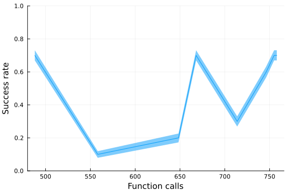
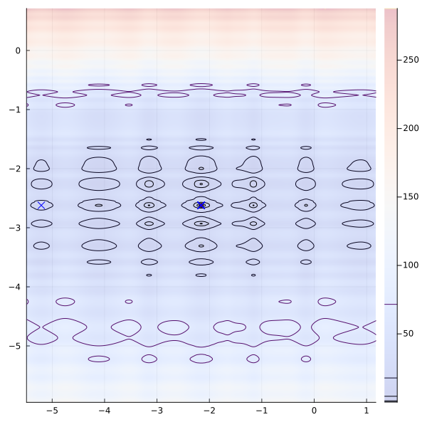
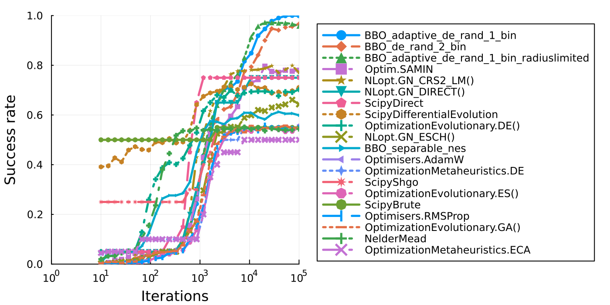
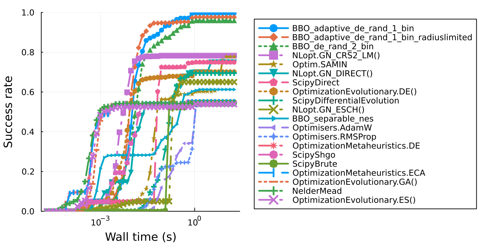
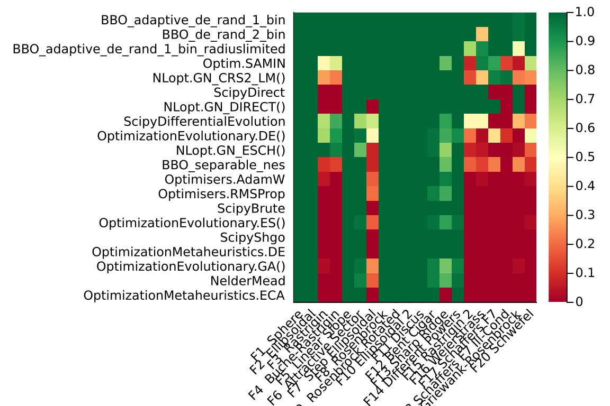
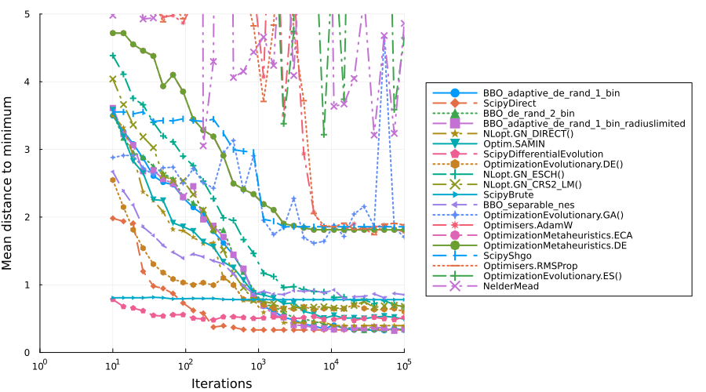
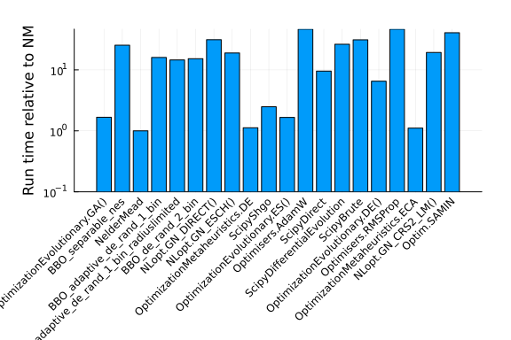

In this benchmark we will run the [BlackboxGlobalOptimization.jl](https://github.com/jonathanBieler/BlackBoxOptimizationBenchmarking.jl)
benchmarks, a set of global optimization benchmarks on the [Optimization.jl](https://github.com/SciML/Optimization.jl)
interface that test a wide variety of behaviors. This tests both iterations and wall-clock
time vs accuracy, i.e. for a given budget (in iterations or time), what percentage of
problems from the set is a solver able to solve. This gives a global view of which methods
are the most efficient at finding difficult global optima.

## Setup

```julia
using BlackBoxOptimizationBenchmarking, Plots, Optimization, Memoize, Statistics
import BlackBoxOptimizationBenchmarking: Chain, BenchmarkSetup, BenchmarkResults,
    BBOBFunction, FunctionCallsCounter, solve_problem, pinit, compute_CI
const BBOB = BlackBoxOptimizationBenchmarking

using OptimizationBBO, OptimizationOptimJL, OptimizationEvolutionary, OptimizationNLopt
using OptimizationMetaheuristics, OptimizationNOMAD, OptimizationPRIMA, OptimizationOptimisers, OptimizationSciPy, OptimizationPyCMA
```


We define a time-to-success benchmarking framework. For each (optimizer, function, trial),
we run the optimizer once with a large iteration budget and wrap the objective function to
detect the first evaluation that achieves the success criterion. The wall-clock time at
that moment is recorded as the "time to success". From these times we build a CDF:
for a given wall-time budget T, what fraction of (function, trial) pairs were solved?

```julia
function make_success_tracker(f_raw, f_opt, Δf)
    t0 = Ref(time())
    time_to_success = Ref(Inf)
    function tracked_f(u)
        val = f_raw(u)
        if val < Δf + f_opt && time_to_success[] == Inf
            time_to_success[] = time() - t0[]
        end
        return val
    end
    return tracked_f, t0, time_to_success
end

function solve_problem_timed(optimizer::BenchmarkSetup, tracked_f, D::Int, run_length::Int;
    u0 = pinit(D))
    method = optimizer.method
    optf = OptimizationFunction((u, _) -> tracked_f(u), AutoForwardDiff())
    if optimizer.isboxed
        prob = OptimizationProblem(optf, u0, lb = fill(-5.5, D), ub = fill(5.5, D))
    else
        prob = OptimizationProblem(optf, u0)
    end
    sol = solve(prob, method; maxiters = run_length)
    sol
end

function solve_problem_timed(m::Chain, tracked_f, D::Int, run_length::Int)
    rl1 = round(Int, m.p * run_length)
    rl2 = run_length - rl1
    sol = solve_problem_timed(m.first, tracked_f, D, rl1)
    xinit = sol.u
    sol = solve_problem_timed(m.second, tracked_f, D, rl2; u0 = xinit)
end

function benchmark_time_to_success(
    optimizer::Union{Chain, BenchmarkSetup}, f::BBOBFunction;
    Ntrials::Int = 20, dimension::Int = 3, Δf::Real = 1e-6, max_run_length::Int = 100_000
)
    times = Float64[]
    for i in 1:Ntrials
        tracked_f, t0_ref, tts_ref = make_success_tracker(f.f, f.f_opt, Δf)
        try
            t0_ref[] = time()
            sol = solve_problem_timed(optimizer, tracked_f, dimension, max_run_length)
            push!(times, tts_ref[])
        catch err
            push!(times, Inf)
            @warn(string(optimizer, " failed: ", err))
        end
    end
    return times
end

benchmark_time_to_success(optimizer, f; kwargs...) =
    benchmark_time_to_success(BenchmarkSetup(optimizer), f; kwargs...)

function benchmark_time_to_success(
    optimizer::Union{Chain, BenchmarkSetup}, funcs::Vector{BBOBFunction};
    Ntrials::Int = 20, dimension::Int = 3, Δf::Real = 1e-6, max_run_length::Int = 100_000
)
    all_times = Float64[]
    for f in funcs
        append!(all_times, benchmark_time_to_success(
            optimizer, f; Ntrials, dimension, Δf, max_run_length))
    end
    return all_times
end

benchmark_time_to_success(optimizer, funcs::Vector{BBOBFunction}; kwargs...) =
    benchmark_time_to_success(BenchmarkSetup(optimizer), funcs; kwargs...)

function success_rate_cdf(all_times::Vector{Float64}, time_thresholds::AbstractVector{Float64})
    N = length(all_times)
    return [count(x -> x <= t, all_times) / N for t in time_thresholds]
end
```

```
success_rate_cdf (generic function with 1 method)
```


```julia
chain = (t;
    isboxed = false) -> Chain(
    BenchmarkSetup(t, isboxed = isboxed),
    BenchmarkSetup(NelderMead(), isboxed = false),
    0.9
)

test_functions = BBOB.list_functions()
dimension = 3
run_length = round.(Int, 10 .^ LinRange(1, 5, 30))

@memoize run_bench(algo) = BBOB.benchmark(
    setup[algo], test_functions, run_length, Ntrials = 40, dimension = dimension)
@memoize run_tts(algo) = benchmark_time_to_success(
    setup[algo], test_functions, Ntrials = 40, dimension = dimension)
```

```
run_tts (generic function with 1 method)
```


```julia
setup = Dict(
    "NelderMead" => NelderMead(),
    #Optim.BFGS(),
    #"NLopt.GN_MLSL_LDS" => chain(NLopt.GN_MLSL_LDS(), isboxed=true), # gives me errors
    "NLopt.GN_CRS2_LM()" => chain(NLopt.GN_CRS2_LM(), isboxed = true),
    "NLopt.GN_DIRECT()" => chain(NLopt.GN_DIRECT(), isboxed = true),
    "NLopt.GN_ESCH()" => chain(NLopt.GN_ESCH(), isboxed = true),
    "OptimizationEvolutionary.GA()" => chain(OptimizationEvolutionary.GA(), isboxed = true),
    "OptimizationEvolutionary.DE()" => chain(OptimizationEvolutionary.DE(), isboxed = true),
    "OptimizationEvolutionary.ES()" => chain(OptimizationEvolutionary.ES(), isboxed = true),
    "Optim.SAMIN" => chain(SAMIN(verbosity = 0), isboxed = true),
    "BBO_adaptive_de_rand_1_bin" => chain(BBO_adaptive_de_rand_1_bin(), isboxed = true),
    "BBO_adaptive_de_rand_1_bin_radiuslimited" => chain(
        BBO_adaptive_de_rand_1_bin_radiuslimited(), isboxed = true), # same as BBO_adaptive_de_rand_1_bin
    "BBO_separable_nes" => chain(BBO_separable_nes(), isboxed = true),
    "BBO_de_rand_2_bin" => chain(BBO_de_rand_2_bin(), isboxed = true),
    #"BBO_xnes" => chain(BBO_xnes(), isboxed=true), # good but slow
    #"BBO_dxnes" => chain(BBO_dxnes(), isboxed=true),
    "OptimizationMetaheuristics.ECA" => chain(OptimizationMetaheuristics.ECA(), isboxed = true),
    #"OptimizationMetaheuristics.CGSA" => () -> chain(OptimizationMetaheuristics.CGSA(), isboxed=true), #give me strange results
    "OptimizationMetaheuristics.DE" => chain(OptimizationMetaheuristics.DE(), isboxed=true),
    "Optimisers.AdamW" => chain(Optimisers.AdamW(), isboxed=false),
    "Optimisers.RMSProp" => chain(Optimisers.RMSProp(), isboxed=false),
    # SciPy global optimizers
    "ScipyDifferentialEvolution" => chain(ScipyDifferentialEvolution(), isboxed=true),
    #"ScipyBasinhopping" => chain(ScipyBasinhopping(), isboxed=true),
    #"ScipyDualAnnealing" => chain(ScipyDualAnnealing(), isboxed=true), # taking long time
    "ScipyShgo" => chain(ScipyShgo(), isboxed=true),
    "ScipyDirect" => chain(ScipyDirect(), isboxed=true),
    "ScipyBrute" => chain(ScipyBrute(), isboxed=true),
    # "NOMADOpt" => chain(NOMADOpt()), too much printing
    # "OptimizationPRIMA.UOBYQA()" => chain(OptimizationPRIMA.UOBYQA()), :StackOverflowError?
    # "OptimizationPRIMA.NEWUOA()" => OptimizationPRIMA.UOBYQA(),
    #
)
```

```
Dict{String, Any} with 20 entries:
  "OptimizationEvolutionar… => Chain(GA → NelderMead)…
  "BBO_separable_nes"       => Chain(BBO_separable_nes → NelderMead)…
  "NelderMead"              => NelderMead{AffineSimplexer, AdaptiveParamete
rs}(…
  "BBO_adaptive_de_rand_1_… => Chain(BBO_adaptive_de_rand_1_bin → NelderMea
d)…
  "BBO_adaptive_de_rand_1_… => Chain(BBO_adaptive_de_rand_1_bin_radiuslimit
ed →…
  "BBO_de_rand_2_bin"       => Chain(BBO_de_rand_2_bin → NelderMead)…
  "NLopt.GN_DIRECT()"       => Chain(Algorithm → NelderMead)…
  "NLopt.GN_ESCH()"         => Chain(Algorithm → NelderMead)…
  "OptimizationMetaheurist… => Chain(Algorithm → NelderMead)…
  "ScipyShgo"               => Chain(ScipyShgo → NelderMead)…
  "OptimizationEvolutionar… => Chain(ES → NelderMead)…
  "Optimisers.AdamW"        => Chain(AdamW → NelderMead)…
  "ScipyDirect"             => Chain(ScipyDirect → NelderMead)…
  "ScipyDifferentialEvolut… => Chain(ScipyDifferentialEvolution → NelderMea
d)…
  "ScipyBrute"              => Chain(ScipyBrute → NelderMead)…
  "OptimizationEvolutionar… => Chain(DE → NelderMead)…
  "Optimisers.RMSProp"      => Chain(RMSProp → NelderMead)…
  "OptimizationMetaheurist… => Chain(Algorithm → NelderMead)…
  "NLopt.GN_CRS2_LM()"      => Chain(Algorithm → NelderMead)…
  "Optim.SAMIN"             => Chain(SAMIN → NelderMead)…
```


## Test one optimizer

```julia
@time b = BBOB.benchmark(
    chain(OptimizationMetaheuristics.CGSA(), isboxed = true),
    test_functions[1:10], 100:500:10_000, Ntrials = 10, dimension = 3
)

plot(b)
```

```
14.981897 seconds (71.64 M allocations: 6.202 GiB, 4.79% gc time, 43.42% c
ompilation time: 2% of which was recompilation)
```





## Test one test function (Rastrigin)

```julia
Δf = 1e-6
f = test_functions[3]

single_setup = BenchmarkSetup(NLopt.GN_CRS2_LM(), isboxed = true)

sol = [BBOB.solve_problem(single_setup, f, 3, 5_000) for in in 1:10]
@info [sol.objective < Δf + f.f_opt for sol in sol]

p = plot(f, size = (600, 600), zoom = 1.5)
for sol in sol
    scatter!(sol.u[1:1], sol.u[2:2], label = "", c = "blue",
        marker = :xcross, markersize = 5, markerstrokewidth = 0)
end
p
```




## Test all (iterations)

```julia
results = Array{BBOB.BenchmarkResults}(undef, length(setup))

Threads.@threads for (i, algo) in collect(enumerate(keys(setup)))
    results[i] = run_bench(algo)
end

results
```

```
20-element Vector{BlackBoxOptimizationBenchmarking.BenchmarkResults}:
 BenchmarkResults :
Run length : [10, 14, 19, 26, 36, 49, 67, 92, 127, 174  …  5736, 7880, 1082
6, 14874, 20434, 28072, 38566, 52983, 72790, 100000]
Success rate : [0.0, 0.0, 0.0, 0.0, 0.00125, 0.005, 0.00375, 0.01625, 0.025
, 0.03625  …  0.5675, 0.545, 0.54375, 0.55375, 0.55375, 0.56, 0.54875, 0.56
375, 0.55, 0.55875]
 BenchmarkResults :
Run length : [10, 14, 19, 26, 36, 49, 67, 92, 127, 174  …  5736, 7880, 1082
6, 14874, 20434, 28072, 38566, 52983, 72790, 100000]
Success rate : [0.015, 0.03375, 0.0375, 0.04, 0.05, 0.075, 0.105, 0.13875, 
0.19, 0.2275  …  0.6475, 0.66125, 0.6525, 0.655, 0.655, 0.67, 0.65625, 0.65
75, 0.65625, 0.6475]
 BenchmarkResults :
Run length : [10, 14, 19, 26, 36, 49, 67, 92, 127, 174  …  5736, 7880, 1082
6, 14874, 20434, 28072, 38566, 52983, 72790, 100000]
Success rate : [0.01875, 0.03125, 0.03875, 0.045, 0.0525, 0.0725, 0.12125, 
0.16, 0.23125, 0.38875  …  0.54375, 0.55, 0.555, 0.55125, 0.54375, 0.5575, 
0.55125, 0.555, 0.545, 0.54625]
 BenchmarkResults :
Run length : [10, 14, 19, 26, 36, 49, 67, 92, 127, 174  …  5736, 7880, 1082
6, 14874, 20434, 28072, 38566, 52983, 72790, 100000]
Success rate : [0.005, 0.00375, 0.005, 0.0075, 0.015, 0.0225, 0.035, 0.0362
5, 0.04875, 0.05875  …  0.8275, 0.885, 0.91625, 0.93, 0.94625, 0.98125, 0.9
875, 0.99625, 1.0, 1.0]
 BenchmarkResults :
Run length : [10, 14, 19, 26, 36, 49, 67, 92, 127, 174  …  5736, 7880, 1082
6, 14874, 20434, 28072, 38566, 52983, 72790, 100000]
Success rate : [0.005, 0.00625, 0.005, 0.00625, 0.0125, 0.01375, 0.02875, 0
.035, 0.05, 0.055  …  0.845, 0.91125, 0.94875, 0.965, 0.9675, 0.9675, 0.975
, 0.97125, 0.96625, 0.9675]
 BenchmarkResults :
Run length : [10, 14, 19, 26, 36, 49, 67, 92, 127, 174  …  5736, 7880, 1082
6, 14874, 20434, 28072, 38566, 52983, 72790, 100000]
Success rate : [0.00375, 0.00125, 0.005, 0.00625, 0.01375, 0.0175, 0.0275, 
0.04125, 0.0475, 0.05  …  0.7625, 0.8075, 0.88625, 0.90625, 0.91375, 0.9287
5, 0.93875, 0.9375, 0.96625, 0.96]
 BenchmarkResults :
Run length : [10, 14, 19, 26, 36, 49, 67, 92, 127, 174  …  5736, 7880, 1082
6, 14874, 20434, 28072, 38566, 52983, 72790, 100000]
Success rate : [0.0, 0.05, 0.05, 0.05, 0.05, 0.05, 0.05, 0.05, 0.05, 0.05  
…  0.8, 0.8, 0.8, 0.8, 0.8, 0.8, 0.8, 0.8, 0.8, 0.8]
 BenchmarkResults :
Run length : [10, 14, 19, 26, 36, 49, 67, 92, 127, 174  …  5736, 7880, 1082
6, 14874, 20434, 28072, 38566, 52983, 72790, 100000]
Success rate : [0.01625, 0.025, 0.02, 0.0325, 0.035, 0.04, 0.045, 0.0475, 0
.05, 0.05125  …  0.61125, 0.60875, 0.61125, 0.64875, 0.64375, 0.665, 0.6887
5, 0.675, 0.68125, 0.68]
 BenchmarkResults :
Run length : [10, 14, 19, 26, 36, 49, 67, 92, 127, 174  …  5736, 7880, 1082
6, 14874, 20434, 28072, 38566, 52983, 72790, 100000]
Success rate : [0.0425, 0.05, 0.05, 0.05, 0.05, 0.05, 0.05, 0.05, 0.05, 0.0
5  …  0.45, 0.45, 0.45, 0.45, 0.45, 0.45, 0.45, 0.45, 0.45, 0.45]
 BenchmarkResults :
Run length : [10, 14, 19, 26, 36, 49, 67, 92, 127, 174  …  5736, 7880, 1082
6, 14874, 20434, 28072, 38566, 52983, 72790, 100000]
Success rate : [0.35, 0.35, 0.35, 0.35, 0.35, 0.35, 0.35, 0.35, 0.35, 0.35 
 …  0.5, 0.5, 0.55, 0.55, 0.55, 0.55, 0.55, 0.55, 0.55, 0.55]
 BenchmarkResults :
Run length : [10, 14, 19, 26, 36, 49, 67, 92, 127, 174  …  5736, 7880, 1082
6, 14874, 20434, 28072, 38566, 52983, 72790, 100000]
Success rate : [0.00125, 0.0, 0.0, 0.0, 0.00125, 0.00125, 0.00875, 0.02, 0.
0275, 0.03625  …  0.5425, 0.545, 0.54875, 0.55125, 0.54125, 0.56125, 0.55, 
0.5575, 0.54875, 0.54625]
 BenchmarkResults :
Run length : [10, 14, 19, 26, 36, 49, 67, 92, 127, 174  …  5736, 7880, 1082
6, 14874, 20434, 28072, 38566, 52983, 72790, 100000]
Success rate : [0.0, 0.0, 0.00125, 0.0, 0.0025, 0.005, 0.01125, 0.01125, 0.
02625, 0.03625  …  0.55125, 0.55, 0.5375, 0.50375, 0.495, 0.46625, 0.46375,
 0.46625, 0.46, 0.46375]
 BenchmarkResults :
Run length : [10, 14, 19, 26, 36, 49, 67, 92, 127, 174  …  5736, 7880, 1082
6, 14874, 20434, 28072, 38566, 52983, 72790, 100000]
Success rate : [0.05, 0.05, 0.1, 0.1, 0.1, 0.1, 0.1, 0.1, 0.1, 0.1  …  0.75
, 0.75, 0.75, 0.75, 0.75, 0.75, 0.75, 0.75, 0.75, 0.75]
 BenchmarkResults :
Run length : [10, 14, 19, 26, 36, 49, 67, 92, 127, 174  …  5736, 7880, 1082
6, 14874, 20434, 28072, 38566, 52983, 72790, 100000]
Success rate : [0.365, 0.37375, 0.3575, 0.38, 0.39625, 0.4275, 0.44, 0.4525
, 0.44125, 0.4725  …  0.78125, 0.785, 0.7925, 0.77875, 0.7875, 0.79375, 0.7
7125, 0.79625, 0.77375, 0.79125]
 BenchmarkResults :
Run length : [10, 14, 19, 26, 36, 49, 67, 92, 127, 174  …  5736, 7880, 1082
6, 14874, 20434, 28072, 38566, 52983, 72790, 100000]
Success rate : [0.35, 0.35, 0.35, 0.35, 0.35, 0.35, 0.35, 0.35, 0.35, 0.35 
 …  0.6, 0.6, 0.6, 0.6, 0.6, 0.6, 0.6, 0.6, 0.6, 0.6]
 BenchmarkResults :
Run length : [10, 14, 19, 26, 36, 49, 67, 92, 127, 174  …  5736, 7880, 1082
6, 14874, 20434, 28072, 38566, 52983, 72790, 100000]
Success rate : [0.0, 0.0, 0.0, 0.0, 0.0025, 0.005, 0.0075, 0.01, 0.0275, 0.
0375  …  0.54875, 0.5525, 0.55875, 0.5525, 0.5425, 0.54375, 0.5525, 0.55125
, 0.56125, 0.55125]
 BenchmarkResults :
Run length : [10, 14, 19, 26, 36, 49, 67, 92, 127, 174  …  5736, 7880, 1082
6, 14874, 20434, 28072, 38566, 52983, 72790, 100000]
Success rate : [0.0, 0.0, 0.00125, 0.00125, 0.0, 0.00375, 0.005, 0.015, 0.0
2875, 0.03625  …  0.51125, 0.49875, 0.49375, 0.50875, 0.4975, 0.5025, 0.508
75, 0.495, 0.51375, 0.4975]
 BenchmarkResults :
Run length : [10, 14, 19, 26, 36, 49, 67, 92, 127, 174  …  5736, 7880, 1082
6, 14874, 20434, 28072, 38566, 52983, 72790, 100000]
Success rate : [0.045, 0.05, 0.05, 0.05, 0.05, 0.05, 0.05, 0.05, 0.05, 0.05
  …  0.5, 0.5, 0.5, 0.5, 0.5, 0.5, 0.5, 0.5, 0.5, 0.5]
 BenchmarkResults :
Run length : [10, 14, 19, 26, 36, 49, 67, 92, 127, 174  …  5736, 7880, 1082
6, 14874, 20434, 28072, 38566, 52983, 72790, 100000]
Success rate : [0.0025, 0.00375, 0.0025, 0.0075, 0.00625, 0.04125, 0.045, 0
.05, 0.0525, 0.05875  …  0.795, 0.78625, 0.79625, 0.785, 0.78625, 0.80125, 
0.79625, 0.7925, 0.81625, 0.80125]
 BenchmarkResults :
Run length : [10, 14, 19, 26, 36, 49, 67, 92, 127, 174  …  5736, 7880, 1082
6, 14874, 20434, 28072, 38566, 52983, 72790, 100000]
Success rate : [0.0025, 0.01, 0.00875, 0.02375, 0.03625, 0.045, 0.0475, 0.0
4875, 0.055, 0.0625  …  0.72375, 0.77, 0.74875, 0.7475, 0.8075, 0.79125, 0.
80125, 0.8, 0.7925, 0.82625]
```


## Success Rate vs. Iterations

```julia
labels = collect(keys(setup))
idx = sortperm([b.success_rate[end] for b in results], rev = true)

p = plot(xscale = :log10, legend = :outerright,
    size = (700, 350), margin = 10Plots.px, dpi = 200)
for i in idx
    plot!(results[i], label = labels[i], showribbon = false,
        lw = 2.5, xlim = (1, 1e5), x = :run_length)
end
p
```




## Test all (wall-clock time to success)

For the time-based benchmark, each optimizer is run once with a large iteration budget
(100,000 iterations) per (function, trial) pair. The objective function is wrapped to
detect the first evaluation that achieves the success criterion (objective < Δf + f_opt)
and record the wall-clock time at that moment. This gives a true "time to success" for
each trial, from which we build a CDF.

```julia
tts_results = Dict{String, Vector{Float64}}()

for algo in keys(setup)
    tts_results[algo] = run_tts(algo)
end
```


## Success Rate vs. Wall-Clock Time

This plot is the time-based analog of the iteration plot above. The x-axis is a wall-clock
time budget; for each budget T, the y-axis shows what fraction of (function, trial) pairs
the optimizer solved within T seconds. Unlike the iteration plot, this accounts for
per-iteration cost differences between algorithms.

```julia
labels = collect(keys(setup))

# Determine time thresholds from data
all_finite = filter(isfinite, vcat(values(tts_results)...))
t_lo = minimum(all_finite) / 2
t_hi = maximum(all_finite) * 2
time_thresholds = 10 .^ range(log10(t_lo), log10(t_hi), length = 50)

cdfs = Dict(algo => success_rate_cdf(tts_results[algo], time_thresholds) for algo in labels)
idx = sortperm([cdfs[l][end] for l in labels], rev = true)

p = plot(xscale = :log10, legend = :outerright,
    size = (700, 350), margin = 10Plots.px, dpi = 200,
    xlabel = "Wall time (s)", ylabel = "Success rate", ylim = (0, 1))
for i in idx
    plot!(time_thresholds, cdfs[labels[i]], label = labels[i], lw = 2.5)
end
p
```




## Success Rate per Function Heatmap

```julia
success_rate_per_function = reduce(hcat, b.success_rate_per_function for b in results)

idx = sortperm(mean(success_rate_per_function, dims = 1)[:], rev = false)
idxfunc = sortperm(mean(success_rate_per_function, dims = 2)[:], rev = true)
idxfunc = 1:length(test_functions)

p = heatmap(
    string.(test_functions)[idxfunc], labels[idx], success_rate_per_function[idxfunc, idx]',
    cmap = :RdYlGn,
    xticks = :all,
    yticks = :all,
    xrotation = 45,
    dpi = 200
)
```




## Distance to Minimizer vs. Iterations

```julia
labels = collect(keys(setup))
idx = sortperm([b.distance_to_minimizer[end] for b in results], rev = false)

p = plot(xscale = :log10, legend = :outerright,
    size = (900, 500), margin = 10Plots.px, ylim = (0, 5))
for i in idx
    plot!(
        results[i].run_length, results[i].distance_to_minimizer, label = labels[i],
        showribbon = false, lw = 2, xlim = (1, 1e5),
        xlabel = "Iterations", ylabel = "Mean distance to minimum"
    )
end
p
```




## Relative Runtime

```julia
ref = findfirst("NelderMead" .== labels)
runtimes = getfield.(results, :runtime)
runtimes = runtimes ./ runtimes[ref]

bar(
    labels, runtimes, xrotation = :45, xticks = :all, ylabel = "Run time relative to NM",
    yscale = :log10, yticks = [0.1, 1, 10, 100],
    legend = false, margin = 25Plots.px
)
```


