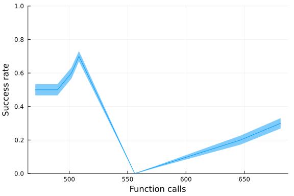
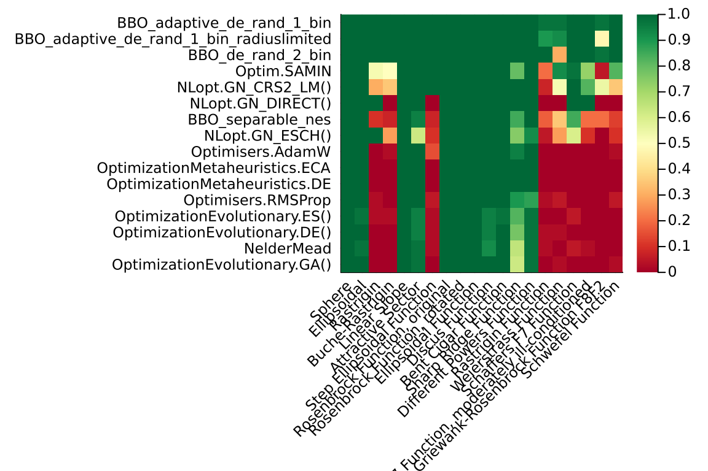

In this benchmark we will run the [BlackboxGlobalOptimization.jl](https://github.com/jonathanBieler/BlackBoxOptimizationBenchmarking.jl)
benchmarks, a set of global optimization benchmarks on the [Optimization.jl](https://github.com/SciML/Optimization.jl)
interface that test a wide variety of behaviors. This tests time and iterations vs accuracy,
i.e. for a given amount of time to the optimizer, what percentage of problems from the set is
it able to solve. This gives a global view of which methods are the most efficient at finding
difficult global optima.

## Setup

```julia
using BlackBoxOptimizationBenchmarking, Plots, Optimization, Memoize, Statistics
import BlackBoxOptimizationBenchmarking.Chain
const BBOB = BlackBoxOptimizationBenchmarking

using OptimizationBBO, OptimizationOptimJL, OptimizationEvolutionary, OptimizationNLopt
using OptimizationMetaheuristics, OptimizationNOMAD, OptimizationPRIMA, OptimizationOptimisers, OptimizationSciPy, OptimizationPyCMA
```


```julia
chain = (t;
    isboxed = false) -> Chain(
    BenchmarkSetup(t, isboxed = isboxed),
    BenchmarkSetup(NelderMead(), isboxed = false),
    0.9
)

test_functions = BBOB.list_functions()
dimension = 3
run_length = round.(Int, 10 .^ LinRange(1, 5, 30))

@memoize run_bench(algo) = BBOB.benchmark(
    setup[algo], test_functions, run_length, Ntrials = 40, dimension = dimension)
```

```
run_bench (generic function with 1 method)
```


```julia
setup = Dict(
    "NelderMead" => NelderMead(),
    #Optim.BFGS(),
    #"NLopt.GN_MLSL_LDS" => chain(NLopt.GN_MLSL_LDS(), isboxed=true), # gives me errors
    "NLopt.GN_CRS2_LM()" => chain(NLopt.GN_CRS2_LM(), isboxed = true),
    "NLopt.GN_DIRECT()" => chain(NLopt.GN_DIRECT(), isboxed = true),
    "NLopt.GN_ESCH()" => chain(NLopt.GN_ESCH(), isboxed = true),
    "OptimizationEvolutionary.GA()" => chain(OptimizationEvolutionary.GA(), isboxed = true),
    "OptimizationEvolutionary.DE()" => chain(OptimizationEvolutionary.DE(), isboxed = true),
    "OptimizationEvolutionary.ES()" => chain(OptimizationEvolutionary.ES(), isboxed = true),
    "Optim.SAMIN" => chain(SAMIN(verbosity = 0), isboxed = true),
    "BBO_adaptive_de_rand_1_bin" => chain(BBO_adaptive_de_rand_1_bin(), isboxed = true),
    "BBO_adaptive_de_rand_1_bin_radiuslimited" => chain(
        BBO_adaptive_de_rand_1_bin_radiuslimited(), isboxed = true), # same as BBO_adaptive_de_rand_1_bin
    "BBO_separable_nes" => chain(BBO_separable_nes(), isboxed = true),
    "BBO_de_rand_2_bin" => chain(BBO_de_rand_2_bin(), isboxed = true),
    #"BBO_xnes" => chain(BBO_xnes(), isboxed=true), # good but slow
    #"BBO_dxnes" => chain(BBO_dxnes(), isboxed=true), 
    "OptimizationMetaheuristics.ECA" => chain(OptimizationMetaheuristics.ECA(), isboxed = true),
    #"OptimizationMetaheuristics.CGSA" => () -> chain(OptimizationMetaheuristics.CGSA(), isboxed=true), #give me strange results
    "OptimizationMetaheuristics.DE" => chain(OptimizationMetaheuristics.DE(), isboxed=true),
    "Optimisers.AdamW" => chain(Optimisers.AdamW(), isboxed=false),
    "Optimisers.RMSProp" => chain(Optimisers.RMSProp(), isboxed=false),
    # SciPy global optimizers
    "ScipyDifferentialEvolution" => chain(ScipyDifferentialEvolution(), isboxed=true),
    #"ScipyBasinhopping" => chain(ScipyBasinhopping(), isboxed=true),
    #"ScipyDualAnnealing" => chain(ScipyDualAnnealing(), isboxed=true), # taking long time
    "ScipyShgo" => chain(ScipyShgo(), isboxed=true),
    "ScipyDirect" => chain(ScipyDirect(), isboxed=true),
    "ScipyBrute" => chain(ScipyBrute(), isboxed=true),
    # "NOMADOpt" => chain(NOMADOpt()), too much printing
    # "OptimizationPRIMA.UOBYQA()" => chain(OptimizationPRIMA.UOBYQA()), :StackOverflowError?
    # "OptimizationPRIMA.NEWUOA()" => OptimizationPRIMA.UOBYQA(),
    #
)
```

```
Dict{String, Any} with 20 entries:
  "OptimizationEvolutionar… => Chain(GA → NelderMead)…
  "BBO_separable_nes"       => Chain(BBO_separable_nes → NelderMead)…
  "NelderMead"              => NelderMead{AffineSimplexer, AdaptiveParamete
rs}(…
  "BBO_adaptive_de_rand_1_… => Chain(BBO_adaptive_de_rand_1_bin → NelderMea
d)…
  "BBO_adaptive_de_rand_1_… => Chain(BBO_adaptive_de_rand_1_bin_radiuslimit
ed →…
  "BBO_de_rand_2_bin"       => Chain(BBO_de_rand_2_bin → NelderMead)…
  "NLopt.GN_DIRECT()"       => Chain(Algorithm → NelderMead)…
  "NLopt.GN_ESCH()"         => Chain(Algorithm → NelderMead)…
  "OptimizationMetaheurist… => Chain(Algorithm → NelderMead)…
  "ScipyShgo"               => Chain(ScipyShgo → NelderMead)…
  "OptimizationEvolutionar… => Chain(ES → NelderMead)…
  "Optimisers.AdamW"        => Chain(AdamW → NelderMead)…
  "ScipyDirect"             => Chain(ScipyDirect → NelderMead)…
  "ScipyDifferentialEvolut… => Chain(ScipyDifferentialEvolution → NelderMea
d)…
  "ScipyBrute"              => Chain(ScipyBrute → NelderMead)…
  "OptimizationEvolutionar… => Chain(DE → NelderMead)…
  "Optimisers.RMSProp"      => Chain(RMSProp → NelderMead)…
  "OptimizationMetaheurist… => Chain(Algorithm → NelderMead)…
  "NLopt.GN_CRS2_LM()"      => Chain(Algorithm → NelderMead)…
  "Optim.SAMIN"             => Chain(SAMIN → NelderMead)…
```


## Test one optimizer

```julia
@time b = BBOB.benchmark(
    chain(OptimizationMetaheuristics.CGSA(), isboxed = true),
    test_functions[1:10], 100:500:10_000, Ntrials = 10, dimension = 3
)

plot(b)
```

```
14.912655 seconds (68.79 M allocations: 6.011 GiB, 5.41% gc time, 46.10% c
ompilation time: 4% of which was recompilation)
```





## Test one test function (Rastrigin)

```julia
Δf = 1e-6
f = test_functions[3]

single_setup = BenchmarkSetup(NLopt.GN_CRS2_LM(), isboxed = true)

sol = [BBOB.solve_problem(single_setup, f, 3, 5_000) for in in 1:10]
@info [sol.objective < Δf + f.f_opt for sol in sol]

p = plot(f, size = (600, 600), zoom = 1.5)
for sol in sol
    scatter!(sol.u[1:1], sol.u[2:2], label = "", c = "blue",
        marker = :xcross, markersize = 5, markerstrokewidth = 0)
end
p
```


## Test all

```julia
results = Array{BBOB.BenchmarkResults}(undef, length(setup))

Threads.@threads for (i, algo) in collect(enumerate(keys(setup)))
    results[i] = run_bench(algo)
end

results
```

```
20-element Vector{BlackBoxOptimizationBenchmarking.BenchmarkResults}:
 BenchmarkResults :
Run length : [10, 14, 19, 26, 36, 49, 67, 92, 127, 174  …  5736, 7880, 1082
6, 14874, 20434, 28072, 38566, 52983, 72790, 100000]
Success rate : [0.0, 0.0, 0.0, 0.0, 0.00375, 0.00125, 0.01375, 0.00875, 0.0
175, 0.0325  …  0.52875, 0.545, 0.54, 0.54125, 0.55125, 0.5575, 0.545, 0.54
875, 0.54375, 0.5525]
 BenchmarkResults :
Run length : [10, 14, 19, 26, 36, 49, 67, 92, 127, 174  …  5736, 7880, 1082
6, 14874, 20434, 28072, 38566, 52983, 72790, 100000]
Success rate : [0.01375, 0.02625, 0.04125, 0.0425, 0.05375, 0.06625, 0.1087
5, 0.1375, 0.2375, 0.335  …  0.6825, 0.695, 0.69125, 0.68875, 0.69, 0.6875,
 0.69125, 0.67, 0.6975, 0.70375]
 BenchmarkResults :
Run length : [10, 14, 19, 26, 36, 49, 67, 92, 127, 174  …  5736, 7880, 1082
6, 14874, 20434, 28072, 38566, 52983, 72790, 100000]
Success rate : [0.015, 0.0275, 0.03625, 0.0475, 0.0525, 0.0625, 0.09625, 0.
15, 0.2375, 0.37625  …  0.54625, 0.54875, 0.55875, 0.545, 0.54375, 0.55125,
 0.545, 0.535, 0.5575, 0.54125]
 BenchmarkResults :
Run length : [10, 14, 19, 26, 36, 49, 67, 92, 127, 174  …  5736, 7880, 1082
6, 14874, 20434, 28072, 38566, 52983, 72790, 100000]
Success rate : [0.0025, 0.005, 0.00875, 0.0075, 0.0075, 0.01625, 0.02875, 0
.04, 0.045, 0.05375  …  0.845, 0.9025, 0.93125, 0.9275, 0.94625, 0.96375, 0
.98875, 0.9925, 0.99875, 0.9925]
 BenchmarkResults :
Run length : [10, 14, 19, 26, 36, 49, 67, 92, 127, 174  …  5736, 7880, 1082
6, 14874, 20434, 28072, 38566, 52983, 72790, 100000]
Success rate : [0.00375, 0.0025, 0.00125, 0.005, 0.0175, 0.01375, 0.03, 0.0
275, 0.0475, 0.05  …  0.8525, 0.92, 0.95625, 0.96625, 0.96375, 0.96375, 0.9
5875, 0.95625, 0.97, 0.96375]
 BenchmarkResults :
Run length : [10, 14, 19, 26, 36, 49, 67, 92, 127, 174  …  5736, 7880, 1082
6, 14874, 20434, 28072, 38566, 52983, 72790, 100000]
Success rate : [0.00625, 0.0025, 0.00125, 0.00875, 0.015, 0.02, 0.01875, 0.
03625, 0.04875, 0.05  …  0.775, 0.8575, 0.89625, 0.91125, 0.92375, 0.935, 0
.93125, 0.9525, 0.955, 0.9575]
 BenchmarkResults :
Run length : [10, 14, 19, 26, 36, 49, 67, 92, 127, 174  …  5736, 7880, 1082
6, 14874, 20434, 28072, 38566, 52983, 72790, 100000]
Success rate : [0.0, 0.05, 0.05, 0.05, 0.05, 0.05, 0.05, 0.05, 0.1, 0.1  … 
 0.8, 0.8, 0.8, 0.8, 0.8, 0.8, 0.8, 0.8, 0.8, 0.8]
 BenchmarkResults :
Run length : [10, 14, 19, 26, 36, 49, 67, 92, 127, 174  …  5736, 7880, 1082
6, 14874, 20434, 28072, 38566, 52983, 72790, 100000]
Success rate : [0.0, 0.0, 0.00125, 0.0, 0.00625, 0.0125, 0.01875, 0.0175, 0
.035, 0.03875  …  0.5975, 0.64125, 0.655, 0.6625, 0.6625, 0.67, 0.675, 0.68
625, 0.69875, 0.69875]
 BenchmarkResults :
Run length : [10, 14, 19, 26, 36, 49, 67, 92, 127, 174  …  5736, 7880, 1082
6, 14874, 20434, 28072, 38566, 52983, 72790, 100000]
Success rate : [0.0425, 0.05, 0.05, 0.05, 0.05, 0.05, 0.05, 0.05, 0.05, 0.0
5  …  0.55, 0.55, 0.55, 0.55, 0.55, 0.55, 0.55, 0.55, 0.55, 0.55]
 BenchmarkResults :
Run length : [10, 14, 19, 26, 36, 49, 67, 92, 127, 174  …  5736, 7880, 1082
6, 14874, 20434, 28072, 38566, 52983, 72790, 100000]
Success rate : [0.25, 0.25, 0.25, 0.25, 0.25, 0.25, 0.25, 0.25, 0.25, 0.25 
 …  0.5, 0.5, 0.5, 0.5, 0.5, 0.5, 0.5, 0.5, 0.5, 0.5]
 BenchmarkResults :
Run length : [10, 14, 19, 26, 36, 49, 67, 92, 127, 174  …  5736, 7880, 1082
6, 14874, 20434, 28072, 38566, 52983, 72790, 100000]
Success rate : [0.0, 0.00125, 0.0, 0.00125, 0.00125, 0.00125, 0.00625, 0.01
375, 0.02875, 0.0325  …  0.52875, 0.54, 0.5425, 0.54625, 0.54375, 0.54625, 
0.56125, 0.54625, 0.545, 0.55375]
 BenchmarkResults :
Run length : [10, 14, 19, 26, 36, 49, 67, 92, 127, 174  …  5736, 7880, 1082
6, 14874, 20434, 28072, 38566, 52983, 72790, 100000]
Success rate : [0.0, 0.0, 0.0, 0.00125, 0.005, 0.0025, 0.00625, 0.01125, 0.
02125, 0.03875  …  0.53, 0.51375, 0.515, 0.49375, 0.47625, 0.4375, 0.44875,
 0.4625, 0.4575, 0.45125]
 BenchmarkResults :
Run length : [10, 14, 19, 26, 36, 49, 67, 92, 127, 174  …  5736, 7880, 1082
6, 14874, 20434, 28072, 38566, 52983, 72790, 100000]
Success rate : [0.05, 0.1, 0.1, 0.1, 0.1, 0.1, 0.1, 0.1, 0.1, 0.1  …  0.8, 
0.8, 0.8, 0.8, 0.8, 0.8, 0.8, 0.8, 0.8, 0.8]
 BenchmarkResults :
Run length : [10, 14, 19, 26, 36, 49, 67, 92, 127, 174  …  5736, 7880, 1082
6, 14874, 20434, 28072, 38566, 52983, 72790, 100000]
Success rate : [0.355, 0.3675, 0.33875, 0.36875, 0.3925, 0.41375, 0.41875, 
0.4275, 0.45, 0.4625  …  0.72125, 0.69, 0.72875, 0.735, 0.70125, 0.695, 0.7
, 0.70375, 0.695, 0.70625]
 BenchmarkResults :
Run length : [10, 14, 19, 26, 36, 49, 67, 92, 127, 174  …  5736, 7880, 1082
6, 14874, 20434, 28072, 38566, 52983, 72790, 100000]
Success rate : [0.4, 0.4, 0.4, 0.4, 0.4, 0.4, 0.4, 0.4, 0.4, 0.45  …  0.55,
 0.55, 0.55, 0.55, 0.55, 0.55, 0.55, 0.55, 0.55, 0.55]
 BenchmarkResults :
Run length : [10, 14, 19, 26, 36, 49, 67, 92, 127, 174  …  5736, 7880, 1082
6, 14874, 20434, 28072, 38566, 52983, 72790, 100000]
Success rate : [0.0, 0.0, 0.0, 0.0, 0.005, 0.0075, 0.00625, 0.00875, 0.0187
5, 0.03375  …  0.5325, 0.5375, 0.55, 0.54875, 0.54, 0.54, 0.545, 0.54875, 0
.55125, 0.55]
 BenchmarkResults :
Run length : [10, 14, 19, 26, 36, 49, 67, 92, 127, 174  …  5736, 7880, 1082
6, 14874, 20434, 28072, 38566, 52983, 72790, 100000]
Success rate : [0.0, 0.0, 0.0, 0.0, 0.0, 0.0025, 0.00875, 0.01625, 0.025, 0
.0375  …  0.47875, 0.49, 0.4925, 0.4975, 0.49625, 0.505, 0.51125, 0.50625, 
0.49625, 0.5]
 BenchmarkResults :
Run length : [10, 14, 19, 26, 36, 49, 67, 92, 127, 174  …  5736, 7880, 1082
6, 14874, 20434, 28072, 38566, 52983, 72790, 100000]
Success rate : [0.045, 0.05, 0.05, 0.05, 0.05, 0.05, 0.05, 0.05, 0.05, 0.05
  …  0.55, 0.55, 0.55, 0.55, 0.55, 0.55, 0.55, 0.55, 0.55, 0.55]
 BenchmarkResults :
Run length : [10, 14, 19, 26, 36, 49, 67, 92, 127, 174  …  5736, 7880, 1082
6, 14874, 20434, 28072, 38566, 52983, 72790, 100000]
Success rate : [0.00125, 0.00125, 0.00375, 0.0075, 0.00875, 0.03875, 0.0487
5, 0.04875, 0.05, 0.05875  …  0.78125, 0.8, 0.81625, 0.78125, 0.80375, 0.80
125, 0.79875, 0.80875, 0.79375, 0.79125]
 BenchmarkResults :
Run length : [10, 14, 19, 26, 36, 49, 67, 92, 127, 174  …  5736, 7880, 1082
6, 14874, 20434, 28072, 38566, 52983, 72790, 100000]
Success rate : [0.00375, 0.00125, 0.01, 0.02625, 0.03625, 0.0475, 0.0475, 0
.05, 0.055, 0.0575  …  0.70375, 0.75875, 0.80375, 0.7975, 0.82875, 0.8225, 
0.83, 0.80875, 0.83125, 0.825]
```


```julia
labels = collect(keys(setup))
idx = sortperm([b.success_rate[end] for b in results], rev = true)

p = plot(xscale = :log10, legend = :outerright,
    size = (700, 350), margin = 10Plots.px, dpi = 200)
for i in idx
    plot!(results[i], label = labels[i], showribbon = false,
        lw = 2.5, xlim = (1, 1e5), x = :run_length)
end
p
```


```julia
success_rate_per_function = reduce(hcat, b.success_rate_per_function for b in results)

idx = sortperm(mean(success_rate_per_function, dims = 1)[:], rev = false)
idxfunc = sortperm(mean(success_rate_per_function, dims = 2)[:], rev = true)
idxfunc = 1:length(test_functions)

p = heatmap(
    string.(test_functions)[idxfunc], labels[idx], success_rate_per_function[idxfunc, idx]',
    cmap = :RdYlGn,
    xticks = :all,
    yticks = :all,
    xrotation = 45,
    dpi = 200
)
```



```julia
labels = collect(keys(setup))
idx = sortperm([b.distance_to_minimizer[end] for b in results], rev = false)

p = plot(xscale = :log10, legend = :outerright,
    size = (900, 500), margin = 10Plots.px, ylim = (0, 5))
for i in idx
    plot!(
        results[i].run_length, results[i].distance_to_minimizer, label = labels[i],
        showribbon = false, lw = 2, xlim = (1, 1e5),
        xlabel = "Iterations", ylabel = "Mean distance to minimum"
    )
end
p
```


```julia
ref = findfirst("NelderMead" .== labels)
runtimes = getfield.(results, :runtime)
runtimes = runtimes ./ runtimes[ref]

bar(
    labels, runtimes, xrotation = :45, xticks = :all, ylabel = "Run time relative to NM",
    yscale = :log10, yticks = [0.1, 1, 10, 100],
    legend = false, margin = 25Plots.px
)
```


