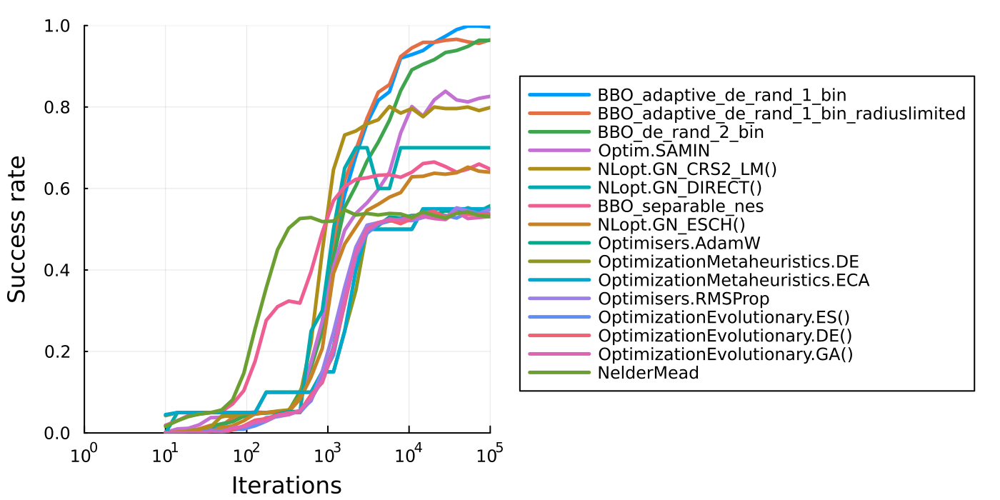

In this benchmark we will run the [BlackboxGlobalOptimization.jl](https://github.com/jonathanBieler/BlackBoxOptimizationBenchmarking.jl)
benchmarks, a set of global optimization benchmarks on the [Optimization.jl](https://github.com/SciML/Optimization.jl)
interface that test a wide variety of behaviors. This tests time and iterations vs accuracy,
i.e. for a given amount of time to the optimizer, what percentage of problems from the set is
it able to solve. This gives a global view of which methods are the most efficient at finding
difficult global optima.

## Setup

```julia
using BlackBoxOptimizationBenchmarking, Plots, Optimization, Memoize, Statistics
import BlackBoxOptimizationBenchmarking.Chain
const BBOB = BlackBoxOptimizationBenchmarking

using OptimizationBBO, OptimizationOptimJL, OptimizationEvolutionary, OptimizationNLopt
using OptimizationMetaheuristics, OptimizationNOMAD, OptimizationPRIMA, OptimizationOptimisers
```


```julia
chain = (t; isboxed=false) -> Chain(
    BenchmarkSetup(t, isboxed = isboxed),
    BenchmarkSetup(NelderMead(), isboxed = false),
    0.9
)

test_functions = BBOB.list_functions()
dimension = 3
run_length = round.(Int, 10 .^ LinRange(1,5,30))

@memoize run_bench(algo) = BBOB.benchmark(setup[algo], test_functions, run_length, Ntrials=40, dimension = dimension)
```

```
run_bench (generic function with 1 method)
```


```julia
setup = Dict(
    "NelderMead" => NelderMead(),
    #Optim.BFGS(),
    #"NLopt.GN_MLSL_LDS" => chain(NLopt.GN_MLSL_LDS(), isboxed=true), # gives me errors
    "NLopt.GN_CRS2_LM()" => chain(NLopt.GN_CRS2_LM(), isboxed=true),
    "NLopt.GN_DIRECT()" => chain(NLopt.GN_DIRECT(), isboxed=true),
    "NLopt.GN_ESCH()"  => chain(NLopt.GN_ESCH(), isboxed=true),
    "OptimizationEvolutionary.GA()" => chain(OptimizationEvolutionary.GA(), isboxed=true),
    "OptimizationEvolutionary.DE()" => chain(OptimizationEvolutionary.DE(), isboxed=true),
    "OptimizationEvolutionary.ES()" => chain(OptimizationEvolutionary.ES(), isboxed=true),
    "Optim.SAMIN" => chain(SAMIN(verbosity=0), isboxed=true),
    "BBO_adaptive_de_rand_1_bin" => chain(BBO_adaptive_de_rand_1_bin(), isboxed=true),
    "BBO_adaptive_de_rand_1_bin_radiuslimited" => chain(BBO_adaptive_de_rand_1_bin_radiuslimited(), isboxed=true), # same as BBO_adaptive_de_rand_1_bin
    "BBO_separable_nes" => chain(BBO_separable_nes(), isboxed=true),
    "BBO_de_rand_2_bin" => chain(BBO_de_rand_2_bin(), isboxed=true),
    #"BBO_xnes" => chain(BBO_xnes(), isboxed=true), # good but slow
    #"BBO_dxnes" => chain(BBO_dxnes(), isboxed=true), 
    "OptimizationMetaheuristics.ECA" => chain(OptimizationMetaheuristics.ECA(), isboxed=true),
    #"OptimizationMetaheuristics.CGSA" => () -> chain(OptimizationMetaheuristics.CGSA(), isboxed=true), #give me strange results
    "OptimizationMetaheuristics.DE" => chain(OptimizationMetaheuristics.DE(), isboxed=true),
    "Optimisers.AdamW" => chain(Optimisers.AdamW(), isboxed=false),
    "Optimisers.RMSProp" => chain(Optimisers.RMSProp(), isboxed=false),
    # "NOMADOpt" => chain(NOMADOpt()), too much printing
    # "OptimizationPRIMA.UOBYQA()" => chain(OptimizationPRIMA.UOBYQA()), :StackOverflowError?
    # "OptimizationPRIMA.NEWUOA()" => OptimizationPRIMA.UOBYQA(),
    #
)
```

```
Dict{String, Any} with 16 entries:
  "OptimizationEvolutionar… => Chain(GA → NelderMead)…
  "BBO_separable_nes"       => Chain(BBO_separable_nes → NelderMead)…
  "NelderMead"              => NelderMead{AffineSimplexer, AdaptiveParamete
rs}(…
  "BBO_adaptive_de_rand_1_… => Chain(BBO_adaptive_de_rand_1_bin → NelderMea
d)…
  "BBO_adaptive_de_rand_1_… => Chain(BBO_adaptive_de_rand_1_bin_radiuslimit
ed →…
  "BBO_de_rand_2_bin"       => Chain(BBO_de_rand_2_bin → NelderMead)…
  "NLopt.GN_DIRECT()"       => Chain(Algorithm → NelderMead)…
  "NLopt.GN_ESCH()"         => Chain(Algorithm → NelderMead)…
  "OptimizationMetaheurist… => Chain(Algorithm → NelderMead)…
  "OptimizationEvolutionar… => Chain(ES → NelderMead)…
  "Optimisers.AdamW"        => Chain(AdamW → NelderMead)…
  "OptimizationEvolutionar… => Chain(DE → NelderMead)…
  "Optimisers.RMSProp"      => Chain(RMSProp → NelderMead)…
  "OptimizationMetaheurist… => Chain(Algorithm → NelderMead)…
  "NLopt.GN_CRS2_LM()"      => Chain(Algorithm → NelderMead)…
  "Optim.SAMIN"             => Chain(SAMIN → NelderMead)…
```


## Test one optimizer

```julia
@time b = BBOB.benchmark(
    chain(OptimizationMetaheuristics.CGSA(), isboxed=true),
    test_functions[1:10], 100:500:10_000, Ntrials=10, dimension = 3
)

plot(b)
```

```
11.445198 seconds (72.19 M allocations: 6.253 GiB, 5.34% gc time, 45.68% c
ompilation time: 4% of which was recompilation)
```


## Test one test function (Rastrigin)

```julia
Δf = 1e-6
f = test_functions[3]

single_setup = BenchmarkSetup(NLopt.GN_CRS2_LM(), isboxed=true)

sol = [BBOB.solve_problem(single_setup, f, 3, 5_000) for in in 1:10]
@info [sol.objective < Δf + f.f_opt for sol in sol]

p = plot(f, size = (600,600), zoom = 1.5)
for sol in sol
    scatter!(sol.u[1:1], sol.u[2:2], label="", c="blue", marker = :xcross, markersize=5, markerstrokewidth=0)
end
p
```


## Test all

```julia
results = Array{BBOB.BenchmarkResults}(undef, length(setup))

Threads.@threads for (i,algo) in collect(enumerate(keys(setup)))
    results[i] = run_bench(algo)
end

results
```

```
16-element Vector{BlackBoxOptimizationBenchmarking.BenchmarkResults}:
 BenchmarkResults :
Run length : [10, 14, 19, 26, 36, 49, 67, 92, 127, 174  …  5736, 7880, 1082
6, 14874, 20434, 28072, 38566, 52983, 72790, 100000]
Success rate : [0.0, 0.0, 0.0, 0.0, 0.0025, 0.00125, 0.0125, 0.015, 0.02625
, 0.03  …  0.525, 0.5225, 0.53125, 0.53125, 0.52625, 0.52375, 0.5425, 0.526
25, 0.52875, 0.53125]
 BenchmarkResults :
Run length : [10, 14, 19, 26, 36, 49, 67, 92, 127, 174  …  5736, 7880, 1082
6, 14874, 20434, 28072, 38566, 52983, 72790, 100000]
Success rate : [0.01875, 0.03, 0.0425, 0.04625, 0.05, 0.0525, 0.07125, 0.10
375, 0.17625, 0.27625  …  0.63375, 0.6275, 0.64, 0.66125, 0.665, 0.65375, 0
.64, 0.6475, 0.66, 0.6475]
 BenchmarkResults :
Run length : [10, 14, 19, 26, 36, 49, 67, 92, 127, 174  …  5736, 7880, 1082
6, 14874, 20434, 28072, 38566, 52983, 72790, 100000]
Success rate : [0.01625, 0.03, 0.04, 0.04625, 0.05, 0.05625, 0.08125, 0.146
25, 0.25625, 0.35625  …  0.53875, 0.5375, 0.52875, 0.5425, 0.53375, 0.5275,
 0.53875, 0.5425, 0.53375, 0.53125]
 BenchmarkResults :
Run length : [10, 14, 19, 26, 36, 49, 67, 92, 127, 174  …  5736, 7880, 1082
6, 14874, 20434, 28072, 38566, 52983, 72790, 100000]
Success rate : [0.00125, 0.005, 0.005, 0.00875, 0.01, 0.02, 0.02875, 0.0412
5, 0.04625, 0.05  …  0.8375, 0.92, 0.92875, 0.93875, 0.95875, 0.97375, 0.99
, 0.99875, 0.99875, 0.99625]
 BenchmarkResults :
Run length : [10, 14, 19, 26, 36, 49, 67, 92, 127, 174  …  5736, 7880, 1082
6, 14874, 20434, 28072, 38566, 52983, 72790, 100000]
Success rate : [0.00125, 0.0025, 0.005, 0.01, 0.01875, 0.0175, 0.0375, 0.04
, 0.0475, 0.05  …  0.855, 0.92375, 0.945, 0.95875, 0.95875, 0.96375, 0.9662
5, 0.96, 0.95625, 0.965]
 BenchmarkResults :
Run length : [10, 14, 19, 26, 36, 49, 67, 92, 127, 174  …  5736, 7880, 1082
6, 14874, 20434, 28072, 38566, 52983, 72790, 100000]
Success rate : [0.00125, 0.00375, 0.00625, 0.005, 0.01625, 0.0225, 0.0275, 
0.04125, 0.04875, 0.04875  …  0.7675, 0.84, 0.89125, 0.905, 0.91625, 0.9337
5, 0.93875, 0.94875, 0.96375, 0.96375]
 BenchmarkResults :
Run length : [10, 14, 19, 26, 36, 49, 67, 92, 127, 174  …  5736, 7880, 1082
6, 14874, 20434, 28072, 38566, 52983, 72790, 100000]
Success rate : [0.0, 0.05, 0.05, 0.05, 0.05, 0.05, 0.05, 0.05, 0.05, 0.05  
…  0.6, 0.7, 0.7, 0.7, 0.7, 0.7, 0.7, 0.7, 0.7, 0.7]
 BenchmarkResults :
Run length : [10, 14, 19, 26, 36, 49, 67, 92, 127, 174  …  5736, 7880, 1082
6, 14874, 20434, 28072, 38566, 52983, 72790, 100000]
Success rate : [0.0, 0.0025, 0.00125, 0.0025, 0.00375, 0.0125, 0.0175, 0.03
, 0.0475, 0.05  …  0.57875, 0.59, 0.62875, 0.63, 0.6375, 0.635, 0.63875, 0.
6525, 0.6425, 0.64]
 BenchmarkResults :
Run length : [10, 14, 19, 26, 36, 49, 67, 92, 127, 174  …  5736, 7880, 1082
6, 14874, 20434, 28072, 38566, 52983, 72790, 100000]
Success rate : [0.0425, 0.05, 0.05, 0.05, 0.05, 0.05, 0.05, 0.05, 0.05, 0.1
  …  0.5, 0.5, 0.5, 0.55, 0.55, 0.55, 0.55, 0.55, 0.55, 0.55]
 BenchmarkResults :
Run length : [10, 14, 19, 26, 36, 49, 67, 92, 127, 174  …  5736, 7880, 1082
6, 14874, 20434, 28072, 38566, 52983, 72790, 100000]
Success rate : [0.0, 0.0, 0.0, 0.0, 0.005, 0.0025, 0.0075, 0.01, 0.0175, 0.
02875  …  0.52, 0.525, 0.5275, 0.54, 0.535, 0.53375, 0.5275, 0.54125, 0.538
75, 0.53875]
 BenchmarkResults :
Run length : [10, 14, 19, 26, 36, 49, 67, 92, 127, 174  …  5736, 7880, 1082
6, 14874, 20434, 28072, 38566, 52983, 72790, 100000]
Success rate : [0.0, 0.0, 0.00125, 0.0, 0.0, 0.00125, 0.00875, 0.01375, 0.0
275, 0.0325  …  0.53, 0.5275, 0.53375, 0.53375, 0.53625, 0.545, 0.54125, 0.
5525, 0.54375, 0.5575]
 BenchmarkResults :
Run length : [10, 14, 19, 26, 36, 49, 67, 92, 127, 174  …  5736, 7880, 1082
6, 14874, 20434, 28072, 38566, 52983, 72790, 100000]
Success rate : [0.0, 0.0, 0.0, 0.0, 0.00125, 0.0, 0.0075, 0.0175, 0.03125, 
0.035  …  0.5225, 0.51375, 0.52625, 0.54, 0.54375, 0.53, 0.54, 0.53625, 0.5
3625, 0.53625]
 BenchmarkResults :
Run length : [10, 14, 19, 26, 36, 49, 67, 92, 127, 174  …  5736, 7880, 1082
6, 14874, 20434, 28072, 38566, 52983, 72790, 100000]
Success rate : [0.0, 0.0, 0.0, 0.0, 0.00625, 0.00375, 0.01125, 0.00875, 0.0
225, 0.0375  …  0.52125, 0.52125, 0.52125, 0.52875, 0.53625, 0.5275, 0.5525
, 0.545, 0.53875, 0.54875]
 BenchmarkResults :
Run length : [10, 14, 19, 26, 36, 49, 67, 92, 127, 174  …  5736, 7880, 1082
6, 14874, 20434, 28072, 38566, 52983, 72790, 100000]
Success rate : [0.045, 0.05, 0.05, 0.05, 0.05, 0.05, 0.05, 0.05, 0.05, 0.1 
 …  0.5, 0.5, 0.5, 0.55, 0.55, 0.55, 0.55, 0.55, 0.55, 0.55]
 BenchmarkResults :
Run length : [10, 14, 19, 26, 36, 49, 67, 92, 127, 174  …  5736, 7880, 1082
6, 14874, 20434, 28072, 38566, 52983, 72790, 100000]
Success rate : [0.00125, 0.00125, 0.005, 0.00875, 0.015, 0.04125, 0.04125, 
0.0475, 0.05, 0.05  …  0.80125, 0.785, 0.79625, 0.77625, 0.8, 0.79625, 0.79
625, 0.8, 0.79125, 0.79875]
 BenchmarkResults :
Run length : [10, 14, 19, 26, 36, 49, 67, 92, 127, 174  …  5736, 7880, 1082
6, 14874, 20434, 28072, 38566, 52983, 72790, 100000]
Success rate : [0.00125, 0.01, 0.01125, 0.02, 0.0375, 0.03875, 0.0475, 0.04
875, 0.05125, 0.05  …  0.64, 0.73625, 0.80125, 0.7775, 0.8175, 0.83875, 0.8
175, 0.8125, 0.82125, 0.82625]
```


```julia
labels = collect(keys(setup))
idx = sortperm([b.success_rate[end] for b in results], rev=true)

p = plot(xscale = :log10, legend = :outerright, size = (700,350), margin=10Plots.px, dpi=200)
for i in idx
    plot!(results[i], label = labels[i], showribbon=false, lw=2.5, xlim = (1,1e5), x = :run_length)
end
p
```



```julia
success_rate_per_function = reduce(hcat, b.success_rate_per_function for b in results)

idx = sortperm(mean(success_rate_per_function, dims=1)[:], rev=false)
idxfunc = sortperm(mean(success_rate_per_function, dims=2)[:], rev=true)
idxfunc = 1:length(test_functions)

p = heatmap(
    string.(test_functions)[idxfunc], labels[idx], success_rate_per_function[idxfunc, idx]',
    cmap = :RdYlGn,
    xticks = :all,
    yticks = :all,
    xrotation = 45,
    dpi = 200,
)
```


```julia
labels = collect(keys(setup))
idx = sortperm([b.distance_to_minimizer[end] for b in results], rev=false)

p = plot(xscale = :log10, legend = :outerright, size = (900,500), margin=10Plots.px, ylim = (0,5))
for i in idx
    plot!(
        results[i].run_length, results[i].distance_to_minimizer, label = labels[i],
        showribbon=false, lw=2, xlim = (1,1e5),
        xlabel = "Iterations", ylabel = "Mean distance to minimum"
    )
end
p
```


```julia
ref = findfirst("NelderMead" .== labels)
runtimes = getfield.(results, :runtime)
runtimes = runtimes ./ runtimes[ref]

bar(
    labels, runtimes, xrotation = :45, xticks = :all, ylabel = "Run time relative to NM",
    yscale = :log10, yticks = [0.1,1,10,100],
    legend = false, margin = 25Plots.px
)
```


