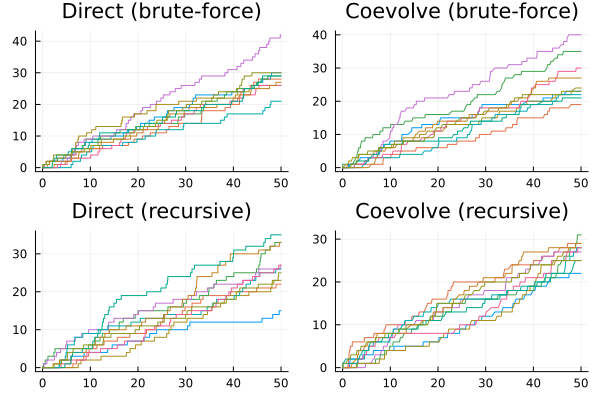
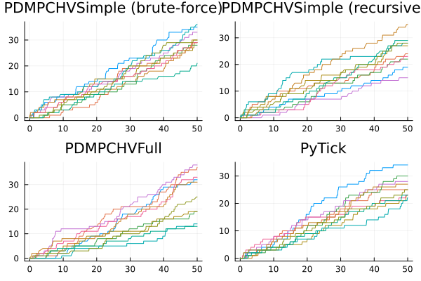
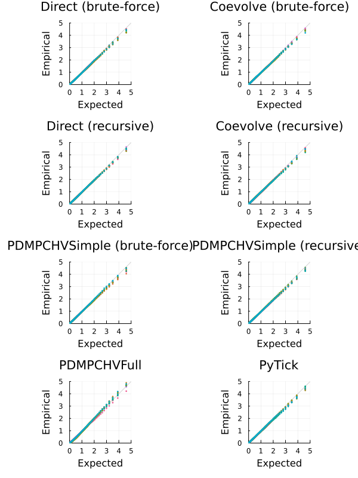
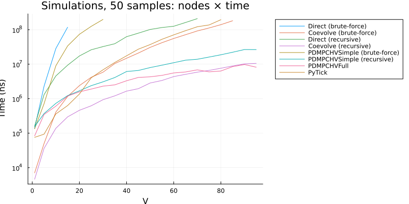
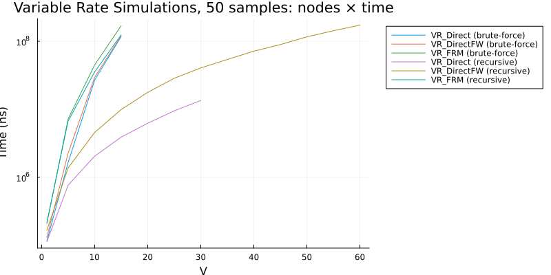

```julia
using JumpProcesses, Graphs, Statistics, BenchmarkTools, Plots
using SciMLLogging
using OrdinaryDiffEq: Tsit5
fmt = :png
width_px, height_px = default(:size);
```


# Model and example solutions

Let a graph with ``V`` nodes, then the multivariate Hawkes process is characterized by ``V`` point processes such that the conditional intensity rate of node ``i`` connected to a set of nodes ``E_i`` in the graph is given by:

```math
  \lambda_i^\ast (t) = \lambda + \sum_{j \in E_i} \sum_{t_{n_j} < t} \alpha \exp \left[-\beta (t - t_{n_j}) \right]
```

This process is known as self-exciting, because the occurrence of an event ``j`` at ``t_{n_j}`` will increase the conditional intensity of all the processes connected to it by ``\alpha``. The excited intensity then decreases at a rate proportional to ``\beta``.

The conditional intensity of this process has a recursive formulation which can significantly speed the simulation. The recursive formulation for the univariate case is derived in Laub et al. [2]. We derive the compound case here. Let ``t_{N_i} = \max \{ t_{n_j} < t \mid j \in E_i \}`` and

```math
\begin{split}
  \phi_i^\ast (t)
    &= \sum_{j \in E_i} \sum_{t_{n_j} < t} \alpha \exp \left[-\beta (t - t_{N_i} + t_{N_i} - t_{n_j}) \right] \\
    &= \exp \left[ -\beta (t - t_{N_i}) \right] \sum_{j \in E_i} \sum_{t_{n_j} \leq t_{N_i}} \alpha \exp \left[-\beta (t_{N_i} - t_{n_j}) \right] \\
    &= \exp \left[ -\beta (t - t_{N_i}) \right] \left( \alpha + \phi^\ast (t_{N_i}) \right)
\end{split}
```

Then the conditional intensity can be re-written in terms of ``\phi_i^\ast (t_{N_i})``

```math
  \lambda_i^\ast (t) = \lambda + \phi_i^\ast (t) = \lambda + \exp \left[ -\beta (t - t_{N_i}) \right] \left( \alpha + \phi_i^\ast (t_{N_i}) \right)
```

In Julia, we define a factory for the conditional intensity ``\lambda_i`` which returns the brute-force or recursive versions of the intensity given node ``i`` and network ``g``.

```julia
function hawkes_rate(i::Int, g; use_recursion = false)
    @inline @inbounds function rate_recursion(u, p, t)
        λ, α, β, h, urate, ϕ = p
        urate[i] = λ + exp(-β*(t - h[i]))*ϕ[i]
        return urate[i]
    end

    @inline @inbounds function rate_brute(u, p, t)
        λ, α, β, h, urate = p
        x = zero(typeof(t))
        for j in g[i]
            for _t in reverse(h[j])
                ϕij = α * exp(-β * (t - _t))
                if ϕij ≈ 0
                    break
                end
                x += ϕij
            end
        end
        urate[i] = λ + x
        return urate[i]
    end

    if use_recursion
        return rate_recursion
    else
        return rate_brute
    end
end
```

```
hawkes_rate (generic function with 1 method)
```


Given the rate factory, we can create a jump factory which will create all the jumps in our model.

```julia
function hawkes_jump(i::Int, g; use_recursion = false)
    rate = hawkes_rate(i, g; use_recursion)
    urate = rate
    @inbounds rateinterval(u, p, t) = p[5][i] == p[1] ? typemax(t) : 2 / p[5][i]
    @inbounds lrate(u, p, t) = p[1]
    @inbounds function affect_recursion!(integrator)
        λ, α, β, h, _, ϕ = integrator.p
        for j in g[i]
            ϕ[j] *= exp(-β*(integrator.t - h[j]))
            ϕ[j] += α
            h[j] = integrator.t
        end
        integrator.u[i] += 1
    end
    @inbounds function affect_brute!(integrator)
        push!(integrator.p[4][i], integrator.t)
        integrator.u[i] += 1
    end
    return VariableRateJump(
        rate,
        use_recursion ? affect_recursion! : affect_brute!;
        lrate,
        urate,
        rateinterval
    )
end

function hawkes_jump(u, g; use_recursion = false)
    return [hawkes_jump(i, g; use_recursion) for i in 1:length(u)]
end
```

```
hawkes_jump (generic function with 2 methods)
```


We can then create a factory for Multivariate Hawkes `JumpProblem`s. We can define two types of `JumpProblem`s depending on the aggregator. The `Direct()` aggregator expects an `ODEProblem` since it cannot handle the `SSAStepper` with `VariableRateJump`s.

```julia
function f!(du, u, p, t)
    du .= 0
    nothing
end

function hawkes_problem(
    p,
    agg;
    vr_agg = VR_DirectFW(),
    u = [0.0],
    tspan = (0.0, 50.0),
    save_positions = (false, true),
    g = [[1]],
    use_recursion = false,
)
    oprob = ODEProblem(f!, u, tspan, p)
    jumps = JumpSet(; variable_jumps = hawkes_jump(u, g; use_recursion))
    jprob = JumpProblem(oprob, agg, jumps; vr_aggregator = vr_agg, save_positions = save_positions)
    return jprob
end
```

```
hawkes_problem (generic function with 1 method)
```


The `Coevolve()` aggregator knows how to handle the `SSAStepper`, so it accepts a `DiscreteProblem`.

```julia
function hawkes_problem(
        p,
        agg::Coevolve;
        u = [0.0],
        tspan = (0.0, 50.0),
        save_positions = (false, true),
        g = [[1]],
        use_recursion = false
)
    dprob = DiscreteProblem(u, tspan, p)
    jumps = JumpSet(; variable_jumps = hawkes_jump(u, g; use_recursion))
    jprob = JumpProblem(dprob, agg, jumps; dep_graph = g, save_positions = save_positions)
    return jprob
end
```

```
hawkes_problem (generic function with 2 methods)
```


Lets solve the problems defined so far. We sample a random graph sampled from the Erdős-Rényi model. This model assumes that the probability of an edge between two nodes is independent of other edges, which we fix at ``0.2``. For illustration purposes, we fix ``V = 10``.

```julia
V = 10
G = erdos_renyi(V, 0.2, seed = 9103)
g = [neighbors(G, i) for i in 1:nv(G)]
```

```
10-element Vector{Vector{Int64}}:
 [4, 7]
 [8, 9]
 [4, 5]
 [1, 3]
 [3]
 []
 [1, 8, 9]
 [2, 7]
 [2, 7, 10]
 [9]
```


We fix the Hawkes parameters at ``\lambda = 0.5 , \alpha = 0.1 , \beta = 2.0`` which ensures the process does not explode.

```julia
tspan = (0.0, 50.0)
u = [0.0 for i in 1:nv(G)]
p = (0.5, 0.1, 2.0)
```

```
(0.5, 0.1, 2.0)
```


Now, we instantiate the problems, find their solutions and plot the results.

```julia
algorithms = Tuple{Any, Any, Bool, String}[
(
    Direct(), Tsit5(), false, "Direct (brute-force)"),
(
    Coevolve(), SSAStepper(), false, "Coevolve (brute-force)"),
(
    Direct(), Tsit5(), true, "Direct (recursive)"),
(
    Coevolve(), SSAStepper(), true, "Coevolve (recursive)")
]

let fig = []
    for (i, (algo, stepper, use_recursion, label)) in enumerate(algorithms)
        @info label
        if use_recursion
            h = zeros(eltype(tspan), nv(G))
            urate = zeros(eltype(tspan), nv(G))
            ϕ = zeros(eltype(tspan), nv(G))
            _p = (p[1], p[2], p[3], h, ϕ, urate)
        else
            h = [eltype(tspan)[] for _ in 1:nv(G)]
            urate = zeros(eltype(tspan), nv(G))
            _p = (p[1], p[2], p[3], h, urate)
        end
        jump_prob = hawkes_problem(_p, algo; u, tspan, g, use_recursion)
        sol = solve(jump_prob, stepper)
        push!(fig, plot(sol.t, sol[1:V, :]', title = label, legend = false, format = fmt))
    end
    fig = plot(fig..., layout = (2, 2), format = fmt, size = (width_px, 2*height_px/2))
end
```




## Alternative libraries

We benchmark `JumpProcesses.jl` against `PiecewiseDeterministicMarkovProcesses.jl` and Python `Tick` library.

In order to compare with the `PiecewiseDeterministicMarkovProcesses.jl`, we need to reformulate our jump problem as a Piecewise Deterministic Markov Process (PDMP). In this setting, we have two options.

The simple version only requires the conditional intensity. Like above, we define a brute-force and recursive approach. Following the library's specification we define the following functions.

```julia
function hawkes_rate_simple_recursion(rate, xc, xd, p, t, issum::Bool)
    λ, _, β, h, ϕ, g = p
    for i in 1:length(g)
        rate[i] = λ + exp(-β * (t - h[i])) * ϕ[i]
    end
    if issum
        return sum(rate)
    end
    return 0.0
end

function hawkes_rate_simple_brute(rate, xc, xd, p, t, issum::Bool)
    λ, α, β, h, g = p
    for i in 1:length(g)
        x = zero(typeof(t))
        for j in g[i]
            for _t in reverse(h[j])
                ϕij = α * exp(-β * (t - _t))
                if ϕij ≈ 0
                    break
                end
                x += ϕij
            end
        end
        rate[i] = λ + x
    end
    if issum
        return sum(rate)
    end
    return 0.0
end

function hawkes_affect_simple_recursion!(xc, xd, p, t, i::Int64)
    _, α, β, h, ϕ, g = p
    for j in g[i]
        ϕ[j] *= exp(-β * (t - h[j]))
        ϕ[j] += α
        h[j] = t
    end
end

function hawkes_affect_simple_brute!(xc, xd, p, t, i::Int64)
    push!(p[4][i], t)
end
```

```
hawkes_affect_simple_brute! (generic function with 1 method)
```


Since this is a library for PDMP, we also need to define the ODE problem. In the simple version, we simply set it to zero.

```julia
function hawkes_drate_simple(dxc, xc, xd, p, t)
    dxc .= 0
end
```

```
hawkes_drate_simple (generic function with 1 method)
```


Next, we create a factory for the Multivariate Hawkes `PDMPCHVSimple` problem.

```julia
import LinearAlgebra: I
using PiecewiseDeterministicMarkovProcesses
const PDMP = PiecewiseDeterministicMarkovProcesses

struct PDMPCHVSimple end

function hawkes_problem(p,
        agg::PDMPCHVSimple;
        u = [0.0],
        tspan = (0.0, 50.0),
        save_positions = (false, true),
        g = [[1]],
        use_recursion = true)
    xd0 = Array{Int}(u)
    xc0 = copy(u)
    nu = one(eltype(xd0)) * I(length(xd0))
    if use_recursion
        jprob = PDMPProblem(hawkes_drate_simple, hawkes_rate_simple_recursion,
            hawkes_affect_simple_recursion!, nu, xc0, xd0, p, tspan)
    else
        jprob = PDMPProblem(hawkes_drate_simple, hawkes_rate_simple_brute,
            hawkes_affect_simple_brute!, nu, xc0, xd0, p, tspan)
    end
    return jprob
end

push!(algorithms, (PDMPCHVSimple(), CHV(Tsit5()), false, "PDMPCHVSimple (brute-force)"));
push!(algorithms, (PDMPCHVSimple(), CHV(Tsit5()), true, "PDMPCHVSimple (recursive)"));
```


The full version requires that we describe how the conditional intensity changes with time which we derive below:

```math
\begin{split}
  \frac{d \lambda_i^\ast (t)}{d t}
    &= -\beta \sum_{j \in E_i} \sum_{t_{n_j} < t} \alpha \exp \left[-\beta (t - t_{n_j}) \right] \\
    &= -\beta \left( \lambda_i^\ast (t) - \lambda \right)
\end{split}
```

```julia
function hawkes_drate_full(dxc, xc, xd, p, t)
    λ, α, β, _, _, g = p
    for i in 1:length(g)
        dxc[i] = -β * (xc[i] - λ)
    end
end
```

```
hawkes_drate_full (generic function with 1 method)
```


Next, we need to define the intensity rate and the jumps according to library's specification.

```julia
function hawkes_rate_full(rate, xc, xd, p, t, issum::Bool)
    λ, α, β, _, _, g = p
    if issum
        return sum(@view(xc[1:length(g)]))
    end
    rate[1:length(g)] .= @view xc[1:length(g)]
    return 0.0
end

function hawkes_affect_full!(xc, xd, p, t, i::Int64)
    λ, α, β, _, _, g = p
    for j in g[i]
        xc[i] += α
    end
end
```

```
hawkes_affect_full! (generic function with 1 method)
```


Finally, we create a factory for the Multivariate Hawkes `PDMPCHVFull` problem.

```julia
struct PDMPCHVFull end

function hawkes_problem(
        p,
        agg::PDMPCHVFull;
        u = [0.0],
        tspan = (0.0, 50.0),
        save_positions = (false, true),
        g = [[1]],
        use_recursion = true
)
    xd0 = Array{Int}(u)
    xc0 = [p[1] for i in 1:length(u)]
    nu = one(eltype(xd0)) * I(length(xd0))
    jprob = PDMPProblem(
        hawkes_drate_full, hawkes_rate_full, hawkes_affect_full!, nu, xc0, xd0, p, tspan)
    return jprob
end

push!(algorithms, (PDMPCHVFull(), CHV(Tsit5()), true, "PDMPCHVFull"));
```


The Python `Tick` library is installed by the folder setup hook and accessed with `PyCall.jl`. We define a factory for the Multivariate Hawkes `PyTick` problem.

```julia
const BENCHMARK_PYTHON::Bool = tryparse(Bool, get(ENV, "SCIMLBENCHMARK_PYTHON", "true"))

struct PyTick end

if BENCHMARK_PYTHON
    using PyCall
    @info "PyCall" PyCall.libpython PyCall.pyversion PyCall.conda

    function hawkes_problem(
            p,
            agg::PyTick;
            u = [0.0],
            tspan = (0.0, 50.0),
            save_positions = (false, true),
            g = [[1]],
            use_recursion = true
    )
        λ, α, β = p
        SimuHawkesSumExpKernels = pyimport("tick.hawkes")[:SimuHawkesSumExpKernels]
        jprob = SimuHawkesSumExpKernels(
            baseline = fill(λ, length(u)),
            adjacency = [i in j ? α / β : 0.0 for j in g, i in 1:length(u), u in 1:1],
            decays = [β],
            end_time = tspan[2],
            verbose = SciMLLogging.None(),
            force_simulation = true
        )
        return jprob
    end

    push!(algorithms, (PyTick(), nothing, true, "PyTick"));
end
```

```
8-element Vector{Tuple{Any, Any, Bool, String}}:
 (JumpProcesses.Direct(), OrdinaryDiffEqTsit5.Tsit5{typeof(OrdinaryDiffEqCo
re.trivial_limiter!), typeof(OrdinaryDiffEqCore.trivial_limiter!), Static.F
alse}(OrdinaryDiffEqCore.trivial_limiter!, OrdinaryDiffEqCore.trivial_limit
er!, static(false)), 0, "Direct (brute-force)")
 (JumpProcesses.Coevolve(), JumpProcesses.SSAStepper(), 0, "Coevolve (brute
-force)")
 (JumpProcesses.Direct(), OrdinaryDiffEqTsit5.Tsit5{typeof(OrdinaryDiffEqCo
re.trivial_limiter!), typeof(OrdinaryDiffEqCore.trivial_limiter!), Static.F
alse}(OrdinaryDiffEqCore.trivial_limiter!, OrdinaryDiffEqCore.trivial_limit
er!, static(false)), 1, "Direct (recursive)")
 (JumpProcesses.Coevolve(), JumpProcesses.SSAStepper(), 1, "Coevolve (recur
sive)")
 (Main.var"##WeaveSandBox#225".PDMPCHVSimple(), PiecewiseDeterministicMarko
vProcesses.CHV{OrdinaryDiffEqTsit5.Tsit5{typeof(OrdinaryDiffEqCore.trivial_
limiter!), typeof(OrdinaryDiffEqCore.trivial_limiter!), Static.False}}(Ordi
naryDiffEqTsit5.Tsit5{typeof(OrdinaryDiffEqCore.trivial_limiter!), typeof(O
rdinaryDiffEqCore.trivial_limiter!), Static.False}(OrdinaryDiffEqCore.trivi
al_limiter!, OrdinaryDiffEqCore.trivial_limiter!, static(false))), 0, "PDMP
CHVSimple (brute-force)")
 (Main.var"##WeaveSandBox#225".PDMPCHVSimple(), PiecewiseDeterministicMarko
vProcesses.CHV{OrdinaryDiffEqTsit5.Tsit5{typeof(OrdinaryDiffEqCore.trivial_
limiter!), typeof(OrdinaryDiffEqCore.trivial_limiter!), Static.False}}(Ordi
naryDiffEqTsit5.Tsit5{typeof(OrdinaryDiffEqCore.trivial_limiter!), typeof(O
rdinaryDiffEqCore.trivial_limiter!), Static.False}(OrdinaryDiffEqCore.trivi
al_limiter!, OrdinaryDiffEqCore.trivial_limiter!, static(false))), 1, "PDMP
CHVSimple (recursive)")
 (Main.var"##WeaveSandBox#225".PDMPCHVFull(), PiecewiseDeterministicMarkovP
rocesses.CHV{OrdinaryDiffEqTsit5.Tsit5{typeof(OrdinaryDiffEqCore.trivial_li
miter!), typeof(OrdinaryDiffEqCore.trivial_limiter!), Static.False}}(Ordina
ryDiffEqTsit5.Tsit5{typeof(OrdinaryDiffEqCore.trivial_limiter!), typeof(Ord
inaryDiffEqCore.trivial_limiter!), Static.False}(OrdinaryDiffEqCore.trivial
_limiter!, OrdinaryDiffEqCore.trivial_limiter!, static(false))), 1, "PDMPCH
VFull")
 (Main.var"##WeaveSandBox#225".PyTick(), nothing, 1, "PyTick")
```


Now, we instantiate the problems, find their solutions and plot the results.

```julia
let fig = []
    for (i, (algo, stepper, use_recursion, label)) in enumerate(algorithms[5:end])
        @info label
        if algo isa PyTick
            _p = (p[1], p[2], p[3])
            jump_prob = hawkes_problem(_p, algo; u, tspan, g, use_recursion)
            jump_prob.reset()
            jump_prob.simulate()
            t = tspan[1]:0.1:tspan[2]
            N = [[sum(jumps .< _t) for _t in t] for jumps in jump_prob.timestamps]
            push!(fig, plot(t, N, title = label, legend = false, format = fmt))
        elseif algo isa PDMPCHVSimple
            if use_recursion
                h = zeros(eltype(tspan), nv(G))
                ϕ = zeros(eltype(tspan), nv(G))
                _p = (p[1], p[2], p[3], h, ϕ, g)
            else
                h = [eltype(tspan)[] for _ in 1:nv(G)]
                _p = (p[1], p[2], p[3], h, g)
            end
            jump_prob = hawkes_problem(_p, algo; u, tspan, g, use_recursion)
            sol = solve(jump_prob, stepper)
            push!(fig, plot(
                sol.time, sol.xd[1:V, :]', title = label, legend = false, format = fmt))
        elseif algo isa PDMPCHVFull
            _p = (p[1], p[2], p[3], nothing, nothing, g)
            jump_prob = hawkes_problem(_p, algo; u, tspan, g, use_recursion)
            sol = solve(jump_prob, stepper)
            push!(fig, plot(
                sol.time, sol.xd[1:V, :]', title = label, legend = false, format = fmt))
        end
    end
    fig = plot(fig..., layout = (2, 2), format = fmt, size = (width_px, 2*height_px/2))
end
```




# Correctness: QQ-Plots

We check that the algorithms produce correct simulation by inspecting their QQ-plots. Point process theory says that transforming the simulated points using the compensator should produce points whose inter-arrival duration is distributed according to the exponential distribution (see Section 7.4 [1]).

The compensator of any point process is the integral of the conditional intensity ``\Lambda_i^\ast(t) = \int_0^t \lambda_i^\ast(u) du``. The compensator for the Multivariate Hawkes process is defined below.

```math
    \Lambda_i^\ast(t) = \lambda t + \frac{\alpha}{\beta} \sum_{j \in E_i} \sum_{t_{n_j} < t} ( 1 - \exp \left[-\beta (t - t_{n_j}) \right])
```

```julia
function hawkes_Λ(i::Int, g, p)
    @inline @inbounds function Λ(t, h)
        λ, α, β = p
        x = λ * t
        for j in g[i]
            for _t in h[j]
                if _t >= t
                    break
                end
                x += (α / β) * (1 - exp(-β * (t - _t)))
            end
        end
        return x
    end
    return Λ
end

function hawkes_Λ(g, p)
    return [hawkes_Λ(i, g, p) for i in 1:length(g)]
end

Λ = hawkes_Λ(g, p)
```

```
10-element Vector{Main.var"##WeaveSandBox#225".var"#Λ#33"{Int64, Vector{Vec
tor{Int64}}, Tuple{Float64, Float64, Float64}}}:
 (::Main.var"##WeaveSandBox#225".var"#Λ#33"{Int64, Vector{Vector{Int64}}, T
uple{Float64, Float64, Float64}}) (generic function with 1 method)
 (::Main.var"##WeaveSandBox#225".var"#Λ#33"{Int64, Vector{Vector{Int64}}, T
uple{Float64, Float64, Float64}}) (generic function with 1 method)
 (::Main.var"##WeaveSandBox#225".var"#Λ#33"{Int64, Vector{Vector{Int64}}, T
uple{Float64, Float64, Float64}}) (generic function with 1 method)
 (::Main.var"##WeaveSandBox#225".var"#Λ#33"{Int64, Vector{Vector{Int64}}, T
uple{Float64, Float64, Float64}}) (generic function with 1 method)
 (::Main.var"##WeaveSandBox#225".var"#Λ#33"{Int64, Vector{Vector{Int64}}, T
uple{Float64, Float64, Float64}}) (generic function with 1 method)
 (::Main.var"##WeaveSandBox#225".var"#Λ#33"{Int64, Vector{Vector{Int64}}, T
uple{Float64, Float64, Float64}}) (generic function with 1 method)
 (::Main.var"##WeaveSandBox#225".var"#Λ#33"{Int64, Vector{Vector{Int64}}, T
uple{Float64, Float64, Float64}}) (generic function with 1 method)
 (::Main.var"##WeaveSandBox#225".var"#Λ#33"{Int64, Vector{Vector{Int64}}, T
uple{Float64, Float64, Float64}}) (generic function with 1 method)
 (::Main.var"##WeaveSandBox#225".var"#Λ#33"{Int64, Vector{Vector{Int64}}, T
uple{Float64, Float64, Float64}}) (generic function with 1 method)
 (::Main.var"##WeaveSandBox#225".var"#Λ#33"{Int64, Vector{Vector{Int64}}, T
uple{Float64, Float64, Float64}}) (generic function with 1 method)
```


We need a method for extracting the history from a simulation run. Below, we define such functions for each type of algorithm.

```julia
"""
Given an ODE solution `sol`, recover the timestamp in which events occurred. It
returns a vector with the history of each process in `sol`.

It assumes that `JumpProblem` was initialized with `save_positions` equal to
`(true, false)`, `(false, true)` or `(true, true)` such the system's state is
saved before and/or after the jump occurs; and, that `sol.u` is a
non-decreasing series that counts the total number of events observed as a
function of time.
"""
function histories(u, t)
    _u = permutedims(reduce(hcat, u))
    k = size(_u)[2]
    # computes a mask that show when total counts change
    mask = cat(fill(0.0, 1, k), _u[2:end, :] .- _u[1:(end - 1), :], dims = 1) .≈ 1
    h = Vector{typeof(t)}(undef, k)
    @inbounds for i in 1:k
        h[i] = t[mask[:, i]]
    end
    return h
end

function histories(sol::S) where {S <: ODESolution}
    # get u and permute the dimensions to get a matrix n x k with n obsevations and k processes.
    if sol.u[1] isa ExtendedJumpArray
        u = map((u) -> u.u, sol.u)
    else
        u = sol.u
    end
    return histories(u, sol.t)
end

function histories(sol::S) where {S <: PDMP.PDMPResult}
    return histories(sol.xd.u, sol.time)
end

function histories(sols)
    map(histories, sols)
end
```

```
histories (generic function with 4 methods)
```


We also need to compute the quantiles of the empirical distribution given a history of events `hs`, the compensator `Λ` and the target quantiles `quant`.

```julia
import Distributions: Exponential

"""
Computes the empirical and expected quantiles given a history of events `hs`,
the compensator `Λ` and the target quantiles `quant`.

The history `hs` is a vector with the history of each process. Alternatively,
the function also takes a vector of histories containing the histories from
multiple runs.

The compensator `Λ` can either be an homogeneous compensator function that
equally applies to all the processes in `hs`. Alternatively, it accepts a
vector of compensator that applies to each process.
"""
function qq(hs, Λ, quant = 0.01:0.01:0.99)
    _hs = apply_Λ(hs, Λ)
    T = typeof(hs[1][1][1])
    Δs = Vector{Vector{T}}(undef, length(hs[1]))
    for k in 1:length(Δs)
        _Δs = Vector{Vector{T}}(undef, length(hs))
        for i in 1:length(_Δs)
            _Δs[i] = _hs[i][k][2:end] .- _hs[i][k][1:(end - 1)]
        end
        Δs[k] = reduce(vcat, _Δs)
    end
    empirical_quant = map((_Δs) -> quantile(_Δs, quant), Δs)
    expected_quant = quantile(Exponential(1.0), quant)
    return empirical_quant, expected_quant
end

"""
Compute the compensator `Λ` value for each timestamp recorded in history `hs`.

The history `hs` is a vector with the history of each process. Alternatively,
the function also takes a vector of histories containing the histories from
multiple runs.

The compensator `Λ` can either be an homogeneous compensator function that
equally applies to all the processes in `hs`. Alternatively, it accepts a
vector of compensator that applies to each process.
"""
function apply_Λ(hs::V, Λ) where {V <: Vector{<:Number}}
    _hs = similar(hs)
    @inbounds for n in 1:length(hs)
        _hs[n] = Λ(hs[n], hs)
    end
    return _hs
end

function apply_Λ(k::Int, hs::V, Λ::A) where {V <: Vector{<:Vector{<:Number}}, A <: Array}
    @inbounds hsk = hs[k]
    @inbounds Λk = Λ[k]
    _hs = similar(hsk)
    @inbounds for n in 1:length(hsk)
        _hs[n] = Λk(hsk[n], hs)
    end
    return _hs
end

function apply_Λ(hs::V, Λ) where {V <: Vector{<:Vector{<:Number}}}
    _hs = similar(hs)
    @inbounds for k in 1:length(_hs)
        _hs[k] = apply_Λ(hs[k], Λ)
    end
    return _hs
end

function apply_Λ(hs::V, Λ::A) where {V <: Vector{<:Vector{<:Number}}, A <: Array}
    _hs = similar(hs)
    @inbounds for k in 1:length(_hs)
        _hs[k] = apply_Λ(k, hs, Λ)
    end
    return _hs
end

function apply_Λ(hs::V, Λ) where {V <: Vector{<:Vector{<:Vector{<:Number}}}}
    return map((_hs) -> apply_Λ(_hs, Λ), hs)
end
```

```
apply_Λ (generic function with 5 methods)
```


We can construct QQ-plots with a Plot recipe as following.

```julia
@userplot QQPlot
@recipe function f(x::QQPlot)
    empirical_quant, expected_quant = x.args
    max_empirical_quant = maximum(maximum, empirical_quant)
    max_expected_quant = maximum(expected_quant)
    upperlim = ceil(maximum([max_empirical_quant, max_expected_quant]))
    @series begin
        seriestype := :line
        linecolor := :lightgray
        label --> ""
        (x) -> x
    end
    @series begin
        seriestype := :scatter
        aspect_ratio := :equal
        xlims := (0.0, upperlim)
        ylims := (0.0, upperlim)
        xaxis --> "Expected"
        yaxis --> "Empirical"
        markerstrokewidth --> 0
        markerstrokealpha --> 0
        markersize --> 1.5
        size --> (400, 500)
        label --> permutedims(["quantiles $i" for i in 1:length(empirical_quant)])
        expected_quant, empirical_quant
    end
end
```


Now, we simulate all of the algorithms we defined in the previous Section ``250`` times to produce their QQ-plots.

```julia
let fig = []
    for (i, (algo, stepper, use_recursion, label)) in enumerate(algorithms)
        @info label
        if algo isa PyTick
            _p = (p[1], p[2], p[3])
        elseif algo isa PDMPCHVSimple
            if use_recursion
                h = zeros(eltype(tspan), nv(G))
                ϕ = zeros(eltype(tspan), nv(G))
                _p = (p[1], p[2], p[3], h, ϕ, g)
            else
                h = [eltype(tspan)[] for _ in 1:nv(G)]
                _p = (p[1], p[2], p[3], h, g)
            end
        elseif algo isa PDMPCHVFull
            _p = (p[1], p[2], p[3], nothing, nothing, g)
        else
            if use_recursion
                h = zeros(eltype(tspan), nv(G))
                ϕ = zeros(eltype(tspan), nv(G))
                urate = zeros(eltype(tspan), nv(G))
                _p = (p[1], p[2], p[3], h, urate, ϕ)
            else
                h = [eltype(tspan)[] for _ in 1:nv(G)]
                urate = zeros(eltype(tspan), nv(G))
                _p = (p[1], p[2], p[3], h, urate)
            end
        end
        jump_prob = hawkes_problem(_p, algo; u, tspan, g, use_recursion)
        runs = Vector{Vector{Vector{Number}}}(undef, 250)
        for n in 1:length(runs)
            if algo isa PyTick
                jump_prob.reset()
                jump_prob.simulate()
                runs[n] = jump_prob.timestamps
            else
                if ~(algo isa PDMPCHVFull)
                    if use_recursion
                        h .= 0
                        ϕ .= 0
                    else
                        for _h in h
                            empty!(_h)
                        end
                    end
                    if ~(algo isa PDMPCHVSimple)
                        urate .= 0
                    end
                end
                runs[n] = histories(solve(jump_prob, stepper))
            end
        end
        qqs = qq(runs, Λ)
        push!(fig, qqplot(
            qqs..., legend = false, aspect_ratio = :equal, title = label, fmt = fmt))
    end
    fig = plot(fig..., layout = (4, 2), fmt = fmt, size = (width_px, 4*height_px/2))
end
```

```
-----------------------------------------------------
Launching simulation using SimuHawkesSumExpKernels...
Done simulating using SimuHawkesSumExpKernels in 7.77e-04 seconds.
-----------------------------------------------------
Launching simulation using SimuHawkesSumExpKernels...
Done simulating using SimuHawkesSumExpKernels in 8.82e-04 seconds.
-----------------------------------------------------
Launching simulation using SimuHawkesSumExpKernels...
Done simulating using SimuHawkesSumExpKernels in 6.43e-04 seconds.
-----------------------------------------------------
Launching simulation using SimuHawkesSumExpKernels...
Done simulating using SimuHawkesSumExpKernels in 6.47e-04 seconds.
-----------------------------------------------------
Launching simulation using SimuHawkesSumExpKernels...
Done simulating using SimuHawkesSumExpKernels in 6.21e-04 seconds.
-----------------------------------------------------
Launching simulation using SimuHawkesSumExpKernels...
Done simulating using SimuHawkesSumExpKernels in 6.30e-04 seconds.
-----------------------------------------------------
Launching simulation using SimuHawkesSumExpKernels...
Done simulating using SimuHawkesSumExpKernels in 5.61e-04 seconds.
-----------------------------------------------------
Launching simulation using SimuHawkesSumExpKernels...
Done simulating using SimuHawkesSumExpKernels in 5.78e-04 seconds.
-----------------------------------------------------
Launching simulation using SimuHawkesSumExpKernels...
Done simulating using SimuHawkesSumExpKernels in 5.71e-04 seconds.
-----------------------------------------------------
Launching simulation using SimuHawkesSumExpKernels...
Done simulating using SimuHawkesSumExpKernels in 6.86e-04 seconds.
-----------------------------------------------------
Launching simulation using SimuHawkesSumExpKernels...
Done simulating using SimuHawkesSumExpKernels in 5.28e-04 seconds.
-----------------------------------------------------
Launching simulation using SimuHawkesSumExpKernels...
Done simulating using SimuHawkesSumExpKernels in 5.57e-04 seconds.
-----------------------------------------------------
Launching simulation using SimuHawkesSumExpKernels...
Done simulating using SimuHawkesSumExpKernels in 5.58e-04 seconds.
-----------------------------------------------------
Launching simulation using SimuHawkesSumExpKernels...
Done simulating using SimuHawkesSumExpKernels in 5.94e-04 seconds.
-----------------------------------------------------
Launching simulation using SimuHawkesSumExpKernels...
Done simulating using SimuHawkesSumExpKernels in 5.56e-04 seconds.
-----------------------------------------------------
Launching simulation using SimuHawkesSumExpKernels...
Done simulating using SimuHawkesSumExpKernels in 5.83e-04 seconds.
-----------------------------------------------------
Launching simulation using SimuHawkesSumExpKernels...
Done simulating using SimuHawkesSumExpKernels in 5.44e-04 seconds.
-----------------------------------------------------
Launching simulation using SimuHawkesSumExpKernels...
Done simulating using SimuHawkesSumExpKernels in 6.18e-04 seconds.
-----------------------------------------------------
Launching simulation using SimuHawkesSumExpKernels...
Done simulating using SimuHawkesSumExpKernels in 5.07e-04 seconds.
-----------------------------------------------------
Launching simulation using SimuHawkesSumExpKernels...
Done simulating using SimuHawkesSumExpKernels in 5.11e-04 seconds.
-----------------------------------------------------
Launching simulation using SimuHawkesSumExpKernels...
Done simulating using SimuHawkesSumExpKernels in 4.92e-04 seconds.
-----------------------------------------------------
Launching simulation using SimuHawkesSumExpKernels...
Done simulating using SimuHawkesSumExpKernels in 5.18e-04 seconds.
-----------------------------------------------------
Launching simulation using SimuHawkesSumExpKernels...
Done simulating using SimuHawkesSumExpKernels in 6.69e-04 seconds.
-----------------------------------------------------
Launching simulation using SimuHawkesSumExpKernels...
Done simulating using SimuHawkesSumExpKernels in 5.60e-04 seconds.
-----------------------------------------------------
Launching simulation using SimuHawkesSumExpKernels...
Done simulating using SimuHawkesSumExpKernels in 6.19e-04 seconds.
-----------------------------------------------------
Launching simulation using SimuHawkesSumExpKernels...
Done simulating using SimuHawkesSumExpKernels in 5.76e-04 seconds.
-----------------------------------------------------
Launching simulation using SimuHawkesSumExpKernels...
Done simulating using SimuHawkesSumExpKernels in 6.00e-04 seconds.
-----------------------------------------------------
Launching simulation using SimuHawkesSumExpKernels...
Done simulating using SimuHawkesSumExpKernels in 5.91e-04 seconds.
-----------------------------------------------------
Launching simulation using SimuHawkesSumExpKernels...
Done simulating using SimuHawkesSumExpKernels in 5.52e-04 seconds.
-----------------------------------------------------
Launching simulation using SimuHawkesSumExpKernels...
Done simulating using SimuHawkesSumExpKernels in 5.80e-04 seconds.
-----------------------------------------------------
Launching simulation using SimuHawkesSumExpKernels...
Done simulating using SimuHawkesSumExpKernels in 5.44e-04 seconds.
-----------------------------------------------------
Launching simulation using SimuHawkesSumExpKernels...
Done simulating using SimuHawkesSumExpKernels in 5.05e-04 seconds.
-----------------------------------------------------
Launching simulation using SimuHawkesSumExpKernels...
Done simulating using SimuHawkesSumExpKernels in 5.36e-04 seconds.
-----------------------------------------------------
Launching simulation using SimuHawkesSumExpKernels...
Done simulating using SimuHawkesSumExpKernels in 5.33e-04 seconds.
-----------------------------------------------------
Launching simulation using SimuHawkesSumExpKernels...
Done simulating using SimuHawkesSumExpKernels in 6.15e-04 seconds.
-----------------------------------------------------
Launching simulation using SimuHawkesSumExpKernels...
Done simulating using SimuHawkesSumExpKernels in 6.08e-04 seconds.
-----------------------------------------------------
Launching simulation using SimuHawkesSumExpKernels...
Done simulating using SimuHawkesSumExpKernels in 5.20e-04 seconds.
-----------------------------------------------------
Launching simulation using SimuHawkesSumExpKernels...
Done simulating using SimuHawkesSumExpKernels in 5.54e-04 seconds.
-----------------------------------------------------
Launching simulation using SimuHawkesSumExpKernels...
Done simulating using SimuHawkesSumExpKernels in 5.78e-04 seconds.
-----------------------------------------------------
Launching simulation using SimuHawkesSumExpKernels...
Done simulating using SimuHawkesSumExpKernels in 4.91e-04 seconds.
-----------------------------------------------------
Launching simulation using SimuHawkesSumExpKernels...
Done simulating using SimuHawkesSumExpKernels in 5.30e-04 seconds.
-----------------------------------------------------
Launching simulation using SimuHawkesSumExpKernels...
Done simulating using SimuHawkesSumExpKernels in 5.19e-04 seconds.
-----------------------------------------------------
Launching simulation using SimuHawkesSumExpKernels...
Done simulating using SimuHawkesSumExpKernels in 5.80e-04 seconds.
-----------------------------------------------------
Launching simulation using SimuHawkesSumExpKernels...
Done simulating using SimuHawkesSumExpKernels in 5.09e-04 seconds.
-----------------------------------------------------
Launching simulation using SimuHawkesSumExpKernels...
Done simulating using SimuHawkesSumExpKernels in 4.92e-04 seconds.
-----------------------------------------------------
Launching simulation using SimuHawkesSumExpKernels...
Done simulating using SimuHawkesSumExpKernels in 5.70e-04 seconds.
-----------------------------------------------------
Launching simulation using SimuHawkesSumExpKernels...
Done simulating using SimuHawkesSumExpKernels in 5.11e-04 seconds.
-----------------------------------------------------
Launching simulation using SimuHawkesSumExpKernels...
Done simulating using SimuHawkesSumExpKernels in 5.65e-04 seconds.
-----------------------------------------------------
Launching simulation using SimuHawkesSumExpKernels...
Done simulating using SimuHawkesSumExpKernels in 5.40e-04 seconds.
-----------------------------------------------------
Launching simulation using SimuHawkesSumExpKernels...
Done simulating using SimuHawkesSumExpKernels in 5.59e-04 seconds.
-----------------------------------------------------
Launching simulation using SimuHawkesSumExpKernels...
Done simulating using SimuHawkesSumExpKernels in 6.18e-04 seconds.
-----------------------------------------------------
Launching simulation using SimuHawkesSumExpKernels...
Done simulating using SimuHawkesSumExpKernels in 5.78e-04 seconds.
-----------------------------------------------------
Launching simulation using SimuHawkesSumExpKernels...
Done simulating using SimuHawkesSumExpKernels in 5.11e-04 seconds.
-----------------------------------------------------
Launching simulation using SimuHawkesSumExpKernels...
Done simulating using SimuHawkesSumExpKernels in 5.56e-04 seconds.
-----------------------------------------------------
Launching simulation using SimuHawkesSumExpKernels...
Done simulating using SimuHawkesSumExpKernels in 5.96e-04 seconds.
-----------------------------------------------------
Launching simulation using SimuHawkesSumExpKernels...
Done simulating using SimuHawkesSumExpKernels in 5.71e-04 seconds.
-----------------------------------------------------
Launching simulation using SimuHawkesSumExpKernels...
Done simulating using SimuHawkesSumExpKernels in 5.69e-04 seconds.
-----------------------------------------------------
Launching simulation using SimuHawkesSumExpKernels...
Done simulating using SimuHawkesSumExpKernels in 5.20e-04 seconds.
-----------------------------------------------------
Launching simulation using SimuHawkesSumExpKernels...
Done simulating using SimuHawkesSumExpKernels in 5.62e-04 seconds.
-----------------------------------------------------
Launching simulation using SimuHawkesSumExpKernels...
Done simulating using SimuHawkesSumExpKernels in 5.07e-04 seconds.
-----------------------------------------------------
Launching simulation using SimuHawkesSumExpKernels...
Done simulating using SimuHawkesSumExpKernels in 5.12e-04 seconds.
-----------------------------------------------------
Launching simulation using SimuHawkesSumExpKernels...
Done simulating using SimuHawkesSumExpKernels in 5.16e-04 seconds.
-----------------------------------------------------
Launching simulation using SimuHawkesSumExpKernels...
Done simulating using SimuHawkesSumExpKernels in 5.67e-04 seconds.
-----------------------------------------------------
Launching simulation using SimuHawkesSumExpKernels...
Done simulating using SimuHawkesSumExpKernels in 6.10e-04 seconds.
-----------------------------------------------------
Launching simulation using SimuHawkesSumExpKernels...
Done simulating using SimuHawkesSumExpKernels in 6.32e-04 seconds.
-----------------------------------------------------
Launching simulation using SimuHawkesSumExpKernels...
Done simulating using SimuHawkesSumExpKernels in 6.57e-04 seconds.
-----------------------------------------------------
Launching simulation using SimuHawkesSumExpKernels...
Done simulating using SimuHawkesSumExpKernels in 5.03e-04 seconds.
-----------------------------------------------------
Launching simulation using SimuHawkesSumExpKernels...
Done simulating using SimuHawkesSumExpKernels in 6.20e-04 seconds.
-----------------------------------------------------
Launching simulation using SimuHawkesSumExpKernels...
Done simulating using SimuHawkesSumExpKernels in 5.80e-04 seconds.
-----------------------------------------------------
Launching simulation using SimuHawkesSumExpKernels...
Done simulating using SimuHawkesSumExpKernels in 6.14e-04 seconds.
-----------------------------------------------------
Launching simulation using SimuHawkesSumExpKernels...
Done simulating using SimuHawkesSumExpKernels in 6.28e-04 seconds.
-----------------------------------------------------
Launching simulation using SimuHawkesSumExpKernels...
Done simulating using SimuHawkesSumExpKernels in 6.11e-04 seconds.
-----------------------------------------------------
Launching simulation using SimuHawkesSumExpKernels...
Done simulating using SimuHawkesSumExpKernels in 6.11e-04 seconds.
-----------------------------------------------------
Launching simulation using SimuHawkesSumExpKernels...
Done simulating using SimuHawkesSumExpKernels in 6.34e-04 seconds.
-----------------------------------------------------
Launching simulation using SimuHawkesSumExpKernels...
Done simulating using SimuHawkesSumExpKernels in 6.13e-04 seconds.
-----------------------------------------------------
Launching simulation using SimuHawkesSumExpKernels...
Done simulating using SimuHawkesSumExpKernels in 6.05e-04 seconds.
-----------------------------------------------------
Launching simulation using SimuHawkesSumExpKernels...
Done simulating using SimuHawkesSumExpKernels in 5.69e-04 seconds.
-----------------------------------------------------
Launching simulation using SimuHawkesSumExpKernels...
Done simulating using SimuHawkesSumExpKernels in 5.69e-04 seconds.
-----------------------------------------------------
Launching simulation using SimuHawkesSumExpKernels...
Done simulating using SimuHawkesSumExpKernels in 5.73e-04 seconds.
-----------------------------------------------------
Launching simulation using SimuHawkesSumExpKernels...
Done simulating using SimuHawkesSumExpKernels in 5.71e-04 seconds.
-----------------------------------------------------
Launching simulation using SimuHawkesSumExpKernels...
Done simulating using SimuHawkesSumExpKernels in 6.37e-04 seconds.
-----------------------------------------------------
Launching simulation using SimuHawkesSumExpKernels...
Done simulating using SimuHawkesSumExpKernels in 5.35e-04 seconds.
-----------------------------------------------------
Launching simulation using SimuHawkesSumExpKernels...
Done simulating using SimuHawkesSumExpKernels in 5.78e-04 seconds.
-----------------------------------------------------
Launching simulation using SimuHawkesSumExpKernels...
Done simulating using SimuHawkesSumExpKernels in 5.51e-04 seconds.
-----------------------------------------------------
Launching simulation using SimuHawkesSumExpKernels...
Done simulating using SimuHawkesSumExpKernels in 5.91e-04 seconds.
-----------------------------------------------------
Launching simulation using SimuHawkesSumExpKernels...
Done simulating using SimuHawkesSumExpKernels in 5.40e-04 seconds.
-----------------------------------------------------
Launching simulation using SimuHawkesSumExpKernels...
Done simulating using SimuHawkesSumExpKernels in 5.42e-04 seconds.
-----------------------------------------------------
Launching simulation using SimuHawkesSumExpKernels...
Done simulating using SimuHawkesSumExpKernels in 5.95e-04 seconds.
-----------------------------------------------------
Launching simulation using SimuHawkesSumExpKernels...
Done simulating using SimuHawkesSumExpKernels in 6.49e-04 seconds.
-----------------------------------------------------
Launching simulation using SimuHawkesSumExpKernels...
Done simulating using SimuHawkesSumExpKernels in 5.76e-04 seconds.
-----------------------------------------------------
Launching simulation using SimuHawkesSumExpKernels...
Done simulating using SimuHawkesSumExpKernels in 5.51e-04 seconds.
-----------------------------------------------------
Launching simulation using SimuHawkesSumExpKernels...
Done simulating using SimuHawkesSumExpKernels in 5.35e-04 seconds.
-----------------------------------------------------
Launching simulation using SimuHawkesSumExpKernels...
Done simulating using SimuHawkesSumExpKernels in 5.00e-04 seconds.
-----------------------------------------------------
Launching simulation using SimuHawkesSumExpKernels...
Done simulating using SimuHawkesSumExpKernels in 6.71e-04 seconds.
-----------------------------------------------------
Launching simulation using SimuHawkesSumExpKernels...
Done simulating using SimuHawkesSumExpKernels in 5.30e-04 seconds.
-----------------------------------------------------
Launching simulation using SimuHawkesSumExpKernels...
Done simulating using SimuHawkesSumExpKernels in 5.49e-04 seconds.
-----------------------------------------------------
Launching simulation using SimuHawkesSumExpKernels...
Done simulating using SimuHawkesSumExpKernels in 6.98e-04 seconds.
-----------------------------------------------------
Launching simulation using SimuHawkesSumExpKernels...
Done simulating using SimuHawkesSumExpKernels in 6.15e-04 seconds.
-----------------------------------------------------
Launching simulation using SimuHawkesSumExpKernels...
Done simulating using SimuHawkesSumExpKernels in 5.60e-04 seconds.
-----------------------------------------------------
Launching simulation using SimuHawkesSumExpKernels...
Done simulating using SimuHawkesSumExpKernels in 5.51e-04 seconds.
-----------------------------------------------------
Launching simulation using SimuHawkesSumExpKernels...
Done simulating using SimuHawkesSumExpKernels in 5.98e-04 seconds.
-----------------------------------------------------
Launching simulation using SimuHawkesSumExpKernels...
Done simulating using SimuHawkesSumExpKernels in 6.35e-04 seconds.
-----------------------------------------------------
Launching simulation using SimuHawkesSumExpKernels...
Done simulating using SimuHawkesSumExpKernels in 5.59e-04 seconds.
-----------------------------------------------------
Launching simulation using SimuHawkesSumExpKernels...
Done simulating using SimuHawkesSumExpKernels in 5.86e-04 seconds.
-----------------------------------------------------
Launching simulation using SimuHawkesSumExpKernels...
Done simulating using SimuHawkesSumExpKernels in 5.59e-04 seconds.
-----------------------------------------------------
Launching simulation using SimuHawkesSumExpKernels...
Done simulating using SimuHawkesSumExpKernels in 5.33e-04 seconds.
-----------------------------------------------------
Launching simulation using SimuHawkesSumExpKernels...
Done simulating using SimuHawkesSumExpKernels in 5.25e-04 seconds.
-----------------------------------------------------
Launching simulation using SimuHawkesSumExpKernels...
Done simulating using SimuHawkesSumExpKernels in 5.03e-04 seconds.
-----------------------------------------------------
Launching simulation using SimuHawkesSumExpKernels...
Done simulating using SimuHawkesSumExpKernels in 5.52e-04 seconds.
-----------------------------------------------------
Launching simulation using SimuHawkesSumExpKernels...
Done simulating using SimuHawkesSumExpKernels in 5.55e-04 seconds.
-----------------------------------------------------
Launching simulation using SimuHawkesSumExpKernels...
Done simulating using SimuHawkesSumExpKernels in 5.64e-04 seconds.
-----------------------------------------------------
Launching simulation using SimuHawkesSumExpKernels...
Done simulating using SimuHawkesSumExpKernels in 5.23e-04 seconds.
-----------------------------------------------------
Launching simulation using SimuHawkesSumExpKernels...
Done simulating using SimuHawkesSumExpKernels in 5.04e-04 seconds.
-----------------------------------------------------
Launching simulation using SimuHawkesSumExpKernels...
Done simulating using SimuHawkesSumExpKernels in 5.81e-04 seconds.
-----------------------------------------------------
Launching simulation using SimuHawkesSumExpKernels...
Done simulating using SimuHawkesSumExpKernels in 5.59e-04 seconds.
-----------------------------------------------------
Launching simulation using SimuHawkesSumExpKernels...
Done simulating using SimuHawkesSumExpKernels in 5.09e-04 seconds.
-----------------------------------------------------
Launching simulation using SimuHawkesSumExpKernels...
Done simulating using SimuHawkesSumExpKernels in 5.51e-04 seconds.
-----------------------------------------------------
Launching simulation using SimuHawkesSumExpKernels...
Done simulating using SimuHawkesSumExpKernels in 6.06e-04 seconds.
-----------------------------------------------------
Launching simulation using SimuHawkesSumExpKernels...
Done simulating using SimuHawkesSumExpKernels in 6.19e-04 seconds.
-----------------------------------------------------
Launching simulation using SimuHawkesSumExpKernels...
Done simulating using SimuHawkesSumExpKernels in 6.07e-04 seconds.
-----------------------------------------------------
Launching simulation using SimuHawkesSumExpKernels...
Done simulating using SimuHawkesSumExpKernels in 5.18e-04 seconds.
-----------------------------------------------------
Launching simulation using SimuHawkesSumExpKernels...
Done simulating using SimuHawkesSumExpKernels in 5.46e-04 seconds.
-----------------------------------------------------
Launching simulation using SimuHawkesSumExpKernels...
Done simulating using SimuHawkesSumExpKernels in 5.15e-04 seconds.
-----------------------------------------------------
Launching simulation using SimuHawkesSumExpKernels...
Done simulating using SimuHawkesSumExpKernels in 6.06e-04 seconds.
-----------------------------------------------------
Launching simulation using SimuHawkesSumExpKernels...
Done simulating using SimuHawkesSumExpKernels in 5.49e-04 seconds.
-----------------------------------------------------
Launching simulation using SimuHawkesSumExpKernels...
Done simulating using SimuHawkesSumExpKernels in 5.02e-04 seconds.
-----------------------------------------------------
Launching simulation using SimuHawkesSumExpKernels...
Done simulating using SimuHawkesSumExpKernels in 4.65e-04 seconds.
-----------------------------------------------------
Launching simulation using SimuHawkesSumExpKernels...
Done simulating using SimuHawkesSumExpKernels in 5.84e-04 seconds.
-----------------------------------------------------
Launching simulation using SimuHawkesSumExpKernels...
Done simulating using SimuHawkesSumExpKernels in 6.49e-04 seconds.
-----------------------------------------------------
Launching simulation using SimuHawkesSumExpKernels...
Done simulating using SimuHawkesSumExpKernels in 5.19e-04 seconds.
-----------------------------------------------------
Launching simulation using SimuHawkesSumExpKernels...
Done simulating using SimuHawkesSumExpKernels in 5.41e-04 seconds.
-----------------------------------------------------
Launching simulation using SimuHawkesSumExpKernels...
Done simulating using SimuHawkesSumExpKernels in 5.95e-04 seconds.
-----------------------------------------------------
Launching simulation using SimuHawkesSumExpKernels...
Done simulating using SimuHawkesSumExpKernels in 6.10e-04 seconds.
-----------------------------------------------------
Launching simulation using SimuHawkesSumExpKernels...
Done simulating using SimuHawkesSumExpKernels in 5.86e-04 seconds.
-----------------------------------------------------
Launching simulation using SimuHawkesSumExpKernels...
Done simulating using SimuHawkesSumExpKernels in 5.09e-04 seconds.
-----------------------------------------------------
Launching simulation using SimuHawkesSumExpKernels...
Done simulating using SimuHawkesSumExpKernels in 5.11e-04 seconds.
-----------------------------------------------------
Launching simulation using SimuHawkesSumExpKernels...
Done simulating using SimuHawkesSumExpKernels in 5.91e-04 seconds.
-----------------------------------------------------
Launching simulation using SimuHawkesSumExpKernels...
Done simulating using SimuHawkesSumExpKernels in 5.44e-04 seconds.
-----------------------------------------------------
Launching simulation using SimuHawkesSumExpKernels...
Done simulating using SimuHawkesSumExpKernels in 6.09e-04 seconds.
-----------------------------------------------------
Launching simulation using SimuHawkesSumExpKernels...
Done simulating using SimuHawkesSumExpKernels in 5.50e-04 seconds.
-----------------------------------------------------
Launching simulation using SimuHawkesSumExpKernels...
Done simulating using SimuHawkesSumExpKernels in 6.33e-04 seconds.
-----------------------------------------------------
Launching simulation using SimuHawkesSumExpKernels...
Done simulating using SimuHawkesSumExpKernels in 6.10e-04 seconds.
-----------------------------------------------------
Launching simulation using SimuHawkesSumExpKernels...
Done simulating using SimuHawkesSumExpKernels in 5.48e-04 seconds.
-----------------------------------------------------
Launching simulation using SimuHawkesSumExpKernels...
Done simulating using SimuHawkesSumExpKernels in 6.55e-04 seconds.
-----------------------------------------------------
Launching simulation using SimuHawkesSumExpKernels...
Done simulating using SimuHawkesSumExpKernels in 5.60e-04 seconds.
-----------------------------------------------------
Launching simulation using SimuHawkesSumExpKernels...
Done simulating using SimuHawkesSumExpKernels in 5.50e-04 seconds.
-----------------------------------------------------
Launching simulation using SimuHawkesSumExpKernels...
Done simulating using SimuHawkesSumExpKernels in 5.58e-04 seconds.
-----------------------------------------------------
Launching simulation using SimuHawkesSumExpKernels...
Done simulating using SimuHawkesSumExpKernels in 5.29e-04 seconds.
-----------------------------------------------------
Launching simulation using SimuHawkesSumExpKernels...
Done simulating using SimuHawkesSumExpKernels in 5.97e-04 seconds.
-----------------------------------------------------
Launching simulation using SimuHawkesSumExpKernels...
Done simulating using SimuHawkesSumExpKernels in 5.75e-04 seconds.
-----------------------------------------------------
Launching simulation using SimuHawkesSumExpKernels...
Done simulating using SimuHawkesSumExpKernels in 5.88e-04 seconds.
-----------------------------------------------------
Launching simulation using SimuHawkesSumExpKernels...
Done simulating using SimuHawkesSumExpKernels in 4.66e-04 seconds.
-----------------------------------------------------
Launching simulation using SimuHawkesSumExpKernels...
Done simulating using SimuHawkesSumExpKernels in 5.39e-04 seconds.
-----------------------------------------------------
Launching simulation using SimuHawkesSumExpKernels...
Done simulating using SimuHawkesSumExpKernels in 6.10e-04 seconds.
-----------------------------------------------------
Launching simulation using SimuHawkesSumExpKernels...
Done simulating using SimuHawkesSumExpKernels in 5.80e-04 seconds.
-----------------------------------------------------
Launching simulation using SimuHawkesSumExpKernels...
Done simulating using SimuHawkesSumExpKernels in 4.97e-04 seconds.
-----------------------------------------------------
Launching simulation using SimuHawkesSumExpKernels...
Done simulating using SimuHawkesSumExpKernels in 6.12e-04 seconds.
-----------------------------------------------------
Launching simulation using SimuHawkesSumExpKernels...
Done simulating using SimuHawkesSumExpKernels in 5.74e-04 seconds.
-----------------------------------------------------
Launching simulation using SimuHawkesSumExpKernels...
Done simulating using SimuHawkesSumExpKernels in 5.51e-04 seconds.
-----------------------------------------------------
Launching simulation using SimuHawkesSumExpKernels...
Done simulating using SimuHawkesSumExpKernels in 5.87e-04 seconds.
-----------------------------------------------------
Launching simulation using SimuHawkesSumExpKernels...
Done simulating using SimuHawkesSumExpKernels in 5.73e-04 seconds.
-----------------------------------------------------
Launching simulation using SimuHawkesSumExpKernels...
Done simulating using SimuHawkesSumExpKernels in 5.64e-04 seconds.
-----------------------------------------------------
Launching simulation using SimuHawkesSumExpKernels...
Done simulating using SimuHawkesSumExpKernels in 4.96e-04 seconds.
-----------------------------------------------------
Launching simulation using SimuHawkesSumExpKernels...
Done simulating using SimuHawkesSumExpKernels in 6.41e-04 seconds.
-----------------------------------------------------
Launching simulation using SimuHawkesSumExpKernels...
Done simulating using SimuHawkesSumExpKernels in 5.86e-04 seconds.
-----------------------------------------------------
Launching simulation using SimuHawkesSumExpKernels...
Done simulating using SimuHawkesSumExpKernels in 6.16e-04 seconds.
-----------------------------------------------------
Launching simulation using SimuHawkesSumExpKernels...
Done simulating using SimuHawkesSumExpKernels in 5.10e-04 seconds.
-----------------------------------------------------
Launching simulation using SimuHawkesSumExpKernels...
Done simulating using SimuHawkesSumExpKernels in 5.37e-04 seconds.
-----------------------------------------------------
Launching simulation using SimuHawkesSumExpKernels...
Done simulating using SimuHawkesSumExpKernels in 5.33e-04 seconds.
-----------------------------------------------------
Launching simulation using SimuHawkesSumExpKernels...
Done simulating using SimuHawkesSumExpKernels in 6.44e-04 seconds.
-----------------------------------------------------
Launching simulation using SimuHawkesSumExpKernels...
Done simulating using SimuHawkesSumExpKernels in 5.74e-04 seconds.
-----------------------------------------------------
Launching simulation using SimuHawkesSumExpKernels...
Done simulating using SimuHawkesSumExpKernels in 6.26e-04 seconds.
-----------------------------------------------------
Launching simulation using SimuHawkesSumExpKernels...
Done simulating using SimuHawkesSumExpKernels in 5.76e-04 seconds.
-----------------------------------------------------
Launching simulation using SimuHawkesSumExpKernels...
Done simulating using SimuHawkesSumExpKernels in 5.85e-04 seconds.
-----------------------------------------------------
Launching simulation using SimuHawkesSumExpKernels...
Done simulating using SimuHawkesSumExpKernels in 5.42e-04 seconds.
-----------------------------------------------------
Launching simulation using SimuHawkesSumExpKernels...
Done simulating using SimuHawkesSumExpKernels in 6.07e-04 seconds.
-----------------------------------------------------
Launching simulation using SimuHawkesSumExpKernels...
Done simulating using SimuHawkesSumExpKernels in 5.70e-04 seconds.
-----------------------------------------------------
Launching simulation using SimuHawkesSumExpKernels...
Done simulating using SimuHawkesSumExpKernels in 5.31e-04 seconds.
-----------------------------------------------------
Launching simulation using SimuHawkesSumExpKernels...
Done simulating using SimuHawkesSumExpKernels in 6.28e-04 seconds.
-----------------------------------------------------
Launching simulation using SimuHawkesSumExpKernels...
Done simulating using SimuHawkesSumExpKernels in 6.21e-04 seconds.
-----------------------------------------------------
Launching simulation using SimuHawkesSumExpKernels...
Done simulating using SimuHawkesSumExpKernels in 6.14e-04 seconds.
-----------------------------------------------------
Launching simulation using SimuHawkesSumExpKernels...
Done simulating using SimuHawkesSumExpKernels in 5.11e-04 seconds.
-----------------------------------------------------
Launching simulation using SimuHawkesSumExpKernels...
Done simulating using SimuHawkesSumExpKernels in 4.82e-04 seconds.
-----------------------------------------------------
Launching simulation using SimuHawkesSumExpKernels...
Done simulating using SimuHawkesSumExpKernels in 5.75e-04 seconds.
-----------------------------------------------------
Launching simulation using SimuHawkesSumExpKernels...
Done simulating using SimuHawkesSumExpKernels in 5.80e-04 seconds.
-----------------------------------------------------
Launching simulation using SimuHawkesSumExpKernels...
Done simulating using SimuHawkesSumExpKernels in 5.70e-04 seconds.
-----------------------------------------------------
Launching simulation using SimuHawkesSumExpKernels...
Done simulating using SimuHawkesSumExpKernels in 5.92e-04 seconds.
-----------------------------------------------------
Launching simulation using SimuHawkesSumExpKernels...
Done simulating using SimuHawkesSumExpKernels in 6.25e-04 seconds.
-----------------------------------------------------
Launching simulation using SimuHawkesSumExpKernels...
Done simulating using SimuHawkesSumExpKernels in 5.35e-04 seconds.
-----------------------------------------------------
Launching simulation using SimuHawkesSumExpKernels...
Done simulating using SimuHawkesSumExpKernels in 6.07e-04 seconds.
-----------------------------------------------------
Launching simulation using SimuHawkesSumExpKernels...
Done simulating using SimuHawkesSumExpKernels in 6.38e-04 seconds.
-----------------------------------------------------
Launching simulation using SimuHawkesSumExpKernels...
Done simulating using SimuHawkesSumExpKernels in 5.93e-04 seconds.
-----------------------------------------------------
Launching simulation using SimuHawkesSumExpKernels...
Done simulating using SimuHawkesSumExpKernels in 5.41e-04 seconds.
-----------------------------------------------------
Launching simulation using SimuHawkesSumExpKernels...
Done simulating using SimuHawkesSumExpKernels in 5.21e-04 seconds.
-----------------------------------------------------
Launching simulation using SimuHawkesSumExpKernels...
Done simulating using SimuHawkesSumExpKernels in 6.17e-04 seconds.
-----------------------------------------------------
Launching simulation using SimuHawkesSumExpKernels...
Done simulating using SimuHawkesSumExpKernels in 5.82e-04 seconds.
-----------------------------------------------------
Launching simulation using SimuHawkesSumExpKernels...
Done simulating using SimuHawkesSumExpKernels in 4.87e-04 seconds.
-----------------------------------------------------
Launching simulation using SimuHawkesSumExpKernels...
Done simulating using SimuHawkesSumExpKernels in 5.20e-04 seconds.
-----------------------------------------------------
Launching simulation using SimuHawkesSumExpKernels...
Done simulating using SimuHawkesSumExpKernels in 5.41e-04 seconds.
-----------------------------------------------------
Launching simulation using SimuHawkesSumExpKernels...
Done simulating using SimuHawkesSumExpKernels in 6.39e-04 seconds.
-----------------------------------------------------
Launching simulation using SimuHawkesSumExpKernels...
Done simulating using SimuHawkesSumExpKernels in 5.76e-04 seconds.
-----------------------------------------------------
Launching simulation using SimuHawkesSumExpKernels...
Done simulating using SimuHawkesSumExpKernels in 6.10e-04 seconds.
-----------------------------------------------------
Launching simulation using SimuHawkesSumExpKernels...
Done simulating using SimuHawkesSumExpKernels in 5.72e-04 seconds.
-----------------------------------------------------
Launching simulation using SimuHawkesSumExpKernels...
Done simulating using SimuHawkesSumExpKernels in 6.19e-04 seconds.
-----------------------------------------------------
Launching simulation using SimuHawkesSumExpKernels...
Done simulating using SimuHawkesSumExpKernels in 6.30e-04 seconds.
-----------------------------------------------------
Launching simulation using SimuHawkesSumExpKernels...
Done simulating using SimuHawkesSumExpKernels in 5.49e-04 seconds.
-----------------------------------------------------
Launching simulation using SimuHawkesSumExpKernels...
Done simulating using SimuHawkesSumExpKernels in 5.34e-04 seconds.
-----------------------------------------------------
Launching simulation using SimuHawkesSumExpKernels...
Done simulating using SimuHawkesSumExpKernels in 5.97e-04 seconds.
-----------------------------------------------------
Launching simulation using SimuHawkesSumExpKernels...
Done simulating using SimuHawkesSumExpKernels in 5.74e-04 seconds.
-----------------------------------------------------
Launching simulation using SimuHawkesSumExpKernels...
Done simulating using SimuHawkesSumExpKernels in 5.83e-04 seconds.
-----------------------------------------------------
Launching simulation using SimuHawkesSumExpKernels...
Done simulating using SimuHawkesSumExpKernels in 6.63e-04 seconds.
-----------------------------------------------------
Launching simulation using SimuHawkesSumExpKernels...
Done simulating using SimuHawkesSumExpKernels in 6.21e-04 seconds.
-----------------------------------------------------
Launching simulation using SimuHawkesSumExpKernels...
Done simulating using SimuHawkesSumExpKernels in 5.94e-04 seconds.
-----------------------------------------------------
Launching simulation using SimuHawkesSumExpKernels...
Done simulating using SimuHawkesSumExpKernels in 6.57e-04 seconds.
-----------------------------------------------------
Launching simulation using SimuHawkesSumExpKernels...
Done simulating using SimuHawkesSumExpKernels in 5.56e-04 seconds.
-----------------------------------------------------
Launching simulation using SimuHawkesSumExpKernels...
Done simulating using SimuHawkesSumExpKernels in 5.42e-04 seconds.
-----------------------------------------------------
Launching simulation using SimuHawkesSumExpKernels...
Done simulating using SimuHawkesSumExpKernels in 6.17e-04 seconds.
-----------------------------------------------------
Launching simulation using SimuHawkesSumExpKernels...
Done simulating using SimuHawkesSumExpKernels in 5.21e-04 seconds.
-----------------------------------------------------
Launching simulation using SimuHawkesSumExpKernels...
Done simulating using SimuHawkesSumExpKernels in 5.98e-04 seconds.
-----------------------------------------------------
Launching simulation using SimuHawkesSumExpKernels...
Done simulating using SimuHawkesSumExpKernels in 6.78e-04 seconds.
-----------------------------------------------------
Launching simulation using SimuHawkesSumExpKernels...
Done simulating using SimuHawkesSumExpKernels in 5.28e-04 seconds.
-----------------------------------------------------
Launching simulation using SimuHawkesSumExpKernels...
Done simulating using SimuHawkesSumExpKernels in 5.52e-04 seconds.
-----------------------------------------------------
Launching simulation using SimuHawkesSumExpKernels...
Done simulating using SimuHawkesSumExpKernels in 5.57e-04 seconds.
-----------------------------------------------------
Launching simulation using SimuHawkesSumExpKernels...
Done simulating using SimuHawkesSumExpKernels in 6.10e-04 seconds.
-----------------------------------------------------
Launching simulation using SimuHawkesSumExpKernels...
Done simulating using SimuHawkesSumExpKernels in 5.46e-04 seconds.
-----------------------------------------------------
Launching simulation using SimuHawkesSumExpKernels...
Done simulating using SimuHawkesSumExpKernels in 6.01e-04 seconds.
-----------------------------------------------------
Launching simulation using SimuHawkesSumExpKernels...
Done simulating using SimuHawkesSumExpKernels in 5.09e-04 seconds.
-----------------------------------------------------
Launching simulation using SimuHawkesSumExpKernels...
Done simulating using SimuHawkesSumExpKernels in 5.61e-04 seconds.
-----------------------------------------------------
Launching simulation using SimuHawkesSumExpKernels...
Done simulating using SimuHawkesSumExpKernels in 5.68e-04 seconds.
-----------------------------------------------------
Launching simulation using SimuHawkesSumExpKernels...
Done simulating using SimuHawkesSumExpKernels in 5.76e-04 seconds.
-----------------------------------------------------
Launching simulation using SimuHawkesSumExpKernels...
Done simulating using SimuHawkesSumExpKernels in 5.92e-04 seconds.
-----------------------------------------------------
Launching simulation using SimuHawkesSumExpKernels...
Done simulating using SimuHawkesSumExpKernels in 5.83e-04 seconds.
-----------------------------------------------------
Launching simulation using SimuHawkesSumExpKernels...
Done simulating using SimuHawkesSumExpKernels in 6.22e-04 seconds.
-----------------------------------------------------
```





# Benchmarking performance

In this Section we benchmark all the algorithms introduced in the first Section.

We generate networks in the range from ``1`` to ``95`` nodes and simulate the Multivariate Hawkes process ``25`` units of time.

and simulate models in the range from ``1`` to ``95`` nodes for ``25`` units of time. We fix the Hawkes parameters at ``\lambda = 0.5 , \alpha = 0.1 , \beta = 5.0`` which ensures the process does not explode. We simulate ``50`` trajectories with a limit of ten seconds to complete execution for each configuration.

```julia
tspan = (0.0, 25.0)
p = (0.5, 0.1, 5.0)
Vs = append!([1], 5:5:95)
Gs = [erdos_renyi(V, 0.2, seed = 6221) for V in Vs]

bs = Vector{Vector{BenchmarkTools.Trial}}()

for (algo, stepper, use_recursion, label) in algorithms
    @info label
    global _stepper = stepper
    push!(bs, Vector{BenchmarkTools.Trial}())
    _bs = bs[end]
    for (i, G) in enumerate(Gs)
        local g = [neighbors(G, i) for i in 1:nv(G)]
        local u = [0.0 for i in 1:nv(G)]
        if algo isa PyTick
            _p = (p[1], p[2], p[3])
        elseif algo isa PDMPCHVSimple
            if use_recursion
                global h = zeros(eltype(tspan), nv(G))
                global ϕ = zeros(eltype(tspan), nv(G))
                _p = (p[1], p[2], p[3], h, ϕ, g)
            else
                global h = [eltype(tspan)[] for _ in 1:nv(G)]
                _p = (p[1], p[2], p[3], h, g)
            end
        elseif algo isa PDMPCHVFull
            _p = (p[1], p[2], p[3], nothing, nothing, g)
        else
            if use_recursion
                global h = zeros(eltype(tspan), nv(G))
                global urate = zeros(eltype(tspan), nv(G))
                global ϕ = zeros(eltype(tspan), nv(G))
                _p = (p[1], p[2], p[3], h, urate, ϕ)
            else
                global h = [eltype(tspan)[] for _ in 1:nv(G)]
                global urate = zeros(eltype(tspan), nv(G))
                _p = (p[1], p[2], p[3], h, urate)
            end
        end
        global jump_prob = hawkes_problem(_p, algo; u, tspan, g, use_recursion)
        trial = try
            if algo isa PyTick
                @benchmark($(jump_prob).simulate(),
                    setup=($(jump_prob).reset()),
                    samples=50,
                    evals=1,
                    seconds=10,)
            else
                if algo isa PDMPCHVFull
                    @benchmark(solve($jump_prob, $_stepper),
                        setup=(),
                        samples=50,
                        evals=1,
                        seconds=10,)
                elseif algo isa PDMPCHVSimple
                    if use_recursion
                        @benchmark(solve($jump_prob, $_stepper),
                            setup=(h .= 0; ϕ .= 0),
                            samples=50,
                            evals=1,
                            seconds=10,)
                    else
                        @benchmark(solve($jump_prob, $_stepper),
                            setup=([empty!(_h) for _h in h]),
                            samples=50,
                            evals=1,
                            seconds=10,)
                    end
                else
                    if use_recursion
                        @benchmark(solve($jump_prob, $_stepper),
                            setup=(h .= 0; urate .= 0; ϕ .= 0),
                            samples=50,
                            evals=1,
                            seconds=10,)
                    else
                        @benchmark(solve($jump_prob, $_stepper),
                            setup=([empty!(_h) for _h in h]; urate .= 0),
                            samples=50,
                            evals=1,
                            seconds=10,)
                    end
                end
            end
        catch e
            BenchmarkTools.Trial(
                BenchmarkTools.Parameters(samples = 50, evals = 1, seconds = 10),
            )
        end
        push!(_bs, trial)
        if (nv(G) == 1 || nv(G) % 10 == 0)
            median_time = length(trial) > 0 ?
                          "$(BenchmarkTools.prettytime(median(trial.times)))" :
                          "nan"
            println("algo=$(label), V = $(nv(G)), length = $(length(trial.times)), median time = $median_time")
        end
    end
end
```

```
algo=Direct (brute-force), V = 1, length = 50, median time = 138.184 μs
algo=Direct (brute-force), V = 10, length = 50, median time = 28.400 ms
algo=Direct (brute-force), V = 20, length = 38, median time = 272.682 ms
algo=Direct (brute-force), V = 30, length = 12, median time = 882.602 ms
algo=Direct (brute-force), V = 40, length = 5, median time = 2.144 s
algo=Direct (brute-force), V = 50, length = 2, median time = 5.190 s
algo=Direct (brute-force), V = 60, length = 2, median time = 8.450 s
algo=Direct (brute-force), V = 70, length = 1, median time = 14.975 s
algo=Direct (brute-force), V = 80, length = 1, median time = 25.268 s
algo=Direct (brute-force), V = 90, length = 1, median time = 38.675 s
algo=Coevolve (brute-force), V = 1, length = 50, median time = 7.040 μs
algo=Coevolve (brute-force), V = 10, length = 50, median time = 408.591 μs
algo=Coevolve (brute-force), V = 20, length = 50, median time = 2.394 ms
algo=Coevolve (brute-force), V = 30, length = 50, median time = 5.854 ms
algo=Coevolve (brute-force), V = 40, length = 50, median time = 14.873 ms
algo=Coevolve (brute-force), V = 50, length = 50, median time = 30.733 ms
algo=Coevolve (brute-force), V = 60, length = 50, median time = 55.683 ms
algo=Coevolve (brute-force), V = 70, length = 50, median time = 92.068 ms
algo=Coevolve (brute-force), V = 80, length = 50, median time = 140.099 ms
algo=Coevolve (brute-force), V = 90, length = 45, median time = 220.210 ms
algo=Direct (recursive), V = 1, length = 50, median time = 160.379 μs
algo=Direct (recursive), V = 10, length = 50, median time = 4.557 ms
algo=Direct (recursive), V = 20, length = 50, median time = 17.323 ms
algo=Direct (recursive), V = 30, length = 50, median time = 32.367 ms
algo=Direct (recursive), V = 40, length = 50, median time = 62.735 ms
algo=Direct (recursive), V = 50, length = 50, median time = 101.711 ms
algo=Direct (recursive), V = 60, length = 50, median time = 125.961 ms
algo=Direct (recursive), V = 70, length = 50, median time = 209.408 ms
algo=Direct (recursive), V = 80, length = 32, median time = 313.400 ms
algo=Direct (recursive), V = 90, length = 24, median time = 424.325 ms
algo=Coevolve (recursive), V = 1, length = 50, median time = 4.610 μs
algo=Coevolve (recursive), V = 10, length = 50, median time = 138.353 μs
algo=Coevolve (recursive), V = 20, length = 50, median time = 461.206 μs
algo=Coevolve (recursive), V = 30, length = 50, median time = 934.006 μs
algo=Coevolve (recursive), V = 40, length = 50, median time = 1.657 ms
algo=Coevolve (recursive), V = 50, length = 50, median time = 2.850 ms
algo=Coevolve (recursive), V = 60, length = 50, median time = 4.374 ms
algo=Coevolve (recursive), V = 70, length = 50, median time = 5.879 ms
algo=Coevolve (recursive), V = 80, length = 50, median time = 7.635 ms
algo=Coevolve (recursive), V = 90, length = 50, median time = 10.216 ms
algo=PDMPCHVSimple (brute-force), V = 1, length = 50, median time = 133.829
 μs
algo=PDMPCHVSimple (brute-force), V = 10, length = 50, median time = 8.980 
ms
algo=PDMPCHVSimple (brute-force), V = 20, length = 50, median time = 73.583
 ms
algo=PDMPCHVSimple (brute-force), V = 30, length = 50, median time = 198.34
2 ms
algo=PDMPCHVSimple (brute-force), V = 40, length = 21, median time = 480.54
5 ms
algo=PDMPCHVSimple (brute-force), V = 50, length = 10, median time = 1.047 
s
algo=PDMPCHVSimple (brute-force), V = 60, length = 6, median time = 1.837 s
algo=PDMPCHVSimple (brute-force), V = 70, length = 3, median time = 3.339 s
algo=PDMPCHVSimple (brute-force), V = 80, length = 3, median time = 5.160 s
algo=PDMPCHVSimple (brute-force), V = 90, length = 2, median time = 8.136 s
algo=PDMPCHVSimple (recursive), V = 1, length = 50, median time = 155.254 μ
s
algo=PDMPCHVSimple (recursive), V = 10, length = 50, median time = 731.423 
μs
algo=PDMPCHVSimple (recursive), V = 20, length = 50, median time = 1.692 ms
algo=PDMPCHVSimple (recursive), V = 30, length = 50, median time = 3.080 ms
algo=PDMPCHVSimple (recursive), V = 40, length = 50, median time = 6.132 ms
algo=PDMPCHVSimple (recursive), V = 50, length = 50, median time = 7.979 ms
algo=PDMPCHVSimple (recursive), V = 60, length = 50, median time = 11.045 m
s
algo=PDMPCHVSimple (recursive), V = 70, length = 50, median time = 13.909 m
s
algo=PDMPCHVSimple (recursive), V = 80, length = 50, median time = 18.757 m
s
algo=PDMPCHVSimple (recursive), V = 90, length = 50, median time = 26.606 m
s
algo=PDMPCHVFull, V = 1, length = 50, median time = 83.459 μs
algo=PDMPCHVFull, V = 10, length = 50, median time = 606.989 μs
algo=PDMPCHVFull, V = 20, length = 50, median time = 1.580 ms
algo=PDMPCHVFull, V = 30, length = 50, median time = 2.309 ms
algo=PDMPCHVFull, V = 40, length = 50, median time = 3.310 ms
algo=PDMPCHVFull, V = 50, length = 50, median time = 4.305 ms
algo=PDMPCHVFull, V = 60, length = 50, median time = 5.573 ms
algo=PDMPCHVFull, V = 70, length = 50, median time = 6.852 ms
algo=PDMPCHVFull, V = 80, length = 50, median time = 6.345 ms
algo=PDMPCHVFull, V = 90, length = 50, median time = 9.782 ms
Launching simulation using SimuHawkesSumExpKernels...
Done simulating using SimuHawkesSumExpKernels in 7.12e-04 seconds.
-----------------------------------------------------
Launching simulation using SimuHawkesSumExpKernels...
Done simulating using SimuHawkesSumExpKernels in 5.86e-04 seconds.
-----------------------------------------------------
Launching simulation using SimuHawkesSumExpKernels...
Done simulating using SimuHawkesSumExpKernels in 6.38e-04 seconds.
-----------------------------------------------------
Launching simulation using SimuHawkesSumExpKernels...
Done simulating using SimuHawkesSumExpKernels in 5.48e-04 seconds.
-----------------------------------------------------
Launching simulation using SimuHawkesSumExpKernels...
Done simulating using SimuHawkesSumExpKernels in 5.48e-04 seconds.
-----------------------------------------------------
Launching simulation using SimuHawkesSumExpKernels...
Done simulating using SimuHawkesSumExpKernels in 6.43e-04 seconds.
-----------------------------------------------------
Launching simulation using SimuHawkesSumExpKernels...
Done simulating using SimuHawkesSumExpKernels in 6.67e-04 seconds.
-----------------------------------------------------
Launching simulation using SimuHawkesSumExpKernels...
Done simulating using SimuHawkesSumExpKernels in 6.23e-04 seconds.
-----------------------------------------------------
Launching simulation using SimuHawkesSumExpKernels...
Done simulating using SimuHawkesSumExpKernels in 6.05e-04 seconds.
-----------------------------------------------------
Launching simulation using SimuHawkesSumExpKernels...
Done simulating using SimuHawkesSumExpKernels in 6.03e-04 seconds.
-----------------------------------------------------
Launching simulation using SimuHawkesSumExpKernels...
Done simulating using SimuHawkesSumExpKernels in 5.45e-04 seconds.
-----------------------------------------------------
Launching simulation using SimuHawkesSumExpKernels...
Done simulating using SimuHawkesSumExpKernels in 5.76e-04 seconds.
-----------------------------------------------------
Launching simulation using SimuHawkesSumExpKernels...
Done simulating using SimuHawkesSumExpKernels in 5.63e-04 seconds.
-----------------------------------------------------
Launching simulation using SimuHawkesSumExpKernels...
Done simulating using SimuHawkesSumExpKernels in 6.38e-04 seconds.
-----------------------------------------------------
Launching simulation using SimuHawkesSumExpKernels...
Done simulating using SimuHawkesSumExpKernels in 6.36e-04 seconds.
-----------------------------------------------------
Launching simulation using SimuHawkesSumExpKernels...
Done simulating using SimuHawkesSumExpKernels in 5.90e-04 seconds.
-----------------------------------------------------
Launching simulation using SimuHawkesSumExpKernels...
Done simulating using SimuHawkesSumExpKernels in 5.45e-04 seconds.
-----------------------------------------------------
Launching simulation using SimuHawkesSumExpKernels...
Done simulating using SimuHawkesSumExpKernels in 5.49e-04 seconds.
-----------------------------------------------------
Launching simulation using SimuHawkesSumExpKernels...
Done simulating using SimuHawkesSumExpKernels in 2.47e-04 seconds.
-----------------------------------------------------
Launching simulation using SimuHawkesSumExpKernels...
Done simulating using SimuHawkesSumExpKernels in 2.80e-04 seconds.
-----------------------------------------------------
Launching simulation using SimuHawkesSumExpKernels...
Done simulating using SimuHawkesSumExpKernels in 5.17e-05 seconds.
-----------------------------------------------------
Launching simulation using SimuHawkesSumExpKernels...
Done simulating using SimuHawkesSumExpKernels in 4.70e-05 seconds.
-----------------------------------------------------
Launching simulation using SimuHawkesSumExpKernels...
Done simulating using SimuHawkesSumExpKernels in 4.63e-05 seconds.
-----------------------------------------------------
Launching simulation using SimuHawkesSumExpKernels...
Done simulating using SimuHawkesSumExpKernels in 4.65e-05 seconds.
-----------------------------------------------------
Launching simulation using SimuHawkesSumExpKernels...
Done simulating using SimuHawkesSumExpKernels in 4.58e-05 seconds.
-----------------------------------------------------
Launching simulation using SimuHawkesSumExpKernels...
Done simulating using SimuHawkesSumExpKernels in 4.72e-05 seconds.
-----------------------------------------------------
Launching simulation using SimuHawkesSumExpKernels...
Done simulating using SimuHawkesSumExpKernels in 4.51e-05 seconds.
-----------------------------------------------------
Launching simulation using SimuHawkesSumExpKernels...
Done simulating using SimuHawkesSumExpKernels in 4.84e-05 seconds.
-----------------------------------------------------
Launching simulation using SimuHawkesSumExpKernels...
Done simulating using SimuHawkesSumExpKernels in 4.67e-05 seconds.
-----------------------------------------------------
Launching simulation using SimuHawkesSumExpKernels...
Done simulating using SimuHawkesSumExpKernels in 4.94e-05 seconds.
-----------------------------------------------------
Launching simulation using SimuHawkesSumExpKernels...
Done simulating using SimuHawkesSumExpKernels in 4.84e-05 seconds.
-----------------------------------------------------
Launching simulation using SimuHawkesSumExpKernels...
Done simulating using SimuHawkesSumExpKernels in 4.34e-05 seconds.
-----------------------------------------------------
Launching simulation using SimuHawkesSumExpKernels...
Done simulating using SimuHawkesSumExpKernels in 4.29e-05 seconds.
-----------------------------------------------------
Launching simulation using SimuHawkesSumExpKernels...
Done simulating using SimuHawkesSumExpKernels in 4.60e-05 seconds.
-----------------------------------------------------
Launching simulation using SimuHawkesSumExpKernels...
Done simulating using SimuHawkesSumExpKernels in 6.34e-05 seconds.
-----------------------------------------------------
Launching simulation using SimuHawkesSumExpKernels...
Done simulating using SimuHawkesSumExpKernels in 4.39e-05 seconds.
-----------------------------------------------------
Launching simulation using SimuHawkesSumExpKernels...
Done simulating using SimuHawkesSumExpKernels in 4.34e-05 seconds.
-----------------------------------------------------
Launching simulation using SimuHawkesSumExpKernels...
Done simulating using SimuHawkesSumExpKernels in 4.46e-05 seconds.
-----------------------------------------------------
Launching simulation using SimuHawkesSumExpKernels...
Done simulating using SimuHawkesSumExpKernels in 4.46e-05 seconds.
-----------------------------------------------------
Launching simulation using SimuHawkesSumExpKernels...
Done simulating using SimuHawkesSumExpKernels in 4.39e-05 seconds.
-----------------------------------------------------
Launching simulation using SimuHawkesSumExpKernels...
Done simulating using SimuHawkesSumExpKernels in 5.44e-05 seconds.
-----------------------------------------------------
Launching simulation using SimuHawkesSumExpKernels...
Done simulating using SimuHawkesSumExpKernels in 4.48e-05 seconds.
-----------------------------------------------------
Launching simulation using SimuHawkesSumExpKernels...
Done simulating using SimuHawkesSumExpKernels in 4.63e-05 seconds.
-----------------------------------------------------
Launching simulation using SimuHawkesSumExpKernels...
Done simulating using SimuHawkesSumExpKernels in 4.32e-05 seconds.
-----------------------------------------------------
Launching simulation using SimuHawkesSumExpKernels...
Done simulating using SimuHawkesSumExpKernels in 5.79e-05 seconds.
-----------------------------------------------------
Launching simulation using SimuHawkesSumExpKernels...
Done simulating using SimuHawkesSumExpKernels in 3.29e-05 seconds.
-----------------------------------------------------
Launching simulation using SimuHawkesSumExpKernels...
Done simulating using SimuHawkesSumExpKernels in 3.81e-05 seconds.
algo=PyTick, V = 1, length = 50, median time = 75.790 μs
-----------------------------------------------------
Launching simulation using SimuHawkesSumExpKernels...
Done simulating using SimuHawkesSumExpKernels in 1.13e-04 seconds.
-----------------------------------------------------
Launching simulation using SimuHawkesSumExpKernels...
Done simulating using SimuHawkesSumExpKernels in 4.53e-05 seconds.
-----------------------------------------------------
Launching simulation using SimuHawkesSumExpKernels...
Done simulating using SimuHawkesSumExpKernels in 4.72e-05 seconds.
-----------------------------------------------------
Launching simulation using SimuHawkesSumExpKernels...
Done simulating using SimuHawkesSumExpKernels in 4.60e-05 seconds.
-----------------------------------------------------
Launching simulation using SimuHawkesSumExpKernels...
Done simulating using SimuHawkesSumExpKernels in 4.17e-05 seconds.
-----------------------------------------------------
Launching simulation using SimuHawkesSumExpKernels...
Done simulating using SimuHawkesSumExpKernels in 3.98e-05 seconds.
-----------------------------------------------------
Launching simulation using SimuHawkesSumExpKernels...
Done simulating using SimuHawkesSumExpKernels in 3.91e-05 seconds.
-----------------------------------------------------
Launching simulation using SimuHawkesSumExpKernels...
Done simulating using SimuHawkesSumExpKernels in 6.18e-05 seconds.
-----------------------------------------------------
Launching simulation using SimuHawkesSumExpKernels...
Done simulating using SimuHawkesSumExpKernels in 5.48e-05 seconds.
-----------------------------------------------------
Launching simulation using SimuHawkesSumExpKernels...
Done simulating using SimuHawkesSumExpKernels in 4.51e-05 seconds.
-----------------------------------------------------
Launching simulation using SimuHawkesSumExpKernels...
Done simulating using SimuHawkesSumExpKernels in 4.34e-05 seconds.
-----------------------------------------------------
Launching simulation using SimuHawkesSumExpKernels...
Done simulating using SimuHawkesSumExpKernels in 4.39e-05 seconds.
-----------------------------------------------------
Launching simulation using SimuHawkesSumExpKernels...
Done simulating using SimuHawkesSumExpKernels in 4.72e-05 seconds.
-----------------------------------------------------
Launching simulation using SimuHawkesSumExpKernels...
Done simulating using SimuHawkesSumExpKernels in 4.48e-05 seconds.
-----------------------------------------------------
Launching simulation using SimuHawkesSumExpKernels...
Done simulating using SimuHawkesSumExpKernels in 4.46e-05 seconds.
-----------------------------------------------------
Launching simulation using SimuHawkesSumExpKernels...
Done simulating using SimuHawkesSumExpKernels in 4.53e-05 seconds.
-----------------------------------------------------
Launching simulation using SimuHawkesSumExpKernels...
Done simulating using SimuHawkesSumExpKernels in 4.29e-05 seconds.
-----------------------------------------------------
Launching simulation using SimuHawkesSumExpKernels...
Done simulating using SimuHawkesSumExpKernels in 6.44e-05 seconds.
-----------------------------------------------------
Launching simulation using SimuHawkesSumExpKernels...
Done simulating using SimuHawkesSumExpKernels in 4.72e-05 seconds.
-----------------------------------------------------
Launching simulation using SimuHawkesSumExpKernels...
Done simulating using SimuHawkesSumExpKernels in 4.48e-05 seconds.
-----------------------------------------------------
Launching simulation using SimuHawkesSumExpKernels...
Done simulating using SimuHawkesSumExpKernels in 4.74e-05 seconds.
-----------------------------------------------------
Launching simulation using SimuHawkesSumExpKernels...
Done simulating using SimuHawkesSumExpKernels in 4.05e-05 seconds.
-----------------------------------------------------
Launching simulation using SimuHawkesSumExpKernels...
Done simulating using SimuHawkesSumExpKernels in 2.54e-04 seconds.
-----------------------------------------------------
Launching simulation using SimuHawkesSumExpKernels...
Done simulating using SimuHawkesSumExpKernels in 2.40e-04 seconds.
-----------------------------------------------------
Launching simulation using SimuHawkesSumExpKernels...
Done simulating using SimuHawkesSumExpKernels in 8.39e-05 seconds.
-----------------------------------------------------
Launching simulation using SimuHawkesSumExpKernels...
Done simulating using SimuHawkesSumExpKernels in 8.94e-05 seconds.
-----------------------------------------------------
Launching simulation using SimuHawkesSumExpKernels...
Done simulating using SimuHawkesSumExpKernels in 6.37e-05 seconds.
-----------------------------------------------------
Launching simulation using SimuHawkesSumExpKernels...
Done simulating using SimuHawkesSumExpKernels in 7.56e-05 seconds.
-----------------------------------------------------
Launching simulation using SimuHawkesSumExpKernels...
Done simulating using SimuHawkesSumExpKernels in 7.15e-05 seconds.
-----------------------------------------------------
Launching simulation using SimuHawkesSumExpKernels...
Done simulating using SimuHawkesSumExpKernels in 6.56e-05 seconds.
-----------------------------------------------------
Launching simulation using SimuHawkesSumExpKernels...
Done simulating using SimuHawkesSumExpKernels in 6.48e-05 seconds.
-----------------------------------------------------
Launching simulation using SimuHawkesSumExpKernels...
Done simulating using SimuHawkesSumExpKernels in 6.77e-05 seconds.
-----------------------------------------------------
Launching simulation using SimuHawkesSumExpKernels...
Done simulating using SimuHawkesSumExpKernels in 6.48e-05 seconds.
-----------------------------------------------------
Launching simulation using SimuHawkesSumExpKernels...
Done simulating using SimuHawkesSumExpKernels in 8.73e-05 seconds.
-----------------------------------------------------
Launching simulation using SimuHawkesSumExpKernels...
Done simulating using SimuHawkesSumExpKernels in 7.03e-05 seconds.
-----------------------------------------------------
Launching simulation using SimuHawkesSumExpKernels...
Done simulating using SimuHawkesSumExpKernels in 6.13e-05 seconds.
-----------------------------------------------------
Launching simulation using SimuHawkesSumExpKernels...
Done simulating using SimuHawkesSumExpKernels in 6.56e-05 seconds.
-----------------------------------------------------
Launching simulation using SimuHawkesSumExpKernels...
Done simulating using SimuHawkesSumExpKernels in 6.13e-05 seconds.
-----------------------------------------------------
Launching simulation using SimuHawkesSumExpKernels...
Done simulating using SimuHawkesSumExpKernels in 6.03e-05 seconds.
-----------------------------------------------------
Launching simulation using SimuHawkesSumExpKernels...
Done simulating using SimuHawkesSumExpKernels in 6.63e-05 seconds.
-----------------------------------------------------
Launching simulation using SimuHawkesSumExpKernels...
Done simulating using SimuHawkesSumExpKernels in 7.20e-05 seconds.
-----------------------------------------------------
Launching simulation using SimuHawkesSumExpKernels...
Done simulating using SimuHawkesSumExpKernels in 6.58e-05 seconds.
-----------------------------------------------------
Launching simulation using SimuHawkesSumExpKernels...
Done simulating using SimuHawkesSumExpKernels in 8.63e-05 seconds.
-----------------------------------------------------
Launching simulation using SimuHawkesSumExpKernels...
Done simulating using SimuHawkesSumExpKernels in 6.94e-05 seconds.
-----------------------------------------------------
Launching simulation using SimuHawkesSumExpKernels...
Done simulating using SimuHawkesSumExpKernels in 6.46e-05 seconds.
-----------------------------------------------------
Launching simulation using SimuHawkesSumExpKernels...
Done simulating using SimuHawkesSumExpKernels in 5.96e-05 seconds.
-----------------------------------------------------
Launching simulation using SimuHawkesSumExpKernels...
Done simulating using SimuHawkesSumExpKernels in 6.60e-05 seconds.
-----------------------------------------------------
Launching simulation using SimuHawkesSumExpKernels...
Done simulating using SimuHawkesSumExpKernels in 5.98e-05 seconds.
-----------------------------------------------------
Launching simulation using SimuHawkesSumExpKernels...
Done simulating using SimuHawkesSumExpKernels in 5.75e-05 seconds.
-----------------------------------------------------
Launching simulation using SimuHawkesSumExpKernels...
Done simulating using SimuHawkesSumExpKernels in 6.75e-05 seconds.
-----------------------------------------------------
Launching simulation using SimuHawkesSumExpKernels...
Done simulating using SimuHawkesSumExpKernels in 7.82e-05 seconds.
-----------------------------------------------------
Launching simulation using SimuHawkesSumExpKernels...
Done simulating using SimuHawkesSumExpKernels in 6.96e-05 seconds.
-----------------------------------------------------
Launching simulation using SimuHawkesSumExpKernels...
Done simulating using SimuHawkesSumExpKernels in 6.65e-05 seconds.
-----------------------------------------------------
Launching simulation using SimuHawkesSumExpKernels...
Done simulating using SimuHawkesSumExpKernels in 6.77e-05 seconds.
-----------------------------------------------------
Launching simulation using SimuHawkesSumExpKernels...
Done simulating using SimuHawkesSumExpKernels in 6.44e-05 seconds.
-----------------------------------------------------
Launching simulation using SimuHawkesSumExpKernels...
Done simulating using SimuHawkesSumExpKernels in 7.87e-05 seconds.
-----------------------------------------------------
Launching simulation using SimuHawkesSumExpKernels...
Done simulating using SimuHawkesSumExpKernels in 7.32e-05 seconds.
-----------------------------------------------------
Launching simulation using SimuHawkesSumExpKernels...
Done simulating using SimuHawkesSumExpKernels in 6.70e-05 seconds.
-----------------------------------------------------
Launching simulation using SimuHawkesSumExpKernels...
Done simulating using SimuHawkesSumExpKernels in 6.82e-05 seconds.
-----------------------------------------------------
Launching simulation using SimuHawkesSumExpKernels...
Done simulating using SimuHawkesSumExpKernels in 7.20e-05 seconds.
-----------------------------------------------------
Launching simulation using SimuHawkesSumExpKernels...
Done simulating using SimuHawkesSumExpKernels in 6.46e-05 seconds.
-----------------------------------------------------
Launching simulation using SimuHawkesSumExpKernels...
Done simulating using SimuHawkesSumExpKernels in 7.39e-05 seconds.
-----------------------------------------------------
Launching simulation using SimuHawkesSumExpKernels...
Done simulating using SimuHawkesSumExpKernels in 6.08e-05 seconds.
-----------------------------------------------------
Launching simulation using SimuHawkesSumExpKernels...
Done simulating using SimuHawkesSumExpKernels in 6.15e-05 seconds.
-----------------------------------------------------
Launching simulation using SimuHawkesSumExpKernels...
Done simulating using SimuHawkesSumExpKernels in 6.29e-05 seconds.
-----------------------------------------------------
Launching simulation using SimuHawkesSumExpKernels...
Done simulating using SimuHawkesSumExpKernels in 6.75e-05 seconds.
-----------------------------------------------------
Launching simulation using SimuHawkesSumExpKernels...
Done simulating using SimuHawkesSumExpKernels in 6.96e-05 seconds.
-----------------------------------------------------
Launching simulation using SimuHawkesSumExpKernels...
Done simulating using SimuHawkesSumExpKernels in 7.27e-05 seconds.
-----------------------------------------------------
Launching simulation using SimuHawkesSumExpKernels...
Done simulating using SimuHawkesSumExpKernels in 7.22e-05 seconds.
-----------------------------------------------------
Launching simulation using SimuHawkesSumExpKernels...
Done simulating using SimuHawkesSumExpKernels in 6.77e-05 seconds.
-----------------------------------------------------
Launching simulation using SimuHawkesSumExpKernels...
Done simulating using SimuHawkesSumExpKernels in 6.63e-05 seconds.
-----------------------------------------------------
Launching simulation using SimuHawkesSumExpKernels...
Done simulating using SimuHawkesSumExpKernels in 6.46e-05 seconds.
-----------------------------------------------------
Launching simulation using SimuHawkesSumExpKernels...
Done simulating using SimuHawkesSumExpKernels in 7.13e-05 seconds.
-----------------------------------------------------
Launching simulation using SimuHawkesSumExpKernels...
Done simulating using SimuHawkesSumExpKernels in 3.91e-04 seconds.
-----------------------------------------------------
Launching simulation using SimuHawkesSumExpKernels...
Done simulating using SimuHawkesSumExpKernels in 4.96e-04 seconds.
-----------------------------------------------------
Launching simulation using SimuHawkesSumExpKernels...
Done simulating using SimuHawkesSumExpKernels in 3.31e-04 seconds.
-----------------------------------------------------
Launching simulation using SimuHawkesSumExpKernels...
Done simulating using SimuHawkesSumExpKernels in 3.51e-04 seconds.
-----------------------------------------------------
Launching simulation using SimuHawkesSumExpKernels...
Done simulating using SimuHawkesSumExpKernels in 3.04e-04 seconds.
-----------------------------------------------------
Launching simulation using SimuHawkesSumExpKernels...
Done simulating using SimuHawkesSumExpKernels in 3.03e-04 seconds.
-----------------------------------------------------
Launching simulation using SimuHawkesSumExpKernels...
Done simulating using SimuHawkesSumExpKernels in 3.03e-04 seconds.
-----------------------------------------------------
Launching simulation using SimuHawkesSumExpKernels...
Done simulating using SimuHawkesSumExpKernels in 3.39e-04 seconds.
-----------------------------------------------------
Launching simulation using SimuHawkesSumExpKernels...
Done simulating using SimuHawkesSumExpKernels in 3.26e-04 seconds.
-----------------------------------------------------
Launching simulation using SimuHawkesSumExpKernels...
Done simulating using SimuHawkesSumExpKernels in 3.43e-04 seconds.
-----------------------------------------------------
Launching simulation using SimuHawkesSumExpKernels...
Done simulating using SimuHawkesSumExpKernels in 3.27e-04 seconds.
-----------------------------------------------------
Launching simulation using SimuHawkesSumExpKernels...
Done simulating using SimuHawkesSumExpKernels in 3.82e-04 seconds.
-----------------------------------------------------
Launching simulation using SimuHawkesSumExpKernels...
Done simulating using SimuHawkesSumExpKernels in 3.44e-04 seconds.
-----------------------------------------------------
Launching simulation using SimuHawkesSumExpKernels...
Done simulating using SimuHawkesSumExpKernels in 3.48e-04 seconds.
-----------------------------------------------------
Launching simulation using SimuHawkesSumExpKernels...
Done simulating using SimuHawkesSumExpKernels in 3.93e-04 seconds.
-----------------------------------------------------
Launching simulation using SimuHawkesSumExpKernels...
Done simulating using SimuHawkesSumExpKernels in 3.74e-04 seconds.
-----------------------------------------------------
Launching simulation using SimuHawkesSumExpKernels...
Done simulating using SimuHawkesSumExpKernels in 2.72e-04 seconds.
-----------------------------------------------------
Launching simulation using SimuHawkesSumExpKernels...
Done simulating using SimuHawkesSumExpKernels in 3.60e-04 seconds.
-----------------------------------------------------
Launching simulation using SimuHawkesSumExpKernels...
Done simulating using SimuHawkesSumExpKernels in 3.77e-04 seconds.
-----------------------------------------------------
Launching simulation using SimuHawkesSumExpKernels...
Done simulating using SimuHawkesSumExpKernels in 3.38e-04 seconds.
-----------------------------------------------------
algo=PyTick, V = 10, length = 50, median time = 360.837 μs
Launching simulation using SimuHawkesSumExpKernels...
Done simulating using SimuHawkesSumExpKernels in 3.99e-04 seconds.
-----------------------------------------------------
Launching simulation using SimuHawkesSumExpKernels...
Done simulating using SimuHawkesSumExpKernels in 3.27e-04 seconds.
-----------------------------------------------------
Launching simulation using SimuHawkesSumExpKernels...
Done simulating using SimuHawkesSumExpKernels in 3.33e-04 seconds.
-----------------------------------------------------
Launching simulation using SimuHawkesSumExpKernels...
Done simulating using SimuHawkesSumExpKernels in 2.82e-04 seconds.
-----------------------------------------------------
Launching simulation using SimuHawkesSumExpKernels...
Done simulating using SimuHawkesSumExpKernels in 3.07e-04 seconds.
-----------------------------------------------------
Launching simulation using SimuHawkesSumExpKernels...
Done simulating using SimuHawkesSumExpKernels in 3.09e-04 seconds.
-----------------------------------------------------
Launching simulation using SimuHawkesSumExpKernels...
Done simulating using SimuHawkesSumExpKernels in 2.66e-04 seconds.
-----------------------------------------------------
Launching simulation using SimuHawkesSumExpKernels...
Done simulating using SimuHawkesSumExpKernels in 3.14e-04 seconds.
-----------------------------------------------------
Launching simulation using SimuHawkesSumExpKernels...
Done simulating using SimuHawkesSumExpKernels in 3.03e-04 seconds.
-----------------------------------------------------
Launching simulation using SimuHawkesSumExpKernels...
Done simulating using SimuHawkesSumExpKernels in 3.14e-04 seconds.
-----------------------------------------------------
Launching simulation using SimuHawkesSumExpKernels...
Done simulating using SimuHawkesSumExpKernels in 2.80e-04 seconds.
-----------------------------------------------------
Launching simulation using SimuHawkesSumExpKernels...
Done simulating using SimuHawkesSumExpKernels in 2.78e-04 seconds.
-----------------------------------------------------
Launching simulation using SimuHawkesSumExpKernels...
Done simulating using SimuHawkesSumExpKernels in 2.99e-04 seconds.
-----------------------------------------------------
Launching simulation using SimuHawkesSumExpKernels...
Done simulating using SimuHawkesSumExpKernels in 3.20e-04 seconds.
-----------------------------------------------------
Launching simulation using SimuHawkesSumExpKernels...
Done simulating using SimuHawkesSumExpKernels in 3.25e-04 seconds.
-----------------------------------------------------
Launching simulation using SimuHawkesSumExpKernels...
Done simulating using SimuHawkesSumExpKernels in 3.01e-04 seconds.
-----------------------------------------------------
Launching simulation using SimuHawkesSumExpKernels...
Done simulating using SimuHawkesSumExpKernels in 3.45e-04 seconds.
-----------------------------------------------------
Launching simulation using SimuHawkesSumExpKernels...
Done simulating using SimuHawkesSumExpKernels in 3.20e-04 seconds.
-----------------------------------------------------
Launching simulation using SimuHawkesSumExpKernels...
Done simulating using SimuHawkesSumExpKernels in 3.41e-04 seconds.
-----------------------------------------------------
Launching simulation using SimuHawkesSumExpKernels...
Done simulating using SimuHawkesSumExpKernels in 3.09e-04 seconds.
-----------------------------------------------------
Launching simulation using SimuHawkesSumExpKernels...
Done simulating using SimuHawkesSumExpKernels in 3.09e-04 seconds.
-----------------------------------------------------
Launching simulation using SimuHawkesSumExpKernels...
Done simulating using SimuHawkesSumExpKernels in 3.33e-04 seconds.
-----------------------------------------------------
Launching simulation using SimuHawkesSumExpKernels...
Done simulating using SimuHawkesSumExpKernels in 2.97e-04 seconds.
-----------------------------------------------------
Launching simulation using SimuHawkesSumExpKernels...
Done simulating using SimuHawkesSumExpKernels in 2.94e-04 seconds.
-----------------------------------------------------
Launching simulation using SimuHawkesSumExpKernels...
Done simulating using SimuHawkesSumExpKernels in 3.24e-04 seconds.
-----------------------------------------------------
Launching simulation using SimuHawkesSumExpKernels...
Done simulating using SimuHawkesSumExpKernels in 3.44e-04 seconds.
-----------------------------------------------------
Launching simulation using SimuHawkesSumExpKernels...
Done simulating using SimuHawkesSumExpKernels in 3.78e-04 seconds.
-----------------------------------------------------
Launching simulation using SimuHawkesSumExpKernels...
Done simulating using SimuHawkesSumExpKernels in 3.13e-04 seconds.
-----------------------------------------------------
Launching simulation using SimuHawkesSumExpKernels...
Done simulating using SimuHawkesSumExpKernels in 3.47e-04 seconds.
-----------------------------------------------------
Launching simulation using SimuHawkesSumExpKernels...
Done simulating using SimuHawkesSumExpKernels in 3.33e-04 seconds.
-----------------------------------------------------
Launching simulation using SimuHawkesSumExpKernels...
Done simulating using SimuHawkesSumExpKernels in 3.66e-04 seconds.
-----------------------------------------------------
Launching simulation using SimuHawkesSumExpKernels...
Done simulating using SimuHawkesSumExpKernels in 1.14e-03 seconds.
-----------------------------------------------------
Launching simulation using SimuHawkesSumExpKernels...
Done simulating using SimuHawkesSumExpKernels in 8.26e-04 seconds.
-----------------------------------------------------
Launching simulation using SimuHawkesSumExpKernels...
Done simulating using SimuHawkesSumExpKernels in 5.87e-04 seconds.
-----------------------------------------------------
Launching simulation using SimuHawkesSumExpKernels...
Done simulating using SimuHawkesSumExpKernels in 6.30e-04 seconds.
-----------------------------------------------------
Launching simulation using SimuHawkesSumExpKernels...
Done simulating using SimuHawkesSumExpKernels in 6.54e-04 seconds.
-----------------------------------------------------
Launching simulation using SimuHawkesSumExpKernels...
Done simulating using SimuHawkesSumExpKernels in 6.79e-04 seconds.
-----------------------------------------------------
Launching simulation using SimuHawkesSumExpKernels...
Done simulating using SimuHawkesSumExpKernels in 6.56e-04 seconds.
-----------------------------------------------------
Launching simulation using SimuHawkesSumExpKernels...
Done simulating using SimuHawkesSumExpKernels in 5.97e-04 seconds.
-----------------------------------------------------
Launching simulation using SimuHawkesSumExpKernels...
Done simulating using SimuHawkesSumExpKernels in 6.08e-04 seconds.
-----------------------------------------------------
Launching simulation using SimuHawkesSumExpKernels...
Done simulating using SimuHawkesSumExpKernels in 6.57e-04 seconds.
-----------------------------------------------------
Launching simulation using SimuHawkesSumExpKernels...
Done simulating using SimuHawkesSumExpKernels in 6.59e-04 seconds.
-----------------------------------------------------
Launching simulation using SimuHawkesSumExpKernels...
Done simulating using SimuHawkesSumExpKernels in 6.13e-04 seconds.
-----------------------------------------------------
Launching simulation using SimuHawkesSumExpKernels...
Done simulating using SimuHawkesSumExpKernels in 6.38e-04 seconds.
-----------------------------------------------------
Launching simulation using SimuHawkesSumExpKernels...
Done simulating using SimuHawkesSumExpKernels in 6.18e-04 seconds.
-----------------------------------------------------
Launching simulation using SimuHawkesSumExpKernels...
Done simulating using SimuHawkesSumExpKernels in 8.98e-04 seconds.
-----------------------------------------------------
Launching simulation using SimuHawkesSumExpKernels...
Done simulating using SimuHawkesSumExpKernels in 5.47e-04 seconds.
-----------------------------------------------------
Launching simulation using SimuHawkesSumExpKernels...
Done simulating using SimuHawkesSumExpKernels in 6.23e-04 seconds.
-----------------------------------------------------
Launching simulation using SimuHawkesSumExpKernels...
Done simulating using SimuHawkesSumExpKernels in 6.98e-04 seconds.
-----------------------------------------------------
Launching simulation using SimuHawkesSumExpKernels...
Done simulating using SimuHawkesSumExpKernels in 6.28e-04 seconds.
-----------------------------------------------------
Launching simulation using SimuHawkesSumExpKernels...
Done simulating using SimuHawkesSumExpKernels in 6.20e-04 seconds.
-----------------------------------------------------
Launching simulation using SimuHawkesSumExpKernels...
Done simulating using SimuHawkesSumExpKernels in 5.86e-04 seconds.
-----------------------------------------------------
Launching simulation using SimuHawkesSumExpKernels...
Done simulating using SimuHawkesSumExpKernels in 6.08e-04 seconds.
-----------------------------------------------------
Launching simulation using SimuHawkesSumExpKernels...
Done simulating using SimuHawkesSumExpKernels in 7.36e-04 seconds.
-----------------------------------------------------
Launching simulation using SimuHawkesSumExpKernels...
Done simulating using SimuHawkesSumExpKernels in 5.86e-04 seconds.
-----------------------------------------------------
Launching simulation using SimuHawkesSumExpKernels...
Done simulating using SimuHawkesSumExpKernels in 6.02e-04 seconds.
-----------------------------------------------------
Launching simulation using SimuHawkesSumExpKernels...
Done simulating using SimuHawkesSumExpKernels in 5.90e-04 seconds.
-----------------------------------------------------
Launching simulation using SimuHawkesSumExpKernels...
Done simulating using SimuHawkesSumExpKernels in 5.95e-04 seconds.
-----------------------------------------------------
Launching simulation using SimuHawkesSumExpKernels...
Done simulating using SimuHawkesSumExpKernels in 5.24e-04 seconds.
-----------------------------------------------------
Launching simulation using SimuHawkesSumExpKernels...
Done simulating using SimuHawkesSumExpKernels in 5.88e-04 seconds.
-----------------------------------------------------
Launching simulation using SimuHawkesSumExpKernels...
Done simulating using SimuHawkesSumExpKernels in 6.04e-04 seconds.
-----------------------------------------------------
Launching simulation using SimuHawkesSumExpKernels...
Done simulating using SimuHawkesSumExpKernels in 6.35e-04 seconds.
-----------------------------------------------------
Launching simulation using SimuHawkesSumExpKernels...
Done simulating using SimuHawkesSumExpKernels in 5.79e-04 seconds.
-----------------------------------------------------
Launching simulation using SimuHawkesSumExpKernels...
Done simulating using SimuHawkesSumExpKernels in 5.92e-04 seconds.
-----------------------------------------------------
Launching simulation using SimuHawkesSumExpKernels...
Done simulating using SimuHawkesSumExpKernels in 6.12e-04 seconds.
-----------------------------------------------------
Launching simulation using SimuHawkesSumExpKernels...
Done simulating using SimuHawkesSumExpKernels in 5.70e-04 seconds.
-----------------------------------------------------
Launching simulation using SimuHawkesSumExpKernels...
Done simulating using SimuHawkesSumExpKernels in 6.32e-04 seconds.
-----------------------------------------------------
Launching simulation using SimuHawkesSumExpKernels...
Done simulating using SimuHawkesSumExpKernels in 5.83e-04 seconds.
-----------------------------------------------------
Launching simulation using SimuHawkesSumExpKernels...
Done simulating using SimuHawkesSumExpKernels in 5.85e-04 seconds.
-----------------------------------------------------
Launching simulation using SimuHawkesSumExpKernels...
Done simulating using SimuHawkesSumExpKernels in 6.43e-04 seconds.
-----------------------------------------------------
Launching simulation using SimuHawkesSumExpKernels...
Done simulating using SimuHawkesSumExpKernels in 5.89e-04 seconds.
-----------------------------------------------------
Launching simulation using SimuHawkesSumExpKernels...
Done simulating using SimuHawkesSumExpKernels in 5.88e-04 seconds.
-----------------------------------------------------
Launching simulation using SimuHawkesSumExpKernels...
Done simulating using SimuHawkesSumExpKernels in 6.06e-04 seconds.
-----------------------------------------------------
Launching simulation using SimuHawkesSumExpKernels...
Done simulating using SimuHawkesSumExpKernels in 6.39e-04 seconds.
-----------------------------------------------------
Launching simulation using SimuHawkesSumExpKernels...
Done simulating using SimuHawkesSumExpKernels in 7.14e-04 seconds.
-----------------------------------------------------
Launching simulation using SimuHawkesSumExpKernels...
Done simulating using SimuHawkesSumExpKernels in 6.35e-04 seconds.
-----------------------------------------------------
Launching simulation using SimuHawkesSumExpKernels...
Done simulating using SimuHawkesSumExpKernels in 4.98e-04 seconds.
-----------------------------------------------------
Launching simulation using SimuHawkesSumExpKernels...
Done simulating using SimuHawkesSumExpKernels in 5.29e-04 seconds.
-----------------------------------------------------
Launching simulation using SimuHawkesSumExpKernels...
Done simulating using SimuHawkesSumExpKernels in 6.28e-04 seconds.
-----------------------------------------------------
Launching simulation using SimuHawkesSumExpKernels...
Done simulating using SimuHawkesSumExpKernels in 6.26e-04 seconds.
-----------------------------------------------------
Launching simulation using SimuHawkesSumExpKernels...
Done simulating using SimuHawkesSumExpKernels in 5.86e-04 seconds.
-----------------------------------------------------
Launching simulation using SimuHawkesSumExpKernels...
Done simulating using SimuHawkesSumExpKernels in 6.66e-04 seconds.
-----------------------------------------------------
Launching simulation using SimuHawkesSumExpKernels...
Done simulating using SimuHawkesSumExpKernels in 1.38e-03 seconds.
-----------------------------------------------------
Launching simulation using SimuHawkesSumExpKernels...
Done simulating using SimuHawkesSumExpKernels in 2.23e-03 seconds.
-----------------------------------------------------
Launching simulation using SimuHawkesSumExpKernels...
Done simulating using SimuHawkesSumExpKernels in 2.31e-03 seconds.
-----------------------------------------------------
Launching simulation using SimuHawkesSumExpKernels...
Done simulating using SimuHawkesSumExpKernels in 2.33e-03 seconds.
-----------------------------------------------------
Launching simulation using SimuHawkesSumExpKernels...
Done simulating using SimuHawkesSumExpKernels in 2.38e-03 seconds.
-----------------------------------------------------
Launching simulation using SimuHawkesSumExpKernels...
Done simulating using SimuHawkesSumExpKernels in 2.19e-03 seconds.
-----------------------------------------------------
Launching simulation using SimuHawkesSumExpKernels...
Done simulating using SimuHawkesSumExpKernels in 2.26e-03 seconds.
-----------------------------------------------------
Launching simulation using SimuHawkesSumExpKernels...
Done simulating using SimuHawkesSumExpKernels in 2.11e-03 seconds.
-----------------------------------------------------
Launching simulation using SimuHawkesSumExpKernels...
Done simulating using SimuHawkesSumExpKernels in 2.35e-03 seconds.
-----------------------------------------------------
Launching simulation using SimuHawkesSumExpKernels...
Done simulating using SimuHawkesSumExpKernels in 2.44e-03 seconds.
-----------------------------------------------------
Launching simulation using SimuHawkesSumExpKernels...
Done simulating using SimuHawkesSumExpKernels in 2.29e-03 seconds.
-----------------------------------------------------
Launching simulation using SimuHawkesSumExpKernels...
algo=PyTick, V = 20, length = 50, median time = 1.364 ms
Done simulating using SimuHawkesSumExpKernels in 1.96e-03 seconds.
-----------------------------------------------------
Launching simulation using SimuHawkesSumExpKernels...
Done simulating using SimuHawkesSumExpKernels in 2.07e-03 seconds.
-----------------------------------------------------
Launching simulation using SimuHawkesSumExpKernels...
Done simulating using SimuHawkesSumExpKernels in 2.13e-03 seconds.
-----------------------------------------------------
Launching simulation using SimuHawkesSumExpKernels...
Done simulating using SimuHawkesSumExpKernels in 2.13e-03 seconds.
-----------------------------------------------------
Launching simulation using SimuHawkesSumExpKernels...
Done simulating using SimuHawkesSumExpKernels in 2.19e-03 seconds.
-----------------------------------------------------
Launching simulation using SimuHawkesSumExpKernels...
Done simulating using SimuHawkesSumExpKernels in 2.15e-03 seconds.
-----------------------------------------------------
Launching simulation using SimuHawkesSumExpKernels...
Done simulating using SimuHawkesSumExpKernels in 2.14e-03 seconds.
-----------------------------------------------------
Launching simulation using SimuHawkesSumExpKernels...
Done simulating using SimuHawkesSumExpKernels in 1.93e-03 seconds.
-----------------------------------------------------
Launching simulation using SimuHawkesSumExpKernels...
Done simulating using SimuHawkesSumExpKernels in 2.45e-03 seconds.
-----------------------------------------------------
Launching simulation using SimuHawkesSumExpKernels...
Done simulating using SimuHawkesSumExpKernels in 1.60e-03 seconds.
-----------------------------------------------------
Launching simulation using SimuHawkesSumExpKernels...
Done simulating using SimuHawkesSumExpKernels in 1.26e-03 seconds.
-----------------------------------------------------
Launching simulation using SimuHawkesSumExpKernels...
Done simulating using SimuHawkesSumExpKernels in 1.29e-03 seconds.
-----------------------------------------------------
Launching simulation using SimuHawkesSumExpKernels...
Done simulating using SimuHawkesSumExpKernels in 1.22e-03 seconds.
-----------------------------------------------------
Launching simulation using SimuHawkesSumExpKernels...
Done simulating using SimuHawkesSumExpKernels in 1.35e-03 seconds.
-----------------------------------------------------
Launching simulation using SimuHawkesSumExpKernels...
Done simulating using SimuHawkesSumExpKernels in 1.31e-03 seconds.
-----------------------------------------------------
Launching simulation using SimuHawkesSumExpKernels...
Done simulating using SimuHawkesSumExpKernels in 1.29e-03 seconds.
-----------------------------------------------------
Launching simulation using SimuHawkesSumExpKernels...
Done simulating using SimuHawkesSumExpKernels in 1.35e-03 seconds.
-----------------------------------------------------
Launching simulation using SimuHawkesSumExpKernels...
Done simulating using SimuHawkesSumExpKernels in 1.18e-03 seconds.
-----------------------------------------------------
Launching simulation using SimuHawkesSumExpKernels...
Done simulating using SimuHawkesSumExpKernels in 1.29e-03 seconds.
-----------------------------------------------------
Launching simulation using SimuHawkesSumExpKernels...
Done simulating using SimuHawkesSumExpKernels in 1.11e-03 seconds.
-----------------------------------------------------
Launching simulation using SimuHawkesSumExpKernels...
Done simulating using SimuHawkesSumExpKernels in 1.25e-03 seconds.
-----------------------------------------------------
Launching simulation using SimuHawkesSumExpKernels...
Done simulating using SimuHawkesSumExpKernels in 1.29e-03 seconds.
-----------------------------------------------------
Launching simulation using SimuHawkesSumExpKernels...
Done simulating using SimuHawkesSumExpKernels in 1.26e-03 seconds.
-----------------------------------------------------
Launching simulation using SimuHawkesSumExpKernels...
Done simulating using SimuHawkesSumExpKernels in 1.21e-03 seconds.
-----------------------------------------------------
Launching simulation using SimuHawkesSumExpKernels...
Done simulating using SimuHawkesSumExpKernels in 1.39e-03 seconds.
-----------------------------------------------------
Launching simulation using SimuHawkesSumExpKernels...
Done simulating using SimuHawkesSumExpKernels in 1.27e-03 seconds.
-----------------------------------------------------
Launching simulation using SimuHawkesSumExpKernels...
Done simulating using SimuHawkesSumExpKernels in 1.36e-03 seconds.
-----------------------------------------------------
Launching simulation using SimuHawkesSumExpKernels...
Done simulating using SimuHawkesSumExpKernels in 1.33e-03 seconds.
-----------------------------------------------------
Launching simulation using SimuHawkesSumExpKernels...
Done simulating using SimuHawkesSumExpKernels in 1.27e-03 seconds.
-----------------------------------------------------
Launching simulation using SimuHawkesSumExpKernels...
Done simulating using SimuHawkesSumExpKernels in 1.17e-03 seconds.
-----------------------------------------------------
Launching simulation using SimuHawkesSumExpKernels...
Done simulating using SimuHawkesSumExpKernels in 1.20e-03 seconds.
-----------------------------------------------------
Launching simulation using SimuHawkesSumExpKernels...
Done simulating using SimuHawkesSumExpKernels in 1.16e-03 seconds.
-----------------------------------------------------
Launching simulation using SimuHawkesSumExpKernels...
Done simulating using SimuHawkesSumExpKernels in 1.21e-03 seconds.
-----------------------------------------------------
Launching simulation using SimuHawkesSumExpKernels...
Done simulating using SimuHawkesSumExpKernels in 1.29e-03 seconds.
-----------------------------------------------------
Launching simulation using SimuHawkesSumExpKernels...
Done simulating using SimuHawkesSumExpKernels in 1.06e-03 seconds.
-----------------------------------------------------
Launching simulation using SimuHawkesSumExpKernels...
Done simulating using SimuHawkesSumExpKernels in 1.29e-03 seconds.
-----------------------------------------------------
Launching simulation using SimuHawkesSumExpKernels...
Done simulating using SimuHawkesSumExpKernels in 1.37e-03 seconds.
-----------------------------------------------------
Launching simulation using SimuHawkesSumExpKernels...
Done simulating using SimuHawkesSumExpKernels in 1.15e-03 seconds.
-----------------------------------------------------
Launching simulation using SimuHawkesSumExpKernels...
Done simulating using SimuHawkesSumExpKernels in 1.21e-03 seconds.
-----------------------------------------------------
Launching simulation using SimuHawkesSumExpKernels...
Done simulating using SimuHawkesSumExpKernels in 1.33e-03 seconds.
-----------------------------------------------------
Launching simulation using SimuHawkesSumExpKernels...
Done simulating using SimuHawkesSumExpKernels in 2.41e-03 seconds.
-----------------------------------------------------
Launching simulation using SimuHawkesSumExpKernels...
Done simulating using SimuHawkesSumExpKernels in 3.27e-03 seconds.
-----------------------------------------------------
Launching simulation using SimuHawkesSumExpKernels...
Done simulating using SimuHawkesSumExpKernels in 3.61e-03 seconds.
-----------------------------------------------------
Launching simulation using SimuHawkesSumExpKernels...
Done simulating using SimuHawkesSumExpKernels in 3.93e-03 seconds.
-----------------------------------------------------
Launching simulation using SimuHawkesSumExpKernels...
Done simulating using SimuHawkesSumExpKernels in 4.00e-03 seconds.
-----------------------------------------------------
Launching simulation using SimuHawkesSumExpKernels...
Done simulating using SimuHawkesSumExpKernels in 3.68e-03 seconds.
-----------------------------------------------------
Launching simulation using SimuHawkesSumExpKernels...
Done simulating using SimuHawkesSumExpKernels in 3.67e-03 seconds.
-----------------------------------------------------
Launching simulation using SimuHawkesSumExpKernels...
Done simulating using SimuHawkesSumExpKernels in 4.15e-03 seconds.
-----------------------------------------------------
Launching simulation using SimuHawkesSumExpKernels...
Done simulating using SimuHawkesSumExpKernels in 3.93e-03 seconds.
-----------------------------------------------------
Launching simulation using SimuHawkesSumExpKernels...
Done simulating using SimuHawkesSumExpKernels in 3.52e-03 seconds.
-----------------------------------------------------
Launching simulation using SimuHawkesSumExpKernels...
Done simulating using SimuHawkesSumExpKernels in 3.96e-03 seconds.
-----------------------------------------------------
Launching simulation using SimuHawkesSumExpKernels...
Done simulating using SimuHawkesSumExpKernels in 3.94e-03 seconds.
-----------------------------------------------------
Launching simulation using SimuHawkesSumExpKernels...
Done simulating using SimuHawkesSumExpKernels in 3.81e-03 seconds.
-----------------------------------------------------
Launching simulation using SimuHawkesSumExpKernels...
Done simulating using SimuHawkesSumExpKernels in 4.19e-03 seconds.
-----------------------------------------------------
Launching simulation using SimuHawkesSumExpKernels...
Done simulating using SimuHawkesSumExpKernels in 4.27e-03 seconds.
-----------------------------------------------------
Launching simulation using SimuHawkesSumExpKernels...
Done simulating using SimuHawkesSumExpKernels in 4.05e-03 seconds.
-----------------------------------------------------
Launching simulation using SimuHawkesSumExpKernels...
Done simulating using SimuHawkesSumExpKernels in 4.24e-03 seconds.
-----------------------------------------------------
Launching simulation using SimuHawkesSumExpKernels...
Done simulating using SimuHawkesSumExpKernels in 4.08e-03 seconds.
-----------------------------------------------------
Launching simulation using SimuHawkesSumExpKernels...
Done simulating using SimuHawkesSumExpKernels in 4.12e-03 seconds.
-----------------------------------------------------
Launching simulation using SimuHawkesSumExpKernels...
Done simulating using SimuHawkesSumExpKernels in 3.85e-03 seconds.
-----------------------------------------------------
Launching simulation using SimuHawkesSumExpKernels...
Done simulating using SimuHawkesSumExpKernels in 3.95e-03 seconds.
-----------------------------------------------------
Launching simulation using SimuHawkesSumExpKernels...
Done simulating using SimuHawkesSumExpKernels in 3.58e-03 seconds.
-----------------------------------------------------
Launching simulation using SimuHawkesSumExpKernels...
Done simulating using SimuHawkesSumExpKernels in 4.27e-03 seconds.
-----------------------------------------------------
Launching simulation using SimuHawkesSumExpKernels...
Done simulating using SimuHawkesSumExpKernels in 3.92e-03 seconds.
-----------------------------------------------------
Launching simulation using SimuHawkesSumExpKernels...
Done simulating using SimuHawkesSumExpKernels in 3.63e-03 seconds.
-----------------------------------------------------
Launching simulation using SimuHawkesSumExpKernels...
Done simulating using SimuHawkesSumExpKernels in 3.86e-03 seconds.
-----------------------------------------------------
Launching simulation using SimuHawkesSumExpKernels...
Done simulating using SimuHawkesSumExpKernels in 4.28e-03 seconds.
-----------------------------------------------------
Launching simulation using SimuHawkesSumExpKernels...
Done simulating using SimuHawkesSumExpKernels in 4.07e-03 seconds.
-----------------------------------------------------
Launching simulation using SimuHawkesSumExpKernels...
Done simulating using SimuHawkesSumExpKernels in 3.89e-03 seconds.
-----------------------------------------------------
Launching simulation using SimuHawkesSumExpKernels...
Done simulating using SimuHawkesSumExpKernels in 4.27e-03 seconds.
-----------------------------------------------------
Launching simulation using SimuHawkesSumExpKernels...
Done simulating using SimuHawkesSumExpKernels in 3.54e-03 seconds.
-----------------------------------------------------
Launching simulation using SimuHawkesSumExpKernels...
Done simulating using SimuHawkesSumExpKernels in 3.86e-03 seconds.
-----------------------------------------------------
Launching simulation using SimuHawkesSumExpKernels...
Done simulating using SimuHawkesSumExpKernels in 3.66e-03 seconds.
-----------------------------------------------------
Launching simulation using SimuHawkesSumExpKernels...
Done simulating using SimuHawkesSumExpKernels in 4.09e-03 seconds.
-----------------------------------------------------
Launching simulation using SimuHawkesSumExpKernels...
Done simulating using SimuHawkesSumExpKernels in 3.75e-03 seconds.
-----------------------------------------------------
Launching simulation using SimuHawkesSumExpKernels...
Done simulating using SimuHawkesSumExpKernels in 4.37e-03 seconds.
-----------------------------------------------------
Launching simulation using SimuHawkesSumExpKernels...
Done simulating using SimuHawkesSumExpKernels in 4.09e-03 seconds.
-----------------------------------------------------
Launching simulation using SimuHawkesSumExpKernels...
Done simulating using SimuHawkesSumExpKernels in 4.32e-03 seconds.
-----------------------------------------------------
Launching simulation using SimuHawkesSumExpKernels...
Done simulating using SimuHawkesSumExpKernels in 3.88e-03 seconds.
-----------------------------------------------------
Launching simulation using SimuHawkesSumExpKernels...
Done simulating using SimuHawkesSumExpKernels in 3.94e-03 seconds.
-----------------------------------------------------
Launching simulation using SimuHawkesSumExpKernels...
Done simulating using SimuHawkesSumExpKernels in 3.71e-03 seconds.
-----------------------------------------------------
Launching simulation using SimuHawkesSumExpKernels...
Done simulating using SimuHawkesSumExpKernels in 3.67e-03 seconds.
-----------------------------------------------------
Launching simulation using SimuHawkesSumExpKernels...
Done simulating using SimuHawkesSumExpKernels in 3.71e-03 seconds.
-----------------------------------------------------
Launching simulation using SimuHawkesSumExpKernels...
Done simulating using SimuHawkesSumExpKernels in 4.19e-03 seconds.
-----------------------------------------------------
Launching simulation using SimuHawkesSumExpKernels...
Done simulating using SimuHawkesSumExpKernels in 3.84e-03 seconds.
-----------------------------------------------------
Launching simulation using SimuHawkesSumExpKernels...
Done simulating using SimuHawkesSumExpKernels in 4.00e-03 seconds.
-----------------------------------------------------
Launching simulation using SimuHawkesSumExpKernels...
Done simulating using SimuHawkesSumExpKernels in 4.26e-03 seconds.
-----------------------------------------------------
Launching simulation using SimuHawkesSumExpKernels...
Done simulating using SimuHawkesSumExpKernels in 3.73e-03 seconds.
-----------------------------------------------------
Launching simulation using SimuHawkesSumExpKernels...
Done simulating using SimuHawkesSumExpKernels in 3.93e-03 seconds.
-----------------------------------------------------
Launching simulation using SimuHawkesSumExpKernels...
Done simulating using SimuHawkesSumExpKernels in 3.54e-03 seconds.
-----------------------------------------------------
Launching simulation using SimuHawkesSumExpKernels...
Done simulating using SimuHawkesSumExpKernels in 3.55e-03 seconds.
-----------------------------------------------------
Launching simulation using SimuHawkesSumExpKernels...
Done simulating using SimuHawkesSumExpKernels in 6.72e-03 seconds.
-----------------------------------------------------
Launching simulation using SimuHawkesSumExpKernels...
Done simulating using SimuHawkesSumExpKernels in 6.68e-03 seconds.
-----------------------------------------------------
Launching simulation using SimuHawkesSumExpKernels...
Done simulating using SimuHawkesSumExpKernels in 6.86e-03 seconds.
-----------------------------------------------------
Launching simulation using SimuHawkesSumExpKernels...
Done simulating using SimuHawkesSumExpKernels in 6.73e-03 seconds.
-----------------------------------------------------
Launching simulation using SimuHawkesSumExpKernels...
Done simulating using SimuHawkesSumExpKernels in 6.69e-03 seconds.
-----------------------------------------------------
Launching simulation using SimuHawkesSumExpKernels...
Done simulating using SimuHawkesSumExpKernels in 7.22e-03 seconds.
-----------------------------------------------------
Launching simulation using SimuHawkesSumExpKernels...
Done simulating using SimuHawkesSumExpKernels in 6.75e-03 seconds.
-----------------------------------------------------
Launching simulation using SimuHawkesSumExpKernels...
Done simulating using SimuHawkesSumExpKernels in 7.09e-03 seconds.
-----------------------------------------------------
Launching simulation using SimuHawkesSumExpKernels...
Done simulating using SimuHawkesSumExpKernels in 6.91e-03 seconds.
-----------------------------------------------------
Launching simulation using SimuHawkesSumExpKernels...
Done simulating using SimuHawkesSumExpKernels in 6.77e-03 seconds.
-----------------------------------------------------
Launching simulation using SimuHawkesSumExpKernels...
Done simulating using SimuHawkesSumExpKernels in 6.86e-03 seconds.
-----------------------------------------------------
Launching simulation using SimuHawkesSumExpKernels...
Done simulating using SimuHawkesSumExpKernels in 6.65e-03 seconds.
-----------------------------------------------------
Launching simulation using SimuHawkesSumExpKernels...
Done simulating using SimuHawkesSumExpKernels in 6.55e-03 seconds.
-----------------------------------------------------
Launching simulation using SimuHawkesSumExpKernels...
Done simulating using SimuHawkesSumExpKernels in 6.66e-03 seconds.
-----------------------------------------------------
Launching simulation using SimuHawkesSumExpKernels...
Done simulating using SimuHawkesSumExpKernels in 7.20e-03 seconds.
-----------------------------------------------------
Launching simulation using SimuHawkesSumExpKernels...
Done simulating using SimuHawkesSumExpKernels in 6.60e-03 seconds.
-----------------------------------------------------
Launching simulation using SimuHawkesSumExpKernels...
Done simulating using SimuHawkesSumExpKernels in 7.04e-03 seconds.
-----------------------------------------------------
Launching simulation using SimuHawkesSumExpKernels...
Done simulating using SimuHawkesSumExpKernels in 6.73e-03 seconds.
-----------------------------------------------------
Launching simulation using SimuHawkesSumExpKernels...
Done simulating using SimuHawkesSumExpKernels in 6.74e-03 seconds.
-----------------------------------------------------
Launching simulation using SimuHawkesSumExpKernels...
Done simulating using SimuHawkesSumExpKernels in 6.80e-03 seconds.
-----------------------------------------------------
Launching simulation using SimuHawkesSumExpKernels...
Done simulating using SimuHawkesSumExpKernels in 6.30e-03 seconds.
-----------------------------------------------------
Launching simulation using SimuHawkesSumExpKernels...
Done simulating using SimuHawkesSumExpKernels in 7.10e-03 seconds.
-----------------------------------------------------
Launching simulation using SimuHawkesSumExpKernels...
Done simulating using SimuHawkesSumExpKernels in 6.63e-03 seconds.
-----------------------------------------------------
Launching simulation using SimuHawkesSumExpKernels...
Done simulating using SimuHawkesSumExpKernels in 6.50e-03 seconds.
-----------------------------------------------------
Launching simulation using SimuHawkesSumExpKernels...
Done simulating using SimuHawkesSumExpKernels in 6.24e-03 seconds.
-----------------------------------------------------
Launching simulation using SimuHawkesSumExpKernels...
Done simulating using SimuHawkesSumExpKernels in 6.54e-03 seconds.
-----------------------------------------------------
Launching simulation using SimuHawkesSumExpKernels...
Done simulating using SimuHawkesSumExpKernels in 7.29e-03 seconds.
-----------------------------------------------------
Launching simulation using SimuHawkesSumExpKernels...
Done simulating using SimuHawkesSumExpKernels in 7.27e-03 seconds.
-----------------------------------------------------
Launching simulation using SimuHawkesSumExpKernels...
Done simulating using SimuHawkesSumExpKernels in 4.49e-03 seconds.
-----------------------------------------------------
Launching simulation using SimuHawkesSumExpKernels...
Done simulating using SimuHawkesSumExpKernels in 4.29e-03 seconds.
-----------------------------------------------------
Launching simulation using SimuHawkesSumExpKernels...
Done simulating using SimuHawkesSumExpKernels in 4.03e-03 seconds.
-----------------------------------------------------
Launching simulation using SimuHawkesSumExpKernels...
Done simulating using SimuHawkesSumExpKernels in 6.15e-03 seconds.
-----------------------------------------------------
Launching simulation using SimuHawkesSumExpKernels...
Done simulating using SimuHawkesSumExpKernels in 6.75e-03 seconds.
-----------------------------------------------------
Launching simulation using SimuHawkesSumExpKernels...
Done simulating using SimuHawkesSumExpKernels in 7.04e-03 seconds.
-----------------------------------------------------
Launching simulation using SimuHawkesSumExpKernels...
Done simulating using SimuHawkesSumExpKernels in 6.48e-03 seconds.
-----------------------------------------------------
Launching simulation using SimuHawkesSumExpKernels...
Done simulating using SimuHawkesSumExpKernels in 6.92e-03 seconds.
-----------------------------------------------------
Launching simulation using SimuHawkesSumExpKernels...
Done simulating using SimuHawkesSumExpKernels in 7.10e-03 seconds.
-----------------------------------------------------
Launching simulation using SimuHawkesSumExpKernels...
Done simulating using SimuHawkesSumExpKernels in 7.43e-03 seconds.
-----------------------------------------------------
Launching simulation using SimuHawkesSumExpKernels...
Done simulating using SimuHawkesSumExpKernels in 6.83e-03 seconds.
-----------------------------------------------------
Launching simulation using SimuHawkesSumExpKernels...
Done simulating using SimuHawkesSumExpKernels in 7.15e-03 seconds.
-----------------------------------------------------
Launching simulation using SimuHawkesSumExpKernels...
Done simulating using SimuHawkesSumExpKernels in 6.66e-03 seconds.
-----------------------------------------------------
Launching simulation using SimuHawkesSumExpKernels...
Done simulating using SimuHawkesSumExpKernels in 6.68e-03 seconds.
-----------------------------------------------------
Launching simulation using SimuHawkesSumExpKernels...
Done simulating using SimuHawkesSumExpKernels in 7.13e-03 seconds.
-----------------------------------------------------
Launching simulation using SimuHawkesSumExpKernels...
Done simulating using SimuHawkesSumExpKernels in 6.75e-03 seconds.
-----------------------------------------------------
Launching simulation using SimuHawkesSumExpKernels...
Done simulating using SimuHawkesSumExpKernels in 7.08e-03 seconds.
-----------------------------------------------------
Launching simulation using SimuHawkesSumExpKernels...
Done simulating using SimuHawkesSumExpKernels in 6.62e-03 seconds.
-----------------------------------------------------
Launching simulation using SimuHawkesSumExpKernels...
Done simulating using SimuHawkesSumExpKernels in 6.07e-03 seconds.
-----------------------------------------------------
Launching simulation using SimuHawkesSumExpKernels...
Done simulating using SimuHawkesSumExpKernels in 6.19e-03 seconds.
-----------------------------------------------------
Launching simulation using SimuHawkesSumExpKernels...
Done simulating using SimuHawkesSumExpKernels in 7.18e-03 seconds.
-----------------------------------------------------
Launching simulation using SimuHawkesSumExpKernels...
algo=PyTick, V = 30, length = 50, median time = 6.870 ms
Done simulating using SimuHawkesSumExpKernels in 6.31e-03 seconds.
-----------------------------------------------------
Launching simulation using SimuHawkesSumExpKernels...
Done simulating using SimuHawkesSumExpKernels in 6.73e-03 seconds.
-----------------------------------------------------
Launching simulation using SimuHawkesSumExpKernels...
Done simulating using SimuHawkesSumExpKernels in 1.07e-02 seconds.
-----------------------------------------------------
Launching simulation using SimuHawkesSumExpKernels...
Done simulating using SimuHawkesSumExpKernels in 1.46e-02 seconds.
-----------------------------------------------------
Launching simulation using SimuHawkesSumExpKernels...
Done simulating using SimuHawkesSumExpKernels in 1.31e-02 seconds.
-----------------------------------------------------
Launching simulation using SimuHawkesSumExpKernels...
Done simulating using SimuHawkesSumExpKernels in 1.36e-02 seconds.
-----------------------------------------------------
Launching simulation using SimuHawkesSumExpKernels...
Done simulating using SimuHawkesSumExpKernels in 1.44e-02 seconds.
-----------------------------------------------------
Launching simulation using SimuHawkesSumExpKernels...
Done simulating using SimuHawkesSumExpKernels in 1.00e-02 seconds.
-----------------------------------------------------
Launching simulation using SimuHawkesSumExpKernels...
Done simulating using SimuHawkesSumExpKernels in 9.92e-03 seconds.
-----------------------------------------------------
Launching simulation using SimuHawkesSumExpKernels...
Done simulating using SimuHawkesSumExpKernels in 9.60e-03 seconds.
-----------------------------------------------------
Launching simulation using SimuHawkesSumExpKernels...
Done simulating using SimuHawkesSumExpKernels in 1.23e-02 seconds.
-----------------------------------------------------
Launching simulation using SimuHawkesSumExpKernels...
Done simulating using SimuHawkesSumExpKernels in 1.14e-02 seconds.
-----------------------------------------------------
Launching simulation using SimuHawkesSumExpKernels...
Done simulating using SimuHawkesSumExpKernels in 1.11e-02 seconds.
-----------------------------------------------------
Launching simulation using SimuHawkesSumExpKernels...
Done simulating using SimuHawkesSumExpKernels in 1.15e-02 seconds.
-----------------------------------------------------
Launching simulation using SimuHawkesSumExpKernels...
Done simulating using SimuHawkesSumExpKernels in 1.34e-02 seconds.
-----------------------------------------------------
Launching simulation using SimuHawkesSumExpKernels...
Done simulating using SimuHawkesSumExpKernels in 1.20e-02 seconds.
-----------------------------------------------------
Launching simulation using SimuHawkesSumExpKernels...
Done simulating using SimuHawkesSumExpKernels in 1.11e-02 seconds.
-----------------------------------------------------
Launching simulation using SimuHawkesSumExpKernels...
Done simulating using SimuHawkesSumExpKernels in 1.08e-02 seconds.
-----------------------------------------------------
Launching simulation using SimuHawkesSumExpKernels...
Done simulating using SimuHawkesSumExpKernels in 1.09e-02 seconds.
-----------------------------------------------------
Launching simulation using SimuHawkesSumExpKernels...
Done simulating using SimuHawkesSumExpKernels in 1.13e-02 seconds.
-----------------------------------------------------
Launching simulation using SimuHawkesSumExpKernels...
Done simulating using SimuHawkesSumExpKernels in 1.22e-02 seconds.
-----------------------------------------------------
Launching simulation using SimuHawkesSumExpKernels...
Done simulating using SimuHawkesSumExpKernels in 1.14e-02 seconds.
-----------------------------------------------------
Launching simulation using SimuHawkesSumExpKernels...
Done simulating using SimuHawkesSumExpKernels in 1.14e-02 seconds.
-----------------------------------------------------
Launching simulation using SimuHawkesSumExpKernels...
Done simulating using SimuHawkesSumExpKernels in 1.09e-02 seconds.
-----------------------------------------------------
Launching simulation using SimuHawkesSumExpKernels...
Done simulating using SimuHawkesSumExpKernels in 1.21e-02 seconds.
-----------------------------------------------------
Launching simulation using SimuHawkesSumExpKernels...
Done simulating using SimuHawkesSumExpKernels in 1.15e-02 seconds.
-----------------------------------------------------
Launching simulation using SimuHawkesSumExpKernels...
Done simulating using SimuHawkesSumExpKernels in 1.19e-02 seconds.
-----------------------------------------------------
Launching simulation using SimuHawkesSumExpKernels...
Done simulating using SimuHawkesSumExpKernels in 1.23e-02 seconds.
-----------------------------------------------------
Launching simulation using SimuHawkesSumExpKernels...
Done simulating using SimuHawkesSumExpKernels in 1.14e-02 seconds.
-----------------------------------------------------
Launching simulation using SimuHawkesSumExpKernels...
Done simulating using SimuHawkesSumExpKernels in 1.03e-02 seconds.
-----------------------------------------------------
Launching simulation using SimuHawkesSumExpKernels...
Done simulating using SimuHawkesSumExpKernels in 1.29e-02 seconds.
-----------------------------------------------------
Launching simulation using SimuHawkesSumExpKernels...
Done simulating using SimuHawkesSumExpKernels in 1.19e-02 seconds.
-----------------------------------------------------
Launching simulation using SimuHawkesSumExpKernels...
Done simulating using SimuHawkesSumExpKernels in 1.15e-02 seconds.
-----------------------------------------------------
Launching simulation using SimuHawkesSumExpKernels...
Done simulating using SimuHawkesSumExpKernels in 1.05e-02 seconds.
-----------------------------------------------------
Launching simulation using SimuHawkesSumExpKernels...
Done simulating using SimuHawkesSumExpKernels in 1.03e-02 seconds.
-----------------------------------------------------
Launching simulation using SimuHawkesSumExpKernels...
Done simulating using SimuHawkesSumExpKernels in 1.06e-02 seconds.
-----------------------------------------------------
Launching simulation using SimuHawkesSumExpKernels...
Done simulating using SimuHawkesSumExpKernels in 1.07e-02 seconds.
-----------------------------------------------------
Launching simulation using SimuHawkesSumExpKernels...
Done simulating using SimuHawkesSumExpKernels in 1.03e-02 seconds.
-----------------------------------------------------
Launching simulation using SimuHawkesSumExpKernels...
Done simulating using SimuHawkesSumExpKernels in 1.07e-02 seconds.
-----------------------------------------------------
Launching simulation using SimuHawkesSumExpKernels...
Done simulating using SimuHawkesSumExpKernels in 1.09e-02 seconds.
-----------------------------------------------------
Launching simulation using SimuHawkesSumExpKernels...
Done simulating using SimuHawkesSumExpKernels in 1.03e-02 seconds.
-----------------------------------------------------
Launching simulation using SimuHawkesSumExpKernels...
Done simulating using SimuHawkesSumExpKernels in 1.11e-02 seconds.
-----------------------------------------------------
Launching simulation using SimuHawkesSumExpKernels...
Done simulating using SimuHawkesSumExpKernels in 1.08e-02 seconds.
-----------------------------------------------------
Launching simulation using SimuHawkesSumExpKernels...
Done simulating using SimuHawkesSumExpKernels in 1.05e-02 seconds.
-----------------------------------------------------
Launching simulation using SimuHawkesSumExpKernels...
Done simulating using SimuHawkesSumExpKernels in 1.09e-02 seconds.
-----------------------------------------------------
Launching simulation using SimuHawkesSumExpKernels...
Done simulating using SimuHawkesSumExpKernels in 1.17e-02 seconds.
-----------------------------------------------------
Launching simulation using SimuHawkesSumExpKernels...
Done simulating using SimuHawkesSumExpKernels in 1.07e-02 seconds.
-----------------------------------------------------
Launching simulation using SimuHawkesSumExpKernels...
Done simulating using SimuHawkesSumExpKernels in 1.11e-02 seconds.
-----------------------------------------------------
Launching simulation using SimuHawkesSumExpKernels...
Done simulating using SimuHawkesSumExpKernels in 1.10e-02 seconds.
-----------------------------------------------------
Launching simulation using SimuHawkesSumExpKernels...
Done simulating using SimuHawkesSumExpKernels in 1.16e-02 seconds.
-----------------------------------------------------
Launching simulation using SimuHawkesSumExpKernels...
Done simulating using SimuHawkesSumExpKernels in 1.02e-02 seconds.
-----------------------------------------------------
Launching simulation using SimuHawkesSumExpKernels...
Done simulating using SimuHawkesSumExpKernels in 1.05e-02 seconds.
-----------------------------------------------------
Launching simulation using SimuHawkesSumExpKernels...
Done simulating using SimuHawkesSumExpKernels in 1.06e-02 seconds.
-----------------------------------------------------
Launching simulation using SimuHawkesSumExpKernels...
Done simulating using SimuHawkesSumExpKernels in 1.80e-02 seconds.
-----------------------------------------------------
Launching simulation using SimuHawkesSumExpKernels...
Done simulating using SimuHawkesSumExpKernels in 1.87e-02 seconds.
-----------------------------------------------------
Launching simulation using SimuHawkesSumExpKernels...
Done simulating using SimuHawkesSumExpKernels in 1.85e-02 seconds.
-----------------------------------------------------
Launching simulation using SimuHawkesSumExpKernels...
Done simulating using SimuHawkesSumExpKernels in 1.81e-02 seconds.
-----------------------------------------------------
Launching simulation using SimuHawkesSumExpKernels...
Done simulating using SimuHawkesSumExpKernels in 1.86e-02 seconds.
-----------------------------------------------------
Launching simulation using SimuHawkesSumExpKernels...
Done simulating using SimuHawkesSumExpKernels in 1.93e-02 seconds.
-----------------------------------------------------
Launching simulation using SimuHawkesSumExpKernels...
Done simulating using SimuHawkesSumExpKernels in 1.80e-02 seconds.
-----------------------------------------------------
Launching simulation using SimuHawkesSumExpKernels...
Done simulating using SimuHawkesSumExpKernels in 1.70e-02 seconds.
-----------------------------------------------------
Launching simulation using SimuHawkesSumExpKernels...
Done simulating using SimuHawkesSumExpKernels in 2.06e-02 seconds.
-----------------------------------------------------
Launching simulation using SimuHawkesSumExpKernels...
Done simulating using SimuHawkesSumExpKernels in 1.78e-02 seconds.
-----------------------------------------------------
Launching simulation using SimuHawkesSumExpKernels...
Done simulating using SimuHawkesSumExpKernels in 1.88e-02 seconds.
-----------------------------------------------------
Launching simulation using SimuHawkesSumExpKernels...
Done simulating using SimuHawkesSumExpKernels in 1.60e-02 seconds.
-----------------------------------------------------
Launching simulation using SimuHawkesSumExpKernels...
Done simulating using SimuHawkesSumExpKernels in 1.92e-02 seconds.
-----------------------------------------------------
Launching simulation using SimuHawkesSumExpKernels...
Done simulating using SimuHawkesSumExpKernels in 1.66e-02 seconds.
-----------------------------------------------------
Launching simulation using SimuHawkesSumExpKernels...
Done simulating using SimuHawkesSumExpKernels in 1.85e-02 seconds.
-----------------------------------------------------
Launching simulation using SimuHawkesSumExpKernels...
Done simulating using SimuHawkesSumExpKernels in 1.68e-02 seconds.
-----------------------------------------------------
Launching simulation using SimuHawkesSumExpKernels...
Done simulating using SimuHawkesSumExpKernels in 1.93e-02 seconds.
-----------------------------------------------------
Launching simulation using SimuHawkesSumExpKernels...
Done simulating using SimuHawkesSumExpKernels in 1.59e-02 seconds.
-----------------------------------------------------
Launching simulation using SimuHawkesSumExpKernels...
Done simulating using SimuHawkesSumExpKernels in 1.76e-02 seconds.
-----------------------------------------------------
Launching simulation using SimuHawkesSumExpKernels...
Done simulating using SimuHawkesSumExpKernels in 1.67e-02 seconds.
-----------------------------------------------------
Launching simulation using SimuHawkesSumExpKernels...
Done simulating using SimuHawkesSumExpKernels in 1.77e-02 seconds.
-----------------------------------------------------
Launching simulation using SimuHawkesSumExpKernels...
Done simulating using SimuHawkesSumExpKernels in 1.76e-02 seconds.
-----------------------------------------------------
Launching simulation using SimuHawkesSumExpKernels...
Done simulating using SimuHawkesSumExpKernels in 1.78e-02 seconds.
-----------------------------------------------------
Launching simulation using SimuHawkesSumExpKernels...
Done simulating using SimuHawkesSumExpKernels in 1.72e-02 seconds.
-----------------------------------------------------
Launching simulation using SimuHawkesSumExpKernels...
Done simulating using SimuHawkesSumExpKernels in 1.61e-02 seconds.
-----------------------------------------------------
Launching simulation using SimuHawkesSumExpKernels...
Done simulating using SimuHawkesSumExpKernels in 1.70e-02 seconds.
-----------------------------------------------------
Launching simulation using SimuHawkesSumExpKernels...
Done simulating using SimuHawkesSumExpKernels in 1.77e-02 seconds.
-----------------------------------------------------
Launching simulation using SimuHawkesSumExpKernels...
Done simulating using SimuHawkesSumExpKernels in 1.94e-02 seconds.
-----------------------------------------------------
Launching simulation using SimuHawkesSumExpKernels...
Done simulating using SimuHawkesSumExpKernels in 1.74e-02 seconds.
-----------------------------------------------------
Launching simulation using SimuHawkesSumExpKernels...
Done simulating using SimuHawkesSumExpKernels in 1.73e-02 seconds.
-----------------------------------------------------
Launching simulation using SimuHawkesSumExpKernels...
Done simulating using SimuHawkesSumExpKernels in 1.65e-02 seconds.
-----------------------------------------------------
Launching simulation using SimuHawkesSumExpKernels...
Done simulating using SimuHawkesSumExpKernels in 1.62e-02 seconds.
-----------------------------------------------------
Launching simulation using SimuHawkesSumExpKernels...
Done simulating using SimuHawkesSumExpKernels in 1.96e-02 seconds.
-----------------------------------------------------
Launching simulation using SimuHawkesSumExpKernels...
Done simulating using SimuHawkesSumExpKernels in 1.64e-02 seconds.
-----------------------------------------------------
Launching simulation using SimuHawkesSumExpKernels...
Done simulating using SimuHawkesSumExpKernels in 1.67e-02 seconds.
-----------------------------------------------------
Launching simulation using SimuHawkesSumExpKernels...
Done simulating using SimuHawkesSumExpKernels in 1.72e-02 seconds.
-----------------------------------------------------
Launching simulation using SimuHawkesSumExpKernels...
Done simulating using SimuHawkesSumExpKernels in 1.83e-02 seconds.
-----------------------------------------------------
Launching simulation using SimuHawkesSumExpKernels...
Done simulating using SimuHawkesSumExpKernels in 1.75e-02 seconds.
-----------------------------------------------------
Launching simulation using SimuHawkesSumExpKernels...
Done simulating using SimuHawkesSumExpKernels in 1.72e-02 seconds.
-----------------------------------------------------
Launching simulation using SimuHawkesSumExpKernels...
Done simulating using SimuHawkesSumExpKernels in 1.74e-02 seconds.
-----------------------------------------------------
Launching simulation using SimuHawkesSumExpKernels...
Done simulating using SimuHawkesSumExpKernels in 1.69e-02 seconds.
algo=PyTick, V = 40, length = 50, median time = 17.511 ms
-----------------------------------------------------
Launching simulation using SimuHawkesSumExpKernels...
Done simulating using SimuHawkesSumExpKernels in 1.69e-02 seconds.
-----------------------------------------------------
Launching simulation using SimuHawkesSumExpKernels...
Done simulating using SimuHawkesSumExpKernels in 1.83e-02 seconds.
-----------------------------------------------------
Launching simulation using SimuHawkesSumExpKernels...
Done simulating using SimuHawkesSumExpKernels in 1.63e-02 seconds.
-----------------------------------------------------
Launching simulation using SimuHawkesSumExpKernels...
Done simulating using SimuHawkesSumExpKernels in 1.68e-02 seconds.
-----------------------------------------------------
Launching simulation using SimuHawkesSumExpKernels...
Done simulating using SimuHawkesSumExpKernels in 1.68e-02 seconds.
-----------------------------------------------------
Launching simulation using SimuHawkesSumExpKernels...
Done simulating using SimuHawkesSumExpKernels in 1.73e-02 seconds.
-----------------------------------------------------
Launching simulation using SimuHawkesSumExpKernels...
Done simulating using SimuHawkesSumExpKernels in 1.63e-02 seconds.
-----------------------------------------------------
Launching simulation using SimuHawkesSumExpKernels...
Done simulating using SimuHawkesSumExpKernels in 1.68e-02 seconds.
-----------------------------------------------------
Launching simulation using SimuHawkesSumExpKernels...
Done simulating using SimuHawkesSumExpKernels in 1.83e-02 seconds.
-----------------------------------------------------
Launching simulation using SimuHawkesSumExpKernels...
Done simulating using SimuHawkesSumExpKernels in 1.87e-02 seconds.
-----------------------------------------------------
Launching simulation using SimuHawkesSumExpKernels...
Done simulating using SimuHawkesSumExpKernels in 2.74e-02 seconds.
-----------------------------------------------------
Launching simulation using SimuHawkesSumExpKernels...
Done simulating using SimuHawkesSumExpKernels in 2.51e-02 seconds.
-----------------------------------------------------
Launching simulation using SimuHawkesSumExpKernels...
Done simulating using SimuHawkesSumExpKernels in 2.47e-02 seconds.
-----------------------------------------------------
Launching simulation using SimuHawkesSumExpKernels...
Done simulating using SimuHawkesSumExpKernels in 2.58e-02 seconds.
-----------------------------------------------------
Launching simulation using SimuHawkesSumExpKernels...
Done simulating using SimuHawkesSumExpKernels in 2.45e-02 seconds.
-----------------------------------------------------
Launching simulation using SimuHawkesSumExpKernels...
Done simulating using SimuHawkesSumExpKernels in 2.62e-02 seconds.
-----------------------------------------------------
Launching simulation using SimuHawkesSumExpKernels...
Done simulating using SimuHawkesSumExpKernels in 2.53e-02 seconds.
-----------------------------------------------------
Launching simulation using SimuHawkesSumExpKernels...
Done simulating using SimuHawkesSumExpKernels in 2.64e-02 seconds.
-----------------------------------------------------
Launching simulation using SimuHawkesSumExpKernels...
Done simulating using SimuHawkesSumExpKernels in 3.25e-02 seconds.
-----------------------------------------------------
Launching simulation using SimuHawkesSumExpKernels...
Done simulating using SimuHawkesSumExpKernels in 3.11e-02 seconds.
-----------------------------------------------------
Launching simulation using SimuHawkesSumExpKernels...
Done simulating using SimuHawkesSumExpKernels in 2.75e-02 seconds.
-----------------------------------------------------
Launching simulation using SimuHawkesSumExpKernels...
Done simulating using SimuHawkesSumExpKernels in 2.80e-02 seconds.
-----------------------------------------------------
Launching simulation using SimuHawkesSumExpKernels...
Done simulating using SimuHawkesSumExpKernels in 2.77e-02 seconds.
-----------------------------------------------------
Launching simulation using SimuHawkesSumExpKernels...
Done simulating using SimuHawkesSumExpKernels in 2.91e-02 seconds.
-----------------------------------------------------
Launching simulation using SimuHawkesSumExpKernels...
Done simulating using SimuHawkesSumExpKernels in 2.83e-02 seconds.
-----------------------------------------------------
Launching simulation using SimuHawkesSumExpKernels...
Done simulating using SimuHawkesSumExpKernels in 2.79e-02 seconds.
-----------------------------------------------------
Launching simulation using SimuHawkesSumExpKernels...
Done simulating using SimuHawkesSumExpKernels in 2.71e-02 seconds.
-----------------------------------------------------
Launching simulation using SimuHawkesSumExpKernels...
Done simulating using SimuHawkesSumExpKernels in 2.79e-02 seconds.
-----------------------------------------------------
Launching simulation using SimuHawkesSumExpKernels...
Done simulating using SimuHawkesSumExpKernels in 2.63e-02 seconds.
-----------------------------------------------------
Launching simulation using SimuHawkesSumExpKernels...
Done simulating using SimuHawkesSumExpKernels in 2.81e-02 seconds.
-----------------------------------------------------
Launching simulation using SimuHawkesSumExpKernels...
Done simulating using SimuHawkesSumExpKernels in 2.66e-02 seconds.
-----------------------------------------------------
Launching simulation using SimuHawkesSumExpKernels...
Done simulating using SimuHawkesSumExpKernels in 2.76e-02 seconds.
-----------------------------------------------------
Launching simulation using SimuHawkesSumExpKernels...
Done simulating using SimuHawkesSumExpKernels in 2.50e-02 seconds.
-----------------------------------------------------
Launching simulation using SimuHawkesSumExpKernels...
Done simulating using SimuHawkesSumExpKernels in 2.72e-02 seconds.
-----------------------------------------------------
Launching simulation using SimuHawkesSumExpKernels...
Done simulating using SimuHawkesSumExpKernels in 2.53e-02 seconds.
-----------------------------------------------------
Launching simulation using SimuHawkesSumExpKernels...
Done simulating using SimuHawkesSumExpKernels in 2.70e-02 seconds.
-----------------------------------------------------
Launching simulation using SimuHawkesSumExpKernels...
Done simulating using SimuHawkesSumExpKernels in 2.55e-02 seconds.
-----------------------------------------------------
Launching simulation using SimuHawkesSumExpKernels...
Done simulating using SimuHawkesSumExpKernels in 2.63e-02 seconds.
-----------------------------------------------------
Launching simulation using SimuHawkesSumExpKernels...
Done simulating using SimuHawkesSumExpKernels in 2.90e-02 seconds.
-----------------------------------------------------
Launching simulation using SimuHawkesSumExpKernels...
Done simulating using SimuHawkesSumExpKernels in 2.86e-02 seconds.
-----------------------------------------------------
Launching simulation using SimuHawkesSumExpKernels...
Done simulating using SimuHawkesSumExpKernels in 2.40e-02 seconds.
-----------------------------------------------------
Launching simulation using SimuHawkesSumExpKernels...
Done simulating using SimuHawkesSumExpKernels in 2.70e-02 seconds.
-----------------------------------------------------
Launching simulation using SimuHawkesSumExpKernels...
Done simulating using SimuHawkesSumExpKernels in 2.61e-02 seconds.
-----------------------------------------------------
Launching simulation using SimuHawkesSumExpKernels...
Done simulating using SimuHawkesSumExpKernels in 2.92e-02 seconds.
-----------------------------------------------------
Launching simulation using SimuHawkesSumExpKernels...
Done simulating using SimuHawkesSumExpKernels in 2.60e-02 seconds.
-----------------------------------------------------
Launching simulation using SimuHawkesSumExpKernels...
Done simulating using SimuHawkesSumExpKernels in 2.47e-02 seconds.
-----------------------------------------------------
Launching simulation using SimuHawkesSumExpKernels...
Done simulating using SimuHawkesSumExpKernels in 2.58e-02 seconds.
-----------------------------------------------------
Launching simulation using SimuHawkesSumExpKernels...
Done simulating using SimuHawkesSumExpKernels in 2.71e-02 seconds.
-----------------------------------------------------
Launching simulation using SimuHawkesSumExpKernels...
Done simulating using SimuHawkesSumExpKernels in 2.68e-02 seconds.
-----------------------------------------------------
Launching simulation using SimuHawkesSumExpKernels...
Done simulating using SimuHawkesSumExpKernels in 3.02e-02 seconds.
-----------------------------------------------------
Launching simulation using SimuHawkesSumExpKernels...
Done simulating using SimuHawkesSumExpKernels in 2.87e-02 seconds.
-----------------------------------------------------
Launching simulation using SimuHawkesSumExpKernels...
Done simulating using SimuHawkesSumExpKernels in 2.78e-02 seconds.
-----------------------------------------------------
Launching simulation using SimuHawkesSumExpKernels...
Done simulating using SimuHawkesSumExpKernels in 2.69e-02 seconds.
-----------------------------------------------------
Launching simulation using SimuHawkesSumExpKernels...
Done simulating using SimuHawkesSumExpKernels in 2.68e-02 seconds.
-----------------------------------------------------
Launching simulation using SimuHawkesSumExpKernels...
Done simulating using SimuHawkesSumExpKernels in 2.74e-02 seconds.
-----------------------------------------------------
Launching simulation using SimuHawkesSumExpKernels...
Done simulating using SimuHawkesSumExpKernels in 2.82e-02 seconds.
-----------------------------------------------------
Launching simulation using SimuHawkesSumExpKernels...
Done simulating using SimuHawkesSumExpKernels in 2.67e-02 seconds.
-----------------------------------------------------
Launching simulation using SimuHawkesSumExpKernels...
Done simulating using SimuHawkesSumExpKernels in 2.78e-02 seconds.
-----------------------------------------------------
Launching simulation using SimuHawkesSumExpKernels...
Done simulating using SimuHawkesSumExpKernels in 2.78e-02 seconds.
-----------------------------------------------------
Launching simulation using SimuHawkesSumExpKernels...
Done simulating using SimuHawkesSumExpKernels in 2.84e-02 seconds.
-----------------------------------------------------
Launching simulation using SimuHawkesSumExpKernels...
Done simulating using SimuHawkesSumExpKernels in 3.00e-02 seconds.
-----------------------------------------------------
Launching simulation using SimuHawkesSumExpKernels...
Done simulating using SimuHawkesSumExpKernels in 3.93e-02 seconds.
-----------------------------------------------------
Launching simulation using SimuHawkesSumExpKernels...
Done simulating using SimuHawkesSumExpKernels in 3.73e-02 seconds.
-----------------------------------------------------
Launching simulation using SimuHawkesSumExpKernels...
Done simulating using SimuHawkesSumExpKernels in 3.53e-02 seconds.
-----------------------------------------------------
Launching simulation using SimuHawkesSumExpKernels...
Done simulating using SimuHawkesSumExpKernels in 3.59e-02 seconds.
-----------------------------------------------------
Launching simulation using SimuHawkesSumExpKernels...
Done simulating using SimuHawkesSumExpKernels in 3.51e-02 seconds.
-----------------------------------------------------
Launching simulation using SimuHawkesSumExpKernels...
Done simulating using SimuHawkesSumExpKernels in 3.65e-02 seconds.
-----------------------------------------------------
Launching simulation using SimuHawkesSumExpKernels...
Done simulating using SimuHawkesSumExpKernels in 3.61e-02 seconds.
-----------------------------------------------------
Launching simulation using SimuHawkesSumExpKernels...
Done simulating using SimuHawkesSumExpKernels in 3.48e-02 seconds.
-----------------------------------------------------
Launching simulation using SimuHawkesSumExpKernels...
Done simulating using SimuHawkesSumExpKernels in 3.63e-02 seconds.
-----------------------------------------------------
Launching simulation using SimuHawkesSumExpKernels...
Done simulating using SimuHawkesSumExpKernels in 3.69e-02 seconds.
-----------------------------------------------------
Launching simulation using SimuHawkesSumExpKernels...
Done simulating using SimuHawkesSumExpKernels in 3.36e-02 seconds.
-----------------------------------------------------
Launching simulation using SimuHawkesSumExpKernels...
Done simulating using SimuHawkesSumExpKernels in 3.52e-02 seconds.
-----------------------------------------------------
Launching simulation using SimuHawkesSumExpKernels...
Done simulating using SimuHawkesSumExpKernels in 3.53e-02 seconds.
-----------------------------------------------------
Launching simulation using SimuHawkesSumExpKernels...
Done simulating using SimuHawkesSumExpKernels in 3.75e-02 seconds.
-----------------------------------------------------
Launching simulation using SimuHawkesSumExpKernels...
Done simulating using SimuHawkesSumExpKernels in 3.47e-02 seconds.
-----------------------------------------------------
Launching simulation using SimuHawkesSumExpKernels...
Done simulating using SimuHawkesSumExpKernels in 3.79e-02 seconds.
-----------------------------------------------------
Launching simulation using SimuHawkesSumExpKernels...
Done simulating using SimuHawkesSumExpKernels in 3.87e-02 seconds.
-----------------------------------------------------
Launching simulation using SimuHawkesSumExpKernels...
Done simulating using SimuHawkesSumExpKernels in 3.70e-02 seconds.
-----------------------------------------------------
Launching simulation using SimuHawkesSumExpKernels...
Done simulating using SimuHawkesSumExpKernels in 3.74e-02 seconds.
-----------------------------------------------------
Launching simulation using SimuHawkesSumExpKernels...
Done simulating using SimuHawkesSumExpKernels in 3.83e-02 seconds.
-----------------------------------------------------
Launching simulation using SimuHawkesSumExpKernels...
Done simulating using SimuHawkesSumExpKernels in 3.81e-02 seconds.
-----------------------------------------------------
Launching simulation using SimuHawkesSumExpKernels...
Done simulating using SimuHawkesSumExpKernels in 4.03e-02 seconds.
-----------------------------------------------------
Launching simulation using SimuHawkesSumExpKernels...
Done simulating using SimuHawkesSumExpKernels in 3.78e-02 seconds.
-----------------------------------------------------
Launching simulation using SimuHawkesSumExpKernels...
Done simulating using SimuHawkesSumExpKernels in 3.72e-02 seconds.
-----------------------------------------------------
Launching simulation using SimuHawkesSumExpKernels...
Done simulating using SimuHawkesSumExpKernels in 3.81e-02 seconds.
-----------------------------------------------------
Launching simulation using SimuHawkesSumExpKernels...
Done simulating using SimuHawkesSumExpKernels in 4.00e-02 seconds.
-----------------------------------------------------
Launching simulation using SimuHawkesSumExpKernels...
Done simulating using SimuHawkesSumExpKernels in 3.57e-02 seconds.
-----------------------------------------------------
Launching simulation using SimuHawkesSumExpKernels...
Done simulating using SimuHawkesSumExpKernels in 3.75e-02 seconds.
-----------------------------------------------------
Launching simulation using SimuHawkesSumExpKernels...
Done simulating using SimuHawkesSumExpKernels in 3.77e-02 seconds.
-----------------------------------------------------
Launching simulation using SimuHawkesSumExpKernels...
Done simulating using SimuHawkesSumExpKernels in 3.91e-02 seconds.
-----------------------------------------------------
Launching simulation using SimuHawkesSumExpKernels...
Done simulating using SimuHawkesSumExpKernels in 3.81e-02 seconds.
-----------------------------------------------------
Launching simulation using SimuHawkesSumExpKernels...
Done simulating using SimuHawkesSumExpKernels in 3.83e-02 seconds.
-----------------------------------------------------
algo=PyTick, V = 50, length = 50, median time = 37.079 ms
Launching simulation using SimuHawkesSumExpKernels...
Done simulating using SimuHawkesSumExpKernels in 3.59e-02 seconds.
-----------------------------------------------------
Launching simulation using SimuHawkesSumExpKernels...
Done simulating using SimuHawkesSumExpKernels in 3.60e-02 seconds.
-----------------------------------------------------
Launching simulation using SimuHawkesSumExpKernels...
Done simulating using SimuHawkesSumExpKernels in 3.89e-02 seconds.
-----------------------------------------------------
Launching simulation using SimuHawkesSumExpKernels...
Done simulating using SimuHawkesSumExpKernels in 3.39e-02 seconds.
-----------------------------------------------------
Launching simulation using SimuHawkesSumExpKernels...
Done simulating using SimuHawkesSumExpKernels in 3.63e-02 seconds.
-----------------------------------------------------
Launching simulation using SimuHawkesSumExpKernels...
Done simulating using SimuHawkesSumExpKernels in 3.34e-02 seconds.
-----------------------------------------------------
Launching simulation using SimuHawkesSumExpKernels...
Done simulating using SimuHawkesSumExpKernels in 3.77e-02 seconds.
-----------------------------------------------------
Launching simulation using SimuHawkesSumExpKernels...
Done simulating using SimuHawkesSumExpKernels in 3.98e-02 seconds.
-----------------------------------------------------
Launching simulation using SimuHawkesSumExpKernels...
Done simulating using SimuHawkesSumExpKernels in 4.05e-02 seconds.
-----------------------------------------------------
Launching simulation using SimuHawkesSumExpKernels...
Done simulating using SimuHawkesSumExpKernels in 3.60e-02 seconds.
-----------------------------------------------------
Launching simulation using SimuHawkesSumExpKernels...
Done simulating using SimuHawkesSumExpKernels in 3.83e-02 seconds.
-----------------------------------------------------
Launching simulation using SimuHawkesSumExpKernels...
Done simulating using SimuHawkesSumExpKernels in 3.71e-02 seconds.
-----------------------------------------------------
Launching simulation using SimuHawkesSumExpKernels...
Done simulating using SimuHawkesSumExpKernels in 3.46e-02 seconds.
-----------------------------------------------------
Launching simulation using SimuHawkesSumExpKernels...
Done simulating using SimuHawkesSumExpKernels in 3.42e-02 seconds.
-----------------------------------------------------
Launching simulation using SimuHawkesSumExpKernels...
Done simulating using SimuHawkesSumExpKernels in 3.70e-02 seconds.
-----------------------------------------------------
Launching simulation using SimuHawkesSumExpKernels...
Done simulating using SimuHawkesSumExpKernels in 3.49e-02 seconds.
-----------------------------------------------------
Launching simulation using SimuHawkesSumExpKernels...
Done simulating using SimuHawkesSumExpKernels in 3.66e-02 seconds.
-----------------------------------------------------
Launching simulation using SimuHawkesSumExpKernels...
Done simulating using SimuHawkesSumExpKernels in 3.51e-02 seconds.
-----------------------------------------------------
Launching simulation using SimuHawkesSumExpKernels...
Done simulating using SimuHawkesSumExpKernels in 3.68e-02 seconds.
-----------------------------------------------------
Launching simulation using SimuHawkesSumExpKernels...
Done simulating using SimuHawkesSumExpKernels in 4.62e-02 seconds.
-----------------------------------------------------
Launching simulation using SimuHawkesSumExpKernels...
Done simulating using SimuHawkesSumExpKernels in 5.25e-02 seconds.
-----------------------------------------------------
Launching simulation using SimuHawkesSumExpKernels...
Done simulating using SimuHawkesSumExpKernels in 5.64e-02 seconds.
-----------------------------------------------------
Launching simulation using SimuHawkesSumExpKernels...
Done simulating using SimuHawkesSumExpKernels in 5.15e-02 seconds.
-----------------------------------------------------
Launching simulation using SimuHawkesSumExpKernels...
Done simulating using SimuHawkesSumExpKernels in 4.86e-02 seconds.
-----------------------------------------------------
Launching simulation using SimuHawkesSumExpKernels...
Done simulating using SimuHawkesSumExpKernels in 4.99e-02 seconds.
-----------------------------------------------------
Launching simulation using SimuHawkesSumExpKernels...
Done simulating using SimuHawkesSumExpKernels in 5.25e-02 seconds.
-----------------------------------------------------
Launching simulation using SimuHawkesSumExpKernels...
Done simulating using SimuHawkesSumExpKernels in 5.38e-02 seconds.
-----------------------------------------------------
Launching simulation using SimuHawkesSumExpKernels...
Done simulating using SimuHawkesSumExpKernels in 5.26e-02 seconds.
-----------------------------------------------------
Launching simulation using SimuHawkesSumExpKernels...
Done simulating using SimuHawkesSumExpKernels in 6.20e-02 seconds.
-----------------------------------------------------
Launching simulation using SimuHawkesSumExpKernels...
Done simulating using SimuHawkesSumExpKernels in 4.99e-02 seconds.
-----------------------------------------------------
Launching simulation using SimuHawkesSumExpKernels...
Done simulating using SimuHawkesSumExpKernels in 5.37e-02 seconds.
-----------------------------------------------------
Launching simulation using SimuHawkesSumExpKernels...
Done simulating using SimuHawkesSumExpKernels in 4.77e-02 seconds.
-----------------------------------------------------
Launching simulation using SimuHawkesSumExpKernels...
Done simulating using SimuHawkesSumExpKernels in 4.93e-02 seconds.
-----------------------------------------------------
Launching simulation using SimuHawkesSumExpKernels...
Done simulating using SimuHawkesSumExpKernels in 5.05e-02 seconds.
-----------------------------------------------------
Launching simulation using SimuHawkesSumExpKernels...
Done simulating using SimuHawkesSumExpKernels in 6.02e-02 seconds.
-----------------------------------------------------
Launching simulation using SimuHawkesSumExpKernels...
Done simulating using SimuHawkesSumExpKernels in 5.55e-02 seconds.
-----------------------------------------------------
Launching simulation using SimuHawkesSumExpKernels...
Done simulating using SimuHawkesSumExpKernels in 5.68e-02 seconds.
-----------------------------------------------------
Launching simulation using SimuHawkesSumExpKernels...
Done simulating using SimuHawkesSumExpKernels in 5.19e-02 seconds.
-----------------------------------------------------
Launching simulation using SimuHawkesSumExpKernels...
Done simulating using SimuHawkesSumExpKernels in 5.18e-02 seconds.
-----------------------------------------------------
Launching simulation using SimuHawkesSumExpKernels...
Done simulating using SimuHawkesSumExpKernels in 4.89e-02 seconds.
-----------------------------------------------------
Launching simulation using SimuHawkesSumExpKernels...
Done simulating using SimuHawkesSumExpKernels in 5.18e-02 seconds.
-----------------------------------------------------
Launching simulation using SimuHawkesSumExpKernels...
Done simulating using SimuHawkesSumExpKernels in 5.60e-02 seconds.
-----------------------------------------------------
Launching simulation using SimuHawkesSumExpKernels...
Done simulating using SimuHawkesSumExpKernels in 5.10e-02 seconds.
-----------------------------------------------------
Launching simulation using SimuHawkesSumExpKernels...
Done simulating using SimuHawkesSumExpKernels in 5.29e-02 seconds.
-----------------------------------------------------
Launching simulation using SimuHawkesSumExpKernels...
Done simulating using SimuHawkesSumExpKernels in 5.77e-02 seconds.
-----------------------------------------------------
Launching simulation using SimuHawkesSumExpKernels...
Done simulating using SimuHawkesSumExpKernels in 5.15e-02 seconds.
-----------------------------------------------------
Launching simulation using SimuHawkesSumExpKernels...
Done simulating using SimuHawkesSumExpKernels in 5.82e-02 seconds.
-----------------------------------------------------
Launching simulation using SimuHawkesSumExpKernels...
Done simulating using SimuHawkesSumExpKernels in 5.69e-02 seconds.
-----------------------------------------------------
Launching simulation using SimuHawkesSumExpKernels...
Done simulating using SimuHawkesSumExpKernels in 5.67e-02 seconds.
-----------------------------------------------------
Launching simulation using SimuHawkesSumExpKernels...
Done simulating using SimuHawkesSumExpKernels in 5.18e-02 seconds.
-----------------------------------------------------
Launching simulation using SimuHawkesSumExpKernels...
Done simulating using SimuHawkesSumExpKernels in 5.47e-02 seconds.
-----------------------------------------------------
Launching simulation using SimuHawkesSumExpKernels...
Done simulating using SimuHawkesSumExpKernels in 6.03e-02 seconds.
-----------------------------------------------------
Launching simulation using SimuHawkesSumExpKernels...
Done simulating using SimuHawkesSumExpKernels in 6.08e-02 seconds.
-----------------------------------------------------
Launching simulation using SimuHawkesSumExpKernels...
Done simulating using SimuHawkesSumExpKernels in 5.26e-02 seconds.
-----------------------------------------------------
Launching simulation using SimuHawkesSumExpKernels...
Done simulating using SimuHawkesSumExpKernels in 5.62e-02 seconds.
-----------------------------------------------------
Launching simulation using SimuHawkesSumExpKernels...
Done simulating using SimuHawkesSumExpKernels in 5.84e-02 seconds.
-----------------------------------------------------
Launching simulation using SimuHawkesSumExpKernels...
Done simulating using SimuHawkesSumExpKernels in 5.08e-02 seconds.
-----------------------------------------------------
Launching simulation using SimuHawkesSumExpKernels...
Done simulating using SimuHawkesSumExpKernels in 5.36e-02 seconds.
-----------------------------------------------------
Launching simulation using SimuHawkesSumExpKernels...
Done simulating using SimuHawkesSumExpKernels in 4.91e-02 seconds.
-----------------------------------------------------
Launching simulation using SimuHawkesSumExpKernels...
Done simulating using SimuHawkesSumExpKernels in 5.03e-02 seconds.
-----------------------------------------------------
Launching simulation using SimuHawkesSumExpKernels...
Done simulating using SimuHawkesSumExpKernels in 5.07e-02 seconds.
-----------------------------------------------------
Launching simulation using SimuHawkesSumExpKernels...
Done simulating using SimuHawkesSumExpKernels in 5.17e-02 seconds.
-----------------------------------------------------
Launching simulation using SimuHawkesSumExpKernels...
Done simulating using SimuHawkesSumExpKernels in 5.04e-02 seconds.
-----------------------------------------------------
Launching simulation using SimuHawkesSumExpKernels...
Done simulating using SimuHawkesSumExpKernels in 5.40e-02 seconds.
-----------------------------------------------------
Launching simulation using SimuHawkesSumExpKernels...
Done simulating using SimuHawkesSumExpKernels in 5.23e-02 seconds.
-----------------------------------------------------
Launching simulation using SimuHawkesSumExpKernels...
Done simulating using SimuHawkesSumExpKernels in 5.59e-02 seconds.
-----------------------------------------------------
Launching simulation using SimuHawkesSumExpKernels...
Done simulating using SimuHawkesSumExpKernels in 5.27e-02 seconds.
-----------------------------------------------------
Launching simulation using SimuHawkesSumExpKernels...
Done simulating using SimuHawkesSumExpKernels in 5.27e-02 seconds.
-----------------------------------------------------
Launching simulation using SimuHawkesSumExpKernels...
Done simulating using SimuHawkesSumExpKernels in 5.20e-02 seconds.
-----------------------------------------------------
Launching simulation using SimuHawkesSumExpKernels...
Done simulating using SimuHawkesSumExpKernels in 5.26e-02 seconds.
-----------------------------------------------------
Launching simulation using SimuHawkesSumExpKernels...
Done simulating using SimuHawkesSumExpKernels in 7.35e-02 seconds.
-----------------------------------------------------
Launching simulation using SimuHawkesSumExpKernels...
Done simulating using SimuHawkesSumExpKernels in 7.42e-02 seconds.
-----------------------------------------------------
Launching simulation using SimuHawkesSumExpKernels...
Done simulating using SimuHawkesSumExpKernels in 7.35e-02 seconds.
-----------------------------------------------------
Launching simulation using SimuHawkesSumExpKernels...
Done simulating using SimuHawkesSumExpKernels in 6.81e-02 seconds.
-----------------------------------------------------
Launching simulation using SimuHawkesSumExpKernels...
Done simulating using SimuHawkesSumExpKernels in 7.24e-02 seconds.
-----------------------------------------------------
Launching simulation using SimuHawkesSumExpKernels...
Done simulating using SimuHawkesSumExpKernels in 7.26e-02 seconds.
-----------------------------------------------------
Launching simulation using SimuHawkesSumExpKernels...
Done simulating using SimuHawkesSumExpKernels in 7.10e-02 seconds.
-----------------------------------------------------
Launching simulation using SimuHawkesSumExpKernels...
Done simulating using SimuHawkesSumExpKernels in 6.53e-02 seconds.
-----------------------------------------------------
Launching simulation using SimuHawkesSumExpKernels...
Done simulating using SimuHawkesSumExpKernels in 6.89e-02 seconds.
-----------------------------------------------------
Launching simulation using SimuHawkesSumExpKernels...
Done simulating using SimuHawkesSumExpKernels in 6.46e-02 seconds.
-----------------------------------------------------
Launching simulation using SimuHawkesSumExpKernels...
Done simulating using SimuHawkesSumExpKernels in 7.20e-02 seconds.
-----------------------------------------------------
Launching simulation using SimuHawkesSumExpKernels...
Done simulating using SimuHawkesSumExpKernels in 7.74e-02 seconds.
-----------------------------------------------------
Launching simulation using SimuHawkesSumExpKernels...
Done simulating using SimuHawkesSumExpKernels in 7.67e-02 seconds.
-----------------------------------------------------
Launching simulation using SimuHawkesSumExpKernels...
Done simulating using SimuHawkesSumExpKernels in 7.50e-02 seconds.
-----------------------------------------------------
Launching simulation using SimuHawkesSumExpKernels...
Done simulating using SimuHawkesSumExpKernels in 6.66e-02 seconds.
-----------------------------------------------------
Launching simulation using SimuHawkesSumExpKernels...
Done simulating using SimuHawkesSumExpKernels in 7.17e-02 seconds.
-----------------------------------------------------
Launching simulation using SimuHawkesSumExpKernels...
Done simulating using SimuHawkesSumExpKernels in 7.12e-02 seconds.
-----------------------------------------------------
Launching simulation using SimuHawkesSumExpKernels...
Done simulating using SimuHawkesSumExpKernels in 7.59e-02 seconds.
-----------------------------------------------------
Launching simulation using SimuHawkesSumExpKernels...
Done simulating using SimuHawkesSumExpKernels in 7.40e-02 seconds.
-----------------------------------------------------
Launching simulation using SimuHawkesSumExpKernels...
Done simulating using SimuHawkesSumExpKernels in 7.61e-02 seconds.
-----------------------------------------------------
Launching simulation using SimuHawkesSumExpKernels...
Done simulating using SimuHawkesSumExpKernels in 7.77e-02 seconds.
-----------------------------------------------------
Launching simulation using SimuHawkesSumExpKernels...
Done simulating using SimuHawkesSumExpKernels in 7.58e-02 seconds.
-----------------------------------------------------
Launching simulation using SimuHawkesSumExpKernels...
Done simulating using SimuHawkesSumExpKernels in 6.57e-02 seconds.
-----------------------------------------------------
Launching simulation using SimuHawkesSumExpKernels...
algo=PyTick, V = 60, length = 50, median time = 70.850 ms
Done simulating using SimuHawkesSumExpKernels in 7.88e-02 seconds.
-----------------------------------------------------
Launching simulation using SimuHawkesSumExpKernels...
Done simulating using SimuHawkesSumExpKernels in 7.14e-02 seconds.
-----------------------------------------------------
Launching simulation using SimuHawkesSumExpKernels...
Done simulating using SimuHawkesSumExpKernels in 6.64e-02 seconds.
-----------------------------------------------------
Launching simulation using SimuHawkesSumExpKernels...
Done simulating using SimuHawkesSumExpKernels in 6.81e-02 seconds.
-----------------------------------------------------
Launching simulation using SimuHawkesSumExpKernels...
Done simulating using SimuHawkesSumExpKernels in 6.55e-02 seconds.
-----------------------------------------------------
Launching simulation using SimuHawkesSumExpKernels...
Done simulating using SimuHawkesSumExpKernels in 6.68e-02 seconds.
-----------------------------------------------------
Launching simulation using SimuHawkesSumExpKernels...
Done simulating using SimuHawkesSumExpKernels in 6.22e-02 seconds.
-----------------------------------------------------
Launching simulation using SimuHawkesSumExpKernels...
Done simulating using SimuHawkesSumExpKernels in 7.49e-02 seconds.
-----------------------------------------------------
Launching simulation using SimuHawkesSumExpKernels...
Done simulating using SimuHawkesSumExpKernels in 7.06e-02 seconds.
-----------------------------------------------------
Launching simulation using SimuHawkesSumExpKernels...
Done simulating using SimuHawkesSumExpKernels in 6.93e-02 seconds.
-----------------------------------------------------
Launching simulation using SimuHawkesSumExpKernels...
Done simulating using SimuHawkesSumExpKernels in 7.14e-02 seconds.
-----------------------------------------------------
Launching simulation using SimuHawkesSumExpKernels...
Done simulating using SimuHawkesSumExpKernels in 7.05e-02 seconds.
-----------------------------------------------------
Launching simulation using SimuHawkesSumExpKernels...
Done simulating using SimuHawkesSumExpKernels in 6.66e-02 seconds.
-----------------------------------------------------
Launching simulation using SimuHawkesSumExpKernels...
Done simulating using SimuHawkesSumExpKernels in 6.35e-02 seconds.
-----------------------------------------------------
Launching simulation using SimuHawkesSumExpKernels...
Done simulating using SimuHawkesSumExpKernels in 6.42e-02 seconds.
-----------------------------------------------------
Launching simulation using SimuHawkesSumExpKernels...
Done simulating using SimuHawkesSumExpKernels in 6.82e-02 seconds.
-----------------------------------------------------
Launching simulation using SimuHawkesSumExpKernels...
Done simulating using SimuHawkesSumExpKernels in 6.66e-02 seconds.
-----------------------------------------------------
Launching simulation using SimuHawkesSumExpKernels...
Done simulating using SimuHawkesSumExpKernels in 6.95e-02 seconds.
-----------------------------------------------------
Launching simulation using SimuHawkesSumExpKernels...
Done simulating using SimuHawkesSumExpKernels in 7.14e-02 seconds.
-----------------------------------------------------
Launching simulation using SimuHawkesSumExpKernels...
Done simulating using SimuHawkesSumExpKernels in 7.08e-02 seconds.
-----------------------------------------------------
Launching simulation using SimuHawkesSumExpKernels...
Done simulating using SimuHawkesSumExpKernels in 6.75e-02 seconds.
-----------------------------------------------------
Launching simulation using SimuHawkesSumExpKernels...
Done simulating using SimuHawkesSumExpKernels in 6.68e-02 seconds.
-----------------------------------------------------
Launching simulation using SimuHawkesSumExpKernels...
Done simulating using SimuHawkesSumExpKernels in 6.92e-02 seconds.
-----------------------------------------------------
Launching simulation using SimuHawkesSumExpKernels...
Done simulating using SimuHawkesSumExpKernels in 6.63e-02 seconds.
-----------------------------------------------------
Launching simulation using SimuHawkesSumExpKernels...
Done simulating using SimuHawkesSumExpKernels in 6.68e-02 seconds.
-----------------------------------------------------
Launching simulation using SimuHawkesSumExpKernels...
Done simulating using SimuHawkesSumExpKernels in 7.22e-02 seconds.
-----------------------------------------------------
Launching simulation using SimuHawkesSumExpKernels...
Done simulating using SimuHawkesSumExpKernels in 7.47e-02 seconds.
-----------------------------------------------------
Launching simulation using SimuHawkesSumExpKernels...
Done simulating using SimuHawkesSumExpKernels in 7.16e-02 seconds.
-----------------------------------------------------
Launching simulation using SimuHawkesSumExpKernels...
Done simulating using SimuHawkesSumExpKernels in 9.55e-02 seconds.
-----------------------------------------------------
Launching simulation using SimuHawkesSumExpKernels...
Done simulating using SimuHawkesSumExpKernels in 9.63e-02 seconds.
-----------------------------------------------------
Launching simulation using SimuHawkesSumExpKernels...
Done simulating using SimuHawkesSumExpKernels in 9.62e-02 seconds.
-----------------------------------------------------
Launching simulation using SimuHawkesSumExpKernels...
Done simulating using SimuHawkesSumExpKernels in 9.52e-02 seconds.
-----------------------------------------------------
Launching simulation using SimuHawkesSumExpKernels...
Done simulating using SimuHawkesSumExpKernels in 9.39e-02 seconds.
-----------------------------------------------------
Launching simulation using SimuHawkesSumExpKernels...
Done simulating using SimuHawkesSumExpKernels in 9.67e-02 seconds.
-----------------------------------------------------
Launching simulation using SimuHawkesSumExpKernels...
Done simulating using SimuHawkesSumExpKernels in 8.70e-02 seconds.
-----------------------------------------------------
Launching simulation using SimuHawkesSumExpKernels...
Done simulating using SimuHawkesSumExpKernels in 9.28e-02 seconds.
-----------------------------------------------------
Launching simulation using SimuHawkesSumExpKernels...
Done simulating using SimuHawkesSumExpKernels in 9.40e-02 seconds.
-----------------------------------------------------
Launching simulation using SimuHawkesSumExpKernels...
Done simulating using SimuHawkesSumExpKernels in 1.00e-01 seconds.
-----------------------------------------------------
Launching simulation using SimuHawkesSumExpKernels...
Done simulating using SimuHawkesSumExpKernels in 9.37e-02 seconds.
-----------------------------------------------------
Launching simulation using SimuHawkesSumExpKernels...
Done simulating using SimuHawkesSumExpKernels in 9.20e-02 seconds.
-----------------------------------------------------
Launching simulation using SimuHawkesSumExpKernels...
Done simulating using SimuHawkesSumExpKernels in 9.88e-02 seconds.
-----------------------------------------------------
Launching simulation using SimuHawkesSumExpKernels...
Done simulating using SimuHawkesSumExpKernels in 9.00e-02 seconds.
-----------------------------------------------------
Launching simulation using SimuHawkesSumExpKernels...
Done simulating using SimuHawkesSumExpKernels in 9.47e-02 seconds.
-----------------------------------------------------
Launching simulation using SimuHawkesSumExpKernels...
Done simulating using SimuHawkesSumExpKernels in 9.46e-02 seconds.
-----------------------------------------------------
Launching simulation using SimuHawkesSumExpKernels...
Done simulating using SimuHawkesSumExpKernels in 8.81e-02 seconds.
-----------------------------------------------------
Launching simulation using SimuHawkesSumExpKernels...
Done simulating using SimuHawkesSumExpKernels in 9.02e-02 seconds.
-----------------------------------------------------
Launching simulation using SimuHawkesSumExpKernels...
Done simulating using SimuHawkesSumExpKernels in 8.93e-02 seconds.
-----------------------------------------------------
Launching simulation using SimuHawkesSumExpKernels...
Done simulating using SimuHawkesSumExpKernels in 9.19e-02 seconds.
-----------------------------------------------------
Launching simulation using SimuHawkesSumExpKernels...
Done simulating using SimuHawkesSumExpKernels in 9.58e-02 seconds.
-----------------------------------------------------
Launching simulation using SimuHawkesSumExpKernels...
Done simulating using SimuHawkesSumExpKernels in 9.44e-02 seconds.
-----------------------------------------------------
Launching simulation using SimuHawkesSumExpKernels...
Done simulating using SimuHawkesSumExpKernels in 8.53e-02 seconds.
-----------------------------------------------------
Launching simulation using SimuHawkesSumExpKernels...
Done simulating using SimuHawkesSumExpKernels in 8.95e-02 seconds.
-----------------------------------------------------
Launching simulation using SimuHawkesSumExpKernels...
Done simulating using SimuHawkesSumExpKernels in 8.69e-02 seconds.
-----------------------------------------------------
Launching simulation using SimuHawkesSumExpKernels...
Done simulating using SimuHawkesSumExpKernels in 1.01e-01 seconds.
-----------------------------------------------------
Launching simulation using SimuHawkesSumExpKernels...
Done simulating using SimuHawkesSumExpKernels in 1.06e-01 seconds.
-----------------------------------------------------
Launching simulation using SimuHawkesSumExpKernels...
Done simulating using SimuHawkesSumExpKernels in 9.80e-02 seconds.
-----------------------------------------------------
Launching simulation using SimuHawkesSumExpKernels...
Done simulating using SimuHawkesSumExpKernels in 9.71e-02 seconds.
-----------------------------------------------------
Launching simulation using SimuHawkesSumExpKernels...
Done simulating using SimuHawkesSumExpKernels in 9.34e-02 seconds.
-----------------------------------------------------
Launching simulation using SimuHawkesSumExpKernels...
Done simulating using SimuHawkesSumExpKernels in 9.17e-02 seconds.
-----------------------------------------------------
Launching simulation using SimuHawkesSumExpKernels...
Done simulating using SimuHawkesSumExpKernels in 9.35e-02 seconds.
-----------------------------------------------------
Launching simulation using SimuHawkesSumExpKernels...
Done simulating using SimuHawkesSumExpKernels in 8.74e-02 seconds.
-----------------------------------------------------
Launching simulation using SimuHawkesSumExpKernels...
Done simulating using SimuHawkesSumExpKernels in 8.82e-02 seconds.
-----------------------------------------------------
Launching simulation using SimuHawkesSumExpKernels...
Done simulating using SimuHawkesSumExpKernels in 9.39e-02 seconds.
-----------------------------------------------------
Launching simulation using SimuHawkesSumExpKernels...
Done simulating using SimuHawkesSumExpKernels in 9.75e-02 seconds.
-----------------------------------------------------
Launching simulation using SimuHawkesSumExpKernels...
Done simulating using SimuHawkesSumExpKernels in 9.33e-02 seconds.
-----------------------------------------------------
Launching simulation using SimuHawkesSumExpKernels...
Done simulating using SimuHawkesSumExpKernels in 9.01e-02 seconds.
-----------------------------------------------------
Launching simulation using SimuHawkesSumExpKernels...
Done simulating using SimuHawkesSumExpKernels in 9.45e-02 seconds.
-----------------------------------------------------
Launching simulation using SimuHawkesSumExpKernels...
Done simulating using SimuHawkesSumExpKernels in 1.02e-01 seconds.
-----------------------------------------------------
Launching simulation using SimuHawkesSumExpKernels...
Done simulating using SimuHawkesSumExpKernels in 9.57e-02 seconds.
-----------------------------------------------------
Launching simulation using SimuHawkesSumExpKernels...
Done simulating using SimuHawkesSumExpKernels in 9.12e-02 seconds.
-----------------------------------------------------
Launching simulation using SimuHawkesSumExpKernels...
Done simulating using SimuHawkesSumExpKernels in 9.81e-02 seconds.
-----------------------------------------------------
Launching simulation using SimuHawkesSumExpKernels...
Done simulating using SimuHawkesSumExpKernels in 8.97e-02 seconds.
-----------------------------------------------------
Launching simulation using SimuHawkesSumExpKernels...
Done simulating using SimuHawkesSumExpKernels in 9.11e-02 seconds.
-----------------------------------------------------
Launching simulation using SimuHawkesSumExpKernels...
Done simulating using SimuHawkesSumExpKernels in 9.34e-02 seconds.
-----------------------------------------------------
Launching simulation using SimuHawkesSumExpKernels...
Done simulating using SimuHawkesSumExpKernels in 9.03e-02 seconds.
-----------------------------------------------------
Launching simulation using SimuHawkesSumExpKernels...
Done simulating using SimuHawkesSumExpKernels in 8.97e-02 seconds.
-----------------------------------------------------
Launching simulation using SimuHawkesSumExpKernels...
Done simulating using SimuHawkesSumExpKernels in 9.65e-02 seconds.
-----------------------------------------------------
Launching simulation using SimuHawkesSumExpKernels...
Done simulating using SimuHawkesSumExpKernels in 8.98e-02 seconds.
-----------------------------------------------------
Launching simulation using SimuHawkesSumExpKernels...
Done simulating using SimuHawkesSumExpKernels in 8.35e-02 seconds.
-----------------------------------------------------
Launching simulation using SimuHawkesSumExpKernels...
Done simulating using SimuHawkesSumExpKernels in 1.21e-01 seconds.
-----------------------------------------------------
Launching simulation using SimuHawkesSumExpKernels...
Done simulating using SimuHawkesSumExpKernels in 1.23e-01 seconds.
-----------------------------------------------------
Launching simulation using SimuHawkesSumExpKernels...
Done simulating using SimuHawkesSumExpKernels in 1.10e-01 seconds.
-----------------------------------------------------
Launching simulation using SimuHawkesSumExpKernels...
Done simulating using SimuHawkesSumExpKernels in 1.17e-01 seconds.
-----------------------------------------------------
Launching simulation using SimuHawkesSumExpKernels...
Done simulating using SimuHawkesSumExpKernels in 1.11e-01 seconds.
-----------------------------------------------------
Launching simulation using SimuHawkesSumExpKernels...
Done simulating using SimuHawkesSumExpKernels in 1.22e-01 seconds.
-----------------------------------------------------
Launching simulation using SimuHawkesSumExpKernels...
Done simulating using SimuHawkesSumExpKernels in 1.17e-01 seconds.
-----------------------------------------------------
Launching simulation using SimuHawkesSumExpKernels...
Done simulating using SimuHawkesSumExpKernels in 1.18e-01 seconds.
-----------------------------------------------------
Launching simulation using SimuHawkesSumExpKernels...
Done simulating using SimuHawkesSumExpKernels in 1.31e-01 seconds.
-----------------------------------------------------
Launching simulation using SimuHawkesSumExpKernels...
Done simulating using SimuHawkesSumExpKernels in 1.22e-01 seconds.
-----------------------------------------------------
Launching simulation using SimuHawkesSumExpKernels...
Done simulating using SimuHawkesSumExpKernels in 1.29e-01 seconds.
-----------------------------------------------------
Launching simulation using SimuHawkesSumExpKernels...
Done simulating using SimuHawkesSumExpKernels in 1.23e-01 seconds.
-----------------------------------------------------
Launching simulation using SimuHawkesSumExpKernels...
Done simulating using SimuHawkesSumExpKernels in 1.20e-01 seconds.
-----------------------------------------------------
Launching simulation using SimuHawkesSumExpKernels...
Done simulating using SimuHawkesSumExpKernels in 1.26e-01 seconds.
-----------------------------------------------------
Launching simulation using SimuHawkesSumExpKernels...
Done simulating using SimuHawkesSumExpKernels in 1.28e-01 seconds.
algo=PyTick, V = 70, length = 50, median time = 121.817 ms
-----------------------------------------------------
Launching simulation using SimuHawkesSumExpKernels...
Done simulating using SimuHawkesSumExpKernels in 1.10e-01 seconds.
-----------------------------------------------------
Launching simulation using SimuHawkesSumExpKernels...
Done simulating using SimuHawkesSumExpKernels in 1.20e-01 seconds.
-----------------------------------------------------
Launching simulation using SimuHawkesSumExpKernels...
Done simulating using SimuHawkesSumExpKernels in 1.13e-01 seconds.
-----------------------------------------------------
Launching simulation using SimuHawkesSumExpKernels...
Done simulating using SimuHawkesSumExpKernels in 1.26e-01 seconds.
-----------------------------------------------------
Launching simulation using SimuHawkesSumExpKernels...
Done simulating using SimuHawkesSumExpKernels in 1.27e-01 seconds.
-----------------------------------------------------
Launching simulation using SimuHawkesSumExpKernels...
Done simulating using SimuHawkesSumExpKernels in 1.26e-01 seconds.
-----------------------------------------------------
Launching simulation using SimuHawkesSumExpKernels...
Done simulating using SimuHawkesSumExpKernels in 1.13e-01 seconds.
-----------------------------------------------------
Launching simulation using SimuHawkesSumExpKernels...
Done simulating using SimuHawkesSumExpKernels in 1.12e-01 seconds.
-----------------------------------------------------
Launching simulation using SimuHawkesSumExpKernels...
Done simulating using SimuHawkesSumExpKernels in 1.21e-01 seconds.
-----------------------------------------------------
Launching simulation using SimuHawkesSumExpKernels...
Done simulating using SimuHawkesSumExpKernels in 1.13e-01 seconds.
-----------------------------------------------------
Launching simulation using SimuHawkesSumExpKernels...
Done simulating using SimuHawkesSumExpKernels in 1.21e-01 seconds.
-----------------------------------------------------
Launching simulation using SimuHawkesSumExpKernels...
Done simulating using SimuHawkesSumExpKernels in 1.22e-01 seconds.
-----------------------------------------------------
Launching simulation using SimuHawkesSumExpKernels...
Done simulating using SimuHawkesSumExpKernels in 1.21e-01 seconds.
-----------------------------------------------------
Launching simulation using SimuHawkesSumExpKernels...
Done simulating using SimuHawkesSumExpKernels in 1.26e-01 seconds.
-----------------------------------------------------
Launching simulation using SimuHawkesSumExpKernels...
Done simulating using SimuHawkesSumExpKernels in 1.19e-01 seconds.
-----------------------------------------------------
Launching simulation using SimuHawkesSumExpKernels...
Done simulating using SimuHawkesSumExpKernels in 1.24e-01 seconds.
-----------------------------------------------------
Launching simulation using SimuHawkesSumExpKernels...
Done simulating using SimuHawkesSumExpKernels in 1.24e-01 seconds.
-----------------------------------------------------
Launching simulation using SimuHawkesSumExpKernels...
Done simulating using SimuHawkesSumExpKernels in 1.21e-01 seconds.
-----------------------------------------------------
Launching simulation using SimuHawkesSumExpKernels...
Done simulating using SimuHawkesSumExpKernels in 1.29e-01 seconds.
-----------------------------------------------------
Launching simulation using SimuHawkesSumExpKernels...
Done simulating using SimuHawkesSumExpKernels in 1.22e-01 seconds.
-----------------------------------------------------
Launching simulation using SimuHawkesSumExpKernels...
Done simulating using SimuHawkesSumExpKernels in 1.27e-01 seconds.
-----------------------------------------------------
Launching simulation using SimuHawkesSumExpKernels...
Done simulating using SimuHawkesSumExpKernels in 1.19e-01 seconds.
-----------------------------------------------------
Launching simulation using SimuHawkesSumExpKernels...
Done simulating using SimuHawkesSumExpKernels in 1.35e-01 seconds.
-----------------------------------------------------
Launching simulation using SimuHawkesSumExpKernels...
Done simulating using SimuHawkesSumExpKernels in 1.22e-01 seconds.
-----------------------------------------------------
Launching simulation using SimuHawkesSumExpKernels...
Done simulating using SimuHawkesSumExpKernels in 1.24e-01 seconds.
-----------------------------------------------------
Launching simulation using SimuHawkesSumExpKernels...
Done simulating using SimuHawkesSumExpKernels in 1.22e-01 seconds.
-----------------------------------------------------
Launching simulation using SimuHawkesSumExpKernels...
Done simulating using SimuHawkesSumExpKernels in 1.22e-01 seconds.
-----------------------------------------------------
Launching simulation using SimuHawkesSumExpKernels...
Done simulating using SimuHawkesSumExpKernels in 1.21e-01 seconds.
-----------------------------------------------------
Launching simulation using SimuHawkesSumExpKernels...
Done simulating using SimuHawkesSumExpKernels in 1.26e-01 seconds.
-----------------------------------------------------
Launching simulation using SimuHawkesSumExpKernels...
Done simulating using SimuHawkesSumExpKernels in 1.29e-01 seconds.
-----------------------------------------------------
Launching simulation using SimuHawkesSumExpKernels...
Done simulating using SimuHawkesSumExpKernels in 1.16e-01 seconds.
-----------------------------------------------------
Launching simulation using SimuHawkesSumExpKernels...
Done simulating using SimuHawkesSumExpKernels in 1.39e-01 seconds.
-----------------------------------------------------
Launching simulation using SimuHawkesSumExpKernels...
Done simulating using SimuHawkesSumExpKernels in 1.19e-01 seconds.
-----------------------------------------------------
Launching simulation using SimuHawkesSumExpKernels...
Done simulating using SimuHawkesSumExpKernels in 1.18e-01 seconds.
-----------------------------------------------------
Launching simulation using SimuHawkesSumExpKernels...
Done simulating using SimuHawkesSumExpKernels in 1.19e-01 seconds.
-----------------------------------------------------
Launching simulation using SimuHawkesSumExpKernels...
Done simulating using SimuHawkesSumExpKernels in 1.30e-01 seconds.
-----------------------------------------------------
Launching simulation using SimuHawkesSumExpKernels...
Done simulating using SimuHawkesSumExpKernels in 1.51e-01 seconds.
-----------------------------------------------------
Launching simulation using SimuHawkesSumExpKernels...
Done simulating using SimuHawkesSumExpKernels in 1.64e-01 seconds.
-----------------------------------------------------
Launching simulation using SimuHawkesSumExpKernels...
Done simulating using SimuHawkesSumExpKernels in 1.41e-01 seconds.
-----------------------------------------------------
Launching simulation using SimuHawkesSumExpKernels...
Done simulating using SimuHawkesSumExpKernels in 1.49e-01 seconds.
-----------------------------------------------------
Launching simulation using SimuHawkesSumExpKernels...
Done simulating using SimuHawkesSumExpKernels in 1.42e-01 seconds.
-----------------------------------------------------
Launching simulation using SimuHawkesSumExpKernels...
Done simulating using SimuHawkesSumExpKernels in 1.33e-01 seconds.
-----------------------------------------------------
Launching simulation using SimuHawkesSumExpKernels...
Done simulating using SimuHawkesSumExpKernels in 1.29e-01 seconds.
-----------------------------------------------------
Launching simulation using SimuHawkesSumExpKernels...
Done simulating using SimuHawkesSumExpKernels in 1.23e-01 seconds.
-----------------------------------------------------
Launching simulation using SimuHawkesSumExpKernels...
Done simulating using SimuHawkesSumExpKernels in 1.55e-01 seconds.
-----------------------------------------------------
Launching simulation using SimuHawkesSumExpKernels...
Done simulating using SimuHawkesSumExpKernels in 1.37e-01 seconds.
-----------------------------------------------------
Launching simulation using SimuHawkesSumExpKernels...
Done simulating using SimuHawkesSumExpKernels in 1.36e-01 seconds.
-----------------------------------------------------
Launching simulation using SimuHawkesSumExpKernels...
Done simulating using SimuHawkesSumExpKernels in 1.37e-01 seconds.
-----------------------------------------------------
Launching simulation using SimuHawkesSumExpKernels...
Done simulating using SimuHawkesSumExpKernels in 1.41e-01 seconds.
-----------------------------------------------------
Launching simulation using SimuHawkesSumExpKernels...
Done simulating using SimuHawkesSumExpKernels in 1.32e-01 seconds.
-----------------------------------------------------
Launching simulation using SimuHawkesSumExpKernels...
Done simulating using SimuHawkesSumExpKernels in 1.40e-01 seconds.
-----------------------------------------------------
Launching simulation using SimuHawkesSumExpKernels...
Done simulating using SimuHawkesSumExpKernels in 1.32e-01 seconds.
-----------------------------------------------------
Launching simulation using SimuHawkesSumExpKernels...
Done simulating using SimuHawkesSumExpKernels in 1.34e-01 seconds.
-----------------------------------------------------
Launching simulation using SimuHawkesSumExpKernels...
Done simulating using SimuHawkesSumExpKernels in 1.43e-01 seconds.
-----------------------------------------------------
Launching simulation using SimuHawkesSumExpKernels...
Done simulating using SimuHawkesSumExpKernels in 1.35e-01 seconds.
-----------------------------------------------------
Launching simulation using SimuHawkesSumExpKernels...
Done simulating using SimuHawkesSumExpKernels in 1.15e-01 seconds.
-----------------------------------------------------
Launching simulation using SimuHawkesSumExpKernels...
Done simulating using SimuHawkesSumExpKernels in 1.28e-01 seconds.
-----------------------------------------------------
Launching simulation using SimuHawkesSumExpKernels...
Done simulating using SimuHawkesSumExpKernels in 1.24e-01 seconds.
-----------------------------------------------------
Launching simulation using SimuHawkesSumExpKernels...
Done simulating using SimuHawkesSumExpKernels in 1.37e-01 seconds.
-----------------------------------------------------
Launching simulation using SimuHawkesSumExpKernels...
Done simulating using SimuHawkesSumExpKernels in 1.36e-01 seconds.
-----------------------------------------------------
Launching simulation using SimuHawkesSumExpKernels...
Done simulating using SimuHawkesSumExpKernels in 1.41e-01 seconds.
-----------------------------------------------------
Launching simulation using SimuHawkesSumExpKernels...
Done simulating using SimuHawkesSumExpKernels in 1.46e-01 seconds.
-----------------------------------------------------
Launching simulation using SimuHawkesSumExpKernels...
Done simulating using SimuHawkesSumExpKernels in 1.46e-01 seconds.
-----------------------------------------------------
Launching simulation using SimuHawkesSumExpKernels...
Done simulating using SimuHawkesSumExpKernels in 1.29e-01 seconds.
-----------------------------------------------------
Launching simulation using SimuHawkesSumExpKernels...
Done simulating using SimuHawkesSumExpKernels in 1.37e-01 seconds.
-----------------------------------------------------
Launching simulation using SimuHawkesSumExpKernels...
Done simulating using SimuHawkesSumExpKernels in 1.23e-01 seconds.
-----------------------------------------------------
Launching simulation using SimuHawkesSumExpKernels...
Done simulating using SimuHawkesSumExpKernels in 1.29e-01 seconds.
-----------------------------------------------------
Launching simulation using SimuHawkesSumExpKernels...
Done simulating using SimuHawkesSumExpKernels in 1.33e-01 seconds.
-----------------------------------------------------
Launching simulation using SimuHawkesSumExpKernels...
Done simulating using SimuHawkesSumExpKernels in 1.41e-01 seconds.
-----------------------------------------------------
Launching simulation using SimuHawkesSumExpKernels...
Done simulating using SimuHawkesSumExpKernels in 1.41e-01 seconds.
-----------------------------------------------------
Launching simulation using SimuHawkesSumExpKernels...
Done simulating using SimuHawkesSumExpKernels in 1.49e-01 seconds.
-----------------------------------------------------
Launching simulation using SimuHawkesSumExpKernels...
Done simulating using SimuHawkesSumExpKernels in 1.36e-01 seconds.
-----------------------------------------------------
Launching simulation using SimuHawkesSumExpKernels...
Done simulating using SimuHawkesSumExpKernels in 1.27e-01 seconds.
-----------------------------------------------------
Launching simulation using SimuHawkesSumExpKernels...
Done simulating using SimuHawkesSumExpKernels in 1.41e-01 seconds.
-----------------------------------------------------
Launching simulation using SimuHawkesSumExpKernels...
Done simulating using SimuHawkesSumExpKernels in 1.16e-01 seconds.
-----------------------------------------------------
Launching simulation using SimuHawkesSumExpKernels...
Done simulating using SimuHawkesSumExpKernels in 1.08e-01 seconds.
-----------------------------------------------------
Launching simulation using SimuHawkesSumExpKernels...
Done simulating using SimuHawkesSumExpKernels in 1.13e-01 seconds.
-----------------------------------------------------
Launching simulation using SimuHawkesSumExpKernels...
Done simulating using SimuHawkesSumExpKernels in 1.42e-01 seconds.
-----------------------------------------------------
Launching simulation using SimuHawkesSumExpKernels...
Done simulating using SimuHawkesSumExpKernels in 1.46e-01 seconds.
-----------------------------------------------------
Launching simulation using SimuHawkesSumExpKernels...
Done simulating using SimuHawkesSumExpKernels in 1.44e-01 seconds.
-----------------------------------------------------
Launching simulation using SimuHawkesSumExpKernels...
Done simulating using SimuHawkesSumExpKernels in 1.45e-01 seconds.
-----------------------------------------------------
Launching simulation using SimuHawkesSumExpKernels...
Done simulating using SimuHawkesSumExpKernels in 1.41e-01 seconds.
-----------------------------------------------------
Launching simulation using SimuHawkesSumExpKernels...
Done simulating using SimuHawkesSumExpKernels in 1.39e-01 seconds.
-----------------------------------------------------
Launching simulation using SimuHawkesSumExpKernels...
Done simulating using SimuHawkesSumExpKernels in 1.38e-01 seconds.
-----------------------------------------------------
Launching simulation using SimuHawkesSumExpKernels...
Done simulating using SimuHawkesSumExpKernels in 1.42e-01 seconds.
-----------------------------------------------------
Launching simulation using SimuHawkesSumExpKernels...
Done simulating using SimuHawkesSumExpKernels in 1.24e-01 seconds.
-----------------------------------------------------
Launching simulation using SimuHawkesSumExpKernels...
Done simulating using SimuHawkesSumExpKernels in 1.42e-01 seconds.
-----------------------------------------------------
Launching simulation using SimuHawkesSumExpKernels...
Done simulating using SimuHawkesSumExpKernels in 1.75e-01 seconds.
-----------------------------------------------------
Launching simulation using SimuHawkesSumExpKernels...
Done simulating using SimuHawkesSumExpKernels in 2.01e-01 seconds.
-----------------------------------------------------
Launching simulation using SimuHawkesSumExpKernels...
Done simulating using SimuHawkesSumExpKernels in 1.84e-01 seconds.
-----------------------------------------------------
Launching simulation using SimuHawkesSumExpKernels...
Done simulating using SimuHawkesSumExpKernels in 2.06e-01 seconds.
-----------------------------------------------------
Launching simulation using SimuHawkesSumExpKernels...
Done simulating using SimuHawkesSumExpKernels in 1.84e-01 seconds.
-----------------------------------------------------
Launching simulation using SimuHawkesSumExpKernels...
Done simulating using SimuHawkesSumExpKernels in 2.13e-01 seconds.
-----------------------------------------------------
algo=PyTick, V = 80, length = 50, median time = 194.849 ms
Launching simulation using SimuHawkesSumExpKernels...
Done simulating using SimuHawkesSumExpKernels in 2.06e-01 seconds.
-----------------------------------------------------
Launching simulation using SimuHawkesSumExpKernels...
Done simulating using SimuHawkesSumExpKernels in 1.98e-01 seconds.
-----------------------------------------------------
Launching simulation using SimuHawkesSumExpKernels...
Done simulating using SimuHawkesSumExpKernels in 1.74e-01 seconds.
-----------------------------------------------------
Launching simulation using SimuHawkesSumExpKernels...
Done simulating using SimuHawkesSumExpKernels in 1.94e-01 seconds.
-----------------------------------------------------
Launching simulation using SimuHawkesSumExpKernels...
Done simulating using SimuHawkesSumExpKernels in 1.99e-01 seconds.
-----------------------------------------------------
Launching simulation using SimuHawkesSumExpKernels...
Done simulating using SimuHawkesSumExpKernels in 1.90e-01 seconds.
-----------------------------------------------------
Launching simulation using SimuHawkesSumExpKernels...
Done simulating using SimuHawkesSumExpKernels in 1.91e-01 seconds.
-----------------------------------------------------
Launching simulation using SimuHawkesSumExpKernels...
Done simulating using SimuHawkesSumExpKernels in 1.85e-01 seconds.
-----------------------------------------------------
Launching simulation using SimuHawkesSumExpKernels...
Done simulating using SimuHawkesSumExpKernels in 1.88e-01 seconds.
-----------------------------------------------------
Launching simulation using SimuHawkesSumExpKernels...
Done simulating using SimuHawkesSumExpKernels in 1.87e-01 seconds.
-----------------------------------------------------
Launching simulation using SimuHawkesSumExpKernels...
Done simulating using SimuHawkesSumExpKernels in 2.01e-01 seconds.
-----------------------------------------------------
Launching simulation using SimuHawkesSumExpKernels...
Done simulating using SimuHawkesSumExpKernels in 2.00e-01 seconds.
-----------------------------------------------------
Launching simulation using SimuHawkesSumExpKernels...
Done simulating using SimuHawkesSumExpKernels in 1.93e-01 seconds.
-----------------------------------------------------
Launching simulation using SimuHawkesSumExpKernels...
Done simulating using SimuHawkesSumExpKernels in 1.95e-01 seconds.
-----------------------------------------------------
Launching simulation using SimuHawkesSumExpKernels...
Done simulating using SimuHawkesSumExpKernels in 2.12e-01 seconds.
-----------------------------------------------------
Launching simulation using SimuHawkesSumExpKernels...
Done simulating using SimuHawkesSumExpKernels in 1.94e-01 seconds.
-----------------------------------------------------
Launching simulation using SimuHawkesSumExpKernels...
Done simulating using SimuHawkesSumExpKernels in 1.91e-01 seconds.
-----------------------------------------------------
Launching simulation using SimuHawkesSumExpKernels...
Done simulating using SimuHawkesSumExpKernels in 1.92e-01 seconds.
-----------------------------------------------------
Launching simulation using SimuHawkesSumExpKernels...
Done simulating using SimuHawkesSumExpKernels in 1.94e-01 seconds.
-----------------------------------------------------
Launching simulation using SimuHawkesSumExpKernels...
Done simulating using SimuHawkesSumExpKernels in 1.94e-01 seconds.
-----------------------------------------------------
Launching simulation using SimuHawkesSumExpKernels...
Done simulating using SimuHawkesSumExpKernels in 1.99e-01 seconds.
-----------------------------------------------------
Launching simulation using SimuHawkesSumExpKernels...
Done simulating using SimuHawkesSumExpKernels in 1.98e-01 seconds.
-----------------------------------------------------
Launching simulation using SimuHawkesSumExpKernels...
Done simulating using SimuHawkesSumExpKernels in 2.05e-01 seconds.
-----------------------------------------------------
Launching simulation using SimuHawkesSumExpKernels...
Done simulating using SimuHawkesSumExpKernels in 2.00e-01 seconds.
-----------------------------------------------------
Launching simulation using SimuHawkesSumExpKernels...
Done simulating using SimuHawkesSumExpKernels in 2.14e-01 seconds.
-----------------------------------------------------
Launching simulation using SimuHawkesSumExpKernels...
Done simulating using SimuHawkesSumExpKernels in 1.81e-01 seconds.
-----------------------------------------------------
Launching simulation using SimuHawkesSumExpKernels...
Done simulating using SimuHawkesSumExpKernels in 1.86e-01 seconds.
-----------------------------------------------------
Launching simulation using SimuHawkesSumExpKernels...
Done simulating using SimuHawkesSumExpKernels in 2.09e-01 seconds.
-----------------------------------------------------
Launching simulation using SimuHawkesSumExpKernels...
Done simulating using SimuHawkesSumExpKernels in 1.99e-01 seconds.
-----------------------------------------------------
Launching simulation using SimuHawkesSumExpKernels...
Done simulating using SimuHawkesSumExpKernels in 2.09e-01 seconds.
-----------------------------------------------------
Launching simulation using SimuHawkesSumExpKernels...
Done simulating using SimuHawkesSumExpKernels in 1.84e-01 seconds.
-----------------------------------------------------
Launching simulation using SimuHawkesSumExpKernels...
Done simulating using SimuHawkesSumExpKernels in 2.15e-01 seconds.
-----------------------------------------------------
Launching simulation using SimuHawkesSumExpKernels...
Done simulating using SimuHawkesSumExpKernels in 1.96e-01 seconds.
-----------------------------------------------------
Launching simulation using SimuHawkesSumExpKernels...
Done simulating using SimuHawkesSumExpKernels in 1.82e-01 seconds.
-----------------------------------------------------
Launching simulation using SimuHawkesSumExpKernels...
Done simulating using SimuHawkesSumExpKernels in 1.99e-01 seconds.
-----------------------------------------------------
Launching simulation using SimuHawkesSumExpKernels...
Done simulating using SimuHawkesSumExpKernels in 1.85e-01 seconds.
-----------------------------------------------------
Launching simulation using SimuHawkesSumExpKernels...
Done simulating using SimuHawkesSumExpKernels in 1.90e-01 seconds.
-----------------------------------------------------
Launching simulation using SimuHawkesSumExpKernels...
Done simulating using SimuHawkesSumExpKernels in 2.00e-01 seconds.
-----------------------------------------------------
Launching simulation using SimuHawkesSumExpKernels...
Done simulating using SimuHawkesSumExpKernels in 1.94e-01 seconds.
-----------------------------------------------------
Launching simulation using SimuHawkesSumExpKernels...
Done simulating using SimuHawkesSumExpKernels in 2.01e-01 seconds.
-----------------------------------------------------
Launching simulation using SimuHawkesSumExpKernels...
Done simulating using SimuHawkesSumExpKernels in 1.93e-01 seconds.
-----------------------------------------------------
Launching simulation using SimuHawkesSumExpKernels...
Done simulating using SimuHawkesSumExpKernels in 2.07e-01 seconds.
-----------------------------------------------------
Launching simulation using SimuHawkesSumExpKernels...
Done simulating using SimuHawkesSumExpKernels in 1.86e-01 seconds.
-----------------------------------------------------
Launching simulation using SimuHawkesSumExpKernels...
Done simulating using SimuHawkesSumExpKernels in 2.04e-01 seconds.
-----------------------------------------------------
Launching simulation using SimuHawkesSumExpKernels...
Done simulating using SimuHawkesSumExpKernels in 1.92e-01 seconds.
-----------------------------------------------------
Launching simulation using SimuHawkesSumExpKernels...
Done simulating using SimuHawkesSumExpKernels in 2.64e-01 seconds.
-----------------------------------------------------
Launching simulation using SimuHawkesSumExpKernels...
Done simulating using SimuHawkesSumExpKernels in 2.37e-01 seconds.
-----------------------------------------------------
Launching simulation using SimuHawkesSumExpKernels...
Done simulating using SimuHawkesSumExpKernels in 2.36e-01 seconds.
-----------------------------------------------------
Launching simulation using SimuHawkesSumExpKernels...
Done simulating using SimuHawkesSumExpKernels in 2.29e-01 seconds.
-----------------------------------------------------
Launching simulation using SimuHawkesSumExpKernels...
Done simulating using SimuHawkesSumExpKernels in 2.48e-01 seconds.
-----------------------------------------------------
Launching simulation using SimuHawkesSumExpKernels...
Done simulating using SimuHawkesSumExpKernels in 2.50e-01 seconds.
-----------------------------------------------------
Launching simulation using SimuHawkesSumExpKernels...
Done simulating using SimuHawkesSumExpKernels in 2.58e-01 seconds.
-----------------------------------------------------
Launching simulation using SimuHawkesSumExpKernels...
Done simulating using SimuHawkesSumExpKernels in 2.52e-01 seconds.
-----------------------------------------------------
Launching simulation using SimuHawkesSumExpKernels...
Done simulating using SimuHawkesSumExpKernels in 2.22e-01 seconds.
-----------------------------------------------------
Launching simulation using SimuHawkesSumExpKernels...
Done simulating using SimuHawkesSumExpKernels in 2.35e-01 seconds.
-----------------------------------------------------
Launching simulation using SimuHawkesSumExpKernels...
Done simulating using SimuHawkesSumExpKernels in 2.50e-01 seconds.
-----------------------------------------------------
Launching simulation using SimuHawkesSumExpKernels...
Done simulating using SimuHawkesSumExpKernels in 2.32e-01 seconds.
-----------------------------------------------------
Launching simulation using SimuHawkesSumExpKernels...
Done simulating using SimuHawkesSumExpKernels in 2.38e-01 seconds.
-----------------------------------------------------
Launching simulation using SimuHawkesSumExpKernels...
Done simulating using SimuHawkesSumExpKernels in 2.42e-01 seconds.
-----------------------------------------------------
Launching simulation using SimuHawkesSumExpKernels...
Done simulating using SimuHawkesSumExpKernels in 2.58e-01 seconds.
-----------------------------------------------------
Launching simulation using SimuHawkesSumExpKernels...
Done simulating using SimuHawkesSumExpKernels in 2.33e-01 seconds.
-----------------------------------------------------
Launching simulation using SimuHawkesSumExpKernels...
Done simulating using SimuHawkesSumExpKernels in 2.50e-01 seconds.
-----------------------------------------------------
Launching simulation using SimuHawkesSumExpKernels...
Done simulating using SimuHawkesSumExpKernels in 2.61e-01 seconds.
-----------------------------------------------------
Launching simulation using SimuHawkesSumExpKernels...
Done simulating using SimuHawkesSumExpKernels in 2.55e-01 seconds.
-----------------------------------------------------
Launching simulation using SimuHawkesSumExpKernels...
Done simulating using SimuHawkesSumExpKernels in 2.46e-01 seconds.
-----------------------------------------------------
Launching simulation using SimuHawkesSumExpKernels...
Done simulating using SimuHawkesSumExpKernels in 2.58e-01 seconds.
-----------------------------------------------------
Launching simulation using SimuHawkesSumExpKernels...
Done simulating using SimuHawkesSumExpKernels in 2.42e-01 seconds.
-----------------------------------------------------
Launching simulation using SimuHawkesSumExpKernels...
Done simulating using SimuHawkesSumExpKernels in 2.48e-01 seconds.
-----------------------------------------------------
Launching simulation using SimuHawkesSumExpKernels...
Done simulating using SimuHawkesSumExpKernels in 2.50e-01 seconds.
-----------------------------------------------------
Launching simulation using SimuHawkesSumExpKernels...
Done simulating using SimuHawkesSumExpKernels in 2.32e-01 seconds.
-----------------------------------------------------
Launching simulation using SimuHawkesSumExpKernels...
Done simulating using SimuHawkesSumExpKernels in 2.39e-01 seconds.
-----------------------------------------------------
Launching simulation using SimuHawkesSumExpKernels...
Done simulating using SimuHawkesSumExpKernels in 2.52e-01 seconds.
-----------------------------------------------------
Launching simulation using SimuHawkesSumExpKernels...
Done simulating using SimuHawkesSumExpKernels in 2.59e-01 seconds.
-----------------------------------------------------
Launching simulation using SimuHawkesSumExpKernels...
Done simulating using SimuHawkesSumExpKernels in 2.43e-01 seconds.
-----------------------------------------------------
Launching simulation using SimuHawkesSumExpKernels...
Done simulating using SimuHawkesSumExpKernels in 2.60e-01 seconds.
-----------------------------------------------------
Launching simulation using SimuHawkesSumExpKernels...
Done simulating using SimuHawkesSumExpKernels in 2.51e-01 seconds.
-----------------------------------------------------
Launching simulation using SimuHawkesSumExpKernels...
Done simulating using SimuHawkesSumExpKernels in 2.51e-01 seconds.
-----------------------------------------------------
Launching simulation using SimuHawkesSumExpKernels...
Done simulating using SimuHawkesSumExpKernels in 2.33e-01 seconds.
-----------------------------------------------------
Launching simulation using SimuHawkesSumExpKernels...
Done simulating using SimuHawkesSumExpKernels in 2.40e-01 seconds.
-----------------------------------------------------
Launching simulation using SimuHawkesSumExpKernels...
Done simulating using SimuHawkesSumExpKernels in 2.37e-01 seconds.
-----------------------------------------------------
Launching simulation using SimuHawkesSumExpKernels...
Done simulating using SimuHawkesSumExpKernels in 2.45e-01 seconds.
-----------------------------------------------------
Launching simulation using SimuHawkesSumExpKernels...
Done simulating using SimuHawkesSumExpKernels in 2.35e-01 seconds.
-----------------------------------------------------
Launching simulation using SimuHawkesSumExpKernels...
Done simulating using SimuHawkesSumExpKernels in 2.48e-01 seconds.
-----------------------------------------------------
Launching simulation using SimuHawkesSumExpKernels...
Done simulating using SimuHawkesSumExpKernels in 2.56e-01 seconds.
-----------------------------------------------------
Launching simulation using SimuHawkesSumExpKernels...
Done simulating using SimuHawkesSumExpKernels in 2.51e-01 seconds.
-----------------------------------------------------
Launching simulation using SimuHawkesSumExpKernels...
Done simulating using SimuHawkesSumExpKernels in 2.49e-01 seconds.
-----------------------------------------------------
Launching simulation using SimuHawkesSumExpKernels...
Done simulating using SimuHawkesSumExpKernels in 2.36e-01 seconds.
-----------------------------------------------------
Launching simulation using SimuHawkesSumExpKernels...
Done simulating using SimuHawkesSumExpKernels in 3.18e-01 seconds.
-----------------------------------------------------
Launching simulation using SimuHawkesSumExpKernels...
Done simulating using SimuHawkesSumExpKernels in 2.91e-01 seconds.
-----------------------------------------------------
Launching simulation using SimuHawkesSumExpKernels...
Done simulating using SimuHawkesSumExpKernels in 3.21e-01 seconds.
-----------------------------------------------------
Launching simulation using SimuHawkesSumExpKernels...
Done simulating using SimuHawkesSumExpKernels in 3.22e-01 seconds.
-----------------------------------------------------
Launching simulation using SimuHawkesSumExpKernels...
Done simulating using SimuHawkesSumExpKernels in 2.96e-01 seconds.
-----------------------------------------------------
Launching simulation using SimuHawkesSumExpKernels...
Done simulating using SimuHawkesSumExpKernels in 2.96e-01 seconds.
-----------------------------------------------------
Launching simulation using SimuHawkesSumExpKernels...
algo=PyTick, V = 90, length = 33, median time = 302.956 ms
Done simulating using SimuHawkesSumExpKernels in 3.09e-01 seconds.
-----------------------------------------------------
Launching simulation using SimuHawkesSumExpKernels...
Done simulating using SimuHawkesSumExpKernels in 2.99e-01 seconds.
-----------------------------------------------------
Launching simulation using SimuHawkesSumExpKernels...
Done simulating using SimuHawkesSumExpKernels in 2.69e-01 seconds.
-----------------------------------------------------
Launching simulation using SimuHawkesSumExpKernels...
Done simulating using SimuHawkesSumExpKernels in 2.91e-01 seconds.
-----------------------------------------------------
Launching simulation using SimuHawkesSumExpKernels...
Done simulating using SimuHawkesSumExpKernels in 3.13e-01 seconds.
-----------------------------------------------------
Launching simulation using SimuHawkesSumExpKernels...
Done simulating using SimuHawkesSumExpKernels in 3.13e-01 seconds.
-----------------------------------------------------
Launching simulation using SimuHawkesSumExpKernels...
Done simulating using SimuHawkesSumExpKernels in 2.97e-01 seconds.
-----------------------------------------------------
Launching simulation using SimuHawkesSumExpKernels...
Done simulating using SimuHawkesSumExpKernels in 2.95e-01 seconds.
-----------------------------------------------------
Launching simulation using SimuHawkesSumExpKernels...
Done simulating using SimuHawkesSumExpKernels in 3.03e-01 seconds.
-----------------------------------------------------
Launching simulation using SimuHawkesSumExpKernels...
Done simulating using SimuHawkesSumExpKernels in 2.98e-01 seconds.
-----------------------------------------------------
Launching simulation using SimuHawkesSumExpKernels...
Done simulating using SimuHawkesSumExpKernels in 2.92e-01 seconds.
-----------------------------------------------------
Launching simulation using SimuHawkesSumExpKernels...
Done simulating using SimuHawkesSumExpKernels in 3.21e-01 seconds.
-----------------------------------------------------
Launching simulation using SimuHawkesSumExpKernels...
Done simulating using SimuHawkesSumExpKernels in 3.10e-01 seconds.
-----------------------------------------------------
Launching simulation using SimuHawkesSumExpKernels...
Done simulating using SimuHawkesSumExpKernels in 2.99e-01 seconds.
-----------------------------------------------------
Launching simulation using SimuHawkesSumExpKernels...
Done simulating using SimuHawkesSumExpKernels in 3.29e-01 seconds.
-----------------------------------------------------
Launching simulation using SimuHawkesSumExpKernels...
Done simulating using SimuHawkesSumExpKernels in 3.26e-01 seconds.
-----------------------------------------------------
Launching simulation using SimuHawkesSumExpKernels...
Done simulating using SimuHawkesSumExpKernels in 3.04e-01 seconds.
-----------------------------------------------------
Launching simulation using SimuHawkesSumExpKernels...
Done simulating using SimuHawkesSumExpKernels in 3.27e-01 seconds.
-----------------------------------------------------
Launching simulation using SimuHawkesSumExpKernels...
Done simulating using SimuHawkesSumExpKernels in 3.06e-01 seconds.
-----------------------------------------------------
Launching simulation using SimuHawkesSumExpKernels...
Done simulating using SimuHawkesSumExpKernels in 3.01e-01 seconds.
-----------------------------------------------------
Launching simulation using SimuHawkesSumExpKernels...
Done simulating using SimuHawkesSumExpKernels in 2.95e-01 seconds.
-----------------------------------------------------
Launching simulation using SimuHawkesSumExpKernels...
Done simulating using SimuHawkesSumExpKernels in 2.94e-01 seconds.
-----------------------------------------------------
Launching simulation using SimuHawkesSumExpKernels...
Done simulating using SimuHawkesSumExpKernels in 3.08e-01 seconds.
-----------------------------------------------------
Launching simulation using SimuHawkesSumExpKernels...
Done simulating using SimuHawkesSumExpKernels in 2.91e-01 seconds.
-----------------------------------------------------
Launching simulation using SimuHawkesSumExpKernels...
Done simulating using SimuHawkesSumExpKernels in 3.03e-01 seconds.
-----------------------------------------------------
Launching simulation using SimuHawkesSumExpKernels...
Done simulating using SimuHawkesSumExpKernels in 3.17e-01 seconds.
-----------------------------------------------------
Launching simulation using SimuHawkesSumExpKernels...
Done simulating using SimuHawkesSumExpKernels in 3.29e-01 seconds.
-----------------------------------------------------
Launching simulation using SimuHawkesSumExpKernels...
Done simulating using SimuHawkesSumExpKernels in 3.12e-01 seconds.
-----------------------------------------------------
Launching simulation using SimuHawkesSumExpKernels...
Done simulating using SimuHawkesSumExpKernels in 5.37e-01 seconds.
-----------------------------------------------------
Launching simulation using SimuHawkesSumExpKernels...
Done simulating using SimuHawkesSumExpKernels in 5.52e-01 seconds.
-----------------------------------------------------
Launching simulation using SimuHawkesSumExpKernels...
Done simulating using SimuHawkesSumExpKernels in 5.03e-01 seconds.
-----------------------------------------------------
Launching simulation using SimuHawkesSumExpKernels...
Done simulating using SimuHawkesSumExpKernels in 5.37e-01 seconds.
-----------------------------------------------------
Launching simulation using SimuHawkesSumExpKernels...
Done simulating using SimuHawkesSumExpKernels in 5.06e-01 seconds.
-----------------------------------------------------
Launching simulation using SimuHawkesSumExpKernels...
Done simulating using SimuHawkesSumExpKernels in 5.36e-01 seconds.
-----------------------------------------------------
Launching simulation using SimuHawkesSumExpKernels...
Done simulating using SimuHawkesSumExpKernels in 4.89e-01 seconds.
-----------------------------------------------------
Launching simulation using SimuHawkesSumExpKernels...
Done simulating using SimuHawkesSumExpKernels in 5.15e-01 seconds.
-----------------------------------------------------
Launching simulation using SimuHawkesSumExpKernels...
Done simulating using SimuHawkesSumExpKernels in 5.36e-01 seconds.
-----------------------------------------------------
Launching simulation using SimuHawkesSumExpKernels...
Done simulating using SimuHawkesSumExpKernels in 5.24e-01 seconds.
-----------------------------------------------------
Launching simulation using SimuHawkesSumExpKernels...
Done simulating using SimuHawkesSumExpKernels in 5.30e-01 seconds.
-----------------------------------------------------
Launching simulation using SimuHawkesSumExpKernels...
Done simulating using SimuHawkesSumExpKernels in 5.02e-01 seconds.
-----------------------------------------------------
Launching simulation using SimuHawkesSumExpKernels...
Done simulating using SimuHawkesSumExpKernels in 4.85e-01 seconds.
-----------------------------------------------------
Launching simulation using SimuHawkesSumExpKernels...
Done simulating using SimuHawkesSumExpKernels in 5.23e-01 seconds.
-----------------------------------------------------
Launching simulation using SimuHawkesSumExpKernels...
Done simulating using SimuHawkesSumExpKernels in 5.02e-01 seconds.
-----------------------------------------------------
Launching simulation using SimuHawkesSumExpKernels...
Done simulating using SimuHawkesSumExpKernels in 5.42e-01 seconds.
-----------------------------------------------------
Launching simulation using SimuHawkesSumExpKernels...
Done simulating using SimuHawkesSumExpKernels in 5.20e-01 seconds.
-----------------------------------------------------
Launching simulation using SimuHawkesSumExpKernels...
Done simulating using SimuHawkesSumExpKernels in 5.39e-01 seconds.
-----------------------------------------------------
Launching simulation using SimuHawkesSumExpKernels...
Done simulating using SimuHawkesSumExpKernels in 4.88e-01 seconds.
-----------------------------------------------------
```


```julia
let fig = plot(
        yscale = :log10,
        xlabel = "V",
        ylabel = "Time (ns)",
        legend_position = :outertopright,
        size = (800, 400),
    )
    for (i, (algo, stepper, use_recursion, label)) in enumerate(algorithms)
        _bs, _Vs = [], []
        for (j, b) in enumerate(bs[i])
            if length(b) == 50
                push!(_bs, median(b.times))
                push!(_Vs, Vs[j])
            end
        end
        plot!(_Vs, _bs, label = label)
    end
    title!("Simulations, 50 samples: nodes × time")
end
```




# Benchmarking Variable Rate Aggregators

We benchmark the variable rate aggregators (`VR_Direct`, `VR_DirectFW`, `VR_FRM`) for the Multivariate Hawkes process, using the same setup as above: networks from `1` to `95` nodes, `tspan=(0.0, 25.0)`, `\lambda=0.5`, `\alpha=0.1`, `\beta=5.0`, and 50 trajectories with a 10-second limit per configuration. We test both recursive and brute-force formulations. `VR_FRM` is shown through 40 nodes because constructing its per-jump callbacks becomes compilation-bound beyond that point; `VR_Direct` and `VR_DirectFW` cover the full range.

```julia
vr_aggs = [
    (VR_Direct(), Tsit5(), false, "VR_Direct (brute-force)"),
    (VR_DirectFW(), Tsit5(), false, "VR_DirectFW (brute-force)"),
    (VR_FRM(), Tsit5(), false, "VR_FRM (brute-force)"),
    (VR_Direct(), Tsit5(), true, "VR_Direct (recursive)"),
    (VR_DirectFW(), Tsit5(), true, "VR_DirectFW (recursive)"),
    (VR_FRM(), Tsit5(), true, "VR_FRM (recursive)"),
]

tspan = (0.0, 25.0)
p = (0.5, 0.1, 5.0)
Vs = append!([1], 5:5:95)
Gs = [erdos_renyi(V, 0.2, seed = 6221) for V in Vs]

vr_bs = Vector{Vector{BenchmarkTools.Trial}}()

for (vr_agg, stepper, use_recursion, label) in vr_aggs
    @info label
    global _stepper = stepper
    push!(vr_bs, Vector{BenchmarkTools.Trial}())
    _vr_bs = vr_bs[end]
    local benchmark_graphs = vr_agg isa VR_FRM ? Gs[Vs .<= 40] : Gs
    for (i, G) in enumerate(benchmark_graphs)
        local g = [neighbors(G, i) for i in 1:nv(G)]
        local u = [0.0 for i in 1:nv(G)]
        if use_recursion
            global h = zeros(eltype(tspan), nv(G))
            global urate = zeros(eltype(u), nv(G))
            global ϕ = zeros(eltype(tspan), nv(G))
            _p = (p[1], p[2], p[3], h, urate, ϕ)
        else
            global h = [eltype(tspan)[] for _ in 1:nv(G)]
            global urate = zeros(eltype(u), nv(G))
            _p = (p[1], p[2], p[3], h, urate)
        end
        global jump_prob = hawkes_problem(_p, Direct(); vr_agg, u, tspan, g, use_recursion)
        trial = try
            if use_recursion
                @benchmark(
                    solve($jump_prob, $_stepper),
                    setup = (h .= 0; urate .= 0; ϕ .= 0),
                    samples = 50,
                    evals = 1,
                    seconds = 10,
                )
            else
                @benchmark(
                    solve($jump_prob, $_stepper),
                    setup = ([empty!(_h) for _h in h]; urate .= 0),
                    samples = 50,
                    evals = 1,
                    seconds = 10,
                )
            end
        catch e
            BenchmarkTools.Trial(
                BenchmarkTools.Parameters(samples=50, evals=1, seconds=10),
            )
        end
        push!(_vr_bs, trial)
        if (nv(G) == 1 || nv(G) % 10 == 0)
            median_time =
                length(trial) > 0 ? "$(BenchmarkTools.prettytime(median(trial.times)))" : "nan"
            println("algo=$label, V=$(nv(G)), length=$(length(trial.times)), median time=$median_time")
        end
    end
end
```

```
algo=VR_Direct (brute-force), V=1, length=50, median time=115.509 μs
algo=VR_Direct (brute-force), V=10, length=50, median time=26.948 ms
algo=VR_Direct (brute-force), V=20, length=36, median time=275.494 ms
algo=VR_Direct (brute-force), V=30, length=11, median time=958.567 ms
algo=VR_Direct (brute-force), V=40, length=2, median time=8.297 s
algo=VR_Direct (brute-force), V=50, length=1, median time=16.184 s
algo=VR_Direct (brute-force), V=60, length=1, median time=30.117 s
algo=VR_Direct (brute-force), V=70, length=1, median time=45.577 s
algo=VR_Direct (brute-force), V=80, length=1, median time=69.039 s
algo=VR_Direct (brute-force), V=90, length=1, median time=105.056 s
algo=VR_DirectFW (brute-force), V=1, length=50, median time=131.384 μs
algo=VR_DirectFW (brute-force), V=10, length=50, median time=29.587 ms
algo=VR_DirectFW (brute-force), V=20, length=35, median time=287.976 ms
algo=VR_DirectFW (brute-force), V=30, length=12, median time=894.031 ms
algo=VR_DirectFW (brute-force), V=40, length=5, median time=2.319 s
algo=VR_DirectFW (brute-force), V=50, length=3, median time=5.065 s
algo=VR_DirectFW (brute-force), V=60, length=2, median time=8.678 s
algo=VR_DirectFW (brute-force), V=70, length=1, median time=17.852 s
algo=VR_DirectFW (brute-force), V=80, length=1, median time=23.434 s
algo=VR_DirectFW (brute-force), V=90, length=1, median time=37.465 s
algo=VR_FRM (brute-force), V=1, length=50, median time=209.618 μs
algo=VR_FRM (brute-force), V=10, length=50, median time=44.925 ms
algo=VR_FRM (brute-force), V=20, length=25, median time=403.655 ms
algo=VR_FRM (brute-force), V=30, length=9, median time=1.143 s
algo=VR_FRM (brute-force), V=40, length=4, median time=2.810 s
algo=VR_Direct (recursive), V=1, length=50, median time=113.249 μs
algo=VR_Direct (recursive), V=10, length=50, median time=2.047 ms
algo=VR_Direct (recursive), V=20, length=50, median time=6.240 ms
algo=VR_Direct (recursive), V=30, length=50, median time=13.485 ms
algo=VR_Direct (recursive), V=40, length=2, median time=5.039 s
algo=VR_Direct (recursive), V=50, length=2, median time=9.727 s
algo=VR_Direct (recursive), V=60, length=1, median time=18.152 s
algo=VR_Direct (recursive), V=70, length=1, median time=27.025 s
algo=VR_Direct (recursive), V=80, length=1, median time=44.667 s
algo=VR_Direct (recursive), V=90, length=1, median time=60.754 s
algo=VR_DirectFW (recursive), V=1, length=50, median time=166.578 μs
algo=VR_DirectFW (recursive), V=10, length=50, median time=4.568 ms
algo=VR_DirectFW (recursive), V=20, length=50, median time=17.753 ms
algo=VR_DirectFW (recursive), V=30, length=50, median time=40.617 ms
algo=VR_DirectFW (recursive), V=40, length=50, median time=71.701 ms
algo=VR_DirectFW (recursive), V=50, length=50, median time=116.440 ms
algo=VR_DirectFW (recursive), V=60, length=50, median time=173.048 ms
algo=VR_DirectFW (recursive), V=70, length=41, median time=245.413 ms
algo=VR_DirectFW (recursive), V=80, length=31, median time=329.181 ms
algo=VR_DirectFW (recursive), V=90, length=23, median time=444.672 ms
algo=VR_FRM (recursive), V=1, length=50, median time=217.158 μs
algo=VR_FRM (recursive), V=10, length=50, median time=35.530 ms
algo=VR_FRM (recursive), V=20, length=35, median time=295.633 ms
algo=VR_FRM (recursive), V=30, length=12, median time=846.399 ms
algo=VR_FRM (recursive), V=40, length=9, median time=1.257 s
```


```julia
let fig = plot(
    yscale = :log10,
    xlabel = "V",
    ylabel = "Time (ns)",
    legend_position = :outertopright,
    size = (800, 400),
)
    for (i, (vr_agg, _, use_recursion, label)) in enumerate(vr_aggs)
        _bs, _Vs = [], []
        for (j, b) in enumerate(vr_bs[i])
            if length(b) == 50
                push!(_bs, median(b.times))
                push!(_Vs, Vs[j])
            end
        end
        plot!(_Vs, _bs, label=label)
    end
    title!("Variable Rate Simulations, 50 samples: nodes × time")
end
```




# References

[1] D. J. Daley and D. Vere-Jones. An Introduction to the Theory of Point Processes: Volume I: Elementary Theory and Methods. Probability and Its Applications, An Introduction to the Theory of Point Processes. Springer-Verlag, 2 edition. doi:10.1007/b97277.

[2] Patrick J. Laub, Young Lee, and Thomas Taimre. The Elements of Hawkes Processes. Springer International Publishing. doi:10.1007/978-3-030-84639-8.
