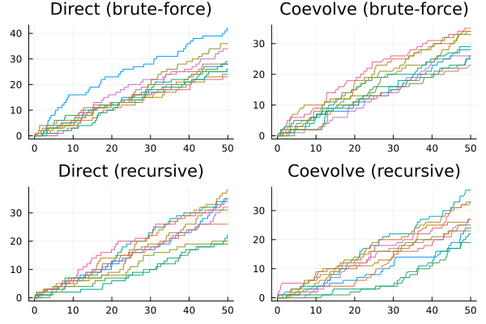
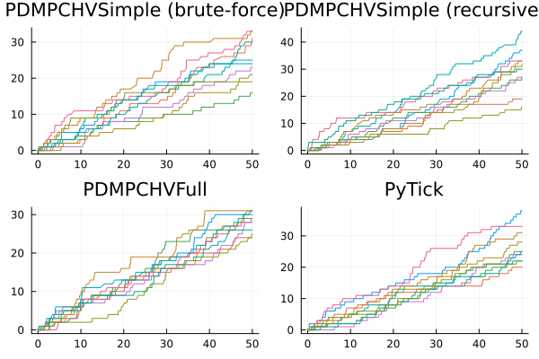
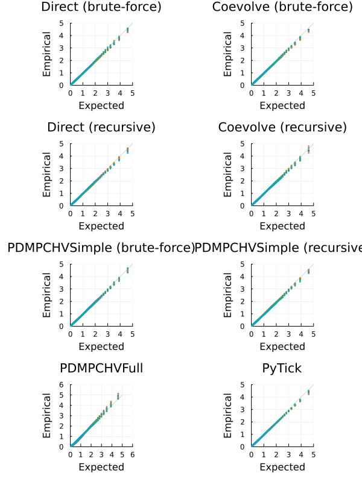
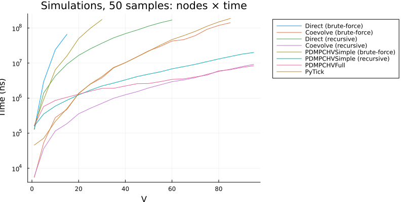
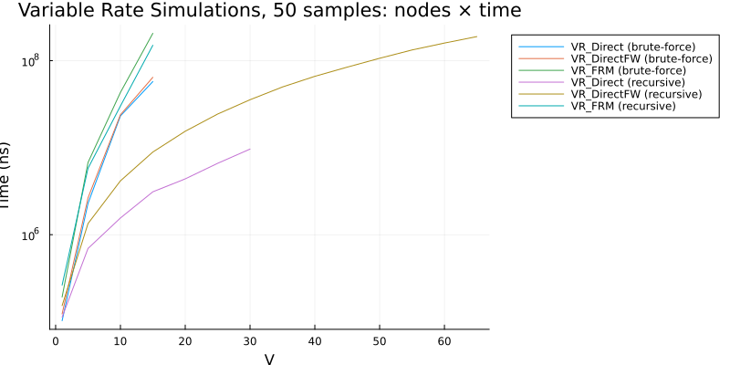

```julia
using JumpProcesses, Graphs, Statistics, BenchmarkTools, Plots
using SciMLLogging
using OrdinaryDiffEq: Tsit5
fmt = :png
width_px, height_px = default(:size);
```


# Model and example solutions

Let a graph with ``V`` nodes, then the multivariate Hawkes process is characterized by ``V`` point processes such that the conditional intensity rate of node ``i`` connected to a set of nodes ``E_i`` in the graph is given by:

```math
  \lambda_i^\ast (t) = \lambda + \sum_{j \in E_i} \sum_{t_{n_j} < t} \alpha \exp \left[-\beta (t - t_{n_j}) \right]
```

This process is known as self-exciting, because the occurrence of an event ``j`` at ``t_{n_j}`` will increase the conditional intensity of all the processes connected to it by ``\alpha``. The excited intensity then decreases at a rate proportional to ``\beta``.

The conditional intensity of this process has a recursive formulation which can significantly speed the simulation. The recursive formulation for the univariate case is derived in Laub et al. [2]. We derive the compound case here. Let ``t_{N_i} = \max \{ t_{n_j} < t \mid j \in E_i \}`` and

```math
\begin{split}
  \phi_i^\ast (t)
    &= \sum_{j \in E_i} \sum_{t_{n_j} < t} \alpha \exp \left[-\beta (t - t_{N_i} + t_{N_i} - t_{n_j}) \right] \\
    &= \exp \left[ -\beta (t - t_{N_i}) \right] \sum_{j \in E_i} \sum_{t_{n_j} \leq t_{N_i}} \alpha \exp \left[-\beta (t_{N_i} - t_{n_j}) \right] \\
    &= \exp \left[ -\beta (t - t_{N_i}) \right] \left( \alpha + \phi_i^\ast (t_{N_i}) \right)
\end{split}
```

Then the conditional intensity can be re-written in terms of ``\phi_i^\ast (t_{N_i})``

```math
  \lambda_i^\ast (t) = \lambda + \phi_i^\ast (t) = \lambda + \exp \left[ -\beta (t - t_{N_i}) \right] \left( \alpha + \phi_i^\ast (t_{N_i}) \right)
```

In Julia, we define a factory for the conditional intensity ``\lambda_i`` which returns the brute-force or recursive versions of the intensity given node ``i`` and network ``g``.

```julia
function hawkes_rate(i::Int, g; use_recursion = false)
    @inline @inbounds function rate_recursion(u, p, t)
        λ, α, β, h, urate, ϕ = p
        urate[i] = λ + exp(-β*(t - h[i]))*ϕ[i]
        return urate[i]
    end

    @inline @inbounds function rate_brute(u, p, t)
        λ, α, β, h, urate = p
        x = zero(typeof(t))
        for j in g[i]
            for _t in reverse(h[j])
                ϕij = α * exp(-β * (t - _t))
                if ϕij ≈ 0
                    break
                end
                x += ϕij
            end
        end
        urate[i] = λ + x
        return urate[i]
    end

    if use_recursion
        return rate_recursion
    else
        return rate_brute
    end
end
```

```
hawkes_rate (generic function with 1 method)
```


Given the rate factory, we can create a jump factory which will create all the jumps in our model.

```julia
function hawkes_jump(i::Int, g; use_recursion = false)
    rate = hawkes_rate(i, g; use_recursion)
    urate = rate
    @inbounds rateinterval(u, p, t) = p[5][i] == p[1] ? typemax(t) : 2 / p[5][i]
    @inbounds lrate(u, p, t) = p[1]
    @inbounds function affect_recursion!(integrator)
        λ, α, β, h, _, ϕ = integrator.p
        for j in g[i]
            ϕ[j] *= exp(-β*(integrator.t - h[j]))
            ϕ[j] += α
            h[j] = integrator.t
        end
        integrator.u[i] += 1
    end
    @inbounds function affect_brute!(integrator)
        push!(integrator.p[4][i], integrator.t)
        integrator.u[i] += 1
    end
    return VariableRateJump(
        rate,
        use_recursion ? affect_recursion! : affect_brute!;
        lrate,
        urate,
        rateinterval
    )
end

function hawkes_jump(u, g; use_recursion = false)
    return [hawkes_jump(i, g; use_recursion) for i in 1:length(u)]
end
```

```
hawkes_jump (generic function with 2 methods)
```


We can then create a factory for Multivariate Hawkes `JumpProblem`s. We can define two types of `JumpProblem`s depending on the aggregator. The `Direct()` aggregator expects an `ODEProblem` since it cannot handle the `SSAStepper` with `VariableRateJump`s.

```julia
function f!(du, u, p, t)
    du .= 0
    nothing
end

function hawkes_problem(
    p,
    agg;
    vr_agg = VR_DirectFW(),
    u = [0.0],
    tspan = (0.0, 50.0),
    save_positions = (false, true),
    g = [[1]],
    use_recursion = false,
)
    oprob = ODEProblem(f!, u, tspan, p)
    jumps = JumpSet(; variable_jumps = hawkes_jump(u, g; use_recursion))
    jprob = JumpProblem(oprob, agg, jumps; vr_aggregator = vr_agg, save_positions = save_positions)
    return jprob
end
```

```
hawkes_problem (generic function with 1 method)
```


The `Coevolve()` aggregator knows how to handle the `SSAStepper`, so it accepts a `DiscreteProblem`.

```julia
function hawkes_problem(
        p,
        agg::Coevolve;
        u = [0.0],
        tspan = (0.0, 50.0),
        save_positions = (false, true),
        g = [[1]],
        use_recursion = false
)
    dprob = DiscreteProblem(u, tspan, p)
    jumps = JumpSet(; variable_jumps = hawkes_jump(u, g; use_recursion))
    jprob = JumpProblem(dprob, agg, jumps; dep_graph = g, save_positions = save_positions)
    return jprob
end
```

```
hawkes_problem (generic function with 2 methods)
```


Let's solve the problems defined so far. We sample a random graph from the Erdős-Rényi model. This model assumes that the probability of an edge between two nodes is independent of other edges, which we fix at ``0.2``. For illustration purposes, we fix ``V = 10``.

```julia
V = 10
G = erdos_renyi(V, 0.2, seed = 9103)
g = [neighbors(G, i) for i in 1:nv(G)]
```

```
10-element Vector{Graphs.FrozenVector{Int64}}:
 [4, 6, 7, 8]
 [8]
 [5]
 [1]
 [3, 6, 9]
 [1, 5, 8]
 [1]
 [1, 2, 6]
 [5]
 0-element Graphs.FrozenVector{Int64}
```


We fix the Hawkes parameters at ``\lambda = 0.5 , \alpha = 0.1 , \beta = 2.0`` which ensures the process does not explode.

```julia
tspan = (0.0, 50.0)
u = [0.0 for i in 1:nv(G)]
p = (0.5, 0.1, 2.0)
```

```
(0.5, 0.1, 2.0)
```


Now, we instantiate the problems, find their solutions and plot the results.

```julia
algorithms = Tuple{Any, Any, Bool, String}[
(
    Direct(), Tsit5(), false, "Direct (brute-force)"),
(
    Coevolve(), SSAStepper(), false, "Coevolve (brute-force)"),
(
    Direct(), Tsit5(), true, "Direct (recursive)"),
(
    Coevolve(), SSAStepper(), true, "Coevolve (recursive)")
]

let fig = []
    for (i, (algo, stepper, use_recursion, label)) in enumerate(algorithms)
        @info label
        if use_recursion
            h = zeros(eltype(tspan), nv(G))
            urate = zeros(eltype(tspan), nv(G))
            ϕ = zeros(eltype(tspan), nv(G))
            _p = (p[1], p[2], p[3], h, ϕ, urate)
        else
            h = [eltype(tspan)[] for _ in 1:nv(G)]
            urate = zeros(eltype(tspan), nv(G))
            _p = (p[1], p[2], p[3], h, urate)
        end
        jump_prob = hawkes_problem(_p, algo; u, tspan, g, use_recursion)
        sol = solve(jump_prob, stepper)
        push!(fig, plot(sol.t, sol[1:V, :]', title = label, legend = false, format = fmt))
    end
    fig = plot(fig..., layout = (2, 2), format = fmt, size = (width_px, 2*height_px/2))
end
```




## Alternative libraries

We benchmark `JumpProcesses.jl` against `PiecewiseDeterministicMarkovProcesses.jl` and Python `Tick` library.

In order to compare with the `PiecewiseDeterministicMarkovProcesses.jl`, we need to reformulate our jump problem as a Piecewise Deterministic Markov Process (PDMP). In this setting, we have two options.

The simple version only requires the conditional intensity. Like above, we define a brute-force and recursive approach. Following the library's specification we define the following functions.

```julia
function hawkes_rate_simple_recursion(rate, xc, xd, p, t, issum::Bool)
    λ, _, β, h, ϕ, g = p
    for i in 1:length(g)
        rate[i] = λ + exp(-β * (t - h[i])) * ϕ[i]
    end
    if issum
        return sum(rate)
    end
    return 0.0
end

function hawkes_rate_simple_brute(rate, xc, xd, p, t, issum::Bool)
    λ, α, β, h, g = p
    for i in 1:length(g)
        x = zero(typeof(t))
        for j in g[i]
            for _t in reverse(h[j])
                ϕij = α * exp(-β * (t - _t))
                if ϕij ≈ 0
                    break
                end
                x += ϕij
            end
        end
        rate[i] = λ + x
    end
    if issum
        return sum(rate)
    end
    return 0.0
end

function hawkes_affect_simple_recursion!(xc, xd, p, t, i::Int64)
    _, α, β, h, ϕ, g = p
    for j in g[i]
        ϕ[j] *= exp(-β * (t - h[j]))
        ϕ[j] += α
        h[j] = t
    end
end

function hawkes_affect_simple_brute!(xc, xd, p, t, i::Int64)
    push!(p[4][i], t)
end
```

```
hawkes_affect_simple_brute! (generic function with 1 method)
```


Since this is a library for PDMP, we also need to define the ODE problem. In the simple version, we simply set it to zero.

```julia
function hawkes_drate_simple(dxc, xc, xd, p, t)
    dxc .= 0
end
```

```
hawkes_drate_simple (generic function with 1 method)
```


Next, we create a factory for the Multivariate Hawkes `PDMPCHVSimple` problem.

```julia
import LinearAlgebra: I
using PiecewiseDeterministicMarkovProcesses
const PDMP = PiecewiseDeterministicMarkovProcesses

struct PDMPCHVSimple end

function hawkes_problem(p,
        agg::PDMPCHVSimple;
        u = [0.0],
        tspan = (0.0, 50.0),
        save_positions = (false, true),
        g = [[1]],
        use_recursion = true)
    xd0 = Array{Int}(u)
    xc0 = copy(u)
    nu = one(eltype(xd0)) * I(length(xd0))
    if use_recursion
        jprob = PDMPProblem(hawkes_drate_simple, hawkes_rate_simple_recursion,
            hawkes_affect_simple_recursion!, nu, xc0, xd0, p, tspan)
    else
        jprob = PDMPProblem(hawkes_drate_simple, hawkes_rate_simple_brute,
            hawkes_affect_simple_brute!, nu, xc0, xd0, p, tspan)
    end
    return jprob
end

push!(algorithms, (PDMPCHVSimple(), CHV(Tsit5()), false, "PDMPCHVSimple (brute-force)"));
push!(algorithms, (PDMPCHVSimple(), CHV(Tsit5()), true, "PDMPCHVSimple (recursive)"));
```


The full version requires that we describe how the conditional intensity changes with time which we derive below:

```math
\begin{split}
  \frac{d \lambda_i^\ast (t)}{d t}
    &= -\beta \sum_{j \in E_i} \sum_{t_{n_j} < t} \alpha \exp \left[-\beta (t - t_{n_j}) \right] \\
    &= -\beta \left( \lambda_i^\ast (t) - \lambda \right)
\end{split}
```

```julia
function hawkes_drate_full(dxc, xc, xd, p, t)
    λ, α, β, _, _, g = p
    for i in 1:length(g)
        dxc[i] = -β * (xc[i] - λ)
    end
end
```

```
hawkes_drate_full (generic function with 1 method)
```


Next, we need to define the intensity rate and the jumps according to library's specification.

```julia
function hawkes_rate_full(rate, xc, xd, p, t, issum::Bool)
    λ, α, β, _, _, g = p
    if issum
        return sum(@view(xc[1:length(g)]))
    end
    rate[1:length(g)] .= @view xc[1:length(g)]
    return 0.0
end

function hawkes_affect_full!(xc, xd, p, t, i::Int64)
    λ, α, β, _, _, g = p
    for j in g[i]
        xc[i] += α
    end
end
```

```
hawkes_affect_full! (generic function with 1 method)
```


Finally, we create a factory for the Multivariate Hawkes `PDMPCHVFull` problem.

```julia
struct PDMPCHVFull end

function hawkes_problem(
        p,
        agg::PDMPCHVFull;
        u = [0.0],
        tspan = (0.0, 50.0),
        save_positions = (false, true),
        g = [[1]],
        use_recursion = true
)
    xd0 = Array{Int}(u)
    xc0 = [p[1] for i in 1:length(u)]
    nu = one(eltype(xd0)) * I(length(xd0))
    jprob = PDMPProblem(
        hawkes_drate_full, hawkes_rate_full, hawkes_affect_full!, nu, xc0, xd0, p, tspan)
    return jprob
end

push!(algorithms, (PDMPCHVFull(), CHV(Tsit5()), true, "PDMPCHVFull"));
```


The Python `Tick` library is installed by the folder setup hook and accessed with `PyCall.jl`. We define a factory for the Multivariate Hawkes `PyTick` problem.

```julia
const BENCHMARK_PYTHON::Bool = tryparse(Bool, get(ENV, "SCIMLBENCHMARK_PYTHON", "true"))

struct PyTick end

if BENCHMARK_PYTHON
    using PyCall
    @info "PyCall" PyCall.libpython PyCall.pyversion PyCall.conda

    function hawkes_problem(
            p,
            agg::PyTick;
            u = [0.0],
            tspan = (0.0, 50.0),
            save_positions = (false, true),
            g = [[1]],
            use_recursion = true
    )
        λ, α, β = p
        SimuHawkesSumExpKernels = pyimport("tick.hawkes")[:SimuHawkesSumExpKernels]
        jprob = SimuHawkesSumExpKernels(
            baseline = fill(λ, length(u)),
            adjacency = [i in j ? α / β : 0.0 for j in g, i in 1:length(u), u in 1:1],
            decays = [β],
            end_time = tspan[2],
            verbose = SciMLLogging.None(),
            force_simulation = true
        )
        return jprob
    end

    push!(algorithms, (PyTick(), nothing, true, "PyTick"));
end
```

```
8-element Vector{Tuple{Any, Any, Bool, String}}:
 (JumpProcesses.Direct(), OrdinaryDiffEqTsit5.Tsit5{typeof(OrdinaryDiffEqCo
re.trivial_limiter!), typeof(OrdinaryDiffEqCore.trivial_limiter!), FastBroa
dcast.Serial}(OrdinaryDiffEqCore.trivial_limiter!, OrdinaryDiffEqCore.trivi
al_limiter!, FastBroadcast.Serial()), 0, "Direct (brute-force)")
 (JumpProcesses.Coevolve(), JumpProcesses.SSAStepper(), 0, "Coevolve (brute
-force)")
 (JumpProcesses.Direct(), OrdinaryDiffEqTsit5.Tsit5{typeof(OrdinaryDiffEqCo
re.trivial_limiter!), typeof(OrdinaryDiffEqCore.trivial_limiter!), FastBroa
dcast.Serial}(OrdinaryDiffEqCore.trivial_limiter!, OrdinaryDiffEqCore.trivi
al_limiter!, FastBroadcast.Serial()), 1, "Direct (recursive)")
 (JumpProcesses.Coevolve(), JumpProcesses.SSAStepper(), 1, "Coevolve (recur
sive)")
 (Main.var"##WeaveSandBox#277".PDMPCHVSimple(), PiecewiseDeterministicMarko
vProcesses.CHV{OrdinaryDiffEqTsit5.Tsit5{typeof(OrdinaryDiffEqCore.trivial_
limiter!), typeof(OrdinaryDiffEqCore.trivial_limiter!), FastBroadcast.Seria
l}}(OrdinaryDiffEqTsit5.Tsit5{typeof(OrdinaryDiffEqCore.trivial_limiter!), 
typeof(OrdinaryDiffEqCore.trivial_limiter!), FastBroadcast.Serial}(Ordinary
DiffEqCore.trivial_limiter!, OrdinaryDiffEqCore.trivial_limiter!, FastBroad
cast.Serial())), 0, "PDMPCHVSimple (brute-force)")
 (Main.var"##WeaveSandBox#277".PDMPCHVSimple(), PiecewiseDeterministicMarko
vProcesses.CHV{OrdinaryDiffEqTsit5.Tsit5{typeof(OrdinaryDiffEqCore.trivial_
limiter!), typeof(OrdinaryDiffEqCore.trivial_limiter!), FastBroadcast.Seria
l}}(OrdinaryDiffEqTsit5.Tsit5{typeof(OrdinaryDiffEqCore.trivial_limiter!), 
typeof(OrdinaryDiffEqCore.trivial_limiter!), FastBroadcast.Serial}(Ordinary
DiffEqCore.trivial_limiter!, OrdinaryDiffEqCore.trivial_limiter!, FastBroad
cast.Serial())), 1, "PDMPCHVSimple (recursive)")
 (Main.var"##WeaveSandBox#277".PDMPCHVFull(), PiecewiseDeterministicMarkovP
rocesses.CHV{OrdinaryDiffEqTsit5.Tsit5{typeof(OrdinaryDiffEqCore.trivial_li
miter!), typeof(OrdinaryDiffEqCore.trivial_limiter!), FastBroadcast.Serial}
}(OrdinaryDiffEqTsit5.Tsit5{typeof(OrdinaryDiffEqCore.trivial_limiter!), ty
peof(OrdinaryDiffEqCore.trivial_limiter!), FastBroadcast.Serial}(OrdinaryDi
ffEqCore.trivial_limiter!, OrdinaryDiffEqCore.trivial_limiter!, FastBroadca
st.Serial())), 1, "PDMPCHVFull")
 (Main.var"##WeaveSandBox#277".PyTick(), nothing, 1, "PyTick")
```


Now, we instantiate the problems, find their solutions and plot the results.

```julia
let fig = []
    for (i, (algo, stepper, use_recursion, label)) in enumerate(algorithms[5:end])
        @info label
        if algo isa PyTick
            _p = (p[1], p[2], p[3])
            jump_prob = hawkes_problem(_p, algo; u, tspan, g, use_recursion)
            jump_prob.reset()
            jump_prob.simulate()
            t = tspan[1]:0.1:tspan[2]
            N = [[sum(jumps .< _t) for _t in t] for jumps in jump_prob.timestamps]
            push!(fig, plot(t, N, title = label, legend = false, format = fmt))
        elseif algo isa PDMPCHVSimple
            if use_recursion
                h = zeros(eltype(tspan), nv(G))
                ϕ = zeros(eltype(tspan), nv(G))
                _p = (p[1], p[2], p[3], h, ϕ, g)
            else
                h = [eltype(tspan)[] for _ in 1:nv(G)]
                _p = (p[1], p[2], p[3], h, g)
            end
            jump_prob = hawkes_problem(_p, algo; u, tspan, g, use_recursion)
            sol = solve(jump_prob, stepper)
            push!(fig, plot(
                sol.time, sol.xd[1:V, :]', title = label, legend = false, format = fmt))
        elseif algo isa PDMPCHVFull
            _p = (p[1], p[2], p[3], nothing, nothing, g)
            jump_prob = hawkes_problem(_p, algo; u, tspan, g, use_recursion)
            sol = solve(jump_prob, stepper)
            push!(fig, plot(
                sol.time, sol.xd[1:V, :]', title = label, legend = false, format = fmt))
        end
    end
    fig = plot(fig..., layout = (2, 2), format = fmt, size = (width_px, 2*height_px/2))
end
```




# Correctness: QQ-Plots

We check that the algorithms produce correct simulation by inspecting their QQ-plots. Point process theory says that transforming the simulated points using the compensator should produce points whose inter-arrival duration is distributed according to the exponential distribution (see Section 7.4 [1]).

The compensator of any point process is the integral of the conditional intensity ``\Lambda_i^\ast(t) = \int_0^t \lambda_i^\ast(u) du``. The compensator for the Multivariate Hawkes process is defined below.

```math
    \Lambda_i^\ast(t) = \lambda t + \frac{\alpha}{\beta} \sum_{j \in E_i} \sum_{t_{n_j} < t} ( 1 - \exp \left[-\beta (t - t_{n_j}) \right])
```

```julia
function hawkes_Λ(i::Int, g, p)
    @inline @inbounds function Λ(t, h)
        λ, α, β = p
        x = λ * t
        for j in g[i]
            for _t in h[j]
                if _t >= t
                    break
                end
                x += (α / β) * (1 - exp(-β * (t - _t)))
            end
        end
        return x
    end
    return Λ
end

function hawkes_Λ(g, p)
    return [hawkes_Λ(i, g, p) for i in 1:length(g)]
end

Λ = hawkes_Λ(g, p)
```

```
10-element Vector{Main.var"##WeaveSandBox#277".var"#Λ#hawkes_Λ##0"{Int64, V
ector{Graphs.FrozenVector{Int64}}, Tuple{Float64, Float64, Float64}}}:
 (::Main.var"##WeaveSandBox#277".var"#Λ#hawkes_Λ##0"{Int64, Vector{Graphs.F
rozenVector{Int64}}, Tuple{Float64, Float64, Float64}}) (generic function w
ith 1 method)
 (::Main.var"##WeaveSandBox#277".var"#Λ#hawkes_Λ##0"{Int64, Vector{Graphs.F
rozenVector{Int64}}, Tuple{Float64, Float64, Float64}}) (generic function w
ith 1 method)
 (::Main.var"##WeaveSandBox#277".var"#Λ#hawkes_Λ##0"{Int64, Vector{Graphs.F
rozenVector{Int64}}, Tuple{Float64, Float64, Float64}}) (generic function w
ith 1 method)
 (::Main.var"##WeaveSandBox#277".var"#Λ#hawkes_Λ##0"{Int64, Vector{Graphs.F
rozenVector{Int64}}, Tuple{Float64, Float64, Float64}}) (generic function w
ith 1 method)
 (::Main.var"##WeaveSandBox#277".var"#Λ#hawkes_Λ##0"{Int64, Vector{Graphs.F
rozenVector{Int64}}, Tuple{Float64, Float64, Float64}}) (generic function w
ith 1 method)
 (::Main.var"##WeaveSandBox#277".var"#Λ#hawkes_Λ##0"{Int64, Vector{Graphs.F
rozenVector{Int64}}, Tuple{Float64, Float64, Float64}}) (generic function w
ith 1 method)
 (::Main.var"##WeaveSandBox#277".var"#Λ#hawkes_Λ##0"{Int64, Vector{Graphs.F
rozenVector{Int64}}, Tuple{Float64, Float64, Float64}}) (generic function w
ith 1 method)
 (::Main.var"##WeaveSandBox#277".var"#Λ#hawkes_Λ##0"{Int64, Vector{Graphs.F
rozenVector{Int64}}, Tuple{Float64, Float64, Float64}}) (generic function w
ith 1 method)
 (::Main.var"##WeaveSandBox#277".var"#Λ#hawkes_Λ##0"{Int64, Vector{Graphs.F
rozenVector{Int64}}, Tuple{Float64, Float64, Float64}}) (generic function w
ith 1 method)
 (::Main.var"##WeaveSandBox#277".var"#Λ#hawkes_Λ##0"{Int64, Vector{Graphs.F
rozenVector{Int64}}, Tuple{Float64, Float64, Float64}}) (generic function w
ith 1 method)
```


We need a method for extracting the history from a simulation run. Below, we define such functions for each type of algorithm.

```julia
"""
Given an ODE solution `sol`, recover the timestamp in which events occurred. It
returns a vector with the history of each process in `sol`.

It assumes that `JumpProblem` was initialized with `save_positions` equal to
`(true, false)`, `(false, true)` or `(true, true)` such the system's state is
saved before and/or after the jump occurs; and, that `sol.u` is a
non-decreasing series that counts the total number of events observed as a
function of time.
"""
function histories(u, t)
    _u = permutedims(reduce(hcat, u))
    k = size(_u)[2]
    # computes a mask that show when total counts change
    mask = cat(fill(0.0, 1, k), _u[2:end, :] .- _u[1:(end - 1), :], dims = 1) .≈ 1
    h = Vector{typeof(t)}(undef, k)
    @inbounds for i in 1:k
        h[i] = t[mask[:, i]]
    end
    return h
end

function histories(sol::S) where {S <: ODESolution}
    # get u and permute the dimensions to get a matrix n x k with n obsevations and k processes.
    if sol.u[1] isa ExtendedJumpArray
        u = map((u) -> u.u, sol.u)
    else
        u = sol.u
    end
    return histories(u, sol.t)
end

function histories(sol::S) where {S <: PDMP.PDMPResult}
    return histories(sol.xd.u, sol.time)
end

function histories(sols)
    map(histories, sols)
end
```

```
histories (generic function with 4 methods)
```


We also need to compute the quantiles of the empirical distribution given a history of events `hs`, the compensator `Λ` and the target quantiles `quant`.

```julia
import Distributions: Exponential

"""
Computes the empirical and expected quantiles given a history of events `hs`,
the compensator `Λ` and the target quantiles `quant`.

The history `hs` is a vector with the history of each process. Alternatively,
the function also takes a vector of histories containing the histories from
multiple runs.

The compensator `Λ` can either be an homogeneous compensator function that
equally applies to all the processes in `hs`. Alternatively, it accepts a
vector of compensator that applies to each process.
"""
function qq(hs, Λ, quant = 0.01:0.01:0.99)
    _hs = apply_Λ(hs, Λ)
    T = typeof(hs[1][1][1])
    Δs = Vector{Vector{T}}(undef, length(hs[1]))
    for k in 1:length(Δs)
        _Δs = Vector{Vector{T}}(undef, length(hs))
        for i in 1:length(_Δs)
            _Δs[i] = _hs[i][k][2:end] .- _hs[i][k][1:(end - 1)]
        end
        Δs[k] = reduce(vcat, _Δs)
    end
    empirical_quant = map((_Δs) -> quantile(_Δs, quant), Δs)
    expected_quant = quantile(Exponential(1.0), quant)
    return empirical_quant, expected_quant
end

"""
Compute the compensator `Λ` value for each timestamp recorded in history `hs`.

The history `hs` is a vector with the history of each process. Alternatively,
the function also takes a vector of histories containing the histories from
multiple runs.

The compensator `Λ` can either be an homogeneous compensator function that
equally applies to all the processes in `hs`. Alternatively, it accepts a
vector of compensator that applies to each process.
"""
function apply_Λ(hs::V, Λ) where {V <: Vector{<:Number}}
    _hs = similar(hs)
    @inbounds for n in 1:length(hs)
        _hs[n] = Λ(hs[n], hs)
    end
    return _hs
end

function apply_Λ(k::Int, hs::V, Λ::A) where {V <: Vector{<:Vector{<:Number}}, A <: Array}
    @inbounds hsk = hs[k]
    @inbounds Λk = Λ[k]
    _hs = similar(hsk)
    @inbounds for n in 1:length(hsk)
        _hs[n] = Λk(hsk[n], hs)
    end
    return _hs
end

function apply_Λ(hs::V, Λ) where {V <: Vector{<:Vector{<:Number}}}
    _hs = similar(hs)
    @inbounds for k in 1:length(_hs)
        _hs[k] = apply_Λ(hs[k], Λ)
    end
    return _hs
end

function apply_Λ(hs::V, Λ::A) where {V <: Vector{<:Vector{<:Number}}, A <: Array}
    _hs = similar(hs)
    @inbounds for k in 1:length(_hs)
        _hs[k] = apply_Λ(k, hs, Λ)
    end
    return _hs
end

function apply_Λ(hs::V, Λ) where {V <: Vector{<:Vector{<:Vector{<:Number}}}}
    return map((_hs) -> apply_Λ(_hs, Λ), hs)
end
```

```
apply_Λ (generic function with 5 methods)
```


We can construct QQ-plots with a Plot recipe as follows.

```julia
@userplot QQPlot
@recipe function f(x::QQPlot)
    empirical_quant, expected_quant = x.args
    max_empirical_quant = maximum(maximum, empirical_quant)
    max_expected_quant = maximum(expected_quant)
    upperlim = ceil(maximum([max_empirical_quant, max_expected_quant]))
    @series begin
        seriestype := :line
        linecolor := :lightgray
        label --> ""
        (x) -> x
    end
    @series begin
        seriestype := :scatter
        aspect_ratio := :equal
        xlims := (0.0, upperlim)
        ylims := (0.0, upperlim)
        xaxis --> "Expected"
        yaxis --> "Empirical"
        markerstrokewidth --> 0
        markerstrokealpha --> 0
        markersize --> 1.5
        size --> (400, 500)
        label --> permutedims(["quantiles $i" for i in 1:length(empirical_quant)])
        expected_quant, empirical_quant
    end
end
```


Now, we simulate all of the algorithms we defined in the previous Section ``250`` times to produce their QQ-plots.

```julia
let fig = []
    for (i, (algo, stepper, use_recursion, label)) in enumerate(algorithms)
        @info label
        if algo isa PyTick
            _p = (p[1], p[2], p[3])
        elseif algo isa PDMPCHVSimple
            if use_recursion
                h = zeros(eltype(tspan), nv(G))
                ϕ = zeros(eltype(tspan), nv(G))
                _p = (p[1], p[2], p[3], h, ϕ, g)
            else
                h = [eltype(tspan)[] for _ in 1:nv(G)]
                _p = (p[1], p[2], p[3], h, g)
            end
        elseif algo isa PDMPCHVFull
            _p = (p[1], p[2], p[3], nothing, nothing, g)
        else
            if use_recursion
                h = zeros(eltype(tspan), nv(G))
                ϕ = zeros(eltype(tspan), nv(G))
                urate = zeros(eltype(tspan), nv(G))
                _p = (p[1], p[2], p[3], h, urate, ϕ)
            else
                h = [eltype(tspan)[] for _ in 1:nv(G)]
                urate = zeros(eltype(tspan), nv(G))
                _p = (p[1], p[2], p[3], h, urate)
            end
        end
        jump_prob = hawkes_problem(_p, algo; u, tspan, g, use_recursion)
        runs = Vector{Vector{Vector{Number}}}(undef, 250)
        for n in 1:length(runs)
            if algo isa PyTick
                jump_prob.reset()
                jump_prob.simulate()
                runs[n] = jump_prob.timestamps
            else
                if ~(algo isa PDMPCHVFull)
                    if use_recursion
                        h .= 0
                        ϕ .= 0
                    else
                        for _h in h
                            empty!(_h)
                        end
                    end
                    if ~(algo isa PDMPCHVSimple)
                        urate .= 0
                    end
                end
                runs[n] = histories(solve(jump_prob, stepper))
            end
        end
        qqs = qq(runs, Λ)
        push!(fig, qqplot(
            qqs..., legend = false, aspect_ratio = :equal, title = label, fmt = fmt))
    end
    fig = plot(fig..., layout = (4, 2), fmt = fmt, size = (width_px, 4*height_px/2))
end
```

```
-----------------------------------------------------
Launching simulation using SimuHawkesSumExpKernels...
Done simulating using SimuHawkesSumExpKernels in 7.85e-04 seconds.
-----------------------------------------------------
Launching simulation using SimuHawkesSumExpKernels...
Done simulating using SimuHawkesSumExpKernels in 5.41e-04 seconds.
-----------------------------------------------------
Launching simulation using SimuHawkesSumExpKernels...
Done simulating using SimuHawkesSumExpKernels in 3.98e-04 seconds.
-----------------------------------------------------
Launching simulation using SimuHawkesSumExpKernels...
Done simulating using SimuHawkesSumExpKernels in 3.72e-04 seconds.
-----------------------------------------------------
Launching simulation using SimuHawkesSumExpKernels...
Done simulating using SimuHawkesSumExpKernels in 4.02e-04 seconds.
-----------------------------------------------------
Launching simulation using SimuHawkesSumExpKernels...
Done simulating using SimuHawkesSumExpKernels in 3.96e-04 seconds.
-----------------------------------------------------
Launching simulation using SimuHawkesSumExpKernels...
Done simulating using SimuHawkesSumExpKernels in 3.62e-04 seconds.
-----------------------------------------------------
Launching simulation using SimuHawkesSumExpKernels...
Done simulating using SimuHawkesSumExpKernels in 3.86e-04 seconds.
-----------------------------------------------------
Launching simulation using SimuHawkesSumExpKernels...
Done simulating using SimuHawkesSumExpKernels in 4.19e-04 seconds.
-----------------------------------------------------
Launching simulation using SimuHawkesSumExpKernels...
Done simulating using SimuHawkesSumExpKernels in 3.79e-04 seconds.
-----------------------------------------------------
Launching simulation using SimuHawkesSumExpKernels...
Done simulating using SimuHawkesSumExpKernels in 3.33e-04 seconds.
-----------------------------------------------------
Launching simulation using SimuHawkesSumExpKernels...
Done simulating using SimuHawkesSumExpKernels in 3.68e-04 seconds.
-----------------------------------------------------
Launching simulation using SimuHawkesSumExpKernels...
Done simulating using SimuHawkesSumExpKernels in 4.10e-04 seconds.
-----------------------------------------------------
Launching simulation using SimuHawkesSumExpKernels...
Done simulating using SimuHawkesSumExpKernels in 3.90e-04 seconds.
-----------------------------------------------------
Launching simulation using SimuHawkesSumExpKernels...
Done simulating using SimuHawkesSumExpKernels in 3.92e-04 seconds.
-----------------------------------------------------
Launching simulation using SimuHawkesSumExpKernels...
Done simulating using SimuHawkesSumExpKernels in 3.76e-04 seconds.
-----------------------------------------------------
Launching simulation using SimuHawkesSumExpKernels...
Done simulating using SimuHawkesSumExpKernels in 3.92e-04 seconds.
-----------------------------------------------------
Launching simulation using SimuHawkesSumExpKernels...
Done simulating using SimuHawkesSumExpKernels in 4.25e-04 seconds.
-----------------------------------------------------
Launching simulation using SimuHawkesSumExpKernels...
Done simulating using SimuHawkesSumExpKernels in 3.91e-04 seconds.
-----------------------------------------------------
Launching simulation using SimuHawkesSumExpKernels...
Done simulating using SimuHawkesSumExpKernels in 3.95e-04 seconds.
-----------------------------------------------------
Launching simulation using SimuHawkesSumExpKernels...
Done simulating using SimuHawkesSumExpKernels in 3.81e-04 seconds.
-----------------------------------------------------
Launching simulation using SimuHawkesSumExpKernels...
Done simulating using SimuHawkesSumExpKernels in 4.12e-04 seconds.
-----------------------------------------------------
Launching simulation using SimuHawkesSumExpKernels...
Done simulating using SimuHawkesSumExpKernels in 3.69e-04 seconds.
-----------------------------------------------------
Launching simulation using SimuHawkesSumExpKernels...
Done simulating using SimuHawkesSumExpKernels in 4.15e-04 seconds.
-----------------------------------------------------
Launching simulation using SimuHawkesSumExpKernels...
Done simulating using SimuHawkesSumExpKernels in 3.93e-04 seconds.
-----------------------------------------------------
Launching simulation using SimuHawkesSumExpKernels...
Done simulating using SimuHawkesSumExpKernels in 3.81e-04 seconds.
-----------------------------------------------------
Launching simulation using SimuHawkesSumExpKernels...
Done simulating using SimuHawkesSumExpKernels in 3.59e-04 seconds.
-----------------------------------------------------
Launching simulation using SimuHawkesSumExpKernels...
Done simulating using SimuHawkesSumExpKernels in 3.98e-04 seconds.
-----------------------------------------------------
Launching simulation using SimuHawkesSumExpKernels...
Done simulating using SimuHawkesSumExpKernels in 3.65e-04 seconds.
-----------------------------------------------------
Launching simulation using SimuHawkesSumExpKernels...
Done simulating using SimuHawkesSumExpKernels in 3.55e-04 seconds.
-----------------------------------------------------
Launching simulation using SimuHawkesSumExpKernels...
Done simulating using SimuHawkesSumExpKernels in 3.85e-04 seconds.
-----------------------------------------------------
Launching simulation using SimuHawkesSumExpKernels...
Done simulating using SimuHawkesSumExpKernels in 3.69e-04 seconds.
-----------------------------------------------------
Launching simulation using SimuHawkesSumExpKernels...
Done simulating using SimuHawkesSumExpKernels in 3.96e-04 seconds.
-----------------------------------------------------
Launching simulation using SimuHawkesSumExpKernels...
Done simulating using SimuHawkesSumExpKernels in 4.06e-04 seconds.
-----------------------------------------------------
Launching simulation using SimuHawkesSumExpKernels...
Done simulating using SimuHawkesSumExpKernels in 3.60e-04 seconds.
-----------------------------------------------------
Launching simulation using SimuHawkesSumExpKernels...
Done simulating using SimuHawkesSumExpKernels in 3.81e-04 seconds.
-----------------------------------------------------
Launching simulation using SimuHawkesSumExpKernels...
Done simulating using SimuHawkesSumExpKernels in 3.47e-04 seconds.
-----------------------------------------------------
Launching simulation using SimuHawkesSumExpKernels...
Done simulating using SimuHawkesSumExpKernels in 3.92e-04 seconds.
-----------------------------------------------------
Launching simulation using SimuHawkesSumExpKernels...
Done simulating using SimuHawkesSumExpKernels in 4.18e-04 seconds.
-----------------------------------------------------
Launching simulation using SimuHawkesSumExpKernels...
Done simulating using SimuHawkesSumExpKernels in 3.48e-04 seconds.
-----------------------------------------------------
Launching simulation using SimuHawkesSumExpKernels...
Done simulating using SimuHawkesSumExpKernels in 4.00e-04 seconds.
-----------------------------------------------------
Launching simulation using SimuHawkesSumExpKernels...
Done simulating using SimuHawkesSumExpKernels in 4.61e-04 seconds.
-----------------------------------------------------
Launching simulation using SimuHawkesSumExpKernels...
Done simulating using SimuHawkesSumExpKernels in 4.08e-04 seconds.
-----------------------------------------------------
Launching simulation using SimuHawkesSumExpKernels...
Done simulating using SimuHawkesSumExpKernels in 4.02e-04 seconds.
-----------------------------------------------------
Launching simulation using SimuHawkesSumExpKernels...
Done simulating using SimuHawkesSumExpKernels in 4.16e-04 seconds.
-----------------------------------------------------
Launching simulation using SimuHawkesSumExpKernels...
Done simulating using SimuHawkesSumExpKernels in 4.30e-04 seconds.
-----------------------------------------------------
Launching simulation using SimuHawkesSumExpKernels...
Done simulating using SimuHawkesSumExpKernels in 3.90e-04 seconds.
-----------------------------------------------------
Launching simulation using SimuHawkesSumExpKernels...
Done simulating using SimuHawkesSumExpKernels in 3.76e-04 seconds.
-----------------------------------------------------
Launching simulation using SimuHawkesSumExpKernels...
Done simulating using SimuHawkesSumExpKernels in 3.71e-04 seconds.
-----------------------------------------------------
Launching simulation using SimuHawkesSumExpKernels...
Done simulating using SimuHawkesSumExpKernels in 4.36e-04 seconds.
-----------------------------------------------------
Launching simulation using SimuHawkesSumExpKernels...
Done simulating using SimuHawkesSumExpKernels in 4.09e-04 seconds.
-----------------------------------------------------
Launching simulation using SimuHawkesSumExpKernels...
Done simulating using SimuHawkesSumExpKernels in 3.83e-04 seconds.
-----------------------------------------------------
Launching simulation using SimuHawkesSumExpKernels...
Done simulating using SimuHawkesSumExpKernels in 4.12e-04 seconds.
-----------------------------------------------------
Launching simulation using SimuHawkesSumExpKernels...
Done simulating using SimuHawkesSumExpKernels in 3.91e-04 seconds.
-----------------------------------------------------
Launching simulation using SimuHawkesSumExpKernels...
Done simulating using SimuHawkesSumExpKernels in 3.86e-04 seconds.
-----------------------------------------------------
Launching simulation using SimuHawkesSumExpKernels...
Done simulating using SimuHawkesSumExpKernels in 3.80e-04 seconds.
-----------------------------------------------------
Launching simulation using SimuHawkesSumExpKernels...
Done simulating using SimuHawkesSumExpKernels in 4.17e-04 seconds.
-----------------------------------------------------
Launching simulation using SimuHawkesSumExpKernels...
Done simulating using SimuHawkesSumExpKernels in 3.82e-04 seconds.
-----------------------------------------------------
Launching simulation using SimuHawkesSumExpKernels...
Done simulating using SimuHawkesSumExpKernels in 3.71e-04 seconds.
-----------------------------------------------------
Launching simulation using SimuHawkesSumExpKernels...
Done simulating using SimuHawkesSumExpKernels in 4.10e-04 seconds.
-----------------------------------------------------
Launching simulation using SimuHawkesSumExpKernels...
Done simulating using SimuHawkesSumExpKernels in 3.96e-04 seconds.
-----------------------------------------------------
Launching simulation using SimuHawkesSumExpKernels...
Done simulating using SimuHawkesSumExpKernels in 3.77e-04 seconds.
-----------------------------------------------------
Launching simulation using SimuHawkesSumExpKernels...
Done simulating using SimuHawkesSumExpKernels in 3.84e-04 seconds.
-----------------------------------------------------
Launching simulation using SimuHawkesSumExpKernels...
Done simulating using SimuHawkesSumExpKernels in 4.97e-04 seconds.
-----------------------------------------------------
Launching simulation using SimuHawkesSumExpKernels...
Done simulating using SimuHawkesSumExpKernels in 4.32e-04 seconds.
-----------------------------------------------------
Launching simulation using SimuHawkesSumExpKernels...
Done simulating using SimuHawkesSumExpKernels in 3.54e-04 seconds.
-----------------------------------------------------
Launching simulation using SimuHawkesSumExpKernels...
Done simulating using SimuHawkesSumExpKernels in 3.89e-04 seconds.
-----------------------------------------------------
Launching simulation using SimuHawkesSumExpKernels...
Done simulating using SimuHawkesSumExpKernels in 4.12e-04 seconds.
-----------------------------------------------------
Launching simulation using SimuHawkesSumExpKernels...
Done simulating using SimuHawkesSumExpKernels in 3.83e-04 seconds.
-----------------------------------------------------
Launching simulation using SimuHawkesSumExpKernels...
Done simulating using SimuHawkesSumExpKernels in 3.84e-04 seconds.
-----------------------------------------------------
Launching simulation using SimuHawkesSumExpKernels...
Done simulating using SimuHawkesSumExpKernels in 4.27e-04 seconds.
-----------------------------------------------------
Launching simulation using SimuHawkesSumExpKernels...
Done simulating using SimuHawkesSumExpKernels in 3.92e-04 seconds.
-----------------------------------------------------
Launching simulation using SimuHawkesSumExpKernels...
Done simulating using SimuHawkesSumExpKernels in 4.79e-04 seconds.
-----------------------------------------------------
Launching simulation using SimuHawkesSumExpKernels...
Done simulating using SimuHawkesSumExpKernels in 3.93e-04 seconds.
-----------------------------------------------------
Launching simulation using SimuHawkesSumExpKernels...
Done simulating using SimuHawkesSumExpKernels in 3.92e-04 seconds.
-----------------------------------------------------
Launching simulation using SimuHawkesSumExpKernels...
Done simulating using SimuHawkesSumExpKernels in 3.82e-04 seconds.
-----------------------------------------------------
Launching simulation using SimuHawkesSumExpKernels...
Done simulating using SimuHawkesSumExpKernels in 3.87e-04 seconds.
-----------------------------------------------------
Launching simulation using SimuHawkesSumExpKernels...
Done simulating using SimuHawkesSumExpKernels in 3.99e-04 seconds.
-----------------------------------------------------
Launching simulation using SimuHawkesSumExpKernels...
Done simulating using SimuHawkesSumExpKernels in 3.69e-04 seconds.
-----------------------------------------------------
Launching simulation using SimuHawkesSumExpKernels...
Done simulating using SimuHawkesSumExpKernels in 3.75e-04 seconds.
-----------------------------------------------------
Launching simulation using SimuHawkesSumExpKernels...
Done simulating using SimuHawkesSumExpKernels in 4.05e-04 seconds.
-----------------------------------------------------
Launching simulation using SimuHawkesSumExpKernels...
Done simulating using SimuHawkesSumExpKernels in 3.85e-04 seconds.
-----------------------------------------------------
Launching simulation using SimuHawkesSumExpKernels...
Done simulating using SimuHawkesSumExpKernels in 3.71e-04 seconds.
-----------------------------------------------------
Launching simulation using SimuHawkesSumExpKernels...
Done simulating using SimuHawkesSumExpKernels in 3.75e-04 seconds.
-----------------------------------------------------
Launching simulation using SimuHawkesSumExpKernels...
Done simulating using SimuHawkesSumExpKernels in 4.13e-04 seconds.
-----------------------------------------------------
Launching simulation using SimuHawkesSumExpKernels...
Done simulating using SimuHawkesSumExpKernels in 3.86e-04 seconds.
-----------------------------------------------------
Launching simulation using SimuHawkesSumExpKernels...
Done simulating using SimuHawkesSumExpKernels in 3.75e-04 seconds.
-----------------------------------------------------
Launching simulation using SimuHawkesSumExpKernels...
Done simulating using SimuHawkesSumExpKernels in 3.66e-04 seconds.
-----------------------------------------------------
Launching simulation using SimuHawkesSumExpKernels...
Done simulating using SimuHawkesSumExpKernels in 4.12e-04 seconds.
-----------------------------------------------------
Launching simulation using SimuHawkesSumExpKernels...
Done simulating using SimuHawkesSumExpKernels in 3.96e-04 seconds.
-----------------------------------------------------
Launching simulation using SimuHawkesSumExpKernels...
Done simulating using SimuHawkesSumExpKernels in 3.62e-04 seconds.
-----------------------------------------------------
Launching simulation using SimuHawkesSumExpKernels...
Done simulating using SimuHawkesSumExpKernels in 3.87e-04 seconds.
-----------------------------------------------------
Launching simulation using SimuHawkesSumExpKernels...
Done simulating using SimuHawkesSumExpKernels in 3.37e-04 seconds.
-----------------------------------------------------
Launching simulation using SimuHawkesSumExpKernels...
Done simulating using SimuHawkesSumExpKernels in 3.89e-04 seconds.
-----------------------------------------------------
Launching simulation using SimuHawkesSumExpKernels...
Done simulating using SimuHawkesSumExpKernels in 3.92e-04 seconds.
-----------------------------------------------------
Launching simulation using SimuHawkesSumExpKernels...
Done simulating using SimuHawkesSumExpKernels in 3.22e-04 seconds.
-----------------------------------------------------
Launching simulation using SimuHawkesSumExpKernels...
Done simulating using SimuHawkesSumExpKernels in 4.07e-04 seconds.
-----------------------------------------------------
Launching simulation using SimuHawkesSumExpKernels...
Done simulating using SimuHawkesSumExpKernels in 3.49e-04 seconds.
-----------------------------------------------------
Launching simulation using SimuHawkesSumExpKernels...
Done simulating using SimuHawkesSumExpKernels in 3.61e-04 seconds.
-----------------------------------------------------
Launching simulation using SimuHawkesSumExpKernels...
Done simulating using SimuHawkesSumExpKernels in 3.86e-04 seconds.
-----------------------------------------------------
Launching simulation using SimuHawkesSumExpKernels...
Done simulating using SimuHawkesSumExpKernels in 4.40e-04 seconds.
-----------------------------------------------------
Launching simulation using SimuHawkesSumExpKernels...
Done simulating using SimuHawkesSumExpKernels in 3.90e-04 seconds.
-----------------------------------------------------
Launching simulation using SimuHawkesSumExpKernels...
Done simulating using SimuHawkesSumExpKernels in 3.46e-04 seconds.
-----------------------------------------------------
Launching simulation using SimuHawkesSumExpKernels...
Done simulating using SimuHawkesSumExpKernels in 3.91e-04 seconds.
-----------------------------------------------------
Launching simulation using SimuHawkesSumExpKernels...
Done simulating using SimuHawkesSumExpKernels in 3.77e-04 seconds.
-----------------------------------------------------
Launching simulation using SimuHawkesSumExpKernels...
Done simulating using SimuHawkesSumExpKernels in 4.22e-04 seconds.
-----------------------------------------------------
Launching simulation using SimuHawkesSumExpKernels...
Done simulating using SimuHawkesSumExpKernels in 3.77e-04 seconds.
-----------------------------------------------------
Launching simulation using SimuHawkesSumExpKernels...
Done simulating using SimuHawkesSumExpKernels in 3.58e-04 seconds.
-----------------------------------------------------
Launching simulation using SimuHawkesSumExpKernels...
Done simulating using SimuHawkesSumExpKernels in 3.81e-04 seconds.
-----------------------------------------------------
Launching simulation using SimuHawkesSumExpKernels...
Done simulating using SimuHawkesSumExpKernels in 3.89e-04 seconds.
-----------------------------------------------------
Launching simulation using SimuHawkesSumExpKernels...
Done simulating using SimuHawkesSumExpKernels in 3.41e-04 seconds.
-----------------------------------------------------
Launching simulation using SimuHawkesSumExpKernels...
Done simulating using SimuHawkesSumExpKernels in 3.60e-04 seconds.
-----------------------------------------------------
Launching simulation using SimuHawkesSumExpKernels...
Done simulating using SimuHawkesSumExpKernels in 3.72e-04 seconds.
-----------------------------------------------------
Launching simulation using SimuHawkesSumExpKernels...
Done simulating using SimuHawkesSumExpKernels in 3.70e-04 seconds.
-----------------------------------------------------
Launching simulation using SimuHawkesSumExpKernels...
Done simulating using SimuHawkesSumExpKernels in 4.07e-04 seconds.
-----------------------------------------------------
Launching simulation using SimuHawkesSumExpKernels...
Done simulating using SimuHawkesSumExpKernels in 3.85e-04 seconds.
-----------------------------------------------------
Launching simulation using SimuHawkesSumExpKernels...
Done simulating using SimuHawkesSumExpKernels in 3.98e-04 seconds.
-----------------------------------------------------
Launching simulation using SimuHawkesSumExpKernels...
Done simulating using SimuHawkesSumExpKernels in 3.50e-04 seconds.
-----------------------------------------------------
Launching simulation using SimuHawkesSumExpKernels...
Done simulating using SimuHawkesSumExpKernels in 3.88e-04 seconds.
-----------------------------------------------------
Launching simulation using SimuHawkesSumExpKernels...
Done simulating using SimuHawkesSumExpKernels in 3.55e-04 seconds.
-----------------------------------------------------
Launching simulation using SimuHawkesSumExpKernels...
Done simulating using SimuHawkesSumExpKernels in 3.99e-04 seconds.
-----------------------------------------------------
Launching simulation using SimuHawkesSumExpKernels...
Done simulating using SimuHawkesSumExpKernels in 3.73e-04 seconds.
-----------------------------------------------------
Launching simulation using SimuHawkesSumExpKernels...
Done simulating using SimuHawkesSumExpKernels in 3.77e-04 seconds.
-----------------------------------------------------
Launching simulation using SimuHawkesSumExpKernels...
Done simulating using SimuHawkesSumExpKernels in 4.25e-04 seconds.
-----------------------------------------------------
Launching simulation using SimuHawkesSumExpKernels...
Done simulating using SimuHawkesSumExpKernels in 3.80e-04 seconds.
-----------------------------------------------------
Launching simulation using SimuHawkesSumExpKernels...
Done simulating using SimuHawkesSumExpKernels in 3.95e-04 seconds.
-----------------------------------------------------
Launching simulation using SimuHawkesSumExpKernels...
Done simulating using SimuHawkesSumExpKernels in 4.16e-04 seconds.
-----------------------------------------------------
Launching simulation using SimuHawkesSumExpKernels...
Done simulating using SimuHawkesSumExpKernels in 3.81e-04 seconds.
-----------------------------------------------------
Launching simulation using SimuHawkesSumExpKernels...
Done simulating using SimuHawkesSumExpKernels in 3.96e-04 seconds.
-----------------------------------------------------
Launching simulation using SimuHawkesSumExpKernels...
Done simulating using SimuHawkesSumExpKernels in 3.63e-04 seconds.
-----------------------------------------------------
Launching simulation using SimuHawkesSumExpKernels...
Done simulating using SimuHawkesSumExpKernels in 3.72e-04 seconds.
-----------------------------------------------------
Launching simulation using SimuHawkesSumExpKernels...
Done simulating using SimuHawkesSumExpKernels in 4.33e-04 seconds.
-----------------------------------------------------
Launching simulation using SimuHawkesSumExpKernels...
Done simulating using SimuHawkesSumExpKernels in 3.54e-04 seconds.
-----------------------------------------------------
Launching simulation using SimuHawkesSumExpKernels...
Done simulating using SimuHawkesSumExpKernels in 3.49e-04 seconds.
-----------------------------------------------------
Launching simulation using SimuHawkesSumExpKernels...
Done simulating using SimuHawkesSumExpKernels in 4.23e-04 seconds.
-----------------------------------------------------
Launching simulation using SimuHawkesSumExpKernels...
Done simulating using SimuHawkesSumExpKernels in 3.53e-04 seconds.
-----------------------------------------------------
Launching simulation using SimuHawkesSumExpKernels...
Done simulating using SimuHawkesSumExpKernels in 3.80e-04 seconds.
-----------------------------------------------------
Launching simulation using SimuHawkesSumExpKernels...
Done simulating using SimuHawkesSumExpKernels in 3.64e-04 seconds.
-----------------------------------------------------
Launching simulation using SimuHawkesSumExpKernels...
Done simulating using SimuHawkesSumExpKernels in 3.65e-04 seconds.
-----------------------------------------------------
Launching simulation using SimuHawkesSumExpKernels...
Done simulating using SimuHawkesSumExpKernels in 3.66e-04 seconds.
-----------------------------------------------------
Launching simulation using SimuHawkesSumExpKernels...
Done simulating using SimuHawkesSumExpKernels in 4.18e-04 seconds.
-----------------------------------------------------
Launching simulation using SimuHawkesSumExpKernels...
Done simulating using SimuHawkesSumExpKernels in 3.82e-04 seconds.
-----------------------------------------------------
Launching simulation using SimuHawkesSumExpKernels...
Done simulating using SimuHawkesSumExpKernels in 3.85e-04 seconds.
-----------------------------------------------------
Launching simulation using SimuHawkesSumExpKernels...
Done simulating using SimuHawkesSumExpKernels in 3.83e-04 seconds.
-----------------------------------------------------
Launching simulation using SimuHawkesSumExpKernels...
Done simulating using SimuHawkesSumExpKernels in 3.76e-04 seconds.
-----------------------------------------------------
Launching simulation using SimuHawkesSumExpKernels...
Done simulating using SimuHawkesSumExpKernels in 3.95e-04 seconds.
-----------------------------------------------------
Launching simulation using SimuHawkesSumExpKernels...
Done simulating using SimuHawkesSumExpKernels in 3.49e-04 seconds.
-----------------------------------------------------
Launching simulation using SimuHawkesSumExpKernels...
Done simulating using SimuHawkesSumExpKernels in 3.89e-04 seconds.
-----------------------------------------------------
Launching simulation using SimuHawkesSumExpKernels...
Done simulating using SimuHawkesSumExpKernels in 3.85e-04 seconds.
-----------------------------------------------------
Launching simulation using SimuHawkesSumExpKernels...
Done simulating using SimuHawkesSumExpKernels in 3.88e-04 seconds.
-----------------------------------------------------
Launching simulation using SimuHawkesSumExpKernels...
Done simulating using SimuHawkesSumExpKernels in 3.67e-04 seconds.
-----------------------------------------------------
Launching simulation using SimuHawkesSumExpKernels...
Done simulating using SimuHawkesSumExpKernels in 4.03e-04 seconds.
-----------------------------------------------------
Launching simulation using SimuHawkesSumExpKernels...
Done simulating using SimuHawkesSumExpKernels in 3.64e-04 seconds.
-----------------------------------------------------
Launching simulation using SimuHawkesSumExpKernels...
Done simulating using SimuHawkesSumExpKernels in 3.83e-04 seconds.
-----------------------------------------------------
Launching simulation using SimuHawkesSumExpKernels...
Done simulating using SimuHawkesSumExpKernels in 3.93e-04 seconds.
-----------------------------------------------------
Launching simulation using SimuHawkesSumExpKernels...
Done simulating using SimuHawkesSumExpKernels in 3.72e-04 seconds.
-----------------------------------------------------
Launching simulation using SimuHawkesSumExpKernels...
Done simulating using SimuHawkesSumExpKernels in 3.63e-04 seconds.
-----------------------------------------------------
Launching simulation using SimuHawkesSumExpKernels...
Done simulating using SimuHawkesSumExpKernels in 3.60e-04 seconds.
-----------------------------------------------------
Launching simulation using SimuHawkesSumExpKernels...
Done simulating using SimuHawkesSumExpKernels in 3.75e-04 seconds.
-----------------------------------------------------
Launching simulation using SimuHawkesSumExpKernels...
Done simulating using SimuHawkesSumExpKernels in 3.47e-04 seconds.
-----------------------------------------------------
Launching simulation using SimuHawkesSumExpKernels...
Done simulating using SimuHawkesSumExpKernels in 3.64e-04 seconds.
-----------------------------------------------------
Launching simulation using SimuHawkesSumExpKernels...
Done simulating using SimuHawkesSumExpKernels in 3.99e-04 seconds.
-----------------------------------------------------
Launching simulation using SimuHawkesSumExpKernels...
Done simulating using SimuHawkesSumExpKernels in 3.52e-04 seconds.
-----------------------------------------------------
Launching simulation using SimuHawkesSumExpKernels...
Done simulating using SimuHawkesSumExpKernels in 4.03e-04 seconds.
-----------------------------------------------------
Launching simulation using SimuHawkesSumExpKernels...
Done simulating using SimuHawkesSumExpKernels in 3.61e-04 seconds.
-----------------------------------------------------
Launching simulation using SimuHawkesSumExpKernels...
Done simulating using SimuHawkesSumExpKernels in 3.76e-04 seconds.
-----------------------------------------------------
Launching simulation using SimuHawkesSumExpKernels...
Done simulating using SimuHawkesSumExpKernels in 6.25e-03 seconds.
-----------------------------------------------------
Launching simulation using SimuHawkesSumExpKernels...
Done simulating using SimuHawkesSumExpKernels in 4.60e-04 seconds.
-----------------------------------------------------
Launching simulation using SimuHawkesSumExpKernels...
Done simulating using SimuHawkesSumExpKernels in 3.93e-04 seconds.
-----------------------------------------------------
Launching simulation using SimuHawkesSumExpKernels...
Done simulating using SimuHawkesSumExpKernels in 3.95e-04 seconds.
-----------------------------------------------------
Launching simulation using SimuHawkesSumExpKernels...
Done simulating using SimuHawkesSumExpKernels in 3.72e-04 seconds.
-----------------------------------------------------
Launching simulation using SimuHawkesSumExpKernels...
Done simulating using SimuHawkesSumExpKernels in 4.04e-04 seconds.
-----------------------------------------------------
Launching simulation using SimuHawkesSumExpKernels...
Done simulating using SimuHawkesSumExpKernels in 4.13e-04 seconds.
-----------------------------------------------------
Launching simulation using SimuHawkesSumExpKernels...
Done simulating using SimuHawkesSumExpKernels in 3.63e-04 seconds.
-----------------------------------------------------
Launching simulation using SimuHawkesSumExpKernels...
Done simulating using SimuHawkesSumExpKernels in 3.56e-04 seconds.
-----------------------------------------------------
Launching simulation using SimuHawkesSumExpKernels...
Done simulating using SimuHawkesSumExpKernels in 3.83e-04 seconds.
-----------------------------------------------------
Launching simulation using SimuHawkesSumExpKernels...
Done simulating using SimuHawkesSumExpKernels in 3.52e-04 seconds.
-----------------------------------------------------
Launching simulation using SimuHawkesSumExpKernels...
Done simulating using SimuHawkesSumExpKernels in 3.77e-04 seconds.
-----------------------------------------------------
Launching simulation using SimuHawkesSumExpKernels...
Done simulating using SimuHawkesSumExpKernels in 3.75e-04 seconds.
-----------------------------------------------------
Launching simulation using SimuHawkesSumExpKernels...
Done simulating using SimuHawkesSumExpKernels in 3.82e-04 seconds.
-----------------------------------------------------
Launching simulation using SimuHawkesSumExpKernels...
Done simulating using SimuHawkesSumExpKernels in 3.65e-04 seconds.
-----------------------------------------------------
Launching simulation using SimuHawkesSumExpKernels...
Done simulating using SimuHawkesSumExpKernels in 4.16e-04 seconds.
-----------------------------------------------------
Launching simulation using SimuHawkesSumExpKernels...
Done simulating using SimuHawkesSumExpKernels in 3.89e-04 seconds.
-----------------------------------------------------
Launching simulation using SimuHawkesSumExpKernels...
Done simulating using SimuHawkesSumExpKernels in 3.94e-04 seconds.
-----------------------------------------------------
Launching simulation using SimuHawkesSumExpKernels...
Done simulating using SimuHawkesSumExpKernels in 4.14e-04 seconds.
-----------------------------------------------------
Launching simulation using SimuHawkesSumExpKernels...
Done simulating using SimuHawkesSumExpKernels in 3.83e-04 seconds.
-----------------------------------------------------
Launching simulation using SimuHawkesSumExpKernels...
Done simulating using SimuHawkesSumExpKernels in 3.78e-04 seconds.
-----------------------------------------------------
Launching simulation using SimuHawkesSumExpKernels...
Done simulating using SimuHawkesSumExpKernels in 4.28e-04 seconds.
-----------------------------------------------------
Launching simulation using SimuHawkesSumExpKernels...
Done simulating using SimuHawkesSumExpKernels in 3.97e-04 seconds.
-----------------------------------------------------
Launching simulation using SimuHawkesSumExpKernels...
Done simulating using SimuHawkesSumExpKernels in 4.16e-04 seconds.
-----------------------------------------------------
Launching simulation using SimuHawkesSumExpKernels...
Done simulating using SimuHawkesSumExpKernels in 4.16e-04 seconds.
-----------------------------------------------------
Launching simulation using SimuHawkesSumExpKernels...
Done simulating using SimuHawkesSumExpKernels in 3.97e-04 seconds.
-----------------------------------------------------
Launching simulation using SimuHawkesSumExpKernels...
Done simulating using SimuHawkesSumExpKernels in 3.95e-04 seconds.
-----------------------------------------------------
Launching simulation using SimuHawkesSumExpKernels...
Done simulating using SimuHawkesSumExpKernels in 3.86e-04 seconds.
-----------------------------------------------------
Launching simulation using SimuHawkesSumExpKernels...
Done simulating using SimuHawkesSumExpKernels in 3.53e-04 seconds.
-----------------------------------------------------
Launching simulation using SimuHawkesSumExpKernels...
Done simulating using SimuHawkesSumExpKernels in 4.06e-04 seconds.
-----------------------------------------------------
Launching simulation using SimuHawkesSumExpKernels...
Done simulating using SimuHawkesSumExpKernels in 3.57e-04 seconds.
-----------------------------------------------------
Launching simulation using SimuHawkesSumExpKernels...
Done simulating using SimuHawkesSumExpKernels in 3.92e-04 seconds.
-----------------------------------------------------
Launching simulation using SimuHawkesSumExpKernels...
Done simulating using SimuHawkesSumExpKernels in 3.22e-04 seconds.
-----------------------------------------------------
Launching simulation using SimuHawkesSumExpKernels...
Done simulating using SimuHawkesSumExpKernels in 3.79e-04 seconds.
-----------------------------------------------------
Launching simulation using SimuHawkesSumExpKernels...
Done simulating using SimuHawkesSumExpKernels in 3.97e-04 seconds.
-----------------------------------------------------
Launching simulation using SimuHawkesSumExpKernels...
Done simulating using SimuHawkesSumExpKernels in 8.91e-04 seconds.
-----------------------------------------------------
Launching simulation using SimuHawkesSumExpKernels...
Done simulating using SimuHawkesSumExpKernels in 3.93e-04 seconds.
-----------------------------------------------------
Launching simulation using SimuHawkesSumExpKernels...
Done simulating using SimuHawkesSumExpKernels in 3.88e-04 seconds.
-----------------------------------------------------
Launching simulation using SimuHawkesSumExpKernels...
Done simulating using SimuHawkesSumExpKernels in 4.06e-04 seconds.
-----------------------------------------------------
Launching simulation using SimuHawkesSumExpKernels...
Done simulating using SimuHawkesSumExpKernels in 4.30e-04 seconds.
-----------------------------------------------------
Launching simulation using SimuHawkesSumExpKernels...
Done simulating using SimuHawkesSumExpKernels in 3.87e-04 seconds.
-----------------------------------------------------
Launching simulation using SimuHawkesSumExpKernels...
Done simulating using SimuHawkesSumExpKernels in 3.84e-04 seconds.
-----------------------------------------------------
Launching simulation using SimuHawkesSumExpKernels...
Done simulating using SimuHawkesSumExpKernels in 3.17e-04 seconds.
-----------------------------------------------------
Launching simulation using SimuHawkesSumExpKernels...
Done simulating using SimuHawkesSumExpKernels in 3.95e-04 seconds.
-----------------------------------------------------
Launching simulation using SimuHawkesSumExpKernels...
Done simulating using SimuHawkesSumExpKernels in 3.91e-04 seconds.
-----------------------------------------------------
Launching simulation using SimuHawkesSumExpKernels...
Done simulating using SimuHawkesSumExpKernels in 3.59e-04 seconds.
-----------------------------------------------------
Launching simulation using SimuHawkesSumExpKernels...
Done simulating using SimuHawkesSumExpKernels in 3.70e-04 seconds.
-----------------------------------------------------
Launching simulation using SimuHawkesSumExpKernels...
Done simulating using SimuHawkesSumExpKernels in 4.00e-04 seconds.
-----------------------------------------------------
Launching simulation using SimuHawkesSumExpKernels...
Done simulating using SimuHawkesSumExpKernels in 3.44e-04 seconds.
-----------------------------------------------------
Launching simulation using SimuHawkesSumExpKernels...
Done simulating using SimuHawkesSumExpKernels in 4.35e-04 seconds.
-----------------------------------------------------
Launching simulation using SimuHawkesSumExpKernels...
Done simulating using SimuHawkesSumExpKernels in 3.88e-04 seconds.
-----------------------------------------------------
Launching simulation using SimuHawkesSumExpKernels...
Done simulating using SimuHawkesSumExpKernels in 3.75e-04 seconds.
-----------------------------------------------------
Launching simulation using SimuHawkesSumExpKernels...
Done simulating using SimuHawkesSumExpKernels in 3.81e-04 seconds.
-----------------------------------------------------
Launching simulation using SimuHawkesSumExpKernels...
Done simulating using SimuHawkesSumExpKernels in 3.81e-04 seconds.
-----------------------------------------------------
Launching simulation using SimuHawkesSumExpKernels...
Done simulating using SimuHawkesSumExpKernels in 4.40e-04 seconds.
-----------------------------------------------------
Launching simulation using SimuHawkesSumExpKernels...
Done simulating using SimuHawkesSumExpKernels in 4.22e-04 seconds.
-----------------------------------------------------
Launching simulation using SimuHawkesSumExpKernels...
Done simulating using SimuHawkesSumExpKernels in 3.99e-04 seconds.
-----------------------------------------------------
Launching simulation using SimuHawkesSumExpKernels...
Done simulating using SimuHawkesSumExpKernels in 3.97e-04 seconds.
-----------------------------------------------------
Launching simulation using SimuHawkesSumExpKernels...
Done simulating using SimuHawkesSumExpKernels in 4.08e-04 seconds.
-----------------------------------------------------
Launching simulation using SimuHawkesSumExpKernels...
Done simulating using SimuHawkesSumExpKernels in 3.72e-04 seconds.
-----------------------------------------------------
Launching simulation using SimuHawkesSumExpKernels...
Done simulating using SimuHawkesSumExpKernels in 4.30e-04 seconds.
-----------------------------------------------------
Launching simulation using SimuHawkesSumExpKernels...
Done simulating using SimuHawkesSumExpKernels in 3.53e-04 seconds.
-----------------------------------------------------
Launching simulation using SimuHawkesSumExpKernels...
Done simulating using SimuHawkesSumExpKernels in 4.06e-04 seconds.
-----------------------------------------------------
Launching simulation using SimuHawkesSumExpKernels...
Done simulating using SimuHawkesSumExpKernels in 4.02e-04 seconds.
-----------------------------------------------------
Launching simulation using SimuHawkesSumExpKernels...
Done simulating using SimuHawkesSumExpKernels in 3.79e-04 seconds.
-----------------------------------------------------
Launching simulation using SimuHawkesSumExpKernels...
Done simulating using SimuHawkesSumExpKernels in 3.88e-04 seconds.
-----------------------------------------------------
Launching simulation using SimuHawkesSumExpKernels...
Done simulating using SimuHawkesSumExpKernels in 4.15e-04 seconds.
-----------------------------------------------------
```





# Benchmarking performance

In this Section we benchmark all the algorithms introduced in the first Section.

We generate networks in the range from ``1`` to ``95`` nodes and simulate the Multivariate Hawkes process for ``25`` units of time. We fix the Hawkes parameters at ``\lambda = 0.5 , \alpha = 0.1 , \beta = 5.0`` which ensures the process does not explode. We simulate ``50`` trajectories with a limit of ten seconds to complete execution for each configuration. Only configurations that complete all ``50`` trajectories within that limit are plotted.

```julia
tspan = (0.0, 25.0)
p = (0.5, 0.1, 5.0)
Vs = append!([1], 5:5:95)
Gs = [erdos_renyi(V, 0.2, seed = 6221) for V in Vs]

bs = Vector{Vector{BenchmarkTools.Trial}}()

for (algo, stepper, use_recursion, label) in algorithms
    @info label
    global _stepper = stepper
    push!(bs, Vector{BenchmarkTools.Trial}())
    _bs = bs[end]
    for (i, G) in enumerate(Gs)
        local g = [neighbors(G, i) for i in 1:nv(G)]
        local u = [0.0 for i in 1:nv(G)]
        if algo isa PyTick
            _p = (p[1], p[2], p[3])
        elseif algo isa PDMPCHVSimple
            if use_recursion
                global h = zeros(eltype(tspan), nv(G))
                global ϕ = zeros(eltype(tspan), nv(G))
                _p = (p[1], p[2], p[3], h, ϕ, g)
            else
                global h = [eltype(tspan)[] for _ in 1:nv(G)]
                _p = (p[1], p[2], p[3], h, g)
            end
        elseif algo isa PDMPCHVFull
            _p = (p[1], p[2], p[3], nothing, nothing, g)
        else
            if use_recursion
                global h = zeros(eltype(tspan), nv(G))
                global urate = zeros(eltype(tspan), nv(G))
                global ϕ = zeros(eltype(tspan), nv(G))
                _p = (p[1], p[2], p[3], h, urate, ϕ)
            else
                global h = [eltype(tspan)[] for _ in 1:nv(G)]
                global urate = zeros(eltype(tspan), nv(G))
                _p = (p[1], p[2], p[3], h, urate)
            end
        end
        global jump_prob = hawkes_problem(_p, algo; u, tspan, g, use_recursion)
        trial = try
            if algo isa PyTick
                @benchmark($(jump_prob).simulate(),
                    setup=($(jump_prob).reset()),
                    samples=50,
                    evals=1,
                    seconds=10,)
            else
                if algo isa PDMPCHVFull
                    @benchmark(solve($jump_prob, $_stepper),
                        setup=(),
                        samples=50,
                        evals=1,
                        seconds=10,)
                elseif algo isa PDMPCHVSimple
                    if use_recursion
                        @benchmark(solve($jump_prob, $_stepper),
                            setup=(h .= 0; ϕ .= 0),
                            samples=50,
                            evals=1,
                            seconds=10,)
                    else
                        @benchmark(solve($jump_prob, $_stepper),
                            setup=([empty!(_h) for _h in h]),
                            samples=50,
                            evals=1,
                            seconds=10,)
                    end
                else
                    if use_recursion
                        @benchmark(solve($jump_prob, $_stepper),
                            setup=(h .= 0; urate .= 0; ϕ .= 0),
                            samples=50,
                            evals=1,
                            seconds=10,)
                    else
                        @benchmark(solve($jump_prob, $_stepper),
                            setup=([empty!(_h) for _h in h]; urate .= 0),
                            samples=50,
                            evals=1,
                            seconds=10,)
                    end
                end
            end
        catch e
            BenchmarkTools.Trial(
                BenchmarkTools.Parameters(samples = 50, evals = 1, seconds = 10),
            )
        end
        push!(_bs, trial)
        if (nv(G) == 1 || nv(G) % 10 == 0)
            median_time = length(trial) > 0 ?
                          "$(BenchmarkTools.prettytime(median(trial.times)))" :
                          "nan"
            println("algo=$(label), V = $(nv(G)), length = $(length(trial.times)), median time = $median_time")
        end
    end
end
```

```
algo=Direct (brute-force), V = 1, length = 50, median time = 129.204 μs
algo=Direct (brute-force), V = 10, length = 50, median time = 24.076 ms
algo=Direct (brute-force), V = 20, length = 43, median time = 219.219 ms
algo=Direct (brute-force), V = 30, length = 13, median time = 785.327 ms
algo=Direct (brute-force), V = 40, length = 5, median time = 2.081 s
algo=Direct (brute-force), V = 50, length = 3, median time = 4.513 s
algo=Direct (brute-force), V = 60, length = 2, median time = 7.631 s
algo=Direct (brute-force), V = 70, length = 1, median time = 14.146 s
algo=Direct (brute-force), V = 80, length = 1, median time = 24.925 s
algo=Direct (brute-force), V = 90, length = 1, median time = 39.603 s
algo=Coevolve (brute-force), V = 1, length = 50, median time = 5.450 μs
algo=Coevolve (brute-force), V = 10, length = 50, median time = 278.788 μs
algo=Coevolve (brute-force), V = 20, length = 50, median time = 1.374 ms
algo=Coevolve (brute-force), V = 30, length = 50, median time = 3.798 ms
algo=Coevolve (brute-force), V = 40, length = 50, median time = 10.286 ms
algo=Coevolve (brute-force), V = 50, length = 50, median time = 22.363 ms
algo=Coevolve (brute-force), V = 60, length = 50, median time = 42.490 ms
algo=Coevolve (brute-force), V = 70, length = 50, median time = 60.809 ms
algo=Coevolve (brute-force), V = 80, length = 50, median time = 118.536 ms
algo=Coevolve (brute-force), V = 90, length = 46, median time = 211.513 ms
algo=Direct (recursive), V = 1, length = 50, median time = 128.599 μs
algo=Direct (recursive), V = 10, length = 50, median time = 4.274 ms
algo=Direct (recursive), V = 20, length = 50, median time = 16.564 ms
algo=Direct (recursive), V = 30, length = 50, median time = 36.925 ms
algo=Direct (recursive), V = 40, length = 50, median time = 68.999 ms
algo=Direct (recursive), V = 50, length = 50, median time = 113.398 ms
algo=Direct (recursive), V = 60, length = 50, median time = 168.837 ms
algo=Direct (recursive), V = 70, length = 41, median time = 235.437 ms
algo=Direct (recursive), V = 80, length = 29, median time = 336.259 ms
algo=Direct (recursive), V = 90, length = 21, median time = 450.412 ms
algo=Coevolve (recursive), V = 1, length = 50, median time = 5.830 μs
algo=Coevolve (recursive), V = 10, length = 50, median time = 115.939 μs
algo=Coevolve (recursive), V = 20, length = 50, median time = 358.058 μs
algo=Coevolve (recursive), V = 30, length = 50, median time = 713.175 μs
algo=Coevolve (recursive), V = 40, length = 50, median time = 1.247 ms
algo=Coevolve (recursive), V = 50, length = 50, median time = 1.957 ms
algo=Coevolve (recursive), V = 60, length = 50, median time = 2.952 ms
algo=Coevolve (recursive), V = 70, length = 50, median time = 3.847 ms
algo=Coevolve (recursive), V = 80, length = 50, median time = 5.773 ms
algo=Coevolve (recursive), V = 90, length = 50, median time = 7.942 ms
algo=PDMPCHVSimple (brute-force), V = 1, length = 50, median time = 163.978
 μs
algo=PDMPCHVSimple (brute-force), V = 10, length = 50, median time = 6.460 
ms
algo=PDMPCHVSimple (brute-force), V = 20, length = 50, median time = 49.865
 ms
algo=PDMPCHVSimple (brute-force), V = 30, length = 50, median time = 174.40
9 ms
algo=PDMPCHVSimple (brute-force), V = 40, length = 25, median time = 402.16
9 ms
algo=PDMPCHVSimple (brute-force), V = 50, length = 12, median time = 881.40
2 ms
algo=PDMPCHVSimple (brute-force), V = 60, length = 6, median time = 1.686 s
algo=PDMPCHVSimple (brute-force), V = 70, length = 4, median time = 2.646 s
algo=PDMPCHVSimple (brute-force), V = 80, length = 2, median time = 5.093 s
algo=PDMPCHVSimple (brute-force), V = 90, length = 2, median time = 7.777 s
algo=PDMPCHVSimple (recursive), V = 1, length = 50, median time = 160.049 μ
s
algo=PDMPCHVSimple (recursive), V = 10, length = 50, median time = 593.076 
μs
algo=PDMPCHVSimple (recursive), V = 20, length = 50, median time = 1.239 ms
algo=PDMPCHVSimple (recursive), V = 30, length = 50, median time = 2.231 ms
algo=PDMPCHVSimple (recursive), V = 40, length = 50, median time = 3.321 ms
algo=PDMPCHVSimple (recursive), V = 50, length = 50, median time = 4.853 ms
algo=PDMPCHVSimple (recursive), V = 60, length = 50, median time = 6.859 ms
algo=PDMPCHVSimple (recursive), V = 70, length = 50, median time = 9.233 ms
algo=PDMPCHVSimple (recursive), V = 80, length = 50, median time = 13.131 m
s
algo=PDMPCHVSimple (recursive), V = 90, length = 50, median time = 18.022 m
s
algo=PDMPCHVFull, V = 1, length = 50, median time = 163.004 μs
algo=PDMPCHVFull, V = 10, length = 50, median time = 860.884 μs
algo=PDMPCHVFull, V = 20, length = 50, median time = 1.291 ms
algo=PDMPCHVFull, V = 30, length = 50, median time = 1.894 ms
algo=PDMPCHVFull, V = 40, length = 50, median time = 2.225 ms
algo=PDMPCHVFull, V = 50, length = 50, median time = 2.612 ms
algo=PDMPCHVFull, V = 60, length = 50, median time = 3.430 ms
algo=PDMPCHVFull, V = 70, length = 50, median time = 4.026 ms
algo=PDMPCHVFull, V = 80, length = 50, median time = 5.999 ms
algo=PDMPCHVFull, V = 90, length = 50, median time = 7.543 ms
Launching simulation using SimuHawkesSumExpKernels...
Done simulating using SimuHawkesSumExpKernels in 4.10e-04 seconds.
-----------------------------------------------------
Launching simulation using SimuHawkesSumExpKernels...
Done simulating using SimuHawkesSumExpKernels in 4.07e-04 seconds.
-----------------------------------------------------
Launching simulation using SimuHawkesSumExpKernels...
Done simulating using SimuHawkesSumExpKernels in 3.87e-04 seconds.
-----------------------------------------------------
Launching simulation using SimuHawkesSumExpKernels...
Done simulating using SimuHawkesSumExpKernels in 4.01e-04 seconds.
-----------------------------------------------------
Launching simulation using SimuHawkesSumExpKernels...
Done simulating using SimuHawkesSumExpKernels in 4.00e-04 seconds.
-----------------------------------------------------
Launching simulation using SimuHawkesSumExpKernels...
Done simulating using SimuHawkesSumExpKernels in 3.58e-04 seconds.
-----------------------------------------------------
Launching simulation using SimuHawkesSumExpKernels...
Done simulating using SimuHawkesSumExpKernels in 3.74e-04 seconds.
-----------------------------------------------------
Launching simulation using SimuHawkesSumExpKernels...
Done simulating using SimuHawkesSumExpKernels in 4.00e-04 seconds.
-----------------------------------------------------
Launching simulation using SimuHawkesSumExpKernels...
Done simulating using SimuHawkesSumExpKernels in 3.61e-04 seconds.
-----------------------------------------------------
Launching simulation using SimuHawkesSumExpKernels...
Done simulating using SimuHawkesSumExpKernels in 3.15e-04 seconds.
-----------------------------------------------------
Launching simulation using SimuHawkesSumExpKernels...
Done simulating using SimuHawkesSumExpKernels in 3.76e-04 seconds.
-----------------------------------------------------
Launching simulation using SimuHawkesSumExpKernels...
Done simulating using SimuHawkesSumExpKernels in 3.71e-04 seconds.
-----------------------------------------------------
Launching simulation using SimuHawkesSumExpKernels...
Done simulating using SimuHawkesSumExpKernels in 4.27e-04 seconds.
-----------------------------------------------------
Launching simulation using SimuHawkesSumExpKernels...
Done simulating using SimuHawkesSumExpKernels in 3.73e-04 seconds.
-----------------------------------------------------
Launching simulation using SimuHawkesSumExpKernels...
Done simulating using SimuHawkesSumExpKernels in 3.86e-04 seconds.
-----------------------------------------------------
Launching simulation using SimuHawkesSumExpKernels...
Done simulating using SimuHawkesSumExpKernels in 3.77e-04 seconds.
-----------------------------------------------------
Launching simulation using SimuHawkesSumExpKernels...
Done simulating using SimuHawkesSumExpKernels in 3.92e-04 seconds.
-----------------------------------------------------
Launching simulation using SimuHawkesSumExpKernels...
Done simulating using SimuHawkesSumExpKernels in 3.95e-04 seconds.
-----------------------------------------------------
Launching simulation using SimuHawkesSumExpKernels...
Done simulating using SimuHawkesSumExpKernels in 2.23e-04 seconds.
-----------------------------------------------------
Launching simulation using SimuHawkesSumExpKernels...
Done simulating using SimuHawkesSumExpKernels in 1.20e-04 seconds.
-----------------------------------------------------
Launching simulation using SimuHawkesSumExpKernels...
Done simulating using SimuHawkesSumExpKernels in 3.62e-05 seconds.
-----------------------------------------------------
Launching simulation using SimuHawkesSumExpKernels...
Done simulating using SimuHawkesSumExpKernels in 3.10e-05 seconds.
-----------------------------------------------------
Launching simulation using SimuHawkesSumExpKernels...
Done simulating using SimuHawkesSumExpKernels in 2.96e-05 seconds.
-----------------------------------------------------
Launching simulation using SimuHawkesSumExpKernels...
Done simulating using SimuHawkesSumExpKernels in 3.55e-05 seconds.
-----------------------------------------------------
Launching simulation using SimuHawkesSumExpKernels...
Done simulating using SimuHawkesSumExpKernels in 2.81e-05 seconds.
-----------------------------------------------------
Launching simulation using SimuHawkesSumExpKernels...
Done simulating using SimuHawkesSumExpKernels in 2.74e-05 seconds.
-----------------------------------------------------
Launching simulation using SimuHawkesSumExpKernels...
Done simulating using SimuHawkesSumExpKernels in 2.77e-05 seconds.
-----------------------------------------------------
Launching simulation using SimuHawkesSumExpKernels...
Done simulating using SimuHawkesSumExpKernels in 2.69e-05 seconds.
-----------------------------------------------------
Launching simulation using SimuHawkesSumExpKernels...
Done simulating using SimuHawkesSumExpKernels in 2.81e-05 seconds.
-----------------------------------------------------
Launching simulation using SimuHawkesSumExpKernels...
Done simulating using SimuHawkesSumExpKernels in 2.69e-05 seconds.
-----------------------------------------------------
Launching simulation using SimuHawkesSumExpKernels...
Done simulating using SimuHawkesSumExpKernels in 3.15e-05 seconds.
-----------------------------------------------------
Launching simulation using SimuHawkesSumExpKernels...
Done simulating using SimuHawkesSumExpKernels in 2.67e-05 seconds.
-----------------------------------------------------
Launching simulation using SimuHawkesSumExpKernels...
Done simulating using SimuHawkesSumExpKernels in 2.62e-05 seconds.
-----------------------------------------------------
Launching simulation using SimuHawkesSumExpKernels...
Done simulating using SimuHawkesSumExpKernels in 2.69e-05 seconds.
-----------------------------------------------------
Launching simulation using SimuHawkesSumExpKernels...
Done simulating using SimuHawkesSumExpKernels in 2.67e-05 seconds.
-----------------------------------------------------
Launching simulation using SimuHawkesSumExpKernels...
Done simulating using SimuHawkesSumExpKernels in 2.77e-05 seconds.
-----------------------------------------------------
Launching simulation using SimuHawkesSumExpKernels...
Done simulating using SimuHawkesSumExpKernels in 2.72e-05 seconds.
-----------------------------------------------------
Launching simulation using SimuHawkesSumExpKernels...
Done simulating using SimuHawkesSumExpKernels in 2.74e-05 seconds.
-----------------------------------------------------
Launching simulation using SimuHawkesSumExpKernels...
Done simulating using SimuHawkesSumExpKernels in 2.74e-05 seconds.
-----------------------------------------------------
Launching simulation using SimuHawkesSumExpKernels...
Done simulating using SimuHawkesSumExpKernels in 2.72e-05 seconds.
-----------------------------------------------------
Launching simulation using SimuHawkesSumExpKernels...
Done simulating using SimuHawkesSumExpKernels in 3.15e-05 seconds.
-----------------------------------------------------
Launching simulation using SimuHawkesSumExpKernels...
Done simulating using SimuHawkesSumExpKernels in 3.12e-05 seconds.
-----------------------------------------------------
Launching simulation using SimuHawkesSumExpKernels...
Done simulating using SimuHawkesSumExpKernels in 2.81e-05 seconds.
-----------------------------------------------------
Launching simulation using SimuHawkesSumExpKernels...
Done simulating using SimuHawkesSumExpKernels in 2.77e-05 seconds.
-----------------------------------------------------
Launching simulation using SimuHawkesSumExpKernels...
Done simulating using SimuHawkesSumExpKernels in 2.67e-05 seconds.
-----------------------------------------------------
Launching simulation using SimuHawkesSumExpKernels...
Done simulating using SimuHawkesSumExpKernels in 2.69e-05 seconds.
-----------------------------------------------------
Launching simulation using SimuHawkesSumExpKernels...
Done simulating using SimuHawkesSumExpKernels in 2.98e-05 seconds.
algo=PyTick, V = 1, length = 50, median time = 45.760 μs
-----------------------------------------------------
Launching simulation using SimuHawkesSumExpKernels...
Done simulating using SimuHawkesSumExpKernels in 1.31e-04 seconds.
-----------------------------------------------------
Launching simulation using SimuHawkesSumExpKernels...
Done simulating using SimuHawkesSumExpKernels in 2.96e-05 seconds.
-----------------------------------------------------
Launching simulation using SimuHawkesSumExpKernels...
Done simulating using SimuHawkesSumExpKernels in 2.72e-05 seconds.
-----------------------------------------------------
Launching simulation using SimuHawkesSumExpKernels...
Done simulating using SimuHawkesSumExpKernels in 3.08e-05 seconds.
-----------------------------------------------------
Launching simulation using SimuHawkesSumExpKernels...
Done simulating using SimuHawkesSumExpKernels in 2.77e-05 seconds.
-----------------------------------------------------
Launching simulation using SimuHawkesSumExpKernels...
Done simulating using SimuHawkesSumExpKernels in 3.03e-05 seconds.
-----------------------------------------------------
Launching simulation using SimuHawkesSumExpKernels...
Done simulating using SimuHawkesSumExpKernels in 3.10e-05 seconds.
-----------------------------------------------------
Launching simulation using SimuHawkesSumExpKernels...
Done simulating using SimuHawkesSumExpKernels in 2.74e-05 seconds.
-----------------------------------------------------
Launching simulation using SimuHawkesSumExpKernels...
Done simulating using SimuHawkesSumExpKernels in 3.29e-05 seconds.
-----------------------------------------------------
Launching simulation using SimuHawkesSumExpKernels...
Done simulating using SimuHawkesSumExpKernels in 2.67e-05 seconds.
-----------------------------------------------------
Launching simulation using SimuHawkesSumExpKernels...
Done simulating using SimuHawkesSumExpKernels in 3.67e-05 seconds.
-----------------------------------------------------
Launching simulation using SimuHawkesSumExpKernels...
Done simulating using SimuHawkesSumExpKernels in 2.86e-05 seconds.
-----------------------------------------------------
Launching simulation using SimuHawkesSumExpKernels...
Done simulating using SimuHawkesSumExpKernels in 2.84e-05 seconds.
-----------------------------------------------------
Launching simulation using SimuHawkesSumExpKernels...
Done simulating using SimuHawkesSumExpKernels in 2.81e-05 seconds.
-----------------------------------------------------
Launching simulation using SimuHawkesSumExpKernels...
Done simulating using SimuHawkesSumExpKernels in 2.65e-05 seconds.
-----------------------------------------------------
Launching simulation using SimuHawkesSumExpKernels...
Done simulating using SimuHawkesSumExpKernels in 2.67e-05 seconds.
-----------------------------------------------------
Launching simulation using SimuHawkesSumExpKernels...
Done simulating using SimuHawkesSumExpKernels in 2.74e-05 seconds.
-----------------------------------------------------
Launching simulation using SimuHawkesSumExpKernels...
Done simulating using SimuHawkesSumExpKernels in 2.93e-05 seconds.
-----------------------------------------------------
Launching simulation using SimuHawkesSumExpKernels...
Done simulating using SimuHawkesSumExpKernels in 2.96e-05 seconds.
-----------------------------------------------------
Launching simulation using SimuHawkesSumExpKernels...
Done simulating using SimuHawkesSumExpKernels in 2.74e-05 seconds.
-----------------------------------------------------
Launching simulation using SimuHawkesSumExpKernels...
Done simulating using SimuHawkesSumExpKernels in 2.65e-05 seconds.
-----------------------------------------------------
Launching simulation using SimuHawkesSumExpKernels...
Done simulating using SimuHawkesSumExpKernels in 2.77e-05 seconds.
-----------------------------------------------------
Launching simulation using SimuHawkesSumExpKernels...
Done simulating using SimuHawkesSumExpKernels in 1.15e-04 seconds.
-----------------------------------------------------
Launching simulation using SimuHawkesSumExpKernels...
Done simulating using SimuHawkesSumExpKernels in 1.58e-04 seconds.
-----------------------------------------------------
Launching simulation using SimuHawkesSumExpKernels...
Done simulating using SimuHawkesSumExpKernels in 6.58e-05 seconds.
-----------------------------------------------------
Launching simulation using SimuHawkesSumExpKernels...
Done simulating using SimuHawkesSumExpKernels in 6.63e-05 seconds.
-----------------------------------------------------
Launching simulation using SimuHawkesSumExpKernels...
Done simulating using SimuHawkesSumExpKernels in 5.67e-05 seconds.
-----------------------------------------------------
Launching simulation using SimuHawkesSumExpKernels...
Done simulating using SimuHawkesSumExpKernels in 5.15e-05 seconds.
-----------------------------------------------------
Launching simulation using SimuHawkesSumExpKernels...
Done simulating using SimuHawkesSumExpKernels in 5.65e-05 seconds.
-----------------------------------------------------
Launching simulation using SimuHawkesSumExpKernels...
Done simulating using SimuHawkesSumExpKernels in 4.89e-05 seconds.
-----------------------------------------------------
Launching simulation using SimuHawkesSumExpKernels...
Done simulating using SimuHawkesSumExpKernels in 5.32e-05 seconds.
-----------------------------------------------------
Launching simulation using SimuHawkesSumExpKernels...
Done simulating using SimuHawkesSumExpKernels in 5.17e-05 seconds.
-----------------------------------------------------
Launching simulation using SimuHawkesSumExpKernels...
Done simulating using SimuHawkesSumExpKernels in 5.15e-05 seconds.
-----------------------------------------------------
Launching simulation using SimuHawkesSumExpKernels...
Done simulating using SimuHawkesSumExpKernels in 5.36e-05 seconds.
-----------------------------------------------------
Launching simulation using SimuHawkesSumExpKernels...
Done simulating using SimuHawkesSumExpKernels in 5.44e-05 seconds.
-----------------------------------------------------
Launching simulation using SimuHawkesSumExpKernels...
Done simulating using SimuHawkesSumExpKernels in 5.96e-05 seconds.
-----------------------------------------------------
Launching simulation using SimuHawkesSumExpKernels...
Done simulating using SimuHawkesSumExpKernels in 5.34e-05 seconds.
-----------------------------------------------------
Launching simulation using SimuHawkesSumExpKernels...
Done simulating using SimuHawkesSumExpKernels in 5.20e-05 seconds.
-----------------------------------------------------
Launching simulation using SimuHawkesSumExpKernels...
Done simulating using SimuHawkesSumExpKernels in 5.36e-05 seconds.
-----------------------------------------------------
Launching simulation using SimuHawkesSumExpKernels...
Done simulating using SimuHawkesSumExpKernels in 5.32e-05 seconds.
-----------------------------------------------------
Launching simulation using SimuHawkesSumExpKernels...
Done simulating using SimuHawkesSumExpKernels in 7.06e-05 seconds.
-----------------------------------------------------
Launching simulation using SimuHawkesSumExpKernels...
Done simulating using SimuHawkesSumExpKernels in 5.77e-05 seconds.
-----------------------------------------------------
Launching simulation using SimuHawkesSumExpKernels...
Done simulating using SimuHawkesSumExpKernels in 5.82e-05 seconds.
-----------------------------------------------------
Launching simulation using SimuHawkesSumExpKernels...
Done simulating using SimuHawkesSumExpKernels in 5.05e-05 seconds.
-----------------------------------------------------
Launching simulation using SimuHawkesSumExpKernels...
Done simulating using SimuHawkesSumExpKernels in 5.58e-05 seconds.
-----------------------------------------------------
Launching simulation using SimuHawkesSumExpKernels...
Done simulating using SimuHawkesSumExpKernels in 5.34e-05 seconds.
-----------------------------------------------------
Launching simulation using SimuHawkesSumExpKernels...
Done simulating using SimuHawkesSumExpKernels in 5.53e-05 seconds.
-----------------------------------------------------
Launching simulation using SimuHawkesSumExpKernels...
Done simulating using SimuHawkesSumExpKernels in 5.84e-05 seconds.
-----------------------------------------------------
Launching simulation using SimuHawkesSumExpKernels...
Done simulating using SimuHawkesSumExpKernels in 5.46e-05 seconds.
-----------------------------------------------------
Launching simulation using SimuHawkesSumExpKernels...
Done simulating using SimuHawkesSumExpKernels in 5.03e-05 seconds.
-----------------------------------------------------
Launching simulation using SimuHawkesSumExpKernels...
Done simulating using SimuHawkesSumExpKernels in 5.27e-05 seconds.
-----------------------------------------------------
Launching simulation using SimuHawkesSumExpKernels...
Done simulating using SimuHawkesSumExpKernels in 4.82e-05 seconds.
-----------------------------------------------------
Launching simulation using SimuHawkesSumExpKernels...
Done simulating using SimuHawkesSumExpKernels in 5.70e-05 seconds.
-----------------------------------------------------
Launching simulation using SimuHawkesSumExpKernels...
Done simulating using SimuHawkesSumExpKernels in 5.32e-05 seconds.
-----------------------------------------------------
Launching simulation using SimuHawkesSumExpKernels...
Done simulating using SimuHawkesSumExpKernels in 5.46e-05 seconds.
-----------------------------------------------------
Launching simulation using SimuHawkesSumExpKernels...
Done simulating using SimuHawkesSumExpKernels in 5.10e-05 seconds.
-----------------------------------------------------
Launching simulation using SimuHawkesSumExpKernels...
Done simulating using SimuHawkesSumExpKernels in 4.86e-05 seconds.
-----------------------------------------------------
Launching simulation using SimuHawkesSumExpKernels...
Done simulating using SimuHawkesSumExpKernels in 4.46e-05 seconds.
-----------------------------------------------------
Launching simulation using SimuHawkesSumExpKernels...
Done simulating using SimuHawkesSumExpKernels in 5.53e-05 seconds.
-----------------------------------------------------
Launching simulation using SimuHawkesSumExpKernels...
Done simulating using SimuHawkesSumExpKernels in 5.82e-05 seconds.
-----------------------------------------------------
Launching simulation using SimuHawkesSumExpKernels...
Done simulating using SimuHawkesSumExpKernels in 5.44e-05 seconds.
-----------------------------------------------------
Launching simulation using SimuHawkesSumExpKernels...
Done simulating using SimuHawkesSumExpKernels in 5.67e-05 seconds.
-----------------------------------------------------
Launching simulation using SimuHawkesSumExpKernels...
Done simulating using SimuHawkesSumExpKernels in 5.25e-05 seconds.
-----------------------------------------------------
Launching simulation using SimuHawkesSumExpKernels...
Done simulating using SimuHawkesSumExpKernels in 5.56e-05 seconds.
-----------------------------------------------------
Launching simulation using SimuHawkesSumExpKernels...
Done simulating using SimuHawkesSumExpKernels in 5.34e-05 seconds.
-----------------------------------------------------
Launching simulation using SimuHawkesSumExpKernels...
Done simulating using SimuHawkesSumExpKernels in 5.22e-05 seconds.
-----------------------------------------------------
Launching simulation using SimuHawkesSumExpKernels...
Done simulating using SimuHawkesSumExpKernels in 5.72e-05 seconds.
-----------------------------------------------------
Launching simulation using SimuHawkesSumExpKernels...
Done simulating using SimuHawkesSumExpKernels in 4.94e-05 seconds.
-----------------------------------------------------
Launching simulation using SimuHawkesSumExpKernels...
Done simulating using SimuHawkesSumExpKernels in 5.29e-05 seconds.
-----------------------------------------------------
Launching simulation using SimuHawkesSumExpKernels...
Done simulating using SimuHawkesSumExpKernels in 6.22e-05 seconds.
-----------------------------------------------------
Launching simulation using SimuHawkesSumExpKernels...
Done simulating using SimuHawkesSumExpKernels in 5.05e-05 seconds.
-----------------------------------------------------
Launching simulation using SimuHawkesSumExpKernels...
Done simulating using SimuHawkesSumExpKernels in 5.67e-05 seconds.
-----------------------------------------------------
Launching simulation using SimuHawkesSumExpKernels...
Done simulating using SimuHawkesSumExpKernels in 5.41e-05 seconds.
-----------------------------------------------------
Launching simulation using SimuHawkesSumExpKernels...
Done simulating using SimuHawkesSumExpKernels in 2.47e-04 seconds.
-----------------------------------------------------
Launching simulation using SimuHawkesSumExpKernels...
Done simulating using SimuHawkesSumExpKernels in 3.15e-04 seconds.
-----------------------------------------------------
Launching simulation using SimuHawkesSumExpKernels...
Done simulating using SimuHawkesSumExpKernels in 2.16e-04 seconds.
-----------------------------------------------------
Launching simulation using SimuHawkesSumExpKernels...
Done simulating using SimuHawkesSumExpKernels in 2.46e-04 seconds.
-----------------------------------------------------
Launching simulation using SimuHawkesSumExpKernels...
Done simulating using SimuHawkesSumExpKernels in 1.92e-04 seconds.
-----------------------------------------------------
Launching simulation using SimuHawkesSumExpKernels...
Done simulating using SimuHawkesSumExpKernels in 2.29e-04 seconds.
-----------------------------------------------------
Launching simulation using SimuHawkesSumExpKernels...
Done simulating using SimuHawkesSumExpKernels in 1.89e-04 seconds.
-----------------------------------------------------
Launching simulation using SimuHawkesSumExpKernels...
Done simulating using SimuHawkesSumExpKernels in 2.11e-04 seconds.
-----------------------------------------------------
Launching simulation using SimuHawkesSumExpKernels...
Done simulating using SimuHawkesSumExpKernels in 1.98e-04 seconds.
-----------------------------------------------------
Launching simulation using SimuHawkesSumExpKernels...
Done simulating using SimuHawkesSumExpKernels in 1.85e-04 seconds.
-----------------------------------------------------
Launching simulation using SimuHawkesSumExpKernels...
Done simulating using SimuHawkesSumExpKernels in 2.00e-04 seconds.
-----------------------------------------------------
Launching simulation using SimuHawkesSumExpKernels...
Done simulating using SimuHawkesSumExpKernels in 2.06e-04 seconds.
-----------------------------------------------------
Launching simulation using SimuHawkesSumExpKernels...
Done simulating using SimuHawkesSumExpKernels in 2.13e-04 seconds.
-----------------------------------------------------
Launching simulation using SimuHawkesSumExpKernels...
Done simulating using SimuHawkesSumExpKernels in 1.96e-04 seconds.
-----------------------------------------------------
Launching simulation using SimuHawkesSumExpKernels...
Done simulating using SimuHawkesSumExpKernels in 2.09e-04 seconds.
-----------------------------------------------------
Launching simulation using SimuHawkesSumExpKernels...
Done simulating using SimuHawkesSumExpKernels in 2.03e-04 seconds.
-----------------------------------------------------
Launching simulation using SimuHawkesSumExpKernels...
Done simulating using SimuHawkesSumExpKernels in 1.75e-04 seconds.
-----------------------------------------------------
Launching simulation using SimuHawkesSumExpKernels...
Done simulating using SimuHawkesSumExpKernels in 1.71e-04 seconds.
-----------------------------------------------------
Launching simulation using SimuHawkesSumExpKernels...
Done simulating using SimuHawkesSumExpKernels in 2.12e-04 seconds.
-----------------------------------------------------
Launching simulation using SimuHawkesSumExpKernels...
Done simulating using SimuHawkesSumExpKernels in 2.07e-04 seconds.
-----------------------------------------------------
algo=PyTick, V = 10, length = 50, median time = 216.048 μs
Launching simulation using SimuHawkesSumExpKernels...
Done simulating using SimuHawkesSumExpKernels in 2.54e-04 seconds.
-----------------------------------------------------
Launching simulation using SimuHawkesSumExpKernels...
Done simulating using SimuHawkesSumExpKernels in 1.95e-04 seconds.
-----------------------------------------------------
Launching simulation using SimuHawkesSumExpKernels...
Done simulating using SimuHawkesSumExpKernels in 2.13e-04 seconds.
-----------------------------------------------------
Launching simulation using SimuHawkesSumExpKernels...
Done simulating using SimuHawkesSumExpKernels in 2.05e-04 seconds.
-----------------------------------------------------
Launching simulation using SimuHawkesSumExpKernels...
Done simulating using SimuHawkesSumExpKernels in 1.73e-04 seconds.
-----------------------------------------------------
Launching simulation using SimuHawkesSumExpKernels...
Done simulating using SimuHawkesSumExpKernels in 1.82e-04 seconds.
-----------------------------------------------------
Launching simulation using SimuHawkesSumExpKernels...
Done simulating using SimuHawkesSumExpKernels in 1.86e-04 seconds.
-----------------------------------------------------
Launching simulation using SimuHawkesSumExpKernels...
Done simulating using SimuHawkesSumExpKernels in 1.74e-04 seconds.
-----------------------------------------------------
Launching simulation using SimuHawkesSumExpKernels...
Done simulating using SimuHawkesSumExpKernels in 2.03e-04 seconds.
-----------------------------------------------------
Launching simulation using SimuHawkesSumExpKernels...
Done simulating using SimuHawkesSumExpKernels in 1.99e-04 seconds.
-----------------------------------------------------
Launching simulation using SimuHawkesSumExpKernels...
Done simulating using SimuHawkesSumExpKernels in 1.69e-04 seconds.
-----------------------------------------------------
Launching simulation using SimuHawkesSumExpKernels...
Done simulating using SimuHawkesSumExpKernels in 2.07e-04 seconds.
-----------------------------------------------------
Launching simulation using SimuHawkesSumExpKernels...
Done simulating using SimuHawkesSumExpKernels in 1.95e-04 seconds.
-----------------------------------------------------
Launching simulation using SimuHawkesSumExpKernels...
Done simulating using SimuHawkesSumExpKernels in 1.81e-04 seconds.
-----------------------------------------------------
Launching simulation using SimuHawkesSumExpKernels...
Done simulating using SimuHawkesSumExpKernels in 1.90e-04 seconds.
-----------------------------------------------------
Launching simulation using SimuHawkesSumExpKernels...
Done simulating using SimuHawkesSumExpKernels in 1.98e-04 seconds.
-----------------------------------------------------
Launching simulation using SimuHawkesSumExpKernels...
Done simulating using SimuHawkesSumExpKernels in 1.80e-04 seconds.
-----------------------------------------------------
Launching simulation using SimuHawkesSumExpKernels...
Done simulating using SimuHawkesSumExpKernels in 1.79e-04 seconds.
-----------------------------------------------------
Launching simulation using SimuHawkesSumExpKernels...
Done simulating using SimuHawkesSumExpKernels in 2.13e-04 seconds.
-----------------------------------------------------
Launching simulation using SimuHawkesSumExpKernels...
Done simulating using SimuHawkesSumExpKernels in 1.72e-04 seconds.
-----------------------------------------------------
Launching simulation using SimuHawkesSumExpKernels...
Done simulating using SimuHawkesSumExpKernels in 1.83e-04 seconds.
-----------------------------------------------------
Launching simulation using SimuHawkesSumExpKernels...
Done simulating using SimuHawkesSumExpKernels in 2.04e-04 seconds.
-----------------------------------------------------
Launching simulation using SimuHawkesSumExpKernels...
Done simulating using SimuHawkesSumExpKernels in 2.14e-04 seconds.
-----------------------------------------------------
Launching simulation using SimuHawkesSumExpKernels...
Done simulating using SimuHawkesSumExpKernels in 1.80e-04 seconds.
-----------------------------------------------------
Launching simulation using SimuHawkesSumExpKernels...
Done simulating using SimuHawkesSumExpKernels in 1.95e-04 seconds.
-----------------------------------------------------
Launching simulation using SimuHawkesSumExpKernels...
Done simulating using SimuHawkesSumExpKernels in 2.11e-04 seconds.
-----------------------------------------------------
Launching simulation using SimuHawkesSumExpKernels...
Done simulating using SimuHawkesSumExpKernels in 1.86e-04 seconds.
-----------------------------------------------------
Launching simulation using SimuHawkesSumExpKernels...
Done simulating using SimuHawkesSumExpKernels in 1.80e-04 seconds.
-----------------------------------------------------
Launching simulation using SimuHawkesSumExpKernels...
Done simulating using SimuHawkesSumExpKernels in 1.58e-04 seconds.
-----------------------------------------------------
Launching simulation using SimuHawkesSumExpKernels...
Done simulating using SimuHawkesSumExpKernels in 1.89e-04 seconds.
-----------------------------------------------------
Launching simulation using SimuHawkesSumExpKernels...
Done simulating using SimuHawkesSumExpKernels in 2.08e-04 seconds.
-----------------------------------------------------
Launching simulation using SimuHawkesSumExpKernels...
Done simulating using SimuHawkesSumExpKernels in 5.90e-04 seconds.
-----------------------------------------------------
Launching simulation using SimuHawkesSumExpKernels...
Done simulating using SimuHawkesSumExpKernels in 5.67e-04 seconds.
-----------------------------------------------------
Launching simulation using SimuHawkesSumExpKernels...
Done simulating using SimuHawkesSumExpKernels in 4.89e-04 seconds.
-----------------------------------------------------
Launching simulation using SimuHawkesSumExpKernels...
Done simulating using SimuHawkesSumExpKernels in 5.36e-04 seconds.
-----------------------------------------------------
Launching simulation using SimuHawkesSumExpKernels...
Done simulating using SimuHawkesSumExpKernels in 4.18e-04 seconds.
-----------------------------------------------------
Launching simulation using SimuHawkesSumExpKernels...
Done simulating using SimuHawkesSumExpKernels in 4.86e-04 seconds.
-----------------------------------------------------
Launching simulation using SimuHawkesSumExpKernels...
Done simulating using SimuHawkesSumExpKernels in 4.97e-04 seconds.
-----------------------------------------------------
Launching simulation using SimuHawkesSumExpKernels...
Done simulating using SimuHawkesSumExpKernels in 4.88e-04 seconds.
-----------------------------------------------------
Launching simulation using SimuHawkesSumExpKernels...
Done simulating using SimuHawkesSumExpKernels in 4.53e-04 seconds.
-----------------------------------------------------
Launching simulation using SimuHawkesSumExpKernels...
Done simulating using SimuHawkesSumExpKernels in 5.24e-04 seconds.
-----------------------------------------------------
Launching simulation using SimuHawkesSumExpKernels...
Done simulating using SimuHawkesSumExpKernels in 4.33e-04 seconds.
-----------------------------------------------------
Launching simulation using SimuHawkesSumExpKernels...
Done simulating using SimuHawkesSumExpKernels in 4.90e-04 seconds.
-----------------------------------------------------
Launching simulation using SimuHawkesSumExpKernels...
Done simulating using SimuHawkesSumExpKernels in 5.09e-04 seconds.
-----------------------------------------------------
Launching simulation using SimuHawkesSumExpKernels...
Done simulating using SimuHawkesSumExpKernels in 4.78e-04 seconds.
-----------------------------------------------------
Launching simulation using SimuHawkesSumExpKernels...
Done simulating using SimuHawkesSumExpKernels in 5.05e-04 seconds.
-----------------------------------------------------
Launching simulation using SimuHawkesSumExpKernels...
Done simulating using SimuHawkesSumExpKernels in 4.55e-04 seconds.
-----------------------------------------------------
Launching simulation using SimuHawkesSumExpKernels...
Done simulating using SimuHawkesSumExpKernels in 5.21e-04 seconds.
-----------------------------------------------------
Launching simulation using SimuHawkesSumExpKernels...
Done simulating using SimuHawkesSumExpKernels in 5.61e-04 seconds.
-----------------------------------------------------
Launching simulation using SimuHawkesSumExpKernels...
Done simulating using SimuHawkesSumExpKernels in 4.87e-04 seconds.
-----------------------------------------------------
Launching simulation using SimuHawkesSumExpKernels...
Done simulating using SimuHawkesSumExpKernels in 4.84e-04 seconds.
-----------------------------------------------------
Launching simulation using SimuHawkesSumExpKernels...
Done simulating using SimuHawkesSumExpKernels in 4.89e-04 seconds.
-----------------------------------------------------
Launching simulation using SimuHawkesSumExpKernels...
Done simulating using SimuHawkesSumExpKernels in 5.05e-04 seconds.
-----------------------------------------------------
Launching simulation using SimuHawkesSumExpKernels...
Done simulating using SimuHawkesSumExpKernels in 4.75e-04 seconds.
-----------------------------------------------------
Launching simulation using SimuHawkesSumExpKernels...
Done simulating using SimuHawkesSumExpKernels in 4.61e-04 seconds.
-----------------------------------------------------
Launching simulation using SimuHawkesSumExpKernels...
Done simulating using SimuHawkesSumExpKernels in 4.34e-04 seconds.
-----------------------------------------------------
Launching simulation using SimuHawkesSumExpKernels...
Done simulating using SimuHawkesSumExpKernels in 4.80e-04 seconds.
-----------------------------------------------------
Launching simulation using SimuHawkesSumExpKernels...
Done simulating using SimuHawkesSumExpKernels in 4.63e-04 seconds.
-----------------------------------------------------
Launching simulation using SimuHawkesSumExpKernels...
Done simulating using SimuHawkesSumExpKernels in 4.84e-04 seconds.
-----------------------------------------------------
Launching simulation using SimuHawkesSumExpKernels...
Done simulating using SimuHawkesSumExpKernels in 5.36e-04 seconds.
-----------------------------------------------------
Launching simulation using SimuHawkesSumExpKernels...
Done simulating using SimuHawkesSumExpKernels in 4.51e-04 seconds.
-----------------------------------------------------
Launching simulation using SimuHawkesSumExpKernels...
Done simulating using SimuHawkesSumExpKernels in 5.29e-04 seconds.
-----------------------------------------------------
Launching simulation using SimuHawkesSumExpKernels...
Done simulating using SimuHawkesSumExpKernels in 4.19e-04 seconds.
-----------------------------------------------------
Launching simulation using SimuHawkesSumExpKernels...
Done simulating using SimuHawkesSumExpKernels in 5.06e-04 seconds.
-----------------------------------------------------
Launching simulation using SimuHawkesSumExpKernels...
Done simulating using SimuHawkesSumExpKernels in 5.70e-04 seconds.
-----------------------------------------------------
Launching simulation using SimuHawkesSumExpKernels...
Done simulating using SimuHawkesSumExpKernels in 4.80e-04 seconds.
-----------------------------------------------------
Launching simulation using SimuHawkesSumExpKernels...
Done simulating using SimuHawkesSumExpKernels in 4.90e-04 seconds.
-----------------------------------------------------
Launching simulation using SimuHawkesSumExpKernels...
Done simulating using SimuHawkesSumExpKernels in 4.60e-04 seconds.
-----------------------------------------------------
Launching simulation using SimuHawkesSumExpKernels...
Done simulating using SimuHawkesSumExpKernels in 4.88e-04 seconds.
-----------------------------------------------------
Launching simulation using SimuHawkesSumExpKernels...
Done simulating using SimuHawkesSumExpKernels in 4.83e-04 seconds.
-----------------------------------------------------
Launching simulation using SimuHawkesSumExpKernels...
Done simulating using SimuHawkesSumExpKernels in 5.18e-04 seconds.
-----------------------------------------------------
Launching simulation using SimuHawkesSumExpKernels...
Done simulating using SimuHawkesSumExpKernels in 5.12e-04 seconds.
-----------------------------------------------------
Launching simulation using SimuHawkesSumExpKernels...
Done simulating using SimuHawkesSumExpKernels in 5.58e-04 seconds.
-----------------------------------------------------
Launching simulation using SimuHawkesSumExpKernels...
Done simulating using SimuHawkesSumExpKernels in 4.39e-04 seconds.
-----------------------------------------------------
Launching simulation using SimuHawkesSumExpKernels...
Done simulating using SimuHawkesSumExpKernels in 4.80e-04 seconds.
-----------------------------------------------------
Launching simulation using SimuHawkesSumExpKernels...
Done simulating using SimuHawkesSumExpKernels in 4.25e-04 seconds.
-----------------------------------------------------
Launching simulation using SimuHawkesSumExpKernels...
Done simulating using SimuHawkesSumExpKernels in 4.98e-04 seconds.
-----------------------------------------------------
Launching simulation using SimuHawkesSumExpKernels...
Done simulating using SimuHawkesSumExpKernels in 4.64e-04 seconds.
-----------------------------------------------------
Launching simulation using SimuHawkesSumExpKernels...
Done simulating using SimuHawkesSumExpKernels in 5.17e-04 seconds.
-----------------------------------------------------
Launching simulation using SimuHawkesSumExpKernels...
Done simulating using SimuHawkesSumExpKernels in 5.33e-04 seconds.
-----------------------------------------------------
Launching simulation using SimuHawkesSumExpKernels...
Done simulating using SimuHawkesSumExpKernels in 4.69e-04 seconds.
-----------------------------------------------------
Launching simulation using SimuHawkesSumExpKernels...
Done simulating using SimuHawkesSumExpKernels in 5.25e-04 seconds.
-----------------------------------------------------
Launching simulation using SimuHawkesSumExpKernels...
Done simulating using SimuHawkesSumExpKernels in 1.47e-03 seconds.
-----------------------------------------------------
Launching simulation using SimuHawkesSumExpKernels...
Done simulating using SimuHawkesSumExpKernels in 1.45e-03 seconds.
-----------------------------------------------------
Launching simulation using SimuHawkesSumExpKernels...
Done simulating using SimuHawkesSumExpKernels in 1.28e-03 seconds.
-----------------------------------------------------
Launching simulation using SimuHawkesSumExpKernels...
Done simulating using SimuHawkesSumExpKernels in 1.40e-03 seconds.
-----------------------------------------------------
Launching simulation using SimuHawkesSumExpKernels...
Done simulating using SimuHawkesSumExpKernels in 1.27e-03 seconds.
-----------------------------------------------------
Launching simulation using SimuHawkesSumExpKernels...
Done simulating using SimuHawkesSumExpKernels in 1.31e-03 seconds.
-----------------------------------------------------
Launching simulation using SimuHawkesSumExpKernels...
Done simulating using SimuHawkesSumExpKernels in 1.41e-03 seconds.
-----------------------------------------------------
Launching simulation using SimuHawkesSumExpKernels...
Done simulating using SimuHawkesSumExpKernels in 1.34e-03 seconds.
-----------------------------------------------------
Launching simulation using SimuHawkesSumExpKernels...
Done simulating using SimuHawkesSumExpKernels in 1.43e-03 seconds.
-----------------------------------------------------
Launching simulation using SimuHawkesSumExpKernels...
Done simulating using SimuHawkesSumExpKernels in 1.39e-03 seconds.
-----------------------------------------------------
Launching simulation using SimuHawkesSumExpKernels...
Done simulating using SimuHawkesSumExpKernels in 1.39e-03 seconds.
-----------------------------------------------------
Launching simulation using SimuHawkesSumExpKernels...
algo=PyTick, V = 20, length = 50, median time = 1.342 ms
Done simulating using SimuHawkesSumExpKernels in 1.38e-03 seconds.
-----------------------------------------------------
Launching simulation using SimuHawkesSumExpKernels...
Done simulating using SimuHawkesSumExpKernels in 1.23e-03 seconds.
-----------------------------------------------------
Launching simulation using SimuHawkesSumExpKernels...
Done simulating using SimuHawkesSumExpKernels in 1.54e-03 seconds.
-----------------------------------------------------
Launching simulation using SimuHawkesSumExpKernels...
Done simulating using SimuHawkesSumExpKernels in 1.23e-03 seconds.
-----------------------------------------------------
Launching simulation using SimuHawkesSumExpKernels...
Done simulating using SimuHawkesSumExpKernels in 1.22e-03 seconds.
-----------------------------------------------------
Launching simulation using SimuHawkesSumExpKernels...
Done simulating using SimuHawkesSumExpKernels in 1.34e-03 seconds.
-----------------------------------------------------
Launching simulation using SimuHawkesSumExpKernels...
Done simulating using SimuHawkesSumExpKernels in 1.30e-03 seconds.
-----------------------------------------------------
Launching simulation using SimuHawkesSumExpKernels...
Done simulating using SimuHawkesSumExpKernels in 1.26e-03 seconds.
-----------------------------------------------------
Launching simulation using SimuHawkesSumExpKernels...
Done simulating using SimuHawkesSumExpKernels in 1.35e-03 seconds.
-----------------------------------------------------
Launching simulation using SimuHawkesSumExpKernels...
Done simulating using SimuHawkesSumExpKernels in 1.30e-03 seconds.
-----------------------------------------------------
Launching simulation using SimuHawkesSumExpKernels...
Done simulating using SimuHawkesSumExpKernels in 1.20e-03 seconds.
-----------------------------------------------------
Launching simulation using SimuHawkesSumExpKernels...
Done simulating using SimuHawkesSumExpKernels in 1.52e-03 seconds.
-----------------------------------------------------
Launching simulation using SimuHawkesSumExpKernels...
Done simulating using SimuHawkesSumExpKernels in 1.44e-03 seconds.
-----------------------------------------------------
Launching simulation using SimuHawkesSumExpKernels...
Done simulating using SimuHawkesSumExpKernels in 1.20e-03 seconds.
-----------------------------------------------------
Launching simulation using SimuHawkesSumExpKernels...
Done simulating using SimuHawkesSumExpKernels in 1.24e-03 seconds.
-----------------------------------------------------
Launching simulation using SimuHawkesSumExpKernels...
Done simulating using SimuHawkesSumExpKernels in 1.33e-03 seconds.
-----------------------------------------------------
Launching simulation using SimuHawkesSumExpKernels...
Done simulating using SimuHawkesSumExpKernels in 1.34e-03 seconds.
-----------------------------------------------------
Launching simulation using SimuHawkesSumExpKernels...
Done simulating using SimuHawkesSumExpKernels in 1.29e-03 seconds.
-----------------------------------------------------
Launching simulation using SimuHawkesSumExpKernels...
Done simulating using SimuHawkesSumExpKernels in 1.40e-03 seconds.
-----------------------------------------------------
Launching simulation using SimuHawkesSumExpKernels...
Done simulating using SimuHawkesSumExpKernels in 1.30e-03 seconds.
-----------------------------------------------------
Launching simulation using SimuHawkesSumExpKernels...
Done simulating using SimuHawkesSumExpKernels in 1.30e-03 seconds.
-----------------------------------------------------
Launching simulation using SimuHawkesSumExpKernels...
Done simulating using SimuHawkesSumExpKernels in 1.52e-03 seconds.
-----------------------------------------------------
Launching simulation using SimuHawkesSumExpKernels...
Done simulating using SimuHawkesSumExpKernels in 1.25e-03 seconds.
-----------------------------------------------------
Launching simulation using SimuHawkesSumExpKernels...
Done simulating using SimuHawkesSumExpKernels in 1.29e-03 seconds.
-----------------------------------------------------
Launching simulation using SimuHawkesSumExpKernels...
Done simulating using SimuHawkesSumExpKernels in 1.23e-03 seconds.
-----------------------------------------------------
Launching simulation using SimuHawkesSumExpKernels...
Done simulating using SimuHawkesSumExpKernels in 1.29e-03 seconds.
-----------------------------------------------------
Launching simulation using SimuHawkesSumExpKernels...
Done simulating using SimuHawkesSumExpKernels in 1.34e-03 seconds.
-----------------------------------------------------
Launching simulation using SimuHawkesSumExpKernels...
Done simulating using SimuHawkesSumExpKernels in 1.32e-03 seconds.
-----------------------------------------------------
Launching simulation using SimuHawkesSumExpKernels...
Done simulating using SimuHawkesSumExpKernels in 1.37e-03 seconds.
-----------------------------------------------------
Launching simulation using SimuHawkesSumExpKernels...
Done simulating using SimuHawkesSumExpKernels in 1.37e-03 seconds.
-----------------------------------------------------
Launching simulation using SimuHawkesSumExpKernels...
Done simulating using SimuHawkesSumExpKernels in 1.18e-03 seconds.
-----------------------------------------------------
Launching simulation using SimuHawkesSumExpKernels...
Done simulating using SimuHawkesSumExpKernels in 1.33e-03 seconds.
-----------------------------------------------------
Launching simulation using SimuHawkesSumExpKernels...
Done simulating using SimuHawkesSumExpKernels in 1.39e-03 seconds.
-----------------------------------------------------
Launching simulation using SimuHawkesSumExpKernels...
Done simulating using SimuHawkesSumExpKernels in 1.26e-03 seconds.
-----------------------------------------------------
Launching simulation using SimuHawkesSumExpKernels...
Done simulating using SimuHawkesSumExpKernels in 1.47e-03 seconds.
-----------------------------------------------------
Launching simulation using SimuHawkesSumExpKernels...
Done simulating using SimuHawkesSumExpKernels in 1.14e-03 seconds.
-----------------------------------------------------
Launching simulation using SimuHawkesSumExpKernels...
Done simulating using SimuHawkesSumExpKernels in 1.27e-03 seconds.
-----------------------------------------------------
Launching simulation using SimuHawkesSumExpKernels...
Done simulating using SimuHawkesSumExpKernels in 1.39e-03 seconds.
-----------------------------------------------------
Launching simulation using SimuHawkesSumExpKernels...
Done simulating using SimuHawkesSumExpKernels in 1.36e-03 seconds.
-----------------------------------------------------
Launching simulation using SimuHawkesSumExpKernels...
Done simulating using SimuHawkesSumExpKernels in 1.17e-03 seconds.
-----------------------------------------------------
Launching simulation using SimuHawkesSumExpKernels...
Done simulating using SimuHawkesSumExpKernels in 2.57e-03 seconds.
-----------------------------------------------------
Launching simulation using SimuHawkesSumExpKernels...
Done simulating using SimuHawkesSumExpKernels in 2.59e-03 seconds.
-----------------------------------------------------
Launching simulation using SimuHawkesSumExpKernels...
Done simulating using SimuHawkesSumExpKernels in 2.35e-03 seconds.
-----------------------------------------------------
Launching simulation using SimuHawkesSumExpKernels...
Done simulating using SimuHawkesSumExpKernels in 2.45e-03 seconds.
-----------------------------------------------------
Launching simulation using SimuHawkesSumExpKernels...
Done simulating using SimuHawkesSumExpKernels in 2.62e-03 seconds.
-----------------------------------------------------
Launching simulation using SimuHawkesSumExpKernels...
Done simulating using SimuHawkesSumExpKernels in 2.27e-03 seconds.
-----------------------------------------------------
Launching simulation using SimuHawkesSumExpKernels...
Done simulating using SimuHawkesSumExpKernels in 2.51e-03 seconds.
-----------------------------------------------------
Launching simulation using SimuHawkesSumExpKernels...
Done simulating using SimuHawkesSumExpKernels in 2.60e-03 seconds.
-----------------------------------------------------
Launching simulation using SimuHawkesSumExpKernels...
Done simulating using SimuHawkesSumExpKernels in 2.56e-03 seconds.
-----------------------------------------------------
Launching simulation using SimuHawkesSumExpKernels...
Done simulating using SimuHawkesSumExpKernels in 2.37e-03 seconds.
-----------------------------------------------------
Launching simulation using SimuHawkesSumExpKernels...
Done simulating using SimuHawkesSumExpKernels in 2.58e-03 seconds.
-----------------------------------------------------
Launching simulation using SimuHawkesSumExpKernels...
Done simulating using SimuHawkesSumExpKernels in 2.62e-03 seconds.
-----------------------------------------------------
Launching simulation using SimuHawkesSumExpKernels...
Done simulating using SimuHawkesSumExpKernels in 2.55e-03 seconds.
-----------------------------------------------------
Launching simulation using SimuHawkesSumExpKernels...
Done simulating using SimuHawkesSumExpKernels in 2.60e-03 seconds.
-----------------------------------------------------
Launching simulation using SimuHawkesSumExpKernels...
Done simulating using SimuHawkesSumExpKernels in 2.54e-03 seconds.
-----------------------------------------------------
Launching simulation using SimuHawkesSumExpKernels...
Done simulating using SimuHawkesSumExpKernels in 2.64e-03 seconds.
-----------------------------------------------------
Launching simulation using SimuHawkesSumExpKernels...
Done simulating using SimuHawkesSumExpKernels in 2.47e-03 seconds.
-----------------------------------------------------
Launching simulation using SimuHawkesSumExpKernels...
Done simulating using SimuHawkesSumExpKernels in 2.43e-03 seconds.
-----------------------------------------------------
Launching simulation using SimuHawkesSumExpKernels...
Done simulating using SimuHawkesSumExpKernels in 2.53e-03 seconds.
-----------------------------------------------------
Launching simulation using SimuHawkesSumExpKernels...
Done simulating using SimuHawkesSumExpKernels in 2.51e-03 seconds.
-----------------------------------------------------
Launching simulation using SimuHawkesSumExpKernels...
Done simulating using SimuHawkesSumExpKernels in 2.61e-03 seconds.
-----------------------------------------------------
Launching simulation using SimuHawkesSumExpKernels...
Done simulating using SimuHawkesSumExpKernels in 2.51e-03 seconds.
-----------------------------------------------------
Launching simulation using SimuHawkesSumExpKernels...
Done simulating using SimuHawkesSumExpKernels in 2.50e-03 seconds.
-----------------------------------------------------
Launching simulation using SimuHawkesSumExpKernels...
Done simulating using SimuHawkesSumExpKernels in 2.52e-03 seconds.
-----------------------------------------------------
Launching simulation using SimuHawkesSumExpKernels...
Done simulating using SimuHawkesSumExpKernels in 2.59e-03 seconds.
-----------------------------------------------------
Launching simulation using SimuHawkesSumExpKernels...
Done simulating using SimuHawkesSumExpKernels in 2.43e-03 seconds.
-----------------------------------------------------
Launching simulation using SimuHawkesSumExpKernels...
Done simulating using SimuHawkesSumExpKernels in 2.41e-03 seconds.
-----------------------------------------------------
Launching simulation using SimuHawkesSumExpKernels...
Done simulating using SimuHawkesSumExpKernels in 2.54e-03 seconds.
-----------------------------------------------------
Launching simulation using SimuHawkesSumExpKernels...
Done simulating using SimuHawkesSumExpKernels in 2.39e-03 seconds.
-----------------------------------------------------
Launching simulation using SimuHawkesSumExpKernels...
Done simulating using SimuHawkesSumExpKernels in 2.34e-03 seconds.
-----------------------------------------------------
Launching simulation using SimuHawkesSumExpKernels...
Done simulating using SimuHawkesSumExpKernels in 2.45e-03 seconds.
-----------------------------------------------------
Launching simulation using SimuHawkesSumExpKernels...
Done simulating using SimuHawkesSumExpKernels in 2.33e-03 seconds.
-----------------------------------------------------
Launching simulation using SimuHawkesSumExpKernels...
Done simulating using SimuHawkesSumExpKernels in 2.20e-03 seconds.
-----------------------------------------------------
Launching simulation using SimuHawkesSumExpKernels...
Done simulating using SimuHawkesSumExpKernels in 2.56e-03 seconds.
-----------------------------------------------------
Launching simulation using SimuHawkesSumExpKernels...
Done simulating using SimuHawkesSumExpKernels in 2.68e-03 seconds.
-----------------------------------------------------
Launching simulation using SimuHawkesSumExpKernels...
Done simulating using SimuHawkesSumExpKernels in 2.54e-03 seconds.
-----------------------------------------------------
Launching simulation using SimuHawkesSumExpKernels...
Done simulating using SimuHawkesSumExpKernels in 2.52e-03 seconds.
-----------------------------------------------------
Launching simulation using SimuHawkesSumExpKernels...
Done simulating using SimuHawkesSumExpKernels in 2.49e-03 seconds.
-----------------------------------------------------
Launching simulation using SimuHawkesSumExpKernels...
Done simulating using SimuHawkesSumExpKernels in 2.39e-03 seconds.
-----------------------------------------------------
Launching simulation using SimuHawkesSumExpKernels...
Done simulating using SimuHawkesSumExpKernels in 2.19e-03 seconds.
-----------------------------------------------------
Launching simulation using SimuHawkesSumExpKernels...
Done simulating using SimuHawkesSumExpKernels in 2.41e-03 seconds.
-----------------------------------------------------
Launching simulation using SimuHawkesSumExpKernels...
Done simulating using SimuHawkesSumExpKernels in 2.36e-03 seconds.
-----------------------------------------------------
Launching simulation using SimuHawkesSumExpKernels...
Done simulating using SimuHawkesSumExpKernels in 2.46e-03 seconds.
-----------------------------------------------------
Launching simulation using SimuHawkesSumExpKernels...
Done simulating using SimuHawkesSumExpKernels in 2.66e-03 seconds.
-----------------------------------------------------
Launching simulation using SimuHawkesSumExpKernels...
Done simulating using SimuHawkesSumExpKernels in 2.58e-03 seconds.
-----------------------------------------------------
Launching simulation using SimuHawkesSumExpKernels...
Done simulating using SimuHawkesSumExpKernels in 2.56e-03 seconds.
-----------------------------------------------------
Launching simulation using SimuHawkesSumExpKernels...
Done simulating using SimuHawkesSumExpKernels in 2.44e-03 seconds.
-----------------------------------------------------
Launching simulation using SimuHawkesSumExpKernels...
Done simulating using SimuHawkesSumExpKernels in 2.56e-03 seconds.
-----------------------------------------------------
Launching simulation using SimuHawkesSumExpKernels...
Done simulating using SimuHawkesSumExpKernels in 2.62e-03 seconds.
-----------------------------------------------------
Launching simulation using SimuHawkesSumExpKernels...
Done simulating using SimuHawkesSumExpKernels in 2.55e-03 seconds.
-----------------------------------------------------
Launching simulation using SimuHawkesSumExpKernels...
Done simulating using SimuHawkesSumExpKernels in 2.41e-03 seconds.
-----------------------------------------------------
Launching simulation using SimuHawkesSumExpKernels...
Done simulating using SimuHawkesSumExpKernels in 4.24e-03 seconds.
-----------------------------------------------------
Launching simulation using SimuHawkesSumExpKernels...
Done simulating using SimuHawkesSumExpKernels in 4.51e-03 seconds.
-----------------------------------------------------
Launching simulation using SimuHawkesSumExpKernels...
Done simulating using SimuHawkesSumExpKernels in 4.17e-03 seconds.
-----------------------------------------------------
Launching simulation using SimuHawkesSumExpKernels...
Done simulating using SimuHawkesSumExpKernels in 4.12e-03 seconds.
-----------------------------------------------------
Launching simulation using SimuHawkesSumExpKernels...
Done simulating using SimuHawkesSumExpKernels in 4.21e-03 seconds.
-----------------------------------------------------
Launching simulation using SimuHawkesSumExpKernels...
Done simulating using SimuHawkesSumExpKernels in 4.23e-03 seconds.
-----------------------------------------------------
Launching simulation using SimuHawkesSumExpKernels...
Done simulating using SimuHawkesSumExpKernels in 4.16e-03 seconds.
-----------------------------------------------------
Launching simulation using SimuHawkesSumExpKernels...
Done simulating using SimuHawkesSumExpKernels in 4.06e-03 seconds.
-----------------------------------------------------
Launching simulation using SimuHawkesSumExpKernels...
Done simulating using SimuHawkesSumExpKernels in 4.24e-03 seconds.
-----------------------------------------------------
Launching simulation using SimuHawkesSumExpKernels...
Done simulating using SimuHawkesSumExpKernels in 4.22e-03 seconds.
-----------------------------------------------------
Launching simulation using SimuHawkesSumExpKernels...
Done simulating using SimuHawkesSumExpKernels in 3.80e-03 seconds.
-----------------------------------------------------
Launching simulation using SimuHawkesSumExpKernels...
Done simulating using SimuHawkesSumExpKernels in 4.01e-03 seconds.
-----------------------------------------------------
Launching simulation using SimuHawkesSumExpKernels...
Done simulating using SimuHawkesSumExpKernels in 4.01e-03 seconds.
-----------------------------------------------------
Launching simulation using SimuHawkesSumExpKernels...
Done simulating using SimuHawkesSumExpKernels in 3.82e-03 seconds.
-----------------------------------------------------
Launching simulation using SimuHawkesSumExpKernels...
Done simulating using SimuHawkesSumExpKernels in 4.40e-03 seconds.
-----------------------------------------------------
Launching simulation using SimuHawkesSumExpKernels...
Done simulating using SimuHawkesSumExpKernels in 4.12e-03 seconds.
-----------------------------------------------------
Launching simulation using SimuHawkesSumExpKernels...
Done simulating using SimuHawkesSumExpKernels in 4.26e-03 seconds.
-----------------------------------------------------
Launching simulation using SimuHawkesSumExpKernels...
Done simulating using SimuHawkesSumExpKernels in 3.75e-03 seconds.
-----------------------------------------------------
Launching simulation using SimuHawkesSumExpKernels...
Done simulating using SimuHawkesSumExpKernels in 3.89e-03 seconds.
-----------------------------------------------------
Launching simulation using SimuHawkesSumExpKernels...
Done simulating using SimuHawkesSumExpKernels in 4.13e-03 seconds.
-----------------------------------------------------
Launching simulation using SimuHawkesSumExpKernels...
Done simulating using SimuHawkesSumExpKernels in 4.12e-03 seconds.
-----------------------------------------------------
Launching simulation using SimuHawkesSumExpKernels...
Done simulating using SimuHawkesSumExpKernels in 3.89e-03 seconds.
-----------------------------------------------------
Launching simulation using SimuHawkesSumExpKernels...
Done simulating using SimuHawkesSumExpKernels in 4.02e-03 seconds.
-----------------------------------------------------
Launching simulation using SimuHawkesSumExpKernels...
Done simulating using SimuHawkesSumExpKernels in 3.88e-03 seconds.
-----------------------------------------------------
Launching simulation using SimuHawkesSumExpKernels...
Done simulating using SimuHawkesSumExpKernels in 3.73e-03 seconds.
-----------------------------------------------------
Launching simulation using SimuHawkesSumExpKernels...
Done simulating using SimuHawkesSumExpKernels in 4.52e-03 seconds.
-----------------------------------------------------
Launching simulation using SimuHawkesSumExpKernels...
Done simulating using SimuHawkesSumExpKernels in 3.98e-03 seconds.
-----------------------------------------------------
Launching simulation using SimuHawkesSumExpKernels...
Done simulating using SimuHawkesSumExpKernels in 4.51e-03 seconds.
-----------------------------------------------------
Launching simulation using SimuHawkesSumExpKernels...
Done simulating using SimuHawkesSumExpKernels in 4.06e-03 seconds.
-----------------------------------------------------
Launching simulation using SimuHawkesSumExpKernels...
Done simulating using SimuHawkesSumExpKernels in 4.42e-03 seconds.
-----------------------------------------------------
Launching simulation using SimuHawkesSumExpKernels...
Done simulating using SimuHawkesSumExpKernels in 4.04e-03 seconds.
-----------------------------------------------------
Launching simulation using SimuHawkesSumExpKernels...
Done simulating using SimuHawkesSumExpKernels in 3.95e-03 seconds.
-----------------------------------------------------
Launching simulation using SimuHawkesSumExpKernels...
Done simulating using SimuHawkesSumExpKernels in 4.10e-03 seconds.
-----------------------------------------------------
Launching simulation using SimuHawkesSumExpKernels...
Done simulating using SimuHawkesSumExpKernels in 4.30e-03 seconds.
-----------------------------------------------------
Launching simulation using SimuHawkesSumExpKernels...
Done simulating using SimuHawkesSumExpKernels in 4.45e-03 seconds.
-----------------------------------------------------
Launching simulation using SimuHawkesSumExpKernels...
Done simulating using SimuHawkesSumExpKernels in 4.12e-03 seconds.
-----------------------------------------------------
Launching simulation using SimuHawkesSumExpKernels...
Done simulating using SimuHawkesSumExpKernels in 3.97e-03 seconds.
-----------------------------------------------------
Launching simulation using SimuHawkesSumExpKernels...
Done simulating using SimuHawkesSumExpKernels in 4.38e-03 seconds.
-----------------------------------------------------
Launching simulation using SimuHawkesSumExpKernels...
Done simulating using SimuHawkesSumExpKernels in 3.75e-03 seconds.
-----------------------------------------------------
Launching simulation using SimuHawkesSumExpKernels...
Done simulating using SimuHawkesSumExpKernels in 3.67e-03 seconds.
-----------------------------------------------------
Launching simulation using SimuHawkesSumExpKernels...
Done simulating using SimuHawkesSumExpKernels in 4.10e-03 seconds.
-----------------------------------------------------
Launching simulation using SimuHawkesSumExpKernels...
Done simulating using SimuHawkesSumExpKernels in 3.97e-03 seconds.
-----------------------------------------------------
Launching simulation using SimuHawkesSumExpKernels...
Done simulating using SimuHawkesSumExpKernels in 4.41e-03 seconds.
-----------------------------------------------------
Launching simulation using SimuHawkesSumExpKernels...
Done simulating using SimuHawkesSumExpKernels in 4.00e-03 seconds.
-----------------------------------------------------
Launching simulation using SimuHawkesSumExpKernels...
Done simulating using SimuHawkesSumExpKernels in 4.06e-03 seconds.
-----------------------------------------------------
Launching simulation using SimuHawkesSumExpKernels...
Done simulating using SimuHawkesSumExpKernels in 4.08e-03 seconds.
-----------------------------------------------------
Launching simulation using SimuHawkesSumExpKernels...
Done simulating using SimuHawkesSumExpKernels in 4.01e-03 seconds.
-----------------------------------------------------
Launching simulation using SimuHawkesSumExpKernels...
Done simulating using SimuHawkesSumExpKernels in 4.25e-03 seconds.
-----------------------------------------------------
Launching simulation using SimuHawkesSumExpKernels...
Done simulating using SimuHawkesSumExpKernels in 4.58e-03 seconds.
-----------------------------------------------------
Launching simulation using SimuHawkesSumExpKernels...
algo=PyTick, V = 30, length = 50, median time = 4.127 ms
Done simulating using SimuHawkesSumExpKernels in 4.38e-03 seconds.
-----------------------------------------------------
Launching simulation using SimuHawkesSumExpKernels...
Done simulating using SimuHawkesSumExpKernels in 4.17e-03 seconds.
-----------------------------------------------------
Launching simulation using SimuHawkesSumExpKernels...
Done simulating using SimuHawkesSumExpKernels in 8.15e-03 seconds.
-----------------------------------------------------
Launching simulation using SimuHawkesSumExpKernels...
Done simulating using SimuHawkesSumExpKernels in 8.27e-03 seconds.
-----------------------------------------------------
Launching simulation using SimuHawkesSumExpKernels...
Done simulating using SimuHawkesSumExpKernels in 6.97e-03 seconds.
-----------------------------------------------------
Launching simulation using SimuHawkesSumExpKernels...
Done simulating using SimuHawkesSumExpKernels in 7.26e-03 seconds.
-----------------------------------------------------
Launching simulation using SimuHawkesSumExpKernels...
Done simulating using SimuHawkesSumExpKernels in 7.05e-03 seconds.
-----------------------------------------------------
Launching simulation using SimuHawkesSumExpKernels...
Done simulating using SimuHawkesSumExpKernels in 7.48e-03 seconds.
-----------------------------------------------------
Launching simulation using SimuHawkesSumExpKernels...
Done simulating using SimuHawkesSumExpKernels in 7.65e-03 seconds.
-----------------------------------------------------
Launching simulation using SimuHawkesSumExpKernels...
Done simulating using SimuHawkesSumExpKernels in 7.60e-03 seconds.
-----------------------------------------------------
Launching simulation using SimuHawkesSumExpKernels...
Done simulating using SimuHawkesSumExpKernels in 7.15e-03 seconds.
-----------------------------------------------------
Launching simulation using SimuHawkesSumExpKernels...
Done simulating using SimuHawkesSumExpKernels in 7.11e-03 seconds.
-----------------------------------------------------
Launching simulation using SimuHawkesSumExpKernels...
Done simulating using SimuHawkesSumExpKernels in 7.71e-03 seconds.
-----------------------------------------------------
Launching simulation using SimuHawkesSumExpKernels...
Done simulating using SimuHawkesSumExpKernels in 7.33e-03 seconds.
-----------------------------------------------------
Launching simulation using SimuHawkesSumExpKernels...
Done simulating using SimuHawkesSumExpKernels in 7.36e-03 seconds.
-----------------------------------------------------
Launching simulation using SimuHawkesSumExpKernels...
Done simulating using SimuHawkesSumExpKernels in 7.72e-03 seconds.
-----------------------------------------------------
Launching simulation using SimuHawkesSumExpKernels...
Done simulating using SimuHawkesSumExpKernels in 7.85e-03 seconds.
-----------------------------------------------------
Launching simulation using SimuHawkesSumExpKernels...
Done simulating using SimuHawkesSumExpKernels in 7.56e-03 seconds.
-----------------------------------------------------
Launching simulation using SimuHawkesSumExpKernels...
Done simulating using SimuHawkesSumExpKernels in 7.34e-03 seconds.
-----------------------------------------------------
Launching simulation using SimuHawkesSumExpKernels...
Done simulating using SimuHawkesSumExpKernels in 7.07e-03 seconds.
-----------------------------------------------------
Launching simulation using SimuHawkesSumExpKernels...
Done simulating using SimuHawkesSumExpKernels in 7.62e-03 seconds.
-----------------------------------------------------
Launching simulation using SimuHawkesSumExpKernels...
Done simulating using SimuHawkesSumExpKernels in 7.62e-03 seconds.
-----------------------------------------------------
Launching simulation using SimuHawkesSumExpKernels...
Done simulating using SimuHawkesSumExpKernels in 7.43e-03 seconds.
-----------------------------------------------------
Launching simulation using SimuHawkesSumExpKernels...
Done simulating using SimuHawkesSumExpKernels in 7.94e-03 seconds.
-----------------------------------------------------
Launching simulation using SimuHawkesSumExpKernels...
Done simulating using SimuHawkesSumExpKernels in 7.40e-03 seconds.
-----------------------------------------------------
Launching simulation using SimuHawkesSumExpKernels...
Done simulating using SimuHawkesSumExpKernels in 7.55e-03 seconds.
-----------------------------------------------------
Launching simulation using SimuHawkesSumExpKernels...
Done simulating using SimuHawkesSumExpKernels in 8.01e-03 seconds.
-----------------------------------------------------
Launching simulation using SimuHawkesSumExpKernels...
Done simulating using SimuHawkesSumExpKernels in 7.00e-03 seconds.
-----------------------------------------------------
Launching simulation using SimuHawkesSumExpKernels...
Done simulating using SimuHawkesSumExpKernels in 7.49e-03 seconds.
-----------------------------------------------------
Launching simulation using SimuHawkesSumExpKernels...
Done simulating using SimuHawkesSumExpKernels in 7.03e-03 seconds.
-----------------------------------------------------
Launching simulation using SimuHawkesSumExpKernels...
Done simulating using SimuHawkesSumExpKernels in 7.71e-03 seconds.
-----------------------------------------------------
Launching simulation using SimuHawkesSumExpKernels...
Done simulating using SimuHawkesSumExpKernels in 7.60e-03 seconds.
-----------------------------------------------------
Launching simulation using SimuHawkesSumExpKernels...
Done simulating using SimuHawkesSumExpKernels in 7.64e-03 seconds.
-----------------------------------------------------
Launching simulation using SimuHawkesSumExpKernels...
Done simulating using SimuHawkesSumExpKernels in 8.56e-03 seconds.
-----------------------------------------------------
Launching simulation using SimuHawkesSumExpKernels...
Done simulating using SimuHawkesSumExpKernels in 6.97e-03 seconds.
-----------------------------------------------------
Launching simulation using SimuHawkesSumExpKernels...
Done simulating using SimuHawkesSumExpKernels in 7.49e-03 seconds.
-----------------------------------------------------
Launching simulation using SimuHawkesSumExpKernels...
Done simulating using SimuHawkesSumExpKernels in 7.66e-03 seconds.
-----------------------------------------------------
Launching simulation using SimuHawkesSumExpKernels...
Done simulating using SimuHawkesSumExpKernels in 7.20e-03 seconds.
-----------------------------------------------------
Launching simulation using SimuHawkesSumExpKernels...
Done simulating using SimuHawkesSumExpKernels in 7.18e-03 seconds.
-----------------------------------------------------
Launching simulation using SimuHawkesSumExpKernels...
Done simulating using SimuHawkesSumExpKernels in 7.39e-03 seconds.
-----------------------------------------------------
Launching simulation using SimuHawkesSumExpKernels...
Done simulating using SimuHawkesSumExpKernels in 7.12e-03 seconds.
-----------------------------------------------------
Launching simulation using SimuHawkesSumExpKernels...
Done simulating using SimuHawkesSumExpKernels in 7.74e-03 seconds.
-----------------------------------------------------
Launching simulation using SimuHawkesSumExpKernels...
Done simulating using SimuHawkesSumExpKernels in 7.55e-03 seconds.
-----------------------------------------------------
Launching simulation using SimuHawkesSumExpKernels...
Done simulating using SimuHawkesSumExpKernels in 7.67e-03 seconds.
-----------------------------------------------------
Launching simulation using SimuHawkesSumExpKernels...
Done simulating using SimuHawkesSumExpKernels in 7.86e-03 seconds.
-----------------------------------------------------
Launching simulation using SimuHawkesSumExpKernels...
Done simulating using SimuHawkesSumExpKernels in 7.42e-03 seconds.
-----------------------------------------------------
Launching simulation using SimuHawkesSumExpKernels...
Done simulating using SimuHawkesSumExpKernels in 7.39e-03 seconds.
-----------------------------------------------------
Launching simulation using SimuHawkesSumExpKernels...
Done simulating using SimuHawkesSumExpKernels in 7.32e-03 seconds.
-----------------------------------------------------
Launching simulation using SimuHawkesSumExpKernels...
Done simulating using SimuHawkesSumExpKernels in 7.11e-03 seconds.
-----------------------------------------------------
Launching simulation using SimuHawkesSumExpKernels...
Done simulating using SimuHawkesSumExpKernels in 7.30e-03 seconds.
-----------------------------------------------------
Launching simulation using SimuHawkesSumExpKernels...
Done simulating using SimuHawkesSumExpKernels in 7.92e-03 seconds.
-----------------------------------------------------
Launching simulation using SimuHawkesSumExpKernels...
Done simulating using SimuHawkesSumExpKernels in 7.57e-03 seconds.
-----------------------------------------------------
Launching simulation using SimuHawkesSumExpKernels...
Done simulating using SimuHawkesSumExpKernels in 7.68e-03 seconds.
-----------------------------------------------------
Launching simulation using SimuHawkesSumExpKernels...
Done simulating using SimuHawkesSumExpKernels in 1.13e-02 seconds.
-----------------------------------------------------
Launching simulation using SimuHawkesSumExpKernels...
Done simulating using SimuHawkesSumExpKernels in 1.03e-02 seconds.
-----------------------------------------------------
Launching simulation using SimuHawkesSumExpKernels...
Done simulating using SimuHawkesSumExpKernels in 1.04e-02 seconds.
-----------------------------------------------------
Launching simulation using SimuHawkesSumExpKernels...
Done simulating using SimuHawkesSumExpKernels in 9.64e-03 seconds.
-----------------------------------------------------
Launching simulation using SimuHawkesSumExpKernels...
Done simulating using SimuHawkesSumExpKernels in 9.93e-03 seconds.
-----------------------------------------------------
Launching simulation using SimuHawkesSumExpKernels...
Done simulating using SimuHawkesSumExpKernels in 1.06e-02 seconds.
-----------------------------------------------------
Launching simulation using SimuHawkesSumExpKernels...
Done simulating using SimuHawkesSumExpKernels in 1.04e-02 seconds.
-----------------------------------------------------
Launching simulation using SimuHawkesSumExpKernels...
Done simulating using SimuHawkesSumExpKernels in 9.98e-03 seconds.
-----------------------------------------------------
Launching simulation using SimuHawkesSumExpKernels...
Done simulating using SimuHawkesSumExpKernels in 1.04e-02 seconds.
-----------------------------------------------------
Launching simulation using SimuHawkesSumExpKernels...
Done simulating using SimuHawkesSumExpKernels in 1.08e-02 seconds.
-----------------------------------------------------
Launching simulation using SimuHawkesSumExpKernels...
Done simulating using SimuHawkesSumExpKernels in 1.03e-02 seconds.
-----------------------------------------------------
Launching simulation using SimuHawkesSumExpKernels...
Done simulating using SimuHawkesSumExpKernels in 9.37e-03 seconds.
-----------------------------------------------------
Launching simulation using SimuHawkesSumExpKernels...
Done simulating using SimuHawkesSumExpKernels in 1.04e-02 seconds.
-----------------------------------------------------
Launching simulation using SimuHawkesSumExpKernels...
Done simulating using SimuHawkesSumExpKernels in 1.04e-02 seconds.
-----------------------------------------------------
Launching simulation using SimuHawkesSumExpKernels...
Done simulating using SimuHawkesSumExpKernels in 1.07e-02 seconds.
-----------------------------------------------------
Launching simulation using SimuHawkesSumExpKernels...
Done simulating using SimuHawkesSumExpKernels in 1.01e-02 seconds.
-----------------------------------------------------
Launching simulation using SimuHawkesSumExpKernels...
Done simulating using SimuHawkesSumExpKernels in 1.05e-02 seconds.
-----------------------------------------------------
Launching simulation using SimuHawkesSumExpKernels...
Done simulating using SimuHawkesSumExpKernels in 1.00e-02 seconds.
-----------------------------------------------------
Launching simulation using SimuHawkesSumExpKernels...
Done simulating using SimuHawkesSumExpKernels in 1.06e-02 seconds.
-----------------------------------------------------
Launching simulation using SimuHawkesSumExpKernels...
Done simulating using SimuHawkesSumExpKernels in 1.05e-02 seconds.
-----------------------------------------------------
Launching simulation using SimuHawkesSumExpKernels...
Done simulating using SimuHawkesSumExpKernels in 1.09e-02 seconds.
-----------------------------------------------------
Launching simulation using SimuHawkesSumExpKernels...
Done simulating using SimuHawkesSumExpKernels in 1.00e-02 seconds.
-----------------------------------------------------
Launching simulation using SimuHawkesSumExpKernels...
Done simulating using SimuHawkesSumExpKernels in 9.89e-03 seconds.
-----------------------------------------------------
Launching simulation using SimuHawkesSumExpKernels...
Done simulating using SimuHawkesSumExpKernels in 8.66e-03 seconds.
-----------------------------------------------------
Launching simulation using SimuHawkesSumExpKernels...
Done simulating using SimuHawkesSumExpKernels in 1.01e-02 seconds.
-----------------------------------------------------
Launching simulation using SimuHawkesSumExpKernels...
Done simulating using SimuHawkesSumExpKernels in 9.87e-03 seconds.
-----------------------------------------------------
Launching simulation using SimuHawkesSumExpKernels...
Done simulating using SimuHawkesSumExpKernels in 1.04e-02 seconds.
-----------------------------------------------------
Launching simulation using SimuHawkesSumExpKernels...
Done simulating using SimuHawkesSumExpKernels in 9.87e-03 seconds.
-----------------------------------------------------
Launching simulation using SimuHawkesSumExpKernels...
Done simulating using SimuHawkesSumExpKernels in 1.02e-02 seconds.
-----------------------------------------------------
Launching simulation using SimuHawkesSumExpKernels...
Done simulating using SimuHawkesSumExpKernels in 1.12e-02 seconds.
-----------------------------------------------------
Launching simulation using SimuHawkesSumExpKernels...
Done simulating using SimuHawkesSumExpKernels in 9.69e-03 seconds.
-----------------------------------------------------
Launching simulation using SimuHawkesSumExpKernels...
Done simulating using SimuHawkesSumExpKernels in 1.03e-02 seconds.
-----------------------------------------------------
Launching simulation using SimuHawkesSumExpKernels...
Done simulating using SimuHawkesSumExpKernels in 9.24e-03 seconds.
-----------------------------------------------------
Launching simulation using SimuHawkesSumExpKernels...
Done simulating using SimuHawkesSumExpKernels in 1.08e-02 seconds.
-----------------------------------------------------
Launching simulation using SimuHawkesSumExpKernels...
Done simulating using SimuHawkesSumExpKernels in 1.04e-02 seconds.
-----------------------------------------------------
Launching simulation using SimuHawkesSumExpKernels...
Done simulating using SimuHawkesSumExpKernels in 1.12e-02 seconds.
-----------------------------------------------------
Launching simulation using SimuHawkesSumExpKernels...
Done simulating using SimuHawkesSumExpKernels in 1.02e-02 seconds.
-----------------------------------------------------
Launching simulation using SimuHawkesSumExpKernels...
Done simulating using SimuHawkesSumExpKernels in 9.93e-03 seconds.
-----------------------------------------------------
Launching simulation using SimuHawkesSumExpKernels...
Done simulating using SimuHawkesSumExpKernels in 9.64e-03 seconds.
-----------------------------------------------------
Launching simulation using SimuHawkesSumExpKernels...
Done simulating using SimuHawkesSumExpKernels in 9.33e-03 seconds.
-----------------------------------------------------
Launching simulation using SimuHawkesSumExpKernels...
Done simulating using SimuHawkesSumExpKernels in 1.16e-02 seconds.
algo=PyTick, V = 40, length = 50, median time = 10.288 ms
-----------------------------------------------------
Launching simulation using SimuHawkesSumExpKernels...
Done simulating using SimuHawkesSumExpKernels in 9.81e-03 seconds.
-----------------------------------------------------
Launching simulation using SimuHawkesSumExpKernels...
Done simulating using SimuHawkesSumExpKernels in 9.68e-03 seconds.
-----------------------------------------------------
Launching simulation using SimuHawkesSumExpKernels...
Done simulating using SimuHawkesSumExpKernels in 9.96e-03 seconds.
-----------------------------------------------------
Launching simulation using SimuHawkesSumExpKernels...
Done simulating using SimuHawkesSumExpKernels in 1.07e-02 seconds.
-----------------------------------------------------
Launching simulation using SimuHawkesSumExpKernels...
Done simulating using SimuHawkesSumExpKernels in 1.04e-02 seconds.
-----------------------------------------------------
Launching simulation using SimuHawkesSumExpKernels...
Done simulating using SimuHawkesSumExpKernels in 9.47e-03 seconds.
-----------------------------------------------------
Launching simulation using SimuHawkesSumExpKernels...
Done simulating using SimuHawkesSumExpKernels in 1.04e-02 seconds.
-----------------------------------------------------
Launching simulation using SimuHawkesSumExpKernels...
Done simulating using SimuHawkesSumExpKernels in 1.03e-02 seconds.
-----------------------------------------------------
Launching simulation using SimuHawkesSumExpKernels...
Done simulating using SimuHawkesSumExpKernels in 1.02e-02 seconds.
-----------------------------------------------------
Launching simulation using SimuHawkesSumExpKernels...
Done simulating using SimuHawkesSumExpKernels in 1.04e-02 seconds.
-----------------------------------------------------
Launching simulation using SimuHawkesSumExpKernels...
Done simulating using SimuHawkesSumExpKernels in 1.50e-02 seconds.
-----------------------------------------------------
Launching simulation using SimuHawkesSumExpKernels...
Done simulating using SimuHawkesSumExpKernels in 1.53e-02 seconds.
-----------------------------------------------------
Launching simulation using SimuHawkesSumExpKernels...
Done simulating using SimuHawkesSumExpKernels in 1.50e-02 seconds.
-----------------------------------------------------
Launching simulation using SimuHawkesSumExpKernels...
Done simulating using SimuHawkesSumExpKernels in 1.54e-02 seconds.
-----------------------------------------------------
Launching simulation using SimuHawkesSumExpKernels...
Done simulating using SimuHawkesSumExpKernels in 1.59e-02 seconds.
-----------------------------------------------------
Launching simulation using SimuHawkesSumExpKernels...
Done simulating using SimuHawkesSumExpKernels in 1.54e-02 seconds.
-----------------------------------------------------
Launching simulation using SimuHawkesSumExpKernels...
Done simulating using SimuHawkesSumExpKernels in 1.58e-02 seconds.
-----------------------------------------------------
Launching simulation using SimuHawkesSumExpKernels...
Done simulating using SimuHawkesSumExpKernels in 1.31e-02 seconds.
-----------------------------------------------------
Launching simulation using SimuHawkesSumExpKernels...
Done simulating using SimuHawkesSumExpKernels in 1.57e-02 seconds.
-----------------------------------------------------
Launching simulation using SimuHawkesSumExpKernels...
Done simulating using SimuHawkesSumExpKernels in 1.56e-02 seconds.
-----------------------------------------------------
Launching simulation using SimuHawkesSumExpKernels...
Done simulating using SimuHawkesSumExpKernels in 1.63e-02 seconds.
-----------------------------------------------------
Launching simulation using SimuHawkesSumExpKernels...
Done simulating using SimuHawkesSumExpKernels in 1.33e-02 seconds.
-----------------------------------------------------
Launching simulation using SimuHawkesSumExpKernels...
Done simulating using SimuHawkesSumExpKernels in 1.61e-02 seconds.
-----------------------------------------------------
Launching simulation using SimuHawkesSumExpKernels...
Done simulating using SimuHawkesSumExpKernels in 1.56e-02 seconds.
-----------------------------------------------------
Launching simulation using SimuHawkesSumExpKernels...
Done simulating using SimuHawkesSumExpKernels in 1.41e-02 seconds.
-----------------------------------------------------
Launching simulation using SimuHawkesSumExpKernels...
Done simulating using SimuHawkesSumExpKernels in 1.52e-02 seconds.
-----------------------------------------------------
Launching simulation using SimuHawkesSumExpKernels...
Done simulating using SimuHawkesSumExpKernels in 1.50e-02 seconds.
-----------------------------------------------------
Launching simulation using SimuHawkesSumExpKernels...
Done simulating using SimuHawkesSumExpKernels in 1.52e-02 seconds.
-----------------------------------------------------
Launching simulation using SimuHawkesSumExpKernels...
Done simulating using SimuHawkesSumExpKernels in 1.35e-02 seconds.
-----------------------------------------------------
Launching simulation using SimuHawkesSumExpKernels...
Done simulating using SimuHawkesSumExpKernels in 1.54e-02 seconds.
-----------------------------------------------------
Launching simulation using SimuHawkesSumExpKernels...
Done simulating using SimuHawkesSumExpKernels in 1.40e-02 seconds.
-----------------------------------------------------
Launching simulation using SimuHawkesSumExpKernels...
Done simulating using SimuHawkesSumExpKernels in 1.49e-02 seconds.
-----------------------------------------------------
Launching simulation using SimuHawkesSumExpKernels...
Done simulating using SimuHawkesSumExpKernels in 1.48e-02 seconds.
-----------------------------------------------------
Launching simulation using SimuHawkesSumExpKernels...
Done simulating using SimuHawkesSumExpKernels in 1.51e-02 seconds.
-----------------------------------------------------
Launching simulation using SimuHawkesSumExpKernels...
Done simulating using SimuHawkesSumExpKernels in 1.48e-02 seconds.
-----------------------------------------------------
Launching simulation using SimuHawkesSumExpKernels...
Done simulating using SimuHawkesSumExpKernels in 1.37e-02 seconds.
-----------------------------------------------------
Launching simulation using SimuHawkesSumExpKernels...
Done simulating using SimuHawkesSumExpKernels in 1.49e-02 seconds.
-----------------------------------------------------
Launching simulation using SimuHawkesSumExpKernels...
Done simulating using SimuHawkesSumExpKernels in 1.45e-02 seconds.
-----------------------------------------------------
Launching simulation using SimuHawkesSumExpKernels...
Done simulating using SimuHawkesSumExpKernels in 1.43e-02 seconds.
-----------------------------------------------------
Launching simulation using SimuHawkesSumExpKernels...
Done simulating using SimuHawkesSumExpKernels in 1.56e-02 seconds.
-----------------------------------------------------
Launching simulation using SimuHawkesSumExpKernels...
Done simulating using SimuHawkesSumExpKernels in 1.38e-02 seconds.
-----------------------------------------------------
Launching simulation using SimuHawkesSumExpKernels...
Done simulating using SimuHawkesSumExpKernels in 1.48e-02 seconds.
-----------------------------------------------------
Launching simulation using SimuHawkesSumExpKernels...
Done simulating using SimuHawkesSumExpKernels in 1.46e-02 seconds.
-----------------------------------------------------
Launching simulation using SimuHawkesSumExpKernels...
Done simulating using SimuHawkesSumExpKernels in 1.36e-02 seconds.
-----------------------------------------------------
Launching simulation using SimuHawkesSumExpKernels...
Done simulating using SimuHawkesSumExpKernels in 1.51e-02 seconds.
-----------------------------------------------------
Launching simulation using SimuHawkesSumExpKernels...
Done simulating using SimuHawkesSumExpKernels in 1.43e-02 seconds.
-----------------------------------------------------
Launching simulation using SimuHawkesSumExpKernels...
Done simulating using SimuHawkesSumExpKernels in 1.48e-02 seconds.
-----------------------------------------------------
Launching simulation using SimuHawkesSumExpKernels...
Done simulating using SimuHawkesSumExpKernels in 1.44e-02 seconds.
-----------------------------------------------------
Launching simulation using SimuHawkesSumExpKernels...
Done simulating using SimuHawkesSumExpKernels in 1.51e-02 seconds.
-----------------------------------------------------
Launching simulation using SimuHawkesSumExpKernels...
Done simulating using SimuHawkesSumExpKernels in 1.47e-02 seconds.
-----------------------------------------------------
Launching simulation using SimuHawkesSumExpKernels...
Done simulating using SimuHawkesSumExpKernels in 1.42e-02 seconds.
-----------------------------------------------------
Launching simulation using SimuHawkesSumExpKernels...
Done simulating using SimuHawkesSumExpKernels in 1.42e-02 seconds.
-----------------------------------------------------
Launching simulation using SimuHawkesSumExpKernels...
Done simulating using SimuHawkesSumExpKernels in 1.46e-02 seconds.
-----------------------------------------------------
Launching simulation using SimuHawkesSumExpKernels...
Done simulating using SimuHawkesSumExpKernels in 1.50e-02 seconds.
-----------------------------------------------------
Launching simulation using SimuHawkesSumExpKernels...
Done simulating using SimuHawkesSumExpKernels in 1.51e-02 seconds.
-----------------------------------------------------
Launching simulation using SimuHawkesSumExpKernels...
Done simulating using SimuHawkesSumExpKernels in 1.51e-02 seconds.
-----------------------------------------------------
Launching simulation using SimuHawkesSumExpKernels...
Done simulating using SimuHawkesSumExpKernels in 1.48e-02 seconds.
-----------------------------------------------------
Launching simulation using SimuHawkesSumExpKernels...
Done simulating using SimuHawkesSumExpKernels in 1.57e-02 seconds.
-----------------------------------------------------
Launching simulation using SimuHawkesSumExpKernels...
Done simulating using SimuHawkesSumExpKernels in 1.50e-02 seconds.
-----------------------------------------------------
Launching simulation using SimuHawkesSumExpKernels...
Done simulating using SimuHawkesSumExpKernels in 1.50e-02 seconds.
-----------------------------------------------------
Launching simulation using SimuHawkesSumExpKernels...
Done simulating using SimuHawkesSumExpKernels in 1.38e-02 seconds.
-----------------------------------------------------
Launching simulation using SimuHawkesSumExpKernels...
Done simulating using SimuHawkesSumExpKernels in 2.14e-02 seconds.
-----------------------------------------------------
Launching simulation using SimuHawkesSumExpKernels...
Done simulating using SimuHawkesSumExpKernels in 2.27e-02 seconds.
-----------------------------------------------------
Launching simulation using SimuHawkesSumExpKernels...
Done simulating using SimuHawkesSumExpKernels in 2.24e-02 seconds.
-----------------------------------------------------
Launching simulation using SimuHawkesSumExpKernels...
Done simulating using SimuHawkesSumExpKernels in 2.33e-02 seconds.
-----------------------------------------------------
Launching simulation using SimuHawkesSumExpKernels...
Done simulating using SimuHawkesSumExpKernels in 2.25e-02 seconds.
-----------------------------------------------------
Launching simulation using SimuHawkesSumExpKernels...
Done simulating using SimuHawkesSumExpKernels in 2.42e-02 seconds.
-----------------------------------------------------
Launching simulation using SimuHawkesSumExpKernels...
Done simulating using SimuHawkesSumExpKernels in 2.10e-02 seconds.
-----------------------------------------------------
Launching simulation using SimuHawkesSumExpKernels...
Done simulating using SimuHawkesSumExpKernels in 2.29e-02 seconds.
-----------------------------------------------------
Launching simulation using SimuHawkesSumExpKernels...
Done simulating using SimuHawkesSumExpKernels in 2.39e-02 seconds.
-----------------------------------------------------
Launching simulation using SimuHawkesSumExpKernels...
Done simulating using SimuHawkesSumExpKernels in 2.24e-02 seconds.
-----------------------------------------------------
Launching simulation using SimuHawkesSumExpKernels...
Done simulating using SimuHawkesSumExpKernels in 2.16e-02 seconds.
-----------------------------------------------------
Launching simulation using SimuHawkesSumExpKernels...
Done simulating using SimuHawkesSumExpKernels in 2.30e-02 seconds.
-----------------------------------------------------
Launching simulation using SimuHawkesSumExpKernels...
Done simulating using SimuHawkesSumExpKernels in 2.29e-02 seconds.
-----------------------------------------------------
Launching simulation using SimuHawkesSumExpKernels...
Done simulating using SimuHawkesSumExpKernels in 2.25e-02 seconds.
-----------------------------------------------------
Launching simulation using SimuHawkesSumExpKernels...
Done simulating using SimuHawkesSumExpKernels in 2.06e-02 seconds.
-----------------------------------------------------
Launching simulation using SimuHawkesSumExpKernels...
Done simulating using SimuHawkesSumExpKernels in 2.15e-02 seconds.
-----------------------------------------------------
Launching simulation using SimuHawkesSumExpKernels...
Done simulating using SimuHawkesSumExpKernels in 2.23e-02 seconds.
-----------------------------------------------------
Launching simulation using SimuHawkesSumExpKernels...
Done simulating using SimuHawkesSumExpKernels in 2.09e-02 seconds.
-----------------------------------------------------
Launching simulation using SimuHawkesSumExpKernels...
Done simulating using SimuHawkesSumExpKernels in 2.00e-02 seconds.
-----------------------------------------------------
Launching simulation using SimuHawkesSumExpKernels...
Done simulating using SimuHawkesSumExpKernels in 2.23e-02 seconds.
-----------------------------------------------------
Launching simulation using SimuHawkesSumExpKernels...
Done simulating using SimuHawkesSumExpKernels in 2.29e-02 seconds.
-----------------------------------------------------
Launching simulation using SimuHawkesSumExpKernels...
Done simulating using SimuHawkesSumExpKernels in 2.19e-02 seconds.
-----------------------------------------------------
Launching simulation using SimuHawkesSumExpKernels...
Done simulating using SimuHawkesSumExpKernels in 2.37e-02 seconds.
-----------------------------------------------------
Launching simulation using SimuHawkesSumExpKernels...
Done simulating using SimuHawkesSumExpKernels in 2.19e-02 seconds.
-----------------------------------------------------
Launching simulation using SimuHawkesSumExpKernels...
Done simulating using SimuHawkesSumExpKernels in 2.25e-02 seconds.
-----------------------------------------------------
Launching simulation using SimuHawkesSumExpKernels...
Done simulating using SimuHawkesSumExpKernels in 2.12e-02 seconds.
-----------------------------------------------------
Launching simulation using SimuHawkesSumExpKernels...
Done simulating using SimuHawkesSumExpKernels in 2.30e-02 seconds.
-----------------------------------------------------
Launching simulation using SimuHawkesSumExpKernels...
Done simulating using SimuHawkesSumExpKernels in 2.17e-02 seconds.
-----------------------------------------------------
Launching simulation using SimuHawkesSumExpKernels...
Done simulating using SimuHawkesSumExpKernels in 2.28e-02 seconds.
-----------------------------------------------------
Launching simulation using SimuHawkesSumExpKernels...
Done simulating using SimuHawkesSumExpKernels in 2.19e-02 seconds.
-----------------------------------------------------
Launching simulation using SimuHawkesSumExpKernels...
Done simulating using SimuHawkesSumExpKernels in 2.22e-02 seconds.
-----------------------------------------------------
Launching simulation using SimuHawkesSumExpKernels...
Done simulating using SimuHawkesSumExpKernels in 2.09e-02 seconds.
-----------------------------------------------------
algo=PyTick, V = 50, length = 50, median time = 22.006 ms
Launching simulation using SimuHawkesSumExpKernels...
Done simulating using SimuHawkesSumExpKernels in 2.17e-02 seconds.
-----------------------------------------------------
Launching simulation using SimuHawkesSumExpKernels...
Done simulating using SimuHawkesSumExpKernels in 2.11e-02 seconds.
-----------------------------------------------------
Launching simulation using SimuHawkesSumExpKernels...
Done simulating using SimuHawkesSumExpKernels in 2.19e-02 seconds.
-----------------------------------------------------
Launching simulation using SimuHawkesSumExpKernels...
Done simulating using SimuHawkesSumExpKernels in 2.14e-02 seconds.
-----------------------------------------------------
Launching simulation using SimuHawkesSumExpKernels...
Done simulating using SimuHawkesSumExpKernels in 2.25e-02 seconds.
-----------------------------------------------------
Launching simulation using SimuHawkesSumExpKernels...
Done simulating using SimuHawkesSumExpKernels in 2.20e-02 seconds.
-----------------------------------------------------
Launching simulation using SimuHawkesSumExpKernels...
Done simulating using SimuHawkesSumExpKernels in 2.18e-02 seconds.
-----------------------------------------------------
Launching simulation using SimuHawkesSumExpKernels...
Done simulating using SimuHawkesSumExpKernels in 2.21e-02 seconds.
-----------------------------------------------------
Launching simulation using SimuHawkesSumExpKernels...
Done simulating using SimuHawkesSumExpKernels in 2.18e-02 seconds.
-----------------------------------------------------
Launching simulation using SimuHawkesSumExpKernels...
Done simulating using SimuHawkesSumExpKernels in 2.37e-02 seconds.
-----------------------------------------------------
Launching simulation using SimuHawkesSumExpKernels...
Done simulating using SimuHawkesSumExpKernels in 2.19e-02 seconds.
-----------------------------------------------------
Launching simulation using SimuHawkesSumExpKernels...
Done simulating using SimuHawkesSumExpKernels in 2.20e-02 seconds.
-----------------------------------------------------
Launching simulation using SimuHawkesSumExpKernels...
Done simulating using SimuHawkesSumExpKernels in 2.19e-02 seconds.
-----------------------------------------------------
Launching simulation using SimuHawkesSumExpKernels...
Done simulating using SimuHawkesSumExpKernels in 2.22e-02 seconds.
-----------------------------------------------------
Launching simulation using SimuHawkesSumExpKernels...
Done simulating using SimuHawkesSumExpKernels in 2.19e-02 seconds.
-----------------------------------------------------
Launching simulation using SimuHawkesSumExpKernels...
Done simulating using SimuHawkesSumExpKernels in 2.29e-02 seconds.
-----------------------------------------------------
Launching simulation using SimuHawkesSumExpKernels...
Done simulating using SimuHawkesSumExpKernels in 2.16e-02 seconds.
-----------------------------------------------------
Launching simulation using SimuHawkesSumExpKernels...
Done simulating using SimuHawkesSumExpKernels in 1.99e-02 seconds.
-----------------------------------------------------
Launching simulation using SimuHawkesSumExpKernels...
Done simulating using SimuHawkesSumExpKernels in 2.04e-02 seconds.
-----------------------------------------------------
Launching simulation using SimuHawkesSumExpKernels...
Done simulating using SimuHawkesSumExpKernels in 3.39e-02 seconds.
-----------------------------------------------------
Launching simulation using SimuHawkesSumExpKernels...
Done simulating using SimuHawkesSumExpKernels in 3.14e-02 seconds.
-----------------------------------------------------
Launching simulation using SimuHawkesSumExpKernels...
Done simulating using SimuHawkesSumExpKernels in 3.09e-02 seconds.
-----------------------------------------------------
Launching simulation using SimuHawkesSumExpKernels...
Done simulating using SimuHawkesSumExpKernels in 3.07e-02 seconds.
-----------------------------------------------------
Launching simulation using SimuHawkesSumExpKernels...
Done simulating using SimuHawkesSumExpKernels in 3.45e-02 seconds.
-----------------------------------------------------
Launching simulation using SimuHawkesSumExpKernels...
Done simulating using SimuHawkesSumExpKernels in 3.44e-02 seconds.
-----------------------------------------------------
Launching simulation using SimuHawkesSumExpKernels...
Done simulating using SimuHawkesSumExpKernels in 3.28e-02 seconds.
-----------------------------------------------------
Launching simulation using SimuHawkesSumExpKernels...
Done simulating using SimuHawkesSumExpKernels in 3.06e-02 seconds.
-----------------------------------------------------
Launching simulation using SimuHawkesSumExpKernels...
Done simulating using SimuHawkesSumExpKernels in 3.40e-02 seconds.
-----------------------------------------------------
Launching simulation using SimuHawkesSumExpKernels...
Done simulating using SimuHawkesSumExpKernels in 3.37e-02 seconds.
-----------------------------------------------------
Launching simulation using SimuHawkesSumExpKernels...
Done simulating using SimuHawkesSumExpKernels in 3.17e-02 seconds.
-----------------------------------------------------
Launching simulation using SimuHawkesSumExpKernels...
Done simulating using SimuHawkesSumExpKernels in 3.19e-02 seconds.
-----------------------------------------------------
Launching simulation using SimuHawkesSumExpKernels...
Done simulating using SimuHawkesSumExpKernels in 3.25e-02 seconds.
-----------------------------------------------------
Launching simulation using SimuHawkesSumExpKernels...
Done simulating using SimuHawkesSumExpKernels in 3.33e-02 seconds.
-----------------------------------------------------
Launching simulation using SimuHawkesSumExpKernels...
Done simulating using SimuHawkesSumExpKernels in 3.20e-02 seconds.
-----------------------------------------------------
Launching simulation using SimuHawkesSumExpKernels...
Done simulating using SimuHawkesSumExpKernels in 3.13e-02 seconds.
-----------------------------------------------------
Launching simulation using SimuHawkesSumExpKernels...
Done simulating using SimuHawkesSumExpKernels in 3.39e-02 seconds.
-----------------------------------------------------
Launching simulation using SimuHawkesSumExpKernels...
Done simulating using SimuHawkesSumExpKernels in 3.56e-02 seconds.
-----------------------------------------------------
Launching simulation using SimuHawkesSumExpKernels...
Done simulating using SimuHawkesSumExpKernels in 3.41e-02 seconds.
-----------------------------------------------------
Launching simulation using SimuHawkesSumExpKernels...
Done simulating using SimuHawkesSumExpKernels in 3.49e-02 seconds.
-----------------------------------------------------
Launching simulation using SimuHawkesSumExpKernels...
Done simulating using SimuHawkesSumExpKernels in 3.17e-02 seconds.
-----------------------------------------------------
Launching simulation using SimuHawkesSumExpKernels...
Done simulating using SimuHawkesSumExpKernels in 3.22e-02 seconds.
-----------------------------------------------------
Launching simulation using SimuHawkesSumExpKernels...
Done simulating using SimuHawkesSumExpKernels in 3.35e-02 seconds.
-----------------------------------------------------
Launching simulation using SimuHawkesSumExpKernels...
Done simulating using SimuHawkesSumExpKernels in 2.84e-02 seconds.
-----------------------------------------------------
Launching simulation using SimuHawkesSumExpKernels...
Done simulating using SimuHawkesSumExpKernels in 3.05e-02 seconds.
-----------------------------------------------------
Launching simulation using SimuHawkesSumExpKernels...
Done simulating using SimuHawkesSumExpKernels in 3.25e-02 seconds.
-----------------------------------------------------
Launching simulation using SimuHawkesSumExpKernels...
Done simulating using SimuHawkesSumExpKernels in 3.21e-02 seconds.
-----------------------------------------------------
Launching simulation using SimuHawkesSumExpKernels...
Done simulating using SimuHawkesSumExpKernels in 3.15e-02 seconds.
-----------------------------------------------------
Launching simulation using SimuHawkesSumExpKernels...
Done simulating using SimuHawkesSumExpKernels in 3.49e-02 seconds.
-----------------------------------------------------
Launching simulation using SimuHawkesSumExpKernels...
Done simulating using SimuHawkesSumExpKernels in 3.11e-02 seconds.
-----------------------------------------------------
Launching simulation using SimuHawkesSumExpKernels...
Done simulating using SimuHawkesSumExpKernels in 3.29e-02 seconds.
-----------------------------------------------------
Launching simulation using SimuHawkesSumExpKernels...
Done simulating using SimuHawkesSumExpKernels in 3.33e-02 seconds.
-----------------------------------------------------
Launching simulation using SimuHawkesSumExpKernels...
Done simulating using SimuHawkesSumExpKernels in 3.55e-02 seconds.
-----------------------------------------------------
Launching simulation using SimuHawkesSumExpKernels...
Done simulating using SimuHawkesSumExpKernels in 3.33e-02 seconds.
-----------------------------------------------------
Launching simulation using SimuHawkesSumExpKernels...
Done simulating using SimuHawkesSumExpKernels in 2.83e-02 seconds.
-----------------------------------------------------
Launching simulation using SimuHawkesSumExpKernels...
Done simulating using SimuHawkesSumExpKernels in 3.38e-02 seconds.
-----------------------------------------------------
Launching simulation using SimuHawkesSumExpKernels...
Done simulating using SimuHawkesSumExpKernels in 3.17e-02 seconds.
-----------------------------------------------------
Launching simulation using SimuHawkesSumExpKernels...
Done simulating using SimuHawkesSumExpKernels in 3.41e-02 seconds.
-----------------------------------------------------
Launching simulation using SimuHawkesSumExpKernels...
Done simulating using SimuHawkesSumExpKernels in 3.06e-02 seconds.
-----------------------------------------------------
Launching simulation using SimuHawkesSumExpKernels...
Done simulating using SimuHawkesSumExpKernels in 3.35e-02 seconds.
-----------------------------------------------------
Launching simulation using SimuHawkesSumExpKernels...
Done simulating using SimuHawkesSumExpKernels in 3.23e-02 seconds.
-----------------------------------------------------
Launching simulation using SimuHawkesSumExpKernels...
Done simulating using SimuHawkesSumExpKernels in 3.10e-02 seconds.
-----------------------------------------------------
Launching simulation using SimuHawkesSumExpKernels...
Done simulating using SimuHawkesSumExpKernels in 3.23e-02 seconds.
-----------------------------------------------------
Launching simulation using SimuHawkesSumExpKernels...
Done simulating using SimuHawkesSumExpKernels in 3.19e-02 seconds.
-----------------------------------------------------
Launching simulation using SimuHawkesSumExpKernels...
Done simulating using SimuHawkesSumExpKernels in 3.16e-02 seconds.
-----------------------------------------------------
Launching simulation using SimuHawkesSumExpKernels...
Done simulating using SimuHawkesSumExpKernels in 3.06e-02 seconds.
-----------------------------------------------------
Launching simulation using SimuHawkesSumExpKernels...
Done simulating using SimuHawkesSumExpKernels in 3.38e-02 seconds.
-----------------------------------------------------
Launching simulation using SimuHawkesSumExpKernels...
Done simulating using SimuHawkesSumExpKernels in 3.26e-02 seconds.
-----------------------------------------------------
Launching simulation using SimuHawkesSumExpKernels...
Done simulating using SimuHawkesSumExpKernels in 3.25e-02 seconds.
-----------------------------------------------------
Launching simulation using SimuHawkesSumExpKernels...
Done simulating using SimuHawkesSumExpKernels in 3.26e-02 seconds.
-----------------------------------------------------
Launching simulation using SimuHawkesSumExpKernels...
Done simulating using SimuHawkesSumExpKernels in 3.37e-02 seconds.
-----------------------------------------------------
Launching simulation using SimuHawkesSumExpKernels...
Done simulating using SimuHawkesSumExpKernels in 4.49e-02 seconds.
-----------------------------------------------------
Launching simulation using SimuHawkesSumExpKernels...
Done simulating using SimuHawkesSumExpKernels in 4.90e-02 seconds.
-----------------------------------------------------
Launching simulation using SimuHawkesSumExpKernels...
Done simulating using SimuHawkesSumExpKernels in 4.79e-02 seconds.
-----------------------------------------------------
Launching simulation using SimuHawkesSumExpKernels...
Done simulating using SimuHawkesSumExpKernels in 4.88e-02 seconds.
-----------------------------------------------------
Launching simulation using SimuHawkesSumExpKernels...
Done simulating using SimuHawkesSumExpKernels in 4.95e-02 seconds.
-----------------------------------------------------
Launching simulation using SimuHawkesSumExpKernels...
Done simulating using SimuHawkesSumExpKernels in 4.42e-02 seconds.
-----------------------------------------------------
Launching simulation using SimuHawkesSumExpKernels...
Done simulating using SimuHawkesSumExpKernels in 4.86e-02 seconds.
-----------------------------------------------------
Launching simulation using SimuHawkesSumExpKernels...
Done simulating using SimuHawkesSumExpKernels in 4.47e-02 seconds.
-----------------------------------------------------
Launching simulation using SimuHawkesSumExpKernels...
Done simulating using SimuHawkesSumExpKernels in 4.39e-02 seconds.
-----------------------------------------------------
Launching simulation using SimuHawkesSumExpKernels...
Done simulating using SimuHawkesSumExpKernels in 4.95e-02 seconds.
-----------------------------------------------------
Launching simulation using SimuHawkesSumExpKernels...
Done simulating using SimuHawkesSumExpKernels in 5.12e-02 seconds.
-----------------------------------------------------
Launching simulation using SimuHawkesSumExpKernels...
Done simulating using SimuHawkesSumExpKernels in 4.88e-02 seconds.
-----------------------------------------------------
Launching simulation using SimuHawkesSumExpKernels...
Done simulating using SimuHawkesSumExpKernels in 4.60e-02 seconds.
-----------------------------------------------------
Launching simulation using SimuHawkesSumExpKernels...
Done simulating using SimuHawkesSumExpKernels in 4.33e-02 seconds.
-----------------------------------------------------
Launching simulation using SimuHawkesSumExpKernels...
Done simulating using SimuHawkesSumExpKernels in 4.70e-02 seconds.
-----------------------------------------------------
Launching simulation using SimuHawkesSumExpKernels...
Done simulating using SimuHawkesSumExpKernels in 4.68e-02 seconds.
-----------------------------------------------------
Launching simulation using SimuHawkesSumExpKernels...
Done simulating using SimuHawkesSumExpKernels in 4.62e-02 seconds.
-----------------------------------------------------
Launching simulation using SimuHawkesSumExpKernels...
Done simulating using SimuHawkesSumExpKernels in 4.72e-02 seconds.
-----------------------------------------------------
Launching simulation using SimuHawkesSumExpKernels...
Done simulating using SimuHawkesSumExpKernels in 4.87e-02 seconds.
-----------------------------------------------------
Launching simulation using SimuHawkesSumExpKernels...
Done simulating using SimuHawkesSumExpKernels in 4.62e-02 seconds.
-----------------------------------------------------
Launching simulation using SimuHawkesSumExpKernels...
Done simulating using SimuHawkesSumExpKernels in 4.55e-02 seconds.
-----------------------------------------------------
Launching simulation using SimuHawkesSumExpKernels...
Done simulating using SimuHawkesSumExpKernels in 4.55e-02 seconds.
-----------------------------------------------------
Launching simulation using SimuHawkesSumExpKernels...
Done simulating using SimuHawkesSumExpKernels in 4.53e-02 seconds.
-----------------------------------------------------
Launching simulation using SimuHawkesSumExpKernels...
algo=PyTick, V = 60, length = 50, median time = 46.863 ms
Done simulating using SimuHawkesSumExpKernels in 4.60e-02 seconds.
-----------------------------------------------------
Launching simulation using SimuHawkesSumExpKernels...
Done simulating using SimuHawkesSumExpKernels in 4.60e-02 seconds.
-----------------------------------------------------
Launching simulation using SimuHawkesSumExpKernels...
Done simulating using SimuHawkesSumExpKernels in 4.83e-02 seconds.
-----------------------------------------------------
Launching simulation using SimuHawkesSumExpKernels...
Done simulating using SimuHawkesSumExpKernels in 4.77e-02 seconds.
-----------------------------------------------------
Launching simulation using SimuHawkesSumExpKernels...
Done simulating using SimuHawkesSumExpKernels in 4.48e-02 seconds.
-----------------------------------------------------
Launching simulation using SimuHawkesSumExpKernels...
Done simulating using SimuHawkesSumExpKernels in 4.70e-02 seconds.
-----------------------------------------------------
Launching simulation using SimuHawkesSumExpKernels...
Done simulating using SimuHawkesSumExpKernels in 4.84e-02 seconds.
-----------------------------------------------------
Launching simulation using SimuHawkesSumExpKernels...
Done simulating using SimuHawkesSumExpKernels in 4.40e-02 seconds.
-----------------------------------------------------
Launching simulation using SimuHawkesSumExpKernels...
Done simulating using SimuHawkesSumExpKernels in 4.62e-02 seconds.
-----------------------------------------------------
Launching simulation using SimuHawkesSumExpKernels...
Done simulating using SimuHawkesSumExpKernels in 4.53e-02 seconds.
-----------------------------------------------------
Launching simulation using SimuHawkesSumExpKernels...
Done simulating using SimuHawkesSumExpKernels in 4.85e-02 seconds.
-----------------------------------------------------
Launching simulation using SimuHawkesSumExpKernels...
Done simulating using SimuHawkesSumExpKernels in 4.80e-02 seconds.
-----------------------------------------------------
Launching simulation using SimuHawkesSumExpKernels...
Done simulating using SimuHawkesSumExpKernels in 4.36e-02 seconds.
-----------------------------------------------------
Launching simulation using SimuHawkesSumExpKernels...
Done simulating using SimuHawkesSumExpKernels in 4.74e-02 seconds.
-----------------------------------------------------
Launching simulation using SimuHawkesSumExpKernels...
Done simulating using SimuHawkesSumExpKernels in 4.92e-02 seconds.
-----------------------------------------------------
Launching simulation using SimuHawkesSumExpKernels...
Done simulating using SimuHawkesSumExpKernels in 4.28e-02 seconds.
-----------------------------------------------------
Launching simulation using SimuHawkesSumExpKernels...
Done simulating using SimuHawkesSumExpKernels in 4.62e-02 seconds.
-----------------------------------------------------
Launching simulation using SimuHawkesSumExpKernels...
Done simulating using SimuHawkesSumExpKernels in 4.82e-02 seconds.
-----------------------------------------------------
Launching simulation using SimuHawkesSumExpKernels...
Done simulating using SimuHawkesSumExpKernels in 5.07e-02 seconds.
-----------------------------------------------------
Launching simulation using SimuHawkesSumExpKernels...
Done simulating using SimuHawkesSumExpKernels in 4.37e-02 seconds.
-----------------------------------------------------
Launching simulation using SimuHawkesSumExpKernels...
Done simulating using SimuHawkesSumExpKernels in 4.85e-02 seconds.
-----------------------------------------------------
Launching simulation using SimuHawkesSumExpKernels...
Done simulating using SimuHawkesSumExpKernels in 4.66e-02 seconds.
-----------------------------------------------------
Launching simulation using SimuHawkesSumExpKernels...
Done simulating using SimuHawkesSumExpKernels in 4.60e-02 seconds.
-----------------------------------------------------
Launching simulation using SimuHawkesSumExpKernels...
Done simulating using SimuHawkesSumExpKernels in 4.69e-02 seconds.
-----------------------------------------------------
Launching simulation using SimuHawkesSumExpKernels...
Done simulating using SimuHawkesSumExpKernels in 4.58e-02 seconds.
-----------------------------------------------------
Launching simulation using SimuHawkesSumExpKernels...
Done simulating using SimuHawkesSumExpKernels in 4.96e-02 seconds.
-----------------------------------------------------
Launching simulation using SimuHawkesSumExpKernels...
Done simulating using SimuHawkesSumExpKernels in 5.10e-02 seconds.
-----------------------------------------------------
Launching simulation using SimuHawkesSumExpKernels...
Done simulating using SimuHawkesSumExpKernels in 4.51e-02 seconds.
-----------------------------------------------------
Launching simulation using SimuHawkesSumExpKernels...
Done simulating using SimuHawkesSumExpKernels in 6.36e-02 seconds.
-----------------------------------------------------
Launching simulation using SimuHawkesSumExpKernels...
Done simulating using SimuHawkesSumExpKernels in 5.99e-02 seconds.
-----------------------------------------------------
Launching simulation using SimuHawkesSumExpKernels...
Done simulating using SimuHawkesSumExpKernels in 5.92e-02 seconds.
-----------------------------------------------------
Launching simulation using SimuHawkesSumExpKernels...
Done simulating using SimuHawkesSumExpKernels in 6.30e-02 seconds.
-----------------------------------------------------
Launching simulation using SimuHawkesSumExpKernels...
Done simulating using SimuHawkesSumExpKernels in 6.30e-02 seconds.
-----------------------------------------------------
Launching simulation using SimuHawkesSumExpKernels...
Done simulating using SimuHawkesSumExpKernels in 6.06e-02 seconds.
-----------------------------------------------------
Launching simulation using SimuHawkesSumExpKernels...
Done simulating using SimuHawkesSumExpKernels in 6.20e-02 seconds.
-----------------------------------------------------
Launching simulation using SimuHawkesSumExpKernels...
Done simulating using SimuHawkesSumExpKernels in 6.06e-02 seconds.
-----------------------------------------------------
Launching simulation using SimuHawkesSumExpKernels...
Done simulating using SimuHawkesSumExpKernels in 5.94e-02 seconds.
-----------------------------------------------------
Launching simulation using SimuHawkesSumExpKernels...
Done simulating using SimuHawkesSumExpKernels in 6.00e-02 seconds.
-----------------------------------------------------
Launching simulation using SimuHawkesSumExpKernels...
Done simulating using SimuHawkesSumExpKernels in 5.81e-02 seconds.
-----------------------------------------------------
Launching simulation using SimuHawkesSumExpKernels...
Done simulating using SimuHawkesSumExpKernels in 6.57e-02 seconds.
-----------------------------------------------------
Launching simulation using SimuHawkesSumExpKernels...
Done simulating using SimuHawkesSumExpKernels in 6.08e-02 seconds.
-----------------------------------------------------
Launching simulation using SimuHawkesSumExpKernels...
Done simulating using SimuHawkesSumExpKernels in 6.47e-02 seconds.
-----------------------------------------------------
Launching simulation using SimuHawkesSumExpKernels...
Done simulating using SimuHawkesSumExpKernels in 6.14e-02 seconds.
-----------------------------------------------------
Launching simulation using SimuHawkesSumExpKernels...
Done simulating using SimuHawkesSumExpKernels in 5.88e-02 seconds.
-----------------------------------------------------
Launching simulation using SimuHawkesSumExpKernels...
Done simulating using SimuHawkesSumExpKernels in 6.21e-02 seconds.
-----------------------------------------------------
Launching simulation using SimuHawkesSumExpKernels...
Done simulating using SimuHawkesSumExpKernels in 5.85e-02 seconds.
-----------------------------------------------------
Launching simulation using SimuHawkesSumExpKernels...
Done simulating using SimuHawkesSumExpKernels in 6.40e-02 seconds.
-----------------------------------------------------
Launching simulation using SimuHawkesSumExpKernels...
Done simulating using SimuHawkesSumExpKernels in 5.73e-02 seconds.
-----------------------------------------------------
Launching simulation using SimuHawkesSumExpKernels...
Done simulating using SimuHawkesSumExpKernels in 6.15e-02 seconds.
-----------------------------------------------------
Launching simulation using SimuHawkesSumExpKernels...
Done simulating using SimuHawkesSumExpKernels in 6.14e-02 seconds.
-----------------------------------------------------
Launching simulation using SimuHawkesSumExpKernels...
Done simulating using SimuHawkesSumExpKernels in 6.10e-02 seconds.
-----------------------------------------------------
Launching simulation using SimuHawkesSumExpKernels...
Done simulating using SimuHawkesSumExpKernels in 6.01e-02 seconds.
-----------------------------------------------------
Launching simulation using SimuHawkesSumExpKernels...
Done simulating using SimuHawkesSumExpKernels in 6.37e-02 seconds.
-----------------------------------------------------
Launching simulation using SimuHawkesSumExpKernels...
Done simulating using SimuHawkesSumExpKernels in 5.84e-02 seconds.
-----------------------------------------------------
Launching simulation using SimuHawkesSumExpKernels...
Done simulating using SimuHawkesSumExpKernels in 6.34e-02 seconds.
-----------------------------------------------------
Launching simulation using SimuHawkesSumExpKernels...
Done simulating using SimuHawkesSumExpKernels in 5.93e-02 seconds.
-----------------------------------------------------
Launching simulation using SimuHawkesSumExpKernels...
Done simulating using SimuHawkesSumExpKernels in 6.46e-02 seconds.
-----------------------------------------------------
Launching simulation using SimuHawkesSumExpKernels...
Done simulating using SimuHawkesSumExpKernels in 6.00e-02 seconds.
-----------------------------------------------------
Launching simulation using SimuHawkesSumExpKernels...
Done simulating using SimuHawkesSumExpKernels in 5.98e-02 seconds.
-----------------------------------------------------
Launching simulation using SimuHawkesSumExpKernels...
Done simulating using SimuHawkesSumExpKernels in 6.09e-02 seconds.
-----------------------------------------------------
Launching simulation using SimuHawkesSumExpKernels...
Done simulating using SimuHawkesSumExpKernels in 6.18e-02 seconds.
-----------------------------------------------------
Launching simulation using SimuHawkesSumExpKernels...
Done simulating using SimuHawkesSumExpKernels in 5.80e-02 seconds.
-----------------------------------------------------
Launching simulation using SimuHawkesSumExpKernels...
Done simulating using SimuHawkesSumExpKernels in 6.15e-02 seconds.
-----------------------------------------------------
Launching simulation using SimuHawkesSumExpKernels...
Done simulating using SimuHawkesSumExpKernels in 5.96e-02 seconds.
-----------------------------------------------------
Launching simulation using SimuHawkesSumExpKernels...
Done simulating using SimuHawkesSumExpKernels in 5.83e-02 seconds.
-----------------------------------------------------
Launching simulation using SimuHawkesSumExpKernels...
Done simulating using SimuHawkesSumExpKernels in 6.06e-02 seconds.
-----------------------------------------------------
Launching simulation using SimuHawkesSumExpKernels...
Done simulating using SimuHawkesSumExpKernels in 6.36e-02 seconds.
-----------------------------------------------------
Launching simulation using SimuHawkesSumExpKernels...
Done simulating using SimuHawkesSumExpKernels in 6.05e-02 seconds.
-----------------------------------------------------
Launching simulation using SimuHawkesSumExpKernels...
Done simulating using SimuHawkesSumExpKernels in 5.84e-02 seconds.
-----------------------------------------------------
Launching simulation using SimuHawkesSumExpKernels...
Done simulating using SimuHawkesSumExpKernels in 6.06e-02 seconds.
-----------------------------------------------------
Launching simulation using SimuHawkesSumExpKernels...
Done simulating using SimuHawkesSumExpKernels in 6.01e-02 seconds.
-----------------------------------------------------
Launching simulation using SimuHawkesSumExpKernels...
Done simulating using SimuHawkesSumExpKernels in 6.12e-02 seconds.
-----------------------------------------------------
Launching simulation using SimuHawkesSumExpKernels...
Done simulating using SimuHawkesSumExpKernels in 5.94e-02 seconds.
-----------------------------------------------------
Launching simulation using SimuHawkesSumExpKernels...
Done simulating using SimuHawkesSumExpKernels in 6.08e-02 seconds.
-----------------------------------------------------
Launching simulation using SimuHawkesSumExpKernels...
Done simulating using SimuHawkesSumExpKernels in 6.36e-02 seconds.
-----------------------------------------------------
Launching simulation using SimuHawkesSumExpKernels...
Done simulating using SimuHawkesSumExpKernels in 6.10e-02 seconds.
-----------------------------------------------------
Launching simulation using SimuHawkesSumExpKernels...
Done simulating using SimuHawkesSumExpKernels in 5.94e-02 seconds.
-----------------------------------------------------
Launching simulation using SimuHawkesSumExpKernels...
Done simulating using SimuHawkesSumExpKernels in 6.49e-02 seconds.
-----------------------------------------------------
Launching simulation using SimuHawkesSumExpKernels...
Done simulating using SimuHawkesSumExpKernels in 5.81e-02 seconds.
-----------------------------------------------------
Launching simulation using SimuHawkesSumExpKernels...
Done simulating using SimuHawkesSumExpKernels in 7.84e-02 seconds.
-----------------------------------------------------
Launching simulation using SimuHawkesSumExpKernels...
Done simulating using SimuHawkesSumExpKernels in 8.17e-02 seconds.
-----------------------------------------------------
Launching simulation using SimuHawkesSumExpKernels...
Done simulating using SimuHawkesSumExpKernels in 8.07e-02 seconds.
-----------------------------------------------------
Launching simulation using SimuHawkesSumExpKernels...
Done simulating using SimuHawkesSumExpKernels in 8.29e-02 seconds.
-----------------------------------------------------
Launching simulation using SimuHawkesSumExpKernels...
Done simulating using SimuHawkesSumExpKernels in 7.93e-02 seconds.
-----------------------------------------------------
Launching simulation using SimuHawkesSumExpKernels...
Done simulating using SimuHawkesSumExpKernels in 8.15e-02 seconds.
-----------------------------------------------------
Launching simulation using SimuHawkesSumExpKernels...
Done simulating using SimuHawkesSumExpKernels in 8.18e-02 seconds.
-----------------------------------------------------
Launching simulation using SimuHawkesSumExpKernels...
Done simulating using SimuHawkesSumExpKernels in 8.31e-02 seconds.
-----------------------------------------------------
Launching simulation using SimuHawkesSumExpKernels...
Done simulating using SimuHawkesSumExpKernels in 8.23e-02 seconds.
-----------------------------------------------------
Launching simulation using SimuHawkesSumExpKernels...
Done simulating using SimuHawkesSumExpKernels in 8.11e-02 seconds.
-----------------------------------------------------
Launching simulation using SimuHawkesSumExpKernels...
Done simulating using SimuHawkesSumExpKernels in 7.89e-02 seconds.
-----------------------------------------------------
Launching simulation using SimuHawkesSumExpKernels...
Done simulating using SimuHawkesSumExpKernels in 8.08e-02 seconds.
-----------------------------------------------------
Launching simulation using SimuHawkesSumExpKernels...
Done simulating using SimuHawkesSumExpKernels in 8.13e-02 seconds.
-----------------------------------------------------
Launching simulation using SimuHawkesSumExpKernels...
Done simulating using SimuHawkesSumExpKernels in 8.14e-02 seconds.
-----------------------------------------------------
Launching simulation using SimuHawkesSumExpKernels...
Done simulating using SimuHawkesSumExpKernels in 8.22e-02 seconds.
algo=PyTick, V = 70, length = 50, median time = 80.571 ms
-----------------------------------------------------
Launching simulation using SimuHawkesSumExpKernels...
Done simulating using SimuHawkesSumExpKernels in 8.04e-02 seconds.
-----------------------------------------------------
Launching simulation using SimuHawkesSumExpKernels...
Done simulating using SimuHawkesSumExpKernels in 8.16e-02 seconds.
-----------------------------------------------------
Launching simulation using SimuHawkesSumExpKernels...
Done simulating using SimuHawkesSumExpKernels in 7.84e-02 seconds.
-----------------------------------------------------
Launching simulation using SimuHawkesSumExpKernels...
Done simulating using SimuHawkesSumExpKernels in 7.76e-02 seconds.
-----------------------------------------------------
Launching simulation using SimuHawkesSumExpKernels...
Done simulating using SimuHawkesSumExpKernels in 8.14e-02 seconds.
-----------------------------------------------------
Launching simulation using SimuHawkesSumExpKernels...
Done simulating using SimuHawkesSumExpKernels in 8.17e-02 seconds.
-----------------------------------------------------
Launching simulation using SimuHawkesSumExpKernels...
Done simulating using SimuHawkesSumExpKernels in 8.45e-02 seconds.
-----------------------------------------------------
Launching simulation using SimuHawkesSumExpKernels...
Done simulating using SimuHawkesSumExpKernels in 8.10e-02 seconds.
-----------------------------------------------------
Launching simulation using SimuHawkesSumExpKernels...
Done simulating using SimuHawkesSumExpKernels in 7.65e-02 seconds.
-----------------------------------------------------
Launching simulation using SimuHawkesSumExpKernels...
Done simulating using SimuHawkesSumExpKernels in 8.41e-02 seconds.
-----------------------------------------------------
Launching simulation using SimuHawkesSumExpKernels...
Done simulating using SimuHawkesSumExpKernels in 7.82e-02 seconds.
-----------------------------------------------------
Launching simulation using SimuHawkesSumExpKernels...
Done simulating using SimuHawkesSumExpKernels in 7.66e-02 seconds.
-----------------------------------------------------
Launching simulation using SimuHawkesSumExpKernels...
Done simulating using SimuHawkesSumExpKernels in 8.19e-02 seconds.
-----------------------------------------------------
Launching simulation using SimuHawkesSumExpKernels...
Done simulating using SimuHawkesSumExpKernels in 7.78e-02 seconds.
-----------------------------------------------------
Launching simulation using SimuHawkesSumExpKernels...
Done simulating using SimuHawkesSumExpKernels in 7.90e-02 seconds.
-----------------------------------------------------
Launching simulation using SimuHawkesSumExpKernels...
Done simulating using SimuHawkesSumExpKernels in 7.96e-02 seconds.
-----------------------------------------------------
Launching simulation using SimuHawkesSumExpKernels...
Done simulating using SimuHawkesSumExpKernels in 8.11e-02 seconds.
-----------------------------------------------------
Launching simulation using SimuHawkesSumExpKernels...
Done simulating using SimuHawkesSumExpKernels in 7.82e-02 seconds.
-----------------------------------------------------
Launching simulation using SimuHawkesSumExpKernels...
Done simulating using SimuHawkesSumExpKernels in 7.88e-02 seconds.
-----------------------------------------------------
Launching simulation using SimuHawkesSumExpKernels...
Done simulating using SimuHawkesSumExpKernels in 7.84e-02 seconds.
-----------------------------------------------------
Launching simulation using SimuHawkesSumExpKernels...
Done simulating using SimuHawkesSumExpKernels in 8.12e-02 seconds.
-----------------------------------------------------
Launching simulation using SimuHawkesSumExpKernels...
Done simulating using SimuHawkesSumExpKernels in 7.85e-02 seconds.
-----------------------------------------------------
Launching simulation using SimuHawkesSumExpKernels...
Done simulating using SimuHawkesSumExpKernels in 8.07e-02 seconds.
-----------------------------------------------------
Launching simulation using SimuHawkesSumExpKernels...
Done simulating using SimuHawkesSumExpKernels in 8.04e-02 seconds.
-----------------------------------------------------
Launching simulation using SimuHawkesSumExpKernels...
Done simulating using SimuHawkesSumExpKernels in 7.93e-02 seconds.
-----------------------------------------------------
Launching simulation using SimuHawkesSumExpKernels...
Done simulating using SimuHawkesSumExpKernels in 7.80e-02 seconds.
-----------------------------------------------------
Launching simulation using SimuHawkesSumExpKernels...
Done simulating using SimuHawkesSumExpKernels in 7.47e-02 seconds.
-----------------------------------------------------
Launching simulation using SimuHawkesSumExpKernels...
Done simulating using SimuHawkesSumExpKernels in 7.69e-02 seconds.
-----------------------------------------------------
Launching simulation using SimuHawkesSumExpKernels...
Done simulating using SimuHawkesSumExpKernels in 7.81e-02 seconds.
-----------------------------------------------------
Launching simulation using SimuHawkesSumExpKernels...
Done simulating using SimuHawkesSumExpKernels in 7.63e-02 seconds.
-----------------------------------------------------
Launching simulation using SimuHawkesSumExpKernels...
Done simulating using SimuHawkesSumExpKernels in 8.16e-02 seconds.
-----------------------------------------------------
Launching simulation using SimuHawkesSumExpKernels...
Done simulating using SimuHawkesSumExpKernels in 7.85e-02 seconds.
-----------------------------------------------------
Launching simulation using SimuHawkesSumExpKernels...
Done simulating using SimuHawkesSumExpKernels in 7.76e-02 seconds.
-----------------------------------------------------
Launching simulation using SimuHawkesSumExpKernels...
Done simulating using SimuHawkesSumExpKernels in 8.12e-02 seconds.
-----------------------------------------------------
Launching simulation using SimuHawkesSumExpKernels...
Done simulating using SimuHawkesSumExpKernels in 8.03e-02 seconds.
-----------------------------------------------------
Launching simulation using SimuHawkesSumExpKernels...
Done simulating using SimuHawkesSumExpKernels in 8.48e-02 seconds.
-----------------------------------------------------
Launching simulation using SimuHawkesSumExpKernels...
Done simulating using SimuHawkesSumExpKernels in 1.07e-01 seconds.
-----------------------------------------------------
Launching simulation using SimuHawkesSumExpKernels...
Done simulating using SimuHawkesSumExpKernels in 1.06e-01 seconds.
-----------------------------------------------------
Launching simulation using SimuHawkesSumExpKernels...
Done simulating using SimuHawkesSumExpKernels in 1.16e-01 seconds.
-----------------------------------------------------
Launching simulation using SimuHawkesSumExpKernels...
Done simulating using SimuHawkesSumExpKernels in 1.22e-01 seconds.
-----------------------------------------------------
Launching simulation using SimuHawkesSumExpKernels...
Done simulating using SimuHawkesSumExpKernels in 1.12e-01 seconds.
-----------------------------------------------------
Launching simulation using SimuHawkesSumExpKernels...
Done simulating using SimuHawkesSumExpKernels in 1.16e-01 seconds.
-----------------------------------------------------
Launching simulation using SimuHawkesSumExpKernels...
Done simulating using SimuHawkesSumExpKernels in 1.21e-01 seconds.
-----------------------------------------------------
Launching simulation using SimuHawkesSumExpKernels...
Done simulating using SimuHawkesSumExpKernels in 1.19e-01 seconds.
-----------------------------------------------------
Launching simulation using SimuHawkesSumExpKernels...
Done simulating using SimuHawkesSumExpKernels in 1.15e-01 seconds.
-----------------------------------------------------
Launching simulation using SimuHawkesSumExpKernels...
Done simulating using SimuHawkesSumExpKernels in 1.11e-01 seconds.
-----------------------------------------------------
Launching simulation using SimuHawkesSumExpKernels...
Done simulating using SimuHawkesSumExpKernels in 1.13e-01 seconds.
-----------------------------------------------------
Launching simulation using SimuHawkesSumExpKernels...
Done simulating using SimuHawkesSumExpKernels in 1.06e-01 seconds.
-----------------------------------------------------
Launching simulation using SimuHawkesSumExpKernels...
Done simulating using SimuHawkesSumExpKernels in 1.11e-01 seconds.
-----------------------------------------------------
Launching simulation using SimuHawkesSumExpKernels...
Done simulating using SimuHawkesSumExpKernels in 1.19e-01 seconds.
-----------------------------------------------------
Launching simulation using SimuHawkesSumExpKernels...
Done simulating using SimuHawkesSumExpKernels in 1.14e-01 seconds.
-----------------------------------------------------
Launching simulation using SimuHawkesSumExpKernels...
Done simulating using SimuHawkesSumExpKernels in 1.10e-01 seconds.
-----------------------------------------------------
Launching simulation using SimuHawkesSumExpKernels...
Done simulating using SimuHawkesSumExpKernels in 1.11e-01 seconds.
-----------------------------------------------------
Launching simulation using SimuHawkesSumExpKernels...
Done simulating using SimuHawkesSumExpKernels in 1.15e-01 seconds.
-----------------------------------------------------
Launching simulation using SimuHawkesSumExpKernels...
Done simulating using SimuHawkesSumExpKernels in 1.08e-01 seconds.
-----------------------------------------------------
Launching simulation using SimuHawkesSumExpKernels...
Done simulating using SimuHawkesSumExpKernels in 1.14e-01 seconds.
-----------------------------------------------------
Launching simulation using SimuHawkesSumExpKernels...
Done simulating using SimuHawkesSumExpKernels in 1.09e-01 seconds.
-----------------------------------------------------
Launching simulation using SimuHawkesSumExpKernels...
Done simulating using SimuHawkesSumExpKernels in 1.11e-01 seconds.
-----------------------------------------------------
Launching simulation using SimuHawkesSumExpKernels...
Done simulating using SimuHawkesSumExpKernels in 1.08e-01 seconds.
-----------------------------------------------------
Launching simulation using SimuHawkesSumExpKernels...
Done simulating using SimuHawkesSumExpKernels in 1.14e-01 seconds.
-----------------------------------------------------
Launching simulation using SimuHawkesSumExpKernels...
Done simulating using SimuHawkesSumExpKernels in 1.17e-01 seconds.
-----------------------------------------------------
Launching simulation using SimuHawkesSumExpKernels...
Done simulating using SimuHawkesSumExpKernels in 1.12e-01 seconds.
-----------------------------------------------------
Launching simulation using SimuHawkesSumExpKernels...
Done simulating using SimuHawkesSumExpKernels in 1.14e-01 seconds.
-----------------------------------------------------
Launching simulation using SimuHawkesSumExpKernels...
Done simulating using SimuHawkesSumExpKernels in 1.13e-01 seconds.
-----------------------------------------------------
Launching simulation using SimuHawkesSumExpKernels...
Done simulating using SimuHawkesSumExpKernels in 1.11e-01 seconds.
-----------------------------------------------------
Launching simulation using SimuHawkesSumExpKernels...
Done simulating using SimuHawkesSumExpKernels in 1.17e-01 seconds.
-----------------------------------------------------
Launching simulation using SimuHawkesSumExpKernels...
Done simulating using SimuHawkesSumExpKernels in 1.09e-01 seconds.
-----------------------------------------------------
Launching simulation using SimuHawkesSumExpKernels...
Done simulating using SimuHawkesSumExpKernels in 1.10e-01 seconds.
-----------------------------------------------------
Launching simulation using SimuHawkesSumExpKernels...
Done simulating using SimuHawkesSumExpKernels in 1.09e-01 seconds.
-----------------------------------------------------
Launching simulation using SimuHawkesSumExpKernels...
Done simulating using SimuHawkesSumExpKernels in 1.14e-01 seconds.
-----------------------------------------------------
Launching simulation using SimuHawkesSumExpKernels...
Done simulating using SimuHawkesSumExpKernels in 1.14e-01 seconds.
-----------------------------------------------------
Launching simulation using SimuHawkesSumExpKernels...
Done simulating using SimuHawkesSumExpKernels in 1.18e-01 seconds.
-----------------------------------------------------
Launching simulation using SimuHawkesSumExpKernels...
Done simulating using SimuHawkesSumExpKernels in 1.10e-01 seconds.
-----------------------------------------------------
Launching simulation using SimuHawkesSumExpKernels...
Done simulating using SimuHawkesSumExpKernels in 1.07e-01 seconds.
-----------------------------------------------------
Launching simulation using SimuHawkesSumExpKernels...
Done simulating using SimuHawkesSumExpKernels in 1.07e-01 seconds.
-----------------------------------------------------
Launching simulation using SimuHawkesSumExpKernels...
Done simulating using SimuHawkesSumExpKernels in 1.09e-01 seconds.
-----------------------------------------------------
Launching simulation using SimuHawkesSumExpKernels...
Done simulating using SimuHawkesSumExpKernels in 1.09e-01 seconds.
-----------------------------------------------------
Launching simulation using SimuHawkesSumExpKernels...
Done simulating using SimuHawkesSumExpKernels in 1.15e-01 seconds.
-----------------------------------------------------
Launching simulation using SimuHawkesSumExpKernels...
Done simulating using SimuHawkesSumExpKernels in 1.10e-01 seconds.
-----------------------------------------------------
Launching simulation using SimuHawkesSumExpKernels...
Done simulating using SimuHawkesSumExpKernels in 1.11e-01 seconds.
-----------------------------------------------------
Launching simulation using SimuHawkesSumExpKernels...
Done simulating using SimuHawkesSumExpKernels in 1.14e-01 seconds.
-----------------------------------------------------
Launching simulation using SimuHawkesSumExpKernels...
Done simulating using SimuHawkesSumExpKernels in 1.14e-01 seconds.
-----------------------------------------------------
Launching simulation using SimuHawkesSumExpKernels...
Done simulating using SimuHawkesSumExpKernels in 1.23e-01 seconds.
-----------------------------------------------------
Launching simulation using SimuHawkesSumExpKernels...
Done simulating using SimuHawkesSumExpKernels in 1.21e-01 seconds.
-----------------------------------------------------
Launching simulation using SimuHawkesSumExpKernels...
Done simulating using SimuHawkesSumExpKernels in 1.13e-01 seconds.
-----------------------------------------------------
Launching simulation using SimuHawkesSumExpKernels...
Done simulating using SimuHawkesSumExpKernels in 1.12e-01 seconds.
-----------------------------------------------------
Launching simulation using SimuHawkesSumExpKernels...
Done simulating using SimuHawkesSumExpKernels in 1.08e-01 seconds.
-----------------------------------------------------
Launching simulation using SimuHawkesSumExpKernels...
Done simulating using SimuHawkesSumExpKernels in 1.51e-01 seconds.
-----------------------------------------------------
Launching simulation using SimuHawkesSumExpKernels...
Done simulating using SimuHawkesSumExpKernels in 1.45e-01 seconds.
-----------------------------------------------------
Launching simulation using SimuHawkesSumExpKernels...
Done simulating using SimuHawkesSumExpKernels in 1.45e-01 seconds.
-----------------------------------------------------
Launching simulation using SimuHawkesSumExpKernels...
Done simulating using SimuHawkesSumExpKernels in 1.46e-01 seconds.
-----------------------------------------------------
Launching simulation using SimuHawkesSumExpKernels...
Done simulating using SimuHawkesSumExpKernels in 1.41e-01 seconds.
-----------------------------------------------------
Launching simulation using SimuHawkesSumExpKernels...
Done simulating using SimuHawkesSumExpKernels in 1.49e-01 seconds.
-----------------------------------------------------
algo=PyTick, V = 80, length = 50, median time = 149.130 ms
Launching simulation using SimuHawkesSumExpKernels...
Done simulating using SimuHawkesSumExpKernels in 1.50e-01 seconds.
-----------------------------------------------------
Launching simulation using SimuHawkesSumExpKernels...
Done simulating using SimuHawkesSumExpKernels in 1.52e-01 seconds.
-----------------------------------------------------
Launching simulation using SimuHawkesSumExpKernels...
Done simulating using SimuHawkesSumExpKernels in 1.61e-01 seconds.
-----------------------------------------------------
Launching simulation using SimuHawkesSumExpKernels...
Done simulating using SimuHawkesSumExpKernels in 1.50e-01 seconds.
-----------------------------------------------------
Launching simulation using SimuHawkesSumExpKernels...
Done simulating using SimuHawkesSumExpKernels in 1.45e-01 seconds.
-----------------------------------------------------
Launching simulation using SimuHawkesSumExpKernels...
Done simulating using SimuHawkesSumExpKernels in 1.54e-01 seconds.
-----------------------------------------------------
Launching simulation using SimuHawkesSumExpKernels...
Done simulating using SimuHawkesSumExpKernels in 1.56e-01 seconds.
-----------------------------------------------------
Launching simulation using SimuHawkesSumExpKernels...
Done simulating using SimuHawkesSumExpKernels in 1.51e-01 seconds.
-----------------------------------------------------
Launching simulation using SimuHawkesSumExpKernels...
Done simulating using SimuHawkesSumExpKernels in 1.49e-01 seconds.
-----------------------------------------------------
Launching simulation using SimuHawkesSumExpKernels...
Done simulating using SimuHawkesSumExpKernels in 1.45e-01 seconds.
-----------------------------------------------------
Launching simulation using SimuHawkesSumExpKernels...
Done simulating using SimuHawkesSumExpKernels in 1.51e-01 seconds.
-----------------------------------------------------
Launching simulation using SimuHawkesSumExpKernels...
Done simulating using SimuHawkesSumExpKernels in 1.49e-01 seconds.
-----------------------------------------------------
Launching simulation using SimuHawkesSumExpKernels...
Done simulating using SimuHawkesSumExpKernels in 1.49e-01 seconds.
-----------------------------------------------------
Launching simulation using SimuHawkesSumExpKernels...
Done simulating using SimuHawkesSumExpKernels in 1.46e-01 seconds.
-----------------------------------------------------
Launching simulation using SimuHawkesSumExpKernels...
Done simulating using SimuHawkesSumExpKernels in 1.49e-01 seconds.
-----------------------------------------------------
Launching simulation using SimuHawkesSumExpKernels...
Done simulating using SimuHawkesSumExpKernels in 1.39e-01 seconds.
-----------------------------------------------------
Launching simulation using SimuHawkesSumExpKernels...
Done simulating using SimuHawkesSumExpKernels in 1.50e-01 seconds.
-----------------------------------------------------
Launching simulation using SimuHawkesSumExpKernels...
Done simulating using SimuHawkesSumExpKernels in 1.46e-01 seconds.
-----------------------------------------------------
Launching simulation using SimuHawkesSumExpKernels...
Done simulating using SimuHawkesSumExpKernels in 1.42e-01 seconds.
-----------------------------------------------------
Launching simulation using SimuHawkesSumExpKernels...
Done simulating using SimuHawkesSumExpKernels in 1.43e-01 seconds.
-----------------------------------------------------
Launching simulation using SimuHawkesSumExpKernels...
Done simulating using SimuHawkesSumExpKernels in 1.61e-01 seconds.
-----------------------------------------------------
Launching simulation using SimuHawkesSumExpKernels...
Done simulating using SimuHawkesSumExpKernels in 1.50e-01 seconds.
-----------------------------------------------------
Launching simulation using SimuHawkesSumExpKernels...
Done simulating using SimuHawkesSumExpKernels in 1.52e-01 seconds.
-----------------------------------------------------
Launching simulation using SimuHawkesSumExpKernels...
Done simulating using SimuHawkesSumExpKernels in 1.51e-01 seconds.
-----------------------------------------------------
Launching simulation using SimuHawkesSumExpKernels...
Done simulating using SimuHawkesSumExpKernels in 1.50e-01 seconds.
-----------------------------------------------------
Launching simulation using SimuHawkesSumExpKernels...
Done simulating using SimuHawkesSumExpKernels in 1.45e-01 seconds.
-----------------------------------------------------
Launching simulation using SimuHawkesSumExpKernels...
Done simulating using SimuHawkesSumExpKernels in 1.44e-01 seconds.
-----------------------------------------------------
Launching simulation using SimuHawkesSumExpKernels...
Done simulating using SimuHawkesSumExpKernels in 1.45e-01 seconds.
-----------------------------------------------------
Launching simulation using SimuHawkesSumExpKernels...
Done simulating using SimuHawkesSumExpKernels in 1.46e-01 seconds.
-----------------------------------------------------
Launching simulation using SimuHawkesSumExpKernels...
Done simulating using SimuHawkesSumExpKernels in 1.48e-01 seconds.
-----------------------------------------------------
Launching simulation using SimuHawkesSumExpKernels...
Done simulating using SimuHawkesSumExpKernels in 1.54e-01 seconds.
-----------------------------------------------------
Launching simulation using SimuHawkesSumExpKernels...
Done simulating using SimuHawkesSumExpKernels in 1.44e-01 seconds.
-----------------------------------------------------
Launching simulation using SimuHawkesSumExpKernels...
Done simulating using SimuHawkesSumExpKernels in 1.55e-01 seconds.
-----------------------------------------------------
Launching simulation using SimuHawkesSumExpKernels...
Done simulating using SimuHawkesSumExpKernels in 1.53e-01 seconds.
-----------------------------------------------------
Launching simulation using SimuHawkesSumExpKernels...
Done simulating using SimuHawkesSumExpKernels in 1.53e-01 seconds.
-----------------------------------------------------
Launching simulation using SimuHawkesSumExpKernels...
Done simulating using SimuHawkesSumExpKernels in 1.39e-01 seconds.
-----------------------------------------------------
Launching simulation using SimuHawkesSumExpKernels...
Done simulating using SimuHawkesSumExpKernels in 1.47e-01 seconds.
-----------------------------------------------------
Launching simulation using SimuHawkesSumExpKernels...
Done simulating using SimuHawkesSumExpKernels in 1.51e-01 seconds.
-----------------------------------------------------
Launching simulation using SimuHawkesSumExpKernels...
Done simulating using SimuHawkesSumExpKernels in 1.42e-01 seconds.
-----------------------------------------------------
Launching simulation using SimuHawkesSumExpKernels...
Done simulating using SimuHawkesSumExpKernels in 1.43e-01 seconds.
-----------------------------------------------------
Launching simulation using SimuHawkesSumExpKernels...
Done simulating using SimuHawkesSumExpKernels in 1.60e-01 seconds.
-----------------------------------------------------
Launching simulation using SimuHawkesSumExpKernels...
Done simulating using SimuHawkesSumExpKernels in 1.43e-01 seconds.
-----------------------------------------------------
Launching simulation using SimuHawkesSumExpKernels...
Done simulating using SimuHawkesSumExpKernels in 1.50e-01 seconds.
-----------------------------------------------------
Launching simulation using SimuHawkesSumExpKernels...
Done simulating using SimuHawkesSumExpKernels in 1.56e-01 seconds.
-----------------------------------------------------
Launching simulation using SimuHawkesSumExpKernels...
Done simulating using SimuHawkesSumExpKernels in 1.51e-01 seconds.
-----------------------------------------------------
Launching simulation using SimuHawkesSumExpKernels...
Done simulating using SimuHawkesSumExpKernels in 1.85e-01 seconds.
-----------------------------------------------------
Launching simulation using SimuHawkesSumExpKernels...
Done simulating using SimuHawkesSumExpKernels in 1.92e-01 seconds.
-----------------------------------------------------
Launching simulation using SimuHawkesSumExpKernels...
Done simulating using SimuHawkesSumExpKernels in 1.79e-01 seconds.
-----------------------------------------------------
Launching simulation using SimuHawkesSumExpKernels...
Done simulating using SimuHawkesSumExpKernels in 1.95e-01 seconds.
-----------------------------------------------------
Launching simulation using SimuHawkesSumExpKernels...
Done simulating using SimuHawkesSumExpKernels in 1.77e-01 seconds.
-----------------------------------------------------
Launching simulation using SimuHawkesSumExpKernels...
Done simulating using SimuHawkesSumExpKernels in 1.97e-01 seconds.
-----------------------------------------------------
Launching simulation using SimuHawkesSumExpKernels...
Done simulating using SimuHawkesSumExpKernels in 1.85e-01 seconds.
-----------------------------------------------------
Launching simulation using SimuHawkesSumExpKernels...
Done simulating using SimuHawkesSumExpKernels in 1.83e-01 seconds.
-----------------------------------------------------
Launching simulation using SimuHawkesSumExpKernels...
Done simulating using SimuHawkesSumExpKernels in 1.86e-01 seconds.
-----------------------------------------------------
Launching simulation using SimuHawkesSumExpKernels...
Done simulating using SimuHawkesSumExpKernels in 1.96e-01 seconds.
-----------------------------------------------------
Launching simulation using SimuHawkesSumExpKernels...
Done simulating using SimuHawkesSumExpKernels in 1.82e-01 seconds.
-----------------------------------------------------
Launching simulation using SimuHawkesSumExpKernels...
Done simulating using SimuHawkesSumExpKernels in 1.83e-01 seconds.
-----------------------------------------------------
Launching simulation using SimuHawkesSumExpKernels...
Done simulating using SimuHawkesSumExpKernels in 1.86e-01 seconds.
-----------------------------------------------------
Launching simulation using SimuHawkesSumExpKernels...
Done simulating using SimuHawkesSumExpKernels in 1.91e-01 seconds.
-----------------------------------------------------
Launching simulation using SimuHawkesSumExpKernels...
Done simulating using SimuHawkesSumExpKernels in 1.90e-01 seconds.
-----------------------------------------------------
Launching simulation using SimuHawkesSumExpKernels...
Done simulating using SimuHawkesSumExpKernels in 1.75e-01 seconds.
-----------------------------------------------------
Launching simulation using SimuHawkesSumExpKernels...
Done simulating using SimuHawkesSumExpKernels in 1.87e-01 seconds.
-----------------------------------------------------
Launching simulation using SimuHawkesSumExpKernels...
Done simulating using SimuHawkesSumExpKernels in 1.94e-01 seconds.
-----------------------------------------------------
Launching simulation using SimuHawkesSumExpKernels...
Done simulating using SimuHawkesSumExpKernels in 1.95e-01 seconds.
-----------------------------------------------------
Launching simulation using SimuHawkesSumExpKernels...
Done simulating using SimuHawkesSumExpKernels in 1.91e-01 seconds.
-----------------------------------------------------
Launching simulation using SimuHawkesSumExpKernels...
Done simulating using SimuHawkesSumExpKernels in 1.94e-01 seconds.
-----------------------------------------------------
Launching simulation using SimuHawkesSumExpKernels...
Done simulating using SimuHawkesSumExpKernels in 1.82e-01 seconds.
-----------------------------------------------------
Launching simulation using SimuHawkesSumExpKernels...
Done simulating using SimuHawkesSumExpKernels in 1.85e-01 seconds.
-----------------------------------------------------
Launching simulation using SimuHawkesSumExpKernels...
Done simulating using SimuHawkesSumExpKernels in 1.80e-01 seconds.
-----------------------------------------------------
Launching simulation using SimuHawkesSumExpKernels...
Done simulating using SimuHawkesSumExpKernels in 1.91e-01 seconds.
-----------------------------------------------------
Launching simulation using SimuHawkesSumExpKernels...
Done simulating using SimuHawkesSumExpKernels in 1.83e-01 seconds.
-----------------------------------------------------
Launching simulation using SimuHawkesSumExpKernels...
Done simulating using SimuHawkesSumExpKernels in 1.95e-01 seconds.
-----------------------------------------------------
Launching simulation using SimuHawkesSumExpKernels...
Done simulating using SimuHawkesSumExpKernels in 1.76e-01 seconds.
-----------------------------------------------------
Launching simulation using SimuHawkesSumExpKernels...
Done simulating using SimuHawkesSumExpKernels in 1.86e-01 seconds.
-----------------------------------------------------
Launching simulation using SimuHawkesSumExpKernels...
Done simulating using SimuHawkesSumExpKernels in 1.88e-01 seconds.
-----------------------------------------------------
Launching simulation using SimuHawkesSumExpKernels...
Done simulating using SimuHawkesSumExpKernels in 1.80e-01 seconds.
-----------------------------------------------------
Launching simulation using SimuHawkesSumExpKernels...
Done simulating using SimuHawkesSumExpKernels in 1.77e-01 seconds.
-----------------------------------------------------
Launching simulation using SimuHawkesSumExpKernels...
Done simulating using SimuHawkesSumExpKernels in 1.84e-01 seconds.
-----------------------------------------------------
Launching simulation using SimuHawkesSumExpKernels...
Done simulating using SimuHawkesSumExpKernels in 1.88e-01 seconds.
-----------------------------------------------------
Launching simulation using SimuHawkesSumExpKernels...
Done simulating using SimuHawkesSumExpKernels in 1.99e-01 seconds.
-----------------------------------------------------
Launching simulation using SimuHawkesSumExpKernels...
Done simulating using SimuHawkesSumExpKernels in 1.81e-01 seconds.
-----------------------------------------------------
Launching simulation using SimuHawkesSumExpKernels...
Done simulating using SimuHawkesSumExpKernels in 1.84e-01 seconds.
-----------------------------------------------------
Launching simulation using SimuHawkesSumExpKernels...
Done simulating using SimuHawkesSumExpKernels in 1.91e-01 seconds.
-----------------------------------------------------
Launching simulation using SimuHawkesSumExpKernels...
Done simulating using SimuHawkesSumExpKernels in 1.88e-01 seconds.
-----------------------------------------------------
Launching simulation using SimuHawkesSumExpKernels...
Done simulating using SimuHawkesSumExpKernels in 1.89e-01 seconds.
-----------------------------------------------------
Launching simulation using SimuHawkesSumExpKernels...
Done simulating using SimuHawkesSumExpKernels in 1.94e-01 seconds.
-----------------------------------------------------
Launching simulation using SimuHawkesSumExpKernels...
Done simulating using SimuHawkesSumExpKernels in 1.93e-01 seconds.
-----------------------------------------------------
Launching simulation using SimuHawkesSumExpKernels...
Done simulating using SimuHawkesSumExpKernels in 1.84e-01 seconds.
-----------------------------------------------------
Launching simulation using SimuHawkesSumExpKernels...
Done simulating using SimuHawkesSumExpKernels in 1.95e-01 seconds.
-----------------------------------------------------
Launching simulation using SimuHawkesSumExpKernels...
Done simulating using SimuHawkesSumExpKernels in 1.87e-01 seconds.
-----------------------------------------------------
Launching simulation using SimuHawkesSumExpKernels...
Done simulating using SimuHawkesSumExpKernels in 1.74e-01 seconds.
-----------------------------------------------------
Launching simulation using SimuHawkesSumExpKernels...
Done simulating using SimuHawkesSumExpKernels in 1.86e-01 seconds.
-----------------------------------------------------
Launching simulation using SimuHawkesSumExpKernels...
Done simulating using SimuHawkesSumExpKernels in 1.90e-01 seconds.
-----------------------------------------------------
Launching simulation using SimuHawkesSumExpKernels...
algo=PyTick, V = 90, length = 43, median time = 237.756 ms
Done simulating using SimuHawkesSumExpKernels in 1.85e-01 seconds.
-----------------------------------------------------
Launching simulation using SimuHawkesSumExpKernels...
Done simulating using SimuHawkesSumExpKernels in 1.96e-01 seconds.
-----------------------------------------------------
Launching simulation using SimuHawkesSumExpKernels...
Done simulating using SimuHawkesSumExpKernels in 1.88e-01 seconds.
-----------------------------------------------------
Launching simulation using SimuHawkesSumExpKernels...
Done simulating using SimuHawkesSumExpKernels in 2.39e-01 seconds.
-----------------------------------------------------
Launching simulation using SimuHawkesSumExpKernels...
Done simulating using SimuHawkesSumExpKernels in 2.30e-01 seconds.
-----------------------------------------------------
Launching simulation using SimuHawkesSumExpKernels...
Done simulating using SimuHawkesSumExpKernels in 2.40e-01 seconds.
-----------------------------------------------------
Launching simulation using SimuHawkesSumExpKernels...
Done simulating using SimuHawkesSumExpKernels in 2.44e-01 seconds.
-----------------------------------------------------
Launching simulation using SimuHawkesSumExpKernels...
Done simulating using SimuHawkesSumExpKernels in 2.47e-01 seconds.
-----------------------------------------------------
Launching simulation using SimuHawkesSumExpKernels...
Done simulating using SimuHawkesSumExpKernels in 2.29e-01 seconds.
-----------------------------------------------------
Launching simulation using SimuHawkesSumExpKernels...
Done simulating using SimuHawkesSumExpKernels in 2.38e-01 seconds.
-----------------------------------------------------
Launching simulation using SimuHawkesSumExpKernels...
Done simulating using SimuHawkesSumExpKernels in 2.49e-01 seconds.
-----------------------------------------------------
Launching simulation using SimuHawkesSumExpKernels...
Done simulating using SimuHawkesSumExpKernels in 2.49e-01 seconds.
-----------------------------------------------------
Launching simulation using SimuHawkesSumExpKernels...
Done simulating using SimuHawkesSumExpKernels in 2.41e-01 seconds.
-----------------------------------------------------
Launching simulation using SimuHawkesSumExpKernels...
Done simulating using SimuHawkesSumExpKernels in 2.17e-01 seconds.
-----------------------------------------------------
Launching simulation using SimuHawkesSumExpKernels...
Done simulating using SimuHawkesSumExpKernels in 2.36e-01 seconds.
-----------------------------------------------------
Launching simulation using SimuHawkesSumExpKernels...
Done simulating using SimuHawkesSumExpKernels in 2.46e-01 seconds.
-----------------------------------------------------
Launching simulation using SimuHawkesSumExpKernels...
Done simulating using SimuHawkesSumExpKernels in 2.33e-01 seconds.
-----------------------------------------------------
Launching simulation using SimuHawkesSumExpKernels...
Done simulating using SimuHawkesSumExpKernels in 2.36e-01 seconds.
-----------------------------------------------------
Launching simulation using SimuHawkesSumExpKernels...
Done simulating using SimuHawkesSumExpKernels in 2.37e-01 seconds.
-----------------------------------------------------
Launching simulation using SimuHawkesSumExpKernels...
Done simulating using SimuHawkesSumExpKernels in 2.39e-01 seconds.
-----------------------------------------------------
Launching simulation using SimuHawkesSumExpKernels...
Done simulating using SimuHawkesSumExpKernels in 2.31e-01 seconds.
-----------------------------------------------------
Launching simulation using SimuHawkesSumExpKernels...
Done simulating using SimuHawkesSumExpKernels in 2.45e-01 seconds.
-----------------------------------------------------
Launching simulation using SimuHawkesSumExpKernels...
Done simulating using SimuHawkesSumExpKernels in 2.23e-01 seconds.
-----------------------------------------------------
Launching simulation using SimuHawkesSumExpKernels...
Done simulating using SimuHawkesSumExpKernels in 2.42e-01 seconds.
-----------------------------------------------------
Launching simulation using SimuHawkesSumExpKernels...
Done simulating using SimuHawkesSumExpKernels in 2.25e-01 seconds.
-----------------------------------------------------
Launching simulation using SimuHawkesSumExpKernels...
Done simulating using SimuHawkesSumExpKernels in 2.39e-01 seconds.
-----------------------------------------------------
Launching simulation using SimuHawkesSumExpKernels...
Done simulating using SimuHawkesSumExpKernels in 2.32e-01 seconds.
-----------------------------------------------------
Launching simulation using SimuHawkesSumExpKernels...
Done simulating using SimuHawkesSumExpKernels in 2.31e-01 seconds.
-----------------------------------------------------
Launching simulation using SimuHawkesSumExpKernels...
Done simulating using SimuHawkesSumExpKernels in 2.49e-01 seconds.
-----------------------------------------------------
Launching simulation using SimuHawkesSumExpKernels...
Done simulating using SimuHawkesSumExpKernels in 2.29e-01 seconds.
-----------------------------------------------------
Launching simulation using SimuHawkesSumExpKernels...
Done simulating using SimuHawkesSumExpKernels in 2.29e-01 seconds.
-----------------------------------------------------
Launching simulation using SimuHawkesSumExpKernels...
Done simulating using SimuHawkesSumExpKernels in 2.38e-01 seconds.
-----------------------------------------------------
Launching simulation using SimuHawkesSumExpKernels...
Done simulating using SimuHawkesSumExpKernels in 2.48e-01 seconds.
-----------------------------------------------------
Launching simulation using SimuHawkesSumExpKernels...
Done simulating using SimuHawkesSumExpKernels in 2.47e-01 seconds.
-----------------------------------------------------
Launching simulation using SimuHawkesSumExpKernels...
Done simulating using SimuHawkesSumExpKernels in 2.45e-01 seconds.
-----------------------------------------------------
Launching simulation using SimuHawkesSumExpKernels...
Done simulating using SimuHawkesSumExpKernels in 2.38e-01 seconds.
-----------------------------------------------------
Launching simulation using SimuHawkesSumExpKernels...
Done simulating using SimuHawkesSumExpKernels in 2.42e-01 seconds.
-----------------------------------------------------
Launching simulation using SimuHawkesSumExpKernels...
Done simulating using SimuHawkesSumExpKernels in 2.30e-01 seconds.
-----------------------------------------------------
Launching simulation using SimuHawkesSumExpKernels...
Done simulating using SimuHawkesSumExpKernels in 2.31e-01 seconds.
-----------------------------------------------------
Launching simulation using SimuHawkesSumExpKernels...
Done simulating using SimuHawkesSumExpKernels in 2.31e-01 seconds.
-----------------------------------------------------
Launching simulation using SimuHawkesSumExpKernels...
Done simulating using SimuHawkesSumExpKernels in 2.34e-01 seconds.
-----------------------------------------------------
Launching simulation using SimuHawkesSumExpKernels...
Done simulating using SimuHawkesSumExpKernels in 2.34e-01 seconds.
-----------------------------------------------------
Launching simulation using SimuHawkesSumExpKernels...
Done simulating using SimuHawkesSumExpKernels in 2.41e-01 seconds.
-----------------------------------------------------
Launching simulation using SimuHawkesSumExpKernels...
Done simulating using SimuHawkesSumExpKernels in 2.43e-01 seconds.
-----------------------------------------------------
Launching simulation using SimuHawkesSumExpKernels...
Done simulating using SimuHawkesSumExpKernels in 2.39e-01 seconds.
-----------------------------------------------------
Launching simulation using SimuHawkesSumExpKernels...
Done simulating using SimuHawkesSumExpKernels in 2.24e-01 seconds.
-----------------------------------------------------
Launching simulation using SimuHawkesSumExpKernels...
Done simulating using SimuHawkesSumExpKernels in 2.29e-01 seconds.
-----------------------------------------------------
```


```julia
let fig = plot(
        yscale = :log10,
        xlabel = "V",
        ylabel = "Time (ns)",
        legend_position = :outertopright,
        size = (800, 400),
    )
    for (i, (algo, stepper, use_recursion, label)) in enumerate(algorithms)
        _bs, _Vs = [], []
        for (j, b) in enumerate(bs[i])
            if length(b) == 50
                push!(_bs, median(b.times))
                push!(_Vs, Vs[j])
            end
        end
        plot!(_Vs, _bs, label = label)
    end
    title!("Simulations, 50 samples: nodes × time")
end
```




# Benchmarking Variable Rate Aggregators

We benchmark the variable rate aggregators (`VR_Direct`, `VR_DirectFW`, `VR_FRM`) for the Multivariate Hawkes process, using the same setup as above: networks from ``1`` to ``95`` nodes, `tspan = (0.0, 25.0)`, ``\lambda = 0.5``, ``\alpha = 0.1``, ``\beta = 5.0``, and 50 trajectories with a 10-second limit per configuration. We test both recursive and brute-force formulations. `VR_FRM` is only run up to 40 nodes because constructing its per-jump callbacks becomes compilation-bound beyond that point; `VR_Direct` and `VR_DirectFW` are run over the full range. As above, only configurations that complete all 50 trajectories within the limit are plotted.

```julia
vr_aggs = [
    (VR_Direct(), Tsit5(), false, "VR_Direct (brute-force)"),
    (VR_DirectFW(), Tsit5(), false, "VR_DirectFW (brute-force)"),
    (VR_FRM(), Tsit5(), false, "VR_FRM (brute-force)"),
    (VR_Direct(), Tsit5(), true, "VR_Direct (recursive)"),
    (VR_DirectFW(), Tsit5(), true, "VR_DirectFW (recursive)"),
    (VR_FRM(), Tsit5(), true, "VR_FRM (recursive)"),
]

tspan = (0.0, 25.0)
p = (0.5, 0.1, 5.0)
Vs = append!([1], 5:5:95)
Gs = [erdos_renyi(V, 0.2, seed = 6221) for V in Vs]

vr_bs = Vector{Vector{BenchmarkTools.Trial}}()

for (vr_agg, stepper, use_recursion, label) in vr_aggs
    @info label
    global _stepper = stepper
    push!(vr_bs, Vector{BenchmarkTools.Trial}())
    _vr_bs = vr_bs[end]
    local benchmark_graphs = vr_agg isa VR_FRM ? Gs[Vs .<= 40] : Gs
    for (i, G) in enumerate(benchmark_graphs)
        local g = [neighbors(G, i) for i in 1:nv(G)]
        local u = [0.0 for i in 1:nv(G)]
        if use_recursion
            global h = zeros(eltype(tspan), nv(G))
            global urate = zeros(eltype(u), nv(G))
            global ϕ = zeros(eltype(tspan), nv(G))
            _p = (p[1], p[2], p[3], h, urate, ϕ)
        else
            global h = [eltype(tspan)[] for _ in 1:nv(G)]
            global urate = zeros(eltype(u), nv(G))
            _p = (p[1], p[2], p[3], h, urate)
        end
        global jump_prob = hawkes_problem(_p, Direct(); vr_agg, u, tspan, g, use_recursion)
        trial = try
            if use_recursion
                @benchmark(
                    solve($jump_prob, $_stepper),
                    setup = (h .= 0; urate .= 0; ϕ .= 0),
                    samples = 50,
                    evals = 1,
                    seconds = 10,
                )
            else
                @benchmark(
                    solve($jump_prob, $_stepper),
                    setup = ([empty!(_h) for _h in h]; urate .= 0),
                    samples = 50,
                    evals = 1,
                    seconds = 10,
                )
            end
        catch e
            BenchmarkTools.Trial(
                BenchmarkTools.Parameters(samples=50, evals=1, seconds=10),
            )
        end
        push!(_vr_bs, trial)
        if (nv(G) == 1 || nv(G) % 10 == 0)
            median_time =
                length(trial) > 0 ? "$(BenchmarkTools.prettytime(median(trial.times)))" : "nan"
            println("algo=$label, V=$(nv(G)), length=$(length(trial.times)), median time=$median_time")
        end
    end
end
```

```
algo=VR_Direct (brute-force), V=1, length=50, median time=102.504 μs
algo=VR_Direct (brute-force), V=10, length=50, median time=23.148 ms
algo=VR_Direct (brute-force), V=20, length=46, median time=204.947 ms
algo=VR_Direct (brute-force), V=30, length=13, median time=778.144 ms
algo=VR_Direct (brute-force), V=40, length=2, median time=9.693 s
algo=VR_Direct (brute-force), V=50, length=1, median time=15.576 s
algo=VR_Direct (brute-force), V=60, length=1, median time=29.830 s
algo=VR_Direct (brute-force), V=70, length=1, median time=44.285 s
algo=VR_Direct (brute-force), V=80, length=1, median time=73.456 s
algo=VR_Direct (brute-force), V=90, length=1, median time=93.266 s
algo=VR_DirectFW (brute-force), V=1, length=50, median time=122.564 μs
algo=VR_DirectFW (brute-force), V=10, length=50, median time=23.890 ms
algo=VR_DirectFW (brute-force), V=20, length=44, median time=219.268 ms
algo=VR_DirectFW (brute-force), V=30, length=13, median time=750.276 ms
algo=VR_DirectFW (brute-force), V=40, length=5, median time=1.972 s
algo=VR_DirectFW (brute-force), V=50, length=3, median time=4.694 s
algo=VR_DirectFW (brute-force), V=60, length=2, median time=9.207 s
algo=VR_DirectFW (brute-force), V=70, length=1, median time=14.169 s
algo=VR_DirectFW (brute-force), V=80, length=1, median time=26.920 s
algo=VR_DirectFW (brute-force), V=90, length=1, median time=41.537 s
algo=VR_FRM (brute-force), V=1, length=50, median time=191.819 μs
algo=VR_FRM (brute-force), V=10, length=50, median time=43.141 ms
algo=VR_FRM (brute-force), V=20, length=20, median time=491.024 ms
algo=VR_FRM (brute-force), V=30, length=7, median time=1.510 s
algo=VR_FRM (brute-force), V=40, length=4, median time=3.052 s
algo=VR_Direct (recursive), V=1, length=50, median time=112.794 μs
algo=VR_Direct (recursive), V=10, length=50, median time=1.555 ms
algo=VR_Direct (recursive), V=20, length=50, median time=4.379 ms
algo=VR_Direct (recursive), V=30, length=50, median time=9.635 ms
algo=VR_Direct (recursive), V=40, length=3, median time=4.229 s
algo=VR_Direct (recursive), V=50, length=2, median time=8.809 s
algo=VR_Direct (recursive), V=60, length=1, median time=15.412 s
algo=VR_Direct (recursive), V=70, length=1, median time=22.542 s
algo=VR_Direct (recursive), V=80, length=1, median time=37.941 s
algo=VR_Direct (recursive), V=90, length=1, median time=54.171 s
algo=VR_DirectFW (recursive), V=1, length=50, median time=152.909 μs
algo=VR_DirectFW (recursive), V=10, length=50, median time=4.156 ms
algo=VR_DirectFW (recursive), V=20, length=50, median time=15.445 ms
algo=VR_DirectFW (recursive), V=30, length=50, median time=35.565 ms
algo=VR_DirectFW (recursive), V=40, length=50, median time=66.082 ms
algo=VR_DirectFW (recursive), V=50, length=50, median time=106.545 ms
algo=VR_DirectFW (recursive), V=60, length=50, median time=159.418 ms
algo=VR_DirectFW (recursive), V=70, length=42, median time=223.982 ms
algo=VR_DirectFW (recursive), V=80, length=30, median time=311.325 ms
algo=VR_DirectFW (recursive), V=90, length=22, median time=436.956 ms
algo=VR_FRM (recursive), V=1, length=50, median time=263.018 μs
algo=VR_FRM (recursive), V=10, length=50, median time=30.114 ms
algo=VR_FRM (recursive), V=20, length=26, median time=372.696 ms
algo=VR_FRM (recursive), V=30, length=9, median time=1.193 s
algo=VR_FRM (recursive), V=40, length=5, median time=2.129 s
```


```julia
let fig = plot(
    yscale = :log10,
    xlabel = "V",
    ylabel = "Time (ns)",
    legend_position = :outertopright,
    size = (800, 400),
)
    for (i, (vr_agg, _, use_recursion, label)) in enumerate(vr_aggs)
        _bs, _Vs = [], []
        for (j, b) in enumerate(vr_bs[i])
            if length(b) == 50
                push!(_bs, median(b.times))
                push!(_Vs, Vs[j])
            end
        end
        plot!(_Vs, _bs, label=label)
    end
    title!("Variable Rate Simulations, 50 samples: nodes × time")
end
```




# References

[1] D. J. Daley and D. Vere-Jones. An Introduction to the Theory of Point Processes: Volume I: Elementary Theory and Methods. Probability and Its Applications, An Introduction to the Theory of Point Processes. Springer-Verlag, 2 edition. doi:10.1007/b97277.

[2] Patrick J. Laub, Young Lee, and Thomas Taimre. The Elements of Hawkes Processes. Springer International Publishing. doi:10.1007/978-3-030-84639-8.


## Appendix

These benchmarks are a part of the SciMLBenchmarks.jl repository, found at: [https://github.com/SciML/SciMLBenchmarks.jl](https://github.com/SciML/SciMLBenchmarks.jl). For more information on high-performance scientific machine learning, check out the SciML Open Source Software Organization [https://sciml.ai](https://sciml.ai).

To locally run this benchmark, do the following commands:
```
using SciMLBenchmarks
SciMLBenchmarks.weave_file("benchmarks/HybridJumps","MultivariateHawkes.jmd")
```

Computer Information:

```
Julia Version 1.12.7
Commit 6d172b025e4 (2026-08-15 08:05 UTC)
Build Info:
  Official https://julialang.org release
Platform Info:
  OS: Linux (x86_64-linux-gnu)
  CPU: 128 × AMD EPYC 7502 32-Core Processor
  WORD_SIZE: 64
  LLVM: libLLVM-18.1.7 (ORCJIT, znver2)
  GC: Built with stock GC
Threads: 128 default, 1 interactive, 128 GC (on 128 virtual cores)
Environment:
  JULIA_NUM_THREADS = auto

```

Package Information:

```
Status `~/github-runners/amdci3-1/_work/SciMLBenchmarks.jl/SciMLBenchmarks.jl/benchmarks/HybridJumps/Project.toml`
  [6e4b80f9] BenchmarkTools v1.8.0
⌃ [479239e8] Catalyst v16.4.3
  [8f4d0f93] Conda v1.10.3
  [864edb3b] DataStructures v0.19.6
⌃ [2b5f629d] DiffEqBase v7.21.2
  [459566f4] DiffEqCallbacks v4.19.4
  [31c24e10] Distributions v0.25.131
  [86223c79] Graphs v1.15.0
  [ccbc3e58] JumpProcesses v9.33.1
⌅ [b4f0291d] LazySets v5.3.0
⌃ [7ed4a6bd] LinearSolve v5.18.1
  [1dea7af3] OrdinaryDiffEq v7.8.1
⌅ [d96e819e] Parameters v0.12.3
  [86206cdf] PiecewiseDeterministicMarkovProcesses v0.0.12
  [91a5bcdd] Plots v1.41.7
  [438e738f] PyCall v1.96.4
⌃ [731186ca] RecursiveArrayTools v4.5.2
  [31c91b34] SciMLBenchmarks v0.2.1 [loaded: `/home/crackauc/github-runners/amdci3-1/_work/SciMLBenchmarks.jl/SciMLBenchmarks.jl/src/SciMLBenchmarks.jl` (v0.2.1) expected `/home/crackauc/.julia/packages/SciMLBenchmarks/ceJyd/src/SciMLBenchmarks.jl` (v0.2.1)]
  [a6db7da4] SciMLLogging v2.1.0
⌃ [860ef19b] StableRNGs v1.0.4
⌃ [90137ffa] StaticArrays v1.9.22
  [789caeaf] StochasticDiffEq v7.2.0
  [37e2e46d] LinearAlgebra v1.12.0
  [2f01184e] SparseArrays v1.12.0
Info Packages marked with ⌃ and ⌅ have new versions available. Those with ⌃ may be upgradable, but those with ⌅ are restricted by compatibility constraints from upgrading. To see why use `status --outdated`
```

And the full manifest:

```
Status `~/github-runners/amdci3-1/_work/SciMLBenchmarks.jl/SciMLBenchmarks.jl/benchmarks/HybridJumps/Manifest.toml`
  [47edcb42] ADTypes v1.24.0
  [14f7f29c] AMD v0.5.4
  [6e696c72] AbstractPlutoDingetjes v1.4.1
  [1520ce14] AbstractTrees v0.4.5
  [7d9f7c33] Accessors v0.1.45
⌃ [79e6a3ab] Adapt v4.7.1
  [66dad0bd] AliasTables v1.1.3
  [ec485272] ArnoldiMethod v0.4.0
  [4fba245c] ArrayInterface v7.30.2
⌃ [4c555306] ArrayLayouts v1.13.0
⌃ [aae01518] BandedMatrices v1.13.0
  [6e4b80f9] BenchmarkTools v1.8.0
  [e2ed5e7c] Bijections v0.2.2
  [b2a6c25c] BinaryHeaps v1.1.0
  [caf10ac8] BipartiteGraphs v0.1.14
⌃ [8e7c35d0] BlockArrays v1.10.0
⌃ [70df07ce] BracketingNonlinearSolve v1.12.7
  [fa961155] CEnum v0.5.0
  [96374032] CRlibm v1.0.2
⌃ [479239e8] Catalyst v16.4.3
  [523fee87] CodecBzip2 v0.8.5
  [944b1d66] CodecZlib v0.7.9
  [35d6a980] ColorSchemes v3.31.0
  [3da002f7] ColorTypes v0.12.3
  [c3611d14] ColorVectorSpace v0.11.0
⌃ [5ae59095] Colors v0.13.1
⌅ [861a8166] Combinatorics v1.0.2
  [38540f10] CommonSolve v0.2.14
  [bbf7d656] CommonSubexpressions v0.3.1
  [f70d9fcc] CommonWorldInvalidations v1.2.2
  [34da2185] Compat v4.18.1
  [b152e2b5] CompositeTypes v0.1.4
  [a33af91c] CompositionsBase v0.1.2
  [2569d6c7] ConcreteStructs v0.2.8
  [8f4d0f93] Conda v1.10.3
  [187b0558] ConstructionBase v1.6.0
  [d38c429a] Contour v0.6.3
  [a8cc5b0e] Crayons v4.2.0
  [9a962f9c] DataAPI v1.16.0
  [a93c6f00] DataFrames v1.8.2
  [864edb3b] DataStructures v0.19.6
  [e2d170a0] DataValueInterfaces v1.0.0
  [8bb1440f] DelimitedFiles v1.9.1
⌃ [2b5f629d] DiffEqBase v7.21.2
  [459566f4] DiffEqCallbacks v4.19.4
⌃ [77a26b50] DiffEqNoiseProcess v5.36.3
  [163ba53b] DiffResults v1.1.0
  [b552c78f] DiffRules v1.16.0
  [a0c0ee7d] DifferentiationInterface v0.7.21
  [8d63f2c5] DispatchDoctor v0.4.29
  [31c24e10] Distributions v0.25.131
  [ffbed154] DocStringExtensions v0.9.5
⌃ [5b8099bc] DomainSets v0.8.2
  [7c1d4256] DynamicPolynomials v0.6.8
  [06fc5a27] DynamicQuantities v1.13.0
  [4e289a0a] EnumX v1.0.7
⌃ [f151be2c] EnzymeCore v0.8.21
  [90fa49ef] ErrorfreeArithmetic v0.5.2
  [e2ba6199] ExprTools v0.1.11
  [55351af7] ExproniconLite v0.10.14
⌃ [c87230d0] FFMPEG v0.4.5
  [7034ab61] FastBroadcast v1.4.0
  [9aa1b823] FastClosures v0.3.2
  [a4df4552] FastPower v1.5.0
  [fa42c844] FastRounding v0.3.1
  [1a297f60] FillArrays v1.17.1
  [64ca27bc] FindFirstFunctions v3.4.0
  [6a86dc24] FiniteDiff v2.33.0
⌅ [53c48c17] FixedPointNumbers v0.8.6
  [1fa38f19] Format v1.3.7
  [f6369f11] ForwardDiff v1.4.6
  [a85aefff] FunctionMaps v0.1.2
  [069b7b12] FunctionWrappers v1.1.3
  [77dc65aa] FunctionWrappersWrappers v1.13.0
  [60bf3e95] GLPK v1.2.1
  [46192b85] GPUArraysCore v0.2.1
  [28b8d3ca] GR v0.73.27
  [a0844989] Gamma v1.2.0
  [86223c79] Graphs v1.15.0
⌅ [eafb193a] Highlights v0.5.3
  [34004b35] HypergeometricFunctions v0.3.30
  [3263718b] ImplicitDiscreteSolve v2.3.0
  [d25df0c9] Inflate v0.1.5
⌅ [842dd82b] InlineStrings v1.4.6
  [18e54dd8] IntegerMathUtils v0.1.4
⌅ [d1acc4aa] IntervalArithmetic v0.21.2
⌃ [8197267c] IntervalSets v0.7.14
  [3587e190] InverseFunctions v0.1.17
  [41ab1584] InvertedIndices v1.3.1
  [92d709cd] IrrationalConstants v0.2.6
  [82899510] IteratorInterfaceExtensions v1.0.0
  [1019f520] JLFzf v0.1.11
  [692b3bcd] JLLWrappers v1.8.0
⌅ [682c06a0] JSON v0.21.4
  [ae98c720] Jieko v0.2.1
⌃ [4076af6c] JuMP v1.31.2
  [ccbc3e58] JumpProcesses v9.33.1
  [ba0b0d4f] Krylov v0.10.10
  [2faa5264] LHLFactorization v2.2.2
  [7f56f5a3] LSODA v1.2.0
  [b964fa9f] LaTeXStrings v1.4.1
  [23fbe1c1] Latexify v0.16.12
⌅ [b4f0291d] LazySets v5.3.0
⌃ [87fe0de2] LineSearch v0.1.18
⌃ [7ed4a6bd] LinearSolve v5.18.1
  [2ab3a3ac] LogExpFunctions v1.0.2
  [e6f89c97] LoggingExtras v1.2.0
  [1914dd2f] MacroTools v0.5.16
  [b8f27783] MathOptInterface v1.54.0
  [bb5d69b7] MaybeInplace v0.1.8
  [442fdcdd] Measures v0.3.3
  [e1d29d7a] Missings v1.2.0
⌃ [7771a370] ModelingToolkitBase v1.77.0
⌅ [2e0e35c7] Moshi v0.3.9
  [46d2c3a1] MuladdMacro v0.2.7
  [102ac46a] MultivariatePolynomials v0.5.20
  [ffc61752] Mustache v1.1.0
  [d8a4904e] MutableArithmetics v1.8.1
  [77ba4419] NaNMath v1.1.4
  [8913a72c] NonlinearSolve v4.32.0
⌃ [be0214bd] NonlinearSolveBase v2.54.0
  [5959db7a] NonlinearSolveFirstOrder v2.10.0
  [9a2c21bd] NonlinearSolveQuasiNewton v1.15.3
  [26075421] NonlinearSolveSpectralMethods v1.8.3
  [6fe1bfb0] OffsetArrays v1.17.0
⌅ [bac558e1] OrderedCollections v1.8.2 [loaded: v2.0.2]
  [1dea7af3] OrdinaryDiffEq v7.8.1
⌃ [6ad6398a] OrdinaryDiffEqBDF v2.4.11
⌃ [bbf590c4] OrdinaryDiffEqCore v4.18.0
  [50262376] OrdinaryDiffEqDefault v2.6.2
⌃ [4302a76b] OrdinaryDiffEqDifferentiation v3.12.3
⌃ [127b3ac7] OrdinaryDiffEqNonlinearSolve v2.9.8
⌃ [43230ef6] OrdinaryDiffEqRosenbrock v2.7.4
  [b4bd8bb3] OrdinaryDiffEqRosenbrockTableaus v2.4.2
⌃ [2d112036] OrdinaryDiffEqSDIRK v2.9.6
⌃ [b1df2697] OrdinaryDiffEqTsit5 v2.1.4
⌃ [79d7bb75] OrdinaryDiffEqVerner v2.4.1
  [90014a1f] PDMats v0.11.41
⌅ [d96e819e] Parameters v0.12.3
⌅ [69de0a69] Parsers v2.8.8
  [86206cdf] PiecewiseDeterministicMarkovProcesses v0.0.12
  [ccf2f8ad] PlotThemes v3.3.0
⌃ [995b91a9] PlotUtils v1.5.0
  [91a5bcdd] Plots v1.41.7
  [e409e4f3] PoissonRandom v0.4.13
  [2dfb63ee] PooledArrays v1.4.3
  [d236fae5] PreallocationTools v1.7.1
  [aea7be01] PrecompileTools v1.3.4
  [21216c6a] Preferences v1.6.0
⌃ [08abe8d2] PrettyTables v3.4.8
  [27ebfcd6] Primes v0.5.7
  [43287f4e] PtrArrays v1.4.0
  [0c0d3e7f] PureKLU v1.6.0
  [438e738f] PyCall v1.96.4
  [1fd47b50] QuadGK v2.11.3
  [379f33d0] ReachabilityBase v0.3.6
  [988b38a3] ReadOnlyArrays v0.2.0
  [795d4caa] ReadOnlyDicts v1.0.1
⌃ [3cdcf5f2] RecipesBase v1.3.4
  [01d81517] RecipesPipeline v0.6.12
⌃ [731186ca] RecursiveArrayTools v4.5.2
  [189a3867] Reexport v1.2.2
  [05181044] RelocatableFolders v1.0.1
  [ae029012] Requires v1.3.1
  [ae5879a3] ResettableStacks v1.4.0
  [9fe22ead] RespecializeParams v1.3.0
  [79098fc4] Rmath v0.9.0
⌃ [f2b01f46] Roots v3.0.8
  [5eaf0fd0] RoundingEmulator v0.2.1
⌃ [7e49a35a] RuntimeGeneratedFunctions v0.5.26
  [9dfe8606] SCCNonlinearSolve v1.15.4
⌃ [0bca4576] SciMLBase v3.56.0
  [31c91b34] SciMLBenchmarks v0.2.1 [loaded: `/home/crackauc/github-runners/amdci3-1/_work/SciMLBenchmarks.jl/SciMLBenchmarks.jl/src/SciMLBenchmarks.jl` (v0.2.1) expected `/home/crackauc/.julia/packages/SciMLBenchmarks/ceJyd/src/SciMLBenchmarks.jl` (v0.2.1)]
  [19f34311] SciMLJacobianOperators v0.1.19
  [a6db7da4] SciMLLogging v2.1.0
⌃ [c0aeaf25] SciMLOperators v1.30.1
  [431bcebd] SciMLPublic v1.3.0
  [53ae85a6] SciMLStructures v1.10.5
  [6c6a2e73] Scratch v1.3.0
  [91c51154] SentinelArrays v1.4.10
  [3cc68bcd] SetRounding v0.2.1
  [efcf1570] Setfield v1.1.2
  [992d4aef] Showoff v1.1.1
⌃ [727e6d20] SimpleNonlinearSolve v2.14.5
  [699a6c99] SimpleTraits v0.9.6
  [ed01d8cd] Sobol v1.5.0
  [a2af1166] SortingAlgorithms v1.2.3
  [a57abbd0] SparseColumnPivotedQR v2.1.8
  [0a514795] SparseMatrixColorings v0.4.28
  [276daf66] SpecialFunctions v2.9.0
⌃ [860ef19b] StableRNGs v1.0.4
  [0c0c59c1] StarAlgebras v0.3.0
⌃ [90137ffa] StaticArrays v1.9.22
  [1e83bf80] StaticArraysCore v1.4.4
  [10745b16] Statistics v1.11.5
  [82ae8749] StatsAPI v1.8.0
  [2913bbd2] StatsBase v0.34.13
  [4c63d2b9] StatsFuns v2.2.1
  [789caeaf] StochasticDiffEq v7.2.0
  [19c5a474] StochasticDiffEqCore v2.2.3
  [0520c28c] StochasticDiffEqHighOrder v2.2.0
  [ebf54054] StochasticDiffEqIIF v2.1.0
  [5080b986] StochasticDiffEqImplicit v2.2.1
  [aefaaa88] StochasticDiffEqLeaping v2.1.0
  [90dbc90e] StochasticDiffEqLevyArea v2.1.1
  [d15fe365] StochasticDiffEqLowOrder v2.0.5
  [8c95a807] StochasticDiffEqMilstein v2.1.1
  [db241ea8] StochasticDiffEqROCK v2.1.1
⌃ [49714585] StochasticDiffEqRODE v2.1.1
  [af2a2fcd] StochasticDiffEqWeak v2.2.1
  [69024149] StringEncodings v0.3.7
⌅ [892a3eda] StringManipulation v0.5.0
  [c3572dad] Sundials v6.7.1
  [2efcf032] SymbolicIndexingInterface v0.3.55
  [19f23fe9] SymbolicLimits v1.2.1
⌃ [d1185830] SymbolicUtils v4.48.0
⌃ [0c5d862f] Symbolics v7.41.1
  [3783bdb8] TableTraits v1.0.1
  [bd369af6] Tables v1.14.0
  [ed4db957] TaskLocalValues v0.1.3
  [62fd8b95] TensorCore v0.1.1
  [8ea1fca8] TermInterface v2.0.0
  [1c621080] TestItems v1.1.0
  [a759f4b9] TimerOutputs v1.2.2
  [3bb67fe8] TranscodingStreams v0.11.3
  [410a4b4d] Tricks v0.1.13
  [781d530d] TruncatedStacktraces v1.4.0
  [3a884ed6] UnPack v1.0.2
  [1cfade01] UnicodeFun v0.4.1
  [41fe7b60] Unzip v0.2.0
  [81def892] VersionParsing v1.3.0
  [d30d5f5c] WeakCacheSets v0.1.0
  [44d3d7a6] Weave v0.10.12
  [ddb6d928] YAML v0.4.17
  [6e34b625] Bzip2_jll v1.0.9+0
  [4e9b3aee] CRlibm_jll v1.0.1+0
⌃ [83423d85] Cairo_jll v1.18.7+0
  [ee1fde0b] Dbus_jll v1.16.2+0
  [2702e6a9] EpollShim_jll v0.0.20230411+1
  [2e619515] Expat_jll v2.8.4+0
⌅ [b22a6f82] FFMPEG_jll v8.1.2+0
  [a3f928ae] Fontconfig_jll v2.17.1+0
  [d7e528f0] FreeType2_jll v2.14.3+1
  [559328eb] FriBidi_jll v1.0.17+0
  [0656b61e] GLFW_jll v3.5.1+0
⌅ [e8aa6df9] GLPK_jll v5.0.1+1
  [d2c73de3] GR_jll v0.73.27+0
⌅ [b0724c58] GettextRuntime_jll v0.22.4+0
  [61579ee1] Ghostscript_jll v9.55.1+0
  [7746bdde] Glib_jll v2.88.3+0
  [3b182d85] Graphite2_jll v1.3.16+0
  [2e76f6c2] HarfBuzz_jll v100.14004.0+0
  [1d5cc7b8] IntelOpenMP_jll v2025.2.0+0
  [aacddb02] JpegTurbo_jll v3.2.0+1
  [c1c5ebd0] LAME_jll v3.100.3+0
  [88015f11] LERC_jll v4.2.0+0
  [1d63c593] LLVMOpenMP_jll v23.1.1+0
  [aae0fff6] LSODA_jll v0.1.2+0
⌅ [e9f186c6] Libffi_jll v3.4.7+0
  [7e76a0d4] Libglvnd_jll v1.7.1+1
  [94ce4f54] Libiconv_jll v1.18.0+0
  [4b2f31a3] Libmount_jll v2.42.0+0
  [89763e89] Libtiff_jll v4.7.3+0
  [38a345b3] Libuuid_jll v2.42.0+0
  [856f044c] MKL_jll v2025.2.0+0
  [e7412a2a] Ogg_jll v1.3.6+0
  [656ef2d0] OpenBLAS32_jll v0.3.34+0
  [efe28fd5] OpenSpecFun_jll v0.5.6+0
  [91d4177d] Opus_jll v1.6.1+0
  [36c8627f] Pango_jll v1.58.2+0
  [30392449] Pixman_jll v0.46.4+0
  [c0090381] Qt6Base_jll v6.10.2+2
  [629bc702] Qt6Declarative_jll v6.10.2+2
  [ce943373] Qt6ShaderTools_jll v6.10.2+1
  [6de9746b] Qt6Svg_jll v6.10.2+0
  [e99dba38] Qt6Wayland_jll v6.10.2+1
  [f50d1b31] Rmath_jll v0.5.2+0
  [ca45d3f4] SuiteSparse32_jll v7.12.1+1
  [fb77eaff] Sundials_jll v7.5.0+0
  [a44049a8] Vulkan_Loader_jll v1.3.243+0
  [a2964d1f] Wayland_jll v1.24.0+0
  [ffd25f8a] XZ_jll v5.8.4+0
  [f67eecfb] Xorg_libICE_jll v1.1.2+0
  [c834827a] Xorg_libSM_jll v1.2.6+0
  [4f6342f7] Xorg_libX11_jll v1.8.13+0
  [0c0b7dd1] Xorg_libXau_jll v1.0.13+0
  [935fb764] Xorg_libXcursor_jll v1.2.4+0
  [a3789734] Xorg_libXdmcp_jll v1.1.6+0
  [1082639a] Xorg_libXext_jll v1.3.8+0
  [d091e8ba] Xorg_libXfixes_jll v6.0.2+0
  [a51aa0fd] Xorg_libXi_jll v1.8.4+0
  [d1454406] Xorg_libXinerama_jll v1.1.7+0
  [ec84b674] Xorg_libXrandr_jll v1.5.6+0
  [ea2f1a96] Xorg_libXrender_jll v0.9.12+0
  [a65dc6b1] Xorg_libpciaccess_jll v0.19.0+0
  [c7cfdc94] Xorg_libxcb_jll v1.17.1+0
  [cc61e674] Xorg_libxkbfile_jll v1.2.0+0
  [e920d4aa] Xorg_xcb_util_cursor_jll v0.1.6+0
  [12413925] Xorg_xcb_util_image_jll v0.4.1+0
  [2def613f] Xorg_xcb_util_jll v0.4.1+0
  [975044d2] Xorg_xcb_util_keysyms_jll v0.4.1+0
  [0d47668e] Xorg_xcb_util_renderutil_jll v0.3.10+0
  [c22f9ab0] Xorg_xcb_util_wm_jll v0.4.2+0
  [35661453] Xorg_xkbcomp_jll v1.4.7+0
  [33bec58e] Xorg_xkeyboard_config_jll v2.47.0+2
  [c5fb5394] Xorg_xtrans_jll v1.6.0+0
  [3161d3a3] Zstd_jll v1.5.7+1
  [35ca27e7] eudev_jll v3.2.14+0
⌅ [214eeab7] fzf_jll v0.61.1+0
  [a4ae2306] libaom_jll v3.15.1+0
  [0ac62f75] libass_jll v0.17.5+0
  [1183f4f0] libdecor_jll v0.2.2+0
  [8e53e030] libdrm_jll v2.4.134+0
  [2db6ffa8] libevdev_jll v1.13.4+0
  [f638f0a6] libfdk_aac_jll v2.0.4+0
  [36db933b] libinput_jll v1.28.1+0
⌃ [b53b4c65] libpng_jll v1.6.58+0
  [9a156e7d] libva_jll v2.23.0+0
  [f27f6e37] libvorbis_jll v1.3.8+0
  [009596ad] mtdev_jll v1.1.7+0
  [1317d2d5] oneTBB_jll v2022.3.0+0
⌅ [1270edf5] x264_jll v10164.0.1+0
  [dfaa095f] x265_jll v4.1.0+0
  [d8fb68d0] xkbcommon_jll v1.13.0+0
  [0dad84c5] ArgTools v1.1.2
  [56f22d72] Artifacts v1.11.0
  [2a0f44e3] Base64 v1.11.0
  [ade2ca70] Dates v1.11.0
  [8ba89e20] Distributed v1.11.0
  [f43a241f] Downloads v1.7.0
  [7b1f6079] FileWatching v1.11.0
  [9fa8497b] Future v1.11.0
  [b77e0a4c] InteractiveUtils v1.11.0
  [ac6e5ff7] JuliaSyntaxHighlighting v1.12.0
  [4af54fe1] LazyArtifacts v1.11.0
  [b27032c2] LibCURL v0.6.4
  [76f85450] LibGit2 v1.11.0
  [8f399da3] Libdl v1.11.0
  [37e2e46d] LinearAlgebra v1.12.0
  [56ddb016] Logging v1.11.0
  [d6f4376e] Markdown v1.11.0
  [a63ad114] Mmap v1.11.0
  [ca575930] NetworkOptions v1.3.0
  [44cfe95a] Pkg v1.12.1
  [de0858da] Printf v1.11.0
  [9abbd945] Profile v1.11.0
  [3fa0cd96] REPL v1.11.0
  [9a3f8284] Random v1.11.0
  [ea8e919c] SHA v0.7.0
  [9e88b42a] Serialization v1.11.0
  [1a1011a3] SharedArrays v1.11.0
  [6462fe0b] Sockets v1.11.0
  [2f01184e] SparseArrays v1.12.0
  [f489334b] StyledStrings v1.11.0
  [4607b0f0] SuiteSparse
  [fa267f1f] TOML v1.0.3
  [a4e569a6] Tar v1.10.0
  [8dfed614] Test v1.11.0
  [cf7118a7] UUIDs v1.11.0
  [4ec0a83e] Unicode v1.11.0
  [e66e0078] CompilerSupportLibraries_jll v1.3.1+2
  [781609d7] GMP_jll v6.3.0+2
  [deac9b47] LibCURL_jll v8.15.0+0
  [e37daf67] LibGit2_jll v1.9.0+0
  [29816b5a] LibSSH2_jll v1.11.3+1
  [14a3606d] MozillaCACerts_jll v2025.11.4
  [4536629a] OpenBLAS_jll v0.3.29+0
  [05823500] OpenLibm_jll v0.8.7+0
  [458c3c95] OpenSSL_jll v3.5.6+0
  [efcefdf7] PCRE2_jll v10.44.0+1
  [bea87d4a] SuiteSparse_jll v7.8.3+2
  [83775a58] Zlib_jll v1.3.1+2
  [8e850b90] libblastrampoline_jll v5.15.0+0
  [8e850ede] nghttp2_jll v1.64.0+1
  [3f19e933] p7zip_jll v17.7.0+0
Info Packages marked with ⌃ and ⌅ have new versions available. Those with ⌃ may be upgradable, but those with ⌅ are restricted by compatibility constraints from upgrading. To see why use `status --outdated -m`
```

